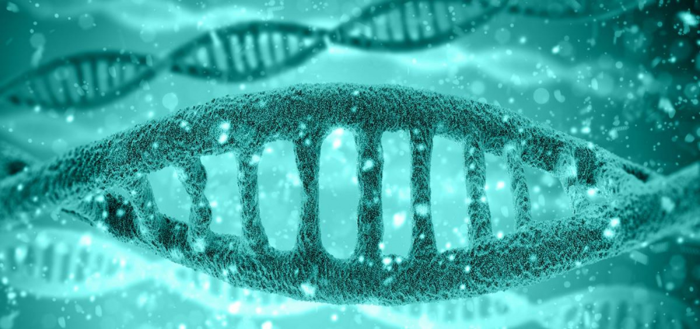

# PyCUB




## How to install

>To install pyCUB for now you need to process to a raw install

Make sure to have anaconda installed https://anaconda.org/anaconda/python  
Then follow the step to create an environment.
install jupyter the same way

Once this is done you will have to get this project:   
`git clone https://github.com/jkobject/CodonUsageBias.git`

Then enter the project:   
`cd CodonUsageBias`

Then you have to run the requirements to download the required packages:  
`pip install -r requirements.txt`

Make sure to have `gzip` and `R` installed and up to date.

You should install also:
```
git clone https://github.com/DmitryUlyanov/Multicore-TSNE.git
cd Multicore-TSNE/
pip install .
```

_if you run into some problems you might have a look at installationec2.sh which contains further informations when installing remotly from an ec2 instance for more compute power_

Once this is done you can:   
`jupyter notebook pipeline.ipynb`

And run it to test it yourself !

#CpCpGpApApTpApTpApTpTpCpCpGpApApTpApTpApTpTpCpCpGpApApTpApTpApTpTpCpCpGpApApTpApT
#GbGbCbTbTbAbTbAbTbAbAbGbGbCbTbTbAbTbAbTbAbAbGbGbCbTbTbAbTbAbTbAbAbGbGbCbTbTbAbTbA

## Goals 

The goals of this project is to try to infer relations in the codon usage of different genes from different species using machine learning and to let researchers use it and improve it as they please. It is also to demonstrate the use of entropy as a convenient measure of CUB and to reflect on reusability and scalability in ML and bioinformatics.

>A goal for me at this point is to have a the pipeline running.


### In more long terms I wish to :
Pursue on the ideas defined here and on the TODO file.   
I am also preparing a presentation available on slideshare soon.  
And at the end of the summer, a Research Document.   


__Find more information in my INFO and TODO files.__

## Pipeline

For now the Pipeline is able to :  
- let me load and save the data in the right format,  
- get the precomputed data from Kent University  
- Visualize and cluster homologies   
- Compute and visualize a k-mean clustering from a homology   

### Here is How the data-structure looks like :
 
*to come*

### What happens exactly : 
1/ I am getting Yun’s file directly from the dropbox server. Then I am mapping then to the datastructure and I am using currently the entropy-location values. 
Each amino acid’s entropy location values for one homology defines a dimension of a feature vector describing the codon usage statistics of a species’ gene. 

2/ As it is required to do a good comparison, to have species that share a lot of homologies, I am clustering groups of species that the highest number of shared homologies. You can see this comparison as a 2D matrix showing binary values representing if a species has this particular homology. A similarity matrix can be displayed as well to see particular similarities.*

3/ Using each highly similar groups I am taking the homologies one by one and apply it another clustering algorithm on the entropy location vector to group species with similar entropy features. *

_Clusters for particular homologies can be visualized using [T-sne](http://scikit-learn.org/stable/modules/generated/sklearn.manifold.TSNE.html) from Hinton et. al.. 
http://scikit-learn.org/stable/modules/generated/sklearn.manifold.TSNE.html 
 To display them on a two dimensional surface (dimensionality reduction). This plot can be made interactive to see species corresponding to each dots_

4/ Using the statistical information on the process and data exploration on the outputted clusters, the next steps shall be defined. 

### Further Ideas revolve around:
Trying to find explanatory statistics of the features that I have as an input using :    
 * Autoencoders
 * Linear factor models
 * From the clusters using non linear classifiers that would explain some metadatas that Tobias is gathering.
 * Using more data from other databases. 
 * Using other statistics on the codon usages. 

### next development plans would be:
 * create a REST API using [Biothings](http://docs.biothings.io/) 
 * implement further tests on the full genomes with [Popsc](http://www.chenshiyi.com/popsc.html)
 
*repeated with different clustering algorithm and tested with statistical tests*

## Usage
*to come*

_This work is in partnership of Yun Deng - Dominique Chu - Tobias Van der Harr._    
_Yun Deng is the sole producer of the statistical technique and files that I am getting for now - the entropy computation function is an implementation of Yun’s._

 Thanks to the University of Kent.    
 Thanks to scikit-learn. 

__not for use as of right now__

This work is under MIT licence   
Follow me on twitter: @jkobject   
jkobject.com
