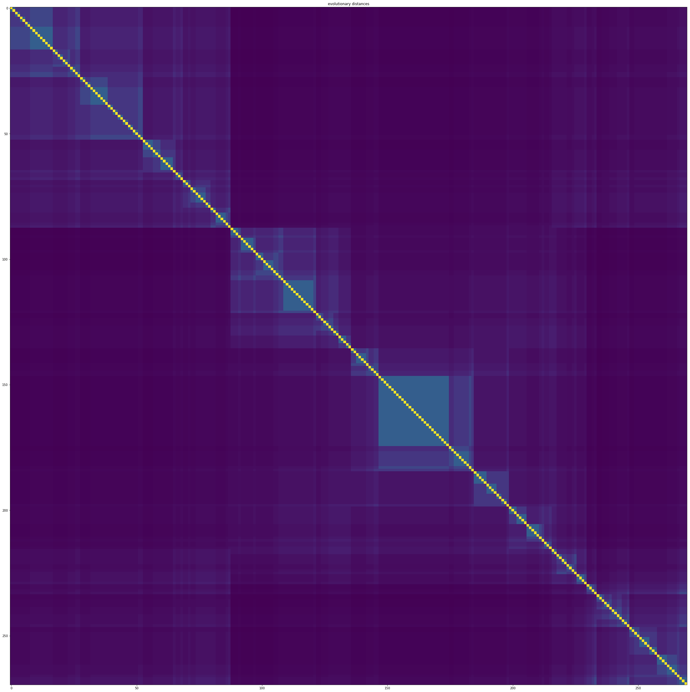

```python
%matplotlib inline
%reload_ext autoreload
%autoreload 2
from PyCUB import pyCUB 
```


```python
cub = pyCUB.PyCUB(session = 'ensembl2')
cub.load(session = 'ensembl2',filename = "processed_entropyloc")
```

    working on session: ensembl2
    you already have a session here (just a warning)
    unzipping utils/save/ensembl2/processed_entropyloc.json.gz
    loading from processed_entropyloc
    it worked !
    you now have 1730558 genes in total


    {}


```python
cub.compute_averages(homoset=cub.all_homoset)
cub.all_homoset.compute_ages(preserved=True, minpreserv=0.9, minsimi=0.85)
cub.import_metadataTobias()
```

    homology averages : [ 0.94575969  0.90704492  0.74760554  0.75366192  0.53295894  0.72208115
      0.75023036  0.94839036  0.7018178   0.93271949  0.93613333  0.7916798
      0.77227052  0.92443985  0.92787059  0.94046604  0.68622106  0.95878956]
    it was already loaded


Right of the bat we can see that some amino acids are very litlle pushed to an unusual entorpy value. This could be explained by some reasons regarding the general role of this amino acid. But it relatively vary between species. So there is some other factors


```python
for i in [0,1,2,3,514,516,518,519,31]:
    print cub.species[cub.all_homoset.species_namelist[i]].name
    print "----"
    print cub.species[cub.all_homoset.species_namelist[i]].genome_size
    print "----"
    print cub.species[cub.all_homoset.species_namelist[i]].metadata.values()
    print "----"
    print cub.species[cub.all_homoset.species_namelist[i]].average_entropy
    print "----"
    print cub.species[cub.all_homoset.species_namelist[i]].average_size
    print "----"
    print cub.species[cub.all_homoset.species_namelist[i]].meanGChomo
    print "----"
    print cub.species[cub.all_homoset.species_namelist[i]].tot_homologies
    print "----"
    print cub.species[cub.all_homoset.species_namelist[i]].meanecai
    print "----"
```

    zygosaccharomyces_parabailii
    ----
    0
    ----
    [False, False, False, False, False]
    ----
    [ 0.99713756  0.87831888  0.65078921  0.87924324  0.4680413   0.82646651
      0.71837268  0.90754569  0.67130173  0.93496189  0.7856799   0.87781257
      0.895482    0.92527109  0.89828644  0.99631292  0.67750992  0.99677011]
    ----
    543.818181818
    ----
    0.417403998516
    ----
    11
    ----
    None
    ----
    zygosaccharomyces_bailii_isa1307
    ----
    21141148
    ----
    [False, False, False, False, False]
    ----
    [ 0.95672197  0.93119021  0.81624464  0.75445799  0.69771631  0.68561313
      0.82239208  0.97500589  0.79985925  0.89961159  0.95227723  0.73505221
      0.78545465  0.91731267  0.92338721  0.90332481  0.73304146  0.93218957]
    ----
    413.456521739
    ----
    0.464930805223
    ----
    46
    ----
    None
    ----
    stereum_hirsutum_fp_91666_ss1
    ----
    46511623
    ----
    [False, False, False, False, False]
    ----
    [ 0.95478313  0.58655736  0.81346316  0.7389421   0.59974142  0.86121448
      0.74212631  0.9395854   0.75789193  0.81791639  0.93652653  0.88393111
      0.74371465  0.99803411  0.79028756  0.82783471  0.73040584  0.9998683 ]
    ----
    443.058823529
    ----
    0.441311196012
    ----
    17
    ----
    None
    ----
    fomitiporia_mediterranea_mf3_22
    ----
    63354419
    ----
    [False, True, False, False, False]
    ----
    None
    ----
    479.194029851
    ----
    0.481310170412
    ----
    67
    ----
    None
    ----
    nosema_apis_brl_01
    ----
    8569501
    ----
    [False, False, True, False, False]
    ----
    [ 0.99988846  0.99972201  0.93677057  0.74980365  0.625       0.99213876
      0.93743568  0.61656996  0.87487841  0.99994556  0.97785788  0.375
      0.99931577  0.99982181  0.99855671  0.99991185  0.68718813  0.99989971]
    ----
    398.0
    ----
    0.288298791225
    ----
    2
    ----
    None
    ----
    colletotrichum_nymphaeae_sa_01
    ----
    49956273
    ----
    [False, True, False, False, False]
    ----
    [ 0.99992251  0.9956988   0.85786543  0.76775472  0.48716511  0.6749308
      0.72091155  0.818054    0.86983817  0.97958906  0.94630362  0.78077539
      0.91629748  0.9997926   0.99483275  0.99617336  0.79857404  0.99071142]
    ----
    548.909090909
    ----
    0.441621356913
    ----
    11
    ----
    None
    ----
    colletotrichum_incanum
    ----
    53597417
    ----
    [False, True, False, False, False]
    ----
    [ 0.99556147  0.99945892  0.70465616  0.84260718  0.71813041  0.53812691
      0.8698106   0.93450721  0.78951673  0.94431705  0.99729077  0.70386249
      0.89073577  0.92188067  0.91327162  0.99979697  0.60197589  0.94083288]
    ----
    528.538461538
    ----
    0.512942376646
    ----
    13
    ----
    None
    ----
    aspergillus_ustus
    ----
    38351268
    ----
    [False, False, True, False, False]
    ----
    [ 0.99993912  0.9999769   0.99960731  0.98455796  0.99937626  0.          0.5
      0.          0.5         0.99987982  0.94722781  0.87511453  0.39276123
      0.99991468  0.99995365  0.99999749  0.99887471  0.99999749]
    ----
    901.0
    ----
    0.499269071401
    ----
    1
    ----
    None
    ----
    lachancea_sp_cbs_6924
    ----
    0
    ----
    [False, False, False, False, False]
    ----
    [ 0.86819732  0.99945608  0.63936679  0.65122135  0.6224807   0.76245672
      0.76534746  0.8639702   0.57414869  0.90909352  0.98566303  0.90908392
      0.9233112   0.86232832  0.92985755  0.86243572  0.60317406  0.93313342]
    ----
    471.666666667
    ----
    0.53367873453
    ----
    15
    ----
    None
    ----


```python
secondaryhomo = [0,10,23,26,34,36,176,140,133]
for i in secondaryhomo:
    print cub.working_homoset[i]
```

    
    homology: YMR186W
    size: 550
    fullmax: 0.999997500891
    var: [ 0.21121859  0.24071136  0.25968812  0.31414914  0.39045027  0.31182216
      0.31384956  0.36758459  0.34430925  0.19857101  0.20017878  0.32471057
      0.30562548  0.21305664  0.15474162  0.22346468  0.35884282  0.19089347]
    mean: [ 0.94689828  0.93720271  0.87539785  0.76948469  0.34928762  0.80877176
      0.77452105  0.83315989  0.70108852  0.94941389  0.94607301  0.73493671
      0.81478915  0.94806878  0.95657428  0.9427425   0.7305678   0.95894335]
    metrics: {u'silhouette': 0.019158784567542567, u'cal_hara': 9.23972136790517, u'cluster_phylodistance': [1.0043587230156612, 0.7776937334750729, 1.0070891024138091, 1.1877504293073842]}
    nans mean: 0.154545454545
    lengths mean/var: 663.372727273, 151.73919366
    doublon sum: 54
    GCcount mean/var: 0.511269728852, 0.0720579496983
    KaKs_Scores: None
    isrecent: False
    ishighpreserved: False
    ref: None
    refprot: YMR186W
    refgene: YMR186W
    ecai mean/var: 0.49489271782, 0.0974550502757
    cai mean/var: 0.589823682579, 0.0972128372504
    protein_abundance: 218787
    weight: 80899
    conservation: 5.13216885007
    mRNA_abundance: 6.4
    cys_elements: 0
    is_secreted: True
    decay_rate: 0.0007
    tot_volume: 95785.0
    mean_hydrophobicity: -0.6
    glucose_cost: 673.77
    synthesis_steps: 3483
    isoelectricpoint: 6.085
    othercods: 18.9054545455
    
    homology: YLR147C
    size: 455
    fullmax: 0.999997489229
    var: [ 0.3451495   0.29106317  0.25265039  0.23143737  0.12841481  0.27658727
      0.26882012  0.27368244  0.18812108  0.27248696  0.39129102  0.25800765
      0.21722295  0.49143454  0.49780076  0.29884494  0.21703152  0.21290931]
    mean: [ 0.83834766  0.90523231  0.72127445  0.79466232  0.02740371  0.72659379
      0.68182728  0.90989684  0.65986985  0.89753859  0.80882518  0.74869481
      0.66139908  0.52826072  0.46992628  0.87546902  0.48693151  0.94499013]
    metrics: {u'silhouette': 0.07960581175743578, u'cal_hara': 32.09784054797007, u'cluster_phylodistance': [1.0026123455461668, 1.028626831370296, 0.8962667611572063, 0.9259002099834477, 0.7578271750636014, 0.951378176049997]}
    nans mean: 0.892307692308
    lengths mean/var: 113.235164835, 27.0652381309
    doublon sum: 12
    GCcount mean/var: 0.5406363148, 0.0731905592396
    KaKs_Scores: None
    isrecent: False
    ishighpreserved: False
    ref: None
    refprot: YLR147C
    refgene: YLR147C
    ecai mean/var: 0.587832152665, 0.0569652897089
    cai mean/var: 0.572484847402, 0.0863498873696
    protein_abundance: 0.0
    weight: 11224
    conservation: 5.31041666667
    mRNA_abundance: 1.2
    cys_elements: 0
    is_secreted: False
    decay_rate: nan
    tot_volume: 13328.9
    mean_hydrophobicity: -0.382291666667
    glucose_cost: 92.07
    synthesis_steps: 497
    isoelectricpoint: 6.97
    othercods: 4.74725274725
    
    homology: YDL046W
    size: 528
    fullmax: 0.999997489229
    var: [ 0.17776568  0.43515482  0.28573391  0.30785317  0.21743025  0.3575207
      0.33281739  0.20817251  0.3360797   0.16279937  0.2516012   0.26738394
      0.28927566  0.17421567  0.33058367  0.20272905  0.26657176  0.12097491]
    mean: [ 0.9621069   0.25544558  0.77278878  0.78118632  0.77721074  0.62796231
      0.74224601  0.94512001  0.3442346   0.96071936  0.93156175  0.83426706
      0.72355187  0.96198318  0.87181533  0.94780033  0.73026236  0.98202333]
    metrics: {u'silhouette': 0.09203153617530613, u'cal_hara': 28.38199866715687, u'cluster_phylodistance': [1.0064131983336058, 1.1363601011083024, 1.003642183120282, 0.9544638941877908, 1.0158370600816644]}
    nans mean: 0.160984848485
    lengths mean/var: 174.579545455, 26.1025316276
    doublon sum: 67
    GCcount mean/var: 0.521981609893, 0.0641140265701
    KaKs_Scores: None
    isrecent: False
    ishighpreserved: False
    ref: None
    refprot: YDL046W
    refgene: YDL046W
    ecai mean/var: 0.629195171956, 0.048816392672
    cai mean/var: 0.61670577174, 0.0718607512045
    protein_abundance: 7124
    weight: 19063
    conservation: 5.41453488372
    mRNA_abundance: 2.4
    cys_elements: 4
    is_secreted: True
    decay_rate: 0.0016
    tot_volume: 23902.8
    mean_hydrophobicity: 0.0116279069767
    glucose_cost: 165.66
    synthesis_steps: 885
    isoelectricpoint: 6.085
    othercods: 3.31818181818
    
    homology: YEL037C
    size: 477
    fullmax: 0.999997850382
    var: [ 0.22182185  0.32032584  0.28284193  0.30212786  0.25637384  0.29908388
      0.29797229  0.24825545  0.36129378  0.18624559  0.20186505  0.31603404
      0.32053508  0.17959867  0.23494122  0.20924505  0.32492623  0.23558831]
    mean: [ 0.943066    0.88228009  0.8447016   0.78826801  0.59657024  0.82083121
      0.82987792  0.92668197  0.44515843  0.95277943  0.95395601  0.79132065
      0.79339375  0.96182128  0.94039946  0.95073124  0.68359399  0.93726787]
    metrics: {u'silhouette': 0.07014777355069232, u'cal_hara': 16.805978847364322, u'cluster_phylodistance': [1.0241494057048501, 0.8627016705203814, 0.9951093555270086, 1.0582473825050012]}
    nans mean: 0.125786163522
    lengths mean/var: 362.970649895, 67.0287273608
    doublon sum: 16
    GCcount mean/var: 0.560747604108, 0.0671800071078
    KaKs_Scores: None
    isrecent: False
    ishighpreserved: False
    ref: None
    refprot: YEL037C
    refgene: YEL037C
    ecai mean/var: 0.595650505749, 0.0717236959076
    cai mean/var: 0.636836177766, 0.0750009763407
    protein_abundance: 4098.0
    weight: 42366
    conservation: 5.07551546392
    mRNA_abundance: 1.2
    cys_elements: 0
    is_secreted: False
    decay_rate: 0.0
    tot_volume: 49900.0
    mean_hydrophobicity: -0.513144329897
    glucose_cost: 331.18
    synthesis_steps: 1608
    isoelectricpoint: 5.965
    othercods: 8.6142557652
    
    homology: YJL123C
    size: 468
    fullmax: 0.999997500891
    var: [ 0.21574188  0.25855477  0.33825072  0.29052649  0.28057016  0.29422527
      0.32335151  0.20996284  0.31554168  0.17937561  0.15384918  0.36138673
      0.30510524  0.19912425  0.20610915  0.22863018  0.30009207  0.24160141]
    mean: [ 0.94516036  0.92606116  0.70455607  0.81413499  0.1754625   0.80276015
      0.76970559  0.94976373  0.77184474  0.9570736   0.96430904  0.71185731
      0.77362551  0.95250793  0.93379116  0.94000474  0.71797924  0.93172171]
    metrics: {u'silhouette': 0.03705043550434251, u'cal_hara': 10.409771052900037, u'cluster_phylodistance': [0.9878953920814533, 1.030457778588364, 1.01477771982584, 0.9789348896589458, 0.8758891118001094]}
    nans mean: 0.523504273504
    lengths mean/var: 462.694444444, 59.74159644
    doublon sum: 9
    GCcount mean/var: 0.547364140203, 0.0845665807006
    KaKs_Scores: None
    isrecent: False
    ishighpreserved: False
    ref: None
    refprot: YJL123C
    refgene: YJL123C
    ecai mean/var: 0.597380796933, 0.0816378781146
    cai mean/var: 0.617232424894, 0.0793247483289
    protein_abundance: 2427.0
    weight: 53477
    conservation: 5.00042918455
    mRNA_abundance: 1.5
    cys_elements: 0
    is_secreted: False
    decay_rate: 0.01216
    tot_volume: 61844.2
    mean_hydrophobicity: -0.974034334764
    glucose_cost: 418.87
    synthesis_steps: 2033
    isoelectricpoint: 6.205
    othercods: 15.4038461538
    
    homology: YHR007C
    size: 703
    fullmax: 0.999997500891
    var: [ 0.24441597  0.1540183   0.34003919  0.31698902  0.24359571  0.30346796
      0.29271582  0.20582984  0.28087095  0.16175362  0.17832875  0.29366491
      0.28805078  0.19168981  0.2090071   0.23541177  0.32016874  0.2054748 ]
    mean: [ 0.93121027  0.97302168  0.75419557  0.78303428  0.75074939  0.80193761
      0.82779238  0.95117249  0.82837597  0.96399341  0.93682286  0.81429437
      0.83719588  0.95662048  0.93675022  0.9365811   0.7975035   0.95246075]
    metrics: {u'silhouette': 0.09042148918605668, u'cal_hara': 17.84627267879884, u'cluster_phylodistance': [0.9918452577206285, 1.0383778437190898, 1.0033710813702335, 1.063933099541408]}
    nans mean: 0.0099573257468
    lengths mean/var: 492.731152205, 88.1875360744
    doublon sum: 229
    GCcount mean/var: 0.517947949642, 0.0609794262926
    KaKs_Scores: None
    isrecent: False
    ishighpreserved: False
    ref: None
    refprot: YHR007C
    refgene: YHR007C
    ecai mean/var: 0.484324205167, 0.0573740988082
    cai mean/var: 0.600428300215, 0.0781398647422
    protein_abundance: 21584
    weight: 60720
    conservation: 5.1603960396
    mRNA_abundance: 7.1
    cys_elements: 4
    is_secreted: True
    decay_rate: 0.0044
    tot_volume: 70910.1
    mean_hydrophobicity: -0.286534653465
    glucose_cost: 511.97
    synthesis_steps: 2703
    isoelectricpoint: 6.97
    othercods: 23.1678520626
    
    homology: YDL083C
    size: 530
    fullmax: 0.999997489229
    var: [ 0.08900236  0.23455591  0.24827781  0.2405786   0.32406469  0.34267249
      0.21997718  0.11641533  0.23558512  0.11863107  0.18103805  0.22646294
      0.20241245  0.24659006  0.39556652  0.28935406  0.35341513  0.11478764]
    mean: [ 0.99056673  0.94068392  0.68154903  0.81469174  0.42427348  0.74420968
      0.83075636  0.98514133  0.6096386   0.98002623  0.96537867  0.9167846
      0.84250545  0.92377159  0.80316134  0.88139143  0.74523509  0.98489262]
    metrics: {u'silhouette': 0.17781432084369264, u'cal_hara': 40.34788083798782, u'cluster_phylodistance': [0.9510041593078175, 1.0166113482965025, 0.9867690526536707, 1.0395093972743015]}
    nans mean: 0.269811320755
    lengths mean/var: 148.590566038, 73.4766058628
    doublon sum: 43
    GCcount mean/var: 0.547667461353, 0.0697361830456
    KaKs_Scores: None
    isrecent: False
    ishighpreserved: False
    ref: None
    refprot: YDL083C
    refgene: YDL083C
    ecai mean/var: 0.774164142684, 0.0671749723234
    cai mean/var: 0.583609735455, 0.0908095926842
    protein_abundance: 49721
    weight: 15847
    conservation: 5.18943661972
    mRNA_abundance: 20.3
    cys_elements: 0
    is_secreted: True
    decay_rate: 0.001
    tot_volume: 19614.6
    mean_hydrophobicity: -0.35985915493
    glucose_cost: 139.93
    synthesis_steps: 781
    isoelectricpoint: 6.97
    othercods: 2.0
    
    homology: YNL069C
    size: 529
    fullmax: 0.999997489229
    var: [ 0.13845722  0.36488117  0.22772944  0.23001447  0.26238235  0.28757303
      0.32913443  0.11581961  0.28364808  0.21550574  0.15478553  0.29765738
      0.30028795  0.14485158  0.28274487  0.26053756  0.38091628  0.15071113]
    mean: [ 0.97833857  0.84090632  0.80687544  0.76561433  0.39749897  0.75356142
      0.77519068  0.98428434  0.80773972  0.9362698   0.97513533  0.80146189
      0.7930734   0.97432945  0.9109076   0.91900228  0.64976123  0.97432805]
    metrics: {u'silhouette': 0.1119298553309341, u'cal_hara': 23.041643284721186, u'cluster_phylodistance': [1.0130432665451445, 0.9708495866325105, 1.010328479756667, 0.7532398788124209, 1.0277136338495574]}
    nans mean: 0.130434782609
    lengths mean/var: 198.0, 40.4655796696
    doublon sum: 48
    GCcount mean/var: 0.547467367412, 0.074838495296
    KaKs_Scores: None
    isrecent: False
    ishighpreserved: False
    ref: None
    refprot: YNL069C
    refgene: YNL069C
    ecai mean/var: 0.680478746851, 0.0650347652046
    cai mean/var: 0.576547190755, 0.0999252523473
    protein_abundance: 64233
    weight: 22249
    conservation: 5.14564102564
    mRNA_abundance: 34.5
    cys_elements: 0
    is_secreted: True
    decay_rate: 0.0012
    tot_volume: 27214.8
    mean_hydrophobicity: -0.391282051282
    glucose_cost: 195.9
    synthesis_steps: 1084
    isoelectricpoint: 6.97
    othercods: 4.92060491493
    
    homology: YDR064W
    size: 527
    fullmax: 0.999997489229
    var: [ 0.10086825  0.26961364  0.2184552   0.17574537  0.16130734  0.20891635
      0.1935041   0.1106475   0.16855845  0.09816083  0.28980866  0.22583718
      0.35113122  0.15915932  0.22709323  0.12946844  0.18787274  0.11952125]
    mean: [ 0.98695439  0.92026828  0.75988522  0.88613961  0.04474073  0.79057975
      0.88809105  0.98659453  0.84724423  0.98763207  0.90691234  0.90298146
      0.40558195  0.97110481  0.94490916  0.98121306  0.90493734  0.98380886]
    metrics: {u'silhouette': 0.318377314939839, u'cal_hara': 49.21907634300182, u'cluster_phylodistance': [1.0124431935897884, 1.0036369714073807, 0.9945149305527152, 1.0202334794870385, 1.071090817608709]}
    nans mean: 0.381404174573
    lengths mean/var: 147.394686907, 18.0203292918
    doublon sum: 47
    GCcount mean/var: 0.547622204596, 0.0700499665902
    KaKs_Scores: None
    isrecent: False
    ishighpreserved: True
    ref: None
    refprot: YDR064W
    refgene: YDR064W
    ecai mean/var: 0.695927068107, 0.0634141020196
    cai mean/var: 0.565470081034, 0.0978240990392
    protein_abundance: 118213
    weight: 17029
    conservation: 5.25479452055
    mRNA_abundance: 18.6
    cys_elements: 0
    is_secreted: True
    decay_rate: 0.0011
    tot_volume: 20505.2
    mean_hydrophobicity: -0.331506849315
    glucose_cost: 143.85
    synthesis_steps: 806
    isoelectricpoint: 6.97
    othercods: 4.34155597723


THis is interesting that this homology has little to do with anything and it should not be a secondary cluster However, we can see that tSNE shows a non linear secondary cluster.
For the seconda one however, there is this notion of clusters that is even more present. Clusters show much more using $$ A_{value}$$
For most of them, there seems to be an equal correlation of the value to nans, cai length and GC whether it is high or low, which also hints on the idea that it is not correlation to the measure in itself.

mRNA abundance seems also to be linked with the secondary cluster presence/outlier cluster presence

Looking at the plot of many homologies, we kinda see different small groups and bigger groups within them. It resembles a lot a small world graph...
If one would overlay previous knowledge about the CUB it seems that different values cluster show the different drivers of the CUB, it can be about the general protein function (with a cluster of one homology). It can be related to the species environment with small clusters and or usage of the protein. 


```python
cub.working_homoset[0].plot('tsne', D=2,interactive=True,correlation=True)
```

     if you are on a notebook you should write 'from bokeh.io import output_notebook'
    similarity_scores: SpearmanrResult(correlation=-0.15984702808231441, pvalue=0.00016691732866527833)
    nans: SpearmanrResult(correlation=-0.10446836580972899, pvalue=0.014240595035458457)
    ecai: SpearmanrResult(correlation=0.021057431026088324, pvalue=0.62217395694803812)
    cai: SpearmanrResult(correlation=0.041378414733043593, pvalue=0.33273634999554524)
    lenmat: SpearmanrResult(correlation=-0.059038206659138968, pvalue=0.16677993138434313)
    GCcount: SpearmanrResult(correlation=-0.06612591732312488, pvalue=0.12139189160360152)


    <div class="bk-root">
        <a href="https://bokeh.pydata.org" target="_blank" class="bk-logo bk-logo-small bk-logo-notebook"></a>
        <span id="1057e2c8-39bf-40f5-9e37-2551af56c788">Loading BokehJS ...</span>
    </div>


    /home/ec2-user/miniconda2/envs/cub/lib/python2.7/site-packages/bokeh/io/saving.py:125: UserWarning: save() called but no resources were supplied and output_file(...) was never called, defaulting to resources.CDN
      warn("save() called but no resources were supplied and output_file(...) was never called, defaulting to resources.CDN")
    /home/ec2-user/miniconda2/envs/cub/lib/python2.7/site-packages/bokeh/io/saving.py:138: UserWarning: save() called but no title was supplied and output_file(...) was never called, using default title 'Bokeh Plot'
      warn("save() called but no title was supplied and output_file(...) was never called, using default title 'Bokeh Plot'")


<div class="bk-root">
    <div class="bk-plotdiv" id="ab0229bc-0d3d-4a53-9cce-267b86394c07"></div>
</div>


    homology: YMR186W
    ------------------------------------
    silhouette: 0.0191587845675
    cal_hara: 9.23972136791
    cluster_phylodistance: [1.0043587230156612, 0.7776937334750729, 1.0070891024138091, 1.1877504293073842]
    ------------------------------------
    Amino, CUB value mean, variance
    ALA: 0.95, 0.045
    ARG: 0.94, 0.058
    ASN: 0.88, 0.067
    ASP: 0.77, 0.099
    CYS: 0.35, 0.152
    GLN: 0.81, 0.097
    GLU: 0.77, 0.099
    GLY: 0.83, 0.135
    HIS: 0.70, 0.119
    ILE: 0.95, 0.039
    LEU: 0.95, 0.040
    LYS: 0.73, 0.105
    PHE: 0.81, 0.093
    PRO: 0.95, 0.045
    SER: 0.96, 0.024
    THR: 0.94, 0.050
    TYR: 0.73, 0.129
    VAL: 0.96, 0.036
    avg similarity Scores
    0.842059371533
    ------------------------------------
    mean ecai: 0.49489271782
    mean cai: 0.589823682579
    abundance of the protein in a cell: 218787
    weight of protein: 80899
    abundance of mRNA: 6.4
    the protein is secreted out of the cell
    halflife (in mn): 0.0007
    total volume of protein: 95785.0
    the pseudo hydrophobicity is of: -0.6
    the glucose cost: 673.77
    synthesis steps: 3483
    the isoelectricpoint(Pi) is : 6.085


```python
cub.working_homoset[10].plot('tsne', D=2,interactive=True,correlation=True)
```

     if you are on a notebook you should write 'from bokeh.io import output_notebook'
    similarity_scores: SpearmanrResult(correlation=0.076068123058873977, pvalue=0.10513054355778929)
    nans: SpearmanrResult(correlation=-0.24221221416899683, pvalue=1.6911224602957059e-07)
    ecai: SpearmanrResult(correlation=-0.085448214477804207, pvalue=0.068608272684168858)
    cai: SpearmanrResult(correlation=-0.22626572451796031, pvalue=1.0797287550625028e-06)
    lenmat: SpearmanrResult(correlation=0.30854255458769869, pvalue=1.717978755012949e-11)
    GCcount: SpearmanrResult(correlation=0.26435558317951335, pvalue=1.0309620818515082e-08)


    <div class="bk-root">
        <a href="https://bokeh.pydata.org" target="_blank" class="bk-logo bk-logo-small bk-logo-notebook"></a>
        <span id="831b0f61-fc9d-4b2e-927c-f3080b912cea">Loading BokehJS ...</span>
    </div>


<div class="bk-root">
    <div class="bk-plotdiv" id="c4d2086d-cb3c-432e-af9a-64f7be894e59"></div>
</div>


    homology: YLR147C
    ------------------------------------
    silhouette: 0.0796058117574
    cal_hara: 32.097840548
    cluster_phylodistance: [1.0026123455461668, 1.028626831370296, 0.8962667611572063, 0.9259002099834477, 0.7578271750636014, 0.951378176049997]
    ------------------------------------
    Amino, CUB value mean, variance
    ALA: 0.84, 0.119
    ARG: 0.91, 0.085
    ASN: 0.72, 0.064
    ASP: 0.79, 0.054
    CYS: 0.03, 0.016
    GLN: 0.73, 0.077
    GLU: 0.68, 0.072
    GLY: 0.91, 0.075
    HIS: 0.66, 0.035
    ILE: 0.90, 0.074
    LEU: 0.81, 0.153
    LYS: 0.75, 0.067
    PHE: 0.66, 0.047
    PRO: 0.53, 0.242
    SER: 0.47, 0.248
    THR: 0.88, 0.089
    TYR: 0.49, 0.047
    VAL: 0.94, 0.045
    avg similarity Scores
    0.674211377065
    ------------------------------------
    mean ecai: 0.587832152665
    mean cai: 0.572484847402
    abundance of the protein in a cell: 0.0
    weight of protein: 11224
    abundance of mRNA: 1.2
    halflife (in mn): nan
    total volume of protein: 13328.9
    the pseudo hydrophobicity is of: -0.382291666667
    the glucose cost: 92.07
    synthesis steps: 497
    the isoelectricpoint(Pi) is : 6.97


```python
cub.working_homoset[23].plot('tsne', D=2,interactive=True,correlation=True)
```

     if you are on a notebook you should write 'from bokeh.io import output_notebook'
    similarity_scores: SpearmanrResult(correlation=0.083325425568418557, pvalue=0.055688760565223074)
    nans: SpearmanrResult(correlation=-0.20927285775117196, pvalue=1.2275079346383025e-06)
    ecai: SpearmanrResult(correlation=-0.07973547028447453, pvalue=0.067137108129112444)
    cai: SpearmanrResult(correlation=-0.22436131828136385, pvalue=1.8907023119451286e-07)
    lenmat: SpearmanrResult(correlation=0.22989121815308028, pvalue=9.2085745220376132e-08)
    GCcount: SpearmanrResult(correlation=0.22653650963369912, pvalue=1.4278313085086705e-07)


    <div class="bk-root">
        <a href="https://bokeh.pydata.org" target="_blank" class="bk-logo bk-logo-small bk-logo-notebook"></a>
        <span id="11e9b37e-75b8-425f-8c2d-413b33698d42">Loading BokehJS ...</span>
    </div>


<div class="bk-root">
    <div class="bk-plotdiv" id="64756a9b-4ac3-4258-acda-c8531a364455"></div>
</div>


    homology: YDL046W
    ------------------------------------
    silhouette: 0.0920315361753
    cal_hara: 28.3819986672
    cluster_phylodistance: [1.0064131983336058, 1.1363601011083024, 1.003642183120282, 0.9544638941877908, 1.0158370600816644]
    ------------------------------------
    Amino, CUB value mean, variance
    ALA: 0.96, 0.032
    ARG: 0.26, 0.189
    ASN: 0.77, 0.082
    ASP: 0.78, 0.095
    CYS: 0.78, 0.047
    GLN: 0.63, 0.128
    GLU: 0.74, 0.111
    GLY: 0.95, 0.043
    HIS: 0.34, 0.113
    ILE: 0.96, 0.027
    LEU: 0.93, 0.063
    LYS: 0.83, 0.071
    PHE: 0.72, 0.084
    PRO: 0.96, 0.030
    SER: 0.87, 0.109
    THR: 0.95, 0.041
    TYR: 0.73, 0.071
    VAL: 0.98, 0.015
    avg similarity Scores
    0.673438786028
    ------------------------------------
    mean ecai: 0.629195171956
    mean cai: 0.61670577174
    abundance of the protein in a cell: 7124
    weight of protein: 19063
    abundance of mRNA: 2.4
    number of cys_elements: 4
    the protein is secreted out of the cell
    halflife (in mn): 0.0016
    total volume of protein: 23902.8
    the pseudo hydrophobicity is of: 0.0116279069767
    the glucose cost: 165.66
    synthesis steps: 885
    the isoelectricpoint(Pi) is : 6.085


```python
cub.working_homoset['YDR064W'].plot('tsne', D=2,interactive=True,correlation=True)
```

     if you are on a notebook you should write 'from bokeh.io import output_notebook'
    similarity_scores: SpearmanrResult(correlation=0.10579774168045113, pvalue=0.015107180589332879)
    nans: SpearmanrResult(correlation=0.11705479443879567, pvalue=0.0071443757244683903)
    ecai: SpearmanrResult(correlation=-0.027490292444301248, pvalue=0.52889031204164461)
    cai: SpearmanrResult(correlation=-0.094525244238651773, pvalue=0.03003152755836707)
    lenmat: SpearmanrResult(correlation=0.18210319575558237, pvalue=2.6023141277584576e-05)
    GCcount: SpearmanrResult(correlation=0.08237207749156554, pvalue=0.058798735052638711)


    <div class="bk-root">
        <a href="https://bokeh.pydata.org" target="_blank" class="bk-logo bk-logo-small bk-logo-notebook"></a>
        <span id="d618187b-da50-4c2f-8153-36aa28979c96">Loading BokehJS ...</span>
    </div>


<div class="bk-root">
    <div class="bk-plotdiv" id="89bd8f74-1ae0-4d99-b297-0e414e49d91b"></div>
</div>


    homology: YDR064W
    ------------------------------------
    silhouette: 0.31837731494
    cal_hara: 49.219076343
    cluster_phylodistance: [1.0124431935897884, 1.0036369714073807, 0.9945149305527152, 1.0202334794870385, 1.071090817608709]
    ------------------------------------
    Amino, CUB value mean, variance
    ALA: 0.99, 0.010
    ARG: 0.92, 0.073
    ASN: 0.76, 0.048
    ASP: 0.89, 0.031
    CYS: 0.04, 0.026
    GLN: 0.79, 0.044
    GLU: 0.89, 0.037
    GLY: 0.99, 0.012
    HIS: 0.85, 0.028
    ILE: 0.99, 0.010
    LEU: 0.91, 0.084
    LYS: 0.90, 0.051
    PHE: 0.41, 0.123
    PRO: 0.97, 0.025
    SER: 0.94, 0.052
    THR: 0.98, 0.017
    TYR: 0.90, 0.035
    VAL: 0.98, 0.014
    avg similarity Scores
    0.853605850017
    ------------------------------------
    mean ecai: 0.695927068107
    mean cai: 0.565470081034
    high preserved protein
    abundance of the protein in a cell: 118213
    weight of protein: 17029
    abundance of mRNA: 18.6
    the protein is secreted out of the cell
    halflife (in mn): 0.0011
    total volume of protein: 20505.2
    the pseudo hydrophobicity is of: -0.331506849315
    the glucose cost: 143.85
    synthesis steps: 806
    the isoelectricpoint(Pi) is : 6.97


```python
cub.get_subset(homoset = cub.working_homoset, withcopy=True, clusternb=None, species=None,
               homologies=[cub.working_homoset.homo_namelist[i] for i in secondaryhomo]
              ).compare_clusters(cubdistance_matrix=True, plot=True, size=40)
```

    loaded
    loaded


    <div class="bk-root">
        <a href="https://bokeh.pydata.org" target="_blank" class="bk-logo bk-logo-small bk-logo-notebook"></a>
        <span id="dc34d786-6133-4df5-a9a0-9bd97b763fc7">Loading BokehJS ...</span>
    </div>


    <div class="bk-root">
        <a href="https://bokeh.pydata.org" target="_blank" class="bk-logo bk-logo-small bk-logo-notebook"></a>
        <span id="9b449a46-5663-45ca-8ffb-bc6985024f01">Loading BokehJS ...</span>
    </div>


<div class="bk-root">
    <div class="bk-plotdiv" id="25e50cc0-20fb-4857-a39a-6c2f55424206"></div>
</div>


```python
cub.loadspeciestable()
```

    it worked !


```python
cub.get_subset(homoset = cub.working_homoset, withcopy=True, clusternb=None, species=None,
               homologies=[cub.working_homoset.homo_namelist[i] for i in secondaryhomo[:6]]).plot_all(With='tsne', perplexity=60,
                                         interactive=True, iteration=300)
```

    loaded
    loaded


    <div class="bk-root">
        <a href="https://bokeh.pydata.org" target="_blank" class="bk-logo bk-logo-small bk-logo-notebook"></a>
        <span id="47208509-604a-4da0-bcd6-501451696944">Loading BokehJS ...</span>
    </div>


<div class="bk-root">
    <div class="bk-plotdiv" id="fa12dbf9-32b5-4f83-aa0c-e6069dd1d883"></div>
</div>


Here it tends to be mostly the lengths and number of NaN values that seem to be corelated with the entropy values. If they are correlated to the first cluster, they don't explain all the other ones.

Compared to other metrics, it seems to be for now the best one for clustering and finding clusters etc..


```python
outlierhomo = [5,14,39,41,25,58,64,74,80,97,98,101,103,104]
for i in outlierhomo:
    print cub.working_homoset[i]
```

    
    homology: YPR052C
    size: 484
    fullmax: 0.999997489229
    var: [ 0.12600185  0.3758163   0.26945609  0.32290618  0.18647268  0.31966766
      0.35699373  0.22106814  0.22812729  0.36171509  0.36135954  0.28173583
      0.15378254  0.35405264  0.48896603  0.49489454  0.21557938  0.45808483]
    mean: [ 0.98156169  0.82768865  0.73319227  0.73376989  0.05137147  0.61011111
      0.75838371  0.94154817  0.07399011  0.17552821  0.15474185  0.85834929
      0.72220873  0.84231322  0.40021117  0.48372628  0.76172848  0.3113383 ]
    metrics: {u'silhouette': -0.006127996130373387, u'cal_hara': 15.464467804328489, u'cluster_phylodistance': [1.0033101331757437, 1.1036555780798245, 1.0606560101026885, 1.0150504077026956, 0.9495231199368648, 0.8414425262976813, 1.0367673612265018, 0.7338592934764547, 0.9173241168455684, 0.6142795425305145, 0.9746568741484164]}
    nans mean: 1.7458677686
    lengths mean/var: 110.714876033, 47.2568297765
    doublon sum: 32
    GCcount mean/var: 0.548468708317, 0.0659702089931
    KaKs_Scores: None
    isrecent: False
    ishighpreserved: False
    ref: None
    refprot: YPR052C
    refgene: YPR052C
    ecai mean/var: 0.776498282103, 0.0350136278909
    cai mean/var: 0.592252365551, 0.0869921379843
    protein_abundance: 3251.0
    weight: 10802
    conservation: 4.86666666667
    mRNA_abundance: 4.3
    cys_elements: 0
    is_secreted: False
    decay_rate: 0.000891
    tot_volume: 12690.8
    mean_hydrophobicity: -1.38
    glucose_cost: 89.55
    synthesis_steps: 472
    isoelectricpoint: 6.97
    othercods: 3.81818181818
    
    homology: YBR089C-A
    size: 492
    fullmax: 0.999997489229
    var: [ 0.14668476  0.36215149  0.26654017  0.25419028  0.17294334  0.32424359
      0.263474    0.2346259   0.22330962  0.36975047  0.36027322  0.24745123
      0.18608444  0.26714889  0.48628748  0.49466272  0.22704677  0.46106987]
    mean: [ 0.97568763  0.842979    0.75617472  0.81928899  0.04545486  0.61321899
      0.86631228  0.93549823  0.07102362  0.18584474  0.15409908  0.88771295
      0.70217081  0.91317819  0.38740892  0.48857768  0.73164047  0.31780853]
    metrics: {u'silhouette': 0.11192530707980843, u'cal_hara': 23.20675463500841, u'cluster_phylodistance': [0.9958278842645163, 0.7605439170470437, 0.9674431713243354, 0.9398491496015309, 0.9538014622511075, 0.9987520118202686, 1.0050137799194552, 0.8616170216915235, 0.9614423102292815, 0.8495132054563205, 1.0504115986385583]}
    nans mean: 1.74796747967
    lengths mean/var: 110.479674797, 46.9075980798
    doublon sum: 35
    GCcount mean/var: 0.546818224784, 0.0668991325831
    KaKs_Scores: None
    isrecent: False
    ishighpreserved: False
    ref: None
    refprot: YBR089C-A
    refgene: YBR089C-A
    ecai mean/var: 0.615944950508, 0.0483103118655
    cai mean/var: 0.594634859274, 0.0887696963952
    protein_abundance: 4879.0
    weight: 11575
    conservation: 4.83854166667
    mRNA_abundance: 0.3
    cys_elements: 0
    is_secreted: False
    decay_rate: 0.00673
    tot_volume: 13318.0
    mean_hydrophobicity: -1.46458333333
    glucose_cost: 93.79
    synthesis_steps: 493
    isoelectricpoint: 6.97
    othercods: 3.80894308943
    
    homology: YNL138W-A
    size: 407
    fullmax: 0.999997489229
    var: [ 0.28832923  0.49262362  0.34166882  0.22901061  0.18663657  0.26928676
      0.28285922  0.32780814  0.22701561  0.41764388  0.39312012  0.23890702
      0.28039951  0.40587501  0.47646627  0.30558991  0.19617167  0.48844759]
    mean: [ 0.89112333  0.42193861  0.51462301  0.74260964  0.07555339  0.69610101
      0.75468124  0.8466134   0.64711102  0.67176142  0.80588025  0.7188188
      0.14431217  0.74193876  0.35381283  0.8702528   0.73933469  0.4666745 ]
    metrics: {u'silhouette': -0.03787710680069241, u'cal_hara': 12.339061017040038, u'cluster_phylodistance': [0.9939829138729716, 0.9731059060592688, 0.754014810250603, 0.9466937383827301, 0.8681073213096102, 0.7966948938496938, 0.6518412767861131, 0.7966948938496938, 1.3657626751709036]}
    nans mean: 0.921375921376
    lengths mean/var: 84.9385749386, 14.2210924406
    doublon sum: 5
    GCcount mean/var: 0.535412400936, 0.0741225839782
    KaKs_Scores: None
    isrecent: False
    ishighpreserved: False
    ref: None
    refprot: YNL138W-A
    refgene: YNL138W-A
    ecai mean/var: 0.725820276302, 0.0399066538697
    cai mean/var: 0.584126469047, 0.0806158219311
    protein_abundance: nan
    weight: 10027
    conservation: 5.00853658537
    mRNA_abundance: nan
    cys_elements: 0
    is_secreted: False
    decay_rate: nan
    tot_volume: 11522.2
    mean_hydrophobicity: -1.10487804878
    glucose_cost: 81.34
    synthesis_steps: 444
    isoelectricpoint: 6.97
    othercods: 5.2628992629
    
    homology: YHR072W-A
    size: 392
    fullmax: 0.999997489229
    var: [ 0.48847476  0.49730305  0.28497046  0.21705698  0.08663088  0.32735895
      0.31461999  0.46363386  0.18525162  0.40985002  0.42298163  0.33849375
      0.30503233  0.49003988  0.33845596  0.31876338  0.23888178  0.48982836]
    mean: [ 0.45414735  0.46322319  0.2153213   0.71904473  0.01371173  0.48338215
      0.30001065  0.32666604  0.65897544  0.2570319   0.76437804  0.72738276
      0.38686043  0.48915324  0.13252239  0.85966448  0.63352593  0.44012369]
    metrics: {u'silhouette': -0.08738000454952546, u'cal_hara': 9.911451643608068, u'cluster_phylodistance': [0.9952986789003964, 0.8381512965059732, 0.8710199748003252, 0.8915628987342952, 0.6557301319723202, 0.4716655335239497, 0.920322992241853, 1.222303974071211, 0.9490830857494109, 0.8052826182116215, 0.3451211220906949]}
    nans mean: 1.50510204082
    lengths mean/var: 65.7678571429, 19.3027619759
    doublon sum: 11
    GCcount mean/var: 0.518093634506, 0.0722998334447
    KaKs_Scores: None
    isrecent: False
    ishighpreserved: False
    ref: None
    refprot: YHR072W-A
    refgene: YHR072W-A
    ecai mean/var: 0.791414971317, 0.0483856871354
    cai mean/var: 0.580877209775, 0.100502323833
    protein_abundance: 10401.0
    weight: 6636
    conservation: 5.06607142857
    mRNA_abundance: nan
    cys_elements: 0
    is_secreted: False
    decay_rate: 0.000891
    tot_volume: 7877.9
    mean_hydrophobicity: -0.891071428571
    glucose_cost: 56.69
    synthesis_steps: 325
    isoelectricpoint: 6.97
    othercods: 2.73214285714
    
    homology: YPR105C
    size: 478
    fullmax: 0.999999140656
    var: [ 0.25442646  0.19494528  0.28998343  0.32422069  0.28069937  0.30990247
      0.313709    0.20308711  0.3454814   0.14680171  0.26844406  0.32244059
      0.29466449  0.22753519  0.24161474  0.20127035  0.31327653  0.19059757]
    mean: [ 0.922219    0.9419845   0.82206414  0.74007537  0.72523595  0.78442583
      0.77809802  0.95373404  0.73206632  0.96994047  0.91082203  0.75085701
      0.82616239  0.93936377  0.92573814  0.95190937  0.77975893  0.95779357]
    metrics: {u'silhouette': 0.026148471781849213, u'cal_hara': 8.991201086603738, u'cluster_phylodistance': [1.0107885950800126, 0.9459057256594368, 0.9939478028778306, 1.2898714440810501, 1.1178885848702436, 1.135086870791324, 1.0318971552648402]}
    nans mean: 0.0167364016736
    lengths mean/var: 832.889121339, 266.015647145
    doublon sum: 22
    GCcount mean/var: 0.523442278675, 0.0798827129261
    KaKs_Scores: None
    isrecent: False
    ishighpreserved: False
    ref: None
    refprot: YPR105C
    refgene: YPR105C
    ecai mean/var: 0.574475768189, 0.0776104024212
    cai mean/var: 0.591050522714, 0.0763718273369
    protein_abundance: 2208
    weight: 98665
    conservation: 5.11708482676
    mRNA_abundance: 0.5
    cys_elements: 4
    is_secreted: True
    decay_rate: 0.0009
    tot_volume: 116346.8
    mean_hydrophobicity: -0.30119474313
    glucose_cost: 824.52
    synthesis_steps: 4246
    isoelectricpoint: 6.97
    othercods: 28.0794979079
    
    homology: YPR182W
    size: 399
    fullmax: 0.999997489229
    var: [ 0.47340277  0.32457098  0.33919884  0.24852414  0.19063465  0.21698694
      0.28994063  0.22688875  0.16751252  0.40385438  0.25969018  0.25309821
      0.34325092  0.48424177  0.4868919   0.47837574  0.17081047  0.34618517]
    mean: [ 0.38150891  0.12002619  0.7251789   0.71660335  0.06625927  0.71457191
      0.75624711  0.93055767  0.04333812  0.69990356  0.92511325  0.80561333
      0.53822377  0.50930494  0.39351393  0.56933122  0.67762904  0.84248543]
    metrics: {u'silhouette': -0.06634058865020401, u'cal_hara': 8.973921796436489, u'cluster_phylodistance': [1.001071004854412, 0.960175184649074, 0.8441100524387464, 0.9090415949340345, 0.8579080052189951, 0.8826631557953237, 0.9715382045857495, 0.7054541544019332, 0.9260861248390477, 0.49429136724538125, 0.5681509968337716, 1.079486893984166, 0.8765758236863905, 0.7499593158205786, 0.801092905535618]}
    nans mean: 0.832080200501
    lengths mean/var: 86.5162907268, 16.8461744696
    doublon sum: 10
    GCcount mean/var: 0.497522654725, 0.0757397303657
    KaKs_Scores: None
    isrecent: False
    ishighpreserved: False
    ref: None
    refprot: YPR182W
    refgene: YPR182W
    ecai mean/var: 0.702186418539, 0.102512427386
    cai mean/var: 0.600648446465, 0.0838289039295
    protein_abundance: 2161.0
    weight: 9660
    conservation: 5.1369047619
    mRNA_abundance: 2.1
    cys_elements: 0
    is_secreted: False
    decay_rate: 0.000891
    tot_volume: 11501.7
    mean_hydrophobicity: -0.278571428571
    glucose_cost: 82.09
    synthesis_steps: 412
    isoelectricpoint: 6.97
    othercods: 4.93233082707
    
    homology: YDR322C-A
    size: 431
    fullmax: 0.999997489229
    var: [ 0.17467327  0.40673221  0.30475122  0.22363615  0.10224094  0.25507438
      0.35574191  0.43041931  0.33500782  0.40401334  0.28518778  0.30436895
      0.25998177  0.45425023  0.46045062  0.47575951  0.21415805  0.35981192]
    mean: [ 0.96172265  0.21097012  0.66939917  0.75559908  0.01674916  0.76726181
      0.67769989  0.72797674  0.49158007  0.66561098  0.90639087  0.76861214
      0.63115459  0.3109547   0.68910766  0.6098199   0.74863139  0.83324344]
    metrics: {u'silhouette': -0.09341012865982522, u'cal_hara': 8.481795455590072, u'cluster_phylodistance': [0.985844344701391, 0.9110652706962985, 0.5287432374576733, 1.1957731677888919, 0.7130638695364495, 0.6975343478768535, 0.9110652706962985, 0.6863493947767875, 0.5694157941851866, 0.9680068501148172, 0.9110652706962985, 1.1957731677888919]}
    nans mean: 0.979118329466
    lengths mean/var: 93.4570765661, 16.4632020181
    doublon sum: 10
    GCcount mean/var: 0.524876630305, 0.0658170678384
    KaKs_Scores: None
    isrecent: False
    ishighpreserved: False
    ref: None
    refprot: YDR322C-A
    refgene: YDR322C-A
    ecai mean/var: 0.753182212597, 0.0441974666725
    cai mean/var: 0.607676745615, 0.0826580052673
    protein_abundance: 2432.0
    weight: 10875
    conservation: 5.10425531915
    mRNA_abundance: nan
    cys_elements: 0
    is_secreted: False
    decay_rate: 0.000891
    tot_volume: 13106.5
    mean_hydrophobicity: -0.421276595745
    glucose_cost: 93.1
    synthesis_steps: 460
    isoelectricpoint: 6.97
    othercods: 2.44083526682
    
    homology: YLL018C-A
    size: 382
    fullmax: 0.999997489229
    var: [ 0.41265226  0.49732423  0.30114118  0.31155432  0.23035548  0.33386881
      0.29180154  0.32174456  0.30580552  0.36065749  0.25085785  0.33544704
      0.29995211  0.27244009  0.46755521  0.48151315  0.15331122  0.38905338]
    mean: [ 0.74120298  0.52361935  0.70144512  0.69416732  0.70956886  0.51605814
      0.69662456  0.86452354  0.39659967  0.18859784  0.92806967  0.71750755
      0.6361966   0.8994552   0.66992728  0.53205054  0.60515301  0.19410497]
    metrics: {u'silhouette': -0.05037203056197734, u'cal_hara': 7.450955836952141, u'cluster_phylodistance': [0.999576828141557, 0.8940280845574029]}
    nans mean: 0.319371727749
    lengths mean/var: 100.916230366, 30.8786392972
    doublon sum: 7
    GCcount mean/var: 0.513960970853, 0.0621169268951
    KaKs_Scores: None
    isrecent: False
    ishighpreserved: False
    ref: None
    refprot: YLL018C-A
    refgene: YLL018C-A
    ecai mean/var: 0.696116316641, 0.0346957812952
    cai mean/var: 0.620895623338, 0.0715752092412
    protein_abundance: 4579.0
    weight: 11105
    conservation: 5.0
    mRNA_abundance: nan
    cys_elements: 0
    is_secreted: False
    decay_rate: 0.138629
    tot_volume: 12279.3
    mean_hydrophobicity: -1.10989010989
    glucose_cost: 83.75
    synthesis_steps: 419
    isoelectricpoint: 6.97
    othercods: 5.49214659686
    
    homology: YLR438C-A
    size: 416
    fullmax: 0.999997489229
    var: [ 0.46389759  0.47773265  0.29089438  0.33009974  0.1997424   0.33610997
      0.32280345  0.27925731  0.25088395  0.34478632  0.26771491  0.21574932
      0.22716088  0.46493049  0.4611722   0.47329649  0.24363687  0.15188805]
    mean: [ 0.62778982  0.64100267  0.50025898  0.71993121  0.08683847  0.3763578
      0.7618315   0.88934095  0.50477675  0.76279418  0.92050187  0.76227319
      0.55018073  0.34874299  0.68339195  0.59848753  0.43276843  0.96926846]
    metrics: {u'silhouette': -0.0702036230377039, u'cal_hara': 11.52357432681939, u'cluster_phylodistance': [0.9926700207213701, 1.0019960564849055, 0.8359305056337951, 1.0041731255918798, 0.7572118487694867, 0.786738348532825, 0.48984054906920965, 0.22859225623229784]}
    nans mean: 0.425480769231
    lengths mean/var: 94.4278846154, 13.6302333403
    doublon sum: 5
    GCcount mean/var: 0.508813817863, 0.0619127917036
    KaKs_Scores: None
    isrecent: False
    ishighpreserved: False
    ref: None
    refprot: YLR438C-A
    refgene: YLR438C-A
    ecai mean/var: 0.695413547538, 0.0459325383052
    cai mean/var: 0.595879563669, 0.0734736094832
    protein_abundance: 5931.0
    weight: 10030
    conservation: 5.31954022989
    mRNA_abundance: nan
    cys_elements: 0
    is_secreted: False
    decay_rate: 0.000891
    tot_volume: 11732.0
    mean_hydrophobicity: -0.22183908046
    glucose_cost: 81.11
    synthesis_steps: 427
    isoelectricpoint: 5.965
    othercods: 3.0
    
    homology: YJL166W
    size: 483
    fullmax: 0.999997489229
    var: [ 0.20183269  0.48567725  0.24799125  0.33923665  0.10931881  0.19750894
      0.30336983  0.19922813  0.31819102  0.29646641  0.49522311  0.27784347
      0.24342749  0.25550488  0.47678446  0.47186376  0.2789821   0.4447939 ]
    mean: [ 0.95046268  0.61407876  0.82397473  0.35869987  0.02096256  0.77469875
      0.69837777  0.95405963  0.5620927   0.86023141  0.55880367  0.73809652
      0.79690525  0.9145896   0.35369252  0.63270141  0.79994122  0.69711965]
    metrics: {u'silhouette': -0.06632140963739717, u'cal_hara': 15.366267885428824, u'cluster_phylodistance': [1.0026547220398945, 0.951289635081507, 0.845974448620578, 0.43054056760154413, 1.0156341594703093, 0.7032162604158554, 0.87830275790715, 0.9146595169490582]}
    nans mean: 0.933747412008
    lengths mean/var: 95.215320911, 16.0878544665
    doublon sum: 44
    GCcount mean/var: 0.551808115737, 0.0645170449823
    KaKs_Scores: None
    isrecent: False
    ishighpreserved: False
    ref: None
    refprot: YJL166W
    refgene: YJL166W
    ecai mean/var: 0.775932166585, 0.0523802681879
    cai mean/var: 0.607489108058, 0.0874367736414
    protein_abundance: 3687.0
    weight: 10975
    conservation: 5.0
    mRNA_abundance: 4.3
    cys_elements: 0
    is_secreted: False
    decay_rate: 0.099021
    tot_volume: 11956.2
    mean_hydrophobicity: -0.593023255814
    glucose_cost: 87.43
    synthesis_steps: 459
    isoelectricpoint: 6.97
    othercods: 6.74948240166
    
    homology: YDR510W
    size: 503
    fullmax: 0.999997489229
    var: [ 0.39966706  0.42647505  0.29237249  0.33839928  0.25983376  0.26735621
      0.36716596  0.24870538  0.25941942  0.36164851  0.41486725  0.39205519
      0.21897308  0.42528165  0.49740181  0.28526265  0.27777357  0.29379573]
    mean: [ 0.77455168  0.24028059  0.75154801  0.68212476  0.17151895  0.74710619
      0.68074388  0.91865364  0.4466318   0.77224338  0.77561203  0.68232357
      0.76771171  0.72535191  0.4628532   0.88186385  0.17532442  0.88782201]
    metrics: {u'silhouette': -0.09274387234855563, u'cal_hara': 10.975260696400671, u'cluster_phylodistance': [0.9890750632958076, 1.011151080096839, 0.7420544216839705, 0.9898383282252964, 1.061708634101681, 0.562656649408725, 0.1712433280809163]}
    nans mean: 0.813121272366
    lengths mean/var: 99.7077534791, 25.7714391732
    doublon sum: 40
    GCcount mean/var: 0.520322294869, 0.0629628555566
    KaKs_Scores: None
    isrecent: False
    ishighpreserved: False
    ref: None
    refprot: YDR510W
    refgene: YDR510W
    ecai mean/var: 0.736358409852, 0.045108770367
    cai mean/var: 0.605547278984, 0.0796414313386
    protein_abundance: 8390.0
    weight: 11597
    conservation: 5.1
    mRNA_abundance: 2.9
    cys_elements: 0
    is_secreted: False
    decay_rate: 0.099021
    tot_volume: 13421.6
    mean_hydrophobicity: -0.961855670103
    glucose_cost: 93.4
    synthesis_steps: 480
    isoelectricpoint: 6.205
    othercods: 3.55864811133
    
    homology: YCL005W-A
    size: 311
    fullmax: 0.999997489229
    var: [ 0.29281352  0.22040719  0.30444885  0.24484401  0.28785633  0.2129105
      0.31961552  0.48742208  0.2960504   0.30283221  0.25797026  0.28413297
      0.28644616  0.4649813   0.49707628  0.48401818  0.29375904  0.34104676]
    mean: [ 0.87748698  0.05133033  0.28135353  0.12932155  0.29742949  0.54803475
      0.38579621  0.4384589   0.2688425   0.86526597  0.9265162   0.32434222
      0.68883106  0.63270336  0.459312    0.48482386  0.45084307  0.82564629]
    metrics: {u'silhouette': -0.08513716814753813, u'cal_hara': 8.95297206273916, u'cluster_phylodistance': [0.9852693665475121, 0.7606626896472747, 0.9773268573951666, 0.9144578782644832, 0.3000564913055336, 0.3943599600015584, 0.9201732400036362]}
    nans mean: 0.800643086817
    lengths mean/var: 67.7524115756, 10.6030293086
    doublon sum: 9
    GCcount mean/var: 0.520580110507, 0.0615657284074
    KaKs_Scores: None
    isrecent: False
    ishighpreserved: False
    ref: None
    refprot: YCL005W-A
    refgene: YCL005W-A
    ecai mean/var: 0.62490533344, 0.0675786762682
    cai mean/var: 0.588302721193, 0.0824025512372
    protein_abundance: nan
    weight: 8381
    conservation: 5.3140625
    mRNA_abundance: nan
    cys_elements: 0
    is_secreted: False
    decay_rate: nan
    tot_volume: 8931.1
    mean_hydrophobicity: 0.825
    glucose_cost: 64.27
    synthesis_steps: 337
    isoelectricpoint: 6.97
    othercods: 6.38263665595
    
    homology: YBL071W-A
    size: 465
    fullmax: 0.999997489229
    var: [ 0.4091438   0.25967653  0.29656302  0.34449216  0.23048038  0.32539017
      0.28147199  0.48393884  0.21413202  0.2010877   0.49040572  0.35843789
      0.23181353  0.32773068  0.46465072  0.4678339   0.21616457  0.43683398]
    mean: [ 0.75590488  0.07357742  0.21888509  0.72176505  0.7199543   0.55900951
      0.80263346  0.40852807  0.10080603  0.93472602  0.4101243   0.37245957
      0.6781273   0.84079959  0.32081086  0.35008377  0.74783888  0.71710641]
    metrics: {u'silhouette': -0.10856905785111244, u'cal_hara': 9.585301109211395, u'cluster_phylodistance': [0.9997583023366902, 0.8919863180627037, 0.6254224729292545, 0.9520211228828729, 0.666962496915067, 0.9706432933827785, 0.8798228682709396, 1.2203994624403356, 0.17028829708469798, 0.9649670168132886, 1.021729782508188]}
    nans mean: 0.724731182796
    lengths mean/var: 88.7741935484, 24.8722019693
    doublon sum: 10
    GCcount mean/var: 0.510098795439, 0.0711185405342
    KaKs_Scores: None
    isrecent: False
    ishighpreserved: False
    ref: None
    refprot: YBL071W-A
    refgene: YBL071W-A
    ecai mean/var: 0.719495645099, 0.0432085285349
    cai mean/var: 0.626212567879, 0.0802341423714
    protein_abundance: 8729.0
    weight: 9356
    conservation: 5.05454545455
    mRNA_abundance: nan
    cys_elements: 0
    is_secreted: False
    decay_rate: 0.000891
    tot_volume: 10626.8
    mean_hydrophobicity: -0.358441558442
    glucose_cost: 73.98
    synthesis_steps: 359
    isoelectricpoint: 5.31
    othercods: 3.21505376344
    
    homology: YHR116W
    size: 372
    fullmax: 0.999997489229
    var: [ 0.32559668  0.42475608  0.27900461  0.36651851  0.21822073  0.23881378
      0.3241162   0.48903075  0.2972844   0.336891    0.30228192  0.34870785
      0.21760712  0.46129849  0.47469528  0.48907598  0.23077328  0.36394689]
    mean: [ 0.84309801  0.7570468   0.65904449  0.59238579  0.73173986  0.70492644
      0.70690429  0.45384668  0.19682388  0.15358317  0.10221746  0.68737465
      0.7461241   0.64156198  0.65070448  0.5035543   0.72528005  0.16193786]
    metrics: {u'silhouette': -0.12185911306834026, u'cal_hara': 6.935561620096108, u'cluster_phylodistance': [0.9991507010058395, 0.8916375547657582, 0.585039378039287, 0.9463872291811996, 0.7599776234333876, 0.8603520265283633, 1.0897792336025933, 1.1528717155480068]}
    nans mean: 0.991935483871
    lengths mean/var: 92.7688172043, 24.5964263446
    doublon sum: 8
    GCcount mean/var: 0.498147382671, 0.0607857117669
    KaKs_Scores: None
    isrecent: False
    ishighpreserved: False
    ref: None
    refprot: YHR116W
    refgene: YHR116W
    ecai mean/var: 0.688245418327, 0.0426275833287
    cai mean/var: 0.635397061755, 0.068604416991
    protein_abundance: 1579.0
    weight: 17318
    conservation: 4.55547945205
    mRNA_abundance: 0.3
    cys_elements: 0
    is_secreted: False
    decay_rate: 0.231049
    tot_volume: 19820.4
    mean_hydrophobicity: -1.49794520548
    glucose_cost: 133.71
    synthesis_steps: 688
    isoelectricpoint: 6.97
    othercods: 4.95161290323


```python
cub.working_homoset[5].plot('tsne', D=2,interactive=True,correlation=True)
```

     if you are on a notebook you should write 'from bokeh.io import output_notebook'
    similarity_scores: SpearmanrResult(correlation=-0.070792112705935481, pvalue=0.11986243176343638)
    nans: SpearmanrResult(correlation=-0.42059979480032095, pvalue=3.5957315591532513e-22)
    ecai: SpearmanrResult(correlation=-0.11806904511575923, pvalue=0.009325036402224764)
    cai: SpearmanrResult(correlation=-0.071890358036320975, pvalue=0.11421164638167597)
    lenmat: SpearmanrResult(correlation=0.42804525409484651, pvalue=5.5178025604692621e-23)
    GCcount: SpearmanrResult(correlation=0.015891679431147103, pvalue=0.72728829611480861)


    <div class="bk-root">
        <a href="https://bokeh.pydata.org" target="_blank" class="bk-logo bk-logo-small bk-logo-notebook"></a>
        <span id="ce41c2e9-12fd-4cb5-953d-1ae54371f040">Loading BokehJS ...</span>
    </div>


<div class="bk-root">
    <div class="bk-plotdiv" id="1d2b53c6-9a0d-467f-8335-d59f11a1a87d"></div>
</div>


    homology: YPR052C
    ------------------------------------
    silhouette: -0.00612799613037
    cal_hara: 15.4644678043
    cluster_phylodistance: [1.0033101331757437, 1.1036555780798245, 1.0606560101026885, 1.0150504077026956, 0.9495231199368648, 0.8414425262976813, 1.0367673612265018, 0.7338592934764547, 0.9173241168455684, 0.6142795425305145, 0.9746568741484164]
    ------------------------------------
    Amino, CUB value mean, variance
    ALA: 0.98, 0.016
    ARG: 0.83, 0.141
    ASN: 0.73, 0.073
    ASP: 0.73, 0.104
    CYS: 0.05, 0.035
    GLN: 0.61, 0.102
    GLU: 0.76, 0.127
    GLY: 0.94, 0.049
    HIS: 0.07, 0.052
    ILE: 0.18, 0.131
    LEU: 0.15, 0.131
    LYS: 0.86, 0.079
    PHE: 0.72, 0.024
    PRO: 0.84, 0.125
    SER: 0.40, 0.239
    THR: 0.48, 0.245
    TYR: 0.76, 0.046
    VAL: 0.31, 0.210
    avg similarity Scores
    0.812257050336
    ------------------------------------
    mean ecai: 0.776498282103
    mean cai: 0.592252365551
    abundance of the protein in a cell: 3251.0
    weight of protein: 10802
    abundance of mRNA: 4.3
    halflife (in mn): 0.000891
    total volume of protein: 12690.8
    the pseudo hydrophobicity is of: -1.38
    the glucose cost: 89.55
    synthesis steps: 472
    the isoelectricpoint(Pi) is : 6.97


```python
cub.working_homoset[14].plot('tsne', D=2,interactive=True,correlation=True)
```

     if you are on a notebook you should write 'from bokeh.io import output_notebook'
    similarity_scores: SpearmanrResult(correlation=-0.056817674870850376, pvalue=0.20836000240005659)
    nans: SpearmanrResult(correlation=-0.39803122016203385, pvalue=3.9754782355307412e-20)
    ecai: SpearmanrResult(correlation=0.16328502680745435, pvalue=0.00027576475430247596)
    cai: SpearmanrResult(correlation=-0.089018302220878379, pvalue=0.048447932653799514)
    lenmat: SpearmanrResult(correlation=0.43207324673915537, pvalue=8.5192368836702005e-24)
    GCcount: SpearmanrResult(correlation=0.037584279363295073, pvalue=0.40550318325433032)


    <div class="bk-root">
        <a href="https://bokeh.pydata.org" target="_blank" class="bk-logo bk-logo-small bk-logo-notebook"></a>
        <span id="7928b9f1-4e00-4117-b62c-b5f0ea9226a6">Loading BokehJS ...</span>
    </div>


<div class="bk-root">
    <div class="bk-plotdiv" id="398d17dd-3e58-45d9-b5b3-0a9d2aceeae9"></div>
</div>


    homology: YBR089C-A
    ------------------------------------
    silhouette: 0.11192530708
    cal_hara: 23.206754635
    cluster_phylodistance: [0.9958278842645163, 0.7605439170470437, 0.9674431713243354, 0.9398491496015309, 0.9538014622511075, 0.9987520118202686, 1.0050137799194552, 0.8616170216915235, 0.9614423102292815, 0.8495132054563205, 1.0504115986385583]
    ------------------------------------
    Amino, CUB value mean, variance
    ALA: 0.98, 0.022
    ARG: 0.84, 0.131
    ASN: 0.76, 0.071
    ASP: 0.82, 0.065
    CYS: 0.05, 0.030
    GLN: 0.61, 0.105
    GLU: 0.87, 0.069
    GLY: 0.94, 0.055
    HIS: 0.07, 0.050
    ILE: 0.19, 0.137
    LEU: 0.15, 0.130
    LYS: 0.89, 0.061
    PHE: 0.70, 0.035
    PRO: 0.91, 0.071
    SER: 0.39, 0.236
    THR: 0.49, 0.245
    TYR: 0.73, 0.052
    VAL: 0.32, 0.213
    avg similarity Scores
    0.774595152167
    ------------------------------------
    mean ecai: 0.615944950508
    mean cai: 0.594634859274
    abundance of the protein in a cell: 4879.0
    weight of protein: 11575
    abundance of mRNA: 0.3
    halflife (in mn): 0.00673
    total volume of protein: 13318.0
    the pseudo hydrophobicity is of: -1.46458333333
    the glucose cost: 93.79
    synthesis steps: 493
    the isoelectricpoint(Pi) is : 6.97


```python
cub.working_homoset['YBR089C-A'].plot('tsne', D=2,interactive=True,correlation=True)
```

     if you are on a notebook you should write 'from bokeh.io import output_notebook'
    similarity_scores: SpearmanrResult(correlation=-0.056817674870850376, pvalue=0.20836000240005659)
    nans: SpearmanrResult(correlation=-0.39803122016203385, pvalue=3.9754782355307412e-20)
    ecai: SpearmanrResult(correlation=0.16328502680745435, pvalue=0.00027576475430247596)
    cai: SpearmanrResult(correlation=-0.089018302220878379, pvalue=0.048447932653799514)
    lenmat: SpearmanrResult(correlation=0.43207324673915537, pvalue=8.5192368836702005e-24)
    GCcount: SpearmanrResult(correlation=0.037584279363295073, pvalue=0.40550318325433032)


    <div class="bk-root">
        <a href="https://bokeh.pydata.org" target="_blank" class="bk-logo bk-logo-small bk-logo-notebook"></a>
        <span id="d6d2fc02-9ec7-4206-8f62-4ad9f1bc2310">Loading BokehJS ...</span>
    </div>


<div class="bk-root">
    <div class="bk-plotdiv" id="3a8781ff-e72f-4dc0-9ae4-9ac310ea68a0"></div>
</div>


    homology: YBR089C-A
    ------------------------------------
    silhouette: 0.11192530708
    cal_hara: 23.206754635
    cluster_phylodistance: [0.9958278842645163, 0.7605439170470437, 0.9674431713243354, 0.9398491496015309, 0.9538014622511075, 0.9987520118202686, 1.0050137799194552, 0.8616170216915235, 0.9614423102292815, 0.8495132054563205, 1.0504115986385583]
    ------------------------------------
    Amino, CUB value mean, variance
    ALA: 0.98, 0.022
    ARG: 0.84, 0.131
    ASN: 0.76, 0.071
    ASP: 0.82, 0.065
    CYS: 0.05, 0.030
    GLN: 0.61, 0.105
    GLU: 0.87, 0.069
    GLY: 0.94, 0.055
    HIS: 0.07, 0.050
    ILE: 0.19, 0.137
    LEU: 0.15, 0.130
    LYS: 0.89, 0.061
    PHE: 0.70, 0.035
    PRO: 0.91, 0.071
    SER: 0.39, 0.236
    THR: 0.49, 0.245
    TYR: 0.73, 0.052
    VAL: 0.32, 0.213
    avg similarity Scores
    0.774595152167
    ------------------------------------
    mean ecai: 0.615944950508
    mean cai: 0.594634859274
    abundance of the protein in a cell: 4879.0
    weight of protein: 11575
    abundance of mRNA: 0.3
    halflife (in mn): 0.00673
    total volume of protein: 13318.0
    the pseudo hydrophobicity is of: -1.46458333333
    the glucose cost: 93.79
    synthesis steps: 493
    the isoelectricpoint(Pi) is : 6.97


We can really see that there is differences amongst homologies with a lot of secondary clusters and others here. Moreover we can see in the full plot of mulitple homologies that most principal clusters are in their own region, as if principaly influenced by factors related to the underlying protein, then there is small clusters that are shared by all homology groups and that contain either similar species, either similar 


```python
cub.get_subset(homoset = cub.working_homoset, withcopy=True, clusternb=None, species=None,
               homologies=cub.working_homoset.homo_namelist[:40]
              ).compare_clusters(cubdistance_matrix=True, plot=True, size=40)
```

    loaded
    loaded


    <div class="bk-root">
        <a href="https://bokeh.pydata.org" target="_blank" class="bk-logo bk-logo-small bk-logo-notebook"></a>
        <span id="b64c7169-cb1b-4bc6-bf45-c2624ba91ebb">Loading BokehJS ...</span>
    </div>


    <div class="bk-root">
        <a href="https://bokeh.pydata.org" target="_blank" class="bk-logo bk-logo-small bk-logo-notebook"></a>
        <span id="5573f2a4-052f-497c-9883-f4223c71d324">Loading BokehJS ...</span>
    </div>


<div class="bk-root">
    <div class="bk-plotdiv" id="dfd4b883-3c12-4540-ab67-98d3739db061"></div>
</div>


```python
cub.get_subset(homoset = cub.working_homoset, withcopy=True, clusternb=None, species=None,
               homologies=[cub.working_homoset.homo_namelist[i] for i in outlierhomo[:6]]).plot_all(With='tsne', perplexity=60,
                                         interactive=True, iteration=300)
```

    loaded
    loaded


    <div class="bk-root">
        <a href="https://bokeh.pydata.org" target="_blank" class="bk-logo bk-logo-small bk-logo-notebook"></a>
        <span id="96f7e73a-b1a8-4314-808f-8c316d1acfc8">Loading BokehJS ...</span>
    </div>


<div class="bk-root">
    <div class="bk-plotdiv" id="29a9f9f7-3522-4652-8f31-36b5372c2f25"></div>
</div>


```python
primaryhomo = [3110,3120,3130,3140,3150,3160,3161,3164,3167,3170,3171]
for i in primaryhomo:
    print cub.working_homoset[i]
```

    
    homology: YJR009C
    size: 620
    fullmax: 0.999997500891
    var: [ 0.1605429   0.2306779   0.27596677  0.30148098  0.24817648  0.30097619
      0.26051827  0.23453226  0.24076012  0.15257021  0.23353858  0.26641708
      0.32792326  0.15962968  0.1934543   0.20847594  0.33220494  0.17658028]
    mean: [ 0.97020101  0.94305416  0.84974489  0.79910089  0.65009995  0.71307417
      0.87368192  0.93741838  0.84809251  0.96621631  0.93775429  0.86915756
      0.77232091  0.9709427   0.95741182  0.95243026  0.7865632   0.96426664]
    metrics: {u'silhouette': 0.11350662099142274, u'cal_hara': 16.503305936881024, u'cluster_phylodistance': [1.0231283001715883, 1.0009355908897792, 0.933388446510322, 1.0040996924580736, 0.933388446510322]}
    nans mean: 0.0274193548387
    lengths mean/var: 321.346774194, 53.0378204004
    doublon sum: 123
    GCcount mean/var: 0.535371536514, 0.0637241032325
    KaKs_Scores: None
    isrecent: False
    ishighpreserved: False
    ref: None
    refprot: YJR009C
    refgene: YJR009C
    ecai mean/var: 0.763039372899, 0.0806372128046
    cai mean/var: 0.621851668385, 0.0787525115803
    protein_abundance: 286966
    weight: 35847
    conservation: 5.20342679128
    mRNA_abundance: 30.7
    cys_elements: 2
    is_secreted: True
    decay_rate: 0.0001
    tot_volume: 41918.5
    mean_hydrophobicity: -0.135514018692
    glucose_cost: 292.02
    synthesis_steps: 1551
    isoelectricpoint: 6.205
    othercods: 10.4177419355
    
    homology: YLR142W
    size: 826
    fullmax: 0.999997500891
    var: [ 0.19888251  0.18990627  0.30390845  0.28634903  0.26955103  0.30756482
      0.28850529  0.23242759  0.28946377  0.16978751  0.21934516  0.29955034
      0.332327    0.21232933  0.2125442   0.20462074  0.3183397   0.17215423]
    mean: [ 0.95354724  0.94934679  0.79967525  0.80705957  0.77380545  0.79366353
      0.8350965   0.93796157  0.78105532  0.96175616  0.92306995  0.81713666
      0.76342741  0.94810875  0.93425658  0.95164279  0.77838136  0.96576854]
    metrics: {u'silhouette': 0.097626572981556, u'cal_hara': 19.227735984474226, u'cluster_phylodistance': [0.9744808755076986, 1.003551769094611, 0.9728708890807559]}
    nans mean: 0.00484261501211
    lengths mean/var: 471.069007264, 92.5608828273
    doublon sum: 361
    GCcount mean/var: 0.539451127494, 0.0701681158821
    KaKs_Scores: None
    isrecent: False
    ishighpreserved: False
    ref: None
    refprot: YLR142W
    refgene: YLR142W
    ecai mean/var: 0.559354761716, 0.0676814399261
    cai mean/var: 0.589510403015, 0.0749266482005
    protein_abundance: 154.0
    weight: 53271
    conservation: 5.21548387097
    mRNA_abundance: 0.5
    cys_elements: 0
    is_secreted: False
    decay_rate: 0.000891
    tot_volume: 64688.9
    mean_hydrophobicity: -0.223010752688
    glucose_cost: 454.59
    synthesis_steps: 2469
    isoelectricpoint: 6.97
    othercods: 17.3050847458
    
    homology: YML073C
    size: 518
    fullmax: 0.999997500891
    var: [ 0.15927395  0.19259666  0.24009351  0.30309458  0.14910482  0.34114359
      0.3188656   0.11260989  0.36332077  0.08126957  0.18708521  0.30760902
      0.43132648  0.14292106  0.21704767  0.10713263  0.22431695  0.12586747]
    mean: [ 0.97036942  0.96099209  0.80609405  0.77968705  0.03106862  0.73545866
      0.81633775  0.98544437  0.44608085  0.985564    0.96323711  0.82308978
      0.59359921  0.9765352   0.94940324  0.98532464  0.86051533  0.98232466]
    metrics: {u'silhouette': 0.09212429332367787, u'cal_hara': 11.961305235203362, u'cluster_phylodistance': [1.0385500246883101, 0.9930754404997184, 1.0606329465498086]}
    nans mean: 0.889961389961
    lengths mean/var: 201.743243243, 33.9754866024
    doublon sum: 54
    GCcount mean/var: 0.549405858967, 0.0778685114102
    KaKs_Scores: None
    isrecent: False
    ishighpreserved: False
    ref: None
    refprot: YML073C
    refgene: YML073C
    ecai mean/var: 0.67205368413, 0.0620707677194
    cai mean/var: 0.578317675538, 0.0956699458516
    protein_abundance: 31168.0
    weight: 19961
    conservation: 5.15549132948
    mRNA_abundance: 19.4
    cys_elements: 0
    is_secreted: False
    decay_rate: 0.0
    tot_volume: 24563.4
    mean_hydrophobicity: -0.494219653179
    glucose_cost: 174.88
    synthesis_steps: 934
    isoelectricpoint: 6.97
    othercods: 3.52123552124
    
    homology: YGL187C
    size: 466
    fullmax: 0.999997489229
    var: [ 0.14608429  0.18749017  0.35206746  0.26554567  0.12662634  0.25487334
      0.32540077  0.09033212  0.34985344  0.18549351  0.22094929  0.32622966
      0.25924183  0.12385685  0.20593269  0.14499474  0.27273049  0.12431862]
    mean: [ 0.97524399  0.96275558  0.57250761  0.83272641  0.75328726  0.77425262
      0.78767376  0.99108696  0.71335167  0.94629299  0.94819183  0.76892384
      0.79859933  0.98083557  0.95460812  0.97610551  0.76483646  0.98023481]
    metrics: {u'silhouette': 0.14592580522598814, u'cal_hara': 15.569301337532536, u'cluster_phylodistance': [0.955988438200304, 0.9985183604747009, 0.9604530518073131]}
    nans mean: 0.0751072961373
    lengths mean/var: 176.75751073, 55.5495679882
    doublon sum: 12
    GCcount mean/var: 0.572728753818, 0.0733462261757
    KaKs_Scores: None
    isrecent: False
    ishighpreserved: False
    ref: None
    refprot: YGL187C
    refgene: YGL187C
    ecai mean/var: 0.529917273497, 0.0798284744408
    cai mean/var: 0.588405787593, 0.096230190077
    protein_abundance: 6268.0
    weight: 17142
    conservation: 5.218
    mRNA_abundance: 2.6
    cys_elements: 0
    is_secreted: False
    decay_rate: 0.000891
    tot_volume: 20282.3
    mean_hydrophobicity: -0.436666666667
    glucose_cost: 139.81
    synthesis_steps: 764
    isoelectricpoint: 6.205
    othercods: 6.22532188841
    
    homology: YBR160W
    size: 526
    fullmax: 0.999997489229
    var: [ 0.15165444  0.16643075  0.33757482  0.291297    0.22524139  0.28010142
      0.33649378  0.15590536  0.30425669  0.11256535  0.19581568  0.29542328
      0.28355365  0.13526144  0.12847379  0.19527405  0.29261871  0.1439576 ]
    mean: [ 0.97287786  0.97100505  0.71498489  0.83129108  0.73092881  0.75371991
      0.7603939   0.97170019  0.7639189   0.9813859   0.93175188  0.78073076
      0.83933774  0.97815798  0.98212875  0.95306133  0.83901008  0.97572633]
    metrics: {u'silhouette': 0.1025933566244623, u'cal_hara': 9.967648909154654, u'cluster_phylodistance': [0.9825745201996714, 1.003350678056455, 1.1361225312374041]}
    nans mean: 0.0
    lengths mean/var: 308.492395437, 42.9124023654
    doublon sum: 69
    GCcount mean/var: 0.517183404418, 0.0650649382619
    KaKs_Scores: None
    isrecent: False
    ishighpreserved: False
    ref: None
    refprot: YBR160W
    refgene: YBR160W
    ecai mean/var: 0.557676362513, 0.0604815501269
    cai mean/var: 0.58814574607, 0.0782435543454
    protein_abundance: 5390.0
    weight: 34061
    conservation: 5.37024221453
    mRNA_abundance: 1.1
    cys_elements: 0
    is_secreted: False
    decay_rate: 0.0
    tot_volume: 40941.1
    mean_hydrophobicity: -0.266435986159
    glucose_cost: 290.93
    synthesis_steps: 1588
    isoelectricpoint: 6.97
    othercods: 12.7243346008
    
    homology: YDR021W
    size: 478
    fullmax: 0.999997500891
    var: [ 0.14688287  0.12080983  0.28791606  0.31078342  0.22099694  0.33681761
      0.27397671  0.17792191  0.23002795  0.18126097  0.12969655  0.24479778
      0.23131609  0.16023027  0.25246801  0.15827903  0.28134905  0.1721546 ]
    mean: [ 0.97627637  0.98386561  0.84754574  0.79368212  0.82977753  0.74886298
      0.85830936  0.96497831  0.83130681  0.95584274  0.9681935   0.86819459
      0.89503363  0.96667864  0.92839188  0.97039313  0.83822395  0.96482916]
    metrics: {u'silhouette': 0.18532946427821828, u'cal_hara': 18.70423500365627, u'cluster_phylodistance': [1.011234715108502, 1.001240862887479, 0.9685725322495526]}
    nans mean: 0.0
    lengths mean/var: 383.709205021, 48.2168345811
    doublon sum: 10
    GCcount mean/var: 0.505794361584, 0.0665432273355
    KaKs_Scores: None
    isrecent: False
    ishighpreserved: False
    ref: None
    refprot: YDR021W
    refgene: YDR021W
    ecai mean/var: 0.4388861306, 0.0847178198494
    cai mean/var: 0.594634377279, 0.0813098218624
    protein_abundance: 1685.0
    weight: 45213
    conservation: 5.22323759791
    mRNA_abundance: 0.5
    cys_elements: 0
    is_secreted: False
    decay_rate: 0.015068
    tot_volume: 52489.7
    mean_hydrophobicity: -0.318537859008
    glucose_cost: 371.85
    synthesis_steps: 2077
    isoelectricpoint: 6.97
    othercods: 17.0983263598
    
    homology: YKL085W
    size: 474
    fullmax: 0.999997500891
    var: [ 0.27036439  0.07929428  0.31062755  0.25061857  0.34652667  0.38648476
      0.28901512  0.33799705  0.20398302  0.27412516  0.11376142  0.27056336
      0.29789376  0.09007308  0.14952354  0.1029859   0.18492653  0.19180882]
    mean: [ 0.91547565  0.99344006  0.80985618  0.8713408   0.35502583  0.70685113
      0.84399259  0.86161059  0.82305407  0.90622139  0.98466995  0.86050452
      0.82779241  0.99102673  0.97597075  0.98767627  0.86739706  0.95734307]
    metrics: {u'silhouette': 0.20034597503626436, u'cal_hara': 14.287482043889524, u'cluster_phylodistance': [0.9936580233224416, 1.001726056606036]}
    nans mean: 0.177215189873
    lengths mean/var: 334.05907173, 28.1790667282
    doublon sum: 11
    GCcount mean/var: 0.57710211523, 0.0685836157371
    KaKs_Scores: None
    isrecent: False
    ishighpreserved: False
    ref: None
    refprot: YKL085W
    refgene: YKL085W
    ecai mean/var: 0.599392423104, 0.0792462632853
    cai mean/var: 0.585425923479, 0.0870376570351
    protein_abundance: 14217.0
    weight: 35650
    conservation: 5.30609756098
    mRNA_abundance: 4.0
    cys_elements: 0
    is_secreted: False
    decay_rate: 0.004151
    tot_volume: 43591.4
    mean_hydrophobicity: -0.137195121951
    glucose_cost: 300.84
    synthesis_steps: 1604
    isoelectricpoint: 6.97
    othercods: 4.68565400844
    
    homology: YBR189W
    size: 532
    fullmax: 0.999997489229
    var: [ 0.1544073   0.14850957  0.17070528  0.34288841  0.17687635  0.26979142
      0.29303259  0.31742969  0.19258289  0.11740688  0.18076917  0.25508609
      0.19026144  0.23635048  0.23501005  0.25328694  0.25572316  0.16382296]
    mean: [ 0.97285314  0.97694167  0.78510529  0.6957149   0.05029503  0.8213789
      0.83712692  0.88152081  0.85069949  0.98262267  0.96592447  0.86194147
      0.89793372  0.9330779   0.93963327  0.92501298  0.7937098   0.97023251]
    metrics: {u'silhouette': 0.18109407615345724, u'cal_hara': 23.42100312081932, u'cluster_phylodistance': [0.9693758119161494, 0.9982866131712018, 0.9409706890472271]}
    nans mean: 0.436090225564
    lengths mean/var: 189.832706767, 33.2201053044
    doublon sum: 48
    GCcount mean/var: 0.551660813564, 0.0737381192113
    KaKs_Scores: None
    isrecent: False
    ishighpreserved: True
    ref: None
    refprot: YBR189W
    refgene: YBR189W
    ecai mean/var: 0.622314046197, 0.0842596678667
    cai mean/var: 0.549718639695, 0.10904195127
    protein_abundance: 132654.0
    weight: 22298
    conservation: 5.20310880829
    mRNA_abundance: 11.7
    cys_elements: 0
    is_secreted: False
    decay_rate: 0.0
    tot_volume: 27153.5
    mean_hydrophobicity: -0.680310880829
    glucose_cost: 192.78
    synthesis_steps: 1033
    isoelectricpoint: 6.97
    othercods: 3.4022556391
    
    homology: YBL003C
    size: 702
    fullmax: 0.999997489229
    var: [ 0.16809644  0.08407393  0.21626747  0.17829676  0.07178419  0.2307482
      0.29409532  0.25655242  0.22242033  0.08638095  0.23854867  0.29663256
      0.22831047  0.22238779  0.19757824  0.47920737  0.11754154  0.10681057]
    mean: [ 0.96800328  0.9926395   0.88070395  0.60219904  0.00747896  0.85185324
      0.8045558   0.92614219  0.70625714  0.98760923  0.93832427  0.81556602
      0.11120926  0.93736581  0.95831495  0.61264922  0.73493411  0.98556621]
    metrics: {u'silhouette': 0.1344217009513746, u'cal_hara': 22.774111228560884, u'cluster_phylodistance': [0.9489608495206535, 1.0031437995176056, 0.7330247926503913, 0.8074726231539466, 1.0136358460868693, 0.5936737252975826]}
    nans mean: 1.00142450142
    lengths mean/var: 134.468660969, 16.4249484747
    doublon sum: 239
    GCcount mean/var: 0.546057865467, 0.0663829773445
    KaKs_Scores: None
    isrecent: False
    ishighpreserved: True
    ref: None
    refprot: YBL003C
    refgene: YBL003C
    ecai mean/var: 0.652713464588, 0.0856025425531
    cai mean/var: 0.615348481329, 0.100684777823
    protein_abundance: 39212.0
    weight: 13989
    conservation: 5.31526717557
    mRNA_abundance: 10.1
    cys_elements: 0
    is_secreted: False
    decay_rate: 0.004151
    tot_volume: 17254.5
    mean_hydrophobicity: -0.332824427481
    glucose_cost: 118.77
    synthesis_steps: 646
    isoelectricpoint: 6.97
    othercods: 1.21652421652
    
    homology: YEL054C
    size: 505
    fullmax: 0.999997489229
    var: [ 0.10626754  0.20399991  0.23356095  0.34781519  0.2556015   0.22031543
      0.27603765  0.13231923  0.21938419  0.20872001  0.07684128  0.28262214
      0.30953133  0.12712689  0.16869317  0.1498708   0.27663738  0.10707825]
    mean: [ 0.98566166  0.95549259  0.78497519  0.70059876  0.15730201  0.80649153
      0.8606973   0.98057346  0.49969575  0.94617906  0.99371654  0.83064393
      0.50317631  0.98174691  0.96970095  0.97330623  0.18821217  0.98699801]
    metrics: {u'silhouette': 0.2346827379377769, u'cal_hara': 16.512300490014074, u'cluster_phylodistance': [0.9896463337796723, 1.0013924635048417]}
    nans mean: 0.415841584158
    lengths mean/var: 166.421782178, 35.1930224969
    doublon sum: 48
    GCcount mean/var: 0.529752494152, 0.0637101492345
    KaKs_Scores: None
    isrecent: False
    ishighpreserved: True
    ref: None
    refprot: YEL054C
    refgene: YEL054C
    ecai mean/var: 0.710917443807, 0.0709493483861
    cai mean/var: 0.618971627302, 0.0898529199415
    protein_abundance: 64501.0
    weight: 17822
    conservation: 5.3263803681
    mRNA_abundance: 14.9
    cys_elements: 0
    is_secreted: False
    decay_rate: 0.0
    tot_volume: 22189.8
    mean_hydrophobicity: -0.363803680982
    glucose_cost: 151.42
    synthesis_steps: 836
    isoelectricpoint: 6.97
    othercods: 3.26732673267
    
    homology: YMR121C
    size: 505
    fullmax: 0.999997489229
    var: [ 0.10811875  0.13029167  0.26020159  0.20472488  0.26293002  0.35567752
      0.2714759   0.10159174  0.2266331   0.10839872  0.19104307  0.30476748
      0.32822828  0.18895729  0.10841729  0.14410033  0.3775543   0.14904458]
    mean: [ 0.98636352  0.97611814  0.85173833  0.8268426   0.50219116  0.70499959
      0.82039549  0.98865678  0.8442042   0.98161592  0.95932533  0.75428011
      0.55096384  0.95942341  0.98714885  0.97379834  0.75803773  0.97510482]
    metrics: {u'silhouette': 0.22330149163740665, u'cal_hara': 13.24005012815794, u'cluster_phylodistance': [1.0158336221861963, 0.9871599055156934]}
    nans mean: 0.0415841584158
    lengths mean/var: 212.310891089, 62.9214847864
    doublon sum: 43
    GCcount mean/var: 0.553399909036, 0.0714033065253
    KaKs_Scores: None
    isrecent: False
    ishighpreserved: True
    ref: None
    refprot: YMR121C
    refgene: YMR121C
    ecai mean/var: 0.582255147087, 0.124547192315
    cai mean/var: 0.54797246284, 0.104363226115
    protein_abundance: 605.0
    weight: 24422
    conservation: 5.01111111111
    mRNA_abundance: 6.0
    cys_elements: 0
    is_secreted: False
    decay_rate: 0.0
    tot_volume: 28132.4
    mean_hydrophobicity: -1.21212121212
    glucose_cost: 206.37
    synthesis_steps: 1143
    isoelectricpoint: 6.97
    othercods: 6.8099009901


```python
cub.working_homoset[3120].plot('tsne', D=2,interactive=True,correlation=True)
```

     if you are on a notebook you should write 'from bokeh.io import output_notebook'
    similarity_scores: SpearmanrResult(correlation=0.0371730540226008, pvalue=0.28592102682190379)
    nans: SpearmanrResult(correlation=-0.10419323606742718, pvalue=0.0027161042246365901)
    ecai: SpearmanrResult(correlation=-0.054798878661751413, pvalue=0.11555007679193391)
    cai: SpearmanrResult(correlation=-0.16789221953558919, pvalue=1.2195465121695145e-06)
    lenmat: SpearmanrResult(correlation=0.1112294842727367, pvalue=0.0013654399651707328)
    GCcount: SpearmanrResult(correlation=0.17078327176356722, pvalue=7.9239682671512234e-07)


    <div class="bk-root">
        <a href="https://bokeh.pydata.org" target="_blank" class="bk-logo bk-logo-small bk-logo-notebook"></a>
        <span id="546410ba-5bc6-4b5b-950b-293ba46c6da7">Loading BokehJS ...</span>
    </div>


<div class="bk-root">
    <div class="bk-plotdiv" id="db7000ce-b662-4f47-8b7b-c2151675050d"></div>
</div>


    homology: YLR142W
    ------------------------------------
    silhouette: 0.0976265729816
    cal_hara: 19.2277359845
    cluster_phylodistance: [0.9744808755076986, 1.003551769094611, 0.9728708890807559]
    ------------------------------------
    Amino, CUB value mean, variance
    ALA: 0.95, 0.040
    ARG: 0.95, 0.036
    ASN: 0.80, 0.092
    ASP: 0.81, 0.082
    CYS: 0.77, 0.073
    GLN: 0.79, 0.095
    GLU: 0.84, 0.083
    GLY: 0.94, 0.054
    HIS: 0.78, 0.084
    ILE: 0.96, 0.029
    LEU: 0.92, 0.048
    LYS: 0.82, 0.090
    PHE: 0.76, 0.110
    PRO: 0.95, 0.045
    SER: 0.93, 0.045
    THR: 0.95, 0.042
    TYR: 0.78, 0.101
    VAL: 0.97, 0.030
    avg similarity Scores
    0.580503754161
    ------------------------------------
    mean ecai: 0.559354761716
    mean cai: 0.589510403015
    abundance of the protein in a cell: 154.0
    weight of protein: 53271
    abundance of mRNA: 0.5
    halflife (in mn): 0.000891
    total volume of protein: 64688.9
    the pseudo hydrophobicity is of: -0.223010752688
    the glucose cost: 454.59
    synthesis steps: 2469
    the isoelectricpoint(Pi) is : 6.97


For homology {YBL003C,YDR225W} there seems to be 2-3 very distinct clusters, they have not been catched by the clustering but by tSNE. Something that might explain this


```python
cub.working_homoset['YBL003C'].plot('tsne', D=2,interactive=True,correlation=True)
```

     if you are on a notebook you should write 'from bokeh.io import output_notebook'
    similarity_scores: SpearmanrResult(correlation=0.37483760198015076, pvalue=7.7121359818286199e-25)
    nans: SpearmanrResult(correlation=-0.10806248167061397, pvalue=0.0041511485637422685)
    ecai: SpearmanrResult(correlation=0.010218256542274859, pvalue=0.78696010067632338)
    cai: SpearmanrResult(correlation=-0.017079558552661085, pvalue=0.65144603963385839)
    lenmat: SpearmanrResult(correlation=-0.15684365422195573, pvalue=2.9920382844967417e-05)
    GCcount: SpearmanrResult(correlation=0.044066508556495902, pvalue=0.24359812284101062)


    <div class="bk-root">
        <a href="https://bokeh.pydata.org" target="_blank" class="bk-logo bk-logo-small bk-logo-notebook"></a>
        <span id="e0e40b18-4dcd-4ac2-b0a2-7211495ab94e">Loading BokehJS ...</span>
    </div>


<div class="bk-root">
    <div class="bk-plotdiv" id="8b0b0437-040a-4699-8d19-06851ec4c0d7"></div>
</div>


    homology: YBL003C
    ------------------------------------
    silhouette: 0.134421700951
    cal_hara: 22.7741112286
    cluster_phylodistance: [0.9489608495206535, 1.0031437995176056, 0.7330247926503913, 0.8074726231539466, 1.0136358460868693, 0.5936737252975826]
    ------------------------------------
    Amino, CUB value mean, variance
    ALA: 0.97, 0.028
    ARG: 0.99, 0.007
    ASN: 0.88, 0.047
    ASP: 0.60, 0.032
    CYS: 0.01, 0.005
    GLN: 0.85, 0.053
    GLU: 0.80, 0.086
    GLY: 0.93, 0.066
    HIS: 0.71, 0.049
    ILE: 0.99, 0.007
    LEU: 0.94, 0.057
    LYS: 0.82, 0.088
    PHE: 0.11, 0.052
    PRO: 0.94, 0.049
    SER: 0.96, 0.039
    THR: 0.61, 0.230
    TYR: 0.73, 0.014
    VAL: 0.99, 0.011
    avg similarity Scores
    0.908444448356
    ------------------------------------
    mean ecai: 0.652713464588
    mean cai: 0.615348481329
    high preserved protein
    abundance of the protein in a cell: 39212.0
    weight of protein: 13989
    abundance of mRNA: 10.1
    halflife (in mn): 0.004151
    total volume of protein: 17254.5
    the pseudo hydrophobicity is of: -0.332824427481
    the glucose cost: 118.77
    synthesis steps: 646
    the isoelectricpoint(Pi) is : 6.97


```python
cub.working_homoset['YMR121C'].plot('tsne', D=2,interactive=True,correlation=True)
```

     if you are on a notebook you should write 'from bokeh.io import output_notebook'
    similarity_scores: SpearmanrResult(correlation=0.045255382799603602, pvalue=0.31011147342294748)
    nans: SpearmanrResult(correlation=-0.080488084645829738, pvalue=0.070731805083924348)
    ecai: SpearmanrResult(correlation=-0.015135724467302483, pvalue=0.7343764607186829)
    cai: SpearmanrResult(correlation=-0.051478028866851711, pvalue=0.24820353133591458)
    lenmat: SpearmanrResult(correlation=0.14009461817731003, pvalue=0.0015994284596261669)
    GCcount: SpearmanrResult(correlation=0.075505049891718148, pvalue=0.090079126599269893)


    <div class="bk-root">
        <a href="https://bokeh.pydata.org" target="_blank" class="bk-logo bk-logo-small bk-logo-notebook"></a>
        <span id="52af83ae-f643-4c79-aa2d-472606fdcb07">Loading BokehJS ...</span>
    </div>


<div class="bk-root">
    <div class="bk-plotdiv" id="c067167a-9961-49e4-bd8f-72113b14a114"></div>
</div>


    homology: YMR121C
    ------------------------------------
    silhouette: 0.223301491637
    cal_hara: 13.2400501282
    cluster_phylodistance: [1.0158336221861963, 0.9871599055156934]
    ------------------------------------
    Amino, CUB value mean, variance
    ALA: 0.99, 0.012
    ARG: 0.98, 0.017
    ASN: 0.85, 0.068
    ASP: 0.83, 0.042
    CYS: 0.50, 0.069
    GLN: 0.70, 0.127
    GLU: 0.82, 0.074
    GLY: 0.99, 0.010
    HIS: 0.84, 0.051
    ILE: 0.98, 0.012
    LEU: 0.96, 0.036
    LYS: 0.75, 0.093
    PHE: 0.55, 0.108
    PRO: 0.96, 0.036
    SER: 0.99, 0.012
    THR: 0.97, 0.021
    TYR: 0.76, 0.143
    VAL: 0.98, 0.022
    avg similarity Scores
    0.903810096938
    ------------------------------------
    mean ecai: 0.582255147087
    mean cai: 0.54797246284
    high preserved protein
    abundance of the protein in a cell: 605.0
    weight of protein: 24422
    abundance of mRNA: 6.0
    halflife (in mn): 0.0
    total volume of protein: 28132.4
    the pseudo hydrophobicity is of: -1.21212121212
    the glucose cost: 206.37
    synthesis steps: 1143
    the isoelectricpoint(Pi) is : 6.97


```python
cub.get_subset(homoset = cub.working_homoset, withcopy=True, clusternb=None, species=None,
               homologies=cub.working_homoset.homo_namelist[-40:]
              ).compare_clusters(cubdistance_matrix=True, plot=True, size=40)
```

    loaded
    loaded


    <div class="bk-root">
        <a href="https://bokeh.pydata.org" target="_blank" class="bk-logo bk-logo-small bk-logo-notebook"></a>
        <span id="1518a628-34fe-47b4-b27e-72d7a90fa996">Loading BokehJS ...</span>
    </div>


    <div class="bk-root">
        <a href="https://bokeh.pydata.org" target="_blank" class="bk-logo bk-logo-small bk-logo-notebook"></a>
        <span id="3ba65aea-db13-49d7-b536-5a25687d9833">Loading BokehJS ...</span>
    </div>


<div class="bk-root">
    <div class="bk-plotdiv" id="53a33235-48c8-477c-aa13-301aafe92a35"></div>
</div>


```python
cub.get_subset(homoset = cub.working_homoset, withcopy=True, clusternb=None, species=None,
               homologies=[cub.working_homoset.homo_namelist[i] for i in primaryhomo[:6]]).plot_all(
                                        With='tsne', perplexity=60,
                                         interactive=True, iteration=300)
```

    loaded
    loaded


    <div class="bk-root">
        <a href="https://bokeh.pydata.org" target="_blank" class="bk-logo bk-logo-small bk-logo-notebook"></a>
        <span id="868a9336-8068-4379-9478-931cf8757e9e">Loading BokehJS ...</span>
    </div>


<div class="bk-root">
    <div class="bk-plotdiv" id="49dd13fb-8733-4066-a59d-84b6a98a77f7"></div>
</div>


```python
cub.all_homoset[2].plot('tsne', D=2,interactive=True)
```


```python
cub.all_homoset[2].plot('tsne', D=2,interactive=True)
```


```python
cub.get_evolutionary_distance()
```


```python
cub.get_subset(homoset = cub.all_homoset, withcopy=T, clusternb=None, species=None,
               homologies=cub.all_homoset.homo_namelist[:100]).find_clusters(clustering='dbscan',
                    trainingset=30, epoch=30, ranges=[0.1, 3], size=10, redo = True,
                    homogroupnb=2, best_eps = True, assess= True, eps=0.45)
```


```python
cub.get_subset(homoset = cub.all_homoset, withcopy=False, clusternb=None, species=None,
               homologies=cub.all_homoset.homo_namelist[:600]).find_clusters(clustering='dbscan',
                    trainingset=150, epoch=30, ranges=[0.1, 4], size=10, redo = True,
                    homogroupnb=2, best_eps = True, assess= True, eps=0.45)
```


```python
cub.get_full_genomes(kingdom='fungi', seq='cds', avg=True, by="entropy", normalized=False)
```

    parsed 1 over 66 done aspergillus_clavatus
    parsed 2 over 66 done aspergillus_flavus
    parsed 3 over 66


    ---------------------------------------------------------------------------

    KeyboardInterrupt                         Traceback (most recent call last)

    <ipython-input-61-7bf7ec5459ec> in <module>()
    ----> 1 cub.get_full_genomes(kingdom='fungi', seq='cds', avg=True, by="entropy", normalized=False)
    

    /home/ec2-user/PyCUB/CodonUsageBias/PyCUB/pyCUB.pyc in get_full_genomes(self, kingdom, seq, avg, by, normalized)
        911                                 break
        912                     with gzip.open("utils/data/temp.fa.gz", "rt") as handle:
    --> 913                         val, gccount = _compute_full_entropy(handle, by, avg)
        914                     self.species[d].fullentropy = val.mean(1) if avg else val
        915                     self.species[d].fullvarentropy = (val.var(1)**(0.5)).mean() if avg else None


    /home/ec2-user/PyCUB/CodonUsageBias/PyCUB/pyCUB.pyc in _compute_full_entropy(handle, by, avg, normalized, setnans)
        811                 for record in SeqIO.parse(handle, "fasta"):
        812                     codseq = [record.seq._data[i:i + 3] for i in range(0, len(record.seq._data), 3)]
    --> 813                     valH, _, _ = utils.computeyun(codseq, setnans=setnans, normalized=normalized, by=by)
        814                     val.append(valH)
        815                     GCcount.append(float(record.seq._data.count('G') + record.seq._data.count('C')) / len(record.seq._data))


    /home/ec2-user/PyCUB/CodonUsageBias/PyCUB/utils.pyc in computeyun(data, setnans, normalized, by)
       1263                 X[:int(i)] = np.ceil(div) + 1
       1264                 X[int(i):] = np.floor(div)
    -> 1265                 Eg = multinomial.pmf(x=X, n=lengsubseq, p=mn)
       1266                 # end here
       1267                 if Eg == 0:


    /home/ec2-user/miniconda2/envs/cub/lib/python2.7/site-packages/scipy/stats/_multivariate.pyc in pmf(self, x, n, p)
       3067         %(_doc_callparams_note)s
       3068         """
    -> 3069         return np.exp(self.logpmf(x, n, p))
       3070 
       3071     def mean(self, n, p):


    /home/ec2-user/miniconda2/envs/cub/lib/python2.7/site-packages/scipy/stats/_multivariate.pyc in logpmf(self, x, n, p)
       3033         %(_doc_callparams_note)s
       3034         """
    -> 3035         n, p, npcond = self._process_parameters(n, p)
       3036         x, xcond = self._process_quantiles(x, n, p)
       3037 


    /home/ec2-user/miniconda2/envs/cub/lib/python2.7/site-packages/scipy/stats/_multivariate.pyc in _process_parameters(self, n, p)
       2967         # true for bad p
       2968         pcond = np.any(p < 0, axis=-1)
    -> 2969         pcond |= np.any(p > 1, axis=-1)
       2970 
       2971         n = np.array(n, dtype=np.int, copy=True)


    /home/ec2-user/miniconda2/envs/cub/lib/python2.7/site-packages/numpy/core/fromnumeric.pyc in any(a, axis, out, keepdims)
       1968     if keepdims is not np._NoValue:
       1969         kwargs['keepdims'] = keepdims
    -> 1970     return arr.any(axis=axis, out=out, **kwargs)
       1971 
       1972 


    /home/ec2-user/miniconda2/envs/cub/lib/python2.7/site-packages/numpy/core/_methods.pyc in _any(a, axis, dtype, out, keepdims)
         36 
         37 def _any(a, axis=None, dtype=None, out=None, keepdims=False):
    ---> 38     return umr_any(a, axis, dtype, out, keepdims)
         39 
         40 def _all(a, axis=None, dtype=None, out=None, keepdims=False):


    KeyboardInterrupt: 


```python
cub.save("processed_test")
```


```python
print cub.species[cub.species.keys()[0]]
```


```python
cub.get_evolutionary_distance()
```

    [autoreload of PyCUB.pyCUB failed: Traceback (most recent call last):
      File "/home/ec2-user/miniconda2/envs/cub/lib/python2.7/site-packages/IPython/extensions/autoreload.py", line 247, in check
        superreload(m, reload, self.old_objects)
      File "PyCUB/pyCUB.py", line 1223
        else print "no phylo distances"
                 ^
    SyntaxError: invalid syntax
    ]
    [autoreload of PyCUB.pyCUB failed: Traceback (most recent call last):
      File "/home/ec2-user/miniconda2/envs/cub/lib/python2.7/site-packages/IPython/extensions/autoreload.py", line 247, in check
        superreload(m, reload, self.old_objects)
      File "PyCUB/pyCUB.py", line 1223
        else print "no phylo distances"
                 ^
    SyntaxError: invalid syntax
    ]





The species with the highest variance seems to be all surrounding the one with less variance in their CUB, species satoella_complicata seems to be far outside the regular cluster. In PCA there really seems to be an elongated shape meaning that one dimension contains way more variance than any other. 
Plant symbiotic species seem to cluster more toward low entropy, low variance values.
Only one part of the plot seems to have brown rot bacteria but this is of low statistical significance.


```python
cub.compare_species(showvar=True, to="avg", reducer='tsne', perplexity=100, eps=0.5, size=15)
```

    we have 284 species with sufficient statistics in their tRNA values
    no phylo distances


    PyCUB/pyCUB.py:1195: RuntimeWarning: divide by zero encountered in log
      utils.rgb2hex((126, 8, 10 + np.floor(246 * dist / tRNAentropydist.max()))) for dist in np.log(np.ma.masked_equal(tRNAentropydist, 0))]
    PyCUB/pyCUB.py:1201: RuntimeWarning: divide by zero encountered in log
      tRNA_number=tRNA_number,


    <div class="bk-root">
        <a href="https://bokeh.pydata.org" target="_blank" class="bk-logo bk-logo-small bk-logo-notebook"></a>
        <span id="593b630d-a764-45b3-86b4-60ddcca1a1fc">Loading BokehJS ...</span>
    </div>


<div class="bk-root">
    <div class="bk-plotdiv" id="8c1bfb65-ddd3-487f-8cab-4fb33874e486"></div>
</div>


it really seems to be difficult to regress on that low number of datapoint, we achieve a low score, which may be the maximum given the probably low correlation.
We can see that the average size correlates with the CUB which makes sense given the measure we use. Moreover the GCcount seems to be really important for the regressor algorithm. finally, we have a small inverse correlation of the CUB to the total number of homology (maybe that the highly shared/conserved genes tend to be ones which codon usage bias is little influenced by exterior factors. 


```python
cub.regress_on_species(without=[""], full=False, onlyhomo=False, perctrain=0.8, algo="lasso",
                           eps=0.001, n_alphas=100)
```

    average_size: SpearmanrResult(correlation=0.2441321746988882, pvalue=1.6034758413378369e-08)
    num_genes: SpearmanrResult(correlation=0.025754952030612056, pvalue=0.55712420802658313)
    genome_size: SpearmanrResult(correlation=0.02465102393132142, pvalue=0.57415346354289198)
    tot_homologies: SpearmanrResult(correlation=-0.15643674596871962, pvalue=0.00033360229590838011)
    the R^2 score is of: 0.22014424702
    -------------------------------
    average_size: 0.128179698303
    num_genes: 0.122110916774
    genome_size: -0.151405740339
    fullGCcount: -1.04343801117
    varGCcount: -0.0
    tot_homologies: 0.00131727269688
    isplant_symbiotic: 0.0114762725523
    isplant_pathogen: -0.0
    isanimal_pathogen: 0.0


    ---------------------------------------------------------------------------

    IndexError                                Traceback (most recent call last)

    <ipython-input-111-a607f6ad91e4> in <module>()
          1 cub.regress_on_species(without=[""], full=False, onlyhomo=False, perctrain=0.8, algo="lasso",
    ----> 2                            eps=0.001, n_alphas=100)
    

    /home/ec2-user/PyCUB/CodonUsageBias/PyCUB/pyCUB.pyc in regress_on_species(self, without, full, onlyhomo, perctrain, algo, eps, n_alphas)
       1346         if algo == "lasso":
       1347             for i, val in enumerate(attrlist):
    -> 1348                 print val + ": " + str(self.coeffspecies[i])
       1349         return self.scorespecies, self.coeffspecies, attrlist
       1350 


    IndexError: list index out of range


```python
cub.scorespecies
```


    0.2555102083452766


What a strangely well defined shape. we can see a cluster of high mean eCAI homologies: a form of preservation which is also a place where the mean entropy is the lowest.

Homologies with a high cost/length  also seem to cluster together around one point of high entropy (but not the highest). 

a correlated thing is the number of cys regulatory elements to the length and cost of the gene. 

secreted homologies seem to sometimes be more clustered than non secreted ones. 

High mRNA abundances seems to be mostly clustered on the outside of the plot. we can also see just how many. 

Some low entropy homologies also seem to be driven by a lot of NaN values. 

similarity score seems to be influenced by the length (which is not trivial) And there also seems to be some clusters of higher similarity and the one of low entorpy highlited earlier. 

Moreover, it is the one that has been left out as outlier by DBSCAN. 

Most homologies seems to have high entropy and the others seem only to be a few (may be a lot of outliers due to all homoset

we can see an important cluster in PCA displaying the influence of hydrophobicity on the homologies.

* it is interesting that despite looking at averages over many different genes of different species, such relation exist despite looking mostly at the metadata of only SC*

#### DOING working
The shape is now way more rounded than before. and some of the clusters we had spotted earlier have disapeared. we have mostly the same correlation as before


```python
cub.compare_homologies(homoset=cub.all_homoset, homosapiens=False,
                       mindistance=10, preserved=True,
                           size=4,
                           varsize=6, minpreserv=0.9, minsimi=0.9, showvar=True,
                       eps=0.8,
                       reducer='pca', perplexity=100)
```


    <div class="bk-root">
        <a href="https://bokeh.pydata.org" target="_blank" class="bk-logo bk-logo-small bk-logo-notebook"></a>
        <span id="2d66f733-ac08-47aa-8edc-81b12230ae06">Loading BokehJS ...</span>
    </div>


<div class="bk-root">
    <div class="bk-plotdiv" id="7feff2a2-9fda-4ab3-b05a-c9d94e819e04"></div>
</div>


The results are pretty grim for this regression algorithm, there is traces of hope however, some important correlation have been found and we can see an almost linear increase of the r^2 score with the increase of datapoint.


```python
cub.regress_on_genes(homoset=cub.all_homoset, full=False, without=[],
                     perctrain=0.75, algo="lasso", eps=0.001, n_alphas=100)
```

    > /home/ec2-user/PyCUB/CodonUsageBias/PyCUB/pyCUB.py(1509)regress_on_genes()
    -> for val in values[:5]:
    (Pdb) c
    similarity_scores: SpearmanrResult(correlation=-0.072817143336051104, pvalue=2.7742966040990751e-08)
    nans: SpearmanrResult(correlation=-0.67673563479785559, pvalue=0.0)
    lenmat: SpearmanrResult(correlation=0.61317143434654797, pvalue=0.0)
    GCcount: SpearmanrResult(correlation=0.1042831576169921, pvalue=1.6286476139846346e-15)
    weight: SpearmanrResult(correlation=0.59488263810025221, pvalue=0.0)
    protein_abundance: SpearmanrResult(correlation=0.056439099440282671, pvalue=1.6821875511060589e-05)
    mRNA_abundance: SpearmanrResult(correlation=-0.086933272838433981, pvalue=3.2280434415417848e-11)
    decay_rate: SpearmanrResult(correlation=0.1567485306934171, pvalue=2.9071670461463889e-33)
    is_secreted: SpearmanrResult(correlation=0.0013553018355325524, pvalue=0.91775916604867347)
    cys_elements: SpearmanrResult(correlation=0.077968371827372554, pvalue=2.6936563465393485e-09)
    tot_volume: SpearmanrResult(correlation=0.61404859129722777, pvalue=0.0)
    mean_hydrophobicity: SpearmanrResult(correlation=0.12100588754115996, pvalue=2.1802017159482846e-20)
    glucose_cost: SpearmanrResult(correlation=0.61905446084924243, pvalue=0.0)
    synthesis_steps: SpearmanrResult(correlation=0.62413262866369279, pvalue=0.0)
    isoelectricpoint: SpearmanrResult(correlation=0.020678172263525068, pvalue=0.11512218340330567)
    meanecai: SpearmanrResult(correlation=-0.31898066567312289, pvalue=1.7902743204999836e-137)
    meancai: SpearmanrResult(correlation=-0.11200359394823546, pvalue=1.1267798927103194e-17)
    conservation: SpearmanrResult(correlation=0.091562523649363861, pvalue=2.7373927220031136e-12)
    the R^2 score is of: -58.0990010384
    -------------------------------


    (-58.099001038360349,
     [-0.07375382015702445,
      -1.3693169316262843,
      0.08242561650091618,
      0.23147287477238251,
      -0.015369333045648687,
      0.12566982568606982,
      -0.002567327543317388,
      0.006000089788100623,
      0.0055019065764872616,
      -0.019284232531392907,
      -0.0,
      -0.01753967255140625,
      0.06277724455793518,
      -0.0,
      0.07860569284382524,
      -0.16145865517690766,
      0.46940734077905905,
      0.2091950679241709],
     ['similarity_scores',
      'nans',
      'lenmat',
      'GCcount',
      'weight',
      'protein_abundance',
      'mRNA_abundance',
      'decay_rate',
      'is_secreted',
      'cys_elements',
      'tot_volume',
      'mean_hydrophobicity',
      'glucose_cost',
      'synthesis_steps',
      'isoelectricpoint',
      'meanecai',
      'meancai',
      'conservation'])


