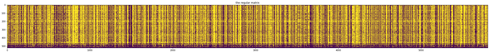
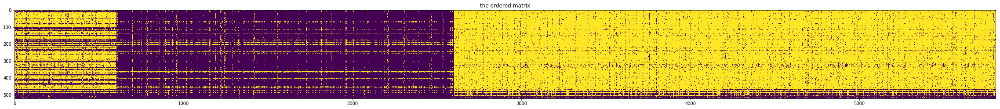
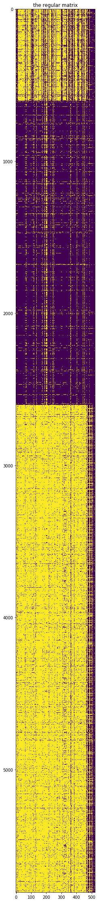
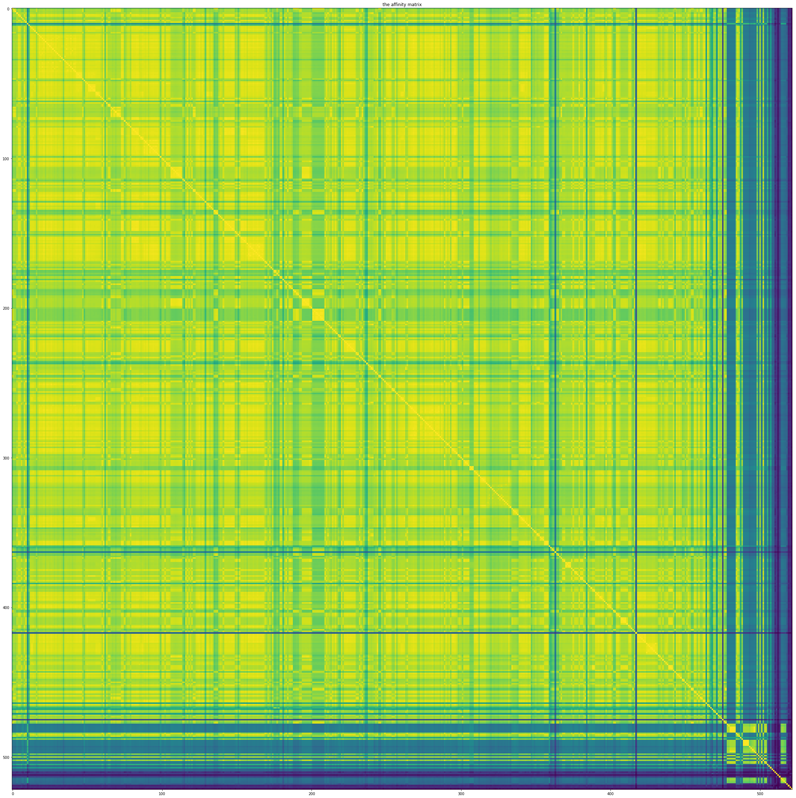
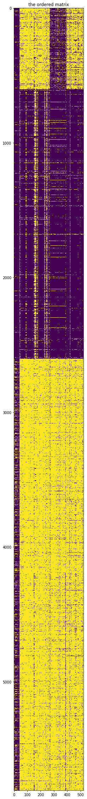
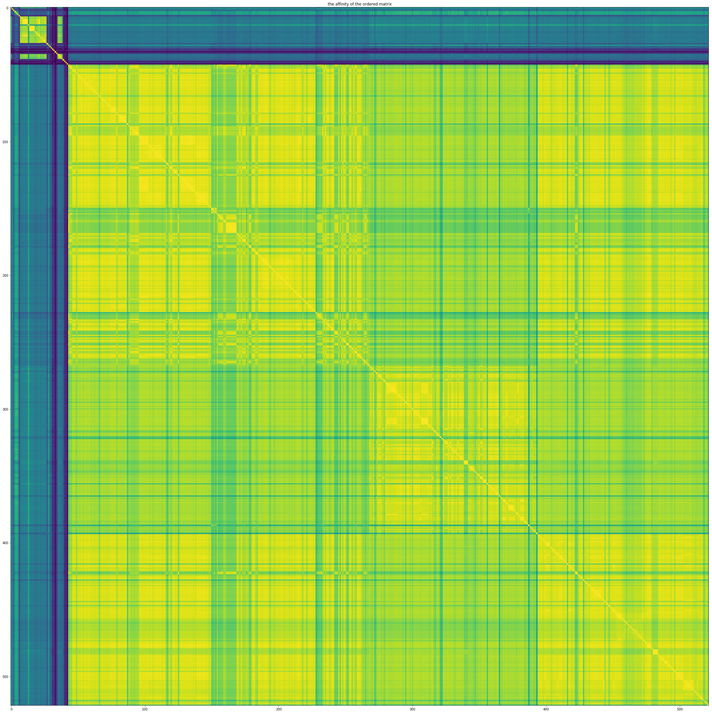
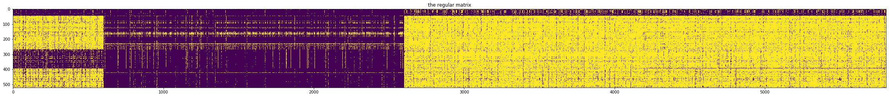
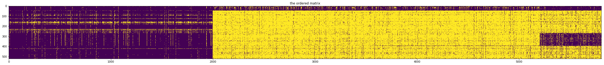

```python
%matplotlib inline
%reload_ext autoreload
%autoreload 2
from PyCUB import pyCUB 
```


```python
cub = pyCUB.PyCUB(session = 'ensembl2')
```

    working on session: ensembl2
    you already have a session here (just a warning)


```python
cub.get_mymetadata(From='jerem', inpar=True)
cub.getHomologylist(species='saccharomyces_cerevisiae', kingdom='fungi')
```


```python
len(cub.homolist)
```


    6692


Here except using a secondary package called wurtalizer, the printouts will be on the console. this is due to the parallelism of the function. 
16 is good even for lower number CPU because we are solely doing database calls


```python
cub.get_data(From='ensembl', homonames='all', kingdom='fungi', sequence='cdna',
        additional='type=orthologues', saveonfiles=False, normalized=False, setnans=False,
        by="frequency", tRNA=True, inpar=16, getCAI=True)
```

    you will have a larger dimensional matrix (59D)
    using the loaded homolist from ensembl
    doing all 6692 homologies
     
    preprocessing...
    computing tRNA copy numbers
    species: _candida_glabrata
    we got 413 datapoints and managed to extract 345
    species: _candida_intermedia
    we got 200 datapoints and managed to extract 189
    species: _candida_tenuis_atcc_10573
    we got 112 datapoints and managed to extract 107
    species: absidia_glauca
    we got 228 datapoints and managed to extract 186
    species: acidomyces_richmondensis_bfw
    we got 28 datapoints and managed to extract 28
    species: acremonium_chrysogenum_atcc_11550
    we got 240 datapoints and managed to extract 107
    species: agaricus_bisporus_var_burnettii_jb137_s8
    we got 385 datapoints and managed to extract 193
    species: allomyces_macrogynus_atcc_38327
    we got 979 datapoints and managed to extract 431
    species: alternaria_alternata
    we got 106 datapoints and managed to extract 1
    species: amanita_muscaria_koide_bx008
    we got 101 datapoints and managed to extract 94
    species: amphiamblys_sp_wsbs2006
    we got 93 datapoints and managed to extract 43
    species: anthracocystis_flocculosa_pf_1
    we got 172 datapoints and managed to extract 165
    species: arthrobotrys_oligospora_atcc_24927
    we got 118 datapoints and managed to extract 108
    species: arthroderma_otae_cbs_113480
    we got 168 datapoints and managed to extract 82
    species: aschersonia_aleyrodis_rcef_2490
    we got 90 datapoints and managed to extract 86
    species: ascochyta_rabiei
    we got 109 datapoints and managed to extract 101
    species: ascoidea_rubescens_dsm_1968
    empty data
    we got 175 datapoints and managed to extract 0
    species: ascosphaera_apis_arsef_7405
    we got 225 datapoints and managed to extract 211
    species: aspergillus_aculeatus_atcc_16872
    empty data
    we got 320 datapoints and managed to extract 0
    species: aspergillus_bombycis
    we got 241 datapoints and managed to extract 231
    species: aspergillus_brasiliensis_cbs_101740
    we got 270 datapoints and managed to extract 2
    species: aspergillus_calidoustus
    we got 157 datapoints and managed to extract 155
    species: aspergillus_carbonarius_item_5010
    we got 258 datapoints and managed to extract 3
    species: aspergillus_clavatus
    empty data
    we got 234 datapoints and managed to extract 0
    species: aspergillus_cristatus
    we got 160 datapoints and managed to extract 153
    species: aspergillus_flavus
    empty data
    we got 0 datapoints and managed to extract 0
    species: aspergillus_fumigatus
    empty data
    we got 228 datapoints and managed to extract 0
    species: aspergillus_glaucus_cbs_516_65
    we got 173 datapoints and managed to extract 2
    species: aspergillus_lentulus
    we got 207 datapoints and managed to extract 4
    species: aspergillus_luchuensis
    we got 256 datapoints and managed to extract 246
    species: aspergillus_niger_atcc_1015
    we got 261 datapoints and managed to extract 251
    species: aspergillus_nomius_nrrl_13137
    we got 236 datapoints and managed to extract 228
    species: aspergillus_ochraceoroseus
    we got 152 datapoints and managed to extract 143
    species: aspergillus_oryzae
    empty data
    we got 285 datapoints and managed to extract 0
    species: aspergillus_parasiticus_su_1
    we got 221 datapoints and managed to extract 214
    species: aspergillus_rambellii
    we got 152 datapoints and managed to extract 143
    species: aspergillus_ruber_cbs_135680
    we got 338 datapoints and managed to extract 158
    species: aspergillus_sydowii_cbs_593_65
    empty data
    we got 136 datapoints and managed to extract 0
    species: aspergillus_terreus
    empty data
    we got 146 datapoints and managed to extract 0
    species: aspergillus_tubingensis_cbs_134_48
    empty data
    we got 267 datapoints and managed to extract 0
    species: aspergillus_udagawae
    empty data
    we got 179 datapoints and managed to extract 0
    species: aspergillus_versicolor_cbs_583_65
    empty data
    we got 140 datapoints and managed to extract 0
    species: aspergillus_wentii_dto_134e9
    empty data
    we got 220 datapoints and managed to extract 0
    species: aureobasidium_melanogenum_cbs_110374
    we got 233 datapoints and managed to extract 219
    species: aureobasidium_namibiae_cbs_147_97
    we got 233 datapoints and managed to extract 208
    species: aureobasidium_pullulans_exf_150
    we got 235 datapoints and managed to extract 220
    species: aureobasidium_subglaciale_exf_2481
    we got 196 datapoints and managed to extract 187
    species: babjeviella_inositovora_nrrl_y_12698
    we got 398 datapoints and managed to extract 5
    species: batrachochytrium_salamandrivorans
    we got 95 datapoints and managed to extract 40
    species: baudoinia_panamericana_uamh_10762
    we got 68 datapoints and managed to extract 26
    species: beauveria_bassiana
    we got 105 datapoints and managed to extract 100
    species: bipolaris_maydis_c5
    we got 229 datapoints and managed to extract 98
    species: bipolaris_oryzae_atcc_44560
    we got 92 datapoints and managed to extract 86
    species: bipolaris_sorokiniana_nd90pr
    we got 183 datapoints and managed to extract 86
    species: bipolaris_victoriae_fi3
    we got 94 datapoints and managed to extract 90
    species: bipolaris_zeicola_26_r_13
    we got 100 datapoints and managed to extract 95
    species: blastomyces_dermatitidis_er_3
    we got 216 datapoints and managed to extract 102
    species: blastomyces_gilchristii_slh14081
    we got 245 datapoints and managed to extract 111
    species: blastomyces_percursus
    empty data
    we got 88 datapoints and managed to extract 0
    species: blumeria_graminis
    we got 461 datapoints and managed to extract 449
    species: botryobasidium_botryosum_fd_172_ss1
    we got 300 datapoints and managed to extract 139
    species: botrytis_cinerea
    we got 344 datapoints and managed to extract 128
    species: brettanomyces_bruxellensis_awri1499
    we got 100 datapoints and managed to extract 91
    species: byssochlamys_spectabilis_no_5
    we got 147 datapoints and managed to extract 142
    species: calocera_cornea_hhb12733
    we got 106 datapoints and managed to extract 48
    species: calocera_viscosa_tufc12733
    we got 120 datapoints and managed to extract 57
    species: candida_albicans_sc5314
    we got 261 datapoints and managed to extract 124
    species: candida_arabinofermentans_nrrl_yb_2248
    empty data
    we got 118 datapoints and managed to extract 0
    species: candida_dubliniensis_cd36
    KeyError
    we got 241 datapoints and managed to extract 218
    species: candida_maltosa_xu316
    we got 46 datapoints and managed to extract 42
    species: candida_orthopsilosis_co_90_125
    we got 163 datapoints and managed to extract 77
    species: candida_parapsilosis_cdc317
    empty data
    we got 58 datapoints and managed to extract 0
    species: candida_tanzawaensis_nrrl_y_17324
    empty data
    we got 256 datapoints and managed to extract 0
    species: capronia_coronata_cbs_617_96
    we got 38 datapoints and managed to extract 37
    species: capronia_epimyces_cbs_606_96
    we got 40 datapoints and managed to extract 38
    species: ceraceosorus_bombacis
    we got 46 datapoints and managed to extract 43
    species: ceratocystis_platani
    we got 642 datapoints and managed to extract 351
    species: chaetomium_globosum_cbs_148_51
    we got 425 datapoints and managed to extract 226
    species: chaetomium_thermophilum_var_thermophilum_dsm_1495
    we got 467 datapoints and managed to extract 217
    species: choanephora_cucurbitarum
    empty data
    we got 0 datapoints and managed to extract 0
    species: cladophialophora_bantiana_cbs_173_52
    we got 60 datapoints and managed to extract 26
    species: cladophialophora_carrionii
    we got 62 datapoints and managed to extract 2
    species: cladophialophora_immunda
    we got 58 datapoints and managed to extract 27
    species: cladophialophora_psammophila_cbs_110553
    we got 30 datapoints and managed to extract 29
    species: cladophialophora_yegresii_cbs_114405
    we got 38 datapoints and managed to extract 33
    species: claviceps_purpurea_20_1
    we got 219 datapoints and managed to extract 206
    species: coccidioides_immitis_h538_4
    we got 118 datapoints and managed to extract 5
    species: coccidioides_posadasii_str_silveira
    we got 233 datapoints and managed to extract 111
    species: colletotrichum_fioriniae_pj7
    we got 302 datapoints and managed to extract 282
    species: colletotrichum_gloeosporioides
    we got 733 datapoints and managed to extract 665
    species: colletotrichum_graminicola
    we got 306 datapoints and managed to extract 286
    species: colletotrichum_incanum
    we got 355 datapoints and managed to extract 332
    species: colletotrichum_nymphaeae_sa_01
    we got 325 datapoints and managed to extract 303
    species: colletotrichum_orbiculare
    we got 856 datapoints and managed to extract 724
    species: colletotrichum_orchidophilum
    we got 335 datapoints and managed to extract 313
    species: colletotrichum_salicis
    we got 299 datapoints and managed to extract 278
    species: colletotrichum_simmondsii
    we got 318 datapoints and managed to extract 298
    species: colletotrichum_sublineola
    we got 284 datapoints and managed to extract 265
    species: colletotrichum_tofieldiae
    we got 371 datapoints and managed to extract 347
    species: conidiobolus_coronatus_nrrl_28638
    we got 1309 datapoints and managed to extract 619
    species: coniochaeta_ligniaria_nrrl_30616
    we got 267 datapoints and managed to extract 12
    species: coniosporium_apollinis_cbs_100218
    we got 83 datapoints and managed to extract 36
    species: coprinopsis_cinerea_okayama7_130
    we got 546 datapoints and managed to extract 253
    species: cordyceps_brongniartii_rcef_3172
    we got 123 datapoints and managed to extract 113
    species: cordyceps_confragosa_rcef_1005
    we got 114 datapoints and managed to extract 110
    species: cordyceps_militaris_cm01
    we got 110 datapoints and managed to extract 104
    species: cryptococcus_amylolentus_cbs_6039
    we got 393 datapoints and managed to extract 185
    species: cryptococcus_depauperatus_cbs_7841
    we got 257 datapoints and managed to extract 120
    species: cryptococcus_gattii_ca1873
    we got 284 datapoints and managed to extract 133
    species: cryptococcus_gattii_vgii_r265
    we got 308 datapoints and managed to extract 143
    species: cryptococcus_gattii_vgiv_ind107
    we got 282 datapoints and managed to extract 132
    species: cryptococcus_gattii_wm276
    we got 140 datapoints and managed to extract 132
    species: cryptococcus_neoformans
    empty data
    we got 226 datapoints and managed to extract 0
    species: cutaneotrichosporon_oleaginosus
    we got 548 datapoints and managed to extract 252
    species: cyberlindnera_fabianii
    we got 158 datapoints and managed to extract 147
    species: cyberlindnera_jadinii
    we got 154 datapoints and managed to extract 146
    species: cylindrobasidium_torrendii_fp15055_ss_10
    we got 617 datapoints and managed to extract 287
    species: cyphellophora_europaea_cbs_101466
    we got 82 datapoints and managed to extract 36
    species: dacryopinax_primogenitus
    we got 114 datapoints and managed to extract 53
    species: dactylellina_haptotyla_cbs_200_50
    we got 120 datapoints and managed to extract 107
    species: daedalea_quercina_l_15889
    we got 238 datapoints and managed to extract 112
    species: debaryomyces_fabryi
    we got 104 datapoints and managed to extract 93
    species: debaryomyces_hansenii_cbs767
    we got 399 datapoints and managed to extract 189
    species: diaporthe_ampelina
    we got 120 datapoints and managed to extract 116
    species: diaporthe_helianthi
    we got 36 datapoints and managed to extract 34
    species: diplodia_corticola
    we got 130 datapoints and managed to extract 125
    species: diplodia_seriata
    we got 135 datapoints and managed to extract 130
    species: dothistroma_septosporum
    we got 84 datapoints and managed to extract 45
    species: drechmeria_coniospora
    we got 114 datapoints and managed to extract 1
    species: drechslerella_stenobrocha_248
    we got 51 datapoints and managed to extract 49
    species: emergomyces_pasteuriana_ep9510
    empty data
    we got 102 datapoints and managed to extract 0
    species: emmonsia_crescens_uamh_3008
    we got 199 datapoints and managed to extract 94
    species: emmonsia_parva_uamh_139
    we got 219 datapoints and managed to extract 104
    species: emmonsia_sp_cac_2015a
    empty data
    we got 80 datapoints and managed to extract 0
    species: endocarpon_pusillum_z07020
    we got 47 datapoints and managed to extract 43
    species: eremothecium_cymbalariae_dbvpg_7215
    we got 289 datapoints and managed to extract 136
    species: eremothecium_gossypii_fdag1
    we got 425 datapoints and managed to extract 193
    species: eremothecium_sinecaudum
    we got 172 datapoints and managed to extract 3
    species: erysiphe_necator
    we got 183 datapoints and managed to extract 172
    species: escovopsis_weberi
    we got 213 datapoints and managed to extract 202
    species: eutypa_lata_ucrel1
    we got 125 datapoints and managed to extract 113
    species: exidia_glandulosa_hhb12029
    we got 300 datapoints and managed to extract 141
    species: exophiala_aquamarina_cbs_119918
    we got 36 datapoints and managed to extract 35
    species: exophiala_dermatitidis_nih_ut8656
    we got 114 datapoints and managed to extract 58
    species: exophiala_mesophila
    we got 79 datapoints and managed to extract 37
    species: exophiala_oligosperma
    we got 76 datapoints and managed to extract 34
    species: exophiala_sideris
    we got 42 datapoints and managed to extract 19
    species: exophiala_spinifera
    we got 79 datapoints and managed to extract 34
    species: exophiala_xenobiotica
    we got 74 datapoints and managed to extract 35
    species: fibroporia_radiculosa
    we got 124 datapoints and managed to extract 115
    species: fibulorhizoctonia_sp_cbs_109695
    we got 359 datapoints and managed to extract 157
    species: fistulina_hepatica_atcc_64428
    we got 252 datapoints and managed to extract 126
    species: fomitopsis_pinicola_fp_58527_ss1
    we got 276 datapoints and managed to extract 129
    species: fonsecaea_erecta
    we got 56 datapoints and managed to extract 26
    species: fonsecaea_multimorphosa_cbs_102226
    we got 58 datapoints and managed to extract 28
    species: fonsecaea_nubica
    we got 58 datapoints and managed to extract 21
    species: fonsecaea_pedrosoi_cbs_271_37
    we got 53 datapoints and managed to extract 24
    species: fusarium_culmorum
    we got 283 datapoints and managed to extract 273
    species: fusarium_fujikuroi
    we got 490 datapoints and managed to extract 391
    species: fusarium_graminearum
    we got 303 datapoints and managed to extract 294
    species: fusarium_langsethiae
    we got 255 datapoints and managed to extract 248
    species: fusarium_mangiferae
    empty data
    we got 289 datapoints and managed to extract 0
    species: fusarium_oxysporum
    we got 568 datapoints and managed to extract 549
    species: fusarium_poae
    we got 292 datapoints and managed to extract 284
    species: fusarium_proliferatum_et1
    empty data
    we got 310 datapoints and managed to extract 0
    species: fusarium_pseudograminearum
    we got 605 datapoints and managed to extract 589
    species: fusarium_solani
    we got 520 datapoints and managed to extract 495
    species: fusarium_verticillioides
    we got 547 datapoints and managed to extract 521
    species: gaeumannomyces_graminis
    empty data
    we got 197 datapoints and managed to extract 0
    species: galerina_marginata_cbs_339_88
    we got 292 datapoints and managed to extract 127
    species: gelatoporia_subvermispora_b
    we got 380 datapoints and managed to extract 179
    species: geotrichum_candidum
    we got 353 datapoints and managed to extract 3
    species: gloeophyllum_trabeum_atcc_11539
    we got 246 datapoints and managed to extract 110
    species: gonapodya_prolifera_jel478
    we got 189 datapoints and managed to extract 101
    species: grosmannia_clavigera_kw1407
    we got 184 datapoints and managed to extract 174
    species: hanseniaspora_guilliermondii
    we got 131 datapoints and managed to extract 124
    species: hanseniaspora_opuntiae
    we got 0 datapoints and managed to extract 1
    species: hanseniaspora_osmophila
    we got 191 datapoints and managed to extract 179
    species: hanseniaspora_valbyensis_nrrl_y_1626
    we got 98 datapoints and managed to extract 2
    species: hebeloma_cylindrosporum_h7
    we got 279 datapoints and managed to extract 122
    species: heterobasidion_irregulare_tc_32_1
    we got 120 datapoints and managed to extract 114
    species: hirsutella_minnesotensis_3608
    we got 104 datapoints and managed to extract 97
    species: histoplasma_capsulatum_nam1
    we got 157 datapoints and managed to extract 76
    species: hypholoma_sublateritium_fd_334_ss_4
    we got 447 datapoints and managed to extract 186
    species: hyphopichia_burtonii_nrrl_y_1933
    we got 175 datapoints and managed to extract 5
    species: hypsizygus_marmoreus
    we got 237 datapoints and managed to extract 226
    species: jaapia_argillacea_mucl_33604
    we got 307 datapoints and managed to extract 141
    species: kalmanozyma_brasiliensis_ghg001
    we got 228 datapoints and managed to extract 103
    species: kazachstania_africana_cbs_2517
    we got 532 datapoints and managed to extract 251
    species: kazachstania_naganishii_cbs_8797
    we got 317 datapoints and managed to extract 151
    species: kluyveromyces_lactis
    we got 323 datapoints and managed to extract 152
    species: kluyveromyces_marxianus_dmku3_1042
    we got 273 datapoints and managed to extract 67
    species: komagataella_pastoris
    we got 242 datapoints and managed to extract 230
    species: kuraishia_capsulata_cbs_1993
    we got 75 datapoints and managed to extract 70
    species: kwoniella_bestiolae_cbs_10118
    we got 152 datapoints and managed to extract 71
    species: kwoniella_dejecticola_cbs_10117
    we got 151 datapoints and managed to extract 71
    species: kwoniella_heveanensis_bcc8398
    we got 165 datapoints and managed to extract 77
    species: kwoniella_mangroviensis_cbs_10435
    we got 163 datapoints and managed to extract 75
    species: kwoniella_pini_cbs_10737
    we got 152 datapoints and managed to extract 72
    species: laccaria_amethystina_laam_08_1
    we got 183 datapoints and managed to extract 172
    species: laccaria_bicolor_s238n_h82
    we got 225 datapoints and managed to extract 213
    species: lachancea_dasiensis_cbs_10888
    empty data
    we got 203 datapoints and managed to extract 0
    species: lachancea_fermentati
    empty data
    we got 202 datapoints and managed to extract 0
    species: lachancea_lanzarotensis
    we got 398 datapoints and managed to extract 188
    species: lachancea_meyersii_cbs_8951
    empty data
    we got 207 datapoints and managed to extract 0
    species: lachancea_mirantina
    empty data
    we got 204 datapoints and managed to extract 0
    species: lachancea_nothofagi_cbs_11611
    empty data
    we got 203 datapoints and managed to extract 0
    species: lachancea_sp_cbs_6924
    empty data
    we got 200 datapoints and managed to extract 0
    species: lachancea_thermotolerans_cbs_6340
    we got 456 datapoints and managed to extract 215
    species: laetiporus_sulphureus_93_53
    we got 197 datapoints and managed to extract 91
    species: leptosphaeria_maculans
    we got 139 datapoints and managed to extract 129
    species: lichtheimia_ramosa
    empty data
    we got 0 datapoints and managed to extract 0
    species: lipomyces_starkeyi_nrrl_y_11557
    empty data
    we got 93 datapoints and managed to extract 0
    species: lodderomyces_elongisporus_nrrl_yb_4239
    we got 217 datapoints and managed to extract 106
    species: macrophomina_phaseolina_ms6
    we got 288 datapoints and managed to extract 136
    species: madurella_mycetomatis
    we got 147 datapoints and managed to extract 137
    species: magnaporthe_oryzae
    we got 190 datapoints and managed to extract 178
    species: magnaporthe_poae
    we got 315 datapoints and managed to extract 294
    species: malassezia_pachydermatis
    we got 82 datapoints and managed to extract 77
    species: malassezia_sympodialis_atcc_42132
    we got 75 datapoints and managed to extract 71
    species: marssonina_brunnea_f_sp_multigermtubi_mb_m1
    we got 109 datapoints and managed to extract 101
    species: melampsora_laricipopulina
    we got 439 datapoints and managed to extract 414
    species: metarhizium_acridum_cqma_102
    we got 232 datapoints and managed to extract 106
    species: metarhizium_album_arsef_1941
    we got 117 datapoints and managed to extract 110
    species: metarhizium_anisopliae_arsef_23
    we got 134 datapoints and managed to extract 125
    species: metarhizium_anisopliae_brip_53293
    we got 129 datapoints and managed to extract 123
    species: metarhizium_brunneum_arsef_3297
    we got 143 datapoints and managed to extract 134
    species: metarhizium_guizhouense_arsef_977
    we got 132 datapoints and managed to extract 126
    species: metarhizium_majus_arsef_297
    we got 138 datapoints and managed to extract 134
    species: metarhizium_rileyi_rcef_4871
    we got 108 datapoints and managed to extract 102
    species: metschnikowia_bicuspidata_var_bicuspidata_nrrl_yb_4993
    we got 252 datapoints and managed to extract 4
    species: meyerozyma_guilliermondii_atcc_6260
    we got 269 datapoints and managed to extract 125
    species: microbotryum_violaceum
    we got 226 datapoints and managed to extract 168
    species: microdochium_bolleyi
    empty data
    we got 170 datapoints and managed to extract 0
    species: millerozyma_farinosa_cbs_7064
    we got 575 datapoints and managed to extract 272
    species: mixia_osmundae_iam_14324
    we got 41 datapoints and managed to extract 39
    species: moesziomyces_antarcticus
    we got 207 datapoints and managed to extract 110
    species: moniliophthora_perniciosa_fa553
    we got 214 datapoints and managed to extract 96
    species: moniliophthora_roreri_mca_2997
    we got 247 datapoints and managed to extract 226
    species: mortierella_elongata_ag_77
    empty data
    we got 249 datapoints and managed to extract 0
    species: mucor_ambiguus
    empty data
    we got 169 datapoints and managed to extract 0
    species: mucor_circinelloides_f_circinelloides_1006phl
    empty data
    we got 180 datapoints and managed to extract 0
    species: mycosphaerella_eumusae
    we got 69 datapoints and managed to extract 66
    species: nadsonia_fulvescens_var_elongata_dsm_6958
    we got 584 datapoints and managed to extract 1
    species: nannizzia_gypsea_cbs_118893
    we got 174 datapoints and managed to extract 85
    species: naumovozyma_castellii_cbs_4309
    we got 539 datapoints and managed to extract 254
    species: naumovozyma_dairenensis_cbs_421
    we got 527 datapoints and managed to extract 250
    species: neofusicoccum_parvum_ucrnp2
    we got 103 datapoints and managed to extract 98
    species: neolecta_irregularis_dah_3
    we got 76 datapoints and managed to extract 73
    species: neolentinus_lepideus_hhb14362_ss_1
    we got 278 datapoints and managed to extract 132
    species: neonectria_ditissima
    we got 171 datapoints and managed to extract 166
    species: neosartorya_fischeri
    empty data
    we got 256 datapoints and managed to extract 0
    species: neurospora_crassa
    empty data
    we got 426 datapoints and managed to extract 0
    species: neurospora_tetrasperma_fgsc_2509
    we got 393 datapoints and managed to extract 368
    species: ogataea_parapolymorpha_dl_1
    we got 159 datapoints and managed to extract 74
    species: ogataea_polymorpha
    empty data
    we got 79 datapoints and managed to extract 0
    species: oidiodendron_maius_zn
    we got 68 datapoints and managed to extract 26
    species: ophiocordyceps_sinensis_co18
    we got 87 datapoints and managed to extract 80
    species: ophiocordyceps_unilateralis
    we got 73 datapoints and managed to extract 70
    species: ophiostoma_piceae_uamh_11346
    we got 243 datapoints and managed to extract 230
    species: paracoccidioides_brasiliensis_pb18
    we got 202 datapoints and managed to extract 94
    species: paracoccidioides_sp_lutzii_pb01
    we got 200 datapoints and managed to extract 92
    species: paraphaeosphaeria_sporulosa
    we got 107 datapoints and managed to extract 4
    species: parasitella_parasitica
    we got 141 datapoints and managed to extract 26
    species: paxillus_rubicundulus_ve08_2h10
    we got 548 datapoints and managed to extract 255
    species: penicilliopsis_zonata_cbs_506_65
    we got 156 datapoints and managed to extract 2
    species: penicillium_antarcticum
    we got 180 datapoints and managed to extract 171
    species: penicillium_arizonense
    we got 173 datapoints and managed to extract 167
    species: penicillium_brasilianum
    we got 177 datapoints and managed to extract 167
    species: penicillium_camemberti_fm_013
    we got 182 datapoints and managed to extract 178
    species: penicillium_chrysogenum
    empty data
    we got 213 datapoints and managed to extract 0
    species: penicillium_coprophilum
    we got 206 datapoints and managed to extract 194
    species: penicillium_decumbens
    we got 167 datapoints and managed to extract 158
    species: penicillium_digitatum_phi26
    we got 207 datapoints and managed to extract 196
    species: penicillium_expansum
    we got 41 datapoints and managed to extract 41
    species: penicillium_flavigenum
    we got 200 datapoints and managed to extract 195
    species: penicillium_freii
    we got 174 datapoints and managed to extract 167
    species: penicillium_griseofulvum
    we got 200 datapoints and managed to extract 195
    species: penicillium_italicum
    we got 184 datapoints and managed to extract 181
    species: penicillium_nalgiovense
    we got 192 datapoints and managed to extract 183
    species: penicillium_nordicum
    we got 165 datapoints and managed to extract 158
    species: penicillium_oxalicum_114_2
    we got 180 datapoints and managed to extract 169
    species: penicillium_polonicum
    we got 198 datapoints and managed to extract 193
    species: penicillium_roqueforti_fm164
    we got 179 datapoints and managed to extract 174
    species: penicillium_rubens_wisconsin_54_1255
    we got 354 datapoints and managed to extract 343
    species: penicillium_solitum
    we got 197 datapoints and managed to extract 193
    species: penicillium_steckii
    we got 159 datapoints and managed to extract 155
    species: penicillium_subrubescens
    we got 166 datapoints and managed to extract 9
    species: penicillium_vulpinum
    we got 195 datapoints and managed to extract 186
    species: peniophora_sp_cont
    we got 472 datapoints and managed to extract 217
    species: pestalotiopsis_fici_w106_1
    we got 227 datapoints and managed to extract 213
    species: phaeoacremonium_minimum_ucrpa7
    we got 79 datapoints and managed to extract 75
    species: phaeosphaeria_nodorum
    we got 176 datapoints and managed to extract 136
    species: phanerochaete_carnosa_hhb_10118_sp
    we got 266 datapoints and managed to extract 123
    species: phialocephala_scopiformis
    empty data
    we got 81 datapoints and managed to extract 0
    species: phialocephala_subalpina
    we got 92 datapoints and managed to extract 2
    species: phialophora_americana
    we got 59 datapoints and managed to extract 23
    species: phialophora_attae
    we got 47 datapoints and managed to extract 44
    species: phlebia_centrifuga
    we got 387 datapoints and managed to extract 180
    species: phlebiopsis_gigantea_11061_1_cr5_6
    we got 314 datapoints and managed to extract 152
    species: phycomyces_blakesleeanus_nrrl_1555_
    empty data
    we got 307 datapoints and managed to extract 0
    species: pichia_membranifaciens_nrrl_y_2026
    empty data
    we got 158 datapoints and managed to extract 0
    species: piloderma_croceum_f_1598
    we got 141 datapoints and managed to extract 62
    species: pisolithus_microcarpus_441
    we got 249 datapoints and managed to extract 112
    species: pisolithus_tinctorius_marx_270
    we got 364 datapoints and managed to extract 172
    species: pleurotus_ostreatus_pc15
    we got 317 datapoints and managed to extract 148
    species: pneumocystis_carinii_b80
    empty data
    we got 44 datapoints and managed to extract 0
    species: pneumocystis_jirovecii_ru7
    empty data
    we got 45 datapoints and managed to extract 0
    species: pneumocystis_murina_b123
    we got 93 datapoints and managed to extract 45
    species: pochonia_chlamydosporia_170
    we got 112 datapoints and managed to extract 2
    species: podospora_anserina_s_mat_
    we got 705 datapoints and managed to extract 324
    species: pseudocercospora_fijiensis_cirad86
    we got 85 datapoints and managed to extract 37
    species: pseudocercospora_musae
    we got 36 datapoints and managed to extract 36
    species: pseudogymnoascus_destructans_20631_21
    we got 245 datapoints and managed to extract 115
    species: pseudogymnoascus_sp_03vt05
    we got 144 datapoints and managed to extract 5
    species: pseudogymnoascus_sp_05ny08
    we got 152 datapoints and managed to extract 4
    species: pseudogymnoascus_sp_23342_1_i1
    we got 153 datapoints and managed to extract 3
    species: pseudogymnoascus_sp_24mn13
    empty data
    we got 98 datapoints and managed to extract 0
    species: pseudogymnoascus_sp_vkm_f_103
    we got 142 datapoints and managed to extract 134
    species: pseudogymnoascus_sp_vkm_f_3557
    we got 141 datapoints and managed to extract 134
    species: pseudogymnoascus_sp_vkm_f_3775
    we got 131 datapoints and managed to extract 123
    species: pseudogymnoascus_sp_vkm_f_3808
    we got 132 datapoints and managed to extract 125
    species: pseudogymnoascus_sp_vkm_f_4246
    we got 117 datapoints and managed to extract 110
    species: pseudogymnoascus_sp_vkm_f_4281_fw_2241_
    we got 112 datapoints and managed to extract 105
    species: pseudogymnoascus_sp_vkm_f_4513_fw_928_
    we got 115 datapoints and managed to extract 107
    species: pseudogymnoascus_sp_vkm_f_4514_fw_929_
    we got 142 datapoints and managed to extract 135
    species: pseudogymnoascus_sp_vkm_f_4515_fw_2607_
    we got 122 datapoints and managed to extract 115
    species: pseudogymnoascus_sp_vkm_f_4516_fw_969_
    we got 156 datapoints and managed to extract 147
    species: pseudogymnoascus_sp_vkm_f_4517_fw_2822_
    we got 122 datapoints and managed to extract 116
    species: pseudogymnoascus_sp_vkm_f_4518_fw_2643_
    we got 129 datapoints and managed to extract 121
    species: pseudogymnoascus_sp_vkm_f_4519_fw_2642_
    we got 141 datapoints and managed to extract 131
    species: pseudogymnoascus_sp_vkm_f_4520_fw_2644_
    we got 128 datapoints and managed to extract 119
    species: pseudogymnoascus_sp_wsf_3629
    we got 151 datapoints and managed to extract 2
    species: pseudogymnoascus_verrucosus
    we got 140 datapoints and managed to extract 5
    species: pseudozyma_hubeiensis_sy62
    we got 229 datapoints and managed to extract 103
    species: puccinia_graminis
    we got 709 datapoints and managed to extract 658
    species: puccinia_sorghi
    we got 676 datapoints and managed to extract 223
    species: puccinia_striiformis
    we got 284 datapoints and managed to extract 256
    species: puccinia_triticina
    we got 1981 datapoints and managed to extract 1857
    species: purpureocillium_lilacinum
    we got 88 datapoints and managed to extract 2
    species: pyrenochaeta_sp_ds3say3a
    empty data
    we got 82 datapoints and managed to extract 0
    species: pyrenophora_teres
    we got 155 datapoints and managed to extract 139
    species: pyrenophora_triticirepentis
    empty data
    we got 103 datapoints and managed to extract 0
    species: pyronema_omphalodes_cbs_100304
    we got 662 datapoints and managed to extract 42
    species: rachicladosporium_antarcticum
    we got 107 datapoints and managed to extract 32
    species: rasamsonia_emersonii_cbs_393_64
    we got 98 datapoints and managed to extract 93
    species: rhinocladiella_mackenziei_cbs_650_93
    we got 46 datapoints and managed to extract 17
    species: rhizoctonia_solani_ag_1_ib
    we got 316 datapoints and managed to extract 150
    species: rhizophagus_irregularis_daom_181602_gca_000439145
    empty data
    we got 86 datapoints and managed to extract 0
    species: rhizopogon_vesiculosus
    we got 129 datapoints and managed to extract 119
    species: rhizopogon_vinicolor_am_or11_026
    we got 263 datapoints and managed to extract 119
    species: rhizopus_delemar_ra_99_880
    empty data
    we got 237 datapoints and managed to extract 0
    species: rhizopus_microsporus
    empty data
    we got 49 datapoints and managed to extract 0
    species: rhodotorula_graminis_wp1
    we got 298 datapoints and managed to extract 140
    species: rhodotorula_sp_jg_1b
    we got 220 datapoints and managed to extract 105
    species: rhodotorula_toruloides_np11
    we got 115 datapoints and managed to extract 111
    species: rhynchosporium_agropyri
    we got 107 datapoints and managed to extract 1
    species: rhynchosporium_commune
    we got 113 datapoints and managed to extract 1
    species: rhynchosporium_secalis
    we got 89 datapoints and managed to extract 81
    species: rozella_allomycis_csf55
    we got 145 datapoints and managed to extract 139
    species: saccharomyces_arboricola_h_6
    we got 362 datapoints and managed to extract 265
    species: saccharomyces_cerevisiae_x_saccharomyces_kudriavzevii_vin7
    we got 547 datapoints and managed to extract 512
    species: saccharomyces_eubayanus
    empty data
    we got 304 datapoints and managed to extract 0
    species: saccharomyces_kudriavzevii_ifo_1802
    we got 263 datapoints and managed to extract 250
    species: saccharomyces_sp_boulardii_
    we got 282 datapoints and managed to extract 266
    species: saccharomycetaceae_sp_ashbya_aceri_
    we got 401 datapoints and managed to extract 186
    species: scedosporium_apiospermum
    we got 254 datapoints and managed to extract 238
    species: scheffersomyces_stipitis_cbs_6054
    we got 168 datapoints and managed to extract 159
    species: schizophyllum_commune_h4_8
    we got 275 datapoints and managed to extract 259
    species: schizopora_paradoxa
    we got 160 datapoints and managed to extract 75
    species: schizosaccharomyces_cryophilus
    we got 742 datapoints and managed to extract 461
    species: schizosaccharomyces_japonicus
    we got 965 datapoints and managed to extract 566
    species: schizosaccharomyces_octosporus
    we got 827 datapoints and managed to extract 517
    species: schizosaccharomyces_pombe
    we got 378 datapoints and managed to extract 171
    species: scleroderma_citrinum_foug_a
    we got 197 datapoints and managed to extract 179
    species: sclerotinia_borealis_f_4128
    we got 358 datapoints and managed to extract 167
    species: serendipita_indica_dsm_11827
    we got 106 datapoints and managed to extract 93
    species: serendipita_vermifera_maff_305830
    we got 130 datapoints and managed to extract 54
    species: serpula_lacrymans_var_lacrymans_s7_3
    we got 404 datapoints and managed to extract 397
    species: setosphaeria_turcica_et28a
    we got 236 datapoints and managed to extract 84
    species: sistotremastrum_niveocremeum_hhb9708
    we got 155 datapoints and managed to extract 74
    species: sistotremastrum_suecicum_hhb10207_ss_3
    we got 155 datapoints and managed to extract 74
    species: sordaria_macrospora
    we got 862 datapoints and managed to extract 372
    species: spathaspora_passalidarum_nrrl_y_27907
    we got 165 datapoints and managed to extract 157
    species: sphaerobolus_stellatus_ss14
    we got 1289 datapoints and managed to extract 653
    species: sphaerulina_musiva_so2202
    we got 139 datapoints and managed to extract 61
    species: spizellomyces_punctatus_daom_br117
    we got 411 datapoints and managed to extract 193
    species: sporidiobolus_salmonicolor
    we got 329 datapoints and managed to extract 311
    species: sporisorium_reilianum
    we got 209 datapoints and managed to extract 198
    species: sporisorium_scitamineum
    we got 117 datapoints and managed to extract 111
    species: sporothrix_brasiliensis_5110
    we got 257 datapoints and managed to extract 109
    species: sporothrix_insectorum_rcef_264
    we got 110 datapoints and managed to extract 102
    species: sporothrix_schenckii_atcc_58251
    we got 217 datapoints and managed to extract 101
    species: stachybotrys_chartarum_ibt_40288
    we got 104 datapoints and managed to extract 102
    species: stachybotrys_chlorohalonata_ibt_40285
    we got 105 datapoints and managed to extract 103
    species: stagonospora_sp_src1lsm3a
    we got 90 datapoints and managed to extract 1
    species: stemphylium_lycopersici
    we got 94 datapoints and managed to extract 8
    species: suillus_luteus_uh_slu_lm8_n1
    we got 231 datapoints and managed to extract 108
    species: talaromyces_islandicus
    we got 188 datapoints and managed to extract 82
    species: talaromyces_marneffei_atcc_18224
    we got 244 datapoints and managed to extract 126
    species: talaromyces_stipitatus_atcc_10500
    we got 226 datapoints and managed to extract 112
    species: termitomyces_sp_j132
    we got 332 datapoints and managed to extract 311
    species: tetrapisispora_blattae_cbs_6284
    we got 656 datapoints and managed to extract 311
    species: tetrapisispora_phaffii_cbs_4417
    we got 409 datapoints and managed to extract 193
    species: thermothelomyces_thermophila_atcc_42464
    we got 383 datapoints and managed to extract 180
    species: thielavia_terrestris_nrrl_8126
    we got 301 datapoints and managed to extract 141
    species: thielaviopsis_punctulata
    we got 239 datapoints and managed to extract 225
    species: tilletia_caries
    we got 92 datapoints and managed to extract 87
    species: tilletia_controversa
    we got 93 datapoints and managed to extract 88
    species: tilletia_indica
    we got 81 datapoints and managed to extract 77
    species: tilletia_walkeri
    we got 80 datapoints and managed to extract 76
    species: tilletiaria_anomala_ubc_951
    we got 124 datapoints and managed to extract 57
    species: tolypocladium_ophioglossoides_cbs_100239
    we got 70 datapoints and managed to extract 70
    species: torrubiella_hemipterigena
    we got 97 datapoints and managed to extract 91
    species: tortispora_caseinolytica_nrrl_y_17796
    empty data
    we got 53 datapoints and managed to extract 0
    species: torulaspora_delbrueckii
    we got 384 datapoints and managed to extract 181
    species: trametes_pubescens
    we got 566 datapoints and managed to extract 272
    species: tremella_mesenterica_dsm_1558
    we got 41 datapoints and managed to extract 39
    species: trichoderma_atroviride_imi_206040
    we got 215 datapoints and managed to extract 204
    species: trichoderma_gamsii
    we got 215 datapoints and managed to extract 202
    species: trichoderma_guizhouense
    we got 202 datapoints and managed to extract 191
    species: trichoderma_harzianum
    we got 151 datapoints and managed to extract 144
    species: trichoderma_reesei
    we got 385 datapoints and managed to extract 364
    species: trichoderma_virens
    we got 393 datapoints and managed to extract 372
    species: trichophyton_benhamiae_cbs_112371
    we got 123 datapoints and managed to extract 77
    species: trichophyton_equinum_cbs_127_97
    empty data
    we got 81 datapoints and managed to extract 0
    species: trichophyton_interdigitale_mr816
    we got 153 datapoints and managed to extract 71
    species: trichophyton_rubrum_cbs_118892
    we got 170 datapoints and managed to extract 84
    species: trichophyton_soudanense_cbs_452_61
    we got 165 datapoints and managed to extract 77
    species: trichophyton_tonsurans_cbs_112818
    we got 168 datapoints and managed to extract 82
    species: trichophyton_verrucosum_hki_0517
    we got 121 datapoints and managed to extract 75
    species: trichophyton_violaceum
    we got 80 datapoints and managed to extract 75
    species: trichosporon_asahii_var_asahii_cbs_8904
    we got 1101 datapoints and managed to extract 513
    species: tsuchiyaea_wingfieldii_cbs_7118
    we got 342 datapoints and managed to extract 162
    species: tuber_melanosporum
    we got 281 datapoints and managed to extract 261
    species: tulasnella_calospora_mut_4182
    we got 148 datapoints and managed to extract 69
    species: umbilicaria_pustulata
    we got 93 datapoints and managed to extract 86
    species: uncinocarpus_reesii_1704
    we got 197 datapoints and managed to extract 96
    species: ustilaginoidea_virens
    we got 107 datapoints and managed to extract 101
    species: ustilago_bromivora
    we got 252 datapoints and managed to extract 114
    species: ustilago_hordei
    we got 233 datapoints and managed to extract 217
    species: ustilago_maydis
    we got 220 datapoints and managed to extract 104
    species: valsa_mali_var_pyri
    we got 154 datapoints and managed to extract 146
    species: vanderwaltozyma_polyspora_dsm_70294
    we got 463 datapoints and managed to extract 220
    species: verruconis_gallopava
    we got 75 datapoints and managed to extract 34
    species: verticillium_alfalfae_vams_102
    we got 470 datapoints and managed to extract 212
    species: verticillium_dahliae
    we got 475 datapoints and managed to extract 235
    species: verticillium_longisporum
    we got 462 datapoints and managed to extract 435
    species: wallemia_ichthyophaga_exf_994
    we got 250 datapoints and managed to extract 119
    species: wallemia_mellicola_cbs_633_66
    we got 230 datapoints and managed to extract 109
    species: wickerhamomyces_anomalus_nrrl_y_366_8
    we got 154 datapoints and managed to extract 1
    species: xanthophyllomyces_dendrorhous
    we got 89 datapoints and managed to extract 83
    species: xylona_heveae_tc161
    empty data
    we got 144 datapoints and managed to extract 0
    species: yarrowia_lipolytica
    we got 1519 datapoints and managed to extract 948
    species: zygosaccharomyces_bailii_isa1307
    we got 1022 datapoints and managed to extract 961
    species: zygosaccharomyces_parabailii
    we got 517 datapoints and managed to extract 1
    species: zymoseptoria_brevis
    we got 40 datapoints and managed to extract 40
    species: zymoseptoria_tritici
    we got 157 datapoints and managed to extract 150
    species: _candida_auris
    we got 223 datapoints and managed to extract 122
    species: aspergillus_nidulans
    empty data
    we got 151 datapoints and managed to extract 0
    species: candida_tropicalis_mya_3404
    we got 384 datapoints and managed to extract 186
    species: clavispora_lusitaniae_atcc_42720
    we got 415 datapoints and managed to extract 191
    species: colletotrichum_chlorophyti
    we got 360 datapoints and managed to extract 339
    species: colletotrichum_higginsianum
    we got 778 datapoints and managed to extract 395
    species: dichomitus_squalens_lyad_421_ss1
    we got 353 datapoints and managed to extract 196
    species: fonsecaea_monophora
    we got 58 datapoints and managed to extract 20
    species: glarea_lozoyensis_74030
    we got 140 datapoints and managed to extract 101
    species: hanseniaspora_uvarum_dsm_2768
    we got 233 datapoints and managed to extract 111
    species: hydnomerulius_pinastri_md_312
    we got 191 datapoints and managed to extract 123
    species: lentinula_edodes
    we got 245 datapoints and managed to extract 230
    species: lichtheimia_corymbifera_jmrc_fsu_9682
    empty data
    we got 0 datapoints and managed to extract 0
    species: paxillus_involutus_atcc_200175
    we got 174 datapoints and managed to extract 111
    species: phaeomoniella_chlamydospora
    we got 52 datapoints and managed to extract 50
    species: pichia_kudriavzevii
    we got 258 datapoints and managed to extract 242
    species: saitoella_complicata_nrrl_y_17804
    we got 166 datapoints and managed to extract 158
    species: stereum_hirsutum_fp_91666_ss1
    we got 339 datapoints and managed to extract 233
    species: wickerhamomyces_ciferrii
    we got 160 datapoints and managed to extract 149
    species: zygosaccharomyces_rouxii
    we got 543 datapoints and managed to extract 257
    species: anncaliia_algerae_pra339
    we got 108 datapoints and managed to extract 52
    species: edhazardia_aedis_usnm_41457
    we got 119 datapoints and managed to extract 56
    species: encephalitozoon_cuniculi_gb_m1
    we got 90 datapoints and managed to extract 42
    species: encephalitozoon_hellem_atcc_50504
    we got 90 datapoints and managed to extract 42
    species: encephalitozoon_intestinalis_atcc_50506
    we got 90 datapoints and managed to extract 42
    species: encephalitozoon_romaleae_sj_2008
    we got 90 datapoints and managed to extract 42
    species: grifola_frondosa
    we got 199 datapoints and managed to extract 183
    species: isaria_fumosorosea_arsef_2679
    we got 103 datapoints and managed to extract 96
    species: komagataella_phaffii_gs115
    empty data
    we got 122 datapoints and managed to extract 0
    species: mitosporidium_daphniae
    we got 90 datapoints and managed to extract 85
    species: moesziomyces_aphidis_dsm_70725
    we got 24 datapoints and managed to extract 23
    species: nematocida_displodere
    we got 44 datapoints and managed to extract 42
    species: nematocida_parisii_ertm3
    we got 103 datapoints and managed to extract 49
    species: nematocida_sp_1_ertm2
    we got 103 datapoints and managed to extract 49
    species: nematocida_sp_ertm5
    we got 50 datapoints and managed to extract 48
    species: nosema_apis_brl_01
    we got 53 datapoints and managed to extract 52
    species: nosema_bombycis_cq1
    we got 158 datapoints and managed to extract 140
    species: nosema_ceranae_brl01
    KeyError
    KeyError
    KeyError
    KeyError
    KeyError
    KeyError
    KeyError
    KeyError
    KeyError
    KeyError
    KeyError
    KeyError
    KeyError
    KeyError
    KeyError
    KeyError
    KeyError
    KeyError
    KeyError
    KeyError
    KeyError
    KeyError
    KeyError
    KeyError
    KeyError
    KeyError
    KeyError
    KeyError
    KeyError
    KeyError
    KeyError
    KeyError
    KeyError
    KeyError
    KeyError
    KeyError
    KeyError
    KeyError
    KeyError
    KeyError
    KeyError
    KeyError
    KeyError
    KeyError
    KeyError
    KeyError
    KeyError
    KeyError
    KeyError
    KeyError
    KeyError
    KeyError
    KeyError
    KeyError
    KeyError
    KeyError
    KeyError
    KeyError
    KeyError
    KeyError
    KeyError
    we got 127 datapoints and managed to extract 60
    species: ordospora_colligata_oc4
    we got 86 datapoints and managed to extract 40
    species: pseudoloma_neurophilia
    we got 29 datapoints and managed to extract 29
    species: sclerotinia_sclerotiorum
    we got 285 datapoints and managed to extract 273
    species: spraguea_lophii_42_110
    we got 106 datapoints and managed to extract 51
    species: sugiyamaella_lignohabitans
    empty data
    we got 225 datapoints and managed to extract 0
    species: trachipleistophora_hominis
    we got 84 datapoints and managed to extract 42
    species: trametes_cinnabarina
    we got 282 datapoints and managed to extract 264
    species: vavraia_culicis_subsp_floridensis
    we got 99 datapoints and managed to extract 47
    species: vittaforma_corneae_atcc_50505
    we got 93 datapoints and managed to extract 44
    species: gymnopus_luxurians_fd_317_m1
    we got 566 datapoints and managed to extract 296
    species: plicaturopsis_crispa_fd_325_ss_3
    we got 122 datapoints and managed to extract 98
    species: postia_placenta_mad_698_r
    we got 263 datapoints and managed to extract 237
    species: mortierella_verticillata_nrrl_6337
    empty data
    we got 56 datapoints and managed to extract 0
    species: punctularia_strigosozonata_hhb_11173_ss5
    we got 118 datapoints and managed to extract 98
    species: aspergillus_ustus
    we got 160 datapoints and managed to extract 154
    species: coniophora_puteana_rwd_64_598_ss2
    we got 144 datapoints and managed to extract 127
    species: batrachochytrium_dendrobatidis_jel423
    we got 101 datapoints and managed to extract 94
    species: trametes_versicolor_fp_101664_ss1
    we got 231 datapoints and managed to extract 212
    species: enterocytozoon_bieneusi_h348
    we got 147 datapoints and managed to extract 71
    species: enterocytozoon_hepatopenaei
    we got 40 datapoints and managed to extract 38
    species: enterospora_canceri
    we got 44 datapoints and managed to extract 42
    species: hepatospora_eriocheir
    we got 57 datapoints and managed to extract 54
    species: talaromyces_cellulolyticus
    we got 99 datapoints and managed to extract 87
    species: fomitiporia_mediterranea_mf3_22
    we got 82 datapoints and managed to extract 77
    species: leucoagaricus_sp_symc_cos
    we got 182 datapoints and managed to extract 167
    species: pachysolen_tannophilus_nrrl_y_2460
    we got 128 datapoints and managed to extract 1
    loaded


Here we can see that quite a few homologies were empty on the DB.


```python
len(cub.homolist)
```


    6692


## remarks about the run

- the load takes about 1h30 to run 
- memory leakage still
- There seems to be islands of genes with a lot of recorded SNPs
- saving the full data seems to take approx 5mn and require around 20gb of RAM for 6700 homologies and 550 species, it takes 3.5Gb uncompress and 0.3Gb compresssed
- it takes 10mn and 16Gb of RAM to load the full homology matrix into the homoset object

- all the runs have been made on a c5d.xlarge Amazon Cloud compute instance with 150Gb of storage, Intel Xeon Scalable 3,0 GHz turbo boost 3,5 GHz materialy accelerated hypervisor  of 4 vCPU, >1gb internet connection, 8Gb of RAM and additional 50Gb of slow Swap memory


```python
cub.save('full_freq3sept')
```

    writing in full_freq3sept
    it worked !


```python
cub.speciestable()
```


    {0: u'_candida_glabrata',
     1: u'_candida_intermedia',
     2: u'_candida_tenuis_atcc_10573',
     3: u'absidia_glauca',
     4: u'acidomyces_richmondensis_bfw',
     5: u'acremonium_chrysogenum_atcc_11550',
     6: u'agaricus_bisporus_var_burnettii_jb137_s8',
     7: u'allomyces_macrogynus_atcc_38327',
     8: u'alternaria_alternata',
     9: u'amanita_muscaria_koide_bx008',
     10: u'amphiamblys_sp_wsbs2006',
     11: u'anthracocystis_flocculosa_pf_1',
     12: u'arthrobotrys_oligospora_atcc_24927',
     13: u'arthroderma_otae_cbs_113480',
     14: u'aschersonia_aleyrodis_rcef_2490',
     15: u'ascochyta_rabiei',
     16: u'ascoidea_rubescens_dsm_1968',
     17: u'ascosphaera_apis_arsef_7405',
     18: u'aspergillus_aculeatus_atcc_16872',
     19: u'aspergillus_bombycis',
     20: u'aspergillus_brasiliensis_cbs_101740',
     21: u'aspergillus_calidoustus',
     22: u'aspergillus_carbonarius_item_5010',
     23: u'aspergillus_clavatus',
     24: u'aspergillus_cristatus',
     25: u'aspergillus_flavus',
     26: u'aspergillus_fumigatus',
     27: u'aspergillus_glaucus_cbs_516_65',
     28: u'aspergillus_lentulus',
     29: u'aspergillus_luchuensis',
     30: u'aspergillus_niger_atcc_1015',
     31: u'aspergillus_nomius_nrrl_13137',
     32: u'aspergillus_ochraceoroseus',
     33: u'aspergillus_oryzae',
     34: u'aspergillus_parasiticus_su_1',
     35: u'aspergillus_rambellii',
     36: u'aspergillus_ruber_cbs_135680',
     37: u'aspergillus_sydowii_cbs_593_65',
     38: u'aspergillus_terreus',
     39: u'aspergillus_tubingensis_cbs_134_48',
     40: u'aspergillus_udagawae',
     41: u'aspergillus_versicolor_cbs_583_65',
     42: u'aspergillus_wentii_dto_134e9',
     43: u'aureobasidium_melanogenum_cbs_110374',
     44: u'aureobasidium_namibiae_cbs_147_97',
     45: u'aureobasidium_pullulans_exf_150',
     46: u'aureobasidium_subglaciale_exf_2481',
     47: u'babjeviella_inositovora_nrrl_y_12698',
     48: u'batrachochytrium_salamandrivorans',
     49: u'baudoinia_panamericana_uamh_10762',
     50: u'beauveria_bassiana',
     51: u'bipolaris_maydis_c5',
     52: u'bipolaris_oryzae_atcc_44560',
     53: u'bipolaris_sorokiniana_nd90pr',
     54: u'bipolaris_victoriae_fi3',
     55: u'bipolaris_zeicola_26_r_13',
     56: u'blastomyces_dermatitidis_er_3',
     57: u'blastomyces_gilchristii_slh14081',
     58: u'blastomyces_percursus',
     59: u'blumeria_graminis',
     60: u'botryobasidium_botryosum_fd_172_ss1',
     61: u'botrytis_cinerea',
     62: u'brettanomyces_bruxellensis_awri1499',
     63: u'byssochlamys_spectabilis_no_5',
     64: u'calocera_cornea_hhb12733',
     65: u'calocera_viscosa_tufc12733',
     66: u'candida_albicans_sc5314',
     67: u'candida_arabinofermentans_nrrl_yb_2248',
     68: u'candida_dubliniensis_cd36',
     69: u'candida_maltosa_xu316',
     70: u'candida_orthopsilosis_co_90_125',
     71: u'candida_parapsilosis_cdc317',
     72: u'candida_tanzawaensis_nrrl_y_17324',
     73: u'capronia_coronata_cbs_617_96',
     74: u'capronia_epimyces_cbs_606_96',
     75: u'ceraceosorus_bombacis',
     76: u'ceratocystis_platani',
     77: u'chaetomium_globosum_cbs_148_51',
     78: u'chaetomium_thermophilum_var_thermophilum_dsm_1495',
     79: u'choanephora_cucurbitarum',
     80: u'cladophialophora_bantiana_cbs_173_52',
     81: u'cladophialophora_carrionii',
     82: u'cladophialophora_immunda',
     83: u'cladophialophora_psammophila_cbs_110553',
     84: u'cladophialophora_yegresii_cbs_114405',
     85: u'claviceps_purpurea_20_1',
     86: u'coccidioides_immitis_h538_4',
     87: u'coccidioides_posadasii_str_silveira',
     88: u'colletotrichum_fioriniae_pj7',
     89: u'colletotrichum_gloeosporioides',
     90: u'colletotrichum_graminicola',
     91: u'colletotrichum_incanum',
     92: u'colletotrichum_nymphaeae_sa_01',
     93: u'colletotrichum_orbiculare',
     94: u'colletotrichum_orchidophilum',
     95: u'colletotrichum_salicis',
     96: u'colletotrichum_simmondsii',
     97: u'colletotrichum_sublineola',
     98: u'colletotrichum_tofieldiae',
     99: u'conidiobolus_coronatus_nrrl_28638',
     100: u'coniochaeta_ligniaria_nrrl_30616',
     101: u'coniosporium_apollinis_cbs_100218',
     102: u'coprinopsis_cinerea_okayama7_130',
     103: u'cordyceps_brongniartii_rcef_3172',
     104: u'cordyceps_confragosa_rcef_1005',
     105: u'cordyceps_militaris_cm01',
     106: u'cryptococcus_amylolentus_cbs_6039',
     107: u'cryptococcus_depauperatus_cbs_7841',
     108: u'cryptococcus_gattii_ca1873',
     109: u'cryptococcus_gattii_vgii_r265',
     110: u'cryptococcus_gattii_vgiv_ind107',
     111: u'cryptococcus_gattii_wm276',
     112: u'cryptococcus_neoformans',
     113: u'cutaneotrichosporon_oleaginosus',
     114: u'cyberlindnera_fabianii',
     115: u'cyberlindnera_jadinii',
     116: u'cylindrobasidium_torrendii_fp15055_ss_10',
     117: u'cyphellophora_europaea_cbs_101466',
     118: u'dacryopinax_primogenitus',
     119: u'dactylellina_haptotyla_cbs_200_50',
     120: u'daedalea_quercina_l_15889',
     121: u'debaryomyces_fabryi',
     122: u'debaryomyces_hansenii_cbs767',
     123: u'diaporthe_ampelina',
     124: u'diaporthe_helianthi',
     125: u'diplodia_corticola',
     126: u'diplodia_seriata',
     127: u'dothistroma_septosporum',
     128: u'drechmeria_coniospora',
     129: u'drechslerella_stenobrocha_248',
     130: u'emergomyces_pasteuriana_ep9510',
     131: u'emmonsia_crescens_uamh_3008',
     132: u'emmonsia_parva_uamh_139',
     133: u'emmonsia_sp_cac_2015a',
     134: u'endocarpon_pusillum_z07020',
     135: u'eremothecium_cymbalariae_dbvpg_7215',
     136: u'eremothecium_gossypii_fdag1',
     137: u'eremothecium_sinecaudum',
     138: u'erysiphe_necator',
     139: u'escovopsis_weberi',
     140: u'eutypa_lata_ucrel1',
     141: u'exidia_glandulosa_hhb12029',
     142: u'exophiala_aquamarina_cbs_119918',
     143: u'exophiala_dermatitidis_nih_ut8656',
     144: u'exophiala_mesophila',
     145: u'exophiala_oligosperma',
     146: u'exophiala_sideris',
     147: u'exophiala_spinifera',
     148: u'exophiala_xenobiotica',
     149: u'fibroporia_radiculosa',
     150: u'fibulorhizoctonia_sp_cbs_109695',
     151: u'fistulina_hepatica_atcc_64428',
     152: u'fomitopsis_pinicola_fp_58527_ss1',
     153: u'fonsecaea_erecta',
     154: u'fonsecaea_multimorphosa_cbs_102226',
     155: u'fonsecaea_nubica',
     156: u'fonsecaea_pedrosoi_cbs_271_37',
     157: u'fusarium_culmorum',
     158: u'fusarium_fujikuroi',
     159: u'fusarium_graminearum',
     160: u'fusarium_langsethiae',
     161: u'fusarium_mangiferae',
     162: u'fusarium_oxysporum',
     163: u'fusarium_poae',
     164: u'fusarium_proliferatum_et1',
     165: u'fusarium_pseudograminearum',
     166: u'fusarium_solani',
     167: u'fusarium_verticillioides',
     168: u'gaeumannomyces_graminis',
     169: u'galerina_marginata_cbs_339_88',
     170: u'gelatoporia_subvermispora_b',
     171: u'geotrichum_candidum',
     172: u'gloeophyllum_trabeum_atcc_11539',
     173: u'gonapodya_prolifera_jel478',
     174: u'grosmannia_clavigera_kw1407',
     175: u'hanseniaspora_guilliermondii',
     176: u'hanseniaspora_opuntiae',
     177: u'hanseniaspora_osmophila',
     178: u'hanseniaspora_valbyensis_nrrl_y_1626',
     179: u'hebeloma_cylindrosporum_h7',
     180: u'heterobasidion_irregulare_tc_32_1',
     181: u'hirsutella_minnesotensis_3608',
     182: u'histoplasma_capsulatum_nam1',
     183: u'hypholoma_sublateritium_fd_334_ss_4',
     184: u'hyphopichia_burtonii_nrrl_y_1933',
     185: u'hypsizygus_marmoreus',
     186: u'jaapia_argillacea_mucl_33604',
     187: u'kalmanozyma_brasiliensis_ghg001',
     188: u'kazachstania_africana_cbs_2517',
     189: u'kazachstania_naganishii_cbs_8797',
     190: u'kluyveromyces_lactis',
     191: u'kluyveromyces_marxianus_dmku3_1042',
     192: u'komagataella_pastoris',
     193: u'kuraishia_capsulata_cbs_1993',
     194: u'kwoniella_bestiolae_cbs_10118',
     195: u'kwoniella_dejecticola_cbs_10117',
     196: u'kwoniella_heveanensis_bcc8398',
     197: u'kwoniella_mangroviensis_cbs_10435',
     198: u'kwoniella_pini_cbs_10737',
     199: u'laccaria_amethystina_laam_08_1',
     200: u'laccaria_bicolor_s238n_h82',
     201: u'lachancea_dasiensis_cbs_10888',
     202: u'lachancea_fermentati',
     203: u'lachancea_lanzarotensis',
     204: u'lachancea_meyersii_cbs_8951',
     205: u'lachancea_mirantina',
     206: u'lachancea_nothofagi_cbs_11611',
     207: u'lachancea_sp_cbs_6924',
     208: u'lachancea_thermotolerans_cbs_6340',
     209: u'laetiporus_sulphureus_93_53',
     210: u'leptosphaeria_maculans',
     211: u'lichtheimia_ramosa',
     212: u'lipomyces_starkeyi_nrrl_y_11557',
     213: u'lodderomyces_elongisporus_nrrl_yb_4239',
     214: u'macrophomina_phaseolina_ms6',
     215: u'madurella_mycetomatis',
     216: u'magnaporthe_oryzae',
     217: u'magnaporthe_poae',
     218: u'malassezia_pachydermatis',
     219: u'malassezia_sympodialis_atcc_42132',
     220: u'marssonina_brunnea_f_sp_multigermtubi_mb_m1',
     221: u'melampsora_laricipopulina',
     222: u'metarhizium_acridum_cqma_102',
     223: u'metarhizium_album_arsef_1941',
     224: u'metarhizium_anisopliae_arsef_23',
     225: u'metarhizium_anisopliae_brip_53293',
     226: u'metarhizium_brunneum_arsef_3297',
     227: u'metarhizium_guizhouense_arsef_977',
     228: u'metarhizium_majus_arsef_297',
     229: u'metarhizium_rileyi_rcef_4871',
     230: u'metschnikowia_bicuspidata_var_bicuspidata_nrrl_yb_4993',
     231: u'meyerozyma_guilliermondii_atcc_6260',
     232: u'microbotryum_violaceum',
     233: u'microdochium_bolleyi',
     234: u'millerozyma_farinosa_cbs_7064',
     235: u'mixia_osmundae_iam_14324',
     236: u'moesziomyces_antarcticus',
     237: u'moniliophthora_perniciosa_fa553',
     238: u'moniliophthora_roreri_mca_2997',
     239: u'mortierella_elongata_ag_77',
     240: u'mucor_ambiguus',
     241: u'mucor_circinelloides_f_circinelloides_1006phl',
     242: u'mycosphaerella_eumusae',
     243: u'nadsonia_fulvescens_var_elongata_dsm_6958',
     244: u'nannizzia_gypsea_cbs_118893',
     245: u'naumovozyma_castellii_cbs_4309',
     246: u'naumovozyma_dairenensis_cbs_421',
     247: u'neofusicoccum_parvum_ucrnp2',
     248: u'neolecta_irregularis_dah_3',
     249: u'neolentinus_lepideus_hhb14362_ss_1',
     250: u'neonectria_ditissima',
     251: u'neosartorya_fischeri',
     252: u'neurospora_crassa',
     253: u'neurospora_tetrasperma_fgsc_2509',
     254: u'ogataea_parapolymorpha_dl_1',
     255: u'ogataea_polymorpha',
     256: u'oidiodendron_maius_zn',
     257: u'ophiocordyceps_sinensis_co18',
     258: u'ophiocordyceps_unilateralis',
     259: u'ophiostoma_piceae_uamh_11346',
     260: u'paracoccidioides_brasiliensis_pb18',
     261: u'paracoccidioides_sp_lutzii_pb01',
     262: u'paraphaeosphaeria_sporulosa',
     263: u'parasitella_parasitica',
     264: u'paxillus_rubicundulus_ve08_2h10',
     265: u'penicilliopsis_zonata_cbs_506_65',
     266: u'penicillium_antarcticum',
     267: u'penicillium_arizonense',
     268: u'penicillium_brasilianum',
     269: u'penicillium_camemberti_fm_013',
     270: u'penicillium_chrysogenum',
     271: u'penicillium_coprophilum',
     272: u'penicillium_decumbens',
     273: u'penicillium_digitatum_phi26',
     274: u'penicillium_expansum',
     275: u'penicillium_flavigenum',
     276: u'penicillium_freii',
     277: u'penicillium_griseofulvum',
     278: u'penicillium_italicum',
     279: u'penicillium_nalgiovense',
     280: u'penicillium_nordicum',
     281: u'penicillium_oxalicum_114_2',
     282: u'penicillium_polonicum',
     283: u'penicillium_roqueforti_fm164',
     284: u'penicillium_rubens_wisconsin_54_1255',
     285: u'penicillium_solitum',
     286: u'penicillium_steckii',
     287: u'penicillium_subrubescens',
     288: u'penicillium_vulpinum',
     289: u'peniophora_sp_cont',
     290: u'pestalotiopsis_fici_w106_1',
     291: u'phaeoacremonium_minimum_ucrpa7',
     292: u'phaeosphaeria_nodorum',
     293: u'phanerochaete_carnosa_hhb_10118_sp',
     294: u'phialocephala_scopiformis',
     295: u'phialocephala_subalpina',
     296: u'phialophora_americana',
     297: u'phialophora_attae',
     298: u'phlebia_centrifuga',
     299: u'phlebiopsis_gigantea_11061_1_cr5_6',
     300: u'phycomyces_blakesleeanus_nrrl_1555_',
     301: u'pichia_membranifaciens_nrrl_y_2026',
     302: u'piloderma_croceum_f_1598',
     303: u'pisolithus_microcarpus_441',
     304: u'pisolithus_tinctorius_marx_270',
     305: u'pleurotus_ostreatus_pc15',
     306: u'pneumocystis_carinii_b80',
     307: u'pneumocystis_jirovecii_ru7',
     308: u'pneumocystis_murina_b123',
     309: u'pochonia_chlamydosporia_170',
     310: u'podospora_anserina_s_mat_',
     311: u'pseudocercospora_fijiensis_cirad86',
     312: u'pseudocercospora_musae',
     313: u'pseudogymnoascus_destructans_20631_21',
     314: u'pseudogymnoascus_sp_03vt05',
     315: u'pseudogymnoascus_sp_05ny08',
     316: u'pseudogymnoascus_sp_23342_1_i1',
     317: u'pseudogymnoascus_sp_24mn13',
     318: u'pseudogymnoascus_sp_vkm_f_103',
     319: u'pseudogymnoascus_sp_vkm_f_3557',
     320: u'pseudogymnoascus_sp_vkm_f_3775',
     321: u'pseudogymnoascus_sp_vkm_f_3808',
     322: u'pseudogymnoascus_sp_vkm_f_4246',
     323: u'pseudogymnoascus_sp_vkm_f_4281_fw_2241_',
     324: u'pseudogymnoascus_sp_vkm_f_4513_fw_928_',
     325: u'pseudogymnoascus_sp_vkm_f_4514_fw_929_',
     326: u'pseudogymnoascus_sp_vkm_f_4515_fw_2607_',
     327: u'pseudogymnoascus_sp_vkm_f_4516_fw_969_',
     328: u'pseudogymnoascus_sp_vkm_f_4517_fw_2822_',
     329: u'pseudogymnoascus_sp_vkm_f_4518_fw_2643_',
     330: u'pseudogymnoascus_sp_vkm_f_4519_fw_2642_',
     331: u'pseudogymnoascus_sp_vkm_f_4520_fw_2644_',
     332: u'pseudogymnoascus_sp_wsf_3629',
     333: u'pseudogymnoascus_verrucosus',
     334: u'pseudozyma_hubeiensis_sy62',
     335: u'puccinia_graminis',
     336: u'puccinia_sorghi',
     337: u'puccinia_striiformis',
     338: u'puccinia_triticina',
     339: u'purpureocillium_lilacinum',
     340: u'pyrenochaeta_sp_ds3say3a',
     341: u'pyrenophora_teres',
     342: u'pyrenophora_triticirepentis',
     343: u'pyronema_omphalodes_cbs_100304',
     344: u'rachicladosporium_antarcticum',
     345: u'rasamsonia_emersonii_cbs_393_64',
     346: u'rhinocladiella_mackenziei_cbs_650_93',
     347: u'rhizoctonia_solani_ag_1_ib',
     348: u'rhizophagus_irregularis_daom_181602_gca_000439145',
     349: u'rhizopogon_vesiculosus',
     350: u'rhizopogon_vinicolor_am_or11_026',
     351: u'rhizopus_delemar_ra_99_880',
     352: u'rhizopus_microsporus',
     353: u'rhodotorula_graminis_wp1',
     354: u'rhodotorula_sp_jg_1b',
     355: u'rhodotorula_toruloides_np11',
     356: u'rhynchosporium_agropyri',
     357: u'rhynchosporium_commune',
     358: u'rhynchosporium_secalis',
     359: u'rozella_allomycis_csf55',
     360: u'saccharomyces_arboricola_h_6',
     361: u'saccharomyces_cerevisiae_x_saccharomyces_kudriavzevii_vin7',
     362: u'saccharomyces_eubayanus',
     363: u'saccharomyces_kudriavzevii_ifo_1802',
     364: u'saccharomyces_sp_boulardii_',
     365: u'saccharomycetaceae_sp_ashbya_aceri_',
     366: u'scedosporium_apiospermum',
     367: u'scheffersomyces_stipitis_cbs_6054',
     368: u'schizophyllum_commune_h4_8',
     369: u'schizopora_paradoxa',
     370: u'schizosaccharomyces_cryophilus',
     371: u'schizosaccharomyces_japonicus',
     372: u'schizosaccharomyces_octosporus',
     373: u'schizosaccharomyces_pombe',
     374: u'scleroderma_citrinum_foug_a',
     375: u'sclerotinia_borealis_f_4128',
     376: u'serendipita_indica_dsm_11827',
     377: u'serendipita_vermifera_maff_305830',
     378: u'serpula_lacrymans_var_lacrymans_s7_3',
     379: u'setosphaeria_turcica_et28a',
     380: u'sistotremastrum_niveocremeum_hhb9708',
     381: u'sistotremastrum_suecicum_hhb10207_ss_3',
     382: u'sordaria_macrospora',
     383: u'spathaspora_passalidarum_nrrl_y_27907',
     384: u'sphaerobolus_stellatus_ss14',
     385: u'sphaerulina_musiva_so2202',
     386: u'spizellomyces_punctatus_daom_br117',
     387: u'sporidiobolus_salmonicolor',
     388: u'sporisorium_reilianum',
     389: u'sporisorium_scitamineum',
     390: u'sporothrix_brasiliensis_5110',
     391: u'sporothrix_insectorum_rcef_264',
     392: u'sporothrix_schenckii_atcc_58251',
     393: u'stachybotrys_chartarum_ibt_40288',
     394: u'stachybotrys_chlorohalonata_ibt_40285',
     395: u'stagonospora_sp_src1lsm3a',
     396: u'stemphylium_lycopersici',
     397: u'suillus_luteus_uh_slu_lm8_n1',
     398: u'talaromyces_islandicus',
     399: u'talaromyces_marneffei_atcc_18224',
     400: u'talaromyces_stipitatus_atcc_10500',
     401: u'termitomyces_sp_j132',
     402: u'tetrapisispora_blattae_cbs_6284',
     403: u'tetrapisispora_phaffii_cbs_4417',
     404: u'thermothelomyces_thermophila_atcc_42464',
     405: u'thielavia_terrestris_nrrl_8126',
     406: u'thielaviopsis_punctulata',
     407: u'tilletia_caries',
     408: u'tilletia_controversa',
     409: u'tilletia_indica',
     410: u'tilletia_walkeri',
     411: u'tilletiaria_anomala_ubc_951',
     412: u'tolypocladium_ophioglossoides_cbs_100239',
     413: u'torrubiella_hemipterigena',
     414: u'tortispora_caseinolytica_nrrl_y_17796',
     415: u'torulaspora_delbrueckii',
     416: u'trametes_pubescens',
     417: u'tremella_mesenterica_dsm_1558',
     418: u'trichoderma_atroviride_imi_206040',
     419: u'trichoderma_gamsii',
     420: u'trichoderma_guizhouense',
     421: u'trichoderma_harzianum',
     422: u'trichoderma_reesei',
     423: u'trichoderma_virens',
     424: u'trichophyton_benhamiae_cbs_112371',
     425: u'trichophyton_equinum_cbs_127_97',
     426: u'trichophyton_interdigitale_mr816',
     427: u'trichophyton_rubrum_cbs_118892',
     428: u'trichophyton_soudanense_cbs_452_61',
     429: u'trichophyton_tonsurans_cbs_112818',
     430: u'trichophyton_verrucosum_hki_0517',
     431: u'trichophyton_violaceum',
     432: u'trichosporon_asahii_var_asahii_cbs_8904',
     433: u'tsuchiyaea_wingfieldii_cbs_7118',
     434: u'tuber_melanosporum',
     435: u'tulasnella_calospora_mut_4182',
     436: u'umbilicaria_pustulata',
     437: u'uncinocarpus_reesii_1704',
     438: u'ustilaginoidea_virens',
     439: u'ustilago_bromivora',
     440: u'ustilago_hordei',
     441: u'ustilago_maydis',
     442: u'valsa_mali_var_pyri',
     443: u'vanderwaltozyma_polyspora_dsm_70294',
     444: u'verruconis_gallopava',
     445: u'verticillium_alfalfae_vams_102',
     446: u'verticillium_dahliae',
     447: u'verticillium_longisporum',
     448: u'wallemia_ichthyophaga_exf_994',
     449: u'wallemia_mellicola_cbs_633_66',
     450: u'wickerhamomyces_anomalus_nrrl_y_366_8',
     451: u'xanthophyllomyces_dendrorhous',
     452: u'xylona_heveae_tc161',
     453: u'yarrowia_lipolytica',
     454: u'zygosaccharomyces_bailii_isa1307',
     455: u'zygosaccharomyces_parabailii',
     456: u'zymoseptoria_brevis',
     457: u'zymoseptoria_tritici',
     458: u'_candida_auris',
     459: u'aspergillus_nidulans',
     460: u'candida_tropicalis_mya_3404',
     461: u'clavispora_lusitaniae_atcc_42720',
     462: u'colletotrichum_chlorophyti',
     463: u'colletotrichum_higginsianum',
     464: u'dichomitus_squalens_lyad_421_ss1',
     465: u'fonsecaea_monophora',
     466: u'glarea_lozoyensis_74030',
     467: u'hanseniaspora_uvarum_dsm_2768',
     468: u'hydnomerulius_pinastri_md_312',
     469: u'lentinula_edodes',
     470: u'lichtheimia_corymbifera_jmrc_fsu_9682',
     471: u'paxillus_involutus_atcc_200175',
     472: u'phaeomoniella_chlamydospora',
     473: u'pichia_kudriavzevii',
     474: u'saitoella_complicata_nrrl_y_17804',
     475: u'stereum_hirsutum_fp_91666_ss1',
     476: u'wickerhamomyces_ciferrii',
     477: u'zygosaccharomyces_rouxii',
     478: u'anncaliia_algerae_pra339',
     479: u'edhazardia_aedis_usnm_41457',
     480: u'encephalitozoon_cuniculi_gb_m1',
     481: u'encephalitozoon_hellem_atcc_50504',
     482: u'encephalitozoon_intestinalis_atcc_50506',
     483: u'encephalitozoon_romaleae_sj_2008',
     484: u'grifola_frondosa',
     485: u'isaria_fumosorosea_arsef_2679',
     486: u'komagataella_phaffii_gs115',
     487: u'mitosporidium_daphniae',
     488: u'moesziomyces_aphidis_dsm_70725',
     489: u'nematocida_displodere',
     490: u'nematocida_parisii_ertm3',
     491: u'nematocida_sp_1_ertm2',
     492: u'nematocida_sp_ertm5',
     493: u'nosema_apis_brl_01',
     494: u'nosema_bombycis_cq1',
     495: u'nosema_ceranae_brl01',
     496: u'ordospora_colligata_oc4',
     497: u'pseudoloma_neurophilia',
     498: u'sclerotinia_sclerotiorum',
     499: u'spraguea_lophii_42_110',
     500: u'sugiyamaella_lignohabitans',
     501: u'trachipleistophora_hominis',
     502: u'trametes_cinnabarina',
     503: u'vavraia_culicis_subsp_floridensis',
     504: u'vittaforma_corneae_atcc_50505',
     505: u'gymnopus_luxurians_fd_317_m1',
     506: u'plicaturopsis_crispa_fd_325_ss_3',
     507: u'postia_placenta_mad_698_r',
     508: u'mortierella_verticillata_nrrl_6337',
     509: u'punctularia_strigosozonata_hhb_11173_ss5',
     510: u'aspergillus_ustus',
     511: u'coniophora_puteana_rwd_64_598_ss2',
     512: u'batrachochytrium_dendrobatidis_jel423',
     513: u'trametes_versicolor_fp_101664_ss1',
     514: u'enterocytozoon_bieneusi_h348',
     515: u'enterocytozoon_hepatopenaei',
     516: u'enterospora_canceri',
     517: u'hepatospora_eriocheir',
     518: u'talaromyces_cellulolyticus',
     519: u'fomitiporia_mediterranea_mf3_22',
     520: u'leucoagaricus_sp_symc_cos',
     521: u'pachysolen_tannophilus_nrrl_y_2460'}


```python
cub.savespeciestable()
```

    it worked !


```python
cub = pyCUB.PyCUB(session = 'ensembl2')
cub.load(session = 'ensembl2',filename = "full_freq3sept")
```


```python
cub.species[cub.species.keys()[8]].copynumbers
```


    {'ALA': {'CGA': 24, 'CGC': 4, 'CGG': 2, 'CGU': 8},
     'ARG': {'GCA': 28, 'GCC': 4, 'GCG': 2, 'GCU': 6, 'UCC': 4, 'UCU': 8},
     'ASN': {'UUA': 2, 'UUG': 20},
     'ASP': {'CUA': 2, 'CUG': 18},
     'CYS': {'ACA': 2, 'ACG': 11},
     'GLN': {'GUC': 6, 'GUU': 18},
     'GLU': {'CUC': 12, 'CUU': 18},
     'GLY': {'CCA': 2, 'CCC': 4, 'CCG': 36, 'CCU': 17},
     'HIS': {'GUA': 2, 'GUG': 16},
     'ILE': {'UAA': 16, 'UAG': 2, 'UAU': 5},
     'LEU': {'AAC': 10, 'AAU': 8, 'GAA': 13, 'GAC': 4, 'GAG': 2, 'GAU': 4},
     'LYS': {'UUC': 28, 'UUU': 12},
     'PHE': {'AAA': 2, 'AAG': 16},
     'PRO': {'GGA': 29, 'GGC': 4, 'GGG': 2, 'GGU': 6},
     'SER': {'AGA': 24, 'AGC': 6, 'AGG': 2, 'AGU': 6, 'UCA': 2, 'UCG': 12},
     'THR': {'UGA': 22, 'UGC': 4, 'UGG': 2, 'UGU': 6},
     'TYR': {'AUA': 2, 'AUG': 18},
     'VAL': {'CAA': 20, 'CAC': 6, 'CAG': 2, 'CAU': 6},
     'datapoints': 742,
     'num': 461}


```python
cub.all_homoset.datatype
```


    'frequency'


```python
cub.all_homoset.size()
```


    1730558


```python
len(cub.all_homoset)
```


```python
print cub.all_homoset[3]
```

    
    homology: YDR395W
    size: 505
    fullmax: 1.0
    var: None
    mean: None
    metrics: {}
    nans mean: 0.0039603960396
    lengths mean/var: 957.540594059, 221.402547312
    doublon sum: 36
    GCcount mean/var: 0.496401271989, 0.0769939701017
    KaKs_Scores: None
    isrecent: None
    ishighpreserved: None
    ref: [ 0.34615385  0.21153846  0.05769231  0.38461538  0.03703704  0.          0.
      0.18518519  0.22222222  0.55555556  0.40740741  0.59259259  0.71428571
      0.28571429  0.81818182  0.18181818  0.73809524  0.26190476  0.2804878
      0.7195122   0.4         0.28        0.2         0.12        0.64285714
      0.35714286  0.31034483  0.1954023   0.49425287  0.32773109  0.2605042
      0.01680672  0.09243697  0.17647059  0.12605042  0.57692308  0.42307692
      0.55932203  0.44067797  0.34210526  0.02631579  0.55263158  0.07894737
      0.28169014  0.12676056  0.15492958  0.21126761  0.08450704  0.14084507
      0.33333333  0.17948718  0.1025641   0.38461538  0.56666667  0.43333333
      0.14814815  0.24074074  0.18518519  0.42592593]
    refprot: YDR395W
    refgene: YDR395W
    ecai mean/var: 0.551034837568, 0.0891817546203
    cai mean/var: 0.613529707425, 0.0839255657509
    protein_abundance: 0.0
    weight: 0
    conservation: 5.18347457627
    mRNA_abundance: 0.0
    cys_elements: 0
    is_secreted: False
    decay_rate: 0.0
    tot_volume: 132507.1
    mean_hydrophobicity: 0.0110169491525
    glucose_cost: 966.41
    synthesis_steps: 5052
    isoelectricpoint: 6.205
    othercods: 38.4198019802


```python
print cub.all_homoset[3000]
```


```python
%matplotlib inline
cub.all_homoset.plot_hashomo(size=100, interactive= False,invert=True)
```


```python
cub = pyCUB.PyCUB(session = 'ensembl2')
cub.load(session = 'ensembl2',filename = "full_16august")
```


```python
cub.all_homoset.plot_speciesperhomo()
```

Silhouette: The best value is 1 and the worst value is -1. Values near 0 indicate overlapping clusters. Negative values generally indicate that a sample has 
been assigned to the wrong cluster, as a different cluster is more similar.

Harabaz: The score is defined as ratio between the within-cluster dispersion and the between-cluster dispersion

the square plot is a similarity cluster of the homologies according to the amount of species in common


```python
cub.all_homoset.cluster_homologies(clustering='kmodes', homogroupnb=4, 
        plot_ordering=True, findnb=False, byspecie=False)
```

    Init: initializing centroids
    Init: initializing clusters
    Starting iterations...
    Run 1, iteration: 1/100, moves: 817, cost: 252816.0
    Run 1, iteration: 2/100, moves: 135, cost: 252713.0
    Run 1, iteration: 3/100, moves: 34, cost: 252713.0
    Init: initializing centroids
    Init: initializing clusters
    Starting iterations...
    Run 2, iteration: 1/100, moves: 1890, cost: 252691.0
    Run 2, iteration: 2/100, moves: 18, cost: 252691.0
    Best run was number 2
    the quality of the clustering is: [silhouette_score,calinski_harabaz_score]
    0.234360429417
    4290.13449726








    <matplotlib.figure.Figure at 0x7fb23ade9a10>


```python
cub.all_homoset.cluster_homologies(clustering='kmodes', homogroupnb=4, 
        plot_ordering=True, findnb=False, byspecie=True)
```

    Init: initializing centroids
    Init: initializing clusters
    Starting iterations...
    Run 1, iteration: 1/100, moves: 208, cost: 256609.0
    Run 1, iteration: 2/100, moves: 19, cost: 256466.0
    Run 1, iteration: 3/100, moves: 5, cost: 256450.0
    Run 1, iteration: 4/100, moves: 0, cost: 256450.0
    Init: initializing centroids
    Init: initializing clusters
    Starting iterations...
    Run 2, iteration: 1/100, moves: 236, cost: 312555.0
    Run 2, iteration: 2/100, moves: 9, cost: 312471.0
    Run 2, iteration: 3/100, moves: 1, cost: 312471.0
    Best run was number 1
    the quality of the clustering is: [silhouette_score,calinski_harabaz_score]
    0.109055544454
    110.695623193











    <matplotlib.figure.Figure at 0x7fb26bccbb10>





```python
cub.all_homoset.cluster_homologies(clustering='kmodes', homogroupnb=3, 
        plot_ordering=True, findnb=False, byspecie=False)
```

    Init: initializing centroids
    Init: initializing clusters
    Starting iterations...
    Run 1, iteration: 1/100, moves: 1074, cost: 302957.0
    Run 1, iteration: 2/100, moves: 87, cost: 302890.0
    Run 1, iteration: 3/100, moves: 306, cost: 256840.0
    Run 1, iteration: 4/100, moves: 438, cost: 254994.0
    Run 1, iteration: 5/100, moves: 5, cost: 254994.0
    Init: initializing centroids
    Init: initializing clusters
    Starting iterations...
    Run 2, iteration: 1/100, moves: 725, cost: 254994.0
    Run 2, iteration: 2/100, moves: 16, cost: 254994.0
    Best run was number 1
    the quality of the clustering is: [silhouette_score,calinski_harabaz_score]
    0.43517804001
    6394.4154872








    <matplotlib.figure.Figure at 0x7fb250bf4210>


it is a bit puzzling to see that there is no homology that is shared by all species, thought this should be the case for the set of genes essential to life. 

We postulate that this might show the alignment errors which only looks at similarity between DNA sequences and not at the final function of protein coding genes.

It might be interesting to have a look at what factors influence the accuracy of such algorithm, to be able to account for it
https://www.ncbi.nlm.nih.gov/pmc/articles/PMC4267518/
More data (for example a mix of DNA sequence alignment, protein alignment, RNA seq and taxonomical information) might help greatly improve the accuracy of such software. 


```python
cub.all_homoset.hashomo_matrix.all(1).any()
```


    False


so you can navigate around with the rangeto and explore deeper the homology presence and the different groups, the plot is interactive here


```python
cub.all_homoset.plot_hashomo(interactive=True, size=200, rangeto=xrange(500,800))
```

Values seem to be placed as one would think with a high density cluster of really low entropy and then a spreading of high entropy from many different direction(amino acids) 
is there amino acids with less spread in their CUB? the high values seems to be randomly distributed but we can notice 2 things: 
- there is a limit to which one amino acid entropy is decorelated to another (this triangle shape)
- there seems to be specific entropy direction than other but it could be noise.

This plot seems pretty magical, expecially compared to what PCA outputs, However knowing the flaws and advantages of tSNE: https://distill.pub/2016/misread-tsne/, here what might come to mind. Here is really highlighted any relationship in the datapoint accross the 18 dimensions. 
we can see that this plot creates very distinctive shapes: circle. Taken as is, this would mean that among the genes there is groups where the entropy values are not the same but the amount of entropy the totality of the genome has is mostly the same. this means, the entropy over the 18 amino acid is distributed such that genes are pushed to have a total entropy of each distribution of their synonimous codon around the same point. althought being an interesting point, this clustering around a particular radius could be tSNE amplifying a noise in the distribution, especially when an important number of points center on such circular distribution, which is effectivelly the case with an important number of low entropy genes.

What is more intriguing however is that it is not one but 4 distinct circle that appear, as if there would be 4 distinct pairs of amino acids for where entropy tends to be correlated when the entropy is high. This might make more sense given the fact that in amino acids with 4+ codons, the entropy is easily higher than elsewhere especially for ARG, LEU, SER where there is 6 such codons. 
trying to have some form of coloring of the plot might help understanding what may drive such correlation 

overhall the why of such circular shapes remains an open question which would need to be further explored.

Here once again it is very interesting that we find a 4 cluster group using tSNE on frequency which really mean a cluster that is independant of any type of measure. 
However, it would mean that

we can see when we look at PCA we have some other information about the shape. there should be a shape here since 


```python
cub.all_homoset.plot_all( With='PCA',perplexity=100, interactive=True,
                         bins=500,offset=100,redo=True, bypasstsne=True)
```


<script src="https://code.jquery.com/ui/1.10.4/jquery-ui.min.js" type="text/javascript"></script>
<script type="text/javascript">function HoloViewsWidget(){
}

HoloViewsWidget.comms = {};
HoloViewsWidget.comm_state = {};

HoloViewsWidget.prototype.init_slider = function(init_val){
  if(this.load_json) {
    this.from_json()
  } else {
    this.update_cache();
  }
}

HoloViewsWidget.prototype.populate_cache = function(idx){
  this.cache[idx].html(this.frames[idx]);
  if (this.embed) {
    delete this.frames[idx];
  }
}

HoloViewsWidget.prototype.process_error = function(msg){

}

HoloViewsWidget.prototype.from_json = function() {
  var data_url = this.json_path + this.id + '.json';
  $.getJSON(data_url, $.proxy(function(json_data) {
    this.frames = json_data;
    this.update_cache();
    this.update(0);
  }, this));
}

HoloViewsWidget.prototype.dynamic_update = function(current){
  if (current === undefined) {
    return
  }
  if(this.dynamic) {
    current = JSON.stringify(current);
  }
  function callback(initialized, msg){
    /* This callback receives data from Python as a string
       in order to parse it correctly quotes are sliced off*/
    if (msg.content.ename != undefined) {
      this.process_error(msg);
    }
    if (msg.msg_type != "execute_result") {
      console.log("Warning: HoloViews callback returned unexpected data for key: (", current, ") with the following content:", msg.content)
    } else {
      if (msg.content.data['text/plain'].includes('Complete')) {
        if (this.queue.length > 0) {
          this.time = Date.now();
          this.dynamic_update(this.queue[this.queue.length-1]);
          this.queue = [];
        } else {
          this.wait = false;
        }
        return
      }
    }
  }
  this.current = current;
  if ((window.Jupyter !== undefined) && (Jupyter.notebook.kernel != null)) {
    var kernel = Jupyter.notebook.kernel;
    callbacks = {iopub: {output: $.proxy(callback, this, this.initialized)}};
    var cmd = "holoviews.plotting.widgets.NdWidget.widgets['" + this.id + "'].update(" + current + ")";
    kernel.execute("import holoviews;" + cmd, callbacks, {silent : false});
  }
}

HoloViewsWidget.prototype.update_cache = function(force){
  var frame_len = Object.keys(this.frames).length;
  for (var i=0; i<frame_len; i++) {
    if(!this.load_json || this.dynamic)  {
      frame = Object.keys(this.frames)[i];
    } else {
      frame = i;
    }
    if(!(frame in this.cache) || force) {
      if ((frame in this.cache) && force) { this.cache[frame].remove() }
      this.cache[frame] = $('<div />').appendTo("#"+"_anim_img"+this.id).hide();
      var cache_id = "_anim_img"+this.id+"_"+frame;
      this.cache[frame].attr("id", cache_id);
      this.populate_cache(frame);
    }
  }
}

HoloViewsWidget.prototype.update = function(current){
  if(current in this.cache) {
    $.each(this.cache, function(index, value) {
      value.hide();
    });
    this.cache[current].show();
    this.wait = false;
  }
}

HoloViewsWidget.prototype.init_comms = function() {
  if ((window.Jupyter !== undefined) && (Jupyter.notebook.kernel !== undefined)) {
    var widget = this;
    comm_manager = Jupyter.notebook.kernel.comm_manager;
    comm_manager.register_target(this.id, function (comm) {
      comm.on_msg(function (msg) { widget.process_msg(msg) });
    });
  }
}

HoloViewsWidget.prototype.process_msg = function(msg) {
}

function SelectionWidget(frames, id, slider_ids, keyMap, dim_vals, notFound, load_json, mode, cached, json_path, dynamic){
  this.frames = frames;
  this.id = id;
  this.slider_ids = slider_ids;
  this.keyMap = keyMap
  this.current_frame = 0;
  this.current_vals = dim_vals;
  this.load_json = load_json;
  this.mode = mode;
  this.notFound = notFound;
  this.cached = cached;
  this.dynamic = dynamic;
  this.cache = {};
  this.json_path = json_path;
  this.init_slider(this.current_vals[0]);
  this.queue = [];
  this.wait = false;
  if (!this.cached || this.dynamic) {
    this.init_comms()
  }
}

SelectionWidget.prototype = new HoloViewsWidget;


SelectionWidget.prototype.get_key = function(current_vals) {
  var key = "(";
  for (var i=0; i<this.slider_ids.length; i++)
  {
    val = this.current_vals[i];
    if (!(typeof val === 'string')) {
      if (val % 1 === 0) { val = val.toFixed(1); }
      else { val = val.toFixed(10); val = val.slice(0, val.length-1);}
    }
    key += "'" + val + "'";
    if(i != this.slider_ids.length-1) { key += ', ';}
    else if(this.slider_ids.length == 1) { key += ',';}
  }
  key += ")";
  return this.keyMap[key];
}

SelectionWidget.prototype.set_frame = function(dim_val, dim_idx){
  this.current_vals[dim_idx] = dim_val;
  var key = this.current_vals;
  if (!this.dynamic) {
    key = this.get_key(key)
  }
  if (this.dynamic || !this.cached) {
    if ((this.time !== undefined) && ((this.wait) && ((this.time + 10000) > Date.now()))) {
      this.queue.push(key);
      return
    }
    this.queue = [];
    this.time = Date.now();
    this.current_frame = key;
    this.wait = true;
    this.dynamic_update(key)
  } else if (key !== undefined) {
    this.update(key)
  }
}


/* Define the ScrubberWidget class */
function ScrubberWidget(frames, num_frames, id, interval, load_json, mode, cached, json_path, dynamic){
  this.slider_id = "_anim_slider" + id;
  this.loop_select_id = "_anim_loop_select" + id;
  this.id = id;
  this.interval = interval;
  this.current_frame = 0;
  this.direction = 0;
  this.dynamic = dynamic;
  this.timer = null;
  this.load_json = load_json;
  this.mode = mode;
  this.cached = cached;
  this.frames = frames;
  this.cache = {};
  this.length = num_frames;
  this.json_path = json_path;
  document.getElementById(this.slider_id).max = this.length - 1;
  this.init_slider(0);
  this.wait = false;
  this.queue = [];
  if (!this.cached || this.dynamic) {
    this.init_comms()
  }
}

ScrubberWidget.prototype = new HoloViewsWidget;

ScrubberWidget.prototype.set_frame = function(frame){
  this.current_frame = frame;
  widget = document.getElementById(this.slider_id);
  if (widget === null) {
    this.pause_animation();
    return
  }
  widget.value = this.current_frame;
  if(this.cached) {
    this.update(frame)
  } else {
    this.dynamic_update(frame)
  }
}


ScrubberWidget.prototype.get_loop_state = function(){
  var button_group = document[this.loop_select_id].state;
  for (var i = 0; i < button_group.length; i++) {
    var button = button_group[i];
    if (button.checked) {
      return button.value;
    }
  }
  return undefined;
}


ScrubberWidget.prototype.next_frame = function() {
  this.set_frame(Math.min(this.length - 1, this.current_frame + 1));
}

ScrubberWidget.prototype.previous_frame = function() {
  this.set_frame(Math.max(0, this.current_frame - 1));
}

ScrubberWidget.prototype.first_frame = function() {
  this.set_frame(0);
}

ScrubberWidget.prototype.last_frame = function() {
  this.set_frame(this.length - 1);
}

ScrubberWidget.prototype.slower = function() {
  this.interval /= 0.7;
  if(this.direction > 0){this.play_animation();}
  else if(this.direction < 0){this.reverse_animation();}
}

ScrubberWidget.prototype.faster = function() {
  this.interval *= 0.7;
  if(this.direction > 0){this.play_animation();}
  else if(this.direction < 0){this.reverse_animation();}
}

ScrubberWidget.prototype.anim_step_forward = function() {
  if(this.current_frame < this.length - 1){
    this.next_frame();
  }else{
    var loop_state = this.get_loop_state();
    if(loop_state == "loop"){
      this.first_frame();
    }else if(loop_state == "reflect"){
      this.last_frame();
      this.reverse_animation();
    }else{
      this.pause_animation();
      this.last_frame();
    }
  }
}

ScrubberWidget.prototype.anim_step_reverse = function() {
  if(this.current_frame > 0){
    this.previous_frame();
  } else {
    var loop_state = this.get_loop_state();
    if(loop_state == "loop"){
      this.last_frame();
    }else if(loop_state == "reflect"){
      this.first_frame();
      this.play_animation();
    }else{
      this.pause_animation();
      this.first_frame();
    }
  }
}

ScrubberWidget.prototype.pause_animation = function() {
  this.direction = 0;
  if (this.timer){
    clearInterval(this.timer);
    this.timer = null;
  }
}

ScrubberWidget.prototype.play_animation = function() {
  this.pause_animation();
  this.direction = 1;
  var t = this;
  if (!this.timer) this.timer = setInterval(function(){t.anim_step_forward();}, this.interval);
}

ScrubberWidget.prototype.reverse_animation = function() {
  this.pause_animation();
  this.direction = -1;
  var t = this;
  if (!this.timer) this.timer = setInterval(function(){t.anim_step_reverse();}, this.interval);
}

function extend(destination, source) {
  for (var k in source) {
    if (source.hasOwnProperty(k)) {
      destination[k] = source[k];
    }
  }
  return destination;
}

function update_widget(widget, values) {
  if (widget.hasClass("ui-slider")) {
    widget.slider('option', {
      min: 0,
      max: values.length-1,
      dim_vals: values,
      value: 0,
      dim_labels: values
	})
    widget.slider('option', 'slide').call(widget, event, {value: 0})
  } else {
    widget.empty();
    for (var i=0; i<values.length; i++){
      widget.append($("<option>", {
        value: i,
        text: values[i]
      }))
    };
    widget.data('values', values);
    widget.data('value', 0);
    widget.trigger("change");
  };
}

// Define MPL specific subclasses
function MPLSelectionWidget() {
    SelectionWidget.apply(this, arguments);
}

function MPLScrubberWidget() {
    ScrubberWidget.apply(this, arguments);
}

// Let them inherit from the baseclasses
MPLSelectionWidget.prototype = Object.create(SelectionWidget.prototype);
MPLScrubberWidget.prototype = Object.create(ScrubberWidget.prototype);

// Define methods to override on widgets
var MPLMethods = {
    init_slider : function(init_val){
        if(this.load_json) {
            this.from_json()
        } else {
            this.update_cache();
        }
        this.update(0);
        if(this.mode == 'nbagg') {
            this.set_frame(init_val, 0);
        }
    },
    populate_cache : function(idx){
        var cache_id = "_anim_img"+this.id+"_"+idx;
        this.cache[idx].html(this.frames[idx]);
        if (this.embed) {
            delete this.frames[idx];
        }
    },
    process_msg : function(msg) {
        if (!(this.mode == 'nbagg')) {
            var data = msg.content.data;
            this.frames[this.current] = data;
            this.update_cache(true);
            this.update(this.current);
        }
    }
}
// Extend MPL widgets with backend specific methods
extend(MPLSelectionWidget.prototype, MPLMethods);
extend(MPLScrubberWidget.prototype, MPLMethods);

// Define Bokeh specific subclasses
function BokehSelectionWidget() {
	SelectionWidget.apply(this, arguments);
}

function BokehScrubberWidget() {
	ScrubberWidget.apply(this, arguments);
}

// Let them inherit from the baseclasses
BokehSelectionWidget.prototype = Object.create(SelectionWidget.prototype);
BokehScrubberWidget.prototype = Object.create(ScrubberWidget.prototype);

// Define methods to override on widgets
var BokehMethods = {
	update_cache : function(){
		$.each(this.frames, $.proxy(function(index, frame) {
			this.frames[index] = JSON.parse(frame);
		}, this));
	},
	update : function(current){
		if (current === undefined) {
			var data = undefined;
		} else {
			var data = this.frames[current];
		}
		if (data !== undefined) {
			var doc = Bokeh.index[data.root].model.document;
			doc.apply_json_patch(data.content);
		}
	},
	init_comms : function() {
	}
}

// Extend Bokeh widgets with backend specific methods
extend(BokehSelectionWidget.prototype, BokehMethods);
extend(BokehScrubberWidget.prototype, BokehMethods);
</script>


<link rel="stylesheet" href="https://code.jquery.com/ui/1.10.4/themes/smoothness/jquery-ui.css">
<style>div.hololayout {
    display: flex;
    align-items: center;
    margin: 0;
}

div.holoframe {
	width: 75%;
}

div.holowell {
    display: flex;
    align-items: center;
    margin: 0;
}

form.holoform {
    background-color: #fafafa;
    border-radius: 5px;
    overflow: hidden;
	padding-left: 0.8em;
    padding-right: 0.8em;
    padding-top: 0.4em;
    padding-bottom: 0.4em;
}

div.holowidgets {
    padding-right: 0;
	width: 25%;
}

div.holoslider {
    min-height: 0 !important;
    height: 0.8em;
    width: 60%;
}

div.holoformgroup {
    padding-top: 0.5em;
    margin-bottom: 0.5em;
}

div.hologroup {
    padding-left: 0;
    padding-right: 0.8em;
    width: 50%;
}

.holoselect {
    width: 92%;
    margin-left: 0;
    margin-right: 0;
}

.holotext {
    width: 100%;
    padding-left:  0.5em;
    padding-right: 0;
}

.holowidgets .ui-resizable-se {
	visibility: hidden
}

.holoframe > .ui-resizable-se {
	visibility: hidden
}

.holowidgets .ui-resizable-s {
	visibility: hidden
}

div.bk-hbox {
    display: flex;
    justify-content: center;
}

div.bk-hbox div.bk-plot {
    padding: 8px;
}

div.bk-hbox div.bk-data-table {
    padding: 20px;
}
</style>


<div class="logo-block">
<img src='data:image/png;base64,iVBORw0KGgoAAAANSUhEUgAAAEAAAABACAYAAACqaXHeAAAABHNCSVQICAgIfAhkiAAAAAlwSFlz
AAAB+wAAAfsBxc2miwAAABl0RVh0U29mdHdhcmUAd3d3Lmlua3NjYXBlLm9yZ5vuPBoAAA6zSURB
VHic7ZtpeFRVmsf/5966taWqUlUJ2UioBBJiIBAwCZtog9IOgjqACsogKtqirT2ttt069nQ/zDzt
tI4+CrJIREFaFgWhBXpUNhHZQoKBkIUASchWla1S+3ar7r1nPkDaCAnZKoQP/D7mnPOe9/xy76n3
nFSAW9ziFoPFNED2LLK5wcyBDObkb8ZkxuaoSYlI6ZcOKq1eWFdedqNzGHQBk9RMEwFAASkk0Xw3
ETacDNi2vtvc7L0ROdw0AjoSotQVkKSvHQz/wRO1lScGModBFbDMaNRN1A4tUBCS3lk7BWhQkgpD
lG4852/+7DWr1R3uHAZVQDsbh6ZPN7CyxUrCzJMRouusj0ipRwD2uKm0Zn5d2dFwzX1TCGhnmdGo
G62Nna+isiUqhkzuKrkQaJlPEv5mFl2fvGg2t/VnzkEV8F5ioioOEWkLG86fvbpthynjdhXYZziQ
x1hC9J2NFyi8vCTt91Fh04KGip0AaG9zuCk2wQCVyoNU3Hjezee9bq92duzzTmxsRJoy+jEZZZYo
GTKJ6SJngdJqAfRzpze0+jHreUtPc7gpBLQnIYK6BYp/uGhw9YK688eu7v95ysgshcg9qSLMo3JC
4jqLKQFBgdKDPoQ+Pltb8dUyQLpeDjeVgI6EgLIQFT5tEl3rn2losHVsexbZ3EyT9wE1uGdkIPcy
BGxn8QUq1QrA5nqW5i2tLqvrrM9NK6AdkVIvL9E9bZL/oyfMVd/jqvc8LylzRBKDJSzIExwhQzuL
QYGQj4rHfFTc8mUdu3E7yoLtbTe9gI4EqVgVkug2i5+uXGo919ixbRog+3fTbQ8qJe4ZOYNfMoTI
OoshUNosgO60AisX15aeI2PSIp5KiFLI9ubb1vV3Qb2ltwLakUCDAkWX7/nHKRmmGIl9VgYsUhJm
2NXjKYADtM1ygne9QQDIXlk49FBstMKx66D1v4+XuQr7vqTe0VcBHQlRWiOCbmmSYe2SqtL6q5rJ
zsTb7lKx3FKOYC4DoqyS/B5bvLPxvD9Qtf6saxYLQGJErmDOdOMr/zo96km1nElr8bmPOBwI9COv
HnFPRIwmkSOv9kcAS4heRsidOkpeWBgZM+UBrTFAXNYL5Vf2ii9c1trNzpYdaoVil3WIc+wdk+gQ
noie3ecCcxt9ITcLAPWt/laGEO/9U6PmzZkenTtsSMQ8uYywJVW+grCstAvCIaAdArAsIWkRDDs/
KzLm2YcjY1Lv0UdW73HabE9n6V66cxSzfEmuJssTpKGVp+0vHq73FwL46eOjpMpbRAnNmJFrGJNu
Ukf9Yrz+3rghiumCKNXXWPhLYcjxGsIpoCMsIRoFITkW8AuyM8jC1+/QLx4bozCEJIq38+1rtpR6
V/yzb8eBlRb3fo5l783N0CWolAzJHaVNzkrTzlEp2bQ2q3TC5gn6wpnoQAmwSiGh2GitnTmVMc5O
UyfKWUKCIsU7+fZDKwqdT6DDpvkzAX4/+AMFjk0tDp5GRXLpQ2MUmhgDp5gxQT8+Y7hyPsMi8uxF
71H0oebujHALECjFKaW9Lm68n18wXp2kVzIcABytD5iXFzg+WVXkegpAsOOYziqo0OkK76GyquC3
ltZAzMhhqlSNmmWTE5T6e3IN05ITFLM4GdN0vtZ3ob8Jh1NAKXFbm5PtLU/eqTSlGjkNAJjdgn/N
aedXa0tdi7+t9G0FIF49rtMSEgAs1kDLkTPO7ebm4IUWeyh1bKomXqlgMG6kJmHcSM0clYLJ8XtR
1GTnbV3F6I5wCGikAb402npp1h1s7LQUZZSMIfALFOuL3UUrfnS8+rez7v9qcold5tilgHbO1fjK
9ubb17u9oshxzMiUBKXWqJNxd+fqb0tLVs4lILFnK71H0Ind7uiPgACVcFJlrb0tV6DzxqqTIhUM
CwDf1/rrVhTa33/3pGPxJYdQ2l2cbgVcQSosdx8uqnDtbGjh9SlDVSMNWhlnilfqZk42Th2ZpLpf
xrHec5e815zrr0dfBZSwzkZfqsv+1FS1KUknUwPARVvItfKUY+cn57yP7qv07UE3p8B2uhUwLk09
e0SCOrK+hbdYHYLjRIl71wWzv9jpEoeOHhGRrJAzyEyNiJuUqX0g2sBN5kGK6y2Blp5M3lsB9Qh4
y2Ja6x6+i0ucmKgwMATwhSjdUu49tKrQ/pvN5d53ml2CGwCmJipmKjgmyuaXzNeL2a0AkQ01Th5j
2DktO3Jyk8f9vcOBQHV94OK+fPumJmvQHxJoWkaKWq9Vs+yUsbq0zGT1I4RgeH2b5wef7+c7bl8F
eKgoHVVZa8ZPEORzR6sT1BzDUAD/d9F78e2Tzv99v8D+fLVTqAKAsbGamKey1Mt9Ann4eH3gTXTz
idWtAJ8PQWOk7NzSeQn/OTHDuEikVF1R4z8BQCy+6D1aWRfY0tTGG2OM8rRoPaeIj5ZHzJxszElN
VM8K8JS5WOfv8mzRnQAKoEhmt8gyPM4lU9SmBK1MCQBnW4KONT86v1hZ1PbwSXPw4JWussVjtH9Y
NCoiL9UoH/6PSu8jFrfY2t36erQHXLIEakMi1SydmzB31h3GGXFDFNPaK8Rme9B79Ixrd0WN+1ij
NRQ/doRmuFLBkHSTOm5GruG+pFjFdAmorG4IXH1Qua6ASniclfFtDYt+oUjKipPrCQB7QBQ2lrgP
fFzm+9XWUtcqJ3/5vDLDpJ79XHZk3u8nGZ42qlj1+ydtbxysCezrydp6ugmipNJ7WBPB5tydY0jP
HaVNzs3QzeE4ZpTbI+ZbnSFPbVOw9vsfnVvqWnirPyCNGD08IlqtYkh2hjZ5dErEQzoNm+6ykyOt
Lt5/PQEuSRRKo22VkydK+vvS1XEKlhCJAnsqvcVvH7f/ZU2R67eXbMEGAMiIV5oWZWiWvz5Fv2xG
sjqNJQRvn3Rs2lji/lNP19VjAQDgD7FHhujZB9OGqYxRkZxixgRDVlqS6uEOFaJUVu0rPFzctrnF
JqijImVp8dEKVWyUXDk92zAuMZ6bFwpBU1HrOw6AdhQgUooChb0+ItMbWJitSo5Ws3IAOGEOtL53
0vHZih9sC4vtofZ7Qu6523V/fmGcds1TY3V36pUsBwAbSlxnVh2xLfAD/IAIMDf7XYIkNmXfpp2l
18rkAJAy9HKFaIr/qULkeQQKy9zf1JgDB2uaeFNGijo5QsUyacNUUTOnGO42xSnv4oOwpDi1zYkc
efUc3I5Gk6PhyTuVKaOGyLUAYPGIoY9Pu/atL/L92+4q9wbflRJ2Trpm/jPjdBtfnqB/dIThcl8A
KG7hbRuKnb8qsQsVvVlTrwQAQMUlf3kwJI24Z4JhPMtcfng5GcH49GsrxJpGvvHIaeem2ma+KSjQ
lIwUdYyCY8j4dE1KzijNnIP2llF2wcXNnsoapw9XxsgYAl6k+KzUXbi2yP3KR2ecf6z3BFsBICdW
nvnIaG3eHybqX7vbpEqUMT+9OL4Qpe8VON7dXuFd39v19FoAABRVePbGGuXTszO0P7tu6lghUonE
llRdrhArLvmKdh9u29jcFiRRkfLUxBiFNiqSU9icoZQHo5mYBI1MBgBH6wMNb+U7Pnw337H4gi1Y
ciWs+uks3Z9fztUvfzxTm9Ne8XXkvQLHNytOOZeiD4e0PgkAIAYCYknKUNUDSXEKzdWNpnil7r4p
xqkjTarZMtk/K8TQ6Qve78qqvXurGwIJqcOUKfUWHsm8KGvxSP68YudXq4pcj39X49uOK2X142O0
Tz5/u/7TVybqH0rSya6ZBwD21/gubbrgWdDgEOx9WUhfBaC2ibcEBYm7a7x+ukrBMNcEZggyR0TE
T8zUPjikQ4VosQZbTpS4vqizBKvqmvjsqnpfzaZyx9JPiz1/bfGKdgD45XB1zoIMzYbfTdS/NClB
Gct0USiY3YL/g0LHy/uq/Ef6uo5+n0R/vyhp17Klpge763f8rMu6YU/zrn2nml+2WtH+Z+5IAAFc
2bUTdTDOSNa9+cQY7YLsOIXhevEkCvzph7a8laecz/Un/z4/Ae04XeL3UQb57IwU9ZDr9UuKVajv
nxp1+1UVIo/LjztZkKH59fO3G/JemqCfmaCRqbqbd90ZZ8FfjtkfAyD0J/9+C2h1hDwsSxvGjNDc
b4zk5NfrSwiQblLHzZhg+Jf4aPlUwpDqkQqa9nimbt1/TDH8OitGMaQnj+RJS6B1fbF7SY1TqO5v
/v0WAADl1f7zokgS7s7VT2DZ7pegUjBM7mjtiDZbcN4j0YrHH0rXpCtY0qPX0cVL0rv5jv/ZXend
0u/EESYBAFBU4T4Qa5TflZOhTe7pmKpaP8kCVUVw1+yhXfJWvn1P3hnXi33JsTN6PnP3hHZ8Z3/h
aLHzmkNPuPj7Bc/F/Q38CwjTpSwQXgE4Vmwry9tpfq/ZFgqFMy4AVDtCvi8rvMvOmv0N4YwbVgEA
sPM72/KVnzfspmH7HQGCRLG2yL1+z8XwvPcdCbsAANh+xPzstgMtxeGKt+6MK3/tacfvwhWvIwMi
oKEBtm0H7W+UVfkc/Y1V0BhoPlDr/w1w/eu1vjIgAgDg22OtX6/eYfnEz/focrZTHAFR+PSs56/7
q32nwpjazxgwAQCwcU/T62t3WL7r6/jVRa6/byp1rei+Z98ZUAEAhEPHPc8fKnTU9nbgtnOe8h0l
9hcGIqmODLQAHCy2Xti6v/XNRivf43f4fFvIteu854+VHnR7q9tfBlwAAGz+pnndB9vM26UebAe8
SLHujPOTPVW+rwY+sxskAAC2HrA8t2Vvc7ffP1r9o+vwR2dcr92InIAbKKC1FZ5tB1tf+/G8p8sv
N/9Q5zd/XR34LYCwV5JdccMEAMDBk45DH243r/X4xGvqxFa/GNpS7n6rwOwNWwHVE26oAADYurf1
zx/utOzt+DMKYM0p17YtZZ5VNzqfsB2HewG1WXE8PoZ7gOclbTIvynZf9JV+fqZtfgs/8F/Nu5rB
EIBmJ+8QRMmpU7EzGRsf2FzuePqYRbzh/zE26EwdrT10f6r6o8HOYzCJB9Dpff8tbnGLG8L/A/WE
roTBs2RqAAAAAElFTkSuQmCC'
     style='height:25px; border-radius:12px; display: inline-block; float: left; vertical-align: middle'></img>


  </img>
  


  </img>
  


</div>


    please write %output size=200" before calling this function


<div style='display: table; margin: 0 auto;'>

<div class="bk-root">
    <div class="bk-plotdiv" id="a6e75858-03e0-47c3-9eec-11219b4a36e5"></div>
</div>
<script type="text/javascript">
  (function(root) {
  function embed_document(root) {
    var docs_json = {"8c0930bf-2a14-4637-8fd5-9c39eb949a76":{"roots":{"references":[{"attributes":{"axis_label":"y","bounds":"auto","formatter":{"id":"c3ae69a8-6daf-4c4d-a7ac-5b09cd62739a","type":"BasicTickFormatter"},"major_label_orientation":"horizontal","plot":{"id":"03cbbeb0-b3b6-438d-b678-4e0dcd3e8f44","subtype":"Figure","type":"Plot"},"ticker":{"id":"1826d2ba-7aa2-40d3-a633-3efadb5534d7","type":"BasicTicker"}},"id":"130a3f41-37f9-47d7-b0ab-f3b4208d6ea0","type":"LinearAxis"},{"attributes":{},"id":"5df86a31-72f3-416e-98ac-e08c89dab6e6","type":"SaveTool"},{"attributes":{"color_mapper":{"id":"c1fc74d0-ce04-41e3-a773-2f383597d0ec","type":"LinearColorMapper"},"dh":{"field":"dh","units":"data"},"dw":{"field":"dw","units":"data"},"image":{"field":"image"},"x":{"field":"x"},"y":{"field":"y"}},"id":"1ff181ac-cab0-455f-8001-9fb876e5bf7f","type":"Image"},{"attributes":{"axis_label":"y","bounds":"auto","formatter":{"id":"3db53060-1fb2-468c-b4e1-dd99b088cd29","type":"BasicTickFormatter"},"major_label_orientation":"horizontal","plot":{"id":"656b1792-eadd-481a-901b-0b76ad8296ff","subtype":"Figure","type":"Plot"},"ticker":{"id":"cd0c0159-e37c-4087-b13a-0d1bcfabd398","type":"BasicTicker"}},"id":"4b63f6e9-7bfd-452f-96c7-9b84d31d0106","type":"LinearAxis"},{"attributes":{},"id":"bdbb2119-0a66-4adf-91d3-bd1c53fe0e60","type":"PanTool"},{"attributes":{"axis_label":"x","bounds":"auto","formatter":{"id":"211b94ad-8e2f-48ca-b590-b6b580492706","type":"BasicTickFormatter"},"major_label_orientation":"horizontal","plot":{"id":"656b1792-eadd-481a-901b-0b76ad8296ff","subtype":"Figure","type":"Plot"},"ticker":{"id":"7ab23339-331d-4c95-933f-8409aee066e0","type":"BasicTicker"}},"id":"c26545a7-85b7-4a33-9fe6-4510f745ced3","type":"LinearAxis"},{"attributes":{},"id":"d410cce1-4a60-4001-9ad0-87a8f1cdf127","type":"LinearScale"},{"attributes":{},"id":"25213771-0bb7-49b8-b2d8-35a3319f5eb3","type":"PanTool"},{"attributes":{"high":99.45303867403315,"low":0.0,"palette":["#000000","#060000","#0d0000","#120000","#160000","#190000","#1c0000","#1f0000","#220000","#240000","#260000","#280000","#2b0000","#2d0000","#2e0000","#300000","#320000","#340000","#350000","#370000","#380000","#3a0000","#3b0000","#3d0000","#3e0000","#400000","#410000","#430000","#440000","#460000","#470000","#490000","#4a0000","#4c0000","#4d0000","#4f0000","#500000","#520000","#530000","#550000","#560000","#580000","#590100","#5b0100","#5d0100","#5e0100","#600100","#610100","#630100","#650100","#660100","#680100","#690100","#6b0100","#6d0100","#6e0100","#700100","#710100","#730100","#750100","#760100","#780200","#7a0200","#7b0200","#7d0200","#7f0200","#800200","#820200","#840200","#850200","#870200","#890200","#8a0200","#8c0300","#8e0300","#900300","#910300","#930300","#950300","#960300","#980300","#9a0300","#9c0300","#9d0400","#9f0400","#a10400","#a20400","#a40400","#a60400","#a80400","#a90400","#ab0500","#ad0500","#af0500","#b00500","#b20500","#b40500","#b60600","#b80600","#b90600","#bb0600","#bd0600","#bf0700","#c00700","#c20700","#c40700","#c60800","#c80800","#c90800","#cb0800","#cd0900","#cf0900","#d10900","#d20a00","#d40a00","#d60a00","#d80b00","#da0b00","#db0c00","#dd0c00","#df0d00","#e10d00","#e30e00","#e40f00","#e60f00","#e81000","#ea1100","#eb1300","#ed1400","#ee1600","#f01800","#f11b00","#f21d00","#f32000","#f52300","#f62600","#f62900","#f72c00","#f82f00","#f93200","#f93500","#fa3800","#fa3b00","#fb3d00","#fb4000","#fb4300","#fc4600","#fc4900","#fc4b00","#fd4e00","#fd5100","#fd5300","#fd5600","#fd5800","#fe5b00","#fe5d00","#fe5f00","#fe6200","#fe6400","#fe6600","#fe6800","#fe6b00","#fe6d00","#fe6f00","#fe7100","#fe7300","#fe7500","#fe7700","#fe7900","#fe7c00","#ff7e00","#ff8000","#ff8200","#ff8300","#ff8500","#ff8700","#ff8900","#ff8b00","#ff8d00","#ff8f00","#ff9100","#ff9300","#ff9400","#ff9600","#ff9800","#ff9a00","#ff9c00","#ff9d00","#ff9f00","#ffa100","#ffa300","#ffa401","#ffa601","#ffa801","#ffaa01","#ffab01","#ffad01","#ffaf01","#ffb001","#ffb202","#ffb402","#ffb502","#ffb702","#ffb902","#ffba02","#ffbc03","#ffbd03","#ffbf03","#ffc103","#ffc204","#ffc404","#ffc604","#ffc704","#ffc905","#ffca05","#ffcc05","#ffce06","#ffcf06","#ffd106","#ffd207","#ffd407","#ffd508","#ffd708","#ffd909","#ffda09","#ffdc0a","#ffdd0a","#ffdf0b","#ffe00b","#ffe20c","#ffe30d","#ffe50e","#ffe60f","#ffe810","#ffea11","#ffeb12","#ffed14","#ffee17","#fff01a","#fff11e","#fff324","#fff42a","#fff532","#fff73b","#fff847","#fff953","#fffb62","#fffb72","#fffc83","#fffd95","#fffea8","#fffeba","#fffecc","#fffede","#fffeee","#ffffff"]},"id":"c1fc74d0-ce04-41e3-a773-2f383597d0ec","type":"LinearColorMapper"},{"attributes":{"bottom_units":"screen","fill_alpha":{"value":0.5},"fill_color":{"value":"lightgrey"},"left_units":"screen","level":"overlay","line_alpha":{"value":1.0},"line_color":{"value":"black"},"line_dash":[4,4],"line_width":{"value":2},"plot":null,"render_mode":"css","right_units":"screen","top_units":"screen"},"id":"7f574d68-5f34-4929-9f87-cf2919844310","type":"BoxAnnotation"},{"attributes":{"callback":null,"end":2.195625415351959,"js_property_callbacks":{"change:end":[{"id":"83b41a2e-c0a2-4d54-9c45-aac2b2208ccc","type":"CustomJS"}],"change:start":[{"id":"83b41a2e-c0a2-4d54-9c45-aac2b2208ccc","type":"CustomJS"}]},"start":-1.9598350423556479},"id":"4b3210ac-68a7-48d4-94d5-7e23c2bece65","type":"Range1d"},{"attributes":{},"id":"76c74015-899f-4cea-bb22-d0927a293a2d","type":"LinearScale"},{"attributes":{"source":{"id":"9b83982a-69e9-46c1-8747-aedbce8c2cd7","type":"ColumnDataSource"}},"id":"8438a0f0-63e9-4226-a05a-2a4b90d6dd1c","type":"CDSView"},{"attributes":{"bottom_units":"screen","fill_alpha":{"value":0.5},"fill_color":{"value":"lightgrey"},"left_units":"screen","level":"overlay","line_alpha":{"value":1.0},"line_color":{"value":"black"},"line_dash":[4,4],"line_width":{"value":2},"plot":null,"render_mode":"css","right_units":"screen","top_units":"screen"},"id":"15d39e93-092c-40d6-b8c7-b46a7c626c9a","type":"BoxAnnotation"},{"attributes":{},"id":"a993be8e-fbd9-453c-982c-cfa1f249bb12","type":"SaveTool"},{"attributes":{},"id":"1dde20de-66d6-469f-9939-457b0a178f47","type":"WheelZoomTool"},{"attributes":{},"id":"5f0be4d9-dcc4-4b8a-8e6e-c5b7baabe32f","type":"BasicTickFormatter"},{"attributes":{"args":{"x_range":{"id":"0b58b4d0-281f-4638-991a-495fe10b7af3","type":"Range1d"},"y_range":{"id":"4b3210ac-68a7-48d4-94d5-7e23c2bece65","type":"Range1d"}},"code":"var data = {};\nif ((x_range != undefined)) { data[\"x0\"] = {id: x_range[\"id\"], value: x_range[\"attributes\"][\"start\"]};\n }if ((x_range != undefined)) { data[\"x1\"] = {id: x_range[\"id\"], value: x_range[\"attributes\"][\"end\"]};\n }if ((y_range != undefined)) { data[\"y0\"] = {id: y_range[\"id\"], value: y_range[\"attributes\"][\"start\"]};\n }if ((y_range != undefined)) { data[\"y1\"] = {id: y_range[\"id\"], value: y_range[\"attributes\"][\"end\"]};\n }\n        function unique_events(events) {\n            // Processes the event queue ignoring duplicate events\n            // of the same type\n            var unique = [];\n            var unique_events = [];\n            for (var i=0; i<events.length; i++) {\n                [event, data] = events[i];\n                if (unique_events.indexOf(event)===-1) {\n                    unique.unshift(data);\n                    unique_events.push(event);\n                }\n            }\n            return unique;\n        }\n\n        function process_events(comm_state) {\n            // Iterates over event queue and sends events via Comm\n            var events = unique_events(comm_state.event_buffer);\n            for (var i=0; i<events.length; i++) {\n                var data = events[i];\n                var comm = HoloViewsWidget.comms[data[\"comm_id\"]];\n                comm.send(data);\n            }\n            comm_state.event_buffer = [];\n        }\n\n        function on_msg(msg){\n          // Receives acknowledgement from Python, processing event\n          // and unblocking Comm if event queue empty\n          msg = JSON.parse(msg.content.data);\n          var comm_id = msg[\"comm_id\"]\n          var comm_state = HoloViewsWidget.comm_state[comm_id];\n          if (comm_state.event_buffer.length) {\n            process_events(comm_state);\n            comm_state.blocked = true;\n            comm_state.time = Date.now()+20;\n          } else {\n            comm_state.blocked = false;\n          }\n          comm_state.event_buffer = [];\n          if ((msg.msg_type == \"Ready\") && msg.content) {\n            console.log(\"Python callback returned following output:\", msg.content);\n          } else if (msg.msg_type == \"Error\") {\n            console.log(\"Python failed with the following traceback:\", msg['traceback'])\n          }\n        }\n\n        // Initialize Comm\n        if ((window.Jupyter !== undefined) && (Jupyter.notebook.kernel != null)) {\n          var comm_manager = Jupyter.notebook.kernel.comm_manager;\n          var comm = HoloViewsWidget.comms[\"49516951540147b29260a38293dbb990\"];\n          if (comm == null) {\n            comm = comm_manager.new_comm(\"49516951540147b29260a38293dbb990\", {}, {}, {});\n            comm.on_msg(on_msg);\n            comm_manager[\"49516951540147b29260a38293dbb990\"] = comm;\n            HoloViewsWidget.comms[\"49516951540147b29260a38293dbb990\"] = comm;\n          }\n        } else {\n          return\n        }\n\n        // Initialize event queue and timeouts for Comm\n        var comm_state = HoloViewsWidget.comm_state[\"49516951540147b29260a38293dbb990\"];\n        if (comm_state === undefined) {\n            comm_state = {event_buffer: [], blocked: false, time: Date.now()}\n            HoloViewsWidget.comm_state[\"49516951540147b29260a38293dbb990\"] = comm_state\n        }\n\n        // Add current event to queue and process queue if not blocked\n        event_name = cb_obj.event_name\n        data['comm_id'] = \"49516951540147b29260a38293dbb990\";\n        timeout = comm_state.time + 20000;\n        if ((window.Jupyter == null) | (Jupyter.notebook.kernel == null)) {\n        } else if ((comm_state.blocked && (Date.now() < timeout))) {\n            comm_state.event_buffer.unshift([event_name, data]);\n        } else {\n            comm_state.event_buffer.unshift([event_name, data]);\n            setTimeout(function() { process_events(comm_state); }, 20);\n            comm_state.blocked = true;\n            comm_state.time = Date.now()+20;\n        }\n    "},"id":"83b41a2e-c0a2-4d54-9c45-aac2b2208ccc","type":"CustomJS"},{"attributes":{},"id":"3db53060-1fb2-468c-b4e1-dd99b088cd29","type":"BasicTickFormatter"},{"attributes":{"grid_line_color":{"value":null},"plot":{"id":"656b1792-eadd-481a-901b-0b76ad8296ff","subtype":"Figure","type":"Plot"},"ticker":{"id":"7ab23339-331d-4c95-933f-8409aee066e0","type":"BasicTicker"}},"id":"6bbfc5a3-9f40-418e-8f0e-6ede31965cec","type":"Grid"},{"attributes":{},"id":"cd0c0159-e37c-4087-b13a-0d1bcfabd398","type":"BasicTicker"},{"attributes":{"active_drag":"auto","active_inspect":"auto","active_scroll":"auto","active_tap":"auto","tools":[{"id":"5df86a31-72f3-416e-98ac-e08c89dab6e6","type":"SaveTool"},{"id":"bdbb2119-0a66-4adf-91d3-bd1c53fe0e60","type":"PanTool"},{"id":"5e2811e3-467e-441c-9023-bf2759effbc8","type":"WheelZoomTool"},{"id":"dcf74f25-3292-4914-856c-481e47c376e8","type":"BoxZoomTool"},{"id":"4814ddb9-d3d1-40cd-ba44-3877e4438c3e","type":"ResetTool"}]},"id":"2cb53ab3-15d2-45c1-bbed-9ea82bb244f9","type":"Toolbar"},{"attributes":{"callback":null,"column_names":["y","dw","image","dh","x"],"data":{"dh":[4.147149536792192],"dw":[5.384862948099019],"image":[{"__ndarray__":"AAAAAAAAAAAAAAAAAAAAAAAAAAAAAAAAAAAAAAAAAAAAAAAAAAAAAAAAAAAAAAAAAAAAAAAAAAAAAAAAAAAAAAAAAAAAAAAAAAAAAAAAAAAAAAAAAAAAAAAAAAAAAAAAAAAAAAAAAAAAAAAAAAAAAAAAAAAAAAAAAAAAAAAAAAAAAAAAAAAAAAAAAAAAAAAAAAAAAAAAAAAAAAAAAAAAAAAAAAAAAAAAAAAAAAAAAAAAAAAAAAAAAAAAAAAAAAAAAAAAAAAAAAAAAAAAAAAAAAAAAAAAAAAAAAAAAAAAAAAAAAAAAAAAAAAAAAAAAAAAAAAAAAAAAAAAAAAAAAAAAAAAAAAAAAAAAAAAAAAAAAAAAAAAAAAAAAAAAAAAAAAAAAAAAAAAAAAAAAAAAAAAAAAAAAAAAAAAAAAAAAAAAAAAAAAAAAAAAAAAAAAAAAAAAAAAAAAAAAAAAAAAAAAAAAAAAAAAAAAAAAAAAAAAAAAAAAAAAAAAAAAAAAAAAAAAAAAAAAAAAAAAAAAAAAAAAAAAAAAAAAAAAAAAAAAAAAAAAAAAAAAAAAAAAAAAAAAAAAAAAAAAAAAAAAAAAAAAAAAAAAAAAAAAAAAAAAAAAAAAAAAAAAAAAAAAAAAAAAAAAAAAAAAAAAAAAAAAAAAAAAAAAAAAAAAAAAAAAAAAAAAAAAAAAAAAAAAAAAAAAAAAAAAAAAAAAAAAAAAAAAAAAAAAAAAAAAAAAAAAAAAAAAAAAAAAAAAAAAAAAAAAAAAAAAAAAAAAAAAAAAAAAAAAAAAAAAAAAAAAAAAAAAAAAAAAAAAAAAAAAAAAAAAAAAAAAAAAAAAAAAAAAAAAAAAAAAAAAAAAAAAAAAAAAAAAAAAAAAAAAAAAAAAAAAAAAAAAAAAAAAAAAAAAAAAAAAAAAAAAAAAAAAAAAAAAAAAAAAAAAAAAAAAAAAAAAAAAAAAAAAAAAAAAAAAAAAAAAAAAAAAAAAAAAAAAAAAAAAAAAAAAAAAAAAAAAAAAAAAAAAAAAAAAAAAAAAAAAAAAAAAAAAAAAAAAAAAAAAAAAAAAAAAAAAAAAAAAAAAAAAAAAAAAAAAAAAAAAAAAAAAAAAAAAAAAAAAAAAAAAAAAAAAAAAAAAAAAAAAAAAAAAAAAAAAAAAAAAAAAAAAAAAAAAAAAAAAAAAAAAAAAAAAAAAAAAAAAAAAAAAAAAAAAAAAAAAAAAAAAAAAAAAAAAAAAAAAAAAAAAAAAAAAAAAAAAAAAAAAAAAAAAAAAAAAAAAAAAAAAAAAAAAAAAAAAAAAAAAAAAAAAAAAAAAAAAAAAAAAAAAAAAAAAAAAAAAAAAAAAAAAAAAAAAAAAAAAAAAAAAAAAAAAAAAAAAAAAAAAAAAAAAAAAAAAAAAAAAAAAAAAAAAAAAAAAAAAAAAAAAAAAAAAAAAAAAAAAAAAAAAAAAAAAAAAAAAAAAAAAAAAAAAAAAAAAAAAAAAAAAAAAAAAAAAAAAAAAAAAAAAAAAAAAAAAAAAAAAAAAAAAAAAAAAAAAAAAAAAAAAAAAAAAAAAAAAAAAAAAAAAAAAAAAAAAAAAAAAAAAAAAAAAAAAAAAAAAAAAAAAAAAAAAAAAAAAAAAAAAAAAAAAAAAAAAAAAAAAAAAAAAAAAAAAAAAAAAAAAAAAAAAAAAAAAAAAAAAAAAAAAAAAAAAAAAAAAAAAAAAAAAAAAAAAAAAAAAAAAAAAAAAAAAAAAAAAAAAAAAAAAAAAAAAAAAAAAAAAAAAAAAAAAAAAAAAAAAAAAAAAAAAAAAAAAAAAAAAAAAAAAAAAAAAAAAAAAAAAAAAAAAAAAAAAAAAAAAAAAAAAAAAAAAAAAAAAAAAAAAAAAAAAAAAAAAAAAAAAAAAAAAAAAAAAAAAAAAAAAAAAAAAAAAAAAAAAAAAAAAAAAAAAAAAAAAAAAAAAAAAAAAAAAAAAAAAAAAAAAAAAAAAAAAAAAAAAAAAAAAAAAAAAAAAAAAAAAAAAAAAAAAAAAAAAAAAAAAAAAAAAAAAAAAAAAAAAAAAAOsy7JX+3FhAAAAAAAAAAAAAAAAAAAAAAAAAAAAAAAAAAAAAAAAAAAAAAAAAAAAAAAAAAAAAAAAAAAAAAAAAAAAAAAAAAAAAAAAAAAAAAAAAAAAAAAAAAAAAAAAAAAAAAAAAAAAAAAAAAAAAAAAAAAAAAAAAAAAAAAAAAAAAAAAAAAAAAAAAAAAAAAAAAAAAAAAAAAAAAAAAAAAAAAAAAAAAAAAAAAAAAAAAAAAAAAAAAAAAAAAAAAAAAAAAAAAAAAAAAAAAAAAAAAAAAAAAAAAAAAAAAAAAAAAAAAAAAAAAAAAAAAAAAAAAAAAAAAAAAAAAAAAAAAAAAAAAAAAAAAAAAAAAAAAAAAAAAAAAAAAAAAAAAAAAAAAAAAAAAAAAAAAAAAAAAAAAAAAAAAAAAAAAAAAAAAAAAAAAAAAAAAAAAAAAAAAAAAAAAAAAAAAAAAAAAAAAAAAAAAAAAAAAAAAAAAAAAAAAAAAAAAAAAAAAAAAAAAAAAAAAAAAAAAAAAAAAAAAAAAAAAAAAAAAAAAAAAAAAAAAAAAAAAAAAAAAAAAAAAAAAAAAAAAAAAAAAAAAAAAAAAAAAAAAAAAAAAAAAAAAAAAAAAAAAAAAAAAAAAAAAAAAAAAAAAAAAAAAAAAAAAAAAAAAAAAAAAAAAAAAAAAAAAAAAAAAAAAAAAAAAAAAAAAAAAAAAAAAAAAAAAAAAAAAAAAAAAAAAAAAAAAAAAAAAAAAAAAAAAAAAAAAAAAAAAAAAAAAAAAAAAAAAAAAAAAAAAAAAAAAAAAAAAAAAAAAAAAAAAAAAAAAAAAAAAAAAAAAAAAAAAAAAAAAAAAAAAAAAAAAAAAAAAAAAAAAAAAAAAAAAAAAAAAAAAAAAAAAAAAAAAAAAAAAAAAAAAAAAAAAAAAAAAAAAAAAAAAAAAAAAAAAAAAAAAAAAAAAAAAAAAAAAAAAAAAAAAAAAAAAAAAAAAAAAAAAAAAAAAAAAAAAAAAAAAAAAAAAAAAAAAAAAAAAAAAAAAAAAAAAAAAAAAAAAAAAAAAAAAAAAAAAAAAAAAAAAAAAAAAAAAAAAAAAAAAAAAAAAAAAAAAAAAAAAAAAAAAAAAAAAAAAAAAAAAAAAAAAAAAAAAAAAAAAAAAAAAAAAAAAAAAAAAAAAAAAAAAAAAAAAAAAAAAAAAAAAAAAAAAAAAAAAAAAAAAAAAAAAAAAAAAAAAAAAAAAAAAAAAAAAAAAAAAAAAAAAAAAAAAAAAAAAAAAAAAAAAAAAAAAAAAAAAAAAAAAAAAAAAAAAAAAAAAAAAAAAAAAAAAAAAAAAAAAAAAAAAAAAAAAAAAAAAAAAAAAAAAAAAAAAAAAAAAAAAAAAAAAAAAAAAAAAAAAAAAAAAAAAAAAAAAAAAAAAAAAAAAAAAAAAAAAAAAAAAAAAAAAAAAAAAAAAAAAAAAAAAAAAAAAAAAAAAAAAAAAAAAAAAAAAAAAAAAAAAAAAAAAAAAAAAAAAAAAAAAAAAAAAAAAAAAAAAAAAAAAAAAAAAAAAAAAAAAAAAAAAAAAAAAAAAAAAAAAAAAAAAAAAAAAAAAAAAAAAAAAAAAAAAAAAAAAAAAAAAAAAAAAAAAAAAAAAAAAAAAAAAAAAAAAAAAAAAAAAAAAAAAAAAAAAAAAAAAAAAAAAAAAAAAAAAAAAAAAAAAAAAAAAAAAAAAAAAAAAAAAAAAAAAAAAAAAAAAAAAAAAAAAAAAAAAAAAAAAAAAAAAAAAAAAAAAAAAAAAAAAAAAAAAAAAAAAAAAAAAAAAAAAAAAAAAAAAAAAAAAAAAAAAAAAAAAAAAAAAAAAAAAAAAAAAAAAAAAAAAAAAAAAAAAAAAAAAAAAAAAAAAAAAAAAAAAAAAAAAAAAAAAAAAAAAAAAAAAAAAAAAAAAAAAAAAAAAAAAAAAAAAAAAAAAAAAAAAAAAAAAAAAAAAAAAAAAAAAAAAAAAAAAAAAAAAAAAAAAAAAAAAAAAAAAAAAAAAAAAAAAAAAAAAAAAAAAAAAAAAAAAAAAAAAAAAAAAAAAAAAAAAAAAAAAAAAAAAAAAAAAAAAAAAAAAAAAAAAAAAAAAAAAAAAAAAAAAAAAAAAAAAAAAAAAAAAAAAAAAAAAAAAAAAAAAAAAAAAAAAAAAAAAAAAAAAAAAAAAAAAAAAAAAAAAAAAAAAAAAAAAAAAAAAAAAAAAAAAAAAAAAAAAAAAAAAAAAAAAAAAAAAAAAAAAAAAAAAAAAAAAAAAAAAAAAAAAAAAAAAAAAAAAAAAAAAAAAAAAAAAAAAAAAAAAAAAAAAAAAAAAAAAAAAAAAAAAAAAAAAAAAAAAAAAAAAAAAAAAAAAAAAAAAAAAAAAAAAAAAAAAAAAAAAAAAAAAAAAAAAAAAAAAAAAAAAAAAAAAAAAAAAAAAAAAAAAAAAAAAAAAAAAAAAAAAAAAAAAAAAAAAAAAAAAAAAAAAAAAAAAAAAAAAAAAAAAAAAAAAAAAAAAAAAAAAAAAAAAAAAAAAAAAAAAAAAAAAAAAAAAAAAAAAAAAAAAAAAAAAAAAAAAAAAAAAAAAAAAAAAAAAAAAAAAAAAAAAAAAAAAAAAAAAAAAAAAAAAAAAAAAAAAAAAAAAAAAAAAAAAAAAAAAAAAAAAAAAAAAAAAAAAAAAAAAAAAAAAAAAAAAAAAAAAAAAAAAAAAAAAAAAAAAAAAAAAAAAAAAAAAAAAAAAAAAAAAAAAAAAAAAAAAAAAAAAAAAAAAAAAAAAAAAAAAAAAAAAAAAAAAAAAAAAAAAAAAAAAAAAAAAAAAAAAAAAAAAAAAAAAAAAAAAAAAAAAAAAAAAAAAAAAAAAAAAAAAAAAAAAAAAAAAAAAAAAAAAAAAAAAAAAAAAAAAAAAAAAAAAAAAAAAAAAAAAAAAAAAAAAAAAAAAAAAAAAAAAAAAAAAAAAAAAAAAAAAAAAAAAAAAAAAAAAAAAAAAAAAAAAAAAAAAAAAAAAAAAAAAAAAAAAAAAAAAAAAAAAAAAAAAAAAAAAAAAAAAAAAAAAAAAAAAAAAAAAAAAAAAAAAAAAAAAAAAAAAAAAAAAAAAAAAAAAAAAAAAAAAAAAAAAAAAAAAAAAAAAAAAAAAAAAAAAAAAAAAAAAAAAAAAAAAAAAAAAAAAAAAAAAAAAAAAAAAAAAAAAAAAAAAAAAAAAAAAAAAAAAAAAAAAAAAAAAAAAAAAAAAAAAAAAAAAAAAAAAAAAAAAAAAAAAAAAAAAAAAAAAAAAAAAAAAAAAAAAAAAAAAAAAAAAAAAAAAAAAAAAAAAAAAAAAAAAAAAAAAAAAAAAAAAAAAAAAAAAAAAAAAAAAAAAAAAAAAAAAAAAAAAAAAAAAAAAAAAAAAAAAAAAAAAAAAAAAAAAAAAAAAAAAAAAAAAAAAAAAAAAAAAAAAAAAAAAAAAAAAAAAAAAAAAAAAAAAAAAAAAAAAAAAAAAAAAAAAAAAAAAAAAAAAAAAAAAAAAAAAAAAAAAAAAAAAAAAAAAAAAAAAAAAAAAAAAAAAAAAAAAAAAAAAAAAAAAAAAAAAAAAAAAAAAAAAAAAAAAAAAAAAAAAAAAAAAAAAAAAAAAAAAAAAAAAAAAAAAAAAAAAAAAAAAAAAAAAAAAAAAAAAAAAAAAAAAAAAAAAAAAAAAAAAAAAAAAAAAAAAAAAAAAAAAAAAAAAAAAAAAAAAAAAAAAAAAAAAAAAAAAAAAAAAAAAAAAAAAAAAAAAAAAAAAAAAAAAAAAAAAAAAAAAAAAAAAAAAAAAAAAAAAAAAAAAAAAAAAAAAAAAAAAAAAAAAAAAAAAAAAAAAAAAAAAAAAAAAAAAAAAAAAAAAAAAAAAAAAAAAAAAAAAAAAAAAAAAAAAAAAAAAAAAAAAAAAAAAAAAAAAAAAAAAAAAAAAAAAAAAAAAAAAAAAAAAAAAAAAAAAAAAAAAAAAAAAAAAAAAAAAAAAAAAAAAAAAAAAAAAAAAAAAAAAAAAAAAAAAAAAAAAAAAAAAAAAAAAAAAAAAAAAAAAAAAAAAAAAAAAAAAAAAAAAAAAAAAAAAAAAAAAAAAAAAAAAAAAAAAAAAAAAAAAAAAAAAAAAAAAAAAAAAAAAAAAAAAAAAAAAAAAAAAAAAAAAAAAAAAAAAAAAAAAAAAAAAAAAAAAAAAAAAAAAAAAAAAAAAAAAAAAAAAAAAAAAAAAAAAAAAAAAAAAAAAAAAAAAAAAAAAAAAAAAAAAAAAAAAAAAAAAAAAAAAAAAAAAAAAAAAAAAAAAAAAAAAAAAAAAAAAAAAAAAAAAAAAAAAAAAAAAAAAAAAAAAAAAAAAAAAAAAAAAAAAAAAAAAAAAAAAAAAAAAAAAAAAAAAAAAAAAAAAAAAAAAAAAAAAAAAAAAAAAAAAAAAAAAAAAAAAAAAAAAAAAAAAAAAAAAAAAAAAAAAAAAAAAAAAAAAAAAAAAAAAAAAAAAAAAAAAAAAAAAAAAAAAAAAAAAAAAAAAAAAAAAAAAAAAAAAAAAAAAAAAAAAAAAAAAAAAAAAAAAAAAAAAAAAAAAAAAAAAAAAAAAAAAAAAAAAAAAAAAAAAAAAAAAAAAAAAAAAAAAAAAAAAAAAAAAAAAAAAAAAAAAAAAAAAAAAAAAAAAAAAAAAAAAAAAAAAAAAAAAAAAAAAAAAAAAAAAAAAAAAAAAAAAAAAAAAAAAAAAAAAAAAAAAAAAAAAAAAAAAAAAAAAAAAAAAAAAAAAAAAAAAAAAAAAAAAAAAAAAAAAAAAAAAAAAAAAAAAAAAAAAAAAAAAAAAAAAAAAAAAAAAAAAAAAAAAAAAAAAAAAAAAAAAAAAAAAAAAAAAAAAAAAAAAAAAAAAAAAAAAAAAAAAAAAAAAAAAAAAAAAAAAAAAAAAAAAAAAAAAAAAAAAAAAAAAAAAAAAAAAAAAAAAAAAAAAAAAAAAAAAAAAAAAAAAAAAAAAAAAAAAAAAAAAAAAAAAAAAAAAAAAAAAAAAAAAAAAAAAAAAAAAAAAAAAAAAAAAAAAAAAAAAAAAAAAAAAAAAAAAAAAAAAAAAAAAAAAAAAAAAAAAAAAAAAAAAAAAAAAAAAAAAAAAAAAAAAAAAAAAAAAAAAAAAAAAAAAAAAAAAAAAAAAAAAAAAAAAAAAAAAAAAAAAAAAAAAAAAAAAAAAAAAAAAAAAAAAAAAAAAAAAAAAAAAAAAAAAAAAAAAAAAAAAAAAAAAAAAAAAAAAAAAAAAAAAAAAAAAAAAAAAAAAAAAAAAAAAAAAAAAAAAAAAAAAAAAAAAAAAAAAAAAAAAAAAAAAAAAAAAAAAAAAAAAAAAAAAAAAAAAAAAAAAAAAAAAAAAAAAAAAAAAAAAAAAAAAAAAAAAAAAAAAAAAAAAAAAAAAAAAAAAAAAAAAAAAAAAAAAAAAAAAAAAAAAAAAAAAAAAAAAAAAAAAAAAAAAAAAAAAAAAAAAAAAAAAAAAAAAAAAAAAAAAAAAAAAAAAAAAAAAAAAAAAAAAAAAAAAAAAAAAAAAAAAAAAAAAAAAAAAAAAAAAAAAAAAAAAAAAAAAAAAAAAAAAAAAAAAAAAAAAAAAAAAAAAAAAAAAAAAAAAAAAAAAAAAAAAAAAAAAAAAAAAAAAAAAAAAAAAAAAAAAAAAAAAAAAAAAAAAAAAAAAAAAAAAAAAAAAAAAAAAAAAAAAAAAAAAAAAAAAAAAAAAAAAAAAAAAAAAAAAAAAAAAAAAAAAAAAAAAAAAAAAAAAAAAAAAAAAAAAAAAAAAAAAAAAAAAAAAAAAAAAAAAAAAAAAAAAAAAAAAAAAAAAAAAAAAAAAAAAAAAAAAAAAAAAAAAAAAAAAAAAAAAAAAAAAAAAAAAAAAAAAAAAAAAAAAAAAAAAAAAAAAAAAAAAAAAAAAAAAAAAAAAAAAAAAAAAAAAAAAAAAAAAAAAAAAAAAAAAAAAAAAAAAAAAAAAAAAAAAAAAAAAAAAAAAAAAAAAAAAAAAAAAAAAAAAAAAAAAAAAAAAAAAAAAAAAAAAAAAAAAAAAAAAAAAAAAAAAAAAAAAAAAAAAAAAAAAAAAAAAAAAAAAAAAAAAAAAAAAAAAAAAAAAAAAAAAAAAAAAAAAAAAAAAAAAAAAAAAAAAAAAAAAAAAAAAAAAAAAAAAAAAAAAAAAAAAAAAAAAAAAAAAAAAAAAAAAAAAAAAAAAAAAAAAAAAAAAAAAAAAAAAAAAAAAAAAAAAAAAAAAAAAAAAAAAAAAAAAAAAAAAAAAAAAAAAAAAAAAAAAAAAAAAAAAAAAAAAAAAAAAAAAAAAAAAAAAAAAAAAAAAAAAAAAAAAAAAAAAAAAAAAAAAAAAAAAAAAAAAAAAAAAAAAAAAAAAAAAAAAAAAAAAAAAAAAAAAAAAAAAAAAAAAAAAAAAAAAAAAAAAAAAAAAAAAAAAAAAAAAAAAAAAAAAAAAAAAAAAAAAAAAAAAAAAAAAAAAAAAAAAAAAAAAAAAAAAAAAAAAAAAAAAAAAAAAAAAAAAAAAAAAAAAAAAAAAAAAAAAAAAAAAAAAAAAAAAAAAAAAAAAAAAAAAAAAAAAAAAAAAAAAAAAAAAAAAAAAAAAAAAAAAAAAAAAAAAAAAAAAAAAAAAAAAAAAAAAAAAAAAAAAAAAAAAAAAAAAAAAAAAAAAAAAAAAAAAAAAAAAAAAAAAAAAAAAAAAAAAAAAAAAAAAAAAAAAAAAAAAAAAAAAAAAAAAAAAAAAAAAAAAAAAAAAAAAAAAAAAAAAAAAAAAAAAAAAAAAAAAAAAAAAAAAAAAAAAAAAAAAAAAAAAAAAAAAAAAAAAAAAAAAAAAAAAAAAAAAAAAAAAAAAAAAAAAAAAAAAAAAAAAAAAAAAAAAAAAAAAAAAAAAAAAAAAAAAAAAAAAAAAAAAAAAAAAAAAAAAAAAAAAAAAAAAAAAAAAAAAAAAAAAAAAAAAAAAAAAAAAAAAAAAAAAAAAAAAAAAAAAAAAAAAAAAAAAAAAAAAAAAAAAAAAAAAAAAAAAAAAAAAAAAAAAAAAAAAAAAAAAAAAAAAAAAAAAAAAAAAAAAAAAAAAAAAAAAAAAAAAAAAAAAAAAAAAAAAAAAAAAAAAAAAAAAAAAAAAAAAAAAAAAAAAAAAAAAAAAAAAAAAAAAAAAAAAAAAAAAAAAAAAAAAAAAAAAAAAAAAAAAAAAAAAAAAAAAAAAAAAAAAAAAAAAAAAAAAAAAAAAAAAAAAAAAAAAAAAAAAAAAAAAAAAAAAAAAAAAAAAAAAAAAAAAAAAAAAAAAAAAAAAAAAAAAAAAAAAAAAAAAAAAAAAAAAAAAAAAAAAAAAAAAAAAAAAAAAAAAAAAAAAAAAAAAAAAAAAAAAAAAAAAAAAAAAAAAAAAAAAAAAAAAAAAAAAAAAAAAAAAAAAAAAAAAAAAAAAAAAAAAAAAAAAAAAAAAAAAAAAAAAAAAAAAAAAAAAAAAAAAAAAAAAAAAAAAAAAAAAAAAAAAAAAAAAAAAAAAAAAAAAAAAAAAAAAAAAAAAAAAAAAAAAAAAAAAAAAAAAAAAAAAAAAAAAAAAAAAAAAAAAAAAAAAAAAAAAAAAAAAAAAAAAAAAAAAAAAAAAAAAAAAAAAAAAAAAAAAAAAAAAAAAAAAAAAAAAAAAAAAAAAAAAAAAAAAAAAAAAAAAAAAAAAAAAAAAAAAAAAAAAAAAAAAAAAAAAAAAAAAAAAAAAAAAAAAAAAAAAAAAAAAAAAAAAAAAAAAAAAAAAAAAAAAAAAAAAAAAAAAAAAAAAAAAAAAAAAAAAAAAAAAAAAAAAAAAAAAAAAAAAAAAAAAAAAAAAAAAAAAAAAAAAAAAAAAAAAAAAAAAAAAAAAAAAAAAAAAAAAAAAAAAAAAAAAAAAAAAAAAAAAAAAAAAAAAAAAAAAAAAAAAAAAAAAAAAAAAAAAAAAAAAAAAAAAAAAAAAAAAAAAAAAAAAAAAAAAAAAAAAAAAAAAAAAAAAAAAAAAAAAAAAAAAAAAAAAAAAAAAAAAAAAAAAAAAAAAAAAAAAAAAAAAAAAAAAAAAAAAAAAAAAAAAAAAAAAAAAAAAAAAAAAAAAAAAAAAAAAAAAAAAAAAAAAAAAAAAAAAAAAAAAAAAAAAAAAAAAAAAAAAAAAAAAAAAAAAAAAAAAAAAAAAAAAAAAAAAAAAAAAAAAAAAAAAAAAAAAAAAAAAAAAAAAAAAAAAAAAAAAAAAAAAAAAAAAAAAAAAAAAAAAAAAAAAAAAAAAAAAAAAAAAAAAAAAAAAAAAAAAAAAAAAAAAAAAAAAAAAAAAAAAAAAAAAAAAAAAAAAAAAAAAAAAAAAAAAAAAAAAAAAAAAAAAAAAAAAAAAAAAAAAAAAAAAAAAAAAAAAAAAAAAAAAAAAAAAAAAAAAAAAAAAAAAAAAAAAAAAAAAAAAAAAAAAAAAAAAAAAAAAAAAAAAAAAAAAAAAAAAAAAAAAAAAAAAAAAAAAAAAAAAAAAAAAAAAAAAAAAAAAAAAAAAAAAAAAAAAAAAAAAAAAAAAAAAAAAAAAAAAAAAAAAAAAAAAAAAAAAAAAAAAAAAAAAAAAAAAAAAAAAAAAAAAAAAAAAAAAAAAAAAAAAAAAAAAAAAAAAAAAAAAAAAAAAAAAAAAAAAAAAAAAAAAAAAAAAAAAAAAAAAAAAAAAAAAAAAAAAAAAAAAAAAAAAAAAAAAAAAAAAAAAAAAAAAAAAAAAAAAAAAAAAAAAAAAAAAAAAAAAAAAAAAAAAAAAAAAAAAAAAAAAAAAAAAAAAAAAAAAAAAAAAAAAAAAAAAAAAAAAAAAAAAAAAAAAAAAAAAAAAAAAAAAAAAAAAAAAAAAAAAAAAAAAAAAAAAAAAAAAAAAAAAAAAAAAAAAAAAAAAAAAAAAAAAAAAAAAAAAAAAAAAAAAAAAAAAAAAAAAAAAAAAAAAAAAAAAAAAAAAAAAAAAAAAAAAAAAAAAAAAAAAAAAAAAAAAAAAAAAAAAAAAAAAAAAAAAAAAAAAAAAAAAAAAAAAAAAAAAAAAAAAAAAAAAAAAAAAAAAAAAAAAAAAAAAAAAAAAAAAAAAAAAAAAAAAAAAAAAAAAAAAAAAAAAAAAAAAAAAAAAAAAAAAAAAAAAAAAAAAAAAAAAAAAAAAAAAAAAAAAAAAAAAAAAAAAAAAAAAAAAAAAAAAAAAAAAAAAAAAAAAAAAAAAAAAAAAAAAAAAAAAAAAAAAAAAAAAAAAAAAAAAAAAAAAAAAAAAAAAAAAAAAAAAAAAAAAAAAAAAAAAAAAAAAAAAAAAAAAAAAAAAAAAAAAAAAAAAAAAAAAAAAAAAAAAAAAAAAAAAAAAAAAAAAAAAAAAAAAAAAAAAAAAAAAAAAAAAAAAAAAAAAAAAAAAAAAAAAAAAAAAAAAAAAAAAAAAAAAAAAAAAAAAAAAAAAAAAAAAAAAAAAAAAAAAAAAAAAAAAAAAAAAAAAAAAAAAAAAAAAAAAAAAAAAAAAAAAAAAAAAAAAAAAAAAAAAAAAAAAAAAAAAAAAAAAAAAAAAAAAAAAAAAAAAAAAAAAAAAAAAAAAAAAAAAAAAAAAAAAAAAAAAAAAAAAAAAAAAAAAAAAAAAAAAAAAAAAAAAAAAAAAAAAAAAAAAAAAAAAAAAAAAAAAAAAAAAAAAAAAAAAAAAAAAAAAAAAAAAAAAAAAAAAAAAAAAAAAAAAAAAAAAAAAAAAAAAAAAAAAAAAAAAAAAAAAAAAAAAAAAAAAAAAAAAAAAAAAAAAAAAAAAAAAAAAAAAAAAAAAAAAAAAAAAAAAAAAAAAAAAAAAAAAAAAAAAAAAAAAAAAAAAAAAAAAAAAAAAAAAAAAAAAAAAAAAAAAAAAAAAAAAAAAAAAAAAAAAAAAAAAAAAAAAAAAAAAAAAAAAAAAAAAAAAAAAAAAAAAAAAAAAAAAAAAAAAAAAAAAAAAAAAAAAAAAAAAAAAAAAAAAAAAAAAAAAAAAAAAAAAAAAAAAAAAAAAAAAAAAAAAAAAAAAAAAAAAAAAAAAAAAAAAAAAAAAAAAAAAAAAAAAAAAAAAAAAAAAAAAAAAAAAAAAAAAAAAAAAAAAAAAAAAAAAAAAAAAAAAAAAAAAAAAAAAAAAAAAAAAAAAAAAAAAAAAAAAAAAAAAAAAAAAAAAAAAAAAAAAAAAAAAAAAAAAAAAAAAAAAAAAAAAAAAAAAAAAAAAAAAAAAAAAAAAAAAAAAAAAAAAAAAAAAAAAAAAAAAAAAAAAAAAAAAAAAAAAAAAAAAAAAAAAAAAAAAAAAAAAAAAAAAAAAAAAAAAAAAAAAAAAAAAAAAAAAAAAAAAAAAAAAAAAAAAAAAAAAAAAAAAAAAAAAAAAAAAAAAAAAAAAAAAAAAAAAAAAAAAAAAAAAAAAAAAAAAAAAAAAAAAAAAAAAAAAAAAAAAAAAAAAAAAAAAAAAAAAAAAAAAAAAAAAAAAAAAAAAAAAAAAAAAAAAAAAAAAAAAAAAAAAAAAAAAAAAAAAAAAAAAAAAAAAAAAAAAAAAAAAAAAAAAAAAAAAAAAAAAAAAAAAAAAAAAAAAAAAAAAAAAAAAAAAAAAAAAAAAAAAAAAAAAAAAAAAAAAAAAAAAAAAAAAAAAAAAAAAAAAAAAAAAAAAAAAAAAAAAAAAAAAAAAAAAAAAAAAAAAAAAAAAAAAAAAAAAAAAAAAAAAAAAAAAAAAAAAAAAAAAAAAAAAAAAAAAAAAAAAAAAAAAAAAAAAAAAAAAAAAAAAAAAAAAAAAAAAAAAAAAAAAAAAAAAAAAAAAAAAAAAAAAAAAAAAAAAAAAAAAAAAAAAAAAAAAAAAAAAAAAAAAAAAAAAAAAAAAAAAAAAAAAAAAAAAAAAAAAAAAAAAAAAAAAAAAAAAAAAAAAAAAAAAAAAAAAAAAAAAAAAAAAAAAAAAAAAAAAAAAAAAAAAAAAAAAAAAAAAAAAAAAAAAAAAAAAAAAAAAAAAAAAAAAAAAAAAAAAAAAAAAAAAAAAAAAAAAAAAAAAAAAAAAAAAAAAAAAAAAAAAAAAAAAAAAAAAAAAAAAAAAAAAAAAAAAAAAAAAAAAAAAAAAAAAAAAAAAAAAAAAAAAAAAAAAAAAAAAAAAAAAAAAAAAAAAAAAAAAAAAAAAAAAAAAAAAAAAAAAAAAAAAAAAAAAAAAAAAAAAAAAAAAAAAAAAAAAAAAAAAAAAAAAAAAAAAAAAAAAAAAAAAAAAAAAAAAAAAAAAAAAAAAAAAAAAAAAAAAAAAAAAAAAAAAAAAAAAAAAAAAAAAAAAAAAAAAAAAAAAAAAAAAAAAAAAAAAAAAAAAAAAAAAAAAAAAAAAAAAAAAAAAAAAAAAAAAAAAAAAAAAAAAAAAAAAAAAAAAAAAAAAAAAAAAAAAAAAAAAAAAAAAAAAAAAAAAAAAAAAAAAAAAAAAAAAAAAAAAAAAAAAAAAAAAAAAAAAAAAAAAAAAAAAAAAAAAAAAAAAAAAAAAAAAAAAAAAAAAAAAAAAAAAAAAAAAAAAAAAAAAAAAAAAAAAAAAAAAAAAAAAAAAAAAAAAAAAAAAAAAAAAAAAAAAAAAAAAAAAAAAAAAAAAAAAAAAAAAAAAAAAAAAAAAAAAAAAAAAAAAAAAAAAAAAAAAAAAAAAAAAAAAAAAAAAAAAAAAAAAAAAAAAAAAAAAAAAAAAAAAAAAAAAAAAAAAAAAAAAAAAAAAAAAAAAAAAAAAAAAAAAAAAAAAAAAAAAAAAAAAAAAAAAAAAAAAAAAAAAAAAAAAAAAAAAAAAAAAAAAAAAAAAAAAAAAAAAAAAAAAAAAAAAAAAAAAAAAAAAAAAAAAAAAAAAAAAAAAAAAAAAAAAAAAAAAAAAAAAAAAAAAAAAAAAAAAAAAAAAAAAAAAAAAAAAAAAAAAAAAAAAAAAAAAAAAAAAAAAAAAAAAAAAAAAAAAAAAAAAAAAAAAAAAAAAAAAAAAAAAAAAAAAAAAAAAAAAAAAAAAAAAAAAAAAAAAAAAAAAAAAAAAAAAAAAAAAAAAAAAAAAAAAAAAAAAAAAAAAAAAAAAAAAAAAAAAAAAAAAAAAAAAAAAAAAAAAAAAAAAAAAAAAAAAAAAAAAAAAAAAAAAAAAAAAAAAAAAAAAAAAAAAAAAAAAAAAAAAAAAAAAAAAAAAAAAAAAAAAAAAAAAAAAAAAAAAAAAAAAAAAAAAAAAAAAAAAAAAAAAAAAAAAAAAAAAAAAAAAAAAAAAAAAAAAAAAAAAAAAAAAAAAAAAAAAAAAAAAAAAAAAAAAAAAAAAAAAAAAAAAAAAAAAAAAAAAAAAAAAAAAAAAAAAAAAAAAAAAAAAAAAAAAAAAAAAAAAAAAAAAAAAAAAAAAAAAAAAAAAAAAAAAAAAAAAAAAAAAAAAAAAAAAAAAAAAAAAAAAAAAAAAAAAAAAAAAAAAAAAAAAAAAAAAAAAAAAAAAAAAAAAAAAAAAAAAAAAAAAAAAAAAAAAAAAAAAAAAAAAAAAAAAAAAAAAAAAAAAAAAAAAAAAAAAAAAAAAAAAAAAAAAAAAAAAAAAAAAAAAAAAAAAAAAAAAAAAAAAAAAAAAAAAAAAAAAAAAAAAAAAAAAAAAAAAAAAAAAAAAAAAAAAAAAAAAAAAAAAAAAAAAAAAAAAAAAAAAAAAAAAAAAAAAAAAAAAAAAAAAAAAAAAAAAAAAAAAAAAAAAAAAAAAAAAAAAAAAAAAAAAAAAAAAAAAAAAAAAAAAAAAAAAAAAAAAAAAAAAAAAAAAAAAAAAAAAAAAAAAAAAAAAAAAAAAAAAAAAAAAAAAAAAAAAAAAAAAAAAAAAAAAAAAAAAAAAAAAAAAAAAAAAAAAAAAAAAAAAAAAAAAAAAAAAAAAAAAAAAAAAAAAAAAAAAAAAAAAAAAAAAAAAAAAAAAAAAAAAAAAAAAAAAAAAAAAAAAAAAAAAAAAAAAAAAAAAAAAAAAAAAAAAAAAAAAAAAAAAAAAAAAAAAAAAAAAAAAAAAAAAAAAAAAAAAAAAAAAAAAAAAAAAAAAAAAAAAAAAAAAAAAAAAAAAAAAAAAAAAAAAAAAAAAAAAAAAAAAAAAAAAAAAAAAAAAAAAAAAAAAAAAAAAAAAAAAAAAAAAAAAAAAAAAAAAAAAAAAAAAAAAAAAAAAAAAAAAAAAAAAAAAAAAAAAAAAAAAAAAAAAAAAAAAAAAAAAAAAAAAAAAAAAAAAAAAAAAAAAAAAAAAAAAAAAAAAAAAAAAAAAAAAAAAAAAAAAAAAAAAAAAAAAAAAAAAAAAAAAAAAAAAAAAAAAAAAAAAAAAAAAAAAAAAAAAAAAAAAAAAAAAAAAAAAAAAAAAAAAAAAAAAAAAAAAAAAAAAAAAAAAAAAAAAAAAAAAAAAAAAAAAAAAAAAAAAAAAAAAAAAAAAAAAAAAAAAAAAAAAAAAAAAAAAAAAAAAAAAAAAAAAAAAAAAAAAAAAAAAAAAAAAAAAAAAAAAAAAAAAAAAAAAAAAAAAAAAAAAAAAAAAAAAAAAAAAAAAAAAAAAAAAAAAAAAAAAAAAAAAAAAAAAAAAAAAAAAAAAAAAAAAAAAAAAAAAAAAAAAAAAAAAAAAAAAAAAAAAAAAAAAAAAAAAAAAAAAAAAAAAAAAAAAAAAAAAAAAAAAAAAAAAAAAAAAAAAAAAAAAAAAAAAAAAAAAAAAAAAAAAAAAAAAAAAAAAAAAAAAAAAAAAAAAAAAAAAAAAAAAAAAAAAAAAAAAAAAAAAAAAAAAAAAAAAAAAAAAAAAAAAAAAAAAAAAAAAAAAAAAAAAAAAAAAAAAAAAAAAAAAAAAAAAAAAAAAAAAAAAAAAAAAAAAAAAAAAAAAAAAAAAAAAAAAAAAAAAAAAAAAAAAAAAAAAAAAAAAAAAAAAAAAAAAAAAAAAAAAAAAAAAAAAAAAAAAAAAAAAAAAAAAAAAAAAAAAAAAAAAAAAAAAAAAAAAAAAAAAAAAAAAAAAAAAAAAAAAAAAAAAAAAAAAAAAAAAAAAAAAAAAAAAAAAAAAAAAAAAAAAAAAAAAAAAAAAAAAAAAAAAAAAAAAAAAAAAAAAAAAAAAAAAAAAAAAAAAAAAAAAAAAAAAAAAAAAAAAAAAAAAAAAAAAAAAAAAAAAAAAAAAAAAAAAAAAAAAAAAAAAAAAAAAAAAAAAAAAAAAAAAAAAAAAAAAAAAAAAAAAAAAAAAAAAAAAAAAAAAAAAAAAAAAAAAAAAAAAAAAAAAAAAAAAAAAAAAAAAAAAAAAAAAAAAAAAAAAAAAAAAAAAAAAAAAAAAAAAAAAAAAAAAAAAAAAAAAAAAAAAAAAAAAAAAAAAAAAAAAAAAAAAAAAAAAAAAAAAAAAAAAAAAAAAAAAAAAAAAAAAAAAAAAAAAAAAAAAAAAAAAAAAAAAAAAAAAAAAAAAAAAAAAAAAAAAAAAAAAAAAAAAAAAAAAAAAAAAAAAAAAAAAAAAAAAAAAAAAAAAAAAAAAAAAAAAAAAAAAAAAAAAAAAAAAAAAAAAAAAAAAAAAAAAAAAAAAAAAAAAAAAAAAAAAAAAAAAAAAAAAAAAAAAAAAAAAAAAAAAAAAAAAAAAAAAAAAAAAAAAAAAAAAAAAAAAAAAAAAAAAAAAAAAAAAAAAAAAAAAAAAAAAAAAAAAAAAAAAAAAAAAAAAAAAAAAAAAAAAAAAAAAAAAAAAAAAAAAAAAAAAAAAAAAAAAAAAAAAAAAAAAAAAAAAAAAAAAAAAAAAAAAAAAAAAAAAAAAAAAAAAAAAAAAAAAAAAAAAAAAAAAAAAAAAAAAAAAAAAAAAAAAAAAAAAAAAAAAAAAAAAAAAAAAAAAAAAAAAAAAAAAAAAAAAAAAAAAAAAAAAAAAAAAAAAAAAAAAAAAAAAAAAAAAAAAAAAAAAAAAAAAAAAAAAAAAAAAAAAAAAAAAAAAAAAAAAAAAAAAAAAAAAAAAAAAAAAAAAAAAAAAAAAAAAAAAAAAAAAAAAAAAAAAAAAAAAAAAAAAAAAAAAAAAAAAAAAAAAAAAAAAAAAAAAAAAAAAAAAAAAAAAAAAAAAAAAAAAAAAAAAAAAAAAAAAAAAAAAAAAAAAAAAAAAAAAAAAAAAAAAAAAAAAAAAAAAAAAAAAAAAAAAAAAAAAAAAAAAAAAAAAAAAAAAAAAAAAAAAAAAAAAAAAAAAAAAAAAAAAAAAAAAAAAAAAAAAAAAAAAAAAAAAAAAAAAAAAAAAAAAAAAAAAAAAAAAAAAAAAAAAAAAAAAAAAAAAAAAAAAAAAAAAAAAAAAAAAAAAAAAAAAAAAAAAAAAAAAAAAAAAAAAAAAAAAAAAAAAAAAAAAAAAAAAAAAAAAAAAAAAAAAAAAAAAAAAAAAAAAAAAAAAAAAAAAAAAAAAAAAAAAAAAAAAAAAAAAAAAAAAAAAAAAAAAAAAAAAAAAAAAAAAAAAAAAAAAAAAAAAAAAAAAAAAAAAAAAAAAAAAAAAAAAAAAAAAAAAAAAAAAAAAAAAAAAAAAAAAAAAAAAAAAAAAAAAAAAAAAAAAAAAAAAAAAAAAAAAAAAAAAAAAAAAAAAAAAAAAAAAAAAAAAAAAAAAAAAAAAAAAAAAAAAAAAAAAAAAAAAAAAAAAAAAAAAAAAAAAAAAAAAAAAAAAAAAAAAAAAAAAAAAAAAAAAAAAAAAAAAAAAAAAAAAAAAAAAAAAAAAAAAAAAAAAAAAAAAAAAAAAAAAAAAAAAAAAAAAAAAAAAAAAAAAAAAAAAAAAAAAAAAAAAAAAAAAAAAAAAAAAAAAAAAAAAAAAAAAAAAAAAAAAAAAAAAAAAAAAAAAAAAAAAAAAAAAAAAAAAAAAAAAAAAAAAAAAAAAAAAAAAAAAAAAAAAAAAAAAAAAAAAAAAAAAAAAAAAAAAAAAAAAAAAAAAAAAAAAAAAAAAAAAAAAAAAAAAAAAAAAAAAAAAAAAAAAAAAAAAAAAAAAAAAAAAAAAAAAAAAAAAAAAAAAAAAAAAAAAAAAAAAAAAAAAAAAAAAAAAAAAAAAAAAAAAAAAAAAAAAAAAAAAAAAAAAAAAAAAAAAAAAAAAAAAAAAAAAAAAAAAAAAAAAAAAAAAAAAAAAAAAAAAAAAAAAAAAAAAAAAAAAAAAAAAAAAAAAAAAAAAAAAAAAAAAAAAAAAAAAAAAAAAAAAAAAAAAAAAAAAAAAAAAAAAAAAAAAAAAAAAAAAAAAAAAAAAAAAAAAAAAAAAAAAAAAAAAAAAAAAAAAAAAAAAAAAAAAAAAAAAAAAAAAAAAAAAAAAAAAAAAAAAAAAAAAAAAAAAAAAAAAAAAAAAAAAAAAAAAAAAAAAAAAAAAAAAAAAAAAAAAAAAAAAAAAAAAAAAAAAAAAAAAAAAAAAAAAAAAAAAAAAAAAAAAAAAAAAAAAAAAAAAAAAAAAAAAAAAAAAAAAAAAAAAAAAAAAAAAAAAAAAAAAAAAAAAAAAAAAAAAAAAAAAAAAAAAAAAAAAAAAAAAAAAAAAAAAAAAAAAAAAAAAAAAAAAAAAAAAAAAAAAAAAAAAAAAAAAAAAAAAAAAAAAAAAAAAAAAAAAAAAAAAAAAAAAAAAAAAAAAAAAAAAAAAAAAAAAAAAAAAAAAAAAAAAAAAAAAAAAAAAAAAAAAAAAAAAAAAAAAAAAAAAAAAAAAAAAAAAAAAAAAAAAAAAAAAAAAAAAAAAAAAAAAAAAAAAAAAAAAAAAAAAAAAAAAAAAAAAAAAAAAAAAAAAAAAAAAAAAAAAAAAAAAAAAAAAAAAAAAAAAAAAAAAAAAAAAAAAAAAAAAAAAAAAAAAAAAAAAAAAAAAAAAAAAAAAAAAAAAAAAAAAAAAAAAAAAAAAAAAAAAAAAAAAAAAAAAAAAAAAAAAAAAAAAAAAAAAAAAAAAAAAAAAAAAAAAAAAAAAAAAAAAAAAAAAAAAAAAAAAAAAAAAAAAAAAAAAAAAAAAAAAAAAAAAAAAAAAAAAAAAAAAAAAAAAAAAAAAAAAAAAAAAAAAAAAAAAAAAAAAAAAAAAAAAAAAAAAAAAAAAAAAAAAAAAAAAAAAAAAAAAAAAAAAAAAAAAAAAAAAAAAAAAAAAAAAAAAAAAAAAAAAAAAAAAAAAAAAAAAAAAAAAAAAAAAAAAAAAAAAAAAAAAAAAAAAAAAAAAAAAAAAAAAAAAAAAAAAAAAAAAAAAAAAAAAAAAAAAAAAAAAAAAAAAAAAAAAAAAAAAAAAAAAAAAAAAAAAAAAAAAAAAAAAAAAAAAAAAAAAAAAAAAAAAAAAAAAAAAAAAAAAAAAAAAAAAAAAAAAAAAAAAAAAAAAAAAAAAAAAAAAAAAAAAAAAAAAAAAAAAAAAAAAAAAAAAAAAAAAAAAAAAAAAAAAAAAAAAAAAAAAAAAAAAAAAAAAAAAAAAAAAAAAAAAAAAAAAAAAAAAAAAAAAAAAAAAAAAAAAAAAAAAAAAAAAAAAAAAAAAAAAAAAAAAAAAAAAAAAAAAAAAAAAAAAAAAAAAAAAAAAAAAAAAAAAAAAAAAAAAAAAAAAAAAAAAAAAAAAAAAAAAAAAAAAAAAAAAAAAAAAAAAAAAAAAAAAAAAAAAAAAAAAAAAAAAAAAAAAAAAAAAAAAAAAAAAAAAAAAAAAAAAAAAAAAAAAAAAAAAAAAAAAAAAAAAAAAAAAAAAAAAAAAAAAAAAAAAAAAAAAAAAAAAAAAAAAAAAAAAAAAAAAAAAAAAAAAAAAAAAAAAAAAAAAAAAAAAAAAAAAAAAAAAAAAAAAAAAAAAAAAAAAAAAAAAAAAAAAAAAAAAAAAAAAAAAAAAAAAAAAAAAAAAAAAAAAAAAAAAAAAAAAAAAAAAAAAAAAAAAAAAAAAAAAAAAAAAAAAAAAAAAAAAAAAAAAAAAAAAAAAAAAAAAAAAAAAAAAAAAAAAAAAAAAAAAAAAAAAAAAAAAAAAAAAAAAAAAAAAAAAAAAAAAAAAAAAAAAAAAAAAAAAAAAAAAAAAAAAAAAAAAAAAAAAAAAAAAAAAAAAAAAAAAAAAAAAAAAAAAAAAAAAAAAAAAAAAAAAAAAAAAAAAAAAAAAAAAAAAAAAAAAAAAAAAAAAAAAAAAAAAAAAAAAAAAAAAAAAAAAAAAAAAAAAAAAAAAAAAAAAAAAAAAAAAAAAAAAAAAAAAAAAAAAAAAAAAAAAAAAAAAAAAAAAAAAAAAAAAAAAAAAAAAAAAAAAAAAAAAAAAAAAAAAAAAAAAAAAAAAAAAAAAAAAAAAAAAAAAAAAAAAAAAAAAAAAAAAAAAAAAAAAAAAAAAAAAAAAAAAAAAAAAAAAAAAAAAAAAAAAAAAAAAAAAAAAAAAAAAAAAAAAAAAAAAAAAAAAAAAAAAAAAAAAAAAAAAAAAAAAAAAAAAAAAAAAAAAAAAAAAAAAAAAAAAAAAAAAAAAAAAAAAAAAAAAAAAAAAAAAAAAAAAAAAAAAAAAAAAAAAAAAAAAAAAAAAAAAAAAAAAAAAAAAAAAAAAAAAAAAAAAAAAAAAAAAAAAAAAAAAAAAAAAAAAAAAAAAAAAAAAAAAAAAAAAAAAAAAAAAAAAAAAAAAAAAAAAAAAAAAAAAAAAAAAAAAAAAAAAAAAAAAAAAAAAAAAAAAAAAAAAAAAAAAAAAAAAAAAAAAAAAAAAAAAAAAAAAAAAAAAAAAAAAAAAAAAAAAAAAAAAAAAAAAAAAAAAAAAAAAAAAAAAAAAAAAAAAAAAAAAAAAAAAAAAAAAAAAAAAAAAAAAAAAAAAAAAAAAAAAAAAAAAAAAAAAAAAAAAAAAAAAAAAAAAAAAAAAAAAAAAAAAAAAAAAAAAAAAAAAAAAAAAAAAAAAAAAAAAAAAAAAAAAAAAAAAAAAAAAAAAAAAAAAAAAAAAAAAAAAAAAAAAAAAAAAAAAAAAAAAAAAAAAAAAAAAAAAAAAAAAAAAAAAAAAAAAAAAAAAAAAAAAAAAAAAAAAAAAAAAAAAAAAAAAAAAAAAAAAAAAAAAAAAAAAAAAAAAAAAAAAAAAAAAAAAAAAAAAAAAAAAAAAAAAAAAAAAAAAAAAAAAAAAAAAAAAAAAAAAAAAAAAAAAAAAAAAAAAAAAAAAAAAAAAAAAAAAAAAAAAAAAAAAAAAAAAAAAAAAAAAAAAAAAAAAAAAAAAAAAAAAAAAAAAAAAAAAAAAAAAAAAAAAAAAAAAAAAAAAAAAAAAAAAAAAAAAAAAAAAAAAAAAAAAAAAAAAAAAAAAAAAAAAAAAAAAAAAAAAAAAAAAAAAAAAAAAAAAAAAAAAAAAAAAAAAAAAAAAAAAAAAAAAAAAAAAAAAAAAAAAAAAAAAAAAAAAAAAAAAAAAAAAAAAAAAAAAAAAAAAAAAAAAAAAAAAAAAAAAAAAAAAAAAAAAAAAAAAAAAAAAAAAAAAAAAAAAAAAAAAAAAAAAAAAAAAAAAAAAAAAAAAAAAAAAAAAAAAAAAAAAAAAAAAAAAAAAAAAAAAAAAAAAAAAAAAAAAAAAAAAAAAAAAAAAAAAAAAAAAAAAAAAAAAAAAAAAAAAAAAAAAAAAAAAAAAAAAAAAAAAAAAAAAAAAAAAAAAAAAAAAAAAAAAAAAAAAAAAAAAAAAAAAAAAAAAAAAAAAAAAAAAAAAAAAAAAAAAAAAAAAAAAAAAAAAAAAAAAAAAAAAAAAAAAAAAAAAAAAAAAAAAAAAAAAAAAAAAAAAAAAAAAAAAAAAAAAAAAAAAAAAAAAAAAAAAAAAAAAAAAAAAAAAAAAAAAAAAAAAAAAAAAAAAAAAAAAAAAAAAAAAAAAAAAAAAAAAAAAAAAAAAAAAAAAAAAAAAAAAAAAAAAAAAAAAAAAAAAAAAAAAAAAAAAAAAAAAAAAAAAAAAAAAAAAAAAAAAAAAAAAAAAAAAAAAAAAAAAAAAAAAAAAAAAAAAAAAAAAAAAAAAAAAAAAAAAAAAAAAAAAAAAAAAAAAAAAAAAAAAAAAAAAAAAAAAAAAAAAAAAAAAAAAAAAAAAAAAAAAAAAAAAAAAAAAAAAAAAAAAAAAAAAAAAAAAAAAAAAAAAAAAAAAAAAAAAAAAAAAAAAAAAAAAAAAAAAAAAAAAAAAAAAAAAAAAAAAAAAAAAAAAAAAAAAAAAAAAAAAAAAAAAAAAAAAAAAAAAAAAAAAAAAAAAAAAAAAAAAAAAAAAAAAAAAAAAAAAAAAAAAAAAAAAAAAAAAAAAAAAAAAAAAAAAAAAAAAAAAAAAAAAAAAAAAAAAAAAAAAAAAAAAAAAAAAAAAAAAAAAAAAAAAAAAAAAAAAAAAAAAAAAAAAAAAAAAAAAAAAAAAAAAAAAAAAAAAAAAAAAAAAAAAAAAAAAAAAAAAAAAAAAAAAAAAAAAAAAAAAAAAAAAAAAAAAAAAAAAAAAAAAAAAAAAAAAAAAAAAAAAAAAAAAAAAAAAAAAAAAAAAAAAAAAAAAAAAAAAAAAAAAAAAAAAAAAAAAAAAAAAAAAAAAAAAAAAAAAAAAAAAAAAAAAAAAAAAAAAAAAAAAAAAAAAAAAAAAAAAAAAAAAAAAAAAAAAAAAAAAAAAAAAAAAAAAAAAAAAAAAAAAAAAAAAAAAAAAAAAAAAAAAAAAAAAAAAAAAAAAAAAAAAAAAAAAAAAAAAAAAAAAAAAAAAAAAAAAAAAAAAAAAAAAAAAAAAAAAAAAAAAAAAAAAAAAAAAAAAAAAAAAAAAAAAAAAAAAAAAAAAAAAAAAAAAAAAAAAAAAAAAAAAAAAAAAAAAAAAAAAAAAAAAAAAAAAAAAAAAAAAAAAAAAAAAAAAAAAAAAAAAAAAAAAAAAAAAAAAAAAAAAAAAAAAAAAAAAAAAAAAAAAAAAAAAAAAAAAAAAAAAAAAAAAAAAAAAAAAAAAAAAAAAAAAAAAAAAAAAAAAAAAAAAAAAAAAAAAAAAAAAAAAAAAAAAAAAAAAAAAAAAAAAAAAAAAAAAAAAAAAAAAAAAAAAAAAAAAAAAAAAAAAAAAAAAAAAAAAAAAAAAAAAAAAAAAAAAAAAAAAAAAAAAAAAAAAAAAAAAAAAAAAAAAAAAAAAAAAAAAAAAAAAAAAAAAAAAAAAAAAAAAAAAAAAAAAAAAAAAAAAAAAAAAAAAAAAAAAAAAAAAAAAAAAAAAAAAAAAAAAAAAAAAAAAAAAAAAAAAAAAAAAAAAAAAAAAAAAAAAAAAAAAAAAAAAAAAAAAAAAAAAAAAAAAAAAAAAAAAAAAAAAAAAAAAAAAAAAAAAAAAAAAAAAAAAAAAAAAAAAAAAAAAAAAAAAAAAAAAAAAAAAAAAAAAAAAAAAAAAAAAAAAAAAAAAAAAAAAAAAAAAAAAAAAAAAAAAAAAAAAAAAAAAAAAAAAAAAAAAAAAAAAAAAAAAAAAAAAAAAAAAAAAAAAAAAAAAAAAAAAAAAAAAAAAAAAAAAAAAAAAAAAAAAAAAAAAAAAAAAAAAAAAAAAAAAAAAAAAAAAAAAAAAAAAAAAAAAAAAAAAAAAAAAAAAAAAAAAAAAAAAAAAAAAAAAAAAAAAAAAAAAAAAAAAAAAAAAAAAAAAAAAAAAAAAAAAAAAAAAAAAAAAAAAAAAAAAAAAAAAAAAAAAAAAAAAAAAAAAAAAAAAAAAAAAAAAAAAAAAAAAAAAAAAAAAAAAAAAAAAAAAAAAAAAAAAAAAAAAAAAAAAAAAAAAAAAAAAAAAAAAAAAAAAAAAAAAAAAAAAAAAAAAAAAAAAAAAAAAAAAAAAAAAAAAAAAAAAAAAAAAAAAAAAAAAAAAAAAAAAAAAAAAAAAAAAAAAAAAAAAAAAAAAAAAAAAAAAAAAAAAAAAAAAAAAAAAAAAAAAAAAAAAAAAAAAAAAAAAAAAAAAAAAAAAAAAAAAAAAAAAAAAAAAAAAAAAAAAAAAAAAAAAAAAAAAAAAAAAAAAAAAAAAAAAAAAAAAAAAAAAAAAAAAAAAAAAAAAAAAAAAAAAAAAAAAAAAAAAAAAAAAAAAAAAAAAAAAAAAAAAAAAAAAAAAAAAAAAAAAAAAAAAAAAAAAAAAAAAAAAAAAAAAAAAAAAAAAAAAAAAAAAAAAAAAAAAAAAAAAAAAAAAAAAAAAAAAAAAAAAAAAAAAAAAAAAAAAAAAAAAAAAAAAAAAAAAAAAAAAAAAAAAAAAAAAAAAAAAAAAAAAAAAAAAAAAAAAAAAAAAAAAAAAAAAAAAAAAAAAAAAAAAAAAAAAAAAAAAAAAAAAAAAAAAAAAAAAAAAAAAAAAAAAAAAAAAAAAAAAAAAAAAAAAAAAAAAAAAAAAAAAAAAAAAAAAAAAAAAAAAAAAAAAAAAAAAAAAAAAAAAAAAAAAAAAAAAAAAAAAAAAAAAAAAAAAAAAAAAAAAAAAAAAAAAAAAAAAAAAAAAAAAAAAAAAAAAAAAAAAAAAAAAAAAAAAAAAAAAAAAAAAAAAAAAAAAAAAAAAAAAAAAAAAAAAAAAAAAAAAAAAAAAAAAAAAAAAAAAAAAAAAAAAAAAAAAAAAAAAAAAAAAAAAAAAAAAAAAAAAAAAAAAAAAAAAAAAAAAAAAAAAAAAAAAAAAAAAAAAAAAAAAAAAAAAAAAAAAAAAAAAAAAAAAAAAAAAAAAAAAAAAAAAAAAAAAAAAAAAAAAAAAAAAAAAAAAAAAAAAAAAAAAAAAAAAAAAAAAAAAAAAAAAAAAAAAAAAAAAAAAAAAAAAAAAAAAAAAAAAAAAAAAAAAAAAAAAAAAAAAAAAAAAAAAAAAAAAAAAAAAAAAAAAAAAAAAAAAAAAAAAAAAAAAAAAAAAAAAAAAAAAAAAAAAAAAAAAAAAAAAAAAAAAAAAAAAAAAAAAAAAAAAAAAAAAAAAAAAAAAAAAAAAAAAAAAAAAAAAAAAAAAAAAAAAAAAAAAAAAAAAAAAAAAAAAAAAAAAAAAAAAAAAAAAAAAAAAAAAAAAAAAAAAAAAAAAAAAAAAAAAAAAAAAAAAAAAAAAAAAAAAAAAAAAAAAAAAAAAAAAAAAAAAAAAAAAAAAAAAAAAAAAAAAAAAAAAAAAAAAAAAAAAAAAAAAAAAAAAAAAAAAAAAAAAAAAAAAAAAAAAAAAAAAAAAAAAAAAAAAAAAAAAAAAAAAAAAAAAAAAAAAAAAAAAAAAAAAAAAAAAAAAAAAAAAAAAAAAAAAAAAAAAAAAAAAAAAAAAAAAAAAAAAAAAAAAAAAAAAAAAAAAAAAAAAAAAAAAAAAAAAAAAAAAAAAAAAAAAAAAAAAAAAAAAAAAAAAAAAAAAAAAAAAAAAAAAAAAAAAAAAAAAAAAAAAAAAAAAAAAAAAAAAAAAAAAAAAAAAAAAAAAAAAAAAAAAAAAAAAAAAAAAAAAAAAAAAAAAAAAAAAAAAAAAAAAAAAAAAAAAAAAAAAAAAAAAAAAAAAAAAAAAAAAAAAAAAAAAAAAAAAAAAAAAAAAAAAAAAAAAAAAAAAAAAAAAAAAAAAAAAAAAAAAAAAAAAAAAAAAAAAAAAAAAAAAAAAAAAAAAAAAAAAAAAAAAAAAAAAAAAAAAAAAAAAAAAAAAAAAAAAAAAAAAAAAAAAAAAAAAAAAAAAAAAAAAAAAAAAAAAAAAAAAAAAAAAAAAAAAAAAAAAAAAAAAAAAAAAAAAAAAAAAAAAAAAAAAAAAAAAAAAAAAAAAAAAAAAAAAAAAAAAAAAAAAAAAAAAAAAAAAAAAAAAAAAAAAAAAAAAAAAAAAAAAAAAAAAAAAAAAAAAAAAAAAAAAAAAAAAAAAAAAAAAAAAAAAAAAAAAAAAAAAAAAAAAAAAAAAAAAAAAAAAAAAAAAAAAAAAAAAAAAAAAAAAAAAAAAAAAAAAAAAAAAAAAAAAAAAAAAAAAAAAAAAAAAAAAAAAAAAAAAAAAAAAAAAAAAAAAAAAAAAAAAAAAAAAAAAAAAAAAAAAAAAAAAAAAAAAAAAAAAAAAAAAAAAAAAAAAAAAAAAAAAAAAAAAAAAAAAAAAAAAAAAAAAAAAAAAAAAAAAAAAAAAAAAAAAAAAAAAAAAAAAAAAAAAAAAAAAAAAAAAAAAAAAAAAAAAAAAAAAAAAAAAAAAAAAAAAAAAAAAAAAAAAAAAAAAAAAAAAAAAAAAAAAAAAAAAAAAAAAAAAAAAAAAAAAAAAAAAAAAAAAAAAAAAAAAAAAAAAAAAAAAAAAAAAAAAAAAAAAAAAAAAAAAAAAAAAAAAAAAAAAAAAAAAAAAAAAAAAAAAAAAAAAAAAAAAAAAAAAAAAAAAAAAAAAAAAAAAAAAAAAAAAAAAAAAAAAAAAAAAAAAAAAAAAAAAAAAAAAAAAAAAAAAAAAAAAAAAAAAAAAAAAAAAAAAAAAAAAAAAAAAAAAAAAAAAAAAAAAAAAAAAAAAAAAAAAAAAAAAAAAAAAAAAAAAAAAAAAAAAAAAAAAAAAAAAAAAAAAAAAAAAAAAAAAAAAAAAAAAAAAAAAAAAAAAAAAAAAAAAAAAAAAAAAAAAAAAAAAAAAAAAAAAAAAAAAAAAAAAAAAAAAAAAAAAAAAAAAAAAAAAAAAAAAAAAAAAAAAAAAAAAAAAAAAAAAAAAAAAAAAAAAAAAAAAAAAAAAAAAAAAAAAAAAAAAAAAAAAAAAAAAAAAAAAAAAAAAAAAAAAAAAAAAAAAAAAAAAAAAAAAAAAAAAAAAAAAAAAAAAAAAAAAAAAAAAAAAAAAAAAAAAAAAAAAAAAAAAAAAAAAAAAAAAAAAAAAAAAAAAAAAAAAAAAAAAAAAAAAAAAAAAAAAAAAAAAAAAAAAAAAAAAAAAAAAAAAAAAAAAAAAAAAAAAAAAAAAAAAAAAAAAAAAAAAAAAAAAAAAAAAAAAAAAAAAAAAAAAAAAAAAAAAAAAAAAAAAAAAAAAAAAAAAAAAAAAAAAAAAAAAAAAAAAAAAAAAAAAAAAAAAAAAAAAAAAAAAAAAAAAAAAAAAAAAAAAAAAAAAAAAAAAAAAAAAAAAAAAAAAAAAAAAAAAAAAAAAAAAAAAAAAAAAAAAAAAAAAAAAAAAAAAAAAAAAAAAAAAAAAAAAAAAAAAAAAAAAAAAAAAAAAAAAAAAAAAAAAAAAAAAAAAAAAAAAAAAAAAAAAAAAAAAAAAAAAAAAAAAAAAAAAAAAAAAAAAAAAAAAAAAAAAAAAAAAAAAAAAAAAAAAAAAAAAAAAAAAAAAAAAAAAAAAAAAAAAAAAAAAAAAAAAAAAAAAAAAAAAAAAAAAAAAAAAAAAAAAAAAAAAAAAAAAAAAAAAAAAAAAAAAAAAAAAAAAAAAAAAAAAAAAAAAAAAAAAAAAAAAAAAAAAAAAAAAAAAAAAAAAAAAAAAAAAAAAAAAAAAAAAAAAAAAAAAAAAAAAAAAAAAAAAAAAAAAAAAAAAAAAAAAAAAAAAAAAAAAAAAAAAAAAAAAAAAAAAAAAAAAAAAAAAAAAAAAAAAAAAAAAAAAAAAAAAAAAAAAAAAAAAAAAAAAAAAAAAAAAAAAAAAAAAAAAAAAAAAAAAAAAAAAAAAAAAAAAAAAAAAAAAAAAAAAAAAAAAAAAAAAAAAAAAAAAAAAAAAAAAAAAAAAAAAAAAAAAAAAAAAAAAAAAAAAAAAAAAAAAAAAAAAAAAAAAAAAAAAAAAAAAAAAAAAAAAAAAAAAAAAAAAAAAAAAAAAAAAAAAAAAAAAAAAAAAAAAAAAAAAAAAAAAAAAAAAAAAAAAAAAAAAAAAAAAAAAAAAAAAAAAAAAAAAAAAAAAAAAAAAAAAAAAAAAAAAAAAAAAAAAAAAAAAAAAAAAAAAAAAAAAAAAAAAAAAAAAAAAAAAAAAAAAAAAAAAAAAAAAAAAAAAAAAAAAAAAAAAAAAAAAAAAAAAAAAAAAAAAAAAAAAAAAAAAAAAAAAAAAAAAAAAAAAAAAAAAAAAAAAAAAAAAAAAAAAAAAAAAAAAAAAAAAAAAAAAAAAAAAAAAAAAAAAAAAAAAAAAAAAAAAAAAAAAAAAAAAAAAAAAAAAAAAAAAAAAAAAAAAAAAAAAAAAAAAAAAAAAAAAAAAAAAAAAAAAAAAAAAAAAAAAAAAAAAAAAAAAAAAAAAAAAAAAAAAAAAAAAAAAAAAAAAAAAAAAAAAAAAAAAAAAAAAAAAAAAAAAAAAAAAAAAAAAAAAAAAAAAAAAAAAAAAAAAAAAAAAAAAAAAAAAAAAAAAAAAAAAAAAAAAAAAAAAAAAAAAAAAAAAAAAAAAAAAAAAAAAAAAAAAAAAAAAAAAAAAAAAAAAAAAAAAAAAAAAAAAAAAAAAAAAAAAAAAAAAAAAAAAAAAAAAAAAAAAAAAAAAAAAAAAAAAAAAAAAAAAAAAAAAAAAAAAAAAAAAAAAAAAAAAAAAAAAAAAAAAAAAAAAAAAAAAAAAAAAAAAAAAAAAAAAAAAAAAAAAAAAAAAAAAAAAAAAAAAAAAAAAAAAAAAAAAAAAAAAAAAAAAAAAAAAAAAAAAAAAAAAAAAAAAAAAAAAAAAAAAAAAAAAAAAAAAAAAAAAAAAAAAAAAAAAAAAAAAAAAAAAAAAAAAAAAAAAAAAAAAAAAAAAAAAAAAAAAAAAAAAAAAAAAAAAAAAAAAAAAAAAAAAAAAAAAAAAAAAAAAAAAAAAAAAAAAAAAAAAAAAAAAAAAAAAAAAAAAAAAAAAAAAAAAAAAAAAAAAAAAAAAAAAAAAAAAAAAAAAAAAAAAAAAAAAAAAAAAAAAAAAAAAAAAAAAAAAAAAAAAAAAAAAAAAAAAAAAAAAAAAAAAAAAAAAAAAAAAAAAAAAAAAAAAAAAAAAAAAAAAAAAAAAAAAAAAAAAAAAAAAAAAAAAAAAAAAAAAAAAAAAAAAAAAAAAAAAAAAAAAAAAAAAAAAAAAAAAAAAAAAAAAAAAAAAAAAAAAAAAAAAAAAAAAAAAAAAAAAAAAAAAAAAAAAAAAAAAAAAAAAAAAAAAAAAAAAAAAAAAAAAAAAAAAAAAAAAAAAAAAAAAAAAAAAAAAAAAAAAAAAAAAAAAAAAAAAAAAAAAAAAAAAAAAAAAAAAAAAAAAAAAAAAAAAAAAAAAAAAAAAAAAAAAAAAAAAAAAAAAAAAAAAAAAAAAAAAAAAAAAAAAAAAAAAAAAAAAAAAAAAAAAAAAAAAAAAAAAAAAAAAAAAAAAAAAAAAAAAAAAAAAAAAAAAAAAAAAAAAAAAAAAAAAAAAAAAAAAAAAAAAAAAAAAAAAAAAAAAAAAAAAAAAAAAAAAAAAAAAAAAAAAAAAAAAAAAAAAAAAAAAAAAAAAAAAAAAAAAAAAAAAAAAAAAAAAAAAAAAAAAAAAAAAAAAAAAAAAAAAAAAAAAAAAAAAAAAAAAAAAAAAAAAAAAAAAAAAAAAAAAAAAAAAAAAAAAAAAAAAAAAAAAAAAAAAAAAAAAAAAAAAAAAAAAAAAAAAAAAAAAAAAAAAAAAAAAAAAAAAAAAAAAAAAAAAAAAAAAAAAAAAAAAAAAAAAAAAAAAAAAAAAAAAAAAAAAAAAAAAAAAAAAAAAAAAAAAAAAAAAAAAAAAAAAAAAAAAAAAAAAAAAAAAAAAAAAAAAAAAAAAAAAAAAAAAAAAAAAAAAAAAAAAAAAAAAAAAAAAAAAAAAAAAAAAAAAAAAAAAAAAAAAAAAAAAAAAAAAAAAAAAAAAAAAAAAAAAAAAAAAAAAAAAAAAAAAAAAAAAAAAAAAAAAAAAAAAAAAAAAAAAAAAAAAAAAAAAAAAAAAAAAAAAAAAAAAAAAAAAAAAAAAAAAAAAAAAAAAAAAAAAAAAAAAAAAAAAAAAAAAAAAAAAAAAAAAAAAAAAAAAAAAAAAAAAAAAAAAAAAAAAAAAAAAAAAAAAAAAAAAAAAAAAAAAAAAAAAAAAAAAAAAAAAAAAAAAAAAAAAAAAAAAAAAAAAAAAAAAAAAAAAAAAAAAAAAAAAAAAAAAAAAAAAAAAAAAAAAAAAAAAAAAAAAAAAAAAAAAAAAAAAAAAAAAAAAAAAAAAAAAAAAAAAAAAAAAAAAAAAAAAAAAAAAAAAAAAAAAAAAAAAAAAAAAAAAAAAAAAAAAAAAAAAAAAAAAAAAAAAAAAAAAAAAAAAAAAAAAAAAAAAAAAAAAAAAAAAAAAAAAAAAAAAAAAAAAAAAAAAAAAAAAAAAAAAAAAAAAAAAAAAAAAAAAAAAAAAAAAAAAAAAAAAAAAAAAAAAAAAAAAAAAAAAAAAAAAAAAAAAAAAAAAAAAAAAAAAAAAAAAAAAAAAAAAAAAAAAAAAAAAAAAAAAAAAAAAAAAAAAAAAAAAAAAAAAAAAAAAAAAAAAAAAAAAAAAAAAAAAAAAAAAAAAAAAAAAAAAAAAAAAAAAAAAAAAAAAAAAAAAAAAAAAAAAAAAAAAAAAAAAAAAAAAAAAAAAAAAAAAAAAAAAAAAAAAAAAAAAAAAAAAAAAAAAAAAAAAAAAAAAAAAAAAAAAAAAAAAAAAAAAAAAAAAAAAAAAAAAAAAAAAAAAAAAAAAAAAAAAAAAAAAAAAAAAAAAAAAAAAAAAAAAAAAAAAAAAAAAAAAAAAAAAAAAAAAAAAAAAAAAAAAAAAAAAAAAAAAAAAAAAAAAAAAAAAAAAAAAAAAAAAAAAAAAAAAAAAAAAAAAAAAAAAAAAAAAAAAAAAAAAAAAAAAAAAAAAAAAAAAAAAAAAAAAAAAAAAAAAAAAAAAAAAAAAAAAAAAAAAAAAAAAAAAAAAAAAAAAAAAAAAAAAAAAAAAAAAAAAAAAAAAAAAAAAAAAAAAAAAAAAAAAAAAAAAAAAAAAAAAAAAAAAAAAAAAAAAAAAAAAAAAAAAAAAAAAAAAAAAAAAAAAAAAAAAAAAAAAAAAAAAAAAAAAAAAAAAAAAAAAAAAAAAAAAAAAAAAAAAAAAAAAAAAAAAAAAAAAAAAAAAAAAAAAAAAAAAAAAAAAAAAAAAAAAAAAAAAAAAAAAAAAAAAAAAAAAAAAAAAAAAAAAAAAAAAAAAAAAAAAAAAAAAAAAAAAAAAAAAAAAAAAAAAAAAAAAAAAAAAAAAAAAAAAAAAAAAAAAAAAAAAAAAAAAAAAAAAAAAAAAAAAAAAAAAAAAAAAAAAAAAAAAAAAAAAAAAAAAAAAAAAAAAAAAAAAAAAAAAAAAAAAAAAAAAAAAAAAAAAAAAAAAAAAAAAAAAAAAAAAAAAAAAAAAAAAAAAAAAAAAAAAAAAAAAAAAAAAAAAAAAAAAAAAAAAAAAAAAAAAAAAAAAAAAAAAAAAAAAAAAAAAAAAAAAAAAAAAAAAAAAAAAAAAAAAAAAAAAAAAAAAAAAAAAAAAAAAAAAAAAAAAAAAAAAAAAAAAAAAAAAAAAAAAAAAAAAAAAAAAAAAAAAAAAAAAAAAAAAAAAAAAAAAAAAAAAAAAAAAAAAAAAAAAAAAAAAAAAAAAAAAAAAAAAAAAAAAAAAAAAAAAAAAAAAAAAAAAAAAAAAAAAAAAAAAAAAAAAAAAAAAAAAAAAAAAAAAAAAAAAAAAAAAAAAAAAAAAAAAAAAAAAAAAAAAAAAAAAAAAAAAAAAAAAAAAAAAAAAAAAAAAAAAAAAAAAAAAAAAAAAAAAAAAAAAAAAAAAAAAAAAAAAAAAAAAAAAAAAAAAAAAAAAAAAAAAAAAAAAAAAAAAAAAAAAAAAAAAAAAAAAAAAAAAAAAAAAAAAAAAAAAAAAAAAAAAAAAAAAAAAAAAAAAAAAAAAAAAAAAAAAAAAAAAAAAAAAAAAAAAAAAAAAAAAAAAAAAAAAAAAAAAAAAAAAAAAAAAAAAAAAAAAAAAAAAAAAAAAAAAAAAAAAAAAAAAAAAAAAAAAAAAAAAAAAAAAAAAAAAAAAAAAAAAAAAAAAAAAAAAAAAAAAAAAAAAAAAAAAAAAAAAAAAAAAAAAAAAAAAAAAAAAAAAAAAAAAAAAAAAAAAAAAAAAAAAAAAAAAAAAAAAAAAAAAAAAAAAAAAAAAAAAAAAAAAAAAAAAAAAAAAAAAAAAAAAAAAAAAAAAAAAAAAAAAAAAAAAAAAAAAAAAAAAAAAAAAAAAAAAAAAAAAAAAAAAAAAAAAAAAAAAAAAAAAAAAAAAAAAAAAAAAAAAAAAAAAAAAAAAAAAAAAAAAAAAAAAAAAAAAAAAAAAAAAAAAAAAAAAAAAAAAAAAAAAAAAAAAAAAAAAAAAAAAAAAAAAAAAAAAAAAAAAAAAAAAAAAAAAAAAAAAAAAAAAAAAAAAAAAAAAAAAAAAAAAAAAAAAAAAAAAAAAAAAAAAAAAAAAAAAAAAAAAAAAAAAAAAAAAAAAAAAAAAAAAAAAAAAAAAAAAAAAAAAAAAAAAAAAAAAAAAAAAAAAAAAAAAAAAAAAAAAAAAAAAAAAAAAAAAAAAAAAAAAAAAAAAAAAAAAAAAAAAAAAAAAAAAAAAAAAAAAAAAAAAAAAAAAAAAAAAAAAAAAAAAAAAAAAAAAAAAAAAAAAAAAAAAAAAAAAAAAAAAAAAAAAAAAAAAAAAAAAAAAAAAAAAAAAAAAAAAAAAAAAAAAAAAAAAAAAAAAAAAAAAAAAAAAAAAAAAAAAAAAAAAAAAAAAAAAAAAAAAAAAAAAAAAAAAAAAAAAAAAAAAAAAAAAAAAAAAAAAAAAAAAAAAAAAAAAAAAAAAAAAAAAAAAAAAAAAAAAAAAAAAAAAAAAAAAAAAAAAAAAAAAAAAAAAAAAAAAAAAAAAAAAAAAAAAAAAAAAAAAAAAAAAAAAAAAAAAAAAAAAAAAAAAAAAAAAAAAAAAAAAAAAAAAAAAAAAAAAAAAAAAAAAAAAAAAAAAAAAAAAAAAAAAAAAAAAAAAAAAAAAAAAAAAAAAAAAAAAAAAAAAAAAAAAAAAAAAAAAAAAAAAAAAAAAAAAAAAAAAAAAAAAAAAAAAAAAAAAAAAAAAAAAAAAAAAAAAAAAAAAAAAAAAAAAAAAAAAAAAAAAAAAAAAAAAAAAAAAAAAAAAAAAAAAAAAAAAAAAAAAAAAAAAAAAAAAAAAAAAAAAAAAAAAAAAAAAAAAAAAAAAAAAAAAAAAAAAAAAAAAAAAAAAAAAAAAAAAAAAAAAAAAAAAAAAAAAAAAAAAAAAAAAAAAAAAAAAAAAAAAAAAAAAAAAAAAAAAAAAAAAAAAAAAAAAAAAAAAAAAAAAAAAAAAAAAAAAAAAAAAAAAAAAAAAAAAAAAAAAAAAAAAAAAAAAAAAAAAAAAAAAAAAAAAAAAAAAAAAAAAAAAAAAAAAAAAAAAAAAAAAAAAAAAAAAAAAAAAAAAAAAAAAAAAAAAAAAAAAAAAAAAAAAAAAAAAAAAAAAAAAAAAAAAAAAAAAAAAAAAAAAAAAAAAAAAAAAAAAAAAAAAAAAAAAAAAAAAAAAAAAAAAAAAAAAAAAAAAAAAAAAAAAAAAAAAAAAAAAAAAAAAAAAAAAAAAAAAAAAAAAAAAAAAAAAAAAAAAAAAAAAAAAAAAAAAAAAAAAAAAAAAAAAAAAAAAAAAAAAAAAAAAAAAAAAAAAAAAAAAAAAAAAAAAAAAAAAAAAAAAAAAAAAAAAAAAAAAAAAAAAAAAAAAAAAAAAAAAAAAAAAAAAAAAAAAAAAAAAAAAAAAAAAAAAAAAAAAAAAAAAAAAAAAAAAAAAAAAAAAAAAAAAAAAAAAAAAAAAAAAAAAAAAAAAAAAAAAAAAAAAAAAAAAAAAAAAAAAAAAAAAAAAAAAAAAAAAAAAAAAAAAAAAAAAAAAAAAAAAAAAAAAAAAAAAAAAAAAAAAAAAAAAAAAAAAAAAAAAAAAAAAAAAAAAAAAAAAAAAAAAAAAAAAAAAAAAAAAAAAAAAAAAAAAAAAAAAAAAAAAAAAAAAAAAAAAAAAAAAAAAAAAAAAAAAAAAAAAAAAAAAAAAAAAAAAAAAAAAAAAAAAAAAAAAAAAAAAAAAAAAAAAAAAAAAAAAAAAAAAAAAAAAAAAAAAAAAAAAAAAAAAAAAAAAAAAAAAAAAAAAAAAAAAAAAAAAAAAAAAAAAAAAAAAAAAAAAAAAAAAAAAAAAAAAAAAAAAAAAAAAAAAAAAAAAAAAAAAAAAAAAAAAAAAAAAAAAAAAAAAAAAAAAAAAAAAAAAAAAAAAAAAAAAAAAAAAAAAAAAAAAAAAAAAAAAAAAAAAAAAAAAAAAAAAAAAAAAAAAAAAAAAAAAAAAAAAAAAAAAAAAAAAAAAAAAAAAAAAAAAAAAAAAAAAAAAAAAAAAAAAAAAAAAAAAAAAAAAAAAAAAAAAAAAAAAAAAAAAAAAAAAAAAAAAAAAAAAAAAAAAAAAAAAAAAAAAAAAAAAAAAAAAAAAAAAAAAAAAAAAAAAAAAAAAAAAAAAAAAAAAAAAAAAAAAAAAAAAAAAAAAAAAAAAAAAAAAAAAAAAAAAAAAAAAAAAAAAAAAAAAAAAAAAAAAAAAAAAAAAAAAAAAAAAAAAAAAAAAAAAAAAAAAAAAAAAAAAAAAAAAAAAAAAAAAAAAAAAAAAAAAAAAAAAAAAAAAAAAAAAAAAAAAAAAAAAAAAAAAAAAAAAAAAAAAAAAAAAAAAAAAAAAAAAAAAAAAAAAAAAAAAAAAAAAAAAAAAAAAAAAAAAAAAAAAAAAAAAAAAAAAAAAAAAAAAAAAAAAAAAAAAAAAAAAAAAAAAAAAAAAAAAAAAAAAAAAAAAAAAAAAAAAAAAAAAAAAAAAAAAAAAAAAAAAAAAAAAAAAAAAAAAAAAAAAAAAAAAAAAAAAAAAAAAAAAAAAAAAAAAAAAAAAAAAAAAAAAAAAAAAAAAAAAAAAAAAAAAAAAAAAAAAAAAAAAAAAAAAAAAAAAAAAAAAAAAAAAAAAAAAAAAAAAAAAAAAAAAAAAAAAAAAAAAAAAAAAAAAAAAAAAAAAAAAAAAAAAAAAAAAAAAAAAAAAAAAAAAAAAAAAAAAAAAAAAAAAAAAAAAAAAAAAAAAAAAAAAAAAAAAAAAAAAAAAAAAAAAAAAAAAAAAAAAAAAAAAAAAAAAAAAAAAAAAAAAAAAAAAAAAAAAAAAAAAAAAAAAAAAAAAAAAAAAAAAAAAAAAAAAAAAAAAAAAAAAAAAAAAAAAAAAAAAAAAAAAAAAAAAAAAAAAAAAAAAAAAAAAAAAAAAAAAAAAAAAAAAAAAAAAAAAAAAAAAAAAAAAAAAAAAAAAAAAAAAAAAAAAAAAAAAAAAAAAAAAAAAAAAAAAAAAAAAAAAAAAAAAAAAAAAAAAAAAAAAAAAAAAAAAAAAAAAAAAAAAAAAAAAAAAAAAAAAAAAAAAAAAAAAAAAAAAAAAAAAAAAAAAAAAAAAAAAAAAAAAAAAAAAAAAAAAAAAAAAAAAAAAAAAAAAAAAAAAAAAAAAAAAAAAAAAAAAAAAAAAAAAAAAAAAAAAAAAAAAAAAAAAAAAAAAAAAAAAAAAAAAAAAAAAAAAAAAAAAAAAAAAAAAAAAAAAAAAAAAAAAAAAAAAAAAAAAAAAAAAAAAAAAAAAAAAAAAAAAAAAAAAAAAAAAAAAAAAAAAAAAAAAAAAAAAAAAAAAAAAAAAAAAAAAAAAAAAAAAAAAAAAAAAAAAAAAAAAAAAAAAAAAAAAAAAAAAAAAAAAAAAAAAAAAAAAAAAAAAAAAAAAAAAAAAAAAAAAAAAAAAAAAAAAAAAAAAAAAAAAAAAAAAAAAAAAAAAAAAAAAAAAAAAAAAAAAAAAAAAAAAAAAAAAAAAAAAAAAAAAAAAAAAAAAAAAAAAAAAAAAAAAAAAAAAAAAAAAAAAAAAAAAAAAAAAAAAAAAAAAAAAAAAAAAAAAAAAAAAAAAAAAAAAAAAAAAAAAAAAAAAAAAAAAAAAAAAAAAAAAAAAAAAAAAAAAAAAAAAAAAAAAAAAAAAAAAAAAAAAAAAAAAAAAAAAAAAAAAAAAAAAAAAAAAAAAAAAAAAAAAAAAAAAAAAAAAAAAAAAAAAAAAAAAAAAAAAAAAAAAAAAAAAAAAAAAAAAAAAAAAAAAAAAAAAAAAAAAAAAAAAAAAAAAAAAAAAAAAAAAAAAAAAAAAAAAAAAAAAAAAAAAAAAAAAAAAAAAAAAAAAAAAAAAAAAAAAAAAAAAAAAAAAAAAAAAAAAAAAAAAAAAAAAAAAAAAAAAAAAAAAAAAAAAAAAAAAAAAAAAAAAAAAAAAAAAAAAAAAAAAAAAAAAAAAAAAAAAAAAAAAAAAAAAAAAAAAAAAAAAAAAAAAAAAAAAAAAAAAAAAAAAAAAAAAAAAAAAAAAAAAAAAAAAAAAAAAAAAAAAAAAAAAAAAAAAAAAAAAAAAAAAAAAAAAAAAAAAAAAAAAAAAAAAAAAAAAAAAAAAAAAAAAAAAAAAAAAAAAAAAAAAAAAAAAAAAAAAAAAAAAAAAAAAAAAAAAAAAAAAAAAAAAAAAAAAAAAAAAAAAAAAAAAAAAAAAAAAAAAAAAAAAAAAAAAAAAAAAAAAAAAAAAAAAAAAAAAAAAAAAAAAAAAAAAAAAAAAAAAAAAAAAAAAAAAAAAAAAAAAAAAAAAAAAAAAAAAAAAAAAAAAAAAAAAAAAAAAAAAAAAAAAAAAAAAAAAAAAAAAAAAAAAAAAAAAAAAAAAAAAAAAAAAAAAAAAAAAAAAAAAAAAAAAAAAAAAAAAAAAAAAAAAAAAAAAAAAAAAAAAAAAAAAAAAAAAAAAAAAAAAAAAAAAAAAAAAAAAAAAAAAAAAAAAAAAAAAAAAAAAAAAAAAAAAAAAAAAAAAAAAAAAAAAAAAAAAAAAAAAAAAAAAAAAAAAAAAAAAAAAAAAAAAAAAAAAAAAAAAAAAAAAAAAAAAAAAAAAAAAAAAAAAAAAAAAAAAAAAAAAAAAAAAAAAAAAAAAAAAAAAAAAAAAAAAAAAAAAAAAAAAAAAAAAAAAAAAAAAAAAAAAAAAAAAAAAAAAAAAAAAAAAAAAAAAAAAAAAAAAAAAAAAAAAAAAAAAAAAAAAAAAAAAAAAAAAAAAAAAAAAAAAAAAAAAAAAAAAAAAAAAAAAAAAAAAAAAAAAAAAAAAAAAAAAAAAAAAAAAAAAAAAAAAAAAAAAAAAAAAAAAAAAAAAAAAAAAAAAAAAAAAAAAAAAAAAAAAAAAAAAAAAAAAAAAAAAAAAAAAAAAAAAAAAAAAAAAAAAAAAAAAAAAAAAAAAAAAAAAAAAAAAAAAAAAAAAAAAAAAAAAAAAAAAAAAAAAAAAAAAAAAAAAAAAAAAAAAAAAAAAAAAAAAAAAAAAAAAAAAAAAAAAAAAAAAAAAAAAAAAAAAAAAAAAAAAAAAAAAAAAAAAAAAAAAAAAAAAAAAAAAAAAAAAAAAAAAAAAAAAAAAAAAAAAAAAAAAAAAAAAAAAAAAAAAAAAAAAAAAAAAAAAAAAAAAAAAAAAAAAAAAAAAAAAAAAAAAAAAAAAAAAAAAAAAAAAAAAAAAAAAAAAAAAAAAAAAAAAAAAAAAAAAAAAAAAAAAAAAAAAAAAAAAAAAAAAAAAAAAAAAAAAAAAAAAAAAAAAAAAAAAAAAAAAAAAAAAAAAAAAAAAAAAAAAAAAAAAAAAAAAAAAAAAAAAAAAAAAAAAAAAAAAAAAAAAAAAAAAAAAAAAAAAAAAAAAAAAAAAAAAAAAAAAAAAAAAAAAAAAAAAAAAAAAAAAAAAAAAAAAAAAAAAAAAAAAAAAAAAAAAAAAAAAAAAAAAAAAAAAAAAAAAAAAAAAAAAAAAAAAAAAAAAAAAAAAAAAAAAAAAAAAAAAAAAAAAAAAAAAAAAAAAAAAAAAAAAAAAAAAAAAAAAAAAAAAAAAAAAAAAAAAAAAAAAAAAAAAAAAAAAAAAAAAAAAAAAAAAAAAAAAAAAAAAAAAAAAAAAAAAAAAAAAAAAAAAAAAAAAAAAAAAAAAAAAAAAAAAAAAAAAAAAAAAAAAAAAAAAAAAAAAAAAAAAAAAAAAAAAAAAAAAAAAAAAAAAAAAAAAAAAAAAAAAAAAAAAAAAAAAAAAAAAAAAAAAAAAAAAAAAAAAAAAAAAAAAAAAAAAAAAAAAAAAAAAAAAAAAAAAAAAAAAAAAAAAAAAAAAAAAAAAAAAAAAAAAAAAAAAAAAAAAAAAAAAAAAAAAAAAAAAAAAAAAAAAAAAAAAAAAAAAAAAAAAAAAAAAAAAAAAAAAAAAAAAAAAAAAAAAAAAAAAAAAAAAAAAAAAAAAAAAAAAAAAAAAAAAAAAAAAAAAAAAAAAAAAAAAAAAAAAAAAAAAAAAAAAAAAAAAAAAAAAAAAAAAAAAAAAAAAAAAAAAAAAAAAAAAAAAAAAAAAAAAAAAAAAAAAAAAAAAAAAAAAAAAAAAAAAAAAAAAAAAAAAAAAAAAAAAAAAAAAAAAAAAAAAAAAAAAAAAAAAAAAAAAAAAAAAAAAAAAAAAAAAAAAAAAAAAAAAAAAAAAAAAAAAAAAAAAAAAAAAAAAAAAAAAAAAAAAAAAAAAAAAAAAAAAAAAAAAAAAAAAAAAAAAAAAAAAAAAAAAAAAAAAAAAAAAAAAAAAAAAAAAAAAAAAAAAAAAAAAAAAAAAAAAAAAAAAAAAAAAAAAAAAAAAAAAAAAAAAAAAAAAAAAAAAAAAAAAAAAAAAAAAAAAAAAAAAAAAAAAAAAAAAAAAAAAAAAAAAAAAAAAAAAAAAAAAAAAAAAAAAAAAAAAAAAAAAAAAAAAAAAAAAAAAAAAAAAAAAAAAAAAAAAAAAAAAAAAAAAAAAAAAAAAAAAAAAAAAAAAAAAAAAAAAAAAAAAAAAAAAAAAAAAAAAAAAAAAAAAAAAAAAAAAAAAAAAAAAAAAAAAAAAAAAAAAAAAAAAAAAAAAAAAAAAAAAAAAAAAAAAAAAAAAAAAAAAAAAAAAAAAAAAAAAAAAAAAAAAAAAAAAAAAAAAAAAAAAAAAAAAAAAAAAAAAAAAAAAAAAAAAAAAAAAAAAAAAAAAAAAAAAAAAAAAAAAAAAAAAAAAAAAAAAAAAAAAAAAAAAAAAAAAAAAAAAAAAAAAAAAAAAAAAAAAAAAAAAAAAAAAAAAAAAAAAAAAAAAAAAAAAAAAAAAAAAAAAAAAAAAAAAAAAAAAAAAAAAAAAAAAAAAAAAAAAAAAAAAAAAAAAAAAAAAAAAAAAAAAAAAAAAAAAAAAAAAAAAAAAAAAAAAAAAAAAAAAAAAAAAAAAAAAAAAAAAAAAAAAAAAAAAAAAAAAAAAAAAAAAAAAAAAAAAAAAAAAAAAAAAAAAAAAAAAAAAAAAAAAAAAAAAAAAAAAAAAAAAAAAAAAAAAAAAAAAAAAAAAAAAAAAAAAAAAAAAAAAAAAAAAAAAAAAAAAAAAAAAAAAAAAAAAAAAAAAAAAAAAAAAAAAAAAAAAAAAAAAAAAAAAAAAAAAAAAAAAAAAAAAAAAAAAAAAAAAAAAAAAAAAAAAAAAAAAAAAAAAAAAAAAAAAAAAAAAAAAAAAAAAAAAAAAAAAAAAAAAAAAAAAAAAAAAAAAAAAAAAAAAAAAAAAAAAAAAAAAAAAAAAAAAAAAAAAAAAAAAAAAAAAAAAAAAAAAAAAAAAAAAAAAAAAAAAAAAAAAAAAAAAAAAAAAAAAAAAAAAAAAAAAAAAAAAAAAAAAAAAAAAAAAAAAAAAAAAAAAAAAAAAAAAAAAAAAAAAAAAAAAAAAAAAAAAAAAAAAAAAAAAAAAAAAAAAAAAAAAAAAAAAAAAAAAAAAAAAAAAAAAAAAAAAAAAAAAAAAAAAAAAAAAAAAAAAAAAAAAAAAAAAAAAAAAAAAAAAAAAAAAAAAAAAAAAAAAAAAAAAAAAAAAAAAAAAAAAAAAAAAAAAAAAAAAAAAAAAAAAAAAAAAAAAAAAAAAAAAAAAAAAAAAAAAAAAAAAAAAAAAAAAAAAAAAAAAAAAAAAAAAAAAAAAAAAAAAAAAAAAAAAAAAAAAAAAAAAAAAAAAAAAAAAAAAAAAAAAAAAAAAAAAAAAAAAAAAAAAAAAAAAAAAAAAAAAAAAAAAAAAAAAAAAAAAAAAAAAAAAAAAAAAAAAAAAAAAAAAAAAAAAAAAAAAAAAAAAAAAAAAAAAAAAAAAAAAAAAAAAAAAAAAAAAAAAAAAAAAAAAAAAAAAAAAAAAAAAAAAAAAAAAAAAAAAAAAAAAAAAAAAAAAAAAAAAAAAAAAAAAAAAAAAAAAAAAAAAAAAAAAAAAAAAAAAAAAAAAAAAAAAAAAAAAAAAAAAAAAAAAAAAAAAAAAAAAAAAAAAAAAAAAAAAAAAAAAAAAAAAAAAAAAAAAAAAAAAAAAAAAAAAAAAAAAAAAAAAAAAAAAAAAAAAAAAAAAAAAAAAAAAAAAAAAAAAAAAAAAAAAAAAAAAAAAAAAAAAAAAAAAAAAAAAAAAAAAAAAAAAAAAAAAAAAAAAAAAAAAAAAAAAAAAAAAAAAAAAAAAAAAAAAAAAAAAAAAAAAAAAAAAAAAAAAAAAAAAAAAAAAAAAAAAAAAAAAAAAAAAAAAAAAAAAAAAAAAAAAAAAAAAAAAAAAAAAAAAAAAAAAAAAAAAAAAAAAAAAAAAAAAAAAAAAAAAAAAAAAAAAAAAAAAAAAAAAAAAAAAAAAAAAAAAAAAAAAAAAAAAAAAAAAAAAAAAAAAAAAAAAAAAAAAAAAAAAAAAAAAAAAAAAAAAAAAAAAAAAAAAAAAAAAAAAAAAAAAAAAAAAAAAAAAAAAAAAAAAAAAAAAAAAAAAAAAAAAAAAAAAAAAAAAAAAAAAAAAAAAAAAAAAAAAAAAAAAAAAAAAAAAAAAAAAAAAAAAAAAAAAAAAAAAAAAAAAAAAAAAAAAAAAAAAAAAAAAAAAAAAAAAAAAAAAAAAAAAAAAAAAAAAAAAAAAAAAAAAAAAAAAAAAAAAAAAAAAAAAAAAAAAAAAAAAAAAAAAAAAAAAAAAAAAAAAAAAAAAAAAAAAAAAAAAAAAAAAAAAAAAAAAAAAAAAAAAAAAAAAAAAAAAAAAAAAAAAAAAAAAAAAAAAAAAAAAAAAAAAAAAAAAAAAAAAAAAAAAAAAAAAAAAAAAAAAAAAAAAAAAAAAAAAAAAAAAAAAAAAAAAAAAAAAAAAAAAAAAAAAAAAAAAAAAAAAAAAAAAAAAAAAAAAAAAAAAAAAAAAAAAAAAAAAAAAAAAAAAAAAAAAAAAAAAAAAAAAAAAAAAAAAAAAAAAAAAAAAAAAAAAAAAAAAAAAAAAAAAAAAAAAAAAAAAAAAAAAAAAAAAAAAAAAAAAAAAAAAAAAAAAAAAAAAAAAAAAAAAAAAAAAAAAAAAAAAAAAAAAAAAAAAAAAAAAAAAAAAAAAAAAAAAAAAAAAAAAAAAAAAAAAAAAAAAAAAAAAAAAAAAAAAAAAAAAAAAAAAAAAAAAAAAAAAAAAAAAAAAAAAAAAAAAAAAAAAAAAAAAAAAAAAAAAAAAAAAAAAAAAAAAAAAAAAAAAAAAAAAAAAAAAAAAAAAAAAAAAAAAAAAAAAAAAAAAAAAAAAAAAAAAAAAAAAAAAAAAAAAAAAAAAAAAAAAAAAAAAAAAAAAAAAAAAAAAAAAAAAAAAAAAAAAAAAAAAAAAAAAAAAAAAAAAAAAAAAAAAAAAAAAAAAAAAAAAAAAAAAAAAAAAAAAAAAAAAAAAAAAAAAAAAAAAAAAAAAAAAAAAAAAAAAAAAAAAAAAAAAAAAAAAAAAAAAAAAAAAAAAAAAAAAAAAAAAAAAAAAAAAAAAAAAAAAAAAAAAAAAAAAAAAAAAAAAAAAAAAAAAAAAAAAAAAAAAAAAAAAAAAAAAAAAAAAAAAAAAAAAAAAAAAAAAAAAAAAAAAAAAAAAAAAAAAAAAAAAAAAAAAAAAAAAAAAAAAAAAAAAAAAAAAAAAAAAAAAAAAAAAAAAAAAAAAAAAAAAAAAAAAAAAAAAAAAAAAAAAAAAAAAAAAAAAAAAAAAAAAAAAAAAAAAAAAAAAAAAAAAAAAAAAAAAAAAAAAAAAAAAAAAAAAAAAAAAAAAAAAAAAAAAAAAAAAAAAAAAAAAAAAAAAAAAAAAAAAAAAAAAAAAAAAAAAAAAAAAAAAAAAAAAAAAAAAAAAAAAAAAAAAAAAAAAAAAAAAAAAAAAAAAAAAAAAAAAAAAAAAAAAAAAAAAAAAAAAAAAAAAAAAAAAAAAAAAAAAAAAAAAAAAAAAAAAAAAAAAAAAAAAAAAAAAAAAAAAAAAAAAAAAAAAAAAAAAAAAAAAAAAAAAAAAAAAAAAAAAAAAAAAAAAAAAAAAAAAAAAAAAAAAAAAAAAAAAAAAAAAAAAAAAAAAAAAAAAAAAAAAAAAAAAAAAAAAAAAAAAAAAAAAAAAAAAAAAAAAAAAAAAAAAAAAAAAAAAAAAAAAAAAAAAAAAAAAAAAAAAAAAAAAAAAAAAAAAAAAAAAAAAAAAAAAAAAAAAAAAAAAAAAAAAAAAAAAAAAAAAAAAAAAAAAAAAAAAAAAAAAAAAAAAAAAAAAAAAAAAAAAAAAAAAAAAAAAAAAAAAAAAAAAAAAAAAAAAAAAAAAAAAAAAAAAAAAAAAAAAAAAAAAAAAAAAAAAAAAAAAAAAAAAAAAAAAAAAAAAAAAAAAAAAAAAAAAAAAAAAAAAAAAAAAAAAAAAAAAAAAAAAAAAAAAAAAAAAAAAAAAAAAAAAAAAAAAAAAAAAAAAAAAAAAAAAAAAAAAAAAAAAAAAAAAAAAAAAAAAAAAAAAAAAAAAAAAAAAAAAAAAAAAAAAAAAAAAAAAAAAAAAAAAAAAAAAAAAAAAAAAAAAAAAAAAAAAAAAAAAAAAAAAAAAAAAAAAAAAAAAAAAAAAAAAAAAAAAAAAAAAAAAAAAAAAAAAAAAAAAAAAAAAAAAAAAAAAAAAAAAAAAAAAAAAAAAAAAAAAAAAAAAAAAAAAAAAAAAAAAAAAAAAAAAAAAAAAAAAAAAAAAAAAAAAAAAAAAAAAAAAAAAAAAAAAAAAAAAAAAAAAAAAAAAAAAAAAAAAAAAAAAAAAAAAAAAAAAAAAAAAAAAAAAAAAAAAAAAAAAAAAAAAAAAAAAAAAAAAAAAAAAAAAAAAAAAAAAAAAAAAAAAAAAAAAAAAAAAAAAAAAAAAAAAAAAAAAAAAAAAAAAAAAAAAAAAAAAAAAAAAAAAAAAAAAAAAAAAAAAAAAAAAAAAAAAAAAAAAAAAAAAAAAAAAAAAAAAAAAAAAAAAAAAAAAAAAAAAAAAAAAAAAAAAAAAAAAAAAAAAAAAAAAAAAAAAAAAAAAAAAAAAAAAAAAAAAAAAAAAAAAAAAAAAAAAAAAAAAAAAAAAAAAAAAAAAAAAAAAAAAAAAAAAAAAAAAAAAAAAAAAAAAAAAAAAAAAAAAAAAAAAAAAAAAAAAAAAAAAAAAAAAAAAAAAAAAAAAAAAAAAAAAAAAAAAAAAAAAAAAAAAAAAAAAAAAAAAAAAAAAAAAAAAAAAAAAAAAAAAAAAAAAAAAAAAAAAAAAAAAAAAAAAAAAAAAAAAAAAAAAAAAAAAAAAAAAAAAAAAAAAAAAAAAAAAAAAAAAAAAAAAAAAAAAAAAAAAAAAAAAAAAAAAAAAAAAAAAAAAAAAAAAAAAAAAAAAAAAAAAAAAAAAAAAAAAAAAAAAAAAAAAAAAAAAAAAAAAAAAAAAAAAAAAAAAAAAAAAAAAAAAAAAAAAAAAAAAAAAAAAAAAAAAAAAAAAAAAAAAAAAAAAAAAAAAAAAAAAAAAAAAAAAAAAAAAAAAAAAAAAAAAAAAAAAAAAAAAAAAAAAAAAAAAAAAAAAAAAAAAAAAAAAAAAAAAAAAAAAAAAAAAAAAAAAAAAAAAAAAAAAAAAAAAAAAAAAAAAAAAAAAAAAAAAAAAAAAAAAAAAAAAAAAAAAAAAAAAAAAAAAAAAAAAAAAAAAAAAAAAAAAAAAAAAAAAAAAAAAAAAAAAAAAAAAAAAAAAAAAAAAAAAAAAAAAAAAAAAAAAAAAAAAAAAAAAAAAAAAAAAAAAAAAAAAAAAAAAAAAAAAAAAAAAAAAAAAAAAAAAAAAAAAAAAAAAAAAAAAAAAAAAAAAAAAAAAAAAAAAAAAAAAAAAAAAAAAAAAAAAAAAAAAAAAAAAAAAAAAAAAAAAAAAAAAAAAAAAAAAAAAAAAAAAAAAAAAAAAAAAAAAAAAAAAAAAAAAAAAAAAAAAAAAAAAAAAAAAAAAAAAAAAAAAAAAAAAAAAAAAAAAAAAAAAAAAAAAAAAAAAAAAAAAAAAAAAAAAAAAAAAAAAAAAAAAAAAAAAAAAAAAAAAAAAAAAAAAAAAAAAAAAAAAAAAAAAAAAAAAAAAAAAAAAAAAAAAAAAAAAAAAAAAAAAAAAAAAAAAAAAAAAAAAAAAAAAAAAAAAAAAAAAAAAAAAAAAAAAAAAAAAAAAAAAAAAAAAAAAAAAAAAAAAAAAAAAAAAAAAAAAAAAAAAAAAAAAAAAAAAAAAAAAAAAAAAAAAAAAAAAAAAAAAAAAAAAAAAAAAAAAAAAAAAAAAAAAAAAAAAAAAAAAAAAAAAAAAAAAAAAAAAAAAAAAAAAAAAAAAAAAAAAAAAAAAAAAAAAAAAAAAAAAAAAAAAAAAAAAAAAAAAAAAAAAAAAAAAAAAAAAAAAAAAAAAAAAAAAAAAAAAAAAAAAAAAAAAAAAAAAAAAAAAAAAAAAAAAAAAAAAAAAAAAAAAAAAAAAAAAAAAAAAAAAAAAAAAAAAAAAAAAAAAAAAAAAAAAAAAAAAAAAAAAAAAAAAAAAAAAAAAAAAAAAAAAAAAAAAAAAAAAAAAAAAAAAAAAAAAAAAAAAAAAAAAAAAAAAAAAAAAAAAAAAAAAAAAAAAAAAAAAAAAAAAAAAAAAAAAAAAAAAAAAAAAAAAAAAAAAAAAAAAAAAAAAAAAAAAAAAAAAAAAAAAAAAAAAAAAAAAAAAAAAAAAAAAAAAAAAAAAAAAAAAAAAAAAAAAAAAAAAAAAAAAAAAAAAAAAAAAAAAAAAAAAAAAAAAAAAAAAAAAAAAAAAAAAAAAAAAAAAAAAAAAAAAAAAAAAAAAAAAAAAAAAAAAAAAAAAAAAAAAAAAAAAAAAAAAAAAAAAAAAAAAAAAAAAAAAAAAAAAAAAAAAAAAAAAAAAAAAAAAAAAAAAAAAAAAAAAAAAAAAAAAAAAAAAAAAAAAAAAAAAAAAAAAAAAAAAAAAAAAAAAAAAAAAAAAAAAAAAAAAAAAAAAAAAAAAAAAAAAAAAAAAAAAAAAAAAAAAAAAAAAAAAAAAAAAAAAAAAAAAAAAAAAAAAAAAAAAAAAAAAAAAAAAAAAAAAAAAAAAAAAAAAAAAAAAAAAAAAAAAAAAAAAAAAAAAAAAAAAAAAAAAAAAAAAAAAAAAAAAAAAAAAAAAAAAAAAAAAAAAAAAAAAAAAAAAAAAAAAAAAAAAAAAAAAAAAAAAAAAAAAAAAAAAAAAAAAAAAAAAAAAAAAAAAAAAAAAAAAAAAAAAAAAAAAAAAAAAAAAAAAAAAAAAAAAAAAAAAAAAAAAAAAAAAAAAAAAAAAAAAAAAAAAAAAAAAAAAAAAAAAAAAAAAAAAAAAAAAAAAAAAAAAAAAAAAAAAAAAAAAAAAAAAAAAAAAAAAAAAAAAAAAAAAAAAAAAAAAAAAAAAAAAAAAAAAAAAAAAAAAAAAAAAAAAAAAAAAAAAAAAAAAAAAAAAAAAAAAAAAAAAAAAAAAAAAAAAAAAAAAAAAAAAAAAAAAAAAAAAAAAAAAAAAAAAAAAAAAAAAAAAAAAAAAAAAAAAAAAAAAAAAAAAAAAAAAAAAAAAAAAAAAAAAAAAAAAAAAAAAAAAAAAAAAAAAAAAAAAAAAAAAAAAAAAAAAAAAAAAAAAAAAAAAAAAAAAAAAAAAAAAAAAAAAAAAAAAAAAAAAAAAAAAAAAAAAAAAAAAAAAAAAAAAAAAAAAAAAAAAAAAAAAAAAAAAAAAAAAAAAAAAAAAAAAAAAAAAAAAAAAAAAAAAAAAAAAAAAAAAAAAAAAAAAAAAAAAAAAAAAAAAAAAAAAAAAAAAAAAAAAAAAAAAAAAAAAAAAAAAAAAAAAAAAAAAAAAAAAAAAAAAAAAAAAAAAAAAAAAAAAAAAAAAAAAAAAAAAAAAAAAAAAAAAAAAAAAAAAAAAAAAAAAAAAAAAAAAAAAAAAAAAAAAAAAAAAAAAAAAAAAAAAAAAAAAAAAAAAAAAAAAAAAAAAAAAAAAAAAAAAAAAAAAAAAAAAAAAAAAAAAAAAAAAAAAAAAAAAAAAAAAAAAAAAAAAAAAAAAAAAAAAAAAAAAAAAAAAAAAAAAAAAAAAAAAAAAAAAAAAAAAAAAAAAAAAAAAAAAAAAAAAAAAAAAAAAAAAAAAAAAAAAAAAAAAAAAAAAAAAAAAAAAAAAAAAAAAAAAAAAAAAAAAAAAAAAAAAAAAAAAAAAAAAAAAAAAAAAAAAAAAAAAAAAAAAAAAAAAAAAAAAAAAAAAAAAAAAAAAAAAAAAAAAAAAAAAAAAAAAAAAAAAAAAAAAAAAAAAAAAAAAAAAAAAAAAAAAAAAAAAAAAAAAAAAAAAAAAAAAAAAAAAAAAAAAAAAAAAAAAAAAAAAAAAAAAAAAAAAAAAAAAAAAAAAAAAAAAAAAAAAAAAAAAAAAAAAAAAAAAAAAAAAAAAAAAAAAAAAAAAAAAAAAAAAAAAAAAAAAAAAAAAAAAAAAAAAAAAAAAAAAAAAAAAAAAAAAAAAAAAAAAAAAAAAAAAAAAAAAAAAAAAAAAAAAAAAAAAAAAAAAAAAAAAAAAAAAAAAAAAAAAAAAAAAAAAAAAAAAAAAAAAAAAAAAAAAAAAAAAAAAAAAAAAAAAAAAAAAAAAAAAAAAAAAAAAAAAAAAAAAAAAAAAAAAAAAAAAAAAAAAAAAAAAAAAAAAAAAAAAAAAAAAAAAAAAAAAAAAAAAAAAAAAAAAAAAAAAAAAAAAAAAAAAAAAAAAAAAAAAAAAAAAAAAAAAAAAAAAAAAAAAAAAAAAAAAAAAAAAAAAAAAAAAAAAAAAAAAAAAAAAAAAAAAAAAAAAAAAAAAAAAAAAAAAAAAAAAAAAAAAAAAAAAAAAAAAAAAAAAAAAAAAAAAAAAAAAAAAAAAAAAAAAAAAAAAAAAAAAAAAAAAAAAAAAAAAAAAAAAAAAAAAAAAAAAAAAAAAAAAAAAAAAAAAAAAAAAAAAAAAAAAAAAAAAAAAAAAAAAAAAAAAAAAAAAAAAAAAAAAAAAAAAAAAAAAAAAAAAAAAAAAAAAAAAAAAAAAAAAAAAAAAAAAAAAAAAAAAAAAAAAAAAAAAAAAAAAAAAAAAAAAAAAAAAAAAAAAAAAAAAAAAAAAAAAAAAAAAAAAAAAAAAAAAAAAAAAAAAAAAAAAAAAAAAAAAAAAAAAAAAAAAAAAAAAAAAAAAAAAAAAAAAAAAAAAAAAAAAAAAAAAAAAAAAAAAAAAAAAAAAAAAAAAAAAAAAAAAAAAAAAAAAAAAAAAAAAAAAAAAAAAAAAAAAAAAAAAAAAAAAAAAAAAAAAAAAAAAAAAAAAAAAAAAAAAAAAAAAAAAAAAAAAAAAAAAAAAAAAAAAAAAAAAAAAAAAAAAAAAAAAAAAAAAAAAAAAAAAAAAAAAAAAAAAAAAAAAAAAAAAAAAAAAAAAAAAAAAAAAAAAAAAAAAAAAAAAAAAAAAAAAAAAAAAAAAAAAAAAAAAAAAAAAAAAAAAAAAAAAAAAAAAAAAAAAAAAAAAAAAAAAAAAAAAAAAAAAAAAAAAAAAAAAAAAAAAAAAAAAAAAAAAAAAAAAAAAAAAAAAAAAAAAAAAAAAAAAAAAAAAAAAAAAAAAAAAAAAAAAAAAAAAAAAAAAAAAAAAAAAAAAAAAAAAAAAAAAAAAAAAAAAAAAAAAAAAAAAAAAAAAAAAAAAAAAAAAAAAAAAAAAAAAAAAAAAAAAAAAAAAAAAAAAAAAAAAAAAAAAAAAAAAAAAAAAAAAAAAAAAAAAAAAAAAAAAAAAAAAAAAAAAAAAAAAAAAAAAAAAAAAAAAAAAAAAAAAAAAAAAAAAAAAAAAAAAAAAAAAAAAAAAAAAAAAAAAAAAAAAAAAAAAAAAAAAAAAAAAAAAAAAAAAAAAAAAAAAAAAAAAAAAAAAAAAAAAAAAAAAAAAAAAAAAAAAAAAAAAAAAAAAAAAAAAAAAAAAAAAAAAAAAAAAAAAAAAAAAAAAAAAAAAAAAAAAAAAAAAAAAAAAAAAAAAAAAAAAAAAAAAAAAAAAAAAAAAAAAAAAAAAAAAAAAAAAAAAAAAAAAAAAAAAAAAAAAAAAAAAAAAAAAAAAAAAAAAAAAAAAAAAAAAAAAAAAAAAAAAAAAAAAAAAAAAAAAAAAAAAAAAAAAAAAAAAAAAAAAAAAAAAAAAAAAAAAAAAAAAAAAAAAAAAAAAAAAAAAAAAAAAAAAAAAAAAAAAAAAAAAAAAAAAAAAAAAAAAAAAAAAAAAAAAAAAAAAAAAAAAAAAAAAAAAAAAAAAAAAAAAAAAAAAAAAAAAAAAAAAAAAAAAAAAAAAAAAAAAAAAAAAAAAAAAAAAAAAAAAAAAAAAAAAAAAAAAAAAAAAAAAAAAAAAAAAAAAAAAAAAAAAAAAAAAAAAAAAAAAAAAAAAAAAAAAAAAAAAAAAAAAAAAAAAAAAAAAAAAAAAAAAAAAAAAAAAAAAAAAAAAAAAAAAAAAAAAAAAAAAAAAAAAAAAAAAAAAAAAAAAAAAAAAAAAAAAAAAAAAAAAAAAAAAAAAAAAAAAAAAAAAAAAAAAAAAAAAAAAAAAAAAAAAAAAAAAAAAAAAAAAAAAAAAAAAAAAAAAAAAAAAAAAAAAAAAAAAAAAAAAAAAAAAAAAAAAAAAAAAAAAAAAAAAAAAAAAAAAAAAAAAAAAAAAAAAAAAAAAAAAAAAAAAAAAAAAAAAAAAAAAAAAAAAAAAAAAAAAAAAAAAAAAAAAAAAAAAAAAAAAAAAAAAAAAAAAAAAAAAAAAAAAAAAAAAAAAAAAAAAAAAAAAAAAAAAAAAAAAAAAAAAAAAAAAAAAAAAAAAAAAAAAAAAAAAAAAAAAAAAAAAAAAAAAAAAAAAAAAAAAAAAAAAAAAAAAAAAAAAAAAAAAAAAAAAAAAAAAAAAAAAAAAAAAAAAAAAAAAAAAAAAAAAAAAAAAAAAAAAAAAAAAAAAAAAAAAAAAAAAAAAAAAAAAAAAAAAAAAAAAAAAAAAAAAAAAAAAAAAAAAAAAAAAAAAAAAAAAAAAAAAAAAAAAAAAAAAAAAAAAAAAAAAAAAAAAAAAAAAAAAAAAAAAAAAAAAAAAAAAAAAAAAAAAAAAAAAAAAAAAAAAAAAAAAAAAAAAAAAAAAAAAAAAAAAAAAAAAAAAAAAAAAAAAAAAAAAAAAAAAAAAAAAAAAAAAAAAAAAAAAAAAAAAAAAAAAAAAAAAAAAAAAAAAAAAAAAAAAAAAAAAAAAAAAAAAAAAAAAAAAAAAAAAAAAAAAAAAAAAAAAAAAAAAAAAAAAAAAAAAAAAAAAAAAAAAAAAAAAAAAAAAAAAAAAAAAAAAAAAAAAAAAAAAAAAAAAAAAAAAAAAAAAAAAAAAAAAAAAAAAAAAAAAAAAAAAAAAAAAAAAAAAAAAAAAAAAAAAAAAAAAAAAAAAAAAAAAAAAAAAAAAAAAAAAAAAAAAAAAAAAAAAAAAAAAAAAAAAAAAAAAAAAAAAAAAAAAAAAAAAAAAAAAAAAAAAAAAAAAAAAAAAAAAAAAAAAAAAAAAAAAAAAAAAAAAAAAAAAAAAAAAAAAAAAAAAAAAAAAAAAAAAAAAAAAAAAAAAAAAAAAAAAAAAAAAAAAAAAAAAAAAAAAAAAAAAAAAAAAAAAAAAAAAAAAAAAAAAAAAAAAAAAAAAAAAAAAAAAAAAAAAAAAAAAAAAAAAAAAAAAAAAAAAAAAAAAAAAAAAAAAAAAAAAAAAAAAAAAAAAAAAAAAAAAAAAAAAAAAAAAAAAAAAAAAAAAAAAAAAAAAAAAAAAAAAAAAAAAAAAAAAAAAAAAAAAAAAAAAAAAAAAAAAAAAAAAAAAAAAAAAAAAAAAAAAAAAAAAAAAAAAAAAAAAAAAAAAAAAAAAAAAAAAAAAAAAAAAAAAAAAAAAAAAAAAAAAAAAAAAAAAAAAAAAAAAAAAAAAAAAAAAAAAAAAAAAAAAAAAAAAAAAAAAAAAAAAAAAAAAAAAAAAAAAAAAAAAAAAAAAAAAAAAAAAAAAAAAAAAAAAAAAAAAAAAAAAAAAAAAAAAAAAAAAAAAAAAAAAAAAAAAAAAAAAAAAAAAAAAAAAAAAAAAAAAAAAAAAAAAAAAAAAAAAAAAAAAAAAAAAAAAAAAAAAAAAAAAAAAAAAAAAAAAAAAAAAAAAAAAAAAAAAAAAAAAAAAAAAAAAAAAAAAAAAAAAAAAAAAAAAAAAAAAAAAAAAAAAAAAAAAAAAAAAAAAAAAAAAAAAAAAAAAAAAAAAAAAAAAAAAAAAAAAAAAAAAAAAAAAAAAAAAAAAAAAAAAAAAAAAAAAAAAAAAAAAAAAAAAAAAAAAAAAAAAAAAAAAAAAAAAAAAAAAAAAAAAAAAAAAAAAAAAAAAAAAAAAAAAAAAAAAAAAAAAAAAAAAAAAAAAAAAAAAAAAAAAAAAAAAAAAAAAAAAAAAAAAAAAAAAAAAAAAAAAAAAAAAAAAAAAAAAAAAAAAAAAAAAAAAAAAAAAAAAAAAAAAAAAAAAAAAAAAAAAAAAAAAAAAAAAAAAAAAAAAAAAAAAAAAAAAAAAAAAAAAAAAAAAAAAAAAAAAAAAAAAAAAAAAAAAAAAAAAAAAAAAAAAAAAAAAAAAAAAAAAAAAAAAAAAAAAAAAAAAAAAAAAAAAAAAAAAAAAAAAAAAAAAAAAAAAAAAAAAAAAAAAAAAAAAAAAAAAAAAAAAAAAAAAAAAAAAAAAAAAAAAAAAAAAAAAAAAAAAAAAAAAAAAAAAAAAAAAAAAAAAAAAAAAAAAAAAAAAAAAAAAAAAAAAAAAAAAAAAAAAAAAAAAAAAAAAAAAAAAAAAAAAAAAAAAAAAAAAAAAAAAAAAAAAAAAAAAAAAAAAAAAAAAAAAAAAAAAAAAAAAAAAAAAAAAAAAAAAAAAAAAAAAAAAAAAAAAAAAAAAAAAAAAAAAAAAAAAAAAAAAAAAAAAAAAAAAAAAAAAAAAAAAAAAAAAAAAAAAAAAAAAAAAAAAAAAAAAAAAAAAAAAAAAAAAAAAAAAAAAAAAAAAAAAAAAAAAAAAAAAAAAAAAAAAAAAAAAAAAAAAAAAAAAAAAAAAAAAAAAAAAAAAAAAAAAAAAAAAAAAAAAAAAAAAAAAAAAAAAAAAAAAAAAAAAAAAAAAAAAAAAAAAAAAAAAAAAAAAAAAAAAAAAAAAAAAAAAAAAAAAAAAAAAAAAAAAAAAAAAAAAAAAAAAAAAAAAAAAAAAAAAAAAAAAAAAAAAAAAAAAAAAAAAAAAAAAAAAAAAAAAAAAAAAAAAAAAAAAAAAAAAAAAAAAAAAAAAAAAAAAAAAAAAAAAAAAAAAAAAAAAAAAAAAAAAAAAAAAAAAAAAAAAAAAAAAAAAAAAAAAAAAAAAAAAAAAAAAAAAAAAAAAAAAAAAAAAAAAAAAAAAAAAAAAAAAAAAAAAAAAAAAAAAAAAAAAAAAAAAAAAAAAAAAAAAAAAAAAAAAAAAAAAAAAAAAAAAAAAAAAAAAAAAAAAAAAAAAAAAAAAAAAAAAAAAAAAAAAAAAAAAAAAAAAAAAAAAAAAAAAAAAAAAAAAAAAAAAAAAAAAAAAAAAAAAAAAAAAAAAAAAAAAAAAAAAAAAAAAAAAAAAAAAAAAAAAAAAAAAAAAAAAAAAAAAAAAAAAAAAAAAAAAAAAAAAAAAAAAAAAAAAAAAAAAAAAAAAAAAAAAAAAAAAAAAAAAAAAAAAAAAAAAAAAAAAAAAAAAAAAAAAAAAAAAAAAAAAAAAAAAAAAAAAAAAAAAAAAAAAAAAAAAAAAAAAAAAAAAAAAAAAAAAAAAAAAAAAAAAAAAAAAAAAAAAAAAAAAAAAAAAAAAAAAAAAAAAAAAAAAAAAAAAAAAAAAAAAAAAAAAAAAAAAAAAAAAAAAAAAAAAAAAAAAAAAAAAAAAAAAAAAAAAAAAAAAAAAAAAAAAAAAAAAAAAAAAAAAAAAAAAAAAAAAAAAAAAAAAAAAAAAAAAAAAAAAAAAAAAAAAAAAAAAAAAAAAAAAAAAAAAAAAAAAAAAAAAAAAAAAAAAAAAAAAAAAAAAAAAAAAAAAAAAAAAAAAAAAAAAAAAAAAAAAAAAAAAAAAAAAAAAAAAAAAAAAAAAAAAAAAAAAAAAAAAAAAAAAAAAAAAAAAAAAAAAAAAAAAAAAAAAAAAAAAAAAAAAAAAAAAAAAAAAAAAAAAAAAAAAAAAAAAAAAAAAAAAAAAAAAAAAAAAAAAAAAAAAAAAAAAAAAAAAAAAAAAAAAAAAAAAAAAAAAAAAAAAAAAAAAAAAAAAAAAAAAAAAAAAAAAAAAAAAAAAAAAAAAAAAAAAAAAAAAAAAAAAAAAAAAAAAAAAAAAAAAAAAAAAAAAAAAAAAAAAAAAAAAAAAAAAAAAAAAAAAAAAAAAAAAAAAAAAAAAAAAAAAAAAAAAAAAAAAAAAAAAAAAAAAAAAAAAAAAAAAAAAAAAAAAAAAAAAAAAAAAAAAAAAAAAAAAAAAAAAAAAAAAAAAAAAAAAAAAAAAAAAAAAAAAAAAAAAAAAAAAAAAAAAAAAAAAAAAAAAAAAAAAAAAAAAAAAAAAAAAAAAAAAAAAAAAAAAAAAAAAAAAAAAAAAAAAAAAAAAAAAAAAAAAAAAAAAAAAAAAAAAAAAAAAAAAAAAAAAAAAAAAAAAAAAAAAAAAAAAAAAAAAAAAAAAAAAAAAAAAAAAAAAAAAAAAAAAAAAAAAAAAAAAAAAAAAAAAAAAAAAAAAAAAAAAAAAAAAAAAAAAAAAAAAAAAAAAAAAAAAAAAAAAAAAAAAAAAAAAAAAAAAAAAAAAAAAAAAAAAAAAAAAAAAAAAAAAAAAAAAAAAAAAAAAAAAAAAAAAAAAAAAAAAAAAAAAAAAAAAAAAAAAAAAAAAAAAAAAAAAAAAAAAAAAAAAAAAAAAAAAAAAAAAAAAAAAAAAAAAAAAAAAAAAAAAAAAAAAAAAAAAAAAAAAAAAAAAAAAAAAAAAAAAAAAAAAAAAAAAAAAAAAAAAAAAAAAAAAAAAAAAAAAAAAAAAAAAAAAAAAAAAAAAAAAAAAAAAAAAAAAAAAAAAAAAAAAAAAAAAAAAAAAAAAAAAAAAAAAAAAAAAAAAAAAAAAAAAAAAAAAAAAAAAAAAAAAAAAAAAAAAAAAAAAAAAAAAAAAAAAAAAAAAAAAAAAAAAAAAAAAAAAAAAAAAAAAAAAAAAAAAAAAAAAAAAAAAAAAAAAAAAAAAAAAAAAAAAAAAAAAAAAAAAAAAAAAAAAAAAAAAAAAAAAAAAAAAAAAAAAAAAAAAAAAAAAAAAAAAAAAAAAAAAAAAAAAAAAAAAAAAAAAAAAAAAAAAAAAAAAAAAAAAAAAAAAAAAAAAAAAAAAAAAAAAAAAAAAAAAAAAAAAAAAAAAAAAAAAAAAAAAAAAAAAAAAAAAAAAAAAAAAAAAAAAAAAAAAAAAAAAAAAAAAAAAAAAAAAAAAAAAAAAAAAAAAAAAAAAAAAAAAAAAAAAAAAAAAAAAAAAAAAAAAAAAAAAAAAAAAAAAAAAAAAAAAAAAAAAAAAAAAAAAAAAAAAAAAAAAAAAAAAAAAAAAAAAAAAAAAAAAAAAAAAAAAAAAAAAAAAAAAAAAAAAAAAAAAAAAAAAAAAAAAAAAAAAAAAAAAAAAAAAAAAAAAAAAAAAAAAAAAAAAAAAAAAAAAAAAAAAAAAAAAAAAAAAAAAAAAAAAAAAAAAAAAAAAAAAAAAAAAAAAAAAAAAAAAAAAAAAAAAAAAAAAAAAAAAAAAAAAAAAAAAAAAAAAAAAAAAAAAAAAAAAAAAAAAAAAAAAAAAAAAAAAAAAAAAAAAAAAAAAAAAAAAAAAAAAAAAAAAAAAAAAAAAAAAAAAAAAAAAAAAAAAAAAAAAAAAAAAAAAAAAAAAAAAAAAAAAAAAAAAAAAAAAAAAAAAAAAAAAAAAAAAAAAAAAAAAAAAAAAAAAAAAAAAAAAAAAAAAAAAAAAAAAAAAAAAAAAAAAAAAAAAAAAAAAAAAAAAAAAAAAAAAAAAAAAAAAAAAAAAAAAAAAAAAAAAAAAAAAAAAAAAAAAAAAAAAAAAAAAAAAAAAAAAAAAAAAAAAAAAAAAAAAAAAAAAAAAAAAAAAAAAAAAAAAAAAAAAAAAAAAAAAAAAAAAAAAAAAAAAAAAAAAAAAAAAAAAAAAAAAAAAAAAAAAAAAAAAAAAAAAAAAAAAAAAAAAAAAAAAAAAAAAAAAAAAAAAAAAAAAAAAAAAAAAAAAAAAAAAAAAAAAAAAAAAAAAAAAAAAAAAAAAAAAAAAAAAAAAAAAAAAAAAAAAAAAAAAAAAAAAAAAAAAAAAAAAAAAAAAAAAAAAAAAAAAAAAAAAAAAAAAAAAAAAAAAAAAAAAAAAAAAAAAAAAAAAAAAAAAAAAAAAAAAAAAAAAAAAAAAAAAAAAAAAAAAAAAAAAAAAAAAAAAAAAAAAAAAAAAAAAAAAAAAAAAAAAAAAAAAAAAAAAAAAAAAAAAAAAAAAAAAAAAAAAAAAAAAAAAAAAAAAAAAAAAAAAAAAAAAAAAAAAAAAAAAAAAAAAAAAAAAAAAAAAAAAAAAAAAAAAAAAAAAAAAAAAAAAAAAAAAAAAAAAAAAAAAAAAAAAAAAAAAAAAAAAAAAAAAAAAAAAAAAAAAAAAAAAAAAAAAAAAAAAAAAAAAAAAAAAAAAAAAAAAAAAAAAAAAAAAAAAAAAAAAAAAAAAAAAAAAAAAAAAAAAAAAAAAAAAAAAAAAAAAAAAAAAAAAAAAAAAAAAAAAAAAAAAAAAAAAAAAAAAAAAAAAAAAAAAAAAAAAAAAAAAAAAAAAAAAAAAAAAAAAAAAAAAAAAAAAAAAAAAAAAAAAAAAAAAAAAAAAAAAAAAAAAAAAAAAAAAAAAAAAAAAAAAAAAAAAAAAAAAAAAAAAAAAAAAAAAAAAAAAAAAAAAAAAAAAAAAAAAAAAAAAAAAAAAAAAAAAAAAAAAAAAAAAAAAAAAAAAAAAAAAAAAAAAAAAAAAAAAAAAAAAAAAAAAAAAAAAAAAAAAAAAAAAAAAAAAAAAAAAAAAAAAAAAAAAAAAAAAAAAAAAAAAAAAAAAAAAAAAAAAAAAAAAAAAAAAAAAAAAAAAAAAAAAAAAAAAAAAAAAAAAAAAAAAAAAAAAAAAAAAAAAAAAAAAAAAAAAAAAAAAAAAAAAAAAAAAAAAAAAAAAAAAAAAAAAAAAAAAAAAAAAAAAAAAAAAAAAAAAAAAAAAAAAAAAAAAAAAAAAAAAAAAAAAAAAAAAAAAAAAAAAAAAAAAAAAAAAAAAAAAAAAAAAAAAAAAAAAAAAAAAAAAAAAAAAAAAAAAAAAAAAAAAAAAAAAAAAAAAAAAAAAAAAAAAAAAAAAAAAAAAAAAAAAAAAAAAAAAAAAAAAAAAAAAAAAAAAAAAAAAAAAAAAAAAAAAAAAAAAAAAAAAAAAAAAAAAAAAAAAAAAAAAAAAAAAAAAAAAAAAAAAAAAAAAAAAAAAAAAAAAAAAAAAAAAAAAAAAAAAAAAAAAAAAAAAAAAAAAAAAAAAAAAAAAAAAAAAAAAAAAAAAAAAAAAAAAAAAAAAAAAAAAAAAAAAAAAAAAAAAAAAAAAAAAAAAAAAAAAAAAAAAAAAAAAAAAAAAAAAAAAAAAAAAAAAAAAAAAAAAAAAAAAAAAAAAAAAAAAAAAAAAAAAAAAAAAAAAAAAAAAAAAAAAAAAAAAAAAAAAAAAAAAAAAAAAAAAAAAAAAAAAAAAAAAAAAAAAAAAAAAAAAAAAAAAAAAAAAAAAAAAAAAAAAAAAAAAAAAAAAAAAAAAAAAAAAAAAAAAAAAAAAAAAAAAAAAAAAAAAAAAAAAAAAAAAAAAAAAAAAAAAAAAAAAAAAAAAAAAAAAAAAAAAAAAAAAAAAAAAAAAAAAAAAAAAAAAAAAAAAAAAAAAAAAAAAAAAAAAAAAAAAAAAAAAAAAAAAAAAAAAAAAAAAAAAAAAAAAAAAAAAAAAAAAAAAAAAAAAAAAAAAAAAAAAAAAAAAAAAAAAAAAAAAAAAAAAAAAAAAAAAAAAAAAAAAAAAAAAAAAAAAAAAAAAAAAAAAAAAAAAAAAAAAAAAAAAAAAAAAAAAAAAAAAAAAAAAAAAAAAAAAAAAAAAAAAAAAAAAAAAAAAAAAAAAAAAAAAAAAAAAAAAAAAAAAAAAAAAAAAAAAAAAAAAAAAAAAAAAAAAAAAAAAAAAAAAAAAAAAAAAAAAAAAAAAAAAAAAAAAAAAAAAAAAAAAAAAAAAAAAAAAAAAAAAAAAAAAAAAAAAAAAAAAAAAAAAAAAAAAAAAAAAAAAAAAAAAAAAAAAAAAAAAAAAAAAAAAAAAAAAAAAAAAAAAAAAAAAAAAAAAAAAAAAAAAAAAAAAAAAAAAAAAAAAAAAAAAAAAAAAAAAAAAAAAAAAAAAAAAAAAAAAAAAAAAAAAAAAAAAAAAAAAAAAAAAAAAAAAAAAAAAAAAAAAAAAAAAAAAAAAAAAAAAAAAAAAAAAAAAAAAAAAAAAAAAAAAAAAAAAAAAAAAAAAAAAAAAAAAAAAAAAAAAAAAAAAAAAAAAAAAAAAAAAAAAAAAAAAAAAAAAAAAAAAAAAAAAAAAAAAAAAAAAAAAAAAAAAAAAAAAAAAAAAAAAAAAAAAAAAAAAAAAAAAAAAAAAAAAAAAAAAAAAAAAAAAAAAAAAAAAAAAAAAAAAAAAAAAAAAAAAAAAAAAAAAAAAAAAAAAAAAAAAAAAAAAAAAAAAAAAAAAAAAAAAAAAAAAAAAAAAAAAAAAAAAAAAAAAAAAAAAAAAAAAAAAAAAAAAAAAAAAAAAAAAAAAAAAAAAAAAAAAAAAAAAAAAAAAAAAAAAAAAAAAAAAAAAAAAAAAAAAAAAAAAAAAAAAAAAAAAAAAAAAAAAAAAAAAAAAAAAAAAAAAAAAAAAAAAAAAAAAAAAAAAAAAAAAAAAAAAAAAAAAAAAAAAAAAAAAAAAAAAAAAAAAAAAAAAAAAAAAAAAAAAAAAAAAAAAAAAAAAAAAAAAAAAAAAAAAAAAAAAAAAAAAAAAAAAAAAAAAAAAAAAAAAAAAAAAAAAAAAAAAAAAAAAAAAAAAAAAAAAAAAAAAAAAAAAAAAAAAAAAAAAAAAAAAAAAAAAAAAAAAAAAAAAAAAAAAAAAAAAAAAAAAAAAAAAAAAAAAAAAAAAAAAAAAAAAAAAAAAAAAAAAAAAAAAAAAAAAAAAAAAAAAAAAAAAAAAAAAAAAAAAAAAAAAAAAAAAAAAAAAAAAAAAAAAAAAAAAAAAAAAAAAAAAAAAAAAAAAAAAAAAAAAAAAAAAAAAAAAAAAAAAAAAAAAAAAAAAAAAAAAAAAAAAAAAAAAAAAAAAAAAAAAAAAAAAAAAAAAAAAAAAAAAAAAAAAAAAAAAAAAAAAAAAAAAAAAAAAAAAAAAAAAAAAAAAAAAAAAAAAAAAAAAAAAAAAAAAAAAAAAAAAAAAAAAAAAAAAAAAAAAAAAAAAAAAAAAAAAAAAAAAAAAAAAAAAAAAAAAAAAAAAAAAAAAAAAAAAAAAAAAAAAAAAAAAAAAAAAAAAAAAAAAAAAAAAAAAAAAAAAAAAAAAAAAAAAAAAAAAAAAAAAAAAAAAAAAAAAAAAAAAAAAAAAAAAAAAAAAAAAAAAAAAAAAAAAAAAAAAAAAAAAAAAAAAAAAAAAAAAAAAAAAAAAAAAAAAAAAAAAAAAAAAAAAAAAAAAAAAAAAAAAAAAAAAAAAAAAAAAAAAAAAAAAAAAAAAAAAAAAAAAAAAAAAAAAAAAAAAAAAAAAAAAAAAAAAAAAAAAAAAAAAAAAAAAAAAAAAAAAAAAAAAAAAAAAAAAAAAAAAAAAAAAAAAAAAAAAAAAAAAAAAAAAAAAAAAAAAAAAAAAAAAAAAAAAAAAAAAAAAAAAAAAAAAAAAAAAAAAAAAAAAAAAAAAAAAAAAAAAAAAAAAAAAAAAAAAAAAAAAAAAAAAAAAAAAAAAAAAAAAAAAAAAAAAAAAAAAAAAAAAAAAAAAAAAAAAAAAAAAAAAAAAAAAAAAAAAAAAAAAAAAAAAAAAAAAAAAAAAAAAAAAAAAAAAAAAAAAAAAAAAAAAAAAAAAAAAAAAAAAAAAAAAAAAAAAAAAAAAAAAAAAAAAAAAAAAAAAAAAAAAAAAAAAAAAAAAAAAAAAAAAAAAAAAAAAAAAAAAAAAAAAAAAAAAAAAAAAAAAAAAAAAAAAAAAAAAAAAAAAAAAAAAAAAAAAAAAAAAAAAAAAAAAAAAAAAAAAAAAAAAAAAAAAAAAAAAAAAAAAAAAAAAAAAAAAAAAAAAAAAAAAAAAAAAAAAAAAAAAAAAAAAAAAAAAAAAAAAAAAAAAAAAAAAAAAAAAAAAAAAAAAAAAAAAAAAAAAAAAAAAAAAAAAAAAAAAAAAAAAAAAAAAAAAAAAAAAAAAAAAAAAAAAAAAAAAAAAAAAAAAAAAAAAAAAAAAAAAAAAAAAAAAAAAAAAAAAAAAAAAAAAAAAAAAAAAAAAAAAAAAAAAAAAAAAAAAAAAAAAAAAAAAAAAAAAAAAAAAAAAAAAAAAAAAAAAAAAAAAAAAAAAAAAAAAAAAAAAAAAAAAAAAAAAAAAAAAAAAAAAAAAAAAAAAAAAAAAAAAAAAAAAAAAAAAAAAAAAAAAAAAAAAAAAAAAAAAAAAAAAAAAAAAAAAAAAAAAAAAAAAAAAAAAAAAAAAAAAAAAAAAAAAAAAAAAAAAAAAAAAAAAAAAAAAAAAAAAAAAAAAAAAAAAAAAAAAAAAAAAAAAAAAAAAAAAAAAAAAAAAAAAAAAAAAAAAAAAAAAAAAAAAAAAAAAAAAAAAAAAAAAAAAAAAAAAAAAAAAAAAAAAAAAAAAAAAAAAAAAAAAAAAAAAAAAAAAAAAAAAAAAAAAAAAAAAAAAAAAAAAAAAAAAAAAAAAAAAAAAAAAAAAAAAAAAAAAAAAAAAAAAAAAAAAAAAAAAAAAAAAAAAAAAAAAAAAAAAAAAAAAAAAAAAAAAAAAAAAAAAAAAAAAAAAAAAAAAAAAAAAAAAAAAAAAAAAAAAAAAAAAAAAAAAAAAAAAAAAAAAAAAAAAAAAAAAAAAAAAAAAAAAAAAAAAAAAAAAAAAAAAAAAAAAAAAAAAAAAAAAAAAAAAAAAAAAAAAAAAAAAAAAAAAAAAAAAAAAAAAAAAAAAAAAAAAAAAAAAAAAAAAAAAAAAAAAAAAAAAAAAAAAAAAAAAAAAAAAAAAAAAAAAAAAAAAAAAAAAAAAAAAAAAAAAAAAAAAAAAAAAAAAAAAAAAAAAAAAAAAAAAAAAAAAAAAAAAAAAAAAAAAAAAAAAAAAAAAAAAAAAAAAAAAAAAAAAAAAAAAAAAAAAAAAAAAAAAAAAAAAAAAAAAAAAAAAAAAAAAAAAAAAAAAAAAAAAAAAAAAAAAAAAAAAAAAAAAAAAAAAAAAAAAAAAAAAAAAAAAAAAAAAAAAAAAAAAAAAAAAAAAAAAAAAAAAAAAAAAAAAAAAAAAAAAAAAAAAAAAAAAAAAAAAAAAAAAAAAAAAAAAAAAAAAAAAAAAAAAAAAAAAAAAAAAAAAAAAAAAAAAAAAAAAAAAAAAAAAAAAAAAAAAAAAAAAAAAAAAAAAAAAAAAAAAAAAAAAAAAAAAAAAAAAAAAAAAAAAAAAAAAAAAAAAAAAAAAAAAAAAAAAAAAAAAAAAAAAAAAAAAAAAAAAAAAAAAAAAAAAAAAAAAAAAAAAAAAAAAAAAAAAAAAAAAAAAAAAAAAAAAAAAAAAAAAAAAAAAAAAAAAAAAAAAAAAAAAAAAAAAAAAAAAAAAAAAAAAAAAAAAAAAAAAAAAAAAAAAAAAAAAAAAAAAAAAAAAAAAAAAAAAAAAAAAAAAAAAAAAAAAAAAAAAAAAAAAAAAAAAAAAAAAAAAAAAAAAAAAAAAAAAAAAAAAAAAAAAAAAAAAAAAAAAAAAAAAAAAAAAAAAAAAAAAAAAAAAAAAAAAAAAAAAAAAAAAAAAAAAAAAAAAAAAAAAAAAAAAAAAAAAAAAAAAAAAAAAAAAAAAAAAAAAAAAAAAAAAAAAAAAAAAAAAAAAAAAAAAAAAAAAAAAAAAAAAAAAAAAAAAAAAAAAAAAAAAAAAAAAAAAAAAAAAAAAAAAAAAAAAAAAAAAAAAAAAAAAAAAAAAAAAAAAAAAAAAAAAAAAAAAAAAAAAAAAAAAAAAAAAAAAAAAAAAAAAAAAAAAAAAAAAAAAAAAAAAAAAAAAAAAAAAAAAAAAAAAAAAAAAAAAAAAAAAAAAAAAAAAAAAAAAAAAAAAAAAAAAAAAAAAAAAAAAAAAAAAAAAAAAAAAAAAAAAAAAAAAAAAAAAAAAAAAAAAAAAAAAAAAAAAAAAAAAAAAAAAAAAAAAAAAAAAAAAAAAAAAAAAAAAAAAAAAAAAAAAAAAAAAAAAAAAAAAAAAAAAAAAAAAAAAAAAAAAAAAAAAAAAAAAAAAAAAAAAAAAAAAAAAAAAAAAAAAAAAAAAAAAAAAAAAAAAAAAAAAAAAAAAAAAAAAAAAAAAAAAAAAAAAAAAAAAAAAAAAAAAAAAAAAAAAAAAAAAAAAAAAAAAAAAAAAAAAAAAAAAAAAAAAAAAAAAAAAAAAAAAAAAAAAAAAAAAAAAAAAAAAAAAAAAAAAAAAAAAAAAAAAAAAAAAAAAAAAAAAAAAAAAAAAAAAAAAAAAAAAAAAAAAAAAAAAAAAAAAAAAAAAAAAAAAAAAAAAAAAAAAAAAAAAAAAAAAAAAAAAAAAAAAAAAAAAAAAAAAAAAAAAAAAAAAAAAAAAAAAAAAAAAAAAAAAAAAAAAAAAAAAAAAAAAAAAAAAAAAAAAAAAAAAAAAAAAAAAAAAAAAAAAAAAAAAAAAAAAAAAAAAAAAAAAAAAAAAAAAAAAAAAAAAAAAAAAAAAAAAAAAAAAAAAAAAAAAAAAAAAAAAAAAAAAAAAAAAAAAAAAAAAAAAAAAAAAAAAAAAAAAAAAAAAAAAAAAAAAAAAAAAAAAAAAAAAAAAAAAAAAAAAAAAAAAAAAAAAAAAAAAAAAAAAAAAAAAAAAAAAAAAAAAAAAAAAAAAAAAAAAAAAAAAAAAAAAAAAAAAAAAAAAAAAAAAAAAAAAAAAAAAAAAAAAAAAAAAAAAAAAAAAAAAAAAAAAAAAAAAAAAAAAAAAAAAAAAAAAAAAAAAAAAAAAAAAAAAAAAAAAAAAAAAAAAAAAAAAAAAAAAAAAAAAAAAAAAAAAAAAAAAAAAAAAAAAAAAAAAAAAAAAAAAAAAAAAAAAAAAAAAAAAAAAAAAAAAAAAAAAAAAAAAAAAAAAAAAAAAAAAAAAAAAAAAAAAAAAAAAAAAAAAAAAAAAAAAAAAAAAAAAAAAAAAAAAAAAAAAAAAAAAAAAAAAAAAAAAAAAAAAAAAAAAAAAAAAAAAAAAAAAAAAAAAAAAAAAAAAAAAAAAAAAAAAAAAAAAAAAAAAAAAAAAAAAAAAAAAAAAAAAAAAAAAAAAAAAAAAAAAAAAAAAAAAAAAAAAAAAAAAAAAAAAAAAAAAAAAAAAAAAAAAAAAAAAAAAAAAAAAAAAAAAAAAAAAAAAAAAAAAAAAAAAAAAAAAAAAAAAAAAAAAAAAAAAAAAAAAAAAAAAAAAAAAAAAAAAAAAAAAAAAAAAAAAAAAAAAAAAAAAAAAAAAAAAAAAAAAAAAAAAAAAAAAAAAAAAAAAAAAAAAAAAAAAAAAAAAAAAAAAAAAAAAAAAAAAAAAAAAAAAAAAAAAAAAAAAAAAAAAAAAAAAAAAAAAAAAAAAAAAAAAAAAAAAAAAAAAAAAAAAAAAAAAAAAAAAAAAAAAAAAAAAAAAAAAAAAAAAAAAAAAAAAAAAAAAAAAAAAAAAAAAAAAAAAAAAAAAAAAAAAAAAAAAAAAAAAAAAAAAAAAAAAAAAAAAAAAAAAAAAAAAAAAAAAAAAAAAAAAAAAAAAAAAAAAAAAAAAAAAAAAAAAAAAAAAAAAAAAAAAAAAAAAAAAAAAAAAAAAAAAAAAAAAAAAAAAAAAAAAAAAAAAAAAAAAAAAAAAAAAAAAAAAAAAAAAAAAAAAAAAAAAAAAAAAAAAAAAAAAAAAAAAAAAAAAAAAAAAAAAAAAAAAAAAAAAAAAAAAAAAAAAAAAAAAAAAAAAAAAAAAAAAAAAAAAAAAAAAAAAAAAAAAAAAAAAAAAAAAAAAAAAAAAAAAAAAAAAAAAAAAAAAAAAAAAAAAAAAAAAAAAAAAAAAAAAAAAAAAAAAAAAAAAAAAAAAAAAAAAAAAAAAAAAAAAAAAAAAAAAAAAAAAAAAAAAAAAAAAAAAAAAAAAAAAAAAAAAAAAAAAAAAAAAAAAAAAAAAAAAAAAAAAAAAAAAAAAAAAAAAAAAAAAAAAAAAAAAAAAAAAAAAAAAAAAAAAAAAAAAAAAAAAAAAAAAAAAAAAAAAAAAAAAAAAAAAAAAAAAAAAAAAAAAAAAAAAAAAAAAAAAAAAAAAAAAAAAAAAAAAAAAAAAAAAAAAAAAAAAAAAAAAAAAAAAAAAAAAAAAAAAAAAAAAAAAAAAAAAAAAAAAAAAAAAAAAAAAAAAAAAAAAAAAAAAAAAAAAAAAAAAAAAAAAAAAAAAAAAAAAAAAAAAAAAAAAAAAAAAAAAAAAAAAAAAAAAAAAAAAAAAAAAAAAAAAAAAAAAAAAAAAAAAAAAAAAAAAAAAAAAAAAAAAAAAAAAAAAAAAAAAAAAAAAAAAAAAAAAAAAAAAAAAAAAAAAAAAAAAAAAAAAAAAAAAAAAAAAAAAAAAAAAAAAAAAAAAAAAAAAAAAAAAAAAAAAAAAAAAAAAAAAAAAAAAAAAAAAAAAAAAAAAAAAAAAAAAAAAAAAAAAAAAAAAAAAAAAAAAAAAAAAAAAAAAAAAAAAAAAAAAAAAAAAAAAAAAAAAAAAAAAAAAAAAAAAAAAAAAAAAAAAAAAAAAAAAAAAAAAAAAAAAAAAAAAAAAAAAAAAAAAAAAAAAAAAAAAAAAAAAAAAAAAAAAAAAAAAAAAAAAAAAAAAAAAAAAAAAAAAAAAAAAAAAAAAAAAAAAAAAAAAAAAAAAAAAAAAAAAAAAAAAAAAAAAAAAAAAAAAAAAAAAAAAAAAAAAAAAAAAAAAAAAAAAAAAAAAAAAAAAAAAAAAAAAAAAAAAAAAAAAAAAAAAAAAAAAAAAAAAAAAAAAAAAAAAAAAAAAAAAAAAAAAAAAAAAAAAAAAAAAAAAAAAAAAAAAAAAAAAAAAAAAAAAAAAAAAAAAAAAAAAAAAAAAAAAAAAAAAAAAAAAAAAAAAAAAAAAAAAAAAAAAAAAAAAAAAAAAAAAAAAAAAAAAAAAAAAAAAAAAAAAAAAAAAAAAAAAAAAAAAAAAAAAAAAAAAAAAAAAAAAAAAAAAAAAAAAAAAAAAAAAAAAAAAAAAAAAAAAAAAAAAAAAAAAAAAAAAAAAAAAAAAAAAAAAAAAAAAAAAAAAAAAAAAAAAAAAAAAAAAAAAAAAAAAAAAAAAAAAAAAAAAAAAAAAAAAAAAAAAAAAAAAAAAAAAAAAAAAAAAAAAAAAAAAAAAAAAAAAAAAAAAAAAAAAAAAAAAAAAAAAAAAAAAAAAAAAAAAAAAAAAAAAAAAAAAAAAAAAAAAAAAAAAAAAAAAAAAAAAAAAAAAAAAAAAAAAAAAAAAAAAAAAAAAAAAAAAAAAAAAAAAAAAAAAAAAAAAAAAAAAAAAAAAAAAAAAAAAAAAAAAAAAAAAAAAAAAAAAAAAAAAAAAAAAAAAAAAAAAAAAAAAAAAAAAAAAAAAAAAAAAAAAAAAAAAAAAAAAAAAAAAAAAAAAAAAAAAAAAAAAAAAAAAAAAAAAAAAAAAAAAAAAAAAAAAAAAAAAAAAAAAAAAAAAAAAAAAAAAAAAAAAAAAAAAAAAAAAAAAAAAAAAAAAAAAAAAAAAAAAAAAAAAAAAAAAAAAAAAAAAAAAAAAAAAAAAAAAAAAAAAAAAAAAAAAAAAAAAAAAAAAAAAAAAAAAAAAAAAAAAAAAAAAAAAAAAAAAAAAAAAAAAAAAAAAAAAAAAAAAAAAAAAAAAAAAAAAAAAAAAAAAAAAAAAAAAAAAAAAAAAAAAAAAAAAAAAAAAAAAAAAAAAAAAAAAAAAAAAAAAAAAAAAAAAAAAAAAAAAAAAAAAAAAAAAAAAAAAAAAAAAAAAAAAAAAAAAAAAAAAAAAAAAAAAAAAAAAAAAAAAAAAAAAAAAAAAAAAAAAAAAAAAAAAAAAAAAAAAAAAAAAAAAAAAAAAAAAAAAAAAAAAAAAAAAAAAAAAAAAAAAAAAAAAAAAAAAAAAAAAAAAAAAAAAAAAAAAAAAAAAAAAAAAAAAAAAAAAAAAAAAAAAAAAAAAAAAAAAAAAAAAAAAAAAAAAAAAAAAAAAAAAAAAAAAAAAAAAAAAAAAAAAAAAAAAAAAAAAAAAAAAAAAAAAAAAAAAAAAAAAAAAAAAAAAAAAAAAAAAAAAAAAAAAAAAAAAAAAAAAAAAAAAAAAAAAAAAAAAAAAAAAAAAAAAAAAAAAAAAAAAAAAAAAAAAAAAAAAAAAAAAAAAAAAAAAAAAAAAAAAAAAAAAAAAAAAAAAAAAAAAAAAAAAAAAAAAAAAAAAAAAAAAAAAAAAAAAAAAAAAAAAAAAAAAAAAAAAAAAAAAAAAAAAAAAAAAAAAAAAAAAAAAAAAAAAAAAAAAAAAAAAAAAAAAAAAAAAAAAAAAAAAAAAAAAAAAAAAAAAAAAAAAAAAAAAAAAAAAAAAAAAAAAAAAAAAAAAAAAAAAAAAAAAAAAAAAAAAAAAAAAAAAAAAAAAAAAAAAAAAAAAAAAAAAAAAAAAAAAAAAAAAAAAAAAAAAAAAAAAAAAAAAAAAAAAAAAAAAAAAAAAAAAAAAAAAAAAAAAAAAAAAAAAAAAAAAAAAAAAAAAAAAAAAAAAAAAAAAAAAAAAAAAAAAAAAAAAAAAAAAAAAAAAAAAAAAAAAAAAAAAAAAAAAAAAAAAAAAAAAAAAAAAAAAAAAAAAAAAAAAAAAAAAAAAAAAAAAAAAAAAAAAAAAAAAAAAAAAAAAAAAAAAAAAAAAAAAAAAAAAAAAAAAAAAAAAAAAAAAAAAAAAAAAAAAAAAAAAAAAAAAAAAAAAAAAAAAAAAAAAAAAAAAAAAAAAAAAAAAAAAAAAAAAAAAAAAAAAAAAAAAAAAAAAAAAAAAAAAAAAAAAAAAAAAAAAAAAAAAAAAAAAAAAAAAAAAAAAAAAAAAAAAAAAAAAAAAAAAAAAAAAAAAAAAAAAAAAAAAAAAAAAAAAAAAAAAAAAAAAAAAAAAAAAAAAAAAAAAAAAAAAAAAAAAAAAAAAAAAAAAAAAAAAAAAAAAAAAAAAAAAAAAAAAAAAAAAAAAAAAAAAAAAAAAAAAAAAAAAAAAAAAAAAAAAAAAAAAAAAAAAAAAAAAAAAAAAAAAAAAAAAAAAAAAAAAAAAAAAAAAAAAAAAAAAAAAAAAAAAAAAAAAAAAAAAAAAAAAAAAAAAAAAAAAAAAAAAAAAAAAAAAAAAAAAAAAAAAAAAAAAAAAAAAAAAAAAAAAAAAAAAAAAAAAAAAAAAAAAAAAAAAAAAAAAAAAAAAAAAAAAAAAAAAAAAAAAAAAAAAAAAAAAAAAAAAAAAAAAAAAAAAAAAAAAAAAAAAAAAAAAAAAAAAAAAAAAAAAAAAAAAAAAAAAAAAAAAAAAAAAAAAAAAAAAAAAAAAAAAAAAAAAAAAAAAAAAAAAAAAAAAAAAAAAAAAAAAAAAAAAAAAAAAAAAAAAAAAAAAAAAAAAAAAAAAAAAAAAAAAAAAAAAAAAAAAAAAAAAAAAAAAAAAAAAAAAAAAAAAAAAAAAAAAAAAAAAAAAAAAAAAAAAAAAAAAAAAAAAAAAAAAAAAAAAAAAAAAAAAAAAAAAAAAAAAAAAAAAAAAAAAAAAAAAAAAAAAAAAAAAAAAAAAAAAAAAAAAAAAAAAAAAAAAAAAAAAAAAAAAAAAAAAAAAAAAAAAAAAAAAAAAAAAAAAAAAAAAAAAAAAAAAAAAAAAAAAAAAAAAAAAAAAAAAAAAAAAAAAAAAAAAAAAAAAAAAAAAAAAAAAAAAAAAAAAAAAAAAAAAAAAAAAAAAAAAAAAAAAAAAAAAAAAAAAAAAAAAAAAAAAAAAAAAAAAAAAAAAAAAAAAAAAAAAAAAAAAAAAAAAAAAAAAAAAAAAAAAAAAAAAAAAAAAAAAAAAAAAAAAAAAAAAAAAAAAAAAAAAAAAAAAAAAAAAAAAAAAAAAAAAAAAAAAAAAAAAAAAAAAAAAAAAAAAAAAAAAAAAAAAAAAAAAAAAAAAAAAAAAAAAAAAAAAAAAAAAAAAAAAAAAAAAAAAAAAAAAAAAAAAAAAAAAAAAAAAAAAAAAAAAAAAAAAAAAAAAAAAAAAAAAAAAAAAAAAAAAAAAAAAAAAAAAAAAAAAAAAAAAAAAAAAAAAAAAAAAAAAAAAAAAAAAAAAAAAAAAAAAAAAAAAAAAAAAAAAAAAAAAAAAAAAAAAAAAAAAAAAAAAAAAAAAAAAAAAAAAAAAAAAAAAAAAAAAAAAAAAAAAAAAAAAAAAAAAAAAAAAAAAAAAAAAAAAAAAAAAAAAAAAAAAAAAAAAAAAAAAAAAAAAAAAAAAAAAAAAAAAAAAAAAAAAAAAAAAAAAAAAAAAAAAAAAAAAAAAAAAAAAAAAAAAAAAAAAAAAAAAAAAAAAAAAAAAAAAAAAAAAAAAAAAAAAAAAAAAAAAAAAAAAAAAAAAAAAAAAAAAAAAAAAAAAAAAAAAAAAAAAAAAAAAAAAAAAAAAAAAAAAAAAAAAAAAAAAAAAAAAAAAAAAAAAAAAAAAAAAAAAAAAAAAAAAAAAAAAAAAAAAAAAAAAAAAAAAAAAAAAAAAAAAAAAAAAAAAAAAAAAAAAAAAAAAAAAAAAAAAAAAAAAAAAAAAAAAAAAAAAAAAAAAAAAAAAAAAAAAAAAAAAAAAAAAAAAAAAAAAAAAAAAAAAAAAAAAAAAAAAAAAAAAAAAAAAAAAAAAAAAAAAAAAAAAAAAAAAAAAAAAAAAAAAAAAAAAAAAAAAAAAAAAAAAAAAAAAAAAAAAAAAAAAAAAAAAAAAAAAAAAAAAAAAAAAAAAAAAAAAAAAAAAAAAAAAAAAAAAAAAAAAAAAAAAAAAAAAAAAAAAAAAAAAAAAAAAAAAAAAAAAAAAAAAAAAAAAAAAAAAAAAAAAAAAAAAAAAAAAAAAAAAAAAAAAAAAAAAAAAAAAAAAAAAAAAAAAAAAAAAAAAAAAAAAAAAAAAAAAAAAAAAAAAAAAAAAAAAAAAAAAAAAAAAAAAAAAAAAAAAAAAAAAAAAAAAAAAAAAAAAAAAAAAAAAAAAAAAAAAAAAAAAAAAAAAAAAAAAAAAAAAAAAAAAAAAAAAAAAAAAAAAAAAAAAAAAAAAAAAAAAAAAAAAAAAAAAAAAAAAAAAAAAAAAAAAAAAAAAAAAAAAAAAAAAAAAAAAAAAAAAAAAAAAAAAAAAAAAAAAAAAAAAAAAAAAAAAAAAAAAAAAAAAAAAAAAAAAAAAAAAAAAAAAAAAAAAAAAAAAAAAAAAAAAAAAAAAAAAAAAAAAAAAAAAAAAAAAAAAAAAAAAAAAAAAAAAAAAAAAAAAAAAAAAAAAAAAAAAAAAAAAAAAAAAAAAAAAAAAAAAAAAAAAAAAAAAAAAAAAAAAAAAAAAAAAAAAAAAAAAAAAAAAAAAAAAAAAAAAAAAAAAAAAAAAAAAAAAAAAAAAAAAAAAAAAAAAAAAAAAAAAAAAAAAAAAAAAAAAAAAAAAAAAAAAAAAAAAAAAAAAAAAAAAAAAAAAAAAAAAAAAAAAAAAAAAAAAAAAAAAAAAAAAAAAAAAAAAAAAAAAAAAAAAAAAAAAAAAAAAAAAAAAAAAAAAAAAAAAAAAAAAAAAAAAAAAAAAAAAAAAAAAAAAAAAAAAAAAAAAAAAAAAAAAAAAAAAAAAAAAAAAAAAAAAAAAAAAAAAAAAAAAAAAAAAAAAAAAAAAAAAAAAAAAAAAAAAAAAAAAAAAAAAAAAAAAAAAAAAAAAAAAAAAAAAAAAAAAAAAAAAAAAAAAAAAAAAAAAAAAAAAAAAAAAAAAAAAAAAAAAAAAAAAAAAAAAAAAAAAAAAAAAAAAAAAAAAAAAAAAAAAAAAAAAAAAAAAAAAAAAAAAAAAAAAAAAAAAAAAAAAAAAAAAAAAAAAAAAAAAAAAAAAAAAAAAAAAAAAAAAAAAAAAAAAAAAAAAAAAAAAAAAAAAAAAAAAAAAAAAAAAAAAAAAAAAAAAAAAAAAAAAAAAAAAAAAAAAAAAAAAAAAAAAAAAAAAAAAAAAAAAAAAAAAAAAAAAAAAAAAAAAAAAAAAAAAAAAAAAAAAAAAAAAAAAAAAAAAAAAAAAAAAAAAAAAAAAAAAAAAAAAAAAAAAAAAAAAAAAAAAAAAAAAAAAAAAAAAAAAAAAAAAAAAAAAAAAAAAAAAAAAAAAAAAAAAAAAAAAAAAAAAAAAAAAAAAAAAAAAAAAAAAAAAAAAAAAAAAAAAAAAAAAAAAAAAAAAAAAAAAAAAAAAAAAAAAAAAAAAAAAAAAAAAAAAAAAAAAAAAAAAAAAAAAAAAAAAAAAAAAAAAAAAAAAAAAAAAAAAAAAAAAAAAAAAAAAAAAAAAAAAAAAAAAAAAAAAAAAAAAAAAAAAAAAAAAAAAAAAAAAAAAAAAAAAAAAAAAAAAAAAAAAAAAAAAAAAAAAAAAAAAAAAAAAAAAAAAAAAAAAAAAAAAAAAAAAAAAAAAAAAAAAAAAAAAAAAAAAAAAAAAAAAAAAAAAAAAAAAAAAAAAAAAAAAAAAAAAAAAAAAAAAAAAAAAAAAAAAAAAAAAAAAAAAAAAAAAAAAAAAAAAAAAAAAAAAAAAAAAAAAAAAAAAAAAAAAAAAAAAAAAAAAAAAAAAAAAAAAAAAAAAAAAAAAAAAAAAAAAAAAAAAAAAAAAAAAAAAAAAAAAAAAAAAAAAAAAAAAAAAAAAAAAAAAAAAAAAAAAAAAAAAAAAAAAAAAAAAAAAAAAAAAAAAAAAAAAAAAAAAAAAAAAAAAAAAAAAAAAAAAAAAAAAAAAAAAAAAAAAAAAAAAAAAAAAAAAAAAAAAAAAAAAAAAAAAAAAAAAAAAAAAAAAAAAAAAAAAAAAAAAAAAAAAAAAAAAAAAAAAAAAAAAAAAAAAAAAAAAAAAAAAAAAAAAAAAAAAAAAAAAAAAAAAAAAAAAAAAAAAAAAAAAAAAAAAAAAAAAAAAAAAAAAAAAAAAAAAAAAAAAAAAAAAAAAAAAAAAAAAAAAAAAAAAAAAAAAAAAAAAAAAAAAAAAAAAAAAAAAAAAAAAAAAAAAAAAAAAAAAAAAAAAAAAAAAAAAAAAAAAAAAAAAAAAAAAAAAAAAAAAAAAAAAAAAAAAAAAAAAAAAAAAAAAAAAAAAAAAAAAAAAAAAAAAAAAAAAAAAAAAAAAAAAAAAAAAAAAAAAAAAAAAAAAAAAAAAAAAAAAAAAAAAAAAAAAAAAAAAAAAAAAAAAAAAAAAAAAAAAAAAAAAAAAAAAAAAAAAAAAAAAAAAAAAAAAAAAAAAAAAAAAAAAAAAAAAAAAAAAAAAAAAAAAAAAAAAAAAAAAAAAAAAAAAAAAAAAAAAAAAAAAAAAAAAAAAAAAAAAAAAAAAAAAAAAAAAAAAAAAAAAAAAAAAAAAAAAAAAAAAAAAAAAAAAAAAAAAAAAAAAAAAAAAAAAAAAAAAAAAAAAAAAAAAAAAAAAAAAAAAAAAAAAAAAAAAAAAAAAAAAAAAAAAAAAAAAAAAAAAAAAAAAAAAAAAAAAAAAAAAAAAAAAAAAAAAAAAAAAAAAAAAAAAAAAAAAAAAAAAAAAAAAAAAAAAAAAAAAAAAAAAAAAAAAAAAAAAAAAAAAAAAAAAAAAAAAAAAAAAAAAAAAAAAAAAAAAAAAAAAAAAAAAAAAAAAAAAAAAAAAAAAAAAAAAAAAAAAAAAAAAAAAAAAAAAAAAAAAAAAAAAAAAAAAAAAAAAAAAAAAAAAAAAAAAAAAAAAAAAAAAAAAAAAAAAAAAAAAAAAAAAAAAAAAAAAAAAAAAAAAAAAAAAAAAAAAAAAAAAAAAAAAAAAAAAAAAAAAAAAAAAAAAAAAAAAAAAAAAAAAAAAAAAAAAAAAAAAAAAAAAAAAAAAAAAAAAAAAAAAAAAAAAAAAAAAAAAAAAAAAAAAAAAAAAAAAAAAAAAAAAAAAAAAAAAAAAAAAAAAAAAAAAAAAAAAAAAAAAAAAAAAAAAAAAAAAAAAAAAAAAAAAAAAAAAAAAAAAAAAAAAAAAAAAAAAAAAAAAAAAAAAAAAAAAAAAAAAAAAAAAAAAAAAAAAAAAAAAAAAAAAAAAAAAAAAAAAAAAAAAAAAAAAAAAAAAAAAAAAAAAAAAAAAAAAAAAAAAAAAAAAAAAAAAAAAAAAAAAAAAAAAAAAAAAAAAAAAAAAAAAAAAAAAAAAAAAAAAAAAAAAAAAAAAAAAAAAAAAAAAAAAAAAAAAAAAAAAAAAAAAAAAAAAAAAAAAAAAAAAAAAAAAAAAAAAAAAAAAAAAAAAAAAAAAAAAAAAAAAAAAAAAAAAAAAAAAAAAAAAAAAAAAAAAAAAAAAAAAAAAAAAAAAAAAAAAAAAAAAAAAAAAAAAAAAAAAAAAAAAAAAAAAAAAAAAAAAAAAAAAAAAAAAAAAAAAAAAAAAAAAAAAAAAAAAAAAAAAAAAAAAAAAAAAAAAAAAAAAAAAAAAAAAAAAAAAAAAAAAAAAAAAAAAAAAAAAAAAAAAAAAAAAAAAAAAAAAAAAAAAAAAAAAAAAAAAAAAAAAAAAAAAAAAAAAAAAAAAAAAAAAAAAAAAAAAAAAAAAAAAAAAAAAAAAAAAAAAAAAAAAAAAAAAAAAAAAAAAAAAAAAAAAAAAAAAAAAAAAAAAAAAAAAAAAAAAAAAAAAAAAAAAAAAAAAAAAAAAAAAAAAAAAAAAAAAAAAAAAAAAAAAAAAAAAAAAAAAAAAAAAAAAAAAAAAAAAAAAAAAAAAAAAAAAAAAAAAAAAAAAAAAAAAAAAAAAAAAAAAAAAAAAAAAAAAAAAAAAAAAAAAAAAAAAAAAAAAAAAAAAAAAAAAAAAAAAAAAAAAAAAAAAAAAAAAAAAAAAAAAAAAAAAAAAAAAAAAAAAAAAAAAAAAAAAAAAAAAAAAAAAAAAAAAAAAAAAAAAAAAAAAAAAAAAAAAAAAAAAAAAAAAAAAAAAAAAAAAAAAAAAAAAAAAAAAAAAAAAAAAAAAAAAAAAAAAAAAAAAAAAAAAAAAAAAAAAAAAAAAAAAAAAAAAAAAAAAAAAAAAAAAAAAAAAAAAAAAAAAAAAAAAAAAAAAAAAAAAAAAAAAAAAAAAAAAAAAAAAAAAAAAAAAAAAAAAAAAAAAAAAAAAAAAAAAAAAAAAAAAAAAAAAAAAAAAAAAAAAAAAAAAAAAAAAAAAAAAAAAAAAAAAAAAAAAAAAAAAAAAAAAAAAAAAAAAAAAAAAAAAAAAAAAAAAAAAAAAAAAAAAAAAAAAAAAAAAAAAAAAAAAAAAAAAAAAAAAAAAAAAAAAAAAAAAAAAAAAAAAAAAAAAAAAAAAAAAAAAAAAAAAAAAAAAAAAAAAAAAAAAAAAAAAAAAAAAAAAAAAAAAAAAAAAAAAAAAAAAAAAAAAAAAAAAAAAAAAAAAAAAAAAAAAAAAAAAAAAAAAAAAAAAAAAAAAAAAAAAAAAAAAAAAAAAAAAAAAAAAAAAAAAAAAAAAAAAAAAAAAAAAAAAAAAAAAAAAAAAAAAAAAAAAAAAAAAAAAAAAAAAAAAAAAAAAAAAAAAAAAAAAAAAAAAAAAAAAAAAAAAAAAAAAAAAAAAAAAAAAAAAAAAAAAAAAAAAAAAAAAAAAAAAAAAAAAAAAAAAAAAAAAAAAAAAAAAAAAAAAAAAAAAAAAAAAAAAAAAAAAAAAAAAAAAAAAAAAAAAAAAAAAAAAAAAAAAAAAAAAAAAAAAAAAAAAAAAAAAAAAAAAAAAAAAAAAAAAAAAAAAAAAAAAAAAAAAAAAAAAAAAAAAAAAAAAAAAAAAAAAAAAAAAAAAAAAAAAAAAAAAAAAAAAAAAAAAAAAAAAAAAAAAAAAAAAAAAAAAAAAAAAAAAAAAAAAAAAAAAAAAAAAAAAAAAAAAAAAAAAAAAAAAAAAAAAAAAAAAAAAAAAAAAAAAAAAAAAAAAAAAAAAAAAAAAAAAAAAAAAAAAAAAAAAAAAAAAAAAAAAAAAAAAAAAAAAAAAAAAAAAAAAAAAAAAAAAAAAAAAAAAAAAAAAAAAAAAAAAAAAAAAAAAAAAAAAAAAAAAAAAAAAAAAAAAAAAAAAAAAAAAAAAAAAAAAAAAAAAAAAAAAAAAAAAAAAAAAAAAAAAAAAAAAAAAAAAAAAAAAAAAAAAAAAAAAAAAAAAAAAAAAAAAAAAAAAAAAAAAAAAAAAAAAAAAAAAAAAAAAAAAAAAAAAAAAAAAAAAAAAAAAAAAAAAAAAAAAAAAAAAAAAAAAAAAAAAAAAAAAAAAAAAAAAAAAAAAAAAAAAAAAAAAAAAAAAAAAAAAAAAAAAAAAAAAAAAAAAAAAAAAAAAAAAAAAAAAAAAAAAAAAAAAAAAAAAAAAAAAAAAAAAAAAAAAAAAAAAAAAAAAAAAAAAAAAAAAAAAAAAAAAAAAAAAAAAAAAAAAAAAAAAAAAAAAAAAAAAAAAAAAAAAAAAAAAAAAAAAAAAAAAAAAAAAAAAAAAAAAAAAAAAAAAAAAAAAAAAAAAAAAAAAAAAAAAAAAAAAAAAAAAAAAAAAAAAAAAAAAAAAAAAAAAAAAAAAAAAAAAAAAAAAAAAAAAAAAAAAAAAAAAAAAAAAAAAAAAAAAAAAAAAAAAAAAAAAAAAAAAAAAAAAAAAAAAAAAAAAAAAAAAAAAAAAAAAAAAAAAAAAAAAAAAAAAAAAAAAAAAAAAAAAAAAAAAAAAAAAAAAAAAAAAAAAAAAAAAAAAAAAAAAAAAAAAAAAAAAAAAAAAAAAAAAAAAAAAAAAAAAAAAAAAAAAAAAAAAAAAAAAAAAAAAAAAAAAAAAAAAAAAAAAAAAAAAAAAAAAAAAAAAAAAAAAAAAAAAAAAAAAAAAAAAAAAAAAAAAAAAAAAAAAAAAAAAAAAAAAAAAAAAAAAAAAAAAAAAAAAAAAAAAAAAAAAAAAAAAAAAAAAAAAAAAAAAAAAAAAAAAAAAAAAAAAAAAAAAAAAAAAAAAAAAAAAAAAAAAAAAAAAAAAAAAAAAAAAAAAAAAAAAAAAAAAAAAAAAAAAAAAAAAAAAAAAAAAAAAAAAAAAAAAAAAAAAAAAAAAAAAAAAAAAAAAAAAAAAAAAAAAAAAAAAAAAAAAAAAAAAAAAAAAAAAAAAAAAAAAAAAAAAAAAAAAAAAAAAAAAAAAAAAAAAAAAAAAAAAAAAAAAAAAAAAAAAAAAAAAAAAAAAAAAAAAAAAAAAAAAAAAAAAAAAAAAAAAAAAAAAAAAAAAAAAAAAAAAAAAAAAAAAAAAAAAAAAAAAAAAAAAAAAAAAAAAAAAAAAAAAAAAAAAAAAAAAAAAAAAAAAAAAAAAAAAAAAAAAAAAAAAAAAAAAAAAAAAAAAAAAAAAAAAAAAAAAAAAAAAAAAAAAAAAAAAAAAAAAAAAAAAAAAAAAAAAAAAAAAAAAAAAAAAAAAAAAAAAAAAAAAAAAAAAAAAAAAAAAAAAAAAAAAAAAAAAAAAAAAAAAAAAAAAAAAAAAAAAAAAAAAAAAAAAAAAAAAAAAAAAAAAAAAAAAAAAAAAAAAAAAAAAAAAAAAAAAAAAAAAAAAAAAAAAAAAAAAAAAAAAAAAAAAAAAAAAAAAAAAAAAAAAAAAAAAAAAAAAAAAAAAAAAAAAAAAAAAAAAAAAAAAAAAAAAAAAAAAAAAAAAAAAAAAAAAAAAAAAAAAAAAAAAAAAAAAAAAAAAAAAAAAAAAAAAAAAAAAAAAAAAAAAAAAAAAAAAAAAAAAAAAAAAAAAAAAAAAAAAAAAAAAAAAAAAAAAAAAAAAAAAAAAAAAAAAAAAAAAAAAAAAAAAAAAAAAAAAAAAAAAAAAAAAAAAAAAAAAAAAAAAAAAAAAAAAAAAAAAAAAAAAAAAAAAAAAAAAAAAAAAAAAAAAAAAAAAAAAAAAAAAAAAAAAAAAAAAAAAAAAAAAAAAAAAAAAAAAAAAAAAAAAAAAAAAAAAAAAAAAAAAAAAAAAAAAAAAAAAAAAAAAAAAAAAAAAAAAAAAAAAAAAAAAAAAAAAAAAAAAAAAAAAAAAAAAAAAAAAAAAAAAAAAAAAAAAAAAAAAAAAAAAAAAAAAAAAAAAAAAAAAAAAAAAAAAAAAAAAAAAAAAAAAAAAAAAAAAAAAAAAAAAAAAAAAAAAAAAAAAAAAAAAAAAAAAAAAAAAAAAAAAAAAAAAAAAAAAAAAAAAAAAAAAAAAAAAAAAAAAAAAAAAAAAAAAAAAAAAAAAAAAAAAAAAAAAAAAAAAAAAAAAAAAAAAAAAAAAAAAAAAAAAAAAAAAAAAAAAAAAAAAAAAAAAAAAAAAAAAAAAAAAAAAAAAAAAAAAAAAAAAAAAAAAAAAAAAAAAAAAAAAAAAAAAAAAAAAAAAAAAAAAAAAAAAAAAAAAAAAAAAAAAAAAAAAAAAAAAAAAAAAAAAAAAAAAAAAAAAAAAAAAAAAAAAAAAAAAAAAAAAAAAAAAAAAAAAAAAAAAAAAAAAAAAAAAAAAAAAAAAAAAAAAAAAAAAAAAAAAAAAAAAAAAAAAAAAAAAAAAAAAAAAAAAAAAAAAAAAAAAAAAAAAAAAAAAAAAAAAAAAAAAAAAAAAAAAAAAAAAAAAAAAAAAAAAAAAAAAAAAAAAAAAAAAAAAAAAAAAAAAAAAAAAAAAAAAAAAAAAAAAAAAAAAAAAAAAAAAAAAAAAAAAAAAAAAAAAAAAAAAAAAAAAAAAAAAAAAAAAAAAAAAAAAAAAAAAAAAAAAAAAAAAAAAAAAAAAAAAAAAAAAAAAAAAAAAAAAAAAAAAAAAAAAAAAAAAAAAAAAAAAAAAAAAAAAAAAAAAAAAAAAAAAAAAAAAAAAAAAAAAAAAAAAAAAAAAAAAAAAAAAAAAAAAAAAAAAAAAAAAAAAAAAAAAAAAAAAAAAAAAAAAAAAAAAAAAAAAAAAAAAAAAAAAAAAAAAAAAAAAAAAAAAAAAAAAAAAAAAAAAAAAAAAAAAAAAAAAAAAAAAAAAAAAAAAAAAAAAAAAAAAAAAAAAAAAAAAAAAAAAAAAAAAAAAAAAAAAAAAAAAAAAAAAAAAAAAAAAAAAAAAAAAAAAAAAAAAAAAAAAAAAAAAAAAAAAAAAAAAAAAAAAAAAAAAAAAAAAAAAAAAAAAAAAAAAAAAAAAAAAAAAAAAAAAAAAAAAAAAAAAAAAAAAAAAAAAAAAAAAAAAAAAAAAAAAAAAAAAAAAAAAAAAAAAAAAAAAAAAAAAAAAAAAAAAAAAAAAAAAAAAAAAAAAAAAAAAAAAAAAAAAAAAAAAAAAAAAAAAAAAAAAAAAAAAAAAAAAAAAAAAAAAAAAAAAAAAAAAAAAAAAAAAAAAAAAAAAAAAAAAAAAAAAAAAAAAAAAAAAAAAAAAAAAAAAAAAAAAAAAAAAAAAAAAAAAAAAAAAAAAAAAAAAAAAAAAAAAAAAAAAAAAAAAAAAAAAAAAAAAAAAAAAAAAAAAAAAAAAAAAAAAAAAAAAAAAAAAAAAAAAAAAAAAAAAAAAAAAAAAAAAAAAAAAAAAAAAAAAAAAAAAAAAAAAAAAAAAAAAAAAAAAAAAAAAAAAAAAAAAAAAAAAAAAAAAAAAAAAAAAAAAAAAAAAAAAAAAAAAAAAAAAAAAAAAAAAAAAAAAAAAAAAAAAAAAAAAAAAAAAAAAAAAAAAAAAAAAAAAAAAAAAAAAAAAAAAAAAAAAAAAAAAAAAAAAAAAAAAAAAAAAAAAAAAAAAAAAAAAAAAAAAAAAAAAAAAAAAAAAAAAAAAAAAAAAAAAAAAAAAAAAAAAAAAAAAAAAAAAAAAAAAAAAAAAAAAAAAAAAAAAAAAAAAAAAAAAAAAAAAAAAAAAAAAAAAAAAAAAAAAAAAAAAAAAAAAAAAAAAAAAAAAAAAAAAAAAAAAAAAAAAAAAAAAAAAAAAAAAAAAAAAAAAAAAAAAAAAAAAAAAAAAAAAAAAAAAAAAAAAAAAAAAAAAAAAAAAAAAAAAAAAAAAAAAAAAAAAAAAAAAAAAAAAAAAAAAAAAAAAAAAAAAAAAAAAAAAAAAAAAAAAAAAAAAAAAAAAAAAAAAAAAAAAAAAAAAAAAAAAAAAAAAAAAAAAAAAAAAAAAAAAAAAAAAAAAAAAAAAAAAAAAAAAAAAAAAAAAAAAAAAAAAAAAAAAAAAAAAAAAAAAAAAAAAAAAAAAAAAAAAAAAAAAAAAAAAAAAAAAAAAAAAAAAAAAAAAAAAAAAAAAAAAAAAAAAAAAAAAAAAAAAAAAAAAAAAAAAAAAAAAAAAAAAAAAAAAAAAAAAAAAAAAAAAAAAAAAAAAAAAAAAAAAAAAAAAAAAAAAAAAAAAAAAAAAAAAAAAAAAAAAAAAAAAAAAAAAAAAAAAAAAAAAAAAAAAAAAAAAAAAAAAAAAAAAAAAAAAAAAAAAAAAAAAAAAAAAAAAAAAAAAAAAAAAAAAAAAAAAAAAAAAAAAAAAAAAAAAAAAAAAAAAAAAAAAAAAAAAAAAAAAAAAAAAAAAAAAAAAAAAAAAAAAAAAAAAAAAAAAAAAAAAAAAAAAAAAAAAAAAAAAAAAAAAAAAAAAAAAAAAAAAAAAAAAAAAAAAAAAAAAAAAAAAAAAAAAAAAAAAAAAAAAAAAAAAAAAAAAAAAAAAAAAAAAAAAAAAAAAAAAAAAAAAAAAAAAAAAAAAAAAAAAAAAAAAAAAAAAAAAAAAAAAAAAAAAAAAAAAAAAAAAAAAAAAAAAAAAAAAAAAAAAAAAAAAAAAAAAAAAAAAAAAAAAAAAAAAAAAAAAAAAAAAAAAAAAAAAAAAAAAAAAAAAAAAAAAAAAAAAAAAAAAAAAAAAAAAAAAAAAAAAAAAAAAAAAAAAAAAAAAAAAAAAAAAAAAAAAAAAAAAAAAAAAAAAAAAAAAAAAAAAAAAAAAAAAAAAAAAAAAAAAAAAAAAAAAAAAAAAAAAAAAAAAAAAAAAAAAAAAAAAAAAAAAAAAAAAAAAAAAAAAAAAAAAAAAAAAAAAAAAAAAAAAAAAAAAAAAAAAAAAAAAAAAAAAAAAAAAAAAAAAAAAAAAAAAAAAAAAAAAAAAAAAAAAAAAAAAAAAAAAAAAAAAAAAAAAAAAAAAAAAAAAAAAAAAAAAAAAAAAAAAAAAAAAAAAAAAAAAAAAAAAAAAAAAAAAAAAAAAAAAAAAAAAAAAAAAAAAAAAAAAAAAAAAAAAAAAAAAAAAAAAAAAAAAAAAAAAAAAAAAAAAAAAAAAAAAAAAAAAAAAAAAAAAAAAAAAAAAAAAAAAAAAAAAAAAAAAAAAAAAAAAAAAAAAAAAAAAAAAAAAAAAAAAAAAAAAAAAAAAAAAAAAAAAAAAAAAAAAAAAAAAAAAAAAAAAAAAAAAAAAAAAAAAAAAAAAAAAAAAAAAAAAAAAAAAAAAAAAAAAAAAAAAAAAAAAAAAAAAAAAAAAAAAAAAAAAAAAAAAAAAAAAAAAAAAAAAAAAAAAAAAAAAAAAAAAAAAAAAAAAAAAAAAAAAAAAAAAAAAAAAAAAAAAAAAAAAAAAAAAAAAAAAAAAAAAAAAAAAAAAAAAAAAAAAAAAAAAAAAAAAAAAAAAAAAAAAAAAAAAAAAAAAAAAAAAAAAAAAAAAAAAAAAAAAAAAAAAAAAAAAAAAAAAAAAAAAAAAAAAAAAAAAAAAAAAAAAAAAAAAAAAAAAAAAAAAAAAAAAAAAAAAAAAAAAAAAAAAAAAAAAAAAAAAAAAAAAAAAAAAAAAAAAAAAAAAAAAAAAAAAAAAAAAAAAAAAAAAAAAAAAAAAAAAAAAAAAAAAAAAAAAAAAAAAAAAAAAAAAAAAAAAAAAAAAAAAAAAAAAAAAAAAAAAAAAAAAAAAAAAAAAAAAAAAAAAAAAAAAAAAAAAAAAAAAAAAAAAAAAAAAAAAAAAAAAAAAAAAAAAAAAAAAAAAAAAAAAAAAAAAAAAAAAAAAAAAAAAAAAAAAAAAAAAAAAAAAAAAAAAAAAAAAAAAAAAAAAAAAAAAAAAAAAAAAAAAAAAAAAAAAAAAAAAAAAAAAAAAAAAAAAAAAAAAAAAAAAAAAAAAAAAAAAAAAAAAAAAAAAAAAAAAAAAAAAAAAAAAAAAAAAAAAAAAAAAAAAAAAAAAAAAAAAAAAAAAAAAAAAAAAAAAAAAAAAAAAAAAAAAAAAAAAAAAAAAAAAAAAAAAAAAAAAAAAAAAAAAAAAAAAAAAAAAAAAAAAAAAAAAAAAAAAAAAAAAAAAAAAAAAAAAAAAAAAAAAAAAAAAAAAAAAAAAAAAAAAAAAAAAAAAAAAAAAAAAAAAAAAAAAAAAAAAAAAAAAAAAAAAAAAAAAAAAAAAAAAAAAAAAAAAAAAAAAAAAAAAAAAAAAAAAAAAAAAAAAAAAAAAAAAAAAAAAAAAAAAAAAAAAAAAAAAAAAAAAAAAAAAAAAAAAAAAAAAAAAAAAAAAAAAAAAAAAAAAAAAAAAAAAAAAAAAAAAAAAAAAAAAAAAAAAAAAAAAAAAAAAAAAAAAAAAAAAAAAAAAAAAAAAAAAAAAAAAAAAAAAAAAAAAAAAAAAAAAAAAAAAAAAAAAAAAAAAAAAAAAAAAAAAAAAAAAAAAAAAAAAAAAAAAAAAAAAAAAAAAAAAAAAAAAAAAAAAAAAAAAAAAAAAAAAAAAAAAAAAAAAAAAAAAAAAAAAAAAAAAAAAAAAAAAAAAAAAAAAAAAAAAAAAAAAAAAAAAAAAAAAAAAAAAAAAAAAAAAAAAAAAAAAAAAAAAAAAAAAAAAAAAAAAAAAAAAAAAAAAAAAAAAAAAAAAAAAAAAAAAAAAAAAAAAAAAAAAAAAAAAAAAAAAAAAAAAAAAAAAAAAAAAAAAAAAAAAAAAAAAAAAAAAAAAAAAAAAAAAAAAAAAAAAAAAAAAAAAAAAAAAAAAAAAAAAAAAAAAAAAAAAAAAAAAAAAAAAAAAAAAAAAAAAAAAAAAAAAAAAAAAAAAAAAAAAAAAAAAAAAAAAAAAAAAAAAAAAAAAAAAAAAAAAAAAAAAAAAAAAAAAAAAAAAAAAAAAAAAAAAAAAAAAAAAAAAAAAAAAAAAAAAAAAAAAAAAAAAAAAAAAAAAAAAAAAAAAAAAAAAAAAAAAAAAAAAAAAAAAAAAAAAAAAAAAAAAAAAAAAAAAAAAAAAAAAAAAAAAAAAAAAAAAAAAAAAAAAAAAAAAAAAAAAAAAAAAAAAAAAAAAAAAAAAAAAAAAAAAAAAAAAAAAAAAAAAAAAAAAAAAAAAAAAAAAAAAAAAAAAAAAAAAAAAAAAAAAAAAAAAAAAAAAAAAAAAAAAAAAAAAAAAAAAAAAAAAAAAAAAAAAAAAAAAAAAAAAAAAAAAAAAAAAAAAAAAAAAAAAAAAAAAAAAAAAAAAAAAAAAAAAAAAAAAAAAAAAAAAAAAAAAAAAAAAAAAAAAAAAAAAAAAAAAAAAAAAAAAAAAAAAAAAAAAAAAAAAAAAAAAAAAAAAAAAAAAAAAAAAAAAAAAAAAAAAAAAAAAAAAAAAAAAAAAAAAAAAAAAAAAAAAAAAAAAAAAAAAAAAAAAAAAAAAAAAAAAAAAAAAAAAAAAAAAAAAAAAAAAAAAAAAAAAAAAAAAAAAAAAAAAAAAAAAAAAAAAAAAAAAAAAAAAAAAAAAAAAAAAAAAAAAAAAAAAAAAAAAAAAAAAAAAAAAAAAAAAAAAAAAAAAAAAAAAAAAAAAAAAAAAAAAAAAAAAAAAAAAAAAAAAAAAAAAAAAAAAAAAAAAAAAAAAAAAAAAAAAAAAAAAAAAAAAAAAAAAAAAAAAAAAAAAAAAAAAAAAAAAAAAAAAAAAAAAAAAAAAAAAAAAAAAAAAAAAAAAAAAAAAAAAAAAAAAAAAAAAAAAAAAAAAAAAAAAAAAAAAAAAAAAAAAAAAAAAAAAAAAAAAAAAAAAAAAAAAAAAAAAAAAAAAAAAAAAAAAAAAAAAAAAAAAAAAAAAAAAAAAAAAAAAAAAAAAAAAAAAAAAAAAAAAAAAAAAAAAAAAAAAAAAAAAAAAAAAAAAAAAAAAAAAAAAAAAAAAAAAAAAAAAAAAAAAAAAAAAAAAAAAAAAAAAAAAAAAAAAAAAAAAAAAAAAAAAAAAAAAAAAAAAAAAAAAAAAAAAAAAAAAAAAAAAAAAAAAAAAAAAAAAAAAAAAAAAAAAAAAAAAAAAAAAAAAAAAAAAAAAAAAAAAAAAAAAAAAAAAAAAAAAAAAAAAAAAAAAAAAAAAAAAAAAAAAAAAAAAAAAAAAAAAAAAAAAAAAAAAAAAAAAAAAAAAAAAAAAAAAAAAAAAAAAAAAAAAAAAAAAAAAAAAAAAAAAAAAAAAAAAAAAAAAAAAAAAAAAAAAAAAAAAAAAAAAAAAAAAAAAAAAAAAAAAAAAAAAAAAAAAAAAAAAAAAAAAAAAAAAAAAAAAAAAAAAAAAAAAAAAAAAAAAAAAAAAAAAAAAAAAAAAAAAAAAAAAAAAAAAAAAAAAAAAAAAAAAAAAAAAAAAAAAAAAAAAAAAAAAAAAAAAAAAAAAAAAAAAAAAAAAAAAAAAAAAAAAAAAAAAAAAAAAAAAAAAAAAAAAAAAAAAAAAAAAAAAAAAAAAAAAAAAAAAAAAAAAAAAAAAAAAAAAAAAAAAAAAAAAAAAAAAAAAAAAAAAAAAAAAAAAAAAAAAAAAAAAAAAAAAAAAAAAAAAAAAAAAAAAAAAAAAAAAAAAAAAAAAAAAAAAAAAAAAAAAAAAAAAAAAAAAAAAAAAAAAAAAAAAAAAAAAAAAAAAAAAAAAAAAAAAAAAAAAAAAAAAAAAAAAAAAAAAAAAAAAAAAAAAAAAAAAAAAAAAAAAAAAAAAAAAAAAAAAAAAAAAAAAAAAAAAAAAAAAAAAAAAAAAAAAAAAAAAAAAAAAAAAAAAAAAAAAAAAAAAAAAAAAAAAAAAAAAAAAAAAAAAAAAAAAAAAAAAAAAAAAAAAAAAAAAAAAAAAAAAAAAAAAAAAAAAAAAAAAAAAAAAAAAAAAAAAAAAAAAAAAAAAAAAAAAAAAAAAAAAAAAAAAAAAAAAAAAAAAAAAAAAAAAAAAAAAAAAAAAAAAAAAAAAAAAAAAAAAAAAAAAAAAAAAAAAAAAAAAAAAAAAAAAAAAAAAAAAAAAAAAAAAAAAAAAAAAAAAAAAAAAAAAAAAAAAAAAAAAAAAAAAAAAAAAAAAAAAAAAAAAAAAAAAAAAAAAAAAAAAAAAAAAAAAAAAAAAAAAAAAAAAAAAAAAAAAAAAAAAAAAAAAAAAAAAAAAAAAAAAAAAAAAAAAAAAAAAAAAAAAAAAAAAAAAAAAAAAAAAAAAAAAAAAAAAAAAAAAAAAAAAAAAAAAAAAAAAAAAAAAAAAAAAAAAAAAAAAAAAAAAAAAAAAAAAAAAAAAAAAAAAAAAAAAAAAAAAAAAAAAAAAAAAAAAAAAAAAAAAAAAAAAAAAAAAAAAAAAAAAAAAAAAAAAAAAAAAAAAAAAAAAAAAAAAAAAAAAAAAAAAAAAAAAAAAAAAAAAAAAAAAAAAAAAAAAAAAAAAAAAAAAAAAAAAAAAAAAAAAAAAAAAAAAAAAAAAAAAAAAAAAAAAAAAAAAAAAAAAAAAAAAAAAAAAAAAAAAAAAAAAAAAAAAAAAAAAAAAAAAAAAAAAAAAAAAAAAAAAAAAAAAAAAAAAAAAAAAAAAAAAAAAAAAAAAAAAAAAAAAAAAAAAAAAAAAAAAAAAAAAAAAAAAAAAAAAAAAAAAAAAAAAAAAAAAAAAAAAAAAAAAAAAAAAAAAAAAAAAAAAAAAAAAAAAAAAAAAAAAAAAAAAAAAAAAAAAAAAAAAAAAAAAAAAAAAAAAAAAAAAAAAAAAAAAAAAAAAAAAAAAAAAAAAAAAAAAAAAAAAAAAAAAAAAAAAAAAAAAAAAAAAAAAAAAAAAAAAAAAAAAAAAAAAAAAAAAAAAAAAAAAAAAAAAAAAAAAAAAAAAAAAAAAAAAAAAAAAAAAAAAAAAAAAAAAAAAAAAAAAAAAAAAAAAAAAAAAAAAAAAAAAAAAAAAAAAAAAAAAAAAAAAAAAAAAAAAAAAAAAAAAAAAAAAAAAAAAAAAAAAAAAAAAAAAAAAAAAAAAAAAAAAAAAAAAAAAAAAAAAAAAAAAAAAAAAAAAAAAAAAAAAAAAAAAAAAAAAAAAAAAAAAAAAAAAAAAAAAAAAAAAAAAAAAAAAAAAAAAAAAAAAAAAAAAAAAAAAAAAAAAAAAAAAAAAAAAAAAAAAAAAAAAAAAAAAAAAAAAAAAAAAAAAAAAAAAAAAAAAAAAAAAAAAAAAAAAAAAAAAAAAAAAAAAAAAAAAAAAAAAAAAAAAAAAAAAAAAAAAAAAAAAAAAAAAAAAAAAAAAAAAAAAAAAAAAAAAAAAAAAAAAAAAAAAAAAAAAAAAAAAAAAAAAAAAAAAAAAAAAAAAAAAAAAAAAAAAAAAAAAAAAAAAAAAAAAAAAAAAAAAAAAAAAAAAAAAAAAAAAAAAAAAAAAAAAAAAAAAAAAAAAAAAAAAAAAAAAAAAAAAAAAAAAAAAAAAAAAAAAAAAAAAAAAAAAAAAAAAAAAAAAAAAAAAAAAAAAAAAAAAAAAAAAAAAAAAAAAAAAAAAAAAAAAAAAAAAAAAAAAAAAAAAAAAAAAAAAAAAAAAAAAAAAAAAAAAAAAAAAAAAAAAAAAAAAAAAAAAAAAAAAAAAAAAAAAAAAAAAAAAAAAAAAAAAAAAAAAAAAAAAAAAAAAAAAAAAAAAAAAAAAAAAAAAAAAAAAAAAAAAAAAAAAAAAAAAAAAAAAAAAAAAAAAAAAAAAAAAAAAAAAAAAAAAAAAAAAAAAAAAAAAAAAAAAAAAAAAAAAAAAAAAAAAAAAAAAAAAAAAAAAAAAAAAAAAAAAAAAAAAAAAAAAAAAAAAAAAAAAAAAAAAAAAAAAAAAAAAAAAAAAAAAAAAAAAAAAAAAAAAAAAAAAAAAAAAAAAAAAAAAAAAAAAAAAAAAAAAAAAAAAAAAAAAAAAAAAAAAAAAAAAAAAAAAAAAAAAAAAAAAAAAAAAAAAAAAAAAAAAAAAAAAAAAAAAAAAAAAAAAAAAAAAAAAAAAAAAAAAAAAAAAAAAAAAAAAAAAAAAAAAAAAAAAAAAAAAAAAAAAAAAAAAAAAAAAAAAAAAAAAAAAAAAAAAAAAAAAAAAAAAAAAAAAAAAAAAAAAAAAAAAAAAAAAAAAAAAAAAAAAAAAAAAAAAAAAAAAAAAAAAAAAAAAAAAAAAAAAAAAAAAAAAAAAAAAAAAAAAAAAAAAAAAAAAAAAAAAAAAAAAAAAAAAAAAAAAAAAAAAAAAAAAAAAAAAAAAAAAAAAAAAAAAAAAAAAAAAAAAAAAAAAAAAAAAAAAAAAAAAAAAAAAAAAAAAAAAAAAAAAAAAAAAAAAAAAAAAAAAAAAAAAAAAAAAAAAAAAAAAAAAAAAAAAAAAAAAAAAAAAAAAAAAAAAAAAAAAAAAAAAAAAAAAAAAAAAAAAAAAAAAAAAAAAAAAAAAAAAAAAAAAAAAAAAAAAAAAAAAAAAAAAAAAAAAAAAAAAAAAAAAAAAAAAAAAAAAAAAAAAAAAAAAAAAAAAAAAAAAAAAAAAAAAAAAAAAAAAAAAAAAAAAAAAAAAAAAAAAAAAAAAAAAAAAAAAAAAAAAAAAAAAAAAAAAAAAAAAAAAAAAAAAAAAAAAAAAAAAAAAAAAAAAAAAAAAAAAAAAAAAAAAAAAAAAAAAAAAAAAAAAAAAAAAAAAAAAAAAAAAAAAAAAAAAAAAAAAAAAAAAAAAAAAAAAAAAAAAAAAAAAAAAAAAAAAAAAAAAAAAAAAAAAAAAAAAAAAAAAAAAAAAAAAAAAAAAAAAAAAAAAAAAAAAAAAAAAAAAAAAAAAAAAAAAAAAAAAAAAAAAAAAAAAAAAAAAAAAAAAAAAAAAAAAAAAAAAAAAAAAAAAAAAAAAAAAAAAAAAAAAAAAAAAAAAAAAAAAAAAAAAAAAAAAAAAAAAAAAAAAAAAAAAAAAAAAAAAAAAAAAAAAAAAAAAAAAAAAAAAAAAAAAAAAAAAAAAAAAAAAAAAAAAAAAAAAAAAAAAAAAAAAAAAAAAAAAAAAAAAAAAAAAAAAAAAAAAAAAAAAAAAAAAAAAAAAAAAAAAAAAAAAAAAAAAAAAAAAAAAAAAAAAAAAAAAAAAAAAAAAAAAAAAAAAAAAAAAAAAAAAAAAAAAAAAAAAAAAAAAAAAAAAAAAAAAAAAAAAAAAAAAAAAAAAAAAAAAAAAAAAAAAAAAAAAAAAAAAAAAAAAAAAAAAAAAAAAAAAAAAAAAAAAAAAAAAAAAAAAAAAAAAAAAAAAAAAAAAAAAAAAAAAAAAAAAAAAAAAAAAAAAAAAAAAAAAAAAAAAAAAAAAAAAAAAAAAAAAAAAAAAAAAAAAAAAAAAAAAAAAAAAAAAAAAAAAAAAAAAAAAAAAAAAAAAAAAAAAAAAAAAAAAAAAAAAAAAAAAAAAAAAAAAAAAAAAAAAAAAAAAAAAAAAAAAAAAAAAAAAAAAAAAAAAAAAAAAAAAAAAAAAAAAAAAAAAAAAAAAAAAAAAAAAAAAAAAAAAAAAAAAAAAAAAAAAAAAAAAAAAAAAAAAAAAAAAAAAAAAAAAAAAAAAAAAAAAAAAAAAAAAAAAAAAAAAAAAAAAAAAAAAAAAAAAAAAAAAAAAAAAAAAAAAAAAAAAAAAAAAAAAAAAAAAAAAAAAAAAAAAAAAAAAAAAAAAAAAAAAAAAAAAAAAAAAAAAAAAAAAAAAAAAAAAAAAAAAAAAAAAAAAAAAAAAAAAAAAAAAAAAAAAAAAAAAAAAAAAAAAAAAAAAAAAAAAAAAAAAAAAAAAAAAAAAAAAAAAAAAAAAAAAAAAAAAAAAAAAAAAAAAAAAAAAAAAAAAAAAAAAAAAAAAAAAAAAAAAAAAAAAAAAAAAAAAAAAAAAAAAAAAAAAAAAAAAAAAAAAAAAAAAAAAAAAAAAAAAAAAAAAAAAAAAAAAAAAAAAAAAAAAAAAAAAAAAAAAAAAAAAAAAAAAAAAAAAAAAAAAAAAAAAAAAAAAAAAAAAAAAAAAAAAAAAAAAAAAAAAAAAAAAAAAAAAAAAAAAAAAAAAAAAAAAAAAAAAAAAAAAAAAAAAAAAAAAAAAAAAAAAAAAAAAAAAAAAAAAAAAAAAAAAAAAAAAAAAAAAAAAAAAAAAAAAAAAAAAAAAAAAAAAAAAAAAAAAAAAAAAAAAAAAAAAAAAAAAAAAAAAAAAAAAAAAAAAAAAAAAAAAAAAAAAAAAAAAAAAAAAAAAAAAAAAAAAAAAAAAAAAAAAAAAAAAAAAAAAAAAAAAAAAAAAAAAAAAAAAAAAAAAAAAAAAAAAAAAAAAAAAAAAAAAAAAAAAAAAAAAAAAAAAAAAAAAAAAAAAAAAAAAAAAAAAAAAAAAAAAAAAAAAAAAAAAAAAAAAAAAAAAAAAAAAAAAAAAAAAAAAAAAAAAAAAAAAAAAAAAAAAAAAAAAAAAAAAAAAAAAAAAAAAAAAAAAAAAAAAAAAAAAAAAAAAAAAAAAAAAAAAAAAAAAAAAAAAAAAAAAAAAAAAAAAAAAAAAAAAAAAAAAAAAAAAAAAAAAAAAAAAAAAAAAAAAAAAAAAAAAAAAAAAAAAAAAAAAAAAAAAAAAAAAAAAAAAAAAAAAAAAAAAAAAAAAAAAAAAAAAAAAAAAAAAAAAAAAAAAAAAAAAAAAAAAAAAAAAAAAAAAAAAAAAAAAAAAAAAAAAAAAAAAAAAAAAAAAAAAAAAAAAAAAAAAAAAAAAAAAAAAAAAAAAAAAAAAAAAAAAAAAAAAAAAAAAAAAAAAAAAAAAAAAAAAAAAAAAAAAAAAAAAAAAAAAAAAAAAAAAAAAAAAAAAAAAAAAAAAAAAAAAAAAAAAAAAAAAAAAAAAAAAAAAAAAAAAAAAAAAAAAAAAAAAAAAAAAAAAAAAAAAAAAAAAAAAAAAAAAAAAAAAAAAAAAAAAAAAAAAAAAAAAAAAAAAAAAAAAAAAAAAAAAAAAAAAAAAAAAAAAAAAAAAAAAAAAAAAAAAAAAAAAAAAAAAAAAAAAAAAAAAAAAAAAAAAAAAAAAAAAAAAAAAAAAAAAAAAAAAAAAAAAAAAAAAAAAAAAAAAAAAAAAAAAAAAAAAAAAAAAAAAAAAAAAAAAAAAAAAAAAAAAAAAAAAAAAAAAAAAAAAAAAAAAAAAAAAAAAAAAAAAAAAAAAAAAAAAAAAAAAAAAAAAAAAAAAAAAAAAAAAAAAAAAAAAAAAAAAAAAAAAAAAAAAAAAAAAAAAAAAAAAAAAAAAAAAAAAAAAAAAAAAAAAAAAAAAAAAAAAAAAAAAAAAAAAAAAAAAAAAAAAAAAAAAAAAAAAAAAAAAAAAAAAAAAAAAAAAAAAAAAAAAAAAAAAAAAAAAAAAAAAAAAAAAAAAAAAAAAAAAAAAAAAAAAAAAAAAAAAAAAAAAAAAAAAAAAAAAAAAAAAAAAAAAAAAAAAAAAAAAAAAAAAAAAAAAAAAAAAAAAAAAAAAAAAAAAAAAAAAAAAAAAAAAAAAAAAAAAAAAAAAAAAAAAAAAAAAAAAAAAAAAAAAAAAAAAAAAAAAAAAAAAAAAAAAAAAAAAAAAAAAAAAAAAAAAAAAAAAAAAAAAAAAAAAAAAAAAAAAAAAAAAAAAAAAAAAAAAAAAAAAAAAAAAAAAAAAAAAAAAAAAAAAAAAAAAAAAAAAAAAAAAAAAAAAAAAAAAAAAAAAAAAAAAAAAAAAAAAAAAAAAAAAAAAAAAAAAAAAAAAAAAAAAAAAAAAAAAAAAAAAAAAAAAAAAAAAAAAAAAAAAAAAAAAAAAAAAAAAAAAAAAAAAAAAAAAAAAAAAAAAAAAAAAAAAAAAAAAAAAAAAAAAAAAAAAAAAAAAAAAAAAAAAAAAAAAAAAAAAAAAAAAAAAAAAAAAAAAAAAAAAAAAAAAAAAAAAAAAAAAAAAAAAAAAAAAAAAAAAAAAAAAAAAAAAAAAAAAAAAAAAAAAAAAAAAAAAAAAAAAAAAAAAAAAAAAAAAAAAAAAAAAAAAAAAAAAAAAAAAAAAAAAAAAAAAAAAAAAAAAAAAAAAAAAAAAAAAAAAAAAAAAAAAAAAAAAAAAAAAAAAAAAAAAAAAAAAAAAAAAAAAAAAAAAAAAAAAAAAAAAAAAAAAAAAAAAAAAAAAAAAAAAAAAAAAAAAAAAAAAAAAAAAAAAAAAAAAAAAAAAAAAAAAAAAAAAAAAAAAAAAAAAAAAAAAAAAAAAAAAAAAAAAAAAAAAAAAAAAAAAAAAAAAAAAAAAAAAAAAAAAAAAAAAAAAAAAAAAAAAAAAAAAAAAAAAAAAAAAAAAAAAAAAAAAAAAAAAAAAAAAAAAAAAAAAAAAAAAAAAAAAAAAAAAAAAAAAAAAAAAAAAAAAAAAAAAAAAAAAAAAAAAAAAAAAAAAAAAAAAAAAAAAAAAAAAAAAAAAAAAAAAAAAAAAAAAAAAAAAAAAAAAAAAAAAAAAAAAAAAAAAAAAAAAAAAAAAAAAAAAAAAAAAAAAAAAAAAAAAAAAAAAAAAAAAAAAAAAAAAAAAAAAAAAAAAAAAAAAAAAAAAAAAAAAAAAAAAAAAAAAAAAAAAAAAAAAAAAAAAAAAAAAAAAAAAAAAAAAAAAAAAAAAAAAAAAAAAAAAAAAAAAAAAAAAAAAAAAAAAAAAAAAAAAAAAAAAAAAAAAAAAAAAAAAAAAAAAAAAAAAAAAAAAAAAAAAAAAAAAAAAAAAAAAAAAAAAAAAAAAAAAAAAAAAAAAAAAAAAAAAAAAAAAAAAAAAAAAAAAAAAAAAAAAAAAAAAAAAAAAAAAAAAAAAAAAAAAAAAAAAAAAAAAAAAAAAAAAAAAAAAAAAAAAAAAAAAAAAAAAAAAAAAAAAAAAAAAAAAAAAAAAAAAAAAAAAAAAAAAAAAAAAAAAAAAAAAAAAAAAAAAAAAAAAAAAAAAAAAAAAAAAAAAAAAAAAAAAAAAAAAAAAAAAAAAAAAAAAAAAAAAAAAAAAAAAAAAAAAAAAAAAAAAAAAAAAAAAAAAAAAAAAAAAAAAAAAAAAAAAAAAAAAAAAAAAAAAAAAAAAAAAAAAAAAAAAAAAAAAAAAAAAAAAAAAAAAAAAAAAAAAAAAAAAAAAAAAAAAAAAAAAAAAAAAAAAAAAAAAAAAAAAAAAAAAAAAAAAAAAAAAAAAAAAAAAAAAAAAAAAAAAAAAAAAAAAAAAAAAAAAAAAAAAAAAAAAAAAAAAAAAAAAAAAAAAAAAAAAAAAAAAAAAAAAAAAAAAAAAAAAAAAAAAAAAAAAAAAAAAAAAAAAAAAAAAAAAAAAAAAAAAAAAAAAAAAAAAAAAAAAAAAAAAAAAAAAAAAAAAAAAAAAAAAAAAAAAAAAAAAAAAAAAAAAAAAAAAAAAAAAAAAAAAAAAAAAAAAAAAAAAAAAAAAAAAAAAAAAAAAAAAAAAAAAAAAAAAAAAAAAAAAAAAAAAAAAAAAAAAAAAAAAAAAAAAAAAAAAAAAAAAAAAAAAAAAAAAAAAAAAAAAAAAAAAAAAAAAAAAAAAAAAAAAAAAAAAAAAAAAAAAAAAAAAAAAAAAAAAAAAAAAAAAAAAAAAAAAAAAAAAAAAAAAAAAAAAAAAAAAAAAAAAAAAAAAAAAAAAAAAAAAAAAAAAAAAAAAAAAAAAAAAAAAAAAAAAAAAAAAAAAAAAAAAAAAAAAAAAAAAAAAAAAAAAAAAAAAAAAAAAAAAAAAAAAAAAAAAAAAAAAAAAAAAAAAAAAAAAAAAAAAAAAAAAAAAAAAAAAAAAAAAAAAAAAAAAAAAAAAAAAAAAAAAAAAAAAAAAAAAAAAAAAAAAAAAAAAAAAAAAAAAAAAAAAAAAAAAAAAAAAAAAAAAAAAAAAAAAAAAAAAAAAAAAAAAAAAAAAAAAAAAAAAAAAAAAAAAAAAAAAAAAAAAAAAAAAAAAAAAAAAAAAAAAAAAAAAAAAAAAAAAAAAAAAAAAAAAAAAAAAAAAAAAAAAAAAAAAAAAAAAAAAAAAAAAAAAAAAAAAAAAAAAAAAAAAAAAAAAAAAAAAAAAAAAAAAAAAAAAAAAAAAAAAAAAAAAAAAAAAAAAAAAAAAAAAAAAAAAAAAAAAAAAAAAAAAAAAAAAAAAAAAAAAAAAAAAAAAAAAAAAAAAAAAAAAAAAAAAAAAAAAAAAAAAAAAAAAAAAAAAAAAAAAAAAAAAAAAAAAAAAAAAAAAAAAAAAAAAAAAAAAAAAAAAAAAAAAAAAAAAAAAAAAAAAAAAAAAAAAAAAAAAAAAAAAAAAAAAAAAAAAAAAAAAAAAAAAAAAAAAAAAAAAAAAAAAAAAAAAAAAAAAAAAAAAAAAAAAAAAAAAAAAAAAAAAAAAAAAAAAAAAAAAAAAAAAAAAAAAAAAAAAAAAAAAAAAAAAAAAAAAAAAAAAAAAAAAAAAAAAAAAAAAAAAAAAAAAAAAAAAAAAAAAAAAAAAAAAAAAAAAAAAAAAAAAAAAAAAAAAAAAAAAAAAAAAAAAAAAAAAAAAAAAAAAAAAAAAAAAAAAAAAAAAAAAAAAAAAAAAAAAAAAAAAAAAAAAAAAAAAAAAAAAAAAAAAAAAAAAAAAAAAAAAAAAAAAAAAAAAAAAAAAAAAAAAAAAAAAAAAAAAAAAAAAAAAAAAAAAAAAAAAAAAAAAAAAAAAAAAAAAAAAAAAAAAAAAAAAAAAAAAAAAAAAAAAAAAAAAAAAAAAAAAAAAAAAAAAAAAAAAAAAAAAAAAAAAAAAAAAAAAAAAAAAAAAAAAAAAAAAAAAAAAAAAAAAAAAAAAAAAAAAAAAAAAAAAAAAAAAAAAAAAAAAAAAAAAAAAAAAAAAAAAAAAAAAAAAAAAAAAAAAAAAAAAAAAAAAAAAAAAAAAAAAAAAAAAAAAAAAAAAAAAAAAAAAAAAAAAAAAAAAAAAAAAAAAAAAAAAAAAAAAAAAAAAAAAAAAAAAAAAAAAAAAAAAAAAAAAAAAAAAAAAAAAAAAAAAAAAAAAAAAAAAAAAAAAAAAAAAAAAAAAAAAAAAAAAAAAAAAAAAAAAAAAAAAAAAAAAAAAAAAAAAAAAAAAAAAAAAAAAAAAAAAAAAAAAAAAAAAAAAAAAAAAAAAAAAAAAAAAAAAAAAAAAAAAAAAAAAAAAAAAAAAAAAAAAAAAAAAAAAAAAAAAAAAAAAAAAAAAAAAAAAAAAAAAAAAAAAAAAAAAAAAAAAAAAAAAAAAAAAAAAAAAAAAAAAAAAAAAAAAAAAAAAAAAAAAAAAAAAAAAAAAAAAAAAAAAAAAAAAAAAAAAAAAAAAAAAAAAAAAAAAAAAAAAAAAAAAAAAAAAAAAAAAAAAAAAAAAAAAAAAAAAAAAAAAAAAAAAAAAAAAAAAAAAAAAAAAAAAAAAAAAAAAAAAAAAAAAAAAAAAAAAAAAAAAAAAAAAAAAAAAAAAAAAAAAAAAAAAAAAAAAAAAAAAAAAAAAAAAAAAAAAAAAAAAAAAAAAAAAAAAAAAAAAAAAAAAAAAAAAAAAAAAAAAAAAAAAAAAAAAAAAAAAAAAAAAAAAAAAAAAAAAAAAAAAAAAAAAAAAAAAAAAAAAAAAAAAAAAAAAAAAAAAAAAAAAAAAAAAAAAAAAAAAAAAAAAAAAAAAAAAAAAAAAAAAAAAAAAAAAAAAAAAAAAAAAAAAAAAAAAAAAAAAAAAAAAAAAAAAAAAAAAAAAAAAAAAAAAAAAAAAAAAAAAAAAAAAAAAAAAAAAAAAAAAAAAAAAAAAAAAAAAAAAAAAAAAAAAAAAAAAAAAAAAAAAAAAAAAAAAAAAAAAAAAAAAAAAAAAAAAAAAAAAAAAAAAAAAAAAAAAAAAAAAAAAAAAAAAAAAAAAAAAAAAAAAAAAAAAAAAAAAAAAAAAAAAAAAAAAAAAAAAAAAAAAAAAAAAAAAAAAAAAAAAAAAAAAAAAAAAAAAAAAAAAAAAAAAAAAAAAAAAAAAAAAAAAAAAAAAAAAAAAAAAAAAAAAAAAAAAAAAAAAAAAAAAAAAAAAAAAAAAAAAAAAAAAAAAAAAAAAAAAAAAAAAAAAAAAAAAAAAAAAAAAAAAAAAAAAAAAAAAAAAAAAAAAAAAAAAAAAAAAAAAAAAAAAAAAAAAAAAAAAAAAAAAAAAAAAAAAAAAAAAAAAAAAAAAAAAAAAAAAAAAAAAAAAAAAAAAAAAAAAAAAAAAAAAAAAAAAAAAAAAAAAAAAAAAAAAAAAAAAAAAAAAAAAAAAAAAAAAAAAAAAAAAAAAAAAAAAAAAAAAAAAAAAAAAAAAAAAAAAAAAAAAAAAAAAAAAAAAAAAAAAAAAAAAAAAAAAAAAAAAAAAAAAAAAAAAAAAAAAAAAAAAAAAAAAAAAAAAAAAAAAAAAAAAAAAAAAAAAAAAAAAAAAAAAAAAAAAAAAAAAAAAAAAAAAAAAAAAAAAAAAAAAAAAAAAAAAAAAAAAAAAAAAAAAAAAAAAAAAAAAAAAAAAAAAAAAAAAAAAAAAAAAAAAAAAAAAAAAAAAAAAAAAAAAAAAAAAAAAAAAAAAAAAAAAAAAAAAAAAAAAAAAAAAAAAAAAAAAAAAAAAAAAAAAAAAAAAAAAAAAAAAAAAAAAAAAAAAAAAAAAAAAAAAAAAAAAAAAAAAAAAAAAAAAAAAAAAAAAAAAAAAAAAAAAAAAAAAAAAAAAAAAAAAAAAAAAAAAAAAAAAAAAAAAAAAAAAAAAAAAAAAAAAAAAAAAAAAAAAAAAAAAAAAAAAAAAAAAAAAAAAAAAAAAAAAAAAAAAAAAAAAAAAAAAAAAAAAAAAAAAAAAAAAAAAAAAAAAAAAAAAAAAAAAAAAAAAAAAAAAAAAAAAAAAAAAAAAAAAAAAAAAAAAAAAAAAAAAAAAAAAAAAAAAAAAAAAAAAAAAAAAAAAAAAAAAAAAAAAAAAAAAAAAAAAAAAAAAAAAAAAAAAAAAAAAAAAAAAAAAAAAAAAAAAAAAAAAAAAAAAAAAAAAAAAAAAAAAAAAAAAAAAAAAAAAAAAAAAAAAAAAAAAAAAAAAAAAAAAAAAAAAAAAAAAAAAAAAAAAAAAAAAAAAAAAAAAAAAAAAAAAAAAAAAAAAAAAAAAAAAAAAAAAAAAAAAAAAAAAAAAAAAAAAAAAAAAAAAAAAAAAAAAAAAAAAAAAAAAAAAAAAAAAAAAAAAAAAAAAAAAAAAAAAAAAAAAAAAAAAAAAAAAAAAAAAAAAAAAAAAAAAAAAAAAAAAAAAAAAAAAAAAAAAAAAAAAAAAAAAAAAAAAAAAAAAAAAAAAAAAAAAAAAAAAAAAAAAAAAAAAAAAAAAAAAAAAAAAAAAAAAAAAAAAAAAAAAAAAAAAAAAAAAAAAAAAAAAAAAAAAAAAAAAAAAAAAAAAAAAAAAAAAAAAAAAAAAAAAAAAAAAAAAAAAAAAAAAAAAAAAAAAAAAAAAAAAAAAAAAAAAAAAAAAAAAAAAAAAAAAAAAAAAAAAAAAAAAAAAAAAAAAAAAAAAAAAAAAAAAAAAAAAAAAAAAAAAAAAAAAAAAAAAAAAAAAAAAAAAAAAAAAAAAAAAAAAAAAAAAAAAAAAAAAAAAAAAAAAAAAAAAAAAAAAAAAAAAAAAAAAAAAAAAAAAAAAAAAAAAAAAAAAAAAAAAAAAAAAAAAAAAAAAAAAAAAAAAAAAAAAAAAAAAAAAAAAAAAAAAAAAAAAAAAAAAAAAAAAAAAAAAAAAAAAAAAAAAAAAAAAAAAAAAAAAAAAAAAAAAAAAAAAAAAAAAAAAAAAAAAAAAAAAAAAAAAAAAAAAAAAAAAAAAAAAAAAAAAAAAAAAAAAAAAAAAAAAAAAAAAAAAAAAAAAAAAAAAAAAAAAAAAAAAAAAAAAAAAAAAAAAAAAAAAAAAAAAAAAAAAAAAAAAAAAAAAAAAAAAAAAAAAAAAAAAAAAAAAAAAAAAAAAAAAAAAAAAAAAAAAAAAAAAAAAAAAAAAAAAAAAAAAAAAAAAAAAAAAAAAAAAAAAAAAAAAAAAAAAAAAAAAAAAAAAAAAAAAAAAAAAAAAAAAAAAAAAAAAAAAAAAAAAAAAAAAAAAAAAAAAAAAAAAAAAAAAAAAAAAAAAAAAAAAAAAAAAAAAAAAAAAAAAAAAAAAAAAAAAAAAAAAAAAAAAAAAAAAAAAAAAAAAAAAAAAAAAAAAAAAAAAAAAAAAAAAAAAAAAAAAAAAAAAAAAAAAAAAAAAAAAAAAAAAAAAAAAAAAAAAAAAAAAAAAAAAAAAAAAAAAAAAAAAAAAAAAAAAAAAAAAAAAAAAAAAAAAAAAAAAAAAAAAAAAAAAAAAAAAAAAAAAAAAAAAAAAAAAAAAAAAAAAAAAAAAAAAAAAAAAAAAAAAAAAAAAAAAAAAAAAAAAAAAAAAAAAAAAAAAAAAAAAAAAAAAAAAAAAAAAAAAAAAAAAAAAAAAAAAAAAAAAAAAAAAAAAAAAAAAAAAAAAAAAAAAAAAAAAAAAAAAAAAAAAAAAAAAAAAAAAAAAAAAAAAAAAAAAAAAAAAAAAAAAAAAAAAAAAAAAAAAAAAAAAAAAAAAAAAAAAAAAAAAAAAAAAAAAAAAAAAAAAAAAAAAAAAAAAAAAAAAAAAAAAAAAAAAAAAAAAAAAAAAAAAAAAAAAAAAAAAAAAAAAAAAAAAAAAAAAAAAAAAAAAAAAAAAAAAAAAAAAAAAAAAAAAAAAAAAAAAAAAAAAAAAAAAAAAAAAAAAAAAAAAAAAAAAAAAAAAAAAAAAAAAAAAAAAAAAAAAAAAAAAAAAAAAAAAAAAAAAAAAAAAAAAAAAAAAAAAAAAAAAAAAAAAAAAAAAAAAAAAAAAAAAAAAAAAAAAAAAAAAAAAAAAAAAAAAAAAAAAAAAAAAAAAAAAAAAAAAAAAAAAAAAAAAAAAAAAAAAAAAAAAAAAAAAAAAAAAAAAAAAAAAAAAAAAAAAAAAAAAAAAAAAAAAAAAAAAAAAAAAAAAAAAAAAAAAAAAAAAAAAAAAAAAAAAAAAAAAAAAAAAAAAAAAAAAAAAAAAAAAAAAAAAAAAAAAAAAAAAAAAAAAAAAAAAAAAAAAAAAAAAAAAAAAAAAAAAAAAAAAAAAAAAAAAAAAAAAAAAAAAAAAAAAAAAAAAAAAAAAAAAAAAAAAAAAAAAAAAAAAAAAAAAAAAAAAAAAAAAAAAAAAAAAAAAAAAAAAAAAAAAAAAAAAAAAAAAAAAAAAAAAAAAAAAAAAAAAAAAAAAAAAAAAAAAAAAAAAAAAAAAAAAAAAAAAAAAAAAAAAAAAAAAAAAAAAAAAAAAAAAAAAAAAAAAAAAAAAAAAAAAAAAAAAAAAAAAAAAAAAAAAAAAAAAAAAAAAAAAAAAAAAAAAAAAAAAAAAAAAAAAAAAAAAAAAAAAAAAAAAAAAAAAAAAAAAAAAAAAAAAAAAAAAAAAAAAAAAAAAAAAAAAAAAAAAAAAAAAAAAAAAAAAAAAAAAAAAAAAAAAAAAAAAAAAAAAAAAAAAAAAAAAAAAAAAAAAAAAAAAAAAAAAAAAAAAAAAAAAAAAAAAAAAAAAAAAAAAAAAAAAAAAAAAAAAAAAAAAAAAAAAAAAAAAAAAAAAAAAAAAAAAAAAAAAAAAAAAAAAAAAAAAAAAAAAAAAAAAAAAAAAAAAAAAAAAAAAAAAAAAAAAAAAAAAAAAAAAAAAAAAAAAAAAAAAAAAAAAAAAAAAAAAAAAAAAAAAAAAAAAAAAAAAAAAAAAAAAAAAAAAAAAAAAAAAAAAAAAAAAAAAAAAAAAAAAAAAAAAAAAAAAAAAAAAAAAAAAAAAAAAAAAAAAAAAAAAAAAAAAAAAAAAAAAAAAAAAAAAAAAAAAAAAAAAAAAAAAAAAAAAAAAAAAAAAAAAAAAAAAAAAAAAAAAAAAAAAAAAAAAAAAAAAAAAAAAAAAAAAAAAAAAAAAAAAAAAAAAAAAAAAAAAAAAAAAAAAAAAAAAAAAAAAAAAAAAAAAAAAAAAAAAAAAAAAAAAAAAAAAAAAAAAAAAAAAAAAAAAAAAAAAAAAAAAAAAAAAAAAAAAAAAAAAAAAAAAAAAAAAAAAAAAAAAAAAAAAAAAAAAAAAAAAAAAAAAAAAAAAAAAAAAAAAAAAAAAAAAAAAAAAAAAAAAAAAAAAAAAAAAAAAAAAAAAAAAAAAAAAAAAAAAAAAAAAAAAAAAAAAAAAAAAAAAAAAAAAAAAAAAAAAAAAAAAAAAAAAAAAAAAAAAAAAAAAAAAAAAAAAAAAAAAAAAAAAAAAAAAAAAAAAAAAAAAAAAAAAAAAAAAAAAAAAAAAAAAAAAAAAAAAAAAAAAAAAAAAAAAAAAAAAAAAAAAAAAAAAAAAAAAAAAAAAAAAAAAAAAAAAAAAAAAAAAAAAAAAAAAAAAAAAAAAAAAAAAAAAAAAAAAAAAAAAAAAAAAAAAAAAAAAAAAAAAAAAAAAAAAAAAAAAAAAAAAAAAAAAAAAAAAAAAAAAAAAAAAAAAAAAAAAAAAAAAAAAAAAAAAAAAAAAAAAAAAAAAAAAAAAAAAAAAAAAAAAAAAAAAAAAAAAAAAAAAAAAAAAAAAAAAAAAAAAAAAAAAAAAAAAAAAAAAAAAAAAAAAAAAAAAAAAAAAAAAAAAAAAAAAAAAAAAAAAAAAAAAAAAAAAAAAAAAAAAAAAAAAAAAAAAAAAAAAAAAAAAAAAAAAAAAAAAAAAAAAAAAAAAAAAAAAAAAAAAAAAAAAAAAAAAAAAAAAAAAAAAAAAAAAAAAAAAAAAAAAAAAAAAAAAAAAAAAAAAAAAAAAAAAAAAAAAAAAAAAAAAAAAAAAAAAAAAAAAAAAAAAAAAAAAAAAAAAAAAAAAAAAAAAAAAAAAAAAAAAAAAAAAAAAAAAAAAAAAAAAAAAAAAAAAAAAAAAAAAAAAAAAAAAAAAAAAAAAAAAAAAAAAAAAAAAAAAAAAAAAAAAAAAAAAAAAAAAAAAAAAAAAAAAAAAAAAAAAAAAAAAAAAAAAAAAAAAAAAAAAAAAAAAAAAAAAAAAAAAAAAAAAAAAAAAAAAAAAAAAAAAAAAAAAAAAAAAAAAAAAAAAAAAAAAAAAAAAAAAAAAAAAAAAAAAAAAAAAAAAAAAAAAAAAAAAAAAAAAAAAAAAAAAAAAAAAAAAAAAAAAAAAAAAAAAAAAAAAAAAAAAAAAAAAAAAAAAAAAAAAAAAAAAAAAAAAAAAAAAAAAAAAAAAAAAAAAAAAAAAAAAAAAAAAAAAAAAAAAAAAAAAAAAAAAAAAAAAAAAAAAAAAAAAAAAAAAAAAAAAAAAAAAAAAAAAAAAAAAAAAAAAAAAAAAAAAAAAAAAAAAAAAAAAAAAAAAAAAAAAAAAAAAAAAAAAAAAAAAAAAAAAAAAAAAAAAAAAAAAAAAAAAAAAAAAAAAAAAAAAAAAAAAAAAAAAAAAAAAAAAAAAAAAAAAAAAAAAAAAAAAAAAAAAAAAAAAAAAAAAAAAAAAAAAAAAAAAAAAAAAAAAAAAAAAAAAAAAAAAAAAAAAAAAAAAAAAAAAAAAAAAAAAAAAAAAAAAAAAAAAAAAAAAAAAAAAAAAAAAAAAAAAAAAAAAAAAAAAAAAAAAAAAAAAAAAAAAAAAAAAAAAAAAAAAAAAAAAAAAAAAAAAAAAAAAAAAAAAAAAAAAAAAAAAAAAAAAAAAAAAAAAAAAAAAAAAAAAAAAAAAAAAAAAAAAAAAAAAAAAAAAAAAAAAAAAAAAAAAAAAAAAAAAAAAAAAAAAAAAAAAAAAAAAAAAAAAAAAAAAAAAAAAAAAAAAAAAAAAAAAAAAAAAAAAAAAAAAAAAAAAAAAAAAAAAAAAAAAAAAAAAAAAAAAAAAAAAAAAAAAAAAAAAAAAAAAAAAAAAAAAAAAAAAAAAAAAAAAAAAAAAAAAAAAAAAAAAAAAAAAAAAAAAAAAAAAAAAAAAAAAAAAAAAAAAAAAAAAAAAAAAAAAAAAAAAAAAAAAAAAAAAAAAAAAAAAAAAAAAAAAAAAAAAAAAAAAAAAAAAAAAAAAAAAAAAAAAAAAAAAAAAAAAAAAAAAAAAAAAAAAAAAAAAAAAAAAAAAAAAAAAAAAAAAAAAAAAAAAAAAAAAAAAAAAAAAAAAAAAAAAAAAAAAAAAAAAAAAAAAAAAAAAAAAAAAAAAAAAAAAAAAAAAAAAAAAAAAAAAAAAAAAAAAAAAAAAAAAAAAAAAAAAAAAAAAAAAAAAAAAAAAAAAAAAAAAAAAAAAAAAAAAAAAAAAAAAAAAAAAAAAAAAAAAAAAAAAAAAAAAAAAAAAAAAAAAAAAAAAAAAAAAAAAAAAAAAAAAAAAAAAAAAAAAAAAAAAAAAAAAAAAAAAAAAAAAAAAAAAAAAAAAAAAAAAAAAAAAAAAAAAAAAAAAAAAAAAAAAAAAAAAAAAAAAAAAAAAAAAAAAAAAAAAAAAAAAAAAAAAAAAAAAAAAAAAAAAAAAAAAAAAAAAAAAAAAAAAAAAAAAAAAAAAAAAAAAAAAAAAAAAAAAAAAAAAAAAAAAAAAAAAAAAAAAAAAAAAAAAAAAAAAAAAAAAAAAAAAAAAAAAAAAAAAAAAAAAAAAAAAAAAAAAAAAAAAAAAAAAAAAAAAAAAAAAAAAAAAAAAAAAAAAAAAAAAAAAAAAAAAAAAAAAAAAAAAAAAAAAAAAAAAAAAAAAAAAAAAAAAAAAAAAAAAAAAAAAAAAAAAAAAAAAAAAAAAAAAAAAAAAAAAAAAAAAAAAAAAAAAAAAAAAAAAAAAAAAAAAAAAAAAAAAAAAAAAAAAAAAAAAAAAAAAAAAAAAAAAAAAAAAAAAAAAAAAAAAAAAAAAAAAAAAAAAAAAAAAAAAAAAAAAAAAAAAAAAAAAAAAAAAAAAAAAAAAAAAAAAAAAAAAAAAAAAAAAAAAAAAAAAAAAAAAAAAAAAAAAAAAAAAAAAAAAAAAAAAAAAAAAAAAAAAAAAAAAAAAAAAAAAAAAAAAAAAAAAAAAAAAAAAAAAAAAAAAAAAAAAAAAAAAAAAAAAAAAAAAAAAAAAAAAAAAAAAAAAAAAAAAAAAAAAAAAAAAAAAAAAAAAAAAAAAAAAAAAAAAAAAAAAAAAAAAAAAAAAAAAAAAAAAAAAAAAAAAAAAAAAAAAAAAAAAAAAAAAAAAAAAAAAAAAAAAAAAAAAAAAAAAAAAAAAAAAAAAAAAAAAAAAAAAAAAAAAAAAAAAAAAAAAAAAAAAAAAAAAAAAAAAAAAAAAAAAAAAAAAAAAAAAAAAAAAAAAAAAAAAAAAAAAAAAAAAAAAAAAAAAAAAAAAAAAAAAAAAAAAAAAAAAAAAAAAAAAAAAAAAAAAAAAAAAAAAAAAAAAAAAAAAAAAAAAAAAAAAAAAAAAAAAAAAAAAAAAAAAAAAAAAAAAAAAAAAAAAAAAAAAAAAAAAAAAAAAAAAAAAAAAAAAAAAAAAAAAAAAAAAAAAAAAAAAAAAAAAAAAAAAAAAAAAAAAAAAAAAAAAAAAAAAAAAAAAAAAAAAAAAAAAAAAAAAAAAAAAAAAAAAAAAAAAAAAAAAAAAAAAAAAAAAAAAAAAAAAAAAAAAAAAAAAAAAAAAAAAAAAAAAAAAAAAAAAAAAAAAAAAAAAAAAAAAAAAAAAAAAAAAAAAAAAAAAAAAAAAAAAAAAAAAAAAAAAAAAAAAAAAAAAAAAAAAAAAAAAAAAAAAAAAAAAAAAAAAAAAAAAAAAAAAAAAAAAAAAAAAAAAAAAAAAAAAAAAAAAAAAAAAAAAAAAAAAAAAAAAAAAAAAAAAAAAAAAAAAAAAAAAAAAAAAAAAAAAAAAAAAAAAAAAAAAAAAAAAAAAAAAAAAAAAAAAAAAAAAAAAAAAAAAAAAAAAAAAAAAAAAAAAAAAAAAAAAAAAAAAAAAAAAAAAAAAAAAAAAAAAAAAAAAAAAAAAAAAAAAAAAAAAAAAAAAAAAAAAAAAAAAAAAAAAAAAAAAAAAAAAAAAAAAAAAAAAAAAAAAAAAAAAAAAAAAAAAAAAAAAAAAAAAAAAAAAAAAAAAAAAAAAAAAAAAAAAAAAAAAAAAAAAAAAAAAAAAAAAAAAAAAAAAAAAAAAAAAAAAAAAAAAAAAAAAAAAAAAAAAAAAAAAAAAAAAAAAAAAAAAAAAAAAAAAAAAAAAAAAAAAAAAAAAAAAAAAAAAAAAAAAAAAAAAAAAAAAAAAAAAAAAAAAAAAAAAAAAAAAAAAAAAAAAAAAAAAAAAAAAAAAAAAAAAAAAAAAAAAAAAAAAAAAAAAAAAAAAAAAAAAAAAAAAAAAAAAAAAAAAAAAAAAAAAAAAAAAAAAAAAAAAAAAAAAAAAAAAAAAAAAAAAAAAAAAAAAAAAAAAAAAAAAAAAAAAAAAAAAAAAAAAAAAAAAAAAAAAAAAAAAAAAAAAAAAAAAAAAAAAAAAAAAAAAAAAAAAAAAAAAAAAAAAAAAAAAAAAAAAAAAAAAAAAAAAAAAAAAAAAAAAAAAAAAAAAAAAAAAAAAAAAAAAAAAAAAAAAAAAAAAAAAAAAAAAAAAAAAAAAAAAAAAAAAAAAAAAAAAAAAAAAAAAAAAAAAAAAAAAAAAAAAAAAAAAAAAAAAAAAAAAAAAAAAAAAAAAAAAAAAAAAAAAAAAAAAAAAAAAAAAAAAAAAAAAAAAAAAAAAAAAAAAAAAAAAAAAAAAAAAAAAAAAAAAAAAAAAAAAAAAAAAAAAAAAAAAAAAAAAAAAAAAAAAAAAAAAAAAAAAAAAAAAAAAAAAAAAAAAAAAAAAAAAAAAAAAAAAAAAAAAAAAAAAAAAAAAAAAAAAAAAAAAAAAAAAAAAAAAAAAAAAAAAAAAAAAAAAAAAAAAAAAAAAAAAAAAAAAAAAAAAAAAAAAAAAAAAAAAAAAAAAAAAAAAAAAAAAAAAAAAAAAAAAAAAAAAAAAAAAAAAAAAAAAAAAAAAAAAAAAAAAAAAAAAAAAAAAAAAAAAAAAAAAAAAAAAAAAAAAAAAAAAAAAAAAAAAAAAAAAAAAAAAAAAAAAAAAAAAAAAAAAAAAAAAAAAAAAAAAAAAAAAAAAAAAAAAAAAAAAAAAAAAAAAAAAAAAAAAAAAAAAAAAAAAAAAAAAAAAAAAAAAAAAAAAAAAAAAAAAAAAAAAAAAAAAAAAAAAAAAAAAAAAAAAAAAAAAAAAAAAAAAAAAAAAAAAAAAAAAAAAAAAAAAAAAAAAAAAAAAAAAAAAAAAAAAAAAAAAAAAAAAAAAAAAAAAAAAAAAAAAAAAAAAAAAAAAAAAAAAAAAAAAAAAAAAAAAAAAAAAAAAAAAAAAAAAAAAAAAAAAAAAAAAAAAAAAAAAAAAAAAAAAAAAAAAAAAAAAAAAAAAAAAAAAAAAAAAAAAAAAAAAAAAAAAAAAAAAAAAAAAAAAAAAAAAAAAAAAAAAAAAAAAAAAAAAAAAAAAAAAAAAAAAAAAAAAAAAAAAAAAAAAAAAAAAAAAAAAAAAAAAAAAAAAAAAAAAAAAAAAAAAAAAAAAAAAAAAAAAAAAAAAAAAAAAAAAAAAAAAAAAAAAAAAAAAAAAAAAAAAAAAAAAAAAAAAAAAAAAAAAAAAAAAAAAAAAAAAAAAAAAAAAAAAAAAAAAAAAAAAAAAAAAAAAAAAAAAAAAAAAAAAAAAAAAAAAAAAAAAAAAAAAAAAAAAAAAAAAAAAAAAAAAAAAAAAAAAAAAAAAAAAAAAAAAAAAAAAAAAAAAAAAAAAAAAAAAAAAAAAAAAAAAAAAAAAAAAAAAAAAAAAAAAAAAAAAAAAAAAAAAAAAAAAAAAAAAAAAAAAAAAAAAAAAAAAAAAAAAAAAAAAAAAAAAAAAAAAAAAAAAAAAAAAAAAAAAAAAAAAAAAAAAAAAAAAAAAAAAAAAAAAAAAAAAAAAAAAAAAAAAAAAAAAAAAAAAAAAAAAAAAAAAAAAAAAAAAAAAAAAAAAAAAAAAAAAAAAAAAAAAAAAAAAAAAAAAAAAAAAAAAAAAAAAAAAAAAAAAAAAAAAAAAAAAAAAAAAAAAAAAAAAAAAAAAAAAAAAAAAAAAAAAAAAAAAAAAAAAAAAAAAAAAAAAAAAAAAAAAAAAAAAAAAAAAAAAAAAAAAAAAAAAAAAAAAAAAAAAAAAAAAAAAAAAAAAAAAAAAAAAAAAAAAAAAAAAAAAAAAAAAAAAAAAAAAAAAAAAAAAAAAAAAAAAAAAAAAAAAAAAAAAAAAAAAAAAAAAAAAAAAAAAAAAAAAAAAAAAAAAAAAAAAAAAAAAAAAAAAAAAAAAAAAAAAAAAAAAAAAAAAAAAAAAAAAAAAAAAAAAAAAAAAAAAAAAAAAAAAAAAAAAAAAAAAAAAAAAAAAAAAAAAAAAAAAAAAAAAAAAAAAAAAAAAAAAAAAAAAAAAAAAAAAAAAAAAAAAAAAAAAAAAAAAAAAAAAAAAAAAAAAAAAAAAAAAAAAAAAAAAAAAAAAAAAAAAAAAAAAAAAAAAAAAAAAAAAAAAAAAAAAAAAAAAAAAAAAAAAAAAAAAAAAAAAAAAAAAAAAAAAAAAAAAAAAAAAAAAAAAAAAAAAAAAAAAAAAAAAAAAAAAAAAAAAAAAAAAAAAAAAAAAAAAAAAAAAAAAAAAAAAAAAAAAAAAAAAAAAAAAAAAAAAAAAAAAAAAAAAAAAAAAAAAAAAAAAAAAAAAAAAAAAAAAAAAAAAAAAAAAAAAAAAAAAAAAAAAAAAAAAAAAAAAAAAAAAAAAAAAAAAAAAAAAAAAAAAAAAAAAAAAAAAAAAAAAAAAAAAAAAAAAAAAAAAAAAAAAAAAAAAAAAAAAAAAAAAAAAAAAAAAAAAAAAAAAAAAAAAAAAAAAAAAAAAAAAAAAAAAAAAAAAAAAAAAAAAAAAAAAAAAAAAAAAAAAAAAAAAAAAAAAAAAAAAAAAAAAAAAAAAAAAAAAAAAAAAAAAAAAAAAAAAAAAAAAAAAAAAAAAAAAAAAAAAAAAAAAAAAAAAAAAAAAAAAAAAAAAAAAAAAAAAAAAAAAAAAAAAAAAAAAAAAAAAAAAAAAAAAAAAAAAAAAAAAAAAAAAAAAAAAAAAAAAAAAAAAAAAAAAAAAAAAAAAAAAAAAAAAAAAAAAAAAAAAAAAAAAAAAAAAAAAAAAAAAAAAAAAAAAAAAAAAAAAAAAAAAAAAAAAAAAAAAAAAAAAAAAAAAAAAAAAAAAAAAAAAAAAAAAAAAAAAAAAAAAAAAAAAAAAAAAAAAAAAAAAAAAAAAAAAAAAAAAAAAAAAAAAAAAAAAAAAAAAAAAAAAAAAAAAAAAAAAAAAAAAAAAAAAAAAAAAAAAAAAAAAAAAAAAAAAAAAAAAAAAAAAAAAAAAAAAAAAAAAAAAAAAAAAAAAAAAAAAAAAAAAAAAAAAAAAAAAAAAAAAAAAAAAAAAAAAAAAAAAAAAAAAAAAAAAAAAAAAAAAAAAAAAAAAAAAAAAAAAAAAAAAAAAAAAAAAAAAAAAAAAAAAAAAAAAAAAAAAAAAAAAAAAAAAAAAAAAAAAAAAAAAAAAAAAAAAAAAAAAAAAAAAAAAAAAAAAAAAAAAAAAAAAAAAAAAAAAAAAAAAAAAAAAAAAAAAAAAAAAAAAAAAAAAAAAAAAAAAAAAAAAAAAAAAAAAAAAAAAAAAAAAAAAAAAAAAAAAAAAAAAAAAAAAAAAAAAAAAAAAAAAAAAAAAAAAAAAAAAAAAAAAAAAAAAAAAAAAAAAAAAAAAAAAAAAAAAAAAAAAAAAAAAAAAAAAAAAAAAAAAAAAAAAAAAAAAAAAAAAAAAAAAAAAAAAAAAAAAAAAAAAAAAAAAAAAAAAAAAAAAAAAAAAAAAAAAAAAAAAAAAAAAAAAAAAAAAAAAAAAAAAAAAAAAAAAAAAAAAAAAAAAAAAAAAAAAAAAAAAAAAAAAAAAAAAAAAAAAAAAAAAAAAAAAAAAAAAAAAAAAAAAAAAAAAAAAAAAAAAAAAAAAAAAAAAAAAAAAAAAAAAAAAAAAAAAAAAAAAAAAAAAAAAAAAAAAAAAAAAAAAAAAAAAAAAAAAAAAAAAAAAAAAAAAAAAAAAAAAAAAAAAAAAAAAAAAAAAAAAAAAAAAAAAAAAAAAAAAAAAAAAAAAAAAAAAAAAAAAAAAAAAAAAAAAAAAAAAAAAAAAAAAAAAAAAAAAAAAAAAAAAAAAAAAAAAAAAAAAAAAAAAAAAAAAAAAAAAAAAAAAAAAAAAAAAAAAAAAAAAAAAAAAAAAAAAAAAAAAAAAAAAAAAAAAAAAAAAAAAAAAAAAAAAAAAAAAAAAAAAAAAAAAAAAAAAAAAAAAAAAAAAAAAAAAAAAAAAAAAAAAAAAAAAAAAAAAAAAAAAAAAAAAAAAAAAAAAAAAAAAAAAAAAAAAAAAAAAAAAAAAAAAAAAAAAAAAAAAAAAAAAAAAAAAAAAAAAAAAAAAAAAAAAAAAAAAAAAAAAAAAAAAAAAAAAAAAAAAAAAAAAAAAAAAAAAAAAAAAAAAAAAAAAAAAAAAAAAAAAAAAAAAAAAAAAAAAAAAAAAAAAAAAAAAAAAAAAAAAAAAAAAAAAAAAAAAAAAAAAAAAAAAAAAAAAAAAAAAAAAAAAAAAAAAAAAAAAAAAAAAAAAAAAAAAAAAAAAAAAAAAAAAAAAAAAAAAAAAAAAAAAAAAAAAAAAAAAAAAAAAAAAAAAAAAAAAAAAAAAAAAAAAAAAAAAAAAAAAAAAAAAAAAAAAAAAAAAAAAAAAAAAAAAAAAAAAAAAAAAAAAAAAAAAAAAAAAAAAAAAAAAAAAAAAAAAAAAAAAAAAAAAAAAAAAAAAAAAAAAAAAAAAAAAAAAAAAAAAAAAAAAAAAAAAAAAAAAAAAAAAAAAAAAAAAAAAAAAAAAAAAAAAAAAAAAAAAAAAAAAAAAAAAAAAAAAAAAAAAAAAAAAAAAAAAAAAAAAAAAAAAAAAAAAAAAAAAAAAAAAAAAAAAAAAAAAAAAAAAAAAAAAAAAAAAAAAAAAAAAAAAAAAAAAAAAAAAAAAAAAAAAAAAAAAAAAAAAAAAAAAAAAAAAAAAAAAAAAAAAAAAAAAAAAAAAAAAAAAAAAAAAAAAAAAAAAAAAAAAAAAAAAAAAAAAAAAAAAAAAAAAAAAAAAAAAAAAAAAAAAAAAAAAAAAAAAAAAAAAAAAAAAAAAAAAAAAAAAAAAAAAAAAAAAAAAAAAAAAAAAAAAAAAAAAAAAAAAAAAAAAAAAAAAAAAAAAAAAAAAAAAAAAAAAAAAAAAAAAAAAAAAAAAAAAAAAAAAAAAAAAAAAAAAAAAAAAAAAAAAAAAAAAAAAAAAAAAAAAAAAAAAAAAAAAAAAAAAAAAAAAAAAAAAAAAAAAAAAAAAAAAAAAAAAAAAAAAAAAAAAAAAAAAAAAAAAAAAAAAAAAAAAAAAAAAAAAAAAAAAAAAAAAAAAAAAAAAAAAAAAAAAAAAAAAAAAAAAAAAAAAAAAAAAAAAAAAAAAAAAAAAAAAAAAAAAAAAAAAAAAAAAAAAAAAAAAAAAAAAAAAAAAAAAAAAAAAAAAAAAAAAAAAAAAAAAAAAAAAAAAAAAAAAAAAAAAAAAAAAAAAAAAAAAAAAAAAAAAAAAAAAAAAAAAAAAAAAAAAAAAAAAAAAAAAAAAAAAAAAAAAAAAAAAAAAAAAAAAAAAAAAAAAAAAAAAAAAAAAAAAAAAAAAAAAAAAAAAAAAAAAAAAAAAAAAAAAAAAAAAAAAAAAAAAAAAAAAAAAAAAAAAAAAAAAAAAAAAAAAAAAAAAAAAAAAAAAAAAAAAAAAAAAAAAAAAAAAAAAAAAAAAAAAAAAAAAAAAAAAAAAAAAAAAAAAAAAAAAAAAAAAAAAAAAAAAAAAAAAAAAAAAAAAAAAAAAAAAAAAAAAAAAAAAAAAAAAAAAAAAAAAAAAAAAAAAAAAAAAAAAAAAAAAAAAAAAAAAAAAAAAAAAAAAAAAAAAAAAAAAAAAAAAAAAAAAAAAAAAAAAAAAAAAAAAAAAAAAAAAAAAAAAAAAAAAAAAAAAAAAAAAAAAAAAAAAAAAAAAAAAAAAAAAAAAAAAAAAAAAAAAAAAAAAAAAAAAAAAAAAAAAAAAAAAAAAAAAAAAAAAAAAAAAAAAAAAAAAAAAAAAAAAAAAAAAAAAAAAAAAAAAAAAAAAAAAAAAAAAAAAAAAAAAAAAAAAAAAAAAAAAAAAAAAAAAAAAAAAAAAAAAAAAAAAAAAAAAAAAAAAAAAAAAAAAAAAAAAAAAAAAAAAAAAAAAAAAAAAAAAAAAAAAAAAAAAAAAAAAAAAAAAAAAAAAAAAAAAAAAAAAAAAAAAAAAAAAAAAAAAAAAAAAAAAAAAAAAAAAAAAAAAAAAAAAAAAAAAAAAAAAAAAAAAAAAAAAAAAAAAAAAAAAAAAAAAAAAAAAAAAAAAAAAAAAAAAAAAAAAAAAAAAAAAAAAAAAAAAAAAAAAAAAAAAAAAAAAAAAAAAAAAAAAAAAAAAAAAAAAAAAAAAAAAAAAAAAAAAAAAAAAAAAAAAAAAAAAAAAAAAAAAAAAAAAAAAAAAAAAAAAAAAAAAAAAAAAAAAAAAAAAAAAAAAAAAAAAAAAAAAAAAAAAAAAAAAAAAAAAAAAAAAAAAAAAAAAAAAAAAAAAAAAAAAAAAAAAAAAAAAAAAAAAAAAAAAAAAAAAAAAAAAAAAAAAAAAAAAAAAAAAAAAAAAAAAAAAAAAAAAAAAAAAAAAAAAAAAAAAAAAAAAAAAAAAAAAAAAAAAAAAAAAAAAAAAAAAAAAAAAAAAAAAAAAAAAAAAAAAAAAAAAAAAAAAAAAAAAAAAAAAAAAAAAAAAAAAAAAAAAAAAAAAAAAAAAAAAAAAAAAAAAAAAAAAAAAAAAAAAAAAAAAAAAAAAAAAAAAAAAAAAAAAAAAAAAAAAAAAAAAAAAAAAAAAAAAAAAAAAAAAAAAAAAAAAAAAAAAAAAAAAAAAAAAAAAAAAAAAAAAAAAAAAAAAAAAAAAAAAAAAAAAAAAAAAAAAAAAAAAAAAAAAAAAAAAAAAAAAAAAAAAAAAAAAAAAAAAAAAAAAAAAAAAAAAAAAAAAAAAAAAAAAAAAAAAAAAAAAAAAAAAAAAAAAAAAAAAAAAAAAAAAAAAAAAAAAAAAAAAAAAAAAAAAAAAAAAAAAAAAAAAAAAAAAAAAAAAAAAAAAAAAAAAAAAAAAAAAAAAAAAAAAAAAAAAAAAAAAAAAAAAAAAAAAAAAAAAAAAAAAAAAAAAAAAAAAAAAAAAAAAAAAAAAAAAAAAAAAAAAAAAAAAAAAAAAAAAAAAAAAAAAAAAAAAAAAAAAAAAAAAAAAAAAAAAAAAAAAAAAAAAAAAAAAAAAAAAAAAAAAAAAAAAAAAAAAAAAAAAAAAAAAAAAAAAAAAAAAAAAAAAAAAAAAAAAAAAAAAAAAAAAAAAAAAAAAAAAAAAAAAAAAAAAAAAAAAAAAAAAAAAAAAAAAAAAAAAAAAAAAAAAAAAAAAAAAAAAAAAAAAAAAAAAAAAAAAAAAAAAAAAAAAAAAAAAAAAAAAAAAAAAAAAAAAAAAAAAAAAAAAAAAAAAAAAAAAAAAAAAAAAAAAAAAAAAAAAAAAAAAAAAAAAAAAAAAAAAAAAAAAAAAAAAAAAAAAAAAAAAAAAAAAAAAAAAAAAAAAAAAAAAAAAAAAAAAAAAAAAAAAAAAAAAAAAAAAAAAAAAAAAAAAAAAAAAAAAAAAAAAAAAAAAAAAAAAAAAAAAAAAAAAAAAAAAAAAAAAAAAAAAAAAAAAAAAAAAAAAAAAAAAAAAAAAAAAAAAAAAAAAAAAAAAAAAAAAAAAAAAAAAAAAAAAAAAAAAAAAAAAAAAAAAAAAAAAAAAAAAAAAAAAAAAAAAAAAAAAAAAAAAAAAAAAAAAAAAAAAAAAAAAAAAAAAAAAAAAAAAAAAAAAAAAAAAAAAAAAAAAAAAAAAAAAAAAAAAAAAAAAAAAAAAAAAAAAAAAAAAAAAAAAAAAAAAAAAAAAAAAAAAAAAAAAAAAAAAAAAAAAAAAAAAAAAAAAAAAAAAAAAAAAAAAAAAAAAAAAAAAAAAAAAAAAAAAAAAAAAAAAAAAAAAAAAAAAAAAAAAAAAAAAAAAAAAAAAAAAAAAAAAAAAAAAAAAAAAAAAAAAAAAAAAAAAAAAAAAAAAAAAAAAAAAAAAAAAAAAAAAAAAAAAAAAAAAAAAAAAAAAAAAAAAAAAAAAAAAAAAAAAAAAAAAAAAAAAAAAAAAAAAAAAAAAAAAAAAAAAAAAAAAAAAAAAAAAAAAAAAAAAAAAAAAAAAAAAAAAAAAAAAAAAAAAAAAAAAAAAAAAAAAAAAAAAAAAAAAAAAAAAAAAAAAAAAAAAAAAAAAAAAAAAAAAAAAAAAAAAAAAAAAAAAAAAAAAAAAAAAAAAAAAAAAAAAAAAAAAAAAAAAAAAAAAAAAAAAAAAAAAAAAAAAAAAAAAAAAAAAAAAAAAAAAAAAAAAAAAAAAAAAAAAAAAAAAAAAAAAAAAAAAAAAAAAAAAAAAAAAAAAAAAAAAAAAAAAAAAAAAAAAAAAAAAAAAAAAAAAAAAAAAAAAAAAAAAAAAAAAAAAAAAAAAAAAAAAAAAAAAAAAAAAAAAAAAAAAAAAAAAAAAAAAAAAAAAAAAAAAAAAAAAAAAAAAAAAAAAAAAAAAAAAAAAAAAAAAAAAAAAAAAAAAAAAAAAAAAAAAAAAAAAAAAAAAAAAAAAAAAAAAAAAAAAAAAAAAAAAAAAAAAAAAAAAAAAAAAAAAAAAAAAAAAAAAAAAAAAAAAAAAAAAAAAAAAAAAAAAAAAAAAAAAAAAAAAAAAAAAAAAAAAAAAAAAAAAAAAAAAAAAAAAAAAAAAAAAAAAAAAAAAAAAAAAAAAAAAAAAAAAAAAAAAAAAAAAAAAAAAAAAAAAAAAAAAAAAAAAAAAAAAAAAAAAAAAAAAAAAAAAAAAAAAAAAAAAAAAAAAAAAAAAAAAAAAAAAAAAAAAAAAAAAAAAAAAAAAAAAAAAAAAAAAAAAAAAAAAAAAAAAAAAAAAAAAAAAAAAAAAAAAAAAAAAAAAAAAAAAAAAAAAAAAAAAAAAAAAAAAAAAAAAAAAAAAAAAAAAAAAAAAAAAAAAAAAAAAAAAAAAAAAAAAAAAAAAAAAAAAAAAAAAAAAAAAAAAAAAAAAAAAAAAAAAAAAAAAAAAAAAAAAAAAAAAAAAAAAAAAAAAAAAAAAAAAAAAAAAAAAAAAAAAAAAAAAAAAAAAAAAAAAAAAAAAAAAAAAAAAAAAAAAAAAAAAAAAAAAAAAAAAAAAAAAAAAAAAAAAAAAAAAAAAAAAAAAAAAAAAAAAAAAAAAAAAAAAAAAAAAAAAAAAAAAAAAAAAAAAAAAAAAAAAAAAAAAAAAAAAAAAAAAAAAAAAAAAAAAAAAAAAAAAAAAAAAAAAAAAAAAAAAAAAAAAAAAAAAAAAAAAAAAAAAAAAAAAAAAAAAAAAAAAAAAAAAAAAAAAAAAAAAAAAAAAAAAAAAAAAAAAAAAAAAAAAAAAAAAAAAAAAAAAAAAAAAAAAAAAAAAAAAAAAAAAAAAAAAAAAAAAAAAAAAAAAAAAAAAAAAAAAAAAAAAAAAAAAAAAAAAAAAAAAAAAAAAAAAAAAAAAAAAAAAAAAAAAAAAAAAAAAAAAAAAAAAAAAAAAAAAAAAAAAAAAAAAAAAAAAAAAAAAAAAAAAAAAAAAAAAAAAAAAAAAAAAAAAAAAAAAAAAAAAAAAAAAAAAAAAAAAAAAAAAAAAAAAAAAAAAAAAAAAAAAAAAAAAAAAAAAAAAAAAAAAAAAAAAAAAAAAAAAAAAAAAAAAAAAAAAAAAAAAAAAAAAAAAAAAAAAAAAAAAAAAAAAAAAAAAAAAAAAAAAAAAAAAAAAAAAAAAAAAAAAAAAAAAAAAAAAAAAAAAAAAAAAAAAAAAAAAAAAAAAAAAAAAAAAAAAAAAAAAAAAAAAAAAAAAAAAAAAAAAAAAAAAAAAAAAAAAAAAAAAAAAAAAAAAAAAAAAAAAAAAAAAAAAAAAAAAAAAAAAAAAAAAAAAAAAAAAAAAAAAAAAAAAAAAAAAAAAAAAAAAAAAAAAAAAAAAAAAAAAAAAAAAAAAAAAAAAAAAAAAAAAAAAAAAAAAAAAAAAAAAAAAAAAAAAAAAAAAAAAAAAAAAAAAAAAAAAAAAAAAAAAAAAAAAAAAAAAAAAAAAAAAAAAAAAAAAAAAAAAAAAAAAAAAAAAAAAAAAAAAAAAAAAAAAAAAAAAAAAAAAAAAAAAAAAAAAAAAAAAAAAAAAAAAAAAAAAAAAAAAAAAAAAAAAAAAAAAAAAAAAAAAAAAAAAAAAAAAAAAAAAAAAAAAAAAAAAAAAAAAAAAAAAAAAAAAAAAAAAAAAAAAAAAAAAAAAAAAAAAAAAAAAAAAAAAAAAAAAAAAAAAAAAAAAAAAAAAAAAAAAAAAAAAAAAAAAAAAAAAAAAAAAAAAAAAAAAAAAAAAAAAAAAAAAAAAAAAAAAAAAAAAAAAAAAAAAAAAAAAAAAAAAAAAAAAAAAAAAAAAAAAAAAAAAAAAAAAAAAAAAAAAAAAAAAAAAAAAAAAAAAAAAAAAAAAAAAAAAAAAAAAAAAAAAAAAAAAAAAAAAAAAAAAAAAAAAAAAAAAAAAAAAAAAAAAAAAAAAAAAAAAAAAAAAAAAAAAAAAAAAAAAAAAAAAAAAAAAAAAAAAAAAAAAAAAAAAAAAAAAAAAAAAAAAAAAAAAAAAAAAAAAAAAAAAAAAAAAAAAAAAAAAAAAAAAAAAAAAAAAAAAAAAAAAAAAAAAAAAAAAAAAAAAAAAAAAAAAAAAAAAAAAAAAAAAAAAAAAAAAAAAAAAAAAAAAAAAAAAAAAAAAAAAAAAAAAAAAAAAAAAAAAAAAAAAAAAAAAAAAAAAAAAAAAAAAAAAAAAAAAAAAAAAAAAAAAAAAAAAAAAAAAAAAAAAAAAAAAAAAAAAAAAAAAAAAAAAAAAAAAAAAAAAAAAAAAAAAAAAAAAAAAAAAAAAAAAAAAAAAAAAAAAAAAAAAAAAAAAAAAAAAAAAAAAAAAAAAAAAAAAAAAAAAAAAAAAAAAAAAAAAAAAAAAAAAAAAAAAAAAAAAAAAAAAAAAAAAAAAAAAAAAAAAAAAAAAAAAAAAAAAAAAAAAAAAAAAAAAAAAAAAAAAAAAAAAAAAAAAAAAAAAAAAAAAAAAAAAAAAAAAAAAAAAAAAAAAAAAAAAAAAAAAAAAAAAAAAAAAAAAAAAAAAAAAAAAAAAAAAAAAAAAAAAAAAAAAAAAAAAAAAAAAAAAAAAAAAAAAAAAAAAAAAAAAAAAAAAAAAAAAAAAAAAAAAAAAAAAAAAAAAAAAAAAAAAAAAAAAAAAAAAAAAAAAAAAAAAAAAAAAAAAAAAAAAAAAAAAAAAAAAAAAAAAAAAAAAAAAAAAAAAAAAAAAAAAAAAAAAAAAAAAAAAAAAAAAAAAAAAAAAAAAAAAAAAAAAAAAAAAAAAAAAAAAAAAAAAAAAAAAAAAAAAAAAAAAAAAAAAAAAAAAAAAAAAAAAAAAAAAAAAAAAAAAAAAAAAAAAAAAAAAAAAAAAAAAAAAAAAAAAAAAAAAAAAAAAAAAAAAAAAAAAAAAAAAAAAAAAAAAAAAAAAAAAAAAAAAAAAAAAAAAAAAAAAAAAAAAAAAAAAAAAAAAAAAAAAAAAAAAAAAAAAAAAAAAAAAAAAAAAAAAAAAAAAAAAAAAAAAAAAAAAAAAAAAAAAAAAAAAAAAAAAAAAAAAAAAAAAAAAAAAAAAAAAAAAAAAAAAAAAAAAAAAAAAAAAAAAAAAAAAAAAAAAAAAAAAAAAAAAAAAAAAAAAAAAAAAAAAAAAAAAAAAAAAAAAAAAAAAAAAAAAAAAAAAAAAAAAAAAAAAAAAAAAAAAAAAAAAAAAAAAAAAAAAAAAAAAAAAAAAAAAAAAAAAAAAAAAAAAAAAAAAAAAAAAAAAAAAAAAAAAAAAAAAAAAAAAAAAAAAAAAAAAAAAAAAAAAAAAAAAAAAAAAAAAAAAAAAAAAAAAAAAAAAAAAAAAAAAAAAAAAAAAAAAAAAAAAAAAAAAAAAAAAAAAAAAAAAAAAAAAAAAAAAAAAAAAAAAAAAAAAAAAAAAAAAAAAAAAAAAAAAAAAAAAAAAAAAAAAAAAAAAAAAAAAAAAAAAAAAAAAAAAAAAAAAAAAAAAAAAAAAAAAAAAAAAAAAAAAAAAAAAAAAAAAAAAAAAAAAAAAAAAAAAAAAAAAAAAAAAAAAAAAAAAAAAAAAAAAAAAAAAAAAAAAAAAAAAAAAAAAAAAAAAAAAAAAAAAAAAAAAAAAAAAAAAAAAAAAAAAAAAAAAAAAAAAAAAAAAAAAAAAAAAAAAAAAAAAAAAAAAAAAAAAAAAAAAAAAAAAAAAAAAAAAAAAAAAAAAAAAAAAAAAAAAAAAAAAAAAAAAAAAAAAAAAAAAAAAAAAAAAAAAAAAAAAAAAAAAAAAAAAAAAAAAAAAAAAAAAAAAAAAAAAAAAAAAAAAAAAAAAAAAAAAAAAAAAAAAAAAAAAAAAAAAAAAAAAAAAAAAAAAAAAAAAAAAAAAAAAAAAAAAAAAAAAAAAAAAAAAAAAAAAAAAAAAAAAAAAAAAAAAAAAAAAAAAAAAAAAAAAAAAAAAAAAAAAAAAAAAAAAAAAAAAAAAAAAAAAAAAAAAAAAAAAAAAAAAAAAAAAAAAAAAAAAAAAAAAAAAAAAAAAAAAAAAAAAAAAAAAAAAAAAAAAAAAAAAAAAAAAAAAAAAAAAAAAAAAAAAAAAAAAAAAAAAAAAAAAAAAAAAAAAAAAAAAAAAAAAAAAAAAAAAAAAAAAAAAAAAAAAAAAAAAAAAAAAAAAAAAAAAAAAAAAAAAAAAAAAAAAAAAAAAAAAAAAAAAAAAAAAAAAAAAAAAAAAAAAAAAAAAAAAAAAAAAAAAAAAAAAAAAAAAAAAAAAAAAAAAAAAAAAAAAAAAAAAAAAAAAAAAAAAAAAAAAAAAAAAAAAAAAAAAAAAAAAAAAAAAAAAAAAAAAAAAAAAAAAAAAAAAAAAAAAAAAAAAAAAAAAAAAAAAAAAAAAAAAAAAAAAAAAAAAAAAAAAAAAAAAAAAAAAAAAAAAAAAAAAAAAAAAAAAAAAAAAAAAAAAAAAAAAAAAAAAAAAAAAAAAAAAAAAAAAAAAAAAAAAAAAAAAAAAAAAAAAAAAAAAAAAAAAAAAAAAAAAAAAAAAAAAAAAAAAAAAAAAAAAAAAAAAAAAAAAAAAAAAAAAAAAAAAAAAAAAAAAAAAAAAAAAAAAAAAAAAAAAAAAAAAAAAAAAAAAAAAAAAAAAAAAAAAAAAAAAAAAAAAAAAAAAAAAAAAAAAAAAAAAAAAAAAAAAAAAAAAAAAAAAAAAAAAAAAAAAAAAAAAAAAAAAAAAAAAAAAAAAAAAAAAAAAAAAAAAAAAAAAAAAAAAAAAAAAAAAAAAAAAAAAAAAAAAAAAAAAAAAAAAAAAAAAAAAAAAAAAAAAAAAAAAAAAAAAAAAAAAAAAAAAAAAAAAAAAAAAAAAAAAAAAAAAAAAAAAAAAAAAAAAAAAAAAAAAAAAAAAAAAAAAAAAAAAAAAAAAAAAAAAAAAAAAAAAAAAAAAAAAAAAAAAAAAAAAAAAAAAAAAAAAAAAAAAAAAAAAAAAAAAAAAAAAAAAAAAAAAAAAAAAAAAAAAAAAAAAAAAAAAAAAAAAAAAAAAAAAAAAAAAAAAAAAAAAAAAAAAAAAAAAAAAAAAAAAAAAAAAAAAAAAAAAAAAAAAAAAAAAAAAAAAAAAAAAAAAAAAAAAAAAAAAAAAAAAAAAAAAAAAAAAAAAAAAAAAAAAAAAAAAAAAAAAAAAAAAAAAAAAAAAAAAAAAAAAAAAAAAAAAAAAAAAAAAAAAAAAAAAAAAAAAAAAAAAAAAAAAAAAAAAAAAAAAAAAAAAAAAAAAAAAAAAAAAAAAAAAAAAAAAAAAAAAAAAAAAAAAAAAAAAAAAAAAAAAAAAAAAAAAAAAAAAAAAAAAAAAAAAAAAAAAAAAAAAAAAAAAAAAAAAAAAAAAAAAAAAAAAAAAAAAAAAAAAAAAAAAAAAAAAAAAAAAAAAAAAAAAAAAAAAAAAAAAAAAAAAAAAAAAAAAAAAAAAAAAAAAAAAAAAAAAAAAAAAAAAAAAAAAAAAAAAAAAAAAAAAAAAAAAAAAAAAAAAAAAAAAAAAAAAAAAAAAAAAAAAAAAAAAAAAAAAAAAAAAAAAAAAAAAAAAAAAAAAAAAAAAAAAAAAAAAAAAAAAAAAAAAAAAAAAAAAAAAAAAAAAAAAAAAAAAAAAAAAAAAAAAAAAAAAAAAAAAAAAAAAAAAAAAAAAAAAAAAAAAAAAAAAAAAAAAAAAAAAAAAAAAAAAAAAAAAAAAAAAAAAAAAAAAAAAAAAAAAAAAAAAAAAAAAAAAAAAAAAAAAAAAAAAAAAAAAAAAAAAAAAAAAAAAAAAAAAAAAAAAAAAAAAAAAAAAAAAAAAAAAAAAAAAAAAAAAAAAAAAAAAAAAAAAAAAAAAAAAAAAAAAAAAAAAAAAAAAAAAAAAAAAAAAAAAAAAAAAAAAAAAAAAAAAAAAAAAAAAAAAAAAAAAAAAAAAAAAAAAAAAAAAAAAAAAAAAAAAAAAAAAAAAAAAAAAAAAAAAAAAAAAAAAAAAAAAAAAAAAAAAAAAAAAAAAAAAAAAAAAAAAAAAAAAAAAAAAAAAAAAAAAAAAAAAAAAAAAAAAAAAAAAAAAAAAAAAAAAAAAAAAAAAAAAAAAAAAAAAAAAAAAAAAAAAAAAAAAAAAAAAAAAAAAAAAAAAAAAAAAAAAAAAAAAAAAAAAAAAAAAAAAAAAAAAAAAAAAAAAAAAAAAAAAAAAAAAAAAAAAAAAAAAAAAAAAAAAAAAAAAAAAAAAAAAAAAAAAAAAAAAAAAAAAAAAAAAAAAAAAAAAAAAAAAAAAAAAAAAAAAAAAAAAAAAAAAAAAAAAAAAAAAAAAAAAAAAAAAAAAAAAAAAAAAAAAAAAAAAAAAAAAAAAAAAAAAAAAAAAAAAAAAAAAAAAAAAAAAAAAAAAAAAAAAAAAAAAAAAAAAAAAAAAAAAAAAAAAAAAAAAAAAAAAAAAAAAAAAAAAAAAAAAAAAAAAAAAAAAAAAAAAAAAAAAAAAAAAAAAAAAAAAAAAAAAAAAAAAAAAAAAAAAAAAAAAAAAAAAAAAAAAAAAAAAAAAAAAAAAAAAAAAAAAAAAAAAAAAAAAAAAAAAAAAAAAAAAAAAAAAAAAAAAAAAAAAAAAAAAAAAAAAAAAAAAAAAAAAAAAAAAAAAAAAAAAAAAAAAAAAAAAAAAAAAAAAAAAAAAAAAAAAAAAAAAAAAAAAAAAAAAAAAAAAAAAAAAAAAAAAAAAAAAAAAAAAAAAAAAAAAAAAAAAAAAAAAAAAAAAAAAAAAAAAAAAAAAAAAAAAAAAAAAAAAAAAAAAAAAAAAAAAAAAAAAAAAAAAAAAAAAAAAAAAAAAAAAAAAAAAAAAAAAAAAAAAAAAAAAAAAAAAAAAAAAAAAAAAAAAAAAAAAAAAAAAAAAAAAAAAAAAAAAAAAAAAAAAAAAAAAAAAAAAAAAAAAAAAAAAAAAAAAAAAAAAAAAAAAAAAAAAAAAAAAAAAAAAAAAAAAAAAAAAAAAAAAAAAAAAAAAAAAAAAAAAAAAAAAAAAAAAAAAAAAAAAAAAAAAAAAAAAAAAAAAAAAAAAAAAAAAAAAAAAAAAAAAAAAAAAAAAAAAAAAAAAAAAAAAAAAAAAAAAAAAAAAAAAAAAAAAAAAAAAAAAAAAAAAAAAAAAAAAAAAAAAAAAAAAAAAAAAAAAAAAAAAAAAAAAAAAAAAAAAAAAAAAAAAAAAAAAAAAAAAAAAAAAAAAAAAAAAAAAAAAAAAAAAAAAAAAAAAAAAAAAAAAAAAAAAAAAAAAAAAAAAAAAAAAAAAAAAAAAAAAAAAAAAAAAAAAAAAAAAAAAAAAAAAAAAAAAAAAAAAAAAAAAAAAAAAAAAAAAAAAAAAAAAAAAAAAAAAAAAAAAAAAAAAAAAAAAAAAAAAAAAAAAAAAAAAAAAAAAAAAAAAAAAAAAAAAAAAAAAAAAAAAAAAAAAAAAAAAAAAAAAAAAAAAAAAAAAAAAAAAAAAAAAAAAAAAAAAAAAAAAAAAAAAAAAAAAAAAAAAAAAAAAAAAAAAAAAAAAAAAAAAAAAAAAAAAAAAAAAAAAAAAAAAAAAAAAAAAAAAAAAAAAAAAAAAAAAAAAAAAAAAAAAAAAAAAAAAAAAAAAAAAAAAAAAAAAAAAAAAAAOsy7JX+3FhAAAAAAAAAAAAAAAAAAAAAAAAAAAAAAAAAAAAAAAAAAAAAAAAAAAAAAAAAAAAAAAAAAAAAAAAAAAAAAAAAAAAAAAAAAAAAAAAAAAAAAAAAAAAAAAAAAAAAAAAAAAAAAAAAAAAAAAAAAAAAAAAAAAAAAAAAAAAAAAAAAAAAAAAAAAAAAAAAAAAAAAAAAAAAAAAAAAAAAAAAAAAAAAAAAAAAAAAAAAAAAAAAAAAAAAAAAAAAAAAAAAAAAAAAAAAAAAAAAAAAAAAAAAAAAAAAAAAAAAAAAAAAAAAAAAAAAAAAAAAAAAAAAAAAAAAAAAAAAAAAAAAAAAAAAAAAAAAAAAAAAAAAAAAAAAAAAAAAAAAAAAAAAAAAAAAAAAAAAAAAAAAAAAAAAAAAAAAAAAAAAAAAAAAAAAAAAAAAAAAAAAAAAAAAAAAAAAAAAAAAAAAAAAAAAAAAAAAAAAAAAAAAAAAAAAAAAAAAAAAAAAAAAAAAAAAAAAAAAAAAAAAAAAAAAAAAAAAAAAAAAAAAAAAAAAAAAAAAAAAAAAAAAAAAAAAAAAAAAAAAAAAAAAAAAAAAAAAAAAAAAAAAAAAAAAAAAAAAAAAAAAAAAAAAAAAAAAAAAAAAAAAAAAAAAAAAAAAAAAAAAAAAAAAAAAAAAAAAAAAAAAAAAAAAAAAAAAAAAAAAAAAAAAAAAAAAAAAAAAAAAAAAAAAAAAAAAAAAAAAAAAAAAAAAAAAAAAAAAAAAAAAAAAAAAAAAAAAAAAAAAAAAAAAAAAAAAAAAAAAAAAAAAAAAAAAAAAAAAAAAAAAAAAAAAAAAAAAAAAAAAAAAAAAAAAAAAAAAAAAAAAAAAAAAAAAAAAAAAAAAAAAAAAAAAAAAAAAAAAAAAAAAAAAAAAAAAAAAAAAAAAAAAAAAAAAAAAAAAAAAAAAAAAAAAAAAAAAAAAAAAAAAAAAAAAAAAAAAAAAAAAAAAAAAAAAAAAAAAAAAAAAAAAAAAAAAAAAAAAAAAAAAAAAAAAAAAAAAAAAAAAAAAAAAAAAAAAAAAAAAAAAAAAAAAAAAAAAAAAAAAAAAAAAAAAAAAAAAAAAAAAAAAAAAAAAAAAAAAAAAAAAAAAAAAAAAAAAAAAAAAAAAAAAAAAAAAAAAAAAAAAAAAAAAAAAAAAAAAAAAAAAAAAAAAAAAAAAAAAAAAAAAAAAAAAAAAAAAAAAAAAAAAAAAAAAAAAAAAAAAAAAAAAAAAAAAAAAAAAAAAAAAAAAAAAAAAAAAAAAAAAAAAAAAAAAAAAAAAAAAAAAAAAAAAAAAAAAAAAAAAAAAAAAAAAAAAAAAAAAAAAAAAAAAAAAAAAAAAAAAAAAAAAAAAAAAAAAAAAAAAAAAAAAAAAAAAAAAAAAAAAAAAAAAAAAAAAAAAAAAAAAAAAAAAAAAAAAAAAAAAAAAAAAAAAAAAAAAAAAAAAAAAAAAAAAAAAAAAAAAAAAAAAAAAAAAAAAAAAAAAAAAAAAAAAAAAAAAAAAAAAAAAAAAAAAAAAAAAAAAAAAAAAAAAAAAAAAAAAAAAAAAAAAAAAAAAAAAAAAAAAAAAAAAAAAAAAAAAAAAAAAAAAAAAAAAAAAAAAAAAAAAAAAAAAAAAAAAAAAAAAAAAAAAAAAAAAAAAAAAAAAAAAAAAAAAAAAAAAAAAAAAAAAAAAAAAAAAAAAAAAAAAAAAAAAAAAAAAAAAAAAAAAAAAAAAAAAAAAAAAAAAAAAAAAAAAAAAAAAAAAAAAAAAAAAAAAAAAAAAAAAAAAAAAAAAAAAAAAAAAAAAAAAAAAAAAAAAAAAAAAAAAAAAAAAAAAAAAAAAAAAAAAAAAAAAAAAAAAAAAAAAAAAAAAAAAAAAAAAAAAAAAAAAAAAAAAAAAAAAAAAAAAAAAAAAAAAAAAAAAAAAAAAAAAAAAAAAAAAAAAAAAAAAAAAAAAAAAAAAAAAAAAAAAAAAAAAAAAAAAAAAAAAAAAAAAAAAAAAAAAAAAAAAAAAAAAAAAAAAAAAAAAAAAAAAAAAAAAAAAAAAAAAAAAAAAAAAAAAAAAAAAAAAAAAAAAAAAAAAAAAAAAAAAAAAAAAAAAAAAAAAAAAAAAAAAAAAAAAAAAAAAAAAAAAAAAAAAAAAAAAAAAAAAAAAAAAAAAAAAAAAAAAAAAAAAAAAAAAAAAAAAAAAAAAAAAAAAAAAAAAAAAAAAAAAAAAAAAAAAAAAAAAAAAAAAAAAAAAAAAAAAAAAAAAAAAAAAAAAAAAAAAAAAAAAAAAAAAAAAAAAAAAAAAAAAAAAAAAAAAAAAAAAAAAAAAAAAAAAAAAAAAAAAAAAAAAAAAAAAAAAAAAAAAAAAAAAAAAAAAAAAAAAAAAAAAAAAAAAAAAAAAAAAAAAAAAAAAAAAAAAAAAAAAAAAAAAAAAAAAAAAAAAAAAAAAAAAAAAAAAAAAAAAAAAAAAAAAAAAAAAAAAAAAAAAAAAAAAAAAAAAAAAAAAAAAAAAAAAAAAAAAAAAAAAAAAAAAAAAAAAAAAAAAAAAAAAAAAAAAAAAAAAAAAAAAAAAAAAAAAAAAAAAAAAAAAAAAAAAAAAAAAAAAAAAAAAAAAAAAAAAAAAAAAAAAAAAAAAAAAAAAAAAAAAAAAAAAAAAAAAAAAAAAAAAAAAAAAAAAAAAAAAAAAAAAAAAAAAAAAAAAAAAAAAAAAAAAAAAAAAAAAAAAAAAAAAAAAAAAAAAAAAAAAAAAAAAAAAAAAAAAAAAAAAAAAAAAAAAAAAAAAAAAAAAAAAAAAAAAAAAAAAAAAAAAAAAAAAAAAAAAAAAAAAAAAAAAAAAAAAAAAAAAAAAAAAAAAAAAAAAAAAAAAAAAAAAAAAAAAAAAAAAAAAAAAAAAAAAAAAAAAAAAAAAAAAAAAAAAAAAAAAAAAAAAAAAAAAAAAAAAAAAAAAAAAAAAAAAAAAAAAAAAAAAAAAAAAAAAAAAAAAAAAAAAAAAAAAAAAAAAAAAAAAAAAAAAAAAAAAAAAAAAAAAAAAAAAAAAAAAAAAAAAAAAAAAAAAAAAAAAAAAAAAAAAAAAAAAAAAAAAAAAAAAAAAAAAAAAAAAAAAAAAAAAAAAAAAAAAAAAAAAAAAAAAAAAAAAAAAAAAAAAAAAAAAAAAAAAAAAAAAAAAAAAAAAAAAAAAAAAAAAAAAAAAAAAAAAAAAAAAAAAAAAAAAAAAAAAAAAAAAAAAAAAAAAAAAAAAAAAAAAAAAAAAAAAAAAAAAAAAAAAAAAAAAAAAAAAAAAAAAAAAAAAAAAAAAAAAAAAAAAAAAAAAAAAAAAAAAAAAAAAAAAAAAAAAAAAAAAAAAAAAAAAAAAAAAAAAAAAAAAAAAAAAAAAAAAAAAAAAAAAAAAAAAAAAAAAAAAAAAAAAAAAAAAAAAAAAAAAAAAAAAAAAAAAAAAAAAAAAAAAAAAAAAAAAAAAAAAAAAAAAAAAAAAAAAAAAAAAAAAAAAAAAAAAAAAAAAAAAAAAAAAAAAAAAAAAAAAAAAAAAAAAAAAAAAAAAAAAAAAAAAAAAAAAAAAAAAAAAAAAAAAAAAAAAAAAAAAAAAAAAAAAAAAAAAAAAAAAAAAAAAAAAAAAAAAAAAAAAAAAAAAAAAAAAAAAAAAAAAAAAAAAAAAAAAAAAAAAAAAAAAAAAAAAAAAAAAAAAAAAAAAAAAAAAAAAAAAAAAAAAAAAAAAAAAAAAAAAAAAAAAAAAAAAAAAAAAAAAAAAAAAAAAAAAAAAAAAAAAAAAAAAAAAAAAAAAAAAAAAAAAAAAAAAAAAAAAAAAAAAAAAAAAAAAAAAAAAAAAAAAAAAAAAAAAAAAAAAAAAAAAAAAAAAAAAAAAAAAAAAAAAAAAAAAAAAAAAAAAAAAAAAAAAAAAAAAAAAAAAAAAAAAAAAAAAAAAAAAAAAAAAAAAAAAAAAAAAAAAAAAAAAAAAAAAAAAAAAAAAAAAAAAAAAAAAAAAAAAAAAAAAAAAAAAAAAAAAAAAAAAAAAAAAAAAAAAAAAAAAAAAAAAAAAAAAAAAAAAAAAAAAAAAAAAAAAAAAAAAAAAAAAAAAAAAAAAAAAAAAAAAAAAAAAAAAAAAAAAAAAAAAAAAAAAAAAAAAAAAAAAAAAAAAAAAAAAAAAAAAAAAAAAAAAAAAAAAAAAAAAAAAAAAAAAAAAAAAAAAAAAAAAAAAAAAAAAAAAAAAAAAAAAAAAAAAAAAAAAAAAAAAAAAAAAAAAAAAAAAAAAAAAAAAAAAAAAAAAAAAAAAAAAAAAAAAAAAAAAAAAAAAAAAAAAAAAAAAAAAAAAAAAAAAAAAAAAAAAAAAAAAAAAAAAAAAAAAAAAAAAAAAAAAAAAAAAAAAAAAAAAAAAAAAAAAAAAAAAAAAAAAAAAAAAAAAAAAAAAAAAAAAAAAAAAAAAAAAAAAAAAAAAAAAAAAAAAAAAAAAAAAAAAAAAAAAAAAAAAAAAAAAAAAAAAAAAAAAAAAAAAAAAAAAAAAAAAAAAAAAAAAAAAAAAAAAAAAAAAAAAAAAAAAAAAAAAAAAAAAAAAAAAAAAAAAAAAAAAAAAAAAAAAAAAAAAAAAAAAAAAAAAAAAAAAAAAAAAAAAAAAAAAAAAAAAAAAAAAAAAAAAAAAAAAAAAAAAAAAAAAAAAAAAAAAAAAAAAAAAAAAAAAAAAAAAAAAAAAAAAAAAAAAAAAAAAAAAAAAAAAAAAAAAAAAAAAAAAAAAAAAAAAAAAAAAAAAAAAAAAAAAAAAAAAAAAAAAAAAAAAAAAAAAAAAAAAAAAAAAAAAAAAAAAAAAAAAAAAAAAAAAAAAAAAAAAAAAAAAAAAAAAAAAAAAAAAAAAAAAAAAAAAAAAAAAAAAAAAAAAAAAAAAAAAAAAAAAAAAAAAAAAAAAAAAAAAAAAAAAAAAAAAAAAAAAAAAAAAAAAAAAAAAAAAAAAAAAAAAAAAAAAAAAAAAAAAAAAAAAAAAAAAAAAAAAAAAAAAAAAAAAAAAAAAAAAAAAAAAAAAAAAAAAAAAAAAAAAAAAAAAAAAAAAAAAAAAAAAAAAAAAAAAAAAAAAAAAAAAAAAAAAAAAAAAAAAAAAAAAAAAAAAAAAAAAAAAAAAAAAAAAAAAAAAAAAAAAAAAAAAAAAAAAAAAAAAAAAAAAAAAAAAAAAAAAAAAAAAAAAAAAAAAAAAAAAAAAAAAAAAAAAAAAAAAAAAAAAAAAAAAAAAAAAAAAAAAAAAAAAAAAAAAAAAAAAAAAAAAAAAAAAAAAAAAAAAAAAAAAAAAAAAAAAAAAAAAAAAAAAAAAAAAAAAAAAAAAAAAAAAAAAAAAAAAAAAAAAAAAAAAAAAAAAAAAAAAAAAAAAAAAAAAAAAAAAAAAAAAAAAAAAAAAAAAAAAAAAAAAAAAAAAAAAAAAAAAAAAAAAAAAAAAAAAAAAAAAAAAAAAAAAAAAAAAAAAAAAAAAAAAAAAAAAAAAAAAAAAAAAAAAAAAAAAAAAAAAAAAAAAAAAAAAAAAAAAAAAAAAAAAAAAAAAAAAAAAAAAAAAAAAAAAAAAAAAAAAAAAAAAAAAAAAAAAAAAAAAAAAAAAAAAAAAAAAAAAAAAAAAAAAAAAAAAAAAAAAAAAAAAAAAAAAAAAAAAAAAAAAAAAAAAAAAAAAAAAAAAAAAAAAAAAAAAAAAAAAAAAAAAAAAAAAAAAAAAAAAAAAAAAAAAAAAAAAAAAAAAAAAAAAAAAAAAAAAAAAAAAAAAAAAAAAAAAAAAAAAAAAAAAAAAAAAAAAAAAAAAAAAAAAAAAAAAAAAAAAAAAAAAAAAAAAAAAAAAAAAAAAAAAAAAAAAAAAAAAAAAAAAAAAAAAAAAAAAAAAAAAAAAAAAAAAAAAAAAAAAAAAAAAAAAAAAAAAAAAAAAAAAAAAAAAAAAAAAAAAAAAAAAAAAAAAAAAAAAAAAAAAAAAAAAAAAAAAAAAAAAAAAAAAAAAAAAAAAAAAAAAAAAAAAAAAAAAAAAAAAAAAAAAAAAAAAAAAAAAAAAAAAAAAAAAAAAAAAAAAAAAAAAAAAAAAAAAAAAAAAAAAAAAAAAAAAAAAAAAAAAAAAAAAAAAAAAAAAAAAAAAAAAAAAAAAAAAAAAAAAAAAAAAAAAAAAAAAAAAAAAAAAAAAAAAAAAAAAAAAAAAAAAAAAAAAAAAAAAAAAAAAAAAAAAAAAAAAAAAAAAAAAAAAAAAAAAAAAAAAAAAAAAAAAAAAAAAAAAAAAAAAAAAAAAAAAAAAAAAAAAAAAAAAAAAAAAAAAAAAAAAAAAAAAAAAAAAAAAAAAAAAAAAAAAAAAAAAAAAAAAAAAAAAAAAAAAAAAAAAAAAAAAAAAAAAAAAAAAAAAAAAAAAAAAAAAAAAAAAAAAAAAAAAAAAAAAAAAAAAAAAAAAAAAAAAAAAAAAAAAAAAAAAAAAAAAAAAAAAAAAAAAAAAAAAAAAAAAAAAAAAAAAAAAAAAAAAAAAAAAAAAAAAAAAAAAAAAAAAAAAAAAAAAAAAAAAAAAAAAAAAAAAAAAAAAAAAAAAAAAAAAAAAAAAAAAAAAAAAAAAAAAAAAAAAAAAAAAAAAAAAAAAAAAAAAAAAAAAAAAAAAAAAAAAAAAAAAAAAAAAAAAAAAAAAAAAAAAAAAAAAAAAAAAAAAAAAAAAAAAAAAAAAAAAAAAAAAAAAAAAAAAAAAAAAAAAAAAAAAAAAAAAAAAAAAAAAAAAAAAAAAAAAAAAAAAAAAAAAAAAAAAAAAAAAAAAAAAAAAAAAAAAAAAAAAAAAAAAAAAAAAAAAAAAAAAAAAAAAAAAAAAAAAAAAAAAAAAAAAAAAAAAAAAAAAAAAAAAAAAAAAAAAAAAAAAAAAAAAAAAAAAAAAAAAAAAAAAAAAAAAAAAAAAAAAAAAAAAAAAAAAAAAAAAAAAAAAAAAAAAAAAAAAAAAAAAAAAAAAAAAAAAAAAAAAAAAAAAAAAAAAAAAAAAAAAAAAAAAAAAAAAAAAAAAAAAAAAAAAAAAAAAAAAAAAAAAAAAAAAAAAAAAAAAAAAAAAAAAAAAAAAAAAAAAAAAAAAAAAAAAAAAAAAAAAAAAAAAAAAAAAAAAAAAAAAAAAAAAAAAAAAAAAAAAAAAAAAAAAAAAAAAAAAAAAAAAAAAAAAAAAAAAAAAAAAAAAAAAAAAAAAAAAAAAAAAAAAAAAAAAAAAAAAAAAAAAAAAAAAAAAAAAAAAAAAAAAAAAAAAAAAAAAAAAAAAAAAAAAAAAAAAAAAAAAAAAAAAAAAAAAAAAAAAAAAAAAAAAAAAAAAAAAAAAAAAAAAAAAAAAAAAAAAAAAAAAAAAAAAAAAAAAAAAAAAAAAAAAAAAAAAAAAAAAAAAAAAAAAAAAAAAAAAAAAAAAAAAAAAAAAAAAAAAAAAAAAAAAAAAAAAAAAAAAAAAAAAAAAAAAAAAAAAAAAAAAAAAAAAAAAAAAAAAAAAAAAAAAAAAAAAAAAAAAAAAAAAAAAAAAAAAAAAAAAAAAAAAAAAAAAAAAAAAAAAAAAAAAAAAAAAAAAAAAAAAAAAAAAAAAAAAAAAAAAAAAAAAAAAAAAAAAAAAAAAAAAAAAAAAAAAAAAAAAAAAAAAAAAAAAAAAAAAAAAAAAAAAAAAAAAAAAAAAAAAAAAAAAAAAAAAAAAAAAAAAAAAAAAAAAAAAAAAAAAAAAAAAAAAAAAAAAAAAAAAAAAAAAAAAAAAAAAAAAAAAAAAAAAAAAAAAAAAAAAAAAAAAAAAAAAAAAAAAAAAAAAAAAAAAAAAAAAAAAAAAAAAAAAAAAAAAAAAAAAAAAAAAAAAAAAAAAAAAAAAAAAAAAAAAAAAAAAAAAAAAAAAAAAAAAAAAAAAAAAAAAAAAAAAAAAAAAAAAAAAAAAAAAAAAAAAAAAAAAAAAAAAAAAAAAAAAAAAAAAAAAAAAAAAAAAAAAAAAAAAAAAAAAAAAAAAAAAAAAAAAAAAAAAAAAAAAAAAAAAAAAAAAAAAAAAAAAAAAAAAAAAAAAAAAAAAAAAAAAAAAAAAAAAAAAAAAAAAAAAAAAAAAAAAAAAAAAAAAAAAAAAAAAAAAAAAAAAAAAAAAAAAAAAAAAAAAAAAAAAAAAAAAAAAAAAAAAAAAAAAAAAAAAAAAAAAAAAAAAAAAAAAAAAAAAAAAAAAAAAAAAAAAAAAAAAAAAAAAAAAAAAAAAAAAAAAAAAAAAAAAAAAAAAAAAAAAAAAAAAAAAAAAAAAAAAAAAAAAAAAAAAAAAAAAAAAAAAAAAAAAAAAAAAAAAAAAAAAAAAAAAAAAAAAAAAAAAAAAAAAAAAAAAAAAAAAAAAAAAAAAAAAAAAAAAAAAAAAAAAAAAAAAAAAAAAAAAAAAAAAAAAAAAAAAAAAAAAAAAAAAAAAAAAAAAAAAAAAAAAAAAAAAAAAAAAAAAAAAAAAAAAAAAAAAAAAAAAAAAAAAAAAAAAAAAAAAAAAAAAAAAAAAAAAAAAAAAAAAAAAAAAAAAAAAAAAAAAAAAAAAAAAAAAAAAAAAAAAAAAAAAAAAAAAAAAAAAAAAAAAAAAAAAAAAAAAAAAAAAAAAAAAAAAAAAAAAAAAAAAAAAAAAAAAAAAAAAAAAAAAAAAAAAAAAAAAAAAAAAAAAAAAAAAAAAAAAAAAAAAAAAAAAAAAAAAAAAAAAAAAAAAAAAAAAAAAAAAAAAAAAAAAAAAAAAAAAAAAAAAAAAAAAAAAAAAAAAAAAAAAAAAAAAAAAAAAAAAAAAAAAAAAAAAAAAAAAAAAAAAAAAAAAAAAAAAAAAAAAAAAAAAAAAAAAAAAAAAAAAAAAAAAAAAAAAAAAAAAAAAAAAAAAAAAAAAAAAAAAAAAAAAAAAAAAAAAAAAAAAAAAAAAAAAAAAAAAAAAAAAAAAAAAAAAAAAAAAAAAAAAAAAAAAAAAAAAAAAAAAAAAAAAAAAAAAAAAAAAAAAAAAAAAAAAAAAAAAAAAAAAAAAAAAAAAAAAAAAAAAAAAAAAAAAAAAAAAAAAAAAAAAAAAAAAAAAAAAAAAAAAAAAAAAAAAAAAAAAAAAAAAAAAAAAAAAAAAAAAAAAAAAAAAAAAAAAAAAAAAAAAAAAAAAAAAAAAAAAAAAAAAAAAAAAAAAAAAAAAAAAAAAAAAAAAAAAAAAAAAAAAAAAAAAAAAAAAAAAAAAAAAAAAAAAAAAAAAAAAAAAAAAAAAAAAAAAAAAAAAAAAAAAAAAAAAAAAAAAAAAAAAAAAAAAAAAAAAAAAAAAAAAAAAAAAAAAAAAAAAAAAAAAAAAAAAAAAAAAAAAAAAAAAAAAAAAAAAAAAAAAAAAAAAAAAAAAAAAAAAAAAAAAAAAAAAAAAAAAAAAAAAAAAAAAAAAAAAAAAAAAAAAAAAAAAAAAAAAAAAAAAAAAAAAAAAAAAAAAAAAAAAAAAAAAAAAAAAAAAAAAAAAAAAAAAAAAAAAAAAAAAAAAAAAAAAAAAAAAAAAAAAAAAAAAAAAAAAAAAAAAAAAAAAAAAAAAAAAAAAAAAAAAAAAAAAAAAAAAAAAAAAAAAAAAAAAAAAAAAAAAAAAAAAAAAAAAAAAAAAAAAAAAAAAAAAAAAAAAAAAAAAAAAAAAAAAAAAAAAAAAAAAAAAAAAAAAAAAAAAAAAAAAAAAAAAAAAAAAAAAAAAAAAAAAAAAAAAAAAAAAAAAAAAAAAAAAAAAAAAAAAAAAAAAAAAAAAAAAAAAAAAAAAAAAAAAAAAAAAAAAAAAAAAAAAAAAAAAAAAAAAAAAAAAAAAAAAAAAAAAAAAAAAAAAAAAAAAAAAAAAAAAAAAAAAAAAAAAAAAAAAAAAAAAAAAAAAAAAAAAAAAAAAAAAAAAAAAAAAAAAAAAAAAAAAAAAAAAAAAAAAAAAAAAAAAAAAAAAAAAAAAAAAAAAAAAAAAAAAAAAAAAAAAAAAAAAAAAAAAAAAAAAAAAAAAAAAAAAAAAAAAAAAAAAAAAAAAAAAAAAAAAAAAAAAAAAAAAAAAAAAAAAAAAAAAAAAAAAAAAAAAAAAAAAAAAAAAAAAAAAAAAAAAAAAAAAAAAAAAAAAAAAAAAAAAAAAAAAAAAAAAAAAAAAAAAAAAAAAAAAAAAAAAAAAAAAAAAAAAAAAAAAAAAAAAAAAAAAAAAAAAAAAAAAAAAAAAAAAAAAAAAAAAAAAAAAAAAAAAAAAAAAAAAAAAAAAAAAAAAAAAAAAAAAAAAAAAAAAAAAAAAAAAAAAAAAAAAAAAAAAAAAAAAAAAAAAAAAAAAAAAAAAAAAAAAAAAAAAAAAAAAAAAAAAAAAAAAAAAAAAAAAAAAAAAAAAAAAAAAAAAAAAAAAAAAAAAAAAAAAAAAAAAAAAAAAAAAAAAAAAAAAAAAAAAAAAAAAAAAAAAAAAAAAAAAAAAAAAAAAAAAAAAAAAAAAAAAAAAAAAAAAAAAAAAAAAAAAAAAAAAAAAAAAAAAAAAAAAAAAAAAAAAAAAAAAAAAAAAAAAAAAAAAAAAAAAAAAAAAAAAAAAAAAAAAAAAAAAAAAAAAAAAAAAAAAAAAAAAAAAAAAAAAAAAAAAAAAAAAAAAAAAAAAAAAAAAAAAAAAAAAAAAAAAAAAAAAAAAAAAAAAAAAAAAAAAAAAAAAAAAAAAAAAAAAAAAAAAAAAAAAAAAAAAAAAAAAAAAAAAAAAAAAAAAAAAAAAAAAAAAAAAAAAAAAAAAAAAAAAAAAAAAAAAAAAAAAAAAAAAAAAAAAAAAAAAAAAAAAAAAAAAAAAAAAAAAAAAAAAAAAAAAAAAAAAAAAAAAAAAAAAAAAAAAAAAAAAAAAAAAAAAAAAAAAAAAAAAAAAAAAAAAAAAAAAAAAAAAAAAAAAAAAAAAAAAAAAAAAAAAAAAAAAAAAAAAAAAAAAAAAAAAAAAAAAAAAAAAAAAAAAAAAAAAAAAAAAAAAAAAAAAAAAAAAAAAAAAAAAAAAAAAAAAAAAAAAAAAAAAAAAAAAAAAAAAAAAAAAAAAAAAAAAAAAAAAAAAAAAAAAAAAAAAAAAAAAAAAAAAAAAAAAAAAAAAAAAAAAAAAAAAAAAAAAAAAAAAAAAAAAAAAAAAAAAAAAAAAAAAAAAAAAAAAAAAAAAAAAAAAAAAAAAAAAAAAAAAAAAAAAAAAAAAAAAAAAAAAAAAAAAAAAAAAAAAAAAAAAAAAAAAAAAAAAAAAAAAAAAAAAAAAAAAAAAAAAAAAAAAAAAAAAAAAAAAAAAAAAAAAAAAAAAAAAAAAAAAAAAAAAAAAAAAAAAAAAAAAAAAAAAAAAAAAAAAAAAAAAAAAAAAAAAAAAAAAAAAAAAAAAAAAAAAAAAAAAAAAAAAAAAAAAAAAAAAAAAAAAAAAAAAAAAAAAAAAAAAAAAAAAAAAAAAAAAAAAAAAAAAAAAAAAAAAAAAAAAAAAAAAAAAAAAAAAAAAAAAAAAAAAAAAAAAAAAAAAAAAAAAAAAAAAAAAAAAAAAAAAAAAAAAAAAAAAAAAAAAAAAAAAAAAAAAAAAAAAAAAAAAAAAAAAAAAAAAAAAAAAAAAAAAAAAAAAAAAAAAAAAAAAAAAAAAAAAAAAAAAAAAAAAAAAAAAAAAAAAAAAAAAAAAAAAAAAAAAAAAAAAAAAAAAAAAAAAAAAAAAAAAAAAAAAAAAAAAAAAAAAAAAAAAAAAAAAAAAAAAAAAAAAAAAAAAAAAAAAAAAAAAAAAAAAAAAAAAAAAAAAAAAAAAAAAAAAAAAAAAAAAAAAAAAAAAAAAAAAAAAAAAAAAAAAAAAAAAAAAAAAAAAAAAAAAAAAAAAAAAAAAAAAAAAAAAAAAAAAAAAAAAAAAAAAAAAAAAAAAAAAAAAAAAAAAAAAAAAAAAAAAAAAAAAAAAAAAAAAAAAAAAAAAAAAAAAAAAAAAAAAAAAAAAAAAAAAAAAAAAAAAAAAAAAAAAAAAAAAAAAAAAAAAAAAAAAAAAAAAAAAAAAAAAAAAAAAAAAAAAAAAAAAAAAAAAAAAAAAAAAAAAAAAAAAAAAAAAAAAAAAAAAAAAAAAAAAAAAAAAAAAAAAAAAAAAAAAAAAAAAAAAAAAAAAAAAAAAAAAAAAAAAAAAAAAAAAAAAAAAAAAAAAAAAAAAAAAAAAAAAAAAAAAAAAAAAAAAAAAAAAAAAAAAAAAAAAAAAAAAAAAAAAAAAAAAAAAAAAAAAAAAAAAAAAAAAAAAAAAAAAAAAAAAAAAAAAAAAAAAAAAAAAAAAAAAAAAAAAAAAAAAAAAAAAAAAAAAAAAAAAAAAAAAAAAAAAAAAAAAAAAAAAAAAAAAAAAAAAAAAAAAAAAAAAAAAAAAAAAAAAAAAAAAAAAAAAAAAAAAAAAAAAAAAAAAAAAAAAAAAAAAAAAAAAAAAAAAAAAAAAAAAAAAAAAAAAAAAAAAAAAAAAAAAAAAAAAAAAAAAAAAAAAAAAAAAAAAAAAAAAAAAAAAAAAAAAAAAAAAAAAAAAAAAAAAAAAAAAAAAAAAAAAAAAAAAAAAAAAAAAAAAAAAAAAAAAAAAAAAAAAAAAAAAAAAAAAAAAAAAAAAAAAAAAAAAAAAAAAAAAAAAAAAAAAAAAAAAAAAAAAAAAAAAAAAAAAAAAAAAAAAAAAAAAAAAAAAAAAAAAAAAAAAAAAAAAAAAAAAAAAAAAAAAAAAAAAAAAAAAAAAAAAAAAAAAAAAAAAAAAAAAAAAAAAAAAAAAAAAAAAAAAAAAAAAAAAAAAAAAAAAAAAAAAAAAAAAAAAAAAAAAAAAAAAAAAAAAAAAAAAAAAAAAAAAAAAAAAAAAAAAAAAAAAAAAAAAAAAAAAAAAAAAAAAAAAAAAAAAAAAAAAAAAAAAAAAAAAAAAAAAAAAAAAAAAAAAAAAAAAAAAAAAAAAAAAAAAAAAAAAAAAAAAAAAAAAAAAAAAAAAAAAAAAAAAAAAAAAAAAAAAAAAAAAAAAAAAAAAAAAAAAAAAAAAAAAAAAAAAAAAAAAAAAAAAAAAAAAAAAAAAAAAAAAAAAAAAAAAAAAAAAAAAAAAAAAAAAAAAAAAAAAAAAAAAAAAAAAAAAAAAAAAAAAAAAAAAAAAAAAAAAAAAAAAAAAAAAAAAAAAAAAAAAAAAAAAAAAAAAAAAAAAAAAAAAAAAAAAAAAAAAAAAAAAAAAAAAAAAAAAAAAAAAAAAAAAAAAAAAAAAAAAAAAAAAAAAAAAAAAAAAAAAAAAAAAAAAAAAAAAAAAAAAAAAAAAAAAAAAAAAAAAAAAAAAAAAAAAAAAAAAAAAAAAAAAAAAAAAAAAAAAAAAAAAAAAAAAAAAAAAAAAAAAAAAAAAAAAAAAAAAAAAAAAAAAAAAAAAAAAAAAAAAAAAAAAAAAAAAAAAAAAAAAAAAAAAAAAAAAAAAAAAAAAAAAAAAAAAAAAAAAAAAAAAAAAAAAAAAAAAAAAAAAAAAAAAAAAAAAAAAAAAAAAAAAAAAAAAAAAAAAAAAAAAAAAAAAAAAAAAAAAAAAAAAAAAAAAAAAAAAAAAAAAAAAAAAAAAAAAAAAAAAAAAAAAAAAAAAAAAAAAAAAAAAAAAAAAAAAAAAAAAAAAAAAAAAAAAAAAAAAAAAAAAAAAAAAAAAAAAAAAAAAAAAAAAAAAAAAAAAAAAAAAAAAAAAAAAAAAAAAAAAAAAAAAAAAAAAAAAAAAAAAAAAAAAAAAAAAAAAAAAAAAAAAAAAAAAAAAAAAAAAAAAAAAAAAAAAAAAAAAAAAAAAAAAAAAAAAAAAAAAAAAAAAAAAAAAAAAAAAAAAAAAAAAAAAAAAAAAAAAAAAAAAAAAAAAAAAAAAAAAAAAAAAAAAAAAAAAAAAAAAAAAAAAAAAAAAAAAAAAAAAAAAAAAAAAAAAAAAAAAAAAAAAAAAAAAAAAAAAAAAAAAAAAAAAAAAAAAAAAAAAAAAAAAAAAAAAAAAAAAAAAAAAAAAAAAAAAAAAAAAAAAAAAAAAAAAAAAAAAAAAAAAAAAAAAAAAAAAAAAAAAAAAAAAAAAAAAAAAAAAAAAAAAAAAAAAAAAAAAAAAAAAAAAAAAAAAAAAAAAAAAAAAAAAAAAAAAAAAAAAAAAAAAAAAAAAAAAAAAAAAAAAAAAAAAAAAAAAAAAAAAAAAAAAAAAAAAAAAAAAAAAAAAAAAAAAAAAAAAAAAAAAAAAAAAAAAAAAAAAAAAAAAAAAAAAAAAAAAAAAAAAAAAAAAAAAAAAAAAAAAAAAAAAAAAAAAAAAAAAAAAAAAAAAAAAAAAAAAAAAAAAAAAAAAAAAAAAAAAAAAAAAAAAAAAAAAAAAAAAAAAAAAAAAAAAAAAAAAAAAAAAAAAAAAAAAAAAAAAAAAAAAAAAAAAAAAAAAAAAAAAAAAAAAAAAAAAAAAAAAAAAAAAAAAAAAAAAAAAAAAAAAAAAAAAAAAAAAAAAAAAAAAAAAAAAAAAAAAAAAAAAAAAAAAAAAAAAAAAAAAAAAAAAAAAAAAAAAAAAAAAAAAAAAAAAAAAAAAAAAAAAAAAAAAAAAAAAAAAAAAAAAAAAAAAAAAAAAAAAAAAAAAAAAAAAAAAAAAAAAAAAAAAAAAAAAAAAAAAAAAAAAAAAAAAAAAAAAAAAAAAAAAAAAAAAAAAAAAAAAAAAAAAAAAAAAAAAAAAAAAAAAAAAAAAAAAAAAAAAAAAAAAAAAAAAAAAAAAAAAAAAAAAAAAAAAAAAAAAAAAAAAAAAAAAAAAAAAAAAAAAAAAAAAAAAAAAAAAAAAAAAAAAAAAAAAAAAAAAAAAAAAAAAAAAAAAAAAAAAAAAAAAAAAAAAAAAAAAAAAAAAAAAAAAAAAAAAAAAAAAAAAAAAAAAAAAAAAAAAAAAAAAAAAAAAAAAAAAAAAAAAAAAAAAAAAAAAAAAAAAAAAAAAAAAAAAAAAAAAAAAAAAAAAAAAAAAAAAAAAAAAAAAAAAAAAAAAAAAAAAAAAAAAAAAAAAAAAAAAAAAAAAAAAAAAAAAAAAAAAAAAAAAAAAAAAAAAAAAAAAAAAAAAAAAAAAAAAAAAAAAAAAAAAAAAAAAAAAAAAAAAAAAAAAAAAAAAAAAAAAAAAAAAAAAAAAAAAAAAAAAAAAAAAAAAAAAAAAAAAAAAAAAAAAAAAAAAAAAAAAAAAAAAAAAAAAAAAAAAAAAAAAAAAAAAAAAAAAAAAAAAAAAAAAAAAAAAAAAAAAAAAAAAAAAAAAAAAAAAAAAAAAAAAAAAAAAAAAAAAAAAAAAAAAAAAAAAAAAAAAAAAAAAAAAAAAAAAAAAAAAAAAAAAAAAAAAAAAAAAAAAAAAAAAAAAAAAAAAAAAAAAAAAAAAAAAAAAAAAAAAAAAAAAAAAAAAAAAAAAAAAAAAAAAAAAAAAAAAAAAAAAAAAAAAAAAAAAAAAAAAAAAAAAAAAAAAAAAAAAAAAAAAAAAAAAAAAAAAAAAAAAAAAAAAAAAAAAAAAAAAAAAAAAAAAAAAAAAAAAAAAAAAAAAAAAAAAAAAAAAAAAAAAAAAAAAAAAAAAAAAAAAAAAAAAAAAAAAAAAAAAAAAAAAAAAAAAAAAAAAAAAAAAAAAAAAAAAAAAAAAAAAAAAAAAAAAAAAAAAAAAAAAAAAAAAAAAAAAAAAAAAAAAAAAAAAAAAAAAAAAAAAAAAAAAAAAAAAAAAAAAAAAAAAAAAAAAAAAAAAAAAAAAAAAAAAAAAAAAAAAAAAAAAAAAAAAAAAAAAAAAAAAAAAAAAAAAAAAAAAAAAAAAAAAAAAAAAAAAAAAAAAAAAAAAAAAAAAAAAAAAAAAAAAAAAAAAAAAAAAAAAAAAAAAAAAAAAAAAAAAAAAAAAAAAAAAAAAAAAAAAAAAAAAAAAAAAAAAAAAAAAAAAAAAAAAAAAAAAAAAAAAAAAAAAAAAAAAAAAAAAAAAAAAAAAAAAAAAAAAAAAAAAAAAAAAAAAAAAAAAAAAAAAAAAAAAAAAAAAAAAAAAAAAAAAAAAAAAAAAAAAAAAAAAAAAAAAAAAAAAAAAAAAAAAAAAAAAAAAAAAAAAAAAAAAAAAAAAAAAAAAAAAAAAAAAAAAAAAAAAAAAAAAAAAAAAAAAAAAAAAAAAAAAAAAAAAAAAAAAAAAAAAAAAAAAAAAAAAAAAAAAAAAAAAAAAAAAAAAAAAAAAAAAAAAAAAAAAAAAAAAAAAAAAAAAAAAAAAAAAAAAAAAAAAAAAAAAAAAAAAAAAAAAAAAAAAAAAAAAAAAAAAAAAAAAAAAAAAAAAAAAAAAAAAAAAAAAAAAAAAAAAAAAAAAAAAAAAAAAAAAAAAAAAAAAAAAAAAAAAAAAAAAAAAAAAAAAAAAAAAAAAAAAAAAAAAAAAAAAAAAAAAAAAAAAAAAAAAAAAAAAAAAAAAAAAAAAAAAAAAAAAAAAAAAAAAAAAAAAAAAAAAAAAAAAAAAAAAAAAAAAAAAAAAAAAAAAAAAAAAAAAAAAAAAAAAAAAAAAAAAAAAAAAAAAAAAAAAAAAAAAAAAAAAAAAAAAAAAAAAAAAAAAAAAAAAAAAAAAAAAAAAAAAAAAAAAAAAAAAAAAAAAAAAAAAAAAAAAAAAAAAAAAAAAAAAAAAAAAAAAAAAAAAAAAAAAAAAAAAAAAAAAAAAAAAAAAAAAAAAAAAAAAAAAAAAAAAAAAAAAAAAAAAAAAAAAAAAAAAAAAAAAAAAAAAAAAAAAAAAAAAAAAAAAAAAAAAAAAAAAAAAAAAAAAAAAAAAAAAAAAAAAAAAAAAAAAAAAAAAAAAAAAAAAAAAAAAAAAAAAAAAAAAAAAAAAAAAAAAAAAAAAAAAAAAAAAAAAAAAAAAAAAAAAAAAAAAAAAAAAAAAAAAAAAAAAAAAAAAAAAAAAAAAAAAAAAAAAAAAAAAAAAAAAAAAAAAAAAAAAAAAAAAAAAAAAAAAAAAAAAAAAAAAAAAAAAAAAAAAAAAAAAAAAAAAAAAAAAAAAAAAAAAAAAAAAAAAAAAAAAAAAAAAAAAAAAAAAAAAAAAAAAAAAAAAAAAAAAAAAAAAAAAAAAAAAAAAAAAAAAAAAAAAAAAAAAAAAAAAAAAAAAAAAAAAAAAAAAAAAAAAAAAAAAAAAAAAAAAAAAAAAAAAAAAAAAAAAAAAAAAAAAAAAAAAAAAAAAAAAAAAAAAAAAAAAAAAAAAAAAAAAAAAAAAAAAAAAAAAAAAAAAAAAAAAAAAAAAAAAAAAAAAAAAAAAAAAAAAAAAAAAAAAAAAAAAAAAAAAAAAAAAAAAAAAAAAAAAAAAAAAAAAAAAAAAAAAAAAAAAAAAAAAAAAAAAAAAAAAAAAAAAAAAAAAAAAAAAAAAAAAAAAAAAAAAAAAAAAAAAAAAAAAAAAAAAAAAAAAAAAAAAAAAAAAAAAAAAAAAAAAAAAAAAAAAAAAAAAAAAAAAAAAAAAAAAAAAAAAAAAAAAAAAAAAAAAAAAAAAAAAAAAAAAAAAAAAAAAAAAAAAAAAAAAAAAAAAAAAAAAAAAAAAAAAAAAAAAAAAAAAAAAAAAAAAAAAAAAAAAAAAAAAAAAAAAAAAAAAAAAAAAAAAAAAAAAAAAAAAAAAAAAAAAAAAAAAAAAAAAAAAAAAAAAAAAAAAAAAAAAAAAAAAAAAAAAAAAAAAAAAAAAAAAAAAAAAAAAAAAAAAAAAAAAAAAAAAAAAAAAAAAAAAAAAAAAAAAAAAAAAAAAAAAAAAAAAAAAAAAAAAAAAAAAAAAAAAAAAAAAAAAAAAAAAAAAAAAAAAAAAAAAAAAAAAAAAAAAAAAAAAAAAAAAAAAAAAAAAAAAAAAAAAAAAAAAAAAAAAAAAAAAAAAAAAAAAAAAAAAAAAAAAAAAAAAAAAAAAAAAAAAAAAAAAAAAAAAAAAAAAAAAAAAAAAAAAAAAAAAAAAAAAAAAAAAAAAAAAAAAAAAAAAAAAAAAAAAAAAAAAAAAAAAAAAAAAAAAAAAAAAAAAAAAAAAAAAAAAAAAAAAAAAAAAAAAAAAAAAAAAAAAAAAAAAAAAAAAAAAAAAAAAAAAAAAAAAAAAAAAAAAAAAAAAAAAAAAAAAAAAAAAAAAAAAAAAAAAAAAAAAAAAAAAAAAAAAAAAAAAAAAAAAAAAAAAAAAAAAAAAAAAAAAAAAAAAAAAAAAAAAAAAAAAAAAAAAAAAAAAAAAAAAAAAAAAAAAAAAAAAAAAAAAAAAAAAAAAAAAAAAAAAAAAAAAAAAAAAAAAAAAAAAAAAAAAAAAAAAAAAAAAAAAAAAAAAAAAAAAAAAAAAAAAAAAAAAAAAAAAAAAAAAAAAAAAAAAAAAAAAAAAAAAAAAAAAAAAAAAAAAAAAAAAAAAAAAAAAAAAAAAAAAAAAAAAAAAAAAAAAAAAAAAAAAAAAAAAAAAAAAAAAAAAAAAAAAAAAAAAAAAAAAAAAAAAAAAAAAAAAAAAAAAAAAAAAAAAAAAAAAAAAAAAAAAAAAAAAAAAAAAAAAAAAAAAAAAAAAAAAAAAAAAAAAAAAAAAAAAAAAAAAAAAAAAAAAAAAAAAAAAAAAAAAAAAAAAAAAAAAAAAAAAAAAAAAAAAAAAAAAAAAAAAAAAAAAAAAAAAAAAAAAAAAAAAAAAAAAAAAAAAAAAAAAAAAAAAAAAAAAAAAAAAAAAAAAAAAAAAAAAAAAAAAAAAAAAAAAAAAAAAAAAAAAAAAAAAAAAAAAAAAAAAAAAAAAAAAAAAAAAAAAAAAAAAAAAAAAAAAAAAAAAAAAAAAAAAAAAAAAAAAAAAAAAAAAAAAAAAAAAAAAAAAAAAAAAAAAAAAAAAAAAAAAAAAAAAAAAAAAAAAAAAAAAAAAAAAAAAAAAAAAAAAAAAAAAAAAAAAAAAAAAAAAAAAAAAAAAAAAAAAAAAAAAAAAAAAAAAAAAAAAAAAAAAAAAAAAAAAAAAAAAAAAAAAAAAAAAAAAAAAAAAAAAAAAAAAAAAAAAAAAAAAAAAAAAAAAAAAAAAAAAAAAAAAAAAAAAAAAAAAAAAAAAAAAAAAAAAAAAAAAAAAAAAAAAAAAAAAAAAAAAAAAAAAAAAAAAAAAAAAAAAAAAAAAAAAAAAAAAAAAAAAAAAAAAAAAAAAAAAAAAAAAAAAAAAAAAAAAAAAAAAAAAAAAAAAAAAAAAAAAAAAAAAAAAAAAAAAAAAAAAAAAAAAAAAAAAAAAAAAAAAAAAAAAAAAAAAAAAAAAAAAAAAAAAAAAAAAAAAAAAAAAAAAAAAAAAAAAAAAAAAAAAAAAAAAAAAAAAAAAAAAAAAAAAAAAAAAAAAAAAAAAAAAAAAAAAAAAAAAAAAAAAAAAAAAAAAAAAAAAAAAAAAAAAAAAAAAAAAAAAAAAAAAAAAAAAAAAAAAAAAAAAAAAAAAAAAAAAAAAAAAAAAAAAAAAAAAAAAAAAAAAAAAAAAAAAAAAAAAAAAAAAAAAAAAAAAAAAAAAAAAAAAAAAAAAAAAAAAAAAAAAAAAAAAAAAAAAAAAAAAAAAAAAAAAAAAAAAAAAAAAAAAAAAAAAAAAAAAAAAAAAAAAAAAAAAAAAAAAAAAAAAAAAAAAAAAAAAAAAAAAAAAAAAAAAAAAAAAAAAAAAAAAAAAAAAAAAAAAAAAAAAAAAAAAAAAAAAAAAAAAAAAAAAAAAAAAAAAAAAAAAAAAAAAAAAAAAAAAAAAAAAAAAAAAAAAAAAAAAAAAAAAAAAAAAAAAAAAAAAAAAAAAAAAAAAAAAAAAAAAAAAAAAAAAAAAAAAAAAAAAAAAAAAAAAAAAAAAAAAAAAAAAAAAAAAAAAAAAAAAAAAAAAAAAAAAAAAAAAAAAAAAAAAAAAAAAAAAAAAAAAAAAAAAAAAAAAAAAAAAAAAAAAAAAAAAAAAAAAAAAAAAAAAAAAAAAAAAAAAAAAAAAAAAAAAAAAAAAAAAAAAAAAAAAAAAAAAAAAAAAAAAAAAAAAAAAAAAAAAAAAAAAAAAAAAAAAAAAAAAAAAAAAAAAAAAAAAAAAAAAAAAAAAAAAAAAAAAAAAAAAAAAAAAAAAAAAAAAAAAAAAAAAAAAAAAAAAAAAAAAAAAAAAAAAAAAAAAAAAAAAAAAAAAAAAAAAAAAAAAAAAAAAAAAAAAAAAAAAAAAAAAAAAAAAAAAAAAAAAAAAAAAAAAAAAAAAAAAAAAAAAAAAAAAAAAAAAAAAAAAAAAAAAAAAAAAAAAAAAAAAAAAAAAAAAAAAAAAAAAAAAAAAAAAAAAAAAAAAAAAAAAAAAAAAAAAAAAAAAAAAAAAAAAAAAAAAAAAAAAAAAAAAAAAAAAAAAAAAAAAAAAAAAAAAAAAAAAAAAAAAAAAAAAAAAAAAAAAAAAAAAAAAAAAAAAAAAAAAAAAAAAAAAAAAAAAAAAAAAAAAAAAAAAAAAAAAAAAAAAAAAAAAAAAAAAAAAAAAAAAAAAAAAAAAAAAAAAAAAAAAAAAAAAAAAAAAAAAAAAAAAAAAAAAAAAAAAAAAAAAAAAAAAAAAAAAAAAAAAAAAAAAAAAAAAAAAAAAAAAAAAAAAAAAAAAAAAAAAAAAAAAAAAAAAAAAAAAAAAAAAAAAAAAAAAAAAAAAAAAAAAAAAAAAAAAAAAAAAAAAAAAAAAAAAAAAAAAAAAAAAAAAAAAAAAAAAAAAAAAAAAAAAAAAAAAAAAAAAAAAAAAAAAAAAAAAAAAAAAAAAAAAAAAAAAAAAAAAAAAAAAAAAAAAAAAAAAAAAAAAAAAAAAAAAAAAAAAAAAAAAAAAAAAAAAAAAAAAAAAAAAAAAAAAAAAAAAAAAAAAAAAAAAAAAAAAAAAAAAAAAAAAAAAAAAAAAAAAAAAAAAAAAAAAAAAAAAAAAAAAAAAAAAAAAAAAAAAAAAAAAAAAAAAAAAAAAAAAAAAAAAAAAAAAAAAAAAAAAAAAAAAAAAAAAAAAAAAAAAAAAAAAAAAAAAAAAAAAAAAAAAAAAAAAAAAAAAAAAAAAAAAAAAAAAAAAAAAAAAAAAAAAAAAAAAAAAAAAAAAAAAAAAAAAAAAAAAAAAAAAAAAAAAAAAAAAAAAAAAAAAAAAAAAAAAAAAAAAAAAAAAAAAAAAAAAAAAAAAAAAAAAAAAAAAAAAAAAAAAAAAAAAAAAAAAAAAAAAAAAAAAAAAAAAAAAAAAAAAAAAAAAAAAAAAAAAAAAAAAAAAAAAAAAAAAAAAAAAAAAAAAAAAAAAAAAAAAAAAAAAAAAAAAAAAAAAAAAAAAAAAAAAAAAAAAAAAAAAAAAAAAAAAAAAAAAAAAAAAAAAAAAAAAAAAAAAAAAAAAAAAAAAAAAAAAAAAAAAAAAAAAAAAAAAAAAAAAAAAAAAAAAAAAAAAAAAAAAAAAAAAAAAAAAAAAAAAAAAAAAAAAAAAAAAAAAAAAAAAAAAAAAAAAAAAAAAAAAAAAAAAAAAAAAAAAAAAAAAAAAAAAAAAAAAAAAAAAAAAAAAAAAAAAAAAAAAAAAAAAAAAAAAAAAAAAAAAAAAAAAAAAAAAAAAAAAAAAAAAAAAAAAAAAAAAAAAAAAAAAAAAAAAAAAAAAAAAAAAAAAAAAAAAAAAAAAAAAAAAAAAAAAAAAAAAAAAAAAAAAAAAAAAAAAAAAAAAAAAAAAAAAAAAAAAAAAAAAAAAAAAAAAAAAAAAAAAAAAAAAAAAAAAAAAAAAAAAAAAAAAAAAAAAAAAAAAAAAAAAAAAAAAAAAAAAAAAAAAAAAAAAAAAAAAAAAAAAAAAAAAAAAAAAAAAAAAAAAAAAAAAAAAAAAAAAAAAAAAAAAAAAAAAAAAAAAAAAAAAAAAAAAAAAAAAAAAAAAAAAAAAAAAAAAAAAAAOsy7JX+3FhAAAAAAAAAAAAAAAAAAAAAAAAAAAAAAAAAAAAAAAAAAAAAAAAAAAAAAAAAAAAAAAAAAAAAAAAAAAAAAAAAAAAAAAAAAAAAAAAAAAAAAAAAAAAAAAAAAAAAAAAAAAAAAAAAAAAAAAAAAAAAAAAAAAAAAAAAAAAAAAAAAAAAAAAAAAAAAAAAAAAAAAAAAAAAAAAAAAAAAAAAAAAAAAAAAAAAAAAAAAAAAAAAAAAAAAAAAAAAAAAAAAAAAAAAAAAAAAAAAAAAAAAAAAAAAAAAAAAAAAAAAAAAAAAAAAAAAAAAAAAAAAAAAAAAAAAAAAAAAAAAAAAAAAAAAAAAAAAAAAAAAAAAAAAAAAAAAAAAAAAAAAAAAAAAAAAAAAAAAAAAAAAAAAAAAAAAAAAAAAAAAAAAAAAAAAAAAAAAAAAAAAAAAAAAAAAAAAAAAAAAAAAAAAAAAAAAAAAAAAAAAAAAAAAAAAAAAAAAAAAAAAAAAAAAAAAAAAAAAAAAAAAAAAAAAAAAAAAAAAAAAAAAAAAAAAAAAAAAAAAAAAAAAAAAAAAAAAAAAAAAAAAAAAAAAAAAAAAAAAAAAAAAAAAAAAAAAAAAAAAAAAAAAAAAAAAAAAAAAAAAAAAAAAAAAAAAAAAAAAAAAAAAAAAAAAAAAAAAAAAAAAAAAAAAAAAAAAAAAAAAAAAAAAAAAAAAAAAAAAAAAAAAAAAAAAAAAAAAAAAAAAAAAAAAAAAAAAAAAAAAAAAAAAAAAAAAAAAAAAAAAAAAAAAAAAAAAAAAAAAAAAAAAAAAAAAAAAAAAAAAAAAAAAAAAAAAAAAAAAAAAAAAAAAAAAAAAAAAAAAAAAAAAAAAAAAAAAAAAAAAAAAAAAAAAAAAAAAAAAAAAAAAAAAAAAAAAAAAAAAAAAAAAAAAAAAAAAAAAAAAAAAAAAAAAAAAAAAAAAAAAAAAAAAAAAAAAAAAAAAAAAAAAAAAAAAAAAAAAAAAAAAAAAAAAAAAAAAAAAAAAAAAAAAAAAAAAAAAAAAAAAAAAAAAAAAAAAAAAAAAAAAAAAAAAAAAAAAAAAAAAAAAAAAAAAAAAAAAAAAAAAAAAAAAAAAAAAAAAAAAAAAAAAAAAAAAAAAAAAAAAAAAAAAAAAAAAAAAAAAAAAAAAAAAAAAAAAAAAAAAAAAAAAAAAAAAAAAAAAAAAAAAAAAAAAAAAAAAAAAAAAAAAAAAAAAAAAAAAAAAAAAAAAAAAAAAAAAAAAAAAAAAAAAAAAAAAAAAAAAAAAAAAAAAAAAAAAAAAAAAAAAAAAAAAAAAAAAAAAAAAAAAAAAAAAAAAAAAAAAAAAAAAAAAAAAAAAAAAAAAAAAAAAAAAAAAAAAAAAAAAAAAAAAAAAAAAAAAAAAAAAAAAAAAAAAAAAAAAAAAAAAAAAAAAAAAAAAAAAAAAAAAAAAAAAAAAAAAAAAAAAAAAAAAAAAAAAAAAAAAAAAAAAAAAAAAAAAAAAAAAAAAAAAAAAAAAAAAAAAAAAAAAAAAAAAAAAAAAAAAAAAAAAAAAAAAAAAAAAAAAAAAAAAAAAAAAAAAAAAAAAAAAAAAAAAAAAAAAAAAAAAAAAAAAAAAAAAAAAAAAAAAAAAAAAAAAAAAAAAAAAAAAAAAAAAAAAAAAAAAAAAAAAAAAAAAAAAAAAAAAAAAAAAAAAAAAAAAAAAAAAAAAAAAAAAAAAAAAAAAAAAAAAAAAAAAAAAAAAAAAAAAAAAAAAAAAAAAAAAAAAAAAAAAAAAAAAAAAAAAAAAAAAAAAAAAAAAAAAAAAAAAAAAAAAAAAAAAAAAAAAAAAAAAAAAAAAAAAAAAAAAAAAAAAAAAAAAAAAAAAAAAAAAAAAAAAAAAAAAAAAAAAAAAAAAAAAAAAAAAAAAAAAAAAAAAAAAAAAAAAAAAAAAAAAAAAAAAAAAAAAAAAAAAAAAAAAAAAAAAAAAAAAAAAAAAAAAAAAAAAAAAAAAAAAAAAAAAAAAAAAAAAAAAAAAAAAAAAAAAAAAAAAAAAAAAAAAAAAAAAAAAAAAAAAAAAAAAAAAAAAAAAAAAAAAAAAAAAAAAAAAAAAAAAAAAAAAAAAAAAAAAAAAAAAAAAAAAAAAAAAAAAAAAAAAAAAAAAAAAAAAAAAAAAAAAAAAAAAAAAAAAAAAAAAAAAAAAAAAAAAAAAAAAAAAAAAAAAAAAAAAAAAAAAAAAAAAAAAAAAAAAAAAAAAAAAAAAAAAAAAAAAAAAAAAAAAAAAAAAAAAAAAAAAAAAAAAAAAAAAAAAAAAAAAAAAAAAAAAAAAAAAAAAAAAAAAAAAAAAAAAAAAAAAAAAAAAAAAAAAAAAAAAAAAAAAAAAAAAAAAAAAAAAAAAAAAAAAAAAAAAAAAAAAAAAAAAAAAAAAAAAAAAAAAAAAAAAAAAAAAAAAAAAAAAAAAAAAAAAAAAAAAAAAAAAAAAAAAAAAAAAAAAAAAAAAAAAAAAAAAAAAAAAAAAAAAAAAAAAAAAAAAAAAAAAAAAAAAAAAAAAAAAAAAAAAAAAAAAAAAAAAAAAAAAAAAAAAAAAAAAAAAAAAAAAAAAAAAAAAAAAAAAAAAAAAAAAAAAAAAAAAAAAAAAAAAAAAAAAAAAAAAAAAAAAAAAAAAAAAAAAAAAAAAAAAAAAAAAAAAAAAAAAAAAAAAAAAAAAAAAAAAAAAAAAAAAAAAAAAAAAAAAAAAAAAAAAAAAAAAAAAAAAAAAAAAAAAAAAAAAAAAAAAAAAAAAAAAAAAAAAAAAAAAAAAAAAAAAAAAAAAAAAAAAAAAAAAAAAAAAAAAAAAAAAAAAAAAAAAAAAAAAAAAAAAAAAAAAAAAAAAAAAAAAAAAAAAAAAAAAAAAAAAAAAAAAAAAAAAAAAAAAAAAAAAAAAAAAAAAAAAAAAAAAAAAAAAAAAAAAAAAAAAAAAAAAAAAAAAAAAAAAAAAAAAAAAAAAAAAAAAAAAAAAAAAAAAAAAAAAAAAAAAAAAAAAAAAAAAAAAAAAAAAAAAAAAAAAAAAAAAAAAAAAAAAAAAAAAAAAAAAAAAAAAAAAAAAAAAAAAAAAAAAAAAAAAAAAAAAAAAAAAAAAAAAAAAAAAAAAAAAAAAAAAAAAAAAAAAAAAAAAAAAAAAAAAAAAAAAAAAAAAAAAAAAAAAAAAAAAAAAAAAAAAAAAAAAAAAAAAAAAAAAAAAAAAAAAAAAAAAAAAAAAAAAAAAAAAAAAAAAAAAAAAAAAAAAAAAAAAAAAAAAAAAAAAAAAAAAAAAAAAAAAAAAAAAAAAAAAAAAAAAAAAAAAAAAAAAAAAAAAAAAAAAAAAAAAAAAAAAAAAAAAAAAAAAAAAAAAAAAAAAAAAAAAAAAAAAAAAAAAAAAAAAAAAAAAAAAAAAAAAAAAAAAAAAAAAAAAAAAAAAAAAAAAAAAAAAAAAAAAAAAAAAAAAAAAAAAAAAAAAAAAAAAAAAAAAAAAAAAAAAAAAAAAAAAAAAAAAAAAAAAAAAAAAAAAAAAAAAAAAAAAAAAAAAAAAAAAAAAAAAAAAAAAAAAAAAAAAAAAAAAAAAAAAAAAAAAAAAAAAAAAAAAAAAAAAAAAAAAAAAAAAAAAAAAAAAAAAAAAAAAAAAAAAAAAAAAAAAAAAAAAAAAAAAAAAAAAAAAAAAAAAAAAAAAAAAAAAAAAAAAAAAAAAAAAAAAAAAAAAAAAAAAAAAAAAAAAAAAAAAAAAAAAAAAAAAAAAAAAAAAAAAAAAAAAAAAAAAAAAAAAAAAAAAAAAAAAAAAAAAAAAAAAAAAAAAAAAAAAAAAAAAAAAAAAAAAAAAAAAAAAAAAAAAAAAAAAAAAAAAAAAAAAAAAAAAAAAAAAAAAAAAAAAAAAAAAAAAAAAAAAAAAAAAAAAAAAAAAAAAAAAAAAAAAAAAAAAAAAAAAAAAAAAAAAAAAAAAAAAAAAAAAAAAAAAAAAAAAAAAAAAAAAAAAAAAAAAAAAAAAAAAAAAAAAAAAAAAAAAAAAAAAAAAAAAAAAAAAAAAAAAAAAAAAAAAAAAAAAAAAAAAAAAAAAAAAAAAAAAAAAAAAAAAAAAAAAAAAAAAAAAAAAAAAAAAAAAAAAAAAAAAAAAAAAAAAAAAAAAAAAAAAAAAAAAAAAAAAAAAAAAAAAAAAAAAAAAAAAAAAAAAAAAAAAAAAAAAAAAAAAAAAAAAAAAAAAAAAAAAAAAAAAAAAAAAAAAAAAAAAAAAAAAAAAAAAAAAAAAAAAAAAAAAAAAAAAAAAAAAAAAAAAAAAAAAAAAAAAAAAAAAAAAAAAAAAAAAAAAAAAAAAAAAAAAAAAAAAAAAAAAAAAAAAAAAAAAAAAAAAAAAAAAAAAAAAAAAAAAAAAAAAAAAAAAAAAAAAAAAAAAAAAAAAAAAAAAAAAAAAAAAAAAAAAAAAAAAAAAAAAAAAAAAAAAAAAAAAAAAAAAAAAAAAAAAAAAAAAAAAAAAAAAAAAAAAAAAAAAAAAAAAAAAAAAAAAAAAAAAAAAAAAAAAAAAAAAAAAAAAAAAAAAAAAAAAAAAAAAAAAAAAAAAAAAAAAAAAAAAAAAAAAAAAAAAAAAAAAAAAAAAAAAAAAAAAAAAAAAAAAAAAAAAAAAAAAAAAAAAAAAAAAAAAAAAAAAAAAAAAAAAAAAAAAAAAAAAAAAAAAAAAAAAAAAAAAAAAAAAAAAAAAAAAAAAAAAAAAAAAAAAAAAAAAAAAAAAAAAAAAAAAAAAAAAAAAAAAAAAAAAAAAAAAAAAAAAAAAAAAAAAAAAAAAAAAAAAAAAAAAAAAAAAAAAAAAAAAAAAAAAAAAAAAAAAAAAAAAAAAAAAAAAAAAAAAAAAAAAAAAAAAAAAAAAAAAAAAAAAAAAAAAAAAAAAAAAAAAAAAAAAAAAAAAAAAAAAAAAAAAAAAAAAAAAAAAAAAAAAAAAAAAAAAAAAAAAAAAAAAAAAAAAAAAAAAAAAAAAAAAAAAAAAAAAAAAAAAAAAAAAAAAAAAAAAAAAAAAAAAAAAAAAAAAAAAAAAAAAAAAAAAAAAAAAAAAAAAAAAAAAAAAAAAAAAAAAAAAAAAAAAADrMuyV/txYQAAAAAAAAAAAAAAAAAAAAAAAAAAAAAAAAAAAAAAAAAAAAAAAAAAAAAAAAAAAAAAAAAAAAAAAAAAAAAAAAAAAAAAAAAAAAAAAAAAAAAAAAAAAAAAAAAAAAAAAAAAAAAAAAAAAAAAAAAAAAAAAAAAAAAAAAAAAAAAAAAAAAAAAAAAAAAAAAAAAAAAAAAAAAAAAAAAAAAAAAAAAAAAAAAAAAAAAAAAAAAAAAAAAAAAAAAAAAAAAAAAAAAAAAAAAAAAAAAAAAAAAAAAAAAAAAAAAAAAAAAAAAAAAAAAAAAAAAAAAAAAAAAAAAAAAAAAAAAAAAAAAAAAAAAAAAAAAAAAAAAAAAAAAAAAAAAAAAAAAAAAAAAAAAAAAAAAAAAAAAAAAAAAAAAAAAAAAAAAAAAAAAAAAAAAAAAAAAAAAAAAAAAAAAAAAAAAAAAAAAAAAAAAAAAAAAAAAAAAAAAAAAAAAAAAAAAAAAAAAAAAAAAAAAAAAAAAAAAAAAAAAAAAAAAAAAAAAAAAAAAAAAAAAAAAAAAAAAAAAAAAAAAAAAAAAAAAAAAAAAAAAAAAAAAAAAAAAAAAAAAAAAAAAAAAAAAAAAAAAAAAAAAAAAAAAAAAAAAAAAAAAAAAAAAAAAAAAAAAAAAAAAAAAAAAAAAAAAAAAAAAAAAAAAAAAAAAAAAAAAAAAAAAAAAAAAAAAAAAAAAAAAAAAAAAAAAAAAAAAAAAAAAAAAAAAAAAAAAAAAAAAAAAAAAAAAAAAAAAAAAAAAAAAAAAAAAAAAAAAAAAAAAAAAAAAAAAAAAAAAAAAAAAAAAAAAAAAAAAAAAAAAAAAAAAAAAAAAAAAAAAAAAAAAAAAAAAAAAAAAAAAAAAAAAAAAAAAAAAAAAAAAAAAAAAAAAAAAAAAAAAAAAAAAAAAAAAAAAAAAAAAAAAAAAAAAAAAAAAAAAAAAAAAAAAAAAAAAAAAAAAAAAAAAAAAAAAAAAAAAAAAAAAAAAAAAAAAAAAAAAAAAAAAAAAAAAAAAAAAAAAAAAAAAAAAAAAAAAAAAAAAAAAAAAAAAAAAAAAAAAAAAAAAAAAAAAAAAAAAAAAAAAAAAAAAAAAAAAAAAAAAAAAAAAAAAAAAAAAAAAAAAAAAAAAAAAAAAAAAAAAAAAAAAAAAAAAAAAAAAAAAAAAAAAAAAAAAAAAAAAAAAAAAAAAAAAAAAAAAAAAAAAAAAAAAAAAAAAAAAAAAAAAAAAAAAAAAAAAAAAAAAAAAAAAAAAAAAAAAAAAAAAAAAAAAAAAAAAAAAAAAAAAAAAAAAAAAAAAAAAAAAAAAAAAAAAAAAAAAAAAAAAAAAAAAAAAAAAAAAAAAAAAAAAAAAAAAAAAAAAAAAAAAAAAAAAAAAAAAAAAAAAAAAAAAAAAAAAAAAAAAAAAAAAAAAAAAAAAAAAAAAAAAAAAAAAAAAAAAAAAAAAAAAAAAAAAAAAAAAAAAAAAAAAAAAAAAAAAAAAAAAAAAAAAAAAAAAAAAAAAAAAAAAAAAAAAAAAAAAAAAAAAAAAAAAAAAAAAAAAAAAAAAAAAAAAAAAAAAAAAAAAAAAAAAAAAAAAAAAAAAAAAAAAAAAAAAAAAAAAAAAAAAAAAAAAAAAAAAAAAAAAAAAAAAAAAAAAAAAAAAAAAAAAAAAAAAAAAAAAAAAAAAAAAAAAAAAAAAAAAAAAAAAAAAAAAAAAAAAAAAAAAAAAAAAAAAAAAAAAAAAAAAAAAAAAAAAAAAAAAAAAAAAAAAAAAAAAAAAAAAAAAAAAAAAAAAAAAAAAAAAAAAAAAAAAAAAAAAAAAAAAAAAAAAAAAAAAAAAAAAAAAAAAAAAAAAAAAAAAAAAAAAAAAAAAAAAAAAAAAAAAAAAAAAAAAAAAAAAAAAAAAAAAAAAAAAAAAAAAAAAAAAAAAAAAAAAAAAAAAAAAAAAAAAAAAAAAAAAAAAAAAAAAAAAAAAAAAAAAAAAAAAAAAAAAAAAAAAAAAAAAAAAAAAAAAAAAAAAAAAAAAAAAAAAAAAAAAAAAAAAAAAAAAAAAAAAAAAAAAAAAAAAAAAAAAAAAAAAAAAAAAAAAAAAAAAAAAAAAAAAAAAAAAAAAAAAAAAAAAAAAAAAAAAAAAAAAAAAAAAAAAAAAAAAAAAAAAAAAAAAAAAAAAAAAAAAAAAAAAAAAAAAAAAAAAAAAAAAAAAAAAAAAAAAAAAAAAAAAAAAAAAAAAAAAAAAAAAAAAAAAAAAAAAAAAAAAAAAAAAAAAAAAAAAAAAAAAAAAAAAAAAAAAAAAAAAAAAAAAAAAAAAAAAAAAAAAAAAAAAAAAAAAAAAAAAAAAAAAAAAAAAAAAAAAAAAAAAAAAAAAAAAAAAAAAAAAAAAAAAAAAAAAAAAAAAAAAAAAAAAAAAAAAAAAAAAAAAAAAAAAAAAAAAAAAAAAAAAAAAAAAAAAAAAAAAAAAAAAAAAAAAAAAAAAAAAAAAAAAAAAAAAAAAAAAAAAAAAAAAAAAAAAAAAAAAAAAAAAAAAAAAAAAAAAAAAAAAAAAAAAAAAAAAAAAAAAAAAAAAAAAAAAAAAAAAAAAAAAAAAAAAAAAAAAAAAAAAAAAAAAAAAAAAAAAAAAAAAAAAAAAAAAAAAAAAAAAAAAAAAAAAAAAAAAAAAAAAAAAAAAAAAAAAAAAAAAAAAAAAAAAAAAAAAAAAAAAAAAAAAAAAAAAAAAAAAAAAAAAAAAAAAAAAAAAAAAAAAAAAAAAAAAAAAAAAAAAAAAAAAAAAAAAAAAAAAAAAAAAAAAAAAAAAAAAAAAAAAAAAAAAAAAAAAAAAAAAAAAAAAAAAAAAAAAAAAAAAAAAAAAAAAAAAAAAAAAAAAAAAAAAAAAAAAAAAAAAAAAAAAAAAAAAAAAAAAAAAAAAAAAAAAAAAAAAAAAAAAAAAAAAAAAAAAAAAAAAAAAAAAAAAAAAAAAAAAAAAAAAAAAAAAAAAAAAAAAAAAAAAAAAAAAAAAAAAAAAAAAAAAAAAAAAAAAAAAAAAAAAAAAAAAAAAAAAAAAAAAAAAAAAAAAAAAAAAAAAAAAAAAAAAAAAAAAAAAAAAAAAAAAAAAAAAAAAAAAAAAAAAAAAAAAAAAAAAAAAAAAAAAAAAAAAAAAAAAAAAAAAAAAAAAAAAAAAAAAAAAAAAAAAAAAAAAAAAAAAAAAAAAAAAAAAAAAAAAAAAAAAAAAAAAAAAAAAAAAAAAAAAAAAAAAAAAAAAAAAAAAAAAAAAAAAAAAAAAAAAAAAAAAAAAAAAAAAAAAAAAAAAAAAAAAAAAAAAAAAAAAAAAAAAAAAAAAAAAAAAAAAAAAAAAAAAAAAAAAAAAAAAAAAAAAAAAAAAAAAAAAAAAAAAAAAAAAAAAAAAAAAAAAAAAAAAAAAAAAAAAAAAAAAAAAAAAAAAAAAAAAAAAAAAAAAAAAAAAAAAAAAAAAAAAAAAAAAAAAAAAAAAAAAAAAAAAAAAAAAAAAAAAAAAAAAAAAAAAAAAAAAAAAAAAAAAAAAAAAAAAAAAAAAAAAAAAAAAAAAAAAAAAAAAAAAAAAAAAAAAAAAAAAAAAAAAAAAAAAAAAAAAAAAAAAAAAAAAAAAAAAAAAAAAAAAAAAAAAAAAAAAAAAAAAAAAAAAAAAAAAAAAAAAAAAAAAAAAAAAAAAAAAAAAAAAAAAAAAAAAAAAAAAAAAAAAAAAAAAAAAAAAAAAAAAAAAAAAAAAAAAAAAAAAAAAAAAAAAAAAAAAAAAAAAAAAAAAAAAAAAAAAAAAAAAAAAAAAAAAAAAAAAAAAAAAAAAAAAAAAAAAAAAAAAAAAAAAAAAAAAAAAAAAAAAAAAAAAAAAAAAAAAAAAAAAAAAAAAAAAAAAAAAAAAAAAAAAAAAAAAAAAAAAAAAAAAAAAAAAAAAAAAAAAAAAAAAAAAAAAAAAAAAAAAAAAAAAAAAAAAAAAAAAAAAAAAAAAAAAAAAAAAAAAAAAAAAAAAAAAAAAAAAAAAAAAAAAAAAAAAAAAAAAAAAAAAAAAAAAAAAAAAAAAAAAAAAAAAAAAAAAAAAAAAAAAAAAAAAAAAAAAAAAAAAAAAAAAAAAAAAAAAAAAAAAAAAAAAAAAAAAAAAAAAAAAAAAAAAAAAAAAAAAAAAAAAAAAAAAAAAAAAAAAAAAAAAAAAAAAAAAAAAAAAAAAAAAAAAAAAAAAAAAAAAAAAAAAAAAAAAAAAAAAAAAAAAAAAAAAAAAAAAAAAAAAAAAAAAAAAAAAAAAAAAAAAAAAAAAAAAAAAAAAAAAAAAAAAAAAAAAAAAAAAAAAAAAAAAAAAAAAAAAAAAAAAAAAAAAAAAAAAAAAAAAAAAAAAAAAAAAAAAAAAAAAAAAAAAAAAAAAAAAAAAAAAAAAAAAAAAAAAAAAAAAAAAAAAAAAAAAAAAAAAAAAAAAAAAAAAAAAAAAAAAAAAAAAAAAAAAAAAAAAAAAAAAAAAAAAAAAAAAAAAAAAAAAAAAAAAAAAAAAAAAAAAAAAAAAAAAAAAAAAAAAAAAAAAAAAAAAAAAAAAAAAAAAAAAAAAAAAAAAAAAAAAAAAAAAAAAAAAAAAAAAAAAAAAAAAAAAAAAAAAAAAAAAAAAAAAAAAAAAAAAAAAAAAAAAAAAAAAAAAAAAAAAAAAAAAAAAAAAAAAAAAAAAAAAAAAAAAAAAAAAAAAAAAAAAAAAAAAAAAAAAAAAAAAAAAAAAAAAAAAAAAAAAAAAAAAAAAAAAAAAAAAAAAAAAAAAAAAAAAAAAAAAAAAAAAAAAAAAAAAAAAAAAAAAAAAAAAAAAAAAAAAAAAAAAAAAAAAAAAAAAAAAAAAAAAAAAAAAAAAAAAAAAAAAAAAAAAAAAAAAAAAAAAAAAAAAAAAAAAAAAAAAAAAAAAAAAAAAAAAAAAAAAAAAAAAAAAAAAAAAAAAAAAAAAAAAAAAAAAAAAAAAAAAAAAAAAAAAAAAAAAAAAAAAAAAAAAAAAAAAAAAAAAAAAAAAAAAAAAAAAAAAAAAAAAAAAAAAAAAAAAAAAAAAAAAAAAAAAAAAAAAAAAAAAAAAAAAAAAAAAAAAAAAAAAAAAAAAAAAAAAAAAAAAAAAAAAAAAAAAAAAAAAAAAAAAAAAAAAAAAAAAAAAAAAAAAAAAAAAAAAAAAAAAAAAAAAAAAAAAAAAAAAAAAAAAAAAAAAAAAAAAAAAAAAAAAAAAAAAAAAAAAAAAAAAAAAAAAAAAAAAAAAAAAAAAAAAAAAAAAAAAAAAAAAAAAAAAAAAAAAAAAAAAAAAAAAAAAAAAAAAAAAAAAAAAAAAAAAAAAAAAAAAAAAAAAAAAAAAAAAAAAAAAAAAAAAAAAAAAAAAAAAAAAAAAAAAAAAAAAAAAAAAAAAAAAAAAAAAAAAAAAAAAAAAAAAAAAAAAAAAAAAAAAAAAAAAAAAAAAAAAAAAAAAAAAAAAAAAAAAAAAAAAAAAAAAAAAAAAAAAAAAAAAAAAAAAAAAAAAAAAAAAAAAAAAAAAAAAAAAAAAAAAAAAAAAAAAAAAAAAAAAAAAAAAAAAAAAAAAAAAAAAAAAAAAAAAAAAAAAAAAAAAAAAAAAAAAAAAAAAAAAAAAAAAAAAAAAAAAAAAAAAAAAAAAAAAAAAAAAAAAAAAAAAAAAAAAAAAAAAAAAAAAAAAAAAAAAAAAAAAAAAAAAAAAAAAAAAAAAAAAAAAAAAAAAAAAAAAAAAAAAAAAAAAAAAAAAAAAAAAAAAAAAAAAAAAAAAAAAAAAAAAAAAAAAAAAAAAAAAAAAAAAAAAAAAAAAAAAAAAAAAAAAAAAAAAAAAAAAAAAAAAAAAAAAAAAAAAAAAAAAAAAAAAAAAAAAAAAAAAAAAAAAAAAAAAAAAAAAAAAAAAAAAAAAAAAAAAAAAAAAAAAAAAAAAAAAAAAAAAAAAAAAAAAAAAAAAAAAAAAAAAAAAAAAAAAAAAAAAAAAAAAAAAAAAAAAAAAAAAAAAAAAAAAAAAAAAAAAAAAAAAAAAAAAAAAAAAAAAAAAAAAAAAAAAAAAAAAAAAAAAAAAAAAAAAAAAAAAAAAAAAAAAAAAAAAAAAAAAAAAAAAAAAAAAAAAAAAAAAAAAAAAAAAAAAAAAAAAAAAAAAAAAAAAAAAAAAAAAAAAAAAAAAAAAAAAAAAAAAAAAAAAAAAAAAAAAAAAAAAAAAAAAAAAAAAAAAAAAAAAAAAAAAAAAAAAAAAAAAAAAAAAAAAAAAAAAAAAAAAAAAAAAAAAAAAAAAAAAAAAAAAAAAAAAAAAAAAAAAAAAAAAAAAAAAAAAAAAAAAAAAAAAAAAAAAAAAAAAAAAAAAAAAAAAAAAAAAAAAAAAAAAAAAAAAAAAAAAAAAAAAAAAAAAAAAAAAAAAAAAAAAAAAAAAAAAAAAAAAAAAAAAAAAAAAAAAAAAAAAAAAAAAAAAAAAAAAAAAAAAAAAAAAAAAAAAAAAAAAAAAAAAAAAAAAAAAAAAAAAAAAAAAAAAAAAAAAAAAAAAAAAAAAAAAAAAAAAAAAAAAAAAAAAAAAAAAAAAAAAAAAAAAAAAAAAAAAAAAAAAAAAAAAAAAAAAAAAAAAAAAAAAAAAAAAAAAAAAAAAAAAAAAAAAAAAAAAAAAAAAAAAAAAAAAAAAAAAAAAAAAAAAAAAAAAAAAAAAAAAAAAAAAAAAAAAAAAAAAAAAAAAAAAAAAAAAAAAAAAAAAAAAAAAAAAAAAAAAAAAAAAAAAAAAAAAAAAAAAAAAAAAAAAAAAAAAAAAAAAAAAAAAAAAAAAAAAAAAAAAAAAAAAAAAAAAAAAAAAAAAAAAAAAAAAAAAAAAAAAAAAAAAAAAAAAAAAAAAAAAAAAAAAAAAAAAAAAAAAAAAAAAAAAAAAAAAAAAAAAAAAAAAAAAAAAAAAAAAAAAAAAAAAAAAAAAAAAAAAAAAAAAAAAAAAAAAAAAAAAAAAAAAAAAAAAAAAAAAAAAAAAAAAAAAAAAAAAAAAAAAAAAAAAAAAAAAAAAAAAAAAAAAAAAAAAAAAAAAAAAAAAAAAAAAAAAAAAAAAAAAAAAAAAAAAAAAAAAAAAAAAAAAAAAAAAAAAAAAAAAAAAAAAAAAAAAAAAAAAAAAAAAAAAAAAAAAAAAAAAAAAAAAAAAAAAAAAAAAAAAAAAAAAAAAAAAAAAAAAAAAAAAAAAAAAAAAAAAAAAAAAAAAAAAAAAAAAAAAAAAAAAAAAAAAAAAAAAAAAAAAAAAAAAAAAAAAAAAAAAAAAAAAAAAAAAAAAAAAAAAAAAAAAAAAAAAAAAAAAAAAAAAAAAAAAAAAAAAAAAAAAAAAAAAAAAAAAAAAAAAAAAAAAAAAAAAAAAAAAAAAAAAAAAAAAAAAAAAAAAAAAAAAAAAAAAAAAAAAAAAAAAAAAAAAAAAAAAAAAAAAAAAAAAAAAAAAAAAAAAAAAAAAAAAAAAAAAAAAAAAAAAAAAAAAAAAAAAAAAAAAAAAAAAAAAAAAAAAAAAAAAAAAAAAAAAAAAAAAAAAAAAAAAAAAAAAAAAAAAAAAAAAAAAAAAAAAAAAAAAAAAAAAAAAAAAAAAAAAAAAAAAAAAAAAAAAAAAAAAAAAAAAAAAAAAAAAAAAAAAAAAAAAAAAAAAAAAAAAAAAAAAAAAAAAAAAAAAAAAAAAAAAAAAAAAAAAAAAAAAAAAAAAAAAAAAAAAAAAAAAAAAAAAAAAAAAAAAAAAAAAAAAAAAAAAAAAAAAAAAAAAAAAAAAAAAAAAAAAAAAAAAAAAAAAAAAAAAAAAAAAAAAAAAAAAAAAAAAAAAAAAAAAAAAAAAAAAAAAAAAAAAAAAAAAAAAAAAAAAAAAAAAAAAAAAAAAAAAAAAAAAAAAAAAAAAAAAAAAAAAAAAAAAAAAAAAAAAAAAAAAAAAAAAAAAAAAAAAAAAAAAAAAAAAAAAAAAAAAAAAAAAAAAAAAAAAAAAAAAAAAAAAAAAAAAAAAAAAAAAAAAAAAAAAAAAAAAAAAAAAAAAAAAAAAAAAAAAAAAAAAAAAAAAAAAAAAAAAAAAAAAAAAAAAAAAAAAAAAAAAAAAAAAAAAAAAAAAAAAAAAAAAAAAAAAAAAAAAAAAAAAAAAAAAAAAAAAAAAAAAAAAAAAAAAAAAAAAAAAAAAAAAAAAAAAAAAAAAAAAAAAAAAAAAAAAAAAAAAAAAAAAAAAAAAAAAAAAAAAAAAAAAAAAAAAAAAAAAAAAAAAAAAAAAAAAAAAAAAAAAAAAAAAAAAAAAAAAAAAAAAAAAAAAAAAAAAAAAAAAAAAAAAAAAAAAAAAAAAAAAAAAAAAAAAAAAAAAAAAAAAAAAAAAAAAAAAAAAAAAAAAAAAAAAAAAAAAAAAAAAAAAAAAAAAAAAAAAAAAAAAAAAAAAAAAAAAAAAAAAAAAAAAAAAAAAAAAAAAAAAAAAAAAAAAAAAAAAAAAAAAAAAAAAAAAAAAAAAAAAAAAAAAAAAAAAAAAAAAAAAAAAAAAAAAAAAAAAAAAAAAAAAAAAAAAAAAAAAAAAAAAAAAAAAAAAAAAAAAAAAAAAAAAAAAAAAAAAAAAAAAAAAAAAAAAAAAAAAAAAAAAAAAAAAAAAAAAAAAAAAAAAAAAAAAAAAAAAAAAAAAAAAAAAAAAAAAAAAAAAAAAAAAAAAAAAAAAAAAAAAAAAAAAAAAAAAAAAAAAAAAAAAAAAAAAAAAAAAAAAAAAAAAAAAAAAAAAAAAAAAAAAAAAAAAAAAAAAAAAAAAAAAAAAAAAAAAAAAAAAAAAAAAAAAAAAAAAAAAAAAAAAAAAAAAAAAAAAAAAAAAAAAAAAAAAAAAAAAAAAAAAAAAAAAAAAAAAAAAAAAAAAAAAAAAAAAAAAAAAAAAAAAAAAAAAAAAAAAAAAAAAAAAAAAAAAAAAAAAAAAAAAAAAAAAAAAAAAAAAAAAAAAAAAAAAAAAAAAAAAAAAAAAAAAAAAAAAAAAAAAAAAAAAAAAAAAAAAAAAAAAAAAAAAAAAAAAAAAAAAAAAAAAAAAAAAAAAAAAAAAAAAAAAAAAAAAAAAAAAAAAAAAAAAAAAAAAAAAAAAAAAAAAAAAAAAAAAAAAAAAAAAAAAAAAAAAAAAAAAAAAAAAAAAAAAAAAAAAAAAAAAAAAAAAAAAAAAAAAAAAAAAAAAAAAAAAAAAAAAAAAAAAAAAAAAAAAAAAAAAAAAAAAAAAAAAAAAAAAAAAAAAAAAAAAAAAAAAAAAAAAAAAAAAAAAAAAAAAAAAAAAAAAAAAAAAAAAAAAAAAAAAAAAAAAAAAAAAAAAAAAAAAAAAAAAAAAAAAAAAAAAAAAAAAAAAAAAAAAAAAAAAAAAAAAAAAAAAAAAAAAAAAAAAAAAAAAAAAAAAAAAAAAAAAAAAAAAAAAAAAAAAAAAAAAAAAAAAAAAAAAAAAAAAAAAAAAAAAAAAAAAAAAAAAAAAAAAAAAAAAAAAAAAAAAAAAAAAAAAAAAAAAAAAAAAAAAAAAAAAAAAAAAAAAAAAAAAAAAAAAAAAAAAAAAAAAAAAAAAAAAAAAAAAAAAAAAAAAAAAAAAAAAAAAAAAAAAAAAAAAAAAAAAAAAAAAAAAAAAAAAAAAAAAAAAAAAAAAAAAAAAAAAAAAAAAAAAAAAAAAAAAAAAAAAAAAAAAAAAAAAAAAAAAAAAAAAAAAAAAAAAAAAAAAAAAAAAAAAAAAAAAAAAAAAAAAAAAAAAAAAAAAAAAAAAAAAAAAAAAAAAAAAAAAAAAAAAAAAAAAAAAAAAAAAAAAAAAAAAAAAAAAAAAAAAAAAAAAAAAAAAAAAAAAAAAAAAAAAAAAAAAAAAAAAAAAAAAAAAAAAAAAAAAAAAAAAAAAAAAAAAAAAAAAAAAAAAAAAAAAAAAAAAAAAAAAAAAAAAAAAAAAAAAAAAAAAAAAAAAAAAAAAAAAAAAAAAAAAAAAAAAAAAAAAAAAAAAAAAAAAAAAAAAAAAAAAAAAAAAAAAAAAAAAAAAAAAAAAAAAAAAAAAAAAAAAAAAAAAAAAAAAAAAAAAAAAAAAAAAAAAAAAAAAAAAAAAAAAAAAAAAAAAAAAAAAAAAAAAAAAAAAAAAAAAAAAAAAAAAAAAAAAAAAAAAAAAAAAAAAAAAAAAAAAAAAAAAAAAAAAAAAAAAAAAAAAAAAAAAAAAAAAAAAAAAAAAAAAAAAAAAAAAAAAAAAAAAAAAAAAAAAAAAAAAAAAAAAAAAAAAAAAAAAAAAAAAAAAAAAAAAAAAAAAAAAAAAAAAAAAAAAAAAAAAAAAAAAAAAAAAAAAAAAAAAAAAAAAAAAAAAAAAAAAAAAAAAAAAAAAAAAAAAAAAAAAAAAAAAAAAAAAAAAAAAAAAAAAAAAAAAAAAAAAAAAAAAAAAAAAAAAAAAAAAAAAAAAAAAAAAAAAAAAAAAAAAAAAAAAAAAAAAAAAAAAAAAAAAAAAAAAAAAAAAAAAAAAAAAAAAAAAAAAAAAAAAAAAAAAAAAAAAAAAAAAAAAAAAAAAAAAAAAAAAAAAAAAAAAAAAAAAAAAAAAAAAAAAAAAAAAAAAAAAAAAAAAAAAAAAAAAAAAAAAAAAAAAAAAAAAAAAAAAAAAAAAAAAAAAAAAAAAAAAAAAAAAAAAAAAAAAAAAAAAAAAAAAAAAAAAAAAAAAAAAAAAAAAAAAAAAAAAAAAAAAAAAAAAAAAAAAAAAAAAAAAAAAAAAAAAAAAAAAAAAAAAAAAAAAAAAAAAAAAAAAAAAAAAAAAAAAAAAAAAAAAAAAAAAAAAAAAAAAAAAAAAAAAAAAAAAAAAAAAAAAAAAAAAAAAAAAAAAAAAAAAAAAAAAAAAAAAAAAAAAAAAAAAAAAAAAAAAAAAAAAAAAAAAAAAAAAAAAAAAAAAAAAAAAAAAAAAAAAAAAAAAAAAAAAAAAAAAAAAAAAAAAAAAAAAAAAAAAAAAAAAAAAAAAAAAAAAAAAAAAAAAAAAAAAAAAAAAAAAAAAAAAAAAAAAAAAAAAAAAAAAAAAAAAAAAAAAAAAAAAAAAAAAAAAAAAAAAAAAAAAAAAAAAAAAAAAAAAAAAAAAAAAAAAAAAAAAAAAAAAAAAAAAAAAAAAAAAAAAAAAAAAAAAAAAAAAAAAAAAAAAAAAAAAAAAAAAAAAAAAAAAAAAAAAAAAAAAAAAAAAAAAAAAAAAAAAAAAAAAAAAAAAAAAAAAAAAAAAAAAAAAAAAAAAAAAAAAAAAAAAAAAAAAAAAAAAAAAAAAAAAAAAAAAAAAAAAAAAAAAAAAAAAAAAAAAAAAAAAAAAAAAAAAAAAAAAAAAAAAAAAAAAAAAAAAAAAAAAAAAAAAAAAAAAAAAAAAAAAAAAAAAAAAAAAAAAAAAAAAAAAAAAAAAAAAAAAAAAAAAAAAAAAAAAAAAAAAAAAAAAAAAAAAAAAAAAAAAAAAAAAAAAAAAAAAAAAAAAAAAAAAAAAAAAAAAAAAAAAAAAAAAAAAAAAAAAAAAAAAAAAAAAAAAAAAAAAAAAAAAAAAAAAAAAAAAAAAAAAAAAAAAAAAAAAAAAAAAAAAAAAAAAAAAAAAAAAAAAAAAAAAAAAAAAAAAAAAAAAAAAAAAAAAAAAAAAAAAAAAAAAAAAAAAAAAAAAAAAAAAAAAAAAAAAAAAAAAAAAAAAAAAAAAAAAAAAAAAAAAAAAAAAAAAAAAAAAAAAAAAAAAAAAAAAAAAAAAAAAAAAAAAAAAAAAAAAAAAAAAAAAAAAAAAAAAAAAAAAAAAAAAAAAAAAAAAAAAAAAAAAAAAAAAAAAAAAAAAAAAAAAAAAAAAAAAAAAAAAAAAAAAAAAAAAAAAAAAAAAAAAAAAAAAAAAAAAAAAAAAAAAAAAAAAAAAAAAAAAAAAAAAAAAAAAAAAAAAAAAAAAAAAAAAAAAAAAAAAAAAAAAAAAAAAAAAAAAAAAAAAAAAAAAAAAAAAAAAAAAAAAAAAAAAAAAAAAAAAAAAAAAAAAAAAAAAAAAAAAAAAAAAAAAAAAAAAAAAAAAAAAAAAAAAAAAAAAAAAAAAAAAAAAAAAAAAAAAAAAAAAAAAAAAAAAAAAAAAAAAAAAAAAAAAAAAAAAAAAAAAAAAAAAAAAAAAAAAAAAAAAAAAAAAAAAAAAAAAAAAAAAAAAAAAAAAAAAAAAAAAAAAAAAAAAAAAAAAAAAAAAAAAAAAAAAAAAAAAAAAAAAAAAAAAAAAAAAAAAAAAAAAAAAAAAAAAAAAAAAAAAAAAAAAAAAAAAAAAAAAAAAAAAAAAAAAAAAAAAAAAAAAAAAAAAAAAAAAAAAAAAAAAAAAAAAAAAAAAAAAAAAAAAAAAAAAAAAAAAAAAAAAAAAAAAAAAAAAAAAAAAAAAAAAAAAAAAAAAAAAAAAAAAAAAAAAAAAAAAAAAAAAAAAAAAAAAAAAAAAAAAAAAAAAAAAAAAAAAAAAAAAAAAAAAAAAAAAAAAAAAAAAAAAAAAAAAAAAAAAAAAAAAAAAAAAAAAAAAAAAAAAAAAAAAAAAAAAAAAAAAAAAAAAAAAAAAAAAAAAAAAAAAAAAAAAAAAAAAAAAAAAAAAAAAAAAAAAAAAAAAAAAAAAAAAAAAAAAAAAAAAAAAAAAAAAAAAAAAAAAAAAAAAAAAAAAAAAAAAAAAAAAAAAAAAAAAAAAAAAAAAAAAAAAAAAAAAAAAAAAAAAAAAAAAAAAAAAAAAAAAAAAAAAAAAAAAAAAAAAAAAAAAAAAAAAAAAAAAAAAAAAAAAAAAAAAAAAAAAAAAAAAAAAAAAAAAAAAAAAAAAAAAAAAAAAAAAAAAAAAAAAAAAAAAAAAAAAAAAAAAAAAAAAAAAAAAAAAAAAAAAAAAAAAAAAAAAAAAAAAAAAAAAAAAAAAAAAAAAAAAAAAAAAAAAAAAAAAAAAAAAAAAAAAAAAAAAAAAAAAAAAAAAAAAAAAAAAAAAAAAAAAAAAAAAAAAAAAAAAAAAAAAAAAAAAAAAAAAAAAAAAAAAAAAAAAAAAAAAAAAAAAAAAAAAAAAAAAAAAAAAAAAAAAAAAAAAAAAAAAAAAAAAAAAAAAAAAAAAAAAAAAAAAAAAAAAAAAAAAAAAAAAAAAAAAAAAAAAAAAAAAAAAAAAAAAAAAAAAAAAAAAAAAAAAAAAAAAAAAAAAAAAAAAAAAAAAAAAAAAAAAAAAAAAAAAAAAAAAAAAAAAAAAAAAAAAAAAAAAAAAAAAAAAAAAAAAAAAAAAAAAAAAAAAAAAAAAAAAAAAAAAAAAAAAAAAAAAAAAAAAAAAAAAAAAAAAAAAAAAAAAAAAAAAAAAAAAAAAAAAAAAAAAAAAAAAAAAAAAAAAAAAAAAAAAAAAAAAAAAAAAAAAAAAAAAAAAAAAAAAAAAAAAAAAAAAAAAAAAAAAAAAAAAAAAAAAAAAAAAAAAAAAAAAAAAAAAAAAAAAAAAAAAAAAAAAAAAAAAAAAAAAAAAAAAAAAAAAAAAAAAAAAAAAAAAAAAAAAAAAAAAAAAAAAAAAAAAAAAAAAAAAAAAAAAAAAAAAAAAAAAAAAAAAAAAAAAAAAAAAAAAAAAAAAAAAAAAAAAAAAAAAAAAAAAAAAAAAAAAAAAAAAAAAAAAAAAAAAAAAAAAAAAAAAAAAAAAAAAAAAAAAAAAAAAAAAAAAAAAAAAAAAAAAAAAAAAAAAAAAAAAAAAAAAAAAAAAAAAAAAAAAAAAAAAAAAAAAAAAAAAAAAAAAAAAAAAAAAAAAAAAAAAAAAAAAAAAAAAAAAAAAAAAAAAAAAAAAAAAAAAAAAAAAAAAAAAAAAAAAAAAAAAAAAAAAAAAAAAAAAAAAAAAAAAAAAAAAAAAAAAAAAAAAAAAAAAAAAAAAAAAAAAAAAAAAAAAAAAAAAAAAAAAAAAAAAAAAAAAAAAAAAAAAAAAAAAAAAAAAAAAAAAAAAAAAAAAAAAAAAAAAAAAAAAAAAAAAAAAAAAAAAAAAAAAAAAAAAAAAAAAAAAAAAAAAAAAAAAAAAAAAAAAAAAAAAAAAAAAAAAAAAAAAAAAAAAAAAAAAAAAAAAAAAAAAAAAAAAAAAAAAAAAAAAAAAAAAAAAAAAAAAAAAAAAAAAAAAAAAAAAAAAAAAAAAAAAAAAAAAAAAAAAAAAAAAAAAAAAAAAAAAAAAAAAAAAAAAAAAAAAAAAAAAAAAAAAAAAAAAAAAAAAAAAAAAAAAAAAAAAAAAAAAAAAAAAAAAAAAAAAAAAAAAAAAAAAAAAAAAAAAAAAAAAAAAAAAAAAAAAAAAAAAAAAAAAAAAAAAAAAAAAAAAAAAAAAAAAAAAAAAAAAAAAAAAAAAAAAAAAAAAAAAAAAAAAAAAAAAAAAAAAAAAAAAAAAAAAAAAAAAAAAAAAAAAAAAAAAAAAAAAAAAAAAAAAAAAAAAAAAAAAAAAAAAAAAAAAAAAAAAAAAAAAAAAAAAAAAAAAAAAAAAAAAAAAAAAAAAAAAAAAAAAAAAAAAAAAAAAAAAAAAAAAAAAAAAAAAAAAAAAAAAAAAAAAAAAAAAAAAAAAAAAAAAAAAAAAAAAAAAAAAAAAAAAAAAAAAAAAAAAAAAAAAAAAAAAAAAAAAAAAAAAAAAAAAAAAAAAAAAAAAAAAAAAAAAAAAAAAAAAAAAAAAAAAAAAAAAAAAAAAAAAAAAAAAAAAAAAAAAAAAAAAAAAAAAAAAAAAAAAAAAAAAAAAAAAAAAAAAAAAAAAAAAAAAAAAAAAAAAAAAAAAAAAAAAAAAAAAAAAAAAAAAAAAAAAAAAAAAAAAAAAAAAAAAAAAAAAAAAAAAAAAAAAAAAAAAAAAAAAAAAAAAAAAAAAAAAAAAAAAAAAAAAAAAAAAAAAAAAAAAAAAAAAAAAAAAAAAAAAAAAAAAAAAAAAAAAAAAAAAAAAAAAAAAAAAAAAAAAAAAAAAAAAAAAAAAAAAAAAAAAAAAAAAAAAAAAAAAAAAAAAAAAAAAAAAAAAAAAAAAAAAAAAAAAAAAAAAAAAAAAAAAAAAAAAAAAAAAAAAAAAAAAAAAAAAAAAAAAAAAAAAAAAAAAAAAAAAAAAAAAAAAAAAAAAAAAAAAAAAAAAAAAAAAAAAAAAAAAAAAAAAAAAAAAAAAAAAAAAAAAAAAAAAAAAAAAAAAAAAAAAAAAAAAAAAAAAAAAAAAAAAAAAAAAAAAAAAAAAAAAAAAAAAAAAAAAAAAAAAAAAAAAAAAAAAAAAAAAAAAAAAAAAAAAAAAAAAAAAAAAAAAAAAAAAAAAAAAAAAAAAAAAAAAAAAAAAAAAAAAAAAAAAAAAAAAAAAAAAAAAAAAAAAAAAAAAAAAAAAAAAAAAAAAAAAAAAAAAAAAAAAAAAAAAAAAAAAAAAAAAAAAAAAAAAAAAAAAAAAAAAAAAAAAAAAAAAAAAAAAAAAAAAAAAAAAAAAAAAAAAAAAAAAAAAAAAAAAAAAAAAAAAAAAAAAAAAAAAAAAAAAAAAAAAAAAAAAAAAAAAAAAAAAAAAAAAAAAAAAAAAAAAAAAAAAAAAAAAAAAAAAAAAAAAAAAAAAAAAAAAAAAAAAAAAAAAAAAAAAAAAAAAAAAAAAAAAAAAAAAAAAAAAAAAAAAAAAAAAAAAAAAAAAAAAAAAAAAAAAAAAAAAAAAAAAAAAAAAAAAAAAAAAAAAAAAAAAAAAAAAAAAAAAAAAAAAAAAAAAAAAAAAAAAAAAAAAAAAAAAAAAAAAAAAAAAAAAAAAAAAAAAAAAAAAAAAAAAAAAAAAAAAAAAAAAAAAAAAAAAAAAAAAAAAAAAAAAAAAAAAAAAAAAAAAAAAAAAAAAAAAAAAAAAAAAAAAAAAAAAAAAAAAAAAAAAAAAAAAAAAAAAAAAAAAAAAAAAAAAAAAAAAAAAAAAAAAAAAAAAAAAAAAAAAAAAAAAAAAAAAAAAAAAAAAAAAAAAAAAAAAAAAAAAAAAAAAAAAAAAAAAAAAAAAAAAAAAAAAAAAAAAAAAAAAAAAAAAAAAAAAAAAAAAAAAAAAAAAAAAAAAAAAAAAAAAAAAAAAAAAAAAAAAAAAAAAAAAAAAAAAAAAAAAAAAAAAAAAAAAAAAAAAAAAAAAAAAAAAAAAAAAAAAAAAAAAAAAAAAAAAAAAAAAAAAAAAAAAAAAAAAAAAAAAAAAAAAAAAAAAAAAAAAAAAAAAAAAAAAAAAAAAAAAAAAAAAAAAAAAAAAAAAAAAAAAAAAAAAAAAAAAAAAAAAAAAAAAAAAAAAAAAAAAAAAAAAAAAAAAAAAAAAAAAAAAAAAAAAAAAAAAAAAAAAAAAAAAAAAAAAAAAAAAAAAAAAAAAAAAAAAAAAAAAAAAAAAAAAAAAAAAAAAAAAAAAAAAAAAAAAAAAAAAAAAAAAAAAAAAAAAAAAAAAAAAAAAAAAAAAAAAAAAAAAAAAAAAAAAAAAAAAAAAAAAAAAAAAAAAAAAAAAAAAAAAAAAAAAAAAAAAAAAAAAAAAAAAAAAAAAAAAAAAAAAAAAAAAAAAAAAAAAAAAAAAAAAAAAAAAAAAAAAAAAAAAAAAAAAAAAAAAAAAAAAAAAAAAAAAAAAAAAAAAAAAAAAAAAAAAAAAAAAAAAAAAAAAAAAAAAAAAAAAAAAAAAAAAAAAAAAAAAAAAAAAAAAAAAAAAAAAAAAAAAAAAAAAAAAAAAAAAAAAAAAAAAAAAAAAAAAAAAAAAAAAAAAAAAAAAAAAAAAAAAAAAAAAAAAAAAAAAAAAAAAAAAAAAAAAAAAAAAAAAAAAAAAAAAAAAAAAAAAAAAAAAAAAAAAAAAAAAAAAAAAAAAAAAAAAAAAAAAAAAAAAAAAAAAAAAAAAAAAAAAAAAAAAAAAAAAAAAAAAAAAAAAAAAAAAAAAAAAAAAAAAAAAAAAAAAAAAAAAAAAAAAAAAAAAAAAAAAAAAAAAAAAAAAAAAAAAAAAAAAAAAAAAAAAAAAAAAAAAAAAAAAAAAAAAAAAAAAAAAAAAAAAAAAAAAAAAAAAAAAAAAAAAAAAAAAAAAAAAAAAAAAAAAAAAAAAAAAAAAAAAAAAAAAAAAAAAAAAAAAAAAAAAAAAAAAAAAAAAAAAAAAAAAAAAAAAAAAAAAAAAAAAAAAAAAAAAAAAAAAAAAAAAAAAAAAAAAAAAAAAAAAAAAAAAAAAAAAAAAAAAAAAAAAAAAAAAAAAAAAAAAAAAAAAAAAAAAAAAAAAAAAAAAAAAAAAAAAAAAAAAAAAAAAAAAAAAAAAAAAAAAAAAAAAAAAAAAAAAAAAAAAAAAAAAAAAAAAAAAAAAAAAAAAAAAAAAAAAAAAAAAAAAAAAAAAAAAAAAAAAAAAAAAAAAAAAAAAAAAAAAAAAAAAAAAAAAAAAAAAAAAAAAAAAAAAAAAAAAAAAAAAAAAAAAAAAAAAAAAAAAAAAAAAAAAAAAAAAAAAAAAAAAAAAAAAAAAAAAAAAAAAAAAAAAAAAAAAAAAAAAAAAAAAAAAAAAAAAAAAAAAAAAAAAAAAAAAAAAAAAAAAAAAAAAAAAAAAAAAAAAAAAAAAAAAAAAAAAAAAAAAAAAAAAAAAAAAAAAAAAAAAAAAAAAAAAAAAAAAAAAAAAAAAAAAAAAAAAAAAAAAAAAAAAAAAAAAAAAAAAAAAAAAAAAAAAAAAAAAAAAAAAAAAAAAAAAAAAAAAAAAAAAAAAAAAAAAAAAAAAAAAAAAAAAAAAAAAAAAAAAAAAAAAAAAAAAAAAAAAAAAAAAAAAAAAAAAAAAAAAAAAAAAAAAAAAAAAAAAAAAAAAAAAAAAAAAAAAAAAAAAAAAAAAAAAAAAAAAAAAAAAAAAAAAAAAAAAAAAAAAAAAAAAAAAAAAAAAAAAAAAAAAAAAAAAAAAAAAAAAAAAAAAAAAAAAAAAAAAAAAAAAAAAAAAAAAAAAAAAAAAAAAAAAAAAAAAAAAAAAAAAAAAAAAAAAAAAAAAAAAAAAAAAAAAAAAAAAAAAAAAAAAAAAAAAAAAAAAAAAAAAAAAAAAAAAAAAAAAAAAAAAAAAAAAAAAAAAAAAAAAAAAAAAAAAAAAAAAAAAAAAAAAAAAAAAAAAAAAAAAAAAAAAAAAAAAAAAAAAAAAAAAAAAAAAAAAAAAAAAAAAAAAAAAAAAAAAAAAAAAAAAAAAAAAAAAAAAAAAAAAAAAAAAAAAAAAAAAAAAAAAAAAAAAAAAAAAAAAAAAAAAAAAAAAAAAAAAAAAAAAAAAAAAAAAAAAAAAAAAAAAAAAAAAAAAAAAAAAAAAAAAAAAAAAAAAAAAAAAAAAAAAAAAAAAAAAAAAAAAAAAAAAAAAAAAAAAAAAAAAAAAAAAAAAAAAAAAAAAAAAAAAAAAAAAAAAAAAAAAAAAAAAAAAAAAAAAAAAAAAAAAAAAAAAAAAAAAAAAAAAAAAAAAAAAAAAAAAAAAAAAAAAAAAAAAAAAAAAAAAAAAAAAAAAAAAAAAAAAAAAAAAAAAAAAAAAAAAAAAAAAAAAAAAAAAAAAAAAAAAAAAAAAAAAAAAAAAAAAAAAAAAAAAAAAAAAAAAAAAAAAAAAAAAAAAAAAAAAAAAAAAAAAAAAAAAAAAAAAAAAAAAAAAAAAAAAAAAAAAAAAAAAAAAAAAAAAAAAAAAAAAAAAAAAAAAAAAAAAAAAAAAAAAAAAAAAAAAAAAAAAAAAAAAAAAAAAAAAAAAAAAAAAAAAAAAAAAAAAAAAAAAAAAAAAAAAAAAAAAAAAAAAAAAAAAAAAAAAAAAAAAAAAAAAAAAAAAAAAAAAAAAAAAAAAAAAAAAAAAAAAAAAAAAAAAAAAAAAAAAAAAAAAAAAAAAAAAAAAAAAAAAAAAAAAAAAAAAAAAAAAAAAAAAAAAAAAAAAAAAAAAAAAAAAAAAAAAAAAAAAAAAAAAAAAAAAAAAAAAAAAAAAAAAAAAAAAAAAAAAAAAAAAAAAAAAAAAAAAAAAAAAAAAAAAAAAAAAAAAAAAAAAAAAAAAAAAAAAAAAAAAAAAAAAAAAAAAAAAAAAAAAAAAAAAAAAAAAAAAAAAAAAAAAAAAAAAAAAAAAAAAAAAAAAAAAAAAAAAAAAAAAAAAAAAAAAAAAAAAAAAAAAAAAAAAAAAAAAAAAAAAAAAAAAAAAAAAAAAAAAAAAAAAAAAAAAAAAAAAAAAAAAAAAAAAAAAAAAAAAAAAAAAAAAAAAAAAAAAAAAAAAAAAAAAAAAAAAAAAAAAAAAAAAAAAAAAAAAAAAAAAAAAAAAAAAAAAAAAAAAAAAAAAAAAAAAAAAAAAAAAAAAAAAAAAAAAAAAAAAAAAAAAAAAAAAAAAAAAAAAAAAAAAAAAAAAAAAAAAAAAAAAAAAAAAAAAAAAAAAAAAAAAAAAAAAAAAAAAAAAAAAAAAAAAAAAAAAAAAAAAAAAAAAAAAAAAAAAAAAAAAAAAAAAAAAAAAAAAAAAAAAAAAAAAAAAAAAAAAAAAAAAAAAAAAAAAAAAAAAAAAAAAAAAAAAAAAAAAAAAAAAAAAAAAAAAAAAAAAAAAAAAAAAAAAAAAAAAAAAAAAAAAAAAAAAAAAAAAAAAAAAAAAAAAAAAAAAAAAAAAAAAAAAAAAAAAAAAAAAAAAAAAAAAAAAAAAAAAAAAAAAAAAAAAAAAAAAAAAAAAAAAAAAAAAAAAAAAAAAAAAAAAAAAAAAAAAAAAAAAAAAAAAAAAAAAAAAAAAAAAAAAAAAAAAAAAAAAAAAAAAAAAAAAAAAAAAAAAAAAAAAAAAAAAAAAAAAAAAAAAAAAAAAAAAAAAAAAAAAAAAAAAAAAAAAAAAAAAAAAAAAAAAAAAAAAAAAAAAAAAAAAAAAAAAAAAAAAAAAAAAAAAAAAAAAAAAAAAAAAAAAAAAAAAAAAAAAAAAAAAAAAAAAAAAAAAAAAAAAAAAAAAAAAAAAAAAAAAAAAAAAAAAAAAAAAAAAAAAAAAAAAAAAAAAAAAAAAAAAAAAAAAAAAAAAAAAAAAAAAAAAAAAAAAAAAAAAAAAAAAAAAAAAAAAAAAAAAAAAAAAAAAAAAAAAAAAAAAAAAAAAAAAAAAAAAAAAAAAAAAAAAAAAAAAAAAAAAAAAAAAAAAAAAAAAAAAAAAAAAAAAAAAAAAAAAAAAAAAAAAAAAAAAAAAAAAAAAAAAAAAAAAAAAAAAAAAAAAAAAAAAAAAAAAAAAAAAAAAAAAAAAAAAAAAAAAAAAAAAAAAAAAAAAAAAAAAAAAAAAAAAAAAAAAAAAAAAAAAAAAAAAAAAAAAAAAAAAAAAAAAAAAAAAAAAAAAAAAAAAAAAAAAAAAAAAAAAAAAAAAAAAAAAAAAAAAAAAAAAAAAAAAAAAAAAAAAAAAAAAAAAAAAAAAAAAAAAAAAAAAAAAAAAAAAAAAAAAAAAAAAAAAAAAAAAAAAAAAAAAAAAAAAAAAAAAAAAAAAAAAAAAAAAAAAAAAAAAAAAAAAAAAAAAAAAAAAAAAAAAAAAAAAAAAAAAAAAAAAAAAAAAAAAAAAAAAAAAAAAAAAAAAAAAAAAAAAAAAAAAAAAAAAAAAAAAAAAAAAAAAAAAAAAAAAAAAAAAAAAAAAAAAAAAAAAAAAAAAAAAAAAAAAAAAAAAAAAAAAAAAAAAAAAAAAAAAAAAAAAAAAAAAAAAAAAAAAAAAAAAAAAAAAAAAAAAAAAAAAAAAAAAAAAAAAAAAAAAAAAAAAAAAAAAAAAAAAAAAAAAAAAAAAAAAAAAAAAAAAAAAAAAAAAAAAAAAAAAAAAAAAAAAAAAAAAAAAAAAAAAAAAAAAAAAAAAAAAAAAAAAAAAAAAAAAAAAAAAAAAAAAAAAAAAAAAAAAAAAAAAAAAAAAAAAAAAAAAAAAAAAAAAAAAAAAAAAAAAAAAAAAAAAAAAAAAAAAAAAAAAAAAAAAAAAAAAAAAAAAAAAAAAAAAAAAAAAAAAAAAAAAAAAAAAAAAAAAAAAAAAAAAAAAAAAAAAAAAAAAAAAAAAAAAAAAAAAAAAAAAAAAAAAAAAAAAAAAAAAAAAAAAAAAAAAAAAAAAAAAAAAAAAAAAAAAAAAAAAAAAAAAAAAAAAAAAAAAAAAAAAAAAAAAAAAAAAAAAAAAAAAAAAAAAAAAAAAAAAAAAAAAAAAAAAAAAAAAAAAAAAAAAAAAAAAAAAAAAAAAAAAAAAAAAAAAAAAAAAAAAAAAAAAAAAAAAAAAAAAAAAAAAAAAAAAAAAAAAAAAAAAAAAAAAAAAAAAAAAAAAAAAAAAAAAAAAAAAAAAAAAAAAAAAAAAAAAAAAAAAAAAAAAAAAAAAAAAAAAAAAAAAAAAAAAAAAAAAAAAAAAAAAAAAAAAAAAAAAAAAAAAAAAAAAAAAAAAAAAAAAAAAAAAAAAAAAAAAAAAAAAAAAAAAAAAAAAAAAAAAAAAAAAAAAAAAAAAAAAAAAAAAAAAAAAAAAAAAAAAAAAAAAAAAAAAAAAAAAAAAAAAAAAAAAAAAAAAAAAAAAAAAAAAAAAAAAAAAAAAAAAAAAAAAAAAAAAAAAAAAAAAAAAAAAAAAAAAAAAAAAAAAAAAAAAAAAAAAAAAAAAAAAAAAAAAAAAAAAAAAAAAAAAAAAAAAAAAAAAAAAAAAAAAAAAAAAAAAAAAAAAAAAAAAAAAAAAAAAAAAAAAAAAAAAAAAAAAAAAAAAAAAAAAAAAAAAAAAAAAAAAAAAAAAAAAAAAAAAAAAAAAAAAAAAAAAAAAAAAAAAAAAAAAAAAAAAAAAAAAAAAAAAAAAAAAAAAAAAAAAAAAAAAAAAAAAAAAAAAAAAAAAAAAAAAAAAAAAAAAAAAAAAAAAAAAAAAAAAAAAAAAAAAAAAAAAAAAAAAAAAAAAAAAAAAAAAAAAAAAAAAAAAAAAAAAAAAAAAAAAAAAAAAAAAAAAAAAAAAAAAAAAAAAAAAAAAAAAAAAAAAAAAAAAAAAAAAAAAAAAAAAAAAAAAAAAAAAAAAAAAAAAAAAAAAAAAAAAAAAAAAAAAAAAAAAAAAAAAAAAAAAAAAAAAAAAAAAAAAAAAAAAAAAAAAAAAAAAAAAAAAAAAAAAAAAAAAAAAAAAAAAAAAAAAAAAAAAAAAAAAAAAAAAAAAAAAAAAAAAAAAAAAAAAAAAAAAAAAAAAAAAAAAAAAAAAAAAAAAAAAAAAAAAAAAAAAAAAAAAAAAAAAAAAAAAAAAAAAAAAAAAAAAAAAAAAAAAAAAAAAAAAAAAAAAAAAAAAAAAAAAAAAAAAAAAAAAAAAAAAAAAAAAAAAAAAAAAAAAAAAAAAAAAAAAAAAAAAAAAAAAAAAAAAAAAAAAAAAAAAAAAAAAAAAAAAAAAAAAAAAAAAAAAAAAAAAAAAAAAAAAAAAAAAAAAAAAAAAAAAAAAAAAAAAAAAAAAAAAAAAAAAAAAAAAAAAAAAAAAAAAAAAAAAAAAAAAAAAAAAAAAAAAAAAAAAAAAAAAAAAAAAAAAAAAAAAAAAAAAAAAAAAAAAAAAAAAAAAAAAAAAAAAAAAAAAAAAAAAAAAAAAAAAAAAAAAAAAAAAAAAAAAAAAAAAAAAAAAAAAAAAAAAAAAAAAAAAAAAAAAAAAAAAAAAAAAAAAAAAAAAAAAAAAAAAAAAAAAAAAAAAAAAAAAAAAAAAAAAAAAAAAAAAAAAAAAAAAAAAAAAAAAAAAAAAAAAAAAAAAAAAAAAAAAAAAAAAAAAAAAAAAAAAAAAAAAAAAAAAAAAAAAAAAAAAAAAAAAAAAAAAAAAAAAAAAAAAAAAAAAAAAAAAAAAAAAAAAAAAAAAAAAAAAAAAAAAAAAAAAAAAAAAAAAAAAAAAAAAAAAAAAAAAAAAAAAAAAAAAAAAAAAAAAAAAAAAAAAAAAAAAAAAAAAAAAAAAAAAAAAAAAAAAAAAAAAAAAAAAAAAAAAAAAAAAAAAAAAAAAAAAAAAAAAAAAAAAAAAAAAAAAAAAAAAAAAAAAAAAAAAAAAAAAAAAAAAAAAAAAAAAAAAAAAAAAAAAAAAAAAAAAAAAAAAAAAAAAAAAAAAAAAAAAAAAAAAAAAAAAAAAAAAAAAAAAAAAAAAAAAAAAAAAAAAAAAAAAAAAAAAAAAAAAAAAAAAAAAAAAAAAAAAAAAAAAAAAAAAAAAAAAAAAAAAAAAAAAAAAAAAAAAAAAAAAAAAAAAAAAAAAAAAAAAAAAAAAAAAAAAAAAAAAAAAAAAAAAAAAAAAAAAAAAAAAAAAAAAAAAAAAAAAAAAAAAAAAAAAAAAAAAAAAAAAAAAAAAAAAAAAAAAAAAAAAAAAAAAAAAAAAAAAAAAAAAAAAAAAAAAAAAAAAAAAAAAAAAAAAAAAAAAAAAAAAAAAAAAAAAAAAAAAAAAAAAAAAAAAAAAAAAAAAAAAAAAAAAAAAAAAAAAAAAAAAAAAAAAAAAAAAAAAAAAAAAAAAAAAAAAAAAAAAAAAAAAAAAAAAAAAAAAAAAAAAAAAAAAAAAAAAAAAAAAAAAAAAAAAAAAAAAAAAAAAAAAAAAAAAAAAAAAAAAAAAAAAAAAAAAAAAAAAAAAAAAAAAAAAAAAAAAAAAAAAAAAAAAAAAAAAAAAAAAAAAAAAAAAAAAAAAAAAAAAAAAAAAAAAAAAAAAAAAAAAAAAAAAAAAAAAAAAAAAAAAAAAAAAAAAAAAAAAAAAAAAAAAAAAAAAAAAAAAAAAAAAAAAAAAAAAAAAAAAAAAAAAAAAAAAAAAAAAAAAAAAAAAAAAAAAAAAAAAAAAAAAAAAAAAAAAAAAAAAAAAAAAAAAAAAAAAAAAAAAAAAAAAAAAAAAAAAAAAAAAAAAAAAAAAAAAAAAAAAAAAAAAAAAAAAAAAAAAAAAAAAAAAAAAAAAAAAAAAAAAAAAAAAAAAAAAAAAAAAAAAAAAAAAAAAAAAAAAAAAAAAAAAAAAAAAAAAAAAAAAAAAAAAAAAAAAAAAAAAAAAAAAAAAAAAAAAAAAAAAAAAAAAAAAAAAAAAAAAAAAAAAAAAAAAAAAAAAAAAAAAAAAAAAAAAAAAAAAAAAAAAAAAAAAAAAAAAAAAAAAAAAAAAAAAAAAAAAAAAAAAAAAAAAAAAAAAAAAAAAAAAAAAAAAAAAAAAAAAAAAAAAAAAAAAAAAAAAAAAAAAAAAAAAAAAAAAAAAAAAAAAAAAAAAAAAAAAAAAAAAAAAAAAAAAAAAAAAAAAAAAAAAAAAAAAAAAAAAAAAAAAAAAAAAAAAAAAAAAAAAAAAAAAAAAAAAAAAAAAAAAAAAAAAAAAAAAAAAAAAAAAAAAAAAAAAAAAAAAAAAAAAAAAAAAAAAAAAAAAAAAAAAAAAAAAAAAAAAAAAAAAAAAAAAAAAAAAAAAAAAAAAAAAAAAAAAAAAAAAAAAAAAAAAAAAAAAAAAAAAAAAAAAAAAAAAAAAAAAAAAAAAAAAAAAAAAAAAAAAAAAAAAAAAAAAAAAAAAAAAAAAAAAAAAAAAAAAAAAAAAAAAAAAAAAAAAAAAAAAAAAAAAAAAAAAAAAAAAAAAAAAAAAAAAAAAAAAAAAAAAAAAAAAAAAAAAAAAAAAAAAAAAAAAAAAAAAAAAAAAAAAAAAAAAAAAAAAAAAAAAAAAAAAAAAAAAAAAAAAAAAAAAAAAAAAAAAAAAAAAAAAAAAAAAAAAAAAAAAAAAAAAAAAAAAAAAAAAAAAAAAAAAAAAAAAAAAAAAAAAAAAAAAAAAAAAAAAAAAAAAAAAAAAAAAAAAAAAAAAAAAAAAAAAAAAAAAAAAAAAAAAAAAAAAAAAAAAAAAAAAAAAAAAAAAAAAAAAAAAAAAAAAAAAAAAAAAAAAAAAAAAAAAAAAAAAAAAAAAAAAAAAAAAAAAAAAAAAAAAAAAAAAAAAAAAAAAAAAAAAAAAAAAAAAAAAAAAAAAAAAAAAAAAAAAAAAAAAAAAAAAAAAAAAAAAAAAAAAAAAAAAAAAAAAAAAAAAAAAAAAAAAAAAAAAAAAAAAAAAAAAAAAAAAAAAAAAAAAAAAAAAAAAAAAAAAAAAAAAAAAAAAAAAAAAAAAAAAAAAAAAAAAAAAAAAAAAAAAAAAAAAAAAAAAAAAAAAAAAAAAAAAAAAAAAAAAAAAAAAAAAAAAAAAAAAAAAAAAAAAAAAAAAAAAAAAAAAAAAAAAAAAAAAAAAAAAAAAAAAAAAAAAAAAAAAAAAAAAAAAAAAAAAAAAAAAAAAAAAAAAAAAAAAAAAAAAAAAAAAAAAAAAAAAAAAAAAAAAAAAAAAAAAAAAAAAAAAAAAAAAAAAAAAAAAAAAAAAAAAAAAAAAAAAAAAAAAAAAAAAAAAAAAAAAAAAAAAAAAAAAAAAAAAAAAAAAAAAAAAAAAAAAAAAAAAAAAAAAAAAAAAAAAAAAAAAAAAAAAAAAAAAAAAAAAAAAAAAAAAAAAAAAAAAAAAAAAAAAAAAAAAAAAAAAAAAAAAAAAAAAAAAAAAAAAAAAAAAAAAAAAAAAAAAAAAAAAAAAAAAAAAAAAAAAAAAAAAAAAAAAAAAAAAAAAAAAAAAAAAAAAAAAAAAAAAAAAAAAAAAAAAAAAAAAAAAAAAAAAAAAAAAAAAAAAAAAAAAAAAAAAAAAAAAAAAAAAAAAAAAAAAAAAAAAAAAAAAAAAAAAAAAAAAAAAAAAAAAAAAAAAAAAAAAAAAAAAAAAAAAAAAAAAAAAAAAAAAAAAAAAAAAAAAAAAAAAAAAAAAAAAAAAAAAAAAAAAAAAAAAAAAAAAAAAAAAAAAAAAAAAAAAAAAAAAAAAAAAAAAAAAAAAAAAAAAAAAAAAAAAAAAAAAAAAAAAAAAAAAAAAAAAAAAAAAAAAAAAAAAAAAAAAAAAAAAAAAAAAAAAAAAAAAAAAAAAAAAAAAAAAAAAAAAAAAAAAAAAAAAAAAAAAAAAAAAAAAAAAAAAAAAAAAAAAAAAAAAAAAAAAAAAAAAAAAAAAAAAAAAAAAAAAAAAAAAAAAAAAAAAAAAAAAAAAAAAAAAAAAAAAAAAAAAAAAAAAAAAAAAAAAAAAAAAAAAAAAAAAAAAAAAAAAAAAAAAAAAAAAAAAAAAAAAAAAAAAAAAAAAAAAAAAAAAAAAAAAAAAAAAAAAAAAAAAAAAAAAAAAAAAAAAAAAAAAAAAAAAAAAAAAAAAAAAAAAAAAAAAAAAAAAAAAAAAAAAAAAAAAAAAAAAAAAAAAAAAAAAAAAAAAAAAAAAAAAAAAAAAAAAAAAAAAAAAAAAAAAAAAAAAAAAAAAAAAAAAAAAAAAAAAAAAAAAAAAAAAAAAAAAAAAAAAAAAAAAAAAAAAAAAAAAAAAAAAAAAAAAAAAAAAAAAAAAAAAAAAAAAAAAAAAAAAAAAAAAAAAAAAAAAAAAAAAAAAAAAAAAAAAAAAAAAAAAAAAAAAAAAAAAAAAAAAAAAAAAAAAAAAAAAAAAAAAAAAAAAAAAAAAAAAAAAAAAAAAAAAAAAAAAAAAAAAAAAAAAAAAAAAAAAAAAAAAAAAAAAAAAAAAAAAAAAAAAAAAAAAAAAAAAAAAAAAAAAAAAAAAAAAAAAAAAAAAAAAAAAAAAAAAAAAAAAAAAAAAAAAAAAAAAAAAAAAAAAAAAAAAAAAAAAAAAAAAAAAAAAAAAAAAAAAAAAAAAAAAAAAAAAAAAAAAAAAAAAAAAAAAAAAAAAAAAAAAAAAAAAAAAAAAAAAAAAAAAAAAAAAAAAAAAAAAAAAAAAAAAAAAAAAAAAAAAAAAAAAAAAAAAAAAAAAAAAAAAAAAAAAAAAAAAAAAAAAAAAAAAAAAAAAAAAAAAAAAAAAAAAAAAAAAAAAAAAAAAAAAAAAAAAAAAAAAAAAAAAAAAAAAAAAAAAAAAAAAAAAAAAAAAAAAAAAAAAAAAAAAAAAAAAAAAAAAAAAAAAAAAAAAAAAAAAAAAAAAAAAAAAAAAAAAAAAAAAAAAAAAAAAAAAAAAAAAAAAAAAAAAAAAAAAAAAAAAAAAAAAAAAAAAAAAAAAAAAAAAAAAAAAAAAAAAAAAAAAAAAAAAAAAAAAAAAAAAAAAAAAAAAAAAAAAAAAAAAAAAAAAAAAAAAAAAAAAAAAAAAAAAAAAAAAAAAAAAAAAAAAAAAAAAAAAAAAAAAAAAAAAAAAAAAAAAAAAAAAAAAAAAAAAAAAAAAAAAAAAAAAAAAAAAAAAAAAAAAAAAAAAAAAAAAAAAAAAAAAAAAAAAAAAAAAAAAAAAAAAAAAAAAAAAAAAAAAAAAAAAAAAAAAAAAAAAAAAAAAAAAAAAAAAAAAAAAAAAAAAAAAAAAAAAAAAAAAAAAAAAAAAAAAAAAAAAAAAAAAAAAAAAAAAAAAAAAAAAAAAAAAAAAAAAAAAAAAAAAAAAAAAAAAAAAAAAAAAAAAAAAAAAAAAAAAAAAAAAAAAAAAAAAAAAAAAAAAAAAAAAAAAAAAAAAAAAAAAAAAAAAAAAAAAAAAAAAAAAAAAAAAAAAAAAAAAAAAAAAAAAAAAAAAAAAAAAAAAAAAAAAAAAAAAAAAAAAAAAAAAAAAAAAAAAAAAAAAAAAAAAAAAAAAAAAAAAAAAAAAAAAAAAAAAAAAAAAAAAAAAAAAAAAAAAAAAAAAAAAAAAAAAAAAAAAAAAAAAAAAAAAAAAAAAAAAAAAAAAAAAAAAAAAAAAAAAAAAAAAAAAAAAAAAAAAAAAAAAAAAAAAAAAAAAAAAAAAAAAAAAAAAAAAAAAAAAAAAAAAAAAAAAAAAAAAAAAAAAAAAAAAAAAAAAAAAAAAAAAAAAAAAAAAAAAAAAAAAAAAAAAAAAAAAAAAAAAAAAAAAAAAAAAAAAAAAAAAAAAAAAAAAAAAAAAAAAAAAAAAAAAAAAAAAAAAAAAAAAAAAAAAAAAAAAAAAAAAAAAAAAAAAAAAAAAAAAAAAAAAAAAAAAAAAAAAAAAAAAAAAAAAAAAAAAAAAAAAAAAAAAAAAAAAAAAAAAAAAAAAAAAAAAAAAAAAAAAAAAAAAAAAAAAAAAAAAAAAAAAAAAAAAAAAAAAAAAAAAAAAAAAAAAAAAAAAAAAAAAAAAAAAAAAAAAAAAAAAAAAAAAAAAAAAAAAAAAAAAAAAAAAAAAAAAAAAAAAAAAAAAAAAAAAAAAAAAAAAAAAAAAAAAAAAAAAAAAAAAAAAAAAAAAAAAAAAAAAAAAAAAAAAAAAAAAAAAAAAAAAAAAAAAAAAAAAAAAAAAAAAAAAAAAAAAAAAAAAAAAAAAAAAAAAAAAAAAAAAAAAAAAAAAAAAAAAAAAAAAAAAAAAAAAAAAAAAAAAAAAAAAAAAAAAAAAAAAAAAAAAAAAAAAAAAAAAAAAAAAAAAAAAAAAAAAAAAAAAAAAAAAAAAAAAAAAAAAAAAAAAAAAAAAAAAAAAAAAAAAAAAAAAAAAAAAAAAAAAAAAAAAAAAAAAAAAAAAAAAAAAAAAAAAAAAAAAAAAAAAAAAAAAAAAAAAAAAAAAAAAAAAAAAAAAAAAAAAAAAAAAAAAAAAAAAAAAAAAAAAAAAAAAAAAAAAAAAAAAAAAAAAAAAAAAAAAAAAAAAAAAAAAAAAAAAAAAAAAAAAAAAAAAAAAAAAAAAAAAAAAAAAAAAAAAAAAAAAAAAAAAAAAAAAAAAAAAAAAAAAAAAAAAAAAAAAAAAAAAAAAAAAAAAAAAAAAAAAAAAAAAAAAAAAAAAAAAAAAAAAAAAAAAAAAAAAAAAAAAAAAAAAAAAAAAAAAAAAAAAAAAAAAAAAAAAAAAAAAAAAAAAAAAAAAAAAAAAAAAAAAAAAAAAAAAAAAAAAAAAAAAAAAAAAAAAAAAAAAAAAAAAAAAAAAAAAAAAAAAAAAAAAAAAAAAAAAAAAAAAAAAAAAAAAAAAAAAAAAAAAAAAAAAAAAAAAAAAAAAAAAAAAAAAAAAAAAAAAAAAAAAAAAAAAAAAAAAAAAAAAAAAAAAAAAAAAAAAAAAAAAAAAAAAAAAAAAAAAAAAAAAAAAAAAAAAAAAAAAAAAAAAAAAAAAAAAAAAAAAAAAAAAAAAAAAAAAAAAAAAAAAAAAAAAAAAAAAAAAAAAAAAAAAAAAAAAAAAAAAAAAAAAAAAAAAAAAAAAAAAAAAAAAAAAAAAAAAAAAAAAAAAAAAAAAAAAAAAAAAAAAAAAAAAAAAAAAAAAAAAAAAAAAAAAAAAAAAAAAAAAAAAAAAAAAAAAAAAAAAAAAAAAAAAAAAAAAAAAAAAAAAAAAAAAAAAAAAAAAAAAAAAAAAAAAAAAAAAAAAAAAAAAAAAAAAAAAAAAAAAAAAAAAAAAAAAAAAAAAAAAAAAAAAAAAAAAAAAAAAAAAAAAAAAAAAAAAAAAAAAAAAAAAAAAAAAAAAAAAAAAAAAAAAAAAAAAAAAAAAAAAAAAAAAAAAAAAAAAAAAAAAAAAAAAAAAAAAAAAAAAAAAAAAAAAAAAAAAAAAAAAAAAAAAAAAAAAAAAAAAAAAAAAAAAAAAAAAAAAAAAAAAAAAAAAAAAAAAAAAAAAAAAAAAAAAAAAAAAAAAAAAAAAAAAAAAAAAAAAAAAAAAAAAAAAAAAAAAAAAAAAAAAAAAAAAAAAAAAAAAAAAAAAAAAAAAAAAAAAAAAAAAAAAAAAAAAAAAAAAAAAAAAAAAAAAAAAAAAAAAAAAAAAAAAAAAAAAAAAAAAAAAAAAAAAAAAAAAAAAAAAAAAAAAAAAAAAAAAAAAAAAAAAAAAAAAAAAAAAAAAAAAAAAAAAAAAAAAAAAAAAAAAAAAAAAAAAAAAAAAAAAAAAAAAAAAAAAAAAAAAAAAAAAAAAAAAAAAAAAAAAAAAAAAAAAAAAAAAAAAAAAAAAAAAAAAAAAAAAAAAAAAAAAAAAAAAAAAAAAAAAAAAAAAAAAAAAAAAAAAAAAAAAAAAAAAAAAAAAAAAAAAAAAAAAAAAAAAAAAAAAAAAAAAAAAAAAAAAAAAAAAAAAAAAAAAAAAAAAAAAAAAAAAAAAAAAAAAAAAAAAAAAAAAAAAAAAAAAAAAAAAAAAAAAAAAAAAAAAAAAAAAAAAAAAAAAAAAAAAAAAAAAAAAAAAAAAAAAAAAAAAAAAAAAAAAAAAAAAAAAAAAAAAAAAAAAAAAAAAAAAAAAAAAAAAAAAAAAAAAAAAAAAAAAAAAAAAAAAAAAAAAAAAAAAAAAAAAAAAAAAAAAAAAAAAAAAAAAAAAAAAAAAAAAAAAAAAAAAAAAAAAAAAAAAAAAAAAAAAAAAAAAAAAAAAAAAAAAAAAAAAAAAAAAAAAAAAAAAAAAAAAAAAAAAAAAAAAAAAAAAAAAAAAAAAAAAAAAAAAAAAAAAAAAAAAAAAAAAAAAAAAAAAAAAAAAAAAAAAAAAAAAAAAAAAAAAAAAAAAAAAAAAAAAAAAAAAAAAAAAAAAAAAAAAAAAAAAAAAAAAAAAAAAAAAAAAAAAAAAAAAAAAAAAAAAAAAAAAAAAAAAAAAAAAAAAAAAAAAAAAAAAAAAAAAAAAAAAAAAAAAAAAAAAAAAAAAAAAAAAAAAAAAAAAAAAAAAAAAAAAAAAAAAAAAAAAAAAAAAAAAAAAAAAAAAAAAAAAAAAAAAAAAAAAAAAAAAAAAAAAAAAAAAAAAAAAAAAAAAAAAAAAAAAAAAAAAAAAAAAAAAAAAAAAAAAAAAAAAAAAAAAAAAAAAAAAAAAAAAAAAAAAAAAAAAAAAAAAAAAAAAAAAAAAAAAAAAAAAAAAAAAAAAAAAAAAAAAAAAAAAAAAAAAAAAAAAAAAAAAAAAAAAAAAAAAAAAAAAAAAAAAAAAAAAAAAAAAAAAAAAAAAAAAAAAAAAAAAAAAAAAAAAAAAAAAAAAAAAAAAAAAAAAAAAAAAAAAAAAAAAAAAAAAAAAAAAAAAAAAAAAAAAAAAAAAAAAAAAAAAAAAAAAAAAAAAAAAAAAAAAAAAAAAAAAAAAAAAAAAAAAAAAAAAAAAAAAAAAAAAAAAAAAAAAAAAAAAAAAAAAAAAAAAAAAAAAAAAAAAAAAAAAAAAAAAAAAAAAAAAAAAAAAAAAAAAAAAAAAAAAAAAAAAAAAAAAAAAAAAAAAAAAAAAAAAAAAAAAAAAAAAAAAAAAAAAAAAAAAAAAAAAAAAAAAAAAAAAAAAAAAAAAAAAAAAAAAAAAAAAAAAAAAAAAAAAAAAAAAAAAAAAAAAAAAAAAAAAAAAAAAAAAAAAAAAAAAAAAAAAAAAAAAAAAAAAAAAAAAAAAAAAAAAAAAAAAAAAAAAAAAAAAAAAAAAAAAAAAAAAAAAAAAAAAAAAAAAAAAAAAAAAAAAAAAAAAAAAAAAAAAAAAAAAAAAAAAAAAAAAAAAAAAAAAAAAAAAAAAAAAAAAAAAAAAAAAAAAAAAAAAAAAAAAAAAAAAAAAAAAAAAAAAAAAAAAAAAAAAAAAAAAAAAAAAAAAAAAAAAAAAAAAAAAAAAAAAAAAAAAAAAAAAAAAAAAAAAAAAAAAAAAAAAAAAAAAAAAAAAAAAAAAAAAAAAAAAAAAAAAAAAAAAAAAAAAAAAAAAAAAAAAAAAAAAAAAAAAAAAAAAAAAAAAAAAAAAAAAAAAAAAAAAAAAAAAAAAAAAAAAAAAAAAAAAAAAAAAAAAAAAAAAAAAAAAAAAAAAAAAAAAAAAAAAAAAAAAAAAAAAAAAAAAAAAAAAAAAAAAAAAAAAAAAAAAAAAAAAAAAAAAAAAAAAAAAAAAAAAAAAAAAAAAAAAAAAAAAAAAAAAAAAAAAAAAAAAAAAAAAAAAAAAAAAAAAAAAAAAAAAAAAAAAAAAAAAAAAAAAAAAAAAAAAAAAAAAAAAAAAAAAAAAAAAAAAAAAAAAAAAAAAAAAAAAAAAAAAAAAAAAAAAAAAAAAAAAAAAAAAAAAAAAAAAAAAAAAAAAAAAAAAAAAAAAAAAAAAAAAAAAAAAAAAAAAAAAAAAAAAAAAAAAAAAAAAAAAAAAAAAAAAAAAAAAAAAAAAAAAAAAAAAAAAAAAAAAAAAAAAAAAAAAAAAAAAAAAAAAAAAAAAAAAAAAAAAAAAAAAAAAAAAAAAAAAAAAAAAAAAAAAAAAAAAAAAAAAAAAAAAAAAAAAAAAAAAAAAAAAAAAAAAAAAAAAAAAAAAAAAAAAAAAAAAAAAAAAAAAAAAAAAAAAAAAAAAAAAAAAAAAAAAAAAAAAAAAAAAAAAAAAAAAAAAAAAAAAAAAAAAAAAAAAAAAAAAAAAAAAAAAAAAAAAAAAAAAAAAAAAAAAAAAAAAAAAAAAAAAAAAAAAAAAAAAAAAAAAAAAAAAAAAAAAAAAAAAAAAAAAAAAAAAAAAAAAAAAAAAAAAAAAAAAAAAAAAAAAAAAAAAAAAAAAAAAAAAAAAAAAAAAAAAAAAAAAAAAAAAAAAAAAAAAAAAAAAAAAAAAAAAAAAAAAAAAAAAAAAAAAAAAAAAAAAAAAAAAAAAAAAAAAAAAAAAAAAAAAAAAAAAAAAAAAAAAAAAAAAAAAAAAAAAAAAAAAAAAAAAAAAAAAAAAAAAAAAAAAAAAAAAAAAAAAAAAAAAAAAAAAAAAAAAAAAAAAAAAAAAAAAAAAAAAAAAAAAAAAAAAAAAAAAAAAAAAAAAAAAAAAAAAAAAAAAAAAAAAAAAAAAAAAAAAAAAAAAAAAAAAAAAAAAAAAAAAAAAAAAAAAAAAAAAAAAAAAAAAAAAAAAAAAAAAAAAAAAAAAAAAAAAAAAAAAAAAAAAAAAAAAAAAAAAAAAAAAAAAAAAAAAAAAAAAAAAAAAAAAAAAAAAAAAAAAAAAAAAAAAAAAAAAAAAAAAAAAAAAAAAAAAAAAAAAAAAAAAAAAAAAAAAAAAAAAAAAAAAAAAAAAAAAAAAAAAAAAAAAAAAAAAAAAAAAAAAAAAAAAAAAAAAAAAAAAAAAAAAAAAAAAAAAAAAAAAAAAAAAAAAAAAAAAAAAAAAAAAAAAAAAAAAAAAAAAAAAAAAAAAAAAAAAAAAAAAAAAAAAAAAAAAAAAAAAAAAAAAAANZl2Cv9uVhAAAAAAAAAAAAAAAAAAAAAAAAAAAAAAAAAAAAAAAAAAAAAAAAAAAAAAAAAAAAAAAAAAAAAAAAAAAAAAAAAAAAAAAAAAAAAAAAAAAAAAAAAAAAAAAAAAAAAAAAAAAAAAAAAAAAAAAAAAAAAAAAAAAAAAAAAAAAAAAAAAAAAAAAAAAAAAAAAAAAAAAAAAAAAAAAAAAAAAAAAAAAAAAAAAAAAAAAAAAAAAAAAAAAAAAAAAAAAAAAAAAAAAAAAAAAAAAAAAAAAAAAAAAAAAAAAAAAAAAAAAAAAAAAAAAAAAAAAAAAAAAAAAAAAAAAAAAAAAAAAAAAAAAAAAAAAAAAAAAAAAAAAAAAAAAAAAAAAAAAAAAAAAAAAAAAAAAAAAAAAAAAAAAAAAAAAAAAAAAAAAAAAAAAAAAAAAAAAAAAAAAAAAAAAAAAAAAAAAAAAAAAAAAAAAAAAAAAAAAAAAAAAAAAAAAAAAAAAAAAAAAAAAAAAAAAAAAAAAAAAAAAAAAAAAAAAAAAAAAAAAAAAAAAAAAAAAAAAAAAAAAAAAAAAAAAAAAAAAAAAAAAAAAAAAAAAAAAAAAAAAAAAAAAAAAAAAAAAAAAAAAAAAAAAAAAAAAAAAAAAAAAAAAAAAAAAAAAAAAAAAAAAAAAAAAAAAAAAAAAAAAAAAAAAAAAAAAAAAAAAAAAAAAAAAAAAAAAAAAAAAAAAAAAAAAAAAAAAAAAAAAAAAAAAAAAAAAAAAAAAAAAAAAAAAAAAAAAAAAAAAAAAAAAAAAAAAAAAAAAAAAAAAAAAAAAAAAAAAAAAAAAAAAAAAAAAAAAAAAAAAAAAAAAAAAAAAAAAAAAAAAAAAAAAAAAAAAAAAAAAAAAAAAAAAAAAAAAAAAAAAAAAAAAAAAAAAAAAAAAAAAAAAAAAAAAAAAAAAAAAAAAAAAAAAAAAAAAAAAAAAAAAAAAAAAAAAAAAAAAAAAAAAAAAAAAAAAAAAAAAAAAAAAAAAAAAAAAAAAAAAAAAAAAAAAAAAAAAAAAAAAAAAAAAAAAAAAAAAAAAAAAAAAAAAAAAAAAAAAAAAAAAAAAAAAAAAAAAAAAAAAAAAAAAAAAAAAAAAAAAAAAAAAAAAAAAAAAAAAAAAAAAAAAAAAAAAAAAAAAAAAAAAAAAAAAAAAAAAAAAAAAAAAAAAAAAAAAAAAAAAAAAAAAAAAAAAAAAAAAAAAAAAAAAAAAAAAAAAAAAAAAAAAAAAAAAAAAAAAAAAAAAAAAAAAAAAAAAAAAAAAAAAAAAAAAAAAAAAAAAAAAAAAAAAAAAAAAAAAAAAAAAAAAAAAAAAAAAAAAAAAAAAAAAAAAAAAAAAAAAAAAAAAAAAAAAAAAAAAAAAAAAAAAAAAAAAAAAAAAAAAAAAAAAAAAAAAAAAAAAAAAAAAAAAAAAAAAAAAAAAAAAAAAAAAAAAAAAAAAAAAAAAAAAAAAAAAAAAAAAAAAAAAAAAAAAAAAAAAAAAAAAAAAAAAAAAAAAAAAAAAAAAAAAAAAAAAAAAAAAAAAAAAAAAAAAAAAAAAAAAAAAAAAAAAAAAAAAAAAAAAAAAAAAAAAAAAAAAAAAAAAAAAAAAAAAAAAAAAAAAAAAAAAAAAAAAAAAAAAAAAAAAAAAAAAAAAAAAAAAAAAAAAAAAAAAAAAAAAAAAAAAAAAAAAAAAAAAAAAAAAAAAAAAAAAAAAAAAAAAAAAAAAAAAAAAAAAAAAAAAAAAAAAAAAAAAAAAAAAAAAAAAAAAAAAAAAAAAAAAAAAAAAAAAAAAAAAAAAAAAAAAAAAAAAAAAAAAAAAAAAAAAAAAAAAAAAAAAAAAAAAAAAAAAAAAAAAAAAAAAAAAAAAAAAAAAAAAAAAAAAAAAAAAAAAAAAAAAAAAAAAAAAAAAAAAAAAAAAAAAAAAAAAAAAAAAAAAAAAAAAAAAAAAAAAAAAAAAAAAAAAAAAAAAAAAAAAAAAAAAAAAAAAAAAAAAAAAAAAAAAAAAAAAAAAAAAAAAAAAAAAAAAAAAAAAAAAAAAAAAAAAAAAAAAAAAAAAAAAAAAAAAAAAAAAAAAAAAAAAAAAAAAAAAAAAAAAAAAAAAAAAAAAAAAAAAAAAAAAAAAAAAAAAAAAAAAAAAAAAAAAAAAAAAAAAAAAAAAAAAAAAAAAAAAAAAAAAAAAAAAAAAAAAAAAAAAAAAAAAAAAAAAAAAAAAAAAAAAAAAAAAAAAAAAAAAAAAAAAAAAAAAAAAAAAAAAAAAAAAAAAAAAAAAAAAAAAAAAAAAAAAAAAAAAAAAAAAAAAAAAAAAAAAAAAAAAAAAAAAAAAAAAAAAAAAAAAAAAAAAAAAAAAAAAAAAAAAAAAAAAAAAAAAAAAAAAAAAAAAAAAAAAAAAAAAAAAAAAAAAAAAAAAAAAAAAAAAAAAAAAAAAAAAAAAAAAAAAAAAAAAAAAAAAAAAAAAAAAAAAAAAAAAAAAAAAAAAAAAAAAAAAAAAAAAAAAAAAAAAAAAAAAAAAAAAAAAAAAAAAAAAAAAAAAAAAAAAAAAAAAAAAAAAAAAAAAAAAAAAAAAAAAAAAAAAAAAAAAAAAAAAAAAAAAAAAAAAAAAAAAAAAAAAAAAAAAAAAAAAAAAAAAAAAAAAAAAAAAAAAAAAAAAAAAAAAAAAAAAAAAAAAAAAAAAAAAAAAAAAAAAAAAAAAAAAAAAAAAAAAAAAAAAAAAAAAAAAAAAAAAAAAAAAAAAAAAAAAAAAAAAAAAAAAAAAAAAAAAAAAAAAAAAAAAAAAAAAAAAAAAAAAAAAAAAAAAAAAAAAAAAAAAAAAAAAAAAAAAAAAAAAAAAAAAAAAAAAAAAAAAAAAAAAAAAAAAAAAAAAAAAAAAAAAAAAAAAAAAAAAAAAAAAAAAAAAAAAAAAAAAAAAAAAAAAAAAAAAAAAAAAAAAAAAAAAAAAAAAAAAAAAAAAAAAAAAAAAAAAAAAAAAAAAAAAAAAAAAAAAAAAAAAAAAAAAAAAAAAAAAAAAAAAAAAAAAAAAAAAAAAAAAAAAAAAAAAAAAAAAAAAAAAAAAAAAAAAAAAAAAAAAAAAAAAAAAAAAAAAAAAAAAAAAAAAAAAAAAAAAAAAAAAAAAAAAAAAAAAAAAAAAAAAAAAAAAAAAAAAAAAAAAAAAAAAAAAAAAAAAAAAAAAAAAAAAAAAAAAAAAAAAAAAAAAAAAAAAAAAAAAAAAAAAAAAAAAAAAAAAAAAAAAAAAAAAAAAAAAAAAAAAAAAAAAAAAAAAAAAAAAAAAAAAAAAAAAAAAAAAAAAAAAAAAAAAAAAAAAAAAAAAAAAAAAAAAAAAAAAAAAAAAAAAAAAAAAAAAAAAAAAAAAAAAAAAAAAAAAAAAAAAAAAAAAAAAAAAAAAAAAAAAAAAAAAAAAAAAAAAAAAAAAAAAAAAAAAAAAAAAAAAAAAAAAAAAAAAAAAAAAAAAAAAAAAAAAAAAAAAAAAAAAAAAAAAAAAAAAAAAAAAAAAAAAAAAAAAAAAAAAAAAAAAAAAAAAAAAAAAAAAAAAAAAAAAAAAAAAAAAAAAAAAAAAAAAAAAAAAAAAAAAAAAAAAAAAAAAAAAAAAAAAAAAAAAAAAAAAAAAAAAAAAAAAAAAAAAAAAAAAAAAAAAAAAAAAAAAAAAAAAAAAAAAAAAAAAAAAAAAAAAAAAAAAAAAAAAAAAAAAAAAAAAAAAAAAAAAAAAAAAAAAAAAAAAAAAAAAAAAAAAAAAAAAAAAAAAAAAAAAAAAAAAAAAAAAAAAAAAAAAAAAAAAAAAAAAAAAAAAAAAAAAAAAAAAAAAAAAAAAAAAAAAAAAAAAAAAAAAAAAAAAAAAAAAAAAAAAAAAAAAAAAAAAAAAAAAAAAAAAAAAAAAAAAAAAAAAAAAAAAAAAAAAAAAAAAAAAAAAAAAAAAAAAAAAAAAAAAAAAAAAAAAAAAAAAAAAAAAAAAAAAAAAAAAAAAAAAAAAAAAAAAAAAAAAAAAAAAAAAAAAAAAAAAAAAAAAAAAAAAAAAAAAAAAAAAAAAAAAAAAAAAAAAAAAAAAAAAAAAAAAAAAAAAAAAAAAAAAAAAAAAAAAAAAAAAAAAAAAAAAAAAAAAAAAAAAAAAAAAAAAAAAAAAAAAAAAAAAAAAAAAAAAAAAAAAAAAAAAAAAAAAAAAAAAAAAAAAAAAAAAAAAAAAAAAAAAAAAAAAAAAAAAAAAAAAAAAAAAAAAAAAAAAAAAAAAAAAAAAAAAAAAAAAAAAAAAAAAAAAAAAAAAAAAAAAAAAAAAAAAAAAAAAAAAAAAAAAAAAAAAAAAAAAAAAAAAAAAAAAAAAAAAAAAAAAAAAAAAAAAAAAAAAAAAAAAAAAAAAAAAAAAAAAAAAAAAAAAAAAAAAAAAAAAAAAAAAAAAAAAAAAAAAAAAAAAAAAAAAAAAAAAAAAAAAAAAAAAAAAAAAAAAAAAAAAAAAAAAAAAAAAAAAAAAAAAAAAAAAAAAAAAAAAAAAAAAAAAAAAAAAAAAAAAAAAAAAAAAAAAAAAAAAAAAAAAAAAAAAAAAAAAAAAAAAAAAAAAAAAAAAAAAAAAAAAAAAAAAAAAAAAAAAAAAAAAAAAAAAAAAAAAAAAAAAAAAAAAAAAAAAAAAAAAAAAAAAAAAAAAAAAAAAAAAAAAAAAAAAAAAAAAAAAAAAAAAAAAAAAAAAAAAAAAAAAAAAAAAAAAAAAAAAAAAAAAAAAAAAAAAAAAAAAAAAAAAAAAAAAAAAAAAAAAAAAAAAAAAAAAAAAAAAAAAAAAAAAAAAAAAAAAAAAAAAAAAAAAAAAAAAAAAAAAAAAAAAAAAAAAAAAAAAAAAAAAAAAAAAAAAAAAAAAAAAAAAAAAAAAAAAAAAAAAAAAAAAAAAAAAAAAAAAAAAAAAAAAAAAAAAAAAAAAAAAAAAAAAAAAAAAAAAAAAAAAAAAAAAAAAAAAAAAAAAAAAAAAAAAAAAAAAAAAAAAAAAAAAAAAAAAAAAAAAAAAAAAAAAAAAAAAAAAAAAAAAAAAAAAAAAAAAAAAAAAAAAAAAAAAAAAAAAAAAAAAAAAAAAAAAAAAAAAAAAAAAAAAAAAAAAAAAAAAAAAAAAAAAAAAAAAAAAAAAAAAAAAAAAAAAAAAAAAAAAAAAAAAAAAAAAAAAAAAAAAAAAAAAAAAAAAAAAAAAAAAAAAAAAAAAAAAAAAAAAAAAAAAAAAAAAAAAAAAAAAAAAAAAAAAAAAAAAAAAAAAAAAAAAAAAAAAAAAAAAAAAAAAAAAAAAAAAAAAAAAAAAAAAAAAAAAAAAAAAAAAAAAAAAAAAAAAAAAAAAAAAAAAAAAAAAAAAAAAAAAAAAAAAAAAAAAAAAAAAAAAAAAAAAAAAAAAAAAAAAAAAAAAAAAAAAAAAAAAAAAAAAAAAAAAAAAAAAAAAAAAAAAAAAAAAAAAAAAAAAAAAAAAAAAAAAAAAAAAAAAAAAAAAAAAAAAAAAAAAAAAAAAAAAAAAAAAAAAAAAAAAAAAAAAAAAAAAAAAAAAAAAAAAAAAAAAAAAAAAAAAAAAAAAAAAAAAAAAAAAAAAAAAAAAAAAAAAAAAAAAAAAAAAAAAAAAAAAAAAAAAAAAAAAAAAAAAAAAAAAAAAAAAAAAAAAAAAAAAAAAAAAAAAAAAAAAAAAAAAAAAAAAAAAAAAAAAAAAAAAAAAAAAAAAAAAAAAAAAAAAAAAAAAAAAAAAAAAAAAAAAAAAAAAAAAAAAAAAAAAAAAAAAAAAAAAAAAAAAAAAAAAAAAAAAAAAAAAAAAAAAAAAAAAAAAAAAAAAAAAAAAAAAAAAAAAAAAAAAAAAAAAAAAAAAAAAAAAAAAAAAAAAAAAAAAAAAAAAAAAAAAAAAAAAAAAAAAAAAAAAAAAAAAAAAAAAAAAAAAAAAAAAAAAAAAAAAAAAAAAAAAAAAAAAAAAAAAAAAAAAAAAAAAAAAAAAAAAAAAAAAAAAAAAAAAAAAAAAAAAAAAAAAAAAAAAAAAAAAAAAAAAAAAAAAAAAAAAAAAAAAAAAAAAAAAAAAAAAAAAAAAAAAAAAAAAAAAAAAAAAAAAAAAAAAAAAAAAAAAAAAAAAAAAAAAAAAAAAAAAAAAAAAAAAAAAAAAAAAAAAAAAAAAAAAAAAAAAAAAAAAAAAAAAAAAAAAAAAAAAAAAAAAAAAAAAAAAAAAAAAAAAAAAAAAAAAAAAAAAAAAAAAAAAAAAAAAAAAAAAAAAAAAAAAAAAAAAAAAAAAAAAAAAAAAAAAAAAAAAAAAAAAAAAAAAAAAAAAAAAAAAAAAAAAAAAAAAAAAAAAAAAAAAAAAAAAAAAAAAAAAAAAAAAAAAAAAAAAAAAAAAAAAAAAAAAAAAAAAAAAAAAAAAAAAAAAAAAAAAAAAAAAAAAAAAAAAAAAAAAAAAAAAAAAAAAAAAAAAAAAAAAAAAAAAAAAAAAAAAAAAAAAAAAAAAAAAAAAAAAAAAAAAAAAAAAAAAAAAAAAAAAAAAAAAAAAAAAAAAAAAAAAAAAAAAAAAAAAAAAAAAAAAAAAAAAAAAAAAAAAAAAAAAAAAAAAAAAAAAAAAAAAAAAAAAAAAAAAAAAAAAAAAAAAAAAAAAAAAAAAAAAAAAAAAAAAAAAAAAAAAAAAAAAAAAAAAAAAAAAAAAAAAAAAAAAAAAAAAAAAAAAAAAAAAAAAAAAAAAAAAAAAAAAAAAAAAAAAAAAAAAAAAAAAAAAAAAAAAAAAAAAAAAAAAAAAAAAAAAAAAAAAAAAAAAAAAAAAAAAAAAAAAAAAAAAAAAAAAAAAAAAAAAAAAAAAAAAAAAAAAAAAAAAAAAAAAAAAAAAAAAAAAAAAAAAAAAAAAAAAAAAAAAAAAAAAAAAAAAAAAAAAAAAAAAAAAAAAAAAAAAAAAAAAAAAAAAAAAAAAAAAAAAAAAAAAAAAAAAAAAAAAAAAAAAAAAAAAAAAAAAAAAAAAAAAAAAAAAAAAAAAAAAAAAAAAAAAAAAAAAAAAAAAAAAAAAAAAAAAAAAAAAAAAAAAAAAAAAAAAAAAAAAAAAAAAAAAAAAAAAAAAAAAAAAAAAAAAAAAAAAAAAAAAAAAAAAAAAAAAAAAAAAAAAAAAAAAAAAAAAAAAAAAAAAAAAAAAAAAAAAAAAAAAAAAAAAAAAAAAAAAAAAAAAAAAAAAAAAAAAAAAAAAAAAAAAAAAAAAAAAAAAAAAAAAAAAAAAAAAAAAAAAAAAAAAAAAAAAAAAAAAAAAAAAAAAAAAAAAAAAAAAAAAAAAAAAAAAAAAAAAAAAAAAAAAAAAAAAAAAAAAAAAAAAAAAAAAAAAAAAAAAAAAAAAAAAAAAAAAAAAAAAAAAAAAAAAAAAAAAAAAAAAAAAAAAAAAAAAAAAAAAAAAAAAAAAAAAAAAAAAAAAAAAAAAAAAAAAAAAAAAAAAAAAAAAAAAAAAAAAAAAAAAAAAAAAAAAAAAAAAAAAAAAAAAAAAAAAAAAAAAAAAAAAAAAAAAAAAAAAAAAAAAAAAAAAAAAAAAAAAAAAAAAAAAAAAAAAAAAAAAAAAAAAAAAAAAAAAAAAAAAAAAAAAAAAAAAAAAAAAAAAAAAAAAAAAAAAAAAAAAAAAAAAAAAAAAAAAAAAAAAAAAAAAAAAAAAAAAAAAAAAAAAAAAAAAAAAAAAAAAAAAAAAAAAAAAAAAAAAAAAAAAAAAAAAAAAAAAAAAAAAAAAAAAAAAAAAAAAAAAAAAAAAAAAAAAAAAAAAAAAAAAAAAAAAAAAAAAAAAAAAAAAAAAAAAAAAAAAAAAAAAAAAAAAAAAAAAAAAAAAAAAAAAAAAAAAAAAAAAAAAAAAAAAAAAAAAAAAAAAAAAAAAAAAAAAAAAAAAAAAAAAAAAAAAAAAAAAAAAAAAAAAAAAAAAAAAAAAAAAAAAAAAAAAAAAAAAAAAAAAAAAAAAAAAAAAAAAAAAAAAAAAAAAAAAAAAAAAAAAAAAAAAAAAAAAAAAAAAAAAAAAAAAAAAAAAAAAAAAAAAAAAAAAAAAAAAAAAAAAAAAAAAAAAAAAAAAAAAAAAAAAAAAAAAAAAAAAAAAAAAAAAAAAAAAAAAAAAAAAAAAAAAAAAAAAAAAAAAAAAAAAAAAAAAAAAAAAAAAAAAAAAAAAAAAAAAAAAAAAAAAAAAAAAAAAAAAAAAAAAAAAAAAAAAAAAAAAAAAAAAAAAAAAAAAAAAAAAAAAAAAAAAAAAAAAAAAAAAAAAAAAAAAAAAAAAAAAAAAAAAAAAAAAAAAAAAAAAAAAAAAAAAAAAAAAAAAAAAAAAAAAAAAAAAAAAAAAAAAAAAAAAAAAAAAAAAAAAAAAAAAAAAAAAAAAAAAAAAAAAAAAAAAAAAAAAAAAAAAAAAAAAAAAAAAAAAAAAAAAAAAAAAAAAAAAAAAAAAAAAAAAAAAAAAAAAAAAAAAAAAAAAAAAAAAAAAAAAAAAAAAAAAAAAAAAAAAAAAAAAAAAAAAAAAAAAAAAAAAAAAAAAAAAAAAAAAAAAAAAAAAAAAAAAAAAAAAAAAAAAAAAAAAAAAAAAAAAAAAAAAAAAAAAAAAAAAAAAAAAAAAAAAAAAAAAAAAAAAAAAAAAAAAAAAAAAAAAAAAAAAAAAAAAAAAAAAAAAAAAAAAAAAAAAAAAAAAAAAAAAAAAAAAAAAAAAAAAAAAAAAAAAAAAAAAAAAAAAAAAAAAAAAAAAAAAAAAAAAAAAAAAAAAAAAAAAAAAAAAAAAAAAAAAAAAAAAAAAAAAAAAAAAAAAAAAAAAAAAAAAAAAAAAAAAAAAAAAAAAAAAAAAAAAAAAAAAAAAAAAAAAAAAAAAAAAAAAAAAAAAAAAAAAAAAAAAAAAAAAAAAAAAAAAAAAAAAAAAAAAAAAAAAAAAAAAAAAAAAAAAAAAAAAAAAAAAAAAAAAAAAAAAAAAAAAAAAAAAAAAAAAAAAAAAAAAAAAAAAAAAAAAAAAAAAAAAAAAAAAAAAAAAAAAAAAAAAAAAAAAAAAAAAAAAAAAAAAAAAAAAAAAAAAAAAAAAAAAAAAAAAAAAAAAAAAAAAAAAAAAAAAAAAAAAAAAAAAAAAAAAAAAAAAAAAAAAAAAAAAAAAAAAAAAAAAAAAAAAAAAAAAAAAAAAAAAAAAAAAAAAAAAAAAAAAAAAAAAAAAAAAAAAAAAAAAAAAAAAAAAAAAAAAAAAAAAAAAAAAAAAAAAAAAAAAAAAAAAAAAAAAAAAAAAAAAAAAAAAAAAAAAAAAAAAAAAAAAAAAAAAAAAAAAAAAAAAAAAAAAAAAAAAAAAAAAAAAAAAAAAAAAAAAAAAAAAAAAAAAAAAAAAAAAAAAAAAAAAAAAAAAAAAAAAAAAAAAAAAAAAAAAAAAAAAAAAAAAAAAAAAAAAAAAAAAAAAAAAAAAAAAAAAAAAAAAAAAAAAAAAAAAAAAAAAAAAAAAAAAAAAAAAAAAOsy7JX+3FhAAAAAAAAAAAAAAAAAAAAAAAAAAAAAAAAAAAAAAAAAAAAAAAAAAAAAAAAAAAAAAAAAAAAAAAAAAAAAAAAAAAAAAAAAAAAAAAAAAAAAAAAAAAAAAAAAAAAAAAAAAAAAAAAAAAAAAAAAAAAAAAAAAAAAAAAAAAAAAAAAAAAAAAAAAAAAAAAAAAAAAAAAAAAAAAAAAAAAAAAAAAAAAAAAAAAAAAAAAAAAAAAAAAAAAAAAAAAAAAAAAAAAAAAAAAAAAAAAAAAAAAAAAAAAAAAAAAAAAAAAAAAAAAAAAAAAAAAAAAAAAAAAAAAAAAAAAAAAAAAAAAAAAAAAAAAAAAAAAAAAAAAAAAAAAAAAAAAAAAAAAAAAAAAAAAAAAAAAAAAAAAAAAAAAAAAAAAAAAAAAAAAAAAAAAAAAAAAAAAAAAAAAAAAAAAAAAAAAAAAAAAAAAAAAAAAAAAAAAAAAAAAAAAAAAAAAAAAAAAAAAAAAAAAAAAAAAAAAAAAAAAAAAAAAAAAAAAAAAAAAAAAAAAAAAAAAAAAAAAAAAAAAAAAAAAAAAAAAAAAAAAAAAAAAAAAAAAAAAAAAAAAAAAAAAAAAAAAAAAAAAAAAAAAAAAAAAAAAAAAAAAAAAAAAAAAAAAAAAAAAAAAAAAAAAAAAAAAAAAAAAAAAAAAAAAAAAAAAAAAAAAAAAAAAAAAAAAAAAAAAAAAAAAAAAAAAAAAAAAAAAAAAAAAAAAAAAAAAAAAAAAAAAAAAAAAAAAAAAAAAAAAAAAAAAAAAAAAAAAAAAAAAAAAAAAAAAAAAAAAAAAAAAAAAAAAAAAAAAAAAAAAAAAAAAAAAAAAAAAAAAAAAAAAAAAAAAAAAAAAAAAAAAAAAAAAAAAAAAAAAAAAAAAAAAAAAAAAAAAAAAAAAAAAAAAAAAAAAAAAAAAAAAAAAAAAAAAAAAAAAAAAAAAAAAOsy7JX+3FhAAAAAAAAAAAAAAAAAAAAAAAAAAAAAAAAAAAAAAAAAAAAAAAAAAAAAAAAAAAAAAAAAAAAAAAAAAAAAAAAAAAAAAAAAAAAAAAAAAAAAAAAAAAAAAAAAAAAAAAAAAAAAAAAAAAAAAAAAAAAAAAAAAAAAAAAAAAAAAAAAAAAAAAAAAAAAAAAAAAAAAAAAAAAAAAAAAAAAAAAAAAAAAAAAAAAAAAAAAAAAAAAAAAAAAAAAAAAAAAAAAAAAAAAAAAAAAAAAAAAAAAAAAAAAAAAAAAAAAAAAAAAAAAAAAAAAAAAAAAAAAAAAAAAAAAAAAAAAAAAAAAAAAAAAAAAAAAAAAAAAAAAAAAAAAAAAAAAAAAAAAAAAAAAAAAAAAAAAAAAAAAAAAAAAAAAAAAAAAAAAAAAAAAAAAAAAAAAAAAAAAAAAAAAAAAAAAAAAAAAAAAAAAAAAAAAAAAAAAAAAAAAAAAAAAAAAAAAAAAAAAAAAAAAAAAAAAAAAAAAAAAAAAAAAAAAAAAAAAAAAAAAAAAAAAAAAAAAAAAAAAAAAAAAAAAAAAAAAAAAAAAAAAAAAAAAAAAAAAAAAAAAAAAAAAAAAAAAAAAAAAAAAAAAAAAAAAAAAAAAAAAAAAAAAAAAAAAAAAAAAAAAAAAAAAAAAAAAAAAAAAAAAAAAAAAAAAAAAAAAAAAAAAAAAAAAAAAAAAAAAAAAAAAAAAAAAAAAAAAAAAAAAAAAAAAAAAAAAAAAAAAAAAAAAAAAAAAAAAAAAAAAAAAAAAAAAAAAAAAAAAAAAAAAAAAAAAAAAAAAAAAAAAAAAAAAAAAAAAAAAAAAAAAAAAAAAAAAAAAAAAAAAAAAAAAAAAAAAAAAAAAAAAAAAAAAAAAAAAAAAAAAAAAAAAAAAAAAAAAAAAAAAAAAAAAAAAAAAAAAAAAAAAAAAAAAAAAAAAAAAAAAAAAAAAAAAAAAAAAAAAAAAAAAAAAAAAAAAAAAAAAAAAAAAAAAAAAAAAAAAAAAAAAAAAAAAAAAAAAAAAAAAAAAAAAAAAAAAAAAAAAAAAAAAAAAAAAAAAAAAAAAAAAAAAAAAAAAAAAAAAAAAAAAAAAAAAAAAAAAAAAAAAAAAAAAAAAAAAAAAAAAAAAAAAAAAAAAAAAAAAAAAAAAAAAAAAAAAAAAAAAAAAAAAAAAAAAAAAAAAAAAAAAAAAAAAAAAAAAAAAAAAAAAAAAAAAAAAAAAAAAAAAAAAAAAAAAAAAAAAAAAAAAAAAAAAAAAAAAAAAAAAAAAAAAAAAAAAAAAAAAAAAAAAAAAAAAAAAAAAAAAAAAAAAAAAAAAAAAAAAAAAAAAAAAAAAAAAAAAAAAAAAAAAAAAAAAAAAAAAAAAAAAAAAAAAAAAAAAAAAAAAAAAAAAAAAAAAAAAAAAAAAAAAAAAAAAAAAAAAAAAAAAAAAAAAAAAAAAAAAAAAAAAAAAAAAAAAAAAAAAAAAAAAAAAAAAAAAAAAAAAAAAAAAAAAAAAAAAAAAAAAAAAAAAAAAAAAAAAAAAAAAAAAAAAAAAAAAAAAAAAAAAAAAAAAAAAAAAAAAAAAAAAAAAAAAAAAAAAAAAAAAAAAAAAAAAAAAAAAAAAAAAAAAAAAAAAAAAAAAAAAAAAAAAAAAAAAAAAAAAAAAAAAAAAAAAAAAAAAAAAAAAAAAAAAAAAAAAAAAAAAAAAAAAAAAAAAAAAAAAAAAAAAAAAAAAAAAAAAAAAAAAAAAAAAAAAAAAAAAAAAAAAAAAAAAAAAAAAAAAAAAAAAAAAAAAAAAAAAAAAAAAAAAAAAAAAAAAAAAAAAAAAAAAAAAAAAAAAAAAAAAAAAAAAAAAAAAAAAAAAAAAAAAAAAAAAAAAAAAAAAAAAAAAAAAAAAAAAAAAAAAAAAAAAAAAAAAAAAAAAAAAAAAAAAAAAAAAAAAAAAAAAAAAAAAAAAAAAAAAAAAAAAAAAAAAAAAAAAAAAAAAAAAAAAAAAAAAAAAAAAAAAAAAAAAAAAAAAAAAAAAAAAAAAAAAAAAAAAAAAAAAAAAAAAAAAAAAAAAAAAAAAAAAAAAAAAAAAAAAAAAAAAAAAAAAAAAAAAAAAAAAAAAAAAAAAAAAAAAAAAAAAAAAAAAAAAAAAAAAAAAAAAAAAAAAAAAAAAAAAAAAAAAAAAAAAAAAAAAAAAAAAAAAAAAAAAAAAAAAAAAAAAAAAAAAAAAAAAAAAAAAAAAAAAAAAAAAAAAAAAAAAAAAAAAAAAAAAAAAAAAAAAAAAAAAAAAAAAAAAAAAAAAAAAAAAAAAAAAAAAAAAAAAAAAAAAAAAAAAAAAAAAAAAAAAAAAAAAAAAAAAAAAAAAAAAAAAAAAAAAAAAAAAAAAAAAAAAAAAAAAAAAAAAAAAAAAAAAAAAAAAAAAAAAAAAAAAAAAAAAAAAAAAAAAAAAAAAAAAAAAAAAAAAAAAAAAAAAAAAAAAAAAAAAAAAAAAAAAAAAAAAAAAAAAAAAAAAAAAAAAAAAAAAAAAAAAAAAAAAAAAAAAAAAAAAAAAAAAAAAAAAAAAAAAAAAAAAAAAAAAAAAAAAAAAAAAAAAAAAAAAAAAAAAAAAAAAAAAAAAAAAAAAAAAAAAAAAAAAAAAAAAAAAAAAAAAAAAAAAAAAAAAAAAAAAAAAAAAAAAAAAAAAAAAAAAAAAAAAAAAAAAAAAAAAAAAAAAAAAAAAAAAAAAAAAAAAAAAAAAAAAAAAAAAAAAAAAAAAAAAAAAAAAAAAAAAAAAAAAAAAAAAAAAAAAAAAAAAAAAAAAAAAAAAAAAAAAAAAAAAAAAAAAAAAAAAAAAAAAAAAAAAAAAAAAAAAAAAAAAAAAAAAAAAAAAAAAAAAAAAAAAAAAAAAAAAAAAAAAAAAAAAAAAAAAAAAAAAAAAAAAAAAAAAAAAAAAAAAAAAAAAAAAAAAAAAAAAAAAAAAAAAAAAAAAAAAAAAAAAAAAAAAAAAAAAAAAAAAAAAAAAAAAAAAAAAAAAAAAAAAAAAAAAAAAAAAAAAAAAAAAAAAAAAAAAAAAAAAAAAAAAAAAAAAAAAAAAAAAAAAAAAAAAAAAAAAAAAAAAAAAAAAAAAAAAAAAAAAAAAAAAAAAAAAAAAAAAAAAAAAAAAAAAAAAAAAAAAAAAAAAAAAAAAAAAAAAAAAAAAAAAAAAAAAAAAAAAAAAAAAAAAAAAAAAAAAAAAAAAAAAAAAAAAAAAAAAAAAAAAAAAAAAAAAAAAAAAAAAAAAAAAAAAAAAAAAAAAAAAAAAAAAAAAAAAAAAAAAAAAAAAAAAAAAAAAAAAAAAAAAAAAAAAAAAAAAAAAAAAAAAAAAAAAAAAAAAAAAAAAAAAAAAAAAAAAAAAAAAAAAAAAAAAAAAAAAAAAAAAAAAAAAAAAAAAAAAAAAAAAAAAAAAAAAAAAAAAAAAAAAAAAAAAAAAAAAAAAAAAAAAAAAAAAAAAAAAAAAAAAAAAAAAAAAAAAAAAAAAAAAAAAAAAAAAAAAAAAAAAAAAAAAAAAAAAAAAAAAAAAAAAAAAAAAAAAAAAAAAAAAAAAAAAAAAAAAAAAAAAAAAAAAAAAAAAAAAAAAAAAAAAAAAAAAAAAAAAAAAAAAAAAAAAAAAAAAAAAAAAAAAAAAAAAAAAAAAAAAAAAAAAAAAAAAAAAAAAAAAAAAAAAAAAAAAAAAAAAAAAAAAAAAAAAAAAAAAAAAAAAAAAAAAAAAAAAAAAAAAAAAAAAAAAAAAAAAAAAAAAAAAAAAAAAAAAAAAAAAAAAAAAAAAAAAAAAAAAAAAAAAAAAAAAAAAAAAAAAAAAAAAAAAAAAAAAAAAAAAAAAAAAAAAAAAAAAAAAAAAAAAAAAAAAAAAAAAAAAAAAAAAAAAAAAAAAAAAAAAAAAAAAAAAAAAAAAAAAAAAAAAAAAAAAAAAAAAAAAAAAAAAAAAAAAAAAAAAAAAAAAAAAAAAAAAAAAAAAAAAAAAAAAAAAAAAAAAAAAAAAAAAAAAAAAAAAAAAAAAAAAAAAAAAAAAAAAAAAAAAAAAAAAAAAAAAAAAAAAAAAAAAAAAAAAAAAAAAAAAAAAAAAAAAAAAAAAAAAAAAAAAAAAAAAAAAAAAAAAAAAAAAAAAAAAAAAAAAAAAAAAAAAAAAAAAAAAAAAAAAAAAAAAAAAAAAAAAAAAAAAAAAAAAAAAAAAAAAAAAAAAAAAAAAAAAAAAAAAAAAAAAAAAAAAAAAAAAAAAAAAAAAAAAAAAAAAAAAAAAAAAAAAAAAAAAAAAAAAAAAAAAAAAAAAAAAAAAAAAAAAAAAAAAAAAAAAAAAAAAAAAAAAAAAAAAAAAAAAAAAAAAAAAAAAAAAAAAAAAAAAAAAAAAAAAAAAAAAAAAAAAAAAAAAAAAAAAAAAAAAAAAAAAAAAAAAAAAAAAAAAAAAAAAAAAAAAAAAAAAAAAAAAAAAAAAAAAAAAAAAAAAAAAAAAAAAAAAAAAAAAAAAAAAAAAAAAAAAAAAAAAAAAAAAAAAAAAAAAAAAAAAAAAAAAAAAAAAAAAAAAAAAAAAAAAAAAAAAAAAAAAAAAAAAAAAAAAAAAAAAAAAAAAAAAAAAAAAAAAAAAAAAAAAAAAAAAAAAAAAAAAAAAAAAAAAAAAAAAAAAAAAAAAAAAAAAAAAAAAAAAAAAAAAAAAAAAAAAAAAAAAAAAAAAAAAAAAAAAAAAAAAAAAAAAAAAAAAAAAAAAAAAAAAAAAAAAAAAAAAAAAAAAAAAAAAAAAAAAAAAAAAAAAAAAAAAAAAAAAAAAAAAAAAAAAAAAAAAAAAAAAAAAAAAAAAAAAAAAAAAAAAAAAAAAAAAAAAAAAAAAAAAAAAAAAAAAAAAAAAAAAAAAAAAAAAAAAAAAAAAAAAAAAAAAAAAAAAAAAAAAAAAAAAAAAAAAAAAAAAAAAAAAAAAAAAAAAAAAAAAAAAAAAAAAAAAAAAAAAAAAAAAAAAAAAAAAAAAAAAAAAAAAAAAAAAAAAAAAAAAAAAAAAAAAAAAAAAAAAAAAAAAAAAAAAAAAAAAAAAAAAAAAAAAAAAAAAAAAAAAAAAAAAAAAAAAAAAAAAAAAAAAAAAAAAAAAAAAAAAAAAAAAAAAAAAAAAAAAAAAAAAAAAAAAAAAAAAAAAAAAAAAAAAAAAAAAAAAAAAAAAAAAAAAAAAAAAAAAAAAAAAAAAAAAAAAAAAAAAAAAAAAAAAAAAAAAAAAAAAAAAAAAAAAAAAAAAAAAAAAAAAAAAAAAAAAAAAAAAAAAAAAAAAAAAAAAAAAAAAAAAAAAAAAAAAAAAAAAAAAAAAAAAAAAAAAAAAAAAAAAAAAAAAAAAAAAAAAAAAAAAAAAAAAAAAAAAAAAAAAAAAAAAAAAAAAAAAAAAAAAAAAAAAAAAAAAAAAAAAAAAAAAAAAAAAAAAAAAAAAAAAAAAAAAAAAAAAAAAAAAAAAAAAAAAAAAAAAAAAAAAAAAAAAAAAAAAAAAAAAAAAAAAAAAAAAAAAAAAAAAAAAAAAAAAAAAAAAAAAAAAAAAAAAAAAAAAAAAAAAAAAAAAAAAAAAAAAAAAAAAAAAAAAAAAAAAAAAAAAAAAAAAAAAAAAAAAAAAAAAAAAAAAAAAAAAAAAAAAAAAAAAAAAAAAAAAAAAAAAAAAAAAAAAAAAAAAAAAAAAAAAAAAAAAAAAAAAAAAAAAAAAAAAAAAAAAAAAAAAAAAAAAAAAAAAAAAAAAAAAAAAAAAAAAAAAAAAAAAAAAAAAAAAAAAAAAAAAAAAAAAAAAAAAAAAAAAAAAAAAAAAAAAAAAAAAAAAAAAAAAAAAAAAAAAAAAAAAAAAAAAAAAAAAAAAAAAAAAAAAAAAAAAAAAAAAAAAAAAAAAAAAAAAAAAAAAAAAAAAAAAAAAAAAAAAAAAAAAAAAAAAAAAAAAAAAAAAAAAAAAAAAAAAAAAAAAAAAAAAAAAAAAAAAAAAAAAAAAAAAAAAAAAAAAAAAAAAAAAAAAAAAAAAAAAAAAAAAAAAAAAAAAAAAAAAAAAAAAAAAAAAAAAAAAAAAAAAAAAAAAAAAAAAAAAAAAAAAAAAAAAAAAAAAAAAAAAAAAAAAAAAAAAAAAAAAAAAAAAAAAAAAAAAAAAAAAAAAAAAAAAAAAAAAAAAAAAAAAAAAAAAAAAAAAAAAAAAAAAAAAAAAAAAAAAAAAAAAAAAAAAAAAAAAAAAAAAAAAAAAAAAAAAAAAAAAAAAAAAAAAAAAAAAAAAAAAAAAAAAAAAAAAAAAAAAAAAAAAAAAAAAAAAAAAAAAAAAAAAAAAAAAAAAAAAAAAAAAAAAAAAAAAAAAAAAAAAAAAAAAAAAAAAAAAAAAAAAAAAAAAAAAAAAAAAAAAAAAAAAAAAAAAAAAAAAAAAAAAAAAAAAAAAAAAAAAAAAAAAAAAAAAAAAAAAAAAAAAAAAAAAAAAAAAAAAAAAAAAAAAAAAAAAAAAAAAAAAAAAAAAAAAAAAAAAAAAAAAAAAAAAAAAAAAAAAAAAAAAAAAAAAAAAAAAAAAAAAAAAAAAAAAAAAAAAAAAAAAAAAAAAAAAAAAAAAAAAAAAAAAAAAAAAAAAAAAAAAAAAAAAAAAAAAAAAAAAAAAAAAAAAAAAAAAAAAAAAAAAAAAAAAAAAAAAAAAAAAAAAAAAAAAAAAAAAAAAAAAAAAAAAAAAAAAAAAAAAAAAAAAAAAAAAAAAAAAAAAAAAAAAAAAAAAAAAAAAAAAAAAAAAAAAAAAAAAAAAAAAAAAAAAAAAAAAAAAAAAAAAAAAAAAAAAAAAAAAAAAAAAAAAAAAAAAAAAAAAAAAAAAAAAAAAAAAAAAAAAAAAAAAAAAAAAAAAAAAAAAAAAAAAAAAAAAAAAAAAAAAAAAAAAAAAAAAAAAAAAAAAAAAAAAAAAAAAAAAAAAAAAAAAAAAAAAAAAAAAAAAAAAAAAAAAAAAAAAAAAAAAAAAAAAAAAAAAAAAAAAAAAAAAAAAAAAAAAAAAAAAAAAAAAAAAAAAAAAAAAAAAAAAAAAAAAAAAAAAAAAAAAAAAAAAAAAAAAAAAAAAAAAAAAAAAAAAAAAAAAAAAAAAAAAAAAAAAAAAAAAAAAAAAAAAAAAAAAAAAAAAAAAAAAAAAAAAAAAAAAAAAAAAAAAAAAAAAAAAAAAAAAAAAAAAAAAAAAAAAAAAAAAAAAAAAAAAAAAAAAAAAAAAAAAAAAAAAAAAAAAAAAAAAAAAAAAAAAAAAAAAAAAAAAAAAAAAAAAAAAAAAAAAAAAAAAAAAAAAAAAAAAAAAAAAAAAAAAAAAAAAAAAAAAAAAAAAAAAAAAAAAAAAAAAAAAAAAAAAAAAAAAAAAAAAAAAAAAAAAAAAAAAAAAAAAAAAAAAAAAAAAAAAAAAAAAAAAAAAAAAAAAAAAAAAAAAAAAAAAAAAAAAAAAAAAAAAAAAAAAAAAAAAAAAAAAAAAAAAAAAAAAAAAAAAAAAAAAAAAAAAAAAAAAAAAAAAAAAAAAAAAAAAAAAAAAAAAAAAAAAAAAAAAAAAAAAAAAAAAAAAAAAAAAAAAAAAAAAAAAAAAAAAAAAAAAAAAAAAAAAAAAAAAAAAAAAAAAAAAAAAAAAAAAAAAAAAAAAAAAAAAAAAAAAAAAAAAAAAAAAAAAAAAAAAAAAAAAAAAAAAAAAAAAAAAAAAAAAAAAAAAAAAAAAAAAAAAAAAAAAAAAAAAAAAAAAAAAAAAAAAAAAAAAAAAAAAAAAAAAAAAAAAAAAAAAAAAAAAAAAAAAAAAAAAAAAAAAAAAAAAAAAAAAAAAAAAAAAAAAAAAAAAAAAAAAAAAAAAAAAAAAAAAAAAAAAAAAAAAAAAAAAAAAAAAAAAAAAAAAAAAAAAAAAAAAAAAAAAAAAAAAAAAAAAAAAAAAAAAAAAAAAAAAAAAAAAAAAAAAAAAAAAAAAAAAAAAAAAAAAAAAAAAAAAAAAAAAAAAAAAAAAAAAAAAAAAAAAAAAAAAAAAAAAAAAAAAAAAAAAAAAAAAAAAAAAAAAAAAAAAAAAAAAAAAAAAAAAAAAAAAAAAAAAAAAAAAAAAAAAAAAAAAAAAAAAAAAAAAAAAAAAAAAAAAAAAAAAAAAAAAAAAAAAAAAAAAAAAAAAAAAAAAAAAAAAAAAAAAAAAAAAAAAAAAAAAAAAAAAAAAAAAAAAAAAAAAAAAAAAAAAAAAAAAAAAAAAAAAAAAAAAAAAAAAAAAAAAAAAAAAAAAAAAAAAAAAAAAAAAAAAAAAAAAAAAAAAAAAAAAAAAAAAAAAAAAAAAAAAAAAAAAAAAAAAAAAAAAAAAAAAAAAAAAAAAAAAAAAAAAAAAAAAAAAAAAAAAAAAAAAAAAAAAAAAAAAAAAAAAAAAAAAAAAAAAAAAAAAAAAAAAAAAAAAAAAAAAAAAAAAAAAAAAAAAAAAAAAAAAAAAAAAAAAAAAAAAAAAAAAAAAAAAAAAAAAAAAAAAAAAAAAAAAAAAAAAAAAAAAAAAAAAAAAAAAAAAAAAAAAAAAAAAAAAAAAAAAAAAAAAAAAAAAAAAAAAAAAAAAAAAAAAAAAAAAAAAAAAAAAAAAAAAAAAAAAAAAAAAAAAAAAAAAAAAAAAAAAAAAAAAAAAAAAAAAAAAAAAAAAAAAAAAAAAAAAAAAAAAAAAAAAAAAAAAAAAAAAAAAAAAAAAAAAAAAAAAAAAAAAAAAAAAAAAAAAAAAAAAAAAAAAAAAAAAAAAAAAAAAAAAAAAAAAAAAAAAAAAAAAAAAAAAAAAAAAAAAAAAAAAAAAAAAAAAAAAAAAAAAAAAAAAAAAAAAAAAAAAAAAAAAAAAAAAAAAAAAAAAAAAAAAAAAAAAAAAAAAAAAAAAAAAAAAAAAAAAAAAAAAAAAAAAAAAAAAAAAAAAAAAAAAAAAAAAAAAAAAAAAAAAAAAAAAAAAAAAAAAAAAAAAAAAAAAAAAAAAAAAAAAAAAAAAAAAAAAAAAAAAAAAAAAAAAAAAAAAAAAAAAAAAAAAAAAAAAAAAAAAAAAAAAAAAAAAAAAAAAAAAAAAAAAAAAAAAAAAAAAAAAAAAAAAAAAAAAAAAAAAAAAAAAAAAAAAAAAAAAAAAAAAAAAAAAAAAAAAAAAAAAAAAAAAAAAAAAAAAAAAAAAAAAAAAAAAAAAAAAAAAAAAAAAAAAAAAAAAAAAAAAAAAAAAAAAAAAAAAAAAAAAAAAAAAAAAAAAAAAAAAAAAAAAAAAAAAAAAAAAAAAAAAAAAAAAAAAAAAAAAAAAAAAAAAAAAAAAAAAAAAAAAAAAAAAAAAAAAAAAAAAAAAAAAAAAAAAAAAAAAAAAAAAAAAAAAAAAAAAAAAAAAAAAAAAAAAAAAAAAAAAAAAAAAAAAAAAAAAAAAAAAAAAAAAAAAAAAAAAAAAAAAAAAAAAAAAAAAAAAAAAAAAAAAAAAAAAAAAAAAAAAAAAAAAAAAAAAAAAAAAAAAAAAAAAAAAAAAAAAAAAAAAAAAAAAAAAAAAAAAAAAAAAAAAAAAAAAAAAAAAAAAAAAAAAAAAAAAAAAAAAAAAAAAAAAAAAAAAAAAAAAAAAAAAAAAAAAAAAAAAAAAAAAAAAAAAAAAAAAAAAAAAAAAAAAAAAAAAAAAAAAAAAAAAAAAAAAAAAAAAAAAAAAAAAAAAAAAAAAAAAAAAAAAAAAAAAAAAAAAAAAAAAAAAAAAAAAAAAAAAAAAAAAAAAAAAAAAAAAAAAAAAAAAAAAAAAAAAAAAAAAAAAAAAAAAAAAAAAAAAAAAAAAAAAAAAAAAAAAAAAAAAAAAAAAAAAAAAAAAAAAAAAAAAAAAAAAAAAAAAAAAAAAAAAAAAAAAAAAAAAAAAAAAAAAAAAAAAAAAAAAAAAAAAAAAAAAAAAAAAAAAAAAAAAAAAAAAAAAAAAAAAAAAAAAAAAAAAAAAAAAAAAAAAAAAAAAAAAAAAAAAAAAAAAAAAAAAAAAAAAAAAAAAAAAAAAAAAAAAAAAAAAAAAAAAAAAAAAAAAAAAAAAAAAAAAAAAAAAAAAAAAAAAAAAAAAAAAAAAAAAAAAAAAAAAAAAAAAAAAAAAAAAAAAAAAAAAAAAAAAAAAAAAAAAAAAAAAAAAAAAAAAAAAAAAAAAAAAAAAAAAAAAAAAAAAAAAAAAAAAAAAAAAAAAAAAAAAAAAAAAAAAAAAAAAAAAAAAAAAAAAAAAAAAAAAAAAAAAAAAAAAAAAAAAAAAAAAAAAAAAAAAAAAAAAAAAAAAAAAAAAAAAAAAAAAAAAAAAAAAAAAAAAAAAAAAAAAAAAAAAAAAAAAAAAAAAAAAAAAAAAAAAAAAAAAAAAAAAAAAAAAAAAAAAAAAAAAAAAAAAAAAAAAAAAAAAAAAAAAAAAAAAAAAAAAAAAAAAAAAAAAAAAAAAAAAAAAAAAAAAAAAAAAAAAAAAAAAAAAAAAAAAAAAAAAAAAAAAAAAAAAAAAAAAAAAAAAAAAAAAAAAAAAAAAAAAAAAAAAAAAAAAAAAAAAAAAAAAAAAAAAAAAAAAAAAAAAAAAAAAAAAAAAAAAAAAAAAAAAAAAAAAAAAAAAAAAAAAAAAAAAAAAAAAAAAAAAAAAAAAAAAAAAAAAAAAAAAAAAAAAAAAAAAAAAAAAAAAAAAAAAAAAAAAAAAAAAAAAAAAAAAAAAAAAAAAAAAAAAAAAAAAAAAAAAAAAAAAAAAAAAAAAAAAAAAAAAAAAAAAAAAAAAAAAAAAAAAAAAAAAAAAAAAAAAAAAAA6zLslf7cWEAAAAAAAAAAAAAAAAAAAAAAAAAAAAAAAADrMuyV/txYQAAAAAAAAAAAAAAAAAAAAAAAAAAAAAAAAAAAAAAAAAAAAAAAAAAAAAAAAAAAAAAAAAAAAAAAAAAAAAAAAAAAAAAAAAAAAAAAAAAAAAAAAAAAAAAAAAAAAAAAAAAAAAAAAAAAAAAAAAAAAAAAAAAAAAAAAAAAAAAAAAAAAAAAAAAAAAAAAAAAAAAAAAAAAAAAAAAAAAAAAAAAAAAAAAAAAAAAAAAAAAAAAAAAAAAAAAAAAAAAAAAAAAAAAAAAAAAAAAAAAAAAAAAAAAAAAAAAAAAAAAAAAAAAAAAAAAAAAAAAAAAAAAAAAAAAAAAAAAAAAAAAAAAAAAAAAAAAAAAAAAAAAAAAAAAAAAAAAAAAAAAAAAAAAAAAAAAAAAAAAAAAAAAAAAAAAAAAAAAAAAAAAAAAAAAAAAAAAAAAAAAAAAAAAAAAAAAAAAAAAAAAAAAAAAAAAAAAAAAAAAAAAAAAAAAAAAAAAAAAAAAAAAAAAAAAAAAAAAAAAAAAAAAAAAAAAAAAAAAAAAAAAAAAAAAAAAAAAAAAAAAAAAAAAAAAAAAAAAAAAAAAAAAAAAAAAAAAAAAAAAAAAAAAAAAAAAAAAAAAAAAAAAAAAAAAAAAAAAAAAAAAAAAAAAAAAAAAAAAAAAAAAAAAAAAAAAAAAAAAAAAAAAAAAAAAAAAAAAAAAAAAAAAAAAAAAAAAAAAAAAAAAAAAAAAAAAAAAAAAAAAAAAAAAAAAAAAAAAAAAAAAAAAAAAAAAAAAAAAAAAAAAAAAAAAAAAAAAAAAAAAAAAAAAAAAAAAAAAAAAAAAAAAAAAAAAAAAAAAAAAAAAAAAAAAAAAAAAAAAAAAAAAAAAAAAAAAAAAAAAAAAAAAAAAAAAAAAAAAAAAAAAAAAAAAAAAAAAAAAAAAAAAAAAAAAAAAAAAAAAAAAAAAAAAAAAAAAAAAAAAAAAAAAAAAAAAAAAAAAAAAAAAAAAAAAAAAAAAAAAAAAAAAAAAAAAAAAAAAAAAAAAAAAAAAAAAAAAAAAAAAAAAAAAAAAAAAAAAAAAAAAAAAAAAAAAAAAAAAAAAAAAAAAAAAAAAAAAAAAAAAAAAAAAAAAAAAAAAAAAAAAAAAAAAAAAAAAAAAAAAAAAAAAAAAAAAAAAAAAAAAAAAAAAAAAAAAAAAAAAAAAAAAAAAAAAAAAAAAAAAAAAAAAAAAAAAAAAAAAAAAAAAAAAAAAAAAAAAAAAAAAAAAAAAAAAAAAAAAAAAAAAAAAAAAAAAAAAAAAAAAAAAAAAAAAAAAAAAAAAAAAAAAAAAAAAAAAAAAAAAAAAAAAAAAAAAAAAAAAAAAAAAAAAAAAAAAAAAAAAAAAAAAAAAAAAAAAAAAAAAAAAAAAAAAAAAAAAAAAAAAAAAAAAAAAAAAAAAAAAAAAAAAAAAAAAAAAAAAAAAAAAAAAAAAAAAAAAAAAAAAAAAAAAAAAAAAAAAAAAAAAAAAAAAAAAAAAAAAAAAAAAAAAAAAAAAAAAAAAAAAAAAAAAAAAAAAAAAAAAAAAAAAAAAAAAAAAAAAAAAAAAAAAAAAAAAAAAAAAAAAAAAAAAAAAAAAAAAAAAAAAAAAAAAAAAAAAAAAAAAAAAAAAAAAAAAAAAAAAAAAAAAAAAAAAAAAAAAAAAAAAAAAAAAAAAAAAAAAAAAAAAAAAAAAAAAAAAAAAAAAAAAAAAAAAAAAAAAAAAAAAAAAAAAAAAAAAAAAAAAAAAAAAAAAAAAAAAAAAAAAAAAAAAAAAAAAAAAAAAAAAAAAAAAAAAAAAAAAAAAAAAAAAAAAAAAAAAAAAAAAAAAAAAAAAAAAAAAAAAAAAAAAAAAAAAAAAAAAAAAAAAAAAAAAAAAAAAAAAAAAAAAAAAAAAAAAAAAAAAAAAAAAAAAAAAAAAAAAAAAAAAAAAAAAAAAAAAAAAAAAAAAAAAAAAAAAAAAAAAAAAAAAAAAAAAAAAAAAAAAAAAAAAAAAAAAAAAAAAAAAAAAAAAAAAAAAAAAAAAAAAAAAAAAAAAAAAAAAAAAAAAAAAAAAAAAAAAAAAAAAAAAAAAAAAAAAAAAAAAAAAAAAAAAAAAAAAAAAAAAAAAAAAAAAAAAAAAAAAAAAAAAAAAAAAAAAAAAAAAAAAAAAAAAAAAAAAAAAAAAAAAAAAAAAAAAAAAAAAAAAAAAAAAAAAAAAAAAAAAAAAAAAAAAAAAAAAAAAAAAAAAAAAAAAAAAAAAAAAAAAAAAAAAAAAAAAAAAAAAAAAAAAAAAAAAAAAAAAAAAAAAAAAAAAAAAAAAAAAAAAAAAAAAAAAAAAAAAAAAAAAAAAAAAAAAAAAAAAAAAAAAAAAAAAAAAAAAAAAAAAAAAAAAAAAAAAAAAAAAAAAAAAAAAAAAAAAAAAAAAAAAAAAAAAAAAAAAAAAAAAAAAAAAAAAAAAAAAAAAAAAAAAAAAAAAAAAAAAAAAAAAAAAAAAAAAAAAAAAAAAAAAAAAAAAAAAAAAAAAAAAAAAAAAAAAAAAAAAAAAAAAAAAAAAAAAAAAAAAAAAAAAAAAAAAAAAAAAAAAAAAAAAAAAAAAAAAAAAAAAAAAAAAAAAAAAAAAAAAAAAAAAAAAAAAAAAAAAAAAAAAAAAAAAAAAAAAAAAAAAAAAAAAAAAAAAAAAAAAAAAAAAAAAAAAAAAAAAAAAAAAAAAAAAAAAAAAAAAAAAAAAAAAAAAAAAAAAAAAAAAAAAAAAAAAAAAAAAAAAAAAAAAAAAAAAAAAAAAAAAAAAAAAAAAAAAAAAAAAAAAAAAAAAAAAAAAAAAAAAAAAAAAAAAAAAAAAAAAAAAAAAAAAAAAAAAAAAAAAAAAAAAAAAAAAAAAAAAAAAAAAAAAAAAAAAAAAAAAAAAAAAAAAAAAAAAAAAAAAAAAAAAAAAAAAAAAAAAAAAAAAAAAAAAAAAAAAAAAAAAAAAAAAAAAAAAAAAAAAAAAAAAAAAAAAAAAAAAAAAAAAAAAAAAAAAAAAAAAAAAAAAAAAAAAAAAAAAAAAAAAAAAAAAAAAAAAAAAAAAAAAAAAAAAAAAAAAAAAAAAAAAAAAAAAAAAAAAAAAAAAAAAAAAAAAAAAAAAAAAAAAAAAAAAAAAAAAAAAAAAAAAAAAAAAAAAAAAAAAAAAAAAAAAAAAAAAAAAAAAAAAAAAAAAAAAAAAAAAAAAAAAAAAAAAAAAAAAAAAAAAAAAAAAAAAAAAAAAAAAAAAAAAAAAAAAAAAAAAAAAAAAAAAAAAAAAAAAAAAAAAAAAAAAAAAAAAAAAAAAAAAAAAAAAAAAAAAAAAAAAAAAAAAAAAAAAAAAAAAAAAAAAAAAAAAAAAAAAAAAAAAAAAAAAAAAAAAAAAAAAAAAAAAAAAAAAAAAAAAAAAAAAAAAAAAAAAAAAAAAAAAAAAAAAAAAAAAAAAAAAAAAAAAAAAAAAAAAAAAAAAAAAAAAAAAAAAAAAAAAAAAAAAAAAAAAAAAAAAAAAAAAAAAAAAAAAAAAAAAAAAAAAAAAAAAAAAAAAAAAAAAAAAAAAAAAAAAAAAAAAAAAAAAAAAAAAAAAAAAAAAAAAAAAAAAAAAAAAAAAAAAAAAAAAAAAAAAAAAAAAAAAAAAAAAAAAAAAAAAAAAAAAAAAAAAAAAAAAAAAAAAAAAAAAAAAAAAAAAAAAAAAAAAAAAAAAAAAAAAAAAAAAAAAAAAAAAAAAAAAAAAAAAAAAAAAAAAAAAAAAAAAAAAAAAAAAAAAAAAAAAAAAAAAAAAAAAAAAAAAAAAAAAAAAAAAAAAAAAAAAAAAAAAAAAAAAAAAAAAAAAAAAAAAAAAAAAAAAAAAAAAAAAAAAAAAAAAAAAAAAAAAAAAAAAAAAAAAAAAAAAAAAAAAAAAAAAAAAAAAAAAAAAAAAAAAAAAAAAAAAAAAAAAAAAAAAAAAAAAAAAAAAAAAAAAAAAAAAAAAAAAAAAAAAAAAAAAAAAAAAAAAAAAAAAAAAAAAAAAAAAAAAAAAAAAAAAAAAAAAAAAAAAAAAAAAAAAAAAAAAAAAAAAAAAAAAAAAAAAAAAAAAAAAAAAAAAAAAAAAAAAAAAAAAAAAAAAAAAAAAAAAAAAAAAAAAAAAAAAAAAAAAAAAAAAAAAAAAAAAAAAAAAAAAAAAAAAAAAAAAAAAAAAAAAAAAAAAAAAAAAAAAAAAAAAAAAAAAAAAAAAAAAAAAAAAAAAAAAAAAAAAAAAAAAAAAAAAAAAAAAAAAAAAAAAAAAAAAAAAAAAAAAAAAAAAAAAAAAAAAAAAAAAAAAAAAAAAAAAAAAAAAAAAAAAAAAAAAAAAAAAAAAAAAAAAAAAAAAAAAAAAAAAAAAAAAAAAAAAAAAAAAAAAAAAAAAAAAAAAAAAAAAAAAAAAAAAAAAAAAAAAAAAAAAAAAAAAAAAAAAAAAAAAAAAAAAAAAAAAAAAAAAAAAAAAAAAAAAAAAAAAAAAAAAAAAAAAAAAAAAAAAAAAAAAAAAAAAAAAAAAAAAAAAAAAAAAAAAAAAAAAAAAAAAAAAAAAAAAAAAAAAAAAAAAAAAAAAAAAAAAAAAAAAAAAAAAAAAAAAAAAAAAAAAAAAAAAAAAAAAAAAAAAAAAAAAAAAAAAAAAAAAAAAAAAAAAAAAAAAAAAAAAAAAAAAAAAAAAAAAAAAAAAAAAAAAAAAAAAAAAAAAAAAAAAAAAAAAAAAAAAAAAAAAAAAAAAAAAAAAAAAAAAAAAAAAAAAAAAAAAAAAAAAAAAAAAAAAAAAAAAAAAAAAAAAAAAAAAAAAAAAAAAAAAAAAAAAAAAAAAAAAAAAAAAAAAAAAAAAAAAAAAAAAAAAAAAAAAAAAAAAAAAAAAAAAAAAAAAAAAAAAAAAAAAAAAAAAAAAAAAAAAAAAAAAAAAAAAAAAAAAAAAAAAAAAAAAAAAAAAAAAAAAAAAAAAAAAAAAAAAAAAAAAAAAAAAAAAAAAAAAAAAAAAAAAAAAAAAAAAAAAAAAAAAAAAAAAAAAAAAAAAAAAAAAAAAAAAAAAAAAAAAAAAAAAAAAAAAAAAAAAAAAAAAAAAAAAAAAAAAAAAAAAAAAAAAAAAAAAAAAAAAAAAAAAAAAAAAAAAAAAAAAAAAAAAAAAAAAAAAAAAAAAAAAAAAAAAAAAAAAAAAAAAAAAAAAAAAAAAAAAAAAAAAAAAAAAAAAAAAAAAAAAAAAAAAAAAAAAAAAAAAAAAAAAAAAAAAAAAAAAAAAAAAAAAAAAAAAAAAAAAAAAAAAAAAAAAAAAAAAAAAAAAAAAAAAAAAAAAAAAAAAAAAAAAAAAAAAAAAAAAAAAAAAAAAAAAAAAAAAAAAAAAAAAAAAAAAAAAAAAAAAAAAAAAAAAAAAAAAAAAAAAAAAAAAAAAAAAAAAAAAAAAAAAAAAAAAAAAAAAAAAAAAAAAAAAAAAAAAAAAAAAAAAAAAAAAAAAAAAAAAAAAAAAAAAAAAAAAAAAAAAAAAAAAAAAAAAAAAAAAAAAAAAAAAAAAAAAAAAAAAAAAAAAAAAAAAAAAAAAAAAAAAAAAAAAAAAAAAAAAAAAAAAAAAAAAAAAAAAAAAAAAAAAAAAAAAAAAAAAAAAAAAAAAAAAAAAAAAAAAAAAAAAAAAAAAAAAAAAAAAAAAAAAAAAAAAAAAAAAAAAAAAAAAAAAAAAAAAAAAAAAAAAAAAAAAAAAAAAAAAAAAAAAAAAAAAAAAAAAAAAAAAAAAAAAAAAAAAAAAAAAAAAAAAAAAAAAAAAAAAAAAAAAAAAAAAAAAAAAAAAAAAAAAAAAAAAAAAAAAAAAAAAAAAAAAAAAAAAAAAAAAAAAAAAAAAAAAAAAAAAAAAAAAAAAAAAAAAAAAAAAAAAAAAAAAAAAAAAAAAAAAAAAAAAAAAAAAAAAAAAAAAAAAAAAAAAAAAAAAAAAAAAAAAAAAAAAAAAAAAAAAAAAAAAAAAAAAAAAAAAAAAAAAAAAAAAAAAAAAAAAAAAAAAAAAAAAAAAAAAAAAAAAAAAAAAAAAAAAAAAAAAAAAAAAAAAAAAAAAAAAAAAAAAAAAAAAAAAAAAAAAAAAAAAAAAAAAAAAAAAAAAAAAAAAAAAAAAAAAAAAAAAAAAAAAAAAAAAAAAAAAAAAAAAAAAAAAAAAAAAAAAAAAAAAAAAAAAAAAAAAAAAAAAAAAAAAAAAAAAAAAAAAAAAAAAAAAAAAAAAAAAAAAAAAAAAAAAAAAAAAAAAAAAAAAAAAAAAAAAAAAAAAAAAAAAAAAAAAAAAAAAAAAAAAAAAAAAAAAAAAAAAAAAAAAAAAAAAAAAAAAAAAAAAAAAAAAAAAAAAAAAAAAAAAAAAAAAAAAAAAAAAAAAAAAAAAAAAAAAAAAAAAAAAAAAAAAAAAAAAAAAAAAAAAAAAAAAAAAAAAAAAAAAAAAAAAAAAAAAAAAAAAAAAAAAAAAAAAAAAAAAAAAAAAAAAAAAAAAAAAAAAAAAAAAAAAAAAAAAAAAAAAAAAAAAAAAAAAAAAAAAAAAAAAAAAAAAAAAAAAAAAAAAAAAAAAAAAAAAAAAAAAAAAAAAAAAAAAAAAAAAAAAAAAAAAAAAAAAAAAAAAAAAAAAAAAAAAAAAAAAAAAAAAAAAAAAAAAAAAAAAAAAAAAAAAAAAAAAAAAAAAAAAAAAAAAAAAAAAAAAAAAAAAAAAAAAAAAAAAAAAAAAAAAAAAAAAAAAAAAAAAAAAAAAAAAAAAAAAAAAAAAAAAAAAAAAAAAAAAAAAAAAAAAAAAAAAAAAAAAAAAAAAAAAAAAAAAAAAAAAAAAAAAAAAAAAAAAAAAAAAAAAAAAAAAAAAAAAAAAAAAAAAAAAAAAAAAAAAAAAAAAAAAAAAAAAAAAAAAAAAAAAAAAAAAAAAAAAAAAAAAAAAAAAAAAAAAAAAAAAAAAAAAAAAAAAAAAAAAAAAAAAAAAAAAAAAAAAAAAAAAAAAAAAAAAAAAAAAAAAAAAAAAAAAAAAAAAAAAAAAAAAAAAAAAAAAAAAAAAAAAAAAAAAAAAAAAAAAAAAAAAAAAAAAAAAAAAAAAAAAAAAAAAAAAAAAAAAAAAAAAAAAAAAAAAAAAAAAAAAAAAAAAAAAAAAAAAAAAAAAAAAAAAAAAAAAAAAAAAAAAAAAAAAAAAAAAAAAAAAAAAAAAAAAAAAAAAAAAAAAAAAAAAAAAAAAAAAAAAAAAAAAAAAAAAAAAAAAAAAAAAAAAAAAAAAAAAAAAAAAAAAAAAAAAAAAAAAAAAAAAAAAAAAAAAAAAAAAAAAAAAAAAAAAAAAAAAAAAAAAAAAAAAAAAAAAAAAAAAAAAAAAAAAAAAAAAAAAAAAAAAAAAAAAAAAAAAAAAAAAAAAAAAAAAAAAAAAAAAAAAAAAAAAAAAAAAAAAAAAAAAAAAAAAAAAAAAAAAAAAAAAAAAAAAAAAAAAAAAAAAAAAAAAAAAAAAAAAAAAAAAAAAAAAAAAAAAAAAAAAAAAAAAAAAAAAAAAAAAAAAAAAAAAAAAAAAAAAAAAAAAAAAAAAAAAAAAAAAAAAAAAAAAAAAAAAAAAAAAAAAAAAAAAAAAAAAAAAAAAAAAAAAAAAAAAAAAAAAAAAAAAAAAAAAAAAAAAAAAAAAAAAAAAAAAAAAAAAAAAAAAAAAAAAAAAAAAAAAAAAAAAAAAAAAAAAAAAAAAAAAAAAAAAAAAAAAAAAAAAAAAAAAAAAAAAAAAAAAAAAAAAAAAAAAAAAAAAAAAAAAAAAAAAAAAAAAAAAAAAAAAAAAAAAAAAAAAAAAAAAAAAAAAAAAAAAAAAAAAAAAAAAAAAAAAAAAAAAAAAAAAAAAAAAAAAAAAAAAAAAAAAAAAAAAAAAAAAAAAAAAAAAAAAAAAAAAAAAAAAAAAAAAAAAAAAAAAAAAAAAAAAAAAAAAAAAAAAAAAAAAAAAAAAAAAAAAAAAAAAAAAAAAAAAAAAAAAAAAAAAAAAAAAAAAAAAAAAAAAAAAAAAAAAAAAAAAAAAAAAAAAAAAAAAAAAAAAAAAAAAAAAAAAAAAAAAAAAAAAAAAAAAAAAAAAAAAAAAAAAAAAAAAAAAAAAAAAAAAAAAAAAAAAAAAAAAAAAAAAAAAAAAAAAAAAAAAAAAAAAAAAAAAAAAAAAAAAAAAAAAAAAAAAAAAAAAAAAAAAAAAAAAAAAAAAAAAAAAAAAAAAAAAAAAAAAAAAAAAAAAAAAAAAAAAAAAAAAAAAAAAAAAAAAAAAAAAAAAAAAAAAAAAAAAAAAAAAAAAAAAAAAAAAAAAAAAAAAAAAAAAAAAAAAAAAAAAAAAAAAAAAAAAAAAAAAAAAAAAAAAAAAAAAAAAAAAAAAAAAAAAAAAAAAAAAAAAAAAAAAAAAAAAAAAAAAAAAAAAAAAAAAAAAAAAAAAAAAAAAAAAAAAAAAAAAAAAAAAAAAAAAAAAAAAAAAAAAAAAAAAAAAAAAAAAAAAAAAAAAAAAAAAAAAAAAAAAAAAAAAAAAAAAAAAAAAAAAAAAAAAAAAAAAAAAAAAAAAAAAAAAAAAAAAAAAAAAAAAAAAAAAAAAAAAAAAAAAAAAAAAAAAAAAAAAAAAAAAAAAAAAAAAAAAAAAAAAAAAAAAAAAAAAAAAAAAAAAAAAAAAAAAAAAAAAAAAAAAAAAAAAAAAAAAAAAAAAAAAAAAAAAAAAAAAAAAAAAAAAAAAAAAAAAAAAAAAAAAAAAAAAAAAAAAAAAAAAAAAAAAAAAAAAAAAAAAAAAAAAAAAAAAAAAAAAAAAAAAAAAAAAAAAAAAAAAAAAAAAAAAAAAAAAAAAAAAAAAAAAAAAAAAAAAAAAAAAAAAAAAAAAAAAAAAAAAAAAAAAAAAAAAAAAAAAAAAAAAAAAAAAAAAAAAAAAAAAAAAAAAAAAAAAAAAAAAAAAAAAAAAAAAAAAAAAAAAAAAAAAAAAAAAAAAAAAAAAAAAAAAAAAAAAAAAAAAAAAAAAAAAAAAAAAAAAAAAAAAAAAAAAAAAAAAAAAAAAAAAAAAAAAAAAAAAAAAAAAAAAAAAAAAAAAAAAAAAAAAAAAAAAAAAAAAAAAAAAAAAAAAAAAAAAAAAAAAAAAAAAAAAAAAAAAAAAAAAAAAAAAAAAAAAAAAAAAAAAAAAAAAAAAAAAAAAAAAAAAAAAAAAAAAAAAAAAAAAAAAAAAAAAAAAAAAAAAAAAAAAAAAAAAAAAAAAAAAAAAAAAAAAAAAAAAAAAAAAAAAAAAAAAAAAAAAAAAAAAAAAAAAAAAAAAAAAAAAAAAAAAAAAAAAAAAAAAAAAAAAAAAAAAAAAAAAAAAAAAAAAAAAAAAAAAAAAAAAAAAAAAAAAAAAAAAAAAAAAAAAAAAAAAAAAAAAAAAAAAAAAAAAAAAAAAAAAAAAAAAAAAAAAAAAAAAAAAAAAAAAAAAAAAAAAAAAAAAAAAAAAAAAAAAAAAAAAAAAAAAAAAAAAAAAAAAAAAAAAAAAAAAAAAAAAAAAAAAAAAAAAAAAAAAAAAAAAAAAAAAAAAAAAAAAAAAAAAAAAAAAAAAAAAAAAAAAAAAAAAAAAAAAAAAAAAAAAAAAAAAAAAAAAAAAAAAAAAAAAAAAAAAAAAAAAAAAAAAAAAAAAAAAAAAAAAAAAAAAAAAAAAAAAAAAAAAAAAAAAAAAAAAAAAAAAAAAAAAAAAAAAAAAAAAAAAAAAAAAAAAAAAAAAAAAAAAAAAAAAAAAAAAAAAAAAAAAAAAAAAAAAAAAAAAAAAAAAAAAAAAAAAAAAAAAAAAAAAAAAAAAAAAAAAAAAAAAAAAAAAAAAAAAAAAAAAAAAAAAAAAAAAAAAAAAAAAAAAAAAAAAAAAAAAAAAAAAAAAAAAAAAAAAAAAAAAAAAAAAAAAAAAAAAAAAAAAAAAAAAAAAAAAAAAAAAAAAAAAAAAAAAAAAAAAAAAAAAAAAAAAAAAAAAAAAAAAAAAAAAAAAAAAAAAAAAAAAAAAAAAAAAAAAAAAAAAAAAAAAAAAAAAAAAAAAAAAAAAAAAAAAAAAAAAAAAAAAAAAAAAAAAAAAAAAAAAAAAAAAAAAAAAAAAAAAAAAAAAAAAAAAAAAAAAAAAAAAAAAAAAAAAAAAAAAAAAAAAAAAAAAAAAAAAAAAAAAAAAAAAAAAAAAAAAAAAAAAAAAAAAAAAAAAAAAAAAAAAAAAAAAAAAAAAAAAAAAAAAAAAAAAAAAAAAAAAAAAAAAAAAAAAAAAAAAAAAAAAAAAAAAAAAAAAAAAAAAAAAAAAAAAAAAAAAAAAAAAAAAAAAAAAAAAAAAAAAAAAAAAAAAAAAAAAAAAAAAAAAAAAAAAAAAAAAAAAAAAAAAAAAAAAAAAAAAAAAAAAAAAAAAAAAAAAAAAAAAAAAAAAAAAAAAAAAAAAAAAAAAAAAAAAAAAAAAAAAAAAAAAAAAAAAAAAAAAAAAAAAAAAAAAAAAAAAAAAAAAAAAAAAAAAAAAAAAAAAAAAAAAAAAAAAAAAAAAAAAAAAAAAAAAAAAAAAAAAAAAAAAAAAAAAAAAAAAAAAAAAAAAAAAAAAAAAAAAAAAAAAAAAAAAAAAAAAAAAAAAAAAAAAAAAAAAAAAAAAAAAAAAAAAAAAAAAAAAAAAAAAAAAAAAAAAAAAAAAAAAAAAAAAAAAAAAAAAAAAAAAAAAAAAAAAAAAAAAAAAAAAAAAAAAAAAAAAAAAAAAAAAAAAAAAAAAAAAAAAAAAAAAAAAAAAAAAAAAAAAAAAAAAAAAAAAAAAAAAAAAAAAAAAAAAAAAAAAAAAAAAAAAAAAAAAAAAAAAAAAAAAAAAAAAAAAAAAAAAAAAAAAAAAAAAAAAAAAAAAAAAAAAAAAAAAAAAAAAAAAAAAAAAAAAAAAAAAAAAAAAAAAAAAAAAAAAAAAAAAAAAAAAAAAAAAAAAAAAAAAAAAAAAAAAAAAAAAAAAAAAAAAAAAAAAAAAAAAAAAAAAAAAAAAAAAAAAAAAAAAAAAAAAAAAAAAAAAAAAAAAAAAAAAAAAAAAAAAAAAAAAAAAAAAAAAAAAAAAAAAAAAAAAAAAAAAAAAAAAAAAAAAAAAAAAAAAAAAAAAAAAAAAAAAAAAAAAAAAAAAAAAAAAAAAAAAAAAAAAAAAAAAAAAAAAAAAAAAAAAAAAAAAAAAAAAAAAAAAAAAAAAAAAAAAAAAAAAAAAAAAAAAAAAAAAAAAAAAAAAAAAAAAAAAAAAAAAAAAAAAAAAAAAAAAAAAAAAAAAAAAAAAAAAAAAAAAAAAAAAAAAAAAAAAAAAAAAAAAAAAAAAAAAAAAAAAAAAAAAAAAAAAAAAAAAAAAAAAAAAAAAAAAAAAAAAAAAAAAAAAAAAAAAAAAAAAAAAAAAAAAAAAAAAAAAAAAAAAAAAAAAAAAAAAAAAAAAAAAAAAAAAAAAAAAAAAAAAAAAAAAAAAAAAAAAAAAAAAAAAAAAAAAAAAAAAAAAAAAAAAAAAAAAAAAAAAAAAAAAAAAAAAAAAAAAAAAAAAAAAAAAAAAAAAAAAAAAAAAAAAAAAAAAAAAAAAAAAAAAAAAAAAAAAAAAAAAAAAAAAAAAAAAAAAAAAAAAAAAAAAAAAAAAAAAAAAAAAAAAAAAAAAAAAAAAAAAAAAAAAAAAAAAAAAAAAAAAAAAAAAAAAAAAAAAAAAAAAAAAAAAAAAAAAAAAAAAAAAAAAAAAAAAAAAAAAAAAAAAAAAAAAAAAAAAAAAAAAAAAAAAAAAAAAAAAAAAAAAAAAAAAAAAAAAAAAAAAAAAAAAAAAAAAAAAAAAAAAAAAAAAAAAAAAAAAAAAAAAAAAAAAAAAAAAAAAAAAAAAAAAAAAAAAAAAAAAAAAAAAAAAAAAAAAAAAAAAAAAAAAAAAAAAAAAAAAAAAAAAAAAAAAAAAAAAAAAAAAAAAAAAAAAAAAAAAAAAAAAAAAAAAAAAAAAAAAAAAAAAAAAAAAAAAAAAAAAAAAAAAAAAAAAAAAAAAAAAAAAAAAAAAAAAAAAAAAAAAAAAAAAAAAAAAAAAAAAAAAAAAAAAAAAAAAAAAAAAAAAAAAAAAAAAAAAAAAAAAAAAAAAAAAAAAAAAAAAAAAAAAAAAAAAAAAAAAAAAAAAAAAAAAAAAAAAAAAAAAAAAAAAAAAAAAAAAAAAAAAAAAAAAAAAAAAAAAAAAAAAAAAAAAAAAAAAAAAAAAAAAAAAAAAAAAAAAAAAAAAAAAAAAAAAAAAAAAAAAAAAAAAAAAAAAAAAAAAAAAAAAAAAAAAAAAAAAAAAAAAAAAAAAAAAAAAAAAAAAAAAAAAAAAAAAAAAAAAAAAAAAAAAAAAAAAAAAAAAAAAAAAAAAAAAAAAAAAAAAAAAAAAAAAAAAAAAAAAAAAAAAAAAAAAAAAAAAAAAAAAAAAAAAAAAAAAAAAAAAAAAAAAAAAAAAAAAAAAAAAAAAAAAAAAAAAAAAAAAAAAAAAAAAAAAAAAAAAAAAAAAAAAAAAAAAAAAAAAAAAAAAAAAAAAAAAAAAAAAAAAAAAAAAAAAAAAAAAAAAAAAAAAAAAAAAAAAAAAAAAAAAAAAAAAAAAAAAAAAAAAAAAAAAAAAAAAAAAAAAAAAAAAAAAAAAAAAAAAAAAAAAAAAAAAAAAAAAAAAAAAAAAAAAAAAAAAAAAAAAAAAAAAAAAAAAAAAAAAAAAAAAAAAAAAAAAAAAAAAAAAAAAAAAAAAAAAAAAAAAAAAAAAAAAAAAAAAAAAAAAAAAAAAAAAAAAAAAAAAAAAAAAAAAAAAAAAAAAAAAAAAAAAAAAAAAAAAAAAAAAAAAAAAAAAAAAAAAAAAAAAAAAAAAAAAAAAAAAAAAAAAAAAAAAAAAAAAAAAAAAAAAAAAAAAAAAAAAAAAAAAAAAAAAAAAAAAAAAAAAAAAAAAAAAAAAAAAAAAAAAAAAAAAAAAAAAAAAAAAAAAAAAAAAAAAAAAAAAAAAAAAAAAAAAAAAAAAAAAAAAAAAAAAAAAAAAAAAAAAAAAAAAAAAAAAAAAAAAAAAAAAAAAAAAAAAAAAAAAAAAAAAAAAAAAAAAAAAAAAAAAAAAAAAAAAAAAAAAAAAAAAAAAAAAAAAAAAAAAAAAAAAAAAAAAAAAAAAAAAAAAAAAAAAAAAAAAAAAAAAAAAAAAAAAAAAAAAAAAAAAAAAAAAAAAAAAAAAAAAAAAAAAAAAAAAAAAAAAAAAAAAAAAAAAAAAAAAAAAAAAAAAAAAAAAAAAAAAAAAAAAAAAAAAAAAAAAAAAAAAAAAAAAAAAAAAAAAAAAAAAAAAAAAAAAAAAAAAAAAAAAAAAAAAAAAAAAAAAAAAAAAAAAAAAAAAAAAAAAAAAAAAAAAAAAAAAAAAAAAAAAAAAAAAAAAAAAAAAAAAAAAAAAAAAAAAAAAAAAAAAAAAAAAAAAAAAAAAAAAAAAAAAAAAAAAAAAAAAAAAAAAAAAAAAAAAAAAAAAAAAAAAAAAAAAAAAAAAAAAAAAAAAAAAAAAAAAAAAAAAAAAAAAAAAAAAAAAAAAAAAAAAAAAAAAAAAAAAAAAAAAAAAAAAAAAAAAAAAAAAAAAAAAAAAAAAAAAAAAAAAAAAAAAAAAAAAAAAAAAAAAAAAAAAAAAAAAAAAAAAAAAAAAAAAAAAAAAAAAAAAAAAAAAAAAAAAAAAAAAAAAAAAAAAAAAAAAAAAAAAAAAAAAAAAAAAAAAAAAAAAAAAAAAAAAAAAAAAAAAAAAAAAAAAAAAAAAAAAAAAAAAAAAAAAAAAAAAAAAAAAAAAAAAAAAAAAAAAAAAAAAAAAAAAAAAAAAAAAAAAAAAAAAAAAAAAAAAAAAAAAAAAAAAAAAAAAAAAAAAAAAAAAAAAAAAAAAAAAAAAAAAAAAAAAAAAAAAAAAAAAAAAAAAAAAAAAAAAAAAAAAAAAAAAAAAAAAAAAAAAAAAAAAAAAAAAAAAAAAAAAAAAAAAAAAAAAAAAAAAAAAAAAAAAAAAAAAAAAAAAAAAAAAAAAAAAAAAAAAAAAAAAAAAAAAAAAAAAAAAAAAAAAAAAAAAAAAAAAAAAAAAAAAAAAAAAAAAAAAAAAAAAAAAAAAAAAAAAAAAAAAAAAAAAAAAAAAAAAAAAAAAAAAAAAAAAAAAAAAAAAAAAAAAAAAAAAAAAAAAAAAAAAAAAAAAAAAAAAAAAAAAAAAAAAAAAAAAAAAAAAAAAAAAAAAAAAAAAAAAAAAAAAAAAAAAAAAAAAAAAAAAAAAAAAAAAAAAAAAAAAAAAAAAAAAAAAAAAAAAAAAAAAAAAAAAAAAAAAAAAAAAAAAAAAAAAAAAAAAAAAAAAAAAAAAAAAAAAAAAAAAAAAAAAAAAAAAAAAAAAAAAAAAAAAAAAAAAAAAAAAAAAAAAAAAAAAAAAAAAAAAAAAAAAAAAAAAAAAAAAAAAAAAAAAAAAAAAAAAAAAAAAAAAAAAAAAAAAAAAAAAAAAAAAAAAAAAAAAAAAAAAAAAAAAAAAAAAAAAAAAAAAAAAAAAAAAAAAAAAAAAAAAAAAAAAAAAAAAAAAAAAAAAAAAAAAAAAAAAAAAAAAAAAAAAAAAAAAAAAAAAAAAAAAAAAAAAAAAAAAAAAAAAAAAAAAAAAAAAAAAAAAAAAAAAAAAAAAAAAAAAAAAAAAAAAAAAAAAAAAAAAAAAAAAAAAAAAAAAAAAAAAAAAAAAAAAAAAAAAAAAAAAAAAAAAAAAAAAAAAAAAAAAAAAAAAAAAAAAAAAAAAAAAAAAAAAAAAAAAAAAAAAAAAAAAAAAAAAAAAAAAAAAAAAAAAAAAAAAAAAAAAAAAAAAAAAAAAAAAAAAAAAAAAAAAAAAAAAAAAAAAAAAAAAAAAAAAAAAAAAAAAAAAAAAAAAAAAAAAAAAAAAAAAAAAAAAAAAAAAAAAAAAAAAAAAAAAAAAAAAAAAAAAAAAAAAAAAAAAAAAAAAAAAAAAAAAAAAAAAAAAAAAAAAAAAAAAAAAAAAAAAAAAAAAAAAAAAAAAAAAAAAAAAAAAAAAAAAAAAAAAAAAAAAAAAAAAAAAAAAAAAAAAAAAAAAAAAAAAAAAAAAAAAAAAAAAAAAAAAAAAAAAAAAAAAAAAAAAAAAAAAAAAAAAAAAAAAAAAAAAAAAAAAAAAAAAAAAAAAAAAAAAAAAAAAAAAAAAAAAAAAAAAAAAAAAAAAAAAAAAAAAAAAAAAAAAAAAAAAAAAAAAAAAAAAAAAAAAAAAAAAAAAAAAAAAAAAAAAAAAAAAAAAAAAAAAAAAAAAAAAAAAAAAAAAAAAAAAAAAAAAAAAAAAAAAAAAAAAAAAAAAAAAAAAAAAAAAAAAAAAAAAAAAAAAAAAAAAAAAAAAAAAAAAAAAAAAAAAAAAAAAAAAAAAAAAAAAAAAAAAAAAAAAAAAAAAAAAAAAAAAAAAAAAAAAAAAAAAAAAAAAAAAAAAAAAAAAAAAAAAAAAAAAAAAAAAAAAAAAAAAAAAAAAAAAAAAAAAAAAAAAAAAAAAAAAAAAAAAAAAAAAAAAAAAAAAAAAAAAAAAAAAAAAAAAAAAAAAAAAAAAAAAAAAAAAAAAAAAAAAAAAAAAAAAAAAAAAAAAAAAAAAAAAAAAAAAAAAAAAAAAAAAAAAAAAAAAAAAAAAAAAAAAAAAAAAAAAAAAAAAAAAAAAAAAAAAAAAAAAAAAAAAAAAAAAAAAAAAAAAAAAAAAAAAAAAAAAAAAAAAAAAAAAAAAAAAAAAAAAAAAAAAAAAAAAAAAAAAAAAAAAAAAAAAAAAAAAAAAAAAAAAAAAAAAAAAAAAAAAAAAAAAAAAAAAAAAAAAAAAAAAAAAAAAAAAAAAAAAAAAAAAAAAAAAAAAAAAAAAAAAAAAAAAAAAAAAAAAAAAAAAAAAAAAAAAAAAAAAAAAAAAAAAAAAAAAAAAAAAAAAAAAAAAAAAAAAAAAAAAAAAAAAAAAAAAAAAAAAAAAAAAAAAAAAAAAAAAAAAAAAAAAAAAAAAAAAAAAAAAAAAAAAAAAAAAAAAAAAAAAAAAAAAAAAAAAAAAAAAAAAAAAAAAAAAAAAAAAAAAAAAAAAAAAAAAAAAAAAAAAAAAAAAAAAAAAAAAAAAAAAAAAAAAAAAAAAAAAAAAAAAAAAAAAAAAAAAAAAAAAAAAAAAAAAAAAAAAAAAAAAAAAAAAAAAAAAAAAAAAAAAAAAAAAAAAAAAAAAAAAAAAAAAAAAAAAAAAAAAAAAAAAAAAAAAAAAAAAAAAAAAAAAAAAAAAAAAAAAAAAAAAAAAAAAAAAAAAAAAAAAAAAAAAAAAAAAAAAAAAAAAAAAAAAAAAAAAAAAAAAAAAAAAAAAAAAAAAAAAAAAAAAAAAAAAAAAAAAAAAAAAAAAAAAAAAAAAAAAAAAAAAAAAAAAAAAAAAAAAAAAAAAAAAAAAAAAAAAAAAAAAAAAAAAAAAAAAAAAAAAAAAAAAAAAAAAAAAAAAAAAAAAAAAAAAAAAAAAAAAAAAAAAAAAAAAAAAAAAAAAAAAAAAAAAAAAAAAAAAAAAAAAAAAAAAAAAAAAAAAAAAAAAAAAAAAAAAAAAAAAAAAAAAAAAAAAAAAAAAAAAAAAAAAAAAAAAAAAAAAAAAAAAAAAAAAAAAAAAAAAAAAAAAAAAAAAAAAAAAAAAAAAAAAAAAAAAAAAAAAAAAAAAAAAAAAAAAAAAAAAAAAAAAAAAAAAAAAAAAAAAAAAAAAAAAAAAAAAAAAAAAAAAAAAAAAAAAAAAAAAAAAAAAAAAAAAAAAAAAAAAAAAAAAAAAAAAAAAAAAAAAAAAAAAAAAAAAAAAAAAAAAAAAAAAAAAAAAAAAAAAAAAAAAAAAAAAAAAAAAAAAAAAAAAAAAAAAAAAAAAAAAAAAAAAAAAAAAAAAAAAAAAAAAAAAAAAAAAAAAAAAAAAAAAAAAAAAAAAAAAAAAAAAAAAAAAAAAAAAAAAAAAAAAAAAAAAAAAAAAAAAAAAAAAAAAAAAAAAAAAAAAAAAAAAAAAAAAAAAAAAAAAAAAAAAAAAAAAAAAAAAAAAAAAAAAAAAAAAAAAAAAAAAAAAAAAAAAAAAAAAAAAAAAAAAAAAAAAAAAAAAAAAAAAAAAAAAAAAAAAAAAAAAAAAAAAAAAAAAAAAAAAAAAAAAAAAAAAAAAAAAAAAAAAAAAAAAAAAAAAAAAAAAAAAAAAAAAAAAADrMuyV/txYQAAAAAAAAAAAAAAAAAAAAAAAAAAAAAAAAAAAAAAAAAAAAAAAAAAAAAAAAAAAAAAAAAAAAAAAAAAAAAAAAAAAAAAAAAAAAAAAAAAAAAAAAAAAAAAAAAAAAAAAAAAAAAAAAAAAAAAAAAAAAAAAAAAAAAAAAAAAAAAAAAAAAAAAAAAAAAAAAAAAAAAAAAAAAAAAAAAAAAAAAAAAAAAAAAAAAAAAAAAAAAAAAAAAAAAAAAAAAAAAAAAAAAAAAAAAAAAAAAAAAAAAAAAAAAAAAAAAAAAAAAAAAAAAAAAAAAAAAAAAAAAAAAAAAAAAAAAAAAAAAAAAAAAAAAAAAAAAAAAAAAAAAAAAAAAAAAAAAAAAAAAAAAAAAAAAAAAAAAAAAAAAAAAAAAAAAAAAAAAAAAAAAAAAAAAAAAAAAAAAAAAAAAAAAAAAAAAAAAAAAAAAAAAAAAAAAAAAAAAAAAAAAAAAAAAAAAAAAAAAAAAAAAAAAAAAAAAAAAAAAAAAAAAAAAAAAAAAAAAAAAAAAAAAAAAAAAAAAAAAAAAAAAAAAAAAAAAAAAAAAAAAAAAAAAAAAAAAAAAAAAAAAAAAAAAAAAAAAAAAAAAAAAAAAAAAAAAAAAAAAAAAAAAAAAAAAAAAAAAAAAAAAAAAAAAAAAAAAAAAAAAAAAAAAAAAAAAAAAAAAAAAAAAAAAAAAAAAAAAAAAAAAAAAAAAAAAAAAAAAAAAAAAAAAAAAAAAAAAAAAAAAAAAAAAAAAAAAAAAAAAAAAAAAAAAAAAAAAAAAAAAAAAAAAAAAAAAAAAAAAAAAAAAAAAAAAAAAAAAAAAAAAAAAAAAAAAAAAAAAAAAAAAAAAAAAAAAAAAAAAAAAAAAAAAAAAAAAAAAAAAAAAAAAAAAAAAAAAAAAAAAAAAAAAAAAAAAAAAAAAAAAAAAAAAAAAAAAAAAAAAAAAAAAAAAAAAAAAAAAAAAAAAAAAAAAAAAAAAAAAAAAAAAAAAAAAAAAAAAAAAAAAAAAAAAAAAAAAAAAAAAAAAAAAAAAAAAAAAAAAAAAAAAAAAAAAAAAAAAAAAAAAAAAAAAAAAAAAAAAAAAAAAAAAAAAAAAAAAAAAAAAAAAAAAAAAAAAAAAAAAAAAAAAAAAAAAAAAAAAAAAAAAAAAAAAAAAAAAAAAAAAAAAAAAAAAAAAAAAAAAAAAAAAAAAAAAAAAAAAAAAAAAAAAAAAAAAAAAAAAAAAAAAAAAAAAAAAAAAAAAAAAAAAAAAAAAAAAAAAAAAAAAAAAAAAAAAAAAAAAAAAAAAAAAAAAAAAAAAAAAAAAAAAAAAAAAAAAAAAAAAAAAAAAAAAAAAAAAAAAAAAAAAAAAAAAAAAAAAAAAAAAAAAAAAAAAAAAAAAAAAAAAAAAAAAAAAAAAAAAAAAAAAAAAAAAAAAAAAAAAAAAAAAAAAAAAAAAAAAAAAAAAAAAAAAAAAAAAAAAAAAAAAAAAAAAAAAAAAAAAAAAAAAAAAAAAAAAAAAAAAAAAAAAAAAAAAAAAAAAAAAAAAAAAAAAAAAAAAAAAAAAAAAAAAAAAAAAAAAAAAAAAAAAAAAAAAAAAAAAAAAAAAAAAAAAAAAAAAAAAAAAAAAAAAAAAAAAAAAAAAAAAAAAAAAAAAAAAAAAAAAAAAAAAAAAAAAAAAAAAAAAAAAAAAAAAAAAAAAAAAAAAAAAAAAAAAAAAAAAAAAAAAAAAAAAAAAAAAAAAAAAAAAAAAAAAAAAAAAAAAAAAAAAAAAAAAAAAAAAAAAAAAAAAAAAAAAAAAAAAAAAAAAAAAAAAAAAAAAAAAAAAAAAAAAAAAAAAAAAAAAAAAAAAAAAAAAAAAAAAAAAAAAAAAAAAAAAAAAAAAAAAAAAAAAAAAAAAAAAAAAAAAAAAAAAAAAAAAAAAAAAAAAAAAAAAAAAAAAAAAAAAAAAAAAAAAAAAAAAAAAAAAAAAAAAAAAAAAAAAAAAAAAAAAAAAAAAAAAAAAAAAAAAAAAAAAAAAAAAAAAAAAAAAAAAAAAAAAAAAAAAAAAAAAAAAAAAAAAAAAAAAAAAAAAAAAAAAAAAAAAAAAAAAAAAAAAAAAAAAAAAAAAAAAAAAAAAAAAAAAAAAAAAAAAAAAAAAAAAAAAAAAAAAAAAAAAAAAAAAAAAAAAAAAAAAAAAAAAAAAAAAAAAAAAAAAAAAAAAAAAAAAAAAAAAAAAAAAAAAAAAAAAAAAAAAAAAAAAAAAAAAAAAAAAAAAAAAAAAAAAAAAAAAAAAAAAAAAAAAAAAAAAAAAAAAAAAAAAAAAAAAAAAAAAAAAAAAAAAAAAAAAAAAAAAAAAAAAAAAAAAAAAAAAAAAAAAAAAAAAAAAAAAAAAAAAAAAAAAAAAAAAAAAAAAAAAAAAAAAAAAAAAAAAAAAAAAAAAAAAAAAAAAAAAAAAAAAAAAAAAAAAAAAAAAAAAAAAAAAAAAAAAAAAAAAAAAAAAAAAAAAAAAAAAAAAAAAAAAAAAAAAAAAAAAAAAAAAAAAAAAAAAAAAAAAAAAAAAAAAAAAAAAAAAAAAAAAAAAAAAAAAAAAAAAAAAAAAAAAAAAAAAAAAAAAAAAAAAAAAAAAAAAAAAAAAAAAAAAAAAAAAAAAAAAAAAAAAAAAAAAAAAAAAAAAAAAAAAAAAAAAAAAAAAAAAAAAAAAAAAAAAAAAAAAAAAAAAAAAAAAAAAAAAAAAAAAAAAAAAAAAAAAAAAAAAAAAAAAAAAAAAAAAAAAAAAAAAAAAAAAAAAAAAAAAAAAAAAAAAAAAAAAAAAAAAAAAAAAAAAAAAAAAAAAAAAAAAAAAAAAAAAAAAAAAAAAAAAAAAAAAAAAAAAAAAAAAAAAAAAAAAAAAAAAAAAAAAAAAAAAAAAAAAAAAAAAAAAAAAAAAAAAAAAAAAAAAAAAAAAAAAAAAAAAAAAAAAAAAAAAAAAAAAAAAAAAAAAAAAAAAAAAAAAAAAAAAAAAAAAAAAAAAAAAAAAAAAAAAAAAAAAAAAAAAAAAAAAAAAAAAAAAAAAAAAAAAAAAAAAAAAAAAAAAAAAAAAAAAAAAAAAAAAAAAAAAAAAAAAAAAAAAAAAAAAAAAAAAAAAAAAAAAAAAAAAAAAAAAAAAAAAAAAAAAAAAAAAAAAAAAAAAAAAAAAAAAAAAAAAAAAAAAAAAAAAAAAAAAAAAAAAAAAAAAAAAAAAAAAAAAAAAAAAAAAAAAAAAAAAAAAAAAAAAAAAAAAAAAAAAAAAAAAAAAAAAAAAAAAAAAAAAAAAAAAAAAAAAAAAAAAAAAAAAAAAAAAAAAAAAAAAAAAAAAAAAAAAAAAAAAAAAAAAAAAAAAAAAAAAAAAAAAAAAAAAAAAAAAAAAAAAAAAAAAAAAAAAAAAAAAAAAAAAAAAAAAAAAAAAAAAAAAAAAAAAAAAAAAAAAAAAAAAAAAAAAAAAAAAAAAAAAAAAAAAAAAAAAAAAAAAAAAAAAAAAAAAAAAAAAAAAAAAAAAAAAAAAAAAAAAAAAAAAAAAAAAAAAAAAAAAAAAAAAAAAAAAAAAAAAAAAAAAAAAAAAAAAAAAAAAAAAAAAAAAAAAAAAAAAAAAAAAAAAAAAAAAAAAAAAAAAAAAAAAAAAAAAAAAAAAAAAAAAAAAAAAAAAAAAAAAAAAAAAAAAAAAAAAAAAAAAAAAAAAAAAAAAAAAAAAAAAAAAAAAAAAAAAAAAAAAAAAAAAAAAAAAAAAAAAAAAAAAAAAAAAAAAAAAAAAAAAAAAAAAAAAAAAAAAAAAAAAAAAAAAAAAAAAAAAAAAAAAAAAAAAAAAAAAAAAAAAAAAAAAAAAAAAAAAAAAAAAAAAAAAAAAAAAAAAAAAAAAAAAAAAAAAAAAAAAAAAAAAAAAAAAAAAAAAAAAAAAAAAAAAAAAAAAAAAAAAAAAAAAAAAAAAAAAAAAAAAAAAAAAAAAAAAAAAAAAAAAAAAAAAAAAAAAAAAAAAAAAAAAAAAAAAAAAAAAAAAAAAAAAAAAAAAAAAAAAAAAAAAAAAAAAAAAAAAAAAAAAAAAAAAAAAAAAAAAAAAAAAAAAAAAAAAAAAAAAAAAAAAAAAAAAAAAAAAAAAAAAAAAAAAAAAAAAAAAAAAAAAAAAAAAAAAAAAAAAAAAAAAAAAAAAAAAAAAAAAAAAAAAAAAAAAAAAAAAAAAAAAAAAAAAAAAAAAAAAAAAAAAAAAAAAAAAAAAAAAAAAAAAAAAAAAAAAAAAAAAAAAAAAAAAAAAAAAAAAAAAAAAAAAAAAAAAAAAAAAAAAAAAAAAAAAAAAAAAAAAAAAAAAAAAAAAAAAAAAAAAAAAAAAAAAAAAAAAAAAAAAAAAAAAAAAAAAAAAAAAAAAAAAAAAAAAAAAAAAAAAAAAAAAAAAAAAAAAAAAAAAAAAAAAAAAAAAAAAAAAAAAAAAAAAAAAAAAAAAAAAAAAAAAAAAAAAAAAAAAAAAAAAAAAAAAAAAAAAAAAAAAAAAAAAAAAAAAAAAAAAAAAAAAAAAAAAAAAAAAAAAAAAAAAAAAAAAAAAAAAAAAAAAAAAAAAAAAAAAAAAAAAAAAAAAAAAAAAAAAAAAAAAAAAAAAAAAAAAAAAAAAAAAAAAAAAAAAAAAAAAAAAAAAAAAAAAAAAAAAAAAAAAAAAAAAAAAAAAAAAAAAAAAAAAAAAAAAAAAAAAAAAAAAAAAAAAAAAAAAAAAAAAAAAAAAAAAAAAAAAAAAAAAAAAAAAAAAAAAAAAAAAAAAAAAAAAAAAAAAAAAAAAAAAAAAAAAAAAAAAAAAAAAAAAAAAAAAAAAAAAAAAAAAAAAAAAAAAAAAAAAAAAAAAAAAAAAAAAAAAAAAAAAAAAAAAAAAAAAAAAAAAAAAAAAAAAAAAAAAAAAAAAAAAAAAAAAAAAAAAAAAAAAAAAAAAAAAAAAAAAAAAAAAAAAAAAAAAAAAAAAAAAAAAAAAAAAAAAAAAAAAAAAAAAAAAAAAAAAAAAAAAAAAAAAAAAAAAAAAAAAAAAAAAAAAAAAAAAAAAAAAAAAAAAAAAAAAAAAAAAAAAAAAAAAAAAAAAAAAAAAAAAAAAAAAAAAAAAAAAAAAAAAAAAAAAAAAAAAAAAAAAAAAAAAAAAAAAAAAAAAAAAAAAAAAAAAAAAAAAAAAAAAAAAAAAAAAAAAAAAAAAAAAAAAAAAAAAAAAAAAAAAAAAAAAAAAAAAAAAAAAAAAAAAAAAAAAAAAAAAAAAAAAAAAAAAAAAAAAAAAAAAAAAAAAAAAAAAAAAAAAAAAAAAAAAAAAAAAAAAAAAAAAAAAAAAAAAAAAAAAAAAAAAAAAAAAAAAAAAAAAAAAAAAAAAAAAAAAAAAAAAAAAAAAAAAAAAAAAAAAAAAAAAAAAAAAAAAAAAAAAAAAAAAAAAAAAAAAAAAAAAAAAAAAAAAAAAAAAAAAAAAAAAAAAAAAAAAAAAAAAAAAAAAAAAAAAAAAAAAAAAAAAAAAAAAAAAAAAAAAAAAAAAAAAAAAAAAAAAAAAAAAAAAAAAAAAAAAAAAAAAAAAAAAAAAAAAAAAAAAAAAAAAAAAAAAAAAAAAAAAAAAAAAAAAAAAAAAAAAAAAAAAAAAAAAAAAAAAAAAAAAAAAAAAAAAAAAAAAAAAAAAAAAAAAAAAAAAAAAAAAAAAAAAAAAAAAAAAAAAAAAAAAAAAAAAAAAAAAAAAAAAAAAAAAAAAAAAAAAAAAAAAAAAAAAAAAAAAAAAAAAAAAAAAAAAAAAAAAAAAAAAAAAAAAAAAAAAAAAAAAAAAAAAAAAAAAAAAAAAAAAAAAAAAAAAAAAAAAAAAAAAAAAAAAAAAAAAAAAAAAAAAAAAAAAAAAAAAAAAAAAAAAAAAAAAAAAAAAAAAAAAAAAAAAAAAAAAAAAAAAAAAAAAAAAAAAAAAAAAAAAAAAAAAAAAAAAAAAAAAAAAAAAAAAAAAAAAAAAAAAAAAAAAAAAAAAAAAAAAAAAAAAAAAAAAAAAAAAAAAAAAAAAAAAAAAAAAAAAAAAAAAAAAAAAAAAAAAAAAAAAAAAAAAAAAAAAAAAAAAAAAAAAAAAAAAAAAAAAAAAAAAAAAAAAAAAAAAAAAAAAAAAAAAAAAAAAAAAAAAAAAAAAAAAAAAAAAAAAAAAAAAAAAAAAAAAAAAAAAAAAAAAAAAAAAAAAAAAAAAAAAAAAAAAAAAAAAAAAAAAAAAAAAAAAAAAAAAAAAAAAAAAAAAAAAAAAAAAAAAAAAAAAAAAAAAAAAAAAAAAAAAAAAAAAAAAAAAAAAAAAAAAAAAAAAAAAAAAAAAAAAAAAAAAAAAAAAAAAAAAAAAAAAAAAAAAAAAAAAAAAAAAAAAAAAAAAAAAAAAAAAAAAAAAAAAAAAAAAAAAAAAAAAAAAAAAAAAAAAAAAAAAAAAAAAAAAAAAAAAAAAAAAAAAAAAAAAAAAAAAAAAAAAAAAAAAAAAAAAAAAAAAAAAAAAAAAAAAAAAAAAAAAAAAAAAAAAAAAAAAAAAAAAAAAAAAAAAAAAAAAAAAAAAAAAAAAAAAAAAAAAAAAAAAAAAAAAAAAAAAAAAAAAAAAAAAAAAAAAAAAAAAAAAAAAAAAAAAAAAAAAAAAAAAAAAAAAAAAAAAAAAAAAAAAAAAAAAAAAAAAAAAAAAAAAAAAAAAAAAAAAAAAAAAAAAAAAAAAAAAAAAAAAAAAAAAAAAAAAAAAAAAAAAAAAAAAAAAAAAAAAAAAAAAAAAAAAAAAAAAAAAAAAAAAAAAAAAAAAAAAAAAAAAAAAAAAAAAAAAAAAAAAAAAAAAAAAAAAAAAAAAAAAAAAAAAAAAAAAAAAAAAAAAAAAAAAAAAAAAAAAAAAAAAAAAAAAAAAAAAAAAAAAAAAAAAAAAAAAAAAAAAAAAAAAAAAAAAAAAAAAAAAAAAAAAAAAAAAAAAAAAAAAAAAAAAAAAAAAAAAAAAAAAAAAAAAAAAAAAAAAAAAAAAAAAAAAAAAAAAAAAAAAAAAAAAAAAAAAAAAAAAAAAAAAAAAAAAAAAAAAAAAAAAAAAAAAAAAAAAAAAAAAAAAAAAAAAAAAAAAAAAAAAAAAAAAAAAAAAAAAAAAAAAAAAAAAAAAAAAAAAAAAAAAAAAAAAAAAAAAAAAAAAAAAAAAAAAAAAAAAAAAAAAAAAAAAAAAAAAAAAAAAAAAAAAAAAAAAAAAAAAAAAAAAAAAAAAAAAAAAAAAAAAAAAAAAAAAAAAAAAAAAAAAAAAAAAAAAAAAAAAAAAAAAAAAAAAAAAAAAAAAAAAAAAAAAAAAAAAAAAAAAAAAAAAAAAAAAAAAAAAAAAAAAAAAAAAAAAAAAAAAAAAAAAAAAAAAAAAAAAAAAAAAAAAAAAAAAAAAAAAAAAAAAAAAAAAAAAAAAAAAAAAAAAAAAAAAAAAAAAAAAAAAAAAAAAAAAAAAAAAAAAAAAAAAAAAAAAAAAAAAAAAAAAAAAAAAAAAAAAAAAAAAAAAAAAAAAAAAAAAAAAAAAAAAAAAAAAAAAAAAAAAAAAAAAAAAAAAAAAAAAAAAAAAAAAAAAAAAAAAAAAAAAAAAAAAAAAAAAAAAAAAAAAAAAAAAAAAAAAAAAAAAAAAAAAAAAAAAAAAAAAAAAAAAAAAAAAAAAAAAAAAAAAAAAAAAAAAAAAAAAAAAAAAAAAAAAAAAAAAAAAAAAAAAAAAAAAAAAAAAAAAAAAAAAAAAAAAAAAAAAAAAAAAAAAAAAAAAAAAAAAAAAAAAAAAAAAAAAAAAAAAAAAAAAAAAAAAAAAAAAAAAAAAAAAAAAAAAAAAAAAAAAAAAAAAAAAAAAAAAAAAAAAAAAAAAAAAAAAAAAAAAAAAAAAAAAAAAAAAAAAAAAAAAAAAAAAAAAAAAAAAAAAAAAAAAAAAAAAAAAAAAAAAAAAAAAAAAAAAAAAAAAAAAAAAAAAAAAAAAAAAAAAAAAAAAAAAAAAAAAAAAAAAAAAAAAAAAAAAAAAAAAAAAAAAAAAAAAAAAAAAAAAAAAAAAAAAAAAAAAAAAAAAAAAAAAAAAAAAAAAAAAAAAAAAAAAAAAAAAAAAAAAAAAAAAAAAAAAAAAAAAAAAAAAAAAAAAAAAAAAAAAAAAAAAAAAAAAAAAAAAAAAAAAAAAAAAAAAAAAAAAAAAAAAAAAAAAAAAAAAAAAAAAAAAAAAAAAAAAAAAAAAAAAAAAAAAAAAAAAAAAAAAAAAAAAAAAAAAAAAAAAAAAAAAAAAAAAAAAAAAAAAAAAAAAAAAAAAAAAAAAAAAAAAAAAAAAAAAAAAAAAAAAAAAAAAAAAAAAAAAAAAAAAAAAAAAAAAAAAAAAAAAAAAAAAAAAAAAAAAAAAAAAAAAAAAAAAAAAAAAAAAAAAAAAAAAAAAAAAAAAAAAAAAAAAAAAAAAAAAAAAAAAAAAAAAAAAAAAAAAAAAAAAAAAAAAAAAAAAAAAAAAAAAAAAAAAAAAAAAAAAAAAAAAAAAAAAAAAAAAAAAAAAAAAAAAAAAAAAAAAAAAAAAAAAAAAAAAAAAAAAAAAAAAAAAAAAAAAAAAAAAAAAAAAAAAAAAAAAAAAAAAAAAAAAAAAAAAAAAAAAAAAAAAAAAAAAAAAAAAAAAAAAAAAAAAAAAAAAAAAAAAAAAAAAAAAAAAAAAAAAAAAAAAAAAAAAAAAAAAAAAAAAAAAAAAAAAAAAAAAAAAAAAAAAAAAAAAAAAAAAAAAAAAAAAAAAAAAAAAAAAAAAAAAAAAAAAAAAAAAAAAAAAAAAAAAAAAAAAAAAAAAAAAAAAAAAAAAAAAAAAAAAAAAAAAAAAAAAAAAAAAAAAAAAAAAAAAAAAAAAAAAAAAAAAAAAAAAAAAAAAAAAAAAAAAAAAAAAAAAAAAAAAAAAAAAAAAAAAAAAAAAAAAAAAAAAAAAAAAAAAAAAAAAAAAAAAAAAAAAAAAAAAAAAAAAAAAAAAAAAAAAAAAAAAAAAAAAAAAAAAAAAAAAAAAAAAAAAAAAAAAAAAAAAAAAAAAAAAAAAAAAAAAAAAAAAAAAAAAAAAAAAAAAAAAAAAAAAAAAAAAAAAAAAAAAAAAAAAAAAAAAAAAAAAAAAAAAAAAAAAAAAAAAAAAAAAAAAAAAAAAAAAAAAAAAAAAAAAAAAAAAAAAAAAAAAAAAAAAAAAAAAAAAAAAAAAAAAAAAAAAAAAAAAAAAAAAAAAAAAAAAAAAAAAAAAAAAAAAAAAAAAAAAAAAAAAAAAAAAAAAAAAAAAAAAAAAAAAAAAAAAAAAAAAAAAAAAAAAAAAAAAAAAAAAAAAAAAAAAAAAAAAAAAAAAAAAAAAAAAAAAAAAAAAAAAAAAAAAAAAAAAAAAAAAAAAAAAAAAAAAAAAAAAAAAAAAAAAAAAAAAAAAAAAAAAAAAAAAAAAAAAAAAAAAAAAAAAAAAAAAAAAAAAAAAAAAAAAAAAAAAAAAAAAAAAAAAAAAAAAAAAAAAAAAAAAAAAAAAAAAAAAAAAAAAAAAAAAAAAAAAAAAAAAAAAAAAAAAAAAAAAAAAAAAAAAAAAAAAAAAAAAAAAAAAAAAAAAAAAAAAAAAAAAAAAAAAAAAAAAAAAAAAAAAAAAAAAAAAAAAAAAAAAAAAAAAAAAAAAAAAAAAAAAAAAAAAAAAAAAAAAAAAAAAAAAAAAAAAAAAAAAAAAAAAAAAAAAAAAAAAAAAAAAAAAAAAAAAAAAAAAAAAAAAAAAAAAAAAAAAAAAAAAAAAAAAAAAAAAAAAAAAAAAAAAAAAAAAAAAAAAAAAAAAAAAAAAAAAAAAAAAAAAAAAAAAAAAAAAAAAAAAAAAAAAAAAAAAAAAAAAAAAAAAAAAAAAAAAAAAAAAAAAAAAAAAAAAAAAAAAAAAAAAAAAAAAAAAAAAAAAAAAAAAAAAAAAAAAAAAAAAAAAAAAAAAAAAAAAAAAAAAAAAAAAAAAAAAAAAAAAAAAAAAAAAAAAAAAAAAAAAAAAAAAAAAAAAAAAAAAAAAAAAAAAAAAAAAAAAAAAAAAAAAAAAAAAAAAAAAAAAAAAAAAAAAAAAAAAAAAAAAAAAAAAAAAAAAAAAAAAAAAAAAAAAAAAAAAAAAAAAAAAAAAAAAAAAAAAAAAAAAAAAAAAAAAAAAAAAAAAAAAAAAAAAAAAAAAAAAAAAAAAAAAAAAAAAAAAAAAAAAAAAAAAAAAAAAAAAAAAAAAAAAAAAAAAAAAAAAAAAAAAAAAAAAAAAAAAAAAAAAAAAAAAAAAAAAAAAAAAAAAAAAAAAAAAAAAAAAAAAAAAAAAAAAAAAAAAAAAAAAAAAAAAAAAAAAAAAAAAAAAAAAAAAAAAAAAAAAAAAAAAAAAAAAAAAAAAAAAAAAAAAAAAAAAAAAAAAAAAAAAAAAAAAAAAAAAAAAAAAAAAAAAAAAAAAAAAAAAAAAAAAAAAAAAAAAAAAAAAAAAAAAAAAAAAAAAAAAAAAAAAAAAAAAAAAAAAAAAAAAAAAAAAAAAAAAAAAAAAAAAAAAAAAAAAAAAAAAAAAAAAAAAAAAAAAAAAAAAAAAAAAAAAAAAAAAAAAAAAAAAAAAAAAAAAAAAAAAAAAAAAAAAAAAAAAAAAAAAAAAAAAAAAAAAAAAAAAAAAAAAAAAAAAAAAAAAAAAAAAAAAAAAAAAAAAAAAAAAAAAAAAAAAAAAAAAAAAAAAAAAAAAAAAAAAAAAAAAAAAAAAAAAAAAAAAAAAAAAAAAAAAAAAAAAAAAAAAAAAAAAAAAAAAAAAAAAAAAAAAAAAAAAAAAAAAAAAAAAAAAAAAAAAAAAAAAAAAAAAAAAAAAAAAAAAAAAAAAAAAAAAAAAAAAAAAAAAAAAAAAAAAAAAAAAAAAAAAAAAAAAAAAAAAAAAAAAAAAAAAAAAAAAAAAAAAAAAAAAAAAAAAAAAAAAAAAAAAAAAAAAAAAAAAAAAAAAAAAAAAAAAAAAAAAAAAAAAAAAAAAAAAAAAAAAAAAAAAAAAAAAAAAAAAAAAAAAAAAAAAAAAAAAAAAAAAAAAAAAAAAAAAAAAAAAAAAAAAAAAAAAAAAAAAAAAAAAAAAAAAAAAAAAAAAAAAAAAAAAAAAAAAAAAAAAAAAAAAAAAAAAAAAAAAAAAAAAAAAAAAAAAAAAAAAAAAAAAAAAAAAAAAAAAAAAAAAAAAAAAAAAAAAAAAAAAAAAAAAAAAAAAAAAAAAAAAAAAAAAAAAAAAAAAAAAAAAAAAAAAAAAAAAAAAAAAAAAAAAAAAAAAAAAAAAAAAAAAAAAAAAAAAAAAAAAAAAAAAAAAAAAAAAAAAAAAAAAAAAAAAAAAAAAAAAAAAAAAAAAAAAAAAAAAAAAAAAAAAAAAAAAAAAAAAAAAAAAAAAAAAAAAAAAAAAAAAAAAAAAAAAAAAAAAAAAAAAAAAAAAAAAAAAAAAAAAAAAAAAAAAAAAAAAAAAAAAAAAAAAAAAAAAAAAAAAAAAAAAAAAAAAAAAAAAAAAAAAAAAAAAAAAAAAAAAAAAAAAAAAAAAAAAAAAAAAAAAAAAAAAAAAAAAAAAAAAAAAAAAAAAAAAAAAAAAAAAAAAAAAAAAAAAAAAAAAAAAAAAAAAAAAAAAAAAAAAAAAAAAAAAAAAAAAAAAAAAAAAAAAAAAAAAAAAAAAAAAAAAAAAAAAAAAAAAAAAAAAAAAAAAAAAAAAAAAAAAAAAAAAAAAAAAAAAAAAAAAAAAAAAAAAAAAAAAAAAAAAAAAAAAAAAAAAAAAAAAAAAAAAAAAAAAAAAAAAAAAAAAAAAAAAAAAAAAAAAAAAAAAAAAAAAAAAAAAAAAAAAAAAAAAAAAAAAAAAAAAAAAAAAAAAAAAAAAAAAAAAAAAAAAAAAAAAAAAAAAAAAAAAAAAAAAAAAAAAAAAAAAAAAAAAAAAAAAAAAAAAAAAAAAAAAAAAAAAAAAAAAAAAAAAAAAAAAAAAAAAAAAAAAAAAAAAAAAAAAAAAAAAAAAAAAAAAAAAAAAAAAAAAAAAAAAAAAAAAAAAAAAAAAAAAAAAAAAAAAAAAAAAAAAAAAAAAAAAAAAAAAAAAAAAAAAAAAAAAAAAAAAAAAAAAAAAAAAAAAAAAAAAAAAAAAAAAAAAAAAAAAAAAAAAAAAAAAAAAAAAAAAAAAAAAAAAAAAAAAAAAAAAAAAAAAAAAAAAAAAAAAAAAAAAAAAAAAAAAAAAAAAAAAAAAAAAAAAAAAAAAAAAAAAAAAAAAAAAAAAAAAAAAAAAAAAAAAAAAAAAAAAAAAAAAAAAAAAAAAAAAAAAAAAAAAAAAAAAAAAAAAAAAAAAAAAAAAAAAAAAAAAAAAAAAAAAAAAAAAAAAAAAAAAAAAAAAAAAAAAAAAAAAAAAAAAAAAAAAAAAAAAAAAAAAAAAAAAAAAAAAAAAAAAAAAAAAAAAAAAAAAAAAAAAAAAAAAAAAAAAAAAAAAAAAAAAAAAAAAAAAAAAAAAAAAAAAAAAAAAAAAAAAAAAAAAAAAAAAAAAAAAAAAAAAAAAAAAAAAAAAAAAAAAAAAAAAAAAAAAAAAAAAAAAAAAAAAAAAAAAAAAAAAAAAAAAAAAAAAAAAAAAAAAAAAAAAAAAAAAAAAAAAAAAAAAAAAAAAAAAAAAAAAAAAAAAAAAAAAAAAAAAAAAAAAAAAAAAAAAAAAAAAAAAAAAAAAAAAAAAAAAAAAAAAAAAAAAAAAAAAAAAAAAAAAAAAAAAAAAAAAAAAAAAAAAAAAAAAAAAAAAAAAAAAAAAAAAAAAAAAAAAAAAAAAAAAAAAAAAAAAAAAAAAAAAAAAAAAAAAAAAAAAAAAAAAAAAAAAAAAAAAAAAAAAAAAAAAAAAAAAAAAAAAAAAAAAAAAAAAAAAAAAAAAAAAAAAAAAAAAAAAAAAAAAAAAAAAAAAAAAAAAAAAAAAAAAAAAAAAAAAAAAAAAAAAAAAAAAAAAAAAAAAAAAAAAAAAAAAAAAAAAAAAAAAAAAAAAAAAAAAAAAAAAAAAAAAAAAAAAAAAAAAAAAAAAAAAAAAAAAAAAAAAAAAAAAAAAAAAAAAAAAAAAAAAAAAAAAAAAAAAAAAAAAAAAAAAAAAAAAAAAAAAAAAAAAAAAAAAAAAAAAAAAAAAAAAAAAAAAAAAAAAAAAAAAAAAAAAAAAAAAAAAAAAAAAAAAAAAAAAAAAAAAAAAAAAAAAAAAAAAAAAAAAAAAAAAAAAAAAAAAAAAAAAAAAAAAAAAAAAAAAAAAAAAAAAAAAAAAAAAAAAAAAAAAAAAAAAAAAAAAAAAAAAAAAAAAAAAAAAAAAAAAAAAAAAAAAAAAAAAAAAAAAAAAAAAAAAAAAAAAAAAAAAAAAAAAAAAAAAAAAAAAAAAAAAAAAAAAAAAAAAAAAAAAAAAAAAAAAAAAAAAAAAAAAAAAAAAAAAAAAAAAAAAAAAAAAAAAAAAAAAAAAAAAAAAAAAAAAAAAAAAAAAAAAAAAAAAAAAAAAAAAAAAAAAAAAAAAAAAAAAAAAAAAAAAAAAAAAAAAAAAAAAAAAAAAAAAAAAAAAAAAAAAAAAAAAAAAAAAAAAAAAAAAAAAAAAAAAAAAAAAAAAAAAAAAAAAAAAAAAAAAAAAAAAAAAAAAAAAAAAAAAAAAAAAAAAAAAAAAAAAAAAAAAAAAAAAAAAAAAAAAAAAAAAAAAAAAAAAAAAAAAAAAAAAAAAAAAAAAAAAAAAAAAAAAAAAAAAAAAAAAAAAAAAAAAAAAAAAAAAAAAAAAAAAAAAAAAAAAAAAAAAAAAAAAAAAAAAAAAAAAAAAAAAAAAAAAAAAAAAAAAAAAAAAAAAAAAAAAAAAAAAAAAAAAAAAAAAAAAAAAAAAAAAAAAAAAAAAAAAAAAAAAAAAAAAAAAAAAAAAAAAAAAAAAAAAAAAAAAAAAAAAAAAAAAAAAAAAAAAAAAAAAAAAAAAAAAAAAAAAAAAAAAAAAAAAAAAAAAAAAAAAAAAAAAAAAAAAAAAAAAAAAAAAAAAAAAAAAAAAAAAAAAAAAAAAAAAAAAAAAAAAAAAAAAAAAAAAAAAAAAAAAAAAAAAAAAAAAAAAAAAAAAAAAAAAAAAAAAAAAAAAAAAAAAAAAAAAAAAAAAAAAAAAAAAAAAAAAAAAAAAAAAAAAAAAAAAAAAAAAAAAAAAAAAAAAAAAAAAAAAAAAAAAAAAAAAAAAAAAAAAAAAAAAAAAAAAAAAAAAAAAAAAAAAAAAAAAAAAAAAAAAAAAAAAAAAAAAAAAAAAAAAAAAAAAAAAAAAAAAAAAAAAAAAAAAAAAAAAAAAAAAAAAAAAAAAAAAAAAAAAAAAAAAAAAAAAAAAAAAAAAAAAAAAAAAAAAAAAAAAAAAAAAAAAAAAAAAAAAAAAAAAAAAAAAAAAAAAAAAAAAAAAAAAAAAAAAAAAAAAAAAAAAAAAAAAAAAAAAAAAAAAAAAAAAAAAAAAAAAAAAAAAAAAAAAAAAAAAAAAAAAAAAAAAAAAAAAAAAAAAAAAAAAAAAAAAAAAAAAAAAAAAAAAAAAAAAAAAAAAAAAAAAAAAAAAAAAAAAAAAAAAAAAAAAAAAAAAAAAAAAAAAAAAAAAAAAAAAAAAAAAAAAAAAAAAAAAAAAAAAAAAAAAAAAAAAAAAAAAAAAAAAAAAAAAAAAAAAAAAAAAAAAAAAAAAAAAAAAAAAAAAAAAAAAAAAAAAAAAAAAAAAAAAAAAAAAAAAAAAAAAAAAAAAAAAAAAAAAAAAAAAAAAAAAAAAAAAAAAAAAAAAAAAAAAAAAAAAAAAAAAAAAAAAAAAAAAAAAAAAAAAAAAAAAAAAAAAAAAAAAAAAAAAAAAAAAAAAAAAAAAAAAAAAAAAAAAAAAAAAAAAAAAAAAAAAAAAAAAAAAAAAAAAAAAAAAAAAAAAAAAAAAAAAAAAAAAAAAAAAAAAAAAAAAAAAAAAAAAAAAAAAAAAAAAAAAAAAAAAAAAAAAAAAAAAAAAAAAAAAAAAAAAAAAAAAAAAAAAAAAAAAAAAAAAAAAAAAAAAAAAAAAAAAAAAAAAAAAAAAAAAAAAAAAAAAAAAAAAAAAAAAAAAAAAAAAAAAAAAAAAAAAAAAAAAAAAAAAAAAAAAAAAAAAAAAAAAAAAAAAAAAAAAAAAAAAAAAAAAAAAAAAAAAAAAAAAAAAAAAAAAAAAAAAAAAAAAAAAAAAAAAAAAAAAAAAAAAAAAAAAAAAAAAAAAAAAAAAAAAAAAAAAAAAAAAAAAAAAAAAAAAAAAAAAAAAAAAAAAAAAAAAAAAAAAAAAAAAAAAAAAAAAAAAAAAAAAAAAAAAAAAAAAAAAAAAAAAAAAAAAAAAAAAAAAAAAAAAAAAAAAAAAAAAAAAAAAAAAAAAAAAAAAAAAAAAAAAAAAAAAAAAAAAAAAAAAAAAAAAAAAAAAAAAAAAAAAAAAAAAAAAAAAAAAAAAAAAAAAAAAAAAAAAAAAAAAAAAAAAAAAAAAAAAAAAAAAAAAAAAAAAAAAAAAAAAAAAAAAAAAAAAAAAAAAAAAAAAAAAAAAAAAAAAAAAAAAAAAAAAAAAAAAAAAAAAAAAAAAAAAAAAAAAAAAAAAAAAAAAAAAAAAAAAAAAAAAAAAAAAAAAAAAAAAAAAAAAAAAAAAAAAAAAAAAAAAAAAAAAAAAAAAAAAAAAAAAAAAAAAAAAAAAAAAAAAAAAAAAAAAAAAAAAAAAAAAAAAAAAAAAAAAAAAAAAAAAAAAAAAAAAAAAAAAAAAAAAAAAAAAAAAAAAAAAAAAAAAAAAAAAAAAAAAAAAAAAAAAAAAAAAAAAAAAAAAAAAAAAAAAAAAAAAAAAAAAAAAAAAAAAAAAAAAAAAAAAAAAAAAAAAAAAAAAAAAAAAAAAAAAAAAAAAAAAAAAAAAAAAAAAAAAAAAAAAAAAAAAAAAAAAAAAAAAAAAAAAAAAAAAAAAAAAAAAAAAAAAAAAAAAAAAAAAAAAAAAAAAAAAAAAAAAAAAAAAAAAAAAAAAAAAAAAAAAAAAAAAAAAAAAAAAAAAAAAAAAAAAAAAAAAAAAAAAAAAAAAAAAAAAAAAAAAAAAAAAAAAAAAAAAAAAAAAAAAAAAAAAAAAAAAAAAAAAAAAAAAAAAAAAAAAAAAAAAAAAAAAAAAAAAAAAAAAAAAAAAAAAAAAAAAAAAAAAAAAAAAAAAAAAAAAAAAAAAAAAAAAAAAAAAAAAAAAAAAAAAAAAAAAAAAAAAAAAAAAAAAAAAAAAAAAAAAAAAAAAAAAAAAAAAAAAAAAAAAAAAAAAAAAAAAAAAAAAAAAAAAAAAAAAAAAAAAAAAAAAAAAAAAAAAAAAAAAAAAAAAAAAAAAAAAAAAAAAAAAAAAAAAAAAAAAAAAAAAAAAAAAAAAAAAAAAAAAAAAAAAAAAAAAAAAAAAAAAAAAAAAAAAAAAAAAAAAAAAAAAAAAAAAAAAAAAAAAAAAAAAAAAAAAAAAAAAAAAAAAAAAAAAAAAAAAAAAAAAAAAAAAAAAAAAAAAAAAAAAAAAAAAAAAAAAAAAAAAAAAAAAAAAAAAAAAAAAAAAAAAAAAAAAAAAAAAAAAAAAAAAAAAAAAAAAAAAAAAAAAAAAAAAAAAAAAAAAAAAAAAAAAAAAAAAAAAAAAAAAAAAAAAAAAAAAAAAAAAAAAAAAAAAAAAAAAAAAAAAAAAAAAAAAAAAAAAAAAAAAAAAAAAAAAAAAAAAAAAAAAAAAAAAAAAAAAAAAAAAAAAAAAAAAAAAAAAAAAAAAAAAAAAAAAAAAAAAAAAAAAAAAAAAAAAAAAAAAAAAAAAAAAAAAAAAAAAAAAAAAAAAAAAAAAAAAAAAAAAAAAAAAAAAAAAAAAAAAAAAAAAAAAAAAAAAAAAAAAAAAAAAAAAAAAAAAAAAAAAAAAAAAAAAAAAAAAAAAAAAAAAAAAAAAAAAAAAAAAAAAAAAAAAAAAAAAAAAAAAAAAAAAAAAAAAAAAAAAAAAAAAAAAAAAAAAAAAAAAAAAAAAAAAAAAAAAAAAAAAAAAAAAAAAAAAAAAAAAAAAAAAAAAAAAAAAAAAAAAAAAAAAAAAAAAAAAAAAAAAAAAAAAAAAAAAAAAAAAAAAAAAAAAAAAAAAAAAAAAAAAAAAAAAAAAAAAAAAAAAAAAAAAAAAAAAAAAAAAAAAAAAAAAAAAAAAAAAAAAAAAAAAAAAAAAAAAAAAAAAAAAAAAAAAAAAAAAAAAAAAAAAAAAAAAAAAAAAAAAAAAAAAAAAAAAAAAAAAAAAAAAAAAAAAAAAAAAAAAAAAAAAAAAAAAAAAAAAAAAAAAAAAAAAAAAAAAAAAAAAAAAAAAAAAAAAAAAAAAAAAAAAAAAAAAAAAAAAAAAAAAAAAAAAAAAAAAAAAAAAAAAAAAAAAAAAAAAAAAAAAAAAAAAAAAAAAAAAAAAAAAAAAAAAAAAAAAAAAAAAAAAAAAAAAAAAAAAAAAAAAAAAAAAAAAAAAAAAAAAAAAAAAAAAAAAAAAAAAAAAAAAAAAAAAAAAAAAAAAAAAAAAAAAAAAAAAAAAAAAAAAAAAAAAAAAAAAAAAAAAAAAAAAAAAAAAAAAAAAAAAAAAAAAAAAAAAAAAAAAAAAAAAAAAAAAAAAAAAAAAAAAAAAAAAAAAAAAAAAAAAAAAAAAAAAAAAAAAAAAAAAAAAAAAAAAAAAAAAAAAAAAAAAAAAAAAAAAAAAAAAAAAAAAAAAAAAAAAAAAAAAAAAAAAAAAAAAAAAAAAAAAAAAAAAAAAAAAAAAAAAAAAAAAAAAAAAAAAAAAAAAAAAAAAAAAAAAAAAAAAAAAAAAAAAAAAAAAAAAAAAAAAAAAAAAAAAAAAAAAAAAAAAAAAAAAAAAAAAAAAAAAAAAAAAAAAAAAAAAAAAAAAAAAAAAAAAAAAAAAAAAAAAAAAAAAAAAAAAAAAAAAAAAAAAAAAAAAAAAAAAAAAAAAAAAAAAAAAAAAAAAAAAAAAAAAAAAAAAAAAAAAAAAAAAAAAAAAAAAAAAAAAAAAAAAAAAAAAAAAAAAAAAAAAAAAAAAAAAAAAAAAAAAAAAAAAAAAAAAAAAAAAAAAAAAAAAAAAAAAAAAAAAAAAAAAAAAAAAAAAAAAAAAAAAAAAAAAAAAAAAAAAAAAAAAAAAAAAAAAAAAAAAAAAAAAAAAAAAAAAAAAAAAAAAAAAAAAAAAAAAAAAAAAAAAAAAAAAAAAAAAAAAAAAAAAAAAAAAAAAAAAAAAAAAAAAAAAAAAAAAAAAAAAAAAAAAAAAAAAAAAAAAAAAAAAAAAAAAAAAAAAAAAAAAAAAAAAAAAAAAAAAAAAAAAAAAAAAAAAAAAAAAAAAAAAAAAAAAAAAAAAAAAAAAAAAAAAAAAAAAAAAAAAAAAAAAAAAAAAAAAAAAAAAAAAAAAAAAAAAAAAAAAAAAAAAAAAAAAAAAAAAAAAAAAAAAAAAAAAAAAAAAAAAAAAAAAAAAAAAAAAAAAAAAAAAAAAAAAAAAAAAAAAAAAAAAAAAAAAAAAAAAAAAAAAAAAAAAAAAAAAAAAAAAAAAAAAAAAAAAAAAAAAAAAAAAAAAAAAAAAAAAAAAAAAAAAAAAAAAAAAAAAAAAAAAAAAAAAAAAAAAAAAAAAAAAAAAAAAAAAAAAAAAAAAAAAAAAAAAAAAAAAAAAAAAAAAAAAAAAAAAAAAAAAAAAAAAAAAAAAAAAAAAAAAAAAAAAAAAAAAAAAAAAAAAAAAAAAAAAAAAAAAAAAAAAAAAAAAAAAAAAAAAAAAAAAAAAAAAAAAAAAAAAAAAAAAAAAAAAAAAAAAAAAAAAAAAAAAAAAAAAAAAAAAAAAAAAAAAAAAAAAAAAAAAAAAAAAAAAAAAAAAAAAAAAAAAAAAAAAAAAAAAAAAAAAAAAAAAAAAAAAAAAAAAAAAAAAAAAAAAAAAAAAAAAAAAAAAAAAAAAAAAAAAAAAAAAAAAAAAAAAAAAAAAAAAAAAAAAAAAAAAAAAAAAAAAAAAAAAAAAAAAAAAAAAAAAAAAAAAAAAAAAAAAAAAAAAAAAAAAAAAAAAAAAAAAAAAAAAAAAAAAAAAAAAAAAAAAAAAAAAAAAAAAAAAAAAAAAAAAAAAAAAAAAAAAAAAAAAAAAAAAAAAAAAAAAAAAAAAAAAAAAAAAAAAAAAAAAAAAAAAAAAAAAAAAAAAAAAAAAAAAAAAAAAAAAAAAAAAAAAAAAAAAAAAAAAAAAAAAAAAAAAAAAAAAAAAAAAAAAAAAAAAAAAAAAAAAAAAAAAAAAAAAAAAAAAAAAAAAAAAAAAAAAAAAAAAAAAAAAAAAAAAAAAAAAAAAAAAAAAAAAAAAAAAAAAAAAAAAAAAAAAAAAAAAAAAAAAAAAAAAAAAAAAAAAAAAAAAAAAAAAAAAAAAAAAAAAAAAAAAAAAAAAAAAAAAAAAAAAAAAAAAAAAAAAAAAAAAAAAAAAAAAAAAAAAAAAAAAAAAAAAAAAAAAAAAAAAAAAAAAAAAAAAAAAAAAAAAAAAAAAAAAAAAAAAAAAAAAAAAAAAAAAAAAAAAAAAAAAAAAAAAAAAAAAAAAAAAAAAAAAAAAAAAAAAAAAAAAAAAAAAAAAAAAAAAAAAAAAAAAAAAAAAAAAAAAAAAAAAAAAAAAAAAAAAAAAAAAAAAAAAAAAAAAAAAAAAAAAAAAAAAAAAAAAAAAAAAAAAAAAAAAAAAAAAAAAAAAAAAAAAAAAAAAAAAAAAAAAAAAAAAAAAAAAAAAAAAAAAAAAAAAAAAAAAAAAAAAAAAAAAAAAAAAAAAAAAAAAAAAAAAAAAAAAAAAAAAAAAAAAAAAAAAAAAAAAAAAAAAAAAAAAAAAAAAAAAAAAAAAAAAAAAAAAAAAAAAAAAAAAAAAAAAAAAAAAAAAAAAAAAAAAAAAAAAAAAAAAAAAAAAAAAAAAAAAAAAAAAAAAAAAAAAAAAAAAAAAAAAAAAAAAAAAAAAAAAAAAAAAAAAAAAAAAAAAAAAAAAAAAAAAAAAAAAAAAAAAAAAAAAAAAAAAAAAAAAAAAAAAAAAAAAAAAAAAAAAAAAAAAAAAAAAAAAAAAAAAAAAAAAAAAAAAAAAAAAAAAAAAAAAAAAAAAAAAAAAAAAAAAAAAAAAAAAAAAAAAAAAAAAAAAAAAAAAAAAAAAAAAAAAAAAAAAAAAAAAAAAAAAAAAAAAAAAAAAAAAAAAAAAAAAAAAAAAAAAAAAAAAAAAAAAAAAAAAAAAAAAAAAAAAAAAAAAAAAAAAAAAAAAAAAAAAAAAAAAAAAAAAAAAAAAAAAAAAAAAAAAAAAAAAAAAAAAAAAAAAAAAAAAAAAAAAAAAAAAAAAAAAAAAAAAAAAAAAAAAAAAAAAAAAAAAAAAAAAAAAAAAAAAAAAAAAAAAAAAAAAAAAAAAAAAAAAAAAAAAAAAAAAAAAAAAAAAAAAAAAAAAAAAAAAAAAAAAAAAAAAAAAAAAAAAAAAAAAAAAAAAAAAAAAAAAAAAAAAAAAAAAAAAAAAAAAAAAAAAAAAAAAAAAAAAAAAAAAAAAAAAAAAAAAAAAAAAAAAAAAAAAAAAAAAAAAAAAAAAAAAAAAAAAAAAAAAAAAAAAAAAAAAAAAAAAAAAAAAAAAAAAAAAAAAAAAAAAAAAAAAAAAAAAAAAAAAAAAAAAAAAAAAAAAAAAAAAAAAAAAAAAAAAAAAAAAAAAAAAAAAAAAAAAAAAAAAAAAAAAAAAAAAAAAAAAAAAAAAAAAAAAAAAAAAAAAAAAAAAAAAAAAAAAAAAAAAAAAAAAAAAAAAAAAAAAAAAAAAAAAAAAAAAAAAAAAAAAAAAAAAAAAAAAAAAAAAAAAAAAAAAAAAAAAAAAAAAAAAAAAAAAAAAAAAAAAAAAAAAAAAAAAAAAAAAAAAAAAAAAAAAAAAAAAAAAAAAAAAAAAAAAAAAAAAAAAAAAAAAAAAAAAAAAAAAAAAAAAAAAAAAAAAAAAAAAAAAAAAAAAAAAAAAAAAAAAAAAAAAAAAAAAAAAAAAAAAAAAAAAAAAAAAAAAAAAAAAAAAAAAAAAAAAAAAAAAAAAAAAAAAAAAAAAAAAAAAAAAAAAAAAAAAAAAAAAAAAAAAAAAAAAAAAAAAAAAAAAAAAAAAAAAAAAAAAAAAAAAAAAAAAAAAAAAAAAAAAAAAAAAAAAAAAAAAAAAAAAAAAAAAAAAAAAAAAAAAAAAAAAAAAAAAAAAAAAAAAAAAAAAAAAAAAAAAAAAAAAAAAAAAAAAAAAAAAAAAAAAAAAAAAAAAAAAAAAAAAAAAAAAAAAAAAAAAAAAAAAAAAAAAAAAAAAAAAAAAAAAAAAAAAAAAAAAAAAAAAAAAAAAAAAAAAAAAAAAAAAAAAAAAAAAAAAAAAAAAAAAAAAAAAAAAAAAAAAAAAAAAAAAAAAAAAAAAAAAAAAAAAAAAAAAAAAAAAAAAAAAAAAAAAAAAAAAAAAAAAAAAAAAAAAAAAAAAAAAAAAAAAAAAAAAAAAAAAAAAAAAAAAAAAAAAAAAAAAAAAAAAAAAAAAAAAAAAAAAAAAAAAAAAAAAAAAAAAAAAAAAAAAAAAAAAAAAAAAAAAAAAAAAAAAAAAAAAAAAAAAAAAAAAAAAAAAAAAAAAAAAAAAAAAAAAAAAAAAAAAAAAAAAAAAAAAAAAAAAAAAAAAAAAAAAAAAAAAAAAAAAAAAAAAAAAAAAAAAAAAAAAAAAAAAAAAAAAAAAAAAAAAAAAAAAAAAAAAAAAAAAAAAAAAAAAAAAAAAAAAAAAAAAAAAAAAAAAAAAAAAAAAAAAAAAAAAAAAAAAAAAAAAAAAAAAAAAAAAAAAAAAAAAAAAAAAAAAAAAAAAAAAAAAAAAAAAAAAAAAAAAAAAAAAAAAAAAAAAAAAAAAAAAAAAAAAAAAAAAAAAAAAAAAAAAAAAAAAAAAAAAAAAAAAAAAAAAAAAAAAAAAAAAAAAAAAAAAAAAAAAAAAAAAAAAAAAAAAAAAAAAAAAAAAAAAAAAAAAAAAAAAAAAAAAAAAAAAAAAAAAAAAAAAAAAAAAAAAAAAAAAAAAAAAAAAAAAAAAAAAAAAAAAAAAAAAAAAAAAAAAAAAAAAAAAAAAAAAAAAAAAAAAAAAAAAAAAAAAAAAAAAAAAAAAAAAAAAAAAAAAAAAAAAAAAAAAAAAAAAAAAAAAAAAAAAAAAAAAAAAAAAAAAAAAAAAAAAAAAAAAAAAAAAAAAAAAAAAAAAAAAAAAAAAAAAAAAAAAAAAAAAAAAAAAAAAAAAAAAAAAAAAAAAAAAAAAAAAAAAAAAAAAAAAAAAAAAAAAAAAAAAAAAAAAAAAAAAAAAAAAAAAAAAAAAAAAAAAAAAAAAAAAAAAAAAAAAAAAAAAAAAAAAAAAAAAAAAAAAAAAAAAAAAAAAAAAAAAAAAAAAAAAAAAAAAAAAAAAAAAAAAAAAAAAAAAAAAAAAAAAAAAAAAAAAAAAAAAAAAAAAAAAAAAAAAAAAAAAAAAAAAAAAAAAAAAAAAAAAAAAAAAAAAAAAAAAAAAAAAAAAAAAAAAAAAAAAAAAAAAAAAAAAAAAAAAAAAAAAAAAAAAAAAAAAAAAAAAAAAAAAAAAAAAAAAAAAAAAAAAAAAAAAAAAAAAAAAAAAAAAAAAAAAAAAAAAAAAAAAAAAAAAAAAAAAAAAAAAAAAAAAAAAAAAAAAAAAAAAAAAAAAAAAAAAAAAAAAAAAAAAAAAAAAAAAAAAAAAAAAAAAAAAAAAAAAAAAAAAAAAAAAAAAAAAAAAAAAAAAAAAAAAAAAAAAAAAAAAAAAAAAAAAAAAAAAAAAAAAAAAAAAAAAAAAAAAAAAAAAAAAAAAAAAAAAAAAAAAAAAAAAAAAAAAAAAAAAAAAAAAAAAAAAAAAAAAAAAAAAAAAAAAAAAAAAAAAAAAAAAAAAAAAAAAAAAAAAAAAAAAAAAAAAAAAAAAAAAAAAAAAAAAAAAAAAAAAAAAAAAAAAAAAAAAAAAAAAAAAAAAAAAAAAAAAAAAAAAAAAAAAAAAAAAAAAAAAAAAAAAAAAAAAAAAAAAAAAAAAAAAAAAAAAAAAAAAAAAAAAAAAAAAAAAAAAAAAAAAAAAAAAAAAAAAAAAAAAAAAAAAAAAAAAAAAAAAAAAAAAAAAAAAAAAAAAAAAAAAAAAAAAAAAAAAAAAAAAAAAAAAAAAAAAAAAAAAAAAAAAAAAAAAAAAAAAAAAAAAAAAAAAAAAAAAAAAAAAAAAAAAAAAAAAAAAAAAAAAAAAAAAAAAAAAAAAAAAAAAAAAAAAAAAAAAAAAAAAAAAAAAAAAAAAAAAAAAAAAAAAAAAAAAAAAAAAAAAAAAAAAAAAAAAAAAAAAAAAAAAAAAAAAAAAAAAAAAAAAAAAAAAAAAAAAAAAAAAAAAAAAAAAAAAAAAAAAAAAAAAAAAAAAAAAAAAAAAAAAAAAAAAAAAAAAAAAAAAAAAAAAAAAAAAAAAAAAAAAAAAAAAAAAAAAAAAAAAAAAAAAAAAAAAAAAAAAAAAAAAAAAAAAAAAAAAAAAAAAAAAAAAAAAAAAAAAAAAAAAAAAAAAAAAAAAAAAAAAAAAAAAAAAAAAAAAAAAAAAAAAAAAAAAAAAAAAAAAAAAAAAAAAAAAAAAAAAAAAAAAAAAAAAAAAAAAAAAAAAAAAAAAAAAAAAAAAAAAAAAAAAAAAAAAAAAAAAAAAAAAAAAAAAAAAAAAAAAAAAAAAAAAAAAAAAAAAAAAAAAAAAAAAAAAAAAAAAAAAAAAAAAAAAAAAAAAAAAAAAAAAAAAAAAAAAAAAAAAAAAAAAAAAAAAAAAAAAAAAAAAAAAAAAAAAAAAAAAAAAAAAAAAAAAAAAAAAAAAAAAAAAAAAAAAAAAAAAAAAAAAAAAAAAAAAAAAAAAAAAAAAAAAAAAAAAAAAAAAAAAAAAAAAAAAAAAAAAAAAAAAAAAAAAAAAAAAAAAAAAAAAAAAAAAAAAAAAAAAAAAAAAAAAAAAAAAAAAAAAAAAAAAAAAAAAAAAAAAAAAAAAAAAAAAAAAAAAAAAAAAAAAAAAAAAAAAAAAAAAAAAAAAAAAAAAAAAAAAAAAAAAAAAAAAAAAAAAAAAAAAAAAAAAAAAAAAAAAAAAAAAAAAAAAAAAAAAAAAAAAAAAAAAAAAAAAAAAAAAAAAAAAAAAAAAAAAAAAAAAAAAAAAAAAAAAAAAAAAAAAAAAAAAAAAAAAAAAAAAAAAAAAAAAAAAAAAAAAAAAAAAAAAAAAAAAAAAAAAAAAAAAAAAAAAAAAAAAAAAAAAAAAAAAAAAAAAAAAAAAAAAAAAAAAAAAAAAAAAAAAAAAAAAAAAAAAAAAAAAAAAAAAAAAAAAAAAAAAAAAAAAAAAAAAAAAAAAAAAAAAAAAAAAAAAAAAAAAAAAAAAAAAAAAAAAAAAAAAAAAAAAAAAAAAAAAAAAAAAAAAAAAAAAAAAAAAAAAAAAAAAAAAAAAAAAAAAAAAAAAAAAAAAAAAAAAAAAAAAAAAAAAAAAAAAAAAAAAAAAAAAAAAAAAAAAAAAAAAAAAAAAAAAAAAAAAAAAAAAAAAAAAAAAAAAAAAAAAAAAAAAAAAAAAAAAAAAAAAAAAAAAAAAAAAAAAAAAAAAAAAAAAAAAAAAAAAAAAAAAAAAAAAAAAAAAAAAAAAAAAAAAAAAAAAAAAAAAAAAAAAAAAAAAAAAAAAAAAAAAAAAAAAAAAAAAAAAAAAAAAAAAAAAAAAAAAAAAAAAAAAAAAAAAAAAAAAAAAAAAAAAAAAAAAAAAAAAAAAAAAAAAAAAAAAAAAAAAAAAAAAAAAAAAAAAAADrMuyV/txYQAAAAAAAAAAAAAAAAAAAAAAAAAAAAAAAAAAAAAAAAAAAAAAAAAAAAAAAAAAAAAAAAAAAAAAAAAAAAAAAAAAAAAAAAAAAAAAAAAAAAAAAAAAA6zLslf7cWEAAAAAAAAAAAAAAAAAAAAAAAAAAAAAAAAAAAAAAAAAAAAAAAAAAAAAAAAAAAAAAAAAAAAAAAAAAAAAAAAAAAAAAAAAAAAAAAAAAAAAAAAAAAAAAAAAAAAAAAAAAAAAAAAAAAAAAAAAAAAAAAAAAAAAAAAAAAAAAAAAAAAAAAAAAAAAAAAAAAAAAAAAAAAAAAAAAAAAAAAAAAAAAAAAAAAAAAAAAAAAAAAAAAAAAAAAAAAAAAAAAAAAAAAAAAAAAAAAAAAAAAAAAAAAAAAAAAAAAAAAAAAAAAAAAAAAAAAAAAAAAAAAAAAAAAAAAAAAAAAAAAAAAAAAAAAAAAAAAAAAAAAAAAAAAAAAAAAAAAAAAAAAAAAAAAAAAAAAAAAAAAAAAAAAAAAAAAAAAAAAAAAAAAAAAAAAAAAAAAAAAAAAAAAAAAAAAAAAAAAAAAAAAAAAAAAAAAAAAAAAAAAAAAAAAAAAAAAAAAAAAAAAAAAAAAAAAAAAAAAAAAAAAAAAAAAAAAAAAAAAAAAAAAAAAAAAAAAAAAAAAAAAAAAAAAAAAAAAAAAAAAAAAAAAAAAAAAAAAAAAAAAAAAAAAAAAAAAAAAAAAAAAAAAAAAAAAAAAAAAAAAAAAAAAAAAAAAAAAAAAAAAAAAAAAAAAAAAAAAAAAAAAAAAAAAAAAAAAAAAAAAAAAAAAAAAAAAAAAAAAAAAAAAAAAAAAAAAAAAAAAAAAAAAAAAAAAAAAAAAAAAAAAAAAAAAAAAAAAAAAAAAAAAAAAAAAAAAAAAAAAAAAAAAAAAAAAAAAAAAAAAAAAAAAAAAAAAAAAAAAAAAAAAAAAAAAAAAAAAAAAAAAAAAAAAAAAAAAAAAAAAAAAAAAAAAAAAAAAAAAAAAAAAAAAAAAAAAAAAAAAAAAAAAAAAAAAAAAAAAAAAAAAAAAAAAAAAAAAAAAAAAAAAAAAAAAAAAAAAAAAAAAAAAAAAAAAAAAAAAAAAAAAAAAAAAAAAAAAAAAAAAAAAAAAAAAAAAAAAAAAAAAAAAAAAAAAAAAAAAAAAAAAAAAAAAAAAAAAAAAAAAAAAAAAAAAAAAAAAAAAAAAAAAAAAAAAAAAAAAAAAAAAAAAAAAAAAAAAAAAAAAAAAAAAAAAAAAAAAAAAAAAAAAAAAAAAAAAAAAAAAAAAAAAAAAAAAAAAAAAAAAAAAAAAAAAAAAAAAAAAAAAAAAAAAAAAAAAAAAAAAAAAAAAAAAAAAAAAAAAAAAAAAAAAAAAAAAAAAAAAAAAAAAAAAAAAAAAAAAAAAAAAAAAAAAAAAAAAAAAAAAAAAAAAAAAAAAAAAAAAAAAAAAAAAAAAAAAAAAAAAAAAAAAAAAAAAAAAAAAAAAAAAAAAAAAAAAAAAAAAAAAAAAAAAAAAAAAAAAAAAAAAAAAAAAAAAAAAAAAAAAAAAAAAAAAAAAAAAAAAAAAAAAAAAAAAAAAAAAAAAAAAAAAAAAAAAAAAAAAAAAAAAAAAAAAAAAAAAAAAAAAAAAAAAAAAAAAAAAAAAAAAAAAAAAAAAAAAAAAAAAAAAAAAAAAAAAAAAAAAAAAAAAAAAAAAAAAAAAAAAAAAAAAAAAAAAAAAAAAAAAAAAAAAAAAAAAAAAAAAAAAAAAAAAAAAAAAAAAAAAAAAAAAAAAAAAAAAAAAAAAAAAAAAAAAAAAAAAAAAAAAAAAAAAAAAAAAAAAAAAAAAAAAAAAAAAAAAAAAAAAAAAAAAAAAAAAAAAAAAAAAAAAAAAAAAAAAAAAAAAAAAAAAAAAAAAAAAAAAAAAAAAAAAAAAAAAAAAAAAAAAAAAAAAAAAAAAAAAAAAAAAAAAAAAAAAAAAAAAAAAAAAAAAAAAAAAAAAAAAAAAAAAAAAAAAAAAAAAAAAAAAAAAAAAAAAAAAAAAAAAAAAAAAAAAAAAAAAAAAAAAAAAAAAAAAAAAAAAAAAAAAAAAAAAAAAAAAAAAAAAAAAAAAAAAAAAAAAAAAAAAAAAAAAAAAAAAAAAAAAAAAAAAAAAAAAAAAAAAAAAAAAAAAAAAAAAAAAAAAAAAAAAAAAAAAAAAAAAAAAAAAAAAAAAAAAAAAAAAAAAAAAAAAAAAAAAAAAAAAAAAAAAAAAAAAAAAAAAAAAAAAAAAAAAAAAAAAAAAAAAAAAAAAAAAAAAAAAAAAAAAAAAAAAAAAAAAAAAAAAAAAAAAAAAAAAAAAAAAAAAAAAAAAAAAAAAAAAAAAAAAAAAAAAAAAAAAAAAAAAAAAAAAAAAAAAAAAAAAAAAAAAAAAAAAAAAAAAAAAAAAAAAAAAAAAAAAAAAAAAAAAAAAAAAAAAAAAAAAAAAAAAAAAAAAAAAAAAAAAAAAAAAAAAAAAAAAAAAAAAAAAAAAAAAAAAAAAAAAAAAAAAAAAAAAAAAAAAAAAAAAAAAAAAAAAAAAAAAAAAAAAAAAAAAAAAAAAAAAAAAAAAAAAAAAAAAAAAAAAAAAAAAAAAAAAAAAAAAAAAAAAAAAAAAAAAAAAAAAAAAAAAAAAAAAAAAAAAAAAAAAAAAAAAAAAAAAAAAAAAAAAAAAAAAAAAAAAAAAAAAAAAAAAAAAAAAAAAAAAAAAAAAAAAAAAAAAAAAAAAAAAAAAAAAAAAAAAAAAAAAAAAAAAAAAAAAAAAAAAAAAAAAAAAAAAAAAAAAAAAAAAAAAAAAAAAAAAAAAAAAAAAAAAAAAAAAAAAAAAAAAAAAAAAAAAAAAAAAAAAAAAAAAAAAAAAAAAAAAAAAAAAAAAAAAAAAAAAAAAAAAAAAAAAAAAAAAAAAAAAAAAAAAAAAAAAAAAAAAAAAAAAAAAAAAAAAAAAAAAAAAAAAAAAAAAAAAAAAAAAAAAAAAAAAAAAAAAAAAAAAAAAAAAAAAAAAAAAAAAAAAAAAAAAAAAAAAAAAAAAAAAAAAAAAAAAAAAAAAAAAAAAAAAAAAAAAAAAAAAAAAAAAAAAAAAAAAAAAAAAAAAAAAAAAAAAAAAAAAAAAAAAAAAAAAAAAAAAAAAAAAAAAAAAAAAAAAAAAAAAAAAAAAAAAAAAAAAAAAAAAAAAAAAAAAAAAAAAAAAAAAAAAAAAAAAAAAAAAAAAAAAAAAAAAAAAAAAAAAAAAAAAAAAAAAAAAAAAAAAAAAAAAAAAAAAAAAAAAAAAAAAAAAAAAAAAAAAAAAAAAAAAAAAAAAAAAAAAAAAAAAAAAAAAAAAAAAAAAAAAAAAAAAAAAAAAAAAAAAAAAAAAAAAAAAAAAAAAAAAAAAAAAAAAAAAAAAAAAAAAAAAAAAAAAAAAAAAAAAAAAAAAAAAAAAAAAAAAAAAAAAAAAAAAAAAAAAAAAAAAAAAAAAAAAAAAAAAAAAAAAAAAAAAAAAAAAAAAAAAAAAAAAAAAAAAAAAAAAAAAAAAAAAAAAAAAAAAAAAAAAAAAAAAAAAAAAAAAAAAAAAAAAAAAAAAAAAAAAAAAAAAAAAAAAAAAAAAAAAAAAAAAAAAAAAAAAAAAAAAAAAAAAAAAAAAAAAAAAAAAAAAAAAAAAAAAAAAAAAAAAAAAAAAAAAAAAAAAAAAAAAAAAAAAAAAAAAAAAAAAAAAAAAAAAAAAAAAAAAAAAAAAAAAAAAAAAAAAAAAAAAAAAAAAAAAAAAAAAAAAAAAAAAAAAAAAAAAAAAAAAAAAAAAAAAAAAAAAAAAAAAAAAAAAAAAAAAAAAAAAAAAAAAAAAAAAAAAAAAAAAAAAAAAAAAAAAAAAAAAAAAAAAAAAAAAAAAAAAAAAAAAAAAAAAAAAAAAAAAAAAAAAAAAAAAAAAAAAAAAAAAAAAAAAAAAAAAAAAAAAAAAAAAAAAAAAAAAAAAAAAAAAAAAAAAAAAAAAAAAAAAAAAAAAAAAAAAAAAAAAAAAAAAAAAAAAAAAAAAAAAAAAAAAAAAAAAAAAAAAAAAAAAAAAAAAAAAAAAAAAAAAAAAAAAAAAAAAAAAAAAAAAAAAAAAAAAAAAAAAAAAAAAAAAAAAAAAAAAAAAAAAAAAAAAAAAAAAAAAAAAAAAAAAAAAAAAAAAAAAAAAAAAAAAAAAAAAAAAAAAAAAAAAAAAAAAAAAAAAAAAAAAAAAAAAAAAAAAAAAAAAAAAAAAAAAAAAAAAAAAAAAAAAAAAAAAAAAAAAAAAAAAAAAAAAAAAAAAAAAAAAAAAAAAAAAAAAAAAAAAAAAAAAAAAAAAAAAAAAAAAAAAAAAAAAAAAAAAAAAAAAAAAAAAAAAAAAAAAAAAAAAAAAAAAAAAAAAAAAAAAAAAAAAAAAAAAAAAAAAAAAAAAAAAAAAAAAAAAAAAAAAAAAAAAAAAAAAAAAAAAAAAAAAAAAAAAAAAAAAAAAAAAAAAAAAAAAAAAAAAAAAAAAAAAAAAAAAAAAAAAAAAAAAAAAAAAAAAAAAAAAAAAAAAAAAAAAAAAAAAAAAAAAAAAAAAAAAAAAAAAAAAAAAAAAAAAAAAAAAAAAAAAAAAAAAAAAAAAAAAAAAAAAAAAAAAAAAAAAAAAAAAAAAAAAAAAAAAAAAAAAAAAAAAAAAAAAAAAAAAAAAAAAAAAAAAAAAAAAAAAAAAAAAAAAAAAAAAAAAAAAAAAAAAAAAAAAAAAAAAAAAAAAAAAAAAAAAAAAAAAAAAAAAAAAAAAAAAAAAAAAAAAAAAAAAAAAAAAAAAAAAAAAAAAAAAAAAAAAAAAAAAAAAAAAAAAAAAAAAAAAAAAAAAAAAAAAAAAAAAAAAAAAAAAAAAAAAAAAAAAAAAAAAAAAAAAAAAAAAAAAAAAAAAAAAAAAAAAAAAAAAAAAAAAAAAAAAAAAAAAAAAAAAAAAAAAAAAAAAAAAAAAAAAAAAAAAAAAAAAAAAAAAAAAAAAAAAAAAAAAAAAAAAAAAAAAAAAAAAAAAAAAAAAAAAAAAAAAAAAAAAAAAAAAAAAAAAAAAAAAAAAAAAAAAAAAAAAAAAAAAAAAAAAAAAAAAAAAAAAAAAAAAAAAAAAAAAAAAAAAAAAAAAAAAAAAAAAAAAAAAAAAAAAAAAAAAAAAAAAAAAAAAAAAAAAAAAAAAAAAAAAAAAAAAAAAAAAAAAAAAAAAAAAAAAAAAAAAAAAAAAAAAAAAAAAAAAAAAAAAAAAAAAAAAAAAAAAAAAAAAAAAAAAAAAAAAAAAAAAAAAAAAAAAAAAAAAAAAAAAAAAAAAAAAAAAAAAAAAAAAAAAAAAAAAAAAAAAAAAAAAAAAAAAAAAAAAAAAAAAAAAAAAAAAAAAAAAAAAAAAAAAAAAAAAAAAAAAAAAAAAAAAAAAAAAAAAAAAAAAAAAAAAAAAAAAAAAAAAAAAAAAAAAAAAAAAAAAAAAAAAAAAAAAAAAAAAAAAAAAAAAAAAAAAAAAAAAAAAAAAAAAAAAAAAAAAAAAAAAAAAAAAAAAAAAAAAAAAAAAAAAAAAAAAAAAAAAAAAAAAAAAAAAAAAAAAAAAAAAAAAAAAAAAAAAAAAAAAAAAAAAAAAAAAAAAAAAAAAAAAAAAAAAAAAAAAAAAAAAAAAAAAAAAAAAAAAAAAAAAAAAAAAAAAAAAAAAAAAAAAAAAAAAAAAAAAAAAAAAAAAAAAAAAAAAAAAAAAAAAAAAAAAAAAAAAAAAAAAAAAAAAAAAAAAAAAAAAAAAAAAAAAAAAAAAAAAAAAAAAAAAAAAAAAAAAAAAAAAAAAAAAAAAAAAAAAAAAAAAAAAAAAAAAAAAAAAAAAAAAAAAAAAAAAAAAAAAAAAAAAAAAAAAAAAAAAAAAAAAAAAAAAAAAAAAAAAAAAAAAAAAAAAAAAAAAAAAAAAAAAAAAAAAAAAAAAAAAAAAAAAAAAAAAAAAAAAAAAAAAAAAAAAAAAAAAAAAAAAAAAAAAAAAAAAAAAAAAAAAAAAAAAAAAAAAAAAAAAAAAAAAAAAAAAAAAAAAAAAAAAAAAAAAAAAAAAAAAAAAAAAAAAAAAAAAAAAAAAAAAAAAAAAAAAAAAAAAAAAAAAAAAAAAAAAAAAAAAAAAAAAAAAAAAAAAAAAAAAAAAAAAAAAAAAAAAAAAAAAAAAAAAAAAAAAAAAAAAAAAAAAAAAAAAAAAAAAAAAAAAAAAAAAAAAAAAAAAAAAAAAAAAAAAAAAAAAAAAAAAAAAAAAAAAAAAAAAAAAAAAAAAAAAAAAAAAAAAAAAAAAAAAAAAAAAAAAAAAAAAAAAAAAAAAAAAAAAAAAAAAAAAAAAAAAAAAAAAAAAAAAAAAAAAAAAAAAAAAAAAAAAAAAAAAAAAAAAAAAAAAAAAAAAAAAAAAAAAAAAAAAAAAAAAAAAAAAAAAAAAAAAAAAAAAAAAAAAAAAAAAAAAAAAAAAAAAAAAAAAAAAAAAAAAAAAAAAAAAAAAAAAAAAAAAAAAAAAAAAAAAAAAAAAAAAAAAAAAAAAAAAAAAAAAAAAAAAAAAAAAAAAAAAAAAAAAAAAAAAAAAAAAAAAAAAAAAAAAAAAAAAAAAAAAAAAAAAAAAAAAAAAAAAAAAAAAAAAAAAAAAAAAAAAAAAAAAAAAAAAAAAAAAAAAAAAAAAAAAAAAAAAAAAAAAAAAAAAAAAAAAAAAAAAAAAAAAAAAAAAAAAAAAAAAAAAAAAAAAAAAAAAAAAAAAAAAAAAAAAAAAAAAAAAAAAAAAAAAAAAAAAAAAAAAAAAAAAAAAAAAAAAAAAAAAAAAAAAAAAAAAAAAAAAAAAAAAAAAAAAAAAAAAAAAAAAAAAAAAAAAAAAAAAAAAAAAAAAAAAAAAAAAAAAAAAAAAAAAAAAAAAAAAAAAAAAAAAAAAAAAAAAAAAAAAAAAAAAAAAAAAAAAAAAAAAAAAAAAAAAAAAAAAAAAAAAAAAAAAAAAAAAAAAAAAAAAAAAAAAAAAAAAAAAAAAAAAAAAAAAAAAAAAAAAAAAAAAAAAAAAAAAAAAAAAAAAAAAAAAAAAAAAAAAAAAAAAAAAAAAAAAAAAAAAAAAAAAAAAAAAAAAAAAAAAAAAAAAAAAAAAAAAAAAAAAAAAAAAAAAAAAAAAAAAAAAAAAAAAAAAAAAAAAAAAAAAAAAAAAAAAAAAAAAAAAAAAAAAAAAAAAAAAAAAAAAAAAAAAAAAAAAAAAAAAAAAAAAAAAAAAAAAAAAAAAAAAAAAAAAAAAAAAAAAAAAAAAAAAAAAAAAAAAAAAAAAAAAAAAAAAAAAAAAAAAAAAAAAAAAAAAAAAAAAAAAAAAAAAAAAAAAAAAAAAAAAAAAAAAAAAAAAAAAAAAAAAAAAAAAAAAAAAAAAAAAAAAAAAAAAAAAAAAAAAAAAAAAAAAAAAAAAAAAAAAAAAAAAAAAAAAAAAAAAAAAAAAAAAAAAAAAAAAAAAAAAAAAAAAAAAAAAAAAAAAAAAAAAAAAAAAAAAAAAAAAAAAAAAAAAAAAAAAAAAAAAAAAAAAAAAAAAAAAAAAAAAAAAAAAAAAAAAAAAAAAAAAAAAAAAAAAAAAAAAAAAAAAAAAAAAAAAAAAAAAAAAAAAAAAAAAAAAAAAAAAAAAAAAAAAAAAAAAAAAAAAAAAAAAAAAAAAAAAAAAAAAAAAAAAAAAAAAAAAAAAAAAAAAAAAAAAAAAAAAAAAAAAAAAAAAAAAAAAAAAAAAAAAAAAAAAAAAAAAAAAAAAAAAAAAAAAAAAAAAAAAAAAAAAAAAAAAAAAAAAAAAAAAAAAAAAAAAAAAAAAAAAAAAAAAAAAAAAAAAAAAAAAAAAAAAAAAAAAAAAAAAAAAAAAAAAAAAAAAAAAAAAAAAAAAAAAAAAAAAAAAAAAAAAAAAAAAAAAAAAAAAAAAAAAAAAAAAAAAAAAAAAAAAAAAAAAAAAAAAAAAAAAAAAAAAAAAAAAAAAAAAAAAAAAAAAAAAAAAAAAAAAAAAAAAAAAAAAAAAAAAAAAAAAAAAAAAAAAAAAAAAAAAAAAAAAAAAAAAAAAAAAAAAAAAAAAAAAAAAAAAAAAAAAAAAAAAAAAAAAAAAAAAAAAAAAAAAAAAAAAAAAAAAAAAAAAAAAAAAAAAAAAAAAAAAAAAAAAAAAAAAAAAAAAAAAAAAAAAAAAAAAAAAAAAAAAAAAAAAAAAAAAAAAAAAAAAAAAAAAAAAAAAAAAAAAAAAAAAAAAAAAAAAAAAAAAAAAAAAAAAAAAAAAAAAAAAAAAAAAAAAAAAAAAAAAAAAAAAAAAAAAAAAAAAAAAAAAAAAAAAAAAAAAAAAAAAAAAAAAAAAAAAAAAAAAAAAAAAAAAAAAAAAAAAAAAAAAAAAAAAAAAAAAAAAAAAAAAAAAAAAAAAAAAAAAAAAAAAAAAAAAAAAAAAAAAAAAAAAAAAAAAAAAAAAAAAAAAAAAAAAAAAAAAAAAAAAAAAAAAAAAAAAAAAAAAAAAAAAAAAAAAAAAAAAAAAAAAAAAAAAAAAAAAAAAAAAAAAAAAAAAAAAAAAAAAAAAAAAAAAAAAAAAAAAAAAAAAAAAAAAAAAAAAAAAAAAAAAAAAAAAAAAAAAAAAAAAAAAAAAAAAAAAAAAAAAAAAAAAAAAAAAAAAAAAAAAAAAAAAAAAAAAAAAAAAAAAAAAAAAAAAAAAAAAAAAAAAAAAAAAAAAAAAAAAAAAAAAAAAAAAAAAAAAAAAAAAAAAAAAAAAAAAAAAAAAAAAAAAAAAAAAAAAAAAAAAAAAAAAAAAAAAAAAAAAAAAAAAAAAAAAAAAAAAAAAAAAAAAAAAAAAAAAAAAAAAAAAAAAAAAAAAAAAAAAAAAAAAAAAAAAAAAAAAAAAAAAAAAAAAAAAAAAAAAAAAAAAAAAAAAAAAAAAAAAAAAAAAAAAAAAAAAAAAAAAAAAAAAAAAAAAAAAAAAAAAAAAAAAAAAAAAAAAAAAAAAAAAAAAAAAAAAAAAAAAAAAAAAAAAAAAAAAAAAAAAAAAAAAAAAAAAAAAAAAAAAAAAAAAAAAAAAAAAAAAAAAAAAAAAAAAAAAAAAAAAAAAAAAAAAAAAAAAAAAAAAAAAAAAAAAAAAAAAAAAAAAAAAAAAAAAAAAAAAAAAAAAAAAAAAAAAAAAAAAAAAAAAAAAAAAAAAAAAAAAAAAAAAAAAAAAAAAAAAAAAAAAAAAAAAAAAAAAAAAAAAAAAAAAAAAAAAAAAAAAAAAAAAAAAAAAAAAAAAAAAAAAAAAAAAAAAAAAAAAAAAAAAAAAAAAAAAAAAAAAAAAAAAAAAAAAAAAAAAAAAAAAAAAAAAAAAAAAAAAAAAAAAAAAAAAAAAAAAAAAAAAAAAAAAAAAAAAAAAAAAAAAAAAAAAAAAAAAAAAAAAAAAAAAAAAAAAAAAAAAAAAAAAAAAAAAAAAAAAAAAAAAAAAAAAAAAAAAAAAAAAAAAAAAAAAAAAAAAAAAAAAAAAAAAAAAAAAAAAAAAAAAAAAAAAAAAAAAAAAAAAAAAAAAAAAAAAAAAAAAAAAAAAAAAAAAAAAAAAAAAAAAAAAAAAAAAAAAAAAAAAAAAAAAAAAAAAAAAAAAAAAAAAAAAAAAAAAAAAAAAAAAAAAAAAAAAAAAAAAAAAAAAAAAAAAAAAAAAAAAAAAAAAAAAAAAAAAAAAAAAAAAAAAAAAAAAAAAAAAAAAAAAAAAAAAAAAAAAAAAAAAAAAAAAAAAAAAAAAAAAAAAAAAAAAAAAAAAAAAAAAAAAAAAAAAAAAAAAAAAAAAAAAAAAAAAAAAAAAAAAAAAAAAAAAAAAAAAAAAAAAAAAAAAAAAAAAAAAAAAAAAAAAAAAAAAAAAAAAAAAAAAAAAAAAAAAAAAAAAAAAAAAAAAAAAAAAAAAAAAAAAAAAAAAAAAAAAAAAAAAAAAAAAAAAAAAAAAAAAAAAAAAAAAAAAAAAAAAAAAAAAAAAAAAAAAAAAAAAAAAAAAAAAAAAAAAAAAAAAAAAAAAAAAAAAAAAAAAAAAAAAAAAAAAAAAAAAAAAAAAAAAAAAAAAAAAAAAAAAAAAAAAAAAAAAAAAAAAAAAAAAAAAAAAAAAAAAAAAAAAAAAAAAAAAAAAAAAAAAAAAAAAAAAAAAAAAAAAAAAAAAAAAAAAAAAAAAAAAAAAAAAAAAAAAAAAAAAAAAAAAAAAAAAAAAAAAAAAAAAAAAAAAAAAAAAAAAAAAAAAAAAAAAAAAAAAAAAAAAAAAAAAAAAAAAAAAAAAAAAAAAAAAAAAAAAAAAAAAAAAAAAAAAAAAAAAAAAAAAAAAAAAAAAAAAAAAAAAAAAAAAAAAAAAAAAAAAAAAAAAAAAAAAAAAAAAAAAAAAAAAAAAAAAAAAAAAAAAAAAAAAAAAAAAAAAAAAAAAAAAAAAAAAAAAAAAAAAAAAAAAAAAAAAAAAAAAAAAAAAAAAAAAAAAAAAAAAAAAAAAAAAAAAAAAAAAAAAAAAAAAAAAAAAAAAAAAAAAAAAAAAAAAAAAAAAAAAAAAAAAAAAAAAAAAAAAAAAAAAAAAAAAAAAAAAAAAAAAAAAAAAAAAAAAAAAAAAAAAAAAAAAAAAAAAAAAAAAAAAAAAAAAAAAAAAAAAAAAAAAAAAAAAAAAAAAAAAAAAAAAAAAAAAAAAAAAAAAAAAAAAAAAAAAAAAAAAAAAAAAAAAAAAAAAAAAAAAAAAAAAAAAAAAAAAAAAAAAAAAAAAAAAAAAAAAAAAAAAAAAAAAAAAAAAAAAAAAAAAAAAAAAAAAAAAAAAAAAAAAAAAAAAAAAAAAAAAAAAAAAAAAAAAAAAAAAAAAAAAAAAAAAAAAAAAAAAAAAAAAAAAAAAAAAAAAAAAAAAAAAAAAAAAAAAAAAAAAAAAAAAAAAAAAAAAAAAAAAAAAAAAAAAAAAAAAAAAAAAAAAAAAAAAAAAAAAAAAAAAAAAAAAAAAAAAAAAAAAAAAAAAAAAAAAAAAAAAAAAAAAAAAAAAAAAAAAAAAAAAAAAAAAAAAAAAAAAAAAAAAAAAAAAAAAAAAAAAAAAAAAAAAAAAAAAAAAAAAAAAAAAAAAAAAAAAAAAAAAAAAAAAAAAAAAAAAAAAAAAAAAAAAAAAAAAAAAAAAAAAAAAAAAAAAAAAAAAAAAAAAAAAAAAAAAAAAAAAAAAAAAAAAAAAAAAAAAAAAAAAAAAAAAAAAAAAAAAAAAAAAAADrMuyV/txYQAAAAAAAAAAAAAAAAAAAAAAAAAAAAAAAAAAAAAAAAAAAAAAAAAAAAAAAAAAAAAAAAAAAAAAAAAAAAAAAAAAAAAAAAAAAAAAAAAAAAAAAAAAAAAAAAAAAAAAAAAAAAAAAAAAAAAAAAAAAAAAAAAAAAAAAAAAAAAAAAAAAAAAAAAAAAAAAAAAAAAAAAAAAAAAAAAAAAAAAAAAAAAAAAAAAAAAAAAAAAAAAAAAAAAAAAAAAAAAAAAAAAAAAAAAAAAAAAAAAAAAAAAAAAAAAAAAAAAAAAAAAAAAAAAAAAAAAAAAAAAAAAAAAAAAAAAAAAAAAAAAAAAAAAAAAAAAAAAAAAAAAAAAAAAAAAAAAAAAAAAAAAAAAAAAAAAAAAAAAAAAAAAAAAAAAAAAAAAAAAAAAAAAAAAAAAAAAAAAAAAAAAAAAAAAAAAAAAAAAAAAAAAAAAAAAAAAAAAAAAAAAAAAAAAAAAAAAAAAAAAAAAAAAAAAAAAAAAAAAAAAAAAAAAAAAAAAAAAAAAAAAAAAAAAAAAAAAAAAAAAAAAAAAAAAAAAAAAAAAAAAAAAAAAAAAAAAAAAAAAAAAAAAAAAAAAAAAAAAAAAAAAAAAAAAAAAAAAAAAAAAAAAAAAAAAAAAAAAAAAAAAAAAAAAAAAAAAAAAAAAAAAAAAAAAAAAAAAAAAAAAAAAAAAAAAAADrMuyV/txYQAAAAAAAAAAAAAAAAAAAAAAAAAAAAAAAAAAAAAAAAAAAAAAAAAAAAAAAAAAAAAAAAAAAAAAAAAAAAAAAAAAAAAAAAAAAAAAAAAAAAAAAAAAAAAAAAAAAAAAAAAAAAAAAAAAAAAAAAAAA6zLslf7cWEAAAAAAAAAAAAAAAAAAAAAAAAAAAAAAAAAAAAAAAAAAAAAAAAAAAAAAAAAAAAAAAAAAAAAAAAAAAAAAAAAAAAAAAAAAAAAAAAAAAAAAAAAAAAAAAAAAAAAAAAAAAAAAAAAAAAAAAAAAAAAAAAAAAAAAAAAAAAAAAAAAAAAAAAAAAAAAAAAAAAAAAAAAAAAAAAAAAAAAAAAAAAAAAAAAAAAAAAAAAAAAAAAAAAAAAAAAAAAAAAAAAAAAAAAAAAAAAAAAAAAAAAAAAAAAAAAAAAAAAAAAAAAAAAAAAAAAAAAAAAAAAAAAAAAAAAAAAAAAAAAAAAAAAAAAAAAAAAAAAAAAAAAAAAAAAAAAAAAAAAAAAAAAAAAAAAAAAAAAAAAAAAAAAAAAAAAAAAAAAAAAAAAAAAAAAAAAAAAAAAAAAAAAAAAAAAAAAAAAAAAAAAAAAAAAAAAAAAAAAAAAAAAAAAAAAAAAAAAAAAAAAAAAAAAAAAAAAAAAAAAAAAAAAAAAAAAAAAAAAAAAAAAAAAAAAAAAAAAAAAAAAAAAAAAAAAAAAAAAAAAAAAAAAAAAAAAAAAAAAAAAAAAAAAAAAAAAAAAAAAAAAAAAAAAAAAAAAAAAAAAAAAAAAAAAAAAAAAAAAAAAAAAAAAAAAAAAAAAAAAAAAAAAAAAAAAAAAAAAAAAAAAAAAAAAAAAAAAAAAAAAAAAAAAAAAAAAAAAAAAAAAAAAAAAAAAAAAAAAAAAAAAAAAAAAAAAAAAAAAAAAAAAAAAAAAAAAAAAAAAAAAAAAAAAAAAAAAAAAAAAAAAAAAAAAAAAAAAAAAAAAAAAAAAAAAAAAAAAAAAAAAAAAAAAAAAAAAAAAAAAAAAAAAAAAAAAAAAAAAAAAAAAAAAAAAAAAAAAAAAAAAAAAAAAAAAAAAAAAAAAAAAAAAAAAAAAAAAAAAAAAAAAAAAAAAAAAAAAAAAAAAAAAAAAAAAAAAAAAAAAAAAAAAAAAAAAAAAAAAAAAAAAAAAAAAAAAAAAAAAAAAAAAAAAAAAAAAAAAAAAAAAAAAAAAAAAAAAAAAAAAAAAAAAAAAAAAAAAAAAAAAAAAAAAAAAAAAAAAAAAAAAAAAAAAAAAAAAAAAAAAAAAAAAAAAAAAAAAAAAAAAAAAAAAAAAAAAAAAAAAAAAAAAAAAAAAAAAAAAAAAAAAAAAAAAAAAAAAAAAAAAAAAAAAAAAAAAAAAAAAAAAAAAAAAAAAAAAAAAAAAAAAAAAAAAAAAAAAAAAAAAAAAAAAAAAAAAAAAAAAAAAAAAAAAAAAAAAAAAAAAAAAAAAAAAAAAAAAAAAAAAAAAAAAAAAAAAAAAAAAAAAAAAAAAAAAAAAAAAAAAAAAAAAAAAAAAAAAAAAAAAAAAAAAAAAAAAAAAAAAAAAAAAAAAAAAAAAAAAAAAAAAAAAAAAAAAAAAAAAAAAAAAAAAAAAAAAAAAAAAAAAAAAAAAAAAAAAAAAAAAAAAAAAAAAAAAAAAAAAAAAAAAAAAAAAAAAAAAAAAAAAAAAAAAAAAAAAAAAAAAAAAAAAAAAAAAAAAAAAAAAAAAAAAAAAAAAAAAAAAAAAAAAAAAAAAAAAAAAAAAAAAAAAAAAAAAAAAAAAAAAAAAAAAAAAAAAAAAAAAAAAAAAAAAAAAAAAAAAAAAAAAAAAAAAAAAAAAAAAAAAAAAAAAAAAAAAAAAAAAAAAAAAAAAAAAAAAAAAAAAAAAAAAAAAAAAAAAAAAAAAAAAAAAAAAAAAAAAAAAAAAAAAAAAAAAAAAAAAAAAAAAAAAAAAAAAAAAAAAAAAAAAAAAAAAAAAAAAAAAAAAAAAAAAAAAAAAAAAAAAAAAAAAAAAAAAAAAAAAAAAAAAAAAAAAAAAAAAAAAAAAAAAAAAAAAAAAAAAAAAAAAAAAAAAAAAAAAAAAAAAAAAAAAAAAAAAAAAAAAAAAAAAAAAAAAAAAAAAAAAAAAAAAAAAAAAAAAAAAAAAAAAAAAAAAAAAAAAAAAAAAAAAAAAAAAAAAAAAAAAAAAAAAAAAAAAAAAAAAAAAAAAAAAAAAAAAAAAAAAAAAAAAAAAAAAAAAAAAAAAAAAAAAAAAAAAAAAAAAAAAAAAAAAAAAAAAAAAAAAAAAAAAAAAAAAAAAAAAAAAAAAAAAAAAAAAAAAAAAAAAAAAAAAAAAAAAAAAAAAAAAAAAAAAAAAAAAAAAAAAAAAAAAAAAAAAAAAAAAAAAAAAAAAAAAAAAAAAAAAAAAAAAAAAAAAAAAAAAAAAAAAAAAAAAAAAAAAAAAAAAAAAAAAAAAAAAAAAAAAAAAAAAAAAAAAAAAAAAAAAAAAAAAAAAAAAAAAAAAAAAAAAAAAAAAAAAAAAAAAAAAAAAAAAAAAAAAAAAAAAAAAAAAAAAAAAAAAAAAAAAAAAAAAAAAAAAAAAAAAAAAAAAAAAAAAAAAAAAAAAAAAAAAAAAAAAAAAAAAAAAAAAAAAAAAAAAAAAAAAAAAAAAAAAAAAAAAAAAAAAAAAAAAAAAAAAAAAAAAAAAAAAAAAAAAAAAAAAAAAAAAAAAAAAAAAAAAAAAAAAAAAAAAAAAAAAAAAAAAAAAAAAAAAAAAAAAAAAAAAAAAAAAAAAAAAAAAAAAAAAAAAAAAAAAAAAAAAAAAAAAAAAAAAAAAAAAAAAAAAAAAAAAAAAAAAAAAAAAAAAAAAAAAAAAAAAAAAAAAAAAAAAAAAAAAAAAAAAAAAAAAAAAAAAAAAAAAAAAAAAAAAAAAAAAAAAAAAAAAAAAAAAAAAAAAAAAAAAAAAAAAAAAAAAAAAAAAAAAAAAAAAAAAAAAAAAAAAAAAAAAAAAAAAAAAAAAAAAAAAAAAAAAAAAAAAAAAAAAAAAAAAAAAAAAAAAAAAAAAAAAAAAAAAAAAAAAAAAAAAAAAAAAAAAAAAAAAAAAAAAAAAAAAAAAAAAAAAAAAAAAAAAAAAAAAAAAAAAAAAAAAAAAAAAAAAAAAAAAAAAAAAAAAAAAAAAAAAAAAAAAAAAAAAAAAAAAAAAAAAAAAAAAAAAAAAAAAAAAAAAAAAAAAAAAAAAAAAAAAAAAAAAAAAAAAAAAAAAAAAAAAAAAAAAAAAAAAAAAAAAAAAAAAAAAAAAAAAAAAAAAAAAAAAAAAAAAAAAAAAAAAAAAAAAAAAAAAAAAAAAAAAAAAAAAAAAAAAAAAAAAAAAAAAAAAAAAAAAAAAAAAAAAAAAAAAAAAAAAAAAAAAAAAAAAAAAAAAAAAAAAAAAAAAAAAAAAAAAAAAAAAAAAAAAAAAAAAAAAAAAAAAAAAAAAAAAAAAAAAAAAAAAAAAAAAAAAAAAAAAAAAAAAAAAAAAAAAAAAAAAAAAAAAAAAAAAAAAAAAAAAAAAAAAAAAAAAAAAAAAAAAAAAAAAAAAAAAAAAAAAAAAAAAAAAAAAAAAAAAAAAAAAAAAAAAAAAAAAAAAAAAAAAAAAAAAAAAAAAAAAAAAAAAAAAAAAAAAAAAAAAAAAAAAAAAAAAAAAAAAAAAAAAAAAAAAAAAAAAAAAAAAAAAAAAAAAAAAAAAAAAAAAAAAAAAAAAAAAAAAAAAAAAAAAAAAAAAAAAAAAAAAAAAAAAAAAAAAAAAAAAAAAAAAAAAAAAAAAAAAAAAAAAAAAAAAAAAAAAAAAAAAAAAAAAAAAAAAAAAAAAAAAAAAAAAAAAAAAAAAAAAAAAAAAAAAAAAAAAAAAAAAAAAAAAAAAAAAAAAAAAAAAAAAAAAAAAAAAAAAAAAAAAAAAAAAAAAAAAAAAAAAAAAAAAAAAAAAAAAAAAAAAAAAAAAAAAAAAAAAAAAAAAAAAAAAAAAAAAAAAAAAAAAAAAAAAAAAAAAAAAAAAAAAAAAAAAAAAAAAAAAAAAAAAAAAAAAAAAAAAAAAAAAAAAAAAAAAAAAAAAAAAAAAAAAAAAAAAAAAAAAAAAAAAAAAAAAAAAAAAAAAAAAAAAAAAAAAAAAAAAAAAAAAAAAAAAAAAAAAAAAAAAAAAAAAAAAAAAAAAAAAAAAAAAAAAAAAAAAAAAAAAAAAAAAAAAAAAAAAAAAAAAAAAAAAAAAAAAAAAAAAAAAAAAAAAAAAAAAAAAAAAAAAAAAAAAAAAAAAAAAAAAAAAAAAAAAAAAAAAAAAAAAAAAAAAAAAAAAAAAAAAAAAAAAAAAAAAAAAAAAAAAAAAAAAAAAAAAAAAAAAAAAAAAAAAAAAAAAAAAAAAAAAAAAAAAAAAAAAAAAAAAAAAAAAAAAAAAAAAAAAAAAAAAAAAAAAAAAAAAAAAAAAAAAAAAAAAAAAAAAAAAAAAAAAAAAAAAAAAAAAAAAAAAAAAAAAAAAAAAAAAAAAAAAAAAAAAAAAAAAAAAAAAAAAAAAAAAAAAAAAAAAAAAAAAAAAAAAAAAAAAAAAAAAAAAAAAAAAAAAAAAAAAAAAAAAAAAAAAAAAAAAAAAAAAAAAAAAAAAAAAAAAAAAAAAAAAAAAAAAAAAAAAAAAAAAAAAAAAAAAAAAAAAAAAAAAAAAAAAAAAAAAAAAAAAAAAAAAAAAAAAAAAAAAAAAAAAAAAAAAAAAAAAAAAAAAAAAAAAAAAAAAAAAAAAAAAAAAAAAAAAAAAAAAAAAAAAAAAAAAAAAAAAAAAAAAAAAAAAAAAAAAAAAAAAAAAAAAAAAAAAAAAAAAAAAAAAAAAAAAAAAAAAAAAAAAAAAAAAAAAAAAAAAAAAAAAAAAAAAAAAAAAAAAAAAAAAAAAAAAAAAAAAAAAAAAAAAAAAAAAAAAAAAAAAAAAAAAAAAAAAAAAAAAAAAAAAAAAAAAAAAAAAAAAAAAAAAAAAAAAAAAAAAAAAAAAAAAAAAAAAAAAAAAAAAAAAAAAAAAAAAAAAAAAAAAAAAAAAAAAAAAAAAAAAAAAAAAAAAAAAAAAAAAAAAAAAAAAAAAAAAAAAAAAAAAAAAAAAAAAAAAAAAAAAAAAAAAAAAAAAAAAAAAAAAAAAAAAAAAAAAAAAAAAAAAAAAAAAAAAAAAAAAAAAAAAAAAAAAAAAAAAAAAAAAAAAAAAAAAAAAAAAAAAAAAAAAAAAAAAAAAAAAAAAAAAAAAAAAAAAAAAAAAAAAAAAAAAAAAAAAAAAAAAAAAAAAAAAAAAAAAAAAAAAAAAAAAAAAAAAAAAAAAAAAAAAAAAAAAAAAAAAAAAAAAAAAAAAAAAAAAAAAAAAAAAAAAAAAAAAAAAAAAAAAAAAAAAAAAAAAAAAAAAAAAAAAAAAAAAAAAAAAAAAAAAAAAAAAAAAAAAAAAAAAAAAAAAAAAAAAAAAAAAAAAAAAAAAAAAAAAAAAAAAAAAAAAAAAAAAAAAAAAAAAAAAAAAAAAAAAAAAAAAAAAAAAAAAAAAAAAAAAAAAAAAAAAAAAAAAAAAAAAAAAAAAAAAAAAAAAAAAAAAAAAAAAAAAAAAAAAAAAAAAAAAAAAAAAAAAAAAAAAAAAAAAAAAAAAAAAAAAAAAAAAAAAAAAAAAAAAAAAAAAAAAAAAAAAAAAAAAAAAAAAAAAAAAAAAAAAAAAAAAAAAAAAAAAAAAAAAAAAAAAAAAAAAAAAAAAAAAAAAAAAAAAAAAAAAAAAAAAAAAAAAAAAAAAAAAAAAAAAAAAAAAAAAAAAAAAAAAAAAAAAAAAAAAAAAAAAAAAAAAAAAAAAAAAAAAAAAAAAAAAAAAAAAAAAAAAAAAAAAAAAAAAAAAAAAAAAAAAAAAAAAAAAAAAAAAAAAAAAAAAAAAAAAAAAAAAAAAAAAAAAAAAAAAAAAAAAAAAAAAAAAAAAAAAAAAAAAAAAAAAAAAAAAAAAAAAAAAAAAAAAAAAAAAAAAAAAAAAAAAAAAAAAAAAAAAAAAAAAAAAAAAAAAAAAAAAAAAAAAAAAAAAAAAAAAAAAAAAAAAAAAAAAAAAAAAAAAAAAAAAAAAAAAAAAAAAAAAAAAAAAAAAAAAAAAAAAAAAAAAAAAAAAAAAAAAAAAAAAAAAAAAAAAAAAAAAAAAAAAAAAAAAAAAAAAAAAAAAAAAAAAAAAAAAAAAAAAAAAAAAAAAAAAAAAAAAAAAAAAAAAAAAAAAAAAAAAAAAAAAAAAAAAAAAAAAAAAAAAAAAAAAAAAAAAAAAAAAAAAAAAAAAAAAAAAAAAAAAAAAAAAAAAAAAAAAAAAAAAAAAAAAAAAAAAAAAAAAAAAAAAAAAAAAAAAAAAAAAAAAAAAAAAAAAAAAAAAAAAAAAAAAAAAAAAAAAAAAAAAAAAAAAAAAAAAAAAAAAAAAAAAAAAAAAAAAAAAAAAAAAAAAAAAAAAAAAAAAAAAAAAAAAAAAAAAAAAAAAAAAAAAAAAAAAAAAAAAAAAAAAAAAAAAAAAAAAAAAAAAAAAAAAAAAAAAAAAAAAAAAAAAAAAAAAAAAAAAAAAAAAAAAAAAAAAAAAAAAAAAAAAAAAAAAAAAAAAAAAAAAAAAAAAAAAAAAAAAAAAAAAAAAAAAAAAAAAAAAAAAAAAAAAAAAAAAAAAAAAAAAAAAAAAAAAAAAAAAAAAAAAAAAAAAAAAAAAAAAAAAAAAAAAAAAAAAAAAAAAAAAAAAAAAAAAAAAAAAAAAAAAAAAAAAAAAAAAAAAAAAAAAAAAAAAAAAAAAAAAAAAAAAAAAAAAAAAAAAAAAAAAAAAAAAAAAAAAAAAAAAAAAAAAAAAAAAAAAAAAAAAAAAAAAAAAAAAAAAAAAAAAAAAAAAAAAAAAAAAAAAAAAAAAAAAAAAAAAAAAAAAAAAAAAAAAAAAAAAAAAAAAAAAAAAAAAAAAAAAAAAAAAAAAAAAAAAAAAAAAAAAAAAAAAAAAAAAAAAAAAAAAAAAAAAAAAAAAAAAAAAAAAAAAAAAAAAAAAAAAAAAAAAAAAAAAAAAAAAAAAAAAAAAAAAAAAAAAAAAAAAAAAAAAAAAAAAAAAAAAAAAAAAAAAAAAAAAAAAAAAAAAAAAAAAAAAAAAAAAAAAAAAAAAAAAAAAAAAAAAAAAAAAAAAAAAAAAAAAAAAAAAAAAAAAAAAAAAAAAAAAAAAAAAAAAAAAAAAAAAAAAAAAAAAAAAAAAAAAAAAAAAAAAAAAAAAAAAAAAAAAAAAAAAAAAAAAAAAAAAAAAAAAAAAAAAAAAAAAAAAAAAAAAAAAAAAAAAAAAAAAAAAAAAAAAAAAAAAAAAAAAAAAAAAAAAAAAAAAAAAAAAAAAAAAAAAAAAAAAAAAAAAAAAAAAAAAAAAAAAAAAAAAAAAAAAAAAAAAAAAAAAAAAAAAAAAAAAAAAAAAAAAAAAAAAAAAAAAAAAAAAAAAAAAAAAAAAAAAAAAAAAAAAAAAAAAAAAAAAAAAAAAAAAAAAAAAAAAAAAAAAAAAAAAAAAAAAAAAAAAAAAAAAAAAAAAAAAAAAAAAAAAAAAAAAAAAAAAAAAAAAAAAAAAAAAAAAAAAAAAAAAAAAAAAAAAAAAAAAAAAAAAAAAAAAAAAAAAAAAAAAAAAAAAAAAAAAAAAAAAAAAAAAAAAAAAAAAAAAAAAAAAAAAAAAAAAAAAAAAAAAAAAAAAAAAAAAAAAAAAAAAAAAAAAAAAAAAAAAAAAAAAAAAAAAAAAAAAAAAAAAAAAAAAAAAAAAAAAAAAAAAAAAAAAAAAAAAAAAAAAAAAAAAAAAAAAAAAAAAAAAAAAAAAAAAAAAAAAAAAAAAAAAAAAAAAAAAAAAAAAAAAAAAAAAAAAAAAAAAAAAAAAAAAAAAAAAAAAAAAAAAAAAAAAAAAAAAAAAAAAAAAAAAAAAAAAAAAAAAAAAAAAAAAAAAAAAAAAAAAAAAAAAAAAAAAAAAAAAAAAAAAAAAAAAAAAAAAAAAAAAAAAAAAAAAAAAAAAAAAAAAAAAAAAAAAAAAAAAAAAAAAAAAAAAAAAAAAAAAAAAAAAAAAAAAAAAAAAAAAAAAAAAAAAAAAAAAAAAAAAAAAAAAAAAAAAAAAAAAAAAAAAAAAAAAAAAAAAAAAAAAAAAAAAAAAAAAAAAAAAAAAAAAAAAAAAAAAAAAAAAAAAAAAAAAAAAAAAAAAAAAAAAAAAAAAAAAAAAAAAAAAAAAAAAAAAAAAAAAAAAAAAAAAAAAAAAAAAAAAAAAAAAAAAAAAAAAAAAAAAAAAAAAAAAAAAAAAAAAAAAAAAAAAAAAAAAAAAAAAAAAAAAAAAAAAAAAAAAAAAAAAAAAAAAAAAAAAAAAAAAAAAAAAAAAAAAAAAAAAAAAAAAAAAAAAAAAAAAAAAAAAAAAAAAAAAAAAAAAAAAAAAAAAAAAAAAAAAAAAAAAAAAAAAAAAAAAAAAAAAAAAAAAAAAAAAAAAAAAAAAAAAAAAAAAAAAAAAAAAAAAAAAAAAAAAAAAAAAAAAAAAAAAAAAAAAAAAAAAAAAAAAAAAAAAAAAAAAAAAAAAAAAAAAAAAAAAAAAAAAAAAAAAAAAAAAAAAAAAAAAAAAAAAAAAAAAAAAAAAAAAAAAAAAAAAAAAAAAAAAAAAAAAAAAAAAAAAAAAAAAAAAAAAAAAAAAAAAAAAAAAAAAAAAAAAAAAAAAAAAAAAAAAAAAAAAAAAAAAAAAAAAAAAAAAAAAAAAAAAAAAAAAAAAAAAAAAAAAAAAAAAAAAAAAAAAAAAAAAAAAAAAAAAAAAAAAAAAAAAAAAAAAAAAAAAAAAAAAAAAAAAAAAAAAAAAAAAAAAAAAAAAAAAAAAAAAAAAAAAAAAAAAAAAAAAAAAAAAAAAAAAAAAAAAAAAAAAAAAAAAAAAAAAAAAAAAAAAAAAAAAAAAAAAAAAAAAAAAAAAAAAAAAAAAAAAAAAAAAAAAAAAAAAAAAAAAAAAAAAAAAAAAAAAAAAAAAAAAAAAAAAAAAAAAAAAAAAAAAAAAAAAAAAAAAAAAAAAAAAAAAAAAAAAAAAAAAAAAAAAAAAAAAAAAAAAAAAAAAAAAAAAAAAAAAAAAAAAAAAAAAAAAAAAAAAAAAAAAAAAAAAAAAAAAAAAAAAAAAAAAAAAAAAAAAAAAAAAAAAAAAAAAAAAAAAAAAAAAAAAAAAAAAAAAAAAAAAAAAAAAAAAAAAAAAAAAAAAAAAAAAAAAAAAAAAAAAAAAAAAAAAAAAAAAAAAAAAAAAAAAAAAAAAAAAAAAAAAAAAAAAAAAAAAAAAAAAAAAAAAAAAAAAAAAAAAAAAAAAAAAAAAAAAAAAAAAAAAAAAAAAAAAAAAAAAAAAAAAAAAAAAAAAAAAAAAAAAAAAAAAAAAAAAAAAAAAAAAAAAAAAAAAAAAAAAAAAAAAAAAAAAAAAAAAAAAAAAAAAAAAAAAAAAAAAAAAAAAAAAAAAAAAAAAAAAAAAAAAAAAAAAAAAAAAAAAAAAAAAAAAAAAAAAAAAAAAAAAAAAAAAAAAAAAAAAAAAAAAAAAAAAAAAAAAAAAAAAAAAAAAAAAAAAAAAAAAAAAAAAAAAAAAAAAAAAAAAAAAAAAAAAAAAAAAAAAAAAAAAAAAAAAAAAAAAAAAAAAAAAAAAAAAAAAAAAAAAAAAAAAAAAAAAAAAAAAAAAAAAAAAAAAAAAAAAAAAAAAAAAAAAAAAAAAAAAAAAAAAAAAAAAAAAAAAAAAAAAAAAAAAAAAAAAAAAAAAAAAAAAAAAAAAAAAAAAAAAAAAAAAAAAAAAAAAAAAAAAAAAAAAAAAAAAAAAAAAAAAAAAAAAAAAAAAAAAAAAAAAAAAAAAAAAAAAAAAAAAAAAAAAAAAAAAAAAAAAAAAAAAAAAAAAAAAAAAAAAAAAAAAAAAAAAAAAAAAAAAAAAAAAAAAAAAAAAAAAAAAAAAAAAAAAAAAAAAAAAAAAAAAAAAAAAAAAAAAAAAAAAAAAAAAAAAAAAAAAAAAAAAAAAAAAAAAAAAAAAAAAAAAAAAAAAAAAAAAAAAAAAAAAAAAAAAAAAAAAAAAAAAAAAAAAAAAAAAAAAAAAAAAAAAAAAAAAAAAAAAAAAAAAAAAAAAAAAAAAAAAAAAAAAAAAAAAAAAAAAAAAAAAAAAAAAAAAAAAAAAAAAAAAAAAAAAAAAAAAAAAAAAAAAAAAAAAAAAAAAAAAAAAAAAAAAAAAAAAAAAAAAAAAAAAAAAAAAAAAAAAAAAAAAAAAAAAAAAAAAAAAAAAAAAAAAAAAAAAAAAAAAAAAAAAAAAAAAAAAAAAAAAAAAAAAAAAAAAAAAAAAAAAAAAAAAAAAAAAAAAAAAAAAAAAAAAAAAAAAAAAAAAAAAAAAAAAAAAAAAAAAAAAAAAAAAAAAAAAAAAAAAAAAAAAAAAAAAAAAAAAAAAAAAAAAAAAAAAAAAAAAAAAAAAAAAAAAAAAAAAAAAAAAAAAAAAAAAAAAAAAAAAAAAAAAAAAAAAAAAAAAAAAAAAAAAAAAAAAAAAAAAAAAAAAAAAAAAAAAAAAAAAAAAAAAAAAAAAAAAAAAAAAAAAAAAAAAAAAAAAAAAAAAAAAAAAAAAAAAAAAAAAAAAAAAAAAAAAAAAAAAAAAAAAAAAAAAAAAAAAAAAAAAAAAAAAAAAAAAAAAAAAAAAAAAAAAAAAAAAAAAAAAAAAAAAAAAAAAAAAAAAAAAAAAAAAAAAAAAAAAAAAAAAAAAAAAAAAAAAAAAAAAAAAAAAAAAAAAAAAAAAAAAAAAAAAAAAAAAAAAAAAAAAAAAAAAA1mXYK/25WEAAAAAAAAAAAAAAAAAAAAAAAAAAAAAAAAAAAAAAAAAAAAAAAAAAAAAAAAAAAAAAAAAAAAAAAAAAAAAAAAAAAAAAAAAAAAAAAAAAAAAAAAAAAAAAAAAAAAAAAAAAAAAAAAAAAAAAAAAAAAAAAAAAAAAAAAAAAAAAAAAAAAAAAAAAAAAAAAAAAAAAAAAAAAAAAAAAAAAAAAAAAAAAAAAAAAAAAAAAAAAAAAAAAAAAAAAAAAAAAAAAAAAAAAAAAAAAAAAAAAAAAAAAAAAAAAAAAAAAAAAAAAAAAAAAAAAAAAAAAAAAAAAAAAAAAAAAAAAAAAAAAAAAAAAAAAAAAAAAAAAAAAAAAAAAAAAAAAAAAAAAAAAAAAAAAAAAAAAAAAAAAAAAAAAAAAAAAAAAAAAAAAAAAAAAAAAAAAAAAAAAAAAAAAAAAAAAAAAAAAAAAAAAAAAAAAAAAAAAAAAAAAAAAAAAAAAAAAAAAAAAAAAAAAAAAAAAAAAAAAAAAAAAAAAAAAAAAAAAAAAAAAAAAAAAAAAAAAAAAAAAAAAAAAAAAAAAAAAAAAAAAAAAAAAAAAAAAAAAAAAAAAAAAAAAAAAAAAAAAAAAAAAAAAAAAAAAAAAAAAAAAAAAAAAAAAAAAAAAAAAAAAAAAAAAAAAAAAAAAAAAAAAAAAAAAAAAAAAAAAAAAAAAAAAAAAAAAAAAAAAAAAAAAAAAAAAAAAAAAAAAAAAAAAAAAAAAAAAAAAAAAAAAAAAAAAAAAAAAAAAAAAAAAAAAAAAAAAAAAAAAAAAAAAAAAAAAAAAAAAAAAAAAAAAAAAAAAAAAAAAAAAAAAAAAAAAAAAAAAAAAAAAAAAAAAAAAAAAAAAAAAAAAAAAAAAAAAAAAAAAAAAAAAAAAAAAAAAAAAAAAAAAAAAAAAAAAAAAAAAAAAAAAAAAAAAAAAAAAAAAAAAAAAAAAAAAAAAAAAAAAAAAAAAAAAAAAAAAAAAAAAAAAAAAAAAAAAAAAAAAAAAAAAAAAAAAAAAAAAAAAAAAAAAAAAAAAAAAAAAAAAAAAAAAAAAAAAAAAAAAAAAAAAAAAAAAAAAAAAAAAAAAAAAAAAAAAAAAAAAAAAAAAAAAAAAAAAAAAAAAAAAAAAAAAAAAAAAAAAAAAAAAAAAAAAAAAAAAAAAAAAAAAAAAAAAAAAAAAAAAAAAAAAAAAAAAAAAAAAAAAAAAAAAAAAAAAAAAAAAAAAAAAAAAAAAAAAAAAAAAAAAAAAAAAAAAAAAAAAAAAAAAAAAAAAAAAAAAAAAAAAAAAAAAAAAAAAAAAAAAAAAAAAAAAAAAAAAAAAAAAAAAAAAAAAAAAAAAAAAAAAAAAAAAAAAAAAAAAAAAAAAAAAAAAAAAAAAAAAAAAAAAAAAAAAAAAAAAAAAAAAAAAAAAAAAAAAAAAAAAAAAAAAAAAAAAAAAAAAAAAAAAAAAAAAAAAAAAAAAAAAAAAAAAAAAAAAAAAAAAAAAAAAAAAAAAAAAAAAAAAAAAAAAAAAAAAAAAAAAAAAAAAAAAAAAAAAAAAAAAAAAAAAAAAAAAAAAAAAAAAAAAAAAAAAAAAAAAAAAAAAAAAAAAAAAAAAAAAAAAAAAAAAAAAAAAAAAAAAAAAAAAAAAAAAAAAAAAAAAAAAAAAAAAAAAAAAAAAAAAAAAAAAAAAAAAAAAAAAAAAAAAAAAAAAAAAAAAAAAAAAAAAAAAAAAAAAAAAAAAAAAAAAAAAAAAAAAAAAAAAAAAAAAAAAAAAAAAAAAAAAAAAAAAAAAAAAAAAAAAAAAAAAAAAAAAAAAAAAAAAAAAAAAAAAAAAAAAAAAAAAAAAAAAAAAAAAAAAAAAAAAAAAAAAAAAAAAAAAAAAAAAAAAAAAAAAAAAAAAAAAAAAAAAAAAAAAAAAAAAAAAAAAAAAAAAAAAAAAAAAAAAAAAAAAAAAAAAAAAAAAAAAAAAAAAAAAAAAAAAAAAAAAAAAAAAAAAAAAAAAAAAAAAAAAAAAAAAAAAAAAAAAAAAAAAAAAAAAAAAAAAAAAAAAAAAAAAAAAAAAAAAAAAAAAAAAAAAAAAAAAAAAAAAAAAAAAAAAAAAAAAAAAAAAAAAAAAAAAAAAAAAAAAAAAAAAAAAAAAAAAAAAAAAAAAAAAAAAAAAAAAAAAAAAAAAAAAAAAAAAAAAAAAAAAAAAAAAAAAAAAAAAAAAAAAAAAAAAAAAAAAAAAAAAAAAAAAAAAAAAAAAAAAAAAAAAAAAAAAAAAAAAAAAAAAAAAAAAAAAAAAAAAAAAAAAAAAAAAAAAAAAAAAAAAAAAAAAAAAAAAAAAAAAAAAAAAAAAAAAAAAAAAAAAAAAAAAAAAAAAAAAAAAAAAAAAAAAAAAAAAAAAAAAAAAAAAAAAAAAAAAAAAAAAAAAAAAAAAAAAAAAAAAAAAAAAAAAAAAAAAAAAAAAAAAAAAAAAAAAAAAAAAAAAAAAAAAAAAAAAAAAAAAAAAAAAAAAAAAAAAAAAAAAAAAAAAAAAAAAAAAAAAAAAAAAAAAAAAAAAAAAAAAAAAAAAAAAAAAAAAAAAAAAAAAAAAAAAAAAAAAAAAAAAAAAAAAAAAAAAAAAAAAAAAAAAAAAAAAAAAAAAAAAAAAAAAAAAAAAAAAAAAAAAAAAAAAAAAAAAAAAAAAAAAAAAAAAAAAAAAAAAAAAAAAAAAAAAAAAAAAAAAAAAAAAAAAAAAAAAAAAAAAAAAAAAAAAAAAAAAAAAAAAAAAAAAAAAAAAAAAAAAAAAAAAAAAAAAAAAAAAAAAAAAAAAAAAAAAAAAAAAAAAAAAAAAAAAAAAAAAAAAAAAAAAAAAAAAAAAAAAAAAAAAAAAAAAAAAAAAAAAAAAAAAAAAAAAAAAAAAAAAAAAAAAAAAAAAAAAAAAAAAAAAAAAAAAAAAAAAAAAAAAAAAAAAAAAAAAAAAAAAAAAAAAAAAAAAAAAAAAAAAAAAAAAAAAAAAAAAAAAAAAAAAAAAAAAAAAAAAAAAAAAAAAAAAAAAAAAAAAAAAAAAAAAAAAAAAAAAAAAAAAAAAAAAAAAAAAAAAAAAAAAAAAAAAAAAAAAAAAAAAAAAAAAAAAAAAAAAAAAAAAAAAAAAAAAAAAAAAAAAAAAAAAAAAAAAAAAAAAAAAAAAAAAAAAAAAAAAAAAAAAAAAAAAAAAAAAAAAAAAAAAAAAAAAAAAAAAAAAAAAAAAAAAAAAAAAAAAAAAAAAAAAAAAAAAAAAAAAAAAAAAAAAAAAAAAAAAAAAAAAAAAAAAAAAAAAAAAAAAAAAAAAAAAAAAAAAAAAAAAAAAAAAAAAAAAAAAAAAAAAAAAAAAAAAAAAAAAAAAAAAAAAAAAAAAAAAAAAAAAAAAAAAAAAAAAAAAAAAAAAAAAAAAAAAAAAAAAAAAAAAAAAAAAAAAAAAAAAAAAAAAAAAAAAAAAAAAAAAAAAAAAAAAAAAAAAAAAAAAAAAAAAAAAAAAAAAAAAAAAAAAAAAAAAAAAAAAAAAAAAAAAAAAAAAAAAAAAAAAAAAAAAAAAAAAAAAAAAAAAAAAAAAAAAAAAAAAAAAAAAAAAAAAAAAAAAAAAAAAAAAAAAAAAAAAAAAAAAAAAAAAAAAAAAAAAAAAAAAAAAAAAAAAAAAAAAAAAAAAAAAAAAAAAAAAAAAAAAAAAAAAAAAAAAAAAAAAAAAAAAAAAAAAAAAAAAAAAAAAAAAAAAAAAAAAAAAAAAAAAAAAAAAAAAAAAAAAAAAAAAAAAAAAAAAAAAAAAAAAAAAAAAAAAAAAAAAAAAAAAAAAAAAAAAAAAAAAAAAAAAAAAAAAAAAAAAAAAAAAAAAAAAAAAAAAAAAAAAAAAAAAAAAAAAAAAAAAAAAAAAAAAAAAAAAAAAAAAAAAAAAAAAAAAAAAAAAAAAAAAAAAAAAAAAAAAAAAAAAAAAAAAAAAAAAAAAAAAAAAAAAAAAAAAAAAAAAAAAAAAAAAAAAAAAAAAAAAAAAAAAAAAAAAAAAAAAAAAAAAAAAAAAAAAAAAAAAAAAAAAAAAAAAAAAAAAAAAAAAAAAAAAAAAAAAAAAAAAAAAAAAAAAAAAAAAAAAAAAAAAAAAAAAAAAAAAAAAAAAAAAAAAAAAAAAAAAAAAAAAAAAAAAAAAAAAAAAAAAAAAAAAAAAAAAAAAAAAAAAAAAAAAAAAAAAAAAAAAAAAAAAAAAAAAAAAAAAAAAAAAAAAAAAAAAAAAAAAAAAAAAAAAAAAAAAAAAAAAAAAAAAAAAAAAAAAAAAAAAAAAAAAAAAAAAAAAAAAAAAAAAAAAAAAAAAAAAAAAAAAAAAAAAAAAAAAAAAAAAAAAAAAAAAAAAAAAAAAAAAAAAAAAAAAAAAAAAAAAAAAAAAAAAAAAAAAAAAAAAAAAAAAAAAAAAAAAAAAAAAAAAAAAAAAAAAAAAAAAAAAAAAAAAAAAAAAAAAAAAAAAAAAAAAAAAAAAAAAAAAAAAAAAAAAAAAAAAAAAAAAAAAAAAAAAAAAAAAAAAAAAAAAAAAAAAAAAAAAAAAAAAAAAAAAAAAAAAAAAAAAAAAAAAAAAAAAAAAAAAAAAAAAAAAAAAAAAAAAAAAAAAAAAAAAAAAAAAAAAAAAAAAAAAAAAAAAAAAAAAAAAAAAAAAAAAAAAAAAAAAAAAAAAAAAAAAAAAAAAAAAAAAAAAAAAAAAAAAAAAAAAAAAAAAAAAAAAAAAAAAAAAAAAAAAAAAAAAAAAAAAAAAAAAAAAAAAAAAAAAAAAAAAAAAAAAAAAAAAAAAAAAAAAAAAAAAAAAAAAAAAAAAAAAAAAAAAAAAAAAAAAAAAAAAAAAAAAAAAAAAAAAAAAAAAAAAAAAAAAAAAAAAAAAAAAAAAAAAAAAAAAAAAAAAAAAAAAAAAAAAAAAAAAAAAAAAAAAAAAAAAAAAAAAAAAAAAAAAAAAAAAAAAAAAAAAAAAAAAAAAAAAAAAAAAAAAAAAAAAAAAAAAAAAAAAAAAAAAAAAAAAAAAAAAAAAAAAAAAAAAAAAAAAAAAAAAAAAAAAAAAAAAAAAAAAAAAAAAAAAAAAAAAAAAAAAAAAAAAAAAAAAAAAAAAAAAAAAAAAAAAAAAAAAAAAAAAAAAAAAAAAAAAAAAAAAAAAAAAAAAAAAAAAAAAAAAAAAAAAAAAAAAAAAAAAAAAAAAAAAAAAAAAAAAAAAAAAAAAAAAAAAAAAAAAAAAAAAAAAAAAAAAAAAAAAAAAAAAAAAAAAAAAAAAAAAAAAAAAAAAAAAAAAAAAAAAAAAAAAAAAAAAAAAAAAAAAAAAAAAAAAAAAAAAAAAAAAAAAAAAAAAAAAAAAAAAAAAAAAAAAAAAAAAAAAAAAAAAAAAAAAAAAAAAAAAAAAAAAAAAAAAAAAAAAAAAAAAAAAAAAAAAAAAAAAAAAAAAAAAAAAAAAAAAAAAAAAAAAAAAAAAAAAAAAAAAAAAAAAAAAAAAAAAAAAAAAAAAAAAAAAAAAAAAAAAAAAAAAAAAAAAAAAAAAAAAAAAAAAAAAAAAAAAAAAAAAAAAAAAAAAAAAAAAAAAAAAAAAAAAAAAAAAAAAAAAAAAAAAAAAAAAAAAAAAAAAAAAAAAAAAAAAAAAAAAAAAAAAAAAAAAAAAAAAAAAAAAAAAAAAAAAAAAAAAAAAAAAAAAAAAAAAAAAAAAAAAAAAAAAAAAAAAAAAAAAAAAAAAAAAAAAAAAAAAAAAAAAAAAAAAAAAAAAAAAAAAAAAAAAAAAAAAAAAAAAAAAAAAAAAAAAAAAAAAAAAAAAAAAAAAAAAAAAAAAAAAAAAAAAAAAAAAAAAAAAAAAAAAAAAAAAAAAAAAAAAAAAAAAAAAAAAAAAAAAAAAAAAAAAAAAAAAAAAAAAAAAAAAAAAAAAAAAAAAAAAAAAAAAAAAAAAAAAAAAAAAAAAAAAAAAAAAAAAAAAAAAAAAAAAAAAAAAAAAAAAAAAAAAAAAAAAAAAAAAAAAAAAAAAAAAAAAAAAAAAAAAAAAAAAAAAAAAAAAAAAAAAAAAAAAAAAAAAAAAAAAAAAAAAAAAAAAAAAAAAAAAAAAAAAAAAAAAAAAAAAAAAAAAAAAAAAAAAAAAAAAAAAAAAAAAAAAAAAAAAAAAAAAAAAAAAAAAAAAAAAAAAAAAAAAAAAAAAAAAAAAAAAAAAAAAAAAAAAAAAAAAAAAAAAAAAAAAAAAAAAAAAAAAAAAAAAAAAAAAAAAAAAAAAAAAAAAAAAAAAAAAAAAAAAAAAAAAAAAAAAAAAAAAAAAAAAAAAAAAAAAAAAAAAAAAAAAAAAAAAAAAAAAAAAAAAAAAAAAAAAAAAAAAAAAAAAAAAAAAAAAAAAAAAAAAAAAAAAAAAAAAAAAAAAAAAAAAAAAAAAAAAAAAAAAAAAAAAAAAAAAAAAAAAAAAAAAAAAAAAAAAAAAAAAAAAAAAAAAAAAAAAAAAAAAAAAAAAAAAAAAAAAAAAAAAAAAAAAAAAAAAAAAAAAAAAAAAAAAAAAAAAAAAAAAAAAAAAAAAAAAAAAAAAAAAAAAAAAAAAAAAAAAAAAAAAAAAAAAAAAAAAAAAAAAAAAAAAAAAAAAAAAAAAAAAAAAAAAAAAAAAAAAAAAAAAAAAAAAAAAAAAAAAAAAAAAAAAAAAAAAAAAAAAAAAAAAAAAAAAAAAAAAAAAAAAAAAAAAAAAAAAAAAAAAAAAAAAAAAAAAAAAAAAAAAAAAAAAAAAAAAAAAAAAAAAAAAAAAAAAAAAAAAAAAAAAAAAAAAAAAAAAAAAAAAAAAAAAAAAAAAAAAAAAAAAAAAAAAAAAAAAAAAAAAAAAAAAAAAAAAAAAAAAAAAAAAAAAAAAAAAAAAAAAAAAAAAAAAAAAAAAAAAAAAAAAAAAAAAAAAAAAAAAAAAAAAAAAAAAAAAAAAAAAAAAAAAAAAAAAAAAAAAAAAAAAAAAAAAAAAAAAAAAAAAAAAAAAAAAAAAAAAAAAAAAAAAAAAAAAAAAAAAAAAAAAAAAAAAAAAAAAAAAAAAAAAAAAAAAAAAAAAAAAAAAAAAAAAAAAAAAAAAAAAAAAAAAAAAAAAAAAAAAAAAAAAAAAAAAAAAAAAAAAAAAAAAAAAAAAAAAAAAAAAAAAAAAAAAAAAAAAAAAAAAAAAAAAAAAAAAAAAAAAAAAAAAAAAAAAAAAAAAAAAAAAAAAAAAAAAAAAAAAAAAAAAAAAAAAAAAAAAAAAAAAAAAAAAAAAAAAAAAAAAAAAAAAAAAAAAAAAAAAAAAAAAAAAAAAAAAAAAAAAAAAAAAAAAAAAAAAAAAAAAAAAAAAAAAAAAAAAAAAAAAAAAAAAAAAAAAAAAAAAAAAAAAAAAAAAAAAAAAAAAAAAAAAAAAAAAAAAAAAAAAAAAAAAAAAAAAAAAAAAAAAAAAAAAAAAAAAAAAAAAAAAAAAAAAAAAAAAAAAAAAAAAAAAAAAAAAAAAAAAAAAAAAAAAAAAAAAAAAAAAAAAAAAAAAAAAAAAAAAAAAAAAAAAAAAAAAAAAAAAAAAAAAAAAAAAAAAAAAAAAAAAAAAAAAAAAAAAAAAAAAAAAAAAAAAAAAAAAAAAAAAAAAAAAAAAAAAAAAAAAAAAAAAAAAAAAAAAAAAAAAAAAAAAAAAAAAAAAAAAAAAAAAAAAAAAAAAAAAAAAAAAAAAAAAAAAAAAAAAAAAAAAAAAAAAAAAAAAAAAAAAAAAAAAAAAAAAAAAAAAAAAAAAAAAAAAAAAAAAAAAAAAAAAAAAAAAAAAAAAAAAAAAAAAAAAAAAAAAAAAAAAAAAAAAAAAAAAAAAAAAAAAAAAAAAAAAAAAAAAAAAAAAAAAAAAAAAAAAAAAAAAAAAAAAAAAAAAAAAAAAAAAAAAAAAAAAAAAAAAAAAAAAAAAAAAAAAAAAAAAAAAAAAAAAAAAAAAAAAAAAAAAAAAAAAAAAAAAAAAAAAAAAAAAAAAAAAAAAAAAAAAAAAAAAAAAAAAAAAAAAAAAAAAAAAAAAAAAAAAAAAAAAAAAAAAAAAAAAAAAAAAAAAAAAAAAAAAAAAAAAAAAAAAAAAAAAAAAAAAAAAAAAAAAAAAAAAAAAAAAAAAAAAAAAAAAAAAAAAAAAAAAAAAAAAAAAAAAAAAAAAAAAAAAAAAAAAAAAAAAAAAAAAAAAAAAAAAAAAAAAAAAAAAAAAAAAAAAAAAAAAAAAAAAAAAAAAAAAAAAAAAAAAAAAAAAAAAAAAAAAAAAAAAAAAAAAAAAAAAAAAAAAAAAAAAAAAAAAAAAAAAAAAAAAAAAAAAAAAAAAAAAAAAAAAAAAAAAAAAAAAAAAAAAAAAAAAAAAAAAAAAAAAAAAAAAAAAAAAAAAAAAAAAAAAAAAAAAAAAAAAAAAAAAAAAAAAAAAAAAAAAAAAAAAAAAAAAAAAAAAAAAAAAAAAAAAAAAAAAAAAAAAAAAAAAAAAAAAAAAAAAAAAAAAAAAAAAAAAAAAAAAAAAAAAAAAAAAAAAAAAAAAAAAAAAAAAAAAAAAAAAAAAAAAAAAAAAAAAAAAAAAAAAAAAAAAAAAAAAAAAAAAAAAAAAAAAAAAAAAAAAAAAAAAAAAAAAAAAAAAAAAAAAAAAAAAAAAAAAAAAAAAAAAAAAAAAAAAAAAAAAAAAAAAAAAAAAAAAAAAAAAAAAAAAAAAAAAAAAAAAAAAAAAAAAAAAAAAAAAAAAAAAAAAAAAAAAAAAAAAAAAAAAAAAAAAAAAAAAAAAAAAAAAAAAAAAAAAAAAAAAAAAAAAAAAAAAAAAAAAAAAAAAAAAAAAAAAAAAAAAAAAAAAAAAAAAAAAAAAAAAAAAAAAAAAAAAAAAAAAAAAAAAAAAAAAAAAAAAAAAAAAAAAAAAAAAAAAAAAAAAAAAAAAAAAAAAAAAAAAAAAAAAAAAAAAAAAAAAAAAAAAAAAAAAAAAAAAAAAAAAAAAAAAAAAAAAAAAAAAAAAAAAAAAAAAAAAAAAAAAAAAAAAAAAAAAAAAAAAAAAAAAAAAAAAAAAAAAAAAAAAAAAAAAAAAAAAAAAAAAAAAAAAAAAAAAAAAAAAAAAAAAAAAAAAAAAAAAAAAAAAAAAAAAAAAAAAAAAAAAAAAAAAAAAAAAAAAAAAAAAAAAAAAAAAAAAAAAAAAAAAAAAAAAAAAAAAAAAAAAAAAAAAAAAAAAAAAAAAAAAAAAAAAAAAAAAAAAAAAAAAAAAAAAAAAAAAAAAAAAAAAAAAAAAAAAAAAAAAAAAAAAAAAAAAAAAAAAAAAAAAAAAAAAAAAAAAAAAAAAAAAAAAAAAAAAAAAAAAAAAAAAAAAAAAAAAAAAAAAAAAAAAAAAAAAAAAAAAAAAAAAAAAAAAAAAAAAAAAAAAAAAAAAAAAAAAAAAAAAAAAAAAAAAAAAAAAAAAAAAAAAAAAAAAAAAAAAAAAAAAAAAAAAAAAAAAAAAAAAAAAAAAAAAAAAAAAAAAAAAAAAAAAAAAAAAAAAAAAAAAAAAAAAAAAAAAAAAAAAAAAAAAAAAAAAAAAAAAAAAAAAAAAAAAAAAAAAAAAAAAAAAAAAAAAAAAAAAAAAAAAAAAAAAAAAAAAAAAAAAAAAAAAAAAAAAAAAAAAAAAAAAAAAAAAAAAAAAAAAAAAAAAAAAAAAAAAAAAAAAAAAAAAAAAAAAAAAAAAAAAAAAAAAAAAAAAAAAAAAAAAAAAAAAAAAAAAAAAAAAAAAAAAAAAAAAAAAAAAAAAAAAAAAAAAAAAAAAAAAAAAAAAAAAAAAAAAAAAAAAAAAAAAAAAAAAAAAAAAAAAAAAAAAAAAAAAAAAAAAAAAAAAAAAAAAAAAAAAAAAAAAAAAAAAAAAAAAAAAAAAAAAAAAAAAAAAAAAAAAAAAAAAAAAAAAAAAAAAAAAAAAAAAAAAAAAAAAAAAAAAAAAAAAAAAAAAAAAAAAAAAAAAAAAAAAAAAAAAAAAAAAAAAAAAAAAAAAAAAAAAAAAAAAAAAAAAAAAAAAAAAAAAAAAAAAAAAAAAAAAAAAAAAAAAAAAAAAAAAAAAAAAAAAAAAAAAAAAAAAAAAAAAAAAAAAAAAAAAAAAAAAAAAAAAAAAAAAAAAAAAAAAAAAAAAAAAAAAAAAAAAAAAAAAAAAAAAAAAAAAAAAAAAAAAAAAAAAAAAAAAAAAAAAAAAAAAAAAAAAAAAAAAAAAAAAAAAAAAAAAAAAAAAAAAAAAAAAAAAAAAAAAAAAAAAAAAAAAAAAAAAAAAAAAAAAAAAAAAAAAAAAAAAAAAAAAAAAAAAAAAAAAAAAAAAAAAAAAAAAAAAAAAAAAAAAAAAAAAAAAAAAAAAAAAAAAAAAAAAAAAAAAAAAAAAAAAAAAAAAAAAAAAAAAAAAAAAAAAAAAAAAAAAAAAAAAAAAAAAAAAAAAAAAAAAAAAAAAAAAAAAAAAAAAAAAAAAAAAAAAAAAAAAAAAAAAAAAAAAAAAAAAAAAAAAAAAAAAAAAAAAAAAAAAAAAAAAAAAAAAAAAAAAAAAAAAAAAAAAAAAAAAAAAAAAAAAAAAAAAAAAAAAAAAAAAAAAAAAAAAAAAAAAAAAAAAAAAAAAAAAAAAAAAAAAAAAAAAAAAAAAAAAAAAAAAAAAAAAAAAAAAAAAAAAAAAAAAAAAAAAAAAAAAAAAAAAAAAAAAAAAAAAAAAAAAAAAAAAAAAAAAAAAAAAAAAAAAAAAAAAAAAAAAAAAAAAAAAAAAAAAAAAAAAAAAAAAAAAAAAAAAAAAAAAAAAAAAAAAAAAAAAAAAAAAAAAAAAAAAAAAAAAAAAAAAAAAAAAAAAAAAAAAAAAAAAAAAAAAAAAAAAAAAAAAAAAAAAAAAAAAAAAAAAAAAAAAAAAAAAAAAAAAAAAAAAAAAAAAAAAAAAAAAAAAAAAAAAAAAAAAAAAAAAAAAAAAAAAAAAAAAAAAAAAAAAAAAAAAAAAAAAAAAAAAAAAAAAAAAAAAAAAAAAAAAAAAAAAAAAAAAAAAAAAAAAAAAAAAAAAAAAAAAAAAAAAAAAAAAAAAAAAAAAAAAAAAAAAAAAAAAAAAAAAAAAAAAAAAAAAAAAAAAAAAAAAAAAAAAAAAAAAAAAAAAAAAAAAAAAAAAAAAAAAAAAAAAAAAAAAAAAAAAAAAAAAAAAAAAAAAAAAAAAAAAAAAAAAAAAAAAAAAAAAAAAAAAAAAAAAAAAAAAAAAAAAAAAAAAAAAAAAAAAAAAAAAAAAAAAAAAAAAAAAAAAAAAAAAAAAAAAAAAAAAAAAAAAAAAAAAAAAAAAAAAAAAAAAAAAAAAAAAAAAAAAAAAAAAAAAAAAAAAAAAAAAAAAAAAAAAAAAAAAAAAAAAAAAAAAAAAAAAAAAAAAAAAAAAAAAAAAAAAAAAAAAAAAAAAAAAAAAAAAAAAAAAAAAAAAAAAAAAAAAAAAAAAAAAAAAAAAAAAAAAAAAAAAAAAAAAAAAAAAAAAAAAAAAAAAAAAAAAAAAAAAAAAAAAAAAAAAAAAAAAAAAAAAAAAAAAAAAAAAAAAAAAAAAAAAAAAAAAAAAAAAAAAAAAAAAAAAAAAAAAAAAAAAAAAAAAAAAAAAAAAAAAAAAAAAAAAAAAAAAAAAAAAAAAAAAAAAAAAAAAAAAAAAAAAAAAAAAAAAAAAAAAAAAAAAAAAAAAAAAAAAAAAAAAAAAAAAAAAAAAAAAAAAAAAAAAAAAAAAAAAAAAAAAAAAAAAAAAAAAAAAAAAAAAAAAAAAAAAAAAAAAAAAAAAAAAAAAAAAAAAAAAAAAAAAAAAAAAAAAAAAAAAAAAAAAAAAAAAAAAAAAAAAAAAAAAAAAAAAAAAAAAAAAAAAAAAAAAAAAAAAAAAAAAAAAAAAAAAAAAAAAAAAAAAAAAAAAAAAAAAAAAAAAAAAAAAAAAAAAAAAAAAAAAAAAAAAAAAAAAAAAAAAAAAAAAAAAAAAAAAAAAAAAAAAAAAAAAAAAAAAAAAAAAAAAAAAAAAAAAAAAAAAAAAAAAAAAAAAAAAAAAAAAAAAAAAAAAAAAAAAAAAAAAAAAAAAAAAAAAAAAAAAAAAAAAAAAAAAAAAAAAAAAAAAAAAAAAAAAAAAAAAAAAAAAAAAAAAAAAAAAAAAAAAAAAAAAAAAAAAAAAAAAAAAAAAAAAAAAAAAAAAAAAAAAAAAAAAAAAAAAAAAAAAAAAAAAAAAAAAAAAAAAAAAAAAAAAAAAAAAAAAAAAAAAAAAAAAAAAAAAAAAAAAAAAAAAAAAAAAAAAAAAAAAAAAAAAAAAAAAAAAAAAAAAAAAAAAAAAAAAAAAAAAAAAAAAAAAAAAAAAAAAAAAAAAAAAAAAAAAAAAAAAAAAAAAAAAAAAAAAAAAAAAAAAAAAAAAAAAAAAAAAAAAAAAAAAAAAAAAAAAAAAAAAAAAAAAAAAAAAAAAAAAAAAAAAAAAAAAAAAAAAAAAAAAAAAAAAAAAAAAAAAAAAAAAAAAAAAAAAAAAAAAAAAAAAAAAAAAAAAAAAAAAAAAAAAAAAAAAAAAAAAAAAAAAAAAAAAAAAAAAAAAAAAAAAAAAAAAAAAAAAAAAAAAAAAAAAAAAAAAAAAAAAAAAAAAAAAAAAAAAAAAAAAAAAAAAAAAAAAAAAAAAAAAAAAAAAAAAAAAAAAAAAAAAAAAAAAAAAAAAAAAAAAAAAAAAAAAAAAAAAAAAAAAAAAAAAAAAAAAAAAAAAAAAAAAAAAAAAAAAAAAAAAAAAAAAAAAAAAAAAAAAAAAAAAAAAAAAAAAAAAAAAAAAAAAAAAAAAAAAAAAAAAAAAAAAAAAAAAAAAAAAAAAAAAAAAAAAAAAAAAAAAAAAAAAAAAAAAAAAAAAAAAAAAAAAAAAAAAAAAAAAAAAAAAAAAAAAAAAAAAAAAAAAAAAAAAAAAAAAAAAAAAAAAAAAAAAAAAAAAAAAAAAAAAAAAAAAAAAAAAAAAAAAAAAAAAAAAAAAAAAAAAAAAAAAAAAAAAAAAAAAAAAAAAAAAAAAAAAAAAAAAAAAAAAAAAAAAAAAAAAAAAAAAAAAAAAAAAAAAAAAAAAAAAAAAAAAAAAAAAAAAAAAAAAAAAAAAAAAAAAAAAAAAAAAAAAAAAAAAAAAAAAAAAAAAAAAAAAAAAAAAAAAAAAAAAAAAAAAAAAAAAAAAAAAAAAAAAAAAAAAAAAAAAAAAAAAAAAAAAAAAAAAAAAAAAAAAAAAAAAAAAAAAAAAAAAAAAAAAAAAAAAAAAAAAAAAAAAAAAAAAAAAAAAAAAAAAAAAAAAAAAAAAAAAAAAAAAAAAAAAAAAAAAAAAAAAAAAAAAAAAAAAAAAAAAAAAAAAAAAAAAAAAAAAAAAAAAAAAAAAAAAAAAAAAAAAAAAAAAAAAAAAAAAAAAAAAAAAAAAAAAAAAAAAAAAAAAAAAAAAAAAAAAAAAAAAAAAAAAAAAAAAAAAAAAAAAAAAAAAAAAAAAAAAAAAAAAAAAAAAAAAAAAAAAAAAAAAAAAAAAAAAAAAAAAAAAAAAAAAAAAAAAAAAAAAAAAAAAAAAAAAAAAAAAAAAAAAAAAAAAAAAAAAAAAAAAAAAAAAAAAAAAAAAAAAAAAAAAAAAAAAAAAAAAAAAAAAAAAAAAAAAAAAAAAAAAAAAAAAAAAAAAAAAAAAAAAAAAAAAAAAAAAAAAAAAAAAAAAAAAAAAAAAAAAAAAAAAAAAAAAAAAAAAAAAAAAAAAAAAAAAAAAAAAAAAAAAAAAAAAAAAAAAAAAAAAAAAAAAAAAAAAAAAAAAAAAAAAAAAAAAAAAAAAAAAAAAAAAAAAAAAAAAAAAAAAAAAAAAAAAAAAAAAAAAAAAAAAAAAAAAAAAAAAAAAAAAAAAAAAAAAAAAAAAAAAAAAAAAAAAAAAAAAAAAAAAAAAAAAAAAAAAAAAAAAAAAAAAAAAAAAAAAAAAAAAAAAAAAAAAAAAAAAAAAAAAAAAAAAAAAAAAAAAAAAAAAAAAAAAAAAAAAAAAAAAAAAAAAAAAAAAAAAAAAAAAAAAAAAAAAAAAAAAAAAAAAAAAAAAAAAAAAAAAAAAAAAAAAAAAAAAAAAAAAAAAAAAAAAAAAAAAAAAAAAAAAAAAAAAAAAAAAAAAAAAAAAAAAAAAAAAAAAAAAAAAAAAAAAAAAAAAAAAAAAAAAAAAAAAAAAAAAAAAAAAAAAAAAAAAAAAAAAAAAAAAAAAAAAAAAAAAAAAAAAAAAAAAAAAAAAAAAAAAAAAAAAAAAAAAAAAAAAAAAAAAAAAAAAAAAAAAAAAAAAAAAAAAAAAAAAAAAAAAAAAAAAAAAAAAAAAAAAAAAAAAAAAAAAAAAAAAAAAAAAAAAAAAAAAAAAAAAAAAAAAAAAAAAAAAAAAAAAAAAAAAAAAAAAAAAAAAAAAAAAAAAAAAAAAAAAAAAAAAAAAAAAAAAAAAAAAAAAAAAAAAAAAAAAAAAAAAAAAAAAAAAAAAAAAAAAAAAAAAAAAAAAAAAAAAAAAAAAAAAAAAAAAAAAAAAAAAAAAAAAAAAAAAAAAAAAAAAAAAAAAAAAAAAAAAAAAAAAAAAAAAAAAAAAAAAAAAAAAAAAAAAAAAAAAAAAAAAAAAAAAAAAAAAAAAAAAAAAAAAAAAAAAAAAAAAAAAAAAAAAAAAAAAAAAAAAAAAAAAAAAAAAAAAAAAAAAAAAAAAAAAAAAAAAAAAAAAAAAAAAAAAAAAAAAAAAAAAAAAAAAAAAAAAAAAAAAAAAAAAAAAAAAAAAAAAAAAAAAAAAAAAAAAAAAAAAAAAAAAAAAAAAAAAAAAAAAAAAAAAAAAAAAAAAAAAAAAAAAAAAAAAAAAAAAAAAAAAAAAAAAAAAAAAAAAAAAAAAAAAAAAAAAAAAAAAAAAAAAAAAAAAAAAAAAAAAAAAAAAAAAAAAAAAAAAAAAAAAAAAAAAAAAAAAAAAAAAAAAAAAAAAAAAAAAAAAAAAAAAAAAAAAAAAAAAAAAAAAAAAAAAAAAAAAAAAAAAAAAAAAAAAAAAAAAAAAAAAAAAAAAAAAAAAAAAAAAAAAAAAAAAAAAAAAAAAAAAAAAAAAAAAAAAAAAAAAAAAAAAAAAAAAAAAAAAAAAAAAAAAAAAAAAAAAAAAAAAAAAAAAAAAAAAAAAAAAAAAAAAAAAAAAAAAAAAAAAAAAAAAAAAAAAAAAAAAAAAAAAAAAAAAAAAAAAAAAAAAAAAAAAAAAAAAAAAAAAAAAAAAAAAAAAAAAAAAAAAAAAAAAAAAAAAAAAAAAAAAAAAAAAAAAAAAAAAAAAAAAAAAAAAAAAAAAAAAAAAAAAAAAAAAAAAAAAAAAAAAAAAAAAAAAAAAAAAAAAAAAAAAAAAAAAAAAAAAAAAAAAAAAAAAAAAAAAAAAAAAAAAAAAAAAAAAAAAAAAAAAAAAAAAAAAAAAAAAAAAAAAAAAAAAAAAAAAAAAAAAAAAAAAAAAAAAAAAAAAAAAAAAAAAAAAAAAAAAAAAAAAAAAAAAAAAAAAAAAAAAAAAAAAAAAAAAAAAAAAAAAAAAAAAAAAAAAAAAAAAAAAAAAAAAAAAAAAAAAAAAAAAAAAAAAAAAAAAAAAAAAAAAAAAAAAAAAAAAAAAAAAAAAAAAAAAAAAAAAAAAAAAAAAAAAAAADrMuyV/txYQAAAAAAAAAAAAAAAAAAAAAAAAAAAAAAAAAAAAAAAAAAAAAAAAAAAAAAAAAAAAAAAAAAAAAAAAAAAAAAAAAAAAAAAAAAAAAAAAAAAAAAAAAAAAAAAAAAAAAAAAAAAAAAAAAAAAAAAAAAAAAAAAAAAAAAAAAAAAAAAAAAAAAAAAAAAAAAAAAAAAAAAAAAAAAAAAAAAAAAAAAAAAAAAAAAAAAAAAAAAAAAAAAAAAAAAAAAAAAAAAAAAAAAAAAAAAAAAAAAAAAAAAAAAAAAAAAAAAAAAAAAAAAAAAAAAAAAAAAAAAAAAAAAAAAAAAAAAAAAAAAAAAAAAAAAAAAAAAAAAAAAAAAAAAAAAAAAAAAAAAAAAAAAAAAAAAAAAAAAAAAAAAAAAAAAAAAAAAAAAAAAAAAAAAAAAAAAAAAAAAAAAAAAAAAAAAAAAAAAAAAAAAAAAAAAAAAAAAAAAAAAAAAAAAAAAAAAAAAAAAAAAAAAAAAAAAAAAAAAAAAAAAAAAAAAAAAAAAAAAAAAAAAAAAAAAAAAAAAAAAAAAAAAAAAAAAAAAAAAAAAAAAAAAAAAAAAAAAAAAAAAAAAAAAAAAAAAAAAAAAAAAAAAAAAAAAAAAAAAAAAAAAAAAAAAAAAAAAAAAAAAAAAAAAAAAAAAAAAAAAAAAAAAAAAAAAAAAAAAAAAAAAAAAAAAAAAAAAAAAAAAAAAAAAAAAAAAAAAAAAAAAAAAAAAAAAAAAAAAAAAAAAAAAAAAAAAAAAAAAAAAAAAAAAAAAAAAAAAAAAAAAAAAAAAAAAAAAAAAAAAAAAAAAAAAAAAAAAAAAAAAAAAAAAAAAAAAAAAAAAAAAAAAAAAAAAAAAAAAAAAAAAAAAAAAAAAAAAAAAAAAAAAAAAAAAAAAAAAAAAAAAAAAAAAAAAAAAAAAAAAAAAAAAAAAAAAAAAAAAAAAAAAAAAAAAAAAAAAAAAAAAAAAAAAAAAAAAAAAAAAAAAAAAAAAAAAAAAAAAAAAAAAAAAAAAAAAAAAAAAAAAAAAAAAAAAAAAAAAAAAAAAAAAAAAAAAAAAAAAAAAAAAAAAAAAAAAAAAAAAAAAAAAAAAAAAAAAAAAAAAAAAAAAAAAAAAAAAAAAAAAAAAAAAAAAAAAAAAAAAAAAAAAAAAAAAAAAAAAAAAAAAAAAAAAAAAAAAAAAAAAAAAAAAAAAAAAAAAAAAAAAAAAAAAAAAAAAAAAAAAAAAAAAAAAAAAAAAAAAAAAAAAAAAAAAAAAAAAAAAAAAAAAAAAAAAAAAAAAAAAAAAAAAAAAAAAAAAAAAAAAAAAAAAAAAAAAAAAAAAAAAAAAAAAAAAAAAAAAAAAAAAAAAAAAAAAAAAAAAAAAAAAAAAAAAAAAAAAAAAAAAAAAAAAAAAAAAAAAAAAAAAAAAAAAAAAAAAAAAAAAAAAAAAAAAAAAAAAAAAAAAAAAAAAAAAAAAAAAAAAAAAAAAAAAAAAAAAAAAAAAAAAAAAAAAAAAAAAAAAAAAAAAAAAAAAAAAAAAAAAAAAAAAAAAAAAAAAAAAAAAAAAAAAAAAAAAAAAAAAAAAAAAAAAAAAAAAAAAAAAAAAAAAAAAAAAAAAAAAAAAAAAAAAAAAAAAAAAAAAAAAAAAAAAAAAAAAAAAAAAAAAAAAAAAAAAAAAAAAAAAAAAAAAAAAAAAAAAAAAAAAAAAAAAAAAAAAAAAAAAAAAAAAAAAAAAAAAAAAAAAAAAAAAAAAAAAAAAAAAAAAAAAAAAAAAAAAAAAAAAAAAAAAAAAAAAAAAAAAAAAAAAAAAAAAAAAAAAAAAAAAAAAAAAAAAAAAAAAAAAAAAAAAAAAAAAAAAAAAAAAAAAAAAAAAAAAAAAAAAAAAAAAAAAAAAAAAAAAAAAAAAAAAAAAAAAAAAAAAAAAAAAAAAAAAAAAAAAAAAAAAAAAAAAAAAAAAAAAAAAAAAAAAAAAAAAAAAAAAAAAAAAAAAAAAAAAAAAAAAAAAAAAAAAAAAAAAAAAAAAAAAAAAAAAAAAAAAAAAAAAAAAAAAAAAAAAAAAAAAAAAAAAAAAAAAAAAAAAAAAAAAAAAAAAAAAAAAAAAAAAAAAAAAAAAAAAAAAAAAAAAAAAAAAAAAAAAAAAAAAAAAAAAAAAAAAAAAAAAAAAAAAAAAAAAAAAAAAAAAAAAAAAAAAAAAAAAAAAAAAAAAAAAAAAAAAAAAAAAAAAAAAAAAAAAAAAAAAAAAAAAAAAAAAAAAAAAAAAAAAAAAAAAAAAAAAAAAAAAAAAAAAAAAAAAAAAAAAAAAAAAAAAAAAAAAAAAAAAAAAAAAAAAAAAAAAAAAAAAAAAAAAAAAAAAAAAAAAAAAAAAAAAAAAAAAAAAAAAAAAAAAAAAAAAAAAAAAAAAAAAAAAAAAAAAAAAAAAAAAAAAAAAAAAAAAAAAAAAAAAAAAAAAAAAAAAAAAAAAAAAAAAAAAAAAAAAAAAAAAAAAAAAAAAAAAAAAAAAAAAAAAAAAAAAAAAAAAAAAAAAAAAAAAAAAAAAAAAAAAAAAAAAAAAAAAAAAAAAAAAAAAAAAAAAAAAAAAAAAAAAAAAAAAAAAAAAAAAAAAAAAAAAAAAAAAAAAAAAAAAAAAAAAAAAAAAAAAAAAAAAAAAAAAAAAAAAAAAAAAAAAAAAAAAAAAAAAAAAAAAAAAAAAAAAAAAAAAAAAAAAAAAAAAAAAAAAAAAAAAAAAAAAAAAAAAAAAAAAAAAAAAAAAAAAAAAAAAAAAAAAAAAAAAAAAAAAAAAAAAAAAAAAAAAAAAAAAAAAAAAAAAAAAAAAAAAAAAAAAAAAAAAAAAAAAAAAAAAAAAAAAAAAAAAAAAAAAAAAAAAAAAAAAAAAAAAAAAAAAAAAAAAAAAAAAAAAAAAAAAAAAAAAAAAAAAAAAAAAAAAAAAAAAAAAAAAAAAAAAAAAAAAAAAAAAAAAAAAAAAAAAAAAAAAAAAAAAAAAAAAAAAAAAAAAAAAAAAAAAAAAAAAAAAAAAAAAAAAAAAAAAAAAAAAAAAAAAAAAAAAAAAAAAAAAAAAAAAAAAAAAAAAAAAAAAAAAAAAAAAAAAAAAAAAAAAAAAAAAAAAAAAAAAAAAAAAAAAAAAAAAAAAAAAAAAAAAAAAAAAAAAAAAAAAAAAAAAAAAAAAAAAAAAAAAAAAAAAAAAAAAAAAAAAAAAAAAAAAAAAAAAAAAAAAAAAAAAAAAAAAAAAAAAAAAAAAAAAAAAAAAAAAAAAAAAAAAAAAAAAAAAAAAAAAAAAAAAAAAAAAAAAAAAAAAAAAAAAAAAAAAAAAAAAAAAAAAAAAAAAAAAAAAAAAAAAAAAAAAAAAAAAAAAAAAAAAAAAAAAAAAAAAAAAAAAAAAAAAAAAAAAAAAAAAAAAAAAAAAAAAAAAAAAAAAAAAAAAAAAAAAAAAAAAAAAAAAAAAAAAAAAAAAAAAAAAAAAAAAAAAAAAAAAAAAAAAAAAAAAAAAAAAAAAAAAAAAAAAAAAAAAAAAAAAAAAAAAAAAAAAAAAAAAAAAAAAAAAAAAAAAAAAAAAAAAAAAAAAAAAAAAAAAAAAAAAAAAAAAAAAAAAAAAAAAAAAAAAAAAAAAAAAAAAAAAAAAAAAAAAAAAAAAAAAAAAAAAAAAAAAAAAAAAAAAAAAAAAAAAAAAAAAAAAAAAAAAAAAAAAAAAAAAAAAAAAAAAAAAAAAAAAAAAAAAAAAAAAAAAAAAAAAAAAAAAAAAAAAAAAAAAAAAAAAAAAAAAAAAAAAAAAAAAAAAAAAAAAAAAAAAAAAAAAAAAAAAAAAAAAAAAAAAAAAAAAAAAAAAAAAAAAAAAAAAAAAAAAAAAAAAAAAAAAAAAAAAAAAAAAAAAAAAAAAAAAAAAAAAAAAAAAAAAAAAAAAAAAAAAAAAAAAAAAAAAAAAAAAAAAAAAAAAAAAAAAAAAAAAAAAAAAAAAAAAAAAAAAAAAAAAAAAAAAAAAAAAAAAAAAAAAAAAAAAAAAAAAAAAAAAAAAAAAAAAAAAAAAAAAAAAAAAAAAAAAAAAAAAAAAAAAAAAAAAAAAAAAAAAAAAAAAAAAAAAAAAAAAAAAAAAAAAAAAAAAAAAAAAAAAAAAAAAAAAAAAAAAAAAAAAAAAAAAAAAAAAAAAAAAAAAAAAAAAAAAAAAAAAAAAAAAAAAAAAAAAAAAAAAAAAAAAAAAAAAAAAAAAAAAAAAAAAAAAAAAAAAAAAAAAAAAAAAAAAAAAAAAAAAAAAAAAAAAAAAAAAAAAAAAAAAAAAAAAAAAAAAAAAAAAAAAAAAAAAAAAAAAAAAAAAAAAAAAAAAAAAAAAAAAAAAAAAAAAAAAAAAAAAAAAAAAAAAAAAAAAAAAAAAAAAAAAAAAAAAAAAAAAAAAAAAAAAAAAAAAAAAAAAAAAAAAAAAAAAAAAAAAAAAAAAAAAAAAAAAAAAAAAAAAAAAAAAAAAAAAAAAAAAAAAAAAAAAAAAAAAAAAAAAAAAAAAAAAAAAAAAAAAAAAAAAAAAAAAAAAAAAAAAAAAAAAAAAAAAAAAAAAAAAAAAAAAAAAAAAAAAAAAAAAAAAAAAAAAAAAAAAAAAAAAAAAAAAAAAAAAAAAAAAAAAAAAAAAAAAAAAAAAAAAAAAAAAAAAAAAAAAAAAAAAAAAAAAAAAAAAAAAAAAAAAAAAAAAAAAAAAAAAAAAAAAAAAAAAAAAAAAAAAAAAAAAAAAAAAAAAAAAAAAAAAAAAAAAAAAAAAAAAAAAAAAAAAAAAAAAAAAAAAAAAAAAAAAAAAAAAAAAAAAAAAAAAAAAAAAAAAAAAAAAAAAAAAAAAAAAAAAAAAAAAAAAAAAAAAAAAAAAAAAAAAAAAAAAAAAAAAAAAAAAAAAAAAAAAAAAAAAAAAAAAAAAAAAAAAAAAAAAAAAAAAAAAAAAAAAAAAAAAAAAAAAAAAAAAAAAAAAAAAAAAAAAAAAAAAAAAAAAAAAAAAAAAAAAAAAAAAAAAAAAAAAAAAAAAAAAAAAAAAAAAAAAAAAAAAAAAAAAAAAAAAAAAAAAAAAAAAAAAAAAAAAAAAAAAAAAAAAAAAAAAAAAAAAAAAAAAAAAAAAAAAAAAAAAAAAAAAAAAAAAAAAAAAAAAAAAAAAAAAAAAAAAAAAAAAAAAAAAAAAAAAAAAAAAAAAAAAAAAAAAAAAAAAAAAAAAAAAAAAAAAAAAAAAAAAAAAAAAAAAAAAAAAAAAAAAAAAAAAAAAAAAAAAAAAAAAAAAAAAAAAAAAAAAAAAAAAAAAAAAAAAAAAAAAAAAAAAAAAAAAAAAAAAAAAAAAAAAAAAAAAAAAAAAAAAAAAAAAAAAAAAAAAAAAAAAAAOsy7JX+3FhAAAAAAAAAAAAAAAAAAAAAAAAAAAAAAAAA6zLslf7cWEAAAAAAAAAAAAAAAAAAAAAAAAAAAAAAAAAAAAAAAAAAAAAAAAAAAAAAAAAAAAAAAAAAAAAAAAAAAAAAAAAAAAAAAAAAAAAAAAAAAAAAAAAAAAAAAAAAAAAAAAAAAAAAAAAAAAAAAAAAAAAAAAAAAAAAAAAAAAAAAAAAAAAAAAAAAAAAAAAAAAAAAAAAAAAAAAAAAAAAAAAAAAAAAAAAAAAAAAAAAAAAAAAAAAAAAAAAAAAAAAAAAAAAAAAAAAAAAAAAAAAAAAAAAAAAAAAAAAAAAAAAAAAAAAAAAAAAAAAAAAAAAAAAAAAAAAAAAAAAAAAAAAAAAAAAAAAAAAAAAAAAAAAAAAAAAAAAAAAAAAAAAAAAAAAAAAAAAAAAAAAAAAAAAAAAAAAAAAAAAAAAAAAAAAAAAAAAAAAAAAAAAAAAAAAAAAAAAAAAAAAAAAAAAAAAAAAAAAAAAAAAAAAAAAAAAAAAAAAAAAAAAAAAAAAAAAAAAAAAAAAAAAAAAAAAAAAAAAAAAAAAAAAAAAAAAAAAAAAAAAAAAAAAAAAAAAAAAAAAAAAAAAAAAAAAAAAAAAAAAAAAAAAAAAAAAAAAAAAAAAAAAAAAAAAAAAAAAAAAAAAAAAAAAAAAAAAAAAAAAAAAAAAAAAAAAAAAAAAAAAAAAAAAAAAAAAAAAAAAAAAAAAAAAAAAAAAAAAAAAAAAAAAAAAAAAAAAAAAAAAAAAAAAAAAAAAAAAAAAAAAAAAAAAAAAAAAAAAAAAAAAAAAAAAAAAAAAAAAAAAAAAAAAAAAAAAAAAAAAAAAAAAAAAAAAAAAAAAAAAAAAAAAAAAAAAAAAAAAAAAAAAAAAAAAAAAAAAAAAAAAAAAAAAAAAAAAAAAAAAAAAAAAAAAAAAAAAAAAAAAAAAAAAAAAAAAAAAAAAAAAAAAAAAAAAAAAAAAAAAAAAAAAAAAAAAAAAAAAAAAAAAAAAAAAAAAAAAAAAAAAAAAAAAAAAAAAAAAAAAAAAAAAAAAAAAAAAAAAAAAAAAAAAAAAAAAAAAAAAAAAAAAAAAAAAAAAAAAAAAAAAAAAAAAAAAAAAAAAAAAAAAAAAAAAAAAAAAAAAAAAAAAAAAAAAAAAAAAAAAAAAAAAAAAAAAAAAAAAAAAAAAAAAAAAAAAAAAAAAAAAAAAAAAAAAAAAAAAAAAAAAAAAAAAAAAAAAAAAAAAAAAAAAAAAAAAAAAAAAAAAAAAAAAAAAAAAAAAAAAAAAAAAAAAAAAAAAAAAAAAAAAAAAAAAAAAAAAAAAAAAAAAAAAAAAAAAAAAAAAAAAAAAAAAAAAAAAAAAAAAAAAAAAAAAAAAAAAAAAAAAAAAAAAAAAAAAAAAAAAAAAAAAAAAAAAAAAAAAAAAAAAAAAAAAAAAAAAAAAAAAAAAAAAAAAAAAAAAAAAAAAAAAAAAAAAAAAAAAAAAAAAAAAAAAAAAAAAAAAAAAAAAAAAAAAAAAAAAAAAAAAAAAAAAAAAAAAAAAAAAAAAAAAAAAAAAAAAAAAAAAAAAAAAAAAAAAAAAAAAAAAAAAAAAAAAAAAAAAAAAAAAAAAAAAAAAAAAAAAAAAAAAAAAAAAAAAAAAAAAAAAAAAAAAAAAAAAAAAAAAAAAAAAAAAAAAAAAAAAAAAAAAAAAAAAAAAAAAAAAAAAAAAAAAAAAAAAAAAAAAAAAAAAAAAAAAAAAAAAAAAAAAAAAAAAAAAAAAAAAAAAAAAAAAAAAAAAAAAAAAAAAAAAAAAAAAAAAAAAAAAAAAAAAAAAAAAAAAAAAAAAAAAAAAAAAAAAAAAAAAAAAAAAAAAAAAAAAAAAAAAAAAAAAAAAAAAAAAAAAAAAAAAAAAAAAAAAAAAAAAAAAAAAAAAAAAAAAAAAAAAAAAAAAAAAAAAAAAAAAAAAAAAAAAAAAAAAAAAAAAAAAAAAAAAAAAAAAAAAAAAAAAAAAAAAAAAAAAAAAAAAAAAAAAAAAAAAAAAAAAAAAAAAAAAAAAAAAAAAAAAAAAAAAAAAAAAAAAAAAAAAAAAAAAAAAAAAAAAAAAAAAAAAAAAAAAAAAAAAAAAAAAAAAAAAAAAAAAAAAAAAAAAAAAAAAAAAAAAAAAAAAAAAAAAAAAAAAAAAAAAAAAAAAAAAAAAAAAAAAAAAAAAAAAAAAAAAAAAAAAAAAAAAAAAAAAAAAAAAAAAAAAAAAAAAAAAAAAAAAAAAAAAAAAAAAAAAAAAAAAAAAAAAAAAAAAAAAAAAAAAAAAAAAAAAAAAAAAAAAAAAAAAAAAAAAAAAAAAAAAAAAAAAAAAAAAAAAAAAAAAAAAAAAAAAAAAAAAAAAAAAAAAAAAAAAAAAAAAAAAAAAAAAAAAAAAAAAAAAAAAAAAAAAAAAAAAAAAAAAAAAAAAAAAAAAAAAAAAAAAAAAAAAAAAAAAAAAAAAAAAAAAAAAAAAAAAAAAAAAAAAAAAAAAAAAAAAAAAAAAAAAAAAAAAAAAAAAAAAAAAAAAAAAAAAAAAAAAAAAAAAAAAAAAAAAAAAAAAAAAAAAAAAAAAAAAAAAAAAAAAAAAAAAAAAAAAAAAAAAAAAAAAAAAAAAAAAAAAAAAAAAAAAAAAAAAAAAAAAAAAAAAAAAAAAAAAAAAAAAAAAAAAAAAAAAAAAAAAAAAAAAAAAAAAAAAAAAAAAAAAAAAAAAAAAAAAAAAAAAAAAAAAAAAAAAAAAAAAAAAAAAAAAAAAAAAAAAAAAAAAAAAAAAAAAAAAAAAAAAAAAAAAAAAAAAAAAAAAAAAAAAAAAAAAAAAAAAAAAAAAAAAAAAAAAAAAAAAAAAAAAAAAAAAAAAAAAAAAAAAAAAAAAAAAAAAAAAAAAAAAAAAAAAAAAAAAAAAAAAAAAAAAAAAAAAAAAAAAAAAAAAAAAAAAAAAAAAAAAAAAAAAAAAAAAAAAAAAAAAAAAAAAAAAAAAAAAAAAAAAAAAAAAAAAAAAAAAAAAAAAAAAAAAAAAAAAAAAAAAAAAAAAAAAAAAAAAAAAAAAAAAAAAAAAAAAAAAAAAAAAAAAAAAAAAAAAAAAAAAAAAAAAAAAAAAAAAAAAAAAAAAAAAAAAAAAAAAAAAAAAAAAAAAAAAAAAAAAAAAAAAAAAAAAAAAAAAAAAAAAAAAAAAAAAAAAAAAAAAAAAAAAAAAAAAAAAAAAAAAAAAAAAAAAAAAAAAAAAAAAAAAAAAAAAAAAAAAAAAAAAAAAAAAAAAAAAAAAAAAAAAAAAAAAAAAAAAAAAAAAAAAAAAAAAAAAAAAAAAAAAAAAAAAAAAAAAAAAAAAAAAAAAAAAAAAAAAAAAAAAAAAAAAAAAAAAAAAAAAAAAAAAAAAAAAAAAAAAAAAAAAAAAAAAAAAAAAAAAAAAAAAAAAAAAAAAAAAAAAAAAAAAAAAAAAAAAAAAAAAAAAAAAAAAAAAAAAAAAAAAAAAAAAAAAAAAAAAAAAAAAAAAAAAAAAAAAAAAAAAAAAAAAAAAAAAAAAAAAAAAAAAAAAAAAAAAAAAAAAAAAAAAAAAAAAAAAAAAAAAAAAAAAAAAAAAAAAAAAAAAAAAAAAAAAAAAAAAAAAAAAAAAAAAAAAAAAAAAAAAAAAAAAAAAAAAAAAAAAAAAAAAAAAAAAAAAAAAAAAAAAAAAAAAAAAAAAAAAAAAAAAAAAAAAAAAAAAAAAAAAAAAAAAAAAAAAAAAAAAAAAAAAAAAAAAAAAAAAAAAAAAAAAAAAAAAAAAAAAAAAAAAAAAAAAAAAAAAAAAAAAAAAAAAAAAAAAAAAAAAAAAAAAAAAAAAAAAAAAAAAAAAAAAAAAAAAAAAAAAAAAAAAAAAAAAAAAAAAAAAAAAAAAAAAAAAAAAAAAAAAAAAAAAAAAAAAAAAAAAAAAAAAAAAAAAAAAAAAAAAAAAAAAAAAAAAAAAAAAAAAAAAAAAAAAAAAAAAAAAAAAAAAAAAAAAAAAAAAAAAAAAAAAAAAAAAAAAAAAAAAAAAAAAAAAAAAAAAAAAAAAAAAAAAAAAAAAAAAAAAAAAAAAAAAAAAAAAAAAAAAAAAAAAAAAAAAAAAAAAAAAAAAAAAAAAAAAAAAAAAAAAAAAAAAAAAAAAAAAAAAAAAAAAAAAAAAAAAAAAAAAAAAAAAAAAAAAAAAAAAAAAAAAAAAAAAAAAAAAAAAAAAAAAAAAAAAAAAAAAAAAAAAAAAAAAAAAAAAAAAAAAAAAAAAAAAAAAAAAAAAAAAAAAAAAAAAAAAAAAAAAAAAAAAAAAAAAAAAAAAAAAAAAAAAAAAAAAAAAAAAAAAAAAAAAAAAAAAAAAAAAAAAAAAAAAAAAAAAAAAAAAAAAAAAAAAAAAAAAAAAAAAAAAAAAAAAAAAAAAAAAAAAAAAAAAAAAAAAAAAAAAAAAAAAAAAAAAAAAAAAAAAAAAAAAAAAAAAAAAAAAAAAAAAAAAAAAAAAAAAAAAAAAAAAAAAAAAAAAAAAAAAAAAAAAAAAAAAAAAAAAAAAAAAAAAAAAAAAAAAAAAAAAAAAAAAAAAAAAAAAAAAAAAAAAAAAAAAAAAAAAAAAAAAAAAAAAAAAAAAAAAAAAAAAAAAAAAAAAAAAAAAAAAAAAAAAAAAAAAAAAAAAAAAAAAAAAAAAAAAAAAAAAAAAAAAAAAAAAAAAAAAAAAAAAAAAAAAAAAAAAAAAAAAAAAAAAAAAAAAAAAAAAAAAAAAAAAAAAAAAAAAAAAAAAAAAAAAAAAAAAAAAAAAAAAAAAAAAAAAAAAAAAAAAAAAAAAAAAAAAAAAAAAAAAAAAAAAAAAAAAAAAAAAAAAAAAAAAAAAAAAAAAAAAAAAAAAAAAAAAAAAAAAAAAAAAAAAAAAAAAAAAAAAAAAAAAAAAAAAAAAAAAAAAAAAAAAAAAAAAAAAAAAAAAAAAAAAAAAAAAAAAAAAAAAAAAAAAAAAAAAAAAAAAAAAAAAAAAAAAAAAAAAAAAAAAAAAAAAAAAAAAAAAAAAAAAAAAAAAAAAAAAAAAAAAAAAAAAAAAAAAAAAAAAAAAAAAAAAAAAAAAAAAAAAAAAAAAAAAAAAAAAAAAAAAAAAAAAAAAAAAAAAAAAAAAAAAAAAAAAAAAAAAAAAAAAAAAAAAAAAAAAAAAAAAAAAAAAAAAAAAAAAAAAAAAAAAAAAAAAAAAAAAAAAAAAAAAAAAAAAAAAAAAAAAAAAAAAAAAAAAAAAAAAAAAAAAAAAAAAAAAAAAAAAAAAAAAAAAAAAAAAAAAAAAAAAAAAAAAAAAAAAAAAAAAAAAAAAAAAAAAAAAAAAAAAAAAAAAAAAAAAAAAAAAAAAAAAAAAAAAAAAAAAAAAAAAAAAAAAAAAAAAAAAAAAAAAAAAAAAAAAAAAAAAAAAAAAAAAAAAAAAAAAAAAAAAAAAAAAAAAAAAAAAAAAAAAAAAAAAAAAAAAAAAAAAAAAAAAAAAAAAAAAAAAAAAAAAAAAAAAAAAAAAAAAAAAAAAAAAAAAAAAAAAAAAAAAAAAAAAAAAAAAAAAAAAAAAAAAAAAAAAAAAAAAAAAAAAAAAAAAAAAAAAAAAAAAAAAAAAAAAAAAAAAAAAAAAAAAAAAAAAAAAAAAAAAAAAAAAAAAAAAAAAAAAAAAAAAAAAAAAAAAAAAAAAAAAAAAAAAAAAAAAAAAAAAAAAAAAAAAAAAAAAAAAAAAAAAAAAAAAAAAAAAAAAAAAAAAAAAAAAAAAAAAAAAAAAAAAAAAAAAAAAAAAAAAAAAAAAAAAAAAAAAAAAAAAAAAAAAAAAAAAAAAAAAAAAAAAAAAAAAAAAAAAAAAAAAAAAAAAAAAAAAAAAAAAAAAAAAAAAAAAAAAAAAAAAAAAAAAAAAAAAAAAAAAAAAAAAAAAAAAAAAAAAAAAAAAAAAAAAAAAAAAAAAAAAAAAAAAAAAAAAAAAAAAAAAAAAAAAAAAAAAAAAAAAAAAAAAAAAAAAAAAAAAAAAAAAAAAAAAAAAAAAAAAAAAAAAAAAAAAAAAAAAAAAAAAAAAAAAAAAAAAAAAAAAAAAAAAAAAAAAAAAAAAAAAAAAAAAAAAAAAAAAAAAAAAAAAAAAAAAAAAAAAAAAAAAAAAAAAAAAAAAAAAAAAAAAAAAAAAAAAAAAAAAAAAAAAAAAAAAAAAAAAAAAAAAAAAAAAAAAAAAAAAAAAAAAAAAAAAAAAAAAAAAAAAAAAAAAAAAAAAAAAAAAAAAAAAAAAAAAAAAAAAAAAAAAAAAAAAAAAAAAAAAAAAAAAAAAAAAAAAAAAAAAAAAAAAAAAAAAAAAAAAAAAAAAAAAAAAAAAAAAAAAAAAAAAAAAAAAAAAAAAAAAAAAAAAAAAAAAAAAAAAAAAAAAAAAAAAAAAAAAAAAAAAAAAAAAAAAAAAAAAAAAAAAAAAAAAAAAAAAAAAAAAAAAAAAAAAAAAAAAAAAAAAAAAAAAAAAAAAAAAAAAAAAAAAAAAAAAAAAAAAAAAAAAAAAAAAAAAAAAAAAAAAAAAAAAAAAAAAAAAAAAAAAAAAAAAAAAAAAAAAAAAAAAAAAAAAAAAAAAAAAAAAAAAAAAAAAAAAAAAAAAAAAAAAAAAAAAAAAAAAAAAAAAAAAAAAAAAAAAAAAAAAAAAAAAAAAAAAAAAAAAAAAAAAAAAAAAAAAAAAAAAAAAAAAAAAAAAAAAAAAAAAAAAAAAAAAAAAAAAAAAAAAAAAAAAAAAAAAAAAAAAAAAAAAAAAAAAAAAAAAAAAAAAAAAAAAAAAAAAAAAAAAAAAAAAAAAAAAAAAAAAAAAAAAAAAAAAAAAAAAAAAAAAAAAAAAAAAAAAAAAAAAAAAAAAAAAAAAAAAAAAAAAAAAAAAAAAAAAAAAAAAAAAAAAAAAAAAAAAAAAAAAAAAAAAAAAAAAAAAAAAAAAAAAAAAAAAAAAAAAAAAAAAAAAAAAAAAAAAAAAAAAAAAAAAAAAAAAAAAAAAAAAAAAAAAAAAAAAAAAAAAAAAAAAAAAAAAAAAAAAAAAAAAAAAAAAAAAAAAAAAAAAAAAAAAAAAAAAAAAAAAAAAAAAAAAAAAAAAAAAAAAAAAAAAAAAAAAAAAAAAAAAAAAAAAAAAAAAAAAAAAAAAAAAAAAAAAAAAAAAAAAAAAAAAAAAAAAAAAAAAAAAAAAAAAAAAAAAAAAAAAAAAAAAAAAAAAAAAAAAAAAAAAAAAAAAAAAAAAAAAAAAAAAAAAAAAAAAAAAAAAAAAAAAAAAAAAAAAAAAAAAAAAAAAAAAAAAAAAAAAAAAAAAAAAAAAAAAAAAAAAAAAAAAAAAAAAAAAAAAAAAAAAAAAAAAAAAAAAAAAAAAAAAAAAAAAAAAAAAAAAAAAAAAAAAAAAAAAAAAAAAAAAAAAAAAAAAAAAAAAAAAAAAAAAAAAAAAAAAAAAAAAAAAAAAAAAAAAAAAAAAAAAAAAAAAAAAAAAAAAAAAAAAAAAAAAAAAAAAAAAAAAAAAAAAAAAAAAAAAAAAAAAAAAAAAAAAAAAAAAAAAAAAAAAAAAAAAAAAAAAAAAAAAAAAAAAAAAAAAAAAAAAAAAAAAAAAAAAAAAAAAAAAAAAAAAAAAAAAAAAAAAAAAAAAAAAAAAAAAAAAAAAAAAAAAAAAAAAAAAAAAAAAAAAAAAAAAAAAAAAAAAAAAAAAAAAAAAAAAAAAAAAAAAAAAAAAAAAAAAAAAAAAAAAAAAAAAAAAAAAAAAAAAAAAAAAAAAAAAAAAAAAAAAAAAAAAAAAAAAAAAAAAAAAAAAAAAAAAAAAAAAAAAAAAAAAAAAAAAAAAAAAAAAAAAAAAAAAAAAAAAAAAAAAAAAAAAAAAAAAAAAAAAAAAAAAAAAAAAAAAAAAAAAAAAAAAAAAAAAAAAAAAAAAAAAAAAAAAAAAAAAAAAAAAAAAAAAAAAAAAAAAAAAAAAAAAAAAAAAAAAAAAAAAAAAAAAAAAAAAAAAAAAAAAAAAAAAAAAAAAAAAAAAAAAAAAAAAAAAAAAAAAAAAAAAAAAAAAAAAAAAAAAAAAAAAAAAAAAAAAAAAAAAAAAAAAAAAAAAAAAAAAAAAAAAAAAAAAAAAAAAAAAAAAAAAAAAAAAAAAAAAAAAAAAAAAAAAAAAAAAAAAAAAAAAAAAAAAAAAAAAAAAAAAAAAAAAAAAAAAAAAAAAAAAAAAAAAAAAAAAAAAAAAAAAAAAAAAAAAAAAAAAAAAAAAAAAAAAAAAAAAAAAAAAAAAAAAAAAAAAAAAAAAAAAAAAAAAAAAAAAAAAAAAAAAAAAAAAAAAAAAAAAAAAAAAAAAAAAAAAAAAAAAAAAAAAAAAAAAAAAAAAAAAAAAAAAAAAAAAAAAAAAAAAAAAAAAAAAAAAAAAAAAAAAAAAAAAAAAAAAAAAAAAAAAAAAAAAAAAAAAAAAAAAAAAAAAAAAAAAAAAAAAAAAAAAAAAAAAAAAAAAAAAAAAAAAAAAAAAAAAAAAAAAAAAAAAAAAAAAAAAAAAAAAAAAAAAAAAAAAAAAAAAAAAAAAAAAAAAAAAAAAAAAAAAAAAAAAAAAAAAAAAAAAAAAAAAAAAAAAAAAAAAAAAAAAAAAAAAAAAAAAAAAAAAAAAAAAAAAAAAAAAAAAAAAAAAAAAAAAAAAAAAAAAAAAAAAAAAAAAAAAAAAAAAAAAAAAAAAAAAAAAAAAAAAAAAAAAAAAAAAAAAAAAAAAAAAAAAAAAAAAAAAAAAAAAAAAAAAAAAAAAAAAAAAAAAAAAAAAAAAAAAAAAAAAAAAAAAAAAAAAAAAAAAAAAAAAAAAAAAAAAAAAAAAAAAAAAAAAAAAAAAAAAAAAAAAAAAAAAAAAAAAAAAAAAAAAAAAAAAAAAAAAAAAAAAAAAAAAAAAAAAAAAAAAAAAAAAAAAAAAAAAAAAAAAAAAAAAAAAAAAAAAAAAAAAAAAAAAAAAAAAAAAAAAAAAAAAAAAAAAAAAAAAAAAAAAAAAAAAAAAAAAAAAAAAAAAAAAAAAAAAAAAAAAAAAAAAAAAAAAAAAAAAAAAAAAAAAAAAAAAAAAAAAAAAAAAAAAAAAAAAAAAAAAAAAAAAAAAAAAAAAAAAAAAAAAAAAAAAAAAAAAAAAAAAAAAAAAAAAAAAAAAAAAAAAAAAAAAAAAAAAAAAAAAAAAAAAAAAAAAAAAAAAAAAAAAAAAAAAAAAAAAAAAAAAAAAAAAAAAAAAAAAAAAAAAAAAAAAAAAAAAAAAAAAAAAAAAAAAAAAAAAAAAAAAAAAAAAAAAAAAAAAAAAAAAAAAAAAAAAAAAAAAAAAAAAAAAAAAAAAAAAAAAAAAAAAAAAAAAAAAAAAAAAAAAAAAAAAAAAAAAAAAAAAAAAAAAAAAAAAAAAAAAAAAAAAAAAAAAAAAAAAAAAAAAAAAAAAAAAAAAAAAAAAAAAAAAAAAAAAAAAAAAAAAAAAAAAAAAAAAAAAAAAAAAAAAAAAAAAAAAAAAAAAAAAAAAAAAAAAAAAAAAAAAAAAAAAAAAAAAAAAAAAAAAAAAAAAAAAAAAAAAAAAAAAAAAAAAAAAAAAAAAAAAAAAAAAAAAAAAAAAAAAAAAAAAAAAAAAAAAAAAAAAAAAAAAAAAAAAAAAAAAAAAAAAAAAAAAAAAAAAAAAAAAAAAAAAAAAAAAAAAAAAAAAAAAAAAAAAAAAAAAAAAAAAAAAAAAAAAAAAAAAAAAAAAAAAAAAAAAAAAAAAAAAAAAAAAAAAAAAAAAAAAAAAAAAAAAAAAAAAAAAAAAAAAAAAAAAAAAAAAAAAAAAAAAAAAAAAAAAAAAAAAAAAAAAAAAAAAAAAAAAAAAAAAAAAAAAAAAAAAAAAAAAAAAAAAAAAAAAAAAAAAAAAAAAAAAAAAAAAAAAAAAAAAAAAAAAAAAAAAAAAAAAAAAAAAAAAAAAAAAAAAAAAAAAAAAAAAAAAAAAAAAAAAAAAAAAAAAAAAAAAAAAAAAAAAAAAAAAAAAAAAAAAAAAAAAAAAAAAAAAAAAAAAAAAAAAAAAAAAAAAAAAAAAAAAAAAAAAAAAAAAAAAAAAAAAAAAAAAAAAAAAAAAAAAAAAAAAAAAAAAAAAAAAAAAAAAAAAAAAAAAAAAAAAAAAAAAAAAAAAAAAAAAAAAAAAAAAAAAAAAAAAAAAAAAAAAAAAAAAAAAOsy7JX+3FhAAAAAAAAAAAAAAAAAAAAAAAAAAAAAAAAAAAAAAAAAAAAAAAAAAAAAAAAAAAAAAAAAAAAAAAAAAAAAAAAAAAAAAAAAAAAAAAAAAAAAAAAAAAAAAAAAAAAAAAAAAAAAAAAAAAAAAAAAAAAAAAAAAAAAAAAAAAAAAAAAAAAAAAAAAAAAAAAAAAAAAAAAAAAAAAAAAAAAAAAAAAAAAAAAAAAAAAAAAAAAAAAAAAAAAAAAAAAAAAAAAAAAAAAAAAAAAAAAAAAAAAAAAAAAAAAAAAAAAAAAAAAAAAAAAAAAAAAAAAAAAAAAAAAAAAAAAAAAAAAAAAAAAAAAAAAAAAAAAAAAAAAAAAAAAAAAAAAAAAAAAAAAAAAAAAAAAAAAAAAAAAAAAAAAAAAAAAAAAAAAAAAAAAAAAAAAAAAAAAAAAAAAAAAAAAAAAAAAAAAAAAAAAAAAAAAAAAAAAAAAAAAAAAAAAAAAAAAAAAAAAAAAAAAAAAAAAAAAAAAAAAAAAAAAAAAAAAAAAAAAAADrMuyV/txYQAAAAAAAAAAAAAAAAAAAAAAAAAAAAAAAAAAAAAAAAAAAAAAAAAAAAAAAAAAAAAAAAAAAAAAAAAAAAAAAAAAAAAAAAAAAAAAAAAAAAAAAAAAAAAAAAAAAAAAAAAAAAAAAAAAAAAAAAAAAAAAAAAAAAAAAAAAAAAAAAAAAAAAAAAAAAAAAAAAAAAAAAAAAAAAAAAAAAAAAAAAAAAAAAAAAAAAAAAAAAAAAAAAAAAAAAAAAAAAAAAAAAAAAAAAAAAAAAAAAAAAAAAAAAAAAAAAAAAAAAAAAAAAAAAAAAAAAAAAAAAAAAAAAAAAAAAAAAAAAAAAAAAAAAAAAAAAAAAAAAAAAAAAAAAAAAAAAAAAAAAAAAAAAAAAAAAAAAAAAAAAAAAAAAAAAAAAAAAAAAAAAAAAAAAAAAAAAAAAAAAAAAAAAAAAAAAAAAAAAAAAAAAAAAAAAAAAAAAAAAAAAAAAAAAAAAAAAAAAAAAAAAAAAAAAAAAAAAAAAAAAAAAAAAAAAAAAAAAAAAAAAAAAAAAAAAAAAAAAAAAAAAAAAAAAAAAAAAAAAAAAAAAAAAAAAAAAAAAAAAAAAAAAAAAAAAAAAAAAAAAAAAAAAAAAAAAAAAAAAAAAAAAAAAAAAAAAAAAAAAAAAAAAAAAAAAAAAAAAAAAAAAAAAAAAAAAAAAAAAAAAAAAAAAAAAAAAAAAAAAAAAAAAAAAAAAAAAAAAAAAAAAAAAAAAAAAAAAAAAAAAAAAAAAAAAAAAAAAAAAAAAAAAAAAAAAAAAAAAAAAAAAAAAAAAAAAAAAAAAAAAAAAAAAAAAAAAAAAAAAAAAAAAAAAAAAAAAAAAAAAAAAAAAAAAAAAAAAAAAAAAAAAAAAAAAAAAAAAAAAAAAAAAAAAAAAAAAAAAAAAAAAAAAAAAAAAAAAAAAAAAAAAAAAAAAAAAAAAAAAAAAAAAAAAAAAAAAAAAAAAAAAAAAAAAAAAAAAAAAAAAAAAAAAAAAAAAAAAAAAAAAAAAAAAAAAAAAAAAAAAAAAAAAAAAAAAAAAAAAAAAAAAAAAAAAAAAAAAAAAAAAAAAAAAAAAAAAAAAAAAAAAAAAAAAAAAAAAAAAAAAAAAAAAAAAAAAAAAAAAAAAAAAAAAAAAAAAAAAAAAAAAAAAAAAAAAAAAAAAAAAAAAAAAAAAAAAAAAAAAAAAAAAAAAAAAAAAAAAAAAAAAAAAAAAAAAAAAAAAAAAAAAAAAAAAAAAAAAAAAAAAAAAAAAAAAAAAAAAAAAAAAAAAAAAAAAAAAAAAAAAAAAAAAAAAAAAAAAAAAAAAAAAAAAAAAAAAAAAAAAAAAAAAAAAAAAAAAAAAAAAAAAAAAAAAAAAAAAAAAAAAAAAAAAAAAAAAAAAAAAAAAAAAAAAAAAAAAAAAAAAAAAAAAAAAAAAAAAAAAAAAAAAAAAAAAAAAAAAAAAAAAAAAAAAAAAAAAAAAAAAAAAAAAAAAAAAAAAAAAAAAAAAAAAAAAAAAAAAAAAAAAAAAAAAAAAAAAAAAAAAAAAAAAAAAAAAAAAAAAAAAAAAAAAAAAAAAAAAAAAAAAAAAAAAAAAAAAAAAAAAAAAAAAAAAAAAAAAAAAAAAAAAAAAAAAAAAAAAAAAAAAAAAAAAAAAAAAAAAAAAAAAAAAAAAAAAAAAAAAAAAAAAAAAAAAAAAAAAAAAAAAAAAAAAAAAAAAAAAAAAAAAAAAAAAAAAAAAAAAAAAAAAAAAAAAAAAAAAAAAAAAAAAAAAAAAAAAAAAAAAAAAAAAAAAAAAAAAAAAAAAAAAAAAAAAAAAAAAAAAAAAAAAAAAAAAAAAAAAAAAAAAAAAAAAAAAAAAAAAAAAAAAAAAAAAAAAAAAAAAAAAAAAAAAAAAAAAAAAAAAAAAAAAAAAAAAAAAAAAAAAAAAAAAAAAAAAAAAAAAAAAAAAAAAAAAAAAAAAAAAAAAAAAAAAAAAAAAAAAAAAAAAAAAAAAAAAAAAAAAAAAAAAAAAAAAAAAAAAAAAAAAAAAAAAAAAAAAAAAAAAAAAAAAAAAAAAAAAAAAAAAAAAAAAAAAAAAAAAAAAAAAAAAAAAAAAAAAAAAAAAAAAAAAAAAAAAAAAAAAAAAAAAAAAAAAAAAAAAAAAAAAAAAAAAAAAAAAAAAAAAAAAAAAAAAAAAAAAAAAAAAAAAAAAAAAAAAAAAAAAAAAAAAAAAAAAAAAAAAAAAAAAAAAAAAAAAAAAAAAAAAAAAAAAAAAAAAAAAAAAAAAAAAAAAAAAAAAAAAAAAAAAAAAAAAAAAAAAAAAAAAAAAAAAAAAAAAAAAAAAAAAAAAAAAAAAAAAAAAAAAAAAAAAAAAAAAAAAAAAAAAAAAAAAAAAAAAAAAAAAAAAAAAAAAAAAAAAAAAAAAAAAAAAAAAAAAAAAAAAAAAAAAAAAAAAAAAAAAAAAAAAAAAAAAAAAAAAAAAAAAAAAAAAAAAAAAAAAAAAAAAAAAAAAAAAAAAAAAAAAAAAAAAAAAAAAAAAAAAAAAAAAAAAAAAAAAAAAAAAAAAAAAAAAAAAAAAAAAAAAAAAAAAAAAAAAAAAAAAAAAAAAAAAAAAAAAAAAAAAAAAAAAAAAAAAAAAAAAAAAAAAAAAAAAAAAAAAAAAAAAAAAAAAAAAAAAAAAAAAAAAAAAAAAAAAAAAAAAAAAAAAAAAAAAAAAAAAAAAAAAAAAAAAAAAAAAAAAAAAAAAAAAAAAAAAAAAAAAAAAAAAAAAAAAAAAAAAAAAAAAAAAAAAAAAAAAAAAAAAAAAAAAAAAAAAAAAAAAAAAAAAAAAAAAAAAAAAAAAAAAAAAAAAAAAAAAAAAAAAAAAAAAAAAAAAAAAAAAAAAAAAAAAAAAAAAAAAAAAAAAAAAAAAAAAAAAAAAAAAAAAAAAAAAAAAAAAAAAAAAAAAAAAAAAAAAAAAAAAAAAAAAAAAAAAAAAAAAAAAAAAAAAAAAAAAAAAAAAAAAAAAAAAAAAAAAAAAAAAAAAAAAAAAAAAAAAAAAAAAAAAAAAAAAAAAAAAAAAAAAAAAAAAAAAAAAAAAAAAAAAAAAAAAAAAAAAAAAAAAAAAAAAAAAAAAAAAAAAAAAAAAAAAAAAAAAAAAAAAAAAAAAAAAAAAAAAAAAAAAAAAAAAAAAAAAAAAAAAAAAAAAAAAAAAAAAAAAAAAAAAAAAAAAAAAAAAAAAAAAAAAAAAAAAAAAAAAAAAAAAAAAAAAAAAAAAAAAAAAAAAAAAAAAAAAAAAAAAAAAAAAAAAAAAAAAAAAAAAAAAAAAAAAAAAAAAAAAAAAAAAAAAAAAAAAAAAAAAAAAAAAAAAAAAAAAAAAAAAAAAAAAAAAAAAAAAAAAAAAAAAAAAAAAAAAAAAAAAAAAAAAAAAAAAAAAAAAAAAAAAAAAAAAAAAAAAAAAAAAAAAAAAAAAAAAAAAAAAAAAAAAAAAAAAAAAAAAAAAAAAAAAAAAAAAAAAAAAAAAAAAAAAAAAAAAAAAAAAAAAAAAAAAAAAAAAAAAAAAAAAAAAAAAAAAAAAAAAAAAAAAAAAAAAAAAAAAAAAAAAAAAAAAAAAAAAAAAAAAAAAAAAAAAAAAAAAAAAAAAAAAAAAAAAAAAAAAAAAAAAAAAAAAAAAAAAAAAAAAAAAAAAAAAAAAAAAAAAAAAAAAAAAAAAAAAAAAAAAAAAAAAAAAAAAAAAAAAAAAAAAAAAAAAAAAAAAAAAAAAAAAAAAAAAAAAAAAAAAAAAAAAAAAAAAAAAAAAAAAAAAAAAAAAAAAAAAAAAAAAAAAAAAAAAAAAAAAAAAAAAAAAAAAAAAAAAAAAAAAAAAAAAAAAAAAAAAAAAAAAAAAAAAAAAAAAAAAAAAAAAAAAAAAAAAAAAAAAAAAAAAAAAAAAAAAAAAAAAAAAAAAAAAAAAAAAAAAAAAAAAAAAAAAAAAAAAAAAAAAAAAAAAAAAAAAAAAAAAAAAAAAAAAAAAAAAAAAAAAAAAAAAAAAAAAAAAAAAAAAAAAAAAAAAAAAAAAAAAAAAAAAAAAAAAAAAAAAAAAAAAAAAAAAAAAAAAAAAAAAAAAAAAAAAAAAAAAAAAAAAAAAAAAAAAAAAAAAAAAAAAAAAAAAAAAAAAAAAAAAAAAAAAAAAAAAAAAAAAAAAAAAAAAAAAAAAAAAAAAAAAAAAAAAAAAAAAAAAAAAAAAAAAAAAAAAAAAAAAAAAAAAAAAAAAAAAAAAAAAAAAAAAAAAAAAAAAAAAAAAAAAAAAAAAAAAAAAAAAAAAAAAAAAAAAAAAAAAAAAAAAAAAAAAAAAAAAAAAAAAAAAAAAAAAAAAAAAAAAAAAAAAAAAAAAAAAAAAAAAAAAAAAAAAAAAAAAAAAAAAAAAAAAAAAAAAAAAAAAAAAAAAAAAAAAAAAAAAAAAAAAAAAAAAAAAAAAAAAAAAAAAAAAAAAAAAAAAAAAAAAAAAAAAAAAAAAAAAAAAAAAAAAAAAAAAAAAAAAAAAAAAAAAAAAAAAAAAAAAAAAAAAAAAAAAAAAAAAAAAAAAAAAAAAAAAAAAAAAAAAAAAAAAAAAAAAAAAAAAAAAAAAAAAAAAAAAAAAAAAAAAAAAAAAAAAAAAAAAAAAAAAAAAAAAAAAAAAAAAAAAAAAAAAAAAAAAAAAAAAAAAAAAAAAAAAAAAAAAAAAAAAAAAAAAAAAAAAAAAAAAAAAAAAAAAAAAAAAAAAAAAAAAAAAAAAAAAAAAAAAAAAAAAAAAAAAAAAAAAAAAAAAAAAAAAAAAAAAAAAAAAAAAAAAAAAAAAAAAAAAAAAAAAAAAAAAAAAAAAAAAAAAAAAAAAAAAAAAAAAAAAAAAAAAAAAAAAAAAAAAAAAAAAAAAAAAAAAAAAAAAAAAAAAAAAAAAAAAAAAAAAAAAAAAAAAAAAAAAAAAAAAAAAAAAAAAAAAAAAAAAAAAAAAA1mXYK/25WEAAAAAAAAAAAAAAAAAAAAAAAAAAAAAAAAAAAAAAAAAAAAAAAAAAAAAAAAAAAAAAAAAAAAAAAAAAAAAAAAAAAAAAAAAAAAAAAAAAAAAAAAAAAAAAAAAAAAAAAAAAAAAAAAAAAAAAAAAAAAAAAAAAAAAAAAAAAAAAAAAAAAAAAAAAAAAAAAAAAAAAAAAAAAAAAAAAAAAAAAAAAAAAAAAAAAAAAAAAAAAAAAAAAAAAAAAAAAAAAAAAAAAAAAAAAAAAAAAAAAAAAAAAAAAAAAAAAAAAAAAAAAAAAAAAAAAAAAAAAAAAAAAAAAAAAAAAAAAAAAAAAAAAAAAAAAAAAAAAAAAAAAAAAAAAAAAAAAAAAAAAAAAAAAAAAAAAAAAAAAAAAAAAAAAAAAAAAAAAAAAAAAAAAAAAAAAAAAAAAAAAAAAAAAAAAAAAAAAAAAAAAAAAAAAAAAAAAAAAAAAAAAAAAAAAAAAAAAAAAAAAAAAAAAAAAAAAAAAAAAAAAAAAAAAAAAAAAAAAAAAAAAAAAAAAAAAAAAAAAAAAAAAAAAAAAAAAAAAAAAAAAAAAAAAAAAAAAAAAAAAAAAAAAAAAAAAAAAAAAAAAAAAAAAAAAAAAAAAAAAAAAAAAAAAAAAAAAAAAAAAAAAAAAAAAAAAAAAAAAAAAAAAAAAAAAAAAAAAAAAAAAAAAAAAAAAAAAAAAAAAAAAAAAAAAAAAAAAAAAAAAAAAAAAAAAAAAAAAAAAAAAAAAAAAAAAAAAAAAAAAAAAAAAAAAAAAAAAAAAAAAAAAAAAAAAAAAAAAAAAAAAAAAAAAAAAAAAAAAAAAAAAAAAAAAAAAAAAAAAAAAAAAAAAAAAAAAAAAAAAAAAAAAAAAAAAAAAAAAAAAAAAAAAAAAAAAAAAAAAAAAAAAAAAAAAAAAAAAAAAAAAAAAAAAAAAAAAAAAAAAAAAAAAAAAAAAAAAAAAAAAAAAAAAAAAAAAAAAAAAAAAAAAAAAAAAAAAAAAAAAAAAAAAAAAAAAAAAAAAAAAAAAAAAAAAAAAAAAAAAAAAAAAAAAAAAAAAAAAAAAAAAAAAAAAAAAAAAAAAAAAAAAAAAAAAAAAAAAAAAAAAAAAAAAAAAAAAAAAAAAAAAAAAAAAAAAAAAAAAAAAAAAAAAAAAAAAAAAAAAAAAAAAAAAAAAAAAAAAAAAAAAAAAAAAAAAAAAAAAAAAAAAAAAAAAAAAAAAAAAAAAAAAAAAAAAAAAAAAAAAAAAAAAAAAAAAAAAAAAAAAAAAAAAAAAAAAAAAAAAAAAAAAAAAAAAAAAAAAAAAAAAAAAAAAAAAAAAAAAAAAAAAAAAAAAAAAAAAAAAAAAAAAAAAAAAAAAAAAAAAAAAAAAAAAAAAAAAAAAAAAAAAAAAAAAAAAAAAAAAAAAAAAAAAAAAAAAAAAAAAAAAAAAAAAAAAAAAAAAAAAAAAAAAAAAAAAAAAAAAAAAAAAAAAAAAAAAAAAAAAAAAAAAAAAAAAAAAAAAAAAAAAAAAAAAAAAAAAAAAAAAAAAAAAAAAAAAAAAAAAAAAAAAAAAAAAAAAAAAAAAAAAAAAAAAAAAAAAAAAAAAAAAAAAAAAAAAAAAAAAAAAAAAAAAAAAAAAAAAAAAAAAAAAAAAAAAAAAAAAAAAAAAAAAAAAAAAAAAAAAAAAAAAAAAAAAAAAAAAAAAAAAAAAAAAAAAAAAAAAAAAAAAAAAAAAAAAAAAAAAAAAAAAAAAAAAAAAAAAAAAAAAAAAAAAAAAAAAAAAAAAAAAAAAAAAAAAAAAAAAAAAAAAAAAAAAAAAAAAAAAAAAAAAAAAAAAAAAAAAAAAAAAAAAAAAAAAAAAAAAAAAAAAAAAAAAAAAAAAAAAAAAAAAAAAAAAAAAAAAAAAAAAAAAAAAAAAAAAAAAAAAAAAAAAAAAAAAAAAAAAAAAAAAAAAAAAAAAAAAAAAAAAAAAAAAAAAAAAAAAAAAAAAAAAAAAAAAAAAAAAAAAAAAAAAAAAAAAAAAAAAAAAAAAAAAAAAAAAAAAAAAAAAAAAAAAAAAAAAAAAAAAAAAAAAAAAAAAAAAAAAAAAAAAAAAAAAAAAAAAAAAAAAAAAAAAAAAAAAAAAAAAAAAAAAAAAAAAAAAAAAAAAAAAAAAAAAAAAAAAAAAAAAAAAAAAAAAAAAAAAAAAAAAAAAAAAAAAAAAAAAAAAAAAAAAAAAAAAAAAAAAAAAAAAAAAAAAAAAAAAAAAAAAAAAAAAAAAAAAAAAAAAAAAAAAAAAAAAAAAAAAAAAAAAAAAAAAAAAAAAAAAAAAAAAAAAAAAAAAAAAAAAAAAAAAAAAAAAAAAAAAAAAAAAAAAAAAAAAAAAAAAAAAAAAAAAAAAAAAAAAAAAAAAAAAAAAAAAAAAAAAAAAAAAAAAAAAAAAAAAAAAAAAAAAAAAAAAAAAAAAAAAAAAAAAAAAAAAAAAAAAAAAAAAAAAAAAAAAAAAAAAAAAAAAAAAAAAAAAAAAAAAAAAAAAAAAAAAAAAAAAAAAAAAAAAAAAAAAAAAAAAAAAAAAAAAAAAAAAAAAAAAAAAAAAAAAAAAAAAAAAAAAAAAAAAAAAAAAAAAAAAAAAAAAAAAAAAAAAAAAAAAAAAAAAAAAAAAAAAAAAAAAAAAAAAAAAAAAAAAAAAAAAAAAAAAAAAAAAAAAAAAAAAAAAAAAAAAAAAAAAAAAAAAAAAAAAAAAAAAAAAAAAAAAAAAAAAAAAAAAAAAAAAAAAAAAAAAAAAAAAAAAAAAAAAAAAAAAAAAAAAAAAAAAAAAAAAAAAAAAAAAAAAAAAAAAAAAAAAAAAAAAAAAAAAAAAAAAAAAAAAAAAAAAAAAAAAAAAAAAAAAAAAAAAAAAAAAAAAAAAAAAAAAAAAAAAAAAAAAAAAAAAAAAAAAAAAAAAAAAAAAAAAAAAAAAAAAAAAAAAAAAAAAAAAAAAAAAAAAAAAAAAAAAAAAAAAAAAAAAAAAAAAAAAAAAAAAAAAAAAAAAAAAAAAAAAAAAAAAAAAAAAAAAAAAAAAAAAAAAAAAAAAAAAAAAAAAAAAAAAAAAAAAAAAAAAAAAAAAAAAAAAAAAAAAAAAAAAAAAAAAAAAAAAAAAAAAAAAAAAAAAAAAAAAAAAAAAAAAAAAAAAAAAAAAAAAAAAAAAAAAAAAAAAAAAAAAAAAAAAAAAAAAAAAAAAAAAAAAAAAAAAAAAAAAAAAAAAAAAAAAAAAAAAAAAAAAAAAAAAAAAAAAAAAAAAAAAAAAAAAAAAAAAAAAAAAAAAAAAAAAAAAAAAAAAAAAAAAAAAAAAAAAAAAAAAAAAAAAAAAAAAAAAAAAAAAAAAAAAAAAAAAAAAAAAAAAAAAAAAAAAAAAAAAAAAAAAAAAAAAAAAAAAAAAAAAAAAAAAAAAAAAAAAAAAAAAAAAAAAAAAAAAAAAAAAAAAAAAAAAAAAAAAAAAAAAAAAAAAAAAAAAAAAAAAAAAAAAAAAAAAAAAAAAAAAAAAAAAAAAAAAAAAAAAAAAAAAAAAAAAAAAAAAAAAAAAAAAAAAAAAAAAAAAAAAAAAAAAAAAAAAAAAAAAAAAAAAAAAAAAAAAAAAAAAAAAAAAAAAAAAAAAAAAAAAAAAAAAAAAAAAAAAAAAAAAAAAAAAAAAAAAAAAAAAAAAAAAAAAAAAAAAAAAAAAAAAAAAAAAAAAAAAAAAAAAAAAAAAAAAAAAAAAAAAAAAAAAAAAAAAAAAAAAAAAAAAAAAAAAAAAAAAAAAAAAAAAAAAAAAAAAAAAAAAAAAAAAAAAAAAAAAAAAAAAAAAAAAAAAAAAAAAAAAAAAAAAAAAAAAAAAAAAAAAAAAAAAAAAAAAAAAAAAAAAAAAAAAAAAAAAAAAAAAAAAAAAAAAAAAAAAAAAAAAAAAAAAAAAAAAAAAAAAAAAAAAAAAAAAAAAAAAAAAAAAAAAAAAAAAAAAAAAAAAAAAAAAAAAAAAAAAAAAAAAAAAAAAAAAAAAAAAAAAAAAAAAAAAAAAAAAAAAAAAAAAAAAAAAAAAAAAAAAAAAAAAAAAAAAAAAAAAAAAAAAAAAAAAAAAAAAAAAAAAAAAAAAAAAAAAAAAAAAAAAAAAAAAAAAAAAAAAAAAAAAAAAAAAAAAAAAAAAAAAAAAAAAAAAAAAAAAAAAAAAAAAAAAAAAAAAAAAAAAAAAAAAAAAAAAAAAAAAAAAAAAAAAAAAAAAAAAAAAAAAAAAAAAAAAAAAAAAAAAAAAAAAAAAAAAAAAAAAAAAAAAAAAAAAAAAAAAAAAAAAAAAAAAAAAAAAAAAAAAAAAAAAAAAAAAAAAAAAAAAAAAAAAAAAAAAAAAAAAAAAAAAAAAAAAAAAAAAAAAAAAAAAAAAAAAAAAAAAAAAAAAAAAAAAAAAAAAAAAAAAAAAAAAAAAAAAAAAAAAAAAAAAAAAAAAAAAAAAAAAAAAAAAAAAAAAAAAAAAAAAAAAAAAAAAAAAAAAAAAAAAAAAAAAAAAAAAAAAAAAAAAAAAAAAAAAAAAAAAAAAAAAAAAAAAAAAAAAAAAAAAAAAAAAAAAAAAAAAAAAAAAAAAAAAAAAAAAAAAAAAAAAAAAAAAAAAAAAAAAAAAAAAAAAAAAAAAAAAAAAAAAAAAAAAAAAAAAAAAAAAAAAAAAAAAAAAAAAAAAAAAAAAAAAAAAAAAAAAAAAAAAAAAAAAAAAAAAAAAAAAAAAAAAAAAAAAAAAAAAAAAAAAAAAAAAAAAAAAAAAAAAAAAAAAAAAAAAAAAAAAAAAAAAAAAAAAAAAAAAAAAAAAAAAAAAAAAAAAAAAAAAAAAAAAAAAAAAAAAAAAAAAAAAAAAAAAAAAAAAAAAAAAAAAAAAAAAAAAAAAAAAAAAAAAAAAAAAAAAAAAAAAAAAAAAAAAAAAAAAAAAAAAAAAAAAAAAAAAAAAAAAAAAAAAAAAAAAAAAAAAAAAAAAAAAAAAAAAAAAAAAAAAAAAAAAAAAAAAAAAAAAAAAAAAAAAAAAAAAAAAAAAAAAAAAAAAAAAAAAAAAAAAAAAAAAAAAAAAAAAAAAAAAAAAAAAAAAAAAAAAAAAAAAAAAAAAAAAAAAAAAAAAAAAAAAAAAAAAAAAAAAAAAAAAAAAAAAAAAAAAAAAAAAAAAAAAAAAAAAAAAAAAAAAAAAAAAAAAAAAAAAAAAAAAAAAAAAAAAAAAAAAAAAAAAAAAAAAAAAAAAAAAAAAAAAAAAAAAAAAAAAAAAAAAAAAAAAAAAAAAAAAAAAAAAAAAAAAAAAAAAAAAAAAAAAAAAAAAAAAAAAAAAAAAAAAAAAAAAAAAAAAAAAAAAAAAAAAAAAAAAAAAAAAAAAAAAAAAAAAAAAAAAAAAAAAAAAAAAAAAAAAAAAAAAAAAAAAAAAAAAAAAAAAAAAAAAAAAAAAAAAAAAAAAAAAAAAAAAAAAAAAAAAAAAAAAAAAAAAAAAAAAAAAAAAAAAAAAAAAAAAAAAAAAAAAAAAAAAAAAAAAAAAAAAAAAAAAAAAAAAAAAAAAAAAAAAAAAAAAAAAAAAAAAAAAAAAAAAAAAAAAAAAAAAAAAAAAAAAAAAAAAAAAAAAAAAAAAAAAAAAAAAAAAAAAAAAAAAAAAAAAAAAAAAAAAAAAAAAAAAAAAAAAAAAAAAAAAAAAAAAAAAAAAAAAAAAAAAAAAAAAAAAAAAAAAAAAAAAAAAAAAAAAAAAAAAAAAAAAAAAAAAAAAAAAAAAAAAAAAAAAAAAAAAAAAAAAAAAAAAAAAAAAAAAAAAAAAAAAAAAAAAAAAAAAAAAAAAAAAAAAAAAAAAAAAAAAAAAAAAAAAAAAAAAAAAAAAAAAAAAAAAAAAAAAAAAAAAAAAAAAAAAAAAAAAAAAAAAAAAAAAAAAAAAAAAAAAAAAAAAAAAAAAAAAAAAAAAAAAAAAAAAAAAAAAAAAAAAAAAAAAAAAAAAAAAAAAAAAAAAAAAAAAAAAAAAAAAAAAAAAAAAAAAAAAAAAAAAAAAAAAAAAAAAAAAAAAAAAAAAAAAAAAAAAAAAAAAAAAAAAAAAAAAAAAAAAAAAAAAAAAAAAAAAAAAAAAAAAAAAAAAAAAAAAAAAAAAAAAAAAAAAAAAAAAAAAAAAAAAAAAAAAAAAAAAAAAAAAAAAAAAAAAAAAAAAAAAAAAAAAAAAAAAAAAAAAAAAAAAAAAAAAAAAAAAAAAAAAAAAAAAAAAAAAAAAAAAAAAAAAAAAAAAAAOsy7JX+3FhAAAAAAAAAAAAAAAAAAAAAAAAAAAAAAAAAAAAAAAAAAAAAAAAAAAAAAAAAAAAAAAAAAAAAAAAAAAAAAAAAAAAAAAAAAAAAAAAAAAAAAAAAAAAAAAAAAAAAAAAAAAAAAAAAAAAAAAAAAAAAAAAAAAAAAAAAAAAAAAAAAAAAAAAAAAAAAAAAAAAAAAAAAAAAAAAAAAAAAAAAAAAAAAAAAAAAAAAAAAAAAAAAAAAAAAAAAAAAAAAAAAAAAAAAAAAAAAAAAAAAAAAAAAAAAAAAAAAAAAAAAAAAAAAAAAAAAAAAAAAAAAAAAAAAAAAAAAAAAAAAAAAAAAAAAAAAAAAAAAAAAAAAAAAAAAAAAAAAAAAAAAAAAAAAAAAAAAAAAAAAAAAAAAAAAAAAAAAAAAAAAAAAAAAAAAAAAAAAAAAAAAAAAAAAAAAAAAAAAAAAAAAAAAAAAAAAAAAAAAAAAAAAAAAAAAAAAAAAAAAAAAAAAAAAAAAAAAAAAAAAAAAAAAAAAAAAAAAAAAAAAAAAAAAAAAAAAAAAAAAAAAAAAAAAAAAAAADWZdgr/blYQAAAAAAAAAAAAAAAAAAAAAAAAAAAAAAAAAAAAAAAAAAAAAAAAAAAAAAAAAAAAAAAAAAAAAAAAAAAAAAAAAAAAAAAAAAAAAAAAAAAAAAAAAAAAAAAAAAAAAAAAAAAAAAAAAAAAAAAAAAAAAAAAAAAAAAAAAAAAAAAAAAAAAAAAAAAAAAAAAAAAAAAAAAAAAAAAAAAAAAAAAAAAAAAAAAAAAAAAAAAAAAAAAAAAAAAAAAAAAAAAAAAAAAAAAAAAAAAAAAAAAAAAAAAAAAAAAAAAAAAAAAAAAAAAAAAAAAAAAAAAAAAAAAAAAAAAAAAAAAAAAAAAAAAAAAAAAAAAAAAAAAAAAAAAAAAAAAAAAAAAAAAAAAAAAAAAAAAAAAAAAAAAAAAAAAAAAAAAAAAAAAAAAAAAAAAAAAAAAAAAAAAAAAAAAAAAAAAAAAAAAAAAAAAAAAAAAAAAAAAAAAAAAAAAAAAAAAAAAAAAAAAAAAAAAAAAAAAAAAAAAAAAAAAAAAAAAAAAAAAAAAAAAAAAAAAAAAAAAAAAAAAAAAAAAAAAAAAAAAAAAAAAAAAAAAAAAAAAAAAAAAAAAAAAAAAAAAAAAAAAAAAAAAAAAAAAAAAAAAAAAAAAAAAAAAAAAAAAAAAAAAAAAAAAAAAAAAAAAAAAAAAAAAAAAAAAAAAAAAAAAAAAAAAAAAAAAAAAAAAAAAAAAAAAAAAAAAAAAAAAAAAAAAAAAAAAAAAAAAAAAAAAAAAAAAAAAAAAAAAAAAAAAAAAAAAAAAAAAAAAAAAAAAAAAAAAAAAAAAAAAAAAAAAAAAAAAAAAAAAAAAAAAAAAAAAAAAAAAAAAAAAAAAAAAAAAAAAAAAAAAAAAAAAAAAAAAAAAAAAAAAAAAAAAAAAAAAAAAAAAAAAAAAAAAAAAAAAAAAAAAAAAAAAAAAAAAAAAAAAAAAAAAAAAAAAAAAAAAAAAAAAAAAAAAAAAAAAAAAAAAAAAAAAAAAAAAAAAAAAAAAAAAAAAAAAAAAAAAAAAAAAAAAAAAAAAAAAAAAAAAAAAAAAAAAAAAAAAAAAAAAAAAAAAAAAAAAAAAAAAAAAAAAAAAAAAAAAAAAAAAAAAAAAAAAAAAAAAAAAAAAAAAAAAAAAAAAAAAAAAAAAAAAAAAAAAAAAAAAAAAAAAAAAAAAAAAAAAAAAAAAAAAAAAAAAAAAAAAAAAAAAAAAAAAAAAAAAAAAAAAAAAAAAAAAAAAAAAAAAAAAAAAAAAAAAAAAAAAAAAAAAAAAAAAAAAAAAAAAAAAAAAAAAAAAAAAAAAAAAAAAAAAAAAAAAAAAAAAAAAAAAAAAAAAAAAAAAAAAAAAAAAAAAAAAAAAAAAAAAAAAAAAAAAAAAAAAAAAAAAAAAAAAAAAAAAAAAAAAAAAAAAAAAAAAAAAAAAAAAAAAAAAAAAAAAAAAAAAAAAAAAAAAAAAAAAAAAAAAAAAAAAAAAAAAAAAAAAAAAAAAAAAAAAAAAAAAAAAAAAAAAAAAAAAAAAAAAAAAAAAAAAAAAAAAAAAAAAAAAAAAAAAAAAAAAAAAAAAAAAAAAAAAAAAAAAAAAAAAAAAAAAAAAAAAAAAAAAAAAAAAAAAAAAAAAAAAAAAAAAAAAAAAAAAAAAAAAAAAAAAAAAAAAAAAAAAAAAAAAAAAAAAAAAAAAAAAAAAAAAAAAAAAAAAAAAAAAAAAAAAAAAAAAAAAAAAAAAAAAAAAAAAAAAAAAAAAAAAAAAAAAAAAAAAAAAAAAAAAAAAAAAAAAAAAAAAAAAAAAAAAAAAAAAAAAAAAAAAAAAAAAAAAAAAAAAAAAAAAAAAAAAAAAAAAAAAAAAAAAAAAAAAAAAAAAAAAAAAAAAAAAAAAAAAAAAAAAAAAAAAAAAAAAAAAAAAAAAAAAAAAAAAAAAAAAAAAAAAAAAAAAAAAAAAAAAAAAAAAAAAAAAAAAAAAAAAAAAAAAAAAAAAAAAAAAAAAAAAAAAAAAAAAAAAAAAAAAAAAAAAAAAAAAAAAAAAAAAAAAAAAAAAAAAAAAAAAAAAAAAAAAAAAAAAAAAAAAAAAAAAAAAAAAAAAAAAAAAAAAAAAAAAAAAAAAAAAAAAAAAAAAAAAAAAAAAAAAAAAAAAAAAAAAAAAAAAAAAAAAAAAAAAAAAAAAAAAAAAAAAAAAAAAAAAAAAAAAAAAAAAAAAAAAAAAAAAAAAAAAAAAAAAAAAAAAAAAAAAAAAAAAAAAAAAAAAAAAAAAAAAAAAAAAAAAAAAAAAAAAAAAAAAAAAAAAAAAAAAAAAAAAAAAAAAAAAAAAAAAAAAAAAAAAAAAAAAAAAAAAAAAAAAAAAAAAAAAAAAAAAAAAAAAAAAAAAAAAAAAAAAAAAAAAAAAAAAAAAAAAAAAAAAAAAAAAAAAAAAAAAAAAAAAAAAAAAAAAAAAAAAAAAAAAAAAAAAAAAAAAAAAAAAAAAAAAAAAAAAAAAAAAAAAAAAAAAAAAAAAAAAAAAAAAAAAAAAAAAAAAAAAAAAAAAAAAAAAAAAAAAAAAAAAAAAAAAAAAAAAAAAAAAAAAAAAAAAAAAAAAAAAAAAAAAAAAAAAAAAAAAAAAAAAAAAAAAAAAAAAAAAAAAAAAAAAAAAAAAAAAAAAAAAAAAAAAAAAAAAAAAAAAAAAAAAAAAAAAAAAAAAAAAAAAAAAAAAAAAAAAAAAAAAAAAAAAAAAAAAAAAAAAAAAAAAAAAAAAAAAAAAAAAAAAAAAAAAAAAAAAAAAAAAAAAAAAAAAAAAAAAAAAAAAAAAAAAAAAAAAAAAAAAAAAAAAAAAAAAAAAAAAAAAAAAAAAAAAAAAAAAAAAAAAAAAAAAAAAAAAAAAAAAAAAAAAAAAAAAAAAAAAAAAAAAAAAAAAAAAAAAAAAAAAAAAAAAAAAAAAAAAAAAAAAAAAAAAAAAAAAAAAAAAAAAAAAAAAAAAAAAAAAAAAAAAAAAAAAAAAAAAAAAAAAAAAAAAAAAAAAAAAAAAAAAAAAAAAAAAAAAAAAAAAAAAAAAAAAAAAAAAAAAAAAAAAAAAAAAAAAAAAAAAAAAAAAAAAAAAAAAAAAAAAAAAAAAAAAAAAAAAAAAAAAAAAAAAAAAAAAAAAAAAAAAAAAAAAAAAAAAAAAAAAAAAAAAAAAAAAAAAAAAAAAAAAAAAAAAAAAAAAAAAAAAAAAAAAAAAAAAAAAAAAAAAAAAAAAAAAAAAAAAAAAAAAAAAAAAAAAAAAAAAAAAAAAAAAAAAAAAAAAAAAAAAAAAAAAAAAAAAAAAAAAAAAAAAAAAAAAAAAAAAAAAAAAAAAAAAAAAAAAAAAAAAAAAAAAAAAAAAAAAAAAAAAAAAAAAAAAAAAAAAAAAAAAAAAAAAAAAAAAAAAAAAAAAAAAAAAAAAAAAAAAAAAAAAAAAAAAAAAAAAAAAAAAAAAAAAAAAAAAAAAAAAAAAAAAAAAAAAAAAAAAAAAAAAAAAAAAAAAAAAAAAAAAAAAAAAAAAAAAAAAAAAAAAAAAAAAAAAAAAAAAAAAAAAAAAAAAAAAAAAAAAAAAAAAAAAAAAAAAAAAAAAAAAAAAAAAAAAAAAAAAAAAAAAAAAAAAAAAAAAAAAAAAAAAAAAAAAAAAAAAAAAAAAAAAAAAAAAAAAAAAAAAAAAAAAAAAAAAAAAAAAAAAAAAAAAAAAAAAAAAAAAAAAAAAAAAAAAAAAAAAAAAAAAAAAAAAAAAAAAAAAAAAAAAAAAAAAAAAAAAAAAAAAAAAAAAAAAAAAAAAAAAAAAAAAAAAAAAAAAAAAAAAAAAAAAAAAAAAAAAAAAAAAAAAAAAAAAAAAAAAAAAAAAAAAAAAAAAAAAAAAAAAAAAAAAAAAAAAAAAAAAAAAAAAAAAAAAAAAAAAAAAAAAAAAAAAAAAAAAAAAAAAAAAAAAAAAAAAAAAAAAAAAAAAAAAAAAAAAAAAAAAAAAAAAAAAAAAAAAAAAAAAAAAAAAAAAAAAAAAAAAAAAAAAAAAAAAAAAAAAAAAAAAAAAAAAAAAAAAAAAAAAAAAAAAAAAAAAAAAAAAAAAAAAAAAAAAAAAAAAAAAAAAAAAAAAAAAAAAAAAAAAAAAAAAAAAAAAAAAAAAAAAAAAAAAAAAAAAAAAAAAAAAAAAAAAAAAAAAAAAAAAAAAAAAAAAAAAAAAAAAAAAAAAAAAAAAAAAAAAAAAAAAAAAAAAAAAAAAAAAAAAAAAAAAAAAAAAAAAAAAAAAAAAAAAAAAAAAAAAAAAAAAAAAAAAAAAAAAAAAAAAAAAAAAAAAAAAAAAAAAAAAAAAAAAAAAAAAAAAAAAAAAAAAAAA6zLslf7cWEAAAAAAAAAAAAAAAAAAAAAAAAAAAAAAAAAAAAAAAAAAAAAAAAAAAAAAAAAAAAAAAAAAAAAAAAAAAAAAAAAAAAAAAAAAAAAAAAAAAAAAAAAAAAAAAAAAAAAAAAAAAAAAAAAAAAAAAAAAAAAAAAAAAAAAAAAAAAAAAAAAAAAAAAAAAAAAAAAAAAAAAAAAAAAAAAAAAAAAAAAAAAAAAAAAAAAAAAAAAAAAAAAAAAAAAAAAAAAAAAAAAAAAAAAAAAAAAAAAAAAAAAAAAAAAAAAAAAAAAAAAAAAAAAAAAAAAAAAAAAAAAAAAAAAAAAAAAAAAAAAAAAAAAAAAAAAAAAAAAAAAAAAAAAAAAAAAAAAAAAAAAAAAAAAAAAAAAAAAAAAAAAAAAAAAAAAAAAAAAAAAAAAAAAAAAAAAAAAAAAAAAAAAAAAAAAAAAAAAAAAAAAAAAAAAAAAAAAAAAAAAAAAAAAAAAAAAAAAAAADrMuyV/txYQAAAAAAAAAAAAAAAAAAAAAAAAAAAAAAAAAAAAAAAAAAAAAAAAAAAAAAAAAAAAAAAAAAAAAAAAAAAAAAAAAAAAAAAAAAAAAAAAAAAAAAAAAAAAAAAAAAAAAAAAAAAAAAAAAAAAAAAAAAAAAAAAAAAAAAAAAAAAAAAAAAAAAAAAAAAAAAAAAAAAAAAAAAAAAAAAAAAAAAAAAAAAAAAAAAAAAAAAAAAAAAAAAAAAAAAAAAAAAAAAAAAAAAAAAAAAAAAAAAAAAAAAAAAAAAAAAAAAAAAAAAAAAAAAAAAAAAAAAAAAAAAAAAAAAAAAAAAAAAAAAAAAAAAAAAAAAAAAAAAAAAAAAAAAAAAAAAAAAAAAAAAAAAAAAAAAAAAAAAAAAAAAAAAAAAAAAAA6zLslf7cWEAAAAAAAAAAAAAAAAAAAAAAAAAAAAAAAAAAAAAAAAAAAAAAAAAAAAAAAAAAAAAAAAAAAAAAAAAAAAAAAAAAAAAAAAAAAAAAAAAAAAAAAAAAAAAAAAAAAAAAAAAAAAAAAAAAAAAAAAAAAAAAAAAAAAAAAAAAAAAAAAAAAAAAAAAAAAAAAAAAAAAAAAAAAAAAAAAAAAAAAAAAAAAAAAAAAAAAAAAAAAAAAAAAAAAAAAAAAAAAAAAAAAAAAAAAAAAAAAAAAAAAAAAAAAAAAAAAAAAAAAAAAAAAAAAAAAAAAAAAAAAAAAAAAAAAAAAAAAAAAAAAAAAAAAAAAAAAAAAAAAAAAAAAAAAAAAAAAAAAAAAAAAAAAAAAAAAAAAAAAAAAAAAAAAAAAAAAAAAAAAAAAAAAAAAAAAAAAAAAAAAAAAAAAAAAAAAAAAAAAAAAAAAAAAAAAAAAAAAAAAAAAAAAAAAAAAAAAAAAAAAAAAAAAAAAAAAAAAAAAAAAAAAAAAAAAAAAAAAAAAAAAAAAAAAAAAAAAAAAAAAAAAAAAAAAAAAAAAAAAAAAAAAAAAAAAAAAAAAAAAAAAAAAAAAAAAAAAAAAAAAAAAAAAAAAAAAAAAAAAAAAAAAAAAAAAAAAAAAAAAAAAAAAAAAAAAAAAAAAAAAAAAAAAAAAAAAAAAAAAAAAAAAAAAAAAAAAAAAAAAAAAAAAAAAAAAAAAAAAAAAAAAAAAAAAAAAAAAAAAAAAAAAAAAAAAAAAAAAAAAAAAAAAAAAAAAAAAAAAAAAAAAAAAAAAAAAAAAAAAAAAAAAAAAAAAAAAAAAAAAAAAAAAAAAAAAAAAAAAAAAAAAAAAAAAAAAAAAAAAAAAAAAAAAAAAAAAAAAAAAAAAAAAAAAAAAAAAAAAAAAAAAAAAAAAAAAAAAAAAAAAAAAAAAAAAAAAAAAAAAAAAAAAAAAAAAAAAAAAAAAAAAAAAAAAAAAAAAAAAAAAAAAAAAAAAAAAAAAAAAAAAAAAAAAAAAAAAAAAAAAAAAAAAAAAAAAAAAAAAAAAAAAAAAAAAAAAAAAAAAAAAAAAAAAAAAAAAAAAAAAAAAAAAAAAAAAAAAAAAAAAAAAAAAAAAAAAAAAAAAAAAAAAAAAAAAAAAAAAAAAAAAAAAAAAAAAAAAAAAAAAAAAAAAAAAAAAAAAAAAAAAAAAAAAAAAAAAAAAAAAAAAAAAAAAAAAAAAAAAAAAAAAAAAAAAAAAAAAAAAAAAAAAAAAAAAAAAAAAAAAAAAAAAAAAAAAAAAAAAAAAAAAAAAAAAAAAAAAAAAAAAAAAAAAAAAAAAAAAAAAAAAAAAAAAAAAAAAAAAAAAAAAAAAAAAAAAAAAAAAAAAAAAAAAAAAAAAAAAAAAAAAAAAAAAAAAAAAAAAAAAAAAAAAAAAAAAAAAAAAAAAAAAAAAAAAAAAAAAAAAAAAAAAAAAAAAAAAAAAAAAAAAAAAAAAAAAAAAAAAAAAAAAAAAAAAAAAAAAAAAAAAAAAAAAAAAAAAAAAAAAAAAAAAAAAAAAAAAAAAAAAAAAAAAAAAAAAAAAAAAAAAAAAAAAAAAAAAAAAAAAAAAAAAAAAAAAAAAAAAAAAAAAAAAAAAAAAAAAAAAAAAAAAAAAAAAAAAAAAAAAAAAAAAAAAAAAAAAAAAAAAAAAAAAAAAAAAAAAAAAAAAAAAAAAAAAAAAAAAAAAAAAAAAAAAAAAAAAAAAAAAAAAAAAAAAAAAAAAAAAAAAAAAAAAAAAAAAAAAAAAAAAAAAAAAAAAAAAAAAAAAAAAAAAAAAAAAAAAAAAAAAAAAAAAAAAAAAAAAAAAAAAAAAAAAAAAAAAAAAAAAAAAAAAAAAAAAAAAAAAAAAAAAAAAAAAAAAAAAAAAAAAAAAAAAAAAAAAAAAAAAAAAAAAAAAAAAAAAAAAAAAAAAAAAAAAAAAAAAAAAAAAAAAAAAAAAAAAAAAAAAAAAAAAAAAAAAAAAAAAAAAAAAAAAAAAAAAAAAAAAAAAAAAAAAAAAAAAAAAAAAAAAAAAAAAAAAAAAAAAAAAAAAAAAAAAAAAAAAAAAAAAAAAAAAAAAAAAAAAAAAAAAAAAAAAAAAAAAAAAAAAAAAAAAAAAAAAAAAAAAAAAAAAAAAAAAAAAAAAAAAAAAAAAAAAAAAAAAAAAAAAAAAAAAAAAAAAAAAAAAAAAAAAAAAAAAAAAAAAAAAAAAAAAAAAAAAAAAAAAAAAAAAAAAAAAAAAAAAAAAAAAAAAAAAAAAAAAAAAAAAAAAAAAAAAAAAAAAAAAAAAAAAAAAAAAAAAAAAAAAAAAAAAAAAAAAAAAAAAAAAAAAAAAAAAAAAAAAAAAAAAAAAAAAAAAAAAAAAAAAAAAAAAAAAAAAAAAAAAAAAAAAAAAAAAAAAAAAAAAAAAAAAAAAAAAAAAAAAAAAAAAAAAAAAAAAAAAAAAAAAAAAAAAAAAAAAAAAAAAAAAAAAAAAAAAAAAAAAAAAAAAAAAAAAAAAAAAAAAAAAAAAAAAAAAAAAAAAAAAAAAAAAAAAAAAAAAAAAAAAAAAAAAAAAAAAAAAAAAAAAAAAAAAAAAAAAAAAAAAAAAAAAAAAAAAAAAAAAAAAAAAAAAAAAAAAAAAAAAAAAAAAAAAAAAAAAAAAAAAAAAAAAAAAAAAAAAAAAAAAAAAAAAAAAAAAAAAAAAAAAAAAAAAAAAAAAAAAAAAAAAAAAAAAAAAAAAAAAAAAAAAAAAAAAAAAAAAAAAAAAAAAAAAAAAAAAAAAAAAAAAAAAAAAAAAAAAAAAAAAAAAAAAAAAAAAAAAAAAAAAAAAAAAAAAAAAAAAAAAAAAAAAAAAAAAAAAAAAAAAAAAAAAAAAAAAAAAAAAAAAAAAAAAAAAAAAAAAAAAAAAAAAAAAAAAAAAAAAAAAAAAAAAAAAAAAAAAAAAAAAAAAAAAAAAAAAAAAAAAAAAAAAAAAAAAAAAAAAAAAAAAAAAAAAAAAAAAAAAAAAAAAAAAAAAAAAAAAAAAAAAAAAAAAAAAAAAAAAAAAAAAAAAAAAAAAAAAAAAAAAAAAAAAAAAAAAAAAAAAAAAAAAAAAAAAAAAAAAAAAAAAAAAAAAAAAAAAAAAAAAAAAAAAAAAAAAAAAAAAAAAAAAAAAAAAAAAAAAAAAAAAAAAAAAAAAAAAAAAAAAAAAAAAAAAAAAAAAAAAAAAAAAAAAAAAAAAAAAAAAAAAAAAAAAAAAAAAAAAAAAAAAAAAAAAAAAAAAAAAAAAAAAAAAAAAAAAAAAAAAAAAAAAAAAAAAAAAAAAAAAAAAAAAAAAAAAAAAAAAAAAAAAAAAAAAAAAAAAAAAAAAAAAAAAAAAAAAAAAAAAAAAAAAAAAAAAAAAAAAAAAAAAAAAAAAAAAAAAAAAAAAAAAAAAAAAAAAAAAAAAAAAAAAAAAAAAAAAAAAAAAAAAAAAAAAAAAAAAAAAAAAAAAAAAAAAAAAAAAAAAAAAAAAAAAAAAAAAAAAAAAAAAAAAAAAAAAAAAAAAAAAAAAAAAAAAAAAAAAAAAAAAAAAAAAAAAAAAAAAAAAAAAAAAAAAAAAAAAAAAAAAAAAAAAAAAAAAAAAAAAAAAAAAAAAAAAAAAAAAAAAAAAAAAAAAAAAAAAAAAAAAAAAAAAAAAAAAAAAAAAAAAAAAAAAAAAAAAAAAAAAAAAAAAAAAAAAAAAAAAAAAAAAAAAAAAAAAAAAAAAAAAAAAAAAAAAAAAAAAAAAAAAAAAAAAAAAAAAAAAAAAAAAAAAAAAAAAAAAAAAAAAAAAAAAAAAAAAAAAAAAAAAAAAAAAAAAAAAAAAAAAAAAAAAAAAAAAAAAAAAAAAAAAAAAAAAAAAAAAAAAAAAAAAAAAAAAAAAAAAAAAAAAAAAAAAAAAAAAAAAAAAAAAAAAAAAAAAAAAAAAAAAAAAAAAAAAAAAAAAAAAAAAAAAAAAAAAAAAAAAAAAAAAAAAAAAAAAAAAAAAAAAAAAAAAAAAAAAAAAAAAAAAAAAAAAAAAAAAAAAAAAAAAAAAAAAAAAAAAAAAAAAAAAAAAAAAAAAAAAAAAAAAAAAAAAAAAAAAAAAAAAAAAAAAAAAAAAAAAAAAAAAAAAAAAAAAAAAAAAAAAAAAAAAAAAAAAAAAAAAAAAAAAAAAAAAAAAAAAAAAAAAAAAAAAAAAAAAAAAAAAAAAAAAAAAAAAAAAAAAAAAAAAAAAAAAAAAAAAAAAAAAAAAAAAAAAAAAAAAAAAAAAAAAAAAAAAAAAAAAAAAAAAAAAAAAAAAAAAAAAAAAAAAAAAAAAAAAAAAAAAAAADrMuyV/txYQAAAAAAAAAAAAAAAAAAAAAAAAAAAAAAAAAAAAAAAAAAAAAAAAAAAAAAAAAAAAAAAAAAAAAAAAAAAAAAAAAAAAAAAAAAAAAAAAAAAAAAAAAAAAAAAAAAAAAAAAAAAAAAAAAAAAAAAAAAAAAAAAAAAAAAAAAAAAAAAAAAAAAAAAAAAAAAAAAAAAAAAAAAAAAAAAAAAAAAAAAAAAAAAAAAAAAAAAAAAAAAAAAAAAAAAAAAAAAAAAAAAAAAAAAAAAAAAAAAAAAAAAAAAAAAAAAAAAAAAAAAAAAAAAAAAAAAAAAAAAAAAAAAAAAAAAAAAAAAAAAAAAAAAAAAAAAAAAAAAAAAAAAAAAAAAAAAAAAAAAAAAAAAAAAAAAAAAAAAAAAAAAAAAAAAAAAAAAAAAAAAAAAAAAAAAAAAAAAAAAAAAAAAAAAAAAAAAAAAAAAAAAAAAAAAAAAAAAAAAAAAAAAAAAAAAAAAAAAAAAOsy7JX+3FhAAAAAAAAAAAAAAAAAAAAAAAAAAAAAAAAAAAAAAAAAAAAAAAAAAAAAAAAAAAAAAAAAAAAAAAAAAAAAAAAAAAAAAAAAAAAAAAAAAAAAAAAAAAAAAAAAAAAAAAAAAAAAAAAAAAAAAAAAAAAAAAAAAAAAAAAAAAAAAAAA6zLslf7cWEAAAAAAAAAAAAAAAAAAAAAAAAAAAAAAAADrMuyV/txYQAAAAAAAAAAAAAAAAAAAAAAAAAAAAAAAAAAAAAAAAAAAAAAAAAAAAAAAAAAAAAAAAAAAAAAAAAAAAAAAAAAAAAAAAAAAAAAAAAAAAAAAAAAAAAAAAAAAAAAAAAAAAAAAAAAAAAAAAAAAAAAAAAAAAAAAAAAAAAAAAAAAAAAAAAAAAAAAAAAAAAAAAAAAAAAAAAAAAAAAAAAAAAAAAAAAAAAAAAAAAAAAAAAAAAAAAAAAAAAAAAAAAAAAAAAAAAAAAAAAAAAAAAAAAAAAAAAAAAAAAAAAAAAAAAAAAAAAAAAAAAAAAAAAAAAAAAAAAAAAAAAAAAAAAAAAAAAAAAAAAAAAAAAAAAAAAAAAAAAAAAAAAAAAAAAAAAAAAAAAAAAAAAAAAAAAAAAAAAAAAAAAAAAAAAAAAAAAAAAAAAAAAAAAAAAAAAAAAAAAAAAAAAAAAAAAAAAAAAAAAAAAAAAAAAAAAAAAAAAAAAAAAAAAAAAAAAAAAAAAAAAAAAAAAAAAAAAAAAAAAAAAAAAAAAAAAAAAAAAAAAAAAAAAAAAAAAAAAAAAAAAAAAAAAAAAAAAAAAAAAAAAAAAAAAAAAAAAAAAAAAAAAAAAAAAAAAAAAAAAAAAAAAAAAAAAAAAAAAAAAAAAAAAAAAAAAAAAAAAAAAAAAAAAAAAAAAAAAAAAAAAAAAAAAAAAAAAAAAAAAAAAAAAAAAAAAAAAAAAAAAAAAAAAAAAAAAAAAAAAAAAAAAAAAAAAAAAAAAAAAAAAAAAAAAAAAAAAAAAAAAAAAAAAAAAAAAAAAAAAAAAAAAAAAAAAAAAAAAAAAAAAAAAAAAAAAAAAAAAAAAAAAAAAAAAAAAAAAAAAAAAAAAAAAAAAAAAAAAAAAAAAAAAAAAAAAAAAAAAAAAAAAAAAAAAAAAAAAAAAAAAAAAAAAAAAAAAAAAAAAAAAAAAAAAAAAAAAAAAAAAAAAAAAAAAAAAAAAAAAAAAAAAAAAAAAAAAAAAAAAAAAAAAAAAAAAAAAAAAAAAAAAAAAAAAAAAAAAAAAAAAAAAAAAAAAAAAAAAAAAAAAAAAAAAAAAAAAAAAAAAAAAAAAAAAAAAAAAAAAAAAAAAAAAAAAAAAAAAAAAAAAAAAAAAAAAAAAAAAAAAAAAAAAAAAAAAAAAAAAAAAAAAAAAAAAAAAAAAAAAAAAAAAAAAAAAAAAAAAAAAAAAAAAAAAAAAAAAAAAAAAAAAAAAAAAAAAAAAAAAAAAAAAAAAAAAAAAAAAAAAAAAAAAAAAAAAAAAAAAAAAAAAAAAAAAAAAAAAAAAAAAAAAAAAAAAAAAAAAAAAAAAAAAAAAAAAAAAAAAAAAAAAAAAAAAAAAAAAAAAAAAAAAAAAAAAAAAAAAAAAAAAAAAAAAAAAAAAAAAAAAAAAAAAAAAAAAAAAAAAAAAAAAAAAAAAAAAAAAAAAAAAAAAAAAAAAAAAAAAAAAAAAAAAAAAAAAAAAAAAAAAAAAAAAAAAAAAAAAAAAAAAAAAAAAAAAAAAAAAAAAAAAAAAAAAAAAAAAAAAAAAAAAAAAAAAAAAAAAAAAAAAAAAAAAAAAAAAAAAAAAAAAAAAAAAAAAAAAAAAAAAAAAAAAAAAAAAAAAAAAAAAAAAAAAAAAAAAAAAAAAAAAAAAAAAAAAAAAAAAAAAAAAAAAAAAAAAAAAAAAAAAAAAAAAAAAAAAAAAAAAAAAAAAAAAAAAAAAAAAAAAAAAAAAAAAAAAAAAAAAAAAAAAAAAAAAAAAAAAAAAAAAAAAAAAAAAAAAAAAAAAAAAAAAAAAAAAAAAAAAAAAAAAAAAAAAAAAAAAAAAAAAAAAAAAAAAAAAAAAAAAAAAAAAAAAAAAAAAAAAAAAAAAAAAAAAAAAAAAAAAAAAAAAAAAAAAAAAAAAAAAAAAAAAAAAAAAAAAAAAAAAAAAAAAAAAAAAAAAAAAAAAAAAAAAAAAAAAAAAAAAAAAAAAAAAAAAAAAAAAAAAAAAAAAAAAAAAAAAAAAAAAAAAAAAAAAAAAAAAAAAAAAAAAAAAAAAAAAAAAAAAAAAAAAAAAAAAAAAAAAAAAAAAAAAAAAAAAAAAAAAAAAAAAAAAAAAAAAAAAAAAAAAAAAAAAAAAAAAAAAAAAAAAAAAAAAAAAAAAAAAAAAAAAAAAAAAAAAAAAAAAAAAAAAAAAAAAAAAAAAAAAAAAAAAAAAAAAAAAAAAAAAAAAAAAAAAAAAAAAAAAAAAAAAAAAAAAAAAAAAAAAAAAAAAAAAAAAAAAAAAAAAAAAAAAAAAAAAAAAAAAAAAAAAAAAAAAAAAAAAAAAAAAAAAAAAAAAAAAAAAAAAAAAAAAAAAAAAAAAAAAAAAAAAAAAAAAAAAAAAAAAAAAAAAAAAAAAAAAAAAAAAAAAAAAAAAAAAAAAAAAAAAAAAAAAAAAAAAAAAAAAAAAAAAAAAAAAAAAAAAAAAAAAAAAAAAAAAAAAAAAAAAAAAAAAAAAAAAAAAAAAAAAAAAAAAAAAAAAAAAAAAAAAAAAAAAAAAAAAAAAAAAAAAAAAAAAAAAAAAAAAAAAAAAAAAAAAAAAAAAAAAAAAAAAAAAAAAAAAAAAAAAAAAAAAAAAAAAAAAAAAAAAAAAAAAAAAAAAAAAAAAAAAAAAAAAAAAAAAAAAAAAAAAAAAAAAAAAAAAAAAAAAAAAAAAAAAAAAAAAAAAAAAAAAAAAAAAAAAAAAAAAAAAAAAAAAAAAAAAAAAAAAAAAAAAAAAAAAAAAAAAAAAAAAAAAAAAAAAAAAAAAAAAAAAAAAAAAAAAAAAAAAAAAAAAAAAAAAAAAAAAAAAAAAAAAAAAAAAAAAAAAAAAAAAAAAAAAAAAAAAAAAAAAAAAAAAAAAAAAAAAAAAAAAAAAAAAAAAAAAAAAAAAAAAAAAAAAAAAAAAAAAAAAAAAAAAAAAAAAAAAAAAAAAAAAAAAAAAAAAAAAAAAAAAAAAAAAAAAAAAAAAAAAAAAAAAAAAAAAAAAAAAAAAAAAAAAAAAAAAAAAAAAAAAAAAAAAAAAAAAAAAAAAAAAAAAAAAAAAAAAAAAAAAAAAAAAAAAAAAAAAAAAAAAAAAAAAAAAAAAAAAAAAAAAAAAAAAAAAAAAAAAAAAAAAAAAAAAAAAAAAAAAAAAAAAAAAAAAAAAAAAAAAAAAAAAAAAAAAAAAAAAAAAAAAAAAAAAAAAAAAAAAAAAAAAAAAAAAAAAAAAAAAAAAAAAAAAAAAAAAAAAAAAAAAAAAAAAAAAAAAAAAAAAAAAAAAAAAAAAAAAAAAAAAAAAAAAAAAAAAAAAAAAAAAAAAAAAAAAAAAAAAAAAAAAAAAAAAAAAAAAAAAAAAAAAAAAAAAAAAAAAAAAAAAAAAAAAAAAAAAAAAAAAAAAAAAAAAAAAAAAAAAAAAAAAAAAAAAAAAAAAAAAAAAAAAAAAAAAAAAAAAAAAAAAAAAAAAAAAAAAAAAAAAAAAAAAAAAAAAAAAAAAAAAAAAAAAAAAAAAAAAAAAAAAAAAAAAAAAAAAAAAAAAAAAAAAAAAAAAAAAAAAAAAAAAAAAAAAAAAAAAAAAAAAAAAAAAAAAAAAAAAAAAAAAAAAAAAAAAAAAAAAAAAAAAAAAAAAAAAAAAAAAAAAAAAAAAAAAAAAAAAAAAAAAAAAAAAAAAAAAAAAAAAAAAAAAAAAAAAAAAAAAAAAAAAAAAAAAAAAAAAAAAAAAAAAAAAAAAAAAAAAAAAAAAAAAAAAAAAAAAAAAAAAAAAAAAAAAAAAAAAAAAAAAAAAAAAAAAAAAAAAAAAAAAAAAAAAAAAAAAAAAAAAAAAAAAAAAAAAAAAAAAAAAAAAAAAAAAAAAAAAAAAAAAAAAAAAAAAAAAAAAAAAAAAAAAAAAAAAAAAAAAAAAAAAAAAAAAAAAAAAAAAAAAAAAAAAAAAAAAAAAAAAAAAAAAAAAAAAAAAAAAAAAAAAAAAAAAAAAAAAAAAAAAAAAAAAAAAAAAAAAAAAAAAAAAAAAAAAAAAAAAAAAAAAAAAAAAAAAAAAAAAAAAAAAAAAAAAAAAAAAAAAAAAAAAAAAAAAAAAAAAAAAAAAAAAAAAAAAAAAAAAAAAAAAAAAAAAAAAAAAAAAAAAAAAAAAAAAAAAAAAAAAAAAAAAAAAAAAAAAAAAAAAAAAAAAAAAAAAAAAAAAAAAAOsy7JX+3FhAAAAAAAAAAAAAAAAAAAAAAAAAAAAAAAAAAAAAAAAAAAAAAAAAAAAAAAAAAAAAAAAAAAAAAAAAAAAAAAAAAAAAAAAAAAAAAAAAAAAAAAAAAAAAAAAAAAAAAAAAAAAAAAAAAAAAAAAAAAAAAAAAAAAAAAAAAAAAAAAAAAAAAAAAAAAAAAAAAAAAAAAAAAAAAAAAAAAAAAAAAAAAAAAAAAAAAAAAAAAAAAAAAAAAAAAAAAAAAAAAAAAAAAAAAAAAAAAAAAAAAAAAAAAAAAAAAAAAAAAAAAAAAAAAAAAAAAAAAAAAAAAAAAAAAAAAAAAAAAAAAAAAAAAAAAAAAAAAAAAAAAAAAAAAAAAAAAAAAAAAAAAAAAAAAAAAAAAAAAAAAAAAAAAAAAAAAAAAAAAAAAAAAAAAAAAAAAAAAAAAAAAAAAAAAAAAAAAAAAAAAAAAAAAAAAAAAAAAAAAAAAAAAAAAAAAAAAAAAAAAAAAAAAAAAAAAAAAAAAAAAAAAAAAAAAAAAAAAAAAAAAAAAAAAAAAAAAAAAAAAAAAAAAAAAAAAAAAAAAAAAAAAAAAAAAAAAAAAAAAAAAAAAAAAAAAAAAAAAAAAAAAAAAAAAAAAAAAAAAAAAAAAAAAAAAAAAAAAAAAA6zLslf7cWEAAAAAAAAAAAOsy7JX+3FhAAAAAAAAAAAAAAAAAAAAAAAAAAAAAAAAAAAAAAAAAAAAAAAAAAAAAAAAAAAAAAAAAAAAAAAAAAAAAAAAAAAAAAAAAAAAAAAAAAAAAAAAAAAAAAAAAAAAAAOsy7JX+3FhAAAAAAAAAAAAAAAAAAAAAAAAAAAAAAAAAAAAAAAAAAAAAAAAAAAAAAAAAAAAAAAAAAAAAAAAAAAAAAAAAAAAAAAAAAAAAAAAAAAAAAAAAAAAAAAAAAAAAAAAAAAAAAAAAAAAAAAAAAAAAAAAAAAAAAAAAAAAAAAAAAAAAAAAAAAAAAAAAAAAAAAAAAAAAAAAAAAAAAAAAAAAAAAAAAAAAAAAAAAAAAAAAAAAAAAAAAAAAAAAAAAAAAAAAAAAAAAAAAAAAAAAAAAAAAAAAAAAAAAAAAAAAAAAAAAAAAAAAAAAAAAAAAAAAAAAAAAAAAAAAAAAAAAAAAAAAAAAAAAAAAAAAAAAAAAAAAAAAAAAAAAAAAAAAAAAAAAAAAAAAAAAAAAAAAAAAAAAAAAAAAAAAAAAAAAAAAAAAAAAAAAAAAAAAAAAAAAAAAAAAAAAAAAAAAAAAAAAAAAAAAAAAAAAAAAAAAAAAAAAAAAAAAAAAAAAAAAAAAAAAAAAAAAAAAAAAAAAAAAAAAAAAAAAAAAAAAAAAAAAAAAAAAAAAAAAAAAAAAAAAAAAAAAAAAAAAAAAAAAAAAAAAAAAAAAAAAAAAAAAAAAAAAAAAAAAAAAAAAAAAAAAAAAAAAAAAAAAAAAAAAAAAAAAAAAAAAAAAAAAAAAAAAAAAAAAAAAAAAAAAAAAAAAAAAAAAAAAAAAAAAAAAAAAAAAAAAAAAAAAAAAAAAAAAAAAAAAAAAAAAAAAAAAAAAAAAAAAAAAAAAAAAAAAAAAAAAAAAAAAAAAAAAAAAAAAAAAAAAAAAAAAAAAAAAAAAAAAAAAAAAAAAAAAAAAAAAAAAAAAAAAAAAAAAAAAAAAAAAAAAAAAAAAAAAAAAAAAAAAAAAAAAAAAAAAAAAAAAAAAAAAAAAAAAAAAAAAAAAAAAAAAAAAAAAAAAAAAAAAAAAAAAAAAAAAAAAAAAAAAAAAAAAAAAAAAAAAAAAAAAAAAAAAAAAAAAAAAAAAAAAAAAAAAAAAAAAAAAAAAAAAAAAAAAAAAAAAAAAAAAAAAAAAAAAAAAAAAAAAAAAAAAAAAAAAAAAAAAAAAAAAAAAAAAAAAAAAAAAAAAAAAAAAAAAAAAAAAAAAAAAAAAAAAAAAAAAAAAAAAAAAAAAAAAAAAAAAAAAAAAAAAAAAAAAAAAAAAAAAAAAAAAAAAAAAAAAAAAAAAAAAAAAAAAAAAAAAAAAAAAAAAAAAAAAAAAAAAAAAAAAAAAAAAAAAAAAAAAAAAAAAAAAAAAAAAAAAAAAAAAAAAAAAAAAAAAAAAAAAAAAAAAAAAAAAAAAAAAAAAAAAAAAAAAAAAAAAAAAAAAAAAAAAAAAAAAAAAAAAAAAAAAAAAAAAAAAAAAAAAAAAAAAAAAAAAAAAAAAAAAAAAAAAAAAAAAAAAAAAAAAAAAAAAAAAAAAAAAAAAAAAAAAAAAAAAAAAAAAAAAAAAAAAAAAAAAAAAAAAAAAAAAAAAAAAAAAAAAAAAAAAAAAAAAAAAAAAAAAAAAAAAAAAAAAAAAAAAAAAAAAAAAAAAAAAAAAAAAAAAAAAAAAAAAAAAAAAAAAAAAAAAAAAAAAAAAAAAAAAAAAAAAAAAAAAAAAAAAAAAAAAAAAAAAAAAAAAAAAAAAAAAAAAAAAAAAAAAAAAAAAAAAAAAAAAAAAAAAAAAAAAAAAAAAAAAAAAAAAAAAAAAAAAAAAAAAAAAAAAAAAAAAAAAAAAAAAAAAAAAAAAAAAAAAAAAAAAAAAAAAAAAAAAAAAAAAAAAAAAAAAAAAAAAAAAAAAAAAAAAAAAAAAAAAAAAAAAAAAAAAAAAAAAAAAAAAAAAAAAAAAAAAAAAAAAAAAAAAAAAAAAAAAAAAAAAAAAAAAAAAAAAAAAAAAAAAAAAAAAAAAAAAAAAAAAAAAAAAAAAAAAAAAAAAAAAAAAAAAAAAAAAAAAAAAAAAAAAAAAAAAAAAAAAAAAAAAAAAAAAAAAAAAAAAAAAAAAAAAAAAAAAAAAAAAAAAAAAAAAAAAAAAAAAAAAAAAAAAAAAAAAAAAAAAAAAAAAAAAAAAAAAAAAAAAAAAAAAAAAAAAAAAAAAAAAAAAAAAAAAAAAAAAAAAAAAAAAAAAAAAAAAAAAAAAAAAAAAAAAAAAAAAAAAAAAAAAAAAAAAAAAAAAAAAAAAAAAAAAAAAAAAAAAAAAAAAAAAAAAAAAAAAAAAAAAAAAAAAAAAAAAAAAAAAAAAAAAAAAAAAAAAAAAAAAAAAAAAAAAAAAAAAAAAAAAAAAAAAAAAAAAAAAAAAAAAAAAAAAAAAAAAAAAAAAAAAAAAAAAAAAAAAAAAAAAAAAAAAAAAAAAAAAAAAAAAAAAAAAAAAAAAAAAAAAAAAAAAAAAAAAAAAAAAAAAAAAAAAAAAAAAAAAAAAAAAAAAAAAAAAAAAAAAAAAAAAAAAAAAAAAAAAAAAAAAAAAAAAAAAAAAAAAAAAAAAAAAAAAAAAAAAAAAAAAAAAAAAAAAAAAAAAAAAAAAAAAAAAAAAAAAAAAAAAAAAAAAAAAAAAAAAAAAAAAAAAAAAAAAAAAAAAAAAAAAAAAAAAAAAAAAAAAAAAAAAAAAAAAAAAAAAAAAAAAAAAAAAAAAAAAAAAAAAAAAAAAAAAAAAAAAAAAAAAAAAAAAAAAAAAAAAAAAAAAAAAAAAAAAAAAAAAAAAAAAAAAAAAAAAAAAAAAAAAAAAAAAAAAAAAAAAAAAAAAAAAAAAAAAAAAAAAAAAAAAAAAAAAAAAAAAAAAAAAAAAAAAAAAAAAAAAAAAAAAAAAAAAAAAAAAAAAAAAAAAAAAAAAAAAAAAAAAAAAAAAAAAAAAAAAAAAAAAAAAAAAAAAAAAAAAAAAAAAAAAAAAAAAAAAAAAAAAAAAAAAAAAAAAAAAAAAAAAAAAAAAAAAAAAAAAAAAAAAAAAAAAAAAAAAAAAAAAAAAAAAAAAAAAAAAAAAAAAAAAAAAAAAAAAAAAAAAAAAAAAAAAAAAAAAAAAAAAAAAAAAAAAAAAAAAAAAAAAAAAAAAAAAAAAAAAAAAAAAAAAAAAAAAAAAAAAAAAAAAAAAAAAAAAAAAAAAAAAAAAAAAAAAAAAAAAAAAAAAAAAAAAAAAAAAAAAAAAAAAAAAAAAAAAAAAAAAAAAAAAAAAAAAAAAAAAAAAAAAAAAAAAAAAAAAAAAAAAAAAAAAAAAAAAAAAAAAAAAAAAAAAAAAAAAAAAAAAAAAAAAAAAAAAAAAAAAAAAAAAAAAAAAAAAAAAAAAAAAAAAAAAAAAAAAAAAAAAAAAAAAAAAAAAAAAAAAAAAAAAAAAAAAAAAAAAAAAAAAAAAAAAAAAAAAAAAAAAAAAAAAAAAAAAAAAAAAAAAAAAAAAAAAAAAAAAAAAAAAAAAAAAAAAAAAAAAAAAAAAAAAAAAAAAAAAAAAAAAAAAAAAAAAAAAAAAAAAAAAAAAAAAAAAAAAAAAAAAAAAAAAAAAAAAAAAAAAAAAAAAAAAAAAAAAAAAAAAAAAAAAAAAAAAAAAAAAAAAAAAAAAAAAAAAAAAAAAAAAAAAAAAAAAAAAAAAAAAAAAAAAAAAAAAAAAAAAAAAAAAAAAAAAAAAAAAAAAAAAAAAAAAAAAAAAAAAAAAAAAAAAAAAAAAAAAAAAAAAAAAAAAAAAAAAAAAAAAAAAAAAAAAAAAAAAAAAAAAAAAAAAAAAAAAAAAAAAAAAAAAAAAAAAAAAAAAAAAAAAAAAAAAAAAAAAAAAAAAAAAAAAAAAAAAAAAAAAAAAAAAAAAAAAAAAAAAAAAAAAAAAAAAAAAAAAAAAAAAAAAAAAAAAAAAAAAAAAAAAAAAAAAAAAAAAAAAAAAAAAAAAAAAAAAAAAAAAAAAAAAAAAAAAAAAAAAAAAAAAAAAAAAAAAAAAAAAAAAAAAAAAAAAAAAAAAAAAAAAAAAAAAAAAAAAAAAAAAAAAAAAAAAAAAAAAAAAAAAAAAAAAAAAAAAAAAAAAAAAAAAAAAAAAAAAAAAAAAAAAAAAAAAAAAAAAAAAAAAAAAAAAAAAAAAAAAAAAAAAAAAAAAAAAAAAAAAAAAAAAAAAAAAAAAAAAAAAAAAAAAAAAAAAAAAAAAAAAAAAAAAAAAAAAAAAAAAAAAAAAAAAAAAAAAAAAAAAAAAAAAAAAAAAAAAAAAAAAAAAAAAAAAAAAAAAAAAAAAAAAAAAAAAAAAAAAAAAAAAAAAAAAAAAAAAAAAAAAAAAAAAAAAAAAAAAAAAAAAAAAAAAAAAAAAAAAAAAAAAAAAAAAAAAAAAAAAAAAAAAAAAAAAAAAAAAAAAAAAAAAAAAAAAAAAAAAAAAAAAAAAAAAAAAAAAAAAAAAAAAAAAAAAAAAAAAAAAAAAAAAAAAAAAAAAAAAAAAAAAAAAAAAAAAAAAAAAAAAAAAAAAAAAAAAAAAAAAAAAAAAAAAAAAAAAAAAAAAAAAAAAAAAAAAAAAAAAAAAAAAAAAAAAAAAAAAAAAAAAAAAAAAAAAAAAAAAAAAAAAAAAAAAAAAAAAAAAAAAAAAAAAAAAAAAAAAAAAAAAAAAAAAAAAAAAAAAAAAAAAAAAAAAAAAAAAAAAAAAAAAAAAAAAAAAAAAAAAAAAAAAAAAAAAAAAAAAAAAAAAAAAAAAAAAAAAAAAAAAAAAAAAAAAAAAAAAAAAAAAAAAAAAAAAAAAAAAAAAAAAAAAAAAAAAAAAAAAAAAAAAAAAAAAAAAAAAAAAAAAAAAAAAAAAAAAAAAAAAAAAAAAAAAAAAAAAAAAAAAAAAAAAAAAAAAAAAAAAAAAAAAAAAAAAAAAAAAAAAAAAAAAAAAAAAAAAAAAAAAAAAAAAAAAAAAAAAAAAAAAAAAAAAAAAAAAAAAAAAAAAAAAAAAAAAAAAAAAAAAAAAAAAAAAAAAAAAAAAAAAAAAAAAAAAAAAAAAAAAAAAAAAAAAAAAAAAAAAAAAAAAAAAAAAAAAAAAAAAAA6zLslf7cWEAAAAAAAAAAAAAAAAAAAAAAAAAAAAAAAAAAAAAAAAAAAAAAAAAAAAAAAAAAAAAAAAAAAAAAAAAAAAAAAAAAAAAAAAAAAAAAAAAAAAAAAAAAAAAAAAAAAAAAAAAAAAAAAAAAAAAAAAAAAAAAAAAAAAAAAAAAAAAAAAAAAAAAAAAAAAAAAAAAAAAAAAAAAAAAAAAAAAAAAAAAAAAAAAAAAAAAAAAAAAAAAAAAAAAAAAAAAAAAAAAAAAAAAAAAAAAAAAAAAAAAAAAAAAAAAAAAAAAAAAAAAAAAAAAAAAAAAAAAAAAAAAAAAAAAAAAAAAAAAAAAAAAAAAAAAAAAAAAAAAAAAAAAAAAAAAAAAAAAAAAAAAAAAAAAAAAAAAAAAAAAAAAAAAAAAAAAAAAAAAAAAAAAAAAAAAAAAAAAAAAAAAAAAAAAAAAAAAAAAAAAAAAAAAAAAAAAAAAAAOsy7JX+3FhAAAAAAAAAAAAAAAAAAAAAAAAAAAAAAAAAAAAAAAAAAAAAAAAAAAAAAAAAAAAAAAAAAAAAAAAAAAAAAAAAAAAAAAAAAAAAAAAAAAAAAAAAAAAAAAAAAAAAAAAAAAAAAAAAAAAAAAAAAAAAAAAAAAAAAAAAAAAAAAAAAAAAAAAAAAAAAAAAAAAAAAAAAAAAAAAAAAAAAAAAAAAAAAAAAAAAAAAAAAAAAAAAAAAAAAAAAAAAAAAAAAAAAAAAAAAAAAAAAAAAAAAAAAAAAAAAAAAAAAAAAAAAAAAAAAAAAAAAAAAAAAAAAAAAAAAAAAAAAAAAAAAAAAAAAAAAAAAAAAAAAAAAAAAAAAAAAAAAAAAAAAAAAAAAAAAAAAAAAAAAAAAAAAAAAAAAAAAAAAAAAAAAAAAAAAAAAAAAAAAAAAAAAAAAAAAAAAAAAAAAAAAAAAAAAAAAAAAAAAAAAAAAAAAAAAAAAAAAAAAAAAAAAAAAAAAAAAAAAAAAAAAAAAAAAAAAAAAAAAAAAAAAAAAAAAAAAAAAAAAAAAAAAAAAAAAAAAAAAAAAAAAAAAAAAAAAAAAAAAAAAAAAAAAAAAAAAAAAAAAAAAAAAAAAAAAAAAAAAAAAAAAAAAAAAAAAAAAAAAAAAAAAAAAAAAAAAAAAAAAAAAAAAAAAAAAAAAAAAAAAAAAAAAAAAAAAAAAAAAAAAAAAAAAAAAAAAAAAAAAAAAAAAAAAAAAAAAAAAAAAAAAAAAAAAAAAAAAAAAAAAAAAAAAAAAAAAAAAAAAAAAAAAAAAAAAAAAAAAAAAAAAAAAAAAAAAAAAAAAAAAAAAAAAAAAAAAAAAAAAAAAAAAAAAAAAAAAAAAAAAAAAAAAAAAAAAAAAAAAAAAAAAAAAAAAAAAAAAAAAAAAAAAAAAAAAAAAAAAAAAAAAAAAAAAAAAAAAAAAAAAAAAAAAAAAAAAAAAAAAAAAAAAAAAAAAAAAAAAAAAAAAAAAAAAAAAAAAAAAAAAAAAAAAAAAAAAAAAAAAAAAAAAAAAAAAAAAAAAAAAAAAAAAAAAAAAAAAAAAAAAAAAAAAAAAAAAAAAAAAAAAAAAAAAAAAAAAAAAAAAAAAAAAAAAAAAAAAAAAAAAAAAAAAAAAAAAAAAAAAAAAAAAAAAAAAAAAAAAAAAAAAAAAAAAAAAAAAAAAAAAAAAAAAAAAAAAAAAAAAAAAAAAAAAAAAAAAAAAAAAAAAAAAAAAAAAAAAAAAAAAAAAAAAAAAAAAAAAAAAAAAAAAAAAAAAAAAAAAAAAAAAAAAAAAAAAAAAAAAAAAAAAAAAAAAAAAAAAAAAAAAAAAAAAAAAAAAAAAAAAAAAAAAAAAAAAAAAAAAAAAAAAAAAAAAAAAAAAAAAAAAAAAAAAAAAAAAAAAAAAAAAAAAAAAAAAAAAAAAAAAAAAAAAAAAAAAAAAAAAAAAAAAAAAAAAAAAAAAAAAAAAAAAAAAAAAAAAAAAAAAAAAAAAAAAAAAAAAAAAAAAAAAAAAAAAAAAAAAAAAAAAAAAAAAAAAAAAAAAAAAAAAAAAAAAAAAAAAAAAAAAAAAAAAAAAAAAAAAAAAAAAAAAAAAAAAAAAAAAAAAAAAAAAAAAAAAAAAAAAAAAAAAAAAAAAAAAAAAAAAAAAAAAAAAAAAAAAAAAAAAAAAAAAAAAAAAAAAAAAAAAAAAAAAAAAAAAAAAAAAAAAAAAAAAAAAAAAAAAAAAAAAAAAAAAAAAAAAAAAAAAAAAAAAAAAAAAAAAAAAAAAAAAAAAAAAAAAAAAAAAAAAAAAAAAAAAAAAAAAAAAAAAAAAAAAAAAAAAAAAAAAAAAAAAAAAAAAAAAAAAAAAAAAAAAAAAAAAAAAAAAAAAAAAAAAAAAAAAAAAAAAAAAAAAAAAAAAAAAAAAAAAAAAAAAAAAAAAAAAAAAAAAAAAAAAAAAAAAAAAAAAAAAAAAAAAAAAAAAAAAAAAAAAAAAAAAAAAAAAAAAAAAAAAAAAAAAAAAAAAAAAAAAAAAAAAAAAAAAAAAAAAAAAAAAAAAAAAAAAAAAAAAAAAAAAAAAAAAAAAAAAAAAAAAAAAAAAAAAAAAAAAAAAAAAAAAAAAAAAAAAAAAAAAAAAAAAAAAAAAAAAAAAAAAAAAAAAAAAAAAAAAAAAAAAAAAAAAAAAAAAAAAAAAAAAAAAAAAAAAAAAAAAAAAAAAAAAAAAAAAAAAAAAAAAAAAAAAAAAAAAAAAAAAAAAAAAAAAAAAAAAAAAAAAAAAAAAAAAAAAAAAAAAAAAAAAAAAAAAAAAAAAAAAAAAAAAAAAAAAAAAAAAAAAAAAAAAAAAAAAAAAAAAAAAAAAAAAAAAAAAAAAAAAAAAAAAAAAAAAAAAAAAAAAAAAAAAAAAAAAAAAAAAAAAAAAAAAAAAAAAAAAAAAAAAAAAAAAAAAAAAAAAAAAAAAAAAAAAAAAAAAAAAAAAAAAAAAAAAAAAAAAAAAAAAAAAAAAAAAAAAAAAAAAAAAAAAAAAAAAAAAAAAAAAAAAAAAAAAAAAAAAAAAAAAAAAAAAAAAAAAAAAAAAAAAAAAAAAAAAAAAAAAAAAAAAAAAAAAAAAAAAAAAAAAAAAAAAAAAAAAAAAAAAAAAAAAAAAAAAAAAAAAAAAAAAAAAAAAAAAAAAAAAAAAAAAAAAAAAAAAAAAAAAAAAAAAAAAAAAAAAAAAAAAAAAAAAAAAAAAAAAAAAAAAAAAAAAAAAAAAAAAAAAAAAAAAAAAAAAAAAAAAAAAAAAAAAAAAAAAAAAAAAAAAAAAAAAAAAAAAAAAAAAAAAAAAAAAAAAAAAAAAAAAAAAAAAAAAAAAAAAAAAAAAAAAAAAAAAAAAAAAAAAAAAAAAAAAAAAAAAAAAAAAAAAAAAAAAAAAAAAAAAAAAAAAAAAAAAAAAAAAAAAAAAAAAAAAAAAAAAAAAAAAAAAAAAAAAAAAAAAAAAAAAAAAAAAAAAAAAAAAAAAAAAAAAAAAAAAAAAAAAAAAAAAAAAAAAAAAAAAAAAAAAAAAAAAAAAAAAAAAAAAAAAAAAAAAAAAAAAAAAAAAAAAAAAAAAAAAAAAAAAAAAAAAAAAAAAAAAAAAAAAAAAAAAAAAAAAAAAAAAAAAAAAAAAAAAAAAAAAAAAAAAAAAAAAAAAAAAAAAAAAAAAAAAAAAAAAAAAAAAAAAAAAAAAAAAAAAAAAAAAAAAAAAAAAAAAAAAAAAAAAAAAAAAAAAAAAAAAAAAAAAAAAAAAAAAAAAAAAAAAAAAAAAAAAAAAAAAAAAAAAAAAAAAAAAAAAAAAAAAAAAAAAAAAAAAAAAAAAAAAAAAAAAAAAAAAAAAAAAAAAAAAAAAAAAAAAAAAAAAAAAAAAAAAAAAAAAAAAAAAAAAAAAAAAAAAAAAAAAAAAAAAAAAAAAAAAAAAAAAAAAAAAAAAAAAAAAAAAAAAAAAAAAAAAAAAAAAAAAAAAAAAAAAAAAAAAAAAAAAAAAAAAAAAAAAAAAAAAAAAAAAAAAAAAAAAAAAAAAAAAAAAAAAAAAAAAAAAAAAAAAAAAAAAAAAAAAAAAAAAAAAAAAAAAAAAAAAAAAAAAAAAAAAAAAAAAAAAAAAAAAAAAAAAAAAAAAAAAAAAAAAAAAAAAAAAAAAAAAAAAAAAAAAAAAAAAAAAAAAAAAAAAAAAAAAAAAAAAAAAAAAAAAAAAAAAAAAAAAAAAAAAAAAAAAAAAAAAAAAAAAAAAAAAAAAAAAAAAAAAAAAAAAAAAAAAAAAAAAAAAAAAAAAAAAAAAAAAAAAAAAAAAAAAAAAAAAAAAAAAAAAAAAAAAAAAAAAAAAAAAAAAAAAAAAAAAAAAAAAAAAAAAAAAAAAAAAAAAAAAAAAAAAAAAAAAAAAAAAAAAAAAAAAAAAAAAAAAAAAAAAAAAAAAAAAAAAAAAAAAAAAAAAAAAAAAAAAAAAAAAAAAAAAAAAAAAAAAAAAAAAAAAAAAAAAAAAAAAAAAAAAAAAAAAAAAAAAAAAAAAAAAAAAAAAAAAAAAAAAAAAAAAAAAAAAAAAAAAAAAAAAAAAAAAAAAAAAAAAAAAAAAAAAAAAAAAAAAAAAAAAAAAAAAAAAAAAAAAAAAAAAAAAAAAAAAAAAAAAAAAAAAAAAAAAAAAAAAAAAAAAAAAAAAAAAAAAAAAAAAAAAAAAAAAAAAAAAAAAAAAAAAAAAAAAAAAAAAAAAAAAAAAAAAAAAAAAAAAAAAAAAAAAAAAAAAAAAAAAAAAAAAAAAAAAAAAAAAAAAAAAAAAAAAAAAAAAAAAAAAAAAAAAAAAAAAAAAAAAAAAAAAAAAAAAAAAAAAAAAAAAAAAAAAAAAAAAAAAAAAAAAAAAAAAAAAAAAAAAAAAAAAAAAAAAAAAAAAAAAAAAAAAAAAAAAAAAAAAAAAAAAAAAAAAAAAAAAAAAAAAAAAAAAAAAAAAAAAAAAAAAAAAAAAAAAAAAAAAAAAAAAAAAAAAAAAAAAAAAAAAAAAAAAAAAAAAAAAAAAAAAAAAAAAAAAAAAAAAAAAAAAAAAAAAAAAAAAAAAAAAAAAAAAAAAAAAAAAAAAAAAAAAAAAAAAAAAAAAAAAAAAAAAAAAAAAAAAAAAAAAAAAAAAAAAAAAAAAAAAAAAAAAAAAAAAAAAAAAAAAAAAAAAAAAAAAAAAAAAAAAAAAAAAAAAAAAAAAAAAAAAAAAAAAAAAAAAAAAAAAAAAAAAAAAAAAAAAAAAAAAAAAAAAAAAAAAAAAAAAAAAAAAAAAAAAAAAAAAAAAAAAAAAAAAAAAAAAAAAAAAAAAAAAAAAAAAAAAAAAAAAAAAAAAAAAAAAAAAAAAAAAAAAAAAAAAAAAAAAAAAAAAAAAAAAAAAAAAAAAAAAAAAOsy7JX+3FhAAAAAAAAAAAAAAAAAAAAAAAAAAAAAAAAAAAAAAAAAAAAAAAAAAAAAAAAAAAAAAAAAAAAAAAAAAAAAAAAAAAAAAAAAAAAAAAAAAAAAAAAAAAAAAAAAAAAAAAAAAAAAAAAAAAAAAAAAAAAAAAAAAAAAAAAAAAAAAAAAAAAAAAAAAAAAAAAAAAAAAAAAAAAAAAAAAAAAAAAAAAAAAAAAAAAAAAAAAAAAAAAAAAAAAAAAAAAAAAAAAAAAAAAAAAAAAAAAAAAAAAAAAAAAAAAAAAAAAAAAAAAAAAAAAAAAAAAAAAAAAAAAAAAAAAAAAAAAAAAA1mXYK/25WEAAAAAAAAAAAAAAAAAAAAAAAAAAAAAAAAAAAAAAAAAAAAAAAAAAAAAAAAAAAAAAAAAAAAAAAAAAAAAAAAAAAAAAAAAAAAAAAAAAAAAAAAAAAAAAAAAAAAAAAAAAAAAAAAAAAAAAAAAAAAAAAAAAAAAAAAAAAAAAAAAAAAAAAAAAAAAAAAAAAAAAAAAAAAAAAAAAAAAAAAAAAAAAAAAAAAAAAAAAAAAAAAAAAAAAAAAAAAAAAAAAAAAAAAAAAAAAAAAAAAAAAAAAAAAAAAAAAAAAAAAAAAAAAAAAAAAAAAAAAAAAAAAAAAAAAAAAAAAAAAAAAAAAAAAAAAAAAAAAAAAAAAAAAAAAAAAAAAAAAAAAAAAAAAAAAAAAAAAAAAAAAAAAAAAAAAAAAAAAAAAAAAAAAAAAAAAAAAAAAAAAAAAAAAAAAAAAAAAAAAAAAAAAAAAAAAAAAAAAAAAAAAAAAAAAAAAAAAAAAAAAAAAAAAAAAAAAAAAAAAAAAAAAAAAAAAAAAAAAAAAAAAAAAAAAAAAAAAAAAAAAAAAAAAAAAAAAAAAAAAAAAAAAAAAAAAAAAAAAAAAAAAAAAAAAAAAAAAAAAAAAAAAAAAAAAAAAAAAAAAAAAAAAAAAAAAAAAAAAAAAAAAAAAAAAAAAAAAAAAAAAAAAAAAAAAAAAAAAAAAAAAAAAAAAAAAAAAAAAAAAAAAAAAAAAAAAAAAAAAAAAAAAAAAAAAAAAAAAAAAAAAAAAAAAAAAAAAAAAAAAAAAAAAAAAAAAAAAAAAAAAAAAAAAAAAAAAAAAAAAAAAAAAAAAAAAAAAAAAAAAAAAAAAAAAAAAAAAAAAAAAAAAAAAAAAAAAAAAAAAAAAAAAAAAAAAAAAAAAAAAAAAAAAAAAAAAAAAAAAAAAAAAAAAAAAAAAAAAAAAAAAAAAAAAAAAAAAAAAAAAAAAAAAAAAAAAAAAAAAAAAAAAAAAAAAAAAAAAAAAAAAAAAAAAAAAAAAAAAAAAAAAAAAAAAAAAAAAAAAAAAAAAAAAAAAAAAAAAAAAAAAAAAAAAAAAAAAAAAAAAAAAAAAAAAAAAAAAAAAAAAAAAAAAAAAAAAAAAAAAAAAAAAAAAAAAAAAAAAAAAAAAAAAAAAAAAAAAAAAAAAAAAAAAAAAAAAAAAAAAAAAAAAAAAAAAAAAAAAAAAAAAAAAAAAAAAAAAAAAAAAAAAAAAAAAAAAAAAAAAAAAAAAAAAAAAAAAAAAAAAAAAAAAAAAAAAAAAAAAAAAAAAAAAAAAAAAAAAAAAAAAAAAAAAAAAAAAAAAAAAAAAAAAAAAAAAAAAAAAAAAAAAAAAAAAAAAAAAAAAAAAAAAAAAAAAAAAAAAAAAAAAAAAAAAAAAAAAAAAAAAAAAAAAAAAAAAAAAAAAAAAAAAAAAAAAAAAAAAAAAAAAAAAAAAAAAAAAAAAAAAAAAAAAAAAAAAAAAAAAAAAAAAAAAAAAAAAAAAAAAAAAAAAAAAAAAAAAAAAAAAAAAAAAAAAAAAAAAAAAAAAAAAAAAAAAAAAAAAAAAAAAAAAAAAAAAAAAAAAAAAAAAAAAAAAAAAAAAAAAAAAAAAAAAAAAAAAAAAAAAAAAAAAAAAAAAAAAAAAAAAAAAAAAAAAAAAAAAAAAAAAAAAAAAAAAAAAAAAAAAAAAAAAAAAAAAAAAAAAAAAAAAAAAAAAAAAAAAAAAAAAAAAAAAAAAAAAAAAAAAAAAAAAAAAAAAAAAAAAAAAAAAAAAAAAAAAAAAAAAAAAAAAAAAAAAAAAAAAAAAAAAAAAAAAAAAAAAAAAAAAAAAAAAAAAAAAAAAAAAAAAAAAAAAAAAAAAAAAAAAAAAAAAAAAAAAAAAAAAAAAAAAAAAAAAAAAAAAAAAAAAAAAAAAAAAAAAAAAAAAAAAAAAAAAAAAAAAAAAAAAAAAAAAAAAAAAAAAAAAAAAAAAAAAAAAAAAAAAAAAAAAAAAAAAAAAAAAAAAAAAAAAAAAAAAAAAAAAAAAAAAAAAAAAAAAAAAAAAAAAAAAAAAAAAAAAAAAAAAAAAAAAAAAAAAAAAAAAAAAAAAAAAAAAAAAAAAAAAAAAAAAAAAAAAAAAAAAAAAAAAAAAAAAAAAAAAAAAAAAAAAAAAAAAAAAAAAAAAAAAAAAAAAAAAAAAAAAAAAAAAAAAAAAAAAAAAAAAAAAAAAAAAAAAAAAAAAAAAAAAAAAAAAAAAAAAAAAAAAAAAAAAAAAAAAAAAAAAAAAAAAAAAAAAAAAAAAAAAAAAAAAAAAAAAAAAAAAAAAAAAAAAAAAAAAAAAAAAAAAAAAAAAAAAAAAAAAAAAAAAAAAAAAAAAAAAAAAAAAAAAAAAAAAAAAAAAAAAAAAAAAAAAAAAAAAAAAAAAAAAAAAAAAAAAAAAAAAAAAAAAAAAAAAAAAAAAAAAAAAAAAAAAAAAAAAAAAAAAAAAAAAAAAAAAAAAAAAAAAAAAAAAAAAAAAAAAAAAAAAAAAAAAAAAAAAAAAAAAAAAAAAAAAAAAAAAAAAAAAAAAAAAAAAAAAAAAAAAAAAAAAAAAAAAAAAAAAAAAAAAAAAAAAAAAAAAAAAAAAAAAAAAAAAAAAAAAAAAAAAAAAAAAAAAAAAAAAAAAAAAAAAAAAAAAAAAAAAAAAAAAAAAAAAAAAAAAAAAAAAAAAAAAAAAAAAAAAAAAAAAAAAAAAAAAAAAAAAAAAAAAAAAAAAAAAAAAAAAAAAAAAAAAAAAAAAAAAAAAAAAAAAAAAAAAAAAAAAAAAAAAAAAAAAAAAAAAAAAAAAAAAAAAAAAAAAAAAAAAAAAAAAAAAAAAAAAAAAAAAAAAAAAAAAAAAAAAAAAAAAAAAAAAAAAAAAAAAAAAAAAAAAAAAAAAAAAAAAAAAAAAAAAAAAAAAAAAAAAAAAAAAAAAAAAAAAAAAAAAAAAAAAAAAAAAAAAAAAAAAAAAAAAAAAAAAAAAAAAAAAAAAAAAAAAAAAAAAAAAAAAAAAAAAAAAAAAAAAAAAAAAAAAAAAAAAAAAAAAAAAAAAAAAAAAAAAAAAAAAAAAAAAAAAAAAAAAAAAAAAAAAAAAAAAAAAAAAAAAAAAAAAAAAAAAAAAAAAAAAAAAAAAAAAAAAAAAAAAAAAAAAAAAAAAAAAAAAAAAAAAAAAAAAAAAAAAAAAAAAAAAAAAAAAAAAAAAAAAAAAAAAAAAAAAAAAAAAAAAAAAAAAAAAAAAAAAAAAAAAAAAAAAAAAAAAAAAAAAAAAAAAAAAAAAAAAAAAAAAAAAAAAAAAAAAAAAAAAAAAAAAAAAAAAAAAAAAAAAAAAAAAAAAAAAAAAAAAAAAAAAAAAAAAAAAAAAAAAAAAAAAAAAAAAAAAAAAAAAAAAAAAAAAAAAAAAAAAAAAAAAAAAAAAAAAAAAAAAAAAAAAAAAAAAAAAAAAAAAAAAAAAAAAAAAAAAAAAAAAAAAAAAAAAAAAAAAAAAAAAAAAAAAAAAAAAAAAAAAAAAAAAAAAAAAAAAAAAAAAAAAAAAAAAAAAAAAAAAAAAAAAAAAAAAAAAAAAAAAAAAAAAAAAAAAAAAAAAAAAAAAAAAAAAAAAAAAAAAAAAAAAAAAAAAAAAAAAAAAAAAAAAAAAAAAAAAAAAAAAAAAAAAAAAAAAAAAAAAAAAAAAAAAAAAAAAAAAAAAAAAAAAAAAAAAAAAAAAAAAAAAAAAAAAAAAAAAAAAAAAAAAAAAAAAAAAAAAAAAAAAAAAAAAAAAAAAAAAAAAAAAAAAAAAAAAAAAAAAAAAAAAAAAAAAAAAAAAAAAAAAAAAAAAAAAAAAAAAAAAAAAAAAAAAAAAAAAAAAAAAAAAAAAAAAAAAAAAAAAAAAAAAAAAAAAAAAAAAAAAAAAAAAAAAAAAAAAAAAAAAAAAAAAAAAAAAAAAAAAAAAAAAAAAAAAAAAAAAAAAAAAAAAAAAAAAAAAAAAAAAAAAAAAAAAAAAAAAAAAAAAAAAAAAAAAAAAAAAAAAAAAAAAAAAAAAAAAAAAAAAAAAAAAAAAAAAAAAAAAAAAAAAAAAAAAAAAAAAAAAAAAAAAAAAAAAAAAAAAAAAAAAAAAAAAAAAAAAAAAAAAAAAAAAAAAAAAAAAAAAAAAAAAAAAAAAAAAAAAAAAAAAAAAAAAAAAAAAAAAAAAAAAAAAAAAAAAAAAAAAAAAAAAAAAAAAAAAAAAAAAAAAAAAAAAAAAAAAAAAAAAAAAAAAAAAAAAAAAAAAAAAAAAAAAAAAAAAAAAAAAAAAAAAAAAAAAAAAAAAAAAAAAAAAAAAAAAAAAAAAAAAAAAAAAAAAAAAAAAAAAAAAAAAAAAAAAAAAAAAAAAAAAAAAAAAAAAAAAAAAAAAAAAAAAAAAAAAAAAAAAAAAAAOsy7JX+3FhAAAAAAAAAAAAAAAAAAAAAAAAAAAAAAAAAAAAAAAAAAAAAAAAAAAAAAAAAAAAAAAAAAAAAAAAAAAAAAAAAAAAAAAAAAAAAAAAAAAAAAAAAAAAAAAAAAAAAAAAAAAAAAAAAAAAAAAAAAAAAAAAAAAAAAAAAAAAAAAAAAAAAAAAAAAAAAAAAAAAAAAAAAAAAAAAAAAAAAAAAAAAAAAAAAAAAAAAAAAAAAAAAAAAAAAAAAAAAAAAAAAAAAAAAAAAAAAAAAAAAAAAAAAAAAAAAAAAAAAAAAAAAAAAAAAAAAAAAAAAAAAAAAAAAAAAAAAAAAAAAAAAAAAAAAAAAAAAAAAAAAAAAAAAAAAAAAAAAAAAAAAAAAAAAAAAAAAAAAAAAAAAAAAAAAAAAAAAAAAAAAAAAAAAAAAAAAAAAAAAAAAAAAAAAAAAAAAAAAAAAAAAAAAAAAAAAAAAAAAAAAAAAAAAAAAAAAAAAAAAA6zLslf7cWEDWZdgr/blYQAAAAAAAAAAAAAAAAAAAAAAAAAAAAAAAAAAAAAAAAAAAAAAAAAAAAAAAAAAAAAAAAAAAAAAAAAAAAAAAAAAAAAAAAAAAAAAAAAAAAAAAAAAAAAAAAAAAAAAAAAAAAAAAAAAAAAAAAAAAAAAAAAAAAAAAAAAAAAAAAAAAAAAAAAAAAAAAAAAAAAAAAAAAAAAAAAAAAAAAAAAAAAAAAAAAAAAAAAAAAAAAAAAAAAAAAAAAAAAAAAAAAAAAAAAAAAAAAAAAAAAAAAAAAAAAAAAAAAAAAAAAAAAAAAAAAAAAAAAAAAAAAAAAAAAAAAAAAAAAAAAAAAAAAAAAAAAAAAAAAAAAAAAAAAAAAAAAAAAAAAAAAAAAAAAAAAAAAAAAAAAAAAAAAAAAAAAAAAAAAAAAAAAAAAAAAAAAAAAAAAAAAAAAAAAAAAAAAAAAAAAAAAAAAAAAAAAAAAAAAAAAAAAAAAAAAAAAAAAAAAAAAAAAAAAAAAAAAAAAAAAAAAAAAAAAAAAAAAAAAAAAAAAAAAAAAAAAAAAAAAAAAAAAAAAAAAAAAAAAAAAAAAAAAAAAAAAAAAAAAAAAAAAAAAAAAAAAAAAAAAAAAAAAAAAAAAAAAAAAAAAAAAAAAAAAAAAAAAAAAAAAAAAAAAAAAAAAAAAAAAAAAAAAAAAAAAAAAAAAAAAAAAAAAAAAAAAAAAAAAAAAAOsy7JX+3FhAAAAAAAAAAAAAAAAAAAAAAAAAAAAAAAAAAAAAAAAAAAAAAAAAAAAAAAAAAAAAAAAAAAAAAAAAAAAAAAAAAAAAAAAAAAAAAAAAAAAAAAAAAAAAAAAAAAAAAAAAAAAAAAAAAAAAAAAAAAAAAAAAAAAAAAAAAAAAAAAAAAAAAAAAAAAAAAAAAAAAAAAAAAAAAAAAAAAAAAAAAAAAAAAAAAAAAAAAAAAAAAAAAAAAAAAAAAAAAAAAAAAAAAAAAAAAAAAAAAAAAAAAAAAAAAAAAAAAAAAAAAAAAAAAAAAAAAAAAAAAAAAAAAAAAAAAAAAAAAAA6zLslf7cWEAAAAAAAAAAAAAAAAAAAAAAAAAAAAAAAAAAAAAAAAAAAAAAAAAAAAAAAAAAAAAAAAAAAAAAAAAAAAAAAAAAAAAAAAAAAAAAAAAAAAAAAAAAAAAAAAAAAAAAAAAAAAAAAAAAAAAAAAAAAAAAAAAAAAAAAAAAAAAAAAAAAAAAAAAAAAAAAAAAAAAAAAAAAAAAAAAAAAAAAAAAAAAAAAAAAAAAAAAAAAAAAAAAAAAAAAAAAAAAAAAAAAAAAAAAAAAAAAAAAAAAAAAAAAAAAAAAAAAAAAAAAAAAAAAAAAAAAAAAAAAAAAAAAAAAAAAAAAAAAAAAAAAAAAAAAAAAAAAAAAAAAAAAAAAAAAAAAAAAAAAAAAAAAAAAAAAAAAAAAAAAAAAAAAAAAAAAAAAAAAAAAAAAAAAAAAAAAAAAAAAAAAAAAAAAAAAAAAAAAAAAAAAAAAAAAAAAAAAAAAAAAAAAAAAAAAAAAAAAAAAAAAAAAAAAAAAAAAAAAAAAAAAAAAAAAAAAAAAAAAAAAAAAAAAAAAAAAAAAAAAAAAAAAAAAAAAAAAAAAAAAAAAAAAAAAAAAAAAAAAAAAAAAAAAAAAAAAAAAAAAAAAAAAAAAAAAAAAAAAAAAAAAAAAAAAAAAAAAAAAAAAAAAAAAAAAAAAAAAAAAAAAAAAAAAAAAAAAAAAAAAAAAAAAAAAAAAAAAAAAAAAAAAAAAAAAAAAAAAAAAAAAAAAAAAAAAAAAAAAAAAAAAAAAAAAAAAAAAAAAAAAAAAAAAAAAAAAAAAAAAAAAAAAAAAAAAAAAAAAAAAAAAAAAAAAAAAAAAAAAAAAAAAAAAAAAAAAAAAAAAAAAAAAAAAAAAAAAAAAAAAAAAAAAAAAAAAAAAAAAAAAAAAAAAAAAAAAAAAAAAAAAAAAAAAAAAAAAAAAAAAAAAAAAAAAAAAAAAAAAAAAAAAAAAAAAAAAAAAAAAAAAAAAAAAAAAAAAAAAAAAAAAAAAAAAAAAAAAAAAAAAAAAAAAAAAAAAAAAAAAAAAAAAAAAAAAAAAAAAAAAAAAAAAAAAAAAAAAAAAAAAAAAAAAAAAAAAAAAAAAAAAAAAAAAAAAAAAAAAAAAAAAAAAAAAAAAAAAAAAAAAAAAAAAAAAAAAAAAAAAAAAAAAAAAAAAAAAAAAAAAAAAAAAAAAAAAAAAAAAAAAAAAAAAAAAAAAAAAAAAAAAAAAAAAAAAAAAAAAAAAAAAAAAAAAAAAAAAAAAAAAAAAAAAAAAAAAAAAAAAAAAAAAAAAAAAAAAAAAAAAAAAAAAAAAAAAAAAAAAAAAAAAAAAAAAAAAAAAAAAAAAAAAAAAAAAAAAAAAAAAAAAAAAAAAAAAAAAAAAAAAAAAAAAAAAAAAAAAAAAAAAAAAAAAAAAAAAAAAAAAAAAAAAAAAAAAAAAAAAAAAAAAAAAAAAAAAAAAAAAAAAAAAAAAAAAAAAAAAAAAAAAAAAAAAAAAAAAAAAAAAAAAAAAAAAAAAAAAAAAAAAAAAAAAAAAAAAAAAAAAAAAAAAAAAAAAAAAAAAAAAAAAAAAAAAAAAAAAAAAAAAAAAAAAAAAAAAAAAAAAAAAAAAAAAAAAAAAAAAAAAAAAAAAAAAAAAAAAAAAAAAAAAAAAAAAAAAAAAAAAAAAAAAAAAAAAAAAAAAAAAAAAAAAAAAAAAAAAAAAAAAAAAAAAAAAAAAAAAAAAAAAAAAAAAAAAAAAAAAAAAAAAAAAAAAAAAAAAAAAAAAAAAAAAAAAAAAAAAAAAAAAAAAAAAAAAAAAAAAAAAAAAAAAAAAAAAAAAAAAAAAAAAAAAAAAAAAAAAAAAAAAAAAAAAAAAAAAAAAAAAAAAAAAAAAAAAAAAAAAAAAAAAAAAAAAAAAAAAAAAAAAAAAAAAAAAAAAAAAAAAAAAAAAAAAAAAAAAAAAAAAAAAAAAAAAAAAAAAAAAAAAAAAAAAAAAAAAAAAAAAAAAAAAAAAAAAAAAAAAAAAAAAAAAAAAAAAAAAAAAAAAAAAAAAAAAAAAAAAAAAAAAAAAAAAAAAAAAAAAAAAAAAAAAAAAAAAAAAAAAAAAAAAAAAAAAAAAAAAAAAAAAAAAAAAAAAAAAAAAAAAAAAAAAAAAAAAAAAAAAAAAAAAAAAAAAAAAAAAAAAAAAAAAAAAAAAAAAAAAAAAAAAAAAAAAAAAAAAAAAAAAAAAAAAAAAAAAAAAAAAAAAAAAAAAAAAAAAAAAAAAAAAAAAAAAAAAAAAAAAAAAAAAAAAAAAAAAAAAAAAAAAAAAAAAAAAAAAAAAAAAAAAAAAAAAAAAAAAAAAAAAAAAAAAAAAAAAAAAAAAAAAAAAAAAAAAAAAAAAAAAAAAAAAAAAAAAAAAAAAAAAAAAAAAAAAAAAAAAAAAAAAAAAAAAAAAAAAAAAAAAAAAAAAAAAAAAAAAAAAAAAAAAAAAAAAAAAAAAAAAAAAAAAAAAAAAAAAAAAAAAAAAAAAAAAAAAAAAAAAAAAAAAAAAAAAAAAAAAAAAAAAAAAAAAAAAAAAAAAAAAAAAAAAAAAAAAAAAAAAAAAAAAAAAAAAAAAAAAAAAAAAAAAAAAAAAAAAAAAAAAAAAAAAAAAAAAAAAAAAAAAAAAAAAAAAAAAAAAAAAAAAAAAAAAAAAAAAAAAAAAAAAAAAAAAAAAAAAAAAAAAAAAAAAAAAAAAAAAAAAAAAAAAAAAAAAAAAAAAAAAAAAAAAAAAAAAAAAAAAAAAAAAAAAAAAAAAAAAAAAAAAAAAAAAAAAAAAAAAAAAAAAAAAAAAAAAAAAAAAAAAAAAAAAAAAAAAAAAAAAAAAAAAAAAAAAAAAAAAAAAAAAAAAAAAAAAAAAAAAAAAAAAAAAAAAAAAAAAAAAAAAAAAAAAAAAAAAAAAAAAAAAAAAAAAAAAAAAAAAAAAAAAAAAAAAAAAAAAAAAAAAAAAAAAAAAAAAAAAAAAAAAAAAAAAAAAAAAAAAAAAAAAAAAAAAAAAAAAAAAAAAAAAAAAAAAAAAAAAAAAAAAAAAAAAAAAAAAAAAAAAAAAAAAAAAAAAAAAAAAAAAAAAAAAAAAAAAAAAAAAAAAAAAAAAAAAAAAAAAAAAAAAAAAAAAAAAAAAAAAAAAAAAAAAAAAAAAAAAAAAAAAAAAAAAAAAAAAAAAAAAAAAAAAAAAAAAAAAAAAAAAAAAAAAAAAAAAAAAAAAAAAAAAAAAAAAAAAAAAAAAAAAAAAAAAAAAAAAAAAAAAAAAAAAAAAAAAAAAAAAAAAAAAAAAAAAAAAAAAAAAAAAAAAAAAAAAAAAAAAAAAAAAAAAAAAAAAAAAAAAAAAAAAAAAAAAAAAAAAAAAAAAAAAAAAAAAAAAAAAAAAAAAAAAAAAAAAAAAAAAAAAAAAAAAAAAAAAAAAAAAAAAAAAAAAAAAAAAAAAAAAAAAAAAAAAAAAAAAAAAAAAAAAAAAAAAAAAAAAAAAAAAAAAAAAAAAAAAAAAAAAAAAAAAAAAAAAAAAAAAAAAAAAAAAAAAAAAAAAAAAAAAAAAAAAAAAAAAAAAAAAAAAAAAAAAAAAAAAAAAAAAAAAAAAAAAAAAAAAAAAAAAAAAAAAAAAAAAAAAAAAAAAAAAAAAAAAAAAAAAAAAAAAAAAAAAAAAAAAAAAAAAAAAAAAAAAAAAAAAAAAAAAAAAAAAAAAAAAAAAAAAAAAAAAAAAAAAAAAAAAAAAAAAAAAAAAAAAAAAAAAAAAAAAAAAAAAAAAAAAAAAAAAAAAAAAAAAAAAAAAAAAAAAAAAAAAAAAAAAAAAAAAAAAAAAAAAAAAAAAAAAAAAAAAAAAAAAAAAAAAAAAAAAAAAAAAAAAAAAAAAAAAAAAAAAAAAAAAAAAAAAAAAAAAAAAAAAAAAAAAAAAAAAAAAAAAAAAAAAAAAAAAAAAAAAAAAAAAAAAAAAAAAAAAAAAAAAAAAAAAAAAAAAAAAAAAAAAAAAAAAAAAAAAAAAAAAAAAAAAAAAAAAAAAAAAAAAAAAAAAAAAAAAAAAAAAAAAAAAAAAAAAAAAAAAAAAAAAAAAAAAAAAAAAAAAAAAAAAAAAAAAAAAAAAAAAAAAAAAAAAAAAAAAAAAAAAAAAAAAAAAAAAAAAAAAAAAAAAAAAAAAAAAAAAAAAAAAAAAAAAAAAAAAAAAAAAAAAAAAAAAAAAAAAAAAAAAAAAAAAAAAAAAAAAAAAAAAAAAAAAAAAAAAAAAAAAAAAAAAAAAAAAAAAAAAAAAAAAAAAAAAAAAAAAAAAAAAAAAAAAAAAAAAAAAAAAAAAAAAAAAAAAAAAAAAAAAAAAAAAAAAAAAAAAAAAAAAAAAAAAAAAAAAAAAAAAAAAAAAAAAAAAAAAAAAAAAAAAAAAAAAAAAAAAAAAAAAAAAAAAAAAAAAAAAAAAAAAAAAAAAAAAAAAAAAAAAAAAAAAAAAAAAAAAAAAAAAAAAAAAAAAAAAAAAAAAAAAAAAAAAAAAAAAAAAAAAAAAAAAAAAAAAAAAAAAAAAAAAAAAAAAAAAAAAAAAAAAAAAAAAAAAAAAAAAAAAAAAAAAAAAAAAAAAAAAAAAAAAAAAAAAAAAAAAAAAAAAAAAAAAAAAAAAAAAAAAAAAAAAAAAAAAAAAAAAAAAAAAAAAAAAAAAAAAAAAAAAAAAAAAAAAAAAAAAAAAAAAAAAAAAAAAAAAAAAAAAAAAAAAAAAAAAAAAAAAAAAAAAAAAAAAAAAAAAAAAAAAAAAAAAAAAAAAAAAAAAAAAAAAAAAAAAAAAAAAAAAAAAAAAAAAAAAAAAAAAAAAAAAAAAAAAAAAAAAAAAAAAAAAAAAAAAAAAAAAAAAAAAAAAAAAAAAAAAAAAAAAAAAAAAAAAAAAAAAAAAAAAAAAAAAAAAAAAAAAAAAAAAAAAAAAAAAAAAAAAAAAAAAAAAAAAAAAAAAAAAAAAAAAAAAAAAAAAAAAAAAAAAAAAAAAAAAAAAAAAAAAAAAAAAAAAAAAAAAAAAAAAAAAAAAAAAAAAAAAAAAAAAAAAAAAAAAAAAAAAAAAAAAAAAAAAAAAAAAAAAAAAAAAAAAAAAAAAAAAAAAAAAAAAAAAAAAAAAAAAAAAAAAAAAAAAAAAAAAAAAAAAAAAAADrMuyV/txYQAAAAAAAAAAAAAAAAAAAAAAAAAAAAAAAAAAAAAAAAAAAAAAAAAAAAAAAAAAAAAAAAAAAAAAAAAAAAAAAAAAAAAAAAAAAAAAAAAAAAAAAAAAA6zLslf7cWEAAAAAAAAAAAAAAAAAAAAAAAAAAAAAAAAAAAAAAAAAAAAAAAAAAAAAAAAAAAAAAAAAAAAAAAAAAAAAAAAAAAAAAAAAAAAAAAAAAAAAAAAAAAAAAAAAAAAAAAAAAAAAAAAAAAAAAAAAAAAAAAAAAAAAAAAAAAAAAAAAAAAAAAAAAAAAAAAAAAAAAAAAAAAAAAAAAAAAAAAAAAAAAAAAAAAAAAAAAAAAAAAAAAAAAAAAAAAAAAAAAAAAAAAAAAAAAAAAAAAAAAAAAAAAAAAAAAAAAAAAAAAAAAAAAAAAAAAAAAAAAAAAAAAAAAAAAAAAAAAAAAAAAAAAAAAAAAAAAAAAAAAAAAAAAAAAAAAAAAAAAAAAAAAAAAAAAAAAAAAAAAAAAAAAAAAAAAAAAAAAAAAAAAAAAAAAAAAAAAAAAAAAAAAAAAAAAAAAAAAAAAAAAAAAAAAAAAAAAAAAAAAAAAAAAAAAAAAAAAAAAAAAAAAAAAAAAAAAAAAAAAAAAAAAAAAAAAAAAAAAAAAAAAAAAAAAAAAAAAAAAAAAAAAAAAAAAAAAAAAAAAAAAAAAAAAAAAAAAAAAAAAAAAAAAAAAAAAAAAAAAAAAAAAAAAAAAAAAAAAAAAAAAAAAAAAAAAAAAAAAAAAAAAAAAAAAAAAAAAAAAAAAAAAAAAAAAAAAAAAAAAAAAAAAAAAAAAAAAAAAAAAAAAAAAAAAAAAAAAAAAAAAAAAAAAAAAAAAAAAAAAAAAAAAAAAAAAAAAAAAAAAAAAAAAAAAAAAAAAAAAAAAAAAAAAAAAAAAAAAAAAAAAAAAAAAAAAAAAAAAAAAAAAAAAAAAAAAAAAAAAAAAAAAAAAAAAAAAAAAAAAAAAAAAAAAAAAAAAAAAAAAAAAAAAAAAAAAAAAAAAAAAAAAAAAAAAAAAAAAAAAAAAAAAAAAAAAAAAAAAAAAAAAAAAAAAAAAAAAAAAAAAAAAAAAAAAAAAAAAAAAAAAAAAAAAAAAAAAAAAAAAAAAAAAAAAAAAAAAAAAAAAAAAAAAAAAAAAAAAAAAAAAAAAAAAAAAAAAAAAAAAAAAAAAAAAAAAAAAAAAAAAAAAAAAAAAAAAAAAAAAAAAAAAAAAAAAAAAAAAAAAAAAAAAAAAAAAAAAAAAAAAAAAAAAAAAAAAAAAAAAAAAAAAAAAAAAAAAAAAAAAAAAAAAAAAAAAAAAAAAAAAAAAAAAAAAAAAAAAAAAAAAAAAAAAAAAAAAAAAAAAAAAAAAAAAAAAAAAAAAAAAAAAAAAAAAAAAAAAAAAAAAAAAAAAAAAAAAAAAAAAAAAAAAAAAAAAAAAAAAAAAAAAAAAAAAAAAAAAAAAAAAAAAAAAAAAAAAAAAAAAAAAAAAAAAAAAAAAAAAAAAAAAAAAAAAAAAAAAAAAAAAAAAAAAAAAAAAAAAAAAAAAAAAAAAAAAAAAAAAAAAAAAAAAAAAAAAAAAAAAAAAAAAAAAAAAAAAAAAAAAAAAAAAAAAAAAAAAAAAAAAAAAAAAAAAAAAAAAAAAAAAAAAAAAAAAAAAAAAAAAAAAAAAAAAAAAAAAAAAAAAAAAAAAAAAAAAAAAAAAAAAAAAAAAAAAAAAAAAAAAAAAAAAAAAAAAAAAAAAAAAAAAAAAAAAAAAAAAAAAAAAAAAAAAAAAAAAAAAAAAAAAAAAAAAAAAAAAAAAAAAAAAAAAAAAAAAAAAAAAAAAAAAAAAAAAAAAAAAAAAAAAAAAAAAAAAAAAAAAAAAAAAAAAAAAAAAAAAAAAAAAAAAAAAAAAAAAAAAAAAAAAAAAAAAAAAAAAAAAAAAAAAAAAAAAAAAAAAAAAAAAAAAAAAAAAAAAAAAAAAAAAAAAAAAAAAAAAAAAAAAAAAAAAAAAAAAAAAAAAAAAAAAAAAAAAAAAAAAAAAAAAAAAAAAAAAAAAAAAAAAAAAAAAAAAAAAAAAAAAAAAAAAAAAAAAAAAAAAAAAAAAAAAAAAAAAAAAAAAAAAAAAAAAAAAAAAAAAAAAAAAAAAAAAAAAAAAAAAAAAAAAAAAAAAAAAAAAAAAAAAAAAAAAAAAAAAAAAAAAAAAAAAAAAAAAAAAAAAAAAAAAAAAAAAAAAAAAAAAAAAAAAAAAAAAAAAAAAAAAAAAAAAAAAAAAAAAAAAAAAAAAAAAAAAAAAAAAAAAAAAAAAAAAAAAAAAAAAAAAAAAAAAAAAAAAAAAAAAAAAAAAAAAAAAAAAAAAAAAAAAAAAAAAAAAAAAAAAAAAAAAAAAAAAAAAAAAAAAAAAAAAAAAAAAAAAAAAAAAAAAAAAAAAAAAAAAAAAAAAAAAAAAAAAAAAAAAAAAAAAAAAAAAAAAAAAAAAAAAAAAAAAAAAAAAAAAAAAAAAAAAAAAAAAAAAAAAAAAAAAAAAAAAAAAAAAAAAAAAAAAAAAAAAAAAAAAAAAAAAAAAAAAAAAAAAAAAAAAAAAAAAAAAAAAAAAAAAAAAAAAAAAAAAAAAAAAAAAAAAAAAAAAAAAAAAAAAAAAAAAAAAAAAAAAAAAAAAAAAAAAAAAAAAAAAAAAAAAAAAAAAAAAAAAAAAAAAAAAAAAAAAAAAAAAAAAAAAAAAAAAAAAAAAAAAAAAAAAAAAAAAAAAAAAAAAAAAAAAAAAAAAAAAAAAAAAAAAAAAAAAAAAAAAAAAAAAAAAAAAAAAAAAAAAAAAAAAAAAAAAAAAAAAAAAAAAAAAAAAAAAAAAAAAAAAAAAAAAAAAAAAAAAAAAAAAAAAAAAAAAAAAAAAAAAAAAAAAAAAAAAAAAAAAAAAAAAAAAAAAAAAAAAAAAAAAAAAAAAAAAAAAAAAAAAAAAAAAAAAAAAAAAAAAAAAAAAAAAAAAAAAAAAAAAAAAAAAAAAAAAAAAAAAAAAAAAAAAAAAAAAAAAAAAAAAAAAAAAAAAAAAAAAAAAAAAAAAAAAAAAAAAAAAAAAAAAAAAAAAAAAAAAAAAAAAAAAAAAAAAAAAAAAAAAAAAAAAAAAAAAAAAAAAAAAAAAAAAAAAAAAAAAAAAAAAAAAAAAAAAAAAAAAAAAAAAAAAAAAAAAAAAAAAAAAAAAAAAAAAAAAAAAAAAAAAAAAAAAAAAAAAAAAAAAAAAAAAAAAAAAAAAAAAAAAAAAAAAAAAAAAAAAAAAAAAAAAAAAAAAAAAAAAAAAAAAAAAAAAAAAAAAAAAAAAAAAAAAAAAAAAAAAAAAAAAAAAAAAAAAAAAAAAAAAAAAAAAAAAAAAAAAAAAAAAAAAAAAAAAAAAAAAAAAAAAAAAAAAAAAAAAAAAAAAAAAAAAAAAAAAAAAAAAAAAAAAAAAAAAAAAAAAAAAAAAAAAAAAAAAAAAAAAAAAAAAAAAAAAAAAAAAAAAAAAAAAAAAAAAAAAAAAAAAAAAAAAAAAAAAAAAAAAAAAAAAAAAAAAAAAAAAAAAAAAAAAAAAAAAAAAAAAAAAAAAAAAAAAAAAAAAAAAAAAAAAAAAAAAAAAAAAAAAAAAAAAAAAAAAAAAAAAAAAAAAAAAAAAAAAAAAAAAAAAAAAAAAAAAAAAAAAAAAAAAAAAAAAAAAAAAAAAAAAAAAAAAAAAAAAAAAAAAAAAAAAAAAAAAAAAAAAAAAAAAAAAAAAAAAAAAAAAAAAAAAAAAAAAAAAAAAAAAAAAAAAAAAAAAAAAAAAAAAAAAAAAAAAAAAAAAAAAAAAAAAAAAAAAAAAAAAAAAAAAAAAAAAAAAAAAAAAAAAAAAAAAAAAAAAAAAAAAAAAAAAAAAAAAAAAAAAAAAAAAAAAAAAAAAAAAAAAAAAAAAAAAAAAAAAAAAAAAAAAAAAAAAAAAAAAAAAAAAAAAAAAAAAAAAAAAAAAAAAAAAAAAAAAAAAAAAAAAAAAAAAAAAAAAAAAAAAAAAAAAAAAAAAAAAAAAAAAAAAAAAAAAAAAAAAAAAAAAAAAAAAAAAAAAAAAAAAAAAAAAAAAAAAAAAAAAAAAAAAAAAAAAAAAAAAAAAAAAAAAAAAAAAAAAAAAAAAAAAAAAAAAAAAAAAAAAAAAAAAAAAAAAAAAAAAAAAAAAAAAAAAAAAAAAAAAAAAAAAAAAAAAAAAAAAAAAAAAAAAAAAAAAAAAAAAAAAAAAAAAAAAAAAAAAAAAAAAAAAAAAAAAAAAAAAAAAAAAAAAAAAAAAAAAAAAAAAAAAAAAAAAAAAAAAAAAAAAAAAAAAAAAAAAAAAAAAAAAAAAAAAAAAAAAAAAAAAAAAAAAAAAAAAAAAAAAAAAAAAAAAAAAAAAAAAAAAAAAAAAAAAAAAAAAAAAAAAAAAAAAAAAAAAAAAAAAAAAAAAAAAAAAAAAAAAAAAAAAAAAAAAAAAAAAAAAAAAAAAAAAAAAAAAAAAAAAAAAAAAAAAAAAAAAAAAAAAAAAAAAAAAAAAAAAAAAAAAAAAAAAAAAAAAAAAAAAAAAAAAAAAAAAAAAAAAAAAAAAAAAAAAAAAAAAAAAAAAAAAAAAAAAAAAAAAAAAAAAAAAAAAAAAAAAAAAAAAAAAAAAAAAAAAAAAAAAAAAAAAAAAAAAAAAAAAAAAAAAAAAAAAAAAAAAAAAAAAAAAAAAAAAAAAAAAAAAAAAA6zLslf7cWEAAAAAAAAAAAAAAAAAAAAAAAAAAAAAAAAAAAAAAAAAAAAAAAAAAAAAAAAAAAAAAAAAAAAAAAAAAAAAAAAAAAAAAAAAAAAAAAAAAAAAAAAAAAAAAAAAAAAAAAAAAAAAAAAAAAAAAAAAAAAAAAAAAAAAA6zLslf7cWEAAAAAAAAAAAAAAAAAAAAAAAAAAAAAAAAAAAAAAAAAAAAAAAAAAAAAAAAAAAAAAAAAAAAAAAAAAAAAAAAAAAAAAAAAAAAAAAAAAAAAAAAAAAOsy7JX+3FhAAAAAAAAAAAAAAAAAAAAAAAAAAAAAAAAAAAAAAAAAAAAAAAAAAAAAAAAAAAAAAAAAAAAAAAAAAAAAAAAAAAAAAAAAAAAAAAAAAAAAAAAAAAAAAAAAAAAAAAAAAAAAAAAAAAAAAAAAAAAAAAAAAAAAAAAAAAAAAAAAAAAAAAAAAAAAAAAAAAAAAAAAAAAAAAAAAAAAAAAAAAAAAAAAAAAAAAAAAAAAAAAAAAAAAAAAAAAAAAAAAAAAAAAAAAAAAAAAAAAAAAAAAAAAAAAAAAAAAAAAAAAAAAAAAAAAAAAAAAAAAAAAAAAAAAAAAAAAAAAAAAAAAAAAAAAAAAAAAAAAAAAAAAAAAAAAAAAAAAAAAAAAAAAAAAAAAAAAAAAAAAAAAAAAAAAAAADrMuyV/txYQAAAAAAAAAAAAAAAAAAAAAAAAAAAAAAAAAAAAAAAAAAAAAAAAAAAAAAAAAAAAAAAAAAAAAAAAAAAAAAAAAAAAAAAAAAAAAAAAAAAAAAAAAAAAAAAAAAAAAAAAAAAAAAAAAAAAAAAAAAAAAAAAAAAAAAAAAAAAAAAAAAAAAAAAAAAAAAAAAAAAAAAAAAAAAAAAAAAAAAAAAAAAAAAAAAAAAAAAAAAAAAAAAAAAAAAAAAAAAAAAAAAAAAAAAAAAAAAAAAAAAAAAAAAAAAAAAAAAAAAAAAAAAAAAAAAAAAAAAAAAAAAAAAAAAAAAAAAAAAAAAAAAAAAAAAAAAAAAAAAAAAAAAAAAAAAAAAAAAAAAAAAAAAAAAAAAAAAAAAAAAAAAAAAAAAAAAAAAAAAAAAAAAAAAAAAAAAAAAAAAAAAAAAAAAAAAAAAAAAAAAAAAAAAAAAAAAAAAAAAAAAAAAAAAAAAAAAAAAAAAAAAAAAAAAAAAAAAAAAAAAAAAAAAAAAAAAAAAAAAAAAAAAAAAAAAAAAAAAAAAAAAAAAAAAAAAAAAAAAAAAAAAAAAAAAAAAAAAAAAAAAAAAAAAAAAAAAAAAAAAAAAAAAAAAAAAAAAAAAAAAAAAAAAAAAAAAAAAAAAAAAAAAAAAAAAAAAAAAAAAAAAAAAAAAAAAAAAAAAAAAAAAAAAAAAAAAAAAAAAAAAAAAAAAAAAAAAAAAAAAAAAAAAAAAAAAAAAAAAAAAAAAAAAAAAAAAAAAAAAAAAAAAAAAAAAAAAAAAAAAAAAAAAAAAAAAAAAAAAAAAAAAAAAAAAAAAAAAAAAAAAAAAAAAAAAAAAAAAAAAAAAAAAAAAAAAAAAAAAAAAAAAAAAAAAAAAAAAAAAAAAAAAAAAAAAAAAAAAAAAAAAAAAAAAAAAAAAAAAAAAAAAAAAAAAAAAAAAAAAAAAAAAAAAAAAAAAAAAAAAAAAAAAAAAAAAAAAAAAAAAAAAAAAAAAAAAAAAAAAAAAAAAAAAAAAAAAAAAAAAAAAAAAAAAAAAAAAAAAAAAAAAAAAAAAAAAAAAAAAAAAAAAAAAAAAAAAAAAAAAAAAAAAAAAAAAAAAAAAAAAAAAAAAAAAAAAAAAAAAAAAAAAAAAAAAAAAAAAAAAAAAAAAAAAAAAAAAAAAAAAAAAAAAAAAAAAAAAAAAAAAAAAAAAAAAAAAAAAAAAAAAAAAAAAAAAAAAAAAAAAAAAAAAAAAAAAAAAAAAAAAAAAAAAAAAAAAAAAAAAAAAAAAAAAAAAAAAAAAAAAAAAAAAAAAAAAAAAAAAAAAAAAAAAAAAAAAAAAAAAAAAAAAAAAAAAAAAAAAAAAAAAAAAAAAAAAAAAAAAAAAAAAAAAAAAAAAAAAAAAAAAAAAAAAAAAAAAAAAAAAAAAAAAAAAAAAAAAAAAAAAAAAAAAAAAAAAAAAAAAAAAAAAAAAAAAAAAAAAAAAAAAAAAAAAAAAAAAAAAAAAAAAAAAAAAAAAAAAAAAAAAAAAAAAAAAAAAAAAAAAAAAAAAAAAAAAAAAAAAAAAAAAAAAAAAAAAAAAAAAAAAAAAAAAAAAAAAAAAAAAAAAAAAAAAAAAAAAAAAAAAAAAAAAAAAAAAAAAAAAAAAAAAAAAAAAAAAAAAAAAAAAAAAAAAAAAAAAAAAAAAAAAAAAAAAAAAAAAAAAAAAAAAAAAAAAAAAAAAAAAAAAAAAAAAAAAAAAAAAAAAAAAAAAAAAAAAAAAAAAAAAAAAAAAAAAAAAAAAAAAAAAAAAAAAAAAAAAAAAAAAAAAAAAAAAAAAAAAAAAAAAAAAAAAAAAAAAAAAAAAAAAAAAAAAAAAAAAAAAAAAAAAAAAAAAAAAAAAAAAAAAAAAAAAAAAAAAAAAAAAAAAAAAAAAAAAAAAAAAAAAAAAAAAAAAAAAAAAAAAAAAAAAAAAAAAAAAAAAAAAAAAAAAAAAAAAAAAAAAAAAAAAAAAAAAAAAAAAAAAAAAAAAAAAAAAAAAAAAAAAAAAAAAAAAAAAAAAAAAAAAAAAAAAAAAAAAAAAAAAAAAAAAAAAAAAAAAAAAAAAAAAAAAAAAAAAAAAAAAAAAAAAAAAAAAAAAAAAAAAAAAAAAAAAAAAAAAAAAAAAAAAAAAAAAAAAAAAAAAAAAAAAAAAAAAAAAAAAAAAAAAAAAAAAAAAAAAAAAAAAAAAAAAAAAAAAAAAAAAAAAAAAAAAAAAAAAAAAAAAAAAAAAAAAAAAAAAAAAAAAAAAAAAAAAAAAAAAAAAAAAAAAAAAAAAAAAAAAAAAAAAAAAAAAAAAAAAAAAAAAAAAAAAAAAAAAAAAAAAAAAAAAAAAAAAAAAAAAAAAAAAAAAAAAAAAAAAAAAAAAAAAAAAAAAAAAAAAAAAAAAAAAAAAAAAAAAAAAAAAAAAAAAAAAAAAAAAAAAAAAAAAAAAAAAAAAAAAAAAAAAAAAAAAAAAAAAAAAAAAAAAAAAAAAAAAAAAAAAAAAAAAAAAAAAAAAAAAAAAAAAAAAAAAAAAAAAAAAAAAAAAAAAAAAAAAAAAAAAAAAAAAAAAAAAAAAAAAAAAAAAAAAAAAAAAAAAAAAAAAAAAAAAAAAAAAAAAAAAAAAAAAAAAAAAAAAAAAAAAAAAAAAAAAAAAAAAAAAAAAAAAAAAAAAAAAAAAAAAAAAAAAAAAAAAAAAAAAAAAAAAAAAAAAAAAAAAAAAAAAAAAAAAAAAAAAAAAAAAAAAAAAAAAAAAAAAAAAAAAAAAAAAAAAAAAAAAAAAAAAAAAAAAAAAAAAAAAAAAAAAAAAAAAAAAAAAAAAAAAAAAAAAAAAAAAAAAAAAAAAAAAAAAAAAAAAAAAAAAAAAAAAAAAAAAAAAAAAAAAAAAAAAAAAAAAAAAAAAAAAAAAAAAAAAAAAAAAAAAAAAAAAAAAAAAAAAAAAAAAAAAAAAAAAAAAAAAAAAAAAAAAAAAAAAAAAAAAAAAAAAAAAAAAAAAAAAAAAAAAAAAAAAAAAAAAAAAAAAAAAAAAAAAAAAAAAAAAAAAAAAAAAAAAAAAAAAAAAAAAAAAAAAAAAAAAAAAAAAAAAAAAAAAAAAAAAAAAAAAAAAAAAAAAAAAAAAAAAAAAAAAAAAAAAAAAAAAAAAAAAAAAAAAAAAAAAAAAAAAAAAAAAAAAAAAAAAAAAAAAAAAAAAAAAAAAAAAAAAAAAAAAAAAAAAAAAAAAAAAAAAAAAAAAAAAAAAAAAAAAAAAAAAAAAAAAAAAAAAAAAAAAAAAAAAAAAAAAAAAAAAAAAAAAAAAAAAAAAAAAAAAAAAAAAAAAAAAAAAAAAAAAAAAAAAAAAAAAAAAAAAAAAAAAAAAAAAAAAAAAAAAAAAAAAAAAAAAAAAAAAAAAAAAAAAAA6zLslf7cWEAAAAAAAAAAAAAAAAAAAAAAAAAAAAAAAAAAAAAAAAAAAAAAAAAAAAAAAAAAAAAAAAAAAAAAAAAAAAAAAAAAAAAAAAAAAAAAAAAAAAAAAAAAAAAAAAAAAAAAAAAAAAAAAAAAAAAAAAAAAAAAAAAAAAAAAAAAAAAAAAAAAAAAAAAAAAAAAAAAAAAAAAAAAAAAAAAAAAAAAAAAAAAAAAAAAAAAAAAAAAAAAAAAAAAAAAAAAAAAAAAAAAAAAAAAAAAAAAAAAAAAAAAAAAAAAAAAAAAAAAAAAAAAAAAAAAAAAAAAAAAAAAAAAAAAAAAAAAAAAAAAAAAAAAAAAAAAAAAAAAAAAAAAAAAAAAAAAAAAAAAAAAAAAAAAAAAAAAAAAAAAAAAAAAAAAAAAAAAAAAAAAAAAAAAAAAAAAAAAAAAAAAAAAAAAAAAAAAAAAAAAAAAAAAAAAAAAAAAAAAAAAAAAAAAAAAAAAAAAAAAAAAAAAAAAAAAAAAAAAAAAAAAAAAAAAAAAAAAAAAAAAOsy7JX+3FhAAAAAAAAAAAAAAAAAAAAAAAAAAAAAAAAAAAAAAAAAAAAAAAAAAAAAAAAAAAAAAAAAAAAAAAAAAAAAAAAAAAAAAAAAAAAAAAAAAAAAAAAAAAAAAAAAAAAAAAAAAAAAAAAAAAAAAAAAAAAAAAAAAAAAAAAAAAAAAAAAAAAAAAAAAAAAAAAAAAAAAAAAAAAAAAAAAAAAAAAAAADWZdgr/blYQAAAAAAAAAAAAAAAAAAAAAAAAAAAAAAAAAAAAAAAAAAA1mXYK/25WEAAAAAAAAAAAAAAAAAAAAAAAAAAAAAAAAAAAAAAAAAAAAAAAAAAAAAAAAAAAAAAAAAAAAAAAAAAAAAAAAAAAAAAAAAAAAAAAAAAAAAAAAAAAAAAAAAAAAAAAAAAAAAAAAAAAAAAAAAAAAAAAAAAAAAAAAAAAAAAAAAAAAAAAAAAAAAAAAAAAAAAAAAAAAAAAAAAAAAAAAAAAAAAAAAAAAAAAAAAAAAAAAAAAAAAAAAAAAAAAAAAAAAAAAAAAAAAAAAAAAAAAAAAAAAAAAAAAAAAAAAAAAAAAADrMuyV/txYQAAAAAAAAAAAAAAAAAAAAAAAAAAAAAAAAAAAAAAAAAAAAAAAAAAAAAAAAAAAAAAAAAAAAAAAAAAAAAAAAAAAAAAAAAAAAAAAAAAAAAAAAAAAAAAAAAAAAAAAAAAAAAAAAAAAAAAAAAAAAAAAAAAAAAAAAAAAAAAAAAAAAAAAAAAAAAAAAAAAAAAAAAAAAAAAAAAAAAAAAAAAAAAAAAAAAAAAAAAAAAAAAAAAAAAAAAAAAAAAAAAAAAAAAAAAAAAAAAAAAAAAAAAAAAAAAAAAAAAAAAAAAAAAAAAAAAAAAAAAAAAAAAAAAAAAAAAAAAAAAAAAAAAAAAAAAAAAAAAAAAAAAAAAAAAAAAAAAAAAAAAAAAAAAAAAAAAAAAAAAAAAAOsy7JX+3FhAAAAAAAAAAAAAAAAAAAAAAAAAAAAAAAAAAAAAAAAAAAAAAAAAAAAAAAAAAAAAAAAAAAAAAAAAAAAAAAAAAAAAAAAAAAAAAAAAAAAAAAAAAAAAAAAAAAAAAAAAAAAAAAAAAAAAAAAAAAAAAAAAAAAAAAAAAAAAAAAAAAAAAAAAAAAAAAAAAAAAAAAAAAAAAAAAAAAAAAAAAAAAAAAAAAAAAOsy7JX+3FhAAAAAAAAAAAAAAAAAAAAAAAAAAAAAAAAA6zLslf7cWEAAAAAAAAAAAAAAAAAAAAAAAAAAAAAAAAAAAAAAAAAAAAAAAAAAAAAAAAAAAAAAAAAAAAAAAAAAAAAAAAAAAAAAAAAAAAAAAAAAAAAAAAAAAAAAAAAAAAAAAAAAAAAAAAAAAAAAAAAAAAAAAAAAAAAAAAAAAAAAAAAAAAAAAAAAAAAAAAAAAAAAAAAAAAAAAAAAAAAAAAAAAAAAAAAAAAAAAAAAAAAAAAAAAAAAAAAAAAAAAAAAAAAAAAAAAAAAAAAAAAAAAAAAAAAAAAAAAAAAAAAAAAAAAAAAAAAAAAAAAAAAAAAAAAAAAAAAAAAAAAAAAAAAAAAAAAAAAAAAAAAAAAAAAAAAAAAAAAAAAAAAAAAAAAAAAAAAAAAAAAAAAAAAAAAAAAAAAAAAAAAAAAAAAAAAAAAAAAAAAAAAAAAAAAAAAAAAAAAAAAAAAAAAAAAAAAAAAAAAAAAAAAAAAAAAAAAAAAAAAAAAAAAAAAAAAAAAAAAAAAAAAAAAAAAAAAAAAAAAAAAAAAAAAAAAAAAAAAAAAAAAAAAAAAAAAAAAAAAAAAAAAAAAAAAAAAAAAAAAAAAAAAAAAAAAAAAAAAAAAAAAAAAAAAAAAAAAAAAAAAAAAAAAAAAAAAAAAAAAAAAAAAAAAAAAAAAAAAAAAAAAAAAAAAAAAAAAAAAAAAAAAAAAAAAAAAAAAAAAAAAAAAAAAAAAAAAAAAAAAAAAAAAAAAAAAAAAAAAAAAAAAAAAAAAAAAAAAAAAAAAAAAAAAAAAAAAAAAAAAAAAAAAAAAAAAAAAAAAAAAAAAAAAAAAAAAAAAAAAAAAAAAAAAAAAAAAAAAAAAAAAAAAAAAAAAAAAAAAAAAAAAAAAAAAAAAAAAAAAAAAAAAAAAAAAAAAAAAAAAAAAAAAAAAAAAAAAAAAAAAAAAAAAAAAAAAAAAAAAAAAAAAAAAAAAAAAAAAAAAAAAAAAAAAAAAAAAAAAAAAAAAAAAAAAAAAAAAAAAAAAAAAAAAAAAAAAAAAAAAAAAAAAAAAAAAAAAAAAAAAAAAAAAAAAAAAAAAAAAAAAAAAAAAAAAAAAAAAAAAAAAAAAAAAAAAAAAAAAAAAAAAAAAAAAAAAAAAAAAAAAAAAAAAAAAAAAAAAAAAAAAAAAAAAAAAAAAAAAAAAAAAAAAAAAAAAAAAAAAAAAAAAAAAAAAAAAAAAAAAAAAAAAAAAAAAAAAAAAAAAAAAAAAAAAAAAAAAAAAAAAAAAAAAAAAAAAAAAAAAAAAAAAAAAAAAAAAAAAAAAAAAAAAAAAAAAAAAAAAAAAAAAAAAAAAAAAAAAAAAAAAAAAAAAAAAAAAAAAAAAAAAAAAAAAAAAAAAAAAAAAAAAAAAAAAAAAAAAAAAAAAAAAAAAAAAAAAAAAAAAAAAAAAAAAAAAAAAAAAAAAAAAAAAAAAAAAAAAAAAAAAAAAAAAAAAAAAAAAAAAAAAAAAAAAAAAAAAAAAAAAAAAAAAAAAAAAAAAAAAAAAAAAAAAAAAAAAAAAAAAAAAAAAAAAAAAAAAAAAAAAAAAAAAAAAAAAAAAAAAAAAAAAAAAAAAAAAAAAAAAAAAAAAAAAAAAAAAAAAAAAAAAAAAAAAAAAAAAAAAAAAAAAAAAAAAAAAAAAAAAAAAAAAAAAAAAAAAAAAAAAAAAAAAAAAAAAAAAAAAAAAAAAAAAAAAAAAAAAAAAAAAAAAAAAAAAAAAAAAAAAAAAAAAAAAAAAAAAAAAAAAAAAAAAAAAAAAAAAAAAAAAAAAAAAAAAAAAAAAAAAAAAAAAAAAAAAAAAAAAAAAAAAAAAAAAAAAAAAAAAAAAAAAAAAAAAAAAAAAAAAAAAAAAAAAAAAAAAAAAAAAAAAAAAAAAAAAAAAAAAAAAAAAAAAAAAAAAAAAAAAAAAAAAAAAAAAAAAAAAAAAAAAAAAAAAAAAAAAAAAAAAAAAAAAAAAAAAAAAAAAAAAAAAAAAAAAAAAAAAAAAAAAAAAAAAAAAAAAAAAAAAAAAAAAAAAAAAAAAAAAAAAAAAAAAAAAAAAAAAAAAAAAAAAAAAAAAAAAAAAAAAAAAAAAAAAAAAAAAAAAAAAAAAAAAAAAAAAAAAAAAAAAAAAAAAAAAAAAAAAAAAAAAAAAAAAAAAAAAAAAAAAAAAAAAAAAAAAAAAAAAAAAAAAAAAAAAAAAAAAAAAAAAAAAAAAAAAAAAAAAAAAAAAAAAAAAAAAAAAAAAAAAAAAAAAAAAAAAAAAAAAAAAAAAAAAAAAAAAAAAAAAAAAAAAAAAAAAAAAAAAAAAAAAAAAAAAAAAAAAAAAAAAAAAAAAAAAAAAAAAAAAAAAAAAAAAAAAAAAAAAAAAAAAAAAAAAAAAAAAAAAAAAAAAAAAAAAAAAAAAAAAAAAAAAAAAAAAAAAAAAAAAAAAAAAAAAAAAAAAAAAAAAAAAAAAAAAAAAAAAAAAAAAAAAAAAAAAAAAAAAAAAAAAAAAAAAAAAAAAAAAAAAAAAAAAAAAAAAAAAAAAAAAAAAAAAAAAAAAAAAAAAAAAAAAAAAAAAAAAAAAAAAAAAAAAAAAAAAAAAAAAAAAAAAAAAAAAAAAAAAAAAAAAAAAAAAAAAAAAAAAAAAAAAAAAAAAAAAAAAAAAAAAAAAAAAAAAAAAAAAAAAAAAAAAAAAAAAAAAAAAAAAAAAAAAAAAAAAAAAAAAAAAAAAAAAAAAAAAAAAAAAAAAAAAAAAAAAAAAAAAAAAAAAAAAAAAAAAAAAAAAAAAAAAAAAAAAAAAAAAAAAAAAAAAAAAAAAAAAAAAAAAAAAAAAAAAAAAAAAAAAAAAAAAAAAAAAAAAAAAAAAAAAAAAAAAAAAAAAAAAAAAAAAAAAAAAAAAAAAAAAAAAAAAAAAAAAAAAAAAAAAAAAAAAAAAAAAAAAAAAAAAAAAAAAAAAAAAAAAAAAAAAAAAAAAAAAAAAAAAAAAAAAAAAAAAAAAAAAAAAAAAAAAAAAAAAAAAAAAAAAAAAAAAAAAAAAAAAAAAAAAAAAAAAAAAAAAAAAAAAAAAAAAAAAAAAAAAAAAAAAAAAAAAAAAAAAAAAAAAAAAAAAAAAAAAAAAAAAAAAAAAAAAAAAAAAAAAAAAAAAAAAAAAAAAAAAAAAAAAAAAAAAAAAAAAAAAAAAAAAAAAAAAAAAAAAAAAAAAAAAAAAAAAAAAAAAAAAAAAAAAAAAAAAAAAAAAAAAAAAAAAAAAAAAAAAAAAAAAAAAAAAAAAAAAAAAAAAAAAAAAAAAAAAAAAAAAAAAAAAAAAAAAAAAAAAAAAAAAAAAAAAAAAAAAAAAAAAAAAAAAAAAAAAAAAAAAAAAAAAAAAAAAAAAAAAAAAAAAAAAAAAAAAAAAAAAAAAAAAAAAAAAAAAAAAAAAAAAAAAAAAAAAAAAAAAAAAAAAAAAAAAAAAAAAAAAAAAAAAAAAAAAAAAAAAAAAAAAAAAAAAAAAAAAAAAAAAAAAAAAAAAAAAAAAAAAAAAAAAAAAAAAAAAAAAAAAAAAAAAAAAAAAAAAAAAAAAAAAAAAAAAAAAAAAAAAAAAAAAAAAAAAAAAAAAAAAAAAAAAAAAAAAAAAAAAAAAAAAAAAAAAAAAAAAAAAAAAAAAAAAAAAAAAAAAAAAAAAAAAAAAAAAAAAAAAAAAAAAAAAAAAAAAAAAAAAAAAAAAAAAAAAAAAAAAAAAAAAAAAAAAAAAAAAAAAAAAAAAAAAAAAAAAAAAAAAAAAAAAAAAAAAAAAAAAAAAAAAAAAAAAAAAAAAAAAAAAAAAAAAAAAAAAAAAAAAAAAAAAAAAAAAAAAAAAAAAAAAAAAAAAAAAAAAAAAAAAAAAAAAAAAAAAAAAAAAAAAAAAAAAAAAAAAAAAAAAAAAAAAAAAAAAAAAAAAAAAAAAAAAAAAAAAAAAAAAAAAAAAAAAAAAAAAAAAAAAAAAAAAAAAAAAAAAAAAAAAAAAAAAAAAAAAAAAAAAAAAAAAAAAAAAAAAAAAAAAAAAAAAAAAAAAAAAAAAAAAAAAAAAAAAAAAAAAAAAAAAAAAAAAAAAAAAAAAAAAAAAAAAAAAAAAAAAAAAAAAAAAAAAAAAAAAAAAAAAAAAAAAAAAAAAAAAAAAAAAAAAAAAAAAAAAAAAAAAAAAAAAAAAAAAAAAAAAAAAAAAAAAAAAAAAAAAAAAAAAAAAAAAAAAAAAAAAAAAAAAAAAAAAAAAAAAAAAAAAAAAAAAAAAAAAAAAAAAAAAAAAAAAAAAAAAAAAAAAAAAAAAAAAAAAAAAAAAAAAAAAAAAAAAAAAAAAAAAAAAAAAAAAAAAAAAAAAAAAAAAAAAAAAAAAAAAAAAAAAAAAAAAAAAAAAAAAAAAAAAAAAAAAAAAAAAAAAAAAAAAAAAAAOsy7JX+3FhAAAAAAAAAAAAAAAAAAAAAAAAAAAAAAAAAAAAAAAAAAAAAAAAAAAAAAAAAAAAAAAAAAAAAAAAAAAAAAAAAAAAAAAAAAAAAAAAAAAAAAAAAAAAAAAAAAAAAAOsy7JX+3FhAAAAAAAAAAAAAAAAAAAAAAAAAAAAAAAAAAAAAAAAAAAAAAAAAAAAAAAAAAAAAAAAAAAAAAAAAAAAAAAAAAAAAAAAAAAAAAAAAAAAAAAAAAAAAAAAAAAAAAAAAAAAAAAAAAAAAAAAAAAAAAAAAAAAAAOsy7JX+3FhAAAAAAAAAAAAAAAAAAAAAAAAAAAAAAAAAAAAAAAAAAAAAAAAAAAAAAAAAAAAAAAAAAAAAAAAAAAAAAAAAAAAAAAAAAAAAAAAAAAAAAAAAAAAAAAAAAAAAAAAAAAAAAAAAAAAAAAAAAAAAAAAAAAAAAAAAAAAAAAAAAAAAAAAAAAAAAAAAAAAAAAAAAAAAAAAAAAAAAAAAAAAAAAAAAAAAAAAAAAAAAAAAAAAAAAAAAAAAAAAAAAAAAAAAAAAAAAAAAAAAAAAAAAAAAAAAAAAAAAAAAAAAAAAAAAAAAAAAAAAAAAAAAAAAAAAAAAAAAAAAAAAAAAAAAAAAAAAAAAAAAAAAAAAAAAAAAAAAAAAAAAAAAAAAAAAAAAAAAAAAAAAAAAAAAAAAAAAAAAAAAAAAAAAAAAAAAAAAAAAAAAAAAAAAAAAAAAAAAAAAAAAAAAAAAAAAAAAAAAAAAAAAAAAAAAAAAAAAAAAAAAAAAAAAAAAAAAAAAAAAAAAAAAAAAAAAAAAAAAAAAAAAAAAAAAAAAAAAAAAAAAAAAAAAAAAAAAAAAAAAAAAAAAAAAAAAAAAAAAAAAAAAAAAAAAAAAAAAAAAAAAAAAAAAAAAAAAAAAAAAAAAAAAAAAAAAAAAAAAAAAAAAAAAAAAAAAAAAAAAAAAAAAAAAAAAAAAAAAAAAAAAAAAAAAAAAAAAAAAAAAAAAAAAAAAAAAAAAAAAAAAAAAAAAAAAAAAAAAAAAAAAAAAAAAAAAAAAAAAAAAAAAAAAAAAAAAAAAAAAAAAAAAAAAAAAAAAAAAAAAAAAAAAAAAAAAAAAAAAAAAAAAAAAAAAAAAAAAAAAAAAAAAAAAAAAAAAAAAAAAAAAAAAAAAAAAAAAAAAAAAAAAAAAAAAAAAAAAAAAAAAAAAAAAAAAAAAAAAAAAAAAAAAAAAAAAAAAAAAAAAAAAAAAAAAAAAAAAAAAAAAAAAAAAAAAAAAAAAAAAAAAAAAAAAAAAAAAAAAAAAAAAAAAAAAAAAAAAAAAAAAAAAAAAAAAAAAAAAAAAAAAAAAAAAAAAAAAAAAAAAAAAAAAAAAAAAAAAAAAAAAAAAAAAAAAAAAAAAAAAAAAAAAAAAAAAAAAAAAAAAAAAAAAAAAAAAAAAAAAAAAAAAAAAAAAAAAAAAAAAAAAAAAAAAAAAAAAAAAAAAAAAAAAAAAAAAAAAAAAAAAAAAAAAAAAAAAAAAAAAAAAAAAAAAAAAAAAAAAAAAAAAAAAAAAAAAAAAAAAAAAAAAAAAAAAAAAAAAAAAAAAAAAAAAAAAAAAAAAAAAAAAAAAAAAAAAAAAAAAAAAAAAAAAAAAAAAAAAAAAAAAAAAAAAAAAAAAAAAAAAAAAAAAAAAAAAAAAAAAAAAAAAAAAAAAAAAAAAAAAAAAAAAAAAAAAAAAAAAAAAAAAAAAAAAAAAAAAAAAAAAAAAAAAAAAAAAAAAAAAAAAAAAAAAAAAAAAAAAAAAAAAAAAAAAAAAAAAAAAAAAAAAAAAAAAAAAAAAAAAAAAAAAAAAAAAAAAAAAAAAAAAAAAAAAAAAAAAAAAAAAAAAAAAAAAAAAAAAAAAAAAAAAAAAAAAAAAAAAAAAAAAAAAAAAAAAAAAAAAAAAAAAAAAAAAAAAAAAAAAAAAAAAAAAAAAAAAAAAAAAAAAAAAAAAAAAAAAAAAAAAAAAAAAAAAAAAAAAAAAAAAAAAAAAAAAAAAAAAAAAAAAAAAAAAAAAAAAAAAAAAAAAAAAAAAAAAAAAAAAAAAAAAAAAAAAAAAAAAAAAAAAAAAAAAAAAAAAAAAAAAAAAAAAAAAAAAAAAAAAAAAAAAAAAAAAAAAAAAAAAAAAAAAAAAAAAAAAAAAAAAAAAAAAAAAAAAAAAAAAAAAAAAAAAAAAAAAAAAAAAAAAAAAAAAAAAAAAAAAAAAAAAAAAAAAAAAAAAAAAAAAAAAAAAAAAAAAAAAAAAAAAAAAAAAAAAAAAAAAAAAAAAAAAAAAAAAAAAAAAAAAAAAAAAAAAAAAAAAAAAAAAAAAAAAAAAAAAAAAAAAAAAAAAAAAAAAAAAAAAAAAAAAAAAAAAAAAAAAAAAAAAAAAAAAAAAAAAAAAAAAAAAAAAAAAAAAAAAAAAAAAAAAAAAAAAAAAAAAAAAAAAAAAAAAAAAAAAAAAAAAAAAAAAAAAAAAAAAAAAAAAAAAAAAAAAAAAAAAAAAAAAAAAAAAAAAAAAAAAAAAAAAAAAAAAAAAAAAAAAAAAAAAAAAAAAAAAAAAAAAAAAAAAAAAAAAAAAAAAAAAAAAAAAAAAAAAAAAAAAAAAAAAAAAAAAAAAAAAAAAAAAAAAAAAAAAAAAAAAAAAAAAAAAAAAAAAAAAAAAAAAAAAAAAAAAAAAAAAAAAAAAAAAAAAAAAAAAAAAAAAAAAAAAAAAAAAAAAAAAAAAAAAAAAAAAAAAAAAAAAAAAAAAAAAAAAAAAAAAAAAAAAAAAAAAAAAAAAAAAAAAAAAAAAAAAAAAAAAAAAAAAAAAAAAAAAAAAAAAAAAAAAAAAAAAAAAAAAAAAAAAAAAAAAAAAAAAAAAAAAAAAAAAAAAAAAAAAAAAAAAAAAAAAAAAAAAAAAAAAAAAAAAAAAAAAAAAAAAAAAAAAAAAAAAAAAAAAAAAAAAAAAAAAAAAAAAAAAAAAAAAAAAAAAAAAAAAAAAAAAAAAAAAAAAAAAAAAAAAAAAAAAAAAAAAAAAAAAAAAAAAAAAAAAAAAAAAAAAAAAAAAAAAAAAAAAAAAAAAAAAAAAAAAAAAAAAAAAAAAAAAAAAAAAAAAAAAAAAAAAAAAAAAAAAAAAAAAAAAAAAAAAAAAAAAAAAAAAAAAAAAAAAAAAAAAAAAAAAAAAAAAAAAAAAAAAAAAAAAAAAAAAAAAAAAAAAAAAAAAAAAAAAAAAAAAAAAAAAAAAAAAAAAAAAAAAAAAAAAAAAAAAAAAAAAAAAAAAAAAAAAAAAAAAAAAAAAAAAAAAAAAAAAAAAAAAAAAAAAAAAAAAAAAAAAAAAAAAAAAAAAAAAAAAAAAAAAAAAAAAAAAAAAAAAAAAAAAAAAAAAAAAAAAAAAAAAAAAAAAAAAAAAAAAAAAAAAAAAAAAAAAAAAAAAAAAAAAAAAAAAAAAAAAAAAAAAAAAAAAAAAAAAAAAAAAAAAAAAAAAAAAAAAAAAAAAAAAAAAAAAAAAAAAAAAAAAAAAAAAAAAAAAAAAAAAAAAAAAAAAAAAAAAAAAAAAAAAAAAAAAAAAAAAAAAAAAAAAAAAAAAAAAAAAAAAAAAAAAAAAAAAAAAAAAAAAAAAAAAAAAAAAAAAAAAAAAAAAAAAAAAAAAAAAAAAAAAAAAAAAAAAAAAAAAAAAAAAAAAAAAAAAAAAAAAAAAAAAAAAAAAAAAAAAAAAAAAAAAAAAAAAAAAAAAAAAAAAAAAAAAAAAAAAAAAAAAAAAAAAAAAAAAAAAAAAAAAAAAAAAAAAAAAAAAAAAAAAAAAAAAAAAAAAAAAAAAAAAAAAAAAAAAAAAAAAAAAAAAAAAAAAAAAAAAAAAAAAAAAAAAAAAAAAAAAAAAAAAAAAAAAAAAAAAAAAAAAAAAAAAAAAAAAAAAAAAAAAAAAAAAAAAAAAAAAAAAAAAAAAAAAAAAAAAAAAAAAAAAAAAAAAAAAAAAAAAAAAAAAAAAAAAAAAAAAAAAAAAAAAAAAAAAAAAAAAAAAAAAAAAAAAAAAAAAAAAAAAAAAAAAAAAAAAAAAAAAAAAAAAAAAAAAAAAAAAAAAAAAAAAAAAAAAAAAAAAAAAAAAAAAAAAAAAAAAAAAAAAAAAAAAAAAAAAAAAAAAAAAAAAAAAAAAAAAAAAAAAAAAAAAAAAAAAAAAAAAAAAAAAAAAAAAAAAAAAAAAAAAAAAAAAAAAAAAAAAAAAAAAAAAAAAAAAAAAAAAAAAAAAAAAAAAAAAAAAAAAAAAAAAAAAAAAAAAAAAAAAAAAAAAAAAAAAAAAAAAAAAAAAAAAAAAAAAAAAAAAAAAAAAAAAAAAAAAAAAAAAAAAAAAAAAAAAAAAAAAAAAAAAAAAAAAAAAAAAAAAAAAAAAAAAAAAAAAAAAAAAAAAAAAAAAAAAAAAAAAAAAAAAAAAAAAAAAAAAAAAAAAAAAAAAAAAAAAAAAAAAAAAAAAAAAAAAAAAAAAAAAAAAAAAAAAAAAAAAAAAAAAAAAAAAAAAAAAAAAAAAAAAAAAAAAAAAAAAAAAAAAAAAAAAAAAAAAAAAAAAAAAAAAAAAAAAAAAAAAAAAAAAAAAAAAAAAAAAAAAAAAAAAAAAAAAAAAAAAAAAAAAAAAAAAAAAAAAAAAAAAAAAAAAAAAAAAAAAAAAAAAAAAAAAAAAAAAAAAAAAAAAAAAAAAAAAAAAAAAAAAAAAAAAAAAAAAAAAAAAAAAAAAAAAAAAAAAAAAAAAAAAAAAAAAAAAAAAAAAAAAAAAAAAAAAAAAAAAAAAAAAAAAAAAAAAAAAAAAAAAAAAAAAAAAAAAAAAAAAAAAAAAAAAAAAAAAAAAAAAAAAAAAAAAAAAAAAAAAAAAAAAAAAAAAAAAAAAAAAAAAAAAAAAAAAAAAAAAAAAAAAAAAAAAAAAAAAAAAAAAAAAAAAAAAAAAAAAAAAAAAAAAAAAAAAAAAAAAAAAAAAAAAAAAAAAAAAAAAAAAAAAAAAAAAAAAAAAAAAAAAAAAAAAAAAAAAAAAAAAAAAAAAAAAAAAAAAAAAAAAAAAAAAAAAAAAAAAAAAAAAAAAAAAAAAAAAAAAAAAAAAAAAAAAAAAAAAAAAAAAAAAAAAAAAAAAAAAAAAAAAAAAAAAAAAAAAAAAAAAAAAAAAAAAAAAAAAAAAAAAAAAAAAAAAAAAAAAAAAAAAAAAAAAAAAAAAAAAAAAAAAAAAAAAAAAAAAAAAAAAAAAAAAAAAAAAAAAAAAAAAAAAAAAAAAAAAAAAAAAAAAAAAAAAAAAAAAAAAAAAAAAAAAAAAAAAAAAAAAAAAAAAAAAAAAAAAAAAAAAAAAAAAAAAAAAAAAAAAAAAAAAAAAAAAAAAAAAAAAAAAAAAAAAAAAAAAAAAAAAAAAAAAAAAAAAAAAAAAAAAAAAAAAAAAAAAAAAAAAAAAAAAAAAAAAAAAANZl2Cv9uVhAAAAAAAAAAADrMuyV/txYQAAAAAAAAAAAAAAAAAAAAAAAAAAAAAAAAAAAAAAAAAAAAAAAAAAAAAAAAAAAAAAAAAAAAAAAAAAAAAAAAAAAAAAAAAAAAAAAAAAAAAAAAAAAAAAAAAAAAAAAAAAAAAAAAAAAAAAAAAAAAAAAAAAAAAAAAAAAAAAAAAAAAAAAAAAAAAAAAAAAAAAAAAAAAAAAAAAAAAAAAAAAAAAAAAAAAAAAAAAAAAAAAAAAAAAAAAAAAAAAAAAAAAAAAAAAAAAAAAAAAAAAAAAAAAAAAAAAAAAAAAAAAAAAAAAAAAAAAAAAAAAAAAAAAAAAAAAAAAAAAAAAAAAAAAAAAAAAAAAAAAAAAAAAAAAAAAAAAAAAAAAAAAAAAAAAAAAAAAAAAAAAAAAAAAAAAAAAAAAAAAAAAAAAAAAAAAAAAAAAAAAAAAAAAAAAAAAAAAAAAAAAAAAAAAAAAAAAAAAAAAAAAAAAAAAAAAAAAAAAAAAAAAAAAAAAAAAAAAAAAAAAAAAAAAAAAAAAAAAAAAAAAAAAAAAAAAAAAAAAAAAAAAAAAAAAAAAAAAAAAAAAAAAAAAAAAAAAAAAAAAAAAAAAAAAAAAAAAAAAAAAAAAAAAAAAAAAAAAAAAAAAAAAAAAAAAAAAAAAAAAAAAAAAAAAAAAAAAAAAAAAAAAAAAAAAAAAAAAAAAAAAAAAAAAAAAAAAAAAAAAAAAAAAAAAAAAAAAAAAAAAAAAAAAAAAAAAAAAAAAAAAAAAAAAAAAAAAAAAAAAAAAAAAAAAAAAAAAAAAAAAAAAAAAAAAAAAAAAAAAAAAAAAAAAAAAAAAAAAAAAAAAAAAAAAAAAAAAAAAAAAAAAAAAAAAAAAAAAAAAAAAAAAAAAAAAAAAAAAAAAAAAAAAAAAAAAAAAAAAAAAAAAAAAAAAAAAAAAAAAAAAAAAAAAAAAAAAAAAA6zLslf7cWEAAAAAAAAAAAAAAAAAAAAAAAAAAAAAAAAAAAAAAAAAAAAAAAAAAAAAAAAAAAAAAAAAAAAAAAAAAAAAAAAAAAAAAAAAAAAAAAAAAAAAAAAAAAAAAAAAAAAAAAAAAAAAAAAAAAAAAAAAAAAAAAAAAAAAAAAAAAAAAAAAAAAAAAAAAAAAAAAAAAAAAAAAAAAAAAAAAAAAAAAAAAAAAAAAAAAAAAAAAAAAAAAAAAAAAAAAAAAAAAAAAAAAAAAAAAAAAAAAAAAAAAAAAAAAAAAAAAAAAAAAAAAAAAAAAAAAAAAAAAAAAAAAAAAAAAAAAAAAAAAAAAAAAAAAAAAAAAAAAAAAAAAAAAAAAAAAAAAAAAAAAAAAAAAAAAAAAAAAAAAAAAAAAAAAAAAAAAAAAAAAAAAAAAAAAAAAAAAAAAAAAAAAAAAAAAAAAAAAAAAAAAAAAAADrMuyV/txYQAAAAAAAAAAAAAAAAAAAAAAAAAAAAAAAAAAAAAAAAAAAAAAAAAAAAAAAAAAAAAAAAAAAAAAAAAAAAAAAAAAAAAAAAAAAAAAAAAAAAAAAAAAAAAAAAAAAAAAAAAAAAAAAAAAAAAAAAAAAAAAAAAAAAAAAAAAAAAAAAAAAAAAAAAAAAAAAAAAAAAAAAAAAAAAAAAAAAAAAAAAAAAAAAAAAAAAAAAAAAAAAAAAAAAAAAAAAAAAAAAAAAAAAAAAAAAAAAAAAAAAAAAAAAAAAAAAAAAAAAAAAAAAAAAAAAAAAAAAAAAAAAAAAAAAAAAAAAAAAAAAAAAAAAAAAAAAAAAAAAAAAAAAAAAAAAAAAAAAAAAAAAAAAAAAAAAAAAAAAAAAAAAAAAAAAAAAAAAAAAAAAAAAAAAAAAAAAAAAAAAAAAAAAAAAAAAAAAAAAAAAAAAAAAAAAAAAAAAAAAAAAAAAAAAAAAAAAAAAAAAAAAAAAAAAAAAAAAAAAAAAAAAAAAAAAAAAAAAAAAAAAAAAAAAAAAAAAAAAAAAAAAAAAAAAAAAAAAAAAAAAAAAAAAAAAAAAAAAAAAAAAAAAAAAAAAAAAAAAAAAAAAAAAAAAAAAAAAAAAAAAAAAAAAAAAAAAAAAAAAAAAAAAAAAAAAAAAAAAAAAAAAAAAAAAAAAAAAAAAAAAAAAAAAAAAAAAAAAAAAAAAAAAAAAAAAAAAAAAAAAAAAAAAAAAAAAAAAAAAAAAAAAAAAAAAAAAAAAAAAAAAAAAAAAAAAAAAAAAAAAAAAAAAAAAAAAAAAAAAAAAAAAAAAAAAAAAAAAAAAAAAAAAAAAAAAAAAAAAAAAAAAAAAAAAAAAAAAAAAAAAAAAAAAAAAAAAAAAAAAAAAAAAAAAAAAAAAAAAAAAAAAAAAAAAAAAAAAAAAAAAAAAAAAAAAAAAAAAAAAAAAAAAAAAAAAAAAAAAAAAAAAAAAAAAAAAAAAAAAAAAAAAAAAAAAAAAAAAAAAAAAAAAAAAAAAAAAAAAAAAAAAAAAAAAAAAAAAAAAAAAAAAAAAAAAAAAAAAAAAAAAAAAAAAAAAAAAAAAAAAAAAAAAAAAAAAAAAAAAAAAAAAAAAAAAAAAAAAAAAAAAAAAAAAAAAAAAAAAAAAAAAAAAAAAAAAAAAAAAAAAAAAAAAAAAAAAAAAAAAAAAAAAAAAAAAAAAAAAAAAAAAAAAAAAAAAAAAAAAAAAAAAAAAAAAAAAAAAAAAAAAAAAAAAAAAAAAAAAAAAAAAAAAAAAAAAAAAAAAAAAAAAAAAAAAAAAAAAAAAAAAAAAAAAAAAAAAAAAAAAAAAAAAAAAAAAAAAAAAAAAAAAAAAAAAAAAAAAAAAAAAAAAAAAAAAAAAAAAAAAAAAAAAAAAAAAAAAAAAAAAAAAAAAAAAAAAAAAAAAAAAAAAAAAAAAAAAAAAAAAAAAAAAAAAAAAAAAAAAAAAAAAAAAAAAAAAAAAAAAAAAAAAAAAAAAAAAAAAAAAAAAAAAAAAAAAAAAAAAAAAAAAAAAAAAAAAAAAAAAAAAAAAAAAAAAAAAAAAAAAAAAAAAAAAAAAAAAAAAAAAAAAAAAAAAAAAAAAAAAAAAAAAAAAAAAAAAAAAAAAAAAAAAAAAAAAAAAAAAAAAAAAAAAAAAAAAAAAAAAAAAAAAAAAAAAAAAAAAAAAAAAAAAAAAAAAAAAAAAAAAAAAAAAAAAAAAAAAAAAAAAAAAAAAAAAAAAAAAAAAAAAAAAAAAAAAAAAAAAAAAAAAAAAAAAAAAAAAAAAAAAAAAAAAAAAAAAAAAAAAAAAAAAAAAAAAAAAAAAAAAAAAAAAAAAAAAAAAAAAAAAAAAAAAAAAAAAAAAAAAAAAAAAAAAAAAAAAAAAAAAAAAAAAAAAAAAAAAAAAAAAAAAAAAAAAAAAAAAAAAAAAAAAAAAAAAAAAAAAAAAAAAAAAAAAAAAAAAAAAAAAAAAAAAAAAAAAAAAAAAAAAAAAAAAAAAAAAAAAAAAAAAAAAAAAAAAAAAAAAAAAAAAAAAAAAAAAAAAAAAAAAAAAAAAAAAAAAAAAAAAAAAAAAAAAAAAAAAAAAAAAAAAAAAAAAAAAAAAAAAAAAAAAAAAAAAAAAAAAAAAAAAAAAAAAAAAAAAAAAAAAAAAAAAAAAAAAAAAAAAAAAAAAAAAAAAAAAAAAAAAAAAAAAAAAAAAAAAAAAAAAAAAAAAAAAAAAAAAAAAAAAAAAAAAAAAAAAAAAAAAAAAAAAAAAAAAAAAAAAAAAAAAAAAAAAAAAAAAAAAAAAAAAAAAAAAAAAAAAAAAAAAAAAAAAAAAAAAAAAAAAAAAAAAAAAAAAAAAAAAAAAAAAAAAAAAAAAAAAAAAAAAAAAAAAAAAAAAAAAAAAAAAAAAAAAAAAAAAAAAAAAAAAAAAAAAAAAAAAAAAAAAAAAAAAAAAAAAAAAAAAAAAAAAAAAAAAAAAAAAAAAAAAAAAAAAAAAAAAAAAAAAAAAAAAAAAAAAAAAAAAAAAAAAAAAAAAAAAAAAAAAAAAAAAAAAAAAAAAAAAAAAAAAAAAAAAAAAAAAAAAAAAAAAAAAAAAAAAAAAAAAAAAAAAAAAAAAAAAAAAAAAAAAAAAAAAAAAAAAAAAAAAAAAAAAAAAAAAAAAAAAAAAAAAAAAAAAAAAAAAAAAAAAAAAAAAAAAAAAAAAAAAAAAAAAAAAAAAAAAAAAAAAAAAAAAAAAAAAAAAAAAAAAAAAAAAAAAAAAAAAAAAAAAAAAAAAAAAAAAAAAAAAAAAAAAAAAAAAAAAAAAAAAAAAAAAAAAAAAAAAAAAAAAAAAAAAAAAAAAAAAAAAAAAAAAAAAAAAAAAAAAAAAAAAAAAAAAAAAAAAAAAAAAAAAAAAAAAAAAAAAAAAAAAAAAAAAAAAAAAAAAAAAAAAAAAAAAAAAAAAAAAAAAAAAAAAAAAAAAAAAAAAAAAAAAAAAAAAAAAAAAAAAAAAAAAAAAAAAAAAAAAAAAAAAAAAAAAAAAAAAAAAAAAAAAAAAAAAAAAAAAAAAAAAAAAAAAAAAAAAAAAAAAAAAAAAAAAAAAAAAAAAAAAAAAAAAAAAAAAAAAAAAAAAAAAAAAAAAAAAAAAAAAAAAAAAAAAAAAAAAAAAAAAAAAAAAAAAAAAAAAAAAAAAAAAAAAAAAAAAAAAAAAAAAAAAAAAAAAAAAAAAAAAAAAAAAAAAAAAAAAAAAAAAAAAAAAAAAAAAAAAAAAAAAAAAAAAAAAAAAAAAAAAAAAAAAAAAAAAAAAAAAAAAAAAAAAAAAAAAAAAAAAAAAAAAAAAAAAAAAAAAAAAAAAAAAAAAAAAAAAAAAAAAAAAAAAAAAAAAAAAAAAAAAAAAAAAAAAAAAAAAAAAAAAAAAAAAAAAAAAAAAAAAAAAAAAAAAAAAAAAAAAAAAAAAAAAAAAAAAAAAAAAAAAAAAAAAAAAAAAAAAAAAAAAAAAAAAAAAAAAAAAAAAAAAAAAAAAAAAAAAAAAAAAAAAAAAAAAAAAAAAADrMuyV/txYQAAAAAAAAAAAAAAAAAAAAAAAAAAAAAAAAAAAAAAAAAAAAAAAAAAAAAAAAAAAAAAAAAAAAAAAAAAAAAAAAAAAAAAAAAAAAAAAAAAAAAAAAAAAAAAAAAAAAAAAAAAAAAAAAAAAAAAAAAAAAAAAAAAAAAAAAAAAAAAAAAAAAAAAAAAAAAAAAAAAAADrMuyV/txYQAAAAAAAAAAAAAAAAAAAAAAAAAAAAAAAAAAAAAAAAAAAAAAAAAAAAAAAAAAAAAAAAAAAAAAAAAAAAAAAAAAAAAAAAAAAAAAAAAAAAAAAAAAAAAAAAAAAAAAAAAAAAAAAAAAAAAAAAAAAAAAAAAAAAAAAAAAAAAAAAAAAAAAAAAAAAAAAAAAAAAAAAAAAAAAAAAAAAAAAAAAAAAAAAAAAAAAAAAAAAAAAAAAAAAAAAAAAAAAAAAAAAAAAAAAAAAAAAAAAAAAAAAAAAAAAAAAAAAAAAAAAAAAAAAAAAAAAAAAAAAAAAAAAAAAAAAAAAAAAAAAAAAAAAAAAAAAAAAAAAAAAAAAAAAAAAAAAAAAAAAAAAAAAAAAAAAAAAAAAAAAAAAAAAAAAAAAAAAAAAAAAAAAAAAAAAAAAAAAAAAAAAAAAAAAAAAAAAAAAAAAAAAAAAAAAAAAAAAAAAAAAAAAAAAAAAAAAAAAAAAAAAAAAAAAAAAAAAAAAAAAAAAAAAAAAAAAAAAAAAAAAAAAAAAAAAAAAAAAAAAAAAAAAAAAAAAAAAAAAAAAAAAAAAAAAAAAAAAAAAAAAAAAAAAAAAAAAAAAAAAAAAAAAAAAAAAAAAAAAAAAAAAAAAAAAAAAAAAAAAAAAAAAAAAAAAAAAAAAAAAAAAAAAAAAAAOsy7JX+3FhAAAAAAAAAAAAAAAAAAAAAANZl2Cv9uVhAAAAAAAAAAAAAAAAAAAAAAAAAAAAAAAAAAAAAAAAAAAAAAAAAAAAAAAAAAAAAAAAAAAAAAAAAAAAAAAAAAAAAAAAAAAAAAAAAAAAAAAAAAADrMuyV/txYQAAAAAAAAAAAAAAAAAAAAAAAAAAAAAAAAAAAAAAAAAAAAAAAAAAAAAAAAAAAAAAAAAAAAAAAAAAAAAAAAAAAAAAAAAAAAAAAAAAAAAAAAAAAAAAAAAAAAAAAAAAAAAAAAAAAAAAAAAAAAAAAAAAAAAAAAAAAAAAAAAAAAAAAAAAAAAAAAAAAAAAAAAAAAAAAAAAAAAAAAAAAAAAAAAAAAAAAAAAAAAAAAAAAAAAAAAAAAAAAAAAAAAAAAAAAAAAAAAAAAAAAAAAAAAAAAAAAAAAAAAAAAAAAAAAAAAAAAAAAAAAAAAAAAAAAAAAAAAAAAOsy7JX+3FhAAAAAAAAAAAAAAAAAAAAAAAAAAAAAAAAAAAAAAAAAAAAAAAAAAAAAAAAAAAAAAAAAAAAAAAAAAAAAAAAAAAAAAAAAAAAAAAAAAAAAAAAAAAAAAAAAAAAAAAAAAAAAAAAAAAAAAAAAAAAAAAAAAAAAAAAAAAAAAAAAAAAAAAAAAAAAAAAAAAAAAOsy7JX+3FhAAAAAAAAAAAAAAAAAAAAAAAAAAAAAAAAAAAAAAAAAAAAAAAAAAAAAAAAAAAAAAAAAAAAAAAAAAAAAAAAAAAAAAAAAAAAAAAAAAAAAAAAAAAAAAAAAAAAAAAAAAAAAAAAAAAAAAAAAAAAAAAAAAAAAAAAAAAAAAAAAAAAAAAAAAAAAAAAAAAAAAAAAAAAAAAAAAAAAAAAAAAAAAAAAAAAAAAAAAAAAAAAAAAAAAAAAAAAAAAAAAAAAAAAAAAAAAAAAAAAAAAAAAAAAAAAAAAAAAAAAAAAAAAAAAAAAAAAAAAAAAAAAAAAAAAAAAAAAAAAA6zLslf7cWEAAAAAAAAAAAAAAAAAAAAAAAAAAAAAAAAAAAAAAAAAAAAAAAAAAAAAAAAAAAAAAAAAAAAAAAAAAAAAAAAAAAAAAAAAAAAAAAAAAAAAAAAAAAAAAAAAAAAAAAAAAAAAAAAAAAAAAAAAAAAAAAAAAAAAAAAAAAAAAAAAAAAAAAAAAAAAAAAAAAAAAAAAAAAAAAAAAAAAAAAAAAAAAAAAAAAAAAAAAAAAAAAAAAAAAAAAAAAAAAAAAAAAAAAAAAAAAAAAAAAAAAAAAAAAAAAAAAAAAAAAAAAAAAAAAAAAAAAAAAAAAAAAAAAAAAAAAAAAAAAAAAAAAAAAAAAAAAAAAAAAAAAAAAAAAAAAAAAAAAAAAAAAAAAAAAAAAAAAAAAAAAAAAAAAAAAAAAAAAAAAAAAAAAAAAAAAAAAAAAAAAAAAAAAAAAAAAAAAAAAAAAAAAAAAAAAAAAAAAAAAAAAAAAAAAAAAAAAAAAAAAAAAAAAAAAAAAAAAAAAAAAAAAAAAAAAAAAAAAAAAAAAAAAAAAAAAAAAAAAAAAAAAAAAAAAAAAAAAAAAAAAAAAAAAAAAAAAAAAAAAAAAAAAAAAAAAAAAAAAAAAAAAAAAAAAAAAAAAAAAAAAAAAAAAAAAAAAAAAAAAAAAAAAAAAAAAAAAAAAAAAAAAAAAAAAAAAAAAAAAAAAAAAAAAAAAAAAAAAAAAAAAAAAAAAAAAAAAAAAAAAAAAAAAAAAAAAAAAAAAAAAAAAAAAAAAAAAAAAAAAAAAAAAAAAAAAAAAAAAAAAAAAAAAAAAAAAAAAAAAAAAAAAAAAAAAAAAAAAAAAAAAAAAAAAAAAAAAAAAAAAAAAAAAAAAAAAAAAAAAAAAAAAAAAAAAAAAAAAAAAAAAAAAAAAAAAAAAAAAAAAAAAAAAAAAAAAAAAAAAAAAAAAAAAAAAAAAAAAAAAAAAAAAAAAAAAAAAAAAAAAAAAAAAAAAAAAAAAAAAAAAAAAAAAAAAAAAAAAAAAAAAAAAAAAAAAAAAAAAAAAAAAAAAAAAAAAAAAAAAAAAAAAAAAAAAAAAAAAAAAAAAAAAAAAAAAAAAAAAAAAAAAAAAAAAAAAAAAAAAAAAAAAAAAAAAAAAAAAAAAAAAAAAAAAAAAAAAAAAAAAAAAAAAAAAAAAAAAAAAAAAAAAAAAAAAAAAAAAAAAAAAAAAAAAAAAAAAAAAAAAAAAAAAAAAAAAAAAAAAAAAAAAAAAAAAAAAAAAAAAAAAAAAAAAAAAAAAAAAAAAAAAAAAAAAAAAAAAAAAAAAAAAAAAAAAAAAAAAAAAAAAAAAAAAAAAAAAAAAAAAAAAAAAAAAAAAAAAAAAAAAAAAAAAAAAAAAAAAAAAAAAAAAAAAAAAAAAAAAAAAAAAAAAAAAAAAAAAAAAAAAAAAAAAAAAAAAAAAAAAAAAAAAAAAAAAAAAAAAAAAAAAAAAAAAAAAAAAAAAAAAAAAAAAAAAAAAAAAAAAAAAAAAAAAAAAAAAAAAAAAAAAAAAAAAAAAAAAAAAAAAAAAAAAAAAAAAAAAAAAAAAAAAAAAAAAAAAAAAAAAAAAAAAAAAAAAAAAAAAAAAAAAAAAAAAAAAAAAAAAAAAAAAAAAAAAAAAAAAAAAAAAAAAAAAAAAAAAAAAAAAAAAAAAAAAAAAAAAAAAAAAAAAAAAAAAAAAAAAAAAAAAAAAAAAAAAAAAAAAAAAAAAAAAAAAAAAAAAAAAAAAAAAAAAAAAAAAAAAAAAAAAAAAAAAAAAAAAAAAAAAAAAAAAAAAAAAAAAAAAAAAAAAAAAAAAAAAAAAAAAAAAAAAAAAAAAAAAAAAAAAAAAAAAAAAAAAAAAAAAAAAAAAAAAAAAAAAAAAAAAAAAAAAAAAAAAAAAAAAAAAAAAAAAAAAAAAAAAAAAAAAAAAAAAAAAAAAAAAAAAAAAAAAAAAAAAAAAAAAAAAAAAAAAAAAAAAAAAAAAAAAAAAAAAAAAAAAAAAAAAAAAAAAAAAAAAAAAAAAAAAAAAAAAAAAAAAAAAAAAAAAAAAAAAAAAAAAAAAAAAAAAAAAAAAAAAAAAAAAAAAAAAAAAAAAAAAAAAAAAAAAAAAAAAAAAAAAAAAAAAAAAAAAAAAAAAAAAAAAAAAAAAAAAAAAAAAAAAAAAAAAAAAAAAAAAAAAAAAAAAAAAAAAAAAAAAAAAAAAAAAAAAAAAAAAAAAAAAAAAAAAAAAAAAAAAAAAAAAAAAAAAAAAAAAAAAAAAAAAAAAAAAAAAAAAAAAAAAAAAAAAAAAAAAAAAAAAAAAAAAAAAAAAAAAAAAAAAAAAAAAAAAAAAAAAAAAAAAAAAAAAAAAAAAAAAAAAAAAAAAAAAAAAAAAAAAAAAAAAAAAAAAAAAAAAAAAAAAAAAAAAAAAAAAAAAAAAAAAAAAAAAAAAAAAAAAAAAAAAAAAAAAAAAAAAAAAAAAAAAAAAAAAAAAAAAAAAAAAAAAAAAAAAAAAAAAAAAAAAAAAAAAAAAAAAAAAAAAAAAAAAAAAAAAAAAAAAAAAAAAAAAAAAAAAAAAAAAAAAAAAAAAAAAAAAAAAAAAAAAAAAAAAAAAAAAAAAAAAAAAAAAAAAAAAAAAAAAAAAAAAAAAAAAAAAAAAAAAAAAAAAAAAAAAAAAAAAAAAAAAAAAAAAAAAAAAAAAAAAAAAAAAAAAAAAAAAAAAAAAAAAAAAAAAAAAAAAAAAAAAAAAAAAAAAAAAAAAAAAAAAAAAAAAAAAAAAAAAAAAAAAAAAAAAAAAAAAAAAAAAAAAAAAAAAAAAAAAAAAAAAAAAAAAAAAAAAAAAAAAAAAAAAAAAAAAAAAAAAAAAAAAAAAAAAAAAAAAAAAAAAAAAAAAAAAAAAAAAAAAAAAAAAAAAAAAAAAAAAAAAAAAAAAAAAAAAAAAAAAAAAAAAAAAAAAAAAAAAAAAAAAAAAAAAAAAAAAAAAAAAAAAAAAAAAAAAAAAAAAAAAAAAAAAAAAAAAAAAAAAAAAAAAAAAAAAAAAAAAAAAAAAAAAAAAAAAAAAAAAAAAAAAAAAAAAAAAAAAAAAAAAAAAAAAAAAAAAAAAAAAAAAAAAAAAAAAAAAAAAAAAAAAAAAAAAAAAAAAAAAAAAAAAAAAAAAAAAAAAAAAAAAAAAAAAAAAAAAAAAAAAAAAAAAAAAAAAAAAAAAAAAAAAAAAAAAAAAAAAAAAAAAAAAAAAAAAAAAAAAAAAAAAAAAAAAAAAAAAAAAAAAAAAAAAAAAAAAAAAAAAAAAAAAAAAAAAAAAAAAAAAAAAAAAAAAAAAAAAAAAAAAAAAAAAAAAAAAAAAAAAAAAAAAAAAAAAAAAAAAAAAAAAAAAAAAAAAAAAAAAAAAAAAAAAAAAAAAAAAAAAAAAAAAAAAAAAAAAAAAAAAAAAAAAAAAAAAAAAAAAAAAAAAAAAAAAAAAAAAAAAAAAAAAAAAAAAAAAAAAAAAAAAAAAAAAAAAAAAAAAAAAAAAAAAAAAAAAAAAAAAAAAAAAAAAAAAAAAAAAAAAAAAAAAAAAAAAAAAAAAAAAAAAAAAAAAAAAAAAAAAAAAAAAAAAAAAAAAAAAAAAAAAAAAAAAAAAAAAAAAAAAAAAAAAAAAAAAAAAAAAAAAAAAAAAAAAAAAAAAAAAAAAAAAAAAAAAAAAAAAAAAAAAAAAAAAAAAAAAAAAAAAAAAAAAAAAAAAAAADrMuyV/txYQAAAAAAAAAAAAAAAAAAAAAAAAAAAAAAAAAAAAAAAAAAAAAAAAAAAAAAAAAAAAAAAAAAAAAAAAAAAAAAAAAAAAAAAAAAAAAAAAAAAAAAAAAAAAAAAAAAAAAAAAAAAAAAAAAAAAAAAAAAAAAAAAAAAAAAAAAAAAAAAAAAAAAAAAAAAAAAAAAAAAAAAAAAAAAAAAAAAAAAAAAAAAAAAAAAAAAAAAAAAAAAAAAAAAAAAAAAAAAAAAAAAAAAAAAAAAAAAAAAAAAAAAAAAAAAAAAAAAAAAAAAAAAAAAAAAAAAAAAAAAAAAAAAAAAAAAAAAAAAAAAAAAAAAAAAAAAAAAAAAAAAAAAAAAAAAAAAAAAAAAAAAAAAAAAAAAAAAAAAAAAAAAAAAAAAAAAAAAAAAAAAAAAAAAAAAAAAAAAAAAAAAAAAAAAAAAAAAAAAAAAAAAAAAAAAAAAAAAAAAAAAAAAAAAAAAAAAAAAAAAAAAAAAAAAAAAAAAAAAAAAAAAAAAAAAAAAAAAAAAAAAAAAAAAAAAAAAAAAAAAAAAAAAAAAAAAAAAAAAAAAAAAAAAAAAAAAAAAAAAAAAAAAAAAAAAAAAAAAAAAAAAAAAAAAAAAAAAAAAAAAAAAAAAAAAAAAAAAAAAAAAAAAAAAAAAAAAAAAAAAAAAAAAAAAAAAAAAAAAAAAAAAAAAAAAAAAAAAAAAAAAAAAAAAAAAAAAAAAAAAAAAAAAAAAAAAAAAAAAAAAAAAAAAAAAAAAAAAAAAAAAAAAAAAAAAAAAAAAAAAAAAAAAAAAAAAAAAAAAAAAAAAAAAAAAAAAAAAAAAAAAAAAAAAAAAAOsy7JX+3FhAAAAAAAAAAAAAAAAAAAAAAAAAAAAAAAAAAAAAAAAAAAAAAAAAAAAAAAAAAAAAAAAAAAAAAAAAAAAAAAAAAAAAAAAAAAAAAAAAAAAAAAAAAAAAAAAAAAAAAAAAAAAAAAAAAAAAAAAAAAAAAAAAAAAAAAAAAAAAAAAAAAAAAAAAAAAAAAAAAAAAAAAAAAAAAAAAAAAAAAAAAAAAAAAAAAAAAAAAAAAAAAAAAAAAAAAAAAAAAAAAAAAAAAAAAAAAAAAAAAAAAAAAAAAAAAAAAAAAAAAAAAAAAAAAAAAAAAAAAAAAAAAAAAAAAAAAAAAAAAAAAAAAAAAAAAAAAAAAAAAAAAAAAAAAAAAAAAAAAAAAAAAAAAAAAAAAAAAAAAAAAAAAAAAAAAAAAAAAAAAAAAAAAAAAAAAAAAAAAAAAAAAAAAAAAAAAAAAAAAAAAAAAAAAAAAAAAAAAAAAAAAAAAAAAAAAAAAAAAAAAAAAAAAAAAAAAAAAAAAAAAAAAAAAAAAAAAAAAAAAAAAAAAAAAAAAAAAAAAAAAAAAAAAAAAAAAAAAAAAAAAAAAAAAAAAAAAAAAAAAAAAAAAAAAAAAAAAAAAAAAAAAAAAAAAAAAAAAAAAAAAAAAAAAAAAAAAAAAAAAA6zLslf7cWEAAAAAAAAAAAAAAAAAAAAAAAAAAAAAAAAAAAAAAAAAAAAAAAAAAAAAAAAAAAAAAAAAAAAAAAAAAAAAAAAAAAAAAAAAAAAAAAAAAAAAAAAAAAAAAAAAAAAAAAAAAAAAAAAAAAAAAAAAAAAAAAAAAAAAAAAAAAAAAAAAAAAAAAAAAAAAAAAAAAAAAAAAAAAAAAAAAAAAAAAAAAAAAAAAAAAAAAAAAAAAAAAAAAAAAAAAAAAAAAAAAAAAAAAAAAAAAAAAAAAAAAAAAAAAAAAAAAAAAAAAAAAAAAAAAAAAAAAAAAAAAAAAAAAAAAAAAAAAAAAAAAAAAAAAAAAAAAAAAAAAAAAAAAAAAAAAAAAAAAAAAAAAAAAAAAAAAAAAAAAAAAAAAAAAAAAAAAAAAAAAAAAAAAAAAAAAAAAAAAAAAAAAAAAAAAAAAAAAAAAAAAAAAAAAAAAAAAAAAAAAAAAAAAAAAAAAAAAAAAAAAAAAAAAAAAAAAAAAAAAAAAAAAAAAAAAAAAAAAAAAAAAAAAAAAAAAAAAAAAAAAAAAAAAAAAAAAAAAAAAAAAAAAAAAAAAAAAAAAAAAAAAAAAAAAAAAAAAAAAAAAAAAAAAAAAAAAAAAAAAAAAAAAAAAAAAAAAAAAAAAAAAAAAAAAAAAAAAAAAAAAAAAAAAAAAAAAAAAAAAAAAAAAAAAAAAAAAAAAAAAAAAAAAAAAAAAAAAAAAAAAAAAAAAAAAAAAAAAAAAAAAAAAAAAAAAAAAAAAAAAAAAAAAAAAAAAAAAAAAAAAAAAAAAAAAAAAAAAAAAAAAAAAAAAAAAAAAAAAAAAAAAAAAAAAAAAAAAAAAAAAAAAAAAAAAAAAAAAAAAAAAAAAAAAAAAAAAAAAAAAAAAAAAAAAAAAAAAAAAAAAAAAAAAAAAAAAAAAAAAAAAAAAAAAAAAAAAAAAAAAAAAAAAAAAAAAAAAAAAAAAAAAAAAAAAAAAAAAAAAAAAAAAAAAAAAAAAAAAAAAAAAAAAAAAAAAAAAAAAAAAAAAAAAAAAAAAAAAAAAAAAAAAAAAAAAAAAAAAAAAAAAAAAAAAAAAAAAAAAAAAAAAAAAAAAAAAAAAAAAAAAAAAAAAAAAAAAAAAAAAAAAAAAAAAAAAAAAAAAAAAAAAAAAAAAAAAAAAAAAAAAAAAAAAAAAAAAAAAAAAAAAAAAAAAAAAAAAAAAAAAAAAAAAAAAAAAAAAAAAAAAAAAAAAAAAAAAAAAAAAAAAAAAAAAAAAAAAAAAAAAAAAAAAAAAAAAAAAAAAAAAAAAAAAAAAAAAAAAAAAAAAAAAAAAAAAAAAAAAAAAAAAAAAAAAAAAAAAAAAAAAAAAAAAAAAAAAAAAAAAAAAAAAAAAAAAAAAAAAAAAAAAAAAAAAAAAAAAAAAAAAAAAAAAAAAAAAAAAAAAAAAAAAAAAAAAAAAAAAAAAAAAAAAAAAAAAAAAAAAAAAAAAAAAAAAAAAAAAAAAAAAAAAAAAAAAAAAAAAAAAAAAAAAAAAAAAAAAAAAAAAAAAAAAAAAAAAAAAAAAAAAAAAAAAAAAAAAAAAAAAAAAAAAAAAAAAAAAAAAAAAAAAAAAAAAAAAAAAAAAAAAAAAAAAAAAAAAAAAAAAAAAAAAAAAAAAAAAAAAAAAAAAAAAAAAAAAAAAAAAAAAAAAAAAAAAAAAAAAAAAAAAAAAAAAAAAAAAAAAAAAAAAAAAAAAAAAAAAAAAAAAAAAAAAAAAAAAAAAAAAAAAAAAAAAAAAAAAAAAAAAAAAAAAAAAAAAAAAAAAAAAAAAAAAAAAAAAAAAAAAAAAAAAAAAAAAAAAAAAAAAAAAAAAAAAAAAAAAAAAAAAAAAAAAAAAAAAAAAAAAAAAAAAAAAAAAAAAAAAAAAAAAAAAAAAAAAAAAAAAAAAAAAAAAAAAAAAAAAAAAAAAAAAAAAAAAAAAAAAAAAAAAAAAAAAAAAAAAAAAAAAAAAAAAAAAAAAAAAAAAAAAAAAAAAAAAAAAAAAAAAAAAAAAAAAAAAAAAAAAAAAAAAAAAAAAAAAAAAAAAAAAAAAAAAAAAAAAAAAAAAAAAAAAAAAAAAAAAAAAAAAAAAAAAAAAAAAAAAAAAAAAAAAAAAAAAAAAAAAAAAAAAAAAAAAAAAAAAAAAAAAAAAAAAAAAAAAAAAAAAAAAAAAAAAAAAAAAAAAAAAAAAAAAAAAAAAAAAAAAAAAAAAAAAAAAAAAAAAAAAAAAAAAAAAAAAAAAAAAAAAAAAAAAAAAAAAAAAAAAAAAAAAAAAAAAAAAAAAAAAAAAAAAAAAAAAAAAAAAAAAAAAAAAAAAAAAAAAAAAAAAAAAAAAAAAAAAAAAAAAAAAAAAAAAAAAAAAAAAAAAAAAAAAAAAAAAAAAAAAAAAAAAAAAAAAAAAAAAAAAAAAAAAAAAAAAAAAAAAAAAAAAAAAAAAAAAAAAAAAAAAAAAAAAAAAAAAAAAAAAAAAAAAAAAAAAAAAAAAAAAAAAAAAAAAAAAAAAAAAAAAAAAAAAAAAAAAAAAAAAAAAAAAAAAAAAAAAAAAAAAAAAAAAAAAAAAAAAAAAAAAAAAAAAAAAAAAAAAAAAAAAAAAAAAAAAAAAAAAAAAAAAAAAAAAAAAAAAAAAAAAAAAAAAAAAAAAAAAAAAAAAAAAAAAAAAAAAAAAAAAAAAAAAAAAAAAAAAAAAAAAAAAAAAAAAAAAAAAAAAAAAAAAAAAAAAAAAAAAAAAAAAAAAAAAAAAAAAAAAAAAAAAAAAAAAAAAAAAAAAAAAAAAAAAAAAAAAAAAAAAAAAAAAAAAAAAAAAAAAAAAAAAAAAAAAAAAAAAAAAAAAAAAAAAAAAAAAAAAAAAAAAAAAAAAAAAAAAAAAAAAAAAAAAAAAAAAAAAAAAAAAAAAAAAAAAAAAAAAAAAAAAAAAAAAAAAAAAAAAAAAAAAAAAAAAAAAAAAAAAAAAAAAAAAAAAAAAAAAAAAAAAAAAAAAAAAAAAAAAAAAAAAAAAAAAAAAAAAAAAAAAAAAAAAAAAAAAAAAAAAAAAAAAAAAAAAAAAAAAAAAAAAAAAAAAAAAAAAAAAAAAAAAAAAAAAAAAAAAAAAAAAAAAAAAAAAAAAAAAAAAAAAAAAAAAAAAAAAAAAAAAAAAAAAAAAAAAAAAAAAAAAAAAAAAAAAAAAAAAAAAAAAAAAAAAAAAAAAAAAAAAAAAAAAAAAAAAAAAAAAAAAAAAAAAAAAAAAAAAAAAAAAAAAAAAAAAAAAAAAAAAAAAAAAAAAAAAAAAAAAAAAAAAAAAAAAAAAAAAAAAAAAAAAAAAAAAAAAAAAAAAAAAAAAAAAAAAAAAAAAAAAAAAAAAAAAAAAAAAAAAAAAAAAAAAAAAAAAAAAAAAAAAAAAAAAAAAAAAAAAAAAAAAAAAAAAAAAAAAAAAAAAAAAAAAAAAAAAAAAAAAAAAAAAAAAAAAAAAAAAAAAAAAAAAAAAAAAAAAAAAAAAAAAAAAAAAAAAAAAAAAAAAAAAAAAAAAAAAAAAAAAAAAAAAAAAAAAAAAAAAAAAAAAAAAAAAAAAAAAAAAAAAAAAAAAAAAAAAAAAAAAAAAAAAAAAAAAAAAAAAAAAAAAAAAAAAAAAAAAAAAAAAAAAAAAAAAAAAAAAAAAAAAAAAAAAAAAAAAAAAAAAAAAAAAAAAAAAAAAAAAAAAAAAAAAAAAAAAAAAAAAAAAAAAAAAAAAAAAAAAAAAAAAAAAAAAAAAAAAAAAAAAAAAAAAAAAAAAAAAAAAAAAAAAAAAOsy7JX+3FhAAAAAAAAAAAAAAAAAAAAAAAAAAAAAAAAAAAAAAAAAAAAAAAAAAAAAAAAAAAAAAAAAAAAAAAAAAAAAAAAAAAAAAAAAAAAAAAAAAAAAAAAAAAAAAAAAAAAAAAAAAAAAAAAAAAAAAAAAAAAAAAAAAAAAAAAAAAAAAAAAAAAAAAAAAAAAAAAAAAAAAAAAAAAAAAAAAAAAAAAAAAAAAAAAAAAAAAAAAAAAAAAAAAAAAAAAAAAAAAAAAAAAAAAAAAAAAAAAAAAAAAAAAAAAAAAAAAAAAAAAAAAAAAAAAAAAAAAAAAAAAAAAAAAAAAAAAAAAAAAAAAAAAAAAAAAAAAAAAAAAAAAAAAAAAAAAAAAAAAAAAADrMuyV/txYQAAAAAAAAAAAAAAAAAAAAAAAAAAAAAAAAAAAAAAAAAAAAAAAAAAAAAAAAAAAAAAAAAAAAAAAAAAAAAAAAAAAAAAAAAAAAAAAAAAAAAAAAAAAAAAAAAAAAAAAAAAAAAAAAAAAAAAAAAAAAAAAAAAAAAAAAAAAAAAAAAAAAAAAAAAAAAAAAAAAAAAAAAAAAAAAAAAAAAAAAAAAAAAAAAAAAAAAAAAAAAAAAOsy7JX+3FhAAAAAAAAAAAAAAAAAAAAAANZl2Cv9uVhAAAAAAAAAAAAAAAAAAAAAAAAAAAAAAAAAAAAAAAAAAAAAAAAAAAAAAAAAAAAAAAAAAAAAAAAAAAAAAAAAAAAAAAAAAAAAAAAAAAAAAAAAAAAAAAAAAAAAAAAAAAAAAAAA6zLslf7cWEAAAAAAAAAAAAAAAAAAAAAAAAAAAAAAAAAAAAAAAAAAAAAAAAAAAAAAAAAAAAAAAADrMuyV/txYQAAAAAAAAAAAAAAAAAAAAAAAAAAAAAAAAAAAAAAAAAAAAAAAAAAAAAAAAAAAAAAAAAAAAAAAAAAAAAAAAAAAAADrMuyV/txYQAAAAAAAAAAAAAAAAAAAAAAAAAAAAAAAAAAAAAAAAAAAAAAAAAAAAAAAAAAAAAAAAAAAAAAAAAAAAAAAAAAAAAAAAAAAAAAAAAAAAAAAAAAAAAAAAAAAAAAAAAAAAAAAAAAAAAAAAAAAAAAAAAAAAAAAAAAAAAAAAAAAAAAAAAAAAAAAAAAAAAAAAAAAAAAAAAAAAAAAAAAAAAAAAAAAAAAAAAAAAAAAAAAAAAAAAAAAAAAAAAAAAAAAAAAAAAAAAAAAAAAAAAAAAAAAAAAAAAAAAAAAAAAAAAAAAAAAAAAAAAAAAAAAAAAAAAAAAAAAAAAAAAAAAAAAAAAAAAAAAAAAAAAAAAAAAAAAAAAAAAAAAAAAAAAAAAAAAAAAAAAAAAAAAAAAAAAAAAAAAAAAAAAAAAAAAAAAAAAAAAAAAAAAAAAAAAAAAAAAAAAAAAAAAAAAAAAAAAAAAAAAAAAAAAAAAAAAAAAAAAAAAAAAAAAAAAAAAAAAAAAAAAAAAAAAAAAAAAAAAAAAAAAAAAAAAAAAAAAAAAAAAAAAAAAAAAAAAAAAAAAAAAAAAAAAAAAAAAAAAAAAAAAAAAAAAAAAAAAAAAAAAAAAAAAAAAAAAAAAAAAAAAAAAAAAAAAAAAAAAAAAAAAAAAAAAAAAAAAAAAAAAAAAAAAAAAAAAAAAAAAAAAAAAAAAAAAAAAAAAAAAAAAAAAAAAAAAAAAAAAAAAAAAAAAAAAAAAAAAAAAAAAAAAAAAAAAAAAAAAAAAAAAAAAAAAAAAAAAAAAAAAAAAAAAAAAAAAAAAAAAAAAAAAAAAAAAAAAAAAAAAAAAAAAAAAAAAAAAAAAAAAAAAAAAAAAAAAAAAAAAAAAAAAAAAAAAAAAAAAAAAAAAAAAAAAAAAAAAAAAAAAAAAAAAAAAAAAAAAAAAAAAAAAAAAAAAAAAAAAAAAAAAAAAAAAAAAAAAAAAAAAAAAAAAAAAAAAAAAAAAAAAAAAAAAAAAAAAAAAAAAAAAAAAAAAAAAAAAAAAAAAAAAAAAAAAAAAAAAAAAAAAAAAAAAAAAAAAAAAAAAAAAAAAAAAAAAAAAAAAAAAAAAAAAAAAAAAAAAAAAAAAAAAAAAAAAAAAAAAAAAAAAAAAAAAAAAAAAAAAAAAAAAAAAAAAAAAAAAAAAAAAAAAAAAAAAAAAAAAAAAAAAAAAAAAAAAAAAAAAAAAAAAAAAAAAAAAAAAAAAAAAAAAAAAAAAAAAAAAAAAAAAAAAAAAAAAAAAAAAAAAAAAAAAAAAAAAAAAAAAAAAAAAAAAAAAAAAAAAAAAAAAAAAAAAAAAAAAAAAAAAAAAAAAAAAAAAAAAAAAAAAAAAAAAAAAAAAAAAAAAAAAAAAAAAAAAAAAAAAAAAAAAAAAAAAAAAAAAAAAAAAAAAAAAAAAAAAAAAAAAAAAAAAAAAAAAAAAAAAAAAAAAAAAAAAAAAAAAAAAAAAAAAAAAAAAAAAAAAAAAAAAAAAAAAAAAAAAAAAAAAAAAAAAAAAAAAAAAAAAAAAAAAAAAAAAAAAAAAAAAAAAAAAAAAAAAAAAAAAAAAAAAAAAAAAAAAAAAAAAAAAAAAAAAAAAAAAAAAAAAAAAAAAAAAAAAAAAAAAAAAAAAAAAAAAAAAAAAAAAAAAAAAAAAAAAAAAAAAAAAAAAAAAAAAAAAAAAAAAAAAAAAAAAAAAAAAAAAAAAAAAAAAAAAAAAAAAAAAAAAAAAAAAAAAAAAAAAAAAAAAAAAAAAAAAAAAAAAAAAAAAAAAAAAAAAAAAAAAAAAAAAAAAAAAAAAAAAAAAAAAAAAAAAAAAAAAAAAAAAAAAAAAAAAAAAAAAAAAAAAAAAAAAAAAAAAAAAAAAAAAAAAAAAAAAAAAAAAAAAAAAAAAAAAAAAAAAAAAAAAAAAAAAAAAAAAAAAAAAAAAAAAAAAAAAAAAAAAAAAAAAAAAAAAAAAAAAAAAAAAAAAAAAAAAAAAAAAAAAAAAAAAAAAAAAAAAAAAAAAAAAAAAAAAAAAAAAAAAAAAAAAAAAAAAAAAAAAAAAAAAAAAAAAAAAAAAAAAAAAAAAAAAAAAAAAAAAAAAAAAAAAAAAAAAAAAAAAAAAAAAAAAAAAAAAAAAAAAAAAAAAAAAAAAAAAAAAAAAAAAAAAAAAAAAAAAAAAAAAAAAAAAAAAAAAAAAAAAAAAAAAAAAAAAAAAAAAAAAAAAAAAAAAAAAAAAAAAAAAAAAAAAAAAAAAAAAAAAAAAAAAAAAAAAAAAAAAAAAAAAAAAAAAAAAAAAAAAAAAAAAAAAAAAAAAAAAAAAAAAAAAAAAAAAAAAAAAAAAAAAAAAAAAAAAAAAAAAAAAAAAAAAAAAAAAAAAAAAAAAAAAAAAAAAAAAAAAAAAAAAAAAAAAAAAAAAAAAAAAAAAAAAAAAAAAAAAAAAAAAAAAAAAAAAAAAAAAAAAAAAAAAAAAAAAAAAAAAAAAAAAAAAAAAAAAAAAAAAAAAAAAAAAAAAAAAAAAAAAAAAAAAAAAAAAAAAAAAAAAAAAAAAAAAAAAAAAAAAAAAAAAAAAAAAAAAAAAAAAAAAAAAAAAAAAAAAAAAAAAAAAAAAAAAAAAAAAAAAAAAAAAAAAAAAAAAAAAAAAAAAAAAAAAAAAAAAAAAAAAAAAAAAAAAAAAAAAAAAAAAAAAAAAAAAAAAAAAAAAAAAAAAAAAAAAAAAAAAAAAAAAAAAAAAAAAAAAAAAAAAAAAAAAAAAAAAAAAAAAAAAAAAAAAAAAAAAAAAAAAAAAAAAAAAAAAAAAAAAAAAAAAAAAAAAAAAAAAAAAAAAAAAAAAAAAAAAAAAAAAAAAAAAAAAAAAAAAAAAAAAAAAAAAAAAAAAAAAAAAAAAAAAAAAAAAAAAAAAAAAAAAAAAAAAAAAAAAAAAAAAAAAAAAAAAAAAAAAAAAAAAAAAAAAAAAAAAAAAAAAAAAAAAAAAAAAAAAAAAAAAAAAAAAAAAAAAAAAAAAAAAAAAAAAAAAAAAAAAAAAAAAAAAAAAAAAAAAAAAAAAAAAAAAAAAAAAAAAAAAAAAAAAAAAAAAAAAAAAAAAAAAAAAAAAAAAAAAAAAAAAAAAAAAAAAAAAAAAAAAAAAAAAAAAAAAAAAAAAAAAAAAAAAAAAAAAAAAAAAAAAAAAAAAAAAAAAAAAAAAAAAAAAAAAAAAAAAAAAAAAAAAAAAAAAAAAAAAAAAAAAAAAAAAAAAAAAAAAAAAAAAAAAAAAAAAAAAAAAAAAAAAAAAAAAAAAAAAAAAAAAAAAAAAAAAAAAAAAAAAAAAAAAAAAAAAAAAAAAAAAAAAAAAAAAAAAAAAAAAAAAAAAAAAAAAAAAAAAAAAAAAAAAAAAAAAAAAAAAAAAAAAAAAAAAAAAAAAAAAAAAAAAAAAAAAAAAAAAAAAAAAAAAAAAAAAAAAAAAAAAAAAAAAAAAAAAAAAAAAAAAAAAAAAAAAAAAAAAAAAAAAAAAAAAAAAAAAAAAAAAAAAAAAAAAAAAAAAAAAAAAAAAAAAAAAAAAAAAAAAAAAAAAAAAAAAAAAAAAAAAAAAAAAAAAAAAAAAAAAAAAAAAAAAAAAAAAAAAAAAAAAAAAAAAAAAAAAAAAAAAAAAAAAAAAAAAAAAAAAAAAAAAAAAAAAAAAAAAAAAAAAAAAAAAAAAAAAAAAAAAAAAAAAAAAAAAAAAAAAAAAAAAAAAAAAAAAAAAAAAAAAAAAAAAAAAAAAAAAAAAAAAAAAAAAAAAAAAAAAAAAAAAAAAAAAAAAAAAAAAAAAAAAAAAAAAAAAAAAAAAAAAAAAAAAAAAAAAAAAAAAAAAAAAAAAAAAAAAAAAAAAAAAAAAAAAAAAAAAAAAAAAAAAAAAAAAAAAAAAAAAAAAAAAAAAAAAAAAAAAAAAAAAAAAAAAAAAAAAAAAAAAOsy7JX+3FhAAAAAAAAAAAAAAAAAAAAAAAAAAAAAAAAAAAAAAAAAAAAAAAAAAAAAAOsy7JX+3FhAAAAAAAAAAAAAAAAAAAAAAAAAAAAAAAAAAAAAAAAAAAAAAAAAAAAAAAAAAAAAAAAAAAAAAAAAAAAAAAAAAAAAAAAAAAAAAAAAAAAAAAAAAAAAAAAAAAAAAAAAAAAAAAAAAAAAAAAAAAAAAAAAAAAAAAAAAAAAAAAAAAAAAAAAAAAAAAAAAAAAAAAAAAAAAAAAAAAAAAAAAAAAAAAAAAAAAAAAAAAAAAAAAAAAAAAAAAAAAAAAAAAAAAAAAAAAAAAAAAAAAAAAAAAAAAAAAAAAAAAAAAAAAAAAAAAAAAAAAAAAAAAAAAAAAAAAAAAAAAAAAAAAAAAAAAAAAAAAAAAAAAAAAAAAAAAAAAAAAAAAAAAAAAAAAAAAAAAAAAAAAAAAAAAAAAAAAAAAAAAAAAAAAAAAAAAAAAAAAAAAAAAAAAAAAAAAAAAAAAAAAAAAAAAAAAAAAAAAAAAAAAAAAAAAAAAAAAAAAAAAAAAAAAAAAAAAAAAAAAAAAAAAAAAAAAAAAAAAAAAAAAAAAAAAAAAAAAAAAAAAAAAAAAAAAAAAAAAAAAAAAAAAAAAAAAAAAAAAAAAAAAAAAAAAAAAAAAAAAAAAAAAAAAAAAAAAAAAAAAAAAAAAAAAAAAAAAAAAAAAAAAAAAAAAAAAAAAAAAAAAAAAAAAAAAAAAAAAAAAAAAAAAAAAAAAAAAAAAAAAAAAAAAAAAAAAAAAAAAAAAAAAAAAAAAAAAAAAAAAAAAAAAAAAAAAAAAAAAAAAAAAAAAAAAAAAAAAAAAAAAAAAAAAAAAAAAAAAAAAAAAAAAAAAAAAAAAAAAAAAAAAAAAAAAAAAAAAAAAAAAAAAAAAAAAAAAAAAAAAAAAAAAAAAAAAAAAAAAAAAAAAAAAAAAAAAAAAAAAAAAAAAAAAAAAAAAAAAAAAAAAAAAAAAAAAAAAAAAAAAAAAAAAAAAAAAAAAAAAAAAAAAAAAAAAAAAAAAAAAAAAAAAAAAAAAAAAAAAAAAAAAAAAAAAAAAAAAAAAAAAAAAAAAAAAAAAAAAAAAAAAAAAAAAAAAAAAAAAAAAAAAAAAAAAAAAAAAAAAAAAAAAAAAAAAAAAAAAAAAAAAAAAAAAAAAAAAAAAAAAAAAAAAAAAAAAAAAAAAAAAAAAAAAAAAAAAAAAAAAAAAAAAAAAAAAAAAAAAAAAAAAAAAAAAAAAAAAAAAAAAAAAAAAAAAAAAAAAA6zLslf7cWEAAAAAAAAAAAAAAAAAAAAAA1mXYK/25WEAAAAAAAAAAAAAAAAAAAAAAAAAAAAAAAAAAAAAAAAAAAOsy7JX+3FhAAAAAAAAAAAAAAAAAAAAAAAAAAAAAAAAAAAAAAAAAAAAAAAAAAAAAAAAAAAAAAAAAAAAAAAAAAAAAAAAAAAAAAAAAAAAAAAAAAAAAAAAAAAAAAAAAAAAAAAAAAAAAAAAAAAAAAAAAAADrMuyV/txYQAAAAAAAAAAAAAAAAAAAAAAAAAAAAAAAAAAAAAAAAAAAAAAAAAAAAAAAAAAAAAAAAAAAAAAAAAAAAAAAAAAAAAAAAAAAAAAAAAAAAAAAAAAAAAAAAAAAAAAAAAAAAAAAAAAAAAAAAAAAAAAAAAAAAAAAAAAAAAAAAAAAAAAAAAAAAAAAAAAAAAAAAAAAAAAAAOsy7JX+3FhAAAAAAAAAAAAAAAAAAAAAAAAAAAAAAAAAAAAAAAAAAAAAAAAAAAAAAAAAAAAAAAAAAAAAAAAAAAAAAAAAAAAAAAAAAAAAAAAAAAAAAAAAAAAAAAAAAAAAAAAAAAAAAAAAAAAAAAAAAAAAAAAAAAAAAAAAAAAAAAAAAAAAAAAAAAAAAAAAAAAAAAAAAAAAAAAAAAAAAAAAAAAAAAAAAAAAAAAAAAAAAAAAAAAAAAAAAAAAAAAAAAAAAAAAAAAAAAAAAAAAAAAAAAAAAAAAAAAAAAAAAAAAAAAAAAAAAAAAAAAAAAAAAAAAAAAAAAAAAAAAAAAAAAAAAAAAAAAAAAAAAAAAAAAAAAAAAAAAAAAAAAAAAAAAAAAAAAAAAAAAAAAAAAAAAAAAAAAAAAAAAAAAAAAAAAAAAAAAAAAAAAAAAAAAAAAAAAAAAAAAAAAAAAAAAAAAAAAAAAAAAAAAAAAAAAAAAAAAAAAAAAAAAAAAAAAAAAAAAAAAAAAAAAAAAAAAAAAAAAAAAAAAAAAAAAAAAAAAAAAAAAAAAAAAAAAAAAAAAAAAAAAAAAAAAAAAAAAAAAAAAAAAAAAAAAAAAAAAAAAAAAAAAAAAAAAAAAAAAAAAAAAAAAAAAAAAAAAAAAAAAAAAAAAAAAAAAAAAAAAAAAAAAAAAAAAAAAAAAAAAAAAAAAAAAAAAAAAAAAAAAAAAAAAAAAAAAAAAAAAAAAAAAAAAAAAAAAAAAAAAAAAAAAAAAAAAAAAAAAAAAAAAAAAAAAAAAAAAAAAAAAAAAAAAAAAAAAAAAAAAAAAAAAAAAAAAAAAAAAAAAAAAAAAAAAAAAAAAAAAAAAAAAAAAAAAAAAAAAAAAAAAAAAAAAAAAAAAAAAAAAAAAAAAAAAAAAAAAAAAAAAAAAAAAAAAAAAAAAAAAAAAAAAAAAAAAAAAAAAAAAAAAAAAAAAAAAAAAAAAAAAAAAAAAAAAAAAAAAAAAAAAAAAAAAAAAAAAAAAAAAAAAAAAAAAAAAAAAAAAAAAAAAAAAAAAAAAAAAAAAAAAAAAAAAAAAAAAAAAAAAAAAAAAAAAAAAAAAAAAAAAAAAAAAAAAAAAAAAAAAAAAAAAAAAAAAAAAAAAAAAAAAAAAAAAAAAAAAAAAAAAAAAAAAAAAAAAAAAAAAAAAAAAAAAAAAAAAAAAAAAAAAAAAAAAAAAAAAAAAAAAAAAAAAAAAAAAAAAAAAAAAAAAAAAAAAAAAAAAAAAAAAAAAAAAAAAAAAAAAAAAAAAAAAAAAAAAAAAAAAAAAAAAAAAAAAAAAAAAAAAAAAAAAAAAAAAAAAAAAAAAAAAAAAAAAAAAAAAAAAAAAAAAAAAAAAAAAAAAAAAAAAAAAAAAAAAAAAAAAAAAAAAAAAAAAAAAAAAAAAAAAAAAAAAAAAAAAAAAAAAAAAAAAAAAAAAAAAAAAAAAAAAAAAAAAAAAAAAAAAAAAAAAAAAAAAAAAAAAAAAAAAAAAAAAAAAAAAAAAAAAAAAAAAAAAAAAAAAAAAAAAAAAAAAAAAAAAAAAAAAAAAAAAAAAAAAAAAAAAAAAAAAAAAAAAAAAAAAAAAAAAAAAAAAAAAAAAAAAAAAAAAAAAAAAAAAAAAAAAAAAAAAAAAAAAAAAAAAAAAAAAAAAAAAAAAAAAAAAAAAAAAAAAAAAAAAAAAAAAAAAAAAAAAAAAAAAAAAAAAAAAAAAAAAAAAAAAAAAAAAAAAAAAAAAAAAAAAAAAAAAAAAAAAAAAAAAAAAAAAAAAAAAAAAAAAAAAAAAAAAAAAAAAAAAAAAAAAAAAAAAAAAAAAAAAAAAAAAAAAAAAAAAAAAAAAAAAAAAAAAAAAAAAAAAAAAAAAAAAAAAAAAAAAAAAAAAAAAAAAAAAAAAAAAAAAAAAAAAAAAAAAAAAAAAAAAAAAAAAAAAAAAAAAAAAAAAAAAAAAAAAAAAAAAAAAAAAAAAAAAAAAAAAAAAAAAAAAAAAAAAAAAAAAAAAAAAAAAAAAAAAAAAAAAAAAAAAAAAAAAAAAAAAAAAAAAAAAAAAAAAAAAAAAAAAAAAAAAAAAAAAAAAAAAAAAAAAAAAAAAAAAAAAAAAAAAAAAAAAAAAAAAAAAAAAAAAAAAAAAAAAAAAAAAAAAAAAAAAAAAAAAAAAAAAAAAAAAAAAAAAAAAAAAAAAAAAAAAAAAAAAAAAAAAAAAAAAAAAAAAAAAAAAAAAAAAAAAAAAAAAAAAAAAAAAAAAAAAAAAAAAAAAAAAAAAAAAAAAAAAAAAAAAAAAAAAAAAAAAAAAAAAAAAAAAAAAAAAAAAAAAAAAAAAAAAAAAAAAAAAAAAAAAAAAAAAAAAAAAAAAAAAAAAAAAAAAAAAAAAAAAAAAAAAAAAAAAAAAAAAAAAAAAAAAAAAAAAAAAAAAAAAAAAAAAAAAAAAAAAAAAAAAAAAAAAAAAAAAAAAAAAAAAAAAAAAAAAAAAAAAAAAAAAAAAAAAAAAAAAAAAAAAAAAAAAAAAAAAAAAAAAAAAAAAAAAAAAAAAAAAAAAAAAAAAAAAAAAAAAAAAAAAAAAAAAAAAAAAAAAAAAAAAAAAAAAAAAAAAAAAAAAAAAAAAAAAAAAAAAAAAAAAAAAAAAAAAAAAAAAAAAAAAAAAAAAAAAAAAAAAAAAAAAAAAAAAAAAAAAAAAAAAAAAAAAAAAAAAAAAAAAAAAAAAAAAAAAAAAAAAAAAAAAAAAAAAAAAAAAAAAAAAAAAAAAAAAAAAAAAAAAAAAAAAAAAAAAAAAAAAAAAAAAAAAAAAAAAAAAAAAAAAAAAAAAAAAAAAAAAAAAAAAAAAAAAAAAAAAAAAAAAAAAAAAAAAAAAAAAAAAAAAAAAAAAAAAAAAAAAAAAAAAAAAAAAAAAAAAAAAAAAAAAAAAAAAAAAAAAAAAAAAAAAAAAAAAAAAAAAAAAAAAAAAAAAAAAAAAAAAAAAAAAAAAAAAAAAAAAAAAAAAAAAAAAAAAAAAAAAAAAAAAAAAAAAAAAAAAAAAAAAAAAAAAAAAAAAAAAAAAAAAAAAAAAAAAAAAAAAAAAAAAAAAAAAAAAAAAAAAAAAAAAAAAAAAAAAAAAAAAAAAAAAAAAAAAAAAAAAAAAAAAAAAAAAAAAAAAAAAAAAAAAAAAAAAAAAAAAAAAAAAAAAAAAAAAAAAAAAAAAAAAAAAAAAAAAAAAAAAAAAAAAAAAAAAAAAAAAAAAAAAAAAAAAAAAAAAAAAAAAAAAAAAAAAAAAAAAAAAAAAAAAAAAAAAAAAAAAAAAAAAAAAAAAAAAAAAAAAAAAAAAAAAAAAAAAAAAAAAAAAAAAAAAAAAAAAAAAAAAAAAAAAAAAAAAAAAAAAAAAAAAAAAAAAAAAAAAAAAAAAAAAAAAAAAAAAAAAAAAAAAAAAAAAAAAAAAAAAAAAAAAAAAAAAAAAAAAAAAAAAAAAAAAAAAAAAAAAAAAAAAAAAAAAAAAAAAAAAAAAAAAAAAAAAAAAAAAAAAAAAAAAAAAAAAAAAAAAAAAAAAAAAAAAAAAAAAAAAAAAAAAAAAAAAAAAAAAAAAAAAAAAAAAAAAAAAAAAAAAAAAAAAAAAAAAAAAAAAAAAAAAAAAAAAAAAAAAAAAAAAAAAAAAAAAAAAAAAAAAAAAAAAAAAAAAAAAAAAAAAAAAAAAAAAAAAAAAAAAAAAAAAAAAAAAAAAAAAAAAAAAAAAAAAAAAAAAAAAAAAAAAAAAAAAAAAAAAAAAAAAAAAAAAAAAAAAAAAAAAAAAAAAAAAAAAAAAAAAAAAAAAAAAAAAAAAAAAAAAAAAAAAAAAAAAAAAAAAAAAAAAAAAAAAAAAAAAAAAAAAAAAAAAAAAAAAAAAAAAAAAAAAAAAAAAAAAAAAAAAAAAAAAAAAAAAAAAAAAAAAAAAAAAAAAAAAAAAAAAAAAAAAAAAAAAAAAAAAAAAAAAAAAAAAAAAAAAAAAAAAAAAAAAAAAAAAAAAAAAAAAAAAAAAAAAAAAAAAAAAAAAAAAAAAAAAAAAAAAAAAAAAAAAAAAAAAAAAAAOsy7JX+3FhAAAAAAAAAAAAAAAAAAAAAAAAAAAAAAAAAAAAAAAAAAAAAAAAAAAAAAAAAAAAAAAAAAAAAAAAAAADrMuyV/txYQAAAAAAAAAAAAAAAAAAAAAAAAAAAAAAAAAAAAAAAAAAAAAAAAAAAAAAAAAAAAAAAAAAAAAAAAAAAAAAAAAAAAAAAAAAAAAAAAAAAAAAAAAAAAAAAAAAAAAAAAAAAAAAAAOsy7JX+3FhAAAAAAAAAAAAAAAAAAAAAAAAAAAAAAAAA6zLslf7cWEAAAAAAAAAAAAAAAAAAAAAAAAAAAAAAAAAAAAAAAAAAAAAAAAAAAAAAAAAAAAAAAAAAAAAAAAAAAAAAAAAAAAAAAAAAAAAAAAAAAAAAAAAAAAAAAAAAAAAAAAAAAAAAAAAAAAAAAAAAAAAAAAAAAAAAAAAAAAAAAAAAAAAAAAAAAAAAAAAAAAAAAAAAAAAAAAAAAAAAAAAAAAAAAAAAAAAAAAAAAAAAAAAAAAAAAAAAAAAAAAAAAAAAAAAAAAAAAAAAAAAAAAAAAAAAAAAAAAAAAAAAAAAAAAAAAAAAAAAAAAAAAAAAAAAAAAAAAAAAAAAAAAAAAAAAAAAAAAAAAAAAAAAAAAAAAAAAAAAAAAAAAAAAAAAAAAAAAAAAAAAAAAAAAAAAAAAAAAAAAAAAAAAAAAAAAAAAAAAAAAAAAAAAAAAAAAAAAAAAAAAAAAAAAAAAAAAAAAAAAAAAAAAAAAAAAAAAAAAAAAAAAAAAAAAAAAAAAAAAAAAAAAAAAAAAAAAAAAAAAAAAAAAAAAAAAAAAAAAAAAAAAAAAAAAAAAAAAAAAAAAAAAAAAAAAAAAAAAAAAAAAAAAAAAAAAAAAAAAAAAAAAAAAAAAAAAAAAAAAAAAAAAAAAAAAAAAAAAAAAAAAAAAAAAAAAAAAAAAAAAAAAAAAAAAAAAAAAAAAAAAAAAAAAAAAAAAAAAAAAAAAAAAAAAAAAAAAAAAAAAAAAAAAAAAAAAAAAAAAAAAAAAAAAOsy7JX+3FhAAAAAAAAAAAAAAAAAAAAAAAAAAAAAAAAAAAAAAAAAAAAAAAAAAAAAAAAAAAAAAAAA1mXYK/25WEAAAAAAAAAAAAAAAAAAAAAAAAAAAAAAAAAAAAAAAAAAAAAAAAAAAAAA6zLslf7cWEAAAAAAAAAAAAAAAAAAAAAAAAAAAAAAAADrMuyV/txYQAAAAAAAAAAAAAAAAAAAAAAAAAAAAAAAAAAAAAAAAAAAAAAAAAAAAAAAAAAAAAAAAAAAAAAAAAAAAAAAAAAAAAAAAAAAAAAAAAAAAAAAAAAAAAAAAAAAAAAAAAAAAAAAAAAAAAAAAAAAAAAAAAAAAAAAAAAAAAAAAAAAAAAAAAAAAAAAAAAAAAAAAAAAAAAAAAAAAAAAAAAAAAAAAAAAAAAAAAAAAAAAAAAAAAAAAAAAAAAAAAAAAAAAAAAAAAAAAAAAAAAAAAAAAAAAAAAAAAAAAAAAAAAAAAAAAAAAAAAAAAAAAAAAAAAAAAAAAAAAAAAAAAAAAAAAAAAAAAAAAAAAAAAAAAAAAAAAAAAAAAAAAAAAAAAAAAAAAAAAAAAAAAAAAAAAAAAAAAAAAAAAAAAAAAAAAAAAAAAAAAAAAAAAAAAAAAAAAAAAAAAAAAAAAAAAAAAAAAAAAAAAAAAAAAAAAAAAAAAAAAAAAAAAAAAAAAAAAAAAAAAAAAAAAAAAAAAAAAAAAAAAAAAAAAAAAAAAAAAAAAAAAAAAAAAAAAAAAAAAAAAAAAAAAAAAAAAAAAAAAAAAAAAAAAAAAAAAAAAAAAAAAAAAAAAAAAAAAAAAAAAAAAAAAAAAAAAAAAAAAAAAAAAAAAAAAAAAAAAAAAAAAAAAAAAAAAAAAAAAAAAAAAAAAAAAAAAAAAAAAAAAAAAAAAAAAAAAAAAAAAAAAAAAAAAAAAAAAAAAAAAAAAAAAAAAAAAAAAAAAAAAAAAAAAAAAAAAAAAAAAAAAAAAAAAAAAAAAAAAAAAAAAAAAAAAAAAAAAAAAAAAAAAAAAAAAAAAAAAAAAAAAAAAAAAAAAAAAAAAAAAAAAAAAAAAAAAAAAAAAAAAAAAAAAAAAAAAAAAAAAAAAAAAAAAAAAAAAAAAAAAAAAAAAAAAAAAAAAAAAAAAAAAAAAAAAAAAAAAAAAAAAAAAAAAAAAAAAAAAAAAAAAAAAAAAAAAAAAAAAAAAAAAAAAAAAAAAAAAAAAAAAAAAAAAAAAAAAAAAAAAAAAAAAAAAAAAAAAAAAAAAAAAAAAAAAAAAAAAAAAAAAAAAAAAAAAAAAAAAAAAAAAAAAAAAAAAAAAAAAAAAAAAAAAAAAAAAAAAAAAAAAAAAAAAAAAAAAAAAAAAAAAAAAAAAAAAAAAAAAAAAAAAAAAAAAAAAAAAAAAAAAAAAAAAAAAAAAAAAAAAAAAAAAAAAAAAAAAAAAAAAAAAAAAAAAAAAAAAAAAAAAAAAAAAAAAAAAAAAAAAAAAAAAAAAAAAAAAAAAAAAAAAAAAAAAAAAAAAAAAAAAAAAAAAAAAAAAAAAAAAAAAAAAAAAAAAAAAAAAAAAAAAAAAAAAAAAAAAAAAAAAAAAAAAAAAAAAAAAAAAAAAAAAAAAAAAAAAAAAAAAAAAAAAAAAAAAAAAAAAAAAAAAAAAAAAAAAAAAAAAAAAAAAAAAAAAAAAAAAAAAAAAAAAAAAAAAAAAAAAAAAAAAAAAAAAAAAAAAAAAAAAAAAAAAAAAAAAAAAAAAAAAAAAAAAAAAAAAAAAAAAAAAAAAAAAAAAAAAAAAAAAAAAAAAAAAAAAAAAAAAAAAAAAAAAAAAAAAAAAAAAAAAAAAAAAAAAAAAAAAAAAAAAAAAAAAAAAAAAAAAAAAAAAAAAAAAAAAAAAAAAAAAAAAAAAAAAAAAAAAAAAAAAAAAAAAAAAAAAAAAAAAAAAAAAAAAAAAAAAAAAAAAAAAAAAAAAAAAAAAAAAAAAAAAAAAAAAAAAAAAAAAAAAAAAAAAAAAAAAAAAAAAAAAAAAAAAAAAAAAAAAAAAAAAAAAAAAAAAAAAAAAAAAAAAAAAAAAAAAAAAAAAAAAAAAAAAAAAAAAAAAAAAAAAAAAAAAAAAAAAAAAAAAAAAAAAAAAAAAAAAAAAAAAAAAAAAAAAAAAAAAAAAAAAAAAAAAAAAAAAAAAAAAAAAAAAAAAAAAAAAAAAAAAAAAAAAAAAAAAAAAAAAAAAAAAAAAAAAAAAAAAAAAAAAAAAAAAAAAAAAAAAAAAAAAAAAAAAAAAAAAAAAAAAAAAAAAAAAAAAAAAAAAAAAAAAAAAAAAAAAAAAAAAAAAAAAAAAAAAAAAAAAAAAAAAAAAAAAAAAAAAAAAAAAAAAAAAAAAAAAAAAAAAAAAAAAAAAAAAAAAAAAAAAAAAAAAAAAAAAAAAAAAAAAAAAAAAAAAAAAAAAAAAAAAAAAAAAAAAAAAAAAAAAAAAAAAAAAAAAAAAAAAAAAAAAAAAAAAAAAAAAAAAAAAAAAAAAAAAAAAAAAAAAAAAAAAAAAAAAAAAAAAAAAAAAAAAAAAAAAAAAAAAAAAAAAAAAAAAAAAAAAAAAAAAAAAAAAAAAAAAAAAAAAAAAAAAAAAAAAAAAAAAAAAAAAAAAAAAAAAAAAAAAAAAAAAAAAAAAAAAAAAAAAAAAAAAAAAAAAAAAAAAAAAAAAAAAAAAAAAAAAAAAAAAAAAAAAAAAAAAAAAAAAAAAAAAAAAAAAAAAAAAAAAAAAAAAAAAAAAAAAAAAAAAAAAAAAAAAAAAAAAAAAAAAAAAAAAAAAAAAAAAAAAAAAAAAAAAAAAAAAAAAAAAAAAAAAAAAAAAAAAAAAAAAAAAAAAAAAAAAAAAAAAAAAAAAAAAAAAAAAAAAAAAAAAAAAAAAAAAAAAAAAAAAAAAAAAAAAAAAAAAAAAAAAAAAAAAAAAAAAAAAAAAAAAAAAAAAAAAAAAAAAAAAAAAAAAAAAAAAAAAAAAAAAAAAAAAAAAAAAAAAAAAAAAAAAAAAAAAAAAAAAAAAAAAAAAAAAAAAAAAAAAAAAAAAAAAAAAAAAAAAAAAAAAAAAAAAAAAAAAAAAAAAAAAAAAAAAAAAAAAAAAAAAAAAAAAAAAAAAAAAAAAAAAAAAAAAAAAAAAAAAAAAAAAAAAAAAAAAAAAAAAAAAAAAAAAAAAAAAAAAAAAAAAAAAAAAAAAAAAAAAAAAAAAAAAAAAAAAAAAAAAAAAAAAAAAAAAAAAAAAAAAAAAAAAAAAAAAAAAAAAAAAAAAAAAAAAAAAAAAAAAAAAAAAAAAAAAAAAAAAAAAAAAAAAAAAAAAAAAAAAAAAAAAAAAAAAAAAAAAAAAAAAAAAAAAAAAAAAAAAAAAAAAAAAAAAAAAAAAAAAAAAAAAAAAAAAAAAAAAAAAAAAAAAAAAAAAAAAAAAAAAAAAAAAAAAAAAAAAAAAAAAAAAAAAAAAAAAAAAAAAAAAAAAAAAAAAAAAAAAAAAAAAAAAAAAAAAAAAAAAAAAAAAAAAAAAAAAAAAAAAAAAAAAAAAAAAAAAAAAAAAAAAAAAAAAAAAAAAAAAAAAAAAAAAAAAAAAAAAAAAAAAAAAAAAAAAAAAAAAAAAAAAAAAAAAAAAAAAAAAAAAAAAAAAAAAAAAAAAAAAAAAAAAAAAAAAAAAAAAAAAAAAAAAAAAAAAAAAAAAAAAAAAAAAAAAAAAAAAAAAAAAAAAAAAAAAAAAAAAAAAAAAAAAAAAAAAAAAAAAAAAAAAAAAAAAAAAAAAAAAAAAAAAAAAAAAAAAAAAAAAAAAAAAAAAAAAAAAAAAAAAAAAAAAAAAAAAAAAAAAAAAAAAAAAAAAAAAAAAAAAAAAAAAAAAAAAAAAAAAAAAAAAAAAAAAAAAAAAAAAAAAAAAAAAAAAAAAAAAAAAAAAAAAAAAAAAAAAAAAAAAAAAAAAAAAAAAAAAAAAAAAAAAAAAAAAAAAAAAAAAAAAAAAAAAAAAAAAAAAAAAAAAAAAAAAAAAAAAAAAAAAAAAAAAAAAAAAAAAAAAAAAAAAAAAAAAAAAAAAAAAAAAAAAAAAAAAAAAAAAAAAAAAAAAAAAAAAAAAAAAAAAAAAAAAAAAAAAAAAAAAAAAAAAAAAAAAAAAAAAAAAAAAAAAAAAAAAAAAAAAAAAAAAAAAAAAAAAAAAAAAAAAAAAAAAAAAAAAAAAAAAAAAAAAAAAAAAAAAAAAAAAAAAAAAAAAAAAAA6zLslf7cWEAAAAAAAAAAAAAAAAAAAAAAAAAAAAAAAAAAAAAAAAAAAAAAAAAAAAAAAAAAAAAAAAAAAAAAAAAAAAAAAAAAAAAA6zLslf7cWEAAAAAAAAAAAAAAAAAAAAAAAAAAAAAAAAAAAAAAAAAAAAAAAAAAAAAAAAAAAAAAAAAAAAAAAAAAAAAAAAAAAAAAAAAAAAAAAAAAAAAAAAAAAAAAAAAAAAAAAAAAAAAAAAAAAAAAAAAAAAAAAAAAAAAAAAAAAAAAAAAAAAAAAAAAAAAAAAAAAAAAAAAAAAAAAAAAAAAAAAAAAAAAAAAAAAAAAAAAAAAAAAAAAAAAAAAAAOsy7JX+3FhAAAAAAAAAAAAAAAAAAAAAAAAAAAAAAAAAAAAAAAAAAAAAAAAAAAAAAAAAAAAAAAAAAAAAAAAAAAAAAAAAAAAAAAAAAAAAAAAAAAAAAAAAAAAAAAAAAAAAAAAAAAAAAAAAAAAAAAAAAADrMuyV/txYQAAAAAAAAAAAAAAAAAAAAAAAAAAAAAAAAAAAAAAAAAAAAAAAAAAAAAAAAAAAAAAAAAAAAAAAAAAAAAAAAAAAAAAAAAAAAAAAAAAAAAAAAAAAAAAAAAAAAAAAAAAAAAAAAAAAAAAAAAAAAAAAAAAAAAAAAAAAAAAAAAAAAAAAAAAAAAAAAAAAAAAAAAAAAAAAAAAAAAAAAAAAAAAAAAAAAAAAAAAAAAAAAAAAAAAAAAAAAAAAAAAAAAAAAAAAAAAAAAAAAAAAAAAAAAAAAAAAAAAAAAAAAAAAAAAAAAAAAAAAAAAAAAAAAAAAAAAAAAAAAAAAAAAAAAAAAAAAAAAAAAAAAAAAAAAAAAAAAAAAAAAAAAAAAAAAAAAAAAAAAAAAAAAAAAAAAAAAAAAAAAAAAAAAAAAAAAAAAAAAAAAAAAAAAAAAAAAAAAAAAAAAAAAAAAAAAAAAAAAAAAAAAAAAAAAAAAAAAAAAAAAAAAAAAAAAAAAAAAAAAAAAAAAAAAAAAAAAAAAAAAAAAAAAAAAAAAAAAAAAAAAAAAAAAAAAAAAAAAAAAAAAAAAAAAAAAAAAAAAAAAAAAAAAAAAAAAAAAAAAAAAAAAAAAAAAAAAAAAAAAAAAAAAAAAAAAAAAAAAAAOsy7JX+3FhAAAAAAAAAAAAAAAAAAAAAAAAAAAAAAAAAAAAAAAAAAAAAAAAAAAAAAAAAAAAAAAAAAAAAAAAAAAAAAAAAAAAAAAAAAAAAAAAAAAAAAAAAAAAAAAAAAAAAAAAAAAAAAAAAAAAAAAAAAAAAAAAAAAAAAAAAAAAAAAAAAAAAAAAAAAAAAAAAAAAAAAAAAAAAAAAAAAAAAAAAAAAAAAAAAAAAAAAAAAAAAAAAAAAAAAAAAAAAAAAAAAAAAAAAAAAAAAAAAAAAAAAAAAAAAAAAAAAAAAAAAAAAAAAAAAAAAAAAAAAAAAAAAAAAAAAAAAAAAAAAAAAAAAAAAAAAAAAAAAAAAAAAAAAAAAAAAAAAAAAAAAAAAAAAAAAAAAAAAAAAAAAA6zLslf7cWEAAAAAAAAAAAAAAAAAAAAAAAAAAAAAAAAAAAAAAAAAAAAAAAAAAAAAAAAAAAAAAAAAAAAAAAAAAAAAAAAAAAAAAAAAAAAAAAAAAAAAAAAAAAAAAAAAAAAAAAAAAAAAAAAAAAAAAAAAAAAAAAAAAAAAAAAAAAAAAAAAAAAAAAAAAAAAAAAAAAAAAAAAAAAAAAAAAAAAAAAAAAAAAAAAAAAAAAAAAAAAAAAAAAAAAAAAAAAAAAAAAAAAAAAAAAAAAAAAAAAAAAAAAAAAAAAAAAAAAAAAAAAAAAAAAAAAAAAAAAAAAAAAAAAAAAAAAAAAAAAAAAAAAAAAAAAAAAAAAAAAAAAAAAAAAAAAAAAAAAAAAAAAAAAAAAAAAAAAAAAAAAAAAAAAAAAAAAAAAAAAAAAAAAAAAAAAAAAAAAAAAAAAAAAAAAAAAAAAAAAAAAAAAAAAAAAAAAAAAAAAAAAAAAAAAAAAAAAAAAAAAAAAAAAAAAAAAAAAAAAAAAAAAAAAAAAAAAAAAAAAAAAAAAAAAAAAAAAAAAAAAAAAAAAAAAAAAAAAAAAAAAAAAAAAAAAAAAAAAAAAAAAAAAAAAAAAAAAAAAAAAAAAAAAAAAAAAAAAAAAAAAAAAAAAAAAAAAAAAAAAAAAAAAAAAAAAAAAAAAAAAAAAAAAAAAAAAAAAAAAAAAAAAAAAAAAAAAAAAAAAAAAAAAAAAAAAAAAAAAAAAAAAAAAAAAAAAAAAAAAAAAAAAAAAAAAAAAAAAAAAAAAAAAAAAAAAAAAAAAAAAAAAAAAAAAAAAAAAAAAAAAAAAAAAAAAAAAAAAAAAAAAAAAAAAAAAAAAAAAAAAAAAAAAAAAAAAAAAAAAAAAAAAAAAAAAAAAAAAAAAAAAAAAAAAAAAAAAAAAAAAAAAAAAAAAAAAAAAAAAAAAAAAAAAAAAAAAAAAAAAAAAAAAAAAAAAAAAAAAAAAAAAAAAAAAAAAAAAAAAAAAAAAAAAAAAAAAAAAAAAAAAAAAAAAAAAAAAAAAAAAAAAAAAAAAAAAAAAAAAAAAAAAAAAAAAAAAAAAAAAAAAAAAAAAAAAAAAAAAAAAAAAAAAAAAAAAAAAAAAAAAAAAAAAAAAAAAAAAAAAAAAAAAAAAAAAAAAAAAAAAAAAAAAAAAAAAAAAAAAAAAAAAAAAAAAAAAAAAAAAAAAAAAAAAAAAAAAAAAAAAAAAAAAAAAAAAAAAAAAAAAAAAAAAAAAAAAAAAAAAAAAAAAAAAAAAAAAAAAAAAAAAAAAAAAAAAAAAAAAAAAAAAAAAAAAAAAAAAAAAAAAAAAAAAAAAAAAAAAAAAAAAAAAAAAAAAAAAAAAAAAAAAAAAAAAAAAAAAAAAAAAAAAAAAAAAAAAAAAAAAAAAAAAAAAAAAAAAAAAAAAAAAAAAAAAAAAAAAAAAAAAAAAAAAAAAAAAAAAAAAAAAAAAAAAAAAAAAAAAAAAAAAAAAAAAAAAAAAAAAAAAAAAAAAAAAAAAAAAAAAAAAAAAAAAAAAAAAAAAAAAAAAAAAAAAAAAAAAAAAAAAAAAAAAAAAAAAAAAAAAAAAAAAAAAAAAAAAAAAAAAAAAAAAAAAAAAAAAAAAAAAAAAAAAAAAAAAAAAAAAAAAAAAAAAAAAAAAAAAAAAAAAAAAAAAAAAAAAAAAAAAAAAAAAAAAAAAAAAAAAAAAAAAAAAAAAAAAAAAAAAAAAAAAAAAAAAAAAAAAAAAAAAAAAAAAAAAAAAAAAAAAAAAAAAAAAAAAAAAAAAAAAAAAAAAAAAAAAAAAAAAAAAAAAAAAAAAAAAAAAAAAAAAAAAAAAAAAAAAAAAAAAAAAAAAAAAAAAAAAAAAAAAAAAAAAAAAAAAAAAAAAAAAAAAAAAAAAAAAAAAAAAAAAAAAAAAAAAAAAAAAAAAAAAAAAAAAAAAAAAAAAAAAAAAAAAAAAAAAAAAAAAAAAAAAAAAAAAAAAAAAAAAAAAAAAAAAAAAAAAAAAAAAAAAAAAAAAAAAAAAAAAAAAAAAAAAAAAAAAAAAAAAAAAAAAAAAAAAAAAAAAAAAAAAAAAAAAAAAAAAAAAAAAAAAAAAAAAAAAAAAAAAAAAAAAAAAAAAAAAAAAAAAAAAAAAAAAAAAAAAAAAAAAAAAAAAAAAAAAAAAAAAAAAAAAAAAAAAAAAAAAAAAAAAAAAAAAAAAAAAAAAAAAAAAAAAAAAAAAAAAAAAAAAAAAAAAAAAAAAAAAAAAAAAAAAAAAAAAAAAAAAAAAAAAAAAAAAAAAAAAAAAAAAAAAAAAAAAAAAAAAAAAAAAAAAAAAAAAAAAAAAAAAAAAAAAAAAAAAAAAAAAAAAAAAAAAAAAAAAAAAAAAAAAAAAAAAAAAAAAAAAAAAAAAAAAAAAAAAAAAAAAAAAAAAAAAAAAAAAAAAAAAAAAAAAAAAAAAAAAAAAAAAAAAAAAAAAAAAAAAAAAAAAAAAAAAAAAAAAAAAAAAAAAAAAAAAAAAAAAAAAAAAAAAAAAAAAAAAAAAAAAAAAAAAAAAAAAAAAAAAAAAAAAAAAAAAAAAAAAAAAAAAAAAAAAAAAAAAAAAAAAAAAAAAAAAAAAAAAAAAAAAAAAAAAAAAAAAAAAAAAAAAAAAAAAAAAAAAAAAAAAAAAAAAAAAAAAAAAAAAAAAAAAAAAAAAAAAAAAAAAAAAAAAAAAAAAAAAAAAAAAAAAAAAAAAAAAAAAAAAAAAAAAAAAAAAAAAAAAAAAAAAAAAAAAAAAAAAAAAAAAAAAAAAAAAAAAAAAAAAAAAAAAAAAAAAAAAAAAAAAAAAAAAAAAAAAAAAAAAAAAAAAAAAAAAAAAAAAAAAAAAAAAAAAAAAAAAAAAAAAAAAAAAAAAAAAAAAAAAAAAAAAAAAAAAAAAAAAAAAAAAAAAAAAAAAAAAAAAAAAAAAAAAAAAAAAAAAAAAAAAAAAAAAAAAAAAAAAAAAAAAAAAAAAAAAAAAAAAAAAAAAAAAAAAAAAAAAAAAAAAAAAAAAAAAAAAAAAAAAAAAAAAAAAAAAAAAAAAAAAAAAAAAAAAAAAAAAAAAAAAAAAAAAAAAAAAAAAAAAAAAAAAAAAAAAAAAAAAAAAAAAAAAAAAAAAAAAAAAAAAAAAAAAAAAAAAAAAAAAAAAAAAAAAAAAAAAAAAAAAAAAAAAAAAAAAAAAAAAAAAAAAAAAAAAAAAAAAAAAAAAAAAAAAAAAAAAAAAAAAAAAAAAAAAAAAAAAAAAAAAAAAAAAAAAAAAAAAAAAAAAAAAAAAAAAAAAAAAAAAAAAAAAAAAAAAAAAAAAAAAAAAAAAAAAAAAAAAAAAAAAAAAAAAAAAAAAAAAAAAAAAAAAAAAAAAAAAAAAAAAAAAAAAAAAAAAAAAAAAAAAAAAAAAAAAAAAAAAAAAAAAAAAAAAAAAAAAAAAAAAAAAAAAAAAAAAAAAAAAAAAAAAAAAAAAAAAAAAAAAAAAAAAAAAAAAAAAAAAAAAAAAAAAAAAAAAAAAAAAAAAAAAAAAAAAAAAAAAAAAAAAAAAAAAAAAAAAAAAAAAAAAAAAAAAAAAAAAAAAAAAAAAAAAAAAAAAAAAAAAAAAAAAAAAAAAAAAAAAAAAAAAAAAAAAAAAAAAAAAAAAAAAAAAAAAAAAAAAAAAAAAAAAAAAAAAAAAAAAAAAAAAAAAAAAAAAAAAAAAAAAAAAAAAAAAAAAAAAAAAAAAAAAAAAAAAAAAAAAAAAAAAAAAAAAAAAAAAAAAAAAAAAAAAAAAAAAAAAAAAAAAAAAAAAAAAAAAAAAAAAAAAAAAAAAAAAAAAAAAAAAAAAAAAAAAAAAAAAAAAAAAAAAAAAAAAAAAAAAAAAAAAAAAAAAAAAAAAAAAAAAAAAAAAAAAAAAAAAAAAAAAAAAAAAAAAAAAAAAAAAAAAAAAAAAAAAAAAAAAAAAAAAAAAAAAAAAAAAAAAAAAAAAAAAAAAAAAAAAAAAAAAAAAAAAAAAAAAAAAAAAAAAAAAAAAAAAAAAAAAAAAAAAAAAAAAAAAAAAAAAAAAAAAAAAAAAAAAAAAAAAAAAAAAAAAAAAAAAAAAAAAAAAAAAAAAAAAAAAAAAAAAAAAAAAAAAAAAAAAAAAAAAAAAAAAAAAAAAAAAAAAAAAAAAAAAAAAAAAAAAAAAAAAAAAAAAAAAAAAAAAAAAAAAAAAAAAAAAAAAAAAAAAAAAAAAAAAAAAAAAAAAAAAAAAAAAAAAAAAAAAAAAAAAAAAAAAAAAAAAAAAAAAAAAAAAAAAAAAAAAAAAAAAAAAAAAAAAAAAAAAAAAAAAAAAAAAAAAAAAAAAAAAAAAAAAAAAAAAAAAAAAAAAAAAAAAAAAAAAAAAAAAAAAAAAAAAAAAAAAAAAAAAAAAAAAAAAAAAAAAAAAAAAA6zLslf7cWEAAAAAAAAAAAAAAAAAAAAAAAAAAAAAAAAAAAAAAAAAAAOsy7JX+3FhAAAAAAAAAAAAAAAAAAAAAAAAAAAAAAAAAAAAAAAAAAAAAAAAAAAAAAAAAAAAAAAAAAAAAAAAAAADrMuyV/txYQAAAAAAAAAAAAAAAAAAAAAAAAAAAAAAAAAAAAAAAAAAAAAAAAAAAAAAAAAAAAAAAAAAAAAAAAAAAAAAAAAAAAAAAAAAAAAAAAAAAAAAAAAAAAAAAAAAAAAAAAAAAAAAAAOsy7JX+3FhAAAAAAAAAAAAAAAAAAAAAAAAAAAAAAAAAAAAAAAAAAAAAAAAAAAAAAAAAAAAAAAAAAAAAAAAAAAAAAAAAAAAAAAAAAAAAAAAAAAAAAAAAAAAAAAAAAAAAAAAAAAAAAAAA6zLslf7cWEAAAAAAAAAAAAAAAAAAAAAAAAAAAAAAAAAAAAAAAAAAAAAAAAAAAAAAAAAAAAAAAAAAAAAAAAAAAAAAAAAAAAAAAAAAAAAAAAAAAAAAAAAAAAAAAAAAAAAAAAAAAAAAAAAAAAAAAAAAAAAAAAAAAAAAAAAAAAAAAAAAAAAAAAAAAAAAAAAAAAAAAAAAAAAAAAAAAAAAAAAAAAAAAAAAAAAAAAAAAAAAAAAAAAAAAAAAAAAAAAAAAAAAAAAAAAAAAAAAAAAAAAAAAAAAAAAAAAAAAAAAAAAAAAAAAAAAAAAAAAAAAAAAAAAAAAAAAAAAAAAAAAAAAAAAAAAAAAAAAAAAAAAAAAAAAAAAAAAAAAAAAAAAAAAAAAAAAAAAAAAAAADWZdgr/blYQAAAAAAAAAAAAAAAAAAAAAAAAAAAAAAAAAAAAAAAAAAAAAAAAAAAAAAAAAAAAAAAAAAAAAAAAAAAAAAAAAAAAAAAAAAAAAAAAAAAAAAAAAAAAAAAAAAAAAAAAAAAAAAAAAAAAAAAAAAAAAAAAAAAAAAAAAAAAAAAAAAAAAAAAAAAAAAAAAAAAAAAAAAAAAAAAAAAAAAAAAAAAAAAAAAAAAAAAAAAAAAAAAAAAAAAAAAAAAAAAAAAAAAAAAAAAAAAAAAAAAAAAAAAAAAAAAAAAAAAAAAAAAAAAAAAAAAAAAAAAAAAAAAAAAAAAAAAAAAAAAAAAAAAAAAAAAAAAAAAAAAAAAAAAAAAAAAAAAAAAAAAAAAAAAAAAAAAAAAAAAAAAAAAAAAAAAAAAAAAAAAAAAAAAAAAAAAAAAAAAAAAAAAAAAAAAAAAAAAAAAAAAAAAAAAAAAAAAAAAAAAAAAAAAAAAAAAAAAAAAAAAAAAAAAAAAAAAAAAAAAAAAAAAAAAAAAAAAAAAAAAAAAAAAAAAAAAAAAAAAAAAAAAAAAAAAAAAAAAAAAAAAAAAAAAAAAAAAAAAAAAAAAAAAAAAAAAAAAAAAAAAAAAAAAAAAAAAAAAAAAAAAAAAAAAAAAAAAAAAAAAAAAAAAAAAAAAAAAAAAAAAAAAAAAAAAAAAAAAAAAAAAAAAAAAAAAAAAAAAAAAAAAAAAAAAAAAAAAAAAAAAAAAAAAAAAAAAAAAAAAAAAAAAAAAAAAAAAAAAAAAAAAAAAAAAAAAAAAAAAAAAAAAAAAAAAAAAAAAAAAAAAAAAAAAAAAAAAAAAAAAAAAAAAAAAAAAAAAAAAAAAAAAAAAAAAAAAAAAAAAAAAAAAAAAAAAAAAAAAAAAAAAAAAAAAAAAAAAAAAAAAAAAAAAAAAAAAAAAAAAAAAAAAAAAAAAAAAAAAAAAAAAAAAAAAAAAAAAAAAAAAAAAAAAAAAAAAAAAAAAAAAAAAAAAAAAAAAAAAAAAAAAAAAAAAAAAAAAAAAAAAAAAAAAAAAAAAAAAAAAAAAAAAAAAAAAAAAAAAAAAAAAAAAAAAAAAAAAAAAAAAAAAAAAAAAAAAAAAAAAAAAAAAAAAAAAAAAAAAAAAAAAAAAAAAAAAAAAAAAAAAAAAAAAAAAAAAAAAAAAAAAAAAAAAAAAAAAAAAAAAAAAAAAAAAAAAAAAAAAAAAAAAAAAAAAAAAAAAAAAAAAAAAAAAAAAAAAAAAAAAAAAAAAAAAAAAAAAAAAAAAAAAAAAAAAAAAAAAAAAAAAAAAAAAAAAAAAAAAAAAAAAAAAAAAAAAAAAAAAAAAAAAAAAAAAAAAAAAAAAAAAAAAAAAAAAAAAAAAAAAAAAAAAAAAAAAAAAAAAAAAAAAAAAAAAAAAAAAAAAAAAAAAAAAAAAAAAAAAAAAAAAAAAAAAAAAAAAAAAAAAAAAAAAAAAAAAAAAAAAAAAAAAAAAAAAAAAAAAAAAAAAAAAAAAAAAAAAAAAAAAAAAAAAAAAAAAAAAAAAAAAAAAAAAAAAAAAAAAAAAAAAAAAAAAAAAAAAAAAAAAAAAAAAAAAAAAAAAAAAAAAAAAAAAAAAAAAAAAAAAAAAAAAAAAAAAAAAAAAAAAAAAAAAAAAAAAAAAAAAAAAAAAAAAAAAAAAAAAAAAAAAAAAAAAAAAAAAAAAAAAAAAAAAAAAAAAAAAAAAAAAAAAAAAAAAAAAAAAAAAAAAAAAAAAAAAAAAAAAAAAAAAAAAAAAAAAAAAAAAAAAAAAAAAAAAAAAAAAAAAAAAAAAAAAAAAAAAAAAAAAAAAAAAAAAAAAAAAAAAAAAAAAAAAAAAAAAAAAAAAAAAAAAAAAAAAAAAAAAAAAAAAAAAAAAAAAAAAAAAAAAAAAAAAAAAAAAAAAAAAAAAAAAAAAAAAAAAAAAAAAAAAAAAAAAAAAAAAAAAAAAAAAAAAAAAAAAAAAAAAAAAAAAAAAAAAAAAAAAAAAAAAAAAAAAAAAAAAAAAAAAAAAAAAAAAAAAAAAAAAAAAAAAAAAAAAAAAAAAAAAAAAAAAAAAAAAAAAAAAAAAAAAAAAAAAAAAAAAAAAAAAAAAAAAAAAAAAAAAAAAAAAAAAAAAAAAAAAAAAAAAAAAAAAAAAAAAAAAAAAAAAAAAAAAAAAAAAAAAAAAAAAAAAAAAAAAAAAAAAAAAAAAAAAAAAAAAAAAAAAAAAAAAAAAAAAAAAAAAAAAAAAAAAAAAAAAAAAAAAAAAAAAAAAAAAAAAAAAAAAAAAAAAAAAAAAAAAAAAAAAAAAAAAAAAAAAAAAAAAAAAAAAAAAAAAAAAAAAAAAAAAAAAAAAAAAAAAAAAAAAAAAAAAAAAAAAAAAAAAAAAAAAAAAAAAAAAAAAAAAAAAAAAAAAAAAAAAAAAAAAAAAAAAAAAAAAAAAAAAAAAAAAAAAAAAAAAAAAAAAAAAAAAAAAAAAAAAAAAAAAAAAAAAAAAAAAAAAAAAAAAAAAAAAAAAAAAAAAAAAAAAAAAAAAAAAAAAAAAAAAAAAAAAAAAAAAAAAAAAAAAAAAAAAAAAAAAAAAAAAAAAAAAAAAAAAAAAAAAAAAAAAAAAAAAAAAAAAAAAAAAAAAAAAAAAAAAAAAAAAAAAAAAAAAAAAAAAAAAAAAAAAAAAAAAAAAAAAAAAAAAAAAAAAAAAAAAAAAAAAAAAAAAAAAAAAAAAAAAAAAAAAAAAAAAAAAAAAAAAAAAAAAAAAAAAAAAAAAAAAAAAAAAAAAAAAAAAAAAAAAAAAAAAAAAAAAAAAAAAAAAAAAAAAAAAAAAAAAAAAAAAAAAAAAAAAAAAAAAAAAAAAAAAAAAAAAAAAAAAAAAAAAAAAAAAAAAAAAAAAAAAAAAAAAAAAAAAAAAAAAAAAAAAAAAAAAAAAAAAAAAAAAAAAAAAAAAAAAAAAAAAAAAAAAAAAAAAAAAAAAAAAAAAAAAAAAAAAAAAAAAAAAAAAAAAAAAAAAAAAAAAAAAAAAAAAAAAAAAAAAAAAAAAAAAAAAAAAAAAAAAAAAAAAAAAAAAAAAAAAAAAAAAAAAAAAAAAAAAAAAAAAAAAAAAAAAAAAAAAAAAAAAAAAAAAAAAAAAAAAAAAAAAAAAAAAAAAAAAAAAAAAAAAAAAAAAAAAAAAAAAAAAAAAAAAAAAAAAAAAAAAAAAAAAAAAAAAAAAAAAAAAAAAAAAAAAAAAAAAAAAAAAAAAAAAAAAAAAAAAAAAAAAAAAAAAAAAAAAAAAAAAAAAAAAAAAAAAAAAAAAAAAAAAAAAAAAAAAAAAAAAAAAAAAAAAAAAAAAAAAAAAAAAAAAAAAAAAAAAAAAAAAAAAAAAAAAAAAAAAAAAAAAAAAAAAAAAAAAAAAAAAAAAAAAAAAAAAAAAAAAAAAAAAAAAAAAAAAAAAAAAAAAAAAAAAAAAAAAAAAAAAAAAAAAAAAAAAAAAAAAAAAAAAAAAAAAAAAAAAAAAAAAAAAAAAAAAAAAAAAAAAAAAAAAAAAAAAAAAAAAAAAAAAAAAAAAAAAAAAAAAAAAAAAAAAAAAAAAAAAAAAAAAAAAAAAAAAAAAAAAAAAAAAAAAAAAAAAAAAAAAAAAAAAAAAAAAAAAAAAAAAAAAAAAAAAAAAAAAAAAAAAAAAAAAAAAAAAAAAAAAAAAAAAAAAAAAAAAAAAAAAAAAAAAAAAAAAAAAAAAAAAAAAAAAAAAAAAAAAAAAAAAAAAAAAAAAAAAAAAAAAAAAAAAAAAAAAAAAAAAAAAAAAAAAAAAAAAAAAAAAAAAAAAAAAAAAAAAAAAAAAAAAAAAAAAAAAAAAAAAAAAAAAAAAAAAAAAAAAAAAAAAAAAAAAAAAAAAAAAAAAAAAAAAAAAAAAAAAAAAAAAAAAAAAAAAAAAAAAAAAAAAAAAAAAAAAAAAAAAAAAAAAAAAAAAAAAAAAAAAAAAAAAAAAAAAAAAAAAAAAAAAAAAAAAAAAAAAAAAAAAAAAAAAAAAAAAAAAAAAAAAAAAAAAAAAAAAAAAAAAAAAAAAAAAAAAAAAAAAAAAAAAAAAAAAAAAAAAAAAAAAAAAAAAAAAAAAAAAAAAAAAAAAAAAAAAAAAAAAAAAAAAAAAAAAAAAAAAAAAAAAAAAAAAAAAAAAAAAAAAAAAAAAAAAAAAAAAAAAAAAAAAAAAAAAAAAAAAAAAAAAAAAAAAAAAAAAAAAAAAAAAAAAAAAAAAAAAAAAAAAAAAAAAAAAAAAAAAAAAAAAAAAAAAAAAAAAAAAAAAAAAAAAAAAAAAAAAAAAAAAAAAAAAAAAAAAAAAAAAAAAAAAAAAAAAAAAAAAAAAAAAAAAAAAAAAAAAAAAAAAAAAAAAAAAAAAAAAAAAAAAAAAAAAAAAAAAAAAAAAAAAAAAAAAAAAAAAAAAAAAAAAAAAAAAAAAAAAAAAAAAAAAAAAAAAAAAAAAAAAAAAAAAAAAAAAAAAAAAAAAAAAAAAAAAAAAAAAAAAAAAAAAAAAAAAAAAAAAAAAAAAAAAAAAAAAAAAAAAAAAAAAAAAAAAAAAAAAAAAAAAAAAAAADrMuyV/txYQNZl2Cv9uVhAAAAAAAAAAAAAAAAAAAAAAAAAAAAAAAAAAAAAAAAAAAAAAAAAAAAAAAAAAAAAAAAAAAAAAAAAAAAAAAAAAAAAAAAAAAAAAAAAAAAAAAAAAAAAAAAAAAAAAAAAAAAAAAAAAAAAAAAAAAAAAAAAAAAAAAAAAAAAAAAAAAAAAAAAAAAAAAAAAAAAAAAAAAAAAAAAAAAAAAAAAAAAAAAAAAAAAAAAAAAAAAAAAAAAAAAAAAAAAAAAAAAAAAAAAAAAAAAAAAAAAAAAAAAAAAAAAAAAAOsy7JX+3FhAAAAAAAAAAAAAAAAAAAAAAAAAAAAAAAAAAAAAAAAAAAAAAAAAAAAAAOsy7JX+3FhAAAAAAAAAAAAAAAAAAAAAAAAAAAAAAAAAAAAAAAAAAAAAAAAAAAAAAAAAAAAAAAAAAAAAAAAAAAAAAAAAAAAAAAAAAAAAAAAAAAAAAAAAAAAAAAAAAAAAAAAAAAAAAAAAAAAAAAAAAAAAAAAAAAAAAAAAAAAAAAAAAAAAAAAAAADWZdgr/blYQAAAAAAAAAAAAAAAAAAAAAAAAAAAAAAAAAAAAAAAAAAAAAAAAAAAAAAAAAAAAAAAAAAAAAAAAAAAAAAAAAAAAADrMuyV/txYQAAAAAAAAAAAAAAAAAAAAAAAAAAAAAAAAAAAAAAAAAAAAAAAAAAAAADrMuyV/txYQAAAAAAAAAAAAAAAAAAAAAAAAAAAAAAAAAAAAAAAAAAAAAAAAAAAAAAAAAAAAAAAAAAAAAAAAAAAAAAAAAAAAAAAAAAAAAAAAAAAAAAAAAAA6zLslf7cWEAAAAAAAAAAAAAAAAAAAAAAAAAAAAAAAAAAAAAAAAAAAAAAAAAAAAAAAAAAAAAAAAAAAAAAAAAAAAAAAAAAAAAAAAAAAAAAAAAAAAAAAAAAAAAAAAAAAAAAAAAAAAAAAAAAAAAAAAAAAAAAAAAAAAAA6zLslf7cWEAAAAAAAAAAAAAAAAAAAAAAAAAAAAAAAAAAAAAAAAAAAAAAAAAAAAAAAAAAAAAAAAAAAAAAAAAAAAAAAAAAAAAAAAAAAAAAAAAAAAAAAAAAAAAAAAAAAAAAAAAAAAAAAAAAAAAAAAAAAAAAAAAAAAAAAAAAAAAAAAAAAAAAAAAAAAAAAAAAAAAAAAAAAAAAAAAAAAAAAAAAAAAAAAAAAAAAAAAAAAAAAAAAAAAAAAAAAAAAAAAAAAAAAAAAAAAAAAAAAAAAAAAAAAAAAAAAAAAAAAAAAAAAAAAAAAAAAAAAAAAAAAAAAAAAAAAAAAAAAAAAAAAAAAAAAAAAAAAAAAAAAAAAAAAAAAAAAAAAAAAAAAAAAAAAAAAAAAAAAAAAAAAAAAAAAAAAAAAAAAAAAAAAAAAAAAAAAAAAAAAAAAAAAAAAAAAAAAAAAAAAAAAAAAAAAAAAAAAAAAAAAAAAAAAAAAAAAAAAAAAAAAAAAAAAAAAAAAAAAAAAAAAAAAAAAAAAAAAAAAAAAAAAAAAAAAAAAAAAAAAAAAAAAAAAAAAAAAAAAAAAAAAAAAAAAAAAAAAAAAAAAAAAAAAAAAAAAAAAAAAAAAAAAAAAAAAAAAAAAAAAAAAAAAAAAAAAAAAAAAAAAAAAAAAAAAAAAAAAAAAAAAAAAAAAAAAAAAAAAAAAAAAAAAAAAAAAAAAAAAAAAAAAAAAAAAAAAAAAAAAAAAAAAAAAAAAAAAAAAAAAAAAAAAAAAAAAAAAAAAAAAAAAAAAAAAAAAAAAAAAAAAAAAAAAAAAAAAAAAAAAAAAAAAAAAAAAAAAAAAAAAAAAAAAAAAAAAAAAAAAAAAAAAAAAAAAAAAAAAAAAAAAAAAAAAAAAAAAAAAAAAAAAAAAAAAAAAAAAAAAAAAAAAAAAAAAAAAAAAAAAAAAAAAAAAAAAAAAAAAAAAAAAAAAAAAAAAAAAAAAAAAAAAAAAAAAAAAAAAAAAAAAAAAAAAAAAAAAAAAAAAAAAAAAAAAAAAAAAAAAAAAAAAAAAAAAAAAAAAAAAAAAAAAAAAAAAAAAAAAAAAAAAAAAAAAAAAAAAAAAAAAAAAAAAAAAAAAAAAAAAAAAAAAAAAAAAAAAAAAAAAAAAAAAAAAAAAAAAAAAAAAAAAAAAAAAAAAAAAAAAAAAAAAAAAAAAAAAAAAAAAAAAAAAAAAAAAAAAAAAAAAAAAAAAAAAAAAAAAAAAAAAAAAAAAAAAAAAAAAAAAAAAAAAAAAAAAAAAAAAAAAAAAAAAAAAAAAAAAAAAAAAAAAAAAAAAAAAAAAAAAAAAAAAAAAAAAAAAAAAAAAAAAAAAAAAAAAAAAAAAAAAAAAAAAAAAAAAAAAAAAAAAAAAAAAAAAAAAAAAAAAAAAAAAAAAAAAAAAAAAAAAAAAAAAAAAAAAAAAAAAAAAAAAAAAAAAAAAAAAAAAAAAAAAAAAAAAAAAAAAAAAAAAAAAAAAAAAAAAAAAAAAAAAAAAAAAAAAAAAAAAAAAAAAAAAAAAAAAAAAAAAAAAAAAAAAAAAAAAAAAAAAAAAAAAAAAAAAAAAAAAAAAAAAAAAAAAAAAAAAAAAAAAAAAAAAAAAAAAAAAAAAAAAAAAAAAAAAAAAAAAAAAAAAAAAAAAAAAAAAAAAAAAAAAAAAAAAAAAAAAAAAAAAAAAAAAAAAAAAAAAAAAAAAAAAAAAAAAAAAAAAAAAAAAAAAAAAAAAAAAAAAAAAAAAAAAAAAAAAAAAAAAAAAAAAAAAAAAAAAAAAAAAAAAAAAAAAAAAAAAAAAAAAAAAAAAAAAAAAAAAAAAAAAAAAAAAAAAAAAAAAAAAAAAAAAAAAAAAAAAAAAAAAAAAAAAAAAAAAAAAAAAAAAAAAAAAAAAAAAAAAAAAAAAAAAAAAAAAAAAAAAAAAAAAAAAAAAAAAAAAAAAAAAAAAAAAAAAAAAAAAAAAAAAAAAAAAAAAAAAAAAAAAAAAAAAAAAAAAAAAAAAAAAAAAAAAAAAAAAAAAAAAAAAAAAAAAAAAAAAAAAAAAAAAAAAAAAAAAAAAAAAAAAAAAAAAAAAAAAAAAAAAAAAAAAAAAAAAAAAAAAAAAAAAAAAAAAAAAAAAAAAAAAAAAAAAAAAAAAAAAAAAAAAAAAAAAAAAAAAAAAAAAAAAAAAAAAAAAAAAAAAAAAAAAAAAAAAAAAAAAAAAAAAAAAAAAAAAAAAAAAAAAAAAAAAAAAAAAAAAAAAAAAAAAAAAAAAAAAAAAAAAAAAAAAAAAAAAAAAAAAAAAAAAAAAAAAAAAAAAAAAAAAAAAAAAAAAAAAAAAAAAAAAAAAAAAAAAAAAAAAAAAAAAAAAAAAAAAAAAAAAAAAAAAAAAAAAAAAAAAAAAAAAAAAAAAAAAAAAAAAAAAAAAAAAAAAAAAAAAAAAAAAAAAAAAAAAAAAAAAAAAAAAAAAAAAAAAAAAAAAAAAAAAAAAAAAAAAAAAAAAAAAAAAAAAAAAAAAAAAAAAAAAAAAAAAAAAAAAAAAAAAAAAAAAAAAAAAAAAAAAAAAAAAAAAAAAAAAAAAAAAAAAAAAAAAAAAAAAAAAAAAAAAAAAAAAAAAAAAAAAAAAAAAAAAAAAAAAAAAAAAAAAAAAAAAAAAAAAAAAAAAAAAAAAAAAAAAAAAAAAAAAAAAAAAAAAAAAAAAAAAAAAAAAAAAAAAAAAAAAAAAAAAAAAAAAAAAAAAAAAAAAAAAAAAAAAAAAAAAAAAAAAAAAAAAAAAAAAAAAAAAAAAAAAAAAAAAAAAAAAAAAAAAAAAAAAAAAAAAAAAAAAAAAAAAAAAAAAAAAAAAAAAAAAAAAAAAAAAAAAAAAAAAAAAAAAAAAAAAAAAAAAAAAAAAAAAAAAAAAAAAAAAAAAAAAAAAAAAAAAAAAAAAAAAAAAAAAAAAAAAAAAAAAAAAAAAAAAAAAAAAAAAAAAAAAAAAAAAAAAAAAAAAAAAAAAAAAAAAAAAAAAAAAAAAAAAAAAAAAAAAAAAAAAAAAAAAAAAAAAAAAAAAAAAAAAAAAAAAAAAAAAAAAAAAAAAAAAAAAAAAAAAAAAAAAAAAAAAAAAAAAAAAAAAAAAAAAAAAAAAAAAAAAAAAAAAAAAAAAAAAAAAAAAAAAAAAAAAAAAAAAAAAAAAAAAAAAAAAAAAAAAAAAAAAAAAAAAAAAAAAAAAAAAAAAAAAAAAAAAAAAAAAAAAAAAAAAAAAAAAAAAAAAAAAAAAAAAAAAAAAAAAAAAAAAAAAAAAAAAAAAAAAAAAAAAAAAAAAAAAAAAAAAAAAAAAAAAAAAAAAAAAAAAAAAAAAAAAAAAAAAAAAAAAAAAAAAAAAAAAAAAAAAAAAAAAAAAAAAAAAAAAAAAAAAAAAAAAAAAAAAAAAAAAAAAAAAAAAAAAAAAAAAAAAAAAAAAAAAAAAAAAAAAAAAAAAAAAAAAAAAAAAAAAAAAAAAAAAAAAAAAAAAAAAAAAAAAAAAAAAAAAAAAAAAAAAAAAAAAAAAAAAAAAAAAAAAAAAAAAAAAAAAAAAAAAAAAAAAAAAAAAAAAAAAAAAAAAAAAAAAAAAAAAAAAAAAAAAAAAAAAAAAAAAAAAAAAAAAAAAAAAAAAAAAAAAAAAAAAAAAAAAAAAAAAAAAAAAAAAAAAAAAAAAAAAAAAAAAAAAAAAAAAAAAAAAAAAAAAAAAAAAAAAAAAAAAAAAAAAAAAAAAAAAAAAAAAAAAAAAAAAAAAAAAAAAAAAAAAAAAAAAAAAAAAAAAAAAAAAAAAAAAAAAAAAAAAAAAAAAAAAAAAAAAAAAAAAAAAAAAAAAAAAAA6zLslf7cWEAAAAAAAAAAAAAAAAAAAAAAAAAAAAAAAAAAAAAAAAAAAAAAAAAAAAAAAAAAAAAAAAAAAAAAAAAAAAAAAAAAAAAAAAAAAAAAAAAAAAAAAAAAAAAAAAAAAAAAAAAAAAAAAAAAAAAAAAAAAAAAAAAAAAAAAAAAAAAAAAAAAAAAAAAAAAAAAAAAAAAAAAAAAAAAAAAAAAAAAAAAAAAAAAAAAAAAAAAAAAAAAAAAAAAAAAAAAAAAAAAAAAAAAAAAAAAAAADWZdgr/blYQAAAAAAAAAAAAAAAAAAAAAAAAAAAAAAAAAAAAAAAAAAAAAAAAAAAAAAAAAAAAAAAAAAAAAAAAAAAAAAAAAAAAAAAAAAAAAAAAAAAAAAAAAAAAAAAAAAAAAAAAAAAAAAAAAAAAAAAAAAAAAAAAAAAAADrMuyV/txYQAAAAAAAAAAAAAAAAAAAAAAAAAAAAAAAAAAAAAAAAAAAAAAAAAAAAAAAAAAAAAAAAAAAAAAAAAAAAAAAAAAAAAAAAAAAAAAAAAAAAAAAAAAAAAAAAAAAAAAAAAAAAAAAAAAAAAAAAAAAAAAAAAAAAAAAAAAAAAAAAAAAAAAAAAAAAAAAAAAAAAAAAAAAAAAAAAAAAAAAAAAAAAAAAAAAAAAAAAAAAAAAAAAAAAAAAAAAAAAAAAAAAAAAAAAAAAAAAAAAAAAAAAAAAAAAAAAAAAAAAAAAAAAAAAAAAAAAAAAAAAAAAAAAAADrMuyV/txYQAAAAAAAAAAAAAAAAAAAAAAAAAAAAAAAAAAAAAAAAAAAAAAAAAAAAAAAAAAAAAAAAAAAAAAAAAAAAAAAAAAAAAAAAAAAAAAAAAAAAAAAAAAAAAAAAAAAAAAAAAAAAAAAAAAAAAAAAAAAAAAAAAAAAAAAAAAAAAAAAAAAAAAAAAAAAAAAAAAAAAAAAAAAAAAAAAAAAAAAAAAAAAAAAAAAAAAAAAAAAAAAAAAAAAAAAAAAAAAAAAAAAAAAAAAAAAAAAAAAAAAAAAAAAAAAAAAAAAAAAAAAAAAAAAAAAAAAAAAAAAAAAAAAAAAAAAAAAAAAAAAAAAAAAAAAAAAAAAAAAAAAAAAAAAAAAAAAAAAAAAAAAAAAAAAAAAAAAAAAAAAAAAAAAAAAAAAAAAAAAAAAAAAAAAAAAAAAAAAAAAAAAAAAAAAAAAAAAAAAAAAAAAAAAAAAAAAAAAAAAAAAAAAAAAAAAAAAAAAAAAAAAAAAAAAAAAAAAAAAAADrMuyV/txYQAAAAAAAAAAAAAAAAAAAAAAAAAAAAAAAAAAAAAAAAAAAAAAAAAAAAAAAAAAAAAAAAAAAAAAAAAAAAAAAAAAAAAAAAAAAAAAAAAAAAAAAAAAAAAAAAAAAAAAAAAAAAAAAAAAAAAAAAAAAAAAAAAAAAAAAAAAAAAAAAAAAAAAAAAAAAAAAAAAAAAAAAAAAAAAAAAAAAAAAAAAAAAAAAAAAAAAAAAAAAAAAAAAAAAAAAAAAAAAAAAAAAAAAAAAAAAAAAAAAAAAAAAAAAAAAAAAAAAAAAAAAAAAAAAAAAAAAAAAAAAAAAAAAAAAAAAAAAAAAAAAAAAAAAAAAAAAAAAAAAAAAAAAAAAAAAAAAAAAAAAAAAAAAAAAAAAAAAAAAAAAAAAAAAAAAAAAAAAAAAAAAAAAAAAAAAAAAAAAAAAAAAAAAAAAAAAAAAAAAAAAAAAAAAAAAAAAAAAAAAAAAAAAAAAAAAAAAAAAAAOsy7JX+3FhAAAAAAAAAAAAAAAAAAAAAAAAAAAAAAAAAAAAAAAAAAAAAAAAAAAAAAAAAAAAAAAAAAAAAAAAAAAAAAAAAAAAAAAAAAAAAAAAAAAAAAAAAAAAAAAAAAAAAAAAAAAAAAAAAAAAAAAAAAAAAAAAAAAAAAAAAAAAAAAAAAAAAAAAAAAAAAAAAAAAAAAAAAAAAAAAAAAAAAAAAAAAAAAAAAAAAAAAAAAAAAAAAAAAAAAAAAAAAAAAAAAAAAAAAAAAAAAAAAAAAAAAAAAAAAAAAAAAAAAAAAAAAAAAAAAAAAAAAAAAAAAAAAAAAAAAAAAAAAAAAAAAAAAAAAAAAAAAAAAAAAAAAAAAAAAAAAAAAAAAAAAAAAAAAAAAAAAAAAAAAAAAAAAAAAAAAAAAAAAAAAAAAAAAAAAAAAAAAAAAAAAAAAAAAAAAAAAAAAAAAAAAAAAAAAAAAAAAAAAAAAAAAAAAAAAAAAAAAAAAAAAAAAAAAAAAAAAAAAAAAAAAAAAAAAAAAAAAAAAAAAAAAAAAAAAAAAAAAAAAAAAAAAAAAAAAAAAAAAAAAAAAAAAAAAAAAAAAAAAAAAAAAAAAAAAAAAAAAAAAAAAAAAAAAAAAAAAAAAAAAAAAAAAAAAAAAAAAAAAAAAAAAAAAAAAAAAAAAAAAAAAAAAAAAAAAAAAAAAAAAAAAAAAAAAAAAAAAAAAAAAAAAAAAAAAAAAAAAAAAAAAAAAAAAAAAAAAAAAAAAAAAAAAAAAAAAAAAAAAAAAAAAAAAAAAAAAAAAAAAAAAAAAAAAAAAAAAAAAAAAAAAAAAAAAAAAAAAAAAAAAAAAAAAAAAAAAAAAAAAAAAAAAAAAAAAAAAAAAAAAAAAAAAAAAAAAAAAAAAAAAAAAAAAAAAAAAAAAAAAAAAAAAAAAAAAAAAAAAAAAAAAAAAAAAAAAAAAAAAAAAAAAAAAAAAAAAAAAAAAAAAAAAAAAAAAAAAAAAAAAAAAAAAAAAAAAAAAAAAAAAAAAAAAAAAAAAAAAAAAAAAAAAAAAAAAAAAAAAAAAAAAAAAAAAAAAAAAAAAAAAAAAAAAAAAAAAAAAAAAAAAAAAAAAAAAAAAAAAAAAAAAAAAAAAAAAAAAAAAAAAAAAAAAAAAAAAAAAAAAAAAAAAAAAAAAAAAAAAAAAAAAAAAAAAAAAAAAAAAAAAAAAAAAAAAAAAAAAAAAAAAAAAAAAAAAAAAAAAAAAAAAAAAAAAAAAAAAAAAAAAAAAAAAAAAAAAAAAAAAAAAAAAAAAAAAAAAAAAAAAAAAAAAAAAAAAAAAAAAAAAAAAAAAAAAAAAAAAAAAAAAAAAAAAAAAAAAAAAAAAAAAAAAAAAAAAAAAAAAAAAAAAAAAAAAAAAAAAAAAAAAAAAAAAAAAAAAAAAAAAAAAAAAAAAAAAAAAAAAAAAAAAAAAAAAAAAAAAAAAAAAAAAAAAAAAAAAAAAAAAAAAAAAAAAAAAAAAAAAAAAAAAAAAAAAAAAAAAAAAAAAAAAAAAAAAAAAAAAAAAAAAAAAAAAAAAAAAAAAAAAAAAAAAAAAAAAAAAAAAAAAAAAAAAAAAAAAAAAAAAAAAAAAAAAAAAAAAAAAAAAAAAAAAAAAAAAAAAAAAAAAAAAAAAAAAAAAAAAAAAAAAAAAAAAAAAAAAAAAAAAAAAAAAAAAAAAAAAAAAAAAAAAAAAAAAAAAAAAAAAAAAAAAAAAAAAAAAAAAAAAAAAAAAAAAAAAAAAAAAAAAAAAAAAAAAAAAAAAAAAAAAAAAAAAAAAAAAAAAAAAAAAAAAAAAAAAAAAAAAAAAAAAAAAAAAAAAAAAAAAAAAAAAAAAAAAAAAAAAAAAAAAAAAAAAAAAAAAAAAAAAAAAAAAAAAAAAAAAAAAAAAAAAAAAAAAAAAAAAAAAAAAAAAAAAAAAAAAAAAAAAAAAAAAAAAAAAAAAAAAAAAAAAAAAAAAAAAAAAAAAAAAAAAAAAAAAAAAAAAAAAAAAAAAAAAAAAAAAAAAAAAAAAAAAAAAAAAAAAAAAAAAAAAAAAAAAAAAAAAAAAAAAAAAAAAAAAAAAAAAAAAAAAAAAAAAAAAAAAAAAAAAAAAAAAAAAAAAAAAAAAAAAAAAAAAAAAAAAAAAAAAAAAAAAAAAAAAAAAAAAAAAAAAAAAAAAAAAAAAAAAAAAAAAAAAAAAAAAAAAAAAAAAAAAAAAAAAAAAAAAAAAAAAAAAAAAAAAAAAAAAAAAAAAAAAAAAAAAAAAAAAAAAAAAAAAAAAAAAAAAAAAAAAAAAAAAAAAAAAAAAAAAAAAAAAAAAAAAAAAAAAAAAAAAAAAAAAAAAAAAAAAAAAAAAAAAAAAAAAAAAAAAAAAAAAAAAAAAAAAAAAAAAAAAAAAAAAAAAAAAAAAAAAAAAAAAAAAAAAAAAAAAAAAAAAAAAAAAAAAAAAAAAAAAAAAAAAAAAAAAAAAAAAAAAAAAAAAAAAAAAAAAAAAAAAAAAAAAAAAAAAAAAAAAAAAAAAAAAAAAAAAAAAAAAAAAAAAAAAAAAAAAAAAAAAAAAAAAAAAAAAAAAAAAAAAAAAAAAAAAAAAAAAAAAAAAAAAAAAAAAAAAAAAAAAAAAAAAAAAAAAAAAAAAAAAAAAAAAAAAAAAAAAAAAAAAAAAAAAAAAAAAAAAAAAAAAAAAAAAAAAAAAAAAAAAAAAAAAAAAAAAAAAAAAAAAAAAAAAAAAAAAAAAAAAAAAAAAAAAAAAAAAAAAAAAAAAAAAAAAAAAAAAAAAAAAAAAAAAAAAAAAAAAAAAAAAAAAAAAAAAAAAAAAAAAAAAAAAAAAAAAAAAAAAAAAAAAAAAAAAAAAAAAAAAAAAAAAAAAAAAAAAAAAAAAAAAAAAAAAAAAAAAAAAAAAAAAAAAAAAAAAAAAAAAAAAAAAAAAAAAAAAAAAAAAAAAAAAAAAAAAAAAAAAAAAAAAAAAAAAAAAAAAAAAAAAAAAAAAAAAAAAAAAAAAAAAAAAAAAAAAAAAAAAAAAAAAAAAAAAAAAAAAAAAAAAAAAAAAAAAAAAAAAAAAAAAAAAAAAAAAAAAAAAAAAAAAAAAAAAAAAAAAAAAAAAAAAAAAAAAAAAAAAAAAAAAAAAAAAAAAAAAAAAAAAAAAAAAAAAAAAAAAAAAAAAAAAAAAAAAAAAAAAAAAAAAAAAAAAAAAAAAA6zLslf7cWEAAAAAAAAAAAAAAAAAAAAAAAAAAAAAAAAAAAAAAAAAAAAAAAAAAAAAAAAAAAAAAAAAAAAAAAAAAAOsy7JX+3FhAAAAAAAAAAAAAAAAAAAAAAAAAAAAAAAAAAAAAAAAAAAAAAAAAAAAAAAAAAAAAAAAAAAAAAAAAAAAAAAAAAAAAAAAAAAAAAAAAAAAAAAAAAAAAAAAAAAAAAAAAAAAAAAAAAAAAAAAAAAAAAAAAAAAAAAAAAAAAAAAAAAAAAAAAAAAAAAAAAAAAAAAAAAAAAAAAAAAAAAAAAAAAAAAAAAAAAAAAAAAAAAAAAAAAAAAAAAAAAAAAAAAAAAAAAAAAAAAAAAAAAAAAAAAAAAAAAAAAAAAAAAAAAAAAAAAAAAAAAAAAAAAAAAAAAAAAAAAAAAAAAAAAAAAAAAAAAAAAAAAAAAAAAAAAAAAAAAAAAAAAAAAAAAAAAAAAAAAAAAAAAAAAAAAAAAAAAAAAAAAAAAAAAAAAAAAAAAAAAAAAAAAAAAAAAAAAAAAAAAAAAAAAAAAAAAAAAAAAAAAAAAAAAAAAAAAAAAAAAAAAAAAAAAAAAAAAAAAAAAAAAAAAAAAAAAAAAAAAAAAAAAAAAAAAAAAAAAAAAAAAAAAAAAAAAAAAAAAAAAAAAAAAAAAAAAAAAAAAAAAAAAAAAAAAAAAAAAAAAAAAAAAAAAAAAAAAAAAAAAAAAAAAAAAAAAAAAAAAAAAAAAAAAAAAAAAAAAAAAAAAAOsy7JX+3FhAAAAAAAAAAAAAAAAAAAAAAAAAAAAAAAAAAAAAAAAAAAAAAAAAAAAAAAAAAAAAAAAAAAAAAAAAAAAAAAAAAAAAAAAAAAAAAAAAAAAAAAAAAAAAAAAAAAAAAAAAAAAAAAAAAAAAAAAAAADrMuyV/txYQAAAAAAAAAAAAAAAAAAAAAAAAAAAAAAAAAAAAAAAAAAAAAAAAAAAAAAAAAAAAAAAAAAAAAAAAAAAAAAAAAAAAAAAAAAAAAAAAAAAAAAAAAAAAAAAAAAAAAAAAAAAAAAAAAAAAAAAAAAAAAAAAAAAAAAAAAAAAAAAAAAAAAAAAAAAAAAAAAAAAAAAAAAAAAAAAAAAAAAAAAAAAAAAAAAAAAAAAAAAAAAAAAAAAAAAAAAAAAAAAAAAAAAAAAAAAAAAAAAAAAAAAAAAAAAAAAAAAAAAAAAAAAAAAAAAAAAAAAAAAAAAAAAAAADrMuyV/txYQAAAAAAAAAAAAAAAAAAAAAAAAAAAAAAAAAAAAAAAAAAA6zLslf7cWEAAAAAAAAAAAAAAAAAAAAAAAAAAAAAAAAAAAAAAAAAAAAAAAAAAAAAAAAAAAAAAAADWZdgr/blYQAAAAAAAAAAAAAAAAAAAAAAAAAAAAAAAAAAAAAAAAAAAAAAAAAAAAAAAAAAAAAAAAAAAAAAAAAAAAAAAAAAAAAAAAAAAAAAAAAAAAAAAAAAAAAAAAAAAAAAAAAAAAAAAAOsy7JX+3FhAAAAAAAAAAAAAAAAAAAAAAAAAAAAAAAAAAAAAAAAAAADrMuyV/txYQAAAAAAAAAAAAAAAAAAAAAAAAAAAAAAAAAAAAAAAAAAAAAAAAAAAAAAAAAAAAAAAAAAAAAAAAAAAAAAAAAAAAAAAAAAAAAAAAAAAAAAAAAAAAAAAAAAAAAAAAAAAAAAAAAAAAAAAAAAAAAAAAAAAAADrMuyV/txYQAAAAAAAAAAA6zLslf7cWEAAAAAAAAAAAAAAAAAAAAAA6zLslf7cWEAAAAAAAAAAAAAAAAAAAAAAAAAAAAAAAAAAAAAAAAAAAAAAAAAAAAAAAAAAAAAAAAAAAAAAAAAAAAAAAAAAAAAAAAAAAAAAAAAAAAAAAAAAAAAAAAAAAAAA6zLslf7cWEAAAAAAAAAAAAAAAAAAAAAAAAAAAAAAAAAAAAAAAAAAAAAAAAAAAAAAAAAAAAAAAAAAAAAAAAAAAAAAAAAAAAAAAAAAAAAAAAAAAAAAAAAAAAAAAAAAAAAAAAAAAAAAAAAAAAAAAAAAAAAAAAAAAAAAAAAAAAAAAAAAAAAAAAAAAAAAAAAAAAAAAAAAAAAAAAAAAAAAAAAAAAAAAAAAAAAAAAAAAAAAAAAAAAAAAAAAAAAAAAAAAAAAAAAAAAAAAAAAAAAAAAAAAAAAAAAAAAAAAAAAAAAAAAAAAAAAAAAAAAAAAAAAAAAAAAAAAAAAAAAAAAAAAAAAAAAAAAAAAAAAAAAAAAAAAAAAAAAAAAAAAAAAAAAAAAAAAAAAAAAAAAAAAAAAAAAAAAAAAAAAAAAAAAAAAAAAAAAAAAAAAAAAAAAAAAAAAAAAAAAAAAAAAAAAAAAAAAAAAAAAAAAAAAAAAAAAAAAAAAAAAAAAAAAAAAAAAAAAAAAAAAAAAAAAAAAAAAAAAAAAAAAAAAAAAAAAAAAAAAAAAAAAAAAAAAAAAAAAAAAAAAAAAAAAAAAAAAAAAAAAAAAAAAAAAAAAAAAAAAAAAAAAAAAAAAAAAAAAAAAAAAAAAAAAAAAAAAAAAAAAAAAAAAAAAAAAAAAAAAAAAAAAAAAAAAAAAAAAAAAAAAAAAAAAAAAAAAAAAAAAAAAAAAAAAAAAAAAAAAAAAAAAAAAAAAAAAAAAAAAAAAAAAAAAAAAAAAAAAAAAAAAAAAAAAAAAAAAAAAAAAAAAAAAAAAAAAAAAAAAAAAAAAAAAAAAAAAAAAAAAAAAAAAAAAAAAAAAAAAAAAAAAAAAAAAAAAAAAAAAAAAAAAAAAAAAAAAAAAAAAAAAAAAAAAAAAAAAAAAAAAAAAAAAAAAAAAAAAAAAAAAAAAAAAAAAAAAAAAAAAAAAAAAAAAAAAAAAAAAAAAAAAAAAAAAAAAAAAAAAAAAAAAAAAAAAAAAAAAAAAAAAAAAAAAAAAAAAAAAAAAAAAAAAAAAAAAAAAAAAAAAAAAAAAAAAAAAAAAAAAAAAAAAAAAAAAAAAAAAAAAAAAAAAAAAAAAAAAAAAAAAAAAAAAAAAAAAAAAAAAAAAAAAAAAAAAAAAAAAAAAAAAAAAAAAAAAAAAAAAAAAAAAAAAAAAAAAAAAAAAAAAAAAAAAAAAAAAAAAAAAAAAAAAAAAAAAAAAAAAAAAAAAAAAAAAAAAAAAAAAAAAAAAAAAAAAAAAAAAAAAAAAAAAAAAAAAAAAAAAAAAAAAAAAAAAAAAAAAAAAAAAAAAAAAAAAAAAAAAAAAAAAAAAAAAAAAAAAAAAAAAAAAAAAAAAAAAAAAAAAAAAAAAAAAAAAAAAAAAAAAAAAAAAAAAAAAAAAAAAAAAAAAAAAAAAAAAAAAAAAAAAAAAAAAAAAAAAAAAAAAAAAAAAAAAAAAAAAAAAAAAAAAAAAAAAAAAAAAAAAAAAAAAAAAAAAAAAAAAAAAAAAAAAAAAAAAAAAAAAAAAAAAAAAAAAAAAAAAAAAAAAAAAAAAAAAAAAAAAAAAAAAAAAAAAAAAAAAAAAAAAAAAAAAAAAAAAAAAAAAAAAAAAAAAAAAAAAAAAAAAAAAAAAAAAAAAAAAAAAAAAAAAAAAAAAAAAAAAAAAAAAAAAAAAAAAAAAAAAAAAAAAAAAAAAAAAAAAAAAAAAAAAAAAAAAAAAAAAAAAAAAAAAAAAAAAAAAAAAAAAAAAAAAAAAAAAAAAAAAAAAAAAAAAAAAAAAAAAAAAAAAAAAAAAAAAAAAAAAAAAAAAAAAAAAAAAAAAAAAAAAAAAAAAAAAAAAAAAAAAAAAAAAAAAAAAAAAAAAAAAAAAAAAAAAAAAAAAAAAAAAAAAAAAAAAAAAAAAAAAAAAAAAAAAAAAAAAAAAAAAAAAAAAAAAAAAAAAAAAAAAAAAAAAAAAAAAAAAAAAAAAAAAAAAAAAAAAAAAAAAAAAAAAAAAAAAAAAAAAAAAAAAAAAAAAAAAAAAAAAAAAAAAAAAAAAAAAAAAAAAAAAAAAAAAAAAAAAAAAAAAAAAAAAAAAAAAAAAAAAAAAAAAAAAAAAAAAAAAAAAAAAAAAAAAAAAAAAAAAAAAAAAAAAAAAAAAAAAAAAAAAAAAAAAAAAAAAAAAAAAAAAAAAAAAAAAAAAAAAAAAAAAAAAAAAAAAAAAAAAAAAAAAAAAAAAAAAAAAAAAAAAAAAAAAAAAAAAAAAAAAAAAAAAAAAAAAAAAAAAAAAAAAAAAAAAAAAAAAAAAAAAAAAAAAAAAAAAAAAAAAAAAAAAAAAAAAAAAAAAAAAAAAAAAAAAAAAAAAAAAAAAAAAAAAAAAAAAAAAAAAAAAAAAAAAAAAAAAAAAAAAAAAAAAAAAAAAAAAAAAAAAAAAAAAAAAAAAAAAAAAAAAAAAAAAAAAAAAAAAAAAAAAAAAAAAAAAAAAAAAAAAAAAAAAAAAAAAAAAAAAAAAAAAAAAAAAAAAAAAAAAAAAAAAAAAAAAAAAAAAAAAAAAAAAAAAAAAAAAAAAAAAAAAAAAAAAAAAAAAAAAAAAAAAAAAAAAAAAAAAAAAAAAAAAAAAAAAAAAAAAAAAAAAAAAAAAAAAAAAAAAAAAAAAAAAAAAAAAAAAAAAAAAAAAAAAAAAAAAAAAAAAAAAAAAAAAAAAAAAAAAAAAAAAAAAAAAAAAAAAAAAAAAAAAAAAAAAAAAAAAAAAAAAAAAAAAAAAAAAAAAAAAAAAAAAAAAAAAAAAAAAAAAAAAAAAAAAAAAAAAAAAAAAAAAAAAAAAAAAAAAAAAAAAAAAAAAAAAAAAAAAAAAAAAAAAAAAAAAAAAAAAAAAAAAAAAAAAAAAAAAAAAAAAAAAAAAAAAAAAAAAAAAAAAAAAAAAAAAAAAAAAAAAAAAAAAAAAAAAAAAAAAAAAAAAAAAAAAAAAAAAAAAAAAAAAAAAAAAAAAAAAAAAAAAAAAAAAAAAAAAAAAAAAAAAAAAAAAAAAAAAAAAAAAAAAAAAAAAAAAAAAAAAAAAAAAAAAAAAAAAAAAAAAAAAAAAAAAAAAAAAAAAAAAAAAAAAAAAAAAAAAAAAAAAAAAAAAAAAAAAAAAAAAAAAAAAAAAAAAAAAAAAAAAAAAAAAAAAAAAAAAAAAAAAAAAAAAAAAAAAAAAAAAAAAAAAAAAAAAAAAAAAAAAAAAAAAAAAAAAAAAAAAAAAAAAAAAAAAAAAAAAAAAAAAAAAAAAAAAAAAAAAAAAAAAAAAAAAAAAAAAAAAAAAAAAAAAAAAAAAAAAAAAAAAAAAAAAAAAAAAAAAAAAAAAAAAAAAAAAAAAAAAAAAAAAAAAAAAAAAAAAAAAAAAAAAAAAAAAAAAAAAAAAAAAAAAAAAAAAAAAAAAAAAAAAAAAAAAAAAAAAAAAAAAAAAAAAAAAAAAAAAAAAAAAAAAAAAAAAAAAAAAAAAAAAAAAAAAAAAAAAAAAAAAAAAAAAAAAAAAAAAAAAAAAAAAAOsy7JX+3FhAAAAAAAAAAAAAAAAAAAAAAAAAAAAAAAAAAAAAAAAAAAAAAAAAAAAAAAAAAAAAAAAAAAAAAAAAAAAAAAAAAAAAAAAAAAAAAAAA6zLslf7cWEAAAAAAAAAAAAAAAAAAAAAAAAAAAAAAAAAAAAAAAAAAAAAAAAAAAAAAAAAAAAAAAAAAAAAAAAAAAAAAAAAAAAAAAAAAAAAAAAAAAAAAAAAAAAAAAAAAAAAAAAAAAAAAAAAAAAAAAAAAAAAAAAAAAAAAAAAAAAAAAAAAAAAAAAAAAAAAAAAAAAAAAAAAAAAAAAAAAAAAAAAAAAAAAAAAAAAAAAAAAAAAAAAAAAAAAAAAAAAAAAAAAAAAAAAAAAAAAAAAAAAAAAAAAAAAAAAAAAAAAAAAAAAAAAAAAAAAAAAAAAAAAAAAAAAAAAAAAAAAAAAAAAAAAAAAAAAAAAAAAAAAAAAAAAAAAAAAAAAAAAAAAAAAAAAAAAAAAAAAAAAAAAAAAAAAAAAAAAAAAAAAAAAAAAAAAAAAAAAAAAAAAAAAAAAAAAAAAAAAAAAAAAAAAAAAAAAAAAAAAAAAAAAAAAAAAAAAAAAAAAAAAAAAAAAAAAAAAAAAAAAAAAAAAAAAAAAAAAAAAAAAAAAAAAAAAAAAAAAAAAAAAAAAAAAAAAAAAAAAAAAAAAAAAAAAAAAAAAAAAAAAAAAAAAAAAAAAAAAAAAAAAAAAAAAAAAAAAAAAAAAAAAAAAAAAAAAAAAAAAADrMuyV/txYQAAAAAAAAAAAAAAAAAAAAAAAAAAAAAAAAAAAAAAAAAAAAAAAAAAAAAAAAAAAAAAAAAAAAAAAAAAAAAAAAAAAAAAAAAAAAAAAAAAAAAAAAAAAAAAAAAAAAAAAAAAAAAAAAAAAAAAAAAAAAAAAAAAAAAAAAAAAAAAAAAAAAAAAAAAAAAAAAAAAAAAAAAAAAAAAAAAAAAAAAAAAAAAAAAAAAAAAAAAAAAAAAAAAAAAAAAAAAAAAAAAAAADrMuyV/txYQAAAAAAAAAAAAAAAAAAAAAAAAAAAAAAAAAAAAAAAAAAAAAAAAAAAAAAAAAAAAAAAAAAAAAAAAAAAAAAAAAAAAAAAAAAAAAAAAAAAAAAAAAAAAAAAAAAAAAAAAAAAAAAAAAAAAAAAAAAAAAAAAAAAAAAAAAAAAAAAAAAAAAAAAAAAAAAAAAAAAAAAAAAAAAAAAAAAAAAAAAAAAAAAAAAAAAAAAAAAAAAAAAAAAAAAAAAAAAAAAAAAAAAAAAAAAAAAAAAAAAAAAAAAAAAAAAAAAAAAAAAAAAAAAAAAAAAAAAAAAAAAAAAAAAAAAAAAAAAAAAAAAAAAAAAAAAAAAAAAAAAAAAAAAAAAAAAAAAAAAAAAAAAAAAAAAADrMuyV/txYQAAAAAAAAAAAAAAAAAAAAAAAAAAAAAAAAAAAAAAAAAAAAAAAAAAAAAAAAAAAAAAAAAAAAAAAAAAAAAAAAAAAAAAAAAAAAAAAAAAAAAAAAAAAAAAAAAAAAADWZdgr/blYQAAAAAAAAAAAAAAAAAAAAAAAAAAAAAAAAAAAAAAAAAAAAAAAAAAAAAAAAAAAAAAAAAAAAAAAAAAA6zLslf7cWEAAAAAAAAAAAAAAAAAAAAAAAAAAAAAAAADrMuyV/txYQAAAAAAAAAAAAAAAAAAAAAAAAAAAAAAAAAAAAAAAAAAAAAAAAAAAAAAAAAAAAAAAAAAAAAAAAAAAAAAAAAAAAAAAAAAAAAAAAAAAAAAAAAAAAAAAAAAAAAAAAAAAAAAAAAAAAAAAAAAAAAAAAAAAAAAAAAAAAAAAAAAAAAAAAAAAAAAAAAAAAAAAAAAAAAAAAAAAAAAAAAAAAAAAAAAAAAAAAAAAAAAAAAAAAAAAAAAAAAAAAAAAAAAAAAAAAAAAAAAAAAAAAAAAAAAAAAAAAAAAAAAAAAAAAAAAAAAAAAAAAAAAAAAAAAAAAAAAAAAAAAAAAAAAAAAAAAAAAAAAAAAAAAAAAAAAAAAAAAAAAAAAAAAAAAAAAAAAAAAAAAAAAAAAAAAAAAAAAAAAAAAAAAAAAAAAAAAAAAAAAAAAAAAAAAAAAAAAAAAAAAAAAAAAAAAAAAAAAAAAAAAAAAAAAAAAAAAAAAAAAAAAAAAAAAAAAAAAAAAAAAAAAAAAAAAAAAAAAAAAAAAAAAAAAAAAAAAAAAAAAAAAAAAAAAAAAAAAAAAAAAAAAAAAAAAAAAAAAAAAAAAAAAAAAAAAAAAAAAAAAAAAAAAAAAAAAAAAAAAAAAAAAAAAAAAAAAAAAAAAAAAAAAAAAAAAAAAAAAAAAAAAAAAAAAAAAAAAAAAAAAAAAAAAAAAAAAAAAAAAAAAAAAAAAAAAAAAAAAAAAAAAAAAAAAAAAAAAAAAAAAAAAAAAAAAAAAAAAAAAAAAAAAAAAAAAAAAAAAAAAAAAAAAAAAAAAAAAAAAAAAAAAAAAAAAAAAAAAAAAAAAAAAAAAAAAAAAAAAAAAAAAAAAAAAAAAAAAAAAAAAAAAAAAAAAAAAAAAAAAAAAAAAAAAAAAAAAAAAAAAAAAAAAAAAAAAAAAAAAAAAAAAAAAAAAAAAAAAAAAAAAAAAAAAAAAAAAAAAAAAAAAAAAAAAAAAAAAAAAAAAAAAAAAAAAAAAAAAAAAAAAAAAAAAAAAAAAAAAAAAAAAAAAAAAAAAAAAAAAAAAAAAAAAAAAAAAAAAAAAAAAAAAAAAAAAAAAAAAAAAAAAAAAAAAAAAAAAAAAAAAAAAAAAAAAAAAAAAAAAAAAAAAAAAAAAAAAAAAAAAAAAAAAAAAAAAAAAAAAAAAAAAAAAAAAAAAAAAAAAAAAAAAAAAAAAAAAAAAAAAAAAAAAAAAAAAAAAAAAAAAAAAAAAAAAAAAAAAAAAAAAAAAAAAAAAAAAAAAAAAAAAAAAAAAAAAAAAAAAAAAAAAAAAAAAAAAAAAAAAAAAAAAAAAAAAAAAAAAAAAAAAAAAAAAAAAAAAAAAAAAAAAAAAAAAAAAAAAAAAAAAAAAAAAAAAAAAAAAAAAAAAAAAAAAAAAAAAAAAAAAAAAAAAAAAAAAAAAAAAAAAAAAAAAAAAAAAAAAAAAAAAAAAAAAAAAAAAAAAAAAAAAAAAAAAAAAAAAAAAAAAAAAAAAAAAAAAAAAAAAAAAAAAAAAAAAAAAAAAAAAAAAAAAAAAAAAAAAAAAAAAAAAAAAAAAAAAAAAAAAAAAAAAAAAAAAAAAAAAAAAAAAAAAAAAAAAAAAAAAAAAAAAAAAAAAAAAAAAAAAAAAAAAAAAAAAAAAAAAAAAAAAAAAAAAAAAAAAAAAAAAAAAAAAAAAAAAAAAAAAAAAAAAAAAAAAAAAAAAAAAAAAAAAAAAAAAAAAAAAAAAAAAAAAAAAAAAAAAAAAAAAAAAAAAAAAAAAAAAAAAAAAAAAAAAAAAAAAAAAAAAAAAAAAAAAAAAAAAAAAAAAAAAAAAAAAAAAAAAAAAAAAAAAAAAAAAAAAAAAAAAAAAAAAAAAAAAAAAAAAAAAAAAAAAAAAAAAAAAAAAAAAAAAAAAAAAAAAAAAAAAAAAAAAAAAAAAAAAAAAAAAAAAAAAAAAAAAAAAAAAAAAAAAAAAAAAAAAAAAAAAAAAAAAAAAAAAAAAAAAAAAAAAAAAAAAAAAAAAAAAAAAAAAAAAAAAAAAAAAAAAAAAAAAAAAAAAAAAAAAAAAAAAAAAAAAAAAAAAAAAAAAAAAAAAAAAAAAAAAAAAAAAAAAAAAAAAAAAAAAAAAAAAAAAAAAAAAAAAAAAAAAAAAAAAAAAAAAAAAAAAAAAAAAAAAAAAAAAAAAAAAAAAAAAAAAAAAAAAAAAAAAAAAAAAAAAAAAAAAAAAAAAAAAAAAAAAAAAAAAAAAAAAAAAAAAAAAAAAAAAAAAAAAAAAAAAAAAAAAAAAAAAAAAAAAAAAAAAAAAAAAAAAAAAAAAAAAAAAAAAAAAAAAAAAAAAAAAAAAAAAAAAAAAAAAAAAAAAAAAAAAAAAAAAAAAAAAAAAAAAAAAAAAAAAAAAAAAAAAAAAAAAAAAAAAAAAAAAAAAAAAAAAAAAAAAAAAAAAAAAAAAAAAAAAAAAAAAAAAAAAAAAAAAAAAAAAAAAAAAAAAAAAAAAAAAAAAAAAAAAAAAAAAAAAAAAAAAAAAAAAAAAAAAAAAAAAAAAAAAAAAAAAAAAAAAAAAAAAAAAAAAAAAAAAAAAAAAAAAAAAAAAAAAAAAAAAAAAAAAAAAAAAAAAAAAAAAAAAAAAAAAAAAAAAAAAAAAAAAAAAAAAAAAAAAAAAAAAAAAAAAAAAAAAAAAAAAAAAAAAAAAAAAAAAAAAAAAAAAAAAAAAAAAAAAAAAAAAAAAAAAAAAAAAAAAAAAAAAAAAAAAAAAAAAAAAAAAAAAAAAAAAAAAAAAAAAAAAAAAAAAAAAAAAAAAAAAAAAAAAAAAAAAAAAAAAAAAAAAAAAAAAAAAAAAAAAAAAAAAAAAAAAAAAAAAAAAAAAAAAAAAAAAAAAAAAAAAAAAAAAAAAAAAAAAAAAAAAAAAAAAAAAAAAAAAAAAAAAAAAAAAAAAAAAAAAAAAAAAAAAAAAAAAAAAAAAAAAAAAAAAAAAAAAAAAAAAAAAAAAAAAAAAAAAAAAAAAAAAAAAAAAAAAAAAAAAAAAAAAAAAAAAAAAAAAAAAAAAAAAAAAAAAAAAAAAAAAAAAAAAAAAAAAAAAAAAAAAAAAAAAAAAAAAAAAAAAAAAAAAAAAAAAAAAAAAAAAAAAAAAAAAAAAAAAAAAAAAAAAAAAAAAAAAAAAAAAAAAAAAAAAAAAAAAAAAAAAAAAAAAAAAAAAAAAAAAAAAAAAAAAAAAAAAAAAAAAAAAAAAAAAAAAAAAAAAAAAAAAAAAAAAAAAAAAAAAAAAAAAAAAAAAAAAAAAAAAAAAAAAAAAAAAAAAAAAAAAAAAAAAAAAAAAAAAAAAAAAAAAAAAAAAAAAAAAAAAAAAAAAAAAAAAAAAAAAAAAAAAAAAAAAAAAAAAAAAAAAAAAAAAAAAAAAAAAAAAAAAAAAAAAAAAAAAAAAAAAAAAAAAAAAAAAAAAAAAAAAAAAAAAAAAAAAAAAAAAAAAAAAAAAAAAAAAAAAAAAAAAAAAAAAAAAAAAAAAAAAAAAAAAAAAAAAAAAAAAAAAAAAAAAAAAAAAAAAAAAAAAAAAAAAAAAAAAAAAAAAAAAAAAAAAAAAAAAAAAAAAAAAAAAAAAAAAAAAAAAAAAAAAAAAAAAAAAAAAAAAAAAAAAAAAAAAAAAAAAAAAAAAAAAAAAAAAAAAAAAAAAAAAAAAAAAAAAAAAAAAAAAAAAAAAAAAAAAAAAAAAAAAAAAAAAAAAAAAAAAAAAAAAAAAAAAAAAAAAAAAAAAAAAAAAAAAAAAAAAAAAAAAAAAAAAAAAAAAAAAAAAAAAAAAAAAAAAAAAAAAAAAAAAAAAAAAAAAAAAAAAAAAAAAAAAAAAAAAAAAAAAAAAAAAAAAAAAAAAAAAAAAAAAAAAAAAAAAAAAAAAAAAAAAAAAAAAAAAAAAAAAAAAAAAAAAAAAAAAAAAAAAAAAAAAAAAAAAAAAAAAAAAAAAAAAAAAAAAAAAAAAAAAAAAAAAAAAAAAAAAAAAAAAAAAAAAAAAAAAAAAAAAAAAAAAAAAAAAAAAAAAAAAAAAAAAAAAAAAAAAAAAAAAAAAAAAAAAOsy7JX+3FhAAAAAAAAAAAAAAAAAAAAAAAAAAAAAAAAAAAAAAAAAAAAAAAAAAAAAAAAAAAAAAAAAAAAAAAAAAAAAAAAAAAAAAAAAAAAAAAAAAAAAAAAAAAAAAAAAAAAAAAAAAAAAAAAAAAAAAAAAAAAAAAAAAAAAAAAAAAAAAAAAAAAAAAAAAADrMuyV/txYQAAAAAAAAAAAAAAAAAAAAAAAAAAAAAAAAAAAAAAAAAAAAAAAAAAAAAAAAAAAAAAAAAAAAAAAAAAAAAAAAAAAAAAAAAAAAAAAAAAAAAAAAAAAAAAAAAAAAAAAAAAAAAAAAAAAAAAAAAAAAAAAAAAAAAAAAAAAAAAAAAAAAAAAAAAAAAAAAAAAAAAAAAAAAAAAAAAAAAAAAAAAAAAAAAAAAAAAAAAAAAAAAAAAAAAAAAAAAAAAAAAAAAAAAAAAAAAAAAAAAAAAAAAAAAAAAAAAAAAAAAAAAAAAAAAAAAAAAAAAAAAAAAAAAAAAAAAAAAAAAAAAAAAAAAAAAAAAAAAAAAAAAAAAAAAAAAAAAAAAAAAA6zLslf7cWEAAAAAAAAAAAOsy7JX+3FhAAAAAAAAAAAAAAAAAAAAAAAAAAAAAAAAA6zLslf7cWEAAAAAAAAAAAAAAAAAAAAAAAAAAAAAAAAAAAAAAAAAAAAAAAAAAAAAAAAAAAAAAAAAAAAAAAAAAAAAAAAAAAAAAAAAAAAAAAADrMuyV/txYQAAAAAAAAAAAAAAAAAAAAAAAAAAAAAAAAAAAAAAAAAAAAAAAAAAAAAAAAAAAAAAAAAAAAAAAAAAAAAAAAAAAAAAAAAAAAAAAAAAAAAAAAAAAAAAAAAAAAAAAAAAAAAAAAAAAAAAAAAAAAAAAAAAAAAAAAAAAAAAAAAAAAAAAAAAAAAAAAAAAAAAAAAAAAAAAAAAAAAAAAAAAAAAAAAAAAAAAAAAAAAAAAAAAAAAAAAAAAAAAAAAAAAAAAAAAAAAAAAAAAAAAAAAAAAAAAAAAAAAAAAAAAAAAAAAAAAAAAAAAAAAAAAAAAAAAAAAAAAAAAAAAAAAAAAAAAAAAAAAAAAAAAAAAAAAAAAAAAAAAAAAAAAAAAAAAAAAAAAAAAAAAAAAAAAAAAAAA6zLslf7cWEAAAAAAAAAAAAAAAAAAAAAAAAAAAAAAAADrMuyV/txYQAAAAAAAAAAAAAAAAAAAAADrMuyV/txYQAAAAAAAAAAAAAAAAAAAAAAAAAAAAAAAAAAAAAAAAAAAAAAAAAAAAAAAAAAAAAAAAAAAAAAAAAAAAAAAAAAAAAAAAAAAAAAAAAAAAAAAAAAAAAAAAAAAAAAAAAAAAAAAAAAAAAAAAAAAAAAAAAAAAAAAAAAAAAAAAAAAAAAAAAAAAAAAAAAAAAAAAAAAAAAAAAAAAAAAAAAAAAAAAAAAAAAAAAAAAAAAAAAAAAAAAAAAAAAAAAAAAAAAAAAAAAAAAAAAAAAAAAAAAAAAAAAAAAAAAAAAAAAAAAAAAAAAAAAAAAAAAAAAAAAAAAAAAAAAAAAAAAAAAAAAAAAAAAAAAAAAAAAAAAAAAAAAAAAAAAAAAAAAAAAAAAAAAAAAAAAAAAAAAAAAAAAAAAAAAAAAAAAAAAAAAAAAAAAAAAAAAAAAAAAAAAAAAAAAAAAAAAAAAAAAAAAAAAAAAAAAAAAAAAAAAAAAAAAAAAAAAAAAAAAAAAAAAAAAAAAAAAAAAAAAAAAAAAAAAAAAAAAAAAAAAAAAAAAAAAAAAAAAAAAAAAAAAAAAAAAAAAAAAAAAAAAAAAAAAAAAAAAAAAAAAAAAAAAAAAAAAAAAAAAAAAAAAAAAAAAAAAAAAAAAAAAAAAAAAAAAAAAAAAAAAAAAAAAAAAAAAAAAAAAAAAAAAAAAAAAAAAAAAAAAAAAAAAAAAAAAAAAAAAAAAAAAAAAAAAAAAAAAAAAAAAAAAAAAAAAAAAAAAAAAAAAAAAAAAAAAAAAAAAAAAAAAAAAAAAAAAAAAAAAAAAAAAAAAAAAAAAAAAAAAAAAAAAAAAAAAAAAAAAAAAAAAAAAAAAAAAAAAAAAAAAAAAAAAAAAAAAAAAAAAAAAAAAAAAAAAAAAAAAAAAAAAAAAAAAAAAAAAAAAAAAAAAAAAAAAAAAAAAAAAAAAAAAAAAAAAAAAAAAAAAAAAAAAAAAAAAAAAAAAAAAAAAAAAAAAAAAAAAAAAAAAAAAAAAAAAAAAAAAAAAAAAAAAAAAAAAAAAAAAAAAAAAAAAAAAAAAAAAAAAAAAAAAAAAAAAAAAAAAAAAAAAAAAAAAAAAAAAAAAAAAAAAAAAAAAAAAAAAAAAAAAAAAAAAAAAAAAAAAAAAAAAAAAAAAAAAAAAAAAAAAAAAAAAAAAAAAAAAAAAAAAAAAAAAAAAAAAAAAAAAAAAAAAAAAAAAAAAAAAAAAAAAAAAAAAAAAAAAAAAAAAAAAAAAAAAAAAAAAAAAAAAAAAAAAAAAAAAAAAAAAAAAAAAAAAAAAAAAAAAAAAAAAAAAAAAAAAAAAAAAAAAAAAAAAAAAAAAAAAAAAAAAAAAAAAAAAAAAAAAAAAAAAAAAAAAAAAAAAAAAAAAAAAAAAAAAAAAAAAAAAAAAAAAAAAAAAAAAAAAAAAAAAAAAAAAAAAAAAAAAAAAAAAAAAAAAAAAAAAAAAAAAAAAAAAAAAAAAAAAAAAAAAAAAAAAAAAAAAAAAAAAAAAAAAAAAAAAAAAAAAAAAAAAAAAAAAAAAAAAAAAAAAAAAAAAAAAAAAAAAAAAAAAAAAAAAAAAAAAAAAAAAAAAAAAAAAAAAAAAAAAAAAAAAAAAAAAAAAAAAAAAAAAAAAAAAAAAAAAAAAAAAAAAAAAAAAAAAAAAAAAAAAAAAAAAAAAAAAAAAAAAAAAAAAAAAAAAAAAAAAAAAAAAAAAAAAAAAAAAAAAAAAAAAAAAAAAAAAAAAAAAAAAAAAAAAAAAAAAAAAAAAAAAAAAAAAAAAAAAAAAAAAAAAAAAAAAAAAAAAAAAAAAAAAAAAAAAAAAAAAAAAAAAAAAAAAAAAAAAAAAAAAAAAAAAAAAAAAAAAAAAAAAAAAAAAAAAAAAAAAAAAAAAAAAAAAAAAAAAAAAAAAAAAAAAAAAAAAAAAAAAAAAAAAAAAAAAAAAAAAAAAAAAAAAAAAAAAAAAAAAAAAAAAAAAAAAAAAAAAAAAAAAAAAAAAAAAAAAAAAAAAAAAAAAAAAAAAAAAAAAAAAAAAAAAAAAAAAAAAAAAAAAAAAAAAAAAAAAAAAAAAAAAAAAAAAAAAAAAAAAAAAAAAAAAAAAAAAAAAAAAAAAAAAAAAAAAAAAAAAAAAAAAAAAAAAAAAAAAAAAAAAAAAAAAAAAAAAAAAAAAAAAAAAAAAAAAAAAAAAAAAAAAAAAAAAAAAAAAAAAAAAAAAAAAAAAAAAAAAAAAAAAAAAAAAAAAAAAAAAAAAAAAAAAAAAAAAAAAAAAAAAAAAAAAAAAAAAAAAAAAAAAAAAAAAAAAAAAAAAAAAAAAAAAAAAAAAAAAAAAAAAAAAAAAAAAAAAAAAAAAAAAAAAAAAAAAAAAAAAAAAAAAAAAAAAAAAAAAAAAAAAAAAAAAAAAAAAAAAAAAAAAAAAAAAAAAAAAAAAAAAAAAAAAAAAAAAAAAAAAAAAAAAAAAAAAAAAAAAAAAAAAAAAAAAAAAAAAAAAAAAAAAAAAAAAAAAAAAAAAAAAAAAAAAAAAAAAAAAAAAAAAAAAAAAAAAAAAAAAAAAAAAAAAAAAAAAAAAAAAAAAAAAAAAAAAAAAAAAAAAAAAAAAAAAAAAAAAAAAAAAAAAAAAAAAAAAAAAAAAAAAAAAAAAAAAAAAAAAAAAAAAAAAAAAAAAAAAAAAAAAAAAAAAAAAAAAAAAAAAAAAAAAAAAAAAAAAAAAAAAAAAAAAAAAAAAAAAAAAAAAAAAAAAAAAAAAAAAAAAAAAAAAAAAAAAAAAAAAAAAAAAAAAAAAAAAAAAAAAAAAAAAAAAAAAAAAAAAAAAAAAAAAAAAAAAAAAAAAAAAAAAAAAAAAAAAAAAAAAAAAAAAAAAAAAAAAAAAAAAAAAAAAAAAAAAAAAAAAAAAAAAAAAAAAAAAAAAAAAAAAAAAAAAAAAAAAAAAAAAAAAAAAAAAAAAAAAAAAAAAAAAAAAAAAAAAAAAAAAAAAAAAAAAAAAAAAAAAAAAAAAAAAAAAAAAAAAAAAAAAAAAAAAAAAAAAAAAAAAAAAAAAAAAAAAAAAAAAAAAAAAAAAAAAAAAAAAAAAAAAAAAAAAAAAAAAAAAAAAAAAAAAAAAAAAAAAAAAAAAAAAAAAAAAAAAAAAAAAAAAAAAAAAAAAAAAAAAAAAAAAAAAAAAAAAAAAAAAAAAAAAAAAAAAAAAAAAAAAAAAAAAAAAAAAAAAAAAAAAAAAAAAAAAAAAAAAAAAAAAAAAAAAAAAAAAAAAAAAAAAAAAAAAAAAAAAAAAAAAAAAAAAAAAAAAAAAAAAAAAAAAAAAAAAAAAAAAAAAAAAAAAAAAAAAAAAAAAAAAAAAAAAAAAAAAAAAAAAAAAAAAAAAAAAAAAAAAAAAAAAAAAAAAAAAAAAAAAAAAAAAAAAAAAAAAAAAAAAAAAAAAAAAAAAAAAAAAAAAAAAAAAAAAAAAAAAAAAAAAAAAAAAAAAAAAAAAAAAAAAAAAAAAAAAAAAAAAAAAAAAAAAAAAAAAAAAAAAAAAAAAAAAAAAAAAAAAAAAAAAAAAAAAAAAAAAAAAAAAAAAAAAAAAAAAAAAAAAAAAAAAAAAAAAAAAAAAAAAAAAAAAAAAAAAAAAAAAAAAAAAAAAAAAAAAAAAAAAAAAAAAAAAAAAAAAAAAAAAAAAAAAAAAAAAAAAAAOsy7JX+3FhAAAAAAAAAAAAAAAAAAAAAAAAAAAAAAAAAAAAAAAAAAAAAAAAAAAAAAAAAAAAAAAAAAAAAAAAAAAAAAAAAAAAAAAAAAAAAAAAAAAAAAAAAAAAAAAAAAAAAAAAAAAAAAAAAAAAAAAAAAAAAAAAAAAAAAAAAAAAAAAAAAAAAAAAAAAAAAAAAAAAAAAAAAAAAAAAAAAAAAAAAAAAAAAAAAAAAAAAAAAAAAAAAAAAAAAAAAADrMuyV/txYQAAAAAAAAAAAAAAAAAAAAAAAAAAAAAAAAAAAAAAAAAAAAAAAAAAAAAAAAAAAAAAAAAAAAAAAAAAAAAAAAAAAAAAAAAAAAAAAAAAAAAAAAAAAAAAAAAAAAAAAAAAAAAAAAAAAAAAAAAAAAAAAAAAAAAAAAAAAAAAAAAAAAAAAAAAAAAAAAAAAAAAAAAAAAAAAAAAAAAAAAAAAAAAAAAAAAAAAAAAAAAAAAAAAAAAAAAAAAAAAAAAAAAAAAAAAAAAAAAAAAAAAAAAAAAAAAAAAAAAAAAAAAAAAAAAAAAAAAAAAAAAAAAAAAAAAAAAAAAAAAAAAAAAAAAAAAAAAAAAAAAAAAAAAAAAAAAAAAAAAAAAAAAAAAAAAAAAAAAAAAAAAAAAAAAAAAAAAAAAAAAAAAAAAAAAAAAAAAAAAAAAAAAAAAAAAAAAAAAAAAAAAAAAAAAAAAAAAAAAAAAAAAAAAAADrMuyV/txYQAAAAAAAAAAAAAAAAAAAAAAAAAAAAAAAAAAAAAAAAAAA6zLslf7cWEAAAAAAAAAAAAAAAAAAAAAAAAAAAAAAAAAAAAAAAAAAAAAAAAAAAAAAAAAAAAAAAAAAAAAAAAAAAAAAAAAAAAAAAAAAAAAAAAAAAAAAAAAAAAAAAAAAAAAAAAAAAAAAAAAAAAAAAAAAAAAAAAAAAAAAAAAAAAAAAAAAAAAAAAAAAAAAAAAAAAAAAAAAAAAAAAAAAAAAAAAAAAAAAAAAAAAAAAAAAAAAAAAAAAAAAAAAAAAAAAAAAAAAAAAAAAAAAAAAAAAAAAAAAAAAAAAAAAAAAAAAAAAAAAAAAAAAAAAAAAAAAAAAAAAAAAAAAAAAAAAAAAAAAAAAAAAAAAAAAAAAAAAAAAAAAAAAAAAAAAAAAAAAAAAAAAAAAAAAAAAAAAAAAAAAAAAAAAAAAAAAAAAAAAAAAAAAAAAAAAAAAAAAAAAAAAAAAAAAAAAAAAAAAAAAAAAAAAAAAAAAAAAAAAAAAAAAAAAAAAAAAAAAAAAAAAAAAAAAAAAAAAAAAAAAAAAAAAAAAAAAAAAAAAAAAAAAAAAAAAAAAAAAAAAAAAAAAAAAAAAAAAAA6zLslf7cWEAAAAAAAAAAAAAAAAAAAAAAAAAAAAAAAADrMuyV/txYQAAAAAAAAAAA1mXYK/25WEAAAAAAAAAAAAAAAAAAAAAAAAAAAAAAAAAAAAAAAAAAAAAAAAAAAAAAAAAAAAAAAAAAAAAAAAAAAAAAAAAAAAAA6zLslf7cWEAAAAAAAAAAAAAAAAAAAAAAAAAAAAAAAAAAAAAAAAAAAAAAAAAAAAAAAAAAAAAAAAAAAAAAAAAAAAAAAAAAAAAAAAAAAAAAAAAAAAAAAAAAAAAAAAAAAAAA6zLslf7cWEAAAAAAAAAAAAAAAAAAAAAAAAAAAAAAAAAAAAAAAAAAAAAAAAAAAAAAAAAAAAAAAAAAAAAAAAAAAAAAAAAAAAAAAAAAAAAAAAAAAAAAAAAAAAAAAAAAAAAAAAAAAAAAAAAAAAAAAAAAAAAAAAAAAAAAAAAAAAAAAAAAAAAAAAAAAAAAAAAAAAAAAAAAAAAAAAAAAAAAAAAAAAAAAAAAAAAAAAAAAAAAAAAAAAAAAAAAAAAAAAAAAAAAAAAAAAAAAAAAAAAAAAAAAAAAAAAAAAAAAAAAAAAAAAAAAAAAAAAAAAAAAAAAAAAAAAAAAAAAAAAAAAAAAAAAAAAAAAAAAAAAAAAAAAAAAAAAAAAAAAAAAAAAAAAAAAAA6zLslf7cWEAAAAAAAAAAAAAAAAAAAAAAAAAAAAAAAAAAAAAAAAAAAAAAAAAAAAAAAAAAAAAAAAAAAAAAAAAAAAAAAAAAAAAAAAAAAAAAAAAAAAAAAAAAAAAAAAAAAAAAAAAAAAAAAAAAAAAAAAAAAAAAAAAAAAAAAAAAAAAAAAAAAAAAAAAAAAAAAAAAAAAAAAAAAAAAAAAAAAAAAAAAAAAAAAAAAAAAAAAAAAAAAAAAAAAAAAAAAAAAAAAAAAAAAAAAAAAAAAAAAAAAAAAAAAAAAAAAAAAAAAAAAAAAAAAAAAAAAAAAAAAAAAAAAAAAAAAAAAAAAAAAAAAAAAAAAAAAAAAAAAAAAAAAAAAAAAAAAAAAAAAAAAAAAAAAAAAAAAAAAAAAAAAAAAAAAAAAAAAAAAAAAAAAAAAAAAAAAAAAAAAAAAAAAAAAAAAAAAAAAAAAAAAAAAAAAAAAAAAAAAAAAAAAAAAAAAAAAAAAAAAAAAAAAAAAAAAAAAAAAAAAAAAAAAAAAAAAAAAAAAAAAAAAAAAAAAAAAAAAAAAAAAAAAAAAAAAAAAAAAAAAAAAAAAAAAAAAAAAAAAAAAAAAAAAAAAAAAAAAAAAAAAAAAAAAAAAAAAAAAAAAAAAAAAAAAAAAAAAAAAAAAAAAAAAAAAAAAAAAAAAAAAAAAAAAAAAAAAAAAAAAAAAAAAAAAAAAAAAAAAAAAAAAAAAAAAAAAAAAAAAAAAAAAAAAAAAAAAAAAAAAAAAAAAAAAAAAAAAAAAAAAAAAAAAAAAAAAAAAAAAAAAAAAAAAAAAAAAAAAAAAAAAAAAAAAAAAAAAAAAAAAAAAAAAAAAAAAAAAAAAAAAAAAAAAAAAAAAAAAAAAAAAAAAAAAAAAAAAAAAAAAAAAAAAAAAAAAAAAAAAAAAAAAAAAAAAAAAAAAAAAAAAAAAAAAAAAAAAAAAAAAAAAAAAAAAAAAAAAAAAAAAAAAAAAAAAAAAAAAAAAAAAAAAAAAAAAAAAAAAAAAAAAAAAAAAAAAAAAAAAAAAAAAAAAAAAAAAAAAAAAAAAAAAAAAAAAAAAAAAAAAAAAAAAAAAAAAAAAAAAAAAAAAAAAAAAAAAAAAAAAAAAAAAAAAAAAAAAAAAAAAAAAAAAAAAAAAAAAAAAAAAAAAAAAAAAAAAAAAAAAAAAAAAAAAAAAAAAAAAAAAAAAAAAAAAAAAAAAAAAAAAAAAAAAAAAAAAAAAAAAAAAAAAAAAAAAAAAAAAAAAAAAAAAAAAAAAAAAAAAAAAAAAAAAAAAAAAAAAAAAAAAAAAAAAAAAAAAAAAAAAAAAAAAAAAAAAAAAAAAAAAAAAAAAAAAAAAAAAAAAAAAAAAAAAAAAAAAAAAAAAAAAAAAAAAAAAAAAAAAAAAAAAAAAAAAAAAAAAAAAAAAAAAAAAAAAAAAAAAAAAAAAAAAAAAAAAAAAAAAAAAAAAAAAAAAAAAAAAAAAAAAAAAAAAAAAAAAAAAAAAAAAAAAAAAAAAAAAAAAAAAAAAAAAAAAAAAAAAAAAAAAAAAAAAAAAAAAAAAAAAAAAAAAAAAAAAAAAAAAAAAAAAAAAAAAAAAAAAAAAAAAAAAAAAAAAAAAAAAAAAAAAAAAAAAAAAAAAAAAAAAAAAAAAAAAAAAAAAAAAAAAAAAAAAAAAAAAAAAAAAAAAAAAAAAAAAAAAAAAAAAAAAAAAAAAAAAAAAAAAAAAAAAAAAAAAAAAAAAAAAAAAAAAAAAAAAAAAAAAAAAAAAAAAAAAAAAAAAAAAAAAAAAAAAAAAAAAAAAAAAAAAAAAAAAAAAAAAAAAAAAAAAAAAAAAAAAAAAAAAAAAAAAAAAAAAAAAAAAAAAAAAAAAAAAAAAAAAAAAAAAAAAAAAAAAAAAAAAAAAAAAAAAAAAAAAAAAAAAAAAAAAAAAAAAAAAAAAAAAAAAAAAAAAAAAAAAAAAAAAAAAAAAAAAAAAAAAAAAAAAAAAAAAAAAAAAAAAAAAAAAAAAAAAAAAAAAAAAAAAAAAAAAAAAAAAAAAAAAAAAAAAAAAAAAAAAAAAAAAAAAAAAAAAAAAAAAAAAAAAAAAAAAAAAAAAAAAAAAAAAAAAAAAAAAAAAAAAAAAAAAAAAAAAAAAAAAAAAAAAAAAAAAAAAAAAAAAAAAAAAAAAAAAAAAAAAAAAAAAAAAAAAAAAAAAAAAAAAAAAAAAAAAAAAAAAAAAAAAAAAAAAAAAAAAAAAAAAAAAAAAAAAAAAAAAAAAAAAAAAAAAAAAAAAAAAAAAAAAAAAAAAAAAAAAAAAAAAAAAAAAAAAAAAAAAAAAAAAAAAAAAAAAAAAAAAAAAAAAAAAAAAAAAAAAAAAAAAAAAAAAAAAAAAAAAAAAAAAAAAAAAAAAAAAAAAAAAAAAAAAAAAAAAAAAAAAAAAAAAAAAAAAAAAAAAAAAAAAAAAAAAAAAAAAAAAAAAAAAAAAAAAAAAAAAAAAAAAAAAAAAAAAAAAAAAAAAAAAAAAAAAAAAAAAAAAAAAAAAAAAAAAAAAAAAAAAAAAAAAAAAAAAAAAAAAAAAAAAAAAAAAAAAAAAAAAAAAAAAAAAAAAAAAAAAAAAAAAAAAAAAAAAAAAAAAAAAAAAAAAAAAAAAAAAAAAAAAAAAAAAAAAAAAAAAAAAAAAAAAAAAAAAAAAAAAAAAAAAAAAAAAAAAAAAAAAAAAAAAAAAAAAAAAAAAAAAAAAAAAAAAAAAAAAAAAAAAAAAAAAAAAAAAAAAAAAAAAAAAAAAAAAAAAAAAAAAAAAAAAAAAAAAAAAAAAAAAAAAAAAAAAAAAAAAAAAAAAAAAAAAAAAAAAAAAAAAAAAAAAAAAAAAAAAAAAAAAAAAAAAAAAAAAAAAAAAAAAAAAAAAAAAAAAAAAAAAAAAAAAAAAAAAAAAAAAAAAAAAAAAAAAAAAAAAAAAAAAAAAAAAAAAAAAAAAAAAAAAAAAAAAAAAAAAAAAAAAAAAAAAAAAAAAAAAAAAAAAAAAAAAAAAAAAAAAAAAAAAAAAAAAAAAAAAAAAAAAAAAAAAAAAAAAAAAAAAAAAAAAAAAAAAAAAAAAAAAAAAAAAAAAAAAAAAAAAAAAAAAAAAAAAAAAAAAAAAAAAAAAAAAAAAAAAAAAAAAAAAAAAAAAAAAAAAAAAAAAAAAAAAAAAAAAAAAAAAAAAAAAAAAAAAAAAAAAAAAAAAAAAAAAAAAAAAAAAAAAAAAAAAAAAAAAAAAAAAAAAAAAAAAAAAAAAAAAAAAAAAAAAAAAAAAAAAAAAAAAAAAAAAAAAAAAAAAAAAAAAAAAAAAAAAAAAAAAAAAAAAAAAAAAAAAAAAAAAAAAAAAAAAAAAAAAAAAAAAAAAAAAAAAAAAAAAAAAAAAAAAAAAAAAAAAAAAAAAAAAAAAAAAAAAAAAAAAAAAAAAAAAAAAAAAAAAAAAAAAAAAAAAAAAAAAAAAAAAAAAAAAAAAAAAAAAAAAAAAAADrMuyV/txYQAAAAAAAAAAAAAAAAAAAAADrMuyV/txYQAAAAAAAAAAAAAAAAAAAAAAAAAAAAAAAAAAAAAAAAAAAAAAAAAAAAAAAAAAAAAAAAAAAAAAAAAAAAAAAAAAAAAAAAAAAAAAAAAAAAAAAAAAAAAAAAAAAAAAAAAAAAAAAAAAAAAAAAAAAAAAAAAAAAAAAAAAAAAAAAAAAAAAAAAAAAAAAAAAAAAAAAAAAAAAAAAAAAAAAAAAAAAAAAAAAAAAAAAAAAAAAAAAAAAAAAAAAAAAAAAAAAAAAAAAAAAAAAOsy7JX+3FhAAAAAAAAAAAAAAAAAAAAAAAAAAAAAAAAAAAAAAAAAAAAAAAAAAAAAAAAAAAAAAAAAAAAAAAAAAAAAAAAAAAAAAAAAAAAAAAAAAAAAAAAAAAAAAAAAAAAAAAAAAAAAAAAAAAAAAAAAAAAAAAAAAAAAAAAAAAAAAAAA6zLslf7cWEAAAAAAAAAAAAAAAAAAAAAAAAAAAAAAAAAAAAAAAAAAAAAAAAAAAAAAAAAAAAAAAAAAAAAAAAAAAAAAAAAAAAAAAAAAAAAAAAAAAAAAAAAAAAAAAAAAAAAAAAAAAAAAAAAAAAAAAAAAAAAAAAAAAAAAAAAAAAAAAAAAAAAAAAAAAAAAAAAAAAAAAAAAAAAAAAAAAAAAAAAAAAAAAAAAAAAAAAAAAAAAAADrMuyV/txYQAAAAAAAAAAAAAAAAAAAAAAAAAAAAAAAAAAAAAAAAAAAAAAAAAAAAADWZdgr/blYQOsy7JX+3FhAAAAAAAAAAAAAAAAAAAAAAAAAAAAAAAAAAAAAAAAAAAAAAAAAAAAAAAAAAAAAAAAAAAAAAAAAAAAAAAAAAAAAAAAAAAAAAAAAAAAAAAAAAAAAAAAAAAAAAAAAAAAAAAAAAAAAAAAAAAAAAAAAAAAAAAAAAAAAAAAAAAAAAAAAAADrMuyV/txYQAAAAAAAAAAAAAAAAAAAAADrMuyV/txYQAAAAAAAAAAAAAAAAAAAAAAAAAAAAAAAAAAAAAAAAAAAAAAAAAAAAAAAAAAAAAAAAAAAAAAAAAAAAAAAAAAAAAAAAAAAAAAAAAAAAAAAAAAAAAAAAAAAAAAAAAAAAAAAAAAAAAAAAAAAAAAAAAAAAAAAAAAAAAAAAAAAAAAAAAAAAAAAAAAAAADrMuyV/txYQAAAAAAAAAAAAAAAAAAAAADrMuyV/txYQAAAAAAAAAAAAAAAAAAAAAAAAAAAAAAAAOsy7JX+3FhAAAAAAAAAAAAAAAAAAAAAAAAAAAAAAAAAAAAAAAAAAAAAAAAAAAAAAAAAAAAAAAAAAAAAAAAAAAAAAAAAAAAAAAAAAAAAAAAAAAAAAAAAAAAAAAAAAAAAAAAAAAAAAAAAAAAAAAAAAAAAAAAAAAAAAAAAAAAAAAAAAAAAAAAAAAAAAAAAAAAAAAAAAAAAAAAAAAAAAAAAAADrMuyV/txYQAAAAAAAAAAAAAAAAAAAAAAAAAAAAAAAAAAAAAAAAAAAAAAAAAAAAAAAAAAAAAAAAAAAAAAAAAAA6zLslf7cWEAAAAAAAAAAAAAAAAAAAAAAAAAAAAAAAAAAAAAAAAAAAAAAAAAAAAAAAAAAAAAAAAAAAAAAAAAAAOsy7JX+3FhAAAAAAAAAAAAAAAAAAAAAAAAAAAAAAAAAAAAAAAAAAAAAAAAAAAAAAAAAAAAAAAAAAAAAAAAAAAAAAAAAAAAAAAAAAAAAAAAAAAAAAAAAAAAAAAAAAAAAAAAAAAAAAAAAAAAAAAAAAAAAAAAAAAAAAAAAAAAAAAAAAAAAAAAAAAAAAAAAAAAAAAAAAAAAAAAAAAAAAAAAAAAAAAAAAAAAAAAAAAAAAAAAAAAAAAAAAAAAAAAAAAAAAAAAAAAAAAAAAAAAAAAAAAAAAAAAAAAAAAAAAAAAAAAAAAAAAAAAAAAAAAAAAAAAAAAAAAAAAAAAAAAAAAAAAAAAAAAAAAAAAAAAAAAAAAAAAAAAAAAAAAAAAAAAAAAAAAAAAAAAAAAAAAAAAAAAAAAAAAAAAAAAAAAAAAAAAAAAAAAAAAAAAAAAAAAAAAAAAAAAAAAAAAAAAAAAAAAAAAAAAAAAAAAAAAAAAAAAAAAAAAAAAAAAAAAAAAAAAAAAAAAAAAAAAAAAAAAAAAAAAAAAAAAAAAAAAAAAAAAAAAAAAAAAAAAAAAAAAAAAAAAAAAAAAAAAAAAAAAAAAAAAAAAAAAAAAAAAAAAAAAAAAAAAAAAAAAAAAAAAAAAAAAAAAAAAAAAAAAAAAAAAAAAAAAAAAAAAAAAAAAAAAAAAAAAAAAAAAAAAAAAAAAAAAAAAAAAAAAAAAAAAAAAAAAAAAAAAAAAAAAAAAAAAAAAAAAAAAAAAAAAAAAAAAAAAAAAAAAAAAAAAAAAAAAAAAAAAAAAAAAAAAAAAAAAAAAAAAAAAAAAAAAAAAAAAAAAAAAAAAAAAAAAAAAAAAAAAAAAAAAAAAAAAAAAAAAAAAAAAAAAAAAAAAAAAAAAAAAAAAAAAAAAAAAAAAAAAAAAAAAAAAAAAAAAAAAAAAAAAAAAAAAAAAAAAAAAAAAAAAAAAAAAAAAAAAAAAAAAAAAAAAAAAAAAAAAAAAAAAAAAAAAAAAAAAAAAAAAAAAAAAAAAAAAAAAAAAAAAAAAAAAAAAAAAAAAAAAAAAAAAAAAAAAAAAAAAAAAAAAAAAAAAAAAAAAAAAAAAAAAAAAAAA6zLslf7cWEAAAAAAAAAAAAAAAAAAAAAAAAAAAAAAAAAAAAAAAAAAAAAAAAAAAAAAAAAAAAAAAAAAAAAAAAAAAAAAAAAAAAAAAAAAAAAAAAAAAAAAAAAAAAAAAAAAAAAAAAAAAAAAAAAAAAAAAAAAAAAAAAAAAAAAAAAAAAAAAAAAAAAAAAAAAAAAAAAAAAAAAAAAAAAAAAAAAAAAAAAAAAAAAAAAAAAAAAAAAAAAAAAAAAAAAAAAAAAAAAAAAAAAAAAAAAAAAAAAAAAAAAAAAAAAAAAAAAAAAAAAAAAAAAAAAAAAAAAAAAAAAAAAAAAAAAAAAAAAAAAAAAAAAAAAAAAAAAAAAAAAAAAAAAAAAAAAAAAAAAAAAAAAAAAAAAAAAAAAAAAAAAAAAAAAAAAAAAAAAAAAAAAAAAAAAAAAAAAAAAAAAAAAAAAAAAAAAAAAAAAAAAAAAAAAAAAAAAAAAAAAAAAAAAAAAAAAAAAAAAAAAAAAAAAAAAAAAAAAAAAAAAAAAAAAAAAAAAAAAAAAAAAAAAAAAAAAAAAAAAAAAAAAAAAAAAAAAAAAAAAAAAAAAAAAAAAAAAAAAAAAAAAAAAAAAAAAAAAAAAAAAAAAAAAAAAAAAAAAAAAAAAAAAAAAAAAAAAAAAAAAAAAAAAAAAAAAAAAAAAAAAAAAAAAAAAAAAAAAAAAAAAAAAAAAAAAAAAAAAAAAAAAAAAAAAAAAAAAAAAAAAAAAAAAAAAAAAAAAAAAAAAAAAAAAAAAAAAAAAAAAAAAAAAAAAAAAAAAAAAAAAAAAAAAAAAAAAAAAAAAAAAAAAAAAAAAAAAAAAAAAAAAAAAAAAAAAAAAAAAAAAAAAAAAAAAAAAAAAAAAAAAAAAAAAAAAAAAAAAAAAAAAAAAAAAAAAAAAAAAAAAAAAAAAAAAAAAAAAAAAAAAAAAAAAAAAAAAAAAAAAAAAAAAAAAAAAAAAAAAAAAAAAAAAAAAAAAAAAAAAAAAAAAAAAAAAAAAAAAAAAAAAAAAAAAAAAAAAAAAAAAAAAAAAAAAAAAAAAAAAAAAAAAAAAAAAAAAAAAAAAAAAAAAAAAAAAAAAAAAAAAAAAAAAAAAAAAAAAAAAAAAAAAAAAAAAAAAAAAAAAAAAAAAAAAAAAAAAAAAAAAAAAAAAAAAAAAAAAAAAAAAAAAAAAAAAAAAAAAAAAAAAAAAAAAAAAAAAAAAAAAAAAAAAAAAAAAAAAAAAAAAAAAAAAAAAAAAAAAAAAAAAAAAAAAAAAAAAAAAAAAAAAAAAAAAAAAAAAAAAAAAAAAAAAAAAAAAAAAAAAAAAAAAAAAAAAAAAAAAAAAAAAAAAAAAAAAAAAAAAAAAAAAAAAAAAAAAAAAAAAAAAAAAAAAAAAAAAAAAAAAAAAAAAAAAAAAAAAAAAAAAAAAAAAAAAAAAAAAAAAAAAAAAAAAAAAAAAAAAAAAAAAAAAAAAAAAAAAAAAAAAAAAAAAAAAAAAAAAAAAAAAAAAAAAAAAAAAAAAAAAAAAAAAAAAAAAAAAAAAAAAAAAAAAAAAAAAAAAAAAAAAAAAAAAAAAAAAAAAAAAAAAAAAAAAAAAAAAAAAAAAAAAAAAAAAAAAAAAAAAAAAAAAAAAAAAAAAAAAAAAAAAAAAAAAAAAAAAAAAAAAAAAAAAAAAAAAAAAAAAAAAAAAAAAAAAAAAAAAAAAAAAAAAAAAAAAAAAAAAAAAAAAAAAAAAAAAAAAAAAAAAAAAAAAAAAAAAAAAAAAAAAAAAAAAAAAAAAAAAAAAAAAAAAAAAAAAAAAAAAAAAAAAAAAAAAAAAAAAAAAAAAAAAAAAAAAAAAAAAAAAAAAAAAAAAAAAAAAAAAAAAAAAAAAAAAAAAAAAAAAAAAAAAAAAAAAAAAAAAAAAAAAAAAAAAAAAAAAAAAAAAAAAAAAAAAAAAAAAAAAAAAAAAAAAAAAAAAAAAAAAAAAAAAAAAAAAAAAAAAAAAAAAAAAAAAAAAAAAAAAAAAAAAAAAAAAAAAAAAAAAAAAAAAAAAAAAAAAAAAAAAAAAAAAAAAAAAAAAAAAAAAAAAAAAAAAAAAAAAAAAAAAAAAAAAAAAAAAAAAAAAAAAAAAAAAAAAAAAAAAAAAAAAAAAAAAAAAAAAAAAAAAAAAAAAAAAAAAAAAAAAAAAAAAAAAAAAAAAAAAAAAAAAAAAAAAAAAAAAAAAAAAAAAAAAAAAAAAAAAAAAAAAAAAAAAAAAAAAAAAAAAAAAAAAAAAAAAAAAAAAAAAAAAAAAAAAAAAAAAAAAAAAAAAAAAAAAAAAAAAAAAAAAAAAAAAAAAAAAAAAAAAAAAAAAAAAAAAAAAAAAAAAAAAAAAAAAAAAAAAAAAAAAAAAAAAAAAAAAAAAAAAAAAAAAAAAAAAAAAAAAAAAAAAAAAAAAAAAAAAAAAAAAAAAAAAAAAAAAAAAAAAAAAAAAAAAAAAAAAAAAAAAAAAAAAAAAAAAAAAAAAAAAAAAAAAAAAAAAAAAAAAAAAAAAAAAAAAAAAAAAAAAAAAAAAAAAAAAAAAAAAAAAAAAAAAAAAAAAAAAAAAAAAAAAAAAAAAAAAAAAAAAAAAAAAAAAAAAAAAAAAAAAAAAAAAAAAAAAAAAAAAAAAAAAAAAAAAAAAAAAAAAAAAAAAAAAAAAAAAAAAAAAAAAAAAAAAAAAAAAAAAAAAAAAAAAAAAAAAAAAAAAAAAAAAAAAAAAAAAAAAAAAAAAAAAAAAAAAAAAAAAAAAAAAAAAAAAAAAAAAAAAAAAAAAAAAAAAAAAAAAAAAAAAAAAAAAAAAAAAAAAAAAAAAAAAAAAAAAAAAA6zLslf7cWEAAAAAAAAAAAAAAAAAAAAAAAAAAAAAAAAAAAAAAAAAAAAAAAAAAAAAAAAAAAAAAAAAAAAAAAAAAAAAAAAAAAAAAAAAAAAAAAAAAAAAAAAAAAAAAAAAAAAAAAAAAAAAAAAAAAAAAAAAAAAAAAAAAAAAAAAAAAAAAAAAAAAAAAAAAAAAAAAAAAAAAAAAAAAAAAAAAAAAAAAAAAAAAAAAAAAAAAAAAAAAAAAAAAAAAAAAAAAAAAAAAAAAAAAAAAAAAAAAAAAAAAAAAAAAAAAAAAAAAAAAAAAAAAAAAAAAAAAAAAAAAAAAAAAAA6zLslf7cWEAAAAAAAAAAAAAAAAAAAAAAAAAAAAAAAAAAAAAAAAAAAAAAAAAAAAAAAAAAAAAAAAAAAAAAAAAAAAAAAAAAAAAAAAAAAAAAAAAAAAAAAAAAAAAAAAAAAAAAAAAAAAAAAAAAAAAAAAAAAAAAAAAAAAAA6zLslf7cWEAAAAAAAAAAAAAAAAAAAAAAAAAAAAAAAAAAAAAAAAAAAAAAAAAAAAAAAAAAAAAAAAAAAAAAAAAAAAAAAAAAAAAAAAAAAAAAAAAAAAAAAAAAAAAAAAAAAAAAAAAAAAAAAAAAAAAAAAAAAAAAAAAAAAAAAAAAAAAAAAAAAAAAAAAAAAAAAAAAAAAAAAAAAAAAAAAAAAAAAAAAAAAAAAAAAAAAAAAAAAAAAAAAAAAAAAAAAAAAAAAAAAAAAAAAAAAAAAAAAAAAAAAAAAAAAAAAAAAAAAAAAAAAAAAAAAAAAAAAAAAAAAAAAAAA6zLslf7cWEAAAAAAAAAAAAAAAAAAAAAAAAAAAAAAAAAAAAAAAAAAAAAAAAAAAAAAAAAAAAAAAAAAAAAAAAAAAAAAAAAAAAAAAAAAAAAAAAAAAAAAAAAAAAAAAAAAAAAAAAAAAAAAAAAAAAAAAAAAAAAAAAAAAAAAAAAAAAAAAAAAAAAAAAAAAAAAAAAAAAAAAAAAAAAAAADrMuyV/txYQAAAAAAAAAAAAAAAAAAAAAAAAAAAAAAAAAAAAAAAAAAAAAAAAAAAAAAAAAAAAAAAAAAAAAAAAAAAAAAAAAAAAAAAAAAAAAAAAAAAAAAAAAAAAAAAAAAAAAAAAAAAAAAAAOsy7JX+3FhAAAAAAAAAAAAAAAAAAAAAAAAAAAAAAAAAAAAAAAAAAAAAAAAAAAAAAAAAAAAAAAAAAAAAAAAAAAAAAAAAAAAAAAAAAAAAAAAAAAAAAAAAAAAAAAAAAAAAAAAAAAAAAAAAAAAAAAAAAAAAAAAAAAAAAAAAAAAAAAAAAAAAAAAAAAAAAAAAAAAAAAAAAAAAAAAAAAAAAAAAAAAAAAAAAAAAAAAAAAAAAAAAAAAAAAAAAAAAAAAAAAAAAAAAAAAAAAAAAAAAAAAAAAAAAAAAAAAAAAAAAAAAAAAAAAAAAAAAAAAAAAAAAAAAAAAAAAAAAAAAAAAAAAAAAAAAAAAAAAAAAAAAAAAAAAAAAAAAAAAAAAAAAAAAAAAAAAAAAAAAAAAAAAAAAAAAAAAAAAAAAAAAAAAAAAAAAAAAAAAAAAAAAAAAAAAAAAAAAAAAAAAAAAAAAAAAAAAAAAAAAAAAAAAAAAAAAAAAAAAAAAAAAAAAAAAAAAAAAAAAAAAAAAAAAAAAAAAAAAAAAAAAAAAAAAAAAAAAAAAAAAAAAAAAAAAAAAAAAAAAAAAAAAAAAAAAAAAAAAAAAAAAAAAAAAAAAAAAAAAAAAAAAAAAAAAAAAAAAAAAAAAAAAAAAAAAAAAAAAAAAAAAAAAAAAAAAAAAAAAAAAAAAAAAAAAAAAAAAAAAAAAAAAAAAAAAAAAAAAAAAAAAAAAAAAAAAAAAAAAAAAAAAAAAAAAAAAAAAAAAAAAAAAAAAAAAAAAAAAAAAAAAAAAAAAAAAAAAAAAAAAAAAAAAAAAAAAAAAAAAAAAAAAAAAAAAAAAAAAAAAAAAAAAAAAAAAAAAAAAAAAAAAAAAAAAAAAAAAAAAAAAAAAAAAAAAAAAAAAAAAAAAAAAAAAAAAAAAAAAAAAAAAAAAAAAAAAAAAAAAAAAAAAAAAAAAAAAAAAAAAAAAAAAAAAAAAAAAAAAAAAAAAAAAAAAAAAAAAAAAAAAAAAAAAAAAAAAAAAAAAAAAAAAAAAAAAAAAAAAAAAAAAAAAAAAAAAAAAAAAAAAAAAAAAAAAAAAAAAAAAAAAAAAAAAAAAAAAAAAAAAAAAAAAAAAAAAAAAAAAAAAAAAAAAAAAAAAAAAAAAAAAAAAAAAAAAAAAAAAAAAAAAAAAAAAAAAAAAAAAAAAAAAAAAAAAAAAAAAAAAAAAAAAAAAAAAAAAAAAAAAAAAAAAAAAAAAAAAAAAAAAAAAAAAAAAAAAAAAAAAAAAAAAAAAAAAAAAAAAAAAAAAAAAAAAAAAAAAAAAAAAAAAAAAAAAAAAAAAAAAAAAAAAAAAAAAAAAAAAAAAAAAAAAAAAAAAAAAAAAAAAAAAAAAAAAAAAAAAAAAAAAAAAAAAAAAAAAAAAAAAAAAAAAAAAAAAAAAOsy7JX+3FhAAAAAAAAAAAAAAAAAAAAAAAAAAAAAAAAAAAAAAAAAAAAAAAAAAAAAAAAAAAAAAAAAAAAAAAAAAAAAAAAAAAAAAAAAAAAAAAAAAAAAAAAAAAAAAAAAAAAAAAAAAAAAAAAAAAAAAAAAAAAAAAAAAAAAAAAAAAAAAAAAAAAAAAAAAAAAAAAAAAAAAAAAAAAAAAAAAAAAAAAAAAAAAAAAAAAAAAAAAAAAAAAAAAAAAAAAAAAAAAAAAAAAAAAAAAAAAAAAAAAAAAAAAAAAAAAAAAAAAAAAAAAAAAAAAAAAAAAAAAAAAAAAAAAAAAAAAAAAAAAAAAAAAAAAAAAAAAAAAAAAAAAAAAAAAAAAAAAAAAAAAAAAAAAAAAAAAAAAAAAAAAAAAAAAAAAAAAAAAAAAAAAAAAAAAAAAAAAAAAAAAAAAAAAAAAAAAAAAAAAAAAAAAAAAAAAAAAAAAAAAAAAAAAAAAAAAAAAAAAAAAAAAAAAAAAAAAAAAAAAAAAAAAAAAAAAAAAAAAAAAAAAAAAAAAAAAAAAAAAAAAAAAAAAAAAAAAAAAAAAAAAAAAAAAAAAAAAAAAAAAAAAAAAAAAAAAAAAAAAAAAAAAAAAAAAAAAAAAAAAAAAAAAAAAAAAAAAAAAAAAAAAAAAAAAAAAAAAAAAAAAAAAAAAAAAAAAAAAAAAAAAAAAAAAAAAAAAAAAAAAAAAAAAAAAAAAAAAAAAAAAAAAAAAAAAAAAAAAAAAAAAAAAAAAAAAAAAAAAAAAAAAAAAAAAAAAAAAAAAAAAAAAAAAAAAAAAAAAAAAAAAAAAAAAAAAAAAAAAAAAAAAAAAAAAAAAAAAAAAAAAAAAAAAAAAAAAAAAAAAAAAAAAAAAAAAAAAAAAAAAAAAAAAAAAAAAAAAAAAAAAAAAAAAAAAAAAAAAAAAAAAAAAAAAAAAAAAAAAAAAAAAAAAAAAAAAAAAAAAAAAAAAAAAAAAAAAAAAAAAAAAAAAAAAAAAAAAAAAAAAAAAAAAAAAAAAAAAAAAAAAAAAAAAAAAAAAAAAAAAAAAAAAAAAAAAAAAAAAAAAAAAAAAAAAAAAAAAAAAAAAAAAAAAAAAAAAAAAAAAAAAAAAAAAAAAAAAAAAAAAAAAAAAAAAAAAAAAAAAAAAAAAAAAAAAAAAAAAAAAAAAAAAAAAAAAAAAAAAAAAAAAAAAAAAAAAAAAAAAAAAAAAAAAAAAAAAAAAAAAAAAAAAAAAAAAAAAAAAAAAAAAAAAAAAAAAAAAAAAAAAAAAAAAAAAAAAAAAAAAAAAAAAAAAAAAAAAAAAAAAAAAAAAAAAAAAAAAAAAAAAAAAAAAAAAAAAAAAAAAAAAAAAAAAAAAAAAAAAAAAAAAAAAAAAAAAAAAAAAAAAAAAAAAAAAAAAAAAAAAAAAAAAAAAAAAAAAAAAAAAAAAAAAAAAAAAAAAAAAAAAAAAAAAAAAAAAAAAAAAAAAAAAAAAAAAAAAAAAAAAAAAAAAAAAAAAAAAAAAAAAAAAAAAAAAAAAAAAAAAAAAAAAAAAAAAAAAAAAAAAAAAAAAAAAAAAAAAAAAAAAAAAAAAAAAAAAAAAAAAAAAAAAAAAAAAAAAAAAAAAAAAAAAAAAAAAAAAAAAAAAAAAAAAAAAAAAAAAAAAAAAAAAAAAAAAAAAAAAAAAAAAAAAAAAAAAAAAAAAAAAAAAAAAAAAAAAAAAAAAAAAAAAAAAAAAAAAAAAAAAAAAAAAAAAAAAAAAAAAAAAAAAAAAAAAAAAAAAAAAAAAAAAAAAAAAAAAAAAAAAAAAAAAAAAAAAAAAAAAAAAAAAAAAAAAAAAAAAAAAAAAAAAAAAAAAAAAAAAAAAAAAAAAAAAAAAAAAAAAAAAAAAAAAAAAAAAAAAAAAAAAAAAAAAAAAAAAAAAAAAAAAAAAAAAAAAAAAAAAAAAAAAAAAAAAAAAAAAAAAAAAAAAAAAAAAAAAAAAAAAAAAAAAAAAAAAAAAAAAAAAAAAAAAAAAAAAAAAAAAAAAAAAAAAAAAAAAAAAAAAAAAAAAAAAAAAAAAAAAAAAAAAAAAAAAAAAAAAAADWZdgr/blYQAAAAAAAAAAAAAAAAAAAAAAAAAAAAAAAAAAAAAAAAAAAAAAAAAAAAAAAAAAAAAAAAAAAAAAAAAAAAAAAAAAAAAAAAAAAAAAAAAAAAAAAAAAAAAAAAAAAAAAAAAAAAAAAAAAAAAAAAAAAAAAAAAAAAAAAAAAAAAAAAAAAAAAAAAAAAAAAAAAAAAAAAAAAAAAAAAAAAAAAAAAAAAAAAAAAAAAAAAAAAAAAAAAAAAAAAAAAAAAAAAAAAAAAAAAAAAAAAAAAAAAAAAAAAAAAAAAAAAAAAAAAAAAAAAAAAAAAAAAAAAAAAAAAAAAAAAAAAAAAAAAAAAAAAAAAAAAAAAAAAAAAAAAAAAAAAAAAAAAAAAAAAAAAAAAAAAAAAAAAAAAAAAAAAAAAAAAAAAAAAAAAAAAAAAAAAAAAAAAAAAAAAAAAAAAAAAAAAAAAAAAAAAAAAAAAAAAAAAAAAAAAAAAAAAAAAAAAAAAAAAAAAAAAAAAAAAAAAAAAAAAAAAAAAAAAAAAAAAAAAAAAAAAAAAAAAAAAAAAAAAAAAAAAAAAAAAAAAAAAAAAAAAAAAAAAAAAAAAAAAAAAAAAAAAAAAAAAAAAAAAAAAAAAAAAAAAAAAAAAAAAAAAAAAAAAAAAAAAAAAAAAAAAAAAAAAAAAAAAAAAAAAAAAAAAAAAAAAAAAAAAAAAAAAAAAAAAAAAAAAAAAAAAAAAAAAAAAAAAAAAAAAAAAAAAAAAAAAAAAAAAAAAAAAAAAAAAAAAAAAAAAAAAAAAAAAAAAAAAAAAAAAAAAAAAAAAAAAAAAAAAAAAAAAAAAAAAAAAAAAAAAAAAAAAAAAAAAAAAAAAAAAAAAAAAAAAAAAAAAAAAAAAAAAAAAAAAA6zLslf7cWEAAAAAAAAAAAAAAAAAAAAAAAAAAAAAAAAAAAAAAAAAAAAAAAAAAAAAAAAAAAAAAAADrMuyV/txYQAAAAAAAAAAAAAAAAAAAAAAAAAAAAAAAAAAAAAAAAAAAAAAAAAAAAAAAAAAAAAAAAAAAAAAAAAAAAAAAAAAAAADrMuyV/txYQAAAAAAAAAAAAAAAAAAAAAAAAAAAAAAAAAAAAAAAAAAAAAAAAAAAAAAAAAAAAAAAAAAAAAAAAAAA6zLslf7cWEAAAAAAAAAAAAAAAAAAAAAAAAAAAAAAAAAAAAAAAAAAAAAAAAAAAAAAAAAAAAAAAAAAAAAAAAAAAAAAAAAAAAAAAAAAAAAAAAAAAAAAAAAAAAAAAAAAAAAAAAAAAAAAAAAAAAAAAAAAAAAAAAAAAAAAAAAAAAAAAAAAAAAAAAAAAAAAAAAAAAAAAAAAAAAAAAAAAAAAAAAAAAAAAAAAAAAAAAAAAAAAAAAAAAAAAAAAAAAAAAAAAAAAAAAAAAAAAAAAAAAAAAAAAAAAAAAAAAAAAAAAAAAAAAAAAAAAAAAAAAAAAAAAAAAAAAAAAAAAAAAAAAAAAAAAAAAAAAAAAAAAAAAAAAAAAAAAAAAAAAAAAAAAAAAAAAAAAAAAAAAAAAAAAAAAAAAAAAAAAAAAAAAAAAAAAAAAAAAAAAAAAAAAAAAAAAAAAAAAq8uwV/pzWEAAAAAAAAAAAAAAAAAAAAAAAAAAAAAAAAAAAAAAAAAAAAAAAAAAAAAAAAAAAAAAAAAAAAAAAAAAAAAAAAAAAAAAAAAAAAAAAAAAAAAAAAAAAAAAAAAAAAAAAAAAAAAAAAAAAAAAAAAAAAAAAAAAAAAA6zLslf7cWEAAAAAAAAAAAAAAAAAAAAAAAAAAAAAAAAAAAAAAAAAAAAAAAAAAAAAA6zLslf7cWEAAAAAAAAAAAAAAAAAAAAAAAAAAAAAAAAAAAAAAAAAAAAAAAAAAAAAAAAAAAAAAAAAAAAAAAAAAAAAAAAAAAAAAAAAAAAAAAAAAAAAAAAAAAAAAAAAAAAAAAAAAAAAAAAAAAAAAAAAAAAAAAAAAAAAAAAAAAAAAAAAAAAAAAAAAAAAAAAAAAAAAAAAAAAAAAAAAAAAAAAAAAAAAAAAAAAAAAAAAAAAAAADrMuyV/txYQOsy7JX+3FhAAAAAAAAAAAAAAAAAAAAAAAAAAAAAAAAA6zLslf7cWEAAAAAAAAAAAAAAAAAAAAAA6zLslf7cWEAAAAAAAAAAAAAAAAAAAAAAAAAAAAAAAAAAAAAAAAAAAAAAAAAAAAAAAAAAAAAAAAAAAAAAAAAAAAAAAAAAAAAAAAAAAAAAAAAAAAAAAAAAAAAAAAAAAAAAAAAAAAAAAAAAAAAAAAAAAAAAAAAAAAAAAAAAAAAAAAAAAAAAAAAAAAAAAAAAAAAAAAAAAAAAAAAAAAAAAAAAAAAAAAAAAAAAAAAAAAAAAAAAAAAAAAAAAAAAAAAAAAAAAAAAAAAAAAAAAAAAAAAAAAAAAAAAAAAAAAAAAAAAAAAAAAAAAAAAAAAAAAAAAAAAAAAAAAAAAAAAAAAAAAAAAAAAAAAAAAAAAAAAAAAAAAAAAAAAAAAAAAAAAAAAAAAAAAAAAAAAAAAAAAAAAAAAAAAAAAAAAAAAAAAAAAAAAAAAAAAAAAAAAAAAAAAAAAAAAAAAAAAAAAAAAAAAAAAAAAAAAAAAAAAAAAAAAAAAAAAAAAAAAAAAAAAAAAAAAAAAAAAAAAAAAAAAAAAAAAAAAAAAAAAAAAAAAAAAAAAAAAAAAAAAAAAAAAAAAAAAAAAAAAAAAAAAAAAAAAAAAAAAAAAAAAAAAAAAAAAAAAAAAAAAAAAAAAAAAAAAAAAAAAAAAAAAAAAAAAAAAAAAAAAAAAAAAAAAAAAAAAAAAAAAAAAAAAAAAAAAAAAAAAAAAAAAAAAAAAAAAAAAAAAAAAAAAAAAAAAAAAAAAAAAAAAAAAAAAAAAAAAAAAAAAAAAAAAAAAAAAAAAAAAAAAAAAAAAAAAAAAAAAAAAAAAAAAAAAAAAAAAAAAAAAAAAAAAAAAAAAAAAAAAAAAAAAAAAAAAAAAAAAAAAAAAAAAAAAAAAAAAAAAAAAAAAAAAAAAAAAAAAAAAAAAAAAAAAAAAAAAAAAAAAAAAAAAAAAAAAAAAAAAAAAAAAAAAAAOsy7JX+3FhAAAAAAAAAAAAAAAAAAAAAAAAAAAAAAAAAAAAAAAAAAAAAAAAAAAAAAAAAAAAAAAAAAAAAAAAAAAAAAAAAAAAAAAAAAAAAAAAAAAAAAAAAAAAAAAAAAAAAAAAAAAAAAAAAAAAAAAAAAAAAAAAAAAAAAAAAAAAAAAAAAAAAAAAAAAAAAAAAAAAAAAAAAAAAAAAAAAAAAAAAAAAAAAAAAAAAAAAAAAAAAAAAAAAAAAAAAAAAAAAAAAAAAAAAAAAAAAAAAAAAAAAAAAAAAAAAAAAAAAAAAAAAAAAAAAAAAAAAAAAAAAAAAAAAAAAAAAAAAAAAAAAAAAAAAAAAAAAAAAAAAAAAAAAAAAAAAAAAAAAAAAAAAAAAAAAAAAAAAAAAAAAAAAAAAAAAAAAAAAAAAAAAAAAAAAAAAAAAAAAAAAAAAAAAAAAAAAAAAAAAAAAAAAAAAAAAAAAAAAAAAAAAAAAAAAAAAAAAAAAAAAAAAAAAAAAAAAAAAAAAAAAAAAAAAAAAAAAAAAAAAAAAAAAAAAAAAAAAAAAAAAAAAAAAAAAAAAAAAAAAAAAAAAAAAAAAAAAAAAAAAAAAAAAAAAAAAAAAAAAAAAAAAAAAAAAAAAAAAAAAAAAAAAAAAAAAAAAAAAAAAAAAAAAAAAAAAAAAAAAAAAAAAAAAAAAAAAAAAAAAAAAAAAAAAAAAAAAAAAAAAAAAAAAAAAAAAAAAAAAAAAAAAAAAAAAAAAAAAAAAAAAAAAAAAAAAAAAAAAAAAAAAAAAAAAAAAAAAAAAAAAAAAAAAAAAAAAAAAAAAAAAAAAAAAAAAAAAAAAAAAAAAAAAAAAAAAAAAAAAAAAAAAAAAAAAAAAAAAAAAAAAAAAAAAAAAAAAAAAAAAAAAAAAAAAAAAAAAAAAAAAAAAAAAAAAAAAAAAAAAAAAAAAAAAAAAAAAAAAAAAAAAAAAAAAAAAAAAAAAAAAAAAAAAAAAAAAAAAAAAAAAAAAAAAAAAAAAAAAAAAAAAAAAAAAAAAAAAAAAAAAAAAAAAAAAAAAAAAAAAAAAAAAAAAAAAAAAAAAAAAAAAAAAAAAAAAAAAAAAAAAAAAAAAAAAAAAAAAAAAAAAAAAAAAAAAAAAAAAAAAAAAAAAAAAAAAAAAAAAAAAAAAAAAAAAAAAAAAAAAAAAAAAAAAAAAAAAAAAAAAAAAAAAAAAAAAAAAAAAAAAAAAAAAAAAAAAAAAAAAAAAAAAAAAAAAAAAAAAAAAAAAAAAAAAAAAAAAAAAAAAAAAAAAAAAAAAAAAAAAAAAAAAAAAAAAAAAAAAAAAAAAAAAAAAAAAAAAAAAAAAAAAAAAAAAAAAAAAAAAAAAAAAAAAAAAAAAAAAAAAAAAAAAAAAAAAAAAAAAAAAAAAAAAAAAAAAAAAAAAAAAAAAAAAAAAAAAAAAAAAAAAAAAAAAAAAAAAAAAAAAAAAAAAAAAAAAAAAAAAAAAAAAAAAAAAAAAAAAAAAAAAAAAAAAAAAAAAAAAAAAAAAAAAAAAAAAAAAAAAAAAAAAAAAAAAAAAAAAAAAAAAAAAAAAAAAAAAAAAAAAAAAAAAAAAAAAAAAAAAAAAAAAAAAAAAAAAAAAAAAAAAAAAAAAAAAAAAAAAAAAAAAAAAAAAAAAAAAAAAAAAAAAAAAAAAAAAAAAAAAAAAAAAAAAAAAAAAAAAAAAAAAAAAAAAAAAAAAAAAAAAAAAAAAAAAAAAAAAAAAAAAAAAAAAAAAAAAAAAAAAAAAAAAAAAAAAAAAAAAAAAAAAAAAAAAAAAAAAAAAAAAAAAAAAAAAAAAAAAAAAAAAAAAAAAAAAAAAAAAAAAAAAAAAAAAAAAAAAAAAAAAAAAAAAAAAAAAAAAAAAAAAAAAAAAAAAAAAAAAAAAAAAAAAAAAAAAAAAAAAAAAAAAAAAAAAAAAAAAAAAAAAAAAAAAAAAAAAAAAAAAAAAAAAAAAAAAAAAAAAAAAAAAAAAAAAAAAAAAAAAAAAAAAAAAAAAAAAAAAAAAAAAAAAAAAAAAAAAAAAAAAAAAAAAAAAAAAAAAAAAAAAAAAAAAAAAAAAAAAAAAAAAAAAAAAAAAAAAAAAAAAAAAAAAAAAAAAAAAAAAAAAAAAAAAAAAAAAAAAAAAAAAAAAAAAAAAAAAAAAAAAAAAAAAAAAAAAAAAAAAAAAAAAAAAAAAAAAAAAAAAAAAAAAAAAAAAAAAAAAAAAAAAAAAAAAAAAAAAAAAAAAAAAAAAAAAAAAAAAAAAAAAAAAAAAAAAAAAAAAAAAAAAAAAAAAAAAAAAAAAAAAAAAAAAAAAAAAAAAAAAAAAAAAAAAAAAAAAAAAAAAAAAAAAAAAAAAAAAAAAAAAAAAAAAAAAAAAAAAAAAAAAAAAAAAAAAAAAAAAAAAAAAAAAAAAAAAAAAAAAAAAAAAAAAAAAAAAAAAAAAAAAAAAAAAAAAAAAAAAAAAAAAAAAAAAAAAAAAAAAAAAAAAAAAAAAAAAAAAAAAAAAAAAAAAAAAAAAAAAAAAAAAAAAAAAAAAAAAAAAAAAAAAAAAAAAAAAAAAAAAAAAAAAAAAAAAAAAAAAAAAAAAAAAAAAAAAAAAAAAAAAAAAAAAAAAAAAAAAAAAAAAAAAAAAAAAAAAAAAAAAAAAAAAAAAAAAAAAAAAAAAAAAAAAAAAAAAAAAAAAAAAAAAAAAAAAAAAAAAAAAAAAAAAAAAAAAAAAAAAAAAAAAAAAAAAAAAAAAAAAAAAAAAAAAAAAAAAAAAAAAAAAAAAAAAAAAAAAAAAAAAAAAAAAAAAAAAAAAAAAAAAAAAAAAAAAAAAAAAAAAAAAAAAAAAAAAAAAAAAAAAAAAAAAAAAAAAAAAAAAAAAAAAAAAAAAAAAAAAAAAAAAAAAAAAAAAAAAAAAAAAAAAAAAAAAAAAAAAAAAAAAAAAAAAAAAAAAAAAADrMuyV/txYQAAAAAAAAAAAAAAAAAAAAAAAAAAAAAAAAAAAAAAAAAAAAAAAAAAAAAAAAAAAAAAAAAAAAAAAAAAAAAAAAAAAAAAAAAAAAAAAAAAAAAAAAAAAAAAAAAAAAAAAAAAAAAAAAAAAAAAAAAAAAAAAAAAAAAAAAAAAAAAAAAAAAAAAAAAAAAAAAAAAAAAAAAAAAAAAAAAAAAAAAAAAAAAAAAAAAAAAAAAAAAAAAAAAAAAAAAAAAAAAAAAAAAAAAAAAAAAAAAAAAAAAAAAAAAAAAAAAAAAAAAAAAAAAAAAAAAAAAAAAAAAAAAAAAAAAAAAAAAAAAOsy7JX+3FhAAAAAAAAAAAAAAAAAAAAAAAAAAAAAAAAAAAAAAAAAAAAAAAAAAAAAAAAAAAAAAAAAAAAAAAAAAAAAAAAAAAAAAAAAAAAAAAAAAAAAAAAAAAAAAAAAAAAAAAAAAAAAAAAAAAAAAAAAAAAAAAAAAAAAAAAAAAAAAAAAAAAAAAAAAAAAAAAAAAAAAAAAAAAAAAAAAAAAAAAAAAAAAAAAAAAAAAAAAAAAAAAAAAAAAAAAAAAAAAAAAAAAAAAAAAAAAAAA6zLslf7cWEAAAAAAAAAAAAAAAAAAAAAAAAAAAAAAAAAAAAAAAAAAAAAAAAAAAAAAAAAAAAAAAADrMuyV/txYQAAAAAAAAAAAAAAAAAAAAAAAAAAAAAAAAAAAAAAAAAAAAAAAAAAAAAAAAAAAAAAAAOsy7JX+3FhAAAAAAAAAAADrMuyV/txYQAAAAAAAAAAAAAAAAAAAAAAAAAAAAAAAAAAAAAAAAAAAAAAAAAAAAAAAAAAAAAAAAAAAAAAAAAAAAAAAAAAAAAAAAAAAAAAAAAAAAAAAAAAAAAAAAAAAAAAAAAAAAAAAAAAAAAAAAAAAAAAAAAAAAAAAAAAAAAAAAAAAAAAAAAAAAAAAAAAAAAAAAAAAAAAAAAAAAAAAAAAAAAAAAAAAAAAAAAAAAAAAAAAAAAAAAAAAAAAAAAAAAAAAAAAAAAAAAAAAAAAAAAAAAAAAAAAAAAAAAAAAAAAAAAAAAAAAAAAAAAAAAAAAAAAAAAAAAAAAAAAAAAAAAAAAAAAAAAAAAAAAAAAAAAAAAAAAAAAAAAAAAAAAAAAAAAAAAAAAAAAAAAAAAAAAAAAAAAAAAAAAAAAAAAAAAAAAAAAAAAAAAAAA6zLslf7cWEAAAAAAAAAAAAAAAAAAAAAAAAAAAAAAAAAAAAAAAAAAAAAAAAAAAAAAAAAAAAAAAAAAAAAAAAAAAAAAAAAAAAAAAAAAAAAAAADrMuyV/txYQAAAAAAAAAAAAAAAAAAAAAAAAAAAAAAAAAAAAAAAAAAAAAAAAAAAAAAAAAAAAAAAAAAAAAAAAAAAAAAAAAAAAAAAAAAAAAAAAAAAAAAAAAAAAAAAAAAAAAAAAAAAAAAAAAAAAAAAAAAAAAAAAAAAAAAAAAAAAAAAAOsy7JX+3FhAAAAAAAAAAAAAAAAAAAAAAAAAAAAAAAAAAAAAAAAAAAAAAAAAAAAAAAAAAAAAAAAAAAAAAAAAAAAAAAAAAAAAAAAAAAAAAAAAAAAAAAAAAADrMuyV/txYQAAAAAAAAAAAAAAAAAAAAAAAAAAAAAAAAAAAAAAAAAAAAAAAAAAAAAAAAAAAAAAAAAAAAAAAAAAAAAAAAAAAAAAAAAAAAAAAAAAAAAAAAAAAAAAAAAAAAAAAAAAAAAAAAAAAAAAAAAAAAAAAAAAAAAAAAAAAAAAAAAAAAAAAAAAAAAAAAAAAAAAAAAAAAAAAAAAAAAAAAAAAAAAAAAAAAAAAAAAAAAAAAAAAAAAAAAAAAAAAAAAAAAAAAAAAAAAAAAAAAAAAAAAAAAAAAAAAAAAAAAAAAAAAAAAAAAAAAAAAAAAAAAAAAAAAAAAAAAAAAAAAAAAAAAAAAAAAAAAAAAAAAAAAAAAAAAAAAAAAAAAAAAAAAAAAAAAAAAAAAAAAAAAAAAAAAAAAAAAAAAAAAAAAAAAAAAAAAAAAAAAAAAAAAAAAAAAAAAAAAAAAAAAAAAAAAAAAAAAAAAAAAAAAAAAAAAAAAAAAAAAAAAAAAAAAAAAAAAAAAAAAAAAAAAAAAAAAAAAAAAAAAAAAAAAAAAAAAAAAAAAAAAAAAAAAAAAAAAAAAAAAAAAAAAAAAAAAAAAAAAAAAAAAAAAAAAAAAAAAAAAAAAAAAAAAAAAAAAAAAAAAAAAAAAAAAAAAAAAAAAAAAAAAAAAAAAAAAAAAAAAAAAAAAAAAAAAAAAAAAAAAAAAAAAAAAAAAAAAAAAAAAAAAAAAAAAAAAAAAAAAAAAAAAAAAAAAAAAAAAAAAAAAAAAAAAAAAAAAAAAAAAAAAAAAAAAAAAAAAAAAAAAAAAAAAAAAAAAAAAAAAAAAAAAAAAAAAAAAAAAAAAAAAAAAAAAAAAAAAAAAAAAAAAAAAAAAAAAAAAAAAAAAAAAAAAAAAAAAAAAAAAAAAAAAAAAAAAAAAAAAAAAAAAAAAAAAAAAAAAAAAAAAAAAAAAAAAAAAAAAAAAAAAAAAAAAAAAAAAAAAAAAAAAAAAAAAAAAAAAAAAAAAAAAAAAAAAAAAAAAAAAAAAAAAAAAAAAAAAAAAAAAAAAAAAAAAAAAAAAAAAAAAAAAAAAAAAAAAAAAAAAAAAAAAAAAAAAAAAAAAAAAAAAAAAAAAAAAAAAAAAAAAAAAAAAAAAAAAAAAAAAAAAAAAAAAAAAAAAAAAAAAAAAAAAAAAAAAAAAAAAAAAAAAAAAAAAAAAAAAAAAAAAAAAAAAAAAAAAAAAAAAAAAAAAAAAAAAAAAAAAAAAAAAAAAAAAAAAAAAAAAAAAAAAAAAAAAAAAAAAAAAAAAAAAAAAAAAAAAAAAAAAAAAAAAAAAAAAAAAAAAAAAAAAAAAAAAAAAAAAAAAAAAAAAAAAAAAAAAAAAAAAAAAAAAAAAAAAAAAAAAAAAAAAAAAAAAAAAAAAAAAAAAAAAAAAAAAAAAAAAAAAAAAAAAAAAAAAAAAAAAAAAAAAAAAAAAAAAAAAAAAAAAAAAAAAAAAAAAAAAAAAAAAAAAAAAAAAAAAAAAAAAAAAAAAAAAAAAAAAAAAAAAAAAAAAAAAAAAAAAAAAAAAAAAAAAAAAAAAAAAAAAAAAAAAAAAAAAAAAAAAAAAAAAAAAAAAAAAAAAAAAAAAAAAAAAAAAAAAAAAAAAAAAAAAAAAAAAAAAAAAAAAAAAAAAAAAAAAAAAAAAAAAAAAAAAAAAAAAAAAAAAAAAAAAAAAAAAAAAAAAAAAAAAAAAAAAAAAAAAAAAAAAAAAAAAAAAAAAAAAAAAAAAAAAAAAAAAAAAAAAAAAAAAAAAAAAAAAAAAAAAAAAAAAAAAAAAAAAAAAAAAAAAAAAAAAAAAAAAAAAAAAAAAAAAAAAAAAAAAAAAAAAAAAAAAAAAAAAAAAAAAAAAAAAAAAAAAAAAAAAAAAAAAAAAAAAAAAAAAAAAAAAAAAAAAAAAAAAAAAAAAAAAAAAAAAAAAAAAAAAAAAAAAAAAAAAAAAAAAAAAAAAAAAAAAAAAAAAAAAAAAAAAAAAAAAAAAAAAAAAAAAAAAAAAAAAAAAAAAAAAAAAAAAAAAAAAAAAAAAAAAAAAAAAAAAAAAAAAAAAAAAAAAAAAAAAAAAAAAAAAAAAAAAAAAAAAAAAAAAAAAAAAAAAAAAAAAAAAAAAAAAAAAAAAAAAAAAAAAAAAAAAAAAAAAAAAAAAAAAAAAAAAAAAAAAAAAAAAAAAAAAAAAAAAAAAAAAAAAAAAAAAAAAAAAAAAAAAAAAAAAAAAAAAAAAAAAAAAAAAAAAAAAAAAAAAAAAAAAAAAAAAAAAAAAAAAAAAAAAAAAAAAAAAAAAAAAAAAAAAAAAAAAAAAAAAAAAAAAAAAAAAAAAAAAAAAAAAAAAAAAAAAAAAAAAAAAAAAAAAAAAAAAAAAAAAAAAAAAAAAAAAAAAAAAAAAAAAAAAAAAAAAAAAAAAAAAAAAAAAAAAAAAAAAAAAAAAAAAAAAAAAAAAAAAAAAAAAAAAAAAAAAAAAAAAAAAAAAAAAAAAAAAAAAAAAAAAAAAAAAAAAAAAAAAAAAAAAAAAAAAAAAAAAAAAAAAAAAAAAAAAAAAAAAAAAAAAAAAAAAAAAAAAAAAAAAAAAAAAAAAAAAAAAAAAAAAAAAAAAAAAAAAAAAAAAAAAAAAAAAAAAAAAAAAAAAAAAAAAAAAAAAAAAAAAAAAAAAAAAAAAAAAAAAAAAAAAAAAAAAAAAAAAAAAAAAAAAAAAAAAAAAAAAAAAAAAAAAAAAAAAAAAAAAAAAAAAAAAAAAAAAAAAAAAAAAAAAAAAAAAAAAAAAAAAAAAAAAAAAAAAAAAAAAAAAAAAAAAAAAAAAAAAAAAAAAAAAAAAAAAAAAAAAAAAAAAAAAAAAAAAAAAAAAAAAAAAAAAAAAAAAAAAAAAAAAAAAAAAAAAAAAAAAAAAAAAAAAAAAAAAAAAAAAAAAAAAAAAAAAAAAAAAAAAAAAAAAAAAAAAAAAAAAAAAAAAAAAAAAAAAAAAAAAAAAAAAAAAAAAAAAAAAAAAAAAAAAAAAAAAAAAAAAAAAAAAAAAAAAAAAAAAAAAAAAAAAAAAAAAAAAAAAAAAAAAAAAAAAAAAAAAAAAAAAAAAAAAAAAAAAAAAAAAAAAAAAAAAAAAAAAAAAAAAAAAAAAAAAAAAAAAAAAAAAAAAAAAAAAAAAAAAAAAAAAAAAAAAAAAAAAAAAAAAAAAAAAAAAAAAAAAAAAAAAAAAAAAAAAAAAAAAAAAAAAAAAAAAAAAAAAAAAAAAAAAAAAAAAAAAAAAAAAAAAAAAAAAAAAAAAAAAAAAAAAAAAAAAAAAAAAAAAAAAAAAAAAAAAAAAAAAAAAAAAAAAAAAAAAAAAAAAAAAAAAAAAAAAAAAAAAAAAAAAAAAAAAAAAAAAAAAAAAAAAAAAAAAAAAAAAAAAAAAAAAAAAAAAAAAAAAAAAAAAAAAAAAAAAAAAAAAAAADWZdgr/blYQAAAAAAAAAAAAAAAAAAAAAAAAAAAAAAAAAAAAAAAAAAAAAAAAAAAAAAAAAAAAAAAAAAAAAAAAAAAAAAAAAAAAAAAAAAAAAAAAAAAAAAAAAAAAAAAAAAAAAAAAAAAAAAAAAAAAAAAAAAAAAAAAAAAAAAAAAAAAAAAAAAAAAAAAAAAAAAAAAAAAAAAAAAAAAAAAAAAAAAAAAAAAAAAAAAAAAAAAAAAAAAAAAAAAAAAAAAAAAAAAAAAAAAAAAAAAAAAAAAAAAAAAAAAAAAAAAAAAAAAAAAAAAAAAAAAAAAAAAAAAAAAAAAAAAAAAAAAAAAAAAAAAAAAAAAAAAAAAAAAAAAAAAAAAAAAAAAAAAAAAAAAAAAAAAAAAAAAAAAAAAAAAAAAAAAAAAAAAAAAAAAAAAAAAAAAAAAAAAAAAAAAAAAAAAAAAAAAAAAAAAAAAAAAAAAAAAAAAAAAAAAAAAAAAAAAAAAAAAAAAAAAAAAAAAAAAAAAAAAAAAAAAAAAAAAAAAAAAAAAAAAAAAAAAAAAAAAAAAAAAAAAAAAAAAAAAAAAAAAAAAAAAAAAAAAAAAAAAAAAAAAAAAAAAAAAAAAAAAAAAAAAAAAAAAAAAAAAAAAAAAAAAAAAAAAAAAAAAAAAAAAAAAAAAAAAAAAAAAAAAAAAAAAAAAAAAAAAAAAAAAAAAAAAAAAAAAAAAAAAAAAAAAAAAAAAAAAAAAAAAAAAAAAAAAAAAAAAAAAAAAAAAAAAAAAAAAAAAAAAAAAAAAAAAAAAAAAAAAAAAAAAAAAAAADrMuyV/txYQAAAAAAAAAAAAAAAAAAAAAAAAAAAAAAAAAAAAAAAAAAAAAAAAAAAAADrMuyV/txYQAAAAAAAAAAAAAAAAAAAAAAAAAAAAAAAAAAAAAAAAAAAAAAAAAAAAAAAAAAAAAAAAAAAAAAAAAAAAAAAAAAAAAAAAAAAAAAAAAAAAAAAAAAAAAAAAAAAAAAAAAAAAAAAAAAAAAAAAAAAAAAAAAAAAAAAAAAAAAAAAAAAAAAAAAAAAAAAAAAAAAAAAAAAAAAAAAAAAAAAAAAAAAAAAAAAAAAAAAAAAAAAAAAAAAAAAAAAAAAAAAAAAAAAAAAAAAAAAAAAAAAAAAAAAAAAAAAAAAAAAAAAAAAAAAAAAAAAAAAAAAAAAAAAAAAAAAAAAAAAAAAAAAAAAAAAAAAAAAAAAAAAAAAAAAAAAAAAAAAAAAAAAAAAAAAAAAAAAAAAAAAAAOsy7JX+3FhAAAAAAAAAAAAAAAAAAAAAAAAAAAAAAAAAAAAAAAAAAAAAAAAAAAAAAAAAAAAAAAAAAAAAAAAAAAAAAAAAAAAAAAAAAAAAAAAAAAAAAAAAAAAAAAAAAAAAAAAAAAAAAAAAAAAAAAAAAAAAAAAAAAAAAAAAAAAAAAAAAAAAAAAAAAAAAAAAAAAAAAAAAAAAAAAAAAAAAAAAAADrMuyV/txYQAAAAAAAAAAAAAAAAAAAAAAAAAAAAAAAAAAAAAAAAAAAAAAAAAAAAADrMuyV/txYQAAAAAAAAAAAAAAAAAAAAAAAAAAAAAAAAAAAAAAAAAAAAAAAAAAAAAAAAAAAAAAAAAAAAAAAAAAAAAAAAAAAAAAAAAAAAAAAAAAAAAAAAAAAAAAAAAAAAAAAAAAAAAAAAAAAAAAAAAAA6zLslf7cWEAAAAAAAAAAAAAAAAAAAAAAAAAAAAAAAAAAAAAAAAAAAAAAAAAAAAAAAAAAAAAAAAAAAAAAAAAAAAAAAAAAAAAAAAAAAAAAAAAAAAAAAAAAAAAAAAAAAAAAAAAAAAAAAAAAAAAAAAAAAOsy7JX+3FhAAAAAAAAAAAAAAAAAAAAAAAAAAAAAAAAAAAAAAAAAAAAAAAAAAAAAAAAAAAAAAAAA6zLslf7cWEAAAAAAAAAAAAAAAAAAAAAAAAAAAAAAAAAAAAAAAAAAAAAAAAAAAAAAAAAAAAAAAAAAAAAAAAAAAAAAAAAAAAAAAAAAAAAAAAAAAAAAAAAAAAAAAAAAAAAA6zLslf7cWEAAAAAAAAAAAOsy7JX+3FhAAAAAAAAAAAAAAAAAAAAAAAAAAAAAAAAAAAAAAAAAAAAAAAAAAAAAAAAAAAAAAAAAAAAAAAAAAAAAAAAAAAAAAOsy7JX+3FhAAAAAAAAAAAAAAAAAAAAAAAAAAAAAAAAAAAAAAAAAAAAAAAAAAAAAAAAAAAAAAAAAAAAAAAAAAAAAAAAAAAAAAAAAAAAAAAAAAAAAAAAAAAAAAAAAAAAAAAAAAAAAAAAAAAAAAAAAAAAAAAAAAAAAAAAAAAAAAAAAAAAAAAAAAAAAAAAAAAAAAAAAAAAAAAAAAAAAAAAAAAAAAAAAAAAAAAAAAAAAAAAAAAAAAAAAAAAAAAAAAAAAAAAAAAAAAAAAAAAAAAAAAAAAAAAAAAAAAAAAAAAAAAAAAAAAAAAAAAAAAAAAAAAAAAAAAAAAAAAAAAAAAAAAAAAAAAAAAAAAAAAAAAAAAAAAAAAAAAAAAAAAAAAAAAAAAAAAAAAAAAAAAAAAAAAAAAAAAAAAAAAAAAAAAAAAAAAAAAAAAAAAAAAAAAAAAAAAAAAAAAAAAAAAAAAAAAAAAAAAAAAAAAAAAAAAAAAAAAAAAAAAAAAAAAAAAAAAAAAAAAAAAAAAAAAAAAAAAAAAAAAAAAAAAAAAAAAAAAAAAAAAAAAAAAAAAAAAAAAAAAAAAAAAAAAAAAAAAAAAAAAAAAAAAAAAAAAAAAAAAAAAAAAAAAAAAAAAAAAAAAAAAAAAAAAAAAAAAAAAAAAAAAAAAAAAAAAAAAAAAAAAAAAAAAAAAAAAAAAAAAAAAAAAAAAAAAAAAAAAAAAAAAAAAAAAAAAAAAAAAAAAAAAAAAAAAAAAAAAAAAAAAAAAAAAAAAAAAAAAAAAAAAAAAAAAAAAAAAAAAAAAAAAAAAAAAAAAAAAAAAAAAAAAAAAAAAAAAAAAAAAAAAAAAAAAAAAAAAAAAAAAAAAAAAAAAAAAAAAAAAAAAAAAAAAAAAAAAAAAAAAAAAAAAAAAAAAAAAAAAAAAAAAAAAAAAAAAAAAAAAAAAAAAAAAAAAAAAAAAAAAAAAAAAAAAAAAAAAAAAAAAAAAAAAAAAAAAAAAAAAAAAAAAAAAAAAAAAAAAAAAAAAAAAAAAAAAAAAAAAAAAAAAAAAAAAAAAAAAAAAAAAAAAAAAAAAAAAAAAAAAAAAAAAAAAAAAAAAAAAAAAAAAAAAAAAAAAAAAAAAAAAAAAAAAAAAAAAAAAAAAAAAAAAAAAAAAAAAAAAAAAAAAAAAAAAAAAAAAAAAAAAAAAAAAAAAAAAAAAAAAAAAAAAAAAAAAAAAAAAAAAAAAAAAAAAAAAAAAAAAAAAAAAAAAAAAAAAAAAAAAAAAAAAAAAAAAAAAAAAAAAAAAAAAAAAAAAAAAAAAAAAAAAAAAAAAAAAAAAAAAAAAAAAAAAAAAAAAAAAAAAAAAAAAAAAAAAAAAAAAAAAAAAAAAAAAAAAAAAAAAAAAAAAAAAAAAAAAAAAAAAAAAAAAAAAAAAAAAAAAAAAAAAAAAAAAAAAAAAAAAAAAAAAAAAAAAAAAAAAAAAAAAAAAAAAAAAAAAAAAAAAAAAAAAAAAAAAAAAAAAAAAAAAAAAAAAAAAAAAAAAAAAAAAAAAAAAAAAAAAAAAAAAAAAAAAAAAAAAAAAAAAAAAAAAAAAAAAAAAAAAAAAAAAAAAAAAAAAAAAAAAAAAAAAAAAAAAAAAAAAAAAAAAAAAAAAAAAAAAAAAAAAAAAAAAAAAAAAAAAAAAAAAAAAAAAAAAAAAAAAAAAAAAAAAAAAAAAAAAAAAAAAAAAAAAAAAAAAAAAAAAAAAAAAAAAAAAAAAAAAAAAAAAAAAAAAAAAAAAAAAAAAAAAAAAAAAAAAAAAAAAAAAAAAAAAAAAAAAAAAAAAAAAAAAAAAAAAAAAAAAAAAAAAAAAAAAAAAAAAAAAAAAAAAAAAAAAAAAAAAAAAAAAAAAAAAAAAAAAAAAAAAAAAAAAAAAAAAAAAAAAAAAAAAAAAAAAAAAAAAAAAAAAAAAAAAAAAAAAAAAAAAAAAAAAAAAAAAAAAAAAAAAAAAAAAAAAAAAAAAAAAAAAAAAAAAAAAAAAAAAAAAAAAAAAAAAAAAAAAAAAAAAAAAAAAAAAAAAAAAAAAAAAAAAAAAAAAAAAAAAAAAAAAAAAAAAAAAAAAAAAAAAAAAAAAAAAAAAAAAAAAAAAAAAAAAAAAAAAAAAAAAAAAAAAAAAAAAAAAAAAAAAAAAAAAAAAAAAAAAAAAAAAAAAAAAAAAAAAAAAAAAAAAAAAAAAAAAAAAAAAAAAAAAAAAAAAAAAAAAAAAAAAAAAAAAAAAAAAAAAAAAAAAAAAAAAAAAAAAAAAAAAAAAAAAAAAAAAAAAAAAAAAAAAAAAAAAAAAAAAAAAAAAAAAAAAAAAAAAAAAAAAAAAAAAAAAAAAAAAAAAAAAAAAAAAAAAAAAAAAAAAAAAAAAAAAAAAAAAAAAAAAAAAAAAAAAAAAAAAAAAAAAAAAAAAAAAAAAAAAAAAAAAAAAAAAAAAAAAAAAAAAAAAAAAAAAAAAAAAAAAAAAAAAAAAAAAAAAAAAAAAAAAAAAAAAAAAAAAAAAAAAAAAAAAAAAAAAAAAAAAAAAAAAAAAAAAAAAAAAAAAAAAAAAAAAAAAAAAAAAAAAAAAAAAAAAAAAAAAAAAAAAAAAAAAAAAAAAAAAAAAAAAAAAAAAAAAAAAAAAAAAAAAAAAAAAAAAAAAAAAAAAAAAAAAAAAAAAAAAAAAAAAAAAAAAAAAAAAAAAAAAAAAAAAAAAAAAAAAAAAAAAAAAAAAAAAAAAAAAAAAAAAAAAAAAAAAAAAAAAAAAAAAAAAAAAAAAAAAAAAAAAAAAAAAAAAAAAAAAAAAAAAAAAAAAAAAAAAAAAAAAAAAAAAAAAAAAAAAAAOsy7JX+3FhAAAAAAAAAAAAAAAAAAAAAAAAAAAAAAAAAAAAAAAAAAAAAAAAAAAAAAAAAAAAAAAAAAAAAAAAAAAAAAAAAAAAAAAAAAAAAAAAAAAAAAAAAAAAAAAAAAAAAAAAAAAAAAAAAAAAAAAAAAAAAAAAAAAAAAAAAAAAAAAAAAAAAAAAAAAAAAAAAAAAAAAAAAAAAAAAAAAAAAAAAAAAAAAAAAAAAAAAAAAAAAAAAAAAAAAAAAAAAAAAAAAAAAAAAAAAAAAAAAAAAAAAAAAAAAAAAAAAAAAAAAAAAAAAAAAAAAAAAAAAAAAAAAAAAAAAAAAAAAAAAAAAAAAAAAAAAAAAAAAAAAAAAAAAAAAAAAAAAAAAAAAAAAAAAAAAAAAAAAAAAAAAAAAAAAAAAAAAAAAAAAAAAAAAAAAAAAAAA6zLslf7cWEAAAAAAAAAAAAAAAAAAAAAAAAAAAAAAAAAAAAAAAAAAAAAAAAAAAAAAAAAAAAAAAAAAAAAAAAAAAAAAAAAAAAAAAAAAAAAAAAAAAAAAAAAAAAAAAAAAAAAAAAAAAAAAAAAAAAAAAAAAAAAAAAAAAAAAAAAAAAAAAAAAAAAAAAAAAAAAAAAAAAAAAAAAAAAAAAAAAAAAAAAAAAAAAAAAAAAAAAAAAAAAAAAAAAAAAAAAAAAAAAAAAAAAAAAAAAAAAAAAAAAAAAAAAAAAAAAAAAAAAAAAAAAAAAAAAAAAAAAAAAAAAAAAAAAAAAAAAAAAAAAAAAAAAAAAAAAAAAAAAAAAAAAAAAAAAAAAAAAAAAAAAAAAAAAAAAAA6zLslf7cWEAAAAAAAAAAAAAAAAAAAAAAAAAAAAAAAAAAAAAAAAAAAAAAAAAAAAAAAAAAAAAAAAAAAAAAAAAAAAAAAAAAAAAAAAAAAAAAAAAAAAAAAAAAAAAAAAAAAAAAAAAAAAAAAAAAAAAAAAAAAAAAAAAAAAAAAAAAAAAAAAAAAAAAAAAAAAAAAAAAAAAAAAAAAAAAAAAAAAAAAAAAAAAAAAAAAAAAAAAAAAAAAAAAAAAAAAAAAAAAAAAAAAAAAAAAAAAAAAAAAAAAAAAAAAAAAAAAAAAAAAAAAAAAAAAAAAAAAAAAAAAAAAAAAAAAAAAAAAAAAAAAAAAAAAAAAAAAAAAAAAAAAAAAAAAAAAAAAAAAAAAAAAAAAAAAAAAAAAAAAAAAAAAAAAAAAAAAAAAAAAAAAAAAAAAAAAAAAAAAAAAAAAAAAAAAAAAAAAAAAAAAAAAAAAAAAAAAAAAAAAAAAAAAAAAAAAAAAAAAAAAAAAAAAAAAANZl2Cv9uVhAAAAAAAAAAAAAAAAAAAAAAOsy7JX+3FhAAAAAAAAAAAAAAAAAAAAAAAAAAAAAAAAAAAAAAAAAAAAAAAAAAAAAAAAAAAAAAAAAAAAAAAAAAAAAAAAAAAAAAAAAAAAAAAAAAAAAAAAAAAAAAAAAAAAAAOsy7JX+3FhAAAAAAAAAAAAAAAAAAAAAAAAAAAAAAAAAAAAAAAAAAAAAAAAAAAAAAAAAAAAAAAAAAAAAAAAAAAAAAAAAAAAAAAAAAAAAAAAAAAAAAAAAAAAAAAAAAAAAAAAAAAAAAAAAAAAAAAAAAAAAAAAAAAAAAAAAAAAAAAAAAAAAAAAAAAAAAAAAAAAAAAAAAAAAAAAAAAAAAAAAAADrMuyV/txYQAAAAAAAAAAAAAAAAAAAAAAAAAAAAAAAAAAAAAAAAAAAAAAAAAAAAAAAAAAAAAAAAAAAAAAAAAAAAAAAAAAAAADrMuyV/txYQAAAAAAAAAAAAAAAAAAAAAAAAAAAAAAAAAAAAAAAAAAAAAAAAAAAAAAAAAAAAAAAAAAAAAAAAAAAAAAAAAAAAAAAAAAAAAAAAAAAAAAAAAAAAAAAAAAAAAAAAAAAAAAAAAAAAAAAAAAAAAAAAAAAAAAAAAAAAAAAAAAAAAAAAAAAAAAAAAAAAAAAAAAAAAAAAAAAAAAAAAAA6zLslf7cWEAAAAAAAAAAAAAAAAAAAAAAAAAAAAAAAAAAAAAAAAAAAAAAAAAAAAAAAAAAAAAAAAAAAAAAAAAAAAAAAAAAAAAAAAAAAAAAAAAAAAAAAAAAAAAAAAAAAAAAAAAAAAAAAAAAAAAAAAAAAAAAAAAAAAAAAAAAAAAAAAAAAAAAAAAAAAAAAAAAAAAAAAAAAAAAAAAAAAAAAAAAAAAAAAAAAAAAAAAAAAAAAAAAAAAAAAAAAAAAAAAAAAAAAAAAAAAAAAAAAAAAAAAAAAAAAAAAAAAAAAAAAAAAAAAAAAAAAAAAAAAAAAAAAAAAAAAAAAAAAAAAAAAAAAAAAAAAAAAAAAAAAAAAAAAAAAAAAAAAAAAAAAAAAAAAAAAAAAAAAAAAAAAAAAAAAAAAAAAAAAAAAAAAAAAAAAAAAAAAAAAAAAAAAAAAAAAAAAAAAAAAAAAAAAAAAAAAAAAAAAAAAAAAAAAAAAAAAAAAAAAAAAAAAAAAAAAAAAAAAAAAAAAAAAAAAAAAAAAAAAAAAAAAAAAAAAAAAAAAAAAAAAAAAAAAAAAAAAAAAAAAAAAAAAAAAAAAAAAAAAAAAAAAAAAAAAAAAAAAAAAAAAAAAAAAAAAAAAAAAAAAAAAAAAAAAAAAAAAAAAAAAAAAAAAAAAAAAAAAAAAAAAAAAAAAAAAAAAAAAAAAAAAAAAAAAAAAAAAAAAAAAAAAAAAAAAAAAAAAAAAAAAAAAAAAAAAAAAAAAAAAAAAAAAAAAAAAAAAAAAAAAAAAAAAAAAAAAAAAAAAAAAAAAAAAAAAAAAAAAAAAAAAAAAAAAAAAAAAAAAAAAAAAAAAAAAAAAAAAAAAAAAAAAAAAAAAA6zLslf7cWEAAAAAAAAAAAAAAAAAAAAAAAAAAAAAAAAAAAAAAAAAAAAAAAAAAAAAAAAAAAAAAAAAAAAAAAAAAAAAAAAAAAAAAAAAAAAAAAAAAAAAAAAAAAAAAAAAAAAAAAAAAAAAAAAAAAAAAAAAAAAAAAAAAAAAAAAAAAAAAAAAAAAAAAAAAAAAAAAAAAAAAAAAAAAAAAAAAAAAAAAAAAAAAAAAAAAAAAAAAAAAAAAAAAAAAAAAAAAAAAAAAAAAAAAAAAAAAAAAAAAAAAAAAAAAAAAAAAAAAAAAAAAAAAAAAAAAAAAAAAAAAAAAAAAAAAAAAAAAAAAAAAAAAAAAAAAAAAAAAAAAAAAAAAAAAAAAAAAAAAAAAAAAAAAAAAAAAAAAAAAAAAAAAAAAAAAAAAAAAAAAAAAAAAAAAAAAAAAAAAAAAAAAAAAAAAAAAAAAAAAAAAAAAAAAAAAAAAAAAAAAAAAAAAAAAAAAAAAAAAAAAAAAAAAAAAAAAAAAAAAAAAAAAAAAAAAAAAAAAAAAAAAAAAAAAAAAAAAAAAAAAAAAAAAAAAAAAAAAAAAAAAAAAAAAAAAAAAAAAAAAAAAAAAAAAAAAAAAAAAAAAAAAAAAAAAAAAAAAAAAAAAAAAAAAAAAAAAAAAAAAAAAAAAAAAAAAAAAAAAAAAAAAAAAAAAAAAAAAAAAAAAAAAAAAAAAAAAAAAAAAAAAAAAAAAAAAAAAAAAAAAAAAAAAAAAAAAAAAAAAAAAAAAAAAAAAAAAAAAAAAAAAAAAAAAAAAAAAAAAAAAAAAAAAAAAAAAAAAAAAAAAAAAAAAAAAAAAAAAAAAAAAAAAAAAAAAAAAAAAAAAAAAAAAAAAAAAAAAAAAAAAAAAAAAAAAAAAAAAAAAAAAAAAAAAAAAAAAAAAAAAAAAAAAAAAAAAAAAAAAAAAAAAAAAAAAAAAAAAAAAAAAAAAAAAAAAAAAAAAAAAAAAAAAAAAAAAAAAAAAAAAAAAAAAAAAAAAAAAAAAAAAAAAAAAAAAAAAAAAAAAAAAAAAAAAAAAAAAAAAAAAAAAAAAAAAAAAAAAAAAAAAAAAAAAAAAAAAAAAAAAAAAAAAAAAAAAAAAAAAAAAAAAAAAAAAAAAAAAAAAAAAAAAAAAAAAAAAAAAAAAAAAAAAAAAAAAAAAAAAAAAAAAAAAAAAAAAAAAAAAAAAAAAAAAAAAAAAAAAAAAAAAAAAAAAAAAAAAAAAAAAAAAAAAAAAAAAAAAAAAAAAAAAAAAAAAAAAAAAAAAAAAAAAAAAAAAAAAAAAAAAAAAAAAAAAAAAAAAAAAAAAAAAAAAAAAAAAAAAAAAAAAAAAAAAAAAAAAAAAAAAAAAAAAAAAAAAAAAAAAAAAAAAAAAAAAAAAAAAAAAAAAAAAAAAAAAAAAAAAAAAAAAAAAAAAAAAAAAAAAAAAAAAAAAAAAAAAAAAAAAAAAAAAAAAAAAAAAAAAAAAAAAAAAAAAAAAAAAAAAAAAAAAAAAAAAAAAAAAAAAAAAAAAAAAAAAAAAAAAAAAAAAAAAAAAAAAAAAAAAAAAAAAAAAAAAAAAAAAAAAAAAAAAAAAAAAAAAAAAAAAAAAAAAAAAAAAAAAAAAAAAAAAAAAAAAAAAAAAAAAAAAAAAAAAAAAAAAAAAAAAAAAAAAAAAAAAAAAAAAAAAAAAAAAAAAAAAAAAAAAAAAAAAAAAAAAAAAAAAAAAAAAAAAAAAAAAAAAAAAAAAAAAAAAAAAAAAAAAAAAAAAAAAAAAAAAAAAAAAAAAAAAAAAAAAAAAAAAAAAAAAAAAAAAAAAAAAAAAAAAAAAAAAAAAAAAAAAAAAAAAAAAAAAAAAAAAAAAAAAAAAAAAAAAAAAAAAAAAAAAAAAAAAAAAAAAAAAAAAAAAAAAAAAAAAAAAAAAAAAAAAAAAAAAAAAAAAAAAAAAAAAAAAAAAAAAAAAAAAAAAAAAAAAAAAAAAAAAAAAAAAAAAAAAAAAAAAAAAAAAAAAAAAAAAAAAAAAAAAAAAAAAAAAAAAAAAAAAAAAAAAAAAAAAAAAAAAAAAAAAAAAAAAAAAAAAAAAAAAAAAAAAAAAAAAAAAAAAAAAAAAAAAAAAAAAAAAAAAAAAAAAAAAAAAAAAAAAAAAAAAAAAAAAAAAAAAAAAAAAAAAAAAAAAAAAAAAAAAAAAAAAAAAAAAAAAAAAAAAAAAAAAAAAAAAAAAAAAAAAAAAAAAAAAAAAAAAAAAAAAAAAAAAAAAAAAAAAAAAAAAAAAAAAAAAAAAAAAAAAAAAAAAAAAAAAAAAAAAAAAAAAAAAAAAAAAAAAAAAAAAAAAAAAAAAAAAAAAAAAAAAAAAAAAAAAAAAAAAAAAAAAAAAAAAAAAAAAAAAAAAAAAAAAAAAAAAAAAAAAAAAAAAAAAAAAAAAAAAAAAAAAAAAAAAAAAAAAAAAAAAAAAAAAAAAAAAAAAAAAAAAAAAAAAAAAAAAAAAAAAAAAAAAAAAAAAAAAAAAAAAAAAAAAAAAAAAAAAAAAAAAAAAAAAAAAAAAAAAAAAAAAAAAAAAAAAAAAAAAAAAAAAAAAAAAAAAAAAAAAAAAAAAAAAAAAAAAAAAAAAAAAAAAAAAAAAAAAAAAAAAAAAAAAAAAAAAAAAAAAAAAAAAAAAAAAAAAAAAAAAAAAAAAAAAAAAAAAAAAAAAAAAAAAAAAAAAAAAAAAAAAAAAAAAAAAAAAAAAAAAAAAAAAAAAAAAAAAAAAAAAAAAAAAAAAAAAAAAAAAAAAAAAAAAAAAAAAAAAAAAAAAAAAAAAAAAAAAAAAAAAAAAAAAAAAAAAAAAAAAAAAAAAAAAAAAAAAAAAAAAAAAAAAAAAAAAAAAAAAAAAAAAAAAAAAAAAAAAAAAAAAAAAAAAAAAAAAAAAAAAAAAAAAAAAAAAAAAAAAAAAAAAAAAAAAAAAAAAAAAAAOsy7JX+3FhAAAAAAAAAAAAAAAAAAAAAAAAAAAAAAAAAAAAAAAAAAADrMuyV/txYQAAAAAAAAAAAAAAAAAAAAAAAAAAAAAAAAAAAAAAAAAAAAAAAAAAAAAAAAAAAAAAAAAAAAAAAAAAA6zLslf7cWEAAAAAAAAAAAAAAAAAAAAAAAAAAAAAAAAAAAAAAAAAAAAAAAAAAAAAAAAAAAAAAAAAAAAAAAAAAAAAAAAAAAAAAAAAAAAAAAAAAAAAAAAAAAAAAAAAAAAAAAAAAAAAAAAAAAAAAAAAAAAAAAAAAAAAAAAAAAAAAAAAAAAAAAAAAAAAAAAAAAAAAAAAAAAAAAAAAAAAAAAAAAAAAAAAAAAAAAAAAAAAAAAAAAAAAAAAAAAAAAAAAAAAAAAAAAAAAAAAAAAAAAAAAAAAAAAAAAAAAAAAAAAAAAAAAAAAAAAAAAAAAAAAAAAAAAAAAAAAAAAAAAAAAAAAAAAAAAAAAAAAAAAAAAAAAAAAAAAAAAAAAAAAAAAAAAAAAAAAAAAAAAAAAAAAAAAAAAAAAAAAAAAAAAAAAAAAAAAAAAAAAAAAAAAAAAAAAAAAA6zLslf7cWEAAAAAAAAAAAAAAAAAAAAAAAAAAAAAAAAAAAAAAAAAAAAAAAAAAAAAAAAAAAAAAAAAAAAAAAAAAAAAAAAAAAAAAAAAAAAAAAAAAAAAAAAAAAAAAAAAAAAAAAAAAAAAAAAAAAAAAAAAAAAAAAAAAAAAAAAAAAAAAAAAAAAAAAAAAAOsy7JX+3FhAAAAAAAAAAAAAAAAAAAAAAAAAAAAAAAAAAAAAAAAAAAAAAAAAAAAAAAAAAAAAAAAAAAAAAAAAAAAAAAAAAAAAAAAAAAAAAAAAAAAAAAAAAAAAAAAAAAAAAAAAAAAAAAAAAAAAAAAAAAAAAAAAAAAAAAAAAAAAAAAAAAAAAAAAAAAAAAAAAAAAAAAAAAAAAAAAAAAAAAAAAADrMuyV/txYQAAAAAAAAAAAAAAAAAAAAAAAAAAAAAAAAAAAAAAAAAAAAAAAAAAAAAAAAAAAAAAAAAAAAAAAAAAAAAAAAAAAAAAAAAAAAAAAAAAAAAAAAAAAAAAAAAAAAAAAAAAAAAAAAOsy7JX+3FhAAAAAAAAAAAAAAAAAAAAAAAAAAAAAAAAAAAAAAAAAAAAAAAAAAAAAANZl2Cv9uVhAAAAAAAAAAAAAAAAAAAAAAAAAAAAAAAAAAAAAAAAAAAAAAAAAAAAAAAAAAAAAAAAA6zLslf7cWEAAAAAAAAAAAAAAAAAAAAAAAAAAAAAAAAAAAAAAAAAAAAAAAAAAAAAAAAAAAAAAAADWZdgr/blYQAAAAAAAAAAAAAAAAAAAAAAAAAAAAAAAAAAAAAAAAAAAAAAAAAAAAAAAAAAAAAAAAAAAAAAAAAAA6zLslf7cWEAAAAAAAAAAAAAAAAAAAAAAAAAAAAAAAAAAAAAAAAAAAAAAAAAAAAAAAAAAAAAAAAAAAAAAAAAAAAAAAAAAAAAAAAAAAAAAAAAAAAAAAAAAAAAAAAAAAAAAAAAAAAAAAAAAAAAAAAAAAAAAAAAAAAAAAAAAAAAAAAAAAAAAAAAAAAAAAAAAAAAAAAAAAAAAAAAAAAAAAAAAAOsy7JX+3FhAAAAAAAAAAAAAAAAAAAAAAAAAAAAAAAAAAAAAAAAAAAAAAAAAAAAAAAAAAAAAAAAA6zLslf7cWEAAAAAAAAAAAAAAAAAAAAAAAAAAAAAAAAAAAAAAAAAAAAAAAAAAAAAAAAAAAAAAAAAAAAAAAAAAAAAAAAAAAAAAAAAAAAAAAAAAAAAAAAAAAAAAAAAAAAAAAAAAAAAAAAAAAAAAAAAAAAAAAAAAAAAAAAAAAAAAAAAAAAAAAAAAAAAAAAAAAAAAAAAAAAAAAAAAAAAAAAAAAAAAAAAAAAAAAAAAAAAAAADrMuyV/txYQAAAAAAAAAAAAAAAAAAAAAAAAAAAAAAAAAAAAAAAAAAAAAAAAAAAAAAAAAAAAAAAAAAAAAAAAAAAAAAAAAAAAAAAAAAAAAAAAAAAAAAAAAAAAAAAAAAAAAAAAAAAAAAAAAAAAAAAAAAAAAAAAAAAAAAAAAAAAAAAAAAAAAAAAAAAAAAAAAAAAAAAAAAAAAAAAAAAAAAAAAAAAAAAAAAAAAAAAAAAAAAAAAAAAAAAAAAAAAAAAAAAAAAAAAAAAAAAAAAAAAAAAAAAAAAAAAAAAAAAAAAAAAAAAAAAAAAAAAAAAAAAAAAAAAAAAAAAAAAAAAAAAAAAAAAAAAAAAAAAAAAAAAAAAAAAAAAAAAAAAAAAAAAAAAAAAAAAAAAAAAAAAAAAAAAAAAAAAAAAAAAAAAAAAAAAAAAAAAAAAAAAAAAAAAAAAAAAAAAAAAAAAAAAAOsy7JX+3FhAAAAAAAAAAAAAAAAAAAAAAAAAAAAAAAAAAAAAAAAAAAAAAAAAAAAAAAAAAAAAAAAAAAAAAAAAAAAAAAAAAAAAAAAAAAAAAAAAAAAAAAAAAAAAAAAAAAAAAAAAAAAAAAAAAAAAAAAAAAAAAAAAAAAAAAAAAAAAAAAAAAAAAAAAAAAAAAAAAAAAAAAAAAAAAAAAAAAAAAAAAAAAAAAAAAAAAAAAAAAAAAAAAAAAAAAAAAAAAAAAAAAAAAAAAAAAAAAAAAAAAAAAAAAAAAAAAAAAAAAAAAAAAAAAAAAAAAAAAAAAAAAAAAAAAAAAAAAAAAAAAAAAAAAAAAAAAAAAAAAAAAAAAAAAAAAAAAAAAAAAAAAAAAAAAAAAAAAAAAAAAAAAAAAAAAAAAAAAAAAAAAAAAAAAAAAAAAAAAAAAAAAAAAAAAAAAAAAAAAAAAAAAAAAAAAAAAAAAAAAAAAAAAAAAAAAAAAAAAAAAAAAAAAAAAAAAAAAAAAAAAAAAAAAAAAAAAAAAAAAAAAAAAAAAAAAAAAAAAAAAAAAAAAAAAAAAAAAAAAAAAAAAAAAAAAAAAAAAAAAAAAAAAAAAAAAAAAAAAAAAAAAAAAAAAAAAAAAAAAAAAAAAAAAAAAAAAAAAAAAAAAAAAAAAAAAAAAAAAAAAAAAAAAAAAAAAAAAAAAAAAAAAAAAAAAAAAAAAAAAAAAAAAAAAAAAAAAAAAAAAAAAAAAAAAAAAAAAAAAAAAAAAAAAAAAAAAAAAAAAAAAAAAAAAAAAAAAAAAAAAAAAAAAAAAAAAAAAAAAAAAAAAAAAAAAAAAAAAAAAAAAAAAAAAAAAAAAAAAAAAAAAAAAAAAAAAAAAAAAAAAAAAAAAAAAAAAAAAAAAAAAAAAAAAAAAAAAAAAAAAAAAAAAAAAAAAAAAAAAAAAAAAAAAAAAAAAAAAAAAAAAAAAAAAAAAAAAAAAAAAAAAAAAAAAAAAAAAAAAAAAAAAAAAAAAAAAAAAAAAAAAAAAAAAAAAAAAAAAAAAAAAAAAAAAAAAAAAAAAAAAAAAAAAAAAAAAAAAAAAAAAAAAAAAAAAAAAAAAAAAAAAAAAAAAAAAAAAAAAAAAAAAAAAAAAAAAAAAAAAAAAAAAAAAAAAAAAAAAAAAAAAAAAAAAAAAAAAAAAAAAAAAAAAAAAAAAAAAAAAAAAAAAAAAAAAAAAAAAAAAAAAAAAAAAAAAAAAAAAAAAAAAAAAAAAAAAAAAAAAAAAAAAAAAAAAAAAAAAAAAAAAAAAAAAAAAAAAAAAAAAAAAAAAAAAAAAAAAAAAAAAAAAAAAAAAAAAAAAAAAAAAAAAAAAAAAAAAAAAAAAAAAAAAAAAAAAAAAAAAAAAAAAAAAAAAAAAAAAAAAAAAAAAAAAAAAAAAAAAAAAAAAAAAAAAAAAAAAAAAAAAAAAAAAAAAAAAAAAAAAAAAAAAAAAAAAAAAAAAAAAAAAAAAAAAAAAAAAAAAAAAAAAAAAAAAAAAAAAAAAAAAAAAAAAAAAAAAAAAAAAAAAAAAAAAAAAAAAAAAAAAAAAAAAAAAAAAAAAAAAAAAAAAAAAAAAAAAAAAAAAAAAAAAAAAAAAAAAAAAAAAAAAAAAAAAAAAAAAAAAAAAAAAAAAAAAAAAAAAAAAAAAAAAAAAAAAAAAAAAAAAAAAAAAAAAAAAAAAAAAAAAAAAAAAAAAAAAAAAAAAAAAAAAAAAAAAAAAAAAAAAAAAAAAAAAAAAAAAAAAAAAAAAAAAAAAAAAAAAAAAAAAAAAAAAAAAAAAAAAAAAAAAAAAAAAAAAAAAAAAAAAAAAAAAAAAAAAAAAAAAAAAAAAAAAAAAAAAAAAAAAAAAAAAAAAAAAAAAAAAAAAAAAAAAAAAAAAAAAAAAAAAAAAAAAAAAAAAAAAAAAAAAAAAAAAAAAAAAAAAAAAAAAAAAAAAAAAAAAAAAAAAAAAAAAAAAAAAAAAAAAAAAAAAAAAAAAAAAAAAAAAAAAAAAAAAAAAAAAAAAAAAAAAAAAAAAAAAAAAAAAAAAAAAAAAAAAAAAAAAAAAAAAAAAAAAAAAAAAAAAAAAAAAAAAAAAAAAAAAAAAAAAAAAAAAAAAAAAAAAAAAAAAAAAAAAAAAAAAAAAAAAAAAAAAAAAAAAAAAAAAAAAAAAAAAAAAAAAAAAAAAAAAAAAAAAAAAAAAAAAAAAAAAAAAAAAAAAAAAAAAAAAAAAAAAAAAAAAAAAAAAAAAAAAAAAAAAAAAAAAAAAAAAAAAAAAAAAAAAAAAAAAAAAAAAAAAAAAAAAAAAAAAAAAAAAAAAAAAAAAAAAAAAAAAAAAAAAAAAAAAAAAAAAAAAAAAAAAAAAAAAAAAAAAAAAAAAAAAAAAAAAAAAAAAAAAAAAAAAAAAAAAAAAAAAAAAAAAAAAAAAAAAAAAAAAAAAAAAAAAAAAAAAAAAAAAAAAAAAAAAAAAAAAAAAAAAAAAAAAAAAAAAAAAAAAAAAAAAAAAAAAAAAAAAAAAAAAAAAAAAAAAAAAAAAAAAAAAAAAAAAAAAAAAAAAAAAAAAAAAAAAAAAAAAAAAAAAAAAAAAAAAAAAAAAAAAAAAAAAAAAAAAAAAAAAAAAAAAAAAAAAAAAAAAAAAAAAAAAAAAAAAAAAAAAAAAAAAAAAAAAAAAAAAAAAAAAAAAAAAAAAAAAAAAAAAAAAAAAAAAAAAAAAAAAAAAAAAAAAAAAAAAAAAAAAAAAAAAAAAAAAAAAAAAAAAAAAAAAAAAAAAAAAAAAAAAAAAAAAAAAAAAAAAAAAAAAAAAAAAAAAAAAAAAAAAAAAAAAAAAAAAAAAAAAAAAAA6zLslf7cWEAAAAAAAAAAAAAAAAAAAAAAAAAAAAAAAADrMuyV/txYQAAAAAAAAAAAAAAAAAAAAAAAAAAAAAAAAAAAAAAAAAAAAAAAAAAAAAAAAAAAAAAAAAAAAAAAAAAA6zLslf7cWEAAAAAAAAAAAAAAAAAAAAAAAAAAAAAAAAAAAAAAAAAAAAAAAAAAAAAAAAAAAAAAAAAAAAAAAAAAAAAAAAAAAAAAAAAAAAAAAAAAAAAAAAAAAAAAAAAAAAAAAAAAAAAAAAAAAAAAAAAAAAAAAAAAAAAAAAAAAAAAAAAAAAAAAAAAAAAAAAAAAAAAAAAAAAAAAAAAAAAAAAAAAAAAAAAAAAAAAAAAAAAAAAAAAAAAAAAAAAAAAAAAAAAAAAAAAAAAAAAAAAAAAAAAAAAAAAAAAAAAAAAAAAAAAAAAAAAAAAAAAAAAAAAAAAAAAAAAAAAAAAAAAAAAAAAAAAAAAAAAAAAAAAAAAAAAAAAAAAAAAAAAAAAAAAAAAAAAAAAAAAAAAAAAAAAAAAAAAAAAAAAAAAAAAAAAAAAAAAAAAAAAAAAAAAAAAAAAAAAAAAAAAAAAAAAAAAAAAAAAAAAAAAAAAAAAAAAAAAAAAADrMuyV/txYQAAAAAAAAAAAAAAAAAAAAAAAAAAAAAAAAAAAAAAAAAAAAAAAAAAAAAAAAAAAAAAAAAAAAAAAAAAAAAAAAAAAAAAAAAAAAAAAAAAAAAAAAAAAAAAAAAAAAAAAAAAAAAAAAAAAAAAAAAAAAAAAAAAAAAAAAAAAAAAAANZl2Cv9uVhAAAAAAAAAAAAAAAAAAAAAAAAAAAAAAAAAAAAAAAAAAAAAAAAAAAAAAAAAAAAAAAAAAAAAAAAAAAAAAAAAAAAAAAAAAAAAAAAAAAAAAAAAAAAAAAAAAAAAAAAAAAAAAAAAAAAAAAAAAAAAAAAAAAAAANZl2Cv9uVhAAAAAAAAAAAAAAAAAAAAAAOsy7JX+3FhAAAAAAAAAAAAAAAAAAAAAAAAAAAAAAAAAAAAAAAAAAAAAAAAAAAAAAAAAAAAAAAAAAAAAAAAAAADrMuyV/txYQAAAAAAAAAAAAAAAAAAAAADWZdgr/blYQAAAAAAAAAAAAAAAAAAAAAAAAAAAAAAAAAAAAAAAAAAAAAAAAAAAAAAAAAAAAAAAAAAAAAAAAAAAAAAAAAAAAAAAAAAAAAAAAAAAAAAAAAAAAAAAAAAAAAAAAAAAAAAAAAAAAAAAAAAAAAAAAAAAAADrMuyV/txYQAAAAAAAAAAAAAAAAAAAAAAAAAAAAAAAAOsy7JX+3FhAAAAAAAAAAAAAAAAAAAAAAAAAAAAAAAAAAAAAAAAAAAAAAAAAAAAAAAAAAAAAAAAAAAAAAAAAAAAAAAAAAAAAAAAAAAAAAAAAAAAAAAAAAAAAAAAAAAAAAOsy7JX+3FhAAAAAAAAAAAAAAAAAAAAAAAAAAAAAAAAAAAAAAAAAAAAAAAAAAAAAAAAAAAAAAAAAAAAAAAAAAAAAAAAAAAAAAAAAAAAAAAAA1mXYK/25WEAAAAAAAAAAAAAAAAAAAAAAAAAAAAAAAAAAAAAAAAAAAAAAAAAAAAAA6zLslf7cWEDrMuyV/txYQOsy7JX+3FhAAAAAAAAAAAAAAAAAAAAAAAAAAAAAAAAAAAAAAAAAAAAAAAAAAAAAAAAAAAAAAAAAAAAAAAAAAAAAAAAAAAAAAAAAAAAAAAAAAAAAAAAAAAAAAAAAAAAAAAAAAAAAAAAAAAAAAAAAAAAAAAAAAAAAAAAAAAAAAAAAAAAAAAAAAAAAAAAAAAAAAAAAAAAAAAAA1mXYK/25WEAAAAAAAAAAAAAAAAAAAAAAAAAAAAAAAAAAAAAAAAAAAAAAAAAAAAAAAAAAAAAAAAAAAAAAAAAAAAAAAAAAAAAAAAAAAAAAAAAAAAAAAAAAAAAAAAAAAAAAAAAAAAAAAAAAAAAAAAAAAAAAAAAAAAAAAAAAAAAAAAAAAAAAAAAAAAAAAAAAAAAAAAAAAAAAAAAAAAAAAAAAAAAAAAAAAAAAAAAAAAAAAAAAAAAAAAAAAAAAAAAAAAAAAAAAAAAAAAAAAAAAAAAAAAAAAAAAAAAAAAAAAAAAAAAAAAAAAAAAAAAAAAAAAAAAAAAAAAAAAAAAAAAAAAAAAAAAAAAAAAAAAAAAAAAAAAAAAAAAAAAAAAAAAAAAAAAAAAAAAAAAAAAAAAAAAAAAAAAAAAAAAAAAAAAAAAAAAAAAAAAAAAAAAAAAAAAAAAAAAAAAAAAAAAAAAAAAAAAAAAAAAAAAAAAAAAAAAAAAAAAAAAAAAAAAAAAAAAAAAAAAAAAAAAAAAAAAAAAAAAAAAAAAAAAAAAAAAAAAAAAAAAAAAAAAAAAAAAAAAAAAAAAAAAAAAAAAAAAAAAAAAAAAAAAAAAAAAAAAAAAAAAAAAAAAAAAAAAAAAAAAAAAAAAAAAAAAAAAAAAAAAAAAAAAAAAAAAAAAAAAAAAAAAAAAAAAAAAAAAAAAAAAAAAAAAAAAAAAAAAAAAAAAAAAAAAAAAAAAAAAAAAAAAAAAAAAAAAAAAAAAAAAAAAAAAAAAAAAAAAAAAAAAAAAAAAAAAAAAAAAAAAAAAAAAAAAAAAAAAAAAAAAAAAAAAAAAAAAAAAAAAAAAAAAAAAAAAAAAAAAAAAAAAAAAAAAAAAAAAAAAAAAAAAAAAAAAAAAAAAAAAAAAAAAAAAAAAAAAAAAAAAAAAAAAAAAAAAAAAAAAAAAAAAAAAAAAAAAAAAAAAAAAAAAAAAAAAAAAAAAAAAAAAAAAAAAAAAAAAAAAAAAAAAAAAAAAAAAAAAAAAAAAAAAAAAAAAAAAAAAAAAAAAAAAAAAAAAAAAAAAAAAAAAAAAAAAAAAAAAAAAAAAAAAAAAAAAAAAAAAAAAAAAAAAAAAAAAAAAAAAAAAAAAAAAAAAAAAAAAAAAAAAAAAAAAAAAAAAAAAAAAAAAAAAAAAAAAAAAAAAAAAAAAAAAAAAAAAAAAAAAAAAAAAAAAAAAAAAAAAAAAAAAAAAAAAAAAAAAAAAAAAAAAAAAAAAAAAAAAAAAAAAAAAAAAAAAAAAAAAAAAAAAAAAAAAAAAAAAAAAAAAAAAAAAAAAAAAAAAAAAAAAAAAAAAAAAAAAAAAAAAAAAAAAAAAAAAAAAAAAAAAAAAAAAAAAAAAAAAAAAAAAAAAAAAAAAAAAAAAAAAAAAAAAAAAAAAAAAAAAAAAAAAAAAAAAAAAAAAAAAAAAAAAA6zLslf7cWEAAAAAAAAAAAAAAAAAAAAAAAAAAAAAAAAAAAAAAAAAAAAAAAAAAAAAAAAAAAAAAAAAAAAAAAAAAAAAAAAAAAAAAAAAAAAAAAAAAAAAAAAAAAAAAAAAAAAAAAAAAAAAAAAAAAAAAAAAAAAAAAAAAAAAAAAAAAAAAAAAAAAAAAAAAAAAAAAAAAAAAAAAAAAAAAAAAAAAAAAAAAAAAAAAAAAAAAAAAAAAAAAAAAAAAAAAAAAAAAAAAAAAAAAAAAAAAAAAAAAAAAAAAAAAAAAAAAAAAAAAAAAAAAAAAAAAAAAAAAAAAAAAAAAAAAAAAAAAAAAAAAAAAAAAAAAAAAAAAAAAAAAAAAAAAAAAAAAAAAAAAAAAAAAAAAAAAAAAAAAAAAAAAAAAAAAAAAAAAAAAAAAAAAAAAAAAAAAAAAAAAAAAAAAAAAAAAAAAAAAAAAAAAAAAAAAAAAAAAAAAAAAAAAAAAAAAAAAAAAAAAAAAAAAAAAAAAAAAAAAAAAAAAAAAAAAAAAAAAAAAAAAAAAAAAAAAAAAAAAAAAAAAAAAAAAAAAAAAAAAAAAAAAAAAAAAAAAAAAAAAAAAAAAAAAAAAAAAAAAAAAAAAAAAAAAAAAAAAAAAAAAAAAAAAAAAAAAAAAAAAAAAAAAAAAAAAAAAAAAAAAAAAAAAAAAAAAAAAAAAAAAAAAAAAAAAAAAAAAAAAAAAAAAAAAAAAAAAAAAAAAAAAAAAAAAAAAAAAAAAAAAAAAAAAAAAAAAAAAAAAAAAAAAAAAAAAAAAAAAAAAAAAAAAAAAAAAAAAAAAAAAAAAAAAAAAAAAAAAAAAAAAAAAAAAAAAAAAAAAAAAAAAAAAAAAAAAAAAAAAAAAAAAAAAAAAAAAAAAAAAAAAAAAAAAAAAAAAAAAAAAAAAAAAAAAAAAAAAAAAAAAAAAAAAAAAAAAAAAAAAAAAAAAAAAAAAAAAAAAAAAAAAAAAAAAAAAAAAAAAAAAAAAAAAAAAAAAAAAAAAAAAAAAAAAAAAAAAAAAAAAAAAAAAAAAAAAAAAAAAAAAAAAAAAAAAAAAAAAAAAAAAAAAAAAAAAAAAAAAAAAAAAAAAAAAAAAAAAAAAAAAAAAAAAAAAAAAAAAAAAAAAAAAAAAAAAAAAAAAAAAAAAAAAAAAAAAAAAAAAAAAAAAAAAAAAAAAAAAAAAAAAAAAAAAAAAAAAAAAAAAAAAAAAAAAAAAAAAAAAAAAAAAAAAAAAAAAAAAAAAAAAAAAAAAAAAAAAAAAAAAAAAAAAAAAAAAAAAAAAAAAAAAAAAAAAAAAAAAAAAAAAAAAAAAAAAAAAAAAAAAAAAAAAAAAAAAAAAAAAAAAAAAAAAAAAAAAAAAAAAAAAAAAAAAAAAAAAAAAAAAAAAAAAAAAAAAAAAAAAAAAAAAAAAAAAAAAAAAAAAAAAAAAAAAAAAAAAAAAAAAAAAAAAAAAAAAAAAAAAAAAAAAAAAAAAAAAAAAAAAAAAAAAAAAAAAAAAAAAAAAAAAAAAAAAAAAAAAAAAAAAAAAAAAAAAAAAAAAAAAAAAAAAAAAAAAAAAAAAAAAAAAAAAAAAAAAAAAAAAAAAAAAAAAAAAAAAAAAAAAAAAAAAAAAAAAAAAAAAAAAAAAAAAAAAAAAAAAAAAAAAAAAAAAAAAAAAAAAAAAAAAAAAAAAAAAAAAAAAAAAAAAAAAAAAAAAAAAAAAAAAAAAAAAAAAAAAAAAAAAAAAAAAAAAAAAAAAAAAAAAAAAAAAAAAAAAAAAAAAAAAAAAAAAAAAAAAAAAAAAAAAAAAAAAAAAAAAAAAAAAAAAAAAAAAAAAAAAAAAAAAAAAAAAAAAAAAAAAAAAAAAAAAAAAAAAAAAAAAAAAAAAAAAAAAAAAAAAAAAAAAAAAAAAAAAAAAAAAAAAAAAAAAAAAAAAAAAAAAAAAAAAAAAAAAAAAAAAAAAAAAAAAAAAAAAAAAAAAAAAAAAAAAAAAAAAAAAAAAAAAAAAAAAAAAAAAAAAAAAAAAAAAAAAAAAAAAAAAAAAAAAAAAAAAAAAAAAAAAAAAAAAAAAAAAAAAAAAAAAAAAAAAAAAA6zLslf7cWEAAAAAAAAAAAAAAAAAAAAAAAAAAAAAAAAAAAAAAAAAAAAAAAAAAAAAAAAAAAAAAAAAAAAAAAAAAAAAAAAAAAAAAAAAAAAAAAAAAAAAAAAAAAAAAAAAAAAAAAAAAAAAAAAAAAAAAAAAAAOsy7JX+3FhAAAAAAAAAAAAAAAAAAAAAAAAAAAAAAAAAAAAAAAAAAAAAAAAAAAAAAOsy7JX+3FhAAAAAAAAAAAAAAAAAAAAAAAAAAAAAAAAAAAAAAAAAAAAAAAAAAAAAAAAAAAAAAAAAAAAAAAAAAAAAAAAAAAAAAOsy7JX+3FhAAAAAAAAAAAAAAAAAAAAAAAAAAAAAAAAAAAAAAAAAAADrMuyV/txYQAAAAAAAAAAAAAAAAAAAAAAAAAAAAAAAAAAAAAAAAAAAAAAAAAAAAAAAAAAAAAAAAAAAAAAAAAAA6zLslf7cWEAAAAAAAAAAAAAAAAAAAAAAAAAAAAAAAAAAAAAAAAAAAAAAAAAAAAAAAAAAAAAAAAAAAAAAAAAAAAAAAAAAAAAAAAAAAAAAAAAAAAAAAAAAAAAAAAAAAAAAAAAAAAAAAAAAAAAAAAAAAAAAAAAAAAAAAAAAAAAAAAAAAAAAAAAAAAAAAAAAAAAAAAAAAAAAAAAAAAAAAAAAAAAAAAAAAAAAAAAAAAAAAAAAAAAAAAAAAAAAAAAAAAAAAAAAAAAAAAAAAAAAAAAAAAAAAAAAAAAAAAAAAAAAAAAAAAAAAAAAAOsy7JX+3FhAAAAAAAAAAAAAAAAAAAAAAAAAAAAAAAAAAAAAAAAAAAAAAAAAAAAAAAAAAAAAAAAAAAAAAAAAAAAAAAAAAAAAAAAAAAAAAAAAAAAAAAAAAAAAAAAAAAAAAAAAAAAAAAAAAAAAAAAAAAAAAAAAAAAAAAAAAAAAAAAAAAAAAAAAAADrMuyV/txYQOsy7JX+3FhAAAAAAAAAAAAAAAAAAAAAAAAAAAAAAAAA6zLslf7cWEAAAAAAAAAAAAAAAAAAAAAAAAAAAAAAAADrMuyV/txYQAAAAAAAAAAAAAAAAAAAAAAAAAAAAAAAAAAAAAAAAAAA6zLslf7cWEAAAAAAAAAAAAAAAAAAAAAAAAAAAAAAAAAAAAAAAAAAAAAAAAAAAAAAAAAAAAAAAAAAAAAAAAAAAAAAAAAAAAAAAAAAAAAAAAAAAAAAAAAAAOsy7JX+3FhAAAAAAAAAAAAAAAAAAAAAAAAAAAAAAAAAAAAAAAAAAAAAAAAAAAAAAAAAAAAAAAAAAAAAAAAAAAAAAAAAAAAAAAAAAAAAAAAAAAAAAAAAAAAAAAAAAAAAAAAAAAAAAAAAAAAAAAAAAAAAAAAAAAAAAAAAAAAAAAAAAAAAAAAAAAAAAAAAAAAAAAAAAAAAAAAAAAAAAAAAAAAAAAAAAAAAAAAAAAAAAAAAAAAAAAAAAADrMuyV/txYQAAAAAAAAAAAAAAAAAAAAAAAAAAAAAAAAAAAAAAAAAAAAAAAAAAAAAAAAAAAAAAAAAAAAAAAAAAA6zLslf7cWEAAAAAAAAAAAAAAAAAAAAAAAAAAAAAAAAAAAAAAAAAAAAAAAAAAAAAAAAAAAAAAAAAAAAAAAAAAAAAAAAAAAAAAAAAAAAAAAAAAAAAAAAAAAAAAAAAAAAAAAAAAAAAAAAAAAAAAAAAAAAAAAAAAAAAAAAAAAAAAAAAAAAAAAAAAAAAAAAAAAAAAAAAAAAAAAAAAAAAAAAAAAAAAAAAAAAAAAAAAAAAAAAAAAAAAAAAAAAAAAAAAAAAA6zLslf7cWEAAAAAAAAAAAOsy7JX+3FhAAAAAAAAAAAAAAAAAAAAAAAAAAAAAAAAAAAAAAAAAAAAAAAAAAAAAAAAAAAAAAAAAAAAAAAAAAAAAAAAAAAAAAAAAAAAAAAAAAAAAAAAAAAAAAAAAAAAAAAAAAAAAAAAAAAAAAAAAAAAAAAAAAAAAAAAAAAAAAAAAAAAAAAAAAAAAAAAAAAAAAAAAAAAAAAAAAAAAAAAAAAAAAAAAAAAAAAAAAAAAAAAAAAAAAAAAAAAAAAAAAAAAAAAAAAAAAAAAAAAAAAAAAAAAAAAAAAAAAAAAAAAAAAAAAAAAAAAAAAAAAAAAAAAAAAAAAAAAAAAAAAAAAAAAAAAAAAAAAAAAAAAAAAAAAAAAAAAAAAAAAAAAAAAAAAAAAAAAAAAAAAAAAAAAAAAAAAAAAAAAAAAAAAAAAAAAAAAAAAAAAAAAAAAAAAAAAAAAAAAAAAAAAAAAAAAAAAAAAAAAAAAAAAAAAAAAAAAAAAAAAAAAAAAAAAAAAAAAAAAAAAAAAAAAAAAAAAAAAAAAAAAAAAAAAAAAAAAAAAAAAAAAAAAAAAAAAAAAAAAAAAAAAAAAAAAAAAAAAAAAAAAAAAAAAAAAAAAAAAAAAAAAAAAAAAAAAAAAAAAAAAAAAAAAAAAAAAAAAAAAAAAAAAAAAAAAAAAAAAAAAAAAAAAAAAAAAAAAAAAAAAAAAAAAAAAAAAAAAAAAAAAAAAAAAAAAAAAAAAAAAAAAAAAAAAAAAAAAAAAAAAAAAAAAAAAAAAAAAOsy7JX+3FhAAAAAAAAAAAAAAAAAAAAAAAAAAAAAAAAAAAAAAAAAAAAAAAAAAAAAAAAAAAAAAAAAAAAAAAAAAAAAAAAAAAAAAAAAAAAAAAAAAAAAAAAAAAAAAAAAAAAAAAAAAAAAAAAAAAAAAAAAAAAAAAAAAAAAAAAAAAAAAAAAAAAAAAAAAAAAAAAAAAAAAAAAAAAAAAAAAAAAAAAAAAAAAAAAAAAAAAAAAAAAAAAAAAAAAAAAAAAAAAAAAAAAAAAAAAAAAAAAAAAAAAAAAAAAAAAAAAAAAAAAAAAAAAAAAAAAAAAAAAAAAAAAAAAAAAAAAAAAAAAAAAAAAAAAAAAAAAAAAAAAAAAAAAAAAAAAAAAAAAAAAAAAAAAAAAAAAAAAAAAAAAAAAAAAAAAAAAAAAAAAAAAAAAAAAAAAAAAAAAAAAAAAAAAAAAAAAAAAAAAAAAAAAAAAAAAAAAAAAAAAAAAAAAAAAAAAAAAAAAAAAAAAAAAAAAAAAAAAAAAAAAAAAAAAAAAAAAAAAAAAAAAAAAAAAAAAAAAAAAAAAAAAAAAAAAAAAAAAAAAAAAAAAAAAAAAAAAAAAAAAAAAAAAAAAAAAAAAAAAAAAAAAAAAAAAAAAAAAAAAAAAAAAAAAAAAAAAAAAAAAAAAAAAAAAAAAAAAAAAAAAAAAAAAAAAAAAAAAAAAAAAAAAAAAAAAAAAAAAAAAAAAAAAAAAAAAAAAAAAAAAAAAAAAAAAAAAAAAAAAAAAAAAAAAAAAAAAAAAAAAAAAAAAAAAAAAAAAAAAAAAAAAAAAAAAAAAAAAAAAAAAAAAAAAAAAAAAAAAAAAAAAAAAAAAAAAAAAAAAAAAAAAAAAAAAAAAAAAAAAAAAAAAAAAAAAAAAAAAAAAAAAAAAAAAAAAAAAAAAAAAAAAAAAAAAAAAAAAAAAAAAAAAAAAAAAAAAAAAAAAAAAAAAAAAAAAAAAAAAAAAAAAAAAAAAAAAAAAAAAAAAAAAAAAAAAAAAAAAAAAAAAAAAAAAAAAAAAAAAAAAAAAAAAAAAAAAAAAAAAAAAAAAAAAAAAAAAAAAAAAAAAAAAAAAAAAAAAAAAAAAAAAAAAAAAAAAAAAAAAAAAAAAAAAAAAAAAAAAAAAAAAAAAAAAAAAAAAAAAAAAAAAAAAAAAAAAAAAAAAAAAAAAAAAAAAAAAAAAAAAAAAAAAAAAAAAAAAAAAAAAAAAAAAAAAAAAAAAAAAAAAAAAAAAAAAAAAAAAAAAAAAAAAAAAAAAAAAAAAAAAAAAAAAAAAAAAAAAAAAAAAAAAAAAAAAAAAAAAAAAAAAAAAAAAAAAAAAAAAAAAAAAAAAAAAAAAAAAAAAAAAAAAAAAAAAAAAAAAAAAAAAAAAAAAAAAAAAAAAAAAAAAAAAAAAAAAAAAAAAAAAAAAAAAAAAAAAAAAAAAAAAAAAAAAAAAAAAAAAAAAAAAAAAAAAAAAAAAAAAAAAAAAAAAAAAAAAAAAAAAAAAAAAAAAAAAAAAAAAAAAAAAAAAAAAAAAAAAAAAAAAAAAAAAAAAAAAAAAAAAAAAAAAAAAAAAAAAAAAAAAAAAAAAAAAAAAAAAAAAAAAAAAAAAAAAAAAAAAAAAAAAAAAAAAAAAAAAAAAAAAAAAAAAAAAAAAAAAAAAAAAAAAAAAAAAAAAAAAAAAAAAAAAAAAAAAAAAAAAAAAAAAAAAAAAAAAAAAAAAAAAAAAAAAAAAAAAAAAAAAAAAAAAAAAAAAAAAAAAAAAAAAAAAAAAAAAAAAAAAAAAAAAAAAAAAAAAAAAAAAAAAAAAAAAAAAAAAAAAAAAAAAAAAAAAAAAAAAAAAAAAAAAAAAAAAAAAAAAAAAAAAAAAAAAAAAAAAAAAAAAAAAAAAAAAAAAAAAAAAAAAAAAAAAAAAAAAAAAAAAAAAAAAAAAAAAAAAAAAAAAAAAAAAAAAAAAAAAAAAAAAAAAAAAAAAAAAAAAAAAAAAAAAAAAAAAAAAAAAAAAAAAAAAAAAAAAAAAAAAAAAAAAAAAAAAAAAAAAAAAAAAAAAAAAAAAAAAAAAAAAAAAAAAAAAAAAAAAAAAAAAAAAAAAAAAAAAAAAAAAAAAAAAAAAAAAAAAAAAAAAAAAAAAAAAAAAAAAAAAAAAAAAAAAAAAAAAAAAAAAAAAAAAAAAAAAAAAAAAAAAAAAAAAAAAAAAAAAAAAAAAAAAAAAAAAAAAAAAAAAAAAAAAAAAAAAAAAAAAAAAAAAAAAAAAAAAAAAAAAAAAAAAAAAAAAAAAAAAAAAAAAAAAAAAAAAAAAAAAAAAAAAAAAAAAAAAAAAAAAAAAAAAAAAAAAAAAAAAAAAAAAAAAAAAAAAAAAAAAAAAAAAAAAAAAAAAAAAAAAAAAAAAAAAAAAAAAAAAAAAAAAAAAAAAAAAAAAAAAAAAAAAAAAAAAAAAAAAAAAAAAAAAAAAAAAAAAAAAAAAAAAAAAAAAAAAAAAAAAAAAAAAAAAAAAAAAAAAAAAAAAAAAAAAAAAAAAAAAAAAAAAAAAAAAAAAAAAAAAAAAAAAAAAAAAAAAAAAAAAAAAAAAAAAAAAAAAAAAAAA6zLslf7cWEAAAAAAAAAAAAAAAAAAAAAAAAAAAAAAAAAAAAAAAAAAAAAAAAAAAAAAAAAAAAAAAAAAAAAAAAAAAAAAAAAAAAAAAAAAAAAAAAAAAAAAAAAAAAAAAAAAAAAAAAAAAAAAAAAAAAAAAAAAAAAAAAAAAAAAAAAAAAAAAAAAAAAAAAAAAAAAAAAAAAAAAAAAAAAAAAAAAAAAAAAAAAAAAAAAAAAAAAAAAAAAAAAAAAAAAAAAAAAAAAAAAAAAAAAAAAAAAAAAAAAAAAAAAAAAAAAAAAAAAAAAAAAAAADrMuyV/txYQAAAAAAAAAAAAAAAAAAAAAAAAAAAAAAAAAAAAAAAAAAAAAAAAAAAAAAAAAAAAAAAAAAAAAAAAAAAAAAAAAAAAAAAAAAAAAAAAAAAAAAAAAAAAAAAAAAAAAAAAAAAAAAAAAAAAAAAAAAAAAAAAAAAAAAAAAAAAAAAAAAAAAAAAAAAAAAAAAAAAAAAAAAAAAAAAAAAAAAAAAAAAAAAAAAAAAAAAAAAAAAAAAAAAAAAAAAAAAAAAAAAAAAAAAAAAAAAAOsy7JX+3FhAAAAAAAAAAAAAAAAAAAAAAAAAAAAAAAAAAAAAAAAAAAAAAAAAAAAAAAAAAAAAAAAAAAAAAAAAAAAAAAAAAAAAAAAAAAAAAAAAAAAAAAAAAAAAAAAAAAAAAAAAAAAAAAAAAAAAAAAAAAAAAAAAAAAAAAAAAAAAAAAAAAAAAAAAAAAAAAAAAAAAAAAAAAAAAAAAAAAAAAAAAAAAAAAAAAAAAOsy7JX+3FhAAAAAAAAAAAAAAAAAAAAAAAAAAAAAAAAAAAAAAAAAAAAAAAAAAAAAAAAAAAAAAAAAAAAAAAAAAAAAAAAAAAAAAAAAAAAAAAAA6zLslf7cWEAAAAAAAAAAAOsy7JX+3FhAAAAAAAAAAAAAAAAAAAAAAAAAAAAAAAAA6zLslf7cWEAAAAAAAAAAAAAAAAAAAAAA6zLslf7cWEAAAAAAAAAAAAAAAAAAAAAAAAAAAAAAAAAAAAAAAAAAAAAAAAAAAAAAAAAAAAAAAAAAAAAAAAAAAAAAAAAAAAAAAAAAAAAAAAAAAAAAAAAAANZl2Cv9uVhAAAAAAAAAAAAAAAAAAAAAAAAAAAAAAAAAAAAAAAAAAAAAAAAAAAAAAOsy7JX+3FhAAAAAAAAAAAAAAAAAAAAAAAAAAAAAAAAAAAAAAAAAAAAAAAAAAAAAAAAAAAAAAAAAAAAAAAAAAAAAAAAAAAAAAAAAAAAAAAAAAAAAAAAAAAAAAAAAAAAAAAAAAAAAAAAAAAAAAAAAAAAAAAAAAAAAAAAAAAAAAAAAAAAAAAAAAAAAAAAAAAAAAAAAAAAAAAAAAAAAAAAAAAAAAAAAAAAAAAAAAAAAAAAA6zLslf7cWEAAAAAAAAAAAAAAAAAAAAAAAAAAAAAAAAAAAAAAAAAAAAAAAAAAAAAA1mXYK/25WEAAAAAAAAAAAAAAAAAAAAAAAAAAAAAAAADrMuyV/txYQAAAAAAAAAAAAAAAAAAAAAAAAAAAAAAAAAAAAAAAAAAAAAAAAAAAAAAAAAAAAAAAAAAAAAAAAAAAAAAAAAAAAADrMuyV/txYQAAAAAAAAAAAAAAAAAAAAAAAAAAAAAAAAAAAAAAAAAAAAAAAAAAAAAAAAAAAAAAAAOsy7JX+3FhAAAAAAAAAAAAAAAAAAAAAAAAAAAAAAAAAAAAAAAAAAAAAAAAAAAAAAAAAAAAAAAAAAAAAAAAAAAAAAAAAAAAAAAAAAAAAAAAAAAAAAAAAAAAAAAAAAAAAAAAAAAAAAAAAAAAAAAAAAAAAAAAAAAAAAAAAAAAAAAAAAAAAAAAAAAAAAAAAAAAAAAAAAAAAAAAAAAAAAAAAAAAAAAAAAAAAAAAAAAAAAAAAAAAAAAAAAADrMuyV/txYQAAAAAAAAAAA1mXYK/25WEAAAAAAAAAAAAAAAAAAAAAAAAAAAAAAAAAAAAAAAAAAAAAAAAAAAAAAAAAAAAAAAAAAAAAAAAAAAAAAAAAAAAAAAAAAAAAAAAAAAAAAAAAAAAAAAAAAAAAAAAAAAAAAAAAAAAAAAAAAAAAAAAAAAAAAAAAAAAAAAAAAAAAAAAAAAAAAAAAAAAAAAAAAAAAAAAAAAAAAAAAAAAAAAAAAAAAAAAAAAAAAAAAAAAAAAAAAAAAAAAAAAAAAAAAAAAAAAAAAAAAAAAAAAAAAAAAAAAAAAAAAAAAAAAAAAAAAAAAAAAAAAAAAAAAAAAAAAAAAAAAAAAAAAAAAAAAAAAAAAAAAAAAAAAAAAAAAAAAAAAAAAAAAAAAAAAAAAAAAAAAAAAAAAAAAAAAAAAAAAAAAAAAAAAAAAAAAAAAAAAAAAAAAAOsy7JX+3FhAAAAAAAAAAAAAAAAAAAAAAAAAAAAAAAAAAAAAAAAAAAAAAAAAAAAAAAAAAAAAAAAAAAAAAAAAAAAAAAAAAAAAAAAAAAAAAAAAAAAAAAAAAAAAAAAAAAAAAAAAAAAAAAAAAAAAAAAAAAAAAAAAAAAAAAAAAAAAAAAAAAAAAAAAAAAAAAAAAAAAAAAAAAAAAAAAAAAAAAAAAAAAAAAAAAAAAAAAAAAAAAAAAAAAAAAAAAAAAAAAAAAAAAAAAAAAAAAAAAAAAAAAAAAAAAAAAAAAAAAAAAAAAAAAAAAAAAAAAAAAAAAAAAAAAAAAAAAAAAAAAAAAAAAAAAAAAAAAAAAAAAAAAAAAAAAAAAAAAAAAAAAAAAAAAAAAAAAAAAAAAAAAAAAAAAAAAAAAAAAAAAAAAAAAAAAAAAAAAAAAAAAAAAAAAAAAAAAAAAAAAAAAAAAAAAAAAAAAAAAAAAAAAAAAAAAAAAAAAAAAAAAAAAAAAAAAAAAAAAAAAAAAAAAAAAAAAAAAAAAAAAAAAAAAAAAAAAAAAAAAAAAAAAAAAAAAAAAAAAAAAAAAAAAAAAAAAAAAAAAAAAAAAAAAAAAAAAAAAAAAAAAAAAAAAAAAAAAAAAAAAAAAAAAAAAAAAAAAAAAAAAAAAAAAAAAAAAAAAAAAAAAAAAAAAAAAAAAAAAAAAAAAAAAAAAAAAAAAAAAAAAAAAAAAAAAAAAAAAAAAAAAAAAAAAAAAAAAAAAAAAAAAAAAAAAAAAAAAAAAAAAAAAAAAAAAAAAAAAAAAAAAAAAAAAAAAAAAAAAAAAAAAAAAAAAAAAAAAAAAAAAAAAAAAAAAAAAAAAAAAAAAAAAAAAAAAAAAAAAAAAAAAAAAAAAAAAAAAAAAAAAAAAAAAAAAAAAAAAAAAAAAAAAAAAAAAAAAAAAAAAAAAAAAAAAAAAAAAAAAAAAAAAAAAAAAAAAAAAAAAAAAAAAAAAAAAAAAAAAAAAAAAAAAAAAAAAAAAAAAAAAAAAAAAAAAAAAAAAAAAAAAAAAAAAAAAAAAAAAAAAAAAAAAAAAAAAAAAAAAAAAAAAAAAAAAAAAAAAAAAAAAAAAAAAAAAAAAAAAAAAAAAAAAAAAAAAAAAAAAAAAAAAAAAAAAAAAAAAAAAAAAAAAAAAAAAAAAAAAAAAAAAAAAAAAAAAAAAAAAAAAAAAAAAAAAAAAAAAAAAAAAAAAAAAAAAAAAAAAAAAAAAAAAAAAAAAAAAAAAAAAAAAAAAAAAAAAAAAAAAAAAAAAAAAAAAAAAAAAAAAAAAAAAAAAAAAAAAAAAAAAAAAAAAAAAAAAAAAAAAAAAAAAAAAAAAAAAAAAAAAAAAAAAAAAAAAAAAAAAAAAAAAAAAAAAAAAAAAAAAAAAAAAAAAAAAAAAAAAAAAAAAAAAAAAAAAAAAAAAAAAAAAAAAAAAAAAAAAAAAAAAAAAAAAAAAAAAAAAAAAAAAAAAAAAAAAAAAAAAAAAAAAAAAAAAAAAAAAAAAAAAAAAAAAAAAAAAAAAAAAAAAAAAAAAAAAAAAAAAAAAAAAAAAAAAAAAAAAAAAAAAAAAAAAAAAAAAAAAAAAAAAAAAAAAAAAAAAAAAAAAAAAAAAAAAAAAAAAAAAAAAAAAAAAAAAAAAAAAAAAAAAAAAAAAAAAAAAAAAAAAAAAAAAAAAAAAAAAAAAAAAAAAAAAAAAAAAAAAAAAAAAAAAAAAAAAAAAAAAAAAAAAAAAAAAAAAAAAAAAAAAAAAAAAAAAAAAAAAAAAAAAAAAAAAAAAAAAAAAAAAAAAAAAAAAAAAAAAAAAAAAAAAAAAAAAAAAAAAAAAAAAAAAAAAAAAAAAAAAAAAAAAAAAAAAAAAAAAAAAAAAAAAAAAAAAAAAAAAAAAAAAAAAAAAAAAAAAAAAAAAAAAAAAAAAAAAAAAAAAAAAAAAAAAAAAAAAAAAAAAAAAAAAAAAAAAAAAAAAAAAAAAAAAAAAAAAAAAAAAAAAAAAAAAAAAAAAAAAAAAAAAAAAAAAAAAAAAAAAAAAAAAAAAAAAAAAAAAAAAAAAAAAAAAAAAAAAAAAAAAAAAAAAAAAAAAAAAAAAAAAAAAAAAAAAAAAAAAAAAAAAAAAAAAAAAAAAAAAAAAAAAAAAAAAAAAAAAAAAAAAAAAAAAAAAAAAAAAAAAAAAAAAAAAAAAAAAAAAAAAAAAAAAAAAAAAAAAAAAAAAAAAAAAAAAAAAAAAAAAAAAAAAAAAAAAAAAAAAAAAAAAAAAAAAAAAAAAAAAAAAAAAAAAAAAAAAAAAAAAAAAAAAAAAAAAAAAAAAAAAAAAAAAAAAAAAAAAAAAAAAAAAAAAAAAAAAAAAAAAAAAAAAAAAAAAAAAAAAAAAAAAAAAAAAAAAAAAAAAAAAAAAAAAAAAAAAAAAAAAAAAAAAAAAAAAAAAAAAAAAAAAAAAAAAAAAAAAAAAAAAAAAAAAAAAAAAAAAAAAAAAAAAAAAAAAAAAAAAAAAAAAAAAAAAAAAAAAAAAAAAAAAAAAAAAAAAAAAAAAAAAAAAAAAAAAAAAAAAAAAAAAAAAAAAAAAAAAAAAAAAAAAAAAAAAAAAAAAAAAAAAAAAAAAAAAAAAAAAAAAAAAAAAAAAAAAAAAAAAAAAAAAAAAAAAAAAAAAAAAAAAAAAAAAAAAAAAAAAAAAAAAAAAAAAAAAAAAAAAAAAAAAAAAAAAAAAAAAAAAAAAAAAAAAAAAAAAAAAAAAAAAAAAAAAAAAAAAAAAAAAAAAAAAAAAAAAAAAAAAAAAAAAAAAAAAAAAAAAAAAAAAAAAAAAAAAAAAAAAAAAAAAAAAAAAAAAAAAAAAAAAAAAAAAAAAAAAAAAAAAAAAAAAAAAAAAAAAAAAAAAAAAAAAAAAAAAAAAAAAAAAAAAAAAAAAAAAAAAAAAAAAAAAAAAAAAAAAAAAAAAAAAAAAAAAAAAAAAAAAAAAAAAAAAAAAAAAAAAAAAAAAAAAAAAAAAAAAAAAAAAAAAAAAAAAAAAAAAAAAAAAAAAAAAAAAAAAAAAAAAAAAAAAAAAAAAAAAAAAAAAAAAAAAAAAAAAAAAAAAAAAAAAAAAAAAAAAAAAAAAAAAAAAAAAAAAAAAAAAAAAAAAAAAAAAAAAAAAAAAAAAAAAAAAAAAAAAAAAAAAAAAAAAAAAAAAAAAAAAAAAAAAAAAAAAAAAAAAAAAAAAAAAAAAAAAAAAAAAAAAAAAAAAAAAAAAAAAAAAAAAAAAAAAAAAAAAAAAAAAAAAAAAAAAAAAAAAAAAAAAAAAAAAAAAAAAAAAAAAAAAAAAAAAAAAAAAAAAAAAAAAAAAAAAAAAAAAAAAAAAAAAAAAAAAAAAAAAAADrMuyV/txYQAAAAAAAAAAAAAAAAAAAAAAAAAAAAAAAAAAAAAAAAAAAAAAAAAAAAAAAAAAAAAAAAAAAAAAAAAAAAAAAAAAAAAAAAAAAAAAAAAAAAAAAAAAAAAAAAAAAAAAAAAAAAAAAAAAAAAAAAAAAAAAAAAAAAAAAAAAAAAAAAAAAAAAAAAAAAAAAAAAAAAAAAAAAAAAAAAAAAAAAAAAAAAAAAAAAAAAAAAAAAAAAAAAAAAAAAAAAAAAAAAAAAAAAAAAAAAAAAAAAAAAAAAAAAAAAAAAAAAAAAAAAAAAAAAAAAAAAAAAAAAAAAAAAAAAAAAAAAAAAAAAAAAAAAAAAAAAAAAAAAAAAAAAAAAAAAAAAAAAAAAAAAAAAAAAAAAAAAAAAAAAAAAAAAAAAAAAAAAAAAAAAAAAAAAAAAAAAAAAAAAAAAAAAAAAAAAAAAAAAAAAAAAAAAAAAAAAAAAAAAAAAAAAAAAAAAAAAAAAAAAAAAAAAAAAAAAAAAAAAAAAAAAAAAAAAAAAAAAAAAAAAAAAAAAAAAAAAAAAAAAAAAAAAAAAAAAAAAAAAAAAAAAAAAAAAAAAAAAAAAAAAAAAAAAAAAAAAAAAAAAAAAAAAAAAAAAAAAAAAAAAAAAAAAAAAAAAAAAAAAAAAAAAAAAAAAAAAAAAAAAAAAAAAAAAAANZl2Cv9uVhAAAAAAAAAAAAAAAAAAAAAAAAAAAAAAAAA6zLslf7cWEAAAAAAAAAAAAAAAAAAAAAAAAAAAAAAAAAAAAAAAAAAAOsy7JX+3FhAAAAAAAAAAAAAAAAAAAAAAAAAAAAAAAAAAAAAAAAAAAAAAAAAAAAAAAAAAAAAAAAAAAAAAAAAAAAAAAAAAAAAAAAAAAAAAAAAAAAAAAAAAADrMuyV/txYQAAAAAAAAAAAAAAAAAAAAAAAAAAAAAAAAAAAAAAAAAAAAAAAAAAAAAAAAAAAAAAAAAAAAAAAAAAAAAAAAAAAAAAAAAAAAAAAAAAAAAAAAAAAAAAAAAAAAAAAAAAAAAAAAAAAAAAAAAAAAAAAAAAAAAAAAAAAAAAAAAAAAAAAAAAA6zLslf7cWEAAAAAAAAAAAAAAAAAAAAAA6zLslf7cWEAAAAAAAAAAAAAAAAAAAAAAAAAAAAAAAAAAAAAAAAAAAAAAAAAAAAAAAAAAAAAAAAAAAAAAAAAAAAAAAAAAAAAAAAAAAAAAAAAAAAAAAAAAAOsy7JX+3FhAAAAAAAAAAAAAAAAAAAAAAAAAAAAAAAAAAAAAAAAAAAAAAAAAAAAAAOsy7JX+3FhAAAAAAAAAAAAAAAAAAAAAAAAAAAAAAAAAAAAAAAAAAAAAAAAAAAAAAAAAAAAAAAAAAAAAAAAAAADrMuyV/txYQAAAAAAAAAAAAAAAAAAAAAAAAAAAAAAAAAAAAAAAAAAAAAAAAAAAAAAAAAAAAAAAAAAAAAAAAAAAAAAAAAAAAAAAAAAAAAAAAAAAAAAAAAAA6zLslf7cWEAAAAAAAAAAAAAAAAAAAAAAAAAAAAAAAAAAAAAAAAAAAAAAAAAAAAAAAAAAAAAAAAAAAAAAAAAAAAAAAAAAAAAAAAAAAAAAAAAAAAAAAAAAAAAAAAAAAAAAAAAAAAAAAAAAAAAAAAAAAAAAAAAAAAAAAAAAAAAAAAAAAAAAAAAAAAAAAAAAAAAAAAAAAAAAAAAAAAAAAAAAAAAAAAAAAAAAAAAAAAAAAAAAAAAAAAAAAAAAAAAAAAAAAAAAAAAAAAAAAAAAAAAAAAAAAAAAAAAAAAAAAAAAAAAAAAAAAAAAAAAAAAAAAAAA1mXYK/25WEDrMuyV/txYQAAAAAAAAAAAAAAAAAAAAAAAAAAAAAAAAAAAAAAAAAAAAAAAAAAAAAAAAAAAAAAAAAAAAAAAAAAAAAAAAAAAAAAAAAAAAAAAAAAAAAAAAAAAAAAAAAAAAAAAAAAAAAAAAAAAAAAAAAAAAAAAAAAAAAAAAAAAAAAAAAAAAAAAAAAAAAAAAAAAAAAAAAAAAAAAAAAAAAAAAAAAAAAAAAAAAAAAAAAAAAAAAAAAAAAAAAAAAAAAAAAAAAAAAAAAAAAAAAAAAAAAAAAAAAAAAAAAAAAAAAAAAAAAAAAAAAAAAAAAAAAAAAAAAAAAAAAAAAAAAAAAAAAAAAAAAAAAAAAAAAAAAAAAAAAAAAAAAAAAAAAAAAAAAAAAAAAAAAAAAAAAAAAAAAAAAAAAAAAAAAAAAAAAAAAAAAAAAAAAAAAAAAAAAAAAAAAAAAAAAAAAAAAAAAAAAAAAAAAAAAAAAAAAAAAAAAAAAAAAAAAAAAAAAAAAAAAAAAAAAAAAAAAAAAAAAAAAAAAAAAAAAAAAAAAAAAAAAAAAAAAAAAAAAAAAAAAAAAAAAAAAAAAAAAAAAAAAAAAAAAAAAAAAAAAAAAAAAAAAAAAAAAAAAAAAAAAAAAAAAAAAAAAAAAAAAAAAAAAAAOsy7JX+3FhAAAAAAAAAAAAAAAAAAAAAAAAAAAAAAAAAAAAAAAAAAAAAAAAAAAAAAAAAAAAAAAAAAAAAAAAAAAAAAAAAAAAAAAAAAAAAAAAAAAAAAAAAAAAAAAAAAAAAAAAAAAAAAAAAAAAAAAAAAAAAAAAAAAAAAAAAAAAAAAAAAAAAAAAAAAAAAAAAAAAAAAAAAAAAAAAAAAAAAAAAAAAAAAAAAAAAAAAAAAAAAAAAAAAAAAAAAAAAAAAAAAAAAAAAAAAAAAAAAAAAAAAAAAAAAAAAAAAAAAAAAAAAAAAAAAAAAAAAAAAAAAAAAAAAAAAAAAAAAAAAAAAAAAAAAAAAAAAAAAAAAAAAAAAAAAAAAAAAAAAAAAAAAAAAAAAAAAAAAAAAAAAAAAAAAAAAAAAAAAAAAAAAAAAAAAAAAAAAAAAAAAAAAAAAAAAAAAAAAAAAAAAAAAAAAAAAAAAAAAAAAAAAAAAAAAAAAAAAAAAAAAAAAAAAAAAAAAAAAAAAAAAAAAAAAAAAAAAAAAAAAAAAAAAAAAAAAAAAAAAAAAAAAAAAAAAAAAAAAAAAAAAAAAAAAAAAAAAAAAAAAAAAAAAAAAAAAAAAAAAAAAAAAAAAAAAAAAAAAAAAAAAAAAAAAAAAAAAAAAAAAAAAAAAAAAAAAAAAAAAAAAAAAAAAAAAAAAAAAAAAAAAAAAAAAAAAAAAAAAAAAAAAAAAAAAAAAAAAAAAAAAAAAAAAAAAAAAAAAAAAAAAAAAAAAAAAAAAAAAAAAAAAAAAAAAAAAAAAAAAAAAAAAAAAAAAAAAAAAAAAAAAAAAAAAAAAAAAAAAAAAAAAAAAAAAAAAAAAAAAAAAAAAAAAAAAAAAAAAAAAAAAAAAAAAAAAAAAAAAAAAAAAAAAAAAAAAAAAAAAAAAAAAAAAAAAAAAAAAAAAAAAAAAAAAAAAAAAAAAAAAAAAAAAAAAAAAAAAAAAAAAAAAAAAAAAAAAAAAAAAAAAAAAAAAAAAAAAAAAAAAAAAAAAAAAAAAAAAAAAAAAAAAAAAAAAAAAAAAAAAAAAAAAAAAAAAAAAAAAAAAAAAAAAAAAAAAAAAAAAAAAAAAAAAAAAAAAAAAAAAAAAAAAAAAAAAAAAAAAAAAAAAAAAAAAAAAAAAAAAAAAAAAAAAAAAAAAAAAAAAAAAAAAAAAAAAAAAAAAAAAAAAAAAAAAAAAAAAAAAAAAAAAAAAAAAAAAAAAAAAAAAAAAAAAAAAAAAAAAAAAAAAAAAAAAAAAAAAAAAAAAAAAAAAAAAAAAAAAAAAAAAAAAAAAAAAAAAAAAAAAAAAAAAAAAAAAAAAAAAAAAAAAAAAAAAAAAAAAAAAAAAAAAAAAAAAAAAAAAAAAAAAAAAAAAAAAAAAAAAAAAAAAAAAAAAAAAAAAAAAAAAAAAAAAAAAAAAAAAAAAAAAAAAAAAAAAAAAAAAAAAAAAAAAAAAAAAAAAAAAAAAAAAAAAAAAAAAAAAAAAAAAAAAAAAAAAAAAAAAAAAAAAAAAAAAAAAAAAAAAAAAAAAAAAAAAAAAAAAAAAAAAAAAAAAAAAAAAAAAAAAAAAAAAAAAAAAAAAAAAAAAAAAAAAAAAAAAAAAAAAAAAAAAAAAAAAAAAAAAAAAAAAAAAAAAAAAAAAAAAAAAAAAAAAAAAAAAAAAAAAAAAAAAAAAAAAAAAAAAAAAAAAAAAAAAAAAAAAAAAAAAAAAAAAAAAAAAAAAAAAAAAAAAAAAAAAAAAAAAAAAAAAAAAAAAAAAAAAAAAAAAAAAAAAAAAAAAAAAAAAAAAAAAAAAAAAAAAAAAAAAAAAAAAAAAAAAAAAAAAAAAAAAAAAAAAAAAAAAAAAAAAAAAAAAAAAAAAAAAAAAAAAAAAAAAAAAAAAAAAAAAAAAAAAAAAAAAAAAAAAAAAAAAAAAAAAAAAAAAAAAAAAAAAAAAAAAAAAAAAAAAAAAAAAAAAAAAAAAAAAAAAAAAAAAAAAAAAAAAAAAAAAAAAAAAAAAAAAAAAAAAAAAAAAAAAAAAAAAAAAAAAAAAAAAAAAAAAAAAAAAAAAAAAAAAAAAAAAAAAAAAAAAAAAAAAAAAAAAAAAAAAAAAAAAAAAAAAAAAAAAAAAAAAAAAAAAAAAAAAAAAAAAAAAAAAAAAAAAAAAAAAAAAAAAAAAAAAAAAAAAAAAAAAAAAAAAAAAAAAAAAAAAAAAAAAAAAAAAAAAAAAAAAAAAAAAAAAAAAAAAAAAAAAAAAAAAAAAAAAAAAAAAAAAAAAAAAAAAAAAAAAAAAAAAAAAAAAAAAAAAAAAAAAAAAAAAAAAAAAAAAAAAAAAAAAAAAAAAAAAAAAAAAAAAAAAAAAAAAAAAAAAAAAAAAAAAAAAAAAAAAAAAAAAAAAAAAAAAAAAAAAAAAAAAAAAAAAAAAAAAAAAAAAAAAAAAAAAAAAAAAAAAAAAAAAAAAAAAAAAAAAAAAAAAAAAAAAAAAAAAAAAAAAAAAAAAAAAAAAAAAAAAAAAAAAAAAA6zLslf7cWEAAAAAAAAAAAAAAAAAAAAAAAAAAAAAAAAAAAAAAAAAAAAAAAAAAAAAAAAAAAAAAAADrMuyV/txYQAAAAAAAAAAAAAAAAAAAAAAAAAAAAAAAAAAAAAAAAAAAAAAAAAAAAADWZdgr/blYQAAAAAAAAAAAAAAAAAAAAAAAAAAAAAAAAAAAAAAAAAAAAAAAAAAAAAAAAAAAAAAAAAAAAAAAAAAAAAAAAAAAAAAAAAAAAAAAAAAAAAAAAAAAAAAAAAAAAAAAAAAAAAAAAAAAAAAAAAAAAAAAAAAAAAAAAAAAAAAAAAAAAAAAAAAAAAAAAAAAAAAAAAAAAAAAAAAAAAAAAAAAAAAAAAAAAAAAAAAAAAAAAAAAAAAAAAAAAAAAAAAAAAAAAAAAAAAAAAAAAAAAAAAAAAAAAAAAAAAAAAAAAAAAAAAAAAAAAAAAAAAAAAAAAAAAAAAAAAAAAAAAAAAAAAAAAAAAAAAAAAAAAAAAAAAAAOsy7JX+3FhAAAAAAAAAAAAAAAAAAAAAAAAAAAAAAAAAAAAAAAAAAAAAAAAAAAAAAAAAAAAAAAAAAAAAAAAAAAAAAAAAAAAAAAAAAAAAAAAAAAAAAAAAAADrMuyV/txYQAAAAAAAAAAAAAAAAAAAAAAAAAAAAAAAAOsy7JX+3FhAAAAAAAAAAAAAAAAAAAAAAAAAAAAAAAAAAAAAAAAAAAAAAAAAAAAAAOsy7JX+3FhAAAAAAAAAAAAAAAAAAAAAAAAAAAAAAAAAAAAAAAAAAAAAAAAAAAAAAAAAAAAAAAAAAAAAAAAAAAAAAAAAAAAAAAAAAAAAAAAAAAAAAAAAAAAAAAAAAAAAAAAAAAAAAAAAAAAAAAAAAAAAAAAAAAAAAAAAAAAAAAAAAAAAAAAAAAAAAAAAAAAAAAAAAAAAAAAAAAAAAAAAAAAAAAAAAAAAAAAAAAAAAAAAAAAAAAAAAAAAAAAAAAAAAAAAAAAAAAAAAAAAAAAAAAAAAAAAAAAAAAAAAAAAAAAA6zLslf7cWEAAAAAAAAAAAAAAAAAAAAAA6zLslf7cWEAAAAAAAAAAAAAAAAAAAAAAAAAAAAAAAAAAAAAAAAAAAAAAAAAAAAAA6zLslf7cWEAAAAAAAAAAAAAAAAAAAAAAAAAAAAAAAAAAAAAAAAAAAOsy7JX+3FhAAAAAAAAAAAAAAAAAAAAAAAAAAAAAAAAAAAAAAAAAAADrMuyV/txYQAAAAAAAAAAAAAAAAAAAAAAAAAAAAAAAAAAAAAAAAAAAAAAAAAAAAAAAAAAAAAAAAAAAAAAAAAAAAAAAAAAAAADrMuyV/txYQAAAAAAAAAAAAAAAAAAAAADrMuyV/txYQAAAAAAAAAAAAAAAAAAAAAAAAAAAAAAAAAAAAAAAAAAAAAAAAAAAAAAAAAAAAAAAAAAAAAAAAAAAAAAAAAAAAAAAAAAAAAAAAAAAAAAAAAAA1mXYK/25WEAAAAAAAAAAAOsy7JX+3FhAAAAAAAAAAAAAAAAAAAAAAAAAAAAAAAAA6zLslf7cWEDrMuyV/txYQAAAAAAAAAAAAAAAAAAAAADrMuyV/txYQAAAAAAAAAAAAAAAAAAAAAAAAAAAAAAAAAAAAAAAAAAAAAAAAAAAAAAAAAAAAAAAAAAAAAAAAAAAAAAAAAAAAAAAAAAAAAAAAAAAAAAAAAAAAAAAAAAAAAAAAAAAAAAAAAAAAAAAAAAAAAAAAAAAAAAAAAAAAAAAAAAAAAAAAAAAAAAAAAAAAAAAAAAAAAAAAAAAAAAAAAAAAAAAAAAAAAAAAAAAAAAAAAAAAAAAAAAAAAAAAAAAAAAAAAAAAAAAAOsy7JX+3FhAAAAAAAAAAAAAAAAAAAAAAAAAAAAAAAAAAAAAAAAAAAAAAAAAAAAAAAAAAAAAAAAAAAAAAAAAAAAAAAAAAAAAAAAAAAAAAAAAAAAAAAAAAAAAAAAAAAAAAAAAAAAAAAAAAAAAAAAAAAAAAAAAAAAAAOsy7JX+3FhAAAAAAAAAAAAAAAAAAAAAAAAAAAAAAAAAAAAAAAAAAAAAAAAAAAAAAAAAAAAAAAAAAAAAAAAAAAAAAAAAAAAAAAAAAAAAAAAAAAAAAAAAAAAAAAAAAAAAAAAAAAAAAAAAAAAAAAAAAAAAAAAAAAAAAAAAAAAAAAAA6zLslf7cWEAAAAAAAAAAAAAAAAAAAAAAAAAAAAAAAAAAAAAAAAAAAAAAAAAAAAAAAAAAAAAAAAAAAAAAAAAAAAAAAAAAAAAAAAAAAAAAAAAAAAAAAAAAAAAAAAAAAAAAAAAAAAAAAAAAAAAAAAAAAAAAAAAAAAAAAAAAAAAAAADrMuyV/txYQAAAAAAAAAAAAAAAAAAAAAAAAAAAAAAAAAAAAAAAAAAAAAAAAAAAAAAAAAAAAAAAAAAAAAAAAAAAAAAAAAAAAAAAAAAAAAAAAAAAAAAAAAAAAAAAAAAAAAAAAAAAAAAAAAAAAAAAAAAAAAAAAAAAAAAAAAAAAAAAAAAAAAAAAAAAAAAAAAAAAAAAAAAAAAAAAAAAAAAAAAAAAAAAAAAAAAAAAAAAAAAAAAAAAAAAAAAAAAAAAAAAAAAAAAAAAAAAAAAAAAAAAAAAAAAAAAAAAAAAAAAAAAAAAAAAAAAAAAAAAAAAAAAAAAAAAAAAAAAAAAAAAAAAAAAAAAAAAAAAAAAAAAAAAAAAAAAAAAAAAAAAAAAAAAAAAAAAAAAAAAAAAAAAAAAAAAAAAAAAAAAAAAAAAAAAAAAAAAAAAAAAAAAAAAAAAAAAAAAAAAAAAAAAAOsy7JX+3FhAAAAAAAAAAAAAAAAAAAAAAAAAAAAAAAAAAAAAAAAAAAAAAAAAAAAAAAAAAAAAAAAAAAAAAAAAAAAAAAAAAAAAAAAAAAAAAAAAAAAAAAAAAAAAAAAAAAAAAAAAAAAAAAAAAAAAAAAAAAAAAAAAAAAAAAAAAAAAAAAAAAAAAAAAAAAAAAAAAAAAAAAAAAAAAAAAAAAAAAAAAAAAAAAAAAAAAAAAAAAAAAAAAAAAAAAAAAAAAAAAAAAAAAAAAAAAAAAAAAAAAAAAAAAAAAAAAAAAAAAAAAAAAAAAAAAAAAAAAAAAAAAAAAAAAAAAAAAAAAAAAAAAAAAAAAAAAAAAAAAAAAAAAAAAAAAAAAAAAAAAAAAAAAAAAAAAAAAAAAAAAAAAAAAAAAAAAAAAAAAAAAAAAAAAAAAAAAAAAAAAAAAAAAAAAAAAAAAAAAAAAAAAAAAAAAAAAAAAAAAAAAAAAAAAAAAAAAAAAAAAAAAAAAAAAAAAAAAAAAAAAAAAAAAAAAAAAAAAAAAAAAAAAAAAAAAAAAAAAAAAAAAAAAAAAAAAAAAAAAAAAAAAAAAAAAAAAAAAAAAAAAAAAAAAAAAAAAAAAAAAAAAAAAAAAAAAAAAAAAAAAAAAAAAAAAAAAAAAAAAAAAAAAAAAAAAAAAAAAAAAAAAAAAAAAAAAAAAAAAAAAAAAAAAAAAAAAAAAAAAAAAAAAAAAAAAAAAAAAAAAAAAAAAAAAAAAAAAAAAAAAAAAAAAAAAAAAAAAAAAAAAAAAAAAAAAAAAAAAAAAAAAAAAAAAAAAAAAAAAAAAAAAAAAAAAAAAAAAAAAAAAAAAAAAAAAAAAAAAAAAAAAAAAAAAAAAAAAAAAAAAAAAAAAAAAAAAAAAAAAAAAAAAAAAAAAAAAAAAAAAAAAAAAAAAAAAAAAAAAAAAAAAAAAAAAAAAAAAAAAAAAAAAAAAAAAAAAAAAAAAAAAAAAAAAAAAAAAAAAAAAAAAAAAAAAAAAAAAAAAAAAAAAAAAAAAAAAAAAAAAAAAAAAAAAAAAAAAAAAAAAAAAAAAAAAAAAAAAAAAAAAAAAAAAAAAAAAAAAAAAAAAAAAAAAAAAAAAAAAAAAAAAAAAAAAAAAAAAAAAAAAAAAAAAAAAAAAAAAAAAAAAAAAAAAAAAAAAAAAAAAAAAAAAAAAAAAAAAAAAAAAAAAAAAAAAAAAAAAAAAAAAAAAAAAAAAAAAAAAAAAAAAAAAAAAAAAAAAAAAAAAAAAAAAAAAAAAAAAAAAAAAAAAAAAAAAAAAAAAAAAAAAAAAAAAAAAAAAAAAAAAAAAAAAAAAAAAAAAAAAAAAAAAAAAAAAAAAAAAAAAAAAAAAAAAAAAAAAAAAAAAAAAAAAAAAAAAAAAAAAAAAAAAAAAAAAAAAAAAAAAAAAAAAAAAAAAAAAAAAAAAAAAAAAAAAAAAAAAAAAAAAAAAAAAAAAAAAAAAAAAAAAAAAAAAAAAAAAAAAAAAAAAAAAAAAAAAAAAAAAAAAAAAAAAAAAAAAAAAAAAAAAAAAAAAAAAAAAAAAAAAAAAAAAAAAAAAAAAAAAAAAAAAAAAAAAAAAAAAAAAAAAAAAAAAAAAAAAAAAAAAAAAAAAAAAAAAAAAAAAAAAAAAAAAAAAAAAAAAAAAAAAAAAAAAAAAAAAAAAAAAAAAAAAAAAAAAAAAAAAAAAAAAAAAAAAAAAAAAAAAAAAAAAAAAAAAAAAAAAAAAAAAAAAAAAAAAAAAAAAAAAAAAAAAAAAAAAAAAAAAAAAAAAAAAAAAAAAAAAAAAAAAAAAAAAAAAAAAAAAAAAAAAAAAAAAAAAAAAAAAAAAAAAAAAAAAAAAAAAAAAAAAAAAAAAAAAAAAAAAAAAAAAAAAAAAAAAAAAAAAAAAAAAAAAAAAAAAAAAAAAAAAAAAAAAAAAAAAAAAAAAAAAAAAAAAAAAAAAAAAAAAAAAAAAAAAAAAAAAAAAAAAAAAAAAAAAAAAAAAAAAAAAAAAAAAAAAAAAAAAAAAAAAAAAAAAAAAAAAAAAAAAAAAAAAAAAAAAAAAAAAAAAAAAAAAAAAAAAAAAAAAAAAAAAAAAAAAAAAAAAAAAAAAAAAAAAAAAAAAAAAAAAAAAAAAAAAAAAAAAAAAAAAAAAAAAAAAAAAAAAAAAAAAAAAAAAAAAAAAAAAAAAAAAAAAAAAAAAAAAAAAAAAAAAAAAAAAAAAAAAAAAAAAAAAAAAAAAAAAAAAAAAAAAAAAAAAAAAAAAAAAAAAAAAAAAAAAAAAAAAAAAAAAAAAAAAAAAAAAAAAAAAAAAAAAAAAAAAAAAAAAAAAAAAAAAAAAAAAAAAAAAAAAAAAAAAAAAAAAAAAAAAAAAAAAAAAAAAAAAAAAAAAAAAAAAAAAAAAAAAAAAAAAAAAAAAAAAAAAAAAAAAAAAAAAAAAAAAAAAAAAAAAAAAAAAAAAAAAAAAAAAAAAAAAAAAAAAAAAAAAAAAAAAAAAAAAAAAAAAAAAAAAAAAAAAAAAAAAAAAAAAAAAAAAAAAAAAAAAAAAAAAAAAAAAAAAAAAAAAAAAAAAAAAAAAAAAAAAAAAAAAAAAAAAAAAAAAAAAAAAAAAAAAAAAAAAAAAAAAAAAAAAAAAAAAAAAAAAAAAAAAAAAAAAAAAAAAAAAAAAAAOsy7JX+3FhAAAAAAAAAAAAAAAAAAAAAAAAAAAAAAAAAAAAAAAAAAAAAAAAAAAAAAAAAAAAAAAAA6zLslf7cWEAAAAAAAAAAAAAAAAAAAAAAAAAAAAAAAAAAAAAAAAAAAAAAAAAAAAAAAAAAAAAAAAAAAAAAAAAAAAAAAAAAAAAA6zLslf7cWEAAAAAAAAAAAAAAAAAAAAAAAAAAAAAAAAAAAAAAAAAAAAAAAAAAAAAAAAAAAAAAAAAAAAAAAAAAAAAAAAAAAAAAAAAAAAAAAAAAAAAAAAAAAAAAAAAAAAAAAAAAAAAAAAAAAAAAAAAAAAAAAAAAAAAAAAAAAAAAAAAAAAAAAAAAAAAAAAAAAAAAAAAAAAAAAAAAAAAAAAAAAAAAAAAAAAAAAAAAAAAAAAAAAAAAAAAAAAAAAAAAAAAAAAAAAAAAAAAAAAAAAAAAAAAAAAAAAAAAAAAAAAAAAAAAAAAAAAAAAAAAAAAAAAAAAAAAAAAAAAAAAAAAAAAAAAAAAAAAAAAAAAAAAAAAAAAAAAAAAAAAAAAAAAAAAAAAAAAAAAAAAAAAAAAAAAAAAAAAAAAAAAAAAAAAAAAAAAAAAAAAAAAAAAAAAAAAAAAAAAAAAAAAAAAAAAAAAAAAAAAAAAAAAAAAAAAAAAAAAAAAAAAAAAAAAAAAAAAAAAAAAAAAAAAAAAAAAAAAAAAAAOsy7JX+3FhAAAAAAAAAAAAAAAAAAAAAAAAAAAAAAAAAAAAAAAAAAAAAAAAAAAAAAAAAAAAAAAAAAAAAAAAAAAAAAAAAAAAAAAAAAAAAAAAAAAAAAAAAAADrMuyV/txYQAAAAAAAAAAAAAAAAAAAAAAAAAAAAAAAAAAAAAAAAAAAAAAAAAAAAAAAAAAAAAAAAAAAAAAAAAAA6zLslf7cWEAAAAAAAAAAAAAAAAAAAAAAAAAAAAAAAAAAAAAAAAAAAAAAAAAAAAAAAAAAAAAAAAAAAAAAAAAAAAAAAAAAAAAAAAAAAAAAAADrMuyV/txYQAAAAAAAAAAAAAAAAAAAAAAAAAAAAAAAAAAAAAAAAAAAAAAAAAAAAADAmMTB+5ZYQAAAAAAAAAAAAAAAAAAAAAAAAAAAAAAAAAAAAAAAAAAAAAAAAAAAAAAAAAAAAAAAAAAAAAAAAAAAAAAAAAAAAAAAAAAAAAAAAAAAAAAAAAAAAAAAAAAAAADrMuyV/txYQAAAAAAAAAAA6zLslf7cWEDrMuyV/txYQAAAAAAAAAAAAAAAAAAAAADrMuyV/txYQAAAAAAAAAAAAAAAAAAAAAAAAAAAAAAAAAAAAAAAAAAAAAAAAAAAAAAAAAAAAAAAAOsy7JX+3FhAAAAAAAAAAAAAAAAAAAAAAAAAAAAAAAAAAAAAAAAAAAAAAAAAAAAAAAAAAAAAAAAAAAAAAAAAAAAAAAAAAAAAAAAAAAAAAAAAAAAAAAAAAAAAAAAAAAAAAAAAAAAAAAAAAAAAAAAAAAAAAAAAAAAAAAAAAAAAAAAA6zLslf7cWEAAAAAAAAAAAAAAAAAAAAAAAAAAAAAAAAAAAAAAAAAAAAAAAAAAAAAAAAAAAAAAAAAAAAAAAAAAANZl2Cv9uVhAAAAAAAAAAAAAAAAAAAAAAAAAAAAAAAAAAAAAAAAAAAAAAAAAAAAAAAAAAAAAAAAAAAAAAAAAAAAAAAAAAAAAAAAAAAAAAAAAAAAAAAAAAAAAAAAAAAAAAAAAAAAAAAAAAAAAAAAAAAAAAAAAAAAAAAAAAAAAAAAAAAAAAAAAAAAAAAAAAAAAAAAAAAAAAAAAAAAAAAAAAAAAAAAAAAAAAAAAAAAAAAAA6zLslf7cWEAAAAAAAAAAAAAAAAAAAAAAAAAAAAAAAAAAAAAAAAAAAAAAAAAAAAAAAAAAAAAAAAAAAAAAAAAAAAAAAAAAAAAAAAAAAAAAAAAAAAAAAAAAAAAAAAAAAAAAAAAAAAAAAAAAAAAAAAAAAAAAAAAAAAAAAAAAAAAAAAAAAAAAAAAAAAAAAAAAAAAAAAAAAAAAAAAAAAAAAAAAAAAAAAAAAAAAAAAAAAAAAAAAAAAAAAAAAAAAAAAAAAAAAAAAAAAAAAAAAAAAAAAAAAAAAAAAAAAAAAAAAAAAAAAAAAAAAAAAAAAAAAAAAAAAAAAAAAAAAAAAAAAAAAAAAAAAAAAAAAAAAAAAAAAAAAAAAAAAAAAAAAAAAAAAAAAAAAAAAAAAAAAAAAAAAAAAAAAAAAAAAAAAAAAAAAAAAAAAAAAAAAAAAAAAAAAAAAAAAAAAAAAAAAAAAAAAAAAAAAAAAAAAAAAAAAAAAAAAAAAAAAAAAAAAAOsy7JX+3FhAAAAAAAAAAAAAAAAAAAAAAAAAAAAAAAAAAAAAAAAAAAAAAAAAAAAAAAAAAAAAAAAAAAAAAAAAAAAAAAAAAAAAAAAAAAAAAAAAAAAAAAAAAAAAAAAAAAAAAAAAAAAAAAAAAAAAAAAAAAAAAAAAAAAAAAAAAAAAAAAAAAAAAAAAAAAAAAAAAAAAAAAAAAAAAAAAAAAAAAAAAAAAAAAAAAAAAAAAAAAAAAAAAAAAAAAAAAAAAAAAAAAAAAAAAAAAAAAAAAAAAAAAAAAAAAAAAAAAAAAAAAAAAAAAAAAAAAAAAAAAAAAAAAAAAAAAAAAAAAAAAAAAAAAAAAAAAAAAAAAAAAAAAAAAAAAAAAAAAAAAAAAAAAAAAAAAAAAAAAAAAAAAAAAAAAAAAAAAAAAAAAAAAAAAAAAAAAAAAAAAAAAAAAAAAAAAAAAAAAAAAAAAAAAAAAAAAAAAAAAAAAAAAAAAAAAAAAAAAAAAAAAAAAAAAAAAAAAAAAAAAAAAAAAAAAAAAAAAAAAAAAAAAAAAAAAAAAAAAAAAAAAAAAAAAAAAAAAAAAAAAAAAAAAAAAAAAAAAAAAAAAAAAAAAAAAAAAAAAAAAAAAAAAAAAAAAAAAAAAAAAAAAAAAAAAAAAAAAAAAAAAAAAAAAAAAAAAAAAAAAAAAAAAAAAAAAAAAAAAAAAAAAAAAAAAAAAAAAAAAAAAAAAAAAAAAAAAAAAAAAAAAAAAAAAAAAAAAAAAAAAAAAAAAAAAAAAAAAAAAAAAAAAAAAAAAAAAAAAAAAAAAAAAAAAAAAAAAAAAAAAAAAAAAAAAAAAAAAAAAAAAAAAAAAAAAAAAAAAAAAAAAAAAAAAAAAAAAAAAAAAAAAAAAAAAAAAAAAAAAAAAAAAAAAAAAAAAAAAAAAAAAAAAAAAAAAAAAAAAAAAAAAAAAAAAAAAAAAAAAAAAAAAAAAAAAAAAAAAAAAAAAAAAAAAAAAAAAAAAAAAAAAAAAAAAAAAAAAAAAAAAAAAAAAAAAAAAAAAAAAAAAAAAAAAAAAAAAAAAAAAAAAAAAAAAAAAAAAAAAAAAAAAAAAAAAAAAAAAAAAAAAAAAAAAAAAAAAAAAAAAAAAAAAAAAAAAAAAAAAAAAAAAAAAAAAAAAAAAAAAAAAAAAAAAAAAAAAAAAAAAAAAAAAAAAAAAAAAAAAAAAAAAAAAAAAAAAAAAAAAAAAAAAAAAAAAAAAAAAAAAAAAAAAAAAAAAAAAAAAAAAAAAAAAAAAAAAAAAAAAAAAAAAAAAAAAAAAAAAAAAAAAAAAAAAAAAAAAAAAAAAAAAAAAAAAAAAAAAAAAAAAAAAAAAAAAAAAAAAAAAAAAAAAAAAAAAAAAAAAAAAAAAAAAAAAAAAAAAAAAAAAAAAAAAAAAAAAAAAAAAAAAAAAAAAAAAAAAAAAAAAAAAAAAAAAAAAAAAAAAAAAAAAAAAAAAAAAAAAAAAAAAAAAAAAAAAAAAAAAAAAAAAAAAAAAAAAAAAAAAAAAAAAAAAAAAAAAAAAAAAAAAAAAAAAAAAAAAAAAAAAAAAAAAAAAAAAAAAAAAAAAAAAAAAAAAAAAAAAAAAAAAAAAAAAAAAAAAAAAAAAAAAAAAAAAAAAAAAAAAAAAAAAAAAAAAAAAAAAAAAAAAAAAAAAAAAAAAAAAAAAAAAAAAAAAAAAAAAAAAAAAAAAAAAAAAAAAAAAAAAAAAAAAAAAAAAAAAAAAAAAAAAAAAAAAAAAAAAAAAAAAAAAAAAAAAAAAAAAAAAAAAAAAAAAAAAAAAAAAAAAAAAAAAAAAAAAAAAAAAAAAAAAAAAAAAAAAAAAAAAAAAAAAAAAAAAAAAAAAAAAAAAAAAAAAAAAAAAAAAAAAAAAAAAAAAAAAAAAAAAAAAAAAAAAAAAAAAAAAAAAAAAAAAAAAAAAAAAAAAAAAAAAAAAAAAAAAAAAAAAAAAAAAAAAAAAAAAAAAAAAAAAAAAAAAAAAAAAAAAAAAAAAAAAAAAAAAAAAAAAAAAAAAAAAAAAAAAAAAAAAAAAAAAAAAAAAAAAAAAAAAAAAAAAAAAAAAAAAAAAAAAAAAAAAAAAAAAAAAAAAAAAAAAAAAAAAAAAAAAAAAAAAAAAAAAAAAAAAAAAAAAAAAAAAAAAAAAAAAAAAAAAAAAAAAAAAAAAAAAAAAAAAAAAAAAAAAAAAAAAAAAAAAAAAAAAAAAAAAAAAAAAAAAAAAAAAAAAAAAAAAAAAAAAAAAAAAAAAAAAAAAAAAAAAAAAAAAAAAAAAAAAAAAAAAAAAAAAAAAAAAAAAAAAAAAAAAAAAAAAAAAAAAAAAAAAAAAAAAAAAAAAAAAAAAAAAAAAAAAAAAAAAAAAAAAAAAAAAAAAAAAAAAAAAAAAAAAAAAAAAAAAAAAAAAAAAAAAAAAAAAAAAAAAAAAAAAAAAAAAAAAAAAAAAAAAAAAAAAAAAAAAAAAAAAAAAAAAAAAAAAAAAAAAAAAAAAAAAAAAAAAAOsy7JX+3FhAAAAAAAAAAAAAAAAAAAAAAAAAAAAAAAAAAAAAAAAAAADrMuyV/txYQAAAAAAAAAAAAAAAAAAAAAAAAAAAAAAAAAAAAAAAAAAAAAAAAAAAAAAAAAAAAAAAAAAAAAAAAAAAAAAAAAAAAAAAAAAAAAAAAAAAAAAAAAAAAAAAAAAAAAAAAAAAAAAAAAAAAAAAAAAAAAAAAAAAAAAAAAAAAAAAAAAAAAAAAAAAAAAAAAAAAAAAAAAAAAAAAAAAAAAAAAAAAAAAAAAAAAAAAAAAAAAAAAAAAAAAAAAAAAAAAAAAAAAAAAAAAAAAAAAAAAAAAAAAAAAAAAAAAAAAAAAAAAAAAAAAAAAAAAAAAAAAAAAAAAAAAAAAAAAAAAAAAAAAAAAAAAAAAAAAAAAAAAAAAAAAAAAAAAAAAAAAAAAAAAAAAAAAAAAAAAAAAAAAAAAAAAAAAAAAAAAAAAAAAAAAAAAAAAAAAAAAAAAAAAAAAAAAAAAAAAAAAAAAAAAAAAAAAAAAAAAAAAAAAAAAAAAAAAAAAAAAAAAAAAAAAAAAAAAAAAAAAAAAAAAAAAAAAAAAAAAAAAAAAAAAAAAAAAAAAAAAAAAAAAAAAAAAAAAAAAAAAAAAAAAAAAAAAAAAAAAAAAAAAAAAAAAAAAAAAAAAAAAAAAAAAAAAAAAAAAAAAAAAAAAAAAAAAAAAAAAAAAAAAAAAAAAAAAAAAAAAAAAAAAAAAAAAAAAAAAAAAAAAAAAAAAAAAAAAAAAAAAAAAAAAAAAAAAAAAAAAAAAAAAAAAAAAAAAAAAAAAAAAAAAAAAAAAAAAAAAAAAAAAAAAAAAAAAAAAAAAAAAAAAAAAAAAAAAAAAAAAAAAAAAAAAAAAAAAAAAAAAAAAAAAAAAAAAAAAAAAAAAAAAAAAAAAAAAAAAAAANZl2Cv9uVhAAAAAAAAAAAAAAAAAAAAAAAAAAAAAAAAAAAAAAAAAAAAAAAAAAAAAAAAAAAAAAAAAAAAAAAAAAAAAAAAAAAAAAAAAAAAAAAAAAAAAAAAAAAAAAAAAAAAAAAAAAAAAAAAAAAAAAAAAAAAAAAAAAAAAAAAAAAAAAAAAAAAAAAAAAAAAAAAAAAAAAAAAAAAAAAAAAAAAAAAAAAAAAAAAAAAAAAAAAAAAAAAAAAAAAAAAAAAAAAAAAAAAAAAAAAAAAAAAAAAAAAAAAADrMuyV/txYQAAAAAAAAAAA6zLslf7cWEAAAAAAAAAAAAAAAAAAAAAAAAAAAAAAAAAAAAAAAAAAANZl2Cv9uVhAAAAAAAAAAAAAAAAAAAAAAAAAAAAAAAAAAAAAAAAAAAAAAAAAAAAAAAAAAAAAAAAAAAAAAAAAAAAAAAAAAAAAAAAAAAAAAAAAAAAAAAAAAAAAAAAAAAAAAAAAAAAAAAAAAAAAAAAAAAAAAAAAAAAAAAAAAAAAAAAAAAAAAAAAAAAAAAAAAAAAAAAAAAAAAAAAAAAAAAAAAAAAAAAAAAAAAAAAAAAAAAAAAAAAAAAAAAAAAAAAAAAAAAAAAAAAAAAAAAAAAAAAAAAAAAAAAAAAAAAAAAAAAAAAAAAAAAAAAADrMuyV/txYQAAAAAAAAAAAAAAAAAAAAAAAAAAAAAAAAAAAAAAAAAAAAAAAAAAAAAAAAAAAAAAAAAAAAAAAAAAAAAAAAAAAAAAAAAAAAAAAAAAAAAAAAAAAAAAAAAAAAAAAAAAAAAAAAAAAAAAAAAAAAAAAAAAAAAAAAAAAAAAAAOsy7JX+3FhAAAAAAAAAAAAAAAAAAAAAAAAAAAAAAAAAAAAAAAAAAAAAAAAAAAAAAAAAAAAAAAAAAAAAAAAAAAAAAAAAAAAAAAAAAAAAAAAAAAAAAAAAAAAAAAAAAAAAAAAAAAAAAAAAAAAAAAAAAADrMuyV/txYQOsy7JX+3FhAAAAAAAAAAAAAAAAAAAAAAOsy7JX+3FhA6zLslf7cWEDrMuyV/txYQOsy7JX+3FhAAAAAAAAAAAAAAAAAAAAAAAAAAAAAAAAA1mXYK/25WEDrMuyV/txYQAAAAAAAAAAAAAAAAAAAAAAAAAAAAAAAAAAAAAAAAAAA6zLslf7cWEAAAAAAAAAAAAAAAAAAAAAAAAAAAAAAAAAAAAAAAAAAAOsy7JX+3FhAAAAAAAAAAAAAAAAAAAAAAAAAAAAAAAAAAAAAAAAAAAAAAAAAAAAAAAAAAAAAAAAAAAAAAAAAAAAAAAAAAAAAAAAAAAAAAAAAAAAAAAAAAAAAAAAAAAAAAAAAAAAAAAAAAAAAAAAAAAAAAAAAAAAAAAAAAAAAAAAAAAAAAAAAAAAAAAAAAAAAAAAAAAAAAAAAAAAAAAAAAAAAAAAAAAAAAOsy7JX+3FhAAAAAAAAAAAAAAAAAAAAAAAAAAAAAAAAA1mXYK/25WEAAAAAAAAAAAAAAAAAAAAAAAAAAAAAAAAAAAAAAAAAAAAAAAAAAAAAAAAAAAAAAAAAAAAAAAAAAAAAAAAAAAAAAAAAAAAAAAAAAAAAAAAAAAAAAAAAAAAAAAAAAAAAAAAAAAAAAAAAAAAAAAAAAAAAA6zLslf7cWEAAAAAAAAAAAAAAAAAAAAAA6zLslf7cWEAAAAAAAAAAAAAAAAAAAAAAAAAAAAAAAAAAAAAAAAAAAAAAAAAAAAAAAAAAAAAAAAAAAAAAAAAAAAAAAAAAAAAAAAAAAAAAAAAAAAAAAAAAAOsy7JX+3FhAAAAAAAAAAAAAAAAAAAAAAAAAAAAAAAAAAAAAAAAAAAAAAAAAAAAAAAAAAAAAAAAAAAAAAAAAAAAAAAAAAAAAANZl2Cv9uVhAAAAAAAAAAAAAAAAAAAAAAAAAAAAAAAAAAAAAAAAAAAAAAAAAAAAAAAAAAAAAAAAAAAAAAAAAAAAAAAAAAAAAAAAAAAAAAAAAAAAAAAAAAAAAAAAAAAAAAAAAAAAAAAAAAAAAAAAAAAAAAAAAAAAAAAAAAAAAAAAAAAAAAAAAAAAAAAAAAAAAAAAAAAAAAAAAAAAAAAAAAAAAAAAAAAAAAAAAAAAAAAAAAAAAAAAAAAAAAAAAAAAAAAAAAAAAAAAAAAAAAAAAAAAAAAAAAAAAAAAAAAAAAAAAAAAAAAAAAADWZdgr/blYQAAAAAAAAAAAAAAAAAAAAAAAAAAAAAAAAAAAAAAAAAAAAAAAAAAAAAAAAAAAAAAAAAAAAAAAAAAAAAAAAAAAAAAAAAAAAAAAAAAAAAAAAAAAAAAAAAAAAAAAAAAAAAAAAAAAAAAAAAAAAAAAAAAAAAAAAAAAAAAAAAAAAAAAAAAAAAAAAAAAAAAAAAAAAAAAAAAAAAAAAAAAAAAAAAAAAAAAAAAAAAAAAAAAAAAAAAAAAAAAAAAAAAAAAAAAAAAAAAAAAAAAAAAAAAAAAAAAAAAAAAAAAAAAAAAAAAAAAAAAAAAAAAAAAAAAAAAAAAAAAAAAAAAAAAAAAAAAAAAAAAAAAAAAAAAAAAAAAAAAAAAAAAAAAAAAAADrMuyV/txYQAAAAAAAAAAAAAAAAAAAAAAAAAAAAAAAAAAAAAAAAAAAAAAAAAAAAAAAAAAAAAAAAAAAAAAAAAAAAAAAAAAAAAAAAAAAAAAAAAAAAAAAAAAAAAAAAAAAAAAAAAAAAAAAAAAAAAAAAAAAAAAAAAAAAAAAAAAAAAAAAAAAAAAAAAAAAAAAAAAAAAAAAAAAAAAAAAAAAAAAAAAAAAAAAAAAAAAAAAAAAAAAAAAAAAAAAAAAAAAAAAAAAAAAAAAAAAAAAAAAAAAAAAAAAAAAAAAAAAAAAAAAAAAAAAAAAAAAAAAAAAAAAAAAAAAAAAAAAAAAAAAAAAAAAAAAAAAAAAAAAAAAAAAAAAAAAAAAAAAAAAAAAAAAAAAAAAAAAAAAAAAAAAAAAAAAAAAAAAAAAAAAAAAAAAAAAAAAAAAAAAAAAAAAAAAAAAAAAAAAAAAAAAAAAAAAAAAAAAAAAAAAAAAAAAAAAAAAAAAAAAAAAAAAAAAAAAAAAAAAAAAAAAAAAAAAAAAAAAAAAAAAAAAAAAAAAAAAAAAAAAAAAAAAAAAAAAAAAAAAAAAAAAAAAAAAAAAAAAAAAAAAAAAAAAAAAAAAAAAAAAAAAAAAAAAAAAAAAAAAAAAAAAAAAAAAAAAAAAAAAAAAAAAAAAAAAAAAAAAAAAAAAAAAAAAAAAAAAAAAAAAAAAAAAAAAAAAAAAAAAAAAAAAAAAAAAAAAAAAAAAAAAAAAAAAAAAAAAAAAAAAAAAAAAAAAAAAAAAAAAAAAAAAAAAAAAAAAAAAAAAAAAAAAAAAAAAAAAAAAAAAAAAAAAAAAAAAAAAAAAAAAAAAAAAAAAAAAAAAAAAAAAAAAAAAAAAAAAAAAAAAAAAAAAAAAAAAAAAAAAAAAAAAAAAAAAAAAAAAAAAAAAAAAAAAAAAAAAAAAAAAAAAAAAAAAAAAAAAAAAAAAAAAAAAAAAAAAAAAAAAAAAAAAAAAAAAAAAAAAAAAAAAAAAAAAAAAAAAAAAAAAAAAAAAAAAAAAAAAAAAAAAAAAAAAAAAAAAAAAAAAAAAAAAAAAAAAAAAAAAAAAAAAAAAAAAAAAAAAAAAAAAAAAAAAAAAAAAAAAAAAAAAAAAAAAAAAAAAAAAAAAAAAAAAAAAAAAAAAAAAAAAAAAAAAAAAAAAAAAAAAAAAAAAAAAAAAAAAAAAAAAAAAAAAAAAAAAAAAAAAAAAAAAAAAAAAAAAAAAAAAAAAAAAAAAAAAAAAAAAAAAAAAAAAAAAAAAAAAAAAAAAAAAAAAAAAAAAAAAAAAAAAAAAAAAAAAAAAAAAAAAAAAAAAAAAAAAAAAAAAAAAAAAAAAAAAAAAAAAAAAAAAAAAAAAAAAAAAAAAAAAAAAAAAAAAAAAAAAAAAAAAAAAAAAAAAAAAAAAAAAAAAAAAAAAAAAAAAAAAAAAAAAAAAAAAAAAAAAAAAAAAAAAAAAAAAAAAAAAAAAAAAAAAAAAAAAAAAAAAAAAAAAAAAAAAAAAAAAAAAAAAAAAAAAAAAAAAAAAAAAAAAAAAAAAAAAAAAAAAAAAAAAAAAAAAAAAAAAAAAAAAAAAAAAAAAAAAAAAAAAAAAAAAAAAAAAAAAAAAAAAAAAAAAAAAAAAAAAAAAAAAAAAAAAAAAAAAAAAAAAAAAAAAAAAAAAAAAAAAAAAAAAAAAAAAAAAAAAAAAAAAAAAAAAAAAAAAAAAAAAAAAAAAAAAAAAAAAAAAAAAAAAAAAAAAAAAAAAAAAAAAAAAAAAAAAAAAAAAAAAAAAAAAAAAAAAAAAAAAAAAAAAAAAAAAAAAAAAAAAAAAAAAAAAAAAAAAAAAAAAAAAAAAAAAAAAAAAAAAAAAAAAAAAAAAAAAAAAAAAAAAAAAAAAAAAAAAAAAAAAAAAAAAAAAAAAAAAAAAAAAAAAAAAAAAAAAAAAAAAAAAAAAAAAAAAAAAAAAAAAAAAAAAAAAAAAAAAAAAAAAAAAAAAAAAAAAAAAAAAAAAAAAAAAAAAAAAAAAAAAAAAAAAAAAAAAAAAAAAAAAAAAAAAAAAAAAAAAAAAAAAAAAAAAAAAAAAAAAAAAAAAAAAAAAAAAAAAAAAAAAAAAAAAAAAAAAAAAAAAAAAAAAAAAAAAAAAAAAAAAAAAAAAAAAAAAAAAAAAAAAAAAAAAAAAAAAAAAAAAAAAAAAAAAAAAAAAAAAAAAAAAAAAAAAAAAAAAAAAAAAAAAAAAAAAAAAAAAAAAAAAAAAAAAAAAAAAAAAAAAAAAAAAAAAAAAAAAAAAAAAAAAAAAAAAAAAAAAAAAAAAAAAAAAAAAAAAAAAAAAAAAAAAAAAAAAAAAAAAAAAAAAAAAAAAAAAAAAAAAAAAAAAAAAAAAAAAAAAAAAAAAAAAAAAAAAAAAAAAAAAAAAAAAAAAAAAAAAAAAAAAAAAAAAAAAAAAAAAAAAAAAAAAAAAAAAAAAAAAAAAAAAAAAAAAAAAAAAAAAAAAAAAAAAAAAAAAAAAAAAAAAAAAAAAAAAAANZl2Cv9uVhAAAAAAAAAAAAAAAAAAAAAAAAAAAAAAAAAAAAAAAAAAAAAAAAAAAAAAAAAAAAAAAAAAAAAAAAAAAAAAAAAAAAAAAAAAAAAAAAAAAAAAAAAAAAAAAAAAAAAAAAAAAAAAAAAAAAAAAAAAADWZdgr/blYQAAAAAAAAAAA6zLslf7cWEAAAAAAAAAAAAAAAAAAAAAAAAAAAAAAAAAAAAAAAAAAAAAAAAAAAAAAAAAAAAAAAAAAAAAAAAAAAAAAAAAAAAAAAAAAAAAAAAAAAAAAAAAAAOsy7JX+3FhAAAAAAAAAAAAAAAAAAAAAAAAAAAAAAAAAAAAAAAAAAADrMuyV/txYQAAAAAAAAAAAAAAAAAAAAAAAAAAAAAAAAOsy7JX+3FhAAAAAAAAAAAAAAAAAAAAAAAAAAAAAAAAA6zLslf7cWEAAAAAAAAAAAAAAAAAAAAAAAAAAAAAAAAAAAAAAAAAAAAAAAAAAAAAAAAAAAAAAAADrMuyV/txYQOsy7JX+3FhAAAAAAAAAAAAAAAAAAAAAAOsy7JX+3FhAAAAAAAAAAAAAAAAAAAAAAAAAAAAAAAAAAAAAAAAAAAAAAAAAAAAAAAAAAAAAAAAAAAAAAAAAAAAAAAAAAAAAAAAAAAAAAAAAAAAAAAAAAAAAAAAAAAAAAAAAAAAAAAAAAAAAAAAAAAAAAAAAAAAAAOsy7JX+3FhAAAAAAAAAAAAAAAAAAAAAAAAAAAAAAAAAAAAAAAAAAAAAAAAAAAAAAOsy7JX+3FhAAAAAAAAAAAAAAAAAAAAAAAAAAAAAAAAAAAAAAAAAAAAAAAAAAAAAAAAAAAAAAAAAAAAAAAAAAAAAAAAAAAAAAAAAAAAAAAAA6zLslf7cWEAAAAAAAAAAAOsy7JX+3FhAAAAAAAAAAADrMuyV/txYQAAAAAAAAAAAAAAAAAAAAADrMuyV/txYQAAAAAAAAAAAAAAAAAAAAAAAAAAAAAAAAAAAAAAAAAAA6zLslf7cWEDrMuyV/txYQOsy7JX+3FhAAAAAAAAAAAAAAAAAAAAAAAAAAAAAAAAAAAAAAAAAAAAAAAAAAAAAAOsy7JX+3FhAAAAAAAAAAAAAAAAAAAAAAAAAAAAAAAAAAAAAAAAAAAAAAAAAAAAAAAAAAAAAAAAAAAAAAAAAAAAAAAAAAAAAAMCYxMH7llhAAAAAAAAAAAAAAAAAAAAAAAAAAAAAAAAA6zLslf7cWEAAAAAAAAAAAOsy7JX+3FhAAAAAAAAAAAAAAAAAAAAAAAAAAAAAAAAAAAAAAAAAAAAAAAAAAAAAAAAAAAAAAAAAAAAAAAAAAAAAAAAAAAAAAAAAAAAAAAAAAAAAAAAAAAAAAAAAAAAAAAAAAAAAAAAAAAAAAAAAAAAAAAAAAAAAAAAAAAAAAAAAAAAAAAAAAADrMuyV/txYQAAAAAAAAAAAAAAAAAAAAAAAAAAAAAAAAAAAAAAAAAAAAAAAAAAAAAAAAAAAAAAAAAAAAAAAAAAAAAAAAAAAAAAAAAAAAAAAAAAAAAAAAAAAAAAAAAAAAAAAAAAAAAAAAAAAAAAAAAAAAAAAAAAAAAAAAAAAAAAAAAAAAAAAAAAAAAAAAAAAAAAAAAAAAAAAAAAAAAAAAAAAAAAAAAAAAAAAAAAAAAAAAAAAAAAAAAAAAAAAAAAAAAAAAAAAAAAAAAAAAAAAAAAAAAAAAAAAAAAAAAAAAAAAAAAAAAAAAAAAAAAAAAAAAAAAAAAAAAAAAAAAAAAAAAAAAAAAAAAAAAAAAAAAAAAAAAAAAAAAAAAAAAAAAAAAAAAAAAAAAAAAAAAAAAAAAAAAAAAAAAAAAAAAAAAAAAAAAAAAAAAAAAAAAAAAAAAAAAAAAAAAAAAAAAAAAAAAAAAAAAAAAAAAAAAAAAAAAAAAAAAAAAAAAAAAAAAAAAAAAAAAAAAAAAAAAAAAAAAAAAAAAAAAAAAAAAAAAAAAAAAAAAAAAAAAAAAAAAAAAAAAAAAAAAAAAAAAAAAAAAAAAAAAAAAAAAAAAAAAAAAAAAAAAAAAAAAAAAAAAAAAAAAAAAAAAAAAAAAAAAAAAAAAAAAAAAAAAAAAAAAAAAAAAAAAAAAAAAAAAAAAAAAAAAAAAAAAAAAAAAAAAAAAAAAAAAAAAAAAAAAAAAAAAAAAAAAAAAAAAAAAAAAAAAAAAAAAAAAAAAAAAAAAAAAAAAAAAAAAAAAAAAAAAAAAAAAAAAAAAAAAAAAAAAAAAAAAAAAAAAAAAAAAAAAAAAAAAAAAAAAAAAAAAAAAAAAAAAAAAAAAAAAAAAAAAAAAAAAAAAAAAAAAAAAAAAAAAAAAAAAAAAAAAAAAAAAAAAAAAAAAAAAAAAAAAAAAAAAAAAAAAAAAAAAAAAAAAAAAAAAAAAAAAAAAAAAAAAAAAAAAAAAAAAAAAAAAAAAAAAAAAAAAAAAAAAAAAAAAAAAAAAAAAAAAAAAAAAAAAAAAAAAAAAAAAAAAAAAAAAAAAAAAAAAAAAAAAAAAAAAAAAAAAAAAAAAAAAAAAAAAAAAAAAAAAAAAAAAAAAAAAAAAAAAAAAAAAAAAAAAAAAAAAAAAAAAAAAAAAAAAAAAAAAAAAAAAAAAAAAAAAAAAAAAAAAAAAAAAAAAAAAAAAAAAAAAAAAAAAAAAAAAAAAAAAAAAAAAAAAAAAAAAAAAAAAAAAAAAAAAAAAAAAAAAAAAAAAAAAAAAAAAAAAAAAAAAAAAAAAAAAAAAAAAAAAAAAAAAAAAAAAAAAAAAAAAAAAAAAAAAAAAAAAAAAAAAAAAAAAAAAAAAAAAAAAAAAAAAAAAAAAAAAAAAAAAAAAAAAAAAAAAAAAAAAAAAAAAAAAAAAAAAAAAAAAAAAAAAAAAAAAAAAAAAAAAAAAAAAAAAAAAAAAAAAAAAAAAAAAAAAAAAAAAAAAAAAAAAAAAAAAAAAAAAAAAAAAAAAAAAAAAAAAAAAAAAAAAAAAAAAAAAAAAAAAAAAAAAAAAAAAAAAAAAAAAAAAAAAAAAAAAAAAAAAAAAAAAAAAAAAAAAAAAAAAAAAAAAAAAAAAAAAAAAAAAAAAAAAAAAAAAAAAAAAAAAAAAAAAAAAAAAAAAAAAAAAAAAAAAAAAAAAAAAAAAAAAAAAAAAAAAAAAAAAAAAAAAAAAAAAAAAAAAAAAAAAAAAAAAAAAAAAAAAAAAAAAAAAAAAAAAAAAAAAAAAAAAAAAAAAAAAAAAAAAAAAAAAAAAAAAAAAAAAAAAAAAAAAAAAAAAAAAAAAAAAAAAAAAAAAAAAAAAAAAAAAAAAAAAAAAAAAAAAAAAAAAAAAAAAAAAAAAAAAAAAAAAAAAAAAAAAAAAAAAAAAAAAAAAAAAAAAAAAAAAAAAAAAAAAAAAAAAAAAAAAAAAAAAAAAAAAAAAAAAAAAAAAAAAAAAAAAAAAAAAAAAAAAAAAAAAAAAAAAAAAAAAAAAAAAAAAAAAAAAAAAAAAAAAAAAAAAAAAAAAAAAAAAAAAAAAAAAAAAAAAAAAAAAAAAAAAAAAAAAAAAAAAAAAAAAAAAAAAAAAAAAAAAAAAAAAAAAAAAAAAAAAAAAAAAAAAAAAAAAAAAAAAAAAAAAAAAAAAAAAAAAAAAAAAAAAAAAAAAAAAAAAAAAAAAAAAAAAAAAAAAAAAAAAAAAAAAAAAAAAAAAAAAAAAAAAAAAAAAAAAAAAAAAAAAAAAAAAAAAAAAAAAAAAAAAAAAAAAAAAAAAAAAAAAAAAAAAAAAAAAAAAAAAAAAAAAAAAAAAAAAAAAAAAAAAAAAAAAAAAAAAAAAAAAAAAAAAAAAAAAAAAAAAAAAAAAAAAAAAAAAAAAAAAAAAAAAAAAAAAAAAAAAAAAAAAAAAAAAAAAAAAAAAAAAAAAAAAAAAAAAAAAAAAAAAAAAAAAAAAAAAAAAAAAAAAAAAAAAAAAAAAAAAAAAAAAAAAAAAAAAAAAAAAAAAAAAAAAAAAAAAAAAAAAAAAAAAAAAAAAAAAAAAAAAAAAAAAAAAAAAAAAAAAAAAAAAAAAAAAAAAAAAAAAAAAAAAAAAAAAAAAAAAAAAAAAAAAAAAAAAAAAAAAAAAAAAAAAAAAAAAAAAAAAAAAAAAAAAAAAAAAAAAAAAAAAAAAAAAAAAAAAAAAAAAAAAAAAAAAAAAAAAAAAAAAAAAAAAAAAAAAAAAAAAAAAAAAAAAAAAAAAAAAAAAAAAAAAAAAAAAAAAAAAAAAAAAAAAAAAAAAAAAAAAAAAAAAAAAAAAAAAAAAAAAAAAAAAAAAAAAAAAAAAAAAAAAAAAAAAAAAAAAAAAAAAAAAAAAAAAAAAAAAAAAAAAAAAAAAAAAAAAAAAAAAAAAAAAAAAAAAAAAAAAAAAAAAAAAAAAAAAAAAAAAAAAAAAAAAAAAAAAAAAAAAAAAAAAAAAAAAAAAAAAAAAAAAAAAAAAAAAAAAAAAAAAAAAAAAAAAAAAAAAAAAAAAAAAAAAAAAAAAAAAAAAAAAAAAAAAAAAAAAAAAAAAAAAAAAAAAAAAAAAAAAAAAAAAAAAAAAAAAAAAAAAAAAAAAAAAAAAAAAAAAAAAAAAAAAAAAAAAAAAAAAAAAAAAAAAAAAAAAAAAAAAAAAAAAAAAAAAAAAAAAAAAAAAAAAAAAAAAAAAAAAAAAAAAAAAAAAAAAAAAAAAAAAAAAAAAAAAAAAAAAAAAAAAAAAAAAAAAAAAAAAAAAAAAAAAAAAAAAAAAAAAAAAAAAAAAOsy7JX+3FhAAAAAAAAAAAAAAAAAAAAAAAAAAAAAAAAAAAAAAAAAAAAAAAAAAAAAAAAAAAAAAAAAAAAAAAAAAAAAAAAAAAAAAAAAAAAAAAAAAAAAAAAAAAAAAAAAAAAAAAAAAAAAAAAAAAAAAAAAAAAAAAAAAAAAAAAAAAAAAAAAAAAAAAAAAAAAAAAAAAAAAAAAAAAAAAAAAAAAAAAAAAAAAAAAAAAAAAAAAAAAAAAAAAAAAAAAAAAAAAAAAAAAAAAAAAAAAAAA6zLslf7cWEAAAAAAAAAAAAAAAAAAAAAAAAAAAAAAAAAAAAAAAAAAAAAAAAAAAAAAAAAAAAAAAAAAAAAAAAAAAAAAAAAAAAAAAAAAAAAAAAAAAAAAAAAAAAAAAAAAAAAAAAAAAAAAAAAAAAAAAAAAAAAAAAAAAAAAAAAAAAAAAAAAAAAAAAAAAAAAAAAAAAAAAAAAAAAAAAAAAAAAAAAAAOsy7JX+3FhAAAAAAAAAAAAAAAAAAAAAAAAAAAAAAAAAAAAAAAAAAAAAAAAAAAAAAAAAAAAAAAAAAAAAAAAAAAAAAAAAAAAAAAAAAAAAAAAAAAAAAAAAAADrMuyV/txYQAAAAAAAAAAAAAAAAAAAAAAAAAAAAAAAAAAAAAAAAAAAAAAAAAAAAAAAAAAAAAAAAAAAAAAAAAAA6zLslf7cWEAAAAAAAAAAAAAAAAAAAAAAAAAAAAAAAAAAAAAAAAAAAAAAAAAAAAAAAAAAAAAAAAAAAAAAAAAAAAAAAAAAAAAAAAAAAAAAAADrMuyV/txYQAAAAAAAAAAAAAAAAAAAAAAAAAAAAAAAAAAAAAAAAAAAAAAAAAAAAAAAAAAAAAAAAAAAAAAAAAAAAAAAAAAAAAAAAAAAAAAAAAAAAAAAAAAAAAAAAAAAAAAAAAAAAAAAAAAAAAAAAAAAAAAAAAAAAAAAAAAAAAAAAAAAAAAAAAAAAAAAAAAAAAAAAAAAAAAAAAAAAAAAAAAA6zLslf7cWEAAAAAAAAAAAOsy7JX+3FhA6zLslf7cWEAAAAAAAAAAAAAAAAAAAAAA6zLslf7cWEAAAAAAAAAAAAAAAAAAAAAAAAAAAAAAAAAAAAAAAAAAAAAAAAAAAAAA6zLslf7cWEAAAAAAAAAAAOsy7JX+3FhAAAAAAAAAAAAAAAAAAAAAAAAAAAAAAAAAAAAAAAAAAAAAAAAAAAAAAAAAAAAAAAAAAAAAAAAAAAAAAAAAAAAAAAAAAAAAAAAAAAAAAAAAAADWZdgr/blYQAAAAAAAAAAAAAAAAAAAAAAAAAAAAAAAAAAAAAAAAAAA1mXYK/25WEAAAAAAAAAAAAAAAAAAAAAAAAAAAAAAAADrMuyV/txYQAAAAAAAAAAAAAAAAAAAAAAAAAAAAAAAAAAAAAAAAAAAAAAAAAAAAAAAAAAAAAAAAAAAAAAAAAAAAAAAAAAAAAAAAAAAAAAAAAAAAAAAAAAAAAAAAAAAAAAAAAAAAAAAAAAAAAAAAAAAAAAAAAAAAAAAAAAAAAAAAAAAAAAAAAAAAAAAAAAAAAAAAAAAAAAAAAAAAAAAAAAAAAAAAAAAAAAAAAAAAAAAAAAAAAAAAAAAAAAAAAAAAAAAAAAAAAAAAOsy7JX+3FhAAAAAAAAAAAAAAAAAAAAAANZl2Cv9uVhAAAAAAAAAAADrMuyV/txYQAAAAAAAAAAAAAAAAAAAAAAAAAAAAAAAAAAAAAAAAAAAAAAAAAAAAAAAAAAAAAAAAAAAAAAAAAAAAAAAAAAAAAAAAAAAAAAAAAAAAAAAAAAAAAAAAAAAAAAAAAAAAAAAAAAAAAAAAAAAAAAAAAAAAAAAAAAAAAAAAAAAAAAAAAAAAAAAAAAAAAAAAAAAAAAAAAAAAAAAAAAAAAAAAAAAAAAAAAAAAAAAAAAAAAAAAAAAAAAAAAAAAAAAAAAAAAAAAOsy7JX+3FhAAAAAAAAAAAAAAAAAAAAAAAAAAAAAAAAAAAAAAAAAAAAAAAAAAAAAAAAAAAAAAAAA6zLslf7cWEAAAAAAAAAAAAAAAAAAAAAA6zLslf7cWEAAAAAAAAAAAAAAAAAAAAAAAAAAAAAAAAAAAAAAAAAAANZl2Cv9uVhA6zLslf7cWEAAAAAAAAAAAAAAAAAAAAAAAAAAAAAAAAAAAAAAAAAAAOsy7JX+3FhAAAAAAAAAAAAAAAAAAAAAAAAAAAAAAAAAAAAAAAAAAAAAAAAAAAAAAAAAAAAAAAAAAAAAAAAAAAAAAAAAAAAAAOsy7JX+3FhAAAAAAAAAAAAAAAAAAAAAAAAAAAAAAAAA6zLslf7cWEAAAAAAAAAAAAAAAAAAAAAAAAAAAAAAAAAAAAAAAAAAAAAAAAAAAAAA6zLslf7cWEAAAAAAAAAAAAAAAAAAAAAAAAAAAAAAAAAAAAAAAAAAAAAAAAAAAAAAAAAAAAAAAAAAAAAAAAAAAAAAAAAAAAAAAAAAAAAAAAAAAAAAAAAAAAAAAAAAAAAAAAAAAAAAAAAAAAAAAAAAAAAAAAAAAAAAAAAAAAAAAAAAAAAAAAAAAAAAAAAAAAAA6zLslf7cWEAAAAAAAAAAAAAAAAAAAAAAAAAAAAAAAAAAAAAAAAAAAAAAAAAAAAAA6zLslf7cWEAAAAAAAAAAAAAAAAAAAAAAAAAAAAAAAAAAAAAAAAAAAAAAAAAAAAAAAAAAAAAAAAAAAAAAAAAAAAAAAAAAAAAAAAAAAAAAAAAAAAAAAAAAAAAAAAAAAAAAAAAAAAAAAAAAAAAAAAAAAAAAAAAAAAAAAAAAAAAAAAAAAAAAAAAAAAAAAAAAAAAAAAAAAAAAAAAAAAAAAAAAAAAAAAAAAAAAAAAAAAAAAAAAAAAAAAAAAAAAAAAAAAAAAAAAAAAAAAAAAAAAAAAAAAAAAAAAAAAAAAAAAAAAAAAAAAAAAAAAAAAAAAAAAAAAAAAAAAAAAAAAAAAAAAAAAAAAAAAAAAAAAAAAAAAAAAAAAAAAAAAAAAAAAAAAAAAAAAAAAAAAAAAAAAAAAAAAAAAAAAAAAAAAAAAAAAAAAAAAAAAAAAAAAAAAAAAAAAAAAAAAAAAAAAAAAAAAAAAAAAAAAAAAAAAAAAAAAAAAAAAAAAAAAAAAAAAAAAAAAAAAAAAAAAAAAAAAAAAAAAAAAAAAAAAAAAAAAAAAAAAAAAAAAAAAAAAAAAAAAAAAAAAAAAAAAAAAAAAAAAAAAAAAAOsy7JX+3FhAAAAAAAAAAAAAAAAAAAAAAAAAAAAAAAAAAAAAAAAAAAAAAAAAAAAAAAAAAAAAAAAAAAAAAAAAAAAAAAAAAAAAAAAAAAAAAAAAAAAAAAAAAAAAAAAAAAAAAAAAAAAAAAAAAAAAAAAAAAAAAAAAAAAAAAAAAAAAAAAAAAAAAAAAAAAAAAAAAAAAAAAAAAAAAAAAAAAAAAAAAAAAAAAAAAAAAAAAAAAAAAAAAAAAAAAAAAAAAAAAAAAAAAAAAAAAAAAAAAAAAAAAAAAAAAAAAAAAAAAAAAAAAAAAAAAAAAAAAAAAAAAAAAAAAAAAAAAAAAAAAAAAAAAAAAAAAAAAAAAAAAAAAAAAAAAAAAAAAAAAAAAAAAAAAAAAAAAAAAAAAAAAAAAAAAAAAAAAAAAAAAAAAAAAAAAAAAAAAAAAAAAAAAAAAAAAAAAAAAAAAAAAAAAAAAAAAAAAAAAAAAAAAAAAAAAAAAAAAAAAAAAAAAAAAAAAAAAAAAAAAAAAAAAAAAAAAAAAAAAAAAAAAAAAAAAAAAAAAAAAAAAAAAAAAAAAAAAAAAAAAAAAAAAAAAAAAAAAAAAAAAAAAAAAAAAAAAAAAAAAAAAAAAAAAAAAAAAAAAAAAAAAAAAAAAAAAAAAAAAAAAAAAAAAAAAAAAAAAAAAAAAAAAAAAAAAAAAAAAAAAAAAAAAAAAAAAAAAAAAAAAAAAAAAAAAAAAAAAAAAAAAAAAAAAAAAAAAAAAAAAAAAAAAAAAAAAAAAAAAAAAAAAAAAAAAAAAAAAAAAAAAAAAAAAAAAAAAAAAAAAAAAAAAAAAAAAAAAAAAAAAAAAAAAAAAAAAAAAAAAAAAAAAAAAAAAAAAAAAAAAAAAAAAAAAAAAAAAAAAAAAAAAAAAAAAAAAAAAAAAAAAAAAAAAAAAAAAAAAAAAAAAAAAAAAAAAAAAAAAAAAAAAAAAAAAAAAAAAAAAAAAAAAAAAAAAAAAAAAAAAAAAAAAAAAAAAAAAAAAAAAAAAAAAAAAAAAAAAAAAAAAAAAAAAAAAAAAAAAAAAAAAAAAAAAAAAAAAAAAAAAAAAAAAAAAAAAAAAAAAAAAAAAAAAAAAAAAAAAAAAAAAAAAAAAAAAAAAAAAAAAAAAAAAAAAAAAAAAAAAAAAAAAAAAAAAAAAAAAAAAAAAAAAAAAAAAAAAAAAAAAAAAAAAAAAAAAAAAAAAAAAAAAAAAAAAAAAAAAAAAAAAAAAAAAAAAAAAAAAAAAAAAAAAAAAAAAAAAAAAAAAAAAAAAAAAAAAAAAAAAAAAAAAAAAAAAAAAAAAAAAAAAAAAAAAAAAAAAAAAAAAAAAAAAAAAAAAAAAAAAAAAAAAAAAAAAAAAAAAAAAAAAAAAAAAAAAAAAAAAAAAAAAAAAAAAAAAAAAAAAAAAAAAAAAAAAAAAAAAAAAAAAAAAAAAAAAAAAAAAAAAAAAAAAAAAAAAAAAAAAAAAAAAAAAAAAAAAAAAAAAAAAAAAAAAAAAAAAAAAAAAAAAAAAAAAAAAAAAAAAAAAAAAAAAAAAAAAAAAAAAAAAAAAAAAAAAAAAAAAAAAAAAAAAAAAAAAAAAAAAAAAAAAAAAAAAAAAAAAAAAAAAAAAAAAAAAAAAAAAAAAAAAAAAAAAAAAAAAAAAAAAAAAAAAAAAAAAAAAAAAAAAAAAAAAAAAAAAAAAAAAAAAAAAAAAAAAAAAAAAAAAAAAAAAAAAAAAAAAAAAAAAAAAAAAAAAAAAAAAAAAAAAAAAAAAAAAAAAAAAAAAAAAAAAAAAAAAAAAAAAAAAAAAAAAAAAAAAAAAAAAAAAAAAAAAAAAAAAAAAAAAAAAAAAAAAAAAAAAAAAAAAAAAAAAAAAAAAAAAAAAAAAAAAAAAAAAAAAAAAAAAAAAAAAAAAAAAAAAAAAAAAAAAAAAAAAAAAAAAAAAAAAAAAAAAAAAAAAAAAAAAAAAAAAAAAAAAAAAAAAAAAAAAAAAAAAAAAAAAAAAAAAAAAAAAAAAAAAAAAAAAAAAAAAAAAAAAAAAAAAAAAAAAAAAAAAAAAAAAAAAAAAAAAAAAAAAAAAAAAAAAAAAAAAAAAAAAAAAAAAAAAAAAAAAAAAAAAAAAAAAAAAAAAAAAAAAAAAAAAAAAAAAAAAAAAAAAAAAAAAAAAAAAAAAAAAAAAAAAAAAAAAAAAAAAAAAAAAAAAAAAAAAAAAAAAAAAAAAAAAAAAAAAAAAAAAAAAAAAAAAAAAAAAAAAAAAAAAAAAAAAAAAAAAAAAAAAAAAAAAAAAAAAAAAAAAAAAAAAAAAAAAAAAAAAAAAAAAAAAAAAAAAAAAAAAAAAAAAAAAAAAAAAAAAAAAAAAAAAAAAAAAAAAAAAAAAAAAAAAAAAAAAAAAAAAAAAAAAAAAAAAAAAAAAAAAAAAAAAAAAAAAAAAAAAAAAAAAAAAAAAAAAAAAAAAAAAAAAAAAAAAAAAAAAAAOsy7JX+3FhAAAAAAAAAAAAAAAAAAAAAAAAAAAAAAAAAAAAAAAAAAAAAAAAAAAAAAAAAAAAAAAAAAAAAAAAAAAAAAAAAAAAAAAAAAAAAAAAAAAAAAAAAAAAAAAAAAAAAAOsy7JX+3FhAAAAAAAAAAAAAAAAAAAAAAAAAAAAAAAAAAAAAAAAAAAAAAAAAAAAAAAAAAAAAAAAAAAAAAAAAAAAAAAAAAAAAAOsy7JX+3FhAAAAAAAAAAAAAAAAAAAAAAAAAAAAAAAAAAAAAAAAAAADrMuyV/txYQAAAAAAAAAAAAAAAAAAAAAAAAAAAAAAAAAAAAAAAAAAAAAAAAAAAAAAAAAAAAAAAAAAAAAAAAAAAAAAAAAAAAAAAAAAAAAAAAAAAAAAAAAAAAAAAAAAAAAAAAAAAAAAAAAAAAAAAAAAAAAAAAAAAAAAAAAAAAAAAAAAAAAAAAAAAAAAAAAAAAAAAAAAAAAAAAAAAAAAAAAAAAAAAAAAAAAAAAAAAAAAAAAAAAAAAAAAAAAAAAAAAAADrMuyV/txYQAAAAAAAAAAA1mXYK/25WEAAAAAAAAAAAAAAAAAAAAAAAAAAAAAAAAAAAAAAAAAAAAAAAAAAAAAAAAAAAAAAAAAAAAAAAAAAAAAAAAAAAAAAAAAAAAAAAADrMuyV/txYQOsy7JX+3FhAAAAAAAAAAADWZdgr/blYQAAAAAAAAAAAAAAAAAAAAAAAAAAAAAAAAAAAAAAAAAAA6zLslf7cWEAAAAAAAAAAAAAAAAAAAAAAAAAAAAAAAAAAAAAAAAAAAOsy7JX+3FhAAAAAAAAAAAAAAAAAAAAAAAAAAAAAAAAAAAAAAAAAAAAAAAAAAAAAANZl2Cv9uVhAAAAAAAAAAADWZdgr/blYQAAAAAAAAAAAAAAAAAAAAAAAAAAAAAAAAOsy7JX+3FhAAAAAAAAAAAAAAAAAAAAAAAAAAAAAAAAAAAAAAAAAAAAAAAAAAAAAAOsy7JX+3FhAAAAAAAAAAADrMuyV/txYQAAAAAAAAAAAAAAAAAAAAAAAAAAAAAAAAAAAAAAAAAAAAAAAAAAAAAAAAAAAAAAAAAAAAAAAAAAAAAAAAAAAAAAAAAAAAAAAAAAAAAAAAAAAAAAAAAAAAAAAAAAAAAAAAAAAAAAAAAAAAAAAAAAAAAAAAAAAAAAAAAAAAAAAAAAAAAAAAAAAAAAAAAAAAAAAAOsy7JX+3FhA6zLslf7cWEAAAAAAAAAAAAAAAAAAAAAA1mXYK/25WEAAAAAAAAAAAAAAAAAAAAAAAAAAAAAAAAAAAAAAAAAAAAAAAAAAAAAAAAAAAAAAAAAAAAAAAAAAAOsy7JX+3FhAAAAAAAAAAAAAAAAAAAAAAAAAAAAAAAAAAAAAAAAAAAAAAAAAAAAAAAAAAAAAAAAAAAAAAAAAAADrMuyV/txYQAAAAAAAAAAAAAAAAAAAAAAAAAAAAAAAAOsy7JX+3FhAAAAAAAAAAAAAAAAAAAAAAAAAAAAAAAAA1mXYK/25WEAAAAAAAAAAAAAAAAAAAAAAAAAAAAAAAAAAAAAAAAAAAAAAAAAAAAAAAAAAAAAAAADrMuyV/txYQAAAAAAAAAAAAAAAAAAAAAAAAAAAAAAAAAAAAAAAAAAAAAAAAAAAAAAAAAAAAAAAAAAAAAAAAAAAAAAAAAAAAAAAAAAAAAAAAAAAAAAAAAAAAAAAAAAAAAAAAAAAAAAAAAAAAAAAAAAA6zLslf7cWEAAAAAAAAAAAAAAAAAAAAAAAAAAAAAAAADrMuyV/txYQAAAAAAAAAAAAAAAAAAAAAAAAAAAAAAAAAAAAAAAAAAAAAAAAAAAAAAAAAAAAAAAAAAAAAAAAAAAAAAAAAAAAAAAAAAAAAAAAAAAAAAAAAAAAAAAAAAAAADrMuyV/txYQAAAAAAAAAAAAAAAAAAAAAAAAAAAAAAAAAAAAAAAAAAAAAAAAAAAAAAAAAAAAAAAAAAAAAAAAAAAAAAAAAAAAAAAAAAAAAAAAAAAAAAAAAAAAAAAAAAAAAAAAAAAAAAAAAAAAAAAAAAAAAAAAAAAAAAAAAAAAAAAAAAAAAAAAAAAAAAAAAAAAAAAAAAAAAAAAAAAAAAAAAAAAAAAAAAAAAAAAAAAAAAAAAAAAAAAAAAAAAAAAAAAAAAAAAAAAAAAAAAAAAAAAAAAAAAAAAAAAAAAAAAAAAAAAAAAAAAAAAAAAAAAAAAAAAAAAAAAAAAAAAAAAAAAAAAAAAAAAAAAAAAAAAAAAAAAAAAAAAAAAAAAAAAAAAAAAAAAAAAAAAAAAAAAAAAAAAAAAAAAAAAAAAAAAAAAAAAAAAAAAAAAAAAAAAAAAAAAAAAAAAAAAAAAAAAAAAAAAAAAAAAAAAAAAAAAAAAAAAAAAAAAAAAAAAAAAAAAAAAAAAAAAAAAAAAAAAAAAAAAAAAAAAAAAAAAAAAAAAAAAAAAAAAAAAAAAAAAAAAAAAAAAAAAAAAAAAAAAAAAAAAAAAAAAAAAAAAAAAAAAAAAAAAAAAAAAAAAAAAAAAAAAAAAAAAAAAAAAAAAAAAAAAAAAAAAAAAAAAAAAADrMuyV/txYQAAAAAAAAAAAAAAAAAAAAAAAAAAAAAAAAAAAAAAAAAAAAAAAAAAAAAAAAAAAAAAAAAAAAAAAAAAAAAAAAAAAAAAAAAAAAAAAAAAAAAAAAAAAAAAAAAAAAAAAAAAAAAAAAAAAAAAAAAAAAAAAAAAAAAAAAAAAAAAAAAAAAAAAAAAAAAAAAAAAAAAAAAAAAAAAAAAAAAAAAAAAAAAAAAAAAAAAAAAAAAAAAAAAAAAAAAAAAAAAAAAAAAAAAAAAAAAAAAAAAAAAAAAAAAAAAAAAAAAAAAAAAAAAAAAAAAAAAAAA6zLslf7cWEAAAAAAAAAAAAAAAAAAAAAAAAAAAAAAAAAAAAAAAAAAAAAAAAAAAAAAAAAAAAAAAAAAAAAAAAAAAAAAAAAAAAAAAAAAAAAAAAAAAAAAAAAAAAAAAAAAAAAAAAAAAAAAAAAAAAAAAAAAAAAAAAAAAAAAAAAAAAAAAAAAAAAAAAAAAAAAAAAAAAAAAAAAAAAAAAAAAAAAAAAAAAAAAAAAAAAAAAAAAAAAAAAAAAAAAAAAAAAAAAAAAAAAAAAAAAAAAAAAAAAAAAAAAAAAAAAAAAAAAAAAAAAAAAAAAAAAAAAAAAAAAAAAAAAAAAAAAAAAAAAAAAAAAAAAAAAAAAAAAAAAAAAAAAAAAAAAAAAAAAAAAAAAAAAAAAAAAAAAAAAAAAAAAAAAAAAAAAAAAAAAAAAAAAAAAAAAAAAAAAAAAAAAAAAAAAAAAAAAAAAAAAAAAAAAAAAAAAAAAAAAAAAAAAAAAAAAAAAAAAAAAAAAAAAAAAAAAAAAAAAAAAAAAAAAAAAAAAAAAAAAAAAAAAAAAAAAAAAAAAAAAAAAAAAAAAAAAAAAAAAAAAAAAAAAAAAAAAAAAAAAAAAAAAAAAAAAAAAAAAAAAAAAAAAAAAAAAAAAAAAAAAAAAAAAAAAAAAAAAAAAAAAAAAAAAAAAAAAAAAAAAAAAAAAAAAAAAAAAAAAAAAAAAAAAAAAAAAAAAAAAAAAAAAAAAAAAAAAAAAAAAAAAAAAAAAAAAAAAAAAAAAAAAAAAAAAAAAAAAAAAAAAAAAAAAAAAAAAAAAAAAAAAAAAAAAAAAAAAAAAAAAAAAAAAAAAAAAAAAAAAAAAAAAAAAAAAAAAAAAAAAAAAAAAAAAAAAAAAAAAAAAAAAAAAAAAAAAAAAAAAAAAAAAAAAAAAAAAAAAAAAAAAAAAAAAAAAAAAAAAAAAAAAAAAAAAAAAAAAAAAAAAAAAAAAAAAAAAAAAAAAAAAAAAAAAAAAAAAAAAAAAAAAAAAAAAAAAAAAAAAAAAAAAAAAAAAAAAAAAAAAAAAAAAAAAAAAAAAAAAAAAAAAAAAAAAAAAAAAAAAAAAAAAAAAAAAAAAAAAAAAAAAAAAAAAAAAAAAAAAAAAAAAAAAAAAAAAAAAAAAAAAAAAAAAAAAAAAAAAAAAAAAAAAAAAAAAAAAAAAAAAAAAAAAAAAAAAAAAAAAAAAAAAAAAAAAAAAAAAAAAAAAAAAAAAAAAAAAAAAAAAAAAAAAAAAAAAAAAAAAAAAAAAAAAAAAAAAAAAAAAAAAAAAAAAAAAAAAAAAAAAAAAAAAAAAAAAAAAAAAAAAAAAAAAAAAAAAAAAAAAAAAAAAAAAAAAAAAAAAAAAAAAAAAAAAAAAAAAAAAAAAAAAAAAAAAAAAAAAAAAAAAAAAAAAAAAAAAAAAAAAAAAAAAAAAAAAAAAAAAAAAAAAAAAAAAAAAAAAAAAAAAAAAAAAAAAAAAAAAAAAAAAAAAAAAAAAAAAAAAAAAAAAAAAAAAAAAAAAAAAAAAAAAAAAAAAAAAAAAAAAAAAAAAAAAAAAAAAAAAAAAAAAAAAAAAAAAAAAAAAAAAAAAAAAAAAAAAAAAAAAAAAAAAAAAAAAAAAAAAAAAAAAAAAAAAAAAAAAAAAAAAAAAAAAAAAAAAAAAAAAAAAAAAAAAAAAAAAAAAAAAAAAAAAAAAAAAAAAAAAAAAAAAAAAAAAAAAAAAAAAAAAAAAAAAAAAAAAAAAAAAAAAAAAAAAAAAAAAAAAAAAAAAAAAAAAAAAAAAAAAAAAAAAAAAAAAAAAAAAAAAAAAAAAAAAAAAAAAAAAAAAAAAAAAAAAAAAAAAAAAAAAAAAAAAAAAAAAAAAAAAAAAAAAAAAAAAAAAAAAAAAAAAAAAAAAAAAAAAAAAAAAAAAAAAAAAAAAAAAAAAAAAAAAAAAAAAAAAAAAAAAAAAAAAAAAAAAAAAAAAAAAAAAAAAAAAAAAAAAAAAAAAAAAAAAAAAAAAAAAAAAAAAAAAAAAAAAAAAAAAAAAAAAAAAAAAAAAAAAAAAAAAAAAAAAAAAAAAAAAAAAAAAAAAAAAAAAAAAAAAAAAAAAAAAAAAAAAAAAAAAAAAAAAAAAAAAAAAAAAAAAAAAAAAAAAAAAAAAAAAAAAAAAAAAAAAAAAAAAAAAAAAAAAAAAAAAAAAAAAAAAAAAAAAAAAAAAAAAAAAAAAAAAAAAAAAAAAAAAAAAAAAAAAAAAAAAAAAAAAAAAAAAAAAAAAAAAAAAAAAAAAAAAAAAAAAAAAAAAAAAAAAAAAAAAAAAAAAAAAAAAAAAAAAAAAAAAAAAAAAAAAAAAAAAAAAAAAAAAAAAAAAAAAAAAAAAAAAAAAAAAAAAAAAAAAAAAAAAAAAAAAAAAAAAAAAAAAAAAAAAAAAAAAAAAAAAAAAAAAAAAAAAAAAAAAAAAAAAAAAAAAAAAAAAAAAAAAAAAAAAAAAAAAAAAAAAAAAAAAAAAAAAAAAAAAAAAAAAAAAAAAAAAAAAAAAAAAAAAAAAAAOsy7JX+3FhAAAAAAAAAAADrMuyV/txYQAAAAAAAAAAAAAAAAAAAAAAAAAAAAAAAAAAAAAAAAAAAAAAAAAAAAADrMuyV/txYQAAAAAAAAAAAAAAAAAAAAAAAAAAAAAAAAAAAAAAAAAAAAAAAAAAAAAAAAAAAAAAAAAAAAAAAAAAAAAAAAAAAAAAAAAAAAAAAAAAAAAAAAAAAAAAAAAAAAAAAAAAAAAAAAOsy7JX+3FhA6zLslf7cWEAAAAAAAAAAAAAAAAAAAAAAAAAAAAAAAADrMuyV/txYQAAAAAAAAAAAAAAAAAAAAAAAAAAAAAAAAAAAAAAAAAAAAAAAAAAAAADrMuyV/txYQAAAAAAAAAAAAAAAAAAAAAAAAAAAAAAAAAAAAAAAAAAAAAAAAAAAAAAAAAAAAAAAAAAAAAAAAAAAAAAAAAAAAAAAAAAAAAAAAAAAAAAAAAAAAAAAAAAAAAAAAAAAAAAAAAAAAAAAAAAAAAAAAAAAAADrMuyV/txYQAAAAAAAAAAA6zLslf7cWEAAAAAAAAAAAOsy7JX+3FhAAAAAAAAAAAAAAAAAAAAAAAAAAAAAAAAAAAAAAAAAAAAAAAAAAAAAAOsy7JX+3FhAAAAAAAAAAADrMuyV/txYQAAAAAAAAAAAAAAAAAAAAAAAAAAAAAAAAAAAAAAAAAAAAAAAAAAAAAAAAAAAAAAAAAAAAAAAAAAAAAAAAAAAAAAAAAAAAAAAAAAAAAAAAAAA6zLslf7cWEAAAAAAAAAAAAAAAAAAAAAAAAAAAAAAAAAAAAAAAAAAAOsy7JX+3FhA6zLslf7cWEAAAAAAAAAAAAAAAAAAAAAAAAAAAAAAAAAAAAAAAAAAAAAAAAAAAAAAAAAAAAAAAAAAAAAAAAAAAAAAAAAAAAAAAAAAAAAAAAAAAAAAAAAAAAAAAAAAAAAA6zLslf7cWEAAAAAAAAAAAAAAAAAAAAAAAAAAAAAAAAAAAAAAAAAAAAAAAAAAAAAAAAAAAAAAAAAAAAAAAAAAANZl2Cv9uVhAAAAAAAAAAAAAAAAAAAAAAOsy7JX+3FhAAAAAAAAAAADrMuyV/txYQAAAAAAAAAAAAAAAAAAAAADWZdgr/blYQOsy7JX+3FhAAAAAAAAAAAAAAAAAAAAAAAAAAAAAAAAA6zLslf7cWEAAAAAAAAAAANZl2Cv9uVhAAAAAAAAAAAAAAAAAAAAAAOsy7JX+3FhAAAAAAAAAAAAAAAAAAAAAAAAAAAAAAAAAAAAAAAAAAAAAAAAAAAAAAAAAAAAAAAAAAAAAAAAAAAAAAAAAAAAAAAAAAAAAAAAAAAAAAAAAAAAAAAAAAAAAAAAAAAAAAAAAAAAAAAAAAAAAAAAAAAAAAAAAAAAAAAAAAAAAAAAAAADWZdgr/blYQAAAAAAAAAAAAAAAAAAAAAAAAAAAAAAAAAAAAAAAAAAA6zLslf7cWEAAAAAAAAAAAAAAAAAAAAAAAAAAAAAAAAAAAAAAAAAAAAAAAAAAAAAAAAAAAAAAAAAAAAAAAAAAAAAAAAAAAAAA6zLslf7cWEAAAAAAAAAAAAAAAAAAAAAAAAAAAAAAAADrMuyV/txYQAAAAAAAAAAA1mXYK/25WEAAAAAAAAAAAAAAAAAAAAAA6zLslf7cWEAAAAAAAAAAAAAAAAAAAAAAAAAAAAAAAAAAAAAAAAAAAAAAAAAAAAAAAAAAAAAAAAAAAAAAAAAAAAAAAAAAAAAAAAAAAAAAAAAAAAAAAAAAAAAAAAAAAAAAAAAAAAAAAADrMuyV/txYQAAAAAAAAAAA6zLslf7cWEAAAAAAAAAAAAAAAAAAAAAAAAAAAAAAAAAAAAAAAAAAAAAAAAAAAAAAAAAAAAAAAAAAAAAAAAAAAAAAAAAAAAAAAAAAAAAAAAAAAAAAAAAAAAAAAAAAAAAA1mXYK/25WEAAAAAAAAAAAAAAAAAAAAAAAAAAAAAAAAAAAAAAAAAAAAAAAAAAAAAA6zLslf7cWEDAmMTB+5ZYQAAAAAAAAAAAAAAAAAAAAAAAAAAAAAAAAAAAAAAAAAAAAAAAAAAAAAAAAAAAAAAAAAAAAAAAAAAAAAAAAAAAAADWZdgr/blYQAAAAAAAAAAAAAAAAAAAAAAAAAAAAAAAAAAAAAAAAAAAAAAAAAAAAAAAAAAAAAAAAAAAAAAAAAAAAAAAAAAAAAAAAAAAAAAAAAAAAAAAAAAAAAAAAAAAAAAAAAAAAAAAAAAAAAAAAAAAAAAAAAAAAAAAAAAAAAAAAAAAAAAAAAAAAAAAAAAAAAAAAAAAAAAAAAAAAAAAAAAAAAAAAAAAAAAAAAAAAAAAAAAAAAAAAAAAAAAAAAAAAAAAAAAAAAAAAAAAAAAAAAAAAAAAAAAAAAAAAAAAAAAAAAAAAAAAAAAA6zLslf7cWEAAAAAAAAAAAAAAAAAAAAAAAAAAAAAAAAAAAAAAAAAAAAAAAAAAAAAAAAAAAAAAAAAAAAAAAAAAAAAAAAAAAAAAAAAAAAAAAAAAAAAAAAAAAAAAAAAAAAAAAAAAAAAAAAAAAAAAAAAAAAAAAAAAAAAAAAAAAAAAAAAAAAAAAAAAAAAAAAAAAAAAAAAAAAAAAAAAAAAAAAAAAOsy7JX+3FhAAAAAAAAAAAAAAAAAAAAAAAAAAAAAAAAAAAAAAAAAAAAAAAAAAAAAAAAAAAAAAAAAAAAAAAAAAAAAAAAAAAAAAAAAAAAAAAAAAAAAAAAAAAAAAAAAAAAAAAAAAAAAAAAA6zLslf7cWEAAAAAAAAAAAAAAAAAAAAAAAAAAAAAAAAAAAAAAAAAAAAAAAAAAAAAAAAAAAAAAAAAAAAAAAAAAAAAAAAAAAAAAAAAAAAAAAAAAAAAAAAAAAAAAAAAAAAAAAAAAAAAAAAAAAAAAAAAAAAAAAAAAAAAAAAAAAAAAAAAAAAAAAAAAAAAAAAAAAAAAAAAAAAAAAAAAAAAAAAAAAAAAAAAAAAAAAAAAAAAAAAAAAAAAAAAAAAAAAAAAAAAAAAAAAAAAAAAAAAAAAAAAAAAAAAAAAAAAAAAAAAAAAAAAAAAAAAAAAAAAAAAAAAAAAAAAAAAAAAAAAAAAAAAAAAAAAAAAAAAAAAAAAAAAAAAAAAAAAAAAAAAAAAAAAAAAAAAAAAAAAAAAAAAAAAAAAAAAAAAAAAAAAAAAAAAAAAAAAAAAAAAAAAAAAAAAAAAAAAAAAAAAAAAAAAAAAAAAAAAAAAAAAAAAAAAAAAAAAAAAAAAAAAAAAAAAAAAAAAAAAAAAAAAAAAAAAAAAAAAAAAAAAAAAAAAAAAAAAAAAAAAAAAAAAAAAAAAAAAAAAAAAAAAAAAAAAAAAAAAAAAAAAAAAAAAAAAAAAAAAAAAAAAAAAAAAAAAAAAAAAAAAAAAAAAAAAAAAAAAAAAAAAAAAAAAAAAAAAAAAAAAAAAAAAAAAAAAAAAAAAAAAAAAAAAAAAAAAAAAAAAAAAAAAAAAAAAAAAAAAAAAAAAAAAAAAAAAAAAAAAAAAAAAAAAAAAAAAAAAAAAAAAAAAAAAAAAAAAAAAAAAAAAAAAAAAAAAAAAAAAAAAAAAAAAAAAAAAAAAAAAAAAAAAAAAAAAAAAAAAAAAAAAAAAAAAAAAAAAAAAAAAAAAAAAAAAAAAAAAAAAAAAAAAAAAAAAAAAAAAAAAAAAAAAAAAAAAAAAAAAAAAAAAAAAAAAAAAAAAAAAAAAAAAAAAAAAAAAAAAAAAAAAAAAAAAAAAAAAAAAAAAAAAAAAAAAAAAAAAAAAAAAAAAAAAAAAAAAAAAAAAAAAAAAAAAAAAAAAAAAAAAAAAAAAAAAAAAAAAAAAAAAAAAAAAAAAAAAAAAAAAAAAAAAAAAAAAAAAAAAAAAAAAAAAAAAAAAAAAAAAAAAAAAAAAAAAAAAAAAAAAAAAAAAAAAAAAAAAAAAAAAAAAAAAAAAAAAAAAAAAAAAAAAAAAAAAAAAAAAAAAAAAAAAAAAAAAAAAAAAAAAAAAAAAAAAAAAAAAAAAAAAAAAAAAAAAAAAAAAAAAAAAAAAAAAAAAAAAAAAAAAAAAAAAAAAAAAAAAAAAAAAAAAAAAAAAAAAAAAAAAAAAAAAAAAAAAAAAAAAAAAAAAAAAAAAAAAAAAAAAAAAAAAAAAAAAAAAAAAAAAAAAAAAAAAAAAAAAAAAAAAAAAAAAAAAAAAAAAAAAAAAAAAAAAAAAAAAAAAAAAAAAAAAAAAAAAAAAAAAAAAAAAAAAAAAAAAAAAAAAAAAAAAAAAAAAAAAAAAAAAAAAAAAAAAAAAAAAAAAAAAAAAAAAAAAAAAAAAAAAAAAAAAAAAAAAAAAAAAAAAAAAAAAAAAAAAAAAAAAAAAAAAAAAAAAAAAAAAAAAAAAAAAAAAAAAAAAAAAAAAAAAAAAAAAAAAAAAAAAAAAAAAAAAAAAAAAAAAAAAAAAAAAAAAAAAAAAAAAAAAAAAAAAAAAAAAAAAAAAAAAAAAAAAAAAAAAAAAAAAAAAAAAAAAAAAAAAAAAAAAAAAAAAAAAAAAAAAAAAAAAAAAAAAAAAAAAAAAAAAAAAAAAAAAAAAAAAAAAAAAAAAAAAAAAAAAAAAAAAAAAAAAAAAAAAAAAAAAAAAAAAAAAAAAAAAAAAAAAAAAAAAAAAAAAAAAAAAAAAAAAAAAAAAAAAAAAAAAAAAAAAAAAAAAAAAAAAAAAAAAAAAAAAAAAAAAAAAAAAAAAAAAAAAAAAAAAAAAAAAAAAAAAAAAAAAAAAAAAAAAAAAAAAAAAAAAAAAAAAAAAAAAAAAAAAAAAAAAAAAAAAAAAAAAAAAAAAAAAAAAAAAAAAAAAAAAAAAAAAAAAAAAAAAAAAAAAAAAAAAAAAAAAAAAAAAAAAAAAAAAAAAAAAAAAAAAAAAAAAAAAAAAAAAAAAAAAAAAAAAAAAAAAAAAAAAAAAAAAAAAAAAAAAAAAAAAAAAAAAAAAAAAAAAAAAAAAAAAAAAAAAAAAAAAAAAAAAAAAAAAAAAAAAAAAAAAAAAAAAAAAAAAAAAAAAAAAAAAAAAAAAAAAAAAAAAAAAAAAAAAAAAAAAAAAAAAAAAAAAAAAAAAAAAAAAAAAAAAAAAAA6zLslf7cWEAAAAAAAAAAAAAAAAAAAAAAAAAAAAAAAAAAAAAAAAAAAAAAAAAAAAAAAAAAAAAAAAAAAAAAAAAAAAAAAAAAAAAAAAAAAAAAAAAAAAAAAAAAAAAAAAAAAAAAAAAAAAAAAAAAAAAAAAAAAAAAAAAAAAAAAAAAAAAAAADrMuyV/txYQAAAAAAAAAAAAAAAAAAAAAAAAAAAAAAAAAAAAAAAAAAAAAAAAAAAAAAAAAAAAAAAAAAAAAAAAAAAAAAAAAAAAAAAAAAAAAAAAAAAAAAAAAAAAAAAAAAAAAAAAAAAAAAAAAAAAAAAAAAAAAAAAAAAAAAAAAAAAAAAAAAAAAAAAAAAAAAAAAAAAAAAAAAAAAAAAAAAAAAAAAAAAAAAAAAAAAAAAAAAAAAAAAAAAAAAAAAAAAAAAAAAAADrMuyV/txYQAAAAAAAAAAAAAAAAAAAAAAAAAAAAAAAAOsy7JX+3FhAAAAAAAAAAAAAAAAAAAAAAAAAAAAAAAAAAAAAAAAAAAAAAAAAAAAAAAAAAAAAAAAAAAAAAAAAAAAAAAAAAAAAAAAAAAAAAAAAAAAAAAAAAAAAAAAAAAAAAOsy7JX+3FhAAAAAAAAAAAAAAAAAAAAAAAAAAAAAAAAAAAAAAAAAAAAAAAAAAAAAAAAAAAAAAAAAAAAAAAAAAAAAAAAAAAAAAOsy7JX+3FhAAAAAAAAAAAAAAAAAAAAAAAAAAAAAAAAAAAAAAAAAAAAAAAAAAAAAAOsy7JX+3FhAAAAAAAAAAAAAAAAAAAAAAAAAAAAAAAAA6zLslf7cWEAAAAAAAAAAAAAAAAAAAAAA1mXYK/25WEAAAAAAAAAAAAAAAAAAAAAAAAAAAAAAAAAAAAAAAAAAAOsy7JX+3FhAAAAAAAAAAAAAAAAAAAAAAAAAAAAAAAAAAAAAAAAAAAAAAAAAAAAAAAAAAAAAAAAA6zLslf7cWEAAAAAAAAAAAOsy7JX+3FhA6zLslf7cWEAAAAAAAAAAAOsy7JX+3FhAAAAAAAAAAAAAAAAAAAAAANZl2Cv9uVhAAAAAAAAAAAAAAAAAAAAAAAAAAAAAAAAAAAAAAAAAAAAAAAAAAAAAAAAAAAAAAAAA6zLslf7cWEAAAAAAAAAAAAAAAAAAAAAAAAAAAAAAAADrMuyV/txYQOsy7JX+3FhAAAAAAAAAAAAAAAAAAAAAAAAAAAAAAAAA6zLslf7cWEAAAAAAAAAAAAAAAAAAAAAAAAAAAAAAAAAAAAAAAAAAAAAAAAAAAAAAAAAAAAAAAAAAAAAAAAAAAAAAAAAAAAAAAAAAAAAAAAAAAAAAAAAAAAAAAAAAAAAA6zLslf7cWEAAAAAAAAAAAAAAAAAAAAAAAAAAAAAAAADrMuyV/txYQAAAAAAAAAAAAAAAAAAAAAAAAAAAAAAAAAAAAAAAAAAAAAAAAAAAAAAAAAAAAAAAAAAAAAAAAAAAAAAAAAAAAAAAAAAAAAAAAAAAAAAAAAAAAAAAAAAAAAAAAAAAAAAAANZl2Cv9uVhAAAAAAAAAAAAAAAAAAAAAAAAAAAAAAAAAAAAAAAAAAAAAAAAAAAAAANZl2Cv9uVhA6zLslf7cWEAAAAAAAAAAAAAAAAAAAAAAAAAAAAAAAAAAAAAAAAAAAAAAAAAAAAAAAAAAAAAAAAAAAAAAAAAAAAAAAAAAAAAA6zLslf7cWEAAAAAAAAAAAAAAAAAAAAAAAAAAAAAAAAAAAAAAAAAAAAAAAAAAAAAAAAAAAAAAAAAAAAAAAAAAAOsy7JX+3FhA6zLslf7cWEAAAAAAAAAAAAAAAAAAAAAAAAAAAAAAAADrMuyV/txYQAAAAAAAAAAAAAAAAAAAAAAAAAAAAAAAAAAAAAAAAAAAAAAAAAAAAAAAAAAAAAAAAAAAAAAAAAAAAAAAAAAAAADrMuyV/txYQAAAAAAAAAAAAAAAAAAAAAAAAAAAAAAAAAAAAAAAAAAAAAAAAAAAAAAAAAAAAAAAAAAAAAAAAAAAAAAAAAAAAAAAAAAAAAAAAAAAAAAAAAAA1mXYK/25WEAAAAAAAAAAAAAAAAAAAAAAAAAAAAAAAAAAAAAAAAAAAAAAAAAAAAAAAAAAAAAAAAAAAAAAAAAAAAAAAAAAAAAAAAAAAAAAAAAAAAAAAAAAAAAAAAAAAAAAAAAAAAAAAAAAAAAAAAAAAAAAAAAAAAAA6zLslf7cWEAAAAAAAAAAAAAAAAAAAAAAAAAAAAAAAAAAAAAAAAAAAOsy7JX+3FhAAAAAAAAAAAAAAAAAAAAAAAAAAAAAAAAA6zLslf7cWEAAAAAAAAAAAAAAAAAAAAAAAAAAAAAAAAAAAAAAAAAAAAAAAAAAAAAAAAAAAAAAAAAAAAAAAAAAAAAAAAAAAAAAAAAAAAAAAAAAAAAAAAAAAAAAAAAAAAAAAAAAAAAAAAAAAAAAAAAAAAAAAAAAAAAAAAAAAAAAAAAAAAAAAAAAAAAAAAAAAAAAAAAAAAAAAADrMuyV/txYQAAAAAAAAAAAAAAAAAAAAAAAAAAAAAAAAAAAAAAAAAAAAAAAAAAAAAAAAAAAAAAAAAAAAAAAAAAAAAAAAAAAAAAAAAAAAAAAAAAAAAAAAAAAAAAAAAAAAAAAAAAAAAAAAAAAAAAAAAAAAAAAAAAAAAAAAAAAAAAAAAAAAAAAAAAAAAAAAAAAAAAAAAAAAAAAAAAAAAAAAAAAAAAAAAAAAAAAAAAAAAAAAAAAAAAAAAAAAAAAAAAAAAAAAAAAAAAAAAAAAAAAAAAA6zLslf7cWEAAAAAAAAAAAAAAAAAAAAAAAAAAAAAAAAAAAAAAAAAAAAAAAAAAAAAAAAAAAAAAAAAAAAAAAAAAAAAAAAAAAAAAAAAAAAAAAAAAAAAAAAAAAAAAAAAAAAAAAAAAAAAAAAAAAAAAAAAAAAAAAAAAAAAAAAAAAAAAAAAAAAAAAAAAAAAAAAAAAAAAAAAAAAAAAAAAAAAAAAAAAAAAAAAAAAAAAAAAAAAAAAAAAAAAAAAAAAAAAAAAAAAAAAAAAAAAAAAAAAAAAAAAAAAAAAAAAAAAAAAAAAAAAAAAAAAAAAAAAAAAAAAAAAAAAAAAAAAAAAAAAAAAAAAAAAAAAAAAAAAAAAAAAAAAAAAAAAAAAAAAAAAAAAAAAAAAAAAAAAAAAAAAAAAAAAAAAAAAAAAAAAAAAAAAAAAAAAAAAAAAAAAAAAAAAAAAAAAAAAAAAAAAAAAAAAAAAAAAAAAAAAAAAAAAAAAAAAAAAAAAAAAAAAAAAAAAAAAAAAAAAAAAAAAAAAAAAAAAAAAAAAAAAAAAAAAAAAAAAAAAAAAAAAAAAAAAAAAAAAAAAAAAAAAAAAAAAAAAAAAAAAAAAAAAAAAAAAAAAAAAAAAAAAAAAAAAAAAAAAAAAAAAAAAAAAAAAAAAAAAAAAAAAAAAAAAAAAAAAAAAAAAAAAAAAAAAAAAAAAAAAAAAAAAAAAAAAAAAAAAAAAAAAAAAAAAAAAAAAAAAAAAAAAAAAAAAAAAAAAAAAAAAAAAAAAAAAAAAAAAAAAAAAAAAAAAAAAAAAAAAAAAAAAAAAAAAAAAAAAAAAAAAAAAAAAAAAAAAAAAAAAAAAAAAAAAAAAAAAAAAAAAAAAAAAAAAAAAAAAAAAAAAAAAAAAAAAAAAAAAAAAAAAAAAAAAAAAAAAAAAAAAAAAAAAAAAAAAAAAAAAAAAAAAAAAAAAAAAAAAAAAAAAAAAAAAAAAAAAAAAAAAAAAAAAAAAAAAAAAAAAAAAAAAAAAAAAAAAAAAAAAAAAAAAAAAAAAAAAAAAAAAAAAAAAAAAAAAAAAAAAAAAAAAAAAAAAAAAAAAAAAAAAAAAAAAAAAAAAAAAAAAAAAAAAAAAAAAAAAAAAAAAAAAAAAAAAAAAAAAAAAAAAAAAAAAAAAAAAAAAAAAAAAAAAAAAAAAAAAAAAAAAAAAAAAAAAAAAAAAAAAAAAAAAAAAAAAAAAAAAAAAAAAAAAAAAAAAAAAAAAAAAAAAAAAAAAAAAAAAAAAAAAAAAAAAAAAAAAAAAAAAAAAAAAAAAAAAAAAAAAAAAAAAAAAAAAAAAAAAAAAAAAAAAAAAAAAAAAAAAAAAAAAAAAAAAAAAAAAAAAAAAAAAAAAAAAAAAAAAAAAAAAAAAAAAAAAAAAAAAAAAAAAAAAAAAAAAAAAAAAAAAAAAAAAAAAAAAAAAAAAAAAAAAAAAAAAAAAAAAAAAAAAAAAAAAAAAAAAAAAAAAAAAAAAAAAAAAAAAAAAAAAAAAAAAAAAAAAAAAAAAAAAAAAAAAAAAAAAAAAAAAAAAAAAAAAAAAAAAAAAAAAAAAAAAAAAAAAAAAAAAAAAAAAAAAAAAAAAAAAAAAAAAAAAAAAAAAAAAAAAAAAAAAAAAAAAAAAAAAAAAAAAAAAAAAAAAAAAAAAAAAAAAAAAAAAAAAAAAAAAAAAAAAAAAAAAAAAAAAAAAAAAAAAAAAAAAAAAAAAAAAAAAAAAAAAAAAAAAAAAAAAAAAAAAAAAAAAAAAAAAAAAAAAAAAAAAAAAAAAAAAAAAAAAAAAAAAAAAAAAAAAAAAAAAAAAAAAAAAAAAAAAAAAAAAAAAAAAAAAAAAAAAAAAAAAAAAAAAAAAAAAAAAAAAAAAAAAAAAAAAAAAAAAAAAAAAAAAAAAAAAAAAAAAAAAAAAAAAAAAAAAAAAAAAAAAAAAAAAAAAAAAAAAAAAAAAAAAAAAAAAAAAAAAAAAAAAAAAAAAAAAAAAAAAAAAAAAAAAAAAAAAAAAAAAAAAAAAAAAAAAAAAAAAAAAAAAAAAAAAAAAAAAAAAAAAAAAAAAAAAAAAAAAAAAAAAAAAAAAAAAAAAAAAAAAAAAAAAAAAAAAAAAAAAAAAAAAAAAAAAAAAAAAAAAAAAAAAAAAAAAAAAAAAAAAAAAAAAAAAAAAAAAAAAAAAAAAAAAAAAAAAAAAAAAAAAAAAAAAAAAAAAAAAAAAAAAAAAAAAAAAAAAAAAAAAAAAAAAAAAAAAAAAAAAAAAAAAAAAAAAAAAAAAAAAAAAAAAAAAAAAAAAAAAAAAAAAAAAAAAAAAAAAAAAAAAAAAAAAAAAAAAAAAAAAAAAAAAAAAAAAAAAAAAAAAAAAAAAAAAAAAAAAAAAAAAAAAAAAAAAAAAAAAAAAAAAAAAAAAAAAAAAAAAAAAAAAAAAAAAAAAAAAAAAAAAAAAAAAAAAAAAAAAAAAAAAAAAAAAAAAAAAAAAAAAAAAAAAAAAAAAAAAAAAAAAAAAAAAAAAAAAAAAAAAAAAAAAAAAAAAAAAAAAAAAAAAAAAAAAAAAAAAAAAAAAAAOsy7JX+3FhAAAAAAAAAAAAAAAAAAAAAAAAAAAAAAAAAAAAAAAAAAAAAAAAAAAAAAAAAAAAAAAAAAAAAAAAAAAAAAAAAAAAAAAAAAAAAAAAAAAAAAAAAAAAAAAAAAAAAAAAAAAAAAAAAAAAAAAAAAAAAAAAAAAAAAAAAAAAAAAAAAAAAAAAAAAAAAAAAAAAAAAAAAAAAAAAAAAAAAAAAAAAAAAAAAAAAAAAAAAAAAAAAAAAAAAAAAAAAAAAAAAAAAOsy7JX+3FhAAAAAAAAAAAAAAAAAAAAAAAAAAAAAAAAAAAAAAAAAAAAAAAAAAAAAAAAAAAAAAAAAAAAAAAAAAADrMuyV/txYQAAAAAAAAAAAAAAAAAAAAAAAAAAAAAAAAAAAAAAAAAAAAAAAAAAAAAAAAAAAAAAAAAAAAAAAAAAAAAAAAAAAAAAAAAAAAAAAAAAAAAAAAAAAAAAAAAAAAAAAAAAAAAAAAAAAAAAAAAAAAAAAAAAAAAAAAAAAAAAAAAAAAAAAAAAAAAAAAAAAAAAAAAAAAAAAAAAAAAAAAAAA1mXYK/25WEAAAAAAAAAAAAAAAAAAAAAAAAAAAAAAAAAAAAAAAAAAAAAAAAAAAAAAAAAAAAAAAAAAAAAAAAAAAAAAAAAAAAAAAAAAAAAAAAAAAAAAAAAAAAAAAAAAAAAA6zLslf7cWEAAAAAAAAAAAOsy7JX+3FhAAAAAAAAAAAAAAAAAAAAAAAAAAAAAAAAAAAAAAAAAAAAAAAAAAAAAAAAAAAAAAAAAAAAAAAAAAADrMuyV/txYQAAAAAAAAAAAAAAAAAAAAAAAAAAAAAAAANZl2Cv9uVhAAAAAAAAAAAAAAAAAAAAAAAAAAAAAAAAA6zLslf7cWEAAAAAAAAAAAAAAAAAAAAAAAAAAAAAAAAAAAAAAAAAAAAAAAAAAAAAAAAAAAAAAAAAAAAAAAAAAAAAAAAAAAAAAAAAAAAAAAAAAAAAAAAAAAAAAAAAAAAAAAAAAAAAAAAAAAAAAAAAAAAAAAAAAAAAAAAAAAAAAAAAAAAAAAAAAAAAAAAAAAAAAAAAAAAAAAAAAAAAAAAAAAOsy7JX+3FhAAAAAAAAAAAAAAAAAAAAAAAAAAAAAAAAAAAAAAAAAAADrMuyV/txYQAAAAAAAAAAA1mXYK/25WEAAAAAAAAAAAOsy7JX+3FhAAAAAAAAAAAAAAAAAAAAAAAAAAAAAAAAAAAAAAAAAAAAAAAAAAAAAAAAAAAAAAAAAAAAAAAAAAAAAAAAAAAAAAAAAAAAAAAAAAAAAAAAAAADrMuyV/txYQAAAAAAAAAAAAAAAAAAAAAAAAAAAAAAAAAAAAAAAAAAAAAAAAAAAAAAAAAAAAAAAAAAAAAAAAAAAAAAAAAAAAADrMuyV/txYQAAAAAAAAAAAAAAAAAAAAAAAAAAAAAAAAAAAAAAAAAAAAAAAAAAAAAAAAAAAAAAAAAAAAAAAAAAAAAAAAAAAAAAAAAAAAAAAAAAAAAAAAAAAAAAAAAAAAAAAAAAAAAAAAAAAAAAAAAAA6zLslf7cWEAAAAAAAAAAAOsy7JX+3FhAAAAAAAAAAAAAAAAAAAAAAAAAAAAAAAAAAAAAAAAAAAAAAAAAAAAAAAAAAAAAAAAA6zLslf7cWEAAAAAAAAAAAAAAAAAAAAAA6zLslf7cWEAAAAAAAAAAAAAAAAAAAAAAAAAAAAAAAAAAAAAAAAAAAAAAAAAAAAAAAAAAAAAAAAAAAAAAAAAAAAAAAAAAAAAAAAAAAAAAAAAAAAAAAAAAAAAAAAAAAAAAAAAAAAAAAAAAAAAAAAAAANZl2Cv9uVhA6zLslf7cWEAAAAAAAAAAAAAAAAAAAAAAAAAAAAAAAAAAAAAAAAAAAAAAAAAAAAAAAAAAAAAAAAAAAAAAAAAAAAAAAAAAAAAAAAAAAAAAAAAAAAAAAAAAAAAAAAAAAAAAAAAAAAAAAAAAAAAAAAAAAAAAAAAAAAAA6zLslf7cWEAAAAAAAAAAAOsy7JX+3FhAAAAAAAAAAAAAAAAAAAAAAAAAAAAAAAAAAAAAAAAAAAAAAAAAAAAAAAAAAAAAAAAA6zLslf7cWEAAAAAAAAAAAAAAAAAAAAAAAAAAAAAAAAAAAAAAAAAAAAAAAAAAAAAA6zLslf7cWEAAAAAAAAAAAAAAAAAAAAAAAAAAAAAAAAAAAAAAAAAAAAAAAAAAAAAAAAAAAAAAAAAAAAAAAAAAAAAAAAAAAAAAAAAAAAAAAADrMuyV/txYQAAAAAAAAAAAAAAAAAAAAAAAAAAAAAAAAAAAAAAAAAAAAAAAAAAAAAAAAAAAAAAAAAAAAAAAAAAAAAAAAAAAAAAAAAAAAAAAAAAAAAAAAAAAAAAAAAAAAAAAAAAAAAAAAAAAAAAAAAAAAAAAAAAAAAAAAAAAAAAAAAAAAAAAAAAAAAAAAAAAAAAAAAAAAAAAAOsy7JX+3FhAAAAAAAAAAAAAAAAAAAAAAAAAAAAAAAAAAAAAAAAAAAAAAAAAAAAAAAAAAAAAAAAAAAAAAAAAAAAAAAAAAAAAAAAAAAAAAAAAAAAAAAAAAAAAAAAAAAAAAAAAAAAAAAAAAAAAAAAAAAAAAAAAAAAAAAAAAAAAAAAAAAAAAAAAAAAAAAAAAAAAAAAAAAAAAAAAAAAAAAAAAAAAAAAAAAAAAAAAAAAAAAAAAAAAAAAAAAAAAAAAAAAAAAAAAAAAAAAAAAAAAAAAAAAAAAAAAAAAAAAAAAAAAAAA6zLslf7cWEAAAAAAAAAAAAAAAAAAAAAAAAAAAAAAAAAAAAAAAAAAAAAAAAAAAAAAAAAAAAAAAAAAAAAAAAAAAAAAAAAAAAAAAAAAAAAAAAAAAAAAAAAAAAAAAAAAAAAAAAAAAAAAAAAAAAAAAAAAAAAAAAAAAAAAAAAAAAAAAAAAAAAAAAAAAAAAAAAAAAAAAAAAAAAAAAAAAAAAAAAAAAAAAAAAAAAAAAAAAAAAAAAAAAAAAAAAAAAAAAAAAAAAAAAAAAAAAAAAAAAAAAAAAAAAAAAAAAAAAAAAAAAAAAAAAAAAAAAAAAAAAAAAAAAA1mXYK/25WEAAAAAAAAAAAAAAAAAAAAAAAAAAAAAAAAAAAAAAAAAAAAAAAAAAAAAAAAAAAAAAAAAAAAAAAAAAAAAAAAAAAAAAAAAAAAAAAAAAAAAAAAAAAAAAAAAAAAAAAAAAAAAAAAAAAAAAAAAAAAAAAAAAAAAAAAAAAAAAAAAAAAAAAAAAAAAAAAAAAAAAAAAAAAAAAAAAAAAAAAAAAAAAAAAAAAAAAAAAAAAAAAAAAAAAAAAAAAAAAAAAAAAAAAAAAAAAAAAAAAAAAAAAAOsy7JX+3FhAAAAAAAAAAAAAAAAAAAAAAAAAAAAAAAAAAAAAAAAAAAAAAAAAAAAAAAAAAAAAAAAAAAAAAAAAAAAAAAAAAAAAAAAAAAAAAAAAAAAAAAAAAAAAAAAAAAAAAAAAAAAAAAAAAAAAAAAAAAAAAAAAAAAAAAAAAAAAAAAAAAAAAAAAAAAAAAAAAAAAAAAAAAAAAAAAAAAAAAAAAAAAAAAAAAAAAAAAAAAAAAAAAAAAAAAAAAAAAAAAAAAAAAAAAAAAAAAAAAAAAAAAAAAAAAAAAAAAAAAAAAAAAAAAAAAAAAAAAAAAAAAAAAAAAAAAAAAAAAAAAAAAAAAAAAAAAAAAAAAAAAAAAAAAAAAAAAAAAAAAAAAAAAAAAAAAAAAAAAAAAAAAAAAAAAAAAAAAAAAAAAAAAAAAAAAAAAAAAAAAAAAAAAAAAAAAAAAAAAAAAAAAAAAAAAAAAAAAAAAAAAAAAAAAAAAAAAAAAAAAAAAAAAAAAAAAAAAAAAAAAAAAAAAAAAAAAAAAAAAAAAAAAAAAAAAAAAAAAAAAAAAAAAAAAAAAAAAAAAAAAAAAAAAAAAAAAAAAAAAAAAAAAAAAAAAAAAAAAAAAAAAAAAAAAAAAAAAAAAAAAAAAAAAAAAAAAAAAAAAAAAAAAAAAAAAAAAAAAAAAAAAAAAAAAAAAAAAAAAAAAAAAAAAAAAAAAAAAAAAAAAAAAAAAAAAAAAAAAAAAAAAAAAAAAAAAAAAAAAAAAAAAAAAAAAAAAAAAAAAAAAAAAAAAAAAAAAAAAAAAAAAAAAAAAAAAAAAAAAAAAAAAAAAAAAAAAAAAAAAAAAAAAAAAAAAAAAAAAAAAAAAAAAAAAAAAAAAAAAAAAAAAAAAAAAAAAAAAAAAAAAAAAAAAAAAAAAAAAAAAAAAAAAAAAAAAAAAAAAAAAAAAAAAAAAAAAAAAAAAAAAAAAAAAAAAAAAAAAAAAAAAAAAAAAAAAAAAAAAAAAAAAAAAAAAAAAAAAAAAAAAAAAAAAAAAAAAAAAAAAAAAAAAAAAAAAAAAAAAAAAAAAAAAAAAAAAAAAAAAAAAAAAAAAAAAAAAAAAAAAAAAAAAAAAAAAAAAAAAAAAAAAAAAAAAAAAAAAAAAAAAAAAAAAAAAAAAAAAAAAAAAAAAAAAAAAAAAAAAAAAAAAAAAAAAAAAAAAAAAAAAAAAAAAAAAAAAAAAAAAAAAAAAAAAAAAAAAAAAAAAAAAAAAAAAAAAAAAAAAAAAAAAAAAAAAAAAAAAAAAAAAAAAAAAAAAAAAAAAAAAAAAAAAAAAAAAAAAAAAAAAAAAAAAAAAAAAAAAAAAAAAAAAAAAAAAAAAAAAAAAAAAAAAAAAAAAAAAAAAAAAAAAAAAAAAAAAAAAAAAAAAAAAAAAAAAAAAAAAAAAAAAAAAAAAAAAAAAAAAAAAAAAAAAAAAAAAAAAAAAAAAAAAAAAAAAAAAAAAAAAAAAAAAAAAAAAAAAAAAAAAAAAAAAAAAAAAAAAAAAAAAAAAAAAAAAAAAAAAAAAAAAAAAAAAAAAAAAAAAAAAAAAAAAAAAAAAAAAAAAAAAAAAAAAAAAAAAAAAAAAAAAAAAAAAAAAAAAAAAAAAAAAAAAAAAAAAAAAAAAAAAAAAAAAAAAAAAAAAAAAAAAAAAAAAAAAAAAAAAAAAAAAAAAAAAAAAAAAAAAAAAAAAAAAAAAAAAAAAAAAAAAAAAAAAAAAAAAAAAAAAAAAAAAAAAAAAAAAAAAAAAAAAAAAAAAAAAAAAAAAAAAAAAAAAAAAAAAAAAAAAAAAAAAAAAAAAAAAAAAAAAAAAAAAAAAAAAAAAAAAAAAAAAAAAAAAAAAAAAAAAAAAAAAAAAAAAAAAAAAAAAAAAAAAAAAAAAAAAAAAAAAAAAAAAAAAAAAAAAAAAAAAAAAAAAAAAAAAAAAAAAAAAAAAAAAAAAAAAAAAAAAAAAAAAAAAAAAAAAAAAAAAAAAAAAAAAAAAAAAAAAAAAAAAAAAAAAAAAAAAAAAAAAAAAAAAAAAAAAAAAAAAAAAAAAAAAAAAAAAAAAAAAAAAAAAAAAAAAAAAAAAAAAAAAAAAAAAAAAAAAAAAAAAAAAAAAAAAAAAAAAAAAAAAAAAAAAAAAAAAAAAAAAAAAAAAAAAAAAAAAAAAAAAAAAAAAAAAAAAAAAAAAAAAAAAAAAAAAAAAAAAAAAAAAAAAAAAAAAAAAAAAAAA6zLslf7cWEAAAAAAAAAAAOsy7JX+3FhAAAAAAAAAAAAAAAAAAAAAAAAAAAAAAAAAAAAAAAAAAAAAAAAAAAAAAAAAAAAAAAAAAAAAAAAAAAAAAAAAAAAAAAAAAAAAAAAAAAAAAAAAAAAAAAAAAAAAAAAAAAAAAAAAAAAAAAAAAAAAAAAAAAAAAAAAAAAAAAAA6zLslf7cWEAAAAAAAAAAAAAAAAAAAAAAAAAAAAAAAAAAAAAAAAAAAAAAAAAAAAAAAAAAAAAAAAAAAAAAAAAAAAAAAAAAAAAA6zLslf7cWEAAAAAAAAAAAAAAAAAAAAAAAAAAAAAAAAAAAAAAAAAAAAAAAAAAAAAAAAAAAAAAAAAAAAAAAAAAAAAAAAAAAAAAAAAAAAAAAAAAAAAAAAAAAAAAAAAAAAAAAAAAAAAAAAAAAAAAAAAAAOsy7JX+3FhAAAAAAAAAAAAAAAAAAAAAAAAAAAAAAAAAAAAAAAAAAAAAAAAAAAAAAAAAAAAAAAAAAAAAAAAAAAAAAAAAAAAAAAAAAAAAAAAA6zLslf7cWEDrMuyV/txYQNZl2Cv9uVhA6zLslf7cWEDrMuyV/txYQAAAAAAAAAAAAAAAAAAAAAAAAAAAAAAAAAAAAAAAAAAAAAAAAAAAAAAAAAAAAAAAAAAAAAAAAAAAAAAAAAAAAAAAAAAAAAAAAAAAAAAAAAAAAAAAAAAAAAAAAAAAAAAAAAAAAAAAAAAA6zLslf7cWEDrMuyV/txYQNZl2Cv9uVhAAAAAAAAAAADWZdgr/blYQAAAAAAAAAAAAAAAAAAAAAAAAAAAAAAAAOsy7JX+3FhAAAAAAAAAAAAAAAAAAAAAAOsy7JX+3FhAAAAAAAAAAADWZdgr/blYQAAAAAAAAAAAAAAAAAAAAAAAAAAAAAAAANZl2Cv9uVhAAAAAAAAAAADrMuyV/txYQAAAAAAAAAAA6zLslf7cWEAAAAAAAAAAAAAAAAAAAAAA6zLslf7cWEDrMuyV/txYQAAAAAAAAAAAAAAAAAAAAADrMuyV/txYQAAAAAAAAAAAAAAAAAAAAAAAAAAAAAAAAAAAAAAAAAAAAAAAAAAAAAAAAAAAAAAAAAAAAAAAAAAAAAAAAAAAAAAAAAAAAAAAAAAAAAAAAAAAAAAAAAAAAAAAAAAAAAAAAOsy7JX+3FhAAAAAAAAAAADWZdgr/blYQAAAAAAAAAAAAAAAAAAAAAAAAAAAAAAAAAAAAAAAAAAA6zLslf7cWEAAAAAAAAAAAAAAAAAAAAAAAAAAAAAAAAAAAAAAAAAAAAAAAAAAAAAAAAAAAAAAAADrMuyV/txYQOsy7JX+3FhAAAAAAAAAAADrMuyV/txYQAAAAAAAAAAA6zLslf7cWEAAAAAAAAAAAAAAAAAAAAAA1mXYK/25WEAAAAAAAAAAAOsy7JX+3FhAAAAAAAAAAAAAAAAAAAAAAAAAAAAAAAAAAAAAAAAAAAAAAAAAAAAAAAAAAAAAAAAAAAAAAAAAAAAAAAAAAAAAAAAAAAAAAAAAAAAAAAAAAAAAAAAAAAAAAAAAAAAAAAAA6zLslf7cWEDrMuyV/txYQAAAAAAAAAAAAAAAAAAAAAAAAAAAAAAAAAAAAAAAAAAAAAAAAAAAAAAAAAAAAAAAAAAAAAAAAAAAAAAAAAAAAADrMuyV/txYQAAAAAAAAAAA6zLslf7cWEAAAAAAAAAAAAAAAAAAAAAA1mXYK/25WEAAAAAAAAAAAAAAAAAAAAAAAAAAAAAAAAAAAAAAAAAAAAAAAAAAAAAAAAAAAAAAAAAAAAAAAAAAAOsy7JX+3FhAAAAAAAAAAAAAAAAAAAAAAAAAAAAAAAAAAAAAAAAAAAAAAAAAAAAAAAAAAAAAAAAAAAAAAAAAAAAAAAAAAAAAAAAAAAAAAAAAAAAAAAAAAAAAAAAAAAAAAAAAAAAAAAAAAAAAAAAAAADrMuyV/txYQAAAAAAAAAAAAAAAAAAAAAAAAAAAAAAAAAAAAAAAAAAAAAAAAAAAAAAAAAAAAAAAAAAAAAAAAAAAAAAAAAAAAAAAAAAAAAAAAAAAAAAAAAAAAAAAAAAAAAAAAAAAAAAAAAAAAAAAAAAAAAAAAAAAAAAAAAAAAAAAAAAAAAAAAAAAAAAAAAAAAAAAAAAAAAAAAAAAAAAAAAAAAAAAAAAAAAAAAAAAAAAAAAAAAAAAAAAAAAAAAAAAAAAAAAAAAAAAAAAAAAAAAAAAAAAAAAAAAAAAAAAAAAAAAOsy7JX+3FhAAAAAAAAAAAAAAAAAAAAAAAAAAAAAAAAAAAAAAAAAAAAAAAAAAAAAAAAAAAAAAAAAAAAAAAAAAAAAAAAAAAAAAAAAAAAAAAAAAAAAAAAAAAAAAAAAAAAAAAAAAAAAAAAAAAAAAAAAAAAAAAAAAAAAAAAAAAAAAAAAAAAAAAAAAAAAAAAAAAAAAAAAAAAAAAAAAAAAAAAAAAAAAAAAAAAAAAAAAAAAAAAAAAAAAAAAAAAAAAAAAAAAAAAAAAAAAAAAAAAAAAAAAAAAAAAAAAAAAAAAAAAAAAAAAAAAAAAAAAAAAAAAAAAAAAAAAAAAAAAAAAAAAAAAAAAAAAAAAAAAAAAAAAAAAAAAAAAAAAAAAAAAAAAAAAAAAAAAAAAAAAAAAAAAAAAAAAAAAAAAAAAAAAAAAAAAAAAAAAAAAAAAAAAAAAAAAAAAAAAAAAAAAAAAAAAAAAAAAAAAAAAAAAAAAOsy7JX+3FhAAAAAAAAAAAAAAAAAAAAAAAAAAAAAAAAAAAAAAAAAAAAAAAAAAAAAAAAAAAAAAAAAAAAAAAAAAAAAAAAAAAAAAAAAAAAAAAAAAAAAAAAAAAAAAAAAAAAAAAAAAAAAAAAAAAAAAAAAAAAAAAAAAAAAAOsy7JX+3FhA6zLslf7cWEAAAAAAAAAAAAAAAAAAAAAAAAAAAAAAAAAAAAAAAAAAAAAAAAAAAAAAAAAAAAAAAAAAAAAAAAAAAAAAAAAAAAAAAAAAAAAAAAAAAAAAAAAAAAAAAAAAAAAAAAAAAAAAAAAAAAAAAAAAAAAAAAAAAAAAAAAAAAAAAAAAAAAAAAAAAAAAAAAAAAAAAAAAAAAAAAAAAAAAAAAAAAAAAAAAAAAAAAAAAAAAAAAAAAAAAAAAAAAAAAAAAAAAAAAAAAAAAAAAAAAAAAAAAAAAAAAAAAAAAAAAAAAAAAAAAAAAAAAAAAAAAAAAAAAAAAAAAAAAAAAAAAAAAAAAAAAAAAAAAAAAAAAAAAAAAAAAAAAAAAAAAAAAAAAAAAAAAAAAAAAAAAAAAAAAAAAAAAAAAAAAAAAAAAAAAAAAAAAAAAAAAAAAAAAAAAAAAAAAAAAAAAAAAAAAAAAAAAAAAAAAAAAAAAAAAAAAAAAAAAAAAAAAAAAAAAAAAAAAAAAAAAAAAAAAAAAAAAAAAAAAAAAAAAAAAAAAAAAAAAAAAAAAAAAAAAAAAAAAAAAAAAAAAAAAAAAAAAAAAAAAAAAAAAAAAAAAAAAAAAAAAAAAAAAAAAAAAAAAAAAAAAAAAAAAAAAAAAAAAAAAAAAAAAAAAAAAAAAAAAAAAAAAAAAAAAAAAAAAAAAAAAAAAAAAAAAAAAAAAAAAAAAAAAAAAAAAAAAAAAAAAAAAAAAAAAAAAAAAAAAAAAAAAAAAAAAAAAAAAAAAAAAAAAAAAAAAAAAAAAAAAAAAAAAAAAAAAAAAAAAAAAAAAAAAAAAAAAAAAAAAAAAAAAAAAAAAAAAAAAAAAAAAAAAAAAAAAAAAAAAAAAAAAAAAAAAAAAAAAAAAAAAAAAAAAAAAAAAAAAAAAAAAAAAAAAAAAAAAAAAAAAAAAAAAAAAAAAAAAAAAAAAAAAAAAAAAAAAAAAAAAAAAAAAAAAAAAAAAAAAAAAAAAAAAAAAAAAAAAAAAAAAAAAAAAAAAAAAAAAAAAAAAAAAAAAAAAAAAAAAAAAAAAAAAAAAAAAAAAAAAAAAAAAAAAAAAAAAAAAAAAAAAAAAAAAAAAAAAAAAAAAAAAAAAAAAAAAAAAAAAAAAAAAAAAAAAAAAAAAAAAAAAAAAAAAAAAAAAAAAAAAAAAAAAAAAAAAAAAAAAAAAAAAAAAAAAAAAAAAAAAAAAAAAAAAAAAAAAAAAAAAAAAAAAAAAAAAAAAAAAAAAAAAAAAAAAAAAAAAAAAAAAAAAAAAAAAAAAAAAAAAAAAAAAAAAAAAAAAAAAAAAAAAAAAAAAAAAAAAAAAAAAAAAAAAAAAAAAAAAAAAAAAAAAAAAAAAAAAAAAAAAAAAAAAAAAAAAAAAAAAAAAAAAAAAAAAAAAAAAAAAAAAAAAAAAAAAAAAAAAAAAAAAAAAAAAAAAAAAAAAAAAAAAAAAAAAAAAAAAAAAAAAAAAAAAAAAAAAAAAAAAAAAAAAAAAAAAAAAAAAAAAAAAAAAAAAAAAAAAAAAAAAAAAAAAAAAAAAAAAAAAAAAAAAAAAAAAAAAAAAAAAAAAAAAAAAAAAAAAAAAAAAAAAAAAAAAAAAAAAAAAAAAAAAAAAAAAAAAAAAAAAAAAAAAAAAAAAAAAAAAAAAAAAAAAAAAAAAAAAAAAAAAAAAAAAAAAAAAAAAAAAAAAAAAAAAAAAAAAAAAAAAAAAAAAAAAAAAAAAAAAAAAAAAAAAAAAAAAAAAAAAAAAAAAAAAAAAAAAAAAAAAAAAAAAAAAAAAAAAAAAAAAAAAAAAAAAAAAAAAAAAAAAAAAAAAAAAAAAAAAAAAAAAAAAAAAAAAAAAAAAAAAAAAAAAAAAAAAAAAAAAAAAAAAAAAAAAAAAAAAAAAAAAAAAAAAAAAAAAAAAAAAAAAAAAAAAAAAAAAAAAAAAAAAAAAAAAAAAAAAAAAAAAAAAAAAAAAAAAAAAAAAAAAAAAAAAAAAAAAAAAAAAAAAAAAAAAAAAAAAAAAAAAAAAAAAAAAAAAAAAAAAAAAAAAAAAAAAAAAAAAAAAAAAAAAAAAAAAAAAAAAAAAAAAAAAAAAAAAAAAAAAAAAAAAAAAAAAAAAAAAAAAAAAAAAAAAAAAAAAAAAAAAAAAAAAAAAAAAAAAAAAAAAAAAAAAAAAAAAAAAAAAAAAAAAAAAAAAAAAAAAAAAAAAAAAAAAAAAAAAAAAAAAAAAAAAAAAAAAAAAAAAAAAAAAAAAAADrMuyV/txYQOsy7JX+3FhAAAAAAAAAAAAAAAAAAAAAAAAAAAAAAAAA6zLslf7cWEAAAAAAAAAAAAAAAAAAAAAAAAAAAAAAAAAAAAAAAAAAAAAAAAAAAAAAAAAAAAAAAAAAAAAAAAAAAOsy7JX+3FhAAAAAAAAAAAAAAAAAAAAAAAAAAAAAAAAAAAAAAAAAAAAAAAAAAAAAAAAAAAAAAAAAAAAAAAAAAAAAAAAAAAAAAAAAAAAAAAAAAAAAAAAAAADrMuyV/txYQAAAAAAAAAAAAAAAAAAAAAAAAAAAAAAAAAAAAAAAAAAAAAAAAAAAAAAAAAAAAAAAAAAAAAAAAAAAAAAAAAAAAAAAAAAAAAAAAAAAAAAAAAAAAAAAAAAAAADrMuyV/txYQOsy7JX+3FhAAAAAAAAAAAAAAAAAAAAAAOsy7JX+3FhAAAAAAAAAAAAAAAAAAAAAAMCYxMH7llhAAAAAAAAAAAAAAAAAAAAAAAAAAAAAAAAAAAAAAAAAAAAAAAAAAAAAAAAAAAAAAAAAAAAAAAAAAAAAAAAAAAAAAAAAAAAAAAAAAAAAAAAAAADrMuyV/txYQOsy7JX+3FhA6zLslf7cWEAAAAAAAAAAAOsy7JX+3FhAAAAAAAAAAAAAAAAAAAAAAAAAAAAAAAAAAAAAAAAAAAAAAAAAAAAAAAAAAAAAAAAAAAAAAAAAAAAAAAAAAAAAAAAAAAAAAAAAAAAAAAAAAAAAAAAAAAAAAAAAAAAAAAAA6zLslf7cWEAAAAAAAAAAAAAAAAAAAAAAAAAAAAAAAAAAAAAAAAAAAAAAAAAAAAAAAAAAAAAAAAAAAAAAAAAAAAAAAAAAAAAAAAAAAAAAAAAAAAAAAAAAAAAAAAAAAAAA6zLslf7cWEAAAAAAAAAAAAAAAAAAAAAA6zLslf7cWEAAAAAAAAAAAAAAAAAAAAAA6zLslf7cWEDrMuyV/txYQAAAAAAAAAAA6zLslf7cWEAAAAAAAAAAAAAAAAAAAAAAAAAAAAAAAAAAAAAAAAAAAAAAAAAAAAAAAAAAAAAAAAAAAAAAAAAAAAAAAAAAAAAAAAAAAAAAAAAAAAAAAAAAAAAAAAAAAAAAAAAAAAAAAAAAAAAAAAAAAOsy7JX+3FhAAAAAAAAAAAAAAAAAAAAAAMCYxMH7llhAAAAAAAAAAAAAAAAAAAAAAAAAAAAAAAAAAAAAAAAAAAAAAAAAAAAAAOsy7JX+3FhAAAAAAAAAAADrMuyV/txYQAAAAAAAAAAA6zLslf7cWEAAAAAAAAAAAAAAAAAAAAAA6zLslf7cWEAAAAAAAAAAAAAAAAAAAAAA6zLslf7cWEAAAAAAAAAAANZl2Cv9uVhAAAAAAAAAAAAAAAAAAAAAAAAAAAAAAAAA6zLslf7cWEDWZdgr/blYQAAAAAAAAAAA1mXYK/25WEAAAAAAAAAAAAAAAAAAAAAAAAAAAAAAAADrMuyV/txYQAAAAAAAAAAAAAAAAAAAAAAAAAAAAAAAAAAAAAAAAAAAAAAAAAAAAAAAAAAAAAAAAAAAAAAAAAAAAAAAAAAAAAAAAAAAAAAAAAAAAAAAAAAAAAAAAAAAAAAAAAAAAAAAAAAAAAAAAAAAAAAAAAAAAAAAAAAAAAAAAAAAAAAAAAAAAAAAAAAAAAAAAAAAAAAAAAAAAAAAAAAA6zLslf7cWEAAAAAAAAAAAAAAAAAAAAAA6zLslf7cWEDrMuyV/txYQAAAAAAAAAAAAAAAAAAAAAAAAAAAAAAAAOsy7JX+3FhAAAAAAAAAAADrMuyV/txYQOsy7JX+3FhAAAAAAAAAAAAAAAAAAAAAAAAAAAAAAAAAAAAAAAAAAAAAAAAAAAAAAAAAAAAAAAAAAAAAAAAAAAAAAAAAAAAAAAAAAAAAAAAAAAAAAAAAAAAAAAAAAAAAAOsy7JX+3FhAAAAAAAAAAAAAAAAAAAAAAAAAAAAAAAAAAAAAAAAAAAAAAAAAAAAAAAAAAAAAAAAAAAAAAAAAAAAAAAAAAAAAAOsy7JX+3FhAAAAAAAAAAAAAAAAAAAAAAAAAAAAAAAAAAAAAAAAAAADWZdgr/blYQAAAAAAAAAAAAAAAAAAAAAAAAAAAAAAAAAAAAAAAAAAAAAAAAAAAAAAAAAAAAAAAAAAAAAAAAAAAAAAAAAAAAAAAAAAAAAAAAAAAAAAAAAAAAAAAAAAAAADWZdgr/blYQAAAAAAAAAAAAAAAAAAAAADrMuyV/txYQAAAAAAAAAAAAAAAAAAAAAAAAAAAAAAAAAAAAAAAAAAAAAAAAAAAAAAAAAAAAAAAAAAAAAAAAAAAAAAAAAAAAAAAAAAAAAAAAAAAAAAAAAAAAAAAAAAAAAAAAAAAAAAAAAAAAAAAAAAAAAAAAAAAAAAAAAAAAAAAAAAAAAAAAAAAAAAAAAAAAADWZdgr/blYQAAAAAAAAAAA6zLslf7cWEAAAAAAAAAAAAAAAAAAAAAAAAAAAAAAAAAAAAAAAAAAAAAAAAAAAAAAAAAAAAAAAACry7BX+nNYQAAAAAAAAAAAAAAAAAAAAAAAAAAAAAAAAAAAAAAAAAAAAAAAAAAAAAAAAAAAAAAAAAAAAAAAAAAAAAAAAAAAAAAAAAAAAAAAAAAAAAAAAAAAAAAAAAAAAAAAAAAAAAAAAAAAAAAAAAAAAAAAAAAAAAAAAAAAAAAAAAAAAAAAAAAAAAAAAAAAAAAAAAAAAAAAAAAAAAAAAAAAAAAAAAAAAAAAAAAAAAAAAAAAAAAAAAAAAAAAAAAAAAAAAAAAAAAAAAAAAAAAAAAAAAAAAAAAAAAAAAAAAAAAAAAAAAAAAAAAAAAAAAAAAAAAAAAAAAAAAAAAAAAAAAAAAAAAAAAAAAAAAAAAAAAAAAAAAAAAAAAAAAAAAAAAAAAAAAAAAAAAAAAAAAAAAAAAAAAAAAAAAAAAAAAAAAAAAAAAAAAAAAAAAAAAAAAAAAAAAAAAAAAAAAAAAAAAAAAAAAAAAAAAAAAAAAAAAAAAAAAAAAAAAAAAAAAAAAAAAAAAAAAAAAAAAAAAAAAAAAAAAAAAAAAAAAAAAAAAAAAAAAAAAAAAAAAAAAAAAAAAAAAAAAAAAAAAAAAAAAAAAAAAAAAAAAAAAAAAAAAAAAAAAAAAAAAAAAAAAAAAAAAAAAAAAAAAAAAAAAAAAAAAAAAAAAAAAAAAAAAAAAAAAAAAAAAAAAAAAAAAAAAAAAAAAAAAAAAAAAAAAAAAAAAAAAAAAAAAAAAAAAAAAAAAAAAAAAAAAAAAAAAAAAAAAAAAAAAAAAAAAAAAAAAAAAAAAAAAAAAAAAAAAAAAAAAAAAAAAAAAAAAAAAAAAAAAAAAAAAAAAAAAAAAAAAAAAAAAAAAAAAAAAAAAAAAAAAAAAAAAAAAAAAAAAAAAAAAAAAAAAAAAAAAAAAAAAAAAAAAAAAAAAAAAAAAAAAAAAAAAAAAAAAAAAAAAAAAAAAAAAAAAAAAAAAAAAAAAAAAAAAAAAAAAAAAAAAAAAAAAAAAAAAAAAAAAAAAAAAAAAAAAAAAAAAAAAAAAAAAAAAAAAAAAAAAAAAAAAAAAAAAAAAAAAAAAAAAAAAAAAAAAAAAAAAAAAAAAAAAAAAAAAAAAAAAAAAAAAAAAAAAAAAAAAAAAAAAAAAAAAAAAAAAAAAAAAAAAAAAAAAAAAAAAAAAAAAAAAAAAAAAAAAAAAAAAAAAAAAAAAAAAAAAAAAAAAAAAAAAAAAAAAAAAAAAAAAAAAAAAAAAAAAAAAAAAAAAAAAAAAAAAAAAAAAAAAAAAAAAAAAAAAAAAAAAAAAAAAAAAAAAAAAAAAAAAAAAAAAAAAAAAAAAAAAAAAAAAAAAAAAAAAAAAAAAAAAAAAAAAAAAAAAAAAAAAAAAAAAAAAAAAAAAAAAAAAAAAAAAAAAAAAAAAAAAAAAAAAAAAAAAAAAAAAAAAAAAAAAAAAAAAAAAAAAAAAAAAAAAAAAAAAAAAAAAAAAAAAAAAAAAAAAAAAAAAAAAAAAAAAAAAAAAAAAAAAAAAAAAAAAAAAAAAAAAAAAAAAAAAAAAAAAAAAAAAAAAAAAAAAAAAAAAAAAAAAAAAAAAAAAAAAAAAAAAAAAAAAAAAAAAAAAAAAAAAAAAAAAAAAAAAAAAAAAAAAAAAAAAAAAAAAAAAAAAAAAAAAAAAAAAAAAAAAAAAAAAAAAAAAAAAAAAAAAAAAAAAAAAAAAAAAAAAAAAAAAAAAAAAAAAAAAAAAAAAAAAAAAAAAAAAAAAAAAAAAAAAAAAAAAAAAAAAAAAAAAAAAAAAAAAAAAAAAAAAAAAAAAAAAAAAAAAAAAAAAAAAAAAAAAAAAAAAAAAAAAAAAAAAAAAAAAAAAAAAAAAAAAAAAAAAAAAAAAAAAAAAAAAAAAAAAAAAAAAAAAAAAAAAAAAAAAAAAAAAAAAAAAAAAAAAAAAAAAAAAAAAAAAAAAAAAAAAAAAAAAAAAAAAAAAAAAAAAAAAAAAAAAAAAAAAAAAAAAAAAAAAAAAAAAAAAAAAAAAAAAAAAAAAAAAAAAAAAAAAAAAAAAAAAAAAAAAAAAAAAAAAAAAAAAAAAAAAAAAAAAAAAAAAAAAAAAAAAAAAAAAAAAAAAAAAAAAAAAAAAAAAAAAAAAAAAAAAAAAAAAAAAAAAAAAAAAAAAAAAAAAAAAAAAAAAAAAAAAAAAAAAAAAAAAAAAAAAAAAAAAAAAAAAAAAAAAAAAAAAAAAAAAAAAAAAAAAAAAAAAAAAAAAAAAAAAAAAAAAAAAAAAAAAAAAAAAAAAAAAAAAAAAAAAAAAAAAAAAAAAAAAAAAAAAAAAAAAAAAAAAAAAAAAAAAAAAAAAAAAAAAAAAAAAAAAAAAAAAAAAAAAAAAAAAAAAAAAAAAAAAAAAAAAAAAAAOsy7JX+3FhAAAAAAAAAAAAAAAAAAAAAAAAAAAAAAAAAAAAAAAAAAAAAAAAAAAAAAAAAAAAAAAAAAAAAAAAAAAAAAAAAAAAAAAAAAAAAAAAAAAAAAAAAAAAAAAAAAAAAAAAAAAAAAAAAAAAAAAAAAAAAAAAAAAAAAAAAAAAAAAAAAAAAAAAAAAAAAAAAAAAAAAAAAAAAAAAAAAAAAAAAAAAAAAAAAAAAAAAAAAAAAAAAAAAAAAAAAAAAAAAAAAAAAAAAAAAAAAAAAAAAAAAAAAAAAAAAAAAAAAAAAAAAAAAAAAAAAAAAAAAAAAAAAAAAAAAAAAAAAAAA6zLslf7cWEAAAAAAAAAAAAAAAAAAAAAAAAAAAAAAAAAAAAAAAAAAAAAAAAAAAAAAAAAAAAAAAADWZdgr/blYQAAAAAAAAAAAAAAAAAAAAAAAAAAAAAAAAAAAAAAAAAAAAAAAAAAAAAAAAAAAAAAAAAAAAAAAAAAAAAAAAAAAAAAAAAAAAAAAAAAAAAAAAAAAAAAAAAAAAAAAAAAAAAAAAOsy7JX+3FhAAAAAAAAAAAAAAAAAAAAAAAAAAAAAAAAAAAAAAAAAAAAAAAAAAAAAAAAAAAAAAAAAAAAAAAAAAAAAAAAAAAAAAAAAAAAAAAAAAAAAAAAAAAAAAAAAAAAAAAAAAAAAAAAAAAAAAAAAAAAAAAAAAAAAAAAAAAAAAAAAAAAAAAAAAAAAAAAAAAAAAAAAAAAAAAAAAAAAAAAAAAAAAAAAAAAAAOsy7JX+3FhAAAAAAAAAAADrMuyV/txYQAAAAAAAAAAAAAAAAAAAAAAAAAAAAAAAAAAAAAAAAAAAAAAAAAAAAADrMuyV/txYQAAAAAAAAAAAAAAAAAAAAAAAAAAAAAAAAAAAAAAAAAAAAAAAAAAAAAAAAAAAAAAAAAAAAAAAAAAA6zLslf7cWEAAAAAAAAAAAAAAAAAAAAAAAAAAAAAAAAAAAAAAAAAAAAAAAAAAAAAAAAAAAAAAAAAAAAAAAAAAAAAAAAAAAAAAAAAAAAAAAADrMuyV/txYQAAAAAAAAAAAAAAAAAAAAADrMuyV/txYQAAAAAAAAAAAAAAAAAAAAAAAAAAAAAAAAOsy7JX+3FhAAAAAAAAAAAAAAAAAAAAAAAAAAAAAAAAAAAAAAAAAAAAAAAAAAAAAAAAAAAAAAAAAAAAAAAAAAAAAAAAAAAAAAAAAAAAAAAAAAAAAAAAAAAAAAAAAAAAAANZl2Cv9uVhA6zLslf7cWEDrMuyV/txYQAAAAAAAAAAA1mXYK/25WEAAAAAAAAAAAAAAAAAAAAAAAAAAAAAAAAAAAAAAAAAAAAAAAAAAAAAAAAAAAAAAAAAAAAAAAAAAAAAAAAAAAAAAAAAAAAAAAAAAAAAAAAAAAAAAAAAAAAAAAAAAAAAAAAAAAAAAAAAAAAAAAAAAAAAAAAAAAAAAAADWZdgr/blYQAAAAAAAAAAAAAAAAAAAAAAAAAAAAAAAAAAAAAAAAAAA6zLslf7cWEAAAAAAAAAAAAAAAAAAAAAAAAAAAAAAAADrMuyV/txYQAAAAAAAAAAAAAAAAAAAAADrMuyV/txYQAAAAAAAAAAAAAAAAAAAAAAAAAAAAAAAAAAAAAAAAAAAAAAAAAAAAADrMuyV/txYQAAAAAAAAAAA6zLslf7cWEAAAAAAAAAAAAAAAAAAAAAA6zLslf7cWEAAAAAAAAAAAAAAAAAAAAAAAAAAAAAAAAAAAAAAAAAAAAAAAAAAAAAA1mXYK/25WEAAAAAAAAAAAAAAAAAAAAAAAAAAAAAAAAAAAAAAAAAAAAAAAAAAAAAAAAAAAAAAAAAAAAAAAAAAAAAAAAAAAAAA6zLslf7cWEDrMuyV/txYQOsy7JX+3FhA6zLslf7cWEDrMuyV/txYQAAAAAAAAAAAAAAAAAAAAADrMuyV/txYQAAAAAAAAAAAAAAAAAAAAAAAAAAAAAAAAOsy7JX+3FhAAAAAAAAAAAAAAAAAAAAAAAAAAAAAAAAA6zLslf7cWEDrMuyV/txYQOsy7JX+3FhAAAAAAAAAAAAAAAAAAAAAAOsy7JX+3FhAAAAAAAAAAAAAAAAAAAAAAAAAAAAAAAAA1mXYK/25WEAAAAAAAAAAAAAAAAAAAAAA6zLslf7cWEAAAAAAAAAAAAAAAAAAAAAAAAAAAAAAAAAAAAAAAAAAAAAAAAAAAAAAAAAAAAAAAAAAAAAAAAAAAAAAAAAAAAAAAAAAAAAAAAAAAAAAAAAAAAAAAAAAAAAAAAAAAAAAAAAAAAAAAAAAAAAAAAAAAAAAAAAAAAAAAAAAAAAAAAAAAAAAAAAAAAAAAAAAAAAAAADrMuyV/txYQAAAAAAAAAAAAAAAAAAAAAAAAAAAAAAAAOsy7JX+3FhA6zLslf7cWEAAAAAAAAAAAOsy7JX+3FhAAAAAAAAAAAAAAAAAAAAAAAAAAAAAAAAAAAAAAAAAAAAAAAAAAAAAAOsy7JX+3FhAAAAAAAAAAAAAAAAAAAAAAAAAAAAAAAAAAAAAAAAAAAAAAAAAAAAAAAAAAAAAAAAAAAAAAAAAAAAAAAAAAAAAAAAAAAAAAAAAAAAAAAAAAAAAAAAAAAAAAAAAAAAAAAAAAAAAAAAAAAAAAAAAAAAAAAAAAAAAAAAAAAAAAAAAAAAAAAAAAAAAAAAAAAAAAAAAAAAAAAAAAADrMuyV/txYQAAAAAAAAAAAAAAAAAAAAAAAAAAAAAAAAAAAAAAAAAAAAAAAAAAAAAAAAAAAAAAAAAAAAAAAAAAAAAAAAAAAAAAAAAAAAAAAAAAAAAAAAAAAAAAAAAAAAAAAAAAAAAAAAAAAAAAAAAAAAAAAAAAAAAAAAAAAAAAAAAAAAAAAAAAAAAAAAAAAAAAAAAAAAAAAAAAAAAAAAAAAAAAAAAAAAAAAAAAAAAAAAAAAAAAAAAAAAAAAAAAAAAAAAAAAAAAAAAAAAAAAAAAAAAAAAAAAAAAAAAAAAAAAAAAAAAAAAAAAAAAAAAAAAAAAAAAAAAAAAAAAAAAAAAAAAAAAAAAAAAAAAAAAAAAAAAAAAAAAAAAAAAAAAAAAAAAAAAAAAAAAAAAAAAAAAAAAAAAAAAAAAAAAAAAAAAAAAAAAAAAAAAAAAAAAAAAAAAAAAAAAAAAAAAAAAAAAAAAAAAAAAAAAAAAAAAAAAAAAAAAAAAAAAAAAAAAAAAAAAAAAAAAAAAAAAAAAAAAAAAAAAAAAAAAAAAAAAAAAAAAAAAAAAAAAAAAAAAAAAAAAAAAAAAAAAAAAAAAAAAAAAAAAAAAAAAAAAAAAAAAAAAAAAOsy7JX+3FhAAAAAAAAAAAAAAAAAAAAAAAAAAAAAAAAAAAAAAAAAAAAAAAAAAAAAAAAAAAAAAAAAAAAAAAAAAAAAAAAAAAAAAAAAAAAAAAAAAAAAAAAAAAAAAAAAAAAAAAAAAAAAAAAAAAAAAAAAAAAAAAAAAAAAAAAAAAAAAAAAAAAAAAAAAAAAAAAAAAAAAAAAAAAAAAAAAAAAAAAAAAAAAAAAAAAAAAAAAAAAAAAAAAAAAAAAAAAAAAAAAAAAAAAAAAAAAAAAAAAAAAAAAAAAAAAAAAAAAAAAAAAAAAAAAAAAAAAAAAAAAAAAAAAAAAAAAAAAAAAAAAAAAAAAAAAAAAAAAAAAAAAAAAAAAAAAAAAAAAAAAAAAAAAAAAAAAAAAAAAAAAAAAAAAAAAAAAAAAAAAAAAAAAAAAAAAAAAAAAAAAAAAAAAAAAAAAAAAAAAAAAAAAAAAAAAAAAAAAAAAAAAAAAAAAAAAAAAAAAAAAAAAAAAAAAAAAAAAAAAAAAAAAAAAAAAAAAAAAAAAAAAAAAAAAAAAAAAAAAAAAAAAAAAAAAAAAAAAAAAAAAAAAAAAAAAAAAAAAAAAAAAAAAAAAAAAAAAAAAAAAAAAAAAAAAAAAAAAAAAAAAAAAAAAAAAAAAAAAAAAAAAAAAAAAAAAAAAAAAAAAAAAAAAAAAAAAAAAAAAAAAAAAAAAAAAAAAAAAAAAAAAAAAAAAAAAAAAAAAAAAAAAAAAAAAAAAAAAAAAAAAAAAAAAAAAAAAAAAAAAAAAAAAAAAAAAAAAAAAAAAAAAAAAAAAAAAAAAAAAAAAAAAAAAAAAAAAAAAAAAAAAAAAAAAAAAAAAAAAAAAAAAAAAAAAAAAAAAAAAAAAAAAAAAAAAAAAAAAAAAAAAAAAAAAAAAAAAAAAAAAAAAAAAAAAAAAAAAAAAAAAAAAAAAAAAAAAAAAAAAAAAAAAAAAAAAAAAAAAAAAAAAAAAAAAAAAAAAAAAAAAAAAAAAAAAAAAAAAAAAAAAAAAAAAAAAAAAAAAAAAAAAAAAAAAAAAAAAAAAAAAAAAAAAAAAAAAAAAAAAAAAAAAAAAAAAAAAAAAAAAAAAAAAAAAAAAAAAAAAAAAAAAAAAAAAAAAAAAAAAAAAAAAAAAAAAAAAAAAAAAAAAAAAAAAAAAAAAAAAAAAAAAAAAAAAAAAAAAAAAAAAAAAAAAAAAAAAAAAAAAAAAAAAAAAAAAAAAAAAAAAAAAAAAAAAAAAAAAAAAAAAAAAAAAAAAAAAAAAAAAAAAAAAAAAAAAAAAAAAAAAAAAAAAAAAAAAAAAAAAAAAAAAAAAAAAAAAAAAAAAAAAAAAAAAAAAAAAAAAAAAAAAAAAAAAAAAAAAAAAAAAAAAAAAAAAAAAAAAAAAAAAAAAAAAAAAAAAAAAAAAAAAAAAAAAAAAAAAAAAAAAAAAAAAAAAAAAAAAAAAAAAAAAAAAAAAAAAAAAAAAAAAAAAAAAAAAAAAAAAAAAAAAAAAAAAAAAAAAAAAAAAAAAAAAAAAAAAAAAAAAAAAAAAAAAAAAAAAAAAAAAAAAAAAAAAAAAAAAAAAAAAAAAAAAAAAAAAAAAAAAAAAAAAAAAAAAAAAAAAAAAAAAAAAAAAAAAAAAAAAAAAAAAAAAAAAAAAAAAAAAAAAAAAAAAAAAAAAAAAAAAAAAAAAAAAAAAAAAAAAAAAAAAAAAAAAAAAAAAAAAAAAAAAAAAAAAAAAAAAAAAAAAAAAAAAAAAAAAAAAAAAAAAAAAAAAAAAAAAAAAAAAAAAAAAAAAAAAAAAAAAAAAAAAAAAAAAAAAAAAAAAAAAAAAAAAAAAAAAAAAAAAAAAAAAAAAAAAAAAAAAAAAAAAAAAAAAAAAAAAAAAAAAAAAAAAAAAAAAAAAAAAAAAAAAAAAAAAAAAAAAAAAAAAAAAAAAAAAAAAAAAAAAAAAAAAAAAAAAAAAAAAAAAAAAAAAAAAAAAAAAAAAAAAAAAAAAAAAAAAAAAAAAAAAAAAAAAAAAAAAAAAAAAAAAAAAAAAAAAAAAAAAAAAAAAAAAAAAAAAAAAAAAAAAAAAAAAAAAAAAAAAAAAAAAAAAAAAAAAAAAAAAAAAAAAAAAAAAAAAAAAAAAAAAAAAAAAAAAAAAAAAAAAAAAAAAAAAAAAAAAAAAAAAAAAAAAAAAAAAAAAAOsy7JX+3FhAAAAAAAAAAAAAAAAAAAAAAAAAAAAAAAAAAAAAAAAAAAAAAAAAAAAAAAAAAAAAAAAAAAAAAAAAAAAAAAAAAAAAAAAAAAAAAAAAAAAAAAAAAAAAAAAAAAAAAAAAAAAAAAAAAAAAAAAAAAAAAAAAAAAAAAAAAAAAAAAA6zLslf7cWEAAAAAAAAAAAAAAAAAAAAAAAAAAAAAAAAAAAAAAAAAAAAAAAAAAAAAAAAAAAAAAAAAAAAAAAAAAAAAAAAAAAAAAAAAAAAAAAADrMuyV/txYQAAAAAAAAAAAAAAAAAAAAAAAAAAAAAAAAAAAAAAAAAAA6zLslf7cWEAAAAAAAAAAAAAAAAAAAAAAAAAAAAAAAAAAAAAAAAAAAAAAAAAAAAAAAAAAAAAAAADrMuyV/txYQAAAAAAAAAAAAAAAAAAAAAAAAAAAAAAAAAAAAAAAAAAAAAAAAAAAAAAAAAAAAAAAAOsy7JX+3FhAAAAAAAAAAAAAAAAAAAAAAAAAAAAAAAAAAAAAAAAAAAAAAAAAAAAAAAAAAAAAAAAAAAAAAAAAAAAAAAAAAAAAAAAAAAAAAAAAAAAAAAAAAAAAAAAAAAAAAAAAAAAAAAAAAAAAAAAAAAAAAAAAAAAAAAAAAAAAAAAAAAAAAAAAAAAAAAAAAAAAAAAAAAAAAAAA6zLslf7cWEAAAAAAAAAAAAAAAAAAAAAAAAAAAAAAAAAAAAAAAAAAAOsy7JX+3FhAAAAAAAAAAAAAAAAAAAAAAOsy7JX+3FhA6zLslf7cWEAAAAAAAAAAAOsy7JX+3FhAAAAAAAAAAAAAAAAAAAAAANZl2Cv9uVhAAAAAAAAAAAAAAAAAAAAAAAAAAAAAAAAAAAAAAAAAAAAAAAAAAAAAAAAAAAAAAAAAAAAAAAAAAAAAAAAAAAAAAAAAAAAAAAAAAAAAAAAAAADrMuyV/txYQAAAAAAAAAAAAAAAAAAAAAAAAAAAAAAAAOsy7JX+3FhAAAAAAAAAAAAAAAAAAAAAAAAAAAAAAAAAAAAAAAAAAAAAAAAAAAAAAAAAAAAAAAAA6zLslf7cWEAAAAAAAAAAAAAAAAAAAAAA1mXYK/25WEDrMuyV/txYQAAAAAAAAAAA6zLslf7cWEAAAAAAAAAAAAAAAAAAAAAAAAAAAAAAAAAAAAAAAAAAAAAAAAAAAAAAAAAAAAAAAADrMuyV/txYQAAAAAAAAAAAAAAAAAAAAAAAAAAAAAAAAAAAAAAAAAAAAAAAAAAAAAAAAAAAAAAAAOsy7JX+3FhAAAAAAAAAAADrMuyV/txYQAAAAAAAAAAAAAAAAAAAAADrMuyV/txYQAAAAAAAAAAAAAAAAAAAAAAAAAAAAAAAAOsy7JX+3FhAAAAAAAAAAAAAAAAAAAAAANZl2Cv9uVhA6zLslf7cWEAAAAAAAAAAAAAAAAAAAAAAwJjEwfuWWEAAAAAAAAAAAAAAAAAAAAAAAAAAAAAAAADrMuyV/txYQAAAAAAAAAAA6zLslf7cWEAAAAAAAAAAAAAAAAAAAAAAAAAAAAAAAADrMuyV/txYQOsy7JX+3FhAAAAAAAAAAAAAAAAAAAAAAAAAAAAAAAAAAAAAAAAAAAAAAAAAAAAAAOsy7JX+3FhA1mXYK/25WEDrMuyV/txYQOsy7JX+3FhAAAAAAAAAAAAAAAAAAAAAAAAAAAAAAAAA6zLslf7cWEAAAAAAAAAAAAAAAAAAAAAAAAAAAAAAAAAAAAAAAAAAAAAAAAAAAAAAAAAAAAAAAAAAAAAAAAAAAAAAAAAAAAAAAAAAAAAAAAAAAAAAAAAAAAAAAAAAAAAA6zLslf7cWEAAAAAAAAAAAAAAAAAAAAAAAAAAAAAAAAAAAAAAAAAAAAAAAAAAAAAAAAAAAAAAAAAAAAAAAAAAAAAAAAAAAAAAAAAAAAAAAAAAAAAAAAAAAOsy7JX+3FhAAAAAAAAAAADWZdgr/blYQOsy7JX+3FhA1mXYK/25WEAAAAAAAAAAAAAAAAAAAAAAAAAAAAAAAAAAAAAAAAAAAAAAAAAAAAAAAAAAAAAAAAAAAAAAAAAAAOsy7JX+3FhAAAAAAAAAAADrMuyV/txYQAAAAAAAAAAAAAAAAAAAAAAAAAAAAAAAAAAAAAAAAAAAq8uwV/pzWEAAAAAAAAAAAAAAAAAAAAAAAAAAAAAAAAAAAAAAAAAAAOsy7JX+3FhAAAAAAAAAAAAAAAAAAAAAAAAAAAAAAAAAAAAAAAAAAAAAAAAAAAAAAAAAAAAAAAAAAAAAAAAAAAAAAAAAAAAAAAAAAAAAAAAA6zLslf7cWEAAAAAAAAAAAAAAAAAAAAAAAAAAAAAAAAAAAAAAAAAAAAAAAAAAAAAA6zLslf7cWEAAAAAAAAAAAAAAAAAAAAAAAAAAAAAAAAAAAAAAAAAAAAAAAAAAAAAAAAAAAAAAAAAAAAAAAAAAAAAAAAAAAAAAAAAAAAAAAAAAAAAAAAAAAAAAAAAAAAAAAAAAAAAAAAAAAAAAAAAAAAAAAAAAAAAAAAAAAAAAAAAAAAAAAAAAAAAAAAAAAAAAAAAAAAAAAAAAAAAAAAAAAAAAAAAAAAAAAAAAAAAAAAAAAAAAAAAAAAAAAAAAAAAAAAAAAAAAAAAAAAAAAAAAAAAAAAAAAAAAAAAAAAAAAAAAAAAAAAAAAAAAAAAAAAAAAAAAAAAAAAAAAAAAAAAAAAAAAAAAAAAAAAAAAAAAAAAAAAAAAAAAAAAAAAAAAAAAAAAAAAAAAAAAAAAAAAAAAAAAAAAAAAAAAAAAAAAAAAAAAAAAAAAAAAAAAAAAAAAAAAAAAAAAAAAAAAAAAAAAAAAAAAAAAAAAAAAAAAAAAAAAAAAAAAAAAAAAAAAAAAAAAAAAAAAAAAAAAAAAAAAAAAAAAAAAAAAAAAAAAAAAAAAAAAAAAAAAAAAAAAAAAAAA6zLslf7cWEAAAAAAAAAAAAAAAAAAAAAAAAAAAAAAAAAAAAAAAAAAAAAAAAAAAAAAAAAAAAAAAAAAAAAAAAAAAOsy7JX+3FhAAAAAAAAAAAAAAAAAAAAAAAAAAAAAAAAAAAAAAAAAAAAAAAAAAAAAAAAAAAAAAAAAAAAAAAAAAAAAAAAAAAAAAAAAAAAAAAAAAAAAAAAAAADrMuyV/txYQAAAAAAAAAAAAAAAAAAAAAAAAAAAAAAAAAAAAAAAAAAAAAAAAAAAAAAAAAAAAAAAAAAAAAAAAAAAAAAAAAAAAAAAAAAAAAAAAAAAAAAAAAAAAAAAAAAAAAAAAAAAAAAAAAAAAAAAAAAAAAAAAAAAAAAAAAAAAAAAAAAAAAAAAAAAAAAAAAAAAAAAAAAAAAAAAAAAAAAAAAAAAAAAAAAAAAAAAAAAAAAAAAAAAAAAAAAAAAAAAAAAAAAAAAAAAAAAAAAAAAAAAAAAAAAAAAAAAAAAAAAAAAAAAAAAAAAAAAAAAAAAAAAAAAAAAAAAAAAAAAAAAAAAAAAAAAAAAAAAAAAAAAAAAAAAAAAAAAAAAAAAAAAAAAAAAAAAAAAAAAAAAAAAAAAAAAAAAAAAAAAAAAAAAAAAAAAAAAAAAAAAAAAAAAAAAAAAAAAAAAAAAAAAAAAAAAAAAAAAAAAAAAAAAAAAAAAAAAAAAAAAAAAAAAAAAAAAAAAAAAAAAAAAAAAAAAAAAAAAAAAAAAAAAAAAAAAAAAAAAAAAAAAAAAAAAAAAAAAAAAAAAAAAAAAAAAAAAAAAAAAAAAAAAAAAAAAAAAAAAAAAAAAAAAAAAAAAAAAAAAAAAAAAAAAAAAAAAAAAAAAAAAAAAAAAAAAAAAAAAAAAAAAAAAAAAAAAAAAAAAAAAAAAAAAAAAAAAAAAAAAAAAAAAAAAAAAAAAAAAAAAAAAAAAAAAAAAAAAAAAAAAAAAAAAAAAAAAAAAAAAAAAAAAAAAAAAAAAAAAAAAAAAAAAAAAAAAAAAAAAAAAAAAAAAAAAAAAAAAAAAAAAAAAAAAAAAAAAAAAAAAAAAAAAAAAAAAAAAAAAAAAAAAAAAAAAAAAAAAAAAAAAAAAAAAAAAAAAAAAAAAAAAAAAAAAAAAAAAAAAAAAAAAAAAAAAAAAAAAAAAAAAAAAAAAAAAAAAAAAAAAAAAAAAAAAAAAAAAAAAAAAAAAAAAAAAAAAAAAAAAAAAAAAAAAAAAAAAAAAAAAAAAAAAAAAAAAAAAAAAAAAAAAAAAAAAAAAAAAAAAAAAAAAAAAAAAAAAAAAAAAAAAAAAAAAAAAAAAAAAAAAAAAAAAAAAAAAAAAAAAAAAAAAAAAAAAAAAAAAAAAAAAAAAAAAAAAAAAAAAAAAAAAAAAAAAAAAAAAAAAAAAAAAAAAAAAAAAAAAAAAAAAAAAAAAAAAAAAAAAAAAAAAAAAAAAAAAAAAAAAAAAAAAAAAAAAAAAAAAAAAAAAAAAAAAAAAAAAAAAAAAAAAAAAAAAAAAAAAAAAAAAAAAAAAAAAAAAAAAAAAAAAAAAAAAAAAAAAAAAAAAAAAAAAAAAAAAAAAAAAAAAAAAAAAAAAAAAAAAAAAAAAAAAAAAAAAAAAAAAAAAAAAAAAAAAAAAAAAAAAAAAAAAAAAAAAAAAAAAAAAAAAAAAAAAAAAAAAAAAAAAAAAAAAAAAAAAAAAAAAAAAAAAAAAAAAAAAAAAAAAAAAAAAAAAAAAAAAAAAAAAAAAAAAAAAAAAAAAAAAAAAAAAAAAAAAAAAAAAAAAAAAAAAAAAAAAAAAAAAAAAAAAAAAAAAAAAAAAAAAAAAAAAAAAAAAAAAAAAAAAAAAAAAAAAAAAAAAAAAAAAAAAAAAAAAAAAAAAAAAAAAAAAAAAAAAAAAAAAAAAAAAAAAAAAAAAAAAAAAAAAAAAAAAAAAAAAAAAAAAAAAAAAAAAAAAAAAAAAAAAAAAAAAAAAAAAAAAAAAAAAAAAAAAAAAAAAAAAAAAAAAAAAAAAAAAAAAAAAAAAAAAAAAAAAAAAAAAAAAAAAAAAAAAAAAAAAAAAAAAAAAAAAAAAAAAAAAAAAAAAAAAAAAAAAAAAAAAAAAAAAAAAAAAAAAAAAAAAAAAAAAAAAAAAAAAAAAAAAAAAAAAAAAAAAAAAAAAAAAAAAAAAAAAAAAAAAAAAAAAAAAAAAAAAAAAAAAAAAAAAAAAAAAAAAAAAAAAAAAAAAAAAAAAAAAAAAAAAAAAAAAAAAAAAAAAAAAAAAAAAAAAAAOsy7JX+3FhAAAAAAAAAAAAAAAAAAAAAAAAAAAAAAAAAAAAAAAAAAAAAAAAAAAAAAAAAAAAAAAAAAAAAAAAAAAAAAAAAAAAAAAAAAAAAAAAAAAAAAAAAAAAAAAAAAAAAAAAAAAAAAAAAAAAAAAAAAAAAAAAAAAAAAOsy7JX+3FhAAAAAAAAAAAAAAAAAAAAAAAAAAAAAAAAAAAAAAAAAAAAAAAAAAAAAAAAAAAAAAAAAAAAAAAAAAADrMuyV/txYQAAAAAAAAAAAAAAAAAAAAAAAAAAAAAAAAAAAAAAAAAAAAAAAAAAAAAAAAAAAAAAAAAAAAAAAAAAAAAAAAAAAAAAAAAAAAAAAAAAAAAAAAAAAAAAAAAAAAAAAAAAAAAAAAAAAAAAAAAAAAAAAAAAAAAAAAAAAAAAAAAAAAAAAAAAAAAAAAAAAAAAAAAAAAAAAAAAAAAAAAAAAAAAAAAAAAAAAAAAAAAAAAAAAAAAAAAAA6zLslf7cWEAAAAAAAAAAAOsy7JX+3FhAAAAAAAAAAAAAAAAAAAAAAAAAAAAAAAAA6zLslf7cWEAAAAAAAAAAAOsy7JX+3FhAAAAAAAAAAAAAAAAAAAAAAAAAAAAAAAAAAAAAAAAAAAAAAAAAAAAAAAAAAAAAAAAAAAAAAAAAAAAAAAAAAAAAAAAAAAAAAAAAAAAAAAAAAADrMuyV/txYQAAAAAAAAAAA1mXYK/25WEAAAAAAAAAAAAAAAAAAAAAAAAAAAAAAAADrMuyV/txYQAAAAAAAAAAAAAAAAAAAAAAAAAAAAAAAAAAAAAAAAAAAAAAAAAAAAAAAAAAAAAAAAAAAAAAAAAAAAAAAAAAAAAAAAAAAAAAAAOsy7JX+3FhAAAAAAAAAAAAAAAAAAAAAAAAAAAAAAAAAAAAAAAAAAADWZdgr/blYQNZl2Cv9uVhAAAAAAAAAAAAAAAAAAAAAAAAAAAAAAAAAAAAAAAAAAADrMuyV/txYQAAAAAAAAAAAAAAAAAAAAAAAAAAAAAAAAOsy7JX+3FhA6zLslf7cWEAAAAAAAAAAAAAAAAAAAAAAAAAAAAAAAADrMuyV/txYQAAAAAAAAAAAwJjEwfuWWEAAAAAAAAAAAAAAAAAAAAAA6zLslf7cWEAAAAAAAAAAAAAAAAAAAAAAAAAAAAAAAAAAAAAAAAAAAAAAAAAAAAAAAAAAAAAAAAAAAAAAAAAAAAAAAAAAAAAA6zLslf7cWEAAAAAAAAAAAMCYxMH7llhAAAAAAAAAAAAAAAAAAAAAANZl2Cv9uVhA6zLslf7cWEDrMuyV/txYQAAAAAAAAAAAAAAAAAAAAADrMuyV/txYQAAAAAAAAAAA1mXYK/25WEDrMuyV/txYQOsy7JX+3FhA1mXYK/25WEAAAAAAAAAAAAAAAAAAAAAAAAAAAAAAAAAAAAAAAAAAAAAAAAAAAAAAAAAAAAAAAAAAAAAAAAAAAAAAAAAAAAAAAAAAAAAAAADrMuyV/txYQOsy7JX+3FhAAAAAAAAAAADrMuyV/txYQAAAAAAAAAAAAAAAAAAAAAAAAAAAAAAAAOsy7JX+3FhAAAAAAAAAAAAAAAAAAAAAAAAAAAAAAAAA6zLslf7cWEAAAAAAAAAAAAAAAAAAAAAAAAAAAAAAAAAAAAAAAAAAAAAAAAAAAAAAAAAAAAAAAAAAAAAAAAAAAAAAAAAAAAAA6zLslf7cWEAAAAAAAAAAAAAAAAAAAAAAAAAAAAAAAADrMuyV/txYQOsy7JX+3FhA6zLslf7cWEAAAAAAAAAAAOsy7JX+3FhAAAAAAAAAAAAAAAAAAAAAAOsy7JX+3FhA1mXYK/25WEAAAAAAAAAAAAAAAAAAAAAAAAAAAAAAAAAAAAAAAAAAAAAAAAAAAAAAAAAAAAAAAADrMuyV/txYQAAAAAAAAAAAAAAAAAAAAAAAAAAAAAAAAAAAAAAAAAAAAAAAAAAAAAAAAAAAAAAAAOsy7JX+3FhAAAAAAAAAAAAAAAAAAAAAAAAAAAAAAAAAAAAAAAAAAAAAAAAAAAAAAAAAAAAAAAAAAAAAAAAAAAAAAAAAAAAAAAAAAAAAAAAAAAAAAAAAAAAAAAAAAAAAAOsy7JX+3FhAAAAAAAAAAAAAAAAAAAAAAAAAAAAAAAAAAAAAAAAAAAAAAAAAAAAAAAAAAAAAAAAAAAAAAAAAAAAAAAAAAAAAAOsy7JX+3FhAAAAAAAAAAAAAAAAAAAAAAOsy7JX+3FhAAAAAAAAAAADrMuyV/txYQAAAAAAAAAAA6zLslf7cWEAAAAAAAAAAAAAAAAAAAAAA6zLslf7cWEAAAAAAAAAAAAAAAAAAAAAAAAAAAAAAAAAAAAAAAAAAAAAAAAAAAAAAAAAAAAAAAAAAAAAAAAAAAAAAAAAAAAAAAAAAAAAAAAAAAAAAAAAAAAAAAAAAAAAAAAAAAAAAAAAAAAAAAAAAAAAAAAAAAAAAAAAAAAAAAAAAAAAAAAAAAAAAAAAAAAAA6zLslf7cWEAAAAAAAAAAAAAAAAAAAAAAAAAAAAAAAAAAAAAAAAAAAAAAAAAAAAAA6zLslf7cWEAAAAAAAAAAAAAAAAAAAAAAAAAAAAAAAAAAAAAAAAAAAAAAAAAAAAAAAAAAAAAAAAAAAAAAAAAAAAAAAAAAAAAAAAAAAAAAAAAAAAAAAAAAAAAAAAAAAAAAAAAAAAAAAAAAAAAAAAAAAOsy7JX+3FhAAAAAAAAAAAAAAAAAAAAAAAAAAAAAAAAAAAAAAAAAAAAAAAAAAAAAAAAAAAAAAAAAAAAAAAAAAAAAAAAAAAAAAAAAAAAAAAAAAAAAAAAAAAAAAAAAAAAAAAAAAAAAAAAAAAAAAAAAAAAAAAAAAAAAAAAAAAAAAAAAAAAAAAAAAAAAAAAAAAAAAAAAAAAAAAAAAAAAAAAAAAAAAAAAAAAAAAAAAAAAAAAAAAAAAAAAAAAAAAAAAAAAAAAAAAAAAAAAAAAAAAAAAAAAAAAAAAAAAAAAAAAAAAAA6zLslf7cWEAAAAAAAAAAAAAAAAAAAAAAAAAAAAAAAAAAAAAAAAAAAAAAAAAAAAAAAAAAAAAAAAAAAAAAAAAAAAAAAAAAAAAAAAAAAAAAAAAAAAAAAAAAAAAAAAAAAAAAAAAAAAAAAAAAAAAAAAAAAAAAAAAAAAAAAAAAAAAAAAAAAAAAAAAAAAAAAAAAAAAAAAAAAAAAAAAAAAAAAAAAAAAAAAAAAAAAAAAAAAAAAAAAAAAAAAAAAAAAAAAAAAAAAAAAAAAAAADrMuyV/txYQAAAAAAAAAAAAAAAAAAAAAAAAAAAAAAAAAAAAAAAAAAAAAAAAAAAAAAAAAAAAAAAAAAAAAAAAAAAAAAAAAAAAAAAAAAAAAAAAAAAAAAAAAAAAAAAAAAAAAAAAAAAAAAAAAAAAAAAAAAAAAAAAAAAAAAAAAAAAAAAAAAAAAAAAAAAAAAAAAAAAAAAAAAAAAAAAAAAAAAAAAAAAAAAAAAAAAAAAAAAAAAAAAAAAAAAAAAAAAAAAAAAAAAAAAAAAAAAAAAAAAAAAAAAAAAAAAAAAAAAAAAAAAAAAAAAAAAAAAAAAAAAAAAAAAAAAAAAAAAAAAAAAAAAAAAAAAAAAAAAAAAAAAAAAAAAAAAAAAAAAAAAAAAAAAAAAAAAAAAAAAAAAAAAAAAAAAAAAAAAAAAAAAAAAAAAAAAAAAAAAAAAAAAAAAAAAAAAAAAAAAAAAAAAAAAAAAAAAAAAAAAAAAAAAAAAAAAAAAAAAAAAAAAAAAAAAAAAAAAAAAAAAAAAAAAAAAAAAAAAAAAAAAAAAAAAAAAAAAAAAAAAAAAAAAAAAAAAAAAAAAAAAAAAAAAAAAAAAAAAAAAAAAAAAAAAAAAAAAAAAAAAAAAAAAAAAAAAAAAAAAAAAAAAAAAAAAAAAAAAAAAAAAAAAAAAAAAAAAAAAAAAAAAAAAAAAAAAAAAAAAAAAAAAAAAAAAAAAAAAAAAAAAAAAAAAAAAAAAAAAAAAAAAAAAAAAAAAAAAAAAAAAAAAAAAAAAAAAAAAAAAAAAAAAAAAAAAAAAAAAAAAAAAAAAAAAAAAAAAAAAAAAAAAAAAAAAAAAAAAAAAAAAAAAAAAAAAAAAAAAAAAAAAAAAAAAAAAAAAAAAAAAAAAAAAAAAAAAAAAAAAAAAAAAAAAAAAAAAAAAAAAAAAAAAAAAAAAAAAAAAAAAAAAAAAAAAAAAAAAAAAAAAAAAAAAAAAAAAAAAAAAAAAAAAAAAAAAAAAAAAAAAAAAAAAAAAAAAAAAAAAAAAAAAAAAAAAAAAAAAAAAAAAAAAAAAAAAAAAAAAAAAAAAAAAAAAAAAAAAAAAAAAAAAAAAAAAAAAAAAAAAAAAAAAAAAAAAAAAAAAAAAAAAAAAAAAAAAAAAAAAAAAAAAAAAAAAAAAAAAAAAAAAAAAAAAAAAAAAAAAAAAAAAAAAAAAAAAAAAAAAAAAAAAAAAAAAAAAAAAAAAAAAAAAAAAAAAAAAAAAAAAAAAAAAAAAAAAAAAAAAAAAAAAAAAAAAAAAAAAAAAAAAAAAAAAAAAAAAAAAAAAAAAAAAAAAAAAAAAAAAAAAAAAAAAAAAAAAAAAAAAAAAAAAAAAAAAAAAAAAAAAAAAAAAAAAAAAAAAAAAAAAAAAAAAAAAAAAAAAAAAAAAAAAAAAAAAAAAAAAAAAAAAAAAAAAAAAAAAAAAAAAAAAAAAAAAAAAAAAAAAAAAAAAAAAAAAAAAAAAAAAAAAAAAAAAAAAAAAAAAAAAAAAAAAAAAAAAAAAAAAAAAAAAAAAAAAAAAAAAAAAAAAAAAAAAAAAAAAAAAAAAAAAAAAAAAAAAAAAAAAAAAAAAAAAAAAAAAAAAAAAAAAAAAAAAAAAAAAAAAAAAAAAAAAAAAAAAAAAAAAAAAAAAAAAAAAAAAAAAAAAAAAAAAAAAAAAAAAAAAAAAAAAAAAAAAAAAAAAAAAAAAAAAAAAAAAAAAAAAAAAAAAAAAAAAAAAAAAAAAAAAAAAAAAAAAAAAAAAAAAAAAAAAAAAAAAAAAAAAAAAAAAAAAAAAAAAAAAAAAAAAAAAAAAAAAAAAAAAAAAAAAAAAAAAAAAAAAAAAAAAAAAAAAAAAAAAAAAAAAAAAAAAAAAAAAAAAAAAAAAAAAAAAAAAAAAAAAAAAAAAAAAAAAAAAAAAAAAAAAAAAAAAAAAAAAAAAAAAAAAAAAAAAAAAAAAAAAAAAAAAAAAAAAAAAAAAAAAAAAAAAAAAAAAAAAAAAAAAAAAAAAAAAAAAAAAAAAAAAAAAAAAAAAAAAAAAAAAAAAAAAAAAAAAAAAAAAAAAAAAAAAAAOsy7JX+3FhAAAAAAAAAAAAAAAAAAAAAAAAAAAAAAAAAAAAAAAAAAAAAAAAAAAAAAAAAAAAAAAAAAAAAAAAAAAAAAAAAAAAAAAAAAAAAAAAA6zLslf7cWEAAAAAAAAAAAAAAAAAAAAAAAAAAAAAAAAAAAAAAAAAAAAAAAAAAAAAAAAAAAAAAAAAAAAAAAAAAAAAAAAAAAAAAAAAAAAAAAAAAAAAAAAAAAAAAAAAAAAAAAAAAAAAAAAAAAAAAAAAAAAAAAAAAAAAAAAAAAAAAAAAAAAAAAAAAAAAAAAAAAAAAAAAAAAAAAAAAAAAAAAAAAOsy7JX+3FhAAAAAAAAAAAAAAAAAAAAAAAAAAAAAAAAAAAAAAAAAAAAAAAAAAAAAAAAAAAAAAAAA6zLslf7cWEAAAAAAAAAAAAAAAAAAAAAAAAAAAAAAAAAAAAAAAAAAAAAAAAAAAAAAAAAAAAAAAAAAAAAAAAAAAAAAAAAAAAAAAAAAAAAAAADAmMTB+5ZYQOsy7JX+3FhAAAAAAAAAAADrMuyV/txYQAAAAAAAAAAAAAAAAAAAAAAAAAAAAAAAAAAAAAAAAAAAAAAAAAAAAAAAAAAAAAAAAAAAAAAAAAAAAAAAAAAAAAAAAAAAAAAAAAAAAAAAAAAAAAAAAAAAAAAAAAAAAAAAANZl2Cv9uVhAAAAAAAAAAAAAAAAAAAAAAAAAAAAAAAAA6zLslf7cWEAAAAAAAAAAAAAAAAAAAAAAAAAAAAAAAAAAAAAAAAAAAAAAAAAAAAAA6zLslf7cWEAAAAAAAAAAAKvLsFf6c1hAAAAAAAAAAAAAAAAAAAAAAAAAAAAAAAAAAAAAAAAAAAAAAAAAAAAAAAAAAAAAAAAA6zLslf7cWEDWZdgr/blYQAAAAAAAAAAAAAAAAAAAAADrMuyV/txYQAAAAAAAAAAA6zLslf7cWEDWZdgr/blYQOsy7JX+3FhAAAAAAAAAAAAAAAAAAAAAAAAAAAAAAAAAAAAAAAAAAAAAAAAAAAAAAAAAAAAAAAAAAAAAAAAAAADrMuyV/txYQAAAAAAAAAAAAAAAAAAAAADrMuyV/txYQAAAAAAAAAAAAAAAAAAAAAAAAAAAAAAAANZl2Cv9uVhAAAAAAAAAAAAAAAAAAAAAAAAAAAAAAAAAAAAAAAAAAADrMuyV/txYQAAAAAAAAAAAAAAAAAAAAAAAAAAAAAAAAAAAAAAAAAAAAAAAAAAAAAAAAAAAAAAAAAAAAAAAAAAAAAAAAAAAAAAAAAAAAAAAAAAAAAAAAAAAAAAAAAAAAAAAAAAAAAAAAOsy7JX+3FhAAAAAAAAAAAAAAAAAAAAAAOsy7JX+3FhAAAAAAAAAAAAAAAAAAAAAAAAAAAAAAAAAAAAAAAAAAAAAAAAAAAAAAOsy7JX+3FhA1mXYK/25WEDrMuyV/txYQMCYxMH7llhA6zLslf7cWEAAAAAAAAAAAAAAAAAAAAAAAAAAAAAAAAAAAAAAAAAAAAAAAAAAAAAAAAAAAAAAAAAAAAAAAAAAAAAAAAAAAAAA6zLslf7cWEDAmMTB+5ZYQOsy7JX+3FhA6zLslf7cWEAAAAAAAAAAAAAAAAAAAAAAAAAAAAAAAAAAAAAAAAAAAAAAAAAAAAAAAAAAAAAAAADrMuyV/txYQAAAAAAAAAAAwJjEwfuWWEAAAAAAAAAAAOsy7JX+3FhAAAAAAAAAAAAAAAAAAAAAAAAAAAAAAAAAq8uwV/pzWEAAAAAAAAAAAAAAAAAAAAAAAAAAAAAAAAAAAAAAAAAAAAAAAAAAAAAAAAAAAAAAAAAAAAAAAAAAAAAAAAAAAAAAAAAAAAAAAAAAAAAAAAAAAAAAAAAAAAAA6zLslf7cWEAAAAAAAAAAAAAAAAAAAAAAAAAAAAAAAAAAAAAAAAAAAAAAAAAAAAAA6zLslf7cWEDrMuyV/txYQNZl2Cv9uVhAAAAAAAAAAAAAAAAAAAAAAAAAAAAAAAAAAAAAAAAAAADrMuyV/txYQAAAAAAAAAAAAAAAAAAAAAAAAAAAAAAAAAAAAAAAAAAAAAAAAAAAAADrMuyV/txYQAAAAAAAAAAA6zLslf7cWEAAAAAAAAAAAAAAAAAAAAAA6zLslf7cWEAAAAAAAAAAAAAAAAAAAAAA1mXYK/25WEDrMuyV/txYQAAAAAAAAAAAAAAAAAAAAAAAAAAAAAAAAAAAAAAAAAAAAAAAAAAAAAAAAAAAAAAAAAAAAAAAAAAA6zLslf7cWEAAAAAAAAAAAAAAAAAAAAAAAAAAAAAAAAAAAAAAAAAAAAAAAAAAAAAAAAAAAAAAAAAAAAAAAAAAAAAAAAAAAAAAAAAAAAAAAADrMuyV/txYQAAAAAAAAAAA6zLslf7cWEDrMuyV/txYQAAAAAAAAAAA1mXYK/25WEAAAAAAAAAAAAAAAAAAAAAAAAAAAAAAAAAAAAAAAAAAAAAAAAAAAAAAAAAAAAAAAAAAAAAAAAAAAOsy7JX+3FhA6zLslf7cWEAAAAAAAAAAAAAAAAAAAAAAAAAAAAAAAAAAAAAAAAAAANZl2Cv9uVhAAAAAAAAAAAAAAAAAAAAAAAAAAAAAAAAA6zLslf7cWEAAAAAAAAAAAAAAAAAAAAAAAAAAAAAAAAAAAAAAAAAAAAAAAAAAAAAAAAAAAAAAAAAAAAAAAAAAAAAAAAAAAAAA6zLslf7cWEAAAAAAAAAAAAAAAAAAAAAAAAAAAAAAAADrMuyV/txYQAAAAAAAAAAAAAAAAAAAAAAAAAAAAAAAAAAAAAAAAAAAAAAAAAAAAAAAAAAAAAAAAAAAAAAAAAAAAAAAAAAAAAAAAAAAAAAAAAAAAAAAAAAAAAAAAAAAAAAAAAAAAAAAAAAAAAAAAAAAAAAAAAAAAAAAAAAAAAAAAAAAAAAAAAAAAAAAAAAAAAAAAAAAAAAAAAAAAAAAAAAAAAAAAAAAAAAAAAAAAAAAAAAAAAAAAAAAAAAAAAAAAAAAAAAAAAAAAAAAAAAAAAAAAAAAAAAAAAAAAAAAAAAAAAAAAAAAAAAAAAAAAAAAAAAAAAAAAAAAAAAAAAAAAAAAAAAAAAAAAAAAAAAAAAAAAAAAAAAAAAAAAAAAAAAAAAAAAAAAAAAAAAAAAAAAAAAAAAAAAAAAAAAAAAAAAAAAAAAAAAAAAAAAAAAAAAAAAAAAAAAAAAAAAAAAAAAAAAAAAAAAAAAAAAAAAAAAAAAAAAAAAAAAAAAAAAAAAAAAAAAAAAAAAAAAAAAAAAAAAAAAAAAAAAAAAAAAAAAAAAAAAAAAAAAAAAAAAAAAAAAAAAAAAAAAAAAAAAAAAAAAAAAAAAAAAAAAAAAAAAAAAAAAAAAAAAAAAAAAAAAAAAAAAADrMuyV/txYQAAAAAAAAAAAAAAAAAAAAAAAAAAAAAAAAAAAAAAAAAAAAAAAAAAAAAAAAAAAAAAAAAAAAAAAAAAAAAAAAAAAAAAAAAAAAAAAAAAAAAAAAAAAAAAAAAAAAAAAAAAAAAAAAAAAAAAAAAAAAAAAAAAAAAAAAAAAAAAAAAAAAAAAAAAAAAAAAAAAAAAAAAAAAAAAAAAAAAAAAAAAAAAAAAAAAAAAAAAAAAAAAAAAAAAAAAAAAAAAAAAAAAAAAAAAAAAAAAAAAAAAAAAAAAAAAAAAAAAAAAAAAAAAAAAAAAAAAAAAAAAAAAAAAAAAAAAAAAAAAAAAAAAAAAAAAAAAAAAAAAAAAAAAAAAAAAAAAAAAAAAAAAAAAAAAAAAAAAAAAAAAAAAAAAAAAAAAAAAAAAAAAAAAAAAAAAAAAAAAAAAAAAAAAAAAAAAAAAAAAAAAAAAAAAAAAAAAAAAAAAAAAAAAAAAAAAAAAAAAAAAAAAAAAAAAAAAAAAAAAAAAAAAAAAAAAAAAAAAAAAAAAAAAAAAAAAAAAAAAAAAAAAAAAAAAAAAAAAAAAAAAAAAAAAAAAAAAAAAAAAAAAAAAAAAAAAAAAAAAAAAAAAAAAAAAAAAAAAAAAAAAAAAAAAAAAAAAAAAAAAAAAAAAAAAAAAAAAAAAAAAAAAAAAAAAAAAAAAAAAAAAAAAAAAAAAAAAAAAAAAAAAAAAAAAAAAAAAAAAAAAAAAAAAAAAAAAAAAAAAAAAAAAAAAAAAAAAAAAAAAAAAAAAAAAAAAAAAAAAAAAAAAAAAAAAAAAAAAAAAAAAAAAAAAAAAAAAAAAAAAAAAAAAAAAAAAAAAAAAAAAAAAAAAAAAAAAAAAAAAAAAAAAAAAAAAAAAAAAAAAAAAAAAAAAAAAAAAAAAAAAAAAAAAAAAAAAAAAAAAAAAAAAAAAAAAAAAAAAAAAAAAAAAAAAAAAAAAAAAAAAAAAAAAAAAAAAAAAAAAAAAAAAAAAAAAAAAAAAAAAAAAAAAAAAAAAAAAAAAAAAAAAAAAAAAAAAAAAAAAAAAAAAAAAAAAAAAAAAAAAAAAAAAAAAAAAAAAAAAAAAAAAAAAAAAAAAAAAAAAAAAAAAAAAAAAAAAAAAAAAAAAAAAAAAAAAAAAAAAAAAAAAAAAAAAAAAAAAAAAAAAAAAAAAAAAAAAAAAAAAAAAAAAAAAAAAAAAAAAAAAAAAAAAAAAAAAAAAAAAAAAAAAAAAAAAAAAAAAAAAAAAAAAAAAAAAAAAAAAAAAAAAAAAAAAAAAAAAAAAAAAAAAAAAAAAAAAAAAAAAAAAAAAAAAAAAAAAAAAAAAAAAAAAAAAAAAAAAAAAAAAAAAAAAAAAAAAAAAAAAAAAAAAAAAAAAAAAAAAAAAAAAAAAAAAAAAAAAAAAAAAAAAAAAAAAAAAAAAAAAAAAAAAAAAAAAAAAAAAAAAAAAAAAAAAAAAAAAAAAAAAAAAAAAAAAAAAAAAAAAAAAAAAAAAAAAAAAAAAAAAAAAAAAAAAAAAAAAAAAAAAAAAAAAAAAAAAAAAAAAAAAAAAAAAAAAAAAAAAAAAAAAAAAAAAAAAAAAAAAAAAAAAAAAAAAAAAAAAAAAAAAAAAAAAAAAAAAAAAAAAAAAAAAAAAAAAAAAAAAAAAAAAAAAAAAAAAAAAAAAAAAAAAAAAAAAAAAAAAAAAAAAAAAAAAAAAAAAAAAAAAAAAAAAAAAAAAAAAAAAAAAAAAAAAAAAAAAAAAAAAAAAAAAAAAAAAAAAAAAAAAAAAAAAAAAAAAAAAAAAAAAAAAAAAAAAAAAAAAAAAAAAAAAAAAAAAAAAAAAAAAAAAAAAAAAAAAAAAAAAAAAAAAAAAAAAAAAAAAAAAAAAAAAAAAAAAAAAAAAAAAAAAAAAAAAAAAAAAAAAAAAAAAAAAAAAAAAAAAAAAAAAAAAAAAAAAAAAAAAAAAAAAAAAAAAAAAAAAAAAAAAAAAAAAAAAAAAAAAAAAAAAAAAAAAAAAAAAAAAAAAAAAAAAAAAAAAAAAAAAAAAAAAAAAAAAAAAAAAAAAAAAAAAAAAAAAAAAAAAAAAAAAAAAAAAAAAAAAAAAAAAAAAAAAAAAAAAAAAAAAAAAAAAAAAAAAAAAAAAAAAAAAAAAAAAAAAAAAAAAAAAAAAAAAAAAAAAAAAAAAAAAAAAAAAAAAAAAAAAAAAAAAAAAAAAAAAAAAAAAAAAAAAAAAAAAAAAAAAAAAAAAAAAAAAAAAAAAAAAAAAAAAAAAAAAAAAAAAAAAAAAAAAAAAAANZl2Cv9uVhA6zLslf7cWEAAAAAAAAAAAAAAAAAAAAAAAAAAAAAAAAAAAAAAAAAAAAAAAAAAAAAAAAAAAAAAAAAAAAAAAAAAAAAAAAAAAAAAAAAAAAAAAADrMuyV/txYQAAAAAAAAAAAAAAAAAAAAAAAAAAAAAAAAAAAAAAAAAAAAAAAAAAAAAAAAAAAAAAAAAAAAAAAAAAAAAAAAAAAAADrMuyV/txYQAAAAAAAAAAAAAAAAAAAAAAAAAAAAAAAAAAAAAAAAAAAAAAAAAAAAADrMuyV/txYQOsy7JX+3FhAAAAAAAAAAAAAAAAAAAAAAAAAAAAAAAAAAAAAAAAAAADrMuyV/txYQAAAAAAAAAAAAAAAAAAAAADrMuyV/txYQAAAAAAAAAAA1mXYK/25WEAAAAAAAAAAAOsy7JX+3FhA6zLslf7cWEAAAAAAAAAAAAAAAAAAAAAAAAAAAAAAAAAAAAAAAAAAAAAAAAAAAAAAAAAAAAAAAAAAAAAAAAAAAAAAAAAAAAAAAAAAAAAAAADrMuyV/txYQAAAAAAAAAAA6zLslf7cWEDrMuyV/txYQAAAAAAAAAAAAAAAAAAAAAAAAAAAAAAAAAAAAAAAAAAAAAAAAAAAAAAAAAAAAAAAAAAAAAAAAAAAAAAAAAAAAADrMuyV/txYQAAAAAAAAAAAAAAAAAAAAAAAAAAAAAAAAAAAAAAAAAAAAAAAAAAAAADrMuyV/txYQAAAAAAAAAAA6zLslf7cWEAAAAAAAAAAAAAAAAAAAAAAAAAAAAAAAAAAAAAAAAAAAAAAAAAAAAAAAAAAAAAAAAAAAAAAAAAAAAAAAAAAAAAAAAAAAAAAAADAmMTB+5ZYQAAAAAAAAAAA6zLslf7cWEAAAAAAAAAAAAAAAAAAAAAAAAAAAAAAAAAAAAAAAAAAAAAAAAAAAAAAAAAAAAAAAAAAAAAAAAAAAOsy7JX+3FhAAAAAAAAAAADrMuyV/txYQAAAAAAAAAAAAAAAAAAAAAAAAAAAAAAAANZl2Cv9uVhAAAAAAAAAAADWZdgr/blYQAAAAAAAAAAA6zLslf7cWEAAAAAAAAAAAAAAAAAAAAAAAAAAAAAAAADrMuyV/txYQAAAAAAAAAAAAAAAAAAAAAAAAAAAAAAAAAAAAAAAAAAAAAAAAAAAAAAAAAAAAAAAAAAAAAAAAAAAAAAAAAAAAAAAAAAAAAAAAAAAAAAAAAAA6zLslf7cWEAAAAAAAAAAAOsy7JX+3FhAAAAAAAAAAADrMuyV/txYQAAAAAAAAAAAAAAAAAAAAAAAAAAAAAAAAAAAAAAAAAAAlv6c7fhQWEAAAAAAAAAAAAAAAAAAAAAAAAAAAAAAAAAAAAAAAAAAAOsy7JX+3FhAAAAAAAAAAADWZdgr/blYQAAAAAAAAAAAAAAAAAAAAAAAAAAAAAAAAAAAAAAAAAAAAAAAAAAAAADWZdgr/blYQAAAAAAAAAAA6zLslf7cWEAAAAAAAAAAAOsy7JX+3FhAAAAAAAAAAAAAAAAAAAAAAOsy7JX+3FhAAAAAAAAAAAAAAAAAAAAAAAAAAAAAAAAAAAAAAAAAAADrMuyV/txYQAAAAAAAAAAAAAAAAAAAAAAAAAAAAAAAAAAAAAAAAAAAAAAAAAAAAAAAAAAAAAAAAOsy7JX+3FhAAAAAAAAAAADrMuyV/txYQOsy7JX+3FhAAAAAAAAAAAAAAAAAAAAAAAAAAAAAAAAAAAAAAAAAAAAAAAAAAAAAAAAAAAAAAAAAAAAAAAAAAAAAAAAAAAAAAAAAAAAAAAAAAAAAAAAAAAAAAAAAAAAAAAAAAAAAAAAAAAAAAAAAAADrMuyV/txYQAAAAAAAAAAA6zLslf7cWEDWZdgr/blYQAAAAAAAAAAAAAAAAAAAAAAAAAAAAAAAAAAAAAAAAAAAAAAAAAAAAAAAAAAAAAAAAAAAAAAAAAAAAAAAAAAAAADWZdgr/blYQAAAAAAAAAAAAAAAAAAAAAAAAAAAAAAAAOsy7JX+3FhAAAAAAAAAAAAAAAAAAAAAAAAAAAAAAAAAAAAAAAAAAAAAAAAAAAAAAAAAAAAAAAAAAAAAAAAAAAAAAAAAAAAAAAAAAAAAAAAAAAAAAAAAAAAAAAAAAAAAAAAAAAAAAAAAAAAAAAAAAAAAAAAAAAAAAAAAAAAAAAAAAAAAAAAAAADrMuyV/txYQAAAAAAAAAAAAAAAAAAAAAAAAAAAAAAAAAAAAAAAAAAAAAAAAAAAAAAAAAAAAAAAAAAAAAAAAAAAAAAAAAAAAAAAAAAAAAAAAAAAAAAAAAAAAAAAAAAAAAAAAAAAAAAAAAAAAAAAAAAAAAAAAAAAAAAAAAAAAAAAAAAAAAAAAAAAAAAAAAAAAAAAAAAAAAAAAAAAAAAAAAAAAAAAAAAAAAAAAAAAAAAAAAAAAAAAAAAAAAAAAAAAAAAAAAAAAAAAAAAAAAAAAAAA6zLslf7cWEAAAAAAAAAAAAAAAAAAAAAAAAAAAAAAAAAAAAAAAAAAAAAAAAAAAAAAAAAAAAAAAAAAAAAAAAAAAAAAAAAAAAAAAAAAAAAAAAAAAAAAAAAAAAAAAAAAAAAAAAAAAAAAAAAAAAAAAAAAAAAAAAAAAAAAAAAAAAAAAAAAAAAAAAAAAAAAAAAAAAAAAAAAAAAAAAAAAAAAAAAAAAAAAAAAAAAAAAAAAAAAAAAAAAAAAAAAAAAAAAAAAAAAAAAAAAAAAAAAAAAAAAAAAAAAAAAAAAAAAAAAAAAAAAAAAAAAAAAAAAAAAAAAAAAA6zLslf7cWEAAAAAAAAAAAAAAAAAAAAAAAAAAAAAAAAAAAAAAAAAAAAAAAAAAAAAAAAAAAAAAAAAAAAAAAAAAAAAAAAAAAAAAAAAAAAAAAAAAAAAAAAAAAAAAAAAAAAAAAAAAAAAAAAAAAAAAAAAAAAAAAAAAAAAAAAAAAAAAAAAAAAAAAAAAAAAAAAAAAAAAAAAAAAAAAADrMuyV/txYQAAAAAAAAAAAAAAAAAAAAAAAAAAAAAAAAAAAAAAAAAAAAAAAAAAAAAAAAAAAAAAAAAAAAAAAAAAAAAAAAAAAAAAAAAAAAAAAAAAAAAAAAAAAAAAAAAAAAAAAAAAAAAAAAAAAAAAAAAAAAAAAAAAAAAAAAAAAAAAAAAAAAAAAAAAAAAAAAAAAAAAAAAAAAAAAAAAAAAAAAAAAAAAAAAAAAAAAAAAAAAAAAAAAAAAAAAAAAAAAAAAAAAAAAAAAAAAAAAAAAAAAAAAAAAAAAAAAAAAAAAAAAAAAAAAAAAAAAAAAAAAAAAAAAAAAAAAAAAAAAAAAAAAAAAAAAAAAAAAAAAAAAAAAAAAAAAAAAAAAAAAAAAAAAAAAAAAAAAAAAAAAAAAAAAAAAAAAAAAAAAAAAAAAAAAAAAAAAAAAAAAAAAAAAAAAAAAAAAAAAAAAAAAAAAAAAAAAAAAAAAAAAAAAAAAAAAAAAAAAAAAAAAAAAAAAAAAAAAAAAAAAAAAAAAAAAAAAAAAAAAAAAAAAAAAAAAAAAAAAAAAAAAAAAAAAAAAAAAAAAAAAAAAAAAAAAAAAAAAAAAAAAAAAAAAAAAAAAAAAAAAAAAAAAAAAAAAAAAAAAAAAAAAAAAAAAAAAAAAAAAAAAAAAAAAAAAAAAAAAAAAAAAAAAAAAAAAAAAAAAAAAAAAAAAAAAAAAAAAAAAAAAAAAAAAAAAAAAAAAAAAAAAAAAAAAAAAAAAAAAAAAAAAAAAAAAAAAAAAAAAAAAAAAAAAAAAAAAAAAAAAAAAAAAAAAAAAAAAAAAAAAAAAAAAAAAAAAAAAAAAAAAAAAAAAAAAAAAAAAAAAAAAAAAAAAAAAAAAAAAAAAAAAAAAAAAAAAAAAAAAAAAAAAAAAAAAAAAAAAAAAAAAAAAAAAAAAAAAAAAAAAAAAAAAAAAAAAAAAAAAAAAAAAAAAAAAAAAAAAAAAAAAAAAAAAAAAAAAAAAAAAAAAAAAAAAAAAAAAAAAAAAAAAAAAAAAAAAAAAAAAAAAAAAAAAAAAAAAAAAAAAAAAAAAAAAAAAAAAAAAAAAAAAAAAAAAAAAAAAAAAAAAAAAAAAAAAAAAAAAAAAAAAAAAAAAAAAAAAAAAAAAAAAAAAAAAAAAAAAAAAAAAAAAAAAAAAAAAAAAAAAAAAAAAAAAAAAAAAAAAAAAAAAAAAAAAAAAAAAAAAAAAAAAAAAAAAAAAAAAAAAAAAAAAAAAAAAAAAAAAAAAAAAAAAAAAAAAAAAAAAAAAAAAAAAAAAAAAAAAAAAAAAAAAAAAAAAAAAAAAAAAAAAAAAAAAAAAAAAAAAAAAAAAAAAAAAAAAAAAAAAAAAAAAAAAAAAAAAAAAAAAAAAAAAAAAAAAAAAAAAAAAAAAAAAAAAAAAAAAAAAAAAAAAAAAAAAAAAAAAAAAAAAAAAAAAAAAAAAAAAAAAAAAAAAAAAAAAAAAAAAAAAAAAAAAAAAAAAAAAAAAAAAAAAAAAAAAAAAAAAAAAAAAAAAAAAAAAAAAAAAAAAAAAAAAAAAAAAAAAAAAAAAAAAAAAAAAAAAAAAAAAAAAAAAAAAAAAAAAAAAAAAAAAAAAAAAAAAAAAAAAAAAAAAAAAAAAAAAAAAAAAAAAAAAAAAAAAAAAAAAAAAAAAAAAAAAAAAAAAAAAAAAAAAAAAAAAAAAAAAAAAAAAAAAAAAAAAAAAAAAAAAAAAAAAAAAAAAAAAAAAAAAAAAAAAAAAAAAAAAAAAAAAAAAAAAAAAAAAAAAAAAAAAAAAAAAAAAAAAAAAAAAAAAAAAAAAAAAAAAAAAAAAAAAAAAAAAAAAAAAAAAAAAAAAAAAAAAAAAAAAAAAAAAAAAAAAAAAAAAAAAAAAAAAAAAAAAAAAAAAAAAAAAAAAAAAAAAAAAAAAAAAAAAAAAAAAAAAAAAAAAAAAAAAAAAAAAAAAAAAAAAAAAAAAAAAAAAAAAAAAAAAAAAAAAAAAAAAAAAAAAAAAAAAAAAAAAAAAAAAAAAAAAAAAAAAAAAAAAAAAAAAAAAAAAAAAAAAAAAAAAAAAAAAAAAAAAAAAAAAAAAAAAAAAAAAAAAAAAAAAAAAAAAAAAAAAAAAAADrMuyV/txYQAAAAAAAAAAAAAAAAAAAAAAAAAAAAAAAAOsy7JX+3FhAAAAAAAAAAAAAAAAAAAAAAAAAAAAAAAAAAAAAAAAAAAAAAAAAAAAAAAAAAAAAAAAAAAAAAAAAAAAAAAAAAAAAAAAAAAAAAAAAAAAAAAAAAAAAAAAAAAAAAAAAAAAAAAAAAAAAAAAAAAAAAAAAAAAAAAAAAAAAAAAAAAAAAAAAAAAAAAAAAAAAAAAAAAAAAAAAAAAAAAAAAAAAAAAAAAAAAAAAAAAAAAAAAAAAAAAAAAAAAAAAAAAAANZl2Cv9uVhAAAAAAAAAAAAAAAAAAAAAAAAAAAAAAAAAAAAAAAAAAAAAAAAAAAAAAAAAAAAAAAAA6zLslf7cWEAAAAAAAAAAAAAAAAAAAAAAAAAAAAAAAAAAAAAAAAAAAAAAAAAAAAAAAAAAAAAAAAAAAAAAAAAAAAAAAAAAAAAAAAAAAAAAAAAAAAAAAAAAAAAAAAAAAAAAAAAAAAAAAAAAAAAAAAAAAOsy7JX+3FhA6zLslf7cWEAAAAAAAAAAAAAAAAAAAAAAAAAAAAAAAAAAAAAAAAAAAAAAAAAAAAAAAAAAAAAAAAAAAAAAAAAAAAAAAAAAAAAAAAAAAAAAAAAAAAAAAAAAAAAAAAAAAAAAAAAAAAAAAADrMuyV/txYQAAAAAAAAAAAAAAAAAAAAADrMuyV/txYQNZl2Cv9uVhAAAAAAAAAAAAAAAAAAAAAAAAAAAAAAAAAAAAAAAAAAAAAAAAAAAAAAAAAAAAAAAAAAAAAAAAAAAAAAAAAAAAAAAAAAAAAAAAAAAAAAAAAAAAAAAAAAAAAAAAAAAAAAAAAAAAAAAAAAAAAAAAAAAAAAOsy7JX+3FhAAAAAAAAAAAAAAAAAAAAAAAAAAAAAAAAAAAAAAAAAAADrMuyV/txYQAAAAAAAAAAA6zLslf7cWEAAAAAAAAAAAAAAAAAAAAAAAAAAAAAAAAAAAAAAAAAAAAAAAAAAAAAAAAAAAAAAAABsZHUZ9gpYQAAAAAAAAAAAAAAAAAAAAAAAAAAAAAAAAOsy7JX+3FhAwJjEwfuWWEAAAAAAAAAAAOsy7JX+3FhA6zLslf7cWEAAAAAAAAAAAAAAAAAAAAAAAAAAAAAAAAAAAAAAAAAAAAAAAAAAAAAAAAAAAAAAAAAAAAAAAAAAAAAAAAAAAAAAAAAAAAAAAAAAAAAAAAAAAAAAAAAAAAAAAAAAAAAAAAAAAAAAAAAAAAAAAAAAAAAAAAAAAAAAAADrMuyV/txYQOsy7JX+3FhAAAAAAAAAAADrMuyV/txYQAAAAAAAAAAA6zLslf7cWEDWZdgr/blYQOsy7JX+3FhAAAAAAAAAAAAAAAAAAAAAAAAAAAAAAAAAAAAAAAAAAAAAAAAAAAAAAAAAAAAAAAAA6zLslf7cWEDAmMTB+5ZYQAAAAAAAAAAA6zLslf7cWEAAAAAAAAAAAAAAAAAAAAAA1mXYK/25WEAAAAAAAAAAAOsy7JX+3FhAAAAAAAAAAADrMuyV/txYQAAAAAAAAAAAAAAAAAAAAAAAAAAAAAAAAOsy7JX+3FhAAAAAAAAAAAAAAAAAAAAAAAAAAAAAAAAA6zLslf7cWEDAmMTB+5ZYQOsy7JX+3FhAAAAAAAAAAADAmMTB+5ZYQAAAAAAAAAAAAAAAAAAAAADrMuyV/txYQOsy7JX+3FhAwJjEwfuWWEAAAAAAAAAAAAAAAAAAAAAAAAAAAAAAAAAAAAAAAAAAAAAAAAAAAAAAAAAAAAAAAAAAAAAAAAAAAOsy7JX+3FhAAAAAAAAAAAAAAAAAAAAAAAAAAAAAAAAAAAAAAAAAAADrMuyV/txYQOsy7JX+3FhA6zLslf7cWEAAAAAAAAAAAAAAAAAAAAAA6zLslf7cWEDrMuyV/txYQAAAAAAAAAAAAAAAAAAAAAAAAAAAAAAAAAAAAAAAAAAAAAAAAAAAAAAAAAAAAAAAAOsy7JX+3FhAAAAAAAAAAADrMuyV/txYQAAAAAAAAAAAAAAAAAAAAAAAAAAAAAAAAAAAAAAAAAAAAAAAAAAAAAAAAAAAAAAAAAAAAAAAAAAA6zLslf7cWEAAAAAAAAAAAAAAAAAAAAAAAAAAAAAAAAAAAAAAAAAAAAAAAAAAAAAA6zLslf7cWEDrMuyV/txYQAAAAAAAAAAAAAAAAAAAAADrMuyV/txYQAAAAAAAAAAA6zLslf7cWEDrMuyV/txYQAAAAAAAAAAA6zLslf7cWEAAAAAAAAAAAAAAAAAAAAAAAAAAAAAAAAAAAAAAAAAAAAAAAAAAAAAAAAAAAAAAAADrMuyV/txYQAAAAAAAAAAA6zLslf7cWEAAAAAAAAAAAAAAAAAAAAAAAAAAAAAAAAAAAAAAAAAAAAAAAAAAAAAAAAAAAAAAAAAAAAAAAAAAAAAAAAAAAAAAAAAAAAAAAAAAAAAAAAAAAAAAAAAAAAAA6zLslf7cWEDrMuyV/txYQAAAAAAAAAAAAAAAAAAAAAAAAAAAAAAAAAAAAAAAAAAA1mXYK/25WEAAAAAAAAAAAOsy7JX+3FhAAAAAAAAAAAAAAAAAAAAAAAAAAAAAAAAAAAAAAAAAAAAAAAAAAAAAAAAAAAAAAAAA6zLslf7cWEDrMuyV/txYQAAAAAAAAAAAAAAAAAAAAAAAAAAAAAAAAAAAAAAAAAAAAAAAAAAAAAAAAAAAAAAAAOsy7JX+3FhAAAAAAAAAAADrMuyV/txYQAAAAAAAAAAAAAAAAAAAAAAAAAAAAAAAAAAAAAAAAAAAAAAAAAAAAAAAAAAAAAAAAAAAAAAAAAAAAAAAAAAAAAAAAAAAAAAAAAAAAAAAAAAAAAAAAAAAAAAAAAAAAAAAAAAAAAAAAAAAAAAAAAAAAAAAAAAAAAAAAAAAAAAAAAAAAAAAAAAAAAAAAAAAAAAAAAAAAAAAAAAAAAAAAAAAAAAAAAAAAAAAAAAAAAAAAAAAAAAAAAAAAAAAAAAAAAAAAAAAAAAAAAAAAAAAAAAAAAAAAAAAAAAAAAAAAAAAAAAAAAAAAAAAAAAAAAAAAAAAAAAAAAAAAAAAAAAAAAAAAAAAAAAAAAAAAAAAAAAAAAAAAAAAAAAAAAAAAAAAAAAAAAAAAAAAAAAAAAAAAAAAAAAAAAAAAAAAAAAAAAAAAAAAAAAAAAAAAAAAAAAAAAAAAOsy7JX+3FhAAAAAAAAAAAAAAAAAAAAAAAAAAAAAAAAAAAAAAAAAAAAAAAAAAAAAAAAAAAAAAAAAAAAAAAAAAAAAAAAAAAAAAAAAAAAAAAAAAAAAAAAAAAAAAAAAAAAAAAAAAAAAAAAAAAAAAAAAAAAAAAAAAAAAAAAAAAAAAAAAAAAAAAAAAAAAAAAAAAAAAAAAAAAAAAAAAAAAAAAAAAAAAAAAAAAAAAAAAAAAAAAAAAAAAAAAAAAAAAAAAAAAAAAAAAAAAAAAAAAAAAAAAAAAAAAAAAAAAAAAAAAAAAAAAAAAAAAAAAAAAAAAAAAAAAAAAAAAAAAAAAAAAAAAAAAAAAAAAAAAAAAAAAAAAAAAAAAAAAAAAAAAAAAAAAAAAAAAAAAAAAAAAAAAAAAAAAAAAAAAAAAAAAAAAAAAAAAAAAAAAAAAAAAAAAAAAAAAAAAAAAAAAAAAAAAAAAAAAAAAAAAAAAAAAAAAAAAAAAAAAAAAAAAAAAAAAAAAAAAAAAAAAAAAAAAAAAAAAAAAAAAAAAAAAAAAAAAAAAAAAAAAAAAAAAAAAAAAAAAAAAAAAAAAAAAAAAAAAAAAAAAAAAAAAAAAAAAAAAAAAAAAAAAAAAAAAAAAAAAAAAAAAAAAAAAAAAAAAAAAAAAAAAAAAAAAAAAAAAAAAAAAAAAAAAAAAAAAAAAAAAAAAAAAAAAAAAAAAAAAAAAAAAAAAAAAAAAAAAAAAAAAAAAAAAAAAAAAAAAAAAAAAAAAAAAAAAAAAAAAAAAAAAAAAAAAAAAAAAAAAAAAAAAAAAAAAAAAAAAAAAAAAAAAAAAAAAAAAAAAAAAAAAAAAAAAAAAAAAAAAAAAAAAAAAAAAAAAAAAAAAAAAAAAAAAAAAAAAAAAAAAAAAAAAAAAAAAAAAAAAAAAAAAAAAAAAAAAAAAAAAAAAAAAAAAAAAAAAAAAAAAAAAAAAAAAAAAAAAAAAAAAAAAAAAAAAAAAAAAAAAAAAAAAAAAAAAAAAAAAAAAAAAAAAAAAAAAAAAAAAAAAAAAAAAAAAAAAAAAAAAAAAAAAAAAAAAAAAAAAAAAAAAAAAAAAAAAAAAAAAAAAAAAAAAAAAAAAAAAAAAAAAAAAAAAAAAAAAAAAAAAAAAAAAAAAAAAAAAAAAAAAAAAAAAAAAAAAAAAAAAAAAAAAAAAAAAAAAAAAAAAAAAAAAAAAAAAAAAAAAAAAAAAAAAAAAAAAAAAAAAAAAAAAAAAAAAAAAAAAAAAAAAAAAAAAAAAAAAAAAAAAAAAAAAAAAAAAAAAAAAAAAAAAAAAAAAAAAAAAAAAAAAAAAAAAAAAAAAAAAAAAAAAAAAAAAAAAAAAAAAAAAAAAAAAAAAAAAAAAAAAAAAAAAAAAAAAAAAAAAAAAAAAAAAAAAAAAAAAAAAAAAAAAAAAAAAAAAAAAAAAAAAAAAAAAAAAAAAAAAAAAAAAAAAAAAAAAAAAAAAAAAAAAAAAAAAAAAAAAAAAAAAAAAAAAAAAAAAAAAAAAAAAAAAAAAAAAAAAAAAAAAAAAAAAAAAAAAAAAAAAAAAAAAAAAAAAAAAAAAAAAAAAAAAAAAAAAAAAAAAAAAAAAAAAAAAAAAAAAAAAAAAAAAAAAAAAAAAAAAAAAAAAAAAAAAAAAAAAAAAAAAAAAAAAAAAAAAAAAAAAAAAAAAAAAAAAAAAAAAAAAAAAAAAAAAAAAAAAAAAAAAAAAAAAAAAAAAAAAAAAAAAAAAAAAAAAAAAAAAAAAAAAAAAAAAAAAAAAAAAAAAAAAAAAAAAAAAAAAAAAAAAAAAAAAAAAAAAAAAAAAAAAAAAAAAAAAAAAAAAAAAAAAAAAAAAAAAAAAAAAAAAAAAAAAAAAAAAAAAAAAAAAAAAAAAAAAAAAAAAAAAAAAAAAAAAAAAAAAAAAAAAAAAAAAAAAAAAAAAAAAAAAAAAAAAAAAAAAAAAAAAAAAAAAAAAAAAAAAAAAAAAAAAAAAAAAAAAAAAAAAAAAAAAAAAAAAAAAAAAAAAAAAAAAAAAAAAAAAAAAAAAAAAAAAAAAAAAAAAAAAAAAAAAAAAAAAAAAAAAAAAAAAAAAAAAAAAAAAAAAAAAAAAAAAAAAAAAAAAAAAAAAAAAAAAAAAAAAAAAAAAAAAAAAAAOsy7JX+3FhAAAAAAAAAAAAAAAAAAAAAAAAAAAAAAAAAAAAAAAAAAADrMuyV/txYQAAAAAAAAAAAAAAAAAAAAAAAAAAAAAAAAAAAAAAAAAAAAAAAAAAAAAAAAAAAAAAAAAAAAAAAAAAAAAAAAAAAAAAAAAAAAAAAAAAAAAAAAAAAAAAAAAAAAADWZdgr/blYQAAAAAAAAAAAAAAAAAAAAAAAAAAAAAAAAAAAAAAAAAAAAAAAAAAAAAAAAAAAAAAAAAAAAAAAAAAAAAAAAAAAAAAAAAAAAAAAAAAAAAAAAAAAAAAAAAAAAADrMuyV/txYQAAAAAAAAAAAAAAAAAAAAAAAAAAAAAAAAAAAAAAAAAAAAAAAAAAAAAAAAAAAAAAAAAAAAAAAAAAAAAAAAAAAAAAAAAAAAAAAAAAAAAAAAAAAAAAAAAAAAAAAAAAAAAAAAAAAAAAAAAAAAAAAAAAAAAAAAAAAAAAAAAAAAAAAAAAAAAAAAAAAAADrMuyV/txYQOsy7JX+3FhAAAAAAAAAAAAAAAAAAAAAAAAAAAAAAAAAAAAAAAAAAAAAAAAAAAAAAOsy7JX+3FhAAAAAAAAAAAAAAAAAAAAAAAAAAAAAAAAA1mXYK/25WEAAAAAAAAAAAAAAAAAAAAAAAAAAAAAAAADrMuyV/txYQAAAAAAAAAAAAAAAAAAAAAAAAAAAAAAAAAAAAAAAAAAAAAAAAAAAAADrMuyV/txYQAAAAAAAAAAA1mXYK/25WEAAAAAAAAAAAAAAAAAAAAAAAAAAAAAAAAAAAAAAAAAAAAAAAAAAAAAA6zLslf7cWEDWZdgr/blYQAAAAAAAAAAAAAAAAAAAAAAAAAAAAAAAAAAAAAAAAAAA1mXYK/25WEAAAAAAAAAAAAAAAAAAAAAA6zLslf7cWEAAAAAAAAAAAOsy7JX+3FhAAAAAAAAAAAAAAAAAAAAAAAAAAAAAAAAA6zLslf7cWEAAAAAAAAAAAAAAAAAAAAAAAAAAAAAAAAAAAAAAAAAAAAAAAAAAAAAAAAAAAAAAAADrMuyV/txYQAAAAAAAAAAA6zLslf7cWEAAAAAAAAAAAOsy7JX+3FhAAAAAAAAAAAAAAAAAAAAAAAAAAAAAAAAAAAAAAAAAAADrMuyV/txYQAAAAAAAAAAAAAAAAAAAAAAAAAAAAAAAAGxkdRn2ClhA6zLslf7cWEAAAAAAAAAAAAAAAAAAAAAA6zLslf7cWEDAmMTB+5ZYQNZl2Cv9uVhAAAAAAAAAAAAAAAAAAAAAAAAAAAAAAAAAAAAAAAAAAADrMuyV/txYQAAAAAAAAAAAAAAAAAAAAAAAAAAAAAAAAAAAAAAAAAAAAAAAAAAAAAAAAAAAAAAAAAAAAAAAAAAAAAAAAAAAAADrMuyV/txYQOsy7JX+3FhAAAAAAAAAAAAAAAAAAAAAAAAAAAAAAAAA6zLslf7cWEDWZdgr/blYQAAAAAAAAAAA6zLslf7cWEAAAAAAAAAAAAAAAAAAAAAAAAAAAAAAAAAAAAAAAAAAAAAAAAAAAAAAAAAAAAAAAAAAAAAAAAAAAAAAAAAAAAAA6zLslf7cWEAAAAAAAAAAAAAAAAAAAAAA6zLslf7cWEAAAAAAAAAAAAAAAAAAAAAAAAAAAAAAAAAAAAAAAAAAAOsy7JX+3FhA6zLslf7cWEAAAAAAAAAAAAAAAAAAAAAA6zLslf7cWEAAAAAAAAAAAAAAAAAAAAAAAAAAAAAAAAAAAAAAAAAAAOsy7JX+3FhAAAAAAAAAAAAAAAAAAAAAAAAAAAAAAAAA6zLslf7cWEAAAAAAAAAAANZl2Cv9uVhAAAAAAAAAAAAAAAAAAAAAAAAAAAAAAAAAAAAAAAAAAAAAAAAAAAAAAAAAAAAAAAAAAAAAAAAAAAAAAAAAAAAAAAAAAAAAAAAA1mXYK/25WEDrMuyV/txYQAAAAAAAAAAA6zLslf7cWEAAAAAAAAAAAAAAAAAAAAAAAAAAAAAAAAAAAAAAAAAAAAAAAAAAAAAAAAAAAAAAAAAAAAAAAAAAAAAAAAAAAAAAAAAAAAAAAAAAAAAAAAAAAAAAAAAAAAAA6zLslf7cWEAAAAAAAAAAAAAAAAAAAAAAAAAAAAAAAADrMuyV/txYQAAAAAAAAAAAAAAAAAAAAAAAAAAAAAAAAAAAAAAAAAAAAAAAAAAAAAAAAAAAAAAAAAAAAAAAAAAAAAAAAAAAAAAAAAAAAAAAAAAAAAAAAAAAAAAAAAAAAAAAAAAAAAAAAAAAAAAAAAAA6zLslf7cWEAAAAAAAAAAAAAAAAAAAAAAAAAAAAAAAAAAAAAAAAAAAAAAAAAAAAAAAAAAAAAAAADAmMTB+5ZYQAAAAAAAAAAAAAAAAAAAAAAAAAAAAAAAAAAAAAAAAAAA1mXYK/25WEAAAAAAAAAAAOsy7JX+3FhAAAAAAAAAAAAAAAAAAAAAAAAAAAAAAAAAAAAAAAAAAAAAAAAAAAAAAAAAAAAAAAAAAAAAAAAAAAAAAAAAAAAAAAAAAAAAAAAAAAAAAAAAAAAAAAAAAAAAAAAAAAAAAAAAAAAAAAAAAAAAAAAAAAAAAAAAAAAAAAAAAAAAAAAAAAAAAAAAAAAAAAAAAAAAAAAAAAAAAAAAAAAAAAAAAAAAAAAAAAAAAAAAAAAAAAAAAAAAAAAAAAAAAAAAAAAAAAAAAAAAAAAAAADrMuyV/txYQAAAAAAAAAAAAAAAAAAAAAAAAAAAAAAAAAAAAAAAAAAAAAAAAAAAAADrMuyV/txYQAAAAAAAAAAAAAAAAAAAAAAAAAAAAAAAAAAAAAAAAAAAAAAAAAAAAAAAAAAAAAAAAAAAAAAAAAAAAAAAAAAAAAAAAAAAAAAAAAAAAAAAAAAAAAAAAAAAAAAAAAAAAAAAAAAAAAAAAAAAAAAAAAAAAAAAAAAAAAAAAAAAAAAAAAAAAAAAAAAAAAAAAAAAAAAAAAAAAAAAAAAAAAAAAAAAAAAAAAAAAAAAAAAAAAAAAAAAAAAAAAAAAAAAAAAAAAAAAAAAAAAAAAAAAAAAAAAAAAAAAAAAAAAAAAAAAAAAAAAAAAAAAAAAAADrMuyV/txYQAAAAAAAAAAAAAAAAAAAAAAAAAAAAAAAAAAAAAAAAAAAAAAAAAAAAAAAAAAAAAAAAAAAAAAAAAAAAAAAAAAAAAAAAAAAAAAAAOsy7JX+3FhAAAAAAAAAAAAAAAAAAAAAAAAAAAAAAAAAAAAAAAAAAAAAAAAAAAAAAAAAAAAAAAAAAAAAAAAAAAAAAAAAAAAAAAAAAAAAAAAAAAAAAAAAAAAAAAAAAAAAAAAAAAAAAAAAAAAAAAAAAAAAAAAAAAAAAAAAAAAAAAAAAAAAAAAAAAAAAAAAAAAAAAAAAAAAAAAAAAAAAAAAAAAAAAAAAAAAAAAAAAAAAAAAAAAAAAAAAADrMuyV/txYQAAAAAAAAAAAAAAAAAAAAAAAAAAAAAAAAOsy7JX+3FhAAAAAAAAAAAAAAAAAAAAAAAAAAAAAAAAAAAAAAAAAAAAAAAAAAAAAAAAAAAAAAAAAAAAAAAAAAAAAAAAAAAAAAAAAAAAAAAAAAAAAAAAAAAAAAAAAAAAAAAAAAAAAAAAAAAAAAAAAAAAAAAAAAAAAAAAAAAAAAAAAAAAAAAAAAAAAAAAAAAAAAAAAAAAAAAAAAAAAAAAAAAAAAAAAAAAAAAAAAAAAAAAAAAAAAAAAAAAAAAAAAAAAAAAAAAAAAAAAAAAAAAAAAAAAAAAAAAAAAAAAAAAAAAAAAAAAAAAAAAAAAAAAAAAAAAAAAAAAAAAAAAAAAAAAAAAAAAAAAAAAAAAAAAAAAAAAAAAAAAAAAAAAAAAAAAAAAAAAAAAAAAAAAAAAAAAAAAAAAAAAAAAAAAAAAAAAAAAAAAAAAAAAAAAAAAAAAAAAAAAAAAAAAAAAAAAAAAAAAAAAAAAAAAAAAAAAAAAAAAAAAAAAAAAAAAAAAAAAAAAAAAAAAAAAAAAAAAAAAAAAAAAAAAAAAAAAAAAAAAAAAAAAAAAAAAAAAAAAAAAAAAAAAAAAAAAAAAAAAAAAAAAAAAAAAAAAAAAAAAAAAAAAAAAAAAAAAAAAAAAAAAAAAAAAAAAAAAAAAAAAAAAAAAAAAAAAAAAAAAAAAAAAAAAAAAAAAAAAAAAAAAAAAAAAAAAAAAAAAAAAAAAAAAAAAAAAAAAAAAAAAAAAAAAAAAAAAAAAAAAAAAAAAAAAAAAAAAAAAAAAAAAAAAAAAAAAAAAAAAAAAAAAAAAAAAAAAAAAAAAAAAAAAAAAAAAAAAAAAAAAAAAAAAAAAAAAAAAAAAAAAAAAAAAAAAAAAAAAAAAAAAAAAAAAAAAAAAAAAAAAAAAAAAAAAAAAAAAAAAAAAAAAAAAAAAAAAAAAAAAAAAAAAAAAAAAAAAAAAAAAAAAAAAAAAAAAAAAAAAAAAAAAAAAAAAAAAAAAAAAAAAAAAAAAAAAAAAAAAAAAAAAAAAAAAAAAAAAAAAAAAAAAAAAAAAAAAAAAAAAAAAAAAAAAAAAAAAAAAAAAAAAAAAAAAAAAAAAAAAAAAAAAAAAAAAAAAAAAAAAAAAAAAAAAAAAAAAAAAAAAAAAAAAAAAAAAAAAAAAAAAAAAAAAAAAAAAAAAAAAAAAAAAAAAAAAAAAAAAAAAAAAAAAAAAAAAAAAAAAAAAAAAAAAAAAAAAAAAAAAAAAAAAAAAAAAAAAAAAAAAAAAAAAAAAAAAAAAAAAAAAAAAAAAAAAAAAAAAAAAAAAAAAAAAAAAAAAAAAAAAAAAAAAAAAAAAAAAAAAAAAAAAAAAAAAAAAAAAAAAAAAAAAAAAAAAAAAAAAAAAAAAAAAAAAAAAAAAAAAAAAAAAAAAAAAAAAAAAAAAAAAAAAAAAAAAAAAAAAAAAAAAAAAAAAAAAAAAAAAAAAAAAAAAAAAAAAAAAAAAAAAAAAAAAAAAAAAAAAAAAAAAAAAAAAAAAAAAAAAAAAAAAAAAAAAAAAAAAAAAAAAAAAAAAAAAAAAAAAAAAAAAAAAAAAAAAAAAAAAAAAAAAAAAAAAAAAAAAAAAAAAAAAAAAAAAAAAAAAAAAAAAAAAAAAAAAAAAAAAAAAOsy7JX+3FhAAAAAAAAAAAAAAAAAAAAAAAAAAAAAAAAAAAAAAAAAAADrMuyV/txYQAAAAAAAAAAAAAAAAAAAAAAAAAAAAAAAAAAAAAAAAAAAAAAAAAAAAAAAAAAAAAAAAAAAAAAAAAAAAAAAAAAAAAAAAAAAAAAAAAAAAAAAAAAAAAAAAAAAAADWZdgr/blYQAAAAAAAAAAAAAAAAAAAAAAAAAAAAAAAAAAAAAAAAAAAAAAAAAAAAAAAAAAAAAAAAAAAAAAAAAAAAAAAAAAAAAAAAAAAAAAAAAAAAAAAAAAAAAAAAAAAAADrMuyV/txYQAAAAAAAAAAAAAAAAAAAAAAAAAAAAAAAAAAAAAAAAAAAAAAAAAAAAAAAAAAAAAAAAAAAAAAAAAAAAAAAAAAAAAAAAAAAAAAAAAAAAAAAAAAAAAAAAAAAAAAAAAAAAAAAAAAAAAAAAAAAAAAAAAAAAAAAAAAAAAAAAAAAAAAAAAAAAAAAAAAAAAAAAAAAAAAAAOsy7JX+3FhAAAAAAAAAAAAAAAAAAAAAAOsy7JX+3FhAAAAAAAAAAADrMuyV/txYQAAAAAAAAAAAAAAAAAAAAAAAAAAAAAAAAAAAAAAAAAAAAAAAAAAAAAAAAAAAAAAAAOsy7JX+3FhAAAAAAAAAAAAAAAAAAAAAAAAAAAAAAAAA6zLslf7cWEDrMuyV/txYQAAAAAAAAAAAAAAAAAAAAAAAAAAAAAAAAAAAAAAAAAAAAAAAAAAAAAAAAAAAAAAAAAAAAAAAAAAAAAAAAAAAAAAAAAAAAAAAAAAAAAAAAAAAAAAAAAAAAADWZdgr/blYQOsy7JX+3FhAAAAAAAAAAAAAAAAAAAAAAOsy7JX+3FhAAAAAAAAAAAAAAAAAAAAAAAAAAAAAAAAAAAAAAAAAAAAAAAAAAAAAAAAAAAAAAAAA6zLslf7cWEAAAAAAAAAAAAAAAAAAAAAA6zLslf7cWEDrMuyV/txYQAAAAAAAAAAAAAAAAAAAAAAAAAAAAAAAAAAAAAAAAAAA6zLslf7cWEAAAAAAAAAAAAAAAAAAAAAAAAAAAAAAAAAAAAAAAAAAAOsy7JX+3FhAAAAAAAAAAAAAAAAAAAAAANZl2Cv9uVhAAAAAAAAAAADAmMTB+5ZYQOsy7JX+3FhAAAAAAAAAAAAAAAAAAAAAAAAAAAAAAAAAAAAAAAAAAADWZdgr/blYQAAAAAAAAAAAAAAAAAAAAADrMuyV/txYQAAAAAAAAAAA6zLslf7cWEAAAAAAAAAAAAAAAAAAAAAAAAAAAAAAAAAAAAAAAAAAANZl2Cv9uVhAAAAAAAAAAAAAAAAAAAAAANZl2Cv9uVhA1mXYK/25WEDWZdgr/blYQOsy7JX+3FhAAAAAAAAAAAAAAAAAAAAAAMCYxMH7llhAAAAAAAAAAADrMuyV/txYQAAAAAAAAAAAgTGJg/ctWEAAAAAAAAAAANZl2Cv9uVhAAAAAAAAAAADrMuyV/txYQOsy7JX+3FhA6zLslf7cWEAAAAAAAAAAAAAAAAAAAAAAAAAAAAAAAAAAAAAAAAAAAAAAAAAAAAAA6zLslf7cWEAAAAAAAAAAAOsy7JX+3FhAAAAAAAAAAAAAAAAAAAAAAOsy7JX+3FhAAAAAAAAAAAAAAAAAAAAAAAAAAAAAAAAAwJjEwfuWWEAAAAAAAAAAAOsy7JX+3FhAAAAAAAAAAAAAAAAAAAAAAOsy7JX+3FhAAAAAAAAAAAAAAAAAAAAAAMCYxMH7llhA6zLslf7cWEAAAAAAAAAAAAAAAAAAAAAAAAAAAAAAAADrMuyV/txYQAAAAAAAAAAAAAAAAAAAAAAAAAAAAAAAAAAAAAAAAAAAAAAAAAAAAADrMuyV/txYQAAAAAAAAAAAAAAAAAAAAAAAAAAAAAAAAOsy7JX+3FhAAAAAAAAAAAAAAAAAAAAAAAAAAAAAAAAAAAAAAAAAAADrMuyV/txYQAAAAAAAAAAAAAAAAAAAAAAAAAAAAAAAAAAAAAAAAAAAAAAAAAAAAAAAAAAAAAAAAOsy7JX+3FhA6zLslf7cWEDrMuyV/txYQAAAAAAAAAAA6zLslf7cWEDrMuyV/txYQAAAAAAAAAAAAAAAAAAAAADrMuyV/txYQOsy7JX+3FhAAAAAAAAAAAAAAAAAAAAAAOsy7JX+3FhAAAAAAAAAAAAAAAAAAAAAAAAAAAAAAAAAAAAAAAAAAADWZdgr/blYQAAAAAAAAAAAAAAAAAAAAADrMuyV/txYQOsy7JX+3FhAAAAAAAAAAAAAAAAAAAAAAAAAAAAAAAAA6zLslf7cWEDrMuyV/txYQAAAAAAAAAAAAAAAAAAAAAAAAAAAAAAAAAAAAAAAAAAAAAAAAAAAAAAAAAAAAAAAAAAAAAAAAAAAAAAAAAAAAAAAAAAAAAAAAAAAAAAAAAAAAAAAAAAAAADrMuyV/txYQAAAAAAAAAAAAAAAAAAAAADrMuyV/txYQAAAAAAAAAAAAAAAAAAAAAAAAAAAAAAAAAAAAAAAAAAA6zLslf7cWEAAAAAAAAAAAAAAAAAAAAAAAAAAAAAAAADrMuyV/txYQAAAAAAAAAAAAAAAAAAAAAAAAAAAAAAAAAAAAAAAAAAAAAAAAAAAAAAAAAAAAAAAAAAAAAAAAAAAAAAAAAAAAAAAAAAAAAAAAAAAAAAAAAAAAAAAAAAAAAAAAAAAAAAAAAAAAAAAAAAAAAAAAAAAAAAAAAAAAAAAAAAAAAAAAAAAAAAAAAAAAAAAAAAAAAAAAAAAAAAAAAAAAAAAAAAAAAAAAAAAAAAAAAAAAAAAAAAAAAAAAAAAAADWZdgr/blYQAAAAAAAAAAAAAAAAAAAAAAAAAAAAAAAAAAAAAAAAAAAAAAAAAAAAAAAAAAAAAAAAAAAAAAAAAAAAAAAAAAAAAAAAAAAAAAAAAAAAAAAAAAAAAAAAAAAAAAAAAAAAAAAAAAAAAAAAAAAAAAAAAAAAAAAAAAAAAAAAAAAAAAAAAAAAAAAAAAAAAAAAAAAAAAAAOsy7JX+3FhAAAAAAAAAAAAAAAAAAAAAAAAAAAAAAAAAAAAAAAAAAAAAAAAAAAAAAAAAAAAAAAAAAAAAAAAAAAAAAAAAAAAAAAAAAAAAAAAAAAAAAAAAAAAAAAAAAAAAAAAAAAAAAAAAAAAAAAAAAAAAAAAAAAAAAAAAAAAAAAAAAAAAAAAAAAAAAAAAAAAAAAAAAAAAAAAAAAAAAAAAAAAAAAAAAAAAAAAAAAAAAAAA1mXYK/25WEAAAAAAAAAAAAAAAAAAAAAAAAAAAAAAAAAAAAAAAAAAAOsy7JX+3FhAAAAAAAAAAAAAAAAAAAAAAAAAAAAAAAAAAAAAAAAAAAAAAAAAAAAAAAAAAAAAAAAAAAAAAAAAAAAAAAAAAAAAAAAAAAAAAAAAAAAAAAAAAAAAAAAAAAAAAAAAAAAAAAAAAAAAAAAAAADrMuyV/txYQAAAAAAAAAAA6zLslf7cWEAAAAAAAAAAAAAAAAAAAAAAAAAAAAAAAADrMuyV/txYQAAAAAAAAAAAAAAAAAAAAAAAAAAAAAAAAAAAAAAAAAAAAAAAAAAAAAAAAAAAAAAAAAAAAAAAAAAAAAAAAAAAAAAAAAAAAAAAAAAAAAAAAAAAAAAAAAAAAAAAAAAAAAAAAAAAAAAAAAAAAAAAAAAAAAAAAAAAAAAAAAAAAAAAAAAAAAAAAAAAAAAAAAAAAAAAAAAAAAAAAAAAAAAAAAAAAAAAAAAAAAAAAAAAAAAAAAAAAAAAAAAAAAAAAAAAAAAAAAAAAAAAAAAAAAAAAAAAAAAAAAAAAAAAAAAAAAAAAAAAAAAAAAAAAAAAAAAAAAAAAAAAAAAAAAAAAAAAAAAAAAAAAAAAAAAAAAAAAAAAAAAAAAAAAAAAAAAAAAAAAAAAAAAAAAAAAAAAAAAAAAAAAAAAAAAAAAAAAAAAAAAAAAAAAAAAAAAAAAAAAAAAAAAAAAAAAAAAAAAAAAAAAAAAAAAAAAAAAAAAAAAAAAAAAAAAAAAAAAAAAAAAAAAAAAAAAAAAAAAAAAAAAAAAAAAAAAAAAAAAAAAAAAAAAAAAAAAAAAAAAAAAAAAAAAAAAAAAAAAAAAAAAAAAAAAAAAAAAAAAAAAAAAAAAAAAAAAAAAAAAAAAAAAAAAAAAAAAAAAAAAAAAAAAAAAAAAAAAAAAAAAAAAAAAAAAAAAAAAAAAAAAAAAAAAAAAAAAAAAAAAAAAAAAAAAAAAAAAAAAAAAAAAAAAAAAAAAAAAAAAAAAAAAAAAAAAAAAAAAAAAAAAAAAAAAAAAAAAAAAAAAAAAAAAAAAAAAAAAAAAAAAAAAAAAAAAAAAAAAAAAAAAAAAAAAAAAAAAAAAAAAAAAAAAAAAAAAAAAAAAAAAAAAAAAAAAAAAAAAAAAAAAAAAAAAAAAAAAAAAAAAAAAAAAAAAAAAAAAAAAAAAAAAAAAAAAAAAAAAAAAAAAAAAAAAAAAAAAAAAAAAAAAAAAAAAAAAAAAAAAAAAAAAAAAAAAAAAAAAAAAAAAAAAAAAAAAAAAAAAAAAAAAAAAAAAAAAAAAAAAAAAAAAAAAAAAAAAAAAAAAAAAAAAAAAAAAAAAAAAAAAAAAAAAAAAAAAAAAAAAAAAAAAAAAAAAAAAAAAAAAAAAAAAAAAAAAAAAAAAAAAAAAAAAAAAAAAAAAAAAAAAAAAAAAAAAAAAAAAAAAAAAAAAAAAAAAAAAAAAAAAAAAAAAAAAAAAAAAAAAAAAAAAAAAAAAAAAAAAAAAAAAAAAAAAAAAAAAAAAAAAAAAAAAAAAAAAAAAAAAAAAAAAAAAAAAAAAAAAAAAAAAAAAAAAAAAAAAAAAAAAAAAAAAAAAAAAAAAAAAAAAAAAAAAAAAAAAAAAAAAAAAAAAAAAAAAAAAAAAAAAAAAAAAAAAAAAAAAAAAAAAAAAAAAAAAAAAAAAAAAAAAAAAAAAAAAAAAAAAAAAAAAAAAAAAAAAAAAAAAAAAAAAAAAAAAAAAAAAAAAAAAAAAAAAAAAAAAAAAAAAAAAAAAAAAAAAAAAAAAAAAAAAAAAAAAAAAAAAAAAAAAAAAAAAAAAAAAAAAAAAAAAAAAAAAAAAAAAAAAAAAAAAAAAAAAAAAAAAAAAAAAAAAAAAAAAAAAAAAAAAAAAAAAAAAAAAAAAAAAAAAAAAAAAAAAAAAAAAAAAAAAAAAAAAAAAAAAAAAAAAAAAAAAAAAAAAAAAAAAAAAAAAAAAAAAAAAAAAAAAAAAAAAAAAAAAAAAAAAAAAAAAAAAAAAAAAAAAAAAAAAAAAAAAAAAAAAAAAAAAAAAAAAAAAAAAAAAAAAAAAAAAAAAAAAAAAAAAAAAAAAAAAAAAAAAAAAAAAAAAAAAAAAAAAAAAAAAAAAAAAAAAAAAAAAAAAAAAAAAAAAAAAAAAAAAAAAAAAAAAAAAAAAAAAAAAAAAAAAAAAAAAAAAAAAAAAAAAAAAAAAAAAAAAAAAAAAAAAAAAAAAAAAAAAAAAAAAAAAAAAAAAAAAAAAAAAAAAAAAAAAAAAAAAAAAAAAAAAAAAAAAAAAAAAAAAAAAAAAAAAAAAAAAAAAAAAAAAAAAAAAAAAAAAAAAAAAAAAAAAAAAAAAAAAAAAAAAAAAAAAAAAAAAAAAAAAAAAAAAAAAAAAAAAAAAAAAAAAAAAAAAAAAAAAAAAAAAAAAAAAAAAAAAAAAAAAAAAAAAAAAAAAAAAAAAAAAAAAAAAAAAAAAAAAAAAAAAAAA6zLslf7cWEAAAAAAAAAAAAAAAAAAAAAAAAAAAAAAAAAAAAAAAAAAAAAAAAAAAAAAAAAAAAAAAADrMuyV/txYQAAAAAAAAAAAAAAAAAAAAAAAAAAAAAAAAAAAAAAAAAAAAAAAAAAAAAAAAAAAAAAAAOsy7JX+3FhAAAAAAAAAAAAAAAAAAAAAAAAAAAAAAAAAAAAAAAAAAAAAAAAAAAAAAAAAAAAAAAAA6zLslf7cWEAAAAAAAAAAAAAAAAAAAAAAAAAAAAAAAADrMuyV/txYQAAAAAAAAAAAAAAAAAAAAAAAAAAAAAAAAAAAAAAAAAAA6zLslf7cWEDWZdgr/blYQAAAAAAAAAAA1mXYK/25WEDrMuyV/txYQAAAAAAAAAAAAAAAAAAAAAAAAAAAAAAAAOsy7JX+3FhAAAAAAAAAAADrMuyV/txYQAAAAAAAAAAAAAAAAAAAAAAAAAAAAAAAAAAAAAAAAAAAAAAAAAAAAAAAAAAAAAAAAAAAAAAAAAAAAAAAAAAAAAAAAAAAAAAAAOsy7JX+3FhAAAAAAAAAAADrMuyV/txYQAAAAAAAAAAAAAAAAAAAAADrMuyV/txYQOsy7JX+3FhAAAAAAAAAAAAAAAAAAAAAAAAAAAAAAAAAwJjEwfuWWEAAAAAAAAAAAAAAAAAAAAAAAAAAAAAAAAAAAAAAAAAAAAAAAAAAAAAAAAAAAAAAAADrMuyV/txYQAAAAAAAAAAAwJjEwfuWWEDWZdgr/blYQAAAAAAAAAAA6zLslf7cWEDrMuyV/txYQAAAAAAAAAAAAAAAAAAAAADWZdgr/blYQOsy7JX+3FhAwJjEwfuWWEDrMuyV/txYQAAAAAAAAAAAAAAAAAAAAAAAAAAAAAAAAAAAAAAAAAAA6zLslf7cWEAAAAAAAAAAAOsy7JX+3FhAAAAAAAAAAADrMuyV/txYQAAAAAAAAAAA1mXYK/25WEDWZdgr/blYQAAAAAAAAAAA6zLslf7cWEAAAAAAAAAAAAAAAAAAAAAAAAAAAAAAAADWZdgr/blYQAAAAAAAAAAA6zLslf7cWEDrMuyV/txYQKvLsFf6c1hAAAAAAAAAAAAAAAAAAAAAAOsy7JX+3FhA6zLslf7cWEDrMuyV/txYQAAAAAAAAAAA6zLslf7cWEDrMuyV/txYQOsy7JX+3FhAAAAAAAAAAADrMuyV/txYQKvLsFf6c1hA1mXYK/25WEAAAAAAAAAAAOsy7JX+3FhAAAAAAAAAAAAAAAAAAAAAAOsy7JX+3FhA1mXYK/25WEAAAAAAAAAAAOsy7JX+3FhA6zLslf7cWEDrMuyV/txYQAAAAAAAAAAAAAAAAAAAAAAAAAAAAAAAAOsy7JX+3FhAAAAAAAAAAAAAAAAAAAAAAAAAAAAAAAAAAAAAAAAAAADAmMTB+5ZYQAAAAAAAAAAA6zLslf7cWEAAAAAAAAAAAOsy7JX+3FhAAAAAAAAAAAAAAAAAAAAAAMCYxMH7llhAAAAAAAAAAAAAAAAAAAAAAOsy7JX+3FhAwJjEwfuWWEAAAAAAAAAAAOsy7JX+3FhAAAAAAAAAAAAAAAAAAAAAAAAAAAAAAAAA6zLslf7cWEDrMuyV/txYQAAAAAAAAAAAAAAAAAAAAAAAAAAAAAAAAAAAAAAAAAAAAAAAAAAAAADrMuyV/txYQAAAAAAAAAAAAAAAAAAAAAAAAAAAAAAAAOsy7JX+3FhAAAAAAAAAAAAAAAAAAAAAAOsy7JX+3FhA1mXYK/25WEDWZdgr/blYQNZl2Cv9uVhAAAAAAAAAAAAAAAAAAAAAAAAAAAAAAAAAAAAAAAAAAAAAAAAAAAAAAAAAAAAAAAAAAAAAAAAAAAAAAAAAAAAAAAAAAAAAAAAAAAAAAAAAAAAAAAAAAAAAAAAAAAAAAAAAAAAAAAAAAAAAAAAAAAAAANZl2Cv9uVhAAAAAAAAAAAAAAAAAAAAAAAAAAAAAAAAAAAAAAAAAAAAAAAAAAAAAAAAAAAAAAAAAAAAAAAAAAAAAAAAAAAAAAAAAAAAAAAAAAAAAAAAAAAAAAAAAAAAAAAAAAAAAAAAAAAAAAAAAAAAAAAAAAAAAAOsy7JX+3FhAAAAAAAAAAAAAAAAAAAAAAAAAAAAAAAAAAAAAAAAAAAAAAAAAAAAAAOsy7JX+3FhAAAAAAAAAAAAAAAAAAAAAAAAAAAAAAAAAAAAAAAAAAAAAAAAAAAAAAAAAAAAAAAAAAAAAAAAAAAAAAAAAAAAAANZl2Cv9uVhAAAAAAAAAAAAAAAAAAAAAAAAAAAAAAAAAAAAAAAAAAAAAAAAAAAAAAAAAAAAAAAAAAAAAAAAAAAAAAAAAAAAAAAAAAAAAAAAAAAAAAAAAAAAAAAAAAAAAAAAAAAAAAAAA6zLslf7cWEAAAAAAAAAAAAAAAAAAAAAAAAAAAAAAAADrMuyV/txYQAAAAAAAAAAAAAAAAAAAAAAAAAAAAAAAAAAAAAAAAAAAAAAAAAAAAAAAAAAAAAAAAAAAAAAAAAAAAAAAAAAAAADrMuyV/txYQAAAAAAAAAAAAAAAAAAAAAAAAAAAAAAAAAAAAAAAAAAAAAAAAAAAAAAAAAAAAAAAAAAAAAAAAAAAAAAAAAAAAAAAAAAAAAAAAAAAAAAAAAAAAAAAAAAAAAAAAAAAAAAAAAAAAAAAAAAAAAAAAAAAAAAAAAAAAAAAAAAAAAAAAAAAAAAAAAAAAAAAAAAAAAAAAAAAAAAAAAAAAAAAAAAAAAAAAAAAAAAAAAAAAAAAAAAAAAAAAAAAAAAAAAAAAAAAAAAAAAAAAAAAAAAAAAAAAAAAAAAAAAAAAAAAAAAAAAAAAAAAAAAAAAAAAAAAAAAAAAAAAAAAAAAAAAAAAAAAAAAAAAAAAAAAAOsy7JX+3FhAAAAAAAAAAAAAAAAAAAAAAAAAAAAAAAAAAAAAAAAAAAAAAAAAAAAAAAAAAAAAAAAAAAAAAAAAAAAAAAAAAAAAAAAAAAAAAAAAAAAAAAAAAAAAAAAAAAAAAAAAAAAAAAAAAAAAAAAAAAAAAAAAAAAAAAAAAAAAAAAAAAAAAAAAAAAAAAAAAAAAAAAAAAAAAAAAAAAAAAAAAAAAAAAAAAAAAAAAAAAAAAAAAAAAAAAAAAAAAAAAAAAAAAAAAAAAAAAAAAAAAAAAAAAAAAAAAAAAAAAAAAAAAAAAAAAAAAAAAAAAAAAAAAAAAAAAAAAAAAAAAAAAAAAAAAAAAAAAAAAAAAAAAAAAAAAAAAAAAAAAAAAAAAAAAAAAAAAAAAAAAAAAAAAAAAAAAAAAAAAAAAAAAAAAAAAAAAAAAAAAAAAAAAAAAAAAAAAAAAAAAAAAAAAAAAAAAAAAAAAAAAAAAAAAAAAAAAAAAAAAAAAAAAAAAAAAAAAAAAAAAAAAAAAAAAAAAAAAAAAAAAAAAAAAAAAAAAAAAAAAAAAAAAAAAAAAAAAAAAAAAAAAAAAAAAAAAAAAAAAAAAAAAAAAAAAAAAAAAAAAAAAAAAAAAAAAAAAAAAAAAAAAAAAAAAAAAAAAAAAAAAAAAAAAAAAAAAAAAAAAAAAAAAAAAAAAAAAAAAAAAAAAAAAAAAAAAAAAAAAAAAAAAAAAAAAAAAAAAAAAAAAAAAAAAAAAAAAAAAAAAAAAAAAAAAAAAAAAAAAAAAAAAAAAAAAAAAAAAAAAAAAAAAAAAAAAAAAAAAAAAAAAAAAAAAAAAAAAAAAAAAAAAAAAAAAAAAAAAAAAAAAAAAAAAAAAAAAAAAAAAAAAAAAAAAAAAAAAAAAAAAAAAAAAAAAAAAAAAAAAAAAAAAAAAAAAAAAAAAAAAAAAAAAAAAAAAAAAAAAAAAAAAAAAAAAAAAAAAAAAAAAAAAAAAAAAAAAAAAAAAAAAAAAAAAAAAAAAAAAAAAAAAAAAAAAAAAAAAAAAAAAAAAAAAAAAAAAAAAAAAAAAAAAAAAAAAAAAAAAAAAAAAAAAAAAAAAAAAAAAAAAAAAAAAAAAAAAAAAAAAAAAAAAAAAAAAAAAAAAAAAAAAAAAAAAAAAAAAAAAAAAAAAAAAAAAAAAAAAAAAAAAAAAAAAAAAAAAAAAAAAAAAAAAAAAAAAAAAAAAAAAAAAAAAAAAAAAAAAAAAAAAAAAAAAAAAAAAAAAAAAAAAAAAAAAAAAAAAAAAAAAAAAAAAAAAAAAAAAAAAAAAAAAAAAAAAAAAAAAAAAAAAAAAAAAAAAAAAAAAAAAAAAAAAAAAAAAAAAAAAAAAAAAAAAAAAAAAAAAAAAAAAAAAAAAAAAAAAAAAAAAAAAAAAAAAAAAAAAAAAAAAAAAAAAAAAAAAAAAAAAAAAAAAAAAAAAAAAAAAAAAAAAAAAAAAAAAAAAAAAAAAAAAAAAAAAAAAAAAAAAAAAAAAAAAAAAAAAAAAAAAAAAAAAAAAAAAAAAAAAAAAAAAAAAAAAAAAAAAAAAAAAAAAAAAAAAAAAAAAAAAAAAAAAAAAAAAAAAAAAAAAAAAAAAAAAAAAAAAAAAAAAAAAAAAAAAAAAAAAAAAAAAAAAAAAAAAAAAAAAAAAAAAAAAAAAAAAAAAAAAAAAAAAAAAAAAAAAAAAAAAAAAAAAAAAAAAAAAAAAAAAAAAAAAAAAAAAAAAAAAAAAAAAAAAAAAAAAAAAAAAAAAAAAAAAAAAAAAAAAAAAAAAAAAAAAAAAAAAAAAAAAAAAAAAAAAAAAAAAAAAAAAAAAAAAAAAAAAAAAAAAAAAAAAAAAAAAAAAAAAAAAAAAAAAAAAAAAAAAAAAAAAAAAAAAAAAAAAAAAAAAAAAAAAAAAAAAAAAAAAAAAAAAAAAAAAAAAAAAAAAAAAAAAAAAAAAAAAAAAAAAAAAAAAAAAAAAAAAAAAAAAAAAAAAAAAAAAAAAAAAAAAAAAAAAAAAAAAAAAAAAAAAAAAAAAAAAAAAAAAAAAAAAAAAAAAAAAAAAAAAAAAAAAAAAAAAAAAAAAAAAAAAAAAAAAAAAAAAA6zLslf7cWEDrMuyV/txYQAAAAAAAAAAAAAAAAAAAAAAAAAAAAAAAAAAAAAAAAAAAAAAAAAAAAAAAAAAAAAAAAAAAAAAAAAAAAAAAAAAAAAAAAAAAAAAAAAAAAAAAAAAAAAAAAAAAAAAAAAAAAAAAAAAAAAAAAAAAAAAAAAAAAAAAAAAAAAAAAAAAAAAAAAAAAAAAAAAAAAAAAAAAAAAAAAAAAAAAAAAAAAAAAAAAAADrMuyV/txYQAAAAAAAAAAAAAAAAAAAAAAAAAAAAAAAAAAAAAAAAAAAAAAAAAAAAAAAAAAAAAAAAAAAAAAAAAAAAAAAAAAAAAAAAAAAAAAAAAAAAAAAAAAAAAAAAAAAAAAAAAAAAAAAAAAAAAAAAAAAAAAAAAAAAAAAAAAAAAAAAAAAAAAAAAAA6zLslf7cWEAAAAAAAAAAAOsy7JX+3FhAAAAAAAAAAAAAAAAAAAAAAAAAAAAAAAAAAAAAAAAAAADrMuyV/txYQOsy7JX+3FhA1mXYK/25WEAAAAAAAAAAAAAAAAAAAAAAAAAAAAAAAAAAAAAAAAAAAOsy7JX+3FhAAAAAAAAAAAAAAAAAAAAAAAAAAAAAAAAAAAAAAAAAAAAAAAAAAAAAAAAAAAAAAAAAAAAAAAAAAAAAAAAAAAAAAAAAAAAAAAAAAAAAAAAAAAAAAAAAAAAAAAAAAAAAAAAAAAAAAAAAAAAAAAAAAAAAAAAAAAAAAAAAAAAAAAAAAAAAAAAAAAAAAOsy7JX+3FhAAAAAAAAAAAAAAAAAAAAAAAAAAAAAAAAA6zLslf7cWEAAAAAAAAAAAAAAAAAAAAAAq8uwV/pzWEDrMuyV/txYQOsy7JX+3FhAAAAAAAAAAAAAAAAAAAAAAAAAAAAAAAAAAAAAAAAAAADrMuyV/txYQAAAAAAAAAAAAAAAAAAAAAAAAAAAAAAAAAAAAAAAAAAA1mXYK/25WEAAAAAAAAAAAOsy7JX+3FhA6zLslf7cWEAAAAAAAAAAAAAAAAAAAAAAAAAAAAAAAADWZdgr/blYQOsy7JX+3FhAAAAAAAAAAAAAAAAAAAAAAAAAAAAAAAAA6zLslf7cWEDrMuyV/txYQAAAAAAAAAAA6zLslf7cWEAAAAAAAAAAAAAAAAAAAAAAAAAAAAAAAAAAAAAAAAAAAAAAAAAAAAAAAAAAAAAAAADAmMTB+5ZYQOsy7JX+3FhAAAAAAAAAAAAAAAAAAAAAAOsy7JX+3FhA6zLslf7cWEAAAAAAAAAAAOsy7JX+3FhAAAAAAAAAAAAAAAAAAAAAAOsy7JX+3FhAAAAAAAAAAAAAAAAAAAAAAOsy7JX+3FhA6zLslf7cWEAAAAAAAAAAAOsy7JX+3FhA6zLslf7cWEDrMuyV/txYQAAAAAAAAAAAAAAAAAAAAAAAAAAAAAAAAAAAAAAAAAAAAAAAAAAAAAAAAAAAAAAAANZl2Cv9uVhAAAAAAAAAAAAAAAAAAAAAAOsy7JX+3FhAAAAAAAAAAAAAAAAAAAAAAAAAAAAAAAAAAAAAAAAAAACry7BX+nNYQAAAAAAAAAAAAAAAAAAAAAAAAAAAAAAAANZl2Cv9uVhA6zLslf7cWEDAmMTB+5ZYQOsy7JX+3FhA6zLslf7cWEAAAAAAAAAAAOsy7JX+3FhA6zLslf7cWEAAAAAAAAAAAAAAAAAAAAAA6zLslf7cWEAAAAAAAAAAAAAAAAAAAAAAAAAAAAAAAADWZdgr/blYQOsy7JX+3FhA6zLslf7cWEDAmMTB+5ZYQAAAAAAAAAAAAAAAAAAAAAAAAAAAAAAAAAAAAAAAAAAAAAAAAAAAAAAAAAAAAAAAAAAAAAAAAAAA6zLslf7cWEAAAAAAAAAAAAAAAAAAAAAA6zLslf7cWEDWZdgr/blYQOsy7JX+3FhAAAAAAAAAAADrMuyV/txYQAAAAAAAAAAAAAAAAAAAAAAAAAAAAAAAAOsy7JX+3FhAAAAAAAAAAAAAAAAAAAAAAOsy7JX+3FhAAAAAAAAAAADrMuyV/txYQOsy7JX+3FhAAAAAAAAAAAAAAAAAAAAAAOsy7JX+3FhAAAAAAAAAAADrMuyV/txYQNZl2Cv9uVhAAAAAAAAAAAAAAAAAAAAAANZl2Cv9uVhAAAAAAAAAAAAAAAAAAAAAAAAAAAAAAAAA6zLslf7cWEAAAAAAAAAAAAAAAAAAAAAA6zLslf7cWEAAAAAAAAAAAOsy7JX+3FhAAAAAAAAAAADrMuyV/txYQAAAAAAAAAAAAAAAAAAAAAAAAAAAAAAAAAAAAAAAAAAAAAAAAAAAAAAAAAAAAAAAAOsy7JX+3FhAAAAAAAAAAADrMuyV/txYQAAAAAAAAAAAAAAAAAAAAAAAAAAAAAAAAAAAAAAAAAAAAAAAAAAAAADrMuyV/txYQAAAAAAAAAAAAAAAAAAAAADrMuyV/txYQAAAAAAAAAAA6zLslf7cWEAAAAAAAAAAAAAAAAAAAAAAAAAAAAAAAAAAAAAAAAAAANZl2Cv9uVhAAAAAAAAAAAAAAAAAAAAAAAAAAAAAAAAAAAAAAAAAAAAAAAAAAAAAAAAAAAAAAAAAAAAAAAAAAAAAAAAAAAAAAAAAAAAAAAAAAAAAAAAAAAAAAAAAAAAAAAAAAAAAAAAAAAAAAAAAAAAAAAAAAAAAAOsy7JX+3FhAAAAAAAAAAAAAAAAAAAAAAAAAAAAAAAAAAAAAAAAAAAAAAAAAAAAAAAAAAAAAAAAAAAAAAAAAAAAAAAAAAAAAAAAAAAAAAAAAAAAAAAAAAAAAAAAAAAAAAAAAAAAAAAAAAAAAAAAAAAAAAAAAAAAAAAAAAAAAAAAAAAAAAAAAAAAAAAAAAAAAAAAAAAAAAAAAAAAAAAAAAAAAAAAAAAAAAAAAAAAAAAAAAAAAAAAAAAAAAAAAAAAAAAAAAAAAAAAAAAAAAAAAAAAAAAAAAAAAAAAAAAAAAAAAAAAAAAAAAAAAAAAAAAAAAAAAAAAAAAAAAAAAAAAAAAAAAAAAAAAAAAAAAAAAAAAAAAAAAAAAAAAAAAAAAAAAAAAAAAAAAAAAAAAAAAAAAAAAAAAAAAAAAAAAAAAAAAAAAAAAAAAAAAAAAAAAAAAAAAAAAAAAAAAAAAAAAAAAAAAAAAAAAAAAAAAAAAAAAAAAAAAAAAAAAAAAAAAAAAAAAAAAAAAAAAAAAAAAAAAAAAAAAAAAAAAAAAAAAAAAAAAAAAAAAAAAAAAAAAAAAAAAAAAAAAAAAAAAAAAAAAAAAAAAAAAAAAAAAAAAAAAAAAAAAAAAAAAAAAAAAAAAAAAAAAAAAAAAAAAAAAAAAAAAAAAAAAAAAAAAAAAAAAAAAAAAAAAAAAAAAAAAAAAAAAAAAAAAAAAAAAAAAAAAAAAAAAAAAAAAAAAAAAAAAAAAAAAAAAAAAAAAAAAAAAAAAAAAAAAAAAAAAAAAAAAAAAAAAAAAAAAAAAAAAAAAAAAAAAAAAAAAAAAAAAAAAAAAAAAAAAAAAAAAAAAAAAAAAAAAAAAAAAAAAAAAAAAAAAAAAAAA6zLslf7cWEDrMuyV/txYQAAAAAAAAAAAAAAAAAAAAAAAAAAAAAAAAAAAAAAAAAAAAAAAAAAAAAAAAAAAAAAAAAAAAAAAAAAAAAAAAAAAAAAAAAAAAAAAAAAAAAAAAAAAAAAAAAAAAAAAAAAAAAAAAAAAAAAAAAAAAAAAAAAAAAAAAAAAAAAAAAAAAAAAAAAAAAAAAAAAAAAAAAAAAAAAAAAAAAAAAAAAAAAAAAAAAAAAAAAAAAAAAAAAAAAAAAAAAAAAAAAAAAAAAAAAAAAAAAAAAAAAAAAAAAAAAAAAAAAAAAAAAAAAAAAAAAAAAAAAAAAAAAAAAAAAAAAAAAAAAAAAAAAAAAAAAAAAAAAAAAAAAAAAAAAAAAAAAAAAAAAAAAAAAAAAAAAAAAAAAAAAAAAAAAAAAAAAAAAAAAAAAAAAAAAAAAAAAAAAAAAAAAAAAAAAAAAAAAAAAAAAAAAAAAAAAAAAAAAAAAAAAAAAAAAAAAAAAAAAAAAAAAAAAAAAAAAAAAAAAAAAAAAAAAAAAAAAAAAAAAAAAAAAAAAAAAAAAAAAAAAAAAAAAAAAAAAAAAAAAAAAAAAAAAAAAAAAAAAAAAAAAAAAAAAAAAAAAAAAAAAAAAAAAAAAAAAAAAAAAAAAAAAAAAAAAAAAAAAAAAAAAAAAAAAAAAAAAAAAAAAAAAAAAAAAAAAAAAAAAAAAAAAAAAAAAAAAAAAAAAAAAAAAAAAAAAAAAAAAAAAAAAAAAAAAAAAAAAAAAAAAAAAAAAAAAAAAAAAAAAAAAAAAAAAAAAAAAAAAAAAAAAAAAAAAAAAAAAAAAAAAAAAAAAAAAAAAAAAAAAAAAAAAAAAAAAAAAAAAAAAAAAAAAAAAAAAAAAAAAAAAAAAAAAAAAAAAAAAAAAAAAAAAAAAAAAAAAAAAAAAAAAAAAAAAAAAAAAAAAAAAAAAAAAAAAAAAAAAAAAAAAAAAAAAAAAAAAAAAAAAAAAAAAAAAAAAAAAAAAAAAAAAAAAAAAAAAAAAAAAAAAAAAAAAAAAAAAAAAAAAAAAAAAAAAAAAAAAAAAAAAAAAAAAAAAAAAAAAAAAAAAAAAAAAAAAAAAAAAAAAAAAAAAAAAAAAAAAAAAAAAAAAAAAAAAAAAAAAAAAAAAAAAAAAAAAAAAAAAAAAAAAAAAAAAAAAAAAAAAAAAAAAAAAAAAAAAAAAAAAAAAAAAAAAAAAAAAAAAAAAAAAAAAAAAAAAAAAAAAAAAAAAAAAAAAAAAAAAAAAAAAAAAAAAAAAAAAAAAAAAAAAAAAAAAAAAAAAAAAAAAAAAAAAAAAAAAAAAAAAAAAAAAAAAAAAAAAAAAAAAAAAAAAAAAAAAAAAAAAAAAAAAAAAAAAAAAAAAAAAAAAAAAAAAAAAAAAAAAAAAAAAAAAAAAAAAAAAAAAAAAAAAAAAAAAAAAAAAAAAAAAAAAAAAAAAAAAAAAAAAAAAAAAAAAAAAAAAAAAAAAAAAAAAAAAAAAAAAAAAAAAAAAAAAAAAAAAAAAAAAAAAAAAAAAAAAAAAAAAAAAAAAAAAAAAAAAAAAAAAAAAAAAAAAAAAAAAAAAAAAAAAAAAAAAAAAAAAAAAAAAAAAAAAAAAAAAAAAAAAAAAAAAAAAAAAAAAAAAAAAAAAAAAAAAAAAAAAAAAAAAAAAAAAAAAAAAAAAAAAAAAAAAAAAAAAAAAAAAAAAAAAAAAAAAAAAAAAAAAAAAAAAAAAAAAAAAAAAAAAAAAAAAAAAAAAAAAAAAAAAAAAAAAAAAAAAAAAAAAAAAAAAAAAAAAAAAAAAAAAAAAAAAAAAAAAAAAAAAAAAA1mXYK/25WEAAAAAAAAAAAAAAAAAAAAAAAAAAAAAAAAAAAAAAAAAAAOsy7JX+3FhA6zLslf7cWEAAAAAAAAAAAAAAAAAAAAAAAAAAAAAAAAAAAAAAAAAAAAAAAAAAAAAAAAAAAAAAAAAAAAAAAAAAAAAAAAAAAAAA6zLslf7cWEAAAAAAAAAAAAAAAAAAAAAAAAAAAAAAAAAAAAAAAAAAAAAAAAAAAAAAAAAAAAAAAAAAAAAAAAAAAAAAAAAAAAAAAAAAAAAAAAAAAAAAAAAAAAAAAAAAAAAAAAAAAAAAAAAAAAAAAAAAAAAAAAAAAAAAAAAAAAAAAAAAAAAAAAAAAAAAAAAAAAAAAAAAAAAAAAAAAAAAAAAAAAAAAAAAAAAA6zLslf7cWEAAAAAAAAAAANZl2Cv9uVhAAAAAAAAAAAAAAAAAAAAAAAAAAAAAAAAAAAAAAAAAAADrMuyV/txYQOsy7JX+3FhAAAAAAAAAAAAAAAAAAAAAAAAAAAAAAAAAAAAAAAAAAADWZdgr/blYQOsy7JX+3FhAAAAAAAAAAADrMuyV/txYQAAAAAAAAAAAAAAAAAAAAAAAAAAAAAAAAAAAAAAAAAAA6zLslf7cWEAAAAAAAAAAAAAAAAAAAAAAAAAAAAAAAAAAAAAAAAAAAOsy7JX+3FhAAAAAAAAAAAAAAAAAAAAAAAAAAAAAAAAAAAAAAAAAAAAAAAAAAAAAAAAAAAAAAAAA6zLslf7cWEDWZdgr/blYQAAAAAAAAAAAAAAAAAAAAAAAAAAAAAAAAAAAAAAAAAAAAAAAAAAAAAAAAAAAAAAAAAAAAAAAAAAA6zLslf7cWEAAAAAAAAAAAAAAAAAAAAAA6zLslf7cWEDWZdgr/blYQAAAAAAAAAAAAAAAAAAAAADrMuyV/txYQAAAAAAAAAAAAAAAAAAAAAAAAAAAAAAAAAAAAAAAAAAAAAAAAAAAAAAAAAAAAAAAAAAAAAAAAAAA6zLslf7cWEAAAAAAAAAAAOsy7JX+3FhA1mXYK/25WEAAAAAAAAAAAOsy7JX+3FhA6zLslf7cWEDrMuyV/txYQAAAAAAAAAAA6zLslf7cWEAAAAAAAAAAAAAAAAAAAAAA6zLslf7cWEAAAAAAAAAAAOsy7JX+3FhA6zLslf7cWEDrMuyV/txYQAAAAAAAAAAAAAAAAAAAAAAAAAAAAAAAAAAAAAAAAAAAAAAAAAAAAAAAAAAAAAAAAOsy7JX+3FhAAAAAAAAAAADrMuyV/txYQOsy7JX+3FhAAAAAAAAAAAAAAAAAAAAAAAAAAAAAAAAA6zLslf7cWEAAAAAAAAAAAAAAAAAAAAAAAAAAAAAAAAAAAAAAAAAAANZl2Cv9uVhA1mXYK/25WEAAAAAAAAAAAOsy7JX+3FhA6zLslf7cWEDrMuyV/txYQOsy7JX+3FhAAAAAAAAAAAAAAAAAAAAAAAAAAAAAAAAA6zLslf7cWEDAmMTB+5ZYQAAAAAAAAAAAAAAAAAAAAADrMuyV/txYQAAAAAAAAAAAAAAAAAAAAAAAAAAAAAAAAAAAAAAAAAAA6zLslf7cWEAAAAAAAAAAAAAAAAAAAAAAAAAAAAAAAADWZdgr/blYQOsy7JX+3FhA6zLslf7cWEAAAAAAAAAAAOsy7JX+3FhAAAAAAAAAAAAAAAAAAAAAANZl2Cv9uVhAAAAAAAAAAADWZdgr/blYQAAAAAAAAAAAAAAAAAAAAADrMuyV/txYQAAAAAAAAAAAAAAAAAAAAAAAAAAAAAAAAOsy7JX+3FhAAAAAAAAAAAAAAAAAAAAAAAAAAAAAAAAAAAAAAAAAAAAAAAAAAAAAAAAAAAAAAAAA1mXYK/25WEAAAAAAAAAAAOsy7JX+3FhA6zLslf7cWEDWZdgr/blYQNZl2Cv9uVhA6zLslf7cWEDrMuyV/txYQMCYxMH7llhAAAAAAAAAAADrMuyV/txYQAAAAAAAAAAAAAAAAAAAAADrMuyV/txYQAAAAAAAAAAAAAAAAAAAAAAAAAAAAAAAAAAAAAAAAAAA1mXYK/25WEAAAAAAAAAAAOsy7JX+3FhAAAAAAAAAAADWZdgr/blYQAAAAAAAAAAA6zLslf7cWEDAmMTB+5ZYQAAAAAAAAAAA6zLslf7cWEAAAAAAAAAAAAAAAAAAAAAA6zLslf7cWEDrMuyV/txYQAAAAAAAAAAA6zLslf7cWEAAAAAAAAAAAAAAAAAAAAAA6zLslf7cWEAAAAAAAAAAAAAAAAAAAAAAAAAAAAAAAAAAAAAAAAAAAAAAAAAAAAAAAAAAAAAAAADrMuyV/txYQAAAAAAAAAAAAAAAAAAAAAAAAAAAAAAAAAAAAAAAAAAAAAAAAAAAAADrMuyV/txYQAAAAAAAAAAA6zLslf7cWEAAAAAAAAAAAAAAAAAAAAAAAAAAAAAAAAAAAAAAAAAAAOsy7JX+3FhAAAAAAAAAAAAAAAAAAAAAAOsy7JX+3FhAAAAAAAAAAAAAAAAAAAAAAAAAAAAAAAAAAAAAAAAAAAAAAAAAAAAAAAAAAAAAAAAAAAAAAAAAAADrMuyV/txYQAAAAAAAAAAAAAAAAAAAAADrMuyV/txYQAAAAAAAAAAAAAAAAAAAAAAAAAAAAAAAAAAAAAAAAAAAAAAAAAAAAAAAAAAAAAAAAAAAAAAAAAAA6zLslf7cWEAAAAAAAAAAAAAAAAAAAAAAAAAAAAAAAAAAAAAAAAAAAAAAAAAAAAAAAAAAAAAAAAAAAAAAAAAAAAAAAAAAAAAAAAAAAAAAAAAAAAAAAAAAAAAAAAAAAAAAAAAAAAAAAAAAAAAAAAAAAAAAAAAAAAAAAAAAAAAAAAAAAAAAAAAAAAAAAAAAAAAAAAAAAAAAAAAAAAAAAAAAAAAAAAAAAAAAAAAAAAAAAAAAAAAAAAAAAAAAAAAAAAAAAAAAAAAAAAAAAAAAAAAAAAAAAAAAAAAA6zLslf7cWEAAAAAAAAAAAAAAAAAAAAAAAAAAAAAAAAAAAAAAAAAAAAAAAAAAAAAAAAAAAAAAAAAAAAAAAAAAAOsy7JX+3FhAAAAAAAAAAAAAAAAAAAAAAAAAAAAAAAAAAAAAAAAAAAAAAAAAAAAAAAAAAAAAAAAAAAAAAAAAAAAAAAAAAAAAAAAAAAAAAAAAAAAAAAAAAAAAAAAAAAAAAAAAAAAAAAAAAAAAAAAAAAAAAAAAAAAAAAAAAAAAAAAAAAAAAAAAAAAAAAAAAAAAAAAAAAAAAAAAAAAAAAAAAAAAAAAAAAAAAAAAAAAAAAAAAAAAAAAAAAAAAAAAAAAAAAAAAAAAAAAAAAAAAAAAAAAAAAAAAAAAAOsy7JX+3FhAAAAAAAAAAAAAAAAAAAAAANZl2Cv9uVhAAAAAAAAAAAAAAAAAAAAAAAAAAAAAAAAAAAAAAAAAAAAAAAAAAAAAAAAAAAAAAAAAAAAAAAAAAAAAAAAAAAAAAAAAAAAAAAAAAAAAAAAAAAAAAAAAAAAAAAAAAAAAAAAAAAAAAAAAAAAAAAAAAAAAAAAAAAAAAAAAAAAAAAAAAAAAAAAAAAAAAAAAAAAAAAAAAAAAAAAAAAAAAAAAAAAAAAAAAAAAAAAAAAAAAAAAAAAAAAAAAAAAAAAAAAAAAAAAAAAAAAAAAAAAAAAAAAAAAAAAAAAAAAAAAAAAAAAAAAAAAAAAAAAAAAAAAAAAAAAAAAAAAAAAAAAAAAAAAAAAAAAAAAAAAAAAAAAAAAAAAAAAAAAAAAAAAAAAAAAAAAAAAAAAAAAAAAAAAAAAAAAAAAAAAAAAAAAAAAAAAAAAAAAAAAAAAAAAAAAAAAAAAAAAAAAAAAAAAAAAAAAAAAAAAAAAAAAAAAAAAAAAAAAAAAAAAAAAAAAAAAAAAAAAAAAAAAAAAAAAAAAAAAAAAAAAAAAAAAAAAAAAAAAAAAAAAAAAAAAAAAAAAAAAAAAAAAAAAAAAAAAAAAAAAAAAAAAAAAAAAAAAAAAAAAAAAAAAAAAAAAAAAAAAAAAAAAAAAAAAAAAAAAAAAAAAAAAAAAAAAAAAAAAAAAAAAAAAAAAAAAAAAAAAAAAAAAAAAAAAAAAAAAAAAAAAAAAAAAAAAAAAAAAAAAAAAAAAAAAAAAAAAAAAAAAAAAAAAAAAAAAAAAAAAAAAAAAAAAAAAAAAAAAAAAAAAAAAAAAAAAAAAAAAAAAAAAAAAAAAAAAAAAAAAAAAAAAAAAAAAAAAAAAAAAAAAAAAAAAAAAAAAAAAAAAAAAAAAAAAAAAAAAAAAAAAAAAAAAAAAAAAAAAAAAAAAAAAAAAAAAAAAAAAAAAAAAAAAAAAAAAAAAAAAAAAAAAAAAAAAAAAAAAAAAAAAAAAAAAAAAAAAAAAAAAAAAAAAAAAAAAAAAAAAAAAAAAAAAAAAAAAAAAAAAAAAAAAAAAAAAAAAAAAAAAAAAAAAAAAAAAAAAAAAAAAAAAAAAAAAAAAAAAAAAAAAAAAAAAAAAAAAAAAAAAAAAAAAAAAAAAAAAAAAAAAAAAAAAAAAAAAAAAAAAAAAAAAAAAAAAAAAAAAAAAAAAAAAAAAAAAAAAAAAAAAAAAAAAAAAAAAAAAAAAAAAAAAAAAAAAAAAAAAAAAAAAAAAAAAAAAAAAAAAAAAAAAAAAAAAAAAAAAAAAAAAAAAAAAAAAAAAAAAAAAAAAAAAAAAAAAAAAAAAAAAAAAAAAAAAAAAAAAAAAAAAAAAAAAAAAAAAAAAAAAAAAAAAAAAAAAAAAAAAAAAAAAAAAAAAAAAAAAAAAAAAAAAAAAAAAAAAAAAAAAAAAAAAAAAAAAAAAAAAAAAAAAAAAAAAAAAAAAAAAAAAAAAAAAAAAAAAAAAAAAAAAAAAAAAAAAAAAAAAAAAAAAAAAAAAAAAAAAAAAAAAAAAAAAAAAAAAAAAAAAAAAAAAAAAAAAAAAAAAAAAAAAAAAAAAAAAAAAAAAAAAAAAAAAAAAAAAAAAAAAAAAAAAAAAAAAAAAAAAAAAAAAAAAAAAAAAAAAAAAAAAAAAAAAAAAAAAAAAAAAAAAAAAAAAAAAAAAAAAAAAAAAAAAAAAAAAAAAAAAAAAAAAAAAAAAAAAAAAAAAAAAAAAAAAAAAAAAAAAAAAAAAAAAAAAAAAAAAAAAAAAAAAAAAAAAAAAAAAAAAAAAAAAAAAAAAAAAAAAAAAAAAAAAAAAAAAAAAAAAAAAOsy7JX+3FhAAAAAAAAAAAAAAAAAAAAAAAAAAAAAAAAA6zLslf7cWEAAAAAAAAAAAAAAAAAAAAAAAAAAAAAAAAAAAAAAAAAAAAAAAAAAAAAAAAAAAAAAAAAAAAAAAAAAAAAAAAAAAAAAAAAAAAAAAAAAAAAAAAAAAAAAAAAAAAAAAAAAAAAAAAAAAAAAAAAAAAAAAAAAAAAAAAAAAAAAAAAAAAAAAAAAAAAAAAAAAAAAAAAAAAAAAAAAAAAAAAAAANZl2Cv9uVhA6zLslf7cWEAAAAAAAAAAAAAAAAAAAAAAAAAAAAAAAAAAAAAAAAAAAOsy7JX+3FhAAAAAAAAAAAAAAAAAAAAAAAAAAAAAAAAAAAAAAAAAAAAAAAAAAAAAAAAAAAAAAAAAAAAAAAAAAAAAAAAAAAAAAAAAAAAAAAAAAAAAAAAAAAAAAAAAAAAAAAAAAAAAAAAA6zLslf7cWEAAAAAAAAAAAAAAAAAAAAAAAAAAAAAAAADrMuyV/txYQAAAAAAAAAAA6zLslf7cWEAAAAAAAAAAAAAAAAAAAAAAAAAAAAAAAAAAAAAAAAAAAAAAAAAAAAAAAAAAAAAAAADrMuyV/txYQAAAAAAAAAAAAAAAAAAAAAAAAAAAAAAAAAAAAAAAAAAAAAAAAAAAAADrMuyV/txYQOsy7JX+3FhA6zLslf7cWEDrMuyV/txYQAAAAAAAAAAAAAAAAAAAAADWZdgr/blYQAAAAAAAAAAA1mXYK/25WEAAAAAAAAAAAOsy7JX+3FhA6zLslf7cWEAAAAAAAAAAAAAAAAAAAAAAAAAAAAAAAADrMuyV/txYQAAAAAAAAAAA6zLslf7cWEAAAAAAAAAAAAAAAAAAAAAA6zLslf7cWEAAAAAAAAAAAOsy7JX+3FhAAAAAAAAAAAAAAAAAAAAAAAAAAAAAAAAAAAAAAAAAAAAAAAAAAAAAAAAAAAAAAAAA6zLslf7cWEAAAAAAAAAAAOsy7JX+3FhA1mXYK/25WEAAAAAAAAAAAAAAAAAAAAAA6zLslf7cWEAAAAAAAAAAAAAAAAAAAAAAAAAAAAAAAADrMuyV/txYQOsy7JX+3FhAAAAAAAAAAAAAAAAAAAAAAOsy7JX+3FhA6zLslf7cWEAAAAAAAAAAAAAAAAAAAAAA6zLslf7cWEAAAAAAAAAAAAAAAAAAAAAA6zLslf7cWECW/pzt+FBYQOsy7JX+3FhA6zLslf7cWEAAAAAAAAAAAAAAAAAAAAAAAAAAAAAAAAAAAAAAAAAAAOsy7JX+3FhAwJjEwfuWWEAAAAAAAAAAAAAAAAAAAAAA6zLslf7cWEDrMuyV/txYQAAAAAAAAAAA1mXYK/25WEAAAAAAAAAAANZl2Cv9uVhA6zLslf7cWEDrMuyV/txYQAAAAAAAAAAAAAAAAAAAAAAAAAAAAAAAAAAAAAAAAAAAAAAAAAAAAAAAAAAAAAAAAAAAAAAAAAAAAAAAAAAAAADrMuyV/txYQAAAAAAAAAAAAAAAAAAAAADrMuyV/txYQAAAAAAAAAAAAAAAAAAAAADWZdgr/blYQAAAAAAAAAAAAAAAAAAAAAAAAAAAAAAAANZl2Cv9uVhAAAAAAAAAAAAAAAAAAAAAAAAAAAAAAAAA6zLslf7cWEAAAAAAAAAAAOsy7JX+3FhAAAAAAAAAAAAAAAAAAAAAANZl2Cv9uVhA6zLslf7cWEAAAAAAAAAAANZl2Cv9uVhA6zLslf7cWEDrMuyV/txYQAAAAAAAAAAA6zLslf7cWEDWZdgr/blYQAAAAAAAAAAA6zLslf7cWEAAAAAAAAAAANZl2Cv9uVhAAAAAAAAAAADAmMTB+5ZYQAAAAAAAAAAAAAAAAAAAAAAAAAAAAAAAAOsy7JX+3FhAAAAAAAAAAADrMuyV/txYQOsy7JX+3FhA1mXYK/25WEAAAAAAAAAAAAAAAAAAAAAAAAAAAAAAAADAmMTB+5ZYQOsy7JX+3FhAAAAAAAAAAAAAAAAAAAAAANZl2Cv9uVhAAAAAAAAAAAAAAAAAAAAAAAAAAAAAAAAAAAAAAAAAAADrMuyV/txYQAAAAAAAAAAAAAAAAAAAAAAAAAAAAAAAAAAAAAAAAAAAAAAAAAAAAADrMuyV/txYQAAAAAAAAAAA6zLslf7cWEAAAAAAAAAAAAAAAAAAAAAAAAAAAAAAAADWZdgr/blYQAAAAAAAAAAAAAAAAAAAAACry7BX+nNYQOsy7JX+3FhAAAAAAAAAAAAAAAAAAAAAAAAAAAAAAAAAAAAAAAAAAAAAAAAAAAAAAKvLsFf6c1hAAAAAAAAAAAAAAAAAAAAAAAAAAAAAAAAAAAAAAAAAAAAAAAAAAAAAAAAAAAAAAAAAAAAAAAAAAAAAAAAAAAAAAAAAAAAAAAAAAAAAAAAAAAAAAAAAAAAAAAAAAAAAAAAAAAAAAAAAAADrMuyV/txYQOsy7JX+3FhA6zLslf7cWEDrMuyV/txYQAAAAAAAAAAAAAAAAAAAAAAAAAAAAAAAAAAAAAAAAAAAAAAAAAAAAAAAAAAAAAAAAAAAAAAAAAAAAAAAAAAAAAAAAAAAAAAAAMCYxMH7llhA6zLslf7cWEAAAAAAAAAAAAAAAAAAAAAAAAAAAAAAAAAAAAAAAAAAAAAAAAAAAAAAAAAAAAAAAAAAAAAAAAAAAAAAAAAAAAAAAAAAAAAAAAAAAAAAAAAAAAAAAAAAAAAAAAAAAAAAAAAAAAAAAAAAAAAAAAAAAAAAAAAAAAAAAAAAAAAAAAAAAAAAAAAAAAAAAAAAAAAAAAAAAAAAAAAAAAAAAAAAAAAAAAAAAAAAAAAAAAAAAAAAAAAAAAAAAAAAAAAAAAAAAAAAAAAAAAAAAAAAAAAAAAAA6zLslf7cWEAAAAAAAAAAAAAAAAAAAAAAAAAAAAAAAAAAAAAAAAAAAAAAAAAAAAAAAAAAAAAAAAAAAAAAAAAAAAAAAAAAAAAAAAAAAAAAAAAAAAAAAAAAAAAAAAAAAAAAAAAAAAAAAAAAAAAAAAAAAOsy7JX+3FhAAAAAAAAAAAAAAAAAAAAAAAAAAAAAAAAAAAAAAAAAAAAAAAAAAAAAAAAAAAAAAAAAAAAAAAAAAAAAAAAAAAAAAAAAAAAAAAAAAAAAAAAAAAAAAAAAAAAAAAAAAAAAAAAAAAAAAAAAAAAAAAAAAAAAAAAAAAAAAAAAAAAAAAAAAAAAAAAAAAAAAAAAAAAAAAAAAAAAAAAAAAAAAAAAAAAAAAAAAAAAAAAAAAAAAAAAAAAAAAAAAAAAAAAAAAAAAAAAAAAAAAAAAAAAAAAAAAAAAAAAAAAAAAAAAAAAAAAAAAAAAAAAAAAAAAAAAAAAAAAA6zLslf7cWEAAAAAAAAAAAAAAAAAAAAAAAAAAAAAAAAAAAAAAAAAAAAAAAAAAAAAAAAAAAAAAAAAAAAAAAAAAAAAAAAAAAAAAAAAAAAAAAAAAAAAAAAAAAAAAAAAAAAAAAAAAAAAAAAAAAAAAAAAAAAAAAAAAAAAAAAAAAAAAAAAAAAAAAAAAAAAAAAAAAAAAAAAAAAAAAAAAAAAAAAAAAAAAAAAAAAAAAAAAAAAAAAAAAAAAAAAAAAAAAAAAAAAAAAAAAAAAAAAAAAAAAAAAAAAAAAAAAAAAAAAAAAAAAAAAAAAAAAAAAAAAAAAAAAAAAAAAAAAAAAAAAAAAAAAAAAAAAAAAAAAAAAAAAAAAAAAAAAAAAAAAAAAAAAAAAAAAAAAAAAAAAAAAAAAAAAAAAAAAAAAAAAAAAAAAAAAAAAAAAAAAAAAAAAAAAAAAAAAAAAAAAAAAAAAAAAAAAAAAAAAAAAAAAAAAAAAAAAAAAAAAAAAAAAAAAAAAAAAAAAAAAAAAAAAAAAAAAAAAAAAAAAAAAAAAAAAAAAAAAAAAAAAAAAAAAAAAAAAAAAAAAAAAAAAAAAAAAAAAAAAAAAAAAAAAAAAAAAAAAAAAAAAAAAAAAAAAAAAAAAAAAAAAAAAAAAAAAAAAAAAAAAAAAAAAAAAAAAAAAAAAAAAAAAAAAAAAAAAAAAAAAAAAAAAAAAAAAAAAAAAAAAAAAAAAAAAAAAAAAAAAAAAAAAAAAAAAAAAAAAAAAAAAAAAAAAAAAAAAAAAAAAAAAAAAAAAAAAAAAAAAAAAAAAAAAAAAAAAAAAAAAAAAAAAAAAAAAAAAAAAAAAAAAAAAAAAAAAAAAAAAAAAAAAAAAAAAAAAAAAAAAAAAAAAAAAAAAAAAAAAAAAAAAAAAAAAAAAAAAAAAAAAAAAAAAAAAAAAAAAAAAAAAAAAAAAAAAAAAAAAAAAAAAAAAAAAAAAAAAAAAAAAAAAAAAAAAAAAAAAAAAAAAAAAAAAAAAAAAAAAAAAAAAAAAAAAAAAAAAAAAAAAAAAAAAAAAAAAAAAAAAAAAAAAAAAAAAAAAAAAAAAAAAAAAAAAAAAAAAAAAAAAAAAAAAAAAAAAAAAAAAAAAAAAAAAAAAAAAAAAAAAAAAAAAAAAAAAAAAAAAAAAAAAAAAAAAAAAAAAAAAAAAAAAAAAAAAAAAAAAAAAAAAAAAAAAAAAAAAAAAAAAAAAAAAAAAAAAAAAAAAAAAAAAAAAAAAAAAAAAAAAAAAAAAAAAAAAAAAAAAAAAAAAAAAAAAAAAAAAAAAAAAAAAAAAAAAAAAAAAAAAAAAAAAAAAAAAAAAAAAAAAAAAAAAAAAAAAAAAAAAAAAAAAAAAAAAAAAAAAAAAAAAAAAAAAAAAAAAAAAAAAAAAAAAAAAAAAAAAAAAAAAAAAAAAAAAAAAAAAAAAAAAAAAAAAAAAAAAAAAAAAAAAAAAAAAAAAAAAAAAAAAAAAAAAAAAAAAAAAAAAAAAAAAAAAAAAAAAAAAAAAAAAAAAAAAAAAAAAAAAAAAAAAAAAAAAAAAAAAAAAAAAAAAAAAAAAAAAAAAAAAAAAAAAAAAAAAAAAAAAAAAAAAAAAAAAAAAAAAAAAAAAAAAAAAAAAAAAAAAAAAAAAAAAAAAAAAAAAAAAAAAAAAAAAAAAAAAAAAAAAAAAAAAAAAAAAAAAAAAAAAAAAAAAAAAAAAAAAAAAAAAAAAAAAAAAAAAAAAAAAAAAAAAAAAAAAAAAAAAAAAAAAAAAAAAAAAAAAAAAAAAAAAAAAAAAAAAAAAAAAAAAAAAAAAAAAAAAAAAAAAAAAAAAAAAAAAAAAAAAAAAAAAAAAAAAAAAAAAAAAAAAAAAAAAAAAAAAAAAAAAAAAAAAAAAAAAAAAAAAAAAAAAAAAAAAAAAAAAAAAAAAAAAAAAAAAAAAAAAAAAAAAAAAAAAAAAAAAAAAAAAAAAAAAAAAAAAAAAAAAAAAAAAAAAAAAAAAAAAAAAAAAAAAAAAAAAAAAAAAAAAAAAAAAAAAAAAAAAAAAAAAOsy7JX+3FhAAAAAAAAAAADWZdgr/blYQAAAAAAAAAAAAAAAAAAAAAAAAAAAAAAAANZl2Cv9uVhAAAAAAAAAAAAAAAAAAAAAAAAAAAAAAAAAAAAAAAAAAAAAAAAAAAAAAAAAAAAAAAAAAAAAAAAAAADrMuyV/txYQAAAAAAAAAAAAAAAAAAAAAAAAAAAAAAAAAAAAAAAAAAA6zLslf7cWEDrMuyV/txYQOsy7JX+3FhAAAAAAAAAAAAAAAAAAAAAAAAAAAAAAAAA6zLslf7cWEAAAAAAAAAAAAAAAAAAAAAAAAAAAAAAAAAAAAAAAAAAAAAAAAAAAAAAAAAAAAAAAAAAAAAAAAAAAAAAAAAAAAAA6zLslf7cWEAAAAAAAAAAAAAAAAAAAAAA6zLslf7cWEAAAAAAAAAAAAAAAAAAAAAAAAAAAAAAAADrMuyV/txYQAAAAAAAAAAAAAAAAAAAAADrMuyV/txYQAAAAAAAAAAAAAAAAAAAAAAAAAAAAAAAAOsy7JX+3FhAAAAAAAAAAAAAAAAAAAAAAAAAAAAAAAAA6zLslf7cWEAAAAAAAAAAAOsy7JX+3FhAAAAAAAAAAAAAAAAAAAAAAAAAAAAAAAAA6zLslf7cWEAAAAAAAAAAAAAAAAAAAAAAAAAAAAAAAADrMuyV/txYQAAAAAAAAAAAAAAAAAAAAAAAAAAAAAAAAOsy7JX+3FhAAAAAAAAAAADrMuyV/txYQAAAAAAAAAAAAAAAAAAAAAAAAAAAAAAAAAAAAAAAAAAAAAAAAAAAAAAAAAAAAAAAAOsy7JX+3FhA6zLslf7cWEAAAAAAAAAAAAAAAAAAAAAA6zLslf7cWEAAAAAAAAAAAAAAAAAAAAAAwJjEwfuWWEAAAAAAAAAAAAAAAAAAAAAAAAAAAAAAAADrMuyV/txYQAAAAAAAAAAAAAAAAAAAAAAAAAAAAAAAAAAAAAAAAAAA6zLslf7cWEDrMuyV/txYQAAAAAAAAAAA6zLslf7cWEAAAAAAAAAAAOsy7JX+3FhAAAAAAAAAAAAAAAAAAAAAAAAAAAAAAAAA6zLslf7cWEDrMuyV/txYQOsy7JX+3FhA6zLslf7cWEAAAAAAAAAAAOsy7JX+3FhAwJjEwfuWWEAAAAAAAAAAAAAAAAAAAAAAAAAAAAAAAAAAAAAAAAAAAAAAAAAAAAAA6zLslf7cWEAAAAAAAAAAAOsy7JX+3FhAAAAAAAAAAADrMuyV/txYQOsy7JX+3FhAAAAAAAAAAAAAAAAAAAAAAOsy7JX+3FhAq8uwV/pzWEAAAAAAAAAAAAAAAAAAAAAAAAAAAAAAAAAAAAAAAAAAAAAAAAAAAAAA6zLslf7cWEAAAAAAAAAAAAAAAAAAAAAAAAAAAAAAAADAmMTB+5ZYQAAAAAAAAAAAAAAAAAAAAADWZdgr/blYQOsy7JX+3FhAAAAAAAAAAADrMuyV/txYQOsy7JX+3FhAAAAAAAAAAADrMuyV/txYQAAAAAAAAAAAwJjEwfuWWEDrMuyV/txYQNZl2Cv9uVhA6zLslf7cWEAAAAAAAAAAAOsy7JX+3FhA6zLslf7cWEDrMuyV/txYQNZl2Cv9uVhA6zLslf7cWEDAmMTB+5ZYQOsy7JX+3FhA6zLslf7cWEAAAAAAAAAAANZl2Cv9uVhAAAAAAAAAAADrMuyV/txYQAAAAAAAAAAA6zLslf7cWEDAmMTB+5ZYQAAAAAAAAAAAAAAAAAAAAAAAAAAAAAAAAAAAAAAAAAAA1mXYK/25WEDrMuyV/txYQAAAAAAAAAAA6zLslf7cWEDWZdgr/blYQAAAAAAAAAAAAAAAAAAAAADAmMTB+5ZYQOsy7JX+3FhAAAAAAAAAAADAmMTB+5ZYQOsy7JX+3FhA6zLslf7cWEAAAAAAAAAAAOsy7JX+3FhA6zLslf7cWEDWZdgr/blYQAAAAAAAAAAAAAAAAAAAAADrMuyV/txYQAAAAAAAAAAA6zLslf7cWEDrMuyV/txYQAAAAAAAAAAAAAAAAAAAAAAAAAAAAAAAAKvLsFf6c1hAAAAAAAAAAADAmMTB+5ZYQAAAAAAAAAAAAAAAAAAAAAAAAAAAAAAAAAAAAAAAAAAAAAAAAAAAAAAAAAAAAAAAAAAAAAAAAAAA6zLslf7cWEDWZdgr/blYQAAAAAAAAAAA6zLslf7cWEDrMuyV/txYQOsy7JX+3FhAAAAAAAAAAADrMuyV/txYQAAAAAAAAAAAAAAAAAAAAAAAAAAAAAAAAAAAAAAAAAAA6zLslf7cWEAAAAAAAAAAAOsy7JX+3FhA6zLslf7cWEAAAAAAAAAAAAAAAAAAAAAAAAAAAAAAAADrMuyV/txYQAAAAAAAAAAAAAAAAAAAAAAAAAAAAAAAAAAAAAAAAAAAAAAAAAAAAAAAAAAAAAAAAOsy7JX+3FhA6zLslf7cWEAAAAAAAAAAAOsy7JX+3FhAAAAAAAAAAAAAAAAAAAAAAKvLsFf6c1hA6zLslf7cWEDrMuyV/txYQAAAAAAAAAAAAAAAAAAAAAAAAAAAAAAAANZl2Cv9uVhA6zLslf7cWEAAAAAAAAAAAAAAAAAAAAAAAAAAAAAAAAAAAAAAAAAAAAAAAAAAAAAAAAAAAAAAAAAAAAAAAAAAAMCYxMH7llhAAAAAAAAAAAAAAAAAAAAAAAAAAAAAAAAAAAAAAAAAAAAAAAAAAAAAAAAAAAAAAAAAAAAAAAAAAAAAAAAAAAAAAAAAAAAAAAAAAAAAAAAAAAAAAAAAAAAAAAAAAAAAAAAAAAAAAAAAAAAAAAAAAAAAAAAAAAAAAAAAAAAAAAAAAAAAAAAAAAAAAAAAAAAAAAAAAAAAAAAAAAAAAAAAAAAAAAAAAAAAAAAAAAAAAAAAAAAAAAAAAAAAAAAAAAAAAAAAAAAAAAAAAAAAAAAAAAAAAAAAAAAAAAAAAAAAAAAAAAAAAAAAAAAAAAAAAAAAAAAAAAAAAAAAAAAAAAAAAAAAAAAAAAAAAAAA1mXYK/25WEAAAAAAAAAAAAAAAAAAAAAAAAAAAAAAAAAAAAAAAAAAAAAAAAAAAAAAAAAAAAAAAAAAAAAAAAAAAAAAAAAAAAAAAAAAAAAAAAAAAAAAAAAAAAAAAAAAAAAAAAAAAAAAAADrMuyV/txYQAAAAAAAAAAAAAAAAAAAAAAAAAAAAAAAAAAAAAAAAAAAAAAAAAAAAAAAAAAAAAAAAAAAAAAAAAAAAAAAAAAAAAAAAAAAAAAAAAAAAAAAAAAAAAAAAAAAAAAAAAAAAAAAAAAAAAAAAAAAAAAAAAAAAAAAAAAAAAAAAAAAAAAAAAAAAAAAAAAAAAAAAAAAAAAAAAAAAAAAAAAAAAAAAAAAAAAAAAAAAAAAAAAAAAAAAAAAAAAAAAAAAAAAAAAAAAAAAAAAAAAAAAAAAAAAAAAAAADWZdgr/blYQAAAAAAAAAAAAAAAAAAAAAAAAAAAAAAAAAAAAAAAAAAAAAAAAAAAAAAAAAAAAAAAAAAAAAAAAAAAAAAAAAAAAAAAAAAAAAAAAAAAAAAAAAAAAAAAAAAAAAAAAAAAAAAAAAAAAAAAAAAAAAAAAAAAAAAAAAAAAAAAAAAAAAAAAAAAAAAAAAAAAAAAAAAAAAAAAAAAAAAAAAAAAAAAAAAAAAAAAAAAAAAAAAAAAAAAAAAAAAAAAAAAAAAAAAAAAAAAAAAAAAAAAAAAAAAAAAAAAAAAAAAAAAAAAAAAAAAAAAAAAAAAAAAAAAAAAAAAAAAAAAAAAAAAAAAAAAAAAAAAAAAAAAAAAAAAAAAAAAAAAAAAAAAAAAAAAAAAAAAAAAAAAAAAAAAAAAAAAAAAAAAAAAAAAAAAAAAAAAAAAAAAAAAAAAAAAAAAAAAAAAAAAAAAAAAAAAAAAAAAAAAAAAAAAAAAAAAAAAAAAAAAAAAAAAAAAAAAAAAAAAAAAAAAAAAAAAAAAAAAAAAAAAAAAAAAAAAAAAAAAAAAAAAAAAAAAAAAAAAAAAAAAAAAAAAAAAAAAAAAAAAAAAAAAAAAAAAAAAAAAAAAAAAAAAAAAAAAAAAAAAAAAAAAAAAAAAAAAAAAAAAAAAAAAAAAAAAAAAAAAAAAAAAAAAAAAAAAAAAAAAAAAAAAAAAAAAAAAAAAAAAAAAAAAAAAAAAAAAAAAAAAAAAAAAAAAAAAAAAAAAAAAAAAAAAAAAAAAAAAAAAAAAAAAAAAAAAAAAAAAAAAAAAAAAAAAAAAAAAAAAAAAAAAAAAAAAAAAAAAAAAAAAAAAAAAAAAAAAAAAAAAAAAAAAAAAAAAAAAAAAAAAAAAAAAAAAAAAAAAAAAAAAAAAAAAAAAAAAAAAAAAAAAAAAAAAAAAAAAAAAAAAAAAAAAAAAAAAAAAAAAAAAAAAAAAAAAAAAAAAAAAAAAAAAAAAAAAAAAAAAAAAAAAAAAAAAAAAAAAAAAAAAAAAAAAAAAAAAAAAAAAAAAAAAAAAAAAAAAAAAAAAAAAAAAAAAAAAAAAAAAAAAAAAAAAAAAAAAAAAAAAAAAAAAAAAAAAAAAAAAAAAAAAAAAAAAAAAAAAAAAAAAAAAAAAAAAAAAAAAAAAAAAAAAAAAAAAAAAAAAAAAAAAAAAAAAAAAAAAAAAAAAAAAAAAAAAAAAAAAAAAAAAAAAAAAAAAAAAAAAAAAAAAAAAAAAAAAAAAAAAAAAAAAAAAAAAAAAAAAAAAAAAAAAAAAAAAAAAAAAAAAAAAAAAAAAAAAAAAAAAAAAAAAAAAAAAAAAAAAAAAAAAAAAAAAAAAAAAAAAAAAAAAAAAAAAAAAAAAAAAAAAAAAAAAAAAAAAAAAAAAAAAAAAAAAAAAAAAAAAAAAAAAAAAAAAAAAAAAAAAAAAAAAAAAAAAAAAAAAAAAAAAAAAAAAAAAAAAAAAAAAAAAAAAAAAAAAAAAAAAAAAAAAAAAAAAAAAAAAAAAAAAAAAAAAAAAAAAAAAAAAAAAAAAAAAAAAAAAAAAAAAAAAAAAAAAAAAAAAAAAAAAAAAAAAAAAAAAAAAAAAAAAAAAAAAAAAAAAAAAAAAAAAAAAAAAAAAAAAAAAAAAAAAAAAAAAAAAAAAAAAAAAAAAAAAAAAAAAAAAAAAAAAAAAAAAAAAAAAAAAAAAAAAAAAAAAAAAAAAAAAAAAAAAAAAAAAAAAAAAAAAAAAAAAAAAAAAAAAAAAAAAAAAAAAAAAAAAAAAAAAAAAAAAAAAAAAAAAAAAAAAAAAAAAAAAAAAAAAAAAAAAAAAAAAAAAAAAAAAAAAAAAAAAAAAAAAAAAAAAAAAAAAAAAAAAAAAAAAAAAAAAAAAAAAAAAAAAAAAAAAAAAAAAAAAAAAAAA6zLslf7cWEAAAAAAAAAAAAAAAAAAAAAA6zLslf7cWEAAAAAAAAAAAAAAAAAAAAAAAAAAAAAAAADrMuyV/txYQOsy7JX+3FhAAAAAAAAAAAAAAAAAAAAAAAAAAAAAAAAAAAAAAAAAAAAAAAAAAAAAAAAAAAAAAAAAAAAAAAAAAAAAAAAAAAAAANZl2Cv9uVhAAAAAAAAAAAAAAAAAAAAAAAAAAAAAAAAAAAAAAAAAAAAAAAAAAAAAAAAAAAAAAAAAAAAAAAAAAAAAAAAAAAAAAAAAAAAAAAAAAAAAAAAAAAAAAAAAAAAAAOsy7JX+3FhAAAAAAAAAAAAAAAAAAAAAAAAAAAAAAAAAAAAAAAAAAAAAAAAAAAAAAAAAAAAAAAAAAAAAAAAAAAAAAAAAAAAAAAAAAAAAAAAAAAAAAAAAAAAAAAAAAAAAAAAAAAAAAAAAAAAAAAAAAAAAAAAAAAAAAAAAAAAAAAAAAAAAAAAAAADWZdgr/blYQNZl2Cv9uVhAAAAAAAAAAAAAAAAAAAAAAAAAAAAAAAAAAAAAAAAAAAAAAAAAAAAAAAAAAAAAAAAAAAAAAAAAAADrMuyV/txYQAAAAAAAAAAAAAAAAAAAAAAAAAAAAAAAAAAAAAAAAAAAAAAAAAAAAADrMuyV/txYQOsy7JX+3FhAAAAAAAAAAADrMuyV/txYQAAAAAAAAAAAAAAAAAAAAADWZdgr/blYQAAAAAAAAAAA6zLslf7cWEDrMuyV/txYQAAAAAAAAAAAAAAAAAAAAAAAAAAAAAAAANZl2Cv9uVhAAAAAAAAAAAAAAAAAAAAAAOsy7JX+3FhAAAAAAAAAAAAAAAAAAAAAAAAAAAAAAAAA1mXYK/25WEAAAAAAAAAAAAAAAAAAAAAAAAAAAAAAAAAAAAAAAAAAAOsy7JX+3FhA1mXYK/25WEDrMuyV/txYQOsy7JX+3FhA6zLslf7cWEAAAAAAAAAAAOsy7JX+3FhAAAAAAAAAAADrMuyV/txYQAAAAAAAAAAA1mXYK/25WEAAAAAAAAAAAOsy7JX+3FhA6zLslf7cWEDrMuyV/txYQNZl2Cv9uVhAAAAAAAAAAAAAAAAAAAAAAOsy7JX+3FhA6zLslf7cWEAAAAAAAAAAAOsy7JX+3FhA6zLslf7cWEAAAAAAAAAAAAAAAAAAAAAAAAAAAAAAAACry7BX+nNYQAAAAAAAAAAA6zLslf7cWEAAAAAAAAAAAAAAAAAAAAAA6zLslf7cWEDWZdgr/blYQAAAAAAAAAAAlv6c7fhQWEAAAAAAAAAAAAAAAAAAAAAA1mXYK/25WEDWZdgr/blYQAAAAAAAAAAA1mXYK/25WEDrMuyV/txYQOsy7JX+3FhAwJjEwfuWWEAAAAAAAAAAAOsy7JX+3FhAAAAAAAAAAADAmMTB+5ZYQOsy7JX+3FhAq8uwV/pzWEDWZdgr/blYQAAAAAAAAAAA6zLslf7cWEDrMuyV/txYQOsy7JX+3FhA6zLslf7cWEAAAAAAAAAAAOsy7JX+3FhA6zLslf7cWEDrMuyV/txYQOsy7JX+3FhAAAAAAAAAAADWZdgr/blYQOsy7JX+3FhA1mXYK/25WEAAAAAAAAAAAAAAAAAAAAAA1mXYK/25WEAAAAAAAAAAAAAAAAAAAAAA6zLslf7cWEDrMuyV/txYQOsy7JX+3FhA1mXYK/25WEAAAAAAAAAAAAAAAAAAAAAAAAAAAAAAAADrMuyV/txYQAAAAAAAAAAA6zLslf7cWEAAAAAAAAAAANZl2Cv9uVhAwJjEwfuWWEDrMuyV/txYQAAAAAAAAAAAAAAAAAAAAADrMuyV/txYQOsy7JX+3FhAAAAAAAAAAADrMuyV/txYQOsy7JX+3FhAAAAAAAAAAADrMuyV/txYQNZl2Cv9uVhA6zLslf7cWEDWZdgr/blYQAAAAAAAAAAA6zLslf7cWEDWZdgr/blYQNZl2Cv9uVhAAAAAAAAAAADWZdgr/blYQAAAAAAAAAAA6zLslf7cWEDrMuyV/txYQNZl2Cv9uVhA6zLslf7cWEDWZdgr/blYQOsy7JX+3FhA6zLslf7cWEDrMuyV/txYQAAAAAAAAAAAAAAAAAAAAAAAAAAAAAAAAOsy7JX+3FhAwJjEwfuWWEAAAAAAAAAAAOsy7JX+3FhAAAAAAAAAAADWZdgr/blYQAAAAAAAAAAAq8uwV/pzWEAAAAAAAAAAAAAAAAAAAAAAAAAAAAAAAAAAAAAAAAAAAAAAAAAAAAAAAAAAAAAAAAAAAAAAAAAAAAAAAAAAAAAAAAAAAAAAAAAAAAAAAAAAAOsy7JX+3FhAAAAAAAAAAAAAAAAAAAAAAAAAAAAAAAAA1mXYK/25WEAAAAAAAAAAAAAAAAAAAAAAAAAAAAAAAADrMuyV/txYQOsy7JX+3FhA6zLslf7cWEAAAAAAAAAAAAAAAAAAAAAAAAAAAAAAAAAAAAAAAAAAAOsy7JX+3FhAAAAAAAAAAADrMuyV/txYQAAAAAAAAAAAAAAAAAAAAAAAAAAAAAAAAAAAAAAAAAAAAAAAAAAAAADrMuyV/txYQAAAAAAAAAAAAAAAAAAAAAAAAAAAAAAAAAAAAAAAAAAAAAAAAAAAAAAAAAAAAAAAAAAAAAAAAAAAAAAAAAAAAAAAAAAAAAAAAAAAAAAAAAAAAAAAAAAAAAAAAAAAAAAAANZl2Cv9uVhAAAAAAAAAAAAAAAAAAAAAAOsy7JX+3FhAAAAAAAAAAAAAAAAAAAAAAAAAAAAAAAAA6zLslf7cWEAAAAAAAAAAAAAAAAAAAAAA6zLslf7cWEAAAAAAAAAAAAAAAAAAAAAAAAAAAAAAAADrMuyV/txYQAAAAAAAAAAAAAAAAAAAAAAAAAAAAAAAAOsy7JX+3FhAAAAAAAAAAAAAAAAAAAAAAAAAAAAAAAAAAAAAAAAAAAAAAAAAAAAAAAAAAAAAAAAAAAAAAAAAAAAAAAAAAAAAAAAAAAAAAAAAAAAAAAAAAAAAAAAAAAAAANZl2Cv9uVhAAAAAAAAAAAAAAAAAAAAAAAAAAAAAAAAA1mXYK/25WEAAAAAAAAAAAAAAAAAAAAAAAAAAAAAAAAAAAAAAAAAAAAAAAAAAAAAAAAAAAAAAAAAAAAAAAAAAAAAAAAAAAAAAAAAAAAAAAAAAAAAAAAAAAAAAAAAAAAAAAAAAAAAAAAAAAAAAAAAAAAAAAAAAAAAAAAAAAAAAAAAAAAAAAAAAAOsy7JX+3FhAAAAAAAAAAAAAAAAAAAAAAAAAAAAAAAAAAAAAAAAAAAAAAAAAAAAAAAAAAAAAAAAAAAAAAAAAAAAAAAAAAAAAAAAAAAAAAAAAAAAAAAAAAAAAAAAAAAAAAAAAAAAAAAAAAAAAAAAAAAAAAAAAAAAAAAAAAAAAAAAA6zLslf7cWEAAAAAAAAAAAAAAAAAAAAAAAAAAAAAAAAAAAAAAAAAAAAAAAAAAAAAAAAAAAAAAAAAAAAAAAAAAAAAAAAAAAAAAAAAAAAAAAAAAAAAAAAAAAAAAAAAAAAAAAAAAAAAAAAAAAAAAAAAAAAAAAAAAAAAAAAAAAAAAAAAAAAAAAAAAAAAAAAAAAAAAAAAAAAAAAAAAAAAAAAAAAAAAAAAAAAAAAAAAAAAAAAAAAAAAAAAAAAAAAAAAAAAAAAAAAAAAAAAAAAAAAAAAAAAAAAAAAAAAAAAAAAAAAAAAAAAAAAAAAAAAAAAAAAAAAAAAAAAAAAAAAAAAAAAAAAAAAAAAAAAAAAAAAAAAAAAAAAAAAAAAAAAAAAAAAAAAAAAAAAAAAAAAAAAAAAAAAAAAAAAAAAAAAAAAAAAAAAAAAAAAAAAAAAAAAAAAAAAAAAAAAAAAAAAAAAAAAAAAAAAAAAAAAAAAAAAAAAAAAAAAAAAAAAAAAAAAAAAAAAAAAAAAAAAAAAAAAAAAAAAAAAAAAAAAAAAAAAAAAAAAAAAAAAAAAAAAAAAAAAAAAAAAAAAAAAAAAAAAAAAAAAAAAAAAAAAAAAAAAAAAAAAAAAAAAAAAAAAAAAAAAAAAAAAAAAAAAAAAAAAAAAAAAAAAAAAAAAAAAAAAAAAAAAAAAAAAAAAAAAAAAAAAAAAAAAAAAAAAAAAAAAAAAAAAAAAAAAAAAAAAAAAAAAAAAAAAAAAAAAAAAAAAAAAAAAAAAAAAAAAAAAAAAAAAAAAAAAAAAAAAAAAAAAAAAAAAAAAAAAAAAAAAAAAAAAAAAAAAAAAAAAAAAAAAAAAAAAAAAAAAAAAAAAAAAAAAAAAAAAAAAAAAAAAAAAAAAAAAAAAAAAAAAAAAAAAAAAAAAAAAAAAAAAAAAAAAAAAAAAAAAAAAAAAAAAAAAAAAAAAAAAAAAAAAAAAAAAAAAAAAAAAAAAAAAAAAAAAAAAAAAAAAAAAAAAAAAAAAAAAAAAAAAAAAAAAAAAAAAAAAAAAAAAAAAAAAAAAAAAAAAAAAAAAAAAAAAAAAAAAAAAAAAAAAAAAAAAAAAAAAAAAAAAAAAAAAAAAAAAAAAAAAAAAAAAAAAAAAAAAAAAAAAAAAAAAAAAAAAAAAAAAAAAAAAAAAAAAAAAAAAAAAAAAAAAAAAAAAAAAAAAAAAAAAAAAAAAAAAAAAAAAAAAAAAAAAAAAAAAAAAAAAAAAAAAAAAAAAAAAAAAAAAAAAAAAAAAAAAAAAAAAAAAAAAAAAAAAAAAAAAAAAAAAAAAAAAAAAAAAAAAAAAAAAAAAAAAAAAAAAAAAAAAAAAAAAAAAAAAAAAAAAAAAAAAAAAAAAAAAAAAAAAAAAAAAAAAAAAAAAAAAAAAAAAAAAAAAAAAAAAAAAAAAAAAAAAAAAAAAAAAAAAAAAAAAAAAAAAAAAAAAAAAAAAAAAAAAAAAAAAAAAAAAAAAAAAAAAAAAAAAAAAAAAAAAAAAAAAAAAAAAAAAAAAAAAAAAAAAAAAAAAAAAAAAAAAAAAAAAAAAAAAAAAAAAAAAAAAAAAAAAAAAAAAAAAAAAAAAAAAAAAAAAAAAAAAAAAAAAAAAAAAAAAAAAAAAAAAAAAAAAAAAAAAAAAAAAAAAAAAAAAAAAAAAAAAAAAAAAAAAAAAAAAAAAAAAAAAAAAAAAAAAAAAAAAAAAAAAAAAAAAAAAAAAAAAAAAAAAAAAAAAAAAAAAAAAAAAAAAAAAAAAAAAAAAAAAAAAAAAAAAAAAAAAAAAAAAAAAAAAAAAAAAAAAAAAAAAAAAAAAAAAAAAAAAAAAAAAAAAAAAAAAAAAAAAOsy7JX+3FhAAAAAAAAAAAAAAAAAAAAAAAAAAAAAAAAAAAAAAAAAAAAAAAAAAAAAAAAAAAAAAAAA6zLslf7cWEAAAAAAAAAAAOsy7JX+3FhAAAAAAAAAAAAAAAAAAAAAAAAAAAAAAAAAAAAAAAAAAADAmMTB+5ZYQAAAAAAAAAAAAAAAAAAAAAAAAAAAAAAAAAAAAAAAAAAAAAAAAAAAAAAAAAAAAAAAAAAAAAAAAAAAAAAAAAAAAAAAAAAAAAAAAAAAAAAAAAAA6zLslf7cWEAAAAAAAAAAAAAAAAAAAAAAAAAAAAAAAAAAAAAAAAAAAAAAAAAAAAAAAAAAAAAAAAAAAAAAAAAAAOsy7JX+3FhA6zLslf7cWEDrMuyV/txYQOsy7JX+3FhA6zLslf7cWEAAAAAAAAAAAAAAAAAAAAAAAAAAAAAAAADrMuyV/txYQAAAAAAAAAAAAAAAAAAAAAAAAAAAAAAAANZl2Cv9uVhAAAAAAAAAAADrMuyV/txYQOsy7JX+3FhAAAAAAAAAAAAAAAAAAAAAAAAAAAAAAAAAAAAAAAAAAADrMuyV/txYQAAAAAAAAAAA1mXYK/25WEAAAAAAAAAAAAAAAAAAAAAAAAAAAAAAAADWZdgr/blYQAAAAAAAAAAA6zLslf7cWEAAAAAAAAAAAAAAAAAAAAAAAAAAAAAAAAAAAAAAAAAAAOsy7JX+3FhAAAAAAAAAAAAAAAAAAAAAAAAAAAAAAAAAAAAAAAAAAADrMuyV/txYQOsy7JX+3FhAAAAAAAAAAADWZdgr/blYQOsy7JX+3FhAAAAAAAAAAAAAAAAAAAAAAOsy7JX+3FhAAAAAAAAAAAAAAAAAAAAAAOsy7JX+3FhAAAAAAAAAAAAAAAAAAAAAAOsy7JX+3FhAAAAAAAAAAAAAAAAAAAAAAAAAAAAAAAAA6zLslf7cWEAAAAAAAAAAAAAAAAAAAAAAAAAAAAAAAAAAAAAAAAAAAOsy7JX+3FhAq8uwV/pzWEAAAAAAAAAAAOsy7JX+3FhA1mXYK/25WEAAAAAAAAAAAOsy7JX+3FhAAAAAAAAAAADrMuyV/txYQOsy7JX+3FhAAAAAAAAAAAAAAAAAAAAAAAAAAAAAAAAA6zLslf7cWEDrMuyV/txYQNZl2Cv9uVhA1mXYK/25WEAAAAAAAAAAANZl2Cv9uVhAAAAAAAAAAAAAAAAAAAAAAAAAAAAAAAAAAAAAAAAAAADWZdgr/blYQAAAAAAAAAAAAAAAAAAAAACry7BX+nNYQAAAAAAAAAAAAAAAAAAAAAAAAAAAAAAAAAAAAAAAAAAAwJjEwfuWWEAAAAAAAAAAAAAAAAAAAAAA6zLslf7cWEDWZdgr/blYQAAAAAAAAAAAAAAAAAAAAADWZdgr/blYQMCYxMH7llhA1mXYK/25WEDrMuyV/txYQOsy7JX+3FhAAAAAAAAAAAAAAAAAAAAAANZl2Cv9uVhAAAAAAAAAAADWZdgr/blYQAAAAAAAAAAA6zLslf7cWEDrMuyV/txYQAAAAAAAAAAAAAAAAAAAAAAAAAAAAAAAANZl2Cv9uVhA1mXYK/25WEDWZdgr/blYQNZl2Cv9uVhAAAAAAAAAAADrMuyV/txYQNZl2Cv9uVhAAAAAAAAAAAAAAAAAAAAAAOsy7JX+3FhA6zLslf7cWEDWZdgr/blYQAAAAAAAAAAAq8uwV/pzWEDrMuyV/txYQMCYxMH7llhA1mXYK/25WEAAAAAAAAAAAAAAAAAAAAAAAAAAAAAAAADWZdgr/blYQOsy7JX+3FhA6zLslf7cWEDAmMTB+5ZYQAAAAAAAAAAA1mXYK/25WEAAAAAAAAAAAAAAAAAAAAAAwJjEwfuWWEDrMuyV/txYQAAAAAAAAAAA1mXYK/25WEDrMuyV/txYQOsy7JX+3FhAAAAAAAAAAAAAAAAAAAAAAAAAAAAAAAAA6zLslf7cWEAAAAAAAAAAAOsy7JX+3FhA6zLslf7cWEDrMuyV/txYQOsy7JX+3FhAAAAAAAAAAADWZdgr/blYQNZl2Cv9uVhAAAAAAAAAAADWZdgr/blYQAAAAAAAAAAAAAAAAAAAAADrMuyV/txYQAAAAAAAAAAAAAAAAAAAAAAAAAAAAAAAAAAAAAAAAAAAAAAAAAAAAAAAAAAAAAAAAAAAAAAAAAAAAAAAAAAAAADrMuyV/txYQOsy7JX+3FhA6zLslf7cWEAAAAAAAAAAAAAAAAAAAAAA6zLslf7cWEAAAAAAAAAAAOsy7JX+3FhA6zLslf7cWEAAAAAAAAAAANZl2Cv9uVhAAAAAAAAAAAAAAAAAAAAAAAAAAAAAAAAAAAAAAAAAAAAAAAAAAAAAANZl2Cv9uVhA6zLslf7cWEAAAAAAAAAAAOsy7JX+3FhAAAAAAAAAAAAAAAAAAAAAAAAAAAAAAAAA6zLslf7cWEDWZdgr/blYQAAAAAAAAAAA6zLslf7cWEDrMuyV/txYQAAAAAAAAAAAAAAAAAAAAAAAAAAAAAAAAAAAAAAAAAAAAAAAAAAAAAAAAAAAAAAAAAAAAAAAAAAAAAAAAAAAAAAAAAAAAAAAAOsy7JX+3FhAAAAAAAAAAAAAAAAAAAAAAOsy7JX+3FhAAAAAAAAAAAAAAAAAAAAAAAAAAAAAAAAAAAAAAAAAAAAAAAAAAAAAAAAAAAAAAAAA6zLslf7cWEAAAAAAAAAAAAAAAAAAAAAAAAAAAAAAAAAAAAAAAAAAAAAAAAAAAAAAAAAAAAAAAAAAAAAAAAAAAAAAAAAAAAAAAAAAAAAAAAAAAAAAAAAAAAAAAAAAAAAA6zLslf7cWEAAAAAAAAAAAAAAAAAAAAAAAAAAAAAAAAAAAAAAAAAAAAAAAAAAAAAA6zLslf7cWEAAAAAAAAAAAAAAAAAAAAAAAAAAAAAAAAAAAAAAAAAAAAAAAAAAAAAA6zLslf7cWEDWZdgr/blYQAAAAAAAAAAAAAAAAAAAAAAAAAAAAAAAAAAAAAAAAAAAAAAAAAAAAAAAAAAAAAAAANZl2Cv9uVhAAAAAAAAAAAAAAAAAAAAAAAAAAAAAAAAAAAAAAAAAAAAAAAAAAAAAAAAAAAAAAAAAAAAAAAAAAAAAAAAAAAAAAAAAAAAAAAAAAAAAAAAAAAAAAAAAAAAAAAAAAAAAAAAAAAAAAAAAAAAAAAAAAAAAAAAAAAAAAAAAAAAAAAAAAAAAAAAAAAAAAAAAAAAAAAAAAAAAAAAAAAAAAAAAAAAAAAAAAAAAAAAAAAAAAAAAAAAAAAAAAAAAAAAAAAAAAAAAAAAAAAAAAAAAAAAAAAAAAAAAAAAAAAAAAAAAAAAAAAAAAAAAAAAAAAAAAAAAAAAAAAAAAAAAAAAAAAAAAAAAAAAAAAAAAAAA6zLslf7cWEAAAAAAAAAAAAAAAAAAAAAAAAAAAAAAAADrMuyV/txYQAAAAAAAAAAAAAAAAAAAAAAAAAAAAAAAAAAAAAAAAAAAAAAAAAAAAAAAAAAAAAAAAAAAAAAAAAAAAAAAAAAAAAAAAAAAAAAAAAAAAAAAAAAAAAAAAAAAAAAAAAAAAAAAAAAAAAAAAAAAAAAAAAAAAAAAAAAAAAAAAAAAAAAAAAAAAAAAAAAAAAAAAAAAAAAAAAAAAAAAAAAAAAAAAAAAAAAAAAAAAAAAAAAAAAAAAAAAAAAAAAAAAAAAAAAAAAAAAAAAAAAAAAAAAAAAAAAAAAAAAAAAAAAAAAAAAAAAAAAAAAAAAAAAAAAAAAAAAAAAAAAAAAAAAAAAAAAAAAAAAAAAAAAAAAAAAAAAAAAAAAAAAAAAAAAAAAAAAAAAAAAAAAAAAAAAAAAAAAAAAAAAAAAAAAAAAAAAAAAAAAAAAAAAAAAAAAAAAAAAAAAAAAAAAAAAAAAAAAAAAAAAAAAAAAAAAAAAAAAAAAAAAAAAAAAAAAAAAAAAAAAAAAAAAAAAAAAAAAAAAAAAAAAAAAAAAAAAAAAAAAAAAAAAAAAAAAAAAAAAAAAAAAAAAAAAAAAAAAAAAAAAAAAAAAAAAAAAAAAAAAAAAAAAAAAAAAAAAAAAAAAAAAAAAAAAAAAAAAAAAAAAAAAAAAAAAAAAAAAAAAAAAAAAAAAAAAAAAAAAAAAAAAAAAAAAAAAAAAAAAAAAAAAAAAAAAAAAAAAAAAAAAAAAAAAAAAAAAAAAAAAAAAAAAAAAAAAAAAAAAAAAAAAAAAAAAAAAAAAAAAAAAAAAAAAAAAAAAAAAAAAAAAAAAAAAAAAAAAAAAAAAAAAAAAAAAAAAAAAAAAAAAAAAAAAAAAAAAAAAAAAAAAAAAAAAAAAAAAAAAAAAAAAAAAAAAAAAAAAAAAAAAAAAAAAAAAAAAAAAAAAAAAAAAAAAAAAAAAAAAAAAAAAAAAAAAAAAAAAAAAAAAAAAAAAAAAAAAAAAAAAAAAAAAAAAAAAAAAAAAAAAAAAAAAAAAAAAAAAAAAAAAAAAAAAAAAAAAAAAAAAAAAAAAAAAAAAAAAAAAAAAAAAAAAAAAAAAAAAAAAAAAAAAAAAAAAAAAAAAAAAAAAAAAAAAAAAAAAAAAAAAAAAAAAAAAAAAAAAAAAAAAAAAAAAAAAAAAAAAAAAAAAAAAAAAAAAAAAAAAAAAAAAAAAAAAAAAAAAAAAAAAAAAAAAAAAAAAAAAAAAAAAAAAAAAAAAAAAAAAAAAAAAAAAAAAAAAAAAAAAAAAAAAAAAAAAAAAAAAAAAAAAAAAAAAAAAAAAAAAAAAAAAAAAAAAAAAAAAAAAAAAAAAAAAAAAAAAAAAAAAAAAAAAAAAAAAAAAAAAAAAAAAAAAAAAAAAAAAAAAAAAAAAAAAAAAAAAAAAAAAAAAAAAAAAAAAAAAAAAAAAAAAAAAAAAAAAAAAAAAAAAAAAAAAAAAAAAAAAAAAAAAAAAAAAAAAAAAAAAAAAAAAAAAAAAAAAAAAAAAAAAAAAAAAAAAAAAAAAAAAAAAAAAAAAAAAAAAAAAAAAAAAAAAAAAAAAAAAAAAAAAAAAAAAAAAAAAAAAAAAAAAAAAAAAAAAAAAAAAAAAAAAAAAAAAAAAAAAAAAAAAAAAAAAAAAAAAAAAAAAAAAAAAAAAAAAAAAAAAAAAAAAAAAAAAAAAAAAAAAAAAAAAAAAAAAAAAAAAAAAAAAAAAAAAAAAAAAAAAAAAAAAAAAAAAAAAAAAAAAAAAAAAAAAAAAAAAAAAAAAAAAAAAAAAAAAAAAAAAAAAAAAAAAAAAAAAAAAAAAAAAAAAAAAAAAAAAAAAAAAAAAAAAAAAAAAAAAAAAAAAAAAAAAAAAAAAAAAAAAAAAAAAAAAAAAAAAAAAAAAAAAAAAAAAAAAAAAAAAAAAAAAAAAAAAAAAAAAAANZl2Cv9uVhAAAAAAAAAAAAAAAAAAAAAAAAAAAAAAAAAAAAAAAAAAAAAAAAAAAAAAAAAAAAAAAAAAAAAAAAAAAAAAAAAAAAAAAAAAAAAAAAAAAAAAAAAAAAAAAAAAAAAAAAAAAAAAAAAAAAAAAAAAAAAAAAAAAAAAOsy7JX+3FhAAAAAAAAAAAAAAAAAAAAAAAAAAAAAAAAAAAAAAAAAAADrMuyV/txYQOsy7JX+3FhAAAAAAAAAAAAAAAAAAAAAAAAAAAAAAAAA1mXYK/25WEAAAAAAAAAAAAAAAAAAAAAAAAAAAAAAAADWZdgr/blYQAAAAAAAAAAA6zLslf7cWEAAAAAAAAAAAAAAAAAAAAAAAAAAAAAAAADrMuyV/txYQOsy7JX+3FhA6zLslf7cWEAAAAAAAAAAAOsy7JX+3FhAAAAAAAAAAAAAAAAAAAAAAAAAAAAAAAAAAAAAAAAAAAAAAAAAAAAAAOsy7JX+3FhA1mXYK/25WEAAAAAAAAAAAOsy7JX+3FhA1mXYK/25WEAAAAAAAAAAAAAAAAAAAAAAAAAAAAAAAAAAAAAAAAAAAAAAAAAAAAAAAAAAAAAAAADrMuyV/txYQAAAAAAAAAAA6zLslf7cWEAAAAAAAAAAAOsy7JX+3FhA6zLslf7cWEAAAAAAAAAAANZl2Cv9uVhAAAAAAAAAAAAAAAAAAAAAAAAAAAAAAAAAAAAAAAAAAAAAAAAAAAAAAAAAAAAAAAAA6zLslf7cWEDAmMTB+5ZYQOsy7JX+3FhA1mXYK/25WEDrMuyV/txYQOsy7JX+3FhAAAAAAAAAAADWZdgr/blYQAAAAAAAAAAAAAAAAAAAAAAAAAAAAAAAANZl2Cv9uVhA6zLslf7cWEDrMuyV/txYQAAAAAAAAAAA1mXYK/25WEAAAAAAAAAAAOsy7JX+3FhAAAAAAAAAAAAAAAAAAAAAAAAAAAAAAAAAAAAAAAAAAAAAAAAAAAAAAAAAAAAAAAAAAAAAAAAAAAAAAAAAAAAAAAAAAAAAAAAAAAAAAAAAAAAAAAAAAAAAANZl2Cv9uVhAq8uwV/pzWEDWZdgr/blYQOsy7JX+3FhA6zLslf7cWEAAAAAAAAAAAOsy7JX+3FhAwJjEwfuWWEAAAAAAAAAAAAAAAAAAAAAAAAAAAAAAAADrMuyV/txYQNZl2Cv9uVhAAAAAAAAAAADWZdgr/blYQOsy7JX+3FhAq8uwV/pzWEDrMuyV/txYQAAAAAAAAAAAq8uwV/pzWEAAAAAAAAAAANZl2Cv9uVhAAAAAAAAAAADrMuyV/txYQOsy7JX+3FhAAAAAAAAAAADrMuyV/txYQAAAAAAAAAAAAAAAAAAAAADAmMTB+5ZYQAAAAAAAAAAAAAAAAAAAAADWZdgr/blYQOsy7JX+3FhAAAAAAAAAAAAAAAAAAAAAAOsy7JX+3FhAAAAAAAAAAAAAAAAAAAAAAAAAAAAAAAAA6zLslf7cWEDAmMTB+5ZYQAAAAAAAAAAAwJjEwfuWWEDAmMTB+5ZYQOsy7JX+3FhAAAAAAAAAAAAAAAAAAAAAAAAAAAAAAAAA6zLslf7cWEAAAAAAAAAAAOsy7JX+3FhAAAAAAAAAAADWZdgr/blYQOsy7JX+3FhAAAAAAAAAAADrMuyV/txYQNZl2Cv9uVhA1mXYK/25WEAAAAAAAAAAAOsy7JX+3FhA6zLslf7cWEDAmMTB+5ZYQOsy7JX+3FhA6zLslf7cWEDrMuyV/txYQAAAAAAAAAAA6zLslf7cWEDrMuyV/txYQNZl2Cv9uVhA1mXYK/25WEAAAAAAAAAAAAAAAAAAAAAAAAAAAAAAAAAAAAAAAAAAANZl2Cv9uVhA6zLslf7cWEDrMuyV/txYQOsy7JX+3FhA1mXYK/25WEDrMuyV/txYQNZl2Cv9uVhAAAAAAAAAAADWZdgr/blYQNZl2Cv9uVhAq8uwV/pzWEAAAAAAAAAAAAAAAAAAAAAA6zLslf7cWEAAAAAAAAAAAAAAAAAAAAAA6zLslf7cWEDrMuyV/txYQOsy7JX+3FhAAAAAAAAAAADWZdgr/blYQOsy7JX+3FhA1mXYK/25WEAAAAAAAAAAAAAAAAAAAAAA6zLslf7cWEDrMuyV/txYQAAAAAAAAAAAAAAAAAAAAAAAAAAAAAAAAAAAAAAAAAAAAAAAAAAAAADrMuyV/txYQAAAAAAAAAAAAAAAAAAAAADrMuyV/txYQAAAAAAAAAAAAAAAAAAAAADrMuyV/txYQAAAAAAAAAAAAAAAAAAAAAAAAAAAAAAAAAAAAAAAAAAA6zLslf7cWEAAAAAAAAAAANZl2Cv9uVhAAAAAAAAAAADrMuyV/txYQAAAAAAAAAAAAAAAAAAAAADrMuyV/txYQAAAAAAAAAAAAAAAAAAAAAAAAAAAAAAAAOsy7JX+3FhAAAAAAAAAAAAAAAAAAAAAAOsy7JX+3FhA6zLslf7cWEAAAAAAAAAAAOsy7JX+3FhA1mXYK/25WEAAAAAAAAAAAAAAAAAAAAAAAAAAAAAAAAAAAAAAAAAAAAAAAAAAAAAAAAAAAAAAAAAAAAAAAAAAAAAAAAAAAAAAAAAAAAAAAAAAAAAAAAAAAOsy7JX+3FhAAAAAAAAAAADrMuyV/txYQAAAAAAAAAAAAAAAAAAAAAAAAAAAAAAAAAAAAAAAAAAA6zLslf7cWEAAAAAAAAAAAAAAAAAAAAAAAAAAAAAAAAAAAAAAAAAAAAAAAAAAAAAAAAAAAAAAAADrMuyV/txYQAAAAAAAAAAAAAAAAAAAAAAAAAAAAAAAAAAAAAAAAAAAAAAAAAAAAADWZdgr/blYQAAAAAAAAAAAAAAAAAAAAAAAAAAAAAAAAAAAAAAAAAAAAAAAAAAAAADrMuyV/txYQAAAAAAAAAAAAAAAAAAAAAAAAAAAAAAAAAAAAAAAAAAAAAAAAAAAAAAAAAAAAAAAAAAAAAAAAAAAAAAAAAAAAAAAAAAAAAAAAAAAAAAAAAAAAAAAAAAAAAAAAAAAAAAAAAAAAAAAAAAAAAAAAAAAAAAAAAAAAAAAAAAAAAAAAAAAAAAAAAAAAAAAAAAAAAAAAAAAAAAAAAAAAAAAAAAAAAAAAAAAAAAAAOsy7JX+3FhAAAAAAAAAAADrMuyV/txYQAAAAAAAAAAAAAAAAAAAAAAAAAAAAAAAAAAAAAAAAAAAAAAAAAAAAAAAAAAAAAAAAAAAAAAAAAAAAAAAAAAAAAAAAAAAAAAAAAAAAAAAAAAAAAAAAAAAAAAAAAAAAAAAAAAAAAAAAAAAAAAAAAAAAAAAAAAAAAAAAAAAAAAAAAAAAAAAAAAAAAAAAAAAAAAAAAAAAAAAAAAAAAAAAAAAAAAAAAAAAAAAAAAAAAAAAAAAAAAAAAAAAAAAAAAAAAAAAAAAAAAAAAAAAAAAAAAAAAAAAAAAAAAAAAAAAAAAAAAAAAAAAAAAAAAAAAAAAAAAAAAAAAAAAAAAAAAAAAAAAAAAAAAAAAAAAAAAAAAAAAAAAAAAAAAAAAAAAAAAAAAAAAAAAAAAAAAAAAAAAAAAAAAAAAAAAAAAAAAAAAAAAAAAAAAAAAAAAADrMuyV/txYQAAAAAAAAAAAAAAAAAAAAAAAAAAAAAAAAAAAAAAAAAAAAAAAAAAAAAAAAAAAAAAAAAAAAAAAAAAAAAAAAAAAAAAAAAAAAAAAAAAAAAAAAAAAAAAAAAAAAAAAAAAAAAAAAAAAAAAAAAAAAAAAAAAAAAAAAAAAAAAAAAAAAAAAAAAAAAAAAAAAAAAAAAAAAAAAAAAAAAAAAAAAAAAAAAAAAAAAAAAAAAAAAAAAAAAAAAAAAAAAAAAAAAAAAAAAAAAAAAAAAAAAAAAAAAAAAAAAAAAAAAAAAAAAAAAAAAAAAAAAAAAAAAAAAAAAAAAAAAAAAAAAAAAAAAAAAAAAAAAAAAAAAAAAAAAAAAAAAAAAAAAAAAAAAAAAAAAAAAAAAAAAAAAAAAAAAAAAAAAAAAAAAAAAAAAAAAAAAAAAAAAAAAAAAAAAAAAAAAAAAAAAAAAAAAAAAAAAAAAAAAAAAAAAAAAAAAAAAAAAAAAAAAAAAAAAAAAAAAAAAAAAAAAAAAAAAAAAAAAAAAAAAAAAAAAAAAAAAAAAAAAAAAAAAAAAAAAAAAAAAAAAAAAAAAAAAAAAAAAAAAAAAAAAAAAAAAAAAAAAAAAAAAAAAAAAAAAAAAAAAAAAAAAAAAAAAAAAAAAAAAAAAAAAAAAAAAAAAAAAAAAAAAAAAAAAAAAAAAAAAAAAAAAAAAAAAAAAAAAAAAAAAAAAAAAAAAAAAAAAAAAAAAAAAAAAAAAAAAAAAAAAAAAAAAAAAAAAAAAAAAAAAAAAAAAAAAAAAAAAAAAAAAAAAAAAAAAAAAAAAAAAAAAAAAAAAAAAAAAAAAAAAAAAAAAAAAAAAAAAAAAAAAAAAAAAAAAAAAAAAAAAAAAAAAAAAAAAAAAAAAAAAAAAAAAAAAAAAAAAAAAAAAAAAAAAAAAAAAAAAAAAAAAAAAAAAAAAAAAAAAAAAAAAAAAAAAAAAAAAAAAAAAAAAAAAAAAAAAAAAAAAAAAAAAAAAAAAAAAAAAAAAAAAAAAAAAAAAAAAAAAAAAAAAAAAAAAAAAAAAAAAAAAAAAAAAAAAAAAAAAAAAAAAAAAAAAAAAAAAAAAAAAAAAAAAAAAAAAAAAAAAAAAAAAAAAAAAAAAAAAAAAAAAAAAAAAAAAAAAAAAAAAAAAAAAAAAAAAAAAAAAAAAAAAAAAAAAAAAAAAAAAAAAAAAAAAAAAAAAAAAAAAAAAAAAAAAAAAAAAAAAAAAAAAAAAAAAAAAAAAAAAAAAAAAAAAAAAAAAAAAAAAAAAAAAAAAAAAAAAAAAAAAAAAAAAAAAAAAAAAAAAAAAAAAAAAAAAAAAAAAAAAAAAAAAAAAAAAAAAAAAAAAAAAAAAAAAAAAAAAAAAAAAAAAAAAAAAAAAAAAAAAAAAAAAAAAAAAAAAAAAAAAAAAAAAAAAAAAAAAAAAAAAAAAAAAAAAAAAAAAAAAAAAAAAAAAAAAAAAAAAAAAAAAAAAAAAAAAAAAAAAAAAAAAAAAAAAAAAAAAAAAAAAAAAAAAAAAAAAAAAAAAAAAAAAAAAAAAAAAAAAAAAAAAAAAAAAAAAAAAAAAAAAAAAAAAAAAAAAAAAAAAAAAAAAAAAAAAAAAAAAAAAAAAAAAAAAAAAAAAAAAAAAAAAAAAAAAAAAAAAAAAAAAAAAAAAAAAAAAAAAAAAAAAAAAAAAAAAAAAAAAAAAAAAAAAAAAAAAAAAAAAAAAAAAAAAAAAAAAAAAAAAAAAAAAAAAAAAAAAAAAAAAAAAAAAAAAAAAAAAAAAAAAAAAAAAAAAAAADWZdgr/blYQAAAAAAAAAAAAAAAAAAAAAAAAAAAAAAAAAAAAAAAAAAAAAAAAAAAAAAAAAAAAAAAAOsy7JX+3FhAAAAAAAAAAAAAAAAAAAAAAAAAAAAAAAAAAAAAAAAAAAAAAAAAAAAAAOsy7JX+3FhAAAAAAAAAAAAAAAAAAAAAAAAAAAAAAAAAAAAAAAAAAAAAAAAAAAAAAAAAAAAAAAAAAAAAAAAAAAAAAAAAAAAAAAAAAAAAAAAAAAAAAAAAAAAAAAAAAAAAAOsy7JX+3FhAAAAAAAAAAAAAAAAAAAAAAOsy7JX+3FhA1mXYK/25WEAAAAAAAAAAAAAAAAAAAAAAAAAAAAAAAADrMuyV/txYQAAAAAAAAAAA6zLslf7cWEDrMuyV/txYQAAAAAAAAAAA6zLslf7cWEAAAAAAAAAAANZl2Cv9uVhAAAAAAAAAAAAAAAAAAAAAAAAAAAAAAAAA6zLslf7cWEDrMuyV/txYQAAAAAAAAAAA6zLslf7cWEAAAAAAAAAAAOsy7JX+3FhAAAAAAAAAAADWZdgr/blYQAAAAAAAAAAAAAAAAAAAAAAAAAAAAAAAANZl2Cv9uVhAAAAAAAAAAADrMuyV/txYQAAAAAAAAAAAAAAAAAAAAAAAAAAAAAAAAKvLsFf6c1hA6zLslf7cWEDrMuyV/txYQAAAAAAAAAAAAAAAAAAAAAAAAAAAAAAAANZl2Cv9uVhAAAAAAAAAAAAAAAAAAAAAAAAAAAAAAAAA6zLslf7cWEAAAAAAAAAAAAAAAAAAAAAA6zLslf7cWEDAmMTB+5ZYQAAAAAAAAAAAAAAAAAAAAAAAAAAAAAAAAOsy7JX+3FhA6zLslf7cWEDWZdgr/blYQAAAAAAAAAAAAAAAAAAAAAAAAAAAAAAAAOsy7JX+3FhAAAAAAAAAAADrMuyV/txYQAAAAAAAAAAAAAAAAAAAAADWZdgr/blYQMCYxMH7llhAAAAAAAAAAAAAAAAAAAAAAAAAAAAAAAAAAAAAAAAAAAAAAAAAAAAAANZl2Cv9uVhAAAAAAAAAAAAAAAAAAAAAANZl2Cv9uVhAAAAAAAAAAAAAAAAAAAAAAOsy7JX+3FhAAAAAAAAAAADWZdgr/blYQNZl2Cv9uVhAAAAAAAAAAAAAAAAAAAAAAOsy7JX+3FhAwJjEwfuWWEAAAAAAAAAAAAAAAAAAAAAAAAAAAAAAAAAAAAAAAAAAAMCYxMH7llhAAAAAAAAAAAAAAAAAAAAAAAAAAAAAAAAA6zLslf7cWECW/pzt+FBYQOsy7JX+3FhAwJjEwfuWWEDWZdgr/blYQOsy7JX+3FhAwJjEwfuWWEDWZdgr/blYQNZl2Cv9uVhAAAAAAAAAAADWZdgr/blYQMCYxMH7llhAAAAAAAAAAACry7BX+nNYQAAAAAAAAAAA6zLslf7cWEDAmMTB+5ZYQOsy7JX+3FhAAAAAAAAAAADrMuyV/txYQOsy7JX+3FhAAAAAAAAAAAAAAAAAAAAAAAAAAAAAAAAA1mXYK/25WEDrMuyV/txYQAAAAAAAAAAA6zLslf7cWEDWZdgr/blYQAAAAAAAAAAAwJjEwfuWWEDWZdgr/blYQOsy7JX+3FhA6zLslf7cWEAAAAAAAAAAAAAAAAAAAAAAAAAAAAAAAAAAAAAAAAAAAOsy7JX+3FhAAAAAAAAAAADWZdgr/blYQOsy7JX+3FhA6zLslf7cWEDrMuyV/txYQNZl2Cv9uVhA6zLslf7cWEDrMuyV/txYQAAAAAAAAAAAAAAAAAAAAADWZdgr/blYQOsy7JX+3FhA6zLslf7cWEDrMuyV/txYQMCYxMH7llhA1mXYK/25WEDrMuyV/txYQKvLsFf6c1hA6zLslf7cWEDrMuyV/txYQNZl2Cv9uVhAAAAAAAAAAADWZdgr/blYQOsy7JX+3FhA1mXYK/25WEDrMuyV/txYQAAAAAAAAAAAAAAAAAAAAADWZdgr/blYQAAAAAAAAAAAAAAAAAAAAAAAAAAAAAAAAOsy7JX+3FhAAAAAAAAAAADrMuyV/txYQAAAAAAAAAAA6zLslf7cWEDWZdgr/blYQNZl2Cv9uVhA6zLslf7cWEDrMuyV/txYQKvLsFf6c1hA1mXYK/25WEDrMuyV/txYQNZl2Cv9uVhA1mXYK/25WEDrMuyV/txYQAAAAAAAAAAAAAAAAAAAAADrMuyV/txYQAAAAAAAAAAAAAAAAAAAAAAAAAAAAAAAAOsy7JX+3FhAAAAAAAAAAAAAAAAAAAAAANZl2Cv9uVhAAAAAAAAAAADrMuyV/txYQOsy7JX+3FhA1mXYK/25WEDWZdgr/blYQAAAAAAAAAAAAAAAAAAAAAAAAAAAAAAAAOsy7JX+3FhA6zLslf7cWEDrMuyV/txYQAAAAAAAAAAAAAAAAAAAAAAAAAAAAAAAAMCYxMH7llhAAAAAAAAAAADWZdgr/blYQNZl2Cv9uVhAAAAAAAAAAAAAAAAAAAAAAOsy7JX+3FhA6zLslf7cWEAAAAAAAAAAAAAAAAAAAAAA6zLslf7cWEDrMuyV/txYQAAAAAAAAAAAAAAAAAAAAADrMuyV/txYQAAAAAAAAAAAAAAAAAAAAADrMuyV/txYQAAAAAAAAAAAAAAAAAAAAADWZdgr/blYQAAAAAAAAAAAAAAAAAAAAADrMuyV/txYQAAAAAAAAAAAAAAAAAAAAAAAAAAAAAAAAAAAAAAAAAAA6zLslf7cWEAAAAAAAAAAAOsy7JX+3FhAAAAAAAAAAAAAAAAAAAAAAAAAAAAAAAAA6zLslf7cWEAAAAAAAAAAAAAAAAAAAAAA1mXYK/25WEAAAAAAAAAAAAAAAAAAAAAAAAAAAAAAAAAAAAAAAAAAAAAAAAAAAAAAAAAAAAAAAAAAAAAAAAAAAAAAAAAAAAAAAAAAAAAAAAAAAAAAAAAAAAAAAAAAAAAAAAAAAAAAAAAAAAAAAAAAAAAAAAAAAAAAAAAAAAAAAAAAAAAAAAAAAAAAAAAAAAAAAAAAAAAAAAAAAAAAAAAAAOsy7JX+3FhAAAAAAAAAAAAAAAAAAAAAAOsy7JX+3FhAAAAAAAAAAAAAAAAAAAAAAAAAAAAAAAAAAAAAAAAAAAAAAAAAAAAAAAAAAAAAAAAAAAAAAAAAAADrMuyV/txYQAAAAAAAAAAAAAAAAAAAAAAAAAAAAAAAAAAAAAAAAAAA6zLslf7cWEAAAAAAAAAAAAAAAAAAAAAAAAAAAAAAAAAAAAAAAAAAAAAAAAAAAAAAAAAAAAAAAAAAAAAAAAAAAAAAAAAAAAAAAAAAAAAAAAAAAAAAAAAAAAAAAAAAAAAAAAAAAAAAAAAAAAAAAAAAAAAAAAAAAAAAAAAAAAAAAADrMuyV/txYQAAAAAAAAAAAAAAAAAAAAAAAAAAAAAAAAAAAAAAAAAAAAAAAAAAAAAAAAAAAAAAAAAAAAAAAAAAAAAAAAAAAAAAAAAAAAAAAAAAAAAAAAAAAAAAAAAAAAAAAAAAAAAAAAAAAAAAAAAAAAAAAAAAAAAAAAAAAAAAAAAAAAAAAAAAAAAAAAAAAAAAAAAAAAAAAAAAAAAAAAAAAAAAAAAAAAAAAAAAAAAAAAAAAAAAAAAAAAAAAAAAAAAAAAAAAAAAAAAAAAAAAAAAAAAAAAAAAAAAAAAAAAAAAAAAAAAAAAAAAAAAAAAAAAAAAAAAAAAAAAAAAAAAAAAAAAAAAAAAAAAAAAAAAAAAAAAAAAAAAAAAAAAAAAAAAAAAAAAAAAAAAAAAAAAAAAAAAAAAAAAAAAAAAAAAAAAAAAAAAAAAAAAAAAAAAAAAAAAAAAAAAAAAAAAAAAAAAAAAAAAAAAAAAAAAAAAAAAAAAAAAAAAAAAAAAAAAAAAAAAAAAAAAAAAAAAAAAAAAAAAAAAAAAAAAAAAAAAAAAAAAAAAAAAAAAAAAAAAAAAAAAAAAAAAAAAAAAAAAAAAAAAAAAAAAAAAAAAAAAAAAAAAAAAAAAAAAAAAAAAAAAAAAAAAAAAAAAAAAAAAAAAAAAAAAAAAAAAAAAAAAAAAAAAAAAAAAAAAAAAAAAAAAAAAAAAAAAAAAAAAAAAAAAAAAAAAAAAAAAAAAAAAAAAAAAAAAAAAAAAAAAAAAAAAAAAAAAAAAAAAAAAAAAAAAAAAAAAAAAAAAAAAAAAAAAAAAAAAAAAAAAAAAAAAAAAAAAAAAAAAAAAAAAAAAAAAAAAAAAAAAAAAAAAAAAAAAAAAAAAAAAAAAAAAAAAAAAAAAAAAAAAAAAAAAAAAAAAAAAAAAAAAAAAAAAAAAAAAAAAAAAAAAAAAAAAAAAAAAAAAAAAAAAAAAAAAAAAAAAAAAAAAAAAAAAAAAAAAAAAAAAAAAAAAAAAAAAAAAAAAAAAAAAAAAAAAAAAAAAAAAAAAAAAAAAAAAAAAAAAAAAAAAAAAAAAAAAAAAAAAAAAAAAAAAAAAAAAAAAAAAAAAAAAAAAAAAAAAAAAAAAAAAAAAAAAAAAAAAAAAAAAAAAAAAAAAAAAAAAAAAAAAAAAAAAAAAAAAAAAAAAAAAAAAAAAAAAAAAAAAAAAAAAAAAAAAAAAAAAAAAAAAAAAAAAAAAAAAAAAAAAAAAAAAAAAAAAAAAAAAAAAAAAAAAAAAAAAAAAAAAAAAAAAAAAAAAAAAAAAAAAAAAAAAAAAAAAAAAAAAAAAAAAAAAAAAAAAAAAAAAAAAAAAAAAAAAAAAAAAAAAAAAAAAAAAAAAAAAAAAAAAAAAAAAAAAAAAAAAAAAAAAAAAAAAAAAAAAAAAAAAAAAAAAAAAAAAAAAAAAAAAAAAAAAAAAAAAAAAAAAAAAAAAAAAAAAAAAAAAAAAAAAAAAAAAAAAAAAAAAAAAAAAAAAAAAAAAAAAAAAAAAAAAAAAAAAAAAAAAAAAAAAAAAAAAAAAAAAAAAAAAAAAAAAAAAAAAAAAAAAAAAAAAAAAAAAAAAAAAAAAAAAAAAAAAAAAAAAAAAAAAAAAAAAAAAAAAAAAAAAAAAAAAAAAAAAAAAAAAAAAAAAAAAAAAAAAAAAAAAAAAOsy7JX+3FhAAAAAAAAAAAAAAAAAAAAAAAAAAAAAAAAAAAAAAAAAAAAAAAAAAAAAAAAAAAAAAAAAAAAAAAAAAAAAAAAAAAAAAAAAAAAAAAAAAAAAAAAAAAAAAAAAAAAAAAAAAAAAAAAAAAAAAAAAAAAAAAAAAAAAAAAAAAAAAAAA1mXYK/25WEAAAAAAAAAAAAAAAAAAAAAAAAAAAAAAAADrMuyV/txYQOsy7JX+3FhAAAAAAAAAAAAAAAAAAAAAAOsy7JX+3FhAAAAAAAAAAAAAAAAAAAAAAOsy7JX+3FhAAAAAAAAAAAAAAAAAAAAAAAAAAAAAAAAAAAAAAAAAAAAAAAAAAAAAAAAAAAAAAAAAwJjEwfuWWEDrMuyV/txYQAAAAAAAAAAAAAAAAAAAAAAAAAAAAAAAAAAAAAAAAAAAAAAAAAAAAAAAAAAAAAAAAAAAAAAAAAAAAAAAAAAAAAAAAAAAAAAAAAAAAAAAAAAA6zLslf7cWEAAAAAAAAAAAAAAAAAAAAAAAAAAAAAAAADrMuyV/txYQAAAAAAAAAAAAAAAAAAAAAAAAAAAAAAAAAAAAAAAAAAAAAAAAAAAAAAAAAAAAAAAANZl2Cv9uVhA6zLslf7cWEAAAAAAAAAAAAAAAAAAAAAAAAAAAAAAAAAAAAAAAAAAAAAAAAAAAAAAwJjEwfuWWEDrMuyV/txYQAAAAAAAAAAAAAAAAAAAAAAAAAAAAAAAAOsy7JX+3FhA6zLslf7cWEAAAAAAAAAAAAAAAAAAAAAAAAAAAAAAAADrMuyV/txYQAAAAAAAAAAA6zLslf7cWEAAAAAAAAAAAAAAAAAAAAAAAAAAAAAAAAAAAAAAAAAAAAAAAAAAAAAAAAAAAAAAAAAAAAAAAAAAAAAAAAAAAAAA6zLslf7cWEDrMuyV/txYQAAAAAAAAAAA6zLslf7cWEDWZdgr/blYQAAAAAAAAAAA6zLslf7cWEDrMuyV/txYQOsy7JX+3FhAAAAAAAAAAAAAAAAAAAAAAAAAAAAAAAAA6zLslf7cWEAAAAAAAAAAAOsy7JX+3FhAAAAAAAAAAAAAAAAAAAAAAAAAAAAAAAAAAAAAAAAAAAAAAAAAAAAAAOsy7JX+3FhAAAAAAAAAAAAAAAAAAAAAAOsy7JX+3FhA6zLslf7cWEDrMuyV/txYQOsy7JX+3FhA6zLslf7cWEDWZdgr/blYQOsy7JX+3FhA1mXYK/25WEDrMuyV/txYQAAAAAAAAAAA6zLslf7cWEDrMuyV/txYQOsy7JX+3FhAAAAAAAAAAAAAAAAAAAAAAOsy7JX+3FhA6zLslf7cWEDWZdgr/blYQAAAAAAAAAAA1mXYK/25WEAAAAAAAAAAAOsy7JX+3FhA1mXYK/25WEDrMuyV/txYQOsy7JX+3FhA1mXYK/25WEDrMuyV/txYQJb+nO34UFhA1mXYK/25WEAAAAAAAAAAANZl2Cv9uVhAAAAAAAAAAADrMuyV/txYQNZl2Cv9uVhA6zLslf7cWEDWZdgr/blYQOsy7JX+3FhAAAAAAAAAAAAAAAAAAAAAAAAAAAAAAAAAAAAAAAAAAADWZdgr/blYQOsy7JX+3FhAAAAAAAAAAADrMuyV/txYQMCYxMH7llhAAAAAAAAAAAAAAAAAAAAAANZl2Cv9uVhA1mXYK/25WEAAAAAAAAAAAKvLsFf6c1hAwJjEwfuWWECBMYmD9y1YQAAAAAAAAAAA1mXYK/25WEAAAAAAAAAAAOsy7JX+3FhA6zLslf7cWEAAAAAAAAAAANZl2Cv9uVhAq8uwV/pzWEDWZdgr/blYQJb+nO34UFhAAAAAAAAAAACry7BX+nNYQAAAAAAAAAAA6zLslf7cWEDAmMTB+5ZYQAAAAAAAAAAA1mXYK/25WEAAAAAAAAAAAOsy7JX+3FhAAAAAAAAAAAAAAAAAAAAAANZl2Cv9uVhA6zLslf7cWEDWZdgr/blYQMCYxMH7llhAAAAAAAAAAADrMuyV/txYQOsy7JX+3FhAAAAAAAAAAADAmMTB+5ZYQOsy7JX+3FhA6zLslf7cWEDrMuyV/txYQAAAAAAAAAAAAAAAAAAAAAAAAAAAAAAAAMCYxMH7llhAAAAAAAAAAADrMuyV/txYQOsy7JX+3FhAAAAAAAAAAAAAAAAAAAAAAMCYxMH7llhA6zLslf7cWEDrMuyV/txYQOsy7JX+3FhAAAAAAAAAAAAAAAAAAAAAANZl2Cv9uVhAAAAAAAAAAAAAAAAAAAAAAOsy7JX+3FhAAAAAAAAAAADrMuyV/txYQAAAAAAAAAAAAAAAAAAAAADrMuyV/txYQOsy7JX+3FhAAAAAAAAAAADrMuyV/txYQAAAAAAAAAAA6zLslf7cWEAAAAAAAAAAAAAAAAAAAAAAAAAAAAAAAAAAAAAAAAAAANZl2Cv9uVhAAAAAAAAAAAAAAAAAAAAAAAAAAAAAAAAA6zLslf7cWEDWZdgr/blYQAAAAAAAAAAA6zLslf7cWEAAAAAAAAAAAOsy7JX+3FhAAAAAAAAAAAAAAAAAAAAAAAAAAAAAAAAAAAAAAAAAAADrMuyV/txYQNZl2Cv9uVhAAAAAAAAAAADrMuyV/txYQAAAAAAAAAAA6zLslf7cWEAAAAAAAAAAAAAAAAAAAAAA6zLslf7cWEAAAAAAAAAAAAAAAAAAAAAAAAAAAAAAAAAAAAAAAAAAAAAAAAAAAAAAAAAAAAAAAAAAAAAAAAAAAAAAAAAAAAAA6zLslf7cWEAAAAAAAAAAAAAAAAAAAAAAAAAAAAAAAAAAAAAAAAAAAAAAAAAAAAAAAAAAAAAAAAAAAAAAAAAAAAAAAAAAAAAA6zLslf7cWEAAAAAAAAAAAAAAAAAAAAAAAAAAAAAAAAAAAAAAAAAAAAAAAAAAAAAAAAAAAAAAAAAAAAAAAAAAAAAAAAAAAAAAAAAAAAAAAAAAAAAAAAAAAAAAAAAAAAAAAAAAAAAAAAAAAAAAAAAAAAAAAAAAAAAAAAAAAAAAAAAAAAAAAAAAANZl2Cv9uVhAAAAAAAAAAAAAAAAAAAAAAOsy7JX+3FhAAAAAAAAAAAAAAAAAAAAAAAAAAAAAAAAAAAAAAAAAAAAAAAAAAAAAAAAAAAAAAAAA6zLslf7cWEAAAAAAAAAAAAAAAAAAAAAAAAAAAAAAAAAAAAAAAAAAAAAAAAAAAAAAAAAAAAAAAAAAAAAAAAAAAAAAAAAAAAAAAAAAAAAAAADrMuyV/txYQAAAAAAAAAAAAAAAAAAAAAAAAAAAAAAAAOsy7JX+3FhAAAAAAAAAAAAAAAAAAAAAAOsy7JX+3FhAAAAAAAAAAAAAAAAAAAAAAAAAAAAAAAAAAAAAAAAAAAAAAAAAAAAAAOsy7JX+3FhAAAAAAAAAAAAAAAAAAAAAAAAAAAAAAAAAAAAAAAAAAAAAAAAAAAAAAAAAAAAAAAAAAAAAAAAAAAAAAAAAAAAAAAAAAAAAAAAAAAAAAAAAAAAAAAAAAAAAAAAAAAAAAAAAAAAAAAAAAAAAAAAAAAAAAOsy7JX+3FhAAAAAAAAAAAAAAAAAAAAAAAAAAAAAAAAAAAAAAAAAAAAAAAAAAAAAAAAAAAAAAAAAAAAAAAAAAAAAAAAAAAAAAAAAAAAAAAAA1mXYK/25WEAAAAAAAAAAAAAAAAAAAAAAAAAAAAAAAAAAAAAAAAAAAAAAAAAAAAAAAAAAAAAAAAAAAAAAAAAAAAAAAAAAAAAAAAAAAAAAAAAAAAAAAAAAAAAAAAAAAAAAAAAAAAAAAAAAAAAAAAAAAAAAAAAAAAAAAAAAAAAAAAAAAAAAAAAAAAAAAAAAAAAAAAAAAAAAAAAAAAAAAAAAAAAAAAAAAAAAAAAAAAAAAAAAAAAAAAAAAAAAAAAAAAAAAAAAAAAAAAAAAAAAAAAAAAAAAAAAAAAAAAAAAAAAAAAAAAAAAAAAAAAAAAAAAAAAAAAAAAAAAAAAAAAAAAAAAAAAAAAAAAAAAAAAAAAAAAAAAAAAAAAAAAAAAAAAAAAAAAAAAAAAAAAAAAAAAAAAAAAAAAAAAAAAAAAAAAAAAAAAAAAAAAAAAAAAAAAAAAAAAAAAAAAAAAAAAAAAAAAAAAAAAAAAAAAAAAAAAAAAAAAAAAAAAAAAAAAAAAAAAAAAAAAAAAAAAAAAAAAAAAAAAAAAAAAAAAAAAAAAAAAAAAAAAAAAAAAAAAAAAAAAAAAAAAAAAAAAAAAAAAAAAAAAAAAAAAAAAAAAAAAAAAAAAAAAAAAAAAAAAAAAAAAAAAAAAAAAAAAAAAAAAAAAAAAAAAAAAAAAAAAAAAAAAAAAAAAAAAAAAAAAAAAAAAAAAAAAAAAAAAAAAAAAAAAAAAAAAAAAAAAAAAAAAAAAAAAAAAAAAAAAAAAAAAAAAAAAAAAAAAAAAAAAAAAAAAAAAAAAAAAAAAAAAAAAAAAAAAAAAAAAAAAAAAAAAAAAAAAAAAAAAAAAAAAAAAAAAAAAAAAAAAAAAAAAAAAAAAAAAAAAAAAAAAAAAAAAAAAAAAAAAAAAAAAAAAAAAAAAAAAAAAAAAAAAAAAAAAAAAAAAAAAAAAAAAAAAAAAAAAAAAAAAAAAAAAAAAAAAAAAAAAAAAAAAAAAAAAAAAAAAAAAAAAAAAAAAAAAAAAAAAAAAAAAAAAAAAAAAAAAAAAAAAAAAAAAAAAAAAAAAAAAAAAAAAAAAAAAAAAAAAAAAAAAAAAAAAAAAAAAAAAAAAAAAAAAAAAAAAAAAAAAAAAAAAAAAAAAAAAAAAAAAAAAAAAAAAAAAAAAAAAAAAAAAAAAAAAAAAAAAAAAAAAAAAAAAAAAAAAAAAAAAAAAAAAAAAAAAAAAAAAAAAAAAAAAAAAAAAAAAAAAAAAAAAAAAAAAAAAAAAAAAAAAAAAAAAAAAAAAAAAAAAAAAAAAAAAAAAAAAAAAAAAAAAAAAAAAAAAAAAAAAAAAAAAAAAAAAAAAAAAAAAAAAAAAAAAAAAAAAAAAAAAAAAAAAAAAAAAAAAAAAAAAAAAAAAAAAAAAAAAAAAAAAAAAAAAAAAAAAAAAAAAAAAAAAAAAAAAAAAAAAAAAAAAAAAAAAAAAAAAAAAAAAAAAAAAAAAAAAAAAAAAAAAAAAAAAAAAAAAAAAAAAAAAAAAAAAAAAAAAAAAAAAAAAAAAAAAAAAAAAAAAAAAAAAAAAAAAAAAAAAAAAAAAAAAAAAAAAAAAAAAAAAAAAAAAAAAAAAAAAAAAAAAAAAAAAAAAAAAAAAAAAAAAAAAAAAAAAAAAAAAAAAAAAAAAAAAAAAAAAAAAAAAAAAAAAAAAAAAAAAAAAAAAAAAAAAAAAAAAAAAAAAAAAAAAAAAAAAAAAAAAAAAAAAAAAAAAAAAAAAAAAAAAAAAAAAAAAAAAAAAAAAAAAAAAAAAAAAAAAAAAAAAAAAAAAAAAAAAAAAAAAAAAAAAAAAAAAAAAAAAAAAAAAAAAAAAAAAAAAAAAAAAAAAAAAAAAAAAAAAAAAAAAAAAAAAAAAAAAAAAOsy7JX+3FhAAAAAAAAAAAAAAAAAAAAAAOsy7JX+3FhA6zLslf7cWEAAAAAAAAAAAAAAAAAAAAAAAAAAAAAAAAAAAAAAAAAAAAAAAAAAAAAA6zLslf7cWEAAAAAAAAAAANZl2Cv9uVhAAAAAAAAAAAAAAAAAAAAAAAAAAAAAAAAAAAAAAAAAAADrMuyV/txYQNZl2Cv9uVhA6zLslf7cWEAAAAAAAAAAAOsy7JX+3FhAlv6c7fhQWEAAAAAAAAAAAAAAAAAAAAAA6zLslf7cWEAAAAAAAAAAAAAAAAAAAAAA6zLslf7cWEAAAAAAAAAAAAAAAAAAAAAAAAAAAAAAAAAAAAAAAAAAAAAAAAAAAAAA6zLslf7cWEAAAAAAAAAAAOsy7JX+3FhAAAAAAAAAAADrMuyV/txYQAAAAAAAAAAAAAAAAAAAAAAAAAAAAAAAAOsy7JX+3FhAAAAAAAAAAAAAAAAAAAAAAAAAAAAAAAAA6zLslf7cWEAAAAAAAAAAAAAAAAAAAAAAAAAAAAAAAAAAAAAAAAAAAOsy7JX+3FhA6zLslf7cWEAAAAAAAAAAAOsy7JX+3FhA6zLslf7cWEDrMuyV/txYQAAAAAAAAAAA6zLslf7cWEAAAAAAAAAAAAAAAAAAAAAAAAAAAAAAAADrMuyV/txYQAAAAAAAAAAAAAAAAAAAAAAAAAAAAAAAANZl2Cv9uVhAAAAAAAAAAAAAAAAAAAAAAOsy7JX+3FhA6zLslf7cWEDrMuyV/txYQOsy7JX+3FhA6zLslf7cWEDrMuyV/txYQAAAAAAAAAAA1mXYK/25WEAAAAAAAAAAAMCYxMH7llhA6zLslf7cWEDWZdgr/blYQAAAAAAAAAAAAAAAAAAAAAAAAAAAAAAAANZl2Cv9uVhA6zLslf7cWEDrMuyV/txYQOsy7JX+3FhA6zLslf7cWEAAAAAAAAAAAAAAAAAAAAAA1mXYK/25WEAAAAAAAAAAANZl2Cv9uVhAAAAAAAAAAAAAAAAAAAAAAAAAAAAAAAAA1mXYK/25WEAAAAAAAAAAAAAAAAAAAAAAAAAAAAAAAAAAAAAAAAAAAOsy7JX+3FhAAAAAAAAAAADrMuyV/txYQOsy7JX+3FhAAAAAAAAAAADrMuyV/txYQAAAAAAAAAAA1mXYK/25WEDWZdgr/blYQNZl2Cv9uVhA6zLslf7cWEDrMuyV/txYQMCYxMH7llhAAAAAAAAAAADWZdgr/blYQJb+nO34UFhA6zLslf7cWEDWZdgr/blYQOsy7JX+3FhA6zLslf7cWEAAAAAAAAAAAOsy7JX+3FhA6zLslf7cWEDrMuyV/txYQOsy7JX+3FhA6zLslf7cWEAAAAAAAAAAAOsy7JX+3FhAAAAAAAAAAADrMuyV/txYQOsy7JX+3FhAAAAAAAAAAADAmMTB+5ZYQAAAAAAAAAAA1mXYK/25WEDrMuyV/txYQNZl2Cv9uVhAq8uwV/pzWEDrMuyV/txYQNZl2Cv9uVhAAAAAAAAAAADWZdgr/blYQOsy7JX+3FhA1mXYK/25WEDrMuyV/txYQOsy7JX+3FhA6zLslf7cWEDrMuyV/txYQOsy7JX+3FhA6zLslf7cWEAAAAAAAAAAANZl2Cv9uVhAAAAAAAAAAADrMuyV/txYQNZl2Cv9uVhA1mXYK/25WEAAAAAAAAAAAAAAAAAAAAAAAAAAAAAAAADWZdgr/blYQAAAAAAAAAAAwJjEwfuWWEAAAAAAAAAAANZl2Cv9uVhA6zLslf7cWEDrMuyV/txYQAAAAAAAAAAA6zLslf7cWEDWZdgr/blYQAAAAAAAAAAA6zLslf7cWEDAmMTB+5ZYQOsy7JX+3FhA1mXYK/25WEDrMuyV/txYQAAAAAAAAAAA1mXYK/25WEDrMuyV/txYQOsy7JX+3FhA6zLslf7cWEDrMuyV/txYQAAAAAAAAAAA6zLslf7cWEAAAAAAAAAAAKvLsFf6c1hA6zLslf7cWEAAAAAAAAAAAAAAAAAAAAAAAAAAAAAAAAAAAAAAAAAAAOsy7JX+3FhA6zLslf7cWEDWZdgr/blYQAAAAAAAAAAAAAAAAAAAAADrMuyV/txYQAAAAAAAAAAAAAAAAAAAAADrMuyV/txYQOsy7JX+3FhAAAAAAAAAAAAAAAAAAAAAAAAAAAAAAAAAAAAAAAAAAAAAAAAAAAAAAOsy7JX+3FhA6zLslf7cWEAAAAAAAAAAAAAAAAAAAAAAAAAAAAAAAACry7BX+nNYQOsy7JX+3FhA1mXYK/25WEDrMuyV/txYQAAAAAAAAAAAAAAAAAAAAAAAAAAAAAAAAAAAAAAAAAAA1mXYK/25WEDWZdgr/blYQAAAAAAAAAAAAAAAAAAAAAAAAAAAAAAAAAAAAAAAAAAA1mXYK/25WEAAAAAAAAAAAAAAAAAAAAAAAAAAAAAAAADrMuyV/txYQAAAAAAAAAAAAAAAAAAAAADWZdgr/blYQAAAAAAAAAAA6zLslf7cWEAAAAAAAAAAAOsy7JX+3FhA6zLslf7cWEDrMuyV/txYQNZl2Cv9uVhAAAAAAAAAAADrMuyV/txYQAAAAAAAAAAAq8uwV/pzWEDrMuyV/txYQOsy7JX+3FhA6zLslf7cWEAAAAAAAAAAAAAAAAAAAAAAAAAAAAAAAADrMuyV/txYQAAAAAAAAAAAAAAAAAAAAAAAAAAAAAAAAAAAAAAAAAAAAAAAAAAAAAAAAAAAAAAAAAAAAAAAAAAAAAAAAAAAAAAAAAAAAAAAAAAAAAAAAAAAAAAAAAAAAADrMuyV/txYQAAAAAAAAAAAAAAAAAAAAAAAAAAAAAAAAAAAAAAAAAAAAAAAAAAAAAAAAAAAAAAAAAAAAAAAAAAAAAAAAAAAAAAAAAAAAAAAAAAAAAAAAAAAAAAAAAAAAAAAAAAAAAAAAAAAAAAAAAAAAAAAAAAAAAAAAAAAAAAAAAAAAAAAAAAAAAAAAAAAAAAAAAAAAAAAAAAAAAAAAAAAAAAAAAAAAAAAAAAAAAAAAAAAAAAAAAAAAAAAAAAAAAAAAAAAAAAAAAAAAAAAAAAAAAAAAAAAAAAAAAAAAAAAAAAAAAAAAAAAAAAAAAAAAAAAAAAAAAAAAAAAAAAAAAAAAAAAAAAAAAAAAAAAAAAAAAAAAAAAAAAAAAAAAAAAAAAAAAAAAAAAAAAAAAAAAAAAAAAAAAAAAAAAAAAAAAAAAAAAAAAAAAAAAAAAAAAAAAAAAAAAAAAAAAAAAAAAAAAAAAAAAAAAAAAAAAAAAAAAAAAAAAAAAAAAAAAAAAAAAAAAAAAAAAAAAAAAAAAAAAAAAAAAAAAAAAAAAAAAAAAAAAAAAAAAAAAAAAAAAAAAAAAAAAAAAAAAAAAAAAAAAAAAAAAAAAAAAAAAAAAAAAAAAAAAAAAAAAAAAAAAAAAAAADrMuyV/txYQAAAAAAAAAAAAAAAAAAAAAAAAAAAAAAAAAAAAAAAAAAAAAAAAAAAAAAAAAAAAAAAAAAAAAAAAAAA6zLslf7cWEAAAAAAAAAAAAAAAAAAAAAA6zLslf7cWEAAAAAAAAAAAAAAAAAAAAAAAAAAAAAAAAAAAAAAAAAAAAAAAAAAAAAAAAAAAAAAAAAAAAAAAAAAAAAAAAAAAAAAAAAAAAAAAAAAAAAAAAAAAAAAAAAAAAAAAAAAAAAAAAAAAAAAAAAAAAAAAAAAAAAAAAAAAAAAAAAAAAAAAAAAAAAAAAAAAAAAAAAAAAAAAAAAAAAAAAAAAAAAAAAAAAAAAAAAAAAAAAAAAAAAAAAAAAAAAAAAAAAAAAAAAAAAAAAAAAAAAAAAAAAAAAAAAAAAAAAAAAAAAAAAAAAAAAAAAAAAAAAAAAAAAAAAAAAAAAAAAAAAAAAAAAAAAAAAAAAAAAAAAAAAAAAAAAAAAAAAAAAAAAAAAAAAAAAAAAAAAAAAAAAAAAAAAAAAAAAAAAAAAAAAAAAAAAAAAAAAAAAAAAAAAAAAAAAAAAAAAAAAAAAAAAAAAAAAAAAAAAAAAAAAAAAAAAAAAAAAAAAAAAAAAAAAAAAAAAAAAAAAAAAAAAAAAAAAAAAAAAAAAAAAAAAAAAAAAAAAAAAAAAAAAAAAAAAAAAAAAAAAAAAAAAAAAAAAAAAAAAAAAAAAAAAAAAAAAAAAAAAAAAAAAAAAAAAAAAAAAAAAAAAAAAAAAAAAAAAAAAAAAAAAAAAAAAAAAAAAAAAAAAAAAAAAAAAAAAAAAAAAAAAAAAAAAAAAAAAAAAAAAAAAAAAAAAAAAAAAAAAAAAAAAAAAAAAAAAAAAAAAAAAAAAAAAAAAAAAAAAAAAAAAAAAAAAAAAAAAAAAAAAAAAAAAAAAAAAAAAAAAAAAAAAAAAAAAAAAAAAAAAAAAAAAAAAAAAAAAAAAAAAAAAAAAAAAAAAAAAAAAAAAAAAAAAAAAAAAAAAAAAAAAAAAAAAAAAAAAAAAAAAAAAAAAAAAAAAAAAAAAAAAAAAAAAAAAAAAAAAAAAAAAAAAAAAAAAAAAAAAAAAAAAAAAAAAAAAAAAAAAAAAAAAAAAAAAAAAAAAAAAAAAAAAAAAAAAAAAAAAAAAAAAAAAAAAAAAAAAAAAAAAAAAAAAAAAAAAAAAAAAAAAAAAAAAAAAAAAAAAAAAAAAAAAAAAAAAAAAAAAAAAAAAAAAAAAAAAAAAAAAAAAAAAAAAAAAAAAAAAAAAAAAAAAAAAAAAAAAAAAAAAAAAAAAAAAAAAAAAAAAAAAAAAAAAAAAAAAAAAAAAAAAAAAAAAAAAAAAAAAAAAAAAAAAAAAAAAAAAAAAAAAAAAAAAAAAAAAAAAAAAAAAAAAAAAAAAAAAAAAAAAAAAAAAAAAAAAAAAAAAAAAAAAAAAAAAAAAAAAAAAAAAAAAAAAAAAAAAAAAAAAAAAAAAAAAAAAAAAAAAAAAAAAAAAAAAAAAAAAAAAAAAAAAAAAAAAAAAAAAAAAAAAAAAAAAAAAAAAAAAAAAAAAAAAAAAAAAAAAAAAAAAAAAAAAAAAAAAAAAAAAAAAAAAAAAAAAAAAAAAAAAAAAAAAAAAAAAAAAAAAAAAAAAAAAAAAAAAAAAAAAAAAAAAAAAAAAAAAAAAAAAAAAAAAAA6zLslf7cWEAAAAAAAAAAAAAAAAAAAAAAAAAAAAAAAAAAAAAAAAAAAAAAAAAAAAAAAAAAAAAAAAAAAAAAAAAAAAAAAAAAAAAAAAAAAAAAAAAAAAAAAAAAAAAAAAAAAAAAAAAAAAAAAAAAAAAAAAAAAAAAAAAAAAAAAAAAAAAAAAAAAAAAAAAAAAAAAAAAAAAAAAAAAAAAAAAAAAAAAAAAAAAAAAAAAAAAAAAAAAAAAAAAAAAAAAAAAOsy7JX+3FhAAAAAAAAAAAAAAAAAAAAAAAAAAAAAAAAAAAAAAAAAAAAAAAAAAAAAAAAAAAAAAAAAAAAAAAAAAADrMuyV/txYQOsy7JX+3FhAAAAAAAAAAAAAAAAAAAAAAAAAAAAAAAAA6zLslf7cWEAAAAAAAAAAAAAAAAAAAAAAAAAAAAAAAADrMuyV/txYQAAAAAAAAAAAAAAAAAAAAADrMuyV/txYQAAAAAAAAAAA6zLslf7cWEAAAAAAAAAAAAAAAAAAAAAA1mXYK/25WEAAAAAAAAAAAOsy7JX+3FhAAAAAAAAAAADrMuyV/txYQAAAAAAAAAAA6zLslf7cWEAAAAAAAAAAAOsy7JX+3FhA1mXYK/25WEDrMuyV/txYQAAAAAAAAAAAAAAAAAAAAAAAAAAAAAAAAOsy7JX+3FhAAAAAAAAAAAAAAAAAAAAAAOsy7JX+3FhA6zLslf7cWEDrMuyV/txYQAAAAAAAAAAA6zLslf7cWEDrMuyV/txYQAAAAAAAAAAAAAAAAAAAAADrMuyV/txYQNZl2Cv9uVhA6zLslf7cWEAAAAAAAAAAAOsy7JX+3FhAAAAAAAAAAAAAAAAAAAAAANZl2Cv9uVhA6zLslf7cWEAAAAAAAAAAANZl2Cv9uVhAAAAAAAAAAAAAAAAAAAAAAAAAAAAAAAAAAAAAAAAAAADrMuyV/txYQAAAAAAAAAAA6zLslf7cWEAAAAAAAAAAAAAAAAAAAAAAAAAAAAAAAADWZdgr/blYQAAAAAAAAAAA6zLslf7cWECBMYmD9y1YQAAAAAAAAAAAAAAAAAAAAAAAAAAAAAAAAAAAAAAAAAAAAAAAAAAAAADrMuyV/txYQOsy7JX+3FhA6zLslf7cWEDrMuyV/txYQMCYxMH7llhAlv6c7fhQWEDWZdgr/blYQOsy7JX+3FhA6zLslf7cWEDrMuyV/txYQMCYxMH7llhAAAAAAAAAAAAAAAAAAAAAAAAAAAAAAAAAAAAAAAAAAAAAAAAAAAAAAAAAAAAAAAAA6zLslf7cWEAAAAAAAAAAAKvLsFf6c1hA6zLslf7cWEAAAAAAAAAAAAAAAAAAAAAAq8uwV/pzWEDrMuyV/txYQAAAAAAAAAAAwJjEwfuWWEDrMuyV/txYQNZl2Cv9uVhAgTGJg/ctWEAAAAAAAAAAAAAAAAAAAAAA6zLslf7cWEAAAAAAAAAAAAAAAAAAAAAA6zLslf7cWEDrMuyV/txYQOsy7JX+3FhAAAAAAAAAAADrMuyV/txYQAAAAAAAAAAAAAAAAAAAAAAAAAAAAAAAAMCYxMH7llhAAAAAAAAAAADrMuyV/txYQMCYxMH7llhAlv6c7fhQWEDrMuyV/txYQOsy7JX+3FhA6zLslf7cWEDrMuyV/txYQOsy7JX+3FhAAAAAAAAAAAAAAAAAAAAAAOsy7JX+3FhAwJjEwfuWWEDrMuyV/txYQMCYxMH7llhAAAAAAAAAAADrMuyV/txYQNZl2Cv9uVhA6zLslf7cWEDrMuyV/txYQOsy7JX+3FhAAAAAAAAAAADrMuyV/txYQNZl2Cv9uVhA6zLslf7cWEDrMuyV/txYQAAAAAAAAAAAAAAAAAAAAADAmMTB+5ZYQOsy7JX+3FhAq8uwV/pzWEAAAAAAAAAAAAAAAAAAAAAAAAAAAAAAAAAAAAAAAAAAAAAAAAAAAAAA1mXYK/25WEAAAAAAAAAAAOsy7JX+3FhA1mXYK/25WEAAAAAAAAAAAOsy7JX+3FhA6zLslf7cWEDWZdgr/blYQOsy7JX+3FhA1mXYK/25WEDWZdgr/blYQOsy7JX+3FhA1mXYK/25WEAAAAAAAAAAAAAAAAAAAAAAwJjEwfuWWEDrMuyV/txYQAAAAAAAAAAAwJjEwfuWWEDrMuyV/txYQAAAAAAAAAAAAAAAAAAAAADrMuyV/txYQOsy7JX+3FhA1mXYK/25WEAAAAAAAAAAANZl2Cv9uVhAAAAAAAAAAADAmMTB+5ZYQNZl2Cv9uVhA1mXYK/25WEAAAAAAAAAAAAAAAAAAAAAA6zLslf7cWEAAAAAAAAAAANZl2Cv9uVhA6zLslf7cWEAAAAAAAAAAAAAAAAAAAAAA6zLslf7cWEDWZdgr/blYQAAAAAAAAAAAwJjEwfuWWEAAAAAAAAAAAOsy7JX+3FhA1mXYK/25WEDrMuyV/txYQNZl2Cv9uVhA1mXYK/25WEDAmMTB+5ZYQAAAAAAAAAAA6zLslf7cWEAAAAAAAAAAAOsy7JX+3FhA1mXYK/25WEAAAAAAAAAAAAAAAAAAAAAA1mXYK/25WEAAAAAAAAAAAOsy7JX+3FhAAAAAAAAAAAAAAAAAAAAAANZl2Cv9uVhAAAAAAAAAAAAAAAAAAAAAAOsy7JX+3FhA1mXYK/25WEDWZdgr/blYQNZl2Cv9uVhAAAAAAAAAAADrMuyV/txYQAAAAAAAAAAA6zLslf7cWEDWZdgr/blYQAAAAAAAAAAAAAAAAAAAAADrMuyV/txYQAAAAAAAAAAAAAAAAAAAAAAAAAAAAAAAAAAAAAAAAAAA6zLslf7cWEAAAAAAAAAAAAAAAAAAAAAAAAAAAAAAAAAAAAAAAAAAAAAAAAAAAAAAAAAAAAAAAADrMuyV/txYQAAAAAAAAAAAAAAAAAAAAADrMuyV/txYQOsy7JX+3FhAAAAAAAAAAAAAAAAAAAAAAAAAAAAAAAAAAAAAAAAAAAAAAAAAAAAAAAAAAAAAAAAAAAAAAAAAAAAAAAAAAAAAAAAAAAAAAAAAAAAAAAAAAAAAAAAAAAAAAAAAAAAAAAAA6zLslf7cWEAAAAAAAAAAAAAAAAAAAAAAAAAAAAAAAAAAAAAAAAAAAAAAAAAAAAAAAAAAAAAAAADrMuyV/txYQOsy7JX+3FhAAAAAAAAAAAAAAAAAAAAAAAAAAAAAAAAAAAAAAAAAAAAAAAAAAAAAAAAAAAAAAAAAAAAAAAAAAAAAAAAAAAAAAAAAAAAAAAAAAAAAAAAAAADrMuyV/txYQKvLsFf6c1hAAAAAAAAAAAAAAAAAAAAAAAAAAAAAAAAAAAAAAAAAAAAAAAAAAAAAAAAAAAAAAAAAAAAAAAAAAAAAAAAAAAAAAAAAAAAAAAAAAAAAAAAAAAAAAAAAAAAAAAAAAAAAAAAAAAAAAAAAAADrMuyV/txYQAAAAAAAAAAAAAAAAAAAAAAAAAAAAAAAAAAAAAAAAAAAAAAAAAAAAADrMuyV/txYQAAAAAAAAAAA6zLslf7cWEAAAAAAAAAAAAAAAAAAAAAAAAAAAAAAAAAAAAAAAAAAAAAAAAAAAAAAAAAAAAAAAAAAAAAAAAAAAAAAAAAAAAAAAAAAAAAAAAAAAAAAAAAAAAAAAAAAAAAAAAAAAAAAAAAAAAAAAAAAAAAAAAAAAAAAAAAAAAAAAAAAAAAAAAAAAAAAAAAAAAAAAAAAAAAAAAAAAAAAAAAAAAAAAAAAAAAAAAAAAAAAAAAAAAAAAAAAAAAAAAAAAAAAAAAAAAAAAAAAAAAAAAAAAAAAAAAAAAAAAAAAAAAAAAAAAAAAAAAAAAAAAAAAAAAAAAAAAAAAAAAAAAAAAAAAAAAAAAAAAAAAAAAAAAAAAAAAAAAAAAAAAAAAAAAAAAAAAAAAAAAAAAAAAAAAAAAAAAAAAAAAAAAAAAAAAAAAAAAAAAAAAAAAAAAAAAAAAAAAAAAAAAAAAAAAAAAAAAAAAAAAAAAAAAAAAAAAAAAAAAAAAAAAAAAAAAAAAAAAAAAAAAAAAAAAAAAAAAAAAAAAAAAAAAAAAAAAAAAAAAAAAAAAAAAAAAAAAAAAAAAAAAAAAAAAAAAAAAAAAAAAAAAAAAAAAAAAAAAAAAAAAAAAAAAAAAAAAAAAAAAAAAAAAAAAAAAAAAAAAAAAAAAAAAAAAAAAAAAAAAAAAAAAAAAAAAAAAAAAAAAAAAAAAAAAAAAAAAAAAAAAAAAAAAAAAAAAAAAAAAAAAAAAAAAAAAAAAAAAAAAAAAAAAAAAAAAAAAAAAAAAAAAAAAAAAAAAAAAAAAAAAAAAAAAAAAAAAAAAAAAAAAAAAAAAAAAAAAAAAAAAAAAAAAAAAAAAAAAAAAAAAAAAAAAAAAAAAAAAAAAAAAAAAAAAAAAAAAAAAAAAAAAAAAAAAAAAAAAAAAAAAAAAAAAAAAAAAAAAAAAAAAAAAAAAAAAAAAAAAAAAAAAAAAAAAAAAAAAAAAAAAAAAAAAAAAAAAAAAAAAAAAAAAAAAAAAAAAAAAAAAAAAAAAAAAAAAAAAAAAAAAAAAAAAAAAAAAAAAAAAAAAAAAAAAAAAAAAAAAAAAAAAAAAAAAAAAAAAAAAAAAAAAAAAAAAAAAAAAAAAAAAAAAAAAAAAAAAAAAAAAAAAAAAAAAAAAAAAAAAAAAAAAAAAAAAAAAAAAAAAAAAAAAAAAAAAAAAAAAAAAAAAAAAAAAAAAAAAAAAAAAAAAAAAAAAAAAAAAAAAAAAAAAAAAAAAAAAAAAAAAAAAAAAAAAAAAAAAAAAAAAAAAAAAAAAAAAAAAAAAAAAAAAAAAAAAAAAAAAAAAAAAAAAAAAAAAAAAAAAAAAAAAAAAAAAAAAAAAAAAAAAAAAAAAAAAAAAAAAAAAAAAAAAAAAAAAAAAAAAAAAAAAAAAAAAAAAAAAAAAAAAAAAAAAAAAAAAAAAAAAAAAAAAAAAAAAAAAAAAAAAAAAAAAAAAAAAAAAAAAAAAAAAAAAAAAAAAAAAAAAAAAAAAAAAAAAAAAAAAAAAAAAAAAAAAAAAAAAAAAAAAAAAAAAAAAAAAAAAAAAAAAAAAAAAAAAAAAAAAAAAAAAAAAAAAAAAAAAAAAAAAAAAAAAAAAAAAAAAAAAAAAAAAAAAAAAAAAAAAAAAAAAAAAAAAAAAAAAAAAAAAAAAAAAAAAAAAAAAAAAAAAAAAAAAAAAAAAAAAAAAAAAAAAAAAAAAAAAAAAAAAAAAAAAAAAAAAAAAAAAAAAAAAAAAAAAAAAAAAAAAAAAAAAAAAAAAAAAAAAAAAAAAAAAAAAAAAAAAAAAAAAAAAAAAAAAAAAAAAAAAAAAAAAAAAAAAAAAAAAAAAAAAAAAAAAAAAAAAAAAAAAAAAAAAAAAAAAAAAAAAAAAAAAAAAAAAAAAAAAAAAAAAAAAAAAAAAAAAAAAAAAAAAAAAAAAAAAAAAAAAAAAAAAAAOsy7JX+3FhAAAAAAAAAAAAAAAAAAAAAAAAAAAAAAAAAAAAAAAAAAAAAAAAAAAAAANZl2Cv9uVhAAAAAAAAAAAAAAAAAAAAAAAAAAAAAAAAAAAAAAAAAAAAAAAAAAAAAAAAAAAAAAAAA6zLslf7cWEAAAAAAAAAAAAAAAAAAAAAAAAAAAAAAAADrMuyV/txYQAAAAAAAAAAAAAAAAAAAAAAAAAAAAAAAAAAAAAAAAAAAAAAAAAAAAADrMuyV/txYQOsy7JX+3FhAAAAAAAAAAADrMuyV/txYQAAAAAAAAAAAAAAAAAAAAAAAAAAAAAAAAAAAAAAAAAAAAAAAAAAAAAAAAAAAAAAAAAAAAAAAAAAAAAAAAAAAAAAAAAAAAAAAAAAAAAAAAAAAAAAAAAAAAAAAAAAAAAAAAAAAAAAAAAAAAAAAAAAAAAAAAAAAAAAAAAAAAAAAAAAAAAAAAAAAAAAAAAAAAAAAAAAAAAAAAAAAAAAAAAAAAADrMuyV/txYQAAAAAAAAAAAAAAAAAAAAAAAAAAAAAAAAOsy7JX+3FhAAAAAAAAAAADrMuyV/txYQNZl2Cv9uVhAAAAAAAAAAADrMuyV/txYQAAAAAAAAAAAAAAAAAAAAAAAAAAAAAAAAOsy7JX+3FhA6zLslf7cWEDAmMTB+5ZYQAAAAAAAAAAA1mXYK/25WEAAAAAAAAAAAOsy7JX+3FhA6zLslf7cWEDrMuyV/txYQAAAAAAAAAAA1mXYK/25WEAAAAAAAAAAANZl2Cv9uVhA6zLslf7cWEDrMuyV/txYQAAAAAAAAAAAAAAAAAAAAACW/pzt+FBYQAAAAAAAAAAA6zLslf7cWEAAAAAAAAAAAMCYxMH7llhAAAAAAAAAAACry7BX+nNYQAAAAAAAAAAA6zLslf7cWEDWZdgr/blYQMCYxMH7llhA6zLslf7cWEAAAAAAAAAAAAAAAAAAAAAAAAAAAAAAAAAAAAAAAAAAAAAAAAAAAAAA6zLslf7cWEDWZdgr/blYQAAAAAAAAAAA1mXYK/25WEDWZdgr/blYQAAAAAAAAAAA6zLslf7cWEAAAAAAAAAAAOsy7JX+3FhA6zLslf7cWEDrMuyV/txYQOsy7JX+3FhAAAAAAAAAAAAAAAAAAAAAANZl2Cv9uVhAAAAAAAAAAACry7BX+nNYQOsy7JX+3FhA1mXYK/25WEAAAAAAAAAAAOsy7JX+3FhA1mXYK/25WEDrMuyV/txYQAAAAAAAAAAA6zLslf7cWEDWZdgr/blYQNZl2Cv9uVhAq8uwV/pzWEDAmMTB+5ZYQAAAAAAAAAAAq8uwV/pzWEDrMuyV/txYQOsy7JX+3FhA6zLslf7cWEDrMuyV/txYQOsy7JX+3FhA6zLslf7cWEDWZdgr/blYQAAAAAAAAAAA1mXYK/25WEDWZdgr/blYQNZl2Cv9uVhA1mXYK/25WEDWZdgr/blYQAAAAAAAAAAA6zLslf7cWEAAAAAAAAAAAAAAAAAAAAAAwJjEwfuWWEDAmMTB+5ZYQNZl2Cv9uVhA6zLslf7cWEDrMuyV/txYQOsy7JX+3FhAq8uwV/pzWEDWZdgr/blYQKvLsFf6c1hAAAAAAAAAAADWZdgr/blYQOsy7JX+3FhA1mXYK/25WEDrMuyV/txYQNZl2Cv9uVhA6zLslf7cWEDWZdgr/blYQAAAAAAAAAAA1mXYK/25WEAAAAAAAAAAANZl2Cv9uVhA6zLslf7cWEAAAAAAAAAAAAAAAAAAAAAA6zLslf7cWEAAAAAAAAAAAOsy7JX+3FhA6zLslf7cWEAAAAAAAAAAAAAAAAAAAAAA1mXYK/25WEDAmMTB+5ZYQOsy7JX+3FhAAAAAAAAAAAAAAAAAAAAAAAAAAAAAAAAAq8uwV/pzWEDWZdgr/blYQAAAAAAAAAAA6zLslf7cWECBMYmD9y1YQNZl2Cv9uVhAAAAAAAAAAADrMuyV/txYQNZl2Cv9uVhAwJjEwfuWWEAAAAAAAAAAAOsy7JX+3FhA6zLslf7cWEAAAAAAAAAAAAAAAAAAAAAAAAAAAAAAAAAAAAAAAAAAAMCYxMH7llhA1mXYK/25WEDAmMTB+5ZYQOsy7JX+3FhA6zLslf7cWEAAAAAAAAAAAOsy7JX+3FhAAAAAAAAAAADWZdgr/blYQAAAAAAAAAAAAAAAAAAAAAAAAAAAAAAAANZl2Cv9uVhA6zLslf7cWEDAmMTB+5ZYQAAAAAAAAAAA6zLslf7cWEAAAAAAAAAAAOsy7JX+3FhA1mXYK/25WEAAAAAAAAAAAOsy7JX+3FhAAAAAAAAAAADrMuyV/txYQOsy7JX+3FhA1mXYK/25WEDrMuyV/txYQAAAAAAAAAAA1mXYK/25WEDrMuyV/txYQNZl2Cv9uVhAAAAAAAAAAADWZdgr/blYQAAAAAAAAAAAAAAAAAAAAAAAAAAAAAAAAKvLsFf6c1hAq8uwV/pzWEAAAAAAAAAAAAAAAAAAAAAAAAAAAAAAAAAAAAAAAAAAAAAAAAAAAAAA6zLslf7cWEAAAAAAAAAAAAAAAAAAAAAAAAAAAAAAAAAAAAAAAAAAAOsy7JX+3FhA6zLslf7cWEAAAAAAAAAAAOsy7JX+3FhAAAAAAAAAAAAAAAAAAAAAAAAAAAAAAAAAAAAAAAAAAAAAAAAAAAAAAOsy7JX+3FhAAAAAAAAAAAAAAAAAAAAAAAAAAAAAAAAAAAAAAAAAAAAAAAAAAAAAAAAAAAAAAAAAAAAAAAAAAADrMuyV/txYQOsy7JX+3FhAAAAAAAAAAACry7BX+nNYQOsy7JX+3FhAAAAAAAAAAAAAAAAAAAAAAAAAAAAAAAAAAAAAAAAAAAAAAAAAAAAAAAAAAAAAAAAAAAAAAAAAAADrMuyV/txYQAAAAAAAAAAAAAAAAAAAAAAAAAAAAAAAAOsy7JX+3FhAAAAAAAAAAAAAAAAAAAAAAOsy7JX+3FhAAAAAAAAAAADrMuyV/txYQAAAAAAAAAAA6zLslf7cWEAAAAAAAAAAAAAAAAAAAAAAAAAAAAAAAAAAAAAAAAAAAAAAAAAAAAAAAAAAAAAAAAAAAAAAAAAAAAAAAAAAAAAAAAAAAAAAAAAAAAAAAAAAAAAAAAAAAAAAAAAAAAAAAAAAAAAAAAAAAAAAAAAAAAAAAAAAAAAAAAAAAAAAAAAAAAAAAAAAAAAAAAAAAAAAAAAAAAAAAAAAAAAAAAAAAAAAAAAAAAAAAAAAAAAAAAAAAAAAAAAAAAAAAAAAAAAAAADrMuyV/txYQAAAAAAAAAAAAAAAAAAAAAAAAAAAAAAAAAAAAAAAAAAAAAAAAAAAAAAAAAAAAAAAAAAAAAAAAAAAAAAAAAAAAAAAAAAAAAAAAAAAAAAAAAAAAAAAAAAAAADrMuyV/txYQAAAAAAAAAAAAAAAAAAAAAAAAAAAAAAAAAAAAAAAAAAAAAAAAAAAAAAAAAAAAAAAAAAAAAAAAAAAAAAAAAAAAAAAAAAAAAAAAAAAAAAAAAAAAAAAAAAAAAAAAAAAAAAAAAAAAAAAAAAAAAAAAAAAAAAAAAAAAAAAAAAAAAAAAAAAAAAAAAAAAAAAAAAAAAAAAAAAAAAAAAAAAAAAAAAAAAAAAAAAAAAAAAAAAAAAAAAAAAAAAAAAAAAAAAAAAAAAAAAAAAAAAAAAAAAAAAAAAAAAAAAAAAAAAAAAAAAAAAAAAAAAAAAAAAAAAAAAAAAAAAAAAAAAAAAAAAAAAAAAAAAAAAAAAAAAAAAAAAAAAAAAAAAAAAAAAAAAAAAAAAAAAAAAAAAAAAAAAAAAAAAAAAAAAAAAAAAAAAAAAAAAAAAAAAAAAAAAAAAAAAAAAAAAAAAAAAAAAAAAAAAAAAAAAAAAAAAAAAAAAAAAAAAAAAAAAAAAAAAAAAAAAAAAAAAAAAAAAAAAAAAAAAAAAAAAAAAAAAAAAAAAAAAAAAAAAAAAAAAAAAAAAAAAAAAAAAAAAAAAAAAAAAAAAAAAAAAAAAAAAAAAAAAAAAAAAAAAAAAAAAAAAAAAAAAAAAAAAAAAAAAAAAAAAAAAAAAAAAAAAAAAAAAAAAAAAAAAAAAAAAAAAAAAAAAAAAAAAAAAAAAAAAAAAAAAAAAAAAAAAAAAAAAAAAAAAAAAAAAAAAAAAAAAAAAAAAAAAAAAAAAAAAAAAAAAAAAAAAAAAAAAAAAAAAAAAAAAAAAAAAAAAAAAAAAAAAAAAAAAAAAAAAAAAAAAAAAAAAAAAAAAAAAAAAAAAAAAAAAAAAAAAAAAAAAAAAAAAAAAAAAAAAAAAAAAAAAAAAAAAAAAAAAAAAAAAAAAAAAAAAAAAAAAAAAAAAAAAAAAAAAAAAAAAAAAAAAAAAAAAAAAAAAAAAAAAAAAAAAAAAAAAAAAAAAAAAAAAAAAAAAAAAAAAAAAAAAAAAAAAAAAAAAAAAAAAAAAAAAAAAAAAAAAAAAAAAAAAAAAAAAAAAAAAAAAAAAAAAAAAAAAAAAAAAAAAAAAAAAAAAAAAAAAAAAAAAAAAAAAAAAAAAAAAAAAAAAAAAAAAAAAAAAAAAAAAAAAAAAAAAAAAAAAAAAAAAAAAAAAAAAAAAAAAAAAAAAAAAAAAAAAAAAAAAAAAAAAAAAAAAAAAAAAAAAAAAAAAAAAAAAAAAAAAAAAAAAAAAAAAAAAAAAAAAAAAAAAAAAAAAAAAAAAAAAAAAAAAAAAAAAAAAAAAAAAAAAAAAAAAAAAAAAAAAAAAAAAAAAAAAAAAAAAAAAAAAAAAAAAAAAAAAAAAAAAAAAAAAAAAAAAAAAAAAAAAAAAAAAAAAAAAAAAAAAAAAAAAAAAAAAAAAAAAAAAAAAAAAAAAAAAAAAAAAAAAAAAAAAAAAAAAAAAAAAAAAAAAAAAAAAAAAAAAAAAAAAAAAAAAAAAAAAAAAAAAAAAAAAAAAAAAAAAAAAAAAAAAAAAAAAAAAAAAAAAAAAAAAAAAAAAAAAAAAAAAAAAAAAAAAAAAAAAAAAAAAAAAAAAAAAAAAAAAAAAAAAAAAAAAAAAAAAAAAAAAAAAAAAAAAAAAAAAAAAAAAAAAAAAAAAAAAAAAAAAAAAAAAAAAAAAAAAAAAAAAAAAAAAAAAAAAAAAAAAAAAAAAAAAAAAAAAAAAAAAAAAAAAAAAAAAAAAAAAAAAAAAAAAAAAAAAAAAAAAAAAAAAAAAAADrMuyV/txYQAAAAAAAAAAAAAAAAAAAAAAAAAAAAAAAAAAAAAAAAAAAAAAAAAAAAAAAAAAAAAAAAAAAAAAAAAAAAAAAAAAAAAAAAAAAAAAAAOsy7JX+3FhAAAAAAAAAAAAAAAAAAAAAAAAAAAAAAAAAAAAAAAAAAAAAAAAAAAAAAAAAAAAAAAAAAAAAAAAAAADrMuyV/txYQAAAAAAAAAAA6zLslf7cWEAAAAAAAAAAAAAAAAAAAAAA6zLslf7cWEDrMuyV/txYQAAAAAAAAAAAAAAAAAAAAAAAAAAAAAAAAAAAAAAAAAAAAAAAAAAAAAAAAAAAAAAAAAAAAAAAAAAAAAAAAAAAAAAAAAAAAAAAAOsy7JX+3FhAAAAAAAAAAAAAAAAAAAAAAAAAAAAAAAAAAAAAAAAAAAAAAAAAAAAAAAAAAAAAAAAAAAAAAAAAAADrMuyV/txYQAAAAAAAAAAAAAAAAAAAAAAAAAAAAAAAAAAAAAAAAAAAAAAAAAAAAADrMuyV/txYQAAAAAAAAAAAAAAAAAAAAAAAAAAAAAAAAAAAAAAAAAAAAAAAAAAAAAAAAAAAAAAAAAAAAAAAAAAA6zLslf7cWEAAAAAAAAAAAAAAAAAAAAAA6zLslf7cWEAAAAAAAAAAAAAAAAAAAAAAAAAAAAAAAADWZdgr/blYQNZl2Cv9uVhAAAAAAAAAAAAAAAAAAAAAAAAAAAAAAAAA1mXYK/25WEDrMuyV/txYQAAAAAAAAAAAAAAAAAAAAADrMuyV/txYQAAAAAAAAAAA1mXYK/25WEDrMuyV/txYQNZl2Cv9uVhA6zLslf7cWEAAAAAAAAAAAAAAAAAAAAAA1mXYK/25WEDrMuyV/txYQKvLsFf6c1hA1mXYK/25WEAAAAAAAAAAAAAAAAAAAAAAq8uwV/pzWEAAAAAAAAAAAAAAAAAAAAAA6zLslf7cWEDAmMTB+5ZYQAAAAAAAAAAAwJjEwfuWWEDrMuyV/txYQAAAAAAAAAAA6zLslf7cWEDWZdgr/blYQAAAAAAAAAAA6zLslf7cWEAAAAAAAAAAAOsy7JX+3FhAAAAAAAAAAAAAAAAAAAAAANZl2Cv9uVhA6zLslf7cWEDrMuyV/txYQOsy7JX+3FhAAAAAAAAAAADWZdgr/blYQOsy7JX+3FhA1mXYK/25WEDWZdgr/blYQKvLsFf6c1hAAAAAAAAAAADWZdgr/blYQAAAAAAAAAAAAAAAAAAAAAAAAAAAAAAAANZl2Cv9uVhAAAAAAAAAAADrMuyV/txYQAAAAAAAAAAA6zLslf7cWEAAAAAAAAAAAMCYxMH7llhA1mXYK/25WEDrMuyV/txYQOsy7JX+3FhA1mXYK/25WEDWZdgr/blYQOsy7JX+3FhAAAAAAAAAAADWZdgr/blYQKvLsFf6c1hAAAAAAAAAAAAAAAAAAAAAAAAAAAAAAAAA6zLslf7cWEDWZdgr/blYQOsy7JX+3FhA1mXYK/25WEAAAAAAAAAAAAAAAAAAAAAAAAAAAAAAAADWZdgr/blYQNZl2Cv9uVhA1mXYK/25WEDWZdgr/blYQNZl2Cv9uVhA1mXYK/25WECry7BX+nNYQNZl2Cv9uVhA1mXYK/25WEDrMuyV/txYQOsy7JX+3FhA6zLslf7cWEDAmMTB+5ZYQJb+nO34UFhA6zLslf7cWEDrMuyV/txYQNZl2Cv9uVhA6zLslf7cWEDrMuyV/txYQJb+nO34UFhA6zLslf7cWEAAAAAAAAAAANZl2Cv9uVhAwJjEwfuWWEDWZdgr/blYQNZl2Cv9uVhAwJjEwfuWWEDAmMTB+5ZYQKvLsFf6c1hA1mXYK/25WEDAmMTB+5ZYQNZl2Cv9uVhA1mXYK/25WEDWZdgr/blYQNZl2Cv9uVhALP052/GhV0DrMuyV/txYQAAAAAAAAAAAlv6c7fhQWEAAAAAAAAAAAAAAAAAAAAAA6zLslf7cWEDrMuyV/txYQAAAAAAAAAAA1mXYK/25WEAAAAAAAAAAAAAAAAAAAAAA1mXYK/25WEDWZdgr/blYQMCYxMH7llhAAAAAAAAAAAAAAAAAAAAAAOsy7JX+3FhA1mXYK/25WEDWZdgr/blYQAAAAAAAAAAA6zLslf7cWEDWZdgr/blYQNZl2Cv9uVhA6zLslf7cWEDrMuyV/txYQAAAAAAAAAAA1mXYK/25WEDrMuyV/txYQOsy7JX+3FhAAAAAAAAAAAAAAAAAAAAAAOsy7JX+3FhAAAAAAAAAAAAAAAAAAAAAAKvLsFf6c1hA1mXYK/25WEAAAAAAAAAAANZl2Cv9uVhAwJjEwfuWWEDAmMTB+5ZYQOsy7JX+3FhA6zLslf7cWEDrMuyV/txYQNZl2Cv9uVhA6zLslf7cWEDAmMTB+5ZYQAAAAAAAAAAAAAAAAAAAAADrMuyV/txYQAAAAAAAAAAAAAAAAAAAAADrMuyV/txYQAAAAAAAAAAA6zLslf7cWEAAAAAAAAAAAOsy7JX+3FhA6zLslf7cWEAAAAAAAAAAAAAAAAAAAAAAAAAAAAAAAADrMuyV/txYQOsy7JX+3FhA6zLslf7cWEAAAAAAAAAAAAAAAAAAAAAA6zLslf7cWEAAAAAAAAAAAOsy7JX+3FhAAAAAAAAAAAAAAAAAAAAAAAAAAAAAAAAA6zLslf7cWEAAAAAAAAAAAAAAAAAAAAAA1mXYK/25WEAAAAAAAAAAAAAAAAAAAAAAAAAAAAAAAAAAAAAAAAAAAAAAAAAAAAAAAAAAAAAAAAAAAAAAAAAAAAAAAAAAAAAAAAAAAAAAAADAmMTB+5ZYQOsy7JX+3FhA6zLslf7cWEAAAAAAAAAAAOsy7JX+3FhA1mXYK/25WEAAAAAAAAAAAAAAAAAAAAAAAAAAAAAAAAAAAAAAAAAAAAAAAAAAAAAAAAAAAAAAAAAAAAAAAAAAAAAAAAAAAAAAAAAAAAAAAAAAAAAAAAAAAAAAAAAAAAAA6zLslf7cWEAAAAAAAAAAAAAAAAAAAAAA6zLslf7cWEAAAAAAAAAAAAAAAAAAAAAAAAAAAAAAAAAAAAAAAAAAAOsy7JX+3FhAAAAAAAAAAAAAAAAAAAAAAAAAAAAAAAAAAAAAAAAAAAAAAAAAAAAAAAAAAAAAAAAA6zLslf7cWEAAAAAAAAAAAAAAAAAAAAAAAAAAAAAAAAAAAAAAAAAAAAAAAAAAAAAA6zLslf7cWEAAAAAAAAAAAAAAAAAAAAAAAAAAAAAAAAAAAAAAAAAAAAAAAAAAAAAAAAAAAAAAAAAAAAAAAAAAAAAAAAAAAAAAAAAAAAAAAAAAAAAAAAAAAAAAAAAAAAAAAAAAAAAAAAAAAAAAAAAAANZl2Cv9uVhAAAAAAAAAAAAAAAAAAAAAAAAAAAAAAAAAAAAAAAAAAAAAAAAAAAAAAAAAAAAAAAAAAAAAAAAAAAAAAAAAAAAAAAAAAAAAAAAAAAAAAAAAAAAAAAAAAAAAAAAAAAAAAAAAAAAAAAAAAAAAAAAAAAAAAOsy7JX+3FhAAAAAAAAAAAAAAAAAAAAAAAAAAAAAAAAAAAAAAAAAAAAAAAAAAAAAAOsy7JX+3FhAAAAAAAAAAAAAAAAAAAAAAOsy7JX+3FhAAAAAAAAAAAAAAAAAAAAAAAAAAAAAAAAAAAAAAAAAAAAAAAAAAAAAAAAAAAAAAAAAAAAAAAAAAAAAAAAAAAAAAAAAAAAAAAAAAAAAAAAAAAAAAAAAAAAAAAAAAAAAAAAAAAAAAAAAAAAAAAAAAAAAAAAAAAAAAAAAAAAAAAAAAAAAAAAAAAAAAAAAAAAAAAAAAAAAAAAAAAAAAAAAAAAAAAAAAAAAAAAAAAAAAAAAAAAAAAAAAAAAAAAAAAAAAAAAAAAAAAAAAAAAAAAAAAAAAAAAAAAAAAAAAAAAAAAAAAAAAAAAAAAAAAAAAAAAAAAAAAAAAAAAAAAAAAAAAAAAAAAAAAAAAAAAAAAAAAAAAADrMuyV/txYQAAAAAAAAAAAAAAAAAAAAAAAAAAAAAAAAAAAAAAAAAAAAAAAAAAAAAAAAAAAAAAAAAAAAAAAAAAAAAAAAAAAAAAAAAAAAAAAAAAAAAAAAAAAAAAAAAAAAAAAAAAAAAAAAAAAAAAAAAAAAAAAAAAAAAAAAAAAAAAAAOsy7JX+3FhAAAAAAAAAAAAAAAAAAAAAAAAAAAAAAAAAAAAAAAAAAAAAAAAAAAAAAAAAAAAAAAAAAAAAAAAAAAAAAAAAAAAAAAAAAAAAAAAAAAAAAAAAAAAAAAAAAAAAAAAAAAAAAAAAAAAAAAAAAAAAAAAAAAAAAAAAAAAAAAAAAAAAAAAAAAAAAAAAAAAAAAAAAAAAAAAAAAAAAAAAAAAAAAAAAAAAAAAAAAAAAAAAAAAAAAAAAAAAAAAAAAAAAAAAAAAAAAAAAAAAAAAAAAAAAAAAAAAAAAAAAAAAAAAAAAAAAAAAAAAAAAAAAAAAAAAAAAAAAAAAAAAAAAAAAAAAAAAAAAAAAAAAAAAAAAAAAAAAAAAAAAAAAAAAAAAAAAAAAAAAAAAAAAAAAAAAAAAAAAAAAAAAAAAAAAAAAAAAAAAAAAAAAAAAAAAAAAAAAAAAAAAAAAAAAAAAAAAAAAAAAAAAAAAAAAAAAAAAAAAAAAAAAAAAAAAAAAAAAAAAAAAAAAAAAAAAAAAAAAAAAAAAAAAAAAAAAAAAAAAAAAAAAAAAAAAAAAAAAAAAAAAAAAAAAAAAAAAAAAAAAAAAAAAAAAAAAAAAAAAAAAAAAAAAAAAAAAAAAAAAAAAAAAAAAAAAAAAAAAAAAAAAAAAAAAAAAAAAAAAAAAAAAAAAAAAAAAAAAAAAAAAAAAAAAAAAAAAAAAAAAAAAAAAAAAAAAAAAAAAAAAAAAAAAAAAAAAAAAAAAAAAAAAAAAAAAAAAAAAAAAAAAAAAAAAAAAAAAAAAAAAAAAAAAAAAAAAAAAAAAAAAAAAAAAAAAAAAAAAAAAAAAAAAAAAAAAAAAAAAAAAAAAAAAAAAAAAAAAAAAAAAAAAAAAAAAAAAAAAAAAAAAAAAAAAAAAAAAAAAAAAAAAAAAAAAAAAAAAAAAAAAAAAAAAAAAAAAAAAAAAAAAAAAAAAAAAAAAAAAAAAAAAAAAAAAAAAAAAAAAAAAAAAAAAAAAAAAAAAAAAAAAAAAAAAAAAAAAAAAAAAAAAAAAAAAAAAAAAAAAAAAAAAAAAAAAAAAAAAAAAAAAAAAAAAAAAAAAAAAAAAAAAAAAAAAAAAAAAAAAAAAAAAAAAAAAAAAAAAAAAAAAAAAAAAAAAAAAAAAAAAAAAAAAAAAAAAAAAAAAAAAAAAAAAAAAAAAAAAAAAAAAAAAAAAAAAAAAAAAAAAAAAAAAAAAAAAAAAAAAAAAAAAAAAAAAAAAAAAAAAAAAAAAAAAAAAAAAAAAAAAAAAAAAAAAAAAAAAAAA6zLslf7cWEAAAAAAAAAAAAAAAAAAAAAAAAAAAAAAAAAAAAAAAAAAAOsy7JX+3FhAAAAAAAAAAAAAAAAAAAAAAAAAAAAAAAAAAAAAAAAAAAAAAAAAAAAAAOsy7JX+3FhAAAAAAAAAAADrMuyV/txYQOsy7JX+3FhAAAAAAAAAAAAAAAAAAAAAAAAAAAAAAAAA1mXYK/25WEAAAAAAAAAAAAAAAAAAAAAAAAAAAAAAAAAAAAAAAAAAAOsy7JX+3FhAAAAAAAAAAAAAAAAAAAAAAOsy7JX+3FhAAAAAAAAAAADrMuyV/txYQAAAAAAAAAAAAAAAAAAAAADWZdgr/blYQAAAAAAAAAAAAAAAAAAAAAAAAAAAAAAAAAAAAAAAAAAAAAAAAAAAAAAAAAAAAAAAAAAAAAAAAAAAAAAAAAAAAADrMuyV/txYQKvLsFf6c1hAAAAAAAAAAADrMuyV/txYQNZl2Cv9uVhAAAAAAAAAAADrMuyV/txYQOsy7JX+3FhA6zLslf7cWEAAAAAAAAAAAOsy7JX+3FhA6zLslf7cWEDrMuyV/txYQOsy7JX+3FhA6zLslf7cWEDrMuyV/txYQAAAAAAAAAAAlv6c7fhQWEDrMuyV/txYQAAAAAAAAAAA6zLslf7cWEAAAAAAAAAAAAAAAAAAAAAA1mXYK/25WEAAAAAAAAAAAAAAAAAAAAAAAAAAAAAAAAAAAAAAAAAAAOsy7JX+3FhAAAAAAAAAAAAAAAAAAAAAANZl2Cv9uVhA6zLslf7cWEDrMuyV/txYQNZl2Cv9uVhA1mXYK/25WEAAAAAAAAAAAAAAAAAAAAAAAAAAAAAAAAAAAAAAAAAAAOsy7JX+3FhA6zLslf7cWEAAAAAAAAAAAAAAAAAAAAAAAAAAAAAAAAAAAAAAAAAAAOsy7JX+3FhA6zLslf7cWEAAAAAAAAAAAOsy7JX+3FhA6zLslf7cWEDrMuyV/txYQOsy7JX+3FhA1mXYK/25WEAAAAAAAAAAANZl2Cv9uVhA1mXYK/25WEDrMuyV/txYQOsy7JX+3FhA6zLslf7cWEDrMuyV/txYQMCYxMH7llhA6zLslf7cWEAAAAAAAAAAANZl2Cv9uVhAAAAAAAAAAADAmMTB+5ZYQOsy7JX+3FhA6zLslf7cWEDWZdgr/blYQAAAAAAAAAAA1mXYK/25WEDrMuyV/txYQOsy7JX+3FhA6zLslf7cWEAAAAAAAAAAAAAAAAAAAAAA6zLslf7cWEAAAAAAAAAAAAAAAAAAAAAA1mXYK/25WEDrMuyV/txYQNZl2Cv9uVhA1mXYK/25WEDrMuyV/txYQOsy7JX+3FhAwJjEwfuWWEDWZdgr/blYQAAAAAAAAAAAwJjEwfuWWEAAAAAAAAAAANZl2Cv9uVhAwJjEwfuWWECry7BX+nNYQMCYxMH7llhAAAAAAAAAAADrMuyV/txYQOsy7JX+3FhA6zLslf7cWEDrMuyV/txYQKvLsFf6c1hA1mXYK/25WEAAAAAAAAAAANZl2Cv9uVhA6zLslf7cWEDWZdgr/blYQOsy7JX+3FhAwJjEwfuWWEDrMuyV/txYQKvLsFf6c1hAAAAAAAAAAADrMuyV/txYQKvLsFf6c1hAAAAAAAAAAADrMuyV/txYQOsy7JX+3FhA6zLslf7cWEBsZHUZ9gpYQKvLsFf6c1hAAAAAAAAAAACry7BX+nNYQAAAAAAAAAAA6zLslf7cWEAAAAAAAAAAAAAAAAAAAAAAwJjEwfuWWEAAAAAAAAAAAKvLsFf6c1hAlv6c7fhQWECry7BX+nNYQAAAAAAAAAAA1mXYK/25WEDAmMTB+5ZYQKvLsFf6c1hAwJjEwfuWWEAAAAAAAAAAANZl2Cv9uVhA6zLslf7cWEDrMuyV/txYQOsy7JX+3FhA6zLslf7cWEDrMuyV/txYQOsy7JX+3FhAwJjEwfuWWEDrMuyV/txYQOsy7JX+3FhA1mXYK/25WEAAAAAAAAAAAMCYxMH7llhA6zLslf7cWEDWZdgr/blYQAAAAAAAAAAAAAAAAAAAAADrMuyV/txYQOsy7JX+3FhA1mXYK/25WECW/pzt+FBYQAAAAAAAAAAA1mXYK/25WEDWZdgr/blYQNZl2Cv9uVhAAAAAAAAAAADrMuyV/txYQNZl2Cv9uVhAAAAAAAAAAADrMuyV/txYQOsy7JX+3FhAAAAAAAAAAADWZdgr/blYQOsy7JX+3FhAAAAAAAAAAAAAAAAAAAAAAAAAAAAAAAAAAAAAAAAAAADWZdgr/blYQAAAAAAAAAAA1mXYK/25WEAAAAAAAAAAAOsy7JX+3FhA6zLslf7cWEDrMuyV/txYQOsy7JX+3FhA6zLslf7cWEDWZdgr/blYQAAAAAAAAAAA6zLslf7cWEDWZdgr/blYQNZl2Cv9uVhAAAAAAAAAAAAAAAAAAAAAANZl2Cv9uVhA6zLslf7cWEAAAAAAAAAAAAAAAAAAAAAA1mXYK/25WEDrMuyV/txYQAAAAAAAAAAA6zLslf7cWEAAAAAAAAAAAAAAAAAAAAAAAAAAAAAAAADrMuyV/txYQAAAAAAAAAAAAAAAAAAAAAAAAAAAAAAAAAAAAAAAAAAAAAAAAAAAAAAAAAAAAAAAAAAAAAAAAAAAAAAAAAAAAAAAAAAAAAAAAOsy7JX+3FhAAAAAAAAAAAAAAAAAAAAAAAAAAAAAAAAAAAAAAAAAAAAAAAAAAAAAAAAAAAAAAAAAAAAAAAAAAAAAAAAAAAAAANZl2Cv9uVhAAAAAAAAAAAAAAAAAAAAAAAAAAAAAAAAAAAAAAAAAAAAAAAAAAAAAANZl2Cv9uVhAAAAAAAAAAADrMuyV/txYQOsy7JX+3FhAAAAAAAAAAAAAAAAAAAAAAAAAAAAAAAAAAAAAAAAAAAAAAAAAAAAAAAAAAAAAAAAAAAAAAAAAAAAAAAAAAAAAAAAAAAAAAAAA1mXYK/25WEAAAAAAAAAAAAAAAAAAAAAA6zLslf7cWEAAAAAAAAAAAAAAAAAAAAAAAAAAAAAAAAAAAAAAAAAAAAAAAAAAAAAAAAAAAAAAAADrMuyV/txYQAAAAAAAAAAAAAAAAAAAAAAAAAAAAAAAAAAAAAAAAAAAAAAAAAAAAAAAAAAAAAAAAAAAAAAAAAAAAAAAAAAAAAAAAAAAAAAAAAAAAAAAAAAA6zLslf7cWEAAAAAAAAAAAAAAAAAAAAAAAAAAAAAAAAAAAAAAAAAAAAAAAAAAAAAAAAAAAAAAAAAAAAAAAAAAAAAAAAAAAAAAAAAAAAAAAADrMuyV/txYQAAAAAAAAAAAAAAAAAAAAAAAAAAAAAAAAAAAAAAAAAAAAAAAAAAAAAAAAAAAAAAAAAAAAAAAAAAAAAAAAAAAAAAAAAAAAAAAAAAAAAAAAAAAAAAAAAAAAAAAAAAAAAAAAAAAAAAAAAAAAAAAAAAAAAAAAAAAAAAAAAAAAAAAAAAAAAAAAAAAAAAAAAAAAAAAAAAAAAAAAAAAAAAAAAAAAAAAAAAAAAAAAAAAAAAAAAAAAAAAAAAAAAAAAAAAAAAAAAAAAAAAAAAAAAAAAAAAAAAAAAAAAAAAAAAAAAAAAAAAAAAAAAAAAAAAAAAAAAAAAAAAAAAAAAAAAAAAAAAAAAAAAAAAAAAAAAAAAAAAAAAAAAAAAAAAAAAAAAAAAAAAAAAAAAAAAAAAAAAAAAAAAAAAAAAAAAAAAAAAAAAAAAAAAAAAAAAAAAAAAAAAAAAAAAAAAAAAAAAAAAAAAAAAAAAAAAAAAAAAAAAAAAAAAAAAAAAAAAAAAAAAAAAAAAAAAAAAAAAAAAAAAAAAAAAAAAAAAAAAAAAAAAAAAAAAAAAAAAAAAAAAAAAAAAAAAAAAAAAAAAAAAAAAAAAAAAAAAAAAAAAAAAAAAAAAAAAAAAAAAAAAAAAAAAAAAAAAAAAAAAAAAAAAAAAAAAAAAAAAAAAAAAAAAAAAAAAAAAAAAAAAAAAAAAAAAAAAAAAAAAAAAAAAAAAAAAAAAAAAAAAAAAAAAAAAAAAAAAAAAAAAAAAAAAAAAAAAAAAAAAAAAAAAAAAAAAAAAAAAAAAAAAAAAAAAAAAAAAAAAAAAAAAAAAAAAAAAAAAAAAAAAAAAAAAAAAAAAAAAAAAAAAAAAAAAAAAAAAAAAAAAAAAAAAAAAAAAAAAAAAAAAAAAAAAAAAAAAAAAAAAAAAAAAAAAAAAAAAAAAAAAAAAAAAAAAAAAAAAAAAAAAAAAAAAAAAAAAAAAAAAAAAAAAAAAAAAAAAAAAAAAAAAAAAAAAAAAAAAAAAAAAAAAAAAAAAAAAAAAAAAAAAAAAAAAAAAAAAAAAAAAAAAAAAAAAAAAAAAAAAAAAAAAAAAAAAAAAAAAAAAAAAAAAAAAAAAAAAAAAAAAAAAAAAAAAAAAAAAAAAAAAAAAAAAAAAAAAAAAAAAAAAAAAAAAAAAAAAAAAAAAAAAAAAAAAAAAAAAAAAAAAAAAAAAAAAAAAAAAAAAAAAAAAAAAAAAAAAAAAAAAAAAAAAAAAAAAAAAAAAAAAAAAAAAAAAAAAAAAAAAAAAAAAAAAAAAAAAAAAAAAAAAAAAAAAAAAAAAAAAAAAAAAAAAAAAAAAAAAAAAAAAAAAAAAAAAAAAAAAAAAAAAAAAAAAAAAAAAAAAAAAAAAAAAAAAAAAAAAAAAAAAAAAAAAAAAAAAAAAAAAAAAAAAAAAAAAAAAAAAAAAAAAAAAAAAAAAAAAAAAAAAAAAAAAAAAAAAAAAAAAAAAAAAAAAAAAAAAAAAAAAAAAAAAAAAAAAAAAAAAAAAAAAAAAAAAAAAAAAAAAAAAAAAAAAAAAAAAAAAAAAAAAAAAAAAAAAAAAAAAAAAAAAAAAAAAAAAAAAAAAAAAAAAAAAAAAAAAAAAAAAAAAAAAAAAAAAAAAAAAAAAAAAAAAAAAAAAAAAAAAAAAAAAAAAAAAAAAAAAAAAAAAAAAAAAAAAAAAAAAAAAAAAAAAAAAAAAAAAAAAAAAAAAAAAAAAAAAAAAAAAAAAAAAAAAAAAAAAAAAAAAAAAAAAAAAAAAAAAAAAAAAAAAAAAAAAAAAAAAAAAAAAAAAAAAAAAAAAAAAAAAAAAAAAAAAAAAAAAAAAAAAAAAAAAAAAAAAAAAAAAAAAAAAAAAAAAAAAAAAAAAAAAAAAAAAAAAAAAAAAAAAAAOsy7JX+3FhAAAAAAAAAAAAAAAAAAAAAAAAAAAAAAAAAAAAAAAAAAAAAAAAAAAAAAAAAAAAAAAAAAAAAAAAAAAAAAAAAAAAAAAAAAAAAAAAAAAAAAAAAAAAAAAAAAAAAAAAAAAAAAAAAAAAAAAAAAAAAAAAAAAAAAAAAAAAAAAAAAAAAAAAAAADrMuyV/txYQAAAAAAAAAAAAAAAAAAAAADWZdgr/blYQAAAAAAAAAAAAAAAAAAAAAAAAAAAAAAAAAAAAAAAAAAA1mXYK/25WEDrMuyV/txYQOsy7JX+3FhA6zLslf7cWEAAAAAAAAAAAAAAAAAAAAAA6zLslf7cWEAAAAAAAAAAAOsy7JX+3FhAAAAAAAAAAAAAAAAAAAAAAAAAAAAAAAAAAAAAAAAAAAAAAAAAAAAAAOsy7JX+3FhA6zLslf7cWEAAAAAAAAAAAOsy7JX+3FhAAAAAAAAAAAAAAAAAAAAAAAAAAAAAAAAA6zLslf7cWEAAAAAAAAAAAAAAAAAAAAAAAAAAAAAAAAAAAAAAAAAAAOsy7JX+3FhA6zLslf7cWEAAAAAAAAAAAOsy7JX+3FhA1mXYK/25WEAAAAAAAAAAAOsy7JX+3FhAAAAAAAAAAADrMuyV/txYQAAAAAAAAAAA6zLslf7cWEDWZdgr/blYQAAAAAAAAAAA6zLslf7cWEAAAAAAAAAAAAAAAAAAAAAAAAAAAAAAAADrMuyV/txYQAAAAAAAAAAA6zLslf7cWEDWZdgr/blYQAAAAAAAAAAAq8uwV/pzWEDWZdgr/blYQOsy7JX+3FhAAAAAAAAAAADrMuyV/txYQOsy7JX+3FhAq8uwV/pzWEAAAAAAAAAAAOsy7JX+3FhAAAAAAAAAAAAAAAAAAAAAAOsy7JX+3FhA6zLslf7cWEDrMuyV/txYQAAAAAAAAAAA6zLslf7cWEAAAAAAAAAAAFaXYa/051dA1mXYK/25WEDWZdgr/blYQAAAAAAAAAAA1mXYK/25WECry7BX+nNYQOsy7JX+3FhAAAAAAAAAAADrMuyV/txYQNZl2Cv9uVhA6zLslf7cWEDrMuyV/txYQAAAAAAAAAAA6zLslf7cWEDrMuyV/txYQNZl2Cv9uVhA6zLslf7cWEAAAAAAAAAAANZl2Cv9uVhAlv6c7fhQWECW/pzt+FBYQAAAAAAAAAAA6zLslf7cWEDrMuyV/txYQOsy7JX+3FhAAAAAAAAAAADrMuyV/txYQKvLsFf6c1hAq8uwV/pzWEDrMuyV/txYQNZl2Cv9uVhAAAAAAAAAAADrMuyV/txYQNZl2Cv9uVhAwJjEwfuWWEDrMuyV/txYQAAAAAAAAAAAAAAAAAAAAACry7BX+nNYQAAAAAAAAAAAwJjEwfuWWEAAAAAAAAAAAAAAAAAAAAAAAAAAAAAAAAAAAAAAAAAAAAAAAAAAAAAA6zLslf7cWEDWZdgr/blYQAAAAAAAAAAAAAAAAAAAAADrMuyV/txYQNZl2Cv9uVhAwJjEwfuWWEAAAAAAAAAAAAAAAAAAAAAAwJjEwfuWWEDAmMTB+5ZYQMCYxMH7llhA1mXYK/25WEAAAAAAAAAAAMCYxMH7llhAAAAAAAAAAAAAAAAAAAAAAKvLsFf6c1hA6zLslf7cWEDAmMTB+5ZYQNZl2Cv9uVhAlv6c7fhQWEDWZdgr/blYQAAAAAAAAAAA6zLslf7cWEAAAAAAAAAAANZl2Cv9uVhA1mXYK/25WEDrMuyV/txYQNZl2Cv9uVhA6zLslf7cWEDWZdgr/blYQNZl2Cv9uVhAAAAAAAAAAADrMuyV/txYQOsy7JX+3FhA1mXYK/25WEDrMuyV/txYQMCYxMH7llhA6zLslf7cWEDAmMTB+5ZYQAAAAAAAAAAAwJjEwfuWWEDrMuyV/txYQNZl2Cv9uVhA1mXYK/25WEAAAAAAAAAAANZl2Cv9uVhAq8uwV/pzWEDrMuyV/txYQAAAAAAAAAAAAAAAAAAAAADWZdgr/blYQAAAAAAAAAAA6zLslf7cWEDrMuyV/txYQNZl2Cv9uVhAlv6c7fhQWEDrMuyV/txYQAAAAAAAAAAAwJjEwfuWWEDAmMTB+5ZYQAAAAAAAAAAAlv6c7fhQWEDrMuyV/txYQMCYxMH7llhAwJjEwfuWWEAAAAAAAAAAAAAAAAAAAAAAwJjEwfuWWECW/pzt+FBYQNZl2Cv9uVhA6zLslf7cWEAAAAAAAAAAANZl2Cv9uVhAAAAAAAAAAADrMuyV/txYQNZl2Cv9uVhA6zLslf7cWEDrMuyV/txYQAAAAAAAAAAAAAAAAAAAAACW/pzt+FBYQNZl2Cv9uVhAlv6c7fhQWEAAAAAAAAAAANZl2Cv9uVhAAAAAAAAAAADWZdgr/blYQAAAAAAAAAAA1mXYK/25WEDWZdgr/blYQKvLsFf6c1hA6zLslf7cWEDWZdgr/blYQAAAAAAAAAAA1mXYK/25WEAAAAAAAAAAAAAAAAAAAAAAAAAAAAAAAADAmMTB+5ZYQAAAAAAAAAAAAAAAAAAAAADrMuyV/txYQAAAAAAAAAAA6zLslf7cWEAAAAAAAAAAAOsy7JX+3FhA6zLslf7cWEAAAAAAAAAAAOsy7JX+3FhAAAAAAAAAAADrMuyV/txYQOsy7JX+3FhAAAAAAAAAAADrMuyV/txYQAAAAAAAAAAAwJjEwfuWWEAAAAAAAAAAAOsy7JX+3FhAAAAAAAAAAADrMuyV/txYQOsy7JX+3FhAAAAAAAAAAADrMuyV/txYQAAAAAAAAAAAAAAAAAAAAAAAAAAAAAAAAAAAAAAAAAAAAAAAAAAAAAAAAAAAAAAAAAAAAAAAAAAAAAAAAAAAAAAAAAAAAAAAAAAAAAAAAAAAAAAAAAAAAAAAAAAAAAAAAAAAAAAAAAAAAAAAAAAAAAAAAAAAAAAAAOsy7JX+3FhAAAAAAAAAAAAAAAAAAAAAAOsy7JX+3FhAAAAAAAAAAADrMuyV/txYQNZl2Cv9uVhAAAAAAAAAAAAAAAAAAAAAAAAAAAAAAAAAAAAAAAAAAADrMuyV/txYQAAAAAAAAAAAAAAAAAAAAAAAAAAAAAAAAOsy7JX+3FhAAAAAAAAAAAAAAAAAAAAAAAAAAAAAAAAAAAAAAAAAAAAAAAAAAAAAAAAAAAAAAAAAAAAAAAAAAADrMuyV/txYQAAAAAAAAAAAAAAAAAAAAAAAAAAAAAAAAOsy7JX+3FhA6zLslf7cWEAAAAAAAAAAAAAAAAAAAAAAAAAAAAAAAAAAAAAAAAAAAAAAAAAAAAAAAAAAAAAAAADrMuyV/txYQAAAAAAAAAAAAAAAAAAAAAAAAAAAAAAAAAAAAAAAAAAAAAAAAAAAAAAAAAAAAAAAAAAAAAAAAAAAAAAAAAAAAAAAAAAAAAAAAAAAAAAAAAAAAAAAAAAAAAAAAAAAAAAAAAAAAAAAAAAAAAAAAAAAAAAAAAAAAAAAAAAAAAAAAAAA6zLslf7cWEAAAAAAAAAAAAAAAAAAAAAAAAAAAAAAAADrMuyV/txYQOsy7JX+3FhAAAAAAAAAAAAAAAAAAAAAAAAAAAAAAAAAAAAAAAAAAAAAAAAAAAAAAAAAAAAAAAAAAAAAAAAAAAAAAAAAAAAAAAAAAAAAAAAA1mXYK/25WEAAAAAAAAAAAOsy7JX+3FhAAAAAAAAAAADrMuyV/txYQAAAAAAAAAAAAAAAAAAAAAAAAAAAAAAAAAAAAAAAAAAAAAAAAAAAAAAAAAAAAAAAAAAAAAAAAAAAAAAAAAAAAAAAAAAAAAAAAAAAAAAAAAAA6zLslf7cWEAAAAAAAAAAAAAAAAAAAAAAAAAAAAAAAAAAAAAAAAAAAAAAAAAAAAAAAAAAAAAAAAAAAAAAAAAAAAAAAAAAAAAAAAAAAAAAAAAAAAAAAAAAAAAAAAAAAAAAAAAAAAAAAAAAAAAAAAAAAAAAAAAAAAAAAAAAAAAAAAAAAAAAAAAAAAAAAAAAAAAAAAAAAAAAAAAAAAAAAAAAAAAAAAAAAAAAAAAAAAAAAAAAAAAAAAAAAAAAAAAAAAAAAAAAAAAAAAAAAAAAAAAAAAAAAAAAAAAAAAAAAAAAAAAAAAAAAAAAAAAAAAAAAAAAAAAAAAAAAAAAAAAAAAAAAAAAAAAAAAAAAAAAAAAAAAAAAAAAAAAAAAAAAAAAAAAAAAAAAAAAAAAAAAAAAAAAAAAAAAAAAAAAAAAAAAAAAAAAAAAAAAAAAAAAAAAAAAAAAAAAAAAAAAAAAAAAAAAAAAAAAAAAAAAAAAAAAAAAAAAAAAAAAAAAAAAAAAAAAAAAAAAAAAAAAAAAAAAAAAAAAAAAAAAAAAAAAAAAAAAAAAAAAAAAAAAAAAAAAAAAAAAAAAAAAAAAAAAAAAAAAAAAAAAAAAAAAAAAAAAAAAAAAAAAAAAAAAAAAAAAAAAAAAAAAAAAAAAAAAAAAAAAAAAAAAAAAAAAAAAAAAAAAAAAAAAAAAAAAAAAAAAAAAAAAAAAAAAAAAAAAAAAAAAAAAAAAAAAAAAAAAAAAAAAAAAAAAAAAAAAAAAAAAAAAAAAAAAAAAAAAAAAAAAAAAAAAAAAAAAAAAAAAAAAAAAAAAAAAAAAAAAAAAAAAAAAAAAAAAAAAAAAAAAAAAAAAAAAAAAAAAAAAAAAAAAAAAAAAAAAAAAAAAAAAAAAAAAAAAAAAAAAAAAAAAAAAAAAAAAAAAAAAAAAAAAAAAAAAAAAAAAAAAAAAAAAAAAAAAAAAAAAAAAAAAAAAAAAAAAAAAAAAAAAAAAAAAAAAAAAAAAAAAAAAAAAAAAAAAAAAAAAAAAAAAAAAAAAAAAAAAAAAAAAAAAAAAAAAAAAAAAAAAAAAAAAAAAAAAAAAAAAAAAAAAAAAAAAAAAAAAAAAAAAAAAAAAAAAAAAAAAAAAAAAAAAAAAAAAAAAAAAAAAAAAAAAAAAAAAAAAAAAAAAAAAAAAAAAAAAAAAAAAAAAAAAAAAAAAAAAAAAAAAAAAAAAAAAAAAAAAAAAAAAAAAAAAAAAAAAAAAAAAAAAAAAAAAAAAAAAAAAAAAAAAAAAAAAAAAAAAAAAAAAAAAAAAAAAAAAAAAAAAAAAAAAAAAAAAAAAAAAAAAAAAAAAAAAAAAAAAAAAAAAAAAAAAAAAAAAAAAAAAAAAAAAAAAAAAAAAAAAAAAAAAAAAAAAAAAAAAAAAAAAAAAAAAAAAAAAAAAAAAAAAAAAAAAAAAAAAAAAAAAAAAAAAAAAAAAAAAAAAAAAAAAAAAAAAAAAAAAAAAAAAAAAAAAAAAAAAAAAAAAAAAAAAAAAAAAAAAAAAAAAAAAAAAAAAAAAAAAAAAAAAAAAAAAAAAAAAAAAAAAAAAAAAAAAAAAAAAAAAAAAAAAAAAAAANZl2Cv9uVhAAAAAAAAAAAAAAAAAAAAAAAAAAAAAAAAAAAAAAAAAAAAAAAAAAAAAANZl2Cv9uVhAAAAAAAAAAAAAAAAAAAAAAAAAAAAAAAAAAAAAAAAAAAAAAAAAAAAAAAAAAAAAAAAAAAAAAAAAAAAAAAAAAAAAAAAAAAAAAAAAAAAAAAAAAAAAAAAAAAAAAAAAAAAAAAAA6zLslf7cWEAAAAAAAAAAAAAAAAAAAAAA1mXYK/25WEDrMuyV/txYQOsy7JX+3FhA6zLslf7cWEAAAAAAAAAAAAAAAAAAAAAA6zLslf7cWEAAAAAAAAAAAAAAAAAAAAAAAAAAAAAAAAAAAAAAAAAAAOsy7JX+3FhAAAAAAAAAAAAAAAAAAAAAAOsy7JX+3FhA1mXYK/25WEAAAAAAAAAAAAAAAAAAAAAAAAAAAAAAAADWZdgr/blYQMCYxMH7llhAAAAAAAAAAAAAAAAAAAAAAOsy7JX+3FhA6zLslf7cWEAAAAAAAAAAAOsy7JX+3FhA6zLslf7cWEDAmMTB+5ZYQOsy7JX+3FhA1mXYK/25WEAAAAAAAAAAAAAAAAAAAAAAAAAAAAAAAADWZdgr/blYQAAAAAAAAAAAAAAAAAAAAAAAAAAAAAAAANZl2Cv9uVhAAAAAAAAAAADWZdgr/blYQOsy7JX+3FhAAAAAAAAAAAAAAAAAAAAAAAAAAAAAAAAA6zLslf7cWEDrMuyV/txYQAAAAAAAAAAAAAAAAAAAAAAAAAAAAAAAAAAAAAAAAAAAAAAAAAAAAADWZdgr/blYQAAAAAAAAAAAwJjEwfuWWEDrMuyV/txYQAAAAAAAAAAA1mXYK/25WEDAmMTB+5ZYQAAAAAAAAAAA6zLslf7cWEDWZdgr/blYQAAAAAAAAAAA6zLslf7cWEAAAAAAAAAAAAAAAAAAAAAA6zLslf7cWEDrMuyV/txYQAAAAAAAAAAAAAAAAAAAAADrMuyV/txYQOsy7JX+3FhAAAAAAAAAAADrMuyV/txYQAAAAAAAAAAAAAAAAAAAAAAAAAAAAAAAAAAAAAAAAAAA6zLslf7cWEDWZdgr/blYQOsy7JX+3FhAwJjEwfuWWEDWZdgr/blYQMCYxMH7llhA1mXYK/25WEAAAAAAAAAAAOsy7JX+3FhA6zLslf7cWEDWZdgr/blYQAAAAAAAAAAA6zLslf7cWEDAmMTB+5ZYQOsy7JX+3FhA1mXYK/25WEDWZdgr/blYQOsy7JX+3FhAAAAAAAAAAADrMuyV/txYQNZl2Cv9uVhA6zLslf7cWEAAAAAAAAAAANZl2Cv9uVhA6zLslf7cWECW/pzt+FBYQAAAAAAAAAAAwJjEwfuWWEDWZdgr/blYQOsy7JX+3FhA6zLslf7cWEAAAAAAAAAAANZl2Cv9uVhAAAAAAAAAAACW/pzt+FBYQOsy7JX+3FhA1mXYK/25WEDrMuyV/txYQGxkdRn2ClhA6zLslf7cWEDrMuyV/txYQOsy7JX+3FhAAAAAAAAAAACry7BX+nNYQAAAAAAAAAAA6zLslf7cWEAAAAAAAAAAANZl2Cv9uVhA6zLslf7cWEBsZHUZ9gpYQKvLsFf6c1hA6zLslf7cWEDWZdgr/blYQNZl2Cv9uVhAAAAAAAAAAADWZdgr/blYQAAAAAAAAAAA1mXYK/25WECW/pzt+FBYQAAAAAAAAAAAAAAAAAAAAADWZdgr/blYQIExiYP3LVhA6zLslf7cWEDAmMTB+5ZYQIExiYP3LVhA6zLslf7cWEAAAAAAAAAAAOsy7JX+3FhA1mXYK/25WECry7BX+nNYQOsy7JX+3FhAAAAAAAAAAADrMuyV/txYQOsy7JX+3FhA6zLslf7cWEDrMuyV/txYQMCYxMH7llhAAAAAAAAAAADrMuyV/txYQMCYxMH7llhA6zLslf7cWEBsZHUZ9gpYQOsy7JX+3FhA1mXYK/25WEDAmMTB+5ZYQOsy7JX+3FhAAAAAAAAAAADWZdgr/blYQNZl2Cv9uVhAbGR1GfYKWECW/pzt+FBYQAAAAAAAAAAA6zLslf7cWEAAAAAAAAAAAMCYxMH7llhAAAAAAAAAAADrMuyV/txYQMCYxMH7llhA1mXYK/25WEDrMuyV/txYQNZl2Cv9uVhA1mXYK/25WECry7BX+nNYQAAAAAAAAAAA1mXYK/25WEDrMuyV/txYQNZl2Cv9uVhA6zLslf7cWECW/pzt+FBYQOsy7JX+3FhA6zLslf7cWEDrMuyV/txYQMCYxMH7llhAAAAAAAAAAADrMuyV/txYQOsy7JX+3FhA1mXYK/25WEDAmMTB+5ZYQAAAAAAAAAAAAAAAAAAAAADrMuyV/txYQOsy7JX+3FhA1mXYK/25WEAAAAAAAAAAAAAAAAAAAAAAq8uwV/pzWEDWZdgr/blYQAAAAAAAAAAA6zLslf7cWEDrMuyV/txYQOsy7JX+3FhAAAAAAAAAAAAAAAAAAAAAAOsy7JX+3FhA1mXYK/25WEAAAAAAAAAAAOsy7JX+3FhA6zLslf7cWEAAAAAAAAAAAAAAAAAAAAAAAAAAAAAAAAAAAAAAAAAAAMCYxMH7llhA1mXYK/25WEDrMuyV/txYQAAAAAAAAAAAAAAAAAAAAAAAAAAAAAAAAOsy7JX+3FhA1mXYK/25WEDrMuyV/txYQAAAAAAAAAAAAAAAAAAAAADrMuyV/txYQAAAAAAAAAAA6zLslf7cWEDrMuyV/txYQKvLsFf6c1hAAAAAAAAAAAAAAAAAAAAAAAAAAAAAAAAAAAAAAAAAAADrMuyV/txYQAAAAAAAAAAAAAAAAAAAAAAAAAAAAAAAAAAAAAAAAAAAAAAAAAAAAADrMuyV/txYQAAAAAAAAAAA6zLslf7cWEDrMuyV/txYQAAAAAAAAAAA6zLslf7cWEAAAAAAAAAAAAAAAAAAAAAAAAAAAAAAAAAAAAAAAAAAAOsy7JX+3FhA6zLslf7cWEDWZdgr/blYQAAAAAAAAAAAAAAAAAAAAAAAAAAAAAAAAAAAAAAAAAAAAAAAAAAAAADrMuyV/txYQAAAAAAAAAAAAAAAAAAAAAAAAAAAAAAAAAAAAAAAAAAAAAAAAAAAAAAAAAAAAAAAAAAAAAAAAAAAAAAAAAAAAAAAAAAAAAAAAOsy7JX+3FhAAAAAAAAAAADrMuyV/txYQAAAAAAAAAAAAAAAAAAAAAAAAAAAAAAAAAAAAAAAAAAAAAAAAAAAAADrMuyV/txYQAAAAAAAAAAAAAAAAAAAAAAAAAAAAAAAAAAAAAAAAAAA6zLslf7cWEAAAAAAAAAAAAAAAAAAAAAAAAAAAAAAAAAAAAAAAAAAAAAAAAAAAAAAAAAAAAAAAAAAAAAAAAAAAAAAAAAAAAAAAAAAAAAAAADrMuyV/txYQAAAAAAAAAAAAAAAAAAAAADrMuyV/txYQAAAAAAAAAAAAAAAAAAAAAAAAAAAAAAAAOsy7JX+3FhAAAAAAAAAAADrMuyV/txYQAAAAAAAAAAAAAAAAAAAAAAAAAAAAAAAAAAAAAAAAAAA6zLslf7cWEAAAAAAAAAAAAAAAAAAAAAAAAAAAAAAAAAAAAAAAAAAAAAAAAAAAAAAAAAAAAAAAAAAAAAAAAAAAAAAAAAAAAAAAAAAAAAAAAAAAAAAAAAAAAAAAAAAAAAAAAAAAAAAAAAAAAAAAAAAAAAAAAAAAAAAAAAAAAAAAAAAAAAAAAAAAAAAAAAAAAAAAAAAAAAAAAAAAAAAAAAAAAAAAAAAAAAAAAAAAAAAAADrMuyV/txYQAAAAAAAAAAAAAAAAAAAAAAAAAAAAAAAAAAAAAAAAAAAAAAAAAAAAAAAAAAAAAAAAAAAAAAAAAAAAAAAAAAAAAAAAAAAAAAAAAAAAAAAAAAAAAAAAAAAAAAAAAAAAAAAAAAAAAAAAAAAAAAAAAAAAAAAAAAAAAAAAAAAAAAAAAAA6zLslf7cWEAAAAAAAAAAAAAAAAAAAAAAAAAAAAAAAAAAAAAAAAAAAAAAAAAAAAAAAAAAAAAAAAAAAAAAAAAAAAAAAAAAAAAAAAAAAAAAAAAAAAAAAAAAAAAAAAAAAAAAAAAAAAAAAAAAAAAAAAAAAAAAAAAAAAAAAAAAAAAAAAAAAAAAAAAAAAAAAAAAAAAAAAAAAAAAAAAAAAAAAAAAAAAAAAAAAAAAAAAAAAAAAAAAAAAAAAAAAAAAAAAAAAAAAAAAAAAAAAAAAAAAAAAAAAAAAAAAAAAAAAAAAAAAAAAAAAAAAAAAAAAAAAAAAAAAAAAAAAAAAAAAAAAAAAAAAAAAAAAAAAAAAAAAAAAAAAAAAAAAAAAAAAAAAAAAAAAAAAAAAAAAAAAAAAAAAAAAAAAAAAAAAAAAAAAAAAAAAAAAAAAAAAAAAAAAAAAAAAAAAAAAAAAAAAAAAAAAAAAAAAAAAAAAAAAAAAAAAAAAAAAAAAAAAAAAAAAAAAAAAAAAAAAAAAAAAAAAAAAAAAAAAAAAAAAAAAAAAAAAAAAAAAAAAAAAAAAAAAAAAAAAAAAAAAAAAAAAAAAAAAAAAAAAAAAAAAAAAAAAAAAAAAAAAAAAAAAAAAAAAAAAAAAAAAAAAAAAAAAAAAAAAAAAAAAAAAAAAAAAAAAAAAAAAAAAAAAAAAAAAAAAAAAAAAAAAAAAAAAAAAAAAAAAAAAAAAAAAAAAAAAAAAAAAAAAAAAAAAAAAAAAAAAAAAAAAAAAAAAAAAAAAAAAAAAAAAAAAAAAAAAAAAAAAAAAAAAAAAAAAAAAAAAAAAAAAAAAAAAAAAAAAAAAAAAAAAAAAAAAAAAAAAAAAAAAAAAAAAAAAAAAAAAAAAAAAAAAAAAAAAAAAAAAAAAAAAAAAAAAAAAAAAAAAAAAAAAAAAAAAAAAAAAAAAAAAAAAAAAAAAAAAAAAAAAAAAAAAAAAAAAAAAAAAAAAAAAAAAAAAAAAAAAAAAAAAAAAAAAAAAAAAAAAAAAAAAAAAAAAAAAAAAAAAAAAAAAAAAAAAAAAAAAAAAAAAAAAAAAAAAAAAAAAAAAAAAAAAAAAAAAAAAAAAAAAAAAAAAAAAAAAAAAAAAAAAAAAAAAAAAAAAAAAAAAAAAAAAAAAAAAAAAAAAAAAAADrMuyV/txYQAAAAAAAAAAAAAAAAAAAAAAAAAAAAAAAAAAAAAAAAAAAAAAAAAAAAADrMuyV/txYQAAAAAAAAAAAAAAAAAAAAAAAAAAAAAAAAAAAAAAAAAAAAAAAAAAAAAAAAAAAAAAAAAAAAAAAAAAAAAAAAAAAAAAAAAAAAAAAAAAAAAAAAAAA6zLslf7cWEAAAAAAAAAAAAAAAAAAAAAAAAAAAAAAAAAAAAAAAAAAAOsy7JX+3FhAAAAAAAAAAAAAAAAAAAAAAAAAAAAAAAAAAAAAAAAAAADrMuyV/txYQOsy7JX+3FhAAAAAAAAAAAAAAAAAAAAAAAAAAAAAAAAAAAAAAAAAAAAAAAAAAAAAAAAAAAAAAAAAAAAAAAAAAAAAAAAAAAAAAOsy7JX+3FhAAAAAAAAAAAAAAAAAAAAAAAAAAAAAAAAA6zLslf7cWEDrMuyV/txYQAAAAAAAAAAA6zLslf7cWEDrMuyV/txYQAAAAAAAAAAAAAAAAAAAAAAAAAAAAAAAAOsy7JX+3FhAq8uwV/pzWEDrMuyV/txYQOsy7JX+3FhAwJjEwfuWWEDrMuyV/txYQAAAAAAAAAAA6zLslf7cWEAAAAAAAAAAAAAAAAAAAAAAAAAAAAAAAAAAAAAAAAAAAOsy7JX+3FhAAAAAAAAAAADrMuyV/txYQAAAAAAAAAAA6zLslf7cWEDrMuyV/txYQAAAAAAAAAAAAAAAAAAAAADrMuyV/txYQAAAAAAAAAAA6zLslf7cWEDAmMTB+5ZYQNZl2Cv9uVhA1mXYK/25WEDWZdgr/blYQNZl2Cv9uVhA6zLslf7cWEAAAAAAAAAAAAAAAAAAAAAAAAAAAAAAAAAAAAAAAAAAAOsy7JX+3FhA6zLslf7cWEDrMuyV/txYQOsy7JX+3FhA6zLslf7cWEDrMuyV/txYQNZl2Cv9uVhA6zLslf7cWECry7BX+nNYQAAAAAAAAAAA1mXYK/25WEDrMuyV/txYQNZl2Cv9uVhA6zLslf7cWEDWZdgr/blYQAAAAAAAAAAAlv6c7fhQWEAAAAAAAAAAAOsy7JX+3FhAq8uwV/pzWEDrMuyV/txYQAAAAAAAAAAAAAAAAAAAAAAAAAAAAAAAAAAAAAAAAAAAAAAAAAAAAADWZdgr/blYQAAAAAAAAAAA1mXYK/25WEDrMuyV/txYQNZl2Cv9uVhAVpdhr/TnV0DrMuyV/txYQAAAAAAAAAAA6zLslf7cWEDWZdgr/blYQOsy7JX+3FhAAAAAAAAAAAAAAAAAAAAAANZl2Cv9uVhA1mXYK/25WEDrMuyV/txYQNZl2Cv9uVhAwJjEwfuWWEDAmMTB+5ZYQOsy7JX+3FhA6zLslf7cWEDAmMTB+5ZYQNZl2Cv9uVhA1mXYK/25WEDrMuyV/txYQMCYxMH7llhAAAAAAAAAAAAAAAAAAAAAAMCYxMH7llhA6zLslf7cWEAAAAAAAAAAAOsy7JX+3FhAlv6c7fhQWEDAmMTB+5ZYQMCYxMH7llhAAAAAAAAAAADrMuyV/txYQNZl2Cv9uVhA6zLslf7cWEDAmMTB+5ZYQAAAAAAAAAAA6zLslf7cWEDAmMTB+5ZYQJb+nO34UFhA1mXYK/25WEDrMuyV/txYQAAAAAAAAAAAq8uwV/pzWEDAmMTB+5ZYQOsy7JX+3FhAq8uwV/pzWEDAmMTB+5ZYQOsy7JX+3FhAq8uwV/pzWEDrMuyV/txYQOsy7JX+3FhA6zLslf7cWEDWZdgr/blYQKvLsFf6c1hAwJjEwfuWWEDrMuyV/txYQMCYxMH7llhA1mXYK/25WEDAmMTB+5ZYQMCYxMH7llhAlv6c7fhQWEDrMuyV/txYQNZl2Cv9uVhAwJjEwfuWWEDrMuyV/txYQNZl2Cv9uVhAgTGJg/ctWEDrMuyV/txYQNZl2Cv9uVhA1mXYK/25WECBMYmD9y1YQMCYxMH7llhA6zLslf7cWEBsZHUZ9gpYQMCYxMH7llhA6zLslf7cWEDrMuyV/txYQNZl2Cv9uVhAwJjEwfuWWEDWZdgr/blYQAAAAAAAAAAAlv6c7fhQWECry7BX+nNYQOsy7JX+3FhA1mXYK/25WEDAmMTB+5ZYQMCYxMH7llhAq8uwV/pzWEDWZdgr/blYQMCYxMH7llhAwJjEwfuWWEDAmMTB+5ZYQOsy7JX+3FhAAAAAAAAAAACBMYmD9y1YQOsy7JX+3FhAAAAAAAAAAADAmMTB+5ZYQMCYxMH7llhA6zLslf7cWEAAAAAAAAAAANZl2Cv9uVhA6zLslf7cWECry7BX+nNYQKvLsFf6c1hA1mXYK/25WECry7BX+nNYQOsy7JX+3FhAwJjEwfuWWEDAmMTB+5ZYQMCYxMH7llhAAAAAAAAAAADrMuyV/txYQAAAAAAAAAAAAAAAAAAAAADWZdgr/blYQAAAAAAAAAAA1mXYK/25WEAAAAAAAAAAANZl2Cv9uVhAwJjEwfuWWEDrMuyV/txYQAAAAAAAAAAAwJjEwfuWWEDrMuyV/txYQOsy7JX+3FhAwJjEwfuWWEDAmMTB+5ZYQOsy7JX+3FhA1mXYK/25WEDAmMTB+5ZYQAAAAAAAAAAA6zLslf7cWEAAAAAAAAAAAOsy7JX+3FhA6zLslf7cWEDAmMTB+5ZYQAAAAAAAAAAA1mXYK/25WECry7BX+nNYQAAAAAAAAAAA6zLslf7cWEDrMuyV/txYQOsy7JX+3FhAAAAAAAAAAACry7BX+nNYQAAAAAAAAAAAAAAAAAAAAADrMuyV/txYQAAAAAAAAAAA1mXYK/25WEAAAAAAAAAAAOsy7JX+3FhAbGR1GfYKWEDrMuyV/txYQAAAAAAAAAAAAAAAAAAAAAAAAAAAAAAAAOsy7JX+3FhAAAAAAAAAAAAAAAAAAAAAANZl2Cv9uVhA6zLslf7cWEAAAAAAAAAAAAAAAAAAAAAA6zLslf7cWEDrMuyV/txYQNZl2Cv9uVhAAAAAAAAAAAAAAAAAAAAAANZl2Cv9uVhAAAAAAAAAAAAAAAAAAAAAAOsy7JX+3FhA1mXYK/25WEAAAAAAAAAAAAAAAAAAAAAA6zLslf7cWEAAAAAAAAAAAMCYxMH7llhAAAAAAAAAAADWZdgr/blYQAAAAAAAAAAAAAAAAAAAAAAAAAAAAAAAAOsy7JX+3FhAAAAAAAAAAAAAAAAAAAAAAAAAAAAAAAAAAAAAAAAAAAAAAAAAAAAAAOsy7JX+3FhAAAAAAAAAAAAAAAAAAAAAAAAAAAAAAAAAAAAAAAAAAAAAAAAAAAAAAAAAAAAAAAAAAAAAAAAAAAAAAAAAAAAAAAAAAAAAAAAAAAAAAAAAAADrMuyV/txYQAAAAAAAAAAA6zLslf7cWEAAAAAAAAAAAAAAAAAAAAAAAAAAAAAAAAAAAAAAAAAAAAAAAAAAAAAAAAAAAAAAAAAAAAAAAAAAAAAAAAAAAAAAAAAAAAAAAADrMuyV/txYQAAAAAAAAAAAAAAAAAAAAAAAAAAAAAAAAOsy7JX+3FhAAAAAAAAAAAAAAAAAAAAAAAAAAAAAAAAAAAAAAAAAAAAAAAAAAAAAAAAAAAAAAAAAAAAAAAAAAAAAAAAAAAAAAAAAAAAAAAAAAAAAAAAAAADWZdgr/blYQAAAAAAAAAAAAAAAAAAAAAAAAAAAAAAAAAAAAAAAAAAA6zLslf7cWEAAAAAAAAAAAAAAAAAAAAAAAAAAAAAAAAAAAAAAAAAAAAAAAAAAAAAAAAAAAAAAAADrMuyV/txYQAAAAAAAAAAAAAAAAAAAAADrMuyV/txYQAAAAAAAAAAAAAAAAAAAAAAAAAAAAAAAAAAAAAAAAAAAAAAAAAAAAAAAAAAAAAAAAAAAAAAAAAAAAAAAAAAAAAAAAAAAAAAAAAAAAAAAAAAAAAAAAAAAAAAAAAAAAAAAAAAAAAAAAAAAAAAAAAAAAAAAAAAAAAAAAAAAAAAAAAAAAAAAAAAAAAAAAAAAAAAAAAAAAAAAAAAAAAAAAAAAAAAAAAAAAAAAAAAAAAAAAAAAAAAAAAAAAAAAAAAAAAAAAAAAAAAAAAAAAAAAAAAAAAAAAAAAAAAAAAAAAAAAAAAAAAAAAAAAAAAAAAAAAAAAAAAAAAAAAAAAAAAAAAAAAAAAAAAAAAAAAAAAAAAAAAAAAAAAAAAAAAAAAAAAAAAAAAAAAAAAAAAAAAAAAAAAAAAAAAAAAAAAAAAAAAAAAAAAAAAAAAAAAAAAAAAAAAAAAAAAAAAAAAAAAAAAAAAAAAAAAAAAAAAAAAAAAAAAAAAAAAAAAAAAAAAAAAAAAAAAAAAAAAAAAAAAAAAAAAAAAAAAAAAAAAAAAAAAAAAAAAAAAAAAAAAAAAAAAAAAAAAAAAAAAAAAAAAAAAAAAAAAAAAAAAAAAAAAAAAAAAAAAAAAAAAAAAAAAAAAAAAAAAAAAAAAAAAAAAAAAAAAAAAAAAAAAAAAAAAAAAAAAAAAAAAAAAAAAAAAAAAAAAAAAAAAAAAAAAAAAAAAAAAAAAAAAAAAAAAAAAAAAAAAAAAAAAAAAAAAAAAAAAAAAAAAAAAAAAAAAAAAAAAAAAAAAAAAAAAAAAAAAAAAAAAAAAAAAAAAAAAAAAAAAAAAAAAAAAAAAAAAAAAAAAAAAAAAAAAAAAAAAAAAAAAAAAAAAAAAAAAAAAAAAAAAAAAAAAAAAAAAAAAAAAAAAAAAAAAAAAAAAAAAAAAAAAAAAAAAAAAAAAAAAAAAAAAAAAAAAAAAAAAAAAAAAAAAAAAAAAAAAAAAAAAAAAAAAAAAAAAAAAAAAAAAAAAAAAAAAAAAAAAAAAAAAAAAAAAAAAAAAAAAAAAAAAAAAAAAAAAAAAAAAAAAAAAAAAAAAAAAAAAAAAAAAAAAAAAAAAAAAAAAAAAAAAAAAAAAAAAAAAAAAAAAAAAAAAAAAAAAAAAAAAAAAAAAAAAAAAAAAAAAAAAAAAAAAAAAAAAAAAAAAAAAAAAAAAAAAAAAAAAAAAAAAAAAAAAAAAAAAAAAAAAAAAAAAAAAAAAAAAAAAAAAAAAAAAAAAAAAAAAAAAAAAAAAAAAAAAAAAAAAAAAAAAAAAAAAAAAAAAAAAAAAAAAAAAAAAAAAAAAAAAAAAAAAAAAAAAAAAAAAAAAAAAAAAAAAAAAAAAAAAAAAAAAAAAAAAAAAAAAAAAAAAAAAAAAAAAAAAAAAAAAAAAAAAAAAAAAAAAAAAAAAAAAAAAAAAAAAAAAAAAAAAAAAAAAAAAAAAAAAAAAAAAAAAAAAAAAAAAAAAAAAAAAAAAAAAAAAAAAAAAAAAAAAAAAAAAAAAAAAAAAAAAAAAAAAAAAAAAAAAAAAAAAAAAAAAAAAAAAAAAAAAAAAAAAAAAAAAAAAAAAAAAAAAAAAAAAAAAAAAAAAAAAAAAAAAAAAAAAAAAAAAAAAAAAAAAAAAAAAAAAAAAAAAAAAAAAAAAAAAAAAAAAAAAAAAAAAAAAAAAAAAAAAAAAAAAAAAAAAAAAAAAAA6zLslf7cWEAAAAAAAAAAAAAAAAAAAAAAAAAAAAAAAAAAAAAAAAAAAAAAAAAAAAAAAAAAAAAAAAAAAAAAAAAAAAAAAAAAAAAA6zLslf7cWEAAAAAAAAAAAAAAAAAAAAAAAAAAAAAAAAAAAAAAAAAAAOsy7JX+3FhA1mXYK/25WEAAAAAAAAAAAAAAAAAAAAAAAAAAAAAAAAAAAAAAAAAAANZl2Cv9uVhA1mXYK/25WEDrMuyV/txYQAAAAAAAAAAAAAAAAAAAAAAAAAAAAAAAAAAAAAAAAAAAAAAAAAAAAADrMuyV/txYQAAAAAAAAAAA1mXYK/25WEAAAAAAAAAAAAAAAAAAAAAAAAAAAAAAAADrMuyV/txYQOsy7JX+3FhAAAAAAAAAAAAAAAAAAAAAAOsy7JX+3FhAAAAAAAAAAADrMuyV/txYQAAAAAAAAAAAAAAAAAAAAAAAAAAAAAAAAOsy7JX+3FhAAAAAAAAAAADrMuyV/txYQAAAAAAAAAAA1mXYK/25WEDrMuyV/txYQAAAAAAAAAAAwJjEwfuWWEAAAAAAAAAAAMCYxMH7llhAAAAAAAAAAAAAAAAAAAAAAAAAAAAAAAAAAAAAAAAAAADWZdgr/blYQOsy7JX+3FhA6zLslf7cWEAAAAAAAAAAAAAAAAAAAAAAAAAAAAAAAADAmMTB+5ZYQAAAAAAAAAAA1mXYK/25WEDrMuyV/txYQAAAAAAAAAAA1mXYK/25WEAAAAAAAAAAAAAAAAAAAAAA1mXYK/25WEDrMuyV/txYQOsy7JX+3FhAAAAAAAAAAAAAAAAAAAAAAAAAAAAAAAAA1mXYK/25WEAAAAAAAAAAAOsy7JX+3FhAAAAAAAAAAAAAAAAAAAAAAOsy7JX+3FhAAAAAAAAAAADrMuyV/txYQAAAAAAAAAAAAAAAAAAAAADrMuyV/txYQNZl2Cv9uVhAAAAAAAAAAADWZdgr/blYQKvLsFf6c1hA6zLslf7cWEDrMuyV/txYQKvLsFf6c1hA6zLslf7cWEDWZdgr/blYQNZl2Cv9uVhAlv6c7fhQWEDWZdgr/blYQOsy7JX+3FhAq8uwV/pzWEDrMuyV/txYQAAAAAAAAAAAq8uwV/pzWEDAmMTB+5ZYQMCYxMH7llhA1mXYK/25WEAAAAAAAAAAAOsy7JX+3FhA6zLslf7cWEDrMuyV/txYQOsy7JX+3FhA6zLslf7cWEDWZdgr/blYQNZl2Cv9uVhAAAAAAAAAAADrMuyV/txYQOsy7JX+3FhAlv6c7fhQWECW/pzt+FBYQNZl2Cv9uVhAAAAAAAAAAADrMuyV/txYQMCYxMH7llhA6zLslf7cWECry7BX+nNYQNZl2Cv9uVhAAAAAAAAAAADrMuyV/txYQKvLsFf6c1hA1mXYK/25WEDAmMTB+5ZYQNZl2Cv9uVhAq8uwV/pzWEDrMuyV/txYQOsy7JX+3FhA1mXYK/25WECry7BX+nNYQMCYxMH7llhA6zLslf7cWEAAAAAAAAAAAAAAAAAAAAAAwJjEwfuWWEDAmMTB+5ZYQMCYxMH7llhAAAAAAAAAAADAmMTB+5ZYQAAAAAAAAAAA1mXYK/25WEDWZdgr/blYQMCYxMH7llhAq8uwV/pzWEDAmMTB+5ZYQMCYxMH7llhAwJjEwfuWWEDrMuyV/txYQJb+nO34UFhA6zLslf7cWEDWZdgr/blYQMCYxMH7llhAwJjEwfuWWEDAmMTB+5ZYQNZl2Cv9uVhA1mXYK/25WEAAAAAAAAAAANZl2Cv9uVhAAAAAAAAAAADrMuyV/txYQNZl2Cv9uVhA1mXYK/25WEDrMuyV/txYQGxkdRn2ClhAq8uwV/pzWEDWZdgr/blYQNZl2Cv9uVhA6zLslf7cWEDrMuyV/txYQOsy7JX+3FhAgTGJg/ctWEDWZdgr/blYQNZl2Cv9uVhAAAAAAAAAAADrMuyV/txYQNZl2Cv9uVhAwJjEwfuWWEDrMuyV/txYQAAAAAAAAAAA1mXYK/25WEDAmMTB+5ZYQOsy7JX+3FhA1mXYK/25WEDWZdgr/blYQAAAAAAAAAAA1mXYK/25WEDWZdgr/blYQAAAAAAAAAAAbGR1GfYKWEAAAAAAAAAAAMCYxMH7llhA6zLslf7cWEDWZdgr/blYQFaXYa/051dAAAAAAAAAAADrMuyV/txYQNZl2Cv9uVhA6zLslf7cWECW/pzt+FBYQMCYxMH7llhA1mXYK/25WEAAAAAAAAAAANZl2Cv9uVhAAAAAAAAAAADrMuyV/txYQNZl2Cv9uVhA6zLslf7cWEDrMuyV/txYQAAAAAAAAAAAwJjEwfuWWEDrMuyV/txYQAAAAAAAAAAA1mXYK/25WEDAmMTB+5ZYQAAAAAAAAAAA1mXYK/25WECry7BX+nNYQOsy7JX+3FhAAAAAAAAAAADrMuyV/txYQOsy7JX+3FhA1mXYK/25WEDrMuyV/txYQAAAAAAAAAAAAAAAAAAAAAAAAAAAAAAAANZl2Cv9uVhAAAAAAAAAAAAAAAAAAAAAAOsy7JX+3FhAAAAAAAAAAADAmMTB+5ZYQAAAAAAAAAAAAAAAAAAAAAAAAAAAAAAAAAAAAAAAAAAA6zLslf7cWEDWZdgr/blYQAAAAAAAAAAAAAAAAAAAAADrMuyV/txYQAAAAAAAAAAAAAAAAAAAAADrMuyV/txYQOsy7JX+3FhAAAAAAAAAAADWZdgr/blYQAAAAAAAAAAAAAAAAAAAAADrMuyV/txYQOsy7JX+3FhAAAAAAAAAAAAAAAAAAAAAAAAAAAAAAAAA6zLslf7cWEDrMuyV/txYQOsy7JX+3FhA6zLslf7cWEDrMuyV/txYQAAAAAAAAAAAAAAAAAAAAAAAAAAAAAAAAAAAAAAAAAAA6zLslf7cWEAAAAAAAAAAANZl2Cv9uVhAAAAAAAAAAAAAAAAAAAAAAAAAAAAAAAAAAAAAAAAAAAAAAAAAAAAAAOsy7JX+3FhA6zLslf7cWECry7BX+nNYQOsy7JX+3FhAAAAAAAAAAADrMuyV/txYQAAAAAAAAAAAAAAAAAAAAAAAAAAAAAAAAAAAAAAAAAAAAAAAAAAAAADrMuyV/txYQAAAAAAAAAAAAAAAAAAAAAAAAAAAAAAAAAAAAAAAAAAA6zLslf7cWEAAAAAAAAAAAAAAAAAAAAAAAAAAAAAAAAAAAAAAAAAAAAAAAAAAAAAAAAAAAAAAAAAAAAAAAAAAAAAAAAAAAAAAAAAAAAAAAAAAAAAAAAAAAAAAAAAAAAAAAAAAAAAAAAAAAAAAAAAAAAAAAAAAAAAAAAAAAAAAAAAAAAAAAAAAAAAAAAAAAAAA1mXYK/25WEAAAAAAAAAAAAAAAAAAAAAAAAAAAAAAAAAAAAAAAAAAAAAAAAAAAAAAAAAAAAAAAAAAAAAAAAAAAAAAAAAAAAAAAAAAAAAAAAAAAAAAAAAAAOsy7JX+3FhAAAAAAAAAAAAAAAAAAAAAAAAAAAAAAAAAAAAAAAAAAADrMuyV/txYQAAAAAAAAAAAAAAAAAAAAAAAAAAAAAAAAAAAAAAAAAAAAAAAAAAAAAAAAAAAAAAAAAAAAAAAAAAAAAAAAAAAAAAAAAAAAAAAAAAAAAAAAAAA6zLslf7cWEAAAAAAAAAAAAAAAAAAAAAAAAAAAAAAAAAAAAAAAAAAAAAAAAAAAAAAAAAAAAAAAAAAAAAAAAAAAAAAAAAAAAAAAAAAAAAAAAAAAAAAAAAAAAAAAAAAAAAAAAAAAAAAAAAAAAAAAAAAAAAAAAAAAAAAAAAAAAAAAAAAAAAAAAAAAAAAAAAAAAAAAAAAAAAAAAAAAAAAAAAAAAAAAAAAAAAAAAAAAAAAAAAAAAAAAAAAAAAAAAAAAAAAAAAAAAAAAAAAAAAAAAAAAAAAAAAAAAAAAAAAAAAAAAAAAAAAAAAAAAAAAAAAAAAAAAAAAAAAAAAAAAAAAAAAAAAAAAAAAAAAAAAAAAAAAAAAAAAAAAAAAAAAAAAAAAAAAAAAAAAAAAAAAAAAAAAAAAAAAAAAAAAAAAAAAAAAAAAAAAAAAAAAAAAAAAAAAAAAAAAAAAAAAAAAAAAAAAAAAAAAAAAAAAAAAAAAAAAAAAAAAAAAAAAAAAAAAAAAAAAAAAAAAAAAAAAAAAAAAAAAAAAAAAAAAAAAAAAAAAAAAAAAAAAAAAAAAAAAAAAAAAAAAAAAAAAAAAAAAAAAAAAAAAAAAAAAAAAAAAAAAAAAAAAAAAAAAAAAAAAAAAAAAAAAAAAAAAAAAAAAAAAAAAAAAAAAAAAAAAAAAAAAAAAAAAAAAAAAAAAAAAAAAAAAAAAAAAAAAAAAAAAAAAAAAAAAAAAAAAAAAAAAAAAAAAAAAAAAAAAAAAAAAAAAAAAAAAAAAAAAAAAAAAAAAAAAAAAAAAAAAAAAAAAAAAAAAAAAAAAAAAAAAAAAAAAAAAAAAAAAAAAAAAAAAAAAAAAAAAAAAAAAAAAAAAAAAAAAAAAAAAAAAAAAAAAAAAAAAAAAAAAAAAAAAAAAAAAAAAAAAAAAAAAAAAAAAAAAAAAAAAAAAAAAAAAAAAAAAAAAAAAAAAAAAAAAAAAAAAAAAAAAAAAAAAAAAAAAAAAAAAAAAAAAAAAAAAAAAAAAAAAAAAAAAAAAAAAAAAAAAAAAAAAAAAAAAAAAAAAAAAAAAAAAAAAAAAAAAAAAAAAAAAAAAAAAAAAAAAAAAAAAAAAAAAAAAAAAAAAAAAAAAAAAAAAAAAAAAAAAAAAAAAAAAAAAAAAAAAAAAAAAAAAAAAAAAAAAAAAAAAAAAAAAAAAAAAAAAAAAAAAAAAAAAAAAAAAAAAAAAAAAAAAAAAAAAAAAAAAAAAAAAAAAAAAAAAAAAAAAAAAAAAAAAAAAAAAAAAAAAAAAAAAAAAAAAAAAAAAAAAAAAAAAAAAAAAAAAAAAAAAAAAAAAAAAAAAAAAAAAAAAAAAAAAAAAAAAAAAAAAAAAAAAAAAAAAAAAAAAAAAAAAAAAAAAAAAAAAAAAAAAAAAAAAAAAAAAAAAAAAAAAAAAAAAAAAAAAAAAAAAAAAAAAAAAAAAAAAAAAAAAAAAAAAAAAAAAAAAAAAAAAAAAAAAAAAAAAAAAAAAAAAAAAAAAAAAAAAAAAAAAAAAAAAAAAAAAAAAAAAAAAAAAAAAAAAAAAAAAAAAAAAAAAAAAAAAAAAAAAAAAAAAAAAAAAAAAAAAAAAAAAAAAAAAAAAAAAAAAAAAAAAAAAAAAAAAAAAAAAAAAAAAAAAAAAAAAAAAAAAAAAAAAAAAAAAAAAAAAAAAAAAAAAAAAAOsy7JX+3FhAwJjEwfuWWEDWZdgr/blYQAAAAAAAAAAAAAAAAAAAAADrMuyV/txYQAAAAAAAAAAAAAAAAAAAAAAAAAAAAAAAAAAAAAAAAAAAAAAAAAAAAAAAAAAAAAAAAAAAAAAAAAAAAAAAAAAAAAAAAAAAAAAAAAAAAAAAAAAAAAAAAAAAAAAAAAAAAAAAAOsy7JX+3FhA6zLslf7cWEAAAAAAAAAAAAAAAAAAAAAA6zLslf7cWEAAAAAAAAAAAAAAAAAAAAAAAAAAAAAAAADWZdgr/blYQAAAAAAAAAAA6zLslf7cWEDrMuyV/txYQOsy7JX+3FhA6zLslf7cWEDrMuyV/txYQOsy7JX+3FhAAAAAAAAAAAAAAAAAAAAAAAAAAAAAAAAAAAAAAAAAAAAAAAAAAAAAAMCYxMH7llhA6zLslf7cWEDrMuyV/txYQAAAAAAAAAAA6zLslf7cWEDWZdgr/blYQAAAAAAAAAAA6zLslf7cWEAAAAAAAAAAAAAAAAAAAAAA6zLslf7cWEDrMuyV/txYQOsy7JX+3FhAAAAAAAAAAADWZdgr/blYQNZl2Cv9uVhAAAAAAAAAAAAAAAAAAAAAAMCYxMH7llhAAAAAAAAAAADrMuyV/txYQMCYxMH7llhA6zLslf7cWEAAAAAAAAAAAOsy7JX+3FhA6zLslf7cWEDrMuyV/txYQAAAAAAAAAAA6zLslf7cWEAAAAAAAAAAAAAAAAAAAAAAAAAAAAAAAAAAAAAAAAAAAOsy7JX+3FhAAAAAAAAAAAAAAAAAAAAAANZl2Cv9uVhA6zLslf7cWEAAAAAAAAAAAOsy7JX+3FhAAAAAAAAAAAAAAAAAAAAAAOsy7JX+3FhAAAAAAAAAAADAmMTB+5ZYQNZl2Cv9uVhA1mXYK/25WEDAmMTB+5ZYQNZl2Cv9uVhA6zLslf7cWEAAAAAAAAAAAAAAAAAAAAAAAAAAAAAAAAAAAAAAAAAAANZl2Cv9uVhA1mXYK/25WEDrMuyV/txYQNZl2Cv9uVhA6zLslf7cWEAAAAAAAAAAANZl2Cv9uVhAAAAAAAAAAADAmMTB+5ZYQOsy7JX+3FhAAAAAAAAAAADWZdgr/blYQAAAAAAAAAAAAAAAAAAAAADrMuyV/txYQNZl2Cv9uVhAq8uwV/pzWEAAAAAAAAAAANZl2Cv9uVhA6zLslf7cWEAAAAAAAAAAAAAAAAAAAAAA1mXYK/25WEAAAAAAAAAAAMCYxMH7llhAwJjEwfuWWEDrMuyV/txYQNZl2Cv9uVhA1mXYK/25WEAAAAAAAAAAAMCYxMH7llhA1mXYK/25WECry7BX+nNYQOsy7JX+3FhA6zLslf7cWEDAmMTB+5ZYQMCYxMH7llhA6zLslf7cWEDrMuyV/txYQNZl2Cv9uVhAq8uwV/pzWEDrMuyV/txYQMCYxMH7llhAAAAAAAAAAADWZdgr/blYQKvLsFf6c1hAwJjEwfuWWEDrMuyV/txYQAAAAAAAAAAA6zLslf7cWEDWZdgr/blYQNZl2Cv9uVhA1mXYK/25WEDrMuyV/txYQGxkdRn2ClhA1mXYK/25WEAAAAAAAAAAAOsy7JX+3FhAq8uwV/pzWEDrMuyV/txYQAAAAAAAAAAAlv6c7fhQWEAAAAAAAAAAAOsy7JX+3FhA1mXYK/25WEDAmMTB+5ZYQNZl2Cv9uVhAAAAAAAAAAACW/pzt+FBYQAAAAAAAAAAA1mXYK/25WECW/pzt+FBYQKvLsFf6c1hA6zLslf7cWEDAmMTB+5ZYQAAAAAAAAAAA1mXYK/25WEDrMuyV/txYQNZl2Cv9uVhAwJjEwfuWWEDrMuyV/txYQKvLsFf6c1hA1mXYK/25WEDAmMTB+5ZYQAAAAAAAAAAA6zLslf7cWEDAmMTB+5ZYQKvLsFf6c1hAgTGJg/ctWECry7BX+nNYQOsy7JX+3FhAlv6c7fhQWEDAmMTB+5ZYQOsy7JX+3FhA6zLslf7cWEDAmMTB+5ZYQOsy7JX+3FhA6zLslf7cWECW/pzt+FBYQFaXYa/051dA6zLslf7cWECW/pzt+FBYQNZl2Cv9uVhA1mXYK/25WEDWZdgr/blYQIExiYP3LVhA6zLslf7cWEDrMuyV/txYQOsy7JX+3FhA1mXYK/25WECry7BX+nNYQOsy7JX+3FhA6zLslf7cWECBMYmD9y1YQOsy7JX+3FhAAAAAAAAAAADrMuyV/txYQMCYxMH7llhA6zLslf7cWEDWZdgr/blYQOsy7JX+3FhAwJjEwfuWWEDAmMTB+5ZYQNZl2Cv9uVhAwJjEwfuWWEAAAAAAAAAAAOsy7JX+3FhAAAAAAAAAAAAAAAAAAAAAANZl2Cv9uVhAAAAAAAAAAAAAAAAAAAAAAAAAAAAAAAAA6zLslf7cWEDrMuyV/txYQOsy7JX+3FhA1mXYK/25WEDrMuyV/txYQOsy7JX+3FhAAAAAAAAAAADrMuyV/txYQAAAAAAAAAAA6zLslf7cWEAAAAAAAAAAANZl2Cv9uVhA6zLslf7cWEAAAAAAAAAAAAAAAAAAAAAA6zLslf7cWEDrMuyV/txYQAAAAAAAAAAAAAAAAAAAAADrMuyV/txYQNZl2Cv9uVhA1mXYK/25WEDrMuyV/txYQOsy7JX+3FhAAAAAAAAAAAAAAAAAAAAAANZl2Cv9uVhAAAAAAAAAAADrMuyV/txYQAAAAAAAAAAA6zLslf7cWEAAAAAAAAAAANZl2Cv9uVhAAAAAAAAAAAAAAAAAAAAAAOsy7JX+3FhAAAAAAAAAAADWZdgr/blYQAAAAAAAAAAA6zLslf7cWEAAAAAAAAAAAAAAAAAAAAAA6zLslf7cWEDrMuyV/txYQAAAAAAAAAAA1mXYK/25WEAAAAAAAAAAAOsy7JX+3FhAAAAAAAAAAAAAAAAAAAAAAAAAAAAAAAAAAAAAAAAAAADrMuyV/txYQAAAAAAAAAAA6zLslf7cWEAAAAAAAAAAAAAAAAAAAAAAAAAAAAAAAAAAAAAAAAAAAOsy7JX+3FhA1mXYK/25WEAAAAAAAAAAAAAAAAAAAAAAAAAAAAAAAAAAAAAAAAAAAAAAAAAAAAAAwJjEwfuWWEAAAAAAAAAAAAAAAAAAAAAAAAAAAAAAAAAAAAAAAAAAANZl2Cv9uVhA6zLslf7cWEAAAAAAAAAAAAAAAAAAAAAAAAAAAAAAAAAAAAAAAAAAAAAAAAAAAAAAAAAAAAAAAAAAAAAAAAAAAOsy7JX+3FhA6zLslf7cWEAAAAAAAAAAAAAAAAAAAAAAAAAAAAAAAAAAAAAAAAAAAAAAAAAAAAAAAAAAAAAAAAAAAAAAAAAAAAAAAAAAAAAAAAAAAAAAAAAAAAAAAAAAAAAAAAAAAAAA6zLslf7cWEAAAAAAAAAAAAAAAAAAAAAAAAAAAAAAAAAAAAAAAAAAAOsy7JX+3FhAAAAAAAAAAAAAAAAAAAAAAAAAAAAAAAAAAAAAAAAAAAAAAAAAAAAAAAAAAAAAAAAA1mXYK/25WEAAAAAAAAAAAAAAAAAAAAAAAAAAAAAAAAAAAAAAAAAAAAAAAAAAAAAAAAAAAAAAAAAAAAAAAAAAAAAAAAAAAAAA6zLslf7cWEAAAAAAAAAAAAAAAAAAAAAAAAAAAAAAAAAAAAAAAAAAAAAAAAAAAAAAAAAAAAAAAAAAAAAAAAAAAAAAAAAAAAAAAAAAAAAAAAAAAAAAAAAAAAAAAAAAAAAAAAAAAAAAAAAAAAAAAAAAAAAAAAAAAAAAAAAAAAAAAAAAAAAAAAAAAAAAAAAAAAAAAAAAAAAAAAAAAAAAAAAAAAAAAAAAAAAAAAAAAAAAAAAAAAAAAAAAAAAAAAAAAAAAAAAAAAAAAAAAAAAAAAAAAAAAAAAAAAAAAAAAAAAAAADrMuyV/txYQAAAAAAAAAAAAAAAAAAAAAAAAAAAAAAAAAAAAAAAAAAAAAAAAAAAAAAAAAAAAAAAAAAAAAAAAAAAAAAAAAAAAAAAAAAAAAAAAAAAAAAAAAAAAAAAAAAAAAAAAAAAAAAAAAAAAAAAAAAAAAAAAAAAAAAAAAAAAAAAAAAAAAAAAAAAAAAAAAAAAAAAAAAAAAAAAAAAAAAAAAAAAAAAAAAAAAAAAAAAAAAAAAAAAAAAAAAAAAAAAAAAAAAAAAAAAAAAAAAAAAAAAAAAAAAAAAAAAAAAAAAAAAAAAAAAAAAAAAAAAAAAAAAAAAAAAAAAAAAAAAAAAAAAAAAAAAAAAAAAAAAAAAAAAAAAAAAAAAAAAAAAAAAAAAAAAAAAAAAAAAAAAAAAAAAAAAAAAAAAAAAAAAAAAAAAAAAAAAAAAAAAAAAAAAAAAAAAAAAAAAAAAAAAAAAAAAAAAAAAAAAAAAAAAAAAAAAAAAAAAAAAAAAAAAAAAAAAAAAAAAAAAAAAAAAAAAAAAAAAAAAAAAAAAAAAAAAAAAAAAAAAAAAAAAAAAAAAAAAAAAAAAAAAAAAAAAAAAAAAAAAAAAAAAAAAAAAAAAAAAAAAAAAAAAAAAAAAAAAAAAAAAAAAAAAAAAAAAAAAAAAAAAAAAAAAAAAAAAAAAAAAAAAAAAAAAAAAAAAAAAAAAAAAAAAAAAAAAAAAAAAAAAAAAAAAAAAAAAAAAAAAAAAAAAAAAAAAAAAAAAAAAAAAAAAAAAAAAAAAAAAAAAAAAAAAAAAAAAAAAAAAAAAAAAAAAAAAAAAAAAAAAAAAAAAAAAAAAAAAAAAAAAAAAAAAAAAAAAAAAAAAAAAAAAAAAAAAAAAAAAAAAAAAAAAAAAAAAAAAAAAAAAAAAAAAAAAAAAAAAAAAAAAAAAAAAAAAAAAAAAAAAAAAAAAAAAAAAAAAAAAAAAAAAAAAAAAAAAAAAAAAAAAAAAAAAAAAAAAAAAAAAAAAAAAAAAAAAAAAAAAAAAAAAAAAAAAAAAAAAAAAAAAAAAAAAAAAAAAAAAAAAAAAAAAAAAAAAAAAAAAAAAAAAAAAAAAAAAAAAAAAAAAAAAAAAAAAAAAAAAAAAAAAAAAAAAAAAAAAAAAAAAAAAAAAAAAAAAAAAAAAAAAAAAAAAAAAAAAAAAAAAAAAAAAAAAAAAAAAAAAAAAAAAAAAAAAAAAAAAAAAAAAAAAAAAAAAAAAAAAAAAAAAAAAAAAAAAAAAAAAAAAAAAAAAAAAAAAAAAAAAAAAAAAAAAAAAAAAAAAAAAAAAAAAAAAAAAAAAAAAAAAAAAAAAAAAAAAAAAAAAAAAAAAAAAAAAAAAAAAAAAAAAAAAAAAAAAAAAAAAAAAAAAAAAAAAAAAAAAAAAAAAAAAAAAAAAAAAAAAAAAAAAAAAAAAAAAAAAAAAAAAAAAAAAAAAAAAAAAAAAAAAAAAAA6zLslf7cWEAAAAAAAAAAAAAAAAAAAAAAAAAAAAAAAAAAAAAAAAAAAAAAAAAAAAAA6zLslf7cWEAAAAAAAAAAAAAAAAAAAAAAAAAAAAAAAADWZdgr/blYQAAAAAAAAAAA1mXYK/25WEAAAAAAAAAAAAAAAAAAAAAAAAAAAAAAAAAAAAAAAAAAANZl2Cv9uVhAAAAAAAAAAAAAAAAAAAAAAAAAAAAAAAAA1mXYK/25WEAAAAAAAAAAAOsy7JX+3FhA1mXYK/25WEAAAAAAAAAAAAAAAAAAAAAAAAAAAAAAAAAAAAAAAAAAANZl2Cv9uVhA6zLslf7cWEDrMuyV/txYQOsy7JX+3FhAAAAAAAAAAAAAAAAAAAAAAAAAAAAAAAAAAAAAAAAAAADrMuyV/txYQOsy7JX+3FhA6zLslf7cWEDrMuyV/txYQAAAAAAAAAAAAAAAAAAAAADAmMTB+5ZYQOsy7JX+3FhA6zLslf7cWEDAmMTB+5ZYQAAAAAAAAAAAAAAAAAAAAADWZdgr/blYQAAAAAAAAAAAwJjEwfuWWEDWZdgr/blYQOsy7JX+3FhA6zLslf7cWEDWZdgr/blYQOsy7JX+3FhAAAAAAAAAAADrMuyV/txYQAAAAAAAAAAA6zLslf7cWEDrMuyV/txYQNZl2Cv9uVhAAAAAAAAAAADrMuyV/txYQNZl2Cv9uVhA6zLslf7cWEDWZdgr/blYQAAAAAAAAAAA1mXYK/25WEDWZdgr/blYQOsy7JX+3FhA1mXYK/25WECry7BX+nNYQOsy7JX+3FhAwJjEwfuWWEDWZdgr/blYQNZl2Cv9uVhA1mXYK/25WECW/pzt+FBYQOsy7JX+3FhA1mXYK/25WEDAmMTB+5ZYQNZl2Cv9uVhAwJjEwfuWWEDrMuyV/txYQAAAAAAAAAAA6zLslf7cWEDrMuyV/txYQOsy7JX+3FhA1mXYK/25WEDWZdgr/blYQMCYxMH7llhAgTGJg/ctWEDWZdgr/blYQMCYxMH7llhA1mXYK/25WEDrMuyV/txYQMCYxMH7llhA6zLslf7cWEDAmMTB+5ZYQNZl2Cv9uVhAAAAAAAAAAADAmMTB+5ZYQKvLsFf6c1hA1mXYK/25WEAAAAAAAAAAANZl2Cv9uVhA1mXYK/25WECry7BX+nNYQNZl2Cv9uVhA6zLslf7cWEDWZdgr/blYQMCYxMH7llhA6zLslf7cWEDWZdgr/blYQOsy7JX+3FhA6zLslf7cWEAAAAAAAAAAANZl2Cv9uVhAwJjEwfuWWEDWZdgr/blYQAAAAAAAAAAAAAAAAAAAAADAmMTB+5ZYQNZl2Cv9uVhAgTGJg/ctWEAAAAAAAAAAAKvLsFf6c1hAwJjEwfuWWEDrMuyV/txYQNZl2Cv9uVhAlv6c7fhQWEAAAAAAAAAAAMCYxMH7llhAwJjEwfuWWEDWZdgr/blYQOsy7JX+3FhAwJjEwfuWWEDrMuyV/txYQKvLsFf6c1hAwJjEwfuWWECry7BX+nNYQOsy7JX+3FhAAAAAAAAAAABsZHUZ9gpYQNZl2Cv9uVhA1mXYK/25WEDWZdgr/blYQJb+nO34UFhAq8uwV/pzWEDWZdgr/blYQOsy7JX+3FhAwJjEwfuWWECry7BX+nNYQNZl2Cv9uVhAq8uwV/pzWEDrMuyV/txYQMCYxMH7llhA1mXYK/25WECBMYmD9y1YQNZl2Cv9uVhA6zLslf7cWEDAmMTB+5ZYQNZl2Cv9uVhAwJjEwfuWWEDrMuyV/txYQMCYxMH7llhAlv6c7fhQWECBMYmD9y1YQOsy7JX+3FhAwJjEwfuWWEDrMuyV/txYQNZl2Cv9uVhA6zLslf7cWEAAAAAAAAAAAMCYxMH7llhAq8uwV/pzWEDrMuyV/txYQOsy7JX+3FhA1mXYK/25WEDrMuyV/txYQNZl2Cv9uVhA1mXYK/25WEDrMuyV/txYQAAAAAAAAAAA6zLslf7cWEAAAAAAAAAAAKvLsFf6c1hA6zLslf7cWEDrMuyV/txYQMCYxMH7llhA1mXYK/25WECW/pzt+FBYQAAAAAAAAAAA6zLslf7cWEAAAAAAAAAAAOsy7JX+3FhA1mXYK/25WEDrMuyV/txYQOsy7JX+3FhAq8uwV/pzWEAAAAAAAAAAAOsy7JX+3FhA1mXYK/25WECry7BX+nNYQKvLsFf6c1hA1mXYK/25WEDrMuyV/txYQNZl2Cv9uVhAAAAAAAAAAACW/pzt+FBYQAAAAAAAAAAA1mXYK/25WEDWZdgr/blYQAAAAAAAAAAA1mXYK/25WEDWZdgr/blYQAAAAAAAAAAA6zLslf7cWEDWZdgr/blYQAAAAAAAAAAAAAAAAAAAAADrMuyV/txYQNZl2Cv9uVhAAAAAAAAAAAAAAAAAAAAAAOsy7JX+3FhA6zLslf7cWECry7BX+nNYQOsy7JX+3FhA6zLslf7cWEAAAAAAAAAAAMCYxMH7llhAAAAAAAAAAAAAAAAAAAAAAAAAAAAAAAAA6zLslf7cWEAAAAAAAAAAAOsy7JX+3FhA1mXYK/25WEAAAAAAAAAAAOsy7JX+3FhA1mXYK/25WEDrMuyV/txYQAAAAAAAAAAAAAAAAAAAAAAAAAAAAAAAAAAAAAAAAAAA6zLslf7cWEDWZdgr/blYQAAAAAAAAAAAAAAAAAAAAAAAAAAAAAAAAAAAAAAAAAAA6zLslf7cWEDWZdgr/blYQOsy7JX+3FhA6zLslf7cWEAAAAAAAAAAAOsy7JX+3FhA6zLslf7cWEAAAAAAAAAAAAAAAAAAAAAA1mXYK/25WEDrMuyV/txYQAAAAAAAAAAAAAAAAAAAAADrMuyV/txYQOsy7JX+3FhA6zLslf7cWEDrMuyV/txYQOsy7JX+3FhA6zLslf7cWEDWZdgr/blYQAAAAAAAAAAAAAAAAAAAAAAAAAAAAAAAAAAAAAAAAAAAAAAAAAAAAAAAAAAAAAAAAOsy7JX+3FhAAAAAAAAAAADrMuyV/txYQAAAAAAAAAAAAAAAAAAAAADrMuyV/txYQAAAAAAAAAAA6zLslf7cWEAAAAAAAAAAAIExiYP3LVhA6zLslf7cWEAAAAAAAAAAAAAAAAAAAAAAAAAAAAAAAAAAAAAAAAAAAAAAAAAAAAAAAAAAAAAAAAAAAAAAAAAAAOsy7JX+3FhA6zLslf7cWEDrMuyV/txYQOsy7JX+3FhAAAAAAAAAAAAAAAAAAAAAAAAAAAAAAAAAAAAAAAAAAAAAAAAAAAAAAAAAAAAAAAAAAAAAAAAAAAAAAAAAAAAAAAAAAAAAAAAA6zLslf7cWEDrMuyV/txYQAAAAAAAAAAAAAAAAAAAAAAAAAAAAAAAAAAAAAAAAAAAAAAAAAAAAAAAAAAAAAAAAAAAAAAAAAAAAAAAAAAAAAAAAAAAAAAAAAAAAAAAAAAAAAAAAAAAAADrMuyV/txYQOsy7JX+3FhA6zLslf7cWEAAAAAAAAAAAAAAAAAAAAAAAAAAAAAAAAAAAAAAAAAAAAAAAAAAAAAAAAAAAAAAAAAAAAAAAAAAAAAAAAAAAAAAAAAAAAAAAAAAAAAAAAAAAAAAAAAAAAAAAAAAAAAAAAAAAAAAAAAAAAAAAAAAAAAAAAAAAAAAAAAAAAAAAAAAAAAAAAAAAAAAAAAAAAAAAAAAAAAAAAAAAAAAAAAAAAAAAAAAAAAAAAAAAAAAAAAAAAAAAAAAAAAA6zLslf7cWEAAAAAAAAAAAAAAAAAAAAAAAAAAAAAAAAAAAAAAAAAAAAAAAAAAAAAAAAAAAAAAAAAAAAAAAAAAAAAAAAAAAAAAAAAAAAAAAAAAAAAAAAAAAAAAAAAAAAAAAAAAAAAAAAAAAAAAAAAAAAAAAAAAAAAAAAAAAAAAAAAAAAAAAAAAAAAAAAAAAAAAAAAAAAAAAAAAAAAAAAAAAAAAAAAAAAAAAAAAAAAAAAAAAAAAAAAAAAAAAAAAAAAAAAAAAAAAAAAAAAAAAAAAAAAAAAAAAAAAAAAAAAAAAAAAAAAAAAAAAAAAAAAAAAAAAAAAAAAAAAAAAAAAAAAAAAAAAAAAAAAAAAAAAAAAAAAAAAAAAAAAAAAAAAAAAAAAAAAAAAAAAAAAAAAAAAAAAAAAAAAAAAAAAAAAAAAAAAAAAAAAAAAAAAAAAAAAAAAAAAAAAAAAAAAAAAAAAAAAAAAAAAAAAAAAAAAAAAAAAAAAAAAAAAAAAAAAAAAAAAAAAAAAAAAAAAAAAAAAAAAAAAAAAAAAAAAAAAAAAAAAAAAAAAAAAAAAAAAAAAAAAAAAAAAAAAAAAAAAAAAAAAAAAAAAAAAAAAAAAAAAAAAAAAAAAAAAAAAAAAAAAAAAAAAAAAAAAAAAAAAAAAAAAAAAAAAAAAAAAAAAAAAAAAAAAAAAAAAAAAAAAAAAAAAAAAAAAAAAAAAAAAAAAAAAAAAAAAAAAAAAAAAAAAAAAAAAAAAAAAAAAAAAAAAAAAAAAAAAAAAAAAAAAAAAAAAAAAAAAAAAAAAAAAAAAAAAAAAAAAAAAAAAAAAAAAAAAAAAAAAAAAAAAAAAAAAAAAAAAAAAAAAAAAAAAAAAAAAAAAAAAAAAAAAAAAAAAAAAAAAAAAAAAAAAAAAAAAAAAAAAAAAAAAAAAAAAAAAAAAAAAAAAAAAAAAAAAAAAAAAAAAAAAAAAAAAAAAAAAAAAAAAAAAAAAAAAAAAAAAAAAAAAAAAAAAAAAAAAAAAAAAAAAAAAAAAAAAAAAAAAAAAAAAAAAAAAAAAAAAAAAAAAAAAAAAAAAAAAAAAAAAAAAAAAAAAAAAAAAAAAAAAAAAAAAAAAAAAAAAAAAAAAAAAAAAAAAAAAAAAAAAAAAAAAAAAAAAAAAAAAAAAAAAAAAAAAAAAAAAAAAAAAAAAAAAAAAAAAAAAAAAAAAAAAAAAAAAAAAAAAAAAAAAAAAAAAAAAAAAAAAAAAAAAAAAAAAAAAAAAAAAAAAAAAAAAAAAAAAAAAAAAAAAAAAAAAAAAAAAAAAAAAAAAAAAAAAAAAAAAAAAAAAAAAAAAAAAAAAAAAAAAAAAAAAAAAAAAAAAAAAAAAAAAAAAAAAAAAAAAAAAAAAAAAAAAAAAAAAAAAAAAAAAAAAAAAAAAAAAAAAAAAAAAAAAAAAAAAAAAAAAAAAAAAAAAAAAAAAADrMuyV/txYQAAAAAAAAAAAAAAAAAAAAAAAAAAAAAAAAAAAAAAAAAAAAAAAAAAAAAAAAAAAAAAAAOsy7JX+3FhAAAAAAAAAAAAAAAAAAAAAAAAAAAAAAAAAAAAAAAAAAAAAAAAAAAAAAMCYxMH7llhAAAAAAAAAAAAAAAAAAAAAAAAAAAAAAAAA6zLslf7cWEAAAAAAAAAAAAAAAAAAAAAA6zLslf7cWEAAAAAAAAAAAOsy7JX+3FhAAAAAAAAAAAAAAAAAAAAAAAAAAAAAAAAAAAAAAAAAAAAAAAAAAAAAAAAAAAAAAAAAAAAAAAAAAADrMuyV/txYQAAAAAAAAAAAAAAAAAAAAAAAAAAAAAAAAAAAAAAAAAAA6zLslf7cWEDWZdgr/blYQAAAAAAAAAAAAAAAAAAAAAAAAAAAAAAAAOsy7JX+3FhAAAAAAAAAAAAAAAAAAAAAAOsy7JX+3FhA6zLslf7cWEDrMuyV/txYQAAAAAAAAAAAwJjEwfuWWEDrMuyV/txYQOsy7JX+3FhA6zLslf7cWEDWZdgr/blYQOsy7JX+3FhA6zLslf7cWEDrMuyV/txYQNZl2Cv9uVhA1mXYK/25WEAAAAAAAAAAANZl2Cv9uVhAAAAAAAAAAAAAAAAAAAAAAAAAAAAAAAAAAAAAAAAAAAAAAAAAAAAAAAAAAAAAAAAA6zLslf7cWEAAAAAAAAAAAOsy7JX+3FhA6zLslf7cWEDrMuyV/txYQNZl2Cv9uVhAq8uwV/pzWEDrMuyV/txYQNZl2Cv9uVhAAAAAAAAAAADrMuyV/txYQOsy7JX+3FhAAAAAAAAAAADrMuyV/txYQOsy7JX+3FhAwJjEwfuWWEAAAAAAAAAAAOsy7JX+3FhA1mXYK/25WEAAAAAAAAAAAMCYxMH7llhAwJjEwfuWWEAAAAAAAAAAAOsy7JX+3FhAwJjEwfuWWEDWZdgr/blYQAAAAAAAAAAA6zLslf7cWEDWZdgr/blYQNZl2Cv9uVhAq8uwV/pzWEDWZdgr/blYQMCYxMH7llhAwJjEwfuWWEDWZdgr/blYQOsy7JX+3FhAq8uwV/pzWECry7BX+nNYQOsy7JX+3FhAgTGJg/ctWEDrMuyV/txYQKvLsFf6c1hAAAAAAAAAAADWZdgr/blYQKvLsFf6c1hA1mXYK/25WEAAAAAAAAAAANZl2Cv9uVhA1mXYK/25WEDWZdgr/blYQNZl2Cv9uVhAlv6c7fhQWEDWZdgr/blYQNZl2Cv9uVhA6zLslf7cWEDWZdgr/blYQNZl2Cv9uVhAgTGJg/ctWEDWZdgr/blYQAAAAAAAAAAA1mXYK/25WEDWZdgr/blYQAAAAAAAAAAAq8uwV/pzWEDWZdgr/blYQOsy7JX+3FhAAAAAAAAAAACW/pzt+FBYQGxkdRn2ClhAq8uwV/pzWEDrMuyV/txYQKvLsFf6c1hA1mXYK/25WEDWZdgr/blYQNZl2Cv9uVhA1mXYK/25WEDWZdgr/blYQMCYxMH7llhA1mXYK/25WECW/pzt+FBYQMCYxMH7llhAwJjEwfuWWEAAAAAAAAAAANZl2Cv9uVhA6zLslf7cWECry7BX+nNYQAAAAAAAAAAA6zLslf7cWEDrMuyV/txYQMCYxMH7llhAq8uwV/pzWECW/pzt+FBYQIExiYP3LVhAq8uwV/pzWEAAAAAAAAAAAIExiYP3LVhA6zLslf7cWEDrMuyV/txYQMCYxMH7llhAAAAAAAAAAADAmMTB+5ZYQOsy7JX+3FhAwJjEwfuWWECry7BX+nNYQIExiYP3LVhA6zLslf7cWEDWZdgr/blYQKvLsFf6c1hAwJjEwfuWWEAAAAAAAAAAAMCYxMH7llhAwJjEwfuWWEDWZdgr/blYQMCYxMH7llhAwJjEwfuWWEDAmMTB+5ZYQMCYxMH7llhAwJjEwfuWWECBMYmD9y1YQNZl2Cv9uVhAwJjEwfuWWECBMYmD9y1YQAAAAAAAAAAA1mXYK/25WEBsZHUZ9gpYQKvLsFf6c1hA6zLslf7cWECBMYmD9y1YQAAAAAAAAAAAlv6c7fhQWEDrMuyV/txYQNZl2Cv9uVhAwJjEwfuWWEDrMuyV/txYQMCYxMH7llhAlv6c7fhQWEAAAAAAAAAAAOsy7JX+3FhAAAAAAAAAAADrMuyV/txYQNZl2Cv9uVhA1mXYK/25WECry7BX+nNYQNZl2Cv9uVhAwJjEwfuWWEDAmMTB+5ZYQAAAAAAAAAAAwJjEwfuWWEDWZdgr/blYQNZl2Cv9uVhA1mXYK/25WEBsZHUZ9gpYQMCYxMH7llhAAAAAAAAAAAAAAAAAAAAAAMCYxMH7llhAgTGJg/ctWEDAmMTB+5ZYQMCYxMH7llhAwJjEwfuWWEDWZdgr/blYQNZl2Cv9uVhA6zLslf7cWEDrMuyV/txYQOsy7JX+3FhA1mXYK/25WEDWZdgr/blYQNZl2Cv9uVhAAAAAAAAAAADWZdgr/blYQOsy7JX+3FhA6zLslf7cWEAAAAAAAAAAAAAAAAAAAAAA6zLslf7cWEDWZdgr/blYQNZl2Cv9uVhA1mXYK/25WEDrMuyV/txYQAAAAAAAAAAA6zLslf7cWECry7BX+nNYQAAAAAAAAAAAwJjEwfuWWEDrMuyV/txYQNZl2Cv9uVhAAAAAAAAAAACW/pzt+FBYQOsy7JX+3FhA1mXYK/25WEAAAAAAAAAAAOsy7JX+3FhA1mXYK/25WEAAAAAAAAAAAAAAAAAAAAAA6zLslf7cWEAAAAAAAAAAAAAAAAAAAAAAAAAAAAAAAADrMuyV/txYQOsy7JX+3FhAAAAAAAAAAAAAAAAAAAAAAAAAAAAAAAAA1mXYK/25WEAAAAAAAAAAAAAAAAAAAAAA6zLslf7cWEDAmMTB+5ZYQAAAAAAAAAAAAAAAAAAAAAAAAAAAAAAAAAAAAAAAAAAAAAAAAAAAAAAAAAAAAAAAAAAAAAAAAAAAAAAAAAAAAADWZdgr/blYQAAAAAAAAAAAAAAAAAAAAAAAAAAAAAAAANZl2Cv9uVhAAAAAAAAAAAAAAAAAAAAAAAAAAAAAAAAAAAAAAAAAAAAAAAAAAAAAAOsy7JX+3FhAAAAAAAAAAADWZdgr/blYQAAAAAAAAAAAAAAAAAAAAAAAAAAAAAAAAOsy7JX+3FhAAAAAAAAAAAAAAAAAAAAAAOsy7JX+3FhA6zLslf7cWEDWZdgr/blYQAAAAAAAAAAA6zLslf7cWEAAAAAAAAAAAOsy7JX+3FhAAAAAAAAAAAAAAAAAAAAAAAAAAAAAAAAA6zLslf7cWEAAAAAAAAAAAOsy7JX+3FhAAAAAAAAAAADrMuyV/txYQOsy7JX+3FhAAAAAAAAAAAAAAAAAAAAAAAAAAAAAAAAAAAAAAAAAAAAAAAAAAAAAAAAAAAAAAAAAAAAAAAAAAAAAAAAAAAAAAAAAAAAAAAAAAAAAAAAAAAAAAAAAAAAAAAAAAAAAAAAAAAAAAAAAAAAAAAAAAAAAAAAAAAAAAAAAAAAAAAAAAAAAAAAAAAAAAAAAAAAAAAAA6zLslf7cWEDrMuyV/txYQAAAAAAAAAAAAAAAAAAAAAAAAAAAAAAAAAAAAAAAAAAAAAAAAAAAAAAAAAAAAAAAAOsy7JX+3FhAAAAAAAAAAAAAAAAAAAAAAAAAAAAAAAAAAAAAAAAAAAAAAAAAAAAAAAAAAAAAAAAAAAAAAAAAAAAAAAAAAAAAAAAAAAAAAAAAAAAAAAAAAAAAAAAAAAAAAAAAAAAAAAAAAAAAAAAAAAAAAAAAAAAAAAAAAAAAAAAA6zLslf7cWEAAAAAAAAAAAAAAAAAAAAAAAAAAAAAAAAAAAAAAAAAAAAAAAAAAAAAAAAAAAAAAAAAAAAAAAAAAAAAAAAAAAAAAAAAAAAAAAAAAAAAAAAAAAAAAAAAAAAAAAAAAAAAAAAAAAAAAAAAAAAAAAAAAAAAAAAAAAAAAAAAAAAAAAAAAAAAAAAAAAAAAAAAAAAAAAAAAAAAAAAAAAAAAAAAAAAAAAAAAAAAAAAAAAAAAAAAAAAAAAAAAAAAAAAAAAAAAAAAAAAAAAAAAAAAAAAAAAAAAAAAAAAAAAAAAAAAAAAAAAAAAAAAAAAAAAAAAAAAAAAAAAAAAAAAAAAAAAAAAAAAAAAAAAAAAAAAAAAAAAAAAAAAAAAAAAAAAAAAAAAAAAAAAAAAAAAAAAAAAAAAAAAAAAAAAAAAAAAAAAAAAAAAAAAAAAAAAAAAAAAAAAAAAAAAAAAAAAAAAAAAAAAAAAAAAAAAAAAAAAAAAAAAAAAAAAAAAAAAAAAAAAAAAAAAAAAAAAAAAAAAAAAAAAAAAAAAAAAAAAAAAAAAAAAAAAAAAAAAAAAAAAAAAAAAAAAAAAAAAAAAAAAAAAAAAAAAAAAAAAAAAAAAAAAAAAAAAAAAAAAAAAAAAAAAAAAAAAAAAAAAAAAAAAAAAAAAAAAAAAAAAAAAAAAAAAAAAAAAAAAAAAAAAAAAAAAAAAAAAAAAAAAAAAAAAAAAAAAAAAAAAAAAAAAAAAAAAAAAAAAAAAAAAAAAAAAAAAAAAAAAAAAAAAAAAAAAAAAAAAAAAAAAAAAAAAAAAAAAAAAAAAAAAAAAAAAAAAAAAAAAAAAAAAAAAAAAAAAAAAAAAAAAAAAAAAAAAAAAAAAAAAAAAAAAAAAAAAAAAAAAAAAAAAAAAAAAAAAAAAAAAAAAAAAAAAAAAAAAAAAAAAAAAAAAAAAAAAAAAAAAAAAAAAAAAAAAAAAAAAAAAAAAAAAAAAAAAAAAAAAAAAAAAAAAAAAAAAAAAAAAAAAAAAAAAAAAAAAAAAAAAAAAAAAAAAAAAAAAAAAAAAAAAAAAAAAAAAAAAAAAAAAAAAAAAAAAAAAAAAAAAAAAAAAAAAAAAAAAAAAAAAAAAAAAAAAAAAAAAAAAAAAAAAAAAAAAAAAAAAAAAAAAAAAAAAAAAAAAAAAAAAAAAAAAAAAAAAAAAAAAAAAAAAAAAAAAAAAAAAAAAAAAAAAAAAAAAAAAAAAAAAAAAAAAAAAAAAAAAAAAAAAAAAAAAAAAAAAAAAAAAAAAAAAAAAAAAAAAAAAAAAAAAAAAAAAAAAAAAAAAAAAAAAAAAAAAAAAAAAAAAAAAAAAAAAAAAAAAAAAAAAADrMuyV/txYQAAAAAAAAAAAAAAAAAAAAAAAAAAAAAAAAAAAAAAAAAAAAAAAAAAAAAAAAAAAAAAAAAAAAAAAAAAAAAAAAAAAAAAAAAAAAAAAAAAAAAAAAAAAAAAAAAAAAAAAAAAAAAAAAAAAAAAAAAAAAAAAAAAAAAAAAAAAAAAAAAAAAAAAAAAAAAAAAAAAAAAAAAAAAAAAAOsy7JX+3FhA6zLslf7cWEAAAAAAAAAAAAAAAAAAAAAAAAAAAAAAAADrMuyV/txYQAAAAAAAAAAAAAAAAAAAAAAAAAAAAAAAAAAAAAAAAAAAAAAAAAAAAAAAAAAAAAAAAAAAAAAAAAAAAAAAAAAAAAAAAAAAAAAAAAAAAAAAAAAA6zLslf7cWEAAAAAAAAAAAAAAAAAAAAAA1mXYK/25WEAAAAAAAAAAAAAAAAAAAAAAAAAAAAAAAAAAAAAAAAAAAAAAAAAAAAAA1mXYK/25WEAAAAAAAAAAANZl2Cv9uVhA1mXYK/25WEAAAAAAAAAAANZl2Cv9uVhAAAAAAAAAAAAAAAAAAAAAANZl2Cv9uVhA6zLslf7cWEAAAAAAAAAAAOsy7JX+3FhA1mXYK/25WEDrMuyV/txYQOsy7JX+3FhAAAAAAAAAAADWZdgr/blYQOsy7JX+3FhAAAAAAAAAAADrMuyV/txYQAAAAAAAAAAA1mXYK/25WEAAAAAAAAAAANZl2Cv9uVhAAAAAAAAAAADrMuyV/txYQNZl2Cv9uVhAlv6c7fhQWEDrMuyV/txYQAAAAAAAAAAAAAAAAAAAAADrMuyV/txYQOsy7JX+3FhA1mXYK/25WEDrMuyV/txYQOsy7JX+3FhAwJjEwfuWWEDWZdgr/blYQAAAAAAAAAAAwJjEwfuWWEDAmMTB+5ZYQNZl2Cv9uVhAAAAAAAAAAADAmMTB+5ZYQAAAAAAAAAAA6zLslf7cWEDrMuyV/txYQAAAAAAAAAAAAAAAAAAAAADrMuyV/txYQOsy7JX+3FhAAAAAAAAAAACry7BX+nNYQAAAAAAAAAAA6zLslf7cWEAAAAAAAAAAAAAAAAAAAAAAAAAAAAAAAADWZdgr/blYQNZl2Cv9uVhAAAAAAAAAAACry7BX+nNYQOsy7JX+3FhA1mXYK/25WEDAmMTB+5ZYQOsy7JX+3FhA6zLslf7cWEAAAAAAAAAAAOsy7JX+3FhA6zLslf7cWEDWZdgr/blYQOsy7JX+3FhAq8uwV/pzWEDWZdgr/blYQNZl2Cv9uVhAQcpNRfPEV0DAmMTB+5ZYQOsy7JX+3FhAwJjEwfuWWEDWZdgr/blYQAAAAAAAAAAA6zLslf7cWEDrMuyV/txYQOsy7JX+3FhAwJjEwfuWWEDrMuyV/txYQOsy7JX+3FhAwJjEwfuWWEDWZdgr/blYQNZl2Cv9uVhA6zLslf7cWEDWZdgr/blYQAAAAAAAAAAA1mXYK/25WEDWZdgr/blYQOsy7JX+3FhA6zLslf7cWEDrMuyV/txYQNZl2Cv9uVhAAAAAAAAAAABWl2Gv9OdXQMCYxMH7llhA1mXYK/25WECW/pzt+FBYQNZl2Cv9uVhA1mXYK/25WECBMYmD9y1YQOsy7JX+3FhA1mXYK/25WEAAAAAAAAAAAOsy7JX+3FhAwJjEwfuWWEDrMuyV/txYQKvLsFf6c1hA6zLslf7cWEDWZdgr/blYQOsy7JX+3FhAq8uwV/pzWEAAAAAAAAAAANZl2Cv9uVhAq8uwV/pzWEDrMuyV/txYQMCYxMH7llhA6zLslf7cWECW/pzt+FBYQMCYxMH7llhA6zLslf7cWEDrMuyV/txYQOsy7JX+3FhAwJjEwfuWWEDWZdgr/blYQAAAAAAAAAAA1mXYK/25WECW/pzt+FBYQIExiYP3LVhA6zLslf7cWEBsZHUZ9gpYQMCYxMH7llhAq8uwV/pzWEDrMuyV/txYQNZl2Cv9uVhAAAAAAAAAAACW/pzt+FBYQIExiYP3LVhAwJjEwfuWWEDWZdgr/blYQMCYxMH7llhAgTGJg/ctWEAAAAAAAAAAAJb+nO34UFhAwJjEwfuWWEDrMuyV/txYQMCYxMH7llhA1mXYK/25WECW/pzt+FBYQOsy7JX+3FhA6zLslf7cWECW/pzt+FBYQJb+nO34UFhAq8uwV/pzWEDrMuyV/txYQKvLsFf6c1hAq8uwV/pzWEAAAAAAAAAAAAAAAAAAAAAAgTGJg/ctWEDAmMTB+5ZYQOsy7JX+3FhA1mXYK/25WEDWZdgr/blYQOsy7JX+3FhAAAAAAAAAAADWZdgr/blYQKvLsFf6c1hAwJjEwfuWWEDrMuyV/txYQGxkdRn2ClhA1mXYK/25WEDrMuyV/txYQNZl2Cv9uVhA6zLslf7cWEAAAAAAAAAAAOsy7JX+3FhAq8uwV/pzWEDrMuyV/txYQNZl2Cv9uVhA1mXYK/25WEDrMuyV/txYQJb+nO34UFhAq8uwV/pzWEDAmMTB+5ZYQIExiYP3LVhAwJjEwfuWWEDrMuyV/txYQOsy7JX+3FhAq8uwV/pzWEDAmMTB+5ZYQMCYxMH7llhA1mXYK/25WEDAmMTB+5ZYQMCYxMH7llhAAAAAAAAAAADWZdgr/blYQOsy7JX+3FhA1mXYK/25WEAAAAAAAAAAAAAAAAAAAAAAAAAAAAAAAADrMuyV/txYQNZl2Cv9uVhA1mXYK/25WEDrMuyV/txYQOsy7JX+3FhAwJjEwfuWWEDrMuyV/txYQOsy7JX+3FhA6zLslf7cWEDrMuyV/txYQKvLsFf6c1hA6zLslf7cWEDWZdgr/blYQAAAAAAAAAAAAAAAAAAAAACW/pzt+FBYQNZl2Cv9uVhA1mXYK/25WEDrMuyV/txYQNZl2Cv9uVhAAAAAAAAAAADrMuyV/txYQAAAAAAAAAAA6zLslf7cWEAAAAAAAAAAAAAAAAAAAAAA6zLslf7cWEAAAAAAAAAAAOsy7JX+3FhAAAAAAAAAAADWZdgr/blYQAAAAAAAAAAA6zLslf7cWECry7BX+nNYQAAAAAAAAAAA6zLslf7cWEAAAAAAAAAAAAAAAAAAAAAA6zLslf7cWEDrMuyV/txYQAAAAAAAAAAAAAAAAAAAAAAAAAAAAAAAAAAAAAAAAAAA6zLslf7cWEAAAAAAAAAAAOsy7JX+3FhAAAAAAAAAAAAAAAAAAAAAAAAAAAAAAAAAAAAAAAAAAAAAAAAAAAAAAMCYxMH7llhAAAAAAAAAAAAAAAAAAAAAAMCYxMH7llhAAAAAAAAAAAAAAAAAAAAAAOsy7JX+3FhA6zLslf7cWEAAAAAAAAAAAAAAAAAAAAAA1mXYK/25WEAAAAAAAAAAANZl2Cv9uVhAAAAAAAAAAADWZdgr/blYQAAAAAAAAAAAAAAAAAAAAAAAAAAAAAAAAOsy7JX+3FhAAAAAAAAAAAAAAAAAAAAAAAAAAAAAAAAAAAAAAAAAAAAAAAAAAAAAAAAAAAAAAAAAAAAAAAAAAAAAAAAAAAAAAAAAAAAAAAAAAAAAAAAAAAAAAAAAAAAAAAAAAAAAAAAA6zLslf7cWEAAAAAAAAAAAAAAAAAAAAAA1mXYK/25WEDrMuyV/txYQAAAAAAAAAAA6zLslf7cWEDrMuyV/txYQNZl2Cv9uVhAAAAAAAAAAAAAAAAAAAAAAAAAAAAAAAAA6zLslf7cWEAAAAAAAAAAAOsy7JX+3FhAAAAAAAAAAAAAAAAAAAAAAAAAAAAAAAAAAAAAAAAAAAAAAAAAAAAAAOsy7JX+3FhAAAAAAAAAAADrMuyV/txYQAAAAAAAAAAAAAAAAAAAAAAAAAAAAAAAAAAAAAAAAAAAAAAAAAAAAAAAAAAAAAAAAAAAAAAAAAAAAAAAAAAAAAAAAAAAAAAAAAAAAAAAAAAAAAAAAAAAAAAAAAAAAAAAAAAAAAAAAAAAAAAAAAAAAAAAAAAAAAAAAAAAAAAAAAAAAAAAAAAAAAAAAAAAAAAAAOsy7JX+3FhAAAAAAAAAAAAAAAAAAAAAAAAAAAAAAAAAAAAAAAAAAAAAAAAAAAAAAAAAAAAAAAAAAAAAAAAAAAAAAAAAAAAAAAAAAAAAAAAAAAAAAAAAAAAAAAAAAAAAAAAAAAAAAAAAAAAAAAAAAAAAAAAAAAAAAAAAAAAAAAAAAAAAAAAAAAAAAAAAAAAAAAAAAAAAAAAAAAAAAAAAAAAAAAAAAAAAAAAAAAAAAAAAAAAAAAAAAAAAAAAAAAAAAAAAAAAAAAAAAAAAAAAAAAAAAAAAAAAAAAAAAAAAAAAAAAAAAAAAAAAAAAAAAAAAAAAAAAAAAAAAAAAAAAAAAAAAAAAAAAAAAAAAAAAAAAAAAAAAAAAAAAAAAAAAAAAAAAAAAAAAAAAAAAAAAAAAAAAAAAAAAAAAAAAAAAAAAAAAAAAAAAAAAAAAAAAAAAAAAAAAAAAAAAAAAAAAAAAAAAAAAAAAAAAAAAAAAAAAAAAAAAAAAAAAAAAAAAAAAAAAAAAAAAAAAAAAAAAAAAAAAAAAAAAAAAAAAAAAAAAAAAAAAAAAAAAAAAAAAAAAAAAAAAAAAAAAAAAAAAAAAAAAAAAAAAAAAAAAAAAAAAAAAAAAAAAAAAAAAAAAAAAAAAAAAAAAAAAAAAAAAAAAAAAAAAAAAAAAAAAAAAAAAAAAAAAAAAAAAAAAAAAAAAAAAAAAAAAAAAAAAAAAAAAAAAAAAAAAAAAAAAAAAAAAAAAAAAAAAAAAAAAAAAAAAAAAAAAAAAAAAAAAAAAAAAAAAAAAAAAAAAAAAAAAAAAAAAAAAAAAAAAAAAAAAAAAAAAAAAAAAAAAAAAAAAAAAAAAAAAAAAAAAAAAAAAAAAAAAAAAAAAAAAAAAAAAAAAAAAAAAAAAAAAAAAAAAAAAAAAAAAAAAAAAAAAAAAAAAAAAAAAAAAAAAAAAAAAAAAAAAAAAAAAAAAAAAAAAAAAAAAAAAAAAAAAAAAAAAAAAAAAAAAAAAAAAAAAAAAAAAAAAAAAAAAAAAAAAAAAAAAAAAAAAAAAAAAAAAAAAAAAAAAAAAAAAAAAAAAAAAAAAAAAAAAAAAAAAAAAAAAAAAAAAAAAAAAAAAAAAAAAAAAAAAAAAAAAAAAAAAAAAAAAAAAAAAAAAAAAAAAAAAAAAAAAAAAAAAAAAAAAAAAAAAAAAAAAAAAAAAAAAAAAAAAAAAAAAAAAAAAAAAAAAAAAAAAAAAAAAAAAAAAAAAAAAAAAAAAAAAAAAAAAAAAAAAAAAAAAAAAAAAAAAAAAAAAAAAAAAAAAAAAAAAAAAAAAAAAAAAOsy7JX+3FhAAAAAAAAAAAAAAAAAAAAAAAAAAAAAAAAAAAAAAAAAAAAAAAAAAAAAAAAAAAAAAAAAAAAAAAAAAAAAAAAAAAAAAAAAAAAAAAAAAAAAAAAAAAAAAAAAAAAAAAAAAAAAAAAAAAAAAAAAAAAAAAAAAAAAAAAAAAAAAAAAAAAAAAAAAAAAAAAAAAAAAAAAAAAAAAAAAAAAAAAAAAAAAAAAAAAAAAAAAAAAAAAAAAAAAAAAAADrMuyV/txYQOsy7JX+3FhAAAAAAAAAAACry7BX+nNYQAAAAAAAAAAAAAAAAAAAAAAAAAAAAAAAAAAAAAAAAAAAAAAAAAAAAADWZdgr/blYQAAAAAAAAAAA6zLslf7cWEAAAAAAAAAAANZl2Cv9uVhA6zLslf7cWEAAAAAAAAAAAAAAAAAAAAAAAAAAAAAAAAAAAAAAAAAAAAAAAAAAAAAAAAAAAAAAAAAAAAAAAAAAAAAAAAAAAAAA6zLslf7cWEDWZdgr/blYQOsy7JX+3FhAq8uwV/pzWEDrMuyV/txYQAAAAAAAAAAAAAAAAAAAAAAAAAAAAAAAAMCYxMH7llhA6zLslf7cWEAAAAAAAAAAANZl2Cv9uVhAAAAAAAAAAAAAAAAAAAAAAAAAAAAAAAAAwJjEwfuWWEDWZdgr/blYQAAAAAAAAAAAAAAAAAAAAAAAAAAAAAAAAAAAAAAAAAAAAAAAAAAAAAAAAAAAAAAAAMCYxMH7llhA6zLslf7cWEDrMuyV/txYQAAAAAAAAAAA1mXYK/25WEAAAAAAAAAAAOsy7JX+3FhAAAAAAAAAAADrMuyV/txYQNZl2Cv9uVhA1mXYK/25WEDrMuyV/txYQOsy7JX+3FhA6zLslf7cWEDrMuyV/txYQOsy7JX+3FhA1mXYK/25WEDWZdgr/blYQNZl2Cv9uVhAwJjEwfuWWECry7BX+nNYQAAAAAAAAAAA1mXYK/25WEDWZdgr/blYQNZl2Cv9uVhA6zLslf7cWEAAAAAAAAAAAMCYxMH7llhAAAAAAAAAAAAAAAAAAAAAANZl2Cv9uVhAwJjEwfuWWEDrMuyV/txYQOsy7JX+3FhA1mXYK/25WEDrMuyV/txYQOsy7JX+3FhA1mXYK/25WEDrMuyV/txYQOsy7JX+3FhAwJjEwfuWWEDrMuyV/txYQAAAAAAAAAAA1mXYK/25WEDWZdgr/blYQKvLsFf6c1hA1mXYK/25WEDAmMTB+5ZYQOsy7JX+3FhA6zLslf7cWEDrMuyV/txYQOsy7JX+3FhA1mXYK/25WEDWZdgr/blYQNZl2Cv9uVhA1mXYK/25WEAAAAAAAAAAANZl2Cv9uVhA6zLslf7cWEDWZdgr/blYQMCYxMH7llhAwJjEwfuWWEDWZdgr/blYQNZl2Cv9uVhAwJjEwfuWWECry7BX+nNYQNZl2Cv9uVhAAAAAAAAAAADrMuyV/txYQOsy7JX+3FhA6zLslf7cWECry7BX+nNYQNZl2Cv9uVhA6zLslf7cWEDrMuyV/txYQJb+nO34UFhA6zLslf7cWEDrMuyV/txYQMCYxMH7llhA1mXYK/25WEDrMuyV/txYQGxkdRn2ClhAAAAAAAAAAADWZdgr/blYQJb+nO34UFhAwJjEwfuWWEDAmMTB+5ZYQMCYxMH7llhA1mXYK/25WECry7BX+nNYQOsy7JX+3FhAwJjEwfuWWECBMYmD9y1YQJb+nO34UFhAwJjEwfuWWECry7BX+nNYQMCYxMH7llhAgTGJg/ctWECW/pzt+FBYQNZl2Cv9uVhAAAAAAAAAAADWZdgr/blYQMCYxMH7llhAq8uwV/pzWEAAAAAAAAAAANZl2Cv9uVhAlv6c7fhQWEDAmMTB+5ZYQNZl2Cv9uVhA6zLslf7cWEDrMuyV/txYQKvLsFf6c1hAAAAAAAAAAACry7BX+nNYQOsy7JX+3FhAlv6c7fhQWECry7BX+nNYQMCYxMH7llhAwJjEwfuWWEDWZdgr/blYQFaXYa/051dAVpdhr/TnV0DAmMTB+5ZYQKvLsFf6c1hAAAAAAAAAAACry7BX+nNYQKvLsFf6c1hAwJjEwfuWWEBByk1F88RXQOsy7JX+3FhAq8uwV/pzWEAAAAAAAAAAAAAAAAAAAAAA1mXYK/25WEDWZdgr/blYQKvLsFf6c1hAAAAAAAAAAABsZHUZ9gpYQMCYxMH7llhA1mXYK/25WEDWZdgr/blYQMCYxMH7llhAwJjEwfuWWEDAmMTB+5ZYQMCYxMH7llhAwJjEwfuWWEDAmMTB+5ZYQMCYxMH7llhA1mXYK/25WEDAmMTB+5ZYQOsy7JX+3FhAq8uwV/pzWEDAmMTB+5ZYQNZl2Cv9uVhA1mXYK/25WEDrMuyV/txYQAAAAAAAAAAAlv6c7fhQWEDWZdgr/blYQNZl2Cv9uVhAq8uwV/pzWEDrMuyV/txYQOsy7JX+3FhA6zLslf7cWEDAmMTB+5ZYQOsy7JX+3FhA1mXYK/25WEDWZdgr/blYQOsy7JX+3FhAwJjEwfuWWEDrMuyV/txYQMCYxMH7llhA1mXYK/25WEDWZdgr/blYQAAAAAAAAAAAwJjEwfuWWEDWZdgr/blYQOsy7JX+3FhAAAAAAAAAAADWZdgr/blYQNZl2Cv9uVhAq8uwV/pzWEDWZdgr/blYQOsy7JX+3FhA6zLslf7cWEDrMuyV/txYQAAAAAAAAAAAAAAAAAAAAADWZdgr/blYQOsy7JX+3FhA1mXYK/25WEDWZdgr/blYQNZl2Cv9uVhA1mXYK/25WEDrMuyV/txYQNZl2Cv9uVhAwJjEwfuWWEDWZdgr/blYQMCYxMH7llhAAAAAAAAAAAAAAAAAAAAAANZl2Cv9uVhA6zLslf7cWEAAAAAAAAAAAOsy7JX+3FhA1mXYK/25WEDrMuyV/txYQAAAAAAAAAAA6zLslf7cWEAAAAAAAAAAAMCYxMH7llhAAAAAAAAAAAAAAAAAAAAAAAAAAAAAAAAA6zLslf7cWEAAAAAAAAAAAOsy7JX+3FhAAAAAAAAAAADWZdgr/blYQAAAAAAAAAAA6zLslf7cWEDrMuyV/txYQOsy7JX+3FhAAAAAAAAAAADrMuyV/txYQAAAAAAAAAAAAAAAAAAAAACW/pzt+FBYQNZl2Cv9uVhAAAAAAAAAAAAAAAAAAAAAAAAAAAAAAAAAAAAAAAAAAAAAAAAAAAAAAAAAAAAAAAAAAAAAAAAAAAAAAAAAAAAAAAAAAAAAAAAAAAAAAAAAAAAAAAAAAAAAAOsy7JX+3FhA6zLslf7cWEAAAAAAAAAAAAAAAAAAAAAAAAAAAAAAAAAAAAAAAAAAAAAAAAAAAAAAAAAAAAAAAAAAAAAAAAAAAAAAAAAAAAAAAAAAAAAAAAAAAAAAAAAAAOsy7JX+3FhA6zLslf7cWEDrMuyV/txYQNZl2Cv9uVhAAAAAAAAAAADrMuyV/txYQOsy7JX+3FhAAAAAAAAAAAAAAAAAAAAAAAAAAAAAAAAA6zLslf7cWEAAAAAAAAAAAAAAAAAAAAAAAAAAAAAAAAAAAAAAAAAAAAAAAAAAAAAAAAAAAAAAAADrMuyV/txYQAAAAAAAAAAAAAAAAAAAAAAAAAAAAAAAAAAAAAAAAAAAAAAAAAAAAAAAAAAAAAAAAAAAAAAAAAAAAAAAAAAAAAAAAAAAAAAAAAAAAAAAAAAAAAAAAAAAAAAAAAAAAAAAAAAAAAAAAAAAAAAAAAAAAAAAAAAAAAAAAAAAAAAAAAAAAAAAAAAAAAAAAAAAAAAAAAAAAAAAAAAAAAAAAAAAAAAAAAAAAAAAAAAAAAAAAAAAAAAAAAAAAAAAAAAAAAAAAAAAAAAAAAAAAAAAAAAAAAAAAAAAAAAAAAAAAAAAAAAAAAAAAAAAAAAAAAAAAAAAAAAAAAAAAAAAAAAAAAAAAAAAAAAAAAAAAAAAAAAAAAAAAAAAAAAAAAAAAAAAAAAAAAAAAAAAAAAAAAAAAAAAAAAAAAAAAAAAAAAAAAAAAAAAAAAAAAAAAAAAAAAAAAAAAOsy7JX+3FhAAAAAAAAAAAAAAAAAAAAAAAAAAAAAAAAAAAAAAAAAAAAAAAAAAAAAAAAAAAAAAAAAAAAAAAAAAAAAAAAAAAAAAAAAAAAAAAAAAAAAAAAAAAAAAAAAAAAAAAAAAAAAAAAAAAAAAAAAAAAAAAAAAAAAAAAAAAAAAAAAAAAAAAAAAAAAAAAAAAAAAAAAAAAAAAAAAAAAAAAAAAAAAAAAAAAAAAAAAAAAAAAAAAAAAAAAAAAAAAAAAAAAAAAAAAAAAAAAAAAAAAAAAAAAAAAAAAAAAAAAAAAAAAAAAAAAAAAAAAAAAAAAAAAAAAAAAAAAAAAAAAAAAAAAAAAAAAAAAAAAAAAAAAAAAAAAAAAAAAAAAAAAAAAAAAAAAAAAAAAAAAAAAAAAAAAAAAAAAAAAAAAAAAAAAAAAAAAAAAAAAAAAAAAAAAAAAAAAAAAAAAAAAAAAAAAAAAAAAAAAAAAAAAAAAAAAAAAAAAAAAAAAAAAAAAAAAAAAAAAAAAAAAAAAAAAAAAAAAAAAAAAAAAAAAAAAAAAAAAAAAAAAAAAAAAAAAAAAAAAAAAAAAAAAAAAAAAAAAAAAAAAAAAAAAAAAAAAAAAAAAAAAAAAAAAAAAAAAAAAAAAAAAAAAAAAAAAAAAAAAAAAAAAAAAAAAAAAAAAAAAAAAAAAAAAAAAAAAAAAAAAAAAAAAAAAAAAAAAAAAAAAAAAAAAAAAAAAAAAAAAAAAAAAAAAAAAAAAAAAAAAAAAAAAAAAAAAAAAAAAAAAAAAAAAAAAAAAAAAAAAAAAAAAAAAAAAAAAAAAAAAAAAAAAAAAAAAAAAAAAAAAAAAAAAAAAAAAAAAAAAAAAAAAAAAAAAAAAAAAAAAAAAAAAAAAAAAAAAAAAAAAAAAAAAAAAAAAAAAAAAAAAAAAAAAAAAAAAAAAAAAAAAAAAAAAAAAAAAAAAAAAAAAAAAAAAAAAAAAAAAAAAAAAAAAAAAAAAAAAAAAAAAAAAAAAAAAAAAAAAAAAAAAAAAAAAAAAAAAAAAAAAAAAAAAAAAAAAAAAAAAAAAAAAAAAAAAAAAAAAAAAAAAAAAAAAAAAAAAAAAAAAAAAAAAAAAAAAAAAAAAAAAAAAAAAAAAAAAAAAAAAAAAAAAAAAAAAAAAAAAAAAAAAAAAAAAAAAAAAAAAAAAAAAAAAAAAAAAAAAAAAAAAAAAAAAAAAAAAAAAAAAAAAAAAAAAAAAAAAAAAAAAAAAAAAAAAAAAAAAAAAAAAAAAAAAAAAAAAAAAAAAAAAAAAAAAAAAAAAAAAAAAAAAAAAAAAAAAAAAAAAAAAAAAAAAAAAAAAAAAAAAAAAAAAAAAAAAAAAAAAAAAAAAAAAAAAAAAAAAAAAAAAAAAAAAAAAAAAAAAAAAAAAAAAAAAAAAAAAAAAAAAAAAAAAAAAAAAAAAAAAAAAAAAAAAAAAAAAAAAAAAAAAAAAAAAAAAAAAAAAAAAAAAAAAA6zLslf7cWEAAAAAAAAAAAOsy7JX+3FhAAAAAAAAAAAAAAAAAAAAAAAAAAAAAAAAAAAAAAAAAAADrMuyV/txYQAAAAAAAAAAAAAAAAAAAAADrMuyV/txYQAAAAAAAAAAAAAAAAAAAAAAAAAAAAAAAAAAAAAAAAAAAAAAAAAAAAAAAAAAAAAAAAAAAAAAAAAAAAAAAAAAAAAAAAAAAAAAAAAAAAAAAAAAA1mXYK/25WEDrMuyV/txYQOsy7JX+3FhAAAAAAAAAAAAAAAAAAAAAANZl2Cv9uVhA6zLslf7cWEAAAAAAAAAAAAAAAAAAAAAAAAAAAAAAAAAAAAAAAAAAAAAAAAAAAAAAAAAAAAAAAADrMuyV/txYQAAAAAAAAAAA6zLslf7cWEDWZdgr/blYQAAAAAAAAAAA6zLslf7cWEAAAAAAAAAAAAAAAAAAAAAA1mXYK/25WEDAmMTB+5ZYQAAAAAAAAAAAAAAAAAAAAAAAAAAAAAAAAAAAAAAAAAAA6zLslf7cWEAAAAAAAAAAAAAAAAAAAAAA1mXYK/25WEDWZdgr/blYQMCYxMH7llhAq8uwV/pzWEDrMuyV/txYQOsy7JX+3FhA1mXYK/25WEDWZdgr/blYQNZl2Cv9uVhAAAAAAAAAAADrMuyV/txYQOsy7JX+3FhA6zLslf7cWEAAAAAAAAAAANZl2Cv9uVhAq8uwV/pzWEDAmMTB+5ZYQJb+nO34UFhAq8uwV/pzWEDAmMTB+5ZYQOsy7JX+3FhAwJjEwfuWWEDrMuyV/txYQAAAAAAAAAAAwJjEwfuWWEDrMuyV/txYQEHKTUXzxFdAwJjEwfuWWEDAmMTB+5ZYQOsy7JX+3FhA1mXYK/25WEDWZdgr/blYQNZl2Cv9uVhA6zLslf7cWEDAmMTB+5ZYQOsy7JX+3FhA6zLslf7cWEDWZdgr/blYQAAAAAAAAAAAwJjEwfuWWECry7BX+nNYQOsy7JX+3FhA1mXYK/25WEDrMuyV/txYQOsy7JX+3FhAbGR1GfYKWEDAmMTB+5ZYQOsy7JX+3FhA6zLslf7cWEDrMuyV/txYQJb+nO34UFhA1mXYK/25WEDrMuyV/txYQJb+nO34UFhA1mXYK/25WECW/pzt+FBYQNZl2Cv9uVhAAAAAAAAAAACry7BX+nNYQMCYxMH7llhA1mXYK/25WEDWZdgr/blYQMCYxMH7llhA1mXYK/25WECBMYmD9y1YQNZl2Cv9uVhA1mXYK/25WEDrMuyV/txYQOsy7JX+3FhAAAAAAAAAAADrMuyV/txYQKvLsFf6c1hAwJjEwfuWWEDAmMTB+5ZYQOsy7JX+3FhAwJjEwfuWWEDWZdgr/blYQOsy7JX+3FhA1mXYK/25WEDWZdgr/blYQOsy7JX+3FhAwJjEwfuWWEDWZdgr/blYQIExiYP3LVhAwJjEwfuWWEDrMuyV/txYQNZl2Cv9uVhA1mXYK/25WECW/pzt+FBYQOsy7JX+3FhAwJjEwfuWWEDAmMTB+5ZYQAAAAAAAAAAA1mXYK/25WEDrMuyV/txYQKvLsFf6c1hA6zLslf7cWEDWZdgr/blYQKvLsFf6c1hA6zLslf7cWEDWZdgr/blYQJb+nO34UFhAq8uwV/pzWECBMYmD9y1YQNZl2Cv9uVhA6zLslf7cWEBsZHUZ9gpYQIExiYP3LVhAlv6c7fhQWECBMYmD9y1YQAAAAAAAAAAAlv6c7fhQWECW/pzt+FBYQIExiYP3LVhAlv6c7fhQWECBMYmD9y1YQIExiYP3LVhA6zLslf7cWEDWZdgr/blYQOsy7JX+3FhAlv6c7fhQWECW/pzt+FBYQAAAAAAAAAAAq8uwV/pzWECBMYmD9y1YQGxkdRn2ClhAgTGJg/ctWEBsZHUZ9gpYQJb+nO34UFhA6zLslf7cWEDWZdgr/blYQJb+nO34UFhAq8uwV/pzWEDAmMTB+5ZYQKvLsFf6c1hAlv6c7fhQWEBsZHUZ9gpYQNZl2Cv9uVhA1mXYK/25WEDrMuyV/txYQNZl2Cv9uVhAgTGJg/ctWEBsZHUZ9gpYQOsy7JX+3FhAAAAAAAAAAABsZHUZ9gpYQIExiYP3LVhAwJjEwfuWWECBMYmD9y1YQNZl2Cv9uVhAq8uwV/pzWEDAmMTB+5ZYQAAAAAAAAAAAlv6c7fhQWEDAmMTB+5ZYQNZl2Cv9uVhA6zLslf7cWEDWZdgr/blYQAAAAAAAAAAA6zLslf7cWEDWZdgr/blYQMCYxMH7llhAwJjEwfuWWEDAmMTB+5ZYQAAAAAAAAAAAq8uwV/pzWECry7BX+nNYQOsy7JX+3FhA6zLslf7cWEDrMuyV/txYQOsy7JX+3FhAVpdhr/TnV0AAAAAAAAAAANZl2Cv9uVhAq8uwV/pzWEDWZdgr/blYQJb+nO34UFhA6zLslf7cWEDAmMTB+5ZYQAAAAAAAAAAAq8uwV/pzWEAAAAAAAAAAAMCYxMH7llhAAAAAAAAAAADWZdgr/blYQNZl2Cv9uVhAlv6c7fhQWEDAmMTB+5ZYQNZl2Cv9uVhA6zLslf7cWEDrMuyV/txYQAAAAAAAAAAA1mXYK/25WECry7BX+nNYQAAAAAAAAAAA1mXYK/25WEDrMuyV/txYQOsy7JX+3FhAAAAAAAAAAADWZdgr/blYQAAAAAAAAAAAAAAAAAAAAAAAAAAAAAAAANZl2Cv9uVhAAAAAAAAAAADAmMTB+5ZYQNZl2Cv9uVhAwJjEwfuWWEAAAAAAAAAAAOsy7JX+3FhAAAAAAAAAAAAAAAAAAAAAANZl2Cv9uVhAAAAAAAAAAADrMuyV/txYQAAAAAAAAAAAAAAAAAAAAADrMuyV/txYQAAAAAAAAAAAAAAAAAAAAAAAAAAAAAAAAAAAAAAAAAAA6zLslf7cWEDrMuyV/txYQAAAAAAAAAAA6zLslf7cWEDrMuyV/txYQAAAAAAAAAAAAAAAAAAAAADrMuyV/txYQOsy7JX+3FhAAAAAAAAAAADWZdgr/blYQOsy7JX+3FhAAAAAAAAAAAAAAAAAAAAAAOsy7JX+3FhA6zLslf7cWEAAAAAAAAAAAOsy7JX+3FhAAAAAAAAAAAAAAAAAAAAAAAAAAAAAAAAAAAAAAAAAAAAAAAAAAAAAAOsy7JX+3FhA6zLslf7cWEAAAAAAAAAAAAAAAAAAAAAA6zLslf7cWEAAAAAAAAAAAAAAAAAAAAAAAAAAAAAAAAAAAAAAAAAAAAAAAAAAAAAAAAAAAAAAAAAAAAAAAAAAAAAAAAAAAAAA6zLslf7cWEDrMuyV/txYQAAAAAAAAAAA6zLslf7cWEAAAAAAAAAAAOsy7JX+3FhAAAAAAAAAAAAAAAAAAAAAAAAAAAAAAAAAAAAAAAAAAAAAAAAAAAAAAAAAAAAAAAAAAAAAAAAAAAAAAAAAAAAAAAAAAAAAAAAAAAAAAAAAAAAAAAAAAAAAAOsy7JX+3FhAAAAAAAAAAADrMuyV/txYQAAAAAAAAAAAAAAAAAAAAAAAAAAAAAAAAOsy7JX+3FhAAAAAAAAAAAAAAAAAAAAAAAAAAAAAAAAAAAAAAAAAAAAAAAAAAAAAAAAAAAAAAAAAAAAAAAAAAADrMuyV/txYQAAAAAAAAAAAAAAAAAAAAADrMuyV/txYQAAAAAAAAAAAAAAAAAAAAAAAAAAAAAAAAAAAAAAAAAAAAAAAAAAAAAAAAAAAAAAAAAAAAAAAAAAAAAAAAAAAAAAAAAAAAAAAAAAAAAAAAAAAAAAAAAAAAAAAAAAAAAAAAAAAAAAAAAAAAAAAAAAAAAAAAAAAAAAAAAAAAAAAAAAA6zLslf7cWEAAAAAAAAAAAAAAAAAAAAAAAAAAAAAAAAAAAAAAAAAAAAAAAAAAAAAAAAAAAAAAAAAAAAAAAAAAAAAAAAAAAAAA6zLslf7cWEDrMuyV/txYQAAAAAAAAAAAAAAAAAAAAAAAAAAAAAAAAAAAAAAAAAAAAAAAAAAAAAAAAAAAAAAAAAAAAAAAAAAAAAAAAAAAAAAAAAAAAAAAAAAAAAAAAAAAAAAAAAAAAAAAAAAAAAAAAAAAAAAAAAAAAAAAAAAAAAAAAAAAAAAAAAAAAAAAAAAAAAAAAAAAAAAAAAAAAAAAAAAAAAAAAAAAAAAAAAAAAAAAAAAAAAAAAAAAAAAAAAAAAAAAAAAAAAAAAAAAAAAAAAAAAAAAAAAAAAAAAAAAAAAAAAAAAAAAAAAAAAAAAAAAAAAAAAAAAAAAAAAAAAAAAAAAAAAAAAAAAAAAAAAAAAAAAAAAAAAAAAAAAAAAAAAAAAAAAAAAAAAAAAAAAAAAAAAAAAAAAAAAAAAAAAAAAAAAAAAAAAAAAAAAAAAAAAAAAAAAAAAAAAAAAAAAAAAAAAAAAAAAAAAAAAAAAAAAAAAAAAAAAAAAAAAAAAAAAAAAAAAAAAAAAAAAAAAAAAAAAAAAAAAAAAAAAAAAAAAAAAAAAAAAAAAAAAAAAAAAAAAAAAAAAAAAAAAAAAAAAAAAAAAAAAAAAAAAAAAAAAAAAAAAAAAAAAAAAAAAAAAAAAAAAAAAAAAAAAAAAAAAAAAAAAAAAAAAAAAAAAAAAAAAAAAAAAAAAAAAAAAAAAAAAAAAAAAAAAAAAAAAAAAAAAAAAAAAAAAAAAAAAAAAAAAAAAAAAAAAAAAAAAAAAAAAAAAAAAAAAAAAAAAAAAAAAAAAAAAAAAAAAAAAAAAAAAAAAAAAAAAAAAAAAAAAAAAAAAAAAAAAAAAAAAAAAAAAAAAAAAAAAAAAAAAAAAAAAAAAAAAAAAAAAAAAAAAAAAAAAAAAAAAAAAAAAAAAAAAAAAAAAAAAAAAAAAAAAAAAAAAAAAAAAAAAAAAAAAAAAAAAAAAAAAAAAAAAAAAAAAAAAAAAAAAAAAAAAAAAAAAAAAAAAAAAAAAAAAAAAAAAAAAAAAAAAAAAAAAAAAAAAAAAAAAAAAAAAAAAAAAAAAAAAAAAAAAAAAAAAAAAAAAAAAAAAAAAAAAAAAAAAAAAAAAAAAAAAAAAAAAAAAAAAAAAAAAAAAAAAAAAAAAAAAAAAAAAAAAAAAAAAAAAAAAAAAAAAAAAAAAAAAAAAAAAAAAAAAAAAAAAAAAAAAAAAAAAAAAAAAAAAAAAAAAAAAAAAAAAAAAAAAAAAAAAAAAAAAAAAAAAAAAAAAAAAAAAAAAAAAAAAAAAAAAAAAAAAAAAAAAAAAAAAAAAAAAAAAAAAAAAAAAAAAAAAAAAAAAAAAAAAAAAAAAA6zLslf7cWEAAAAAAAAAAAAAAAAAAAAAAAAAAAAAAAADrMuyV/txYQAAAAAAAAAAAAAAAAAAAAAAAAAAAAAAAAAAAAAAAAAAAAAAAAAAAAAAAAAAAAAAAAAAAAAAAAAAA1mXYK/25WEAAAAAAAAAAAAAAAAAAAAAAAAAAAAAAAAAAAAAAAAAAAAAAAAAAAAAAAAAAAAAAAACry7BX+nNYQAAAAAAAAAAAAAAAAAAAAADrMuyV/txYQOsy7JX+3FhAAAAAAAAAAAAAAAAAAAAAAOsy7JX+3FhAAAAAAAAAAAAAAAAAAAAAAAAAAAAAAAAA1mXYK/25WEDrMuyV/txYQNZl2Cv9uVhA1mXYK/25WEDAmMTB+5ZYQNZl2Cv9uVhAAAAAAAAAAADrMuyV/txYQOsy7JX+3FhA6zLslf7cWEDrMuyV/txYQAAAAAAAAAAAAAAAAAAAAAAAAAAAAAAAAOsy7JX+3FhA1mXYK/25WEAAAAAAAAAAAOsy7JX+3FhA1mXYK/25WECry7BX+nNYQAAAAAAAAAAA6zLslf7cWEDrMuyV/txYQAAAAAAAAAAAAAAAAAAAAAAAAAAAAAAAANZl2Cv9uVhAAAAAAAAAAAAAAAAAAAAAANZl2Cv9uVhAq8uwV/pzWEDAmMTB+5ZYQOsy7JX+3FhA1mXYK/25WEDrMuyV/txYQNZl2Cv9uVhA6zLslf7cWEDWZdgr/blYQNZl2Cv9uVhA1mXYK/25WEDrMuyV/txYQNZl2Cv9uVhA6zLslf7cWEDWZdgr/blYQNZl2Cv9uVhAwJjEwfuWWEAAAAAAAAAAAKvLsFf6c1hA1mXYK/25WECry7BX+nNYQJb+nO34UFhA6zLslf7cWEDrMuyV/txYQOsy7JX+3FhAwJjEwfuWWECry7BX+nNYQAAAAAAAAAAAAAAAAAAAAACW/pzt+FBYQOsy7JX+3FhAAAAAAAAAAADrMuyV/txYQNZl2Cv9uVhAgTGJg/ctWECry7BX+nNYQNZl2Cv9uVhAAAAAAAAAAADWZdgr/blYQNZl2Cv9uVhAlv6c7fhQWECry7BX+nNYQAAAAAAAAAAA1mXYK/25WEDWZdgr/blYQMCYxMH7llhA1mXYK/25WECry7BX+nNYQOsy7JX+3FhA6zLslf7cWECry7BX+nNYQNZl2Cv9uVhA1mXYK/25WEDAmMTB+5ZYQOsy7JX+3FhAwJjEwfuWWEDrMuyV/txYQMCYxMH7llhA1mXYK/25WEDAmMTB+5ZYQKvLsFf6c1hAq8uwV/pzWEDrMuyV/txYQOsy7JX+3FhA1mXYK/25WEDWZdgr/blYQIExiYP3LVhAgTGJg/ctWEDAmMTB+5ZYQOsy7JX+3FhA6zLslf7cWEDrMuyV/txYQOsy7JX+3FhAq8uwV/pzWEDWZdgr/blYQKvLsFf6c1hAq8uwV/pzWEBsZHUZ9gpYQMCYxMH7llhAbGR1GfYKWEDWZdgr/blYQMCYxMH7llhA1mXYK/25WEDWZdgr/blYQMCYxMH7llhA1mXYK/25WECry7BX+nNYQGxkdRn2ClhAq8uwV/pzWECBMYmD9y1YQKvLsFf6c1hAbGR1GfYKWECBMYmD9y1YQJb+nO34UFhAlv6c7fhQWECBMYmD9y1YQEHKTUXzxFdAwJjEwfuWWEDAmMTB+5ZYQNZl2Cv9uVhAq8uwV/pzWEDAmMTB+5ZYQKvLsFf6c1hAwJjEwfuWWEDWZdgr/blYQKvLsFf6c1hAAAAAAAAAAACW/pzt+FBYQJb+nO34UFhAwJjEwfuWWEDAmMTB+5ZYQOsy7JX+3FhA1mXYK/25WECry7BX+nNYQJb+nO34UFhA1mXYK/25WEDWZdgr/blYQNZl2Cv9uVhA6zLslf7cWEBsZHUZ9gpYQNZl2Cv9uVhAwJjEwfuWWECW/pzt+FBYQNZl2Cv9uVhAq8uwV/pzWEDWZdgr/blYQMCYxMH7llhAgTGJg/ctWECBMYmD9y1YQGxkdRn2ClhAwJjEwfuWWEDrMuyV/txYQIExiYP3LVhAq8uwV/pzWECBMYmD9y1YQAAAAAAAAAAAwJjEwfuWWEDWZdgr/blYQAAAAAAAAAAAlv6c7fhQWECBMYmD9y1YQMCYxMH7llhAq8uwV/pzWECBMYmD9y1YQJb+nO34UFhAgTGJg/ctWEAAAAAAAAAAAMCYxMH7llhAgTGJg/ctWECry7BX+nNYQKvLsFf6c1hAlv6c7fhQWECBMYmD9y1YQOsy7JX+3FhA6zLslf7cWECry7BX+nNYQNZl2Cv9uVhA1mXYK/25WEDWZdgr/blYQMCYxMH7llhA6zLslf7cWECry7BX+nNYQNZl2Cv9uVhA6zLslf7cWEAAAAAAAAAAANZl2Cv9uVhAwJjEwfuWWEDrMuyV/txYQJb+nO34UFhAq8uwV/pzWEDAmMTB+5ZYQNZl2Cv9uVhAlv6c7fhQWEDWZdgr/blYQAAAAAAAAAAAwJjEwfuWWEDWZdgr/blYQMCYxMH7llhAwJjEwfuWWEDrMuyV/txYQOsy7JX+3FhA1mXYK/25WEBByk1F88RXQOsy7JX+3FhA1mXYK/25WEDrMuyV/txYQMCYxMH7llhA6zLslf7cWEDrMuyV/txYQOsy7JX+3FhAAAAAAAAAAAAAAAAAAAAAAAAAAAAAAAAAAAAAAAAAAAAAAAAAAAAAAJb+nO34UFhAAAAAAAAAAADWZdgr/blYQNZl2Cv9uVhA6zLslf7cWEAAAAAAAAAAAAAAAAAAAAAA1mXYK/25WEDrMuyV/txYQAAAAAAAAAAAwJjEwfuWWEDWZdgr/blYQNZl2Cv9uVhAAAAAAAAAAADWZdgr/blYQAAAAAAAAAAA6zLslf7cWEDrMuyV/txYQAAAAAAAAAAA6zLslf7cWEAAAAAAAAAAAAAAAAAAAAAAAAAAAAAAAAAAAAAAAAAAAAAAAAAAAAAA6zLslf7cWEAAAAAAAAAAAJb+nO34UFhAAAAAAAAAAADrMuyV/txYQAAAAAAAAAAAAAAAAAAAAADrMuyV/txYQAAAAAAAAAAAAAAAAAAAAADAmMTB+5ZYQAAAAAAAAAAAAAAAAAAAAADrMuyV/txYQAAAAAAAAAAAAAAAAAAAAAAAAAAAAAAAAOsy7JX+3FhAAAAAAAAAAADrMuyV/txYQAAAAAAAAAAAAAAAAAAAAADrMuyV/txYQAAAAAAAAAAAAAAAAAAAAAAAAAAAAAAAAOsy7JX+3FhAAAAAAAAAAAAAAAAAAAAAAAAAAAAAAAAAAAAAAAAAAAAAAAAAAAAAAAAAAAAAAAAA6zLslf7cWEAAAAAAAAAAAAAAAAAAAAAAAAAAAAAAAAAAAAAAAAAAAAAAAAAAAAAAAAAAAAAAAAAAAAAAAAAAAAAAAAAAAAAA1mXYK/25WEAAAAAAAAAAAAAAAAAAAAAAAAAAAAAAAADrMuyV/txYQAAAAAAAAAAAAAAAAAAAAAAAAAAAAAAAAAAAAAAAAAAAAAAAAAAAAAAAAAAAAAAAAOsy7JX+3FhAAAAAAAAAAAAAAAAAAAAAAOsy7JX+3FhAAAAAAAAAAADrMuyV/txYQAAAAAAAAAAAAAAAAAAAAAAAAAAAAAAAAAAAAAAAAAAAAAAAAAAAAAAAAAAAAAAAAAAAAAAAAAAAAAAAAAAAAADrMuyV/txYQAAAAAAAAAAAAAAAAAAAAADrMuyV/txYQAAAAAAAAAAAAAAAAAAAAAAAAAAAAAAAAOsy7JX+3FhAAAAAAAAAAAAAAAAAAAAAAAAAAAAAAAAAAAAAAAAAAAAAAAAAAAAAAAAAAAAAAAAAAAAAAAAAAAAAAAAAAAAAAAAAAAAAAAAAAAAAAAAAAAAAAAAAAAAAAAAAAAAAAAAAAAAAAAAAAAAAAAAAAAAAAAAAAAAAAAAAAAAAAAAAAAAAAAAAAAAAAAAAAAAAAAAAAAAAAAAAAAAAAAAAAAAAAOsy7JX+3FhAAAAAAAAAAAAAAAAAAAAAAAAAAAAAAAAAAAAAAAAAAAAAAAAAAAAAAAAAAAAAAAAAAAAAAAAAAAAAAAAAAAAAAAAAAAAAAAAAAAAAAAAAAAAAAAAAAAAAAAAAAAAAAAAAAAAAAAAAAAAAAAAAAAAAAAAAAAAAAAAAAAAAAAAAAAAAAAAAAAAAAAAAAAAAAAAAAAAAAAAAAAAAAAAAAAAAAAAAAAAAAAAAAAAAAAAAAAAAAAAAAAAAAAAAAAAAAAAAAAAAAAAAAAAAAAAAAAAAAAAAAAAAAAAAAAAAAAAAAAAAAAAAAAAAAAAAAAAAAAAAAAAAAAAAAAAAAAAAAAAAAAAAAAAAAAAAAAAAAAAAAAAAAAAAAAAAAAAAAAAAAAAAAAAAAAAAAAAAAAAAAAAAAAAAAAAAAAAAAAAAAAAAAAAAAAAAAAAAAAAAAAAAAAAAAAAAAAAAAAAAAAAAAAAAAAAAAAAAAAAAAAAAAAAAAAAAAAAAAAAAAAAAAAAAAAAAAAAAAAAAAAAAAAAAAAAAAAAAAAAAAAAAAAAAAAAAAAAAAAAAAAAAAAAAAAAAAAAAAAAAAAAAAAAAAAAAAAAAAAAAAAAAAAAAAAAAAAAAAAAAAAAAAAAAAAAAAAAAAAAAAAAAAAAAAAAAAAAAAAAAAAAAAAAAAAAAAAAAAAAAAAAAAAAAAAAAAAAAAAAAAAAAAAAAAAAAAAAAAAAAAAAAAAAAAAAAAAAAAAAAAAAAAAAAAAAAAAAAAAAAAAAAAAAAAAAAAAAAAAAAAAAAAAAAAAAAAAAAAAAAAAAAAAAAAAAAAAAAAAAAAAAAAAAAAAAAAAAAAAAAAAAAAAAAAAAAAAAAAAAAAAAAAAAAAAAAAAAAAAAAAAAAAAAAAAAAAAAAAAAAAAAAAAAAAAAAAAAAAAAAAAAAAAAAAAAAAAAAAAAAAAAAAAAAAAAAAAAAAAAAAAAAAAAAAAAAAAAAAAAAAAAAAAAAAAAAAAAAAAAAAAAAAAAAAAAAAAAAAAAAAAAAAAAAAAAAAAAAAAAAAAAAAAAAAAAAAAAAAAAAAAAAAAAAAAAAAAAAAAAAAAAAAAAAAAAAAAAAAAAAAAAAAAAAAAAAAAAAAAAAAAAAAAAAAAAAAAAAAAAAAAAAAAAAAAAAAAAAAAAAAAAAAAAAAAAAAAAAAAAAAAAAAAAAAAAAAAAAAAAAAAAAAAAAAAAAAAAAAAAAAAAAAADrMuyV/txYQAAAAAAAAAAAAAAAAAAAAAAAAAAAAAAAAAAAAAAAAAAAAAAAAAAAAAAAAAAAAAAAANZl2Cv9uVhAAAAAAAAAAAAAAAAAAAAAAAAAAAAAAAAAAAAAAAAAAAAAAAAAAAAAAAAAAAAAAAAAAAAAAAAAAAAAAAAAAAAAAAAAAAAAAAAA6zLslf7cWEAAAAAAAAAAAAAAAAAAAAAA6zLslf7cWEAAAAAAAAAAAAAAAAAAAAAA6zLslf7cWEAAAAAAAAAAAAAAAAAAAAAAAAAAAAAAAAAAAAAAAAAAAAAAAAAAAAAA6zLslf7cWEAAAAAAAAAAAOsy7JX+3FhAwJjEwfuWWEDWZdgr/blYQAAAAAAAAAAAAAAAAAAAAAAAAAAAAAAAAAAAAAAAAAAAAAAAAAAAAADrMuyV/txYQMCYxMH7llhA6zLslf7cWEDrMuyV/txYQAAAAAAAAAAA6zLslf7cWEDWZdgr/blYQOsy7JX+3FhA1mXYK/25WEDrMuyV/txYQOsy7JX+3FhA6zLslf7cWEAAAAAAAAAAAAAAAAAAAAAAAAAAAAAAAADrMuyV/txYQOsy7JX+3FhAwJjEwfuWWEDrMuyV/txYQOsy7JX+3FhAlv6c7fhQWEDAmMTB+5ZYQNZl2Cv9uVhA6zLslf7cWECW/pzt+FBYQOsy7JX+3FhAAAAAAAAAAAAAAAAAAAAAAAAAAAAAAAAA6zLslf7cWEAAAAAAAAAAAAAAAAAAAAAA6zLslf7cWEDWZdgr/blYQMCYxMH7llhA6zLslf7cWEAAAAAAAAAAAMCYxMH7llhA6zLslf7cWEAAAAAAAAAAAOsy7JX+3FhA6zLslf7cWECW/pzt+FBYQOsy7JX+3FhA1mXYK/25WEDrMuyV/txYQNZl2Cv9uVhAwJjEwfuWWEDWZdgr/blYQNZl2Cv9uVhAwJjEwfuWWEAAAAAAAAAAAMCYxMH7llhA6zLslf7cWEAAAAAAAAAAANZl2Cv9uVhAgTGJg/ctWEDAmMTB+5ZYQMCYxMH7llhA1mXYK/25WEDrMuyV/txYQAAAAAAAAAAAAAAAAAAAAAAAAAAAAAAAAKvLsFf6c1hA6zLslf7cWEDAmMTB+5ZYQNZl2Cv9uVhAq8uwV/pzWEDrMuyV/txYQMCYxMH7llhA1mXYK/25WEDrMuyV/txYQJb+nO34UFhA1mXYK/25WEDrMuyV/txYQMCYxMH7llhA1mXYK/25WEBByk1F88RXQNZl2Cv9uVhAq8uwV/pzWEDAmMTB+5ZYQAAAAAAAAAAA1mXYK/25WEDWZdgr/blYQKvLsFf6c1hA1mXYK/25WEAAAAAAAAAAAAAAAAAAAAAA1mXYK/25WECW/pzt+FBYQMCYxMH7llhA6zLslf7cWEDrMuyV/txYQOsy7JX+3FhAwJjEwfuWWEDAmMTB+5ZYQNZl2Cv9uVhAgTGJg/ctWEDAmMTB+5ZYQJb+nO34UFhA6zLslf7cWEDWZdgr/blYQOsy7JX+3FhAwJjEwfuWWEDrMuyV/txYQNZl2Cv9uVhA1mXYK/25WEAs/Tnb8aFXQKvLsFf6c1hAFzAmcfB+V0DWZdgr/blYQNZl2Cv9uVhAwJjEwfuWWECBMYmD9y1YQJb+nO34UFhA1mXYK/25WEDWZdgr/blYQJb+nO34UFhAlv6c7fhQWECW/pzt+FBYQOsy7JX+3FhAlv6c7fhQWECW/pzt+FBYQGxkdRn2ClhAlv6c7fhQWEDAmMTB+5ZYQKvLsFf6c1hA1mXYK/25WECBMYmD9y1YQJb+nO34UFhAq8uwV/pzWEDAmMTB+5ZYQKvLsFf6c1hAlv6c7fhQWECBMYmD9y1YQGxkdRn2ClhA6zLslf7cWEDWZdgr/blYQMCYxMH7llhAq8uwV/pzWECry7BX+nNYQAAAAAAAAAAAgTGJg/ctWECry7BX+nNYQJb+nO34UFhAbGR1GfYKWECry7BX+nNYQAAAAAAAAAAA1mXYK/25WECry7BX+nNYQEHKTUXzxFdAbGR1GfYKWEBsZHUZ9gpYQIExiYP3LVhAgTGJg/ctWEDWZdgr/blYQAAAAAAAAAAAlv6c7fhQWECry7BX+nNYQGxkdRn2ClhAlv6c7fhQWEBsZHUZ9gpYQJb+nO34UFhAlv6c7fhQWEDrMuyV/txYQAAAAAAAAAAAq8uwV/pzWECW/pzt+FBYQIExiYP3LVhAq8uwV/pzWEBsZHUZ9gpYQNZl2Cv9uVhAq8uwV/pzWECBMYmD9y1YQKvLsFf6c1hAAAAAAAAAAADAmMTB+5ZYQNZl2Cv9uVhA6zLslf7cWECry7BX+nNYQJb+nO34UFhAwJjEwfuWWEAAAAAAAAAAANZl2Cv9uVhAAAAAAAAAAADAmMTB+5ZYQNZl2Cv9uVhAq8uwV/pzWEDWZdgr/blYQJb+nO34UFhAbGR1GfYKWECry7BX+nNYQMCYxMH7llhAAAAAAAAAAADrMuyV/txYQOsy7JX+3FhA6zLslf7cWECW/pzt+FBYQMCYxMH7llhAwJjEwfuWWECry7BX+nNYQNZl2Cv9uVhAlv6c7fhQWEDAmMTB+5ZYQOsy7JX+3FhA1mXYK/25WECry7BX+nNYQMCYxMH7llhA1mXYK/25WEDAmMTB+5ZYQMCYxMH7llhAAAAAAAAAAADWZdgr/blYQOsy7JX+3FhAlv6c7fhQWEDWZdgr/blYQAAAAAAAAAAA6zLslf7cWEDrMuyV/txYQAAAAAAAAAAAAAAAAAAAAAAAAAAAAAAAAOsy7JX+3FhA1mXYK/25WEDWZdgr/blYQMCYxMH7llhA6zLslf7cWEAAAAAAAAAAAAAAAAAAAAAAAAAAAAAAAADrMuyV/txYQAAAAAAAAAAA1mXYK/25WEAAAAAAAAAAAJb+nO34UFhA6zLslf7cWEAAAAAAAAAAAOsy7JX+3FhAAAAAAAAAAAAAAAAAAAAAANZl2Cv9uVhA6zLslf7cWEAAAAAAAAAAAAAAAAAAAAAAAAAAAAAAAADrMuyV/txYQAAAAAAAAAAA6zLslf7cWEAAAAAAAAAAAOsy7JX+3FhAAAAAAAAAAAAAAAAAAAAAAAAAAAAAAAAA6zLslf7cWEAAAAAAAAAAAOsy7JX+3FhAAAAAAAAAAAAAAAAAAAAAAOsy7JX+3FhA6zLslf7cWEAAAAAAAAAAAOsy7JX+3FhAAAAAAAAAAADrMuyV/txYQOsy7JX+3FhA6zLslf7cWEAAAAAAAAAAAAAAAAAAAAAA6zLslf7cWEAAAAAAAAAAAAAAAAAAAAAAAAAAAAAAAAAAAAAAAAAAAAAAAAAAAAAAAAAAAAAAAADrMuyV/txYQAAAAAAAAAAAAAAAAAAAAADrMuyV/txYQAAAAAAAAAAAAAAAAAAAAADAmMTB+5ZYQAAAAAAAAAAAAAAAAAAAAADrMuyV/txYQAAAAAAAAAAAAAAAAAAAAAAAAAAAAAAAAAAAAAAAAAAAAAAAAAAAAAAAAAAAAAAAAJb+nO34UFhA6zLslf7cWEAAAAAAAAAAAAAAAAAAAAAAAAAAAAAAAAAAAAAAAAAAAAAAAAAAAAAAAAAAAAAAAAAAAAAAAAAAAAAAAAAAAAAAAAAAAAAAAAAAAAAAAAAAAAAAAAAAAAAAAAAAAAAAAAAAAAAAAAAAAAAAAAAAAAAA6zLslf7cWEAAAAAAAAAAAAAAAAAAAAAAAAAAAAAAAADrMuyV/txYQAAAAAAAAAAAAAAAAAAAAAAAAAAAAAAAAAAAAAAAAAAAAAAAAAAAAAAAAAAAAAAAAAAAAAAAAAAAAAAAAAAAAAAAAAAAAAAAAOsy7JX+3FhAAAAAAAAAAADrMuyV/txYQAAAAAAAAAAAAAAAAAAAAADrMuyV/txYQAAAAAAAAAAAAAAAAAAAAAAAAAAAAAAAAAAAAAAAAAAAAAAAAAAAAAAAAAAAAAAAAAAAAAAAAAAAAAAAAAAAAAAAAAAAAAAAAAAAAAAAAAAAAAAAAAAAAAAAAAAAAAAAAAAAAAAAAAAAAAAAAAAAAAAAAAAAAAAAAAAAAAAAAAAAAAAAAAAAAAAAAAAAAAAAAAAAAAAAAAAAAAAAAAAAAAAAAAAAAAAAAAAAAAAAAAAAAAAAAAAAAADrMuyV/txYQAAAAAAAAAAAAAAAAAAAAAAAAAAAAAAAAAAAAAAAAAAAAAAAAAAAAAAAAAAAAAAAAAAAAAAAAAAAAAAAAAAAAAAAAAAAAAAAAAAAAAAAAAAAAAAAAAAAAAAAAAAAAAAAAAAAAAAAAAAAAAAAAAAAAAAAAAAAAAAAAAAAAAAAAAAAAAAAAAAAAAAAAAAAAAAAAAAAAAAAAAAAAAAAAAAAAAAAAAAAAAAAAAAAAAAAAAAAAAAAAAAAAAAAAAAAAAAAAAAAAAAAAAAAAAAAAAAAAAAAAAAAAAAAAAAAAAAAAAAAAAAAAAAAAAAAAAAAAAAAAAAAAAAAAAAAAAAAAAAAAAAAAAAAAAAAAAAAAAAAAAAAAAAAAAAAAAAAAAAAAAAAAAAAAAAAAAAAAAAAAAAAAAAAAAAAAAAAAAAAAAAAAAAAAAAAAAAAAAAAAAAAAAAAAAAAAAAAAAAAAAAAAAAAAAAAAAAAAAAAAAAAAAAAAAAAAAAAAAAAAAAAAAAAAAAAAAAAAAAAAAAAAAAAAAAAAAAAAAAAAAAAAAAAAAAAAAAAAAAAAAAAAAAAAAAAAAAAAAAAAAAAAAAAAAAAAAAAAAAAAAAAAAAAAAAAAAAAAAAAAAAAAAAAAAAAAAAAAAAAAAAAAAAAAAAAAAAAAAAAAAAAAAAAAAAAAAAAAAAAAAAAAAAAAAAAAAAAAAAAAAAAAAAAAAAAAAAAAAAAAAAAAAAAAAAAAAAAAAAAAAAAAAAAAAAAAAAAAAAAAAAAAAAAAAAAAAAAAAAAAAAAAAAAAAAAAAAAAAAAAAAAAAAAAAAAAAAAAAAAAAAAAAAAAAAAAAAAAAAAAAAAAAAAAAAAAAAAAAAAAAAAAAAAAAAAAAAAAAAAAAAAAAAAAAAAAAAAAAAAAAAAAAAAAAAAAAAAAAAAAAAAAAAAAAAAAAAAAAAAAAAAAAAAAAAAAAAAAAAAAAAAAAAAAAAAAAAAAAAAAAAAAAAAAAAAAAAAAAAAAAAAAAAAAAAAAAAAAAAAAAAAAAAAAAAAAAAAAAAAAAAAAAAAAAAAAAAAAAAAAAAAAAAAAAAAAAAAAAAAAAAAAAAAAAAAAAAAAAAAAAAAAAAAAAAAAAAAAAAAAAAAAAAAAAAAAAAAAAAAAAAAAAAAAAAAAAAAAAAAAAAAAAAAAAAAAAAAAAAAAAAAAAAAAAAAAAAAAAAAAAAAAAAAAAAAAAAAAAAAAAAAAAAAAAAAAAAAAAAAAAAAAAAAAAAAAAAAAAAAAAAAAAAAAAAAAAAAAAAAAAAAAAAAAAAAAAAAAAAAAAAAAAAAAAAAAAAAAAAAAAAAAAAAAAAAAAAAAAAAAAAAAAAAAAAAAAAAAAAAAAAAAAAAAAAAAAAAAAAAAAAAAAAAAAAAAAAAAAAAAAAAAAAAAOsy7JX+3FhA6zLslf7cWEAAAAAAAAAAAOsy7JX+3FhAAAAAAAAAAAAAAAAAAAAAAOsy7JX+3FhAAAAAAAAAAAAAAAAAAAAAAAAAAAAAAAAA6zLslf7cWEDWZdgr/blYQAAAAAAAAAAAAAAAAAAAAADWZdgr/blYQOsy7JX+3FhA6zLslf7cWEDWZdgr/blYQNZl2Cv9uVhA1mXYK/25WEDAmMTB+5ZYQAAAAAAAAAAAAAAAAAAAAAAAAAAAAAAAAOsy7JX+3FhA6zLslf7cWEAAAAAAAAAAANZl2Cv9uVhAAAAAAAAAAADWZdgr/blYQAAAAAAAAAAAAAAAAAAAAADrMuyV/txYQMCYxMH7llhA6zLslf7cWEDrMuyV/txYQMCYxMH7llhA6zLslf7cWEDrMuyV/txYQMCYxMH7llhAAAAAAAAAAADWZdgr/blYQKvLsFf6c1hA6zLslf7cWEAAAAAAAAAAANZl2Cv9uVhA6zLslf7cWEDrMuyV/txYQAAAAAAAAAAAq8uwV/pzWEDAmMTB+5ZYQOsy7JX+3FhA6zLslf7cWEAAAAAAAAAAANZl2Cv9uVhAwJjEwfuWWEDrMuyV/txYQJb+nO34UFhAq8uwV/pzWEDAmMTB+5ZYQKvLsFf6c1hAAAAAAAAAAABsZHUZ9gpYQOsy7JX+3FhA6zLslf7cWEAAAAAAAAAAAKvLsFf6c1hAlv6c7fhQWEDWZdgr/blYQNZl2Cv9uVhAAAAAAAAAAACW/pzt+FBYQKvLsFf6c1hAq8uwV/pzWEDrMuyV/txYQKvLsFf6c1hAwJjEwfuWWEDWZdgr/blYQNZl2Cv9uVhA1mXYK/25WEDrMuyV/txYQAAAAAAAAAAAwJjEwfuWWEDWZdgr/blYQNZl2Cv9uVhA1mXYK/25WEDWZdgr/blYQKvLsFf6c1hAwJjEwfuWWEDrMuyV/txYQIExiYP3LVhA1mXYK/25WECW/pzt+FBYQMCYxMH7llhAlv6c7fhQWEDWZdgr/blYQOsy7JX+3FhAq8uwV/pzWEDWZdgr/blYQKvLsFf6c1hAwJjEwfuWWECry7BX+nNYQMCYxMH7llhAwJjEwfuWWECW/pzt+FBYQNZl2Cv9uVhAwJjEwfuWWECry7BX+nNYQOsy7JX+3FhAwJjEwfuWWECry7BX+nNYQOsy7JX+3FhA6zLslf7cWEDrMuyV/txYQAAAAAAAAAAA1mXYK/25WEDAmMTB+5ZYQIExiYP3LVhAq8uwV/pzWECW/pzt+FBYQJb+nO34UFhAq8uwV/pzWEBsZHUZ9gpYQKvLsFf6c1hAQcpNRfPEV0DAmMTB+5ZYQKvLsFf6c1hAlv6c7fhQWEDWZdgr/blYQKvLsFf6c1hAq8uwV/pzWEDrMuyV/txYQJb+nO34UFhAlv6c7fhQWEDWZdgr/blYQAAAAAAAAAAAbGR1GfYKWEDWZdgr/blYQJb+nO34UFhAwJjEwfuWWEDAmMTB+5ZYQMCYxMH7llhAgTGJg/ctWECry7BX+nNYQNZl2Cv9uVhAq8uwV/pzWEDAmMTB+5ZYQJb+nO34UFhAlv6c7fhQWEDWZdgr/blYQJb+nO34UFhAq8uwV/pzWEDWZdgr/blYQJb+nO34UFhAlv6c7fhQWEDWZdgr/blYQIExiYP3LVhAlv6c7fhQWEDAmMTB+5ZYQOsy7JX+3FhAlv6c7fhQWECW/pzt+FBYQJb+nO34UFhAlv6c7fhQWEDrMuyV/txYQKvLsFf6c1hAwJjEwfuWWECBMYmD9y1YQMCYxMH7llhAVpdhr/TnV0CBMYmD9y1YQIExiYP3LVhAbGR1GfYKWECBMYmD9y1YQIExiYP3LVhA1mXYK/25WEDWZdgr/blYQGxkdRn2ClhAlv6c7fhQWEDWZdgr/blYQMCYxMH7llhAlv6c7fhQWECW/pzt+FBYQNZl2Cv9uVhAlv6c7fhQWECBMYmD9y1YQCz9OdvxoVdAwJjEwfuWWECW/pzt+FBYQIExiYP3LVhAAAAAAAAAAADWZdgr/blYQAAAAAAAAAAAwJjEwfuWWECBMYmD9y1YQMCYxMH7llhAwJjEwfuWWEDWZdgr/blYQOsy7JX+3FhA6zLslf7cWEDrMuyV/txYQNZl2Cv9uVhAq8uwV/pzWEBsZHUZ9gpYQKvLsFf6c1hAAAAAAAAAAADAmMTB+5ZYQOsy7JX+3FhAwJjEwfuWWEAXMCZx8H5XQOsy7JX+3FhAAAAAAAAAAADWZdgr/blYQMCYxMH7llhA1mXYK/25WEDAmMTB+5ZYQMCYxMH7llhAwJjEwfuWWEAAAAAAAAAAAMCYxMH7llhA1mXYK/25WEDAmMTB+5ZYQKvLsFf6c1hAwJjEwfuWWECry7BX+nNYQMCYxMH7llhA6zLslf7cWEDWZdgr/blYQMCYxMH7llhA6zLslf7cWEDWZdgr/blYQMCYxMH7llhAq8uwV/pzWEDWZdgr/blYQAAAAAAAAAAA1mXYK/25WEDrMuyV/txYQNZl2Cv9uVhA1mXYK/25WEAAAAAAAAAAANZl2Cv9uVhAAAAAAAAAAADrMuyV/txYQAAAAAAAAAAAAAAAAAAAAAAAAAAAAAAAAAAAAAAAAAAA6zLslf7cWEDWZdgr/blYQNZl2Cv9uVhA6zLslf7cWEAAAAAAAAAAAOsy7JX+3FhAwJjEwfuWWEDWZdgr/blYQAAAAAAAAAAAAAAAAAAAAACW/pzt+FBYQAAAAAAAAAAA1mXYK/25WEDrMuyV/txYQAAAAAAAAAAA6zLslf7cWEDrMuyV/txYQAAAAAAAAAAA6zLslf7cWEAAAAAAAAAAAOsy7JX+3FhAAAAAAAAAAAAAAAAAAAAAAOsy7JX+3FhAAAAAAAAAAADrMuyV/txYQAAAAAAAAAAAAAAAAAAAAAAAAAAAAAAAAAAAAAAAAAAAAAAAAAAAAAAAAAAAAAAAAOsy7JX+3FhAAAAAAAAAAADWZdgr/blYQAAAAAAAAAAAAAAAAAAAAADrMuyV/txYQAAAAAAAAAAAAAAAAAAAAAAAAAAAAAAAAAAAAAAAAAAAAAAAAAAAAAAAAAAAAAAAAAAAAAAAAAAAAAAAAAAAAAAAAAAAAAAAAAAAAAAAAAAAAAAAAAAAAADrMuyV/txYQAAAAAAAAAAAAAAAAAAAAAAAAAAAAAAAAAAAAAAAAAAAAAAAAAAAAAAAAAAAAAAAAAAAAAAAAAAAAAAAAAAAAAAAAAAAAAAAAOsy7JX+3FhAAAAAAAAAAAAAAAAAAAAAAAAAAAAAAAAA6zLslf7cWEDWZdgr/blYQAAAAAAAAAAAAAAAAAAAAAAAAAAAAAAAAAAAAAAAAAAA6zLslf7cWEAAAAAAAAAAAAAAAAAAAAAAAAAAAAAAAAAAAAAAAAAAAAAAAAAAAAAAAAAAAAAAAAAAAAAAAAAAAAAAAAAAAAAAAAAAAAAAAADrMuyV/txYQAAAAAAAAAAAAAAAAAAAAAAAAAAAAAAAAAAAAAAAAAAAAAAAAAAAAAAAAAAAAAAAAAAAAAAAAAAAAAAAAAAAAAAAAAAAAAAAAOsy7JX+3FhAAAAAAAAAAAAAAAAAAAAAAAAAAAAAAAAAAAAAAAAAAADrMuyV/txYQAAAAAAAAAAA1mXYK/25WEDrMuyV/txYQAAAAAAAAAAA6zLslf7cWEAAAAAAAAAAAAAAAAAAAAAAAAAAAAAAAAAAAAAAAAAAAAAAAAAAAAAAAAAAAAAAAAAAAAAAAAAAAAAAAAAAAAAAAAAAAAAAAAAAAAAAAAAAAAAAAAAAAAAAAAAAAAAAAAAAAAAAAAAAAAAAAAAAAAAAAAAAAAAAAAAAAAAAAAAAAAAAAAAAAAAAAAAAAAAAAAAAAAAAAAAAAAAAAAAAAAAAAAAAAAAAAAAAAAAAAAAAAAAAAAAAAAAAAAAAAAAAAAAAAAAAAAAAAAAAAAAAAAAAAAAAAAAAAAAAAAAAAAAAAAAAAAAAAAAAAAAAAAAAAAAAAAAAAAAAAAAAAAAAAAAAAAAAAAAAAAAAAAAAAAAAAAAAAAAAAAAAAAAAAAAAAAAAAAAAAAAAAAAAAAAAAAAAAAAAAAAAAAAAAAAAAAAAAAAAAAAAAAAAAAAAAAAAAAAAAAAAAAAAAAAAAAAAAAAAAAAAAAAAAAAAAAAAAAAAAAAAAAAAAAAAAAAAAAAAAAAAAAAAAAAAAAAAAAAAAAAAAAAAAAAAAAAAAAAAAAAAAAAAAAAAAAAAAAAAAAAAAAAAAAAAAAAAAAAAAAAAAAAAAAAAAAAAAAAAAAAAAAAAAAAAAAAAAAAAAAAAAAAAAAAAAAAAAAAAAAAAAAAAAAAAAAAAAAAAAAAAAAAAAAAAAAAAAAAAAAAAAAAAAAAAAAAAAAAAAAAAAAAAAAAAAAAAAAAAAAAAAAAAAAAAAAAAAAAAAAAAAAAAAAAAAAAAAAAAAAAAAAAAAAAAAAAAAAAAAAAAAAAAAAAAAAAAAAAAAAAAAAAAAAAAAAAAAAAAAAAAAAAAAAAAAAAAAAAAAAAAAAAAAAAAAAAAAAAAAAAAAAAAAAAAAAAAAAAAAAAAAAAAAAAAAAAAAAAAAAAAAAAAAAAAAAAAAAAAAAAAAAAAAAAAAAAAAAAAAAAAAAAAAAAAAAAAAAAAAAAAAAAAAAAAAAAAAAAAAAAAAAAAAAAAAAAAAAAAAAAAAAAAAAAAAAAAAAAAAAAAAAAAAAAAAAAAAAAAAAAAAAAAAAAAAAAAAAAAAAAAAAAAAAAAAAAAAAAAAAAAAAAAAAAAAAAAAAAAAAAAAAAAAAAAAAAAAAAAAAAAAAAAAAAAAAAAAAAAAAAAAAAAAAAAAAAAAAAAAAAAAAAAAAAAAAAAAAAAAAAAAAAAAAAAAAAAAAAAAAAAAAAAAAAAAAAAAAAAAAAAAAAAAAAAAAAAAAAAAAAAAAAAAAAAAAAAAAAAAAAAAAAAAAAAAAAAAAAAAAAAAAAAAAAAAAAAAAAAAAAAAAAAAAAAAAAAAAAAAAAAAAAAAAAAAAAAAAAAAAAAAAAAAAAAAAAAAAAAAAAAAAAAAAAAAAAAAAAAAAAAAAAAAAAAAAAAAAAAAAAAAAAAAAAAAAAAAAAAAAAAAAAAAAAAAAAAAAAAAAAAAAAAAAAAAAAAAAAAAAAAAAAAAAAAAAAAAAAAAAAAAAAAAAAAAAAAAAAAAAAAAAAAAAAAAAAAAAAAAAAAAADrMuyV/txYQAAAAAAAAAAAAAAAAAAAAAAAAAAAAAAAANZl2Cv9uVhAwJjEwfuWWEAAAAAAAAAAAAAAAAAAAAAAAAAAAAAAAAAAAAAAAAAAAAAAAAAAAAAA6zLslf7cWEDrMuyV/txYQAAAAAAAAAAAAAAAAAAAAADWZdgr/blYQAAAAAAAAAAA1mXYK/25WEAAAAAAAAAAAAAAAAAAAAAAwJjEwfuWWEAAAAAAAAAAAMCYxMH7llhA1mXYK/25WEAAAAAAAAAAAAAAAAAAAAAA6zLslf7cWEDrMuyV/txYQOsy7JX+3FhAAAAAAAAAAAAAAAAAAAAAAOsy7JX+3FhA1mXYK/25WEDrMuyV/txYQNZl2Cv9uVhAq8uwV/pzWEAAAAAAAAAAANZl2Cv9uVhA6zLslf7cWEDAmMTB+5ZYQJb+nO34UFhAAAAAAAAAAADrMuyV/txYQOsy7JX+3FhAq8uwV/pzWEAAAAAAAAAAANZl2Cv9uVhAwJjEwfuWWEDrMuyV/txYQMCYxMH7llhAlv6c7fhQWECry7BX+nNYQNZl2Cv9uVhA6zLslf7cWEDWZdgr/blYQNZl2Cv9uVhA1mXYK/25WECry7BX+nNYQOsy7JX+3FhA1mXYK/25WEDrMuyV/txYQJb+nO34UFhA6zLslf7cWEDWZdgr/blYQMCYxMH7llhAAAAAAAAAAADrMuyV/txYQIExiYP3LVhA6zLslf7cWEAAAAAAAAAAAMCYxMH7llhAq8uwV/pzWEAAAAAAAAAAAMCYxMH7llhA6zLslf7cWEDAmMTB+5ZYQNZl2Cv9uVhA1mXYK/25WEDAmMTB+5ZYQOsy7JX+3FhA1mXYK/25WECry7BX+nNYQNZl2Cv9uVhA6zLslf7cWEDAmMTB+5ZYQAAAAAAAAAAA1mXYK/25WEDWZdgr/blYQOsy7JX+3FhA1mXYK/25WECry7BX+nNYQNZl2Cv9uVhAlv6c7fhQWECW/pzt+FBYQMCYxMH7llhAgTGJg/ctWEDWZdgr/blYQMCYxMH7llhA1mXYK/25WECW/pzt+FBYQOsy7JX+3FhAgTGJg/ctWEDAmMTB+5ZYQOsy7JX+3FhAwJjEwfuWWEDrMuyV/txYQAAAAAAAAAAAwJjEwfuWWEBWl2Gv9OdXQAAAAAAAAAAA1mXYK/25WEDAmMTB+5ZYQOsy7JX+3FhAAAAAAAAAAACry7BX+nNYQKvLsFf6c1hA6zLslf7cWECBMYmD9y1YQFaXYa/051dAq8uwV/pzWECry7BX+nNYQKvLsFf6c1hAwJjEwfuWWEDrMuyV/txYQIExiYP3LVhAlv6c7fhQWEDWZdgr/blYQKvLsFf6c1hAAAAAAAAAAADWZdgr/blYQNZl2Cv9uVhAq8uwV/pzWEDWZdgr/blYQFaXYa/051dAq8uwV/pzWECry7BX+nNYQEHKTUXzxFdAbGR1GfYKWECW/pzt+FBYQMCYxMH7llhAwJjEwfuWWECBMYmD9y1YQNZl2Cv9uVhAwJjEwfuWWEDAmMTB+5ZYQMCYxMH7llhAAAAAAAAAAADWZdgr/blYQIExiYP3LVhAAAAAAAAAAADWZdgr/blYQGxkdRn2ClhAbGR1GfYKWECBMYmD9y1YQOsy7JX+3FhAwJjEwfuWWEBsZHUZ9gpYQIExiYP3LVhAlv6c7fhQWECry7BX+nNYQIExiYP3LVhAq8uwV/pzWECry7BX+nNYQIExiYP3LVhAq8uwV/pzWECry7BX+nNYQCz9OdvxoVdAwJjEwfuWWEBWl2Gv9OdXQJb+nO34UFhA1mXYK/25WECW/pzt+FBYQMCYxMH7llhAlv6c7fhQWEAAAAAAAAAAAMCYxMH7llhAwJjEwfuWWECW/pzt+FBYQNZl2Cv9uVhAq8uwV/pzWECBMYmD9y1YQJb+nO34UFhALP052/GhV0Cry7BX+nNYQMCYxMH7llhAwJjEwfuWWECW/pzt+FBYQJb+nO34UFhA1mXYK/25WECBMYmD9y1YQCz9OdvxoVdAVpdhr/TnV0CBMYmD9y1YQGxkdRn2ClhA6zLslf7cWEDWZdgr/blYQMCYxMH7llhAbGR1GfYKWEDAmMTB+5ZYQJb+nO34UFhA6zLslf7cWEDWZdgr/blYQNZl2Cv9uVhAwJjEwfuWWEDrMuyV/txYQNZl2Cv9uVhA6zLslf7cWEDWZdgr/blYQGxkdRn2ClhA1mXYK/25WEDWZdgr/blYQMCYxMH7llhA6zLslf7cWEDrMuyV/txYQNZl2Cv9uVhA1mXYK/25WEAAAAAAAAAAAOsy7JX+3FhAq8uwV/pzWEDWZdgr/blYQNZl2Cv9uVhAq8uwV/pzWEAAAAAAAAAAAAAAAAAAAAAA6zLslf7cWEDWZdgr/blYQNZl2Cv9uVhAq8uwV/pzWEDAmMTB+5ZYQNZl2Cv9uVhAq8uwV/pzWEDrMuyV/txYQNZl2Cv9uVhA6zLslf7cWEDrMuyV/txYQJb+nO34UFhAq8uwV/pzWEDWZdgr/blYQMCYxMH7llhAwJjEwfuWWEDrMuyV/txYQJb+nO34UFhAAAAAAAAAAAAAAAAAAAAAAOsy7JX+3FhAAAAAAAAAAADWZdgr/blYQOsy7JX+3FhA6zLslf7cWECry7BX+nNYQMCYxMH7llhAAAAAAAAAAACry7BX+nNYQAAAAAAAAAAAAAAAAAAAAADWZdgr/blYQNZl2Cv9uVhA6zLslf7cWECBMYmD9y1YQAAAAAAAAAAAAAAAAAAAAAAAAAAAAAAAAOsy7JX+3FhAAAAAAAAAAAAAAAAAAAAAAAAAAAAAAAAA1mXYK/25WEDrMuyV/txYQMCYxMH7llhAAAAAAAAAAADWZdgr/blYQMCYxMH7llhA6zLslf7cWEDrMuyV/txYQAAAAAAAAAAA1mXYK/25WEAAAAAAAAAAAAAAAAAAAAAAAAAAAAAAAADWZdgr/blYQAAAAAAAAAAA6zLslf7cWEAAAAAAAAAAANZl2Cv9uVhAAAAAAAAAAADrMuyV/txYQOsy7JX+3FhAAAAAAAAAAADWZdgr/blYQAAAAAAAAAAAAAAAAAAAAADrMuyV/txYQAAAAAAAAAAAAAAAAAAAAAAAAAAAAAAAAAAAAAAAAAAAAAAAAAAAAAAAAAAAAAAAAAAAAAAAAAAAAAAAAAAAAAAAAAAAAAAAAAAAAAAAAAAA1mXYK/25WEAAAAAAAAAAAAAAAAAAAAAAAAAAAAAAAADrMuyV/txYQAAAAAAAAAAAAAAAAAAAAAAAAAAAAAAAAAAAAAAAAAAAAAAAAAAAAAAAAAAAAAAAAAAAAAAAAAAAAAAAAAAAAAAAAAAAAAAAAAAAAAAAAAAAAAAAAAAAAADrMuyV/txYQAAAAAAAAAAAAAAAAAAAAAAAAAAAAAAAAAAAAAAAAAAAAAAAAAAAAAAAAAAAAAAAAAAAAAAAAAAAAAAAAAAAAAAAAAAAAAAAAAAAAAAAAAAA1mXYK/25WEAAAAAAAAAAAAAAAAAAAAAAAAAAAAAAAAAAAAAAAAAAAAAAAAAAAAAA1mXYK/25WEDWZdgr/blYQAAAAAAAAAAAAAAAAAAAAAAAAAAAAAAAAAAAAAAAAAAAAAAAAAAAAAAAAAAAAAAAAOsy7JX+3FhAAAAAAAAAAAAAAAAAAAAAAAAAAAAAAAAAAAAAAAAAAAAAAAAAAAAAAAAAAAAAAAAAAAAAAAAAAAAAAAAAAAAAAAAAAAAAAAAA6zLslf7cWEAAAAAAAAAAAAAAAAAAAAAAAAAAAAAAAAAAAAAAAAAAAAAAAAAAAAAAAAAAAAAAAAAAAAAAAAAAAAAAAAAAAAAAAAAAAAAAAAAAAAAAAAAAAAAAAAAAAAAAAAAAAAAAAAAAAAAAAAAAAAAAAAAAAAAAAAAAAAAAAADWZdgr/blYQAAAAAAAAAAAAAAAAAAAAAAAAAAAAAAAAAAAAAAAAAAAAAAAAAAAAAAAAAAAAAAAAAAAAAAAAAAAAAAAAAAAAAAAAAAAAAAAAMCYxMH7llhAAAAAAAAAAADrMuyV/txYQAAAAAAAAAAAAAAAAAAAAAAAAAAAAAAAAAAAAAAAAAAAAAAAAAAAAAAAAAAAAAAAAAAAAAAAAAAAAAAAAAAAAAAAAAAAAAAAAAAAAAAAAAAAAAAAAAAAAAAAAAAAAAAAAAAAAAAAAAAAAAAAAAAAAAAAAAAAAAAAAAAAAAAAAAAAAAAAAAAAAAAAAAAAAAAAAAAAAAAAAAAAAAAAAAAAAAAAAAAAAAAAAAAAAAAAAAAAAAAAAAAAAAAAAAAAAAAAAAAAAAAAAAAAAAAAAAAAAAAAAAAAAAAAAAAAAAAAAAAAAAAAAAAAAAAAAAAAAAAAAAAAAAAAAAAAAAAAAAAAAAAAAAAAAAAAAAAAAAAAAAAAAAAAAAAAAAAAAAAAAAAAAAAAAAAAAAAAAAAAAAAAAAAAAAAAAAAAAAAAAAAAAAAAAAAAAAAAAAAAAAAAAAAAAAAAAAAAAAAAAAAAAAAAAAAAAAAAAAAAAAAAAAAAAAAAAAAAAAAAAAAAAAAAAAAAAAAAAAAAAAAAAAAAAAAAAAAAAAAAAAAAAAAAAAAAAAAAAAAAAAAAAAAAAAAAAAAAAAAAAAAAAAAAAAAAAAAAAAAAAAAAAAAAAAAAAAAAAAAAAAAAAAAAAAAAAAAAAAAAAAAAAAAAAAAAAAAAAAAAAAAAAAAAAAAAAAAAAAAAAAAAAAAAAAAAAAAAAAAAAAAAAAAAAAAAAAAAAAAAAAAAAAAAAAAAAAAAAAAAAAAAAAAAAAAAAAAAAAAAAAAAAAAAAAAAAAAAAAAAAAAAAAAAAAAAAAAAAAAAAAAAAAAAAAAAAAAAAAAAAAAAAAAAAAAAAAAAAAAAAAAAAAAAAAAAAAAAAAAAAAAAAAAAAAAAAAAAAAAAAAAAAAAAAAAAAAAAAAAAAAAAAAAAAAAAAAAAAAAAAAAAAAAAAAAAAAAAAAAAAAAAAAAAAAAAAAAAAAAAAAAAAAAAAAAAAAAAAAAAAAAAAAAAAAAAAAAAAAAAAAAAAAAAAAAAAAAAAAAAAAAAAAAAAAAAAAAAAAAAAAAAAAAAAAAAAAAAAAAAAAAAAAAAAAAAAAAAAAAAAAAAAAAAAAAAAAAAAAAAAAAAAAAAAAAAAAAAAAAAAAAAAAAAAAAA6zLslf7cWEAAAAAAAAAAAAAAAAAAAAAAAAAAAAAAAAAAAAAAAAAAAAAAAAAAAAAAAAAAAAAAAAAAAAAAAAAAAAAAAAAAAAAA6zLslf7cWEAAAAAAAAAAANZl2Cv9uVhAAAAAAAAAAADrMuyV/txYQAAAAAAAAAAAAAAAAAAAAAAAAAAAAAAAAMCYxMH7llhA6zLslf7cWEAAAAAAAAAAAOsy7JX+3FhAAAAAAAAAAAAAAAAAAAAAAOsy7JX+3FhA6zLslf7cWEAAAAAAAAAAAAAAAAAAAAAA1mXYK/25WEDrMuyV/txYQAAAAAAAAAAA6zLslf7cWEAAAAAAAAAAAOsy7JX+3FhA6zLslf7cWEDWZdgr/blYQAAAAAAAAAAAwJjEwfuWWEDrMuyV/txYQOsy7JX+3FhAwJjEwfuWWEDrMuyV/txYQAAAAAAAAAAAAAAAAAAAAAAAAAAAAAAAANZl2Cv9uVhAwJjEwfuWWEAAAAAAAAAAANZl2Cv9uVhAAAAAAAAAAADAmMTB+5ZYQOsy7JX+3FhA6zLslf7cWEAAAAAAAAAAANZl2Cv9uVhAwJjEwfuWWECW/pzt+FBYQKvLsFf6c1hA6zLslf7cWEDWZdgr/blYQOsy7JX+3FhA6zLslf7cWEDWZdgr/blYQOsy7JX+3FhAAAAAAAAAAADrMuyV/txYQMCYxMH7llhA1mXYK/25WEDAmMTB+5ZYQNZl2Cv9uVhAAAAAAAAAAADWZdgr/blYQAAAAAAAAAAA6zLslf7cWEDWZdgr/blYQNZl2Cv9uVhA1mXYK/25WEAAAAAAAAAAANZl2Cv9uVhA6zLslf7cWECry7BX+nNYQJb+nO34UFhAgTGJg/ctWEDAmMTB+5ZYQJb+nO34UFhA1mXYK/25WEDAmMTB+5ZYQJb+nO34UFhAAAAAAAAAAADWZdgr/blYQNZl2Cv9uVhALP052/GhV0DrMuyV/txYQOsy7JX+3FhAwJjEwfuWWEDWZdgr/blYQOsy7JX+3FhAq8uwV/pzWECW/pzt+FBYQOsy7JX+3FhAlv6c7fhQWEDAmMTB+5ZYQKvLsFf6c1hA6zLslf7cWECry7BX+nNYQNZl2Cv9uVhAq8uwV/pzWEDrMuyV/txYQGxkdRn2ClhAq8uwV/pzWEDWZdgr/blYQMCYxMH7llhAwJjEwfuWWEAAAAAAAAAAAJb+nO34UFhA6zLslf7cWECBMYmD9y1YQJb+nO34UFhA1mXYK/25WEDAmMTB+5ZYQMCYxMH7llhAq8uwV/pzWECry7BX+nNYQKvLsFf6c1hAbGR1GfYKWEBWl2Gv9OdXQIExiYP3LVhAq8uwV/pzWEDrMuyV/txYQJb+nO34UFhAwJjEwfuWWEDWZdgr/blYQNZl2Cv9uVhA6zLslf7cWECW/pzt+FBYQKvLsFf6c1hAbGR1GfYKWECry7BX+nNYQKvLsFf6c1hAwJjEwfuWWEDAmMTB+5ZYQMCYxMH7llhA6zLslf7cWECry7BX+nNYQKvLsFf6c1hA1mXYK/25WEDWZdgr/blYQCz9OdvxoVdAq8uwV/pzWEDAmMTB+5ZYQIExiYP3LVhA1mXYK/25WEDrMuyV/txYQKvLsFf6c1hAq8uwV/pzWECW/pzt+FBYQKvLsFf6c1hAbGR1GfYKWEDAmMTB+5ZYQKvLsFf6c1hAq8uwV/pzWEAs/Tnb8aFXQJb+nO34UFhA6zLslf7cWEBByk1F88RXQKvLsFf6c1hAq8uwV/pzWEDWZdgr/blYQKvLsFf6c1hA1mXYK/25WEDAmMTB+5ZYQIExiYP3LVhAbGR1GfYKWEDWZdgr/blYQCz9OdvxoVdAbGR1GfYKWECW/pzt+FBYQNZl2Cv9uVhAlv6c7fhQWECBMYmD9y1YQMCYxMH7llhA6zLslf7cWECW/pzt+FBYQGxkdRn2ClhAwJjEwfuWWEDAmMTB+5ZYQBcwJnHwfldA1mXYK/25WECW/pzt+FBYQMCYxMH7llhALP052/GhV0DrMuyV/txYQMCYxMH7llhAVpdhr/TnV0DAmMTB+5ZYQNZl2Cv9uVhAgTGJg/ctWECW/pzt+FBYQAAAAAAAAAAAwJjEwfuWWECW/pzt+FBYQFaXYa/051dAq8uwV/pzWEBsZHUZ9gpYQGxkdRn2ClhAgTGJg/ctWECry7BX+nNYQKvLsFf6c1hAq8uwV/pzWEBsZHUZ9gpYQMCYxMH7llhAVpdhr/TnV0DrMuyV/txYQFaXYa/051dAlv6c7fhQWECW/pzt+FBYQNZl2Cv9uVhAq8uwV/pzWEDAmMTB+5ZYQMCYxMH7llhAbGR1GfYKWECW/pzt+FBYQJb+nO34UFhAbGR1GfYKWEBWl2Gv9OdXQNZl2Cv9uVhAlv6c7fhQWECry7BX+nNYQIExiYP3LVhA6zLslf7cWEDWZdgr/blYQOsy7JX+3FhA1mXYK/25WEDAmMTB+5ZYQIExiYP3LVhA1mXYK/25WECW/pzt+FBYQMCYxMH7llhAAAAAAAAAAACry7BX+nNYQAAAAAAAAAAA6zLslf7cWEDWZdgr/blYQGxkdRn2ClhAwJjEwfuWWEDrMuyV/txYQAAAAAAAAAAAwJjEwfuWWEDrMuyV/txYQJb+nO34UFhA6zLslf7cWEDAmMTB+5ZYQOsy7JX+3FhAq8uwV/pzWEDWZdgr/blYQKvLsFf6c1hAAAAAAAAAAADrMuyV/txYQKvLsFf6c1hA1mXYK/25WEAAAAAAAAAAAAAAAAAAAAAA1mXYK/25WEDWZdgr/blYQOsy7JX+3FhAAAAAAAAAAABsZHUZ9gpYQAAAAAAAAAAA1mXYK/25WEDAmMTB+5ZYQKvLsFf6c1hAwJjEwfuWWEDAmMTB+5ZYQKvLsFf6c1hA6zLslf7cWEAAAAAAAAAAAMCYxMH7llhA1mXYK/25WEAAAAAAAAAAAAAAAAAAAAAAAAAAAAAAAAAAAAAAAAAAAOsy7JX+3FhAAAAAAAAAAADAmMTB+5ZYQAAAAAAAAAAAAAAAAAAAAAAAAAAAAAAAAAAAAAAAAAAAAAAAAAAAAADrMuyV/txYQOsy7JX+3FhA6zLslf7cWEAAAAAAAAAAAAAAAAAAAAAAAAAAAAAAAAAAAAAAAAAAAKvLsFf6c1hAwJjEwfuWWECry7BX+nNYQOsy7JX+3FhAAAAAAAAAAAAAAAAAAAAAAAAAAAAAAAAAAAAAAAAAAAAAAAAAAAAAAAAAAAAAAAAAAAAAAAAAAADrMuyV/txYQOsy7JX+3FhAAAAAAAAAAACry7BX+nNYQOsy7JX+3FhAAAAAAAAAAAAAAAAAAAAAAAAAAAAAAAAAAAAAAAAAAADWZdgr/blYQAAAAAAAAAAA6zLslf7cWEAAAAAAAAAAAAAAAAAAAAAAAAAAAAAAAAAAAAAAAAAAAAAAAAAAAAAAAAAAAAAAAAAAAAAAAAAAAAAAAAAAAAAAAAAAAAAAAAAAAAAAAAAAAAAAAAAAAAAA6zLslf7cWEAAAAAAAAAAAAAAAAAAAAAA6zLslf7cWEDrMuyV/txYQAAAAAAAAAAAAAAAAAAAAADWZdgr/blYQOsy7JX+3FhA6zLslf7cWEAAAAAAAAAAAAAAAAAAAAAAAAAAAAAAAADrMuyV/txYQAAAAAAAAAAAAAAAAAAAAAAAAAAAAAAAAOsy7JX+3FhAAAAAAAAAAADWZdgr/blYQAAAAAAAAAAAAAAAAAAAAAAAAAAAAAAAAAAAAAAAAAAA6zLslf7cWEAAAAAAAAAAAAAAAAAAAAAAAAAAAAAAAAAAAAAAAAAAAOsy7JX+3FhA1mXYK/25WEAAAAAAAAAAAAAAAAAAAAAAAAAAAAAAAAAAAAAAAAAAAAAAAAAAAAAAAAAAAAAAAAAAAAAAAAAAAAAAAAAAAAAAAAAAAAAAAAAAAAAAAAAAAAAAAAAAAAAA6zLslf7cWEAAAAAAAAAAAAAAAAAAAAAAAAAAAAAAAAAAAAAAAAAAAAAAAAAAAAAAAAAAAAAAAAAAAAAAAAAAAAAAAAAAAAAAAAAAAAAAAAAAAAAAAAAAAAAAAAAAAAAAAAAAAAAAAAAAAAAAAAAAAAAAAAAAAAAAAAAAAAAAAAAAAAAAAAAAAAAAAAAAAAAAAAAAAAAAAAAAAAAAAAAAAAAAAAAAAAAAAAAAAAAAAAAAAAAAAAAAAAAAAAAAAAAAAAAAAAAAAAAAAAAAAAAAAAAAAAAAAAAAAAAAAAAAAAAAAAAAAAAAAAAAAAAAAAAAAAAAAAAAAAAAAAAAAAAAAAAAAAAAAAAAAAAAAAAAAAAAAAAAAAAAAAAAAAAAAAAAAAAAAAAAAAAAAAAAAAAAAAAAAAAAAAAAAAAAAAAAAAAAAAAAAAAAAAAAAAAAAAAAAAAAAAAAAAAAAAAAAAAAAAAAAAAAAAAAAAAAAAAAAAAAAAAAAAAAAAAAAAAAAAAAAAAAAAAAAAAAAAAAAAAAAAAAAAAAAAAAAAAAAAAAAAAAAAAAAAAAAAAAAAAAAAAAAAAAAAAAAAAAAAAAAAAAAAAAAAAAAAAAAAAAAAAAAAAAAAAAAAAAAAAAAAAAAAAAAAAAAAAAAAAAAAAAAAAAAAAAAAAAAAAAAAAAAAAAAAAAAAAAAAAAAAAAAAAAAAAAAAAAAAAAAAAAAAAAAAAAAAAAAAAAAAAAAAAAAAAAAAAAAAAAAAAAAAAAAAAAAAAAAAAAAAAAAAAAAAAAAAAAAAAAAAAAAAAAAAAAAAAAAAAAAAAAAAAAAAAAAAAAAAAAAAAAAAAAAAAAAAAAAAAAAAAAAAAAAAAAAAAAAAAAAAAAAAAAAAAAAAAAAAAAAAAAAAAAAAAAAAAAAAAAAAAAAAAAAAAAAAAAAAAAAAAAAAAAAAAAAAAAAAAAAAAAAAAAAAAAAAAAAAAAAAAAAAAAAAAAAAAAAAAAAAAAAAAAAAAAAAAAAAAAAAAAAAAAAAAAAAAAAAAAAAAAAAAAAAAAAAAAAAAAAAAAAAAAAAAAAAAAAAAAAAAAAAAAAAAAAAAAAAAAAAAAAAAAAAAAAAAAAAAAAAAAAAAAAAAAAAAAAAAAAAAAAAAAAAAAAAAAAAAAAAAAAAAAAAAAAAAAAAAAAAAAAAAAAAAAAAAAAAAAAAAAAAAAAAAAAAAAAAAAAAAAAAAAAAAAAAAAAAAAAAAAAAAAAAAAAAAAAAAAAAAAAAAAAAAAAAAAAAAAAAAAAAAAAAAAAAAAAAAAAAAAAAAAAAAAAAAAAAAA6zLslf7cWEAAAAAAAAAAAAAAAAAAAAAAAAAAAAAAAAAAAAAAAAAAAAAAAAAAAAAAAAAAAAAAAADrMuyV/txYQAAAAAAAAAAAAAAAAAAAAAAAAAAAAAAAAAAAAAAAAAAAAAAAAAAAAAAAAAAAAAAAAOsy7JX+3FhAAAAAAAAAAAAAAAAAAAAAAOsy7JX+3FhAAAAAAAAAAAAAAAAAAAAAAAAAAAAAAAAA1mXYK/25WEAAAAAAAAAAAAAAAAAAAAAAAAAAAAAAAAAAAAAAAAAAAOsy7JX+3FhAAAAAAAAAAAAAAAAAAAAAAOsy7JX+3FhAAAAAAAAAAAAAAAAAAAAAANZl2Cv9uVhAAAAAAAAAAADrMuyV/txYQOsy7JX+3FhAAAAAAAAAAAAAAAAAAAAAANZl2Cv9uVhAAAAAAAAAAADWZdgr/blYQAAAAAAAAAAAAAAAAAAAAADWZdgr/blYQNZl2Cv9uVhAwJjEwfuWWEDrMuyV/txYQNZl2Cv9uVhA6zLslf7cWEAAAAAAAAAAANZl2Cv9uVhA6zLslf7cWEDWZdgr/blYQAAAAAAAAAAA6zLslf7cWEDrMuyV/txYQKvLsFf6c1hA6zLslf7cWEDAmMTB+5ZYQKvLsFf6c1hA1mXYK/25WEAAAAAAAAAAAOsy7JX+3FhA1mXYK/25WEAAAAAAAAAAAMCYxMH7llhA1mXYK/25WEDrMuyV/txYQOsy7JX+3FhAAAAAAAAAAADrMuyV/txYQAAAAAAAAAAAwJjEwfuWWEDrMuyV/txYQAAAAAAAAAAAwJjEwfuWWEDAmMTB+5ZYQMCYxMH7llhAgTGJg/ctWEDAmMTB+5ZYQNZl2Cv9uVhAwJjEwfuWWEDWZdgr/blYQNZl2Cv9uVhA1mXYK/25WEDWZdgr/blYQKvLsFf6c1hA6zLslf7cWEDrMuyV/txYQAAAAAAAAAAAwJjEwfuWWEDWZdgr/blYQNZl2Cv9uVhAwJjEwfuWWEBsZHUZ9gpYQAAAAAAAAAAAwJjEwfuWWECBMYmD9y1YQAAAAAAAAAAA1mXYK/25WECW/pzt+FBYQIExiYP3LVhA1mXYK/25WECW/pzt+FBYQOsy7JX+3FhA6zLslf7cWEAAAAAAAAAAAKvLsFf6c1hA1mXYK/25WEDrMuyV/txYQMCYxMH7llhAgTGJg/ctWEAAAAAAAAAAAEHKTUXzxFdAq8uwV/pzWECW/pzt+FBYQIExiYP3LVhA6zLslf7cWEBsZHUZ9gpYQNZl2Cv9uVhA1mXYK/25WEDWZdgr/blYQNZl2Cv9uVhAbGR1GfYKWECBMYmD9y1YQMCYxMH7llhAlv6c7fhQWEDWZdgr/blYQMCYxMH7llhAq8uwV/pzWEDrMuyV/txYQMCYxMH7llhAwJjEwfuWWECry7BX+nNYQNZl2Cv9uVhAVpdhr/TnV0CBMYmD9y1YQAAAAAAAAAAAgTGJg/ctWECry7BX+nNYQNZl2Cv9uVhAwJjEwfuWWECBMYmD9y1YQMCYxMH7llhAbGR1GfYKWECBMYmD9y1YQNZl2Cv9uVhAwJjEwfuWWECBMYmD9y1YQMCYxMH7llhA1mXYK/25WEDWZdgr/blYQKvLsFf6c1hAQcpNRfPEV0DWZdgr/blYQCz9OdvxoVdA18jqMuwVV0DWZdgr/blYQMCYxMH7llhAlv6c7fhQWEDWZdgr/blYQNZl2Cv9uVhA6zLslf7cWECW/pzt+FBYQCz9OdvxoVdAlv6c7fhQWEAAAAAAAAAAAIExiYP3LVhAAAAAAAAAAADWZdgr/blYQJb+nO34UFhAlv6c7fhQWEBWl2Gv9OdXQIExiYP3LVhA1mXYK/25WEDWZdgr/blYQCz9OdvxoVdAgTGJg/ctWEAs/Tnb8aFXQJb+nO34UFhAQcpNRfPEV0Cry7BX+nNYQJb+nO34UFhAVpdhr/TnV0BsZHUZ9gpYQJb+nO34UFhAq8uwV/pzWEBsZHUZ9gpYQJb+nO34UFhALP052/GhV0BWl2Gv9OdXQJb+nO34UFhAgTGJg/ctWECry7BX+nNYQKvLsFf6c1hAq8uwV/pzWECBMYmD9y1YQOsy7JX+3FhAVpdhr/TnV0BWl2Gv9OdXQJb+nO34UFhAlv6c7fhQWEBsZHUZ9gpYQFaXYa/051dAwJjEwfuWWECBMYmD9y1YQFaXYa/051dAq8uwV/pzWEDAmMTB+5ZYQOsy7JX+3FhAwJjEwfuWWECW/pzt+FBYQJb+nO34UFhAlv6c7fhQWECW/pzt+FBYQIExiYP3LVhA1mXYK/25WECry7BX+nNYQJb+nO34UFhAlv6c7fhQWECBMYmD9y1YQNZl2Cv9uVhAwJjEwfuWWEAAAAAAAAAAAKvLsFf6c1hAlv6c7fhQWEBByk1F88RXQJb+nO34UFhA1mXYK/25WEDWZdgr/blYQKvLsFf6c1hA1mXYK/25WECBMYmD9y1YQIExiYP3LVhAq8uwV/pzWEAAAAAAAAAAAOsy7JX+3FhA1mXYK/25WECW/pzt+FBYQMCYxMH7llhA6zLslf7cWECry7BX+nNYQNZl2Cv9uVhAq8uwV/pzWEDAmMTB+5ZYQNZl2Cv9uVhA1mXYK/25WEDAmMTB+5ZYQJb+nO34UFhAbGR1GfYKWEAAAAAAAAAAAJb+nO34UFhA1mXYK/25WEAAAAAAAAAAANZl2Cv9uVhA1mXYK/25WEDrMuyV/txYQNZl2Cv9uVhAlv6c7fhQWEDrMuyV/txYQNZl2Cv9uVhAlv6c7fhQWEDrMuyV/txYQMCYxMH7llhA6zLslf7cWEAAAAAAAAAAAOsy7JX+3FhA6zLslf7cWEDWZdgr/blYQOsy7JX+3FhA6zLslf7cWEDWZdgr/blYQNZl2Cv9uVhA1mXYK/25WEDAmMTB+5ZYQNZl2Cv9uVhAAAAAAAAAAADWZdgr/blYQOsy7JX+3FhA6zLslf7cWEDWZdgr/blYQNZl2Cv9uVhA6zLslf7cWEDWZdgr/blYQAAAAAAAAAAA6zLslf7cWEAAAAAAAAAAAAAAAAAAAAAA6zLslf7cWEDWZdgr/blYQOsy7JX+3FhAwJjEwfuWWEDrMuyV/txYQAAAAAAAAAAAAAAAAAAAAAAAAAAAAAAAANZl2Cv9uVhAAAAAAAAAAAAAAAAAAAAAANZl2Cv9uVhAAAAAAAAAAADAmMTB+5ZYQAAAAAAAAAAAAAAAAAAAAAAAAAAAAAAAAAAAAAAAAAAAAAAAAAAAAACry7BX+nNYQAAAAAAAAAAAAAAAAAAAAAAAAAAAAAAAAOsy7JX+3FhA1mXYK/25WEAAAAAAAAAAAAAAAAAAAAAA6zLslf7cWEAAAAAAAAAAAOsy7JX+3FhAAAAAAAAAAAAAAAAAAAAAAAAAAAAAAAAAAAAAAAAAAADrMuyV/txYQAAAAAAAAAAAAAAAAAAAAAAAAAAAAAAAAAAAAAAAAAAAAAAAAAAAAADrMuyV/txYQOsy7JX+3FhA6zLslf7cWEDrMuyV/txYQAAAAAAAAAAAAAAAAAAAAAAAAAAAAAAAAAAAAAAAAAAAAAAAAAAAAAAAAAAAAAAAAAAAAAAAAAAAAAAAAAAAAAAAAAAAAAAAAAAAAAAAAAAAAAAAAAAAAAAAAAAAAAAAAOsy7JX+3FhAAAAAAAAAAAAAAAAAAAAAAOsy7JX+3FhAAAAAAAAAAADrMuyV/txYQAAAAAAAAAAAAAAAAAAAAAAAAAAAAAAAAAAAAAAAAAAAAAAAAAAAAADrMuyV/txYQAAAAAAAAAAAAAAAAAAAAAAAAAAAAAAAAAAAAAAAAAAAAAAAAAAAAAAAAAAAAAAAAOsy7JX+3FhA1mXYK/25WEAAAAAAAAAAAAAAAAAAAAAA6zLslf7cWEAAAAAAAAAAAAAAAAAAAAAAAAAAAAAAAAAAAAAAAAAAAAAAAAAAAAAAAAAAAAAAAADWZdgr/blYQAAAAAAAAAAAAAAAAAAAAAAAAAAAAAAAAAAAAAAAAAAA6zLslf7cWEAAAAAAAAAAAAAAAAAAAAAAAAAAAAAAAAAAAAAAAAAAANZl2Cv9uVhAAAAAAAAAAAAAAAAAAAAAAAAAAAAAAAAAAAAAAAAAAAAAAAAAAAAAAAAAAAAAAAAAAAAAAAAAAAAAAAAAAAAAAAAAAAAAAAAAAAAAAAAAAAAAAAAAAAAAAAAAAAAAAAAAAAAAAAAAAAAAAAAAAAAAAAAAAAAAAAAAAAAAAAAAAAAAAAAAAAAAAAAAAAAAAAAAAAAAAAAAAAAAAAAAAAAAAAAAAAAAAAAAAAAAAAAAAAAAAAAAAAAAAAAAAAAAAAAAAAAAAAAAAAAAAAAAAAAAAAAAAAAAAAAAAAAAAAAAAAAAAAAAAAAAAAAAAAAAAAAAAAAAAAAAAAAAAAAAAAAAAAAAAAAAAAAAAAAAAAAAAAAAAAAAAAAAAAAAAAAAAAAAAAAAAAAAAAAAAAAAAAAAAAAAAAAAAAAAAAAAAAAAAAAAAAAAAAAAAAAAAAAAAAAAAAAAAAAAAAAAAAAAAAAAAAAAAAAAAAAAAAAAAAAAAAAAAAAAAAAAAAAAAAAAAAAAAAAAAAAAAAAAAAAAAAAAAAAAAAAAAAAAAAAAAAAAAAAAAAAAAAAAAAAAAAAAAAAAAAAAAAAAAAAAAAAAAAAAAAAAAAAAAAAAAAAAAAAAAAAAAAAAAAAAAAAAAAAAAAAAAAAAAAAAAAAAAAAAAAAAAAAAAAAAAAAAAAAAAAAAAAAAAAAAAAAAAAAAAAAAAAAAAAAAAAAAAAAAAAAAAAAAAAAAAAAAAAAAAAAAAAAAAAAAAAAAAAAAAAAAAAAAAAAAAAAAAAAAAAAAAAAAAAAAAAAAAAAAAAAAAAAAAAAAAAAAAAAAAAAAAAAAAAAAAAAAAAAAAAAAAAAAAAAAAAAAAAAAAAAAAAAAAAAAAAAAAAAAAAAAAAAAAAAAAAAAAAAAAAAAAAAAAAAAAAAAAAAAAAAAAAAAAAAAAAAAAAAAAAAAAAAAAAAAAAAAAAAAAAAAAAAAAAAAAAAAAAAAAAAAAAAAAAAAAAAAAAAAAAAAAAAAAAAAAAAAAAAAAAAAAAAAAAAAAAAAAAAAAAAAAAAAAAAAAAAAAAAAAAAAAAAAAAAAAAAAAAAAAAAAAAAAAAAAAAAAAAAAAAAAAAAAAAAAAAAAAAAAAAAAAAAAAAAAAAAAAAAAAAAAAAAAAAAAAAAAAAAAAAAAAAAAAAAAAAAAAAAAAAAAAAAAAAAAAAAAAAAAAAAAAAAAAAAAAAAAAAAAAAAAAAAAAAAAAAAAAAAAAAAAAAAAAAAAAAAAAAAAAAAAAAAAAAAAAAAAAAAAAAAAAAAAAAAAAAAAAAAAAAAAAAAAAAAAAAAAAAAAAAAAAAAAAAAAAAAAAOsy7JX+3FhAAAAAAAAAAAAAAAAAAAAAAAAAAAAAAAAAAAAAAAAAAAAAAAAAAAAAAAAAAAAAAAAAAAAAAAAAAADrMuyV/txYQOsy7JX+3FhAAAAAAAAAAAAAAAAAAAAAAAAAAAAAAAAA6zLslf7cWEDrMuyV/txYQAAAAAAAAAAAAAAAAAAAAAAAAAAAAAAAAAAAAAAAAAAA6zLslf7cWEDWZdgr/blYQOsy7JX+3FhA6zLslf7cWEDAmMTB+5ZYQNZl2Cv9uVhA6zLslf7cWEDrMuyV/txYQOsy7JX+3FhAAAAAAAAAAAAAAAAAAAAAANZl2Cv9uVhAAAAAAAAAAADWZdgr/blYQAAAAAAAAAAA6zLslf7cWEAAAAAAAAAAAOsy7JX+3FhAAAAAAAAAAADWZdgr/blYQAAAAAAAAAAA1mXYK/25WEAAAAAAAAAAAOsy7JX+3FhAwJjEwfuWWEDAmMTB+5ZYQOsy7JX+3FhAAAAAAAAAAAAAAAAAAAAAAAAAAAAAAAAAAAAAAAAAAACW/pzt+FBYQAAAAAAAAAAA6zLslf7cWEDWZdgr/blYQGxkdRn2ClhAAAAAAAAAAABsZHUZ9gpYQNZl2Cv9uVhA1mXYK/25WECry7BX+nNYQNZl2Cv9uVhAwJjEwfuWWECBMYmD9y1YQMCYxMH7llhA1mXYK/25WEBsZHUZ9gpYQMCYxMH7llhAlv6c7fhQWEDWZdgr/blYQGxkdRn2ClhA6zLslf7cWEDWZdgr/blYQIExiYP3LVhA6zLslf7cWEDrMuyV/txYQOsy7JX+3FhA6zLslf7cWEDAmMTB+5ZYQKvLsFf6c1hAbGR1GfYKWECry7BX+nNYQOsy7JX+3FhAwJjEwfuWWEDWZdgr/blYQAAAAAAAAAAAwJjEwfuWWEAAAAAAAAAAAOsy7JX+3FhA6zLslf7cWEDWZdgr/blYQOsy7JX+3FhA1mXYK/25WEDWZdgr/blYQNZl2Cv9uVhA6zLslf7cWEDAmMTB+5ZYQOsy7JX+3FhAq8uwV/pzWECBMYmD9y1YQMCYxMH7llhAq8uwV/pzWEDWZdgr/blYQGxkdRn2ClhAwJjEwfuWWEDWZdgr/blYQIExiYP3LVhA1mXYK/25WEDWZdgr/blYQFaXYa/051dAq8uwV/pzWECry7BX+nNYQKvLsFf6c1hAbGR1GfYKWECBMYmD9y1YQMCYxMH7llhAwJjEwfuWWEDrMuyV/txYQJb+nO34UFhAlv6c7fhQWEDrMuyV/txYQGxkdRn2ClhA1mXYK/25WECBMYmD9y1YQBcwJnHwfldAwJjEwfuWWEAAAAAAAAAAAGxkdRn2ClhA6zLslf7cWEBWl2Gv9OdXQIExiYP3LVhAbGR1GfYKWECry7BX+nNYQNZl2Cv9uVhAgTGJg/ctWEDWZdgr/blYQIExiYP3LVhAQcpNRfPEV0CsLsNe6c9WQKvLsFf6c1hAAAAAAAAAAADAmMTB+5ZYQCz9OdvxoVdAq8uwV/pzWEDAmMTB+5ZYQOsy7JX+3FhAbGR1GfYKWECBMYmD9y1YQJb+nO34UFhAbGR1GfYKWEBWl2Gv9OdXQNZl2Cv9uVhAQcpNRfPEV0CBMYmD9y1YQEHKTUXzxFdAVpdhr/TnV0DAmMTB+5ZYQJb+nO34UFhAq8uwV/pzWECBMYmD9y1YQAFjEgfvW1dAbGR1GfYKWECBMYmD9y1YQCz9OdvxoVdAgTGJg/ctWECW/pzt+FBYQNZl2Cv9uVhAwJjEwfuWWECry7BX+nNYQBcwJnHwfldAbGR1GfYKWECry7BX+nNYQJb+nO34UFhAwJjEwfuWWECry7BX+nNYQEHKTUXzxFdAgTGJg/ctWECry7BX+nNYQFaXYa/051dAgTGJg/ctWECry7BX+nNYQEHKTUXzxFdALP052/GhV0Cry7BX+nNYQIExiYP3LVhAq8uwV/pzWEBWl2Gv9OdXQEHKTUXzxFdAVpdhr/TnV0BByk1F88RXQEHKTUXzxFdAFzAmcfB+V0DAmMTB+5ZYQIExiYP3LVhAQcpNRfPEV0BWl2Gv9OdXQGxkdRn2ClhAgTGJg/ctWEDAmMTB+5ZYQMCYxMH7llhALP052/GhV0BWl2Gv9OdXQJb+nO34UFhAwJjEwfuWWEDWZdgr/blYQGxkdRn2ClhAlv6c7fhQWEBWl2Gv9OdXQJb+nO34UFhAbGR1GfYKWEDAmMTB+5ZYQKvLsFf6c1hAgTGJg/ctWEDWZdgr/blYQFaXYa/051dAbGR1GfYKWEDWZdgr/blYQNZl2Cv9uVhAlv6c7fhQWECBMYmD9y1YQKvLsFf6c1hAq8uwV/pzWEDAmMTB+5ZYQNZl2Cv9uVhAFzAmcfB+V0BByk1F88RXQKvLsFf6c1hAbGR1GfYKWECBMYmD9y1YQNZl2Cv9uVhAlv6c7fhQWECBMYmD9y1YQMCYxMH7llhA1mXYK/25WECry7BX+nNYQMCYxMH7llhAwJjEwfuWWEDWZdgr/blYQJb+nO34UFhA1mXYK/25WEDrMuyV/txYQKvLsFf6c1hAAAAAAAAAAADWZdgr/blYQOsy7JX+3FhA6zLslf7cWEDAmMTB+5ZYQJb+nO34UFhAwJjEwfuWWEDWZdgr/blYQOsy7JX+3FhA1mXYK/25WEDAmMTB+5ZYQMCYxMH7llhA6zLslf7cWEDrMuyV/txYQAAAAAAAAAAA6zLslf7cWECry7BX+nNYQNZl2Cv9uVhAAAAAAAAAAADrMuyV/txYQMCYxMH7llhAwJjEwfuWWEAAAAAAAAAAAOsy7JX+3FhA6zLslf7cWEDrMuyV/txYQOsy7JX+3FhAq8uwV/pzWEDrMuyV/txYQAAAAAAAAAAAAAAAAAAAAADrMuyV/txYQAAAAAAAAAAAAAAAAAAAAADrMuyV/txYQOsy7JX+3FhAAAAAAAAAAAAAAAAAAAAAAOsy7JX+3FhAAAAAAAAAAADAmMTB+5ZYQNZl2Cv9uVhA6zLslf7cWEAAAAAAAAAAAAAAAAAAAAAA6zLslf7cWEDrMuyV/txYQAAAAAAAAAAAAAAAAAAAAAAAAAAAAAAAAOsy7JX+3FhA6zLslf7cWEAAAAAAAAAAAAAAAAAAAAAAAAAAAAAAAADrMuyV/txYQNZl2Cv9uVhAAAAAAAAAAAAAAAAAAAAAAAAAAAAAAAAAAAAAAAAAAADrMuyV/txYQOsy7JX+3FhAAAAAAAAAAADrMuyV/txYQOsy7JX+3FhAAAAAAAAAAADrMuyV/txYQOsy7JX+3FhAAAAAAAAAAAAAAAAAAAAAAAAAAAAAAAAA6zLslf7cWEAAAAAAAAAAAKvLsFf6c1hAAAAAAAAAAADAmMTB+5ZYQAAAAAAAAAAAAAAAAAAAAADrMuyV/txYQAAAAAAAAAAAAAAAAAAAAAAAAAAAAAAAAAAAAAAAAAAAAAAAAAAAAAAAAAAAAAAAAAAAAAAAAAAAAAAAAAAAAAAAAAAAAAAAAOsy7JX+3FhAAAAAAAAAAAAAAAAAAAAAANZl2Cv9uVhAAAAAAAAAAAAAAAAAAAAAANZl2Cv9uVhA6zLslf7cWEAAAAAAAAAAAAAAAAAAAAAAAAAAAAAAAAAAAAAAAAAAAAAAAAAAAAAAAAAAAAAAAAAAAAAAAAAAAOsy7JX+3FhAAAAAAAAAAAAAAAAAAAAAAAAAAAAAAAAA6zLslf7cWEDrMuyV/txYQOsy7JX+3FhAAAAAAAAAAAAAAAAAAAAAAAAAAAAAAAAA6zLslf7cWEAAAAAAAAAAAAAAAAAAAAAAAAAAAAAAAAAAAAAAAAAAAAAAAAAAAAAAAAAAAAAAAAAAAAAAAAAAAAAAAAAAAAAAAAAAAAAAAAAAAAAAAAAAAAAAAAAAAAAAAAAAAAAAAAAAAAAAAAAAAAAAAAAAAAAAAAAAAAAAAADrMuyV/txYQAAAAAAAAAAAAAAAAAAAAAAAAAAAAAAAAAAAAAAAAAAAAAAAAAAAAAAAAAAAAAAAAAAAAAAAAAAAAAAAAAAAAAAAAAAAAAAAAAAAAAAAAAAAAAAAAAAAAAAAAAAAAAAAAAAAAAAAAAAAAAAAAAAAAADrMuyV/txYQAAAAAAAAAAAAAAAAAAAAAAAAAAAAAAAAAAAAAAAAAAAAAAAAAAAAAAAAAAAAAAAAOsy7JX+3FhAAAAAAAAAAAAAAAAAAAAAAAAAAAAAAAAAAAAAAAAAAAAAAAAAAAAAAAAAAAAAAAAAAAAAAAAAAAAAAAAAAAAAAAAAAAAAAAAAAAAAAAAAAAAAAAAAAAAAAAAAAAAAAAAAAAAAAAAAAAAAAAAAAAAAAAAAAAAAAAAAAAAAAAAAAAAAAAAAAAAAAAAAAAAAAAAAAAAAAAAAAAAAAAAAAAAAAAAAAAAAAAAAAAAAAAAAAAAAAAAAAAAAAAAAAAAAAAAAAAAAAAAAAAAAAAAAAAAAAAAAAAAAAAAAAAAAAAAAAAAAAAAAAAAAAAAAAAAAAAAAAAAAAAAAAAAAAAAAAAAAAAAAAAAAAAAAAAAAAAAAAAAAAAAAAAAAAAAAAAAAAAAAAAAAAAAAAAAAAAAAAAAAAAAAAAAAAAAAAAAAAAAAAAAAAAAAAAAAAAAAAAAAAAAAAAAAAAAAAAAAAAAAAAAAAAAAAAAAAAAAAAAAAAAAAAAAAAAAAAAAAAAAAAAAAAAAAAAAAAAAAAAAAAAAAAAAAAAAAAAAAAAAAAAAAAAAAAAAAAAAAAAAAAAAAAAAAAAAAAAAAAAAAAAAAAAAAAAAAAAAAAAAAAAAAAAAAAAAAAAAAAAAAAAAAAAAAAAAAAAAAAAAAAAAAAAAAAAAAAAAAAAAAAAAAAAAAAAAAAAAAAAAAAAAAAAAAAAAAAAAAAAAAAAAAAAAAAAAAAAAAAAAAAAAAAAAAAAAAAAAAAAAAAAAAAAAAAAAAAAAAAAAAAAAAAAAAAAAAAAAAAAAAAAAAAAAAAAAAAAAAAAAAAAAAAAAAAAAAAAAAAAAAAAAAAAAAAAAAAAAAAAAAAAAAAAAAAAAAAAAAAAAAAAAAAAAAAAAAAAAAAAAAAAAAAAAAAAAAAAAAAAAAAAAAAAAAAAAAAAAAAAAAAAAAAAAAAAAAAAAAAAAAAAAAAAAAAAAAAAAAAAAAAAAAAAAAAAAAAAAAAAAAAAAAAAAAAAAAAAAAAAAAAAAAAAAAAAAAAAAAAAAAAAAAAAAAAAAAAAAAAAAAAAAAAAAAAAAAAAAAAAAAAAAAAAAAAAAAAAAAAAAAAAAAAAAAAAAAAAAAAAAAAAAAOsy7JX+3FhA1mXYK/25WEDrMuyV/txYQOsy7JX+3FhAAAAAAAAAAADrMuyV/txYQAAAAAAAAAAAAAAAAAAAAAAAAAAAAAAAAAAAAAAAAAAA1mXYK/25WEDWZdgr/blYQOsy7JX+3FhA6zLslf7cWEDrMuyV/txYQAAAAAAAAAAAAAAAAAAAAADrMuyV/txYQOsy7JX+3FhA1mXYK/25WEDrMuyV/txYQAAAAAAAAAAA6zLslf7cWEDrMuyV/txYQAAAAAAAAAAAAAAAAAAAAADrMuyV/txYQNZl2Cv9uVhAAAAAAAAAAADrMuyV/txYQAAAAAAAAAAAAAAAAAAAAAAAAAAAAAAAAKvLsFf6c1hAwJjEwfuWWEDAmMTB+5ZYQOsy7JX+3FhAAAAAAAAAAADrMuyV/txYQOsy7JX+3FhA6zLslf7cWEAAAAAAAAAAAJb+nO34UFhA6zLslf7cWEDAmMTB+5ZYQNZl2Cv9uVhAAAAAAAAAAADWZdgr/blYQAAAAAAAAAAA6zLslf7cWEAAAAAAAAAAANZl2Cv9uVhAAAAAAAAAAAAAAAAAAAAAANZl2Cv9uVhAAAAAAAAAAADAmMTB+5ZYQOsy7JX+3FhAwJjEwfuWWEDAmMTB+5ZYQJb+nO34UFhAAAAAAAAAAACry7BX+nNYQAAAAAAAAAAAbGR1GfYKWEDAmMTB+5ZYQOsy7JX+3FhA1mXYK/25WEDAmMTB+5ZYQOsy7JX+3FhAwJjEwfuWWEAs/Tnb8aFXQMCYxMH7llhAq8uwV/pzWEDAmMTB+5ZYQMCYxMH7llhA6zLslf7cWEBWl2Gv9OdXQOsy7JX+3FhAlv6c7fhQWEDrMuyV/txYQOsy7JX+3FhAwJjEwfuWWEDrMuyV/txYQGxkdRn2ClhA6zLslf7cWEDrMuyV/txYQKvLsFf6c1hA1mXYK/25WECry7BX+nNYQNZl2Cv9uVhAAAAAAAAAAADAmMTB+5ZYQOsy7JX+3FhA6zLslf7cWEBsZHUZ9gpYQKvLsFf6c1hA1mXYK/25WECry7BX+nNYQMCYxMH7llhAlv6c7fhQWEDWZdgr/blYQGxkdRn2ClhAbGR1GfYKWECW/pzt+FBYQIExiYP3LVhA6zLslf7cWEDrMuyV/txYQMCYxMH7llhAVpdhr/TnV0CBMYmD9y1YQMCYxMH7llhAgTGJg/ctWEAAAAAAAAAAAJb+nO34UFhAq8uwV/pzWECry7BX+nNYQIExiYP3LVhAq8uwV/pzWECW/pzt+FBYQOsy7JX+3FhAq8uwV/pzWECry7BX+nNYQAAAAAAAAAAAwJjEwfuWWEBWl2Gv9OdXQKvLsFf6c1hAwJjEwfuWWEBsZHUZ9gpYQMCYxMH7llhAlv6c7fhQWEDWZdgr/blYQMCYxMH7llhAwJjEwfuWWEDWZdgr/blYQJb+nO34UFhAAWMSB+9bV0CW/pzt+FBYQKvLsFf6c1hAlv6c7fhQWEBByk1F88RXQAFjEgfvW1dA1mXYK/25WEBsZHUZ9gpYQKvLsFf6c1hAgTGJg/ctWEAs/Tnb8aFXQFaXYa/051dAgTGJg/ctWECBMYmD9y1YQGxkdRn2ClhAwJjEwfuWWECry7BX+nNYQMCYxMH7llhAlv6c7fhQWEDAmMTB+5ZYQKvLsFf6c1hAgTGJg/ctWECW/pzt+FBYQGxkdRn2ClhAwJjEwfuWWEBsZHUZ9gpYQJb+nO34UFhAlv6c7fhQWECW/pzt+FBYQNZl2Cv9uVhAbGR1GfYKWEAs/Tnb8aFXQMCYxMH7llhALP052/GhV0DWZdgr/blYQEHKTUXzxFdAbGR1GfYKWECBMYmD9y1YQGxkdRn2ClhAVpdhr/TnV0CW/pzt+FBYQKvLsFf6c1hAbGR1GfYKWEDAmMTB+5ZYQCz9OdvxoVdAlv6c7fhQWECW/pzt+FBYQAFjEgfvW1dAVpdhr/TnV0AXMCZx8H5XQGxkdRn2ClhAbGR1GfYKWECW/pzt+FBYQKvLsFf6c1hAQcpNRfPEV0CBMYmD9y1YQFaXYa/051dAq8uwV/pzWECBMYmD9y1YQJb+nO34UFhAlv6c7fhQWECW/pzt+FBYQJb+nO34UFhAwJjEwfuWWEBsZHUZ9gpYQJb+nO34UFhAlv6c7fhQWEBWl2Gv9OdXQJb+nO34UFhAwJjEwfuWWECry7BX+nNYQMCYxMH7llhAq8uwV/pzWEDslf6c7ThXQJb+nO34UFhAgTGJg/ctWECry7BX+nNYQGxkdRn2ClhAq8uwV/pzWEAs/Tnb8aFXQJb+nO34UFhAgTGJg/ctWECW/pzt+FBYQFaXYa/051dAwJjEwfuWWECW/pzt+FBYQNZl2Cv9uVhAgTGJg/ctWEDrMuyV/txYQOsy7JX+3FhAq8uwV/pzWEDrMuyV/txYQOyV/pztOFdAbGR1GfYKWEBsZHUZ9gpYQOsy7JX+3FhA1mXYK/25WEDAmMTB+5ZYQMCYxMH7llhAwJjEwfuWWEBsZHUZ9gpYQAAAAAAAAAAAgTGJg/ctWEDAmMTB+5ZYQKvLsFf6c1hAwJjEwfuWWEDAmMTB+5ZYQNZl2Cv9uVhAwJjEwfuWWECry7BX+nNYQOsy7JX+3FhAAAAAAAAAAACry7BX+nNYQAAAAAAAAAAA6zLslf7cWEDrMuyV/txYQMCYxMH7llhA1mXYK/25WECry7BX+nNYQMCYxMH7llhA1mXYK/25WECry7BX+nNYQNZl2Cv9uVhAAAAAAAAAAADWZdgr/blYQNZl2Cv9uVhAAAAAAAAAAACry7BX+nNYQOsy7JX+3FhAq8uwV/pzWEDrMuyV/txYQOsy7JX+3FhAAAAAAAAAAACBMYmD9y1YQAAAAAAAAAAAwJjEwfuWWECry7BX+nNYQAAAAAAAAAAAwJjEwfuWWEDWZdgr/blYQOsy7JX+3FhAAAAAAAAAAADWZdgr/blYQMCYxMH7llhA1mXYK/25WEAAAAAAAAAAAOsy7JX+3FhA1mXYK/25WECW/pzt+FBYQAAAAAAAAAAA6zLslf7cWEDWZdgr/blYQAFjEgfvW1dA6zLslf7cWEAAAAAAAAAAAAAAAAAAAAAAwJjEwfuWWEDrMuyV/txYQAAAAAAAAAAA1mXYK/25WEAAAAAAAAAAAOsy7JX+3FhAAAAAAAAAAAAAAAAAAAAAAAAAAAAAAAAA6zLslf7cWEAAAAAAAAAAAOsy7JX+3FhA6zLslf7cWEAAAAAAAAAAAOsy7JX+3FhAAAAAAAAAAAAAAAAAAAAAAOsy7JX+3FhAAAAAAAAAAADrMuyV/txYQOsy7JX+3FhAAAAAAAAAAAAAAAAAAAAAAOsy7JX+3FhAAAAAAAAAAADrMuyV/txYQAAAAAAAAAAAAAAAAAAAAADrMuyV/txYQNZl2Cv9uVhAAAAAAAAAAADrMuyV/txYQAAAAAAAAAAAAAAAAAAAAAAAAAAAAAAAAAAAAAAAAAAAAAAAAAAAAAAAAAAAAAAAAAAAAAAAAAAA6zLslf7cWEAAAAAAAAAAAAAAAAAAAAAAAAAAAAAAAADrMuyV/txYQAAAAAAAAAAAAAAAAAAAAAAAAAAAAAAAAAAAAAAAAAAAAAAAAAAAAAAAAAAAAAAAAAAAAAAAAAAA6zLslf7cWEAAAAAAAAAAAOsy7JX+3FhAAAAAAAAAAAAAAAAAAAAAAAAAAAAAAAAAAAAAAAAAAAAAAAAAAAAAAOsy7JX+3FhAAAAAAAAAAAAAAAAAAAAAAAAAAAAAAAAAAAAAAAAAAAAAAAAAAAAAAOsy7JX+3FhAAAAAAAAAAAAAAAAAAAAAAAAAAAAAAAAAAAAAAAAAAAAAAAAAAAAAAAAAAAAAAAAAAAAAAAAAAAAAAAAAAAAAAOsy7JX+3FhAAAAAAAAAAADrMuyV/txYQAAAAAAAAAAAAAAAAAAAAAAAAAAAAAAAAAAAAAAAAAAAAAAAAAAAAAAAAAAAAAAAAAAAAAAAAAAAAAAAAAAAAAAAAAAAAAAAAAAAAAAAAAAAAAAAAAAAAAAAAAAAAAAAAAAAAAAAAAAAAAAAAAAAAAAAAAAAAAAAAAAAAAAAAAAAAAAAAAAAAADrMuyV/txYQAAAAAAAAAAAAAAAAAAAAAAAAAAAAAAAAAAAAAAAAAAAAAAAAAAAAAAAAAAAAAAAAAAAAAAAAAAAAAAAAAAAAAAAAAAAAAAAAAAAAAAAAAAAAAAAAAAAAAAAAAAAAAAAAAAAAAAAAAAAAAAAAAAAAAAAAAAAAAAAAAAAAAAAAAAAAAAAAAAAAAAAAAAAAAAAAAAAAAAAAAAAAAAAAAAAAAAAAAAAAAAAAAAAAAAAAAAAAAAAAAAAAAAAAAAAAAAAAAAAAAAAAAAAAAAAAAAAAAAAAAAAAAAAAAAAAAAAAAAAAAAAAAAAAAAAAAAAAAAAAAAAAAAAAAAAAAAAAAAAAAAAAAAAAAAAAAAAAAAAAAAAAAAAAAAAAAAAAAAAAAAAAAAAAAAAAAAAAAAAAAAAAAAAAAAAAAAAAAAAAAAAAAAAAAAAAAAAAAAAAAAAAAAAAAAAAAAAAAAAAAAAAAAAAAAAAAAAAAAAAAAAAAAAAAAAAAAAAAAAAAAAAAAAAAAAAAAAAAAAAAAAAAAAAAAAAAAAAAAAAAAAAAAAAAAAAAAAAAAAAAAAAAAAAAAAAAAAAAAAAAAAAAAAAAAAAAAAAAAAAAAAAAAAAAAAAAAAAAAAAAAAAAAAAAAAAAAAAAAAAAAAAAAAAAAAAAAAAAAAAAAAAAAAAAAAAAAAAAAAAAAAAAAAAAAAAAAAAAAAAAAAAAAAAAAAAAAAAAAAAAAAAAAAAAAAAAAAAAAAAAAAAAAAAAAAAAAAAAAAAAAAAAAAAAAAAAAAAAAAAAAAAAAAAAAAAAAAAAAAAAAAAAAAAAAAAAAAAAAAAAAAAAAAAAAAAAAAAAAAAAAAAAAAAAAAAAAAAAAAAAAAAAAAAAAAAAAAAAAAAAAAAAAAAAAAAAAAAAAAAAAAAAAAAAAAAAAAAAAAAAAAAAAAAAAAAAAAAAAAAAAAAAAAAAAAAAAAAAAAAAAAAAAAAAAAAAAAAAAAAAAAAAAAAAAAAAAAAAAAAAAAAAAAAAAAAAAAAAAAAAAAAAAAAAAAAAAAAAAAAAAAAAAAAAAAAAAAAAAAAAAAAAAAAAAAAAAAAAAAAAAAAAAAAAAAAAAAAAAAAAAAAAAAAAAAAAAAAAAAAAAAAAAAAAAA1mXYK/25WEAAAAAAAAAAAAAAAAAAAAAAAAAAAAAAAAAAAAAAAAAAAAAAAAAAAAAAAAAAAAAAAAAAAAAAAAAAAAAAAAAAAAAAAAAAAAAAAAAAAAAAAAAAAAAAAAAAAAAAAAAAAAAAAAAAAAAAAAAAAAAAAAAAAAAAAAAAAAAAAADrMuyV/txYQOsy7JX+3FhA6zLslf7cWEDWZdgr/blYQAAAAAAAAAAAAAAAAAAAAACry7BX+nNYQAAAAAAAAAAAAAAAAAAAAAAAAAAAAAAAANZl2Cv9uVhA6zLslf7cWECry7BX+nNYQMCYxMH7llhA1mXYK/25WEDrMuyV/txYQAAAAAAAAAAAAAAAAAAAAADrMuyV/txYQNZl2Cv9uVhA6zLslf7cWEDrMuyV/txYQAAAAAAAAAAA1mXYK/25WEDAmMTB+5ZYQOsy7JX+3FhA6zLslf7cWEAAAAAAAAAAAAAAAAAAAAAAq8uwV/pzWEDAmMTB+5ZYQNZl2Cv9uVhA6zLslf7cWEDWZdgr/blYQNZl2Cv9uVhA1mXYK/25WEDWZdgr/blYQNZl2Cv9uVhAwJjEwfuWWEDAmMTB+5ZYQGxkdRn2ClhAq8uwV/pzWECW/pzt+FBYQFaXYa/051dA6zLslf7cWEDrMuyV/txYQOsy7JX+3FhA6zLslf7cWEAAAAAAAAAAAKvLsFf6c1hAwJjEwfuWWEDrMuyV/txYQMCYxMH7llhAlv6c7fhQWECBMYmD9y1YQMCYxMH7llhAAAAAAAAAAACBMYmD9y1YQNZl2Cv9uVhAlv6c7fhQWECBMYmD9y1YQNZl2Cv9uVhA1mXYK/25WECry7BX+nNYQJb+nO34UFhA6zLslf7cWECry7BX+nNYQIExiYP3LVhA1mXYK/25WECW/pzt+FBYQNZl2Cv9uVhA1mXYK/25WEDAmMTB+5ZYQFaXYa/051dA6zLslf7cWEDAmMTB+5ZYQKvLsFf6c1hA1mXYK/25WEDAmMTB+5ZYQOsy7JX+3FhAbGR1GfYKWECry7BX+nNYQOsy7JX+3FhA1mXYK/25WEDAmMTB+5ZYQJb+nO34UFhA6zLslf7cWEDAmMTB+5ZYQAAAAAAAAAAA6zLslf7cWEDWZdgr/blYQOsy7JX+3FhAAAAAAAAAAACW/pzt+FBYQEHKTUXzxFdAwJjEwfuWWEDWZdgr/blYQNZl2Cv9uVhAwJjEwfuWWEDAmMTB+5ZYQNZl2Cv9uVhAVpdhr/TnV0DAmMTB+5ZYQKvLsFf6c1hAq8uwV/pzWEDrMuyV/txYQKvLsFf6c1hAlv6c7fhQWECBMYmD9y1YQMCYxMH7llhA1mXYK/25WEBsZHUZ9gpYQIExiYP3LVhAlv6c7fhQWECBMYmD9y1YQJb+nO34UFhA1mXYK/25WECry7BX+nNYQKvLsFf6c1hAq8uwV/pzWECW/pzt+FBYQGxkdRn2ClhAlv6c7fhQWEDrMuyV/txYQGxkdRn2ClhAq8uwV/pzWEDAmMTB+5ZYQNZl2Cv9uVhAgTGJg/ctWECW/pzt+FBYQBcwJnHwfldALP052/GhV0CW/pzt+FBYQBcwJnHwfldAQcpNRfPEV0DWZdgr/blYQJb+nO34UFhAq8uwV/pzWEAXMCZx8H5XQJb+nO34UFhAgTGJg/ctWEBWl2Gv9OdXQIExiYP3LVhAbGR1GfYKWECry7BX+nNYQIExiYP3LVhAq8uwV/pzWECW/pzt+FBYQIExiYP3LVhA1mXYK/25WECBMYmD9y1YQGxkdRn2ClhAbGR1GfYKWECBMYmD9y1YQIExiYP3LVhAq8uwV/pzWEAs/Tnb8aFXQIExiYP3LVhAbGR1GfYKWEBsZHUZ9gpYQGxkdRn2ClhALP052/GhV0BsZHUZ9gpYQAFjEgfvW1dAq8uwV/pzWEBsZHUZ9gpYQGxkdRn2ClhAq8uwV/pzWEAs/Tnb8aFXQJb+nO34UFhAVpdhr/TnV0BsZHUZ9gpYQJb+nO34UFhAlv6c7fhQWECW/pzt+FBYQGxkdRn2ClhAq8uwV/pzWECry7BX+nNYQJb+nO34UFhAlv6c7fhQWEBWl2Gv9OdXQFaXYa/051dAQcpNRfPEV0Cry7BX+nNYQCz9OdvxoVdAAAAAAAAAAABByk1F88RXQMCYxMH7llhALP052/GhV0Dslf6c7ThXQIExiYP3LVhA6zLslf7cWEDAmMTB+5ZYQIExiYP3LVhAAWMSB+9bV0BsZHUZ9gpYQFaXYa/051dAbGR1GfYKWEBsZHUZ9gpYQJb+nO34UFhAgTGJg/ctWECW/pzt+FBYQGxkdRn2ClhALP052/GhV0CBMYmD9y1YQEHKTUXzxFdA1mXYK/25WEDAmMTB+5ZYQGxkdRn2ClhALP052/GhV0CBMYmD9y1YQBcwJnHwfldAwJjEwfuWWEDWZdgr/blYQJb+nO34UFhAgTGJg/ctWECry7BX+nNYQOsy7JX+3FhAlv6c7fhQWECry7BX+nNYQKvLsFf6c1hAwJjEwfuWWECBMYmD9y1YQMCYxMH7llhA1mXYK/25WEBsZHUZ9gpYQNZl2Cv9uVhAwJjEwfuWWEDAmMTB+5ZYQAAAAAAAAAAAq8uwV/pzWEBsZHUZ9gpYQNZl2Cv9uVhA1mXYK/25WEDAmMTB+5ZYQNZl2Cv9uVhAAAAAAAAAAACW/pzt+FBYQMCYxMH7llhALP052/GhV0AAAAAAAAAAANZl2Cv9uVhA6zLslf7cWECry7BX+nNYQMCYxMH7llhA6zLslf7cWEDrMuyV/txYQAAAAAAAAAAAlv6c7fhQWEDAmMTB+5ZYQGxkdRn2ClhAq8uwV/pzWEDAmMTB+5ZYQOsy7JX+3FhAAAAAAAAAAADWZdgr/blYQAAAAAAAAAAAwJjEwfuWWEDrMuyV/txYQOsy7JX+3FhAAAAAAAAAAADAmMTB+5ZYQAAAAAAAAAAA1mXYK/25WEAAAAAAAAAAANZl2Cv9uVhA6zLslf7cWEAAAAAAAAAAAOsy7JX+3FhAAAAAAAAAAADWZdgr/blYQAAAAAAAAAAAAAAAAAAAAACW/pzt+FBYQOsy7JX+3FhAAAAAAAAAAADrMuyV/txYQAAAAAAAAAAA6zLslf7cWEDWZdgr/blYQAAAAAAAAAAA6zLslf7cWEAAAAAAAAAAAOsy7JX+3FhAAAAAAAAAAAAAAAAAAAAAAAAAAAAAAAAA6zLslf7cWEAAAAAAAAAAANZl2Cv9uVhAAAAAAAAAAAAAAAAAAAAAAAAAAAAAAAAAAAAAAAAAAADrMuyV/txYQAAAAAAAAAAAAAAAAAAAAAAAAAAAAAAAAAAAAAAAAAAA6zLslf7cWEAAAAAAAAAAAAAAAAAAAAAAAAAAAAAAAAAAAAAAAAAAAAAAAAAAAAAA6zLslf7cWEAAAAAAAAAAAAAAAAAAAAAA6zLslf7cWEAAAAAAAAAAAAAAAAAAAAAAAAAAAAAAAADrMuyV/txYQOsy7JX+3FhAAAAAAAAAAAAAAAAAAAAAAOsy7JX+3FhAAAAAAAAAAAAAAAAAAAAAAOsy7JX+3FhA1mXYK/25WEDWZdgr/blYQAAAAAAAAAAAAAAAAAAAAAAAAAAAAAAAAAAAAAAAAAAAAAAAAAAAAAAAAAAAAAAAAAAAAAAAAAAAAAAAAAAAAADWZdgr/blYQOsy7JX+3FhA6zLslf7cWEAAAAAAAAAAAAAAAAAAAAAAAAAAAAAAAAAAAAAAAAAAAAAAAAAAAAAAAAAAAAAAAADrMuyV/txYQAAAAAAAAAAAAAAAAAAAAADrMuyV/txYQAAAAAAAAAAAAAAAAAAAAAAAAAAAAAAAAAAAAAAAAAAAAAAAAAAAAADrMuyV/txYQAAAAAAAAAAAAAAAAAAAAAAAAAAAAAAAAAAAAAAAAAAAAAAAAAAAAAAAAAAAAAAAAAAAAAAAAAAAAAAAAAAAAADrMuyV/txYQAAAAAAAAAAAAAAAAAAAAAAAAAAAAAAAAAAAAAAAAAAAAAAAAAAAAAAAAAAAAAAAAAAAAAAAAAAAAAAAAAAAAAAAAAAAAAAAAAAAAAAAAAAAAAAAAAAAAAAAAAAAAAAAAAAAAAAAAAAAAAAAAAAAAAAAAAAAAAAAAAAAAAAAAAAAAAAAAAAAAAAAAAAAAAAAAAAAAAAAAAAAAAAAAAAAAAAAAAAAAAAAAAAAAAAAAAAA6zLslf7cWEAAAAAAAAAAAAAAAAAAAAAAAAAAAAAAAAAAAAAAAAAAAAAAAAAAAAAAAAAAAAAAAAAAAAAAAAAAAAAAAAAAAAAAAAAAAAAAAAAAAAAAAAAAAAAAAAAAAAAAAAAAAAAAAAAAAAAAAAAAAAAAAAAAAAAAAAAAAAAAAAAAAAAAAAAAAAAAAAAAAAAAAAAAAAAAAAAAAAAAAAAAAAAAAAAAAAAAAAAAAAAAAAAAAAAAAAAAAAAAAAAAAAAAAAAAAAAAAAAAAAAAAAAAAAAAAAAAAAAAAAAAAAAAAAAAAAAAAAAAAAAAAAAAAAAAAAAAAAAAAAAAAAAAAAAAAAAAAAAAAAAAAAAAAAAAAAAAAAAAAAAAAAAAAAAAAAAAAAAAAAAAAAAAAAAAAAAAAAAAAAAAAAAAAAAAAAAAAAAAAAAAAAAAAAAAAAAAAAAAAAAAAAAAAAAAAAAAAAAAAAAAAAAAAAAAAAAAAAAAAAAAAAAAAAAAAAAAAAAAAAAAAAAAAAAAAAAAAAAAAAAAAAAAAAAAAAAAAAAAAAAAAAAAAAAAAAAAAAAAAAAAAAAAAAAAAAAAAAAAAAAAAAAAAAAAAAAAAAAAAAAAAAAAAAAAAAAAAAAAAAAAAAAAAAAAAAAAAAAAAAAAAAAAAAAAAAAAAAAAAAAAAAAAAAAAAAAAAAAAAAAAAAAAAAAAAAAAAAAAAAAAAAAAAAAAAAAAAAAAAAAAAAAAAAAAAAAAAAAAAAAAAAAAAAAAAAAAAAAAAAAAAAAAAAAAAAAAAAAAAAAAAAAAAAAAAAAAAAAAAAAAAAAAAAAAAAAAAAAAAAAAAAAAAAAAAAAAAAAAAAAAAAAAAAAAAAAAAAAAAAAAAAAAAAAAAAAAAAAAAAAAAAAAAAAAAAAAAAAAAAAAAAAAAAAAAAAAAAAAAAAAAAAAAAAAAAAAAAAAAAAAAAAAAAAAAAAAAAAAAAAAAAAAAAAAAAAAAAAAAAAAAAAAAAAAAAAAAAAAAAAAAAAAAAAAAAAAAAAAAAAAAAAAAAAAAAAAAAAAAAAAAAAAAAAAAAAAAAAAAAAAAAAAAAAAAAAAAAAAAAAAAAAAAAAAAAAAAAAAAAAAAAAAAAAAAAAAAAAAAAAAAAAAAAAAAAAAAAAAAAAAAAAAAAAAAAAAAAAAAAAAAAAAAAAAAAAAAAAAAAAAAAAAAAAAAAAAAAAAAAAAAAAAAAAAAAAAAAAAAAAAAAAAAAAAAAAAAAAA1mXYK/25WEAAAAAAAAAAAOsy7JX+3FhAAAAAAAAAAADWZdgr/blYQAAAAAAAAAAAAAAAAAAAAAAAAAAAAAAAAAAAAAAAAAAAAAAAAAAAAAAAAAAAAAAAANZl2Cv9uVhAAAAAAAAAAADrMuyV/txYQOsy7JX+3FhAAAAAAAAAAAAAAAAAAAAAAOsy7JX+3FhAwJjEwfuWWEAAAAAAAAAAAAAAAAAAAAAAAAAAAAAAAADrMuyV/txYQOsy7JX+3FhAAAAAAAAAAADWZdgr/blYQOsy7JX+3FhA1mXYK/25WEDrMuyV/txYQOsy7JX+3FhA6zLslf7cWEDAmMTB+5ZYQIExiYP3LVhA1mXYK/25WEAAAAAAAAAAAOsy7JX+3FhAlv6c7fhQWEAAAAAAAAAAAKvLsFf6c1hAAAAAAAAAAADAmMTB+5ZYQJb+nO34UFhA1mXYK/25WECW/pzt+FBYQIExiYP3LVhAwJjEwfuWWEAAAAAAAAAAAOsy7JX+3FhAgTGJg/ctWEDWZdgr/blYQJb+nO34UFhAwJjEwfuWWECry7BX+nNYQKvLsFf6c1hA1mXYK/25WECry7BX+nNYQAAAAAAAAAAA6zLslf7cWECry7BX+nNYQMCYxMH7llhA1mXYK/25WEDrMuyV/txYQMCYxMH7llhAq8uwV/pzWEDAmMTB+5ZYQNZl2Cv9uVhAq8uwV/pzWEDWZdgr/blYQKvLsFf6c1hAq8uwV/pzWEDWZdgr/blYQNZl2Cv9uVhAVpdhr/TnV0BsZHUZ9gpYQNZl2Cv9uVhAlv6c7fhQWECry7BX+nNYQJb+nO34UFhAgTGJg/ctWECBMYmD9y1YQMCYxMH7llhAbGR1GfYKWEDWZdgr/blYQJb+nO34UFhAwJjEwfuWWECW/pzt+FBYQOsy7JX+3FhAwJjEwfuWWECry7BX+nNYQGxkdRn2ClhAAAAAAAAAAACW/pzt+FBYQMCYxMH7llhAgTGJg/ctWECry7BX+nNYQIExiYP3LVhAwJjEwfuWWEDAmMTB+5ZYQMCYxMH7llhAq8uwV/pzWECW/pzt+FBYQCz9OdvxoVdAlv6c7fhQWECBMYmD9y1YQCz9OdvxoVdAlv6c7fhQWEAs/Tnb8aFXQMCYxMH7llhAwJjEwfuWWEDAmMTB+5ZYQJb+nO34UFhA6zLslf7cWECBMYmD9y1YQMCYxMH7llhA1mXYK/25WEBWl2Gv9OdXQJb+nO34UFhAbGR1GfYKWEDWZdgr/blYQJb+nO34UFhAq8uwV/pzWECBMYmD9y1YQKvLsFf6c1hA6zLslf7cWEBWl2Gv9OdXQKvLsFf6c1hAq8uwV/pzWECBMYmD9y1YQKvLsFf6c1hAAWMSB+9bV0DAmMTB+5ZYQJb+nO34UFhAq8uwV/pzWEDAmMTB+5ZYQGxkdRn2ClhAwJjEwfuWWEDAmMTB+5ZYQBcwJnHwfldAbGR1GfYKWECry7BX+nNYQCz9OdvxoVdA1mXYK/25WECBMYmD9y1YQIExiYP3LVhAQcpNRfPEV0CW/pzt+FBYQAFjEgfvW1dAq8uwV/pzWECBMYmD9y1YQNZl2Cv9uVhAbGR1GfYKWEBsZHUZ9gpYQGxkdRn2ClhAlv6c7fhQWEAXMCZx8H5XQJb+nO34UFhAlv6c7fhQWEBByk1F88RXQJb+nO34UFhAbGR1GfYKWECBMYmD9y1YQBcwJnHwfldAQcpNRfPEV0DWZdgr/blYQJb+nO34UFhAFzAmcfB+V0BsZHUZ9gpYQBcwJnHwfldAbGR1GfYKWEBsZHUZ9gpYQJb+nO34UFhAFzAmcfB+V0AXMCZx8H5XQIExiYP3LVhAFzAmcfB+V0CW/pzt+FBYQGxkdRn2ClhAlv6c7fhQWECBMYmD9y1YQFaXYa/051dAbGR1GfYKWECW/pzt+FBYQIExiYP3LVhAVpdhr/TnV0BsZHUZ9gpYQBcwJnHwfldAwJjEwfuWWEBWl2Gv9OdXQNZl2Cv9uVhAq8uwV/pzWEBWl2Gv9OdXQEHKTUXzxFdAbGR1GfYKWEDAmMTB+5ZYQJb+nO34UFhAgTGJg/ctWEBsZHUZ9gpYQJb+nO34UFhAq8uwV/pzWEDWZdgr/blYQAFjEgfvW1dAVpdhr/TnV0BsZHUZ9gpYQMCYxMH7llhAlv6c7fhQWEBWl2Gv9OdXQNZl2Cv9uVhA1mXYK/25WEBByk1F88RXQOsy7JX+3FhA6zLslf7cWEAs/Tnb8aFXQJb+nO34UFhAq8uwV/pzWECry7BX+nNYQGxkdRn2ClhAlv6c7fhQWECW/pzt+FBYQMCYxMH7llhAwJjEwfuWWEAs/Tnb8aFXQAAAAAAAAAAAq8uwV/pzWEBWl2Gv9OdXQKvLsFf6c1hAgTGJg/ctWEDWZdgr/blYQNZl2Cv9uVhAlv6c7fhQWEDAmMTB+5ZYQMCYxMH7llhAq8uwV/pzWECry7BX+nNYQOsy7JX+3FhA1mXYK/25WECry7BX+nNYQOsy7JX+3FhAq8uwV/pzWEDrMuyV/txYQAAAAAAAAAAAlv6c7fhQWEDrMuyV/txYQJb+nO34UFhA6zLslf7cWEDWZdgr/blYQNZl2Cv9uVhAwJjEwfuWWEDAmMTB+5ZYQOsy7JX+3FhA1mXYK/25WEDrMuyV/txYQMCYxMH7llhAAAAAAAAAAACry7BX+nNYQKvLsFf6c1hA6zLslf7cWEDWZdgr/blYQOsy7JX+3FhA1mXYK/25WEDrMuyV/txYQAAAAAAAAAAAwJjEwfuWWECW/pzt+FBYQOsy7JX+3FhA6zLslf7cWEAAAAAAAAAAAAAAAAAAAAAA6zLslf7cWEDWZdgr/blYQOsy7JX+3FhA1mXYK/25WEDrMuyV/txYQNZl2Cv9uVhAwJjEwfuWWECW/pzt+FBYQOsy7JX+3FhAAAAAAAAAAADrMuyV/txYQAAAAAAAAAAA6zLslf7cWEAAAAAAAAAAAAAAAAAAAAAA6zLslf7cWEDrMuyV/txYQOsy7JX+3FhAAAAAAAAAAAAAAAAAAAAAAAAAAAAAAAAA6zLslf7cWEDWZdgr/blYQAAAAAAAAAAA6zLslf7cWEDrMuyV/txYQOsy7JX+3FhAAAAAAAAAAADrMuyV/txYQAAAAAAAAAAA6zLslf7cWEAAAAAAAAAAAAAAAAAAAAAAlv6c7fhQWEAAAAAAAAAAAAAAAAAAAAAAAAAAAAAAAAAAAAAAAAAAAAAAAAAAAAAA6zLslf7cWEAAAAAAAAAAAAAAAAAAAAAAAAAAAAAAAAAAAAAAAAAAAOsy7JX+3FhAAAAAAAAAAADrMuyV/txYQAAAAAAAAAAA6zLslf7cWEAAAAAAAAAAAAAAAAAAAAAAAAAAAAAAAAAAAAAAAAAAAAAAAAAAAAAAAAAAAAAAAAAAAAAAAAAAAAAAAAAAAAAAAAAAAAAAAAAAAAAAAAAAAKvLsFf6c1hAAAAAAAAAAADrMuyV/txYQAAAAAAAAAAA6zLslf7cWEAAAAAAAAAAANZl2Cv9uVhAAAAAAAAAAAAAAAAAAAAAAAAAAAAAAAAAAAAAAAAAAAAAAAAAAAAAAAAAAAAAAAAAAAAAAAAAAAAAAAAAAAAAAOsy7JX+3FhAAAAAAAAAAAAAAAAAAAAAAAAAAAAAAAAA6zLslf7cWEAAAAAAAAAAAAAAAAAAAAAAAAAAAAAAAADrMuyV/txYQAAAAAAAAAAAAAAAAAAAAADrMuyV/txYQAAAAAAAAAAA6zLslf7cWEAAAAAAAAAAAAAAAAAAAAAA1mXYK/25WEAAAAAAAAAAAAAAAAAAAAAAAAAAAAAAAAAAAAAAAAAAAAAAAAAAAAAA6zLslf7cWEDrMuyV/txYQOsy7JX+3FhAAAAAAAAAAAAAAAAAAAAAAAAAAAAAAAAAAAAAAAAAAAAAAAAAAAAAAAAAAAAAAAAAAAAAAAAAAAAAAAAAAAAAAAAAAAAAAAAAAAAAAAAAAAAAAAAAAAAAAAAAAAAAAAAAAAAAAAAAAAAAAAAAAAAAAAAAAAAAAAAAAAAAAAAAAAAAAAAAAAAAAAAAAAAAAAAAAAAAAAAAAAAAAAAAAAAAAAAAAAAAAAAAAAAAAAAAAAAAAAAAAAAAAAAAAAAAAAAAAAAAAAAAAAAAAAAAAAAAAAAAAAAAAAAAAAAAAAAAAAAAAAAAAAAAAAAAAAAAAAAAAAAAAAAAAAAAAAAAAAAAAAAAAAAAAAAAAAAAAAAAAAAAAAAAAAAAAAAAAAAAAAAAAAAAAAAAAAAAAAAAAAAAAAAAAAAAAAAAAAAAAAAAAAAAAAAAAAAAAAAAAAAAAAAAAAAAAAAAAAAAAAAAAAAAAAAAAAAAAAAAAAAAAAAAAAAAAAAAAAAAAAAAAAAAAAAAAAAAAAAAAAAAAAAAAAAAAAAAAAAAAAAAAAAAAAAAAAAAAAAAAAAAAAAAAAAAAAAAAAAAAAAAAAAAAAAAAAAAAAAAAAAAAAAAAAAAAAAAAAAAAAAAAAAAAAAAAAAAAAAAAAAAAAAAAAAAAAAAAAAAAAAAAAAAAAAAAAAAAAAAAAAAAAAAAAAAAAAAAAAAAAAAAAAAAAAAAAAAAAAAAAAAAAAAAAAAAAAAAAAAAAAAAAAAAAAAAAAAAAAAAAAAAAAAAAAAAAAAAAAAAAAAAAAAAAAAAAAAAAAAAAAAAAAAAAAAAAAAAAAAAAAAAAAAAAAAAAAAAAAAAAAAAAAAAAAAAAAAAAAAAAAAAAAAAAAAAAAAAAAAAAAAAAAAAAAAAAAAAAAAAAAAAAAAAAAAAAAAAAAAAAAAAAAAAAAAAAAAAAAAAAAAAAAAAAAAAAAAAAAAAAAAAAAAAAAAAAAAAAAAAAAAAAAAAAAAAAAAAAAAAAAAAAAAAAAAAAAAAAAAAAAAAAAAAAAAAAAAAAAAAAAAAAAAAAAAAAAAAAAAAAAAAAAAAAAAAAAAAAAAAAAAAAAAAAAAAAAAAAAAAAAAAAAAAAAAAAAAAAAAAAAAAAAAAAAAAAAAAAAAAAAAAAAAAAAAAAAAAAAAAAAAAAAAAAAAAAAAAAAAAAAAAAAAAAAAAAAAAAAAAAAAAAAAAAAAAAAAAAAAAAAAAAAAAAAAAAAAAAAAAAAAAAAAAAAAAAAAAAAAAAAAAAAAAAAAAAAAAAAAAAAAAAAAAAAAAAAAAAAAAAAAAAAAAAAAAAAAAAAAAAAAAAAAAAAAAAAAAAAAAAAAAAAAAAAAAAAAAAAAAAAAAAAAAAAAAAAAAAAAAAAAAADrMuyV/txYQAAAAAAAAAAAwJjEwfuWWEAAAAAAAAAAAAAAAAAAAAAAAAAAAAAAAADrMuyV/txYQOsy7JX+3FhAAAAAAAAAAAAAAAAAAAAAAAAAAAAAAAAA6zLslf7cWEDWZdgr/blYQAAAAAAAAAAAAAAAAAAAAAAAAAAAAAAAAOsy7JX+3FhAAAAAAAAAAAAAAAAAAAAAAAAAAAAAAAAA6zLslf7cWEDrMuyV/txYQOsy7JX+3FhAAAAAAAAAAADWZdgr/blYQAAAAAAAAAAAwJjEwfuWWEAAAAAAAAAAAIExiYP3LVhAAAAAAAAAAADAmMTB+5ZYQNZl2Cv9uVhAwJjEwfuWWEDWZdgr/blYQNZl2Cv9uVhA6zLslf7cWEDWZdgr/blYQAAAAAAAAAAA6zLslf7cWEDrMuyV/txYQAAAAAAAAAAA1mXYK/25WEDrMuyV/txYQAAAAAAAAAAAlv6c7fhQWECW/pzt+FBYQMCYxMH7llhAwJjEwfuWWEDAmMTB+5ZYQNZl2Cv9uVhAq8uwV/pzWECW/pzt+FBYQAAAAAAAAAAA6zLslf7cWECBMYmD9y1YQJb+nO34UFhA1mXYK/25WECW/pzt+FBYQOsy7JX+3FhAwJjEwfuWWEDAmMTB+5ZYQJb+nO34UFhA1mXYK/25WEBByk1F88RXQMCYxMH7llhAlv6c7fhQWEBWl2Gv9OdXQMCYxMH7llhA6zLslf7cWECry7BX+nNYQJb+nO34UFhAq8uwV/pzWEDWZdgr/blYQOsy7JX+3FhAwJjEwfuWWECry7BX+nNYQGxkdRn2ClhAlv6c7fhQWEDAmMTB+5ZYQKvLsFf6c1hAq8uwV/pzWEDWZdgr/blYQJb+nO34UFhAq8uwV/pzWECry7BX+nNYQIExiYP3LVhA1mXYK/25WECW/pzt+FBYQMCYxMH7llhAgTGJg/ctWECry7BX+nNYQFaXYa/051dAlv6c7fhQWEBWl2Gv9OdXQIExiYP3LVhAgTGJg/ctWECry7BX+nNYQEHKTUXzxFdAwJjEwfuWWECW/pzt+FBYQIExiYP3LVhALP052/GhV0BsZHUZ9gpYQNZl2Cv9uVhAwJjEwfuWWECW/pzt+FBYQNZl2Cv9uVhALP052/GhV0CW/pzt+FBYQKvLsFf6c1hAwJjEwfuWWECBMYmD9y1YQMCYxMH7llhA1mXYK/25WECW/pzt+FBYQEHKTUXzxFdA6zLslf7cWEBsZHUZ9gpYQMCYxMH7llhAVpdhr/TnV0CBMYmD9y1YQKvLsFf6c1hAwJjEwfuWWEBsZHUZ9gpYQAAAAAAAAAAAbGR1GfYKWEDWZdgr/blYQFaXYa/051dAwJjEwfuWWEBsZHUZ9gpYQGxkdRn2ClhA1mXYK/25WEBsZHUZ9gpYQJb+nO34UFhAq8uwV/pzWECBMYmD9y1YQIExiYP3LVhAVpdhr/TnV0BsZHUZ9gpYQIExiYP3LVhAQcpNRfPEV0CW/pzt+FBYQGxkdRn2ClhAwJjEwfuWWEBWl2Gv9OdXQEHKTUXzxFdAwJjEwfuWWEAXMCZx8H5XQAFjEgfvW1dAlv6c7fhQWEBsZHUZ9gpYQKwuw17pz1ZAwJjEwfuWWECXYa/056xWQKvLsFf6c1hAgTGJg/ctWEAXMCZx8H5XQIExiYP3LVhAQcpNRfPEV0CBMYmD9y1YQCz9OdvxoVdAQcpNRfPEV0CBMYmD9y1YQJb+nO34UFhAbGR1GfYKWEAs/Tnb8aFXQAFjEgfvW1dAFzAmcfB+V0As/Tnb8aFXQJb+nO34UFhAlv6c7fhQWEBWl2Gv9OdXQKvLsFf6c1hAgTGJg/ctWECBMYmD9y1YQBcwJnHwfldAVpdhr/TnV0BWl2Gv9OdXQCz9OdvxoVdAVpdhr/TnV0BWl2Gv9OdXQMCYxMH7llhAlv6c7fhQWEBByk1F88RXQAFjEgfvW1dAbGR1GfYKWEBByk1F88RXQKvLsFf6c1hAlv6c7fhQWEBWl2Gv9OdXQFaXYa/051dAlv6c7fhQWEBWl2Gv9OdXQGxkdRn2ClhAgTGJg/ctWEAs/Tnb8aFXQEHKTUXzxFdAgTGJg/ctWECry7BX+nNYQJb+nO34UFhAgTGJg/ctWECBMYmD9y1YQJb+nO34UFhAFzAmcfB+V0BByk1F88RXQNZl2Cv9uVhA1mXYK/25WECry7BX+nNYQGxkdRn2ClhAgTGJg/ctWEBsZHUZ9gpYQNfI6jLsFVdAVpdhr/TnV0DrMuyV/txYQJb+nO34UFhA1mXYK/25WEDrMuyV/txYQMCYxMH7llhA1mXYK/25WEDWZdgr/blYQMCYxMH7llhAVpdhr/TnV0DAmMTB+5ZYQGxkdRn2ClhAbGR1GfYKWEBsZHUZ9gpYQIExiYP3LVhAgTGJg/ctWEDAmMTB+5ZYQKvLsFf6c1hA1mXYK/25WEDAmMTB+5ZYQKvLsFf6c1hAq8uwV/pzWECW/pzt+FBYQKvLsFf6c1hAwJjEwfuWWEDrMuyV/txYQOsy7JX+3FhAq8uwV/pzWEDrMuyV/txYQMCYxMH7llhAwJjEwfuWWEBWl2Gv9OdXQJb+nO34UFhA1mXYK/25WECBMYmD9y1YQOsy7JX+3FhAwJjEwfuWWECW/pzt+FBYQAAAAAAAAAAA6zLslf7cWEDWZdgr/blYQNZl2Cv9uVhAq8uwV/pzWEDrMuyV/txYQMCYxMH7llhAlv6c7fhQWEDAmMTB+5ZYQOsy7JX+3FhAAAAAAAAAAAAAAAAAAAAAANZl2Cv9uVhAwJjEwfuWWEAAAAAAAAAAAAAAAAAAAAAA1mXYK/25WEDrMuyV/txYQNZl2Cv9uVhA6zLslf7cWEDWZdgr/blYQOsy7JX+3FhA6zLslf7cWEAAAAAAAAAAAOsy7JX+3FhAlv6c7fhQWEDWZdgr/blYQOsy7JX+3FhAAAAAAAAAAADrMuyV/txYQIExiYP3LVhA6zLslf7cWEDAmMTB+5ZYQOsy7JX+3FhAAAAAAAAAAAAAAAAAAAAAANZl2Cv9uVhAAAAAAAAAAADrMuyV/txYQAAAAAAAAAAAwJjEwfuWWEDrMuyV/txYQNZl2Cv9uVhA6zLslf7cWEAAAAAAAAAAAOsy7JX+3FhAAAAAAAAAAAAAAAAAAAAAAAAAAAAAAAAAwJjEwfuWWEAAAAAAAAAAAAAAAAAAAAAAAAAAAAAAAAAAAAAAAAAAAAAAAAAAAAAAAAAAAAAAAAAAAAAAAAAAAAAAAAAAAAAA1mXYK/25WEAAAAAAAAAAAAAAAAAAAAAAAAAAAAAAAADrMuyV/txYQOsy7JX+3FhAAAAAAAAAAADrMuyV/txYQAAAAAAAAAAAAAAAAAAAAAAAAAAAAAAAAAAAAAAAAAAAAAAAAAAAAAAAAAAAAAAAAAAAAAAAAAAAAAAAAAAAAAAAAAAAAAAAAAAAAAAAAAAAAAAAAAAAAAAAAAAAAAAAAAAAAAAAAAAA6zLslf7cWEAAAAAAAAAAAAAAAAAAAAAAAAAAAAAAAADrMuyV/txYQAAAAAAAAAAAAAAAAAAAAAAAAAAAAAAAANZl2Cv9uVhAwJjEwfuWWEAAAAAAAAAAAAAAAAAAAAAA1mXYK/25WEAAAAAAAAAAAAAAAAAAAAAAAAAAAAAAAADrMuyV/txYQNZl2Cv9uVhAAAAAAAAAAADrMuyV/txYQAAAAAAAAAAAAAAAAAAAAAAAAAAAAAAAAAAAAAAAAAAAAAAAAAAAAADrMuyV/txYQOsy7JX+3FhAAAAAAAAAAADWZdgr/blYQAAAAAAAAAAAAAAAAAAAAAAAAAAAAAAAAAAAAAAAAAAAAAAAAAAAAAAAAAAAAAAAAAAAAAAAAAAAAAAAAAAAAADrMuyV/txYQOsy7JX+3FhAAAAAAAAAAAAAAAAAAAAAAAAAAAAAAAAAAAAAAAAAAAAAAAAAAAAAAAAAAAAAAAAAAAAAAAAAAAAAAAAAAAAAAAAAAAAAAAAA6zLslf7cWEAAAAAAAAAAAAAAAAAAAAAAAAAAAAAAAAAAAAAAAAAAAAAAAAAAAAAAAAAAAAAAAAAAAAAAAAAAAAAAAAAAAAAAAAAAAAAAAAAAAAAAAAAAAAAAAAAAAAAAAAAAAAAAAAAAAAAAAAAAAAAAAAAAAAAAAAAAAAAAAAAAAAAAAAAAAAAAAAAAAAAAAAAAAAAAAAAAAAAAAAAAAAAAAAAAAAAAAAAAAAAAAAAAAAAAAAAAAAAAAAAAAAAAAAAAAAAAAAAAAAAAAAAAAAAAAAAAAAAAAAAAAAAAAAAAAAAAAAAAAAAAAAAAAAAAAAAAAAAAAAAAAAAAAAAAAAAAAAAAAAAAAAAAAAAAAAAAAAAAAAAAAAAAAAAAAAAAAAAAAAAAAAAAAAAAAAAAAAAAAAAAAAAAAAAAAAAAAAAAAAAAAAAAAAAAAAAAAAAAAAAAAAAAAAAAAAAAAAAAAAAAAAAAAAAAAAAAAAAAAAAAAAAAAAAAAAAAAAAAAAAAAAAAAAAAAAAAAAAAAAAAAAAAAAAAAAAAAAAAAAAAAAAAAAAAAAAAAAAAAAAAAAAAAAAAAAAAAAAAAAAAAAAAAAAAAAAAAAAAAAAAAAAAAAAAAAAAAAAAAAAAAAAAAAAAAAAAAAAAAAAAAAAAAAAAAAAAAAAAAAAAAAAAAAAAAAAAAAAAAAAAAAAAAAAAAAAAAAAAAAAAAAAAAAAAAAAAAAAAAAAAAAAAAAAAAAAAAAAAAAAAAAAAAAAAAAAAAAAAAAAAAAAAAAAAAAAAAAAAAAAAAAAAAAAAAAAAAAAAAAAAAAAAAAAAAAAAAAAAAAAAAAAAAAAAAAAAAAAAAAAAAAAAAAAAAAAAAAAAAAAAAAAAAAAAAAAAAAAAAAAAAAAAAAAAAAAAAAAAAAAAAAAAAAAAAAAAAAAAAAAAAAAAAAAAAAAAAAAAAAAAAAAAAAAAAAAAAAAAAAAAAAAAAAAAAAAAAAAAAAAAAAAAAAAAAAAAAAAAAAAAAAAAAAAAAAAAAAAAAAAAAAAAAAAAAAAAAAAAAAAAAAAAAAAAAAAAAAAAAAAAAAAAAAAAAAAAAAAAAAAAAAAAAAAAAAAAAAAAAAAAAAAAAAAAAAAAAAAAAAAAAAAAAAAAAAAAAAAAAAAAAAAAAAAAAAAAAAAAAAAAAAAAAAAAAAAAAAAAAAAAAAAAAAAAAAAAAAAAAAAAAAAA6zLslf7cWEAAAAAAAAAAAAAAAAAAAAAAAAAAAAAAAAAAAAAAAAAAAAAAAAAAAAAAAAAAAAAAAAAAAAAAAAAAAOsy7JX+3FhAAAAAAAAAAADrMuyV/txYQAAAAAAAAAAAAAAAAAAAAAAAAAAAAAAAAAAAAAAAAAAA1mXYK/25WEDrMuyV/txYQOsy7JX+3FhA1mXYK/25WEDWZdgr/blYQOsy7JX+3FhA1mXYK/25WEDrMuyV/txYQAAAAAAAAAAAAAAAAAAAAAAAAAAAAAAAAOsy7JX+3FhA6zLslf7cWEDrMuyV/txYQNZl2Cv9uVhAAAAAAAAAAADrMuyV/txYQOsy7JX+3FhAq8uwV/pzWEDWZdgr/blYQOsy7JX+3FhAq8uwV/pzWEAAAAAAAAAAAOsy7JX+3FhAq8uwV/pzWEDWZdgr/blYQMCYxMH7llhA6zLslf7cWECW/pzt+FBYQNZl2Cv9uVhAAAAAAAAAAAAAAAAAAAAAAOsy7JX+3FhA6zLslf7cWECry7BX+nNYQKvLsFf6c1hAq8uwV/pzWEDrMuyV/txYQAFjEgfvW1dAq8uwV/pzWEDAmMTB+5ZYQKvLsFf6c1hAwJjEwfuWWECW/pzt+FBYQMCYxMH7llhAgTGJg/ctWEDAmMTB+5ZYQOsy7JX+3FhA1mXYK/25WEDWZdgr/blYQOsy7JX+3FhAwJjEwfuWWEDAmMTB+5ZYQJb+nO34UFhAwJjEwfuWWECry7BX+nNYQNZl2Cv9uVhAwJjEwfuWWECW/pzt+FBYQOsy7JX+3FhA6zLslf7cWEDrMuyV/txYQKvLsFf6c1hAVpdhr/TnV0DAmMTB+5ZYQOsy7JX+3FhAwJjEwfuWWECW/pzt+FBYQNZl2Cv9uVhAwJjEwfuWWEBsZHUZ9gpYQJb+nO34UFhAbGR1GfYKWECW/pzt+FBYQOsy7JX+3FhA6zLslf7cWECry7BX+nNYQMCYxMH7llhAlv6c7fhQWEAAAAAAAAAAAOsy7JX+3FhAVpdhr/TnV0DWZdgr/blYQNZl2Cv9uVhAlv6c7fhQWEBWl2Gv9OdXQJb+nO34UFhA6zLslf7cWEDrMuyV/txYQMCYxMH7llhA6zLslf7cWEBWl2Gv9OdXQKvLsFf6c1hA1mXYK/25WECW/pzt+FBYQKvLsFf6c1hA1mXYK/25WECW/pzt+FBYQAAAAAAAAAAAwJjEwfuWWECry7BX+nNYQJb+nO34UFhA6zLslf7cWEAs/Tnb8aFXQML71sjq8lZAbGR1GfYKWEDAmMTB+5ZYQOsy7JX+3FhAbGR1GfYKWEBByk1F88RXQMCYxMH7llhAlv6c7fhQWEDrMuyV/txYQNZl2Cv9uVhAgTGJg/ctWEAs/Tnb8aFXQKvLsFf6c1hAQcpNRfPEV0DAmMTB+5ZYQCz9OdvxoVdAlv6c7fhQWEAs/Tnb8aFXQIExiYP3LVhA7JX+nO04V0DrMuyV/txYQIExiYP3LVhAgTGJg/ctWEBsZHUZ9gpYQAFjEgfvW1dAbGR1GfYKWEBWl2Gv9OdXQKvLsFf6c1hAgTGJg/ctWEBWl2Gv9OdXQJb+nO34UFhAq8uwV/pzWEBByk1F88RXQKvLsFf6c1hAbGR1GfYKWEBsZHUZ9gpYQFaXYa/051dAVpdhr/TnV0ABYxIH71tXQJb+nO34UFhAVpdhr/TnV0BsZHUZ9gpYQMCYxMH7llhAgTGJg/ctWEBWl2Gv9OdXQJb+nO34UFhAlv6c7fhQWECBMYmD9y1YQIExiYP3LVhAbGR1GfYKWECry7BX+nNYQGxkdRn2ClhAgTGJg/ctWEDAmMTB+5ZYQFaXYa/051dAq8uwV/pzWEDXyOoy7BVXQJb+nO34UFhAwvvWyOryVkCW/pzt+FBYQIExiYP3LVhAlv6c7fhQWEDAmMTB+5ZYQCz9OdvxoVdAgTGJg/ctWECBMYmD9y1YQBcwJnHwfldA18jqMuwVV0As/Tnb8aFXQCz9OdvxoVdAAWMSB+9bV0CW/pzt+FBYQKvLsFf6c1hAVpdhr/TnV0CXYa/056xWQCz9OdvxoVdAbGR1GfYKWECBMYmD9y1YQML71sjq8lZAQcpNRfPEV0BsZHUZ9gpYQFaXYa/051dAlv6c7fhQWEDAmMTB+5ZYQAFjEgfvW1dAq8uwV/pzWEBByk1F88RXQGxkdRn2ClhAq8uwV/pzWECry7BX+nNYQGxkdRn2ClhAbGR1GfYKWECW/pzt+FBYQFaXYa/051dAgTGJg/ctWEBsZHUZ9gpYQBcwJnHwfldAVpdhr/TnV0BWl2Gv9OdXQMCYxMH7llhAbGR1GfYKWECBMYmD9y1YQBcwJnHwfldAq8uwV/pzWEBsZHUZ9gpYQIExiYP3LVhAFzAmcfB+V0BWl2Gv9OdXQKvLsFf6c1hAgTGJg/ctWECry7BX+nNYQCz9OdvxoVdAwJjEwfuWWEBWl2Gv9OdXQKvLsFf6c1hAbGR1GfYKWEDWZdgr/blYQMCYxMH7llhAwJjEwfuWWEDWZdgr/blYQKvLsFf6c1hAFzAmcfB+V0CW/pzt+FBYQGxkdRn2ClhAlv6c7fhQWECry7BX+nNYQEHKTUXzxFdAwJjEwfuWWECry7BX+nNYQNZl2Cv9uVhA1mXYK/25WEDAmMTB+5ZYQGxkdRn2ClhA1mXYK/25WECry7BX+nNYQJb+nO34UFhA6zLslf7cWEDAmMTB+5ZYQNZl2Cv9uVhA6zLslf7cWEDAmMTB+5ZYQNZl2Cv9uVhA6zLslf7cWEAAAAAAAAAAAKvLsFf6c1hA1mXYK/25WEDAmMTB+5ZYQAAAAAAAAAAA6zLslf7cWEDrMuyV/txYQKvLsFf6c1hA1mXYK/25WEDrMuyV/txYQJb+nO34UFhA1mXYK/25WEAAAAAAAAAAAAAAAAAAAAAAAAAAAAAAAADrMuyV/txYQNZl2Cv9uVhAAAAAAAAAAADWZdgr/blYQMCYxMH7llhA6zLslf7cWEDAmMTB+5ZYQOsy7JX+3FhA1mXYK/25WEAAAAAAAAAAAAAAAAAAAAAA6zLslf7cWEDWZdgr/blYQAAAAAAAAAAA6zLslf7cWEAAAAAAAAAAAOsy7JX+3FhAAAAAAAAAAADrMuyV/txYQOsy7JX+3FhAAAAAAAAAAADWZdgr/blYQAAAAAAAAAAA6zLslf7cWEAAAAAAAAAAANZl2Cv9uVhAAAAAAAAAAADrMuyV/txYQNZl2Cv9uVhAAAAAAAAAAADrMuyV/txYQNZl2Cv9uVhAAAAAAAAAAADrMuyV/txYQOsy7JX+3FhAwJjEwfuWWEAAAAAAAAAAAOsy7JX+3FhAAAAAAAAAAAAAAAAAAAAAAAAAAAAAAAAAAAAAAAAAAAAAAAAAAAAAAAAAAAAAAAAAAAAAAAAAAAAAAAAAAAAAAAAAAAAAAAAAAAAAAAAAAAAAAAAAAAAAAAAAAAAAAAAA6zLslf7cWEAAAAAAAAAAAAAAAAAAAAAAAAAAAAAAAADrMuyV/txYQAAAAAAAAAAA6zLslf7cWEAAAAAAAAAAAAAAAAAAAAAA6zLslf7cWEDrMuyV/txYQOsy7JX+3FhA6zLslf7cWEAAAAAAAAAAAAAAAAAAAAAAAAAAAAAAAAAAAAAAAAAAAAAAAAAAAAAAAAAAAAAAAAAAAAAAAAAAAAAAAAAAAAAAAAAAAAAAAAAAAAAAAAAAAAAAAAAAAAAA6zLslf7cWEAAAAAAAAAAAAAAAAAAAAAAAAAAAAAAAADrMuyV/txYQAAAAAAAAAAAwJjEwfuWWEDWZdgr/blYQAAAAAAAAAAA6zLslf7cWEAAAAAAAAAAAAAAAAAAAAAAAAAAAAAAAAAAAAAAAAAAAAAAAAAAAAAAAAAAAAAAAAAAAAAAAAAAAAAAAAAAAAAAAAAAAAAAAAAAAAAAAAAAAAAAAAAAAAAA6zLslf7cWEDrMuyV/txYQAAAAAAAAAAAAAAAAAAAAAAAAAAAAAAAAAAAAAAAAAAAAAAAAAAAAAAAAAAAAAAAAAAAAAAAAAAAAAAAAAAAAAAAAAAAAAAAAAAAAAAAAAAAAAAAAAAAAAAAAAAAAAAAAAAAAAAAAAAAAAAAAAAAAADrMuyV/txYQAAAAAAAAAAAAAAAAAAAAAAAAAAAAAAAAAAAAAAAAAAAAAAAAAAAAAAAAAAAAAAAAOsy7JX+3FhAAAAAAAAAAAAAAAAAAAAAAAAAAAAAAAAAAAAAAAAAAAAAAAAAAAAAAAAAAAAAAAAAAAAAAAAAAAAAAAAAAAAAAAAAAAAAAAAAAAAAAAAAAAAAAAAAAAAAAAAAAAAAAAAAAAAAAAAAAAAAAAAAAAAAAAAAAAAAAAAAAAAAAAAAAAAAAAAAAAAAAAAAAAAAAAAAAAAAAAAAAAAAAAAAAAAAAAAAAAAAAAAAAAAAAAAAAAAAAAAAAAAAAAAAAAAAAAAAAAAAAAAAAAAAAAAAAAAAAAAAAAAAAAAAAAAAAAAAAAAAAAAAAAAAAAAAAAAAAAAAAAAAAAAAAAAAAAAAAAAAAAAAAAAAAAAAAAAAAAAAAAAAAAAAAAAAAAAAAAAAAAAAAAAAAAAAAAAAAAAAAAAAAAAAAAAAAAAAAAAAAAAAAAAAAAAAAAAAAAAAAAAAAAAAAAAAAAAAAAAAAAAAAAAAAAAAAAAAAAAAAAAAAAAAAAAAAAAAAAAAAAAAAAAAAAAAAAAAAAAAAAAAAAAAAAAAAAAAAAAAAAAAAAAAAAAAAAAAAAAAAAAAAAAAAAAAAAAAAAAAAAAAAAAAAAAAAAAAAAAAAAAAAAAAAAAAAAAAAAAAAAAAAAAAAAAAAAAAAAAAAAAAAAAAAAAAAAAAAAAAAAAAAAAAAAAAAAAAAAAAAAAAAAAAAAAAAAAAAAAAAAAAAAAAAAAAAAAAAAAAAAAAAAAAAAAAAAAAAAAAAAAAAAAAAAAAAAAAAAAAAAAAAAAAAAAAAAAAAAAAAAAAAAAAAAAAAAAAAAAAAAAAAAAAAAAAAAAAAAAAAAAAAAAAAAAAAAAAAAAAAAAAAAAAAAAAAAAAAAAAAAAAAAAAAAAAAAAAAAAAAAAAAAAAAAAAAAAAAAAAAAAAAAAAAAAAAAAAAAAAAAAAAAAAAAAAAAAAAAAAAAAAAAAAAAAAAAAAAAAAAAAAAAAAAAAAAAAAAAAAAAAAAAAAAAAAAAAAAAAAAAAAAAAAAAAAAAAAAAAAAAAA1mXYK/25WEAAAAAAAAAAAAAAAAAAAAAAAAAAAAAAAAAAAAAAAAAAAAAAAAAAAAAAAAAAAAAAAAAAAAAAAAAAAAAAAAAAAAAAAAAAAAAAAADrMuyV/txYQAAAAAAAAAAAAAAAAAAAAAAAAAAAAAAAAAAAAAAAAAAAAAAAAAAAAAAAAAAAAAAAAAAAAAAAAAAAAAAAAAAAAAAAAAAAAAAAAAAAAAAAAAAAAAAAAAAAAADWZdgr/blYQJb+nO34UFhAAAAAAAAAAADrMuyV/txYQKvLsFf6c1hA6zLslf7cWEAAAAAAAAAAAAAAAAAAAAAAAAAAAAAAAADrMuyV/txYQAAAAAAAAAAAAAAAAAAAAADrMuyV/txYQOsy7JX+3FhAwJjEwfuWWEDrMuyV/txYQOsy7JX+3FhA1mXYK/25WEAAAAAAAAAAAOsy7JX+3FhA6zLslf7cWEAAAAAAAAAAAMCYxMH7llhAAAAAAAAAAADAmMTB+5ZYQMCYxMH7llhA6zLslf7cWEDAmMTB+5ZYQOsy7JX+3FhAwJjEwfuWWEDAmMTB+5ZYQAAAAAAAAAAAq8uwV/pzWEDWZdgr/blYQMCYxMH7llhA1mXYK/25WECry7BX+nNYQMCYxMH7llhAwJjEwfuWWEDrMuyV/txYQAAAAAAAAAAA1mXYK/25WECry7BX+nNYQAAAAAAAAAAAwJjEwfuWWECBMYmD9y1YQMCYxMH7llhA1mXYK/25WEDrMuyV/txYQNZl2Cv9uVhALP052/GhV0CBMYmD9y1YQNZl2Cv9uVhA1mXYK/25WEDWZdgr/blYQMCYxMH7llhAbGR1GfYKWECry7BX+nNYQIExiYP3LVhAbceHIOVmVkBsZHUZ9gpYQNZl2Cv9uVhAwJjEwfuWWEDAmMTB+5ZYQJb+nO34UFhAq8uwV/pzWECW/pzt+FBYQMCYxMH7llhAbGR1GfYKWEDWZdgr/blYQJb+nO34UFhAq8uwV/pzWEBsZHUZ9gpYQKvLsFf6c1hAbGR1GfYKWEAs/Tnb8aFXQEHKTUXzxFdAwJjEwfuWWEDAmMTB+5ZYQGxkdRn2ClhAVpdhr/TnV0CW/pzt+FBYQKvLsFf6c1hAwJjEwfuWWEBsZHUZ9gpYQKvLsFf6c1hAgTGJg/ctWEBWl2Gv9OdXQGxkdRn2ClhAlv6c7fhQWECry7BX+nNYQKvLsFf6c1hAQcpNRfPEV0CBMYmD9y1YQIExiYP3LVhAlv6c7fhQWEAs/Tnb8aFXQNZl2Cv9uVhAwJjEwfuWWECry7BX+nNYQJb+nO34UFhAlv6c7fhQWEDslf6c7ThXQNfI6jLsFVdAbGR1GfYKWEBsZHUZ9gpYQKvLsFf6c1hAwJjEwfuWWEDAmMTB+5ZYQJb+nO34UFhAgTGJg/ctWECry7BX+nNYQNZl2Cv9uVhAwJjEwfuWWECW/pzt+FBYQJb+nO34UFhAbGR1GfYKWEBWl2Gv9OdXQIExiYP3LVhAVpdhr/TnV0CW/pzt+FBYQFaXYa/051dA1mXYK/25WEDAmMTB+5ZYQJb+nO34UFhAFzAmcfB+V0DWZdgr/blYQJb+nO34UFhAVpdhr/TnV0BsZHUZ9gpYQIExiYP3LVhAlv6c7fhQWEBWl2Gv9OdXQFaXYa/051dAbGR1GfYKWEAs/Tnb8aFXQEHKTUXzxFdAq8uwV/pzWEBByk1F88RXQKvLsFf6c1hAQcpNRfPEV0CBMYmD9y1YQGxkdRn2ClhAwJjEwfuWWEBsZHUZ9gpYQBcwJnHwfldAgTGJg/ctWEDAmMTB+5ZYQNfI6jLsFVdAwvvWyOryVkBWl2Gv9OdXQGxkdRn2ClhAbGR1GfYKWECry7BX+nNYQFaXYa/051dAQcpNRfPEV0CBMYmD9y1YQKvLsFf6c1hAVpdhr/TnV0BWl2Gv9OdXQJb+nO34UFhALP052/GhV0Dslf6c7ThXQFaXYa/051dAQcpNRfPEV0ABYxIH71tXQIExiYP3LVhAwJjEwfuWWECW/pzt+FBYQFaXYa/051dAQcpNRfPEV0Dslf6c7ThXQAFjEgfvW1dAFzAmcfB+V0ABYxIH71tXQMCYxMH7llhAVpdhr/TnV0ABYxIH71tXQMCYxMH7llhAq8uwV/pzWEBWl2Gv9OdXQIExiYP3LVhAgTGJg/ctWECry7BX+nNYQAFjEgfvW1dALP052/GhV0CBMYmD9y1YQCz9OdvxoVdAlv6c7fhQWEDslf6c7ThXQFaXYa/051dAgTGJg/ctWECBMYmD9y1YQOyV/pztOFdAbGR1GfYKWECW/pzt+FBYQFaXYa/051dAwJjEwfuWWEBsZHUZ9gpYQKvLsFf6c1hAbGR1GfYKWEAXMCZx8H5XQIExiYP3LVhAQcpNRfPEV0Cry7BX+nNYQMCYxMH7llhAgTGJg/ctWECW/pzt+FBYQNfI6jLsFVdAAWMSB+9bV0DWZdgr/blYQFaXYa/051dAVpdhr/TnV0CBMYmD9y1YQFaXYa/051dA6zLslf7cWEDAmMTB+5ZYQMCYxMH7llhAVpdhr/TnV0BsZHUZ9gpYQKvLsFf6c1hAVpdhr/TnV0BByk1F88RXQJb+nO34UFhAq8uwV/pzWEDAmMTB+5ZYQMCYxMH7llhAlv6c7fhQWECry7BX+nNYQNZl2Cv9uVhAq8uwV/pzWECry7BX+nNYQIExiYP3LVhA6zLslf7cWECry7BX+nNYQIExiYP3LVhAgTGJg/ctWECW/pzt+FBYQJb+nO34UFhAq8uwV/pzWEDAmMTB+5ZYQNZl2Cv9uVhAwJjEwfuWWEDrMuyV/txYQOsy7JX+3FhA1mXYK/25WECry7BX+nNYQNZl2Cv9uVhA6zLslf7cWEDrMuyV/txYQMCYxMH7llhAAAAAAAAAAADrMuyV/txYQMCYxMH7llhAwJjEwfuWWEDWZdgr/blYQNZl2Cv9uVhAwJjEwfuWWEAAAAAAAAAAANZl2Cv9uVhAq8uwV/pzWEDWZdgr/blYQMCYxMH7llhA1mXYK/25WEDWZdgr/blYQOsy7JX+3FhA6zLslf7cWECBMYmD9y1YQMCYxMH7llhAAAAAAAAAAACry7BX+nNYQAAAAAAAAAAAwJjEwfuWWEDAmMTB+5ZYQOsy7JX+3FhA6zLslf7cWEDrMuyV/txYQNZl2Cv9uVhAAAAAAAAAAADrMuyV/txYQMCYxMH7llhA6zLslf7cWEDrMuyV/txYQAAAAAAAAAAAAAAAAAAAAAAAAAAAAAAAAAAAAAAAAAAAAAAAAAAAAAAAAAAAAAAAAOsy7JX+3FhAAAAAAAAAAAAAAAAAAAAAAAAAAAAAAAAAAAAAAAAAAADrMuyV/txYQNZl2Cv9uVhAAAAAAAAAAADrMuyV/txYQNZl2Cv9uVhA6zLslf7cWEDWZdgr/blYQOsy7JX+3FhA6zLslf7cWEDrMuyV/txYQAAAAAAAAAAAAAAAAAAAAAAAAAAAAAAAAAAAAAAAAAAAAAAAAAAAAAAAAAAAAAAAAAAAAAAAAAAAAAAAAAAAAAAAAAAAAAAAAAAAAAAAAAAAAAAAAAAAAAAAAAAAAAAAAAAAAAAAAAAAAAAAAAAAAAAAAAAAAAAAAOsy7JX+3FhA6zLslf7cWEAAAAAAAAAAAAAAAAAAAAAA6zLslf7cWEDWZdgr/blYQAAAAAAAAAAAAAAAAAAAAADrMuyV/txYQOsy7JX+3FhAAAAAAAAAAADrMuyV/txYQAAAAAAAAAAAAAAAAAAAAADrMuyV/txYQAAAAAAAAAAAAAAAAAAAAAAAAAAAAAAAAAAAAAAAAAAA6zLslf7cWEDrMuyV/txYQOsy7JX+3FhAAAAAAAAAAAAAAAAAAAAAAAAAAAAAAAAAAAAAAAAAAAAAAAAAAAAAAAAAAAAAAAAAAAAAAAAAAAAAAAAAAAAAAAAAAAAAAAAAAAAAAAAAAAAAAAAAAAAAAAAAAAAAAAAA6zLslf7cWEAAAAAAAAAAAOsy7JX+3FhA6zLslf7cWEAAAAAAAAAAAAAAAAAAAAAA6zLslf7cWEAAAAAAAAAAANZl2Cv9uVhAAAAAAAAAAAAAAAAAAAAAAAAAAAAAAAAAAAAAAAAAAADrMuyV/txYQAAAAAAAAAAAAAAAAAAAAAAAAAAAAAAAAOsy7JX+3FhAAAAAAAAAAADrMuyV/txYQAAAAAAAAAAA6zLslf7cWEAAAAAAAAAAAAAAAAAAAAAAAAAAAAAAAAAAAAAAAAAAAAAAAAAAAAAAAAAAAAAAAAAAAAAAAAAAAAAAAAAAAAAAAAAAAAAAAAAAAAAAAAAAAAAAAAAAAAAAAAAAAAAAAAAAAAAAAAAAAAAAAAAAAAAAAAAAAAAAAAAAAAAAAAAAAAAAAAAAAAAAAAAAAAAAAAAAAAAAAAAAAAAAAAAAAAAAAAAAAAAAAAAAAAAAAAAAAAAAAAAAAAAAAAAAAAAAAAAAAAAAAAAAAAAAAAAAAAAAAAAAAAAAAAAAAAAAAAAAAAAAAAAAAAAAAAAAAAAAAAAAAAAAAAAAAAAAAAAAAAAAAAAAAAAAAAAAAAAAAAAAAAAAAAAAAAAAAAAAAAAAAAAAAAAAAAAAAAAAAAAAAAAAAAAAAAAAAAAAAAAAAAAAAAAAAAAAAAAAAAAAAAAAAAAAAAAAAAAAAAAAAAAAAAAAAAAAAAAAAAAAAAAAAAAAAAAAAAAAAAAAAAAAAAAAAAAAAAAAAAAAAAAAAAAAAAAAAAAAAAAAAAAAAAAAAAAAAAAAAAAAAAAAAAAAAAAAAAAAAAAAAAAAAAAAAAAAAAAAAAAAAAAAAAAAAAAAAAAAAAAAAAAAAAAAAAAAAAAAAAAAAAAAAAAAAAAAAAAAAAAAAAAAAAAAAAAAAAAAAAAAAAAAAAAAAAAAAAAAAAAAAAAAAAAAAAAAAAAAAAAAAAAAAAAAAAAAAAAAAAAAAAAAAAAAAAAAAAAAAAAAAAAAAAAAAAAAAAAAAAAAAAAAAAAAAAAAAAAAAAAAAAAAAAAAAAAAAAAAAAAAAAAAAAAAAAAAAAAAAAAAAAAAAAAAAAAAAAAAAAAAAAAAAAAAAAAAAAAAAAAAAAAAAAAAAAAAAAAAAAAAAAAAAAAAAAAAAAAAAAAAAAAAAAAAAAAAAAAAAAAAAAAAAAAAAAAAAAAAAAAAAAAAAAAAAAAAAAAAAAAAAAAAAAAAAAAAAAAAAAAAAAAAAAAAAAAAAAAAAAAAAAAAAAAAAAAAAAAAAAAAAAAAAAAAAAAAAAAAAAAAAAAAAAAAAAAAAAAAAAAAAAAAAAAAAAAAAAAAAAAAAAAAAAAAAAAAAAAAAAAAAAAAAAAAAAAAAAAAAAAAAAAAAAAAAAAAAAAAAAAAAAAAAAAAAAAAAAAAAAAAAAAAAAAAAAAAAAAAAAAAAAAAAAAAAAAAAAAAAAAAAAAAAAAAAAAAAAAAAAAAAAAAAAAAAAAAAAAAAOsy7JX+3FhAAAAAAAAAAAAAAAAAAAAAAAAAAAAAAAAAAAAAAAAAAADrMuyV/txYQOsy7JX+3FhAAAAAAAAAAADrMuyV/txYQOsy7JX+3FhA6zLslf7cWEDrMuyV/txYQAAAAAAAAAAAAAAAAAAAAAAAAAAAAAAAANZl2Cv9uVhAAAAAAAAAAADrMuyV/txYQNZl2Cv9uVhAAAAAAAAAAADrMuyV/txYQOsy7JX+3FhA6zLslf7cWEDAmMTB+5ZYQAAAAAAAAAAAwJjEwfuWWEAAAAAAAAAAANZl2Cv9uVhAAAAAAAAAAADAmMTB+5ZYQNZl2Cv9uVhA1mXYK/25WEDAmMTB+5ZYQOsy7JX+3FhAlv6c7fhQWEDWZdgr/blYQNZl2Cv9uVhA1mXYK/25WEAAAAAAAAAAANZl2Cv9uVhA1mXYK/25WECW/pzt+FBYQAAAAAAAAAAAwJjEwfuWWEAAAAAAAAAAAAAAAAAAAAAAq8uwV/pzWEDWZdgr/blYQGxkdRn2ClhA1mXYK/25WEDAmMTB+5ZYQJb+nO34UFhAwJjEwfuWWEDWZdgr/blYQIExiYP3LVhAlv6c7fhQWECW/pzt+FBYQKvLsFf6c1hA1mXYK/25WECW/pzt+FBYQMCYxMH7llhAwJjEwfuWWECry7BX+nNYQKvLsFf6c1hAAAAAAAAAAACW/pzt+FBYQJb+nO34UFhAq8uwV/pzWECBMYmD9y1YQNZl2Cv9uVhAlv6c7fhQWEBWl2Gv9OdXQMCYxMH7llhAbGR1GfYKWEAAAAAAAAAAAKvLsFf6c1hA1mXYK/25WECry7BX+nNYQMCYxMH7llhAq8uwV/pzWECW/pzt+FBYQOsy7JX+3FhAwJjEwfuWWEBsZHUZ9gpYQFaXYa/051dALP052/GhV0AAAAAAAAAAAMCYxMH7llhAq8uwV/pzWEDAmMTB+5ZYQEHKTUXzxFdA1mXYK/25WECW/pzt+FBYQKvLsFf6c1hAq8uwV/pzWEDWZdgr/blYQFaXYa/051dAgTGJg/ctWEAAAAAAAAAAAMCYxMH7llhAVpdhr/TnV0Cry7BX+nNYQIExiYP3LVhAlv6c7fhQWEBByk1F88RXQJb+nO34UFhA1mXYK/25WEBWl2Gv9OdXQEHKTUXzxFdAwJjEwfuWWEABYxIH71tXQFaXYa/051dAq8uwV/pzWECry7BX+nNYQOsy7JX+3FhAgTGJg/ctWEBsZHUZ9gpYQFaXYa/051dAbGR1GfYKWEAs/Tnb8aFXQMCYxMH7llhAgTGJg/ctWEDAmMTB+5ZYQIExiYP3LVhA1mXYK/25WEBsZHUZ9gpYQCz9OdvxoVdAQcpNRfPEV0DXyOoy7BVXQMCYxMH7llhAVpdhr/TnV0CBMYmD9y1YQMCYxMH7llhA1mXYK/25WEBByk1F88RXQCz9OdvxoVdAgTGJg/ctWECW/pzt+FBYQEHKTUXzxFdAVpdhr/TnV0CW/pzt+FBYQEHKTUXzxFdALP052/GhV0ABYxIH71tXQAFjEgfvW1dAVpdhr/TnV0CW/pzt+FBYQKvLsFf6c1hALP052/GhV0BByk1F88RXQBcwJnHwfldAgTGJg/ctWEAs/Tnb8aFXQNfI6jLsFVdAQcpNRfPEV0Dslf6c7ThXQGxkdRn2ClhAbGR1GfYKWEBWl2Gv9OdXQGxkdRn2ClhA7JX+nO04V0BWl2Gv9OdXQFaXYa/051dAlv6c7fhQWEDC+9bI6vJWQKvLsFf6c1hAgTGJg/ctWEAXMCZx8H5XQNfI6jLsFVdAlv6c7fhQWEAs/Tnb8aFXQKwuw17pz1ZAgTGJg/ctWEBWl2Gv9OdXQJb+nO34UFhAlv6c7fhQWEAAAAAAAAAAAAFjEgfvW1dA18jqMuwVV0AXMCZx8H5XQIExiYP3LVhA1mXYK/25WEBByk1F88RXQFaXYa/051dAVpdhr/TnV0Dslf6c7ThXQGxkdRn2ClhAq8uwV/pzWEDC+9bI6vJWQML71sjq8lZA7JX+nO04V0ABYxIH71tXQJb+nO34UFhAlv6c7fhQWECsLsNe6c9WQNfI6jLsFVdAAWMSB+9bV0AXMCZx8H5XQKwuw17pz1ZALP052/GhV0AXMCZx8H5XQEHKTUXzxFdAbGR1GfYKWEABYxIH71tXQGxkdRn2ClhAgTGJg/ctWECBMYmD9y1YQKvLsFf6c1hAwJjEwfuWWEBByk1F88RXQCz9OdvxoVdAQcpNRfPEV0BByk1F88RXQGxkdRn2ClhALP052/GhV0As/Tnb8aFXQAFjEgfvW1dAq8uwV/pzWECry7BX+nNYQFaXYa/051dAbGR1GfYKWECW/pzt+FBYQKvLsFf6c1hAgTGJg/ctWEBsZHUZ9gpYQMCYxMH7llhAQcpNRfPEV0CBMYmD9y1YQOsy7JX+3FhA18jqMuwVV0BByk1F88RXQJb+nO34UFhA1mXYK/25WEBWl2Gv9OdXQFaXYa/051dAVpdhr/TnV0CW/pzt+FBYQNZl2Cv9uVhAwJjEwfuWWEDrMuyV/txYQJb+nO34UFhA1mXYK/25WEBByk1F88RXQIExiYP3LVhAq8uwV/pzWECW/pzt+FBYQOsy7JX+3FhAwJjEwfuWWECBMYmD9y1YQMCYxMH7llhAlv6c7fhQWEDWZdgr/blYQJb+nO34UFhAAAAAAAAAAAAAAAAAAAAAANZl2Cv9uVhAlv6c7fhQWEDXyOoy7BVXQOsy7JX+3FhAwJjEwfuWWEDAmMTB+5ZYQNZl2Cv9uVhA6zLslf7cWEDAmMTB+5ZYQKvLsFf6c1hA1mXYK/25WEDrMuyV/txYQAAAAAAAAAAAAAAAAAAAAADAmMTB+5ZYQMCYxMH7llhA1mXYK/25WECry7BX+nNYQAAAAAAAAAAAAAAAAAAAAADrMuyV/txYQNZl2Cv9uVhA1mXYK/25WECry7BX+nNYQOsy7JX+3FhA6zLslf7cWEDrMuyV/txYQNZl2Cv9uVhAAAAAAAAAAADWZdgr/blYQMCYxMH7llhAAAAAAAAAAAAAAAAAAAAAAOsy7JX+3FhAwJjEwfuWWEDrMuyV/txYQNZl2Cv9uVhA6zLslf7cWEAAAAAAAAAAAAAAAAAAAAAAwJjEwfuWWEAAAAAAAAAAAJb+nO34UFhAAAAAAAAAAAAAAAAAAAAAAAAAAAAAAAAAAAAAAAAAAADWZdgr/blYQOsy7JX+3FhAAAAAAAAAAADWZdgr/blYQAAAAAAAAAAAAAAAAAAAAAAAAAAAAAAAAOsy7JX+3FhA6zLslf7cWEAAAAAAAAAAAAAAAAAAAAAAAAAAAAAAAADWZdgr/blYQAAAAAAAAAAA1mXYK/25WEAAAAAAAAAAAOsy7JX+3FhAAAAAAAAAAAAAAAAAAAAAAOsy7JX+3FhAAAAAAAAAAADrMuyV/txYQAAAAAAAAAAAq8uwV/pzWEDrMuyV/txYQAAAAAAAAAAAAAAAAAAAAAAAAAAAAAAAAAAAAAAAAAAAAAAAAAAAAAAAAAAAAAAAAAAAAAAAAAAAwJjEwfuWWEAAAAAAAAAAAAAAAAAAAAAAAAAAAAAAAAAAAAAAAAAAAAAAAAAAAAAA6zLslf7cWEDrMuyV/txYQAAAAAAAAAAAAAAAAAAAAAAAAAAAAAAAANZl2Cv9uVhAAAAAAAAAAADrMuyV/txYQOsy7JX+3FhAAAAAAAAAAADrMuyV/txYQAAAAAAAAAAAAAAAAAAAAAAAAAAAAAAAAAAAAAAAAAAAAAAAAAAAAAAAAAAAAAAAAAAAAAAAAAAAAAAAAAAAAAAAAAAAAAAAAAAAAAAAAAAAAAAAAAAAAADrMuyV/txYQOsy7JX+3FhA6zLslf7cWEAAAAAAAAAAAAAAAAAAAAAAAAAAAAAAAAAAAAAAAAAAAAAAAAAAAAAA6zLslf7cWEAAAAAAAAAAAAAAAAAAAAAAAAAAAAAAAAAAAAAAAAAAAAAAAAAAAAAAAAAAAAAAAAAAAAAAAAAAAAAAAAAAAAAAAAAAAAAAAAAAAAAAAAAAANZl2Cv9uVhAAAAAAAAAAAAAAAAAAAAAAAAAAAAAAAAAAAAAAAAAAAAAAAAAAAAAAAAAAAAAAAAAAAAAAAAAAAAAAAAAAAAAAAAAAAAAAAAAAAAAAAAAAAAAAAAAAAAAAAAAAAAAAAAAAAAAAAAAAAAAAAAAAAAAAAAAAAAAAAAAAAAAAAAAAAAAAAAAAAAAAAAAAAAAAAAAAAAAAAAAAAAAAAAAAAAAAAAAAAAAAAAAAAAAAAAAAAAAAAAAAAAAAAAAAAAAAAAA6zLslf7cWEAAAAAAAAAAAAAAAAAAAAAAAAAAAAAAAAAAAAAAAAAAAAAAAAAAAAAAAAAAAAAAAAAAAAAAAAAAAAAAAAAAAAAAAAAAAAAAAAAAAAAAAAAAAAAAAAAAAAAAAAAAAAAAAAAAAAAAAAAAAAAAAAAAAAAAAAAAAAAAAAAAAAAAAAAAAAAAAAAAAAAAAAAAAAAAAAAAAAAAAAAAAAAAAAAAAAAAAAAAAAAAAAAAAAAAAAAAAAAAAAAAAAAAAAAAAAAAAAAAAAAAAAAAAAAAAAAAAAAAAAAAAAAAAAAAAAAAAAAAAAAAAAAAAAAAAAAAAAAAAAAAAAAAAAAAAAAAAAAAAAAAAAAAAAAAAAAAAAAAAAAAAAAAAAAAAAAAAAAAAAAAAAAAAAAAAAAAAAAAAAAAAAAAAAAAAAAAAAAAAAAAAAAAAAAAAAAAAAAAAAAAAAAAAAAAAAAAAAAAAAAAAAAAAAAAAAAAAAAAAAAAAAAAAAAAAAAAAAAAAAAAAAAAAAAAAAAAAAAAAAAAAAAAAAAAAAAAAAAAAAAAAAAAAAAAAAAAAAAAAAAAAAAAAAAAAAAAAAAAAAAAAAAAAAAAAAAAAAAAAAAAAAAAAAAAAAAAAAAAAAAAAAAAAAAAAAAAAAAAAAAAAAAAAAAAAAAAAAAAAAAAAAAAAAAAAAAAAAAAAAAAAAAAAAAAAAAAAAAAAAAAAAAAAAAAAAAAAAAAAAAAAAAAAAAAAAAAAAAAAAAAAAAAAAAAAAAAAAAAAAAAAAAAAAAAAAAAAAAAAAAAAAAAAAAAAAAAAAAAAAAAAAAAAAAAAAAAAAAAAAAAAAAAAAAAAAAAAAAAAAAAAOsy7JX+3FhAAAAAAAAAAAAAAAAAAAAAAAAAAAAAAAAA6zLslf7cWEAAAAAAAAAAAAAAAAAAAAAAAAAAAAAAAAAAAAAAAAAAANZl2Cv9uVhAAAAAAAAAAAAAAAAAAAAAAAAAAAAAAAAAAAAAAAAAAADrMuyV/txYQAAAAAAAAAAAAAAAAAAAAAAAAAAAAAAAAAAAAAAAAAAA6zLslf7cWEAAAAAAAAAAAAAAAAAAAAAA6zLslf7cWEAAAAAAAAAAAAAAAAAAAAAA6zLslf7cWEAAAAAAAAAAAAAAAAAAAAAA6zLslf7cWEDrMuyV/txYQNZl2Cv9uVhA6zLslf7cWEDWZdgr/blYQMCYxMH7llhA1mXYK/25WEAAAAAAAAAAAOsy7JX+3FhAAAAAAAAAAAAAAAAAAAAAAOsy7JX+3FhA1mXYK/25WECry7BX+nNYQNZl2Cv9uVhAAAAAAAAAAAAAAAAAAAAAAKvLsFf6c1hA6zLslf7cWEAAAAAAAAAAAJb+nO34UFhA1mXYK/25WEDrMuyV/txYQMCYxMH7llhAlv6c7fhQWEAAAAAAAAAAANZl2Cv9uVhAq8uwV/pzWEAAAAAAAAAAAOsy7JX+3FhA6zLslf7cWEDWZdgr/blYQNZl2Cv9uVhAAAAAAAAAAACry7BX+nNYQKvLsFf6c1hA1mXYK/25WEDAmMTB+5ZYQJb+nO34UFhAq8uwV/pzWEDrMuyV/txYQMCYxMH7llhAq8uwV/pzWECry7BX+nNYQJb+nO34UFhA1mXYK/25WECBMYmD9y1YQFaXYa/051dA6zLslf7cWECBMYmD9y1YQIExiYP3LVhAwJjEwfuWWEBsZHUZ9gpYQIExiYP3LVhAq8uwV/pzWEBWl2Gv9OdXQIExiYP3LVhA6zLslf7cWECBMYmD9y1YQKvLsFf6c1hAQcpNRfPEV0DrMuyV/txYQGxkdRn2ClhALP052/GhV0DWZdgr/blYQFaXYa/051dAAAAAAAAAAABByk1F88RXQJb+nO34UFhAq8uwV/pzWECBMYmD9y1YQKvLsFf6c1hAbGR1GfYKWECry7BX+nNYQGxkdRn2ClhAgTGJg/ctWECry7BX+nNYQMCYxMH7llhAq8uwV/pzWEBsZHUZ9gpYQBcwJnHwfldAq8uwV/pzWEDAmMTB+5ZYQJb+nO34UFhAgTGJg/ctWEDWZdgr/blYQKvLsFf6c1hAlv6c7fhQWEDAmMTB+5ZYQMCYxMH7llhAQcpNRfPEV0BsZHUZ9gpYQNZl2Cv9uVhA18jqMuwVV0As/Tnb8aFXQEHKTUXzxFdALP052/GhV0Cry7BX+nNYQEHKTUXzxFdAVpdhr/TnV0AXMCZx8H5XQAFjEgfvW1dAVpdhr/TnV0ABYxIH71tXQJb+nO34UFhAbGR1GfYKWECry7BX+nNYQGxkdRn2ClhAlv6c7fhQWECW/pzt+FBYQCz9OdvxoVdAVpdhr/TnV0ABYxIH71tXQJb+nO34UFhA7JX+nO04V0BWl2Gv9OdXQJb+nO34UFhAlv6c7fhQWEBWl2Gv9OdXQJb+nO34UFhAAWMSB+9bV0BWl2Gv9OdXQGxkdRn2ClhAq8uwV/pzWECsLsNe6c9WQKvLsFf6c1hAQcpNRfPEV0DAmMTB+5ZYQNfI6jLsFVdA6zLslf7cWECBMYmD9y1YQOyV/pztOFdALP052/GhV0CBMYmD9y1YQBcwJnHwfldAgTGJg/ctWEBWl2Gv9OdXQGxkdRn2ClhAAWMSB+9bV0Dslf6c7ThXQFaXYa/051dAVpdhr/TnV0AXMCZx8H5XQFaXYa/051dAbGR1GfYKWEBWl2Gv9OdXQCz9OdvxoVdAlv6c7fhQWEBWl2Gv9OdXQJdhr/TnrFZAq8uwV/pzWEDC+9bI6vJWQFaXYa/051dAq8uwV/pzWEAXMCZx8H5XQML71sjq8lZArC7DXunPVkBByk1F88RXQFaXYa/051dALP052/GhV0ABYxIH71tXQCz9OdvxoVdAFzAmcfB+V0DC+9bI6vJWQGxkdRn2ClhAAWMSB+9bV0BWl2Gv9OdXQEHKTUXzxFdAbceHIOVmVkBsZHUZ9gpYQIExiYP3LVhAgTGJg/ctWEAXMCZx8H5XQFaXYa/051dAlv6c7fhQWEDXyOoy7BVXQNfI6jLsFVdAVpdhr/TnV0Dslf6c7ThXQEHKTUXzxFdAwJjEwfuWWEAXMCZx8H5XQFaXYa/051dAVpdhr/TnV0BWl2Gv9OdXQCz9OdvxoVdAAWMSB+9bV0Dslf6c7ThXQFaXYa/051dAwJjEwfuWWECBMYmD9y1YQBcwJnHwfldAAWMSB+9bV0DAmMTB+5ZYQIExiYP3LVhAlv6c7fhQWEDslf6c7ThXQJb+nO34UFhAbGR1GfYKWEBByk1F88RXQFaXYa/051dAwJjEwfuWWECBMYmD9y1YQGxkdRn2ClhAq8uwV/pzWEBByk1F88RXQIExiYP3LVhAwJjEwfuWWEABYxIH71tXQAFjEgfvW1dA1mXYK/25WECry7BX+nNYQIExiYP3LVhAbGR1GfYKWEDslf6c7ThXQNZl2Cv9uVhAbGR1GfYKWECW/pzt+FBYQJb+nO34UFhAlv6c7fhQWEDAmMTB+5ZYQIExiYP3LVhAlv6c7fhQWEDAmMTB+5ZYQKvLsFf6c1hA1mXYK/25WECW/pzt+FBYQMCYxMH7llhA6zLslf7cWECW/pzt+FBYQOsy7JX+3FhAFzAmcfB+V0CBMYmD9y1YQMCYxMH7llhAlv6c7fhQWECry7BX+nNYQMCYxMH7llhA1mXYK/25WECW/pzt+FBYQOsy7JX+3FhAgTGJg/ctWEDAmMTB+5ZYQAAAAAAAAAAAwJjEwfuWWEAAAAAAAAAAAMCYxMH7llhAwJjEwfuWWEDAmMTB+5ZYQIExiYP3LVhA6zLslf7cWEAXMCZx8H5XQMCYxMH7llhAlv6c7fhQWEDAmMTB+5ZYQAAAAAAAAAAA6zLslf7cWEDrMuyV/txYQOsy7JX+3FhA1mXYK/25WEDAmMTB+5ZYQNZl2Cv9uVhA6zLslf7cWEDWZdgr/blYQKvLsFf6c1hA6zLslf7cWEDWZdgr/blYQNZl2Cv9uVhAq8uwV/pzWEDAmMTB+5ZYQNZl2Cv9uVhA6zLslf7cWEAAAAAAAAAAAAAAAAAAAAAA1mXYK/25WEDrMuyV/txYQOsy7JX+3FhA6zLslf7cWEDrMuyV/txYQAAAAAAAAAAA6zLslf7cWEAAAAAAAAAAAAAAAAAAAAAA6zLslf7cWEAAAAAAAAAAAOsy7JX+3FhAAAAAAAAAAAAAAAAAAAAAAAAAAAAAAAAA6zLslf7cWEDrMuyV/txYQOsy7JX+3FhA1mXYK/25WEDrMuyV/txYQOsy7JX+3FhAAAAAAAAAAAAAAAAAAAAAAMCYxMH7llhA6zLslf7cWEAAAAAAAAAAAAAAAAAAAAAAAAAAAAAAAAAAAAAAAAAAAOsy7JX+3FhA1mXYK/25WEAAAAAAAAAAAAAAAAAAAAAA6zLslf7cWEDWZdgr/blYQAAAAAAAAAAAAAAAAAAAAAAAAAAAAAAAAAAAAAAAAAAA6zLslf7cWEAAAAAAAAAAAAAAAAAAAAAA1mXYK/25WEAAAAAAAAAAAAAAAAAAAAAAAAAAAAAAAADrMuyV/txYQAAAAAAAAAAA6zLslf7cWEAAAAAAAAAAAAAAAAAAAAAAAAAAAAAAAAAAAAAAAAAAAAAAAAAAAAAAAAAAAAAAAAAAAAAAAAAAAAAAAAAAAAAAAAAAAAAAAAAAAAAAAAAAAAAAAAAAAAAA6zLslf7cWEAAAAAAAAAAAAAAAAAAAAAA6zLslf7cWEDrMuyV/txYQOsy7JX+3FhAAAAAAAAAAADrMuyV/txYQAAAAAAAAAAAAAAAAAAAAAAAAAAAAAAAAAAAAAAAAAAAAAAAAAAAAADrMuyV/txYQAAAAAAAAAAAAAAAAAAAAAAAAAAAAAAAAAAAAAAAAAAAAAAAAAAAAAAAAAAAAAAAAOsy7JX+3FhAAAAAAAAAAADWZdgr/blYQOsy7JX+3FhAAAAAAAAAAADrMuyV/txYQAAAAAAAAAAAAAAAAAAAAAAAAAAAAAAAAAAAAAAAAAAAAAAAAAAAAADrMuyV/txYQAAAAAAAAAAAAAAAAAAAAAAAAAAAAAAAAAAAAAAAAAAAAAAAAAAAAAAAAAAAAAAAAAAAAAAAAAAAAAAAAAAAAAAAAAAAAAAAAAAAAAAAAAAAAAAAAAAAAAAAAAAAAAAAAAAAAAAAAAAAAAAAAAAAAAAAAAAAAAAAAAAAAAAAAAAAAAAAAAAAAAAAAAAAAAAAAAAAAAAAAAAAAAAAAAAAAAAAAAAAAAAAAAAAAAAAAAAAAAAAAAAAAADrMuyV/txYQAAAAAAAAAAAAAAAAAAAAAAAAAAAAAAAAAAAAAAAAAAAAAAAAAAAAAAAAAAAAAAAAAAAAAAAAAAAAAAAAAAAAAAAAAAAAAAAAAAAAAAAAAAAAAAAAAAAAAAAAAAAAAAAAAAAAAAAAAAAAAAAAAAAAAAAAAAAAAAAAAAAAAAAAAAAAAAAAAAAAAAAAAAAAAAAAAAAAAAAAAAAAAAAAAAAAAAAAAAAAAAAAAAAAAAAAAAAAAAAAAAAAAAAAAAAAAAAAAAAAAAAAAAAAAAAAAAAAAAAAAAAAAAAAAAAAAAAAAAAAAAAAAAAAAAAAAAAAAAAAAAAAAAAAAAAAAAAAAAAAAAAAAAAAAAAAAAAAAAAAAAAAAAAAAAAAAAAAAAAAAAAAAAAAAAAAAAAAAAAAAAAAAAAAAAAAAAAAAAAAAAAAAAAAAAAAAAAAAAAAAAAAAAAAAAAAAAAAAAAAAAAAAAAAAAAAAAAAAAAAAAAAAAAAAAAAAAAAAAAAAAAAAAAAAAAAAAAAAAAAAAAAAAAAAAAAAAAAAAAAAAAAAAAAAAAAAAAAAAAAAAAAAAAAAAAAAAAAAAAAAAAAAAAAAAAAAAAAAAAAAAAAAAAAAAAAAAAAAAAAAAAAAAAAAAAAAAAAAAAAAAAAAAAAAAAAAAAAAAAAAAAAAAAAAAAAAAAAAAAAAAAAAAAAAAAAAAAAAAAAAAAAAAAAAAAAAAAAAAAAAAAAAAAAAAAAAAAAAAAAAAAAAAAAAAAAAAAAAAAAAAAAAAAAAAAAAAAAAAAAAAAAAAAAAAAAAAAAAAAAAAAAAAAAAAAAAAAAAAAAAAAAAAAAAAAAAAAAAAAAAAAAAAAAAAAAAAAAAAAAAAAAAAAAAAAAAAAAAAAAAAAAAAAAAAAAAAAAAAAAAAAAAAAAAAAAAAAAAAAAAAAAAAAAAAAAAAAAAAAAAAAAAAAAAAAAAAAAAAAAAAAAAAAAAAAAAAAAAAAAAAAAAAAAAAAAAAAAAAAAAAAAAAAAAAAAAAAAAAAAAAAAAAAAAAAAAAAwJjEwfuWWEAAAAAAAAAAAAAAAAAAAAAA6zLslf7cWEDrMuyV/txYQAAAAAAAAAAA6zLslf7cWEDrMuyV/txYQAAAAAAAAAAA6zLslf7cWEAAAAAAAAAAAAAAAAAAAAAA6zLslf7cWEAAAAAAAAAAAMCYxMH7llhA6zLslf7cWEDWZdgr/blYQKvLsFf6c1hA6zLslf7cWEDrMuyV/txYQOsy7JX+3FhA6zLslf7cWEDrMuyV/txYQOsy7JX+3FhAq8uwV/pzWEDWZdgr/blYQOsy7JX+3FhAwJjEwfuWWEDAmMTB+5ZYQMCYxMH7llhAwJjEwfuWWEDWZdgr/blYQMCYxMH7llhAwJjEwfuWWEAAAAAAAAAAANZl2Cv9uVhAwJjEwfuWWEDrMuyV/txYQAAAAAAAAAAA1mXYK/25WEDWZdgr/blYQOsy7JX+3FhA1mXYK/25WEDrMuyV/txYQNZl2Cv9uVhAq8uwV/pzWEAs/Tnb8aFXQJb+nO34UFhA1mXYK/25WEDWZdgr/blYQMCYxMH7llhAlv6c7fhQWEDWZdgr/blYQIExiYP3LVhA6zLslf7cWEDWZdgr/blYQMCYxMH7llhAlv6c7fhQWEDWZdgr/blYQEHKTUXzxFdAq8uwV/pzWECry7BX+nNYQIExiYP3LVhAwJjEwfuWWEDAmMTB+5ZYQCz9OdvxoVdALP052/GhV0DWZdgr/blYQKvLsFf6c1hAlv6c7fhQWECBMYmD9y1YQNZl2Cv9uVhA1mXYK/25WEAs/Tnb8aFXQJb+nO34UFhAgTGJg/ctWEAs/Tnb8aFXQAAAAAAAAAAAQcpNRfPEV0Cry7BX+nNYQIExiYP3LVhAgTGJg/ctWECBMYmD9y1YQKvLsFf6c1hAVpdhr/TnV0CW/pzt+FBYQEHKTUXzxFdAbGR1GfYKWECW/pzt+FBYQKvLsFf6c1hAgTGJg/ctWECBMYmD9y1YQGxkdRn2ClhAlv6c7fhQWEDrMuyV/txYQCz9OdvxoVdA1mXYK/25WEBWl2Gv9OdXQGxkdRn2ClhAVpdhr/TnV0Cry7BX+nNYQBcwJnHwfldAgTGJg/ctWECBMYmD9y1YQJb+nO34UFhAwJjEwfuWWEDWZdgr/blYQIExiYP3LVhAbGR1GfYKWECBMYmD9y1YQMCYxMH7llhAgTGJg/ctWEDAmMTB+5ZYQCz9OdvxoVdAFzAmcfB+V0BsZHUZ9gpYQML71sjq8lZAQcpNRfPEV0AXMCZx8H5XQKvLsFf6c1hAAWMSB+9bV0Cry7BX+nNYQGxkdRn2ClhAQcpNRfPEV0Cry7BX+nNYQAFjEgfvW1dAQcpNRfPEV0DAmMTB+5ZYQGxkdRn2ClhALP052/GhV0BByk1F88RXQBcwJnHwfldAlv6c7fhQWECW/pzt+FBYQJb+nO34UFhAwvvWyOryVkCW/pzt+FBYQNfI6jLsFVdALP052/GhV0ABYxIH71tXQCz9OdvxoVdALP052/GhV0CW/pzt+FBYQFaXYa/051dAVpdhr/TnV0Cry7BX+nNYQEHKTUXzxFdAbGR1GfYKWECXYa/056xWQEHKTUXzxFdAq8uwV/pzWECW/pzt+FBYQAFjEgfvW1dAVpdhr/TnV0DXyOoy7BVXQML71sjq8lZAgTGJg/ctWEBWl2Gv9OdXQG3HhyDlZlZAQi1gTOIgVkDAmMTB+5ZYQGxkdRn2ClhAgTGJg/ctWEBsZHUZ9gpYQFaXYa/051dAFzAmcfB+V0As/Tnb8aFXQOyV/pztOFdAbGR1GfYKWEAs/Tnb8aFXQGxkdRn2ClhAQcpNRfPEV0BByk1F88RXQGxkdRn2ClhALP052/GhV0BsZHUZ9gpYQIExiYP3LVhAVpdhr/TnV0DXyOoy7BVXQAFjEgfvW1dAbGR1GfYKWEAs/Tnb8aFXQEHKTUXzxFdA7JX+nO04V0CXYa/056xWQJb+nO34UFhAVpdhr/TnV0BWl2Gv9OdXQOyV/pztOFdAAWMSB+9bV0AXMCZx8H5XQFaXYa/051dALP052/GhV0CClJuK5olWQBcwJnHwfldALP052/GhV0DXyOoy7BVXQOyV/pztOFdA7JX+nO04V0As/Tnb8aFXQEHKTUXzxFdAbGR1GfYKWEAXMCZx8H5XQAFjEgfvW1dAQcpNRfPEV0DC+9bI6vJWQML71sjq8lZAAWMSB+9bV0Dslf6c7ThXQGxkdRn2ClhAwvvWyOryVkAXMCZx8H5XQGxkdRn2ClhAgTGJg/ctWEBsZHUZ9gpYQBcwJnHwfldA18jqMuwVV0DAmMTB+5ZYQBcwJnHwfldAgTGJg/ctWEBsZHUZ9gpYQKvLsFf6c1hAgTGJg/ctWEBWl2Gv9OdXQOsy7JX+3FhA1mXYK/25WEBsZHUZ9gpYQGxkdRn2ClhAlv6c7fhQWECBMYmD9y1YQKvLsFf6c1hA7JX+nO04V0DWZdgr/blYQNfI6jLsFVdAgTGJg/ctWECW/pzt+FBYQKvLsFf6c1hA6zLslf7cWEBsZHUZ9gpYQMCYxMH7llhALP052/GhV0DrMuyV/txYQOsy7JX+3FhAgTGJg/ctWECry7BX+nNYQOsy7JX+3FhAwJjEwfuWWECW/pzt+FBYQIExiYP3LVhAbGR1GfYKWEDWZdgr/blYQMCYxMH7llhA1mXYK/25WEDWZdgr/blYQIExiYP3LVhAwJjEwfuWWEAAAAAAAAAAANZl2Cv9uVhAlv6c7fhQWEDWZdgr/blYQJb+nO34UFhAwJjEwfuWWEDrMuyV/txYQOsy7JX+3FhA1mXYK/25WEDAmMTB+5ZYQOsy7JX+3FhA1mXYK/25WEAAAAAAAAAAAOsy7JX+3FhAlv6c7fhQWEAAAAAAAAAAAMCYxMH7llhA6zLslf7cWEDWZdgr/blYQMCYxMH7llhA1mXYK/25WEDrMuyV/txYQOsy7JX+3FhA1mXYK/25WEDAmMTB+5ZYQNZl2Cv9uVhA6zLslf7cWEDWZdgr/blYQAAAAAAAAAAA1mXYK/25WEDWZdgr/blYQOsy7JX+3FhAAAAAAAAAAADAmMTB+5ZYQAAAAAAAAAAA1mXYK/25WEDWZdgr/blYQAAAAAAAAAAA6zLslf7cWEAAAAAAAAAAANZl2Cv9uVhA6zLslf7cWEDAmMTB+5ZYQMCYxMH7llhAAAAAAAAAAADrMuyV/txYQNZl2Cv9uVhA6zLslf7cWEDWZdgr/blYQAAAAAAAAAAAAAAAAAAAAADrMuyV/txYQAAAAAAAAAAAAAAAAAAAAAAAAAAAAAAAAAAAAAAAAAAA6zLslf7cWEAAAAAAAAAAAAAAAAAAAAAAAAAAAAAAAADrMuyV/txYQAAAAAAAAAAAAAAAAAAAAAAAAAAAAAAAAAAAAAAAAAAAAAAAAAAAAAAAAAAAAAAAAAAAAAAAAAAAAAAAAAAAAAAAAAAAAAAAAAAAAAAAAAAAAAAAAAAAAAAAAAAAAAAAAOsy7JX+3FhAAAAAAAAAAADWZdgr/blYQAAAAAAAAAAA6zLslf7cWEDrMuyV/txYQAAAAAAAAAAAgTGJg/ctWEAAAAAAAAAAAAAAAAAAAAAAAAAAAAAAAAAAAAAAAAAAAAAAAAAAAAAAAAAAAAAAAADWZdgr/blYQNZl2Cv9uVhAAAAAAAAAAAAAAAAAAAAAAAAAAAAAAAAAAAAAAAAAAADrMuyV/txYQAAAAAAAAAAAAAAAAAAAAAAAAAAAAAAAAOsy7JX+3FhAAAAAAAAAAAAAAAAAAAAAAAAAAAAAAAAA1mXYK/25WEAAAAAAAAAAAAAAAAAAAAAAAAAAAAAAAADrMuyV/txYQAAAAAAAAAAA6zLslf7cWEAAAAAAAAAAANZl2Cv9uVhAAAAAAAAAAADAmMTB+5ZYQOsy7JX+3FhAAAAAAAAAAAAAAAAAAAAAAAAAAAAAAAAAAAAAAAAAAADrMuyV/txYQOsy7JX+3FhA6zLslf7cWEAAAAAAAAAAAAAAAAAAAAAAAAAAAAAAAAAAAAAAAAAAAAAAAAAAAAAAAAAAAAAAAAAAAAAAAAAAAAAAAAAAAAAAAAAAAAAAAAAAAAAAAAAAAAAAAAAAAAAAAAAAAAAAAAAAAAAAAAAAAAAAAAAAAAAAAAAAAAAAAAAAAAAAAAAAAAAAAAAAAAAAAAAAAAAAAAAAAAAAAAAAAAAAAAAAAAAAAAAAAAAAAAAAAAAAAAAAAAAAAAAAAAAAAAAAAAAAAADrMuyV/txYQAAAAAAAAAAAAAAAAAAAAAAAAAAAAAAAAAAAAAAAAAAAAAAAAAAAAADrMuyV/txYQAAAAAAAAAAAAAAAAAAAAAAAAAAAAAAAAAAAAAAAAAAAAAAAAAAAAAAAAAAAAAAAAAAAAAAAAAAAAAAAAAAAAAAAAAAAAAAAAAAAAAAAAAAAAAAAAAAAAAAAAAAAAAAAAAAAAAAAAAAAAAAAAAAAAAAAAAAAAAAAAAAAAAAAAAAAAAAAAAAAAAAAAAAAAAAAAAAAAAAAAAAAAAAAAAAAAAAAAAAAAAAAAAAAAAAAAAAAAAAAAAAAAAAAAAAAAAAAAAAAAAAAAAAAAAAAAAAAAAAAAAAAAAAAAAAAAAAAAAAAAAAAAAAAAAAAAAAAAAAAAAAAAAAAAAAAAAAAAAAAAAAAAAAAAAAAAAAAAAAAAAAAAAAAAAAAAAAAAAAAAAAAAAAAAAAAAAAAAAAAAAAAAAAAAAAAAAAAAAAAAAAAAAAAAAAAAAAAAAAAAAAAAAAAAAAAAAAAAAAAAAAAAAAAAAAAAAAAAAAAAAAAAAAAAAAAAAAAAAAAAAAAAAAAAAAAAAAAAAAAAAAAAAAAAAAAAAAAAAAAAAAAAAAAAAAAAAAAAAAAAAAAAAAAAAAAAAAAAAAAAAAAAAAAAAAAAAAAAAAAAAAAAAAAAAAAAAAAAAAAAAAAAAAAAAAAAAAAAAAAAAAAAAAAAAAAAAAAAAAAAAAAAAAAAAAAAAAAAAAAAAAAAAAAAAAAAAAAAAAAAAAAAAAAAAAAAAAAAAAAAAAAAAAAAAAAAAAAAAAAAAAAAAAAAAAAAAAAAAAAAAAAAAAAAAAAAAAAAAAAAAAAAAAAAAAAAAAAAAAAAAAAAAAAAAAAAAAAAAAAAAAAAAAAAAAAAAAAAAAAAAAAAAAAAAAAAAAAAAAAAAAAAAAAAAAAAAAAAAAAAAAAAAAAAAAAAAAAAAAAAAAAAAAAAAAAAAAAAAAAAAAAAAAAAAAAAAAAAAAA6zLslf7cWEDrMuyV/txYQAAAAAAAAAAA6zLslf7cWEAAAAAAAAAAAOsy7JX+3FhAAAAAAAAAAAAAAAAAAAAAAAAAAAAAAAAAAAAAAAAAAADWZdgr/blYQAAAAAAAAAAAAAAAAAAAAAAAAAAAAAAAAAAAAAAAAAAA6zLslf7cWEDrMuyV/txYQAAAAAAAAAAA6zLslf7cWEAAAAAAAAAAAAAAAAAAAAAA1mXYK/25WEDrMuyV/txYQOsy7JX+3FhAAAAAAAAAAACBMYmD9y1YQOsy7JX+3FhAwJjEwfuWWEDrMuyV/txYQOsy7JX+3FhAAAAAAAAAAADAmMTB+5ZYQGxkdRn2ClhAwJjEwfuWWEDWZdgr/blYQNZl2Cv9uVhA6zLslf7cWEDrMuyV/txYQKvLsFf6c1hAwJjEwfuWWECry7BX+nNYQMCYxMH7llhAlv6c7fhQWECry7BX+nNYQNZl2Cv9uVhA6zLslf7cWECW/pzt+FBYQNZl2Cv9uVhA6zLslf7cWECry7BX+nNYQNZl2Cv9uVhAQcpNRfPEV0AAAAAAAAAAAMCYxMH7llhAq8uwV/pzWECry7BX+nNYQNZl2Cv9uVhA6zLslf7cWEDWZdgr/blYQJb+nO34UFhAq8uwV/pzWEBWl2Gv9OdXQBcwJnHwfldA1mXYK/25WEDAmMTB+5ZYQKvLsFf6c1hAq8uwV/pzWECW/pzt+FBYQOsy7JX+3FhAAWMSB+9bV0BsZHUZ9gpYQMCYxMH7llhAgTGJg/ctWEDWZdgr/blYQFaXYa/051dAQcpNRfPEV0DAmMTB+5ZYQCz9OdvxoVdAVpdhr/TnV0As/Tnb8aFXQMCYxMH7llhAlv6c7fhQWEAs/Tnb8aFXQOsy7JX+3FhAq8uwV/pzWECW/pzt+FBYQFaXYa/051dAlv6c7fhQWECry7BX+nNYQGxkdRn2ClhAq8uwV/pzWECry7BX+nNYQNZl2Cv9uVhAbGR1GfYKWEBByk1F88RXQMCYxMH7llhAQcpNRfPEV0CW/pzt+FBYQBcwJnHwfldAlv6c7fhQWEAXMCZx8H5XQGxkdRn2ClhAwJjEwfuWWEAXMCZx8H5XQMCYxMH7llhAq8uwV/pzWEBWl2Gv9OdXQJb+nO34UFhALP052/GhV0CBMYmD9y1YQBcwJnHwfldAVpdhr/TnV0CBMYmD9y1YQIExiYP3LVhAlv6c7fhQWEAXMCZx8H5XQKvLsFf6c1hAQcpNRfPEV0CW/pzt+FBYQKvLsFf6c1hAAWMSB+9bV0DAmMTB+5ZYQAFjEgfvW1dAlv6c7fhQWEDWZdgr/blYQOyV/pztOFdAVpdhr/TnV0CW/pzt+FBYQNfI6jLsFVdAbGR1GfYKWEDWZdgr/blYQKvLsFf6c1hAAWMSB+9bV0As/Tnb8aFXQGxkdRn2ClhAFzAmcfB+V0CW/pzt+FBYQAFjEgfvW1dAQcpNRfPEV0Dslf6c7ThXQBcwJnHwfldAFzAmcfB+V0Dslf6c7ThXQAFjEgfvW1dAq8uwV/pzWEABYxIH71tXQBcwJnHwfldAVpdhr/TnV0Dslf6c7ThXQEHKTUXzxFdArC7DXunPVkABYxIH71tXQGxkdRn2ClhAVpdhr/TnV0As/Tnb8aFXQAFjEgfvW1dA18jqMuwVV0AXMCZx8H5XQGxkdRn2ClhAbGR1GfYKWEBY+nO240NWQFaXYa/051dAgTGJg/ctWEBWl2Gv9OdXQML71sjq8lZArC7DXunPVkCBMYmD9y1YQCz9OdvxoVdALP052/GhV0Dslf6c7ThXQEHKTUXzxFdALP052/GhV0ABYxIH71tXQIKUm4rmiVZAFzAmcfB+V0DXyOoy7BVXQOyV/pztOFdAwvvWyOryVkCBMYmD9y1YQGxkdRn2ClhALP052/GhV0As/Tnb8aFXQCz9OdvxoVdAAWMSB+9bV0CW/pzt+FBYQGxkdRn2ClhAVpdhr/TnV0ABYxIH71tXQFj6c7bjQ1ZAQcpNRfPEV0As/Tnb8aFXQIExiYP3LVhArC7DXunPVkCBMYmD9y1YQC1gTOLg/VVAgTGJg/ctWEDslf6c7ThXQIExiYP3LVhAQcpNRfPEV0CXYa/056xWQCz9OdvxoVdALP052/GhV0Cry7BX+nNYQJb+nO34UFhAQcpNRfPEV0CBMYmD9y1YQMCYxMH7llhAgTGJg/ctWEBByk1F88RXQNfI6jLsFVdAl2Gv9OesVkDC+9bI6vJWQFaXYa/051dAlv6c7fhQWEBsZHUZ9gpYQEHKTUXzxFdAFzAmcfB+V0AXMCZx8H5XQGxkdRn2ClhAVpdhr/TnV0CW/pzt+FBYQBcwJnHwfldAwvvWyOryVkBsZHUZ9gpYQFaXYa/051dALP052/GhV0CBMYmD9y1YQOyV/pztOFdALP052/GhV0BWl2Gv9OdXQNZl2Cv9uVhAlv6c7fhQWECry7BX+nNYQMNe6c/ZTlVAbGR1GfYKWEBsZHUZ9gpYQKvLsFf6c1hAbGR1GfYKWEBsZHUZ9gpYQNZl2Cv9uVhAq8uwV/pzWECW/pzt+FBYQMCYxMH7llhAwJjEwfuWWEDAmMTB+5ZYQGxkdRn2ClhAgTGJg/ctWECBMYmD9y1YQOsy7JX+3FhAgTGJg/ctWEBsZHUZ9gpYQKvLsFf6c1hAwJjEwfuWWECry7BX+nNYQJb+nO34UFhAwJjEwfuWWEBWl2Gv9OdXQJb+nO34UFhAQcpNRfPEV0DWZdgr/blYQNZl2Cv9uVhAwJjEwfuWWECry7BX+nNYQOsy7JX+3FhAlv6c7fhQWECW/pzt+FBYQNZl2Cv9uVhAq8uwV/pzWEDAmMTB+5ZYQMCYxMH7llhAq8uwV/pzWEDAmMTB+5ZYQMCYxMH7llhA6zLslf7cWEDWZdgr/blYQMCYxMH7llhA1mXYK/25WECry7BX+nNYQOsy7JX+3FhAq8uwV/pzWECry7BX+nNYQKvLsFf6c1hAwJjEwfuWWEDrMuyV/txYQNZl2Cv9uVhA1mXYK/25WEDWZdgr/blYQMCYxMH7llhAAAAAAAAAAAAAAAAAAAAAAMCYxMH7llhAAAAAAAAAAADrMuyV/txYQOsy7JX+3FhA1mXYK/25WEAAAAAAAAAAAMCYxMH7llhA1mXYK/25WECry7BX+nNYQNZl2Cv9uVhA1mXYK/25WEDAmMTB+5ZYQAAAAAAAAAAAAAAAAAAAAADAmMTB+5ZYQAAAAAAAAAAA1mXYK/25WEDrMuyV/txYQOsy7JX+3FhA6zLslf7cWEAAAAAAAAAAAMCYxMH7llhA6zLslf7cWEAAAAAAAAAAAAAAAAAAAAAAAAAAAAAAAADWZdgr/blYQOsy7JX+3FhA6zLslf7cWEDWZdgr/blYQOsy7JX+3FhAAAAAAAAAAADWZdgr/blYQAAAAAAAAAAAAAAAAAAAAAAAAAAAAAAAANZl2Cv9uVhA6zLslf7cWEDrMuyV/txYQOsy7JX+3FhAAAAAAAAAAAAAAAAAAAAAANZl2Cv9uVhAAAAAAAAAAAAAAAAAAAAAAMCYxMH7llhAAAAAAAAAAADWZdgr/blYQAAAAAAAAAAAAAAAAAAAAADrMuyV/txYQAAAAAAAAAAAAAAAAAAAAADWZdgr/blYQAAAAAAAAAAAAAAAAAAAAAAAAAAAAAAAAAAAAAAAAAAA6zLslf7cWEAAAAAAAAAAAOsy7JX+3FhAAAAAAAAAAAAAAAAAAAAAAAAAAAAAAAAAAAAAAAAAAAAAAAAAAAAAAAAAAAAAAAAA6zLslf7cWEAAAAAAAAAAAAAAAAAAAAAAAAAAAAAAAADrMuyV/txYQOsy7JX+3FhAAAAAAAAAAADrMuyV/txYQAAAAAAAAAAAAAAAAAAAAAAAAAAAAAAAAAAAAAAAAAAAAAAAAAAAAAAAAAAAAAAAAAAAAAAAAAAA6zLslf7cWEAAAAAAAAAAAOsy7JX+3FhAAAAAAAAAAADrMuyV/txYQAAAAAAAAAAAAAAAAAAAAADrMuyV/txYQAAAAAAAAAAAAAAAAAAAAAAAAAAAAAAAAOsy7JX+3FhAAAAAAAAAAAAAAAAAAAAAAAAAAAAAAAAAAAAAAAAAAAAAAAAAAAAAAAAAAAAAAAAAAAAAAAAAAAAAAAAAAAAAAAAAAAAAAAAAAAAAAAAAAAAAAAAAAAAAAAAAAAAAAAAAAAAAAAAAAAAAAAAAAAAAAAAAAAAAAAAAAAAAAAAAAADrMuyV/txYQAAAAAAAAAAAAAAAAAAAAAAAAAAAAAAAAAAAAAAAAAAAAAAAAAAAAAAAAAAAAAAAAAAAAAAAAAAAAAAAAAAAAAAAAAAAAAAAAAAAAAAAAAAAAAAAAAAAAAAAAAAAAAAAAAAAAAAAAAAAAAAAAAAAAAAAAAAAAAAAAAAAAAAAAAAAAAAAAAAAAAAAAAAAAAAAAAAAAAAAAAAAAAAAAAAAAAAAAAAAAAAAAAAAAAAAAAAAAAAAAAAAAAAAAAAAAAAAAAAAAAAAAAAAAAAAAAAAAAAAAAAAAAAAAAAAAAAAAAAAAAAAAAAAAAAAAAAAAAAAAAAAAAAAAAAAAAAAAAAAAAAAAAAAAAAAAAAAAAAAAAAAAAAAAAAAAAAAAAAAAAAAAAAAAAAAAAAAAAAAAAAAAAAAAAAAAAAAAAAAAAAAAAAAAAAAAAAAAAAAAAAAAAAAAAAAAAAAAAAAAAAAAAAAAAAAAAAAAAAAAAAAAAAAAAAAAAAAAAAAAAAAAAAAAAAAAAAAAAAAAAAAAAAAAAAAAAAAAAAAAAAAAAAAAAAAAAAAAAAAAAAAAAAAAAAAAAAAAAAAAAAAAAAAAAAAAAAAAAAAAAAAAAAAAAAAAAAAAAAAAAAAAAAAAAAAAAAAAAAAAAAAAAAAAAAAAAAAAAAAAAAAAAAAAAAAAAAAAAAAAAAAAAAAAAAAAAAAAAAAAAAAAAAAAAAAAAAAAAAAAAAAAAAAAAAAAAAAAAAAAAAAAAAAAAAAAAAAAAAAAAAAAAAAAAAAAAAAAAAAAAAAAAAAAAAAAAAAAAAAAAAAAAAAAAAAAAAAAAAAAAAAAAAAAAAAAAAAAAAAAAAAAAAAAAAAAAAAAAAAAAAAAAAAAAAAAAAAAAAAAAAAAAAAAAAAAAAAAAAAAAAAAAAAAAAAAAAAAAAAAAAAAAAAAAAAAAAAAAAAAAAAAAAAAAAAAAAAAAAAAAAAAAAAAAAAAAAAAAAAAAAAAAAAAAAAAAAAAAAAAAAAAAAAAAAAAAAAAAAAAAAAAAAAAAAAAAAAAAAAAAAAAAAAAAAAAAAAAAAAAAAAAAAA6zLslf7cWEAAAAAAAAAAAAAAAAAAAAAAAAAAAAAAAADrMuyV/txYQAAAAAAAAAAA1mXYK/25WEAAAAAAAAAAAAAAAAAAAAAA6zLslf7cWEDrMuyV/txYQAAAAAAAAAAA6zLslf7cWEDrMuyV/txYQNZl2Cv9uVhAAAAAAAAAAADWZdgr/blYQAAAAAAAAAAAAAAAAAAAAAAAAAAAAAAAAOsy7JX+3FhA1mXYK/25WEDWZdgr/blYQAAAAAAAAAAA1mXYK/25WEDWZdgr/blYQKvLsFf6c1hAlv6c7fhQWEAAAAAAAAAAAAAAAAAAAAAA6zLslf7cWECBMYmD9y1YQNZl2Cv9uVhAq8uwV/pzWEDWZdgr/blYQMCYxMH7llhAq8uwV/pzWEDWZdgr/blYQMCYxMH7llhAq8uwV/pzWECW/pzt+FBYQCz9OdvxoVdAwJjEwfuWWEDrMuyV/txYQJb+nO34UFhAlv6c7fhQWECW/pzt+FBYQKvLsFf6c1hAlv6c7fhQWEBsZHUZ9gpYQMCYxMH7llhA6zLslf7cWEBWl2Gv9OdXQOsy7JX+3FhAgTGJg/ctWECW/pzt+FBYQNZl2Cv9uVhAgTGJg/ctWECry7BX+nNYQJb+nO34UFhAwJjEwfuWWECBMYmD9y1YQNZl2Cv9uVhA1mXYK/25WECW/pzt+FBYQOsy7JX+3FhAq8uwV/pzWEDAmMTB+5ZYQEHKTUXzxFdAq8uwV/pzWECW/pzt+FBYQKvLsFf6c1hAbGR1GfYKWEBsZHUZ9gpYQEHKTUXzxFdAbGR1GfYKWECW/pzt+FBYQEHKTUXzxFdA1mXYK/25WECry7BX+nNYQGxkdRn2ClhAwJjEwfuWWEDAmMTB+5ZYQBcwJnHwfldAq8uwV/pzWECBMYmD9y1YQNZl2Cv9uVhAVpdhr/TnV0DWZdgr/blYQIExiYP3LVhAlv6c7fhQWEAXMCZx8H5XQKvLsFf6c1hAQcpNRfPEV0DAmMTB+5ZYQJb+nO34UFhALP052/GhV0BByk1F88RXQGxkdRn2ClhAlv6c7fhQWEDrMuyV/txYQIExiYP3LVhAQcpNRfPEV0Cry7BX+nNYQKvLsFf6c1hAQcpNRfPEV0BWl2Gv9OdXQGxkdRn2ClhAlv6c7fhQWEBByk1F88RXQKvLsFf6c1hAQcpNRfPEV0BWl2Gv9OdXQEHKTUXzxFdAlv6c7fhQWEAs/Tnb8aFXQKvLsFf6c1hAAWMSB+9bV0DAmMTB+5ZYQCz9OdvxoVdAlv6c7fhQWEBWl2Gv9OdXQJb+nO34UFhAFzAmcfB+V0Dslf6c7ThXQEHKTUXzxFdA18jqMuwVV0AXMCZx8H5XQEHKTUXzxFdAQcpNRfPEV0CW/pzt+FBYQOyV/pztOFdALP052/GhV0AXMCZx8H5XQGxkdRn2ClhAgTGJg/ctWECW/pzt+FBYQNfI6jLsFVdAAWMSB+9bV0BsZHUZ9gpYQEHKTUXzxFdAFzAmcfB+V0DC+9bI6vJWQMCYxMH7llhAVpdhr/TnV0ABYxIH71tXQG3HhyDlZlZArC7DXunPVkABYxIH71tXQMCYxMH7llhAAWMSB+9bV0BsZHUZ9gpYQNfI6jLsFVdALP052/GhV0ABYxIH71tXQC1gTOLg/VVA18jqMuwVV0As/Tnb8aFXQGxkdRn2ClhAAWMSB+9bV0DXyOoy7BVXQJdhr/TnrFZAbceHIOVmVkBCLWBM4iBWQEHKTUXzxFdA18jqMuwVV0Dslf6c7ThXQBcwJnHwfldA7JX+nO04V0BByk1F88RXQGxkdRn2ClhAQcpNRfPEV0DXyOoy7BVXQNfI6jLsFVdA7JX+nO04V0DXyOoy7BVXQEHKTUXzxFdAQcpNRfPEV0AXMCZx8H5XQCz9OdvxoVdA18jqMuwVV0BsZHUZ9gpYQAFjEgfvW1dA7JX+nO04V0DC+9bI6vJWQEHKTUXzxFdArC7DXunPVkCXYa/056xWQEHKTUXzxFdAFzAmcfB+V0DXyOoy7BVXQBcwJnHwfldAFzAmcfB+V0CXYa/056xWQOyV/pztOFdAAWMSB+9bV0As/Tnb8aFXQGxkdRn2ClhALP052/GhV0BWl2Gv9OdXQAFjEgfvW1dArC7DXunPVkAs/Tnb8aFXQBcwJnHwfldALP052/GhV0DXyOoy7BVXQEHKTUXzxFdAVpdhr/TnV0ABYxIH71tXQEHKTUXzxFdAgpSbiuaJVkBsZHUZ9gpYQGxkdRn2ClhA7JX+nO04V0Dslf6c7ThXQGxkdRn2ClhAbGR1GfYKWEAs/Tnb8aFXQKwuw17pz1ZAbGR1GfYKWECry7BX+nNYQJb+nO34UFhAVpdhr/TnV0DC+9bI6vJWQCz9OdvxoVdAVpdhr/TnV0AXMCZx8H5XQFaXYa/051dAlv6c7fhQWEBsZHUZ9gpYQIExiYP3LVhAq8uwV/pzWECW/pzt+FBYQJb+nO34UFhAlv6c7fhQWECW/pzt+FBYQKvLsFf6c1hAbGR1GfYKWEBWl2Gv9OdXQIExiYP3LVhAAAAAAAAAAACry7BX+nNYQEHKTUXzxFdALP052/GhV0BByk1F88RXQJb+nO34UFhA6zLslf7cWEDWZdgr/blYQOsy7JX+3FhAwJjEwfuWWEBWl2Gv9OdXQMCYxMH7llhALP052/GhV0DrMuyV/txYQKvLsFf6c1hAAAAAAAAAAADrMuyV/txYQMCYxMH7llhA1mXYK/25WEDrMuyV/txYQKvLsFf6c1hA1mXYK/25WEDWZdgr/blYQNZl2Cv9uVhAVpdhr/TnV0Cry7BX+nNYQAAAAAAAAAAAwJjEwfuWWEAAAAAAAAAAAOsy7JX+3FhAq8uwV/pzWEDAmMTB+5ZYQAAAAAAAAAAA6zLslf7cWEDrMuyV/txYQAAAAAAAAAAAAAAAAAAAAADAmMTB+5ZYQAAAAAAAAAAA1mXYK/25WEDWZdgr/blYQNZl2Cv9uVhA6zLslf7cWEDWZdgr/blYQNZl2Cv9uVhA1mXYK/25WEDAmMTB+5ZYQMCYxMH7llhAAAAAAAAAAADWZdgr/blYQOsy7JX+3FhAwJjEwfuWWEAAAAAAAAAAANZl2Cv9uVhA1mXYK/25WEDrMuyV/txYQMCYxMH7llhA6zLslf7cWEDrMuyV/txYQJb+nO34UFhA6zLslf7cWEDWZdgr/blYQAAAAAAAAAAA6zLslf7cWEDrMuyV/txYQNZl2Cv9uVhA6zLslf7cWEAAAAAAAAAAAAAAAAAAAAAAAAAAAAAAAADWZdgr/blYQAAAAAAAAAAA6zLslf7cWEDrMuyV/txYQAAAAAAAAAAAAAAAAAAAAADAmMTB+5ZYQAAAAAAAAAAA6zLslf7cWEAAAAAAAAAAAAAAAAAAAAAAAAAAAAAAAADWZdgr/blYQAAAAAAAAAAAAAAAAAAAAAAAAAAAAAAAAAAAAAAAAAAAAAAAAAAAAAAAAAAAAAAAAAAAAAAAAAAAAAAAAAAAAAAAAAAAAAAAAAAAAAAAAAAA6zLslf7cWEAAAAAAAAAAAAAAAAAAAAAA1mXYK/25WEDWZdgr/blYQNZl2Cv9uVhA6zLslf7cWEDrMuyV/txYQAAAAAAAAAAA6zLslf7cWEAAAAAAAAAAAOsy7JX+3FhA6zLslf7cWEDrMuyV/txYQAAAAAAAAAAAAAAAAAAAAAAAAAAAAAAAAAAAAAAAAAAA6zLslf7cWEDrMuyV/txYQAAAAAAAAAAAAAAAAAAAAADrMuyV/txYQOsy7JX+3FhAAAAAAAAAAAAAAAAAAAAAAAAAAAAAAAAA6zLslf7cWEDWZdgr/blYQOsy7JX+3FhAAAAAAAAAAAAAAAAAAAAAAAAAAAAAAAAA6zLslf7cWEDrMuyV/txYQAAAAAAAAAAAAAAAAAAAAAAAAAAAAAAAAAAAAAAAAAAA6zLslf7cWEAAAAAAAAAAAOsy7JX+3FhA6zLslf7cWEAAAAAAAAAAAAAAAAAAAAAAAAAAAAAAAAAAAAAAAAAAAAAAAAAAAAAAAAAAAAAAAAAAAAAAAAAAAAAAAAAAAAAAAAAAAAAAAAAAAAAAAAAAAAAAAAAAAAAAAAAAAAAAAAAAAAAAAAAAAAAAAAAAAAAAAAAAAAAAAADWZdgr/blYQAAAAAAAAAAAAAAAAAAAAAAAAAAAAAAAAAAAAAAAAAAAAAAAAAAAAAAAAAAAAAAAAOsy7JX+3FhAAAAAAAAAAAAAAAAAAAAAAAAAAAAAAAAAAAAAAAAAAAAAAAAAAAAAAAAAAAAAAAAAAAAAAAAAAAAAAAAAAAAAAAAAAAAAAAAAAAAAAAAAAAAAAAAAAAAAAAAAAAAAAAAAAAAAAAAAAAAAAAAAAAAAAAAAAAAAAAAAAAAAAAAAAAAAAAAAAAAAAAAAAAAAAAAAAAAAAAAAAAAAAAAAAAAAAAAAAAAAAAAAAAAAAAAAAAAAAAAAAAAAAAAAAAAAAAAAAAAAAAAAAAAAAAAAAAAAAAAAAAAAAAAAAAAAAAAAAAAAAAAAAAAAAAAAAAAAAAAAAAAAAAAAAAAAAAAAAAAAAAAAAAAAAAAAAAAAAAAAAAAAAAAAAAAAAAAAAAAAAAAAAAAAAAAAAAAAAAAAAAAAAAAAAAAAAAAAAAAAAAAAAAAAAAAAAAAAAAAAAAAAAAAAAAAAAAAAAAAAAAAAAAAAAAAAAAAAAAAAAAAAAAAAAAAAAAAAAAAAAAAAAAAAAAAAAAAAAAAAAAAAAAAAAAAAAAAAAAAAAAAAAAAAAAAAAAAAAAAAAAAAAAAAAAAAAAAAAAAAAAAAAAAAAAAAAAAAAAAAAAAAAAAAAAAAAAAAAAAAAAAAAAAAAAAAAAAAAAAAAAAAAAAAAAAAAAAAAAAAAAAAAAAAAAAAAAAAAAAAAAAAAAAAAAAAAAAAAAAAAAAAAAAAAAAAAAAAAAAAAAAAAAAAAAAAAAAAAAAAAAAAAAAAAAAAAAAAAAAAAAAAAAAAAAAAAAAAAAAAAAAAAAAAAAAAAAAAAAAAAAAAAAAAAAAAAAAAAAAAAAAAAAAAAAAAAAAAAAAAAAAAAAAAAAAAAAAAAAAAAAAAAAAAAAAAAAAAAAAAAAAAAAAAAAAAAAAAAAAAAAAAAAAAAAAAAAAAAAAAAAAAAAAAAAAAAAAAAAAAAAAAAAAAAAAAAAAAAAAAAAAAAAAAAAAAAAAAAAAAAAAAAAAAAAAAAAAAAAAAAAAAAAAAAAAAAAAAAAAAAAAAAAAAAAAAAAAAAAAAAAAAAOsy7JX+3FhAAAAAAAAAAAAAAAAAAAAAAAAAAAAAAAAA6zLslf7cWEAAAAAAAAAAAAAAAAAAAAAA6zLslf7cWEDrMuyV/txYQAAAAAAAAAAA6zLslf7cWEAAAAAAAAAAAAAAAAAAAAAAlv6c7fhQWEDrMuyV/txYQAAAAAAAAAAAAAAAAAAAAADrMuyV/txYQOsy7JX+3FhA1mXYK/25WEDrMuyV/txYQNZl2Cv9uVhAgTGJg/ctWEDrMuyV/txYQAAAAAAAAAAA1mXYK/25WEDWZdgr/blYQMCYxMH7llhAAAAAAAAAAADrMuyV/txYQNZl2Cv9uVhA6zLslf7cWEAAAAAAAAAAAOsy7JX+3FhA1mXYK/25WEAAAAAAAAAAANZl2Cv9uVhAq8uwV/pzWEDrMuyV/txYQMCYxMH7llhA1mXYK/25WEBWl2Gv9OdXQNZl2Cv9uVhAAAAAAAAAAACry7BX+nNYQKvLsFf6c1hA1mXYK/25WEDAmMTB+5ZYQGxkdRn2ClhAwJjEwfuWWECBMYmD9y1YQKvLsFf6c1hAlv6c7fhQWEDWZdgr/blYQIExiYP3LVhA6zLslf7cWEBByk1F88RXQFaXYa/051dAgTGJg/ctWEDWZdgr/blYQMCYxMH7llhAwJjEwfuWWEDrMuyV/txYQKvLsFf6c1hA6zLslf7cWEAAAAAAAAAAAKvLsFf6c1hAwJjEwfuWWEBsZHUZ9gpYQNZl2Cv9uVhAq8uwV/pzWEDWZdgr/blYQMCYxMH7llhAwJjEwfuWWEDrMuyV/txYQOsy7JX+3FhAq8uwV/pzWEDAmMTB+5ZYQJb+nO34UFhAq8uwV/pzWEDAmMTB+5ZYQIExiYP3LVhAlv6c7fhQWEBWl2Gv9OdXQBcwJnHwfldAlv6c7fhQWEAXMCZx8H5XQIExiYP3LVhAQcpNRfPEV0BWl2Gv9OdXQBcwJnHwfldAbGR1GfYKWECBMYmD9y1YQBcwJnHwfldALP052/GhV0BByk1F88RXQOsy7JX+3FhAq8uwV/pzWEBByk1F88RXQIExiYP3LVhA6zLslf7cWEAs/Tnb8aFXQCz9OdvxoVdA7JX+nO04V0CBMYmD9y1YQFaXYa/051dAQcpNRfPEV0BByk1F88RXQGxkdRn2ClhAwJjEwfuWWEBWl2Gv9OdXQEHKTUXzxFdAlv6c7fhQWEBsZHUZ9gpYQGxkdRn2ClhAgTGJg/ctWEDslf6c7ThXQNZl2Cv9uVhAFzAmcfB+V0Dslf6c7ThXQEHKTUXzxFdA18jqMuwVV0As/Tnb8aFXQEHKTUXzxFdAQcpNRfPEV0CBMYmD9y1YQKvLsFf6c1hArC7DXunPVkAXMCZx8H5XQBcwJnHwfldAVpdhr/TnV0BWl2Gv9OdXQJb+nO34UFhAlv6c7fhQWEDslf6c7ThXQIExiYP3LVhAgTGJg/ctWEAs/Tnb8aFXQJb+nO34UFhAQcpNRfPEV0DC+9bI6vJWQNfI6jLsFVdAQcpNRfPEV0As/Tnb8aFXQEHKTUXzxFdAlv6c7fhQWECW/pzt+FBYQKvLsFf6c1hArC7DXunPVkBByk1F88RXQIExiYP3LVhAFzAmcfB+V0BsZHUZ9gpYQGxkdRn2ClhAlv6c7fhQWEAs/Tnb8aFXQCz9OdvxoVdAQcpNRfPEV0BsZHUZ9gpYQGxkdRn2ClhAAWMSB+9bV0Dslf6c7ThXQNfI6jLsFVdAAWMSB+9bV0CukdVl2CtVQJb+nO34UFhArC7DXunPVkAXMCZx8H5XQBcwJnHwfldArC7DXunPVkBByk1F88RXQKvLsFf6c1hAVpdhr/TnV0AXMCZx8H5XQML71sjq8lZAFzAmcfB+V0DXyOoy7BVXQG3HhyDlZlZAQi1gTOIgVkDslf6c7ThXQBcwJnHwfldA7JX+nO04V0CsLsNe6c9WQAFjEgfvW1dAFzAmcfB+V0As/Tnb8aFXQIExiYP3LVhAQcpNRfPEV0As/Tnb8aFXQIExiYP3LVhA18jqMuwVV0CXYa/056xWQFaXYa/051dA18jqMuwVV0AXMCZx8H5XQCz9OdvxoVdAQcpNRfPEV0CsLsNe6c9WQFaXYa/051dA7JX+nO04V0As/Tnb8aFXQEHKTUXzxFdAl2Gv9OesVkAXMCZx8H5XQOyV/pztOFdAAWMSB+9bV0ABYxIH71tXQAFjEgfvW1dArC7DXunPVkABYxIH71tXQBcwJnHwfldAgTGJg/ctWEDslf6c7ThXQFaXYa/051dAFzAmcfB+V0ABYxIH71tXQOyV/pztOFdA18jqMuwVV0DWZdgr/blYQNfI6jLsFVdAAWMSB+9bV0BWl2Gv9OdXQJb+nO34UFhAQcpNRfPEV0DDXunP2U5VQIExiYP3LVhALP052/GhV0CXYa/056xWQOyV/pztOFdAAWMSB+9bV0CBMYmD9y1YQIExiYP3LVhAQcpNRfPEV0DWZdgr/blYQGxkdRn2ClhAq8uwV/pzWECW/pzt+FBYQKvLsFf6c1hA6zLslf7cWECry7BX+nNYQMCYxMH7llhAAWMSB+9bV0CBMYmD9y1YQIExiYP3LVhA18jqMuwVV0As/Tnb8aFXQNZl2Cv9uVhA1mXYK/25WEBsZHUZ9gpYQFaXYa/051dAq8uwV/pzWECry7BX+nNYQNZl2Cv9uVhAlv6c7fhQWEDWZdgr/blYQJb+nO34UFhAq8uwV/pzWEDrMuyV/txYQIExiYP3LVhAbGR1GfYKWEBByk1F88RXQNZl2Cv9uVhAwJjEwfuWWECW/pzt+FBYQIExiYP3LVhA1mXYK/25WECW/pzt+FBYQOsy7JX+3FhAq8uwV/pzWECry7BX+nNYQNZl2Cv9uVhAlv6c7fhQWEDrMuyV/txYQMCYxMH7llhA6zLslf7cWEDrMuyV/txYQOsy7JX+3FhA1mXYK/25WEDWZdgr/blYQNZl2Cv9uVhAAAAAAAAAAADrMuyV/txYQIExiYP3LVhA6zLslf7cWECry7BX+nNYQMCYxMH7llhAq8uwV/pzWEAAAAAAAAAAAMCYxMH7llhAwJjEwfuWWECry7BX+nNYQAAAAAAAAAAAwJjEwfuWWEDWZdgr/blYQAAAAAAAAAAAwJjEwfuWWEDrMuyV/txYQNZl2Cv9uVhAwJjEwfuWWEDrMuyV/txYQAAAAAAAAAAA6zLslf7cWECry7BX+nNYQMCYxMH7llhAwJjEwfuWWEDAmMTB+5ZYQAAAAAAAAAAA1mXYK/25WEAAAAAAAAAAAOsy7JX+3FhAwJjEwfuWWEAAAAAAAAAAAOsy7JX+3FhAAAAAAAAAAAAAAAAAAAAAAOsy7JX+3FhA6zLslf7cWEDWZdgr/blYQNZl2Cv9uVhA1mXYK/25WEDrMuyV/txYQAAAAAAAAAAA6zLslf7cWEDrMuyV/txYQAAAAAAAAAAAwJjEwfuWWEAAAAAAAAAAAAAAAAAAAAAA6zLslf7cWEAAAAAAAAAAAAAAAAAAAAAA6zLslf7cWEAAAAAAAAAAAAAAAAAAAAAA6zLslf7cWEDrMuyV/txYQAAAAAAAAAAAAAAAAAAAAADWZdgr/blYQOsy7JX+3FhAAAAAAAAAAAAAAAAAAAAAAAAAAAAAAAAAAAAAAAAAAADrMuyV/txYQAAAAAAAAAAAAAAAAAAAAAAAAAAAAAAAAAAAAAAAAAAA6zLslf7cWEDWZdgr/blYQOsy7JX+3FhAAAAAAAAAAADrMuyV/txYQOsy7JX+3FhAAAAAAAAAAAAAAAAAAAAAAOsy7JX+3FhA1mXYK/25WEAAAAAAAAAAAOsy7JX+3FhAAAAAAAAAAAAAAAAAAAAAAAAAAAAAAAAA6zLslf7cWEAAAAAAAAAAAAAAAAAAAAAA6zLslf7cWEDrMuyV/txYQAAAAAAAAAAA6zLslf7cWEAAAAAAAAAAAAAAAAAAAAAAAAAAAAAAAAAAAAAAAAAAAAAAAAAAAAAAAAAAAAAAAAAAAAAAAAAAAAAAAAAAAAAAAAAAAAAAAADWZdgr/blYQAAAAAAAAAAAAAAAAAAAAAAAAAAAAAAAAAAAAAAAAAAAAAAAAAAAAAAAAAAAAAAAAAAAAAAAAAAAAAAAAAAAAAAAAAAAAAAAAAAAAAAAAAAAAAAAAAAAAAAAAAAAAAAAAAAAAAAAAAAAAAAAAAAAAAAAAAAAAAAAAAAAAAAAAAAAAAAAAAAAAADrMuyV/txYQAAAAAAAAAAAAAAAAAAAAAAAAAAAAAAAAAAAAAAAAAAAAAAAAAAAAAAAAAAAAAAAAAAAAAAAAAAAAAAAAAAAAAAAAAAAAAAAAAAAAAAAAAAAAAAAAAAAAAAAAAAAAAAAAAAAAAAAAAAAAAAAAAAAAAAAAAAAAAAAAAAAAAAAAAAAAAAAAAAAAAAAAAAAAAAAAAAAAAAAAAAAAAAAAAAAAAAAAAAAAAAAAAAAAAAAAAAAAAAAAAAAAAAAAAAAAAAAAAAAAAAAAAAAAAAAAAAAAAAAAAAAAAAAAAAAAAAAAAAAAAAAAAAAAAAAAAAAAAAAAAAAAAAAAAAAAAAAAAAAAAAAAAAAAAAAAAAAAAAAAAAAAAAAAAAAAAAAAAAAAAAAAAAAAAAAAAAAAAAAAAAAAAAAAAAAAAAAAAAAAAAAAAAAAAAAAAAAAAAAAAAAAAAAAAAAAAAAAAAAAAAAAAAAAAAAAAAAAAAAAAAAAAAAAAAAAAAAAAAAAAAAAAAAAAAAAAAAAAAAAAAAAAAAAAAAAAAAAAAAAAAAAAAAAAAAAAAAAAAAAAAAAAAAAAAAAAAAAAAAAAAAAAAAAAAAAAAAAAAAAAAAAAAAAAAAAAAAAAAAAAAAAAAAAAAAAAAAAAAAAAAAAAAAAAAAAAAAAAAAAAAAAAAAAAAAAAAAAAAAAAAAAAAAAAAAAAAAAAAAAAAAAAAAAAAAAAAAAAAAAAAAAAAAAAAAAAAAAAAAAAAAAAAAAAAAAAAAAAAAAAAAAAAAAAAAAAAAAAAAAAAAAAAAAAAAAAAAAAAAAAAAAAAAAAAAAAAAAAAAAAAAAAAAAAAAAAAAAAAAAAAAAAAAAAAAAAAAAAAAAAAAAAAAAAAAAAAAAAAAAAAAAAAAAAAAAAAAAAAAAAAAAAAAAAAAAAAAAAAAAAAAAAAAAAAAAAAAAAAAAAAAAAAAAAAAAAAAAAAAAAAAAAAAAAAAAAAAAAAAAAAAAAAAAAAAAAAAAAAAAAAAAAAAAAAAAAAAAAAAAAAAAAAAAAAAAAAAAAAAAAAAAAAAAAAAAAAAAAAAAAAAAAAAAAAAAAAAAAAAAAAAAAAAAMCYxMH7llhA1mXYK/25WEAAAAAAAAAAAAAAAAAAAAAAAAAAAAAAAAAAAAAAAAAAANZl2Cv9uVhAAAAAAAAAAADrMuyV/txYQOsy7JX+3FhA6zLslf7cWECry7BX+nNYQNZl2Cv9uVhA1mXYK/25WEDrMuyV/txYQOsy7JX+3FhAAAAAAAAAAADrMuyV/txYQAAAAAAAAAAA1mXYK/25WEDrMuyV/txYQOsy7JX+3FhAwJjEwfuWWEDrMuyV/txYQNZl2Cv9uVhAAAAAAAAAAADrMuyV/txYQAAAAAAAAAAA6zLslf7cWEDAmMTB+5ZYQJb+nO34UFhA6zLslf7cWEAAAAAAAAAAANZl2Cv9uVhA6zLslf7cWEDAmMTB+5ZYQNZl2Cv9uVhAq8uwV/pzWECW/pzt+FBYQNZl2Cv9uVhA6zLslf7cWEDAmMTB+5ZYQIExiYP3LVhAgTGJg/ctWECry7BX+nNYQMCYxMH7llhALP052/GhV0BWl2Gv9OdXQJb+nO34UFhAgTGJg/ctWEDAmMTB+5ZYQMCYxMH7llhAlv6c7fhQWECW/pzt+FBYQOsy7JX+3FhAAAAAAAAAAADAmMTB+5ZYQBcwJnHwfldAbGR1GfYKWECW/pzt+FBYQNZl2Cv9uVhAwJjEwfuWWEBsZHUZ9gpYQJb+nO34UFhAlv6c7fhQWEDAmMTB+5ZYQKvLsFf6c1hAq8uwV/pzWECry7BX+nNYQFaXYa/051dA6zLslf7cWEBByk1F88RXQFaXYa/051dAbGR1GfYKWECry7BX+nNYQEHKTUXzxFdALP052/GhV0DAmMTB+5ZYQGxkdRn2ClhAwJjEwfuWWEBWl2Gv9OdXQKvLsFf6c1hAAWMSB+9bV0Cry7BX+nNYQAFjEgfvW1dAgTGJg/ctWEAXMCZx8H5XQNfI6jLsFVdAgTGJg/ctWECry7BX+nNYQCz9OdvxoVdAlv6c7fhQWEABYxIH71tXQGxkdRn2ClhAlv6c7fhQWEABYxIH71tXQAFjEgfvW1dAVpdhr/TnV0BByk1F88RXQJb+nO34UFhAgTGJg/ctWEAs/Tnb8aFXQEHKTUXzxFdAbGR1GfYKWEDXyOoy7BVXQBcwJnHwfldAFzAmcfB+V0BWl2Gv9OdXQIExiYP3LVhALP052/GhV0Cry7BX+nNYQEHKTUXzxFdAbGR1GfYKWECsLsNe6c9WQGxkdRn2ClhAVpdhr/TnV0BsZHUZ9gpYQFaXYa/051dAQcpNRfPEV0Dslf6c7ThXQML71sjq8lZAbGR1GfYKWEAXMCZx8H5XQEHKTUXzxFdAl2Gv9OesVkCBMYmD9y1YQBcwJnHwfldA18jqMuwVV0BWl2Gv9OdXQCz9OdvxoVdA18jqMuwVV0CBMYmD9y1YQOyV/pztOFdAbGR1GfYKWEDslf6c7ThXQGxkdRn2ClhAq8uwV/pzWEABYxIH71tXQNfI6jLsFVdAwvvWyOryVkAXMCZx8H5XQOyV/pztOFdAl2Gv9OesVkAtYEzi4P1VQOyV/pztOFdAwvvWyOryVkAYkzh439pVQCz9OdvxoVdAAWMSB+9bV0CBMYmD9y1YQGxkdRn2ClhAQcpNRfPEV0ABYxIH71tXQFaXYa/051dAVpdhr/TnV0As/Tnb8aFXQNfI6jLsFVdAA8YkDt63VUABYxIH71tXQAFjEgfvW1dALP052/GhV0CsLsNe6c9WQCz9OdvxoVdA7JX+nO04V0DC+9bI6vJWQEHKTUXzxFdAVpdhr/TnV0AXMCZx8H5XQAFjEgfvW1dAQcpNRfPEV0CClJuK5olWQKwuw17pz1ZAQi1gTOIgVkABYxIH71tXQNfI6jLsFVdA7JX+nO04V0CsLsNe6c9WQFaXYa/051dAl2Gv9OesVkCXYa/056xWQNfI6jLsFVdA7JX+nO04V0CsLsNe6c9WQGxkdRn2ClhALP052/GhV0ABYxIH71tXQML71sjq8lZAlv6c7fhQWECZxMH71ghVQNfI6jLsFVdAwvvWyOryVkAXMCZx8H5XQML71sjq8lZAFzAmcfB+V0Dslf6c7ThXQKwuw17pz1ZArC7DXunPVkDslf6c7ThXQJdhr/TnrFZAGJM4eN/aVUDXyOoy7BVXQGxkdRn2ClhArC7DXunPVkBByk1F88RXQJdhr/TnrFZAAWMSB+9bV0AXMCZx8H5XQOyV/pztOFdAFzAmcfB+V0Dslf6c7ThXQJdhr/TnrFZAFzAmcfB+V0DC+9bI6vJWQAFjEgfvW1dAVpdhr/TnV0BsZHUZ9gpYQJb+nO34UFhAlv6c7fhQWEDXyOoy7BVXQGxkdRn2ClhAFzAmcfB+V0ABYxIH71tXQIExiYP3LVhAQcpNRfPEV0CClJuK5olWQGxkdRn2ClhAVpdhr/TnV0BByk1F88RXQAFjEgfvW1dAQcpNRfPEV0As/Tnb8aFXQJb+nO34UFhAAWMSB+9bV0CW/pzt+FBYQGxkdRn2ClhA1mXYK/25WECW/pzt+FBYQMCYxMH7llhAbGR1GfYKWEAs/Tnb8aFXQCz9OdvxoVdA6zLslf7cWEBWl2Gv9OdXQGxkdRn2ClhAwJjEwfuWWECW/pzt+FBYQIExiYP3LVhAbGR1GfYKWECBMYmD9y1YQJb+nO34UFhA1mXYK/25WEBWl2Gv9OdXQEHKTUXzxFdA1mXYK/25WEDWZdgr/blYQOsy7JX+3FhA6zLslf7cWEBByk1F88RXQOsy7JX+3FhA1mXYK/25WECBMYmD9y1YQMCYxMH7llhA1mXYK/25WEDWZdgr/blYQNZl2Cv9uVhA1mXYK/25WEDWZdgr/blYQNZl2Cv9uVhA1mXYK/25WEDWZdgr/blYQMCYxMH7llhAwJjEwfuWWEDWZdgr/blYQMCYxMH7llhAAAAAAAAAAACBMYmD9y1YQNZl2Cv9uVhA6zLslf7cWEDWZdgr/blYQIExiYP3LVhA6zLslf7cWEDAmMTB+5ZYQOsy7JX+3FhAgTGJg/ctWEDAmMTB+5ZYQMCYxMH7llhAwJjEwfuWWECry7BX+nNYQMCYxMH7llhAAAAAAAAAAACW/pzt+FBYQAAAAAAAAAAA6zLslf7cWEDrMuyV/txYQNZl2Cv9uVhA6zLslf7cWEAAAAAAAAAAAAAAAAAAAAAAq8uwV/pzWECry7BX+nNYQOsy7JX+3FhAAAAAAAAAAAAAAAAAAAAAANZl2Cv9uVhAAAAAAAAAAACW/pzt+FBYQOsy7JX+3FhA6zLslf7cWEDrMuyV/txYQNZl2Cv9uVhA1mXYK/25WEDAmMTB+5ZYQNZl2Cv9uVhA1mXYK/25WEDWZdgr/blYQAAAAAAAAAAA6zLslf7cWEDWZdgr/blYQAAAAAAAAAAAAAAAAAAAAADWZdgr/blYQAAAAAAAAAAA6zLslf7cWEAAAAAAAAAAAAAAAAAAAAAAAAAAAAAAAAAAAAAAAAAAANZl2Cv9uVhAAAAAAAAAAAAAAAAAAAAAAOsy7JX+3FhAAAAAAAAAAACry7BX+nNYQAAAAAAAAAAAAAAAAAAAAADrMuyV/txYQAAAAAAAAAAAwJjEwfuWWEAAAAAAAAAAAOsy7JX+3FhAAAAAAAAAAADWZdgr/blYQAAAAAAAAAAAAAAAAAAAAAAAAAAAAAAAAOsy7JX+3FhA6zLslf7cWEDrMuyV/txYQAAAAAAAAAAA1mXYK/25WEAAAAAAAAAAAAAAAAAAAAAAAAAAAAAAAADrMuyV/txYQAAAAAAAAAAA6zLslf7cWEDrMuyV/txYQOsy7JX+3FhA1mXYK/25WEAAAAAAAAAAAOsy7JX+3FhAAAAAAAAAAADWZdgr/blYQAAAAAAAAAAAwJjEwfuWWEAAAAAAAAAAAOsy7JX+3FhAwJjEwfuWWEAAAAAAAAAAANZl2Cv9uVhAAAAAAAAAAAAAAAAAAAAAAAAAAAAAAAAAAAAAAAAAAADrMuyV/txYQOsy7JX+3FhAAAAAAAAAAAAAAAAAAAAAAAAAAAAAAAAA6zLslf7cWEAAAAAAAAAAAAAAAAAAAAAA6zLslf7cWEAAAAAAAAAAAAAAAAAAAAAAAAAAAAAAAAAAAAAAAAAAAAAAAAAAAAAAAAAAAAAAAAAAAAAAAAAAAAAAAAAAAAAAAAAAAAAAAAAAAAAAAAAAAAAAAAAAAAAAAAAAAAAAAAAAAAAAAAAAAAAAAAAAAAAAAAAAAAAAAADrMuyV/txYQAAAAAAAAAAAAAAAAAAAAAAAAAAAAAAAAAAAAAAAAAAAAAAAAAAAAAAAAAAAAAAAAAAAAAAAAAAAAAAAAAAAAAAAAAAAAAAAAAAAAAAAAAAA6zLslf7cWEAAAAAAAAAAAAAAAAAAAAAAAAAAAAAAAAAAAAAAAAAAAAAAAAAAAAAAAAAAAAAAAAAAAAAAAAAAAAAAAAAAAAAAAAAAAAAAAAAAAAAAAAAAAAAAAAAAAAAAAAAAAAAAAAAAAAAAAAAAAAAAAAAAAAAAAAAAAAAAAAAAAAAAAAAAAAAAAAAAAAAAAAAAAAAAAAAAAAAAAAAAAAAAAAAAAAAAAAAAAAAAAAAAAAAAAAAAAAAAAAAAAAAAAAAAAAAAAAAAAAAAAAAAAAAAAAAAAAAAAAAAAAAAAAAAAAAAAAAAAAAAAAAAAAAAAAAAAAAAAAAAAAAAAAAAAAAAAAAAAAAAAAAAAAAAAAAAAAAAAAAAAAAAAAAAAAAAAAAAAAAAAAAAAAAAAAAAAAAAAAAAAAAAAAAAAAAAAAAAAAAAAAAAAAAAAAAAAAAAAAAAAAAAAAAAAAAAAAAAAAAAAAAAAAAAAAAAAAAAAAAAAAAAAAAAAAAAAAAAAAAAAAAAAAAAAAAAAAAAAAAAAAAAAAAAAAAAAAAAAAAAAAAAAAAAAAAAAAAAAAAAAAAAAAAAAAAAAAAAAAAAAAAAAAAAAAAAAAAAAAAAAAAAAAAAAAAAAAAAAAAAAAAAAAAAAAAAAAAAAAAAAAAAAAAAAAAAAAAAAAAAAAAAAAAAAAAAAAAAAAAAAAAAAAAAAAAAAAAAAAAAAAAAAAAAAAAAAAAAAAAAAAAAAAAAAAAAAAAAAAAAAAAAAAAAAAAAAAAAAAAAAAAAAAAAAAAAAAAAAAAAAAAAAAAAAAAAAAAAAAAAAAAAAAAAAAAAAAAAAAAAAAAAAAAAAAAAAAAAAAAAAAAAAAAAAAAAAAAAAAAAAAAAAAAAAAAAAAAAAAAAAAAAAAAAAAAAAADrMuyV/txYQAAAAAAAAAAAAAAAAAAAAAAAAAAAAAAAAOsy7JX+3FhAAAAAAAAAAAAAAAAAAAAAAOsy7JX+3FhAAAAAAAAAAAAAAAAAAAAAAAAAAAAAAAAAAAAAAAAAAADrMuyV/txYQNZl2Cv9uVhA1mXYK/25WEAAAAAAAAAAANZl2Cv9uVhAAAAAAAAAAADrMuyV/txYQAAAAAAAAAAAAAAAAAAAAAAAAAAAAAAAAOsy7JX+3FhA6zLslf7cWEDWZdgr/blYQNZl2Cv9uVhAwJjEwfuWWEDWZdgr/blYQNZl2Cv9uVhA6zLslf7cWEDrMuyV/txYQOsy7JX+3FhAwJjEwfuWWEDrMuyV/txYQOsy7JX+3FhAwJjEwfuWWECry7BX+nNYQAAAAAAAAAAAwJjEwfuWWECry7BX+nNYQJb+nO34UFhAwJjEwfuWWEAAAAAAAAAAAKvLsFf6c1hAq8uwV/pzWECry7BX+nNYQKvLsFf6c1hA1mXYK/25WEDWZdgr/blYQJb+nO34UFhAlv6c7fhQWEDWZdgr/blYQIExiYP3LVhAq8uwV/pzWECW/pzt+FBYQOsy7JX+3FhAlv6c7fhQWEDAmMTB+5ZYQIExiYP3LVhALP052/GhV0CW/pzt+FBYQKvLsFf6c1hA1mXYK/25WEAXMCZx8H5XQCz9OdvxoVdAVpdhr/TnV0Cry7BX+nNYQJb+nO34UFhAbGR1GfYKWEAs/Tnb8aFXQFaXYa/051dAbGR1GfYKWEBsZHUZ9gpYQAFjEgfvW1dAQcpNRfPEV0CW/pzt+FBYQCz9OdvxoVdAq8uwV/pzWECW/pzt+FBYQIExiYP3LVhAQcpNRfPEV0BsZHUZ9gpYQEHKTUXzxFdALP052/GhV0DrMuyV/txYQIExiYP3LVhAVpdhr/TnV0BWl2Gv9OdXQMCYxMH7llhAlv6c7fhQWEBsZHUZ9gpYQMCYxMH7llhAq8uwV/pzWECBMYmD9y1YQCz9OdvxoVdA1mXYK/25WEDAmMTB+5ZYQIExiYP3LVhAgTGJg/ctWECry7BX+nNYQJb+nO34UFhAbGR1GfYKWEAs/Tnb8aFXQCz9OdvxoVdAVpdhr/TnV0BsZHUZ9gpYQCz9OdvxoVdAbGR1GfYKWEDWZdgr/blYQCz9OdvxoVdAQcpNRfPEV0As/Tnb8aFXQJb+nO34UFhAQcpNRfPEV0AXMCZx8H5XQIExiYP3LVhAVpdhr/TnV0AXMCZx8H5XQNfI6jLsFVdAwvvWyOryVkBWl2Gv9OdXQGxkdRn2ClhAgTGJg/ctWEDrMuyV/txYQBcwJnHwfldAwvvWyOryVkCXYa/056xWQEHKTUXzxFdAAWMSB+9bV0ABYxIH71tXQKvLsFf6c1hAVpdhr/TnV0BsZHUZ9gpYQAFjEgfvW1dAAWMSB+9bV0As/Tnb8aFXQAFjEgfvW1dAbceHIOVmVkCXYa/056xWQFaXYa/051dAAWMSB+9bV0BWl2Gv9OdXQKvLsFf6c1hAlv6c7fhQWEAXMCZx8H5XQKwuw17pz1ZAFzAmcfB+V0CClJuK5olWQCz9OdvxoVdAAWMSB+9bV0DXyOoy7BVXQIExiYP3LVhAFzAmcfB+V0Dslf6c7ThXQJb+nO34UFhAVpdhr/TnV0BWl2Gv9OdXQML71sjq8lZAl2Gv9OesVkBCLWBM4iBWQJdhr/TnrFZAFzAmcfB+V0ABYxIH71tXQFaXYa/051dAgpSbiuaJVkBWl2Gv9OdXQJb+nO34UFhAgTGJg/ctWEDC+9bI6vJWQJdhr/TnrFZAWPpztuNDVkDXyOoy7BVXQCz9OdvxoVdAbceHIOVmVkCClJuK5olWQML71sjq8lZAAWMSB+9bV0BCLWBM4iBWQFj6c7bjQ1ZAl2Gv9OesVkAs/Tnb8aFXQNfI6jLsFVdALWBM4uD9VUDslf6c7ThXQNfI6jLsFVdAwvvWyOryVkABYxIH71tXQCz9OdvxoVdAgpSbiuaJVkADxiQO3rdVQNfI6jLsFVdAA8YkDt63VUCZxMH71ghVQIKUm4rmiVZAFzAmcfB+V0Dslf6c7ThXQOyV/pztOFdAQi1gTOIgVkABYxIH71tXQIKUm4rmiVZAwvvWyOryVkBCLWBM4iBWQNfI6jLsFVdArC7DXunPVkDC+9bI6vJWQML71sjq8lZAbceHIOVmVkAs/Tnb8aFXQNfI6jLsFVdA7JX+nO04V0As/Tnb8aFXQG3HhyDlZlZAAWMSB+9bV0Btx4cg5WZWQKwuw17pz1ZAwvvWyOryVkDC+9bI6vJWQC1gTOLg/VVAgTGJg/ctWEBsZHUZ9gpYQOyV/pztOFdALP052/GhV0BsZHUZ9gpYQBcwJnHwfldAgpSbiuaJVkDC+9bI6vJWQAFjEgfvW1dA7JX+nO04V0BByk1F88RXQAFjEgfvW1dA7JX+nO04V0AXMCZx8H5XQEHKTUXzxFdAAWMSB+9bV0BWl2Gv9OdXQFaXYa/051dALP052/GhV0ABYxIH71tXQEHKTUXzxFdAlv6c7fhQWEAs/Tnb8aFXQIExiYP3LVhA1mXYK/25WEAs/Tnb8aFXQFaXYa/051dAQcpNRfPEV0CW/pzt+FBYQEHKTUXzxFdAq8uwV/pzWEDslf6c7ThXQKvLsFf6c1hAbGR1GfYKWEAXMCZx8H5XQIExiYP3LVhAbGR1GfYKWEBWl2Gv9OdXQAAAAAAAAAAAbGR1GfYKWECW/pzt+FBYQGxkdRn2ClhAq8uwV/pzWECry7BX+nNYQKvLsFf6c1hAlv6c7fhQWECBMYmD9y1YQNZl2Cv9uVhALP052/GhV0Cry7BX+nNYQMCYxMH7llhA1mXYK/25WEDAmMTB+5ZYQJb+nO34UFhAq8uwV/pzWECW/pzt+FBYQKvLsFf6c1hAlv6c7fhQWEDWZdgr/blYQNZl2Cv9uVhAlv6c7fhQWEDAmMTB+5ZYQOsy7JX+3FhAlv6c7fhQWEBsZHUZ9gpYQJb+nO34UFhA1mXYK/25WECry7BX+nNYQOsy7JX+3FhA6zLslf7cWEDrMuyV/txYQMCYxMH7llhA1mXYK/25WEDWZdgr/blYQOsy7JX+3FhAwJjEwfuWWEDAmMTB+5ZYQOsy7JX+3FhAlv6c7fhQWECW/pzt+FBYQNZl2Cv9uVhAgTGJg/ctWEDrMuyV/txYQAAAAAAAAAAA6zLslf7cWEDWZdgr/blYQNZl2Cv9uVhAq8uwV/pzWEAAAAAAAAAAAOsy7JX+3FhA1mXYK/25WEAAAAAAAAAAAMCYxMH7llhA1mXYK/25WEDrMuyV/txYQNZl2Cv9uVhA6zLslf7cWEDrMuyV/txYQAAAAAAAAAAA6zLslf7cWEAAAAAAAAAAAAAAAAAAAAAAAAAAAAAAAADrMuyV/txYQOsy7JX+3FhAAAAAAAAAAAAAAAAAAAAAAAAAAAAAAAAAAAAAAAAAAAAAAAAAAAAAAAAAAAAAAAAAwJjEwfuWWEDWZdgr/blYQKvLsFf6c1hA1mXYK/25WEDrMuyV/txYQAAAAAAAAAAA6zLslf7cWEDrMuyV/txYQAAAAAAAAAAA6zLslf7cWEDrMuyV/txYQAAAAAAAAAAAq8uwV/pzWEDrMuyV/txYQAAAAAAAAAAA1mXYK/25WEDrMuyV/txYQAAAAAAAAAAA6zLslf7cWEAAAAAAAAAAAAAAAAAAAAAAAAAAAAAAAADrMuyV/txYQMCYxMH7llhA6zLslf7cWEAAAAAAAAAAAOsy7JX+3FhAAAAAAAAAAADrMuyV/txYQAAAAAAAAAAA6zLslf7cWEAAAAAAAAAAAAAAAAAAAAAA6zLslf7cWEAAAAAAAAAAAOsy7JX+3FhAAAAAAAAAAAAAAAAAAAAAAAAAAAAAAAAAAAAAAAAAAAAAAAAAAAAAANZl2Cv9uVhA6zLslf7cWEAAAAAAAAAAAOsy7JX+3FhAAAAAAAAAAAAAAAAAAAAAAOsy7JX+3FhA6zLslf7cWEAAAAAAAAAAAAAAAAAAAAAAAAAAAAAAAADrMuyV/txYQAAAAAAAAAAAAAAAAAAAAADrMuyV/txYQAAAAAAAAAAAAAAAAAAAAAAAAAAAAAAAAAAAAAAAAAAAAAAAAAAAAAAAAAAAAAAAAAAAAAAAAAAAAAAAAAAAAAAAAAAAAAAAAAAAAAAAAAAAAAAAAAAAAAAAAAAAAAAAAAAAAAAAAAAAAAAAAAAAAAAAAAAAAAAAAAAAAAAAAAAA6zLslf7cWEAAAAAAAAAAANZl2Cv9uVhAAAAAAAAAAAAAAAAAAAAAAAAAAAAAAAAAAAAAAAAAAADrMuyV/txYQNZl2Cv9uVhAAAAAAAAAAAAAAAAAAAAAAAAAAAAAAAAAAAAAAAAAAAAAAAAAAAAAAAAAAAAAAAAAAAAAAAAAAAAAAAAAAAAAAAAAAAAAAAAAAAAAAAAAAAAAAAAAAAAAAAAAAAAAAAAAAAAAAAAAAAAAAAAAAAAAAAAAAAAAAAAAAAAAAAAAAAAAAAAAAAAAAAAAAAAAAAAAAAAAAAAAAAAAAAAAAAAAAAAAAAAAAAAAAAAAAAAAAAAAAAAAAAAAAAAAAAAAAAAAAAAAAAAAAAAAAAAAAAAAAAAAAAAAAAAAAAAAAAAAAAAAAAAAAAAAAAAAAAAAAAAAAAAAAAAAAAAAAAAAAAAAAAAAAAAAAAAAAAAAAAAAAAAAAAAAAAAAAAAAAAAAAAAAAAAAAAAAAAAAAAAAAAAAAAAAAAAAAAAAAAAAAAAAAAAAAAAAAAAAAAAAAAAAAAAAAAAAAAAAAAAAAAAAAAAAAAAAAAAAAAAAAAAAAAAAAAAAAAAAAAAAAAAAAAAAAAAAAAAAAAAAAAAAAAAAAAAAAAAAAAAAAAAAAAAAAAAAAAAAAAAAAAAAAAAAAAAAAAAAAAAAAAAAAAAAAAAAAAAAAAAAAAAAAAAAAAAAAAAAAAAAAAAAAAAAAAAAAAAAAAAAAAAAAAAAAAAAAAAAAAAAAAAAAAAAAAAAAAAAAAAAAAAAAAAAAAAAAAAAAAAAAAAAAAAAAAAAAAAAAAAAAAAAAAAAAAAAAAAAAAAAAAAAAAAAAAAAAAAAAAAAAAAAAAAAAAAAAAAAAAAAAAAAAAAAAAAAAAAAAAAAAAAAAAAAAAAAAAAAAAAAAAAAAAAAAAAAAAAAAAAAAAAAAAAAAAAAAAAAAAAAAAAAAAAAAAAAAAAAAAAAAAAAAAAAAAAAAAAAAAAAAAAAAAAAAAAAAAAAAAAAAAAAAAAAAAAAAAAAAAAAAAAAAAAAAAAAAAAAAAAAAAAAAAAAAAAAAAAAAAAAAAAAAAAAAAAA6zLslf7cWEDrMuyV/txYQOsy7JX+3FhAAAAAAAAAAAAAAAAAAAAAAOsy7JX+3FhAAAAAAAAAAACBMYmD9y1YQOsy7JX+3FhAAAAAAAAAAAAAAAAAAAAAAOsy7JX+3FhAAAAAAAAAAADrMuyV/txYQAAAAAAAAAAAwJjEwfuWWEAAAAAAAAAAAOsy7JX+3FhAgTGJg/ctWEAAAAAAAAAAAOsy7JX+3FhA1mXYK/25WEDWZdgr/blYQOsy7JX+3FhAAAAAAAAAAADAmMTB+5ZYQOsy7JX+3FhAq8uwV/pzWECW/pzt+FBYQJb+nO34UFhAq8uwV/pzWEDrMuyV/txYQOsy7JX+3FhA6zLslf7cWEDWZdgr/blYQKvLsFf6c1hA6zLslf7cWEDAmMTB+5ZYQIExiYP3LVhA6zLslf7cWEBWl2Gv9OdXQAAAAAAAAAAAwJjEwfuWWEDAmMTB+5ZYQFaXYa/051dA1mXYK/25WECry7BX+nNYQKvLsFf6c1hAVpdhr/TnV0AXMCZx8H5XQIExiYP3LVhAwJjEwfuWWEBsZHUZ9gpYQNZl2Cv9uVhAlv6c7fhQWEDAmMTB+5ZYQGxkdRn2ClhAq8uwV/pzWECry7BX+nNYQKvLsFf6c1hAlv6c7fhQWEBWl2Gv9OdXQJb+nO34UFhALP052/GhV0BByk1F88RXQMCYxMH7llhAgTGJg/ctWEBsZHUZ9gpYQGxkdRn2ClhAwJjEwfuWWEAs/Tnb8aFXQJb+nO34UFhAgTGJg/ctWEDAmMTB+5ZYQIExiYP3LVhALP052/GhV0DAmMTB+5ZYQBcwJnHwfldAlv6c7fhQWEAXMCZx8H5XQFaXYa/051dAAWMSB+9bV0BByk1F88RXQFaXYa/051dAbGR1GfYKWEBsZHUZ9gpYQBcwJnHwfldAVpdhr/TnV0BsZHUZ9gpYQIKUm4rmiVZALP052/GhV0BsZHUZ9gpYQKvLsFf6c1hAWPpztuNDVkCBMYmD9y1YQJb+nO34UFhAbGR1GfYKWEDC+9bI6vJWQEHKTUXzxFdAVpdhr/TnV0As/Tnb8aFXQFaXYa/051dAgTGJg/ctWECry7BX+nNYQJdhr/TnrFZAgTGJg/ctWEDXyOoy7BVXQOyV/pztOFdAFzAmcfB+V0BsZHUZ9gpYQEHKTUXzxFdA7JX+nO04V0BByk1F88RXQEHKTUXzxFdAQcpNRfPEV0BByk1F88RXQFaXYa/051dAbGR1GfYKWEDC+9bI6vJWQML71sjq8lZAwJjEwfuWWEAs/Tnb8aFXQBcwJnHwfldAAWMSB+9bV0DXyOoy7BVXQEHKTUXzxFdALP052/GhV0As/Tnb8aFXQML71sjq8lZAgpSbiuaJVkCsLsNe6c9WQGxkdRn2ClhAlv6c7fhQWEAs/Tnb8aFXQFaXYa/051dAVpdhr/TnV0BByk1F88RXQBcwJnHwfldAl2Gv9OesVkBsZHUZ9gpYQAFjEgfvW1dAbceHIOVmVkBByk1F88RXQAFjEgfvW1dALP052/GhV0CsLsNe6c9WQFaXYa/051dAgTGJg/ctWEDC+9bI6vJWQAFjEgfvW1dAFzAmcfB+V0ABYxIH71tXQOyV/pztOFdAQi1gTOIgVkDslf6c7ThXQCz9OdvxoVdAbGR1GfYKWEBByk1F88RXQJdhr/TnrFZAbGR1GfYKWEDslf6c7ThXQEHKTUXzxFdAVpdhr/TnV0ABYxIH71tXQNfI6jLsFVdAl2Gv9OesVkAXMCZx8H5XQC1gTOLg/VVAwvvWyOryVkBtx4cg5WZWQG3HhyDlZlZAwvvWyOryVkCXYa/056xWQCz9OdvxoVdA18jqMuwVV0As/Tnb8aFXQIKUm4rmiVZA2Cv9OdtxVUABYxIH71tXQEItYEziIFZAwvvWyOryVkDC+9bI6vJWQML71sjq8lZAl2Gv9OesVkBtx4cg5WZWQNfI6jLsFVdA7JX+nO04V0CClJuK5olWQC1gTOLg/VVAwvvWyOryVkDslf6c7ThXQBcwJnHwfldA18jqMuwVV0BY+nO240NWQJdhr/TnrFZAbceHIOVmVkBtx4cg5WZWQOyV/pztOFdALP052/GhV0DC+9bI6vJWQOyV/pztOFdALP052/GhV0BY+nO240NWQNfI6jLsFVdAVpdhr/TnV0CsLsNe6c9WQOyV/pztOFdArC7DXunPVkCBMYmD9y1YQG3HhyDlZlZAbceHIOVmVkBtx4cg5WZWQGxkdRn2ClhAgpSbiuaJVkDslf6c7ThXQFaXYa/051dAwvvWyOryVkBtx4cg5WZWQIKUm4rmiVZAq8uwV/pzWEBsZHUZ9gpYQAFjEgfvW1dAFzAmcfB+V0BByk1F88RXQBcwJnHwfldAl2Gv9OesVkBByk1F88RXQOyV/pztOFdALP052/GhV0AXMCZx8H5XQEHKTUXzxFdAlv6c7fhQWECW/pzt+FBYQIKUm4rmiVZALP052/GhV0Cry7BX+nNYQCz9OdvxoVdA7JX+nO04V0As/Tnb8aFXQBcwJnHwfldAlv6c7fhQWEBWl2Gv9OdXQIExiYP3LVhAq8uwV/pzWECW/pzt+FBYQFaXYa/051dAQcpNRfPEV0BsZHUZ9gpYQJb+nO34UFhAlv6c7fhQWECry7BX+nNYQCz9OdvxoVdAAWMSB+9bV0CBMYmD9y1YQJb+nO34UFhAwJjEwfuWWEBWl2Gv9OdXQCz9OdvxoVdAlv6c7fhQWECry7BX+nNYQGxkdRn2ClhAlv6c7fhQWECW/pzt+FBYQKvLsFf6c1hAVpdhr/TnV0CW/pzt+FBYQIExiYP3LVhAlv6c7fhQWECW/pzt+FBYQIExiYP3LVhA6zLslf7cWECry7BX+nNYQKvLsFf6c1hAlv6c7fhQWEDrMuyV/txYQIExiYP3LVhA1mXYK/25WEBsZHUZ9gpYQAAAAAAAAAAA1mXYK/25WEDrMuyV/txYQNZl2Cv9uVhA6zLslf7cWEAAAAAAAAAAAKvLsFf6c1hAwJjEwfuWWECry7BX+nNYQMCYxMH7llhAwJjEwfuWWEDrMuyV/txYQAAAAAAAAAAA1mXYK/25WEDrMuyV/txYQKvLsFf6c1hA6zLslf7cWEDrMuyV/txYQOsy7JX+3FhAAAAAAAAAAACry7BX+nNYQKvLsFf6c1hAAAAAAAAAAADrMuyV/txYQNZl2Cv9uVhA1mXYK/25WEAAAAAAAAAAAOsy7JX+3FhAlv6c7fhQWEDrMuyV/txYQOsy7JX+3FhA1mXYK/25WEAAAAAAAAAAAOsy7JX+3FhA6zLslf7cWEAAAAAAAAAAAAAAAAAAAAAA1mXYK/25WECW/pzt+FBYQIExiYP3LVhA6zLslf7cWEDrMuyV/txYQOsy7JX+3FhAAAAAAAAAAAAAAAAAAAAAAAAAAAAAAAAAAAAAAAAAAAAAAAAAAAAAAAAAAAAAAAAAAAAAAAAAAADrMuyV/txYQKvLsFf6c1hAwJjEwfuWWEDWZdgr/blYQAAAAAAAAAAA6zLslf7cWEAAAAAAAAAAAAAAAAAAAAAAAAAAAAAAAADWZdgr/blYQAAAAAAAAAAA6zLslf7cWEAAAAAAAAAAAAAAAAAAAAAAAAAAAAAAAAAAAAAAAAAAAOsy7JX+3FhAAAAAAAAAAADrMuyV/txYQAAAAAAAAAAAwJjEwfuWWEDrMuyV/txYQNZl2Cv9uVhAAAAAAAAAAACBMYmD9y1YQOsy7JX+3FhAAAAAAAAAAADWZdgr/blYQNZl2Cv9uVhAAAAAAAAAAAAAAAAAAAAAAOsy7JX+3FhAAAAAAAAAAADWZdgr/blYQAAAAAAAAAAAAAAAAAAAAADWZdgr/blYQOsy7JX+3FhAAAAAAAAAAADAmMTB+5ZYQAAAAAAAAAAAwJjEwfuWWEAAAAAAAAAAAAAAAAAAAAAAAAAAAAAAAAAAAAAAAAAAAAAAAAAAAAAAAAAAAAAAAAAAAAAAAAAAAOsy7JX+3FhAAAAAAAAAAADrMuyV/txYQOsy7JX+3FhAq8uwV/pzWEDWZdgr/blYQOsy7JX+3FhAAAAAAAAAAAAAAAAAAAAAAAAAAAAAAAAAAAAAAAAAAADrMuyV/txYQOsy7JX+3FhAAAAAAAAAAAAAAAAAAAAAAAAAAAAAAAAAAAAAAAAAAAAAAAAAAAAAAOsy7JX+3FhA6zLslf7cWEAAAAAAAAAAAAAAAAAAAAAAAAAAAAAAAAAAAAAAAAAAAAAAAAAAAAAAAAAAAAAAAAAAAAAAAAAAAAAAAAAAAAAAAAAAAAAAAAAAAAAAAAAAAAAAAAAAAAAAAAAAAAAAAAAAAAAAAAAAAAAAAAAAAAAAAAAAAAAAAAAAAAAAAAAAAAAAAAAAAAAAAAAAAAAAAAAAAAAAAAAAAAAAAAAAAAAAAAAAAAAAAAAAAAAAAAAAAAAAAAAAAAAAAAAAAAAAAAAAAAAAAAAAAAAAAAAAAAAAAAAAAAAAAAAAAAAAAAAAAAAAAAAAAAAAAAAAAAAAAAAAAAAAAAAAAAAAAAAAAAAAAAAAAAAAAAAAAAAAAAAAAAAAAAAAAAAAAAAAAAAAAAAAAAAAAAAAAAAAAAAAAAAAAAAAAAAAAAAAAAAAAAAAAAAAAAAAAAAAAAAAAAAAAAAAAAAAAAAAAAAAAAAAAAAAAAAAAAAAAAAAAAAAAAAAAAAAAAAAAAAAAAAAAAAAAAAAAAAAAAAAAAAAAAAAAAAAAAAAAAAAAAAAAAAAAAAAAAAAAAAAAAAAAAAAAAAAAAAAAAAAAAAAAAAAAAAAAAAAAAAAAAAAAAAAAAAAAAAAAAAAAAAAAAAAAAAAAAAAAAAAAAAAAAAAAAAAAAAAAAAAAAAAAAAAAAAAAAAAAAAAAAAAAAAAAAAAAAAAAAAAAAAAAAAAAAAAAAAAAAAAAAAAAAAAAAAAAAAAAAAAAAAAAAAAAAAAAAAAAAAAAAAAAAAAAAAAAAAAAAAAAAAAAAAAAAAAAAAAAAAAAAAAAAAAAAAAAAAAAAAAAAAAAAAAAAAAAAAAAAAAAAAAAAAAAAAAAAAAAAAAAAAAAAAAAAAAAAAAAAAAAAAAAAAAAAAAAAAAAAAAAAAAAAAAAAAAAAAAAAAAAAAAAAAAAAAAAAAAAAAAAAAAAAAAAAAAAAAAAAAAAAAAAAAAAAAAAAAAAAAAAAAAAAAAAAAAAAAAAAAAAAAAAAAAAAAAAAAAAAAAAAAAAAAAAAAAAAAAAAAAAAAAAAAAAAAAAAAAAAAAAAAAAAAAAAAAAAAAAAAAAAAAAAAAAAAAAAAAAAAAAAAAAAAA6zLslf7cWEAAAAAAAAAAAOsy7JX+3FhA6zLslf7cWEAAAAAAAAAAAAAAAAAAAAAAwJjEwfuWWEDrMuyV/txYQAAAAAAAAAAA6zLslf7cWEDWZdgr/blYQAAAAAAAAAAAlv6c7fhQWEAAAAAAAAAAANZl2Cv9uVhAAAAAAAAAAAAAAAAAAAAAAAAAAAAAAAAA6zLslf7cWEDWZdgr/blYQMCYxMH7llhAq8uwV/pzWECBMYmD9y1YQAAAAAAAAAAA1mXYK/25WEDrMuyV/txYQOsy7JX+3FhAwJjEwfuWWEDAmMTB+5ZYQOsy7JX+3FhAwJjEwfuWWEDrMuyV/txYQMCYxMH7llhA6zLslf7cWECry7BX+nNYQOsy7JX+3FhAwJjEwfuWWECry7BX+nNYQOsy7JX+3FhAq8uwV/pzWEDWZdgr/blYQKvLsFf6c1hA6zLslf7cWEBsZHUZ9gpYQAAAAAAAAAAAgTGJg/ctWECW/pzt+FBYQIExiYP3LVhAq8uwV/pzWECBMYmD9y1YQNZl2Cv9uVhAwJjEwfuWWEBWl2Gv9OdXQEHKTUXzxFdAgTGJg/ctWEDAmMTB+5ZYQMCYxMH7llhAwJjEwfuWWECBMYmD9y1YQOsy7JX+3FhA1mXYK/25WEBWl2Gv9OdXQEHKTUXzxFdAgTGJg/ctWEBByk1F88RXQGxkdRn2ClhA6zLslf7cWEBWl2Gv9OdXQIExiYP3LVhALP052/GhV0BsZHUZ9gpYQMCYxMH7llhAbGR1GfYKWECry7BX+nNYQIExiYP3LVhAVpdhr/TnV0DAmMTB+5ZYQEHKTUXzxFdAQcpNRfPEV0BByk1F88RXQEHKTUXzxFdAVpdhr/TnV0CBMYmD9y1YQIExiYP3LVhAQcpNRfPEV0Cry7BX+nNYQIExiYP3LVhAbGR1GfYKWECW/pzt+FBYQEHKTUXzxFdAbGR1GfYKWEBByk1F88RXQIExiYP3LVhALP052/GhV0CBMYmD9y1YQNfI6jLsFVdAAWMSB+9bV0CBMYmD9y1YQFaXYa/051dAbGR1GfYKWEABYxIH71tXQFaXYa/051dAVpdhr/TnV0Btx4cg5WZWQJb+nO34UFhA18jqMuwVV0As/Tnb8aFXQCz9OdvxoVdAgTGJg/ctWEDWZdgr/blYQGxkdRn2ClhAgTGJg/ctWECW/pzt+FBYQIExiYP3LVhAgTGJg/ctWEABYxIH71tXQCz9OdvxoVdAgTGJg/ctWEBByk1F88RXQCz9OdvxoVdAl2Gv9OesVkAs/Tnb8aFXQEHKTUXzxFdA7JX+nO04V0CW/pzt+FBYQFaXYa/051dAFzAmcfB+V0BWl2Gv9OdXQOyV/pztOFdAgTGJg/ctWEBsZHUZ9gpYQOyV/pztOFdAFzAmcfB+V0BWl2Gv9OdXQBcwJnHwfldAAWMSB+9bV0BsZHUZ9gpYQNfI6jLsFVdAbceHIOVmVkAs/Tnb8aFXQOyV/pztOFdAAWMSB+9bV0ABYxIH71tXQIKUm4rmiVZAQi1gTOIgVkCClJuK5olWQC1gTOLg/VVAbGR1GfYKWEBtx4cg5WZWQOyV/pztOFdAl2Gv9OesVkABYxIH71tXQJdhr/TnrFZAl2Gv9OesVkCClJuK5olWQC1gTOLg/VVAwvvWyOryVkBByk1F88RXQFaXYa/051dAwvvWyOryVkCsLsNe6c9WQNfI6jLsFVdAVpdhr/TnV0DC+9bI6vJWQIKUm4rmiVZAWPpztuNDVkCsLsNe6c9WQEHKTUXzxFdAbceHIOVmVkBZXYa90p9UQFj6c7bjQ1ZA7JX+nO04V0AXMCZx8H5XQFj6c7bjQ1ZAA8YkDt63VUDslf6c7ThXQOyV/pztOFdAQi1gTOIgVkAXMCZx8H5XQAFjEgfvW1dAwvvWyOryVkCClJuK5olWQIKUm4rmiVZAgpSbiuaJVkBByk1F88RXQEHKTUXzxFdA7vgQpNyUVUDC+9bI6vJWQC1gTOLg/VVArC7DXunPVkBsZHUZ9gpYQKwuw17pz1ZArC7DXunPVkBtx4cg5WZWQML71sjq8lZA18jqMuwVV0Btx4cg5WZWQNfI6jLsFVdA7JX+nO04V0Dslf6c7ThXQOyV/pztOFdAQi1gTOIgVkCsLsNe6c9WQAPGJA7et1VALWBM4uD9VUCXYa/056xWQFaXYa/051dAbceHIOVmVkABYxIH71tXQML71sjq8lZAwvvWyOryVkBsZHUZ9gpYQG3HhyDlZlZAbceHIOVmVkDXyOoy7BVXQML71sjq8lZAgpSbiuaJVkDXyOoy7BVXQIKUm4rmiVZAGJM4eN/aVUAXMCZx8H5XQBcwJnHwfldAQcpNRfPEV0CW/pzt+FBYQKvLsFf6c1hAAWMSB+9bV0AtYEzi4P1VQOyV/pztOFdAQcpNRfPEV0Cry7BX+nNYQBcwJnHwfldAgpSbiuaJVkBWl2Gv9OdXQGxkdRn2ClhAgTGJg/ctWEAXMCZx8H5XQEHKTUXzxFdAbGR1GfYKWEDXyOoy7BVXQGxkdRn2ClhAlv6c7fhQWEBWl2Gv9OdXQGxkdRn2ClhAbGR1GfYKWEBWl2Gv9OdXQGxkdRn2ClhAVpdhr/TnV0DrMuyV/txYQJb+nO34UFhAbGR1GfYKWECry7BX+nNYQFaXYa/051dAVpdhr/TnV0CBMYmD9y1YQCz9OdvxoVdAQcpNRfPEV0Dslf6c7ThXQEHKTUXzxFdAwJjEwfuWWEBsZHUZ9gpYQIExiYP3LVhALP052/GhV0CW/pzt+FBYQMCYxMH7llhAQcpNRfPEV0CBMYmD9y1YQNZl2Cv9uVhAbGR1GfYKWEDAmMTB+5ZYQJb+nO34UFhAq8uwV/pzWEBsZHUZ9gpYQKvLsFf6c1hAlv6c7fhQWECry7BX+nNYQJb+nO34UFhAwJjEwfuWWEDWZdgr/blYQNZl2Cv9uVhAwJjEwfuWWEDrMuyV/txYQIExiYP3LVhA1mXYK/25WEAAAAAAAAAAAMCYxMH7llhA6zLslf7cWEDAmMTB+5ZYQMCYxMH7llhAwJjEwfuWWEDWZdgr/blYQKvLsFf6c1hA6zLslf7cWECBMYmD9y1YQOsy7JX+3FhAwJjEwfuWWEAAAAAAAAAAAMCYxMH7llhAq8uwV/pzWECry7BX+nNYQNZl2Cv9uVhA6zLslf7cWEDrMuyV/txYQOsy7JX+3FhAwJjEwfuWWEDrMuyV/txYQAAAAAAAAAAAAAAAAAAAAAAAAAAAAAAAAOsy7JX+3FhA6zLslf7cWEAAAAAAAAAAAMCYxMH7llhA1mXYK/25WEDWZdgr/blYQAAAAAAAAAAA6zLslf7cWEAAAAAAAAAAAOsy7JX+3FhA1mXYK/25WEDAmMTB+5ZYQOsy7JX+3FhAAAAAAAAAAADAmMTB+5ZYQOsy7JX+3FhAAAAAAAAAAAAAAAAAAAAAAOsy7JX+3FhAAAAAAAAAAAAAAAAAAAAAAAAAAAAAAAAA6zLslf7cWECry7BX+nNYQOsy7JX+3FhA6zLslf7cWEDAmMTB+5ZYQNZl2Cv9uVhAAAAAAAAAAAAAAAAAAAAAAAAAAAAAAAAAAAAAAAAAAAAAAAAAAAAAAOsy7JX+3FhA6zLslf7cWEDrMuyV/txYQJb+nO34UFhAAAAAAAAAAAAAAAAAAAAAAAAAAAAAAAAA6zLslf7cWEAAAAAAAAAAAOsy7JX+3FhAAAAAAAAAAAAAAAAAAAAAAOsy7JX+3FhA6zLslf7cWEAAAAAAAAAAAOsy7JX+3FhA6zLslf7cWEDrMuyV/txYQOsy7JX+3FhAAAAAAAAAAAAAAAAAAAAAAAAAAAAAAAAAAAAAAAAAAAAAAAAAAAAAAAAAAAAAAAAA6zLslf7cWEAAAAAAAAAAAAAAAAAAAAAA6zLslf7cWEAAAAAAAAAAAOsy7JX+3FhAAAAAAAAAAAAAAAAAAAAAAAAAAAAAAAAAAAAAAAAAAADWZdgr/blYQAAAAAAAAAAA6zLslf7cWEAAAAAAAAAAAAAAAAAAAAAAAAAAAAAAAAAAAAAAAAAAAAAAAAAAAAAA6zLslf7cWEAAAAAAAAAAAAAAAAAAAAAAAAAAAAAAAADrMuyV/txYQAAAAAAAAAAAAAAAAAAAAAAAAAAAAAAAAAAAAAAAAAAAAAAAAAAAAAAAAAAAAAAAAAAAAAAAAAAAAAAAAAAAAADrMuyV/txYQAAAAAAAAAAAAAAAAAAAAAAAAAAAAAAAAAAAAAAAAAAAAAAAAAAAAAAAAAAAAAAAAAAAAAAAAAAAAAAAAAAAAADrMuyV/txYQAAAAAAAAAAAAAAAAAAAAAAAAAAAAAAAAAAAAAAAAAAAAAAAAAAAAAAAAAAAAAAAAAAAAAAAAAAAAAAAAAAAAAAAAAAAAAAAAAAAAAAAAAAAAAAAAAAAAAAAAAAAAAAAAAAAAAAAAAAAAAAAAAAAAAAAAAAAAAAAAAAAAAAAAAAAAAAAAAAAAAAAAAAAAAAAAAAAAAAAAAAAAAAAAAAAAAAAAAAAAAAAAAAAAAAAAAAAAAAAAAAAAAAAAAAAAAAAAAAAAAAAAAAAAAAAAAAAAAAAAAAAAAAAAAAAAAAAAAAAAAAAAAAAAAAAAAAAAAAAAAAAAAAAAAAAAAAAAAAAAAAAAAAAAAAAAAAAAAAAAAAAAAAAAAAAAAAAAAAAAAAAAAAAAAAAAAAAAAAAAAAAAAAAAAAAAAAAAAAAAAAAAAAAAAAAAAAAAAAAAAAAAAAAAAAAAAAAAAAAAAAAAAAAAAAAAAAAAAAAAAAAAAAAAAAAAAAAAAAAAAAAAAAAAAAAAAAAAAAAAAAAAAAAAAAAAAAAAAAAAAAAAAAAAAAAAAAAAAAAAAAAAAAAAAAAAAAAAAAAAAAAAAAAAAAAAAAAAAAAAAAAAAAAAAAAAAAAAAAAAAAAAAAAAAAAAAAAAAAAAAAAAAAAAAAAAAAAAAAAAAAAAAAAAAAAAAAAAAAAAAAAAAAAAAAAAAAAAAAAAAAAAAAAAAAAAAAAAAAAAAAAAAAAAAAAAAAAAAAAAAAAAAAAAAAAAAAAAAAAAAAAAAAAAAAAAAAAAAAAAAAAAAAAAAAAAAAAAAAAAAAAAAAAAAAAAAAAAAAAAAAAAAAAAAAAAAAAAAAAAAAAAAAAAAAAAAAAAAAAAAAAAAAAAAAAAAAAAAAAAAAAAAAAAAAAAAAAAAAAAAAAAAAAAAAAAAAAAAAAAAAAAAAAAAAAAAAAAAAAAAAAAAAAAAAAAAAAAAAAAAAAAAAAAAAAAAAAAAAAAAAAAAAAAAAAAAAAAAAAAAAAAAAAAAAAAAAAAAAAAAAAAOsy7JX+3FhAAAAAAAAAAAAAAAAAAAAAANZl2Cv9uVhA6zLslf7cWEDrMuyV/txYQAAAAAAAAAAAAAAAAAAAAADWZdgr/blYQNZl2Cv9uVhAAAAAAAAAAAAAAAAAAAAAAMCYxMH7llhAwJjEwfuWWEAAAAAAAAAAAAAAAAAAAAAA6zLslf7cWEAAAAAAAAAAANZl2Cv9uVhAwJjEwfuWWEDWZdgr/blYQNZl2Cv9uVhA1mXYK/25WEBsZHUZ9gpYQMCYxMH7llhAq8uwV/pzWEDWZdgr/blYQNZl2Cv9uVhA1mXYK/25WEDAmMTB+5ZYQNZl2Cv9uVhAlv6c7fhQWECW/pzt+FBYQJb+nO34UFhAAAAAAAAAAAAAAAAAAAAAAAAAAAAAAAAAbGR1GfYKWECry7BX+nNYQKvLsFf6c1hAbGR1GfYKWEBsZHUZ9gpYQKvLsFf6c1hAVpdhr/TnV0DWZdgr/blYQGxkdRn2ClhAgTGJg/ctWECW/pzt+FBYQOsy7JX+3FhA1mXYK/25WEDWZdgr/blYQJb+nO34UFhAgTGJg/ctWEAs/Tnb8aFXQJb+nO34UFhAgTGJg/ctWEBByk1F88RXQFaXYa/051dAq8uwV/pzWEDXyOoy7BVXQEHKTUXzxFdAQcpNRfPEV0CBMYmD9y1YQIExiYP3LVhAVpdhr/TnV0CBMYmD9y1YQFaXYa/051dAVpdhr/TnV0DAmMTB+5ZYQMCYxMH7llhAQcpNRfPEV0AXMCZx8H5XQFaXYa/051dAAWMSB+9bV0CW/pzt+FBYQOyV/pztOFdAgTGJg/ctWEABYxIH71tXQCz9OdvxoVdAgTGJg/ctWEAXMCZx8H5XQEHKTUXzxFdAFzAmcfB+V0CsLsNe6c9WQML71sjq8lZAQcpNRfPEV0BByk1F88RXQOyV/pztOFdAwJjEwfuWWEBsZHUZ9gpYQFaXYa/051dALP052/GhV0BByk1F88RXQKvLsFf6c1hAVpdhr/TnV0AXMCZx8H5XQGxkdRn2ClhAVpdhr/TnV0Cry7BX+nNYQMCYxMH7llhALP052/GhV0BWl2Gv9OdXQEHKTUXzxFdALP052/GhV0CW/pzt+FBYQFaXYa/051dAgTGJg/ctWECry7BX+nNYQOyV/pztOFdAl2Gv9OesVkCBMYmD9y1YQKvLsFf6c1hAAWMSB+9bV0BWl2Gv9OdXQBcwJnHwfldALP052/GhV0DXyOoy7BVXQCz9OdvxoVdAq8uwV/pzWEAXMCZx8H5XQNfI6jLsFVdAbGR1GfYKWEAs/Tnb8aFXQCz9OdvxoVdAl2Gv9OesVkDC+9bI6vJWQEHKTUXzxFdA7JX+nO04V0AXMCZx8H5XQKwuw17pz1ZA18jqMuwVV0CsLsNe6c9WQBcwJnHwfldA18jqMuwVV0CBMYmD9y1YQNfI6jLsFVdArC7DXunPVkCClJuK5olWQAFjEgfvW1dA18jqMuwVV0CClJuK5olWQNfI6jLsFVdAbceHIOVmVkAXMCZx8H5XQAFjEgfvW1dAbceHIOVmVkBCLWBM4iBWQEHKTUXzxFdA18jqMuwVV0BWl2Gv9OdXQML71sjq8lZAQi1gTOIgVkBtx4cg5WZWQBiTOHjf2lVAl2Gv9OesVkDslf6c7ThXQKwuw17pz1ZA18jqMuwVV0As/Tnb8aFXQAFjEgfvW1dAwvvWyOryVkBtx4cg5WZWQFj6c7bjQ1ZAbceHIOVmVkBCLWBM4iBWQIKUm4rmiVZAAWMSB+9bV0BCLWBM4iBWQIKUm4rmiVZAQi1gTOIgVkDu+BCk3JRVQEItYEziIFZArC7DXunPVkABYxIH71tXQBiTOHjf2lVAWPpztuNDVkAtYEzi4P1VQCz9OdvxoVdAQi1gTOIgVkCClJuK5olWQNfI6jLsFVdAFzAmcfB+V0AYkzh439pVQEHKTUXzxFdAAWMSB+9bV0AtYEzi4P1VQJdhr/TnrFZAgpSbiuaJVkCXYa/056xWQML71sjq8lZALP052/GhV0DXyOoy7BVXQKwuw17pz1ZAgpSbiuaJVkBCLWBM4iBWQHCNrC7DHlNAWPpztuNDVkBtx4cg5WZWQAFjEgfvW1dAFzAmcfB+V0DXyOoy7BVXQBcwJnHwfldAgpSbiuaJVkADxiQO3rdVQKwuw17pz1ZAQi1gTOIgVkBtx4cg5WZWQJdhr/TnrFZAFzAmcfB+V0ABYxIH71tXQML71sjq8lZAAWMSB+9bV0BY+nO240NWQBcwJnHwfldA7JX+nO04V0CW/pzt+FBYQIKUm4rmiVZArC7DXunPVkCZxMH71ghVQOyV/pztOFdA7JX+nO04V0BsZHUZ9gpYQIExiYP3LVhAl2Gv9OesVkAXMCZx8H5XQAFjEgfvW1dAl2Gv9OesVkDYK/0523FVQFaXYa/051dAQcpNRfPEV0DC+9bI6vJWQEHKTUXzxFdAFzAmcfB+V0DXyOoy7BVXQFaXYa/051dAQcpNRfPEV0BByk1F88RXQEHKTUXzxFdAgTGJg/ctWEAs/Tnb8aFXQBcwJnHwfldAVpdhr/TnV0DXyOoy7BVXQNZl2Cv9uVhALP052/GhV0BsZHUZ9gpYQFaXYa/051dAwJjEwfuWWEBWl2Gv9OdXQIExiYP3LVhAlv6c7fhQWEDWZdgr/blYQKvLsFf6c1hAVpdhr/TnV0DAmMTB+5ZYQFaXYa/051dAQcpNRfPEV0Cry7BX+nNYQGxkdRn2ClhAwJjEwfuWWECry7BX+nNYQNZl2Cv9uVhAlv6c7fhQWEBsZHUZ9gpYQMCYxMH7llhAlv6c7fhQWECW/pzt+FBYQKvLsFf6c1hAwJjEwfuWWEDWZdgr/blYQNZl2Cv9uVhA1mXYK/25WEDWZdgr/blYQGxkdRn2ClhA1mXYK/25WEDAmMTB+5ZYQMCYxMH7llhA6zLslf7cWECW/pzt+FBYQKvLsFf6c1hAq8uwV/pzWEDAmMTB+5ZYQAAAAAAAAAAAlv6c7fhQWEDWZdgr/blYQKvLsFf6c1hAwJjEwfuWWEDWZdgr/blYQOsy7JX+3FhA1mXYK/25WECry7BX+nNYQKvLsFf6c1hA1mXYK/25WEDrMuyV/txYQMCYxMH7llhA1mXYK/25WEDrMuyV/txYQOsy7JX+3FhA6zLslf7cWEDAmMTB+5ZYQNZl2Cv9uVhA6zLslf7cWEDWZdgr/blYQOsy7JX+3FhA1mXYK/25WEDrMuyV/txYQOsy7JX+3FhA6zLslf7cWEAAAAAAAAAAAKvLsFf6c1hAwJjEwfuWWEDrMuyV/txYQOsy7JX+3FhAwJjEwfuWWEAAAAAAAAAAAOsy7JX+3FhAgTGJg/ctWEAAAAAAAAAAAMCYxMH7llhA6zLslf7cWEDWZdgr/blYQAAAAAAAAAAAAAAAAAAAAADWZdgr/blYQNZl2Cv9uVhAAAAAAAAAAADAmMTB+5ZYQAAAAAAAAAAAAAAAAAAAAADWZdgr/blYQAAAAAAAAAAA1mXYK/25WEAAAAAAAAAAAAAAAAAAAAAA6zLslf7cWEDWZdgr/blYQOsy7JX+3FhAAAAAAAAAAADrMuyV/txYQAAAAAAAAAAA1mXYK/25WECry7BX+nNYQAAAAAAAAAAAAAAAAAAAAAAAAAAAAAAAAOsy7JX+3FhAAAAAAAAAAADWZdgr/blYQAAAAAAAAAAA6zLslf7cWEAAAAAAAAAAAAAAAAAAAAAA6zLslf7cWEAAAAAAAAAAAMCYxMH7llhA1mXYK/25WEDrMuyV/txYQOsy7JX+3FhA6zLslf7cWEAAAAAAAAAAAAAAAAAAAAAAAAAAAAAAAAAAAAAAAAAAAAAAAAAAAAAA6zLslf7cWEAAAAAAAAAAAAAAAAAAAAAAAAAAAAAAAADrMuyV/txYQAAAAAAAAAAA6zLslf7cWEDAmMTB+5ZYQOsy7JX+3FhAAAAAAAAAAAAAAAAAAAAAAAAAAAAAAAAAAAAAAAAAAADAmMTB+5ZYQAAAAAAAAAAAAAAAAAAAAADWZdgr/blYQAAAAAAAAAAA6zLslf7cWEAAAAAAAAAAAAAAAAAAAAAA6zLslf7cWEDWZdgr/blYQAAAAAAAAAAA6zLslf7cWEAAAAAAAAAAAAAAAAAAAAAAAAAAAAAAAAAAAAAAAAAAAAAAAAAAAAAAAAAAAAAAAADrMuyV/txYQAAAAAAAAAAAAAAAAAAAAAAAAAAAAAAAAAAAAAAAAAAAAAAAAAAAAAAAAAAAAAAAAAAAAAAAAAAAAAAAAAAAAAAAAAAAAAAAAAAAAAAAAAAAAAAAAAAAAAAAAAAAAAAAAAAAAAAAAAAAAAAAAAAAAAAAAAAAAAAAAAAAAAAAAAAAAAAAAAAAAAAAAAAAAAAAAAAAAAAAAAAAAAAAAAAAAAAAAAAAAAAAAAAAAAAAAAAAAAAAAAAAAAAAAAAAAAAAAAAAAAAAAAAAAAAAAAAAAAAAAAAAAAAAAAAAAAAAAAAAAAAAAAAAAAAAAAAAAAAAAAAAAAAAAAAAAAAAAAAAAAAAAAAAAAAAAAAAAAAAAAAAAAAAAAAAAAAAAAAAAAAAAAAAAAAAAAAAAAAAAAAAAAAAAAAAAAAAAAAAAAAAAAAAAAAAAAAAAAAAAAAAAAAAAAAAAAAAAAAAAAAAAAAAAAAAAAAAAAAAAAAAAAAAAAAAAAAAAAAAAAAAAAAAAAAAAAAAAAAAAAAAAAAAAAAAAAAAAAAAAAAAAAAAAAAAAAAAAAAAAAAAAAAAAAAAAAAAAAAAAAAAAAAAAAAAAAAAAAAAAAAAAAAAAAAAAAAAAAAAAAAAAAAAAAAAAAAAAAAAAAAAAAAAAAAAAAAAAAAAAAAAAAAAAAAAAAAAAAAAAAAAAAAAAAAAAAAAAAAAAAAAAAAAAAAAAAAAAAAAAAAAAAAAAAAAAAAAAAAAAAAAAAAAAAAAAAAAAAAAAAAAAAAAAAAAAAAAAAAAAAAAAAAAAAAAAAAAAAAAAAAAAAAAAAAAAAAAAAAAAAAAAAAAAAAAAAAAAAAAAAAAAAAAAAAAAAAAAAAAAAAAAAAAAAAAAAAAAAAAAAAAAAAAAAAAAAAAAAAAAAAAAAAAAAAAAAAAAAAAAAAAAAAAAAAAAAAAAAAAAAAAAAAAAAAAAAAAAAAAAAAAAAAAAAAAAAAAAAAAAAAAAAAAAAAAAAAAAAAAAAAA6zLslf7cWEAAAAAAAAAAAAAAAAAAAAAAAAAAAAAAAAAAAAAAAAAAAAAAAAAAAAAAAAAAAAAAAADWZdgr/blYQAAAAAAAAAAAAAAAAAAAAADrMuyV/txYQAAAAAAAAAAA1mXYK/25WEDWZdgr/blYQJb+nO34UFhA6zLslf7cWEDWZdgr/blYQNZl2Cv9uVhAwJjEwfuWWEDrMuyV/txYQOsy7JX+3FhAAAAAAAAAAADWZdgr/blYQOsy7JX+3FhA1mXYK/25WEDWZdgr/blYQAAAAAAAAAAA1mXYK/25WEDrMuyV/txYQNZl2Cv9uVhAAAAAAAAAAADWZdgr/blYQOsy7JX+3FhAgTGJg/ctWECry7BX+nNYQAAAAAAAAAAAwJjEwfuWWEDWZdgr/blYQOsy7JX+3FhA6zLslf7cWEBsZHUZ9gpYQMCYxMH7llhAbGR1GfYKWECW/pzt+FBYQJb+nO34UFhA1mXYK/25WEDAmMTB+5ZYQMCYxMH7llhAlv6c7fhQWECW/pzt+FBYQJb+nO34UFhAq8uwV/pzWECBMYmD9y1YQKvLsFf6c1hA1mXYK/25WECry7BX+nNYQNZl2Cv9uVhAgTGJg/ctWEDAmMTB+5ZYQIExiYP3LVhAwJjEwfuWWECW/pzt+FBYQFaXYa/051dAVpdhr/TnV0Cry7BX+nNYQOsy7JX+3FhAQcpNRfPEV0Dslf6c7ThXQEHKTUXzxFdAgTGJg/ctWEBWl2Gv9OdXQGxkdRn2ClhALP052/GhV0CBMYmD9y1YQJb+nO34UFhAQcpNRfPEV0CBMYmD9y1YQGxkdRn2ClhALP052/GhV0CW/pzt+FBYQJb+nO34UFhAlv6c7fhQWEBWl2Gv9OdXQEHKTUXzxFdAgTGJg/ctWEBWl2Gv9OdXQBcwJnHwfldAQcpNRfPEV0BsZHUZ9gpYQEHKTUXzxFdAQcpNRfPEV0AXMCZx8H5XQAFjEgfvW1dAAWMSB+9bV0BWl2Gv9OdXQIExiYP3LVhAgTGJg/ctWEDXyOoy7BVXQNfI6jLsFVdALP052/GhV0Dslf6c7ThXQML71sjq8lZALP052/GhV0Dslf6c7ThXQJdhr/TnrFZAVpdhr/TnV0BWl2Gv9OdXQNfI6jLsFVdAlv6c7fhQWEBByk1F88RXQCz9OdvxoVdAbGR1GfYKWEBWl2Gv9OdXQEHKTUXzxFdAAWMSB+9bV0CBMYmD9y1YQO74EKTclFVAwvvWyOryVkAXMCZx8H5XQFaXYa/051dALP052/GhV0Dslf6c7ThXQBcwJnHwfldAVpdhr/TnV0As/Tnb8aFXQNfI6jLsFVdAVpdhr/TnV0CXYa/056xWQFaXYa/051dAVpdhr/TnV0AXMCZx8H5XQBcwJnHwfldA7JX+nO04V0AXMCZx8H5XQBiTOHjf2lVArC7DXunPVkCBMYmD9y1YQEHKTUXzxFdAFzAmcfB+V0BsZHUZ9gpYQIExiYP3LVhALP052/GhV0BByk1F88RXQOyV/pztOFdA18jqMuwVV0BsZHUZ9gpYQBcwJnHwfldAbceHIOVmVkBByk1F88RXQFj6c7bjQ1ZAQcpNRfPEV0CXYa/056xWQFj6c7bjQ1ZAbceHIOVmVkDXyOoy7BVXQIKUm4rmiVZA18jqMuwVV0DC+9bI6vJWQBcwJnHwfldAFzAmcfB+V0CsLsNe6c9WQJdhr/TnrFZAWPpztuNDVkAYkzh439pVQC1gTOLg/VVArC7DXunPVkCsLsNe6c9WQAFjEgfvW1dAQi1gTOIgVkCClJuK5olWQK6R1WXYK1VAhPetkdXlVECClJuK5olWQML71sjq8lZAgpSbiuaJVkAXMCZx8H5XQBiTOHjf2lVAl2Gv9OesVkDC+9bI6vJWQBiTOHjf2lVALWBM4uD9VUCsLsNe6c9WQJdhr/TnrFZAGJM4eN/aVUCXYa/056xWQMNe6c/ZTlVAQi1gTOIgVkDslf6c7ThXQO74EKTclFVAbceHIOVmVkBtx4cg5WZWQJnEwfvWCFVAbGR1GfYKWEDXyOoy7BVXQIKUm4rmiVZARJByU9F8VECClJuK5olWQG4qmifUwlRAgpSbiuaJVkCClJuK5olWQG3HhyDlZlZA7JX+nO04V0Btx4cg5WZWQBiTOHjf2lVAw17pz9lOVUABYxIH71tXQNfI6jLsFVdAWPpztuNDVkCClJuK5olWQOyV/pztOFdAA8YkDt63VUBY+nO240NWQJdhr/TnrFZArC7DXunPVkBY+nO240NWQEItYEziIFZAgpSbiuaJVkADxiQO3rdVQG3HhyDlZlZA7JX+nO04V0CClJuK5olWQKwuw17pz1ZAFzAmcfB+V0CXYa/056xWQC1gTOLg/VVAAWMSB+9bV0As/Tnb8aFXQAFjEgfvW1dAGJM4eN/aVUDslf6c7ThXQIKUm4rmiVZAbGR1GfYKWECXYa/056xWQEHKTUXzxFdAbGR1GfYKWEBByk1F88RXQFaXYa/051dAl2Gv9OesVkBByk1F88RXQAFjEgfvW1dAVpdhr/TnV0BsZHUZ9gpYQML71sjq8lZAbGR1GfYKWEAXMCZx8H5XQKvLsFf6c1hAVpdhr/TnV0BWl2Gv9OdXQFaXYa/051dAFzAmcfB+V0CW/pzt+FBYQCz9OdvxoVdAVpdhr/TnV0Cry7BX+nNYQOyV/pztOFdAq8uwV/pzWECW/pzt+FBYQNZl2Cv9uVhAwJjEwfuWWEDAmMTB+5ZYQJb+nO34UFhAq8uwV/pzWEBsZHUZ9gpYQIExiYP3LVhAlv6c7fhQWEDrMuyV/txYQMCYxMH7llhAgTGJg/ctWEDAmMTB+5ZYQMCYxMH7llhAq8uwV/pzWEDrMuyV/txYQIExiYP3LVhAwJjEwfuWWECry7BX+nNYQJb+nO34UFhAwJjEwfuWWECry7BX+nNYQKvLsFf6c1hAlv6c7fhQWECW/pzt+FBYQGxkdRn2ClhA6zLslf7cWECW/pzt+FBYQNZl2Cv9uVhAwJjEwfuWWECW/pzt+FBYQKvLsFf6c1hAwJjEwfuWWECW/pzt+FBYQKvLsFf6c1hAlv6c7fhQWECBMYmD9y1YQOsy7JX+3FhAq8uwV/pzWEDWZdgr/blYQOsy7JX+3FhAq8uwV/pzWECry7BX+nNYQNZl2Cv9uVhAgTGJg/ctWECW/pzt+FBYQAAAAAAAAAAAAAAAAAAAAADAmMTB+5ZYQAAAAAAAAAAAgTGJg/ctWECry7BX+nNYQAAAAAAAAAAAwJjEwfuWWEDAmMTB+5ZYQNZl2Cv9uVhA6zLslf7cWEDrMuyV/txYQNZl2Cv9uVhAlv6c7fhQWEDrMuyV/txYQMCYxMH7llhA1mXYK/25WEDrMuyV/txYQNZl2Cv9uVhA6zLslf7cWEAAAAAAAAAAAOsy7JX+3FhA1mXYK/25WEDWZdgr/blYQOsy7JX+3FhA6zLslf7cWEDAmMTB+5ZYQOsy7JX+3FhAAAAAAAAAAADrMuyV/txYQAAAAAAAAAAA6zLslf7cWEAAAAAAAAAAAAAAAAAAAAAA6zLslf7cWEDWZdgr/blYQAAAAAAAAAAA6zLslf7cWEAAAAAAAAAAAOsy7JX+3FhAAAAAAAAAAAAAAAAAAAAAAAAAAAAAAAAA1mXYK/25WEAAAAAAAAAAAAAAAAAAAAAAAAAAAAAAAADrMuyV/txYQAAAAAAAAAAA6zLslf7cWEDWZdgr/blYQAAAAAAAAAAA1mXYK/25WEDrMuyV/txYQOsy7JX+3FhAAAAAAAAAAADrMuyV/txYQOsy7JX+3FhAAAAAAAAAAACry7BX+nNYQNZl2Cv9uVhAAAAAAAAAAADAmMTB+5ZYQAAAAAAAAAAAAAAAAAAAAAAAAAAAAAAAAOsy7JX+3FhAAAAAAAAAAADrMuyV/txYQAAAAAAAAAAAwJjEwfuWWEDrMuyV/txYQAAAAAAAAAAAwJjEwfuWWEDrMuyV/txYQAAAAAAAAAAAAAAAAAAAAAAAAAAAAAAAAAAAAAAAAAAAAAAAAAAAAAAAAAAAAAAAAAAAAAAAAAAAAAAAAAAAAAAAAAAAAAAAAOsy7JX+3FhA6zLslf7cWEDrMuyV/txYQAAAAAAAAAAAAAAAAAAAAADWZdgr/blYQAAAAAAAAAAA6zLslf7cWEDrMuyV/txYQAAAAAAAAAAAAAAAAAAAAAAAAAAAAAAAAAAAAAAAAAAAAAAAAAAAAADrMuyV/txYQAAAAAAAAAAAAAAAAAAAAADrMuyV/txYQAAAAAAAAAAAAAAAAAAAAAAAAAAAAAAAAAAAAAAAAAAAAAAAAAAAAADrMuyV/txYQAAAAAAAAAAAAAAAAAAAAAAAAAAAAAAAAAAAAAAAAAAAAAAAAAAAAAAAAAAAAAAAAAAAAAAAAAAAAAAAAAAAAAAAAAAAAAAAAAAAAAAAAAAAAAAAAAAAAAAAAAAAAAAAAAAAAAAAAAAAAAAAAAAAAAAAAAAAAAAAAAAAAAAAAAAAAAAAAAAAAAAAAAAAAAAAAAAAAAAAAAAAAAAAAAAAAAAAAAAAAAAAAAAAAAAAAAAAAAAAAAAAAAAAAAAAAAAAAAAAAAAAAAAAAAAAAAAAAAAAAAAAAAAAAAAAAAAAAAAAAAAAAAAAAAAAAAAAAAAAAAAAAAAAAAAAAAAAAAAAAAAAAAAAAAAAAAAAAAAAAAAAAAAAAAAAAAAAAAAAAAAAAAAAAAAAAAAAAAAAAAAAAAAAAAAAAAAAAAAAAAAAAAAAAAAAAAAAAAAAAAAAAAAAAAAAAAAAAAAAAAAAAAAAAAAAAAAAAAAAAAAAAAAAAAAAAAAAAAAAAAAAAAAAAAAAAAAAAAAAAAAAAAAAAAAAAAAAAAAAAAAAAAAAAAAAAAAAAAAAAAAAAAAAAAAAAAAAAAAAAAAAAAAAAAAAAAAAAAAAAAAAAAAAAAAAAAAAAAAAAAAAAAAAAAAAAAAAAAAAAAAAAAAAAAAAAAAAAAAAAAAAAAAAAAAAAAAAAAAAAAAAAAAAAAAAAAAAAAAAAAAAAAAAAAAAAAAAAAAAAAAAAAAAAAAAAAAAAAAAAAAAAAAAAAAAAAAAAAAAAAAAAAAAAAAAAAAAAAAAAAAAAAAAAAAAAAAAAAAAAAAAAAAAAAAAAAAAAAAAAAAAAAAAAAAAAAAAAAAAAAAAAAAAAAAAAAAAAAAAAAAAAAAAAAAAAAAAAAAAAAAAAAAAAAAAAAAAAAAAAAAAAAAAAAAAAAAAAAAAAAAAAAAAAAAAAAAAAAAAAAAAAAAAAAAAAAAAAAAAAAAAAAAAAAAAAAAAAAAAAAAAAAAAAAAAAAAAAAAAAAAAAAAAAAAAAAAAAAAAAAAAAAAAAAAAAAAAgTGJg/ctWEDAmMTB+5ZYQOsy7JX+3FhA6zLslf7cWEDrMuyV/txYQAAAAAAAAAAAAAAAAAAAAADWZdgr/blYQAAAAAAAAAAAwJjEwfuWWEAAAAAAAAAAAOsy7JX+3FhAAAAAAAAAAADWZdgr/blYQKvLsFf6c1hA1mXYK/25WEDWZdgr/blYQOsy7JX+3FhAwJjEwfuWWEDWZdgr/blYQKvLsFf6c1hA6zLslf7cWEDrMuyV/txYQMCYxMH7llhA6zLslf7cWEDrMuyV/txYQOsy7JX+3FhAwJjEwfuWWEDWZdgr/blYQAAAAAAAAAAAVpdhr/TnV0BsZHUZ9gpYQMCYxMH7llhAlv6c7fhQWECry7BX+nNYQIExiYP3LVhAlv6c7fhQWEDrMuyV/txYQJb+nO34UFhAVpdhr/TnV0DrMuyV/txYQNZl2Cv9uVhAVpdhr/TnV0CBMYmD9y1YQKvLsFf6c1hA1mXYK/25WECBMYmD9y1YQKvLsFf6c1hAgTGJg/ctWECW/pzt+FBYQJb+nO34UFhAQcpNRfPEV0DAmMTB+5ZYQEHKTUXzxFdA6zLslf7cWEBWl2Gv9OdXQIExiYP3LVhA1mXYK/25WEBsZHUZ9gpYQKvLsFf6c1hALP052/GhV0CBMYmD9y1YQIExiYP3LVhAQcpNRfPEV0BWl2Gv9OdXQIExiYP3LVhAFzAmcfB+V0BByk1F88RXQIExiYP3LVhAwJjEwfuWWEBsZHUZ9gpYQMCYxMH7llhAgTGJg/ctWEDslf6c7ThXQIExiYP3LVhAGJM4eN/aVUCW/pzt+FBYQBcwJnHwfldAQcpNRfPEV0ABYxIH71tXQKvLsFf6c1hAQcpNRfPEV0BWl2Gv9OdXQML71sjq8lZA7JX+nO04V0Dslf6c7ThXQOyV/pztOFdAgTGJg/ctWEDrMuyV/txYQOyV/pztOFdAbGR1GfYKWEABYxIH71tXQEHKTUXzxFdAlv6c7fhQWEBWl2Gv9OdXQBcwJnHwfldAbceHIOVmVkBY+nO240NWQIExiYP3LVhAQcpNRfPEV0AXMCZx8H5XQFaXYa/051dAwvvWyOryVkBsZHUZ9gpYQGxkdRn2ClhAAWMSB+9bV0DXyOoy7BVXQIExiYP3LVhAQcpNRfPEV0BWl2Gv9OdXQAFjEgfvW1dAWPpztuNDVkAtYEzi4P1VQCz9OdvxoVdAgTGJg/ctWEBByk1F88RXQOyV/pztOFdAq8uwV/pzWEABYxIH71tXQCz9OdvxoVdAwvvWyOryVkBCLWBM4iBWQBcwJnHwfldAlv6c7fhQWEDslf6c7ThXQEHKTUXzxFdAwvvWyOryVkBWl2Gv9OdXQAFjEgfvW1dAWPpztuNDVkCry7BX+nNYQG4qmifUwlRALWBM4uD9VUCClJuK5olWQKwuw17pz1ZAl2Gv9OesVkBWl2Gv9OdXQEItYEziIFZAgpSbiuaJVkBtx4cg5WZWQKwuw17pz1ZArC7DXunPVkBtx4cg5WZWQKwuw17pz1ZA18jqMuwVV0As/Tnb8aFXQOyV/pztOFdAFzAmcfB+V0CClJuK5olWQNfI6jLsFVdA7vgQpNyUVUAYkzh439pVQEItYEziIFZAwvvWyOryVkABYxIH71tXQEItYEziIFZAQi1gTOIgVkDYK/0523FVQML71sjq8lZA7JX+nO04V0Btx4cg5WZWQNfI6jLsFVdAA8YkDt63VUDYK/0523FVQML71sjq8lZArC7DXunPVkBWl2Gv9OdXQFj6c7bjQ1ZAWPpztuNDVkAtYEzi4P1VQG3HhyDlZlZAGJM4eN/aVUCukdVl2CtVQEItYEziIFZAbceHIOVmVkDC+9bI6vJWQIKUm4rmiVZAWPpztuNDVkDC+9bI6vJWQML71sjq8lZArC7DXunPVkBY+nO240NWQBiTOHjf2lVAQi1gTOIgVkAvw17pz1lUQC1gTOLg/VVAA8YkDt63VUBuKpon1MJUQG3HhyDlZlZA7vgQpNyUVUCClJuK5olWQKwuw17pz1ZAGJM4eN/aVUDslf6c7ThXQG3HhyDlZlZAmcTB+9YIVUBY+nO240NWQIKUm4rmiVZAAWMSB+9bV0DXyOoy7BVXQOyV/pztOFdALP052/GhV0CClJuK5olWQAFjEgfvW1dA7JX+nO04V0Btx4cg5WZWQNgr/TnbcVVAgTGJg/ctWECClJuK5olWQOyV/pztOFdAl2Gv9OesVkDC+9bI6vJWQOyV/pztOFdArC7DXunPVkCXYa/056xWQJdhr/TnrFZA18jqMuwVV0CXYa/056xWQIKUm4rmiVZAFzAmcfB+V0BByk1F88RXQJdhr/TnrFZA7JX+nO04V0As/Tnb8aFXQMNe6c/ZTlVArC7DXunPVkDC+9bI6vJWQOyV/pztOFdA7JX+nO04V0BByk1F88RXQAFjEgfvW1dAAWMSB+9bV0BCLWBM4iBWQJdhr/TnrFZAVpdhr/TnV0As/Tnb8aFXQFaXYa/051dA7JX+nO04V0DXyOoy7BVXQBcwJnHwfldAVpdhr/TnV0BByk1F88RXQEHKTUXzxFdAwvvWyOryVkCW/pzt+FBYQGxkdRn2ClhAlv6c7fhQWECry7BX+nNYQGxkdRn2ClhAq8uwV/pzWECBMYmD9y1YQNZl2Cv9uVhAgTGJg/ctWECBMYmD9y1YQFaXYa/051dAwJjEwfuWWECry7BX+nNYQNZl2Cv9uVhAgTGJg/ctWEAs/Tnb8aFXQGxkdRn2ClhAgTGJg/ctWEAAAAAAAAAAAKvLsFf6c1hALP052/GhV0BsZHUZ9gpYQOsy7JX+3FhAQcpNRfPEV0BWl2Gv9OdXQJb+nO34UFhA1mXYK/25WEBByk1F88RXQKvLsFf6c1hAlv6c7fhQWECW/pzt+FBYQJb+nO34UFhA1mXYK/25WEDAmMTB+5ZYQJb+nO34UFhA1mXYK/25WEAAAAAAAAAAAKvLsFf6c1hA6zLslf7cWEDWZdgr/blYQMCYxMH7llhAVpdhr/TnV0DWZdgr/blYQNZl2Cv9uVhAwJjEwfuWWEBsZHUZ9gpYQKvLsFf6c1hA1mXYK/25WEDWZdgr/blYQNZl2Cv9uVhA1mXYK/25WEDAmMTB+5ZYQNZl2Cv9uVhAlv6c7fhQWEDAmMTB+5ZYQMCYxMH7llhAq8uwV/pzWEDrMuyV/txYQFaXYa/051dAAAAAAAAAAADWZdgr/blYQKvLsFf6c1hA6zLslf7cWEDrMuyV/txYQKvLsFf6c1hA1mXYK/25WEDWZdgr/blYQMCYxMH7llhA6zLslf7cWEAAAAAAAAAAANfI6jLsFVdA6zLslf7cWEDWZdgr/blYQAAAAAAAAAAAAAAAAAAAAADrMuyV/txYQNZl2Cv9uVhAAAAAAAAAAADrMuyV/txYQOsy7JX+3FhAAAAAAAAAAADWZdgr/blYQOsy7JX+3FhA6zLslf7cWEAAAAAAAAAAAAAAAAAAAAAA6zLslf7cWEDrMuyV/txYQAAAAAAAAAAA6zLslf7cWEDWZdgr/blYQMCYxMH7llhAAAAAAAAAAAAAAAAAAAAAAOsy7JX+3FhA6zLslf7cWEDrMuyV/txYQNZl2Cv9uVhAAAAAAAAAAAAAAAAAAAAAAAAAAAAAAAAAAAAAAAAAAAAAAAAAAAAAAOsy7JX+3FhAAAAAAAAAAAAAAAAAAAAAAAAAAAAAAAAAAAAAAAAAAADrMuyV/txYQAAAAAAAAAAAAAAAAAAAAAAAAAAAAAAAAOsy7JX+3FhAAAAAAAAAAADAmMTB+5ZYQOsy7JX+3FhA1mXYK/25WEDWZdgr/blYQAAAAAAAAAAA1mXYK/25WEAAAAAAAAAAANZl2Cv9uVhAAAAAAAAAAADrMuyV/txYQOsy7JX+3FhAAAAAAAAAAAAAAAAAAAAAAAAAAAAAAAAA6zLslf7cWEDrMuyV/txYQNZl2Cv9uVhAAAAAAAAAAADrMuyV/txYQAAAAAAAAAAA6zLslf7cWEAAAAAAAAAAAAAAAAAAAAAAAAAAAAAAAADrMuyV/txYQAAAAAAAAAAAAAAAAAAAAAAAAAAAAAAAAAAAAAAAAAAA1mXYK/25WEDrMuyV/txYQAAAAAAAAAAAAAAAAAAAAAAAAAAAAAAAAAAAAAAAAAAAAAAAAAAAAADrMuyV/txYQAAAAAAAAAAAAAAAAAAAAAAAAAAAAAAAAAAAAAAAAAAAAAAAAAAAAAAAAAAAAAAAAAAAAAAAAAAAAAAAAAAAAAAAAAAAAAAAAAAAAAAAAAAAAAAAAAAAAAAAAAAAAAAAAAAAAAAAAAAAAAAAAAAAAAAAAAAAAAAAAAAAAAAAAAAAAAAAAAAAAAAAAAAAAAAAAAAAAAAAAAAAAAAAAAAAAAAAAAAAAAAAAAAAAAAAAAAAAAAAAAAAAAAAAAAAAAAAAAAAAAAAAAAAAAAAAAAAAAAAAAAAAAAAAAAAAAAAAAAAAAAAAAAAAAAAAAAAAAAAAAAAAAAAAAAAAAAAAAAAAAAAAAAAAAAAAAAAAAAAAAAAAAAAAAAAAAAAAAAAAAAAAAAAAAAAAAAAAAAAAAAAAAAAAAAAAAAAAAAAAAAAAAAAAAAAAAAAAAAAAAAAAAAAAAAAAAAAAAAAAAAAAAAAAAAAAAAAAAAAAAAAAAAAAAAAAAAAAAAAAAAAAAAAAAAAAAAAAAAAAAAAAAAAAAAAAAAAAAAAAAAAAAAAAAAAAAAAAAAAAAAAAAAAAAAAAAAAAAAAAAAAAAAAAAAAAAAAAAAAAAAAAAAAAAAAAAAAAAAAAAAAAAAAAAAAAAAAAAAAAAAAAAAAAAAAAAAAAAAAAAAAAAAAAAAAAAAAAAAAAAAAAAAAAAAAAAAAAAAAAAAAAAAAAAAAAAAAAAAAAAAAAAAAAAAAAAAAAAAAAAAAAAAAAAAAAAAAAAAAAAAAAAAAAAAAAAAAAAAAAAAAAAAAAAAAAAAAAAAAAAAAAAAAAAAAAAAAAAAAAAAAAAAAAAAAAAAAAAAAAAAAAAAAAAAAAAAAAAAAAAAAAAAAAAAAAAAAAAAAAAAAAAAAAAAAAAAAAAAAAAAAAAAAAAAAAAAAAAAAAAAAAAAAAAAAAAAAAAAAAAAAAAAAAAAAAAAAAAAAAAAAAAAAAAAAAAAAAAAAAAAAAAAAAAAAAAAAAAAAAAAAAAAAAAAAAAAAAAAAAAAAAAAAAAAAAAAAAAAAAAAAAAAAAAAAAAAAAAAAAAAAAAAAAAAAAAAAAAAAAAAAAAAAAAAAAAAAAAAA6zLslf7cWEAAAAAAAAAAAAAAAAAAAAAAAAAAAAAAAAAAAAAAAAAAAAAAAAAAAAAA6zLslf7cWEAAAAAAAAAAAOsy7JX+3FhAAAAAAAAAAADWZdgr/blYQOsy7JX+3FhAq8uwV/pzWEAAAAAAAAAAAAAAAAAAAAAA6zLslf7cWEDrMuyV/txYQOsy7JX+3FhA1mXYK/25WEDWZdgr/blYQNZl2Cv9uVhAq8uwV/pzWEAAAAAAAAAAAOsy7JX+3FhA6zLslf7cWECW/pzt+FBYQMCYxMH7llhA6zLslf7cWEDAmMTB+5ZYQOsy7JX+3FhAq8uwV/pzWEBsZHUZ9gpYQIExiYP3LVhAwJjEwfuWWECW/pzt+FBYQIExiYP3LVhA6zLslf7cWEDWZdgr/blYQIExiYP3LVhA6zLslf7cWECry7BX+nNYQMCYxMH7llhAgTGJg/ctWEDWZdgr/blYQGxkdRn2ClhAgTGJg/ctWEBsZHUZ9gpYQML71sjq8lZA1mXYK/25WECBMYmD9y1YQGxkdRn2ClhAgTGJg/ctWEBWl2Gv9OdXQKvLsFf6c1hAwJjEwfuWWEBsZHUZ9gpYQOsy7JX+3FhAgTGJg/ctWEDWZdgr/blYQNZl2Cv9uVhAbGR1GfYKWEBByk1F88RXQCz9OdvxoVdAQcpNRfPEV0Cry7BX+nNYQNZl2Cv9uVhAQcpNRfPEV0BByk1F88RXQEHKTUXzxFdAgTGJg/ctWEDWZdgr/blYQIExiYP3LVhAVpdhr/TnV0CBMYmD9y1YQCz9OdvxoVdAl2Gv9OesVkBByk1F88RXQIExiYP3LVhAFzAmcfB+V0AXMCZx8H5XQCz9OdvxoVdAlv6c7fhQWEBsZHUZ9gpYQCz9OdvxoVdAgTGJg/ctWECClJuK5olWQEHKTUXzxFdAQcpNRfPEV0BWl2Gv9OdXQFaXYa/051dA7JX+nO04V0AXMCZx8H5XQEHKTUXzxFdAgTGJg/ctWEDXyOoy7BVXQIExiYP3LVhAQcpNRfPEV0BByk1F88RXQAFjEgfvW1dAgTGJg/ctWEBWl2Gv9OdXQEHKTUXzxFdAAWMSB+9bV0DC+9bI6vJWQJdhr/TnrFZAFzAmcfB+V0Btx4cg5WZWQBcwJnHwfldArC7DXunPVkBByk1F88RXQEHKTUXzxFdAFzAmcfB+V0BsZHUZ9gpYQOyV/pztOFdAbGR1GfYKWEBByk1F88RXQBcwJnHwfldAFzAmcfB+V0BByk1F88RXQBcwJnHwfldAGJM4eN/aVUBWl2Gv9OdXQIKUm4rmiVZAQcpNRfPEV0DC+9bI6vJWQCz9OdvxoVdA18jqMuwVV0AXMCZx8H5XQJdhr/TnrFZA7JX+nO04V0BsZHUZ9gpYQEHKTUXzxFdA7JX+nO04V0CXYa/056xWQCz9OdvxoVdArC7DXunPVkABYxIH71tXQJdhr/TnrFZAwvvWyOryVkCXYa/056xWQAFjEgfvW1dA7JX+nO04V0CsLsNe6c9WQJb+nO34UFhA18jqMuwVV0DXyOoy7BVXQML71sjq8lZAwvvWyOryVkAYkzh439pVQKwuw17pz1ZAGJM4eN/aVUCsLsNe6c9WQFj6c7bjQ1ZA2Cv9OdtxVUCsLsNe6c9WQAFjEgfvW1dArC7DXunPVkCClJuK5olWQFj6c7bjQ1ZAgpSbiuaJVkCukdVl2CtVQFaXYa/051dAbceHIOVmVkCXYa/056xWQAPGJA7et1VA7JX+nO04V0AtYEzi4P1VQEItYEziIFZA2Cv9OdtxVUDXyOoy7BVXQC1gTOLg/VVAbceHIOVmVkCClJuK5olWQFldhr3Sn1RAwvvWyOryVkAtYEzi4P1VQAFjEgfvW1dALWBM4uD9VUDu+BCk3JRVQCz9OdvxoVdAwvvWyOryVkBuKpon1MJUQJdhr/TnrFZAwvvWyOryVkCsLsNe6c9WQO9bI6vL8FNAgpSbiuaJVkCClJuK5olWQJdhr/TnrFZAl2Gv9OesVkAtYEzi4P1VQJnEwfvWCFVAQi1gTOIgVkCE962R1eVUQAQpNxXNE1RAQi1gTOIgVkDC+9bI6vJWQBiTOHjf2lVAw17pz9lOVUDu+BCk3JRVQJdhr/TnrFZAWPpztuNDVkDslf6c7ThXQC1gTOLg/VVAwvvWyOryVkBY+nO240NWQMNe6c/ZTlVAGJM4eN/aVUDYK/0523FVQJdhr/TnrFZAQi1gTOIgVkCsLsNe6c9WQNfI6jLsFVdAl2Gv9OesVkCsLsNe6c9WQCz9OdvxoVdALP052/GhV0Dslf6c7ThXQBcwJnHwfldAl2Gv9OesVkDC+9bI6vJWQAFjEgfvW1dA7JX+nO04V0BsZHUZ9gpYQO74EKTclFVAwvvWyOryVkAs/Tnb8aFXQBcwJnHwfldA7JX+nO04V0Dslf6c7ThXQEHKTUXzxFdAWPpztuNDVkCXYa/056xWQCz9OdvxoVdAFzAmcfB+V0DXyOoy7BVXQIExiYP3LVhAFzAmcfB+V0BWl2Gv9OdXQAFjEgfvW1dAQcpNRfPEV0BByk1F88RXQKvLsFf6c1hA7JX+nO04V0AXMCZx8H5XQFaXYa/051dAgTGJg/ctWEDXyOoy7BVXQEHKTUXzxFdA7JX+nO04V0As/Tnb8aFXQFaXYa/051dAgTGJg/ctWEDAmMTB+5ZYQNZl2Cv9uVhAAWMSB+9bV0Dslf6c7ThXQEHKTUXzxFdAq8uwV/pzWEBWl2Gv9OdXQKvLsFf6c1hAwJjEwfuWWEBWl2Gv9OdXQEHKTUXzxFdAQcpNRfPEV0Cry7BX+nNYQCz9OdvxoVdAbGR1GfYKWECBMYmD9y1YQOsy7JX+3FhAlv6c7fhQWEAs/Tnb8aFXQNZl2Cv9uVhAwJjEwfuWWECBMYmD9y1YQMCYxMH7llhAAAAAAAAAAACBMYmD9y1YQMCYxMH7llhAwJjEwfuWWECW/pzt+FBYQMCYxMH7llhAlv6c7fhQWEDAmMTB+5ZYQMCYxMH7llhAq8uwV/pzWEDAmMTB+5ZYQKvLsFf6c1hAlv6c7fhQWECBMYmD9y1YQOsy7JX+3FhAlv6c7fhQWEDWZdgr/blYQOsy7JX+3FhAq8uwV/pzWECBMYmD9y1YQKvLsFf6c1hA6zLslf7cWECBMYmD9y1YQOsy7JX+3FhA1mXYK/25WEDWZdgr/blYQOsy7JX+3FhA6zLslf7cWEDAmMTB+5ZYQNZl2Cv9uVhAwJjEwfuWWEAAAAAAAAAAAAAAAAAAAAAAAAAAAAAAAADrMuyV/txYQOsy7JX+3FhA6zLslf7cWEAAAAAAAAAAAOsy7JX+3FhA1mXYK/25WEDrMuyV/txYQAAAAAAAAAAAAAAAAAAAAAAAAAAAAAAAAAAAAAAAAAAA6zLslf7cWEDrMuyV/txYQOsy7JX+3FhAq8uwV/pzWEAAAAAAAAAAAAAAAAAAAAAAAAAAAAAAAADWZdgr/blYQOsy7JX+3FhA6zLslf7cWEAAAAAAAAAAAKvLsFf6c1hAwJjEwfuWWEDWZdgr/blYQOsy7JX+3FhA6zLslf7cWEAAAAAAAAAAAAAAAAAAAAAA1mXYK/25WEAAAAAAAAAAAOsy7JX+3FhA6zLslf7cWEAAAAAAAAAAAAAAAAAAAAAAAAAAAAAAAAAAAAAAAAAAAAAAAAAAAAAA6zLslf7cWEDWZdgr/blYQAAAAAAAAAAA6zLslf7cWEDrMuyV/txYQAAAAAAAAAAA6zLslf7cWEDWZdgr/blYQKvLsFf6c1hAAAAAAAAAAADrMuyV/txYQAAAAAAAAAAA6zLslf7cWEDrMuyV/txYQAAAAAAAAAAAq8uwV/pzWEDrMuyV/txYQAAAAAAAAAAA1mXYK/25WEDrMuyV/txYQOsy7JX+3FhAAAAAAAAAAAAAAAAAAAAAANZl2Cv9uVhAAAAAAAAAAADrMuyV/txYQOsy7JX+3FhA6zLslf7cWEAAAAAAAAAAAOsy7JX+3FhA6zLslf7cWEAAAAAAAAAAAOsy7JX+3FhAAAAAAAAAAADrMuyV/txYQOsy7JX+3FhAAAAAAAAAAADrMuyV/txYQOsy7JX+3FhAAAAAAAAAAAAAAAAAAAAAAAAAAAAAAAAA6zLslf7cWEDrMuyV/txYQAAAAAAAAAAAAAAAAAAAAAAAAAAAAAAAAAAAAAAAAAAAAAAAAAAAAADrMuyV/txYQOsy7JX+3FhAAAAAAAAAAAAAAAAAAAAAAAAAAAAAAAAAAAAAAAAAAAAAAAAAAAAAAAAAAAAAAAAAAAAAAAAAAAAAAAAAAAAAAAAAAAAAAAAAAAAAAAAAAAAAAAAAAAAAAAAAAAAAAAAAAAAAAAAAAAAAAAAAAAAAAAAAAAAAAAAAAAAAAAAAAAAAAAAAAAAAAAAAAAAAAAAAAAAAAAAAAAAAAAAAAAAAAAAAAAAAAAAAAAAAAAAAAAAAAAAAAAAAAAAAAAAAAAAAAAAAAAAAAAAAAAAAAAAAAAAAAAAAAAAAAAAAAAAAAAAAAAAAAAAAAAAAAAAAAAAAAAAAAAAAAAAAAAAAAAAAAAAAAAAAAAAAAAAAAAAAAAAAAAAAAAAAAAAAAAAAAAAAAAAAAAAAAAAAAAAAAAAAAAAAAAAAAAAAAAAAAAAAAAAAAAAAAAAAAAAAAAAAAAAAAAAAAAAAAAAAAAAAAAAAAAAAAAAAAAAAAAAAAAAAAAAAAAAAAAAAAAAAAAAAAAAAAAAAAAAAAAAAAAAAAAAAAAAAAAAAAAAAAAAAAAAAAAAAAAAAAAAAAAAAAAAAAAAAAAAAAAAAAAAAAAAAAAAAAAAAAAAAAAAAAAAAAAAAAAAAAAAAAAAAAAAAAAAAAAAAAAAAAAAAAAAAAAAAAAAAAAAAAAAAAAAAAAAAAAAAAAAAAAAAAAAAAAAAAAAAAAAAAAAAAAAAAAAAAAAAAAAAAAAAAAAAAAAAAAAAAAAAAAAAAAAAAAAAAAAAAAAAAAAAAAAAAAAAAAAAAAAAAAAAAAAAAAAAAAAAAAAAAAAAAAAAAAAAAAAAAAAAAAAAAAAAAAAAAAAAAAAAAAAAAAAAAAAAAAAAAAAAAAAAAAAAAAAAAAAAAAAAAAAAAAAAAAAAAAAAAAAAAAAAAAAAAAAAAAAAAAAAAAAAAAAAAAAAAAAAAAAAAAAAAAAAAAAAAAAAAAAAAAAAAAAAAAAAAAAAAAAAAAAAAAAAAAAAAAAAAAAAAAAAAAAAAAAAAAAAAAAAAAAAAAAAAAAAAAAAAAAAAAAAAAAAAAAAAAAAAAAAAADWZdgr/blYQAAAAAAAAAAAAAAAAAAAAAAAAAAAAAAAAOsy7JX+3FhAAAAAAAAAAADWZdgr/blYQAAAAAAAAAAA6zLslf7cWEDrMuyV/txYQKvLsFf6c1hAAAAAAAAAAADrMuyV/txYQOsy7JX+3FhAlv6c7fhQWEAAAAAAAAAAAIExiYP3LVhA6zLslf7cWEDWZdgr/blYQNZl2Cv9uVhAwJjEwfuWWEDWZdgr/blYQJb+nO34UFhAlv6c7fhQWEDWZdgr/blYQMCYxMH7llhAq8uwV/pzWEDWZdgr/blYQNZl2Cv9uVhA6zLslf7cWECW/pzt+FBYQKvLsFf6c1hAq8uwV/pzWECry7BX+nNYQJb+nO34UFhAwJjEwfuWWEDWZdgr/blYQOsy7JX+3FhAq8uwV/pzWEDAmMTB+5ZYQKvLsFf6c1hAlv6c7fhQWEDAmMTB+5ZYQJb+nO34UFhAgTGJg/ctWECW/pzt+FBYQOsy7JX+3FhAbGR1GfYKWEBByk1F88RXQCz9OdvxoVdArC7DXunPVkCW/pzt+FBYQKvLsFf6c1hAq8uwV/pzWEAXMCZx8H5XQCz9OdvxoVdAwJjEwfuWWEBByk1F88RXQJb+nO34UFhAgTGJg/ctWEAXMCZx8H5XQFaXYa/051dAFzAmcfB+V0BsZHUZ9gpYQJb+nO34UFhAq8uwV/pzWEBsZHUZ9gpYQNZl2Cv9uVhAgTGJg/ctWECW/pzt+FBYQNfI6jLsFVdAq8uwV/pzWEBWl2Gv9OdXQNfI6jLsFVdAbceHIOVmVkAs/Tnb8aFXQJb+nO34UFhA7JX+nO04V0As/Tnb8aFXQFaXYa/051dA7JX+nO04V0BsZHUZ9gpYQGxkdRn2ClhAlv6c7fhQWECry7BX+nNYQNfI6jLsFVdAAWMSB+9bV0DXyOoy7BVXQJb+nO34UFhArC7DXunPVkDXyOoy7BVXQBcwJnHwfldALP052/GhV0BsZHUZ9gpYQML71sjq8lZA7JX+nO04V0BWl2Gv9OdXQEHKTUXzxFdAFzAmcfB+V0BsZHUZ9gpYQJb+nO34UFhAFzAmcfB+V0Btx4cg5WZWQML71sjq8lZAwvvWyOryVkDC+9bI6vJWQOyV/pztOFdAQi1gTOIgVkABYxIH71tXQAFjEgfvW1dAVpdhr/TnV0Dslf6c7ThXQML71sjq8lZAbGR1GfYKWEBCLWBM4iBWQNfI6jLsFVdAFzAmcfB+V0AXMCZx8H5XQJdhr/TnrFZAQcpNRfPEV0CsLsNe6c9WQEHKTUXzxFdA7JX+nO04V0CsLsNe6c9WQBcwJnHwfldAAWMSB+9bV0DC+9bI6vJWQJdhr/TnrFZAl2Gv9OesVkAXMCZx8H5XQCz9OdvxoVdAWPpztuNDVkAXMCZx8H5XQFj6c7bjQ1ZAQcpNRfPEV0BsZHUZ9gpYQNfI6jLsFVdAFzAmcfB+V0CClJuK5olWQFj6c7bjQ1ZAbceHIOVmVkAYkzh439pVQML71sjq8lZAWPpztuNDVkDu+BCk3JRVQG3HhyDlZlZALWBM4uD9VUBtx4cg5WZWQEItYEziIFZA18jqMuwVV0CClJuK5olWQMNe6c/ZTlVAVpdhr/TnV0CXYa/056xWQEItYEziIFZAWPpztuNDVkBY+nO240NWQO74EKTclFVAQi1gTOIgVkCXYa/056xWQAPGJA7et1VAA8YkDt63VUBtx4cg5WZWQNfI6jLsFVdALWBM4uD9VUBtx4cg5WZWQFj6c7bjQ1ZARJByU9F8VEADxiQO3rdVQAPGJA7et1VAA8YkDt63VUCE962R1eVUQFj6c7bjQ1ZA2Cv9OdtxVUAa9kp/zjZUQAPGJA7et1VA7vgQpNyUVUAa9kp/zjZUQG3HhyDlZlZA7vgQpNyUVUAYkzh439pVQNfI6jLsFVdALWBM4uD9VUDYK/0523FVQO74EKTclFVAmcTB+9YIVUBCLWBM4iBWQBiTOHjf2lVAQi1gTOIgVkBCLWBM4iBWQBiTOHjf2lVA2Cv9OdtxVUAEKTcVzRNUQJnEwfvWCFVAwvvWyOryVkDslf6c7ThXQK6R1WXYK1VA2Cv9OdtxVUADxiQO3rdVQC1gTOLg/VVA7JX+nO04V0CsLsNe6c9WQMNe6c/ZTlVAhPetkdXlVEBCLWBM4iBWQEItYEziIFZAwvvWyOryVkAtYEzi4P1VQBiTOHjf2lVAWPpztuNDVkDvWyOry/BTQFj6c7bjQ1ZAWPpztuNDVkAtYEzi4P1VQG3HhyDlZlZALWBM4uD9VUAXMCZx8H5XQCz9OdvxoVdAl2Gv9OesVkCsLsNe6c9WQMNe6c/ZTlVAw17pz9lOVUBtx4cg5WZWQEHKTUXzxFdAWPpztuNDVkCsLsNe6c9WQIKUm4rmiVZA7JX+nO04V0Cry7BX+nNYQIExiYP3LVhALP052/GhV0AXMCZx8H5XQIKUm4rmiVZAAWMSB+9bV0DXyOoy7BVXQIKUm4rmiVZA7JX+nO04V0As/Tnb8aFXQJb+nO34UFhAQcpNRfPEV0AXMCZx8H5XQBcwJnHwfldAFzAmcfB+V0Cry7BX+nNYQFaXYa/051dALP052/GhV0DAmMTB+5ZYQIExiYP3LVhALP052/GhV0BsZHUZ9gpYQCz9OdvxoVdAgTGJg/ctWEABYxIH71tXQJb+nO34UFhAVpdhr/TnV0DWZdgr/blYQIExiYP3LVhAFzAmcfB+V0BWl2Gv9OdXQMCYxMH7llhAVpdhr/TnV0DAmMTB+5ZYQIExiYP3LVhAbGR1GfYKWEABYxIH71tXQJb+nO34UFhAlv6c7fhQWEBWl2Gv9OdXQFaXYa/051dAq8uwV/pzWECBMYmD9y1YQKvLsFf6c1hAQcpNRfPEV0ADxiQO3rdVQIExiYP3LVhA1mXYK/25WEBsZHUZ9gpYQMCYxMH7llhAq8uwV/pzWECW/pzt+FBYQJb+nO34UFhA6zLslf7cWEBsZHUZ9gpYQMCYxMH7llhAAAAAAAAAAACBMYmD9y1YQOsy7JX+3FhA6zLslf7cWEDWZdgr/blYQNZl2Cv9uVhA6zLslf7cWECW/pzt+FBYQJb+nO34UFhA6zLslf7cWEDrMuyV/txYQIT3rZHV5VRA1mXYK/25WECBMYmD9y1YQMCYxMH7llhA1mXYK/25WECry7BX+nNYQAAAAAAAAAAAlv6c7fhQWEDAmMTB+5ZYQMCYxMH7llhAlv6c7fhQWEDAmMTB+5ZYQNZl2Cv9uVhAAAAAAAAAAAAAAAAAAAAAAOsy7JX+3FhAwJjEwfuWWEDrMuyV/txYQNZl2Cv9uVhA1mXYK/25WECry7BX+nNYQNZl2Cv9uVhA1mXYK/25WECBMYmD9y1YQNZl2Cv9uVhA1mXYK/25WEAAAAAAAAAAAAAAAAAAAAAAwJjEwfuWWEDWZdgr/blYQAAAAAAAAAAAAAAAAAAAAADAmMTB+5ZYQMCYxMH7llhA1mXYK/25WEAAAAAAAAAAAOsy7JX+3FhAAAAAAAAAAADWZdgr/blYQAAAAAAAAAAAAAAAAAAAAAAAAAAAAAAAAAAAAAAAAAAAAAAAAAAAAADrMuyV/txYQAAAAAAAAAAA6zLslf7cWEAAAAAAAAAAANZl2Cv9uVhAAAAAAAAAAAAAAAAAAAAAANZl2Cv9uVhA6zLslf7cWEAAAAAAAAAAAAAAAAAAAAAA1mXYK/25WEAAAAAAAAAAAOsy7JX+3FhA1mXYK/25WEAAAAAAAAAAAMCYxMH7llhAAAAAAAAAAADrMuyV/txYQJb+nO34UFhAAAAAAAAAAAAAAAAAAAAAAOsy7JX+3FhA6zLslf7cWEAAAAAAAAAAAOsy7JX+3FhAAAAAAAAAAAAAAAAAAAAAAAAAAAAAAAAA1mXYK/25WEAAAAAAAAAAAOsy7JX+3FhAbGR1GfYKWEDrMuyV/txYQOsy7JX+3FhA6zLslf7cWEAAAAAAAAAAAAAAAAAAAAAAAAAAAAAAAAAAAAAAAAAAAAAAAAAAAAAA6zLslf7cWEAAAAAAAAAAAAAAAAAAAAAAAAAAAAAAAAAAAAAAAAAAAAAAAAAAAAAAAAAAAAAAAAAAAAAAAAAAAAAAAAAAAAAA1mXYK/25WEAAAAAAAAAAAAAAAAAAAAAA6zLslf7cWEAAAAAAAAAAAAAAAAAAAAAAAAAAAAAAAADrMuyV/txYQAAAAAAAAAAAAAAAAAAAAAAAAAAAAAAAAAAAAAAAAAAAAAAAAAAAAAAAAAAAAAAAAAAAAAAAAAAAAAAAAAAAAAAAAAAAAAAAAAAAAAAAAAAAAAAAAAAAAAAAAAAAAAAAAAAAAAAAAAAAAAAAAAAAAADrMuyV/txYQAAAAAAAAAAAAAAAAAAAAAAAAAAAAAAAAAAAAAAAAAAAAAAAAAAAAAAAAAAAAAAAAAAAAAAAAAAAAAAAAAAAAAAAAAAAAAAAAAAAAAAAAAAAAAAAAAAAAAAAAAAAAAAAAAAAAAAAAAAAAAAAAAAAAAAAAAAAAAAAAAAAAAAAAAAAAAAAAAAAAAAAAAAAAAAAAAAAAAAAAAAAAAAAAAAAAAAAAAAAAAAAAAAAAAAAAAAAAAAAAAAAAAAAAAAAAAAAAAAAAAAAAAAAAAAAAAAAAAAAAAAAAAAAAAAAAAAAAAAAAAAAAAAAAAAAAAAAAAAAAAAAAAAAAAAAAAAAAAAAAAAAAAAAAAAAAAAAAAAAAAAAAAAAAAAAAAAAAAAAAAAAAAAAAAAAAAAAAAAAAAAAAAAAAAAAAAAAAAAAAAAAAAAAAAAAAAAAAAAAAAAAAAAAAAAAAAAAAAAAAAAAAAAAAAAAAAAAAAAAAAAAAAAAAAAAAAAAAAAAAAAAAAAAAAAAAAAAAAAAAAAAAAAAAAAAAAAAAAAAAAAAAAAAAAAAAAAAAAAAAAAAAAAAAAAAAAAAAAAAAAAAAAAAAAAAAAAAAAAAAAAAAAAAAAAAAAAAAAAAAAAAAAAAAAAAAAAAAAAAAAAAAAAAAAAAAAAAAAAAAAAAAAAAAAAAAAAAAAAAAAAAAAAAAAAAAAAAAAAAAAAAAAAAAAAAAAAAAAAAAAAAAAAAAAAAAAAAAAAAAAAAAAAAAAAAAAAAAAAAAAAAAAAAAAAAAAAAAAAAAAAAAAAAAAAAAAAAAAAAAAAAAAAAAAAAAAAAAAAAAAAAAAAAAAAAAAAAAAAAAAAAAAAAAAAAAAAAAAAAAAAAAAAAAAAAAAAAq8uwV/pzWEAAAAAAAAAAAAAAAAAAAAAAAAAAAAAAAADrMuyV/txYQOsy7JX+3FhA6zLslf7cWEDrMuyV/txYQOsy7JX+3FhAAAAAAAAAAADrMuyV/txYQOsy7JX+3FhA6zLslf7cWEDrMuyV/txYQAAAAAAAAAAA6zLslf7cWEDWZdgr/blYQOsy7JX+3FhA1mXYK/25WEDrMuyV/txYQOsy7JX+3FhA6zLslf7cWEDrMuyV/txYQAAAAAAAAAAAlv6c7fhQWEDrMuyV/txYQOsy7JX+3FhA6zLslf7cWECW/pzt+FBYQNZl2Cv9uVhA1mXYK/25WEDWZdgr/blYQOsy7JX+3FhAAAAAAAAAAADrMuyV/txYQEHKTUXzxFdAq8uwV/pzWECBMYmD9y1YQKvLsFf6c1hA6zLslf7cWEDAmMTB+5ZYQNZl2Cv9uVhAwJjEwfuWWEBWl2Gv9OdXQKvLsFf6c1hAbGR1GfYKWEBWl2Gv9OdXQGxkdRn2ClhAq8uwV/pzWEBsZHUZ9gpYQMCYxMH7llhAbGR1GfYKWEBsZHUZ9gpYQNZl2Cv9uVhAq8uwV/pzWECBMYmD9y1YQGxkdRn2ClhAQcpNRfPEV0As/Tnb8aFXQOsy7JX+3FhAq8uwV/pzWEABYxIH71tXQKvLsFf6c1hAQcpNRfPEV0AXMCZx8H5XQML71sjq8lZAlv6c7fhQWEDC+9bI6vJWQKvLsFf6c1hA7JX+nO04V0CClJuK5olWQIExiYP3LVhAlv6c7fhQWEBWl2Gv9OdXQKvLsFf6c1hAwJjEwfuWWEDXyOoy7BVXQIExiYP3LVhAVpdhr/TnV0CBMYmD9y1YQIExiYP3LVhALP052/GhV0BsZHUZ9gpYQGxkdRn2ClhAlv6c7fhQWEBsZHUZ9gpYQEHKTUXzxFdAgTGJg/ctWEBByk1F88RXQBcwJnHwfldAgpSbiuaJVkDslf6c7ThXQBcwJnHwfldAFzAmcfB+V0AtYEzi4P1VQBcwJnHwfldAlv6c7fhQWEBByk1F88RXQNfI6jLsFVdAbceHIOVmVkDXyOoy7BVXQCz9OdvxoVdALP052/GhV0BsZHUZ9gpYQIExiYP3LVhAFzAmcfB+V0ABYxIH71tXQKvLsFf6c1hAbceHIOVmVkBsZHUZ9gpYQNfI6jLsFVdAAWMSB+9bV0Dslf6c7ThXQJdhr/TnrFZAAWMSB+9bV0CXYa/056xWQKwuw17pz1ZA18jqMuwVV0CClJuK5olWQJdhr/TnrFZAbceHIOVmVkDXyOoy7BVXQCz9OdvxoVdA7JX+nO04V0AXMCZx8H5XQOyV/pztOFdAl2Gv9OesVkDC+9bI6vJWQNfI6jLsFVdAQi1gTOIgVkAs/Tnb8aFXQKwuw17pz1ZA7JX+nO04V0BY+nO240NWQG3HhyDlZlZAl2Gv9OesVkCXYa/056xWQKwuw17pz1ZA7JX+nO04V0ABYxIH71tXQO74EKTclFVALWBM4uD9VUAXMCZx8H5XQBiTOHjf2lVA7JX+nO04V0CsLsNe6c9WQIKUm4rmiVZAAWMSB+9bV0CXYa/056xWQJb+nO34UFhArC7DXunPVkDC+9bI6vJWQCz9OdvxoVdAQi1gTOIgVkDDXunP2U5VQAPGJA7et1VAwvvWyOryVkDXyOoy7BVXQK6R1WXYK1VAw17pz9lOVUCXYa/056xWQO74EKTclFVAA8YkDt63VUCukdVl2CtVQK6R1WXYK1VAQi1gTOIgVkAtYEzi4P1VQOyV/pztOFdAhPetkdXlVEBCLWBM4iBWQG3HhyDlZlZAl2Gv9OesVkBY+nO240NWQJnEwfvWCFVA2Cv9OdtxVUAtYEzi4P1VQJdhr/TnrFZA71sjq8vwU0CukdVl2CtVQG3HhyDlZlZAA8YkDt63VUCClJuK5olWQFj6c7bjQ1ZAGJM4eN/aVUCukdVl2CtVQJdhr/TnrFZAA8YkDt63VUADxiQO3rdVQMNe6c/ZTlVALWBM4uD9VUBY+nO240NWQEItYEziIFZAhPetkdXlVEBY+nO240NWQAPGJA7et1VA7vgQpNyUVUCZxMH71ghVQMNe6c/ZTlVAhPetkdXlVEDXyOoy7BVXQC/DXunPWVRAw17pz9lOVUCZxMH71ghVQEItYEziIFZA7vgQpNyUVUBZXYa90p9UQC1gTOLg/VVA2Cv9OdtxVUBuKpon1MJUQAPGJA7et1VArpHVZdgrVUDC+9bI6vJWQEItYEziIFZAwvvWyOryVkAYkzh439pVQEItYEziIFZA7vgQpNyUVUDXyOoy7BVXQIKUm4rmiVZAGJM4eN/aVUDXyOoy7BVXQJdhr/TnrFZAl2Gv9OesVkDu+BCk3JRVQG3HhyDlZlZARJByU9F8VEAYkzh439pVQEItYEziIFZArC7DXunPVkABYxIH71tXQG3HhyDlZlZAbceHIOVmVkBY+nO240NWQAFjEgfvW1dAmcTB+9YIVUCClJuK5olWQNfI6jLsFVdA7JX+nO04V0Dslf6c7ThXQFj6c7bjQ1ZAAWMSB+9bV0As/Tnb8aFXQFaXYa/051dAbceHIOVmVkCW/pzt+FBYQAFjEgfvW1dAQi1gTOIgVkBByk1F88RXQFaXYa/051dAQcpNRfPEV0BByk1F88RXQEHKTUXzxFdAq8uwV/pzWEBsZHUZ9gpYQML71sjq8lZAFzAmcfB+V0ABYxIH71tXQMCYxMH7llhAbGR1GfYKWEDAmMTB+5ZYQIExiYP3LVhAQcpNRfPEV0CW/pzt+FBYQCz9OdvxoVdArC7DXunPVkBByk1F88RXQNZl2Cv9uVhAVpdhr/TnV0BWl2Gv9OdXQJb+nO34UFhAFzAmcfB+V0Cry7BX+nNYQGxkdRn2ClhAFzAmcfB+V0Cry7BX+nNYQFaXYa/051dAgTGJg/ctWEBWl2Gv9OdXQJb+nO34UFhAlv6c7fhQWECry7BX+nNYQBcwJnHwfldAq8uwV/pzWECW/pzt+FBYQIExiYP3LVhAwJjEwfuWWEDAmMTB+5ZYQKvLsFf6c1hAlv6c7fhQWEBWl2Gv9OdXQOsy7JX+3FhAq8uwV/pzWECW/pzt+FBYQMCYxMH7llhAwJjEwfuWWECW/pzt+FBYQMCYxMH7llhA6zLslf7cWECry7BX+nNYQJb+nO34UFhAlv6c7fhQWECBMYmD9y1YQNZl2Cv9uVhAVpdhr/TnV0DrMuyV/txYQMCYxMH7llhA1mXYK/25WEDAmMTB+5ZYQOsy7JX+3FhAwJjEwfuWWEBByk1F88RXQOsy7JX+3FhAq8uwV/pzWEDAmMTB+5ZYQNZl2Cv9uVhA6zLslf7cWEDrMuyV/txYQMCYxMH7llhA1mXYK/25WEDAmMTB+5ZYQAAAAAAAAAAAAAAAAAAAAADrMuyV/txYQNZl2Cv9uVhA6zLslf7cWEDAmMTB+5ZYQNZl2Cv9uVhA1mXYK/25WECBMYmD9y1YQMCYxMH7llhA1mXYK/25WEDrMuyV/txYQAAAAAAAAAAAAAAAAAAAAADWZdgr/blYQOsy7JX+3FhAAAAAAAAAAADWZdgr/blYQOsy7JX+3FhA6zLslf7cWEDrMuyV/txYQNZl2Cv9uVhA6zLslf7cWEDWZdgr/blYQAAAAAAAAAAA1mXYK/25WEAAAAAAAAAAAAAAAAAAAAAA1mXYK/25WEAAAAAAAAAAANZl2Cv9uVhA6zLslf7cWEAAAAAAAAAAAAAAAAAAAAAA6zLslf7cWEDrMuyV/txYQNZl2Cv9uVhAAAAAAAAAAAAAAAAAAAAAANZl2Cv9uVhAAAAAAAAAAAAAAAAAAAAAAAAAAAAAAAAA6zLslf7cWEAAAAAAAAAAAOsy7JX+3FhAAAAAAAAAAAAAAAAAAAAAANZl2Cv9uVhAAAAAAAAAAAAAAAAAAAAAAAAAAAAAAAAAAAAAAAAAAAAAAAAAAAAAANZl2Cv9uVhAAAAAAAAAAAAAAAAAAAAAAAAAAAAAAAAA1mXYK/25WEDrMuyV/txYQNZl2Cv9uVhAAAAAAAAAAAAAAAAAAAAAAOsy7JX+3FhAwJjEwfuWWEDrMuyV/txYQAAAAAAAAAAAAAAAAAAAAADrMuyV/txYQOsy7JX+3FhAAAAAAAAAAAAAAAAAAAAAAAAAAAAAAAAAAAAAAAAAAADAmMTB+5ZYQAAAAAAAAAAAAAAAAAAAAAAAAAAAAAAAAAAAAAAAAAAAAAAAAAAAAAAAAAAAAAAAAAAAAAAAAAAA6zLslf7cWEAAAAAAAAAAAAAAAAAAAAAA6zLslf7cWEAAAAAAAAAAAAAAAAAAAAAAAAAAAAAAAAAAAAAAAAAAAAAAAAAAAAAAAAAAAAAAAADrMuyV/txYQAAAAAAAAAAAAAAAAAAAAAAAAAAAAAAAAAAAAAAAAAAAAAAAAAAAAAAAAAAAAAAAAAAAAAAAAAAAAAAAAAAAAAAAAAAAAAAAAAAAAAAAAAAAAAAAAAAAAAAAAAAAAAAAAAAAAAAAAAAAAAAAAAAAAAAAAAAAAAAAAAAAAAAAAAAAAAAAAAAAAAAAAAAAAAAAAAAAAAAAAAAAAAAAAAAAAAAAAAAAAAAAAAAAAAAAAAAAAAAAAAAAAAAAAAAAAAAAAAAAAAAAAAAAAAAAAAAAAAAAAAAAAAAAAAAAAAAAAAAAAAAAAAAAAAAAAAAAAAAAAAAAAAAAAAAAAAAAAAAAAAAAAAAAAAAAAAAAAAAAAAAAAAAAAAAAAAAAAAAAAAAAAAAAAAAAAAAAAAAAAAAAAAAAAAAAAAAAAAAAAAAAAAAAAAAAAAAAAAAAAAAAAAAAAAAAAAAAAAAAAAAAAAAAAAAAAAAAAAAAAAAAAAAAAAAAAAAAAAAAAAAAAAAAAAAAAAAAAAAAAAAAAAAAAAAAAAAAAAAAAAAAAAAAAAAAAAAAAAAAAAAAAAAAAAAAAAAAAAAAAAAAAAAAAAAAAAAAAAAAAAAAAAAAAAAAAAAAAAAAAAAAAAAAAAAAAAAAAAAAAAAAAAAAAAAAAAAAAAAAAAAAAAAAAAAAAAAAAAAAAAAAAAAAAAAAAAAAAAAAAAAAAAAAAAAAAAAAAAAAAAAAAAAAAAAAAAAAAAAAAAAAAAAAAAAAAAAAAAAAAAAAAAAAAAAAAAAAAAAAAAAAAAAAAAAAAAAAAAAAAAAAAAAAAAAAAAAAAAAAAAAAAAAAAAAAAAAAAAAAAAAAAAAAAAAAAAAAAAAAAAAAAAAAAAAAAAAAAAAAAAAAAAAAAAAAAAAAAAAAAAAAAAAA6zLslf7cWEAAAAAAAAAAAOsy7JX+3FhA6zLslf7cWEAAAAAAAAAAAAAAAAAAAAAAAAAAAAAAAADrMuyV/txYQAAAAAAAAAAA1mXYK/25WEDrMuyV/txYQAAAAAAAAAAA6zLslf7cWEAAAAAAAAAAAOsy7JX+3FhA1mXYK/25WEAAAAAAAAAAAMCYxMH7llhA6zLslf7cWEDrMuyV/txYQOsy7JX+3FhAwJjEwfuWWEDAmMTB+5ZYQKvLsFf6c1hAwJjEwfuWWEDrMuyV/txYQBcwJnHwfldA1mXYK/25WEDAmMTB+5ZYQJb+nO34UFhAwJjEwfuWWEDWZdgr/blYQMCYxMH7llhAAAAAAAAAAADWZdgr/blYQCz9OdvxoVdAq8uwV/pzWEDAmMTB+5ZYQKvLsFf6c1hAwJjEwfuWWECW/pzt+FBYQKvLsFf6c1hALP052/GhV0DAmMTB+5ZYQJb+nO34UFhAlv6c7fhQWECBMYmD9y1YQJb+nO34UFhAgTGJg/ctWEBWl2Gv9OdXQKvLsFf6c1hAbGR1GfYKWEDAmMTB+5ZYQNZl2Cv9uVhAQcpNRfPEV0Cry7BX+nNYQMCYxMH7llhALP052/GhV0ABYxIH71tXQBcwJnHwfldAgTGJg/ctWECBMYmD9y1YQJb+nO34UFhAlv6c7fhQWEAXMCZx8H5XQFaXYa/051dAQcpNRfPEV0CBMYmD9y1YQGxkdRn2ClhAFzAmcfB+V0CBMYmD9y1YQNfI6jLsFVdAgTGJg/ctWECsLsNe6c9WQFaXYa/051dAbGR1GfYKWEBsZHUZ9gpYQNfI6jLsFVdAVpdhr/TnV0DAmMTB+5ZYQEHKTUXzxFdAwvvWyOryVkABYxIH71tXQAFjEgfvW1dAVpdhr/TnV0As/Tnb8aFXQAFjEgfvW1dAgTGJg/ctWECBMYmD9y1YQOyV/pztOFdAl2Gv9OesVkCXYa/056xWQNfI6jLsFVdAVpdhr/TnV0AXMCZx8H5XQFaXYa/051dAl2Gv9OesVkDslf6c7ThXQCz9OdvxoVdAFzAmcfB+V0AXMCZx8H5XQKwuw17pz1ZAFzAmcfB+V0BsZHUZ9gpYQOyV/pztOFdAwvvWyOryVkBByk1F88RXQOyV/pztOFdAl2Gv9OesVkDslf6c7ThXQEHKTUXzxFdALP052/GhV0DC+9bI6vJWQKwuw17pz1ZAwvvWyOryVkDC+9bI6vJWQNfI6jLsFVdAbGR1GfYKWECBMYmD9y1YQKwuw17pz1ZAAWMSB+9bV0DC+9bI6vJWQNfI6jLsFVdA7JX+nO04V0Dslf6c7ThXQFj6c7bjQ1ZAAWMSB+9bV0DXyOoy7BVXQNfI6jLsFVdAAWMSB+9bV0DC+9bI6vJWQML71sjq8lZAQcpNRfPEV0DYK/0523FVQAPGJA7et1VA18jqMuwVV0ADxiQO3rdVQBcwJnHwfldALP052/GhV0DC+9bI6vJWQML71sjq8lZAbceHIOVmVkAXMCZx8H5XQAFjEgfvW1dAwvvWyOryVkDslf6c7ThXQC1gTOLg/VVAGJM4eN/aVUBtx4cg5WZWQFj6c7bjQ1ZArpHVZdgrVUAtYEzi4P1VQOyV/pztOFdAGJM4eN/aVUAXMCZx8H5XQNfI6jLsFVdAhPetkdXlVEDYK/0523FVQAPGJA7et1VA7vgQpNyUVUCsLsNe6c9WQFj6c7bjQ1ZA2Cv9OdtxVUCClJuK5olWQNqOD0HKzVNAQi1gTOIgVkDu+BCk3JRVQC1gTOLg/VVAA8YkDt63VUAa9kp/zjZUQNgr/TnbcVVA7vgQpNyUVUDDXunP2U5VQIT3rZHV5VRALWBM4uD9VUDslf6c7ThXQJdhr/TnrFZAGJM4eN/aVUAYkzh439pVQC1gTOLg/VVAA8YkDt63VUBY+nO240NWQML71sjq8lZArpHVZdgrVUDC+9bI6vJWQIT3rZHV5VRAGJM4eN/aVUAEKTcVzRNUQBiTOHjf2lVAA8YkDt63VUBCLWBM4iBWQFldhr3Sn1RAGJM4eN/aVUBCLWBM4iBWQESQclPRfFRALWBM4uD9VUAvw17pz1lUQEHKTUXzxFdAA8YkDt63VUBuKpon1MJUQFj6c7bjQ1ZAbiqaJ9TCVECE962R1eVUQG3HhyDlZlZAgpSbiuaJVkDYK/0523FVQBiTOHjf2lVA7vgQpNyUVUCsLsNe6c9WQK6R1WXYK1VAmcTB+9YIVUADxiQO3rdVQESQclPRfFRAw17pz9lOVUDu+BCk3JRVQBiTOHjf2lVAl2Gv9OesVkAa9kp/zjZUQIKUm4rmiVZAw17pz9lOVUBCLWBM4iBWQAPGJA7et1VAhPetkdXlVECsLsNe6c9WQJdhr/TnrFZArpHVZdgrVUDC+9bI6vJWQFj6c7bjQ1ZA18jqMuwVV0Dslf6c7ThXQNfI6jLsFVdA18jqMuwVV0DYK/0523FVQML71sjq8lZAFzAmcfB+V0AYkzh439pVQKwuw17pz1ZAFzAmcfB+V0AXMCZx8H5XQJb+nO34UFhAwvvWyOryVkDXyOoy7BVXQG3HhyDlZlZAAWMSB+9bV0AtYEzi4P1VQJdhr/TnrFZAFzAmcfB+V0CXYa/056xWQIKUm4rmiVZAl2Gv9OesVkBtx4cg5WZWQBcwJnHwfldA18jqMuwVV0BsZHUZ9gpYQEHKTUXzxFdALP052/GhV0ABYxIH71tXQGxkdRn2ClhA18jqMuwVV0BWl2Gv9OdXQNfI6jLsFVdALP052/GhV0ABYxIH71tXQAFjEgfvW1dAq8uwV/pzWECW/pzt+FBYQFaXYa/051dA18jqMuwVV0CW/pzt+FBYQEHKTUXzxFdAgTGJg/ctWEBsZHUZ9gpYQJb+nO34UFhAbGR1GfYKWEAXMCZx8H5XQFaXYa/051dAlv6c7fhQWECBMYmD9y1YQIExiYP3LVhAQcpNRfPEV0BWl2Gv9OdXQMCYxMH7llhAQcpNRfPEV0Cry7BX+nNYQMCYxMH7llhALP052/GhV0DWZdgr/blYQJb+nO34UFhAbGR1GfYKWEBWl2Gv9OdXQOsy7JX+3FhAVpdhr/TnV0DWZdgr/blYQKvLsFf6c1hAq8uwV/pzWECry7BX+nNYQMCYxMH7llhA1mXYK/25WECry7BX+nNYQNZl2Cv9uVhAwJjEwfuWWEDrMuyV/txYQMCYxMH7llhAbGR1GfYKWEDAmMTB+5ZYQNZl2Cv9uVhAq8uwV/pzWEDWZdgr/blYQNZl2Cv9uVhAwJjEwfuWWECry7BX+nNYQNZl2Cv9uVhAbGR1GfYKWEDrMuyV/txYQOsy7JX+3FhAAAAAAAAAAADrMuyV/txYQNZl2Cv9uVhA1mXYK/25WEDrMuyV/txYQAAAAAAAAAAAwJjEwfuWWEDWZdgr/blYQKvLsFf6c1hA6zLslf7cWEDrMuyV/txYQMCYxMH7llhAAAAAAAAAAADAmMTB+5ZYQOsy7JX+3FhA6zLslf7cWEDrMuyV/txYQAAAAAAAAAAAAAAAAAAAAADAmMTB+5ZYQKvLsFf6c1hA6zLslf7cWEDrMuyV/txYQAAAAAAAAAAA6zLslf7cWEAAAAAAAAAAAOsy7JX+3FhAAAAAAAAAAAAAAAAAAAAAAOsy7JX+3FhAAAAAAAAAAADWZdgr/blYQAAAAAAAAAAA6zLslf7cWEAAAAAAAAAAAKvLsFf6c1hAAAAAAAAAAADrMuyV/txYQOsy7JX+3FhAAAAAAAAAAADrMuyV/txYQOsy7JX+3FhAAAAAAAAAAADWZdgr/blYQNZl2Cv9uVhA1mXYK/25WEAAAAAAAAAAAMCYxMH7llhAAAAAAAAAAAAAAAAAAAAAAOsy7JX+3FhAAAAAAAAAAADrMuyV/txYQOsy7JX+3FhAAAAAAAAAAAAAAAAAAAAAAOsy7JX+3FhA6zLslf7cWEDAmMTB+5ZYQNZl2Cv9uVhA6zLslf7cWEAAAAAAAAAAAAAAAAAAAAAAAAAAAAAAAAAAAAAAAAAAAOsy7JX+3FhAAAAAAAAAAADrMuyV/txYQOsy7JX+3FhA1mXYK/25WEAAAAAAAAAAAAAAAAAAAAAAwJjEwfuWWEAAAAAAAAAAAAAAAAAAAAAA1mXYK/25WEAAAAAAAAAAAOsy7JX+3FhAAAAAAAAAAAAAAAAAAAAAAMCYxMH7llhA6zLslf7cWEDrMuyV/txYQAAAAAAAAAAAAAAAAAAAAAAAAAAAAAAAAOsy7JX+3FhA1mXYK/25WEAAAAAAAAAAAAAAAAAAAAAA6zLslf7cWEAAAAAAAAAAAAAAAAAAAAAAAAAAAAAAAAAAAAAAAAAAAAAAAAAAAAAAAAAAAAAAAAAAAAAAAAAAAOsy7JX+3FhA6zLslf7cWEAAAAAAAAAAAAAAAAAAAAAAAAAAAAAAAAAAAAAAAAAAAAAAAAAAAAAAAAAAAAAAAAAAAAAAAAAAAAAAAAAAAAAAAAAAAAAAAAAAAAAAAAAAAAAAAAAAAAAAAAAAAAAAAAAAAAAAAAAAAAAAAAAAAAAAAAAAAAAAAADrMuyV/txYQAAAAAAAAAAAAAAAAAAAAAAAAAAAAAAAAAAAAAAAAAAAAAAAAAAAAAAAAAAAAAAAAAAAAAAAAAAAAAAAAAAAAAAAAAAAAAAAAAAAAAAAAAAAAAAAAAAAAAAAAAAAAAAAAAAAAAAAAAAAAAAAAAAAAAAAAAAAAAAAAAAAAAAAAAAAAAAAAAAAAAAAAAAAAAAAAAAAAAAAAAAAAAAAAAAAAAAAAAAAAAAAAAAAAAAAAAAAAAAAAAAAAAAAAAAAAAAAAAAAAAAAAAAAAAAAAAAAAAAAAAAAAAAAAAAAAAAAAAAAAAAAAAAAAAAAAAAAAAAAAAAAAAAAAAAAAAAAAAAAAAAAAAAAAAAAAAAAAAAAAAAAAAAAAAAAAAAAAAAAAAAAAAAAAAAAAAAAAAAAAAAAAAAAAAAAAAAAAAAAAAAAAAAAAAAAAAAAAAAAAAAAAAAAAAAAAAAAAAAAAAAAAAAAAAAAAAAAAAAAAAAAAAAAAAAAAAAAAAAAAAAAAAAAAAAAAAAAAAAAAAAAAAAAAAAAAAAAAAAAAAAAAAAAAAAAAAAAAAAAAAAAAAAAAAAAAAAAAAAAAAAAAAAAAAAAAAAAAAAAAAAAAAAAAAAAAAAAAAAAAAAAAAAAAAAAAAAAAAAAAAAAAAAAAAAAAAAAAAAAAAAAAAAAAAAAAOsy7JX+3FhAAAAAAAAAAAAAAAAAAAAAAAAAAAAAAAAAAAAAAAAAAAAAAAAAAAAAAOsy7JX+3FhAbGR1GfYKWEDrMuyV/txYQAAAAAAAAAAAAAAAAAAAAAAAAAAAAAAAAAAAAAAAAAAAAAAAAAAAAAAAAAAAAAAAAAAAAAAAAAAAAAAAAAAAAAAAAAAAAAAAAMCYxMH7llhAAAAAAAAAAADrMuyV/txYQAAAAAAAAAAAgTGJg/ctWEDAmMTB+5ZYQMCYxMH7llhA6zLslf7cWEAAAAAAAAAAANZl2Cv9uVhA6zLslf7cWEAAAAAAAAAAANZl2Cv9uVhA1mXYK/25WEDAmMTB+5ZYQOsy7JX+3FhA6zLslf7cWEDrMuyV/txYQMCYxMH7llhA1mXYK/25WEDrMuyV/txYQMCYxMH7llhAwJjEwfuWWEDAmMTB+5ZYQKvLsFf6c1hAlv6c7fhQWEDrMuyV/txYQFaXYa/051dA1mXYK/25WEDWZdgr/blYQOsy7JX+3FhAwJjEwfuWWEBsZHUZ9gpYQGxkdRn2ClhAgTGJg/ctWEDWZdgr/blYQJb+nO34UFhAlv6c7fhQWECry7BX+nNYQCz9OdvxoVdAVpdhr/TnV0DWZdgr/blYQIExiYP3LVhA18jqMuwVV0CBMYmD9y1YQGxkdRn2ClhAgTGJg/ctWECBMYmD9y1YQAFjEgfvW1dA1mXYK/25WEBsZHUZ9gpYQJb+nO34UFhAVpdhr/TnV0BsZHUZ9gpYQFaXYa/051dAwJjEwfuWWEDslf6c7ThXQJb+nO34UFhAlv6c7fhQWEBsZHUZ9gpYQEHKTUXzxFdAVpdhr/TnV0ABYxIH71tXQBcwJnHwfldAgTGJg/ctWECBMYmD9y1YQOyV/pztOFdAQcpNRfPEV0DXyOoy7BVXQOyV/pztOFdALP052/GhV0ABYxIH71tXQCz9OdvxoVdA7vgQpNyUVUDC+9bI6vJWQGxkdRn2ClhAAWMSB+9bV0BByk1F88RXQBcwJnHwfldAl2Gv9OesVkBByk1F88RXQOyV/pztOFdAgpSbiuaJVkDslf6c7ThXQEItYEziIFZArpHVZdgrVUDslf6c7ThXQAFjEgfvW1dA7JX+nO04V0ABYxIH71tXQML71sjq8lZAwvvWyOryVkABYxIH71tXQGxkdRn2ClhArC7DXunPVkAs/Tnb8aFXQEHKTUXzxFdAFzAmcfB+V0ABYxIH71tXQEHKTUXzxFdALP052/GhV0AXMCZx8H5XQEHKTUXzxFdALP052/GhV0BByk1F88RXQAFjEgfvW1dAAWMSB+9bV0Dslf6c7ThXQKwuw17pz1ZArC7DXunPVkDXyOoy7BVXQML71sjq8lZAQi1gTOIgVkCBMYmD9y1YQBcwJnHwfldAAWMSB+9bV0DC+9bI6vJWQNfI6jLsFVdAgTGJg/ctWEAXMCZx8H5XQKwuw17pz1ZAwvvWyOryVkCukdVl2CtVQML71sjq8lZAgpSbiuaJVkCClJuK5olWQEItYEziIFZAgpSbiuaJVkAYkzh439pVQIT3rZHV5VRAbceHIOVmVkADxiQO3rdVQNgr/TnbcVVArC7DXunPVkBCLWBM4iBWQFj6c7bjQ1ZAwvvWyOryVkAYkzh439pVQNfI6jLsFVdAw17pz9lOVUADxiQO3rdVQFj6c7bjQ1ZAGJM4eN/aVUCClJuK5olWQFj6c7bjQ1ZAWPpztuNDVkDu+BCk3JRVQMNe6c/ZTlVAbceHIOVmVkBuKpon1MJUQBiTOHjf2lVAgpSbiuaJVkAYkzh439pVQIT3rZHV5VRA2Cv9OdtxVUAYkzh439pVQJdhr/TnrFZAbiqaJ9TCVEDvWyOry/BTQO74EKTclFVAQi1gTOIgVkCukdVl2CtVQK6R1WXYK1VARJByU9F8VEADxiQO3rdVQG4qmifUwlRAQi1gTOIgVkCZxMH71ghVQC1gTOLg/VVA71sjq8vwU0ADxiQO3rdVQMNe6c/ZTlVAgpSbiuaJVkBCLWBM4iBWQK6R1WXYK1VA7JX+nO04V0BCLWBM4iBWQFldhr3Sn1RAwvvWyOryVkDYK/0523FVQG3HhyDlZlZAGJM4eN/aVUBEkHJT0XxUQAPGJA7et1VAbiqaJ9TCVECZxMH71ghVQAPGJA7et1VAwvvWyOryVkCw9Odsx4dTQAPGJA7et1VABCk3Fc0TVEDu+BCk3JRVQBiTOHjf2lVA7vgQpNyUVUDDXunP2U5VQNgr/TnbcVVAA8YkDt63VUDDXunP2U5VQK6R1WXYK1VALWBM4uD9VUDYK/0523FVQFwjq8uwV1FAbiqaJ9TCVECXYa/056xWQNgr/TnbcVVA2Cv9OdtxVUDC+9bI6vJWQG3HhyDlZlZALWBM4uD9VUDYK/0523FVQBiTOHjf2lVAGJM4eN/aVUCClJuK5olWQG3HhyDlZlZAWPpztuNDVkCZxMH71ghVQG4qmifUwlRA7vgQpNyUVUAYkzh439pVQEItYEziIFZAbceHIOVmVkCZxMH71ghVQG3HhyDlZlZArC7DXunPVkDXyOoy7BVXQJdhr/TnrFZAWPpztuNDVkBCLWBM4iBWQML71sjq8lZAl2Gv9OesVkBtx4cg5WZWQOyV/pztOFdALP052/GhV0Dslf6c7ThXQFaXYa/051dAAWMSB+9bV0BY+nO240NWQKwuw17pz1ZArC7DXunPVkBtx4cg5WZWQEHKTUXzxFdALP052/GhV0Dslf6c7ThXQIKUm4rmiVZAgTGJg/ctWEABYxIH71tXQAFjEgfvW1dAbceHIOVmVkBsZHUZ9gpYQBcwJnHwfldAlv6c7fhQWECsLsNe6c9WQBcwJnHwfldAWPpztuNDVkBsZHUZ9gpYQCz9OdvxoVdALP052/GhV0DAmMTB+5ZYQGxkdRn2ClhAq8uwV/pzWEBWl2Gv9OdXQCz9OdvxoVdAAWMSB+9bV0CBMYmD9y1YQKvLsFf6c1hALP052/GhV0Cry7BX+nNYQIExiYP3LVhAlv6c7fhQWEBWl2Gv9OdXQJb+nO34UFhAwJjEwfuWWEDAmMTB+5ZYQGxkdRn2ClhAwJjEwfuWWEDrMuyV/txYQFaXYa/051dA1mXYK/25WEDWZdgr/blYQMCYxMH7llhAbGR1GfYKWEDWZdgr/blYQMCYxMH7llhA1mXYK/25WEDrMuyV/txYQMCYxMH7llhAq8uwV/pzWEBsZHUZ9gpYQMCYxMH7llhA1mXYK/25WECry7BX+nNYQGxkdRn2ClhAq8uwV/pzWECBMYmD9y1YQMCYxMH7llhAq8uwV/pzWEDAmMTB+5ZYQIExiYP3LVhA1mXYK/25WEDrMuyV/txYQOsy7JX+3FhAAAAAAAAAAADWZdgr/blYQMCYxMH7llhAwJjEwfuWWEDAmMTB+5ZYQNZl2Cv9uVhAAAAAAAAAAACW/pzt+FBYQNZl2Cv9uVhA6zLslf7cWECW/pzt+FBYQOsy7JX+3FhAwJjEwfuWWECry7BX+nNYQOsy7JX+3FhAwJjEwfuWWECry7BX+nNYQOsy7JX+3FhA6zLslf7cWEDAmMTB+5ZYQNZl2Cv9uVhAwJjEwfuWWEDrMuyV/txYQAAAAAAAAAAA6zLslf7cWEAAAAAAAAAAAAAAAAAAAAAA1mXYK/25WEDrMuyV/txYQOsy7JX+3FhAwJjEwfuWWECry7BX+nNYQNZl2Cv9uVhA6zLslf7cWEDWZdgr/blYQOsy7JX+3FhA1mXYK/25WEDWZdgr/blYQOsy7JX+3FhAAAAAAAAAAAAAAAAAAAAAAAAAAAAAAAAA1mXYK/25WEDWZdgr/blYQAAAAAAAAAAAAAAAAAAAAADrMuyV/txYQAAAAAAAAAAAAAAAAAAAAADrMuyV/txYQAAAAAAAAAAAAAAAAAAAAADWZdgr/blYQOsy7JX+3FhAAAAAAAAAAACBMYmD9y1YQNZl2Cv9uVhA6zLslf7cWEDrMuyV/txYQOsy7JX+3FhAAAAAAAAAAAAAAAAAAAAAANZl2Cv9uVhAAAAAAAAAAAAAAAAAAAAAANZl2Cv9uVhA6zLslf7cWEDrMuyV/txYQNZl2Cv9uVhAgTGJg/ctWEAAAAAAAAAAAOsy7JX+3FhAAAAAAAAAAAAAAAAAAAAAAAAAAAAAAAAAAAAAAAAAAAAAAAAAAAAAAOsy7JX+3FhAAAAAAAAAAADWZdgr/blYQOsy7JX+3FhAAAAAAAAAAADrMuyV/txYQAAAAAAAAAAAAAAAAAAAAAAAAAAAAAAAAAAAAAAAAAAA6zLslf7cWEAAAAAAAAAAAAAAAAAAAAAA6zLslf7cWEAAAAAAAAAAAAAAAAAAAAAA6zLslf7cWEDWZdgr/blYQAAAAAAAAAAAAAAAAAAAAAAAAAAAAAAAAAAAAAAAAAAAAAAAAAAAAAAAAAAAAAAAAAAAAAAAAAAAAAAAAAAAAAAAAAAAAAAAAAAAAAAAAAAAAAAAAAAAAAAAAAAAAAAAAAAAAAAAAAAAAAAAAAAAAAAAAAAAAAAAAAAAAAAAAAAAAAAAAAAAAAAAAAAAAAAAAMCYxMH7llhAAAAAAAAAAAAAAAAAAAAAAAAAAAAAAAAAAAAAAAAAAAAAAAAAAAAAAAAAAAAAAAAAAAAAAAAAAAAAAAAAAAAAAAAAAAAAAAAAAAAAAAAAAAAAAAAAAAAAAAAAAAAAAAAAAAAAAAAAAAAAAAAAAAAAAAAAAAAAAAAAAAAAAAAAAAAAAAAAAAAAAAAAAAAAAAAAAAAAAAAAAAAAAAAAAAAAAAAAAAAAAAAAAAAAAAAAAAAAAAAAAAAAAAAAAAAAAAAAAAAAAAAAAAAAAAAAAAAAAAAAAAAAAAAAAAAAAAAAAAAAAAAAAAAAAAAAAAAAAAAAAAAAAAAAAAAAAAAAAAAAAAAAAAAAAAAAAAAAAAAAAAAAAAAAAAAAAAAAAAAAAAAAAAAAAAAAAAAAAAAAAAAAAAAAAAAAAAAAAAAAAAAAAAAAAAAAAAAAAAAAAAAAAAAAAAAAAAAAAAAAAAAAAAAAAAAAAAAAAAAAAAAAAAAAAAAAAAAAAAAAAAAAAAAAAAAAAAAAAAAAAAAAAAAAAAAAAAAAAAAAAAAAAAAAAAAAAAAAAAAAAAAAAAAAAAAAAAAAAAAAAAAAAAAAAAAAAAAAAAAAAAAAAAAAAAAAAAAAAAAAAAAAAAAAAAAAAAAAAAAA6zLslf7cWEAAAAAAAAAAAAAAAAAAAAAAAAAAAAAAAAAAAAAAAAAAAAAAAAAAAAAAAAAAAAAAAAAAAAAAAAAAAAAAAAAAAAAAAAAAAAAAAAAAAAAAAAAAAAAAAAAAAAAAAAAAAAAAAADrMuyV/txYQAAAAAAAAAAAAAAAAAAAAAAAAAAAAAAAAAAAAAAAAAAA6zLslf7cWEAAAAAAAAAAAAAAAAAAAAAA6zLslf7cWEDrMuyV/txYQAAAAAAAAAAAAAAAAAAAAAAAAAAAAAAAAAAAAAAAAAAA6zLslf7cWEDrMuyV/txYQAAAAAAAAAAA1mXYK/25WEDrMuyV/txYQNZl2Cv9uVhA1mXYK/25WEDrMuyV/txYQNZl2Cv9uVhA6zLslf7cWECBMYmD9y1YQKvLsFf6c1hA6zLslf7cWEDrMuyV/txYQAAAAAAAAAAAAAAAAAAAAADWZdgr/blYQMCYxMH7llhA1mXYK/25WECry7BX+nNYQKvLsFf6c1hAq8uwV/pzWEDAmMTB+5ZYQGxkdRn2ClhAwJjEwfuWWECBMYmD9y1YQJb+nO34UFhAwJjEwfuWWECry7BX+nNYQCz9OdvxoVdAwJjEwfuWWEDWZdgr/blYQJb+nO34UFhA1mXYK/25WEBWl2Gv9OdXQEHKTUXzxFdAAAAAAAAAAADAmMTB+5ZYQFaXYa/051dA7JX+nO04V0Cry7BX+nNYQBcwJnHwfldAQcpNRfPEV0BByk1F88RXQJb+nO34UFhA7JX+nO04V0BWl2Gv9OdXQBcwJnHwfldALP052/GhV0BsZHUZ9gpYQMCYxMH7llhAgTGJg/ctWEAXMCZx8H5XQEHKTUXzxFdALP052/GhV0DXyOoy7BVXQML71sjq8lZAgTGJg/ctWEDslf6c7ThXQNgr/TnbcVVAlv6c7fhQWECBMYmD9y1YQGxkdRn2ClhAAWMSB+9bV0Dslf6c7ThXQKwuw17pz1ZAQcpNRfPEV0CsLsNe6c9WQFaXYa/051dA18jqMuwVV0AXMCZx8H5XQEHKTUXzxFdAFzAmcfB+V0DXyOoy7BVXQAFjEgfvW1dAwvvWyOryVkCClJuK5olWQEHKTUXzxFdAQcpNRfPEV0BByk1F88RXQML71sjq8lZAQi1gTOIgVkDXyOoy7BVXQAFjEgfvW1dALP052/GhV0AXMCZx8H5XQFj6c7bjQ1ZAWPpztuNDVkCXYa/056xWQOyV/pztOFdAFzAmcfB+V0AXMCZx8H5XQNfI6jLsFVdA18jqMuwVV0AXMCZx8H5XQBcwJnHwfldAAWMSB+9bV0CXYa/056xWQO74EKTclFVAGvZKf842VEDC+9bI6vJWQAFjEgfvW1dArC7DXunPVkCW/pzt+FBYQNfI6jLsFVdAVpdhr/TnV0CClJuK5olWQKwuw17pz1ZAFzAmcfB+V0CsLsNe6c9WQAPGJA7et1VALWBM4uD9VUBByk1F88RXQJdhr/TnrFZA18jqMuwVV0DXyOoy7BVXQNfI6jLsFVdAl2Gv9OesVkBCLWBM4iBWQMNe6c/ZTlVAl2Gv9OesVkCZxMH71ghVQG4qmifUwlRA7JX+nO04V0AYkzh439pVQJdhr/TnrFZAQi1gTOIgVkCXYa/056xWQCz9OdvxoVdAw17pz9lOVUDEwfvWyKpTQO74EKTclFVAhPetkdXlVECukdVl2CtVQJdhr/TnrFZAcI2sLsMeU0Btx4cg5WZWQG3HhyDlZlZAl2Gv9OesVkDC+9bI6vJWQIT3rZHV5VRALWBM4uD9VUCClJuK5olWQIKUm4rmiVZAgpSbiuaJVkAYkzh439pVQAPGJA7et1VA2Cv9OdtxVUCukdVl2CtVQG3HhyDlZlZAgpSbiuaJVkDEwfvWyKpTQEItYEziIFZA7vgQpNyUVUDslf6c7ThXQO74EKTclFVA7vgQpNyUVUBCLWBM4iBWQBiTOHjf2lVAgpSbiuaJVkBZXYa90p9UQC/DXunPWVRAl2Gv9OesVkBEkHJT0XxUQG4qmifUwlRAWPpztuNDVkDu+BCk3JRVQC1gTOLg/VVArpHVZdgrVUDvWyOry/BTQK6R1WXYK1VAGvZKf842VEBEkHJT0XxUQBr2Sn/ONlRARJByU9F8VEBuKpon1MJUQNgr/TnbcVVAbceHIOVmVkAvw17pz1lUQIT3rZHV5VRAGJM4eN/aVUCZxMH71ghVQMNe6c/ZTlVA7vgQpNyUVUBZXYa90p9UQBr2Sn/ONlRAgpSbiuaJVkCZxMH71ghVQEItYEziIFZAw17pz9lOVUCukdVl2CtVQESQclPRfFRAmcTB+9YIVUBtx4cg5WZWQNgr/TnbcVVAgpSbiuaJVkAtYEzi4P1VQNgr/TnbcVVAbceHIOVmVkDDXunP2U5VQC1gTOLg/VVAQi1gTOIgVkCE962R1eVUQG4qmifUwlRAhPetkdXlVEDYK/0523FVQAPGJA7et1VArpHVZdgrVUAYkzh439pVQJdhr/TnrFZAA8YkDt63VUBCLWBM4iBWQEItYEziIFZAWPpztuNDVkBEkHJT0XxUQJdhr/TnrFZAWPpztuNDVkAtYEzi4P1VQOyV/pztOFdAwvvWyOryVkDslf6c7ThXQBcwJnHwfldArC7DXunPVkAtYEzi4P1VQNfI6jLsFVdAgpSbiuaJVkCsLsNe6c9WQIKUm4rmiVZArC7DXunPVkDC+9bI6vJWQBiTOHjf2lVAwvvWyOryVkABYxIH71tXQKvLsFf6c1hAgTGJg/ctWECXYa/056xWQML71sjq8lZALP052/GhV0As/Tnb8aFXQIKUm4rmiVZAgpSbiuaJVkAXMCZx8H5XQJdhr/TnrFZAbceHIOVmVkBByk1F88RXQCz9OdvxoVdAVpdhr/TnV0BWl2Gv9OdXQEHKTUXzxFdAgTGJg/ctWEAXMCZx8H5XQNfI6jLsFVdAAWMSB+9bV0As/Tnb8aFXQOyV/pztOFdA7JX+nO04V0BsZHUZ9gpYQIExiYP3LVhAwJjEwfuWWEBWl2Gv9OdXQIExiYP3LVhAgTGJg/ctWEDXyOoy7BVXQML71sjq8lZAq8uwV/pzWEBsZHUZ9gpYQEHKTUXzxFdAlv6c7fhQWEAXMCZx8H5XQKvLsFf6c1hAbGR1GfYKWEDAmMTB+5ZYQKvLsFf6c1hAlv6c7fhQWEAXMCZx8H5XQIExiYP3LVhAgTGJg/ctWECW/pzt+FBYQMCYxMH7llhAq8uwV/pzWECBMYmD9y1YQMCYxMH7llhAbGR1GfYKWECW/pzt+FBYQGxkdRn2ClhAq8uwV/pzWECBMYmD9y1YQAAAAAAAAAAAwJjEwfuWWECW/pzt+FBYQIExiYP3LVhAlv6c7fhQWEDWZdgr/blYQGxkdRn2ClhAAAAAAAAAAADWZdgr/blYQKvLsFf6c1hA6zLslf7cWEDAmMTB+5ZYQNZl2Cv9uVhAwJjEwfuWWEDWZdgr/blYQJb+nO34UFhAgTGJg/ctWEAAAAAAAAAAAAAAAAAAAAAAlv6c7fhQWECry7BX+nNYQOsy7JX+3FhAAAAAAAAAAADWZdgr/blYQOsy7JX+3FhA1mXYK/25WEDWZdgr/blYQNZl2Cv9uVhAbGR1GfYKWEDrMuyV/txYQJb+nO34UFhAAAAAAAAAAADAmMTB+5ZYQNZl2Cv9uVhA1mXYK/25WEAAAAAAAAAAAOsy7JX+3FhA1mXYK/25WEDAmMTB+5ZYQMCYxMH7llhAAAAAAAAAAADAmMTB+5ZYQNZl2Cv9uVhAwJjEwfuWWEDrMuyV/txYQAAAAAAAAAAAAAAAAAAAAAAAAAAAAAAAAAAAAAAAAAAA1mXYK/25WEAAAAAAAAAAANZl2Cv9uVhA6zLslf7cWEAAAAAAAAAAAIExiYP3LVhAq8uwV/pzWEDrMuyV/txYQAAAAAAAAAAA1mXYK/25WEAAAAAAAAAAANZl2Cv9uVhA6zLslf7cWEDrMuyV/txYQOsy7JX+3FhA1mXYK/25WEAAAAAAAAAAAMCYxMH7llhAAAAAAAAAAADrMuyV/txYQNZl2Cv9uVhA6zLslf7cWEDAmMTB+5ZYQNZl2Cv9uVhA6zLslf7cWEDAmMTB+5ZYQNZl2Cv9uVhAlv6c7fhQWEDWZdgr/blYQNZl2Cv9uVhA1mXYK/25WECry7BX+nNYQAAAAAAAAAAA6zLslf7cWEAAAAAAAAAAAAAAAAAAAAAAAAAAAAAAAADrMuyV/txYQAAAAAAAAAAAAAAAAAAAAAAAAAAAAAAAAAAAAAAAAAAA6zLslf7cWEDrMuyV/txYQAAAAAAAAAAAAAAAAAAAAAAAAAAAAAAAAAAAAAAAAAAAAAAAAAAAAAAAAAAAAAAAAAAAAAAAAAAAAAAAAAAAAAAAAAAAAAAAAOsy7JX+3FhAAAAAAAAAAAAAAAAAAAAAAAAAAAAAAAAA6zLslf7cWEAAAAAAAAAAAAAAAAAAAAAAAAAAAAAAAAAAAAAAAAAAAAAAAAAAAAAAAAAAAAAAAAAAAAAAAAAAAAAAAAAAAAAAAAAAAAAAAAAAAAAAAAAAAAAAAAAAAAAAAAAAAAAAAAAAAAAAAAAAAAAAAAAAAAAAAAAAAAAAAAAAAAAAAAAAAAAAAAAAAAAAAAAAAAAAAAAAAAAAAAAAAAAAAAAAAAAAAAAAAAAAAAAAAAAAAAAAAAAAAAAAAAAAAAAAAAAAAAAAAAAAAAAAAAAAAAAAAAAAAAAAAAAAAAAAAAAAAAAAAAAAAAAAAAAAAAAAAAAAAAAAAAAAAAAAAAAAAAAAAAAAAAAAAAAAAAAAAAAAAAAAAAAAAAAAAAAAAAAAAAAAAAAAAAAAAAAAAAAAAAAAAAAAAAAAAAAAAAAAAAAAAAAAAAAAAAAAAAAAAAAAAAAAAAAAAAAAAAAAAAAAAAAAAAAAAAAAAAAAAAAAAAAAAAAAAAAAAAAAAAAAAAAAAAAAAAAAAAAAAAAAAAAAAAAAAAAAAAAAAAAAAAAAAAAAAAAAAAAAAAAAAAAAAAAAAAAAAAAAAAAAAAAAAAAAAAAAAAAAAAAAAAAAAAAAAAAAAAAAAAAAAAAAAAAAAAAAAAAAAAAAAAAAAAAAAAAAAAAAAAAAAAAAAAAAAAAAAAAAAAAAAAAAAAAAAAAAAAAAAAAAAAAAAAAAAAAAAAAAAAAAAAAAAAAAAAAAAAAAAAAAAAAAAAAAAAAAAAAAAAAAAAAAAAAAAAAAAAAAAAAAAAAAAAAAAAAAAAAAAAAAAAAAAAAAAAAAAAAAAAAAAAAAAAAAAAAAAAAAAAAAAAAAAAAAAAAAAAAAAAAAAAAAAAAAAAAAAAAAAAAAAAAAAAAAAAAAAAAAAAAAAAAAAAAAAAAAAAAAAAAAAAAAAAAAAAAAAAAAAAAAAAAAAAAAAAAAAAAAAAAAAAAAAAAAAAAAAAAAAAAAAAAAAAAAAAAAAAAAAAAAAOsy7JX+3FhA6zLslf7cWEAAAAAAAAAAAAAAAAAAAAAAAAAAAAAAAACBMYmD9y1YQAAAAAAAAAAAAAAAAAAAAADrMuyV/txYQAAAAAAAAAAA1mXYK/25WEAAAAAAAAAAAOsy7JX+3FhA1mXYK/25WEAAAAAAAAAAAMCYxMH7llhA1mXYK/25WEDWZdgr/blYQNZl2Cv9uVhAwJjEwfuWWEDrMuyV/txYQNZl2Cv9uVhAgTGJg/ctWEAAAAAAAAAAAAAAAAAAAAAAlv6c7fhQWEDAmMTB+5ZYQFaXYa/051dAq8uwV/pzWEDWZdgr/blYQGxkdRn2ClhAbGR1GfYKWECW/pzt+FBYQNZl2Cv9uVhAq8uwV/pzWEBWl2Gv9OdXQIExiYP3LVhAgTGJg/ctWECry7BX+nNYQJb+nO34UFhAbGR1GfYKWECry7BX+nNYQMCYxMH7llhAwJjEwfuWWECry7BX+nNYQIExiYP3LVhAlv6c7fhQWEDrMuyV/txYQJb+nO34UFhA7JX+nO04V0BsZHUZ9gpYQFaXYa/051dAwJjEwfuWWEAs/Tnb8aFXQKvLsFf6c1hAbGR1GfYKWECry7BX+nNYQJb+nO34UFhAgTGJg/ctWECry7BX+nNYQIExiYP3LVhA7JX+nO04V0BByk1F88RXQBcwJnHwfldARJByU9F8VECBMYmD9y1YQCz9OdvxoVdAwvvWyOryVkCsLsNe6c9WQMCYxMH7llhALP052/GhV0CW/pzt+FBYQFj6c7bjQ1ZAAWMSB+9bV0CBMYmD9y1YQEHKTUXzxFdAQcpNRfPEV0Dslf6c7ThXQBcwJnHwfldAAWMSB+9bV0CBMYmD9y1YQNfI6jLsFVdAQcpNRfPEV0BsZHUZ9gpYQCz9OdvxoVdA7JX+nO04V0AXMCZx8H5XQMCYxMH7llhAgpSbiuaJVkBY+nO240NWQOyV/pztOFdA7JX+nO04V0Dslf6c7ThXQML71sjq8lZA18jqMuwVV0BByk1F88RXQAPGJA7et1VA18jqMuwVV0DC+9bI6vJWQAFjEgfvW1dArC7DXunPVkDC+9bI6vJWQBcwJnHwfldAAWMSB+9bV0Dslf6c7ThXQOyV/pztOFdA18jqMuwVV0BCLWBM4iBWQNfI6jLsFVdAbceHIOVmVkCClJuK5olWQFaXYa/051dAGJM4eN/aVUDXyOoy7BVXQBcwJnHwfldAhPetkdXlVEBtx4cg5WZWQBiTOHjf2lVAQi1gTOIgVkABYxIH71tXQIKUm4rmiVZA18jqMuwVV0CukdVl2CtVQBcwJnHwfldAl2Gv9OesVkBWl2Gv9OdXQNfI6jLsFVdAWPpztuNDVkCsLsNe6c9WQK6R1WXYK1VAAWMSB+9bV0ABYxIH71tXQFj6c7bjQ1ZAgpSbiuaJVkDYK/0523FVQFj6c7bjQ1ZAwvvWyOryVkCsLsNe6c9WQAPGJA7et1VAGJM4eN/aVUAa9kp/zjZUQNfI6jLsFVdAw17pz9lOVUBY+nO240NWQBiTOHjf2lVALWBM4uD9VUBuKpon1MJUQFj6c7bjQ1ZAwvvWyOryVkCukdVl2CtVQG3HhyDlZlZAgpSbiuaJVkAYkzh439pVQO9bI6vL8FNAw17pz9lOVUADxiQO3rdVQNgr/TnbcVVAQi1gTOIgVkDu+BCk3JRVQJnEwfvWCFVABCk3Fc0TVEDYK/0523FVQESQclPRfFRA2Cv9OdtxVUAtYEzi4P1VQK6R1WXYK1VAw17pz9lOVUDDXunP2U5VQFldhr3Sn1RAWV2GvdKfVEADxiQO3rdVQIT3rZHV5VRAbiqaJ9TCVEDu+BCk3JRVQIT3rZHV5VRArpHVZdgrVUBF84RawNhSQMNe6c/ZTlVA7vgQpNyUVUBuKpon1MJUQAQpNxXNE1RAmcTB+9YIVUBwjawuwx5TQMTB+9bIqlNAwvvWyOryVkADxiQO3rdVQK6R1WXYK1VArpHVZdgrVUCw9Odsx4dTQC1gTOLg/VVAGvZKf842VEDYK/0523FVQESQclPRfFRAGvZKf842VEDajg9Bys1TQO74EKTclFVARJByU9F8VECukdVl2CtVQG4qmifUwlRAw17pz9lOVUDDXunP2U5VQFldhr3Sn1RA2o4PQcrNU0BuKpon1MJUQO74EKTclFVA2Cv9OdtxVUBEkHJT0XxUQIT3rZHV5VRAWV2GvdKfVEBEkHJT0XxUQFldhr3Sn1RAhPetkdXlVEBuKpon1MJUQIKUm4rmiVZAhPetkdXlVEAtYEzi4P1VQESQclPRfFRAmifUAsZkU0BuKpon1MJUQESQclPRfFRAw17pz9lOVUAYkzh439pVQMNe6c/ZTlVAQi1gTOIgVkDu+BCk3JRVQML71sjq8lZAQi1gTOIgVkDDXunP2U5VQKwuw17pz1ZA18jqMuwVV0BZXYa90p9UQML71sjq8lZALWBM4uD9VUAtYEzi4P1VQFj6c7bjQ1ZAGJM4eN/aVUBY+nO240NWQNgr/TnbcVVAwvvWyOryVkAXMCZx8H5XQNgr/TnbcVVAAWMSB+9bV0ADxiQO3rdVQNfI6jLsFVdAWPpztuNDVkBY+nO240NWQNfI6jLsFVdA7JX+nO04V0Btx4cg5WZWQIExiYP3LVhAl2Gv9OesVkAs/Tnb8aFXQAFjEgfvW1dA18jqMuwVV0DC+9bI6vJWQIExiYP3LVhAQcpNRfPEV0Dslf6c7ThXQIExiYP3LVhAFzAmcfB+V0Dslf6c7ThXQJb+nO34UFhAQcpNRfPEV0ABYxIH71tXQEHKTUXzxFdA7JX+nO04V0AXMCZx8H5XQOsy7JX+3FhAQcpNRfPEV0AXMCZx8H5XQIExiYP3LVhAlv6c7fhQWECW/pzt+FBYQJb+nO34UFhAQcpNRfPEV0BWl2Gv9OdXQKvLsFf6c1hAQcpNRfPEV0BsZHUZ9gpYQCz9OdvxoVdA1mXYK/25WEBWl2Gv9OdXQBcwJnHwfldAVpdhr/TnV0CW/pzt+FBYQIExiYP3LVhAbGR1GfYKWEBsZHUZ9gpYQNZl2Cv9uVhAlv6c7fhQWEBsZHUZ9gpYQMCYxMH7llhAwJjEwfuWWEDAmMTB+5ZYQMCYxMH7llhAlv6c7fhQWECW/pzt+FBYQNZl2Cv9uVhA6zLslf7cWEBsZHUZ9gpYQOsy7JX+3FhA1mXYK/25WEDAmMTB+5ZYQNZl2Cv9uVhAwJjEwfuWWEAAAAAAAAAAANZl2Cv9uVhAwJjEwfuWWEAAAAAAAAAAAKvLsFf6c1hA6zLslf7cWEDrMuyV/txYQMCYxMH7llhA1mXYK/25WEDAmMTB+5ZYQNZl2Cv9uVhAwJjEwfuWWEDrMuyV/txYQNZl2Cv9uVhA6zLslf7cWEDrMuyV/txYQNZl2Cv9uVhA1mXYK/25WECW/pzt+FBYQKvLsFf6c1hALP052/GhV0DrMuyV/txYQNZl2Cv9uVhA1mXYK/25WEAAAAAAAAAAAKvLsFf6c1hAwJjEwfuWWEDWZdgr/blYQJb+nO34UFhAAAAAAAAAAADrMuyV/txYQOsy7JX+3FhA6zLslf7cWEDWZdgr/blYQJb+nO34UFhA6zLslf7cWEAAAAAAAAAAAJb+nO34UFhA1mXYK/25WEDrMuyV/txYQAAAAAAAAAAA6zLslf7cWEAAAAAAAAAAAOsy7JX+3FhA6zLslf7cWEAAAAAAAAAAANZl2Cv9uVhA1mXYK/25WEDWZdgr/blYQOsy7JX+3FhA1mXYK/25WEDAmMTB+5ZYQNZl2Cv9uVhAAAAAAAAAAADAmMTB+5ZYQOsy7JX+3FhAAAAAAAAAAAAAAAAAAAAAAMCYxMH7llhA6zLslf7cWEAAAAAAAAAAAOsy7JX+3FhAAAAAAAAAAAAAAAAAAAAAAAAAAAAAAAAAbGR1GfYKWECW/pzt+FBYQAAAAAAAAAAA1mXYK/25WEDrMuyV/txYQAAAAAAAAAAAAAAAAAAAAADWZdgr/blYQOsy7JX+3FhA6zLslf7cWEDrMuyV/txYQNZl2Cv9uVhA6zLslf7cWEDWZdgr/blYQAAAAAAAAAAAAAAAAAAAAADrMuyV/txYQNZl2Cv9uVhA1mXYK/25WECry7BX+nNYQAAAAAAAAAAA6zLslf7cWEDWZdgr/blYQOsy7JX+3FhAAAAAAAAAAAAAAAAAAAAAAAAAAAAAAAAA1mXYK/25WEAAAAAAAAAAAOsy7JX+3FhA6zLslf7cWEDrMuyV/txYQAAAAAAAAAAAAAAAAAAAAAAAAAAAAAAAAOsy7JX+3FhAAAAAAAAAAADrMuyV/txYQAAAAAAAAAAAAAAAAAAAAADrMuyV/txYQAAAAAAAAAAAAAAAAAAAAAAAAAAAAAAAAAAAAAAAAAAAAAAAAAAAAAAAAAAAAAAAAAAAAAAAAAAAAAAAAAAAAAAAAAAAAAAAAAAAAAAAAAAAAAAAAAAAAAAAAAAAAAAAAAAAAAAAAAAAAAAAAAAAAAAAAAAAAAAAAAAAAAAAAAAAAAAAAAAAAAAAAAAAAAAAAAAAAAAAAAAAAAAAAAAAAAAAAAAAAAAAAAAAAAAAAAAAAAAAAAAAAAAAAAAAAAAAAAAAAAAAAAAAAAAAAAAAAAAAAAAAAAAAAAAAAAAAAAAAAAAAAAAAAAAAAAAAAAAAAAAAAAAAAAAAAAAAAAAAAAAAAAAAAAAAAAAAAAAAAAAAAAAAAAAAAAAAAAAAAAAAAAAAAAAAAAAAAAAAAAAAAAAAAAAAAAAAAAAAAAAAAAAAAAAAAAAAAAAAAAAAAAAAAAAAAAAAAAAAAAAAAAAAAAAAAAAAAAAAAAAAAAAAAAAAAAAAAAAAAAAAAAAAAAAAAAAAAAAAAAAAAAAAAAAAAAAAAAAAAAAAAAAAAAAAAAAAAAAAAAAAAAAAAAAAAAAAAAAAAAAAAAAAAAAAAAAAAAAAAAAAAAAAAAAAAAAAAAAAAAAAAAAAAAAAAAAAAAAAAAAAAAAAAAAAAAAAAAAAAAAAAAAAAAAAAAAAAAAAAAAAAAAAAAAAAAAAAAAAAAAAAAAAAAAAAAAAAAAAAAAAAAAAAAAAAAAAAAAAAAAAAAAAAAAAAAAAAAAAAAAAAAAAAAAAAAAAAAAAAAAAAAAAAAAAAAAAAAAAAAAAAAAAAAAAAAAAAAAAAAAAAAAAAAAAAAAAAAAAAAAAAAAAAAAAAAAAAAAAAAAAAAAAAAAAAAAAAAAAAAAAAAAAAAAAAAAAAAAAAAAAAAAAAAAAAAAAAAAAAAAAAAAAAAAAAAAAAAAAAAAAAAAAAAAAAAAAAAAAANZl2Cv9uVhAAAAAAAAAAAAAAAAAAAAAAOsy7JX+3FhAAAAAAAAAAAAAAAAAAAAAAOsy7JX+3FhA1mXYK/25WEAAAAAAAAAAAAAAAAAAAAAAAAAAAAAAAAAAAAAAAAAAAOsy7JX+3FhA1mXYK/25WEDWZdgr/blYQMCYxMH7llhA1mXYK/25WEDAmMTB+5ZYQOsy7JX+3FhA6zLslf7cWEDrMuyV/txYQCz9OdvxoVdA1mXYK/25WEDWZdgr/blYQKvLsFf6c1hA1mXYK/25WEDAmMTB+5ZYQMCYxMH7llhA6zLslf7cWEDrMuyV/txYQJb+nO34UFhAlv6c7fhQWECry7BX+nNYQKvLsFf6c1hAlv6c7fhQWEDWZdgr/blYQIExiYP3LVhA1mXYK/25WEBsZHUZ9gpYQIExiYP3LVhAq8uwV/pzWEDWZdgr/blYQCz9OdvxoVdAwJjEwfuWWEDAmMTB+5ZYQIExiYP3LVhAq8uwV/pzWECry7BX+nNYQGxkdRn2ClhAgTGJg/ctWEBsZHUZ9gpYQFaXYa/051dA7JX+nO04V0AXMCZx8H5XQIExiYP3LVhAFzAmcfB+V0BsZHUZ9gpYQOyV/pztOFdAAWMSB+9bV0As/Tnb8aFXQIExiYP3LVhArC7DXunPVkCBMYmD9y1YQKvLsFf6c1hAVpdhr/TnV0Cry7BX+nNYQKwuw17pz1ZAlv6c7fhQWECXYa/056xWQEHKTUXzxFdA7JX+nO04V0CBMYmD9y1YQIExiYP3LVhAFzAmcfB+V0BByk1F88RXQFaXYa/051dAlv6c7fhQWECClJuK5olWQOyV/pztOFdAwvvWyOryVkABYxIH71tXQOyV/pztOFdAl2Gv9OesVkAs/Tnb8aFXQNfI6jLsFVdArC7DXunPVkBByk1F88RXQIKUm4rmiVZAAWMSB+9bV0As/Tnb8aFXQNfI6jLsFVdALWBM4uD9VUCClJuK5olWQIKUm4rmiVZAFzAmcfB+V0DXyOoy7BVXQIKUm4rmiVZAl2Gv9OesVkCBMYmD9y1YQG3HhyDlZlZA7JX+nO04V0BsZHUZ9gpYQBiTOHjf2lVAAWMSB+9bV0DC+9bI6vJWQGxkdRn2ClhAbceHIOVmVkCsLsNe6c9WQJdhr/TnrFZAwvvWyOryVkCClJuK5olWQBiTOHjf2lVAAWMSB+9bV0BY+nO240NWQKwuw17pz1ZAgpSbiuaJVkBWl2Gv9OdXQML71sjq8lZAwvvWyOryVkBtx4cg5WZWQML71sjq8lZA7JX+nO04V0CXYa/056xWQAFjEgfvW1dAQi1gTOIgVkAYkzh439pVQJdhr/TnrFZArpHVZdgrVUAXMCZx8H5XQC1gTOLg/VVA18jqMuwVV0AtYEzi4P1VQFj6c7bjQ1ZAl2Gv9OesVkBCLWBM4iBWQOyV/pztOFdAgpSbiuaJVkBY+nO240NWQIKUm4rmiVZA7vgQpNyUVUABYxIH71tXQNgr/TnbcVVArC7DXunPVkAtYEzi4P1VQO74EKTclFVArpHVZdgrVUCZxMH71ghVQIKUm4rmiVZAbiqaJ9TCVECsLsNe6c9WQML71sjq8lZAbiqaJ9TCVEBY+nO240NWQJnEwfvWCFVA7JX+nO04V0ADxiQO3rdVQMNe6c/ZTlVA7vgQpNyUVUBtx4cg5WZWQG3HhyDlZlZAWPpztuNDVkBuKpon1MJUQBiTOHjf2lVAhPetkdXlVECZxMH71ghVQK6R1WXYK1VAA8YkDt63VUBZXYa90p9UQFj6c7bjQ1ZAL8Ne6c9ZVECE962R1eVUQFj6c7bjQ1ZAWV2GvdKfVEBcI6vLsFdRQAQpNxXNE1RABCk3Fc0TVEDu+BCk3JRVQC/DXunPWVRA2Cv9OdtxVUAtYEzi4P1VQO9bI6vL8FNAcI2sLsMeU0BZXYa90p9UQESQclPRfFRAsPTnbMeHU0CZxMH71ghVQJnEwfvWCFVAw17pz9lOVUBEkHJT0XxUQJnEwfvWCFVAWsCYxMH7UkDajg9Bys1TQO9bI6vL8FNArpHVZdgrVUBuKpon1MJUQC/DXunPWVRAA8YkDt63VUBuKpon1MJUQK6R1WXYK1VAbceHIOVmVkADxiQO3rdVQK6R1WXYK1VAw17pz9lOVUBZXYa90p9UQJnEwfvWCFVAhVrAmMRBU0BZXYa90p9UQFldhr3Sn1RAbiqaJ9TCVEDajg9Bys1TQMTB+9bIqlNAWV2GvdKfVEDYK/0523FVQIT3rZHV5VRAmcTB+9YIVUDslf6c7ThXQFldhr3Sn1RA7vgQpNyUVUDu+BCk3JRVQO74EKTclFVA2Cv9OdtxVUBuKpon1MJUQJnEwfvWCFVA2Cv9OdtxVUAYkzh439pVQIKUm4rmiVZA7vgQpNyUVUBCLWBM4iBWQG3HhyDlZlZAA8YkDt63VUADxiQO3rdVQIT3rZHV5VRARJByU9F8VECXYa/056xWQC1gTOLg/VVAL8Ne6c9ZVEBZXYa90p9UQBiTOHjf2lVArC7DXunPVkAs/Tnb8aFXQFj6c7bjQ1ZALWBM4uD9VUAYkzh439pVQKwuw17pz1ZA7JX+nO04V0DC+9bI6vJWQC1gTOLg/VVAwvvWyOryVkBByk1F88RXQOyV/pztOFdAwvvWyOryVkDC+9bI6vJWQIKUm4rmiVZALP052/GhV0BByk1F88RXQEItYEziIFZAAWMSB+9bV0DC+9bI6vJWQML71sjq8lZArC7DXunPVkCXYa/056xWQAFjEgfvW1dA18jqMuwVV0BsZHUZ9gpYQBcwJnHwfldALP052/GhV0BByk1F88RXQIExiYP3LVhAVpdhr/TnV0CW/pzt+FBYQJb+nO34UFhAq8uwV/pzWEBByk1F88RXQIExiYP3LVhAgTGJg/ctWEAs/Tnb8aFXQFaXYa/051dAbGR1GfYKWECW/pzt+FBYQEHKTUXzxFdAbGR1GfYKWECW/pzt+FBYQJb+nO34UFhAlv6c7fhQWECry7BX+nNYQMCYxMH7llhAgTGJg/ctWECW/pzt+FBYQEHKTUXzxFdAlv6c7fhQWEBWl2Gv9OdXQJb+nO34UFhAgTGJg/ctWECW/pzt+FBYQFaXYa/051dAlv6c7fhQWECW/pzt+FBYQKvLsFf6c1hAq8uwV/pzWEDWZdgr/blYQKvLsFf6c1hA6zLslf7cWECW/pzt+FBYQKvLsFf6c1hAbGR1GfYKWEDWZdgr/blYQGxkdRn2ClhA6zLslf7cWECry7BX+nNYQMCYxMH7llhAlv6c7fhQWEBsZHUZ9gpYQOsy7JX+3FhA6zLslf7cWEDWZdgr/blYQNZl2Cv9uVhAAAAAAAAAAADWZdgr/blYQOsy7JX+3FhAq8uwV/pzWEDWZdgr/blYQKvLsFf6c1hA6zLslf7cWEDAmMTB+5ZYQMCYxMH7llhA6zLslf7cWEDAmMTB+5ZYQMCYxMH7llhA1mXYK/25WEDrMuyV/txYQNZl2Cv9uVhA6zLslf7cWEDWZdgr/blYQMCYxMH7llhA1mXYK/25WEDWZdgr/blYQMCYxMH7llhAAAAAAAAAAADWZdgr/blYQAAAAAAAAAAAAAAAAAAAAADWZdgr/blYQMCYxMH7llhAlv6c7fhQWEDWZdgr/blYQNZl2Cv9uVhA6zLslf7cWEDWZdgr/blYQOsy7JX+3FhA1mXYK/25WEAAAAAAAAAAAAAAAAAAAAAA1mXYK/25WEDrMuyV/txYQNZl2Cv9uVhAAAAAAAAAAADrMuyV/txYQAAAAAAAAAAA6zLslf7cWEAAAAAAAAAAANZl2Cv9uVhA6zLslf7cWEAAAAAAAAAAAAAAAAAAAAAAwJjEwfuWWECry7BX+nNYQOsy7JX+3FhAAAAAAAAAAACry7BX+nNYQNZl2Cv9uVhA6zLslf7cWEDrMuyV/txYQAAAAAAAAAAAgTGJg/ctWEDrMuyV/txYQAAAAAAAAAAAq8uwV/pzWEAAAAAAAAAAAOsy7JX+3FhA6zLslf7cWEDrMuyV/txYQAAAAAAAAAAA6zLslf7cWEDrMuyV/txYQAAAAAAAAAAAq8uwV/pzWEAAAAAAAAAAANZl2Cv9uVhAAAAAAAAAAADrMuyV/txYQMCYxMH7llhAAAAAAAAAAADrMuyV/txYQOsy7JX+3FhAAAAAAAAAAAAAAAAAAAAAAAAAAAAAAAAAAAAAAAAAAADAmMTB+5ZYQAAAAAAAAAAAAAAAAAAAAAAAAAAAAAAAAAAAAAAAAAAAAAAAAAAAAAAAAAAAAAAAAAAAAAAAAAAAAAAAAAAAAAAAAAAAAAAAAAAAAAAAAAAAAAAAAAAAAADrMuyV/txYQOsy7JX+3FhA1mXYK/25WEAAAAAAAAAAAAAAAAAAAAAAAAAAAAAAAAAAAAAAAAAAAAAAAAAAAAAAAAAAAAAAAAAAAAAAAAAAAAAAAAAAAAAAAAAAAAAAAAAAAAAAAAAAAAAAAAAAAAAAAAAAAAAAAAAAAAAAAAAAAOsy7JX+3FhAAAAAAAAAAAAAAAAAAAAAAAAAAAAAAAAAAAAAAAAAAADrMuyV/txYQAAAAAAAAAAAAAAAAAAAAAAAAAAAAAAAAAAAAAAAAAAAAAAAAAAAAAAAAAAAAAAAAOsy7JX+3FhAAAAAAAAAAAAAAAAAAAAAAAAAAAAAAAAAAAAAAAAAAAAAAAAAAAAAAAAAAAAAAAAAAAAAAAAAAAAAAAAAAAAAAAAAAAAAAAAAAAAAAAAAAAAAAAAAAAAAAAAAAAAAAAAAAAAAAAAAAAAAAAAAAAAAAAAAAAAAAAAAAAAAAAAAAAAAAAAAAAAAAAAAAAAAAAAAAAAAAAAAAAAAAAAAAAAAAAAAAAAAAAAAAAAAAAAAAAAAAAAAAAAAAAAAAAAAAAAAAAAAAAAAAAAAAAAAAAAAAAAAAAAAAAAAAAAAAAAAAAAAAAAAAAAAAAAAAAAAAAAAAAAAAAAAAAAAAAAAAAAAAAAAAAAAAAAAAAAAAAAAAAAAAAAAAAAAAAAAAAAAAAAAAAAAAAAAAAAAAAAAAAAAAAAAAAAAAAAAAAAAAAAAAAAAAAAAAAAAAAAAAAAAAAAAAAAAAAAAAAAAAAAAAAAAAAAAAAAAAAAAAAAAAAAAAAAAAAAAAAAAAAAAAAAAAAAAAAAAAAAAAAAAAAAAAAAAAAAAAAAAAAAAAAAAAAAAAAAAAAAAAAAAAAAAAAAAAAAAAAAAAAAAAADrMuyV/txYQAAAAAAAAAAAAAAAAAAAAADrMuyV/txYQAAAAAAAAAAAAAAAAAAAAAAAAAAAAAAAAAAAAAAAAAAA6zLslf7cWEDrMuyV/txYQAAAAAAAAAAA6zLslf7cWEDrMuyV/txYQAAAAAAAAAAA1mXYK/25WEDrMuyV/txYQKvLsFf6c1hAwJjEwfuWWEDrMuyV/txYQOsy7JX+3FhA1mXYK/25WEDAmMTB+5ZYQNZl2Cv9uVhAwJjEwfuWWEAAAAAAAAAAAMCYxMH7llhAAAAAAAAAAADrMuyV/txYQGxkdRn2ClhAwJjEwfuWWEDrMuyV/txYQFaXYa/051dAq8uwV/pzWEDrMuyV/txYQAAAAAAAAAAAbGR1GfYKWEDWZdgr/blYQAFjEgfvW1dAQcpNRfPEV0Cry7BX+nNYQMCYxMH7llhA6zLslf7cWEDAmMTB+5ZYQJb+nO34UFhAgTGJg/ctWEDAmMTB+5ZYQKvLsFf6c1hAq8uwV/pzWECW/pzt+FBYQGxkdRn2ClhA7JX+nO04V0As/Tnb8aFXQJb+nO34UFhAl2Gv9OesVkCry7BX+nNYQNZl2Cv9uVhAVpdhr/TnV0ABYxIH71tXQOyV/pztOFdAbGR1GfYKWEAs/Tnb8aFXQEHKTUXzxFdAbGR1GfYKWEBByk1F88RXQKvLsFf6c1hAgTGJg/ctWEBY+nO240NWQEHKTUXzxFdA7JX+nO04V0AXMCZx8H5XQIExiYP3LVhAq8uwV/pzWEABYxIH71tXQAFjEgfvW1dAbceHIOVmVkBByk1F88RXQCz9OdvxoVdAgTGJg/ctWEBWl2Gv9OdXQNfI6jLsFVdAQi1gTOIgVkDslf6c7ThXQBcwJnHwfldAbceHIOVmVkCsLsNe6c9WQIExiYP3LVhA7JX+nO04V0ABYxIH71tXQC1gTOLg/VVA7JX+nO04V0CClJuK5olWQML71sjq8lZArC7DXunPVkDC+9bI6vJWQG3HhyDlZlZA7JX+nO04V0CXYa/056xWQJdhr/TnrFZALP052/GhV0ABYxIH71tXQIKUm4rmiVZAl2Gv9OesVkCBMYmD9y1YQK6R1WXYK1VA18jqMuwVV0As/Tnb8aFXQNfI6jLsFVdAbGR1GfYKWEAs/Tnb8aFXQOyV/pztOFdAQcpNRfPEV0Dslf6c7ThXQML71sjq8lZAwvvWyOryVkAXMCZx8H5XQIKUm4rmiVZAbGR1GfYKWECsLsNe6c9WQKwuw17pz1ZAbceHIOVmVkDslf6c7ThXQG3HhyDlZlZAgpSbiuaJVkCXYa/056xWQOyV/pztOFdAWPpztuNDVkAXMCZx8H5XQNgr/TnbcVVA18jqMuwVV0BsZHUZ9gpYQML71sjq8lZA18jqMuwVV0AYkzh439pVQKwuw17pz1ZAgpSbiuaJVkAYkzh439pVQJdhr/TnrFZALWBM4uD9VUDu+BCk3JRVQBiTOHjf2lVAgpSbiuaJVkAYkzh439pVQNgr/TnbcVVALWBM4uD9VUDXyOoy7BVXQIKUm4rmiVZAA8YkDt63VUBtx4cg5WZWQML71sjq8lZALWBM4uD9VUBCLWBM4iBWQAPGJA7et1VA2Cv9OdtxVUCE962R1eVUQG4qmifUwlRAWV2GvdKfVEBtx4cg5WZWQK6R1WXYK1VALWBM4uD9VUCw9Odsx4dTQJnEwfvWCFVAbiqaJ9TCVECukdVl2CtVQC1gTOLg/VVAl2Gv9OesVkDu+BCk3JRVQO74EKTclFVAWPpztuNDVkBZXYa90p9UQNgr/TnbcVVAWV2GvdKfVEDb8SFIuSlSQBr2Sn/ONlRARJByU9F8VEDvWyOry/BTQNgr/TnbcVVAbiqaJ9TCVEBuKpon1MJUQMYkDt63BlJAw17pz9lOVUAa9kp/zjZUQLD052zHh1NAcI2sLsMeU0CukdVl2CtVQK6R1WXYK1VAmcTB+9YIVUDvWyOry/BTQG4qmifUwlRAxMH71siqU0Bwjawuwx5TQJnEwfvWCFVA71sjq8vwU0BZXYa90p9UQLD052zHh1NA71sjq8vwU0AGjEkcvG9SQG4qmifUwlRAWV2GvdKfVEBwjawuwx5TQJon1ALGZFNARfOEWsDYUkCZxMH71ghVQFwjq8uwV1FAGvZKf842VECukdVl2CtVQG4qmifUwlRAsPTnbMeHU0DwvjWyukxSQIVawJjEQVNARJByU9F8VECaJ9QCxmRTQFldhr3Sn1RAbceHIOVmVkCukdVl2CtVQO74EKTclFVAA8YkDt63VUCE962R1eVUQMNe6c/ZTlVAQi1gTOIgVkDDXunP2U5VQG3HhyDlZlZAGJM4eN/aVUCukdVl2CtVQO9bI6vL8FNA7vgQpNyUVUAEKTcVzRNUQK6R1WXYK1VAA8YkDt63VUBZXYa90p9UQAPGJA7et1VArpHVZdgrVUBuKpon1MJUQFj6c7bjQ1ZArC7DXunPVkBCLWBM4iBWQJdhr/TnrFZAgpSbiuaJVkAtYEzi4P1VQNgr/TnbcVVA2Cv9OdtxVUCukdVl2CtVQIT3rZHV5VRA18jqMuwVV0DXyOoy7BVXQNqOD0HKzVNAhPetkdXlVEBtx4cg5WZWQEItYEziIFZA18jqMuwVV0ABYxIH71tXQMNe6c/ZTlVAbceHIOVmVkCClJuK5olWQOyV/pztOFdAWPpztuNDVkCsLsNe6c9WQML71sjq8lZAQi1gTOIgVkBtx4cg5WZWQCz9OdvxoVdAwvvWyOryVkCClJuK5olWQCz9OdvxoVdAl2Gv9OesVkCClJuK5olWQG3HhyDlZlZA18jqMuwVV0BWl2Gv9OdXQJb+nO34UFhAAWMSB+9bV0BsZHUZ9gpYQNfI6jLsFVdAlv6c7fhQWEAXMCZx8H5XQML71sjq8lZAbGR1GfYKWEBByk1F88RXQGxkdRn2ClhAbGR1GfYKWEBWl2Gv9OdXQBcwJnHwfldALP052/GhV0Cry7BX+nNYQMCYxMH7llhAgTGJg/ctWEBsZHUZ9gpYQGxkdRn2ClhAlv6c7fhQWEBsZHUZ9gpYQEHKTUXzxFdAbGR1GfYKWEBByk1F88RXQJb+nO34UFhA18jqMuwVV0BsZHUZ9gpYQKvLsFf6c1hAAAAAAAAAAABWl2Gv9OdXQJb+nO34UFhAgTGJg/ctWECW/pzt+FBYQFaXYa/051dA1mXYK/25WECW/pzt+FBYQMCYxMH7llhAlv6c7fhQWEBWl2Gv9OdXQGxkdRn2ClhA1mXYK/25WECBMYmD9y1YQOsy7JX+3FhAgTGJg/ctWEDrMuyV/txYQNZl2Cv9uVhAq8uwV/pzWEBByk1F88RXQOsy7JX+3FhAlv6c7fhQWEDWZdgr/blYQNZl2Cv9uVhAq8uwV/pzWECry7BX+nNYQMCYxMH7llhAq8uwV/pzWEDrMuyV/txYQOsy7JX+3FhAwJjEwfuWWEBWl2Gv9OdXQOsy7JX+3FhAlv6c7fhQWEAAAAAAAAAAAMCYxMH7llhA1mXYK/25WEDWZdgr/blYQNZl2Cv9uVhAwJjEwfuWWEDWZdgr/blYQMCYxMH7llhA1mXYK/25WEDWZdgr/blYQNZl2Cv9uVhA6zLslf7cWEDrMuyV/txYQAAAAAAAAAAAwJjEwfuWWEDrMuyV/txYQGxkdRn2ClhAlv6c7fhQWEDrMuyV/txYQOsy7JX+3FhA6zLslf7cWECry7BX+nNYQMCYxMH7llhAwJjEwfuWWEAAAAAAAAAAAAAAAAAAAAAAAAAAAAAAAADrMuyV/txYQMCYxMH7llhA6zLslf7cWEDrMuyV/txYQNZl2Cv9uVhA1mXYK/25WEAAAAAAAAAAAAAAAAAAAAAA6zLslf7cWEAAAAAAAAAAAAAAAAAAAAAAwJjEwfuWWEDAmMTB+5ZYQNZl2Cv9uVhAAAAAAAAAAADWZdgr/blYQMCYxMH7llhA1mXYK/25WEDWZdgr/blYQOsy7JX+3FhAwJjEwfuWWEDWZdgr/blYQOsy7JX+3FhA6zLslf7cWEDWZdgr/blYQNZl2Cv9uVhA1mXYK/25WEDrMuyV/txYQNZl2Cv9uVhAAAAAAAAAAAAAAAAAAAAAAMCYxMH7llhA6zLslf7cWEDrMuyV/txYQNZl2Cv9uVhA1mXYK/25WEDrMuyV/txYQAAAAAAAAAAA6zLslf7cWEDWZdgr/blYQJb+nO34UFhA1mXYK/25WEDWZdgr/blYQAAAAAAAAAAA6zLslf7cWEDrMuyV/txYQOsy7JX+3FhA6zLslf7cWEDrMuyV/txYQOsy7JX+3FhAAAAAAAAAAADrMuyV/txYQMCYxMH7llhAAAAAAAAAAAAAAAAAAAAAAOsy7JX+3FhAAAAAAAAAAAAAAAAAAAAAAAAAAAAAAAAAAAAAAAAAAAAAAAAAAAAAAAAAAAAAAAAAAAAAAAAAAAAAAAAAAAAAAAAAAAAAAAAA6zLslf7cWEAAAAAAAAAAAAAAAAAAAAAAAAAAAAAAAAAAAAAAAAAAAAAAAAAAAAAAAAAAAAAAAAAAAAAAAAAAAAAAAAAAAAAAAAAAAAAAAAAAAAAAAAAAAAAAAAAAAAAAAAAAAAAAAAAAAAAAAAAAAAAAAAAAAAAAAAAAAAAAAAAAAAAAAAAAAAAAAAAAAAAAAAAAAAAAAAAAAAAAAAAAAAAAAAAAAAAAAAAAAAAAAAAAAAAAAAAAAAAAAAAAAAAAAAAAAAAAAAAAAAAAAAAAAAAAAAAAAAAAAAAAAAAAAAAAAAAAAAAAAAAAAAAAAAAAAAAAAAAAAAAAAAAAAAAAAAAAAAAAAAAAAAAAAAAAAAAAAAAAAAAAAAAAAAAAAAAAAAAAAAAAAAAAAAAAAAAAAAAAAAAAAAAAAAAAAAAAAAAAAAAAAAAAAAAAAAAAAAAAAAAAAAAAAAAAAAAAAAAAAAAAAAAAAAAAAAAAAAAAAAAAAAAAAAAAAAAAAAAAAAAAAAAAAAAAAAAAAAAAAAAAAAAAAAAAAAAAAAAAAAAAAAAAAAAAAAAAAAAAAAAAAAAAAAAAAAAAAAAAAAAAAAAAAAAAAAAAAAAAAAAAAAAAAAAAAAAAAAAAAAAAAAAAAAAAAAAAAAAAAAAAAAAAAAAAAAAAAAAAAAAAAAAAAAAAAAAAAAAAAAAAAAAAAAAAAAAAAAAAAAAAAAAAAAAAAAAAAAAAAAAAAAAAAAAAAAAAAAAAAAAAAAAAAAAAAAAAAAAAAAAAAAAAAAAAAAAAAAAAAAAAAAAAAAAAAAAAAAAAAAAAAAAAAAAAAAAAAAAAAAAAAAAAAAAAAAAAAAAAAAAAAAAAAAAAAAAA6zLslf7cWEAAAAAAAAAAAAAAAAAAAAAAAAAAAAAAAAAAAAAAAAAAAAAAAAAAAAAAAAAAAAAAAADrMuyV/txYQOsy7JX+3FhAAAAAAAAAAADWZdgr/blYQAAAAAAAAAAA6zLslf7cWEDrMuyV/txYQOsy7JX+3FhA6zLslf7cWEDrMuyV/txYQMCYxMH7llhA6zLslf7cWEDAmMTB+5ZYQOsy7JX+3FhA1mXYK/25WEDrMuyV/txYQMCYxMH7llhA6zLslf7cWECBMYmD9y1YQMCYxMH7llhAwJjEwfuWWECry7BX+nNYQMCYxMH7llhAwJjEwfuWWEDWZdgr/blYQKvLsFf6c1hA1mXYK/25WEAs/Tnb8aFXQMCYxMH7llhAwJjEwfuWWEDWZdgr/blYQBcwJnHwfldA18jqMuwVV0BByk1F88RXQEHKTUXzxFdAVpdhr/TnV0CW/pzt+FBYQGxkdRn2ClhAbGR1GfYKWEBsZHUZ9gpYQFaXYa/051dArC7DXunPVkBByk1F88RXQKwuw17pz1ZAVpdhr/TnV0BByk1F88RXQEHKTUXzxFdAVpdhr/TnV0BByk1F88RXQJb+nO34UFhAl2Gv9OesVkBWl2Gv9OdXQCz9OdvxoVdArC7DXunPVkBsZHUZ9gpYQIExiYP3LVhAQcpNRfPEV0DC+9bI6vJWQCz9OdvxoVdAQcpNRfPEV0DC+9bI6vJWQBcwJnHwfldA7JX+nO04V0BWl2Gv9OdXQML71sjq8lZAlv6c7fhQWEAs/Tnb8aFXQBcwJnHwfldAbiqaJ9TCVEAXMCZx8H5XQNgr/TnbcVVAbGR1GfYKWEDXyOoy7BVXQOyV/pztOFdAbGR1GfYKWECW/pzt+FBYQOyV/pztOFdAAWMSB+9bV0ABYxIH71tXQEHKTUXzxFdALP052/GhV0As/Tnb8aFXQML71sjq8lZAwvvWyOryVkCsLsNe6c9WQNfI6jLsFVdAwvvWyOryVkCXYa/056xWQEHKTUXzxFdAAWMSB+9bV0CE962R1eVUQKwuw17pz1ZALWBM4uD9VUCClJuK5olWQFj6c7bjQ1ZArC7DXunPVkBCLWBM4iBWQNfI6jLsFVdAbceHIOVmVkCsLsNe6c9WQCz9OdvxoVdAl2Gv9OesVkCXYa/056xWQFj6c7bjQ1ZAwvvWyOryVkDDXunP2U5VQNfI6jLsFVdAbceHIOVmVkDYK/0523FVQNfI6jLsFVdA2Cv9OdtxVUCXYa/056xWQBcwJnHwfldAgpSbiuaJVkAtYEzi4P1VQG3HhyDlZlZAGJM4eN/aVUBEkHJT0XxUQIKUm4rmiVZAWV2GvdKfVEBtx4cg5WZWQNfI6jLsFVdAQi1gTOIgVkBY+nO240NWQAPGJA7et1VAA8YkDt63VUDslf6c7ThXQIKUm4rmiVZALWBM4uD9VUCClJuK5olWQC1gTOLg/VVAFzAmcfB+V0BCLWBM4iBWQAPGJA7et1VA7vgQpNyUVUBtx4cg5WZWQIKUm4rmiVZAA8YkDt63VUDajg9Bys1TQEItYEziIFZA2Cv9OdtxVUBuKpon1MJUQG4qmifUwlRA71sjq8vwU0CZxMH71ghVQMNe6c/ZTlVAmcTB+9YIVUDajg9Bys1TQC1gTOLg/VVABCk3Fc0TVECukdVl2CtVQK6R1WXYK1VAWV2GvdKfVEAtYEzi4P1VQJnEwfvWCFVAGvZKf842VECZxMH71ghVQO9bI6vL8FNAGJM4eN/aVUCukdVl2CtVQJyK5gm1wFFAGJM4eN/aVUAa9kp/zjZUQG4qmifUwlRAhPetkdXlVECFWsCYxEFTQMNe6c/ZTlVABCk3Fc0TVEBuKpon1MJUQIT3rZHV5VRAmcTB+9YIVUBZXYa90p9UQMTB+9bIqlNARJByU9F8VEAtYEzi4P1VQBr2Sn/ONlRAhPetkdXlVEDEwfvWyKpTQBr2Sn/ONlRAGvZKf842VEDajg9Bys1TQIT3rZHV5VRAmifUAsZkU0Bwjawuwx5TQAPGJA7et1VA7vgQpNyUVUBwjawuwx5TQAQpNxXNE1RAmcTB+9YIVUAEKTcVzRNUQC1gTOLg/VVAA8YkDt63VUAEKTcVzRNUQESQclPRfFRAR1aXYa80UUDvWyOry/BTQG4qmifUwlRA2o4PQcrNU0AtYEzi4P1VQMTB+9bIqlNAbiqaJ9TCVECFWsCYxEFTQG4qmifUwlRAsVf6c7bjUUBCLWBM4iBWQHCNrC7DHlNA7vgQpNyUVUCZxMH71ghVQC/DXunPWVRAhPetkdXlVEBwjawuwx5TQG4qmifUwlRAWV2GvdKfVECZxMH71ghVQC/DXunPWVRAbiqaJ9TCVEBtx4cg5WZWQEItYEziIFZAbceHIOVmVkAYkzh439pVQEItYEziIFZABCk3Fc0TVEBtx4cg5WZWQEItYEziIFZALWBM4uD9VUDu+BCk3JRVQIT3rZHV5VRALWBM4uD9VUAEKTcVzRNUQG3HhyDlZlZA2Cv9OdtxVUBuKpon1MJUQFldhr3Sn1RA7vgQpNyUVUBCLWBM4iBWQML71sjq8lZArpHVZdgrVUAYkzh439pVQNfI6jLsFVdAGJM4eN/aVUBY+nO240NWQKwuw17pz1ZAA8YkDt63VUCsLsNe6c9WQJdhr/TnrFZAl2Gv9OesVkDu+BCk3JRVQOyV/pztOFdAAWMSB+9bV0Dslf6c7ThXQML71sjq8lZArC7DXunPVkDXyOoy7BVXQML71sjq8lZArC7DXunPVkAXMCZx8H5XQEHKTUXzxFdAVpdhr/TnV0DC+9bI6vJWQAFjEgfvW1dAFzAmcfB+V0ABYxIH71tXQAFjEgfvW1dAbGR1GfYKWEBWl2Gv9OdXQFaXYa/051dAVpdhr/TnV0Dslf6c7ThXQEHKTUXzxFdAFzAmcfB+V0BByk1F88RXQMCYxMH7llhAVpdhr/TnV0BWl2Gv9OdXQIExiYP3LVhAgTGJg/ctWEDWZdgr/blYQJb+nO34UFhAVpdhr/TnV0BByk1F88RXQGxkdRn2ClhAgTGJg/ctWECW/pzt+FBYQKvLsFf6c1hAbGR1GfYKWEBWl2Gv9OdXQJb+nO34UFhALP052/GhV0BWl2Gv9OdXQGxkdRn2ClhAlv6c7fhQWECry7BX+nNYQMCYxMH7llhAwJjEwfuWWEDrMuyV/txYQFaXYa/051dAwJjEwfuWWECry7BX+nNYQNZl2Cv9uVhAq8uwV/pzWEDWZdgr/blYQIExiYP3LVhAwJjEwfuWWEDWZdgr/blYQIExiYP3LVhAq8uwV/pzWEDrMuyV/txYQMCYxMH7llhAlv6c7fhQWEDWZdgr/blYQGxkdRn2ClhAlv6c7fhQWECry7BX+nNYQMCYxMH7llhA1mXYK/25WEDAmMTB+5ZYQMCYxMH7llhAwJjEwfuWWECBMYmD9y1YQMCYxMH7llhAwJjEwfuWWEDWZdgr/blYQAAAAAAAAAAA1mXYK/25WEDAmMTB+5ZYQMCYxMH7llhAwJjEwfuWWECW/pzt+FBYQMCYxMH7llhAq8uwV/pzWEDrMuyV/txYQNZl2Cv9uVhA6zLslf7cWEDrMuyV/txYQOsy7JX+3FhA6zLslf7cWEDrMuyV/txYQOsy7JX+3FhAlv6c7fhQWEDrMuyV/txYQMCYxMH7llhA6zLslf7cWEAAAAAAAAAAAOsy7JX+3FhAAAAAAAAAAADWZdgr/blYQOsy7JX+3FhAAAAAAAAAAADrMuyV/txYQKvLsFf6c1hA1mXYK/25WEDrMuyV/txYQNZl2Cv9uVhA6zLslf7cWEDAmMTB+5ZYQAAAAAAAAAAA6zLslf7cWEDrMuyV/txYQOsy7JX+3FhAAAAAAAAAAADrMuyV/txYQNZl2Cv9uVhAwJjEwfuWWEDAmMTB+5ZYQNZl2Cv9uVhA1mXYK/25WECry7BX+nNYQOsy7JX+3FhA6zLslf7cWEDWZdgr/blYQNZl2Cv9uVhAAAAAAAAAAADAmMTB+5ZYQAAAAAAAAAAAwJjEwfuWWEAAAAAAAAAAANZl2Cv9uVhAwJjEwfuWWEDrMuyV/txYQKvLsFf6c1hAAAAAAAAAAADAmMTB+5ZYQNZl2Cv9uVhA6zLslf7cWEDWZdgr/blYQMCYxMH7llhAAAAAAAAAAADWZdgr/blYQOsy7JX+3FhAAAAAAAAAAADAmMTB+5ZYQAAAAAAAAAAAAAAAAAAAAAAAAAAAAAAAAAAAAAAAAAAA1mXYK/25WEAAAAAAAAAAAMCYxMH7llhAAAAAAAAAAAAAAAAAAAAAAAAAAAAAAAAAAAAAAAAAAAAAAAAAAAAAAOsy7JX+3FhAAAAAAAAAAADrMuyV/txYQAAAAAAAAAAAAAAAAAAAAAAAAAAAAAAAAAAAAAAAAAAAAAAAAAAAAAAAAAAAAAAAAOsy7JX+3FhAAAAAAAAAAAAAAAAAAAAAAAAAAAAAAAAA6zLslf7cWEAAAAAAAAAAAAAAAAAAAAAAAAAAAAAAAAAAAAAAAAAAAAAAAAAAAAAAAAAAAAAAAAAAAAAAAAAAAAAAAAAAAAAAAAAAAAAAAAAAAAAAAAAAAAAAAAAAAAAAAAAAAAAAAAAAAAAAAAAAAAAAAAAAAAAAAAAAAAAAAAAAAAAAAAAAAAAAAAAAAAAAAAAAAAAAAAAAAAAAAAAAAAAAAAAAAAAAAAAAAAAAAAAAAAAAAAAAAAAAAAAAAAAAAAAAAAAAAAAAAAAAAAAAAAAAAAAAAAAAAAAAAAAAAAAAAAAAAAAAAAAAAAAAAAAAAAAAAAAAAAAAAAAAAAAAAAAAAAAAAAAAAAAAAAAAAAAAAAAAAAAAAAAAAAAAAAAAAAAAAAAAAAAAAAAAAAAAAAAAAAAAAAAAAAAAAAAAAAAAAAAAAAAAAAAAAAAAAAAAAAAAAAAAAAAAAAAAAAAAAAAAAAAAAAAAAAAAAAAAAAAAAAAAAAAAAAAAAAAAAAAAAAAAAAAAAAAAAAAAAAAAAAAAAAAAAAAAAAAAAAAAAAAAAAAAAAAAAAAAAAAAAAAAAAAAAAAAAAAAAAAAAAAAAAAAAAAAAAAAAAAAAAAAAAAAAAAAAAAAAAAAAAAAAAAAAAAAAAAAAAAAAAAAAAAAAAAAAAAAAAAAAAAAAAAAAAAAAAAAAAAAAAAAAAAAAAAAAAAAAAAAAAAAAAAAAAAAAAAAAAAAAAAAAAAAAAAAAAAAAAAAAAAAAAAAAAAAAAAAAAAAAAAAAAAAAAAAAAAAAAAAAAAAAAAAAAAAAAAAAAAAAAAAAAAAAAAAAAAAAAAAAAAAAAAAAAAAAAAAAAAAAAAAAAAAAAAA6zLslf7cWEDrMuyV/txYQOsy7JX+3FhAAAAAAAAAAAAAAAAAAAAAAOsy7JX+3FhA1mXYK/25WEAAAAAAAAAAAAAAAAAAAAAAwJjEwfuWWEDAmMTB+5ZYQNZl2Cv9uVhAlv6c7fhQWEDAmMTB+5ZYQAAAAAAAAAAAAAAAAAAAAADAmMTB+5ZYQAAAAAAAAAAAwJjEwfuWWEBByk1F88RXQNZl2Cv9uVhAlv6c7fhQWEBsZHUZ9gpYQNZl2Cv9uVhAwJjEwfuWWEDAmMTB+5ZYQOsy7JX+3FhAgTGJg/ctWEDAmMTB+5ZYQKvLsFf6c1hAgTGJg/ctWECW/pzt+FBYQMCYxMH7llhAA8YkDt63VUAs/Tnb8aFXQGxkdRn2ClhA6zLslf7cWEDAmMTB+5ZYQKvLsFf6c1hAq8uwV/pzWEBByk1F88RXQGxkdRn2ClhAlv6c7fhQWEDAmMTB+5ZYQEHKTUXzxFdAgTGJg/ctWEDAmMTB+5ZYQOyV/pztOFdAVpdhr/TnV0AXMCZx8H5XQMCYxMH7llhA7JX+nO04V0Dslf6c7ThXQBcwJnHwfldAFzAmcfB+V0AXMCZx8H5XQBcwJnHwfldAbGR1GfYKWECW/pzt+FBYQEHKTUXzxFdAl2Gv9OesVkBByk1F88RXQOyV/pztOFdAbGR1GfYKWEABYxIH71tXQNfI6jLsFVdALP052/GhV0BsZHUZ9gpYQNfI6jLsFVdAQi1gTOIgVkCsLsNe6c9WQAFjEgfvW1dArC7DXunPVkABYxIH71tXQCz9OdvxoVdAgpSbiuaJVkCClJuK5olWQOyV/pztOFdAFzAmcfB+V0ABYxIH71tXQC1gTOLg/VVA7JX+nO04V0BY+nO240NWQO74EKTclFVA7JX+nO04V0CClJuK5olWQKwuw17pz1ZAQcpNRfPEV0CXYa/056xWQIKUm4rmiVZAA8YkDt63VUDu+BCk3JRVQJdhr/TnrFZAGJM4eN/aVUBByk1F88RXQFj6c7bjQ1ZAWPpztuNDVkAXMCZx8H5XQEItYEziIFZArC7DXunPVkCXYa/056xWQJnEwfvWCFVAwvvWyOryVkBtx4cg5WZWQJdhr/TnrFZAbceHIOVmVkADxiQO3rdVQFj6c7bjQ1ZArC7DXunPVkCE962R1eVUQMNe6c/ZTlVAbceHIOVmVkCsLsNe6c9WQKwuw17pz1ZA18jqMuwVV0CXYa/056xWQAPGJA7et1VAWPpztuNDVkCsLsNe6c9WQNfI6jLsFVdAAWMSB+9bV0DYK/0523FVQKwuw17pz1ZAA8YkDt63VUBtx4cg5WZWQK6R1WXYK1VALWBM4uD9VUCE962R1eVUQEItYEziIFZA7vgQpNyUVUDu+BCk3JRVQO74EKTclFVA2Cv9OdtxVUCClJuK5olWQFj6c7bjQ1ZArpHVZdgrVUDu+BCk3JRVQG4qmifUwlRA7vgQpNyUVUBZXYa90p9UQMNe6c/ZTlVAGvZKf842VEDYK/0523FVQMNe6c/ZTlVAWV2GvdKfVEAYkzh439pVQIT3rZHV5VRAw17pz9lOVUBtx4cg5WZWQIT3rZHV5VRAGJM4eN/aVUAEKTcVzRNUQO9bI6vL8FNARJByU9F8VEAYkzh439pVQFldhr3Sn1RAWV2GvdKfVEDvWyOry/BTQLD052zHh1NAWV2GvdKfVEADxiQO3rdVQJon1ALGZFNAxMH71siqU0CE962R1eVUQBr2Sn/ONlRAmcTB+9YIVUBF84RawNhSQNqOD0HKzVNAhPetkdXlVECaJ9QCxmRTQNgr/TnbcVVA2o4PQcrNU0BZXYa90p9UQJnEwfvWCFVALWBM4uD9VUAGjEkcvG9SQLD052zHh1NAmcTB+9YIVUAEKTcVzRNUQAQpNxXNE1RABCk3Fc0TVEDDXunP2U5VQFrAmMTB+1JAhr3Sn7OdUUCaJ9QCxmRTQG4qmifUwlRA2o4PQcrNU0Cw9Odsx4dTQHCNrC7DHlNAWV2GvdKfVECE962R1eVUQMTB+9bIqlNAWsCYxMH7UkBuKpon1MJUQBtZXYa9klJAcI2sLsMeU0DvWyOry/BTQJnEwfvWCFVAxMH71siqU0Bwjawuwx5TQAaMSRy8b1JAhVrAmMRBU0DvWyOry/BTQEXzhFrA2FJAhPetkdXlVECaJ9QCxmRTQO9bI6vL8FNA2o4PQcrNU0DEwfvWyKpTQFrAmMTB+1JAGvZKf842VECZxMH71ghVQBtZXYa9klJAhVrAmMRBU0AEKTcVzRNUQIT3rZHV5VRARJByU9F8VEDDXunP2U5VQFldhr3Sn1RARJByU9F8VEBEkHJT0XxUQK6R1WXYK1VAhPetkdXlVEAa9kp/zjZUQBiTOHjf2lVA7vgQpNyUVUCE962R1eVUQNgr/TnbcVVAbiqaJ9TCVEBEkHJT0XxUQML71sjq8lZARJByU9F8VECZxMH71ghVQG3HhyDlZlZA2Cv9OdtxVUCE962R1eVUQFj6c7bjQ1ZAwvvWyOryVkCClJuK5olWQBiTOHjf2lVArC7DXunPVkAs/Tnb8aFXQJnEwfvWCFVAbceHIOVmVkCsLsNe6c9WQFj6c7bjQ1ZAbceHIOVmVkBY+nO240NWQEItYEziIFZAQi1gTOIgVkAYkzh439pVQML71sjq8lZAAWMSB+9bV0ABYxIH71tXQKwuw17pz1ZAAWMSB+9bV0DC+9bI6vJWQJdhr/TnrFZAA8YkDt63VUBY+nO240NWQIKUm4rmiVZA7JX+nO04V0ABYxIH71tXQAFjEgfvW1dAwvvWyOryVkABYxIH71tXQFaXYa/051dALP052/GhV0BByk1F88RXQCz9OdvxoVdA1mXYK/25WEBsZHUZ9gpYQBcwJnHwfldArC7DXunPVkBByk1F88RXQJb+nO34UFhALP052/GhV0BWl2Gv9OdXQIExiYP3LVhAFzAmcfB+V0As/Tnb8aFXQFaXYa/051dALP052/GhV0As/Tnb8aFXQIExiYP3LVhAwJjEwfuWWEDWZdgr/blYQEHKTUXzxFdALP052/GhV0BsZHUZ9gpYQKvLsFf6c1hA1mXYK/25WEDAmMTB+5ZYQJb+nO34UFhAlv6c7fhQWECBMYmD9y1YQCz9OdvxoVdA1mXYK/25WEDWZdgr/blYQIExiYP3LVhAbGR1GfYKWEDAmMTB+5ZYQJb+nO34UFhAgTGJg/ctWECry7BX+nNYQIExiYP3LVhAgTGJg/ctWEDWZdgr/blYQOsy7JX+3FhA1mXYK/25WEDAmMTB+5ZYQNZl2Cv9uVhA6zLslf7cWECW/pzt+FBYQNZl2Cv9uVhAgTGJg/ctWECry7BX+nNYQOsy7JX+3FhAwJjEwfuWWEBsZHUZ9gpYQOsy7JX+3FhA1mXYK/25WECBMYmD9y1YQAAAAAAAAAAAAAAAAAAAAAAAAAAAAAAAAAAAAAAAAAAAwJjEwfuWWEDrMuyV/txYQMCYxMH7llhA6zLslf7cWEBsZHUZ9gpYQMCYxMH7llhAAAAAAAAAAAAAAAAAAAAAAMCYxMH7llhA1mXYK/25WEAAAAAAAAAAAIExiYP3LVhAwJjEwfuWWEDAmMTB+5ZYQNZl2Cv9uVhAAAAAAAAAAAAAAAAAAAAAAAAAAAAAAAAA1mXYK/25WEDrMuyV/txYQMCYxMH7llhAAAAAAAAAAAAAAAAAAAAAAOsy7JX+3FhA6zLslf7cWEAAAAAAAAAAAOsy7JX+3FhA6zLslf7cWECW/pzt+FBYQOsy7JX+3FhA1mXYK/25WEAAAAAAAAAAAMCYxMH7llhA1mXYK/25WEDrMuyV/txYQNZl2Cv9uVhAAAAAAAAAAADAmMTB+5ZYQOsy7JX+3FhAAAAAAAAAAADrMuyV/txYQOsy7JX+3FhAAAAAAAAAAAAAAAAAAAAAANZl2Cv9uVhA6zLslf7cWEAAAAAAAAAAAMCYxMH7llhAwJjEwfuWWEAAAAAAAAAAAAAAAAAAAAAA6zLslf7cWEDrMuyV/txYQKvLsFf6c1hA6zLslf7cWEBWl2Gv9OdXQIExiYP3LVhAAAAAAAAAAADWZdgr/blYQOsy7JX+3FhAAAAAAAAAAADrMuyV/txYQMCYxMH7llhA6zLslf7cWEDrMuyV/txYQAAAAAAAAAAAAAAAAAAAAADrMuyV/txYQMCYxMH7llhAAAAAAAAAAAAAAAAAAAAAAAAAAAAAAAAAAAAAAAAAAADrMuyV/txYQNZl2Cv9uVhAAAAAAAAAAAAAAAAAAAAAAOsy7JX+3FhAAAAAAAAAAAAAAAAAAAAAAAAAAAAAAAAAAAAAAAAAAAAAAAAAAAAAAAAAAAAAAAAAAAAAAAAAAAAAAAAAAAAAAOsy7JX+3FhAAAAAAAAAAAAAAAAAAAAAAAAAAAAAAAAAAAAAAAAAAAAAAAAAAAAAAAAAAAAAAAAAAAAAAAAAAAAAAAAAAAAAAAAAAAAAAAAAAAAAAAAAAAAAAAAAAAAAAAAAAAAAAAAAAAAAAAAAAAAAAAAAAAAAAAAAAAAAAAAAAAAAAAAAAAAAAAAAAAAAAAAAAAAAAAAAAAAAAAAAAAAAAAAAAAAAAAAAAAAAAAAAAAAAAAAAAAAAAAAAAAAAAAAAAAAAAAAAAAAAAAAAAAAAAAAAAAAAAAAAAAAAAAAAAAAAAAAAAAAAAAAAAAAAAAAAAAAAAAAAAAAAAAAAAAAAAAAAAAAAAAAAAAAAAAAAAAAAAAAAAAAAAAAAAAAAAAAAAAAAAAAAAAAAAAAAAAAAAAAAAAAAAAAAAAAAAAAAAAAAAAAAAAAAAAAAAAAAAAAAAAAAAAAAAAAAAAAAAAAAAAAAAAAAAAAAAAAAAAAAAAAAAAAAAAAAAAAAAAAAAAAAAAAAAAAAAAAAAAAAAAAAAAAAAAAAAAAAAAAAAAAAAAAAAAAAAAAAAAAAAAAAAAAAAAAAAAAAAAAAAAAAAAAAAAAAAAAAAAAAAAAAAAAAAAAAAAAAAAAAAAAAAAAAAAAAAAAAAAAAAAAAAAAAAAAAAAAAAAAAAAAAAAAAAAAAAAAAAAAAAAAAAAAAAAAAAAAAAAAAAAAAAAAAAAAAAAAAAAAAAAAAAAAAAAAAAAAAAAAAAAAAAAAAAAAAAAAAAAAAAAAAAAAAAAAAAAAAAAAAAAAAAAAAAAAAAAAAAAAAAAAAAAAAAAAAAAAAAAAAAAAAAAAAAAAA6zLslf7cWEDrMuyV/txYQAAAAAAAAAAA6zLslf7cWEAAAAAAAAAAAAAAAAAAAAAA6zLslf7cWEDrMuyV/txYQAAAAAAAAAAAAAAAAAAAAADrMuyV/txYQAAAAAAAAAAA6zLslf7cWEDrMuyV/txYQMCYxMH7llhAq8uwV/pzWEAAAAAAAAAAAMCYxMH7llhAlv6c7fhQWEAAAAAAAAAAAKvLsFf6c1hA1mXYK/25WECBMYmD9y1YQAAAAAAAAAAAwJjEwfuWWECry7BX+nNYQKvLsFf6c1hAgTGJg/ctWEDrMuyV/txYQOsy7JX+3FhA6zLslf7cWEDAmMTB+5ZYQGxkdRn2ClhAq8uwV/pzWEDrMuyV/txYQGxkdRn2ClhAlv6c7fhQWECry7BX+nNYQJb+nO34UFhALP052/GhV0CBMYmD9y1YQMCYxMH7llhAgTGJg/ctWECBMYmD9y1YQJb+nO34UFhAbGR1GfYKWEDAmMTB+5ZYQGxkdRn2ClhAq8uwV/pzWEBsZHUZ9gpYQGxkdRn2ClhAVpdhr/TnV0ABYxIH71tXQCz9OdvxoVdAlv6c7fhQWEAXMCZx8H5XQBcwJnHwfldAwvvWyOryVkDslf6c7ThXQG3HhyDlZlZAgTGJg/ctWECBMYmD9y1YQKvLsFf6c1hArC7DXunPVkBByk1F88RXQFaXYa/051dA18jqMuwVV0DC+9bI6vJWQAFjEgfvW1dAl2Gv9OesVkDslf6c7ThXQOyV/pztOFdAwvvWyOryVkCBMYmD9y1YQJb+nO34UFhAl2Gv9OesVkCXYa/056xWQC1gTOLg/VVAbGR1GfYKWEABYxIH71tXQKwuw17pz1ZALP052/GhV0CClJuK5olWQCz9OdvxoVdAl2Gv9OesVkCsLsNe6c9WQOyV/pztOFdAWPpztuNDVkAtYEzi4P1VQML71sjq8lZAwvvWyOryVkDvWyOry/BTQC1gTOLg/VVAwvvWyOryVkDC+9bI6vJWQFj6c7bjQ1ZALP052/GhV0ADxiQO3rdVQG3HhyDlZlZAgpSbiuaJVkCsLsNe6c9WQNfI6jLsFVdA7JX+nO04V0AtYEzi4P1VQO74EKTclFVAl2Gv9OesVkCsLsNe6c9WQG3HhyDlZlZALP052/GhV0ADxiQO3rdVQKwuw17pz1ZAWPpztuNDVkCXYa/056xWQO74EKTclFVA7vgQpNyUVUBY+nO240NWQAFjEgfvW1dAhPetkdXlVEDXyOoy7BVXQNfI6jLsFVdAFzAmcfB+V0BY+nO240NWQC1gTOLg/VVAw17pz9lOVUDDXunP2U5VQNfI6jLsFVdAgpSbiuaJVkABYxIH71tXQKwuw17pz1ZAgpSbiuaJVkAtYEzi4P1VQEHKTUXzxFdAbiqaJ9TCVECZxMH71ghVQG4qmifUwlRAmcTB+9YIVUBZXYa90p9UQKwuw17pz1ZAGJM4eN/aVUCukdVl2CtVQJnEwfvWCFVAbceHIOVmVkDu+BCk3JRVQIT3rZHV5VRA2Cv9OdtxVUDu+BCk3JRVQNgr/TnbcVVA2Cv9OdtxVUAYkzh439pVQESQclPRfFRAbiqaJ9TCVECE962R1eVUQO74EKTclFVArpHVZdgrVUAGjEkcvG9SQIT3rZHV5VRAGvZKf842VEBCLWBM4iBWQO74EKTclFVAhPetkdXlVEAtYEzi4P1VQMNe6c/ZTlVA7vgQpNyUVUDDXunP2U5VQMTB+9bIqlNAWV2GvdKfVEBEkHJT0XxUQEItYEziIFZAmifUAsZkU0Cw9Odsx4dTQESQclPRfFRA71sjq8vwU0CE962R1eVUQFldhr3Sn1RARJByU9F8VECE962R1eVUQK6R1WXYK1VAhPetkdXlVEDYK/0523FVQDAmcfC+tVJA7vgQpNyUVUDDXunP2U5VQJnEwfvWCFVAmcTB+9YIVUBwjawuwx5TQO9bI6vL8FNAhVrAmMRBU0Dajg9Bys1TQMYkDt63BlJAWsCYxMH7UkCaJ9QCxmRTQDAmcfC+tVJA71sjq8vwU0CE962R1eVUQNqOD0HKzVNAhPetkdXlVEAEKTcVzRNUQLD052zHh1NA2Cv9OdtxVUCw9Odsx4dTQMTB+9bIqlNAWV2GvdKfVEAEKTcVzRNUQNvxIUi5KVJAsPTnbMeHU0AYkzh439pVQIVawJjEQVNABCk3Fc0TVEBuKpon1MJUQIVawJjEQVNAGJM4eN/aVUCaJ9QCxmRTQNqOD0HKzVNAGvZKf842VEAa9kp/zjZUQMYkDt63BlJArpHVZdgrVUBawJjEwftSQMTB+9bIqlNAhVrAmMRBU0DEwfvWyKpTQFrAmMTB+1JA71sjq8vwU0BEkHJT0XxUQC/DXunPWVRAxMH71siqU0Bwjawuwx5TQNgr/TnbcVVAw17pz9lOVUDu+BCk3JRVQEItYEziIFZAmcTB+9YIVUDDXunP2U5VQBr2Sn/ONlRA7vgQpNyUVUCClJuK5olWQIKUm4rmiVZA2Cv9OdtxVUDu+BCk3JRVQESQclPRfFRAQi1gTOIgVkAtYEzi4P1VQESQclPRfFRAhPetkdXlVEADxiQO3rdVQIKUm4rmiVZAhPetkdXlVEADxiQO3rdVQMNe6c/ZTlVA7vgQpNyUVUCsLsNe6c9WQBiTOHjf2lVA7vgQpNyUVUBtx4cg5WZWQJdhr/TnrFZArC7DXunPVkCsLsNe6c9WQNgr/TnbcVVALWBM4uD9VUCXYa/056xWQG3HhyDlZlZA7vgQpNyUVUBCLWBM4iBWQML71sjq8lZAl2Gv9OesVkAXMCZx8H5XQJdhr/TnrFZAl2Gv9OesVkBByk1F88RXQJb+nO34UFhAVpdhr/TnV0CW/pzt+FBYQG3HhyDlZlZALP052/GhV0BWl2Gv9OdXQNZl2Cv9uVhAgTGJg/ctWEBByk1F88RXQJb+nO34UFhAQcpNRfPEV0BWl2Gv9OdXQIExiYP3LVhAQcpNRfPEV0AXMCZx8H5XQEHKTUXzxFdAFzAmcfB+V0CW/pzt+FBYQFaXYa/051dAFzAmcfB+V0BByk1F88RXQNfI6jLsFVdAFzAmcfB+V0CW/pzt+FBYQFaXYa/051dAVpdhr/TnV0CW/pzt+FBYQFaXYa/051dAbGR1GfYKWECW/pzt+FBYQFaXYa/051dAq8uwV/pzWEBWl2Gv9OdXQCz9OdvxoVdAAWMSB+9bV0Cry7BX+nNYQJb+nO34UFhA1mXYK/25WECBMYmD9y1YQFaXYa/051dAgTGJg/ctWEDWZdgr/blYQMCYxMH7llhAlv6c7fhQWEDrMuyV/txYQNZl2Cv9uVhAwJjEwfuWWEBWl2Gv9OdXQMCYxMH7llhAwJjEwfuWWEDWZdgr/blYQNZl2Cv9uVhA1mXYK/25WEDWZdgr/blYQOsy7JX+3FhAq8uwV/pzWEDWZdgr/blYQJb+nO34UFhAlv6c7fhQWECry7BX+nNYQAAAAAAAAAAA1mXYK/25WEDrMuyV/txYQNZl2Cv9uVhA1mXYK/25WEDWZdgr/blYQOsy7JX+3FhA6zLslf7cWEAAAAAAAAAAANZl2Cv9uVhA6zLslf7cWEDWZdgr/blYQKvLsFf6c1hAq8uwV/pzWEDrMuyV/txYQOsy7JX+3FhA1mXYK/25WEDrMuyV/txYQOsy7JX+3FhA6zLslf7cWEDWZdgr/blYQOsy7JX+3FhAAAAAAAAAAADrMuyV/txYQNZl2Cv9uVhAAAAAAAAAAAAAAAAAAAAAANZl2Cv9uVhAAAAAAAAAAAAAAAAAAAAAANZl2Cv9uVhA1mXYK/25WEDWZdgr/blYQNZl2Cv9uVhA6zLslf7cWEDrMuyV/txYQOsy7JX+3FhAq8uwV/pzWEAAAAAAAAAAAJb+nO34UFhAAAAAAAAAAADWZdgr/blYQNZl2Cv9uVhA6zLslf7cWEDWZdgr/blYQAAAAAAAAAAAlv6c7fhQWEDAmMTB+5ZYQAAAAAAAAAAA1mXYK/25WEAAAAAAAAAAANZl2Cv9uVhA1mXYK/25WECry7BX+nNYQAAAAAAAAAAAq8uwV/pzWEAAAAAAAAAAAMCYxMH7llhA1mXYK/25WEDWZdgr/blYQMCYxMH7llhA1mXYK/25WEDWZdgr/blYQMCYxMH7llhAAAAAAAAAAAAAAAAAAAAAAAAAAAAAAAAAAAAAAAAAAADrMuyV/txYQAAAAAAAAAAAAAAAAAAAAADrMuyV/txYQNZl2Cv9uVhAlv6c7fhQWEAAAAAAAAAAAAAAAAAAAAAAAAAAAAAAAAAAAAAAAAAAAAAAAAAAAAAAAAAAAAAAAAAAAAAAAAAAAAAAAAAAAAAAAAAAAAAAAAAAAAAAAAAAAAAAAAAAAAAAAAAAAAAAAAAAAAAAAAAAAAAAAAAAAAAAAAAAAAAAAAAAAAAAAAAAAAAAAAAAAAAAAAAAAAAAAADrMuyV/txYQOsy7JX+3FhAAAAAAAAAAAAAAAAAAAAAAAAAAAAAAAAAAAAAAAAAAAAAAAAAAAAAAAAAAAAAAAAA1mXYK/25WEAAAAAAAAAAAAAAAAAAAAAAAAAAAAAAAAAAAAAAAAAAAOsy7JX+3FhAAAAAAAAAAAAAAAAAAAAAAAAAAAAAAAAAAAAAAAAAAAAAAAAAAAAAAAAAAAAAAAAAAAAAAAAAAAAAAAAAAAAAAAAAAAAAAAAAAAAAAAAAAAAAAAAAAAAAAAAAAAAAAAAAAAAAAAAAAAAAAAAAAAAAAAAAAAAAAAAAAAAAAAAAAAAAAAAAAAAAAAAAAAAAAAAAAAAAAAAAAAAAAAAAAAAAAAAAAAAAAAAAAAAAAAAAAAAAAAAAAAAAAAAAAAAAAAAAAAAAAAAAAAAAAAAAAAAAAAAAAAAAAAAAAAAAAAAAAAAAAAAAAAAAAAAAAAAAAAAAAAAAAAAAAAAAAAAAAAAAAAAAAAAAAAAAAAAAAAAAAAAAAAAAAAAAAAAAAAAAAAAAAAAAAAAAAAAAAAAAAAAAAAAAAAAAAAAAAAAAAAAAAAAAAAAAAAAAAAAAAAAAAAAAAAAAAAAAAAAAAAAAAAAAAAAAAAAAAAAAAAAAAAAAAAAAAAAAAAAAAAAAAAAAAAAAAAAAAAAAAAAAAAAAAAAAAAAAAAAAAAAAAAAAAAAAAAAAAAAAAAAAAAAAAAAAAAAAAAAAAAAAAAAAAAAAAAAAAAAAAAAAAAAAAAAAAAAAAAAAAAAAAAAAAAAAAAAAAAAAAAAAAAAAAAAAAAAAAAAAAAAAAAAAAAAAAAAAAAAAAAAAAAAAAAAAAOsy7JX+3FhAAAAAAAAAAAAAAAAAAAAAAAAAAAAAAAAA1mXYK/25WEDrMuyV/txYQAAAAAAAAAAAAAAAAAAAAADrMuyV/txYQNZl2Cv9uVhA6zLslf7cWEDrMuyV/txYQAAAAAAAAAAAAAAAAAAAAAAAAAAAAAAAAOsy7JX+3FhAwJjEwfuWWEAAAAAAAAAAAAAAAAAAAAAA6zLslf7cWECW/pzt+FBYQNZl2Cv9uVhAAAAAAAAAAADWZdgr/blYQOsy7JX+3FhAwJjEwfuWWECry7BX+nNYQKvLsFf6c1hAgTGJg/ctWEDAmMTB+5ZYQKvLsFf6c1hAq8uwV/pzWEDAmMTB+5ZYQFaXYa/051dA6zLslf7cWECry7BX+nNYQNZl2Cv9uVhAq8uwV/pzWEAs/Tnb8aFXQAFjEgfvW1dAgTGJg/ctWEAs/Tnb8aFXQGxkdRn2ClhAwJjEwfuWWEBByk1F88RXQFaXYa/051dAVpdhr/TnV0Cry7BX+nNYQKvLsFf6c1hAAWMSB+9bV0BsZHUZ9gpYQEHKTUXzxFdAFzAmcfB+V0As/Tnb8aFXQCz9OdvxoVdAVpdhr/TnV0AXMCZx8H5XQBcwJnHwfldALP052/GhV0DXyOoy7BVXQKvLsFf6c1hArC7DXunPVkAXMCZx8H5XQOyV/pztOFdA18jqMuwVV0CXYa/056xWQBcwJnHwfldA7JX+nO04V0CClJuK5olWQNfI6jLsFVdAgTGJg/ctWECXYa/056xWQEHKTUXzxFdALP052/GhV0AXMCZx8H5XQFaXYa/051dAVpdhr/TnV0DXyOoy7BVXQKwuw17pz1ZA18jqMuwVV0BWl2Gv9OdXQEHKTUXzxFdAAWMSB+9bV0DC+9bI6vJWQG3HhyDlZlZAbceHIOVmVkABYxIH71tXQKwuw17pz1ZAQi1gTOIgVkBCLWBM4iBWQEHKTUXzxFdA7JX+nO04V0CClJuK5olWQML71sjq8lZAgpSbiuaJVkCClJuK5olWQOyV/pztOFdAbceHIOVmVkAtYEzi4P1VQG3HhyDlZlZA18jqMuwVV0ADxiQO3rdVQO74EKTclFVArC7DXunPVkCXYa/056xWQC1gTOLg/VVA18jqMuwVV0BY+nO240NWQFj6c7bjQ1ZAQcpNRfPEV0AYkzh439pVQG3HhyDlZlZALWBM4uD9VUADxiQO3rdVQK6R1WXYK1VAA8YkDt63VUBtx4cg5WZWQNgr/TnbcVVAGJM4eN/aVUDu+BCk3JRVQO74EKTclFVAWPpztuNDVkBY+nO240NWQK6R1WXYK1VAGJM4eN/aVUAvw17pz1lUQIKUm4rmiVZArpHVZdgrVUADxiQO3rdVQJdhr/TnrFZAAWMSB+9bV0CZxMH71ghVQAQpNxXNE1RAGJM4eN/aVUDDXunP2U5VQEItYEziIFZAhPetkdXlVEDu+BCk3JRVQJdhr/TnrFZAhPetkdXlVEAYkzh439pVQFldhr3Sn1RAxMH71siqU0DDXunP2U5VQMNe6c/ZTlVAA8YkDt63VUDu+BCk3JRVQO74EKTclFVAl2Gv9OesVkBCLWBM4iBWQJnEwfvWCFVA7vgQpNyUVUCE962R1eVUQC/DXunPWVRABCk3Fc0TVEAa9kp/zjZUQMNe6c/ZTlVAhVrAmMRBU0BawJjEwftSQMTB+9bIqlNAsPTnbMeHU0CE962R1eVUQFrAmMTB+1JAR1aXYa80UUBEkHJT0XxUQAaMSRy8b1JAbiqaJ9TCVEBuKpon1MJUQESQclPRfFRABCk3Fc0TVEAvw17pz1lUQAPGJA7et1VAWsCYxMH7UkBF84RawNhSQBr2Sn/ONlRAmifUAsZkU0Db8SFIuSlSQIT3rZHV5VRAhVrAmMRBU0CZxMH71ghVQJon1ALGZFNAMCZx8L61UkDDXunP2U5VQLD052zHh1NA2/EhSLkpUkDEwfvWyKpTQMYkDt63BlJARJByU9F8VEAGjEkcvG9SQDAmcfC+tVJAxMH71siqU0Bwjawuwx5TQIVawJjEQVNARJByU9F8VECw9Odsx4dTQFrAmMTB+1JAWV2GvdKfVEDu+BCk3JRVQOWmonlCrU9A71sjq8vwU0Bwjawuwx5TQLD052zHh1NAWV2GvdKfVEAwJnHwvrVSQO9bI6vL8FNAWV2GvdKfVEAa9kp/zjZUQC/DXunPWVRAsPTnbMeHU0Bwjawuwx5TQNvxIUi5KVJArpHVZdgrVUAvw17pz1lUQG4qmifUwlRAbiqaJ9TCVEDb8SFIuSlSQO9bI6vL8FNARJByU9F8VEBwjawuwx5TQFldhr3Sn1RA2o4PQcrNU0CukdVl2CtVQJnEwfvWCFVAmcTB+9YIVUDu+BCk3JRVQBr2Sn/ONlRARJByU9F8VEAEKTcVzRNUQFldhr3Sn1RArpHVZdgrVUDDXunP2U5VQHCNrC7DHlNA71sjq8vwU0Du+BCk3JRVQJnEwfvWCFVAQi1gTOIgVkCZxMH71ghVQC/DXunPWVRAhPetkdXlVEAEKTcVzRNUQJnEwfvWCFVAWV2GvdKfVECZxMH71ghVQAQpNxXNE1RAl2Gv9OesVkAtYEzi4P1VQC1gTOLg/VVAmcTB+9YIVUDu+BCk3JRVQIKUm4rmiVZAne34EKQcUEBCLWBM4iBWQOyV/pztOFdAWPpztuNDVkBawJjEwftSQML71sjq8lZA7JX+nO04V0Btx4cg5WZWQEHKTUXzxFdA18jqMuwVV0Dslf6c7ThXQEItYEziIFZAw17pz9lOVUCXYa/056xWQNfI6jLsFVdAwvvWyOryVkDXyOoy7BVXQNfI6jLsFVdAl2Gv9OesVkCXYa/056xWQKwuw17pz1ZA7JX+nO04V0Dslf6c7ThXQIExiYP3LVhALP052/GhV0BByk1F88RXQFaXYa/051dAFzAmcfB+V0BByk1F88RXQNfI6jLsFVdAQcpNRfPEV0CsLsNe6c9WQBcwJnHwfldA7JX+nO04V0As/Tnb8aFXQEHKTUXzxFdAQcpNRfPEV0ABYxIH71tXQAFjEgfvW1dAFzAmcfB+V0AXMCZx8H5XQEHKTUXzxFdAAWMSB+9bV0BsZHUZ9gpYQKvLsFf6c1hAVpdhr/TnV0CBMYmD9y1YQBcwJnHwfldAq8uwV/pzWEBWl2Gv9OdXQGxkdRn2ClhAgTGJg/ctWEBsZHUZ9gpYQGxkdRn2ClhAQcpNRfPEV0CW/pzt+FBYQKvLsFf6c1hAVpdhr/TnV0CW/pzt+FBYQGxkdRn2ClhA6zLslf7cWEDAmMTB+5ZYQIExiYP3LVhAwJjEwfuWWEDXyOoy7BVXQJb+nO34UFhAq8uwV/pzWEDAmMTB+5ZYQKvLsFf6c1hA1mXYK/25WECW/pzt+FBYQKvLsFf6c1hAq8uwV/pzWEDWZdgr/blYQOsy7JX+3FhAlv6c7fhQWEDrMuyV/txYQIExiYP3LVhAAAAAAAAAAADWZdgr/blYQMCYxMH7llhA6zLslf7cWEDWZdgr/blYQJb+nO34UFhAAAAAAAAAAADAmMTB+5ZYQJb+nO34UFhA1mXYK/25WEDAmMTB+5ZYQKvLsFf6c1hA6zLslf7cWEDWZdgr/blYQMCYxMH7llhAlv6c7fhQWEDrMuyV/txYQAAAAAAAAAAA1mXYK/25WEDrMuyV/txYQMCYxMH7llhAq8uwV/pzWEAAAAAAAAAAAOsy7JX+3FhA6zLslf7cWEAAAAAAAAAAAOsy7JX+3FhA1mXYK/25WEAAAAAAAAAAAMCYxMH7llhA6zLslf7cWEDWZdgr/blYQMCYxMH7llhA1mXYK/25WEDWZdgr/blYQIExiYP3LVhA6zLslf7cWEAAAAAAAAAAAKvLsFf6c1hAAAAAAAAAAADrMuyV/txYQGxkdRn2ClhA6zLslf7cWECry7BX+nNYQOsy7JX+3FhA6zLslf7cWEAAAAAAAAAAANZl2Cv9uVhA6zLslf7cWEDrMuyV/txYQMCYxMH7llhA1mXYK/25WEDWZdgr/blYQAAAAAAAAAAAAAAAAAAAAADAmMTB+5ZYQKvLsFf6c1hAAAAAAAAAAADrMuyV/txYQOsy7JX+3FhA6zLslf7cWEDrMuyV/txYQOsy7JX+3FhAAAAAAAAAAADrMuyV/txYQOsy7JX+3FhA6zLslf7cWEDAmMTB+5ZYQAAAAAAAAAAAAAAAAAAAAAAAAAAAAAAAAJb+nO34UFhAAAAAAAAAAAAAAAAAAAAAANZl2Cv9uVhAAAAAAAAAAADWZdgr/blYQAAAAAAAAAAAAAAAAAAAAAAAAAAAAAAAAAAAAAAAAAAAAAAAAAAAAADrMuyV/txYQAAAAAAAAAAAAAAAAAAAAADrMuyV/txYQAAAAAAAAAAAAAAAAAAAAAAAAAAAAAAAAAAAAAAAAAAAAAAAAAAAAAAAAAAAAAAAAAAAAAAAAAAAAAAAAAAAAAAAAAAAAAAAAAAAAAAAAAAAAAAAAAAAAAAAAAAAAAAAAAAAAAAAAAAAAAAAAAAAAAAAAAAAAAAAAAAAAAAAAAAAAAAAAAAAAADrMuyV/txYQAAAAAAAAAAA6zLslf7cWEAAAAAAAAAAAAAAAAAAAAAAAAAAAAAAAAAAAAAAAAAAAAAAAAAAAAAAAAAAAAAAAAAAAAAAAAAAAAAAAAAAAAAAAAAAAAAAAAAAAAAAAAAAAAAAAAAAAAAAAAAAAAAAAAAAAAAAAAAAAAAAAAAAAAAAAAAAAAAAAAAAAAAAAAAAAAAAAAAAAAAAAAAAAAAAAAAAAAAAAAAAAAAAAAAAAAAAAAAAAAAAAAAAAAAAAAAAAAAAAAAAAAAAAAAAAAAAAAAAAAAAAAAAAAAAAAAAAAAAAAAAAAAAAAAAAAAAAAAAAAAAAAAAAAAAAAAAAAAAAAAAAAAAAAAAAAAAAAAAAAAAAAAAAAAAAAAAAAAAAAAAAAAAAAAAAAAAAAAAAAAAAAAAAAAAAAAAAAAAAAAAAAAAAAAAAAAAAAAAAAAAAAAAAAAAAAAAAAAAAAAAAAAAAAAAAAAAAAAAAAAAAAAAAAAAAAAAAAAAAAAAAAAAAAAAAAAAAAAAAAAAAAAAAAAAAAAAAAAAAAAAAAAAAAAAAAAAAAAAAAAAAAAAAAAAAAAAAAAAAAAAAAAAAAAAAAAAAAAAAAAAAAAAAAAAAAAAAAAAAAAAAAAAAAAAAAAAAAAAAAAAAAAAAAAAAAAAAAAAAAAAAAAAAAAAAAAAAAAAAAAAAAAAAAAAAAAAAAAAAAAAAAAAAAAAAAAAAAAAAAAAAAAAAAAAAAAAAAAAAAAAAAAAAAAAAAAAAADWZdgr/blYQAAAAAAAAAAAwJjEwfuWWEAAAAAAAAAAAMCYxMH7llhAAAAAAAAAAADAmMTB+5ZYQAAAAAAAAAAAAAAAAAAAAADrMuyV/txYQNZl2Cv9uVhA6zLslf7cWEDrMuyV/txYQNZl2Cv9uVhAq8uwV/pzWECBMYmD9y1YQNZl2Cv9uVhAwJjEwfuWWEAAAAAAAAAAAOsy7JX+3FhAbGR1GfYKWEDrMuyV/txYQNZl2Cv9uVhAlv6c7fhQWECBMYmD9y1YQMCYxMH7llhAq8uwV/pzWEBsZHUZ9gpYQJb+nO34UFhAq8uwV/pzWEBByk1F88RXQIExiYP3LVhAwJjEwfuWWECBMYmD9y1YQCz9OdvxoVdAlv6c7fhQWECry7BX+nNYQIExiYP3LVhAQcpNRfPEV0BsZHUZ9gpYQFaXYa/051dALP052/GhV0CW/pzt+FBYQFaXYa/051dA1mXYK/25WEBWl2Gv9OdXQCz9OdvxoVdA18jqMuwVV0Cry7BX+nNYQIExiYP3LVhALP052/GhV0Dslf6c7ThXQJb+nO34UFhAFzAmcfB+V0Cry7BX+nNYQML71sjq8lZAbGR1GfYKWEABYxIH71tXQJb+nO34UFhAq8uwV/pzWEDslf6c7ThXQOyV/pztOFdAgpSbiuaJVkBWl2Gv9OdXQOyV/pztOFdA18jqMuwVV0BByk1F88RXQML71sjq8lZAQcpNRfPEV0DC+9bI6vJWQC1gTOLg/VVAVpdhr/TnV0AXMCZx8H5XQOyV/pztOFdA7JX+nO04V0As/Tnb8aFXQIExiYP3LVhAAWMSB+9bV0DC+9bI6vJWQKwuw17pz1ZA18jqMuwVV0DDXunP2U5VQBcwJnHwfldAwvvWyOryVkAs/Tnb8aFXQBiTOHjf2lVAbiqaJ9TCVECsLsNe6c9WQNfI6jLsFVdALP052/GhV0DC+9bI6vJWQEItYEziIFZAbceHIOVmVkBY+nO240NWQG3HhyDlZlZA7JX+nO04V0CXYa/056xWQFj6c7bjQ1ZAGJM4eN/aVUAtYEzi4P1VQJdhr/TnrFZAQi1gTOIgVkBY+nO240NWQC1gTOLg/VVAl2Gv9OesVkAYkzh439pVQIKUm4rmiVZAGJM4eN/aVUDYK/0523FVQFj6c7bjQ1ZAWPpztuNDVkAtYEzi4P1VQFj6c7bjQ1ZAbceHIOVmVkDYK/0523FVQFj6c7bjQ1ZAmcTB+9YIVUBtx4cg5WZWQAFjEgfvW1dAl2Gv9OesVkAYkzh439pVQEItYEziIFZA71sjq8vwU0DYK/0523FVQKwuw17pz1ZA7vgQpNyUVUDu+BCk3JRVQK6R1WXYK1VAL8Ne6c9ZVEDEwfvWyKpTQJnEwfvWCFVAgpSbiuaJVkBCLWBM4iBWQBr2Sn/ONlRAmcTB+9YIVUBY+nO240NWQAPGJA7et1VAGvZKf842VECE962R1eVUQAQpNxXNE1RAw17pz9lOVUCXYa/056xWQG3HhyDlZlZAGJM4eN/aVUAtYEzi4P1VQNqOD0HKzVNAmcTB+9YIVUCFWsCYxEFTQIT3rZHV5VRAxMH71siqU0BuKpon1MJUQIT3rZHV5VRAGvZKf842VEDDXunP2U5VQO9bI6vL8FNAbiqaJ9TCVEAvw17pz1lUQBtZXYa9klJABCk3Fc0TVECxV/pztuNRQFrAmMTB+1JAmcTB+9YIVUBwjawuwx5TQMNe6c/ZTlVABCk3Fc0TVEBEkHJT0XxUQNqOD0HKzVNARJByU9F8VEBEkHJT0XxUQFrAmMTB+1JABoxJHLxvUkCw9Odsx4dTQJon1ALGZFNAsVf6c7bjUUBawJjEwftSQNqOD0HKzVNA2Cv9OdtxVUBEkHJT0XxUQNvxIUi5KVJA8L41srpMUkCFWsCYxEFTQJnEwfvWCFVABCk3Fc0TVECFWsCYxEFTQO9bI6vL8FNAMomD960RUUAbWV2GvZJSQFrAmMTB+1JAxMH71siqU0CaJ9QCxmRTQAaMSRy8b1JAbiqaJ9TCVEAGjEkcvG9SQC/DXunPWVRA2/EhSLkpUkBF84RawNhSQPC+NbK6TFJABoxJHLxvUkAa9kp/zjZUQFrAmMTB+1JAL8Ne6c9ZVECxV/pztuNRQMYkDt63BlJA2o4PQcrNU0Aa9kp/zjZUQDKJg/etEVFAmifUAsZkU0Avw17pz1lUQPC+NbK6TFJABCk3Fc0TVEBuKpon1MJUQEXzhFrA2FJAGvZKf842VECw9Odsx4dTQMTB+9bIqlNARJByU9F8VEBF84RawNhSQESQclPRfFRAL8Ne6c9ZVEAYkzh439pVQMTB+9bIqlNAmifUAsZkU0CukdVl2CtVQIT3rZHV5VRAWsCYxMH7UkAYkzh439pVQFrAmMTB+1JAhPetkdXlVEBawJjEwftSQMTB+9bIqlNAA8YkDt63VUAEKTcVzRNUQHCNrC7DHlNAGvZKf842VECZxMH71ghVQEXzhFrA2FJAA8YkDt63VUDvWyOry/BTQO74EKTclFVABCk3Fc0TVEADxiQO3rdVQEXzhFrA2FJAA8YkDt63VUBY+nO240NWQAPGJA7et1VA2Cv9OdtxVUAYkzh439pVQEItYEziIFZA7vgQpNyUVUCsLsNe6c9WQAPGJA7et1VAbiqaJ9TCVECXYa/056xWQEItYEziIFZAWPpztuNDVkCaJ9QCxmRTQBcwJnHwfldAFzAmcfB+V0CClJuK5olWQEItYEziIFZAAWMSB+9bV0DC+9bI6vJWQML71sjq8lZAFzAmcfB+V0DXyOoy7BVXQJdhr/TnrFZA6zLslf7cWEBsZHUZ9gpYQFaXYa/051dAQcpNRfPEV0BByk1F88RXQIKUm4rmiVZALP052/GhV0CXYa/056xWQNfI6jLsFVdAWPpztuNDVkBsZHUZ9gpYQFj6c7bjQ1ZAbGR1GfYKWEDXyOoy7BVXQAFjEgfvW1dAVpdhr/TnV0ABYxIH71tXQGxkdRn2ClhAVpdhr/TnV0BByk1F88RXQJb+nO34UFhAgTGJg/ctWEBsZHUZ9gpYQEHKTUXzxFdAlv6c7fhQWEBByk1F88RXQEHKTUXzxFdAVpdhr/TnV0BByk1F88RXQAFjEgfvW1dAVpdhr/TnV0AXMCZx8H5XQFaXYa/051dAgTGJg/ctWEBByk1F88RXQIExiYP3LVhAwJjEwfuWWECW/pzt+FBYQMCYxMH7llhAgTGJg/ctWECBMYmD9y1YQIExiYP3LVhAbGR1GfYKWEDWZdgr/blYQCz9OdvxoVdAbGR1GfYKWEDWZdgr/blYQMCYxMH7llhAVpdhr/TnV0BWl2Gv9OdXQNZl2Cv9uVhAQcpNRfPEV0Cry7BX+nNYQKvLsFf6c1hA1mXYK/25WECBMYmD9y1YQGxkdRn2ClhA6zLslf7cWEBsZHUZ9gpYQNZl2Cv9uVhA1mXYK/25WEDAmMTB+5ZYQNZl2Cv9uVhAq8uwV/pzWEDWZdgr/blYQOsy7JX+3FhA6zLslf7cWEDAmMTB+5ZYQAAAAAAAAAAAAAAAAAAAAADWZdgr/blYQOsy7JX+3FhA6zLslf7cWEDrMuyV/txYQMCYxMH7llhAq8uwV/pzWEDrMuyV/txYQKvLsFf6c1hAAAAAAAAAAAAAAAAAAAAAAMCYxMH7llhAwJjEwfuWWECry7BX+nNYQOsy7JX+3FhAAAAAAAAAAADAmMTB+5ZYQOsy7JX+3FhA6zLslf7cWEDWZdgr/blYQOsy7JX+3FhAwJjEwfuWWEDrMuyV/txYQNZl2Cv9uVhA6zLslf7cWEAAAAAAAAAAAOsy7JX+3FhAwJjEwfuWWEDrMuyV/txYQOsy7JX+3FhAAAAAAAAAAADAmMTB+5ZYQMCYxMH7llhA6zLslf7cWEDrMuyV/txYQNZl2Cv9uVhA6zLslf7cWEAAAAAAAAAAAOsy7JX+3FhAwJjEwfuWWEDrMuyV/txYQNZl2Cv9uVhA1mXYK/25WEAAAAAAAAAAANZl2Cv9uVhA6zLslf7cWEDrMuyV/txYQMCYxMH7llhA1mXYK/25WEAAAAAAAAAAAIExiYP3LVhAAAAAAAAAAAAAAAAAAAAAANZl2Cv9uVhA1mXYK/25WEDrMuyV/txYQOsy7JX+3FhA6zLslf7cWEDWZdgr/blYQOsy7JX+3FhAAAAAAAAAAADrMuyV/txYQNZl2Cv9uVhA1mXYK/25WEAAAAAAAAAAAAAAAAAAAAAA6zLslf7cWEDWZdgr/blYQAAAAAAAAAAAAAAAAAAAAAAAAAAAAAAAANZl2Cv9uVhA1mXYK/25WEAAAAAAAAAAAAAAAAAAAAAAAAAAAAAAAAAAAAAAAAAAAOsy7JX+3FhA6zLslf7cWEAAAAAAAAAAAAAAAAAAAAAA6zLslf7cWEAAAAAAAAAAAAAAAAAAAAAAAAAAAAAAAAAAAAAAAAAAAAAAAAAAAAAAAAAAAAAAAADrMuyV/txYQAAAAAAAAAAAAAAAAAAAAAAAAAAAAAAAAOsy7JX+3FhAAAAAAAAAAAAAAAAAAAAAAAAAAAAAAAAAAAAAAAAAAAAAAAAAAAAAAAAAAAAAAAAAAAAAAAAAAAAAAAAAAAAAAAAAAAAAAAAAAAAAAAAAAAAAAAAAAAAAAAAAAAAAAAAAAAAAAAAAAAAAAAAAAAAAAAAAAAAAAAAAAAAAAAAAAAAAAAAAAAAAAAAAAAAAAAAAAAAAAAAAAAAAAAAAAAAAAAAAAAAAAAAAAAAAAAAAAAAAAAAAAAAAAAAAAAAAAAAAAAAAAAAAAAAAAAAAAAAAAAAAAAAAAAAAAAAAAAAAAAAAAAAAAAAAAAAAAAAAAAAAAAAAAAAAAAAAAAAAAAAAAAAAAAAAAAAAAAAAAAAAAAAAAAAAAAAAAAAAAAAAAAAAAAAAAAAAAAAAAAAAAAAAAAAAAAAAAAAAAAAAAAAAAAAAAAAAAAAAAAAAAAAAAAAAAAAAAAAAAAAAAAAAAAAAAAAAAAAAAAAAAAAAAAAAAAAAAAAAAAAAAAAAAAAAAAAAAAAAAAAAAAAAAAAAAAAAAAAAAAAAAAAAAAAAAAAAAAAAAAAAAAAAAAAAAAAAAAAAAAAAAAAAAAAAAAAAAAAAAAAAAAAAAAAAAAAAAAAAAAAAAAAAAAAAAAAAAAAAAAAAAAAAAAAAAAAAAAAAAAAAAAAAAAAAAAAAAAAAAAAAAAAAAAAAAAAAAAAAAAAAAAAAAAAAAAAAAAAAAAAAAAAAAAAAAAAAAAAAAAAAAAAAAADrMuyV/txYQAAAAAAAAAAA6zLslf7cWEAAAAAAAAAAAAAAAAAAAAAAAAAAAAAAAADrMuyV/txYQAAAAAAAAAAA6zLslf7cWEAAAAAAAAAAAAAAAAAAAAAAwJjEwfuWWEDrMuyV/txYQAAAAAAAAAAA1mXYK/25WEDAmMTB+5ZYQNZl2Cv9uVhA1mXYK/25WEDWZdgr/blYQNZl2Cv9uVhAAAAAAAAAAABWl2Gv9OdXQMCYxMH7llhA1mXYK/25WEDAmMTB+5ZYQOsy7JX+3FhA1mXYK/25WECry7BX+nNYQIExiYP3LVhAbGR1GfYKWEDslf6c7ThXQKvLsFf6c1hAgTGJg/ctWEDAmMTB+5ZYQKvLsFf6c1hAq8uwV/pzWEBWl2Gv9OdXQBcwJnHwfldAAWMSB+9bV0CBMYmD9y1YQEHKTUXzxFdALP052/GhV0AXMCZx8H5XQGxkdRn2ClhAbGR1GfYKWEBsZHUZ9gpYQBcwJnHwfldAVpdhr/TnV0BByk1F88RXQGxkdRn2ClhAgpSbiuaJVkDXyOoy7BVXQIExiYP3LVhAFzAmcfB+V0AtYEzi4P1VQJb+nO34UFhAbGR1GfYKWEDC+9bI6vJWQML71sjq8lZAQcpNRfPEV0CClJuK5olWQML71sjq8lZArC7DXunPVkBtx4cg5WZWQOyV/pztOFdAFzAmcfB+V0DXyOoy7BVXQFaXYa/051dA7JX+nO04V0DXyOoy7BVXQKwuw17pz1ZArC7DXunPVkCClJuK5olWQGxkdRn2ClhAQi1gTOIgVkCsLsNe6c9WQG3HhyDlZlZArC7DXunPVkAXMCZx8H5XQMNe6c/ZTlVAbceHIOVmVkABYxIH71tXQEItYEziIFZA7JX+nO04V0CXYa/056xWQAFjEgfvW1dA18jqMuwVV0DXyOoy7BVXQBcwJnHwfldA7JX+nO04V0DYK/0523FVQC1gTOLg/VVAQi1gTOIgVkBY+nO240NWQG3HhyDlZlZAQi1gTOIgVkDu+BCk3JRVQEHKTUXzxFdAhPetkdXlVEDu+BCk3JRVQMNe6c/ZTlVAl2Gv9OesVkCsLsNe6c9WQIKUm4rmiVZAwJjEwfuWWEDYK/0523FVQMNe6c/ZTlVAmcTB+9YIVUDDXunP2U5VQFj6c7bjQ1ZArC7DXunPVkBEkHJT0XxUQC1gTOLg/VVAgpSbiuaJVkCClJuK5olWQNgr/TnbcVVAw17pz9lOVUBEkHJT0XxUQML71sjq8lZAw17pz9lOVUDYK/0523FVQAPGJA7et1VAQi1gTOIgVkAtYEzi4P1VQESQclPRfFRAgpSbiuaJVkDC+9bI6vJWQBiTOHjf2lVAWPpztuNDVkCukdVl2CtVQEItYEziIFZAWPpztuNDVkBY+nO240NWQEItYEziIFZAwvvWyOryVkDu+BCk3JRVQJnEwfvWCFVA7vgQpNyUVUDYK/0523FVQG4qmifUwlRA7vgQpNyUVUAa9kp/zjZUQIT3rZHV5VRAw17pz9lOVUBuKpon1MJUQO74EKTclFVAWV2GvdKfVEAa9kp/zjZUQIKUm4rmiVZAWV2GvdKfVEBawJjEwftSQMTB+9bIqlNAbceHIOVmVkCaJ9QCxmRTQFldhr3Sn1RA2o4PQcrNU0BawJjEwftSQNgr/TnbcVVAsPTnbMeHU0BZXYa90p9UQDAmcfC+tVJARfOEWsDYUkCw9Odsx4dTQBr2Sn/ONlRAL8Ne6c9ZVECFWsCYxEFTQFrAmMTB+1JARfOEWsDYUkAvw17pz1lUQJon1ALGZFNAL8Ne6c9ZVEBwjawuwx5TQAaMSRy8b1JABCk3Fc0TVEDvWyOry/BTQLD052zHh1NAG1ldhr2SUkDajg9Bys1TQJon1ALGZFNAWsCYxMH7UkCxV/pztuNRQEXzhFrA2FJAcI2sLsMeU0AbWV2GvZJSQO9bI6vL8FNAmifUAsZkU0DvWyOry/BTQDAmcfC+tVJAhPetkdXlVEDb8SFIuSlSQDKJg/etEVFAnIrmCbXAUUBwjawuwx5TQLD052zHh1NA8L41srpMUkBZXYa90p9UQBy8b42s7lBAXCOry7BXUUAwJnHwvrVSQDAmcfC+tVJAsVf6c7bjUUDEwfvWyKpTQBtZXYa9klJAWsCYxMH7UkBF84RawNhSQFwjq8uwV1FAXCOry7BXUUAwJnHwvrVSQLD052zHh1NAXCOry7BXUUBcI6vLsFdRQDAmcfC+tVJABCk3Fc0TVEDvWyOry/BTQNqOD0HKzVNAMCZx8L61UkAa9kp/zjZUQMYkDt63BlJAG1ldhr2SUkDvWyOry/BTQNqOD0HKzVNAhVrAmMRBU0BF84RawNhSQJon1ALGZFNARfOEWsDYUkDEwfvWyKpTQFldhr3Sn1RAmcTB+9YIVUBwjawuwx5TQLD052zHh1NAL8Ne6c9ZVEAa9kp/zjZUQAaMSRy8b1JAL8Ne6c9ZVEAEKTcVzRNUQJon1ALGZFNAhPetkdXlVEDajg9Bys1TQFldhr3Sn1RAw17pz9lOVUBEkHJT0XxUQBiTOHjf2lVAw17pz9lOVUCClJuK5olWQC1gTOLg/VVAw17pz9lOVUBwjawuwx5TQBiTOHjf2lVAbiqaJ9TCVECClJuK5olWQEItYEziIFZAw17pz9lOVUCukdVl2CtVQNgr/TnbcVVAgpSbiuaJVkDu+BCk3JRVQIKUm4rmiVZAcfC+NbJ6UUDC+9bI6vJWQML71sjq8lZAgpSbiuaJVkCXYa/056xWQAFjEgfvW1dAbceHIOVmVkDC+9bI6vJWQFj6c7bjQ1ZAQcpNRfPEV0DC+9bI6vJWQFj6c7bjQ1ZAbceHIOVmVkAXMCZx8H5XQML71sjq8lZAgpSbiuaJVkAs/Tnb8aFXQAFjEgfvW1dAFzAmcfB+V0DXyOoy7BVXQEHKTUXzxFdAwvvWyOryVkDC+9bI6vJWQML71sjq8lZAVpdhr/TnV0CW/pzt+FBYQBcwJnHwfldA7JX+nO04V0DXyOoy7BVXQOyV/pztOFdAQcpNRfPEV0As/Tnb8aFXQML71sjq8lZAVpdhr/TnV0BByk1F88RXQBcwJnHwfldAFzAmcfB+V0BByk1F88RXQMCYxMH7llhA7JX+nO04V0BByk1F88RXQEHKTUXzxFdAq8uwV/pzWECry7BX+nNYQBcwJnHwfldAAWMSB+9bV0AAAAAAAAAAABcwJnHwfldAq8uwV/pzWECW/pzt+FBYQKwuw17pz1ZAwJjEwfuWWECry7BX+nNYQOsy7JX+3FhAQcpNRfPEV0DWZdgr/blYQJb+nO34UFhA7JX+nO04V0CBMYmD9y1YQKvLsFf6c1hAq8uwV/pzWEBsZHUZ9gpYQGxkdRn2ClhA6zLslf7cWEDWZdgr/blYQMCYxMH7llhAVpdhr/TnV0DrMuyV/txYQIExiYP3LVhAwJjEwfuWWEDWZdgr/blYQJb+nO34UFhA1mXYK/25WEDWZdgr/blYQMCYxMH7llhAwJjEwfuWWEDAmMTB+5ZYQMCYxMH7llhA1mXYK/25WECW/pzt+FBYQOsy7JX+3FhA6zLslf7cWEDAmMTB+5ZYQJb+nO34UFhAAAAAAAAAAABsZHUZ9gpYQOsy7JX+3FhA1mXYK/25WEDWZdgr/blYQAAAAAAAAAAAAAAAAAAAAADWZdgr/blYQNZl2Cv9uVhA1mXYK/25WEDrMuyV/txYQKvLsFf6c1hA1mXYK/25WEAAAAAAAAAAAMCYxMH7llhA6zLslf7cWEDrMuyV/txYQNZl2Cv9uVhA1mXYK/25WECW/pzt+FBYQNZl2Cv9uVhAwJjEwfuWWEDWZdgr/blYQAAAAAAAAAAAwJjEwfuWWEAAAAAAAAAAAOsy7JX+3FhAwJjEwfuWWEDrMuyV/txYQNZl2Cv9uVhA1mXYK/25WEDrMuyV/txYQOsy7JX+3FhA6zLslf7cWEAAAAAAAAAAAOsy7JX+3FhA1mXYK/25WECry7BX+nNYQNZl2Cv9uVhAwJjEwfuWWEDrMuyV/txYQOsy7JX+3FhA6zLslf7cWEAAAAAAAAAAAAAAAAAAAAAA6zLslf7cWEDWZdgr/blYQNZl2Cv9uVhAAAAAAAAAAADrMuyV/txYQNZl2Cv9uVhA1mXYK/25WEAAAAAAAAAAAMCYxMH7llhAAAAAAAAAAAAAAAAAAAAAAOsy7JX+3FhA1mXYK/25WEDrMuyV/txYQNZl2Cv9uVhAAAAAAAAAAADrMuyV/txYQNZl2Cv9uVhAwJjEwfuWWEDWZdgr/blYQAAAAAAAAAAA6zLslf7cWEAAAAAAAAAAAAAAAAAAAAAA6zLslf7cWEDrMuyV/txYQAAAAAAAAAAAAAAAAAAAAAAAAAAAAAAAAOsy7JX+3FhA6zLslf7cWEAAAAAAAAAAAOsy7JX+3FhAAAAAAAAAAAAAAAAAAAAAAAAAAAAAAAAAAAAAAAAAAAAAAAAAAAAAAAAAAAAAAAAAAAAAAAAAAAAAAAAAAAAAAAAAAAAAAAAAAAAAAAAAAAAAAAAAAAAAAAAAAAAAAAAAAAAAAAAAAAAAAAAAAAAAAOsy7JX+3FhAAAAAAAAAAAAAAAAAAAAAAAAAAAAAAAAAAAAAAAAAAAAAAAAAAAAAAAAAAAAAAAAAAAAAAAAAAAAAAAAAAAAAAAAAAAAAAAAAAAAAAAAAAAAAAAAAAAAAAAAAAAAAAAAAAAAAAAAAAAAAAAAAAAAAAAAAAAAAAAAAAAAAAAAAAAAAAAAAAAAAAAAAAAAAAAAAAAAAAAAAAAAAAAAAAAAAAAAAAAAAAAAAAAAAAAAAAAAAAAAAAAAAAAAAAAAAAAAAAAAAAAAAAAAAAAAAAAAAAAAAAAAAAAAAAAAAAAAAAAAAAAAAAAAAAAAAAAAAAAAAAAAAAAAAAAAAAAAAAAAAAAAAAAAAAAAAAAAAAAAAAAAAAAAAAAAAAAAAAAAAAAAAAAAAAAAAAAAAAAAAAAAAAAAAAAAAAAAAAAAAAAAAAAAAAAAAAAAAAAAAAAAAAAAAAAAAAAAAAAAAAAAAAAAAAAAAAAAAAAAAAAAAAAAAAAAAAAAAAAAAAAAAAAAAAAAAAAAAAAAAAAAAAAAAAAAAAAAAAAAAAAAAAAAAAAAAAAAAAAAAAAAAAAAAAAAAAAAAAAAAAAAAAAAAAAAAAAAAAAAAAAAAAAAAAAAAAAAAAAAAAAAAAAAAAAAAAAAAAAAAAAAAAAAAAAAAAAAAAAAAAAAAAAAAAAAAAAAAAAAAAAAAAAAAAAAAAOsy7JX+3FhA1mXYK/25WEAAAAAAAAAAAAAAAAAAAAAAAAAAAAAAAADrMuyV/txYQOsy7JX+3FhAwJjEwfuWWEDWZdgr/blYQAAAAAAAAAAAAAAAAAAAAAAAAAAAAAAAAAAAAAAAAAAA6zLslf7cWEDAmMTB+5ZYQJb+nO34UFhAAAAAAAAAAADWZdgr/blYQNZl2Cv9uVhAwJjEwfuWWEBWl2Gv9OdXQJb+nO34UFhA1mXYK/25WEBsZHUZ9gpYQOsy7JX+3FhAq8uwV/pzWEDAmMTB+5ZYQJb+nO34UFhAwJjEwfuWWEDAmMTB+5ZYQFaXYa/051dAgTGJg/ctWEAXMCZx8H5XQFaXYa/051dAVpdhr/TnV0BsZHUZ9gpYQGxkdRn2ClhAAWMSB+9bV0CW/pzt+FBYQBcwJnHwfldALP052/GhV0BByk1F88RXQMCYxMH7llhAgTGJg/ctWEBByk1F88RXQFaXYa/051dA7JX+nO04V0AXMCZx8H5XQAFjEgfvW1dAbGR1GfYKWEAXMCZx8H5XQCz9OdvxoVdAVpdhr/TnV0As/Tnb8aFXQIExiYP3LVhAFzAmcfB+V0AXMCZx8H5XQEHKTUXzxFdAAWMSB+9bV0BsZHUZ9gpYQAFjEgfvW1dAAWMSB+9bV0CXYa/056xWQJdhr/TnrFZA18jqMuwVV0ABYxIH71tXQBcwJnHwfldAFzAmcfB+V0DXyOoy7BVXQBcwJnHwfldAFzAmcfB+V0As/Tnb8aFXQOyV/pztOFdAQi1gTOIgVkDslf6c7ThXQNfI6jLsFVdArC7DXunPVkBtx4cg5WZWQAFjEgfvW1dA18jqMuwVV0BuKpon1MJUQNfI6jLsFVdAQi1gTOIgVkCXYa/056xWQC1gTOLg/VVAl2Gv9OesVkAs/Tnb8aFXQO74EKTclFVAWPpztuNDVkBtx4cg5WZWQMNe6c/ZTlVAw17pz9lOVUBCLWBM4iBWQNgr/TnbcVVA7vgQpNyUVUCsLsNe6c9WQO74EKTclFVAgpSbiuaJVkCClJuK5olWQEItYEziIFZAgpSbiuaJVkCClJuK5olWQKwuw17pz1ZA2Cv9OdtxVUDYK/0523FVQO74EKTclFVA2Cv9OdtxVUDslf6c7ThXQKwuw17pz1ZAGJM4eN/aVUDC+9bI6vJWQG4qmifUwlRA7vgQpNyUVUAYkzh439pVQMNe6c/ZTlVAbiqaJ9TCVEBuKpon1MJUQO74EKTclFVAA8YkDt63VUBEkHJT0XxUQAFjEgfvW1dAl2Gv9OesVkBZXYa90p9UQJnEwfvWCFVAGJM4eN/aVUBtx4cg5WZWQIKUm4rmiVZAw17pz9lOVUBY+nO240NWQBiTOHjf2lVAGJM4eN/aVUCClJuK5olWQBr2Sn/ONlRA71sjq8vwU0ADxiQO3rdVQBiTOHjf2lVAWPpztuNDVkBCLWBM4iBWQNgr/TnbcVVAmcTB+9YIVUBwjawuwx5TQESQclPRfFRAmifUAsZkU0CZxMH71ghVQFwjq8uwV1FAWV2GvdKfVECw9Odsx4dTQMNe6c/ZTlVAWV2GvdKfVEBuKpon1MJUQC/DXunPWVRA2o4PQcrNU0BEkHJT0XxUQBr2Sn/ONlRAWV2GvdKfVEAGjEkcvG9SQG4qmifUwlRAWsCYxMH7UkAYkzh439pVQG4qmifUwlRA2o4PQcrNU0BEkHJT0XxUQC/DXunPWVRAMCZx8L61UkBawJjEwftSQESQclPRfFRAxiQO3rcGUkDwvjWyukxSQLFX+nO241FAL8Ne6c9ZVECE962R1eVUQMYkDt63BlJABCk3Fc0TVECaJ9QCxmRTQPC+NbK6TFJA71sjq8vwU0Avw17pz1lUQPIhSLmpqFBAL8Ne6c9ZVECZxMH71ghVQEXzhFrA2FJAnIrmCbXAUUAwJnHwvrVSQMTB+9bIqlNAbiqaJ9TCVEBwjawuwx5TQAaMSRy8b1JAxiQO3rcGUkCw9Odsx4dTQPC+NbK6TFJA2o4PQcrNU0Cyugx7pT9QQIVawJjEQVNA2/EhSLkpUkDwvjWyukxSQLFX+nO241FA8L41srpMUkAwJnHwvrVSQO9bI6vL8FNA3FQ0T6iFUEBawJjEwftSQLD052zHh1NAXCOry7BXUUAa9kp/zjZUQLD052zHh1NAMCZx8L61UkAwJnHwvrVSQBr2Sn/ONlRAsPTnbMeHU0Db8SFIuSlSQNvxIUi5KVJAG1ldhr2SUkCciuYJtcBRQFrAmMTB+1JAxMH71siqU0Avw17pz1lUQJon1ALGZFNAL8Ne6c9ZVEAEKTcVzRNUQAfvWyOry1BA2o4PQcrNU0CFWsCYxEFTQJon1ALGZFNAsPTnbMeHU0CFWsCYxEFTQG4qmifUwlRAWsCYxMH7UkDEwfvWyKpTQAaMSRy8b1JARJByU9F8VEBZXYa90p9UQG4qmifUwlRAL8Ne6c9ZVEBuKpon1MJUQAaMSRy8b1JAGvZKf842VEDDXunP2U5VQO74EKTclFVAmifUAsZkU0DvWyOry/BTQO74EKTclFVAQi1gTOIgVkAa9kp/zjZUQNgr/TnbcVVA2Cv9OdtxVUBtx4cg5WZWQESQclPRfFRAWPpztuNDVkAYkzh439pVQKwuw17pz1ZALWBM4uD9VUADxiQO3rdVQG3HhyDlZlZAGJM4eN/aVUAYkzh439pVQG3HhyDlZlZAhPetkdXlVEBsZHUZ9gpYQJdhr/TnrFZAGJM4eN/aVUAvw17pz1lUQG3HhyDlZlZA2Cv9OdtxVUBY+nO240NWQAFjEgfvW1dAwvvWyOryVkDXyOoy7BVXQOyV/pztOFdAgpSbiuaJVkAtYEzi4P1VQIExiYP3LVhAwvvWyOryVkCukdVl2CtVQNfI6jLsFVdAwvvWyOryVkCXYa/056xWQFj6c7bjQ1ZA18jqMuwVV0CXYa/056xWQAFjEgfvW1dAbGR1GfYKWEDXyOoy7BVXQBcwJnHwfldAFzAmcfB+V0AXMCZx8H5XQBcwJnHwfldAQi1gTOIgVkCW/pzt+FBYQBcwJnHwfldAl2Gv9OesVkCsLsNe6c9WQAFjEgfvW1dAwvvWyOryVkABYxIH71tXQJb+nO34UFhAq8uwV/pzWEDAmMTB+5ZYQJb+nO34UFhAgTGJg/ctWEDWZdgr/blYQMCYxMH7llhAgTGJg/ctWEBsZHUZ9gpYQJb+nO34UFhA6zLslf7cWECry7BX+nNYQFaXYa/051dAVpdhr/TnV0DAmMTB+5ZYQNZl2Cv9uVhAq8uwV/pzWEDAmMTB+5ZYQNZl2Cv9uVhAq8uwV/pzWEDAmMTB+5ZYQKvLsFf6c1hAgTGJg/ctWEBWl2Gv9OdXQJb+nO34UFhA6zLslf7cWEDrMuyV/txYQKvLsFf6c1hAq8uwV/pzWEDAmMTB+5ZYQIExiYP3LVhAwJjEwfuWWEDrMuyV/txYQNZl2Cv9uVhAwJjEwfuWWECry7BX+nNYQOsy7JX+3FhAAAAAAAAAAACW/pzt+FBYQNZl2Cv9uVhAQcpNRfPEV0DrMuyV/txYQNZl2Cv9uVhA6zLslf7cWEDWZdgr/blYQMCYxMH7llhAwJjEwfuWWEDAmMTB+5ZYQNZl2Cv9uVhAq8uwV/pzWEDrMuyV/txYQMCYxMH7llhAAAAAAAAAAADrMuyV/txYQAAAAAAAAAAA6zLslf7cWEAAAAAAAAAAAOsy7JX+3FhA6zLslf7cWEDWZdgr/blYQOsy7JX+3FhAq8uwV/pzWEAAAAAAAAAAANZl2Cv9uVhA6zLslf7cWEDWZdgr/blYQNZl2Cv9uVhA1mXYK/25WEDWZdgr/blYQOsy7JX+3FhAwJjEwfuWWEDAmMTB+5ZYQIExiYP3LVhA1mXYK/25WEAAAAAAAAAAAOsy7JX+3FhAwJjEwfuWWEDWZdgr/blYQMCYxMH7llhA1mXYK/25WEDAmMTB+5ZYQOsy7JX+3FhAAAAAAAAAAADWZdgr/blYQMCYxMH7llhAq8uwV/pzWEBWl2Gv9OdXQAAAAAAAAAAA6zLslf7cWEDWZdgr/blYQAAAAAAAAAAAwJjEwfuWWEDrMuyV/txYQOsy7JX+3FhA6zLslf7cWEDAmMTB+5ZYQKvLsFf6c1hAwJjEwfuWWEAAAAAAAAAAANZl2Cv9uVhA6zLslf7cWEDrMuyV/txYQMCYxMH7llhA1mXYK/25WEDrMuyV/txYQOsy7JX+3FhAAAAAAAAAAAAAAAAAAAAAAMCYxMH7llhAAAAAAAAAAADrMuyV/txYQAAAAAAAAAAA6zLslf7cWEDAmMTB+5ZYQAAAAAAAAAAA6zLslf7cWEAAAAAAAAAAAAAAAAAAAAAAAAAAAAAAAAAAAAAAAAAAAAAAAAAAAAAAAAAAAAAAAAAAAAAAAAAAAAAAAAAAAAAAAAAAAAAAAAAAAAAAAAAAAAAAAAAAAAAA6zLslf7cWEAAAAAAAAAAAAAAAAAAAAAAAAAAAAAAAAAAAAAAAAAAAAAAAAAAAAAAAAAAAAAAAAAAAAAAAAAAAAAAAAAAAAAAAAAAAAAAAAAAAAAAAAAAAAAAAAAAAAAA6zLslf7cWEDrMuyV/txYQAAAAAAAAAAAAAAAAAAAAAAAAAAAAAAAANZl2Cv9uVhAAAAAAAAAAAAAAAAAAAAAAAAAAAAAAAAAAAAAAAAAAAAAAAAAAAAAAAAAAAAAAAAAAAAAAAAAAAAAAAAAAAAAAAAAAAAAAAAAAAAAAAAAAAAAAAAAAAAAAAAAAAAAAAAAAAAAAAAAAAAAAAAAAAAAAAAAAAAAAAAAAAAAAAAAAAAAAAAAAAAAAAAAAAAAAAAAAAAAAAAAAAAAAAAAAAAAAAAAAAAAAAAAAAAAAAAAAAAAAAAAAAAAAAAAAAAAAAAAAAAAAAAAAAAAAAAAAAAAAAAAAAAAAAAAAAAAAAAAAAAAAAAAAAAAAAAAAAAAAAAAAAAAAAAAAAAAAAAAAAAAAAAAAAAAAAAAAAAAAAAAAAAAAAAAAAAAAAAAAAAAAAAAAAAAAAAAAAAAAAAAAAAAAAAAAAAAAAAAAAAAAAAAAAAAAAAAAAAAAAAAAAAAAAAAAAAAAAAAAAAAAAAAAAAAAAAAAAAAAAAAAAAAAAAAAAAAAAAAAAAAAAAAAAAAAAAAAAAAAAAAAAAAAAAAAAAAAAAAAAAAAAAAAAAAAAAAAAAAAAAAAAAAAAAAAAAAAAAAAAAAAAAAAAAAAAAAAAAAAAAAAAAAAAAAAAAAAAAAAAAAAAAAAAAAAAAAAAAAAAAAAAAAAAAAAAAAAAAAAAAAAAAAAAAAAAAAAAAAAAAAAAAAAAAAAAAAAAAAAAAAAAAA6zLslf7cWEAAAAAAAAAAAOsy7JX+3FhA6zLslf7cWEAAAAAAAAAAAIExiYP3LVhA1mXYK/25WECry7BX+nNYQAAAAAAAAAAA1mXYK/25WEDWZdgr/blYQAAAAAAAAAAAq8uwV/pzWEDAmMTB+5ZYQMCYxMH7llhAwJjEwfuWWECBMYmD9y1YQNZl2Cv9uVhA6zLslf7cWEDAmMTB+5ZYQMCYxMH7llhAwJjEwfuWWECBMYmD9y1YQGxkdRn2ClhAAWMSB+9bV0BsZHUZ9gpYQNZl2Cv9uVhAlv6c7fhQWEBWl2Gv9OdXQJb+nO34UFhA18jqMuwVV0CBMYmD9y1YQIExiYP3LVhAgTGJg/ctWECBMYmD9y1YQNZl2Cv9uVhAbGR1GfYKWEAXMCZx8H5XQGxkdRn2ClhALP052/GhV0ABYxIH71tXQKvLsFf6c1hAgTGJg/ctWEABYxIH71tXQFaXYa/051dAFzAmcfB+V0BsZHUZ9gpYQOyV/pztOFdA7JX+nO04V0CsLsNe6c9WQG3HhyDlZlZAQcpNRfPEV0CW/pzt+FBYQAFjEgfvW1dAAWMSB+9bV0ABYxIH71tXQJdhr/TnrFZA18jqMuwVV0DC+9bI6vJWQBcwJnHwfldAgpSbiuaJVkBByk1F88RXQJdhr/TnrFZAQcpNRfPEV0ABYxIH71tXQFj6c7bjQ1ZAQcpNRfPEV0ADxiQO3rdVQFaXYa/051dAAWMSB+9bV0BCLWBM4iBWQC1gTOLg/VVAwvvWyOryVkBtx4cg5WZWQIExiYP3LVhArC7DXunPVkAtYEzi4P1VQG3HhyDlZlZA7JX+nO04V0DYK/0523FVQNfI6jLsFVdALWBM4uD9VUAs/Tnb8aFXQOyV/pztOFdA18jqMuwVV0BCLWBM4iBWQEItYEziIFZA18jqMuwVV0BY+nO240NWQMNe6c/ZTlVAgpSbiuaJVkCXYa/056xWQO74EKTclFVAWPpztuNDVkCsLsNe6c9WQAPGJA7et1VALWBM4uD9VUBEkHJT0XxUQC1gTOLg/VVAmcTB+9YIVUDDXunP2U5VQK6R1WXYK1VAGJM4eN/aVUAXMCZx8H5XQFj6c7bjQ1ZAbiqaJ9TCVEBY+nO240NWQC1gTOLg/VVAw17pz9lOVUDDXunP2U5VQAPGJA7et1VArpHVZdgrVUDYK/0523FVQIT3rZHV5VRAGJM4eN/aVUCukdVl2CtVQIKUm4rmiVZAL8Ne6c9ZVEDDXunP2U5VQDAmcfC+tVJAhPetkdXlVEDvWyOry/BTQAPGJA7et1VAWPpztuNDVkCZxMH71ghVQC/DXunPWVRABCk3Fc0TVEDEwfvWyKpTQESQclPRfFRAw17pz9lOVUBuKpon1MJUQO74EKTclFVA7vgQpNyUVUBuKpon1MJUQJon1ALGZFNAw17pz9lOVUAvw17pz1lUQEItYEziIFZAL8Ne6c9ZVEBuKpon1MJUQIT3rZHV5VRA2Cv9OdtxVUBtx4cg5WZWQMNe6c/ZTlVArpHVZdgrVUDvWyOry/BTQO74EKTclFVAcI2sLsMeU0BCLWBM4iBWQMNe6c/ZTlVAcI2sLsMeU0BEkHJT0XxUQFldhr3Sn1RAmifUAsZkU0BF84RawNhSQK6R1WXYK1VAxMH71siqU0Avw17pz1lUQNgr/TnbcVVAGvZKf842VEBEkHJT0XxUQNvxIUi5KVJAG1ldhr2SUkBawJjEwftSQNxUNE+ohVBAL8Ne6c9ZVEAGjEkcvG9SQDAmcfC+tVJAcI2sLsMeU0BHVpdhrzRRQEXzhFrA2FJAnIrmCbXAUUAwJnHwvrVSQJon1ALGZFNAWV2GvdKfVEBx8L41snpRQLD052zHh1NARfOEWsDYUkDEwfvWyKpTQDKJg/etEVFA8L41srpMUkDwvjWyukxSQO9bI6vL8FNAxiQO3rcGUkCGvdKfs51RQEdWl2GvNFFABoxJHLxvUkBwjawuwx5TQAaMSRy8b1JABCk3Fc0TVEAQQcpNRfNPQAfvWyOry1BAxMH71siqU0CxV/pztuNRQPC+NbK6TFJAne34EKQcUECGvdKfs51RQHHwvjWyelFAmifUAsZkU0DvWyOry/BTQIVawJjEQVNAEEHKTUXzT0DGJA7etwZSQIVawJjEQVNA8iFIuamoUEDcVDRPqIVQQIVawJjEQVNAmifUAsZkU0Avw17pz1lUQBtZXYa9klJAG1ldhr2SUkCFWsCYxEFTQHCNrC7DHlNAB+9bI6vLUEDyIUi5qahQQNvxIUi5KVJABoxJHLxvUkAa9kp/zjZUQC/DXunPWVRAL8Ne6c9ZVEDDXunP2U5VQLD052zHh1NAL8Ne6c9ZVEAEKTcVzRNUQC/DXunPWVRAbiqaJ9TCVECZxMH71ghVQMTB+9bIqlNA7vgQpNyUVUAwJnHwvrVSQLD052zHh1NAmcTB+9YIVUDDXunP2U5VQESQclPRfFRAhVrAmMRBU0CukdVl2CtVQEItYEziIFZALWBM4uD9VUDajg9Bys1TQBiTOHjf2lVAL8Ne6c9ZVEDYK/0523FVQFj6c7bjQ1ZAgpSbiuaJVkAYkzh439pVQO74EKTclFVAw17pz9lOVUBZXYa90p9UQIKUm4rmiVZAmcTB+9YIVUDDXunP2U5VQIKUm4rmiVZAbceHIOVmVkBY+nO240NWQO74EKTclFVALWBM4uD9VUCXYa/056xWQG3HhyDlZlZAwvvWyOryVkCZxMH71ghVQC1gTOLg/VVA7JX+nO04V0BWl2Gv9OdXQKwuw17pz1ZAWPpztuNDVkABYxIH71tXQEItYEziIFZAGJM4eN/aVUDC+9bI6vJWQBcwJnHwfldAwvvWyOryVkCsLsNe6c9WQCz9OdvxoVdAbGR1GfYKWEBWl2Gv9OdXQNfI6jLsFVdAQcpNRfPEV0CClJuK5olWQGxkdRn2ClhAFzAmcfB+V0As/Tnb8aFXQOyV/pztOFdAQcpNRfPEV0Cry7BX+nNYQGxkdRn2ClhAbGR1GfYKWEBByk1F88RXQJb+nO34UFhAVpdhr/TnV0BsZHUZ9gpYQJb+nO34UFhAlv6c7fhQWEBsZHUZ9gpYQCz9OdvxoVdAQcpNRfPEV0DAmMTB+5ZYQGxkdRn2ClhAbGR1GfYKWEBWl2Gv9OdXQEHKTUXzxFdAQcpNRfPEV0BsZHUZ9gpYQGxkdRn2ClhALP052/GhV0CBMYmD9y1YQJb+nO34UFhAq8uwV/pzWECBMYmD9y1YQGxkdRn2ClhAgTGJg/ctWEDrMuyV/txYQKvLsFf6c1hAbGR1GfYKWECW/pzt+FBYQJb+nO34UFhAq8uwV/pzWEDWZdgr/blYQJb+nO34UFhAAAAAAAAAAACry7BX+nNYQBcwJnHwfldA1mXYK/25WEDWZdgr/blYQKvLsFf6c1hA1mXYK/25WEBWl2Gv9OdXQKvLsFf6c1hAwJjEwfuWWECry7BX+nNYQMCYxMH7llhA6zLslf7cWEBWl2Gv9OdXQNZl2Cv9uVhAlv6c7fhQWEDrMuyV/txYQNZl2Cv9uVhA6zLslf7cWEDWZdgr/blYQOsy7JX+3FhAAAAAAAAAAADAmMTB+5ZYQOsy7JX+3FhAq8uwV/pzWEDrMuyV/txYQMCYxMH7llhAAAAAAAAAAADAmMTB+5ZYQAAAAAAAAAAA1mXYK/25WEDAmMTB+5ZYQNZl2Cv9uVhAwJjEwfuWWEDrMuyV/txYQNZl2Cv9uVhA1mXYK/25WEDAmMTB+5ZYQKvLsFf6c1hAAAAAAAAAAADrMuyV/txYQNZl2Cv9uVhAAAAAAAAAAADrMuyV/txYQOsy7JX+3FhA6zLslf7cWEDWZdgr/blYQNZl2Cv9uVhAq8uwV/pzWEDrMuyV/txYQKvLsFf6c1hA1mXYK/25WECry7BX+nNYQOsy7JX+3FhA1mXYK/25WEDAmMTB+5ZYQKvLsFf6c1hAwJjEwfuWWECW/pzt+FBYQNZl2Cv9uVhA1mXYK/25WECW/pzt+FBYQNZl2Cv9uVhAAAAAAAAAAADWZdgr/blYQAAAAAAAAAAA6zLslf7cWEDrMuyV/txYQOsy7JX+3FhAwJjEwfuWWEDrMuyV/txYQNZl2Cv9uVhA6zLslf7cWECW/pzt+FBYQNZl2Cv9uVhA1mXYK/25WEAAAAAAAAAAANZl2Cv9uVhA1mXYK/25WEAAAAAAAAAAAAAAAAAAAAAAAAAAAAAAAAAAAAAAAAAAAOsy7JX+3FhA6zLslf7cWEDrMuyV/txYQAAAAAAAAAAAAAAAAAAAAAAAAAAAAAAAAOsy7JX+3FhAAAAAAAAAAAAAAAAAAAAAAAAAAAAAAAAA6zLslf7cWEAAAAAAAAAAAOsy7JX+3FhAAAAAAAAAAADAmMTB+5ZYQAAAAAAAAAAAAAAAAAAAAAAAAAAAAAAAAAAAAAAAAAAAAAAAAAAAAAAAAAAAAAAAAAAAAAAAAAAAAAAAAAAAAAAAAAAAAAAAAAAAAAAAAAAAAAAAAAAAAAAAAAAAAAAAAAAAAAAAAAAAAAAAAAAAAADrMuyV/txYQAAAAAAAAAAAAAAAAAAAAAAAAAAAAAAAAAAAAAAAAAAAAAAAAAAAAAAAAAAAAAAAAAAAAAAAAAAAAAAAAAAAAAAAAAAAAAAAAAAAAAAAAAAAAAAAAAAAAAAAAAAAAAAAAAAAAAAAAAAAAAAAAAAAAAAAAAAAAAAAAAAAAAAAAAAAAAAAAAAAAAAAAAAAAAAAAAAAAAAAAAAAAAAAAAAAAAAAAAAAAAAAAAAAAAAAAAAAAAAAAAAAAAAAAAAAAAAAAAAAAAAAAAAAAAAAAAAAAAAAAAAAAAAAAAAAAAAAAAAAAAAAAAAAAAAAAAAAAAAAAAAAAAAAAAAAAAAAAAAAAAAAAAAAAAAAAAAAAAAAAAAAAAAAAAAAAAAAAAAAAAAAAAAAAAAAAAAAAAAAAAAAAAAAAAAAAAAAAAAAAAAAAAAAAAAAAAAAAAAAAAAAAAAAAAAAAAAAAAAAAAAAAAAAAAAAAAAAAAAAAAAAAAAAAAAAAAAAAAAAAAAAAAAAAAAAAAAAAAAAAAAAAAAAAAAAAAAAAAAAAAAAAAAAAAAAAAAAAAAAAAAAAAAAAAAAAAAAAAAAAAAAAAAAAAAAAAAAAAAAAAAAAAAAAAAAAAAAAAAAAAAAAAAAAAAAAAAAAAAAAAAAAAAAAAAAAAAAAAAAAADWZdgr/blYQAAAAAAAAAAAAAAAAAAAAAAAAAAAAAAAAAAAAAAAAAAAAAAAAAAAAADWZdgr/blYQAAAAAAAAAAA6zLslf7cWEAAAAAAAAAAAAAAAAAAAAAA6zLslf7cWEDWZdgr/blYQAAAAAAAAAAAAAAAAAAAAADAmMTB+5ZYQNZl2Cv9uVhAAAAAAAAAAABWl2Gv9OdXQOsy7JX+3FhAAAAAAAAAAACry7BX+nNYQNZl2Cv9uVhA1mXYK/25WEDWZdgr/blYQNZl2Cv9uVhAbGR1GfYKWECry7BX+nNYQMCYxMH7llhAbGR1GfYKWEBWl2Gv9OdXQIExiYP3LVhAq8uwV/pzWEBWl2Gv9OdXQKvLsFf6c1hAQcpNRfPEV0CW/pzt+FBYQCz9OdvxoVdAFzAmcfB+V0As/Tnb8aFXQFaXYa/051dALP052/GhV0BsZHUZ9gpYQIExiYP3LVhAFzAmcfB+V0As/Tnb8aFXQIExiYP3LVhA7JX+nO04V0CW/pzt+FBYQFaXYa/051dAQcpNRfPEV0ABYxIH71tXQKwuw17pz1ZA18jqMuwVV0BWl2Gv9OdXQEHKTUXzxFdA7JX+nO04V0BByk1F88RXQCz9OdvxoVdAFzAmcfB+V0Btx4cg5WZWQOyV/pztOFdAQi1gTOIgVkDslf6c7ThXQIExiYP3LVhAWPpztuNDVkAs/Tnb8aFXQBcwJnHwfldAAWMSB+9bV0AtYEzi4P1VQOyV/pztOFdAwvvWyOryVkBY+nO240NWQML71sjq8lZAAWMSB+9bV0CClJuK5olWQCz9OdvxoVdA18jqMuwVV0Dslf6c7ThXQJdhr/TnrFZAFzAmcfB+V0DC+9bI6vJWQJdhr/TnrFZAl2Gv9OesVkCsLsNe6c9WQAPGJA7et1VA7JX+nO04V0CsLsNe6c9WQOyV/pztOFdAgpSbiuaJVkDu+BCk3JRVQJnEwfvWCFVArC7DXunPVkDYK/0523FVQFldhr3Sn1RArpHVZdgrVUDslf6c7ThXQAFjEgfvW1dAWPpztuNDVkAtYEzi4P1VQFj6c7bjQ1ZArC7DXunPVkDC+9bI6vJWQAPGJA7et1VAWV2GvdKfVEBCLWBM4iBWQG4qmifUwlRAl2Gv9OesVkCsLsNe6c9WQO74EKTclFVA18jqMuwVV0DYK/0523FVQO74EKTclFVAhPetkdXlVEDu+BCk3JRVQNgr/TnbcVVAw17pz9lOVUBCLWBM4iBWQAPGJA7et1VAA8YkDt63VUAYkzh439pVQESQclPRfFRAGJM4eN/aVUDajg9Bys1TQAPGJA7et1VA7vgQpNyUVUDvWyOry/BTQFj6c7bjQ1ZA7vgQpNyUVUAa9kp/zjZUQESQclPRfFRA2Cv9OdtxVUADxiQO3rdVQLFX+nO241FARJByU9F8VECukdVl2CtVQAPGJA7et1VAmcTB+9YIVUDDXunP2U5VQIT3rZHV5VRAhPetkdXlVEDvWyOry/BTQNgr/TnbcVVA7vgQpNyUVUDu+BCk3JRVQBtZXYa9klJAsPTnbMeHU0DDXunP2U5VQO74EKTclFVA2Cv9OdtxVUAa9kp/zjZUQLFX+nO241FARJByU9F8VEBF84RawNhSQBtZXYa9klJAG1ldhr2SUkCciuYJtcBRQNqOD0HKzVNAhVrAmMRBU0Dajg9Bys1TQNgr/TnbcVVAhr3Sn7OdUUAEKTcVzRNUQFrAmMTB+1JAcI2sLsMeU0Dajg9Bys1TQBtZXYa9klJABoxJHLxvUkAGjEkcvG9SQAaMSRy8b1JAnIrmCbXAUUBwjawuwx5TQJon1ALGZFNAMomD960RUUAvw17pz1lUQPC+NbK6TFJABoxJHLxvUkDEwfvWyKpTQOhsx4cgZUxAWV2GvdKfVEAGjEkcvG9SQJyK5gm1wFFAWsCYxMH7UkBawJjEwftSQO9bI6vL8FNA2/EhSLkpUkCxV/pztuNRQIa90p+znVFA8L41srpMUkDGJA7etwZSQNqOD0HKzVNA2o4PQcrNU0DyIUi5qahQQAfvWyOry1BAHLxvjazuUEAEKTcVzRNUQAfvWyOry1BAnIrmCbXAUUDGJA7etwZSQAfvWyOry1BA2/EhSLkpUkCxV/pztuNRQJyK5gm1wFFAyIcg5aZiUEDb8SFIuSlSQBy8b42s7lBAMCZx8L61UkBx8L41snpRQPC+NbK6TFJAsVf6c7bjUUAbWV2GvZJSQK6R1WXYK1VAMCZx8L61UkCxV/pztuNRQPC+NbK6TFJAMCZx8L61UkCaJ9QCxmRTQLxvjawuw01AxiQO3rcGUkBwjawuwx5TQPC+NbK6TFJAHLxvjazuUEDajg9Bys1TQO9bI6vL8FNABoxJHLxvUkCw9Odsx4dTQEXzhFrA2FJAcI2sLsMeU0BawJjEwftSQNvxIUi5KVJAsPTnbMeHU0Du+BCk3JRVQMTB+9bIqlNAhVrAmMRBU0DEwfvWyKpTQBr2Sn/ONlRAxMH71siqU0CE962R1eVUQIVawJjEQVNAhPetkdXlVECw9Odsx4dTQESQclPRfFRAsPTnbMeHU0CFWsCYxEFTQIT3rZHV5VRAWV2GvdKfVEDajg9Bys1TQESQclPRfFRAL8Ne6c9ZVEBZXYa90p9UQFldhr3Sn1RA2Cv9OdtxVUAa9kp/zjZUQG4qmifUwlRAGvZKf842VECE962R1eVUQMNe6c/ZTlVAGJM4eN/aVUDu+BCk3JRVQBiTOHjf2lVAmcTB+9YIVUBY+nO240NWQBiTOHjf2lVA18jqMuwVV0BY+nO240NWQEItYEziIFZAGJM4eN/aVUDC+9bI6vJWQJdhr/TnrFZAgpSbiuaJVkCXYa/056xWQAFjEgfvW1dAbGR1GfYKWEDslf6c7ThXQAPGJA7et1VArC7DXunPVkCClJuK5olWQCz9OdvxoVdAl2Gv9OesVkABYxIH71tXQBcwJnHwfldA71sjq8vwU0DC+9bI6vJWQBcwJnHwfldAwvvWyOryVkBWl2Gv9OdXQEHKTUXzxFdAFzAmcfB+V0BWl2Gv9OdXQEHKTUXzxFdAFzAmcfB+V0Dslf6c7ThXQKwuw17pz1ZA7JX+nO04V0Dslf6c7ThXQAFjEgfvW1dAFzAmcfB+V0BY+nO240NWQFaXYa/051dAq8uwV/pzWEAs/Tnb8aFXQIExiYP3LVhAbGR1GfYKWEBByk1F88RXQKvLsFf6c1hAbGR1GfYKWEBWl2Gv9OdXQGxkdRn2ClhAq8uwV/pzWEBWl2Gv9OdXQKvLsFf6c1hAQcpNRfPEV0AXMCZx8H5XQOyV/pztOFdAbGR1GfYKWECW/pzt+FBYQMCYxMH7llhAq8uwV/pzWECW/pzt+FBYQMCYxMH7llhA6zLslf7cWECry7BX+nNYQKvLsFf6c1hA6zLslf7cWEDrMuyV/txYQNZl2Cv9uVhAlv6c7fhQWECry7BX+nNYQKvLsFf6c1hAwJjEwfuWWECW/pzt+FBYQMCYxMH7llhAlv6c7fhQWEDWZdgr/blYQMCYxMH7llhAq8uwV/pzWECry7BX+nNYQIExiYP3LVhAwJjEwfuWWECW/pzt+FBYQAAAAAAAAAAA6zLslf7cWEDWZdgr/blYQNZl2Cv9uVhA6zLslf7cWEDrMuyV/txYQOsy7JX+3FhAAAAAAAAAAAAAAAAAAAAAAIExiYP3LVhAq8uwV/pzWEDWZdgr/blYQOsy7JX+3FhA6zLslf7cWEDrMuyV/txYQAAAAAAAAAAAlv6c7fhQWEAAAAAAAAAAAOsy7JX+3FhA6zLslf7cWEAAAAAAAAAAAMCYxMH7llhAAAAAAAAAAADrMuyV/txYQNZl2Cv9uVhA1mXYK/25WEDWZdgr/blYQAAAAAAAAAAAq8uwV/pzWECW/pzt+FBYQNZl2Cv9uVhA1mXYK/25WEAAAAAAAAAAAMCYxMH7llhA6zLslf7cWEDWZdgr/blYQOsy7JX+3FhA1mXYK/25WEDWZdgr/blYQNZl2Cv9uVhA6zLslf7cWEDWZdgr/blYQNZl2Cv9uVhA1mXYK/25WEDrMuyV/txYQAAAAAAAAAAA1mXYK/25WEBsZHUZ9gpYQGxkdRn2ClhAwJjEwfuWWEDrMuyV/txYQNZl2Cv9uVhAwJjEwfuWWEDrMuyV/txYQIExiYP3LVhA1mXYK/25WEDWZdgr/blYQKvLsFf6c1hA1mXYK/25WEAAAAAAAAAAAMCYxMH7llhA6zLslf7cWEDWZdgr/blYQAAAAAAAAAAAAAAAAAAAAADWZdgr/blYQOsy7JX+3FhA6zLslf7cWEAAAAAAAAAAAAAAAAAAAAAAAAAAAAAAAADrMuyV/txYQOsy7JX+3FhA6zLslf7cWEAAAAAAAAAAAAAAAAAAAAAAAAAAAAAAAADrMuyV/txYQAAAAAAAAAAAAAAAAAAAAAAAAAAAAAAAAAAAAAAAAAAAAAAAAAAAAAAAAAAAAAAAAAAAAAAAAAAAAAAAAAAAAAAAAAAAAAAAAAAAAAAAAAAAAAAAAAAAAAAAAAAAAAAAAAAAAAAAAAAAAAAAAAAAAADrMuyV/txYQAAAAAAAAAAAAAAAAAAAAAAAAAAAAAAAAMCYxMH7llhAAAAAAAAAAAAAAAAAAAAAAOsy7JX+3FhAAAAAAAAAAAAAAAAAAAAAAAAAAAAAAAAAAAAAAAAAAAAAAAAAAAAAAAAAAAAAAAAAAAAAAAAAAAAAAAAAAAAAAAAAAAAAAAAAAAAAAAAAAAAAAAAAAAAAAAAAAAAAAAAAAAAAAAAAAAAAAAAAAAAAAAAAAAAAAAAAAAAAAAAAAAAAAAAAAAAAAAAAAAAAAAAAAAAAAAAAAAAAAAAAAAAAAAAAAAAAAAAAAAAAAAAAAAAAAAAAAAAAAAAAAAAAAAAAAAAAAAAAAAAAAAAAAAAAAAAAAAAAAAAAAAAAAAAAAAAAAAAAAAAAAAAAAAAAAAAAAAAAAAAAAAAAAAAAAAAAAAAAAAAAAAAAAAAAAAAAAAAAAAAAAAAAAAAAAAAAAAAAAAAAAAAAAAAAAAAAAAAAAAAAAAAAAAAAAAAAAAAAAAAAAAAAAAAAAAAAAAAAAAAAAAAAAAAAAAAAAAAAAAAAAAAAAAAAAAAAAAAAAAAAAAAAAAAAAAAAAAAAAAAAAAAAAAAAAAAAAAAAAAAAAAAAAAAAAAAAAAAAAAAAAAAAAAAAAAAAAAAAAAAAAAAAAAAAAAAAAAAAAAAAAAAAAAAAAAAAAAAAAAAAAAAAAAAAAAAAAAAAAAAAAAAAAAAAAAAA6zLslf7cWEDrMuyV/txYQAAAAAAAAAAA1mXYK/25WEDrMuyV/txYQAAAAAAAAAAAAAAAAAAAAAAAAAAAAAAAAAAAAAAAAAAA6zLslf7cWEDrMuyV/txYQOsy7JX+3FhAwJjEwfuWWEDrMuyV/txYQNZl2Cv9uVhAAAAAAAAAAADAmMTB+5ZYQMCYxMH7llhA1mXYK/25WEDrMuyV/txYQOsy7JX+3FhAVpdhr/TnV0Cry7BX+nNYQJb+nO34UFhAlv6c7fhQWEDAmMTB+5ZYQKvLsFf6c1hAgTGJg/ctWEDAmMTB+5ZYQMCYxMH7llhAq8uwV/pzWEDAmMTB+5ZYQGxkdRn2ClhAgTGJg/ctWECBMYmD9y1YQFaXYa/051dAbGR1GfYKWEDrMuyV/txYQGxkdRn2ClhAwJjEwfuWWECW/pzt+FBYQCz9OdvxoVdAbGR1GfYKWEBByk1F88RXQIExiYP3LVhAFzAmcfB+V0AXMCZx8H5XQFaXYa/051dAQcpNRfPEV0BWl2Gv9OdXQAFjEgfvW1dAbGR1GfYKWEAs/Tnb8aFXQGxkdRn2ClhArC7DXunPVkABYxIH71tXQEHKTUXzxFdA18jqMuwVV0BsZHUZ9gpYQEHKTUXzxFdAAWMSB+9bV0Btx4cg5WZWQKwuw17pz1ZA7JX+nO04V0CXYa/056xWQFj6c7bjQ1ZA7JX+nO04V0Dslf6c7ThXQML71sjq8lZAQi1gTOIgVkBByk1F88RXQAFjEgfvW1dA18jqMuwVV0BCLWBM4iBWQKwuw17pz1ZAgpSbiuaJVkDslf6c7ThXQFj6c7bjQ1ZAAWMSB+9bV0ABYxIH71tXQBiTOHjf2lVAGJM4eN/aVUBtx4cg5WZWQNfI6jLsFVdAwvvWyOryVkDYK/0523FVQBiTOHjf2lVAl2Gv9OesVkDYK/0523FVQO9bI6vL8FNAgpSbiuaJVkDYK/0523FVQKwuw17pz1ZA7vgQpNyUVUBuKpon1MJUQNgr/TnbcVVA7vgQpNyUVUABYxIH71tXQBiTOHjf2lVArpHVZdgrVUCXYa/056xWQK6R1WXYK1VAhPetkdXlVEAYkzh439pVQIKUm4rmiVZALWBM4uD9VUBuKpon1MJUQEItYEziIFZAbceHIOVmVkDYK/0523FVQAPGJA7et1VAQi1gTOIgVkDYK/0523FVQC1gTOLg/VVAbiqaJ9TCVEDu+BCk3JRVQFldhr3Sn1RAhPetkdXlVECClJuK5olWQJnEwfvWCFVAmcTB+9YIVUAtYEzi4P1VQC1gTOLg/VVArpHVZdgrVUBtx4cg5WZWQK6R1WXYK1VAMCZx8L61UkCE962R1eVUQAPGJA7et1VA7vgQpNyUVUBCLWBM4iBWQMNe6c/ZTlVAWPpztuNDVkBuKpon1MJUQFldhr3Sn1RAmifUAsZkU0BZXYa90p9UQEXzhFrA2FJABCk3Fc0TVEBuKpon1MJUQFrAmMTB+1JAWV2GvdKfVEAvw17pz1lUQIT3rZHV5VRAmifUAsZkU0DEwfvWyKpTQLD052zHh1NAhPetkdXlVEDu+BCk3JRVQMTB+9bIqlNA2Cv9OdtxVUDEwfvWyKpTQO9bI6vL8FNAGJM4eN/aVUBwjawuwx5TQAQpNxXNE1RAhVrAmMRBU0BF84RawNhSQPC+NbK6TFJA71sjq8vwU0Cyugx7pT9QQLFX+nO241FAL8Ne6c9ZVEDajg9Bys1TQHCNrC7DHlNAmifUAsZkU0CciuYJtcBRQDAmcfC+tVJABoxJHLxvUkAyiYP3rRFRQJon1ALGZFNAR1aXYa80UUDwvjWyukxSQEdWl2GvNFFAcI2sLsMeU0DGJA7etwZSQBBByk1F809AMCZx8L61UkDnCbWAMQlOQLFX+nO241FARfOEWsDYUkDwvjWyukxSQNvxIUi5KVJA3FQ0T6iFUEDIhyDlpmJQQIa90p+znVFAHLxvjazuUEBx8L41snpRQMYkDt63BlJABoxJHLxvUkCGvdKfs51RQDAmcfC+tVJAsVf6c7bjUUBawJjEwftSQEXzhFrA2FJAnIrmCbXAUUDcVDRPqIVQQDAmcfC+tVJA2o4PQcrNU0AcvG+NrO5QQNvxIUi5KVJAsroMe6U/UEDcVDRPqIVQQPIhSLmpqFBA8L41srpMUkCyugx7pT9QQPIhSLmpqFBAcI2sLsMeU0AQQcpNRfNPQJ3t+BCkHFBABoxJHLxvUkDGJA7etwZSQDAmcfC+tVJA8L41srpMUkCFWsCYxEFTQMiHIOWmYlBAxiQO3rcGUkARpNxUNE9OQPC+NbK6TFJA8L41srpMUkDcVDRPqIVQQPC+NbK6TFJAhr3Sn7OdUUCFWsCYxEFTQMYkDt63BlJAhr3Sn7OdUUDGJA7etwZSQEXzhFrA2FJAMCZx8L61UkDEwfvWyKpTQMYkDt63BlJAMomD960RUUAvw17pz1lUQHCNrC7DHlNAbiqaJ9TCVEAvw17pz1lUQJnEwfvWCFVAhVrAmMRBU0CukdVl2CtVQC/DXunPWVRARfOEWsDYUkDYK/0523FVQLD052zHh1NAMCZx8L61UkDvWyOry/BTQIT3rZHV5VRAbiqaJ9TCVEAvw17pz1lUQG4qmifUwlRA2o4PQcrNU0CE962R1eVUQC/DXunPWVRA7vgQpNyUVUCukdVl2CtVQAPGJA7et1VA2o4PQcrNU0BCLWBM4iBWQMNe6c/ZTlVAw17pz9lOVUAYkzh439pVQMNe6c/ZTlVA2Cv9OdtxVUBuKpon1MJUQFj6c7bjQ1ZAFzAmcfB+V0Dajg9Bys1TQFj6c7bjQ1ZALWBM4uD9VUBCLWBM4iBWQML71sjq8lZAbceHIOVmVkCXYa/056xWQBiTOHjf2lVALP052/GhV0Dslf6c7ThXQNfI6jLsFVdAFzAmcfB+V0Dslf6c7ThXQKwuw17pz1ZA7JX+nO04V0CsLsNe6c9WQGxkdRn2ClhAFzAmcfB+V0DC+9bI6vJWQJb+nO34UFhALP052/GhV0AXMCZx8H5XQNfI6jLsFVdAl2Gv9OesVkBByk1F88RXQBcwJnHwfldA7JX+nO04V0ABYxIH71tXQAFjEgfvW1dA7JX+nO04V0CW/pzt+FBYQKwuw17pz1ZAVpdhr/TnV0CClJuK5olWQIExiYP3LVhAFzAmcfB+V0DXyOoy7BVXQGxkdRn2ClhAbGR1GfYKWEBWl2Gv9OdXQFaXYa/051dAbGR1GfYKWEAs/Tnb8aFXQIExiYP3LVhAgTGJg/ctWECry7BX+nNYQGxkdRn2ClhAwJjEwfuWWECBMYmD9y1YQJb+nO34UFhA7JX+nO04V0BWl2Gv9OdXQFaXYa/051dAwJjEwfuWWECW/pzt+FBYQOyV/pztOFdAwvvWyOryVkCBMYmD9y1YQIExiYP3LVhAwJjEwfuWWECry7BX+nNYQIExiYP3LVhAgTGJg/ctWEBsZHUZ9gpYQJb+nO34UFhAQcpNRfPEV0Cry7BX+nNYQOsy7JX+3FhAbGR1GfYKWEDAmMTB+5ZYQMCYxMH7llhA1mXYK/25WEAAAAAAAAAAAOsy7JX+3FhA1mXYK/25WECry7BX+nNYQMCYxMH7llhAlv6c7fhQWEDAmMTB+5ZYQOsy7JX+3FhA1mXYK/25WEDrMuyV/txYQOsy7JX+3FhAwJjEwfuWWEDrMuyV/txYQMCYxMH7llhAAAAAAAAAAAAAAAAAAAAAAOsy7JX+3FhA1mXYK/25WEDWZdgr/blYQKvLsFf6c1hA6zLslf7cWEDrMuyV/txYQMCYxMH7llhA1mXYK/25WEDAmMTB+5ZYQOsy7JX+3FhAAAAAAAAAAAAAAAAAAAAAAJb+nO34UFhAwJjEwfuWWEDrMuyV/txYQOsy7JX+3FhAq8uwV/pzWECry7BX+nNYQNZl2Cv9uVhAq8uwV/pzWEAAAAAAAAAAAAAAAAAAAAAAwJjEwfuWWECry7BX+nNYQMCYxMH7llhAwJjEwfuWWECW/pzt+FBYQNZl2Cv9uVhA1mXYK/25WEAAAAAAAAAAAMCYxMH7llhA1mXYK/25WEDAmMTB+5ZYQMCYxMH7llhA6zLslf7cWEDAmMTB+5ZYQAAAAAAAAAAAAAAAAAAAAAAAAAAAAAAAAKvLsFf6c1hAAAAAAAAAAACry7BX+nNYQOsy7JX+3FhAbGR1GfYKWEDAmMTB+5ZYQNZl2Cv9uVhAAAAAAAAAAAAAAAAAAAAAAAAAAAAAAAAAAAAAAAAAAADAmMTB+5ZYQNZl2Cv9uVhAAAAAAAAAAAAAAAAAAAAAAOsy7JX+3FhA1mXYK/25WEDrMuyV/txYQOsy7JX+3FhA1mXYK/25WEDrMuyV/txYQOsy7JX+3FhAAAAAAAAAAADAmMTB+5ZYQOsy7JX+3FhAAAAAAAAAAAAAAAAAAAAAANZl2Cv9uVhAAAAAAAAAAAAAAAAAAAAAAAAAAAAAAAAA6zLslf7cWEAAAAAAAAAAAOsy7JX+3FhAAAAAAAAAAAAAAAAAAAAAAAAAAAAAAAAAAAAAAAAAAAAAAAAAAAAAAAAAAAAAAAAAAAAAAAAAAAAAAAAAAAAAAAAAAAAAAAAAAAAAAAAAAAAAAAAAAAAAAAAAAAAAAAAAAAAAAAAAAADrMuyV/txYQAAAAAAAAAAAAAAAAAAAAAAAAAAAAAAAAAAAAAAAAAAAAAAAAAAAAADrMuyV/txYQAAAAAAAAAAAAAAAAAAAAAAAAAAAAAAAAAAAAAAAAAAAAAAAAAAAAAAAAAAAAAAAAAAAAAAAAAAAAAAAAAAAAAAAAAAAAAAAAAAAAAAAAAAAAAAAAAAAAAAAAAAAAAAAAAAAAAAAAAAAAAAAAAAAAAAAAAAAAAAAAAAAAAAAAAAAAAAAAAAAAAAAAAAAAAAAAAAAAAAAAAAAAAAAAAAAAAAAAAAAAAAAAAAAAAAAAAAAAAAAAAAAAAAAAAAAAAAAAAAAAAAAAAAAAAAAAAAAAAAAAAAAAAAAAAAAAAAAAAAAAAAAAAAAAAAAAAAAAAAAAAAAAAAAAAAAAAAAAAAAAAAAAAAAAAAAAAAAAAAAAAAAAAAAAAAAAAAAAAAAAAAAAAAAAAAAAAAAAAAAAAAAAAAAAAAAAAAAAAAAAAAAAAAAAAAAAAAAAAAAAAAAAAAAAAAAAAAAAAAAAAAAAAAAAAAAAAAAAAAAAAAAAAAAAAAAAAAAAAAAAAAAAAAAAAAAAOsy7JX+3FhAAAAAAAAAAAAAAAAAAAAAAAAAAAAAAAAAAAAAAAAAAAAAAAAAAAAAANZl2Cv9uVhAAAAAAAAAAAAAAAAAAAAAAOsy7JX+3FhAAAAAAAAAAADrMuyV/txYQAAAAAAAAAAAAAAAAAAAAAAAAAAAAAAAANZl2Cv9uVhA1mXYK/25WEAAAAAAAAAAAOsy7JX+3FhAq8uwV/pzWEDAmMTB+5ZYQJb+nO34UFhAAAAAAAAAAADWZdgr/blYQOsy7JX+3FhAgTGJg/ctWEBsZHUZ9gpYQIExiYP3LVhA1mXYK/25WECBMYmD9y1YQKvLsFf6c1hAwJjEwfuWWEBByk1F88RXQOsy7JX+3FhAQcpNRfPEV0DWZdgr/blYQNZl2Cv9uVhALP052/GhV0BWl2Gv9OdXQCz9OdvxoVdAlv6c7fhQWECW/pzt+FBYQIExiYP3LVhAQcpNRfPEV0BWl2Gv9OdXQIExiYP3LVhAVpdhr/TnV0CBMYmD9y1YQOyV/pztOFdAVpdhr/TnV0CXYa/056xWQGxkdRn2ClhAlv6c7fhQWEBByk1F88RXQML71sjq8lZAQcpNRfPEV0AXMCZx8H5XQML71sjq8lZAl2Gv9OesVkAXMCZx8H5XQKwuw17pz1ZAFzAmcfB+V0BByk1F88RXQG3HhyDlZlZAgpSbiuaJVkBtx4cg5WZWQCz9OdvxoVdAgpSbiuaJVkABYxIH71tXQAFjEgfvW1dA18jqMuwVV0CXYa/056xWQNfI6jLsFVdArC7DXunPVkBWl2Gv9OdXQML71sjq8lZA18jqMuwVV0DYK/0523FVQEHKTUXzxFdAwvvWyOryVkCsLsNe6c9WQJdhr/TnrFZA7vgQpNyUVUDXyOoy7BVXQC1gTOLg/VVALWBM4uD9VUBByk1F88RXQG3HhyDlZlZA7JX+nO04V0BY+nO240NWQNfI6jLsFVdA18jqMuwVV0Btx4cg5WZWQESQclPRfFRALWBM4uD9VUDDXunP2U5VQEItYEziIFZAl2Gv9OesVkDvWyOry/BTQBiTOHjf2lVAw17pz9lOVUCsLsNe6c9WQKwuw17pz1ZALWBM4uD9VUBY+nO240NWQJnEwfvWCFVAQi1gTOIgVkAs/Tnb8aFXQBiTOHjf2lVAw17pz9lOVUDu+BCk3JRVQAPGJA7et1VAA8YkDt63VUCZxMH71ghVQK6R1WXYK1VAhPetkdXlVECZxMH71ghVQMNe6c/ZTlVAWPpztuNDVkDDXunP2U5VQK6R1WXYK1VA2Cv9OdtxVUBtx4cg5WZWQNfI6jLsFVdArpHVZdgrVUDu+BCk3JRVQAQpNxXNE1RAMCZx8L61UkBEkHJT0XxUQESQclPRfFRA71sjq8vwU0DYK/0523FVQFldhr3Sn1RAbiqaJ9TCVECFWsCYxEFTQC1gTOLg/VVA71sjq8vwU0DEwfvWyKpTQO74EKTclFVAGvZKf842VEBuKpon1MJUQAPGJA7et1VAWV2GvdKfVEAtYEzi4P1VQMTB+9bIqlNAWsCYxMH7UkBawJjEwftSQNvxIUi5KVJAbiqaJ9TCVECZxMH71ghVQNqOD0HKzVNARJByU9F8VEBwjawuwx5TQHCNrC7DHlNAcI2sLsMeU0Db8SFIuSlSQIT3rZHV5VRAxMH71siqU0CFWsCYxEFTQFrAmMTB+1JA71sjq8vwU0AEKTcVzRNUQAaMSRy8b1JABoxJHLxvUkAGjEkcvG9SQJyK5gm1wFFA71sjq8vwU0CE962R1eVUQNvxIUi5KVJA8L41srpMUkAwJnHwvrVSQAQpNxXNE1RAyIcg5aZiUEDGJA7etwZSQLD052zHh1NABCk3Fc0TVEAbWV2GvZJSQOhsx4cgZUxAsVf6c7bjUUDb8SFIuSlSQEXzhFrA2FJAmifUAsZkU0AyiYP3rRFRQAaMSRy8b1JAsVf6c7bjUUCQclPRPCFPQD2hFjAm8UxAWsCYxMH7UkDwvjWyukxSQLK6DHulP1BAR1aXYa80UUCd7fgQpBxQQBtZXYa9klJAHLxvjazuUEDwvjWyukxSQFldhr3Sn1RAnIrmCbXAUUAGjEkcvG9SQNxUNE+ohVBA5wm1gDEJTkAyiYP3rRFRQPC+NbK6TFJAFGoBYxIHS0DwvjWyukxSQOWmonlCrU9AsVf6c7bjUUAQQcpNRfNPQDKJg/etEVFAG1ldhr2SUkDyIUi5qahQQBIH71sjq0xAXCOry7BXUUAH71sjq8tQQHHwvjWyelFA8iFIuamoUEAcvG+NrO5QQBy8b42s7lBAhr3Sn7OdUUBx8L41snpRQJyK5gm1wFFAcfC+NbJ6UUAbWV2GvZJSQHCNrC7DHlNAcfC+NbJ6UUBHVpdhrzRRQIa90p+znVFABoxJHLxvUkBcI6vLsFdRQAaMSRy8b1JAnIrmCbXAUUDlpqJ5Qq1PQFwjq8uwV1FAsPTnbMeHU0AbWV2GvZJSQBtZXYa9klJABCk3Fc0TVEDvWyOry/BTQDAmcfC+tVJAL8Ne6c9ZVECw9Odsx4dTQJyK5gm1wFFAxiQO3rcGUkAwJnHwvrVSQBr2Sn/ONlRAxMH71siqU0AEKTcVzRNUQBr2Sn/ONlRAWsCYxMH7UkAEKTcVzRNUQBr2Sn/ONlRA71sjq8vwU0Bwjawuwx5TQFldhr3Sn1RArpHVZdgrVUBawJjEwftSQFldhr3Sn1RARJByU9F8VECE962R1eVUQG4qmifUwlRAhPetkdXlVECE962R1eVUQO74EKTclFVAmifUAsZkU0Aa9kp/zjZUQC1gTOLg/VVAhPetkdXlVEBtx4cg5WZWQC/DXunPWVRAhPetkdXlVECukdVl2CtVQAFjEgfvW1dAWV2GvdKfVEDXyOoy7BVXQKwuw17pz1ZAwvvWyOryVkDXyOoy7BVXQAPGJA7et1VAwvvWyOryVkBY+nO240NWQG3HhyDlZlZAGJM4eN/aVUCsLsNe6c9WQML71sjq8lZAAWMSB+9bV0AXMCZx8H5XQML71sjq8lZAgpSbiuaJVkCXYa/056xWQCz9OdvxoVdArC7DXunPVkDslf6c7ThXQBcwJnHwfldA7JX+nO04V0AXMCZx8H5XQFj6c7bjQ1ZAQcpNRfPEV0As/Tnb8aFXQIKUm4rmiVZAAWMSB+9bV0ABYxIH71tXQFaXYa/051dA18jqMuwVV0As/Tnb8aFXQML71sjq8lZAbGR1GfYKWEBByk1F88RXQOyV/pztOFdALP052/GhV0BByk1F88RXQBcwJnHwfldAlv6c7fhQWEBByk1F88RXQFaXYa/051dAFzAmcfB+V0BWl2Gv9OdXQEHKTUXzxFdAgTGJg/ctWEDAmMTB+5ZYQJb+nO34UFhAFzAmcfB+V0BsZHUZ9gpYQIExiYP3LVhAlv6c7fhQWECW/pzt+FBYQFaXYa/051dAVpdhr/TnV0AXMCZx8H5XQMCYxMH7llhAgTGJg/ctWEDAmMTB+5ZYQOsy7JX+3FhAVpdhr/TnV0CW/pzt+FBYQMCYxMH7llhAlv6c7fhQWEDAmMTB+5ZYQGxkdRn2ClhA1mXYK/25WEBsZHUZ9gpYQKvLsFf6c1hAbGR1GfYKWECry7BX+nNYQKvLsFf6c1hA1mXYK/25WEDAmMTB+5ZYQIExiYP3LVhAAAAAAAAAAAAAAAAAAAAAAOsy7JX+3FhA1mXYK/25WECry7BX+nNYQNZl2Cv9uVhAwJjEwfuWWEDWZdgr/blYQMCYxMH7llhA6zLslf7cWEDWZdgr/blYQNZl2Cv9uVhAq8uwV/pzWECW/pzt+FBYQAAAAAAAAAAAwJjEwfuWWEDrMuyV/txYQAAAAAAAAAAAwJjEwfuWWEAAAAAAAAAAAKvLsFf6c1hA1mXYK/25WECry7BX+nNYQMCYxMH7llhAq8uwV/pzWEDWZdgr/blYQMCYxMH7llhA6zLslf7cWEDWZdgr/blYQAAAAAAAAAAAgTGJg/ctWEDWZdgr/blYQMCYxMH7llhAlv6c7fhQWEDrMuyV/txYQOsy7JX+3FhAwJjEwfuWWEDWZdgr/blYQJb+nO34UFhA6zLslf7cWEDAmMTB+5ZYQOsy7JX+3FhA1mXYK/25WEDWZdgr/blYQAAAAAAAAAAA6zLslf7cWEDWZdgr/blYQAAAAAAAAAAALP052/GhV0DrMuyV/txYQKvLsFf6c1hAgTGJg/ctWEDAmMTB+5ZYQNZl2Cv9uVhA6zLslf7cWEDWZdgr/blYQNZl2Cv9uVhAwJjEwfuWWECW/pzt+FBYQOsy7JX+3FhA6zLslf7cWEDWZdgr/blYQOsy7JX+3FhAAAAAAAAAAADrMuyV/txYQAAAAAAAAAAA6zLslf7cWEAAAAAAAAAAAAAAAAAAAAAAwJjEwfuWWEDrMuyV/txYQAAAAAAAAAAAAAAAAAAAAADWZdgr/blYQOsy7JX+3FhA6zLslf7cWEDrMuyV/txYQAAAAAAAAAAAAAAAAAAAAAAAAAAAAAAAAAAAAAAAAAAAAAAAAAAAAADrMuyV/txYQNZl2Cv9uVhA6zLslf7cWEDAmMTB+5ZYQAAAAAAAAAAA6zLslf7cWEAAAAAAAAAAAAAAAAAAAAAAAAAAAAAAAADrMuyV/txYQOsy7JX+3FhAAAAAAAAAAAAAAAAAAAAAAAAAAAAAAAAAAAAAAAAAAAAAAAAAAAAAAAAAAAAAAAAAAAAAAAAAAAAAAAAAAAAAAAAAAAAAAAAAAAAAAAAAAAAAAAAAAAAAAAAAAAAAAAAAAAAAAAAAAAAAAAAAAAAAAAAAAAAAAAAA6zLslf7cWEAAAAAAAAAAAAAAAAAAAAAAAAAAAAAAAAAAAAAAAAAAAAAAAAAAAAAAAAAAAAAAAAAAAAAAAAAAAAAAAAAAAAAAAAAAAAAAAAAAAAAAAAAAAAAAAAAAAAAAAAAAAAAAAAAAAAAAAAAAAAAAAAAAAAAAAAAAAAAAAAAAAAAAAAAAAAAAAAAAAAAAAAAAAAAAAAAAAAAAAAAAAAAAAAAAAAAAAAAAAAAAAAAAAAAAAAAAAAAAAAAAAAAAAAAAAAAAAAAAAAAAAAAAAAAAAAAAAAAAAAAAAAAAAAAAAAAAAAAAAAAAAAAAAAAAAAAAAAAAAAAAAAAAAAAAAAAAAAAAAAAAAAAAAAAAAAAAAAAAAAAAAAAAAAAAAAAAAAAAAAAAAAAAAAAAAAAAAAAAAAAAAAAAAAAAAAAAAAAAAAAAAAAAAAAAAAAAAAAAAAAAAAAAAAAAAAAAAAAAAAAAAAAAAAAAAAAAAAAAAAAAAAAAAAAAAAAAAAAAAAAAAAAAAAAAAAAAAAAAAAAAAAAAAAAAAAAAAAAAAAAAAAAAAAAAAAAAAOsy7JX+3FhAAAAAAAAAAAAAAAAAAAAAAMCYxMH7llhAAAAAAAAAAACry7BX+nNYQJb+nO34UFhAq8uwV/pzWEDrMuyV/txYQAAAAAAAAAAA1mXYK/25WECry7BX+nNYQAAAAAAAAAAA1mXYK/25WEDWZdgr/blYQOsy7JX+3FhA1mXYK/25WECW/pzt+FBYQAAAAAAAAAAA1mXYK/25WECW/pzt+FBYQNZl2Cv9uVhA6zLslf7cWECW/pzt+FBYQJb+nO34UFhAbGR1GfYKWEAXMCZx8H5XQKvLsFf6c1hAq8uwV/pzWEDAmMTB+5ZYQMCYxMH7llhA7JX+nO04V0Cry7BX+nNYQGxkdRn2ClhAlv6c7fhQWECry7BX+nNYQFaXYa/051dAbGR1GfYKWEBtx4cg5WZWQBcwJnHwfldAVpdhr/TnV0Dslf6c7ThXQBcwJnHwfldAVpdhr/TnV0CW/pzt+FBYQFaXYa/051dAAWMSB+9bV0ABYxIH71tXQIExiYP3LVhAwvvWyOryVkDXyOoy7BVXQFj6c7bjQ1ZAVpdhr/TnV0ADxiQO3rdVQML71sjq8lZAAWMSB+9bV0Btx4cg5WZWQFj6c7bjQ1ZA7JX+nO04V0BY+nO240NWQG3HhyDlZlZAAWMSB+9bV0CsLsNe6c9WQAFjEgfvW1dAQcpNRfPEV0BsZHUZ9gpYQML71sjq8lZAl2Gv9OesVkDC+9bI6vJWQEHKTUXzxFdA18jqMuwVV0As/Tnb8aFXQNgr/TnbcVVAQcpNRfPEV0Dslf6c7ThXQML71sjq8lZAgpSbiuaJVkCsLsNe6c9WQKwuw17pz1ZArC7DXunPVkDC+9bI6vJWQIKUm4rmiVZAGJM4eN/aVUCClJuK5olWQBiTOHjf2lVAgpSbiuaJVkCXYa/056xWQO74EKTclFVAl2Gv9OesVkADxiQO3rdVQO74EKTclFVA7vgQpNyUVUBCLWBM4iBWQBiTOHjf2lVAgpSbiuaJVkBY+nO240NWQK6R1WXYK1VAWV2GvdKfVEDYK/0523FVQBiTOHjf2lVAWPpztuNDVkDu+BCk3JRVQO74EKTclFVAbiqaJ9TCVEDYK/0523FVQAQpNxXNE1RAmcTB+9YIVUAbWV2GvZJSQNgr/TnbcVVAw17pz9lOVUADxiQO3rdVQAQpNxXNE1RAQi1gTOIgVkCE962R1eVUQEItYEziIFZAWV2GvdKfVEAYkzh439pVQK6R1WXYK1VALWBM4uD9VUDu+BCk3JRVQG4qmifUwlRA2Cv9OdtxVUCE962R1eVUQO74EKTclFVAL8Ne6c9ZVEDDXunP2U5VQC1gTOLg/VVArpHVZdgrVUCFWsCYxEFTQMNe6c/ZTlVAWV2GvdKfVEDDXunP2U5VQLD052zHh1NAbiqaJ9TCVEADxiQO3rdVQBr2Sn/ONlRARJByU9F8VECFWsCYxEFTQHHwvjWyelFAWV2GvdKfVEBEkHJT0XxUQDKJg/etEVFAcI2sLsMeU0AEKTcVzRNUQNqOD0HKzVNAhPetkdXlVEBF84RawNhSQC/DXunPWVRAGvZKf842VEBawJjEwftSQESQclPRfFRAMCZx8L61UkAYkzh439pVQAaMSRy8b1JAG1ldhr2SUkCZxMH71ghVQHCNrC7DHlNA2o4PQcrNU0AwJnHwvrVSQHCNrC7DHlNARfOEWsDYUkDb8SFIuSlSQAaMSRy8b1JAhVrAmMRBU0DcVDRPqIVQQFldhr3Sn1RA2/EhSLkpUkCGvdKfs51RQLK6DHulP1BAyIcg5aZiUEAbWV2GvZJSQJByU9E8IU9AG1ldhr2SUkCFWsCYxEFTQFrAmMTB+1JAB+9bI6vLUEBF84RawNhSQJyK5gm1wFFAWsCYxMH7UkBHVpdhrzRRQOWmonlCrU9ABoxJHLxvUkAcvG+NrO5QQEdWl2GvNFFAhVrAmMRBU0AH71sjq8tQQLsMe6U/Z09A8iFIuamoUECaJ9QCxmRTQBy8b42s7lBABoxJHLxvUkAyiYP3rRFRQEdWl2GvNFFAuwx7pT9nT0DyIUi5qahQQMYkDt63BlJAXCOry7BXUUBcI6vLsFdRQAfvWyOry1BAnIrmCbXAUUAQQcpNRfNPQNvxIUi5KVJAMomD960RUUAyiYP3rRFRQEdWl2GvNFFAwJjEwfvWSEA7PgQpN5VOQJyK5gm1wFFAEgfvWyOrTECciuYJtcBRQIa90p+znVFAHLxvjazuUEDlpqJ5Qq1PQPC+NbK6TFJAWsCYxMH7UkBcI6vLsFdRQL7Sn7MdH0xAhr3Sn7OdUUCGvdKfs51RQO9bI6vL8FNAcI2sLsMeU0CxV/pztuNRQBtZXYa9klJARfOEWsDYUkDnCbWAMQlOQIVawJjEQVNA8L41srpMUkDwvjWyukxSQDAmcfC+tVJA8L41srpMUkBawJjEwftSQFrAmMTB+1JAhPetkdXlVEAEKTcVzRNUQFrAmMTB+1JARJByU9F8VEAwJnHwvrVSQFldhr3Sn1RAsPTnbMeHU0AwJnHwvrVSQIT3rZHV5VRAhPetkdXlVEBwjawuwx5TQFldhr3Sn1RA2o4PQcrNU0CZxMH71ghVQJon1ALGZFNAGvZKf842VEBuKpon1MJUQK6R1WXYK1VAQi1gTOIgVkCE962R1eVUQAQpNxXNE1RA7vgQpNyUVUBwjawuwx5TQBr2Sn/ONlRAbceHIOVmVkDYK/0523FVQJnEwfvWCFVAwvvWyOryVkADxiQO3rdVQFldhr3Sn1RAA8YkDt63VUCukdVl2CtVQAPGJA7et1VA2Cv9OdtxVUBY+nO240NWQEItYEziIFZAA8YkDt63VUDslf6c7ThXQOyV/pztOFdAl2Gv9OesVkAtYEzi4P1VQNfI6jLsFVdAFzAmcfB+V0As/Tnb8aFXQCz9OdvxoVdALP052/GhV0Dslf6c7ThXQOyV/pztOFdAFzAmcfB+V0CsLsNe6c9WQEHKTUXzxFdALP052/GhV0DXyOoy7BVXQJdhr/TnrFZALP052/GhV0ABYxIH71tXQML71sjq8lZAwvvWyOryVkCsLsNe6c9WQML71sjq8lZAwvvWyOryVkDslf6c7ThXQOyV/pztOFdAwvvWyOryVkCBMYmD9y1YQEHKTUXzxFdAgpSbiuaJVkCry7BX+nNYQKwuw17pz1ZA7JX+nO04V0Cry7BX+nNYQCz9OdvxoVdA18jqMuwVV0BWl2Gv9OdXQGxkdRn2ClhAQcpNRfPEV0CBMYmD9y1YQEHKTUXzxFdAl2Gv9OesVkCW/pzt+FBYQEHKTUXzxFdAbGR1GfYKWECW/pzt+FBYQKvLsFf6c1hAQcpNRfPEV0BWl2Gv9OdXQEHKTUXzxFdAgTGJg/ctWECBMYmD9y1YQGxkdRn2ClhAVpdhr/TnV0CW/pzt+FBYQBcwJnHwfldAlv6c7fhQWEBByk1F88RXQNZl2Cv9uVhA7JX+nO04V0DAmMTB+5ZYQMCYxMH7llhAwJjEwfuWWEDAmMTB+5ZYQJb+nO34UFhAgTGJg/ctWEDWZdgr/blYQKvLsFf6c1hA1mXYK/25WEDrMuyV/txYQJb+nO34UFhAAAAAAAAAAADrMuyV/txYQJb+nO34UFhAlv6c7fhQWECry7BX+nNYQAAAAAAAAAAAq8uwV/pzWEAAAAAAAAAAANZl2Cv9uVhAq8uwV/pzWEDAmMTB+5ZYQOsy7JX+3FhA1mXYK/25WEDrMuyV/txYQNZl2Cv9uVhA1mXYK/25WEDWZdgr/blYQJb+nO34UFhAwJjEwfuWWEDrMuyV/txYQNZl2Cv9uVhAwJjEwfuWWECry7BX+nNYQMCYxMH7llhAAAAAAAAAAACry7BX+nNYQNZl2Cv9uVhA1mXYK/25WEDrMuyV/txYQNZl2Cv9uVhA1mXYK/25WEDWZdgr/blYQKvLsFf6c1hA6zLslf7cWEAAAAAAAAAAAJb+nO34UFhAq8uwV/pzWEDAmMTB+5ZYQJb+nO34UFhAwJjEwfuWWECry7BX+nNYQAAAAAAAAAAA6zLslf7cWEDAmMTB+5ZYQJb+nO34UFhAgTGJg/ctWEDWZdgr/blYQMCYxMH7llhAlv6c7fhQWEDAmMTB+5ZYQMCYxMH7llhA1mXYK/25WECry7BX+nNYQOsy7JX+3FhAlv6c7fhQWEAAAAAAAAAAANZl2Cv9uVhAq8uwV/pzWEDWZdgr/blYQOsy7JX+3FhA1mXYK/25WEDWZdgr/blYQNZl2Cv9uVhA6zLslf7cWEDrMuyV/txYQMCYxMH7llhAAAAAAAAAAAAAAAAAAAAAAOsy7JX+3FhA6zLslf7cWEDAmMTB+5ZYQOsy7JX+3FhAAAAAAAAAAAAAAAAAAAAAANZl2Cv9uVhAAAAAAAAAAAAAAAAAAAAAAOsy7JX+3FhA6zLslf7cWEAAAAAAAAAAAAAAAAAAAAAAAAAAAAAAAAAAAAAAAAAAAAAAAAAAAAAA6zLslf7cWEAAAAAAAAAAANZl2Cv9uVhAAAAAAAAAAAAAAAAAAAAAAAAAAAAAAAAA6zLslf7cWEAAAAAAAAAAAOsy7JX+3FhAAAAAAAAAAAAAAAAAAAAAAAAAAAAAAAAAAAAAAAAAAAAAAAAAAAAAAAAAAAAAAAAAAAAAAAAAAAAAAAAAAAAAAOsy7JX+3FhAAAAAAAAAAAAAAAAAAAAAAAAAAAAAAAAAAAAAAAAAAAAAAAAAAAAAAAAAAAAAAAAAAAAAAAAAAAAAAAAAAAAAAAAAAAAAAAAAAAAAAAAAAADrMuyV/txYQAAAAAAAAAAAAAAAAAAAAADrMuyV/txYQAAAAAAAAAAAAAAAAAAAAAAAAAAAAAAAAAAAAAAAAAAAAAAAAAAAAAAAAAAAAAAAAAAAAAAAAAAAAAAAAAAAAAAAAAAAAAAAAAAAAAAAAAAAAAAAAAAAAAAAAAAAAAAAAAAAAAAAAAAAAAAAAAAAAAAAAAAAAAAAAAAAAAAAAAAAAAAAAAAAAAAAAAAAAAAAAAAAAAAAAAAAAAAAAAAAAAAAAAAAAAAAAAAAAAAAAAAAAAAAAAAAAAAAAAAAAAAAAAAAAAAAAAAAAAAAAAAAAAAAAAAAAAAAAAAAAAAAAAAAAAAAAAAAAAAAAAAAAAAAAAAAAAAAAAAAAAAAAAAAAAAAAAAAAAAAAAAAAAAAAAAAAAAAAAAAAAAAAAAAAAAAAAAAAAAAAAAAAAAAAAAAAAAAAAAAAAAAAAAAAAAAAAAAAAAAAAAAAAAAAAAAAAAAAAAAAAAAAAAAAAAAAAAAAADrMuyV/txYQMCYxMH7llhAAAAAAAAAAADrMuyV/txYQOsy7JX+3FhAAAAAAAAAAADrMuyV/txYQNZl2Cv9uVhAwJjEwfuWWEAAAAAAAAAAANZl2Cv9uVhAwJjEwfuWWECry7BX+nNYQJb+nO34UFhAwJjEwfuWWECry7BX+nNYQNZl2Cv9uVhAgTGJg/ctWECry7BX+nNYQOsy7JX+3FhAVpdhr/TnV0DAmMTB+5ZYQIExiYP3LVhAlv6c7fhQWEDslf6c7ThXQMCYxMH7llhAlv6c7fhQWECry7BX+nNYQKvLsFf6c1hAq8uwV/pzWEBByk1F88RXQIExiYP3LVhAq8uwV/pzWEDAmMTB+5ZYQCz9OdvxoVdA1mXYK/25WECW/pzt+FBYQCz9OdvxoVdAgTGJg/ctWEBByk1F88RXQBcwJnHwfldAwvvWyOryVkDslf6c7ThXQIExiYP3LVhAVpdhr/TnV0BWl2Gv9OdXQEHKTUXzxFdAwvvWyOryVkCry7BX+nNYQCz9OdvxoVdAQcpNRfPEV0BByk1F88RXQJb+nO34UFhAgpSbiuaJVkDC+9bI6vJWQEHKTUXzxFdAbceHIOVmVkDslf6c7ThXQAFjEgfvW1dAA8YkDt63VUABYxIH71tXQIKUm4rmiVZAgpSbiuaJVkBWl2Gv9OdXQEHKTUXzxFdArC7DXunPVkABYxIH71tXQJdhr/TnrFZAWPpztuNDVkDDXunP2U5VQFj6c7bjQ1ZArC7DXunPVkDXyOoy7BVXQJdhr/TnrFZArC7DXunPVkCsLsNe6c9WQFj6c7bjQ1ZAw17pz9lOVUADxiQO3rdVQO74EKTclFVAmcTB+9YIVUBCLWBM4iBWQIKUm4rmiVZAWPpztuNDVkBtx4cg5WZWQIT3rZHV5VRAGJM4eN/aVUCukdVl2CtVQMNe6c/ZTlVA7vgQpNyUVUBY+nO240NWQK6R1WXYK1VA7vgQpNyUVUCXYa/056xWQNgr/TnbcVVAgpSbiuaJVkBY+nO240NWQOyV/pztOFdAbceHIOVmVkCE962R1eVUQIT3rZHV5VRAL8Ne6c9ZVEBtx4cg5WZWQJnEwfvWCFVAA8YkDt63VUADxiQO3rdVQFldhr3Sn1RALWBM4uD9VUBZXYa90p9UQIT3rZHV5VRAQi1gTOIgVkDDXunP2U5VQAQpNxXNE1RAGvZKf842VEDDXunP2U5VQESQclPRfFRARJByU9F8VEBZXYa90p9UQC1gTOLg/VVAGJM4eN/aVUBEkHJT0XxUQC/DXunPWVRAxMH71siqU0Cw9Odsx4dTQG4qmifUwlRAWV2GvdKfVEBwjawuwx5TQK6R1WXYK1VAxMH71siqU0DvWyOry/BTQFldhr3Sn1RA2Cv9OdtxVUCZxMH71ghVQPC+NbK6TFJAhVrAmMRBU0Dajg9Bys1TQJnEwfvWCFVARJByU9F8VEBwjawuwx5TQJnEwfvWCFVABCk3Fc0TVEAbWV2GvZJSQBtZXYa9klJAmifUAsZkU0Aa9kp/zjZUQESQclPRfFRAhVrAmMRBU0Dajg9Bys1TQJon1ALGZFNAhVrAmMRBU0BcI6vLsFdRQPIhSLmpqFBAhr3Sn7OdUUCFWsCYxEFTQPC+NbK6TFJABoxJHLxvUkBHVpdhrzRRQO9bI6vL8FNAMCZx8L61UkAQQcpNRfNPQAQpNxXNE1RAEEHKTUXzT0CGvdKfs51RQDAmcfC+tVJABoxJHLxvUkAQQcpNRfNPQEdWl2GvNFFABoxJHLxvUkCFWsCYxEFTQEdWl2GvNFFAWsCYxMH7UkCciuYJtcBRQEdWl2GvNFFAGvZKf842VEDvWyOry/BTQBtZXYa9klJAB+9bI6vLUEDyIUi5qahQQEdWl2GvNFFAXCOry7BXUUAH71sjq8tQQJ3t+BCkHFBAR1aXYa80UUAcvG+NrO5QQNxUNE+ohVBAEEHKTUXzT0BcI6vLsFdRQAfvWyOry1BAuwx7pT9nT0DGJA7etwZSQNxUNE+ohVBAcfC+NbJ6UUBcI6vLsFdRQLK6DHulP1BA2/EhSLkpUkCd7fgQpBxQQHHwvjWyelFAxiQO3rcGUkC7DHulP2dPQDKJg/etEVFAB+9bI6vLUEDIhyDlpmJQQFrAmMTB+1JAXCOry7BXUUCyugx7pT9QQOWmonlCrU9AMomD960RUUAcvG+NrO5QQEdWl2GvNFFAxiQO3rcGUkCGvdKfs51RQLK6DHulP1BAsroMe6U/UEAH71sjq8tQQEdWl2GvNFFAB+9bI6vLUEDIhyDlpmJQQHHwvjWyelFAsPTnbMeHU0BawJjEwftSQFwjq8uwV1FAsVf6c7bjUUDwvjWyukxSQNxUNE+ohVBAXCOry7BXUUBEkHJT0bxEQNxUNE+ohVBA3FQ0T6iFUEBwjawuwx5TQDKJg/etEVFAMCZx8L61UkDwvjWyukxSQNqOD0HKzVNAMCZx8L61UkCGvdKfs51RQDAmcfC+tVJA71sjq8vwU0AwJnHwvrVSQHCNrC7DHlNAsPTnbMeHU0DEwfvWyKpTQFldhr3Sn1RAR1aXYa80UUDb8SFIuSlSQO9bI6vL8FNAsVf6c7bjUUDajg9Bys1TQMTB+9bIqlNA71sjq8vwU0DYK/0523FVQJon1ALGZFNABCk3Fc0TVECZxMH71ghVQAQpNxXNE1RA8L41srpMUkCaJ9QCxmRTQNgr/TnbcVVARJByU9F8VEBtx4cg5WZWQLD052zHh1NAhPetkdXlVEAtYEzi4P1VQJnEwfvWCFVAQi1gTOIgVkDYK/0523FVQNfI6jLsFVdA2Cv9OdtxVUCZxMH71ghVQG3HhyDlZlZA2Cv9OdtxVUCukdVl2CtVQEItYEziIFZA7vgQpNyUVUAYkzh439pVQFj6c7bjQ1ZAbceHIOVmVkCClJuK5olWQAFjEgfvW1dAwvvWyOryVkCsLsNe6c9WQML71sjq8lZAAWMSB+9bV0ABYxIH71tXQKwuw17pz1ZA18jqMuwVV0ABYxIH71tXQIKUm4rmiVZA18jqMuwVV0BCLWBM4iBWQBcwJnHwfldALP052/GhV0AXMCZx8H5XQBcwJnHwfldAQcpNRfPEV0ABYxIH71tXQGxkdRn2ClhAwvvWyOryVkAXMCZx8H5XQCz9OdvxoVdAbGR1GfYKWEAs/Tnb8aFXQCz9OdvxoVdAFzAmcfB+V0DC+9bI6vJWQGxkdRn2ClhA18jqMuwVV0Dslf6c7ThXQIExiYP3LVhAQcpNRfPEV0DAmMTB+5ZYQCz9OdvxoVdArC7DXunPVkBByk1F88RXQIExiYP3LVhAgTGJg/ctWECBMYmD9y1YQFaXYa/051dAQcpNRfPEV0BByk1F88RXQFaXYa/051dA7JX+nO04V0BByk1F88RXQJb+nO34UFhAwJjEwfuWWECBMYmD9y1YQIExiYP3LVhAbGR1GfYKWEDAmMTB+5ZYQJb+nO34UFhAgTGJg/ctWEAXMCZx8H5XQNZl2Cv9uVhAwJjEwfuWWEAs/Tnb8aFXQFaXYa/051dAbGR1GfYKWEAs/Tnb8aFXQMCYxMH7llhAq8uwV/pzWECBMYmD9y1YQOsy7JX+3FhA1mXYK/25WECW/pzt+FBYQJb+nO34UFhAwJjEwfuWWECW/pzt+FBYQAAAAAAAAAAA6zLslf7cWEDWZdgr/blYQMCYxMH7llhA6zLslf7cWEDAmMTB+5ZYQJb+nO34UFhAAAAAAAAAAADrMuyV/txYQNZl2Cv9uVhAwJjEwfuWWEDWZdgr/blYQOsy7JX+3FhA1mXYK/25WECry7BX+nNYQGxkdRn2ClhAq8uwV/pzWEDAmMTB+5ZYQOsy7JX+3FhA6zLslf7cWEDrMuyV/txYQMCYxMH7llhA6zLslf7cWEDrMuyV/txYQKvLsFf6c1hALP052/GhV0DWZdgr/blYQNZl2Cv9uVhA1mXYK/25WEDWZdgr/blYQMCYxMH7llhA6zLslf7cWEDWZdgr/blYQJb+nO34UFhA1mXYK/25WEDAmMTB+5ZYQOsy7JX+3FhAwJjEwfuWWEAAAAAAAAAAAIExiYP3LVhAwJjEwfuWWECW/pzt+FBYQKvLsFf6c1hA1mXYK/25WEDWZdgr/blYQMCYxMH7llhA6zLslf7cWECBMYmD9y1YQMCYxMH7llhA1mXYK/25WEDrMuyV/txYQKvLsFf6c1hAgTGJg/ctWEAAAAAAAAAAAOsy7JX+3FhA6zLslf7cWEAAAAAAAAAAAOsy7JX+3FhA1mXYK/25WEAAAAAAAAAAAOsy7JX+3FhA6zLslf7cWEAAAAAAAAAAAAAAAAAAAAAAwJjEwfuWWEDrMuyV/txYQOsy7JX+3FhAAAAAAAAAAAAAAAAAAAAAAOsy7JX+3FhA6zLslf7cWEDAmMTB+5ZYQAAAAAAAAAAAAAAAAAAAAAAAAAAAAAAAAAAAAAAAAAAAAAAAAAAAAADrMuyV/txYQOsy7JX+3FhA6zLslf7cWEAAAAAAAAAAAAAAAAAAAAAA1mXYK/25WEDrMuyV/txYQAAAAAAAAAAAAAAAAAAAAAAAAAAAAAAAAAAAAAAAAAAA6zLslf7cWEAAAAAAAAAAAAAAAAAAAAAAAAAAAAAAAAAAAAAAAAAAAAAAAAAAAAAAAAAAAAAAAAAAAAAAAAAAAAAAAAAAAAAAAAAAAAAAAAAAAAAAAAAAAAAAAAAAAAAAAAAAAAAAAAAAAAAAAAAAAAAAAAAAAAAAAAAAAAAAAAAAAAAAAAAAAAAAAAAAAAAAAAAAAAAAAAAAAAAAAAAAAAAAAAAAAAAAAAAAAAAAAAAAAAAAAAAAAAAAAAAAAAAAAAAAAAAAAAAAAAAAAAAAAAAAAAAAAAAAAAAAAAAAAAAAAAAAAAAAAAAAAAAAAAAAAAAAAAAAAAAAAAAAAAAAAAAAAAAAAAAAAAAAAAAAAAAAAAAAAAAAAAAAAAAAAAAAAAAAAAAAAAAAAAAAAAAAAAAAAAAAAAAAAAAAAAAAAAAAAAAAAAAAAAAAAAAAAAAAAAAAAAAAAAAAAAAAAAAAAAAAAAAAAAAAAAAAAAAAAAAAAAAAAAAAAAAAAAAAAAAAAAAAAAAAAAAAAAAAAAAAAAAAAAAAAAAAAAAAAAAAAAAAAAAAAAAAAAAAAAAAAAAAAAAAAAAAAAAAAAAAAAAAAAAAAAAAAAAAAAAAAAAAAAAAAAAAAAAAAAAAAAAAAAAAAAAAAAAAAAAAAAAAAAAAAAAAAAAAAAAAAAAAAAAAAAAAAAAAAAAAAAAAAAAAAAAA6zLslf7cWEAAAAAAAAAAAOsy7JX+3FhA6zLslf7cWEDrMuyV/txYQAAAAAAAAAAAAAAAAAAAAADWZdgr/blYQAAAAAAAAAAAAAAAAAAAAADWZdgr/blYQNZl2Cv9uVhAwJjEwfuWWEDWZdgr/blYQAAAAAAAAAAA6zLslf7cWECW/pzt+FBYQAAAAAAAAAAA1mXYK/25WECXYa/056xWQKvLsFf6c1hAq8uwV/pzWECry7BX+nNYQKvLsFf6c1hAFzAmcfB+V0DAmMTB+5ZYQMCYxMH7llhA1mXYK/25WEDWZdgr/blYQEHKTUXzxFdAq8uwV/pzWEBByk1F88RXQKvLsFf6c1hAVpdhr/TnV0AXMCZx8H5XQJb+nO34UFhAQcpNRfPEV0BWl2Gv9OdXQFaXYa/051dAQcpNRfPEV0DC+9bI6vJWQEHKTUXzxFdAbceHIOVmVkAs/Tnb8aFXQJb+nO34UFhAgTGJg/ctWEBWl2Gv9OdXQNfI6jLsFVdAAWMSB+9bV0AXMCZx8H5XQAFjEgfvW1dAbceHIOVmVkAXMCZx8H5XQKwuw17pz1ZALP052/GhV0DC+9bI6vJWQG3HhyDlZlZAwvvWyOryVkBtx4cg5WZWQEItYEziIFZA7JX+nO04V0DXyOoy7BVXQK6R1WXYK1VAl2Gv9OesVkADxiQO3rdVQG3HhyDlZlZArC7DXunPVkCClJuK5olWQKwuw17pz1ZAgpSbiuaJVkAYkzh439pVQEItYEziIFZAl2Gv9OesVkBtx4cg5WZWQJdhr/TnrFZArC7DXunPVkBY+nO240NWQG3HhyDlZlZAl2Gv9OesVkCZxMH71ghVQKwuw17pz1ZAQi1gTOIgVkAtYEzi4P1VQJdhr/TnrFZAWPpztuNDVkDDXunP2U5VQIKUm4rmiVZAWPpztuNDVkBCLWBM4iBWQAPGJA7et1VAWPpztuNDVkDYK/0523FVQFj6c7bjQ1ZAWPpztuNDVkCXYa/056xWQJdhr/TnrFZAgpSbiuaJVkADxiQO3rdVQC1gTOLg/VVAhPetkdXlVEBCLWBM4iBWQG4qmifUwlRA7vgQpNyUVUCE962R1eVUQMNe6c/ZTlVAWPpztuNDVkDu+BCk3JRVQNgr/TnbcVVAWV2GvdKfVECukdVl2CtVQAQpNxXNE1RAbiqaJ9TCVEAEKTcVzRNUQJnEwfvWCFVABCk3Fc0TVEBZXYa90p9UQMNe6c/ZTlVA2o4PQcrNU0BCLWBM4iBWQIT3rZHV5VRA71sjq8vwU0CFWsCYxEFTQLD052zHh1NAxMH71siqU0BEkHJT0XxUQNqOD0HKzVNARJByU9F8VECaJ9QCxmRTQBr2Sn/ONlRAw17pz9lOVUCFWsCYxEFTQO9bI6vL8FNAhVrAmMRBU0Dajg9Bys1TQIa90p+znVFAhVrAmMRBU0CukdVl2CtVQFldhr3Sn1RAGvZKf842VEDYK/0523FVQO9bI6vL8FNA71sjq8vwU0AEKTcVzRNUQLFX+nO241FA8L41srpMUkDYK/0523FVQMNe6c/ZTlVAWsCYxMH7UkAwJnHwvrVSQIVawJjEQVNAMCZx8L61UkCE962R1eVUQFwjq8uwV1FABoxJHLxvUkDGJA7etwZSQBy8b42s7lBAsVf6c7bjUUBx8L41snpRQFrAmMTB+1JAsPTnbMeHU0CGvdKfs51RQIa90p+znVFAsPTnbMeHU0DIhyDlpmJQQEXzhFrA2FJAR1aXYa80UUAcvG+NrO5QQAfvWyOry1BAnIrmCbXAUUDIhyDlpmJQQGbYK/05205AB+9bI6vLUEDwvjWyukxSQNvxIUi5KVJABoxJHLxvUkDlpqJ5Qq1PQBtZXYa9klJAuwx7pT9nT0ARpNxUNE9OQHCNrC7DHlNAG1ldhr2SUkBHVpdhrzRRQDKJg/etEVFAR1aXYa80UUAH71sjq8tQQJ3t+BCkHFBAHLxvjazuUEA9oRYwJvFMQPIhSLmpqFBAB+9bI6vLUEBHVpdhrzRRQFrAmMTB+1JAG1ldhr2SUkCGvdKfs51RQPIhSLmpqFBAMCZx8L61UkDcVDRPqIVQQMiHIOWmYlBAne34EKQcUEBHVpdhrzRRQGc7PgQpN01AHLxvjazuUEBcI6vLsFdRQBBByk1F809A5aaieUKtT0AGjEkcvG9SQNxUNE+ohVBAuwx7pT9nT0CQclPRPCFPQIa90p+znVFAsVf6c7bjUUDIhyDlpmJQQNxUNE+ohVBAsroMe6U/UEBcI6vLsFdRQLK6DHulP1BA8iFIuamoUEAcvG+NrO5QQFrAmMTB+1JAsVf6c7bjUUCxV/pztuNRQNvxIUi5KVJAHLxvjazuUEAbWV2GvZJSQEdWl2GvNFFAB+9bI6vLUECyugx7pT9QQMYkDt63BlJAhVrAmMRBU0AbWV2GvZJSQBtZXYa9klJA2/EhSLkpUkDwvjWyukxSQEXzhFrA2FJAnIrmCbXAUUDyIUi5qahQQHHwvjWyelFAsPTnbMeHU0AbWV2GvZJSQAfvWyOry1BA2/EhSLkpUkCaJ9QCxmRTQFwjq8uwV1FAcI2sLsMeU0Dajg9Bys1TQAQpNxXNE1RAsPTnbMeHU0AwJnHwvrVSQG4qmifUwlRABCk3Fc0TVECw9Odsx4dTQNgr/TnbcVVA71sjq8vwU0CZxMH71ghVQC/DXunPWVRAGvZKf842VEBY+nO240NWQFldhr3Sn1RAbiqaJ9TCVEBuKpon1MJUQG4qmifUwlRAbiqaJ9TCVEBtx4cg5WZWQMNe6c/ZTlVAmcTB+9YIVUBtx4cg5WZWQBiTOHjf2lVAwvvWyOryVkAYkzh439pVQC1gTOLg/VVAQi1gTOIgVkAtYEzi4P1VQOyV/pztOFdAgpSbiuaJVkBuKpon1MJUQAPGJA7et1VAbceHIOVmVkADxiQO3rdVQEItYEziIFZAQi1gTOIgVkDC+9bI6vJWQOyV/pztOFdA18jqMuwVV0CClJuK5olWQCz9OdvxoVdAl2Gv9OesVkBWl2Gv9OdXQBcwJnHwfldAl2Gv9OesVkCry7BX+nNYQKwuw17pz1ZA18jqMuwVV0BCLWBM4iBWQIKUm4rmiVZA18jqMuwVV0DXyOoy7BVXQBcwJnHwfldAbGR1GfYKWEBsZHUZ9gpYQBcwJnHwfldALP052/GhV0BWl2Gv9OdXQKvLsFf6c1hAVpdhr/TnV0CBMYmD9y1YQKwuw17pz1ZA18jqMuwVV0As/Tnb8aFXQJb+nO34UFhALP052/GhV0DXyOoy7BVXQBcwJnHwfldALP052/GhV0BWl2Gv9OdXQMCYxMH7llhAbGR1GfYKWEBByk1F88RXQFaXYa/051dAgTGJg/ctWECry7BX+nNYQFaXYa/051dAq8uwV/pzWECry7BX+nNYQJb+nO34UFhAgTGJg/ctWECBMYmD9y1YQMCYxMH7llhAbGR1GfYKWECBMYmD9y1YQJb+nO34UFhAVpdhr/TnV0DAmMTB+5ZYQNZl2Cv9uVhA1mXYK/25WEBWl2Gv9OdXQOsy7JX+3FhAq8uwV/pzWEDWZdgr/blYQKvLsFf6c1hA6zLslf7cWEDAmMTB+5ZYQIExiYP3LVhAQcpNRfPEV0DAmMTB+5ZYQOsy7JX+3FhAq8uwV/pzWEDrMuyV/txYQKvLsFf6c1hAq8uwV/pzWEDrMuyV/txYQNZl2Cv9uVhA1mXYK/25WEDWZdgr/blYQOsy7JX+3FhA1mXYK/25WECry7BX+nNYQAAAAAAAAAAAlv6c7fhQWECry7BX+nNYQMCYxMH7llhA6zLslf7cWEDWZdgr/blYQNZl2Cv9uVhA6zLslf7cWEDrMuyV/txYQKvLsFf6c1hA6zLslf7cWECW/pzt+FBYQMCYxMH7llhA1mXYK/25WEDAmMTB+5ZYQNZl2Cv9uVhAlv6c7fhQWEDWZdgr/blYQKvLsFf6c1hA6zLslf7cWEDWZdgr/blYQKvLsFf6c1hA1mXYK/25WECBMYmD9y1YQMCYxMH7llhA1mXYK/25WEDWZdgr/blYQOsy7JX+3FhAwJjEwfuWWECW/pzt+FBYQMCYxMH7llhAlv6c7fhQWEDAmMTB+5ZYQMCYxMH7llhAlv6c7fhQWEDAmMTB+5ZYQAAAAAAAAAAAq8uwV/pzWECBMYmD9y1YQKvLsFf6c1hA1mXYK/25WEDrMuyV/txYQNZl2Cv9uVhAAAAAAAAAAADrMuyV/txYQAAAAAAAAAAA6zLslf7cWEDAmMTB+5ZYQOsy7JX+3FhAAAAAAAAAAADWZdgr/blYQNZl2Cv9uVhAwJjEwfuWWEBWl2Gv9OdXQOsy7JX+3FhAAAAAAAAAAADrMuyV/txYQAAAAAAAAAAA6zLslf7cWECry7BX+nNYQAAAAAAAAAAAAAAAAAAAAADrMuyV/txYQAAAAAAAAAAA6zLslf7cWEAAAAAAAAAAAAAAAAAAAAAA6zLslf7cWEAAAAAAAAAAAOsy7JX+3FhAAAAAAAAAAAAAAAAAAAAAAAAAAAAAAAAAAAAAAAAAAAAAAAAAAAAAAAAAAAAAAAAAAAAAAAAAAAAAAAAAAAAAAAAAAAAAAAAAAAAAAAAAAAAAAAAAAAAAAAAAAAAAAAAAAAAAAAAAAAAAAAAAAAAAAAAAAAAAAAAAAAAAAAAAAAAAAAAAAAAAAAAAAAAAAAAAAAAAAAAAAAAAAAAAAAAAAAAAAAAAAAAAAAAAAAAAAAAAAAAAAAAAAAAAAAAAAAAAAAAAAAAAAAAAAAAAAAAAAAAAAAAAAAAAAAAAAAAAAAAAAAAAAAAAAAAAAAAAAAAAAAAAAAAAAAAAAAAAAAAAAAAAAAAAAAAAAAAAAAAAAAAAAAAAAAAAAAAAAAAAAAAAAAAAAAAAAAAAAAAAAAAAAAAAAAAAAAAAAAAAAAAAAAAAAAAAAAAAAAAAAAAAAAAAAAAAAAAAAAAAAAAAAAAAAAAAAAAAAAAAAAAAAAAAAAAAAAAAAAAAAAAAAAAAAAAAAAAAAAAAAAAAAAAAAAAAAAAAAAAAAAAAAAAAAAAAAAAAAAAAAAAAAAAAAAAAAAAAAAAAAAAAAAAAAAAAAAAAAAAAAAAAAAAAAAAAAAAAAAAAAAAAAAAAAAAAAAAAAAAAAAAAAAAAAAAAAAAAAAAAAAAAAAAAAAAAAAAAAAAAAAAAAAAAAAAAAAAAAAAAAAAAAAAAAAAAAAAAAAAAAAAAAAAAAAAAAAAAAAAAAAAAAAAAAAAAAAAAAMCYxMH7llhAAAAAAAAAAAAAAAAAAAAAAAAAAAAAAAAAAAAAAAAAAAAAAAAAAAAAAKvLsFf6c1hA6zLslf7cWEDAmMTB+5ZYQNZl2Cv9uVhA1mXYK/25WEDrMuyV/txYQAAAAAAAAAAAq8uwV/pzWEBsZHUZ9gpYQBcwJnHwfldA1mXYK/25WEDAmMTB+5ZYQCz9OdvxoVdA1mXYK/25WEDWZdgr/blYQMCYxMH7llhAwJjEwfuWWEAXMCZx8H5XQKvLsFf6c1hAq8uwV/pzWEBsZHUZ9gpYQFaXYa/051dAbGR1GfYKWEBWl2Gv9OdXQNZl2Cv9uVhAQcpNRfPEV0BsZHUZ9gpYQFaXYa/051dAFzAmcfB+V0CBMYmD9y1YQFaXYa/051dALP052/GhV0ABYxIH71tXQCz9OdvxoVdAbGR1GfYKWECBMYmD9y1YQOyV/pztOFdAwJjEwfuWWEBWl2Gv9OdXQFj6c7bjQ1ZAbceHIOVmVkBY+nO240NWQCz9OdvxoVdALP052/GhV0BByk1F88RXQJdhr/TnrFZAl2Gv9OesVkAs/Tnb8aFXQCz9OdvxoVdAwvvWyOryVkDC+9bI6vJWQAFjEgfvW1dAwvvWyOryVkCClJuK5olWQJdhr/TnrFZAA8YkDt63VUDC+9bI6vJWQAFjEgfvW1dAAWMSB+9bV0CukdVl2CtVQG3HhyDlZlZA18jqMuwVV0CClJuK5olWQC1gTOLg/VVALP052/GhV0CsLsNe6c9WQG3HhyDlZlZAbceHIOVmVkBtx4cg5WZWQML71sjq8lZAQi1gTOIgVkADxiQO3rdVQJnEwfvWCFVAA8YkDt63VUADxiQO3rdVQO74EKTclFVAGJM4eN/aVUBY+nO240NWQBiTOHjf2lVA18jqMuwVV0CE962R1eVUQC1gTOLg/VVAgpSbiuaJVkDDXunP2U5VQFldhr3Sn1RAWPpztuNDVkDYK/0523FVQO74EKTclFVA7vgQpNyUVUAYkzh439pVQJnEwfvWCFVAmcTB+9YIVUCZxMH71ghVQFj6c7bjQ1ZAWPpztuNDVkAYkzh439pVQESQclPRfFRAmifUAsZkU0ADxiQO3rdVQK6R1WXYK1VAwvvWyOryVkAEKTcVzRNUQO74EKTclFVAbiqaJ9TCVECZxMH71ghVQNgr/TnbcVVA71sjq8vwU0DvWyOry/BTQIT3rZHV5VRAL8Ne6c9ZVEDEwfvWyKpTQJnEwfvWCFVABCk3Fc0TVEDvWyOry/BTQIT3rZHV5VRAGvZKf842VEAvw17pz1lUQESQclPRfFRARJByU9F8VECukdVl2CtVQAPGJA7et1VAhVrAmMRBU0Avw17pz1lUQBr2Sn/ONlRA71sjq8vwU0Cw9Odsx4dTQJnEwfvWCFVAWsCYxMH7UkCaJ9QCxmRTQESQclPRfFRAGvZKf842VECE962R1eVUQJon1ALGZFNARJByU9F8VEDvWyOry/BTQEXzhFrA2FJAWV2GvdKfVEBHVpdhrzRRQJyK5gm1wFFAWV2GvdKfVEDajg9Bys1TQNqOD0HKzVNAhVrAmMRBU0Avw17pz1lUQESQclPRfFRABCk3Fc0TVEBHVpdhrzRRQEXzhFrA2FJAcI2sLsMeU0AEKTcVzRNUQLFX+nO241FAR1aXYa80UUBF84RawNhSQPC+NbK6TFJAxiQO3rcGUkDGJA7etwZSQDAmcfC+tVJAXCOry7BXUUAwJnHwvrVSQPIhSLmpqFBA8L41srpMUkDlpqJ5Qq1PQPC+NbK6TFJAR1aXYa80UUCciuYJtcBRQFwjq8uwV1FAG1ldhr2SUkDwvjWyukxSQLFX+nO241FAuwx7pT9nT0ARpNxUNE9OQEdWl2GvNFFAkHJT0TwhT0CxV/pztuNRQGbYK/05205AcfC+NbJ6UUDb8SFIuSlSQJLVZdgrfU1A8iFIuamoUEAH71sjq8tQQEdWl2GvNFFAvG+NrC7DTUCQclPRPCFPQJ3t+BCkHFBAsVf6c7bjUUAGjEkcvG9SQHHwvjWyelFA8L41srpMUkDIhyDlpmJQQJ3t+BCkHFBAZtgr/TnbTkAcvG+NrO5QQPC+NbK6TFJAvG+NrC7DTUCGvdKfs51RQJByU9E8IU9Aa2R1GfZKSECyugx7pT9QQMiHIOWmYlBA5aaieUKtT0AyiYP3rRFRQDKJg/etEVFAEaTcVDRPTkC8b42sLsNNQOhsx4cgZUxA8iFIuamoUEDyIUi5qahQQAfvWyOry1BAEEHKTUXzT0Cyugx7pT9QQJM4eN8a2UtAuwx7pT9nT0AGjEkcvG9SQFwjq8uwV1FAB+9bI6vLUEA7PgQpN5VOQJLVZdgrfU1Ahr3Sn7OdUUDwvjWyukxSQBr2Sn/ONlRARfOEWsDYUkBx8L41snpRQEXzhFrA2FJAnIrmCbXAUUAyiYP3rRFRQDKJg/etEVFAG1ldhr2SUkBF84RawNhSQPC+NbK6TFJAhVrAmMRBU0CxV/pztuNRQFwjq8uwV1FARfOEWsDYUkDGJA7etwZSQLFX+nO241FA2o4PQcrNU0Bwjawuwx5TQHCNrC7DHlNAMCZx8L61UkBF84RawNhSQAaMSRy8b1JAsPTnbMeHU0AcvG+NrO5QQC/DXunPWVRAmifUAsZkU0CE962R1eVUQBr2Sn/ONlRABoxJHLxvUkDEwfvWyKpTQESQclPRfFRAxiQO3rcGUkAtYEzi4P1VQIT3rZHV5VRA2Cv9OdtxVUBuKpon1MJUQC/DXunPWVRAmcTB+9YIVUCZxMH71ghVQMNe6c/ZTlVA7vgQpNyUVUBuKpon1MJUQOyV/pztOFdAA8YkDt63VUBuKpon1MJUQBiTOHjf2lVAgpSbiuaJVkDu+BCk3JRVQG3HhyDlZlZA2Cv9OdtxVUCE962R1eVUQML71sjq8lZAbceHIOVmVkBtx4cg5WZWQBcwJnHwfldAgpSbiuaJVkAXMCZx8H5XQKwuw17pz1ZAWPpztuNDVkCXYa/056xWQO74EKTclFVAGJM4eN/aVUABYxIH71tXQML71sjq8lZAwvvWyOryVkAs/Tnb8aFXQML71sjq8lZArC7DXunPVkABYxIH71tXQIKUm4rmiVZA18jqMuwVV0CClJuK5olWQNfI6jLsFVdALP052/GhV0CXYa/056xWQML71sjq8lZA18jqMuwVV0BByk1F88RXQML71sjq8lZAAWMSB+9bV0BByk1F88RXQBcwJnHwfldAFzAmcfB+V0DXyOoy7BVXQCz9OdvxoVdAgTGJg/ctWECBMYmD9y1YQGxkdRn2ClhAVpdhr/TnV0BByk1F88RXQCz9OdvxoVdAbGR1GfYKWEAXMCZx8H5XQEHKTUXzxFdAFzAmcfB+V0BsZHUZ9gpYQIExiYP3LVhAbGR1GfYKWECBMYmD9y1YQEHKTUXzxFdAgTGJg/ctWECry7BX+nNYQFaXYa/051dA6zLslf7cWECry7BX+nNYQCz9OdvxoVdA1mXYK/25WEBWl2Gv9OdXQJb+nO34UFhAgTGJg/ctWEBsZHUZ9gpYQOsy7JX+3FhA1mXYK/25WEDAmMTB+5ZYQIExiYP3LVhAgTGJg/ctWEDWZdgr/blYQMCYxMH7llhAgTGJg/ctWEBWl2Gv9OdXQNZl2Cv9uVhA1mXYK/25WEDWZdgr/blYQNZl2Cv9uVhAq8uwV/pzWEDWZdgr/blYQMCYxMH7llhA6zLslf7cWEBsZHUZ9gpYQKvLsFf6c1hAwJjEwfuWWECry7BX+nNYQAAAAAAAAAAAq8uwV/pzWEDWZdgr/blYQMCYxMH7llhA6zLslf7cWEDAmMTB+5ZYQAAAAAAAAAAA6zLslf7cWECW/pzt+FBYQMCYxMH7llhAq8uwV/pzWEDWZdgr/blYQJb+nO34UFhA1mXYK/25WEDrMuyV/txYQNZl2Cv9uVhA6zLslf7cWEDWZdgr/blYQOsy7JX+3FhAAAAAAAAAAADAmMTB+5ZYQKvLsFf6c1hA6zLslf7cWEBsZHUZ9gpYQAAAAAAAAAAA6zLslf7cWEBsZHUZ9gpYQMCYxMH7llhAlv6c7fhQWEAAAAAAAAAAANZl2Cv9uVhAAAAAAAAAAACW/pzt+FBYQGxkdRn2ClhAgTGJg/ctWEDAmMTB+5ZYQGxkdRn2ClhAwJjEwfuWWECW/pzt+FBYQNZl2Cv9uVhA6zLslf7cWECW/pzt+FBYQNZl2Cv9uVhA1mXYK/25WEDAmMTB+5ZYQOsy7JX+3FhA6zLslf7cWEDWZdgr/blYQOsy7JX+3FhAwJjEwfuWWEDrMuyV/txYQNZl2Cv9uVhAAAAAAAAAAADWZdgr/blYQAAAAAAAAAAA6zLslf7cWEDrMuyV/txYQOsy7JX+3FhAAAAAAAAAAAAAAAAAAAAAAAAAAAAAAAAAAAAAAAAAAAAAAAAAAAAAAMCYxMH7llhA6zLslf7cWEDrMuyV/txYQNZl2Cv9uVhAwJjEwfuWWEAAAAAAAAAAAAAAAAAAAAAAAAAAAAAAAAAAAAAAAAAAAAAAAAAAAAAA6zLslf7cWEAAAAAAAAAAAAAAAAAAAAAA6zLslf7cWEAAAAAAAAAAAAAAAAAAAAAAAAAAAAAAAAAAAAAAAAAAAAAAAAAAAAAAAAAAAAAAAAAAAAAAAAAAAAAAAAAAAAAA6zLslf7cWEAAAAAAAAAAAAAAAAAAAAAA1mXYK/25WEAAAAAAAAAAAAAAAAAAAAAAAAAAAAAAAAAAAAAAAAAAAAAAAAAAAAAAAAAAAAAAAAAAAAAAAAAAAAAAAAAAAAAAAAAAAAAAAAAAAAAAAAAAAAAAAAAAAAAAAAAAAAAAAAAAAAAAAAAAAAAAAAAAAAAAAAAAAAAAAAAAAAAAAAAAANZl2Cv9uVhAAAAAAAAAAAAAAAAAAAAAAAAAAAAAAAAAAAAAAAAAAAAAAAAAAAAAAAAAAAAAAAAAAAAAAAAAAAAAAAAAAAAAAAAAAAAAAAAAAAAAAAAAAAAAAAAAAAAAAAAAAAAAAAAAAAAAAAAAAAAAAAAAAAAAAAAAAAAAAAAAAAAAAAAAAAAAAAAAAAAAAAAAAAAAAAAAAAAAAAAAAAAAAAAAAAAAAAAAAAAAAAAAAAAAAAAAAAAAAAAAAAAAAAAAAAAAAAAAAAAAAAAAAAAAAAAAAAAAAAAAAAAAAAAAAAAAAAAAAAAAAAAAAAAAAAAAAAAAAAAAAAAAAAAAAAAAAAAAAAAAAAAAAAAAAAAAAAAAAAAAAAAAAAAAAAAAAAAAAAAAAAAAAAAAAAAAAAAAAAAAAAAAAOsy7JX+3FhAAAAAAAAAAAAAAAAAAAAAAOsy7JX+3FhA6zLslf7cWEDrMuyV/txYQAAAAAAAAAAA6zLslf7cWEDAmMTB+5ZYQAAAAAAAAAAAwJjEwfuWWECry7BX+nNYQIExiYP3LVhA1mXYK/25WEBsZHUZ9gpYQJb+nO34UFhAwJjEwfuWWEDWZdgr/blYQJb+nO34UFhAgTGJg/ctWECW/pzt+FBYQMCYxMH7llhAq8uwV/pzWECW/pzt+FBYQJb+nO34UFhAFzAmcfB+V0DWZdgr/blYQGxkdRn2ClhAVpdhr/TnV0BsZHUZ9gpYQIExiYP3LVhAgTGJg/ctWECW/pzt+FBYQEHKTUXzxFdA18jqMuwVV0BByk1F88RXQGxkdRn2ClhAgTGJg/ctWEBsZHUZ9gpYQKwuw17pz1ZALP052/GhV0Dslf6c7ThXQAFjEgfvW1dAAWMSB+9bV0DC+9bI6vJWQML71sjq8lZAVpdhr/TnV0BsZHUZ9gpYQBcwJnHwfldAwvvWyOryVkAXMCZx8H5XQNfI6jLsFVdA7JX+nO04V0BWl2Gv9OdXQNfI6jLsFVdALP052/GhV0Dslf6c7ThXQOyV/pztOFdAQcpNRfPEV0ABYxIH71tXQBcwJnHwfldAQcpNRfPEV0AtYEzi4P1VQAPGJA7et1VAQi1gTOIgVkCXYa/056xWQML71sjq8lZArC7DXunPVkCClJuK5olWQML71sjq8lZArC7DXunPVkBCLWBM4iBWQEItYEziIFZA2Cv9OdtxVUDXyOoy7BVXQO74EKTclFVAWPpztuNDVkBY+nO240NWQBiTOHjf2lVAhPetkdXlVECZxMH71ghVQJdhr/TnrFZAL8Ne6c9ZVEAtYEzi4P1VQG3HhyDlZlZAbceHIOVmVkDu+BCk3JRVQC1gTOLg/VVAw17pz9lOVUDu+BCk3JRVQC1gTOLg/VVALWBM4uD9VUDYK/0523FVQAPGJA7et1VAA8YkDt63VUBY+nO240NWQAPGJA7et1VAmcTB+9YIVUCZxMH71ghVQC1gTOLg/VVARJByU9F8VEBZXYa90p9UQC1gTOLg/VVA2Cv9OdtxVUBEkHJT0XxUQIVawJjEQVNARJByU9F8VECukdVl2CtVQNqOD0HKzVNAxMH71siqU0DvWyOry/BTQO9bI6vL8FNAmcTB+9YIVUDajg9Bys1TQFldhr3Sn1RAmcTB+9YIVUDvWyOry/BTQO9bI6vL8FNA7vgQpNyUVUDu+BCk3JRVQLFX+nO241FAWsCYxMH7UkCZxMH71ghVQNqOD0HKzVNAhr3Sn7OdUUDEwfvWyKpTQHCNrC7DHlNA71sjq8vwU0BawJjEwftSQG4qmifUwlRAhPetkdXlVEAa9kp/zjZUQLD052zHh1NABoxJHLxvUkDDXunP2U5VQFrAmMTB+1JAXCOry7BXUUAa9kp/zjZUQNqOD0HKzVNAL8Ne6c9ZVECaJ9QCxmRTQJon1ALGZFNAxMH71siqU0Avw17pz1lUQNqOD0HKzVNAHLxvjazuUEDvWyOry/BTQNqOD0HKzVNAcfC+NbJ6UUCFWsCYxEFTQNvxIUi5KVJAWsCYxMH7UkAvw17pz1lUQJyK5gm1wFFA8L41srpMUkCGvdKfs51RQAaMSRy8b1JA3FQ0T6iFUEDEwfvWyKpTQLK6DHulP1BAxiQO3rcGUkBF84RawNhSQIa90p+znVFAMomD960RUUDwvjWyukxSQBtZXYa9klJA3FQ0T6iFUECGvdKfs51RQJyK5gm1wFFA5wm1gDEJTkAH71sjq8tQQDKJg/etEVFAEEHKTUXzT0CciuYJtcBRQNvxIUi5KVJA8iFIuamoUEC8b42sLsNNQDs+BCk3lU5AB+9bI6vLUEBx8L41snpRQGbYK/05205Ane34EKQcUECTOHjfGtlLQJ3t+BCkHFBAsroMe6U/UEDobMeHIGVMQMiHIOWmYlBAOz4EKTeVTkDb8SFIuSlSQMiHIOWmYlBAne34EKQcUEDlpqJ5Qq1PQAfvWyOry1BA5aaieUKtT0DyIUi5qahQQGbYK/05205AnIrmCbXAUUDyIUi5qahQQPIhSLmpqFBAkHJT0TwhT0AVzRNqAWNJQLsMe6U/Z09AsPTnbMeHU0Cd7fgQpBxQQD2hFjAm8UxAEEHKTUXzT0ARpNxUNE9OQBGk3FQ0T05AyIcg5aZiUEDlpqJ5Qq1PQL7Sn7MdH0xAEgfvWyOrTEAQQcpNRfNPQOcJtYAxCU5Auwx7pT9nT0DcVDRPqIVQQJLVZdgrfU1AcfC+NbJ6UUARpNxUNE9OQEdWl2GvNFFAne34EKQcUECd7fgQpBxQQBy8b42s7lBA8iFIuamoUEDnCbWAMQlOQBGk3FQ0T05AktVl2Ct9TUBcI6vLsFdRQJyK5gm1wFFAMomD960RUUAH71sjq8tQQLsMe6U/Z09AMCZx8L61UkBF84RawNhSQHHwvjWyelFAR1aXYa80UUCw9Odsx4dTQHHwvjWyelFAmifUAsZkU0CxV/pztuNRQEXzhFrA2FJAcfC+NbJ6UUAGjEkcvG9SQO9bI6vL8FNAsVf6c7bjUUBF84RawNhSQAfvWyOry1BARfOEWsDYUkDIhyDlpmJQQFrAmMTB+1JA2o4PQcrNU0Aa9kp/zjZUQJon1ALGZFNAmcTB+9YIVUAEKTcVzRNUQDAmcfC+tVJArpHVZdgrVUCE962R1eVUQC1gTOLg/VVAB+9bI6vLUEBZXYa90p9UQFj6c7bjQ1ZAbiqaJ9TCVEBZXYa90p9UQG4qmifUwlRAbiqaJ9TCVECZxMH71ghVQIKUm4rmiVZA71sjq8vwU0BCLWBM4iBWQBiTOHjf2lVAQi1gTOIgVkBtx4cg5WZWQML71sjq8lZALWBM4uD9VUADxiQO3rdVQML71sjq8lZArC7DXunPVkDXyOoy7BVXQAPGJA7et1VAbceHIOVmVkCClJuK5olWQNfI6jLsFVdA18jqMuwVV0CukdVl2CtVQIKUm4rmiVZAQcpNRfPEV0DYK/0523FVQML71sjq8lZAAWMSB+9bV0DXyOoy7BVXQFj6c7bjQ1ZArpHVZdgrVUBsZHUZ9gpYQML71sjq8lZAbGR1GfYKWEBtx4cg5WZWQOyV/pztOFdA18jqMuwVV0DC+9bI6vJWQOyV/pztOFdAbGR1GfYKWEBsZHUZ9gpYQAFjEgfvW1dAl2Gv9OesVkCXYa/056xWQEHKTUXzxFdA18jqMuwVV0DAmMTB+5ZYQBcwJnHwfldAgpSbiuaJVkABYxIH71tXQAFjEgfvW1dALP052/GhV0CW/pzt+FBYQIExiYP3LVhAQcpNRfPEV0DAmMTB+5ZYQIExiYP3LVhALP052/GhV0Cry7BX+nNYQNfI6jLsFVdAgTGJg/ctWEDWZdgr/blYQJb+nO34UFhAq8uwV/pzWEBByk1F88RXQNfI6jLsFVdAbGR1GfYKWEDAmMTB+5ZYQMCYxMH7llhAlv6c7fhQWECry7BX+nNYQMCYxMH7llhAgTGJg/ctWECry7BX+nNYQKvLsFf6c1hAFzAmcfB+V0CBMYmD9y1YQJb+nO34UFhAgTGJg/ctWECW/pzt+FBYQEHKTUXzxFdAQcpNRfPEV0Cry7BX+nNYQNZl2Cv9uVhA6zLslf7cWECW/pzt+FBYQNZl2Cv9uVhA1mXYK/25WEDAmMTB+5ZYQOsy7JX+3FhA1mXYK/25WECry7BX+nNYQMCYxMH7llhA6zLslf7cWEDAmMTB+5ZYQMCYxMH7llhAq8uwV/pzWEDWZdgr/blYQMCYxMH7llhA6zLslf7cWEDAmMTB+5ZYQMCYxMH7llhA1mXYK/25WEDWZdgr/blYQNZl2Cv9uVhA6zLslf7cWEDrMuyV/txYQOsy7JX+3FhAAAAAAAAAAAAAAAAAAAAAAMCYxMH7llhAwJjEwfuWWEDrMuyV/txYQKvLsFf6c1hAwJjEwfuWWEDAmMTB+5ZYQJb+nO34UFhA6zLslf7cWEDWZdgr/blYQMCYxMH7llhAwJjEwfuWWEDrMuyV/txYQJb+nO34UFhAbGR1GfYKWECW/pzt+FBYQKvLsFf6c1hA1mXYK/25WECW/pzt+FBYQKvLsFf6c1hA1mXYK/25WECW/pzt+FBYQIExiYP3LVhAlv6c7fhQWEDrMuyV/txYQMCYxMH7llhA6zLslf7cWEDrMuyV/txYQJb+nO34UFhAAAAAAAAAAAAAAAAAAAAAAJb+nO34UFhA6zLslf7cWEDWZdgr/blYQOsy7JX+3FhAgTGJg/ctWEDAmMTB+5ZYQNZl2Cv9uVhA6zLslf7cWEDWZdgr/blYQGxkdRn2ClhA1mXYK/25WEAAAAAAAAAAANZl2Cv9uVhA1mXYK/25WEDrMuyV/txYQOsy7JX+3FhAAAAAAAAAAAAAAAAAAAAAAMCYxMH7llhA6zLslf7cWEDAmMTB+5ZYQAAAAAAAAAAAAAAAAAAAAAAAAAAAAAAAAOsy7JX+3FhAAAAAAAAAAAAAAAAAAAAAAOsy7JX+3FhA1mXYK/25WEAAAAAAAAAAAAAAAAAAAAAAAAAAAAAAAAAAAAAAAAAAAAAAAAAAAAAA6zLslf7cWEAAAAAAAAAAAAAAAAAAAAAAAAAAAAAAAAAAAAAAAAAAAAAAAAAAAAAA6zLslf7cWEAAAAAAAAAAAAAAAAAAAAAAAAAAAAAAAAAAAAAAAAAAAAAAAAAAAAAAAAAAAAAAAAAAAAAAAAAAAAAAAAAAAAAAAAAAAAAAAAAAAAAAAAAAAAAAAAAAAAAAAAAAAAAAAAAAAAAAAAAAAAAAAAAAAAAAAAAAAAAAAAAAAAAAAAAAAAAAAAAAAAAAAAAAAAAAAAAAAAAAAAAAAAAAAAAAAAAAAAAAAAAAAAAAAAAAAAAAAAAAAAAAAAAAAAAAAAAAAAAAAAAAAAAAAAAAAAAAAAAAAAAAAAAAAAAAAAAAAAAAAAAAAAAAAAAAAAAAAAAAAAAAAAAAAAAAAAAAAAAAAAAAAAAAAAAAAAAAAAAAAAAAAAAAAAAAAAAAAAAAAAAAAAAAAAAAAAAAAAAAAAAAAAAAAAAAAAAAAAAAAAAAAAAAAAAAAAAAAAAAAAAAAAAAAAAAAAAAAAAAAAAAAAAAAAAAAAAAAAAAAAAAAAAAAAAAAAAAAAAAAAAAAAAAAAAAAAAAAAAAAAAAAAAAAAAAAAAAAAAAAAAAAAAAAAAAAAAAAAAAAAAAAAAAAAAAAAAAAAAAAAAAAAAAAAAAAAAAAAAA6zLslf7cWEDWZdgr/blYQOsy7JX+3FhA1mXYK/25WEDWZdgr/blYQAAAAAAAAAAA1mXYK/25WEDWZdgr/blYQAAAAAAAAAAAwJjEwfuWWEDWZdgr/blYQOsy7JX+3FhA1mXYK/25WECBMYmD9y1YQNZl2Cv9uVhAAAAAAAAAAADslf6c7ThXQMCYxMH7llhAlv6c7fhQWEDWZdgr/blYQJb+nO34UFhAwJjEwfuWWECBMYmD9y1YQMCYxMH7llhAlv6c7fhQWECBMYmD9y1YQFaXYa/051dAwJjEwfuWWEBByk1F88RXQIExiYP3LVhAlv6c7fhQWEBWl2Gv9OdXQEHKTUXzxFdA1mXYK/25WEBByk1F88RXQIExiYP3LVhA7JX+nO04V0CBMYmD9y1YQGxkdRn2ClhAQcpNRfPEV0CW/pzt+FBYQEHKTUXzxFdAVpdhr/TnV0BByk1F88RXQKvLsFf6c1hAl2Gv9OesVkDAmMTB+5ZYQEHKTUXzxFdAq8uwV/pzWECsLsNe6c9WQAFjEgfvW1dAVpdhr/TnV0ABYxIH71tXQGxkdRn2ClhA7JX+nO04V0AtYEzi4P1VQNfI6jLsFVdAhPetkdXlVEDXyOoy7BVXQOyV/pztOFdAFzAmcfB+V0BsZHUZ9gpYQBcwJnHwfldAQcpNRfPEV0CsLsNe6c9WQEItYEziIFZALP052/GhV0DC+9bI6vJWQNfI6jLsFVdAwvvWyOryVkDXyOoy7BVXQJdhr/TnrFZAQi1gTOIgVkBY+nO240NWQIKUm4rmiVZAgpSbiuaJVkCZxMH71ghVQBr2Sn/ONlRAA8YkDt63VUCZxMH71ghVQBiTOHjf2lVAbceHIOVmVkDC+9bI6vJWQAPGJA7et1VAA8YkDt63VUADxiQO3rdVQIKUm4rmiVZAbiqaJ9TCVECClJuK5olWQIT3rZHV5VRAgpSbiuaJVkBawJjEwftSQAQpNxXNE1RAhPetkdXlVEDu+BCk3JRVQMNe6c/ZTlVAGJM4eN/aVUDu+BCk3JRVQFldhr3Sn1RAGJM4eN/aVUCClJuK5olWQESQclPRfFRAhPetkdXlVEDDXunP2U5VQK6R1WXYK1VAGvZKf842VEDDXunP2U5VQFldhr3Sn1RAGvZKf842VECsLsNe6c9WQG4qmifUwlRAmcTB+9YIVUCE962R1eVUQC/DXunPWVRAbiqaJ9TCVECaJ9QCxmRTQMNe6c/ZTlVAGvZKf842VECw9Odsx4dTQLD052zHh1NAhPetkdXlVEAa9kp/zjZUQIVawJjEQVNA2o4PQcrNU0ADxiQO3rdVQNqOD0HKzVNAGvZKf842VEBEkHJT0XxUQESQclPRfFRAsPTnbMeHU0CxV/pztuNRQPC+NbK6TFJAw17pz9lOVUCFWsCYxEFTQBr2Sn/ONlRABCk3Fc0TVECw9Odsx4dTQO9bI6vL8FNARfOEWsDYUkDb8SFIuSlSQLFX+nO241FAmifUAsZkU0BawJjEwftSQFldhr3Sn1RAxMH71siqU0CGvdKfs51RQNqOD0HKzVNAsPTnbMeHU0CaJ9QCxmRTQMYkDt63BlJAhr3Sn7OdUUBawJjEwftSQDAmcfC+tVJA2/EhSLkpUkCGvdKfs51RQJyK5gm1wFFAhVrAmMRBU0DIhyDlpmJQQMYkDt63BlJAXCOry7BXUUARpNxUNE9OQLFX+nO241FAMCZx8L61UkAa9kp/zjZUQJyK5gm1wFFAWsCYxMH7UkAGjEkcvG9SQBy8b42s7lBAuwx7pT9nT0Bx8L41snpRQNxUNE+ohVBA5wm1gDEJTkDGJA7etwZSQMiHIOWmYlBAsVf6c7bjUUDyIUi5qahQQEdWl2GvNFFAyIcg5aZiUEDlpqJ5Qq1PQOcJtYAxCU5AkHJT0TwhT0AcvG+NrO5QQMiHIOWmYlBAEEHKTUXzT0DobMeHIGVMQJByU9E8IU9AvG+NrC7DTUARpNxUNE9OQJByU9E8IU9APaEWMCbxTECyugx7pT9QQDs+BCk3lU5A5wm1gDEJTkC7DHulP2dPQLFX+nO241FAktVl2Ct9TUA7PgQpN5VOQGmeUAsYk0tAFGoBYxIHS0A9oRYwJvFMQOWmonlCrU9A6GzHhyBlTEBcI6vLsFdRQPIhSLmpqFBAEgfvWyOrTEDGJA7etwZSQDs+BCk3lU5AaZ5QCxiTS0DnCbWAMQlOQOWmonlCrU9AnIrmCbXAUUCS1WXYK31NQOWmonlCrU9AEEHKTUXzT0Cd7fgQpBxQQOWmonlCrU9A5wm1gDEJTkCd7fgQpBxQQFwjq8uwV1FAFGoBYxIHS0C7DHulP2dPQMiHIOWmYlBA3FQ0T6iFUEARpNxUNE9OQOcJtYAxCU5AsroMe6U/UEC8b42sLsNNQOcJtYAxCU5AxiQO3rcGUkDb8SFIuSlSQJ3t+BCkHFBA8L41srpMUkA9oRYwJvFMQDKJg/etEVFAMomD960RUUAH71sjq8tQQFwjq8uwV1FAcfC+NbJ6UUAbWV2GvZJSQLFX+nO241FAXCOry7BXUUCGvdKfs51RQHCNrC7DHlNAHLxvjazuUEAbWV2GvZJSQESQclPRfFRAmifUAsZkU0AbWV2GvZJSQDKJg/etEVFAyIcg5aZiUEBEkHJT0XxUQFrAmMTB+1JAkHJT0TwhT0Bx8L41snpRQC/DXunPWVRAcI2sLsMeU0Aa9kp/zjZUQLD052zHh1NAWV2GvdKfVEBZXYa90p9UQMTB+9bIqlNAmcTB+9YIVUCukdVl2CtVQO74EKTclFVAhPetkdXlVEDEwfvWyKpTQMNe6c/ZTlVAMCZx8L61UkBtx4cg5WZWQAQpNxXNE1RAWPpztuNDVkADxiQO3rdVQO74EKTclFVAgpSbiuaJVkBY+nO240NWQEItYEziIFZAWV2GvdKfVECZxMH71ghVQJdhr/TnrFZAA8YkDt63VUAYkzh439pVQK6R1WXYK1VAFzAmcfB+V0CClJuK5olWQNfI6jLsFVdAl2Gv9OesVkAtYEzi4P1VQNfI6jLsFVdArC7DXunPVkBCLWBM4iBWQCz9OdvxoVdA18jqMuwVV0AYkzh439pVQIKUm4rmiVZA18jqMuwVV0BsZHUZ9gpYQO74EKTclFVAwvvWyOryVkBByk1F88RXQNfI6jLsFVdAAWMSB+9bV0CXYa/056xWQOyV/pztOFdAwvvWyOryVkBtx4cg5WZWQML71sjq8lZAgTGJg/ctWEBWl2Gv9OdXQKwuw17pz1ZA7JX+nO04V0DAmMTB+5ZYQBcwJnHwfldALP052/GhV0As/Tnb8aFXQFaXYa/051dAAWMSB+9bV0BWl2Gv9OdXQEHKTUXzxFdAq8uwV/pzWEBsZHUZ9gpYQBcwJnHwfldAq8uwV/pzWECW/pzt+FBYQBcwJnHwfldAbGR1GfYKWECBMYmD9y1YQGxkdRn2ClhAFzAmcfB+V0BByk1F88RXQJb+nO34UFhAFzAmcfB+V0BWl2Gv9OdXQNZl2Cv9uVhAVpdhr/TnV0BWl2Gv9OdXQKvLsFf6c1hAQcpNRfPEV0BWl2Gv9OdXQIExiYP3LVhAq8uwV/pzWEDAmMTB+5ZYQIExiYP3LVhAgTGJg/ctWEABYxIH71tXQIExiYP3LVhA6zLslf7cWECW/pzt+FBYQIExiYP3LVhA1mXYK/25WEDAmMTB+5ZYQKvLsFf6c1hA1mXYK/25WECW/pzt+FBYQNZl2Cv9uVhAq8uwV/pzWECry7BX+nNYQKvLsFf6c1hAwJjEwfuWWEDWZdgr/blYQKvLsFf6c1hAq8uwV/pzWECry7BX+nNYQOsy7JX+3FhA6zLslf7cWEDAmMTB+5ZYQKvLsFf6c1hAwJjEwfuWWEBsZHUZ9gpYQNZl2Cv9uVhAAAAAAAAAAADAmMTB+5ZYQKvLsFf6c1hAwJjEwfuWWEDWZdgr/blYQJb+nO34UFhAlv6c7fhQWECBMYmD9y1YQNZl2Cv9uVhAbGR1GfYKWEDrMuyV/txYQNZl2Cv9uVhAgTGJg/ctWEDAmMTB+5ZYQKvLsFf6c1hAq8uwV/pzWEDAmMTB+5ZYQIExiYP3LVhA1mXYK/25WEBsZHUZ9gpYQKvLsFf6c1hALP052/GhV0BWl2Gv9OdXQMCYxMH7llhAwJjEwfuWWEDrMuyV/txYQJb+nO34UFhAq8uwV/pzWEDAmMTB+5ZYQMCYxMH7llhAq8uwV/pzWEAAAAAAAAAAAOsy7JX+3FhAlv6c7fhQWEDAmMTB+5ZYQMCYxMH7llhAbGR1GfYKWEBsZHUZ9gpYQKvLsFf6c1hA1mXYK/25WEAAAAAAAAAAAMCYxMH7llhA6zLslf7cWEDWZdgr/blYQOsy7JX+3FhA6zLslf7cWEDWZdgr/blYQAAAAAAAAAAAAAAAAAAAAADrMuyV/txYQKvLsFf6c1hAAAAAAAAAAADWZdgr/blYQAAAAAAAAAAAAAAAAAAAAADWZdgr/blYQAAAAAAAAAAA6zLslf7cWEAAAAAAAAAAAAAAAAAAAAAAAAAAAAAAAAAAAAAAAAAAAAAAAAAAAAAAAAAAAAAAAAAAAAAAAAAAAAAAAAAAAAAA6zLslf7cWEAAAAAAAAAAAAAAAAAAAAAAAAAAAAAAAAAAAAAAAAAAAAAAAAAAAAAAAAAAAAAAAAAAAAAAAAAAAAAAAAAAAAAA6zLslf7cWEAAAAAAAAAAAAAAAAAAAAAAAAAAAAAAAAAAAAAAAAAAAAAAAAAAAAAAAAAAAAAAAAAAAAAAAAAAAAAAAAAAAAAAAAAAAAAAAAAAAAAAAAAAAAAAAAAAAAAAAAAAAAAAAAAAAAAAAAAAAAAAAAAAAAAAAAAAAAAAAAAAAAAAAAAAAAAAAAAAAAAAAAAAAAAAAADrMuyV/txYQAAAAAAAAAAAAAAAAAAAAAAAAAAAAAAAAAAAAAAAAAAAAAAAAAAAAAAAAAAAAAAAAAAAAAAAAAAAAAAAAAAAAAAAAAAAAAAAAAAAAAAAAAAAAAAAAAAAAAAAAAAAAAAAAAAAAAAAAAAAAAAAAAAAAAAAAAAAAAAAAAAAAAAAAAAAAAAAAAAAAAAAAAAAAAAAAAAAAAAAAAAAAAAAAAAAAAAAAAAAAAAAAAAAAAAAAAAAAAAAAAAAAAAAAAAAAAAAAAAAAAAAAAAAAAAAAAAAAAAAAAAAAAAAAAAAAAAAAAAAAAAAAAAAAAAAAAAAAAAAAAAAAAAAAAAAAAAAAAAAAAAAAAAAAAAAAAAAAAAAAAAAAAAAAAAAAAAAAAAAAAAAAAAAAAAAAAAAAAAAAAAAAAAAAAAAAAAAAOsy7JX+3FhA6zLslf7cWEDAmMTB+5ZYQMCYxMH7llhAq8uwV/pzWEAAAAAAAAAAAAAAAAAAAAAA1mXYK/25WEBByk1F88RXQGxkdRn2ClhAgTGJg/ctWEDWZdgr/blYQNZl2Cv9uVhAbGR1GfYKWEDAmMTB+5ZYQJb+nO34UFhAQcpNRfPEV0DrMuyV/txYQJb+nO34UFhAq8uwV/pzWEDWZdgr/blYQEHKTUXzxFdAq8uwV/pzWECW/pzt+FBYQIExiYP3LVhArC7DXunPVkCW/pzt+FBYQIExiYP3LVhAgTGJg/ctWEAs/Tnb8aFXQBcwJnHwfldAlv6c7fhQWEBByk1F88RXQIExiYP3LVhAFzAmcfB+V0ABYxIH71tXQFaXYa/051dAVpdhr/TnV0CXYa/056xWQCz9OdvxoVdAAWMSB+9bV0DC+9bI6vJWQEHKTUXzxFdAl2Gv9OesVkDslf6c7ThXQOyV/pztOFdA18jqMuwVV0Dslf6c7ThXQAFjEgfvW1dAVpdhr/TnV0CClJuK5olWQJdhr/TnrFZAwvvWyOryVkDXyOoy7BVXQFj6c7bjQ1ZAAWMSB+9bV0AXMCZx8H5XQNfI6jLsFVdAFzAmcfB+V0BByk1F88RXQML71sjq8lZA18jqMuwVV0AYkzh439pVQIExiYP3LVhArC7DXunPVkBY+nO240NWQMNe6c/ZTlVAl2Gv9OesVkCsLsNe6c9WQOyV/pztOFdAbiqaJ9TCVECClJuK5olWQJdhr/TnrFZA7vgQpNyUVUCE962R1eVUQFj6c7bjQ1ZArpHVZdgrVUAvw17pz1lUQAPGJA7et1VAwvvWyOryVkDYK/0523FVQC1gTOLg/VVAw17pz9lOVUBtx4cg5WZWQIT3rZHV5VRA7vgQpNyUVUDYK/0523FVQNfI6jLsFVdAGJM4eN/aVUDvWyOry/BTQBiTOHjf2lVAA8YkDt63VUDDXunP2U5VQEItYEziIFZAhPetkdXlVEDYK/0523FVQJnEwfvWCFVAhPetkdXlVEDDXunP2U5VQK6R1WXYK1VA2o4PQcrNU0CE962R1eVUQBr2Sn/ONlRAGvZKf842VEDYK/0523FVQNgr/TnbcVVARJByU9F8VEDwvjWyukxSQIT3rZHV5VRA71sjq8vwU0DEwfvWyKpTQAQpNxXNE1RAbiqaJ9TCVEDajg9Bys1TQESQclPRfFRABCk3Fc0TVEAvw17pz1lUQMNe6c/ZTlVAxMH71siqU0BZXYa90p9UQK6R1WXYK1VAL8Ne6c9ZVECFWsCYxEFTQFldhr3Sn1RAA8YkDt63VUCFWsCYxEFTQNqOD0HKzVNARJByU9F8VEBEkHJT0XxUQMNe6c/ZTlVAmifUAsZkU0Bwjawuwx5TQPIhSLmpqFBAxMH71siqU0AcvG+NrO5QQBr2Sn/ONlRAHLxvjazuUEBawJjEwftSQJon1ALGZFNA71sjq8vwU0DGJA7etwZSQIVawJjEQVNA71sjq8vwU0AGjEkcvG9SQJon1ALGZFNAxiQO3rcGUkBwjawuwx5TQMYkDt63BlJAsVf6c7bjUUAGjEkcvG9SQFwjq8uwV1FABCk3Fc0TVEAcvG+NrO5QQLD052zHh1NAL8Ne6c9ZVEDnCbWAMQlOQPIhSLmpqFBAuwx7pT9nT0BnOz4EKTdNQEXzhFrA2FJAhr3Sn7OdUUCyugx7pT9QQFwjq8uwV1FAkHJT0TwhT0AQQcpNRfNPQPC+NbK6TFJAkHJT0TwhT0DIhyDlpmJQQDs+BCk3lU5AvtKfsx0fTEDcVDRPqIVQQDs+BCk3lU5Auwx7pT9nT0C7DHulP2dPQBGk3FQ0T05AHLxvjazuUEDyIUi5qahQQAfvWyOry1BAZzs+BCk3TUC7DHulP2dPQDKJg/etEVFA8iFIuamoUEDcVDRPqIVQQJLVZdgrfU1AEgfvWyOrTEAbWV2GvZJSQOcJtYAxCU5AkHJT0TwhT0AH71sjq8tQQOcJtYAxCU5AOz4EKTeVTkBawJjEwftSQDs+BCk3lU5A5aaieUKtT0Bm2Cv9OdtOQLK6DHulP1BAagFjEgfvSUDcVDRPqIVQQGmeUAsYk0tAZtgr/TnbTkBx8L41snpRQJByU9E8IU9AQGc7PgSpSUAcvG+NrO5QQLxvjawuw01A8iFIuamoUEC+0p+zHR9MQLxvjawuw01Auwx7pT9nT0DIhyDlpmJQQBIH71sjq0xAvtKfsx0fTEC7DHulP2dPQPIhSLmpqFBARfOEWsDYUkDlpqJ5Qq1PQNxUNE+ohVBAZzs+BCk3TUDcVDRPqIVQQFwjq8uwV1FA5wm1gDEJTkDyIUi5qahQQLsMe6U/Z09AZtgr/TnbTkAQQcpNRfNPQJByU9E8IU9AcI2sLsMeU0BnOz4EKTdNQJLVZdgrfU1AlZuK5gk1SkC+0p+zHR9MQNxUNE+ohVBAOz4EKTeVTkDlpqJ5Qq1PQBBByk1F809AHLxvjazuUECyugx7pT9QQBy8b42s7lBA8iFIuamoUEBF84RawNhSQDKJg/etEVFARfOEWsDYUkDGJA7etwZSQMYkDt63BlJAcI2sLsMeU0Db8SFIuSlSQFwjq8uwV1FA3FQ0T6iFUEDwvjWyukxSQDAmcfC+tVJAcI2sLsMeU0Avw17pz1lUQBr2Sn/ONlRAsPTnbMeHU0BEkHJT0XxUQJyK5gm1wFFA71sjq8vwU0Avw17pz1lUQC1gTOLg/VVA2o4PQcrNU0CZxMH71ghVQNgr/TnbcVVAhPetkdXlVEBuKpon1MJUQJon1ALGZFNAbiqaJ9TCVEBEkHJT0XxUQIT3rZHV5VRAWV2GvdKfVEBuKpon1MJUQBiTOHjf2lVAmcTB+9YIVUBuKpon1MJUQJdhr/TnrFZArpHVZdgrVUAtYEzi4P1VQAPGJA7et1VAw17pz9lOVUBY+nO240NWQIKUm4rmiVZAGJM4eN/aVUAXMCZx8H5XQEItYEziIFZAVpdhr/TnV0DYK/0523FVQML71sjq8lZAWPpztuNDVkBCLWBM4iBWQIKUm4rmiVZAgpSbiuaJVkAYkzh439pVQNfI6jLsFVdArC7DXunPVkADxiQO3rdVQKwuw17pz1ZAwvvWyOryVkAtYEzi4P1VQCz9OdvxoVdA7JX+nO04V0DAmMTB+5ZYQC1gTOLg/VVAFzAmcfB+V0AXMCZx8H5XQFaXYa/051dA7JX+nO04V0CClJuK5olWQKwuw17pz1ZAAWMSB+9bV0AXMCZx8H5XQNfI6jLsFVdAbGR1GfYKWEABYxIH71tXQFaXYa/051dAbceHIOVmVkDslf6c7ThXQKwuw17pz1ZAlv6c7fhQWEADxiQO3rdVQFaXYa/051dAVpdhr/TnV0BWl2Gv9OdXQGxkdRn2ClhAVpdhr/TnV0BByk1F88RXQIExiYP3LVhAbGR1GfYKWEBsZHUZ9gpYQNZl2Cv9uVhAAWMSB+9bV0CBMYmD9y1YQAFjEgfvW1dAVpdhr/TnV0BsZHUZ9gpYQIExiYP3LVhAq8uwV/pzWECBMYmD9y1YQMCYxMH7llhA6zLslf7cWEBWl2Gv9OdXQMCYxMH7llhAwJjEwfuWWECry7BX+nNYQMCYxMH7llhAlv6c7fhQWECry7BX+nNYQIExiYP3LVhAgTGJg/ctWECW/pzt+FBYQKvLsFf6c1hAlv6c7fhQWEDrMuyV/txYQNZl2Cv9uVhAq8uwV/pzWEDAmMTB+5ZYQKvLsFf6c1hAwJjEwfuWWECBMYmD9y1YQJb+nO34UFhAwJjEwfuWWECry7BX+nNYQNZl2Cv9uVhA1mXYK/25WEDrMuyV/txYQKvLsFf6c1hA1mXYK/25WEDAmMTB+5ZYQIExiYP3LVhAwJjEwfuWWEDrMuyV/txYQKvLsFf6c1hA1mXYK/25WECBMYmD9y1YQNZl2Cv9uVhAwJjEwfuWWECry7BX+nNYQJb+nO34UFhA1mXYK/25WEDAmMTB+5ZYQOsy7JX+3FhA1mXYK/25WEDAmMTB+5ZYQNZl2Cv9uVhAq8uwV/pzWEDAmMTB+5ZYQKvLsFf6c1hA1mXYK/25WEDWZdgr/blYQJb+nO34UFhAlv6c7fhQWECry7BX+nNYQMCYxMH7llhAwJjEwfuWWEDAmMTB+5ZYQGxkdRn2ClhAwJjEwfuWWEDAmMTB+5ZYQIExiYP3LVhAwJjEwfuWWECW/pzt+FBYQMCYxMH7llhAwJjEwfuWWEDWZdgr/blYQJb+nO34UFhA1mXYK/25WECry7BX+nNYQOsy7JX+3FhAAAAAAAAAAABsZHUZ9gpYQOsy7JX+3FhA6zLslf7cWEAAAAAAAAAAAMCYxMH7llhAAAAAAAAAAADrMuyV/txYQOsy7JX+3FhA6zLslf7cWEAAAAAAAAAAAMCYxMH7llhAAAAAAAAAAADWZdgr/blYQNZl2Cv9uVhA6zLslf7cWEAAAAAAAAAAAAAAAAAAAAAAAAAAAAAAAAAAAAAAAAAAAAAAAAAAAAAA1mXYK/25WEAAAAAAAAAAAAAAAAAAAAAAAAAAAAAAAAAAAAAAAAAAAAAAAAAAAAAAAAAAAAAAAAAAAAAAAAAAAAAAAAAAAAAAAAAAAAAAAADrMuyV/txYQAAAAAAAAAAAAAAAAAAAAAAAAAAAAAAAANZl2Cv9uVhAAAAAAAAAAAAAAAAAAAAAAAAAAAAAAAAAAAAAAAAAAAAAAAAAAAAAAAAAAAAAAAAAAAAAAAAAAAAAAAAAAAAAAAAAAAAAAAAAAAAAAAAAAAAAAAAAAAAAAAAAAAAAAAAAAAAAAAAAAAAAAAAAAAAAAAAAAAAAAAAAAAAAAAAAAAAAAAAAAAAAAAAAAAAAAAAAAAAAAAAAAAAAAAAAAAAAAAAAAAAAAAAAAAAAAAAAAAAAAAAAAAAAAAAAAAAAAAAAAAAAAAAAAAAAAAAAAAAAAAAAAAAAAAAAAAAAAAAAAAAAAAAAAAAAAAAAAAAAAAAAAAAAAAAAAAAAAAAAAAAAAAAAAAAAAAAAAAAAAAAAAAAAAAAAAAAAAAAAAAAAAAAAAAAAAAAAAAAAAAAAAAAAAAAAAAAAAAAAAAAAAAAAAAAAAAAAAAAAAAAAAAAAAAAAAAAAAAAAAAAAAAAAAAAAAAAAAAAAAAAAAAAAAAAAAAAAAAAAAAAAAAAAAAAAAAAA6zLslf7cWEAAAAAAAAAAAAAAAAAAAAAAAAAAAAAAAAAAAAAAAAAAAAAAAAAAAAAAAAAAAAAAAADrMuyV/txYQAAAAAAAAAAAAAAAAAAAAACry7BX+nNYQMCYxMH7llhA6zLslf7cWEAAAAAAAAAAAOsy7JX+3FhAAAAAAAAAAADWZdgr/blYQOsy7JX+3FhAQcpNRfPEV0DrMuyV/txYQKvLsFf6c1hA1mXYK/25WEDrMuyV/txYQMCYxMH7llhA1mXYK/25WEBsZHUZ9gpYQJb+nO34UFhAbGR1GfYKWECBMYmD9y1YQKvLsFf6c1hAbGR1GfYKWECW/pzt+FBYQIExiYP3LVhAwvvWyOryVkBWl2Gv9OdXQCz9OdvxoVdAFzAmcfB+V0CW/pzt+FBYQKvLsFf6c1hAbGR1GfYKWECBMYmD9y1YQCz9OdvxoVdAwvvWyOryVkBsZHUZ9gpYQEHKTUXzxFdALP052/GhV0BsZHUZ9gpYQFaXYa/051dA7JX+nO04V0CW/pzt+FBYQIExiYP3LVhA7JX+nO04V0As/Tnb8aFXQGxkdRn2ClhAwvvWyOryVkDC+9bI6vJWQJdhr/TnrFZArC7DXunPVkDC+9bI6vJWQJdhr/TnrFZAQcpNRfPEV0AXMCZx8H5XQIExiYP3LVhArC7DXunPVkBWl2Gv9OdXQAFjEgfvW1dAWPpztuNDVkBtx4cg5WZWQML71sjq8lZAWPpztuNDVkCClJuK5olWQKwuw17pz1ZArC7DXunPVkBCLWBM4iBWQO74EKTclFVAA8YkDt63VUDYK/0523FVQNgr/TnbcVVAFzAmcfB+V0CClJuK5olWQNfI6jLsFVdAA8YkDt63VUBZXYa90p9UQNgr/TnbcVVAgpSbiuaJVkDDXunP2U5VQIKUm4rmiVZAWPpztuNDVkBZXYa90p9UQG3HhyDlZlZAgpSbiuaJVkDYK/0523FVQEItYEziIFZA7vgQpNyUVUDu+BCk3JRVQML71sjq8lZAWPpztuNDVkAtYEzi4P1VQMNe6c/ZTlVAw17pz9lOVUBCLWBM4iBWQJnEwfvWCFVAhPetkdXlVEDYK/0523FVQNgr/TnbcVVAmcTB+9YIVUDu+BCk3JRVQIT3rZHV5VRAhPetkdXlVEADxiQO3rdVQFldhr3Sn1RA7vgQpNyUVUCaJ9QCxmRTQFldhr3Sn1RAhPetkdXlVEBEkHJT0XxUQNqOD0HKzVNARJByU9F8VEDEwfvWyKpTQLD052zHh1NARfOEWsDYUkAYkzh439pVQBr2Sn/ONlRAxMH71siqU0BawJjEwftSQJon1ALGZFNA71sjq8vwU0CE962R1eVUQIT3rZHV5VRAsPTnbMeHU0Dajg9Bys1TQG4qmifUwlRAsVf6c7bjUUAGjEkcvG9SQFldhr3Sn1RAhVrAmMRBU0Cw9Odsx4dTQIVawJjEQVNARJByU9F8VEBuKpon1MJUQHCNrC7DHlNAxiQO3rcGUkBuKpon1MJUQHCNrC7DHlNAxiQO3rcGUkAa9kp/zjZUQC/DXunPWVRAWsCYxMH7UkDwvjWyukxSQO9bI6vL8FNAG1ldhr2SUkCGvdKfs51RQAQpNxXNE1RAmifUAsZkU0Cyugx7pT9QQHCNrC7DHlNAR1aXYa80UUDEwfvWyKpTQJyK5gm1wFFAxiQO3rcGUkAwJnHwvrVSQNvxIUi5KVJAXCOry7BXUUBcI6vLsFdRQHHwvjWyelFAhr3Sn7OdUUAH71sjq8tQQPIhSLmpqFBAEgfvWyOrTECaJ9QCxmRTQBy8b42s7lBAcfC+NbJ6UUBm2Cv9OdtOQBBByk1F809ABoxJHLxvUkC8b42sLsNNQBy8b42s7lBAnIrmCbXAUUBHVpdhrzRRQDs+BCk3lU5AvG+NrC7DTUBcI6vLsFdRQJ3t+BCkHFBAne34EKQcUECyugx7pT9QQLsMe6U/Z09Auwx7pT9nT0C7DHulP2dPQBGk3FQ0T05AsroMe6U/UEA+BCk3FU1LQJM4eN8a2UtA6zLslf4cSUDcVDRPqIVQQLsMe6U/Z09A8iFIuamoUEAUagFjEgdLQHHwvjWyelFAPaEWMCbxTEDobMeHIGVMQDKJg/etEVFAZtgr/TnbTkCyugx7pT9QQD4EKTcVTUtA6zLslf4cSUCxV/pztuNRQBXNE2oBY0lA6GzHhyBlTEC/NbK6DHtKQOWmonlCrU9AvG+NrC7DTUCS1WXYK31NQBGk3FQ0T05AXCOry7BXUUDAmMTB+9ZIQL7Sn7MdH0xAvtKfsx0fTEDpz9mOD8FKQGbYK/05205AQGc7PgSpSUCS1WXYK31NQGtkdRn2SkhAEgfvWyOrTEBpnlALGJNLQBRqAWMSB0tA5aaieUKtT0CW/pzt+JBIQJyK5gm1wFFAHLxvjazuUEC8b42sLsNNQIa90p+znVFAMCZx8L61UkAQQcpNRfNPQEdWl2GvNFFA8iFIuamoUEC+0p+zHR9MQBIH71sjq0xAFGoBYxIHS0ARpNxUNE9OQOWmonlCrU9A8iFIuamoUECyugx7pT9QQPIhSLmpqFBA5aaieUKtT0C7DHulP2dPQMiHIOWmYlBAMomD960RUUCGvdKfs51RQBy8b42s7lBAxiQO3rcGUkBm2Cv9OdtOQHCNrC7DHlNAsVf6c7bjUUAcvG+NrO5QQJByU9E8IU9A2/EhSLkpUkDajg9Bys1TQMTB+9bIqlNA2/EhSLkpUkAa9kp/zjZUQHCNrC7DHlNA71sjq8vwU0Aa9kp/zjZUQJon1ALGZFNA71sjq8vwU0Avw17pz1lUQAQpNxXNE1RABCk3Fc0TVEAa9kp/zjZUQG4qmifUwlRAsPTnbMeHU0CaJ9QCxmRTQMTB+9bIqlNAL8Ne6c9ZVECE962R1eVUQIT3rZHV5VRA2Cv9OdtxVUAtYEzi4P1VQG4qmifUwlRAQi1gTOIgVkCukdVl2CtVQOyV/pztOFdAQi1gTOIgVkDDXunP2U5VQNgr/TnbcVVAWV2GvdKfVEDYK/0523FVQIKUm4rmiVZALWBM4uD9VUCClJuK5olWQEItYEziIFZAQi1gTOIgVkADxiQO3rdVQJnEwfvWCFVAWV2GvdKfVEAvw17pz1lUQEItYEziIFZAbceHIOVmVkBCLWBM4iBWQIKUm4rmiVZAbceHIOVmVkABYxIH71tXQNfI6jLsFVdAQi1gTOIgVkDC+9bI6vJWQNfI6jLsFVdAl2Gv9OesVkDslf6c7ThXQKwuw17pz1ZAAWMSB+9bV0CXYa/056xWQOyV/pztOFdAA8YkDt63VUAtYEzi4P1VQOyV/pztOFdAl2Gv9OesVkDXyOoy7BVXQNfI6jLsFVdAQcpNRfPEV0AXMCZx8H5XQOyV/pztOFdAq8uwV/pzWEAXMCZx8H5XQGxkdRn2ClhAwvvWyOryVkDslf6c7ThXQNfI6jLsFVdAAWMSB+9bV0BWl2Gv9OdXQJb+nO34UFhAFzAmcfB+V0BByk1F88RXQKvLsFf6c1hALP052/GhV0CsLsNe6c9WQBcwJnHwfldAgTGJg/ctWECBMYmD9y1YQGxkdRn2ClhAVpdhr/TnV0BByk1F88RXQKvLsFf6c1hAVpdhr/TnV0Cry7BX+nNYQIExiYP3LVhAgTGJg/ctWECry7BX+nNYQMCYxMH7llhAwJjEwfuWWEDAmMTB+5ZYQKvLsFf6c1hAbGR1GfYKWEDWZdgr/blYQMCYxMH7llhA1mXYK/25WECBMYmD9y1YQEHKTUXzxFdAq8uwV/pzWEDAmMTB+5ZYQJb+nO34UFhA1mXYK/25WECW/pzt+FBYQKvLsFf6c1hA1mXYK/25WEBsZHUZ9gpYQFaXYa/051dAbGR1GfYKWECBMYmD9y1YQKvLsFf6c1hA1mXYK/25WECBMYmD9y1YQMCYxMH7llhAwJjEwfuWWEDWZdgr/blYQNZl2Cv9uVhA1mXYK/25WECry7BX+nNYQIExiYP3LVhAlv6c7fhQWEDWZdgr/blYQNZl2Cv9uVhAbGR1GfYKWECry7BX+nNYQKvLsFf6c1hAwJjEwfuWWEDAmMTB+5ZYQJb+nO34UFhA1mXYK/25WECry7BX+nNYQMCYxMH7llhAbGR1GfYKWECW/pzt+FBYQKvLsFf6c1hA1mXYK/25WEDAmMTB+5ZYQMCYxMH7llhAwJjEwfuWWEDWZdgr/blYQGxkdRn2ClhA1mXYK/25WEDWZdgr/blYQKvLsFf6c1hAwJjEwfuWWEDAmMTB+5ZYQAAAAAAAAAAA1mXYK/25WEDrMuyV/txYQMCYxMH7llhAq8uwV/pzWEDAmMTB+5ZYQJb+nO34UFhA6zLslf7cWEAAAAAAAAAAANZl2Cv9uVhAwJjEwfuWWEDrMuyV/txYQKvLsFf6c1hA1mXYK/25WEDAmMTB+5ZYQNZl2Cv9uVhA6zLslf7cWEDWZdgr/blYQAAAAAAAAAAA6zLslf7cWEDrMuyV/txYQMCYxMH7llhA6zLslf7cWECry7BX+nNYQAAAAAAAAAAA6zLslf7cWEAAAAAAAAAAAAAAAAAAAAAA6zLslf7cWEAAAAAAAAAAAAAAAAAAAAAA6zLslf7cWEAAAAAAAAAAAAAAAAAAAAAAAAAAAAAAAAAAAAAAAAAAAAAAAAAAAAAAAAAAAAAAAADrMuyV/txYQOsy7JX+3FhAAAAAAAAAAAAAAAAAAAAAAAAAAAAAAAAAAAAAAAAAAAAAAAAAAAAAAAAAAAAAAAAAAAAAAAAAAAAAAAAAAAAAAAAAAAAAAAAAAAAAAAAAAAAAAAAAAAAAAAAAAAAAAAAAAAAAAAAAAAAAAAAAAAAAAAAAAAAAAAAAAAAAAAAAAAAAAAAAAAAAAAAAAAAAAAAAAAAAAAAAAAAAAAAAAAAAAAAAAAAAAAAAAAAAAAAAAAAAAAAAAAAAAAAAAAAAAAAAAAAAAAAAAAAAAAAAAAAAAAAAAAAAAAAAAAAAAAAAAAAAAAAAAAAAAAAAAAAAAAAAAAAAAAAAAAAAAAAAAAAAAAAAAAAAAAAAAAAAAAAAAAAAAAAAAAAAAAAAAAAAAAAAAAAAAAAAAAAAAAAAAAAAAAAAAAAAAAAAAAAAAAAAAAAAAAAAAAAAAAAAAAAAAAAAAAAAAAAAAAAAAAAAAAAAAAAAAAAAAAAAAAAAAAAAAAAAAAAAAAAAAAAAAAAAAAAAAAAAAAAAAAAAAAAAAAAAAAAAAAAAAAAAAAAAAAAAAAAAAAAAAAAAAAAAAAAAAAAAAAAAAAAAAAAAAAAAAAAAAAAAAAAAAAAAAAAAAAAAAAAAAAAAAAAAAAAAAAAAAAAAAAAAAAAAAADrMuyV/txYQOsy7JX+3FhA1mXYK/25WEAAAAAAAAAAANZl2Cv9uVhA6zLslf7cWEDWZdgr/blYQAAAAAAAAAAAwJjEwfuWWEDrMuyV/txYQOsy7JX+3FhA6zLslf7cWEDrMuyV/txYQKvLsFf6c1hA1mXYK/25WEDWZdgr/blYQIExiYP3LVhAwJjEwfuWWECW/pzt+FBYQMCYxMH7llhA6zLslf7cWECBMYmD9y1YQOsy7JX+3FhAgTGJg/ctWECry7BX+nNYQKvLsFf6c1hAQcpNRfPEV0BByk1F88RXQKvLsFf6c1hAVpdhr/TnV0Dslf6c7ThXQKvLsFf6c1hAVpdhr/TnV0BWl2Gv9OdXQOsy7JX+3FhAAWMSB+9bV0CBMYmD9y1YQIExiYP3LVhA6zLslf7cWECBMYmD9y1YQKvLsFf6c1hA7JX+nO04V0Cry7BX+nNYQAPGJA7et1VAbceHIOVmVkBsZHUZ9gpYQJdhr/TnrFZAVpdhr/TnV0ABYxIH71tXQNfI6jLsFVdAwvvWyOryVkBWl2Gv9OdXQEItYEziIFZA7JX+nO04V0BByk1F88RXQEItYEziIFZArC7DXunPVkCXYa/056xWQG3HhyDlZlZAwvvWyOryVkAXMCZx8H5XQAFjEgfvW1dAwvvWyOryVkAs/Tnb8aFXQCz9OdvxoVdALWBM4uD9VUAtYEzi4P1VQBiTOHjf2lVAWPpztuNDVkAtYEzi4P1VQEItYEziIFZAl2Gv9OesVkCXYa/056xWQIT3rZHV5VRAl2Gv9OesVkDC+9bI6vJWQML71sjq8lZAmcTB+9YIVUADxiQO3rdVQJdhr/TnrFZAA8YkDt63VUCE962R1eVUQBiTOHjf2lVAGJM4eN/aVUBZXYa90p9UQFldhr3Sn1RA2Cv9OdtxVUADxiQO3rdVQNgr/TnbcVVArpHVZdgrVUBCLWBM4iBWQFj6c7bjQ1ZAmcTB+9YIVUDYK/0523FVQFldhr3Sn1RALWBM4uD9VUDYK/0523FVQBiTOHjf2lVAw17pz9lOVUBCLWBM4iBWQIVawJjEQVNABCk3Fc0TVECaJ9QCxmRTQC/DXunPWVRAWsCYxMH7UkBEkHJT0XxUQK6R1WXYK1VABCk3Fc0TVEDYK/0523FVQO74EKTclFVAhPetkdXlVEAvw17pz1lUQFrAmMTB+1JAhVrAmMRBU0Avw17pz1lUQFldhr3Sn1RA2/EhSLkpUkDb8SFIuSlSQMTB+9bIqlNAsPTnbMeHU0CaJ9QCxmRTQBr2Sn/ONlRAsVf6c7bjUUCxV/pztuNRQMTB+9bIqlNARJByU9F8VEAa9kp/zjZUQNqOD0HKzVNABCk3Fc0TVEAwJnHwvrVSQJnEwfvWCFVAnIrmCbXAUUCw9Odsx4dTQBtZXYa9klJAsPTnbMeHU0Dajg9Bys1TQPC+NbK6TFJA8L41srpMUkAbWV2GvZJSQO9bI6vL8FNAG1ldhr2SUkAwJnHwvrVSQFrAmMTB+1JAhr3Sn7OdUUBcI6vLsFdRQHHwvjWyelFAR1aXYa80UUDvWyOry/BTQDAmcfC+tVJAHLxvjazuUECxV/pztuNRQFrAmMTB+1JAnIrmCbXAUUAQQcpNRfNPQFwjq8uwV1FAhr3Sn7OdUUBHVpdhrzRRQBBByk1F809AsVf6c7bjUUCciuYJtcBRQBRqAWMSB0tAOz4EKTeVTkDlpqJ5Qq1PQGc7PgQpN01A8iFIuamoUEAH71sjq8tQQDs+BCk3lU5AEEHKTUXzT0Cd7fgQpBxQQBy8b42s7lBA8iFIuamoUEAcvG+NrO5QQLxvjawuw01AsroMe6U/UEDnCbWAMQlOQPIhSLmpqFBAFGoBYxIHS0ARpNxUNE9OQLxvjawuw01AyIcg5aZiUEC+0p+zHR9MQLxvjawuw01AEEHKTUXzT0AQQcpNRfNPQGc7PgQpN01AOz4EKTeVTkDrMuyV/hxJQGmeUAsYk0tAEaTcVDRPTkC8b42sLsNNQD2hFjAm8UxAyIcg5aZiUEBnOz4EKTdNQJM4eN8a2UtAvtKfsx0fTECS1WXYK31NQJ3t+BCkHFBA7JX+nO14R0DrMuyV/hxJQJ3t+BCkHFBAPgQpNxVNS0C/NbK6DHtKQBIH71sjq0xA3FQ0T6iFUEC8b42sLsNNQJLVZdgrfU1AFGoBYxIHS0C7DHulP2dPQMiHIOWmYlBAPgQpNxVNS0C+0p+zHR9MQD2hFjAm8UxAvG+NrC7DTUDlpqJ5Qq1PQLxvjawuw01AZtgr/TnbTkAUagFjEgdLQD4EKTcVTUtA7vgQpNzURUBqAWMSB+9JQD4EKTcVTUtAZzs+BCk3TUCyugx7pT9QQL7Sn7MdH0xAGJM4eN8aRkCTOHjfGtlLQJ3t+BCkHFBA8iFIuamoUECS1WXYK31NQD2hFjAm8UxAEEHKTUXzT0CxV/pztuNRQLxvjawuw01AMomD960RUUA+BCk3FU1LQLsMe6U/Z09AvG+NrC7DTUCGvdKfs51RQFwjq8uwV1FA3FQ0T6iFUEDIhyDlpmJQQOWmonlCrU9AkHJT0TwhT0AQQcpNRfNPQPC+NbK6TFJAsVf6c7bjUUCxV/pztuNRQJyK5gm1wFFAMomD960RUUAcvG+NrO5QQPC+NbK6TFJAWsCYxMH7UkAwJnHwvrVSQDAmcfC+tVJA8iFIuamoUEBHVpdhrzRRQPIhSLmpqFBARfOEWsDYUkCaJ9QCxmRTQC/DXunPWVRABCk3Fc0TVEAEKTcVzRNUQHCNrC7DHlNA2o4PQcrNU0CE962R1eVUQO9bI6vL8FNABCk3Fc0TVEDEwfvWyKpTQESQclPRfFRAWV2GvdKfVECZxMH71ghVQMNe6c/ZTlVAw17pz9lOVUCZxMH71ghVQO74EKTclFVAbiqaJ9TCVEBY+nO240NWQEItYEziIFZAGJM4eN/aVUBZXYa90p9UQESQclPRfFRArpHVZdgrVUAYkzh439pVQMNe6c/ZTlVAhPetkdXlVEDDXunP2U5VQML71sjq8lZArC7DXunPVkDC+9bI6vJWQG3HhyDlZlZAGJM4eN/aVUAtYEzi4P1VQKwuw17pz1ZAl2Gv9OesVkCClJuK5olWQOyV/pztOFdAAWMSB+9bV0DYK/0523FVQAPGJA7et1VAwvvWyOryVkCXYa/056xWQJdhr/TnrFZAgpSbiuaJVkCXYa/056xWQAFjEgfvW1dA7JX+nO04V0DXyOoy7BVXQCz9OdvxoVdA7JX+nO04V0BWl2Gv9OdXQNfI6jLsFVdA18jqMuwVV0ABYxIH71tXQML71sjq8lZAWPpztuNDVkDslf6c7ThXQBcwJnHwfldArC7DXunPVkCW/pzt+FBYQJdhr/TnrFZAVpdhr/TnV0BsZHUZ9gpYQBcwJnHwfldAlv6c7fhQWEBByk1F88RXQCz9OdvxoVdA18jqMuwVV0CBMYmD9y1YQGxkdRn2ClhAbGR1GfYKWEAXMCZx8H5XQKvLsFf6c1hAbGR1GfYKWECBMYmD9y1YQBcwJnHwfldAq8uwV/pzWECW/pzt+FBYQEHKTUXzxFdAq8uwV/pzWEBByk1F88RXQGxkdRn2ClhAgTGJg/ctWECW/pzt+FBYQIExiYP3LVhAlv6c7fhQWEAs/Tnb8aFXQCz9OdvxoVdAQcpNRfPEV0DWZdgr/blYQMCYxMH7llhAlv6c7fhQWECW/pzt+FBYQGxkdRn2ClhAgTGJg/ctWEDAmMTB+5ZYQAAAAAAAAAAAlv6c7fhQWECW/pzt+FBYQJb+nO34UFhAgTGJg/ctWEDWZdgr/blYQKvLsFf6c1hAq8uwV/pzWEDWZdgr/blYQKvLsFf6c1hAwJjEwfuWWECW/pzt+FBYQOsy7JX+3FhAq8uwV/pzWEAAAAAAAAAAANZl2Cv9uVhAwJjEwfuWWECBMYmD9y1YQCz9OdvxoVdAlv6c7fhQWEDAmMTB+5ZYQFaXYa/051dA1mXYK/25WEDWZdgr/blYQGxkdRn2ClhAwJjEwfuWWEDWZdgr/blYQKvLsFf6c1hAAAAAAAAAAACry7BX+nNYQGxkdRn2ClhAFzAmcfB+V0DAmMTB+5ZYQJb+nO34UFhAwJjEwfuWWEDrMuyV/txYQMCYxMH7llhAwJjEwfuWWEDAmMTB+5ZYQJb+nO34UFhAgTGJg/ctWECW/pzt+FBYQKvLsFf6c1hAq8uwV/pzWEAAAAAAAAAAAMCYxMH7llhAFzAmcfB+V0DAmMTB+5ZYQNZl2Cv9uVhA1mXYK/25WEDWZdgr/blYQMCYxMH7llhAwJjEwfuWWEDrMuyV/txYQJb+nO34UFhAwJjEwfuWWEDWZdgr/blYQOsy7JX+3FhA6zLslf7cWECry7BX+nNYQOsy7JX+3FhAwJjEwfuWWEAAAAAAAAAAAMCYxMH7llhA1mXYK/25WEDrMuyV/txYQOsy7JX+3FhAwJjEwfuWWEAAAAAAAAAAAAAAAAAAAAAAwJjEwfuWWEDrMuyV/txYQOsy7JX+3FhA6zLslf7cWEAAAAAAAAAAAOsy7JX+3FhAAAAAAAAAAAAAAAAAAAAAANZl2Cv9uVhAAAAAAAAAAAAAAAAAAAAAAAAAAAAAAAAAAAAAAAAAAAAAAAAAAAAAAOsy7JX+3FhAAAAAAAAAAAAAAAAAAAAAAAAAAAAAAAAAAAAAAAAAAAAAAAAAAAAAAAAAAAAAAAAAAAAAAAAAAAAAAAAAAAAAAAAAAAAAAAAAAAAAAAAAAAAAAAAAAAAAAAAAAAAAAAAAAAAAAAAAAAAAAAAAAAAAAAAAAAAAAAAAAAAAAAAAAAAAAAAAAAAAAAAAAAAAAAAAAAAAAAAAAAAAAAAAAAAAAAAAAAAAAAAAAAAAAAAAAAAAAAAAAAAAAAAAAAAAAAAAAAAAAAAAAAAAAAAAAAAAAAAAAAAAAAAAAAAAAAAAAAAAAAAAAAAAAAAAAAAAAAAAAAAAAAAAAAAAAAAAAAAAAAAAAAAAAAAAAAAAAAAAAAAAAAAAAAAAAAAAAAAAAAAAAAAAAAAAAAAAAAAAAAAAAAAAAAAAAAAAAAAAAAAAAAAAAAAAAAAAAAAAAAAAAAAAAAAAAAAAAAAAAAAAAAAAAAAAAAAAAAAAAAAAAAAAAAAAAAAAAAAAAAAAAAAAAAAAAAAAAAAAAAAAAAAAAAAAAAAAAAAAAAAAAAAAAAAAAAAAAAAAAAAAAAAAAAAAAAAAAAAAAAAAAAAAAAAAAAAAAAAAAAAAAAAAAAAAAAAAAAAAAAAAAAAAAAAAAAAAAAAAAAAAAAAAAADrMuyV/txYQAAAAAAAAAAA6zLslf7cWEAAAAAAAAAAAAAAAAAAAAAA1mXYK/25WEDrMuyV/txYQAAAAAAAAAAAwJjEwfuWWEAAAAAAAAAAAGxkdRn2ClhA1mXYK/25WEAAAAAAAAAAANZl2Cv9uVhAgTGJg/ctWEDAmMTB+5ZYQIExiYP3LVhAbGR1GfYKWEBsZHUZ9gpYQJb+nO34UFhA1mXYK/25WEDXyOoy7BVXQNZl2Cv9uVhAlv6c7fhQWEBByk1F88RXQCz9OdvxoVdA1mXYK/25WEDXyOoy7BVXQOsy7JX+3FhA7JX+nO04V0ABYxIH71tXQEHKTUXzxFdAgTGJg/ctWEBWl2Gv9OdXQKwuw17pz1ZAwvvWyOryVkBByk1F88RXQIExiYP3LVhAAWMSB+9bV0As/Tnb8aFXQNfI6jLsFVdAFzAmcfB+V0CBMYmD9y1YQML71sjq8lZAgpSbiuaJVkAXMCZx8H5XQJdhr/TnrFZAbGR1GfYKWEBByk1F88RXQAFjEgfvW1dA7JX+nO04V0ABYxIH71tXQOyV/pztOFdA7JX+nO04V0ABYxIH71tXQIKUm4rmiVZAGJM4eN/aVUCXYa/056xWQCz9OdvxoVdAWPpztuNDVkABYxIH71tXQEItYEziIFZA18jqMuwVV0AXMCZx8H5XQIKUm4rmiVZAFzAmcfB+V0ABYxIH71tXQFj6c7bjQ1ZAA8YkDt63VUAtYEzi4P1VQC1gTOLg/VVA7JX+nO04V0AYkzh439pVQG3HhyDlZlZAGJM4eN/aVUCsLsNe6c9WQBiTOHjf2lVA7vgQpNyUVUCE962R1eVUQFj6c7bjQ1ZABCk3Fc0TVEDDXunP2U5VQJdhr/TnrFZA2Cv9OdtxVUCE962R1eVUQJdhr/TnrFZAbceHIOVmVkCE962R1eVUQFldhr3Sn1RAA8YkDt63VUBtx4cg5WZWQIKUm4rmiVZAw17pz9lOVUBtx4cg5WZWQIKUm4rmiVZArpHVZdgrVUDYK/0523FVQO9bI6vL8FNARJByU9F8VECE962R1eVUQFldhr3Sn1RARJByU9F8VECZxMH71ghVQJon1ALGZFNAA8YkDt63VUCw9Odsx4dTQK6R1WXYK1VAmcTB+9YIVUADxiQO3rdVQAPGJA7et1VA2/EhSLkpUkDu+BCk3JRVQC/DXunPWVRAG1ldhr2SUkCukdVl2CtVQK6R1WXYK1VAGvZKf842VEBF84RawNhSQFldhr3Sn1RAWV2GvdKfVEAa9kp/zjZUQDAmcfC+tVJAsVf6c7bjUUAEKTcVzRNUQEXzhFrA2FJAhVrAmMRBU0AEKTcVzRNUQMTB+9bIqlNAsPTnbMeHU0DvWyOry/BTQEXzhFrA2FJA2o4PQcrNU0DGJA7etwZSQPC+NbK6TFJAGvZKf842VEAQQcpNRfNPQEXzhFrA2FJA71sjq8vwU0AwJnHwvrVSQIa90p+znVFA5aaieUKtT0CciuYJtcBRQLFX+nO241FAsVf6c7bjUUBcI6vLsFdRQPC+NbK6TFJA8L41srpMUkCGvdKfs51RQEXzhFrA2FJAG1ldhr2SUkAH71sjq8tQQFrAmMTB+1JAnIrmCbXAUUAwJnHwvrVSQAaMSRy8b1JA3FQ0T6iFUEBx8L41snpRQLFX+nO241FAhVrAmMRBU0CciuYJtcBRQBBByk1F809AXCOry7BXUUAH71sjq8tQQPIhSLmpqFBAB+9bI6vLUEAcvG+NrO5QQL7Sn7MdH0xA5wm1gDEJTkDcVDRPqIVQQLsMe6U/Z09A8L41srpMUkC8b42sLsNNQBGk3FQ0T05AEaTcVDRPTkDlpqJ5Qq1PQLxvjawuw01ARfOEWsDYUkA7PgQpN5VOQLsMe6U/Z09AG1ldhr2SUkBm2Cv9OdtOQBBByk1F809AZzs+BCk3TUBByk1F8wRIQDKJg/etEVFAbceHIOWmRkCTOHjfGtlLQJM4eN8a2UtAbceHIOWmRkBm2Cv9OdtOQJnEwfvWSEVAaZ5QCxiTS0DyIUi5qahQQBRqAWMSB0tAlv6c7fiQSECGvdKfs51RQL7Sn7MdH0xAkHJT0TwhT0CQclPRPCFPQBIH71sjq0xAEaTcVDRPTkBpnlALGJNLQBcwJnHwvkdAZtgr/TnbTkA+BCk3FU1LQGc7PgQpN01AsroMe6U/UEDcVDRPqIVQQGbYK/05205APgQpNxVNS0CS1WXYK31NQGc7PgQpN01AlZuK5gk1SkC+0p+zHR9MQJ3t+BCkHFBAEEHKTUXzT0CVm4rmCTVKQOhsx4cgZUxAEgfvWyOrTEC+0p+zHR9MQDs+BCk3lU5AFzAmcfC+R0DcVDRPqIVQQBBByk1F809Al2Gv9OfsRkC/NbK6DHtKQJdhr/Tn7EZAOz4EKTeVTkA9oRYwJvFMQLsMe6U/Z09Akzh43xrZS0CS1WXYK31NQOWmonlCrU9Ahr3Sn7OdUUARpNxUNE9OQBGk3FQ0T05AvtKfsx0fTEC+0p+zHR9MQPIhSLmpqFBAxiQO3rcGUkAUagFjEgdLQL81sroMe0pAkzh43xrZS0CQclPRPCFPQEdWl2GvNFFA5aaieUKtT0BnOz4EKTdNQEdWl2GvNFFA8iFIuamoUEAcvG+NrO5QQNvxIUi5KVJAnIrmCbXAUUDb8SFIuSlSQBtZXYa9klJAsVf6c7bjUUBwjawuwx5TQBy8b42s7lBAMCZx8L61UkBHVpdhrzRRQMTB+9bIqlNAhVrAmMRBU0DvWyOry/BTQEXzhFrA2FJAsVf6c7bjUUCFWsCYxEFTQBr2Sn/ONlRAhVrAmMRBU0Cw9Odsx4dTQJon1ALGZFNAGvZKf842VEDEwfvWyKpTQC/DXunPWVRAA8YkDt63VUBuKpon1MJUQMNe6c/ZTlVA2Cv9OdtxVUCClJuK5olWQMNe6c/ZTlVAw17pz9lOVUBY+nO240NWQG4qmifUwlRAWPpztuNDVkAYkzh439pVQK6R1WXYK1VA7vgQpNyUVUCukdVl2CtVQNgr/TnbcVVAbceHIOVmVkCClJuK5olWQIKUm4rmiVZAA8YkDt63VUAYkzh439pVQNfI6jLsFVdArC7DXunPVkDXyOoy7BVXQFaXYa/051dAl2Gv9OesVkBCLWBM4iBWQAFjEgfvW1dAwvvWyOryVkBtx4cg5WZWQO74EKTclFVAgpSbiuaJVkDu+BCk3JRVQML71sjq8lZAgpSbiuaJVkBByk1F88RXQML71sjq8lZALP052/GhV0BsZHUZ9gpYQAFjEgfvW1dAwvvWyOryVkBsZHUZ9gpYQFaXYa/051dA7JX+nO04V0Btx4cg5WZWQAFjEgfvW1dA18jqMuwVV0AXMCZx8H5XQFaXYa/051dAVpdhr/TnV0BByk1F88RXQEHKTUXzxFdAAWMSB+9bV0BByk1F88RXQEHKTUXzxFdArC7DXunPVkBWl2Gv9OdXQKvLsFf6c1hAl2Gv9OesVkCBMYmD9y1YQAFjEgfvW1dAFzAmcfB+V0BsZHUZ9gpYQFaXYa/051dA6zLslf7cWECBMYmD9y1YQBcwJnHwfldA6zLslf7cWEBWl2Gv9OdXQGxkdRn2ClhAlv6c7fhQWECBMYmD9y1YQMCYxMH7llhALP052/GhV0As/Tnb8aFXQIExiYP3LVhAq8uwV/pzWEDAmMTB+5ZYQNZl2Cv9uVhAwJjEwfuWWEBsZHUZ9gpYQFaXYa/051dAQcpNRfPEV0DAmMTB+5ZYQNZl2Cv9uVhAlv6c7fhQWECW/pzt+FBYQIExiYP3LVhA1mXYK/25WEAAAAAAAAAAAMCYxMH7llhAbGR1GfYKWEDWZdgr/blYQOsy7JX+3FhAwJjEwfuWWECW/pzt+FBYQMCYxMH7llhA1mXYK/25WEDWZdgr/blYQMCYxMH7llhAAAAAAAAAAADAmMTB+5ZYQKvLsFf6c1hAwJjEwfuWWEBsZHUZ9gpYQFaXYa/051dA6zLslf7cWECW/pzt+FBYQNZl2Cv9uVhAAAAAAAAAAAAs/Tnb8aFXQGxkdRn2ClhA1mXYK/25WEDWZdgr/blYQMCYxMH7llhAAAAAAAAAAADWZdgr/blYQJb+nO34UFhAAWMSB+9bV0CBMYmD9y1YQMCYxMH7llhAgTGJg/ctWEDAmMTB+5ZYQMCYxMH7llhAwJjEwfuWWEDAmMTB+5ZYQMCYxMH7llhAbGR1GfYKWEDAmMTB+5ZYQIExiYP3LVhAVpdhr/TnV0DAmMTB+5ZYQIExiYP3LVhAq8uwV/pzWECry7BX+nNYQOsy7JX+3FhAq8uwV/pzWEDAmMTB+5ZYQNZl2Cv9uVhA1mXYK/25WECry7BX+nNYQAAAAAAAAAAA1mXYK/25WEDAmMTB+5ZYQMCYxMH7llhAlv6c7fhQWEDrMuyV/txYQNZl2Cv9uVhAAAAAAAAAAADWZdgr/blYQNZl2Cv9uVhA6zLslf7cWEAAAAAAAAAAAOsy7JX+3FhAAAAAAAAAAAAAAAAAAAAAAAAAAAAAAAAAAAAAAAAAAADrMuyV/txYQAAAAAAAAAAA6zLslf7cWEAAAAAAAAAAAAAAAAAAAAAAAAAAAAAAAADrMuyV/txYQAAAAAAAAAAAAAAAAAAAAAAAAAAAAAAAAAAAAAAAAAAAAAAAAAAAAAAAAAAAAAAAAAAAAAAAAAAAAAAAAAAAAAAAAAAAAAAAAOsy7JX+3FhAAAAAAAAAAAAAAAAAAAAAAAAAAAAAAAAAAAAAAAAAAAAAAAAAAAAAAAAAAAAAAAAAAAAAAAAAAAAAAAAAAAAAAAAAAAAAAAAAAAAAAAAAAAAAAAAAAAAAAAAAAAAAAAAAAAAAAAAAAAAAAAAAAAAAAAAAAAAAAAAAAAAAAAAAAAAAAAAAAAAAAAAAAAAAAAAAAAAAAAAAAAAAAAAAAAAAAAAAAAAAAAAAAAAAAAAAAAAAAAAAAAAAAAAAAAAAAAAAAAAAAAAAAAAAAAAAAAAAAAAAAAAAAAAAAAAAAAAAAAAAAAAAAAAAAAAAAAAAAAAAAAAAAAAAAAAAAAAAAAAAAAAAAAAAAAAAAAAAAAAAAAAAAAAAAAAAAAAAAAAAAAAAAAAAAAAAAAAAAAAAAAAAAAAAAAAAAAAAAAAAAAAAAAAAAAAAAAAAAAAAAAAAAAAAAAAAAAAAAAAAAAAAAAAAAAAAAAAAAAAAAAAAAAAAAAAAAAAAAAAAAAAAAAAAAAAAAAAAAAAAAADrMuyV/txYQAAAAAAAAAAAAAAAAAAAAAAAAAAAAAAAAMCYxMH7llhAwJjEwfuWWEAAAAAAAAAAAAAAAAAAAAAAAAAAAAAAAADAmMTB+5ZYQNZl2Cv9uVhA6zLslf7cWEDWZdgr/blYQMCYxMH7llhA6zLslf7cWEDAmMTB+5ZYQMCYxMH7llhAVpdhr/TnV0BsZHUZ9gpYQJb+nO34UFhAq8uwV/pzWEAAAAAAAAAAAMCYxMH7llhALP052/GhV0Cry7BX+nNYQIExiYP3LVhAlv6c7fhQWEBWl2Gv9OdXQMCYxMH7llhAbGR1GfYKWECBMYmD9y1YQFaXYa/051dA7JX+nO04V0BsZHUZ9gpYQFaXYa/051dArC7DXunPVkDWZdgr/blYQEHKTUXzxFdAlv6c7fhQWECW/pzt+FBYQEHKTUXzxFdAVpdhr/TnV0BsZHUZ9gpYQEHKTUXzxFdALP052/GhV0BByk1F88RXQBcwJnHwfldALP052/GhV0DXyOoy7BVXQEHKTUXzxFdA7JX+nO04V0DXyOoy7BVXQFaXYa/051dAFzAmcfB+V0DXyOoy7BVXQFaXYa/051dAWPpztuNDVkBWl2Gv9OdXQIKUm4rmiVZAgpSbiuaJVkBY+nO240NWQKwuw17pz1ZArC7DXunPVkCsLsNe6c9WQEHKTUXzxFdAWPpztuNDVkAXMCZx8H5XQJdhr/TnrFZAw17pz9lOVUBtx4cg5WZWQML71sjq8lZAFzAmcfB+V0CXYa/056xWQG3HhyDlZlZA2Cv9OdtxVUCXYa/056xWQAPGJA7et1VAbceHIOVmVkBtx4cg5WZWQJdhr/TnrFZAhPetkdXlVEBEkHJT0XxUQIKUm4rmiVZA7vgQpNyUVUCZxMH71ghVQAPGJA7et1VAgpSbiuaJVkBuKpon1MJUQMNe6c/ZTlVA7vgQpNyUVUAtYEzi4P1VQJdhr/TnrFZAwvvWyOryVkCukdVl2CtVQBiTOHjf2lVARJByU9F8VEBuKpon1MJUQEItYEziIFZABCk3Fc0TVECsLsNe6c9WQG4qmifUwlRARJByU9F8VECZxMH71ghVQFj6c7bjQ1ZA7vgQpNyUVUAvw17pz1lUQBr2Sn/ONlRAxMH71siqU0Dajg9Bys1TQIVawJjEQVNABCk3Fc0TVEBCLWBM4iBWQLD052zHh1NAxMH71siqU0DvWyOry/BTQLD052zHh1NALWBM4uD9VUDajg9Bys1TQMTB+9bIqlNABCk3Fc0TVEBEkHJT0XxUQO9bI6vL8FNAxMH71siqU0BZXYa90p9UQNqOD0HKzVNAL8Ne6c9ZVEAGjEkcvG9SQO9bI6vL8FNABoxJHLxvUkBF84RawNhSQAQpNxXNE1RA8L41srpMUkDajg9Bys1TQAQpNxXNE1RAnIrmCbXAUUBZXYa90p9UQNvxIUi5KVJAkHJT0TwhT0DwvjWyukxSQMYkDt63BlJA8iFIuamoUECFWsCYxEFTQO9bI6vL8FNAMCZx8L61UkBwjawuwx5TQAaMSRy8b1JAxiQO3rcGUkDajg9Bys1TQAfvWyOry1BA8L41srpMUkDvWyOry/BTQHHwvjWyelFAB+9bI6vLUEBF84RawNhSQDs+BCk3lU5AyIcg5aZiUECyugx7pT9QQDAmcfC+tVJAB+9bI6vLUEBHVpdhrzRRQOWmonlCrU9Ane34EKQcUEDyIUi5qahQQHHwvjWyelFAMomD960RUUAcvG+NrO5QQBIH71sjq0xAEaTcVDRPTkC8b42sLsNNQOcJtYAxCU5A7JX+nO14R0ARpNxUNE9OQJyK5gm1wFFA3FQ0T6iFUEDnCbWAMQlOQAaMSRy8b1JAvzWyugx7SkDobMeHIGVMQGc7PgQpN01Ane34EKQcUECW/pzt+JBIQMiHIOWmYlBAvG+NrC7DTUC/NbK6DHtKQOcJtYAxCU5AHLxvjazuUECS1WXYK31NQL7Sn7MdH0xAPaEWMCbxTECVm4rmCTVKQJM4eN8a2UtA5aaieUKtT0Du+BCk3NRFQBIH71sjq0xAa2R1GfZKSEDDXunP2Y5FQBIH71sjq0xAktVl2Ct9TUDlpqJ5Qq1PQL7Sn7MdH0xA7JX+nO14R0Dpz9mOD8FKQOcJtYAxCU5Akzh43xrZS0DlpqJ5Qq1PQBn2Sn/OdkRAFzAmcfC+R0AXMCZx8L5HQL81sroMe0pAlv6c7fiQSEDobMeHIGVMQL81sroMe0pA6zLslf4cSUDslf6c7XhHQD4EKTcVTUtAsroMe6U/UEDpz9mOD8FKQGoBYxIH70lA7vgQpNzURUC8b42sLsNNQEHKTUXzBEhA6c/Zjg/BSkAXMCZx8L5HQBIH71sjq0xAne34EKQcUEDobMeHIGVMQLK6DHulP1BAsroMe6U/UEDnCbWAMQlOQOyV/pzteEdAvG+NrC7DTUCd7fgQpBxQQOWmonlCrU9A6GzHhyBlTEAUagFjEgdLQL7Sn7MdH0xAZtgr/TnbTkC8b42sLsNNQLxvjawuw01AagFjEgfvSUCS1WXYK31NQJByU9E8IU9AZzs+BCk3TUDwvjWyukxSQLxvjawuw01AZtgr/TnbTkDyIUi5qahQQJ3t+BCkHFBAsroMe6U/UECd7fgQpBxQQPIhSLmpqFBAvG+NrC7DTUAcvG+NrO5QQNvxIUi5KVJAsVf6c7bjUUBm2Cv9OdtOQNvxIUi5KVJAMomD960RUUCciuYJtcBRQNvxIUi5KVJAB+9bI6vLUEBwjawuwx5TQDAmcfC+tVJA2o4PQcrNU0DcVDRPqIVQQFldhr3Sn1RAMCZx8L61UkAEKTcVzRNUQHCNrC7DHlNAsPTnbMeHU0BuKpon1MJUQDAmcfC+tVJAL8Ne6c9ZVECFWsCYxEFTQMNe6c/ZTlVAhVrAmMRBU0Bwjawuwx5TQAQpNxXNE1RAw17pz9lOVUBEkHJT0XxUQEXzhFrA2FJAw17pz9lOVUBZXYa90p9UQMNe6c/ZTlVAw17pz9lOVUCZxMH71ghVQCz9OdvxoVdALWBM4uD9VUCXYa/056xWQG4qmifUwlRA7vgQpNyUVUDDXunP2U5VQML71sjq8lZAl2Gv9OesVkDslf6c7ThXQJdhr/TnrFZAhVrAmMRBU0CXYa/056xWQJdhr/TnrFZAgpSbiuaJVkABYxIH71tXQC1gTOLg/VVA18jqMuwVV0BByk1F88RXQFaXYa/051dAbceHIOVmVkABYxIH71tXQKwuw17pz1ZAQi1gTOIgVkADxiQO3rdVQJdhr/TnrFZAFzAmcfB+V0ABYxIH71tXQAFjEgfvW1dAwvvWyOryVkAYkzh439pVQCz9OdvxoVdA7JX+nO04V0ABYxIH71tXQCz9OdvxoVdAl2Gv9OesVkDC+9bI6vJWQOyV/pztOFdAVpdhr/TnV0BCLWBM4iBWQBcwJnHwfldA18jqMuwVV0Dslf6c7ThXQAFjEgfvW1dAQcpNRfPEV0BWl2Gv9OdXQIExiYP3LVhAAWMSB+9bV0DC+9bI6vJWQGxkdRn2ClhAgTGJg/ctWEAXMCZx8H5XQFaXYa/051dAbGR1GfYKWECW/pzt+FBYQIExiYP3LVhAq8uwV/pzWECBMYmD9y1YQKvLsFf6c1hAgTGJg/ctWEBWl2Gv9OdXQEHKTUXzxFdAQcpNRfPEV0DAmMTB+5ZYQEHKTUXzxFdALP052/GhV0DWZdgr/blYQAFjEgfvW1dAbGR1GfYKWECBMYmD9y1YQIExiYP3LVhAgTGJg/ctWECW/pzt+FBYQAAAAAAAAAAAq8uwV/pzWECry7BX+nNYQKvLsFf6c1hAbGR1GfYKWECry7BX+nNYQMCYxMH7llhAq8uwV/pzWECry7BX+nNYQMCYxMH7llhAlv6c7fhQWECW/pzt+FBYQJb+nO34UFhA6zLslf7cWEBByk1F88RXQKvLsFf6c1hA1mXYK/25WEDWZdgr/blYQAAAAAAAAAAAwJjEwfuWWECBMYmD9y1YQKvLsFf6c1hAwJjEwfuWWEDWZdgr/blYQNZl2Cv9uVhAwJjEwfuWWECW/pzt+FBYQIExiYP3LVhAwJjEwfuWWEDrMuyV/txYQGxkdRn2ClhA1mXYK/25WEBsZHUZ9gpYQKvLsFf6c1hAgTGJg/ctWEDAmMTB+5ZYQJb+nO34UFhAlv6c7fhQWEDWZdgr/blYQKvLsFf6c1hAwJjEwfuWWEBWl2Gv9OdXQNZl2Cv9uVhAwJjEwfuWWEDAmMTB+5ZYQIExiYP3LVhAlv6c7fhQWEDWZdgr/blYQMCYxMH7llhAlv6c7fhQWEDAmMTB+5ZYQNZl2Cv9uVhAwJjEwfuWWECW/pzt+FBYQMCYxMH7llhAwJjEwfuWWECry7BX+nNYQGxkdRn2ClhA6zLslf7cWEDAmMTB+5ZYQOsy7JX+3FhA6zLslf7cWEAAAAAAAAAAAMCYxMH7llhA6zLslf7cWEDrMuyV/txYQJb+nO34UFhA6zLslf7cWEDrMuyV/txYQNZl2Cv9uVhAwJjEwfuWWEDrMuyV/txYQNZl2Cv9uVhAq8uwV/pzWEDrMuyV/txYQAAAAAAAAAAA6zLslf7cWEAAAAAAAAAAAOsy7JX+3FhA1mXYK/25WEDrMuyV/txYQAAAAAAAAAAAAAAAAAAAAAAAAAAAAAAAAAAAAAAAAAAAAAAAAAAAAAAAAAAAAAAAAAAAAAAAAAAAAAAAAAAAAAAAAAAAAAAAAAAAAAAAAAAAAAAAAAAAAAAAAAAAAAAAAAAAAAAAAAAAAAAAAAAAAAAAAAAAAAAAAAAAAAAAAAAAAAAAAAAAAAAAAAAAAAAAAAAAAAAAAAAAAAAAAAAAAAAAAAAAAAAAAAAAAAAAAAAAAAAAAAAAAAAAAAAAAAAAAAAAAAAAAAAAAAAAAAAAAAAAAAAAAAAAAAAAAAAAAAAAAAAAAAAAAAAAAAAAAAAAAAAAAAAAAAAAAAAAAAAAAAAAAAAAAAAAAAAAAAAAAAAAAAAAAAAAAAAAAAAAAAAAAAAAAAAAAAAAAAAAAAAAAAAAAAAAAAAAAAAAAAAAAAAAAAAAAAAAAAAAAAAAAAAAAAAAAAAAAAAAAAAAAAAAAAAAAAAAAAAAAAAAAAAAAAAAAAAAAAAAAAAAAAAAAAAAAAAAAAAAAAAAAAAAAAAAAAAAAAAAAAAAAAAAAAAAAAAAAAAAAAAAAAAAAAAAAAAAAAAAAAAAAAAAAAAAAAAAAAAAAAAAAAAAAAAAAAAAAAAAAAAAAAAAAAAAAAAAAAAAAAAAAAAAAAAAAAAAAAAAAAAAAAAAAAAAAOsy7JX+3FhAAAAAAAAAAAAAAAAAAAAAAAAAAAAAAAAA6zLslf7cWEDWZdgr/blYQOsy7JX+3FhAq8uwV/pzWEAAAAAAAAAAAAAAAAAAAAAAq8uwV/pzWEDWZdgr/blYQNZl2Cv9uVhAq8uwV/pzWEDAmMTB+5ZYQKvLsFf6c1hAwJjEwfuWWECW/pzt+FBYQIExiYP3LVhAlv6c7fhQWECBMYmD9y1YQKvLsFf6c1hAgTGJg/ctWEBsZHUZ9gpYQIExiYP3LVhAwJjEwfuWWECBMYmD9y1YQJb+nO34UFhAlv6c7fhQWEBByk1F88RXQOsy7JX+3FhALP052/GhV0CW/pzt+FBYQKvLsFf6c1hAAWMSB+9bV0DC+9bI6vJWQEHKTUXzxFdAQcpNRfPEV0BWl2Gv9OdXQIExiYP3LVhAgTGJg/ctWEABYxIH71tXQBcwJnHwfldAbGR1GfYKWEDXyOoy7BVXQBiTOHjf2lVALP052/GhV0BY+nO240NWQIExiYP3LVhA7JX+nO04V0CClJuK5olWQGxkdRn2ClhArC7DXunPVkDXyOoy7BVXQCz9OdvxoVdAQi1gTOIgVkDXyOoy7BVXQKwuw17pz1ZAQcpNRfPEV0DC+9bI6vJWQML71sjq8lZArC7DXunPVkBByk1F88RXQML71sjq8lZAWPpztuNDVkCsLsNe6c9WQML71sjq8lZAGJM4eN/aVUBCLWBM4iBWQOyV/pztOFdAWPpztuNDVkBtx4cg5WZWQMNe6c/ZTlVAbceHIOVmVkDYK/0523FVQC1gTOLg/VVA7vgQpNyUVUDDXunP2U5VQIKUm4rmiVZAgpSbiuaJVkDu+BCk3JRVQG3HhyDlZlZAbceHIOVmVkADxiQO3rdVQK6R1WXYK1VARJByU9F8VECE962R1eVUQFldhr3Sn1RArpHVZdgrVUDYK/0523FVQESQclPRfFRAWPpztuNDVkCE962R1eVUQJnEwfvWCFVARJByU9F8VEBY+nO240NWQML71sjq8lZAw17pz9lOVUBZXYa90p9UQK6R1WXYK1VABCk3Fc0TVEBZXYa90p9UQEXzhFrA2FJAL8Ne6c9ZVEDDXunP2U5VQFldhr3Sn1RAG1ldhr2SUkAa9kp/zjZUQLD052zHh1NAWV2GvdKfVEDu+BCk3JRVQJon1ALGZFNAhVrAmMRBU0BEkHJT0XxUQAQpNxXNE1RAxMH71siqU0DEwfvWyKpTQESQclPRfFRARfOEWsDYUkBuKpon1MJUQIa90p+znVFAhVrAmMRBU0CciuYJtcBRQFldhr3Sn1RARJByU9F8VEAGjEkcvG9SQEXzhFrA2FJArpHVZdgrVUBwjawuwx5TQDAmcfC+tVJAGvZKf842VEAGjEkcvG9SQDAmcfC+tVJAhr3Sn7OdUUDGJA7etwZSQEdWl2GvNFFA2/EhSLkpUkCGvdKfs51RQLK6DHulP1BAsPTnbMeHU0Bwjawuwx5TQMiHIOWmYlBAne34EKQcUEDEwfvWyKpTQDAmcfC+tVJAhVrAmMRBU0CxV/pztuNRQAaMSRy8b1JAnIrmCbXAUUA7PgQpN5VOQEdWl2GvNFFAXCOry7BXUUCd7fgQpBxQQJyK5gm1wFFAuwx7pT9nT0DlpqJ5Qq1PQBtZXYa9klJA2o4PQcrNU0C7DHulP2dPQJnEwfvWSEVAEEHKTUXzT0CQclPRPCFPQBtZXYa9klJAsVf6c7bjUUBnOz4EKTdNQBBByk1F809AktVl2Ct9TUA+BCk3FU1LQL7Sn7MdH0xAkHJT0TwhT0BnOz4EKTdNQEBnOz4EqUlAFGoBYxIHS0DIhyDlpmJQQOhsx4cgZUxAvzWyugx7SkAyiYP3rRFRQL7Sn7MdH0xA5aaieUKtT0DlpqJ5Qq1PQGoBYxIH70lABoxJHLxvUkA+BCk3FU1LQOcJtYAxCU5Auwx7pT9nT0DnCbWAMQlOQJdhr/Tn7EZAXCOry7BXUUCVm4rmCTVKQOcJtYAxCU5AwJjEwfvWSEBF84RawBhDQBiTOHjfGkZA7JX+nO14R0Dpz9mOD8FKQGmeUAsYk0tAPgQpNxVNS0CXYa/05+xGQGtkdRn2SkhA7vgQpNzURUDu+BCk3NRFQOnP2Y4PwUpAQGc7PgSpSUDvWyOryzBEQD2hFjAm8UxAlZuK5gk1SkCVm4rmCTVKQL7Sn7MdH0xAPgQpNxVNS0Dpz9mOD8FKQGmeUAsYk0tAwvvWyOoyR0CVm4rmCTVKQOhsx4cgZUxAvtKfsx0fTEBqAWMSB+9JQDs+BCk3lU5AEgfvWyOrTECW/pzt+JBIQBRqAWMSB0tAa2R1GfZKSEDAmMTB+9ZIQJM4eN8a2UtAkzh43xrZS0Du+BCk3NRFQBGk3FQ0T05AktVl2Ct9TUBm2Cv9OdtOQOnP2Y4PwUpAa2R1GfZKSEARpNxUNE9OQBIH71sjq0xAZzs+BCk3TUCVm4rmCTVKQOhsx4cgZUxAvG+NrC7DTUA9oRYwJvFMQD2hFjAm8UxAktVl2Ct9TUA+BCk3FU1LQGbYK/05205AkHJT0TwhT0A7PgQpN5VOQLK6DHulP1BAEgfvWyOrTEBnOz4EKTdNQOcJtYAxCU5AnIrmCbXAUUCciuYJtcBRQLD052zHh1NAhr3Sn7OdUUCd7fgQpBxQQJ3t+BCkHFBAcI2sLsMeU0BHVpdhrzRRQBGk3FQ0T05AcfC+NbJ6UUBHVpdhrzRRQNvxIUi5KVJA5wm1gDEJTkCciuYJtcBRQNqOD0HKzVNAcI2sLsMeU0Dajg9Bys1TQIVawJjEQVNAbiqaJ9TCVEAvw17pz1lUQLFX+nO241FAxMH71siqU0Aa9kp/zjZUQHHwvjWyelFABCk3Fc0TVEAvw17pz1lUQAQpNxXNE1RAL8Ne6c9ZVEADxiQO3rdVQO74EKTclFVA2o4PQcrNU0AbWV2GvZJSQBiTOHjf2lVA7vgQpNyUVUDDXunP2U5VQK6R1WXYK1VAA8YkDt63VUDDXunP2U5VQML71sjq8lZAQi1gTOIgVkADxiQO3rdVQFldhr3Sn1RAbiqaJ9TCVEBCLWBM4iBWQFj6c7bjQ1ZA7JX+nO04V0Avw17pz1lUQC1gTOLg/VVALP052/GhV0BCLWBM4iBWQO74EKTclFVAAWMSB+9bV0CZxMH71ghVQOyV/pztOFdALWBM4uD9VUCClJuK5olWQIKUm4rmiVZAl2Gv9OesVkCXYa/056xWQO74EKTclFVAwvvWyOryVkDC+9bI6vJWQIKUm4rmiVZAbceHIOVmVkDslf6c7ThXQBcwJnHwfldArC7DXunPVkCXYa/056xWQJdhr/TnrFZALP052/GhV0CW/pzt+FBYQFaXYa/051dAAWMSB+9bV0BByk1F88RXQBcwJnHwfldAFzAmcfB+V0BsZHUZ9gpYQCz9OdvxoVdAbGR1GfYKWEAXMCZx8H5XQGxkdRn2ClhA18jqMuwVV0AXMCZx8H5XQFaXYa/051dAQcpNRfPEV0CBMYmD9y1YQAFjEgfvW1dAwvvWyOryVkCBMYmD9y1YQGxkdRn2ClhA7JX+nO04V0BByk1F88RXQOyV/pztOFdA18jqMuwVV0CBMYmD9y1YQNfI6jLsFVdAbGR1GfYKWEAs/Tnb8aFXQIExiYP3LVhAwJjEwfuWWEAs/Tnb8aFXQFaXYa/051dAQcpNRfPEV0CW/pzt+FBYQJb+nO34UFhA6zLslf7cWECry7BX+nNYQJb+nO34UFhAwJjEwfuWWEDAmMTB+5ZYQIExiYP3LVhAwJjEwfuWWECBMYmD9y1YQMCYxMH7llhAlv6c7fhQWEDAmMTB+5ZYQMCYxMH7llhAlv6c7fhQWECry7BX+nNYQNZl2Cv9uVhAwJjEwfuWWEDAmMTB+5ZYQIExiYP3LVhAgTGJg/ctWECW/pzt+FBYQFaXYa/051dAQcpNRfPEV0DrMuyV/txYQAAAAAAAAAAA1mXYK/25WECW/pzt+FBYQKvLsFf6c1hA6zLslf7cWEBsZHUZ9gpYQOsy7JX+3FhAwJjEwfuWWEDAmMTB+5ZYQKvLsFf6c1hAlv6c7fhQWEBsZHUZ9gpYQAAAAAAAAAAAq8uwV/pzWECW/pzt+FBYQKvLsFf6c1hAlv6c7fhQWECW/pzt+FBYQKvLsFf6c1hAlv6c7fhQWECry7BX+nNYQKvLsFf6c1hAq8uwV/pzWECW/pzt+FBYQKvLsFf6c1hA1mXYK/25WEDAmMTB+5ZYQFaXYa/051dAq8uwV/pzWEDAmMTB+5ZYQJb+nO34UFhA6zLslf7cWECry7BX+nNYQMCYxMH7llhAAAAAAAAAAADrMuyV/txYQJb+nO34UFhAVpdhr/TnV0Cry7BX+nNYQMCYxMH7llhAlv6c7fhQWEDWZdgr/blYQMCYxMH7llhA6zLslf7cWEDAmMTB+5ZYQNZl2Cv9uVhA6zLslf7cWEDWZdgr/blYQAAAAAAAAAAA6zLslf7cWEDrMuyV/txYQOsy7JX+3FhA1mXYK/25WEDrMuyV/txYQAAAAAAAAAAA6zLslf7cWECry7BX+nNYQMCYxMH7llhAAAAAAAAAAAAAAAAAAAAAAAAAAAAAAAAAAAAAAAAAAADrMuyV/txYQAAAAAAAAAAAAAAAAAAAAADrMuyV/txYQAAAAAAAAAAAAAAAAAAAAAAAAAAAAAAAAAAAAAAAAAAA1mXYK/25WEAAAAAAAAAAAAAAAAAAAAAA6zLslf7cWEAAAAAAAAAAAAAAAAAAAAAAAAAAAAAAAAAAAAAAAAAAAAAAAAAAAAAAAAAAAAAAAAAAAAAAAAAAAAAAAAAAAAAAAAAAAAAAAAAAAAAAAAAAAAAAAAAAAAAAAAAAAAAAAAAAAAAAAAAAAAAAAAAAAAAAAAAAAAAAAAAAAAAAAAAAAAAAAAAAAAAAAAAAAAAAAAAAAAAAAAAAAAAAAAAAAAAAAAAAAAAAAAAAAAAAAAAAAAAAAAAAAAAAAAAAAAAAAAAAAAAAAAAAAAAAAAAAAAAAAAAAAAAAAAAAAAAAAAAAAAAAAAAAAAAAAAAAAAAAAAAAAAAAAAAAAAAAAAAAAAAAAAAAAAAAAAAAAAAAAAAAAAAAAAAAAAAAAAAAAAAAAAAAAAAAAAAAAAAAAAAAAAAAAAAAAAAAAAAAAAAAAAAAAAAAAAAAAAAAAAAAAAAAAAAAAAAAAAAAAAAAAAAAAAAAAAAAAAAAAAAAAAAAAAAAAAAAAAAAAAAAAAAAAAAAAAAAAAAAAAAAAAAAAAAAAAAAAAAAAAAAAAAAAAAAAAAAAAAAAAAAAAAAAAAAAAAAAAAAAAAAAAAAAAAAAAAAAAAAAAAAAAAAAADrMuyV/txYQOsy7JX+3FhA6zLslf7cWEAAAAAAAAAAAMCYxMH7llhAq8uwV/pzWECW/pzt+FBYQNZl2Cv9uVhAgTGJg/ctWEDWZdgr/blYQAAAAAAAAAAAVpdhr/TnV0CW/pzt+FBYQGxkdRn2ClhAwJjEwfuWWEAs/Tnb8aFXQIExiYP3LVhAgTGJg/ctWECry7BX+nNYQIExiYP3LVhA7JX+nO04V0BWl2Gv9OdXQJb+nO34UFhAVpdhr/TnV0BsZHUZ9gpYQIExiYP3LVhA18jqMuwVV0AXMCZx8H5XQEHKTUXzxFdAQcpNRfPEV0Dslf6c7ThXQKwuw17pz1ZAbGR1GfYKWEAs/Tnb8aFXQFaXYa/051dAbGR1GfYKWEBWl2Gv9OdXQKvLsFf6c1hAwvvWyOryVkAs/Tnb8aFXQG3HhyDlZlZA7JX+nO04V0Btx4cg5WZWQKwuw17pz1ZAbceHIOVmVkBtx4cg5WZWQCz9OdvxoVdAQcpNRfPEV0CClJuK5olWQEItYEziIFZALP052/GhV0Dslf6c7ThXQKwuw17pz1ZAQcpNRfPEV0DC+9bI6vJWQNfI6jLsFVdAbceHIOVmVkCsLsNe6c9WQJdhr/TnrFZAbceHIOVmVkDYK/0523FVQKwuw17pz1ZAwvvWyOryVkBZXYa90p9UQEItYEziIFZAl2Gv9OesVkAYkzh439pVQG3HhyDlZlZAl2Gv9OesVkCsLsNe6c9WQO74EKTclFVAQi1gTOIgVkCE962R1eVUQKwuw17pz1ZAWPpztuNDVkADxiQO3rdVQO9bI6vL8FNArpHVZdgrVUAtYEzi4P1VQFldhr3Sn1RAGJM4eN/aVUDu+BCk3JRVQK6R1WXYK1VA71sjq8vwU0DYK/0523FVQK6R1WXYK1VA2o4PQcrNU0AEKTcVzRNUQG4qmifUwlRAWV2GvdKfVEAvw17pz1lUQO74EKTclFVA2o4PQcrNU0DvWyOry/BTQMTB+9bIqlNAxMH71siqU0Bwjawuwx5TQIT3rZHV5VRAWV2GvdKfVEBuKpon1MJUQJon1ALGZFNAw17pz9lOVUCE962R1eVUQFwjq8uwV1FAGvZKf842VECaJ9QCxmRTQBr2Sn/ONlRAbiqaJ9TCVEDu+BCk3JRVQJyK5gm1wFFAL8Ne6c9ZVEAEKTcVzRNUQDAmcfC+tVJA2/EhSLkpUkBwjawuwx5TQHCNrC7DHlNAWsCYxMH7UkBwjawuwx5TQJon1ALGZFNAR1aXYa80UUAvw17pz1lUQJon1ALGZFNAMomD960RUUCciuYJtcBRQLD052zHh1NAxiQO3rcGUkDwvjWyukxSQBy8b42s7lBAsroMe6U/UECw9Odsx4dTQIa90p+znVFAnIrmCbXAUUBawJjEwftSQBBByk1F809AxMH71siqU0BF84RawNhSQDKJg/etEVFAyIcg5aZiUEAa9kp/zjZUQAaMSRy8b1JAcfC+NbJ6UUBwjawuwx5TQMYkDt63BlJAXCOry7BXUUDIhyDlpmJQQDAmcfC+tVJAXCOry7BXUUDvWyOry/BTQNxUNE+ohVBAhr3Sn7OdUUC8b42sLsNNQBy8b42s7lBAXCOry7BXUUA9oRYwJvFMQDKJg/etEVFAEgfvWyOrTEDlpqJ5Qq1PQDs+BCk3lU5AEaTcVDRPTkBm2Cv9OdtOQBy8b42s7lBA5aaieUKtT0CGvdKfs51RQPIhSLmpqFBAFc0TagFjSUAUagFjEgdLQGc7PgQpN01AyIcg5aZiUEBm2Cv9OdtOQD4EKTcVTUtAEgfvWyOrTEBtx4cg5aZGQGtkdRn2SkhAyIcg5aZiUEBuKpon1AJFQLxvjawuw01A5wm1gDEJTkDpz9mOD8FKQD2hFjAm8UxAB+9bI6vLUECW/pzt+JBIQAfvWyOry1BAQGc7PgSpSUBrZHUZ9kpIQBcwJnHwvkdAlZuK5gk1SkC+0p+zHR9MQBRqAWMSB0tAFc0TagFjSUCW/pzt+JBIQOhsx4cgZUxAPaEWMCbxTEBAZzs+BKlJQJWbiuYJNUpAwJjEwfvWSEBqAWMSB+9JQEBnOz4EqUlAvtKfsx0fTEA+BCk3FU1LQBn2Sn/OdkRAQi1gTOJgRkDpz9mOD8FKQMXB+9bI6kNAZzs+BCk3TUCXYa/05+xGQG4qmifUAkVAQGc7PgSpSUBByk1F8wRIQBIH71sjq0xA5aaieUKtT0DobMeHIGVMQJM4eN8a2UtAQi1gTOJgRkDobMeHIGVMQJM4eN8a2UtAlv6c7fiQSEBpnlALGJNLQBGk3FQ0T05AvtKfsx0fTEBAZzs+BKlJQJdhr/Tn7EZAZzs+BCk3TUA+BCk3FU1LQBn2Sn/OdkRAkzh43xrZS0BAZzs+BKlJQGmeUAsYk0tAQGc7PgSpSUDcVDRPqIVQQGbYK/05205A6GzHhyBlTEBnOz4EKTdNQOcJtYAxCU5A5aaieUKtT0AUagFjEgdLQJ3t+BCkHFBAB+9bI6vLUEC8b42sLsNNQJWbiuYJNUpAZtgr/TnbTkAwJnHwvrVSQJLVZdgrfU1AxiQO3rcGUkDIhyDlpmJQQMiHIOWmYlBAsroMe6U/UEBAZzs+BKlJQLFX+nO241FAB+9bI6vLUECciuYJtcBRQIVawJjEQVNAne34EKQcUEBwjawuwx5TQBtZXYa9klJA5aaieUKtT0Cd7fgQpBxQQMYkDt63BlJAhr3Sn7OdUUBHVpdhrzRRQHHwvjWyelFAG1ldhr2SUkCE962R1eVUQAaMSRy8b1JAmifUAsZkU0AGjEkcvG9SQBr2Sn/ONlRAcI2sLsMeU0DDXunP2U5VQJon1ALGZFNAWV2GvdKfVEAbWV2GvZJSQIT3rZHV5VRAmcTB+9YIVUCZxMH71ghVQK6R1WXYK1VALWBM4uD9VUDEwfvWyKpTQIT3rZHV5VRAbceHIOVmVkAEKTcVzRNUQO74EKTclFVAbceHIOVmVkDYK/0523FVQC1gTOLg/VVALWBM4uD9VUCClJuK5olWQBiTOHjf2lVAQi1gTOIgVkDu+BCk3JRVQC1gTOLg/VVAbceHIOVmVkDC+9bI6vJWQBiTOHjf2lVAgpSbiuaJVkAXMCZx8H5XQNgr/TnbcVVAbceHIOVmVkBtx4cg5WZWQG3HhyDlZlZA2Cv9OdtxVUBByk1F88RXQEItYEziIFZAl2Gv9OesVkCClJuK5olWQJdhr/TnrFZA7JX+nO04V0CsLsNe6c9WQJdhr/TnrFZAwvvWyOryVkBY+nO240NWQFaXYa/051dAgpSbiuaJVkDXyOoy7BVXQG3HhyDlZlZAl2Gv9OesVkDslf6c7ThXQGxkdRn2ClhAQi1gTOIgVkBsZHUZ9gpYQJdhr/TnrFZALP052/GhV0CW/pzt+FBYQCz9OdvxoVdAwvvWyOryVkCBMYmD9y1YQCz9OdvxoVdAAWMSB+9bV0BsZHUZ9gpYQKvLsFf6c1hAq8uwV/pzWEBByk1F88RXQKwuw17pz1ZA7JX+nO04V0BByk1F88RXQAFjEgfvW1dAbGR1GfYKWEAXMCZx8H5XQIExiYP3LVhAq8uwV/pzWEBByk1F88RXQAFjEgfvW1dAq8uwV/pzWEBsZHUZ9gpYQIExiYP3LVhAgTGJg/ctWEDrMuyV/txYQKvLsFf6c1hAq8uwV/pzWECBMYmD9y1YQMCYxMH7llhAlv6c7fhQWEBsZHUZ9gpYQKvLsFf6c1hAq8uwV/pzWECBMYmD9y1YQOsy7JX+3FhAlv6c7fhQWECry7BX+nNYQNZl2Cv9uVhAwJjEwfuWWECry7BX+nNYQIExiYP3LVhAwJjEwfuWWEBsZHUZ9gpYQGxkdRn2ClhAq8uwV/pzWEAAAAAAAAAAAKvLsFf6c1hAAAAAAAAAAACBMYmD9y1YQNZl2Cv9uVhAwJjEwfuWWECBMYmD9y1YQJb+nO34UFhA1mXYK/25WEDrMuyV/txYQIExiYP3LVhAwJjEwfuWWEDAmMTB+5ZYQNZl2Cv9uVhAlv6c7fhQWEDAmMTB+5ZYQNZl2Cv9uVhAq8uwV/pzWECW/pzt+FBYQIExiYP3LVhAq8uwV/pzWECry7BX+nNYQOsy7JX+3FhAwJjEwfuWWECW/pzt+FBYQNZl2Cv9uVhAgTGJg/ctWECW/pzt+FBYQKvLsFf6c1hAbGR1GfYKWEBWl2Gv9OdXQEHKTUXzxFdAq8uwV/pzWEBWl2Gv9OdXQNZl2Cv9uVhAq8uwV/pzWEDAmMTB+5ZYQJb+nO34UFhA1mXYK/25WECry7BX+nNYQJb+nO34UFhA1mXYK/25WEDAmMTB+5ZYQJb+nO34UFhA1mXYK/25WEDWZdgr/blYQAAAAAAAAAAAwJjEwfuWWEAAAAAAAAAAAOsy7JX+3FhAAAAAAAAAAADrMuyV/txYQNZl2Cv9uVhA6zLslf7cWEDAmMTB+5ZYQOsy7JX+3FhAAAAAAAAAAADrMuyV/txYQAAAAAAAAAAAAAAAAAAAAADWZdgr/blYQAAAAAAAAAAA6zLslf7cWEAAAAAAAAAAAAAAAAAAAAAA6zLslf7cWEAAAAAAAAAAAAAAAAAAAAAA1mXYK/25WEAAAAAAAAAAAAAAAAAAAAAAAAAAAAAAAAAAAAAAAAAAAAAAAAAAAAAAAAAAAAAAAAAAAAAAAAAAAAAAAAAAAAAAAAAAAAAAAAAAAAAAAAAAAOsy7JX+3FhAAAAAAAAAAAAAAAAAAAAAAAAAAAAAAAAAAAAAAAAAAAAAAAAAAAAAAAAAAAAAAAAA6zLslf7cWEAAAAAAAAAAAAAAAAAAAAAAAAAAAAAAAAAAAAAAAAAAAAAAAAAAAAAAAAAAAAAAAAAAAAAAAAAAAAAAAAAAAAAAAAAAAAAAAAAAAAAAAAAAAAAAAAAAAAAAAAAAAAAAAAAAAAAAAAAAAAAAAAAAAAAAAAAAAAAAAAAAAAAAAAAAAAAAAAAAAAAAAAAAAAAAAAAAAAAAAAAAAAAAAAAAAAAAAAAAAAAAAAAAAAAAAAAAAAAAAAAAAAAAAAAAAAAAAAAAAAAAAAAAAAAAAAAAAAAAAAAAAAAAAAAAAAAAAAAAAAAAAAAAAAAAAAAAAAAAAAAAAAAAAAAAAAAAAAAAAAAAAAAAAAAAAAAAAAAAAAAAAAAAAAAAAAAAAAAAAAAAAADWZdgr/blYQOsy7JX+3FhAAAAAAAAAAAAAAAAAAAAAAAAAAAAAAAAAAAAAAAAAAAAAAAAAAAAAAAAAAAAAAAAA1mXYK/25WEDAmMTB+5ZYQOsy7JX+3FhAAAAAAAAAAACW/pzt+FBYQMCYxMH7llhA1mXYK/25WEDWZdgr/blYQKvLsFf6c1hAq8uwV/pzWEDWZdgr/blYQIExiYP3LVhALWBM4uD9VUBByk1F88RXQMCYxMH7llhAq8uwV/pzWEDAmMTB+5ZYQOsy7JX+3FhAq8uwV/pzWEBByk1F88RXQKvLsFf6c1hAq8uwV/pzWECry7BX+nNYQEHKTUXzxFdAVpdhr/TnV0CBMYmD9y1YQKvLsFf6c1hALP052/GhV0BsZHUZ9gpYQEHKTUXzxFdAVpdhr/TnV0DAmMTB+5ZYQCz9OdvxoVdAq8uwV/pzWEDslf6c7ThXQOyV/pztOFdAAWMSB+9bV0BsZHUZ9gpYQAPGJA7et1VA7JX+nO04V0As/Tnb8aFXQEHKTUXzxFdA18jqMuwVV0As/Tnb8aFXQKwuw17pz1ZALP052/GhV0Btx4cg5WZWQGxkdRn2ClhAQcpNRfPEV0ABYxIH71tXQNfI6jLsFVdA18jqMuwVV0ABYxIH71tXQKwuw17pz1ZA18jqMuwVV0Dslf6c7ThXQEItYEziIFZAgpSbiuaJVkDC+9bI6vJWQIKUm4rmiVZArpHVZdgrVUBtx4cg5WZWQMNe6c/ZTlVALWBM4uD9VUABYxIH71tXQIKUm4rmiVZA7JX+nO04V0Dslf6c7ThXQFj6c7bjQ1ZA7JX+nO04V0BY+nO240NWQK6R1WXYK1VAmcTB+9YIVUCukdVl2CtVQC1gTOLg/VVARJByU9F8VEDu+BCk3JRVQIT3rZHV5VRAw17pz9lOVUCE962R1eVUQEItYEziIFZAWV2GvdKfVECukdVl2CtVQJnEwfvWCFVAmcTB+9YIVUCZxMH71ghVQMNe6c/ZTlVALWBM4uD9VUCukdVl2CtVQAPGJA7et1VAsPTnbMeHU0DYK/0523FVQJnEwfvWCFVAw17pz9lOVUBtx4cg5WZWQK6R1WXYK1VAsPTnbMeHU0CFWsCYxEFTQAQpNxXNE1RA2Cv9OdtxVUBawJjEwftSQJnEwfvWCFVA71sjq8vwU0DvWyOry/BTQESQclPRfFRA71sjq8vwU0Avw17pz1lUQHHwvjWyelFAnIrmCbXAUUAbWV2GvZJSQK6R1WXYK1VARJByU9F8VEDvWyOry/BTQDAmcfC+tVJA8L41srpMUkBwjawuwx5TQHCNrC7DHlNAGvZKf842VEAEKTcVzRNUQNqOD0HKzVNAB+9bI6vLUECZxMH71ghVQMTB+9bIqlNAR1aXYa80UUBwjawuwx5TQDKJg/etEVFAcfC+NbJ6UUCFWsCYxEFTQDAmcfC+tVJAxMH71siqU0BcI6vLsFdRQJ3t+BCkHFBAxiQO3rcGUkBawJjEwftSQMTB+9bIqlNABoxJHLxvUkBHVpdhrzRRQJyK5gm1wFFAB+9bI6vLUECw9Odsx4dTQBy8b42s7lBARfOEWsDYUkBx8L41snpRQBtZXYa9klJAEEHKTUXzT0DcVDRPqIVQQHHwvjWyelFAsroMe6U/UEAcvG+NrO5QQBy8b42s7lBAFc0TagFjSUCciuYJtcBRQPC+NbK6TFJAXCOry7BXUUCyugx7pT9QQNxUNE+ohVBAyIcg5aZiUEAQQcpNRfNPQLK6DHulP1BAZzs+BCk3TUDGJA7etwZSQDs+BCk3lU5A6zLslf4cSUDIhyDlpmJQQLK6DHulP1BAOz4EKTeVTkA7PgQpN5VOQJM4eN8a2UtAB+9bI6vLUEC/NbK6DHtKQOyV/pzteEdAvzWyugx7SkBm2Cv9OdtOQLK6DHulP1BA5wm1gDEJTkA+BCk3FU1LQGbYK/05205AEgfvWyOrTEBnOz4EKTdNQJLVZdgrfU1AaZ5QCxiTS0A9oRYwJvFMQDs+BCk3lU5AFzAmcfC+R0AVzRNqAWNJQBXNE2oBY0lAFc0TagFjSUAXMCZx8L5HQOcJtYAxCU5AQGc7PgSpSUCW/pzt+JBIQNxUNE+ohVBAZzs+BCk3TUCW/pzt+JBIQBRqAWMSB0tAlv6c7fiQSEBwjawuw15DQL81sroMe0pAQGc7PgSpSUCXYa/05+xGQHCNrC7DXkNAPgQpNxVNS0BCLWBM4mBGQL81sroMe0pAbiqaJ9QCRUDFwfvWyOpDQESQclPRvERAQGc7PgSpSUCc7fgQpFxAQJb+nO34kEhAPD4EKTcVP0DvWyOryzBEQGoBYxIH70lAG1ldhr3SQkA9oRYwJvFMQGbYK/05205Akzh43xrZS0AVzRNqAWNJQBRqAWMSB0tAaZ5QCxiTS0BEkHJT0bxEQBIH71sjq0xAFc0TagFjSUBEkHJT0bxEQGtkdRn2SkhAQcpNRfMESEC8b42sLsNNQOyV/pzteEdAkHJT0TwhT0AQQcpNRfNPQMCYxMH71khAZzs+BCk3TUBAZzs+BKlJQJM4eN8a2UtA6zLslf4cSUA7PgQpN5VOQJM4eN8a2UtA5wm1gDEJTkDIhyDlpmJQQEBnOz4EqUlA5wm1gDEJTkCTOHjfGtlLQL7Sn7MdH0xA5aaieUKtT0AcvG+NrO5QQBIH71sjq0xAcfC+NbJ6UUCyugx7pT9QQJByU9E8IU9A3FQ0T6iFUECyugx7pT9QQDKJg/etEVFAsroMe6U/UEAbWV2GvZJSQEdWl2GvNFFAnIrmCbXAUUDGJA7etwZSQFwjq8uwV1FAsVf6c7bjUUAbWV2GvZJSQDAmcfC+tVJAhVrAmMRBU0DEwfvWyKpTQD2hFjAm8UxABCk3Fc0TVEAEKTcVzRNUQIa90p+znVFAxiQO3rcGUkBuKpon1MJUQO9bI6vL8FNAcI2sLsMeU0Bwjawuwx5TQIVawJjEQVNAWV2GvdKfVEDYK/0523FVQMNe6c/ZTlVA2o4PQcrNU0CukdVl2CtVQAQpNxXNE1RA2o4PQcrNU0BCLWBM4iBWQMNe6c/ZTlVALWBM4uD9VUBZXYa90p9UQMNe6c/ZTlVAL8Ne6c9ZVEAEKTcVzRNUQC/DXunPWVRA2Cv9OdtxVUCClJuK5olWQFj6c7bjQ1ZAbceHIOVmVkCXYa/056xWQIKUm4rmiVZA7JX+nO04V0CClJuK5olWQKwuw17pz1ZAbceHIOVmVkDu+BCk3JRVQO74EKTclFVAQi1gTOIgVkBY+nO240NWQJnEwfvWCFVAw17pz9lOVUCsLsNe6c9WQNgr/TnbcVVA18jqMuwVV0AXMCZx8H5XQML71sjq8lZAbceHIOVmVkBByk1F88RXQOyV/pztOFdAl2Gv9OesVkABYxIH71tXQFaXYa/051dAl2Gv9OesVkAXMCZx8H5XQAFjEgfvW1dAAWMSB+9bV0AtYEzi4P1VQNfI6jLsFVdA7JX+nO04V0CsLsNe6c9WQBcwJnHwfldAgTGJg/ctWEAs/Tnb8aFXQG3HhyDlZlZAVpdhr/TnV0CBMYmD9y1YQNfI6jLsFVdAbGR1GfYKWEAXMCZx8H5XQEHKTUXzxFdAwvvWyOryVkCW/pzt+FBYQCz9OdvxoVdAlv6c7fhQWECW/pzt+FBYQIExiYP3LVhAVpdhr/TnV0BByk1F88RXQCz9OdvxoVdAbGR1GfYKWEDrMuyV/txYQKvLsFf6c1hAq8uwV/pzWECBMYmD9y1YQFaXYa/051dAwJjEwfuWWEDWZdgr/blYQKvLsFf6c1hAgTGJg/ctWECry7BX+nNYQIExiYP3LVhA1mXYK/25WECW/pzt+FBYQKvLsFf6c1hAQcpNRfPEV0Cry7BX+nNYQKvLsFf6c1hAbGR1GfYKWECBMYmD9y1YQMCYxMH7llhAwJjEwfuWWECW/pzt+FBYQJb+nO34UFhAwJjEwfuWWECW/pzt+FBYQKvLsFf6c1hAlv6c7fhQWECry7BX+nNYQNZl2Cv9uVhAlv6c7fhQWEDrMuyV/txYQKvLsFf6c1hAgTGJg/ctWEDWZdgr/blYQMCYxMH7llhAq8uwV/pzWEDAmMTB+5ZYQIExiYP3LVhAgTGJg/ctWECW/pzt+FBYQFaXYa/051dAq8uwV/pzWECry7BX+nNYQIExiYP3LVhAq8uwV/pzWEBsZHUZ9gpYQMCYxMH7llhAAAAAAAAAAADWZdgr/blYQMCYxMH7llhAwJjEwfuWWECBMYmD9y1YQGxkdRn2ClhAlv6c7fhQWECry7BX+nNYQIExiYP3LVhA1mXYK/25WEDAmMTB+5ZYQMCYxMH7llhA6zLslf7cWEDAmMTB+5ZYQKvLsFf6c1hAwJjEwfuWWEDrMuyV/txYQNZl2Cv9uVhAlv6c7fhQWEDAmMTB+5ZYQOsy7JX+3FhA6zLslf7cWEDWZdgr/blYQJb+nO34UFhA6zLslf7cWEDrMuyV/txYQMCYxMH7llhAAAAAAAAAAAAAAAAAAAAAAOsy7JX+3FhAAAAAAAAAAADrMuyV/txYQOsy7JX+3FhA1mXYK/25WEDWZdgr/blYQOsy7JX+3FhA6zLslf7cWEDrMuyV/txYQAAAAAAAAAAA6zLslf7cWEDWZdgr/blYQOsy7JX+3FhA6zLslf7cWEDrMuyV/txYQOsy7JX+3FhA6zLslf7cWEAAAAAAAAAAAOsy7JX+3FhAAAAAAAAAAAAAAAAAAAAAAAAAAAAAAAAAAAAAAAAAAAAAAAAAAAAAAAAAAAAAAAAAAAAAAAAAAADrMuyV/txYQOsy7JX+3FhAAAAAAAAAAAAAAAAAAAAAAAAAAAAAAAAAAAAAAAAAAAAAAAAAAAAAAAAAAAAAAAAAAAAAAAAAAAAAAAAAAAAAAAAAAAAAAAAAAAAAAAAAAAAAAAAAAAAAAAAAAAAAAAAAAAAAAAAAAAAAAAAAAAAAAAAAAAAAAAAAAAAAAAAAAAAAAAAAAAAAAAAAAAAAAAAAAAAAAAAAAAAAAAAAAAAAAAAAAAAAAAAAAAAAAAAAAAAAAAAAAAAAAAAAAAAAAAAAAAAAAAAAAAAAAAAAAAAAAAAAAAAAAAAAAAAAAAAAAAAAAAAAAAAAAAAAAAAAAAAAAAAAAAAAAAAAAAAAAAAAAAAAAAAAAAAAAAAAAAAAAAAAAAAAAAAAAAAAAAAAAAAAAAAAAAAAAAAAAAAAAAAAAAAAAAAAAAAAAAAAAAAAAAAAAAAAAAAAAAAAAAAAAAAAAAAAAAAAAAAAAAAAAAAAAAAAAAAAAAAAAAAAAAAAAAAAAAAAAAAAAAAAAAAAAAAAAAAAAAAAAAAAAAAAAAAAAAAAAAAAAAAAAAAAAAAAAADAmMTB+5ZYQAAAAAAAAAAA6zLslf7cWEDWZdgr/blYQAAAAAAAAAAA6zLslf7cWEAAAAAAAAAAAMCYxMH7llhAq8uwV/pzWEDWZdgr/blYQNZl2Cv9uVhAlv6c7fhQWEDAmMTB+5ZYQIExiYP3LVhAVpdhr/TnV0DWZdgr/blYQFaXYa/051dAq8uwV/pzWEDWZdgr/blYQIExiYP3LVhA6zLslf7cWECW/pzt+FBYQMCYxMH7llhAgTGJg/ctWECsLsNe6c9WQKvLsFf6c1hAAWMSB+9bV0BWl2Gv9OdXQGxkdRn2ClhAl2Gv9OesVkDXyOoy7BVXQFaXYa/051dAlv6c7fhQWEBWl2Gv9OdXQFaXYa/051dA7JX+nO04V0AXMCZx8H5XQCz9OdvxoVdA18jqMuwVV0AXMCZx8H5XQNfI6jLsFVdAVpdhr/TnV0BWl2Gv9OdXQAFjEgfvW1dAgpSbiuaJVkAXMCZx8H5XQGxkdRn2ClhAQcpNRfPEV0CClJuK5olWQAFjEgfvW1dA18jqMuwVV0Dslf6c7ThXQNfI6jLsFVdA18jqMuwVV0CsLsNe6c9WQO74EKTclFVALWBM4uD9VUCZxMH71ghVQKwuw17pz1ZAWPpztuNDVkDslf6c7ThXQML71sjq8lZAAWMSB+9bV0CsLsNe6c9WQJdhr/TnrFZAGJM4eN/aVUDu+BCk3JRVQKwuw17pz1ZAgpSbiuaJVkABYxIH71tXQNfI6jLsFVdAA8YkDt63VUBtx4cg5WZWQEItYEziIFZAbceHIOVmVkCXYa/056xWQNgr/TnbcVVAGJM4eN/aVUCE962R1eVUQESQclPRfFRAA8YkDt63VUCukdVl2CtVQG3HhyDlZlZABCk3Fc0TVEBCLWBM4iBWQDAmcfC+tVJA2Cv9OdtxVUBEkHJT0XxUQO74EKTclFVALWBM4uD9VUDYK/0523FVQO74EKTclFVAxMH71siqU0DEwfvWyKpTQBr2Sn/ONlRAwvvWyOryVkAbWV2GvZJSQAQpNxXNE1RARJByU9F8VEAvw17pz1lUQFj6c7bjQ1ZAGvZKf842VECE962R1eVUQBr2Sn/ONlRArpHVZdgrVUDvWyOry/BTQO9bI6vL8FNAbiqaJ9TCVECZxMH71ghVQG4qmifUwlRAhPetkdXlVEAbWV2GvZJSQAQpNxXNE1RA2o4PQcrNU0AwJnHwvrVSQAfvWyOry1BAxMH71siqU0DEwfvWyKpTQO9bI6vL8FNAWV2GvdKfVEAvw17pz1lUQFwjq8uwV1FAmcTB+9YIVUBawJjEwftSQEXzhFrA2FJAxMH71siqU0BF84RawNhSQIa90p+znVFABoxJHLxvUkBx8L41snpRQMTB+9bIqlNABoxJHLxvUkAGjEkcvG9SQBy8b42s7lBAR1aXYa80UUAQQcpNRfNPQJyK5gm1wFFA8L41srpMUkAGjEkcvG9SQPC+NbK6TFJAOz4EKTeVTkCGvdKfs51RQLFX+nO241FAOz4EKTeVTkBawJjEwftSQAfvWyOry1BAsroMe6U/UEA7PgQpN5VOQBy8b42s7lBA5aaieUKtT0CQclPRPCFPQLFX+nO241FAuwx7pT9nT0Bx8L41snpRQFwjq8uwV1FAB+9bI6vLUECQclPRPCFPQMiHIOWmYlBAvtKfsx0fTEBnOz4EKTdNQFwjq8uwV1FAEaTcVDRPTkBcI6vLsFdRQDs+BCk3lU5AsroMe6U/UEDAmMTB+9ZIQOWmonlCrU9AFc0TagFjSUDobMeHIGVMQL81sroMe0pA5wm1gDEJTkAUagFjEgdLQBGk3FQ0T05AlZuK5gk1SkDrMuyV/hxJQOhsx4cgZUxA6GzHhyBlTEDobMeHIGVMQMCYxMH71khA6GzHhyBlTEA+BCk3FU1LQDs+BCk3lU5APaEWMCbxTEDlpqJ5Qq1PQMNe6c/ZjkVAFc0TagFjSUBAZzs+BKlJQOsy7JX+HElAQcpNRfMESEA+BCk3FU1LQBRqAWMSB0tAFzAmcfC+R0Bwjawuw15DQBRqAWMSB0tAlv6c7fiQSEC/NbK6DHtKQEHKTUXzBEhA6zLslf4cSUDslf6c7XhHQJM4eN8a2UtA6zLslf4cSUAVzRNqAWNJQL81sroMe0pAGfZKf852REA9oRYwJvFMQESQclPRvERAw17pz9mORUDDXunP2Y5FQEBnOz4EqUlARfOEWsAYQ0BrZHUZ9kpIQEItYEziYEZAEaTcVDRPTkCTOHjfGtlLQBcwJnHwvkdAktVl2Ct9TUDrMuyV/hxJQMCYxMH71khA6c/Zjg/BSkAUagFjEgdLQEItYEziYEZAvtKfsx0fTEARpNxUNE9OQEBnOz4EqUlA5wm1gDEJTkDrMuyV/hxJQG3HhyDlpkZAvzWyugx7SkBqAWMSB+9JQOyV/pzteEdAQcpNRfMESEBnOz4EKTdNQOsy7JX+HElAFzAmcfC+R0BqAWMSB+9JQGmeUAsYk0tAvtKfsx0fTECTOHjfGtlLQL81sroMe0pA5aaieUKtT0AcvG+NrO5QQML71sjqMkdA5wm1gDEJTkARpNxUNE9OQIa90p+znVFAZtgr/TnbTkC+0p+zHR9MQEItYEziYEZAyIcg5aZiUEAUagFjEgdLQOWmonlCrU9AsroMe6U/UEDyIUi5qahQQLK6DHulP1BAHLxvjazuUEDb8SFIuSlSQEdWl2GvNFFAxiQO3rcGUkDwvjWyukxSQMiHIOWmYlBAsVf6c7bjUUCFWsCYxEFTQJM4eN8a2UtAL8Ne6c9ZVECFWsCYxEFTQAaMSRy8b1JA8L41srpMUkCw9Odsx4dTQJyK5gm1wFFAhVrAmMRBU0BnOz4EKTdNQBr2Sn/ONlRA2o4PQcrNU0Aa9kp/zjZUQIT3rZHV5VRA2o4PQcrNU0AEKTcVzRNUQJon1ALGZFNABCk3Fc0TVEBEkHJT0XxUQG4qmifUwlRArpHVZdgrVUCw9Odsx4dTQJnEwfvWCFVABCk3Fc0TVEADxiQO3rdVQJnEwfvWCFVAA8YkDt63VUBCLWBM4iBWQO74EKTclFVAWPpztuNDVkBtx4cg5WZWQJdhr/TnrFZA18jqMuwVV0DDXunP2U5VQK6R1WXYK1VA7vgQpNyUVUCukdVl2CtVQG4qmifUwlRArC7DXunPVkDC+9bI6vJWQC1gTOLg/VVAgpSbiuaJVkCClJuK5olWQIKUm4rmiVZAAWMSB+9bV0DC+9bI6vJWQEItYEziIFZAAWMSB+9bV0Btx4cg5WZWQG3HhyDlZlZAQcpNRfPEV0CXYa/056xWQML71sjq8lZA7JX+nO04V0DC+9bI6vJWQNfI6jLsFVdALP052/GhV0DC+9bI6vJWQG3HhyDlZlZA7JX+nO04V0AbWV2GvZJSQNfI6jLsFVdAAWMSB+9bV0CClJuK5olWQBcwJnHwfldAgTGJg/ctWECClJuK5olWQOyV/pztOFdA7JX+nO04V0DXyOoy7BVXQOyV/pztOFdAgTGJg/ctWEDslf6c7ThXQFj6c7bjQ1ZAFzAmcfB+V0CBMYmD9y1YQFaXYa/051dAVpdhr/TnV0BsZHUZ9gpYQEHKTUXzxFdAbGR1GfYKWEDAmMTB+5ZYQIExiYP3LVhAQcpNRfPEV0BByk1F88RXQAFjEgfvW1dAAWMSB+9bV0BWl2Gv9OdXQNZl2Cv9uVhAwJjEwfuWWEBsZHUZ9gpYQJb+nO34UFhAlv6c7fhQWECW/pzt+FBYQMCYxMH7llhAlv6c7fhQWECW/pzt+FBYQFaXYa/051dAbGR1GfYKWEBByk1F88RXQMCYxMH7llhAgTGJg/ctWEDAmMTB+5ZYQGxkdRn2ClhAwJjEwfuWWEDWZdgr/blYQNZl2Cv9uVhAwJjEwfuWWECW/pzt+FBYQAAAAAAAAAAAwJjEwfuWWEBByk1F88RXQOsy7JX+3FhAlv6c7fhQWEDAmMTB+5ZYQOsy7JX+3FhA1mXYK/25WEDAmMTB+5ZYQFaXYa/051dAlv6c7fhQWEBsZHUZ9gpYQMCYxMH7llhAq8uwV/pzWECBMYmD9y1YQMCYxMH7llhAgTGJg/ctWECBMYmD9y1YQGxkdRn2ClhAbGR1GfYKWEDAmMTB+5ZYQKvLsFf6c1hAQcpNRfPEV0Cry7BX+nNYQCz9OdvxoVdAlv6c7fhQWEBsZHUZ9gpYQBcwJnHwfldAwJjEwfuWWECBMYmD9y1YQFaXYa/051dA1mXYK/25WECBMYmD9y1YQEHKTUXzxFdAq8uwV/pzWECW/pzt+FBYQJb+nO34UFhA6zLslf7cWEBWl2Gv9OdXQGxkdRn2ClhA6zLslf7cWECBMYmD9y1YQMCYxMH7llhA1mXYK/25WEDrMuyV/txYQKvLsFf6c1hAq8uwV/pzWECry7BX+nNYQAAAAAAAAAAA6zLslf7cWEDrMuyV/txYQNZl2Cv9uVhAAAAAAAAAAAAAAAAAAAAAAOsy7JX+3FhA6zLslf7cWEAAAAAAAAAAAOsy7JX+3FhAAAAAAAAAAADrMuyV/txYQOsy7JX+3FhAwJjEwfuWWEAAAAAAAAAAAAAAAAAAAAAA6zLslf7cWEDrMuyV/txYQOsy7JX+3FhAAAAAAAAAAADrMuyV/txYQAAAAAAAAAAAAAAAAAAAAADrMuyV/txYQAAAAAAAAAAAAAAAAAAAAADrMuyV/txYQAAAAAAAAAAAAAAAAAAAAAAAAAAAAAAAAOsy7JX+3FhA6zLslf7cWEAAAAAAAAAAAAAAAAAAAAAAAAAAAAAAAAAAAAAAAAAAAAAAAAAAAAAAAAAAAAAAAAAAAAAAAAAAAAAAAAAAAAAAAAAAAAAAAAAAAAAAAAAAAAAAAAAAAAAAAAAAAAAAAAAAAAAAAAAAAAAAAAAAAAAAAAAAAAAAAAAAAAAAAAAAAAAAAAAAAAAAAAAAAAAAAAAAAAAAAAAAAAAAAAAAAAAAAAAAAAAAAAAAAAAAAAAAAAAAAAAAAAAAAAAAAAAAAAAAAAAAAAAAAAAAAAAAAAAAAAAAAAAAAAAAAAAAAAAAAAAAAAAAAAAAAAAAAAAAAAAAAAAAAAAAAAAAAAAAAAAAAAAAAAAAAAAAAAAAAAAAAAAAAAAAAAAAAAAAAAAAAAAAAAAAAAAAAAAAAAAAAAAAAAAAAAAAAAAAAAAAAAAAAAAAAAAAAAAAAAAAAAAAAAAAAAAAAAAAAAAAAAAAAAAA6zLslf7cWEDrMuyV/txYQAAAAAAAAAAA6zLslf7cWEAAAAAAAAAAAAAAAAAAAAAAAAAAAAAAAAAAAAAAAAAAAAAAAAAAAAAAAAAAAAAAAADWZdgr/blYQKvLsFf6c1hAgTGJg/ctWEDWZdgr/blYQJb+nO34UFhAlv6c7fhQWEDrMuyV/txYQGxkdRn2ClhA1mXYK/25WECW/pzt+FBYQOsy7JX+3FhAwJjEwfuWWECBMYmD9y1YQIExiYP3LVhAlv6c7fhQWECBMYmD9y1YQFaXYa/051dA7JX+nO04V0BByk1F88RXQGxkdRn2ClhAVpdhr/TnV0CW/pzt+FBYQKvLsFf6c1hAgTGJg/ctWECsLsNe6c9WQFaXYa/051dALP052/GhV0As/Tnb8aFXQJb+nO34UFhAFzAmcfB+V0DXyOoy7BVXQEHKTUXzxFdALP052/GhV0Dslf6c7ThXQBcwJnHwfldAFzAmcfB+V0AXMCZx8H5XQKvLsFf6c1hArC7DXunPVkBByk1F88RXQKwuw17pz1ZAwvvWyOryVkAs/Tnb8aFXQAFjEgfvW1dAQcpNRfPEV0CClJuK5olWQEHKTUXzxFdAwvvWyOryVkAXMCZx8H5XQFj6c7bjQ1ZAAWMSB+9bV0Btx4cg5WZWQJdhr/TnrFZArC7DXunPVkADxiQO3rdVQCz9OdvxoVdArC7DXunPVkDC+9bI6vJWQNgr/TnbcVVAl2Gv9OesVkDXyOoy7BVXQFj6c7bjQ1ZAwvvWyOryVkBtx4cg5WZWQEItYEziIFZAwvvWyOryVkADxiQO3rdVQFj6c7bjQ1ZAQi1gTOIgVkAYkzh439pVQMNe6c/ZTlVAL8Ne6c9ZVEDYK/0523FVQO74EKTclFVAQi1gTOIgVkAtYEzi4P1VQJdhr/TnrFZAL8Ne6c9ZVECZxMH71ghVQBiTOHjf2lVAw17pz9lOVUDu+BCk3JRVQFldhr3Sn1RAmifUAsZkU0DDXunP2U5VQG4qmifUwlRArpHVZdgrVUDwvjWyukxSQG4qmifUwlRA7vgQpNyUVUBEkHJT0XxUQHCNrC7DHlNABoxJHLxvUkDu+BCk3JRVQK6R1WXYK1VA71sjq8vwU0AYkzh439pVQJnEwfvWCFVARJByU9F8VEDEwfvWyKpTQO9bI6vL8FNABoxJHLxvUkADxiQO3rdVQO9bI6vL8FNAWV2GvdKfVECFWsCYxEFTQDAmcfC+tVJARfOEWsDYUkDGJA7etwZSQO9bI6vL8FNA7vgQpNyUVUAGjEkcvG9SQMTB+9bIqlNAw17pz9lOVUAGjEkcvG9SQO9bI6vL8FNA2/EhSLkpUkAvw17pz1lUQDAmcfC+tVJAcI2sLsMeU0Avw17pz1lUQHCNrC7DHlNAOz4EKTeVTkAbWV2GvZJSQHCNrC7DHlNARfOEWsDYUkAyiYP3rRFRQAQpNxXNE1RAB+9bI6vLUEDwvjWyukxSQJon1ALGZFNAG1ldhr2SUkAGjEkcvG9SQAfvWyOry1BAsroMe6U/UEBx8L41snpRQFwjq8uwV1FAnIrmCbXAUUAyiYP3rRFRQDKJg/etEVFA3FQ0T6iFUECQclPRPCFPQGbYK/05205AB+9bI6vLUEDIhyDlpmJQQOWmonlCrU9AsroMe6U/UEDcVDRPqIVQQHHwvjWyelFAuwx7pT9nT0DyIUi5qahQQOWmonlCrU9Ane34EKQcUEDGJA7etwZSQL81sroMe0pAsroMe6U/UEA9oRYwJvFMQNvxIUi5KVJAsVf6c7bjUUDcVDRPqIVQQGc7PgQpN01AB+9bI6vLUEDpz9mOD8FKQD2hFjAm8UxAagFjEgfvSUDobMeHIOU8QJM4eN8a2UtAPaEWMCbxTEBnOz4EKTdNQEBnOz4EqUlA6c/Zjg/BSkCyugx7pT9QQEItYEziYEZAGJM4eN8aRkASB+9bI6tMQJWbiuYJNUpAFc0TagFjSUDrMuyV/hxJQO74EKTc1EVAwvvWyOoyR0CVm4rmCTVKQG3HhyDlpkZAEgfvWyOrTEBrZHUZ9kpIQMXB+9bI6kNA7JX+nO14R0DrMuyV/hxJQGmeUAsYk0tA71sjq8swREDDXunP2Y5FQJM4eN8a2UtA71sjq8swREBtx4cg5aZGQOnP2Y4PwUpAG1ldhr3SQkAZ9kp/znZEQO9bI6vLMERAl2Gv9OfsRkBCLWBM4mBGQGmeUAsYk0tAFzAmcfC+R0CW/pzt+JBIQL81sroMe0pAnIrmCbUAQkAVzRNqAWNJQBXNE2oBY0lAQcpNRfMESECXYa/05+xGQBcwJnHwvkdAQcpNRfMESEBEkHJT0bxEQOsy7JX+HElAFc0TagFjSUCW/pzt+JBIQJdhr/Tn7EZAFc0TagFjSUDu+BCk3NRFQML71sjqMkdAGJM4eN8aRkAVzRNqAWNJQOyV/pzteEdAmcTB+9ZIRUBEkHJT0bxEQJb+nO34kEhA5wm1gDEJTkBEkHJT0bxEQEItYEziYEZAFc0TagFjSUCaJ9QCxqRDQEItYEziYEZA5wm1gDEJTkBqAWMSB+9JQEXzhFrAGENAEaTcVDRPTkDGJA7et0ZCQLsMe6U/Z09A6c/Zjg/BSkBpnlALGJNLQMiHIOWmYlBAB+9bI6vLUEBpnlALGJNLQJByU9E8IU9AEEHKTUXzT0DyIUi5qahQQAfvWyOry1BAkHJT0TwhT0DyIUi5qahQQJLVZdgrfU1AkHJT0TwhT0AQQcpNRfNPQLK6DHulP1BA8iFIuamoUECS1WXYK31NQJByU9E8IU9Auwx7pT9nT0DlpqJ5Qq1PQFwjq8uwV1FAWsCYxMH7UkAH71sjq8tQQDAmcfC+tVJAxMH71siqU0Cyugx7pT9QQHHwvjWyelFAkHJT0TwhT0Cyugx7pT9QQNgr/TnbcVVA2o4PQcrNU0BZXYa90p9UQDAmcfC+tVJAmifUAsZkU0AEKTcVzRNUQAQpNxXNE1RAWV2GvdKfVEDYK/0523FVQG4qmifUwlRA2Cv9OdtxVUDu+BCk3JRVQC/DXunPWVRAGvZKf842VEADxiQO3rdVQK6R1WXYK1VAWPpztuNDVkCE962R1eVUQML71sjq8lZA7vgQpNyUVUBtx4cg5WZWQJnEwfvWCFVAw17pz9lOVUCukdVl2CtVQIKUm4rmiVZAGJM4eN/aVUAtYEzi4P1VQIKUm4rmiVZAQi1gTOIgVkBtx4cg5WZWQAPGJA7et1VAQi1gTOIgVkAYkzh439pVQESQclPRfFRA7vgQpNyUVUBByk1F88RXQG3HhyDlZlZA7vgQpNyUVUCsLsNe6c9WQMNe6c/ZTlVAgpSbiuaJVkBCLWBM4iBWQKwuw17pz1ZAwvvWyOryVkDu+BCk3JRVQAFjEgfvW1dALWBM4uD9VUCXYa/056xWQML71sjq8lZA7JX+nO04V0CsLsNe6c9WQCz9OdvxoVdA18jqMuwVV0AYkzh439pVQKwuw17pz1ZAwvvWyOryVkBWl2Gv9OdXQML71sjq8lZAQcpNRfPEV0Dslf6c7ThXQEHKTUXzxFdAFzAmcfB+V0AXMCZx8H5XQMCYxMH7llhA18jqMuwVV0AXMCZx8H5XQOyV/pztOFdAQcpNRfPEV0BsZHUZ9gpYQNfI6jLsFVdAq8uwV/pzWECBMYmD9y1YQJb+nO34UFhAQcpNRfPEV0AXMCZx8H5XQAFjEgfvW1dAQcpNRfPEV0BByk1F88RXQJb+nO34UFhA18jqMuwVV0BByk1F88RXQMCYxMH7llhAq8uwV/pzWEBWl2Gv9OdXQJb+nO34UFhAbGR1GfYKWEBsZHUZ9gpYQFaXYa/051dA1mXYK/25WEBWl2Gv9OdXQIExiYP3LVhAgTGJg/ctWEDWZdgr/blYQNZl2Cv9uVhA1mXYK/25WEDAmMTB+5ZYQKvLsFf6c1hAlv6c7fhQWECW/pzt+FBYQOsy7JX+3FhAwJjEwfuWWECW/pzt+FBYQFaXYa/051dA1mXYK/25WEDWZdgr/blYQJb+nO34UFhA6zLslf7cWEDAmMTB+5ZYQMCYxMH7llhAwJjEwfuWWEDAmMTB+5ZYQIExiYP3LVhA6zLslf7cWECBMYmD9y1YQKvLsFf6c1hAgTGJg/ctWECry7BX+nNYQJb+nO34UFhAgTGJg/ctWEDWZdgr/blYQNZl2Cv9uVhAq8uwV/pzWEDWZdgr/blYQNZl2Cv9uVhAgTGJg/ctWEAs/Tnb8aFXQJb+nO34UFhAwJjEwfuWWECry7BX+nNYQIExiYP3LVhAlv6c7fhQWEDWZdgr/blYQFaXYa/051dAq8uwV/pzWEBWl2Gv9OdXQNZl2Cv9uVhAwJjEwfuWWECry7BX+nNYQNZl2Cv9uVhAwJjEwfuWWEDWZdgr/blYQMCYxMH7llhA6zLslf7cWEDWZdgr/blYQKvLsFf6c1hAAAAAAAAAAADAmMTB+5ZYQMCYxMH7llhAwJjEwfuWWEDWZdgr/blYQAAAAAAAAAAAwJjEwfuWWEDAmMTB+5ZYQAAAAAAAAAAA1mXYK/25WEAAAAAAAAAAAAAAAAAAAAAAAAAAAAAAAADWZdgr/blYQNZl2Cv9uVhA6zLslf7cWEDAmMTB+5ZYQOsy7JX+3FhA6zLslf7cWEAAAAAAAAAAAAAAAAAAAAAA6zLslf7cWEDrMuyV/txYQAAAAAAAAAAAAAAAAAAAAAAAAAAAAAAAAAAAAAAAAAAAAAAAAAAAAADrMuyV/txYQAAAAAAAAAAAAAAAAAAAAAAAAAAAAAAAAAAAAAAAAAAAAAAAAAAAAAAAAAAAAAAAAAAAAAAAAAAA6zLslf7cWEAAAAAAAAAAAAAAAAAAAAAAAAAAAAAAAAAAAAAAAAAAAAAAAAAAAAAAAAAAAAAAAAAAAAAAAAAAAAAAAAAAAAAAAAAAAAAAAAAAAAAAAAAAAAAAAAAAAAAAAAAAAAAAAAAAAAAAAAAAAAAAAAAAAAAAAAAAAAAAAAAAAAAAAAAAAAAAAAAAAAAAAAAAAAAAAAAAAAAAAAAAAAAAAAAAAAAAAAAAAAAAAAAAAAAAAAAAAAAAAAAAAAAAAAAAAAAAAAAAAAAAAAAAAAAAAAAAAAAAAAAAAAAAAAAAAAAAAAAAAAAAAAAAAAAAAAAAAAAAAAAAAAAAAAAAAAAAAAAAAAAAAAAAAAAAAAAAAAAAAAAAAAAAAAAAAAAAAAAAAAAAAAAAAAAAAAAAAAAAAAAAAAAAAAAAAAAAAAAAAAAAAAAAAAAAAAAAAAAAAAAAAAAAAADrMuyV/txYQAAAAAAAAAAAAAAAAAAAAADrMuyV/txYQAAAAAAAAAAAAAAAAAAAAADrMuyV/txYQOsy7JX+3FhAwJjEwfuWWEDWZdgr/blYQOsy7JX+3FhA6zLslf7cWEDWZdgr/blYQNZl2Cv9uVhAAAAAAAAAAADWZdgr/blYQMCYxMH7llhAq8uwV/pzWEDAmMTB+5ZYQJb+nO34UFhAwJjEwfuWWECBMYmD9y1YQEHKTUXzxFdAlv6c7fhQWEBsZHUZ9gpYQIExiYP3LVhAVpdhr/TnV0ABYxIH71tXQMCYxMH7llhAFzAmcfB+V0BByk1F88RXQJb+nO34UFhAlv6c7fhQWEBByk1F88RXQIExiYP3LVhAgTGJg/ctWEAs/Tnb8aFXQIExiYP3LVhAgTGJg/ctWEDC+9bI6vJWQCz9OdvxoVdAQcpNRfPEV0BWl2Gv9OdXQFaXYa/051dAgpSbiuaJVkABYxIH71tXQJdhr/TnrFZAFzAmcfB+V0CXYa/056xWQNfI6jLsFVdAFzAmcfB+V0CBMYmD9y1YQCz9OdvxoVdAgTGJg/ctWEABYxIH71tXQJdhr/TnrFZAl2Gv9OesVkCsLsNe6c9WQBcwJnHwfldAGJM4eN/aVUBWl2Gv9OdXQFj6c7bjQ1ZAGJM4eN/aVUABYxIH71tXQOyV/pztOFdALP052/GhV0CClJuK5olWQJdhr/TnrFZA2Cv9OdtxVUDDXunP2U5VQFj6c7bjQ1ZArC7DXunPVkCZxMH71ghVQAFjEgfvW1dAl2Gv9OesVkCClJuK5olWQO74EKTclFVAA8YkDt63VUBtx4cg5WZWQBiTOHjf2lVAmcTB+9YIVUCE962R1eVUQKwuw17pz1ZAhPetkdXlVECZxMH71ghVQAPGJA7et1VARfOEWsDYUkDYK/0523FVQG3HhyDlZlZALWBM4uD9VUDYK/0523FVQESQclPRfFRAhPetkdXlVEAYkzh439pVQG4qmifUwlRA2Cv9OdtxVUBZXYa90p9UQG4qmifUwlRAGJM4eN/aVUBEkHJT0XxUQIKUm4rmiVZAWV2GvdKfVECE962R1eVUQO74EKTclFVAcfC+NbJ6UUCukdVl2CtVQHCNrC7DHlNAG1ldhr2SUkAEKTcVzRNUQC/DXunPWVRAWV2GvdKfVEBEkHJT0XxUQBtZXYa9klJAxMH71siqU0BawJjEwftSQNqOD0HKzVNABCk3Fc0TVEBwjawuwx5TQAQpNxXNE1RAw17pz9lOVUAa9kp/zjZUQMTB+9bIqlNAWsCYxMH7UkAvw17pz1lUQO9bI6vL8FNABCk3Fc0TVEAEKTcVzRNUQMYkDt63BlJAhPetkdXlVECxV/pztuNRQHCNrC7DHlNAB+9bI6vLUEDGJA7etwZSQHCNrC7DHlNAXCOry7BXUUAbWV2GvZJSQHHwvjWyelFAsVf6c7bjUUCGvdKfs51RQIVawJjEQVNA8iFIuamoUEDcVDRPqIVQQDAmcfC+tVJAR1aXYa80UUCd7fgQpBxQQLFX+nO241FAhVrAmMRBU0BcI6vLsFdRQJyK5gm1wFFAyIcg5aZiUEDlpqJ5Qq1PQPIhSLmpqFBABCk3Fc0TVEBwjawuwx5TQBtZXYa9klJABoxJHLxvUkA9oRYwJvFMQOWmonlCrU9AaZ5QCxiTS0DlpqJ5Qq1PQBGk3FQ0T05AR1aXYa80UUCS1WXYK31NQAfvWyOry1BAne34EKQcUEDyIUi5qahQQOsy7JX+HElA6GzHhyBlTEBHVpdhrzRRQOcJtYAxCU5AEaTcVDRPTkBnOz4EKTdNQJ3t+BCkHFBAwJjEwfvWSEBnOz4EKTdNQEBnOz4EqUlAZzs+BCk3TUBByk1F8wRIQJLVZdgrfU1AkHJT0TwhT0CVm4rmCTVKQBcwJnHwvkdAFGoBYxIHS0BpnlALGJNLQGtkdRn2SkhAkzh43xrZS0BAZzs+BKlJQG3HhyDlpkZA6zLslf4cSUBAZzs+BKlJQMCYxMH71khAa2R1GfZKSEASB+9bI6tMQBXNE2oBY0lA6zLslf4cSUBtx4cg5aZGQJdhr/Tn7EZAaZ5QCxiTS0AVzRNqAWNJQJnEwfvWSEVARfOEWsAYQ0Dslf6c7XhHQBtZXYa90kJAaZ5QCxiTS0DFwfvWyOpDQBiTOHjfGkZAbiqaJ9QCRUAXMCZx8L5HQPC+NbK6jEJAlZuK5gk1SkAbWV2GvdJCQBtZXYa90kJAagFjEgfvSUDwvjWyuoxCQMYkDt63RkJAxcH71sjqQ0Du+BCk3NRFQEHKTUXzBEhAw17pz9mORUBtx4cg5aZGQO74EKTc1EVAwvvWyOoyR0CXYa/05+xGQJon1ALGpENAlv6c7fiQSECVm4rmCTVKQML71sjqMkdAxcH71sjqQ0AYkzh43xpGQJByU9E8IU9A71sjq8swREBqAWMSB+9JQJzt+BCkXEBAQcpNRfMESEBqAWMSB+9JQEHKTUXzBEhAbiqaJ9QCRUBqAWMSB+9JQGoBYxIH70lA71sjq8swRECVm4rmCTVKQBiTOHjfGkZAagFjEgfvSUDGJA7et0ZCQMCYxMH71khAPaEWMCbxTEC7DHulP2dPQMCYxMH71khAwJjEwfvWSEDIhyDlpmJQQBRqAWMSB0tAlZuK5gk1SkCVm4rmCTVKQGoBYxIH70lAagFjEgfvSUDnCbWAMQlOQOsy7JX+HElABoxJHLxvUkDcVDRPqIVQQOcJtYAxCU5AR1aXYa80UUARpNxUNE9OQHCNrC7DHlNAaZ5QCxiTS0DcVDRPqIVQQNxUNE+ohVBAR1aXYa80UUDyIUi5qahQQOWmonlCrU9AnIrmCbXAUUAwJnHwvrVSQPIhSLmpqFBAcI2sLsMeU0AbWV2GvZJSQFwjq8uwV1FAxiQO3rcGUkDwvjWyukxSQNqOD0HKzVNAsPTnbMeHU0DGJA7etwZSQO9bI6vL8FNARfOEWsDYUkBEkHJT0XxUQHCNrC7DHlNArpHVZdgrVUAGjEkcvG9SQAQpNxXNE1RAmcTB+9YIVUCE962R1eVUQO9bI6vL8FNARJByU9F8VECE962R1eVUQNgr/TnbcVVAGJM4eN/aVUBEkHJT0XxUQG3HhyDlZlZAbiqaJ9TCVEDu+BCk3JRVQBiTOHjf2lVAgpSbiuaJVkADxiQO3rdVQKwuw17pz1ZA7vgQpNyUVUBY+nO240NWQJnEwfvWCFVA7vgQpNyUVUDu+BCk3JRVQG3HhyDlZlZAA8YkDt63VUCE962R1eVUQNfI6jLsFVdA7vgQpNyUVUDC+9bI6vJWQBiTOHjf2lVAA8YkDt63VUCsLsNe6c9WQML71sjq8lZAWPpztuNDVkBY+nO240NWQKwuw17pz1ZAA8YkDt63VUAtYEzi4P1VQC1gTOLg/VVArC7DXunPVkCE962R1eVUQML71sjq8lZAWPpztuNDVkBtx4cg5WZWQEHKTUXzxFdAl2Gv9OesVkCClJuK5olWQNfI6jLsFVdAbceHIOVmVkAs/Tnb8aFXQMTB+9bIqlNALP052/GhV0CsLsNe6c9WQNfI6jLsFVdAl2Gv9OesVkBsZHUZ9gpYQIKUm4rmiVZAFzAmcfB+V0CBMYmD9y1YQFaXYa/051dAbceHIOVmVkBsZHUZ9gpYQAFjEgfvW1dAlv6c7fhQWEBsZHUZ9gpYQCz9OdvxoVdAl2Gv9OesVkAs/Tnb8aFXQKvLsFf6c1hAAWMSB+9bV0DAmMTB+5ZYQCz9OdvxoVdAwJjEwfuWWEDWZdgr/blYQMCYxMH7llhAgTGJg/ctWEAXMCZx8H5XQOsy7JX+3FhAQcpNRfPEV0DAmMTB+5ZYQMCYxMH7llhAq8uwV/pzWECry7BX+nNYQKvLsFf6c1hAlv6c7fhQWEDAmMTB+5ZYQOsy7JX+3FhAlv6c7fhQWECry7BX+nNYQGxkdRn2ClhAwJjEwfuWWECW/pzt+FBYQKvLsFf6c1hAAAAAAAAAAADAmMTB+5ZYQJb+nO34UFhAVpdhr/TnV0CBMYmD9y1YQJb+nO34UFhAq8uwV/pzWEBsZHUZ9gpYQKvLsFf6c1hA6zLslf7cWEDWZdgr/blYQMCYxMH7llhAq8uwV/pzWECry7BX+nNYQFaXYa/051dAq8uwV/pzWECBMYmD9y1YQGxkdRn2ClhAwJjEwfuWWECW/pzt+FBYQJb+nO34UFhAVpdhr/TnV0CW/pzt+FBYQCz9OdvxoVdAAWMSB+9bV0CBMYmD9y1YQKvLsFf6c1hAQcpNRfPEV0BWl2Gv9OdXQJb+nO34UFhAq8uwV/pzWECBMYmD9y1YQGxkdRn2ClhA1mXYK/25WEBsZHUZ9gpYQJb+nO34UFhA1mXYK/25WEDrMuyV/txYQIExiYP3LVhAwJjEwfuWWEDWZdgr/blYQOsy7JX+3FhA6zLslf7cWECry7BX+nNYQMCYxMH7llhAwJjEwfuWWEDrMuyV/txYQOsy7JX+3FhAq8uwV/pzWEDAmMTB+5ZYQNZl2Cv9uVhAAAAAAAAAAAAAAAAAAAAAAAAAAAAAAAAAAAAAAAAAAAAAAAAAAAAAAIExiYP3LVhA1mXYK/25WEAAAAAAAAAAAAAAAAAAAAAA6zLslf7cWEDrMuyV/txYQAAAAAAAAAAA6zLslf7cWEDrMuyV/txYQNZl2Cv9uVhAAAAAAAAAAADWZdgr/blYQNZl2Cv9uVhAAAAAAAAAAAAAAAAAAAAAAOsy7JX+3FhAAAAAAAAAAADrMuyV/txYQAAAAAAAAAAAAAAAAAAAAAAAAAAAAAAAAAAAAAAAAAAAAAAAAAAAAADrMuyV/txYQAAAAAAAAAAAAAAAAAAAAAAAAAAAAAAAAAAAAAAAAAAAAAAAAAAAAAAAAAAAAAAAAAAAAAAAAAAAAAAAAAAAAAAAAAAAAAAAAAAAAAAAAAAAAAAAAAAAAAAAAAAAAAAAAAAAAAAAAAAAAAAAAAAAAAAAAAAAAAAAAAAAAAAAAAAAAAAAAAAAAAAAAAAAAAAAAAAAAAAAAAAAAAAAAAAAAAAAAAAAAAAAAAAAAAAAAAAAAAAAAAAAAAAAAAAAAAAAAAAAAAAAAAAAAAAAAAAAAAAAAAAAAAAAAAAAAAAAAAAAAAAAAAAAAAAAAAAAAAAAAAAAAAAAAAAAAAAAAAAAAAAAAAAAAAAAAAAAAAAAAAAAAAAAAAAAAAAAAAAAAAAAAAAAAAAAAAAAAAAAAAAAAAAAAAAAAAAAAAAAAAAAAAAAAAAAAAAAAAAAAAAAAAAAAAAAAAAAAAAAAAAAAAAAAAAAAAAAAAAAAAAAAAAAAAAAAAAAAAAAAAAAAAAAAAAAAOsy7JX+3FhA6zLslf7cWEDWZdgr/blYQOsy7JX+3FhA1mXYK/25WEDWZdgr/blYQMCYxMH7llhAwJjEwfuWWECW/pzt+FBYQJb+nO34UFhAq8uwV/pzWEDWZdgr/blYQKvLsFf6c1hAbGR1GfYKWECry7BX+nNYQMCYxMH7llhAbGR1GfYKWECBMYmD9y1YQIExiYP3LVhAQcpNRfPEV0BsZHUZ9gpYQIExiYP3LVhAq8uwV/pzWEBWl2Gv9OdXQCz9OdvxoVdA18jqMuwVV0Cry7BX+nNYQAFjEgfvW1dAAWMSB+9bV0BWl2Gv9OdXQFaXYa/051dALP052/GhV0DWZdgr/blYQFaXYa/051dArC7DXunPVkCsLsNe6c9WQEHKTUXzxFdAVpdhr/TnV0Dslf6c7ThXQAFjEgfvW1dAlv6c7fhQWEBByk1F88RXQKwuw17pz1ZA18jqMuwVV0CClJuK5olWQNfI6jLsFVdAq8uwV/pzWEAXMCZx8H5XQKwuw17pz1ZAFzAmcfB+V0As/Tnb8aFXQEHKTUXzxFdAQcpNRfPEV0BY+nO240NWQJdhr/TnrFZAWPpztuNDVkBtx4cg5WZWQNfI6jLsFVdA18jqMuwVV0CukdVl2CtVQAPGJA7et1VA18jqMuwVV0CXYa/056xWQJdhr/TnrFZAVpdhr/TnV0CClJuK5olWQNgr/TnbcVVALP052/GhV0CClJuK5olWQEItYEziIFZAA8YkDt63VUCClJuK5olWQBiTOHjf2lVAbceHIOVmVkAvw17pz1lUQNgr/TnbcVVAA8YkDt63VUADxiQO3rdVQFrAmMTB+1JAbceHIOVmVkDEwfvWyKpTQFldhr3Sn1RAmcTB+9YIVUAtYEzi4P1VQDAmcfC+tVJARJByU9F8VECsLsNe6c9WQIKUm4rmiVZAwvvWyOryVkBZXYa90p9UQG3HhyDlZlZAcI2sLsMeU0Du+BCk3JRVQESQclPRfFRARJByU9F8VEDEwfvWyKpTQK6R1WXYK1VAnIrmCbXAUUAa9kp/zjZUQDAmcfC+tVJAWPpztuNDVkDvWyOry/BTQO9bI6vL8FNABCk3Fc0TVECukdVl2CtVQO9bI6vL8FNArpHVZdgrVUCyugx7pT9QQC1gTOLg/VVAcI2sLsMeU0CxV/pztuNRQFrAmMTB+1JAmifUAsZkU0CukdVl2CtVQLD052zHh1NAcI2sLsMeU0AEKTcVzRNUQEXzhFrA2FJAmcTB+9YIVUBF84RawNhSQIVawJjEQVNAcI2sLsMeU0Cw9Odsx4dTQO9bI6vL8FNA8L41srpMUkDcVDRPqIVQQPC+NbK6TFJAxiQO3rcGUkCciuYJtcBRQPC+NbK6TFJAhVrAmMRBU0AcvG+NrO5QQHHwvjWyelFA2/EhSLkpUkDyIUi5qahQQEdWl2GvNFFAWsCYxMH7UkDwvjWyukxSQJ3t+BCkHFBARfOEWsDYUkCGvdKfs51RQHHwvjWyelFA2/EhSLkpUkAQQcpNRfNPQLFX+nO241FAvG+NrC7DTUCd7fgQpBxQQPIhSLmpqFBABoxJHLxvUkBcI6vLsFdRQBtZXYa9klJAHLxvjazuUEBm2Cv9OdtOQIa90p+znVFAxiQO3rcGUkCyugx7pT9QQOWmonlCrU9AktVl2Ct9TUCQclPRPCFPQOWmonlCrU9A5wm1gDEJTkDcVDRPqIVQQMiHIOWmYlBAuwx7pT9nT0CS1WXYK31NQOcJtYAxCU5AFc0TagFjSUCS1WXYK31NQGtkdRn2SkhA6c/Zjg/BSkA7PgQpN5VOQOhsx4cgZUxA6GzHhyBlTEDAmMTB+9ZIQBBByk1F809AZtgr/TnbTkAUagFjEgdLQDs+BCk3lU5AlZuK5gk1SkBpnlALGJNLQGoBYxIH70lAOz4EKTeVTkCW/pzt+JBIQJWbiuYJNUpAQGc7PgSpSUDslf6c7XhHQEBnOz4EqUlAFzAmcfC+R0Dslf6c7XhHQJon1ALGpENA6zLslf4cSUBF84RawBhDQOsy7JX+HElA6c/Zjg/BSkBrZHUZ9kpIQBiTOHjfGkZAQi1gTOJgRkCaJ9QCxqRDQMiHIOWmokBAmifUAsakQ0Du+BCk3NRFQEItYEziYEZARJByU9G8REBpnlALGJNLQG4qmifUAkVAbceHIOWmRkBuKpon1AJFQBiTOHjfGkZA8L41srqMQkDpz9mOD8FKQBcwJnHwvkdAxiQO3rdGQkC/NbK6DHtKQBIH71sjq0xAQGc7PgSpSUCQclPRPKE/QJWbiuYJNUpA6GzHhyBlTECaJ9QCxqRDQOsy7JX+HElAvzWyugx7SkBuKpon1AJFQMXB+9bI6kNA6GzHhyDlPEDwvjWyuoxCQEItYEziYEZAwvvWyOoyR0AcvG+NrC5BQOnP2Y4PwUpAlv6c7fiQSEAVzRNqAWNJQD4EKTcVTUtA6GzHhyDlPEBuKpon1AJFQJ3t+BCkHFBAEgfvWyOrTEAZ9kp/znZEQBRqAWMSB0tA71sjq8swRECaJ9QCxqRDQJM4eN8a2UtAa2R1GfZKSEDpz9mOD8FKQOnP2Y4PwUpAktVl2Ct9TUCQclPRPCFPQJByU9E8IU9AZtgr/TnbTkCW/pzt+JBIQEBnOz4EqUlAvtKfsx0fTEC+0p+zHR9MQJ3t+BCkHFBAlZuK5gk1SkCTOHjfGtlLQEdWl2GvNFFARfOEWsDYUkAcvG+NrO5QQBGk3FQ0T05AvG+NrC7DTUDlpqJ5Qq1PQLK6DHulP1BAhr3Sn7OdUUCxV/pztuNRQNxUNE+ohVBAnIrmCbXAUUCQclPRPCFPQPC+NbK6TFJAG1ldhr2SUkDwvjWyukxSQMTB+9bIqlNAxiQO3rcGUkDb8SFIuSlSQEXzhFrA2FJAWsCYxMH7UkCciuYJtcBRQBr2Sn/ONlRAG1ldhr2SUkBawJjEwftSQNqOD0HKzVNARJByU9F8VEDwvjWyukxSQFrAmMTB+1JAsPTnbMeHU0DEwfvWyKpTQC1gTOLg/VVAGvZKf842VEBtx4cg5WZWQG4qmifUwlRA7vgQpNyUVUAa9kp/zjZUQFldhr3Sn1RAQi1gTOIgVkAEKTcVzRNUQBiTOHjf2lVAgpSbiuaJVkCZxMH71ghVQESQclPRfFRALWBM4uD9VUAYkzh439pVQFj6c7bjQ1ZAl2Gv9OesVkDDXunP2U5VQESQclPRfFRAWV2GvdKfVEAXMCZx8H5XQJnEwfvWCFVAw17pz9lOVUCZxMH71ghVQOyV/pztOFdAbceHIOVmVkCsLsNe6c9WQFj6c7bjQ1ZAQi1gTOIgVkCClJuK5olWQAFjEgfvW1dALWBM4uD9VUDslf6c7ThXQIKUm4rmiVZAwvvWyOryVkCXYa/056xWQIKUm4rmiVZAAWMSB+9bV0Btx4cg5WZWQMNe6c/ZTlVAbceHIOVmVkAXMCZx8H5XQIKUm4rmiVZALWBM4uD9VUBY+nO240NWQCz9OdvxoVdArC7DXunPVkDXyOoy7BVXQOyV/pztOFdAQcpNRfPEV0BByk1F88RXQKwuw17pz1ZAFzAmcfB+V0AXMCZx8H5XQOyV/pztOFdALP052/GhV0CBMYmD9y1YQCz9OdvxoVdAbGR1GfYKWEAs/Tnb8aFXQGxkdRn2ClhAgTGJg/ctWEAs/Tnb8aFXQEHKTUXzxFdAQcpNRfPEV0BsZHUZ9gpYQFaXYa/051dAgTGJg/ctWECW/pzt+FBYQMCYxMH7llhALP052/GhV0BByk1F88RXQGxkdRn2ClhA6zLslf7cWECBMYmD9y1YQGxkdRn2ClhA6zLslf7cWEDWZdgr/blYQNZl2Cv9uVhAlv6c7fhQWECry7BX+nNYQFaXYa/051dAq8uwV/pzWECBMYmD9y1YQFaXYa/051dALP052/GhV0CBMYmD9y1YQMCYxMH7llhAlv6c7fhQWEDAmMTB+5ZYQKvLsFf6c1hAwJjEwfuWWECW/pzt+FBYQKvLsFf6c1hAAAAAAAAAAADAmMTB+5ZYQIExiYP3LVhAq8uwV/pzWECW/pzt+FBYQGxkdRn2ClhAgTGJg/ctWEAAAAAAAAAAAJb+nO34UFhAwJjEwfuWWECW/pzt+FBYQJb+nO34UFhAFzAmcfB+V0CW/pzt+FBYQMCYxMH7llhAq8uwV/pzWEBByk1F88RXQGxkdRn2ClhAgTGJg/ctWEAs/Tnb8aFXQMCYxMH7llhAQcpNRfPEV0CBMYmD9y1YQGxkdRn2ClhAlv6c7fhQWEAs/Tnb8aFXQJb+nO34UFhAwJjEwfuWWECBMYmD9y1YQFaXYa/051dAbGR1GfYKWEDrMuyV/txYQOsy7JX+3FhAAAAAAAAAAADAmMTB+5ZYQNZl2Cv9uVhAq8uwV/pzWEDAmMTB+5ZYQAAAAAAAAAAA6zLslf7cWEDWZdgr/blYQNZl2Cv9uVhA1mXYK/25WEDWZdgr/blYQAAAAAAAAAAAq8uwV/pzWECW/pzt+FBYQMCYxMH7llhAlv6c7fhQWEDrMuyV/txYQAAAAAAAAAAAAAAAAAAAAAAAAAAAAAAAANZl2Cv9uVhAAAAAAAAAAADrMuyV/txYQAAAAAAAAAAAAAAAAAAAAAAAAAAAAAAAAAAAAAAAAAAA1mXYK/25WEAAAAAAAAAAAAAAAAAAAAAA6zLslf7cWEDrMuyV/txYQAAAAAAAAAAAAAAAAAAAAAAAAAAAAAAAAAAAAAAAAAAA6zLslf7cWEAAAAAAAAAAAAAAAAAAAAAAAAAAAAAAAAAAAAAAAAAAAAAAAAAAAAAAAAAAAAAAAAAAAAAAAAAAAAAAAAAAAAAAAAAAAAAAAAAAAAAAAAAAAAAAAAAAAAAAAAAAAAAAAAAAAAAAAAAAAAAAAAAAAAAAAAAAAAAAAAAAAAAAAAAAAAAAAAAAAAAAAAAAAAAAAAAAAAAAAAAAAAAAAAAAAAAAAAAAAAAAAAAAAAAAAAAAAAAAAAAAAAAAAAAAAAAAAAAAAAAAAAAAAAAAAAAAAAAAAAAAAAAAAAAAAAAAAAAAAAAAAAAAAAAAAAAAAAAAAAAAAAAAAAAAAAAAAAAAAAAAAAAAAAAAAAAAAAAAAAAAAAAAAAAAAAAAAAAAAAAAAAAAAAAAAAAAAAAAAAAAAAAAAAAAAAAAAAAAAAAAAAAAAAAAAAAAAAAAAAAAAAAAAAAAAAAAAAAAAAAAAAAAAAAAAAAAAAAAAAAAAAAAAAAAAAAAAAAAAAAAAAAAAAAAAAAAAAAAAAAAAAAAAAAAAAAAAAAAAAAAAAAAAAAAAAAAAOsy7JX+3FhAAAAAAAAAAACW/pzt+FBYQMCYxMH7llhA1mXYK/25WEDrMuyV/txYQMCYxMH7llhAlv6c7fhQWEDAmMTB+5ZYQEHKTUXzxFdAq8uwV/pzWEDAmMTB+5ZYQMCYxMH7llhA1mXYK/25WECW/pzt+FBYQJb+nO34UFhA6zLslf7cWECBMYmD9y1YQMCYxMH7llhAgTGJg/ctWEAXMCZx8H5XQGxkdRn2ClhAlv6c7fhQWECBMYmD9y1YQJb+nO34UFhAVpdhr/TnV0BsZHUZ9gpYQEHKTUXzxFdAbGR1GfYKWEBByk1F88RXQIExiYP3LVhArC7DXunPVkABYxIH71tXQKwuw17pz1ZALWBM4uD9VUBWl2Gv9OdXQOyV/pztOFdAbceHIOVmVkABYxIH71tXQMNe6c/ZTlVAgTGJg/ctWEBByk1F88RXQML71sjq8lZA7JX+nO04V0BCLWBM4iBWQBcwJnHwfldAbceHIOVmVkDslf6c7ThXQNfI6jLsFVdAgpSbiuaJVkBsZHUZ9gpYQKwuw17pz1ZArC7DXunPVkDslf6c7ThXQJdhr/TnrFZArC7DXunPVkDC+9bI6vJWQG3HhyDlZlZAAWMSB+9bV0BCLWBM4iBWQG3HhyDlZlZALWBM4uD9VUCXYa/056xWQIKUm4rmiVZAl2Gv9OesVkAXMCZx8H5XQMNe6c/ZTlVAgpSbiuaJVkAtYEzi4P1VQJdhr/TnrFZAWPpztuNDVkBwjawuwx5TQG4qmifUwlRAgpSbiuaJVkBZXYa90p9UQAPGJA7et1VAgpSbiuaJVkBtx4cg5WZWQK6R1WXYK1VArpHVZdgrVUBuKpon1MJUQNgr/TnbcVVAmcTB+9YIVUBEkHJT0XxUQFj6c7bjQ1ZA2Cv9OdtxVUDYK/0523FVQAPGJA7et1VAG1ldhr2SUkDu+BCk3JRVQJnEwfvWCFVAhVrAmMRBU0CukdVl2CtVQC/DXunPWVRA71sjq8vwU0AEKTcVzRNUQFj6c7bjQ1ZABCk3Fc0TVEBZXYa90p9UQC/DXunPWVRAWV2GvdKfVEDDXunP2U5VQO9bI6vL8FNAGvZKf842VEAvw17pz1lUQFldhr3Sn1RAMCZx8L61UkBuKpon1MJUQHCNrC7DHlNAnIrmCbXAUUCaJ9QCxmRTQBtZXYa9klJAGvZKf842VEBcI6vLsFdRQPC+NbK6TFJAWsCYxMH7UkCciuYJtcBRQAQpNxXNE1RAcfC+NbJ6UUDyIUi5qahQQLD052zHh1NAcI2sLsMeU0BawJjEwftSQHCNrC7DHlNAcI2sLsMeU0AGjEkcvG9SQLK6DHulP1BA8L41srpMUkAcvG+NrO5QQIVawJjEQVNAsPTnbMeHU0DyIUi5qahQQBBByk1F809AR1aXYa80UUAH71sjq8tQQJ3t+BCkHFBA3FQ0T6iFUEAQQcpNRfNPQJyK5gm1wFFAXCOry7BXUUDcVDRPqIVQQFwjq8uwV1FAR1aXYa80UUDGJA7etwZSQDs+BCk3lU5AsroMe6U/UEDnCbWAMQlOQOWmonlCrU9AB+9bI6vLUEAyiYP3rRFRQMiHIOWmYlBA8iFIuamoUECciuYJtcBRQOhsx4cgZUxAR1aXYa80UUDlpqJ5Qq1PQDs+BCk3lU5A8iFIuamoUEC7DHulP2dPQGc7PgQpN01AZtgr/TnbTkDrMuyV/hxJQOWmonlCrU9AlZuK5gk1SkCS1WXYK31NQJWbiuYJNUpAEgfvWyOrTECQclPRPCFPQBIH71sjq0xAQGc7PgSpSUDC+9bI6jJHQOnP2Y4PwUpA6GzHhyBlTEAVzRNqAWNJQGmeUAsYk0tAlv6c7fiQSEDrMuyV/hxJQJnEwfvWSEVAvtKfsx0fTEAXMCZx8L5HQEItYEziYEZAQGc7PgSpSUBtx4cg5aZGQBcwJnHwvkdAl2Gv9OfsRkBCLWBM4mBGQEBnOz4EqUlAEgfvWyOrTEAbWV2GvdJCQMCYxMH71khAclPRPKEWQEBByk1F8wRIQJdhr/Tn7EZAl2Gv9OfsRkCaJ9QCxqRDQBtZXYa90kJAQcpNRfMESECZxMH71khFQEXzhFrAGENAl2Gv9OfsRkCc7fgQpFxAQG4qmifUAkVAGfZKf852REDAmMTB+9ZIQJM4eN8a2UtAQi1gTOJgRkAVzRNqAWNJQEItYEziYEZA7JX+nO14R0BqAWMSB+9JQMXB+9bI6kNARC1gTOLgNkCaJ9QCxqRDQMiHIOWmokBA71sjq8swREDrMuyV/hxJQBcwJnHwvkdAQGc7PgSpSUBwjawuw15DQG4qmifUAkVAmifUAsakQ0BF84RawBhDQMNe6c/ZjkVAyIcg5aaiQEDFwfvWyOpDQHCNrC7DXkNA7vgQpNzURUBEkHJT0bxEQBcwJnHwvkdAbiqaJ9QCRUDC+9bI6jJHQOsy7JX+HElAagFjEgfvSUDDXunP2Y5FQMYkDt63RkJAFzAmcfC+R0ARpNxUNE9OQJnEwfvWSEVA6zLslf4cSUARpNxUNE9OQBiTOHjfGkZAFc0TagFjSUCTOHjfGtlLQOhsx4cgZUxAFGoBYxIHS0DnCbWAMQlOQLxvjawuw01AsroMe6U/UEA9oRYwJvFMQGc7PgQpN01AEgfvWyOrTECTOHjfGtlLQLxvjawuw01AFc0TagFjSUDDXunP2Y5FQJM4eN8a2UtAvtKfsx0fTEDlpqJ5Qq1PQMiHIOWmYlBAR1aXYa80UUBAZzs+BKlJQPIhSLmpqFBAXCOry7BXUUBHVpdhrzRRQBBByk1F809A8iFIuamoUECGvdKfs51RQFwjq8uwV1FA2/EhSLkpUkDb8SFIuSlSQNqOD0HKzVNAxMH71siqU0CFWsCYxEFTQIVawJjEQVNAxiQO3rcGUkCw9Odsx4dTQLD052zHh1NAsPTnbMeHU0DEwfvWyKpTQMNe6c/ZTlVAmcTB+9YIVUAvw17pz1lUQAPGJA7et1VAMCZx8L61UkCZxMH71ghVQJnEwfvWCFVAL8Ne6c9ZVEBuKpon1MJUQO9bI6vL8FNAL8Ne6c9ZVEDYK/0523FVQJnEwfvWCFVAWV2GvdKfVECClJuK5olWQESQclPRfFRALWBM4uD9VUBEkHJT0XxUQESQclPRfFRAGJM4eN/aVUDDXunP2U5VQK6R1WXYK1VAbceHIOVmVkADxiQO3rdVQIT3rZHV5VRAWPpztuNDVkAYkzh439pVQNgr/TnbcVVAgpSbiuaJVkCE962R1eVUQO74EKTclFVAQi1gTOIgVkCClJuK5olWQML71sjq8lZAAWMSB+9bV0CXYa/056xWQFj6c7bjQ1ZAWPpztuNDVkCClJuK5olWQIKUm4rmiVZALWBM4uD9VUCXYa/056xWQEHKTUXzxFdAgpSbiuaJVkBCLWBM4iBWQKwuw17pz1ZAl2Gv9OesVkBByk1F88RXQAFjEgfvW1dAWPpztuNDVkDslf6c7ThXQMNe6c/ZTlVAgTGJg/ctWEDC+9bI6vJWQNfI6jLsFVdA7JX+nO04V0Cry7BX+nNYQAFjEgfvW1dAwvvWyOryVkBByk1F88RXQML71sjq8lZArC7DXunPVkABYxIH71tXQFaXYa/051dAlv6c7fhQWEDAmMTB+5ZYQCz9OdvxoVdAFzAmcfB+V0Dslf6c7ThXQOsy7JX+3FhA1mXYK/25WEBWl2Gv9OdXQCz9OdvxoVdAQcpNRfPEV0Dslf6c7ThXQFaXYa/051dAVpdhr/TnV0BByk1F88RXQCz9OdvxoVdAFzAmcfB+V0Cry7BX+nNYQJb+nO34UFhAq8uwV/pzWEBWl2Gv9OdXQEHKTUXzxFdAlv6c7fhQWEDWZdgr/blYQFaXYa/051dA1mXYK/25WECBMYmD9y1YQNZl2Cv9uVhAgTGJg/ctWECBMYmD9y1YQMCYxMH7llhAgTGJg/ctWECry7BX+nNYQJb+nO34UFhAAAAAAAAAAADrMuyV/txYQIExiYP3LVhAwJjEwfuWWECW/pzt+FBYQIExiYP3LVhAq8uwV/pzWEDWZdgr/blYQNZl2Cv9uVhAbGR1GfYKWEDAmMTB+5ZYQIExiYP3LVhAlv6c7fhQWECry7BX+nNYQIExiYP3LVhAbGR1GfYKWECBMYmD9y1YQEHKTUXzxFdAq8uwV/pzWEDrMuyV/txYQOsy7JX+3FhAgTGJg/ctWEDrMuyV/txYQKvLsFf6c1hAgTGJg/ctWEBByk1F88RXQKvLsFf6c1hAAAAAAAAAAACW/pzt+FBYQFaXYa/051dAq8uwV/pzWEBByk1F88RXQKvLsFf6c1hAwJjEwfuWWEAAAAAAAAAAAKvLsFf6c1hAwJjEwfuWWEDrMuyV/txYQNZl2Cv9uVhAbGR1GfYKWEDWZdgr/blYQMCYxMH7llhAlv6c7fhQWEDAmMTB+5ZYQAAAAAAAAAAA1mXYK/25WEDrMuyV/txYQMCYxMH7llhAq8uwV/pzWEDrMuyV/txYQOsy7JX+3FhA6zLslf7cWEDWZdgr/blYQOsy7JX+3FhA6zLslf7cWEDrMuyV/txYQNZl2Cv9uVhA6zLslf7cWEAAAAAAAAAAAAAAAAAAAAAA6zLslf7cWEAAAAAAAAAAAOsy7JX+3FhAAAAAAAAAAAAAAAAAAAAAAOsy7JX+3FhAAAAAAAAAAADrMuyV/txYQAAAAAAAAAAAAAAAAAAAAAAAAAAAAAAAAAAAAAAAAAAAAAAAAAAAAAAAAAAAAAAAAOsy7JX+3FhAAAAAAAAAAAAAAAAAAAAAAAAAAAAAAAAAAAAAAAAAAAAAAAAAAAAAAAAAAAAAAAAAAAAAAAAAAAAAAAAAAAAAAAAAAAAAAAAAAAAAAAAAAAAAAAAAAAAAAAAAAAAAAAAA6zLslf7cWEAAAAAAAAAAAAAAAAAAAAAAAAAAAAAAAAAAAAAAAAAAAAAAAAAAAAAAAAAAAAAAAAAAAAAAAAAAAAAAAAAAAAAAAAAAAAAAAAAAAAAAAAAAAAAAAAAAAAAAAAAAAAAAAAAAAAAAAAAAAAAAAAAAAAAAAAAAAAAAAAAAAAAAAAAAAAAAAAAAAAAAAAAAAAAAAAAAAAAAAAAAAAAAAAAAAAAAAAAAAAAAAAAAAAAAAAAAAAAAAAAAAAAAAAAAAAAAAAAAAAAAAAAAAAAAAAAAAAAAAAAAAAAAAADWZdgr/blYQAAAAAAAAAAAAAAAAAAAAAAAAAAAAAAAAAAAAAAAAAAA6zLslf7cWEAAAAAAAAAAANZl2Cv9uVhAAAAAAAAAAADrMuyV/txYQOsy7JX+3FhAAAAAAAAAAADrMuyV/txYQJb+nO34UFhA1mXYK/25WECry7BX+nNYQJb+nO34UFhAq8uwV/pzWECBMYmD9y1YQIExiYP3LVhAgTGJg/ctWECry7BX+nNYQEHKTUXzxFdAlv6c7fhQWECW/pzt+FBYQEHKTUXzxFdAlv6c7fhQWEAXMCZx8H5XQGxkdRn2ClhA1mXYK/25WEBWl2Gv9OdXQEHKTUXzxFdAgTGJg/ctWEDslf6c7ThXQAFjEgfvW1dA7JX+nO04V0CBMYmD9y1YQIExiYP3LVhA18jqMuwVV0BByk1F88RXQIExiYP3LVhAVpdhr/TnV0BsZHUZ9gpYQJdhr/TnrFZArC7DXunPVkCsLsNe6c9WQCz9OdvxoVdAVpdhr/TnV0BsZHUZ9gpYQAFjEgfvW1dA7JX+nO04V0BCLWBM4iBWQFaXYa/051dAbceHIOVmVkDslf6c7ThXQEHKTUXzxFdAAWMSB+9bV0BWl2Gv9OdXQFaXYa/051dALP052/GhV0Dslf6c7ThXQC1gTOLg/VVAgTGJg/ctWEAXMCZx8H5XQML71sjq8lZA7JX+nO04V0Btx4cg5WZWQFj6c7bjQ1ZA7vgQpNyUVUDslf6c7ThXQML71sjq8lZAWPpztuNDVkAYkzh439pVQAPGJA7et1VArpHVZdgrVUDDXunP2U5VQMNe6c/ZTlVArC7DXunPVkDC+9bI6vJWQEItYEziIFZAA8YkDt63VUDDXunP2U5VQK6R1WXYK1VA7vgQpNyUVUADxiQO3rdVQG3HhyDlZlZALWBM4uD9VUDu+BCk3JRVQBiTOHjf2lVAw17pz9lOVUBY+nO240NWQIT3rZHV5VRA2Cv9OdtxVUDDXunP2U5VQO74EKTclFVA71sjq8vwU0BCLWBM4iBWQMNe6c/ZTlVARJByU9F8VECukdVl2CtVQFldhr3Sn1RA2o4PQcrNU0CE962R1eVUQESQclPRfFRAL8Ne6c9ZVEDEwfvWyKpTQIT3rZHV5VRAWV2GvdKfVECciuYJtcBRQMTB+9bIqlNA2o4PQcrNU0DEwfvWyKpTQJon1ALGZFNA2/EhSLkpUkCE962R1eVUQLFX+nO241FARJByU9F8VEDGJA7etwZSQHCNrC7DHlNABoxJHLxvUkDGJA7etwZSQLD052zHh1NAhVrAmMRBU0CGvdKfs51RQFldhr3Sn1RAhr3Sn7OdUUBF84RawNhSQLD052zHh1NAxMH71siqU0Du+BCk3JRVQFwjq8uwV1FAMCZx8L61UkBF84RawNhSQMTB+9bIqlNAxiQO3rcGUkCw9Odsx4dTQMYkDt63BlJABoxJHLxvUkAbWV2GvZJSQEdWl2GvNFFAB+9bI6vLUEAwJnHwvrVSQBy8b42s7lBARfOEWsDYUkAyiYP3rRFRQJyK5gm1wFFAR1aXYa80UUCGvdKfs51RQJ3t+BCkHFBAHLxvjazuUEAcvG+NrO5QQGbYK/05205A5wm1gDEJTkCQclPRPCFPQJByU9E8IU9AR1aXYa80UUA7PgQpN5VOQMYkDt63BlJAnIrmCbXAUUCQclPRPCFPQFwjq8uwV1FAOz4EKTeVTkASB+9bI6tMQBIH71sjq0xA6GzHhyBlTEA7PgQpN5VOQDKJg/etEVFA6GzHhyBlTEDnCbWAMQlOQBRqAWMSB0tAZtgr/TnbTkCVm4rmCTVKQLFX+nO241FAa2R1GfZKSEAVzRNqAWNJQD4EKTcVTUtA6zLslf4cSUA9oRYwJvFMQGmeUAsYk0tAFzAmcfC+R0DrMuyV/hxJQJWbiuYJNUpAFzAmcfC+R0AVzRNqAWNJQMCYxMH71khAbiqaJ9QCRUAXMCZx8L5HQOnP2Y4PwUpAmifUAsakQ0AXMCZx8L5HQJb+nO34kEhAGJM4eN8aRkASB+9bI6tMQD4EKTcVTUtAwJjEwfvWSECXYa/05+xGQOsy7JX+HElAQGc7PgSpSUBAZzs+BKlJQBn2Sn/OdkRAPgQpNxVNS0DobMeHIOU8QJdhr/Tn7EZAmcTB+9ZIRUDGJA7et0ZCQML71sjqMkdAQi1gTOJgRkCXYa/05+xGQG4qmifUAkVAvtKfsx0fTECciuYJtQBCQOgJtYAxiT5APD4EKTcVP0C/NbK6DHtKQHJT0TyhFkBAFGoBYxIHS0Du+BCk3NRFQEDKTUXzhDhAyIcg5aaiQEByU9E8oRZAQESQclPRvERAxcH71sjqQ0DvWyOryzBEQG4qmifUAkVA7JX+nO14R0AVzRNqAWNJQEBnOz4EqUlAbceHIOWmRkCciuYJtQBCQEBnOz4EqUlA7JX+nO14R0DFwfvWyOpDQGmeUAsYk0tA7JX+nO14R0AcvG+NrC5BQOnP2Y4PwUpAQcpNRfMESEBtx4cg5aZGQOyV/pzteEdARfOEWsAYQ0AYkzh43xpGQL81sroMe0pAw17pz9mORUDDXunP2Y5FQBXNE2oBY0lAmcTB+9ZIRUARpNxUNE9OQJWbiuYJNUpAl2Gv9OfsRkCW/pzt+JBIQBIH71sjq0xA6GzHhyBlTEAYkzh43xpGQBRqAWMSB0tAGfZKf852REAUagFjEgdLQBRqAWMSB0tAaZ5QCxiTS0DobMeHIGVMQL81sroMe0pAktVl2Ct9TUA+BCk3FU1LQOnP2Y4PwUpAPaEWMCbxTECQclPRPCFPQOWmonlCrU9APaEWMCbxTECS1WXYK31NQBIH71sjq0xAyIcg5aZiUEDnCbWAMQlOQJByU9E8IU9AMomD960RUUBHVpdhrzRRQESQclPRfFRAkHJT0TwhT0CxV/pztuNRQHHwvjWyelFAxMH71siqU0BcI6vLsFdRQBiTOHjf2lVAcfC+NbJ6UUDEwfvWyKpTQDKJg/etEVFAw17pz9lOVUAwJnHwvrVSQFldhr3Sn1RAxMH71siqU0DDXunP2U5VQG4qmifUwlRAWsCYxMH7UkBawJjEwftSQFldhr3Sn1RA71sjq8vwU0BF84RawNhSQBr2Sn/ONlRABCk3Fc0TVEAa9kp/zjZUQESQclPRfFRA71sjq8vwU0DYK/0523FVQG3HhyDlZlZABCk3Fc0TVEBuKpon1MJUQNgr/TnbcVVAGJM4eN/aVUAYkzh439pVQAQpNxXNE1RAQi1gTOIgVkBY+nO240NWQG3HhyDlZlZALWBM4uD9VUDC+9bI6vJWQC1gTOLg/VVAbceHIOVmVkCukdVl2CtVQOyV/pztOFdA18jqMuwVV0CsLsNe6c9WQAPGJA7et1VArpHVZdgrVUADxiQO3rdVQEItYEziIFZA2Cv9OdtxVUBCLWBM4iBWQC1gTOLg/VVA18jqMuwVV0DDXunP2U5VQC1gTOLg/VVAA8YkDt63VUAtYEzi4P1VQIKUm4rmiVZAwvvWyOryVkDslf6c7ThXQKwuw17pz1ZArC7DXunPVkDslf6c7ThXQBiTOHjf2lVALWBM4uD9VUABYxIH71tXQAFjEgfvW1dAgpSbiuaJVkBWl2Gv9OdXQML71sjq8lZAAWMSB+9bV0Dslf6c7ThXQCz9OdvxoVdAwvvWyOryVkAXMCZx8H5XQOyV/pztOFdAQcpNRfPEV0Dslf6c7ThXQOyV/pztOFdAwJjEwfuWWEBWl2Gv9OdXQIExiYP3LVhAVpdhr/TnV0BByk1F88RXQOyV/pztOFdALP052/GhV0Cry7BX+nNYQAFjEgfvW1dALP052/GhV0BWl2Gv9OdXQNfI6jLsFVdAbGR1GfYKWECry7BX+nNYQIExiYP3LVhAgTGJg/ctWEBsZHUZ9gpYQNZl2Cv9uVhAlv6c7fhQWEDWZdgr/blYQIExiYP3LVhAbGR1GfYKWEBsZHUZ9gpYQJb+nO34UFhAwJjEwfuWWEDWZdgr/blYQMCYxMH7llhAwJjEwfuWWEDrMuyV/txYQMCYxMH7llhAwJjEwfuWWEDAmMTB+5ZYQKvLsFf6c1hAwJjEwfuWWEDAmMTB+5ZYQKvLsFf6c1hAFzAmcfB+V0CW/pzt+FBYQNZl2Cv9uVhAgTGJg/ctWEBsZHUZ9gpYQGxkdRn2ClhAwJjEwfuWWEDWZdgr/blYQMCYxMH7llhAQcpNRfPEV0DAmMTB+5ZYQMCYxMH7llhAVpdhr/TnV0CBMYmD9y1YQIExiYP3LVhAVpdhr/TnV0Cry7BX+nNYQGxkdRn2ClhAAWMSB+9bV0DWZdgr/blYQFaXYa/051dA7JX+nO04V0CW/pzt+FBYQEHKTUXzxFdAwJjEwfuWWEBsZHUZ9gpYQFaXYa/051dAVpdhr/TnV0BWl2Gv9OdXQKvLsFf6c1hAbGR1GfYKWEBWl2Gv9OdXQGxkdRn2ClhAq8uwV/pzWEBsZHUZ9gpYQMCYxMH7llhAwJjEwfuWWEBWl2Gv9OdXQMCYxMH7llhAq8uwV/pzWEDrMuyV/txYQOsy7JX+3FhA6zLslf7cWECry7BX+nNYQMCYxMH7llhAwJjEwfuWWEAAAAAAAAAAAOsy7JX+3FhA6zLslf7cWEDWZdgr/blYQNZl2Cv9uVhA6zLslf7cWEAAAAAAAAAAANZl2Cv9uVhAAAAAAAAAAADrMuyV/txYQAAAAAAAAAAA6zLslf7cWEAAAAAAAAAAAOsy7JX+3FhA6zLslf7cWEDrMuyV/txYQOsy7JX+3FhAAAAAAAAAAAAAAAAAAAAAAAAAAAAAAAAAAAAAAAAAAAAAAAAAAAAAAAAAAAAAAAAA1mXYK/25WEAAAAAAAAAAAOsy7JX+3FhAAAAAAAAAAAAAAAAAAAAAAAAAAAAAAAAAAAAAAAAAAAAAAAAAAAAAAAAAAAAAAAAAAAAAAAAAAAAAAAAAAAAAAAAAAAAAAAAAAAAAAAAAAAAAAAAAAAAAAAAAAAAAAAAAAAAAAAAAAAAAAAAAAAAAAAAAAAAAAAAAAAAAAAAAAAAAAAAAAAAAAAAAAAAAAAAAAAAAAAAAAAAAAAAAAAAAAAAAAAAAAAAAAAAAAAAAAAAAAAAAAAAAAAAAAAAAAAAAAAAAAAAAAAAAAAAAAAAAAAAAAAAAAAAAAAAAAAAAAAAAAAAAAAAAAAAAAAAAAAAAAAAAAAAAAAAAAAAAAAAAAAAAAAAAAAAAAAAAAAAAAAAAAAAAAAAAAAAAAAAAAAAAAAAAAAAAAADrMuyV/txYQAAAAAAAAAAAAAAAAAAAAADrMuyV/txYQAAAAAAAAAAAAAAAAAAAAAAAAAAAAAAAAAAAAAAAAAAAAAAAAAAAAADrMuyV/txYQOsy7JX+3FhA1mXYK/25WECry7BX+nNYQOsy7JX+3FhAVpdhr/TnV0BWl2Gv9OdXQMCYxMH7llhA6zLslf7cWECry7BX+nNYQOsy7JX+3FhAq8uwV/pzWEBsZHUZ9gpYQGxkdRn2ClhAgTGJg/ctWECry7BX+nNYQIExiYP3LVhAAWMSB+9bV0DWZdgr/blYQFaXYa/051dAwJjEwfuWWECBMYmD9y1YQFaXYa/051dAVpdhr/TnV0BWl2Gv9OdXQJb+nO34UFhAl2Gv9OesVkBByk1F88RXQMCYxMH7llhAVpdhr/TnV0ABYxIH71tXQBcwJnHwfldALP052/GhV0DXyOoy7BVXQJnEwfvWCFVAbGR1GfYKWECBMYmD9y1YQNfI6jLsFVdALP052/GhV0ABYxIH71tXQAFjEgfvW1dAgTGJg/ctWEBY+nO240NWQOyV/pztOFdAl2Gv9OesVkABYxIH71tXQNfI6jLsFVdAQcpNRfPEV0ABYxIH71tXQAFjEgfvW1dArC7DXunPVkAXMCZx8H5XQMNe6c/ZTlVAAWMSB+9bV0DXyOoy7BVXQCz9OdvxoVdAQcpNRfPEV0CXYa/056xWQIExiYP3LVhAl2Gv9OesVkCXYa/056xWQG3HhyDlZlZA7vgQpNyUVUCClJuK5olWQEItYEziIFZAGJM4eN/aVUCClJuK5olWQKwuw17pz1ZA2Cv9OdtxVUADxiQO3rdVQJnEwfvWCFVALWBM4uD9VUADxiQO3rdVQKwuw17pz1ZA7vgQpNyUVUAEKTcVzRNUQO74EKTclFVArpHVZdgrVUAYkzh439pVQNgr/TnbcVVAhPetkdXlVEDDXunP2U5VQFrAmMTB+1JAbiqaJ9TCVEAa9kp/zjZUQLD052zHh1NAA8YkDt63VUBEkHJT0XxUQK6R1WXYK1VAw17pz9lOVUDDXunP2U5VQK6R1WXYK1VABCk3Fc0TVECE962R1eVUQAQpNxXNE1RAGvZKf842VEDajg9Bys1TQO9bI6vL8FNAhPetkdXlVEBuKpon1MJUQLD052zHh1NAWsCYxMH7UkADxiQO3rdVQEXzhFrA2FJAL8Ne6c9ZVEDajg9Bys1TQJyK5gm1wFFAWsCYxMH7UkCxV/pztuNRQAQpNxXNE1RAMCZx8L61UkDGJA7etwZSQIVawJjEQVNAcI2sLsMeU0DvWyOry/BTQDAmcfC+tVJAhVrAmMRBU0AEKTcVzRNUQEXzhFrA2FJA8L41srpMUkBEkHJT0XxUQEXzhFrA2FJA2o4PQcrNU0CGvdKfs51RQFldhr3Sn1RAxiQO3rcGUkCw9Odsx4dTQPIhSLmpqFBA71sjq8vwU0AcvG+NrO5QQJyK5gm1wFFAG1ldhr2SUkCyugx7pT9QQNxUNE+ohVBAXCOry7BXUUDwvjWyukxSQOWmonlCrU9A8L41srpMUkC8b42sLsNNQNxUNE+ohVBAR1aXYa80UUAwJnHwvrVSQNxUNE+ohVBAhr3Sn7OdUUAQQcpNRfNPQGc7PgQpN01A5aaieUKtT0A+BCk3FU1LQDKJg/etEVFAagFjEgfvSUC+0p+zHR9MQJByU9E8IU9A6c/Zjg/BSkAyiYP3rRFRQLK6DHulP1BAsroMe6U/UEC+0p+zHR9MQBRqAWMSB0tAQGc7PgSpSUDobMeHIGVMQLsMe6U/Z09Akzh43xrZS0DlpqJ5Qq1PQO9bI6vLMERAkHJT0TwhT0BpnlALGJNLQBiTOHjfGkZAQcpNRfMESECXYa/05+xGQBIH71sjq0xAOz4EKTeVTkDobMeHIGVMQOnP2Y4PwUpAQcpNRfMESEDobMeHIGVMQOnP2Y4PwUpAQcpNRfMESEBCLWBM4mBGQBcwJnHwvkdA7JX+nO14R0CZxMH71khFQG3HhyDlpkZAEgfvWyOrTEBCLWBM4mBGQMNe6c/ZjkVAbceHIOWmRkBtx4cg5aZGQO9bI6vLMERA71sjq8swREBGVpdhr3RBQOnP2Y4PwUpAQcpNRfMESEAYkzh43xpGQJzt+BCkXEBAkHJT0TyhP0CW/pzt+JBIQMCYxMH71khA8iFIuanoQECU/pzt+BA5QBiTOHjfGkZAwJjEwfvWSEBtx4cg5aZGQOgJtYAxiT5AG1ldhr3SQkDFwfvWyOpDQJdhr/Tn7EZAcI2sLsNeQ0CaJ9QCxqRDQHLwvjWyukFAG1ldhr3SQkDvWyOryzBEQJWbiuYJNUpAbiqaJ9QCRUDu+BCk3NRFQEXzhFrAGENARC1gTOLgNkDC+9bI6jJHQOhsx4cg5TxA7JX+nO14R0CXYa/05+xGQBn2Sn/OdkRARlaXYa90QUCaJ9QCxqRDQBn2Sn/OdkRAmcTB+9ZIRUByU9E8oRZAQMCYxMH71khAlv6c7fiQSEDu+BCk3NRFQEZWl2GvdEFAPgQpNxVNS0Dslf6c7XhHQJnEwfvWSEVAwJjEwfvWSEASB+9bI6tMQEItYEziYEZAFc0TagFjSUBCLWBM4mBGQOyV/pzteEdAEgfvWyOrTEAXMCZx8L5HQOhsx4cgZUxA6zLslf4cSUCTOHjfGtlLQOhsx4cgZUxAQi1gTOJgRkCd7fgQpBxQQLsMe6U/Z09AEgfvWyOrTEDAmMTB+9ZIQGoBYxIH70lA3FQ0T6iFUEC+0p+zHR9MQLsMe6U/Z09APaEWMCbxTEDrMuyV/hxJQDs+BCk3lU5AMomD960RUUC8b42sLsNNQJByU9E8IU9AcfC+NbJ6UUAH71sjq8tQQOWmonlCrU9AXCOry7BXUUAyiYP3rRFRQLsMe6U/Z09Auwx7pT9nT0C7DHulP2dPQFwjq8uwV1FA8L41srpMUkBm2Cv9OdtOQPC+NbK6TFJAG1ldhr2SUkAbWV2GvZJSQLD052zHh1NARfOEWsDYUkBx8L41snpRQJon1ALGZFNAGJM4eN/aVUAbWV2GvZJSQFldhr3Sn1RABCk3Fc0TVEAbWV2GvZJSQBr2Sn/ONlRAWV2GvdKfVECE962R1eVUQC/DXunPWVRAhVrAmMRBU0BZXYa90p9UQG4qmifUwlRAw17pz9lOVUBZXYa90p9UQAPGJA7et1VAL8Ne6c9ZVEBwjawuwx5TQG4qmifUwlRA71sjq8vwU0CXYa/056xWQO74EKTclFVALWBM4uD9VUDvWyOry/BTQK6R1WXYK1VA2Cv9OdtxVUCukdVl2CtVQO74EKTclFVArpHVZdgrVUBY+nO240NWQO74EKTclFVA7vgQpNyUVUCClJuK5olWQNgr/TnbcVVArpHVZdgrVUBByk1F88RXQFj6c7bjQ1ZA2Cv9OdtxVUCsLsNe6c9WQOyV/pztOFdA7vgQpNyUVUCsLsNe6c9WQEItYEziIFZAbceHIOVmVkAtYEzi4P1VQML71sjq8lZArC7DXunPVkCClJuK5olWQEHKTUXzxFdA18jqMuwVV0BY+nO240NWQC1gTOLg/VVAA8YkDt63VUCXYa/056xWQIKUm4rmiVZAwvvWyOryVkCsLsNe6c9WQNfI6jLsFVdAwvvWyOryVkDXyOoy7BVXQKvLsFf6c1hAVpdhr/TnV0ABYxIH71tXQOyV/pztOFdA7JX+nO04V0ABYxIH71tXQOyV/pztOFdAFzAmcfB+V0BWl2Gv9OdXQCz9OdvxoVdAQcpNRfPEV0BsZHUZ9gpYQBcwJnHwfldAq8uwV/pzWEBByk1F88RXQCz9OdvxoVdAbceHIOVmVkCry7BX+nNYQIExiYP3LVhAQcpNRfPEV0Dslf6c7ThXQMCYxMH7llhAFzAmcfB+V0Cry7BX+nNYQNfI6jLsFVdAbGR1GfYKWEBByk1F88RXQJb+nO34UFhAVpdhr/TnV0As/Tnb8aFXQMCYxMH7llhAgTGJg/ctWECBMYmD9y1YQKvLsFf6c1hAbGR1GfYKWECry7BX+nNYQFaXYa/051dAgTGJg/ctWEBsZHUZ9gpYQIExiYP3LVhALP052/GhV0Cry7BX+nNYQMCYxMH7llhA1mXYK/25WECBMYmD9y1YQMCYxMH7llhAwJjEwfuWWECry7BX+nNYQEHKTUXzxFdAq8uwV/pzWECW/pzt+FBYQKvLsFf6c1hA1mXYK/25WECW/pzt+FBYQKvLsFf6c1hAlv6c7fhQWEBByk1F88RXQCz9OdvxoVdAFzAmcfB+V0CW/pzt+FBYQIExiYP3LVhALP052/GhV0Cry7BX+nNYQGxkdRn2ClhAgTGJg/ctWEBWl2Gv9OdXQCz9OdvxoVdAbceHIOVmVkDAmMTB+5ZYQNZl2Cv9uVhALP052/GhV0CBMYmD9y1YQFaXYa/051dAgTGJg/ctWEBWl2Gv9OdXQKvLsFf6c1hA1mXYK/25WECry7BX+nNYQGxkdRn2ClhAq8uwV/pzWEDWZdgr/blYQMCYxMH7llhAwJjEwfuWWEDrMuyV/txYQEHKTUXzxFdAq8uwV/pzWEDAmMTB+5ZYQOsy7JX+3FhA6zLslf7cWECW/pzt+FBYQNZl2Cv9uVhA6zLslf7cWEDrMuyV/txYQAAAAAAAAAAAwJjEwfuWWEDrMuyV/txYQOsy7JX+3FhAAAAAAAAAAAAAAAAAAAAAAAAAAAAAAAAAAAAAAAAAAADrMuyV/txYQOsy7JX+3FhA6zLslf7cWEDWZdgr/blYQNZl2Cv9uVhA6zLslf7cWEAAAAAAAAAAAMCYxMH7llhAAAAAAAAAAAAAAAAAAAAAAAAAAAAAAAAAAAAAAAAAAAAAAAAAAAAAAKvLsFf6c1hAAAAAAAAAAAAAAAAAAAAAAAAAAAAAAAAAAAAAAAAAAAAAAAAAAAAAAOsy7JX+3FhAAAAAAAAAAAAAAAAAAAAAAAAAAAAAAAAAAAAAAAAAAAAAAAAAAAAAAAAAAAAAAAAAAAAAAAAAAAAAAAAAAAAAAAAAAAAAAAAAAAAAAAAAAAAAAAAAAAAAAAAAAAAAAAAAAAAAAAAAAAAAAAAAAAAAAAAAAAAAAAAAAAAAAAAAAAAAAAAAAAAAAAAAAAAAAAAAAAAAAAAAAAAAAAAAAAAAAAAAAAAAAAAAAAAAAAAAAAAAAAAAAAAAAAAAAAAAAAAAAAAAAAAAAAAAAAAAAAAAAAAAAAAAAAAAAAAAAAAAAAAAAAAAAAAAAAAAAAAAAAAAAAAAAAAAAAAAAAAAAAAAAAAAAAAAAAAAAAAAAAAAAAAAAAAAAAAAAAAAAAAAAAAAAAAAAAAAAAAAAAAAAAAAAAAAAAAAAAAA6zLslf7cWEDWZdgr/blYQOsy7JX+3FhA6zLslf7cWEDrMuyV/txYQKvLsFf6c1hAlv6c7fhQWEDAmMTB+5ZYQJb+nO34UFhA6zLslf7cWEDAmMTB+5ZYQOsy7JX+3FhAlv6c7fhQWECBMYmD9y1YQKvLsFf6c1hAq8uwV/pzWEDrMuyV/txYQJb+nO34UFhAFzAmcfB+V0CW/pzt+FBYQJb+nO34UFhAq8uwV/pzWEBsZHUZ9gpYQGxkdRn2ClhAlv6c7fhQWEAs/Tnb8aFXQCz9OdvxoVdAFzAmcfB+V0BsZHUZ9gpYQMCYxMH7llhALP052/GhV0CBMYmD9y1YQBcwJnHwfldA7JX+nO04V0CBMYmD9y1YQKvLsFf6c1hAwJjEwfuWWEDslf6c7ThXQBcwJnHwfldAVpdhr/TnV0BsZHUZ9gpYQCz9OdvxoVdALP052/GhV0As/Tnb8aFXQCz9OdvxoVdAQcpNRfPEV0AtYEzi4P1VQIKUm4rmiVZAbGR1GfYKWEDslf6c7ThXQKwuw17pz1ZAgTGJg/ctWEAXMCZx8H5XQCz9OdvxoVdAl2Gv9OesVkCClJuK5olWQBiTOHjf2lVAgpSbiuaJVkBCLWBM4iBWQJdhr/TnrFZAl2Gv9OesVkDXyOoy7BVXQML71sjq8lZAl2Gv9OesVkCXYa/056xWQLD052zHh1NAWPpztuNDVkDslf6c7ThXQBiTOHjf2lVAWPpztuNDVkCClJuK5olWQOyV/pztOFdAbiqaJ9TCVEBY+nO240NWQAFjEgfvW1dAA8YkDt63VUAYkzh439pVQIT3rZHV5VRALWBM4uD9VUCsLsNe6c9WQAPGJA7et1VA2Cv9OdtxVUBEkHJT0XxUQK6R1WXYK1VAWV2GvdKfVEAYkzh439pVQC1gTOLg/VVARJByU9F8VEDDXunP2U5VQBiTOHjf2lVAA8YkDt63VUBZXYa90p9UQJnEwfvWCFVAmcTB+9YIVUAtYEzi4P1VQMNe6c/ZTlVA2Cv9OdtxVUCZxMH71ghVQC/DXunPWVRA7vgQpNyUVUCw9Odsx4dTQHHwvjWyelFARfOEWsDYUkDDXunP2U5VQMTB+9bIqlNAxMH71siqU0CaJ9QCxmRTQAQpNxXNE1RAMomD960RUUDb8SFIuSlSQG4qmifUwlRABCk3Fc0TVECaJ9QCxmRTQBtZXYa9klJA71sjq8vwU0BF84RawNhSQNqOD0HKzVNAxiQO3rcGUkDb8SFIuSlSQO9bI6vL8FNARfOEWsDYUkBF84RawNhSQJon1ALGZFNA2/EhSLkpUkCQclPRPCFPQNvxIUi5KVJAxiQO3rcGUkDvWyOry/BTQBy8b42s7lBABoxJHLxvUkC7DHulP2dPQFwjq8uwV1FAne34EKQcUEBcI6vLsFdRQAaMSRy8b1JAmifUAsZkU0BHVpdhrzRRQNqOD0HKzVNAuwx7pT9nT0CQclPRPCFPQDKJg/etEVFAsVf6c7bjUUCciuYJtcBRQIa90p+znVFAhr3Sn7OdUUBpnlALGJNLQBGk3FQ0T05AnIrmCbXAUUA7PgQpN5VOQAfvWyOry1BA3FQ0T6iFUECciuYJtcBRQFwjq8uwV1FAuwx7pT9nT0AQQcpNRfNPQLxvjawuw01Akzh43xrZS0Bm2Cv9OdtOQL81sroMe0pAOz4EKTeVTkCQclPRPCFPQOhsx4cgZUxAPaEWMCbxTEDobMeHIGVMQD4EKTcVTUtAuwx7pT9nT0CS1WXYK31NQJWbiuYJNUpAOz4EKTeVTkASB+9bI6tMQEItYEziYEZAQGc7PgSpSUDnCbWAMQlOQL81sroMe0pAaZ5QCxiTS0DobMeHIGVMQGmeUAsYk0tAvtKfsx0fTEDslf6c7XhHQMNe6c/ZjkVA7JX+nO14R0AZ9kp/znZEQBiTOHjfGkZAl2Gv9OfsRkA8PgQpNxU/QML71sjqMkdAGJM4eN8aRkDpz9mOD8FKQGmeUAsYk0tAcI2sLsNeQ0BAZzs+BKlJQBn2Sn/OdkRA6c/Zjg/BSkBAZzs+BCk6QMYkDt63RkJA6c/Zjg/BSkAXMCZx8L5HQO74EKTc1EVAwvvWyOoyR0BF84RawBhDQO9bI6vLMERAbiqaJ9QCRUDGJA7et0ZCQBn2Sn/OdkRAyIcg5aaiQEDvWyOryzBEQJon1ALGpENAQGc7PgSpSUDu+BCk3NRFQO74EKTc1EVAG1ldhr3SQkDvWyOryzBEQMiHIOWmokBAmifUAsakQ0CaJ9QCxqRDQESQclPRvERARJByU9G8REBy8L41srpBQBy8b42sLkFA6Am1gDGJPkDvWyOryzBEQMNe6c/ZjkVA8L41srqMQkBrZHUZ9kpIQMYkDt63RkJAnIrmCbUAQkBF84RawBhDQBy8b42sLkFAcvC+NbK6QUBwjawuw15DQBXNE2oBY0lAwvvWyOoyR0AXMCZx8L5HQMCYxMH71khAGfZKf852REBuKpon1AJFQMNe6c/ZjkVAkzh43xrZS0DFwfvWyOpDQHJT0TyhFkBAnO34EKRcQECZxMH71khFQHCNrC7DXkNAGJM4eN8aRkCaJ9QCxqRDQML71sjqMkdAbceHIOWmRkAZ9kp/znZEQBRqAWMSB0tAFzAmcfC+R0BrZHUZ9kpIQEXzhFrAGENAvzWyugx7SkDnCbWAMQlOQGmeUAsYk0tAFc0TagFjSUA+BCk3FU1LQL7Sn7MdH0xAvG+NrC7DTUDobMeHIGVMQDs+BCk3lU5AktVl2Ct9TUCTOHjfGtlLQHHwvjWyelFAZtgr/TnbTkDDXunP2Y5FQD2hFjAm8UxAXCOry7BXUUARpNxUNE9OQAaMSRy8b1JAuwx7pT9nT0AEKTcVzRNUQJ3t+BCkHFBAHLxvjazuUEBawJjEwftSQJyK5gm1wFFAG1ldhr2SUkBwjawuwx5TQNqOD0HKzVNAB+9bI6vLUEBx8L41snpRQPC+NbK6TFJAWsCYxMH7UkAEKTcVzRNUQBiTOHjf2lVA8L41srpMUkCukdVl2CtVQJon1ALGZFNAWV2GvdKfVECZxMH71ghVQFrAmMTB+1JAsPTnbMeHU0CaJ9QCxmRTQIT3rZHV5VRAGJM4eN/aVUAvw17pz1lUQMTB+9bIqlNAw17pz9lOVUBEkHJT0XxUQMNe6c/ZTlVAw17pz9lOVUCE962R1eVUQIT3rZHV5VRAxMH71siqU0BZXYa90p9UQMNe6c/ZTlVArpHVZdgrVUDvWyOry/BTQC1gTOLg/VVAhPetkdXlVEBCLWBM4iBWQC1gTOLg/VVA7vgQpNyUVUCE962R1eVUQAQpNxXNE1RAGvZKf842VECE962R1eVUQO74EKTclFVAhPetkdXlVEBY+nO240NWQEItYEziIFZArC7DXunPVkBtx4cg5WZWQBiTOHjf2lVA7vgQpNyUVUAtYEzi4P1VQML71sjq8lZAhPetkdXlVEDDXunP2U5VQAFjEgfvW1dAwvvWyOryVkAXMCZx8H5XQIKUm4rmiVZArpHVZdgrVUABYxIH71tXQK6R1WXYK1VAhPetkdXlVEABYxIH71tXQNfI6jLsFVdALP052/GhV0BsZHUZ9gpYQML71sjq8lZAgpSbiuaJVkBByk1F88RXQKwuw17pz1ZAbGR1GfYKWEBByk1F88RXQML71sjq8lZALP052/GhV0BWl2Gv9OdXQEHKTUXzxFdAAWMSB+9bV0Dslf6c7ThXQMCYxMH7llhALP052/GhV0BWl2Gv9OdXQBcwJnHwfldAq8uwV/pzWEAXMCZx8H5XQIExiYP3LVhA18jqMuwVV0BsZHUZ9gpYQEHKTUXzxFdAq8uwV/pzWEBWl2Gv9OdXQBcwJnHwfldAbGR1GfYKWEBWl2Gv9OdXQGxkdRn2ClhAq8uwV/pzWECW/pzt+FBYQIExiYP3LVhAQcpNRfPEV0CBMYmD9y1YQGxkdRn2ClhAgTGJg/ctWECry7BX+nNYQNZl2Cv9uVhAq8uwV/pzWEDAmMTB+5ZYQIExiYP3LVhALP052/GhV0CBMYmD9y1YQIExiYP3LVhA6zLslf7cWEBWl2Gv9OdXQBcwJnHwfldAQcpNRfPEV0Cry7BX+nNYQNZl2Cv9uVhAwJjEwfuWWEDAmMTB+5ZYQJb+nO34UFhAgTGJg/ctWECW/pzt+FBYQJb+nO34UFhAgTGJg/ctWEBByk1F88RXQKvLsFf6c1hAwJjEwfuWWEAs/Tnb8aFXQJb+nO34UFhAlv6c7fhQWECClJuK5olWQOyV/pztOFdAq8uwV/pzWEBsZHUZ9gpYQIExiYP3LVhAgTGJg/ctWECW/pzt+FBYQJb+nO34UFhAlv6c7fhQWECry7BX+nNYQIExiYP3LVhAgTGJg/ctWEBsZHUZ9gpYQJb+nO34UFhA1mXYK/25WECry7BX+nNYQMCYxMH7llhAlv6c7fhQWEDrMuyV/txYQAAAAAAAAAAAwJjEwfuWWEDAmMTB+5ZYQNZl2Cv9uVhA6zLslf7cWEDAmMTB+5ZYQKvLsFf6c1hAAAAAAAAAAADrMuyV/txYQMCYxMH7llhA6zLslf7cWECW/pzt+FBYQAAAAAAAAAAAwJjEwfuWWEDrMuyV/txYQOsy7JX+3FhA6zLslf7cWEAAAAAAAAAAANZl2Cv9uVhAAAAAAAAAAADWZdgr/blYQMCYxMH7llhA1mXYK/25WEAAAAAAAAAAAOsy7JX+3FhAAAAAAAAAAADWZdgr/blYQAAAAAAAAAAAq8uwV/pzWEDrMuyV/txYQAAAAAAAAAAA6zLslf7cWEAAAAAAAAAAAAAAAAAAAAAAAAAAAAAAAAAAAAAAAAAAAAAAAAAAAAAAAAAAAAAAAAAAAAAAAAAAAAAAAAAAAAAAAAAAAAAAAAAAAAAAAAAAAAAAAAAAAAAAAAAAAAAAAAAAAAAAAAAAAAAAAAAAAAAAAAAAAAAAAAAAAAAAAAAAAAAAAAAAAAAAAAAAAAAAAAAAAAAAAAAAAAAAAAAAAAAAAAAAAAAAAAAAAAAAAAAAAAAAAAAAAAAAAAAAAAAAAAAAAAAAAAAAAAAAAAAAAAAAAAAAAAAAAAAAAAAAAAAAAAAAAAAAAAAAAAAAAAAAAAAAAAAAAAAAAAAAAAAAAAAAAAAAAAAAAAAAAAAAAAAAAAAAAAAAAAAAAAAAAAAAAAAAAAAAAAAAAAAAAAAAAAAAAAAAAAAAAAAAAAAAAAAAAAAAAAAAAAAAAAAAAAAAAAAAAAAAAAAAAOsy7JX+3FhAAAAAAAAAAADrMuyV/txYQAAAAAAAAAAA1mXYK/25WEAAAAAAAAAAAKvLsFf6c1hA1mXYK/25WEDAmMTB+5ZYQAAAAAAAAAAA6zLslf7cWEDWZdgr/blYQMCYxMH7llhA6zLslf7cWEDAmMTB+5ZYQMCYxMH7llhALP052/GhV0Cry7BX+nNYQKvLsFf6c1hAgTGJg/ctWEBsZHUZ9gpYQIExiYP3LVhAgTGJg/ctWECBMYmD9y1YQIExiYP3LVhAAWMSB+9bV0DAmMTB+5ZYQEHKTUXzxFdAVpdhr/TnV0CBMYmD9y1YQCz9OdvxoVdAbGR1GfYKWEAs/Tnb8aFXQJb+nO34UFhA7JX+nO04V0BByk1F88RXQIExiYP3LVhAQcpNRfPEV0CW/pzt+FBYQGxkdRn2ClhAFzAmcfB+V0ABYxIH71tXQFaXYa/051dALP052/GhV0CBMYmD9y1YQML71sjq8lZAQcpNRfPEV0Dslf6c7ThXQML71sjq8lZA18jqMuwVV0CsLsNe6c9WQJdhr/TnrFZAVpdhr/TnV0CXYa/056xWQOyV/pztOFdAgpSbiuaJVkCBMYmD9y1YQAFjEgfvW1dAAWMSB+9bV0DC+9bI6vJWQKwuw17pz1ZArC7DXunPVkABYxIH71tXQBiTOHjf2lVAAWMSB+9bV0AXMCZx8H5XQIKUm4rmiVZA18jqMuwVV0CXYa/056xWQAPGJA7et1VAw17pz9lOVUCClJuK5olWQKwuw17pz1ZARJByU9F8VEAbWV2GvZJSQKwuw17pz1ZAbceHIOVmVkDDXunP2U5VQMNe6c/ZTlVAw17pz9lOVUDu+BCk3JRVQNfI6jLsFVdAbiqaJ9TCVECukdVl2CtVQG4qmifUwlRArpHVZdgrVUBCLWBM4iBWQIT3rZHV5VRAhPetkdXlVEADxiQO3rdVQNgr/TnbcVVALWBM4uD9VUCw9Odsx4dTQFldhr3Sn1RA7vgQpNyUVUAvw17pz1lUQBr2Sn/ONlRARJByU9F8VEAa9kp/zjZUQBr2Sn/ONlRAL8Ne6c9ZVEDDXunP2U5VQAPGJA7et1VAL8Ne6c9ZVEDajg9Bys1TQC1gTOLg/VVAGJM4eN/aVUBawJjEwftSQHCNrC7DHlNAmcTB+9YIVUCaJ9QCxmRTQESQclPRfFRA2o4PQcrNU0DvWyOry/BTQAPGJA7et1VAG1ldhr2SUkCE962R1eVUQAQpNxXNE1RAxMH71siqU0BF84RawNhSQG4qmifUwlRAcI2sLsMeU0Bx8L41snpRQAaMSRy8b1JABCk3Fc0TVECE962R1eVUQFrAmMTB+1JAmifUAsZkU0DEwfvWyKpTQNvxIUi5KVJAG1ldhr2SUkAyiYP3rRFRQFwjq8uwV1FA71sjq8vwU0AH71sjq8tQQDKJg/etEVFAkHJT0TwhT0DIhyDlpmJQQAaMSRy8b1JA8L41srpMUkDGJA7etwZSQPC+NbK6TFJAMomD960RUUC8b42sLsNNQIa90p+znVFAZzs+BCk3TUBHVpdhrzRRQOWmonlCrU9AxiQO3rcGUkCS1WXYK31NQHCNrC7DHlNAOz4EKTeVTkAQQcpNRfNPQLsMe6U/Z09AkHJT0TwhT0BcI6vLsFdRQOcJtYAxCU5AB+9bI6vLUECd7fgQpBxQQGbYK/05205A8iFIuamoUECQclPRPCFPQBBByk1F809AvtKfsx0fTEC7DHulP2dPQBIH71sjq0xAQGc7PgSpSUC8b42sLsNNQBRqAWMSB0tAvzWyugx7SkBpnlALGJNLQBRqAWMSB0tA6c/Zjg/BSkA+BCk3FU1LQBIH71sjq0xAcI2sLsNeQ0DobMeHIGVMQD4EKTcVTUtAFc0TagFjSUA9oRYwJvFMQBIH71sjq0xAHLxvjawuQUDAmMTB+9ZIQBXNE2oBY0lAGJM4eN8aRkC/NbK6DHtKQBiTOHjfGkZAQi1gTOJgRkDvWyOryzBEQJWbiuYJNUpAnIrmCbUAQkDu+BCk3NRFQOyV/pzteEdA6zLslf4cSUBByk1F8wRIQOhsx4cg5TxA71sjq8swREBEkHJT0bxEQEBnOz4EqUlAclPRPKEWQEDvWyOryzBEQDyhFjAmcT1A6zLslf4cSUDIhyDlpqJAQGoBYxIH70lAG1ldhr3SQkBGVpdhr3RBQEZWl2GvdEFA6Am1gDGJPkBuKpon1AJFQHLwvjWyukFAkNVl2Cv9PUDyIUi5qehAQPC+NbK6jEJAbiqaJ9QCRUAXMCZx8L5HQEZWl2GvdEFARfOEWsAYQ0AbWV2GvdJCQBiTOHjfGkZAcI2sLsNeQ0CaJ9QCxqRDQEAEKTcVzTtAlDh43xpZPEBAyk1F84Q4QMYkDt63RkJAcI2sLsNeQ0DvWyOryzBEQBy8b42sLkFAHLxvjawuQUBF84RawBhDQHCNrC7DXkNAHLxvjawuQUCUOHjfGlk8QJyK5gm1AEJAPD4EKTcVP0DoCbWAMYk+QJon1ALGpENA8L41srqMQkCUOHjfGlk8QJnEwfvWSEVA8L41srqMQkBy8L41srpBQO9bI6vLMERAEgfvWyOrTEASB+9bI6tMQJnEwfvWSEVAcI2sLsNeQ0DAmMTB+9ZIQBiTOHjfGkZAGJM4eN8aRkBEkHJT0bxEQGc7PgQpN01AGJM4eN8aRkDrMuyV/hxJQBRqAWMSB0tAvzWyugx7SkCQclPRPCFPQGoBYxIH70lAFc0TagFjSUDpz9mOD8FKQJWbiuYJNUpAaZ5QCxiTS0Dpz9mOD8FKQBIH71sjq0xAPaEWMCbxTEA9oRYwJvFMQGc7PgQpN01Auwx7pT9nT0DIhyDlpmJQQNxUNE+ohVBAyIcg5aZiUEBHVpdhrzRRQBy8b42s7lBA2/EhSLkpUkAcvG+NrO5QQOWmonlCrU9AmifUAsZkU0DlpqJ5Qq1PQLK6DHulP1BAhVrAmMRBU0BEkHJT0XxUQBtZXYa9klJAG1ldhr2SUkCw9Odsx4dTQMYkDt63BlJAhPetkdXlVEBwjawuwx5TQIVawJjEQVNABCk3Fc0TVEDDXunP2U5VQHCNrC7DHlNAhPetkdXlVEAvw17pz1lUQHCNrC7DHlNAR1aXYa80UUBuKpon1MJUQBiTOHjf2lVAWV2GvdKfVECE962R1eVUQMNe6c/ZTlVA2o4PQcrNU0CZxMH71ghVQFj6c7bjQ1ZAmcTB+9YIVUDDXunP2U5VQO74EKTclFVAL8Ne6c9ZVEBZXYa90p9UQIT3rZHV5VRAw17pz9lOVUBuKpon1MJUQO74EKTclFVAGJM4eN/aVUCukdVl2CtVQNqOD0HKzVNAQi1gTOIgVkBCLWBM4iBWQJnEwfvWCFVAbiqaJ9TCVECXYa/056xWQG4qmifUwlRAw17pz9lOVUADxiQO3rdVQBiTOHjf2lVARJByU9F8VEABYxIH71tXQO74EKTclFVA2Cv9OdtxVUAtYEzi4P1VQC1gTOLg/VVAGJM4eN/aVUADxiQO3rdVQKwuw17pz1ZA18jqMuwVV0CClJuK5olWQAPGJA7et1VAAWMSB+9bV0DXyOoy7BVXQIExiYP3LVhAQi1gTOIgVkBtx4cg5WZWQML71sjq8lZALP052/GhV0CsLsNe6c9WQAFjEgfvW1dALP052/GhV0AXMCZx8H5XQKwuw17pz1ZA18jqMuwVV0BByk1F88RXQAFjEgfvW1dAQcpNRfPEV0CBMYmD9y1YQFaXYa/051dArC7DXunPVkDslf6c7ThXQAFjEgfvW1dAgTGJg/ctWEBsZHUZ9gpYQIExiYP3LVhAVpdhr/TnV0BsZHUZ9gpYQEHKTUXzxFdA7JX+nO04V0BWl2Gv9OdXQBcwJnHwfldA7JX+nO04V0AXMCZx8H5XQFaXYa/051dAq8uwV/pzWEAXMCZx8H5XQKvLsFf6c1hAFzAmcfB+V0BWl2Gv9OdXQGxkdRn2ClhAVpdhr/TnV0BByk1F88RXQBcwJnHwfldA18jqMuwVV0CW/pzt+FBYQGxkdRn2ClhAbGR1GfYKWECBMYmD9y1YQIExiYP3LVhAVpdhr/TnV0CW/pzt+FBYQKvLsFf6c1hAFzAmcfB+V0CBMYmD9y1YQKvLsFf6c1hAbGR1GfYKWEBsZHUZ9gpYQAAAAAAAAAAAQcpNRfPEV0CW/pzt+FBYQGxkdRn2ClhAgTGJg/ctWEDAmMTB+5ZYQJb+nO34UFhAq8uwV/pzWEBsZHUZ9gpYQFaXYa/051dAQcpNRfPEV0BsZHUZ9gpYQIExiYP3LVhAAAAAAAAAAABByk1F88RXQNZl2Cv9uVhAwJjEwfuWWEBByk1F88RXQEHKTUXzxFdAgTGJg/ctWECBMYmD9y1YQGxkdRn2ClhAVpdhr/TnV0CBMYmD9y1YQOsy7JX+3FhA6zLslf7cWEDrMuyV/txYQMCYxMH7llhA1mXYK/25WECry7BX+nNYQKvLsFf6c1hA1mXYK/25WEDAmMTB+5ZYQOsy7JX+3FhAgTGJg/ctWECry7BX+nNYQKvLsFf6c1hA1mXYK/25WECry7BX+nNYQOsy7JX+3FhA1mXYK/25WEDWZdgr/blYQNZl2Cv9uVhAAAAAAAAAAADWZdgr/blYQOsy7JX+3FhA1mXYK/25WEAAAAAAAAAAAOsy7JX+3FhAAAAAAAAAAADWZdgr/blYQAAAAAAAAAAA6zLslf7cWEAAAAAAAAAAAKvLsFf6c1hA1mXYK/25WEAAAAAAAAAAAAAAAAAAAAAA6zLslf7cWEAAAAAAAAAAAAAAAAAAAAAA6zLslf7cWEAAAAAAAAAAAAAAAAAAAAAAAAAAAAAAAAAAAAAAAAAAAAAAAAAAAAAAAAAAAAAAAAAAAAAAAAAAAAAAAAAAAAAAAAAAAAAAAAAAAAAAAAAAAAAAAAAAAAAAAAAAAAAAAAAAAAAAAAAAAAAAAAAAAAAAAAAAAAAAAAAAAAAAAAAAAAAAAAAAAAAAAAAAAAAAAAAAAAAAAAAAAAAAAAAAAAAAAAAAAAAAAAAAAAAAAAAAAAAAAAAAAAAAAAAAAAAAAAAAAAAAAAAAAAAAAAAAAAAAAAAAAAAAAAAAAAAAAAAAAAAAAAAAAAAAAAAAAAAAAAAAAAAAAAAAAAAAAAAAAAAAAAAAAAAAAAAAAAAAAAAAAAAAAAAAAAAAAAAAAAAAAAAAAAAAAAAAAAAAAAAAAAAAAAAAAAAAAAAAAAAAAAAAAAAAAAAAAAAAAAAAAAAAAAAAAAAAAAAAAAAAAAAAAAAAAAAAAAAAAADrMuyV/txYQAAAAAAAAAAAAAAAAAAAAADWZdgr/blYQAAAAAAAAAAAAAAAAAAAAADrMuyV/txYQAAAAAAAAAAAwJjEwfuWWECW/pzt+FBYQAAAAAAAAAAAAAAAAAAAAADWZdgr/blYQOsy7JX+3FhAbGR1GfYKWEAAAAAAAAAAAMCYxMH7llhAlv6c7fhQWEDAmMTB+5ZYQOsy7JX+3FhAwJjEwfuWWECry7BX+nNYQGxkdRn2ClhAbGR1GfYKWEBsZHUZ9gpYQIExiYP3LVhAwJjEwfuWWECBMYmD9y1YQJb+nO34UFhAwvvWyOryVkCW/pzt+FBYQBcwJnHwfldAgTGJg/ctWECW/pzt+FBYQMCYxMH7llhAgTGJg/ctWECry7BX+nNYQGxkdRn2ClhAl2Gv9OesVkDslf6c7ThXQG3HhyDlZlZAVpdhr/TnV0DC+9bI6vJWQBcwJnHwfldArC7DXunPVkBtx4cg5WZWQJdhr/TnrFZAl2Gv9OesVkAs/Tnb8aFXQIExiYP3LVhArC7DXunPVkDXyOoy7BVXQKwuw17pz1ZAWPpztuNDVkCBMYmD9y1YQBiTOHjf2lVALP052/GhV0CsLsNe6c9WQML71sjq8lZA7JX+nO04V0Du+BCk3JRVQIKUm4rmiVZALP052/GhV0DXyOoy7BVXQEHKTUXzxFdA18jqMuwVV0ADxiQO3rdVQAPGJA7et1VAwvvWyOryVkDEwfvWyKpTQMNe6c/ZTlVAwvvWyOryVkBY+nO240NWQNgr/TnbcVVA7vgQpNyUVUDu+BCk3JRVQC1gTOLg/VVAbceHIOVmVkADxiQO3rdVQNgr/TnbcVVAbceHIOVmVkCZxMH71ghVQJnEwfvWCFVAgpSbiuaJVkADxiQO3rdVQEItYEziIFZAhPetkdXlVEDDXunP2U5VQG3HhyDlZlZARJByU9F8VEAYkzh439pVQNgr/TnbcVVALWBM4uD9VUDDXunP2U5VQNgr/TnbcVVAhPetkdXlVEBuKpon1MJUQMNe6c/ZTlVAA8YkDt63VUADxiQO3rdVQK6R1WXYK1VAsPTnbMeHU0Bwjawuwx5TQNqOD0HKzVNARJByU9F8VEBuKpon1MJUQJon1ALGZFNARfOEWsDYUkAa9kp/zjZUQO74EKTclFVAhPetkdXlVECFWsCYxEFTQJon1ALGZFNAhVrAmMRBU0CFWsCYxEFTQFldhr3Sn1RARfOEWsDYUkCw9Odsx4dTQFrAmMTB+1JARfOEWsDYUkCw9Odsx4dTQHHwvjWyelFABoxJHLxvUkDGJA7etwZSQMTB+9bIqlNAG1ldhr2SUkCFWsCYxEFTQAaMSRy8b1JA8L41srpMUkBcI6vLsFdRQAaMSRy8b1JAR1aXYa80UUDcVDRPqIVQQMYkDt63BlJAsPTnbMeHU0BHVpdhrzRRQLFX+nO241FAMCZx8L61UkBwjawuwx5TQAfvWyOry1BAXCOry7BXUUC+0p+zHR9MQAQpNxXNE1RAvG+NrC7DTUCciuYJtcBRQGbYK/05205A5wm1gDEJTkCGvdKfs51RQNxUNE+ohVBAMomD960RUUARpNxUNE9OQLK6DHulP1BAZzs+BCk3TUCGvdKfs51RQPIhSLmpqFBAZzs+BCk3TUDIhyDlpmJQQPIhSLmpqFBAvG+NrC7DTUAQQcpNRfNPQOhsx4cgZUxAktVl2Ct9TUDpz9mOD8FKQMiHIOWmYlBAkHJT0TwhT0BqAWMSB+9JQBBByk1F809AFzAmcfC+R0A9oRYwJvFMQMiHIOWmYlBA6zLslf4cSUBpnlALGJNLQBcwJnHwvkdAmcTB+9ZIRUAVzRNqAWNJQOnP2Y4PwUpAGfZKf852REBAZzs+BKlJQEXzhFrAGENA6zLslf4cSUBqAWMSB+9JQG3HhyDlpkZAFc0TagFjSUDC+9bI6jJHQBRqAWMSB0tAQGc7PgSpSUAbWV2GvdJCQO74EKTc1EVAPKEWMCZxPUDvWyOryzBEQOyV/pzteEdAbiqaJ9QCRUBCLWBM4mBGQJb+nO34kEhA8L41srqMQkAVzRNqAWNJQJdhr/Tn7EZAxiQO3rdGQkDC+9bI6jJHQHCNrC7DXkNA8L41srqMQkBtx4cg5aZGQEHKTUXzBEhAnIrmCbUAQkCW/pzt+JBIQJdhr/Tn7EZAHLxvjawuQUBGVpdhr3RBQJByU9E8oT9AkNVl2Cv9PUBEkHJT0bxEQEItYEziYEZARlaXYa90QUBy8L41srpBQMNe6c/ZjkVAHLxvjawuQUDIhyDlpqJAQJhhr/TnbDdAkNVl2Cv9PUCQ1WXYK/09QOgJtYAxiT5APKEWMCZxPUDsMuyV/pw5QJDVZdgr/T1APD4EKTcVP0Doz9mOD0E7QHLwvjWyukFAnO34EKRcQEDC+9bI6jJHQG4qmifUAkVARlaXYa90QUCc7fgQpFxAQEAEKTcVzTtAQi1gTOJgRkAbWV2GvdJCQESQclPRvERARfOEWsAYQ0Bwjawuw15DQEXzhFrAGENAwvvWyOoyR0DAmMTB+9ZIQG4qmifUAkVA7vgQpNzURUBtx4cg5aZGQL81sroMe0pAG1ldhr3SQkBqAWMSB+9JQPC+NbK6jEJAbiqaJ9QCRUDFwfvWyOpDQJb+nO34kEhAmcTB+9ZIRUCXYa/05+xGQEHKTUXzBEhAQcpNRfMESEDvWyOryzBEQL7Sn7MdH0xAw17pz9mORUC+0p+zHR9MQOyV/pzteEdAagFjEgfvSUCTOHjfGtlLQLxvjawuw01AvG+NrC7DTUCZxMH71khFQJ3t+BCkHFBAkHJT0TwhT0Cd7fgQpBxQQD4EKTcVTUtAPaEWMCbxTEAQQcpNRfNPQLK6DHulP1BAG1ldhr2SUkAcvG+NrO5QQGc7PgQpN01AEEHKTUXzT0DGJA7etwZSQLFX+nO241FAWsCYxMH7UkARpNxUNE9OQLFX+nO241FA2/EhSLkpUkBcI6vLsFdRQDAmcfC+tVJAbiqaJ9TCVEDIhyDlpmJQQJon1ALGZFNAHLxvjazuUEDEwfvWyKpTQEXzhFrA2FJAnIrmCbXAUUAbWV2GvZJSQHCNrC7DHlNABCk3Fc0TVEDEwfvWyKpTQC/DXunPWVRAhVrAmMRBU0CFWsCYxEFTQNqOD0HKzVNAGJM4eN/aVUBuKpon1MJUQBiTOHjf2lVAhVrAmMRBU0CFWsCYxEFTQHCNrC7DHlNAsPTnbMeHU0Aa9kp/zjZUQAPGJA7et1VAw17pz9lOVUCukdVl2CtVQNqOD0HKzVNAGvZKf842VECukdVl2CtVQIKUm4rmiVZAWV2GvdKfVECZxMH71ghVQAQpNxXNE1RAw17pz9lOVUCZxMH71ghVQO74EKTclFVAl2Gv9OesVkCsLsNe6c9WQIT3rZHV5VRALWBM4uD9VUDYK/0523FVQJnEwfvWCFVA7vgQpNyUVUDYK/0523FVQKwuw17pz1ZAAWMSB+9bV0DC+9bI6vJWQKwuw17pz1ZAA8YkDt63VUDXyOoy7BVXQFj6c7bjQ1ZA7vgQpNyUVUAtYEzi4P1VQO74EKTclFVAQcpNRfPEV0AYkzh439pVQEItYEziIFZAgTGJg/ctWEDXyOoy7BVXQCz9OdvxoVdA7JX+nO04V0BCLWBM4iBWQIExiYP3LVhALP052/GhV0DC+9bI6vJWQML71sjq8lZAQcpNRfPEV0AXMCZx8H5XQIExiYP3LVhA18jqMuwVV0As/Tnb8aFXQFaXYa/051dAFzAmcfB+V0As/Tnb8aFXQEHKTUXzxFdAAWMSB+9bV0CW/pzt+FBYQGxkdRn2ClhAQcpNRfPEV0CBMYmD9y1YQFaXYa/051dAgTGJg/ctWECW/pzt+FBYQJdhr/TnrFZAAWMSB+9bV0AXMCZx8H5XQFaXYa/051dAwJjEwfuWWEAXMCZx8H5XQGxkdRn2ClhALP052/GhV0Cry7BX+nNYQJb+nO34UFhALP052/GhV0BWl2Gv9OdXQEHKTUXzxFdAVpdhr/TnV0DAmMTB+5ZYQEHKTUXzxFdAq8uwV/pzWECW/pzt+FBYQMCYxMH7llhA6zLslf7cWECW/pzt+FBYQNZl2Cv9uVhAwJjEwfuWWEDAmMTB+5ZYQKvLsFf6c1hAVpdhr/TnV0BByk1F88RXQIExiYP3LVhAbGR1GfYKWEBsZHUZ9gpYQMCYxMH7llhAQcpNRfPEV0BsZHUZ9gpYQIExiYP3LVhAq8uwV/pzWEBsZHUZ9gpYQFaXYa/051dAbGR1GfYKWEBsZHUZ9gpYQIExiYP3LVhAVpdhr/TnV0BByk1F88RXQAFjEgfvW1dAVpdhr/TnV0BWl2Gv9OdXQFaXYa/051dAgTGJg/ctWECry7BX+nNYQJb+nO34UFhAq8uwV/pzWECry7BX+nNYQJb+nO34UFhAbGR1GfYKWEDWZdgr/blYQNZl2Cv9uVhAwJjEwfuWWEDWZdgr/blYQNZl2Cv9uVhAlv6c7fhQWECry7BX+nNYQNZl2Cv9uVhAAAAAAAAAAADrMuyV/txYQNZl2Cv9uVhAAAAAAAAAAADrMuyV/txYQAAAAAAAAAAAwJjEwfuWWEDWZdgr/blYQNZl2Cv9uVhA6zLslf7cWEDWZdgr/blYQAAAAAAAAAAAAAAAAAAAAAAAAAAAAAAAAAAAAAAAAAAAgTGJg/ctWEDrMuyV/txYQAAAAAAAAAAA1mXYK/25WEDrMuyV/txYQAAAAAAAAAAAAAAAAAAAAAAAAAAAAAAAAAAAAAAAAAAAAAAAAAAAAAAAAAAAAAAAAAAAAAAAAAAAAAAAAAAAAADrMuyV/txYQAAAAAAAAAAAAAAAAAAAAAAAAAAAAAAAAAAAAAAAAAAAAAAAAAAAAAAAAAAAAAAAAAAAAAAAAAAAAAAAAAAAAAAAAAAAAAAAAAAAAAAAAAAA6zLslf7cWEAAAAAAAAAAAAAAAAAAAAAAAAAAAAAAAAAAAAAAAAAAAAAAAAAAAAAAAAAAAAAAAAAAAAAAAAAAAAAAAAAAAAAAAAAAAAAAAAAAAAAAAAAAAAAAAAAAAAAAAAAAAAAAAAAAAAAAAAAAAAAAAAAAAAAAAAAAAAAAAAAAAAAAAAAAAAAAAAAAAAAAAAAAAAAAAAAAAAAAAAAAAAAAAAAAAAAAAAAAAAAAAAAAAAAAAAAAAAAAAAAAAAAAAAAAAAAAAAAAAAAAAAAAAAAAAAAAAAAAAAAAAAAAAAAAAAAAAAAAAAAAAAAAAAAAAAAAAAAAAAAAAAAAAAAAAAAAAAAAAAAAAAAAAAAAAADrMuyV/txYQAAAAAAAAAAAAAAAAAAAAAAAAAAAAAAAAOsy7JX+3FhA6zLslf7cWEAAAAAAAAAAAAAAAAAAAAAAAAAAAAAAAAAAAAAAAAAAAAAAAAAAAAAAq8uwV/pzWEAAAAAAAAAAACz9OdvxoVdAwJjEwfuWWECW/pzt+FBYQKvLsFf6c1hAgTGJg/ctWEBWl2Gv9OdXQKvLsFf6c1hAq8uwV/pzWEDAmMTB+5ZYQJb+nO34UFhAgTGJg/ctWEBsZHUZ9gpYQBcwJnHwfldAgTGJg/ctWEAs/Tnb8aFXQOyV/pztOFdAgpSbiuaJVkAs/Tnb8aFXQAFjEgfvW1dAlv6c7fhQWEAs/Tnb8aFXQFaXYa/051dAVpdhr/TnV0DC+9bI6vJWQAFjEgfvW1dAVpdhr/TnV0As/Tnb8aFXQCz9OdvxoVdAwvvWyOryVkDslf6c7ThXQEHKTUXzxFdAVpdhr/TnV0ABYxIH71tXQJdhr/TnrFZAbceHIOVmVkAXMCZx8H5XQML71sjq8lZA18jqMuwVV0ABYxIH71tXQCz9OdvxoVdALP052/GhV0DC+9bI6vJWQFaXYa/051dALP052/GhV0BsZHUZ9gpYQNfI6jLsFVdAWPpztuNDVkDXyOoy7BVXQNfI6jLsFVdAwvvWyOryVkCsLsNe6c9WQNgr/TnbcVVALP052/GhV0AYkzh439pVQG3HhyDlZlZAFzAmcfB+V0DC+9bI6vJWQC/DXunPWVRAmcTB+9YIVUCClJuK5olWQG3HhyDlZlZA18jqMuwVV0DYK/0523FVQIT3rZHV5VRAwvvWyOryVkDYK/0523FVQKwuw17pz1ZArpHVZdgrVUDYK/0523FVQIT3rZHV5VRA7vgQpNyUVUDDXunP2U5VQK6R1WXYK1VAhPetkdXlVEAvw17pz1lUQO9bI6vL8FNABCk3Fc0TVEAYkzh439pVQFldhr3Sn1RAsPTnbMeHU0Avw17pz1lUQG4qmifUwlRAGvZKf842VECFWsCYxEFTQG4qmifUwlRARfOEWsDYUkCZxMH71ghVQESQclPRfFRAcI2sLsMeU0BEkHJT0XxUQFrAmMTB+1JA2Cv9OdtxVUCE962R1eVUQESQclPRfFRA71sjq8vwU0Cw9Odsx4dTQNgr/TnbcVVAcI2sLsMeU0DYK/0523FVQJon1ALGZFNAGvZKf842VEDajg9Bys1TQFrAmMTB+1JAMomD960RUUDwvjWyukxSQDAmcfC+tVJA2/EhSLkpUkAEKTcVzRNUQEdWl2GvNFFA71sjq8vwU0Cw9Odsx4dTQPC+NbK6TFJAG1ldhr2SUkCciuYJtcBRQAQpNxXNE1RA2/EhSLkpUkBwjawuwx5TQIVawJjEQVNAhVrAmMRBU0DcVDRPqIVQQAaMSRy8b1JAnIrmCbXAUUAGjEkcvG9SQLD052zHh1NAhr3Sn7OdUUAH71sjq8tQQJByU9E8IU9AR1aXYa80UUC7DHulP2dPQEdWl2GvNFFAsroMe6U/UECGvdKfs51RQPIhSLmpqFBAMomD960RUUBm2Cv9OdtOQOWmonlCrU9Ane34EKQcUEDobMeHIGVMQDs+BCk3lU5AvtKfsx0fTEDpz9mOD8FKQGbYK/05205A5wm1gDEJTkA7PgQpN5VOQGc7PgQpN01A6GzHhyBlTEDnCbWAMQlOQLK6DHulP1BAyIcg5aZiUEBx8L41snpRQJWbiuYJNUpAFGoBYxIHS0CTOHjfGtlLQGoBYxIH70lAEgfvWyOrTECQclPRPCFPQEItYEziYEZA6c/Zjg/BSkCd7fgQpBxQQBXNE2oBY0lAQGc7PgSpSUAUagFjEgdLQML71sjqMkdAaZ5QCxiTS0DDXunP2Y5FQESQclPRvERAvG+NrC7DTUBwjawuw15DQO74EKTc1EVAlv6c7fiQSEA+BCk3FU1LQG3HhyDlpkZARfOEWsAYQ0CXYa/05+xGQJQ4eN8aWTxAPgQpNxVNS0DGJA7et0ZCQO9bI6vLMERARfOEWsAYQ0BCLWBM4mBGQO9bI6vLMERARJByU9G8REByU9E8oRZAQOsy7JX+HElAQi1gTOJgRkDGJA7et0ZCQBn2Sn/OdkRAyIcg5aaiQEDu+BCk3NRFQHJT0TyhFkBA7vgQpNzURUCXYa/05+xGQHLwvjWyukFA6c/Zjg/BSkDC+9bI6jJHQBn2Sn/OdkRAwvvWyOoyR0BF84RawBhDQG4qmifUAkVA7PgQpNxUNkBGVpdhr3RBQOyV/pzt+DdAcvC+NbK6QUA8oRYwJnE9QPC+NbK6jEJAyIcg5aaiQEDobMeHIOU8QEZWl2GvdEFAkNVl2Cv9PUBF84RawBhDQJDVZdgr/T1ARJByU9G8RECQclPRPKE/QEZWl2GvdEFAlJuK5gm1OkBGVpdhr3RBQMXB+9bI6kNA6Am1gDGJL0By8L41srpBQEItYEziYEZARfOEWsAYQ0ByU9E8oRZAQEItYEziYEZA7JX+nO14R0Dslf6c7XhHQHLwvjWyukFARlaXYa90QUDobMeHIOU8QBn2Sn/OdkRAagFjEgfvSUCZxMH71khFQBn2Sn/OdkRAnIrmCbUAQkBF84RawBhDQJWbiuYJNUpAl2Gv9OfsRkBqAWMSB+9JQOjP2Y4PQTtAnO34EKRcQEAYkzh43xpGQD2hFjAm8UxAagFjEgfvSUCVm4rmCTVKQGmeUAsYk0tAFc0TagFjSUCZxMH71khFQJWbiuYJNUpAEgfvWyOrTECVm4rmCTVKQOWmonlCrU9A6GzHhyBlTEC8b42sLsNNQL7Sn7MdH0xA5aaieUKtT0ARpNxUNE9OQLsMe6U/Z09AsVf6c7bjUUBcI6vLsFdRQJyK5gm1wFFAne34EKQcUECd7fgQpBxQQDKJg/etEVFABoxJHLxvUkCyugx7pT9QQAaMSRy8b1JAxiQO3rcGUkAyiYP3rRFRQJon1ALGZFNAmifUAsZkU0Bwjawuwx5TQDAmcfC+tVJAXCOry7BXUUBwjawuwx5TQMTB+9bIqlNAMomD960RUUAGjEkcvG9SQLD052zHh1NABCk3Fc0TVEAvw17pz1lUQNgr/TnbcVVARJByU9F8VECFWsCYxEFTQLD052zHh1NAGvZKf842VEAwJnHwvrVSQBr2Sn/ONlRAA8YkDt63VUDEwfvWyKpTQC/DXunPWVRA2o4PQcrNU0AtYEzi4P1VQESQclPRfFRArpHVZdgrVUADxiQO3rdVQG4qmifUwlRARJByU9F8VEAvw17pz1lUQC1gTOLg/VVAWPpztuNDVkBuKpon1MJUQIT3rZHV5VRArpHVZdgrVUAvw17pz1lUQC1gTOLg/VVAcI2sLsMeU0DYK/0523FVQNgr/TnbcVVARJByU9F8VEDajg9Bys1TQML71sjq8lZAAWMSB+9bV0Du+BCk3JRVQEItYEziIFZAbiqaJ9TCVECukdVl2CtVQBiTOHjf2lVAQi1gTOIgVkBCLWBM4iBWQC1gTOLg/VVAl2Gv9OesVkAtYEzi4P1VQOyV/pztOFdAWPpztuNDVkAtYEzi4P1VQC1gTOLg/VVAWPpztuNDVkABYxIH71tXQNfI6jLsFVdALWBM4uD9VUADxiQO3rdVQIKUm4rmiVZAwvvWyOryVkCsLsNe6c9WQFaXYa/051dAgpSbiuaJVkCsLsNe6c9WQIExiYP3LVhA7JX+nO04V0ABYxIH71tXQCz9OdvxoVdAwvvWyOryVkBByk1F88RXQG3HhyDlZlZArC7DXunPVkBWl2Gv9OdXQBcwJnHwfldAbGR1GfYKWECry7BX+nNYQFaXYa/051dAbGR1GfYKWEAXMCZx8H5XQFaXYa/051dAbGR1GfYKWEAXMCZx8H5XQBcwJnHwfldAgTGJg/ctWECBMYmD9y1YQMCYxMH7llhAq8uwV/pzWECBMYmD9y1YQMCYxMH7llhAlv6c7fhQWECBMYmD9y1YQNZl2Cv9uVhAAWMSB+9bV0Cry7BX+nNYQKvLsFf6c1hAbGR1GfYKWECBMYmD9y1YQIExiYP3LVhAVpdhr/TnV0BByk1F88RXQMCYxMH7llhAbGR1GfYKWEBWl2Gv9OdXQGxkdRn2ClhAq8uwV/pzWECW/pzt+FBYQIExiYP3LVhAbGR1GfYKWECW/pzt+FBYQGxkdRn2ClhAFzAmcfB+V0CW/pzt+FBYQGxkdRn2ClhAQcpNRfPEV0BWl2Gv9OdXQIExiYP3LVhAwJjEwfuWWECBMYmD9y1YQIExiYP3LVhAVpdhr/TnV0CBMYmD9y1YQMCYxMH7llhALP052/GhV0As/Tnb8aFXQMCYxMH7llhAq8uwV/pzWEAs/Tnb8aFXQBcwJnHwfldAQcpNRfPEV0CW/pzt+FBYQCz9OdvxoVdAgTGJg/ctWECry7BX+nNYQIExiYP3LVhAwJjEwfuWWEDrMuyV/txYQJb+nO34UFhAlv6c7fhQWEDAmMTB+5ZYQKvLsFf6c1hA1mXYK/25WEDrMuyV/txYQMCYxMH7llhA6zLslf7cWEDWZdgr/blYQNZl2Cv9uVhA6zLslf7cWEDAmMTB+5ZYQNZl2Cv9uVhA6zLslf7cWEAAAAAAAAAAAAAAAAAAAAAAwJjEwfuWWEDrMuyV/txYQOsy7JX+3FhAAAAAAAAAAADrMuyV/txYQOsy7JX+3FhA1mXYK/25WEDrMuyV/txYQOsy7JX+3FhA6zLslf7cWEAAAAAAAAAAAAAAAAAAAAAA6zLslf7cWEAAAAAAAAAAAOsy7JX+3FhA6zLslf7cWEDrMuyV/txYQOsy7JX+3FhAAAAAAAAAAAAAAAAAAAAAAAAAAAAAAAAAq8uwV/pzWEAAAAAAAAAAAAAAAAAAAAAAAAAAAAAAAAAAAAAAAAAAAOsy7JX+3FhAAAAAAAAAAAAAAAAAAAAAAAAAAAAAAAAAAAAAAAAAAAAAAAAAAAAAAAAAAAAAAAAAAAAAAAAAAAAAAAAAAAAAAAAAAAAAAAAAAAAAAAAAAAAAAAAAAAAAAAAAAAAAAAAAAAAAAAAAAAAAAAAAAAAAAAAAAAAAAAAAAAAAAAAAAAAAAAAAAAAAAAAAAAAAAAAAAAAAAAAAAAAAAAAAAAAAAAAAAAAAAAAAAAAAAAAAAAAAAAAAAAAAAAAAAAAAAAAAAAAAAAAAAAAAAAAAAAAAAAAAAAAAAAAAAAAAAAAAAAAAAAAAAAAAAAAAAAAAAAAAAAAAAAAAAAAAAAAAAAAAAAAAAAAAAAAAAAAAAAAAAAAAAAAAAAAAAAAAAAAAAAAA1mXYK/25WEAAAAAAAAAAAAAAAAAAAAAAq8uwV/pzWEAAAAAAAAAAAAAAAAAAAAAAAAAAAAAAAADrMuyV/txYQOsy7JX+3FhA1mXYK/25WEBsZHUZ9gpYQNZl2Cv9uVhAq8uwV/pzWECW/pzt+FBYQJb+nO34UFhAAWMSB+9bV0As/Tnb8aFXQMCYxMH7llhAbGR1GfYKWEDWZdgr/blYQIExiYP3LVhAgTGJg/ctWECBMYmD9y1YQNZl2Cv9uVhAQcpNRfPEV0BWl2Gv9OdXQKvLsFf6c1hAwJjEwfuWWEBsZHUZ9gpYQJb+nO34UFhAbGR1GfYKWEDrMuyV/txYQJb+nO34UFhAlv6c7fhQWEBByk1F88RXQIExiYP3LVhAlv6c7fhQWEBWl2Gv9OdXQEHKTUXzxFdAgTGJg/ctWEDslf6c7ThXQGxkdRn2ClhALP052/GhV0DC+9bI6vJWQML71sjq8lZAAWMSB+9bV0Dslf6c7ThXQIKUm4rmiVZAgpSbiuaJVkABYxIH71tXQFj6c7bjQ1ZAgpSbiuaJVkBWl2Gv9OdXQML71sjq8lZALWBM4uD9VUDXyOoy7BVXQAFjEgfvW1dA18jqMuwVV0CsLsNe6c9WQFj6c7bjQ1ZAQi1gTOIgVkADxiQO3rdVQOyV/pztOFdAA8YkDt63VUCsLsNe6c9WQIExiYP3LVhAWPpztuNDVkDYK/0523FVQG4qmifUwlRAgpSbiuaJVkAs/Tnb8aFXQK6R1WXYK1VA2Cv9OdtxVUDDXunP2U5VQIT3rZHV5VRArpHVZdgrVUCukdVl2CtVQKwuw17pz1ZAWPpztuNDVkCXYa/056xWQFldhr3Sn1RAQi1gTOIgVkCZxMH71ghVQC1gTOLg/VVArpHVZdgrVUBZXYa90p9UQNgr/TnbcVVAw17pz9lOVUCukdVl2CtVQG4qmifUwlRARJByU9F8VEBtx4cg5WZWQO74EKTclFVABCk3Fc0TVECZxMH71ghVQFldhr3Sn1RAGvZKf842VEDEwfvWyKpTQJnEwfvWCFVAhVrAmMRBU0DDXunP2U5VQAQpNxXNE1RAWV2GvdKfVEDvWyOry/BTQBtZXYa9klJAXCOry7BXUUAa9kp/zjZUQAQpNxXNE1RA71sjq8vwU0DGJA7etwZSQHCNrC7DHlNAhr3Sn7OdUUCw9Odsx4dTQIVawJjEQVNAB+9bI6vLUECFWsCYxEFTQLK6DHulP1BABCk3Fc0TVEDGJA7etwZSQAfvWyOry1BAsroMe6U/UEAwJnHwvrVSQHHwvjWyelFAmifUAsZkU0CE962R1eVUQHCNrC7DHlNAsVf6c7bjUUAwJnHwvrVSQNvxIUi5KVJAne34EKQcUECciuYJtcBRQBtZXYa9klJAWsCYxMH7UkAcvG+NrO5QQDs+BCk3lU5AhVrAmMRBU0Db8SFIuSlSQGbYK/05205AcfC+NbJ6UUAH71sjq8tQQAaMSRy8b1JAhr3Sn7OdUUCciuYJtcBRQJLVZdgrfU1AB+9bI6vLUEBm2Cv9OdtOQJ3t+BCkHFBA5aaieUKtT0DlpqJ5Qq1PQOnP2Y4PwUpAsroMe6U/UEASB+9bI6tMQEdWl2GvNFFAHLxvjazuUECd7fgQpBxQQJM4eN8a2UtA8iFIuamoUEBqAWMSB+9JQOhsx4cgZUxAZzs+BCk3TUA7PgQpN5VOQJ3t+BCkHFBAEgfvWyOrTEA+BCk3FU1LQJLVZdgrfU1AvG+NrC7DTUARpNxUNE9OQBy8b42s7lBAZzs+BCk3TUA7PgQpN5VOQGc7PgQpN01A6zLslf4cSUBCLWBM4mBGQJWbiuYJNUpAkzh43xrZS0CW/pzt+JBIQJLVZdgrfU1Akzh43xrZS0C+0p+zHR9MQJon1ALGpENAa2R1GfZKSECVm4rmCTVKQO74EKTc1EVAbiqaJ9QCRUA9oRYwJvFMQG4qmifUAkVAwvvWyOoyR0DDXunP2Y5FQHLwvjWyukFAnIrmCbUAQkBuKpon1AJFQBiTOHjfGkZAQMpNRfOEOEAcvG+NrC5BQHLwvjWyukFAPgQpNxVNS0BF84RawBhDQJhhr/TnbDdA71sjq8swREBEkHJT0bxEQO74EKTc1EVAHLxvjawuQUBGVpdhr3RBQOgJtYAxiT5ARlaXYa90QUBqAWMSB+9JQEXzhFrAGENAG1ldhr3SQkCQ1WXYK/09QO9bI6vLMERAcvC+NbK6QUDsMuyV/pw5QMYkDt63RkJAcvC+NbK6QUAZ9kp/znZEQJA4eN8aWS1ARfOEWsAYQ0Bwjawuw15DQOgJtYAxiT5AkHJT0TyhP0CUm4rmCbU6QMiHIOWmokBA8L41srqMQkC/NbK6DHtKQJhhr/TnbDdA6Am1gDGJPkCUOHjfGlk8QDyhFjAmcT1A8iFIuanoQECQ1WXYK/09QBn2Sn/OdkRAlDh43xpZPEBy8L41srpBQPIhSLmp6EBAlJuK5gm1OkDwvjWyuoxCQMYkDt63RkJAGJM4eN8aRkDvWyOryzBEQML71sjqMkdAw17pz9mORUBCLWBM4mBGQHCNrC7DXkNARPOEWsCYM0BF84RawBhDQO74EKTc1EVAa2R1GfZKSEDu+BCk3NRFQGtkdRn2SkhAHLxvjawuQUBGVpdhr3RBQMXB+9bI6kNAl2Gv9OfsRkBEkHJT0bxEQEHKTUXzBEhAaZ5QCxiTS0AYkzh43xpGQBXNE2oBY0lAFzAmcfC+R0DC+9bI6jJHQOnP2Y4PwUpAxcH71sjqQ0Bm2Cv9OdtOQDs+BCk3lU5AktVl2Ct9TUA7PgQpN5VOQMiHIOWmYlBAZzs+BCk3TUBpnlALGJNLQMiHIOWmYlBAvtKfsx0fTECd7fgQpBxQQIa90p+znVFAXCOry7BXUUCaJ9QCxmRTQFwjq8uwV1FAMomD960RUUDlpqJ5Qq1PQPC+NbK6TFJAsVf6c7bjUUCw9Odsx4dTQOWmonlCrU9AXCOry7BXUUCw9Odsx4dTQLK6DHulP1BAWsCYxMH7UkCGvdKfs51RQIVawJjEQVNARJByU9F8VEAEKTcVzRNUQC/DXunPWVRAhVrAmMRBU0AEKTcVzRNUQLD052zHh1NAGvZKf842VEAa9kp/zjZUQBr2Sn/ONlRA71sjq8vwU0BuKpon1MJUQO9bI6vL8FNARfOEWsDYUkDYK/0523FVQDAmcfC+tVJAhPetkdXlVEDb8SFIuSlSQK6R1WXYK1VAhVrAmMRBU0ADxiQO3rdVQAQpNxXNE1RAmcTB+9YIVUBZXYa90p9UQAPGJA7et1VAA8YkDt63VUCClJuK5olWQFldhr3Sn1RAhPetkdXlVEBCLWBM4iBWQC/DXunPWVRARJByU9F8VEADxiQO3rdVQEItYEziIFZAL8Ne6c9ZVECukdVl2CtVQAQpNxXNE1RAhPetkdXlVECE962R1eVUQMNe6c/ZTlVAQi1gTOIgVkBCLWBM4iBWQO74EKTclFVAQi1gTOIgVkCClJuK5olWQG3HhyDlZlZAQi1gTOIgVkCsLsNe6c9WQFj6c7bjQ1ZAgpSbiuaJVkCXYa/056xWQML71sjq8lZAFzAmcfB+V0AtYEzi4P1VQIKUm4rmiVZAVpdhr/TnV0Btx4cg5WZWQKwuw17pz1ZALP052/GhV0DXyOoy7BVXQAFjEgfvW1dAVpdhr/TnV0BCLWBM4iBWQFaXYa/051dA18jqMuwVV0Cry7BX+nNYQFaXYa/051dA7JX+nO04V0Dslf6c7ThXQGxkdRn2ClhAAWMSB+9bV0BByk1F88RXQAFjEgfvW1dAq8uwV/pzWECBMYmD9y1YQFaXYa/051dAwJjEwfuWWEDXyOoy7BVXQIExiYP3LVhAlv6c7fhQWEAXMCZx8H5XQAFjEgfvW1dAgTGJg/ctWEAs/Tnb8aFXQCz9OdvxoVdAlv6c7fhQWECW/pzt+FBYQIExiYP3LVhAQcpNRfPEV0DXyOoy7BVXQKvLsFf6c1hAbGR1GfYKWEDAmMTB+5ZYQCz9OdvxoVdAgTGJg/ctWEBByk1F88RXQNZl2Cv9uVhALP052/GhV0Cry7BX+nNYQKvLsFf6c1hAVpdhr/TnV0DAmMTB+5ZYQIExiYP3LVhAq8uwV/pzWEDAmMTB+5ZYQGxkdRn2ClhAFzAmcfB+V0BWl2Gv9OdXQMCYxMH7llhA6zLslf7cWEDWZdgr/blYQIExiYP3LVhAbGR1GfYKWEDAmMTB+5ZYQGxkdRn2ClhAVpdhr/TnV0Dslf6c7ThXQFaXYa/051dAbGR1GfYKWEBByk1F88RXQEHKTUXzxFdAlv6c7fhQWECW/pzt+FBYQIExiYP3LVhAgTGJg/ctWECW/pzt+FBYQFaXYa/051dAVpdhr/TnV0BsZHUZ9gpYQIExiYP3LVhAwJjEwfuWWEBByk1F88RXQOsy7JX+3FhAgTGJg/ctWEDWZdgr/blYQOsy7JX+3FhA6zLslf7cWEDAmMTB+5ZYQMCYxMH7llhA1mXYK/25WEDrMuyV/txYQKvLsFf6c1hA1mXYK/25WEAAAAAAAAAAANZl2Cv9uVhA1mXYK/25WECry7BX+nNYQMCYxMH7llhAq8uwV/pzWEDrMuyV/txYQAAAAAAAAAAAlv6c7fhQWEDWZdgr/blYQNZl2Cv9uVhAAAAAAAAAAAAAAAAAAAAAANZl2Cv9uVhAAAAAAAAAAAAAAAAAAAAAAAAAAAAAAAAA1mXYK/25WEAAAAAAAAAAAAAAAAAAAAAAAAAAAAAAAAAAAAAAAAAAAAAAAAAAAAAAAAAAAAAAAAAAAAAAAAAAAAAAAAAAAAAAAAAAAAAAAADrMuyV/txYQAAAAAAAAAAAAAAAAAAAAAAAAAAAAAAAAAAAAAAAAAAAAAAAAAAAAAAAAAAAAAAAAAAAAAAAAAAAAAAAAAAAAAAAAAAAAAAAAAAAAAAAAAAAAAAAAAAAAAAAAAAAAAAAAAAAAAAAAAAAAAAAAAAAAAAAAAAAAAAAAAAAAAAAAAAAAAAAAAAAAAAAAAAAAAAAAAAAAAAAAAAAAAAAAAAAAAAAAAAAAAAAAAAAAAAAAAAAAAAAAAAAAAAAAAAAAAAAAAAAAAAAAAAAAAAAAAAAAAAAAAAAAAAAAAAAAAAAAAAAAAAAAAAAAAAAAAAAAAAAAAAAAAAAAAAAAAAAAAAAAAAAAAAAAAAAAAAAAAAAAAAAAAAAAAAAAAAAAAAAAAAAAAAAAAAAAAAAAAAAAAAAAAAAAAAAAAAAAAAAAAAAAAAA1mXYK/25WEAAAAAAAAAAAAAAAAAAAAAAwJjEwfuWWEDrMuyV/txYQAAAAAAAAAAAwJjEwfuWWEDrMuyV/txYQAAAAAAAAAAAAAAAAAAAAADWZdgr/blYQNZl2Cv9uVhAgTGJg/ctWEDAmMTB+5ZYQMCYxMH7llhAlv6c7fhQWECW/pzt+FBYQOsy7JX+3FhA1mXYK/25WEDrMuyV/txYQGxkdRn2ClhAlv6c7fhQWECry7BX+nNYQKvLsFf6c1hAbGR1GfYKWEDAmMTB+5ZYQCz9OdvxoVdAlv6c7fhQWEBByk1F88RXQBcwJnHwfldAQcpNRfPEV0AXMCZx8H5XQEHKTUXzxFdAq8uwV/pzWECW/pzt+FBYQCz9OdvxoVdAgTGJg/ctWECBMYmD9y1YQGxkdRn2ClhAAWMSB+9bV0Dslf6c7ThXQML71sjq8lZAWPpztuNDVkDslf6c7ThXQC1gTOLg/VVA18jqMuwVV0Dslf6c7ThXQOyV/pztOFdALP052/GhV0BWl2Gv9OdXQEHKTUXzxFdAgTGJg/ctWEABYxIH71tXQAQpNxXNE1RAwvvWyOryVkBuKpon1MJUQNfI6jLsFVdArC7DXunPVkBWl2Gv9OdXQG3HhyDlZlZArC7DXunPVkDslf6c7ThXQKwuw17pz1ZAQi1gTOIgVkCsLsNe6c9WQKwuw17pz1ZA7JX+nO04V0ABYxIH71tXQBiTOHjf2lVAl2Gv9OesVkBY+nO240NWQC1gTOLg/VVAbiqaJ9TCVEBuKpon1MJUQBcwJnHwfldAGJM4eN/aVUBtx4cg5WZWQKwuw17pz1ZAGJM4eN/aVUBEkHJT0XxUQLD052zHh1NAmcTB+9YIVUADxiQO3rdVQAPGJA7et1VAmcTB+9YIVUBwjawuwx5TQAPGJA7et1VArpHVZdgrVUCZxMH71ghVQJnEwfvWCFVAWPpztuNDVkCZxMH71ghVQIVawJjEQVNAhPetkdXlVEBZXYa90p9UQFrAmMTB+1JAmcTB+9YIVUADxiQO3rdVQG4qmifUwlRAhPetkdXlVECZxMH71ghVQJnEwfvWCFVAxMH71siqU0BEkHJT0XxUQJnEwfvWCFVAhVrAmMRBU0Bwjawuwx5TQAQpNxXNE1RABCk3Fc0TVEAEKTcVzRNUQMTB+9bIqlNAGvZKf842VEAa9kp/zjZUQLFX+nO241FAWsCYxMH7UkDwvjWyukxSQHCNrC7DHlNAxMH71siqU0CGvdKfs51RQBy8b42s7lBABoxJHLxvUkBEkHJT0XxUQFrAmMTB+1JAcI2sLsMeU0Aa9kp/zjZUQNvxIUi5KVJAHLxvjazuUECw9Odsx4dTQDAmcfC+tVJA7vgQpNyUVUBF84RawNhSQPIhSLmpqFBAvG+NrC7DTUAGjEkcvG9SQHHwvjWyelFAEgfvWyOrTEDcVDRPqIVQQLFX+nO241FAWsCYxMH7UkDGJA7etwZSQPC+NbK6TFJAsVf6c7bjUUBx8L41snpRQNvxIUi5KVJAvzWyugx7SkDb8SFIuSlSQBBByk1F809AXCOry7BXUUCQclPRPCFPQLK6DHulP1BAuwx7pT9nT0DGJA7etwZSQLsMe6U/Z09AXCOry7BXUUAUagFjEgdLQOnP2Y4PwUpAkzh43xrZS0BqAWMSB+9JQJLVZdgrfU1A5wm1gDEJTkCd7fgQpBxQQMiHIOWmYlBAktVl2Ct9TUCd7fgQpBxQQJLVZdgrfU1AFGoBYxIHS0CW/pzt+JBIQBXNE2oBY0lAvtKfsx0fTEBtx4cg5aZGQJM4eN8a2UtA7vgQpNzURUBm2Cv9OdtOQBXNE2oBY0lA6zLslf4cSUBrZHUZ9kpIQGtkdRn2SkhAcI2sLsNeQ0BAZzs+BKlJQBcwJnHwvkdAFzAmcfC+R0DvWyOryzBEQGtkdRn2SkhAG1ldhr3SQkBGVpdhr3RBQEXzhFrAGENAlv6c7fiQSEAYkzh43xpGQGoBYxIH70lAbiqaJ9QCRUA8oRYwJnE9QETzhFrAmDNA71sjq8swREBwjawuw15DQML71sjqMkdAxcH71sjqQ0BCLWBM4mBGQO9bI6vLMERAPKEWMCZxPUByU9E8oRZAQBn2Sn/OdkRAGfZKf852REDvWyOryzBEQJyK5gm1AEJAxcH71sjqQ0DyIUi5qehAQMXB+9bI6kNAxiQO3rdGQkByU9E8oRZAQPC+NbK6jEJA7DLslf6cOUDIhyDlpqJAQJByU9E8oT9AG1ldhr3SQkBAZzs+BCk6QJzt+BCkXEBAPKEWMCZxPUCUm4rmCbU6QMXB+9bI6kNAmGGv9OdsN0Bwjawuw15DQETzhFrAmDNAPKEWMCZxPUDIhyDlpqJAQOhsx4cg5TxAPKEWMCZxPUA8PgQpNxU/QPIhSLmp6EBARPOEWsCYM0A8PgQpNxU/QHJT0TyhFkBAPKEWMCZxPUDwWyOry7A0QJSbiuYJtTpARfOEWsAYQ0Cc7fgQpNwwQOwy7JX+nDlA6Am1gDGJPkBAyk1F84Q4QOwy7JX+nDlAHLxvjawuQUBuKpon1AJFQHLwvjWyukFAyIcg5aaiQEAcvG+NrC5BQBcwJnHwvkdAxiQO3rdGQkBF84RawBhDQOhsx4cg5TxAGJM4eN8aRkAbWV2GvdJCQBiTOHjfGkZAQcpNRfMESEA8PgQpNxU/QJWbiuYJNUpA71sjq8swREC/NbK6DHtKQJM4eN8a2UtAFc0TagFjSUAYkzh43xpGQDs+BCk3lU5AQi1gTOJgRkBCLWBM4mBGQBcwJnHwvkdAlZuK5gk1SkA9oRYwJvFMQLxvjawuw01AwJjEwfvWSEDlpqJ5Qq1PQNxUNE+ohVBAPaEWMCbxTECQclPRPCFPQJByU9E8IU9AB+9bI6vLUEDlpqJ5Qq1PQDKJg/etEVFAMomD960RUUC7DHulP2dPQAaMSRy8b1JA3FQ0T6iFUEAyiYP3rRFRQMTB+9bIqlNAxiQO3rcGUkAyiYP3rRFRQMiHIOWmYlBAHLxvjazuUEBawJjEwftSQNvxIUi5KVJAhr3Sn7OdUUCxV/pztuNRQLFX+nO241FAGvZKf842VEAwJnHwvrVSQC/DXunPWVRAbiqaJ9TCVECxV/pztuNRQNqOD0HKzVNAGvZKf842VEBwjawuwx5TQFrAmMTB+1JAA8YkDt63VUAvw17pz1lUQAQpNxXNE1RAWsCYxMH7UkCZxMH71ghVQIT3rZHV5VRABCk3Fc0TVEDu+BCk3JRVQO74EKTclFVAsPTnbMeHU0BCLWBM4iBWQMNe6c/ZTlVAL8Ne6c9ZVEAYkzh439pVQK6R1WXYK1VAxMH71siqU0Btx4cg5WZWQO74EKTclFVAGJM4eN/aVUCZxMH71ghVQK6R1WXYK1VA2Cv9OdtxVUADxiQO3rdVQMNe6c/ZTlVALWBM4uD9VUBCLWBM4iBWQMNe6c/ZTlVAA8YkDt63VUBCLWBM4iBWQFj6c7bjQ1ZAWV2GvdKfVEDu+BCk3JRVQFj6c7bjQ1ZABCk3Fc0TVEBuKpon1MJUQNfI6jLsFVdAwvvWyOryVkADxiQO3rdVQKwuw17pz1ZAgpSbiuaJVkBCLWBM4iBWQEItYEziIFZAGJM4eN/aVUDXyOoy7BVXQG3HhyDlZlZArC7DXunPVkCClJuK5olWQBcwJnHwfldAbceHIOVmVkAs/Tnb8aFXQOyV/pztOFdArC7DXunPVkCsLsNe6c9WQEHKTUXzxFdA18jqMuwVV0ABYxIH71tXQJdhr/TnrFZAVpdhr/TnV0BByk1F88RXQKwuw17pz1ZAgpSbiuaJVkBByk1F88RXQCz9OdvxoVdAgTGJg/ctWEBWl2Gv9OdXQFaXYa/051dAFzAmcfB+V0BsZHUZ9gpYQIExiYP3LVhAQcpNRfPEV0Dslf6c7ThXQGxkdRn2ClhAVpdhr/TnV0BsZHUZ9gpYQNfI6jLsFVdArC7DXunPVkCW/pzt+FBYQEHKTUXzxFdAgTGJg/ctWEBWl2Gv9OdXQIExiYP3LVhALP052/GhV0BByk1F88RXQGxkdRn2ClhAwJjEwfuWWEDAmMTB+5ZYQIExiYP3LVhAq8uwV/pzWECW/pzt+FBYQEHKTUXzxFdAq8uwV/pzWECBMYmD9y1YQBcwJnHwfldALP052/GhV0CW/pzt+FBYQMCYxMH7llhA6zLslf7cWECBMYmD9y1YQOyV/pztOFdAgTGJg/ctWEAXMCZx8H5XQJb+nO34UFhAlv6c7fhQWEBWl2Gv9OdXQIExiYP3LVhAbGR1GfYKWECry7BX+nNYQGxkdRn2ClhAVpdhr/TnV0Cry7BX+nNYQML71sjq8lZAlv6c7fhQWEBWl2Gv9OdXQIExiYP3LVhAgTGJg/ctWECBMYmD9y1YQNZl2Cv9uVhAlv6c7fhQWEDAmMTB+5ZYQJb+nO34UFhAq8uwV/pzWECry7BX+nNYQNZl2Cv9uVhAlv6c7fhQWEDWZdgr/blYQJb+nO34UFhA1mXYK/25WEBByk1F88RXQOsy7JX+3FhAwJjEwfuWWEAAAAAAAAAAAMCYxMH7llhAq8uwV/pzWEDrMuyV/txYQOsy7JX+3FhA1mXYK/25WEAAAAAAAAAAAAAAAAAAAAAA1mXYK/25WEAAAAAAAAAAAAAAAAAAAAAA6zLslf7cWEAAAAAAAAAAAAAAAAAAAAAA6zLslf7cWEDrMuyV/txYQAAAAAAAAAAAlv6c7fhQWEDWZdgr/blYQOsy7JX+3FhAAAAAAAAAAAAAAAAAAAAAAAAAAAAAAAAAAAAAAAAAAAAAAAAAAAAAAAAAAAAAAAAAAAAAAAAAAAAAAAAAAAAAAOsy7JX+3FhAAAAAAAAAAAAAAAAAAAAAAAAAAAAAAAAAAAAAAAAAAAAAAAAAAAAAAAAAAAAAAAAAAAAAAAAAAAAAAAAAAAAAAAAAAAAAAAAAAAAAAAAAAAAAAAAAAAAAAAAAAAAAAAAAAAAAAAAAAAAAAAAAAAAAAAAAAAAAAAAAAAAAAAAAAAAAAAAAAAAAAAAAAAAAAAAA6zLslf7cWEAAAAAAAAAAAAAAAAAAAAAAAAAAAAAAAAAAAAAAAAAAAAAAAAAAAAAAAAAAAAAAAAAAAAAAAAAAAAAAAAAAAAAAAAAAAAAAAAAAAAAAAAAAAAAAAAAAAAAAAAAAAAAAAAAAAAAAAAAAAAAAAAAAAAAAAAAAAAAAAAAAAAAAAAAAAAAAAAAAAAAAAAAAAAAAAAAAAAAAAAAAAAAAAAAAAAAAAAAAAAAAAAAAAAAAAAAAAAAAAAAAAAAAAAAAAAAAAAAAAAAAAAAAAAAAAAAAAAAA1mXYK/25WEAAAAAAAAAAAAAAAAAAAAAAwJjEwfuWWEDrMuyV/txYQOsy7JX+3FhA1mXYK/25WEDAmMTB+5ZYQNZl2Cv9uVhAwJjEwfuWWECry7BX+nNYQMCYxMH7llhAlv6c7fhQWEDWZdgr/blYQFaXYa/051dAq8uwV/pzWEDWZdgr/blYQJb+nO34UFhAlv6c7fhQWEBByk1F88RXQKvLsFf6c1hAQcpNRfPEV0AXMCZx8H5XQKvLsFf6c1hAQcpNRfPEV0Dslf6c7ThXQAFjEgfvW1dAQcpNRfPEV0CW/pzt+FBYQKvLsFf6c1hAlv6c7fhQWEABYxIH71tXQBcwJnHwfldAlv6c7fhQWEAXMCZx8H5XQKwuw17pz1ZAQcpNRfPEV0DWZdgr/blYQBcwJnHwfldAAWMSB+9bV0As/Tnb8aFXQEHKTUXzxFdAwvvWyOryVkCsLsNe6c9WQOyV/pztOFdArC7DXunPVkDXyOoy7BVXQCz9OdvxoVdA7JX+nO04V0BByk1F88RXQAFjEgfvW1dArC7DXunPVkAXMCZx8H5XQEHKTUXzxFdARJByU9F8VEAYkzh439pVQIKUm4rmiVZA18jqMuwVV0AYkzh439pVQEItYEziIFZArC7DXunPVkDslf6c7ThXQESQclPRfFRArC7DXunPVkAs/Tnb8aFXQNgr/TnbcVVAl2Gv9OesVkAXMCZx8H5XQEHKTUXzxFdARJByU9F8VECClJuK5olWQC1gTOLg/VVAA8YkDt63VUDC+9bI6vJWQML71sjq8lZAWPpztuNDVkCukdVl2CtVQAQpNxXNE1RAWV2GvdKfVEDu+BCk3JRVQG4qmifUwlRArpHVZdgrVUBCLWBM4iBWQNgr/TnbcVVA2o4PQcrNU0Du+BCk3JRVQK6R1WXYK1VAQi1gTOIgVkBCLWBM4iBWQC1gTOLg/VVAWsCYxMH7UkBCLWBM4iBWQAPGJA7et1VAbiqaJ9TCVEBwjawuwx5TQFldhr3Sn1RA71sjq8vwU0CE962R1eVUQO9bI6vL8FNAA8YkDt63VUCukdVl2CtVQC/DXunPWVRAWV2GvdKfVEBawJjEwftSQK6R1WXYK1VAxMH71siqU0AcvG+NrO5QQHCNrC7DHlNAhVrAmMRBU0BF84RawNhSQAQpNxXNE1RAsPTnbMeHU0Avw17pz1lUQEdWl2GvNFFAcI2sLsMeU0CaJ9QCxmRTQMiHIOWmYlBAG1ldhr2SUkDb8SFIuSlSQNvxIUi5KVJAsPTnbMeHU0BHVpdhrzRRQHHwvjWyelFAsVf6c7bjUUCyugx7pT9QQFwjq8uwV1FAWsCYxMH7UkAa9kp/zjZUQLK6DHulP1BAsroMe6U/UEAGjEkcvG9SQLFX+nO241FAB+9bI6vLUEBwjawuwx5TQMYkDt63BlJAZtgr/TnbTkDIhyDlpmJQQMYkDt63BlJAMomD960RUUDcVDRPqIVQQGbYK/05205AaZ5QCxiTS0AwJnHwvrVSQAfvWyOry1BAG1ldhr2SUkCVm4rmCTVKQLFX+nO241FAyIcg5aZiUECd7fgQpBxQQBGk3FQ0T05AZtgr/TnbTkA9oRYwJvFMQBIH71sjq0xAktVl2Ct9TUAQQcpNRfNPQOcJtYAxCU5AEaTcVDRPTkCVm4rmCTVKQL7Sn7MdH0xAuwx7pT9nT0BAZzs+BKlJQBRqAWMSB0tAyIcg5aZiUEDobMeHIGVMQGmeUAsYk0tAPaEWMCbxTECW/pzt+JBIQBiTOHjfGkZAbceHIOWmRkCXYa/05+xGQEItYEziYEZAw17pz9mORUAVzRNqAWNJQMYkDt63RkJAvtKfsx0fTEDpz9mOD8FKQEXzhFrAGENAQcpNRfMESEBtx4cg5aZGQJdhr/Tn7EZAQGc7PgSpSUBrZHUZ9kpIQHLwvjWyukFAl2Gv9OfsRkCaJ9QCxqRDQMiHIOWmokBAHLxvjawuQUBuKpon1AJFQJDVZdgr/T1AcI2sLsNeQ0CciuYJtQBCQPIhSLmp6EBAkHJT0TyhP0BGVpdhr3RBQBy8b42sLkFAbiqaJ9QCRUAbWV2GvdJCQMYkDt63RkJAG1ldhr3SQkA8oRYwJnE9QHJT0TyhFkBAHLxvjawuQUBAZzs+BCk6QBtZXYa90kJAG1ldhr3SQkBF84RawBhDQBiTOHjfGkZA8L41srqMQkDwIUi5qWgxQEQtYEzi4DZAGJM4eN8aRkBwjawuw15DQOhsx4cg5TxAPD4EKTcVP0DwWyOry7A0QESQclPRPDVAG1ldhr3SQkCYYa/052w3QDyhFjAmcT1ARC1gTOLgNkCU/pzt+BA5QHJT0TyhFkBAnO34EKRcQEDslf6c7fg3QDyhFjAmcT1A8CFIualoMUA8PgQpNxU/QJjEwfvWyDVAPD4EKTcVP0CQ1WXYK/09QMXB+9bI6kNAQGc7PgQpOkA8PgQpNxU/QO9bI6vLMERAQi1gTOJgRkDvWyOryzBEQGtkdRn2SkhA8L41srqMQkCaJ9QCxqRDQJQ4eN8aWTxAkNVl2Cv9PUDwvjWyuoxCQO9bI6vLMERARfOEWsAYQ0DIhyDlpqJAQEItYEziYEZAEgfvWyOrTECaJ9QCxqRDQEXzhFrAGENAmcTB+9ZIRUDIhyDlpqJAQBn2Sn/OdkRAGfZKf852RECTOHjfGtlLQHLwvjWyukFAEgfvWyOrTEDu+BCk3NRFQBRqAWMSB0tAQi1gTOJgRkDobMeHIGVMQD2hFjAm8UxAPgQpNxVNS0CVm4rmCTVKQBGk3FQ0T05A6GzHhyBlTEDnCbWAMQlOQOhsx4cgZUxAvtKfsx0fTECTOHjfGtlLQMiHIOWmYlBAuwx7pT9nT0BAZzs+BKlJQDs+BCk3lU5AsroMe6U/UEDcVDRPqIVQQFrAmMTB+1JABoxJHLxvUkBHVpdhrzRRQNxUNE+ohVBAMomD960RUUBawJjEwftSQDAmcfC+tVJAHLxvjazuUECw9Odsx4dTQHHwvjWyelFAHLxvjazuUEDvWyOry/BTQC/DXunPWVRAkHJT0TwhT0AEKTcVzRNUQAQpNxXNE1RAMCZx8L61UkAvw17pz1lUQJnEwfvWCFVARJByU9F8VEAEKTcVzRNUQJon1ALGZFNAmcTB+9YIVUDvWyOry/BTQBr2Sn/ONlRAmcTB+9YIVUBEkHJT0XxUQNqOD0HKzVNAhPetkdXlVEBF84RawNhSQKwuw17pz1ZARJByU9F8VEBuKpon1MJUQESQclPRfFRArpHVZdgrVUADxiQO3rdVQIVawJjEQVNAGJM4eN/aVUCw9Odsx4dTQK6R1WXYK1VAw17pz9lOVUCClJuK5olWQNqOD0HKzVNAL8Ne6c9ZVEDYK/0523FVQO74EKTclFVA2Cv9OdtxVUDu+BCk3JRVQBtZXYa9klJAA8YkDt63VUADxiQO3rdVQG4qmifUwlRALWBM4uD9VUAtYEzi4P1VQG3HhyDlZlZAl2Gv9OesVkCXYa/056xWQMNe6c/ZTlVAQi1gTOIgVkBCLWBM4iBWQK6R1WXYK1VAbceHIOVmVkAtYEzi4P1VQIKUm4rmiVZALWBM4uD9VUAtYEzi4P1VQFldhr3Sn1RAA8YkDt63VUCW/pzt+FBYQAFjEgfvW1dAWV2GvdKfVECXYa/056xWQML71sjq8lZALP052/GhV0AXMCZx8H5XQAFjEgfvW1dALP052/GhV0Dslf6c7ThXQGxkdRn2ClhAFzAmcfB+V0BWl2Gv9OdXQOyV/pztOFdAFzAmcfB+V0BWl2Gv9OdXQNfI6jLsFVdAFzAmcfB+V0AYkzh439pVQGxkdRn2ClhAgTGJg/ctWEBWl2Gv9OdXQCz9OdvxoVdAwvvWyOryVkBsZHUZ9gpYQFaXYa/051dAgTGJg/ctWEAs/Tnb8aFXQEHKTUXzxFdA6zLslf7cWEAs/Tnb8aFXQJb+nO34UFhA1mXYK/25WEAs/Tnb8aFXQIExiYP3LVhAbGR1GfYKWECW/pzt+FBYQMCYxMH7llhAbGR1GfYKWEBByk1F88RXQJb+nO34UFhAFzAmcfB+V0ABYxIH71tXQGxkdRn2ClhAbGR1GfYKWEBsZHUZ9gpYQBcwJnHwfldAq8uwV/pzWECBMYmD9y1YQIExiYP3LVhAgTGJg/ctWEBsZHUZ9gpYQJb+nO34UFhAFzAmcfB+V0BsZHUZ9gpYQJb+nO34UFhAlv6c7fhQWEBByk1F88RXQNZl2Cv9uVhAFzAmcfB+V0Dslf6c7ThXQEHKTUXzxFdAbGR1GfYKWECBMYmD9y1YQFaXYa/051dAlv6c7fhQWEAs/Tnb8aFXQKvLsFf6c1hAlv6c7fhQWEBsZHUZ9gpYQBcwJnHwfldAlv6c7fhQWEDrMuyV/txYQIExiYP3LVhAbGR1GfYKWEDrMuyV/txYQMCYxMH7llhAVpdhr/TnV0Cry7BX+nNYQJb+nO34UFhAq8uwV/pzWEDrMuyV/txYQAAAAAAAAAAAwJjEwfuWWEDWZdgr/blYQKvLsFf6c1hAwJjEwfuWWEAAAAAAAAAAAKvLsFf6c1hA1mXYK/25WEDrMuyV/txYQAAAAAAAAAAAwJjEwfuWWEDrMuyV/txYQAAAAAAAAAAAAAAAAAAAAADrMuyV/txYQAAAAAAAAAAAAAAAAAAAAAAAAAAAAAAAAOsy7JX+3FhAAAAAAAAAAADrMuyV/txYQOsy7JX+3FhA6zLslf7cWEDrMuyV/txYQAAAAAAAAAAAAAAAAAAAAADrMuyV/txYQAAAAAAAAAAAAAAAAAAAAAAAAAAAAAAAAOsy7JX+3FhAAAAAAAAAAAAAAAAAAAAAAAAAAAAAAAAAAAAAAAAAAADrMuyV/txYQAAAAAAAAAAAAAAAAAAAAAAAAAAAAAAAAAAAAAAAAAAAAAAAAAAAAAAAAAAAAAAAAAAAAAAAAAAAAAAAAAAAAAAAAAAAAAAAAAAAAAAAAAAAAAAAAAAAAAAAAAAAAAAAAAAAAAAAAAAAAAAAAAAAAAAAAAAAAAAAAAAAAAAAAAAAAAAAAAAAAAAAAAAAAAAAAAAAAAAAAAAAAAAAAAAAAAAAAAAAAAAAAAAAAAAAAAAAAAAAAAAAAAAAAAAAAAAAAAAAAAAAAAAAAAAAAAAAAAAAAAAAAAAAAAAAAAAAAAAAAAAAAAAAAAAAAAAAAAAAAAAAAAAAAAAAAAAAAAAAAAAAAAAAAAAAAAAAAAAAAAAAAAAAAAAAAAAAAAAAAAAAAAAAAAAAAAAA6zLslf7cWEAAAAAAAAAAAAAAAAAAAAAAAAAAAAAAAAAAAAAAAAAAANZl2Cv9uVhAq8uwV/pzWEDrMuyV/txYQAAAAAAAAAAAVpdhr/TnV0Cry7BX+nNYQGxkdRn2ClhAq8uwV/pzWEDWZdgr/blYQNZl2Cv9uVhA6zLslf7cWEDAmMTB+5ZYQKvLsFf6c1hAlv6c7fhQWEBsZHUZ9gpYQJb+nO34UFhAq8uwV/pzWEBWl2Gv9OdXQJb+nO34UFhAFzAmcfB+V0CW/pzt+FBYQIExiYP3LVhAgTGJg/ctWEAs/Tnb8aFXQFaXYa/051dAVpdhr/TnV0CBMYmD9y1YQAFjEgfvW1dArC7DXunPVkCsLsNe6c9WQAFjEgfvW1dALP052/GhV0Dslf6c7ThXQOyV/pztOFdA18jqMuwVV0BsZHUZ9gpYQFaXYa/051dA7JX+nO04V0As/Tnb8aFXQBcwJnHwfldA7JX+nO04V0CXYa/056xWQML71sjq8lZALWBM4uD9VUCClJuK5olWQAFjEgfvW1dAFzAmcfB+V0DXyOoy7BVXQML71sjq8lZAwvvWyOryVkABYxIH71tXQEItYEziIFZALP052/GhV0CClJuK5olWQJdhr/TnrFZAgpSbiuaJVkBY+nO240NWQC1gTOLg/VVAGJM4eN/aVUDC+9bI6vJWQEItYEziIFZAQcpNRfPEV0DXyOoy7BVXQJnEwfvWCFVAbceHIOVmVkDXyOoy7BVXQJdhr/TnrFZAA8YkDt63VUAYkzh439pVQNgr/TnbcVVAQi1gTOIgVkDXyOoy7BVXQFj6c7bjQ1ZAl2Gv9OesVkAYkzh439pVQFj6c7bjQ1ZArpHVZdgrVUCw9Odsx4dTQO74EKTclFVA2Cv9OdtxVUBZXYa90p9UQBr2Sn/ONlRArpHVZdgrVUBuKpon1MJUQMNe6c/ZTlVAA8YkDt63VUDEwfvWyKpTQC/DXunPWVRABCk3Fc0TVEAvw17pz1lUQDAmcfC+tVJArpHVZdgrVUBF84RawNhSQK6R1WXYK1VA2o4PQcrNU0Bwjawuwx5TQBtZXYa9klJAL8Ne6c9ZVECZxMH71ghVQFldhr3Sn1RAGvZKf842VEBx8L41snpRQIVawJjEQVNA2/EhSLkpUkCaJ9QCxmRTQLFX+nO241FAhPetkdXlVECE962R1eVUQMTB+9bIqlNARJByU9F8VECukdVl2CtVQDAmcfC+tVJAmifUAsZkU0CxV/pztuNRQC/DXunPWVRAG1ldhr2SUkBawJjEwftSQEdWl2GvNFFAsPTnbMeHU0CGvdKfs51RQAfvWyOry1BAnIrmCbXAUUDwvjWyukxSQEXzhFrA2FJAnIrmCbXAUUAyiYP3rRFRQNqOD0HKzVNAne34EKQcUEBx8L41snpRQLsMe6U/Z09AXCOry7BXUUDwvjWyukxSQNxUNE+ohVBA3FQ0T6iFUEC7DHulP2dPQJByU9E8IU9A5wm1gDEJTkDb8SFIuSlSQEXzhFrA2FJAuwx7pT9nT0Bm2Cv9OdtOQJByU9E8IU9AyIcg5aZiUECyugx7pT9QQD4EKTcVTUtAyIcg5aZiUEAcvG+NrO5QQDs+BCk3lU5Auwx7pT9nT0BrZHUZ9kpIQEHKTUXzBEhAZtgr/TnbTkDvWyOryzBEQBIH71sjq0xAZzs+BCk3TUDnCbWAMQlOQEBnOz4EqUlAvtKfsx0fTEBnOz4EKTdNQDs+BCk3lU5AvG+NrC7DTUC/NbK6DHtKQJWbiuYJNUpAvtKfsx0fTEDrMuyV/hxJQBRqAWMSB0tAl2Gv9OfsRkBEkHJT0bxEQOyV/pzteEdAkzh43xrZS0Btx4cg5aZGQO74EKTc1EVAZzs+BCk3TUBuKpon1AJFQJnEwfvWSEVAw17pz9mORUDslf6c7XhHQMNe6c/ZjkVAxiQO3rdGQkCUOHjfGlk8QEHKTUXzBEhAlv6c7fiQSECW/pzt+JBIQHJT0TyhFkBAyIcg5aaiQEBF84RawBhDQJByU9E8oT9AHLxvjawuQUBCLWBM4mBGQOgJtYAxiT5A8L41srqMQkDGJA7et0ZCQPC+NbK6DDNAQi1gTOJgRkCciuYJtQBCQPC+NbK6jEJA8L41srqMQkCQ1WXYK/09QO9bI6vLMERAHLxvjawuQUBEkHJT0bxEQMiHIOWmokBAGfZKf852REBwjawuw15DQJon1ALGpENA8CFIualoMUCU/pzt+BA5QJQ4eN8aWTxARJByU9G8RECYYa/052w3QOyV/pzt+DdA7DLslf6cOUCYYa/052w3QJSbiuYJtTpAkHJT0TyhP0CQclPRPKE/QJSbiuYJtTpAGJM4eN8aRkDvWyOryzBEQHJT0TyhFkBAclPRPKEWQECQOHjfGlktQEi5qWieUDBA6Am1gDGJPkDwIUi5qWgxQJQ4eN8aWTxAPD4EKTcVP0Doz9mOD0E7QHLwvjWyukFAQcpNRfMESEBEkHJT0Tw1QHCNrC7DXkNAxiQO3rdGQkBwjawuw15DQOjP2Y4PQTtAyIcg5aaiQEDFwfvWyOpDQBtZXYa90kJAbceHIOWmRkBF84RawBhDQBtZXYa90kJAmcTB+9ZIRUBwjawuw15DQMXB+9bI6kNAFc0TagFjSUBCLWBM4mBGQPIhSLmp6EBAbiqaJ9QCRUCaJ9QCxqRDQOsy7JX+HElAFzAmcfC+R0BuKpon1AJFQMCYxMH71khAxcH71sjqQ0AXMCZx8L5HQBRqAWMSB0tAlv6c7fiQSEBrZHUZ9kpIQGoBYxIH70lAne34EKQcUEDnCbWAMQlOQL7Sn7MdH0xAQcpNRfMESEAH71sjq8tQQDs+BCk3lU5AZtgr/TnbTkBcI6vLsFdRQNvxIUi5KVJAMCZx8L61UkDcVDRPqIVQQBGk3FQ0T05ABoxJHLxvUkDIhyDlpmJQQBy8b42s7lBAyIcg5aZiUEDb8SFIuSlSQPC+NbK6TFJAxMH71siqU0AEKTcVzRNUQAaMSRy8b1JA8L41srpMUkDajg9Bys1TQHCNrC7DHlNA8L41srpMUkCukdVl2CtVQHCNrC7DHlNAhVrAmMRBU0DEwfvWyKpTQFwjq8uwV1FARJByU9F8VEAEKTcVzRNUQMYkDt63BlJAWV2GvdKfVEBuKpon1MJUQC/DXunPWVRARJByU9F8VEAwJnHwvrVSQC/DXunPWVRA71sjq8vwU0AtYEzi4P1VQO9bI6vL8FNAWV2GvdKfVEDDXunP2U5VQO9bI6vL8FNA2Cv9OdtxVUCw9Odsx4dTQBr2Sn/ONlRAw17pz9lOVUDajg9Bys1TQFj6c7bjQ1ZAGvZKf842VEDajg9Bys1TQFldhr3Sn1RAWsCYxMH7UkBuKpon1MJUQIKUm4rmiVZAA8YkDt63VUAYkzh439pVQO74EKTclFVA7vgQpNyUVUAYkzh439pVQAPGJA7et1VAw17pz9lOVUBtx4cg5WZWQAPGJA7et1VAA8YkDt63VUBY+nO240NWQG4qmifUwlRAQi1gTOIgVkDslf6c7ThXQMNe6c/ZTlVAbiqaJ9TCVEADxiQO3rdVQBiTOHjf2lVAl2Gv9OesVkCZxMH71ghVQAPGJA7et1VALP052/GhV0AXMCZx8H5XQOyV/pztOFdAl2Gv9OesVkBtx4cg5WZWQIKUm4rmiVZAbceHIOVmVkAs/Tnb8aFXQOyV/pztOFdAFzAmcfB+V0BByk1F88RXQBcwJnHwfldAAWMSB+9bV0DXyOoy7BVXQKvLsFf6c1hAbGR1GfYKWEAs/Tnb8aFXQCz9OdvxoVdAFzAmcfB+V0As/Tnb8aFXQGxkdRn2ClhAbGR1GfYKWEDslf6c7ThXQNfI6jLsFVdAVpdhr/TnV0AXMCZx8H5XQKvLsFf6c1hAVpdhr/TnV0AXMCZx8H5XQBcwJnHwfldAFzAmcfB+V0CW/pzt+FBYQCz9OdvxoVdAQcpNRfPEV0CW/pzt+FBYQGxkdRn2ClhAlv6c7fhQWEAs/Tnb8aFXQJb+nO34UFhAgTGJg/ctWEBWl2Gv9OdXQNZl2Cv9uVhAwJjEwfuWWEBWl2Gv9OdXQCz9OdvxoVdAwJjEwfuWWEBWl2Gv9OdXQIKUm4rmiVZAlv6c7fhQWEDAmMTB+5ZYQJb+nO34UFhAVpdhr/TnV0DWZdgr/blYQIExiYP3LVhAgTGJg/ctWEBsZHUZ9gpYQJb+nO34UFhAAWMSB+9bV0As/Tnb8aFXQKvLsFf6c1hAlv6c7fhQWEBsZHUZ9gpYQKvLsFf6c1hAq8uwV/pzWEDslf6c7ThXQIExiYP3LVhALP052/GhV0Cry7BX+nNYQEHKTUXzxFdAbGR1GfYKWEBWl2Gv9OdXQIExiYP3LVhAAWMSB+9bV0Dslf6c7ThXQEHKTUXzxFdAlv6c7fhQWECBMYmD9y1YQFaXYa/051dA1mXYK/25WECW/pzt+FBYQGxkdRn2ClhA1mXYK/25WEDWZdgr/blYQKvLsFf6c1hAlv6c7fhQWECW/pzt+FBYQNZl2Cv9uVhA6zLslf7cWEBsZHUZ9gpYQNZl2Cv9uVhA1mXYK/25WEBWl2Gv9OdXQNZl2Cv9uVhAAAAAAAAAAADrMuyV/txYQOsy7JX+3FhAq8uwV/pzWEDWZdgr/blYQAAAAAAAAAAAAAAAAAAAAADWZdgr/blYQAAAAAAAAAAAAAAAAAAAAAAAAAAAAAAAAOsy7JX+3FhAAAAAAAAAAAAAAAAAAAAAAAAAAAAAAAAAAAAAAAAAAAAAAAAAAAAAAAAAAAAAAAAAAAAAAAAAAAAAAAAAAAAAAAAAAAAAAAAAAAAAAAAAAAAAAAAAAAAAAOsy7JX+3FhAAAAAAAAAAAAAAAAAAAAAAAAAAAAAAAAA1mXYK/25WEAAAAAAAAAAAAAAAAAAAAAAAAAAAAAAAAAAAAAAAAAAAAAAAAAAAAAAAAAAAAAAAAAAAAAAAAAAAAAAAAAAAAAAAAAAAAAAAAAAAAAAAAAAAAAAAAAAAAAAAAAAAAAAAAAAAAAAAAAAAAAAAAAAAAAAAAAAAAAAAAAAAAAAAAAAAAAAAAAAAAAAAAAAAAAAAAAAAAAAAAAAAAAAAAAAAAAAAAAAAAAAAAAAAAAAAAAAAAAAAAAAAAAAAAAAAAAAAAAAAAAAAAAAAAAAAAAAAAAAAAAAAAAAAAAAAAAAAAAAAAAAAAAAAAAAAAAAAAAAAAAAAAAAAAAAAAAAAAAAAAAAAAAAAAAAAAAAAAAAAAAAAAAAAAAAAAAAAAAAAAAAAAAAAAAAAAAAAAAAAAAAAAAA6zLslf7cWEAAAAAAAAAAAOsy7JX+3FhA1mXYK/25WEDWZdgr/blYQNZl2Cv9uVhA6zLslf7cWECry7BX+nNYQOsy7JX+3FhA6zLslf7cWEAAAAAAAAAAAJb+nO34UFhAbGR1GfYKWEDWZdgr/blYQOsy7JX+3FhAq8uwV/pzWEDWZdgr/blYQKvLsFf6c1hAq8uwV/pzWECry7BX+nNYQIExiYP3LVhAgTGJg/ctWECBMYmD9y1YQGxkdRn2ClhA7JX+nO04V0Cry7BX+nNYQKvLsFf6c1hAlv6c7fhQWECBMYmD9y1YQOyV/pztOFdAVpdhr/TnV0DXyOoy7BVXQIExiYP3LVhAAWMSB+9bV0CBMYmD9y1YQBcwJnHwfldAbGR1GfYKWEBsZHUZ9gpYQIExiYP3LVhAFzAmcfB+V0CW/pzt+FBYQCz9OdvxoVdAVpdhr/TnV0CsLsNe6c9WQCz9OdvxoVdAlv6c7fhQWEDC+9bI6vJWQJb+nO34UFhAgpSbiuaJVkABYxIH71tXQNgr/TnbcVVAFzAmcfB+V0ABYxIH71tXQOyV/pztOFdAFzAmcfB+V0CsLsNe6c9WQFj6c7bjQ1ZAbceHIOVmVkABYxIH71tXQC1gTOLg/VVAbceHIOVmVkCW/pzt+FBYQC1gTOLg/VVArC7DXunPVkCsLsNe6c9WQCz9OdvxoVdAWPpztuNDVkCsLsNe6c9WQMNe6c/ZTlVAmcTB+9YIVUCClJuK5olWQFj6c7bjQ1ZAQi1gTOIgVkDXyOoy7BVXQJdhr/TnrFZAL8Ne6c9ZVECE962R1eVUQBiTOHjf2lVArpHVZdgrVUADxiQO3rdVQMNe6c/ZTlVA2Cv9OdtxVUAYkzh439pVQESQclPRfFRArC7DXunPVkDajg9Bys1TQMNe6c/ZTlVARJByU9F8VECw9Odsx4dTQC/DXunPWVRAsPTnbMeHU0Du+BCk3JRVQIT3rZHV5VRAGvZKf842VEBCLWBM4iBWQNqOD0HKzVNARJByU9F8VECE962R1eVUQPC+NbK6TFJAWsCYxMH7UkDvWyOry/BTQDAmcfC+tVJAGvZKf842VEAGjEkcvG9SQAfvWyOry1BAsPTnbMeHU0Db8SFIuSlSQDAmcfC+tVJAgpSbiuaJVkBEkHJT0XxUQC/DXunPWVRAWsCYxMH7UkAGjEkcvG9SQFrAmMTB+1JA2o4PQcrNU0Bwjawuwx5TQDKJg/etEVFAcI2sLsMeU0DvWyOry/BTQO9bI6vL8FNA71sjq8vwU0DGJA7etwZSQFrAmMTB+1JA8L41srpMUkDGJA7etwZSQLFX+nO241FA2/EhSLkpUkBawJjEwftSQMTB+9bIqlNABoxJHLxvUkBwjawuwx5TQAfvWyOry1BAWsCYxMH7UkDb8SFIuSlSQMiHIOWmYlBA3FQ0T6iFUEDb8SFIuSlSQMYkDt63BlJAsroMe6U/UECd7fgQpBxQQPIhSLmpqFBAEEHKTUXzT0DobMeHIGVMQJ3t+BCkHFBAcfC+NbJ6UUCVm4rmCTVKQOhsx4cgZUxAFc0TagFjSUAVzRNqAWNJQBy8b42s7lBAkHJT0TwhT0C/NbK6DHtKQOWmonlCrU9AaZ5QCxiTS0BnOz4EKTdNQMiHIOWmYlBAne34EKQcUEBtx4cg5aZGQLxvjawuw01AQi1gTOJgRkCW/pzt+JBIQBcwJnHwvkdAPgQpNxVNS0A+BCk3FU1LQBRqAWMSB0tA7JX+nO14R0AVzRNqAWNJQGtkdRn2SkhAbceHIOWmRkAUagFjEgdLQG4qmifUAkVAw17pz9mORUBGVpdhr3RBQJM4eN8a2UtAQcpNRfMESEDrMuyV/hxJQHLwvjWyukFAxiQO3rdGQkCXYa/05+xGQOyV/pzteEdA5wm1gDEJTkBEkHJT0bxEQO9bI6vLMERAQGc7PgSpSUBqAWMSB+9JQGtkdRn2SkhAbiqaJ9QCRUCXYa/05+xGQEQtYEzi4DZAQcpNRfMESEBEkHJT0bxEQEXzhFrAGENAG1ldhr3SQkBEkHJT0bxEQML71sjqMkdAG1ldhr3SQkDslf6c7XhHQPC+NbK6jEJAHLxvjawuQUBwjawuw15DQETzhFrAmDNAkNVl2Cv9PUCUOHjfGlk8QPIhSLmp6EBAPKEWMCZxPUCU/pzt+BA5QPIhSLmp6EBAcvC+NbK6QUBCLWBM4mBGQPIhSLmp6EBAPD4EKTcVP0CcJ9QCxiQ0QJA4eN8aWS1AnIrmCbUAQkCaJ9QCxqRDQHJT0TyhFkBAnIrmCbUAQkBAyk1F84Q4QOhsx4cg5TxAkNVl2Cv9PUByU9E8oRZAQOhsx4cg5TxA6Am1gDGJPkDwWyOry7A0QBy8b42sLkFARlaXYa90QUBAZzs+BCk6QPC+NbK6DDNAPKEWMCZxPUCQ1WXYK/09QOhsx4cg5TxA7DLslf6cOUBy8L41srpBQHJT0TyhFkBAmifUAsakQ0DoCbWAMYk+QESQclPRvERARC1gTOLgNkDFwfvWyOpDQESQclPRvERAnO34EKRcQEDwvjWyuoxCQBn2Sn/OdkRA6c/Zjg/BSkBByk1F8wRIQGoBYxIH70lA7vgQpNzURUDDXunP2Y5FQHCNrC7DXkNAmifUAsakQ0BCLWBM4mBGQJdhr/Tn7EZAxcH71sjqQ0BuKpon1AJFQOhsx4cgZUxA6c/Zjg/BSkDFwfvWyOpDQOnP2Y4PwUpAQcpNRfMESEDlpqJ5Qq1PQD4EKTcVTUtAEgfvWyOrTEASB+9bI6tMQBGk3FQ0T05AagFjEgfvSUC7DHulP2dPQD2hFjAm8UxAktVl2Ct9TUC+0p+zHR9MQBIH71sjq0xAsroMe6U/UEAyiYP3rRFRQEdWl2GvNFFAPgQpNxVNS0CxV/pztuNRQLK6DHulP1BAxiQO3rcGUkCxV/pztuNRQPC+NbK6TFJAR1aXYa80UUDwvjWyukxSQDAmcfC+tVJAWsCYxMH7UkCd7fgQpBxQQO9bI6vL8FNA2/EhSLkpUkCFWsCYxEFTQDAmcfC+tVJAhVrAmMRBU0CGvdKfs51RQNvxIUi5KVJARJByU9F8VEBcI6vLsFdRQMYkDt63BlJAmcTB+9YIVUAGjEkcvG9SQO74EKTclFVA2/EhSLkpUkBawJjEwftSQJon1ALGZFNArpHVZdgrVUAtYEzi4P1VQG4qmifUwlRA2o4PQcrNU0AEKTcVzRNUQBr2Sn/ONlRAbiqaJ9TCVECaJ9QCxmRTQESQclPRfFRAGvZKf842VEBuKpon1MJUQJon1ALGZFNAw17pz9lOVUDDXunP2U5VQAPGJA7et1VALWBM4uD9VUDu+BCk3JRVQO74EKTclFVArpHVZdgrVUAtYEzi4P1VQFldhr3Sn1RAQi1gTOIgVkBuKpon1MJUQJnEwfvWCFVALWBM4uD9VUDYK/0523FVQO74EKTclFVAA8YkDt63VUBZXYa90p9UQO74EKTclFVA7vgQpNyUVUDDXunP2U5VQMNe6c/ZTlVAWPpztuNDVkDYK/0523FVQEItYEziIFZAWPpztuNDVkBtx4cg5WZWQC/DXunPWVRA7JX+nO04V0AXMCZx8H5XQO74EKTclFVArpHVZdgrVUCsLsNe6c9WQOyV/pztOFdA7JX+nO04V0DC+9bI6vJWQAPGJA7et1VA7JX+nO04V0Dslf6c7ThXQBcwJnHwfldA7JX+nO04V0ABYxIH71tXQOyV/pztOFdAVpdhr/TnV0CBMYmD9y1YQFaXYa/051dAFzAmcfB+V0AXMCZx8H5XQGxkdRn2ClhAlv6c7fhQWEBWl2Gv9OdXQCz9OdvxoVdA7JX+nO04V0As/Tnb8aFXQAFjEgfvW1dAlv6c7fhQWEAs/Tnb8aFXQAFjEgfvW1dAVpdhr/TnV0BByk1F88RXQGxkdRn2ClhAQcpNRfPEV0DXyOoy7BVXQAFjEgfvW1dA6zLslf7cWECry7BX+nNYQKvLsFf6c1hAVpdhr/TnV0CW/pzt+FBYQKwuw17pz1ZAwJjEwfuWWECW/pzt+FBYQFaXYa/051dAq8uwV/pzWECBMYmD9y1YQGxkdRn2ClhAFzAmcfB+V0BWl2Gv9OdXQJb+nO34UFhAlv6c7fhQWECry7BX+nNYQMCYxMH7llhAlv6c7fhQWECry7BX+nNYQKvLsFf6c1hAwJjEwfuWWEAs/Tnb8aFXQMCYxMH7llhAgTGJg/ctWECW/pzt+FBYQNZl2Cv9uVhAq8uwV/pzWECW/pzt+FBYQFaXYa/051dAQcpNRfPEV0As/Tnb8aFXQKvLsFf6c1hAFzAmcfB+V0BsZHUZ9gpYQFaXYa/051dAVpdhr/TnV0AXMCZx8H5XQKvLsFf6c1hAbGR1GfYKWECBMYmD9y1YQKvLsFf6c1hAlv6c7fhQWECBMYmD9y1YQJb+nO34UFhA1mXYK/25WEBWl2Gv9OdXQJb+nO34UFhAq8uwV/pzWEDrMuyV/txYQKvLsFf6c1hA1mXYK/25WECry7BX+nNYQMCYxMH7llhA1mXYK/25WECry7BX+nNYQMCYxMH7llhA1mXYK/25WEAAAAAAAAAAAOsy7JX+3FhAAAAAAAAAAADrMuyV/txYQAAAAAAAAAAA6zLslf7cWEAAAAAAAAAAAOsy7JX+3FhAAAAAAAAAAAAAAAAAAAAAAOsy7JX+3FhAAAAAAAAAAAAAAAAAAAAAAAAAAAAAAAAAAAAAAAAAAADrMuyV/txYQOsy7JX+3FhAAAAAAAAAAAAAAAAAAAAAAOsy7JX+3FhAAAAAAAAAAAAAAAAAAAAAAAAAAAAAAAAAAAAAAAAAAAAAAAAAAAAAAAAAAAAAAAAAAAAAAAAAAAAAAAAAAAAAAAAAAAAAAAAAAAAAAAAAAAAAAAAAAAAAAAAAAAAAAAAAAAAAAAAAAAAAAAAAAAAAAAAAAAAAAAAAAAAAAAAAAAAAAAAAAAAAAAAAAAAAAAAAAAAAAAAAAADrMuyV/txYQAAAAAAAAAAAAAAAAAAAAAAAAAAAAAAAAAAAAAAAAAAAAAAAAAAAAAAAAAAAAAAAAAAAAAAAAAAAAAAAAAAAAAAAAAAAAAAAAAAAAAAAAAAAAAAAAAAAAAAAAAAAAAAAAAAAAAAAAAAAAAAAAAAAAAAAAAAAAAAAAAAAAAAAAAAAAAAAAAAAAAAAAAAAAAAAAAAAAAAAAAAAAAAAAAAAAAAAAAAAAAAAAAAAAAAAAAAAAAAAAAAAAAAAAAAAAAAAAAAAAAAAAAAAAAAAAAAAAAAAAAAAAAAAAAAAAAAAAAAAAAAAAAAAAAAAAAAAAAAAAAAAAAAAAAAAwJjEwfuWWEDWZdgr/blYQOsy7JX+3FhAAAAAAAAAAACry7BX+nNYQAAAAAAAAAAAwJjEwfuWWEDWZdgr/blYQOsy7JX+3FhA1mXYK/25WEBsZHUZ9gpYQOsy7JX+3FhAwJjEwfuWWEBWl2Gv9OdXQEHKTUXzxFdAlv6c7fhQWECW/pzt+FBYQGxkdRn2ClhAbGR1GfYKWECBMYmD9y1YQJb+nO34UFhAlv6c7fhQWEDWZdgr/blYQGxkdRn2ClhAFzAmcfB+V0CW/pzt+FBYQKvLsFf6c1hAVpdhr/TnV0AXMCZx8H5XQBcwJnHwfldAwvvWyOryVkAYkzh439pVQCz9OdvxoVdAVpdhr/TnV0ABYxIH71tXQGxkdRn2ClhAQi1gTOIgVkAs/Tnb8aFXQNfI6jLsFVdAwvvWyOryVkBsZHUZ9gpYQCz9OdvxoVdAFzAmcfB+V0As/Tnb8aFXQCz9OdvxoVdAAWMSB+9bV0Dslf6c7ThXQBcwJnHwfldAgpSbiuaJVkBByk1F88RXQML71sjq8lZAQcpNRfPEV0AXMCZx8H5XQBiTOHjf2lVAAWMSB+9bV0CClJuK5olWQK6R1WXYK1VAGJM4eN/aVUDC+9bI6vJWQFj6c7bjQ1ZAgpSbiuaJVkDu+BCk3JRVQEItYEziIFZAWPpztuNDVkAtYEzi4P1VQOyV/pztOFdAAWMSB+9bV0BCLWBM4iBWQO74EKTclFVAgpSbiuaJVkADxiQO3rdVQBiTOHjf2lVAGJM4eN/aVUDDXunP2U5VQJnEwfvWCFVA7vgQpNyUVUAYkzh439pVQEItYEziIFZAbceHIOVmVkBCLWBM4iBWQBiTOHjf2lVABCk3Fc0TVEAYkzh439pVQAQpNxXNE1RArpHVZdgrVUCZxMH71ghVQAPGJA7et1VAbiqaJ9TCVEAEKTcVzRNUQFldhr3Sn1RAsPTnbMeHU0Dajg9Bys1TQNgr/TnbcVVAL8Ne6c9ZVEDEwfvWyKpTQC/DXunPWVRA71sjq8vwU0Cw9Odsx4dTQMTB+9bIqlNAWV2GvdKfVEDajg9Bys1TQJyK5gm1wFFAG1ldhr2SUkDvWyOry/BTQAaMSRy8b1JAMomD960RUUCxV/pztuNRQAQpNxXNE1RAsPTnbMeHU0Bwjawuwx5TQO9bI6vL8FNAsPTnbMeHU0DwvjWyukxSQJon1ALGZFNAMCZx8L61UkDwvjWyukxSQHCNrC7DHlNAsVf6c7bjUUAbWV2GvZJSQO9bI6vL8FNAEEHKTUXzT0CGvdKfs51RQBy8b42s7lBAXCOry7BXUUDwvjWyukxSQDAmcfC+tVJAWsCYxMH7UkCyugx7pT9QQOnP2Y4PwUpAMCZx8L61UkDlpqJ5Qq1PQGbYK/05205AEgfvWyOrTEDcVDRPqIVQQBy8b42s7lBAZtgr/TnbTkCQclPRPCFPQOWmonlCrU9A5wm1gDEJTkCd7fgQpBxQQJLVZdgrfU1Alv6c7fiQSECTOHjfGtlLQAaMSRy8b1JA5wm1gDEJTkBnOz4EKTdNQGoBYxIH70lAktVl2Ct9TUDcVDRPqIVQQGmeUAsYk0tAvtKfsx0fTEDIhyDlpmJQQGbYK/05205APaEWMCbxTEC7DHulP2dPQDs+BCk3lU5Aa2R1GfZKSECVm4rmCTVKQOnP2Y4PwUpAvtKfsx0fTEBByk1F8wRIQOhsx4cgZUxAkzh43xrZS0CVm4rmCTVKQBiTOHjfGkZAFc0TagFjSUAVzRNqAWNJQGtkdRn2SkhAktVl2Ct9TUAVzRNqAWNJQMXB+9bI6kNAGfZKf852REBqAWMSB+9JQJnEwfvWSEVA7DLslf6cOUBGVpdhr3RBQJon1ALGpENAclPRPKEWQEDwvjWyuoxCQMYkDt63RkJAGfZKf852REBwjawuw15DQEZWl2GvdEFARlaXYa90QUBuKpon1AJFQESQclPRvERAyIcg5aaiQECc7fgQpFxAQESQclPRvERA6GzHhyDlPEDC+9bI6jJHQJByU9E8oT9AxcH71sjqQ0CciuYJtYAyQJByU9E8oT9ARfOEWsAYQ0CUm4rmCbU6QDw+BCk3FT9AkNVl2Cv9PUDoz9mOD0E7QHJT0TyhFkBAl2Gv9OfsRkBAyk1F84Q4QEBnOz4EKTpAnIrmCbWAMkCUOHjfGlk8QJSbiuYJtTpAkNVl2Cv9PUDGJA7et0ZCQMNe6c/ZjkVAnCfUAsYkNEA8oRYwJnE9QMYkDt63RkJARJByU9E8NUBEkHJT0bxEQPCV/pzt+ChAPKEWMCZxPUBy8L41srpBQJDVZdgr/T1AlDh43xpZPECU/pzt+BA5QJwn1ALGJDRAQAQpNxXNO0BABCk3Fc07QJA4eN8aWS1A8JX+nO34KECQ1WXYK/09QJDVZdgr/T1ARfOEWsAYQ0BuKpon1AJFQO74EKTc1EVAxiQO3rdGQkDwvjWyuoxCQEZWl2GvdEFAxcH71sjqQ0DGJA7et0ZCQBtZXYa90kJAvzWyugx7SkDu+BCk3NRFQJyK5gm1AEJAxiQO3rdGQkDGJA7et0ZCQJyK5gm1AEJAnIrmCbUAQkAZ9kp/znZEQGoBYxIH70lAmcTB+9ZIRUDu+BCk3NRFQMNe6c/ZjkVAagFjEgfvSUDC+9bI6jJHQEBnOz4EqUlAcvC+NbK6QUBqAWMSB+9JQBRqAWMSB0tAwvvWyOoyR0DAmMTB+9ZIQBGk3FQ0T05AktVl2Ct9TUDslf6c7XhHQJWbiuYJNUpAlZuK5gk1SkASB+9bI6tMQD2hFjAm8UxAyIcg5aZiUECxV/pztuNRQOhsx4cgZUxAZtgr/TnbTkBqAWMSB+9JQPC+NbK6TFJAMomD960RUUBawJjEwftSQDAmcfC+tVJABoxJHLxvUkCxV/pztuNRQOWmonlCrU9AkHJT0TwhT0AyiYP3rRFRQIa90p+znVFAnIrmCbXAUUAEKTcVzRNUQJyK5gm1wFFAsVf6c7bjUUDajg9Bys1TQHCNrC7DHlNA71sjq8vwU0AbWV2GvZJSQBr2Sn/ONlRAhVrAmMRBU0CFWsCYxEFTQNxUNE+ohVBAbiqaJ9TCVECukdVl2CtVQJon1ALGZFNA2o4PQcrNU0BawJjEwftSQEXzhFrA2FJAhPetkdXlVEBuKpon1MJUQNqOD0HKzVNAcI2sLsMeU0Cw9Odsx4dTQNgr/TnbcVVAhVrAmMRBU0BF84RawNhSQNgr/TnbcVVA2o4PQcrNU0CZxMH71ghVQMNe6c/ZTlVA7vgQpNyUVUAEKTcVzRNUQMNe6c/ZTlVAmifUAsZkU0Dajg9Bys1TQAQpNxXNE1RAWV2GvdKfVEBCLWBM4iBWQNqOD0HKzVNAhPetkdXlVEBCLWBM4iBWQAQpNxXNE1RAGJM4eN/aVUBCLWBM4iBWQAPGJA7et1VAbceHIOVmVkCE962R1eVUQAPGJA7et1VAWPpztuNDVkBtx4cg5WZWQAPGJA7et1VAA8YkDt63VUCukdVl2CtVQFj6c7bjQ1ZAbceHIOVmVkBY+nO240NWQAPGJA7et1VAQi1gTOIgVkDb8SFIuSlSQEHKTUXzxFdArC7DXunPVkCsLsNe6c9WQEItYEziIFZA18jqMuwVV0DC+9bI6vJWQBcwJnHwfldAFzAmcfB+V0AXMCZx8H5XQGxkdRn2ClhAgpSbiuaJVkDXyOoy7BVXQBcwJnHwfldAbGR1GfYKWEDslf6c7ThXQKwuw17pz1ZArC7DXunPVkAYkzh439pVQO74EKTclFVA7JX+nO04V0DXyOoy7BVXQCz9OdvxoVdAgpSbiuaJVkBWl2Gv9OdXQEHKTUXzxFdAAWMSB+9bV0BWl2Gv9OdXQAFjEgfvW1dAlv6c7fhQWEBByk1F88RXQKvLsFf6c1hAbGR1GfYKWEAXMCZx8H5XQCz9OdvxoVdAFzAmcfB+V0DAmMTB+5ZYQEHKTUXzxFdAbGR1GfYKWEAs/Tnb8aFXQEHKTUXzxFdA7JX+nO04V0As/Tnb8aFXQJb+nO34UFhAwJjEwfuWWEDAmMTB+5ZYQKvLsFf6c1hAVpdhr/TnV0BByk1F88RXQIExiYP3LVhAFzAmcfB+V0As/Tnb8aFXQNZl2Cv9uVhALP052/GhV0BsZHUZ9gpYQCz9OdvxoVdAFzAmcfB+V0CW/pzt+FBYQEHKTUXzxFdALP052/GhV0BsZHUZ9gpYQJb+nO34UFhAgTGJg/ctWECry7BX+nNYQFaXYa/051dAbGR1GfYKWEBWl2Gv9OdXQNZl2Cv9uVhAbGR1GfYKWEAs/Tnb8aFXQFaXYa/051dAgTGJg/ctWECry7BX+nNYQNZl2Cv9uVhAlv6c7fhQWECBMYmD9y1YQJb+nO34UFhAwJjEwfuWWECry7BX+nNYQKvLsFf6c1hA1mXYK/25WEDWZdgr/blYQGxkdRn2ClhA6zLslf7cWEDrMuyV/txYQMCYxMH7llhA6zLslf7cWEDrMuyV/txYQNZl2Cv9uVhAlv6c7fhQWECBMYmD9y1YQMCYxMH7llhA6zLslf7cWEDWZdgr/blYQOsy7JX+3FhA6zLslf7cWEDrMuyV/txYQAAAAAAAAAAA1mXYK/25WECry7BX+nNYQAAAAAAAAAAA1mXYK/25WEDrMuyV/txYQNZl2Cv9uVhA1mXYK/25WEDWZdgr/blYQOsy7JX+3FhAAAAAAAAAAADrMuyV/txYQAAAAAAAAAAA6zLslf7cWEAAAAAAAAAAAAAAAAAAAAAA1mXYK/25WEAAAAAAAAAAAAAAAAAAAAAAAAAAAAAAAADrMuyV/txYQAAAAAAAAAAAAAAAAAAAAAAAAAAAAAAAAAAAAAAAAAAAAAAAAAAAAAAAAAAAAAAAAAAAAAAAAAAA6zLslf7cWEAAAAAAAAAAAAAAAAAAAAAAAAAAAAAAAAAAAAAAAAAAAAAAAAAAAAAAAAAAAAAAAADrMuyV/txYQAAAAAAAAAAAAAAAAAAAAAAAAAAAAAAAAAAAAAAAAAAAAAAAAAAAAAAAAAAAAAAAAAAAAAAAAAAAAAAAAAAAAAAAAAAAAAAAAAAAAAAAAAAAAAAAAAAAAAAAAAAAAAAAAAAAAAAAAAAAAAAAAAAAAAAAAAAAAAAAAAAAAAAAAAAAAAAAAAAAAAAAAAAAAAAAAAAAAAAAAAAAAAAAAAAAAAAAAAAAAAAAAAAAAAAAAAAAAAAAAAAAAADrMuyV/txYQOsy7JX+3FhAAAAAAAAAAAAAAAAAAAAAAAAAAAAAAAAAAAAAAAAAAAAAAAAAAAAAAJb+nO34UFhAAAAAAAAAAADWZdgr/blYQOsy7JX+3FhAAAAAAAAAAADrMuyV/txYQKvLsFf6c1hA1mXYK/25WEBsZHUZ9gpYQMCYxMH7llhAq8uwV/pzWEDrMuyV/txYQNZl2Cv9uVhAwJjEwfuWWEBsZHUZ9gpYQGxkdRn2ClhAgTGJg/ctWECW/pzt+FBYQFaXYa/051dAbGR1GfYKWEBByk1F88RXQEHKTUXzxFdAq8uwV/pzWEBWl2Gv9OdXQBcwJnHwfldAbGR1GfYKWEBByk1F88RXQBiTOHjf2lVAwvvWyOryVkABYxIH71tXQFaXYa/051dA7JX+nO04V0CBMYmD9y1YQBcwJnHwfldALP052/GhV0ABYxIH71tXQIExiYP3LVhAgTGJg/ctWEDu+BCk3JRVQC/DXunPWVRAAWMSB+9bV0BByk1F88RXQNfI6jLsFVdAwvvWyOryVkCsLsNe6c9WQFaXYa/051dAAWMSB+9bV0AYkzh439pVQEItYEziIFZALP052/GhV0Dslf6c7ThXQG3HhyDlZlZAA8YkDt63VUCClJuK5olWQBcwJnHwfldAwvvWyOryVkBY+nO240NWQG3HhyDlZlZArC7DXunPVkBuKpon1MJUQG3HhyDlZlZALWBM4uD9VUDDXunP2U5VQML71sjq8lZAl2Gv9OesVkCClJuK5olWQML71sjq8lZAQi1gTOIgVkBWl2Gv9OdXQJdhr/TnrFZARJByU9F8VECXYa/056xWQESQclPRfFRAWV2GvdKfVECClJuK5olWQAFjEgfvW1dAxMH71siqU0Avw17pz1lUQNqOD0HKzVNAL8Ne6c9ZVECE962R1eVUQC1gTOLg/VVAWPpztuNDVkDXyOoy7BVXQFldhr3Sn1RArpHVZdgrVUCZxMH71ghVQO9bI6vL8FNAhVrAmMRBU0BuKpon1MJUQMTB+9bIqlNA2Cv9OdtxVUDajg9Bys1TQAPGJA7et1VAmcTB+9YIVUDb8SFIuSlSQEItYEziIFZA71sjq8vwU0CxV/pztuNRQLD052zHh1NABCk3Fc0TVECw9Odsx4dTQMiHIOWmYlBARJByU9F8VEBwjawuwx5TQLFX+nO241FA2/EhSLkpUkDDXunP2U5VQLFX+nO241FAxMH71siqU0Cw9Odsx4dTQFwjq8uwV1FA2o4PQcrNU0CaJ9QCxmRTQMTB+9bIqlNAG1ldhr2SUkAa9kp/zjZUQMTB+9bIqlNAhVrAmMRBU0AcvG+NrO5QQEXzhFrA2FJAMCZx8L61UkDb8SFIuSlSQEdWl2GvNFFAEEHKTUXzT0CxV/pztuNRQHHwvjWyelFAsVf6c7bjUUAcvG+NrO5QQGc7PgQpN01A2/EhSLkpUkBF84RawNhSQNxUNE+ohVBA2/EhSLkpUkBHVpdhrzRRQJByU9E8IU9AMomD960RUUARpNxUNE9OQGc7PgQpN01AEaTcVDRPTkBcI6vLsFdRQGc7PgQpN01Akzh43xrZS0A9oRYwJvFMQDs+BCk3lU5A3FQ0T6iFUEBnOz4EKTdNQJ3t+BCkHFBAuwx7pT9nT0BByk1F8wRIQJM4eN8a2UtAuwx7pT9nT0ASB+9bI6tMQDs+BCk3lU5APgQpNxVNS0Du+BCk3NRFQGtkdRn2SkhAwvvWyOoyR0CS1WXYK31NQMXB+9bI6kNAwJjEwfvWSEDnCbWAMQlOQOyV/pzteEdAlv6c7fiQSEBrZHUZ9kpIQOnP2Y4PwUpAmifUAsakQ0BByk1F8wRIQOsy7JX+HElAvtKfsx0fTEDvWyOryzBEQML71sjqMkdAGfZKf852RECZxMH71khFQEItYEziYEZAGfZKf852RECciuYJtQBCQMNe6c/ZjkVAwvvWyOoyR0AbWV2GvdJCQESQclPRvERAw17pz9mORUBrZHUZ9kpIQML71sjqMkdAmifUAsakQ0CQ1WXYK/09QEAEKTcVzTtAyIcg5aaiQEBEkHJT0bxEQMXB+9bI6kNAkNVl2Cv9PUDobMeHIOU8QO74EKTc1EVARJByU9E8NUCc7fgQpFxAQPC+NbK6jEJAkHJT0TyhP0DoCbWAMYkvQEAEKTcVzTtAmMTB+9bINUAbWV2GvdJCQESQclPRPDVA8iFIuanoQEAAAAAAAADwP5DVZdgr/T1A6Am1gDGJL0BI84RawJgkQJDVZdgr/T1AQAQpNxXNO0Bwjawuw15DQEBnOz4EKTpA8L41sroMM0DwWyOry7A0QOyV/pzt+DdAkNVl2Cv9PUCQclPRPKE/QDw+BCk3FT9AHLxvjawuQUDwWyOry7A0QPBbI6vLsDRAmMTB+9bINUA8oRYwJnE9QJwn1ALGJDRAmMTB+9bINUCUm4rmCbU6QOgJtYAxiT5A8L41srqMQkDobMeHIOU8QPC+NbK6jEJA8Fsjq8uwJUDobMeHIOU8QJhhr/TnbDdA6Am1gDGJPkByU9E8oRZAQOgJtYAxiT5AmifUAsakQ0AbWV2GvdJCQEi5qWieUDBARfOEWsAYQ0DyIUi5qehAQHJT0TyhFkBAmifUAsakQ0BELWBM4uA2QMiHIOWmokBAwvvWyOoyR0BByk1F8wRIQEItYEziYEZAagFjEgfvSUAXMCZx8L5HQMNe6c/ZjkVAl2Gv9OfsRkDslf6c7XhHQG3HhyDlpkZA5wm1gDEJTkBAZzs+BKlJQD4EKTcVTUtAwvvWyOoyR0A+BCk3FU1LQJM4eN8a2UtA7JX+nO14R0BpnlALGJNLQL81sroMe0pAwJjEwfvWSEC8b42sLsNNQJByU9E8IU9AktVl2Ct9TUBm2Cv9OdtOQGc7PgQpN01AB+9bI6vLUECyugx7pT9QQLD052zHh1NAuwx7pT9nT0AH71sjq8tQQMiHIOWmYlBAEEHKTUXzT0CGvdKfs51RQBtZXYa9klJA8iFIuamoUEDGJA7etwZSQBy8b42s7lBAnIrmCbXAUUDwvjWyukxSQHCNrC7DHlNA71sjq8vwU0BawJjEwftSQIVawJjEQVNAG1ldhr2SUkBwjawuwx5TQPC+NbK6TFJAxiQO3rcGUkAa9kp/zjZUQNqOD0HKzVNAG1ldhr2SUkAa9kp/zjZUQK6R1WXYK1VA2Cv9OdtxVUDwvjWyukxSQMTB+9bIqlNA2o4PQcrNU0Cw9Odsx4dTQESQclPRfFRARJByU9F8VEDvWyOry/BTQAQpNxXNE1RAWV2GvdKfVECw9Odsx4dTQNqOD0HKzVNAWV2GvdKfVEBuKpon1MJUQMTB+9bIqlNAw17pz9lOVUDvWyOry/BTQC/DXunPWVRAWV2GvdKfVEDu+BCk3JRVQBr2Sn/ONlRArpHVZdgrVUCE962R1eVUQMNe6c/ZTlVA7vgQpNyUVUAvw17pz1lUQBiTOHjf2lVALWBM4uD9VUCZxMH71ghVQMTB+9bIqlNAA8YkDt63VUBtx4cg5WZWQEItYEziIFZALWBM4uD9VUCClJuK5olWQIKUm4rmiVZAA8YkDt63VUBtx4cg5WZWQC1gTOLg/VVArC7DXunPVkADxiQO3rdVQO74EKTclFVALWBM4uD9VUCsLsNe6c9WQIKUm4rmiVZAl2Gv9OesVkAtYEzi4P1VQC1gTOLg/VVArC7DXunPVkAXMCZx8H5XQCz9OdvxoVdA7JX+nO04V0Du+BCk3JRVQGxkdRn2ClhAFzAmcfB+V0Dslf6c7ThXQKvLsFf6c1hA18jqMuwVV0AXMCZx8H5XQFaXYa/051dAGJM4eN/aVUCBMYmD9y1YQNfI6jLsFVdAVpdhr/TnV0DAmMTB+5ZYQNfI6jLsFVdAbGR1GfYKWECry7BX+nNYQGxkdRn2ClhAFzAmcfB+V0DXyOoy7BVXQML71sjq8lZAlv6c7fhQWEBWl2Gv9OdXQFaXYa/051dAgTGJg/ctWEDslf6c7ThXQEHKTUXzxFdAVpdhr/TnV0AXMCZx8H5XQIExiYP3LVhAbGR1GfYKWEDWZdgr/blYQBcwJnHwfldAq8uwV/pzWEBWl2Gv9OdXQGxkdRn2ClhAgTGJg/ctWECBMYmD9y1YQJb+nO34UFhAVpdhr/TnV0CW/pzt+FBYQKvLsFf6c1hAwJjEwfuWWECBMYmD9y1YQFaXYa/051dAQcpNRfPEV0Cry7BX+nNYQGxkdRn2ClhAQcpNRfPEV0CW/pzt+FBYQGxkdRn2ClhAbGR1GfYKWECry7BX+nNYQBcwJnHwfldAbGR1GfYKWEDAmMTB+5ZYQMCYxMH7llhAQcpNRfPEV0Cry7BX+nNYQIExiYP3LVhAFzAmcfB+V0CW/pzt+FBYQNZl2Cv9uVhAq8uwV/pzWEBsZHUZ9gpYQJb+nO34UFhA1mXYK/25WEAs/Tnb8aFXQGxkdRn2ClhAq8uwV/pzWECW/pzt+FBYQFaXYa/051dAwJjEwfuWWEBsZHUZ9gpYQKvLsFf6c1hAlv6c7fhQWEDrMuyV/txYQMCYxMH7llhAQcpNRfPEV0DrMuyV/txYQOsy7JX+3FhA6zLslf7cWEAAAAAAAAAAANZl2Cv9uVhAAAAAAAAAAADrMuyV/txYQKvLsFf6c1hAAAAAAAAAAAAAAAAAAAAAAOsy7JX+3FhAAAAAAAAAAACry7BX+nNYQAAAAAAAAAAAq8uwV/pzWEAAAAAAAAAAAAAAAAAAAAAA1mXYK/25WEAAAAAAAAAAAOsy7JX+3FhAAAAAAAAAAADrMuyV/txYQAAAAAAAAAAAAAAAAAAAAADrMuyV/txYQAAAAAAAAAAAAAAAAAAAAAAAAAAAAAAAAAAAAAAAAAAAAAAAAAAAAAAAAAAAAAAAANZl2Cv9uVhAAAAAAAAAAADrMuyV/txYQAAAAAAAAAAAAAAAAAAAAAAAAAAAAAAAAAAAAAAAAAAAAAAAAAAAAAAAAAAAAAAAAAAAAAAAAAAAAAAAAAAAAAAAAAAAAAAAAAAAAAAAAAAAAAAAAAAAAAAAAAAAAAAAAAAAAAAAAAAAAAAAAAAAAAAAAAAAAAAAAAAAAAAAAAAAAAAAAAAAAAAAAAAAAAAAAAAAAAAAAAAAAAAAAAAAAAAAAAAAAAAAAAAAAAAAAAAAAAAAAAAAAAAAAAAAAAAAAAAAAAAAAAAAAAAAAAAAAADrMuyV/txYQAAAAAAAAAAAAAAAAAAAAAAAAAAAAAAAAAAAAAAAAAAAAAAAAAAAAAAAAAAAAAAAAAAAAAAAAAAAAAAAAAAAAADAmMTB+5ZYQAAAAAAAAAAAAAAAAAAAAAAAAAAAAAAAANZl2Cv9uVhAAAAAAAAAAADWZdgr/blYQOsy7JX+3FhA1mXYK/25WEDAmMTB+5ZYQEHKTUXzxFdAq8uwV/pzWEDrMuyV/txYQKvLsFf6c1hAgTGJg/ctWECW/pzt+FBYQFaXYa/051dAwJjEwfuWWECW/pzt+FBYQMCYxMH7llhA1mXYK/25WEDrMuyV/txYQCz9OdvxoVdAgTGJg/ctWECry7BX+nNYQIExiYP3LVhA18jqMuwVV0DrMuyV/txYQKvLsFf6c1hAq8uwV/pzWEAs/Tnb8aFXQFaXYa/051dAbGR1GfYKWEBByk1F88RXQGxkdRn2ClhAbGR1GfYKWEBByk1F88RXQFaXYa/051dAFzAmcfB+V0Dslf6c7ThXQBiTOHjf2lVAQcpNRfPEV0ABYxIH71tXQCz9OdvxoVdAgTGJg/ctWEBByk1F88RXQKwuw17pz1ZA7JX+nO04V0Dslf6c7ThXQIKUm4rmiVZArC7DXunPVkCXYa/056xWQCz9OdvxoVdAl2Gv9OesVkBY+nO240NWQC1gTOLg/VVAgpSbiuaJVkCClJuK5olWQCz9OdvxoVdAWPpztuNDVkAs/Tnb8aFXQAFjEgfvW1dArC7DXunPVkCsLsNe6c9WQML71sjq8lZAgpSbiuaJVkCXYa/056xWQML71sjq8lZAl2Gv9OesVkCXYa/056xWQIT3rZHV5VRAQi1gTOIgVkCsLsNe6c9WQC/DXunPWVRALWBM4uD9VUAYkzh439pVQIKUm4rmiVZALWBM4uD9VUCE962R1eVUQIKUm4rmiVZAgpSbiuaJVkAYkzh439pVQC1gTOLg/VVAhPetkdXlVECZxMH71ghVQK6R1WXYK1VAWPpztuNDVkADxiQO3rdVQC/DXunPWVRAQi1gTOIgVkCukdVl2CtVQMNe6c/ZTlVAL8Ne6c9ZVECukdVl2CtVQO9bI6vL8FNAcI2sLsMeU0BawJjEwftSQO74EKTclFVAGvZKf842VEBwjawuwx5TQC/DXunPWVRAhr3Sn7OdUUAvw17pz1lUQNqOD0HKzVNAhPetkdXlVECFWsCYxEFTQIT3rZHV5VRAGJM4eN/aVUBawJjEwftSQEXzhFrA2FJA2o4PQcrNU0Dajg9Bys1TQIVawJjEQVNAhr3Sn7OdUUAEKTcVzRNUQHCNrC7DHlNAhVrAmMRBU0DyIUi5qahQQAfvWyOry1BAxiQO3rcGUkCFWsCYxEFTQBy8b42s7lBARfOEWsDYUkCFWsCYxEFTQIa90p+znVFARfOEWsDYUkBHVpdhrzRRQAaMSRy8b1JAcfC+NbJ6UUDb8SFIuSlSQLD052zHh1NAkHJT0TwhT0AwJnHwvrVSQAfvWyOry1BA8iFIuamoUEBm2Cv9OdtOQAfvWyOry1BAyIcg5aZiUEBnOz4EKTdNQMYkDt63BlJAOz4EKTeVTkAcvG+NrO5QQJLVZdgrfU1AmifUAsZkU0DnCbWAMQlOQAfvWyOry1BAEEHKTUXzT0Db8SFIuSlSQBy8b42s7lBAFc0TagFjSUARpNxUNE9OQGc7PgQpN01AvG+NrC7DTUA+BCk3FU1LQBXNE2oBY0lAFGoBYxIHS0AUagFjEgdLQPIhSLmpqFBAFGoBYxIHS0Dpz9mOD8FKQBRqAWMSB0tAkzh43xrZS0CZxMH71khFQOsy7JX+HElAl2Gv9OfsRkAYkzh43xpGQGmeUAsYk0tAQcpNRfMESEBAZzs+BKlJQD2hFjAm8UxAvG+NrC7DTUCXYa/05+xGQOsy7JX+HElAZzs+BCk3TUDAmMTB+9ZIQL81sroMe0pAQcpNRfMESECXYa/05+xGQOyV/pzteEdAnIrmCbUAQkDFwfvWyOpDQJdhr/Tn7EZARJByU9G8REDC+9bI6jJHQMCYxMH71khAPgQpNxVNS0AZ9kp/znZEQOnP2Y4PwUpAPKEWMCZxPUCciuYJtQBCQJQ4eN8aWTxAPD4EKTcVP0Doz9mOD0E7QMXB+9bI6kNAcI2sLsNeQ0Dslf6c7fg3QEZWl2GvdEFARlaXYa90QUDoz9mOD0E7QEItYEziYEZAwJjEwfvWSEByU9E8oRZAQMiHIOWmokBA6zLslf4cSUDu+BCk3NRFQG3HhyDlpkZAHLxvjawuQUCU/pzt+BA5QJzt+BCkXEBA7PgQpNxUNkDyIUi5qehAQOgJtYAxiS9AnIrmCbWAMkAcvG+NrC5BQJwn1ALGJDRAlDh43xpZPEBE84RawJgzQEItYEziYEZAnIrmCbWAMkDobMeHIOU8QEAEKTcVzTtA7DLslf6cOUA8oRYwJnE9QOhsx4cg5TxAQGc7PgQpK0BAZzs+BCk6QEQtYEzi4DZARPOEWsCYM0DwIUi5qWgxQPAhSLmpaDFA6Am1gDGJL0Doz9mOD0E7QDw+BCk3FT9AkNVl2Cv9PUBtx4cg5aZGQEQtYEzi4DZAcI2sLsNeQ0BF84RawBhDQJDVZdgr/T1ARlaXYa90QUCQclPRPKE/QPC+NbK6jEJAxiQO3rdGQkBF84RawBhDQBn2Sn/OdkRAyIcg5aaiQEBwjawuw15DQJdhr/Tn7EZA7JX+nO14R0DDXunP2Y5FQHLwvjWyukFARfOEWsAYQ0DC+9bI6jJHQG3HhyDlpkZAFGoBYxIHS0BF84RawBhDQBcwJnHwvkdAcI2sLsNeQ0DFwfvWyOpDQJLVZdgrfU1APgQpNxVNS0BrZHUZ9kpIQEItYEziYEZAEaTcVDRPTkCVm4rmCTVKQGmeUAsYk0tAvzWyugx7SkBqAWMSB+9JQOnP2Y4PwUpA6GzHhyBlTEAH71sjq8tQQGbYK/05205Auwx7pT9nT0DnCbWAMQlOQMiHIOWmYlBAR1aXYa80UUCxV/pztuNRQEXzhFrA2FJAxiQO3rcGUkCGvdKfs51RQDAmcfC+tVJA3FQ0T6iFUEAwJnHwvrVSQNvxIUi5KVJAyIcg5aZiUECw9Odsx4dTQHHwvjWyelFAcfC+NbJ6UUCaJ9QCxmRTQFrAmMTB+1JAxMH71siqU0AwJnHwvrVSQPC+NbK6TFJAxMH71siqU0CaJ9QCxmRTQFldhr3Sn1RAxiQO3rcGUkAvw17pz1lUQFrAmMTB+1JAcI2sLsMeU0Bwjawuwx5TQMTB+9bIqlNA2o4PQcrNU0CFWsCYxEFTQIVawJjEQVNABCk3Fc0TVEBF84RawNhSQG4qmifUwlRA8L41srpMUkBuKpon1MJUQG4qmifUwlRArpHVZdgrVUCaJ9QCxmRTQDAmcfC+tVJAw17pz9lOVUCw9Odsx4dTQFldhr3Sn1RAhPetkdXlVECFWsCYxEFTQNqOD0HKzVNAA8YkDt63VUCZxMH71ghVQK6R1WXYK1VARJByU9F8VECukdVl2CtVQIT3rZHV5VRA7vgQpNyUVUCE962R1eVUQK6R1WXYK1VAmcTB+9YIVUCZxMH71ghVQC/DXunPWVRAmcTB+9YIVUCClJuK5olWQEItYEziIFZAbceHIOVmVkBY+nO240NWQMNe6c/ZTlVALWBM4uD9VUAtYEzi4P1VQAPGJA7et1VAbceHIOVmVkCE962R1eVUQAPGJA7et1VAbceHIOVmVkBCLWBM4iBWQBiTOHjf2lVAwvvWyOryVkCsLsNe6c9WQOyV/pztOFdArC7DXunPVkDC+9bI6vJWQBiTOHjf2lVAgpSbiuaJVkDC+9bI6vJWQNfI6jLsFVdAFzAmcfB+V0BByk1F88RXQKwuw17pz1ZAlv6c7fhQWECsLsNe6c9WQBcwJnHwfldAgTGJg/ctWEDslf6c7ThXQAFjEgfvW1dALP052/GhV0As/Tnb8aFXQCz9OdvxoVdAVpdhr/TnV0CBMYmD9y1YQKwuw17pz1ZA7JX+nO04V0CW/pzt+FBYQJdhr/TnrFZAgTGJg/ctWEAXMCZx8H5XQEHKTUXzxFdAq8uwV/pzWEDC+9bI6vJWQKvLsFf6c1hAlv6c7fhQWECsLsNe6c9WQAFjEgfvW1dAbGR1GfYKWEBsZHUZ9gpYQEHKTUXzxFdAq8uwV/pzWEAs/Tnb8aFXQJb+nO34UFhAlv6c7fhQWEDWZdgr/blYQFaXYa/051dAQcpNRfPEV0CBMYmD9y1YQMCYxMH7llhAq8uwV/pzWEDAmMTB+5ZYQKvLsFf6c1hAbGR1GfYKWEABYxIH71tXQKvLsFf6c1hAq8uwV/pzWEDslf6c7ThXQIExiYP3LVhAq8uwV/pzWEAs/Tnb8aFXQMCYxMH7llhAlv6c7fhQWEDrMuyV/txYQJb+nO34UFhAbGR1GfYKWEABYxIH71tXQML71sjq8lZAAWMSB+9bV0As/Tnb8aFXQCz9OdvxoVdAgTGJg/ctWECW/pzt+FBYQGxkdRn2ClhAQcpNRfPEV0Cry7BX+nNYQNZl2Cv9uVhAgTGJg/ctWEDAmMTB+5ZYQKvLsFf6c1hAQcpNRfPEV0DAmMTB+5ZYQGxkdRn2ClhAlv6c7fhQWECW/pzt+FBYQMCYxMH7llhAq8uwV/pzWECry7BX+nNYQMCYxMH7llhAAAAAAAAAAACW/pzt+FBYQNZl2Cv9uVhAwJjEwfuWWEAAAAAAAAAAAJb+nO34UFhAwJjEwfuWWEAAAAAAAAAAAOsy7JX+3FhAAAAAAAAAAADrMuyV/txYQAAAAAAAAAAA6zLslf7cWEAAAAAAAAAAAAAAAAAAAAAA1mXYK/25WEAAAAAAAAAAAAAAAAAAAAAA1mXYK/25WEDWZdgr/blYQMCYxMH7llhA6zLslf7cWEAAAAAAAAAAAAAAAAAAAAAAAAAAAAAAAAAAAAAAAAAAAAAAAAAAAAAAAAAAAAAAAAAAAAAAAAAAAAAAAAAAAAAAAAAAAAAAAAAAAAAAAAAAAAAAAAAAAAAAAAAAAAAAAAAAAAAAAAAAAAAAAAAAAAAAAAAAAAAAAAAAAAAAAAAAAAAAAAAAAAAAAAAAAAAAAAAAAAAAAAAAAAAAAAAAAAAAAAAAAAAAAAAAAAAAAAAAAAAAAAAAAAAAAAAAAAAAAAAAAAAAAAAAAAAAAAAAAAAAAAAAAAAAAAAAAAAAAAAAAAAAAAAAAAAAAAAAAAAAAAAAAAAAAAAAAAAAAAAAAAAAAAAAAAAAAAAAAAAAAAAAAAAAAAAAAAAAAAAAAAAAAAAAAAAAAAAAAAAAAAAAAAAAAAAAAAAAAAAAAAAAAAAAAAAAAAAAAAAAAAAAAAAAAAAAAAAAAAAAAOsy7JX+3FhA1mXYK/25WEAAAAAAAAAAAAAAAAAAAAAAAAAAAAAAAADrMuyV/txYQOsy7JX+3FhA1mXYK/25WEAAAAAAAAAAANZl2Cv9uVhA6zLslf7cWEBsZHUZ9gpYQKvLsFf6c1hAgTGJg/ctWECW/pzt+FBYQKvLsFf6c1hA1mXYK/25WEBsZHUZ9gpYQGxkdRn2ClhAq8uwV/pzWEDWZdgr/blYQCz9OdvxoVdA18jqMuwVV0DAmMTB+5ZYQKvLsFf6c1hAbGR1GfYKWEBsZHUZ9gpYQAFjEgfvW1dAwvvWyOryVkDWZdgr/blYQKvLsFf6c1hAAWMSB+9bV0CXYa/056xWQFaXYa/051dALP052/GhV0AXMCZx8H5XQGxkdRn2ClhAQcpNRfPEV0BByk1F88RXQBcwJnHwfldAgTGJg/ctWEABYxIH71tXQAFjEgfvW1dA7JX+nO04V0DYK/0523FVQIExiYP3LVhAwvvWyOryVkDXyOoy7BVXQIExiYP3LVhAFzAmcfB+V0DC+9bI6vJWQCz9OdvxoVdAFzAmcfB+V0CsLsNe6c9WQC1gTOLg/VVA18jqMuwVV0As/Tnb8aFXQKwuw17pz1ZA7JX+nO04V0CClJuK5olWQOyV/pztOFdAAWMSB+9bV0DYK/0523FVQG3HhyDlZlZA18jqMuwVV0BY+nO240NWQK6R1WXYK1VArC7DXunPVkABYxIH71tXQJdhr/TnrFZAl2Gv9OesVkCsLsNe6c9WQNqOD0HKzVNAbiqaJ9TCVECsLsNe6c9WQIKUm4rmiVZA2o4PQcrNU0CClJuK5olWQJnEwfvWCFVAWPpztuNDVkCXYa/056xWQFldhr3Sn1RARfOEWsDYUkDYK/0523FVQAPGJA7et1VAhPetkdXlVECZxMH71ghVQFldhr3Sn1RABCk3Fc0TVECw9Odsx4dTQFldhr3Sn1RA71sjq8vwU0BZXYa90p9UQIVawJjEQVNAL8Ne6c9ZVEAa9kp/zjZUQESQclPRfFRAmcTB+9YIVUBY+nO240NWQBr2Sn/ONlRARfOEWsDYUkDajg9Bys1TQO9bI6vL8FNARJByU9F8VEBwjawuwx5TQAQpNxXNE1RA71sjq8vwU0Bx8L41snpRQNqOD0HKzVNAcI2sLsMeU0CGvdKfs51RQHHwvjWyelFAnIrmCbXAUUCw9Odsx4dTQO9bI6vL8FNAG1ldhr2SUkBF84RawNhSQJon1ALGZFNAG1ldhr2SUkCyugx7pT9QQO9bI6vL8FNAMomD960RUUCw9Odsx4dTQIVawJjEQVNA2/EhSLkpUkDwvjWyukxSQFrAmMTB+1JAXCOry7BXUUAbWV2GvZJSQNvxIUi5KVJAOz4EKTeVTkAwJnHwvrVSQJon1ALGZFNAWsCYxMH7UkCyugx7pT9QQJM4eN8a2UtAxiQO3rcGUkDGJA7etwZSQDs+BCk3lU5AEaTcVDRPTkDb8SFIuSlSQJ3t+BCkHFBA5wm1gDEJTkARpNxUNE9OQLsMe6U/Z09AsroMe6U/UECTOHjfGtlLQBBByk1F809Auwx7pT9nT0DcVDRPqIVQQOnP2Y4PwUpAsroMe6U/UECTOHjfGtlLQOWmonlCrU9AEEHKTUXzT0BAZzs+BKlJQBIH71sjq0xAEEHKTUXzT0AVzRNqAWNJQBIH71sjq0xAPaEWMCbxTEDpz9mOD8FKQOyV/pzteEdAvtKfsx0fTEAYkzh43xpGQD4EKTcVTUtAFzAmcfC+R0BqAWMSB+9JQMCYxMH71khAktVl2Ct9TUDslf6c7XhHQOyV/pzteEdARfOEWsAYQ0Dslf6c7XhHQJyK5gm1AEJAPaEWMCbxTEDslf6c7XhHQJnEwfvWSEVAFzAmcfC+R0Dpz9mOD8FKQBiTOHjfGkZAcI2sLsNeQ0Btx4cg5aZGQBiTOHjfGkZA6GzHhyDlPECUOHjfGlk8QOnP2Y4PwUpAPKEWMCZxPUBAyk1F84Q4QJDVZdgr/T1AmifUAsakQ0DobMeHIOU8QOgJtYAxiT5AnO34EKRcQEDC+9bI6jJHQOgJtYAxiS9A7JX+nO34N0DDXunP2Y5FQMiHIOWmokBAxiQO3rdGQkCUOHjfGlk8QJByU9E8oT9AQGc7PgQpOkDobMeHIOU8QEQtYEzi4DZAlDh43xpZPEDslf6c7fg3QJhhr/TnbDdARC1gTOLgNkDwWyOry7A0QOz4EKTcVDZA8iFIuanoQEAbWV2GvdJCQPC+NbK6DDNAmGGv9OdsN0A8oRYwJnE9QDw+BCk3FT9AQGc7PgQpOkDsMuyV/pw5QEBnOz4EKTpA7JX+nO34N0Ds+BCk3FQ2QOhsx4cg5TxAmMTB+9bIJkCc7fgQpNwwQEhWl2Gv9DFAlP6c7fgQOUDwIUi5qWgxQOgJtYAxiT5A7DLslf6cOUCQOHjfGlktQJyK5gm1AEJAQAQpNxXNO0CQ1WXYK/09QBtZXYa90kJARC1gTOLgNkDwvjWyuoxCQDw+BCk3FT9AlDh43xpZPEDyIUi5qehAQPAhSLmpaDFARJByU9E8NUDoz9mOD0E7QG3HhyDlpkZAaZ5QCxiTS0CZxMH71khFQESQclPRvERA7vgQpNzURUBy8L41srpBQMiHIOWmokBA7vgQpNzURUDDXunP2Y5FQEXzhFrAGENAQAQpNxXNO0AYkzh43xpGQEXzhFrAGENA6zLslf4cSUBByk1F8wRIQBiTOHjfGkZAmcTB+9ZIRUAVzRNqAWNJQML71sjqMkdAagFjEgfvSUBByk1F8wRIQEBnOz4EqUlAa2R1GfZKSEA7PgQpN5VOQL81sroMe0pAEgfvWyOrTECQclPRPCFPQMiHIOWmYlBAvG+NrC7DTUCQclPRPCFPQBGk3FQ0T05AktVl2Ct9TUBcI6vLsFdRQJM4eN8a2UtA2/EhSLkpUkCyugx7pT9QQDKJg/etEVFAR1aXYa80UUDGJA7etwZSQJyK5gm1wFFAHLxvjazuUEAbWV2GvZJSQJyK5gm1wFFAxiQO3rcGUkCQclPRPCFPQHHwvjWyelFA2/EhSLkpUkCukdVl2CtVQNqOD0HKzVNAR1aXYa80UUDb8SFIuSlSQPC+NbK6TFJArpHVZdgrVUAa9kp/zjZUQIVawJjEQVNARJByU9F8VEBwjawuwx5TQAaMSRy8b1JAGvZKf842VEDu+BCk3JRVQFrAmMTB+1JA2Cv9OdtxVUAvw17pz1lUQJnEwfvWCFVArpHVZdgrVUAa9kp/zjZUQBr2Sn/ONlRARfOEWsDYUkCFWsCYxEFTQIVawJjEQVNAWV2GvdKfVEAEKTcVzRNUQLD052zHh1NAL8Ne6c9ZVEBY+nO240NWQESQclPRfFRAWV2GvdKfVEDXyOoy7BVXQC/DXunPWVRAxMH71siqU0Du+BCk3JRVQESQclPRfFRA71sjq8vwU0Avw17pz1lUQO9bI6vL8FNAL8Ne6c9ZVEAa9kp/zjZUQFldhr3Sn1RArpHVZdgrVUDvWyOry/BTQFldhr3Sn1RAWPpztuNDVkADxiQO3rdVQBiTOHjf2lVARJByU9F8VEBZXYa90p9UQO74EKTclFVAbceHIOVmVkCE962R1eVUQAPGJA7et1VALWBM4uD9VUDXyOoy7BVXQK6R1WXYK1VAl2Gv9OesVkDYK/0523FVQO74EKTclFVAwvvWyOryVkBCLWBM4iBWQG3HhyDlZlZAl2Gv9OesVkBtx4cg5WZWQOyV/pztOFdA18jqMuwVV0DXyOoy7BVXQAFjEgfvW1dAFzAmcfB+V0AXMCZx8H5XQOyV/pztOFdAVpdhr/TnV0DXyOoy7BVXQJb+nO34UFhAbGR1GfYKWEAXMCZx8H5XQFaXYa/051dAVpdhr/TnV0BWl2Gv9OdXQNfI6jLsFVdALP052/GhV0AXMCZx8H5XQIExiYP3LVhA7JX+nO04V0AXMCZx8H5XQEHKTUXzxFdAQcpNRfPEV0CBMYmD9y1YQAFjEgfvW1dAlv6c7fhQWEBByk1F88RXQAFjEgfvW1dAQcpNRfPEV0CBMYmD9y1YQIExiYP3LVhAlv6c7fhQWEDAmMTB+5ZYQFaXYa/051dAlv6c7fhQWEAs/Tnb8aFXQOyV/pztOFdALP052/GhV0Cry7BX+nNYQGxkdRn2ClhAq8uwV/pzWEBsZHUZ9gpYQIExiYP3LVhAgTGJg/ctWECW/pzt+FBYQOyV/pztOFdAVpdhr/TnV0Cry7BX+nNYQFaXYa/051dAbGR1GfYKWEDC+9bI6vJWQJb+nO34UFhAlv6c7fhQWECBMYmD9y1YQKvLsFf6c1hAlv6c7fhQWEBWl2Gv9OdXQIExiYP3LVhAVpdhr/TnV0DWZdgr/blYQBcwJnHwfldAFzAmcfB+V0DWZdgr/blYQMCYxMH7llhAbGR1GfYKWEDAmMTB+5ZYQGxkdRn2ClhAgTGJg/ctWECry7BX+nNYQMCYxMH7llhA1mXYK/25WECry7BX+nNYQFaXYa/051dAq8uwV/pzWECry7BX+nNYQNZl2Cv9uVhAwJjEwfuWWEDWZdgr/blYQMCYxMH7llhA1mXYK/25WECW/pzt+FBYQMCYxMH7llhAAAAAAAAAAACBMYmD9y1YQKvLsFf6c1hAwJjEwfuWWEAAAAAAAAAAANZl2Cv9uVhAwJjEwfuWWEDAmMTB+5ZYQOsy7JX+3FhA6zLslf7cWECry7BX+nNYQAAAAAAAAAAA1mXYK/25WEDAmMTB+5ZYQOsy7JX+3FhAAAAAAAAAAADAmMTB+5ZYQAAAAAAAAAAAwJjEwfuWWEDWZdgr/blYQOsy7JX+3FhAAAAAAAAAAAAAAAAAAAAAAAAAAAAAAAAA6zLslf7cWEAAAAAAAAAAAAAAAAAAAAAAAAAAAAAAAAAAAAAAAAAAAAAAAAAAAAAAAAAAAAAAAAAAAAAAAAAAAAAAAAAAAAAAAAAAAAAAAAAAAAAAAAAAAAAAAAAAAAAAAAAAAAAAAAAAAAAAAAAAAAAAAAAAAAAAAAAAAAAAAAAAAAAAAAAAAAAAAAAAAAAAAAAAAAAAAAAAAAAAAAAAAAAAAAAAAAAA6zLslf7cWEAAAAAAAAAAAAAAAAAAAAAAAAAAAAAAAAAAAAAAAAAAAAAAAAAAAAAAAAAAAAAAAAAAAAAAAAAAAAAAAAAAAAAAAAAAAAAAAAAAAAAAAAAAAAAAAAAAAAAAAAAAAAAAAAAAAAAAAAAAAAAAAAAAAAAAAAAAAAAAAAAAAAAAAAAAAIExiYP3LVhAAAAAAAAAAAAAAAAAAAAAAAAAAAAAAAAA1mXYK/25WEAAAAAAAAAAAAAAAAAAAAAA6zLslf7cWEDrMuyV/txYQOsy7JX+3FhAwJjEwfuWWEDWZdgr/blYQOsy7JX+3FhA6zLslf7cWEDrMuyV/txYQNZl2Cv9uVhAAAAAAAAAAADrMuyV/txYQMCYxMH7llhAlv6c7fhQWEDAmMTB+5ZYQNZl2Cv9uVhAlv6c7fhQWECBMYmD9y1YQJb+nO34UFhAVpdhr/TnV0CW/pzt+FBYQMCYxMH7llhAQcpNRfPEV0Cry7BX+nNYQIExiYP3LVhAgTGJg/ctWEAXMCZx8H5XQIExiYP3LVhAgTGJg/ctWECry7BX+nNYQFaXYa/051dAVpdhr/TnV0CBMYmD9y1YQOyV/pztOFdA7JX+nO04V0AXMCZx8H5XQOyV/pztOFdAbGR1GfYKWEDslf6c7ThXQML71sjq8lZAlv6c7fhQWECBMYmD9y1YQFaXYa/051dAgpSbiuaJVkAXMCZx8H5XQG3HhyDlZlZA18jqMuwVV0BByk1F88RXQGxkdRn2ClhArC7DXunPVkBtx4cg5WZWQNfI6jLsFVdArpHVZdgrVUCClJuK5olWQCz9OdvxoVdAFzAmcfB+V0AYkzh439pVQIKUm4rmiVZA7JX+nO04V0BByk1F88RXQOyV/pztOFdAFzAmcfB+V0CsLsNe6c9WQEItYEziIFZArC7DXunPVkAYkzh439pVQG3HhyDlZlZALWBM4uD9VUCClJuK5olWQEItYEziIFZAWPpztuNDVkBCLWBM4iBWQG3HhyDlZlZArpHVZdgrVUDslf6c7ThXQNgr/TnbcVVAl2Gv9OesVkDDXunP2U5VQMNe6c/ZTlVAw17pz9lOVUCClJuK5olWQO9bI6vL8FNAbiqaJ9TCVECZxMH71ghVQMNe6c/ZTlVAWPpztuNDVkCZxMH71ghVQMNe6c/ZTlVA7vgQpNyUVUDvWyOry/BTQBr2Sn/ONlRAhPetkdXlVECZxMH71ghVQBr2Sn/ONlRABCk3Fc0TVEAa9kp/zjZUQAQpNxXNE1RAhr3Sn7OdUUCZxMH71ghVQAQpNxXNE1RAsPTnbMeHU0AGjEkcvG9SQG4qmifUwlRAGJM4eN/aVUCE962R1eVUQLD052zHh1NARfOEWsDYUkDEwfvWyKpTQFrAmMTB+1JAuwx7pT9nT0AbWV2GvZJSQIVawJjEQVNAxiQO3rcGUkAEKTcVzRNUQNqOD0HKzVNAhVrAmMRBU0Aa9kp/zjZUQJon1ALGZFNAsVf6c7bjUUDGJA7etwZSQHCNrC7DHlNA8L41srpMUkBwjawuwx5TQFwjq8uwV1FAMomD960RUUDajg9Bys1TQOcJtYAxCU5AnIrmCbXAUUBF84RawNhSQBtZXYa9klJAR1aXYa80UUDwvjWyukxSQDKJg/etEVFAnIrmCbXAUUC/NbK6DHtKQHHwvjWyelFAsVf6c7bjUUAGjEkcvG9SQFwjq8uwV1FAsroMe6U/UECyugx7pT9QQNvxIUi5KVJAaZ5QCxiTS0Bm2Cv9OdtOQDKJg/etEVFAR1aXYa80UUC7DHulP2dPQJLVZdgrfU1Auwx7pT9nT0ASB+9bI6tMQL7Sn7MdH0xAFzAmcfC+R0C7DHulP2dPQGmeUAsYk0tAlZuK5gk1SkC7DHulP2dPQBRqAWMSB0tAFGoBYxIHS0AYkzh43xpGQLsMe6U/Z09AFGoBYxIHS0BqAWMSB+9JQOyV/pzteEdAQGc7PgSpSUAZ9kp/znZEQBiTOHjfGkZAvtKfsx0fTEBByk1F8wRIQOsy7JX+HElA6zLslf4cSUCVm4rmCTVKQML71sjqMkdAGfZKf852RECW/pzt+JBIQBRqAWMSB0tA6zLslf4cSUDu+BCk3NRFQOyV/pzteEdAl2Gv9OfsRkDslf6c7XhHQHCNrC7DXkNAw17pz9mORUBtx4cg5aZGQPC+NbK6jEJAcI2sLsNeQ0CZxMH71khFQJDVZdgr/T1AGJM4eN8aRkDGJA7et0ZCQJzt+BCkXEBAxiQO3rdGQkCQclPRPKE/QOhsx4cg5TxAyIcg5aaiQEDoCbWAMYk+QMiHIOWmokBAPKEWMCZxPUCUOHjfGlk8QMNe6c/ZjkVAlDh43xpZPEBAZzs+BCk6QO74EKTc1EVAnIrmCbUAQkCYYa/052w3QJzt+BCkXEBA7JX+nO34N0BE84RawJgzQPC+NbK6jEJA7DLslf6cOUBE84RawJgzQEBnOz4EKTpARC1gTOLgNkAZ9kp/znZEQEQtYEzi4DZARC1gTOLgNkDwWyOry7A0QJQ4eN8aWTxA8L41srqMQkBAZzs+BCkrQPCV/pzt+ChA71sjq8swRECYYa/052w3QPC+NbK6DDNAG1ldhr3SQkBEkHJT0Tw1QJQ4eN8aWTxAkHJT0TyhP0DwWyOry7A0QESQclPRPDVAkNVl2Cv9PUCQ1WXYK/09QO9bI6vLMERA8iFIuanoQEDoCbWAMYk+QEDKTUXzhDhAyIcg5aaiQEAYkzh43xpGQPIhSLmp6EBAlP6c7fgQOUBuKpon1AJFQBiTOHjfGkZAkNVl2Cv9PUBy8L41srpBQJdhr/Tn7EZAcI2sLsNeQ0Du+BCk3NRFQO74EKTc1EVAlZuK5gk1SkDrMuyV/hxJQO9bI6vLMERA71sjq8swREByU9E8oRZAQOyV/pzteEdA7vgQpNzURUAZ9kp/znZEQHCNrC7DXkNAbiqaJ9QCRUCciuYJtQBCQJnEwfvWSEVA8L41srqMQkDslf6c7XhHQGoBYxIH70lAQcpNRfMESEDAmMTB+9ZIQOyV/pzteEdA5aaieUKtT0A7PgQpN5VOQEdWl2GvNFFAuwx7pT9nT0A9oRYwJvFMQOWmonlCrU9AEEHKTUXzT0Bx8L41snpRQJyK5gm1wFFAvtKfsx0fTEAH71sjq8tQQBBByk1F809Auwx7pT9nT0Bx8L41snpRQLsMe6U/Z09AR1aXYa80UUBx8L41snpRQMTB+9bIqlNA8L41srpMUkAEKTcVzRNUQLD052zHh1NA2o4PQcrNU0AbWV2GvZJSQNvxIUi5KVJAxiQO3rcGUkAwJnHwvrVSQO9bI6vL8FNAsPTnbMeHU0AbWV2GvZJSQMYkDt63BlJAG1ldhr2SUkBuKpon1MJUQMTB+9bIqlNAxMH71siqU0Db8SFIuSlSQIVawJjEQVNA2o4PQcrNU0Db8SFIuSlSQO74EKTclFVA2/EhSLkpUkAwJnHwvrVSQIVawJjEQVNAMCZx8L61UkAa9kp/zjZUQIVawJjEQVNA7vgQpNyUVUCw9Odsx4dTQJnEwfvWCFVAWV2GvdKfVEDu+BCk3JRVQFldhr3Sn1RABCk3Fc0TVEAbWV2GvZJSQMNe6c/ZTlVAhPetkdXlVEDvWyOry/BTQBr2Sn/ONlRA2Cv9OdtxVUBF84RawNhSQJnEwfvWCFVALWBM4uD9VUDu+BCk3JRVQIT3rZHV5VRABCk3Fc0TVECE962R1eVUQFldhr3Sn1RAl2Gv9OesVkCE962R1eVUQJnEwfvWCFVABCk3Fc0TVEAtYEzi4P1VQNgr/TnbcVVAmcTB+9YIVUCXYa/056xWQMNe6c/ZTlVA7vgQpNyUVUCClJuK5olWQC1gTOLg/VVAQi1gTOIgVkDu+BCk3JRVQJdhr/TnrFZArC7DXunPVkCXYa/056xWQNgr/TnbcVVAgTGJg/ctWEDslf6c7ThXQCz9OdvxoVdAbceHIOVmVkDXyOoy7BVXQOyV/pztOFdAQcpNRfPEV0CsLsNe6c9WQKwuw17pz1ZAQcpNRfPEV0AXMCZx8H5XQIExiYP3LVhArC7DXunPVkDAmMTB+5ZYQFaXYa/051dAlv6c7fhQWEDC+9bI6vJWQIKUm4rmiVZA18jqMuwVV0As/Tnb8aFXQBcwJnHwfldAwJjEwfuWWEAXMCZx8H5XQFaXYa/051dAwvvWyOryVkBByk1F88RXQFaXYa/051dA7JX+nO04V0AXMCZx8H5XQBcwJnHwfldAgTGJg/ctWEBWl2Gv9OdXQBcwJnHwfldAgTGJg/ctWECBMYmD9y1YQFaXYa/051dAl2Gv9OesVkDslf6c7ThXQAFjEgfvW1dAq8uwV/pzWEBsZHUZ9gpYQEHKTUXzxFdAAAAAAAAAAACBMYmD9y1YQNZl2Cv9uVhAbGR1GfYKWECBMYmD9y1YQJb+nO34UFhALP052/GhV0Cry7BX+nNYQJb+nO34UFhAwJjEwfuWWECBMYmD9y1YQMCYxMH7llhAlv6c7fhQWEBWl2Gv9OdXQIExiYP3LVhAlv6c7fhQWEDAmMTB+5ZYQGxkdRn2ClhAlv6c7fhQWEDAmMTB+5ZYQBcwJnHwfldAbGR1GfYKWEBWl2Gv9OdXQIExiYP3LVhAq8uwV/pzWEBsZHUZ9gpYQOsy7JX+3FhAgTGJg/ctWECW/pzt+FBYQNZl2Cv9uVhAVpdhr/TnV0Cry7BX+nNYQJb+nO34UFhAbGR1GfYKWEDrMuyV/txYQOsy7JX+3FhAAAAAAAAAAACW/pzt+FBYQIExiYP3LVhAgTGJg/ctWECry7BX+nNYQAAAAAAAAAAAAAAAAAAAAADrMuyV/txYQOsy7JX+3FhAlv6c7fhQWEAAAAAAAAAAAOsy7JX+3FhA1mXYK/25WEAAAAAAAAAAAAAAAAAAAAAA1mXYK/25WEAAAAAAAAAAAOsy7JX+3FhA6zLslf7cWEDrMuyV/txYQNZl2Cv9uVhA6zLslf7cWEAAAAAAAAAAAJb+nO34UFhAwJjEwfuWWEDrMuyV/txYQAAAAAAAAAAA6zLslf7cWEAAAAAAAAAAAAAAAAAAAAAAAAAAAAAAAAAAAAAAAAAAAOsy7JX+3FhAAAAAAAAAAAAAAAAAAAAAANZl2Cv9uVhAAAAAAAAAAAAAAAAAAAAAAAAAAAAAAAAAAAAAAAAAAAAAAAAAAAAAAAAAAAAAAAAAAAAAAAAAAAAAAAAAAAAAAAAAAAAAAAAAAAAAAAAAAAAAAAAAAAAAAAAAAAAAAAAAAAAAAAAAAAAAAAAAAAAAAAAAAAAAAAAAAAAAAAAAAAAAAAAAAAAAAAAAAAAAAAAAAAAAAAAAAAAAAAAAAAAAAAAAAAAAAAAAAAAAAAAAAAAAAAAAAAAAAAAAAAAAAAAAAAAAAAAAAAAAAAAAAAAAAAAAAAAAAAAAAAAAAAAAAAAAAAAAAAAAAAAAAAAAAAAAAAAAAAAAAAAAAAAAAAAAAOsy7JX+3FhAAAAAAAAAAAAAAAAAAAAAAAAAAAAAAAAAAAAAAAAAAADrMuyV/txYQAAAAAAAAAAAwJjEwfuWWEDWZdgr/blYQAAAAAAAAAAA6zLslf7cWEDrMuyV/txYQKvLsFf6c1hAgTGJg/ctWEAAAAAAAAAAANZl2Cv9uVhA1mXYK/25WEDAmMTB+5ZYQOsy7JX+3FhA1mXYK/25WEDWZdgr/blYQMCYxMH7llhAgTGJg/ctWECBMYmD9y1YQBcwJnHwfldA1mXYK/25WEDrMuyV/txYQIExiYP3LVhAlv6c7fhQWEBsZHUZ9gpYQJb+nO34UFhAQcpNRfPEV0BWl2Gv9OdXQFaXYa/051dAAWMSB+9bV0ABYxIH71tXQOyV/pztOFdALP052/GhV0ABYxIH71tXQEHKTUXzxFdAbGR1GfYKWEAs/Tnb8aFXQCz9OdvxoVdAAWMSB+9bV0CBMYmD9y1YQBcwJnHwfldA7JX+nO04V0BWl2Gv9OdXQJdhr/TnrFZAFzAmcfB+V0BsZHUZ9gpYQCz9OdvxoVdA18jqMuwVV0Dslf6c7ThXQJdhr/TnrFZA7JX+nO04V0AtYEzi4P1VQFaXYa/051dAbGR1GfYKWEAtYEzi4P1VQML71sjq8lZAA8YkDt63VUDXyOoy7BVXQG3HhyDlZlZAWPpztuNDVkAXMCZx8H5XQML71sjq8lZAFzAmcfB+V0DXyOoy7BVXQCz9OdvxoVdAl2Gv9OesVkBY+nO240NWQC1gTOLg/VVAw17pz9lOVUCZxMH71ghVQAFjEgfvW1dAgTGJg/ctWECClJuK5olWQFj6c7bjQ1ZArpHVZdgrVUAtYEzi4P1VQJdhr/TnrFZAhPetkdXlVEAYkzh439pVQEItYEziIFZAmcTB+9YIVUDYK/0523FVQNqOD0HKzVNAL8Ne6c9ZVEADxiQO3rdVQO74EKTclFVAGvZKf842VECZxMH71ghVQHCNrC7DHlNABCk3Fc0TVEDwvjWyukxSQMNe6c/ZTlVA2Cv9OdtxVUDvWyOry/BTQFldhr3Sn1RABCk3Fc0TVEBEkHJT0XxUQNqOD0HKzVNAGvZKf842VEDYK/0523FVQBr2Sn/ONlRA7vgQpNyUVUBawJjEwftSQO9bI6vL8FNAL8Ne6c9ZVEBwjawuwx5TQIT3rZHV5VRA2o4PQcrNU0Du+BCk3JRVQFldhr3Sn1RAmifUAsZkU0DEwfvWyKpTQIT3rZHV5VRAhVrAmMRBU0Bwjawuwx5TQBtZXYa9klJAWsCYxMH7UkDwvjWyukxSQNvxIUi5KVJABCk3Fc0TVEA9oRYwJvFMQNxUNE+ohVBAR1aXYa80UUBm2Cv9OdtOQIa90p+znVFAxiQO3rcGUkCGvdKfs51RQNxUNE+ohVBAZtgr/TnbTkDobMeHIGVMQAfvWyOry1BA8L41srpMUkBHVpdhrzRRQBGk3FQ0T05A8iFIuamoUEAGjEkcvG9SQDKJg/etEVFABoxJHLxvUkBcI6vLsFdRQBy8b42s7lBAG1ldhr2SUkAQQcpNRfNPQPC+NbK6TFJAvtKfsx0fTECd7fgQpBxQQJByU9E8IU9AktVl2Ct9TUBpnlALGJNLQLxvjawuw01AxiQO3rcGUkBqAWMSB+9JQLxvjawuw01AFGoBYxIHS0DrMuyV/hxJQLK6DHulP1BAGJM4eN8aRkDcVDRPqIVQQBIH71sjq0xARlaXYa90QUA+BCk3FU1LQOnP2Y4PwUpAGJM4eN8aRkDcVDRPqIVQQD2hFjAm8UxAagFjEgfvSUDvWyOryzBEQGbYK/05205AQcpNRfMESEDu+BCk3NRFQOyV/pzteEdA6zLslf4cSUDC+9bI6jJHQEBnOz4EqUlA7vgQpNzURUAVzRNqAWNJQML71sjqMkdAG1ldhr3SQkCZxMH71khFQML71sjqMkdA7vgQpNzURUCXYa/05+xGQBiTOHjfGkZARJByU9G8REDFwfvWyOpDQJzt+BCkXEBA8L41srqMQkAYkzh43xpGQOyV/pzteEdA7vgQpNzURUCQ1WXYK/09QJyK5gm1AEJAPKEWMCZxPUBrZHUZ9kpIQBtZXYa90kJAcvC+NbK6QUBEkHJT0bxEQPIhSLmp6EBA8L41srqMQkCU/pzt+BA5QPIhSLmp6EBARfOEWsAYQ0CciuYJtYAyQJhhr/TnbDdAcI2sLsNeQ0BAyk1F84Q4QOyV/pzt+DdAnIrmCbUAQkCQOHjfGlktQPBbI6vLsDRARC1gTOLgNkDwIUi5qWgxQOyV/pzt+DdAlJuK5gm1OkCciuYJtYAyQEBnOz4EKTpA8Fsjq8uwNEBELWBM4uA2QHLwvjWyukFAlJuK5gm1OkCU/pzt+BA5QOgJtYAxiS9AQKEWMCZxLkDw52zHhyARQMiHIOWmokBAQAQpNxXNO0DwWyOry7A0QDw+BCk3FT9AyIcg5aaiQEBEkHJT0Tw1QOhsx4cg5TxA7DLslf6cOUDobMeHIOU8QDyhFjAmcT1AQAQpNxXNO0DC+9bI6jJHQEBnOz4EKTpARPOEWsCYM0Bwjawuw15DQESQclPRvERA8iFIuanoQEAVzRNqAWNJQESQclPRvERA7vgQpNzURUBEkHJT0Tw1QJyK5gm1AEJAbiqaJ9QCRUBEkHJT0bxEQJDVZdgr/T1AxiQO3rdGQkCXYa/05+xGQHJT0TyhFkBAwJjEwfvWSEASB+9bI6tMQBtZXYa90kJAFzAmcfC+R0C/NbK6DHtKQJyK5gm1AEJA71sjq8swRECQclPRPCFPQEBnOz4EqUlAFzAmcfC+R0AUagFjEgdLQBiTOHjfGkZAlZuK5gk1SkARpNxUNE9OQHCNrC7DXkNAuwx7pT9nT0C+0p+zHR9MQLxvjawuw01Ane34EKQcUEDnCbWAMQlOQAfvWyOry1BAMomD960RUUCxV/pztuNRQAfvWyOry1BA5aaieUKtT0C7DHulP2dPQLxvjawuw01AR1aXYa80UUDyIUi5qahQQPC+NbK6TFJAnIrmCbXAUUDb8SFIuSlSQFrAmMTB+1JAxiQO3rcGUkDGJA7etwZSQAfvWyOry1BA71sjq8vwU0AbWV2GvZJSQEXzhFrA2FJAnIrmCbXAUUAbWV2GvZJSQHCNrC7DHlNABoxJHLxvUkBF84RawNhSQJyK5gm1wFFA2o4PQcrNU0Bwjawuwx5TQBr2Sn/ONlRAMCZx8L61UkAEKTcVzRNUQNqOD0HKzVNAcI2sLsMeU0BZXYa90p9UQESQclPRfFRAbiqaJ9TCVECaJ9QCxmRTQNgr/TnbcVVA2o4PQcrNU0BuKpon1MJUQBr2Sn/ONlRAGvZKf842VEDYK/0523FVQJnEwfvWCFVAbiqaJ9TCVECFWsCYxEFTQBr2Sn/ONlRArpHVZdgrVUDEwfvWyKpTQCz9OdvxoVdAhVrAmMRBU0BEkHJT0XxUQESQclPRfFRAhVrAmMRBU0DYK/0523FVQK6R1WXYK1VAGJM4eN/aVUCZxMH71ghVQMNe6c/ZTlVAbceHIOVmVkBEkHJT0XxUQPC+NbK6TFJArC7DXunPVkBEkHJT0XxUQJdhr/TnrFZAWV2GvdKfVECukdVl2CtVQNgr/TnbcVVAGJM4eN/aVUADxiQO3rdVQBiTOHjf2lVAbceHIOVmVkADxiQO3rdVQC1gTOLg/VVALWBM4uD9VUBuKpon1MJUQNfI6jLsFVdAFzAmcfB+V0Btx4cg5WZWQHCNrC7DHlNAl2Gv9OesVkDslf6c7ThXQML71sjq8lZAAWMSB+9bV0CsLsNe6c9WQBcwJnHwfldAFzAmcfB+V0BByk1F88RXQEHKTUXzxFdALP052/GhV0BWl2Gv9OdXQEHKTUXzxFdAgpSbiuaJVkDslf6c7ThXQCz9OdvxoVdAFzAmcfB+V0Dslf6c7ThXQOyV/pztOFdAVpdhr/TnV0DXyOoy7BVXQAFjEgfvW1dA7JX+nO04V0BWl2Gv9OdXQFaXYa/051dA18jqMuwVV0BByk1F88RXQKvLsFf6c1hAFzAmcfB+V0ABYxIH71tXQJb+nO34UFhAQcpNRfPEV0BsZHUZ9gpYQIExiYP3LVhA6zLslf7cWEBWl2Gv9OdXQJb+nO34UFhAbGR1GfYKWECW/pzt+FBYQCz9OdvxoVdAgTGJg/ctWEBByk1F88RXQFaXYa/051dAgTGJg/ctWEBWl2Gv9OdXQKvLsFf6c1hALP052/GhV0CW/pzt+FBYQBcwJnHwfldAgTGJg/ctWECBMYmD9y1YQGxkdRn2ClhA1mXYK/25WEDWZdgr/blYQJb+nO34UFhAAWMSB+9bV0BByk1F88RXQNZl2Cv9uVhAAWMSB+9bV0BWl2Gv9OdXQIExiYP3LVhAbGR1GfYKWEDWZdgr/blYQKvLsFf6c1hALP052/GhV0DWZdgr/blYQGxkdRn2ClhAlv6c7fhQWEBsZHUZ9gpYQEHKTUXzxFdAwJjEwfuWWECBMYmD9y1YQMCYxMH7llhA6zLslf7cWEDAmMTB+5ZYQAFjEgfvW1dAlv6c7fhQWECry7BX+nNYQMCYxMH7llhAAAAAAAAAAABByk1F88RXQJb+nO34UFhAlv6c7fhQWEDAmMTB+5ZYQJb+nO34UFhA6zLslf7cWEDrMuyV/txYQOsy7JX+3FhAAAAAAAAAAADrMuyV/txYQKvLsFf6c1hA1mXYK/25WEDWZdgr/blYQOsy7JX+3FhA6zLslf7cWEAAAAAAAAAAAOsy7JX+3FhAAAAAAAAAAAAAAAAAAAAAAOsy7JX+3FhAAAAAAAAAAAAAAAAAAAAAAOsy7JX+3FhAAAAAAAAAAADrMuyV/txYQOsy7JX+3FhAAAAAAAAAAAAAAAAAAAAAAOsy7JX+3FhA6zLslf7cWEAAAAAAAAAAAAAAAAAAAAAA6zLslf7cWEAAAAAAAAAAAAAAAAAAAAAAAAAAAAAAAAAAAAAAAAAAAOsy7JX+3FhAAAAAAAAAAAAAAAAAAAAAAAAAAAAAAAAAAAAAAAAAAAAAAAAAAAAAAAAAAAAAAAAAAAAAAAAAAAAAAAAAAAAAAAAAAAAAAAAAAAAAAAAAAAAAAAAAAAAAAAAAAAAAAAAAAAAAAAAAAAAAAAAAAAAAAAAAAAAAAAAAAAAAAAAAAAAAAAAAAAAAAAAAAAAAAAAAAAAAAAAAAAAAAAAAAAAAAAAAAAAAAAAAAAAAAAAAAAAAAAAAAAAAAAAAAAAAAAAAAAAAAAAAAAAAAAAAAAAAAOsy7JX+3FhAAAAAAAAAAAAAAAAAAAAAAAAAAAAAAAAA6zLslf7cWEAAAAAAAAAAAAAAAAAAAAAAAAAAAAAAAAAAAAAAAAAAAOsy7JX+3FhA1mXYK/25WEDWZdgr/blYQMCYxMH7llhA6zLslf7cWEDrMuyV/txYQNZl2Cv9uVhA1mXYK/25WEAAAAAAAAAAAJb+nO34UFhAAAAAAAAAAADAmMTB+5ZYQNZl2Cv9uVhAQcpNRfPEV0DWZdgr/blYQGxkdRn2ClhAwJjEwfuWWEAXMCZx8H5XQKvLsFf6c1hAgTGJg/ctWECBMYmD9y1YQCz9OdvxoVdAVpdhr/TnV0BByk1F88RXQNZl2Cv9uVhAbGR1GfYKWEAs/Tnb8aFXQIExiYP3LVhAAWMSB+9bV0CBMYmD9y1YQKwuw17pz1ZAA8YkDt63VUCW/pzt+FBYQKwuw17pz1ZAAWMSB+9bV0DXyOoy7BVXQCz9OdvxoVdALP052/GhV0AXMCZx8H5XQEHKTUXzxFdAQi1gTOIgVkDXyOoy7BVXQAFjEgfvW1dA7JX+nO04V0BByk1F88RXQEHKTUXzxFdAbceHIOVmVkCukdVl2CtVQGxkdRn2ClhArC7DXunPVkABYxIH71tXQG3HhyDlZlZAl2Gv9OesVkBsZHUZ9gpYQML71sjq8lZAWPpztuNDVkCClJuK5olWQG3HhyDlZlZAbceHIOVmVkDslf6c7ThXQG3HhyDlZlZAwvvWyOryVkCXYa/056xWQAFjEgfvW1dAAWMSB+9bV0ABYxIH71tXQFj6c7bjQ1ZAWPpztuNDVkDC+9bI6vJWQC1gTOLg/VVAA8YkDt63VUCClJuK5olWQEItYEziIFZAA8YkDt63VUADxiQO3rdVQC1gTOLg/VVALWBM4uD9VUCXYa/056xWQO9bI6vL8FNAbiqaJ9TCVECClJuK5olWQBcwJnHwfldAw17pz9lOVUCE962R1eVUQFldhr3Sn1RAL8Ne6c9ZVEDu+BCk3JRVQNgr/TnbcVVAL8Ne6c9ZVEAa9kp/zjZUQO74EKTclFVAGJM4eN/aVUADxiQO3rdVQBr2Sn/ONlRA2Cv9OdtxVUDYK/0523FVQJon1ALGZFNAmifUAsZkU0DvWyOry/BTQMTB+9bIqlNAhVrAmMRBU0AGjEkcvG9SQAQpNxXNE1RAGvZKf842VECaJ9QCxmRTQBr2Sn/ONlRAmifUAsZkU0CFWsCYxEFTQJnEwfvWCFVA71sjq8vwU0Bwjawuwx5TQLFX+nO241FABoxJHLxvUkAH71sjq8tQQFrAmMTB+1JAuwx7pT9nT0Bwjawuwx5TQBy8b42s7lBAhVrAmMRBU0AwJnHwvrVSQNvxIUi5KVJARfOEWsDYUkBawJjEwftSQFrAmMTB+1JA5aaieUKtT0BHVpdhrzRRQLFX+nO241FAuwx7pT9nT0AH71sjq8tQQIVawJjEQVNAcfC+NbJ6UUAyiYP3rRFRQLFX+nO241FA8iFIuamoUEBx8L41snpRQNvxIUi5KVJAcfC+NbJ6UUDnCbWAMQlOQJLVZdgrfU1AsroMe6U/UEBnOz4EKTdNQJM4eN8a2UtAagFjEgfvSUBnOz4EKTdNQJLVZdgrfU1AB+9bI6vLUEASB+9bI6tMQBGk3FQ0T05AsroMe6U/UEBnOz4EKTdNQD4EKTcVTUtAQGc7PgSpSUDrMuyV/hxJQBGk3FQ0T05APgQpNxVNS0BnOz4EKTdNQGoBYxIH70lAZzs+BCk3TUBAZzs+BKlJQL81sroMe0pAktVl2Ct9TUCc7fgQpFxAQBIH71sjq0xAQcpNRfMESEBuKpon1AJFQOcJtYAxCU5AvtKfsx0fTEASB+9bI6tMQJnEwfvWSEVAHLxvjawuQUDvWyOryzBEQMNe6c/ZjkVA6Am1gDGJPkAXMCZx8L5HQBy8b42sLkFAmifUAsakQ0BF84RawBhDQHCNrC7DXkNAGfZKf852REBtx4cg5aZGQJdhr/Tn7EZARJByU9G8REByU9E8oRZAQPC+NbK6jEJAxiQO3rdGQkCUOHjfGlk8QJyK5gm1AEJAG1ldhr3SQkBuKpon1AJFQEZWl2GvdEFAnO34EKRcQEDIhyDlpqJAQMYkDt63RkJAwvvWyOoyR0AcvG+NrC5BQHJT0TyhFkBAlDh43xpZPECc7fgQpNwwQETzhFrAmDNA6Am1gDGJPkDwz9mOD0EeQETzhFrAmDNAlDh43xpZPEDGJA7et0ZCQBtZXYa90kJAnO34EKRcQECcJ9QCxiQ0QOhsx4cg5TxARC1gTOLgNkDslf6c7fg3QJjEwfvWyDVAlDh43xpZPEA8PgQpNxU/QEAEKTcVzTtA7JX+nO34N0Ds+BCk3FQ2QJhhr/TnbDdAnO34EKRcQEDwWyOry7A0QJSbiuYJtTpA8CFIualoMUDoCbWAMYkvQJT+nO34EDlAmGGv9OdsN0BCLWBM4mBGQEBnOz4EKTpAnO34EKTcMEBE84RawJgzQEAtYEzi4CdA6GzHhyDlPEBy8L41srpBQG3HhyDlpkZA6Am1gDGJPkDFwfvWyOpDQJByU9E8oT9AkHJT0TyhP0BuKpon1AJFQEZWl2GvdEFARfOEWsAYQ0CYYa/052w3QJyK5gm1AEJA6c/Zjg/BSkBEkHJT0bxEQJdhr/Tn7EZARJByU9G8RECQclPRPKE/QJWbiuYJNUpAQi1gTOJgRkDFwfvWyOpDQEItYEziYEZA7vgQpNzURUCVm4rmCTVKQMCYxMH71khAl2Gv9OfsRkBEkHJT0bxEQJon1ALGpENAlv6c7fiQSEDrMuyV/hxJQBXNE2oBY0lA5wm1gDEJTkDDXunP2Y5FQL7Sn7MdH0xAEaTcVDRPTkAQQcpNRfNPQBIH71sjq0xAwJjEwfvWSEDlpqJ5Qq1PQD4EKTcVTUtA5aaieUKtT0A9oRYwJvFMQLK6DHulP1BAmifUAsZkU0C7DHulP2dPQJ3t+BCkHFBA8iFIuamoUEDlpqJ5Qq1PQHCNrC7DHlNABoxJHLxvUkDlpqJ5Qq1PQJyK5gm1wFFAhVrAmMRBU0AbWV2GvZJSQMTB+9bIqlNAB+9bI6vLUEDlpqJ5Qq1PQAfvWyOry1BAZtgr/TnbTkAwJnHwvrVSQIVawJjEQVNARJByU9F8VEBawJjEwftSQFrAmMTB+1JAXCOry7BXUUAbWV2GvZJSQLD052zHh1NAWsCYxMH7UkBwjawuwx5TQESQclPRfFRABCk3Fc0TVECxV/pztuNRQBr2Sn/ONlRAL8Ne6c9ZVEDvWyOry/BTQFrAmMTB+1JAG1ldhr2SUkCE962R1eVUQFldhr3Sn1RARJByU9F8VEBZXYa90p9UQESQclPRfFRAmifUAsZkU0DYK/0523FVQFldhr3Sn1RAWV2GvdKfVEBZXYa90p9UQC/DXunPWVRAL8Ne6c9ZVECFWsCYxEFTQG4qmifUwlRAGvZKf842VECw9Odsx4dTQMTB+9bIqlNAsPTnbMeHU0Aa9kp/zjZUQBr2Sn/ONlRAw17pz9lOVUDwvjWyukxSQO74EKTclFVArpHVZdgrVUCFWsCYxEFTQFldhr3Sn1RAw17pz9lOVUBY+nO240NWQAFjEgfvW1dAw17pz9lOVUBY+nO240NWQNgr/TnbcVVArC7DXunPVkDu+BCk3JRVQAPGJA7et1VAw17pz9lOVUCsLsNe6c9WQNgr/TnbcVVAQi1gTOIgVkCClJuK5olWQG3HhyDlZlZA2Cv9OdtxVUCXYa/056xWQC1gTOLg/VVArC7DXunPVkCXYa/056xWQKwuw17pz1ZArC7DXunPVkDXyOoy7BVXQFaXYa/051dAQcpNRfPEV0BByk1F88RXQOyV/pztOFdALP052/GhV0DC+9bI6vJWQBcwJnHwfldAFzAmcfB+V0CBMYmD9y1YQCz9OdvxoVdAVpdhr/TnV0ABYxIH71tXQGxkdRn2ClhAAWMSB+9bV0CBMYmD9y1YQGxkdRn2ClhAQcpNRfPEV0DXyOoy7BVXQNfI6jLsFVdAq8uwV/pzWEABYxIH71tXQIExiYP3LVhAAWMSB+9bV0AXMCZx8H5XQIExiYP3LVhAbGR1GfYKWECBMYmD9y1YQFaXYa/051dA7JX+nO04V0BsZHUZ9gpYQIExiYP3LVhAq8uwV/pzWEBByk1F88RXQEHKTUXzxFdAbGR1GfYKWEBWl2Gv9OdXQGxkdRn2ClhAwJjEwfuWWEBByk1F88RXQIExiYP3LVhAVpdhr/TnV0BsZHUZ9gpYQBcwJnHwfldAlv6c7fhQWEABYxIH71tXQJb+nO34UFhAAWMSB+9bV0Cry7BX+nNYQJb+nO34UFhArC7DXunPVkBWl2Gv9OdXQBcwJnHwfldAbGR1GfYKWEBsZHUZ9gpYQBcwJnHwfldAVpdhr/TnV0AXMCZx8H5XQNZl2Cv9uVhAgTGJg/ctWEDAmMTB+5ZYQIExiYP3LVhAlv6c7fhQWEDAmMTB+5ZYQFaXYa/051dAwJjEwfuWWEBWl2Gv9OdXQKvLsFf6c1hA1mXYK/25WEDWZdgr/blYQKvLsFf6c1hAwJjEwfuWWEDrMuyV/txYQNZl2Cv9uVhAgTGJg/ctWEDWZdgr/blYQAAAAAAAAAAAVpdhr/TnV0CW/pzt+FBYQIExiYP3LVhA6zLslf7cWEDAmMTB+5ZYQAAAAAAAAAAA1mXYK/25WEDrMuyV/txYQAAAAAAAAAAA1mXYK/25WEAAAAAAAAAAANZl2Cv9uVhAAAAAAAAAAAAAAAAAAAAAAAAAAAAAAAAA6zLslf7cWEDWZdgr/blYQOsy7JX+3FhA6zLslf7cWEAAAAAAAAAAAAAAAAAAAAAAwJjEwfuWWEAAAAAAAAAAAAAAAAAAAAAA6zLslf7cWEAAAAAAAAAAAOsy7JX+3FhA6zLslf7cWEAAAAAAAAAAAOsy7JX+3FhAAAAAAAAAAAAAAAAAAAAAAAAAAAAAAAAA6zLslf7cWEAAAAAAAAAAAOsy7JX+3FhAAAAAAAAAAAAAAAAAAAAAAAAAAAAAAAAAAAAAAAAAAAAAAAAAAAAAAAAAAAAAAAAAAAAAAAAAAAAAAAAAAAAAAAAAAAAAAAAAAAAAAAAAAAAAAAAAAAAAAAAAAAAAAAAAAAAAAAAAAAAAAAAAAAAAAAAAAAAAAAAAAAAAAAAAAAAAAAAAAAAAAAAAAAAAAAAAAAAAAAAAAAAAAAAAAAAAAAAAAAAAAAAAAAAAAAAAAAAAAAAAAAAAAAAAAAAAAAAAAAAAAAAAAAAAAAAAAAAAAAAAAAAAAAAA1mXYK/25WEAAAAAAAAAAAAAAAAAAAAAAAAAAAAAAAAAAAAAAAAAAAOsy7JX+3FhAAAAAAAAAAAAAAAAAAAAAANZl2Cv9uVhA6zLslf7cWEDWZdgr/blYQGxkdRn2ClhAlv6c7fhQWECW/pzt+FBYQKvLsFf6c1hAQcpNRfPEV0DAmMTB+5ZYQOsy7JX+3FhAVpdhr/TnV0DWZdgr/blYQFaXYa/051dAgTGJg/ctWECW/pzt+FBYQJb+nO34UFhAVpdhr/TnV0Cry7BX+nNYQMCYxMH7llhAAAAAAAAAAACBMYmD9y1YQFaXYa/051dA7JX+nO04V0BByk1F88RXQNZl2Cv9uVhA7vgQpNyUVUDWZdgr/blYQAPGJA7et1VALWBM4uD9VUDslf6c7ThXQGxkdRn2ClhALP052/GhV0AXMCZx8H5XQAFjEgfvW1dA18jqMuwVV0BsZHUZ9gpYQEHKTUXzxFdAAWMSB+9bV0CXYa/056xWQBcwJnHwfldA7JX+nO04V0AXMCZx8H5XQIKUm4rmiVZAAWMSB+9bV0DC+9bI6vJWQEHKTUXzxFdAQcpNRfPEV0ABYxIH71tXQKwuw17pz1ZAwvvWyOryVkCClJuK5olWQML71sjq8lZAAWMSB+9bV0ABYxIH71tXQIKUm4rmiVZA2Cv9OdtxVUDC+9bI6vJWQC1gTOLg/VVALWBM4uD9VUDC+9bI6vJWQNgr/TnbcVVAWPpztuNDVkAvw17pz1lUQKwuw17pz1ZAw17pz9lOVUBCLWBM4iBWQG3HhyDlZlZAl2Gv9OesVkCXYa/056xWQJnEwfvWCFVAQi1gTOIgVkDu+BCk3JRVQJnEwfvWCFVAgpSbiuaJVkADxiQO3rdVQJnEwfvWCFVAA8YkDt63VUAtYEzi4P1VQIKUm4rmiVZALWBM4uD9VUAa9kp/zjZUQFldhr3Sn1RAsPTnbMeHU0CukdVl2CtVQNgr/TnbcVVAGvZKf842VECE962R1eVUQLD052zHh1NAGvZKf842VEAEKTcVzRNUQBiTOHjf2lVAbiqaJ9TCVEDvWyOry/BTQJnEwfvWCFVAw17pz9lOVUAEKTcVzRNUQNqOD0HKzVNA2Cv9OdtxVUAa9kp/zjZUQIT3rZHV5VRAhVrAmMRBU0CFWsCYxEFTQESQclPRfFRAmcTB+9YIVUBF84RawNhSQFwjq8uwV1FA71sjq8vwU0Bx8L41snpRQMiHIOWmYlBAsPTnbMeHU0AEKTcVzRNUQBr2Sn/ONlRAcI2sLsMeU0CGvdKfs51RQLFX+nO241FA8L41srpMUkCFWsCYxEFTQEXzhFrA2FJAMCZx8L61UkDEwfvWyKpTQOWmonlCrU9AmifUAsZkU0Bx8L41snpRQEdWl2GvNFFAmifUAsZkU0CxV/pztuNRQC/DXunPWVRAEaTcVDRPTkBx8L41snpRQPIhSLmpqFBAnIrmCbXAUUDlpqJ5Qq1PQPIhSLmpqFBA8L41srpMUkBnOz4EKTdNQJByU9E8IU9AB+9bI6vLUEC8b42sLsNNQMiHIOWmYlBAEaTcVDRPTkCW/pzt+JBIQAfvWyOry1BA6GzHhyBlTEBnOz4EKTdNQAfvWyOry1BA5aaieUKtT0C7DHulP2dPQOcJtYAxCU5AZzs+BCk3TUCyugx7pT9QQIa90p+znVFAxiQO3rcGUkDslf6c7XhHQBy8b42s7lBAaZ5QCxiTS0DC+9bI6jJHQL7Sn7MdH0xAQcpNRfMESECVm4rmCTVKQGoBYxIH70lAlv6c7fiQSEDAmMTB+9ZIQJnEwfvWSEVA6zLslf4cSUCXYa/05+xGQML71sjqMkdAPgQpNxVNS0CVm4rmCTVKQBtZXYa90kJAQi1gTOJgRkBEkHJT0bxEQG4qmifUAkVA6GzHhyDlPEDpz9mOD8FKQOyV/pzteEdAGfZKf852REAZ9kp/znZEQEItYEziYEZARJByU9G8REDGJA7et0ZCQG4qmifUAkVA8L41srqMQkBqAWMSB+9JQDw+BCk3FT9AbiqaJ9QCRUBAZzs+BKlJQJjEwfvWyDVA8L41sroMM0BF84RawBhDQOgJtYAxiT5AG1ldhr3SQkDFwfvWyOpDQJT+nO34EDlAclPRPKEWQECciuYJtQBCQBtZXYa90kJA6Am1gDGJL0Ds+BCk3FQ2QETzhFrAmDNAQMpNRfOEOEByU9E8oRZAQPIhSLmp6EBA7JX+nO34N0BAZzs+BCk6QPCV/pzt+ChARC1gTOLgNkCUm4rmCbU6QJSbiuYJtTpAG1ldhr3SQkBIualonlAwQHJT0TyhFkBAQGc7PgQpOkByU9E8oRZAQOhsx4cg5TxAmMTB+9bIJkDoCbWAMYk+QOhsx4cg5TxAG1ldhr3SQkBAyk1F84Q4QHJT0TyhFkBAmMTB+9bINUBAyk1F84Q4QJjEwfvWyDVARPOEWsCYM0BELWBM4uA2QEBnOz4EKTpA6Am1gDGJPkBABCk3Fc07QOjP2Y4PQTtAHLxvjawuQUDobMeHIOU8QEQtYEzi4DZA71sjq8swREBAyk1F84Q4QJzt+BCkXEBA8L41srqMQkDGJA7et0ZCQEXzhFrAGENAxiQO3rdGQkDyIUi5qehAQJT+nO34EDlAl2Gv9OfsRkDslf6c7fg3QDyhFjAmcT1AclPRPKEWQEC+0p+zHR9MQMCYxMH71khARfOEWsAYQ0CW/pzt+JBIQBcwJnHwvkdA8iFIuamoUEDAmMTB+9ZIQGtkdRn2SkhAQGc7PgSpSUA+BCk3FU1LQMNe6c/ZjkVAFc0TagFjSUBqAWMSB+9JQGc7PgQpN01A6GzHhyBlTEDnCbWAMQlOQD4EKTcVTUtAuwx7pT9nT0DyIUi5qahQQD2hFjAm8UxA5aaieUKtT0CciuYJtcBRQBBByk1F809AxiQO3rcGUkCd7fgQpBxQQPIhSLmpqFBA8L41srpMUkDb8SFIuSlSQOcJtYAxCU5AXCOry7BXUUDcVDRPqIVQQIa90p+znVFAsVf6c7bjUUBHVpdhrzRRQEXzhFrA2FJAB+9bI6vLUEAH71sjq8tQQO9bI6vL8FNAsPTnbMeHU0BuKpon1MJUQMiHIOWmYlBAhr3Sn7OdUUDyIUi5qahQQIa90p+znVFAG1ldhr2SUkDcVDRPqIVQQMNe6c/ZTlVAWV2GvdKfVEAvw17pz1lUQHCNrC7DHlNAxMH71siqU0AwJnHwvrVSQPC+NbK6TFJAsPTnbMeHU0BF84RawNhSQESQclPRfFRAsPTnbMeHU0DvWyOry/BTQJon1ALGZFNAxMH71siqU0Bwjawuwx5TQO9bI6vL8FNAbiqaJ9TCVEDb8SFIuSlSQC/DXunPWVRA2o4PQcrNU0DDXunP2U5VQESQclPRfFRA71sjq8vwU0DEwfvWyKpTQIT3rZHV5VRAhVrAmMRBU0Dajg9Bys1TQAQpNxXNE1RA2Cv9OdtxVUBtx4cg5WZWQBr2Sn/ONlRAbiqaJ9TCVEADxiQO3rdVQJnEwfvWCFVAmcTB+9YIVUCClJuK5olWQMTB+9bIqlNAGJM4eN/aVUAtYEzi4P1VQG4qmifUwlRARJByU9F8VEDXyOoy7BVXQJnEwfvWCFVArpHVZdgrVUAXMCZx8H5XQFj6c7bjQ1ZA2Cv9OdtxVUBY+nO240NWQFj6c7bjQ1ZA7JX+nO04V0DC+9bI6vJWQJdhr/TnrFZAWPpztuNDVkAa9kp/zjZUQBiTOHjf2lVA2Cv9OdtxVUBByk1F88RXQJdhr/TnrFZAgpSbiuaJVkCXYa/056xWQCz9OdvxoVdArC7DXunPVkBtx4cg5WZWQOyV/pztOFdAl2Gv9OesVkAs/Tnb8aFXQEHKTUXzxFdA18jqMuwVV0BWl2Gv9OdXQOyV/pztOFdAFzAmcfB+V0AXMCZx8H5XQOyV/pztOFdAFzAmcfB+V0ABYxIH71tXQCz9OdvxoVdALP052/GhV0BsZHUZ9gpYQML71sjq8lZALP052/GhV0Dslf6c7ThXQFaXYa/051dAVpdhr/TnV0AXMCZx8H5XQEHKTUXzxFdAwJjEwfuWWEAXMCZx8H5XQEHKTUXzxFdAVpdhr/TnV0BsZHUZ9gpYQML71sjq8lZAgTGJg/ctWEDAmMTB+5ZYQFaXYa/051dAVpdhr/TnV0BsZHUZ9gpYQBcwJnHwfldAbGR1GfYKWEBsZHUZ9gpYQKvLsFf6c1hAlv6c7fhQWEBWl2Gv9OdXQGxkdRn2ClhAFzAmcfB+V0As/Tnb8aFXQBcwJnHwfldAFzAmcfB+V0Cry7BX+nNYQJb+nO34UFhAgTGJg/ctWEBWl2Gv9OdXQAFjEgfvW1dAgTGJg/ctWECBMYmD9y1YQJb+nO34UFhAq8uwV/pzWEBsZHUZ9gpYQFaXYa/051dAbGR1GfYKWECW/pzt+FBYQIExiYP3LVhAlv6c7fhQWECry7BX+nNYQJb+nO34UFhAbGR1GfYKWEDWZdgr/blYQAAAAAAAAAAAlv6c7fhQWECry7BX+nNYQJb+nO34UFhAwJjEwfuWWECBMYmD9y1YQGxkdRn2ClhAQcpNRfPEV0DWZdgr/blYQOsy7JX+3FhAAAAAAAAAAACry7BX+nNYQNZl2Cv9uVhAwJjEwfuWWEDrMuyV/txYQAAAAAAAAAAAAAAAAAAAAADAmMTB+5ZYQJb+nO34UFhAAAAAAAAAAAAAAAAAAAAAANZl2Cv9uVhA1mXYK/25WEAAAAAAAAAAAOsy7JX+3FhA1mXYK/25WEAAAAAAAAAAAAAAAAAAAAAAAAAAAAAAAAAAAAAAAAAAANZl2Cv9uVhA6zLslf7cWEAAAAAAAAAAAOsy7JX+3FhA6zLslf7cWEDrMuyV/txYQAAAAAAAAAAA6zLslf7cWEDrMuyV/txYQAAAAAAAAAAAAAAAAAAAAADrMuyV/txYQAAAAAAAAAAAAAAAAAAAAAAAAAAAAAAAAOsy7JX+3FhAAAAAAAAAAADrMuyV/txYQAAAAAAAAAAAAAAAAAAAAAAAAAAAAAAAAAAAAAAAAAAAAAAAAAAAAAAAAAAAAAAAAAAAAAAAAAAAAAAAAAAAAAAAAAAAAAAAAAAAAAAAAAAAAAAAAAAAAAAAAAAAAAAAAAAAAAAAAAAAAAAAAAAAAAAAAAAAAAAAAAAAAAAAAAAAAAAAAAAAAAAAAAAAAAAAAAAAAAAAAAAAAAAAAAAAAAAAAAAAAAAAAAAAAAAAAAAAAAAAAAAAAAAAAAAAAAAAAAAAAAAAAAAAAAAAAAAAAAAAAAAAAAAAAAAAAAAAAAAAAAAAAAAAAAAAAAAAAAAAAAAAAAAAAAAAAAAAAAAAAAAAAAAAAAAAAMCYxMH7llhA1mXYK/25WEDrMuyV/txYQNZl2Cv9uVhA1mXYK/25WEDrMuyV/txYQMCYxMH7llhAAAAAAAAAAABByk1F88RXQFaXYa/051dAgTGJg/ctWEDAmMTB+5ZYQCz9OdvxoVdAgTGJg/ctWEDrMuyV/txYQBcwJnHwfldAlv6c7fhQWEDWZdgr/blYQOsy7JX+3FhA1mXYK/25WECBMYmD9y1YQEHKTUXzxFdAAWMSB+9bV0BsZHUZ9gpYQEHKTUXzxFdAgTGJg/ctWEAXMCZx8H5XQKvLsFf6c1hA18jqMuwVV0ABYxIH71tXQIExiYP3LVhAVpdhr/TnV0BsZHUZ9gpYQEHKTUXzxFdAwvvWyOryVkBWl2Gv9OdXQOyV/pztOFdAQcpNRfPEV0BWl2Gv9OdXQEHKTUXzxFdAbGR1GfYKWEAXMCZx8H5XQBcwJnHwfldAVpdhr/TnV0CsLsNe6c9WQFj6c7bjQ1ZAVpdhr/TnV0BByk1F88RXQNfI6jLsFVdArC7DXunPVkDXyOoy7BVXQKwuw17pz1ZAFzAmcfB+V0AtYEzi4P1VQEHKTUXzxFdAQcpNRfPEV0Btx4cg5WZWQEItYEziIFZA18jqMuwVV0CClJuK5olWQFj6c7bjQ1ZA18jqMuwVV0BY+nO240NWQFj6c7bjQ1ZAgpSbiuaJVkDu+BCk3JRVQAPGJA7et1VAgpSbiuaJVkBY+nO240NWQNfI6jLsFVdAGJM4eN/aVUCXYa/056xWQML71sjq8lZArpHVZdgrVUCZxMH71ghVQEItYEziIFZA7vgQpNyUVUBawJjEwftSQFldhr3Sn1RABoxJHLxvUkAEKTcVzRNUQEItYEziIFZAGJM4eN/aVUAYkzh439pVQG4qmifUwlRA2o4PQcrNU0AYkzh439pVQC1gTOLg/VVArpHVZdgrVUDu+BCk3JRVQMNe6c/ZTlVAmifUAsZkU0ADxiQO3rdVQBiTOHjf2lVA71sjq8vwU0DDXunP2U5VQNqOD0HKzVNA71sjq8vwU0BuKpon1MJUQPC+NbK6TFJAsPTnbMeHU0CQclPRPCFPQC/DXunPWVRABCk3Fc0TVECw9Odsx4dTQDAmcfC+tVJAmifUAsZkU0Bwjawuwx5TQJnEwfvWCFVA2o4PQcrNU0DGJA7etwZSQAQpNxXNE1RAWV2GvdKfVEAwJnHwvrVSQBtZXYa9klJAbiqaJ9TCVEDwvjWyukxSQDKJg/etEVFAMomD960RUUBZXYa90p9UQNvxIUi5KVJAsPTnbMeHU0AcvG+NrO5QQIa90p+znVFAMCZx8L61UkBcI6vLsFdRQJyK5gm1wFFAZtgr/TnbTkDIhyDlpmJQQLsMe6U/Z09AsVf6c7bjUUARpNxUNE9OQFwjq8uwV1FAcfC+NbJ6UUBm2Cv9OdtOQLFX+nO241FAOz4EKTeVTkAVzRNqAWNJQDs+BCk3lU5AktVl2Ct9TUCciuYJtcBRQIa90p+znVFAEaTcVDRPTkBnOz4EKTdNQAfvWyOry1BAsroMe6U/UEA+BCk3FU1LQFwjq8uwV1FAPaEWMCbxTECS1WXYK31NQD2hFjAm8UxAyIcg5aZiUEC+0p+zHR9MQMCYxMH71khAkzh43xrZS0DAmMTB+9ZIQGoBYxIH70lAkzh43xrZS0C/NbK6DHtKQBIH71sjq0xAyIcg5aZiUECW/pzt+JBIQOhsx4cgZUxAEEHKTUXzT0CXYa/05+xGQD2hFjAm8UxAaZ5QCxiTS0BrZHUZ9kpIQOnP2Y4PwUpAQGc7PgSpSUDAmMTB+9ZIQG3HhyDlpkZAwJjEwfvWSEBF84RawBhDQO9bI6vLMERAQGc7PgSpSUCW/pzt+JBIQOyV/pzteEdAbceHIOWmRkAZ9kp/znZEQOyV/pzteEdAHLxvjawuQUCciuYJtQBCQBIH71sjq0xARJByU9G8RECciuYJtQBCQBn2Sn/OdkRAmifUAsakQ0BAyk1F84Q4QEZWl2GvdEFARPOEWsCYM0AYkzh43xpGQBtZXYa90kJA8iFIuanoQEA8PgQpNxU/QBy8b42sLkFAG1ldhr3SQkCciuYJtQBCQOjP2Y4PQSxARfOEWsAYQ0Dslf6c7XhHQPAhSLmpaDFARPOEWsCYM0Dslf6c7XhHQJjEwfvWyDVA7JX+nO34N0DvWyOryzBEQHLwvjWyukFA6M/Zjg9BLEBAoRYwJnEuQBtZXYa90kJAQAQpNxXNO0Cc7fgQpNwwQOjP2Y4PQTtAkNVl2Cv9PUCc7fgQpNwwQJByU9E8oT9AmIrmCbWAI0BIualonlAhQJByU9E8oT9AkNVl2Cv9PUDsMuyV/pw5QBy8b42sLkFA6Am1gDGJPkDsMuyV/pw5QJhhr/TnbDdA6M/Zjg9BLECQclPRPKE/QJhhr/TnbDdARJByU9E8NUBELWBM4uA2QPIhSLmp6EBA8L41srqMQkBAyk1F84Q4QMXB+9bI6kNARJByU9G8REBCLWBM4mBGQESQclPRvERA7vgQpNzURUBGVpdhr3RBQPBbI6vLsDRAmcTB+9ZIRUAXMCZx8L5HQOyV/pzteEdAG1ldhr3SQkBF84RawBhDQO74EKTc1EVA71sjq8swREBGVpdhr3RBQMXB+9bI6kNAa2R1GfZKSEAZ9kp/znZEQHCNrC7DXkNAQcpNRfMESEAbWV2GvdJCQG3HhyDlpkZA8L41srqMQkDpz9mOD8FKQEHKTUXzBEhAaZ5QCxiTS0CTOHjfGtlLQL7Sn7MdH0xAvzWyugx7SkCd7fgQpBxQQBGk3FQ0T05AR1aXYa80UUBcI6vLsFdRQGbYK/05205Akzh43xrZS0DlpqJ5Qq1PQBIH71sjq0xAnIrmCbXAUUAyiYP3rRFRQFwjq8uwV1FARfOEWsDYUkDb8SFIuSlSQOWmonlCrU9AyIcg5aZiUEBx8L41snpRQBtZXYa9klJAxiQO3rcGUkBwjawuwx5TQFldhr3Sn1RARfOEWsDYUkDb8SFIuSlSQAaMSRy8b1JAxiQO3rcGUkDGJA7etwZSQC/DXunPWVRAG1ldhr2SUkDajg9Bys1TQFrAmMTB+1JAhVrAmMRBU0CGvdKfs51RQLD052zHh1NAWsCYxMH7UkCukdVl2CtVQIVawJjEQVNAcI2sLsMeU0BuKpon1MJUQBr2Sn/ONlRAmifUAsZkU0BEkHJT0XxUQAfvWyOry1BAcI2sLsMeU0Dajg9Bys1TQJon1ALGZFNAxMH71siqU0Avw17pz1lUQNvxIUi5KVJARfOEWsDYUkCciuYJtcBRQBr2Sn/ONlRARJByU9F8VEDajg9Bys1TQMNe6c/ZTlVAMCZx8L61UkDEwfvWyKpTQFldhr3Sn1RAA8YkDt63VUBZXYa90p9UQFldhr3Sn1RAA8YkDt63VUAYkzh439pVQAPGJA7et1VA7vgQpNyUVUDDXunP2U5VQK6R1WXYK1VAWV2GvdKfVECaJ9QCxmRTQK6R1WXYK1VA7vgQpNyUVUDvWyOry/BTQAPGJA7et1VAGvZKf842VEAtYEzi4P1VQC/DXunPWVRABCk3Fc0TVEDu+BCk3JRVQAQpNxXNE1RAl2Gv9OesVkAtYEzi4P1VQC1gTOLg/VVArpHVZdgrVUDXyOoy7BVXQJdhr/TnrFZA7JX+nO04V0Dslf6c7ThXQIKUm4rmiVZAA8YkDt63VUCZxMH71ghVQNfI6jLsFVdAFzAmcfB+V0DXyOoy7BVXQKwuw17pz1ZArC7DXunPVkBByk1F88RXQCz9OdvxoVdAAWMSB+9bV0As/Tnb8aFXQBcwJnHwfldAbceHIOVmVkBWl2Gv9OdXQAFjEgfvW1dAQcpNRfPEV0Btx4cg5WZWQNfI6jLsFVdALP052/GhV0ABYxIH71tXQAFjEgfvW1dAbGR1GfYKWEBByk1F88RXQEHKTUXzxFdAbGR1GfYKWEAXMCZx8H5XQFaXYa/051dAVpdhr/TnV0AXMCZx8H5XQML71sjq8lZAgTGJg/ctWECry7BX+nNYQJb+nO34UFhAq8uwV/pzWECry7BX+nNYQIExiYP3LVhAQcpNRfPEV0CW/pzt+FBYQFaXYa/051dAbGR1GfYKWECBMYmD9y1YQIExiYP3LVhAlv6c7fhQWECBMYmD9y1YQGxkdRn2ClhAwJjEwfuWWEAXMCZx8H5XQGxkdRn2ClhAAWMSB+9bV0CBMYmD9y1YQKvLsFf6c1hAbGR1GfYKWEBByk1F88RXQCz9OdvxoVdA1mXYK/25WEAXMCZx8H5XQJb+nO34UFhA1mXYK/25WEBByk1F88RXQGxkdRn2ClhAbGR1GfYKWEDslf6c7ThXQGxkdRn2ClhAgTGJg/ctWEBWl2Gv9OdXQIExiYP3LVhAwJjEwfuWWEDAmMTB+5ZYQKvLsFf6c1hAwJjEwfuWWEAs/Tnb8aFXQOsy7JX+3FhAwJjEwfuWWEDrMuyV/txYQOsy7JX+3FhAq8uwV/pzWECBMYmD9y1YQMCYxMH7llhAq8uwV/pzWEDAmMTB+5ZYQAAAAAAAAAAAbGR1GfYKWEAAAAAAAAAAAMCYxMH7llhA1mXYK/25WEAAAAAAAAAAAAAAAAAAAAAAq8uwV/pzWEDAmMTB+5ZYQOsy7JX+3FhA6zLslf7cWEDrMuyV/txYQKvLsFf6c1hA6zLslf7cWEDWZdgr/blYQNZl2Cv9uVhA6zLslf7cWEAAAAAAAAAAAAAAAAAAAAAA1mXYK/25WEDrMuyV/txYQOsy7JX+3FhAAAAAAAAAAADAmMTB+5ZYQAAAAAAAAAAAAAAAAAAAAAAAAAAAAAAAAAAAAAAAAAAAAAAAAAAAAADrMuyV/txYQAAAAAAAAAAAAAAAAAAAAADrMuyV/txYQAAAAAAAAAAA6zLslf7cWEAAAAAAAAAAAAAAAAAAAAAAAAAAAAAAAAAAAAAAAAAAAOsy7JX+3FhAAAAAAAAAAAAAAAAAAAAAAAAAAAAAAAAAAAAAAAAAAAAAAAAAAAAAAAAAAAAAAAAAAAAAAAAAAAAAAAAAAAAAAAAAAAAAAAAAAAAAAAAAAAAAAAAAAAAAAAAAAAAAAAAAAAAAAAAAAAAAAAAAAAAAAAAAAAAAAAAAAAAAAAAAAAAAAAAAAAAAAAAAAAAAAAAAAAAAAAAAAAAAAAAAAAAAAAAAAAAAAAAAAAAAAAAAAAAAAAAAAAAAANZl2Cv9uVhAAAAAAAAAAAAAAAAAAAAAAOsy7JX+3FhAAAAAAAAAAAAAAAAAAAAAAGxkdRn2ClhAAAAAAAAAAADAmMTB+5ZYQAAAAAAAAAAAwJjEwfuWWEDWZdgr/blYQNZl2Cv9uVhA1mXYK/25WEAAAAAAAAAAANZl2Cv9uVhAwJjEwfuWWECry7BX+nNYQKvLsFf6c1hAFzAmcfB+V0CW/pzt+FBYQOsy7JX+3FhAwJjEwfuWWECry7BX+nNYQIExiYP3LVhAQcpNRfPEV0DAmMTB+5ZYQBcwJnHwfldAlv6c7fhQWECW/pzt+FBYQGxkdRn2ClhAwJjEwfuWWEBByk1F88RXQGxkdRn2ClhALP052/GhV0CBMYmD9y1YQJb+nO34UFhAgTGJg/ctWEBByk1F88RXQJdhr/TnrFZAVpdhr/TnV0BByk1F88RXQGxkdRn2ClhAbGR1GfYKWEBsZHUZ9gpYQAFjEgfvW1dAlv6c7fhQWEAXMCZx8H5XQCz9OdvxoVdAwJjEwfuWWEBWl2Gv9OdXQJdhr/TnrFZAbGR1GfYKWEDC+9bI6vJWQBcwJnHwfldAVpdhr/TnV0AXMCZx8H5XQML71sjq8lZAWPpztuNDVkCsLsNe6c9WQBcwJnHwfldAWPpztuNDVkAXMCZx8H5XQAFjEgfvW1dArC7DXunPVkADxiQO3rdVQIKUm4rmiVZAbceHIOVmVkAtYEzi4P1VQG3HhyDlZlZA18jqMuwVV0Du+BCk3JRVQAFjEgfvW1dA18jqMuwVV0Du+BCk3JRVQEItYEziIFZALP052/GhV0BCLWBM4iBWQFj6c7bjQ1ZAA8YkDt63VUADxiQO3rdVQMNe6c/ZTlVAwvvWyOryVkBtx4cg5WZWQAPGJA7et1VALWBM4uD9VUDDXunP2U5VQC/DXunPWVRAmcTB+9YIVUBtx4cg5WZWQG4qmifUwlRAA8YkDt63VUCZxMH71ghVQLFX+nO241FARJByU9F8VEAEKTcVzRNUQBiTOHjf2lVAL8Ne6c9ZVECZxMH71ghVQMYkDt63BlJALWBM4uD9VUBEkHJT0XxUQO9bI6vL8FNA2o4PQcrNU0DYK/0523FVQIVawJjEQVNABCk3Fc0TVEBuKpon1MJUQFrAmMTB+1JAbiqaJ9TCVECxV/pztuNRQMTB+9bIqlNA8L41srpMUkCaJ9QCxmRTQLD052zHh1NAxiQO3rcGUkAEKTcVzRNUQEXzhFrA2FJAxMH71siqU0DGJA7etwZSQMYkDt63BlJARJByU9F8VECGvdKfs51RQMTB+9bIqlNAcfC+NbJ6UUCciuYJtcBRQAQpNxXNE1RA8iFIuamoUEDGJA7etwZSQEXzhFrA2FJAxMH71siqU0DGJA7etwZSQBtZXYa9klJAyIcg5aZiUECyugx7pT9QQOWmonlCrU9A8iFIuamoUECxV/pztuNRQJLVZdgrfU1AXCOry7BXUUCd7fgQpBxQQOWmonlCrU9AnIrmCbXAUUAH71sjq8tQQBXNE2oBY0lAZtgr/TnbTkC7DHulP2dPQGbYK/05205A8iFIuamoUEDIhyDlpmJQQMiHIOWmYlBAZtgr/TnbTkDyIUi5qahQQJ3t+BCkHFBAvG+NrC7DTUCS1WXYK31NQEBnOz4EqUlAkHJT0TwhT0BnOz4EKTdNQBBByk1F809APaEWMCbxTEC+0p+zHR9MQBRqAWMSB0tA5wm1gDEJTkBAZzs+BKlJQBiTOHjfGkZAktVl2Ct9TUC8b42sLsNNQD4EKTcVTUtAFzAmcfC+R0DDXunP2Y5FQJByU9E8IU9AwvvWyOoyR0A8PgQpNxU/QBXNE2oBY0lARfOEWsAYQ0BCLWBM4mBGQEItYEziYEZAwJjEwfvWSEDu+BCk3NRFQJdhr/Tn7EZAFc0TagFjSUAYkzh43xpGQEItYEziYEZAbceHIOWmRkBrZHUZ9kpIQML71sjqMkdAmifUAsakQ0DIhyDlpqJAQJzt+BCkXEBA8L41srqMQkBrZHUZ9kpIQOgJtYAxiT5AxcH71sjqQ0CciuYJtQBCQJyK5gm1AEJAG1ldhr3SQkDIhyDlpqJAQPC+NbK6jEJAQGc7PgSpSUA8PgQpNxU/QJnEwfvWSEVA8L41srqMQkA8oRYwJnE9QHJT0TyhFkBAHLxvjawuQUDoz9mOD0E7QJSbiuYJtTpA6GzHhyDlPEDslf6c7fg3QOz4EKTcVDZAxiQO3rdGQkCQOHjfGlktQOjP2Y4PQTtAQGc7PgQpOkBEkHJT0Tw1QJSbiuYJtTpAmMTB+9bINUDslf6c7fg3QKBQCxiTOCBAQGc7PgQpOkCU/pzt+BA5QEAEKTcVzTtA6GzHhyDlPEBwjawuw15DQDw+BCk3FT9AnCfUAsYkNEAcvG+NrC5BQJyK5gm1gDJAQMpNRfOEOEDsMuyV/pw5QJSbiuYJtTpAQKEWMCZxLkBAyk1F84Q4QBy8b42sLkFAkHJT0TyhP0CUOHjfGlk8QDw+BCk3FT9APKEWMCZxPUBAZzs+BCk6QOjP2Y4PQTtAnCfUAsYkNEDwvjWyuoxCQOjP2Y4PQTtAxcH71sjqQ0BuKpon1AJFQJDVZdgr/T1AcI2sLsNeQ0DrMuyV/hxJQMXB+9bI6kNARfOEWsAYQ0AbWV2GvdJCQHLwvjWyukFARlaXYa90QUCZxMH71khFQESQclPRvERAlZuK5gk1SkBEkHJT0bxEQOhsx4cgZUxA6c/Zjg/BSkDobMeHIGVMQBIH71sjq0xAFc0TagFjSUBpnlALGJNLQEHKTUXzBEhAaZ5QCxiTS0BqAWMSB+9JQJM4eN8a2UtAaZ5QCxiTS0BqAWMSB+9JQMCYxMH71khAxcH71sjqQ0ARpNxUNE9OQBBByk1F809AXCOry7BXUUBrZHUZ9kpIQOWmonlCrU9AxiQO3rcGUkAcvG+NrO5QQLxvjawuw01AsroMe6U/UEAGjEkcvG9SQAQpNxXNE1RABoxJHLxvUkAyiYP3rRFRQPC+NbK6TFJAhr3Sn7OdUUDcVDRPqIVQQMTB+9bIqlNA8iFIuamoUECciuYJtcBRQAfvWyOry1BA2/EhSLkpUkCciuYJtcBRQLFX+nO241FAxiQO3rcGUkAbWV2GvZJSQDKJg/etEVFAmcTB+9YIVUBF84RawNhSQLD052zHh1NAhr3Sn7OdUUDEwfvWyKpTQDAmcfC+tVJAWV2GvdKfVECFWsCYxEFTQFrAmMTB+1JAL8Ne6c9ZVEBwjawuwx5TQFrAmMTB+1JArpHVZdgrVUCxV/pztuNRQLD052zHh1NAbiqaJ9TCVECFWsCYxEFTQLD052zHh1NAxMH71siqU0DEwfvWyKpTQBiTOHjf2lVA2/EhSLkpUkCFWsCYxEFTQG4qmifUwlRAGvZKf842VEDvWyOry/BTQESQclPRfFRA7vgQpNyUVUDEwfvWyKpTQFj6c7bjQ1ZAmifUAsZkU0CFWsCYxEFTQMTB+9bIqlNAWV2GvdKfVEDu+BCk3JRVQESQclPRfFRAmifUAsZkU0DDXunP2U5VQIT3rZHV5VRAhPetkdXlVEBEkHJT0XxUQBr2Sn/ONlRAbceHIOVmVkCZxMH71ghVQO74EKTclFVABCk3Fc0TVECukdVl2CtVQG3HhyDlZlZArC7DXunPVkADxiQO3rdVQG4qmifUwlRAGJM4eN/aVUBCLWBM4iBWQESQclPRfFRAl2Gv9OesVkAtYEzi4P1VQIKUm4rmiVZA7JX+nO04V0DXyOoy7BVXQJdhr/TnrFZAbceHIOVmVkABYxIH71tXQFj6c7bjQ1ZAl2Gv9OesVkAtYEzi4P1VQML71sjq8lZALP052/GhV0ABYxIH71tXQKwuw17pz1ZALP052/GhV0Btx4cg5WZWQG3HhyDlZlZAVpdhr/TnV0DXyOoy7BVXQGxkdRn2ClhAgTGJg/ctWEABYxIH71tXQMCYxMH7llhAbGR1GfYKWEBWl2Gv9OdXQJb+nO34UFhAgTGJg/ctWEBsZHUZ9gpYQBcwJnHwfldAVpdhr/TnV0BWl2Gv9OdXQEHKTUXzxFdAwJjEwfuWWECW/pzt+FBYQJb+nO34UFhAVpdhr/TnV0DAmMTB+5ZYQGxkdRn2ClhAq8uwV/pzWECBMYmD9y1YQEHKTUXzxFdAbGR1GfYKWEBByk1F88RXQCz9OdvxoVdAwJjEwfuWWEBWl2Gv9OdXQOsy7JX+3FhAQcpNRfPEV0BWl2Gv9OdXQKvLsFf6c1hAlv6c7fhQWECBMYmD9y1YQNZl2Cv9uVhALP052/GhV0BWl2Gv9OdXQNfI6jLsFVdA1mXYK/25WECry7BX+nNYQIExiYP3LVhAwJjEwfuWWECBMYmD9y1YQMCYxMH7llhAVpdhr/TnV0DAmMTB+5ZYQFaXYa/051dAVpdhr/TnV0CBMYmD9y1YQFaXYa/051dAVpdhr/TnV0CBMYmD9y1YQGxkdRn2ClhAq8uwV/pzWECBMYmD9y1YQJb+nO34UFhAlv6c7fhQWECry7BX+nNYQMCYxMH7llhAQcpNRfPEV0CW/pzt+FBYQNZl2Cv9uVhAlv6c7fhQWEDrMuyV/txYQIExiYP3LVhA1mXYK/25WECry7BX+nNYQAAAAAAAAAAA1mXYK/25WEAAAAAAAAAAAOsy7JX+3FhAq8uwV/pzWEDAmMTB+5ZYQNZl2Cv9uVhA6zLslf7cWEDrMuyV/txYQOsy7JX+3FhAwJjEwfuWWEAAAAAAAAAAAOsy7JX+3FhAwJjEwfuWWEAAAAAAAAAAAOsy7JX+3FhAAAAAAAAAAAAAAAAAAAAAAOsy7JX+3FhA6zLslf7cWEDrMuyV/txYQAAAAAAAAAAAAAAAAAAAAAAAAAAAAAAAAOsy7JX+3FhAAAAAAAAAAADrMuyV/txYQOsy7JX+3FhAAAAAAAAAAAAAAAAAAAAAAOsy7JX+3FhAAAAAAAAAAAAAAAAAAAAAAAAAAAAAAAAAAAAAAAAAAAAAAAAAAAAAAAAAAAAAAAAA1mXYK/25WEDWZdgr/blYQAAAAAAAAAAAAAAAAAAAAAAAAAAAAAAAAAAAAAAAAAAA6zLslf7cWEAAAAAAAAAAAAAAAAAAAAAAAAAAAAAAAAAAAAAAAAAAAAAAAAAAAAAAAAAAAAAAAAAAAAAAAAAAAAAAAAAAAAAAAAAAAAAAAAAAAAAAAAAAAAAAAAAAAAAAAAAAAAAAAAAAAAAAAAAAAAAAAAAAAAAAAAAAAAAAAAAAAAAAAAAAAAAAAAAAAAAAAAAAAAAAAAAAAAAAAAAAANZl2Cv9uVhAAAAAAAAAAADrMuyV/txYQAAAAAAAAAAAAAAAAAAAAAAAAAAAAAAAAAAAAAAAAAAAAAAAAAAAAADrMuyV/txYQAAAAAAAAAAAAAAAAAAAAAAAAAAAAAAAAMCYxMH7llhA6zLslf7cWEDWZdgr/blYQKvLsFf6c1hA6zLslf7cWEDAmMTB+5ZYQOsy7JX+3FhAwJjEwfuWWECBMYmD9y1YQEHKTUXzxFdA6zLslf7cWEDrMuyV/txYQCz9OdvxoVdAgTGJg/ctWEAs/Tnb8aFXQMCYxMH7llhAwJjEwfuWWECry7BX+nNYQNZl2Cv9uVhAlv6c7fhQWECW/pzt+FBYQMCYxMH7llhArC7DXunPVkAs/Tnb8aFXQFaXYa/051dAQcpNRfPEV0DXyOoy7BVXQJb+nO34UFhAq8uwV/pzWEAs/Tnb8aFXQCz9OdvxoVdAlv6c7fhQWEABYxIH71tXQCz9OdvxoVdAwJjEwfuWWEABYxIH71tXQFaXYa/051dAQcpNRfPEV0As/Tnb8aFXQAPGJA7et1VAFzAmcfB+V0BWl2Gv9OdXQML71sjq8lZAl2Gv9OesVkAXMCZx8H5XQCz9OdvxoVdA7JX+nO04V0AYkzh439pVQG3HhyDlZlZArC7DXunPVkAtYEzi4P1VQBcwJnHwfldA2Cv9OdtxVUBY+nO240NWQEItYEziIFZAbceHIOVmVkCXYa/056xWQIKUm4rmiVZAA8YkDt63VUAtYEzi4P1VQMNe6c/ZTlVAwvvWyOryVkAYkzh439pVQNvxIUi5KVJAQi1gTOIgVkBtx4cg5WZWQOyV/pztOFdALWBM4uD9VUAEKTcVzRNUQG3HhyDlZlZAGJM4eN/aVUBY+nO240NWQBiTOHjf2lVAA8YkDt63VUAvw17pz1lUQAPGJA7et1VAA8YkDt63VUDYK/0523FVQG3HhyDlZlZARJByU9F8VEDajg9Bys1TQMNe6c/ZTlVArpHVZdgrVUCE962R1eVUQO74EKTclFVAbiqaJ9TCVEDu+BCk3JRVQG4qmifUwlRArpHVZdgrVUDvWyOry/BTQESQclPRfFRAmifUAsZkU0BuKpon1MJUQFrAmMTB+1JAGvZKf842VEAa9kp/zjZUQG4qmifUwlRAxMH71siqU0Dajg9Bys1TQHCNrC7DHlNAmifUAsZkU0DEwfvWyKpTQHCNrC7DHlNA2o4PQcrNU0BF84RawNhSQHCNrC7DHlNAGvZKf842VEAEKTcVzRNUQESQclPRfFRAcfC+NbJ6UUAbWV2GvZJSQDAmcfC+tVJABCk3Fc0TVECaJ9QCxmRTQNqOD0HKzVNAWsCYxMH7UkDyIUi5qahQQJyK5gm1wFFAG1ldhr2SUkCaJ9QCxmRTQFwjq8uwV1FAhr3Sn7OdUUBawJjEwftSQBGk3FQ0T05AOz4EKTeVTkC7DHulP2dPQBBByk1F809Ane34EKQcUECyugx7pT9QQMTB+9bIqlNAB+9bI6vLUEAH71sjq8tQQD2hFjAm8UxA6GzHhyBlTEDnCbWAMQlOQBGk3FQ0T05AZtgr/TnbTkDcVDRPqIVQQPIhSLmpqFBAZtgr/TnbTkAXMCZx8L5HQGbYK/05205AaZ5QCxiTS0CS1WXYK31NQOyV/pzteEdAZtgr/TnbTkDpz9mOD8FKQGc7PgQpN01AvtKfsx0fTEBpnlALGJNLQJLVZdgrfU1Aa2R1GfZKSEA+BCk3FU1LQBtZXYa90kJA3FQ0T6iFUEAXMCZx8L5HQBcwJnHwvkdAwvvWyOoyR0BAZzs+BKlJQJb+nO34kEhAw17pz9mORUDC+9bI6jJHQOnP2Y4PwUpAbiqaJ9QCRUBtx4cg5aZGQPC+NbK6jEJA6zLslf4cSUDnCbWAMQlOQL81sroMe0pAnIrmCbUAQkBuKpon1AJFQJnEwfvWSEVA7JX+nO14R0DvWyOryzBEQEItYEziYEZAw17pz9mORUCaJ9QCxqRDQOhsx4cg5TxAmifUAsakQ0CQclPRPKE/QPC+NbK6jEJARlaXYa90QUCQ1WXYK/09QEBnOz4EKTpAQi1gTOJgRkDDXunP2Y5FQOjP2Y4PQTtAw17pz9mORUDC+9bI6jJHQMXB+9bI6kNAnO34EKTcMEDIhyDlpqJAQMXB+9bI6kNAHLxvjawuQUDwvjWyuoxCQMXB+9bI6kNAPD4EKTcVP0DsMuyV/pw5QEBnOz4EKTpAmMTB+9bINUDoz9mOD0EsQEQtYEzi4DZAQAQpNxXNO0BELWBM4uA2QDw+BCk3FT9AQMpNRfOEOEBy8L41srpBQJT+nO34EDlA8Fsjq8uwJUCc7fgQpNwwQEQtYEzi4DZA7DLslf6cOUBABCk3Fc07QPIhSLmp6EBA6Am1gDGJPkDwlf6c7fgoQPBbI6vLsCVAQMpNRfOEOEBAoRYwJnEuQPIhSLmp6EBAPD4EKTcVP0Cc7fgQpNwwQJjEwfvWyCZAlDh43xpZPEDwvjWyugwzQDw+BCk3FT9APKEWMCZxPUDoCbWAMYk+QESQclPRvERA8L41srqMQkCQclPRPKE/QJon1ALGpENA8L41srqMQkBy8L41srpBQJon1ALGpENAHLxvjawuQUBy8L41srpBQJdhr/Tn7EZAPD4EKTcVP0A8PgQpNxU/QJon1ALGpENARlaXYa90QUDwvjWyuoxCQOz4EKTcVDZAvzWyugx7SkBwjawuw15DQEXzhFrAGENAagFjEgfvSUDFwfvWyOpDQBRqAWMSB0tAFzAmcfC+R0AVzRNqAWNJQBRqAWMSB0tAPaEWMCbxTECd7fgQpBxQQD4EKTcVTUtAktVl2Ct9TUBm2Cv9OdtOQL81sroMe0pAQGc7PgSpSUBnOz4EKTdNQDs+BCk3lU5Auwx7pT9nT0CxV/pztuNRQJ3t+BCkHFBA3FQ0T6iFUECGvdKfs51RQOcJtYAxCU5AG1ldhr2SUkAwJnHwvrVSQFwjq8uwV1FAuwx7pT9nT0CciuYJtcBRQLFX+nO241FA8iFIuamoUECw9Odsx4dTQDKJg/etEVFAcfC+NbJ6UUCxV/pztuNRQO9bI6vL8FNAnIrmCbXAUUBwjawuwx5TQHCNrC7DHlNAnIrmCbXAUUAyiYP3rRFRQAfvWyOry1BA71sjq8vwU0BcI6vLsFdRQC/DXunPWVRAG1ldhr2SUkBawJjEwftSQDAmcfC+tVJABoxJHLxvUkBcI6vLsFdRQFldhr3Sn1RA2o4PQcrNU0Db8SFIuSlSQBtZXYa9klJAhVrAmMRBU0Avw17pz1lUQMTB+9bIqlNAG1ldhr2SUkDajg9Bys1TQPC+NbK6TFJA71sjq8vwU0Aa9kp/zjZUQIT3rZHV5VRAxMH71siqU0Aa9kp/zjZUQBr2Sn/ONlRAWsCYxMH7UkBZXYa90p9UQO9bI6vL8FNAbiqaJ9TCVEAEKTcVzRNUQIT3rZHV5VRAcfC+NbJ6UUBwjawuwx5TQIT3rZHV5VRA2Cv9OdtxVUCZxMH71ghVQMTB+9bIqlNABCk3Fc0TVEDYK/0523FVQJnEwfvWCFVAFzAmcfB+V0BuKpon1MJUQMNe6c/ZTlVAhPetkdXlVEAwJnHwvrVSQOyV/pztOFdAGJM4eN/aVUBZXYa90p9UQFj6c7bjQ1ZAbceHIOVmVkCClJuK5olWQC1gTOLg/VVAAWMSB+9bV0BCLWBM4iBWQNgr/TnbcVVAGJM4eN/aVUDC+9bI6vJWQIKUm4rmiVZAGJM4eN/aVUBY+nO240NWQEItYEziIFZAgpSbiuaJVkBCLWBM4iBWQEItYEziIFZArC7DXunPVkCXYa/056xWQJdhr/TnrFZAVpdhr/TnV0DC+9bI6vJWQGxkdRn2ClhALP052/GhV0AXMCZx8H5XQKwuw17pz1ZArC7DXunPVkBtx4cg5WZWQOyV/pztOFdAQcpNRfPEV0BWl2Gv9OdXQML71sjq8lZA18jqMuwVV0BWl2Gv9OdXQIExiYP3LVhA18jqMuwVV0BWl2Gv9OdXQCz9OdvxoVdAlv6c7fhQWEABYxIH71tXQKvLsFf6c1hAVpdhr/TnV0BByk1F88RXQFaXYa/051dAbGR1GfYKWEBWl2Gv9OdXQFaXYa/051dAlv6c7fhQWEBsZHUZ9gpYQCz9OdvxoVdAlv6c7fhQWEDAmMTB+5ZYQEHKTUXzxFdAgTGJg/ctWECry7BX+nNYQJb+nO34UFhAgTGJg/ctWECW/pzt+FBYQJb+nO34UFhAbGR1GfYKWEBWl2Gv9OdXQJb+nO34UFhAbGR1GfYKWECW/pzt+FBYQIExiYP3LVhALP052/GhV0BsZHUZ9gpYQBcwJnHwfldALP052/GhV0Cry7BX+nNYQOsy7JX+3FhAAWMSB+9bV0BWl2Gv9OdXQGxkdRn2ClhAQcpNRfPEV0CBMYmD9y1YQEHKTUXzxFdAlv6c7fhQWEDWZdgr/blYQKvLsFf6c1hAFzAmcfB+V0DAmMTB+5ZYQIExiYP3LVhAgTGJg/ctWEDAmMTB+5ZYQIExiYP3LVhAq8uwV/pzWEDrMuyV/txYQMCYxMH7llhAlv6c7fhQWEDAmMTB+5ZYQNZl2Cv9uVhAq8uwV/pzWECry7BX+nNYQMCYxMH7llhA1mXYK/25WEDWZdgr/blYQNZl2Cv9uVhAgTGJg/ctWECW/pzt+FBYQOsy7JX+3FhA6zLslf7cWEDWZdgr/blYQOsy7JX+3FhA6zLslf7cWECry7BX+nNYQNZl2Cv9uVhA6zLslf7cWEDrMuyV/txYQOsy7JX+3FhA1mXYK/25WEAAAAAAAAAAAOsy7JX+3FhAAAAAAAAAAAAAAAAAAAAAAAAAAAAAAAAAAAAAAAAAAADrMuyV/txYQAAAAAAAAAAAAAAAAAAAAAAAAAAAAAAAAAAAAAAAAAAAAAAAAAAAAAAAAAAAAAAAAOsy7JX+3FhAAAAAAAAAAADrMuyV/txYQAAAAAAAAAAAAAAAAAAAAAAAAAAAAAAAAAAAAAAAAAAAAAAAAAAAAADrMuyV/txYQAAAAAAAAAAAAAAAAAAAAAAAAAAAAAAAAAAAAAAAAAAAAAAAAAAAAAAAAAAAAAAAAAAAAAAAAAAAAAAAAAAAAAAAAAAAAAAAAAAAAAAAAAAAAAAAAAAAAAAAAAAAAAAAAAAAAAAAAAAAAAAAAAAAAAAAAAAAAAAAAAAAAAAAAAAAAAAAAAAAAAAAAAAAAAAAAAAAAAAAAAAAAAAAAAAAAAAAAAAAAAAAAAAAAAAAAAAAAAAAAAAAAAAAAAAAAAAAAAAAAAAAAAAAAAAAAAAAAAAAAAAAAAAAAAAAAAAAAAAAwJjEwfuWWEAAAAAAAAAAAKvLsFf6c1hA1mXYK/25WEAAAAAAAAAAAOsy7JX+3FhAq8uwV/pzWEAAAAAAAAAAAMCYxMH7llhAq8uwV/pzWEDrMuyV/txYQAAAAAAAAAAA1mXYK/25WEDWZdgr/blYQIExiYP3LVhAwJjEwfuWWECW/pzt+FBYQMCYxMH7llhAFzAmcfB+V0DrMuyV/txYQJb+nO34UFhAbGR1GfYKWEDslf6c7ThXQEHKTUXzxFdAwJjEwfuWWEDWZdgr/blYQGxkdRn2ClhAbGR1GfYKWECBMYmD9y1YQJb+nO34UFhAgTGJg/ctWEDrMuyV/txYQJdhr/TnrFZAQcpNRfPEV0CsLsNe6c9WQOyV/pztOFdAAWMSB+9bV0DC+9bI6vJWQCz9OdvxoVdAgTGJg/ctWEDXyOoy7BVXQBcwJnHwfldAVpdhr/TnV0AXMCZx8H5XQBcwJnHwfldAFzAmcfB+V0CXYa/056xWQNfI6jLsFVdAl2Gv9OesVkBY+nO240NWQEHKTUXzxFdAl2Gv9OesVkABYxIH71tXQBcwJnHwfldAl2Gv9OesVkCsLsNe6c9WQML71sjq8lZAGJM4eN/aVUAs/Tnb8aFXQJdhr/TnrFZALP052/GhV0ADxiQO3rdVQML71sjq8lZAWPpztuNDVkDu+BCk3JRVQJdhr/TnrFZA2Cv9OdtxVUABYxIH71tXQBiTOHjf2lVAwvvWyOryVkDXyOoy7BVXQIKUm4rmiVZAA8YkDt63VUBtx4cg5WZWQO74EKTclFVARJByU9F8VEAtYEzi4P1VQC1gTOLg/VVA18jqMuwVV0DYK/0523FVQFj6c7bjQ1ZAbiqaJ9TCVEBtx4cg5WZWQMNe6c/ZTlVAw17pz9lOVUBtx4cg5WZWQIT3rZHV5VRAhPetkdXlVECXYa/056xWQJon1ALGZFNAA8YkDt63VUCZxMH71ghVQMNe6c/ZTlVArpHVZdgrVUAYkzh439pVQHCNrC7DHlNAWsCYxMH7UkBuKpon1MJUQO74EKTclFVARfOEWsDYUkCukdVl2CtVQC/DXunPWVRA71sjq8vwU0DEwfvWyKpTQAPGJA7et1VA71sjq8vwU0CGvdKfs51RQESQclPRfFRAmifUAsZkU0DvWyOry/BTQJyK5gm1wFFAL8Ne6c9ZVECw9Odsx4dTQIVawJjEQVNABoxJHLxvUkCw9Odsx4dTQAaMSRy8b1JAhr3Sn7OdUUCGvdKfs51RQFrAmMTB+1JAsVf6c7bjUUAGjEkcvG9SQJon1ALGZFNA71sjq8vwU0DGJA7etwZSQBBByk1F809A8L41srpMUkA9oRYwJvFMQDAmcfC+tVJAL8Ne6c9ZVEAcvG+NrO5QQLsMe6U/Z09AMCZx8L61UkBcI6vLsFdRQAfvWyOry1BAXCOry7BXUUCd7fgQpBxQQBBByk1F809A2/EhSLkpUkAyiYP3rRFRQIa90p+znVFAuwx7pT9nT0CxV/pztuNRQEdWl2GvNFFAne34EKQcUEDlpqJ5Qq1PQBGk3FQ0T05AvtKfsx0fTEA7PgQpN5VOQLsMe6U/Z09AFzAmcfC+R0A9oRYwJvFMQBBByk1F809AmifUAsakQ0Bm2Cv9OdtOQDKJg/etEVFA6GzHhyBlTEBnOz4EKTdNQMiHIOWmYlBAktVl2Ct9TUBrZHUZ9kpIQOhsx4cgZUxAOz4EKTeVTkC/NbK6DHtKQJb+nO34kEhAl2Gv9OfsRkBCLWBM4mBGQHCNrC7DXkNAFzAmcfC+R0BrZHUZ9kpIQBIH71sjq0xAvtKfsx0fTEAZ9kp/znZEQBXNE2oBY0lAlv6c7fiQSEAZ9kp/znZEQJon1ALGpENA8L41srqMQkDAmMTB+9ZIQOyV/pzteEdAFc0TagFjSUDGJA7et0ZCQBy8b42sLkFARfOEWsAYQ0BEkHJT0bxEQHCNrC7DXkNARlaXYa90QUBtx4cg5aZGQG4qmifUAkVAbceHIOWmRkDu+BCk3NRFQDyhFjAmcT1AG1ldhr3SQkCQclPRPKE/QJQ4eN8aWTxAHLxvjawuQUCQ1WXYK/09QJnEwfvWSEVARlaXYa90QUDDXunP2Y5FQJByU9E8oT9AyIcg5aaiQEBuKpon1AJFQOjP2Y4PQTtAcvC+NbK6QUDwvjWyuoxCQESQclPRPDVAkNVl2Cv9PUBAyk1F84Q4QJT+nO34EDlAyIcg5aaiQEBABCk3Fc07QOwy7JX+nDlAnCfUAsYkNECUOHjfGlk8QJDVZdgr/T1A6GzHhyDlPEA8PgQpNxU/QEBnOz4EKTpA7PgQpNxUNkDoCbWAMYkvQEChFjAmcS5A6M/Zjg9BO0Doz9mOD0E7QEAEKTcVzTtA8L41sroMM0Bwjawuw15DQEi5qWieUCFAxiQO3rdGQkDwvjWyugwzQJzt+BCkXEBAkHJT0TyhP0Dslf6c7fg3QJzt+BCkXEBA6Am1gDGJPkBELWBM4uA2QJhhr/TnbDdAkHJT0TyhP0ByU9E8oRZAQJyK5gm1AEJA8L41srqMQkBwjawuw15DQMXB+9bI6kNAGfZKf852REDAmMTB+9ZIQOyV/pzteEdAw17pz9mORUDu+BCk3NRFQGoBYxIH70lAclPRPKEWQEDGJA7et0ZCQML71sjqMkdAbiqaJ9QCRUC+0p+zHR9MQL7Sn7MdH0xAwvvWyOoyR0AYkzh43xpGQOnP2Y4PwUpAlZuK5gk1SkBByk1F8wRIQEBnOz4EqUlAlZuK5gk1SkDFwfvWyOpDQBIH71sjq0xAlZuK5gk1SkAUagFjEgdLQJLVZdgrfU1AEgfvWyOrTEC+0p+zHR9MQLsMe6U/Z09AvtKfsx0fTECS1WXYK31NQMiHIOWmYlBAOz4EKTeVTkBHVpdhrzRRQGbYK/05205AXCOry7BXUUAH71sjq8tQQJyK5gm1wFFAsPTnbMeHU0AGjEkcvG9SQEdWl2GvNFFARfOEWsDYUkBF84RawNhSQEdWl2GvNFFABCk3Fc0TVEDb8SFIuSlSQJyK5gm1wFFAXCOry7BXUUCxV/pztuNRQHCNrC7DHlNAmifUAsZkU0Aa9kp/zjZUQLFX+nO241FAsPTnbMeHU0Bwjawuwx5TQNvxIUi5KVJAmifUAsZkU0AbWV2GvZJSQFldhr3Sn1RA2Cv9OdtxVUAwJnHwvrVSQJon1ALGZFNAhr3Sn7OdUUCw9Odsx4dTQC/DXunPWVRAsPTnbMeHU0BF84RawNhSQFrAmMTB+1JAxMH71siqU0Aa9kp/zjZUQNgr/TnbcVVAhPetkdXlVEDEwfvWyKpTQNqOD0HKzVNAhPetkdXlVEDajg9Bys1TQJon1ALGZFNAbiqaJ9TCVEAa9kp/zjZUQLD052zHh1NARJByU9F8VEBY+nO240NWQIT3rZHV5VRA2Cv9OdtxVUCE962R1eVUQBiTOHjf2lVAmifUAsZkU0BuKpon1MJUQBr2Sn/ONlRAmcTB+9YIVUCZxMH71ghVQC1gTOLg/VVARJByU9F8VEBtx4cg5WZWQBr2Sn/ONlRA2o4PQcrNU0CClJuK5olWQG4qmifUwlRAgpSbiuaJVkBY+nO240NWQO9bI6vL8FNAw17pz9lOVUAtYEzi4P1VQJnEwfvWCFVArpHVZdgrVUBCLWBM4iBWQFaXYa/051dAFzAmcfB+V0CXYa/056xWQK6R1WXYK1VAbiqaJ9TCVEBY+nO240NWQC1gTOLg/VVAQi1gTOIgVkCClJuK5olWQG3HhyDlZlZAgpSbiuaJVkBY+nO240NWQCz9OdvxoVdAl2Gv9OesVkAXMCZx8H5XQNgr/TnbcVVA7JX+nO04V0BByk1F88RXQJdhr/TnrFZAbGR1GfYKWEAXMCZx8H5XQAFjEgfvW1dA7JX+nO04V0BByk1F88RXQML71sjq8lZA18jqMuwVV0Dslf6c7ThXQFaXYa/051dA18jqMuwVV0AXMCZx8H5XQJb+nO34UFhA18jqMuwVV0DrMuyV/txYQJb+nO34UFhAQcpNRfPEV0BWl2Gv9OdXQFaXYa/051dAAWMSB+9bV0CW/pzt+FBYQEHKTUXzxFdAQcpNRfPEV0AXMCZx8H5XQKwuw17pz1ZAlv6c7fhQWECBMYmD9y1YQCz9OdvxoVdAq8uwV/pzWEBsZHUZ9gpYQJb+nO34UFhA7JX+nO04V0CW/pzt+FBYQBcwJnHwfldAbGR1GfYKWEAs/Tnb8aFXQIExiYP3LVhALP052/GhV0Cry7BX+nNYQKwuw17pz1ZAq8uwV/pzWECry7BX+nNYQKvLsFf6c1hAlv6c7fhQWEAs/Tnb8aFXQCz9OdvxoVdALP052/GhV0DAmMTB+5ZYQFaXYa/051dAbGR1GfYKWEBsZHUZ9gpYQKvLsFf6c1hAlv6c7fhQWECry7BX+nNYQKvLsFf6c1hAFzAmcfB+V0DWZdgr/blYQKvLsFf6c1hAbGR1GfYKWECBMYmD9y1YQIExiYP3LVhA1mXYK/25WEDWZdgr/blYQMCYxMH7llhAwJjEwfuWWECry7BX+nNYQNZl2Cv9uVhA6zLslf7cWEBsZHUZ9gpYQKvLsFf6c1hAAAAAAAAAAADWZdgr/blYQNZl2Cv9uVhAwJjEwfuWWEDrMuyV/txYQJb+nO34UFhA6zLslf7cWEDAmMTB+5ZYQNZl2Cv9uVhAwJjEwfuWWEDWZdgr/blYQMCYxMH7llhAwJjEwfuWWECW/pzt+FBYQAAAAAAAAAAAAAAAAAAAAAAAAAAAAAAAAAAAAAAAAAAAAAAAAAAAAAAAAAAAAAAAANZl2Cv9uVhAAAAAAAAAAADrMuyV/txYQNZl2Cv9uVhAAAAAAAAAAAAAAAAAAAAAAOsy7JX+3FhAAAAAAAAAAADrMuyV/txYQAAAAAAAAAAAAAAAAAAAAAAAAAAAAAAAAAAAAAAAAAAA6zLslf7cWEAAAAAAAAAAAAAAAAAAAAAAAAAAAAAAAAAAAAAAAAAAAAAAAAAAAAAAAAAAAAAAAAAAAAAAAAAAAAAAAAAAAAAAAAAAAAAAAAAAAAAAAAAAAAAAAAAAAAAAAAAAAAAAAAAAAAAAAAAAAAAAAAAAAAAAAAAAAAAAAAAAAAAAAAAAAAAAAAAAAAAA6zLslf7cWEAAAAAAAAAAAAAAAAAAAAAAAAAAAAAAAADrMuyV/txYQAAAAAAAAAAAAAAAAAAAAAAAAAAAAAAAAAAAAAAAAAAA6zLslf7cWEAAAAAAAAAAAAAAAAAAAAAAAAAAAAAAAAAAAAAAAAAAAKvLsFf6c1hAAAAAAAAAAADrMuyV/txYQMCYxMH7llhA1mXYK/25WEDWZdgr/blYQNZl2Cv9uVhAq8uwV/pzWEDrMuyV/txYQMCYxMH7llhAAAAAAAAAAADrMuyV/txYQKvLsFf6c1hAbGR1GfYKWEDWZdgr/blYQGxkdRn2ClhAlv6c7fhQWEBWl2Gv9OdXQCz9OdvxoVdAlv6c7fhQWEDrMuyV/txYQKvLsFf6c1hAq8uwV/pzWEDAmMTB+5ZYQBcwJnHwfldAgTGJg/ctWEBByk1F88RXQGxkdRn2ClhAbGR1GfYKWEBWl2Gv9OdXQIExiYP3LVhAQcpNRfPEV0CBMYmD9y1YQKvLsFf6c1hAgTGJg/ctWEDXyOoy7BVXQOyV/pztOFdAQcpNRfPEV0DXyOoy7BVXQEHKTUXzxFdAgTGJg/ctWECXYa/056xWQKwuw17pz1ZALP052/GhV0As/Tnb8aFXQGxkdRn2ClhA18jqMuwVV0BByk1F88RXQOyV/pztOFdAFzAmcfB+V0DC+9bI6vJWQNfI6jLsFVdAw17pz9lOVUDC+9bI6vJWQBcwJnHwfldAbceHIOVmVkDslf6c7ThXQBcwJnHwfldArC7DXunPVkCClJuK5olWQKwuw17pz1ZAgpSbiuaJVkBtx4cg5WZWQKwuw17pz1ZAA8YkDt63VUDXyOoy7BVXQG3HhyDlZlZALWBM4uD9VUAtYEzi4P1VQEItYEziIFZALWBM4uD9VUBuKpon1MJUQIKUm4rmiVZALWBM4uD9VUDXyOoy7BVXQFj6c7bjQ1ZAbiqaJ9TCVEDDXunP2U5VQG4qmifUwlRAWV2GvdKfVEDC+9bI6vJWQNgr/TnbcVVA7vgQpNyUVUCE962R1eVUQIT3rZHV5VRArpHVZdgrVUCE962R1eVUQMNe6c/ZTlVARJByU9F8VEAtYEzi4P1VQNgr/TnbcVVAhVrAmMRBU0Aa9kp/zjZUQFldhr3Sn1RARJByU9F8VECukdVl2CtVQC/DXunPWVRAcI2sLsMeU0CE962R1eVUQJnEwfvWCFVAhPetkdXlVEBCLWBM4iBWQESQclPRfFRARJByU9F8VEAvw17pz1lUQBtZXYa9klJA7vgQpNyUVUCFWsCYxEFTQNqOD0HKzVNA2/EhSLkpUkBawJjEwftSQFldhr3Sn1RAMCZx8L61UkAGjEkcvG9SQO9bI6vL8FNA2o4PQcrNU0BZXYa90p9UQHHwvjWyelFA2o4PQcrNU0DwvjWyukxSQBBByk1F809A2/EhSLkpUkDEwfvWyKpTQBy8b42s7lBAR1aXYa80UUBm2Cv9OdtOQNvxIUi5KVJAEEHKTUXzT0BHVpdhrzRRQBy8b42s7lBAEEHKTUXzT0Bx8L41snpRQFrAmMTB+1JAEgfvWyOrTEDyIUi5qahQQHHwvjWyelFA3FQ0T6iFUEBcI6vLsFdRQAfvWyOry1BAvzWyugx7SkCxV/pztuNRQLxvjawuw01AXCOry7BXUUCciuYJtcBRQGmeUAsYk0tAuwx7pT9nT0A7PgQpN5VOQNxUNE+ohVBAnIrmCbXAUUCS1WXYK31NQGmeUAsYk0tAvtKfsx0fTEC/NbK6DHtKQBIH71sjq0xA8iFIuamoUEDrMuyV/hxJQD2hFjAm8UxAFGoBYxIHS0A9oRYwJvFMQJ3t+BCkHFBAvtKfsx0fTEDslf6c7XhHQJM4eN8a2UtAa2R1GfZKSEA7PgQpN5VOQOyV/pzteEdAa2R1GfZKSEDwvjWyuoxCQOWmonlCrU9Aw17pz9mORUC/NbK6DHtKQOsy7JX+HElAkzh43xrZS0AYkzh43xpGQDw+BCk3FT9AQGc7PgSpSUBuKpon1AJFQJb+nO34kEhAGJM4eN8aRkDoz9mOD0E7QBy8b42sLkFAwvvWyOoyR0AXMCZx8L5HQBiTOHjfGkZAlv6c7fiQSECaJ9QCxqRDQEItYEziYEZARJByU9E8NUBCLWBM4mBGQBy8b42sLkFAmifUAsakQ0BByk1F8wRIQOyV/pzteEdA6zLslf4cSUDobMeHIOU8QDyhFjAmcT1AG1ldhr3SQkBCLWBM4mBGQBtZXYa90kJARJByU9G8REDslf6c7XhHQBy8b42sLkFARlaXYa90QUCYYa/052w3QOgJtYAxiT5AxcH71sjqQ0AcvG+NrC5BQOwy7JX+nDlARlaXYa90QUCcJ9QCxiQ0QOhsx4cg5TxARlaXYa90QUCQclPRPKE/QPIhSLmp6EBA8JX+nO34KEDIhyDlpqJAQJjEwfvWyDVAmGGv9OdsN0CYxMH71sg1QJQ4eN8aWTxAmMTB+9bINUCciuYJtQBCQDw+BCk3FT9ARPOEWsCYM0CQ1WXYK/09QJByU9E8oT9APKEWMCZxPUDsMuyV/pw5QEZWl2GvdEFAmGGv9OdsN0DyIUi5qehAQPIhSLmp6EBAcvC+NbK6QUCQ1WXYK/09QBtZXYa90kJAl2Gv9OfsRkCciuYJtQBCQPIhSLmp6EBAmifUAsakQ0Cc7fgQpFxAQPIhSLmp6EBAlJuK5gm1OkDu+BCk3NRFQJSbiuYJtTpAcI2sLsNeQ0Bwjawuw15DQMNe6c/ZjkVAa2R1GfZKSEBAZzs+BCk6QJb+nO34kEhA6c/Zjg/BSkByU9E8oRZAQD4EKTcVTUtA6zLslf4cSUAXMCZx8L5HQGmeUAsYk0tA5aaieUKtT0BCLWBM4mBGQJM4eN8a2UtAbiqaJ9QCRUC+0p+zHR9MQOhsx4cgZUxAFc0TagFjSUDnCbWAMQlOQJnEwfvWSEVAvtKfsx0fTEC/NbK6DHtKQOcJtYAxCU5A6zLslf4cSUBm2Cv9OdtOQBBByk1F809AsroMe6U/UECd7fgQpBxQQEdWl2GvNFFA5aaieUKtT0AH71sjq8tQQBtZXYa9klJA5aaieUKtT0Cw9Odsx4dTQDKJg/etEVFAxiQO3rcGUkDGJA7etwZSQHHwvjWyelFAMomD960RUUDb8SFIuSlSQLD052zHh1NAsVf6c7bjUUCxV/pztuNRQLD052zHh1NAWsCYxMH7UkCxV/pztuNRQEXzhFrA2FJAmifUAsZkU0Aa9kp/zjZUQDKJg/etEVFAxiQO3rcGUkDDXunP2U5VQMTB+9bIqlNABCk3Fc0TVEAa9kp/zjZUQJon1ALGZFNAmifUAsZkU0DvWyOry/BTQMYkDt63BlJARJByU9F8VEAvw17pz1lUQFwjq8uwV1FAhVrAmMRBU0BZXYa90p9UQLD052zHh1NAcI2sLsMeU0AEKTcVzRNUQBtZXYa9klJAL8Ne6c9ZVEBEkHJT0XxUQBtZXYa9klJAWsCYxMH7UkAGjEkcvG9SQNqOD0HKzVNALWBM4uD9VUDDXunP2U5VQAaMSRy8b1JAA8YkDt63VUBEkHJT0XxUQK6R1WXYK1VAhVrAmMRBU0DvWyOry/BTQDAmcfC+tVJARJByU9F8VEDYK/0523FVQNgr/TnbcVVA2Cv9OdtxVUDajg9Bys1TQC1gTOLg/VVAhPetkdXlVEBY+nO240NWQIKUm4rmiVZABCk3Fc0TVEBZXYa90p9UQFj6c7bjQ1ZArC7DXunPVkBCLWBM4iBWQFldhr3Sn1RAGJM4eN/aVUBY+nO240NWQEItYEziIFZAgpSbiuaJVkDDXunP2U5VQJdhr/TnrFZAGJM4eN/aVUDYK/0523FVQML71sjq8lZA7JX+nO04V0ADxiQO3rdVQFj6c7bjQ1ZA7vgQpNyUVUBsZHUZ9gpYQC1gTOLg/VVALWBM4uD9VUCXYa/056xWQOyV/pztOFdAVpdhr/TnV0Dslf6c7ThXQCz9OdvxoVdAbceHIOVmVkCXYa/056xWQIExiYP3LVhA7JX+nO04V0DXyOoy7BVXQAFjEgfvW1dA18jqMuwVV0BsZHUZ9gpYQGxkdRn2ClhAbGR1GfYKWEDslf6c7ThXQAFjEgfvW1dAbGR1GfYKWEAs/Tnb8aFXQFaXYa/051dA7JX+nO04V0ABYxIH71tXQBcwJnHwfldAAWMSB+9bV0As/Tnb8aFXQEHKTUXzxFdAVpdhr/TnV0As/Tnb8aFXQGxkdRn2ClhAVpdhr/TnV0BByk1F88RXQGxkdRn2ClhAgTGJg/ctWEBsZHUZ9gpYQMCYxMH7llhAwJjEwfuWWECBMYmD9y1YQCz9OdvxoVdAQcpNRfPEV0DAmMTB+5ZYQIExiYP3LVhAQcpNRfPEV0ABYxIH71tXQJb+nO34UFhAVpdhr/TnV0DAmMTB+5ZYQNfI6jLsFVdAVpdhr/TnV0CW/pzt+FBYQMCYxMH7llhAgTGJg/ctWECBMYmD9y1YQFaXYa/051dAbGR1GfYKWEAs/Tnb8aFXQGxkdRn2ClhAlv6c7fhQWECry7BX+nNYQKvLsFf6c1hAwJjEwfuWWECW/pzt+FBYQIExiYP3LVhAq8uwV/pzWEDWZdgr/blYQJb+nO34UFhAbGR1GfYKWEAAAAAAAAAAAOsy7JX+3FhA6zLslf7cWECry7BX+nNYQJb+nO34UFhAq8uwV/pzWECBMYmD9y1YQNZl2Cv9uVhAwJjEwfuWWEDAmMTB+5ZYQOsy7JX+3FhA1mXYK/25WEDWZdgr/blYQMCYxMH7llhA6zLslf7cWEDrMuyV/txYQKvLsFf6c1hAq8uwV/pzWEDrMuyV/txYQOsy7JX+3FhA6zLslf7cWEDrMuyV/txYQOsy7JX+3FhAAAAAAAAAAADWZdgr/blYQOsy7JX+3FhAAAAAAAAAAAAAAAAAAAAAAAAAAAAAAAAAAAAAAAAAAAAAAAAAAAAAAAAAAAAAAAAAwJjEwfuWWEAAAAAAAAAAAAAAAAAAAAAAAAAAAAAAAAAAAAAAAAAAAAAAAAAAAAAAAAAAAAAAAADrMuyV/txYQOsy7JX+3FhAAAAAAAAAAAAAAAAAAAAAAAAAAAAAAAAAAAAAAAAAAAAAAAAAAAAAAOsy7JX+3FhAAAAAAAAAAAAAAAAAAAAAAAAAAAAAAAAA6zLslf7cWEAAAAAAAAAAAAAAAAAAAAAAAAAAAAAAAAAAAAAAAAAAAAAAAAAAAAAAAAAAAAAAAAAAAAAAAAAAAAAAAAAAAAAAAAAAAAAAAAAAAAAAAAAAAAAAAAAAAAAAAAAAAAAAAAAAAAAAAAAAAAAAAAAAAAAAAAAAAAAAAAAAAAAAAAAAAAAAAAAAAAAAAAAAAAAAAAAAAAAAAAAAAAAAAAAAAAAAAAAAAAAAAAAAAAAAAAAAAOsy7JX+3FhAAAAAAAAAAAAAAAAAAAAAAOsy7JX+3FhAwJjEwfuWWEDrMuyV/txYQAAAAAAAAAAA1mXYK/25WEDrMuyV/txYQAAAAAAAAAAA1mXYK/25WECBMYmD9y1YQJb+nO34UFhA1mXYK/25WEBByk1F88RXQIExiYP3LVhAwJjEwfuWWECry7BX+nNYQAAAAAAAAAAAlv6c7fhQWEAs/Tnb8aFXQKvLsFf6c1hAwJjEwfuWWEBWl2Gv9OdXQNZl2Cv9uVhAVpdhr/TnV0As/Tnb8aFXQJb+nO34UFhAbGR1GfYKWEBsZHUZ9gpYQAFjEgfvW1dAbGR1GfYKWEAs/Tnb8aFXQCz9OdvxoVdAbGR1GfYKWECBMYmD9y1YQEHKTUXzxFdAwJjEwfuWWEBsZHUZ9gpYQIExiYP3LVhAQcpNRfPEV0BWl2Gv9OdXQEItYEziIFZA18jqMuwVV0ABYxIH71tXQAFjEgfvW1dAq8uwV/pzWECBMYmD9y1YQEHKTUXzxFdA18jqMuwVV0As/Tnb8aFXQCz9OdvxoVdArC7DXunPVkBByk1F88RXQIKUm4rmiVZA18jqMuwVV0DXyOoy7BVXQEHKTUXzxFdAwvvWyOryVkCXYa/056xWQG3HhyDlZlZAGJM4eN/aVUDajg9Bys1TQG3HhyDlZlZAmcTB+9YIVUDXyOoy7BVXQNfI6jLsFVdAw17pz9lOVUCClJuK5olWQG3HhyDlZlZA2Cv9OdtxVUAYkzh439pVQBiTOHjf2lVA2Cv9OdtxVUCsLsNe6c9WQFj6c7bjQ1ZAl2Gv9OesVkDslf6c7ThXQMNe6c/ZTlVAbiqaJ9TCVEDDXunP2U5VQK6R1WXYK1VA2o4PQcrNU0CE962R1eVUQO74EKTclFVAWV2GvdKfVECZxMH71ghVQG4qmifUwlRALWBM4uD9VUBEkHJT0XxUQAPGJA7et1VA8L41srpMUkAEKTcVzRNUQAPGJA7et1VAmcTB+9YIVUDYK/0523FVQFrAmMTB+1JAw17pz9lOVUCukdVl2CtVQEXzhFrA2FJArpHVZdgrVUDDXunP2U5VQMNe6c/ZTlVARfOEWsDYUkBawJjEwftSQESQclPRfFRAhVrAmMRBU0BuKpon1MJUQEdWl2GvNFFAbiqaJ9TCVEAa9kp/zjZUQJon1ALGZFNAhr3Sn7OdUUAwJnHwvrVSQPC+NbK6TFJABoxJHLxvUkDGJA7etwZSQLFX+nO241FAcfC+NbJ6UUAH71sjq8tQQO9bI6vL8FNAsVf6c7bjUUDwvjWyukxSQIVawJjEQVNAXCOry7BXUUCxV/pztuNRQNqOD0HKzVNAyIcg5aZiUEAGjEkcvG9SQPC+NbK6TFJA8L41srpMUkCxV/pztuNRQNqOD0HKzVNAEaTcVDRPTkAGjEkcvG9SQLxvjawuw01AR1aXYa80UUDb8SFIuSlSQFwjq8uwV1FAkHJT0TwhT0CciuYJtcBRQFwjq8uwV1FAEgfvWyOrTEBm2Cv9OdtOQAfvWyOry1BAB+9bI6vLUECGvdKfs51RQJWbiuYJNUpAvtKfsx0fTEAcvG+NrO5QQBBByk1F809AlZuK5gk1SkBm2Cv9OdtOQBBByk1F809A3FQ0T6iFUEDpz9mOD8FKQGmeUAsYk0tAkHJT0TwhT0C7DHulP2dPQDKJg/etEVFAPaEWMCbxTEAUagFjEgdLQBtZXYa90kJAGJM4eN8aRkDpz9mOD8FKQOhsx4cgZUxAFGoBYxIHS0A+BCk3FU1LQEHKTUXzBEhAl2Gv9OfsRkDslf6c7XhHQJdhr/Tn7EZA6zLslf4cSUDDXunP2Y5FQJon1ALGpENAQcpNRfMESECciuYJtQBCQMCYxMH71khA6c/Zjg/BSkCZxMH71khFQEHKTUXzBEhAHLxvjawuQUDobMeHIOU8QG3HhyDlpkZAFzAmcfC+R0DC+9bI6jJHQEItYEziYEZAmifUAsakQ0Cc7fgQpFxAQMCYxMH71khAGfZKf852RECQclPRPKE/QBiTOHjfGkZAQGc7PgQpOkDGJA7et0ZCQDw+BCk3FT9A6GzHhyDlPEDGJA7et0ZCQBy8b42sLkFARfOEWsAYQ0BF84RawBhDQOhsx4cg5TxAkNVl2Cv9PUDoCbWAMYk+QO9bI6vLMERARJByU9E8NUBAZzs+BCk6QPC+NbK6jEJAnIrmCbWAMkDDXunP2Y5FQBtZXYa90kJAPD4EKTcVP0Doz9mOD0E7QEZWl2GvdEFASFaXYa/0MUDoz9mOD0E7QDyhFjAmcT1ARC1gTOLgNkBF84RawBhDQJzt+BCk3DBA6Am1gDGJPkCYiuYJtYAjQJyK5gm1AEJAlP6c7fgQOUCZxMH71khFQJyK5gm1gDJARC1gTOLgNkBEkHJT0bxEQMiHIOWmokBARC1gTOLgNkDwWyOry7AlQHJT0TyhFkBAQAQpNxXNO0DyIUi5qehAQJnEwfvWSEVAnIrmCbUAQkBy8L41srpBQPIhSLmp6EBARlaXYa90QUBGVpdhr3RBQBtZXYa90kJA7JX+nO14R0CUOHjfGlk8QJzt+BCkXEBAG1ldhr3SQkDAmMTB+9ZIQPC+NbK6jEJAwvvWyOoyR0Bm2Cv9OdtOQOnP2Y4PwUpA7vgQpNzURUByU9E8oRZAQML71sjqMkdAagFjEgfvSUAUagFjEgdLQBIH71sjq0xAPgQpNxVNS0AVzRNqAWNJQOWmonlCrU9AFGoBYxIHS0CVm4rmCTVKQBcwJnHwvkdA6zLslf4cSUAUagFjEgdLQBXNE2oBY0lAagFjEgfvSUAcvG+NrO5QQBBByk1F809Auwx7pT9nT0DnCbWAMQlOQJyK5gm1wFFAkHJT0TwhT0AQQcpNRfNPQHHwvjWyelFAsroMe6U/UECGvdKfs51RQAfvWyOry1BA8iFIuamoUEDGJA7etwZSQHHwvjWyelFAxMH71siqU0CGvdKfs51RQPIhSLmpqFBABoxJHLxvUkASB+9bI6tMQNvxIUi5KVJARfOEWsDYUkAH71sjq8tQQEdWl2GvNFFAGvZKf842VEBx8L41snpRQC/DXunPWVRAsVf6c7bjUUBwjawuwx5TQBy8b42s7lBAmifUAsZkU0BF84RawNhSQNvxIUi5KVJAxMH71siqU0Cw9Odsx4dTQDAmcfC+tVJAmifUAsZkU0AbWV2GvZJSQFrAmMTB+1JABCk3Fc0TVEDvWyOry/BTQBtZXYa9klJAxiQO3rcGUkBEkHJT0XxUQJon1ALGZFNAhVrAmMRBU0DEwfvWyKpTQJon1ALGZFNAGvZKf842VECxV/pztuNRQFrAmMTB+1JAMCZx8L61UkCaJ9QCxmRTQAQpNxXNE1RABoxJHLxvUkAEKTcVzRNUQAQpNxXNE1RAsPTnbMeHU0DEwfvWyKpTQESQclPRfFRARJByU9F8VEAwJnHwvrVSQNqOD0HKzVNAWsCYxMH7UkBZXYa90p9UQNqOD0HKzVNAhPetkdXlVECFWsCYxEFTQNgr/TnbcVVAxMH71siqU0BEkHJT0XxUQK6R1WXYK1VAsPTnbMeHU0DEwfvWyKpTQG4qmifUwlRAwvvWyOryVkDvWyOry/BTQNgr/TnbcVVAbceHIOVmVkBY+nO240NWQIKUm4rmiVZAWPpztuNDVkDu+BCk3JRVQFj6c7bjQ1ZArpHVZdgrVUCClJuK5olWQKwuw17pz1ZAl2Gv9OesVkAtYEzi4P1VQKwuw17pz1ZA7vgQpNyUVUDC+9bI6vJWQKwuw17pz1ZAAWMSB+9bV0BsZHUZ9gpYQFj6c7bjQ1ZArC7DXunPVkBtx4cg5WZWQML71sjq8lZA2Cv9OdtxVUBWl2Gv9OdXQAFjEgfvW1dA18jqMuwVV0BByk1F88RXQIKUm4rmiVZA7JX+nO04V0BByk1F88RXQIExiYP3LVhAl2Gv9OesVkCClJuK5olWQJb+nO34UFhAbGR1GfYKWEDXyOoy7BVXQML71sjq8lZAbGR1GfYKWEDXyOoy7BVXQOyV/pztOFdAQcpNRfPEV0AXMCZx8H5XQFaXYa/051dAQcpNRfPEV0DAmMTB+5ZYQML71sjq8lZAQcpNRfPEV0CW/pzt+FBYQKvLsFf6c1hAFzAmcfB+V0Cry7BX+nNYQAFjEgfvW1dAwJjEwfuWWECW/pzt+FBYQIExiYP3LVhAq8uwV/pzWEAs/Tnb8aFXQAFjEgfvW1dAAWMSB+9bV0Cry7BX+nNYQIExiYP3LVhAq8uwV/pzWEDXyOoy7BVXQMCYxMH7llhAlv6c7fhQWEDAmMTB+5ZYQIKUm4rmiVZAQcpNRfPEV0BsZHUZ9gpYQFaXYa/051dAbGR1GfYKWEDAmMTB+5ZYQGxkdRn2ClhAAAAAAAAAAACry7BX+nNYQMCYxMH7llhAQcpNRfPEV0DrMuyV/txYQFaXYa/051dA1mXYK/25WEDAmMTB+5ZYQMCYxMH7llhAlv6c7fhQWEDXyOoy7BVXQKvLsFf6c1hAVpdhr/TnV0Cry7BX+nNYQMCYxMH7llhAwJjEwfuWWEAAAAAAAAAAANZl2Cv9uVhAwJjEwfuWWEDWZdgr/blYQOsy7JX+3FhAq8uwV/pzWEAAAAAAAAAAAOsy7JX+3FhAwJjEwfuWWEDrMuyV/txYQKvLsFf6c1hA6zLslf7cWEDrMuyV/txYQFaXYa/051dAAAAAAAAAAADrMuyV/txYQNZl2Cv9uVhA6zLslf7cWEAAAAAAAAAAANZl2Cv9uVhA1mXYK/25WEDWZdgr/blYQAAAAAAAAAAA6zLslf7cWEDrMuyV/txYQJb+nO34UFhAAAAAAAAAAADrMuyV/txYQAAAAAAAAAAA1mXYK/25WEDWZdgr/blYQAAAAAAAAAAAAAAAAAAAAADrMuyV/txYQAAAAAAAAAAAAAAAAAAAAAAAAAAAAAAAAAAAAAAAAAAAAAAAAAAAAADWZdgr/blYQAAAAAAAAAAAAAAAAAAAAAAAAAAAAAAAAMCYxMH7llhAAAAAAAAAAAAAAAAAAAAAAAAAAAAAAAAAAAAAAAAAAAAAAAAAAAAAAAAAAAAAAAAAAAAAAAAAAAAAAAAAAAAAAAAAAAAAAAAAAAAAAAAAAAAAAAAAAAAAAAAAAAAAAAAAAAAAAAAAAAAAAAAAAAAAAAAAAAAAAAAAAAAAAAAAAAAAAAAAAAAAAAAAAAAAAAAAAAAAAAAAAAAAAAAAAAAAAAAAAAAAAAAAwJjEwfuWWEAAAAAAAAAAAAAAAAAAAAAAAAAAAAAAAADrMuyV/txYQAAAAAAAAAAAAAAAAAAAAADrMuyV/txYQOsy7JX+3FhA1mXYK/25WEDAmMTB+5ZYQMCYxMH7llhAq8uwV/pzWEDrMuyV/txYQIExiYP3LVhAlv6c7fhQWEAXMCZx8H5XQKvLsFf6c1hAAAAAAAAAAADrMuyV/txYQIExiYP3LVhAAAAAAAAAAADrMuyV/txYQEHKTUXzxFdAq8uwV/pzWECW/pzt+FBYQOyV/pztOFdA1mXYK/25WECW/pzt+FBYQJb+nO34UFhAAWMSB+9bV0BByk1F88RXQJb+nO34UFhAQcpNRfPEV0BByk1F88RXQNfI6jLsFVdA1mXYK/25WECry7BX+nNYQFaXYa/051dAq8uwV/pzWEAXMCZx8H5XQEHKTUXzxFdAAWMSB+9bV0Btx4cg5WZWQKwuw17pz1ZALP052/GhV0AXMCZx8H5XQEHKTUXzxFdA7JX+nO04V0BsZHUZ9gpYQFj6c7bjQ1ZAFzAmcfB+V0BWl2Gv9OdXQEHKTUXzxFdALP052/GhV0CClJuK5olWQFaXYa/051dA18jqMuwVV0Btx4cg5WZWQIKUm4rmiVZA7JX+nO04V0AXMCZx8H5XQFj6c7bjQ1ZAA8YkDt63VUAXMCZx8H5XQFj6c7bjQ1ZA7JX+nO04V0Btx4cg5WZWQFaXYa/051dAAWMSB+9bV0AXMCZx8H5XQG3HhyDlZlZAFzAmcfB+V0CsLsNe6c9WQBiTOHjf2lVAWPpztuNDVkDXyOoy7BVXQJnEwfvWCFVAAWMSB+9bV0DYK/0523FVQIT3rZHV5VRAWPpztuNDVkBY+nO240NWQOyV/pztOFdAbceHIOVmVkDDXunP2U5VQAPGJA7et1VAGJM4eN/aVUAvw17pz1lUQESQclPRfFRAGvZKf842VECukdVl2CtVQNgr/TnbcVVALWBM4uD9VUADxiQO3rdVQBr2Sn/ONlRARJByU9F8VECZxMH71ghVQK6R1WXYK1VAmcTB+9YIVUDvWyOry/BTQJnEwfvWCFVAsPTnbMeHU0CFWsCYxEFTQBr2Sn/ONlRAhPetkdXlVEDvWyOry/BTQFldhr3Sn1RAA8YkDt63VUCZxMH71ghVQLD052zHh1NA2o4PQcrNU0BawJjEwftSQBr2Sn/ONlRAmcTB+9YIVUDajg9Bys1TQMTB+9bIqlNA2/EhSLkpUkAvw17pz1lUQPC+NbK6TFJAnIrmCbXAUUBHVpdhrzRRQNqOD0HKzVNA2o4PQcrNU0AbWV2GvZJSQHHwvjWyelFARfOEWsDYUkCxV/pztuNRQAaMSRy8b1JAXCOry7BXUUDwvjWyukxSQHHwvjWyelFA8L41srpMUkDajg9Bys1TQMYkDt63BlJAZtgr/TnbTkBHVpdhrzRRQIa90p+znVFAxiQO3rcGUkDGJA7etwZSQJByU9E8IU9AG1ldhr2SUkDb8SFIuSlSQDs+BCk3lU5AMomD960RUUDwvjWyukxSQJ3t+BCkHFBA8iFIuamoUEDlpqJ5Qq1PQOhsx4cgZUxAHLxvjazuUECyugx7pT9QQGbYK/05205AvtKfsx0fTEA9oRYwJvFMQBIH71sjq0xAyIcg5aZiUEDobMeHIGVMQOhsx4cgZUxAOz4EKTeVTkASB+9bI6tMQEHKTUXzBEhAwJjEwfvWSEAyiYP3rRFRQGoBYxIH70lA5wm1gDEJTkDcVDRPqIVQQOyV/pzteEdAFzAmcfC+R0DAmMTB+9ZIQEHKTUXzBEhAFzAmcfC+R0DAmMTB+9ZIQOyV/pzteEdAmcTB+9ZIRUC+0p+zHR9MQBn2Sn/OdkRAbceHIOWmRkAXMCZx8L5HQL81sroMe0pAwJjEwfvWSEC+0p+zHR9MQL81sroMe0pAkHJT0TyhP0DwvjWyuoxCQO9bI6vLMERAQcpNRfMESEDDXunP2Y5FQEItYEziYEZAG1ldhr3SQkDu+BCk3NRFQML71sjqMkdAG1ldhr3SQkBCLWBM4mBGQBiTOHjfGkZAxiQO3rdGQkByU9E8oRZAQO9bI6vLMERA7vgQpNzURUBF84RawBhDQBtZXYa90kJAxcH71sjqQ0BGVpdhr3RBQJzt+BCkXEBAHLxvjawuQUBELWBM4uA2QO74EKTc1EVA8Fsjq8uwNEDDXunP2Y5FQEZWl2GvdEFAnIrmCbUAQkBAZzs+BCk6QOjP2Y4PQTtAQC1gTOLgJ0AbWV2GvdJCQOhsx4cg5TxARJByU9E8NUDGJA7et0ZCQHLwvjWyukFAnO34EKRcQEDwWyOry7A0QHCNrC7DXkNAlJuK5gm1OkByU9E8oRZAQJyK5gm1AEJA6GzHhyDlPECUm4rmCbU6QESQclPRvERAkNVl2Cv9PUCciuYJtQBCQDw+BCk3FT9A6Am1gDGJPkCUOHjfGlk8QESQclPRvERAcvC+NbK6QUBGVpdhr3RBQMiHIOWmokBAnIrmCbUAQkBABCk3Fc07QJnEwfvWSEVA8iFIuanoQEBy8L41srpBQHLwvjWyukFAxcH71sjqQ0AcvG+NrC5BQJdhr/Tn7EZAGfZKf852REDwvjWyuoxCQJByU9E8oT9A6M/Zjg9BO0ByU9E8oRZAQJzt+BCkXEBAcvC+NbK6QUBrZHUZ9kpIQEXzhFrAGENAvzWyugx7SkAXMCZx8L5HQBRqAWMSB0tAw17pz9mORUCTOHjfGtlLQEHKTUXzBEhAvzWyugx7SkASB+9bI6tMQOsy7JX+HElAvzWyugx7SkCVm4rmCTVKQLxvjawuw01A6GzHhyBlTEAQQcpNRfNPQJLVZdgrfU1Akzh43xrZS0Bm2Cv9OdtOQLK6DHulP1BAXCOry7BXUUDGJA7etwZSQD2hFjAm8UxAyIcg5aZiUEBcI6vLsFdRQOhsx4cgZUxAEEHKTUXzT0BcI6vLsFdRQFwjq8uwV1FAhr3Sn7OdUUBHVpdhrzRRQFrAmMTB+1JAnIrmCbXAUUBuKpon1MJUQD4EKTcVTUtAmifUAsZkU0BF84RawNhSQBBByk1F809AXCOry7BXUUCGvdKfs51RQBtZXYa9klJARfOEWsDYUkCGvdKfs51RQMTB+9bIqlNARfOEWsDYUkAbWV2GvZJSQJon1ALGZFNABCk3Fc0TVECaJ9QCxmRTQPC+NbK6TFJAWsCYxMH7UkDEwfvWyKpTQEXzhFrA2FJAsPTnbMeHU0AbWV2GvZJSQNvxIUi5KVJAG1ldhr2SUkCaJ9QCxmRTQESQclPRfFRABCk3Fc0TVEDDXunP2U5VQLD052zHh1NAmcTB+9YIVUBEkHJT0XxUQAaMSRy8b1JAcI2sLsMeU0Aa9kp/zjZUQK6R1WXYK1VABCk3Fc0TVEDajg9Bys1TQMTB+9bIqlNAmcTB+9YIVUAa9kp/zjZUQHCNrC7DHlNA2o4PQcrNU0CZxMH71ghVQMTB+9bIqlNARfOEWsDYUkCFWsCYxEFTQJon1ALGZFNAGJM4eN/aVUAvw17pz1lUQNqOD0HKzVNAL8Ne6c9ZVECE962R1eVUQBr2Sn/ONlRA7vgQpNyUVUAGjEkcvG9SQNqOD0HKzVNALWBM4uD9VUBEkHJT0XxUQG3HhyDlZlZArpHVZdgrVUCClJuK5olWQJnEwfvWCFVA7vgQpNyUVUBuKpon1MJUQESQclPRfFRArpHVZdgrVUDXyOoy7BVXQIKUm4rmiVZAgpSbiuaJVkBY+nO240NWQEItYEziIFZA18jqMuwVV0ADxiQO3rdVQC1gTOLg/VVAFzAmcfB+V0BY+nO240NWQIKUm4rmiVZAWPpztuNDVkAtYEzi4P1VQNfI6jLsFVdAA8YkDt63VUBCLWBM4iBWQKwuw17pz1ZAWPpztuNDVkBY+nO240NWQBcwJnHwfldA7JX+nO04V0Btx4cg5WZWQBcwJnHwfldALP052/GhV0Btx4cg5WZWQEHKTUXzxFdAGJM4eN/aVUAXMCZx8H5XQBcwJnHwfldAbGR1GfYKWEDslf6c7ThXQML71sjq8lZAQcpNRfPEV0ABYxIH71tXQFaXYa/051dALP052/GhV0BsZHUZ9gpYQGxkdRn2ClhAQcpNRfPEV0As/Tnb8aFXQNfI6jLsFVdALP052/GhV0Cry7BX+nNYQGxkdRn2ClhAlv6c7fhQWEBsZHUZ9gpYQJb+nO34UFhAFzAmcfB+V0DAmMTB+5ZYQOsy7JX+3FhAbGR1GfYKWEDXyOoy7BVXQMCYxMH7llhAbGR1GfYKWEBByk1F88RXQGxkdRn2ClhAQcpNRfPEV0BByk1F88RXQMCYxMH7llhAQcpNRfPEV0Cry7BX+nNYQMCYxMH7llhA6zLslf7cWEAs/Tnb8aFXQJb+nO34UFhA1mXYK/25WEBsZHUZ9gpYQJb+nO34UFhAbGR1GfYKWEDWZdgr/blYQCz9OdvxoVdAq8uwV/pzWECW/pzt+FBYQMCYxMH7llhAVpdhr/TnV0BWl2Gv9OdXQJb+nO34UFhAwJjEwfuWWECBMYmD9y1YQGxkdRn2ClhAQcpNRfPEV0CW/pzt+FBYQGxkdRn2ClhAlv6c7fhQWEDWZdgr/blYQAAAAAAAAAAA6zLslf7cWEBsZHUZ9gpYQKvLsFf6c1hAlv6c7fhQWECW/pzt+FBYQJb+nO34UFhAAAAAAAAAAADAmMTB+5ZYQAAAAAAAAAAA6zLslf7cWEDrMuyV/txYQKvLsFf6c1hA6zLslf7cWEAAAAAAAAAAAOsy7JX+3FhAAAAAAAAAAADWZdgr/blYQMCYxMH7llhAAAAAAAAAAADrMuyV/txYQAAAAAAAAAAA6zLslf7cWEDrMuyV/txYQNZl2Cv9uVhAAAAAAAAAAADWZdgr/blYQAAAAAAAAAAA6zLslf7cWEAAAAAAAAAAAAAAAAAAAAAA1mXYK/25WEAAAAAAAAAAAAAAAAAAAAAAAAAAAAAAAAAAAAAAAAAAAAAAAAAAAAAAAAAAAAAAAADWZdgr/blYQAAAAAAAAAAA6zLslf7cWEAAAAAAAAAAAAAAAAAAAAAAAAAAAAAAAAAAAAAAAAAAAAAAAAAAAAAAAAAAAAAAAAAAAAAAAAAAAAAAAAAAAAAAAAAAAAAAAAAAAAAAAAAAAAAAAAAAAAAAAAAAAAAAAAAAAAAAAAAAAAAAAAAAAAAAAAAAAAAAAAAAAAAAAAAAAAAAAAAAAAAAAAAAAAAAAAAAAAAAAAAAAOsy7JX+3FhAAAAAAAAAAAAAAAAAAAAAAAAAAAAAAAAAAAAAAAAAAAAAAAAAAAAAAAAAAAAAAAAA6zLslf7cWEAAAAAAAAAAAAAAAAAAAAAAAAAAAAAAAADrMuyV/txYQOsy7JX+3FhAAAAAAAAAAACW/pzt+FBYQKvLsFf6c1hALP052/GhV0AAAAAAAAAAANZl2Cv9uVhAwJjEwfuWWEDWZdgr/blYQIExiYP3LVhAwJjEwfuWWEDC+9bI6vJWQMCYxMH7llhAwJjEwfuWWEBsZHUZ9gpYQKvLsFf6c1hAVpdhr/TnV0Cry7BX+nNYQKvLsFf6c1hAlv6c7fhQWECry7BX+nNYQIExiYP3LVhAlv6c7fhQWEDWZdgr/blYQFaXYa/051dAl2Gv9OesVkBByk1F88RXQKvLsFf6c1hAFzAmcfB+V0DC+9bI6vJWQIExiYP3LVhAFzAmcfB+V0BsZHUZ9gpYQEHKTUXzxFdAgTGJg/ctWEAs/Tnb8aFXQOyV/pztOFdAQcpNRfPEV0BWl2Gv9OdXQCz9OdvxoVdAAWMSB+9bV0As/Tnb8aFXQMCYxMH7llhAgpSbiuaJVkBWl2Gv9OdXQJb+nO34UFhArC7DXunPVkDC+9bI6vJWQCz9OdvxoVdAwvvWyOryVkAXMCZx8H5XQC1gTOLg/VVA18jqMuwVV0AXMCZx8H5XQIKUm4rmiVZA7JX+nO04V0CClJuK5olWQJdhr/TnrFZAFzAmcfB+V0AtYEzi4P1VQBcwJnHwfldAA8YkDt63VUDC+9bI6vJWQG3HhyDlZlZAwvvWyOryVkAtYEzi4P1VQO74EKTclFVAA8YkDt63VUDajg9Bys1TQIT3rZHV5VRA7vgQpNyUVUADxiQO3rdVQMNe6c/ZTlVAmcTB+9YIVUADxiQO3rdVQK6R1WXYK1VAL8Ne6c9ZVEDYK/0523FVQMNe6c/ZTlVA7vgQpNyUVUADxiQO3rdVQBiTOHjf2lVAbiqaJ9TCVEBZXYa90p9UQG4qmifUwlRAhPetkdXlVEAtYEzi4P1VQIKUm4rmiVZAL8Ne6c9ZVECZxMH71ghVQC1gTOLg/VVAgpSbiuaJVkAEKTcVzRNUQFj6c7bjQ1ZAL8Ne6c9ZVECukdVl2CtVQHCNrC7DHlNARJByU9F8VEDajg9Bys1TQESQclPRfFRAhVrAmMRBU0AEKTcVzRNUQBr2Sn/ONlRAw17pz9lOVUAvw17pz1lUQJnEwfvWCFVAsPTnbMeHU0BEkHJT0XxUQIVawJjEQVNA71sjq8vwU0AEKTcVzRNUQPC+NbK6TFJABoxJHLxvUkCFWsCYxEFTQPC+NbK6TFJA8L41srpMUkAbWV2GvZJSQDAmcfC+tVJA71sjq8vwU0CGvdKfs51RQDAmcfC+tVJABoxJHLxvUkDb8SFIuSlSQIa90p+znVFAHLxvjazuUEDb8SFIuSlSQLsMe6U/Z09ARfOEWsDYUkDcVDRPqIVQQHHwvjWyelFAB+9bI6vLUEDajg9Bys1TQLD052zHh1NAhr3Sn7OdUUDwvjWyukxSQPIhSLmpqFBAl2Gv9OfsRkAcvG+NrO5QQPIhSLmpqFBAPaEWMCbxTECS1WXYK31NQLFX+nO241FAHLxvjazuUEARpNxUNE9OQDs+BCk3lU5AEEHKTUXzT0Cd7fgQpBxQQDKJg/etEVFAOz4EKTeVTkDIhyDlpmJQQJLVZdgrfU1AQGc7PgSpSUC8b42sLsNNQD2hFjAm8UxAEgfvWyOrTEBEkHJT0bxEQL81sroMe0pAvzWyugx7SkARpNxUNE9OQG3HhyDlpkZAkHJT0TwhT0C+0p+zHR9MQLxvjawuw01A6c/Zjg/BSkAUagFjEgdLQNxUNE+ohVBAFGoBYxIHS0CQ1WXYK/09QG4qmifUAkVAlv6c7fiQSEAVzRNqAWNJQBXNE2oBY0lAmcTB+9ZIRUDC+9bI6jJHQEItYEziYEZAwJjEwfvWSEAYkzh43xpGQJByU9E8oT9AG1ldhr3SQkBEkHJT0bxEQESQclPRvERA7vgQpNzURUBCLWBM4mBGQEItYEziYEZAclPRPKEWQEByU9E8oRZAQEXzhFrAGENAGJM4eN8aRkBwjawuw15DQOgJtYAxiT5AxcH71sjqQ0DwvjWyuoxCQOyV/pzt+DdAl2Gv9OfsRkCZxMH71khFQBcwJnHwvkdAQGc7PgQpOkBAyk1F84Q4QOgJtYAxiT5AkHJT0TyhP0CciuYJtQBCQBtZXYa90kJAQGc7PgQpOkBCLWBM4mBGQDyhFjAmcT1AQAQpNxXNO0By8L41srpBQBtZXYa90kJAkNVl2Cv9PUCaJ9QCxqRDQO9bI6vLMERA8Fsjq8uwNEA8PgQpNxU/QOwy7JX+nDlA8CFIualoIkCUm4rmCbU6QBtZXYa90kJAxiQO3rdGQkBGVpdhr3RBQPBbI6vLsDRAkHJT0TyhP0Doz9mOD0E7QHJT0TyhFkBARJByU9G8RECciuYJtQBCQMiHIOWmokBAnO34EKRcQEDoz9mOD0E7QEXzhFrAGENARC1gTOLgNkAbWV2GvdJCQESQclPRvERAvzWyugx7SkBF84RawBhDQJon1ALGpENA71sjq8swREDsMuyV/pw5QJnEwfvWSEVARJByU9G8REBqAWMSB+9JQDw+BCk3FT9AGJM4eN8aRkCXYa/05+xGQEHKTUXzBEhAQGc7PgSpSUDrMuyV/hxJQBXNE2oBY0lA6zLslf4cSUDAmMTB+9ZIQJb+nO34kEhAl2Gv9OfsRkBpnlALGJNLQL81sroMe0pA6zLslf4cSUDIhyDlpqJAQEXzhFrAGENAPaEWMCbxTEBnOz4EKTdNQGmeUAsYk0tA5aaieUKtT0A9oRYwJvFMQJM4eN8a2UtAkHJT0TwhT0AyiYP3rRFRQGc7PgQpN01AEaTcVDRPTkDGJA7etwZSQDs+BCk3lU5A8iFIuamoUECQclPRPCFPQNxUNE+ohVBA2/EhSLkpUkDGJA7etwZSQBtZXYa9klJAR1aXYa80UUAcvG+NrO5QQJon1ALGZFNAsVf6c7bjUUDwvjWyukxSQEdWl2GvNFFABoxJHLxvUkAyiYP3rRFRQEXzhFrA2FJAWsCYxMH7UkBx8L41snpRQNqOD0HKzVNA8L41srpMUkBcI6vLsFdRQDAmcfC+tVJAxMH71siqU0CFWsCYxEFTQLFX+nO241FA71sjq8vwU0AYkzh439pVQLD052zHh1NAmifUAsZkU0AEKTcVzRNUQJon1ALGZFNAxMH71siqU0Du+BCk3JRVQBtZXYa9klJAhPetkdXlVEDajg9Bys1TQLD052zHh1NAWsCYxMH7UkDvWyOry/BTQHHwvjWyelFA71sjq8vwU0Avw17pz1lUQFrAmMTB+1JAcfC+NbJ6UUBEkHJT0XxUQESQclPRfFRAhPetkdXlVECw9Odsx4dTQESQclPRfFRA2o4PQcrNU0DEwfvWyKpTQAaMSRy8b1JAGvZKf842VECZxMH71ghVQC/DXunPWVRARJByU9F8VEDEwfvWyKpTQMTB+9bIqlNAmcTB+9YIVUCaJ9QCxmRTQBr2Sn/ONlRAWV2GvdKfVEDYK/0523FVQMNe6c/ZTlVA7vgQpNyUVUAvw17pz1lUQEItYEziIFZAmcTB+9YIVUBCLWBM4iBWQESQclPRfFRArpHVZdgrVUAEKTcVzRNUQC1gTOLg/VVAGJM4eN/aVUAYkzh439pVQML71sjq8lZAw17pz9lOVUCsLsNe6c9WQBcwJnHwfldAGJM4eN/aVUDXyOoy7BVXQIKUm4rmiVZAbceHIOVmVkBsZHUZ9gpYQEItYEziIFZAQcpNRfPEV0CXYa/056xWQJdhr/TnrFZAgpSbiuaJVkDslf6c7ThXQG3HhyDlZlZAl2Gv9OesVkBtx4cg5WZWQOyV/pztOFdALWBM4uD9VUAs/Tnb8aFXQAFjEgfvW1dArC7DXunPVkBByk1F88RXQML71sjq8lZAwvvWyOryVkCBMYmD9y1YQOyV/pztOFdA1mXYK/25WECXYa/056xWQBcwJnHwfldArC7DXunPVkBY+nO240NWQNfI6jLsFVdAbGR1GfYKWEABYxIH71tXQIExiYP3LVhAl2Gv9OesVkDXyOoy7BVXQFaXYa/051dAbGR1GfYKWECBMYmD9y1YQBcwJnHwfldAbGR1GfYKWEBWl2Gv9OdXQKvLsFf6c1hAgTGJg/ctWECW/pzt+FBYQFaXYa/051dAQcpNRfPEV0AXMCZx8H5XQGxkdRn2ClhAq8uwV/pzWECBMYmD9y1YQGxkdRn2ClhAq8uwV/pzWEAs/Tnb8aFXQMCYxMH7llhAgTGJg/ctWEBsZHUZ9gpYQGxkdRn2ClhAq8uwV/pzWEBWl2Gv9OdXQIExiYP3LVhAq8uwV/pzWEABYxIH71tXQMCYxMH7llhAgTGJg/ctWEBWl2Gv9OdXQFaXYa/051dAQcpNRfPEV0DWZdgr/blYQIExiYP3LVhAAWMSB+9bV0BByk1F88RXQEHKTUXzxFdAQcpNRfPEV0DAmMTB+5ZYQKvLsFf6c1hAq8uwV/pzWEDAmMTB+5ZYQMCYxMH7llhA1mXYK/25WEDWZdgr/blYQIExiYP3LVhAwJjEwfuWWECW/pzt+FBYQMCYxMH7llhAbGR1GfYKWEDWZdgr/blYQKvLsFf6c1hA6zLslf7cWEDWZdgr/blYQOsy7JX+3FhAwJjEwfuWWEDrMuyV/txYQNZl2Cv9uVhAlv6c7fhQWECW/pzt+FBYQOsy7JX+3FhA6zLslf7cWEDAmMTB+5ZYQAAAAAAAAAAA1mXYK/25WEDWZdgr/blYQMCYxMH7llhA1mXYK/25WEDWZdgr/blYQAAAAAAAAAAA6zLslf7cWEAAAAAAAAAAAAAAAAAAAAAA6zLslf7cWEAAAAAAAAAAAAAAAAAAAAAAAAAAAAAAAAAAAAAAAAAAAAAAAAAAAAAAAAAAAAAAAAAAAAAAAAAAAAAAAAAAAAAAAAAAAAAAAAAAAAAAAAAAAAAAAAAAAAAA6zLslf7cWEAAAAAAAAAAAAAAAAAAAAAAAAAAAAAAAAAAAAAAAAAAAAAAAAAAAAAAAAAAAAAAAADrMuyV/txYQAAAAAAAAAAAAAAAAAAAAAAAAAAAAAAAAAAAAAAAAAAAAAAAAAAAAAAAAAAAAAAAAAAAAAAAAAAAAAAAAAAAAAAAAAAAAAAAAAAAAAAAAAAAAAAAAAAAAAAAAAAAAAAAAAAAAAAAAAAAAAAAAAAAAAAAAAAAAAAAAAAAAAAAAAAAAAAAAAAAAAAAAAAAAAAAAAAAAAAAAAAA6zLslf7cWEAAAAAAAAAAAOsy7JX+3FhA6zLslf7cWEDrMuyV/txYQAAAAAAAAAAAAAAAAAAAAADWZdgr/blYQNZl2Cv9uVhA6zLslf7cWEAAAAAAAAAAAAAAAAAAAAAA1mXYK/25WEDrMuyV/txYQOsy7JX+3FhA6zLslf7cWEDrMuyV/txYQNZl2Cv9uVhAq8uwV/pzWECry7BX+nNYQIExiYP3LVhAq8uwV/pzWEDAmMTB+5ZYQKvLsFf6c1hAq8uwV/pzWEBWl2Gv9OdXQKvLsFf6c1hA6zLslf7cWEBWl2Gv9OdXQMCYxMH7llhALP052/GhV0BWl2Gv9OdXQEHKTUXzxFdAbceHIOVmVkCW/pzt+FBYQKvLsFf6c1hAVpdhr/TnV0BByk1F88RXQEHKTUXzxFdAVpdhr/TnV0BY+nO240NWQEHKTUXzxFdAAWMSB+9bV0BY+nO240NWQIExiYP3LVhAgTGJg/ctWEBsZHUZ9gpYQIExiYP3LVhAQcpNRfPEV0BByk1F88RXQCz9OdvxoVdAwvvWyOryVkAXMCZx8H5XQKwuw17pz1ZALP052/GhV0BWl2Gv9OdXQAFjEgfvW1dAFzAmcfB+V0CClJuK5olWQC1gTOLg/VVA18jqMuwVV0AXMCZx8H5XQAFjEgfvW1dArC7DXunPVkBtx4cg5WZWQNfI6jLsFVdAwvvWyOryVkAtYEzi4P1VQIKUm4rmiVZAbceHIOVmVkBY+nO240NWQG3HhyDlZlZAA8YkDt63VUCClJuK5olWQC1gTOLg/VVAQi1gTOIgVkDYK/0523FVQBiTOHjf2lVAl2Gv9OesVkAs/Tnb8aFXQO74EKTclFVAWPpztuNDVkDYK/0523FVQC1gTOLg/VVAGJM4eN/aVUBtx4cg5WZWQIT3rZHV5VRAWPpztuNDVkADxiQO3rdVQFldhr3Sn1RAA8YkDt63VUCZxMH71ghVQBiTOHjf2lVArC7DXunPVkCZxMH71ghVQC1gTOLg/VVAsPTnbMeHU0ADxiQO3rdVQNgr/TnbcVVAhPetkdXlVEBZXYa90p9UQLD052zHh1NAmifUAsZkU0BEkHJT0XxUQO9bI6vL8FNAMomD960RUUAa9kp/zjZUQJon1ALGZFNABoxJHLxvUkBEkHJT0XxUQMNe6c/ZTlVABCk3Fc0TVEAwJnHwvrVSQFldhr3Sn1RARJByU9F8VEAbWV2GvZJSQO9bI6vL8FNABCk3Fc0TVEBuKpon1MJUQMTB+9bIqlNAsPTnbMeHU0CGvdKfs51RQO9bI6vL8FNA71sjq8vwU0AEKTcVzRNUQEdWl2GvNFFAMCZx8L61UkBZXYa90p9UQJyK5gm1wFFA8L41srpMUkDcVDRPqIVQQMCYxMH71khAG1ldhr2SUkBx8L41snpRQLxvjawuw01A2o4PQcrNU0Cyugx7pT9QQOWmonlCrU9A8L41srpMUkDlpqJ5Qq1PQLFX+nO241FAwJjEwfvWSEAQQcpNRfNPQFwjq8uwV1FA8L41srpMUkAwJnHwvrVSQBIH71sjq0xAkHJT0TwhT0DcVDRPqIVQQPIhSLmpqFBAvtKfsx0fTEC+0p+zHR9MQPIhSLmpqFBAFGoBYxIHS0CS1WXYK31NQOcJtYAxCU5AEgfvWyOrTEDlpqJ5Qq1PQJyK5gm1wFFAZzs+BCk3TUBqAWMSB+9JQJLVZdgrfU1AvzWyugx7SkASB+9bI6tMQMCYxMH71khAkzh43xrZS0AXMCZx8L5HQBcwJnHwvkdAwJjEwfvWSEBqAWMSB+9JQOsy7JX+HElAagFjEgfvSUDC+9bI6jJHQBRqAWMSB0tARfOEWsAYQ0AVzRNqAWNJQGoBYxIH70lAcI2sLsNeQ0ByU9E8oRZAQMNe6c/ZjkVAFc0TagFjSUAVzRNqAWNJQD2hFjAm8UxAGJM4eN8aRkDpz9mOD8FKQG3HhyDlpkZA71sjq8swREAZ9kp/znZEQMXB+9bI6kNAG1ldhr3SQkDC+9bI6jJHQJdhr/Tn7EZAQi1gTOJgRkCZxMH71khFQML71sjqMkdAHLxvjawuQUDFwfvWyOpDQPIhSLmp6EBA6Am1gDGJPkA8oRYwJnE9QG3HhyDlpkZARJByU9G8REAYkzh43xpGQJByU9E8oT9AkNVl2Cv9PUA8oRYwJnE9QJyK5gm1AEJAyIcg5aaiQEDyIUi5qehAQHJT0TyhFkBAPD4EKTcVP0By8L41srpBQJon1ALGpENASFaXYa/0MUBAyk1F84Q4QJDVZdgr/T1AkHJT0TyhP0CciuYJtQBCQPCV/pzt+ChA6M/Zjg9BO0CaJ9QCxqRDQJT+nO34EDlARJByU9E8NUBAyk1F84Q4QEQtYEzi4DZA8L41srqMQkDoCbWAMYkvQJSbiuYJtTpAQi1gTOJgRkBGVpdhr3RBQBy8b42sLkFAw17pz9mORUCc7fgQpFxAQESQclPRvERAlP6c7fgQOUDyIUi5qehAQEItYEziYEZAw17pz9mORUDDXunP2Y5FQGoBYxIH70lA8iFIuanoQEDvWyOryzBEQJyK5gm1AEJAPKEWMCZxPUAYkzh43xpGQEHKTUXzBEhAGJM4eN8aRkCXYa/05+xGQESQclPRvERAbiqaJ9QCRUBCLWBM4mBGQG3HhyDlpkZAwJjEwfvWSEBAZzs+BKlJQBIH71sjq0xA7JX+nO14R0Dpz9mOD8FKQJdhr/Tn7EZAaZ5QCxiTS0CXYa/05+xGQG4qmifUAkVAGfZKf852RECd7fgQpBxQQOhsx4cgZUxAvG+NrC7DTUDnCbWAMQlOQJM4eN8a2UtAZzs+BCk3TUDnCbWAMQlOQDs+BCk3lU5AaZ5QCxiTS0DnCbWAMQlOQDAmcfC+tVJAyIcg5aZiUEBx8L41snpRQBGk3FQ0T05AB+9bI6vLUEA7PgQpN5VOQAfvWyOry1BAPaEWMCbxTEAH71sjq8tQQFwjq8uwV1FAWsCYxMH7UkBcI6vLsFdRQHCNrC7DHlNAMomD960RUUDb8SFIuSlSQDAmcfC+tVJAGvZKf842VEBx8L41snpRQFrAmMTB+1JAG1ldhr2SUkCxV/pztuNRQBtZXYa9klJAXCOry7BXUUCciuYJtcBRQO9bI6vL8FNA71sjq8vwU0DEwfvWyKpTQMTB+9bIqlNAG1ldhr2SUkDwvjWyukxSQJyK5gm1wFFAcI2sLsMeU0AwJnHwvrVSQMTB+9bIqlNArpHVZdgrVUAvw17pz1lUQIVawJjEQVNAL8Ne6c9ZVECGvdKfs51RQO9bI6vL8FNA2/EhSLkpUkBF84RawNhSQIVawJjEQVNA71sjq8vwU0DEwfvWyKpTQIT3rZHV5VRAG1ldhr2SUkAa9kp/zjZUQBr2Sn/ONlRAbiqaJ9TCVEBcI6vLsFdRQFldhr3Sn1RARJByU9F8VEAvw17pz1lUQAaMSRy8b1JArpHVZdgrVUBEkHJT0XxUQG4qmifUwlRAbiqaJ9TCVEAa9kp/zjZUQK6R1WXYK1VAGvZKf842VEAa9kp/zjZUQESQclPRfFRAw17pz9lOVUCE962R1eVUQIT3rZHV5VRAhPetkdXlVEAvw17pz1lUQK6R1WXYK1VAcI2sLsMeU0Aa9kp/zjZUQAQpNxXNE1RAWPpztuNDVkBEkHJT0XxUQJnEwfvWCFVALWBM4uD9VUBY+nO240NWQJdhr/TnrFZAl2Gv9OesVkADxiQO3rdVQO74EKTclFVAA8YkDt63VUBCLWBM4iBWQO74EKTclFVAwvvWyOryVkAtYEzi4P1VQC1gTOLg/VVA7JX+nO04V0ABYxIH71tXQJdhr/TnrFZAWPpztuNDVkCClJuK5olWQIKUm4rmiVZAVpdhr/TnV0DXyOoy7BVXQCz9OdvxoVdAFzAmcfB+V0BWl2Gv9OdXQNfI6jLsFVdAQcpNRfPEV0CsLsNe6c9WQEHKTUXzxFdAwJjEwfuWWEBByk1F88RXQBiTOHjf2lVAgpSbiuaJVkDXyOoy7BVXQAFjEgfvW1dAAWMSB+9bV0BsZHUZ9gpYQEHKTUXzxFdAgTGJg/ctWECry7BX+nNYQNfI6jLsFVdAQcpNRfPEV0BByk1F88RXQEHKTUXzxFdAFzAmcfB+V0As/Tnb8aFXQCz9OdvxoVdAQcpNRfPEV0CW/pzt+FBYQAFjEgfvW1dA1mXYK/25WEAXMCZx8H5XQKvLsFf6c1hAgTGJg/ctWEDAmMTB+5ZYQKvLsFf6c1hALP052/GhV0As/Tnb8aFXQFaXYa/051dAwJjEwfuWWEDAmMTB+5ZYQJb+nO34UFhAlv6c7fhQWEBWl2Gv9OdXQEHKTUXzxFdAgTGJg/ctWEDAmMTB+5ZYQNZl2Cv9uVhAVpdhr/TnV0BsZHUZ9gpYQJb+nO34UFhAlv6c7fhQWECW/pzt+FBYQJb+nO34UFhAgTGJg/ctWECBMYmD9y1YQJb+nO34UFhAVpdhr/TnV0DAmMTB+5ZYQJb+nO34UFhAlv6c7fhQWECry7BX+nNYQMCYxMH7llhAq8uwV/pzWEDAmMTB+5ZYQEHKTUXzxFdAq8uwV/pzWECBMYmD9y1YQKvLsFf6c1hA1mXYK/25WECry7BX+nNYQJb+nO34UFhAAAAAAAAAAADAmMTB+5ZYQAAAAAAAAAAA6zLslf7cWECW/pzt+FBYQNZl2Cv9uVhAq8uwV/pzWEDrMuyV/txYQNZl2Cv9uVhA1mXYK/25WEAAAAAAAAAAAOsy7JX+3FhA1mXYK/25WEDAmMTB+5ZYQOsy7JX+3FhAwJjEwfuWWEAAAAAAAAAAAOsy7JX+3FhAAAAAAAAAAAAAAAAAAAAAAOsy7JX+3FhA1mXYK/25WEDrMuyV/txYQAAAAAAAAAAAAAAAAAAAAADWZdgr/blYQOsy7JX+3FhAAAAAAAAAAAAAAAAAAAAAAOsy7JX+3FhA6zLslf7cWEAAAAAAAAAAAAAAAAAAAAAAAAAAAAAAAAAAAAAAAAAAAAAAAAAAAAAAAAAAAAAAAAAAAAAAAAAAAAAAAAAAAAAAAAAAAAAAAAAAAAAAAAAAAAAAAAAAAAAAAAAAAAAAAAAAAAAAAAAAAAAAAAAAAAAAAAAAAAAAAAAAAAAAAAAAAOsy7JX+3FhAAAAAAAAAAAAAAAAAAAAAAAAAAAAAAAAAAAAAAAAAAAAAAAAAAAAAAAAAAAAAAAAAAAAAAAAAAAAAAAAAAAAAAAAAAAAAAAAAAAAAAAAAAAAAAAAAAAAAAAAAAAAAAAAAAAAAAAAAAAAAAAAAAAAAAAAAAAAAAAAAAAAAAAAAAAAAAAAAAAAAAAAAAAAAAAAA1mXYK/25WEDrMuyV/txYQOsy7JX+3FhA1mXYK/25WEDWZdgr/blYQKvLsFf6c1hAwJjEwfuWWEDrMuyV/txYQMCYxMH7llhA1mXYK/25WEDAmMTB+5ZYQKvLsFf6c1hAbGR1GfYKWECry7BX+nNYQKvLsFf6c1hAFzAmcfB+V0CBMYmD9y1YQKvLsFf6c1hAlv6c7fhQWEDWZdgr/blYQKvLsFf6c1hAwJjEwfuWWEDAmMTB+5ZYQMCYxMH7llhAgTGJg/ctWEDAmMTB+5ZYQIExiYP3LVhAFzAmcfB+V0AXMCZx8H5XQBcwJnHwfldAq8uwV/pzWEAs/Tnb8aFXQMCYxMH7llhAAWMSB+9bV0DC+9bI6vJWQMCYxMH7llhAVpdhr/TnV0Dslf6c7ThXQML71sjq8lZA7JX+nO04V0BsZHUZ9gpYQCz9OdvxoVdAWPpztuNDVkBWl2Gv9OdXQIExiYP3LVhAgTGJg/ctWEBWl2Gv9OdXQNfI6jLsFVdAAWMSB+9bV0DXyOoy7BVXQNfI6jLsFVdAFzAmcfB+V0CsLsNe6c9WQGxkdRn2ClhAbceHIOVmVkDXyOoy7BVXQAFjEgfvW1dAgTGJg/ctWECsLsNe6c9WQKwuw17pz1ZAgpSbiuaJVkABYxIH71tXQIKUm4rmiVZALP052/GhV0DXyOoy7BVXQC1gTOLg/VVAl2Gv9OesVkCE962R1eVUQAPGJA7et1VAwvvWyOryVkCXYa/056xWQAPGJA7et1VAl2Gv9OesVkBY+nO240NWQJnEwfvWCFVAbceHIOVmVkCXYa/056xWQML71sjq8lZARJByU9F8VEADxiQO3rdVQG3HhyDlZlZArpHVZdgrVUCE962R1eVUQFldhr3Sn1RABoxJHLxvUkBwjawuwx5TQIT3rZHV5VRAmcTB+9YIVUAtYEzi4P1VQAPGJA7et1VABCk3Fc0TVEAEKTcVzRNUQJnEwfvWCFVAmcTB+9YIVUAtYEzi4P1VQBr2Sn/ONlRAmcTB+9YIVUCukdVl2CtVQJnEwfvWCFVAw17pz9lOVUBZXYa90p9UQG4qmifUwlRAsPTnbMeHU0BZXYa90p9UQJnEwfvWCFVAbiqaJ9TCVEBwjawuwx5TQPC+NbK6TFJAhVrAmMRBU0DwvjWyukxSQNqOD0HKzVNAWsCYxMH7UkCciuYJtcBRQEXzhFrA2FJAWV2GvdKfVEBHVpdhrzRRQHHwvjWyelFABoxJHLxvUkAa9kp/zjZUQFwjq8uwV1FAnIrmCbXAUUCxV/pztuNRQJon1ALGZFNAZtgr/TnbTkDIhyDlpmJQQHHwvjWyelFAMomD960RUUBHVpdhrzRRQEXzhFrA2FJAXCOry7BXUUCGvdKfs51RQNxUNE+ohVBABoxJHLxvUkC8b42sLsNNQHCNrC7DHlNAhr3Sn7OdUUDGJA7etwZSQHHwvjWyelFAOz4EKTeVTkAGjEkcvG9SQLxvjawuw01Al2Gv9OfsRkCQclPRPCFPQDKJg/etEVFAEaTcVDRPTkBHVpdhrzRRQMiHIOWmYlBAvG+NrC7DTUASB+9bI6tMQD4EKTcVTUtAFGoBYxIHS0C8b42sLsNNQOhsx4cgZUxAOz4EKTeVTkARpNxUNE9OQJLVZdgrfU1AQcpNRfMESEBAZzs+BKlJQDs+BCk3lU5A6GzHhyBlTEDpz9mOD8FKQMYkDt63RkJAlZuK5gk1SkBtx4cg5aZGQL81sroMe0pA7JX+nO14R0BrZHUZ9kpIQJWbiuYJNUpA6GzHhyBlTEASB+9bI6tMQOWmonlCrU9AFc0TagFjSUA+BCk3FU1LQBiTOHjfGkZA7JX+nO14R0Du+BCk3NRFQD4EKTcVTUtAa2R1GfZKSEA+BCk3FU1LQOhsx4cgZUxAnO34EKRcQEDC+9bI6jJHQEItYEziYEZAyIcg5aaiQEBrZHUZ9kpIQMiHIOWmokBAa2R1GfZKSEAVzRNqAWNJQJon1ALGpENAw17pz9mORUDwvjWyuoxCQBn2Sn/OdkRAmifUAsakQ0Bwjawuw15DQO74EKTc1EVAQcpNRfMESECaJ9QCxqRDQMNe6c/ZjkVARJByU9G8RECciuYJtQBCQMNe6c/ZjkVARJByU9G8REDGJA7et0ZCQHCNrC7DXkNARfOEWsAYQ0BEkHJT0bxEQEXzhFrAGENAnIrmCbUAQkDwIUi5qWgxQEXzhFrAGENA7JX+nO34N0A8oRYwJnE9QHJT0TyhFkBAnIrmCbUAQkCYxMH71sg1QBtZXYa90kJAlDh43xpZPEBCLWBM4mBGQJyK5gm1AEJAQMpNRfOEOEBy8L41srpBQESQclPRvERAGfZKf852REBuKpon1AJFQOgJtYAxiT5AnIrmCbUAQkBAyk1F84Q4QJyK5gm1AEJA8CFIualoMUCZxMH71khFQPC+NbK6jEJARfOEWsAYQ0BCLWBM4mBGQDyhFjAmcT1AnO34EKRcQEBByk1F8wRIQHLwvjWyukFAwvvWyOoyR0BCLWBM4mBGQEAEKTcVzTtA7vgQpNzURUDrMuyV/hxJQEHKTUXzBEhA71sjq8swRECc7fgQpFxAQHCNrC7DXkNARJByU9G8REBtx4cg5aZGQD4EKTcVTUtAne34EKQcUEBByk1F8wRIQO74EKTc1EVAa2R1GfZKSEC/NbK6DHtKQJLVZdgrfU1AFc0TagFjSUDIhyDlpmJQQBcwJnHwvkdA6c/Zjg/BSkAUagFjEgdLQJByU9E8IU9A6GzHhyBlTECGvdKfs51RQGmeUAsYk0tAkHJT0TwhT0CTOHjfGtlLQOhsx4cgZUxAsroMe6U/UEC8b42sLsNNQJ3t+BCkHFBAEgfvWyOrTECyugx7pT9QQDs+BCk3lU5AHLxvjazuUEDIhyDlpmJQQLsMe6U/Z09A2/EhSLkpUkBcI6vLsFdRQBr2Sn/ONlRABoxJHLxvUkDwvjWyukxSQBtZXYa9klJAXCOry7BXUUBuKpon1MJUQFrAmMTB+1JARfOEWsDYUkBwjawuwx5TQDAmcfC+tVJARfOEWsDYUkCGvdKfs51RQPC+NbK6TFJAGvZKf842VEBF84RawNhSQK6R1WXYK1VAWsCYxMH7UkCw9Odsx4dTQLD052zHh1NAL8Ne6c9ZVEBwjawuwx5TQC/DXunPWVRA8L41srpMUkBHVpdhrzRRQFrAmMTB+1JAcI2sLsMeU0BZXYa90p9UQHCNrC7DHlNAhVrAmMRBU0Bwjawuwx5TQO9bI6vL8FNA71sjq8vwU0DvWyOry/BTQEXzhFrA2FJAL8Ne6c9ZVEBcI6vLsFdRQFldhr3Sn1RAhVrAmMRBU0AwJnHwvrVSQG4qmifUwlRA71sjq8vwU0BawJjEwftSQJnEwfvWCFVAhVrAmMRBU0BEkHJT0XxUQNgr/TnbcVVA71sjq8vwU0DvWyOry/BTQESQclPRfFRArpHVZdgrVUBEkHJT0XxUQG4qmifUwlRAGvZKf842VEBZXYa90p9UQESQclPRfFRA2Cv9OdtxVUCukdVl2CtVQIT3rZHV5VRArpHVZdgrVUCaJ9QCxmRTQBiTOHjf2lVAbiqaJ9TCVEBtx4cg5WZWQO74EKTclFVAGvZKf842VEBY+nO240NWQG4qmifUwlRAQi1gTOIgVkDYK/0523FVQAPGJA7et1VA7vgQpNyUVUCClJuK5olWQEItYEziIFZAbiqaJ9TCVEBCLWBM4iBWQC1gTOLg/VVArC7DXunPVkDXyOoy7BVXQFj6c7bjQ1ZAFzAmcfB+V0CXYa/056xWQJnEwfvWCFVArC7DXunPVkDu+BCk3JRVQEHKTUXzxFdA18jqMuwVV0CXYa/056xWQNfI6jLsFVdA7JX+nO04V0DC+9bI6vJWQCz9OdvxoVdAQi1gTOIgVkDC+9bI6vJWQFaXYa/051dAwvvWyOryVkABYxIH71tXQBcwJnHwfldAWPpztuNDVkBByk1F88RXQEHKTUXzxFdAVpdhr/TnV0As/Tnb8aFXQCz9OdvxoVdAbGR1GfYKWECW/pzt+FBYQML71sjq8lZAAWMSB+9bV0DAmMTB+5ZYQFaXYa/051dA7JX+nO04V0BByk1F88RXQCz9OdvxoVdALP052/GhV0BWl2Gv9OdXQIExiYP3LVhAQcpNRfPEV0ABYxIH71tXQMCYxMH7llhAgTGJg/ctWEBsZHUZ9gpYQGxkdRn2ClhAlv6c7fhQWEBWl2Gv9OdXQGxkdRn2ClhAVpdhr/TnV0BByk1F88RXQEHKTUXzxFdAwJjEwfuWWEBsZHUZ9gpYQGxkdRn2ClhAbGR1GfYKWEBWl2Gv9OdXQEHKTUXzxFdAlv6c7fhQWEABYxIH71tXQKvLsFf6c1hALP052/GhV0Cry7BX+nNYQMCYxMH7llhAbGR1GfYKWEBWl2Gv9OdXQKvLsFf6c1hALP052/GhV0DWZdgr/blYQAAAAAAAAAAAbGR1GfYKWECry7BX+nNYQNZl2Cv9uVhAwJjEwfuWWEAs/Tnb8aFXQGxkdRn2ClhA6zLslf7cWEDWZdgr/blYQMCYxMH7llhAlv6c7fhQWEDAmMTB+5ZYQOsy7JX+3FhA6zLslf7cWEAAAAAAAAAAAKvLsFf6c1hAwJjEwfuWWEDAmMTB+5ZYQOsy7JX+3FhAq8uwV/pzWEDrMuyV/txYQOsy7JX+3FhA6zLslf7cWEAAAAAAAAAAAOsy7JX+3FhAlv6c7fhQWEDrMuyV/txYQOsy7JX+3FhAwJjEwfuWWEDrMuyV/txYQOsy7JX+3FhA1mXYK/25WEDrMuyV/txYQOsy7JX+3FhAAAAAAAAAAADWZdgr/blYQOsy7JX+3FhAAAAAAAAAAADAmMTB+5ZYQAAAAAAAAAAAAAAAAAAAAAAAAAAAAAAAAAAAAAAAAAAAAAAAAAAAAADrMuyV/txYQAAAAAAAAAAAAAAAAAAAAAAAAAAAAAAAAOsy7JX+3FhAAAAAAAAAAAAAAAAAAAAAAAAAAAAAAAAA6zLslf7cWEDrMuyV/txYQAAAAAAAAAAAAAAAAAAAAAAAAAAAAAAAAAAAAAAAAAAAAAAAAAAAAAAAAAAAAAAAAAAAAAAAAAAAAAAAAAAAAAAAAAAAAAAAAAAAAAAAAAAAAAAAAAAAAAAAAAAAAAAAAAAAAAAAAAAAAAAAAAAAAAAAAAAAAAAAAAAAAAAAAAAAAAAAAAAAAADrMuyV/txYQAAAAAAAAAAAAAAAAAAAAAAAAAAAAAAAAAAAAAAAAAAA1mXYK/25WEAAAAAAAAAAAAAAAAAAAAAAAAAAAAAAAADrMuyV/txYQOsy7JX+3FhA6zLslf7cWEDAmMTB+5ZYQNZl2Cv9uVhAAAAAAAAAAAAAAAAAAAAAAOsy7JX+3FhAwJjEwfuWWEDrMuyV/txYQMCYxMH7llhAq8uwV/pzWECry7BX+nNYQJb+nO34UFhAgTGJg/ctWEBCLWBM4iBWQGxkdRn2ClhA1mXYK/25WEBWl2Gv9OdXQFaXYa/051dAq8uwV/pzWEBsZHUZ9gpYQFaXYa/051dA1mXYK/25WECry7BX+nNYQAFjEgfvW1dAlv6c7fhQWEDrMuyV/txYQBcwJnHwfldAQcpNRfPEV0CW/pzt+FBYQGxkdRn2ClhAQcpNRfPEV0Cry7BX+nNYQJb+nO34UFhAQcpNRfPEV0ABYxIH71tXQEHKTUXzxFdAq8uwV/pzWEAs/Tnb8aFXQBcwJnHwfldAFzAmcfB+V0CsLsNe6c9WQEHKTUXzxFdAQcpNRfPEV0DXyOoy7BVXQML71sjq8lZArC7DXunPVkAXMCZx8H5XQGxkdRn2ClhALP052/GhV0BByk1F88RXQBcwJnHwfldAwvvWyOryVkABYxIH71tXQNfI6jLsFVdAAWMSB+9bV0ABYxIH71tXQAQpNxXNE1RAgpSbiuaJVkDC+9bI6vJWQKwuw17pz1ZAWPpztuNDVkCXYa/056xWQFaXYa/051dAw17pz9lOVUDXyOoy7BVXQJdhr/TnrFZALWBM4uD9VUAs/Tnb8aFXQC1gTOLg/VVAbceHIOVmVkDEwfvWyKpTQBr2Sn/ONlRA2Cv9OdtxVUDXyOoy7BVXQNqOD0HKzVNAQi1gTOIgVkCXYa/056xWQK6R1WXYK1VALWBM4uD9VUBEkHJT0XxUQIKUm4rmiVZAGJM4eN/aVUCXYa/056xWQAPGJA7et1VARfOEWsDYUkADxiQO3rdVQJdhr/TnrFZAGJM4eN/aVUBtx4cg5WZWQK6R1WXYK1VA7vgQpNyUVUDvWyOry/BTQO74EKTclFVAcI2sLsMeU0AEKTcVzRNUQAQpNxXNE1RAWV2GvdKfVEBZXYa90p9UQMNe6c/ZTlVA71sjq8vwU0BEkHJT0XxUQHCNrC7DHlNAQi1gTOIgVkBZXYa90p9UQMTB+9bIqlNAxiQO3rcGUkDEwfvWyKpTQIVawJjEQVNAWV2GvdKfVECE962R1eVUQDKJg/etEVFAsPTnbMeHU0BawJjEwftSQIVawJjEQVNAMCZx8L61UkBawJjEwftSQJon1ALGZFNAWsCYxMH7UkAa9kp/zjZUQNqOD0HKzVNAWsCYxMH7UkCGvdKfs51RQFwjq8uwV1FAWsCYxMH7UkBHVpdhrzRRQLK6DHulP1BA3FQ0T6iFUEDb8SFIuSlSQIa90p+znVFAEEHKTUXzT0DcVDRPqIVQQPIhSLmpqFBAvtKfsx0fTEARpNxUNE9OQHHwvjWyelFAsroMe6U/UEAQQcpNRfNPQEXzhFrA2FJABoxJHLxvUkAyiYP3rRFRQEdWl2GvNFFAMCZx8L61UkA7PgQpN5VOQBBByk1F809A6GzHhyBlTECyugx7pT9QQLsMe6U/Z09Ane34EKQcUEASB+9bI6tMQD2hFjAm8UxAvG+NrC7DTUAyiYP3rRFRQJM4eN8a2UtAZtgr/TnbTkDC+9bI6jJHQJM4eN8a2UtAl2Gv9OfsRkCS1WXYK31NQBIH71sjq0xAPgQpNxVNS0CZxMH71khFQBXNE2oBY0lAGJM4eN8aRkA7PgQpN5VOQLK6DHulP1BAQi1gTOJgRkBuKpon1AJFQO74EKTc1EVAw17pz9mORUDDXunP2Y5FQGtkdRn2SkhARJByU9G8REC/NbK6DHtKQOnP2Y4PwUpA6c/Zjg/BSkDobMeHIOU8QO9bI6vLMERAFzAmcfC+R0AXMCZx8L5HQESQclPRvERARJByU9G8REDIhyDlpqJAQG3HhyDlpkZAHLxvjawuQUDGJA7et0ZCQO9bI6vLMERA71sjq8swRECXYa/05+xGQMCYxMH71khAcvC+NbK6QUDvWyOryzBEQMNe6c/ZjkVARJByU9G8REDwvjWyuoxCQJhhr/TnbDdAkHJT0TyhP0CciuYJtQBCQO9bI6vLMERAQGc7PgSpSUBuKpon1AJFQDw+BCk3FT9A71sjq8swRECUm4rmCbU6QJyK5gm1AEJAkHJT0TyhP0BE84RawJgzQHCNrC7DXkNAcvC+NbK6QUBEkHJT0bxEQEDKTUXzhDhARPOEWsCYM0CciuYJtQBCQJdhr/Tn7EZAlP6c7fgQOUCQclPRPKE/QMXB+9bI6kNAcI2sLsNeQ0CaJ9QCxqRDQMNe6c/ZjkVAFzAmcfC+R0DyIUi5qehAQOz4EKTcVDZAw17pz9mORUDoCbWAMYk+QMNe6c/ZjkVAQi1gTOJgRkBwjawuw15DQBcwJnHwvkdA71sjq8swRECc7fgQpFxAQO9bI6vLMERAbceHIOWmRkBtx4cg5aZGQPC+NbK6jEJAvzWyugx7SkBF84RawBhDQBiTOHjfGkZAFzAmcfC+R0DIhyDlpqJAQMNe6c/ZjkVA71sjq8swRECaJ9QCxqRDQOnP2Y4PwUpARJByU9G8REA+BCk3FU1LQL7Sn7MdH0xAvtKfsx0fTEDrMuyV/hxJQL7Sn7MdH0xA6c/Zjg/BSkA7PgQpN5VOQJLVZdgrfU1AaZ5QCxiTS0A9oRYwJvFMQAfvWyOry1BAEaTcVDRPTkA9oRYwJvFMQL7Sn7MdH0xAMomD960RUUDlpqJ5Qq1PQLxvjawuw01AHLxvjazuUEAQQcpNRfNPQOWmonlCrU9A5wm1gDEJTkBm2Cv9OdtOQBy8b42s7lBA2/EhSLkpUkAQQcpNRfNPQHHwvjWyelFAmifUAsZkU0AyiYP3rRFRQFwjq8uwV1FAWV2GvdKfVEDb8SFIuSlSQDKJg/etEVFAXCOry7BXUUBF84RawNhSQPC+NbK6TFJAsVf6c7bjUUBx8L41snpRQO9bI6vL8FNAcI2sLsMeU0Dajg9Bys1TQDAmcfC+tVJAhPetkdXlVEDEwfvWyKpTQAQpNxXNE1RAcfC+NbJ6UUAGjEkcvG9SQLD052zHh1NAMCZx8L61UkCukdVl2CtVQAPGJA7et1VAcfC+NbJ6UUCw9Odsx4dTQNqOD0HKzVNAWsCYxMH7UkAwJnHwvrVSQO9bI6vL8FNABoxJHLxvUkBx8L41snpRQAQpNxXNE1RA2o4PQcrNU0BZXYa90p9UQBtZXYa9klJAbiqaJ9TCVEAEKTcVzRNUQPC+NbK6TFJAL8Ne6c9ZVEAa9kp/zjZUQMTB+9bIqlNARJByU9F8VEAtYEzi4P1VQNqOD0HKzVNABCk3Fc0TVEAvw17pz1lUQFldhr3Sn1RAsPTnbMeHU0Cw9Odsx4dTQK6R1WXYK1VAsPTnbMeHU0BEkHJT0XxUQG4qmifUwlRA71sjq8vwU0BZXYa90p9UQFldhr3Sn1RAxMH71siqU0DYK/0523FVQC/DXunPWVRArpHVZdgrVUDYK/0523FVQMNe6c/ZTlVArpHVZdgrVUCE962R1eVUQFj6c7bjQ1ZA2Cv9OdtxVUDu+BCk3JRVQMNe6c/ZTlVAWV2GvdKfVECZxMH71ghVQAPGJA7et1VAw17pz9lOVUDu+BCk3JRVQG3HhyDlZlZA18jqMuwVV0ADxiQO3rdVQJdhr/TnrFZAA8YkDt63VUCClJuK5olWQIKUm4rmiVZA18jqMuwVV0Btx4cg5WZWQML71sjq8lZArC7DXunPVkCsLsNe6c9WQBcwJnHwfldAw17pz9lOVUABYxIH71tXQG3HhyDlZlZAVpdhr/TnV0DXyOoy7BVXQKwuw17pz1ZAAWMSB+9bV0As/Tnb8aFXQBcwJnHwfldAAWMSB+9bV0CsLsNe6c9WQAFjEgfvW1dALP052/GhV0As/Tnb8aFXQKwuw17pz1ZArC7DXunPVkDC+9bI6vJWQCz9OdvxoVdA7JX+nO04V0Cry7BX+nNYQJb+nO34UFhAFzAmcfB+V0BByk1F88RXQJb+nO34UFhALP052/GhV0ABYxIH71tXQEHKTUXzxFdALP052/GhV0ABYxIH71tXQGxkdRn2ClhAgTGJg/ctWEABYxIH71tXQOyV/pztOFdAbGR1GfYKWECBMYmD9y1YQIExiYP3LVhAQcpNRfPEV0BWl2Gv9OdXQCz9OdvxoVdArC7DXunPVkCBMYmD9y1YQNZl2Cv9uVhAVpdhr/TnV0CBMYmD9y1YQKvLsFf6c1hAgTGJg/ctWECW/pzt+FBYQJb+nO34UFhAVpdhr/TnV0Cry7BX+nNYQMCYxMH7llhAAAAAAAAAAADslf6c7ThXQIExiYP3LVhAq8uwV/pzWECry7BX+nNYQFaXYa/051dAAWMSB+9bV0Cry7BX+nNYQKvLsFf6c1hAwJjEwfuWWECBMYmD9y1YQAFjEgfvW1dAbGR1GfYKWEBsZHUZ9gpYQKvLsFf6c1hAq8uwV/pzWECBMYmD9y1YQIExiYP3LVhA1mXYK/25WECBMYmD9y1YQAAAAAAAAAAAAAAAAAAAAACW/pzt+FBYQJb+nO34UFhAwJjEwfuWWEDWZdgr/blYQNZl2Cv9uVhAwJjEwfuWWEDAmMTB+5ZYQNZl2Cv9uVhAlv6c7fhQWECW/pzt+FBYQOsy7JX+3FhAAAAAAAAAAADWZdgr/blYQMCYxMH7llhA1mXYK/25WEAAAAAAAAAAAOsy7JX+3FhA1mXYK/25WEDrMuyV/txYQAAAAAAAAAAAlv6c7fhQWEAAAAAAAAAAAAAAAAAAAAAAAAAAAAAAAAAAAAAAAAAAAOsy7JX+3FhAAAAAAAAAAADAmMTB+5ZYQAAAAAAAAAAA6zLslf7cWEAAAAAAAAAAANZl2Cv9uVhAAAAAAAAAAAAAAAAAAAAAAAAAAAAAAAAAAAAAAAAAAACry7BX+nNYQAAAAAAAAAAAAAAAAAAAAAAAAAAAAAAAAOsy7JX+3FhAAAAAAAAAAAAAAAAAAAAAAAAAAAAAAAAAAAAAAAAAAAAAAAAAAAAAAAAAAAAAAAAAAAAAAAAAAAAAAAAAAAAAAAAAAAAAAAAAAAAAAAAAAAAAAAAAAAAAAOsy7JX+3FhAAAAAAAAAAAAAAAAAAAAAAAAAAAAAAAAAAAAAAAAAAAAAAAAAAAAAAAAAAAAAAAAAAAAAAAAAAAAAAAAAAAAAAAAAAAAAAAAAAAAAAAAAAAAAAAAAAAAAAAAAAAAAAAAAAAAAAAAAAAAAAAAAAAAAAMCYxMH7llhAAAAAAAAAAAAAAAAAAAAAAMCYxMH7llhA6zLslf7cWEDWZdgr/blYQAAAAAAAAAAA1mXYK/25WECW/pzt+FBYQJb+nO34UFhAwJjEwfuWWEAAAAAAAAAAABcwJnHwfldAFzAmcfB+V0DWZdgr/blYQJb+nO34UFhAq8uwV/pzWECry7BX+nNYQFaXYa/051dAlv6c7fhQWECry7BX+nNYQGxkdRn2ClhAq8uwV/pzWEDAmMTB+5ZYQMCYxMH7llhAq8uwV/pzWEBsZHUZ9gpYQIExiYP3LVhAQcpNRfPEV0Cry7BX+nNYQJb+nO34UFhAlv6c7fhQWECry7BX+nNYQAAAAAAAAAAAQcpNRfPEV0ABYxIH71tXQEHKTUXzxFdALP052/GhV0BsZHUZ9gpYQGxkdRn2ClhALP052/GhV0Dslf6c7ThXQGxkdRn2ClhAFzAmcfB+V0CXYa/056xWQG3HhyDlZlZAFzAmcfB+V0AtYEzi4P1VQCz9OdvxoVdAq8uwV/pzWEABYxIH71tXQBcwJnHwfldArC7DXunPVkAs/Tnb8aFXQJdhr/TnrFZAAWMSB+9bV0BByk1F88RXQNfI6jLsFVdAQcpNRfPEV0BByk1F88RXQNfI6jLsFVdAQcpNRfPEV0BY+nO240NWQG3HhyDlZlZAgpSbiuaJVkDslf6c7ThXQNfI6jLsFVdAbceHIOVmVkCXYa/056xWQAPGJA7et1VAA8YkDt63VUDC+9bI6vJWQEItYEziIFZA7vgQpNyUVUBuKpon1MJUQO74EKTclFVA71sjq8vwU0BY+nO240NWQFldhr3Sn1RALWBM4uD9VUDu+BCk3JRVQJdhr/TnrFZAWV2GvdKfVEBY+nO240NWQESQclPRfFRAWPpztuNDVkCukdVl2CtVQC/DXunPWVRAhPetkdXlVEBCLWBM4iBWQMNe6c/ZTlVA7vgQpNyUVUAtYEzi4P1VQIT3rZHV5VRAhVrAmMRBU0BuKpon1MJUQFj6c7bjQ1ZAsPTnbMeHU0BCLWBM4iBWQO9bI6vL8FNAhr3Sn7OdUUBEkHJT0XxUQBr2Sn/ONlRAGvZKf842VEDvWyOry/BTQFrAmMTB+1JAG1ldhr2SUkAEKTcVzRNUQBr2Sn/ONlRAxiQO3rcGUkDGJA7etwZSQC/DXunPWVRAbiqaJ9TCVEAEKTcVzRNUQO9bI6vL8FNA71sjq8vwU0DGJA7etwZSQC/DXunPWVRA8L41srpMUkDvWyOry/BTQNqOD0HKzVNA2/EhSLkpUkBHVpdhrzRRQFwjq8uwV1FAsVf6c7bjUUCxV/pztuNRQBtZXYa9klJARfOEWsDYUkCyugx7pT9QQJyK5gm1wFFAne34EKQcUEAwJnHwvrVSQAaMSRy8b1JAMomD960RUUCGvdKfs51RQBtZXYa9klJAZtgr/TnbTkDwvjWyukxSQFwjq8uwV1FAnIrmCbXAUUBx8L41snpRQFwjq8uwV1FAhr3Sn7OdUUARpNxUNE9OQGbYK/05205AB+9bI6vLUEA7PgQpN5VOQJ3t+BCkHFBAPgQpNxVNS0Bm2Cv9OdtOQJByU9E8IU9AZzs+BCk3TUC7DHulP2dPQHHwvjWyelFAQcpNRfMESEDobMeHIGVMQFwjq8uwV1FAQGc7PgSpSUDpz9mOD8FKQOhsx4cgZUxAagFjEgfvSUBrZHUZ9kpIQEBnOz4EqUlAsroMe6U/UEBqAWMSB+9JQJByU9E8IU9AvzWyugx7SkCZxMH71khFQMCYxMH71khAPgQpNxVNS0BAZzs+BKlJQMCYxMH71khA7vgQpNzURUAXMCZx8L5HQG3HhyDlpkZAuwx7pT9nT0AcvG+NrC5BQJdhr/Tn7EZAEgfvWyOrTEAVzRNqAWNJQEHKTUXzBEhAw17pz9mORUC/NbK6DHtKQJdhr/Tn7EZA7vgQpNzURUDFwfvWyOpDQEXzhFrAGENAwJjEwfvWSEDwvjWyuoxCQJjEwfvWyDVAbceHIOWmRkBByk1F8wRIQMYkDt63RkJARlaXYa90QUCciuYJtQBCQJzt+BCkXEBAGJM4eN8aRkDu+BCk3NRFQG3HhyDlpkZAPgQpNxVNS0BF84RawBhDQJyK5gm1AEJA7DLslf6cOUBABCk3Fc07QJSbiuYJtTpAkHJT0TyhP0BABCk3Fc07QBtZXYa90kJAw17pz9mORUDobMeHIOU8QDw+BCk3FT9AcvC+NbK6QUCciuYJtQBCQEBnOz4EKTpA6GzHhyDlPECcJ9QCxiQ0QJon1ALGpENAGfZKf852REDobMeHIOU8QDw+BCk3FT9ARJByU9G8REBuKpon1AJFQDw+BCk3FT9AnIrmCbUAQkDyIUi5qehAQOgJtYAxiT5A7DLslf6cOUCZxMH71khFQEBnOz4EqUlA8iFIuanoQECc7fgQpFxAQJdhr/Tn7EZARlaXYa90QUBwjawuw15DQEHKTUXzBEhAQcpNRfMESEBEkHJT0bxEQESQclPRvERAcI2sLsNeQ0CW/pzt+JBIQGtkdRn2SkhAGJM4eN8aRkC+0p+zHR9MQBn2Sn/OdkRA7JX+nO14R0Btx4cg5aZGQO74EKTc1EVAFzAmcfC+R0Cd7fgQpBxQQOsy7JX+HElAEgfvWyOrTEC7DHulP2dPQJb+nO34kEhA7vgQpNzURUBm2Cv9OdtOQDs+BCk3lU5AwJjEwfvWSEBm2Cv9OdtOQBGk3FQ0T05AsroMe6U/UECQclPRPCFPQAfvWyOry1BAPgQpNxVNS0A9oRYwJvFMQMiHIOWmYlBA5aaieUKtT0CS1WXYK31NQMiHIOWmYlBAEaTcVDRPTkDcVDRPqIVQQBBByk1F809Ahr3Sn7OdUUDwvjWyukxSQBy8b42s7lBAuwx7pT9nT0Cd7fgQpBxQQJByU9E8IU9AnIrmCbXAUUAGjEkcvG9SQEdWl2GvNFFA2/EhSLkpUkAbWV2GvZJSQFrAmMTB+1JAMCZx8L61UkBawJjEwftSQBy8b42s7lBA8iFIuamoUEBF84RawNhSQEXzhFrA2FJARfOEWsDYUkDb8SFIuSlSQIa90p+znVFAhr3Sn7OdUUCciuYJtcBRQAaMSRy8b1JAhVrAmMRBU0BcI6vLsFdRQAQpNxXNE1RAhVrAmMRBU0Dajg9Bys1TQLFX+nO241FAWV2GvdKfVEDGJA7etwZSQJnEwfvWCFVAWV2GvdKfVEAa9kp/zjZUQNvxIUi5KVJABCk3Fc0TVEBHVpdhrzRRQBtZXYa9klJAcI2sLsMeU0Avw17pz1lUQFrAmMTB+1JA2Cv9OdtxVUCw9Odsx4dTQIVawJjEQVNAxMH71siqU0Cw9Odsx4dTQHCNrC7DHlNAA8YkDt63VUAEKTcVzRNUQFldhr3Sn1RAsVf6c7bjUUBwjawuwx5TQAQpNxXNE1RARJByU9F8VECukdVl2CtVQESQclPRfFRAw17pz9lOVUCZxMH71ghVQESQclPRfFRAGvZKf842VEBZXYa90p9UQIT3rZHV5VRAgpSbiuaJVkCZxMH71ghVQK6R1WXYK1VArC7DXunPVkBY+nO240NWQNgr/TnbcVVAmcTB+9YIVUAEKTcVzRNUQMNe6c/ZTlVArpHVZdgrVUDC+9bI6vJWQG3HhyDlZlZAWPpztuNDVkAYkzh439pVQBiTOHjf2lVAQi1gTOIgVkCXYa/056xWQIKUm4rmiVZAwvvWyOryVkAtYEzi4P1VQC1gTOLg/VVA18jqMuwVV0AYkzh439pVQFrAmMTB+1JAwvvWyOryVkDC+9bI6vJWQG3HhyDlZlZAAWMSB+9bV0DC+9bI6vJWQG3HhyDlZlZAQcpNRfPEV0Dslf6c7ThXQFj6c7bjQ1ZAwvvWyOryVkAXMCZx8H5XQEHKTUXzxFdAFzAmcfB+V0ABYxIH71tXQFaXYa/051dALP052/GhV0CClJuK5olWQNfI6jLsFVdAAWMSB+9bV0CsLsNe6c9WQGxkdRn2ClhAwvvWyOryVkBWl2Gv9OdXQIKUm4rmiVZAAWMSB+9bV0BsZHUZ9gpYQIExiYP3LVhALP052/GhV0Cry7BX+nNYQIExiYP3LVhAQcpNRfPEV0BByk1F88RXQKvLsFf6c1hAlv6c7fhQWECBMYmD9y1YQFaXYa/051dAQcpNRfPEV0CBMYmD9y1YQGxkdRn2ClhArC7DXunPVkDWZdgr/blYQEHKTUXzxFdAbGR1GfYKWECW/pzt+FBYQML71sjq8lZAVpdhr/TnV0CBMYmD9y1YQGxkdRn2ClhALP052/GhV0DWZdgr/blYQIExiYP3LVhAbGR1GfYKWEBsZHUZ9gpYQIExiYP3LVhAgTGJg/ctWEBByk1F88RXQKvLsFf6c1hAbGR1GfYKWEDAmMTB+5ZYQKvLsFf6c1hAgTGJg/ctWEBWl2Gv9OdXQKvLsFf6c1hAwJjEwfuWWECry7BX+nNYQEHKTUXzxFdAgTGJg/ctWEDrMuyV/txYQGxkdRn2ClhAgTGJg/ctWEDrMuyV/txYQIExiYP3LVhAq8uwV/pzWEDWZdgr/blYQMCYxMH7llhAwJjEwfuWWECBMYmD9y1YQMCYxMH7llhAwJjEwfuWWEDrMuyV/txYQMCYxMH7llhAq8uwV/pzWEDrMuyV/txYQKvLsFf6c1hA1mXYK/25WEAAAAAAAAAAAAAAAAAAAAAAAAAAAAAAAADrMuyV/txYQMCYxMH7llhA1mXYK/25WEDrMuyV/txYQAAAAAAAAAAAAAAAAAAAAADWZdgr/blYQNZl2Cv9uVhA1mXYK/25WEAAAAAAAAAAAAAAAAAAAAAAwJjEwfuWWEAAAAAAAAAAAAAAAAAAAAAAAAAAAAAAAADWZdgr/blYQAAAAAAAAAAAAAAAAAAAAAAAAAAAAAAAANZl2Cv9uVhA1mXYK/25WEAAAAAAAAAAAOsy7JX+3FhAAAAAAAAAAADrMuyV/txYQAAAAAAAAAAAAAAAAAAAAAAAAAAAAAAAAAAAAAAAAAAAAAAAAAAAAAAAAAAAAAAAAAAAAAAAAAAAAAAAAAAAAAAAAAAAAAAAAAAAAAAAAAAAAAAAAAAAAAAAAAAAAAAAAAAAAAAAAAAAAAAAAAAAAAAAAAAAAAAAAAAAAAAAAAAAAAAAAAAAAAAAAAAAAAAAAAAAAAAAAAAA6zLslf7cWEAAAAAAAAAAAOsy7JX+3FhAAAAAAAAAAAAAAAAAAAAAAKvLsFf6c1hA6zLslf7cWEDWZdgr/blYQAAAAAAAAAAAAAAAAAAAAAAAAAAAAAAAAMCYxMH7llhAAAAAAAAAAAAAAAAAAAAAAOsy7JX+3FhA6zLslf7cWEDAmMTB+5ZYQJb+nO34UFhAwJjEwfuWWEDAmMTB+5ZYQGxkdRn2ClhAAAAAAAAAAACBMYmD9y1YQKvLsFf6c1hAlv6c7fhQWEAs/Tnb8aFXQGxkdRn2ClhAQcpNRfPEV0CBMYmD9y1YQKvLsFf6c1hAgTGJg/ctWEDrMuyV/txYQIExiYP3LVhAlv6c7fhQWEABYxIH71tXQBcwJnHwfldAbGR1GfYKWEBsZHUZ9gpYQFaXYa/051dA1mXYK/25WECBMYmD9y1YQIExiYP3LVhALP052/GhV0As/Tnb8aFXQOyV/pztOFdAgTGJg/ctWECBMYmD9y1YQML71sjq8lZALP052/GhV0AXMCZx8H5XQMCYxMH7llhAAWMSB+9bV0Cry7BX+nNYQIExiYP3LVhA18jqMuwVV0DXyOoy7BVXQC1gTOLg/VVAl2Gv9OesVkBByk1F88RXQEItYEziIFZAVpdhr/TnV0DC+9bI6vJWQJb+nO34UFhALP052/GhV0AtYEzi4P1VQAFjEgfvW1dAA8YkDt63VUBByk1F88RXQJdhr/TnrFZAA8YkDt63VUBsZHUZ9gpYQJdhr/TnrFZA18jqMuwVV0Dslf6c7ThXQC1gTOLg/VVA7vgQpNyUVUCXYa/056xWQAPGJA7et1VArC7DXunPVkAs/Tnb8aFXQBcwJnHwfldA7JX+nO04V0BCLWBM4iBWQIKUm4rmiVZAgpSbiuaJVkBtx4cg5WZWQO9bI6vL8FNAw17pz9lOVUBY+nO240NWQO74EKTclFVAWPpztuNDVkBCLWBM4iBWQBcwJnHwfldAl2Gv9OesVkBZXYa90p9UQFj6c7bjQ1ZArpHVZdgrVUBCLWBM4iBWQJnEwfvWCFVAbiqaJ9TCVEBuKpon1MJUQNqOD0HKzVNAw17pz9lOVUAtYEzi4P1VQFj6c7bjQ1ZA71sjq8vwU0BCLWBM4iBWQEXzhFrA2FJAWPpztuNDVkAa9kp/zjZUQJon1ALGZFNARfOEWsDYUkCw9Odsx4dTQLD052zHh1NAsPTnbMeHU0BCLWBM4iBWQESQclPRfFRABoxJHLxvUkDb8SFIuSlSQBr2Sn/ONlRA2o4PQcrNU0DGJA7etwZSQIVawJjEQVNAbiqaJ9TCVEAa9kp/zjZUQG4qmifUwlRAcI2sLsMeU0Avw17pz1lUQNqOD0HKzVNABoxJHLxvUkBwjawuwx5TQIa90p+znVFAHLxvjazuUEAGjEkcvG9SQJon1ALGZFNA8L41srpMUkAGjEkcvG9SQAaMSRy8b1JA3FQ0T6iFUECd7fgQpBxQQJyK5gm1wFFAMCZx8L61UkCyugx7pT9QQMYkDt63BlJAhr3Sn7OdUUAQQcpNRfNPQOcJtYAxCU5A6zLslf4cSUBx8L41snpRQGbYK/05205APaEWMCbxTEAwJnHwvrVSQJM4eN8a2UtAktVl2Ct9TUDlpqJ5Qq1PQBGk3FQ0T05A3FQ0T6iFUEARpNxUNE9OQJLVZdgrfU1APaEWMCbxTEBAZzs+BKlJQGc7PgQpN01APgQpNxVNS0AcvG+NrO5QQJM4eN8a2UtAZzs+BCk3TUBx8L41snpRQL81sroMe0pAxiQO3rdGQkCd7fgQpBxQQOnP2Y4PwUpAwvvWyOoyR0ASB+9bI6tMQJb+nO34kEhA6zLslf4cSUCVm4rmCTVKQOhsx4cgZUxAvtKfsx0fTEC8b42sLsNNQOyV/pzteEdAOz4EKTeVTkBm2Cv9OdtOQO74EKTc1EVAwJjEwfvWSEAVzRNqAWNJQBcwJnHwvkdAGJM4eN8aRkDpz9mOD8FKQJdhr/Tn7EZAnIrmCbUAQkC+0p+zHR9MQBn2Sn/OdkRAmcTB+9ZIRUAUagFjEgdLQEHKTUXzBEhAxcH71sjqQ0BqAWMSB+9JQEItYEziYEZAcvC+NbK6QUCZxMH71khFQGtkdRn2SkhAPgQpNxVNS0DIhyDlpqJAQESQclPRvERAmMTB+9bINUCaJ9QCxqRDQHJT0TyhFkBAxcH71sjqQ0DobMeHIOU8QESQclPRvERARfOEWsAYQ0DobMeHIOU8QMiHIOWmokBAbiqaJ9QCRUAcvG+NrC5BQDw+BCk3FT9Al2Gv9OfsRkBwjawuw15DQPIhSLmp6EBARlaXYa90QUBuKpon1AJFQJnEwfvWSEVA6M/Zjg9BO0By8L41srpBQJnEwfvWSEVAQAQpNxXNO0CQ1WXYK/09QHLwvjWyukFAQGc7PgQpOkAcvG+NrC5BQEhWl2Gv9DFAmcTB+9ZIRUCQclPRPKE/QJDVZdgr/T1AcI2sLsNeQ0Btx4cg5aZGQMNe6c/ZjkVAbceHIOWmRkBABCk3Fc07QJdhr/Tn7EZAyIcg5aaiQEBwjawuw15DQBIH71sjq0xAxiQO3rdGQkCaJ9QCxqRDQGmeUAsYk0tAxiQO3rdGQkAYkzh43xpGQJnEwfvWSEVAbceHIOWmRkCaJ9QCxqRDQJWbiuYJNUpA6c/Zjg/BSkDFwfvWyOpDQOsy7JX+HElAPaEWMCbxTEBCLWBM4mBGQJyK5gm1AEJAktVl2Ct9TUC/NbK6DHtKQJb+nO34kEhAQGc7PgSpSUCVm4rmCTVKQJWbiuYJNUpAlZuK5gk1SkC8b42sLsNNQMiHIOWmYlBAZtgr/TnbTkCQclPRPCFPQPC+NbK6TFJAZtgr/TnbTkBm2Cv9OdtOQDs+BCk3lU5A8iFIuamoUEAQQcpNRfNPQBIH71sjq0xA3FQ0T6iFUECd7fgQpBxQQJByU9E8IU9A8L41srpMUkCyugx7pT9QQMiHIOWmYlBA8iFIuamoUEAH71sjq8tQQNvxIUi5KVJAMCZx8L61UkCxV/pztuNRQBtZXYa9klJARfOEWsDYUkCd7fgQpBxQQAaMSRy8b1JAsVf6c7bjUUCFWsCYxEFTQPIhSLmpqFBAEEHKTUXzT0DEwfvWyKpTQAaMSRy8b1JABCk3Fc0TVEAwJnHwvrVSQJon1ALGZFNAWsCYxMH7UkBwjawuwx5TQNvxIUi5KVJABoxJHLxvUkAa9kp/zjZUQO9bI6vL8FNAsPTnbMeHU0CFWsCYxEFTQDAmcfC+tVJAxiQO3rcGUkCaJ9QCxmRTQPC+NbK6TFJAbiqaJ9TCVEDb8SFIuSlSQNqOD0HKzVNArpHVZdgrVUBawJjEwftSQBr2Sn/ONlRAGvZKf842VECE962R1eVUQNqOD0HKzVNAGvZKf842VEAEKTcVzRNUQK6R1WXYK1VAG1ldhr2SUkAa9kp/zjZUQG4qmifUwlRAL8Ne6c9ZVEDvWyOry/BTQO9bI6vL8FNA71sjq8vwU0Cw9Odsx4dTQHCNrC7DHlNA71sjq8vwU0Aa9kp/zjZUQLD052zHh1NAsPTnbMeHU0Dajg9Bys1TQO9bI6vL8FNA71sjq8vwU0DDXunP2U5VQAQpNxXNE1RAxMH71siqU0BuKpon1MJUQO74EKTclFVArpHVZdgrVUDDXunP2U5VQO74EKTclFVAGvZKf842VEAYkzh439pVQFj6c7bjQ1ZA7vgQpNyUVUCukdVl2CtVQML71sjq8lZAbceHIOVmVkADxiQO3rdVQJon1ALGZFNArpHVZdgrVUCXYa/056xWQBiTOHjf2lVAA8YkDt63VUAtYEzi4P1VQG3HhyDlZlZAGJM4eN/aVUCsLsNe6c9WQFj6c7bjQ1ZAA8YkDt63VUDslf6c7ThXQBcwJnHwfldArC7DXunPVkAXMCZx8H5XQOyV/pztOFdAFzAmcfB+V0CClJuK5olWQAPGJA7et1VAAWMSB+9bV0CBMYmD9y1YQCz9OdvxoVdA18jqMuwVV0ABYxIH71tXQIExiYP3LVhAWPpztuNDVkBByk1F88RXQML71sjq8lZAQcpNRfPEV0DC+9bI6vJWQAFjEgfvW1dAAWMSB+9bV0ABYxIH71tXQML71sjq8lZAQcpNRfPEV0AXMCZx8H5XQNfI6jLsFVdAbGR1GfYKWEAs/Tnb8aFXQCz9OdvxoVdAgTGJg/ctWEAs/Tnb8aFXQGxkdRn2ClhAVpdhr/TnV0Dslf6c7ThXQFaXYa/051dAFzAmcfB+V0BsZHUZ9gpYQOyV/pztOFdAwJjEwfuWWECBMYmD9y1YQFaXYa/051dAlv6c7fhQWEBWl2Gv9OdXQJb+nO34UFhAVpdhr/TnV0As/Tnb8aFXQEHKTUXzxFdAbGR1GfYKWECBMYmD9y1YQGxkdRn2ClhAlv6c7fhQWECW/pzt+FBYQGxkdRn2ClhAgTGJg/ctWECry7BX+nNYQFaXYa/051dA1mXYK/25WEDWZdgr/blYQEHKTUXzxFdAlv6c7fhQWEBByk1F88RXQNZl2Cv9uVhAq8uwV/pzWECW/pzt+FBYQAAAAAAAAAAAq8uwV/pzWECry7BX+nNYQOsy7JX+3FhA6zLslf7cWEDWZdgr/blYQKvLsFf6c1hA1mXYK/25WEBsZHUZ9gpYQKvLsFf6c1hAAAAAAAAAAACBMYmD9y1YQOsy7JX+3FhA1mXYK/25WEDWZdgr/blYQKvLsFf6c1hA1mXYK/25WEDrMuyV/txYQJb+nO34UFhA6zLslf7cWEBsZHUZ9gpYQNZl2Cv9uVhAAAAAAAAAAACry7BX+nNYQNZl2Cv9uVhAAAAAAAAAAADrMuyV/txYQOsy7JX+3FhAAAAAAAAAAADrMuyV/txYQAAAAAAAAAAAAAAAAAAAAADAmMTB+5ZYQOsy7JX+3FhAwJjEwfuWWEAAAAAAAAAAAOsy7JX+3FhA6zLslf7cWEAAAAAAAAAAAOsy7JX+3FhAAAAAAAAAAAAAAAAAAAAAAAAAAAAAAAAA6zLslf7cWEAAAAAAAAAAAOsy7JX+3FhAAAAAAAAAAAAAAAAAAAAAAAAAAAAAAAAAAAAAAAAAAAAAAAAAAAAAAAAAAAAAAAAAAAAAAAAAAADrMuyV/txYQAAAAAAAAAAAAAAAAAAAAAAAAAAAAAAAAAAAAAAAAAAAAAAAAAAAAAAAAAAAAAAAAAAAAAAAAAAAAAAAAAAAAAAAAAAAAAAAAAAAAAAAAAAAAAAAAAAAAAAAAAAAAAAAAAAAAAAAAAAAAAAAAAAAAAAAAAAAAAAAAAAAAAAAAAAAAAAAAAAAAAAAAAAAAAAAAAAAAAAAAAAAAAAAAAAAAAAAAAAAAAAAAAAAAAAAAAAA6zLslf7cWEAAAAAAAAAAANZl2Cv9uVhAAAAAAAAAAAAAAAAAAAAAAAAAAAAAAAAA6zLslf7cWEDrMuyV/txYQOsy7JX+3FhA6zLslf7cWECry7BX+nNYQJb+nO34UFhAq8uwV/pzWECW/pzt+FBYQMCYxMH7llhAq8uwV/pzWEDrMuyV/txYQIExiYP3LVhAlv6c7fhQWEDWZdgr/blYQCz9OdvxoVdAq8uwV/pzWEBsZHUZ9gpYQGxkdRn2ClhAgTGJg/ctWEDXyOoy7BVXQKvLsFf6c1hAAAAAAAAAAAAXMCZx8H5XQIExiYP3LVhALP052/GhV0BsZHUZ9gpYQOsy7JX+3FhAbGR1GfYKWECBMYmD9y1YQNfI6jLsFVdAwJjEwfuWWEBByk1F88RXQEHKTUXzxFdAAWMSB+9bV0BByk1F88RXQFaXYa/051dAwvvWyOryVkBWl2Gv9OdXQAFjEgfvW1dAbGR1GfYKWEAs/Tnb8aFXQAFjEgfvW1dA7JX+nO04V0CXYa/056xWQNfI6jLsFVdAWPpztuNDVkBuKpon1MJUQAFjEgfvW1dAAWMSB+9bV0CXYa/056xWQCz9OdvxoVdALWBM4uD9VUCsLsNe6c9WQBcwJnHwfldAAWMSB+9bV0DXyOoy7BVXQCz9OdvxoVdAGJM4eN/aVUDC+9bI6vJWQJdhr/TnrFZAgpSbiuaJVkABYxIH71tXQCz9OdvxoVdA7JX+nO04V0AXMCZx8H5XQBcwJnHwfldArpHVZdgrVUCClJuK5olWQBiTOHjf2lVA7vgQpNyUVUCXYa/056xWQC1gTOLg/VVAbceHIOVmVkDu+BCk3JRVQMNe6c/ZTlVA7vgQpNyUVUAtYEzi4P1VQKwuw17pz1ZA7JX+nO04V0AtYEzi4P1VQJon1ALGZFNAA8YkDt63VUCE962R1eVUQIT3rZHV5VRArpHVZdgrVUAa9kp/zjZUQK6R1WXYK1VALWBM4uD9VUCClJuK5olWQNgr/TnbcVVAmcTB+9YIVUDDXunP2U5VQIT3rZHV5VRAmcTB+9YIVUAa9kp/zjZUQNgr/TnbcVVAG1ldhr2SUkCukdVl2CtVQAQpNxXNE1RAWV2GvdKfVECxV/pztuNRQIT3rZHV5VRAxiQO3rcGUkCukdVl2CtVQAaMSRy8b1JABCk3Fc0TVEAvw17pz1lUQNqOD0HKzVNAL8Ne6c9ZVEAwJnHwvrVSQIVawJjEQVNAsVf6c7bjUUCxV/pztuNRQDAmcfC+tVJA71sjq8vwU0Cw9Odsx4dTQBtZXYa9klJAxMH71siqU0CxV/pztuNRQEXzhFrA2FJAxiQO3rcGUkDajg9Bys1TQDAmcfC+tVJAMCZx8L61UkBcI6vLsFdRQLD052zHh1NAcfC+NbJ6UUCS1WXYK31NQDAmcfC+tVJAXCOry7BXUUDEwfvWyKpTQEXzhFrA2FJAR1aXYa80UUDb8SFIuSlSQOcJtYAxCU5ABoxJHLxvUkC8b42sLsNNQDKJg/etEVFAuwx7pT9nT0Bm2Cv9OdtOQDKJg/etEVFA5wm1gDEJTkDAmMTB+9ZIQLxvjawuw01AktVl2Ct9TUCaJ9QCxmRTQL7Sn7MdH0xAvtKfsx0fTEAVzRNqAWNJQOhsx4cgZUxAEaTcVDRPTkC7DHulP2dPQLsMe6U/Z09A3FQ0T6iFUEDcVDRPqIVQQLxvjawuw01Akzh43xrZS0ASB+9bI6tMQGtkdRn2SkhAcfC+NbJ6UUCS1WXYK31NQDKJg/etEVFAFc0TagFjSUCW/pzt+JBIQL81sroMe0pAagFjEgfvSUDAmMTB+9ZIQBRqAWMSB0tAQcpNRfMESEBqAWMSB+9JQJLVZdgrfU1A6zLslf4cSUDpz9mOD8FKQGmeUAsYk0tAkzh43xrZS0A7PgQpN5VOQGtkdRn2SkhAl2Gv9OfsRkCW/pzt+JBIQML71sjqMkdAw17pz9mORUDAmMTB+9ZIQML71sjqMkdARlaXYa90QUA+BCk3FU1LQL81sroMe0pAwJjEwfvWSEAXMCZx8L5HQJon1ALGpENAPgQpNxVNS0ByU9E8oRZAQG4qmifUAkVAbceHIOWmRkAXMCZx8L5HQBiTOHjfGkZAnO34EKRcQEBByk1F8wRIQJyK5gm1AEJAwJjEwfvWSEA8PgQpNxU/QG4qmifUAkVAGfZKf852REAXMCZx8L5HQJnEwfvWSEVARfOEWsAYQ0BCLWBM4mBGQBn2Sn/OdkRAQAQpNxXNO0Doz9mOD0E7QL81sroMe0pAGfZKf852RECUm4rmCbU6QGtkdRn2SkhARJByU9G8REBEkHJT0bxEQMXB+9bI6kNAkNVl2Cv9PUBwjawuw15DQJon1ALGpENAlP6c7fgQOUDslf6c7XhHQPC+NbK6jEJAbceHIOWmRkCZxMH71khFQOjP2Y4PQTtAbiqaJ9QCRUByU9E8oRZAQGoBYxIH70lAHLxvjawuQUAXMCZx8L5HQOyV/pzteEdAxiQO3rdGQkBtx4cg5aZGQOyV/pzteEdAa2R1GfZKSEDu+BCk3NRFQGoBYxIH70lAlZuK5gk1SkDC+9bI6jJHQGoBYxIH70lAvzWyugx7SkA9oRYwJvFMQOyV/pzteEdAl2Gv9OfsRkBpnlALGJNLQOhsx4cgZUxAFzAmcfC+R0CTOHjfGtlLQGoBYxIH70lAuwx7pT9nT0C/NbK6DHtKQGmeUAsYk0tAlv6c7fiQSEC8b42sLsNNQD4EKTcVTUtAuwx7pT9nT0Bx8L41snpRQDKJg/etEVFAne34EKQcUEA+BCk3FU1LQNxUNE+ohVBAkHJT0TwhT0A9oRYwJvFMQDs+BCk3lU5AXCOry7BXUUBx8L41snpRQGbYK/05205ARfOEWsDYUkAbWV2GvZJSQLFX+nO241FAxiQO3rcGUkAQQcpNRfNPQHHwvjWyelFAXCOry7BXUUDb8SFIuSlSQLFX+nO241FAmifUAsZkU0AyiYP3rRFRQPC+NbK6TFJAG1ldhr2SUkBx8L41snpRQIa90p+znVFAxMH71siqU0AEKTcVzRNUQNqOD0HKzVNAsPTnbMeHU0Avw17pz1lUQIVawJjEQVNAGvZKf842VEDEwfvWyKpTQHCNrC7DHlNAhPetkdXlVECFWsCYxEFTQHHwvjWyelFAsVf6c7bjUUDvWyOry/BTQAQpNxXNE1RAG1ldhr2SUkDwvjWyukxSQNqOD0HKzVNA2o4PQcrNU0DvWyOry/BTQHCNrC7DHlNAL8Ne6c9ZVEBEkHJT0XxUQO9bI6vL8FNAWsCYxMH7UkAvw17pz1lUQPC+NbK6TFJAWV2GvdKfVEDEwfvWyKpTQBtZXYa9klJAWV2GvdKfVECFWsCYxEFTQAaMSRy8b1JAL8Ne6c9ZVECukdVl2CtVQLD052zHh1NA2/EhSLkpUkAtYEzi4P1VQAQpNxXNE1RAsPTnbMeHU0AEKTcVzRNUQNgr/TnbcVVAGvZKf842VEBuKpon1MJUQIT3rZHV5VRAhPetkdXlVEBZXYa90p9UQJnEwfvWCFVARJByU9F8VEBuKpon1MJUQO9bI6vL8FNAw17pz9lOVUDYK/0523FVQG4qmifUwlRARJByU9F8VEDYK/0523FVQMNe6c/ZTlVAGvZKf842VECukdVl2CtVQK6R1WXYK1VA7vgQpNyUVUDu+BCk3JRVQNfI6jLsFVdA18jqMuwVV0ADxiQO3rdVQIKUm4rmiVZAgpSbiuaJVkDslf6c7ThXQEItYEziIFZAAWMSB+9bV0CZxMH71ghVQML71sjq8lZA7JX+nO04V0BsZHUZ9gpYQO74EKTclFVArC7DXunPVkDC+9bI6vJWQCz9OdvxoVdA7JX+nO04V0ABYxIH71tXQJdhr/TnrFZAA8YkDt63VUBY+nO240NWQIKUm4rmiVZAbceHIOVmVkAs/Tnb8aFXQAFjEgfvW1dAAWMSB+9bV0AXMCZx8H5XQBcwJnHwfldAVpdhr/TnV0As/Tnb8aFXQIExiYP3LVhAgpSbiuaJVkDXyOoy7BVXQAFjEgfvW1dALP052/GhV0As/Tnb8aFXQBcwJnHwfldAQcpNRfPEV0BByk1F88RXQGxkdRn2ClhAbGR1GfYKWECry7BX+nNYQIExiYP3LVhAq8uwV/pzWEAXMCZx8H5XQCz9OdvxoVdAq8uwV/pzWEBWl2Gv9OdXQJb+nO34UFhALP052/GhV0ABYxIH71tXQCz9OdvxoVdAVpdhr/TnV0DWZdgr/blYQEHKTUXzxFdAQcpNRfPEV0DAmMTB+5ZYQBcwJnHwfldAgTGJg/ctWEBsZHUZ9gpYQEHKTUXzxFdAQcpNRfPEV0DAmMTB+5ZYQEHKTUXzxFdA1mXYK/25WEBsZHUZ9gpYQFaXYa/051dAQcpNRfPEV0CBMYmD9y1YQGxkdRn2ClhAq8uwV/pzWEBWl2Gv9OdXQIExiYP3LVhAlv6c7fhQWECW/pzt+FBYQIExiYP3LVhAwJjEwfuWWECry7BX+nNYQGxkdRn2ClhAlv6c7fhQWEDAmMTB+5ZYQJb+nO34UFhAgTGJg/ctWEDAmMTB+5ZYQMCYxMH7llhAwJjEwfuWWEDrMuyV/txYQNZl2Cv9uVhAgTGJg/ctWECW/pzt+FBYQAAAAAAAAAAA6zLslf7cWEDrMuyV/txYQKvLsFf6c1hAwJjEwfuWWEDrMuyV/txYQOsy7JX+3FhA1mXYK/25WEDrMuyV/txYQOsy7JX+3FhAAAAAAAAAAADrMuyV/txYQOsy7JX+3FhA6zLslf7cWEDrMuyV/txYQAAAAAAAAAAAAAAAAAAAAADrMuyV/txYQOsy7JX+3FhAAAAAAAAAAADWZdgr/blYQOsy7JX+3FhAAAAAAAAAAADrMuyV/txYQOsy7JX+3FhA6zLslf7cWEDrMuyV/txYQOsy7JX+3FhAAAAAAAAAAAAAAAAAAAAAAAAAAAAAAAAAAAAAAAAAAAAAAAAAAAAAAAAAAAAAAAAA6zLslf7cWEAAAAAAAAAAAAAAAAAAAAAA6zLslf7cWEDrMuyV/txYQAAAAAAAAAAA1mXYK/25WEAAAAAAAAAAAAAAAAAAAAAAAAAAAAAAAAAAAAAAAAAAAAAAAAAAAAAAAAAAAAAAAAAAAAAAAAAAAAAAAAAAAAAAAAAAAAAAAAAAAAAAAAAAAAAAAAAAAAAAAAAAAAAAAAAAAAAAAAAAAAAAAAAAAAAAAAAAAAAAAAAAAAAAAAAAAAAAAAAAAAAA6zLslf7cWEAAAAAAAAAAAOsy7JX+3FhA6zLslf7cWEDWZdgr/blYQAAAAAAAAAAA6zLslf7cWEAAAAAAAAAAAMCYxMH7llhAAAAAAAAAAACry7BX+nNYQNZl2Cv9uVhAlv6c7fhQWEAAAAAAAAAAAKvLsFf6c1hAlv6c7fhQWEDWZdgr/blYQMCYxMH7llhAgTGJg/ctWEBWl2Gv9OdXQGxkdRn2ClhAwJjEwfuWWECry7BX+nNYQIExiYP3LVhAlv6c7fhQWEDAmMTB+5ZYQNZl2Cv9uVhA1mXYK/25WEDWZdgr/blYQOsy7JX+3FhAlv6c7fhQWECry7BX+nNYQCz9OdvxoVdA1mXYK/25WEDXyOoy7BVXQMCYxMH7llhAVpdhr/TnV0CBMYmD9y1YQIExiYP3LVhAVpdhr/TnV0DXyOoy7BVXQIExiYP3LVhAFzAmcfB+V0BWl2Gv9OdXQEItYEziIFZAgTGJg/ctWECry7BX+nNYQJb+nO34UFhAbGR1GfYKWEDslf6c7ThXQIExiYP3LVhAAWMSB+9bV0ABYxIH71tXQAFjEgfvW1dA18jqMuwVV0BWl2Gv9OdXQGxkdRn2ClhALP052/GhV0CXYa/056xWQNfI6jLsFVdAbGR1GfYKWEDslf6c7ThXQIKUm4rmiVZArC7DXunPVkCXYa/056xWQMNe6c/ZTlVA18jqMuwVV0As/Tnb8aFXQAFjEgfvW1dAl2Gv9OesVkBCLWBM4iBWQFj6c7bjQ1ZA7vgQpNyUVUDC+9bI6vJWQML71sjq8lZA7vgQpNyUVUBtx4cg5WZWQBiTOHjf2lVArC7DXunPVkAYkzh439pVQKwuw17pz1ZAbceHIOVmVkDXyOoy7BVXQNgr/TnbcVVA7JX+nO04V0BCLWBM4iBWQBiTOHjf2lVA2Cv9OdtxVUDYK/0523FVQJnEwfvWCFVAWPpztuNDVkDEwfvWyKpTQNgr/TnbcVVArpHVZdgrVUADxiQO3rdVQC1gTOLg/VVAbiqaJ9TCVEADxiQO3rdVQFj6c7bjQ1ZAbceHIOVmVkAYkzh439pVQIKUm4rmiVZARJByU9F8VEBEkHJT0XxUQESQclPRfFRA71sjq8vwU0Btx4cg5WZWQFldhr3Sn1RArpHVZdgrVUDajg9Bys1TQMYkDt63BlJAGvZKf842VEAvw17pz1lUQIVawJjEQVNAGvZKf842VEAvw17pz1lUQMTB+9bIqlNAbiqaJ9TCVEBwjawuwx5TQIT3rZHV5VRAmifUAsZkU0DGJA7etwZSQESQclPRfFRAxMH71siqU0AGjEkcvG9SQHHwvjWyelFAcI2sLsMeU0CxV/pztuNRQDAmcfC+tVJA5aaieUKtT0AwJnHwvrVSQFwjq8uwV1FA5aaieUKtT0BEkHJT0XxUQBy8b42s7lBAHLxvjazuUECciuYJtcBRQJ3t+BCkHFBAR1aXYa80UUBx8L41snpRQFldhr3Sn1RA8iFIuamoUEAEKTcVzRNUQHHwvjWyelFAXCOry7BXUUCQclPRPCFPQBBByk1F809AOz4EKTeVTkAcvG+NrO5QQAfvWyOry1BAXCOry7BXUUCyugx7pT9QQJb+nO34kEhAOz4EKTeVTkCS1WXYK31NQJ3t+BCkHFBA5wm1gDEJTkBqAWMSB+9JQJyK5gm1wFFAsVf6c7bjUUA7PgQpN5VOQMCYxMH71khAkHJT0TwhT0ASB+9bI6tMQD4EKTcVTUtAR1aXYa80UUCXYa/05+xGQOsy7JX+HElAPaEWMCbxTEAQQcpNRfNPQGc7PgQpN01A6zLslf4cSUASB+9bI6tMQBRqAWMSB0tAvzWyugx7SkA9oRYwJvFMQMNe6c/ZjkVAmifUAsakQ0ASB+9bI6tMQESQclPRvERA7JX+nO14R0BCLWBM4mBGQGtkdRn2SkhAyIcg5aaiQECVm4rmCTVKQJdhr/Tn7EZAnIrmCbUAQkCW/pzt+JBIQBGk3FQ0T05AcI2sLsNeQ0BCLWBM4mBGQBIH71sjq0xAbceHIOWmRkDDXunP2Y5FQML71sjqMkdA6zLslf4cSUCciuYJtQBCQJon1ALGpENAPgQpNxVNS0AYkzh43xpGQG4qmifUAkVAa2R1GfZKSEBrZHUZ9kpIQOjP2Y4PQTtA7vgQpNzURUAbWV2GvdJCQPIhSLmp6EBAwJjEwfvWSEDFwfvWyOpDQEHKTUXzBEhAcI2sLsNeQ0AYkzh43xpGQHLwvjWyukFAxcH71sjqQ0Bwjawuw15DQBXNE2oBY0lA71sjq8swREAZ9kp/znZEQGtkdRn2SkhAyIcg5aaiQECQ1WXYK/09QJon1ALGpENAmifUAsakQ0CUOHjfGlk8QML71sjqMkdAvzWyugx7SkBuKpon1AJFQBXNE2oBY0lA6GzHhyDlPEBy8L41srpBQOsy7JX+HElAyIcg5aaiQEDobMeHIOU8QOgJtYAxiT5AxiQO3rdGQkBuKpon1AJFQEItYEziYEZAaZ5QCxiTS0C/NbK6DHtKQML71sjqMkdAxiQO3rdGQkAYkzh43xpGQMCYxMH71khA71sjq8swREDu+BCk3NRFQOsy7JX+HElAkzh43xrZS0BqAWMSB+9JQEHKTUXzBEhAPgQpNxVNS0DAmMTB+9ZIQJM4eN8a2UtA5wm1gDEJTkCS1WXYK31NQLxvjawuw01AlZuK5gk1SkBqAWMSB+9JQMCYxMH71khAEaTcVDRPTkARpNxUNE9OQL7Sn7MdH0xAEEHKTUXzT0CS1WXYK31NQAfvWyOry1BAuwx7pT9nT0Bm2Cv9OdtOQBBByk1F809AB+9bI6vLUEDnCbWAMQlOQBGk3FQ0T05A8iFIuamoUEDGJA7etwZSQBy8b42s7lBA5aaieUKtT0BcI6vLsFdRQIVawJjEQVNAHLxvjazuUEBcI6vLsFdRQEXzhFrA2FJAsVf6c7bjUUA7PgQpN5VOQHHwvjWyelFAhVrAmMRBU0BcI6vLsFdRQBr2Sn/ONlRA8L41srpMUkCaJ9QCxmRTQAQpNxXNE1RAnIrmCbXAUUCw9Odsx4dTQAaMSRy8b1JARJByU9F8VEDajg9Bys1TQEXzhFrA2FJA2o4PQcrNU0AbWV2GvZJSQNqOD0HKzVNAxMH71siqU0DvWyOry/BTQESQclPRfFRAxMH71siqU0Dajg9Bys1TQBr2Sn/ONlRAsPTnbMeHU0Avw17pz1lUQBr2Sn/ONlRAmifUAsZkU0Dajg9Bys1TQJnEwfvWCFVA2o4PQcrNU0DvWyOry/BTQESQclPRfFRABoxJHLxvUkBHVpdhrzRRQJon1ALGZFNAWV2GvdKfVECw9Odsx4dTQAQpNxXNE1RARJByU9F8VEBEkHJT0XxUQIT3rZHV5VRA2Cv9OdtxVUDajg9Bys1TQHCNrC7DHlNAmifUAsZkU0AEKTcVzRNUQBr2Sn/ONlRAhr3Sn7OdUUCukdVl2CtVQFldhr3Sn1RAmifUAsZkU0BuKpon1MJUQBtZXYa9klJAGvZKf842VEDDXunP2U5VQESQclPRfFRAmifUAsZkU0DDXunP2U5VQC/DXunPWVRAbiqaJ9TCVEDDXunP2U5VQFldhr3Sn1RA2Cv9OdtxVUDYK/0523FVQJnEwfvWCFVAWV2GvdKfVEBY+nO240NWQBiTOHjf2lVAbceHIOVmVkCsLsNe6c9WQJdhr/TnrFZAw17pz9lOVUDslf6c7ThXQJnEwfvWCFVAQi1gTOIgVkADxiQO3rdVQNfI6jLsFVdA2Cv9OdtxVUAYkzh439pVQOyV/pztOFdAw17pz9lOVUDYK/0523FVQAFjEgfvW1dA18jqMuwVV0CsLsNe6c9WQFj6c7bjQ1ZAbceHIOVmVkABYxIH71tXQEItYEziIFZAwvvWyOryVkCsLsNe6c9WQFj6c7bjQ1ZAGJM4eN/aVUDC+9bI6vJWQFaXYa/051dAl2Gv9OesVkDC+9bI6vJWQAFjEgfvW1dA18jqMuwVV0CXYa/056xWQKwuw17pz1ZALP052/GhV0DXyOoy7BVXQJb+nO34UFhAlv6c7fhQWECClJuK5olWQML71sjq8lZAQcpNRfPEV0ABYxIH71tXQIExiYP3LVhAQcpNRfPEV0BWl2Gv9OdXQJdhr/TnrFZAwJjEwfuWWEDXyOoy7BVXQEHKTUXzxFdAq8uwV/pzWEAs/Tnb8aFXQBcwJnHwfldAbGR1GfYKWEBWl2Gv9OdXQBcwJnHwfldAbGR1GfYKWEAs/Tnb8aFXQEHKTUXzxFdAFzAmcfB+V0BByk1F88RXQOyV/pztOFdALP052/GhV0As/Tnb8aFXQJb+nO34UFhAgTGJg/ctWEDslf6c7ThXQKvLsFf6c1hALP052/GhV0BsZHUZ9gpYQKvLsFf6c1hAAAAAAAAAAADAmMTB+5ZYQBcwJnHwfldAgTGJg/ctWEAs/Tnb8aFXQNZl2Cv9uVhAwJjEwfuWWEAXMCZx8H5XQJb+nO34UFhAwJjEwfuWWECW/pzt+FBYQJb+nO34UFhAlv6c7fhQWEDrMuyV/txYQAAAAAAAAAAAlv6c7fhQWEDrMuyV/txYQAAAAAAAAAAAlv6c7fhQWEDrMuyV/txYQAAAAAAAAAAAq8uwV/pzWECW/pzt+FBYQIExiYP3LVhA1mXYK/25WEDAmMTB+5ZYQMCYxMH7llhA6zLslf7cWEAAAAAAAAAAAOsy7JX+3FhAAAAAAAAAAADAmMTB+5ZYQOsy7JX+3FhA1mXYK/25WEDrMuyV/txYQOsy7JX+3FhA6zLslf7cWEAAAAAAAAAAAOsy7JX+3FhA6zLslf7cWEAAAAAAAAAAAAAAAAAAAAAAlv6c7fhQWEAAAAAAAAAAANZl2Cv9uVhA6zLslf7cWEDWZdgr/blYQOsy7JX+3FhAAAAAAAAAAADWZdgr/blYQNZl2Cv9uVhAAAAAAAAAAADrMuyV/txYQOsy7JX+3FhAAAAAAAAAAADWZdgr/blYQAAAAAAAAAAAAAAAAAAAAAAAAAAAAAAAAAAAAAAAAAAAAAAAAAAAAAAAAAAAAAAAAOsy7JX+3FhAAAAAAAAAAADrMuyV/txYQAAAAAAAAAAAAAAAAAAAAAAAAAAAAAAAAAAAAAAAAAAAAAAAAAAAAAAAAAAAAAAAAAAAAAAAAAAAAAAAAAAAAADrMuyV/txYQAAAAAAAAAAAAAAAAAAAAADrMuyV/txYQAAAAAAAAAAAAAAAAAAAAAAAAAAAAAAAAAAAAAAAAAAAAAAAAAAAAAAAAAAAAAAAAAAAAAAAAAAAAAAAAAAAAADWZdgr/blYQAAAAAAAAAAAlv6c7fhQWEAAAAAAAAAAAOsy7JX+3FhA6zLslf7cWEDWZdgr/blYQAAAAAAAAAAA6zLslf7cWEDWZdgr/blYQOsy7JX+3FhA1mXYK/25WEDWZdgr/blYQNZl2Cv9uVhAlv6c7fhQWEDAmMTB+5ZYQAAAAAAAAAAAq8uwV/pzWEDWZdgr/blYQIExiYP3LVhAq8uwV/pzWEDrMuyV/txYQIExiYP3LVhAq8uwV/pzWEDrMuyV/txYQNZl2Cv9uVhAlv6c7fhQWEDAmMTB+5ZYQJb+nO34UFhAlv6c7fhQWECW/pzt+FBYQKvLsFf6c1hAq8uwV/pzWEAs/Tnb8aFXQJdhr/TnrFZAFzAmcfB+V0Cry7BX+nNYQCz9OdvxoVdAbGR1GfYKWEABYxIH71tXQO74EKTclFVAgTGJg/ctWEAs/Tnb8aFXQEHKTUXzxFdALP052/GhV0BsZHUZ9gpYQFaXYa/051dAwvvWyOryVkBWl2Gv9OdXQNfI6jLsFVdAbGR1GfYKWEAYkzh439pVQGxkdRn2ClhAQcpNRfPEV0As/Tnb8aFXQKvLsFf6c1hAQcpNRfPEV0BsZHUZ9gpYQNfI6jLsFVdAWPpztuNDVkDC+9bI6vJWQFaXYa/051dAFzAmcfB+V0DXyOoy7BVXQBiTOHjf2lVAgpSbiuaJVkAXMCZx8H5XQML71sjq8lZAWPpztuNDVkAtYEzi4P1VQBcwJnHwfldA18jqMuwVV0CXYa/056xWQIT3rZHV5VRAGJM4eN/aVUBCLWBM4iBWQEItYEziIFZAbceHIOVmVkCClJuK5olWQIKUm4rmiVZA7vgQpNyUVUCZxMH71ghVQNgr/TnbcVVAbceHIOVmVkAs/Tnb8aFXQBiTOHjf2lVArpHVZdgrVUADxiQO3rdVQNgr/TnbcVVA2Cv9OdtxVUDYK/0523FVQNgr/TnbcVVA7vgQpNyUVUBtx4cg5WZWQG4qmifUwlRA18jqMuwVV0BuKpon1MJUQAPGJA7et1VAmcTB+9YIVUBawJjEwftSQC/DXunPWVRARfOEWsDYUkCw9Odsx4dTQIT3rZHV5VRAWV2GvdKfVECw9Odsx4dTQNgr/TnbcVVArpHVZdgrVUCukdVl2CtVQIVawJjEQVNABCk3Fc0TVEBwjawuwx5TQIT3rZHV5VRABoxJHLxvUkBwjawuwx5TQFrAmMTB+1JAMCZx8L61UkAvw17pz1lUQHCNrC7DHlNAWV2GvdKfVEBF84RawNhSQBtZXYa9klJA8L41srpMUkCxV/pztuNRQESQclPRfFRAG1ldhr2SUkCw9Odsx4dTQEXzhFrA2FJAWV2GvdKfVEAyiYP3rRFRQJyK5gm1wFFA3FQ0T6iFUEDb8SFIuSlSQIVawJjEQVNAEEHKTUXzT0CxV/pztuNRQFwjq8uwV1FAR1aXYa80UUCGvdKfs51RQLK6DHulP1BAEgfvWyOrTEBx8L41snpRQEXzhFrA2FJAHLxvjazuUEBawJjEwftSQJByU9E8IU9A5aaieUKtT0DyIUi5qahQQAfvWyOry1BAsroMe6U/UECd7fgQpBxQQAfvWyOry1BA6GzHhyBlTEARpNxUNE9OQBXNE2oBY0lAsroMe6U/UEC+0p+zHR9MQJByU9E8IU9AyIcg5aZiUEDnCbWAMQlOQBIH71sjq0xAEgfvWyOrTECQclPRPCFPQLxvjawuw01AEaTcVDRPTkASB+9bI6tMQOhsx4cgZUxAaZ5QCxiTS0A+BCk3FU1LQLsMe6U/Z09AwJjEwfvWSEBByk1F8wRIQOWmonlCrU9AFzAmcfC+R0CaJ9QCxqRDQOsy7JX+HElAmifUAsakQ0Du+BCk3NRFQG3HhyDlpkZAaZ5QCxiTS0DwvjWyuoxCQML71sjqMkdAwvvWyOoyR0DAmMTB+9ZIQML71sjqMkdAwvvWyOoyR0CVm4rmCTVKQMCYxMH71khAQcpNRfMESEBCLWBM4mBGQEDKTUXzhDhA6GzHhyDlPEDIhyDlpqJAQGoBYxIH70lAw17pz9mORUCZxMH71khFQBiTOHjfGkZAyIcg5aaiQEAcvG+NrC5BQEZWl2GvdEFAHLxvjawuQUCQclPRPKE/QMXB+9bI6kNA7JX+nO14R0AZ9kp/znZEQEDKTUXzhDhAxcH71sjqQ0DGJA7et0ZCQBn2Sn/OdkRAw17pz9mORUAYkzh43xpGQJT+nO34EDlAHLxvjawuQUBCLWBM4mBGQO9bI6vLMERAnO34EKRcQEBAyk1F84Q4QJzt+BCkXEBAmifUAsakQ0BByk1F8wRIQG3HhyDlpkZAcI2sLsNeQ0AZ9kp/znZEQOyV/pzteEdAQi1gTOJgRkDGJA7et0ZCQJByU9E8oT9AnO34EKRcQEDvWyOryzBEQMNe6c/ZjkVAFc0TagFjSUBAZzs+BKlJQEXzhFrAGENAa2R1GfZKSEDu+BCk3NRFQBRqAWMSB0tAw17pz9mORUBnOz4EKTdNQG3HhyDlpkZA6zLslf4cSUBuKpon1AJFQL7Sn7MdH0xAw17pz9mORUDnCbWAMQlOQJWbiuYJNUpAbceHIOWmRkBqAWMSB+9JQOWmonlCrU9Alv6c7fiQSEDrMuyV/hxJQEBnOz4EqUlAZzs+BCk3TUBm2Cv9OdtOQBXNE2oBY0lAEgfvWyOrTECQclPRPCFPQLsMe6U/Z09AQcpNRfMESEDnCbWAMQlOQBIH71sjq0xAuwx7pT9nT0BpnlALGJNLQAfvWyOry1BAhr3Sn7OdUUBx8L41snpRQDKJg/etEVFAXCOry7BXUUBcI6vLsFdRQBy8b42s7lBAhVrAmMRBU0AQQcpNRfNPQJ3t+BCkHFBAnIrmCbXAUUCaJ9QCxmRTQLK6DHulP1BAyIcg5aZiUEBwjawuwx5TQDKJg/etEVFA2o4PQcrNU0DIhyDlpmJQQMYkDt63BlJAMCZx8L61UkAwJnHwvrVSQC/DXunPWVRAXCOry7BXUUDwvjWyukxSQFrAmMTB+1JAhVrAmMRBU0AEKTcVzRNUQEdWl2GvNFFA8L41srpMUkBF84RawNhSQIVawJjEQVNAbiqaJ9TCVEDEwfvWyKpTQJon1ALGZFNAG1ldhr2SUkCxV/pztuNRQMTB+9bIqlNABoxJHLxvUkBF84RawNhSQDAmcfC+tVJArpHVZdgrVUAa9kp/zjZUQIa90p+znVFA2o4PQcrNU0Aa9kp/zjZUQC/DXunPWVRA2o4PQcrNU0BZXYa90p9UQBr2Sn/ONlRAcI2sLsMeU0CE962R1eVUQESQclPRfFRAmifUAsZkU0Bwjawuwx5TQBiTOHjf2lVAcI2sLsMeU0DvWyOry/BTQO74EKTclFVARJByU9F8VEAGjEkcvG9SQNqOD0HKzVNA71sjq8vwU0Avw17pz1lUQAQpNxXNE1RAmifUAsZkU0BZXYa90p9UQIT3rZHV5VRAw17pz9lOVUDEwfvWyKpTQBr2Sn/ONlRAGvZKf842VECaJ9QCxmRTQMNe6c/ZTlVAA8YkDt63VUCXYa/056xWQC1gTOLg/VVAhPetkdXlVEBuKpon1MJUQO9bI6vL8FNAA8YkDt63VUDDXunP2U5VQC1gTOLg/VVAQi1gTOIgVkCsLsNe6c9WQNgr/TnbcVVAbceHIOVmVkDDXunP2U5VQJnEwfvWCFVAA8YkDt63VUDslf6c7ThXQEItYEziIFZArC7DXunPVkCZxMH71ghVQNgr/TnbcVVAQi1gTOIgVkADxiQO3rdVQIKUm4rmiVZAl2Gv9OesVkCClJuK5olWQG3HhyDlZlZAWPpztuNDVkADxiQO3rdVQFj6c7bjQ1ZALWBM4uD9VUBByk1F88RXQIExiYP3LVhA7JX+nO04V0BByk1F88RXQNfI6jLsFVdAwvvWyOryVkDslf6c7ThXQAFjEgfvW1dAbceHIOVmVkDslf6c7ThXQAFjEgfvW1dAQcpNRfPEV0CBMYmD9y1YQOyV/pztOFdAFzAmcfB+V0AXMCZx8H5XQBcwJnHwfldAFzAmcfB+V0As/Tnb8aFXQOyV/pztOFdA7JX+nO04V0As/Tnb8aFXQIKUm4rmiVZA18jqMuwVV0As/Tnb8aFXQOyV/pztOFdAQcpNRfPEV0CW/pzt+FBYQCz9OdvxoVdA7JX+nO04V0ABYxIH71tXQEHKTUXzxFdAgTGJg/ctWEBWl2Gv9OdXQNZl2Cv9uVhAVpdhr/TnV0CW/pzt+FBYQBcwJnHwfldA1mXYK/25WECBMYmD9y1YQEHKTUXzxFdAQcpNRfPEV0CBMYmD9y1YQFaXYa/051dAwvvWyOryVkBsZHUZ9gpYQJb+nO34UFhAbGR1GfYKWEBByk1F88RXQMCYxMH7llhAFzAmcfB+V0CW/pzt+FBYQKvLsFf6c1hAbGR1GfYKWEAAAAAAAAAAAMCYxMH7llhAq8uwV/pzWECry7BX+nNYQCz9OdvxoVdAwJjEwfuWWEAAAAAAAAAAAMCYxMH7llhAgTGJg/ctWEBWl2Gv9OdXQJb+nO34UFhA1mXYK/25WEDWZdgr/blYQNZl2Cv9uVhA1mXYK/25WECBMYmD9y1YQOsy7JX+3FhAq8uwV/pzWEDWZdgr/blYQMCYxMH7llhAq8uwV/pzWECW/pzt+FBYQIExiYP3LVhA6zLslf7cWECW/pzt+FBYQOsy7JX+3FhAwJjEwfuWWECry7BX+nNYQJb+nO34UFhAAAAAAAAAAAAAAAAAAAAAAIExiYP3LVhAAAAAAAAAAADWZdgr/blYQNZl2Cv9uVhA6zLslf7cWEDrMuyV/txYQAAAAAAAAAAA6zLslf7cWEDrMuyV/txYQAAAAAAAAAAA6zLslf7cWEDrMuyV/txYQAAAAAAAAAAAAAAAAAAAAADrMuyV/txYQAAAAAAAAAAAAAAAAAAAAADrMuyV/txYQAAAAAAAAAAAAAAAAAAAAAAAAAAAAAAAAAAAAAAAAAAAAAAAAAAAAAAAAAAAAAAAAOsy7JX+3FhAAAAAAAAAAADrMuyV/txYQAAAAAAAAAAAAAAAAAAAAAAAAAAAAAAAAAAAAAAAAAAAAAAAAAAAAAAAAAAAAAAAAAAAAAAAAAAAAAAAAAAAAAAAAAAAAAAAAAAAAAAAAAAAAAAAAAAAAAAAAAAAAAAAAAAAAAAAAAAAAAAAAAAAAAAAAAAAAAAAAAAAAAAAAAAAAAAAAAAAAAAAAAAAAAAAAAAAAAAAAAAAAAAAAAAAAADWZdgr/blYQAAAAAAAAAAAAAAAAAAAAAAAAAAAAAAAAAAAAAAAAAAAq8uwV/pzWEAAAAAAAAAAAKvLsFf6c1hAwJjEwfuWWEAAAAAAAAAAAAAAAAAAAAAAAAAAAAAAAACry7BX+nNYQJb+nO34UFhA6zLslf7cWEDWZdgr/blYQMCYxMH7llhAgTGJg/ctWEAs/Tnb8aFXQIExiYP3LVhAq8uwV/pzWEDrMuyV/txYQEHKTUXzxFdAlv6c7fhQWEBsZHUZ9gpYQGxkdRn2ClhAlv6c7fhQWECW/pzt+FBYQJb+nO34UFhALP052/GhV0BsZHUZ9gpYQJb+nO34UFhALP052/GhV0BByk1F88RXQMCYxMH7llhAgTGJg/ctWEDXyOoy7BVXQJb+nO34UFhALP052/GhV0CBMYmD9y1YQJb+nO34UFhAlv6c7fhQWEBsZHUZ9gpYQOyV/pztOFdAQcpNRfPEV0As/Tnb8aFXQEHKTUXzxFdA18jqMuwVV0BsZHUZ9gpYQBcwJnHwfldAFzAmcfB+V0BsZHUZ9gpYQIExiYP3LVhAgTGJg/ctWEDslf6c7ThXQEHKTUXzxFdALP052/GhV0AXMCZx8H5XQCz9OdvxoVdAgpSbiuaJVkBY+nO240NWQFaXYa/051dArpHVZdgrVUBtx4cg5WZWQKwuw17pz1ZAVpdhr/TnV0BY+nO240NWQNfI6jLsFVdAbceHIOVmVkCXYa/056xWQFj6c7bjQ1ZALP052/GhV0BY+nO240NWQO74EKTclFVAA8YkDt63VUCClJuK5olWQG3HhyDlZlZA7vgQpNyUVUADxiQO3rdVQFj6c7bjQ1ZAWV2GvdKfVEBY+nO240NWQEItYEziIFZAbiqaJ9TCVEBY+nO240NWQK6R1WXYK1VAmcTB+9YIVUAYkzh439pVQJnEwfvWCFVA7JX+nO04V0ADxiQO3rdVQMNe6c/ZTlVABCk3Fc0TVECE962R1eVUQK6R1WXYK1VAGvZKf842VEBZXYa90p9UQK6R1WXYK1VAA8YkDt63VUCukdVl2CtVQBr2Sn/ONlRA71sjq8vwU0Dajg9Bys1TQAPGJA7et1VAWV2GvdKfVECZxMH71ghVQESQclPRfFRAMCZx8L61UkAa9kp/zjZUQO9bI6vL8FNAhVrAmMRBU0DEwfvWyKpTQIT3rZHV5VRAWV2GvdKfVEBwjawuwx5TQLD052zHh1NAhVrAmMRBU0DEwfvWyKpTQHHwvjWyelFAsVf6c7bjUUDwvjWyukxSQFrAmMTB+1JAHLxvjazuUEDajg9Bys1TQPC+NbK6TFJAxMH71siqU0CaJ9QCxmRTQHHwvjWyelFABoxJHLxvUkCxV/pztuNRQFldhr3Sn1RABCk3Fc0TVEDyIUi5qahQQLsMe6U/Z09A2o4PQcrNU0DyIUi5qahQQFrAmMTB+1JAG1ldhr2SUkCciuYJtcBRQAQpNxXNE1RAHLxvjazuUEDGJA7etwZSQJ3t+BCkHFBA3FQ0T6iFUEDwvjWyukxSQDAmcfC+tVJAsVf6c7bjUUCciuYJtcBRQNxUNE+ohVBAnIrmCbXAUUARpNxUNE9OQMiHIOWmYlBA6GzHhyBlTEDobMeHIGVMQBy8b42s7lBAEgfvWyOrTEC7DHulP2dPQJLVZdgrfU1AGJM4eN8aRkC+0p+zHR9MQJM4eN8a2UtAyIcg5aZiUEBEkHJT0bxEQBRqAWMSB0tAQGc7PgSpSUASB+9bI6tMQEBnOz4EqUlAEaTcVDRPTkA9oRYwJvFMQGmeUAsYk0tA6c/Zjg/BSkASB+9bI6tMQOhsx4cgZUxAkzh43xrZS0Du+BCk3NRFQJLVZdgrfU1AyIcg5aaiQECTOHjfGtlLQJM4eN8a2UtAaZ5QCxiTS0BpnlALGJNLQBGk3FQ0T05AZzs+BCk3TUCTOHjfGtlLQGc7PgQpN01AEgfvWyOrTECW/pzt+JBIQEBnOz4EqUlAFc0TagFjSUBEkHJT0bxEQGoBYxIH70lAktVl2Ct9TUBtx4cg5aZGQGtkdRn2SkhAmifUAsakQ0C/NbK6DHtKQJM4eN8a2UtAwvvWyOoyR0CVm4rmCTVKQJM4eN8a2UtAGJM4eN8aRkDGJA7et0ZCQHJT0TyhFkBA7JX+nO14R0AZ9kp/znZEQESQclPRPDVAFc0TagFjSUCUOHjfGlk8QG3HhyDlpkZAlDh43xpZPEDslf6c7XhHQESQclPRvERAbceHIOWmRkDslf6c7XhHQML71sjqMkdAvzWyugx7SkBuKpon1AJFQJnEwfvWSEVAwvvWyOoyR0CXYa/05+xGQMiHIOWmokBAlDh43xpZPEAVzRNqAWNJQGtkdRn2SkhAmcTB+9ZIRUCaJ9QCxqRDQJWbiuYJNUpAwJjEwfvWSECXYa/05+xGQL7Sn7MdH0xAbiqaJ9QCRUBwjawuw15DQGoBYxIH70lARJByU9G8REBuKpon1AJFQJdhr/Tn7EZAw17pz9mORUBCLWBM4mBGQBiTOHjfGkZAagFjEgfvSUDC+9bI6jJHQJ3t+BCkHFBAvzWyugx7SkDrMuyV/hxJQGmeUAsYk0tA5wm1gDEJTkBnOz4EKTdNQEBnOz4EqUlAagFjEgfvSUBpnlALGJNLQGtkdRn2SkhAFGoBYxIHS0AVzRNqAWNJQJM4eN8a2UtAyIcg5aZiUEBAZzs+BKlJQBy8b42s7lBAktVl2Ct9TUCyugx7pT9QQBy8b42s7lBAEaTcVDRPTkBpnlALGJNLQLxvjawuw01AaZ5QCxiTS0DIhyDlpmJQQIa90p+znVFAZzs+BCk3TUAH71sjq8tQQIa90p+znVFABCk3Fc0TVEBHVpdhrzRRQEdWl2GvNFFA3FQ0T6iFUEDcVDRPqIVQQIa90p+znVFA3FQ0T6iFUEDb8SFIuSlSQJyK5gm1wFFAR1aXYa80UUAQQcpNRfNPQIT3rZHV5VRARfOEWsDYUkAcvG+NrO5QQLFX+nO241FAvG+NrC7DTUDvWyOry/BTQJyK5gm1wFFAhVrAmMRBU0BuKpon1MJUQNqOD0HKzVNA71sjq8vwU0DvWyOry/BTQAaMSRy8b1JA2o4PQcrNU0CFWsCYxEFTQIVawJjEQVNAnIrmCbXAUUAbWV2GvZJSQBy8b42s7lBABCk3Fc0TVEAyiYP3rRFRQG4qmifUwlRAWV2GvdKfVEDajg9Bys1TQBtZXYa9klJARJByU9F8VEDEwfvWyKpTQEXzhFrA2FJAbiqaJ9TCVECukdVl2CtVQAQpNxXNE1RA71sjq8vwU0BuKpon1MJUQAQpNxXNE1RAMCZx8L61UkAwJnHwvrVSQLD052zHh1NAmifUAsZkU0DGJA7etwZSQIKUm4rmiVZAsVf6c7bjUUDvWyOry/BTQO9bI6vL8FNARfOEWsDYUkCxV/pztuNRQESQclPRfFRAxMH71siqU0AtYEzi4P1VQBr2Sn/ONlRAGJM4eN/aVUADxiQO3rdVQAQpNxXNE1RAGvZKf842VEBF84RawNhSQK6R1WXYK1VAA8YkDt63VUAYkzh439pVQC1gTOLg/VVA7vgQpNyUVUDajg9Bys1TQIT3rZHV5VRARJByU9F8VEAtYEzi4P1VQG4qmifUwlRAmcTB+9YIVUADxiQO3rdVQKwuw17pz1ZAWV2GvdKfVEDYK/0523FVQMNe6c/ZTlVAA8YkDt63VUDC+9bI6vJWQNgr/TnbcVVAbiqaJ9TCVECClJuK5olWQBiTOHjf2lVArC7DXunPVkCXYa/056xWQC1gTOLg/VVArC7DXunPVkDu+BCk3JRVQOyV/pztOFdArC7DXunPVkBY+nO240NWQC1gTOLg/VVAxMH71siqU0CClJuK5olWQOyV/pztOFdAbGR1GfYKWEBByk1F88RXQFj6c7bjQ1ZAAWMSB+9bV0ABYxIH71tXQNfI6jLsFVdAl2Gv9OesVkBY+nO240NWQEHKTUXzxFdAFzAmcfB+V0ABYxIH71tXQNfI6jLsFVdAbceHIOVmVkDXyOoy7BVXQKwuw17pz1ZAVpdhr/TnV0CBMYmD9y1YQIExiYP3LVhAFzAmcfB+V0ABYxIH71tXQOyV/pztOFdArC7DXunPVkDslf6c7ThXQAFjEgfvW1dAgTGJg/ctWECBMYmD9y1YQIExiYP3LVhAgTGJg/ctWECClJuK5olWQCz9OdvxoVdAl2Gv9OesVkCW/pzt+FBYQEHKTUXzxFdAbGR1GfYKWECBMYmD9y1YQGxkdRn2ClhAbGR1GfYKWEBsZHUZ9gpYQEHKTUXzxFdAVpdhr/TnV0CW/pzt+FBYQKvLsFf6c1hAgTGJg/ctWECsLsNe6c9WQFaXYa/051dA7JX+nO04V0CsLsNe6c9WQNZl2Cv9uVhAAWMSB+9bV0Cry7BX+nNYQIExiYP3LVhAlv6c7fhQWECBMYmD9y1YQGxkdRn2ClhAq8uwV/pzWEBWl2Gv9OdXQJb+nO34UFhAgTGJg/ctWECBMYmD9y1YQJb+nO34UFhAgTGJg/ctWECry7BX+nNYQOsy7JX+3FhAq8uwV/pzWEDWZdgr/blYQMCYxMH7llhA1mXYK/25WEDrMuyV/txYQKvLsFf6c1hA1mXYK/25WECry7BX+nNYQJb+nO34UFhA6zLslf7cWEDWZdgr/blYQNZl2Cv9uVhAwJjEwfuWWEDAmMTB+5ZYQAAAAAAAAAAA1mXYK/25WEDAmMTB+5ZYQOsy7JX+3FhAwJjEwfuWWECW/pzt+FBYQAAAAAAAAAAA6zLslf7cWEDrMuyV/txYQMCYxMH7llhA1mXYK/25WEDWZdgr/blYQNZl2Cv9uVhAAAAAAAAAAADWZdgr/blYQOsy7JX+3FhA1mXYK/25WEAAAAAAAAAAAOsy7JX+3FhA6zLslf7cWEAAAAAAAAAAANZl2Cv9uVhA6zLslf7cWEDWZdgr/blYQAAAAAAAAAAAAAAAAAAAAADrMuyV/txYQOsy7JX+3FhAAAAAAAAAAAAAAAAAAAAAAKvLsFf6c1hAAAAAAAAAAAAAAAAAAAAAAAAAAAAAAAAAAAAAAAAAAAAAAAAAAAAAAAAAAAAAAAAAAAAAAAAAAAAAAAAAAAAAAAAAAAAAAAAAAAAAAAAAAADrMuyV/txYQAAAAAAAAAAAAAAAAAAAAAAAAAAAAAAAAAAAAAAAAAAAAAAAAAAAAAAAAAAAAAAAAAAAAAAAAAAAAAAAAAAAAAAAAAAAAAAAAAAAAAAAAAAAAAAAAAAAAAAAAAAAAAAAAMCYxMH7llhAAAAAAAAAAADrMuyV/txYQOsy7JX+3FhAAAAAAAAAAADWZdgr/blYQAAAAAAAAAAAAAAAAAAAAACry7BX+nNYQAAAAAAAAAAAgTGJg/ctWEDWZdgr/blYQNZl2Cv9uVhA18jqMuwVV0BsZHUZ9gpYQJb+nO34UFhA6zLslf7cWEAAAAAAAAAAAOsy7JX+3FhA1mXYK/25WEBWl2Gv9OdXQOsy7JX+3FhAq8uwV/pzWEDAmMTB+5ZYQOsy7JX+3FhAq8uwV/pzWEDAmMTB+5ZYQMCYxMH7llhAq8uwV/pzWECBMYmD9y1YQIExiYP3LVhAwJjEwfuWWEDXyOoy7BVXQIExiYP3LVhAq8uwV/pzWECry7BX+nNYQMCYxMH7llhAQcpNRfPEV0DAmMTB+5ZYQMCYxMH7llhAbiqaJ9TCVEBWl2Gv9OdXQCz9OdvxoVdAwJjEwfuWWECXYa/056xWQJb+nO34UFhAgTGJg/ctWEABYxIH71tXQBcwJnHwfldA18jqMuwVV0BWl2Gv9OdXQFaXYa/051dALP052/GhV0ABYxIH71tXQAFjEgfvW1dAwvvWyOryVkDXyOoy7BVXQML71sjq8lZA7JX+nO04V0Dslf6c7ThXQML71sjq8lZALP052/GhV0DC+9bI6vJWQOyV/pztOFdALP052/GhV0BByk1F88RXQIKUm4rmiVZAWPpztuNDVkBtx4cg5WZWQC1gTOLg/VVAl2Gv9OesVkBY+nO240NWQCz9OdvxoVdALP052/GhV0DC+9bI6vJWQG4qmifUwlRALWBM4uD9VUBCLWBM4iBWQJdhr/TnrFZA2Cv9OdtxVUDXyOoy7BVXQFldhr3Sn1RA2Cv9OdtxVUAtYEzi4P1VQIKUm4rmiVZAGJM4eN/aVUAvw17pz1lUQEItYEziIFZAw17pz9lOVUDDXunP2U5VQG3HhyDlZlZALWBM4uD9VUBEkHJT0XxUQNgr/TnbcVVAl2Gv9OesVkBuKpon1MJUQK6R1WXYK1VAmcTB+9YIVUAvw17pz1lUQLD052zHh1NAbceHIOVmVkBZXYa90p9UQBr2Sn/ONlRArpHVZdgrVUBZXYa90p9UQIT3rZHV5VRAsPTnbMeHU0DDXunP2U5VQHCNrC7DHlNAcI2sLsMeU0BY+nO240NWQG4qmifUwlRAbiqaJ9TCVEAEKTcVzRNUQMYkDt63BlJAG1ldhr2SUkAvw17pz1lUQIVawJjEQVNAcI2sLsMeU0AEKTcVzRNUQAfvWyOry1BAkHJT0TwhT0DEwfvWyKpTQLFX+nO241FAsVf6c7bjUUDwvjWyukxSQBr2Sn/ONlRAB+9bI6vLUECxV/pztuNRQNvxIUi5KVJAG1ldhr2SUkAyiYP3rRFRQEdWl2GvNFFAMCZx8L61UkAEKTcVzRNUQDAmcfC+tVJABoxJHLxvUkDcVDRPqIVQQJByU9E8IU9A8L41srpMUkDb8SFIuSlSQPC+NbK6TFJAcI2sLsMeU0Bx8L41snpRQHHwvjWyelFAWsCYxMH7UkDcVDRPqIVQQO74EKTc1EVAB+9bI6vLUEAH71sjq8tQQLFX+nO241FA3FQ0T6iFUEC7DHulP2dPQAaMSRy8b1JAMomD960RUUDnCbWAMQlOQJByU9E8IU9APaEWMCbxTEC7DHulP2dPQD2hFjAm8UxAvG+NrC7DTUCW/pzt+JBIQPIhSLmpqFBAZtgr/TnbTkAVzRNqAWNJQBGk3FQ0T05AHLxvjazuUEARpNxUNE9OQJWbiuYJNUpAPaEWMCbxTEDobMeHIGVMQMiHIOWmYlBA6GzHhyBlTEDAmMTB+9ZIQMCYxMH71khAOz4EKTeVTkA9oRYwJvFMQJByU9E8IU9AaZ5QCxiTS0A9oRYwJvFMQL7Sn7MdH0xAEgfvWyOrTEAZ9kp/znZEQEBnOz4EqUlARJByU9G8REC+0p+zHR9MQEHKTUXzBEhA6zLslf4cSUAXMCZx8L5HQJM4eN8a2UtAbceHIOWmRkA8PgQpNxU/QGtkdRn2SkhAlv6c7fiQSEBnOz4EKTdNQJdhr/Tn7EZAbceHIOWmRkCZxMH71khFQBRqAWMSB0tAGfZKf852RECVm4rmCTVKQOsy7JX+HElAmifUAsakQ0AXMCZx8L5HQEItYEziYEZAbceHIOWmRkDvWyOryzBEQO74EKTc1EVAFc0TagFjSUDGJA7et0ZCQMiHIOWmokBAl2Gv9OfsRkBy8L41srpBQPC+NbK6jEJAbceHIOWmRkCZxMH71khFQBn2Sn/OdkRAktVl2Ct9TUCS1WXYK31NQMNe6c/ZjkVA71sjq8swREBEkHJT0bxEQML71sjqMkdAFzAmcfC+R0DwvjWyuoxCQBn2Sn/OdkRARJByU9G8RECZxMH71khFQJWbiuYJNUpA6M/Zjg9BO0AXMCZx8L5HQGoBYxIH70lA8iFIuanoQEBAZzs+BKlJQGtkdRn2SkhAFGoBYxIHS0AVzRNqAWNJQGtkdRn2SkhAPgQpNxVNS0C/NbK6DHtKQMNe6c/ZjkVAFGoBYxIHS0BrZHUZ9kpIQG3HhyDlpkZAkzh43xrZS0DobMeHIGVMQLxvjawuw01A6zLslf4cSUBpnlALGJNLQD2hFjAm8UxAagFjEgfvSUAUagFjEgdLQLxvjawuw01AlZuK5gk1SkARpNxUNE9OQGbYK/05205APaEWMCbxTEAUagFjEgdLQEdWl2GvNFFAvG+NrC7DTUDobMeHIGVMQOhsx4cgZUxA8iFIuamoUEDlpqJ5Qq1PQBy8b42s7lBAMomD960RUUASB+9bI6tMQJByU9E8IU9AB+9bI6vLUEDwvjWyukxSQHHwvjWyelFAHLxvjazuUEDcVDRPqIVQQMYkDt63BlJA3FQ0T6iFUEDyIUi5qahQQAaMSRy8b1JAGvZKf842VEBwjawuwx5TQDKJg/etEVFAMCZx8L61UkAwJnHwvrVSQO9bI6vL8FNAhVrAmMRBU0BHVpdhrzRRQO9bI6vL8FNAgpSbiuaJVkCw9Odsx4dTQESQclPRfFRAcI2sLsMeU0BawJjEwftSQMTB+9bIqlNAWsCYxMH7UkAwJnHwvrVSQAQpNxXNE1RAhPetkdXlVECFWsCYxEFTQFldhr3Sn1RAhVrAmMRBU0BawJjEwftSQHHwvjWyelFARJByU9F8VECaJ9QCxmRTQO74EKTclFVAsPTnbMeHU0Aa9kp/zjZUQHCNrC7DHlNAGvZKf842VEAwJnHwvrVSQLD052zHh1NAcI2sLsMeU0Dajg9Bys1TQBr2Sn/ONlRALWBM4uD9VUBuKpon1MJUQNvxIUi5KVJA71sjq8vwU0CGvdKfs51RQJnEwfvWCFVAnIrmCbXAUUBuKpon1MJUQFrAmMTB+1JAhPetkdXlVEBcI6vLsFdRQFrAmMTB+1JA2o4PQcrNU0CZxMH71ghVQBr2Sn/ONlRABoxJHLxvUkDYK/0523FVQFldhr3Sn1RAA8YkDt63VUBF84RawNhSQLD052zHh1NAGvZKf842VEDDXunP2U5VQC1gTOLg/VVAA8YkDt63VUCukdVl2CtVQO74EKTclFVAhPetkdXlVEDcVDRPqIVQQKwuw17pz1ZAGJM4eN/aVUCXYa/056xWQMNe6c/ZTlVAhPetkdXlVEBCLWBM4iBWQMNe6c/ZTlVAGJM4eN/aVUAtYEzi4P1VQIT3rZHV5VRA7vgQpNyUVUCXYa/056xWQBiTOHjf2lVAbceHIOVmVkBtx4cg5WZWQEItYEziIFZA7JX+nO04V0DXyOoy7BVXQBcwJnHwfldAFzAmcfB+V0CXYa/056xWQFj6c7bjQ1ZAWPpztuNDVkBCLWBM4iBWQG3HhyDlZlZAWPpztuNDVkCsLsNe6c9WQBcwJnHwfldA18jqMuwVV0AtYEzi4P1VQCz9OdvxoVdAFzAmcfB+V0DC+9bI6vJWQBcwJnHwfldALP052/GhV0Btx4cg5WZWQCz9OdvxoVdAFzAmcfB+V0Btx4cg5WZWQCz9OdvxoVdA7JX+nO04V0DXyOoy7BVXQOyV/pztOFdAFzAmcfB+V0AXMCZx8H5XQJdhr/TnrFZAQcpNRfPEV0AXMCZx8H5XQOyV/pztOFdAVpdhr/TnV0AXMCZx8H5XQNfI6jLsFVdAwvvWyOryVkAs/Tnb8aFXQFaXYa/051dAlv6c7fhQWECW/pzt+FBYQIExiYP3LVhALP052/GhV0As/Tnb8aFXQKvLsFf6c1hAbGR1GfYKWEBWl2Gv9OdXQJb+nO34UFhAbGR1GfYKWEDWZdgr/blYQGxkdRn2ClhALP052/GhV0DWZdgr/blYQGxkdRn2ClhAwJjEwfuWWEAs/Tnb8aFXQKvLsFf6c1hAq8uwV/pzWECBMYmD9y1YQCz9OdvxoVdAbGR1GfYKWECry7BX+nNYQJb+nO34UFhA1mXYK/25WECry7BX+nNYQKvLsFf6c1hA1mXYK/25WEBsZHUZ9gpYQMCYxMH7llhAq8uwV/pzWEBsZHUZ9gpYQIExiYP3LVhAwJjEwfuWWEAXMCZx8H5XQJb+nO34UFhAq8uwV/pzWEAs/Tnb8aFXQKvLsFf6c1hAbGR1GfYKWEBByk1F88RXQAAAAAAAAAAAgTGJg/ctWEDWZdgr/blYQNZl2Cv9uVhA6zLslf7cWEDrMuyV/txYQAAAAAAAAAAAwJjEwfuWWECBMYmD9y1YQKvLsFf6c1hAq8uwV/pzWECW/pzt+FBYQMCYxMH7llhA1mXYK/25WEDrMuyV/txYQAAAAAAAAAAA6zLslf7cWEAAAAAAAAAAANZl2Cv9uVhA6zLslf7cWEAAAAAAAAAAAOsy7JX+3FhAAAAAAAAAAAAAAAAAAAAAANZl2Cv9uVhA1mXYK/25WEDWZdgr/blYQOsy7JX+3FhA6zLslf7cWEAAAAAAAAAAAAAAAAAAAAAA1mXYK/25WEAAAAAAAAAAAAAAAAAAAAAAAAAAAAAAAAAAAAAAAAAAAAAAAAAAAAAA1mXYK/25WEAAAAAAAAAAAAAAAAAAAAAAAAAAAAAAAADrMuyV/txYQAAAAAAAAAAAAAAAAAAAAAAAAAAAAAAAAAAAAAAAAAAAAAAAAAAAAADrMuyV/txYQAAAAAAAAAAAAAAAAAAAAAAAAAAAAAAAAAAAAAAAAAAAAAAAAAAAAAAAAAAAAAAAAAAAAAAAAAAAAAAAAAAAAAAAAAAAAAAAAAAAAAAAAAAAAAAAAAAAAAAAAAAAAAAAAAAAAAAAAAAAAAAAAAAAAADrMuyV/txYQKwuw17pz1ZA6zLslf7cWEAAAAAAAAAAAAAAAAAAAAAA1mXYK/25WEAAAAAAAAAAANZl2Cv9uVhAAAAAAAAAAADrMuyV/txYQNZl2Cv9uVhAAAAAAAAAAAAAAAAAAAAAAOsy7JX+3FhAVpdhr/TnV0DWZdgr/blYQKvLsFf6c1hAwJjEwfuWWEDrMuyV/txYQJb+nO34UFhAwJjEwfuWWECBMYmD9y1YQCz9OdvxoVdAwJjEwfuWWECBMYmD9y1YQOsy7JX+3FhAgTGJg/ctWECry7BX+nNYQGxkdRn2ClhAAWMSB+9bV0BsZHUZ9gpYQFaXYa/051dAwJjEwfuWWECry7BX+nNYQIExiYP3LVhAQcpNRfPEV0CBMYmD9y1YQAAAAAAAAAAA7JX+nO04V0CBMYmD9y1YQIExiYP3LVhAVpdhr/TnV0As/Tnb8aFXQCz9OdvxoVdA7JX+nO04V0Cry7BX+nNYQOyV/pztOFdAVpdhr/TnV0AXMCZx8H5XQCz9OdvxoVdAq8uwV/pzWEBByk1F88RXQAFjEgfvW1dAGJM4eN/aVUBWl2Gv9OdXQAFjEgfvW1dALP052/GhV0AXMCZx8H5XQIKUm4rmiVZAFzAmcfB+V0DXyOoy7BVXQML71sjq8lZAl2Gv9OesVkCXYa/056xWQIKUm4rmiVZALWBM4uD9VUBtx4cg5WZWQAFjEgfvW1dArC7DXunPVkCsLsNe6c9WQG3HhyDlZlZAWPpztuNDVkBY+nO240NWQIKUm4rmiVZAWPpztuNDVkBtx4cg5WZWQBiTOHjf2lVAAWMSB+9bV0Du+BCk3JRVQOyV/pztOFdALWBM4uD9VUCClJuK5olWQKwuw17pz1ZA7vgQpNyUVUAYkzh439pVQJnEwfvWCFVA2Cv9OdtxVUAYkzh439pVQC1gTOLg/VVArC7DXunPVkDYK/0523FVQG3HhyDlZlZARJByU9F8VECClJuK5olWQC1gTOLg/VVAw17pz9lOVUAYkzh439pVQAPGJA7et1VAA8YkDt63VUCukdVl2CtVQAQpNxXNE1RAhVrAmMRBU0BZXYa90p9UQDAmcfC+tVJAbiqaJ9TCVEAvw17pz1lUQLD052zHh1NABCk3Fc0TVEDYK/0523FVQJnEwfvWCFVAWsCYxMH7UkAvw17pz1lUQJnEwfvWCFVAWsCYxMH7UkBuKpon1MJUQG4qmifUwlRAWsCYxMH7UkDwvjWyukxSQLD052zHh1NAsPTnbMeHU0DvWyOry/BTQIVawJjEQVNA2o4PQcrNU0Bwjawuwx5TQO9bI6vL8FNAB+9bI6vLUEDvWyOry/BTQIVawJjEQVNAhVrAmMRBU0AwJnHwvrVSQJyK5gm1wFFAxiQO3rcGUkDwvjWyukxSQAaMSRy8b1JAnIrmCbXAUUBx8L41snpRQLD052zHh1NA2Cv9OdtxVUAcvG+NrO5QQIa90p+znVFA2/EhSLkpUkAH71sjq8tQQIVawJjEQVNAR1aXYa80UUCxV/pztuNRQJyK5gm1wFFAsroMe6U/UEDcVDRPqIVQQDs+BCk3lU5AWsCYxMH7UkAH71sjq8tQQLK6DHulP1BAZzs+BCk3TUDnCbWAMQlOQGbYK/05205AEEHKTUXzT0ASB+9bI6tMQBRqAWMSB0tA3FQ0T6iFUEC7DHulP2dPQJByU9E8IU9Ahr3Sn7OdUUDslf6c7XhHQEBnOz4EqUlAvG+NrC7DTUAUagFjEgdLQOcJtYAxCU5APaEWMCbxTEAVzRNqAWNJQLxvjawuw01Akzh43xrZS0C+0p+zHR9MQGc7PgQpN01AZtgr/TnbTkBpnlALGJNLQNxUNE+ohVBAlv6c7fiQSEDC+9bI6jJHQGtkdRn2SkhA6GzHhyBlTEBrZHUZ9kpIQDKJg/etEVFAa2R1GfZKSECTOHjfGtlLQOnP2Y4PwUpAuwx7pT9nT0AXMCZx8L5HQLsMe6U/Z09A7vgQpNzURUBqAWMSB+9JQJon1ALGpENA6c/Zjg/BSkA7PgQpN5VOQGc7PgQpN01AEaTcVDRPTkBnOz4EKTdNQL81sroMe0pAFzAmcfC+R0AZ9kp/znZEQMNe6c/ZjkVA7vgQpNzURUCTOHjfGtlLQO74EKTc1EVA7JX+nO14R0Cc7fgQpFxAQJon1ALGpENAwJjEwfvWSECQclPRPKE/QPC+NbK6jEJAw17pz9mORUA8PgQpNxU/QJyK5gm1AEJA71sjq8swREBpnlALGJNLQJdhr/Tn7EZA71sjq8swREDvWyOryzBEQO9bI6vLMERAHLxvjawuQUDoCbWAMYk+QMXB+9bI6kNA71sjq8swREAXMCZx8L5HQHCNrC7DXkNAwJjEwfvWSEDrMuyV/hxJQGoBYxIH70lAQcpNRfMESEC/NbK6DHtKQGbYK/05205AFzAmcfC+R0DC+9bI6jJHQD4EKTcVTUtAPaEWMCbxTEBtx4cg5aZGQEHKTUXzBEhAOz4EKTeVTkDpz9mOD8FKQML71sjqMkdA7JX+nO14R0CVm4rmCTVKQEHKTUXzBEhA7vgQpNzURUBpnlALGJNLQEHKTUXzBEhAagFjEgfvSUAVzRNqAWNJQGtkdRn2SkhA6c/Zjg/BSkA9oRYwJvFMQGbYK/05205AFzAmcfC+R0CTOHjfGtlLQDKJg/etEVFAlZuK5gk1SkDobMeHIGVMQJByU9E8IU9APgQpNxVNS0ARpNxUNE9OQGbYK/05205A8iFIuamoUEC8b42sLsNNQMiHIOWmYlBAsroMe6U/UECyugx7pT9QQLK6DHulP1BAMomD960RUUCd7fgQpBxQQJyK5gm1wFFAvG+NrC7DTUAQQcpNRfNPQLsMe6U/Z09Auwx7pT9nT0CaJ9QCxmRTQJon1ALGZFNAsVf6c7bjUUBx8L41snpRQLD052zHh1NAEaTcVDRPTkDIhyDlpmJQQPIhSLmpqFBAhVrAmMRBU0BawJjEwftSQEdWl2GvNFFA2o4PQcrNU0BawJjEwftSQMTB+9bIqlNAmcTB+9YIVUBawJjEwftSQPC+NbK6TFJAWsCYxMH7UkDEwfvWyKpTQBr2Sn/ONlRAhVrAmMRBU0Cw9Odsx4dTQFldhr3Sn1RAMCZx8L61UkAwJnHwvrVSQIT3rZHV5VRAnIrmCbXAUUDvWyOry/BTQK6R1WXYK1VAWV2GvdKfVEDajg9Bys1TQMNe6c/ZTlVAhVrAmMRBU0DEwfvWyKpTQO74EKTclFVAWsCYxMH7UkBuKpon1MJUQEXzhFrA2FJAL8Ne6c9ZVEBawJjEwftSQHCNrC7DHlNAmifUAsZkU0Cw9Odsx4dTQNqOD0HKzVNA71sjq8vwU0AEKTcVzRNUQJnEwfvWCFVAMCZx8L61UkBZXYa90p9UQC/DXunPWVRAhPetkdXlVEBEkHJT0XxUQC/DXunPWVRABCk3Fc0TVEAvw17pz1lUQMNe6c/ZjkVAbiqaJ9TCVEDu+BCk3JRVQNqOD0HKzVNAmcTB+9YIVUBF84RawNhSQJnEwfvWCFVAmifUAsZkU0DDXunP2U5VQNgr/TnbcVVAGvZKf842VECE962R1eVUQNqOD0HKzVNAl2Gv9OesVkCZxMH71ghVQIKUm4rmiVZAQi1gTOIgVkAtYEzi4P1VQJdhr/TnrFZAGvZKf842VEAYkzh439pVQK6R1WXYK1VAL8Ne6c9ZVECukdVl2CtVQC1gTOLg/VVAQi1gTOIgVkBCLWBM4iBWQK6R1WXYK1VAbceHIOVmVkDDXunP2U5VQKwuw17pz1ZA71sjq8vwU0CClJuK5olWQG3HhyDlZlZAQi1gTOIgVkAs/Tnb8aFXQG3HhyDlZlZAl2Gv9OesVkBWl2Gv9OdXQIKUm4rmiVZAbceHIOVmVkAXMCZx8H5XQG3HhyDlZlZA18jqMuwVV0BY+nO240NWQOyV/pztOFdAbceHIOVmVkABYxIH71tXQBcwJnHwfldArC7DXunPVkDslf6c7ThXQML71sjq8lZA7JX+nO04V0DC+9bI6vJWQIKUm4rmiVZAQcpNRfPEV0BsZHUZ9gpYQBcwJnHwfldAAWMSB+9bV0ABYxIH71tXQFaXYa/051dAQcpNRfPEV0AXMCZx8H5XQGxkdRn2ClhALP052/GhV0BsZHUZ9gpYQBcwJnHwfldAgTGJg/ctWEAXMCZx8H5XQIExiYP3LVhAQcpNRfPEV0BByk1F88RXQKvLsFf6c1hAgTGJg/ctWEBByk1F88RXQIExiYP3LVhAAWMSB+9bV0CBMYmD9y1YQFaXYa/051dALP052/GhV0CBMYmD9y1YQJb+nO34UFhAbGR1GfYKWECW/pzt+FBYQGxkdRn2ClhAFzAmcfB+V0ABYxIH71tXQAFjEgfvW1dAq8uwV/pzWEBsZHUZ9gpYQKvLsFf6c1hAgTGJg/ctWEBsZHUZ9gpYQBcwJnHwfldAgTGJg/ctWEBsZHUZ9gpYQOsy7JX+3FhA1mXYK/25WECW/pzt+FBYQOsy7JX+3FhAbGR1GfYKWECBMYmD9y1YQOsy7JX+3FhAgTGJg/ctWEDAmMTB+5ZYQCz9OdvxoVdAwJjEwfuWWECry7BX+nNYQJb+nO34UFhAlv6c7fhQWEDAmMTB+5ZYQGxkdRn2ClhAq8uwV/pzWEDWZdgr/blYQJb+nO34UFhAAAAAAAAAAADWZdgr/blYQKvLsFf6c1hA6zLslf7cWEDrMuyV/txYQMCYxMH7llhA6zLslf7cWEAAAAAAAAAAAOsy7JX+3FhAAAAAAAAAAADWZdgr/blYQMCYxMH7llhAq8uwV/pzWEAAAAAAAAAAAAAAAAAAAAAA6zLslf7cWEAAAAAAAAAAAAAAAAAAAAAA6zLslf7cWEDrMuyV/txYQAAAAAAAAAAA6zLslf7cWEAAAAAAAAAAAOsy7JX+3FhA6zLslf7cWEDrMuyV/txYQNZl2Cv9uVhAAAAAAAAAAADWZdgr/blYQOsy7JX+3FhAAAAAAAAAAADWZdgr/blYQAAAAAAAAAAAAAAAAAAAAAAAAAAAAAAAAAAAAAAAAAAAAAAAAAAAAADrMuyV/txYQOsy7JX+3FhAAAAAAAAAAAAAAAAAAAAAAAAAAAAAAAAAAAAAAAAAAAAAAAAAAAAAAAAAAAAAAAAAAAAAAAAAAAAAAAAAAAAAAAAAAAAAAAAAAAAAAAAAAAAAAAAAAAAAAAAAAAAAAAAAAAAAAAAAAAAAAAAAAAAAAAAAAAAAAAAAq8uwV/pzWEAAAAAAAAAAAAAAAAAAAAAAAAAAAAAAAADWZdgr/blYQAAAAAAAAAAAAAAAAAAAAAAAAAAAAAAAAAAAAAAAAAAAwJjEwfuWWEAAAAAAAAAAAAAAAAAAAAAA1mXYK/25WEAAAAAAAAAAAMCYxMH7llhAq8uwV/pzWEAAAAAAAAAAAIExiYP3LVhA1mXYK/25WEDAmMTB+5ZYQGxkdRn2ClhAwJjEwfuWWEDrMuyV/txYQMCYxMH7llhAgTGJg/ctWEDrMuyV/txYQKvLsFf6c1hAq8uwV/pzWEBByk1F88RXQEHKTUXzxFdAwJjEwfuWWEDWZdgr/blYQIExiYP3LVhAgpSbiuaJVkCry7BX+nNYQKvLsFf6c1hAq8uwV/pzWEBByk1F88RXQEHKTUXzxFdAAWMSB+9bV0BByk1F88RXQFaXYa/051dAQcpNRfPEV0BsZHUZ9gpYQML71sjq8lZAq8uwV/pzWEDslf6c7ThXQIExiYP3LVhAVpdhr/TnV0Dslf6c7ThXQIExiYP3LVhAlv6c7fhQWEDC+9bI6vJWQNZl2Cv9uVhA18jqMuwVV0BByk1F88RXQAFjEgfvW1dA18jqMuwVV0AXMCZx8H5XQOyV/pztOFdALP052/GhV0CBMYmD9y1YQFaXYa/051dAl2Gv9OesVkCukdVl2CtVQO74EKTclFVAWPpztuNDVkAs/Tnb8aFXQG3HhyDlZlZAgpSbiuaJVkDC+9bI6vJWQKwuw17pz1ZAl2Gv9OesVkDDXunP2U5VQJdhr/TnrFZAFzAmcfB+V0BByk1F88RXQJdhr/TnrFZArC7DXunPVkAtYEzi4P1VQNgr/TnbcVVAA8YkDt63VUBtx4cg5WZWQAFjEgfvW1dALWBM4uD9VUCXYa/056xWQC1gTOLg/VVAA8YkDt63VUCukdVl2CtVQFj6c7bjQ1ZARJByU9F8VEDYK/0523FVQKwuw17pz1ZA7vgQpNyUVUBZXYa90p9UQNgr/TnbcVVA7vgQpNyUVUDDXunP2U5VQIT3rZHV5VRAA8YkDt63VUDEwfvWyKpTQFldhr3Sn1RAGvZKf842VEDu+BCk3JRVQG4qmifUwlRAmcTB+9YIVUAwJnHwvrVSQAPGJA7et1VAmifUAsZkU0DvWyOry/BTQFrAmMTB+1JARJByU9F8VEDDXunP2U5VQJdhr/TnrFZArpHVZdgrVUAtYEzi4P1VQJon1ALGZFNAGJM4eN/aVUAGjEkcvG9SQFrAmMTB+1JA7vgQpNyUVUBEkHJT0XxUQNgr/TnbcVVAhPetkdXlVECFWsCYxEFTQMiHIOWmYlBAhr3Sn7OdUUDvWyOry/BTQBtZXYa9klJAmifUAsZkU0Bx8L41snpRQG4qmifUwlRAsVf6c7bjUUCGvdKfs51RQPC+NbK6TFJABCk3Fc0TVEBHVpdhrzRRQMYkDt63BlJAsVf6c7bjUUCFWsCYxEFTQPC+NbK6TFJAsVf6c7bjUUBwjawuwx5TQAaMSRy8b1JA8L41srpMUkCxV/pztuNRQJon1ALGZFNAcfC+NbJ6UUAyiYP3rRFRQNvxIUi5KVJAcfC+NbJ6UUBawJjEwftSQAaMSRy8b1JAEEHKTUXzT0C7DHulP2dPQNxUNE+ohVBAyIcg5aZiUEA7PgQpN5VOQEdWl2GvNFFAxiQO3rcGUkDlpqJ5Qq1PQLxvjawuw01A5wm1gDEJTkARpNxUNE9OQDKJg/etEVFAxiQO3rcGUkC/NbK6DHtKQGbYK/05205A5aaieUKtT0C7DHulP2dPQJM4eN8a2UtAFc0TagFjSUCQclPRPCFPQPIhSLmpqFBAEgfvWyOrTEBm2Cv9OdtOQGbYK/05205A6GzHhyBlTEBnOz4EKTdNQNxUNE+ohVBAFc0TagFjSUARpNxUNE9OQL7Sn7MdH0xAwvvWyOoyR0Dpz9mOD8FKQGc7PgQpN01AlZuK5gk1SkCTOHjfGtlLQJdhr/Tn7EZAQGc7PgSpSUC+0p+zHR9MQJdhr/Tn7EZA5wm1gDEJTkBAZzs+BKlJQBiTOHjfGkZAQGc7PgSpSUDAmMTB+9ZIQJzt+BCkXEBAw17pz9mORUAYkzh43xpGQD4EKTcVTUtAQi1gTOJgRkBrZHUZ9kpIQGmeUAsYk0tAvG+NrC7DTUAZ9kp/znZEQPC+NbK6jEJAlv6c7fiQSEBpnlALGJNLQO9bI6vLMERAFzAmcfC+R0DvWyOryzBEQJdhr/Tn7EZAbceHIOWmRkAYkzh43xpGQMCYxMH71khAbiqaJ9QCRUDFwfvWyOpDQEZWl2GvdEFAQcpNRfMESECciuYJtQBCQGmeUAsYk0tAGfZKf852REBEkHJT0bxEQHJT0TyhFkBAbiqaJ9QCRUDpz9mOD8FKQGc7PgQpN01AmcTB+9ZIRUBAZzs+BKlJQESQclPRvERAvzWyugx7SkAXMCZx8L5HQMCYxMH71khAvzWyugx7SkCc7fgQpFxAQDs+BCk3lU5AQcpNRfMESEBtx4cg5aZGQML71sjqMkdARJByU9G8REBAZzs+BKlJQBIH71sjq0xAEgfvWyOrTEC+0p+zHR9MQBcwJnHwvkdAlZuK5gk1SkBpnlALGJNLQBGk3FQ0T05APgQpNxVNS0AVzRNqAWNJQNxUNE+ohVBAFGoBYxIHS0C8b42sLsNNQJLVZdgrfU1A5aaieUKtT0BnOz4EKTdNQGtkdRn2SkhAFGoBYxIHS0DGJA7etwZSQGbYK/05205AkHJT0TwhT0DcVDRPqIVQQAfvWyOry1BAOz4EKTeVTkCciuYJtcBRQOWmonlCrU9A3FQ0T6iFUEBcI6vLsFdRQLK6DHulP1BAne34EKQcUEBF84RawNhSQAfvWyOry1BAB+9bI6vLUEAH71sjq8tQQEXzhFrA2FJA8iFIuamoUEBcI6vLsFdRQPIhSLmpqFBA2/EhSLkpUkAyiYP3rRFRQAaMSRy8b1JAB+9bI6vLUECFWsCYxEFTQAaMSRy8b1JA8L41srpMUkDb8SFIuSlSQLD052zHh1NAsroMe6U/UEBEkHJT0XxUQBr2Sn/ONlRAcfC+NbJ6UUBZXYa90p9UQBr2Sn/ONlRAWV2GvdKfVECFWsCYxEFTQLD052zHh1NAMCZx8L61UkDvWyOry/BTQHHwvjWyelFARJByU9F8VEDvWyOry/BTQBr2Sn/ONlRAxMH71siqU0DvWyOry/BTQFrAmMTB+1JA2o4PQcrNU0Bwjawuwx5TQHCNrC7DHlNABCk3Fc0TVEAa9kp/zjZUQFj6c7bjQ1ZAA8YkDt63VUBZXYa90p9UQLD052zHh1NALWBM4uD9VUDajg9Bys1TQNqOD0HKzVNAGJM4eN/aVUBEkHJT0XxUQMYkDt63BlJAL8Ne6c9ZVEBx8L41snpRQBr2Sn/ONlRAhVrAmMRBU0Aa9kp/zjZUQO74EKTclFVAw17pz9lOVUAtYEzi4P1VQC/DXunPWVRA2Cv9OdtxVUDYK/0523FVQBr2Sn/ONlRA2Cv9OdtxVUDDXunP2U5VQIVawJjEQVNAxMH71siqU0CFWsCYxEFTQAPGJA7et1VAGJM4eN/aVUAEKTcVzRNUQFj6c7bjQ1ZAQi1gTOIgVkDYK/0523FVQG4qmifUwlRArpHVZdgrVUDYK/0523FVQIT3rZHV5VRA7vgQpNyUVUAXMCZx8H5XQJdhr/TnrFZAgpSbiuaJVkBtx4cg5WZWQK6R1WXYK1VAmcTB+9YIVUAtYEzi4P1VQBr2Sn/ONlRAhPetkdXlVEDDXunP2U5VQG3HhyDlZlZAWPpztuNDVkDC+9bI6vJWQML71sjq8lZA2Cv9OdtxVUBCLWBM4iBWQFj6c7bjQ1ZAWPpztuNDVkBY+nO240NWQML71sjq8lZAQi1gTOIgVkCClJuK5olWQJdhr/TnrFZAAWMSB+9bV0DC+9bI6vJWQBcwJnHwfldAWPpztuNDVkBCLWBM4iBWQAPGJA7et1VAl2Gv9OesVkCsLsNe6c9WQNfI6jLsFVdAQi1gTOIgVkDslf6c7ThXQJdhr/TnrFZA7JX+nO04V0DXyOoy7BVXQGxkdRn2ClhAAWMSB+9bV0As/Tnb8aFXQAFjEgfvW1dAAWMSB+9bV0BWl2Gv9OdXQGxkdRn2ClhA7JX+nO04V0BWl2Gv9OdXQCz9OdvxoVdAQcpNRfPEV0CClJuK5olWQML71sjq8lZALP052/GhV0CW/pzt+FBYQIExiYP3LVhAAWMSB+9bV0AXMCZx8H5XQIExiYP3LVhAFzAmcfB+V0As/Tnb8aFXQJb+nO34UFhAVpdhr/TnV0DAmMTB+5ZYQNZl2Cv9uVhAlv6c7fhQWECry7BX+nNYQNZl2Cv9uVhAwJjEwfuWWEBWl2Gv9OdXQAFjEgfvW1dAq8uwV/pzWEAs/Tnb8aFXQFaXYa/051dALP052/GhV0DAmMTB+5ZYQFaXYa/051dAVpdhr/TnV0As/Tnb8aFXQEHKTUXzxFdAq8uwV/pzWEAXMCZx8H5XQFaXYa/051dA6zLslf7cWECry7BX+nNYQMCYxMH7llhAwJjEwfuWWEDAmMTB+5ZYQOsy7JX+3FhAq8uwV/pzWEDAmMTB+5ZYQGxkdRn2ClhAgTGJg/ctWEDWZdgr/blYQMCYxMH7llhAbGR1GfYKWEBsZHUZ9gpYQOsy7JX+3FhA6zLslf7cWECry7BX+nNYQIExiYP3LVhA6zLslf7cWEDrMuyV/txYQFaXYa/051dA1mXYK/25WEDrMuyV/txYQNZl2Cv9uVhA1mXYK/25WEAAAAAAAAAAAAAAAAAAAAAAlv6c7fhQWEDWZdgr/blYQNZl2Cv9uVhA1mXYK/25WEDAmMTB+5ZYQMCYxMH7llhAwJjEwfuWWEDrMuyV/txYQGxkdRn2ClhA6zLslf7cWEAAAAAAAAAAAAAAAAAAAAAAAAAAAAAAAADrMuyV/txYQMCYxMH7llhAAAAAAAAAAAAAAAAAAAAAAOsy7JX+3FhA6zLslf7cWEAAAAAAAAAAAOsy7JX+3FhA6zLslf7cWEAAAAAAAAAAAOsy7JX+3FhAAAAAAAAAAAAAAAAAAAAAAAAAAAAAAAAAAAAAAAAAAAAAAAAAAAAAAAAAAAAAAAAAAAAAAAAAAAAAAAAAAAAAAAAAAAAAAAAAAAAAAAAAAAAAAAAAAAAAAAAAAAAAAAAAAAAAAAAAAAAAAAAAAAAAAAAAAAAAAAAAAAAAAAAAAAAAAAAAAAAAAAAAAAAAAAAAAAAAAAAAAAAAAAAAAAAAAAAAAAAAAAAAAAAAAAAAAAAAAAAAAAAAAOsy7JX+3FhA1mXYK/25WEAAAAAAAAAAANZl2Cv9uVhAAAAAAAAAAAAAAAAAAAAAAMCYxMH7llhAVpdhr/TnV0DWZdgr/blYQNZl2Cv9uVhA1mXYK/25WEAAAAAAAAAAANZl2Cv9uVhAwJjEwfuWWEAAAAAAAAAAAGxkdRn2ClhA1mXYK/25WEAAAAAAAAAAAAAAAAAAAAAAwJjEwfuWWEDWZdgr/blYQOsy7JX+3FhAgTGJg/ctWECry7BX+nNYQJb+nO34UFhAlv6c7fhQWEBsZHUZ9gpYQJb+nO34UFhA7JX+nO04V0BsZHUZ9gpYQKvLsFf6c1hAgTGJg/ctWEBByk1F88RXQMCYxMH7llhAgTGJg/ctWEBByk1F88RXQNZl2Cv9uVhAbGR1GfYKWEAs/Tnb8aFXQBcwJnHwfldAVpdhr/TnV0Cry7BX+nNYQGxkdRn2ClhArC7DXunPVkDWZdgr/blYQOyV/pztOFdAgTGJg/ctWECBMYmD9y1YQIExiYP3LVhAQcpNRfPEV0AXMCZx8H5XQEHKTUXzxFdArC7DXunPVkCBMYmD9y1YQAFjEgfvW1dA18jqMuwVV0AXMCZx8H5XQNfI6jLsFVdAFzAmcfB+V0DXyOoy7BVXQAFjEgfvW1dAGJM4eN/aVUABYxIH71tXQNZl2Cv9uVhAwvvWyOryVkBY+nO240NWQIExiYP3LVhAAWMSB+9bV0DXyOoy7BVXQNfI6jLsFVdAVpdhr/TnV0Btx4cg5WZWQJdhr/TnrFZA7vgQpNyUVUBY+nO240NWQAPGJA7et1VAgpSbiuaJVkDC+9bI6vJWQNgr/TnbcVVArC7DXunPVkCsLsNe6c9WQIT3rZHV5VRAl2Gv9OesVkCXYa/056xWQNfI6jLsFVdAgpSbiuaJVkDu+BCk3JRVQIKUm4rmiVZArpHVZdgrVUAtYEzi4P1VQBr2Sn/ONlRAl2Gv9OesVkBCLWBM4iBWQG3HhyDlZlZAmcTB+9YIVUBY+nO240NWQJdhr/TnrFZA2Cv9OdtxVUADxiQO3rdVQO74EKTclFVAbiqaJ9TCVECaJ9QCxmRTQMNe6c/ZTlVARJByU9F8VEDu+BCk3JRVQO74EKTclFVA7vgQpNyUVUBZXYa90p9UQESQclPRfFRAWPpztuNDVkBEkHJT0XxUQJnEwfvWCFVAbiqaJ9TCVECw9Odsx4dTQIT3rZHV5VRAhPetkdXlVEDu+BCk3JRVQAQpNxXNE1RAbiqaJ9TCVEBF84RawNhSQPC+NbK6TFJAhPetkdXlVEBawJjEwftSQJnEwfvWCFVAnIrmCbXAUUCFWsCYxEFTQEXzhFrA2FJAhr3Sn7OdUUDGJA7etwZSQEXzhFrA2FJAXCOry7BXUUCw9Odsx4dTQFrAmMTB+1JAWV2GvdKfVEBawJjEwftSQJon1ALGZFNA2o4PQcrNU0Db8SFIuSlSQNxUNE+ohVBAGvZKf842VEBuKpon1MJUQJByU9E8IU9AkHJT0TwhT0AH71sjq8tQQBBByk1F809AxiQO3rcGUkBx8L41snpRQFrAmMTB+1JA8L41srpMUkCxV/pztuNRQOcJtYAxCU5AB+9bI6vLUEA7PgQpN5VOQOcJtYAxCU5AyIcg5aZiUECxV/pztuNRQOWmonlCrU9AEgfvWyOrTEC+0p+zHR9MQOsy7JX+HElAvG+NrC7DTUCQclPRPCFPQBBByk1F809AHLxvjazuUECVm4rmCTVKQJByU9E8IU9AEEHKTUXzT0BnOz4EKTdNQJb+nO34kEhAl2Gv9OfsRkDlpqJ5Qq1PQJLVZdgrfU1Akzh43xrZS0ASB+9bI6tMQD4EKTcVTUtAEEHKTUXzT0CTOHjfGtlLQOnP2Y4PwUpA5wm1gDEJTkCVm4rmCTVKQOnP2Y4PwUpA6zLslf4cSUDnCbWAMQlOQML71sjqMkdAlZuK5gk1SkDnCbWAMQlOQML71sjqMkdAQi1gTOJgRkDu+BCk3NRFQJM4eN8a2UtAQGc7PgSpSUAUagFjEgdLQGmeUAsYk0tA7JX+nO14R0BEkHJT0bxEQD2hFjAm8UxAFc0TagFjSUAUagFjEgdLQML71sjqMkdAGJM4eN8aRkBtx4cg5aZGQBXNE2oBY0lAcI2sLsNeQ0CaJ9QCxqRDQBcwJnHwvkdA6c/Zjg/BSkAYkzh43xpGQHLwvjWyukFAcI2sLsNeQ0BAZzs+BKlJQMNe6c/ZjkVAFzAmcfC+R0C+0p+zHR9MQBcwJnHwvkdA6zLslf4cSUDu+BCk3NRFQL81sroMe0pAQi1gTOJgRkCaJ9QCxqRDQBn2Sn/OdkRAFzAmcfC+R0A+BCk3FU1LQJnEwfvWSEVAFc0TagFjSUCW/pzt+JBIQMCYxMH71khAkzh43xrZS0CciuYJtQBCQBIH71sjq0xAFzAmcfC+R0DrMuyV/hxJQOyV/pzteEdAZtgr/TnbTkBCLWBM4mBGQJWbiuYJNUpAPaEWMCbxTEA9oRYwJvFMQOhsx4cgZUxA7JX+nO14R0CTOHjfGtlLQJLVZdgrfU1AkHJT0TwhT0ASB+9bI6tMQBGk3FQ0T05A5wm1gDEJTkDrMuyV/hxJQBGk3FQ0T05AEEHKTUXzT0BpnlALGJNLQMiHIOWmYlBAOz4EKTeVTkA7PgQpN5VOQOcJtYAxCU5A5wm1gDEJTkDwvjWyukxSQBIH71sjq0xAkHJT0TwhT0Bx8L41snpRQJLVZdgrfU1AsroMe6U/UEDIhyDlpmJQQJ3t+BCkHFBAXCOry7BXUUDb8SFIuSlSQLD052zHh1NAhr3Sn7OdUUAQQcpNRfNPQOWmonlCrU9A8L41srpMUkDwvjWyukxSQNvxIUi5KVJAR1aXYa80UUCS1WXYK31NQAfvWyOry1BAcfC+NbJ6UUBx8L41snpRQJByU9E8IU9AsroMe6U/UEAcvG+NrO5QQPIhSLmpqFBAG1ldhr2SUkDEwfvWyKpTQIa90p+znVFABCk3Fc0TVEBF84RawNhSQBy8b42s7lBA2o4PQcrNU0DDXunP2U5VQDAmcfC+tVJABoxJHLxvUkAvw17pz1lUQFrAmMTB+1JARfOEWsDYUkCE962R1eVUQIT3rZHV5VRAxiQO3rcGUkBF84RawNhSQLD052zHh1NAxMH71siqU0Dajg9Bys1TQLD052zHh1NARJByU9F8VEDb8SFIuSlSQFrAmMTB+1JAGJM4eN/aVUBEkHJT0XxUQESQclPRfFRAWsCYxMH7UkBcI6vLsFdRQFrAmMTB+1JAmcTB+9YIVUAGjEkcvG9SQIT3rZHV5VRAWsCYxMH7UkCw9Odsx4dTQJnEwfvWCFVAsPTnbMeHU0AGjEkcvG9SQLD052zHh1NA71sjq8vwU0AbWV2GvZJSQIT3rZHV5VRAhPetkdXlVEBZXYa90p9UQIT3rZHV5VRArpHVZdgrVUADxiQO3rdVQK6R1WXYK1VAL8Ne6c9ZVEAvw17pz1lUQMTB+9bIqlNAbiqaJ9TCVECE962R1eVUQAFjEgfvW1dA2Cv9OdtxVUDYK/0523FVQKwuw17pz1ZArpHVZdgrVUDslf6c7ThXQFj6c7bjQ1ZAWV2GvdKfVEBZXYa90p9UQMNe6c/ZTlVAw17pz9lOVUADxiQO3rdVQAPGJA7et1VA7vgQpNyUVUBEkHJT0XxUQMYkDt63BlJALWBM4uD9VUAYkzh439pVQC/DXunPWVRAGJM4eN/aVUDYK/0523FVQFj6c7bjQ1ZA7vgQpNyUVUBCLWBM4iBWQEItYEziIFZAbceHIOVmVkAXMCZx8H5XQG3HhyDlZlZAAWMSB+9bV0BCLWBM4iBWQOyV/pztOFdA18jqMuwVV0Btx4cg5WZWQFj6c7bjQ1ZArC7DXunPVkAs/Tnb8aFXQNfI6jLsFVdAbceHIOVmVkDXyOoy7BVXQJdhr/TnrFZA18jqMuwVV0ABYxIH71tXQEHKTUXzxFdAFzAmcfB+V0CXYa/056xWQKwuw17pz1ZAwvvWyOryVkDXyOoy7BVXQIExiYP3LVhAQi1gTOIgVkCsLsNe6c9WQIExiYP3LVhAbGR1GfYKWECBMYmD9y1YQOyV/pztOFdA7JX+nO04V0DC+9bI6vJWQKwuw17pz1ZAAWMSB+9bV0As/Tnb8aFXQJb+nO34UFhAQcpNRfPEV0Dslf6c7ThXQGxkdRn2ClhAbGR1GfYKWEDslf6c7ThXQNfI6jLsFVdAFzAmcfB+V0BWl2Gv9OdXQIExiYP3LVhAlv6c7fhQWECBMYmD9y1YQBcwJnHwfldALP052/GhV0DXyOoy7BVXQNZl2Cv9uVhAQcpNRfPEV0BWl2Gv9OdXQJb+nO34UFhAbGR1GfYKWEBsZHUZ9gpYQKvLsFf6c1hAVpdhr/TnV0CW/pzt+FBYQJb+nO34UFhAlv6c7fhQWEBByk1F88RXQOsy7JX+3FhALP052/GhV0Cry7BX+nNYQIExiYP3LVhAFzAmcfB+V0DWZdgr/blYQGxkdRn2ClhAbGR1GfYKWECry7BX+nNYQJb+nO34UFhAq8uwV/pzWEDWZdgr/blYQKvLsFf6c1hAq8uwV/pzWECry7BX+nNYQNZl2Cv9uVhALP052/GhV0DWZdgr/blYQMCYxMH7llhAlv6c7fhQWECW/pzt+FBYQMCYxMH7llhAwJjEwfuWWECry7BX+nNYQMCYxMH7llhA1mXYK/25WEDrMuyV/txYQOsy7JX+3FhA1mXYK/25WEDAmMTB+5ZYQNZl2Cv9uVhA1mXYK/25WEDWZdgr/blYQMCYxMH7llhAAAAAAAAAAADrMuyV/txYQOsy7JX+3FhA6zLslf7cWEDAmMTB+5ZYQOsy7JX+3FhAq8uwV/pzWEAAAAAAAAAAAOsy7JX+3FhAAAAAAAAAAADWZdgr/blYQKvLsFf6c1hA6zLslf7cWEDrMuyV/txYQNZl2Cv9uVhAAAAAAAAAAADWZdgr/blYQOsy7JX+3FhAwJjEwfuWWEAAAAAAAAAAAAAAAAAAAAAA6zLslf7cWEDrMuyV/txYQAAAAAAAAAAAAAAAAAAAAAAAAAAAAAAAAAAAAAAAAAAAAAAAAAAAAAAAAAAAAAAAAAAAAAAAAAAAAAAAAAAAAAAAAAAAAAAAAAAAAAAAAAAAAAAAAAAAAAAAAAAAAAAAAAAAAAAAAAAAAAAAAAAAAAAAAAAAAAAAAAAAAAAAAAAAAAAAAAAAAAAAAAAAAAAAAAAAAAAAAAAAAAAAAAAAAAAAAAAAAAAAAAAAAAAAAAAAAAAAAAAAAAAAAAAAAAAAAAAAAAAAAAAAAAAAAAAAAAAAAAAAAAAAANZl2Cv9uVhAAAAAAAAAAACry7BX+nNYQAAAAAAAAAAAwJjEwfuWWEAAAAAAAAAAAOsy7JX+3FhAgTGJg/ctWEDWZdgr/blYQMCYxMH7llhA1mXYK/25WEDrMuyV/txYQMCYxMH7llhAwJjEwfuWWEDrMuyV/txYQGxkdRn2ClhAlv6c7fhQWEDWZdgr/blYQOsy7JX+3FhAwJjEwfuWWECry7BX+nNYQAAAAAAAAAAAwJjEwfuWWEBsZHUZ9gpYQGxkdRn2ClhAbGR1GfYKWEBWl2Gv9OdXQMCYxMH7llhAQcpNRfPEV0BsZHUZ9gpYQFaXYa/051dAFzAmcfB+V0CW/pzt+FBYQEHKTUXzxFdAq8uwV/pzWEABYxIH71tXQKvLsFf6c1hAlv6c7fhQWEAs/Tnb8aFXQMCYxMH7llhA1mXYK/25WEDC+9bI6vJWQKvLsFf6c1hAbGR1GfYKWEDC+9bI6vJWQFaXYa/051dAGJM4eN/aVUAs/Tnb8aFXQC1gTOLg/VVArC7DXunPVkBsZHUZ9gpYQFaXYa/051dAAWMSB+9bV0CsLsNe6c9WQCz9OdvxoVdAbGR1GfYKWEDXyOoy7BVXQAFjEgfvW1dAwvvWyOryVkBY+nO240NWQEHKTUXzxFdArC7DXunPVkCsLsNe6c9WQML71sjq8lZALWBM4uD9VUAtYEzi4P1VQEHKTUXzxFdAbceHIOVmVkAXMCZx8H5XQNgr/TnbcVVAl2Gv9OesVkDXyOoy7BVXQJdhr/TnrFZAwvvWyOryVkDC+9bI6vJWQBiTOHjf2lVAQi1gTOIgVkCClJuK5olWQAPGJA7et1VA18jqMuwVV0DC+9bI6vJWQG3HhyDlZlZAmcTB+9YIVUAtYEzi4P1VQBiTOHjf2lVA7vgQpNyUVUBuKpon1MJUQJnEwfvWCFVAFzAmcfB+V0ADxiQO3rdVQIKUm4rmiVZAA8YkDt63VUDDXunP2U5VQDAmcfC+tVJA7vgQpNyUVUDDXunP2U5VQG4qmifUwlRA2Cv9OdtxVUCukdVl2CtVQFldhr3Sn1RAWV2GvdKfVECE962R1eVUQLFX+nO241FAA8YkDt63VUDajg9Bys1TQNqOD0HKzVNAWV2GvdKfVEADxiQO3rdVQAQpNxXNE1RARJByU9F8VEAGjEkcvG9SQC/DXunPWVRAhVrAmMRBU0Aa9kp/zjZUQIVawJjEQVNARfOEWsDYUkCZxMH71ghVQJon1ALGZFNAkHJT0TwhT0CaJ9QCxmRTQG4qmifUwlRA71sjq8vwU0Db8SFIuSlSQEXzhFrA2FJAWsCYxMH7UkBF84RawNhSQNqOD0HKzVNARfOEWsDYUkDb8SFIuSlSQO9bI6vL8FNAG1ldhr2SUkDb8SFIuSlSQFwjq8uwV1FABoxJHLxvUkDGJA7etwZSQBtZXYa9klJAcI2sLsMeU0AcvG+NrO5QQDAmcfC+tVJA8iFIuamoUEAbWV2GvZJSQEdWl2GvNFFAMCZx8L61UkBHVpdhrzRRQJ3t+BCkHFBA2o4PQcrNU0BcI6vLsFdRQBBByk1F809AXCOry7BXUUAbWV2GvZJSQOcJtYAxCU5AB+9bI6vLUEA7PgQpN5VOQFrAmMTB+1JAvzWyugx7SkAQQcpNRfNPQDKJg/etEVFAuwx7pT9nT0DcVDRPqIVQQOcJtYAxCU5A2/EhSLkpUkCS1WXYK31NQJM4eN8a2UtAvG+NrC7DTUBm2Cv9OdtOQGmeUAsYk0tAlZuK5gk1SkCW/pzt+JBIQGbYK/05205Ane34EKQcUECQclPRPCFPQJLVZdgrfU1A5wm1gDEJTkBm2Cv9OdtOQOcJtYAxCU5AEEHKTUXzT0A+BCk3FU1LQJb+nO34kEhAktVl2Ct9TUA+BCk3FU1LQEBnOz4EqUlAvtKfsx0fTEASB+9bI6tMQJM4eN8a2UtAa2R1GfZKSEDpz9mOD8FKQD2hFjAm8UxAQGc7PgSpSUDC+9bI6jJHQMCYxMH71khAPgQpNxVNS0ASB+9bI6tMQJM4eN8a2UtAwJjEwfvWSECZxMH71khFQBXNE2oBY0lAbceHIOWmRkDrMuyV/hxJQGmeUAsYk0tA7JX+nO14R0Dslf6c7XhHQD2hFjAm8UxAwJjEwfvWSEDu+BCk3NRFQBiTOHjfGkZAQi1gTOJgRkBCLWBM4mBGQGoBYxIH70lAwJjEwfvWSECTOHjfGtlLQBn2Sn/OdkRAwJjEwfvWSEARpNxUNE9OQJdhr/Tn7EZAFc0TagFjSUBAZzs+BKlJQGoBYxIH70lAktVl2Ct9TUBqAWMSB+9JQHCNrC7DXkNAQGc7PgSpSUDC+9bI6jJHQOcJtYAxCU5AlZuK5gk1SkBrZHUZ9kpIQBRqAWMSB0tAne34EKQcUEBByk1F8wRIQBRqAWMSB0tAZzs+BCk3TUDDXunP2Y5FQEBnOz4EqUlAQcpNRfMESECS1WXYK31NQJWbiuYJNUpAne34EKQcUEDu+BCk3NRFQBIH71sjq0xAEEHKTUXzT0ASB+9bI6tMQJM4eN8a2UtAHLxvjazuUEC8b42sLsNNQBBByk1F809Akzh43xrZS0DnCbWAMQlOQL81sroMe0pAEEHKTUXzT0ARpNxUNE9OQD2hFjAm8UxA7vgQpNzURUAH71sjq8tQQLxvjawuw01AG1ldhr2SUkCFWsCYxEFTQEdWl2GvNFFAPaEWMCbxTEC7DHulP2dPQBBByk1F809AEEHKTUXzT0BHVpdhrzRRQBBByk1F809AL8Ne6c9ZVEBcI6vLsFdRQFwjq8uwV1FAhVrAmMRBU0DGJA7etwZSQIa90p+znVFAsVf6c7bjUUCciuYJtcBRQIVawJjEQVNAG1ldhr2SUkBF84RawNhSQDKJg/etEVFABoxJHLxvUkAEKTcVzRNUQEXzhFrA2FJAB+9bI6vLUEBawJjEwftSQJon1ALGZFNARJByU9F8VEAGjEkcvG9SQO9bI6vL8FNARfOEWsDYUkBuKpon1MJUQBtZXYa9klJAcI2sLsMeU0DYK/0523FVQBy8b42s7lBAsPTnbMeHU0BZXYa90p9UQLD052zHh1NARJByU9F8VEBawJjEwftSQLD052zHh1NArpHVZdgrVUBEkHJT0XxUQESQclPRfFRArpHVZdgrVUAEKTcVzRNUQESQclPRfFRARJByU9F8VEBF84RawNhSQJon1ALGZFNAsPTnbMeHU0AYkzh439pVQC/DXunPWVRA8iFIuamoUEAtYEzi4P1VQNqOD0HKzVNA71sjq8vwU0Du+BCk3JRVQBr2Sn/ONlRA7vgQpNyUVUAvw17pz1lUQC/DXunPWVRA7vgQpNyUVUBawJjEwftSQIT3rZHV5VRAhPetkdXlVEBZXYa90p9UQJdhr/TnrFZA7vgQpNyUVUAtYEzi4P1VQO9bI6vL8FNAbiqaJ9TCVEBuKpon1MJUQO74EKTclFVAsPTnbMeHU0Dajg9Bys1TQNgr/TnbcVVARJByU9F8VECukdVl2CtVQG4qmifUwlRAgpSbiuaJVkBEkHJT0XxUQIT3rZHV5VRAhPetkdXlVEBuKpon1MJUQBr2Sn/ONlRAWPpztuNDVkBZXYa90p9UQKwuw17pz1ZARJByU9F8VEAtYEzi4P1VQJnEwfvWCFVALWBM4uD9VUDu+BCk3JRVQO74EKTclFVAQi1gTOIgVkBCLWBM4iBWQBiTOHjf2lVAWPpztuNDVkADxiQO3rdVQAPGJA7et1VAFzAmcfB+V0Dslf6c7ThXQNgr/TnbcVVAbceHIOVmVkCXYa/056xWQIKUm4rmiVZA7JX+nO04V0AtYEzi4P1VQIKUm4rmiVZAFzAmcfB+V0CXYa/056xWQGxkdRn2ClhAQcpNRfPEV0BsZHUZ9gpYQKwuw17pz1ZA18jqMuwVV0BWl2Gv9OdXQAFjEgfvW1dAQi1gTOIgVkDslf6c7ThXQBcwJnHwfldAAWMSB+9bV0CXYa/056xWQML71sjq8lZA7JX+nO04V0CsLsNe6c9WQOyV/pztOFdAFzAmcfB+V0DC+9bI6vJWQAFjEgfvW1dAgpSbiuaJVkDXyOoy7BVXQEHKTUXzxFdA7JX+nO04V0AXMCZx8H5XQFaXYa/051dAQcpNRfPEV0BByk1F88RXQCz9OdvxoVdAbGR1GfYKWEAXMCZx8H5XQAFjEgfvW1dAVpdhr/TnV0BByk1F88RXQIExiYP3LVhAAWMSB+9bV0Cry7BX+nNYQJb+nO34UFhAgTGJg/ctWEBsZHUZ9gpYQJb+nO34UFhA18jqMuwVV0CW/pzt+FBYQFaXYa/051dAlv6c7fhQWECry7BX+nNYQCz9OdvxoVdAAWMSB+9bV0DAmMTB+5ZYQEHKTUXzxFdAgTGJg/ctWEDAmMTB+5ZYQIExiYP3LVhAlv6c7fhQWECry7BX+nNYQKvLsFf6c1hAq8uwV/pzWECry7BX+nNYQKvLsFf6c1hAwJjEwfuWWEBsZHUZ9gpYQJb+nO34UFhAlv6c7fhQWECW/pzt+FBYQNZl2Cv9uVhAq8uwV/pzWEDrMuyV/txYQKvLsFf6c1hAq8uwV/pzWEDWZdgr/blYQIExiYP3LVhAgTGJg/ctWECry7BX+nNYQIExiYP3LVhAwJjEwfuWWECW/pzt+FBYQOsy7JX+3FhAAAAAAAAAAADrMuyV/txYQOsy7JX+3FhAAAAAAAAAAADrMuyV/txYQMCYxMH7llhA6zLslf7cWECry7BX+nNYQNZl2Cv9uVhAq8uwV/pzWEDAmMTB+5ZYQOsy7JX+3FhA6zLslf7cWEBsZHUZ9gpYQOsy7JX+3FhAAAAAAAAAAADrMuyV/txYQAAAAAAAAAAAAAAAAAAAAADrMuyV/txYQOsy7JX+3FhAAAAAAAAAAADWZdgr/blYQOsy7JX+3FhA6zLslf7cWEDWZdgr/blYQAAAAAAAAAAAAAAAAAAAAAAAAAAAAAAAAAAAAAAAAAAAAAAAAAAAAAAAAAAAAAAAANZl2Cv9uVhAAAAAAAAAAAAAAAAAAAAAAAAAAAAAAAAAAAAAAAAAAAAAAAAAAAAAAAAAAAAAAAAAAAAAAAAAAAAAAAAAAAAAAAAAAAAAAAAAAAAAAAAAAAAAAAAAAAAAAAAAAAAAAAAAAAAAAAAAAAAAAAAAAAAAAAAAAAAAAAAAAAAAAAAAAAAAAAAAAAAAAAAAAAAAAAAA1mXYK/25WEAAAAAAAAAAAOsy7JX+3FhAAAAAAAAAAAAAAAAAAAAAAMCYxMH7llhAAAAAAAAAAACW/pzt+FBYQAAAAAAAAAAAAAAAAAAAAADrMuyV/txYQNZl2Cv9uVhAwJjEwfuWWEDAmMTB+5ZYQOsy7JX+3FhAWPpztuNDVkDrMuyV/txYQOsy7JX+3FhAwJjEwfuWWEAAAAAAAAAAANZl2Cv9uVhAAAAAAAAAAADAmMTB+5ZYQOsy7JX+3FhAlv6c7fhQWECry7BX+nNYQMCYxMH7llhAq8uwV/pzWEAAAAAAAAAAAJb+nO34UFhAwJjEwfuWWECBMYmD9y1YQBcwJnHwfldA1mXYK/25WEBsZHUZ9gpYQKvLsFf6c1hAQcpNRfPEV0BsZHUZ9gpYQIExiYP3LVhAgTGJg/ctWEBByk1F88RXQKvLsFf6c1hAlv6c7fhQWECBMYmD9y1YQMCYxMH7llhAlv6c7fhQWEDXyOoy7BVXQCz9OdvxoVdAlv6c7fhQWEDWZdgr/blYQCz9OdvxoVdAFzAmcfB+V0DXyOoy7BVXQML71sjq8lZArC7DXunPVkDslf6c7ThXQAFjEgfvW1dAVpdhr/TnV0As/Tnb8aFXQBcwJnHwfldAAWMSB+9bV0BByk1F88RXQKwuw17pz1ZAl2Gv9OesVkCXYa/056xWQML71sjq8lZA7JX+nO04V0ABYxIH71tXQKwuw17pz1ZAgTGJg/ctWECsLsNe6c9WQKwuw17pz1ZAwvvWyOryVkBtx4cg5WZWQJdhr/TnrFZA18jqMuwVV0CClJuK5olWQO74EKTclFVALWBM4uD9VUCZxMH71ghVQFj6c7bjQ1ZA7vgQpNyUVUAvw17pz1lUQFj6c7bjQ1ZAmcTB+9YIVUCXYa/056xWQJnEwfvWCFVAw17pz9lOVUCukdVl2CtVQBiTOHjf2lVArpHVZdgrVUAa9kp/zjZUQEItYEziIFZAA8YkDt63VUDYK/0523FVQNgr/TnbcVVAGJM4eN/aVUBtx4cg5WZWQO74EKTclFVAhPetkdXlVECXYa/056xWQK6R1WXYK1VAmcTB+9YIVUCZxMH71ghVQFrAmMTB+1JAhVrAmMRBU0DDXunP2U5VQESQclPRfFRAA8YkDt63VUBEkHJT0XxUQAQpNxXNE1RAWV2GvdKfVEAa9kp/zjZUQNqOD0HKzVNABCk3Fc0TVEBEkHJT0XxUQFrAmMTB+1JAA8YkDt63VUDvWyOry/BTQIVawJjEQVNAxMH71siqU0DvWyOry/BTQIT3rZHV5VRAxiQO3rcGUkAa9kp/zjZUQMTB+9bIqlNAsPTnbMeHU0CFWsCYxEFTQLD052zHh1NABoxJHLxvUkBwjawuwx5TQJyK5gm1wFFAxMH71siqU0CFWsCYxEFTQLK6DHulP1BAmifUAsZkU0Db8SFIuSlSQFrAmMTB+1JABoxJHLxvUkAwJnHwvrVSQLD052zHh1NAcfC+NbJ6UUDyIUi5qahQQJ3t+BCkHFBAhr3Sn7OdUUBawJjEwftSQFrAmMTB+1JAsPTnbMeHU0AcvG+NrO5QQHHwvjWyelFAnIrmCbXAUUBF84RawNhSQNvxIUi5KVJAxiQO3rcGUkAyiYP3rRFRQMiHIOWmYlBAnIrmCbXAUUAcvG+NrO5QQNxUNE+ohVBAPaEWMCbxTEC8b42sLsNNQMYkDt63BlJAEEHKTUXzT0DwvjWyukxSQBBByk1F809AEEHKTUXzT0AQQcpNRfNPQJLVZdgrfU1Ane34EKQcUEDGJA7etwZSQLsMe6U/Z09Akzh43xrZS0ARpNxUNE9OQJByU9E8IU9AZtgr/TnbTkAYkzh43xpGQHHwvjWyelFAEEHKTUXzT0A7PgQpN5VOQOsy7JX+HElAEEHKTUXzT0DC+9bI6jJHQLxvjawuw01Akzh43xrZS0DIhyDlpmJQQBRqAWMSB0tAvG+NrC7DTUCQclPRPCFPQEBnOz4EqUlAFzAmcfC+R0DnCbWAMQlOQBRqAWMSB0tAktVl2Ct9TUDlpqJ5Qq1PQGmeUAsYk0tA7JX+nO14R0BCLWBM4mBGQLxvjawuw01AvtKfsx0fTECaJ9QCxqRDQBRqAWMSB0tARJByU9G8REDrMuyV/hxJQJdhr/Tn7EZAFc0TagFjSUCVm4rmCTVKQESQclPRvERAlv6c7fiQSEDrMuyV/hxJQOz4EKTcVDZAPaEWMCbxTECaJ9QCxqRDQJM4eN8a2UtAwvvWyOoyR0Dpz9mOD8FKQBIH71sjq0xAw17pz9mORUDrMuyV/hxJQOyV/pzteEdAPgQpNxVNS0CTOHjfGtlLQBtZXYa90kJAGJM4eN8aRkDpz9mOD8FKQOsy7JX+HElAa2R1GfZKSEBCLWBM4mBGQJWbiuYJNUpAne34EKQcUEDC+9bI6jJHQBRqAWMSB0tAlZuK5gk1SkDrMuyV/hxJQBIH71sjq0xA6c/Zjg/BSkBF84RawBhDQEBnOz4EqUlAPaEWMCbxTEC+0p+zHR9MQOnP2Y4PwUpAQGc7PgSpSUAUagFjEgdLQO74EKTc1EVA6GzHhyBlTEASB+9bI6tMQML71sjqMkdA3FQ0T6iFUEA9oRYwJvFMQDKJg/etEVFAEEHKTUXzT0DIhyDlpmJQQBIH71sjq0xAOz4EKTeVTkCXYa/05+xGQMiHIOWmYlBAXCOry7BXUUCVm4rmCTVKQLK6DHulP1BA5wm1gDEJTkAH71sjq8tQQLFX+nO241FAsVf6c7bjUUCQclPRPCFPQGbYK/05205A8L41srpMUkBwjawuwx5TQAfvWyOry1BA8iFIuamoUEAyiYP3rRFRQBy8b42s7lBAB+9bI6vLUEAQQcpNRfNPQDKJg/etEVFABoxJHLxvUkBZXYa90p9UQFrAmMTB+1JAB+9bI6vLUECaJ9QCxmRTQFwjq8uwV1FAHLxvjazuUECFWsCYxEFTQJon1ALGZFNARfOEWsDYUkAH71sjq8tQQNvxIUi5KVJAGvZKf842VEAwJnHwvrVSQJon1ALGZFNAnIrmCbXAUUCFWsCYxEFTQC/DXunPWVRA2/EhSLkpUkAwJnHwvrVSQG4qmifUwlRAG1ldhr2SUkDvWyOry/BTQFldhr3Sn1RAGvZKf842VEDEwfvWyKpTQC/DXunPWVRAmifUAsZkU0DEwfvWyKpTQAPGJA7et1VA71sjq8vwU0Avw17pz1lUQK6R1WXYK1VAcI2sLsMeU0DvWyOry/BTQMNe6c/ZTlVAxMH71siqU0Cw9Odsx4dTQJnEwfvWCFVAL8Ne6c9ZVEDDXunP2U5VQFrAmMTB+1JAmifUAsZkU0BF84RawNhSQC/DXunPWVRAGvZKf842VEAvw17pz1lUQG4qmifUwlRAbiqaJ9TCVECE962R1eVUQFrAmMTB+1JA2o4PQcrNU0BuKpon1MJUQFldhr3Sn1RAsPTnbMeHU0CaJ9QCxmRTQFldhr3Sn1RA2o4PQcrNU0CE962R1eVUQFldhr3Sn1RArpHVZdgrVUBuKpon1MJUQBiTOHjf2lVArpHVZdgrVUCE962R1eVUQNgr/TnbcVVAhPetkdXlVEDDXunP2U5VQG3HhyDlZlZAbiqaJ9TCVEDDXunP2U5VQG4qmifUwlRALWBM4uD9VUCZxMH71ghVQJdhr/TnrFZA7JX+nO04V0Avw17pz1lUQJnEwfvWCFVAG1ldhr2SUkDYK/0523FVQAPGJA7et1VAbceHIOVmVkBCLWBM4iBWQIKUm4rmiVZAw17pz9lOVUBtx4cg5WZWQBiTOHjf2lVAl2Gv9OesVkAYkzh439pVQG3HhyDlZlZALWBM4uD9VUAXMCZx8H5XQIT3rZHV5VRArC7DXunPVkDC+9bI6vJWQJdhr/TnrFZAl2Gv9OesVkBCLWBM4iBWQML71sjq8lZAgpSbiuaJVkBByk1F88RXQOyV/pztOFdA18jqMuwVV0CZxMH71ghVQNfI6jLsFVdAl2Gv9OesVkDC+9bI6vJWQML71sjq8lZAbceHIOVmVkDXyOoy7BVXQJb+nO34UFhAAWMSB+9bV0BsZHUZ9gpYQJdhr/TnrFZArC7DXunPVkCBMYmD9y1YQOyV/pztOFdALP052/GhV0AXMCZx8H5XQOyV/pztOFdAbGR1GfYKWEAs/Tnb8aFXQFaXYa/051dA7JX+nO04V0BByk1F88RXQBcwJnHwfldALP052/GhV0ABYxIH71tXQBcwJnHwfldAgTGJg/ctWEBWl2Gv9OdXQJb+nO34UFhAwJjEwfuWWECW/pzt+FBYQMCYxMH7llhALP052/GhV0BsZHUZ9gpYQCz9OdvxoVdAq8uwV/pzWEDWZdgr/blYQNZl2Cv9uVhA7JX+nO04V0CBMYmD9y1YQJb+nO34UFhAVpdhr/TnV0DAmMTB+5ZYQOsy7JX+3FhAVpdhr/TnV0Cry7BX+nNYQJb+nO34UFhAwJjEwfuWWEBsZHUZ9gpYQFaXYa/051dA1mXYK/25WEDC+9bI6vJWQEHKTUXzxFdAAAAAAAAAAADAmMTB+5ZYQKvLsFf6c1hAAWMSB+9bV0CBMYmD9y1YQNZl2Cv9uVhAq8uwV/pzWEDAmMTB+5ZYQFaXYa/051dAbGR1GfYKWECry7BX+nNYQIExiYP3LVhAlv6c7fhQWECW/pzt+FBYQOsy7JX+3FhAgTGJg/ctWECry7BX+nNYQMCYxMH7llhAVpdhr/TnV0DWZdgr/blYQMCYxMH7llhAAAAAAAAAAADWZdgr/blYQMCYxMH7llhA1mXYK/25WEDWZdgr/blYQAAAAAAAAAAAq8uwV/pzWECry7BX+nNYQAAAAAAAAAAAwJjEwfuWWEDrMuyV/txYQMCYxMH7llhAAAAAAAAAAADWZdgr/blYQNZl2Cv9uVhAq8uwV/pzWECry7BX+nNYQAAAAAAAAAAAAAAAAAAAAADrMuyV/txYQNZl2Cv9uVhAAAAAAAAAAADWZdgr/blYQAAAAAAAAAAAAAAAAAAAAADrMuyV/txYQNZl2Cv9uVhAAAAAAAAAAAAAAAAAAAAAAAAAAAAAAAAAAAAAAAAAAAAAAAAAAAAAAAAAAAAAAAAAAAAAAAAAAADrMuyV/txYQAAAAAAAAAAA6zLslf7cWEAAAAAAAAAAAAAAAAAAAAAAAAAAAAAAAAAAAAAAAAAAAAAAAAAAAAAAAAAAAAAAAAAAAAAAAAAAAOsy7JX+3FhAAAAAAAAAAAAAAAAAAAAAAAAAAAAAAAAAAAAAAAAAAADrMuyV/txYQAAAAAAAAAAA6zLslf7cWEAAAAAAAAAAAAAAAAAAAAAAAAAAAAAAAAAAAAAAAAAAAOsy7JX+3FhA1mXYK/25WEDrMuyV/txYQNZl2Cv9uVhA6zLslf7cWEDAmMTB+5ZYQAAAAAAAAAAA6zLslf7cWEDrMuyV/txYQNZl2Cv9uVhAAAAAAAAAAADWZdgr/blYQOsy7JX+3FhAq8uwV/pzWEDrMuyV/txYQGxkdRn2ClhAq8uwV/pzWEDWZdgr/blYQEHKTUXzxFdALP052/GhV0DWZdgr/blYQOsy7JX+3FhAlv6c7fhQWEBByk1F88RXQNZl2Cv9uVhAbGR1GfYKWECW/pzt+FBYQJb+nO34UFhAwJjEwfuWWEBsZHUZ9gpYQGxkdRn2ClhAbceHIOVmVkCW/pzt+FBYQBcwJnHwfldAQcpNRfPEV0CBMYmD9y1YQOyV/pztOFdAAWMSB+9bV0DWZdgr/blYQEHKTUXzxFdAgTGJg/ctWEAXMCZx8H5XQEHKTUXzxFdAFzAmcfB+V0ABYxIH71tXQAFjEgfvW1dAFzAmcfB+V0BsZHUZ9gpYQEHKTUXzxFdA18jqMuwVV0BsZHUZ9gpYQFaXYa/051dAFzAmcfB+V0DC+9bI6vJWQNfI6jLsFVdAwvvWyOryVkCBMYmD9y1YQBcwJnHwfldAFzAmcfB+V0CClJuK5olWQAFjEgfvW1dAl2Gv9OesVkCsLsNe6c9WQJdhr/TnrFZA7JX+nO04V0BY+nO240NWQBcwJnHwfldAFzAmcfB+V0CXYa/056xWQIKUm4rmiVZArpHVZdgrVUAtYEzi4P1VQKwuw17pz1ZAgpSbiuaJVkDXyOoy7BVXQC1gTOLg/VVALP052/GhV0ADxiQO3rdVQJdhr/TnrFZA2Cv9OdtxVUCsLsNe6c9WQEItYEziIFZAl2Gv9OesVkADxiQO3rdVQAFjEgfvW1dAL8Ne6c9ZVEDu+BCk3JRVQOyV/pztOFdAmcTB+9YIVUCZxMH71ghVQESQclPRfFRAA8YkDt63VUCukdVl2CtVQK6R1WXYK1VAmcTB+9YIVUCE962R1eVUQMNe6c/ZTlVAQi1gTOIgVkDDXunP2U5VQNgr/TnbcVVAmcTB+9YIVUBZXYa90p9UQG3HhyDlZlZAQi1gTOIgVkAEKTcVzRNUQG4qmifUwlRAw17pz9lOVUCukdVl2CtVQDAmcfC+tVJA2Cv9OdtxVUBEkHJT0XxUQIT3rZHV5VRAMCZx8L61UkBuKpon1MJUQK6R1WXYK1VA2/EhSLkpUkAvw17pz1lUQNqOD0HKzVNARfOEWsDYUkAGjEkcvG9SQBtZXYa9klJA8L41srpMUkDEwfvWyKpTQNqOD0HKzVNAMCZx8L61UkBawJjEwftSQDKJg/etEVFAxMH71siqU0CukdVl2CtVQMTB+9bIqlNABCk3Fc0TVEBx8L41snpRQNxUNE+ohVBARfOEWsDYUkAbWV2GvZJSQEdWl2GvNFFAcI2sLsMeU0Bx8L41snpRQLFX+nO241FAHLxvjazuUEBwjawuwx5TQAfvWyOry1BAWsCYxMH7UkBwjawuwx5TQDAmcfC+tVJA8iFIuamoUEBawJjEwftSQHHwvjWyelFA3FQ0T6iFUECw9Odsx4dTQAaMSRy8b1JAEEHKTUXzT0BHVpdhrzRRQJLVZdgrfU1APaEWMCbxTEDcVDRPqIVQQJByU9E8IU9AcfC+NbJ6UUAcvG+NrO5QQBBByk1F809AXCOry7BXUUDnCbWAMQlOQAfvWyOry1BAvtKfsx0fTEC/NbK6DHtKQBy8b42s7lBAEaTcVDRPTkA+BCk3FU1LQBBByk1F809A5aaieUKtT0DnCbWAMQlOQGoBYxIH70lAEgfvWyOrTEBF84RawBhDQD2hFjAm8UxAvtKfsx0fTEAQQcpNRfNPQLxvjawuw01AZzs+BCk3TUAQQcpNRfNPQGc7PgQpN01A5wm1gDEJTkBAZzs+BKlJQGc7PgQpN01A6zLslf4cSUCTOHjfGtlLQJWbiuYJNUpAFGoBYxIHS0Btx4cg5aZGQIa90p+znVFAOz4EKTeVTkDu+BCk3NRFQJdhr/Tn7EZAlZuK5gk1SkCXYa/05+xGQGoBYxIH70lAQcpNRfMESEA7PgQpN5VOQGtkdRn2SkhAEgfvWyOrTECXYa/05+xGQLK6DHulP1BAagFjEgfvSUAXMCZx8L5HQOsy7JX+HElAw17pz9mORUDoCbWAMYk+QOsy7JX+HElAFGoBYxIHS0A9oRYwJvFMQG3HhyDlpkZAQGc7PgSpSUDpz9mOD8FKQBcwJnHwvkdAwvvWyOoyR0CaJ9QCxqRDQOyV/pzteEdA71sjq8swREBByk1F8wRIQBRqAWMSB0tAa2R1GfZKSEDu+BCk3NRFQO9bI6vLMERAwJjEwfvWSECTOHjfGtlLQMCYxMH71khAvG+NrC7DTUBqAWMSB+9JQG4qmifUAkVA6c/Zjg/BSkCTOHjfGtlLQNxUNE+ohVBAR1aXYa80UUDobMeHIGVMQJnEwfvWSEVAMomD960RUUDobMeHIGVMQL81sroMe0pAktVl2Ct9TUDslf6c7XhHQOhsx4cgZUxAEEHKTUXzT0CVm4rmCTVKQOcJtYAxCU5AsVf6c7bjUUCTOHjfGtlLQGc7PgQpN01AB+9bI6vLUEA7PgQpN5VOQOhsx4cgZUxA2/EhSLkpUkAyiYP3rRFRQOcJtYAxCU5AkHJT0TwhT0CQclPRPCFPQLsMe6U/Z09AR1aXYa80UUBm2Cv9OdtOQLFX+nO241FAMomD960RUUBawJjEwftSQDKJg/etEVFAsroMe6U/UEDlpqJ5Qq1PQPC+NbK6TFJAxiQO3rcGUkDb8SFIuSlSQMYkDt63BlJAsVf6c7bjUUCGvdKfs51RQESQclPRfFRABoxJHLxvUkC7DHulP2dPQC/DXunPWVRAZtgr/TnbTkCxV/pztuNRQNqOD0HKzVNA3FQ0T6iFUEBEkHJT0XxUQESQclPRfFRAxMH71siqU0DvWyOry/BTQNqOD0HKzVNAmifUAsZkU0BF84RawNhSQLD052zHh1NAG1ldhr2SUkAa9kp/zjZUQHCNrC7DHlNA71sjq8vwU0BZXYa90p9UQAaMSRy8b1JAxMH71siqU0Dajg9Bys1TQAPGJA7et1VAbiqaJ9TCVECw9Odsx4dTQNqOD0HKzVNABCk3Fc0TVEAEKTcVzRNUQDAmcfC+tVJAxMH71siqU0DobMeHIGVMQAQpNxXNE1RAcI2sLsMeU0AEKTcVzRNUQEItYEziIFZAmcTB+9YIVUDGJA7etwZSQBr2Sn/ONlRAmifUAsZkU0DDXunP2U5VQLD052zHh1NARJByU9F8VEBZXYa90p9UQFj6c7bjQ1ZAGvZKf842VEBuKpon1MJUQO74EKTclFVAmifUAsZkU0BEkHJT0XxUQIT3rZHV5VRAw17pz9lOVUAEKTcVzRNUQAPGJA7et1VA71sjq8vwU0AEKTcVzRNUQFldhr3Sn1RAhPetkdXlVEAvw17pz1lUQEItYEziIFZAbceHIOVmVkAvw17pz1lUQG4qmifUwlRALWBM4uD9VUCZxMH71ghVQC1gTOLg/VVAmcTB+9YIVUABYxIH71tXQJnEwfvWCFVAhPetkdXlVECukdVl2CtVQO74EKTclFVAbceHIOVmVkBtx4cg5WZWQJnEwfvWCFVAbceHIOVmVkDYK/0523FVQAPGJA7et1VArC7DXunPVkBY+nO240NWQBiTOHjf2lVAGJM4eN/aVUAYkzh439pVQAPGJA7et1VALWBM4uD9VUCXYa/056xWQEItYEziIFZAwvvWyOryVkCClJuK5olWQML71sjq8lZAgpSbiuaJVkCXYa/056xWQKwuw17pz1ZA18jqMuwVV0BCLWBM4iBWQOyV/pztOFdAQi1gTOIgVkAYkzh439pVQML71sjq8lZAQcpNRfPEV0DXyOoy7BVXQBcwJnHwfldAFzAmcfB+V0CClJuK5olWQNfI6jLsFVdA7JX+nO04V0BByk1F88RXQNfI6jLsFVdAFzAmcfB+V0DXyOoy7BVXQIKUm4rmiVZALWBM4uD9VUBByk1F88RXQOyV/pztOFdAAWMSB+9bV0ABYxIH71tXQAFjEgfvW1dAVpdhr/TnV0Btx4cg5WZWQIExiYP3LVhAVpdhr/TnV0DC+9bI6vJWQCz9OdvxoVdAVpdhr/TnV0Dslf6c7ThXQFaXYa/051dAVpdhr/TnV0ABYxIH71tXQEHKTUXzxFdAAWMSB+9bV0CBMYmD9y1YQOyV/pztOFdAgTGJg/ctWEBsZHUZ9gpYQCz9OdvxoVdAgTGJg/ctWEBWl2Gv9OdXQFaXYa/051dAlv6c7fhQWEBsZHUZ9gpYQGxkdRn2ClhAlv6c7fhQWEABYxIH71tXQKvLsFf6c1hAFzAmcfB+V0Cry7BX+nNYQJb+nO34UFhAVpdhr/TnV0CBMYmD9y1YQJb+nO34UFhAlv6c7fhQWECry7BX+nNYQIExiYP3LVhAq8uwV/pzWECry7BX+nNYQOsy7JX+3FhA1mXYK/25WEBByk1F88RXQFaXYa/051dA1mXYK/25WECBMYmD9y1YQOsy7JX+3FhAAAAAAAAAAADWZdgr/blYQOsy7JX+3FhAq8uwV/pzWEBsZHUZ9gpYQAAAAAAAAAAA1mXYK/25WEDWZdgr/blYQMCYxMH7llhA1mXYK/25WEAAAAAAAAAAAOsy7JX+3FhAwJjEwfuWWEDrMuyV/txYQJb+nO34UFhAbGR1GfYKWECBMYmD9y1YQNZl2Cv9uVhAwJjEwfuWWEAAAAAAAAAAAAAAAAAAAAAAwJjEwfuWWEDWZdgr/blYQMCYxMH7llhA1mXYK/25WEAAAAAAAAAAAMCYxMH7llhA1mXYK/25WEDrMuyV/txYQMCYxMH7llhA1mXYK/25WEAAAAAAAAAAAOsy7JX+3FhA1mXYK/25WEDAmMTB+5ZYQAAAAAAAAAAAAAAAAAAAAAAAAAAAAAAAAOsy7JX+3FhAAAAAAAAAAAAAAAAAAAAAAAAAAAAAAAAAAAAAAAAAAAAAAAAAAAAAAAAAAAAAAAAAAAAAAAAAAAAAAAAAAAAAAAAAAAAAAAAAAAAAAAAAAAAAAAAAAAAAAAAAAAAAAAAAAAAAAAAAAAAAAAAAAAAAAAAAAAAAAAAAAAAAAAAAAAAAAAAAAAAAAAAAAAAAAAAAAAAAAAAAAAAAAAAAAAAAAAAAAAAAAAAAAAAAAAAAAAAAAAAAAAAAAAAAAAAAAAAA6zLslf7cWEAAAAAAAAAAAAAAAAAAAAAAAAAAAAAAAAAAAAAAAAAAAAAAAAAAAAAA1mXYK/25WEAAAAAAAAAAAAAAAAAAAAAAAAAAAAAAAADrMuyV/txYQAAAAAAAAAAA1mXYK/25WEBWl2Gv9OdXQNZl2Cv9uVhA6zLslf7cWEDrMuyV/txYQMCYxMH7llhAwJjEwfuWWEBsZHUZ9gpYQNZl2Cv9uVhAbGR1GfYKWEBsZHUZ9gpYQGxkdRn2ClhA1mXYK/25WECry7BX+nNYQNZl2Cv9uVhAwJjEwfuWWECry7BX+nNYQMCYxMH7llhAwJjEwfuWWEBWl2Gv9OdXQGxkdRn2ClhAFzAmcfB+V0Cry7BX+nNYQJb+nO34UFhAq8uwV/pzWEDWZdgr/blYQGxkdRn2ClhAlv6c7fhQWEAs/Tnb8aFXQAFjEgfvW1dAbGR1GfYKWEAs/Tnb8aFXQEHKTUXzxFdAlv6c7fhQWEBsZHUZ9gpYQFaXYa/051dArC7DXunPVkDslf6c7ThXQEHKTUXzxFdAbGR1GfYKWECXYa/056xWQOyV/pztOFdAGJM4eN/aVUDslf6c7ThXQJb+nO34UFhAVpdhr/TnV0BByk1F88RXQNfI6jLsFVdAQcpNRfPEV0BWl2Gv9OdXQAFjEgfvW1dA18jqMuwVV0CsLsNe6c9WQFaXYa/051dA2Cv9OdtxVUAXMCZx8H5XQAFjEgfvW1dAAWMSB+9bV0Dslf6c7ThXQBiTOHjf2lVALWBM4uD9VUABYxIH71tXQNfI6jLsFVdAbGR1GfYKWEBtx4cg5WZWQFj6c7bjQ1ZAbiqaJ9TCVEAYkzh439pVQESQclPRfFRAbceHIOVmVkBtx4cg5WZWQFj6c7bjQ1ZALWBM4uD9VUCClJuK5olWQOyV/pztOFdAAWMSB+9bV0BY+nO240NWQC1gTOLg/VVAL8Ne6c9ZVEAtYEzi4P1VQEItYEziIFZAbiqaJ9TCVEADxiQO3rdVQG4qmifUwlRAl2Gv9OesVkCZxMH71ghVQC1gTOLg/VVAw17pz9lOVUAYkzh439pVQEItYEziIFZAhPetkdXlVECw9Odsx4dTQC1gTOLg/VVArpHVZdgrVUDYK/0523FVQIVawJjEQVNAhVrAmMRBU0Cw9Odsx4dTQO9bI6vL8FNAmcTB+9YIVUAEKTcVzRNUQESQclPRfFRAWsCYxMH7UkDajg9Bys1TQO9bI6vL8FNA71sjq8vwU0DDXunP2U5VQAQpNxXNE1RAWV2GvdKfVECaJ9QCxmRTQLFX+nO241FABCk3Fc0TVEAvw17pz1lUQBtZXYa9klJABCk3Fc0TVEAQQcpNRfNPQNqOD0HKzVNAxMH71siqU0BF84RawNhSQEXzhFrA2FJAL8Ne6c9ZVECGvdKfs51RQHCNrC7DHlNAmifUAsZkU0CxV/pztuNRQG4qmifUwlRAxiQO3rcGUkDwvjWyukxSQLFX+nO241FARfOEWsDYUkBm2Cv9OdtOQEdWl2GvNFFAB+9bI6vLUEAwJnHwvrVSQAfvWyOry1BAB+9bI6vLUEAH71sjq8tQQFwjq8uwV1FAcI2sLsMeU0BHVpdhrzRRQFrAmMTB+1JAnIrmCbXAUUCxV/pztuNRQD2hFjAm8UxAnIrmCbXAUUCaJ9QCxmRTQBtZXYa9klJAhr3Sn7OdUUBx8L41snpRQEXzhFrA2FJAnIrmCbXAUUCciuYJtcBRQOWmonlCrU9AXCOry7BXUUDlpqJ5Qq1PQEXzhFrA2FJAvG+NrC7DTUDyIUi5qahQQGc7PgQpN01A6GzHhyBlTEBqAWMSB+9JQDs+BCk3lU5AkHJT0TwhT0AVzRNqAWNJQDs+BCk3lU5Ane34EKQcUEBAZzs+BKlJQJWbiuYJNUpA6c/Zjg/BSkC/NbK6DHtKQLxvjawuw01A5wm1gDEJTkCciuYJtcBRQJWbiuYJNUpAlv6c7fiQSECW/pzt+JBIQLxvjawuw01AFzAmcfC+R0DyIUi5qahQQOsy7JX+HElAvtKfsx0fTEAbWV2GvdJCQJLVZdgrfU1A7JX+nO14R0C+0p+zHR9MQBBByk1F809Alv6c7fiQSEAUagFjEgdLQD2hFjAm8UxA5wm1gDEJTkDAmMTB+9ZIQGtkdRn2SkhA7JX+nO14R0CXYa/05+xGQEBnOz4EqUlA5aaieUKtT0CVm4rmCTVKQOnP2Y4PwUpAZzs+BCk3TUDAmMTB+9ZIQEHKTUXzBEhAvtKfsx0fTECS1WXYK31NQESQclPRvERAaZ5QCxiTS0ASB+9bI6tMQJLVZdgrfU1A7JX+nO14R0CS1WXYK31NQJLVZdgrfU1A6zLslf4cSUBAZzs+BKlJQOsy7JX+HElAa2R1GfZKSEBpnlALGJNLQOnP2Y4PwUpAagFjEgfvSUASB+9bI6tMQGc7PgQpN01AagFjEgfvSUCTOHjfGtlLQOhsx4cgZUxA5wm1gDEJTkCS1WXYK31NQJb+nO34kEhAkzh43xrZS0A+BCk3FU1LQD2hFjAm8UxAne34EKQcUECS1WXYK31NQL81sroMe0pAxiQO3rcGUkBnOz4EKTdNQBIH71sjq0xAOz4EKTeVTkC8b42sLsNNQNxUNE+ohVBA5aaieUKtT0AcvG+NrO5QQBBByk1F809APgQpNxVNS0DrMuyV/hxJQDKJg/etEVFAktVl2Ct9TUDIhyDlpmJQQLxvjawuw01A3FQ0T6iFUEC8b42sLsNNQEXzhFrA2FJAyIcg5aZiUECS1WXYK31NQMTB+9bIqlNAhr3Sn7OdUUDwvjWyukxSQBRqAWMSB0tAsVf6c7bjUUCaJ9QCxmRTQNvxIUi5KVJABoxJHLxvUkBF84RawNhSQIVawJjEQVNAxiQO3rcGUkDEwfvWyKpTQLFX+nO241FAhPetkdXlVEAa9kp/zjZUQMYkDt63BlJA2o4PQcrNU0AyiYP3rRFRQO9bI6vL8FNAG1ldhr2SUkCFWsCYxEFTQFrAmMTB+1JAhVrAmMRBU0BEkHJT0XxUQO9bI6vL8FNAGvZKf842VEDb8SFIuSlSQBr2Sn/ONlRAWsCYxMH7UkCaJ9QCxmRTQESQclPRfFRAw17pz9lOVUBF84RawNhSQAQpNxXNE1RABCk3Fc0TVEBuKpon1MJUQBr2Sn/ONlRAhVrAmMRBU0Du+BCk3JRVQJnEwfvWCFVARJByU9F8VECZxMH71ghVQBr2Sn/ONlRAmifUAsZkU0BEkHJT0XxUQC/DXunPWVRAmcTB+9YIVUDEwfvWyKpTQBr2Sn/ONlRAWV2GvdKfVEDEwfvWyKpTQMNe6c/ZTlVAA8YkDt63VUCw9Odsx4dTQDAmcfC+tVJARfOEWsDYUkDEwfvWyKpTQFldhr3Sn1RAGJM4eN/aVUDEwfvWyKpTQO9bI6vL8FNA8L41srpMUkBuKpon1MJUQAQpNxXNE1RAmifUAsZkU0AtYEzi4P1VQJnEwfvWCFVA7vgQpNyUVUDvWyOry/BTQMYkDt63BlJAbiqaJ9TCVEAtYEzi4P1VQBiTOHjf2lVAw17pz9lOVUCZxMH71ghVQAPGJA7et1VAgpSbiuaJVkDDXunP2U5VQIT3rZHV5VRAmcTB+9YIVUDC+9bI6vJWQBiTOHjf2lVA2Cv9OdtxVUCE962R1eVUQEItYEziIFZAbceHIOVmVkCZxMH71ghVQC/DXunPWVRAgpSbiuaJVkCsLsNe6c9WQIKUm4rmiVZAl2Gv9OesVkAtYEzi4P1VQIKUm4rmiVZAwvvWyOryVkCXYa/056xWQIKUm4rmiVZALWBM4uD9VUBEkHJT0XxUQML71sjq8lZA18jqMuwVV0Du+BCk3JRVQJdhr/TnrFZABCk3Fc0TVEDslf6c7ThXQNfI6jLsFVdAl2Gv9OesVkCXYa/056xWQIKUm4rmiVZAxMH71siqU0ABYxIH71tXQOyV/pztOFdAGJM4eN/aVUCsLsNe6c9WQNfI6jLsFVdAwvvWyOryVkDslf6c7ThXQGxkdRn2ClhAbceHIOVmVkABYxIH71tXQBiTOHjf2lVA18jqMuwVV0BsZHUZ9gpYQML71sjq8lZAgTGJg/ctWEAXMCZx8H5XQIExiYP3LVhAbGR1GfYKWECBMYmD9y1YQFaXYa/051dAFzAmcfB+V0CW/pzt+FBYQNfI6jLsFVdA18jqMuwVV0CBMYmD9y1YQJb+nO34UFhALP052/GhV0BWl2Gv9OdXQGxkdRn2ClhAgTGJg/ctWECW/pzt+FBYQEHKTUXzxFdAVpdhr/TnV0AXMCZx8H5XQGxkdRn2ClhAgTGJg/ctWEDslf6c7ThXQBcwJnHwfldAgTGJg/ctWEBsZHUZ9gpYQFaXYa/051dAgTGJg/ctWECBMYmD9y1YQCz9OdvxoVdAgTGJg/ctWECW/pzt+FBYQIExiYP3LVhAwJjEwfuWWEBWl2Gv9OdXQFaXYa/051dAbGR1GfYKWECry7BX+nNYQIExiYP3LVhA1mXYK/25WECry7BX+nNYQIExiYP3LVhAq8uwV/pzWECW/pzt+FBYQJb+nO34UFhAq8uwV/pzWEDWZdgr/blYQKvLsFf6c1hA6zLslf7cWECW/pzt+FBYQJb+nO34UFhAq8uwV/pzWEDAmMTB+5ZYQGxkdRn2ClhAAAAAAAAAAADrMuyV/txYQIExiYP3LVhA6zLslf7cWECW/pzt+FBYQIExiYP3LVhAq8uwV/pzWEDAmMTB+5ZYQNZl2Cv9uVhAlv6c7fhQWEDWZdgr/blYQOsy7JX+3FhA6zLslf7cWEDAmMTB+5ZYQIExiYP3LVhAwJjEwfuWWEDrMuyV/txYQOsy7JX+3FhAAAAAAAAAAADrMuyV/txYQOsy7JX+3FhA6zLslf7cWEAAAAAAAAAAAOsy7JX+3FhAwJjEwfuWWEDWZdgr/blYQOsy7JX+3FhAAAAAAAAAAADrMuyV/txYQAAAAAAAAAAA6zLslf7cWEDrMuyV/txYQAAAAAAAAAAAAAAAAAAAAAAAAAAAAAAAAAAAAAAAAAAAAAAAAAAAAADWZdgr/blYQAAAAAAAAAAAAAAAAAAAAAAAAAAAAAAAAAAAAAAAAAAA6zLslf7cWEAAAAAAAAAAAAAAAAAAAAAAAAAAAAAAAAAAAAAAAAAAAAAAAAAAAAAAAAAAAAAAAAAAAAAAAAAAAAAAAAAAAAAAAAAAAAAAAAAAAAAAAAAAAAAAAAAAAAAAAAAAAAAAAAAAAAAAAAAAAAAAAAAAAAAA6zLslf7cWECW/pzt+FBYQOsy7JX+3FhAAAAAAAAAAAAAAAAAAAAAAAAAAAAAAAAAAAAAAAAAAADrMuyV/txYQAAAAAAAAAAA6zLslf7cWEAAAAAAAAAAANZl2Cv9uVhAlv6c7fhQWECW/pzt+FBYQAAAAAAAAAAAq8uwV/pzWEDrMuyV/txYQNZl2Cv9uVhA6zLslf7cWEDrMuyV/txYQAAAAAAAAAAAwJjEwfuWWEDAmMTB+5ZYQNZl2Cv9uVhA1mXYK/25WEBWl2Gv9OdXQJb+nO34UFhAAAAAAAAAAACBMYmD9y1YQKvLsFf6c1hAAAAAAAAAAABsZHUZ9gpYQJb+nO34UFhAlv6c7fhQWEDrMuyV/txYQIExiYP3LVhAQcpNRfPEV0CW/pzt+FBYQFaXYa/051dAq8uwV/pzWEBWl2Gv9OdXQIExiYP3LVhAAWMSB+9bV0DAmMTB+5ZYQBcwJnHwfldAlv6c7fhQWEBWl2Gv9OdXQJb+nO34UFhAgTGJg/ctWEDslf6c7ThXQIExiYP3LVhArC7DXunPVkDslf6c7ThXQOyV/pztOFdALP052/GhV0BsZHUZ9gpYQCz9OdvxoVdArC7DXunPVkAXMCZx8H5XQNfI6jLsFVdArC7DXunPVkBByk1F88RXQFaXYa/051dAlv6c7fhQWEABYxIH71tXQML71sjq8lZA7JX+nO04V0Btx4cg5WZWQBcwJnHwfldA18jqMuwVV0ABYxIH71tXQGxkdRn2ClhAwvvWyOryVkDslf6c7ThXQEItYEziIFZAVpdhr/TnV0CsLsNe6c9WQNfI6jLsFVdAGJM4eN/aVUDu+BCk3JRVQG3HhyDlZlZAFzAmcfB+V0DXyOoy7BVXQEItYEziIFZAQi1gTOIgVkCsLsNe6c9WQBiTOHjf2lVA2Cv9OdtxVUDDXunP2U5VQO74EKTclFVAQi1gTOIgVkDu+BCk3JRVQJnEwfvWCFVALWBM4uD9VUBY+nO240NWQJdhr/TnrFZAGJM4eN/aVUDu+BCk3JRVQIExiYP3LVhAgpSbiuaJVkDDXunP2U5VQEItYEziIFZAxiQO3rcGUkCaJ9QCxmRTQFldhr3Sn1RAWV2GvdKfVEADxiQO3rdVQO9bI6vL8FNAmifUAsZkU0CukdVl2CtVQJnEwfvWCFVA71sjq8vwU0AEKTcVzRNUQBr2Sn/ONlRAhPetkdXlVEDu+BCk3JRVQO9bI6vL8FNABCk3Fc0TVECFWsCYxEFTQMYkDt63BlJAcI2sLsMeU0AbWV2GvZJSQMNe6c/ZTlVAcI2sLsMeU0DEwfvWyKpTQAPGJA7et1VA8L41srpMUkBawJjEwftSQIVawJjEQVNAWsCYxMH7UkCE962R1eVUQIVawJjEQVNAWsCYxMH7UkBwjawuwx5TQJon1ALGZFNAWsCYxMH7UkBwjawuwx5TQHCNrC7DHlNAhr3Sn7OdUUCaJ9QCxmRTQPC+NbK6TFJAhr3Sn7OdUUDGJA7etwZSQG4qmifUwlRAXCOry7BXUUAGjEkcvG9SQEXzhFrA2FJAsroMe6U/UECFWsCYxEFTQPC+NbK6TFJAxiQO3rcGUkAyiYP3rRFRQJ3t+BCkHFBAR1aXYa80UUA7PgQpN5VOQGbYK/05205ARfOEWsDYUkBwjawuwx5TQJyK5gm1wFFA5wm1gDEJTkBF84RawNhSQLxvjawuw01AkHJT0TwhT0CQclPRPCFPQIa90p+znVFAXCOry7BXUUBm2Cv9OdtOQDAmcfC+tVJAne34EKQcUEA+BCk3FU1LQGbYK/05205A3FQ0T6iFUEAQQcpNRfNPQOyV/pzteEdAB+9bI6vLUECS1WXYK31NQMiHIOWmYlBAXCOry7BXUUCTOHjfGtlLQJM4eN8a2UtA6GzHhyBlTECVm4rmCTVKQBRqAWMSB0tAlZuK5gk1SkA7PgQpN5VOQGoBYxIH70lA5wm1gDEJTkDyIUi5qahQQBRqAWMSB0tAFc0TagFjSUDAmMTB+9ZIQDs+BCk3lU5Ane34EKQcUEDobMeHIGVMQLxvjawuw01AwJjEwfvWSEDnCbWAMQlOQGoBYxIH70lAhr3Sn7OdUUBnOz4EKTdNQBXNE2oBY0lAne34EKQcUEASB+9bI6tMQOhsx4cgZUxA6c/Zjg/BSkARpNxUNE9OQL7Sn7MdH0xAwvvWyOoyR0DrMuyV/hxJQLxvjawuw01Akzh43xrZS0CQclPRPCFPQD2hFjAm8UxAQGc7PgSpSUA9oRYwJvFMQGbYK/05205AkHJT0TwhT0ASB+9bI6tMQEBnOz4EqUlAQGc7PgSpSUDnCbWAMQlOQEBnOz4EqUlAEaTcVDRPTkCTOHjfGtlLQJWbiuYJNUpAvG+NrC7DTUC/NbK6DHtKQGtkdRn2SkhAvG+NrC7DTUA7PgQpN5VOQGoBYxIH70lA7vgQpNzURUC/NbK6DHtKQDs+BCk3lU5AktVl2Ct9TUBpnlALGJNLQJLVZdgrfU1AXCOry7BXUUBnOz4EKTdNQOnP2Y4PwUpAuwx7pT9nT0DnCbWAMQlOQD4EKTcVTUtAwJjEwfvWSEARpNxUNE9OQIa90p+znVFA5wm1gDEJTkBnOz4EKTdNQBBByk1F809AkHJT0TwhT0DlpqJ5Qq1PQAfvWyOry1BAvzWyugx7SkARpNxUNE9OQLK6DHulP1BAkHJT0TwhT0AH71sjq8tQQJyK5gm1wFFAvtKfsx0fTEAyiYP3rRFRQOWmonlCrU9AcI2sLsMeU0AEKTcVzRNUQDKJg/etEVFA2o4PQcrNU0Db8SFIuSlSQDAmcfC+tVJAne34EKQcUECGvdKfs51RQHHwvjWyelFA3FQ0T6iFUEDwvjWyukxSQFrAmMTB+1JA2/EhSLkpUkCxV/pztuNRQFrAmMTB+1JAxMH71siqU0AEKTcVzRNUQEXzhFrA2FJAGvZKf842VEDEwfvWyKpTQEXzhFrA2FJAnIrmCbXAUUAbWV2GvZJSQEXzhFrA2FJAmifUAsZkU0CaJ9QCxmRTQO9bI6vL8FNAWsCYxMH7UkDEwfvWyKpTQNvxIUi5KVJARfOEWsDYUkDDXunP2U5VQNvxIUi5KVJAxMH71siqU0CxV/pztuNRQBr2Sn/ONlRA71sjq8vwU0Du+BCk3JRVQAQpNxXNE1RAGvZKf842VEAEKTcVzRNUQJnEwfvWCFVAxMH71siqU0CaJ9QCxmRTQESQclPRfFRA2o4PQcrNU0BEkHJT0XxUQG4qmifUwlRA2o4PQcrNU0Cd7fgQpBxQQNgr/TnbcVVAcI2sLsMeU0CZxMH71ghVQESQclPRfFRAhPetkdXlVEDDXunP2U5VQFldhr3Sn1RAGJM4eN/aVUBwjawuwx5TQAPGJA7et1VAw17pz9lOVUBuKpon1MJUQC/DXunPWVRAA8YkDt63VUCukdVl2CtVQC/DXunPWVRA71sjq8vwU0Du+BCk3JRVQIT3rZHV5VRAGvZKf842VEDEwfvWyKpTQFj6c7bjQ1ZAGvZKf842VEBtx4cg5WZWQFldhr3Sn1RAGJM4eN/aVUDu+BCk3JRVQO9bI6vL8FNA2Cv9OdtxVUBCLWBM4iBWQC1gTOLg/VVAA8YkDt63VUCZxMH71ghVQOyV/pztOFdAGJM4eN/aVUADxiQO3rdVQNgr/TnbcVVAbiqaJ9TCVECXYa/056xWQC1gTOLg/VVAQi1gTOIgVkBtx4cg5WZWQNqOD0HKzVNA7vgQpNyUVUBtx4cg5WZWQKwuw17pz1ZA7vgQpNyUVUAtYEzi4P1VQBcwJnHwfldAwvvWyOryVkCClJuK5olWQOyV/pztOFdAQi1gTOIgVkDXyOoy7BVXQAPGJA7et1VAgpSbiuaJVkDu+BCk3JRVQIKUm4rmiVZArC7DXunPVkAXMCZx8H5XQAFjEgfvW1dAWPpztuNDVkAs/Tnb8aFXQNgr/TnbcVVAGJM4eN/aVUDC+9bI6vJWQEHKTUXzxFdAAWMSB+9bV0Dslf6c7ThXQML71sjq8lZAl2Gv9OesVkCXYa/056xWQBiTOHjf2lVAAWMSB+9bV0DC+9bI6vJWQAFjEgfvW1dA7JX+nO04V0AXMCZx8H5XQAFjEgfvW1dAgpSbiuaJVkABYxIH71tXQNfI6jLsFVdAQcpNRfPEV0AXMCZx8H5XQFaXYa/051dAgTGJg/ctWEDrMuyV/txYQEHKTUXzxFdALP052/GhV0AXMCZx8H5XQGxkdRn2ClhAFzAmcfB+V0CBMYmD9y1YQCz9OdvxoVdAQcpNRfPEV0Btx4cg5WZWQFaXYa/051dAwvvWyOryVkDAmMTB+5ZYQOyV/pztOFdALP052/GhV0CBMYmD9y1YQAFjEgfvW1dAbGR1GfYKWEDAmMTB+5ZYQFaXYa/051dALP052/GhV0CW/pzt+FBYQJb+nO34UFhAq8uwV/pzWEBsZHUZ9gpYQIExiYP3LVhAq8uwV/pzWECBMYmD9y1YQAAAAAAAAAAAbGR1GfYKWECBMYmD9y1YQJb+nO34UFhAq8uwV/pzWEBWl2Gv9OdXQIExiYP3LVhA1mXYK/25WECW/pzt+FBYQCz9OdvxoVdAwJjEwfuWWEDAmMTB+5ZYQKvLsFf6c1hAwJjEwfuWWEDWZdgr/blYQNZl2Cv9uVhAlv6c7fhQWEDAmMTB+5ZYQNZl2Cv9uVhAwJjEwfuWWECW/pzt+FBYQMCYxMH7llhA1mXYK/25WEAAAAAAAAAAAOsy7JX+3FhAlv6c7fhQWEDAmMTB+5ZYQKvLsFf6c1hAwJjEwfuWWEDAmMTB+5ZYQAAAAAAAAAAAgTGJg/ctWECW/pzt+FBYQOsy7JX+3FhA6zLslf7cWECry7BX+nNYQOsy7JX+3FhA1mXYK/25WEDrMuyV/txYQMCYxMH7llhA1mXYK/25WEAAAAAAAAAAAOsy7JX+3FhAq8uwV/pzWEDrMuyV/txYQOsy7JX+3FhAAAAAAAAAAAAAAAAAAAAAAOsy7JX+3FhAAAAAAAAAAAAAAAAAAAAAANZl2Cv9uVhAAAAAAAAAAADrMuyV/txYQAAAAAAAAAAAAAAAAAAAAAAAAAAAAAAAAAAAAAAAAAAAAAAAAAAAAAAAAAAAAAAAAAAAAAAAAAAAAAAAAAAAAAAAAAAAAAAAAAAAAAAAAAAAAAAAAAAAAAAAAAAAAAAAAAAAAAAAAAAAAAAAAAAAAAAAAAAAAAAAAAAAAAAAAAAAAAAAAAAAAADrMuyV/txYQAAAAAAAAAAAAAAAAAAAAAAAAAAAAAAAAAAAAAAAAAAA1mXYK/25WEAAAAAAAAAAAAAAAAAAAAAAAAAAAAAAAAAAAAAAAAAAANZl2Cv9uVhA6zLslf7cWEDWZdgr/blYQNZl2Cv9uVhA1mXYK/25WEAAAAAAAAAAANZl2Cv9uVhAAAAAAAAAAADrMuyV/txYQNZl2Cv9uVhA1mXYK/25WEBWl2Gv9OdXQNZl2Cv9uVhAAAAAAAAAAAAAAAAAAAAAAMCYxMH7llhAwJjEwfuWWECry7BX+nNYQIExiYP3LVhAgTGJg/ctWEDWZdgr/blYQIExiYP3LVhAwJjEwfuWWECBMYmD9y1YQBcwJnHwfldAwJjEwfuWWECW/pzt+FBYQKvLsFf6c1hAwJjEwfuWWEBsZHUZ9gpYQNZl2Cv9uVhALP052/GhV0Cry7BX+nNYQNfI6jLsFVdAbGR1GfYKWECBMYmD9y1YQGxkdRn2ClhAlv6c7fhQWECW/pzt+FBYQAPGJA7et1VA18jqMuwVV0BWl2Gv9OdXQFaXYa/051dALP052/GhV0CBMYmD9y1YQNfI6jLsFVdAlv6c7fhQWECBMYmD9y1YQEHKTUXzxFdAQcpNRfPEV0DWZdgr/blYQG3HhyDlZlZALP052/GhV0Btx4cg5WZWQJdhr/TnrFZALP052/GhV0ABYxIH71tXQESQclPRfFRAFzAmcfB+V0BByk1F88RXQOyV/pztOFdAAWMSB+9bV0CsLsNe6c9WQG3HhyDlZlZAQcpNRfPEV0BsZHUZ9gpYQNfI6jLsFVdA18jqMuwVV0As/Tnb8aFXQIKUm4rmiVZAQi1gTOIgVkBtx4cg5WZWQEItYEziIFZArC7DXunPVkADxiQO3rdVQFj6c7bjQ1ZArC7DXunPVkCClJuK5olWQML71sjq8lZArC7DXunPVkAYkzh439pVQG3HhyDlZlZALWBM4uD9VUABYxIH71tXQAPGJA7et1VALWBM4uD9VUDslf6c7ThXQG4qmifUwlRAw17pz9lOVUAYkzh439pVQJdhr/TnrFZAwvvWyOryVkCukdVl2CtVQFj6c7bjQ1ZARJByU9F8VEBCLWBM4iBWQC1gTOLg/VVALWBM4uD9VUCsLsNe6c9WQC1gTOLg/VVABCk3Fc0TVEAEKTcVzRNUQBr2Sn/ONlRArpHVZdgrVUBawJjEwftSQMNe6c/ZTlVAw17pz9lOVUDu+BCk3JRVQBiTOHjf2lVAWPpztuNDVkADxiQO3rdVQFrAmMTB+1JAL8Ne6c9ZVEDajg9Bys1TQO9bI6vL8FNAmifUAsZkU0AEKTcVzRNUQMTB+9bIqlNAmifUAsZkU0Avw17pz1lUQAQpNxXNE1RAWV2GvdKfVEAEKTcVzRNUQBr2Sn/ONlRAhVrAmMRBU0Du+BCk3JRVQDAmcfC+tVJAxiQO3rcGUkBZXYa90p9UQBr2Sn/ONlRAhVrAmMRBU0BcI6vLsFdRQNxUNE+ohVBAG1ldhr2SUkBawJjEwftSQPC+NbK6TFJAuwx7pT9nT0AbWV2GvZJSQLK6DHulP1BAWsCYxMH7UkAcvG+NrO5QQLD052zHh1NA5aaieUKtT0DGJA7etwZSQAQpNxXNE1RAsVf6c7bjUUBawJjEwftSQFrAmMTB+1JABoxJHLxvUkC8b42sLsNNQMTB+9bIqlNA8iFIuamoUEDlpqJ5Qq1PQLFX+nO241FAHLxvjazuUEDyIUi5qahQQJByU9E8IU9AEEHKTUXzT0AQQcpNRfNPQOWmonlCrU9AZzs+BCk3TUCTOHjfGtlLQMiHIOWmYlBAEEHKTUXzT0Cd7fgQpBxQQLsMe6U/Z09AZtgr/TnbTkBwjawuwx5TQAfvWyOry1BAwvvWyOoyR0AH71sjq8tQQBRqAWMSB0tAOz4EKTeVTkAcvG+NrO5QQBIH71sjq0xAcfC+NbJ6UUCVm4rmCTVKQJ3t+BCkHFBAMomD960RUUA7PgQpN5VOQOcJtYAxCU5Akzh43xrZS0C8b42sLsNNQBGk3FQ0T05A6zLslf4cSUAXMCZx8L5HQGmeUAsYk0tAHLxvjazuUEDyIUi5qahQQBGk3FQ0T05AvG+NrC7DTUASB+9bI6tMQGc7PgQpN01A5aaieUKtT0CQclPRPCFPQO9bI6vLMERAOz4EKTeVTkASB+9bI6tMQD4EKTcVTUtAFc0TagFjSUDnCbWAMQlOQEBnOz4EqUlAwJjEwfvWSEASB+9bI6tMQOsy7JX+HElAvzWyugx7SkAXMCZx8L5HQOsy7JX+HElA6c/Zjg/BSkAXMCZx8L5HQJLVZdgrfU1AQGc7PgSpSUBm2Cv9OdtOQJLVZdgrfU1AEaTcVDRPTkC7DHulP2dPQOWmonlCrU9AyIcg5aZiUECVm4rmCTVKQGoBYxIH70lAPaEWMCbxTEAUagFjEgdLQLK6DHulP1BAuwx7pT9nT0CS1WXYK31NQLxvjawuw01AZzs+BCk3TUARpNxUNE9OQJByU9E8IU9AvzWyugx7SkCGvdKfs51RQEBnOz4EqUlAyIcg5aZiUEDrMuyV/hxJQOWmonlCrU9Aa2R1GfZKSECyugx7pT9QQJb+nO34kEhAcfC+NbJ6UUC7DHulP2dPQJByU9E8IU9AZzs+BCk3TUDGJA7etwZSQNxUNE+ohVBAlZuK5gk1SkDIhyDlpmJQQDs+BCk3lU5AHLxvjazuUEBHVpdhrzRRQLK6DHulP1BA5aaieUKtT0BcI6vLsFdRQMiHIOWmYlBAxiQO3rcGUkDIhyDlpmJQQLsMe6U/Z09AR1aXYa80UUDIhyDlpmJQQLFX+nO241FA8iFIuamoUEAEKTcVzRNUQIVawJjEQVNAHLxvjazuUEDGJA7etwZSQMiHIOWmYlBAG1ldhr2SUkCciuYJtcBRQBtZXYa9klJAmcTB+9YIVUDDXunP2U5VQJon1ALGZFNAGvZKf842VEAvw17pz1lUQMTB+9bIqlNABCk3Fc0TVEBwjawuwx5TQJon1ALGZFNA3FQ0T6iFUEBuKpon1MJUQAQpNxXNE1RABoxJHLxvUkDYK/0523FVQC/DXunPWVRAA8YkDt63VUDajg9Bys1TQO9bI6vL8FNAxMH71siqU0CFWsCYxEFTQJon1ALGZFNAGvZKf842VECClJuK5olWQO9bI6vL8FNARfOEWsDYUkAa9kp/zjZUQEXzhFrA2FJAcI2sLsMeU0DvWyOry/BTQC/DXunPWVRAL8Ne6c9ZVECE962R1eVUQIT3rZHV5VRAXCOry7BXUUBcI6vLsFdRQJnEwfvWCFVAA8YkDt63VUDu+BCk3JRVQAQpNxXNE1RALWBM4uD9VUAtYEzi4P1VQAQpNxXNE1RAmcTB+9YIVUDajg9Bys1TQESQclPRfFRABCk3Fc0TVEBByk1F88RXQO74EKTclFVAGJM4eN/aVUDajg9Bys1TQFrAmMTB+1JAWPpztuNDVkCZxMH71ghVQK6R1WXYK1VAQi1gTOIgVkCZxMH71ghVQBiTOHjf2lVA2Cv9OdtxVUBuKpon1MJUQNfI6jLsFVdArpHVZdgrVUDu+BCk3JRVQAQpNxXNE1RArpHVZdgrVUCE962R1eVUQBiTOHjf2lVAWsCYxMH7UkBY+nO240NWQMNe6c/ZTlVALWBM4uD9VUBuKpon1MJUQBiTOHjf2lVAWsCYxMH7UkDDXunP2U5VQC1gTOLg/VVAWV2GvdKfVEDYK/0523FVQFj6c7bjQ1ZAGJM4eN/aVUCZxMH71ghVQML71sjq8lZALWBM4uD9VUBCLWBM4iBWQFaXYa/051dAGJM4eN/aVUDslf6c7ThXQK6R1WXYK1VArC7DXunPVkCXYa/056xWQG3HhyDlZlZAbceHIOVmVkBtx4cg5WZWQC1gTOLg/VVALWBM4uD9VUDXyOoy7BVXQOyV/pztOFdALWBM4uD9VUCXYa/056xWQJdhr/TnrFZAQcpNRfPEV0DC+9bI6vJWQKwuw17pz1ZAQi1gTOIgVkAs/Tnb8aFXQFaXYa/051dAbGR1GfYKWEDC+9bI6vJWQCz9OdvxoVdA18jqMuwVV0CClJuK5olWQEItYEziIFZAQcpNRfPEV0AXMCZx8H5XQCz9OdvxoVdAWPpztuNDVkDslf6c7ThXQML71sjq8lZAAWMSB+9bV0AXMCZx8H5XQML71sjq8lZAVpdhr/TnV0DXyOoy7BVXQJb+nO34UFhArC7DXunPVkCW/pzt+FBYQJdhr/TnrFZALP052/GhV0CW/pzt+FBYQFaXYa/051dAbGR1GfYKWEABYxIH71tXQAFjEgfvW1dALP052/GhV0As/Tnb8aFXQJb+nO34UFhAgTGJg/ctWEBsZHUZ9gpYQGxkdRn2ClhAVpdhr/TnV0BsZHUZ9gpYQFaXYa/051dAFzAmcfB+V0CW/pzt+FBYQKvLsFf6c1hAlv6c7fhQWECW/pzt+FBYQKvLsFf6c1hAFzAmcfB+V0CW/pzt+FBYQGxkdRn2ClhAwJjEwfuWWECry7BX+nNYQJb+nO34UFhAQcpNRfPEV0CBMYmD9y1YQKvLsFf6c1hAwJjEwfuWWEDrMuyV/txYQMCYxMH7llhA1mXYK/25WECBMYmD9y1YQGxkdRn2ClhA1mXYK/25WEBWl2Gv9OdXQMCYxMH7llhAwJjEwfuWWECW/pzt+FBYQNZl2Cv9uVhAlv6c7fhQWEBWl2Gv9OdXQMCYxMH7llhA1mXYK/25WECBMYmD9y1YQMCYxMH7llhAwJjEwfuWWEDAmMTB+5ZYQMCYxMH7llhAVpdhr/TnV0Cry7BX+nNYQJb+nO34UFhAlv6c7fhQWEDrMuyV/txYQOsy7JX+3FhA1mXYK/25WEAAAAAAAAAAAMCYxMH7llhAwJjEwfuWWEDWZdgr/blYQAAAAAAAAAAAAAAAAAAAAADrMuyV/txYQMCYxMH7llhAlv6c7fhQWEAAAAAAAAAAAMCYxMH7llhAAAAAAAAAAACW/pzt+FBYQOsy7JX+3FhA6zLslf7cWEAAAAAAAAAAAKvLsFf6c1hA1mXYK/25WEAAAAAAAAAAAOsy7JX+3FhAAAAAAAAAAADrMuyV/txYQAAAAAAAAAAA6zLslf7cWEAAAAAAAAAAAAAAAAAAAAAAAAAAAAAAAAAAAAAAAAAAAAAAAAAAAAAAAAAAAAAAAAAAAAAAAAAAAAAAAAAAAAAAAAAAAAAAAAAAAAAAAAAAAAAAAAAAAAAAAAAAAAAAAAAAAAAAAAAAAAAAAAAAAAAAAAAAAAAAAAAAAAAAAAAAAAAAAAAAAAAAAAAAAAAAAAAAAAAAAAAAAOsy7JX+3FhAAAAAAAAAAAAAAAAAAAAAAOsy7JX+3FhA6zLslf7cWEDrMuyV/txYQNZl2Cv9uVhAAAAAAAAAAADrMuyV/txYQAAAAAAAAAAAwJjEwfuWWEAAAAAAAAAAAAAAAAAAAAAA1mXYK/25WECry7BX+nNYQOsy7JX+3FhA6zLslf7cWECBMYmD9y1YQAAAAAAAAAAA1mXYK/25WEDAmMTB+5ZYQOsy7JX+3FhA1mXYK/25WECry7BX+nNYQJb+nO34UFhAlv6c7fhQWECBMYmD9y1YQNZl2Cv9uVhAlv6c7fhQWEDAmMTB+5ZYQIExiYP3LVhA6zLslf7cWEBsZHUZ9gpYQEHKTUXzxFdA1mXYK/25WECW/pzt+FBYQKvLsFf6c1hALP052/GhV0CBMYmD9y1YQGxkdRn2ClhAQcpNRfPEV0ABYxIH71tXQKvLsFf6c1hAq8uwV/pzWEAs/Tnb8aFXQIKUm4rmiVZA7JX+nO04V0ADxiQO3rdVQGxkdRn2ClhA7JX+nO04V0BWl2Gv9OdXQC1gTOLg/VVAQcpNRfPEV0As/Tnb8aFXQNfI6jLsFVdAQcpNRfPEV0AXMCZx8H5XQGxkdRn2ClhAwvvWyOryVkCry7BX+nNYQML71sjq8lZArC7DXunPVkAXMCZx8H5XQG3HhyDlZlZAq8uwV/pzWEDXyOoy7BVXQGxkdRn2ClhAWPpztuNDVkBY+nO240NWQNfI6jLsFVdAwvvWyOryVkBY+nO240NWQEHKTUXzxFdA18jqMuwVV0DC+9bI6vJWQML71sjq8lZArC7DXunPVkBtx4cg5WZWQNfI6jLsFVdArC7DXunPVkDC+9bI6vJWQNgr/TnbcVVAQi1gTOIgVkABYxIH71tXQKwuw17pz1ZAGJM4eN/aVUDYK/0523FVQNgr/TnbcVVArC7DXunPVkDYK/0523FVQG3HhyDlZlZAgpSbiuaJVkAYkzh439pVQEItYEziIFZAl2Gv9OesVkDDXunP2U5VQAFjEgfvW1dA2Cv9OdtxVUDu+BCk3JRVQO74EKTclFVAbiqaJ9TCVECw9Odsx4dTQC/DXunPWVRAw17pz9lOVUBCLWBM4iBWQIT3rZHV5VRALWBM4uD9VUBY+nO240NWQG4qmifUwlRAbiqaJ9TCVEBwjawuwx5TQG3HhyDlZlZAcI2sLsMeU0Dajg9Bys1TQEItYEziIFZAhPetkdXlVEBuKpon1MJUQBr2Sn/ONlRAA8YkDt63VUDYK/0523FVQBr2Sn/ONlRAGvZKf842VEAtYEzi4P1VQAQpNxXNE1RAw17pz9lOVUDajg9Bys1TQFrAmMTB+1JArpHVZdgrVUBwjawuwx5TQIVawJjEQVNAcI2sLsMeU0Bwjawuwx5TQPC+NbK6TFJAsVf6c7bjUUDvWyOry/BTQBr2Sn/ONlRAmifUAsZkU0AwJnHwvrVSQNxUNE+ohVBAHLxvjazuUEBEkHJT0XxUQBtZXYa9klJAhVrAmMRBU0Bwjawuwx5TQNvxIUi5KVJAXCOry7BXUUAwJnHwvrVSQNqOD0HKzVNA8iFIuamoUEBawJjEwftSQAaMSRy8b1JAcfC+NbJ6UUAQQcpNRfNPQNxUNE+ohVBAB+9bI6vLUECyugx7pT9QQMYkDt63BlJAHLxvjazuUEAbWV2GvZJSQEXzhFrA2FJAMomD960RUUCyugx7pT9QQIa90p+znVFA71sjq8vwU0AwJnHwvrVSQBBByk1F809AyIcg5aZiUECd7fgQpBxQQNvxIUi5KVJAuwx7pT9nT0AcvG+NrO5QQMiHIOWmYlBAsroMe6U/UECd7fgQpBxQQAfvWyOry1BAxiQO3rcGUkDobMeHIGVMQGc7PgQpN01AvtKfsx0fTEASB+9bI6tMQBIH71sjq0xAvtKfsx0fTEA+BCk3FU1LQLxvjawuw01AOz4EKTeVTkC8b42sLsNNQGbYK/05205A5aaieUKtT0AQQcpNRfNPQBBByk1F809AktVl2Ct9TUDnCbWAMQlOQGbYK/05205Auwx7pT9nT0DnCbWAMQlOQBXNE2oBY0lAZzs+BCk3TUC8b42sLsNNQJ3t+BCkHFBAPaEWMCbxTEA7PgQpN5VOQD2hFjAm8UxAcfC+NbJ6UUARpNxUNE9OQMCYxMH71khAkHJT0TwhT0BqAWMSB+9JQBRqAWMSB0tAagFjEgfvSUDnCbWAMQlOQOhsx4cgZUxAsroMe6U/UEDIhyDlpmJQQLsMe6U/Z09AvzWyugx7SkBAZzs+BKlJQBXNE2oBY0lAFc0TagFjSUC+0p+zHR9MQJdhr/Tn7EZAQGc7PgSpSUC8b42sLsNNQG3HhyDlpkZAOz4EKTeVTkDcVDRPqIVQQJWbiuYJNUpAFGoBYxIHS0Cyugx7pT9QQBIH71sjq0xAne34EKQcUEDobMeHIGVMQGc7PgQpN01AvG+NrC7DTUDcVDRPqIVQQDs+BCk3lU5AR1aXYa80UUBnOz4EKTdNQLxvjawuw01AkHJT0TwhT0AQQcpNRfNPQBy8b42s7lBAEaTcVDRPTkCyugx7pT9QQOhsx4cgZUxAcfC+NbJ6UUCQclPRPCFPQLsMe6U/Z09AG1ldhr2SUkBm2Cv9OdtOQHHwvjWyelFAnIrmCbXAUUCQclPRPCFPQLxvjawuw01ABoxJHLxvUkAwJnHwvrVSQDKJg/etEVFAEEHKTUXzT0BHVpdhrzRRQIa90p+znVFAR1aXYa80UUDyIUi5qahQQHHwvjWyelFAcI2sLsMeU0Cyugx7pT9QQNvxIUi5KVJAR1aXYa80UUCd7fgQpBxQQFwjq8uwV1FAsVf6c7bjUUDwvjWyukxSQIa90p+znVFA2/EhSLkpUkCxV/pztuNRQAaMSRy8b1JARJByU9F8VEAvw17pz1lUQLD052zHh1NAyIcg5aZiUEDb8SFIuSlSQBtZXYa9klJARfOEWsDYUkCciuYJtcBRQFldhr3Sn1RAL8Ne6c9ZVECukdVl2CtVQIa90p+znVFAhVrAmMRBU0DvWyOry/BTQNgr/TnbcVVAGvZKf842VEAbWV2GvZJSQMTB+9bIqlNAGvZKf842VEAGjEkcvG9SQBtZXYa9klJAWV2GvdKfVEDYK/0523FVQNgr/TnbcVVAw17pz9lOVUDajg9Bys1TQJon1ALGZFNA8L41srpMUkBZXYa90p9UQC/DXunPWVRAWsCYxMH7UkDYK/0523FVQMNe6c/ZTlVAbiqaJ9TCVECE962R1eVUQC/DXunPWVRAyIcg5aZiUEDFwfvWyOpDQESQclPRfFRAL8Ne6c9ZVEAYkzh439pVQMTB+9bIqlNAGvZKf842VEDajg9Bys1TQMNe6c/ZTlVA71sjq8vwU0AYkzh439pVQG4qmifUwlRAhPetkdXlVECE962R1eVUQAQpNxXNE1RAw17pz9lOVUCGvdKfs51RQJnEwfvWCFVAw17pz9lOVUBEkHJT0XxUQML71sjq8lZAGJM4eN/aVUBCLWBM4iBWQMNe6c/ZTlVAQi1gTOIgVkBCLWBM4iBWQC1gTOLg/VVAbceHIOVmVkBEkHJT0XxUQFldhr3Sn1RAA8YkDt63VUADxiQO3rdVQFldhr3Sn1RABCk3Fc0TVEDu+BCk3JRVQJnEwfvWCFVA2Cv9OdtxVUCE962R1eVUQO74EKTclFVAGJM4eN/aVUAYkzh439pVQJdhr/TnrFZAl2Gv9OesVkDYK/0523FVQJdhr/TnrFZAWPpztuNDVkAtYEzi4P1VQJdhr/TnrFZAGJM4eN/aVUAYkzh439pVQOyV/pztOFdA18jqMuwVV0AtYEzi4P1VQEItYEziIFZA18jqMuwVV0CZxMH71ghVQML71sjq8lZAAWMSB+9bV0Dslf6c7ThXQEItYEziIFZAAWMSB+9bV0DXyOoy7BVXQBcwJnHwfldAl2Gv9OesVkDslf6c7ThXQG3HhyDlZlZAl2Gv9OesVkAXMCZx8H5XQML71sjq8lZALP052/GhV0BWl2Gv9OdXQBcwJnHwfldAVpdhr/TnV0CXYa/056xWQAFjEgfvW1dA7JX+nO04V0BByk1F88RXQFaXYa/051dAbGR1GfYKWEDslf6c7ThXQBcwJnHwfldAFzAmcfB+V0Dslf6c7ThXQCz9OdvxoVdAVpdhr/TnV0DC+9bI6vJWQFaXYa/051dAFzAmcfB+V0Cry7BX+nNYQFaXYa/051dAVpdhr/TnV0BWl2Gv9OdXQFaXYa/051dAFzAmcfB+V0ABYxIH71tXQGxkdRn2ClhAFzAmcfB+V0CW/pzt+FBYQCz9OdvxoVdAq8uwV/pzWEBByk1F88RXQIExiYP3LVhAlv6c7fhQWECry7BX+nNYQFaXYa/051dAQcpNRfPEV0CsLsNe6c9WQOsy7JX+3FhA6zLslf7cWEDWZdgr/blYQGxkdRn2ClhAq8uwV/pzWECBMYmD9y1YQKvLsFf6c1hAgTGJg/ctWEDAmMTB+5ZYQGxkdRn2ClhA6zLslf7cWEDAmMTB+5ZYQEHKTUXzxFdAQcpNRfPEV0DWZdgr/blYQKvLsFf6c1hAq8uwV/pzWEDWZdgr/blYQFaXYa/051dA6zLslf7cWECW/pzt+FBYQJb+nO34UFhA6zLslf7cWEAAAAAAAAAAAOsy7JX+3FhA6zLslf7cWEDrMuyV/txYQKvLsFf6c1hA1mXYK/25WEDWZdgr/blYQOsy7JX+3FhAq8uwV/pzWEDWZdgr/blYQOsy7JX+3FhA1mXYK/25WECry7BX+nNYQNZl2Cv9uVhAwJjEwfuWWEDrMuyV/txYQAAAAAAAAAAAlv6c7fhQWEDAmMTB+5ZYQJb+nO34UFhAAAAAAAAAAAAAAAAAAAAAANZl2Cv9uVhAwJjEwfuWWEDrMuyV/txYQAAAAAAAAAAA1mXYK/25WEAAAAAAAAAAAOsy7JX+3FhAAAAAAAAAAAAAAAAAAAAAAOsy7JX+3FhAAAAAAAAAAADrMuyV/txYQAAAAAAAAAAA6zLslf7cWEDrMuyV/txYQAAAAAAAAAAAAAAAAAAAAADrMuyV/txYQOsy7JX+3FhA1mXYK/25WEDrMuyV/txYQAAAAAAAAAAAAAAAAAAAAAAAAAAAAAAAAAAAAAAAAAAAAAAAAAAAAAAAAAAAAAAAAAAAAAAAAAAAAAAAAAAAAAAAAAAAAAAAAAAAAAAAAAAAAAAAAAAAAAAAAAAAAAAAAAAAAAAAAAAAAAAAAAAAAAAAAAAAAAAAAAAAAAAAAAAAAAAAAAAAAAAAAAAAAAAAAAAAAAAAAAAAAAAAAAAAAADrMuyV/txYQOsy7JX+3FhAAAAAAAAAAADWZdgr/blYQAAAAAAAAAAAAAAAAAAAAAAAAAAAAAAAANZl2Cv9uVhAwJjEwfuWWEDAmMTB+5ZYQOsy7JX+3FhAAAAAAAAAAAAAAAAAAAAAANZl2Cv9uVhAAAAAAAAAAAAAAAAAAAAAAJb+nO34UFhA6zLslf7cWEDAmMTB+5ZYQOsy7JX+3FhAwJjEwfuWWECW/pzt+FBYQFaXYa/051dA6zLslf7cWECry7BX+nNYQGxkdRn2ClhAq8uwV/pzWECBMYmD9y1YQGxkdRn2ClhAgTGJg/ctWECBMYmD9y1YQEHKTUXzxFdA6zLslf7cWEAs/Tnb8aFXQEHKTUXzxFdAVpdhr/TnV0CBMYmD9y1YQBcwJnHwfldAFzAmcfB+V0CBMYmD9y1YQIExiYP3LVhAlv6c7fhQWECry7BX+nNYQFaXYa/051dA7JX+nO04V0Cry7BX+nNYQGxkdRn2ClhAwvvWyOryVkABYxIH71tXQAFjEgfvW1dAQcpNRfPEV0As/Tnb8aFXQEHKTUXzxFdAFzAmcfB+V0CBMYmD9y1YQKwuw17pz1ZAQcpNRfPEV0ABYxIH71tXQOyV/pztOFdAgpSbiuaJVkDC+9bI6vJWQFaXYa/051dAWPpztuNDVkCXYa/056xWQBcwJnHwfldA7JX+nO04V0As/Tnb8aFXQAPGJA7et1VAbGR1GfYKWEBWl2Gv9OdXQEItYEziIFZAl2Gv9OesVkCClJuK5olWQKwuw17pz1ZAFzAmcfB+V0As/Tnb8aFXQJnEwfvWCFVAbceHIOVmVkABYxIH71tXQKwuw17pz1ZAGJM4eN/aVUDC+9bI6vJWQEItYEziIFZA7JX+nO04V0As/Tnb8aFXQESQclPRfFRA2Cv9OdtxVUADxiQO3rdVQBiTOHjf2lVAWPpztuNDVkAs/Tnb8aFXQO74EKTclFVAGJM4eN/aVUAYkzh439pVQG3HhyDlZlZABCk3Fc0TVEAXMCZx8H5XQIKUm4rmiVZAbiqaJ9TCVECsLsNe6c9WQEItYEziIFZArpHVZdgrVUAa9kp/zjZUQO9bI6vL8FNAWV2GvdKfVEAYkzh439pVQESQclPRfFRAxMH71siqU0BuKpon1MJUQMNe6c/ZTlVAGJM4eN/aVUCE962R1eVUQG4qmifUwlRAhVrAmMRBU0DDXunP2U5VQMTB+9bIqlNARJByU9F8VEDvWyOry/BTQFldhr3Sn1RARJByU9F8VEBEkHJT0XxUQK6R1WXYK1VAsPTnbMeHU0CE962R1eVUQIVawJjEQVNAmifUAsZkU0DEwfvWyKpTQHCNrC7DHlNABoxJHLxvUkCFWsCYxEFTQNqOD0HKzVNABCk3Fc0TVEDb8SFIuSlSQESQclPRfFRAMCZx8L61UkCGvdKfs51RQAQpNxXNE1RABoxJHLxvUkAbWV2GvZJSQFrAmMTB+1JABCk3Fc0TVEDEwfvWyKpTQBtZXYa9klJA71sjq8vwU0AcvG+NrO5QQIVawJjEQVNAMCZx8L61UkDwvjWyukxSQIVawJjEQVNAXCOry7BXUUAyiYP3rRFRQJyK5gm1wFFARfOEWsDYUkDwvjWyukxSQLK6DHulP1BAB+9bI6vLUEBcI6vLsFdRQLsMe6U/Z09AZtgr/TnbTkASB+9bI6tMQEdWl2GvNFFAG1ldhr2SUkDGJA7etwZSQJyK5gm1wFFAsVf6c7bjUUARpNxUNE9OQNxUNE+ohVBAvG+NrC7DTUASB+9bI6tMQFwjq8uwV1FAxiQO3rcGUkBcI6vLsFdRQBBByk1F809A8iFIuamoUEDGJA7etwZSQD2hFjAm8UxAsroMe6U/UEAVzRNqAWNJQBy8b42s7lBA7JX+nO14R0CTOHjfGtlLQOcJtYAxCU5AvtKfsx0fTEBm2Cv9OdtOQNxUNE+ohVBA6zLslf4cSUBHVpdhrzRRQLxvjawuw01APgQpNxVNS0DobMeHIGVMQBRqAWMSB0tAkHJT0TwhT0CS1WXYK31NQBIH71sjq0xA5wm1gDEJTkAYkzh43xpGQBRqAWMSB0tAlZuK5gk1SkAVzRNqAWNJQGoBYxIH70lAktVl2Ct9TUA9oRYwJvFMQLsMe6U/Z09AktVl2Ct9TUARpNxUNE9OQGmeUAsYk0tAw17pz9mORUDrMuyV/hxJQGoBYxIH70lA6GzHhyBlTEAUagFjEgdLQLxvjawuw01AlZuK5gk1SkA7PgQpN5VOQJM4eN8a2UtAwJjEwfvWSEBnOz4EKTdNQPC+NbK6TFJA6GzHhyBlTEA+BCk3FU1LQGmeUAsYk0tAXCOry7BXUUAQQcpNRfNPQGbYK/05205AktVl2Ct9TUBm2Cv9OdtOQD2hFjAm8UxAZtgr/TnbTkBpnlALGJNLQOcJtYAxCU5AXCOry7BXUUAVzRNqAWNJQBXNE2oBY0lAyIcg5aZiUEAH71sjq8tQQMiHIOWmYlBAvtKfsx0fTEBcI6vLsFdRQLsMe6U/Z09AEaTcVDRPTkBx8L41snpRQEdWl2GvNFFA5wm1gDEJTkC7DHulP2dPQLK6DHulP1BAB+9bI6vLUECciuYJtcBRQOsy7JX+HElAhr3Sn7OdUUDIhyDlpmJQQHHwvjWyelFAEEHKTUXzT0CGvdKfs51RQPC+NbK6TFJAMomD960RUUDajg9Bys1TQLFX+nO241FAhVrAmMRBU0DwvjWyukxSQHHwvjWyelFARfOEWsDYUkDGJA7etwZSQIa90p+znVFAsPTnbMeHU0AbWV2GvZJSQHCNrC7DHlNAnIrmCbXAUUBHVpdhrzRRQJyK5gm1wFFAxMH71siqU0BawJjEwftSQIVawJjEQVNAhVrAmMRBU0BuKpon1MJUQBtZXYa9klJABoxJHLxvUkBawJjEwftSQO9bI6vL8FNA8L41srpMUkDu+BCk3JRVQBtZXYa9klJAhr3Sn7OdUUDvWyOry/BTQFldhr3Sn1RAhPetkdXlVEAGjEkcvG9SQDAmcfC+tVJAw17pz9lOVUBZXYa90p9UQIT3rZHV5VRABCk3Fc0TVEBwjawuwx5TQESQclPRfFRA2Cv9OdtxVUBuKpon1MJUQAPGJA7et1VAmcTB+9YIVUADxiQO3rdVQJnEwfvWCFVA8L41srpMUkAyiYP3rRFRQMNe6c/ZTlVArpHVZdgrVUCZxMH71ghVQBr2Sn/ONlRAsVf6c7bjUUDDXunP2U5VQMiHIOWmokBA2o4PQcrNU0AYkzh439pVQFldhr3Sn1RAL8Ne6c9ZVEDEwfvWyKpTQFldhr3Sn1RABCk3Fc0TVECE962R1eVUQIKUm4rmiVZAhPetkdXlVEBCLWBM4iBWQBr2Sn/ONlRAxMH71siqU0DDXunP2U5VQML71sjq8lZAQi1gTOIgVkBCLWBM4iBWQNgr/TnbcVVA7vgQpNyUVUBtx4cg5WZWQJdhr/TnrFZAWV2GvdKfVECaJ9QCxmRTQC1gTOLg/VVAgpSbiuaJVkBCLWBM4iBWQK6R1WXYK1VAGJM4eN/aVUCsLsNe6c9WQG3HhyDlZlZAhPetkdXlVEAtYEzi4P1VQG3HhyDlZlZAG1ldhr2SUkBEkHJT0XxUQFldhr3Sn1RA18jqMuwVV0BawJjEwftSQFldhr3Sn1RAwvvWyOryVkBCLWBM4iBWQO74EKTclFVAhPetkdXlVEBuKpon1MJUQJdhr/TnrFZA7JX+nO04V0CClJuK5olWQEItYEziIFZArC7DXunPVkAXMCZx8H5XQFldhr3Sn1RAgpSbiuaJVkAYkzh439pVQJdhr/TnrFZA18jqMuwVV0CsLsNe6c9WQNfI6jLsFVdAFzAmcfB+V0Dslf6c7ThXQIKUm4rmiVZAl2Gv9OesVkCXYa/056xWQML71sjq8lZALP052/GhV0Dslf6c7ThXQKwuw17pz1ZAgTGJg/ctWECsLsNe6c9WQGxkdRn2ClhArC7DXunPVkAs/Tnb8aFXQAFjEgfvW1dAl2Gv9OesVkCsLsNe6c9WQBcwJnHwfldAFzAmcfB+V0CsLsNe6c9WQEHKTUXzxFdAwvvWyOryVkAs/Tnb8aFXQEHKTUXzxFdAVpdhr/TnV0CsLsNe6c9WQBcwJnHwfldAFzAmcfB+V0CBMYmD9y1YQOyV/pztOFdAQcpNRfPEV0ABYxIH71tXQJb+nO34UFhA7JX+nO04V0Dslf6c7ThXQEHKTUXzxFdAlv6c7fhQWEBsZHUZ9gpYQEHKTUXzxFdA18jqMuwVV0As/Tnb8aFXQFaXYa/051dAFzAmcfB+V0BWl2Gv9OdXQIExiYP3LVhAlv6c7fhQWEAs/Tnb8aFXQIExiYP3LVhA6zLslf7cWEAXMCZx8H5XQGxkdRn2ClhArC7DXunPVkBsZHUZ9gpYQIExiYP3LVhAVpdhr/TnV0AAAAAAAAAAANZl2Cv9uVhAVpdhr/TnV0BWl2Gv9OdXQIExiYP3LVhA1mXYK/25WECry7BX+nNYQNZl2Cv9uVhAlv6c7fhQWEDAmMTB+5ZYQMCYxMH7llhAlv6c7fhQWEDAmMTB+5ZYQMCYxMH7llhAVpdhr/TnV0ABYxIH71tXQIExiYP3LVhA1mXYK/25WECry7BX+nNYQJb+nO34UFhAlv6c7fhQWEDAmMTB+5ZYQNZl2Cv9uVhA1mXYK/25WEDAmMTB+5ZYQJb+nO34UFhA6zLslf7cWECBMYmD9y1YQMCYxMH7llhAwJjEwfuWWEDAmMTB+5ZYQJb+nO34UFhAq8uwV/pzWEDrMuyV/txYQMCYxMH7llhA1mXYK/25WEBsZHUZ9gpYQNZl2Cv9uVhA6zLslf7cWEAAAAAAAAAAAMCYxMH7llhAq8uwV/pzWEAAAAAAAAAAAOsy7JX+3FhA1mXYK/25WEAAAAAAAAAAAOsy7JX+3FhAAAAAAAAAAADWZdgr/blYQOsy7JX+3FhA6zLslf7cWEAAAAAAAAAAAOsy7JX+3FhAAAAAAAAAAAAAAAAAAAAAAAAAAAAAAAAAAAAAAAAAAAAAAAAAAAAAAAAAAAAAAAAAAAAAAAAAAAAAAAAAAAAAAAAAAAAAAAAAAAAAAAAAAAAAAAAAAAAAAAAAAAAAAAAAAAAAAAAAAAAAAAAAAAAAAAAAAAAAAAAAAAAAAAAAAAAAAAAAAAAAAAAAAAAAAAAAAAAAAAAAAAAAAAAAAAAAAAAAAAAAAAAA6zLslf7cWEAAAAAAAAAAAOsy7JX+3FhAAAAAAAAAAADrMuyV/txYQAAAAAAAAAAAAAAAAAAAAADrMuyV/txYQMCYxMH7llhA6zLslf7cWEAAAAAAAAAAAAAAAAAAAAAAAAAAAAAAAACry7BX+nNYQOsy7JX+3FhAlv6c7fhQWEAAAAAAAAAAAAAAAAAAAAAA1mXYK/25WEAAAAAAAAAAAOsy7JX+3FhAq8uwV/pzWEDrMuyV/txYQFaXYa/051dAwJjEwfuWWEAAAAAAAAAAAOsy7JX+3FhA1mXYK/25WEBByk1F88RXQNZl2Cv9uVhAgTGJg/ctWEBsZHUZ9gpYQJb+nO34UFhAwJjEwfuWWECBMYmD9y1YQIExiYP3LVhAbGR1GfYKWEDrMuyV/txYQOsy7JX+3FhAbGR1GfYKWECBMYmD9y1YQIExiYP3LVhAwJjEwfuWWECBMYmD9y1YQKvLsFf6c1hA1mXYK/25WEDslf6c7ThXQJb+nO34UFhAFzAmcfB+V0CBMYmD9y1YQEHKTUXzxFdALP052/GhV0BsZHUZ9gpYQOyV/pztOFdAVpdhr/TnV0CXYa/056xWQNfI6jLsFVdAFzAmcfB+V0BByk1F88RXQJb+nO34UFhAlv6c7fhQWEAs/Tnb8aFXQFaXYa/051dAVpdhr/TnV0Dslf6c7ThXQOyV/pztOFdArC7DXunPVkBWl2Gv9OdXQGxkdRn2ClhAwvvWyOryVkCClJuK5olWQCz9OdvxoVdArC7DXunPVkCXYa/056xWQOyV/pztOFdAwvvWyOryVkAs/Tnb8aFXQML71sjq8lZA7vgQpNyUVUDXyOoy7BVXQBiTOHjf2lVAA8YkDt63VUCXYa/056xWQNfI6jLsFVdAl2Gv9OesVkDDXunP2U5VQC1gTOLg/VVAl2Gv9OesVkBY+nO240NWQBcwJnHwfldAhPetkdXlVEADxiQO3rdVQNgr/TnbcVVAl2Gv9OesVkBY+nO240NWQJdhr/TnrFZA71sjq8vwU0CClJuK5olWQML71sjq8lZAmcTB+9YIVUADxiQO3rdVQIT3rZHV5VRAl2Gv9OesVkADxiQO3rdVQO9bI6vL8FNABCk3Fc0TVEADxiQO3rdVQFj6c7bjQ1ZA18jqMuwVV0BCLWBM4iBWQBiTOHjf2lVA7vgQpNyUVUCClJuK5olWQBiTOHjf2lVAGJM4eN/aVUCZxMH71ghVQG4qmifUwlRArpHVZdgrVUAvw17pz1lUQIT3rZHV5VRA2o4PQcrNU0BEkHJT0XxUQMNe6c/ZTlVAxMH71siqU0Avw17pz1lUQEItYEziIFZAWsCYxMH7UkAa9kp/zjZUQFldhr3Sn1RAWV2GvdKfVECw9Odsx4dTQAQpNxXNE1RAWsCYxMH7UkDwvjWyukxSQFwjq8uwV1FAL8Ne6c9ZVEBF84RawNhSQLD052zHh1NAmifUAsZkU0Db8SFIuSlSQFldhr3Sn1RAGvZKf842VEDwvjWyukxSQBy8b42s7lBAsVf6c7bjUUBx8L41snpRQAfvWyOry1BAxMH71siqU0AGjEkcvG9SQAQpNxXNE1RAMomD960RUUBm2Cv9OdtOQDAmcfC+tVJAxiQO3rcGUkAyiYP3rRFRQJyK5gm1wFFAsroMe6U/UEDb8SFIuSlSQC/DXunPWVRAuwx7pT9nT0CGvdKfs51RQBy8b42s7lBAB+9bI6vLUEARpNxUNE9OQJyK5gm1wFFAMomD960RUUCd7fgQpBxQQDKJg/etEVFAEEHKTUXzT0C7DHulP2dPQJ3t+BCkHFBAOz4EKTeVTkC8b42sLsNNQGbYK/05205AEaTcVDRPTkA+BCk3FU1LQBGk3FQ0T05A3FQ0T6iFUEA9oRYwJvFMQJLVZdgrfU1AEEHKTUXzT0Bx8L41snpRQJByU9E8IU9AsroMe6U/UEBm2Cv9OdtOQEdWl2GvNFFAuwx7pT9nT0DwvjWyukxSQNxUNE+ohVBAB+9bI6vLUECQclPRPCFPQOnP2Y4PwUpAlv6c7fiQSEBm2Cv9OdtOQBBByk1F809AZzs+BCk3TUAQQcpNRfNPQBIH71sjq0xAsroMe6U/UECQclPRPCFPQOcJtYAxCU5AEEHKTUXzT0DlpqJ5Qq1PQGmeUAsYk0tAOz4EKTeVTkBCLWBM4mBGQDs+BCk3lU5AEaTcVDRPTkCVm4rmCTVKQBBByk1F809APaEWMCbxTEDobMeHIGVMQLFX+nO241FAuwx7pT9nT0C+0p+zHR9MQL7Sn7MdH0xAvG+NrC7DTUA+BCk3FU1LQGc7PgQpN01APaEWMCbxTEC/NbK6DHtKQLFX+nO241FAlZuK5gk1SkC+0p+zHR9MQL81sroMe0pAvG+NrC7DTUBm2Cv9OdtOQOWmonlCrU9AvtKfsx0fTEBrZHUZ9kpIQBXNE2oBY0lA6GzHhyBlTEAbWV2GvZJSQDKJg/etEVFAEaTcVDRPTkAQQcpNRfNPQJyK5gm1wFFAsroMe6U/UEAyiYP3rRFRQEItYEziYEZAFGoBYxIHS0CTOHjfGtlLQLsMe6U/Z09AkHJT0TwhT0CciuYJtcBRQJ3t+BCkHFBAEEHKTUXzT0Bm2Cv9OdtOQHHwvjWyelFAcfC+NbJ6UUCGvdKfs51RQD4EKTcVTUtAHLxvjazuUEBwjawuwx5TQDAmcfC+tVJAhr3Sn7OdUUAcvG+NrO5QQMYkDt63BlJAWsCYxMH7UkCGvdKfs51RQPIhSLmpqFBAG1ldhr2SUkBcI6vLsFdRQNgr/TnbcVVAcfC+NbJ6UUBwjawuwx5TQLFX+nO241FAhr3Sn7OdUUBawJjEwftSQBy8b42s7lBABoxJHLxvUkBwjawuwx5TQAaMSRy8b1JA2/EhSLkpUkAyiYP3rRFRQFrAmMTB+1JAGvZKf842VEAbWV2GvZJSQPC+NbK6TFJA2o4PQcrNU0CFWsCYxEFTQLD052zHh1NAMomD960RUUDEwfvWyKpTQMNe6c/ZTlVA2o4PQcrNU0Dajg9Bys1TQIT3rZHV5VRARJByU9F8VEDDXunP2U5VQDAmcfC+tVJAhVrAmMRBU0DYK/0523FVQLD052zHh1NAWsCYxMH7UkDvWyOry/BTQG4qmifUwlRAhPetkdXlVEBZXYa90p9UQO74EKTclFVAbiqaJ9TCVECaJ9QCxmRTQIT3rZHV5VRAWPpztuNDVkCukdVl2CtVQFldhr3Sn1RAmcTB+9YIVUBCLWBM4iBWQIT3rZHV5VRAmcTB+9YIVUAEKTcVzRNUQNgr/TnbcVVAhPetkdXlVEDvWyOry/BTQFldhr3Sn1RAhVrAmMRBU0Du+BCk3JRVQMNe6c/ZTlVAA8YkDt63VUBZXYa90p9UQIT3rZHV5VRAWV2GvdKfVEAtYEzi4P1VQFldhr3Sn1RAWV2GvdKfVEAtYEzi4P1VQJnEwfvWCFVAmifUAsZkU0DDXunP2U5VQK6R1WXYK1VAhVrAmMRBU0Du+BCk3JRVQC/DXunPWVRARfOEWsDYUkDYK/0523FVQBiTOHjf2lVARJByU9F8VEAYkzh439pVQAPGJA7et1VAWV2GvdKfVECukdVl2CtVQC1gTOLg/VVALWBM4uD9VUADxiQO3rdVQAPGJA7et1VAgpSbiuaJVkAtYEzi4P1VQG3HhyDlZlZAA8YkDt63VUDu+BCk3JRVQBcwJnHwfldAQi1gTOIgVkAYkzh439pVQC1gTOLg/VVAl2Gv9OesVkCsLsNe6c9WQEItYEziIFZAl2Gv9OesVkCsLsNe6c9WQFj6c7bjQ1ZArpHVZdgrVUBtx4cg5WZWQJdhr/TnrFZAl2Gv9OesVkAtYEzi4P1VQBcwJnHwfldAhPetkdXlVEBByk1F88RXQJdhr/TnrFZA18jqMuwVV0CXYa/056xWQJdhr/TnrFZAAWMSB+9bV0BY+nO240NWQEItYEziIFZAWPpztuNDVkCXYa/056xWQAPGJA7et1VAl2Gv9OesVkCukdVl2CtVQKwuw17pz1ZA7JX+nO04V0DXyOoy7BVXQKwuw17pz1ZAVpdhr/TnV0ABYxIH71tXQNfI6jLsFVdAgpSbiuaJVkCd7fgQpBxQQGxkdRn2ClhA7JX+nO04V0AXMCZx8H5XQCz9OdvxoVdA18jqMuwVV0BsZHUZ9gpYQJdhr/TnrFZAVpdhr/TnV0CXYa/056xWQMCYxMH7llhAQcpNRfPEV0CBMYmD9y1YQBcwJnHwfldAbGR1GfYKWEBByk1F88RXQOyV/pztOFdAbGR1GfYKWEAs/Tnb8aFXQKwuw17pz1ZAQcpNRfPEV0DC+9bI6vJWQJb+nO34UFhAAWMSB+9bV0CBMYmD9y1YQFaXYa/051dAQcpNRfPEV0CW/pzt+FBYQIExiYP3LVhAgTGJg/ctWECW/pzt+FBYQGxkdRn2ClhAq8uwV/pzWEDAmMTB+5ZYQJb+nO34UFhAbGR1GfYKWEAs/Tnb8aFXQGxkdRn2ClhAq8uwV/pzWECBMYmD9y1YQJb+nO34UFhAAAAAAAAAAADWZdgr/blYQMCYxMH7llhA6zLslf7cWEDWZdgr/blYQMCYxMH7llhA1mXYK/25WEBWl2Gv9OdXQNZl2Cv9uVhA1mXYK/25WECW/pzt+FBYQOsy7JX+3FhALP052/GhV0Cry7BX+nNYQOsy7JX+3FhAq8uwV/pzWEBWl2Gv9OdXQIExiYP3LVhAQcpNRfPEV0DWZdgr/blYQMCYxMH7llhAAAAAAAAAAABsZHUZ9gpYQNZl2Cv9uVhAgTGJg/ctWEDWZdgr/blYQMCYxMH7llhAwJjEwfuWWEAAAAAAAAAAAMCYxMH7llhA6zLslf7cWEBsZHUZ9gpYQNZl2Cv9uVhA6zLslf7cWEDrMuyV/txYQOsy7JX+3FhA1mXYK/25WEAAAAAAAAAAAOsy7JX+3FhA6zLslf7cWEDWZdgr/blYQNZl2Cv9uVhAAAAAAAAAAAAAAAAAAAAAAOsy7JX+3FhAAAAAAAAAAAAAAAAAAAAAAAAAAAAAAAAA6zLslf7cWEDrMuyV/txYQAAAAAAAAAAAAAAAAAAAAAAAAAAAAAAAANZl2Cv9uVhAAAAAAAAAAADrMuyV/txYQOsy7JX+3FhA6zLslf7cWEAAAAAAAAAAAAAAAAAAAAAAAAAAAAAAAAAAAAAAAAAAAAAAAAAAAAAAAAAAAAAAAAAAAAAAAAAAAAAAAAAAAAAAAAAAAAAAAAAAAAAAAAAAAAAAAAAAAAAAAAAAAAAAAAAAAAAAAAAAAAAAAAAAAAAAAAAAAAAAAAAAAAAAAAAAAAAAAAAAAAAAAAAAAAAAAAAAAAAAAAAAAMCYxMH7llhAAAAAAAAAAADWZdgr/blYQAAAAAAAAAAA6zLslf7cWEDWZdgr/blYQAAAAAAAAAAA1mXYK/25WEDAmMTB+5ZYQOsy7JX+3FhA6zLslf7cWEDWZdgr/blYQMCYxMH7llhA6zLslf7cWEDAmMTB+5ZYQJb+nO34UFhAgTGJg/ctWEDWZdgr/blYQIExiYP3LVhA1mXYK/25WEDAmMTB+5ZYQKvLsFf6c1hAq8uwV/pzWEDWZdgr/blYQNZl2Cv9uVhA6zLslf7cWECry7BX+nNYQNZl2Cv9uVhAVpdhr/TnV0DWZdgr/blYQFaXYa/051dAbGR1GfYKWECry7BX+nNYQMCYxMH7llhAVpdhr/TnV0As/Tnb8aFXQEHKTUXzxFdAlv6c7fhQWEBsZHUZ9gpYQIExiYP3LVhAq8uwV/pzWEDslf6c7ThXQOsy7JX+3FhAbGR1GfYKWEBByk1F88RXQG3HhyDlZlZAVpdhr/TnV0As/Tnb8aFXQMCYxMH7llhAbGR1GfYKWEDXyOoy7BVXQCz9OdvxoVdAl2Gv9OesVkBByk1F88RXQNfI6jLsFVdAq8uwV/pzWEDC+9bI6vJWQBcwJnHwfldAQi1gTOIgVkBtx4cg5WZWQCz9OdvxoVdA18jqMuwVV0AXMCZx8H5XQEItYEziIFZArC7DXunPVkDC+9bI6vJWQKwuw17pz1ZALP052/GhV0BByk1F88RXQNfI6jLsFVdAw17pz9lOVUDu+BCk3JRVQFj6c7bjQ1ZALWBM4uD9VUCsLsNe6c9WQC1gTOLg/VVArC7DXunPVkAtYEzi4P1VQNfI6jLsFVdAFzAmcfB+V0DC+9bI6vJWQO74EKTclFVA7vgQpNyUVUCClJuK5olWQG3HhyDlZlZAWPpztuNDVkAtYEzi4P1VQML71sjq8lZAGJM4eN/aVUDDXunP2U5VQMNe6c/ZTlVAwvvWyOryVkCZxMH71ghVQG4qmifUwlRAmcTB+9YIVUDDXunP2U5VQJdhr/TnrFZAbceHIOVmVkADxiQO3rdVQNgr/TnbcVVAmcTB+9YIVUBEkHJT0XxUQG3HhyDlZlZAbiqaJ9TCVEAa9kp/zjZUQG3HhyDlZlZAL8Ne6c9ZVEAvw17pz1lUQC/DXunPWVRAL8Ne6c9ZVECukdVl2CtVQEItYEziIFZAWsCYxMH7UkCciuYJtcBRQAaMSRy8b1JAmcTB+9YIVUBuKpon1MJUQIT3rZHV5VRA8L41srpMUkCw9Odsx4dTQO9bI6vL8FNABCk3Fc0TVEBZXYa90p9UQAaMSRy8b1JAMCZx8L61UkAa9kp/zjZUQC/DXunPWVRABCk3Fc0TVEBZXYa90p9UQIVawJjEQVNAL8Ne6c9ZVEDEwfvWyKpTQNvxIUi5KVJA71sjq8vwU0CciuYJtcBRQHCNrC7DHlNAsroMe6U/UEBZXYa90p9UQIVawJjEQVNAXCOry7BXUUBHVpdhrzRRQPC+NbK6TFJABCk3Fc0TVEAbWV2GvZJSQLK6DHulP1BABCk3Fc0TVEBHVpdhrzRRQEXzhFrA2FJAcI2sLsMeU0AQQcpNRfNPQBiTOHjf2lVAcI2sLsMeU0DGJA7etwZSQPC+NbK6TFJAMomD960RUUDwvjWyukxSQMYkDt63BlJAmifUAsZkU0BcI6vLsFdRQJByU9E8IU9AR1aXYa80UUBm2Cv9OdtOQMiHIOWmYlBAZzs+BCk3TUCyugx7pT9QQBBByk1F809AXCOry7BXUUBF84RawNhSQBBByk1F809AhVrAmMRBU0BpnlALGJNLQAfvWyOry1BAuwx7pT9nT0BnOz4EKTdNQBGk3FQ0T05ABoxJHLxvUkAcvG+NrO5QQOcJtYAxCU5A8iFIuamoUEDcVDRPqIVQQBRqAWMSB0tAEaTcVDRPTkA+BCk3FU1LQOnP2Y4PwUpAHLxvjazuUECQclPRPCFPQLxvjawuw01AZzs+BCk3TUCyugx7pT9QQBGk3FQ0T05AZtgr/TnbTkCd7fgQpBxQQEBnOz4EqUlAR1aXYa80UUDobMeHIGVMQOWmonlCrU9Akzh43xrZS0DrMuyV/hxJQL7Sn7MdH0xA5aaieUKtT0Cd7fgQpBxQQLK6DHulP1BA6GzHhyBlTECQclPRPCFPQBBByk1F809AOz4EKTeVTkBx8L41snpRQOcJtYAxCU5AOz4EKTeVTkBx8L41snpRQNxUNE+ohVBAuwx7pT9nT0DrMuyV/hxJQD4EKTcVTUtA5aaieUKtT0Dpz9mOD8FKQBXNE2oBY0lA5wm1gDEJTkAUagFjEgdLQJ3t+BCkHFBAuwx7pT9nT0DlpqJ5Qq1PQEdWl2GvNFFA8iFIuamoUECGvdKfs51RQNvxIUi5KVJA3FQ0T6iFUEBm2Cv9OdtOQBtZXYa9klJAktVl2Ct9TUASB+9bI6tMQOcJtYAxCU5AktVl2Ct9TUC7DHulP2dPQMiHIOWmYlBA8iFIuamoUEC8b42sLsNNQD4EKTcVTUtAvG+NrC7DTUAH71sjq8tQQLFX+nO241FAkzh43xrZS0DyIUi5qahQQHCNrC7DHlNABoxJHLxvUkDcVDRPqIVQQNvxIUi5KVJAEgfvWyOrTEDGJA7etwZSQDKJg/etEVFAG1ldhr2SUkDvWyOry/BTQAfvWyOry1BAEEHKTUXzT0CciuYJtcBRQMTB+9bIqlNAsVf6c7bjUUAGjEkcvG9SQHCNrC7DHlNA71sjq8vwU0CFWsCYxEFTQBtZXYa9klJA8L41srpMUkAwJnHwvrVSQESQclPRfFRABCk3Fc0TVECGvdKfs51RQLFX+nO241FAMCZx8L61UkCw9Odsx4dTQFwjq8uwV1FAhVrAmMRBU0AbWV2GvZJSQNqOD0HKzVNAWsCYxMH7UkBawJjEwftSQAQpNxXNE1RAWsCYxMH7UkAGjEkcvG9SQPC+NbK6TFJABCk3Fc0TVEDvWyOry/BTQO9bI6vL8FNAhPetkdXlVECaJ9QCxmRTQJon1ALGZFNA8L41srpMUkCE962R1eVUQAQpNxXNE1RAhVrAmMRBU0Cw9Odsx4dTQG3HhyDlZlZABCk3Fc0TVECXYa/056xWQESQclPRfFRAxiQO3rcGUkAvw17pz1lUQK6R1WXYK1VABCk3Fc0TVEAa9kp/zjZUQESQclPRfFRAL8Ne6c9ZVECFWsCYxEFTQC/DXunPWVRAWV2GvdKfVEDDXunP2U5VQG3HhyDlZlZAGvZKf842VEBuKpon1MJUQKwuw17pz1ZA2o4PQcrNU0BZXYa90p9UQMNe6c/ZTlVA71sjq8vwU0Avw17pz1lUQG4qmifUwlRAbiqaJ9TCVEADxiQO3rdVQG4qmifUwlRA2Cv9OdtxVUCE962R1eVUQJnEwfvWCFVAGvZKf842VECukdVl2CtVQMNe6c/ZTlVAA8YkDt63VUCE962R1eVUQBGk3FQ0T05ArpHVZdgrVUCukdVl2CtVQJnEwfvWCFVAw17pz9lOVUCw9Odsx4dTQFldhr3Sn1RAl2Gv9OesVkBY+nO240NWQNgr/TnbcVVA2o4PQcrNU0DYK/0523FVQG4qmifUwlRA71sjq8vwU0CClJuK5olWQIKUm4rmiVZA2Cv9OdtxVUDvWyOry/BTQC1gTOLg/VVAWPpztuNDVkDC+9bI6vJWQNfI6jLsFVdAl2Gv9OesVkBtx4cg5WZWQJnEwfvWCFVAgpSbiuaJVkCXYa/056xWQIKUm4rmiVZA18jqMuwVV0AtYEzi4P1VQML71sjq8lZAgpSbiuaJVkDC+9bI6vJWQEItYEziIFZAWPpztuNDVkBtx4cg5WZWQJdhr/TnrFZAQi1gTOIgVkAtYEzi4P1VQC1gTOLg/VVAFzAmcfB+V0Btx4cg5WZWQML71sjq8lZA7JX+nO04V0DC+9bI6vJWQOyV/pztOFdAQi1gTOIgVkDslf6c7ThXQOyV/pztOFdA7JX+nO04V0DXyOoy7BVXQBcwJnHwfldArC7DXunPVkBtx4cg5WZWQKwuw17pz1ZA18jqMuwVV0ABYxIH71tXQIKUm4rmiVZAQcpNRfPEV0ABYxIH71tXQG3HhyDlZlZAVpdhr/TnV0BsZHUZ9gpYQGxkdRn2ClhALP052/GhV0BByk1F88RXQAFjEgfvW1dA7JX+nO04V0BsZHUZ9gpYQGxkdRn2ClhALP052/GhV0CXYa/056xWQBcwJnHwfldAFzAmcfB+V0CBMYmD9y1YQIExiYP3LVhAq8uwV/pzWECry7BX+nNYQAFjEgfvW1dAgTGJg/ctWECBMYmD9y1YQIExiYP3LVhAq8uwV/pzWEAXMCZx8H5XQJb+nO34UFhAVpdhr/TnV0CW/pzt+FBYQJb+nO34UFhAbGR1GfYKWEAXMCZx8H5XQIExiYP3LVhAVpdhr/TnV0CW/pzt+FBYQKvLsFf6c1hAgTGJg/ctWEBWl2Gv9OdXQIExiYP3LVhAlv6c7fhQWECBMYmD9y1YQJb+nO34UFhAwJjEwfuWWECW/pzt+FBYQFaXYa/051dAq8uwV/pzWEBWl2Gv9OdXQIExiYP3LVhA1mXYK/25WECry7BX+nNYQMCYxMH7llhAlv6c7fhQWECBMYmD9y1YQOsy7JX+3FhAq8uwV/pzWEDrMuyV/txYQJb+nO34UFhAwJjEwfuWWEDWZdgr/blYQJb+nO34UFhA6zLslf7cWECry7BX+nNYQIExiYP3LVhAgTGJg/ctWEDWZdgr/blYQFaXYa/051dAAAAAAAAAAACry7BX+nNYQOsy7JX+3FhAwJjEwfuWWEDrMuyV/txYQAAAAAAAAAAAwJjEwfuWWEDAmMTB+5ZYQNZl2Cv9uVhA1mXYK/25WEAAAAAAAAAAAAAAAAAAAAAA6zLslf7cWEDAmMTB+5ZYQAAAAAAAAAAA1mXYK/25WEDrMuyV/txYQKvLsFf6c1hA1mXYK/25WEDrMuyV/txYQAAAAAAAAAAA1mXYK/25WEDrMuyV/txYQOsy7JX+3FhA1mXYK/25WEAAAAAAAAAAAAAAAAAAAAAAAAAAAAAAAAAAAAAAAAAAAMCYxMH7llhAAAAAAAAAAAAAAAAAAAAAAAAAAAAAAAAAAAAAAAAAAAAAAAAAAAAAAAAAAAAAAAAAAAAAAAAAAAAAAAAAAAAAAAAAAAAAAAAAAAAAAAAAAAAAAAAAAAAAAAAAAAAAAAAAAAAAAAAAAAAAAAAAAAAAAAAAAAAAAAAAAAAAAAAAAAAAAAAAAAAAAAAAAAAAAAAAAAAAAAAAAAAAAAAAAAAAAOsy7JX+3FhAAAAAAAAAAACry7BX+nNYQEHKTUXzxFdA6zLslf7cWEAAAAAAAAAAAAAAAAAAAAAAq8uwV/pzWEDAmMTB+5ZYQOsy7JX+3FhAAAAAAAAAAAAAAAAAAAAAANZl2Cv9uVhAAAAAAAAAAADWZdgr/blYQNZl2Cv9uVhA6zLslf7cWEDWZdgr/blYQNZl2Cv9uVhA1mXYK/25WEDWZdgr/blYQOsy7JX+3FhAAAAAAAAAAACBMYmD9y1YQMCYxMH7llhAVpdhr/TnV0BByk1F88RXQIExiYP3LVhA1mXYK/25WECW/pzt+FBYQJb+nO34UFhAVpdhr/TnV0CBMYmD9y1YQJb+nO34UFhAwJjEwfuWWEBWl2Gv9OdXQNZl2Cv9uVhAQcpNRfPEV0Dslf6c7ThXQJb+nO34UFhAVpdhr/TnV0CBMYmD9y1YQKvLsFf6c1hAQcpNRfPEV0CBMYmD9y1YQCz9OdvxoVdAbGR1GfYKWEBByk1F88RXQJb+nO34UFhAbGR1GfYKWEAs/Tnb8aFXQBcwJnHwfldAVpdhr/TnV0Dslf6c7ThXQIExiYP3LVhA1mXYK/25WEBByk1F88RXQEHKTUXzxFdAgpSbiuaJVkABYxIH71tXQKwuw17pz1ZA7vgQpNyUVUAtYEzi4P1VQIKUm4rmiVZAbGR1GfYKWEDslf6c7ThXQML71sjq8lZAFzAmcfB+V0As/Tnb8aFXQJdhr/TnrFZA2Cv9OdtxVUBByk1F88RXQAFjEgfvW1dA18jqMuwVV0CsLsNe6c9WQNgr/TnbcVVAl2Gv9OesVkDXyOoy7BVXQFj6c7bjQ1ZAbGR1GfYKWEDC+9bI6vJWQIKUm4rmiVZAw17pz9lOVUDu+BCk3JRVQBiTOHjf2lVAA8YkDt63VUCsLsNe6c9WQBiTOHjf2lVAQi1gTOIgVkDC+9bI6vJWQC1gTOLg/VVAGJM4eN/aVUDC+9bI6vJWQIKUm4rmiVZA2Cv9OdtxVUAa9kp/zjZUQC/DXunPWVRAbceHIOVmVkCciuYJtcBRQMTB+9bIqlNArC7DXunPVkDXyOoy7BVXQIT3rZHV5VRAGJM4eN/aVUBuKpon1MJUQIT3rZHV5VRAbiqaJ9TCVEADxiQO3rdVQNgr/TnbcVVARJByU9F8VEDDXunP2U5VQJon1ALGZFNAhPetkdXlVECukdVl2CtVQHCNrC7DHlNA71sjq8vwU0Aa9kp/zjZUQBiTOHjf2lVA71sjq8vwU0Avw17pz1lUQMTB+9bIqlNA2o4PQcrNU0AwJnHwvrVSQLD052zHh1NA2o4PQcrNU0AEKTcVzRNUQBr2Sn/ONlRAxMH71siqU0AGjEkcvG9SQEXzhFrA2FJAxiQO3rcGUkBZXYa90p9UQLD052zHh1NAxMH71siqU0AwJnHwvrVSQEXzhFrA2FJAEEHKTUXzT0Aa9kp/zjZUQPC+NbK6TFJAnIrmCbXAUUBHVpdhrzRRQNqOD0HKzVNAyIcg5aZiUEAEKTcVzRNUQBtZXYa9klJAMCZx8L61UkBF84RawNhSQHHwvjWyelFAhVrAmMRBU0Dajg9Bys1TQIa90p+znVFAnIrmCbXAUUBawJjEwftSQFrAmMTB+1JAxiQO3rcGUkDlpqJ5Qq1PQFwjq8uwV1FAG1ldhr2SUkCxV/pztuNRQHHwvjWyelFAEEHKTUXzT0AQQcpNRfNPQPIhSLmpqFBAsVf6c7bjUUCGvdKfs51RQNvxIUi5KVJAHLxvjazuUECGvdKfs51RQGbYK/05205Ahr3Sn7OdUUDwvjWyukxSQFwjq8uwV1FA5wm1gDEJTkCciuYJtcBRQPC+NbK6TFJA6zLslf4cSUDobMeHIGVMQBy8b42s7lBAZtgr/TnbTkDlpqJ5Qq1PQDs+BCk3lU5AsroMe6U/UECd7fgQpBxQQBtZXYa9klJAnIrmCbXAUUBpnlALGJNLQNxUNE+ohVBAB+9bI6vLUEBm2Cv9OdtOQL7Sn7MdH0xAZtgr/TnbTkDcVDRPqIVQQJByU9E8IU9A5aaieUKtT0AUagFjEgdLQJM4eN8a2UtAuwx7pT9nT0CQclPRPCFPQGbYK/05205AcfC+NbJ6UUASB+9bI6tMQOWmonlCrU9Akzh43xrZS0AQQcpNRfNPQDs+BCk3lU5AaZ5QCxiTS0BnOz4EKTdNQL81sroMe0pAne34EKQcUEAH71sjq8tQQJByU9E8IU9Ane34EKQcUECGvdKfs51RQDs+BCk3lU5AyIcg5aZiUEAcvG+NrO5QQLsMe6U/Z09AaZ5QCxiTS0ARpNxUNE9OQOhsx4cgZUxAZtgr/TnbTkCaJ9QCxmRTQAfvWyOry1BAB+9bI6vLUEDwvjWyukxSQOcJtYAxCU5AnIrmCbXAUUBF84RawNhSQLsMe6U/Z09AZzs+BCk3TUAH71sjq8tQQEdWl2GvNFFAyIcg5aZiUEBcI6vLsFdRQOcJtYAxCU5AsroMe6U/UEDwvjWyukxSQGbYK/05205A6c/Zjg/BSkBcI6vLsFdRQHHwvjWyelFAOz4EKTeVTkDwvjWyukxSQLD052zHh1NAcfC+NbJ6UUBcI6vLsFdRQJyK5gm1wFFABoxJHLxvUkDGJA7etwZSQGbYK/05205A8iFIuamoUEBF84RawNhSQNvxIUi5KVJAsroMe6U/UEAwJnHwvrVSQIa90p+znVFAXCOry7BXUUCw9Odsx4dTQJByU9E8IU9ABoxJHLxvUkBawJjEwftSQFrAmMTB+1JAGvZKf842VEAbWV2GvZJSQIVawJjEQVNAxMH71siqU0BuKpon1MJUQPC+NbK6TFJAG1ldhr2SUkDajg9Bys1TQLD052zHh1NAxiQO3rcGUkDEwfvWyKpTQIVawJjEQVNABoxJHLxvUkAEKTcVzRNUQBtZXYa9klJAmifUAsZkU0Avw17pz1lUQAQpNxXNE1RAPaEWMCbxTEDEwfvWyKpTQLD052zHh1NABCk3Fc0TVECE962R1eVUQDAmcfC+tVJAL8Ne6c9ZVEAbWV2GvZJSQAaMSRy8b1JAcI2sLsMeU0CaJ9QCxmRTQDAmcfC+tVJAWPpztuNDVkDDXunP2U5VQIT3rZHV5VRA2Cv9OdtxVUBZXYa90p9UQBr2Sn/ONlRArpHVZdgrVUAbWV2GvZJSQG3HhyDlZlZAbiqaJ9TCVEBY+nO240NWQJnEwfvWCFVAxMH71siqU0DYK/0523FVQFldhr3Sn1RA7vgQpNyUVUAEKTcVzRNUQMTB+9bIqlNAhPetkdXlVEAEKTcVzRNUQK6R1WXYK1VAmcTB+9YIVUDYK/0523FVQK6R1WXYK1VAmcTB+9YIVUAEKTcVzRNUQFrAmMTB+1JAGvZKf842VEDu+BCk3JRVQFj6c7bjQ1ZA71sjq8vwU0BuKpon1MJUQIT3rZHV5VRAmcTB+9YIVUDXyOoy7BVXQEItYEziIFZAQcpNRfPEV0DEwfvWyKpTQBiTOHjf2lVAgpSbiuaJVkDYK/0523FVQBiTOHjf2lVAA8YkDt63VUDYK/0523FVQEItYEziIFZAA8YkDt63VUBtx4cg5WZWQIKUm4rmiVZAgpSbiuaJVkDu+BCk3JRVQO74EKTclFVAA8YkDt63VUBtx4cg5WZWQEItYEziIFZALWBM4uD9VUBCLWBM4iBWQBr2Sn/ONlRAw17pz9lOVUDYK/0523FVQG3HhyDlZlZAl2Gv9OesVkABYxIH71tXQG3HhyDlZlZArC7DXunPVkDC+9bI6vJWQMNe6c/ZTlVAwvvWyOryVkCClJuK5olWQJdhr/TnrFZArC7DXunPVkDslf6c7ThXQAFjEgfvW1dA2Cv9OdtxVUADxiQO3rdVQBcwJnHwfldA7vgQpNyUVUBtx4cg5WZWQKwuw17pz1ZAwvvWyOryVkCsLsNe6c9WQNfI6jLsFVdAl2Gv9OesVkAs/Tnb8aFXQAFjEgfvW1dAwvvWyOryVkBtx4cg5WZWQIKUm4rmiVZALP052/GhV0BCLWBM4iBWQKwuw17pz1ZAl2Gv9OesVkBWl2Gv9OdXQKwuw17pz1ZAwvvWyOryVkABYxIH71tXQJdhr/TnrFZALP052/GhV0ABYxIH71tXQAFjEgfvW1dAFzAmcfB+V0CBMYmD9y1YQOyV/pztOFdAwJjEwfuWWEAs/Tnb8aFXQGxkdRn2ClhAgTGJg/ctWEAXMCZx8H5XQKvLsFf6c1hAbGR1GfYKWEBsZHUZ9gpYQFaXYa/051dAVpdhr/TnV0BWl2Gv9OdXQJb+nO34UFhAVpdhr/TnV0BWl2Gv9OdXQKvLsFf6c1hAbGR1GfYKWECBMYmD9y1YQGxkdRn2ClhAVpdhr/TnV0BsZHUZ9gpYQIExiYP3LVhAq8uwV/pzWECry7BX+nNYQNZl2Cv9uVhAq8uwV/pzWEAAAAAAAAAAANZl2Cv9uVhAgTGJg/ctWEDWZdgr/blYQNZl2Cv9uVhAVpdhr/TnV0BWl2Gv9OdXQNZl2Cv9uVhAwJjEwfuWWEBsZHUZ9gpYQIExiYP3LVhAq8uwV/pzWECBMYmD9y1YQMCYxMH7llhAgTGJg/ctWEDWZdgr/blYQEHKTUXzxFdAq8uwV/pzWEDrMuyV/txYQMCYxMH7llhAlv6c7fhQWEDWZdgr/blYQOyV/pztOFdAlv6c7fhQWEDWZdgr/blYQJb+nO34UFhAlv6c7fhQWEDrMuyV/txYQOsy7JX+3FhAq8uwV/pzWECry7BX+nNYQKvLsFf6c1hA6zLslf7cWEDrMuyV/txYQKvLsFf6c1hA6zLslf7cWEDrMuyV/txYQMCYxMH7llhA6zLslf7cWEDrMuyV/txYQAAAAAAAAAAAAAAAAAAAAAAAAAAAAAAAAMCYxMH7llhA6zLslf7cWEDAmMTB+5ZYQOsy7JX+3FhAlv6c7fhQWEAAAAAAAAAAAJb+nO34UFhAq8uwV/pzWEAAAAAAAAAAAOsy7JX+3FhA6zLslf7cWEAAAAAAAAAAAOsy7JX+3FhA1mXYK/25WEAAAAAAAAAAAAAAAAAAAAAAAAAAAAAAAAAAAAAAAAAAAAAAAAAAAAAAAAAAAAAAAAAAAAAAAAAAAAAAAAAAAAAAAAAAAAAAAAAAAAAAAAAAAAAAAAAAAAAAAAAAAAAAAAAAAAAAAAAAAAAAAAAAAAAAAAAAAAAAAAAAAAAAAAAAAAAAAAAAAAAAAAAAAAAAAAAAAAAAAAAAAOsy7JX+3FhA1mXYK/25WEAAAAAAAAAAAOsy7JX+3FhAAAAAAAAAAADAmMTB+5ZYQAAAAAAAAAAAAAAAAAAAAADrMuyV/txYQAAAAAAAAAAAAAAAAAAAAADWZdgr/blYQAAAAAAAAAAAwJjEwfuWWEAAAAAAAAAAAAAAAAAAAAAAAAAAAAAAAADrMuyV/txYQAAAAAAAAAAA6zLslf7cWEDWZdgr/blYQOsy7JX+3FhAAAAAAAAAAACry7BX+nNYQFaXYa/051dA1mXYK/25WECry7BX+nNYQNZl2Cv9uVhAlv6c7fhQWEDAmMTB+5ZYQKvLsFf6c1hAwJjEwfuWWECBMYmD9y1YQOsy7JX+3FhAbGR1GfYKWEBsZHUZ9gpYQCz9OdvxoVdA7JX+nO04V0CBMYmD9y1YQKvLsFf6c1hAbGR1GfYKWEAs/Tnb8aFXQIExiYP3LVhAgTGJg/ctWEDWZdgr/blYQIExiYP3LVhAgTGJg/ctWEBWl2Gv9OdXQJb+nO34UFhAQcpNRfPEV0BsZHUZ9gpYQEItYEziIFZAgTGJg/ctWEAs/Tnb8aFXQAFjEgfvW1dALP052/GhV0AXMCZx8H5XQFaXYa/051dALP052/GhV0Dslf6c7ThXQEItYEziIFZAQcpNRfPEV0ABYxIH71tXQG3HhyDlZlZALP052/GhV0AXMCZx8H5XQNfI6jLsFVdALP052/GhV0AXMCZx8H5XQFaXYa/051dAQcpNRfPEV0CXYa/056xWQAFjEgfvW1dAVpdhr/TnV0AXMCZx8H5XQNfI6jLsFVdA7JX+nO04V0DXyOoy7BVXQC1gTOLg/VVAFzAmcfB+V0Dslf6c7ThXQKwuw17pz1ZAl2Gv9OesVkCukdVl2CtVQBcwJnHwfldAbceHIOVmVkDXyOoy7BVXQO74EKTclFVAgpSbiuaJVkADxiQO3rdVQMNe6c/ZTlVAWV2GvdKfVEDvWyOry/BTQAPGJA7et1VAA8YkDt63VUBEkHJT0XxUQJon1ALGZFNAw17pz9lOVUCZxMH71ghVQJdhr/TnrFZAGJM4eN/aVUAXMCZx8H5XQFj6c7bjQ1ZA18jqMuwVV0BuKpon1MJUQJdhr/TnrFZAw17pz9lOVUDu+BCk3JRVQAPGJA7et1VAw17pz9lOVUDDXunP2U5VQNfI6jLsFVdArpHVZdgrVUCZxMH71ghVQESQclPRfFRAw17pz9lOVUCukdVl2CtVQBiTOHjf2lVArpHVZdgrVUAa9kp/zjZUQLD052zHh1NAmifUAsZkU0BEkHJT0XxUQAPGJA7et1VAA8YkDt63VUDu+BCk3JRVQESQclPRfFRAWV2GvdKfVEBF84RawNhSQIVawJjEQVNAhVrAmMRBU0Bwjawuwx5TQHHwvjWyelFAWV2GvdKfVECw9Odsx4dTQLD052zHh1NA2o4PQcrNU0CaJ9QCxmRTQIVawJjEQVNA8L41srpMUkBuKpon1MJUQO9bI6vL8FNArpHVZdgrVUBwjawuwx5TQEXzhFrA2FJABoxJHLxvUkBawJjEwftSQIT3rZHV5VRAsVf6c7bjUUBHVpdhrzRRQAfvWyOry1BARfOEWsDYUkBF84RawNhSQDAmcfC+tVJAne34EKQcUEAbWV2GvZJSQAaMSRy8b1JAcfC+NbJ6UUDGJA7etwZSQAfvWyOry1BAMCZx8L61UkDwvjWyukxSQIa90p+znVFAxiQO3rcGUkAH71sjq8tQQIa90p+znVFAhr3Sn7OdUUCxV/pztuNRQPC+NbK6TFJA5aaieUKtT0DIhyDlpmJQQFldhr3Sn1RAnIrmCbXAUUCGvdKfs51RQDKJg/etEVFA8iFIuamoUECQclPRPCFPQMYkDt63BlJA5aaieUKtT0BcI6vLsFdRQDKJg/etEVFA2/EhSLkpUkDyIUi5qahQQOWmonlCrU9AB+9bI6vLUECGvdKfs51RQNvxIUi5KVJAvtKfsx0fTEDcVDRPqIVQQJ3t+BCkHFBAZtgr/TnbTkC7DHulP2dPQAfvWyOry1BAEaTcVDRPTkC+0p+zHR9MQBGk3FQ0T05AEEHKTUXzT0Bm2Cv9OdtOQPC+NbK6TFJAuwx7pT9nT0Cyugx7pT9QQMiHIOWmYlBAkHJT0TwhT0Cd7fgQpBxQQBBByk1F809AHLxvjazuUEDnCbWAMQlOQDKJg/etEVFAZtgr/TnbTkDyIUi5qahQQNxUNE+ohVBAne34EKQcUEDrMuyV/hxJQL81sroMe0pAMCZx8L61UkCGvdKfs51RQL81sroMe0pAEaTcVDRPTkA7PgQpN5VOQGc7PgQpN01AsroMe6U/UEDnCbWAMQlOQMiHIOWmYlBAsroMe6U/UEBpnlALGJNLQLK6DHulP1BAmifUAsZkU0C7DHulP2dPQBIH71sjq0xAvG+NrC7DTUC7DHulP2dPQL7Sn7MdH0xA5aaieUKtT0Cd7fgQpBxQQDKJg/etEVFAR1aXYa80UUAQQcpNRfNPQNxUNE+ohVBAuwx7pT9nT0DnCbWAMQlOQLK6DHulP1BAB+9bI6vLUECQclPRPCFPQGbYK/05205ARfOEWsDYUkBx8L41snpRQLsMe6U/Z09AyIcg5aZiUEC7DHulP2dPQFwjq8uwV1FAR1aXYa80UUBwjawuwx5TQIVawJjEQVNAB+9bI6vLUEDGJA7etwZSQPC+NbK6TFJAG1ldhr2SUkCciuYJtcBRQJyK5gm1wFFABCk3Fc0TVEDb8SFIuSlSQG4qmifUwlRAWsCYxMH7UkDEwfvWyKpTQHCNrC7DHlNAL8Ne6c9ZVEBuKpon1MJUQIVawJjEQVNAcI2sLsMeU0AH71sjq8tQQO9bI6vL8FNAG1ldhr2SUkCE962R1eVUQEXzhFrA2FJAWsCYxMH7UkAwJnHwvrVSQMYkDt63BlJAmcTB+9YIVUDb8SFIuSlSQLD052zHh1NAL8Ne6c9ZVEDajg9Bys1TQHCNrC7DHlNABCk3Fc0TVECaJ9QCxmRTQJnEwfvWCFVABCk3Fc0TVEDEwfvWyKpTQC/DXunPWVRA2o4PQcrNU0BEkHJT0XxUQO9bI6vL8FNAcI2sLsMeU0BEkHJT0XxUQK6R1WXYK1VAWV2GvdKfVEDu+BCk3JRVQNgr/TnbcVVABCk3Fc0TVEDvWyOry/BTQFldhr3Sn1RArpHVZdgrVUBZXYa90p9UQAaMSRy8b1JAA8YkDt63VUBZXYa90p9UQIT3rZHV5VRAWV2GvdKfVEDvWyOry/BTQIVawJjEQVNAhPetkdXlVECE962R1eVUQESQclPRfFRAw17pz9lOVUAYkzh439pVQBiTOHjf2lVA2Cv9OdtxVUBuKpon1MJUQJnEwfvWCFVA7vgQpNyUVUDajg9Bys1TQEItYEziIFZAhPetkdXlVEAa9kp/zjZUQHCNrC7DHlNA7vgQpNyUVUCE962R1eVUQC/DXunPWVRABCk3Fc0TVECClJuK5olWQLD052zHh1NAWV2GvdKfVEDYK/0523FVQNfI6jLsFVdA7vgQpNyUVUAtYEzi4P1VQKwuw17pz1ZArC7DXunPVkCw9Odsx4dTQG4qmifUwlRA7vgQpNyUVUDYK/0523FVQJnEwfvWCFVAhPetkdXlVECClJuK5olWQFj6c7bjQ1ZAmcTB+9YIVUADxiQO3rdVQJdhr/TnrFZAQi1gTOIgVkCE962R1eVUQAPGJA7et1VAWPpztuNDVkCXYa/056xWQC1gTOLg/VVAWPpztuNDVkCsLsNe6c9WQAFjEgfvW1dALWBM4uD9VUABYxIH71tXQEHKTUXzxFdAWPpztuNDVkAs/Tnb8aFXQNfI6jLsFVdA18jqMuwVV0AXMCZx8H5XQC1gTOLg/VVAl2Gv9OesVkAXMCZx8H5XQGxkdRn2ClhAwvvWyOryVkBY+nO240NWQNfI6jLsFVdAl2Gv9OesVkBY+nO240NWQCz9OdvxoVdAVpdhr/TnV0CsLsNe6c9WQOyV/pztOFdAbGR1GfYKWEAXMCZx8H5XQBcwJnHwfldA18jqMuwVV0CsLsNe6c9WQJdhr/TnrFZAgpSbiuaJVkBByk1F88RXQBcwJnHwfldAAWMSB+9bV0As/Tnb8aFXQEHKTUXzxFdAFzAmcfB+V0ABYxIH71tXQOyV/pztOFdAVpdhr/TnV0DXyOoy7BVXQOyV/pztOFdAlv6c7fhQWEDC+9bI6vJWQKvLsFf6c1hAVpdhr/TnV0CW/pzt+FBYQCz9OdvxoVdAbGR1GfYKWEBWl2Gv9OdXQIExiYP3LVhAQcpNRfPEV0BWl2Gv9OdXQKvLsFf6c1hAq8uwV/pzWEDslf6c7ThXQBcwJnHwfldA1mXYK/25WEAs/Tnb8aFXQBcwJnHwfldAbGR1GfYKWEBsZHUZ9gpYQEHKTUXzxFdAq8uwV/pzWEBByk1F88RXQCz9OdvxoVdAFzAmcfB+V0BWl2Gv9OdXQKvLsFf6c1hAbGR1GfYKWECBMYmD9y1YQIExiYP3LVhALP052/GhV0DrMuyV/txYQKvLsFf6c1hAwJjEwfuWWEDAmMTB+5ZYQMCYxMH7llhAgTGJg/ctWECW/pzt+FBYQKvLsFf6c1hAAAAAAAAAAACW/pzt+FBYQJb+nO34UFhA6zLslf7cWECBMYmD9y1YQFaXYa/051dAwJjEwfuWWECBMYmD9y1YQJb+nO34UFhAlv6c7fhQWECBMYmD9y1YQOsy7JX+3FhAwJjEwfuWWEDWZdgr/blYQNZl2Cv9uVhAwJjEwfuWWECry7BX+nNYQNZl2Cv9uVhA1mXYK/25WEDrMuyV/txYQNZl2Cv9uVhAq8uwV/pzWEDWZdgr/blYQOsy7JX+3FhA6zLslf7cWEDrMuyV/txYQNZl2Cv9uVhAwJjEwfuWWEDrMuyV/txYQOsy7JX+3FhA6zLslf7cWEAAAAAAAAAAAKvLsFf6c1hA1mXYK/25WEDAmMTB+5ZYQMCYxMH7llhAAAAAAAAAAADrMuyV/txYQNZl2Cv9uVhAAAAAAAAAAADrMuyV/txYQNZl2Cv9uVhAAAAAAAAAAADrMuyV/txYQAAAAAAAAAAAAAAAAAAAAADrMuyV/txYQAAAAAAAAAAAAAAAAAAAAAAAAAAAAAAAAAAAAAAAAAAAAAAAAAAAAAAAAAAAAAAAAAAAAAAAAAAA6zLslf7cWEAAAAAAAAAAAAAAAAAAAAAAAAAAAAAAAAAAAAAAAAAAAAAAAAAAAAAAAAAAAAAAAAAAAAAAAAAAAAAAAAAAAAAAAAAAAAAAAAAAAAAAAAAAAAAAAAAAAAAAAAAAAAAAAAAAAAAAAAAAAAAAAAAAAAAAAAAAAAAAAAAAAAAAAAAAAMCYxMH7llhAAAAAAAAAAAAAAAAAAAAAAOsy7JX+3FhA1mXYK/25WECW/pzt+FBYQOsy7JX+3FhAq8uwV/pzWEDWZdgr/blYQNZl2Cv9uVhA6zLslf7cWEAAAAAAAAAAANZl2Cv9uVhA1mXYK/25WECry7BX+nNYQMCYxMH7llhAwJjEwfuWWEDAmMTB+5ZYQJb+nO34UFhAlv6c7fhQWEDWZdgr/blYQAAAAAAAAAAA1mXYK/25WEDrMuyV/txYQMCYxMH7llhAVpdhr/TnV0Cry7BX+nNYQNZl2Cv9uVhAwJjEwfuWWEBsZHUZ9gpYQIExiYP3LVhA1mXYK/25WEDAmMTB+5ZYQEHKTUXzxFdAgTGJg/ctWECry7BX+nNYQCz9OdvxoVdA18jqMuwVV0CW/pzt+FBYQOyV/pztOFdAlv6c7fhQWEBByk1F88RXQEHKTUXzxFdALP052/GhV0DXyOoy7BVXQIExiYP3LVhAgTGJg/ctWEBsZHUZ9gpYQFaXYa/051dAVpdhr/TnV0ABYxIH71tXQBcwJnHwfldAl2Gv9OesVkBByk1F88RXQAFjEgfvW1dAVpdhr/TnV0CW/pzt+FBYQOyV/pztOFdAbceHIOVmVkAs/Tnb8aFXQOyV/pztOFdAVpdhr/TnV0As/Tnb8aFXQBcwJnHwfldAbceHIOVmVkAtYEzi4P1VQC1gTOLg/VVAmcTB+9YIVUAXMCZx8H5XQJnEwfvWCFVAwvvWyOryVkCaJ9QCxmRTQEItYEziIFZAwvvWyOryVkBsZHUZ9gpYQESQclPRfFRA7JX+nO04V0CXYa/056xWQAQpNxXNE1RArC7DXunPVkCZxMH71ghVQIExiYP3LVhA7JX+nO04V0AYkzh439pVQC1gTOLg/VVALWBM4uD9VUDXyOoy7BVXQC1gTOLg/VVALWBM4uD9VUDXyOoy7BVXQAQpNxXNE1RARJByU9F8VECClJuK5olWQK6R1WXYK1VAWV2GvdKfVECXYa/056xWQEItYEziIFZAQi1gTOIgVkCw9Odsx4dTQEItYEziIFZAL8Ne6c9ZVEDajg9Bys1TQG4qmifUwlRA2Cv9OdtxVUCZxMH71ghVQNgr/TnbcVVAWV2GvdKfVEDYK/0523FVQBtZXYa9klJAhPetkdXlVEDXyOoy7BVXQBiTOHjf2lVAA8YkDt63VUCukdVl2CtVQO9bI6vL8FNAhVrAmMRBU0DDXunP2U5VQC/DXunPWVRAhPetkdXlVEAtYEzi4P1VQBiTOHjf2lVARfOEWsDYUkCGvdKfs51RQO9bI6vL8FNAG1ldhr2SUkAvw17pz1lUQK6R1WXYK1VAhVrAmMRBU0CaJ9QCxmRTQJon1ALGZFNAsVf6c7bjUUCZxMH71ghVQO9bI6vL8FNA8iFIuamoUEAGjEkcvG9SQHHwvjWyelFAsPTnbMeHU0CFWsCYxEFTQHHwvjWyelFA2/EhSLkpUkCaJ9QCxmRTQJon1ALGZFNAxiQO3rcGUkDvWyOry/BTQDs+BCk3lU5AG1ldhr2SUkAvw17pz1lUQFwjq8uwV1FAxiQO3rcGUkDwvjWyukxSQJyK5gm1wFFAPgQpNxVNS0BHVpdhrzRRQJnEwfvWCFVAXCOry7BXUUAwJnHwvrVSQAfvWyOry1BAxiQO3rcGUkCGvdKfs51RQFrAmMTB+1JAnIrmCbXAUUAQQcpNRfNPQEdWl2GvNFFA2/EhSLkpUkAwJnHwvrVSQJyK5gm1wFFAXCOry7BXUUA+BCk3FU1LQPIhSLmpqFBAXCOry7BXUUAwJnHwvrVSQDKJg/etEVFAuwx7pT9nT0AyiYP3rRFRQAfvWyOry1BAHLxvjazuUEDlpqJ5Qq1PQPC+NbK6TFJAR1aXYa80UUA+BCk3FU1LQBy8b42s7lBAHLxvjazuUEDGJA7etwZSQLK6DHulP1BAkHJT0TwhT0DcVDRPqIVQQL7Sn7MdH0xAne34EKQcUEAH71sjq8tQQOhsx4cgZUxA8iFIuamoUEDIhyDlpmJQQBRqAWMSB0tAhVrAmMRBU0DlpqJ5Qq1PQLsMe6U/Z09AB+9bI6vLUEBnOz4EKTdNQMiHIOWmYlBAZzs+BCk3TUDIhyDlpmJQQD2hFjAm8UxAMomD960RUUAH71sjq8tQQOWmonlCrU9AEaTcVDRPTkBHVpdhrzRRQDs+BCk3lU5AsroMe6U/UECQclPRPCFPQOhsx4cgZUxA2/EhSLkpUkAQQcpNRfNPQLK6DHulP1BAB+9bI6vLUEDwvjWyukxSQD4EKTcVTUtAXCOry7BXUUBcI6vLsFdRQGbYK/05205AXCOry7BXUUAyiYP3rRFRQPC+NbK6TFJAhr3Sn7OdUUDcVDRPqIVQQPC+NbK6TFJA8iFIuamoUEC7DHulP2dPQIVawJjEQVNABoxJHLxvUkDyIUi5qahQQMYkDt63BlJA5wm1gDEJTkBm2Cv9OdtOQJyK5gm1wFFAHLxvjazuUEDGJA7etwZSQEXzhFrA2FJAkHJT0TwhT0BcI6vLsFdRQPIhSLmpqFBA8iFIuamoUEA7PgQpN5VOQO9bI6vL8FNABoxJHLxvUkDwvjWyukxSQPC+NbK6TFJAB+9bI6vLUEDb8SFIuSlSQHCNrC7DHlNAcfC+NbJ6UUCciuYJtcBRQIVawJjEQVNA8iFIuamoUEBwjawuwx5TQO9bI6vL8FNAWsCYxMH7UkDvWyOry/BTQAaMSRy8b1JAWV2GvdKfVEAGjEkcvG9SQDAmcfC+tVJABoxJHLxvUkBwjawuwx5TQO74EKTclFVAGvZKf842VECw9Odsx4dTQEXzhFrA2FJAnIrmCbXAUUCxV/pztuNRQFrAmMTB+1JAbiqaJ9TCVEBEkHJT0XxUQG4qmifUwlRAWV2GvdKfVEDYK/0523FVQO9bI6vL8FNAhVrAmMRBU0Du+BCk3JRVQNgr/TnbcVVABCk3Fc0TVEADxiQO3rdVQAPGJA7et1VAxMH71siqU0DEwfvWyKpTQO74EKTclFVAWV2GvdKfVEADxiQO3rdVQG4qmifUwlRAWsCYxMH7UkBwjawuwx5TQFrAmMTB+1JABCk3Fc0TVECukdVl2CtVQHCNrC7DHlNALWBM4uD9VUAEKTcVzRNUQBiTOHjf2lVAQi1gTOIgVkCZxMH71ghVQJon1ALGZFNAw17pz9lOVUAYkzh439pVQK6R1WXYK1VAbiqaJ9TCVEAvw17pz1lUQAPGJA7et1VAhPetkdXlVEAvw17pz1lUQK6R1WXYK1VA2Cv9OdtxVUCukdVl2CtVQIT3rZHV5VRAWV2GvdKfVEDDXunP2U5VQK6R1WXYK1VAWV2GvdKfVEAvw17pz1lUQJnEwfvWCFVAGJM4eN/aVUDYK/0523FVQMNe6c/ZTlVA2o4PQcrNU0ADxiQO3rdVQNgr/TnbcVVAWV2GvdKfVEDu+BCk3JRVQG4qmifUwlRAxMH71siqU0CClJuK5olWQFj6c7bjQ1ZAGJM4eN/aVUBtx4cg5WZWQIT3rZHV5VRAA8YkDt63VUCXYa/056xWQBiTOHjf2lVAgpSbiuaJVkBtx4cg5WZWQKwuw17pz1ZAWPpztuNDVkCClJuK5olWQFj6c7bjQ1ZAbceHIOVmVkCXYa/056xWQC1gTOLg/VVA2Cv9OdtxVUBCLWBM4iBWQBiTOHjf2lVAhPetkdXlVEDYK/0523FVQEItYEziIFZAAWMSB+9bV0BCLWBM4iBWQFj6c7bjQ1ZA18jqMuwVV0AYkzh439pVQML71sjq8lZAGJM4eN/aVUBByk1F88RXQIKUm4rmiVZA18jqMuwVV0CXYa/056xWQBcwJnHwfldA7JX+nO04V0DXyOoy7BVXQKwuw17pz1ZA7JX+nO04V0BCLWBM4iBWQOyV/pztOFdALWBM4uD9VUDslf6c7ThXQOyV/pztOFdArC7DXunPVkAXMCZx8H5XQNfI6jLsFVdAwvvWyOryVkCsLsNe6c9WQBcwJnHwfldAFzAmcfB+V0AXMCZx8H5XQAFjEgfvW1dAFzAmcfB+V0Dslf6c7ThXQOyV/pztOFdA18jqMuwVV0DC+9bI6vJWQOyV/pztOFdAbGR1GfYKWEBByk1F88RXQML71sjq8lZAbGR1GfYKWEBWl2Gv9OdXQAFjEgfvW1dAgTGJg/ctWEAs/Tnb8aFXQCz9OdvxoVdAgTGJg/ctWEABYxIH71tXQEHKTUXzxFdA7JX+nO04V0BWl2Gv9OdXQGxkdRn2ClhAVpdhr/TnV0ABYxIH71tXQOsy7JX+3FhAlv6c7fhQWEDWZdgr/blYQIExiYP3LVhAgTGJg/ctWEDAmMTB+5ZYQKvLsFf6c1hAlv6c7fhQWEDAmMTB+5ZYQIExiYP3LVhAlv6c7fhQWEDWZdgr/blYQCz9OdvxoVdAq8uwV/pzWEBsZHUZ9gpYQOsy7JX+3FhAgTGJg/ctWEDAmMTB+5ZYQJb+nO34UFhAgTGJg/ctWEDAmMTB+5ZYQJb+nO34UFhAq8uwV/pzWECW/pzt+FBYQKvLsFf6c1hAVpdhr/TnV0DAmMTB+5ZYQIExiYP3LVhAq8uwV/pzWEDAmMTB+5ZYQMCYxMH7llhAlv6c7fhQWEDrMuyV/txYQNZl2Cv9uVhAwJjEwfuWWEDWZdgr/blYQAAAAAAAAAAAbGR1GfYKWEDrMuyV/txYQNZl2Cv9uVhAAAAAAAAAAADAmMTB+5ZYQNZl2Cv9uVhA6zLslf7cWECry7BX+nNYQMCYxMH7llhA1mXYK/25WECry7BX+nNYQMCYxMH7llhAwJjEwfuWWEDWZdgr/blYQMCYxMH7llhA1mXYK/25WECW/pzt+FBYQMCYxMH7llhA6zLslf7cWEDWZdgr/blYQOsy7JX+3FhAwJjEwfuWWEDrMuyV/txYQAAAAAAAAAAAAAAAAAAAAACry7BX+nNYQAAAAAAAAAAA1mXYK/25WEAAAAAAAAAAAAAAAAAAAAAAAAAAAAAAAAAAAAAAAAAAAAAAAAAAAAAAAAAAAAAAAAAAAAAAAAAAAAAAAAAAAAAAAAAAAAAAAAAAAAAAAAAAAAAAAAAAAAAAAAAAAAAAAAAAAAAAAAAAAAAAAAAAAAAAAAAAAAAAAAAAAAAAAAAAAAAAAAAAAAAAAAAAAAAAAADrMuyV/txYQAAAAAAAAAAAAAAAAAAAAAAAAAAAAAAAAAAAAAAAAAAAAAAAAAAAAAAAAAAAAAAAAAAAAAAAAAAAAAAAAAAAAAAAAAAAAAAAAOsy7JX+3FhA6zLslf7cWEDrMuyV/txYQAAAAAAAAAAAAAAAAAAAAAAAAAAAAAAAAAAAAAAAAAAA6zLslf7cWECry7BX+nNYQKvLsFf6c1hAgTGJg/ctWEDWZdgr/blYQOsy7JX+3FhAAAAAAAAAAADAmMTB+5ZYQEItYEziIFZAbGR1GfYKWECBMYmD9y1YQAAAAAAAAAAA6zLslf7cWEBWl2Gv9OdXQAAAAAAAAAAAgTGJg/ctWEAs/Tnb8aFXQNZl2Cv9uVhA1mXYK/25WECBMYmD9y1YQEHKTUXzxFdAq8uwV/pzWEBByk1F88RXQJb+nO34UFhAbGR1GfYKWECry7BX+nNYQJb+nO34UFhAwJjEwfuWWEAs/Tnb8aFXQAFjEgfvW1dAlv6c7fhQWEDAmMTB+5ZYQBcwJnHwfldA1mXYK/25WEBsZHUZ9gpYQEHKTUXzxFdAVpdhr/TnV0CW/pzt+FBYQBcwJnHwfldAwvvWyOryVkAXMCZx8H5XQKwuw17pz1ZAq8uwV/pzWEBByk1F88RXQJb+nO34UFhAgTGJg/ctWECBMYmD9y1YQCz9OdvxoVdAAWMSB+9bV0Dslf6c7ThXQKwuw17pz1ZALP052/GhV0DXyOoy7BVXQKwuw17pz1ZAVpdhr/TnV0Dslf6c7ThXQJb+nO34UFhAbceHIOVmVkDC+9bI6vJWQJdhr/TnrFZAl2Gv9OesVkCsLsNe6c9WQOyV/pztOFdA7JX+nO04V0AXMCZx8H5XQGxkdRn2ClhAQcpNRfPEV0ABYxIH71tXQC1gTOLg/VVA18jqMuwVV0Dslf6c7ThXQML71sjq8lZAbceHIOVmVkBByk1F88RXQIKUm4rmiVZA2Cv9OdtxVUCsLsNe6c9WQFj6c7bjQ1ZAGJM4eN/aVUAYkzh439pVQO74EKTclFVArpHVZdgrVUAvw17pz1lUQMNe6c/ZTlVArC7DXunPVkBtx4cg5WZWQJnEwfvWCFVAmcTB+9YIVUADxiQO3rdVQJdhr/TnrFZAgpSbiuaJVkDYK/0523FVQJdhr/TnrFZAhPetkdXlVEDYK/0523FVQEItYEziIFZAGJM4eN/aVUDYK/0523FVQIVawJjEQVNAWV2GvdKfVEBY+nO240NWQNgr/TnbcVVARJByU9F8VEBZXYa90p9UQFldhr3Sn1RAbceHIOVmVkBEkHJT0XxUQFrAmMTB+1JAhPetkdXlVEBCLWBM4iBWQG4qmifUwlRA71sjq8vwU0Bwjawuwx5TQMTB+9bIqlNAbiqaJ9TCVEDajg9Bys1TQG4qmifUwlRAMCZx8L61UkAvw17pz1lUQO9bI6vL8FNAGvZKf842VEBCLWBM4iBWQO9bI6vL8FNARfOEWsDYUkCukdVl2CtVQAQpNxXNE1RAMCZx8L61UkAvw17pz1lUQFldhr3Sn1RAGvZKf842VEDGJA7etwZSQAaMSRy8b1JARfOEWsDYUkCFWsCYxEFTQBr2Sn/ONlRA2/EhSLkpUkAwJnHwvrVSQNvxIUi5KVJARJByU9F8VEBuKpon1MJUQLD052zHh1NAnIrmCbXAUUDGJA7etwZSQNvxIUi5KVJAhVrAmMRBU0BawJjEwftSQD4EKTcVTUtA71sjq8vwU0Db8SFIuSlSQO9bI6vL8FNA3FQ0T6iFUEDb8SFIuSlSQJ3t+BCkHFBABoxJHLxvUkBHVpdhrzRRQLK6DHulP1BAMCZx8L61UkDcVDRPqIVQQLsMe6U/Z09A2o4PQcrNU0CxV/pztuNRQHHwvjWyelFAkHJT0TwhT0A7PgQpN5VOQOWmonlCrU9AR1aXYa80UUCaJ9QCxmRTQPIhSLmpqFBAxiQO3rcGUkAQQcpNRfNPQPIhSLmpqFBA3FQ0T6iFUEAyiYP3rRFRQHHwvjWyelFAne34EKQcUEAcvG+NrO5QQGbYK/05205AvG+NrC7DTUCd7fgQpBxQQBtZXYa9klJAcfC+NbJ6UUCyugx7pT9QQJWbiuYJNUpAFc0TagFjSUDwvjWyukxSQLK6DHulP1BAuwx7pT9nT0A7PgQpN5VOQBBByk1F809A5wm1gDEJTkARpNxUNE9OQFwjq8uwV1FAxiQO3rcGUkAH71sjq8tQQBGk3FQ0T05AOz4EKTeVTkCQclPRPCFPQJdhr/Tn7EZAvG+NrC7DTUDcVDRPqIVQQJM4eN8a2UtAMomD960RUUAbWV2GvZJSQBr2Sn/ONlRAyIcg5aZiUEAcvG+NrO5QQGmeUAsYk0tAvzWyugx7SkBHVpdhrzRRQMiHIOWmYlBAne34EKQcUEBx8L41snpRQPIhSLmpqFBAPgQpNxVNS0AQQcpNRfNPQIa90p+znVFAcfC+NbJ6UUAQQcpNRfNPQJ3t+BCkHFBAcfC+NbJ6UUDGJA7etwZSQDKJg/etEVFAkHJT0TwhT0DGJA7etwZSQJyK5gm1wFFAxiQO3rcGUkAbWV2GvZJSQDKJg/etEVFAG1ldhr2SUkBcI6vLsFdRQFrAmMTB+1JAhPetkdXlVECaJ9QCxmRTQPIhSLmpqFBAmifUAsZkU0AQQcpNRfNPQJyK5gm1wFFABoxJHLxvUkCd7fgQpBxQQNxUNE+ohVBAcI2sLsMeU0AGjEkcvG9SQC/DXunPWVRAsPTnbMeHU0Bx8L41snpRQNqOD0HKzVNAhr3Sn7OdUUAbWV2GvZJSQJon1ALGZFNAxMH71siqU0AbWV2GvZJSQJyK5gm1wFFAMomD960RUUAwJnHwvrVSQFldhr3Sn1RAhPetkdXlVEDvWyOry/BTQBy8b42s7lBAG1ldhr2SUkAa9kp/zjZUQHCNrC7DHlNA2Cv9OdtxVUCFWsCYxEFTQNqOD0HKzVNABCk3Fc0TVECFWsCYxEFTQJon1ALGZFNAA8YkDt63VUDajg9Bys1TQAaMSRy8b1JAL8Ne6c9ZVEBuKpon1MJUQK6R1WXYK1VAG1ldhr2SUkCukdVl2CtVQMTB+9bIqlNALWBM4uD9VUDajg9Bys1TQESQclPRfFRAmcTB+9YIVUDDXunP2U5VQO74EKTclFVAmcTB+9YIVUCFWsCYxEFTQG4qmifUwlRAxMH71siqU0BCLWBM4iBWQG4qmifUwlRAhPetkdXlVEAtYEzi4P1VQAPGJA7et1VAmcTB+9YIVUAYkzh439pVQFj6c7bjQ1ZA2Cv9OdtxVUCE962R1eVUQO74EKTclFVArC7DXunPVkDDXunP2U5VQBr2Sn/ONlRA2o4PQcrNU0Btx4cg5WZWQBiTOHjf2lVAw17pz9lOVUADxiQO3rdVQAQpNxXNE1RAhVrAmMRBU0BuKpon1MJUQESQclPRfFRABCk3Fc0TVEAtYEzi4P1VQBiTOHjf2lVAl2Gv9OesVkDu+BCk3JRVQG4qmifUwlRAmcTB+9YIVUCZxMH71ghVQJdhr/TnrFZAgpSbiuaJVkDYK/0523FVQBiTOHjf2lVAmcTB+9YIVUBY+nO240NWQEItYEziIFZALWBM4uD9VUBCLWBM4iBWQIT3rZHV5VRAw17pz9lOVUAYkzh439pVQNgr/TnbcVVALWBM4uD9VUDYK/0523FVQC1gTOLg/VVA18jqMuwVV0DC+9bI6vJWQAPGJA7et1VAw17pz9lOVUAYkzh439pVQNfI6jLsFVdAVpdhr/TnV0AXMCZx8H5XQML71sjq8lZArpHVZdgrVUCsLsNe6c9WQOyV/pztOFdALWBM4uD9VUCsLsNe6c9WQML71sjq8lZAl2Gv9OesVkDslf6c7ThXQC1gTOLg/VVAwvvWyOryVkCClJuK5olWQNfI6jLsFVdA7JX+nO04V0CsLsNe6c9WQAFjEgfvW1dA7JX+nO04V0ABYxIH71tXQAFjEgfvW1dAGJM4eN/aVUCXYa/056xWQOyV/pztOFdAFzAmcfB+V0BByk1F88RXQEHKTUXzxFdAbceHIOVmVkAXMCZx8H5XQML71sjq8lZAbceHIOVmVkDC+9bI6vJWQOyV/pztOFdAQcpNRfPEV0BByk1F88RXQML71sjq8lZAgTGJg/ctWEBCLWBM4iBWQEHKTUXzxFdAAWMSB+9bV0CsLsNe6c9WQNfI6jLsFVdA7JX+nO04V0As/Tnb8aFXQFj6c7bjQ1ZAbGR1GfYKWEABYxIH71tXQGxkdRn2ClhAgTGJg/ctWEDslf6c7ThXQEHKTUXzxFdAQcpNRfPEV0CW/pzt+FBYQIExiYP3LVhAVpdhr/TnV0CBMYmD9y1YQNZl2Cv9uVhAVpdhr/TnV0BsZHUZ9gpYQEHKTUXzxFdAq8uwV/pzWEBsZHUZ9gpYQMCYxMH7llhAlv6c7fhQWECBMYmD9y1YQKvLsFf6c1hAQcpNRfPEV0CBMYmD9y1YQJb+nO34UFhAq8uwV/pzWEAs/Tnb8aFXQAFjEgfvW1dAgTGJg/ctWECBMYmD9y1YQCz9OdvxoVdAwJjEwfuWWEDAmMTB+5ZYQGxkdRn2ClhA1mXYK/25WEDAmMTB+5ZYQNZl2Cv9uVhAlv6c7fhQWECW/pzt+FBYQNZl2Cv9uVhAq8uwV/pzWECBMYmD9y1YQKvLsFf6c1hAbGR1GfYKWECry7BX+nNYQJb+nO34UFhAVpdhr/TnV0Cry7BX+nNYQMCYxMH7llhA6zLslf7cWEDrMuyV/txYQKvLsFf6c1hAq8uwV/pzWEDAmMTB+5ZYQNZl2Cv9uVhAwJjEwfuWWECry7BX+nNYQOsy7JX+3FhA1mXYK/25WEDWZdgr/blYQNZl2Cv9uVhAAAAAAAAAAADAmMTB+5ZYQKvLsFf6c1hA1mXYK/25WEDrMuyV/txYQMCYxMH7llhAAAAAAAAAAADrMuyV/txYQAAAAAAAAAAA6zLslf7cWECry7BX+nNYQOsy7JX+3FhAwJjEwfuWWEDrMuyV/txYQNZl2Cv9uVhA6zLslf7cWEDrMuyV/txYQAAAAAAAAAAAwJjEwfuWWEAAAAAAAAAAAOsy7JX+3FhAwJjEwfuWWEDrMuyV/txYQAAAAAAAAAAA6zLslf7cWEAAAAAAAAAAAAAAAAAAAAAA6zLslf7cWEAAAAAAAAAAAAAAAAAAAAAAAAAAAAAAAAAAAAAAAAAAAAAAAAAAAAAAAAAAAAAAAADrMuyV/txYQAAAAAAAAAAAAAAAAAAAAAAAAAAAAAAAAAAAAAAAAAAAAAAAAAAAAAAAAAAAAAAAAAAAAAAAAAAAAAAAAAAAAAAAAAAAAAAAAAAAAAAAAAAA1mXYK/25WEAAAAAAAAAAAAAAAAAAAAAA6zLslf7cWEAAAAAAAAAAAMCYxMH7llhA1mXYK/25WEDrMuyV/txYQNZl2Cv9uVhAAAAAAAAAAADWZdgr/blYQNZl2Cv9uVhAAAAAAAAAAADAmMTB+5ZYQOsy7JX+3FhA6zLslf7cWEDAmMTB+5ZYQKvLsFf6c1hA1mXYK/25WEDAmMTB+5ZYQOsy7JX+3FhAq8uwV/pzWECBMYmD9y1YQKvLsFf6c1hAAAAAAAAAAADAmMTB+5ZYQNZl2Cv9uVhAwJjEwfuWWEDWZdgr/blYQMCYxMH7llhAlv6c7fhQWECBMYmD9y1YQIExiYP3LVhA1mXYK/25WEDAmMTB+5ZYQEHKTUXzxFdAbGR1GfYKWECXYa/056xWQCz9OdvxoVdALP052/GhV0BsZHUZ9gpYQNfI6jLsFVdALP052/GhV0CW/pzt+FBYQKwuw17pz1ZAgTGJg/ctWECBMYmD9y1YQCz9OdvxoVdAAWMSB+9bV0As/Tnb8aFXQKwuw17pz1ZArC7DXunPVkDAmMTB+5ZYQIExiYP3LVhAFzAmcfB+V0BByk1F88RXQKwuw17pz1ZArC7DXunPVkBsZHUZ9gpYQAFjEgfvW1dA7JX+nO04V0DXyOoy7BVXQGxkdRn2ClhAwvvWyOryVkCXYa/056xWQBcwJnHwfldArC7DXunPVkCW/pzt+FBYQBiTOHjf2lVArC7DXunPVkCsLsNe6c9WQFj6c7bjQ1ZAlv6c7fhQWECukdVl2CtVQJdhr/TnrFZALWBM4uD9VUABYxIH71tXQG3HhyDlZlZAgpSbiuaJVkCXYa/056xWQJdhr/TnrFZA7JX+nO04V0DXyOoy7BVXQKwuw17pz1ZAl2Gv9OesVkAtYEzi4P1VQBiTOHjf2lVA18jqMuwVV0ABYxIH71tXQBiTOHjf2lVALWBM4uD9VUADxiQO3rdVQKwuw17pz1ZAhPetkdXlVEAtYEzi4P1VQKwuw17pz1ZA7vgQpNyUVUCXYa/056xWQAPGJA7et1VAGJM4eN/aVUDu+BCk3JRVQG3HhyDlZlZALWBM4uD9VUBY+nO240NWQJdhr/TnrFZAWPpztuNDVkDYK/0523FVQIVawJjEQVNArpHVZdgrVUDu+BCk3JRVQG4qmifUwlRAL8Ne6c9ZVEBuKpon1MJUQAPGJA7et1VAhPetkdXlVEBEkHJT0XxUQIT3rZHV5VRAxMH71siqU0Avw17pz1lUQBr2Sn/ONlRAL8Ne6c9ZVEBZXYa90p9UQDAmcfC+tVJAA8YkDt63VUAEKTcVzRNUQNqOD0HKzVNAmifUAsZkU0DEwfvWyKpTQMTB+9bIqlNAsPTnbMeHU0Bwjawuwx5TQAQpNxXNE1RAG1ldhr2SUkCukdVl2CtVQHCNrC7DHlNAsVf6c7bjUUAa9kp/zjZUQO9bI6vL8FNAbiqaJ9TCVEBEkHJT0XxUQEXzhFrA2FJAWsCYxMH7UkDvWyOry/BTQAfvWyOry1BABCk3Fc0TVECxV/pztuNRQJon1ALGZFNA2o4PQcrNU0AEKTcVzRNUQC/DXunPWVRAsPTnbMeHU0AbWV2GvZJSQJyK5gm1wFFAL8Ne6c9ZVECw9Odsx4dTQHHwvjWyelFAcI2sLsMeU0DwvjWyukxSQFrAmMTB+1JARfOEWsDYUkDvWyOry/BTQNqOD0HKzVNAnIrmCbXAUUCQclPRPCFPQEdWl2GvNFFA5aaieUKtT0Db8SFIuSlSQEdWl2GvNFFABoxJHLxvUkDwvjWyukxSQDs+BCk3lU5AcI2sLsMeU0DwvjWyukxSQOWmonlCrU9AB+9bI6vLUEARpNxUNE9OQDAmcfC+tVJABoxJHLxvUkCciuYJtcBRQBy8b42s7lBA2/EhSLkpUkDGJA7etwZSQAaMSRy8b1JAMCZx8L61UkBHVpdhrzRRQLsMe6U/Z09A8iFIuamoUEDcVDRPqIVQQAfvWyOry1BA3FQ0T6iFUEAH71sjq8tQQLK6DHulP1BAXCOry7BXUUAyiYP3rRFRQMYkDt63BlJAktVl2Ct9TUAyiYP3rRFRQLK6DHulP1BAMomD960RUUARpNxUNE9OQDKJg/etEVFARfOEWsDYUkDcVDRPqIVQQMiHIOWmYlBAne34EKQcUECd7fgQpBxQQLsMe6U/Z09AcfC+NbJ6UUBAZzs+BKlJQEXzhFrA2FJAcfC+NbJ6UUAyiYP3rRFRQJLVZdgrfU1APaEWMCbxTEDIhyDlpmJQQJByU9E8IU9AsVf6c7bjUUAH71sjq8tQQEdWl2GvNFFAEEHKTUXzT0CciuYJtcBRQBGk3FQ0T05AsVf6c7bjUUBHVpdhrzRRQLD052zHh1NAMCZx8L61UkAbWV2GvZJSQDKJg/etEVFA5aaieUKtT0CGvdKfs51RQDKJg/etEVFAktVl2Ct9TUDwvjWyukxSQMYkDt63BlJAsroMe6U/UEBHVpdhrzRRQPIhSLmpqFBA8iFIuamoUEAH71sjq8tQQLFX+nO241FAuwx7pT9nT0AwJnHwvrVSQDAmcfC+tVJAxMH71siqU0CFWsCYxEFTQEdWl2GvNFFAne34EKQcUEBF84RawNhSQNvxIUi5KVJAcI2sLsMeU0CxV/pztuNRQNvxIUi5KVJAWsCYxMH7UkBcI6vLsFdRQLFX+nO241FAWsCYxMH7UkAwJnHwvrVSQEXzhFrA2FJAGvZKf842VEAcvG+NrO5QQMYkDt63BlJAGvZKf842VEAEKTcVzRNUQFwjq8uwV1FARfOEWsDYUkBcI6vLsFdRQHHwvjWyelFAL8Ne6c9ZVEDEwfvWyKpTQDAmcfC+tVJAmifUAsZkU0AEKTcVzRNUQEXzhFrA2FJAmifUAsZkU0Aa9kp/zjZUQJon1ALGZFNAw17pz9lOVUAEKTcVzRNUQIT3rZHV5VRAGJM4eN/aVUDYK/0523FVQESQclPRfFRAbiqaJ9TCVECukdVl2CtVQNqOD0HKzVNArpHVZdgrVUAvw17pz1lUQMNe6c/ZTlVAWV2GvdKfVEDu+BCk3JRVQNgr/TnbcVVAgpSbiuaJVkDvWyOry/BTQC1gTOLg/VVAGvZKf842VEAa9kp/zjZUQJnEwfvWCFVAWV2GvdKfVEBZXYa90p9UQNgr/TnbcVVAcI2sLsMeU0CFWsCYxEFTQC1gTOLg/VVAbiqaJ9TCVEAYkzh439pVQO74EKTclFVAWV2GvdKfVECukdVl2CtVQIT3rZHV5VRAmcTB+9YIVUAYkzh439pVQG3HhyDlZlZAsPTnbMeHU0CClJuK5olWQG4qmifUwlRAA8YkDt63VUAtYEzi4P1VQNgr/TnbcVVALWBM4uD9VUBZXYa90p9UQEItYEziIFZAhPetkdXlVEADxiQO3rdVQBr2Sn/ONlRA7vgQpNyUVUADxiQO3rdVQJnEwfvWCFVAbceHIOVmVkBtx4cg5WZWQEItYEziIFZAGJM4eN/aVUBEkHJT0XxUQAPGJA7et1VAhPetkdXlVEDYK/0523FVQIKUm4rmiVZA2Cv9OdtxVUBCLWBM4iBWQG3HhyDlZlZAgpSbiuaJVkAtYEzi4P1VQK6R1WXYK1VAgpSbiuaJVkCukdVl2CtVQFj6c7bjQ1ZA7JX+nO04V0CXYa/056xWQOyV/pztOFdAl2Gv9OesVkDajg9Bys1TQML71sjq8lZAl2Gv9OesVkDu+BCk3JRVQNgr/TnbcVVAgpSbiuaJVkAtYEzi4P1VQOyV/pztOFdA7vgQpNyUVUADxiQO3rdVQML71sjq8lZARfOEWsDYUkCsLsNe6c9WQOyV/pztOFdArC7DXunPVkBByk1F88RXQKwuw17pz1ZAGJM4eN/aVUCukdVl2CtVQKwuw17pz1ZAAWMSB+9bV0BCLWBM4iBWQFaXYa/051dAQcpNRfPEV0Dslf6c7ThXQG3HhyDlZlZAFzAmcfB+V0CsLsNe6c9WQML71sjq8lZAVpdhr/TnV0DC+9bI6vJWQML71sjq8lZA7JX+nO04V0BY+nO240NWQML71sjq8lZAq8uwV/pzWEABYxIH71tXQEHKTUXzxFdA7JX+nO04V0BByk1F88RXQAFjEgfvW1dAwvvWyOryVkCBMYmD9y1YQFaXYa/051dAq8uwV/pzWEDXyOoy7BVXQNfI6jLsFVdA7JX+nO04V0AXMCZx8H5XQCz9OdvxoVdAgTGJg/ctWEBWl2Gv9OdXQAFjEgfvW1dAAWMSB+9bV0BsZHUZ9gpYQEHKTUXzxFdAgTGJg/ctWEAs/Tnb8aFXQGxkdRn2ClhAFzAmcfB+V0Cry7BX+nNYQFaXYa/051dAbGR1GfYKWECW/pzt+FBYQMCYxMH7llhAQcpNRfPEV0DWZdgr/blYQGxkdRn2ClhAq8uwV/pzWEAs/Tnb8aFXQIExiYP3LVhAq8uwV/pzWECry7BX+nNYQJb+nO34UFhAbGR1GfYKWEDWZdgr/blYQGxkdRn2ClhAlv6c7fhQWEDAmMTB+5ZYQNZl2Cv9uVhAq8uwV/pzWEDWZdgr/blYQGxkdRn2ClhALP052/GhV0CW/pzt+FBYQJb+nO34UFhAwJjEwfuWWECry7BX+nNYQNZl2Cv9uVhAlv6c7fhQWECry7BX+nNYQNZl2Cv9uVhAgTGJg/ctWEBsZHUZ9gpYQAAAAAAAAAAA1mXYK/25WEDAmMTB+5ZYQOsy7JX+3FhA1mXYK/25WEDrMuyV/txYQJb+nO34UFhAgTGJg/ctWEDWZdgr/blYQMCYxMH7llhAwJjEwfuWWEDrMuyV/txYQNZl2Cv9uVhA1mXYK/25WEDAmMTB+5ZYQOsy7JX+3FhA1mXYK/25WECry7BX+nNYQIExiYP3LVhAAAAAAAAAAADrMuyV/txYQMCYxMH7llhAwJjEwfuWWEDWZdgr/blYQMCYxMH7llhAwJjEwfuWWEAAAAAAAAAAAMCYxMH7llhAAAAAAAAAAADWZdgr/blYQNZl2Cv9uVhA6zLslf7cWECry7BX+nNYQAAAAAAAAAAAwJjEwfuWWEDrMuyV/txYQAAAAAAAAAAAAAAAAAAAAADrMuyV/txYQAAAAAAAAAAAAAAAAAAAAAAAAAAAAAAAAAAAAAAAAAAAAAAAAAAAAAAAAAAAAAAAAAAAAAAAAAAAAAAAAAAAAAAAAAAAAAAAAAAAAAAAAAAAAAAAAAAAAAAAAAAAAAAAAAAAAAAAAAAAAAAAAAAAAAAAAAAAAAAAAAAAAAAAAAAAAAAAAAAAAAAAAAAAAAAAAAAAAAAAAAAA1mXYK/25WEDrMuyV/txYQAAAAAAAAAAAAAAAAAAAAAAAAAAAAAAAAOsy7JX+3FhAAAAAAAAAAAAAAAAAAAAAAOsy7JX+3FhAAAAAAAAAAADrMuyV/txYQMCYxMH7llhA6zLslf7cWEAAAAAAAAAAAOsy7JX+3FhAwJjEwfuWWECry7BX+nNYQOsy7JX+3FhA1mXYK/25WEAAAAAAAAAAAOsy7JX+3FhAAAAAAAAAAABsZHUZ9gpYQMCYxMH7llhAVpdhr/TnV0DAmMTB+5ZYQOsy7JX+3FhAwJjEwfuWWEBsZHUZ9gpYQJb+nO34UFhAgTGJg/ctWECBMYmD9y1YQKvLsFf6c1hAwJjEwfuWWECBMYmD9y1YQIExiYP3LVhAq8uwV/pzWECBMYmD9y1YQJb+nO34UFhAq8uwV/pzWECry7BX+nNYQMCYxMH7llhAgTGJg/ctWECXYa/056xWQJb+nO34UFhA7JX+nO04V0BWl2Gv9OdXQIExiYP3LVhALP052/GhV0AXMCZx8H5XQGxkdRn2ClhA1mXYK/25WECW/pzt+FBYQGxkdRn2ClhAgTGJg/ctWECBMYmD9y1YQCz9OdvxoVdALP052/GhV0BByk1F88RXQCz9OdvxoVdAVpdhr/TnV0BsZHUZ9gpYQNfI6jLsFVdAlv6c7fhQWECXYa/056xWQEItYEziIFZA7JX+nO04V0DDXunP2U5VQBcwJnHwfldAA8YkDt63VUAs/Tnb8aFXQO74EKTclFVAFzAmcfB+V0ABYxIH71tXQIKUm4rmiVZA7JX+nO04V0BY+nO240NWQML71sjq8lZAQcpNRfPEV0Btx4cg5WZWQAPGJA7et1VAwvvWyOryVkDDXunP2U5VQFj6c7bjQ1ZAl2Gv9OesVkDC+9bI6vJWQOyV/pztOFdArC7DXunPVkDDXunP2U5VQNfI6jLsFVdA18jqMuwVV0CClJuK5olWQFj6c7bjQ1ZA7vgQpNyUVUDC+9bI6vJWQC1gTOLg/VVAmcTB+9YIVUBY+nO240NWQO74EKTclFVARJByU9F8VEBuKpon1MJUQO74EKTclFVAGJM4eN/aVUCZxMH71ghVQG4qmifUwlRAhPetkdXlVECClJuK5olWQBiTOHjf2lVAhPetkdXlVEDXyOoy7BVXQC1gTOLg/VVA2o4PQcrNU0CukdVl2CtVQIT3rZHV5VRALWBM4uD9VUDDXunP2U5VQIT3rZHV5VRAw17pz9lOVUAwJnHwvrVSQBiTOHjf2lVArpHVZdgrVUBEkHJT0XxUQIT3rZHV5VRAR1aXYa80UUDGJA7etwZSQMTB+9bIqlNAR1aXYa80UUBZXYa90p9UQJon1ALGZFNARJByU9F8VEBEkHJT0XxUQFldhr3Sn1RA8L41srpMUkBuKpon1MJUQESQclPRfFRARJByU9F8VEDajg9Bys1TQIVawJjEQVNAcI2sLsMeU0DvWyOry/BTQNqOD0HKzVNAMCZx8L61UkBHVpdhrzRRQNqOD0HKzVNABoxJHLxvUkBawJjEwftSQFldhr3Sn1RAmifUAsZkU0DEwfvWyKpTQFldhr3Sn1RAR1aXYa80UUDEwfvWyKpTQFrAmMTB+1JAcfC+NbJ6UUDb8SFIuSlSQLD052zHh1NA8L41srpMUkCciuYJtcBRQHHwvjWyelFARfOEWsDYUkBcI6vLsFdRQLFX+nO241FABoxJHLxvUkBawJjEwftSQMiHIOWmYlBAG1ldhr2SUkBcI6vLsFdRQIa90p+znVFA2/EhSLkpUkBawJjEwftSQIa90p+znVFA8iFIuamoUEBcI6vLsFdRQFrAmMTB+1JAvtKfsx0fTEDyIUi5qahQQIa90p+znVFAZzs+BCk3TUDGJA7etwZSQNvxIUi5KVJAne34EKQcUEDGJA7etwZSQLsMe6U/Z09AmifUAsZkU0AbWV2GvZJSQBBByk1F809A8iFIuamoUEDnCbWAMQlOQHHwvjWyelFAvG+NrC7DTUAyiYP3rRFRQBy8b42s7lBA8L41srpMUkBx8L41snpRQNxUNE+ohVBAcfC+NbJ6UUDcVDRPqIVQQDKJg/etEVFA8L41srpMUkDIhyDlpmJQQGc7PgQpN01A5wm1gDEJTkBHVpdhrzRRQNxUNE+ohVBAnIrmCbXAUUDIhyDlpmJQQMiHIOWmYlBAyIcg5aZiUEDyIUi5qahQQDs+BCk3lU5AsroMe6U/UEBm2Cv9OdtOQNvxIUi5KVJABoxJHLxvUkAH71sjq8tQQBGk3FQ0T05AG1ldhr2SUkDlpqJ5Qq1PQEdWl2GvNFFAne34EKQcUECGvdKfs51RQFwjq8uwV1FA2/EhSLkpUkCd7fgQpBxQQLFX+nO241FA8iFIuamoUEDIhyDlpmJQQHCNrC7DHlNAbiqaJ9TCVECxV/pztuNRQLK6DHulP1BAG1ldhr2SUkAyiYP3rRFRQJyK5gm1wFFAG1ldhr2SUkCyugx7pT9QQO9bI6vL8FNAEEHKTUXzT0CxV/pztuNRQJon1ALGZFNAxiQO3rcGUkCFWsCYxEFTQEXzhFrA2FJARfOEWsDYUkAwJnHwvrVSQLK6DHulP1BAcfC+NbJ6UUAwJnHwvrVSQAaMSRy8b1JAWsCYxMH7UkDajg9Bys1TQHHwvjWyelFAR1aXYa80UUCZxMH71ghVQJon1ALGZFNAcI2sLsMeU0CciuYJtcBRQG4qmifUwlRAGvZKf842VEBwjawuwx5TQBy8b42s7lBA2Cv9OdtxVUCw9Odsx4dTQIVawJjEQVNAL8Ne6c9ZVEAYkzh439pVQBtZXYa9klJA71sjq8vwU0CaJ9QCxmRTQG4qmifUwlRAL8Ne6c9ZVEAwJnHwvrVSQIT3rZHV5VRA2o4PQcrNU0DDXunP2U5VQMTB+9bIqlNA2Cv9OdtxVUCE962R1eVUQFldhr3Sn1RAxMH71siqU0CE962R1eVUQIVawJjEQVNAw17pz9lOVUBawJjEwftSQO9bI6vL8FNAhPetkdXlVECE962R1eVUQFldhr3Sn1RAQi1gTOIgVkAtYEzi4P1VQNqOD0HKzVNA2Cv9OdtxVUDEwfvWyKpTQG4qmifUwlRAw17pz9lOVUDDXunP2U5VQG4qmifUwlRARJByU9F8VEBuKpon1MJUQBcwJnHwfldAA8YkDt63VUAYkzh439pVQJdhr/TnrFZAsPTnbMeHU0CukdVl2CtVQJnEwfvWCFVA7vgQpNyUVUDu+BCk3JRVQAFjEgfvW1dAw17pz9lOVUDajg9Bys1TQNgr/TnbcVVA7vgQpNyUVUDu+BCk3JRVQC1gTOLg/VVAgpSbiuaJVkCE962R1eVUQMNe6c/ZTlVAbiqaJ9TCVEDC+9bI6vJWQEItYEziIFZAbceHIOVmVkDDXunP2U5VQIT3rZHV5VRAWPpztuNDVkBCLWBM4iBWQC1gTOLg/VVALWBM4uD9VUCXYa/056xWQFldhr3Sn1RAbceHIOVmVkADxiQO3rdVQG4qmifUwlRArC7DXunPVkCXYa/056xWQML71sjq8lZAw17pz9lOVUCsLsNe6c9WQIKUm4rmiVZAWPpztuNDVkBCLWBM4iBWQFj6c7bjQ1ZAwvvWyOryVkBY+nO240NWQO74EKTclFVAA8YkDt63VUBY+nO240NWQG3HhyDlZlZAQi1gTOIgVkDXyOoy7BVXQBcwJnHwfldArC7DXunPVkCsLsNe6c9WQEItYEziIFZAQi1gTOIgVkADxiQO3rdVQJdhr/TnrFZAAWMSB+9bV0CukdVl2CtVQO74EKTclFVA18jqMuwVV0Dslf6c7ThXQCz9OdvxoVdAl2Gv9OesVkAXMCZx8H5XQJdhr/TnrFZAWPpztuNDVkDC+9bI6vJWQIKUm4rmiVZAbceHIOVmVkAYkzh439pVQNfI6jLsFVdAFzAmcfB+V0AXMCZx8H5XQIKUm4rmiVZAAWMSB+9bV0CXYa/056xWQML71sjq8lZAAWMSB+9bV0BByk1F88RXQML71sjq8lZAFzAmcfB+V0DXyOoy7BVXQEHKTUXzxFdA7JX+nO04V0Dslf6c7ThXQJdhr/TnrFZAVpdhr/TnV0DXyOoy7BVXQKwuw17pz1ZArC7DXunPVkDslf6c7ThXQOyV/pztOFdAQcpNRfPEV0ABYxIH71tXQFaXYa/051dAbGR1GfYKWEAXMCZx8H5XQIExiYP3LVhAAWMSB+9bV0ABYxIH71tXQBcwJnHwfldAgTGJg/ctWEBWl2Gv9OdXQMCYxMH7llhAVpdhr/TnV0CW/pzt+FBYQFaXYa/051dALP052/GhV0BY+nO240NWQFaXYa/051dAgTGJg/ctWEBWl2Gv9OdXQIExiYP3LVhAwJjEwfuWWEDrMuyV/txYQMCYxMH7llhAq8uwV/pzWECW/pzt+FBYQNZl2Cv9uVhAwJjEwfuWWECW/pzt+FBYQCz9OdvxoVdA1mXYK/25WEDAmMTB+5ZYQOsy7JX+3FhAq8uwV/pzWEAs/Tnb8aFXQJb+nO34UFhA1mXYK/25WEBsZHUZ9gpYQOsy7JX+3FhAlv6c7fhQWEBsZHUZ9gpYQIExiYP3LVhA1mXYK/25WECry7BX+nNYQNZl2Cv9uVhAlv6c7fhQWECry7BX+nNYQMCYxMH7llhAq8uwV/pzWECry7BX+nNYQKvLsFf6c1hAq8uwV/pzWEDWZdgr/blYQFaXYa/051dA6zLslf7cWEDrMuyV/txYQMCYxMH7llhAAAAAAAAAAACry7BX+nNYQJb+nO34UFhA1mXYK/25WEDWZdgr/blYQKvLsFf6c1hAwJjEwfuWWEAAAAAAAAAAAKvLsFf6c1hAwJjEwfuWWEDWZdgr/blYQJb+nO34UFhAwJjEwfuWWEAAAAAAAAAAAJb+nO34UFhAlv6c7fhQWEDWZdgr/blYQAAAAAAAAAAAwJjEwfuWWEDrMuyV/txYQNZl2Cv9uVhAAAAAAAAAAAAAAAAAAAAAAAAAAAAAAAAAAAAAAAAAAADWZdgr/blYQAAAAAAAAAAAAAAAAAAAAADrMuyV/txYQAAAAAAAAAAA6zLslf7cWEDWZdgr/blYQAAAAAAAAAAAAAAAAAAAAAAAAAAAAAAAAOsy7JX+3FhAAAAAAAAAAAAAAAAAAAAAAAAAAAAAAAAAAAAAAAAAAAAAAAAAAAAAAAAAAAAAAAAAAAAAAAAAAAAAAAAAAAAAAAAAAAAAAAAA6zLslf7cWEAAAAAAAAAAAOsy7JX+3FhAAAAAAAAAAADrMuyV/txYQAAAAAAAAAAAAAAAAAAAAAAAAAAAAAAAAAAAAAAAAAAAq8uwV/pzWEAAAAAAAAAAAKvLsFf6c1hAAAAAAAAAAAAAAAAAAAAAAAAAAAAAAAAAq8uwV/pzWEDrMuyV/txYQAAAAAAAAAAAlv6c7fhQWEDrMuyV/txYQMCYxMH7llhAwJjEwfuWWEDrMuyV/txYQIExiYP3LVhA6zLslf7cWEDrMuyV/txYQNZl2Cv9uVhAgTGJg/ctWECry7BX+nNYQOsy7JX+3FhAq8uwV/pzWEBWl2Gv9OdXQNZl2Cv9uVhA6zLslf7cWEBByk1F88RXQMCYxMH7llhAlv6c7fhQWEDWZdgr/blYQOsy7JX+3FhAq8uwV/pzWECBMYmD9y1YQJb+nO34UFhA7JX+nO04V0CsLsNe6c9WQNZl2Cv9uVhAFzAmcfB+V0BWl2Gv9OdXQNZl2Cv9uVhAwvvWyOryVkDC+9bI6vJWQEHKTUXzxFdAlv6c7fhQWEDslf6c7ThXQML71sjq8lZAAWMSB+9bV0Cry7BX+nNYQML71sjq8lZArC7DXunPVkBByk1F88RXQFaXYa/051dAwJjEwfuWWEAs/Tnb8aFXQKvLsFf6c1hAVpdhr/TnV0As/Tnb8aFXQBcwJnHwfldAQcpNRfPEV0DXyOoy7BVXQAFjEgfvW1dALP052/GhV0As/Tnb8aFXQCz9OdvxoVdA7JX+nO04V0Dslf6c7ThXQKwuw17pz1ZAAWMSB+9bV0Dslf6c7ThXQIExiYP3LVhArC7DXunPVkAXMCZx8H5XQIKUm4rmiVZArC7DXunPVkDslf6c7ThXQC1gTOLg/VVAWPpztuNDVkBY+nO240NWQEHKTUXzxFdAl2Gv9OesVkDXyOoy7BVXQBiTOHjf2lVArC7DXunPVkDXyOoy7BVXQAPGJA7et1VAgpSbiuaJVkDEwfvWyKpTQNgr/TnbcVVAl2Gv9OesVkBCLWBM4iBWQG4qmifUwlRAmcTB+9YIVUDYK/0523FVQNgr/TnbcVVAmcTB+9YIVUBCLWBM4iBWQIKUm4rmiVZAw17pz9lOVUBCLWBM4iBWQIKUm4rmiVZALWBM4uD9VUCsLsNe6c9WQEItYEziIFZABCk3Fc0TVEDDXunP2U5VQK6R1WXYK1VArpHVZdgrVUBuKpon1MJUQG4qmifUwlRAmcTB+9YIVUCE962R1eVUQFj6c7bjQ1ZA7vgQpNyUVUCE962R1eVUQIT3rZHV5VRAmifUAsZkU0CE962R1eVUQBr2Sn/ONlRArpHVZdgrVUBY+nO240NWQNqOD0HKzVNAGvZKf842VEAvw17pz1lUQFldhr3Sn1RAxMH71siqU0Avw17pz1lUQNqOD0HKzVNAw17pz9lOVUBEkHJT0XxUQO74EKTclFVAw17pz9lOVUAGjEkcvG9SQFrAmMTB+1JABCk3Fc0TVEDwvjWyukxSQLD052zHh1NAcI2sLsMeU0CxV/pztuNRQNqOD0HKzVNABoxJHLxvUkCE962R1eVUQPC+NbK6TFJAhPetkdXlVEDb8SFIuSlSQFldhr3Sn1RAhVrAmMRBU0BF84RawNhSQIa90p+znVFA8L41srpMUkAa9kp/zjZUQEXzhFrA2FJAG1ldhr2SUkAyiYP3rRFRQAQpNxXNE1RAHLxvjazuUEAbWV2GvZJSQAQpNxXNE1RAsVf6c7bjUUAbWV2GvZJSQOWmonlCrU9AMomD960RUUDEwfvWyKpTQAaMSRy8b1JA71sjq8vwU0AGjEkcvG9SQNvxIUi5KVJA2/EhSLkpUkCGvdKfs51RQEXzhFrA2FJABoxJHLxvUkDGJA7etwZSQLD052zHh1NAR1aXYa80UUAbWV2GvZJSQBy8b42s7lBAHLxvjazuUEBHVpdhrzRRQFwjq8uwV1FA5aaieUKtT0Cd7fgQpBxQQIa90p+znVFAXCOry7BXUUCGvdKfs51RQBy8b42s7lBA3FQ0T6iFUEBAZzs+BKlJQIa90p+znVFAXCOry7BXUUAcvG+NrO5QQAfvWyOry1BAktVl2Ct9TUA7PgQpN5VOQNvxIUi5KVJA8iFIuamoUECxV/pztuNRQOWmonlCrU9AsroMe6U/UEDGJA7etwZSQJLVZdgrfU1A8iFIuamoUEC7DHulP2dPQPC+NbK6TFJAcI2sLsMeU0BcI6vLsFdRQIa90p+znVFABoxJHLxvUkAQQcpNRfNPQHCNrC7DHlNAFGoBYxIHS0CciuYJtcBRQLK6DHulP1BAB+9bI6vLUECGvdKfs51RQJ3t+BCkHFBA3FQ0T6iFUECGvdKfs51RQGbYK/05205A3FQ0T6iFUEAQQcpNRfNPQBtZXYa9klJAG1ldhr2SUkAwJnHwvrVSQMYkDt63BlJAcfC+NbJ6UUAH71sjq8tQQIa90p+znVFA2/EhSLkpUkCxV/pztuNRQEdWl2GvNFFAyIcg5aZiUEDyIUi5qahQQIVawJjEQVNAG1ldhr2SUkDb8SFIuSlSQLD052zHh1NAsPTnbMeHU0DEwfvWyKpTQAaMSRy8b1JAXCOry7BXUUAcvG+NrO5QQLsMe6U/Z09Ane34EKQcUEBawJjEwftSQJyK5gm1wFFAhVrAmMRBU0CGvdKfs51RQAaMSRy8b1JAxiQO3rcGUkDb8SFIuSlSQAfvWyOry1BAHLxvjazuUEBuKpon1MJUQDKJg/etEVFAsPTnbMeHU0AcvG+NrO5QQJnEwfvWCFVAmifUAsZkU0BHVpdhrzRRQIVawJjEQVNAL8Ne6c9ZVEBF84RawNhSQMTB+9bIqlNAbiqaJ9TCVECZxMH71ghVQBtZXYa9klJAG1ldhr2SUkBawJjEwftSQAQpNxXNE1RARJByU9F8VEDvWyOry/BTQK6R1WXYK1VAWV2GvdKfVECE962R1eVUQBtZXYa9klJAxMH71siqU0CukdVl2CtVQMTB+9bIqlNA2Cv9OdtxVUBCLWBM4iBWQBiTOHjf2lVARfOEWsDYUkBCLWBM4iBWQIT3rZHV5VRAQi1gTOIgVkAtYEzi4P1VQESQclPRfFRAWV2GvdKfVECXYa/056xWQO9bI6vL8FNAmcTB+9YIVUBY+nO240NWQEItYEziIFZA7vgQpNyUVUDEwfvWyKpTQNgr/TnbcVVA2Cv9OdtxVUAa9kp/zjZUQJnEwfvWCFVAhPetkdXlVEBtx4cg5WZWQG4qmifUwlRAA8YkDt63VUCZxMH71ghVQEItYEziIFZAbceHIOVmVkBZXYa90p9UQC/DXunPWVRAL8Ne6c9ZVEDYK/0523FVQG4qmifUwlRAQi1gTOIgVkAtYEzi4P1VQIKUm4rmiVZAxMH71siqU0DDXunP2U5VQMNe6c/ZTlVAw17pz9lOVUBZXYa90p9UQFj6c7bjQ1ZAGvZKf842VECXYa/056xWQAFjEgfvW1dA7vgQpNyUVUAa9kp/zjZUQNgr/TnbcVVA2Cv9OdtxVUDDXunP2U5VQEItYEziIFZAbceHIOVmVkCXYa/056xWQO74EKTclFVA2Cv9OdtxVUADxiQO3rdVQG3HhyDlZlZAbceHIOVmVkBEkHJT0XxUQAPGJA7et1VAw17pz9lOVUBZXYa90p9UQNgr/TnbcVVAgpSbiuaJVkBtx4cg5WZWQNgr/TnbcVVAA8YkDt63VUBY+nO240NWQO74EKTclFVA7vgQpNyUVUAYkzh439pVQKwuw17pz1ZAl2Gv9OesVkDC+9bI6vJWQAFjEgfvW1dA2Cv9OdtxVUAtYEzi4P1VQNfI6jLsFVdA7JX+nO04V0CXYa/056xWQG3HhyDlZlZAGJM4eN/aVUCClJuK5olWQKwuw17pz1ZAFzAmcfB+V0CsLsNe6c9WQJdhr/TnrFZAQcpNRfPEV0CClJuK5olWQFj6c7bjQ1ZA7vgQpNyUVUCsLsNe6c9WQBcwJnHwfldArC7DXunPVkAs/Tnb8aFXQGxkdRn2ClhAQcpNRfPEV0AXMCZx8H5XQEHKTUXzxFdAVpdhr/TnV0CsLsNe6c9WQJdhr/TnrFZALP052/GhV0BByk1F88RXQG3HhyDlZlZAFzAmcfB+V0BsZHUZ9gpYQAFjEgfvW1dAl2Gv9OesVkBtx4cg5WZWQKwuw17pz1ZAVpdhr/TnV0DXyOoy7BVXQBcwJnHwfldAlv6c7fhQWEAXMCZx8H5XQEHKTUXzxFdAFzAmcfB+V0Dslf6c7ThXQCz9OdvxoVdAQcpNRfPEV0BsZHUZ9gpYQJb+nO34UFhAlv6c7fhQWECW/pzt+FBYQBcwJnHwfldAbGR1GfYKWEAs/Tnb8aFXQIExiYP3LVhAbGR1GfYKWEDrMuyV/txYQJb+nO34UFhAgTGJg/ctWEAAAAAAAAAAAMCYxMH7llhAVpdhr/TnV0BsZHUZ9gpYQIExiYP3LVhAlv6c7fhQWEDAmMTB+5ZYQIExiYP3LVhA1mXYK/25WEDAmMTB+5ZYQGxkdRn2ClhAq8uwV/pzWEDAmMTB+5ZYQAAAAAAAAAAAq8uwV/pzWEBByk1F88RXQGxkdRn2ClhAlv6c7fhQWEDWZdgr/blYQJb+nO34UFhA1mXYK/25WEBsZHUZ9gpYQGxkdRn2ClhAbGR1GfYKWECBMYmD9y1YQKvLsFf6c1hA1mXYK/25WECBMYmD9y1YQNZl2Cv9uVhAq8uwV/pzWEDAmMTB+5ZYQOsy7JX+3FhAlv6c7fhQWEDWZdgr/blYQNZl2Cv9uVhA1mXYK/25WEDrMuyV/txYQOsy7JX+3FhAgTGJg/ctWEDrMuyV/txYQNZl2Cv9uVhAgTGJg/ctWEBWl2Gv9OdXQJb+nO34UFhA1mXYK/25WEBByk1F88RXQAAAAAAAAAAAq8uwV/pzWEAAAAAAAAAAANZl2Cv9uVhA1mXYK/25WECBMYmD9y1YQAAAAAAAAAAAq8uwV/pzWEDrMuyV/txYQNZl2Cv9uVhA6zLslf7cWEDrMuyV/txYQAAAAAAAAAAA6zLslf7cWEDrMuyV/txYQNZl2Cv9uVhA6zLslf7cWEDrMuyV/txYQAAAAAAAAAAAAAAAAAAAAAAAAAAAAAAAAAAAAAAAAAAAAAAAAAAAAAAAAAAAAAAAAAAAAAAAAAAAAAAAAAAAAAAAAAAAAAAAAAAAAAAAAAAAAAAAAAAAAAAAAAAAAAAAAAAAAAAAAAAA6zLslf7cWEAAAAAAAAAAAAAAAAAAAAAA6zLslf7cWEAAAAAAAAAAAAAAAAAAAAAAAAAAAAAAAAAAAAAAAAAAAAAAAAAAAAAAAAAAAAAAAAAAAAAAAAAAAAAAAAAAAAAAAAAAAAAAAADAmMTB+5ZYQAAAAAAAAAAA1mXYK/25WEAAAAAAAAAAANZl2Cv9uVhAwJjEwfuWWEDrMuyV/txYQAAAAAAAAAAAAAAAAAAAAADrMuyV/txYQKvLsFf6c1hAAAAAAAAAAACW/pzt+FBYQNZl2Cv9uVhAq8uwV/pzWEDAmMTB+5ZYQNZl2Cv9uVhAbGR1GfYKWECry7BX+nNYQFaXYa/051dAVpdhr/TnV0DWZdgr/blYQNZl2Cv9uVhAlv6c7fhQWECry7BX+nNYQAFjEgfvW1dAq8uwV/pzWEAAAAAAAAAAAAFjEgfvW1dA6zLslf7cWEDWZdgr/blYQFaXYa/051dAgTGJg/ctWEABYxIH71tXQNZl2Cv9uVhAFzAmcfB+V0CW/pzt+FBYQG3HhyDlZlZAq8uwV/pzWEBsZHUZ9gpYQOyV/pztOFdAq8uwV/pzWEAXMCZx8H5XQGxkdRn2ClhALP052/GhV0BWl2Gv9OdXQNfI6jLsFVdAQcpNRfPEV0ABYxIH71tXQJb+nO34UFhAgTGJg/ctWEBsZHUZ9gpYQKwuw17pz1ZAFzAmcfB+V0CClJuK5olWQKwuw17pz1ZA7JX+nO04V0CClJuK5olWQEItYEziIFZALP052/GhV0CBMYmD9y1YQJb+nO34UFhAQcpNRfPEV0Btx4cg5WZWQGxkdRn2ClhArC7DXunPVkDslf6c7ThXQEHKTUXzxFdA7JX+nO04V0AYkzh439pVQML71sjq8lZAQi1gTOIgVkCsLsNe6c9WQG3HhyDlZlZAWPpztuNDVkCsLsNe6c9WQML71sjq8lZAgpSbiuaJVkCsLsNe6c9WQKwuw17pz1ZAwvvWyOryVkBtx4cg5WZWQC1gTOLg/VVAFzAmcfB+V0ADxiQO3rdVQEItYEziIFZA7JX+nO04V0CClJuK5olWQCz9OdvxoVdAFzAmcfB+V0AtYEzi4P1VQG4qmifUwlRAWPpztuNDVkDu+BCk3JRVQMNe6c/ZTlVArC7DXunPVkDajg9Bys1TQAPGJA7et1VA18jqMuwVV0AEKTcVzRNUQEItYEziIFZA7vgQpNyUVUDvWyOry/BTQJnEwfvWCFVAQi1gTOIgVkDXyOoy7BVXQNgr/TnbcVVAGJM4eN/aVUDDXunP2U5VQMNe6c/ZTlVA71sjq8vwU0ADxiQO3rdVQIVawJjEQVNAw17pz9lOVUCE962R1eVUQAQpNxXNE1RAgpSbiuaJVkBuKpon1MJUQBr2Sn/ONlRARJByU9F8VEDDXunP2U5VQESQclPRfFRAmcTB+9YIVUCZxMH71ghVQESQclPRfFRAL8Ne6c9ZVEAEKTcVzRNUQMYkDt63BlJA2o4PQcrNU0Avw17pz1lUQBr2Sn/ONlRA71sjq8vwU0DvWyOry/BTQLFX+nO241FAWsCYxMH7UkAEKTcVzRNUQK6R1WXYK1VA71sjq8vwU0Dajg9Bys1TQJon1ALGZFNAcI2sLsMeU0DlpqJ5Qq1PQEXzhFrA2FJAGJM4eN/aVUBZXYa90p9UQJon1ALGZFNAWV2GvdKfVECaJ9QCxmRTQMNe6c/ZTlVA8iFIuamoUEBawJjEwftSQLD052zHh1NAsPTnbMeHU0CxV/pztuNRQLD052zHh1NAcfC+NbJ6UUDIhyDlpmJQQO9bI6vL8FNAxMH71siqU0AGjEkcvG9SQPC+NbK6TFJAnIrmCbXAUUDwvjWyukxSQFrAmMTB+1JAWV2GvdKfVEBwjawuwx5TQGbYK/05205A3FQ0T6iFUECw9Odsx4dTQMYkDt63BlJA2o4PQcrNU0CGvdKfs51RQLFX+nO241FA2/EhSLkpUkDb8SFIuSlSQDAmcfC+tVJAB+9bI6vLUECaJ9QCxmRTQIVawJjEQVNAG1ldhr2SUkBcI6vLsFdRQLFX+nO241FAcfC+NbJ6UUCGvdKfs51RQDAmcfC+tVJAZtgr/TnbTkA+BCk3FU1LQIa90p+znVFAhr3Sn7OdUUAcvG+NrO5QQAfvWyOry1BAhVrAmMRBU0C7DHulP2dPQOWmonlCrU9A8iFIuamoUECGvdKfs51RQNqOD0HKzVNAnIrmCbXAUUCxV/pztuNRQJLVZdgrfU1AcI2sLsMeU0AH71sjq8tQQEXzhFrA2FJAXCOry7BXUUAyiYP3rRFRQPC+NbK6TFJA8iFIuamoUEA7PgQpN5VOQJyK5gm1wFFA3FQ0T6iFUEDwvjWyukxSQJ3t+BCkHFBAXCOry7BXUUAH71sjq8tQQFwjq8uwV1FAcfC+NbJ6UUDGJA7etwZSQAaMSRy8b1JA5wm1gDEJTkAyiYP3rRFRQBy8b42s7lBAHLxvjazuUEAGjEkcvG9SQPC+NbK6TFJARfOEWsDYUkC+0p+zHR9MQAaMSRy8b1JAhVrAmMRBU0CaJ9QCxmRTQPC+NbK6TFJAcI2sLsMeU0AGjEkcvG9SQPC+NbK6TFJAhr3Sn7OdUUDGJA7etwZSQEXzhFrA2FJAMCZx8L61UkBx8L41snpRQNvxIUi5KVJAG1ldhr2SUkCciuYJtcBRQBy8b42s7lBAsVf6c7bjUUAGjEkcvG9SQDAmcfC+tVJAxiQO3rcGUkAwJnHwvrVSQAaMSRy8b1JAsPTnbMeHU0CciuYJtcBRQLD052zHh1NARJByU9F8VEBcI6vLsFdRQFrAmMTB+1JAWsCYxMH7UkAEKTcVzRNUQC/DXunPWVRAxMH71siqU0Aa9kp/zjZUQMTB+9bIqlNAsVf6c7bjUUCw9Odsx4dTQFrAmMTB+1JAQi1gTOIgVkAbWV2GvZJSQJnEwfvWCFVAcI2sLsMeU0DDXunP2U5VQJnEwfvWCFVAWV2GvdKfVEBuKpon1MJUQIVawJjEQVNAhVrAmMRBU0BZXYa90p9UQESQclPRfFRAA8YkDt63VUAa9kp/zjZUQMNe6c/ZTlVArpHVZdgrVUADxiQO3rdVQLD052zHh1NAw17pz9lOVUCukdVl2CtVQAQpNxXNE1RAGJM4eN/aVUAtYEzi4P1VQIT3rZHV5VRArpHVZdgrVUDvWyOry/BTQAPGJA7et1VA2Cv9OdtxVUBuKpon1MJUQESQclPRfFRAhPetkdXlVEAa9kp/zjZUQC1gTOLg/VVAWV2GvdKfVEAtYEzi4P1VQFj6c7bjQ1ZAmcTB+9YIVUADxiQO3rdVQFrAmMTB+1JAA8YkDt63VUADxiQO3rdVQJdhr/TnrFZA7vgQpNyUVUCClJuK5olWQAPGJA7et1VAbceHIOVmVkCukdVl2CtVQEItYEziIFZA18jqMuwVV0BuKpon1MJUQK6R1WXYK1VArpHVZdgrVUBtx4cg5WZWQEItYEziIFZAl2Gv9OesVkAvw17pz1lUQBiTOHjf2lVAWPpztuNDVkDslf6c7ThXQJdhr/TnrFZAGJM4eN/aVUBY+nO240NWQBiTOHjf2lVAl2Gv9OesVkBtx4cg5WZWQJdhr/TnrFZA2Cv9OdtxVUCClJuK5olWQNgr/TnbcVVA2Cv9OdtxVUBCLWBM4iBWQIT3rZHV5VRAQi1gTOIgVkAYkzh439pVQO74EKTclFVAwvvWyOryVkADxiQO3rdVQBiTOHjf2lVAl2Gv9OesVkAYkzh439pVQG3HhyDlZlZAgpSbiuaJVkAtYEzi4P1VQC/DXunPWVRAWV2GvdKfVEDu+BCk3JRVQFaXYa/051dAbiqaJ9TCVEDXyOoy7BVXQOyV/pztOFdAwvvWyOryVkDslf6c7ThXQG3HhyDlZlZAbceHIOVmVkABYxIH71tXQG3HhyDlZlZAgpSbiuaJVkDXyOoy7BVXQJdhr/TnrFZAxMH71siqU0CXYa/056xWQEHKTUXzxFdAQi1gTOIgVkBY+nO240NWQOyV/pztOFdAlv6c7fhQWEABYxIH71tXQEHKTUXzxFdAFzAmcfB+V0DXyOoy7BVXQBcwJnHwfldAFzAmcfB+V0As/Tnb8aFXQFaXYa/051dALP052/GhV0BWl2Gv9OdXQBiTOHjf2lVAVpdhr/TnV0As/Tnb8aFXQBcwJnHwfldAQcpNRfPEV0Dslf6c7ThXQKwuw17pz1ZAVpdhr/TnV0BByk1F88RXQG3HhyDlZlZAAWMSB+9bV0BsZHUZ9gpYQIExiYP3LVhAVpdhr/TnV0BWl2Gv9OdXQCz9OdvxoVdAbGR1GfYKWEBsZHUZ9gpYQGxkdRn2ClhAlv6c7fhQWEBWl2Gv9OdXQCz9OdvxoVdAQcpNRfPEV0BByk1F88RXQNZl2Cv9uVhA7JX+nO04V0CBMYmD9y1YQJb+nO34UFhALP052/GhV0DXyOoy7BVXQFaXYa/051dAVpdhr/TnV0BByk1F88RXQGxkdRn2ClhAFzAmcfB+V0Cry7BX+nNYQKvLsFf6c1hAwJjEwfuWWECBMYmD9y1YQMCYxMH7llhA1mXYK/25WEBsZHUZ9gpYQNZl2Cv9uVhAq8uwV/pzWECBMYmD9y1YQFaXYa/051dAwJjEwfuWWEDAmMTB+5ZYQMCYxMH7llhAbGR1GfYKWECry7BX+nNYQNZl2Cv9uVhAlv6c7fhQWECBMYmD9y1YQOsy7JX+3FhAgTGJg/ctWEDWZdgr/blYQAAAAAAAAAAAlv6c7fhQWEDWZdgr/blYQJb+nO34UFhAwJjEwfuWWECry7BX+nNYQOsy7JX+3FhAwJjEwfuWWEAAAAAAAAAAAOsy7JX+3FhAwJjEwfuWWEDrMuyV/txYQMCYxMH7llhA1mXYK/25WEDrMuyV/txYQOsy7JX+3FhAbGR1GfYKWEDWZdgr/blYQAAAAAAAAAAAbGR1GfYKWEDrMuyV/txYQMCYxMH7llhAgTGJg/ctWEDWZdgr/blYQNZl2Cv9uVhA1mXYK/25WEDrMuyV/txYQNZl2Cv9uVhAq8uwV/pzWEDrMuyV/txYQAAAAAAAAAAA1mXYK/25WEDAmMTB+5ZYQMCYxMH7llhAAAAAAAAAAAAAAAAAAAAAAOsy7JX+3FhAAAAAAAAAAAAAAAAAAAAAAAAAAAAAAAAAAAAAAAAAAAAAAAAAAAAAAOsy7JX+3FhAAAAAAAAAAAAAAAAAAAAAAAAAAAAAAAAAAAAAAAAAAAAAAAAAAAAAAAAAAAAAAAAAAAAAAAAAAADrMuyV/txYQAAAAAAAAAAAAAAAAAAAAAAAAAAAAAAAAAAAAAAAAAAAAAAAAAAAAAAAAAAAAAAAAAAAAAAAAAAAAAAAAAAAAAAAAAAAAAAAAAAAAAAAAAAAAAAAAAAAAAAAAAAAAAAAAAAAAAAAAAAAAAAAAAAAAAAAAAAAAAAAAAAAAAAAAAAA1mXYK/25WEAAAAAAAAAAANZl2Cv9uVhAAAAAAAAAAAAAAAAAAAAAAKvLsFf6c1hAAAAAAAAAAADWZdgr/blYQKvLsFf6c1hA6zLslf7cWEDWZdgr/blYQMCYxMH7llhAAAAAAAAAAACry7BX+nNYQMCYxMH7llhAlv6c7fhQWEDWZdgr/blYQAAAAAAAAAAA6zLslf7cWEDrMuyV/txYQMCYxMH7llhAVpdhr/TnV0DWZdgr/blYQEHKTUXzxFdA1mXYK/25WEDslf6c7ThXQKvLsFf6c1hAgTGJg/ctWECBMYmD9y1YQCz9OdvxoVdAq8uwV/pzWECW/pzt+FBYQKvLsFf6c1hAq8uwV/pzWECry7BX+nNYQMCYxMH7llhAlv6c7fhQWEDXyOoy7BVXQIExiYP3LVhAq8uwV/pzWEAs/Tnb8aFXQOyV/pztOFdAFzAmcfB+V0CW/pzt+FBYQEHKTUXzxFdAFzAmcfB+V0DWZdgr/blYQMCYxMH7llhAFzAmcfB+V0BsZHUZ9gpYQIExiYP3LVhAlv6c7fhQWEBWl2Gv9OdXQJdhr/TnrFZAgTGJg/ctWEBY+nO240NWQKvLsFf6c1hA7JX+nO04V0AtYEzi4P1VQOyV/pztOFdAQcpNRfPEV0AXMCZx8H5XQAFjEgfvW1dALP052/GhV0ABYxIH71tXQBcwJnHwfldAbGR1GfYKWEDXyOoy7BVXQIKUm4rmiVZA7vgQpNyUVUBY+nO240NWQOyV/pztOFdA71sjq8vwU0AtYEzi4P1VQNgr/TnbcVVAQi1gTOIgVkAYkzh439pVQK6R1WXYK1VAmcTB+9YIVUBY+nO240NWQML71sjq8lZALP052/GhV0BY+nO240NWQAPGJA7et1VAw17pz9lOVUDajg9Bys1TQEItYEziIFZAWPpztuNDVkCClJuK5olWQEItYEziIFZALWBM4uD9VUCukdVl2CtVQG4qmifUwlRAgpSbiuaJVkAs/Tnb8aFXQG4qmifUwlRAQi1gTOIgVkADxiQO3rdVQBiTOHjf2lVA71sjq8vwU0CClJuK5olWQAPGJA7et1VAbiqaJ9TCVEAtYEzi4P1VQNqOD0HKzVNAw17pz9lOVUBuKpon1MJUQO74EKTclFVA2Cv9OdtxVUADxiQO3rdVQMTB+9bIqlNAWV2GvdKfVEAtYEzi4P1VQO74EKTclFVA7vgQpNyUVUAa9kp/zjZUQC/DXunPWVRAWsCYxMH7UkDDXunP2U5VQBr2Sn/ONlRA2o4PQcrNU0CukdVl2CtVQJon1ALGZFNARJByU9F8VEAa9kp/zjZUQC/DXunPWVRArpHVZdgrVUBtx4cg5WZWQESQclPRfFRAhPetkdXlVECw9Odsx4dTQJon1ALGZFNAxMH71siqU0BZXYa90p9UQJon1ALGZFNAsPTnbMeHU0CaJ9QCxmRTQIVawJjEQVNA2o4PQcrNU0Bwjawuwx5TQFldhr3Sn1RAsPTnbMeHU0CFWsCYxEFTQEXzhFrA2FJAGvZKf842VEDvWyOry/BTQIT3rZHV5VRAL8Ne6c9ZVEDGJA7etwZSQPC+NbK6TFJAWsCYxMH7UkDGJA7etwZSQJon1ALGZFNAmifUAsZkU0AGjEkcvG9SQAQpNxXNE1RAnIrmCbXAUUCaJ9QCxmRTQLFX+nO241FAMCZx8L61UkAyiYP3rRFRQAfvWyOry1BAxMH71siqU0AbWV2GvZJSQEdWl2GvNFFA3FQ0T6iFUEARpNxUNE9OQHHwvjWyelFAHLxvjazuUEBcI6vLsFdRQEXzhFrA2FJA3FQ0T6iFUECFWsCYxEFTQFwjq8uwV1FAmifUAsZkU0DGJA7etwZSQDAmcfC+tVJA2/EhSLkpUkCaJ9QCxmRTQO9bI6vL8FNAXCOry7BXUUCTOHjfGtlLQAfvWyOry1BA5wm1gDEJTkDb8SFIuSlSQMTB+9bIqlNA5aaieUKtT0DIhyDlpmJQQPIhSLmpqFBAB+9bI6vLUEBHVpdhrzRRQFwjq8uwV1FAHLxvjazuUECaJ9QCxmRTQJ3t+BCkHFBAR1aXYa80UUDlpqJ5Qq1PQJyK5gm1wFFAWsCYxMH7UkDEwfvWyKpTQFrAmMTB+1JAR1aXYa80UUAbWV2GvZJSQLFX+nO241FAnIrmCbXAUUBHVpdhrzRRQFldhr3Sn1RABoxJHLxvUkDlpqJ5Qq1PQAfvWyOry1BA2/EhSLkpUkAvw17pz1lUQFwjq8uwV1FAB+9bI6vLUEAcvG+NrO5QQLFX+nO241FA2/EhSLkpUkCGvdKfs51RQJyK5gm1wFFAOz4EKTeVTkARpNxUNE9OQLFX+nO241FAGvZKf842VEBcI6vLsFdRQFwjq8uwV1FAG1ldhr2SUkBF84RawNhSQJyK5gm1wFFAXCOry7BXUUDb8SFIuSlSQJnEwfvWCFVA8L41srpMUkBx8L41snpRQMiHIOWmYlBAsroMe6U/UECxV/pztuNRQIT3rZHV5VRAmifUAsZkU0CxV/pztuNRQFrAmMTB+1JA2o4PQcrNU0DvWyOry/BTQOWmonlCrU9A8L41srpMUkDwvjWyukxSQLD052zHh1NABoxJHLxvUkCaJ9QCxmRTQFldhr3Sn1RAxiQO3rcGUkAa9kp/zjZUQNgr/TnbcVVAmifUAsZkU0DEwfvWyKpTQNqOD0HKzVNAL8Ne6c9ZVEBEkHJT0XxUQNgr/TnbcVVAcI2sLsMeU0CaJ9QCxmRTQO74EKTclFVABCk3Fc0TVEBawJjEwftSQJon1ALGZFNA7vgQpNyUVUCukdVl2CtVQBr2Sn/ONlRAA8YkDt63VUDDXunP2U5VQO9bI6vL8FNAhPetkdXlVEAwJnHwvrVSQIT3rZHV5VRABCk3Fc0TVEDu+BCk3JRVQAQpNxXNE1RAw17pz9lOVUAYkzh439pVQO74EKTclFVArpHVZdgrVUAa9kp/zjZUQAPGJA7et1VArpHVZdgrVUAvw17pz1lUQBiTOHjf2lVALWBM4uD9VUCsLsNe6c9WQBiTOHjf2lVAw17pz9lOVUCE962R1eVUQK6R1WXYK1VA2o4PQcrNU0CZxMH71ghVQNgr/TnbcVVA7vgQpNyUVUDDXunP2U5VQESQclPRfFRAbiqaJ9TCVEAYkzh439pVQESQclPRfFRAbceHIOVmVkAtYEzi4P1VQJdhr/TnrFZAmcTB+9YIVUAYkzh439pVQJnEwfvWCFVAmcTB+9YIVUDDXunP2U5VQBiTOHjf2lVAw17pz9lOVUBCLWBM4iBWQJnEwfvWCFVAw17pz9lOVUCE962R1eVUQEItYEziIFZAl2Gv9OesVkDu+BCk3JRVQO74EKTclFVALWBM4uD9VUAtYEzi4P1VQEItYEziIFZAbceHIOVmVkCClJuK5olWQMNe6c/ZTlVAAWMSB+9bV0AtYEzi4P1VQC1gTOLg/VVAGJM4eN/aVUAYkzh439pVQEItYEziIFZA7vgQpNyUVUDXyOoy7BVXQNqOD0HKzVNAgpSbiuaJVkDYK/0523FVQC1gTOLg/VVAGJM4eN/aVUAtYEzi4P1VQKwuw17pz1ZA18jqMuwVV0ADxiQO3rdVQIKUm4rmiVZAgpSbiuaJVkABYxIH71tXQML71sjq8lZArC7DXunPVkCukdVl2CtVQNgr/TnbcVVALWBM4uD9VUCXYa/056xWQNfI6jLsFVdAWPpztuNDVkAXMCZx8H5XQAFjEgfvW1dAl2Gv9OesVkCClJuK5olWQKwuw17pz1ZAAWMSB+9bV0BY+nO240NWQBcwJnHwfldA7JX+nO04V0DC+9bI6vJWQNfI6jLsFVdAl2Gv9OesVkDslf6c7ThXQAFjEgfvW1dA18jqMuwVV0DXyOoy7BVXQFj6c7bjQ1ZAWPpztuNDVkAs/Tnb8aFXQIExiYP3LVhALP052/GhV0CBMYmD9y1YQFj6c7bjQ1ZALWBM4uD9VUAXMCZx8H5XQBcwJnHwfldAbGR1GfYKWEDXyOoy7BVXQEHKTUXzxFdAFzAmcfB+V0ABYxIH71tXQGxkdRn2ClhAFzAmcfB+V0BsZHUZ9gpYQGxkdRn2ClhAbGR1GfYKWEDslf6c7ThXQGxkdRn2ClhALP052/GhV0CW/pzt+FBYQBcwJnHwfldA1mXYK/25WECW/pzt+FBYQOsy7JX+3FhAgTGJg/ctWECBMYmD9y1YQGxkdRn2ClhAQcpNRfPEV0BsZHUZ9gpYQOsy7JX+3FhAq8uwV/pzWEAs/Tnb8aFXQEHKTUXzxFdAlv6c7fhQWECBMYmD9y1YQFaXYa/051dAVpdhr/TnV0Cry7BX+nNYQMCYxMH7llhAq8uwV/pzWECry7BX+nNYQJb+nO34UFhAQcpNRfPEV0DWZdgr/blYQFaXYa/051dAVpdhr/TnV0BsZHUZ9gpYQAAAAAAAAAAAlv6c7fhQWEBWl2Gv9OdXQMCYxMH7llhAQcpNRfPEV0DWZdgr/blYQNZl2Cv9uVhAwJjEwfuWWEDrMuyV/txYQNZl2Cv9uVhAwJjEwfuWWEAAAAAAAAAAAKvLsFf6c1hAlv6c7fhQWEDrMuyV/txYQIExiYP3LVhAwJjEwfuWWEDAmMTB+5ZYQCz9OdvxoVdAwJjEwfuWWEDWZdgr/blYQKvLsFf6c1hAAAAAAAAAAACry7BX+nNYQOsy7JX+3FhAVpdhr/TnV0DrMuyV/txYQNZl2Cv9uVhA1mXYK/25WECry7BX+nNYQOsy7JX+3FhA1mXYK/25WEDrMuyV/txYQJb+nO34UFhA1mXYK/25WEDAmMTB+5ZYQGxkdRn2ClhAlv6c7fhQWEDWZdgr/blYQNZl2Cv9uVhA1mXYK/25WEDrMuyV/txYQMCYxMH7llhA6zLslf7cWEDrMuyV/txYQAAAAAAAAAAAgTGJg/ctWEDrMuyV/txYQOsy7JX+3FhAAAAAAAAAAADrMuyV/txYQOsy7JX+3FhAwJjEwfuWWEAAAAAAAAAAAAAAAAAAAAAA6zLslf7cWEAAAAAAAAAAAAAAAAAAAAAAAAAAAAAAAAAAAAAAAAAAAAAAAAAAAAAAAAAAAAAAAAAAAAAAAAAAAOsy7JX+3FhAAAAAAAAAAAAAAAAAAAAAAAAAAAAAAAAAAAAAAAAAAAAAAAAAAAAAAAAAAAAAAAAAAAAAAAAAAAAAAAAAAAAAAAAAAAAAAAAAAAAAAAAAAAAAAAAAAAAAAAAAAAAAAAAA1mXYK/25WEDWZdgr/blYQAAAAAAAAAAAAAAAAAAAAAAAAAAAAAAAAAAAAAAAAAAAwJjEwfuWWEDrMuyV/txYQJb+nO34UFhA1mXYK/25WEDWZdgr/blYQAAAAAAAAAAAAAAAAAAAAADWZdgr/blYQKvLsFf6c1hAlv6c7fhQWECW/pzt+FBYQAAAAAAAAAAAwJjEwfuWWECBMYmD9y1YQAAAAAAAAAAA6zLslf7cWECry7BX+nNYQIExiYP3LVhAAAAAAAAAAADAmMTB+5ZYQAAAAAAAAAAAlv6c7fhQWECW/pzt+FBYQMCYxMH7llhAAAAAAAAAAADAmMTB+5ZYQEHKTUXzxFdAbGR1GfYKWEBsZHUZ9gpYQNZl2Cv9uVhAlv6c7fhQWEBByk1F88RXQJb+nO34UFhAQcpNRfPEV0Cry7BX+nNYQEHKTUXzxFdAbGR1GfYKWEBWl2Gv9OdXQKwuw17pz1ZAQcpNRfPEV0ABYxIH71tXQIExiYP3LVhALP052/GhV0ABYxIH71tXQMCYxMH7llhAAWMSB+9bV0BWl2Gv9OdXQML71sjq8lZAlv6c7fhQWECClJuK5olWQGxkdRn2ClhArC7DXunPVkAXMCZx8H5XQKwuw17pz1ZAQcpNRfPEV0CXYa/056xWQKvLsFf6c1hA7JX+nO04V0BsZHUZ9gpYQAFjEgfvW1dALWBM4uD9VUCBMYmD9y1YQBiTOHjf2lVAgpSbiuaJVkABYxIH71tXQBcwJnHwfldAAWMSB+9bV0DXyOoy7BVXQIKUm4rmiVZAgpSbiuaJVkADxiQO3rdVQIT3rZHV5VRAbceHIOVmVkDYK/0523FVQAFjEgfvW1dAGJM4eN/aVUBCLWBM4iBWQAPGJA7et1VAwvvWyOryVkBtx4cg5WZWQG3HhyDlZlZAAWMSB+9bV0DXyOoy7BVXQC1gTOLg/VVArC7DXunPVkAtYEzi4P1VQG3HhyDlZlZArC7DXunPVkCsLsNe6c9WQMNe6c/ZTlVALWBM4uD9VUCClJuK5olWQNfI6jLsFVdAQi1gTOIgVkBCLWBM4iBWQAFjEgfvW1dArpHVZdgrVUDC+9bI6vJWQO74EKTclFVA2Cv9OdtxVUDajg9Bys1TQAPGJA7et1VAA8YkDt63VUDDXunP2U5VQJnEwfvWCFVAA8YkDt63VUBCLWBM4iBWQJnEwfvWCFVABCk3Fc0TVEAvw17pz1lUQIT3rZHV5VRAWPpztuNDVkAEKTcVzRNUQC/DXunPWVRAxMH71siqU0DDXunP2U5VQIT3rZHV5VRAmcTB+9YIVUAvw17pz1lUQFldhr3Sn1RAmcTB+9YIVUBF84RawNhSQFldhr3Sn1RA2o4PQcrNU0AwJnHwvrVSQBr2Sn/ONlRA7vgQpNyUVUCw9Odsx4dTQBr2Sn/ONlRA2o4PQcrNU0Dajg9Bys1TQIT3rZHV5VRAXCOry7BXUUDvWyOry/BTQJon1ALGZFNAWV2GvdKfVEAa9kp/zjZUQIVawJjEQVNAbiqaJ9TCVEDajg9Bys1TQDKJg/etEVFAG1ldhr2SUkAbWV2GvZJSQJnEwfvWCFVAhr3Sn7OdUUCE962R1eVUQO9bI6vL8FNARJByU9F8VEBawJjEwftSQESQclPRfFRARfOEWsDYUkCFWsCYxEFTQAQpNxXNE1RAhVrAmMRBU0BHVpdhrzRRQDAmcfC+tVJABCk3Fc0TVEBwjawuwx5TQOWmonlCrU9AnIrmCbXAUUCxV/pztuNRQC/DXunPWVRAWsCYxMH7UkAyiYP3rRFRQNqOD0HKzVNAXCOry7BXUUDIhyDlpmJQQEXzhFrA2FJAcI2sLsMeU0Cw9Odsx4dTQL7Sn7MdH0xAxiQO3rcGUkDwvjWyukxSQJyK5gm1wFFAne34EKQcUECxV/pztuNRQMYkDt63BlJAWsCYxMH7UkAbWV2GvZJSQNxUNE+ohVBABoxJHLxvUkBwjawuwx5TQEdWl2GvNFFARfOEWsDYUkAbWV2GvZJSQPIhSLmpqFBA5aaieUKtT0CGvdKfs51RQAaMSRy8b1JAMomD960RUUDGJA7etwZSQEdWl2GvNFFARfOEWsDYUkBawJjEwftSQBy8b42s7lBAsroMe6U/UEBHVpdhrzRRQNvxIUi5KVJAsVf6c7bjUUDcVDRPqIVQQFrAmMTB+1JAsVf6c7bjUUBF84RawNhSQFrAmMTB+1JABoxJHLxvUkAcvG+NrO5QQAaMSRy8b1JAsVf6c7bjUUAbWV2GvZJSQFrAmMTB+1JAR1aXYa80UUDajg9Bys1TQDAmcfC+tVJAMCZx8L61UkDGJA7etwZSQBy8b42s7lBAcI2sLsMeU0Db8SFIuSlSQPIhSLmpqFBAuwx7pT9nT0BawJjEwftSQDKJg/etEVFAcfC+NbJ6UUAbWV2GvZJSQEXzhFrA2FJAnIrmCbXAUUCxV/pztuNRQAQpNxXNE1RAhPetkdXlVEBF84RawNhSQNxUNE+ohVBAxMH71siqU0BZXYa90p9UQO9bI6vL8FNA71sjq8vwU0BuKpon1MJUQBtZXYa9klJA8L41srpMUkAEKTcVzRNUQHCNrC7DHlNAGvZKf842VEAa9kp/zjZUQESQclPRfFRARJByU9F8VEAEKTcVzRNUQJon1ALGZFNABCk3Fc0TVEAbWV2GvZJSQMTB+9bIqlNAWV2GvdKfVEAbWV2GvZJSQMYkDt63BlJAWV2GvdKfVEAbWV2GvZJSQJon1ALGZFNAsPTnbMeHU0CE962R1eVUQMNe6c/ZTlVAsVf6c7bjUUDu+BCk3JRVQFrAmMTB+1JARfOEWsDYUkDYK/0523FVQJnEwfvWCFVAGvZKf842VECukdVl2CtVQJnEwfvWCFVAl2Gv9OesVkDDXunP2U5VQAQpNxXNE1RA2Cv9OdtxVUBEkHJT0XxUQBr2Sn/ONlRA2Cv9OdtxVUBEkHJT0XxUQG3HhyDlZlZAgpSbiuaJVkAa9kp/zjZUQC1gTOLg/VVA2Cv9OdtxVUBuKpon1MJUQFj6c7bjQ1ZAQi1gTOIgVkAa9kp/zjZUQJnEwfvWCFVAw17pz9lOVUDDXunP2U5VQO9bI6vL8FNAmcTB+9YIVUAvw17pz1lUQO9bI6vL8FNALWBM4uD9VUBZXYa90p9UQC1gTOLg/VVALWBM4uD9VUDYK/0523FVQC1gTOLg/VVAhPetkdXlVECXYa/056xWQK6R1WXYK1VAgpSbiuaJVkBY+nO240NWQIT3rZHV5VRArpHVZdgrVUDYK/0523FVQFldhr3Sn1RAw17pz9lOVUCClJuK5olWQEItYEziIFZAQi1gTOIgVkCClJuK5olWQJdhr/TnrFZArC7DXunPVkADxiQO3rdVQBiTOHjf2lVAAWMSB+9bV0CsLsNe6c9WQBcwJnHwfldAGJM4eN/aVUDYK/0523FVQK6R1WXYK1VALWBM4uD9VUAGjEkcvG9SQML71sjq8lZArpHVZdgrVUAYkzh439pVQFj6c7bjQ1ZAbceHIOVmVkCClJuK5olWQMNe6c/ZTlVAgpSbiuaJVkBY+nO240NWQBiTOHjf2lVArC7DXunPVkBEkHJT0XxUQJdhr/TnrFZAGJM4eN/aVUBtx4cg5WZWQC1gTOLg/VVArC7DXunPVkBY+nO240NWQG3HhyDlZlZAAWMSB+9bV0ADxiQO3rdVQNfI6jLsFVdAFzAmcfB+V0DXyOoy7BVXQBiTOHjf2lVA7JX+nO04V0Dslf6c7ThXQFj6c7bjQ1ZAAWMSB+9bV0CXYa/056xWQOyV/pztOFdA7JX+nO04V0ABYxIH71tXQKwuw17pz1ZA7JX+nO04V0BCLWBM4iBWQG3HhyDlZlZAAWMSB+9bV0DXyOoy7BVXQAPGJA7et1VA7JX+nO04V0DXyOoy7BVXQBcwJnHwfldArC7DXunPVkCClJuK5olWQEHKTUXzxFdA7JX+nO04V0CsLsNe6c9WQNfI6jLsFVdAAWMSB+9bV0ABYxIH71tXQFj6c7bjQ1ZAFzAmcfB+V0BsZHUZ9gpYQFaXYa/051dAVpdhr/TnV0BByk1F88RXQJdhr/TnrFZAWPpztuNDVkCBMYmD9y1YQGxkdRn2ClhAFzAmcfB+V0CBMYmD9y1YQKvLsFf6c1hALP052/GhV0CBMYmD9y1YQNfI6jLsFVdAgTGJg/ctWECBMYmD9y1YQGxkdRn2ClhAbGR1GfYKWEBByk1F88RXQKvLsFf6c1hAQcpNRfPEV0BByk1F88RXQIExiYP3LVhAVpdhr/TnV0DAmMTB+5ZYQEHKTUXzxFdAVpdhr/TnV0Cry7BX+nNYQIExiYP3LVhAlv6c7fhQWEBWl2Gv9OdXQMCYxMH7llhAgTGJg/ctWEBByk1F88RXQKvLsFf6c1hAVpdhr/TnV0BsZHUZ9gpYQJb+nO34UFhAwJjEwfuWWECry7BX+nNYQCz9OdvxoVdAVpdhr/TnV0CBMYmD9y1YQBcwJnHwfldAgTGJg/ctWEBsZHUZ9gpYQMCYxMH7llhAq8uwV/pzWECry7BX+nNYQMCYxMH7llhA6zLslf7cWECW/pzt+FBYQMCYxMH7llhA1mXYK/25WECBMYmD9y1YQKvLsFf6c1hA6zLslf7cWEDAmMTB+5ZYQJb+nO34UFhAlv6c7fhQWEAAAAAAAAAAANZl2Cv9uVhAq8uwV/pzWEDrMuyV/txYQAAAAAAAAAAAgTGJg/ctWEDWZdgr/blYQMCYxMH7llhAwJjEwfuWWEDAmMTB+5ZYQOsy7JX+3FhAq8uwV/pzWEDAmMTB+5ZYQKvLsFf6c1hAwJjEwfuWWEDAmMTB+5ZYQKvLsFf6c1hAgTGJg/ctWEDAmMTB+5ZYQOsy7JX+3FhA1mXYK/25WECBMYmD9y1YQNZl2Cv9uVhA1mXYK/25WEDAmMTB+5ZYQNZl2Cv9uVhAAAAAAAAAAADAmMTB+5ZYQAAAAAAAAAAA6zLslf7cWEAAAAAAAAAAAAAAAAAAAAAA6zLslf7cWEAAAAAAAAAAAOsy7JX+3FhAAAAAAAAAAAAAAAAAAAAAAAAAAAAAAAAA6zLslf7cWEAAAAAAAAAAAAAAAAAAAAAAAAAAAAAAAAAAAAAAAAAAAAAAAAAAAAAAAAAAAAAAAAAAAAAAAAAAAAAAAAAAAAAAAAAAAAAAAADrMuyV/txYQAAAAAAAAAAAAAAAAAAAAAAAAAAAAAAAAAAAAAAAAAAAAAAAAAAAAADrMuyV/txYQNZl2Cv9uVhAAAAAAAAAAAAAAAAAAAAAAAAAAAAAAAAA6zLslf7cWEAAAAAAAAAAAAAAAAAAAAAA1mXYK/25WEAAAAAAAAAAAOsy7JX+3FhAgTGJg/ctWEDWZdgr/blYQAAAAAAAAAAA1mXYK/25WECry7BX+nNYQAAAAAAAAAAAAAAAAAAAAAAAAAAAAAAAAOsy7JX+3FhAwJjEwfuWWEAAAAAAAAAAAAAAAAAAAAAALP052/GhV0AAAAAAAAAAAAAAAAAAAAAA1mXYK/25WECW/pzt+FBYQJb+nO34UFhAq8uwV/pzWEDWZdgr/blYQKvLsFf6c1hAq8uwV/pzWECry7BX+nNYQEHKTUXzxFdA6zLslf7cWEAAAAAAAAAAAIExiYP3LVhAlv6c7fhQWEDAmMTB+5ZYQMCYxMH7llhAgTGJg/ctWEBByk1F88RXQNZl2Cv9uVhAbGR1GfYKWECBMYmD9y1YQIExiYP3LVhAbGR1GfYKWEDC+9bI6vJWQAFjEgfvW1dAVpdhr/TnV0BWl2Gv9OdXQEHKTUXzxFdAAWMSB+9bV0ABYxIH71tXQFaXYa/051dALP052/GhV0CBMYmD9y1YQML71sjq8lZArC7DXunPVkCukdVl2CtVQCz9OdvxoVdAlv6c7fhQWECsLsNe6c9WQBcwJnHwfldA18jqMuwVV0ABYxIH71tXQML71sjq8lZA7JX+nO04V0DC+9bI6vJWQCz9OdvxoVdAFzAmcfB+V0BByk1F88RXQGxkdRn2ClhAbGR1GfYKWEABYxIH71tXQFaXYa/051dArC7DXunPVkDXyOoy7BVXQML71sjq8lZAl2Gv9OesVkCXYa/056xWQMNe6c/ZTlVAw17pz9lOVUCXYa/056xWQMNe6c/ZTlVAGJM4eN/aVUAs/Tnb8aFXQFj6c7bjQ1ZALP052/GhV0BY+nO240NWQML71sjq8lZAWPpztuNDVkAYkzh439pVQIT3rZHV5VRAbceHIOVmVkCClJuK5olWQO74EKTclFVALWBM4uD9VUBtx4cg5WZWQKwuw17pz1ZAWV2GvdKfVEBY+nO240NWQEItYEziIFZAl2Gv9OesVkAYkzh439pVQBr2Sn/ONlRAA8YkDt63VUCukdVl2CtVQNgr/TnbcVVArC7DXunPVkBCLWBM4iBWQAPGJA7et1VA7vgQpNyUVUDajg9Bys1TQIT3rZHV5VRA2Cv9OdtxVUCukdVl2CtVQAQpNxXNE1RAgpSbiuaJVkAa9kp/zjZUQEItYEziIFZAWPpztuNDVkBY+nO240NWQO74EKTclFVALWBM4uD9VUCE962R1eVUQG4qmifUwlRArpHVZdgrVUAtYEzi4P1VQO74EKTclFVAWV2GvdKfVECaJ9QCxmRTQAQpNxXNE1RAsPTnbMeHU0AGjEkcvG9SQJon1ALGZFNAG1ldhr2SUkAcvG+NrO5QQMTB+9bIqlNARfOEWsDYUkBawJjEwftSQJnEwfvWCFVARJByU9F8VEDyIUi5qahQQG4qmifUwlRABCk3Fc0TVEBawJjEwftSQNqOD0HKzVNAG1ldhr2SUkCGvdKfs51RQPC+NbK6TFJAG1ldhr2SUkBF84RawNhSQMTB+9bIqlNAhr3Sn7OdUUDEwfvWyKpTQNqOD0HKzVNAB+9bI6vLUEBF84RawNhSQLFX+nO241FAG1ldhr2SUkBF84RawNhSQDKJg/etEVFAWsCYxMH7UkDvWyOry/BTQEXzhFrA2FJAG1ldhr2SUkDGJA7etwZSQBtZXYa9klJA7vgQpNyUVUCaJ9QCxmRTQLFX+nO241FAuwx7pT9nT0DEwfvWyKpTQMTB+9bIqlNA2o4PQcrNU0AGjEkcvG9SQAfvWyOry1BAyIcg5aZiUEBF84RawNhSQBtZXYa9klJAhr3Sn7OdUUCxV/pztuNRQBtZXYa9klJAuwx7pT9nT0Cw9Odsx4dTQEXzhFrA2FJAcI2sLsMeU0DGJA7etwZSQAaMSRy8b1JAG1ldhr2SUkDEwfvWyKpTQDAmcfC+tVJAXCOry7BXUUDlpqJ5Qq1PQEXzhFrA2FJAxMH71siqU0DwvjWyukxSQAaMSRy8b1JA8L41srpMUkBcI6vLsFdRQBy8b42s7lBAhVrAmMRBU0Bwjawuwx5TQJon1ALGZFNAXCOry7BXUUDvWyOry/BTQDKJg/etEVFAQcpNRfMESECxV/pztuNRQLD052zHh1NAcfC+NbJ6UUDEwfvWyKpTQAQpNxXNE1RAHLxvjazuUEBHVpdhrzRRQPC+NbK6TFJA5aaieUKtT0Db8SFIuSlSQPIhSLmpqFBAsVf6c7bjUUDGJA7etwZSQFwjq8uwV1FAG1ldhr2SUkBawJjEwftSQLK6DHulP1BAyIcg5aZiUEAwJnHwvrVSQHCNrC7DHlNAxiQO3rcGUkCZxMH71ghVQLFX+nO241FAEEHKTUXzT0Bwjawuwx5TQPC+NbK6TFJAmifUAsZkU0AwJnHwvrVSQO9bI6vL8FNABoxJHLxvUkBawJjEwftSQMYkDt63BlJAcI2sLsMeU0AyiYP3rRFRQJon1ALGZFNAMCZx8L61UkAwJnHwvrVSQJyK5gm1wFFAMCZx8L61UkAvw17pz1lUQAQpNxXNE1RA8L41srpMUkAwJnHwvrVSQJnEwfvWCFVAnIrmCbXAUUAGjEkcvG9SQJon1ALGZFNA2Cv9OdtxVUBuKpon1MJUQK6R1WXYK1VA2o4PQcrNU0Avw17pz1lUQNxUNE+ohVBAGvZKf842VECaJ9QCxmRTQDAmcfC+tVJARJByU9F8VEBEkHJT0XxUQBr2Sn/ONlRAmifUAsZkU0CFWsCYxEFTQFldhr3Sn1RAmifUAsZkU0DYK/0523FVQAQpNxXNE1RA7vgQpNyUVUBF84RawNhSQC/DXunPWVRAA8YkDt63VUAvw17pz1lUQML71sjq8lZA71sjq8vwU0BuKpon1MJUQK6R1WXYK1VAL8Ne6c9ZVECw9Odsx4dTQFj6c7bjQ1ZAWPpztuNDVkBCLWBM4iBWQESQclPRfFRA2Cv9OdtxVUADxiQO3rdVQO74EKTclFVAmcTB+9YIVUBCLWBM4iBWQEItYEziIFZAmcTB+9YIVUAXMCZx8H5XQBiTOHjf2lVAGJM4eN/aVUDYK/0523FVQAPGJA7et1VAmcTB+9YIVUCZxMH71ghVQFldhr3Sn1RAwvvWyOryVkAtYEzi4P1VQNfI6jLsFVdA7vgQpNyUVUDvWyOry/BTQMNe6c/ZTlVArC7DXunPVkBtx4cg5WZWQBiTOHjf2lVAWPpztuNDVkCsLsNe6c9WQNqOD0HKzVNA2Cv9OdtxVUCsLsNe6c9WQJnEwfvWCFVArpHVZdgrVUADxiQO3rdVQBcwJnHwfldAGJM4eN/aVUBEkHJT0XxUQBiTOHjf2lVAWPpztuNDVkBuKpon1MJUQKwuw17pz1ZArC7DXunPVkBY+nO240NWQC1gTOLg/VVA7JX+nO04V0BZXYa90p9UQBiTOHjf2lVALWBM4uD9VUADxiQO3rdVQBiTOHjf2lVAgpSbiuaJVkDYK/0523FVQAPGJA7et1VAwvvWyOryVkCClJuK5olWQJdhr/TnrFZAGJM4eN/aVUABYxIH71tXQKwuw17pz1ZAbceHIOVmVkBY+nO240NWQNfI6jLsFVdAGJM4eN/aVUDC+9bI6vJWQML71sjq8lZAWPpztuNDVkCClJuK5olWQAFjEgfvW1dAwvvWyOryVkDC+9bI6vJWQCz9OdvxoVdAl2Gv9OesVkDXyOoy7BVXQNfI6jLsFVdArC7DXunPVkBWl2Gv9OdXQJdhr/TnrFZAVpdhr/TnV0BY+nO240NWQML71sjq8lZAwvvWyOryVkDXyOoy7BVXQKwuw17pz1ZAl2Gv9OesVkAXMCZx8H5XQKwuw17pz1ZA18jqMuwVV0BsZHUZ9gpYQAFjEgfvW1dAQcpNRfPEV0CsLsNe6c9WQEHKTUXzxFdALP052/GhV0BsZHUZ9gpYQCz9OdvxoVdALP052/GhV0BsZHUZ9gpYQNfI6jLsFVdA7JX+nO04V0Cry7BX+nNYQG3HhyDlZlZA71sjq8vwU0BByk1F88RXQAFjEgfvW1dAVpdhr/TnV0BCLWBM4iBWQGxkdRn2ClhAFzAmcfB+V0AXMCZx8H5XQNfI6jLsFVdAQcpNRfPEV0Dslf6c7ThXQFaXYa/051dAQcpNRfPEV0As/Tnb8aFXQNZl2Cv9uVhAVpdhr/TnV0ABYxIH71tXQJb+nO34UFhAlv6c7fhQWECBMYmD9y1YQNfI6jLsFVdAgTGJg/ctWECry7BX+nNYQIExiYP3LVhA1mXYK/25WECBMYmD9y1YQNZl2Cv9uVhA6zLslf7cWECW/pzt+FBYQIExiYP3LVhAQcpNRfPEV0CW/pzt+FBYQFaXYa/051dA6zLslf7cWEDrMuyV/txYQGxkdRn2ClhAwJjEwfuWWECry7BX+nNYQEHKTUXzxFdAwJjEwfuWWEDAmMTB+5ZYQJb+nO34UFhA1mXYK/25WECW/pzt+FBYQNZl2Cv9uVhAgTGJg/ctWECry7BX+nNYQGxkdRn2ClhAbGR1GfYKWECBMYmD9y1YQMCYxMH7llhAgTGJg/ctWEDAmMTB+5ZYQMCYxMH7llhAAAAAAAAAAACBMYmD9y1YQMCYxMH7llhAq8uwV/pzWECBMYmD9y1YQKvLsFf6c1hAq8uwV/pzWEDAmMTB+5ZYQAAAAAAAAAAAFzAmcfB+V0Cry7BX+nNYQNZl2Cv9uVhAq8uwV/pzWEDAmMTB+5ZYQMCYxMH7llhA6zLslf7cWEDAmMTB+5ZYQOsy7JX+3FhA1mXYK/25WECW/pzt+FBYQNZl2Cv9uVhAAAAAAAAAAACBMYmD9y1YQGxkdRn2ClhAwJjEwfuWWEDWZdgr/blYQKvLsFf6c1hAq8uwV/pzWECW/pzt+FBYQNZl2Cv9uVhA1mXYK/25WEDWZdgr/blYQNZl2Cv9uVhA1mXYK/25WEAAAAAAAAAAAOsy7JX+3FhA1mXYK/25WEDrMuyV/txYQAAAAAAAAAAAAAAAAAAAAADAmMTB+5ZYQAAAAAAAAAAAAAAAAAAAAADrMuyV/txYQAAAAAAAAAAAAAAAAAAAAAAAAAAAAAAAAAAAAAAAAAAAAAAAAAAAAAAAAAAAAAAAAAAAAAAAAAAAAAAAAAAAAAAAAAAAAAAAAAAAAAAAAAAAAAAAAAAAAAAAAAAAAAAAAAAAAAAAAAAAAAAAAAAAAAAAAAAAAAAAAOsy7JX+3FhA6zLslf7cWEDWZdgr/blYQAAAAAAAAAAA6zLslf7cWEAAAAAAAAAAAKvLsFf6c1hAAAAAAAAAAAAAAAAAAAAAAAAAAAAAAAAA1mXYK/25WEAAAAAAAAAAAJb+nO34UFhAAAAAAAAAAAAAAAAAAAAAAOsy7JX+3FhA6zLslf7cWEAAAAAAAAAAAAAAAAAAAAAA1mXYK/25WEDWZdgr/blYQMCYxMH7llhAQcpNRfPEV0AAAAAAAAAAAGxkdRn2ClhAlv6c7fhQWEDWZdgr/blYQAAAAAAAAAAAwJjEwfuWWEBsZHUZ9gpYQIExiYP3LVhAgTGJg/ctWECW/pzt+FBYQIExiYP3LVhALP052/GhV0DWZdgr/blYQIExiYP3LVhA6zLslf7cWEDAmMTB+5ZYQIExiYP3LVhAq8uwV/pzWEDAmMTB+5ZYQCz9OdvxoVdALP052/GhV0Cry7BX+nNYQFaXYa/051dA7JX+nO04V0BY+nO240NWQNfI6jLsFVdA7JX+nO04V0Cry7BX+nNYQFaXYa/051dAwvvWyOryVkBWl2Gv9OdXQFaXYa/051dA1mXYK/25WEBByk1F88RXQFaXYa/051dAQcpNRfPEV0As/Tnb8aFXQIKUm4rmiVZAbGR1GfYKWECsLsNe6c9WQOyV/pztOFdAAWMSB+9bV0CsLsNe6c9WQBcwJnHwfldArC7DXunPVkDC+9bI6vJWQBcwJnHwfldALWBM4uD9VUBsZHUZ9gpYQCz9OdvxoVdA2Cv9OdtxVUAXMCZx8H5XQJdhr/TnrFZAAWMSB+9bV0CBMYmD9y1YQIKUm4rmiVZAQi1gTOIgVkAtYEzi4P1VQML71sjq8lZAhPetkdXlVEABYxIH71tXQC1gTOLg/VVAFzAmcfB+V0As/Tnb8aFXQOyV/pztOFdAbceHIOVmVkBY+nO240NWQNgr/TnbcVVAwvvWyOryVkDYK/0523FVQFj6c7bjQ1ZAQcpNRfPEV0BCLWBM4iBWQIT3rZHV5VRAbceHIOVmVkAtYEzi4P1VQAFjEgfvW1dAL8Ne6c9ZVEBCLWBM4iBWQMNe6c/ZTlVAmcTB+9YIVUCukdVl2CtVQEItYEziIFZAsPTnbMeHU0BCLWBM4iBWQKwuw17pz1ZAw17pz9lOVUAtYEzi4P1VQO74EKTclFVArpHVZdgrVUDu+BCk3JRVQC1gTOLg/VVAhPetkdXlVECaJ9QCxmRTQESQclPRfFRAWV2GvdKfVEDDXunP2U5VQAPGJA7et1VA71sjq8vwU0CZxMH71ghVQFrAmMTB+1JA2Cv9OdtxVUAa9kp/zjZUQC/DXunPWVRALWBM4uD9VUDu+BCk3JRVQLD052zHh1NARfOEWsDYUkAvw17pz1lUQJyK5gm1wFFA2o4PQcrNU0BZXYa90p9UQLD052zHh1NABCk3Fc0TVEBEkHJT0XxUQMTB+9bIqlNAmcTB+9YIVUAvw17pz1lUQAQpNxXNE1RARJByU9F8VEDDXunP2U5VQAQpNxXNE1RAhVrAmMRBU0DvWyOry/BTQFrAmMTB+1JAMCZx8L61UkADxiQO3rdVQG4qmifUwlRAmcTB+9YIVUDIhyDlpmJQQAaMSRy8b1JAGvZKf842VEAEKTcVzRNUQO74EKTclFVAmcTB+9YIVUAyiYP3rRFRQJon1ALGZFNAA8YkDt63VUCw9Odsx4dTQJon1ALGZFNAHLxvjazuUEDIhyDlpmJQQEdWl2GvNFFAG1ldhr2SUkAa9kp/zjZUQJyK5gm1wFFAkHJT0TwhT0AbWV2GvZJSQAaMSRy8b1JARfOEWsDYUkBF84RawNhSQIVawJjEQVNAMCZx8L61UkDb8SFIuSlSQNvxIUi5KVJA2/EhSLkpUkCaJ9QCxmRTQIVawJjEQVNABoxJHLxvUkAH71sjq8tQQBy8b42s7lBAWsCYxMH7UkCGvdKfs51RQPC+NbK6TFJAsPTnbMeHU0CciuYJtcBRQHCNrC7DHlNA8L41srpMUkBawJjEwftSQJon1ALGZFNA3FQ0T6iFUEAcvG+NrO5QQIa90p+znVFA8iFIuamoUECxV/pztuNRQBBByk1F809AhVrAmMRBU0DwvjWyukxSQHCNrC7DHlNAMCZx8L61UkASB+9bI6tMQNvxIUi5KVJA8iFIuamoUEAbWV2GvZJSQO9bI6vL8FNAxiQO3rcGUkDwvjWyukxSQEdWl2GvNFFABoxJHLxvUkCyugx7pT9QQJyK5gm1wFFA8L41srpMUkBx8L41snpRQBtZXYa9klJAuwx7pT9nT0Avw17pz1lUQBy8b42s7lBA2o4PQcrNU0CxV/pztuNRQNqOD0HKzVNAMomD960RUUCGvdKfs51RQHHwvjWyelFABCk3Fc0TVECw9Odsx4dTQBr2Sn/ONlRAxMH71siqU0Bx8L41snpRQJon1ALGZFNAL8Ne6c9ZVECxV/pztuNRQFrAmMTB+1JA71sjq8vwU0BawJjEwftSQAaMSRy8b1JAnIrmCbXAUUBEkHJT0XxUQIa90p+znVFA71sjq8vwU0CukdVl2CtVQNqOD0HKzVNAB+9bI6vLUEBawJjEwftSQIVawJjEQVNAXCOry7BXUUDajg9Bys1TQJon1ALGZFNAmifUAsZkU0BEkHJT0XxUQJon1ALGZFNAL8Ne6c9ZVEAbWV2GvZJSQFldhr3Sn1RA71sjq8vwU0Avw17pz1lUQNgr/TnbcVVA2o4PQcrNU0BEkHJT0XxUQC1gTOLg/VVArpHVZdgrVUCw9Odsx4dTQNgr/TnbcVVAhPetkdXlVEBEkHJT0XxUQNqOD0HKzVNAmifUAsZkU0Avw17pz1lUQBr2Sn/ONlRAbiqaJ9TCVEAEKTcVzRNUQDAmcfC+tVJA7vgQpNyUVUAvw17pz1lUQESQclPRfFRAhPetkdXlVEBwjawuwx5TQK6R1WXYK1VALWBM4uD9VUDEwfvWyKpTQAQpNxXNE1RAA8YkDt63VUDC+9bI6vJWQMNe6c/ZTlVAbiqaJ9TCVEADxiQO3rdVQG3HhyDlZlZAbiqaJ9TCVEDYK/0523FVQJdhr/TnrFZAWV2GvdKfVEDDXunP2U5VQJnEwfvWCFVAWPpztuNDVkBY+nO240NWQO9bI6vL8FNA2Cv9OdtxVUBuKpon1MJUQO74EKTclFVAw17pz9lOVUDC+9bI6vJWQFj6c7bjQ1ZAWPpztuNDVkBY+nO240NWQFj6c7bjQ1ZA7JX+nO04V0BuKpon1MJUQKwuw17pz1ZArC7DXunPVkDYK/0523FVQFj6c7bjQ1ZAGJM4eN/aVUDYK/0523FVQO9bI6vL8FNAWPpztuNDVkCukdVl2CtVQC/DXunPWVRAbiqaJ9TCVEBCLWBM4iBWQJdhr/TnrFZAAWMSB+9bV0AYkzh439pVQLD052zHh1NA7vgQpNyUVUBCLWBM4iBWQML71sjq8lZAl2Gv9OesVkBByk1F88RXQG3HhyDlZlZArC7DXunPVkAtYEzi4P1VQKwuw17pz1ZAGJM4eN/aVUDu+BCk3JRVQIKUm4rmiVZAA8YkDt63VUDYK/0523FVQEHKTUXzxFdALWBM4uD9VUAtYEzi4P1VQAFjEgfvW1dArC7DXunPVkDslf6c7ThXQMNe6c/ZTlVAbceHIOVmVkDC+9bI6vJWQG3HhyDlZlZAbceHIOVmVkDXyOoy7BVXQG3HhyDlZlZA7vgQpNyUVUCClJuK5olWQIKUm4rmiVZAwvvWyOryVkBCLWBM4iBWQG4qmifUwlRAQcpNRfPEV0CXYa/056xWQEHKTUXzxFdArC7DXunPVkCZxMH71ghVQML71sjq8lZAA8YkDt63VUABYxIH71tXQBiTOHjf2lVAQcpNRfPEV0BByk1F88RXQIKUm4rmiVZAFzAmcfB+V0BByk1F88RXQEItYEziIFZAwvvWyOryVkAs/Tnb8aFXQCz9OdvxoVdAbceHIOVmVkABYxIH71tXQEHKTUXzxFdAQcpNRfPEV0DXyOoy7BVXQNfI6jLsFVdAwvvWyOryVkBByk1F88RXQCz9OdvxoVdAgTGJg/ctWEDyIUi5qahQQFaXYa/051dA18jqMuwVV0BsZHUZ9gpYQEHKTUXzxFdALP052/GhV0AXMCZx8H5XQEHKTUXzxFdAQcpNRfPEV0BWl2Gv9OdXQMCYxMH7llhAwJjEwfuWWEBByk1F88RXQFaXYa/051dAQcpNRfPEV0CBMYmD9y1YQGxkdRn2ClhAbGR1GfYKWEBByk1F88RXQGxkdRn2ClhAFzAmcfB+V0BsZHUZ9gpYQCz9OdvxoVdALP052/GhV0Cry7BX+nNYQOsy7JX+3FhAq8uwV/pzWEBsZHUZ9gpYQKvLsFf6c1hAgTGJg/ctWEDWZdgr/blYQJb+nO34UFhAlv6c7fhQWECW/pzt+FBYQIExiYP3LVhAQcpNRfPEV0Cry7BX+nNYQMCYxMH7llhAQcpNRfPEV0AAAAAAAAAAAIExiYP3LVhAlv6c7fhQWEBsZHUZ9gpYQNZl2Cv9uVhAlv6c7fhQWECry7BX+nNYQJb+nO34UFhAgTGJg/ctWEDWZdgr/blYQJb+nO34UFhAVpdhr/TnV0CW/pzt+FBYQJb+nO34UFhA6zLslf7cWECry7BX+nNYQKvLsFf6c1hA6zLslf7cWECry7BX+nNYQGxkdRn2ClhAq8uwV/pzWEDWZdgr/blYQMCYxMH7llhA1mXYK/25WEDAmMTB+5ZYQJb+nO34UFhAwJjEwfuWWEDWZdgr/blYQAAAAAAAAAAAwJjEwfuWWECry7BX+nNYQAAAAAAAAAAAwJjEwfuWWEDAmMTB+5ZYQFaXYa/051dA6zLslf7cWECW/pzt+FBYQAAAAAAAAAAA6zLslf7cWEDWZdgr/blYQNZl2Cv9uVhAwJjEwfuWWEAAAAAAAAAAAKvLsFf6c1hA6zLslf7cWEAAAAAAAAAAAAAAAAAAAAAAAAAAAAAAAADrMuyV/txYQAAAAAAAAAAAAAAAAAAAAAAAAAAAAAAAAAAAAAAAAAAA6zLslf7cWEAAAAAAAAAAAOsy7JX+3FhAAAAAAAAAAADrMuyV/txYQAAAAAAAAAAA6zLslf7cWEAAAAAAAAAAAAAAAAAAAAAAAAAAAAAAAAAAAAAAAAAAAAAAAAAAAAAAAAAAAAAAAAAAAAAAAAAAAAAAAAAAAAAAAAAAAAAAAAAAAAAAAAAAAAAAAAAAAAAAAAAAAAAAAAAAAAAAAAAAAAAAAAAAAAAAAAAAAAAAAADWZdgr/blYQOsy7JX+3FhAAAAAAAAAAAAAAAAAAAAAAAAAAAAAAAAAAAAAAAAAAAAAAAAAAAAAANZl2Cv9uVhAAAAAAAAAAADWZdgr/blYQNZl2Cv9uVhA1mXYK/25WEDrMuyV/txYQKvLsFf6c1hAAAAAAAAAAADAmMTB+5ZYQAAAAAAAAAAAwJjEwfuWWEDrMuyV/txYQKvLsFf6c1hAwJjEwfuWWEDrMuyV/txYQKvLsFf6c1hAgTGJg/ctWEAs/Tnb8aFXQGxkdRn2ClhA1mXYK/25WECW/pzt+FBYQNZl2Cv9uVhAwJjEwfuWWEDAmMTB+5ZYQMCYxMH7llhA1mXYK/25WEAAAAAAAAAAANZl2Cv9uVhAwJjEwfuWWECBMYmD9y1YQMCYxMH7llhA7JX+nO04V0CsLsNe6c9WQGxkdRn2ClhAAAAAAAAAAABWl2Gv9OdXQFaXYa/051dAgTGJg/ctWECW/pzt+FBYQAFjEgfvW1dAbGR1GfYKWEAs/Tnb8aFXQAFjEgfvW1dAbGR1GfYKWEBY+nO240NWQNfI6jLsFVdAQcpNRfPEV0BY+nO240NWQKvLsFf6c1hAbGR1GfYKWEBByk1F88RXQEHKTUXzxFdALP052/GhV0BWl2Gv9OdXQGxkdRn2ClhA18jqMuwVV0DAmMTB+5ZYQAFjEgfvW1dAwvvWyOryVkCsLsNe6c9WQO74EKTclFVALWBM4uD9VUCClJuK5olWQCz9OdvxoVdAq8uwV/pzWEBByk1F88RXQKwuw17pz1ZAQcpNRfPEV0CsLsNe6c9WQAFjEgfvW1dAbceHIOVmVkCClJuK5olWQEItYEziIFZAWV2GvdKfVEDC+9bI6vJWQBiTOHjf2lVAGJM4eN/aVUDC+9bI6vJWQO74EKTclFVALP052/GhV0Btx4cg5WZWQJdhr/TnrFZA7vgQpNyUVUAYkzh439pVQJdhr/TnrFZAbceHIOVmVkBEkHJT0XxUQFj6c7bjQ1ZAGJM4eN/aVUCsLsNe6c9WQBiTOHjf2lVAA8YkDt63VUCZxMH71ghVQIKUm4rmiVZAWV2GvdKfVEDajg9Bys1TQO74EKTclFVAmcTB+9YIVUAtYEzi4P1VQEItYEziIFZA18jqMuwVV0CXYa/056xWQO74EKTclFVALWBM4uD9VUBtx4cg5WZWQIT3rZHV5VRAbiqaJ9TCVEAYkzh439pVQK6R1WXYK1VAWPpztuNDVkCaJ9QCxmRTQIKUm4rmiVZAWsCYxMH7UkAvw17pz1lUQMNe6c/ZTlVAL8Ne6c9ZVEDYK/0523FVQFj6c7bjQ1ZAhVrAmMRBU0BZXYa90p9UQHCNrC7DHlNABCk3Fc0TVEAEKTcVzRNUQJnEwfvWCFVA2o4PQcrNU0CsLsNe6c9WQBtZXYa9klJAWV2GvdKfVEBwjawuwx5TQC/DXunPWVRA2o4PQcrNU0DvWyOry/BTQK6R1WXYK1VAxMH71siqU0Cw9Odsx4dTQJon1ALGZFNAG1ldhr2SUkAvw17pz1lUQK6R1WXYK1VA2o4PQcrNU0AyiYP3rRFRQMYkDt63BlJAWV2GvdKfVEAEKTcVzRNUQAfvWyOry1BA2Cv9OdtxVUDEwfvWyKpTQNvxIUi5KVJA2Cv9OdtxVUAH71sjq8tQQNqOD0HKzVNAhr3Sn7OdUUBawJjEwftSQHCNrC7DHlNAhVrAmMRBU0BuKpon1MJUQDAmcfC+tVJA2o4PQcrNU0AbWV2GvZJSQPIhSLmpqFBABCk3Fc0TVECFWsCYxEFTQO9bI6vL8FNAG1ldhr2SUkAGjEkcvG9SQMYkDt63BlJAG1ldhr2SUkDvWyOry/BTQK6R1WXYK1VABoxJHLxvUkDyIUi5qahQQO9bI6vL8FNABoxJHLxvUkBF84RawNhSQJ3t+BCkHFBAHLxvjazuUEBHVpdhrzRRQBtZXYa9klJAMomD960RUUCxV/pztuNRQEdWl2GvNFFAnIrmCbXAUUDEwfvWyKpTQIa90p+znVFAR1aXYa80UUCGvdKfs51RQIVawJjEQVNAnIrmCbXAUUDvWyOry/BTQMYkDt63BlJAnIrmCbXAUUCE962R1eVUQFwjq8uwV1FA8L41srpMUkAbWV2GvZJSQBBByk1F809A71sjq8vwU0Db8SFIuSlSQLFX+nO241FAhVrAmMRBU0Cw9Odsx4dTQMTB+9bIqlNARfOEWsDYUkAbWV2GvZJSQO9bI6vL8FNAnIrmCbXAUUAQQcpNRfNPQLFX+nO241FAG1ldhr2SUkBx8L41snpRQPC+NbK6TFJARfOEWsDYUkCFWsCYxEFTQDAmcfC+tVJA2o4PQcrNU0BEkHJT0XxUQIT3rZHV5VRAcI2sLsMeU0AbWV2GvZJSQLD052zHh1NAmifUAsZkU0DyIUi5qahQQBtZXYa9klJAL8Ne6c9ZVEDwvjWyukxSQLK6DHulP1BAhr3Sn7OdUUCxV/pztuNRQJnEwfvWCFVABoxJHLxvUkCFWsCYxEFTQIVawJjEQVNA8L41srpMUkCciuYJtcBRQAaMSRy8b1JAmifUAsZkU0Dajg9Bys1TQMYkDt63BlJAsPTnbMeHU0AEKTcVzRNUQMTB+9bIqlNAcI2sLsMeU0CZxMH71ghVQBiTOHjf2lVAhVrAmMRBU0CaJ9QCxmRTQFldhr3Sn1RABoxJHLxvUkBuKpon1MJUQFldhr3Sn1RARJByU9F8VEDEwfvWyKpTQNqOD0HKzVNAhPetkdXlVECaJ9QCxmRTQO74EKTclFVAxMH71siqU0DDXunP2U5VQC1gTOLg/VVAbiqaJ9TCVEAEKTcVzRNUQIT3rZHV5VRAL8Ne6c9ZVECaJ9QCxmRTQMNe6c/ZTlVAhPetkdXlVEAvw17pz1lUQBiTOHjf2lVArpHVZdgrVUAYkzh439pVQIT3rZHV5VRARJByU9F8VEDu+BCk3JRVQFj6c7bjQ1ZAbiqaJ9TCVEDajg9Bys1TQC1gTOLg/VVALWBM4uD9VUAYkzh439pVQK6R1WXYK1VA71sjq8vwU0BCLWBM4iBWQIT3rZHV5VRAbiqaJ9TCVEAa9kp/zjZUQEItYEziIFZALWBM4uD9VUBY+nO240NWQNgr/TnbcVVAGJM4eN/aVUBtx4cg5WZWQJnEwfvWCFVAl2Gv9OesVkDajg9Bys1TQBiTOHjf2lVAgpSbiuaJVkAvw17pz1lUQIKUm4rmiVZAw17pz9lOVUBZXYa90p9UQNgr/TnbcVVAWPpztuNDVkBCLWBM4iBWQC1gTOLg/VVAQi1gTOIgVkAtYEzi4P1VQIKUm4rmiVZAGJM4eN/aVUCXYa/056xWQAFjEgfvW1dAwvvWyOryVkCsLsNe6c9WQML71sjq8lZAGJM4eN/aVUBCLWBM4iBWQAPGJA7et1VAFzAmcfB+V0AtYEzi4P1VQNgr/TnbcVVAw17pz9lOVUADxiQO3rdVQBiTOHjf2lVAQi1gTOIgVkCsLsNe6c9WQJdhr/TnrFZAbceHIOVmVkBCLWBM4iBWQKwuw17pz1ZArpHVZdgrVUDslf6c7ThXQGbYK/05205AWPpztuNDVkADxiQO3rdVQC1gTOLg/VVArC7DXunPVkCukdVl2CtVQKwuw17pz1ZAl2Gv9OesVkADxiQO3rdVQFj6c7bjQ1ZAWPpztuNDVkDXyOoy7BVXQJdhr/TnrFZAA8YkDt63VUBtx4cg5WZWQG3HhyDlZlZAl2Gv9OesVkDXyOoy7BVXQG3HhyDlZlZA7JX+nO04V0AtYEzi4P1VQAFjEgfvW1dAAWMSB+9bV0CClJuK5olWQC1gTOLg/VVAFzAmcfB+V0CClJuK5olWQJdhr/TnrFZAFzAmcfB+V0As/Tnb8aFXQCz9OdvxoVdAQi1gTOIgVkBWl2Gv9OdXQG3HhyDlZlZAbGR1GfYKWEDXyOoy7BVXQBcwJnHwfldAVpdhr/TnV0DC+9bI6vJWQBcwJnHwfldAl2Gv9OesVkAXMCZx8H5XQG3HhyDlZlZAgTGJg/ctWEBY+nO240NWQCz9OdvxoVdA7JX+nO04V0AXMCZx8H5XQIExiYP3LVhAlv6c7fhQWECBMYmD9y1YQBcwJnHwfldAAWMSB+9bV0As/Tnb8aFXQBcwJnHwfldAQcpNRfPEV0BByk1F88RXQCz9OdvxoVdAbGR1GfYKWEBsZHUZ9gpYQFaXYa/051dAbGR1GfYKWEDcVDRPqIVQQIExiYP3LVhAVpdhr/TnV0BWl2Gv9OdXQCz9OdvxoVdAAWMSB+9bV0BByk1F88RXQBcwJnHwfldAlv6c7fhQWEDAmMTB+5ZYQAFjEgfvW1dAFzAmcfB+V0CBMYmD9y1YQJb+nO34UFhAgTGJg/ctWECBMYmD9y1YQFaXYa/051dAlv6c7fhQWECry7BX+nNYQOsy7JX+3FhAq8uwV/pzWEDAmMTB+5ZYQJb+nO34UFhAlv6c7fhQWEBWl2Gv9OdXQIExiYP3LVhA1mXYK/25WEDWZdgr/blYQJb+nO34UFhAq8uwV/pzWECBMYmD9y1YQFaXYa/051dAgTGJg/ctWECW/pzt+FBYQKvLsFf6c1hA1mXYK/25WEDWZdgr/blYQJb+nO34UFhAwJjEwfuWWEDrMuyV/txYQNZl2Cv9uVhAlv6c7fhQWEDAmMTB+5ZYQKvLsFf6c1hAq8uwV/pzWEDWZdgr/blYQMCYxMH7llhAwJjEwfuWWEDWZdgr/blYQMCYxMH7llhAq8uwV/pzWEAAAAAAAAAAAMCYxMH7llhAwJjEwfuWWEDWZdgr/blYQMCYxMH7llhA6zLslf7cWECBMYmD9y1YQMCYxMH7llhAgTGJg/ctWECry7BX+nNYQAAAAAAAAAAA6zLslf7cWECBMYmD9y1YQNZl2Cv9uVhA6zLslf7cWEDrMuyV/txYQKvLsFf6c1hAwJjEwfuWWEDrMuyV/txYQAAAAAAAAAAA1mXYK/25WEDWZdgr/blYQNZl2Cv9uVhA6zLslf7cWEAAAAAAAAAAAAAAAAAAAAAA6zLslf7cWEDWZdgr/blYQAAAAAAAAAAAAAAAAAAAAAAAAAAAAAAAANZl2Cv9uVhA6zLslf7cWEAAAAAAAAAAAAAAAAAAAAAA6zLslf7cWEAAAAAAAAAAAAAAAAAAAAAAAAAAAAAAAAAAAAAAAAAAAAAAAAAAAAAAAAAAAAAAAAAAAAAAAAAAAAAAAAAAAAAAAAAAAAAAAAAAAAAAAAAAAAAAAAAAAAAAAAAAAAAAAAAAAAAAAAAAAAAAAAAAAAAA6zLslf7cWEDAmMTB+5ZYQOsy7JX+3FhAAAAAAAAAAAAAAAAAAAAAAAAAAAAAAAAAwJjEwfuWWEDrMuyV/txYQOsy7JX+3FhAAAAAAAAAAACry7BX+nNYQMCYxMH7llhA1mXYK/25WEDrMuyV/txYQAAAAAAAAAAA1mXYK/25WEDWZdgr/blYQOsy7JX+3FhA6zLslf7cWEDWZdgr/blYQFaXYa/051dAlv6c7fhQWEBWl2Gv9OdXQMCYxMH7llhAq8uwV/pzWECBMYmD9y1YQAAAAAAAAAAAbGR1GfYKWECry7BX+nNYQOsy7JX+3FhAgTGJg/ctWEDrMuyV/txYQMCYxMH7llhAbGR1GfYKWEDrMuyV/txYQKvLsFf6c1hAgTGJg/ctWEBWl2Gv9OdXQEHKTUXzxFdAgTGJg/ctWEBWl2Gv9OdXQCz9OdvxoVdAFzAmcfB+V0BWl2Gv9OdXQKvLsFf6c1hA7JX+nO04V0DC+9bI6vJWQMCYxMH7llhAbGR1GfYKWEDslf6c7ThXQIKUm4rmiVZALP052/GhV0AXMCZx8H5XQBcwJnHwfldA7JX+nO04V0AXMCZx8H5XQFaXYa/051dAAWMSB+9bV0BByk1F88RXQFaXYa/051dAwvvWyOryVkDslf6c7ThXQJdhr/TnrFZAbGR1GfYKWEAtYEzi4P1VQBcwJnHwfldALP052/GhV0Dslf6c7ThXQOyV/pztOFdAVpdhr/TnV0CsLsNe6c9WQAFjEgfvW1dA7JX+nO04V0DC+9bI6vJWQFaXYa/051dAWPpztuNDVkCW/pzt+FBYQFj6c7bjQ1ZAbceHIOVmVkCsLsNe6c9WQAFjEgfvW1dA7vgQpNyUVUCXYa/056xWQAPGJA7et1VAQi1gTOIgVkDXyOoy7BVXQBiTOHjf2lVARJByU9F8VEBCLWBM4iBWQNfI6jLsFVdAbceHIOVmVkCE962R1eVUQIT3rZHV5VRAl2Gv9OesVkCClJuK5olWQML71sjq8lZALWBM4uD9VUDslf6c7ThXQJnEwfvWCFVAQi1gTOIgVkAtYEzi4P1VQOyV/pztOFdABCk3Fc0TVEBtx4cg5WZWQIKUm4rmiVZALWBM4uD9VUBCLWBM4iBWQFj6c7bjQ1ZAxMH71siqU0BY+nO240NWQIKUm4rmiVZAMCZx8L61UkBCLWBM4iBWQAQpNxXNE1RALWBM4uD9VUCE962R1eVUQO74EKTclFVAbiqaJ9TCVEAYkzh439pVQNgr/TnbcVVAhr3Sn7OdUUBuKpon1MJUQIVawJjEQVNAQi1gTOIgVkCukdVl2CtVQLD052zHh1NAA8YkDt63VUCw9Odsx4dTQC/DXunPWVRAmcTB+9YIVUDDXunP2U5VQFldhr3Sn1RAWV2GvdKfVEAtYEzi4P1VQO74EKTclFVABCk3Fc0TVECw9Odsx4dTQFrAmMTB+1JAA8YkDt63VUCxV/pztuNRQFrAmMTB+1JAbiqaJ9TCVEADxiQO3rdVQC/DXunPWVRAG1ldhr2SUkDajg9Bys1TQNqOD0HKzVNAWsCYxMH7UkDb8SFIuSlSQPC+NbK6TFJABCk3Fc0TVEDajg9Bys1TQESQclPRfFRARJByU9F8VEDajg9Bys1TQNqOD0HKzVNAGvZKf842VEBwjawuwx5TQG4qmifUwlRAmifUAsZkU0Bwjawuwx5TQLD052zHh1NAWV2GvdKfVEDvWyOry/BTQIa90p+znVFAcI2sLsMeU0CaJ9QCxmRTQPC+NbK6TFJA2/EhSLkpUkCxV/pztuNRQEXzhFrA2FJA71sjq8vwU0Du+BCk3JRVQFrAmMTB+1JARfOEWsDYUkBawJjEwftSQAaMSRy8b1JAR1aXYa80UUCaJ9QCxmRTQJon1ALGZFNAXCOry7BXUUDwvjWyukxSQBr2Sn/ONlRAWsCYxMH7UkDb8SFIuSlSQDAmcfC+tVJAB+9bI6vLUEAEKTcVzRNUQFrAmMTB+1JAhr3Sn7OdUUCciuYJtcBRQMYkDt63BlJAnIrmCbXAUUBawJjEwftSQFrAmMTB+1JAmifUAsZkU0CFWsCYxEFTQHHwvjWyelFARfOEWsDYUkAEKTcVzRNUQNqOD0HKzVNAXCOry7BXUUAGjEkcvG9SQBr2Sn/ONlRAWsCYxMH7UkDb8SFIuSlSQBtZXYa9klJA3FQ0T6iFUECw9Odsx4dTQO9bI6vL8FNARJByU9F8VEAH71sjq8tQQLD052zHh1NAcfC+NbJ6UUCciuYJtcBRQEXzhFrA2FJAxiQO3rcGUkDajg9Bys1TQDKJg/etEVFAxiQO3rcGUkBF84RawNhSQDAmcfC+tVJARfOEWsDYUkAGjEkcvG9SQIVawJjEQVNArpHVZdgrVUDGJA7etwZSQO9bI6vL8FNAsPTnbMeHU0AbWV2GvZJSQJon1ALGZFNAGvZKf842VECaJ9QCxmRTQESQclPRfFRAmifUAsZkU0BF84RawNhSQIVawJjEQVNAmcTB+9YIVUAEKTcVzRNUQBtZXYa9klJABCk3Fc0TVEDvWyOry/BTQBr2Sn/ONlRAxiQO3rcGUkDajg9Bys1TQESQclPRfFRAbiqaJ9TCVEAEKTcVzRNUQMTB+9bIqlNAL8Ne6c9ZVEBEkHJT0XxUQMNe6c/ZTlVAGvZKf842VEAvw17pz1lUQFldhr3Sn1RA71sjq8vwU0CZxMH71ghVQFrAmMTB+1JALWBM4uD9VUDYK/0523FVQAaMSRy8b1JAL8Ne6c9ZVEBuKpon1MJUQIT3rZHV5VRALWBM4uD9VUDwvjWyukxSQNqOD0HKzVNAGvZKf842VEBuKpon1MJUQAPGJA7et1VA2o4PQcrNU0CxV/pztuNRQJnEwfvWCFVA71sjq8vwU0DEwfvWyKpTQFrAmMTB+1JArpHVZdgrVUCXYa/056xWQBr2Sn/ONlRAQi1gTOIgVkADxiQO3rdVQEItYEziIFZArpHVZdgrVUBZXYa90p9UQO74EKTclFVAw17pz9lOVUCXYa/056xWQAPGJA7et1VAbiqaJ9TCVECZxMH71ghVQC1gTOLg/VVAGJM4eN/aVUCClJuK5olWQEItYEziIFZA7vgQpNyUVUBY+nO240NWQNfI6jLsFVdAQi1gTOIgVkADxiQO3rdVQIKUm4rmiVZAbceHIOVmVkDC+9bI6vJWQO74EKTclFVAbiqaJ9TCVEAYkzh439pVQK6R1WXYK1VAmcTB+9YIVUCClJuK5olWQNgr/TnbcVVAWPpztuNDVkDYK/0523FVQAPGJA7et1VAAWMSB+9bV0AYkzh439pVQJdhr/TnrFZARJByU9F8VECsLsNe6c9WQIKUm4rmiVZArC7DXunPVkADxiQO3rdVQIKUm4rmiVZArC7DXunPVkBtx4cg5WZWQAPGJA7et1VAGJM4eN/aVUDu+BCk3JRVQIKUm4rmiVZA7vgQpNyUVUCXYa/056xWQML71sjq8lZAA8YkDt63VUADxiQO3rdVQO74EKTclFVAWPpztuNDVkBY+nO240NWQEItYEziIFZAgpSbiuaJVkBuKpon1MJUQML71sjq8lZAA8YkDt63VUCsLsNe6c9WQC1gTOLg/VVALWBM4uD9VUCClJuK5olWQIKUm4rmiVZAFzAmcfB+V0CClJuK5olWQC1gTOLg/VVA2Cv9OdtxVUBCLWBM4iBWQKwuw17pz1ZALWBM4uD9VUABYxIH71tXQNfI6jLsFVdA18jqMuwVV0BWl2Gv9OdXQKwuw17pz1ZAl2Gv9OesVkDXyOoy7BVXQKwuw17pz1ZAQcpNRfPEV0AXMCZx8H5XQML71sjq8lZAAWMSB+9bV0BByk1F88RXQML71sjq8lZAw17pz9lOVUBY+nO240NWQFaXYa/051dAAWMSB+9bV0Dslf6c7ThXQBcwJnHwfldAVpdhr/TnV0CXYa/056xWQG3HhyDlZlZAFzAmcfB+V0CW/pzt+FBYQBcwJnHwfldA18jqMuwVV0Dslf6c7ThXQNfI6jLsFVdAQcpNRfPEV0BWl2Gv9OdXQFaXYa/051dAwvvWyOryVkBsZHUZ9gpYQAFjEgfvW1dA18jqMuwVV0AXMCZx8H5XQCz9OdvxoVdAVpdhr/TnV0As/Tnb8aFXQEHKTUXzxFdALP052/GhV0BByk1F88RXQJdhr/TnrFZALP052/GhV0BByk1F88RXQFaXYa/051dAQcpNRfPEV0As/Tnb8aFXQJb+nO34UFhAFzAmcfB+V0As/Tnb8aFXQBcwJnHwfldAwJjEwfuWWEAs/Tnb8aFXQAAAAAAAAAAAlv6c7fhQWEBByk1F88RXQIExiYP3LVhAgTGJg/ctWECW/pzt+FBYQJb+nO34UFhAgTGJg/ctWEDWZdgr/blYQKvLsFf6c1hA18jqMuwVV0BsZHUZ9gpYQKvLsFf6c1hAgTGJg/ctWEDAmMTB+5ZYQFaXYa/051dAgTGJg/ctWECry7BX+nNYQKvLsFf6c1hAq8uwV/pzWEBWl2Gv9OdXQKvLsFf6c1hAgTGJg/ctWEDWZdgr/blYQFaXYa/051dA6zLslf7cWECBMYmD9y1YQNZl2Cv9uVhAgTGJg/ctWECry7BX+nNYQOsy7JX+3FhAwJjEwfuWWECry7BX+nNYQKvLsFf6c1hAgTGJg/ctWEDWZdgr/blYQOsy7JX+3FhA1mXYK/25WEDWZdgr/blYQAAAAAAAAAAA6zLslf7cWEDrMuyV/txYQKvLsFf6c1hAbGR1GfYKWEDAmMTB+5ZYQOsy7JX+3FhA6zLslf7cWECW/pzt+FBYQAAAAAAAAAAAq8uwV/pzWEDAmMTB+5ZYQMCYxMH7llhAAAAAAAAAAADrMuyV/txYQJb+nO34UFhA6zLslf7cWECry7BX+nNYQOsy7JX+3FhA1mXYK/25WECry7BX+nNYQOsy7JX+3FhA6zLslf7cWEAAAAAAAAAAANZl2Cv9uVhA1mXYK/25WEDAmMTB+5ZYQAAAAAAAAAAAwJjEwfuWWEDAmMTB+5ZYQAAAAAAAAAAAAAAAAAAAAAAAAAAAAAAAAAAAAAAAAAAAAAAAAAAAAAAAAAAAAAAAAAAAAAAAAAAAAAAAAAAAAAAAAAAAAAAAAOsy7JX+3FhAAAAAAAAAAAAAAAAAAAAAAAAAAAAAAAAAAAAAAAAAAAAAAAAAAAAAAAAAAAAAAAAAAAAAAAAAAAAAAAAAAAAAAAAAAAAAAAAAAAAAAAAAAADWZdgr/blYQAAAAAAAAAAAAAAAAAAAAAAAAAAAAAAAAOsy7JX+3FhAAAAAAAAAAAAAAAAAAAAAAJb+nO34UFhAAAAAAAAAAADrMuyV/txYQAAAAAAAAAAA6zLslf7cWEAAAAAAAAAAAOsy7JX+3FhA6zLslf7cWEAAAAAAAAAAAKvLsFf6c1hA6zLslf7cWEDrMuyV/txYQMCYxMH7llhAlv6c7fhQWEAAAAAAAAAAAOsy7JX+3FhAAAAAAAAAAABWl2Gv9OdXQNZl2Cv9uVhA1mXYK/25WEDAmMTB+5ZYQOsy7JX+3FhAwJjEwfuWWECry7BX+nNYQIExiYP3LVhAlv6c7fhQWEDrMuyV/txYQMCYxMH7llhAVpdhr/TnV0CW/pzt+FBYQNZl2Cv9uVhAlv6c7fhQWEDWZdgr/blYQEHKTUXzxFdALP052/GhV0DWZdgr/blYQIExiYP3LVhAgTGJg/ctWEBsZHUZ9gpYQOyV/pztOFdAq8uwV/pzWECry7BX+nNYQIExiYP3LVhA1mXYK/25WECry7BX+nNYQJb+nO34UFhAQcpNRfPEV0BByk1F88RXQML71sjq8lZAlv6c7fhQWEABYxIH71tXQFaXYa/051dAAWMSB+9bV0BWl2Gv9OdXQML71sjq8lZAVpdhr/TnV0Dslf6c7ThXQIKUm4rmiVZA7JX+nO04V0CW/pzt+FBYQBcwJnHwfldAQcpNRfPEV0As/Tnb8aFXQG3HhyDlZlZAFzAmcfB+V0Btx4cg5WZWQKvLsFf6c1hA18jqMuwVV0DC+9bI6vJWQEHKTUXzxFdAAWMSB+9bV0ADxiQO3rdVQML71sjq8lZAgpSbiuaJVkCry7BX+nNYQEHKTUXzxFdAQcpNRfPEV0DC+9bI6vJWQFj6c7bjQ1ZAGJM4eN/aVUBEkHJT0XxUQJdhr/TnrFZAL8Ne6c9ZVECClJuK5olWQCz9OdvxoVdAgpSbiuaJVkDC+9bI6vJWQFj6c7bjQ1ZAVpdhr/TnV0CClJuK5olWQMNe6c/ZTlVA18jqMuwVV0ABYxIH71tXQNfI6jLsFVdAQi1gTOIgVkBY+nO240NWQESQclPRfFRAWPpztuNDVkBY+nO240NWQNgr/TnbcVVArC7DXunPVkBtx4cg5WZWQBiTOHjf2lVAhPetkdXlVECukdVl2CtVQG4qmifUwlRAQi1gTOIgVkDDXunP2U5VQNgr/TnbcVVAhPetkdXlVEDDXunP2U5VQFj6c7bjQ1ZAWV2GvdKfVEADxiQO3rdVQJnEwfvWCFVAbiqaJ9TCVEDDXunP2U5VQAPGJA7et1VAmcTB+9YIVUDYK/0523FVQG4qmifUwlRAmcTB+9YIVUCE962R1eVUQK6R1WXYK1VAQi1gTOIgVkCukdVl2CtVQNgr/TnbcVVAmcTB+9YIVUAvw17pz1lUQMTB+9bIqlNARJByU9F8VECClJuK5olWQFldhr3Sn1RAw17pz9lOVUDYK/0523FVQLD052zHh1NAhPetkdXlVEBEkHJT0XxUQJnEwfvWCFVAhPetkdXlVECE962R1eVUQFrAmMTB+1JARfOEWsDYUkBZXYa90p9UQBr2Sn/ONlRABCk3Fc0TVEAa9kp/zjZUQNqOD0HKzVNAA8YkDt63VUBuKpon1MJUQBr2Sn/ONlRAmcTB+9YIVUBx8L41snpRQFldhr3Sn1RAxMH71siqU0Db8SFIuSlSQNvxIUi5KVJAsPTnbMeHU0CaJ9QCxmRTQPC+NbK6TFJA2/EhSLkpUkBEkHJT0XxUQPC+NbK6TFJAWsCYxMH7UkAa9kp/zjZUQLD052zHh1NAhVrAmMRBU0CGvdKfs51RQEXzhFrA2FJARJByU9F8VEAvw17pz1lUQLD052zHh1NAbiqaJ9TCVEDEwfvWyKpTQO9bI6vL8FNARfOEWsDYUkAcvG+NrO5QQLD052zHh1NAxiQO3rcGUkCGvdKfs51RQLD052zHh1NA2/EhSLkpUkDwvjWyukxSQMNe6c/ZTlVAne34EKQcUEAbWV2GvZJSQIT3rZHV5VRA8L41srpMUkCGvdKfs51RQAQpNxXNE1RAcI2sLsMeU0BawJjEwftSQDKJg/etEVFAmifUAsZkU0Dajg9Bys1TQIVawJjEQVNAXCOry7BXUUAa9kp/zjZUQFwjq8uwV1FAxiQO3rcGUkBF84RawNhSQFldhr3Sn1RAsPTnbMeHU0BF84RawNhSQAQpNxXNE1RA2/EhSLkpUkBawJjEwftSQJyK5gm1wFFAWV2GvdKfVEAvw17pz1lUQDAmcfC+tVJA2o4PQcrNU0AGjEkcvG9SQBy8b42s7lBAmifUAsZkU0BawJjEwftSQPC+NbK6TFJAMCZx8L61UkCFWsCYxEFTQNqOD0HKzVNABoxJHLxvUkDEwfvWyKpTQJon1ALGZFNAnIrmCbXAUUCw9Odsx4dTQC/DXunPWVRAWsCYxMH7UkDb8SFIuSlSQJon1ALGZFNABoxJHLxvUkAa9kp/zjZUQBr2Sn/ONlRAWV2GvdKfVEDEwfvWyKpTQIVawJjEQVNAmcTB+9YIVUDvWyOry/BTQIa90p+znVFAxMH71siqU0AEKTcVzRNUQBr2Sn/ONlRAGvZKf842VEAwJnHwvrVSQFldhr3Sn1RAw17pz9lOVUDEwfvWyKpTQIT3rZHV5VRA71sjq8vwU0CE962R1eVUQO9bI6vL8FNAWV2GvdKfVEDu+BCk3JRVQIT3rZHV5VRAmifUAsZkU0BuKpon1MJUQAPGJA7et1VArpHVZdgrVUDajg9Bys1TQK6R1WXYK1VAbceHIOVmVkDu+BCk3JRVQIT3rZHV5VRAWPpztuNDVkADxiQO3rdVQBr2Sn/ONlRA2Cv9OdtxVUCE962R1eVUQJon1ALGZFNAWV2GvdKfVEBCLWBM4iBWQESQclPRfFRA2Cv9OdtxVUAtYEzi4P1VQFldhr3Sn1RAWPpztuNDVkDDXunP2U5VQO74EKTclFVArpHVZdgrVUBZXYa90p9UQFldhr3Sn1RAmcTB+9YIVUAYkzh439pVQAPGJA7et1VALWBM4uD9VUBCLWBM4iBWQNgr/TnbcVVAA8YkDt63VUCClJuK5olWQFj6c7bjQ1ZAhPetkdXlVEADxiQO3rdVQAQpNxXNE1RA2Cv9OdtxVUBCLWBM4iBWQIKUm4rmiVZAAWMSB+9bV0Btx4cg5WZWQFj6c7bjQ1ZAwvvWyOryVkAs/Tnb8aFXQFj6c7bjQ1ZA7JX+nO04V0Btx4cg5WZWQEItYEziIFZA18jqMuwVV0AYkzh439pVQG4qmifUwlRAAWMSB+9bV0BCLWBM4iBWQIKUm4rmiVZA7JX+nO04V0AtYEzi4P1VQEItYEziIFZAl2Gv9OesVkDu+BCk3JRVQJdhr/TnrFZA18jqMuwVV0AXMCZx8H5XQG3HhyDlZlZArpHVZdgrVUCsLsNe6c9WQML71sjq8lZAl2Gv9OesVkBY+nO240NWQAPGJA7et1VAQi1gTOIgVkDslf6c7ThXQOyV/pztOFdAFzAmcfB+V0CsLsNe6c9WQG3HhyDlZlZAWPpztuNDVkAtYEzi4P1VQIKUm4rmiVZArpHVZdgrVUCXYa/056xWQK6R1WXYK1VAl2Gv9OesVkCsLsNe6c9WQG3HhyDlZlZAbceHIOVmVkAtYEzi4P1VQBiTOHjf2lVArC7DXunPVkCXYa/056xWQEHKTUXzxFdAwvvWyOryVkDXyOoy7BVXQML71sjq8lZARfOEWsDYUkCClJuK5olWQML71sjq8lZAFzAmcfB+V0DYK/0523FVQAFjEgfvW1dA18jqMuwVV0CClJuK5olWQG3HhyDlZlZALP052/GhV0As/Tnb8aFXQFj6c7bjQ1ZALP052/GhV0DXyOoy7BVXQC1gTOLg/VVAQcpNRfPEV0ABYxIH71tXQML71sjq8lZAwvvWyOryVkDXyOoy7BVXQEHKTUXzxFdAbGR1GfYKWEAXMCZx8H5XQOyV/pztOFdArC7DXunPVkAs/Tnb8aFXQEHKTUXzxFdAFzAmcfB+V0CBMYmD9y1YQKwuw17pz1ZAbGR1GfYKWEAs/Tnb8aFXQOyV/pztOFdA18jqMuwVV0BWl2Gv9OdXQBcwJnHwfldAbGR1GfYKWEAs/Tnb8aFXQKvLsFf6c1hAlv6c7fhQWEBWl2Gv9OdXQAFjEgfvW1dAgTGJg/ctWEAs/Tnb8aFXQNfI6jLsFVdAq8uwV/pzWEBWl2Gv9OdXQFaXYa/051dAQcpNRfPEV0CW/pzt+FBYQEHKTUXzxFdAAWMSB+9bV0CW/pzt+FBYQFaXYa/051dAQcpNRfPEV0BsZHUZ9gpYQGxkdRn2ClhAVpdhr/TnV0CBMYmD9y1YQIExiYP3LVhA6zLslf7cWEBsZHUZ9gpYQNZl2Cv9uVhAVpdhr/TnV0BByk1F88RXQOsy7JX+3FhAq8uwV/pzWEDWZdgr/blYQNZl2Cv9uVhAlv6c7fhQWEBsZHUZ9gpYQIExiYP3LVhAwJjEwfuWWEDrMuyV/txYQKvLsFf6c1hAbGR1GfYKWEDrMuyV/txYQIExiYP3LVhAgTGJg/ctWEAAAAAAAAAAAIExiYP3LVhAgTGJg/ctWECry7BX+nNYQJb+nO34UFhAgTGJg/ctWECry7BX+nNYQGxkdRn2ClhAwJjEwfuWWEAAAAAAAAAAAIExiYP3LVhAq8uwV/pzWEAAAAAAAAAAAJb+nO34UFhAq8uwV/pzWEDAmMTB+5ZYQKvLsFf6c1hA6zLslf7cWEDWZdgr/blYQNZl2Cv9uVhAAAAAAAAAAADAmMTB+5ZYQOsy7JX+3FhAgTGJg/ctWEDrMuyV/txYQAAAAAAAAAAA1mXYK/25WEDrMuyV/txYQKvLsFf6c1hA1mXYK/25WEAAAAAAAAAAAOsy7JX+3FhAAAAAAAAAAADWZdgr/blYQNZl2Cv9uVhA1mXYK/25WEDrMuyV/txYQOsy7JX+3FhA6zLslf7cWEAAAAAAAAAAAOsy7JX+3FhAAAAAAAAAAADAmMTB+5ZYQAAAAAAAAAAA6zLslf7cWEDrMuyV/txYQAAAAAAAAAAA6zLslf7cWEAAAAAAAAAAAAAAAAAAAAAAAAAAAAAAAADrMuyV/txYQOsy7JX+3FhAAAAAAAAAAAAAAAAAAAAAAAAAAAAAAAAAAAAAAAAAAAAAAAAAAAAAAAAAAAAAAAAAAAAAAAAAAAAAAAAAAAAAAAAAAAAAAAAAAAAAAAAAAAAAAAAAAAAAAAAAAAAAAAAAAAAAAAAAAAAAAAAAAAAAAAAAAAAAAAAAAAAAAAAAAAAAAAAAAAAAAAAAAAAAAAAAAAAAAAAAAAAAAAAAAAAAAOsy7JX+3FhAAAAAAAAAAAAAAAAAAAAAAAAAAAAAAAAA6zLslf7cWECry7BX+nNYQNZl2Cv9uVhAAAAAAAAAAADrMuyV/txYQKvLsFf6c1hA1mXYK/25WEDWZdgr/blYQMCYxMH7llhA6zLslf7cWEDAmMTB+5ZYQAAAAAAAAAAA1mXYK/25WEDAmMTB+5ZYQKvLsFf6c1hAwJjEwfuWWEDrMuyV/txYQEHKTUXzxFdAgTGJg/ctWECry7BX+nNYQKvLsFf6c1hA1mXYK/25WEBsZHUZ9gpYQGxkdRn2ClhAVpdhr/TnV0Cry7BX+nNYQMCYxMH7llhAwJjEwfuWWEDWZdgr/blYQGxkdRn2ClhAq8uwV/pzWECBMYmD9y1YQFaXYa/051dAq8uwV/pzWEDslf6c7ThXQFaXYa/051dAq8uwV/pzWEABYxIH71tXQIExiYP3LVhAVpdhr/TnV0CBMYmD9y1YQAFjEgfvW1dAgTGJg/ctWEBWl2Gv9OdXQIExiYP3LVhAq8uwV/pzWEBWl2Gv9OdXQFaXYa/051dA18jqMuwVV0AXMCZx8H5XQFaXYa/051dA7JX+nO04V0Cry7BX+nNYQKwuw17pz1ZAgTGJg/ctWECXYa/056xWQML71sjq8lZAlv6c7fhQWECBMYmD9y1YQIKUm4rmiVZAgpSbiuaJVkDslf6c7ThXQOyV/pztOFdAAWMSB+9bV0BByk1F88RXQML71sjq8lZAQi1gTOIgVkCsLsNe6c9WQFaXYa/051dAbceHIOVmVkAYkzh439pVQML71sjq8lZA18jqMuwVV0DC+9bI6vJWQAFjEgfvW1dALP052/GhV0BByk1F88RXQOyV/pztOFdA7vgQpNyUVUDXyOoy7BVXQBiTOHjf2lVAWPpztuNDVkDslf6c7ThXQNfI6jLsFVdAQcpNRfPEV0CsLsNe6c9WQG3HhyDlZlZArC7DXunPVkAYkzh439pVQNfI6jLsFVdA2Cv9OdtxVUBY+nO240NWQC/DXunPWVRAhPetkdXlVEABYxIH71tXQIKUm4rmiVZAwvvWyOryVkAa9kp/zjZUQNgr/TnbcVVALWBM4uD9VUAEKTcVzRNUQFj6c7bjQ1ZA18jqMuwVV0CsLsNe6c9WQBr2Sn/ONlRARJByU9F8VEAEKTcVzRNUQML71sjq8lZARJByU9F8VECaJ9QCxmRTQK6R1WXYK1VA2Cv9OdtxVUAEKTcVzRNUQO74EKTclFVAQi1gTOIgVkBx8L41snpRQAPGJA7et1VAhPetkdXlVEBuKpon1MJUQOyV/pztOFdAWPpztuNDVkCukdVl2CtVQIT3rZHV5VRARJByU9F8VEBEkHJT0XxUQIKUm4rmiVZAWPpztuNDVkAtYEzi4P1VQC1gTOLg/VVArpHVZdgrVUCd7fgQpBxQQG4qmifUwlRAl2Gv9OesVkBCLWBM4iBWQMNe6c/ZTlVA2o4PQcrNU0Aa9kp/zjZUQIVawJjEQVNAbiqaJ9TCVECE962R1eVUQBr2Sn/ONlRA2o4PQcrNU0AwJnHwvrVSQDAmcfC+tVJA8L41srpMUkAvw17pz1lUQC/DXunPWVRAL8Ne6c9ZVEBawJjEwftSQMNe6c/ZTlVAsPTnbMeHU0CXYa/056xWQDAmcfC+tVJAsVf6c7bjUUDwvjWyukxSQBtZXYa9klJAhVrAmMRBU0DvWyOry/BTQBy8b42s7lBAsVf6c7bjUUDu+BCk3JRVQMNe6c/ZTlVA2/EhSLkpUkCFWsCYxEFTQEXzhFrA2FJAxMH71siqU0DvWyOry/BTQFrAmMTB+1JAXCOry7BXUUDGJA7etwZSQDKJg/etEVFAnIrmCbXAUUBHVpdhrzRRQBtZXYa9klJA2o4PQcrNU0CciuYJtcBRQAaMSRy8b1JA8L41srpMUkDIhyDlpmJQQFwjq8uwV1FAGvZKf842VEBwjawuwx5TQO9bI6vL8FNAsPTnbMeHU0CFWsCYxEFTQIVawJjEQVNABoxJHLxvUkDEwfvWyKpTQNvxIUi5KVJAG1ldhr2SUkCw9Odsx4dTQIVawJjEQVNABCk3Fc0TVECxV/pztuNRQBr2Sn/ONlRAsPTnbMeHU0AEKTcVzRNUQESQclPRfFRARfOEWsDYUkDb8SFIuSlSQNvxIUi5KVJAxiQO3rcGUkCFWsCYxEFTQJon1ALGZFNAcfC+NbJ6UUBHVpdhrzRRQJon1ALGZFNArpHVZdgrVUDajg9Bys1TQDAmcfC+tVJA2o4PQcrNU0CFWsCYxEFTQBtZXYa9klJAcI2sLsMeU0AwJnHwvrVSQJnEwfvWCFVAWsCYxMH7UkCaJ9QCxmRTQFldhr3Sn1RAhr3Sn7OdUUDb8SFIuSlSQFrAmMTB+1JAMCZx8L61UkDvWyOry/BTQAQpNxXNE1RAGvZKf842VEBZXYa90p9UQJon1ALGZFNA8L41srpMUkCFWsCYxEFTQFldhr3Sn1RAMCZx8L61UkDajg9Bys1TQAQpNxXNE1RABCk3Fc0TVEDwvjWyukxSQJon1ALGZFNAhVrAmMRBU0Avw17pz1lUQMTB+9bIqlNAsPTnbMeHU0Db8SFIuSlSQMTB+9bIqlNAG1ldhr2SUkBZXYa90p9UQNqOD0HKzVNA2Cv9OdtxVUAYkzh439pVQAQpNxXNE1RAmcTB+9YIVUDb8SFIuSlSQC1gTOLg/VVA71sjq8vwU0CukdVl2CtVQO9bI6vL8FNArpHVZdgrVUCukdVl2CtVQIKUm4rmiVZA71sjq8vwU0CE962R1eVUQFj6c7bjQ1ZAbiqaJ9TCVECE962R1eVUQJon1ALGZFNAQi1gTOIgVkAvw17pz1lUQIT3rZHV5VRArpHVZdgrVUBZXYa90p9UQAPGJA7et1VAGJM4eN/aVUCE962R1eVUQJnEwfvWCFVAWV2GvdKfVEBY+nO240NWQK6R1WXYK1VAGvZKf842VEDvWyOry/BTQJdhr/TnrFZAw17pz9lOVUADxiQO3rdVQAPGJA7et1VALWBM4uD9VUBCLWBM4iBWQC1gTOLg/VVAbceHIOVmVkBtx4cg5WZWQBiTOHjf2lVA2o4PQcrNU0Du+BCk3JRVQJdhr/TnrFZAbiqaJ9TCVEDC+9bI6vJWQEItYEziIFZA7vgQpNyUVUBtx4cg5WZWQBiTOHjf2lVAl2Gv9OesVkBCLWBM4iBWQO9bI6vL8FNAwvvWyOryVkABYxIH71tXQFj6c7bjQ1ZAhPetkdXlVECClJuK5olWQBiTOHjf2lVAQi1gTOIgVkCsLsNe6c9WQIKUm4rmiVZAQi1gTOIgVkCXYa/056xWQIKUm4rmiVZAWPpztuNDVkCsLsNe6c9WQNfI6jLsFVdAWPpztuNDVkADxiQO3rdVQEItYEziIFZAl2Gv9OesVkDC+9bI6vJWQAFjEgfvW1dAAWMSB+9bV0CsLsNe6c9WQG3HhyDlZlZAAWMSB+9bV0ABYxIH71tXQML71sjq8lZA18jqMuwVV0DXyOoy7BVXQAPGJA7et1VArC7DXunPVkDC+9bI6vJWQNgr/TnbcVVALP052/GhV0DC+9bI6vJWQKwuw17pz1ZA7vgQpNyUVUAtYEzi4P1VQEItYEziIFZAWPpztuNDVkBCLWBM4iBWQAFjEgfvW1dAwvvWyOryVkDC+9bI6vJWQOyV/pztOFdAGvZKf842VEBByk1F88RXQFj6c7bjQ1ZAbceHIOVmVkBtx4cg5WZWQML71sjq8lZAwvvWyOryVkDC+9bI6vJWQG3HhyDlZlZAQcpNRfPEV0ABYxIH71tXQNfI6jLsFVdAwvvWyOryVkAXMCZx8H5XQEHKTUXzxFdAVpdhr/TnV0BByk1F88RXQML71sjq8lZALP052/GhV0BByk1F88RXQG3HhyDlZlZAVpdhr/TnV0As/Tnb8aFXQKwuw17pz1ZAGJM4eN/aVUBWl2Gv9OdXQIExiYP3LVhAbGR1GfYKWEAXMCZx8H5XQML71sjq8lZAVpdhr/TnV0AXMCZx8H5XQKvLsFf6c1hAQcpNRfPEV0DAmMTB+5ZYQMCYxMH7llhAgTGJg/ctWEDAmMTB+5ZYQIExiYP3LVhAQcpNRfPEV0BByk1F88RXQGxkdRn2ClhAq8uwV/pzWECW/pzt+FBYQKvLsFf6c1hAwJjEwfuWWECW/pzt+FBYQKvLsFf6c1hA1mXYK/25WECW/pzt+FBYQEHKTUXzxFdAgTGJg/ctWEABYxIH71tXQFaXYa/051dAbGR1GfYKWECry7BX+nNYQOsy7JX+3FhAVpdhr/TnV0CBMYmD9y1YQNZl2Cv9uVhAwJjEwfuWWEBWl2Gv9OdXQFaXYa/051dAwJjEwfuWWECBMYmD9y1YQNZl2Cv9uVhAwJjEwfuWWECW/pzt+FBYQNZl2Cv9uVhAQcpNRfPEV0DAmMTB+5ZYQMCYxMH7llhAwJjEwfuWWEBWl2Gv9OdXQNZl2Cv9uVhAq8uwV/pzWEDAmMTB+5ZYQNZl2Cv9uVhAlv6c7fhQWECW/pzt+FBYQKvLsFf6c1hAq8uwV/pzWECry7BX+nNYQMCYxMH7llhAbGR1GfYKWEDrMuyV/txYQKvLsFf6c1hA6zLslf7cWEDWZdgr/blYQNZl2Cv9uVhAq8uwV/pzWEAAAAAAAAAAAOsy7JX+3FhAlv6c7fhQWEDAmMTB+5ZYQAAAAAAAAAAAwJjEwfuWWEDAmMTB+5ZYQAAAAAAAAAAAlv6c7fhQWEDWZdgr/blYQOsy7JX+3FhAq8uwV/pzWEBsZHUZ9gpYQNZl2Cv9uVhAAAAAAAAAAACW/pzt+FBYQOsy7JX+3FhA6zLslf7cWEDWZdgr/blYQNZl2Cv9uVhAwJjEwfuWWEDrMuyV/txYQKvLsFf6c1hA6zLslf7cWEDWZdgr/blYQNZl2Cv9uVhA1mXYK/25WEAAAAAAAAAAANZl2Cv9uVhA1mXYK/25WEAAAAAAAAAAAAAAAAAAAAAA6zLslf7cWEAAAAAAAAAAAAAAAAAAAAAA1mXYK/25WEAAAAAAAAAAAAAAAAAAAAAAAAAAAAAAAADrMuyV/txYQAAAAAAAAAAAAAAAAAAAAAAAAAAAAAAAAAAAAAAAAAAAAAAAAAAAAAAAAAAAAAAAAAAAAAAAAAAAAAAAAAAAAAAAAAAAAAAAAAAAAAAAAAAAAAAAAAAAAAAAAAAAAAAAAOsy7JX+3FhA6zLslf7cWEAAAAAAAAAAAAAAAAAAAAAAAAAAAAAAAADrMuyV/txYQAAAAAAAAAAAAAAAAAAAAAAAAAAAAAAAAAAAAAAAAAAAAAAAAAAAAADrMuyV/txYQAAAAAAAAAAA6zLslf7cWEAAAAAAAAAAANZl2Cv9uVhAAAAAAAAAAADWZdgr/blYQNZl2Cv9uVhA1mXYK/25WEDrMuyV/txYQOsy7JX+3FhAAAAAAAAAAADWZdgr/blYQAAAAAAAAAAAVpdhr/TnV0CBMYmD9y1YQNZl2Cv9uVhAlv6c7fhQWEDWZdgr/blYQKvLsFf6c1hA1mXYK/25WEDAmMTB+5ZYQOsy7JX+3FhAQcpNRfPEV0DAmMTB+5ZYQGxkdRn2ClhAVpdhr/TnV0DrMuyV/txYQCz9OdvxoVdAq8uwV/pzWEDWZdgr/blYQGxkdRn2ClhA6zLslf7cWECW/pzt+FBYQNfI6jLsFVdA1mXYK/25WEBWl2Gv9OdXQNZl2Cv9uVhAwJjEwfuWWEBWl2Gv9OdXQOyV/pztOFdAl2Gv9OesVkBsZHUZ9gpYQCz9OdvxoVdAFzAmcfB+V0CBMYmD9y1YQFaXYa/051dAFzAmcfB+V0As/Tnb8aFXQEHKTUXzxFdAgTGJg/ctWEBByk1F88RXQCz9OdvxoVdAgTGJg/ctWEDslf6c7ThXQOyV/pztOFdAbGR1GfYKWEBtx4cg5WZWQEHKTUXzxFdAVpdhr/TnV0BWl2Gv9OdXQC1gTOLg/VVArC7DXunPVkDC+9bI6vJWQC1gTOLg/VVAQcpNRfPEV0BWl2Gv9OdXQJdhr/TnrFZAbceHIOVmVkCXYa/056xWQMNe6c/ZTlVAAWMSB+9bV0AXMCZx8H5XQEHKTUXzxFdAl2Gv9OesVkCClJuK5olWQNgr/TnbcVVAVpdhr/TnV0Btx4cg5WZWQML71sjq8lZAwvvWyOryVkBY+nO240NWQBiTOHjf2lVALWBM4uD9VUAtYEzi4P1VQAPGJA7et1VAl2Gv9OesVkAs/Tnb8aFXQAFjEgfvW1dA7JX+nO04V0BY+nO240NWQJnEwfvWCFVA2o4PQcrNU0ADxiQO3rdVQOyV/pztOFdAwvvWyOryVkBtx4cg5WZWQG3HhyDlZlZARJByU9F8VEDu+BCk3JRVQEItYEziIFZAbceHIOVmVkCXYa/056xWQO74EKTclFVAQi1gTOIgVkBtx4cg5WZWQO74EKTclFVA2Cv9OdtxVUADxiQO3rdVQJdhr/TnrFZA7vgQpNyUVUDYK/0523FVQG4qmifUwlRAbiqaJ9TCVEAEKTcVzRNUQIT3rZHV5VRABCk3Fc0TVEAwJnHwvrVSQG3HhyDlZlZAL8Ne6c9ZVEBZXYa90p9UQJnEwfvWCFVAbiqaJ9TCVEAEKTcVzRNUQIVawJjEQVNAhPetkdXlVEDGJA7etwZSQMTB+9bIqlNAbiqaJ9TCVEDC+9bI6vJWQFldhr3Sn1RAmcTB+9YIVUCE962R1eVUQK6R1WXYK1VA2Cv9OdtxVUBEkHJT0XxUQDAmcfC+tVJA7vgQpNyUVUBEkHJT0XxUQNvxIUi5KVJAWV2GvdKfVECZxMH71ghVQESQclPRfFRAGvZKf842VEBwjawuwx5TQMNe6c/ZTlVAhVrAmMRBU0CZxMH71ghVQHCNrC7DHlNA71sjq8vwU0DDXunP2U5VQAaMSRy8b1JAB+9bI6vLUECGvdKfs51RQHCNrC7DHlNAGvZKf842VEBF84RawNhSQBr2Sn/ONlRAxMH71siqU0Cw9Odsx4dTQFldhr3Sn1RAhVrAmMRBU0BF84RawNhSQIVawJjEQVNAA8YkDt63VUAvw17pz1lUQBr2Sn/ONlRAxMH71siqU0Aa9kp/zjZUQNvxIUi5KVJAhPetkdXlVECaJ9QCxmRTQBr2Sn/ONlRAhVrAmMRBU0DwvjWyukxSQFldhr3Sn1RA2o4PQcrNU0CxV/pztuNRQDAmcfC+tVJAsroMe6U/UEBF84RawNhSQNvxIUi5KVJAMCZx8L61UkCaJ9QCxmRTQIa90p+znVFA2o4PQcrNU0CFWsCYxEFTQFwjq8uwV1FA2/EhSLkpUkCw9Odsx4dTQBr2Sn/ONlRAxMH71siqU0Dajg9Bys1TQBr2Sn/ONlRAG1ldhr2SUkCZxMH71ghVQJyK5gm1wFFAhVrAmMRBU0DIhyDlpmJQQBr2Sn/ONlRAG1ldhr2SUkDYK/0523FVQHCNrC7DHlNA2o4PQcrNU0DwvjWyukxSQAaMSRy8b1JA71sjq8vwU0DEwfvWyKpTQAQpNxXNE1RAhr3Sn7OdUUCaJ9QCxmRTQBr2Sn/ONlRAmcTB+9YIVUAvw17pz1lUQK6R1WXYK1VARJByU9F8VEAa9kp/zjZUQJnEwfvWCFVA2o4PQcrNU0BHVpdhrzRRQMTB+9bIqlNAmifUAsZkU0AGjEkcvG9SQLD052zHh1NAbiqaJ9TCVEDYK/0523FVQBr2Sn/ONlRAMomD960RUUAa9kp/zjZUQIT3rZHV5VRAGvZKf842VEBuKpon1MJUQMTB+9bIqlNAG1ldhr2SUkDEwfvWyKpTQMTB+9bIqlNAhPetkdXlVEBF84RawNhSQBtZXYa9klJA2/EhSLkpUkDajg9Bys1TQEXzhFrA2FJAw17pz9lOVUBuKpon1MJUQIVawJjEQVNA7vgQpNyUVUCZxMH71ghVQO74EKTclFVA2Cv9OdtxVUCE962R1eVUQMYkDt63BlJAGvZKf842VEDvWyOry/BTQFj6c7bjQ1ZAA8YkDt63VUBEkHJT0XxUQC1gTOLg/VVAmcTB+9YIVUAEKTcVzRNUQPC+NbK6TFJAbiqaJ9TCVEBEkHJT0XxUQO74EKTclFVArpHVZdgrVUBwjawuwx5TQIKUm4rmiVZAmcTB+9YIVUDslf6c7ThXQKwuw17pz1ZAA8YkDt63VUBCLWBM4iBWQBiTOHjf2lVAmcTB+9YIVUDEwfvWyKpTQO74EKTclFVAA8YkDt63VUDXyOoy7BVXQEItYEziIFZA2Cv9OdtxVUDXyOoy7BVXQIKUm4rmiVZAbiqaJ9TCVEAtYEzi4P1VQG4qmifUwlRA2Cv9OdtxVUAtYEzi4P1VQMNe6c/ZTlVAWPpztuNDVkDu+BCk3JRVQJdhr/TnrFZA7vgQpNyUVUADxiQO3rdVQO74EKTclFVAGJM4eN/aVUAXMCZx8H5XQFj6c7bjQ1ZA7JX+nO04V0CE962R1eVUQBiTOHjf2lVAFzAmcfB+V0AXMCZx8H5XQC1gTOLg/VVAwvvWyOryVkAa9kp/zjZUQFj6c7bjQ1ZAWPpztuNDVkDu+BCk3JRVQNfI6jLsFVdAwvvWyOryVkDu+BCk3JRVQAPGJA7et1VA7JX+nO04V0DXyOoy7BVXQKwuw17pz1ZAGJM4eN/aVUDXyOoy7BVXQC1gTOLg/VVAwvvWyOryVkBtx4cg5WZWQJdhr/TnrFZAwvvWyOryVkDu+BCk3JRVQJdhr/TnrFZA7JX+nO04V0CsLsNe6c9WQAFjEgfvW1dA18jqMuwVV0DYK/0523FVQOyV/pztOFdAgpSbiuaJVkCsLsNe6c9WQML71sjq8lZAl2Gv9OesVkDC+9bI6vJWQKwuw17pz1ZA7JX+nO04V0BCLWBM4iBWQG3HhyDlZlZAwvvWyOryVkDslf6c7ThXQNfI6jLsFVdA7JX+nO04V0AXMCZx8H5XQOyV/pztOFdA7vgQpNyUVUABYxIH71tXQIExiYP3LVhALP052/GhV0AYkzh439pVQAFjEgfvW1dALWBM4uD9VUBtx4cg5WZWQCz9OdvxoVdAgTGJg/ctWECClJuK5olWQML71sjq8lZAAWMSB+9bV0As/Tnb8aFXQCz9OdvxoVdArC7DXunPVkABYxIH71tXQBcwJnHwfldAwvvWyOryVkABYxIH71tXQAFjEgfvW1dAVpdhr/TnV0CClJuK5olWQCz9OdvxoVdAbGR1GfYKWECsLsNe6c9WQBcwJnHwfldAAWMSB+9bV0BByk1F88RXQOyV/pztOFdAVpdhr/TnV0BWl2Gv9OdXQBcwJnHwfldAFzAmcfB+V0As/Tnb8aFXQCz9OdvxoVdALP052/GhV0Cry7BX+nNYQJb+nO34UFhAFzAmcfB+V0BWl2Gv9OdXQBcwJnHwfldAgTGJg/ctWECBMYmD9y1YQIExiYP3LVhAbGR1GfYKWECBMYmD9y1YQIExiYP3LVhAq8uwV/pzWEAXMCZx8H5XQFaXYa/051dAgTGJg/ctWEBWl2Gv9OdXQCz9OdvxoVdAwJjEwfuWWECBMYmD9y1YQMCYxMH7llhAFzAmcfB+V0CBMYmD9y1YQMCYxMH7llhAbGR1GfYKWECry7BX+nNYQAAAAAAAAAAAgTGJg/ctWEBsZHUZ9gpYQJb+nO34UFhAq8uwV/pzWEBByk1F88RXQMCYxMH7llhAq8uwV/pzWEBWl2Gv9OdXQGxkdRn2ClhAq8uwV/pzWEDWZdgr/blYQNZl2Cv9uVhA6zLslf7cWECBMYmD9y1YQKvLsFf6c1hAwJjEwfuWWEDrMuyV/txYQMCYxMH7llhA1mXYK/25WEDWZdgr/blYQJb+nO34UFhA1mXYK/25WEDWZdgr/blYQIExiYP3LVhAwJjEwfuWWECry7BX+nNYQNZl2Cv9uVhAwJjEwfuWWEDWZdgr/blYQNZl2Cv9uVhAlv6c7fhQWEDAmMTB+5ZYQJb+nO34UFhA1mXYK/25WEDrMuyV/txYQNZl2Cv9uVhA6zLslf7cWECW/pzt+FBYQOsy7JX+3FhA1mXYK/25WEDWZdgr/blYQJb+nO34UFhA6zLslf7cWEDWZdgr/blYQMCYxMH7llhAbGR1GfYKWECry7BX+nNYQNZl2Cv9uVhAAAAAAAAAAADrMuyV/txYQJb+nO34UFhA6zLslf7cWEDrMuyV/txYQAAAAAAAAAAA6zLslf7cWEAAAAAAAAAAANZl2Cv9uVhAwJjEwfuWWEDWZdgr/blYQNZl2Cv9uVhAAAAAAAAAAADWZdgr/blYQAAAAAAAAAAAAAAAAAAAAAAAAAAAAAAAAAAAAAAAAAAAAAAAAAAAAAAAAAAAAAAAAAAAAAAAAAAAAAAAAAAAAAAAAAAAAAAAAAAAAAAAAAAAAAAAAAAAAAAAAAAAAAAAAAAAAAAAAAAAAAAAAAAAAAAAAAAAAAAAAAAAAAAAAAAAAAAAAAAAAAAAAAAAAAAAAAAAAAAAAAAAAAAAAAAAAAAAAAAAAAAAAAAAAAAAAAAAAAAAAAAAAAAAAAAAAAAAAAAAAAAAAAAAAAAAAAAAAAAAAAAAAAAAANZl2Cv9uVhAlv6c7fhQWEAAAAAAAAAAAAAAAAAAAAAAAAAAAAAAAAAAAAAAAAAAAAAAAAAAAAAA1mXYK/25WEAAAAAAAAAAAAAAAAAAAAAAAAAAAAAAAADrMuyV/txYQNZl2Cv9uVhA6zLslf7cWEAAAAAAAAAAAMCYxMH7llhA1mXYK/25WECBMYmD9y1YQMCYxMH7llhA1mXYK/25WECry7BX+nNYQJb+nO34UFhA1mXYK/25WEBWl2Gv9OdXQGxkdRn2ClhAlv6c7fhQWEDrMuyV/txYQJb+nO34UFhAbGR1GfYKWEDWZdgr/blYQNZl2Cv9uVhAq8uwV/pzWEAAAAAAAAAAAMCYxMH7llhA1mXYK/25WECW/pzt+FBYQEHKTUXzxFdALP052/GhV0Cry7BX+nNYQEHKTUXzxFdAAWMSB+9bV0As/Tnb8aFXQIExiYP3LVhAlv6c7fhQWECBMYmD9y1YQG3HhyDlZlZAQcpNRfPEV0BByk1F88RXQKvLsFf6c1hAgTGJg/ctWEBByk1F88RXQKvLsFf6c1hAwvvWyOryVkBWl2Gv9OdXQAFjEgfvW1dA18jqMuwVV0BByk1F88RXQAFjEgfvW1dAwvvWyOryVkCBMYmD9y1YQIKUm4rmiVZA18jqMuwVV0BByk1F88RXQCz9OdvxoVdA7JX+nO04V0As/Tnb8aFXQEHKTUXzxFdAVpdhr/TnV0CsLsNe6c9WQML71sjq8lZAbceHIOVmVkCXYa/056xWQAFjEgfvW1dA2Cv9OdtxVUABYxIH71tXQIKUm4rmiVZAwvvWyOryVkDXyOoy7BVXQO74EKTclFVA2Cv9OdtxVUAYkzh439pVQBiTOHjf2lVAbceHIOVmVkBCLWBM4iBWQIKUm4rmiVZAgpSbiuaJVkBCLWBM4iBWQG3HhyDlZlZAGvZKf842VEAYkzh439pVQG3HhyDlZlZArC7DXunPVkDC+9bI6vJWQIKUm4rmiVZAw17pz9lOVUBY+nO240NWQEItYEziIFZAhPetkdXlVECXYa/056xWQIKUm4rmiVZA7JX+nO04V0BY+nO240NWQBiTOHjf2lVABCk3Fc0TVEBuKpon1MJUQC1gTOLg/VVArpHVZdgrVUDYK/0523FVQFj6c7bjQ1ZA2Cv9OdtxVUDvWyOry/BTQNfI6jLsFVdALWBM4uD9VUAYkzh439pVQG3HhyDlZlZAw17pz9lOVUAYkzh439pVQBcwJnHwfldA7vgQpNyUVUBY+nO240NWQBiTOHjf2lVAL8Ne6c9ZVEDDXunP2U5VQMTB+9bIqlNAmifUAsZkU0BZXYa90p9UQEItYEziIFZALWBM4uD9VUDDXunP2U5VQLD052zHh1NA2o4PQcrNU0DEwfvWyKpTQC/DXunPWVRABCk3Fc0TVEBwjawuwx5TQNgr/TnbcVVARJByU9F8VEADxiQO3rdVQO9bI6vL8FNAbiqaJ9TCVEDajg9Bys1TQIVawJjEQVNAbiqaJ9TCVEADxiQO3rdVQAQpNxXNE1RArpHVZdgrVUDEwfvWyKpTQIVawJjEQVNAxMH71siqU0BawJjEwftSQLFX+nO241FA7vgQpNyUVUDajg9Bys1TQESQclPRfFRAw17pz9lOVUAa9kp/zjZUQDAmcfC+tVJAWPpztuNDVkAa9kp/zjZUQHCNrC7DHlNAL8Ne6c9ZVECw9Odsx4dTQPC+NbK6TFJAG1ldhr2SUkBEkHJT0XxUQMTB+9bIqlNARfOEWsDYUkDwvjWyukxSQLFX+nO241FAsPTnbMeHU0BEkHJT0XxUQO9bI6vL8FNA2o4PQcrNU0Bwjawuwx5TQEXzhFrA2FJAMCZx8L61UkDajg9Bys1TQNqOD0HKzVNA8L41srpMUkBZXYa90p9UQK6R1WXYK1VA2/EhSLkpUkDvWyOry/BTQHCNrC7DHlNA2o4PQcrNU0CciuYJtcBRQIVawJjEQVNAsPTnbMeHU0DYK/0523FVQIa90p+znVFAw17pz9lOVUDEwfvWyKpTQEdWl2GvNFFAhVrAmMRBU0BawJjEwftSQJon1ALGZFNAWV2GvdKfVECw9Odsx4dTQBr2Sn/ONlRAWsCYxMH7UkBawJjEwftSQNqOD0HKzVNA2o4PQcrNU0Avw17pz1lUQIVawJjEQVNA71sjq8vwU0Dajg9Bys1TQMiHIOWmYlBAmifUAsZkU0AGjEkcvG9SQESQclPRfFRAA8YkDt63VUCaJ9QCxmRTQIT3rZHV5VRAbiqaJ9TCVEAGjEkcvG9SQFj6c7bjQ1ZARfOEWsDYUkBwjawuwx5TQBr2Sn/ONlRA2o4PQcrNU0BF84RawNhSQG4qmifUwlRAGvZKf842VECZxMH71ghVQNqOD0HKzVNABCk3Fc0TVEDajg9Bys1TQHCNrC7DHlNAxMH71siqU0BawJjEwftSQIT3rZHV5VRAWsCYxMH7UkDajg9Bys1TQIVawJjEQVNAsPTnbMeHU0DEwfvWyKpTQBr2Sn/ONlRA71sjq8vwU0CukdVl2CtVQESQclPRfFRA8L41srpMUkDvWyOry/BTQAQpNxXNE1RA71sjq8vwU0CaJ9QCxmRTQAQpNxXNE1RAhVrAmMRBU0DDXunP2U5VQNfI6jLsFVdA2Cv9OdtxVUAwJnHwvrVSQHCNrC7DHlNA2o4PQcrNU0AEKTcVzRNUQNgr/TnbcVVA7vgQpNyUVUADxiQO3rdVQO9bI6vL8FNA2Cv9OdtxVUCE962R1eVUQML71sjq8lZArpHVZdgrVUAYkzh439pVQEItYEziIFZAbceHIOVmVkBZXYa90p9UQAPGJA7et1VAhVrAmMRBU0CukdVl2CtVQK6R1WXYK1VA2Cv9OdtxVUDYK/0523FVQMNe6c/ZTlVAGJM4eN/aVUDu+BCk3JRVQC1gTOLg/VVAw17pz9lOVUBY+nO240NWQNgr/TnbcVVALWBM4uD9VUBY+nO240NWQBiTOHjf2lVARJByU9F8VECsLsNe6c9WQJnEwfvWCFVArpHVZdgrVUCukdVl2CtVQAPGJA7et1VAw17pz9lOVUADxiQO3rdVQNgr/TnbcVVAgpSbiuaJVkDu+BCk3JRVQG3HhyDlZlZAgpSbiuaJVkBCLWBM4iBWQMNe6c/ZTlVAQi1gTOIgVkBtx4cg5WZWQNgr/TnbcVVA7vgQpNyUVUAtYEzi4P1VQC1gTOLg/VVAl2Gv9OesVkDXyOoy7BVXQCz9OdvxoVdA7JX+nO04V0BWl2Gv9OdXQAPGJA7et1VA18jqMuwVV0DXyOoy7BVXQFj6c7bjQ1ZAAWMSB+9bV0BY+nO240NWQNfI6jLsFVdAbceHIOVmVkBuKpon1MJUQO74EKTclFVA7JX+nO04V0BY+nO240NWQMNe6c/ZTlVAQi1gTOIgVkAXMCZx8H5XQIKUm4rmiVZA18jqMuwVV0Btx4cg5WZWQEItYEziIFZA18jqMuwVV0CXYa/056xWQEItYEziIFZAl2Gv9OesVkDXyOoy7BVXQIT3rZHV5VRAwvvWyOryVkBCLWBM4iBWQBiTOHjf2lVAgpSbiuaJVkAs/Tnb8aFXQEItYEziIFZA18jqMuwVV0As/Tnb8aFXQEHKTUXzxFdAbceHIOVmVkABYxIH71tXQNfI6jLsFVdAQcpNRfPEV0CXYa/056xWQIKUm4rmiVZArC7DXunPVkDYK/0523FVQIKUm4rmiVZAgpSbiuaJVkDC+9bI6vJWQG3HhyDlZlZAFzAmcfB+V0CsLsNe6c9WQJb+nO34UFhA18jqMuwVV0As/Tnb8aFXQIKUm4rmiVZA18jqMuwVV0Dslf6c7ThXQCz9OdvxoVdAVpdhr/TnV0CW/pzt+FBYQFj6c7bjQ1ZAlv6c7fhQWEBsZHUZ9gpYQEHKTUXzxFdAAWMSB+9bV0BByk1F88RXQCz9OdvxoVdAVpdhr/TnV0BByk1F88RXQNfI6jLsFVdALP052/GhV0As/Tnb8aFXQKwuw17pz1ZAVpdhr/TnV0DWZdgr/blYQJdhr/TnrFZALP052/GhV0CW/pzt+FBYQCz9OdvxoVdAgTGJg/ctWEBWl2Gv9OdXQIExiYP3LVhAlv6c7fhQWEDXyOoy7BVXQGxkdRn2ClhAFzAmcfB+V0Dslf6c7ThXQOyV/pztOFdAgTGJg/ctWECW/pzt+FBYQFaXYa/051dAbGR1GfYKWEBsZHUZ9gpYQEHKTUXzxFdAq8uwV/pzWEABYxIH71tXQKvLsFf6c1hAbGR1GfYKWECW/pzt+FBYQIExiYP3LVhA1mXYK/25WECry7BX+nNYQOsy7JX+3FhAq8uwV/pzWECBMYmD9y1YQGxkdRn2ClhA1mXYK/25WEDslf6c7ThXQFaXYa/051dAgTGJg/ctWEDrMuyV/txYQIExiYP3LVhAFzAmcfB+V0DWZdgr/blYQOsy7JX+3FhAbGR1GfYKWECBMYmD9y1YQNZl2Cv9uVhA1mXYK/25WEBWl2Gv9OdXQKvLsFf6c1hA1mXYK/25WECry7BX+nNYQNZl2Cv9uVhA1mXYK/25WEDWZdgr/blYQNZl2Cv9uVhAgTGJg/ctWECry7BX+nNYQMCYxMH7llhAlv6c7fhQWEDWZdgr/blYQMCYxMH7llhAwJjEwfuWWEDWZdgr/blYQNZl2Cv9uVhAAAAAAAAAAADrMuyV/txYQMCYxMH7llhA6zLslf7cWEDrMuyV/txYQIExiYP3LVhAAAAAAAAAAACry7BX+nNYQJb+nO34UFhAwJjEwfuWWEDWZdgr/blYQMCYxMH7llhAbGR1GfYKWECBMYmD9y1YQOsy7JX+3FhAgTGJg/ctWEDWZdgr/blYQNZl2Cv9uVhA6zLslf7cWEAAAAAAAAAAAAAAAAAAAAAA1mXYK/25WEDAmMTB+5ZYQNZl2Cv9uVhA6zLslf7cWEDAmMTB+5ZYQAAAAAAAAAAAAAAAAAAAAAAAAAAAAAAAAKvLsFf6c1hAAAAAAAAAAACW/pzt+FBYQAAAAAAAAAAA6zLslf7cWEAAAAAAAAAAAAAAAAAAAAAAAAAAAAAAAAAAAAAAAAAAAAAAAAAAAAAA6zLslf7cWEAAAAAAAAAAAAAAAAAAAAAAAAAAAAAAAAAAAAAAAAAAAAAAAAAAAAAAAAAAAAAAAAAAAAAAAAAAAAAAAAAAAAAAAAAAAAAAAAAAAAAAAAAAAAAAAAAAAAAAAAAAAAAAAAAAAAAAAAAAAAAAAAAAAAAAAAAAAAAAAAAAAAAAAAAAANZl2Cv9uVhAAAAAAAAAAAAAAAAAAAAAAAAAAAAAAAAAAAAAAAAAAAAAAAAAAAAAAAAAAAAAAAAAAAAAAAAAAAAAAAAAAAAAAAAAAAAAAAAAAAAAAAAAAAAAAAAAAAAAAAAAAAAAAAAAAAAAAAAAAABWl2Gv9OdXQNZl2Cv9uVhA6zLslf7cWEDAmMTB+5ZYQNZl2Cv9uVhA1mXYK/25WEDWZdgr/blYQNZl2Cv9uVhA1mXYK/25WEAAAAAAAAAAABcwJnHwfldA6zLslf7cWEDAmMTB+5ZYQNZl2Cv9uVhAgTGJg/ctWEDWZdgr/blYQMCYxMH7llhAgTGJg/ctWEBsZHUZ9gpYQFaXYa/051dAlv6c7fhQWEAs/Tnb8aFXQJb+nO34UFhAq8uwV/pzWEDAmMTB+5ZYQEHKTUXzxFdAAWMSB+9bV0As/Tnb8aFXQOyV/pztOFdAVpdhr/TnV0BByk1F88RXQBcwJnHwfldAFzAmcfB+V0DXyOoy7BVXQBcwJnHwfldAFzAmcfB+V0BsZHUZ9gpYQBcwJnHwfldAAWMSB+9bV0Dslf6c7ThXQNfI6jLsFVdAAWMSB+9bV0As/Tnb8aFXQFaXYa/051dAwJjEwfuWWEABYxIH71tXQBcwJnHwfldAWPpztuNDVkDXyOoy7BVXQJb+nO34UFhALP052/GhV0AXMCZx8H5XQKvLsFf6c1hAWPpztuNDVkDXyOoy7BVXQJdhr/TnrFZAAWMSB+9bV0ABYxIH71tXQAPGJA7et1VAVpdhr/TnV0Btx4cg5WZWQML71sjq8lZAWPpztuNDVkCXYa/056xWQML71sjq8lZAgpSbiuaJVkDajg9Bys1TQIKUm4rmiVZALWBM4uD9VUDXyOoy7BVXQIKUm4rmiVZAQi1gTOIgVkBtx4cg5WZWQNfI6jLsFVdA18jqMuwVV0DXyOoy7BVXQML71sjq8lZAWPpztuNDVkADxiQO3rdVQFj6c7bjQ1ZAWPpztuNDVkCXYa/056xWQFaXYa/051dAhPetkdXlVEADxiQO3rdVQKwuw17pz1ZAbiqaJ9TCVEDC+9bI6vJWQCz9OdvxoVdAbceHIOVmVkBtx4cg5WZWQNgr/TnbcVVA71sjq8vwU0CZxMH71ghVQBr2Sn/ONlRAwvvWyOryVkAYkzh439pVQG3HhyDlZlZALWBM4uD9VUADxiQO3rdVQBr2Sn/ONlRAQi1gTOIgVkADxiQO3rdVQC1gTOLg/VVAGvZKf842VEDC+9bI6vJWQBiTOHjf2lVAA8YkDt63VUBWl2Gv9OdXQNqOD0HKzVNAmifUAsZkU0Du+BCk3JRVQC1gTOLg/VVA7vgQpNyUVUBCLWBM4iBWQEXzhFrA2FJARJByU9F8VEAwJnHwvrVSQFj6c7bjQ1ZAA8YkDt63VUBZXYa90p9UQO9bI6vL8FNAhPetkdXlVECw9Odsx4dTQPC+NbK6TFJARJByU9F8VECE962R1eVUQAQpNxXNE1RAmifUAsZkU0AtYEzi4P1VQMNe6c/ZTlVAl2Gv9OesVkDajg9Bys1TQC1gTOLg/VVArpHVZdgrVUAa9kp/zjZUQFldhr3Sn1RAL8Ne6c9ZVEAvw17pz1lUQIT3rZHV5VRAA8YkDt63VUBawJjEwftSQNvxIUi5KVJA2Cv9OdtxVUBF84RawNhSQEXzhFrA2FJAmifUAsZkU0BF84RawNhSQIT3rZHV5VRArpHVZdgrVUDDXunP2U5VQK6R1WXYK1VA2o4PQcrNU0Db8SFIuSlSQG4qmifUwlRAxMH71siqU0BawJjEwftSQAQpNxXNE1RAmifUAsZkU0CFWsCYxEFTQFldhr3Sn1RA2o4PQcrNU0AbWV2GvZJSQFldhr3Sn1RAWV2GvdKfVEBF84RawNhSQAaMSRy8b1JAWV2GvdKfVECw9Odsx4dTQMTB+9bIqlNA2o4PQcrNU0DDXunP2U5VQNqOD0HKzVNAWV2GvdKfVEDajg9Bys1TQO9bI6vL8FNA2/EhSLkpUkCw9Odsx4dTQJon1ALGZFNAcI2sLsMeU0Avw17pz1lUQO74EKTclFVA8L41srpMUkDb8SFIuSlSQEXzhFrA2FJARJByU9F8VECaJ9QCxmRTQG4qmifUwlRARJByU9F8VECw9Odsx4dTQEXzhFrA2FJARJByU9F8VEBawJjEwftSQEXzhFrA2FJAhPetkdXlVECw9Odsx4dTQAQpNxXNE1RAGvZKf842VECw9Odsx4dTQMTB+9bIqlNA71sjq8vwU0BF84RawNhSQLD052zHh1NAcI2sLsMeU0DDXunP2U5VQIa90p+znVFAnIrmCbXAUUDEwfvWyKpTQIT3rZHV5VRA2o4PQcrNU0AEKTcVzRNUQMTB+9bIqlNAxMH71siqU0Aa9kp/zjZUQIVawJjEQVNAmifUAsZkU0Dajg9Bys1TQEXzhFrA2FJAL8Ne6c9ZVEAwJnHwvrVSQIT3rZHV5VRABCk3Fc0TVECClJuK5olWQFldhr3Sn1RAL8Ne6c9ZVECZxMH71ghVQK6R1WXYK1VAWV2GvdKfVEBuKpon1MJUQESQclPRfFRArpHVZdgrVUCaJ9QCxmRTQJnEwfvWCFVAmifUAsZkU0CFWsCYxEFTQC1gTOLg/VVAmcTB+9YIVUCsLsNe6c9WQLD052zHh1NA7vgQpNyUVUCZxMH71ghVQFldhr3Sn1RAwvvWyOryVkDu+BCk3JRVQO74EKTclFVAmcTB+9YIVUCukdVl2CtVQIT3rZHV5VRAw17pz9lOVUBEkHJT0XxUQBiTOHjf2lVArpHVZdgrVUADxiQO3rdVQO9bI6vL8FNAGJM4eN/aVUBuKpon1MJUQEItYEziIFZAmcTB+9YIVUDYK/0523FVQIKUm4rmiVZAwvvWyOryVkBuKpon1MJUQK6R1WXYK1VAw17pz9lOVUBCLWBM4iBWQKwuw17pz1ZArC7DXunPVkCClJuK5olWQAPGJA7et1VAA8YkDt63VUBEkHJT0XxUQO74EKTclFVAbceHIOVmVkCE962R1eVUQAPGJA7et1VArpHVZdgrVUDDXunP2U5VQML71sjq8lZAQi1gTOIgVkBY+nO240NWQKwuw17pz1ZAbGR1GfYKWECsLsNe6c9WQML71sjq8lZAbceHIOVmVkCZxMH71ghVQNfI6jLsFVdAQi1gTOIgVkAtYEzi4P1VQNfI6jLsFVdAQi1gTOIgVkBCLWBM4iBWQIKUm4rmiVZAGvZKf842VEDYK/0523FVQG3HhyDlZlZAA8YkDt63VUDXyOoy7BVXQG3HhyDlZlZAwvvWyOryVkBtx4cg5WZWQG3HhyDlZlZAGJM4eN/aVUCsLsNe6c9WQBiTOHjf2lVA7JX+nO04V0BByk1F88RXQNgr/TnbcVVA2Cv9OdtxVUAYkzh439pVQIKUm4rmiVZAWPpztuNDVkAtYEzi4P1VQAPGJA7et1VAAWMSB+9bV0BY+nO240NWQAFjEgfvW1dAq8uwV/pzWEBY+nO240NWQJdhr/TnrFZAbceHIOVmVkBtx4cg5WZWQBcwJnHwfldALP052/GhV0AtYEzi4P1VQGxkdRn2ClhAWPpztuNDVkBY+nO240NWQIKUm4rmiVZAFzAmcfB+V0BsZHUZ9gpYQOyV/pztOFdAl2Gv9OesVkCClJuK5olWQOyV/pztOFdAgpSbiuaJVkDslf6c7ThXQEItYEziIFZA7JX+nO04V0Dslf6c7ThXQCz9OdvxoVdAbGR1GfYKWEDslf6c7ThXQAFjEgfvW1dAAWMSB+9bV0CsLsNe6c9WQMNe6c/ZTlVAFzAmcfB+V0ABYxIH71tXQML71sjq8lZALP052/GhV0DXyOoy7BVXQAFjEgfvW1dAAWMSB+9bV0BsZHUZ9gpYQGxkdRn2ClhAAWMSB+9bV0BByk1F88RXQAFjEgfvW1dALP052/GhV0DC+9bI6vJWQFaXYa/051dA7JX+nO04V0As/Tnb8aFXQIKUm4rmiVZA7JX+nO04V0Dslf6c7ThXQAFjEgfvW1dAVpdhr/TnV0BByk1F88RXQKvLsFf6c1hA7JX+nO04V0BByk1F88RXQNfI6jLsFVdAVpdhr/TnV0DC+9bI6vJWQCz9OdvxoVdAAWMSB+9bV0CsLsNe6c9WQNZl2Cv9uVhAbGR1GfYKWEBWl2Gv9OdXQEHKTUXzxFdALP052/GhV0As/Tnb8aFXQEHKTUXzxFdAlv6c7fhQWECBMYmD9y1YQIExiYP3LVhA1mXYK/25WECW/pzt+FBYQKvLsFf6c1hA6zLslf7cWEAs/Tnb8aFXQIExiYP3LVhAwJjEwfuWWEDAmMTB+5ZYQCz9OdvxoVdAQcpNRfPEV0BByk1F88RXQOsy7JX+3FhAgTGJg/ctWECry7BX+nNYQIExiYP3LVhAlv6c7fhQWEDAmMTB+5ZYQNZl2Cv9uVhAq8uwV/pzWEBByk1F88RXQNZl2Cv9uVhAgTGJg/ctWEDrMuyV/txYQNZl2Cv9uVhAlv6c7fhQWEDAmMTB+5ZYQMCYxMH7llhA6zLslf7cWEDWZdgr/blYQKvLsFf6c1hAwJjEwfuWWEAAAAAAAAAAAOsy7JX+3FhA1mXYK/25WEDWZdgr/blYQOsy7JX+3FhAwJjEwfuWWEDrMuyV/txYQAAAAAAAAAAA1mXYK/25WEDrMuyV/txYQAAAAAAAAAAAgTGJg/ctWECBMYmD9y1YQJb+nO34UFhA6zLslf7cWEDWZdgr/blYQKvLsFf6c1hAwJjEwfuWWEDrMuyV/txYQMCYxMH7llhAq8uwV/pzWEDWZdgr/blYQGxkdRn2ClhAq8uwV/pzWEDAmMTB+5ZYQAAAAAAAAAAA6zLslf7cWEDAmMTB+5ZYQNZl2Cv9uVhAwJjEwfuWWEDrMuyV/txYQNZl2Cv9uVhA1mXYK/25WEDrMuyV/txYQOsy7JX+3FhAwJjEwfuWWEDrMuyV/txYQAAAAAAAAAAAAAAAAAAAAAAAAAAAAAAAAAAAAAAAAAAAAAAAAAAAAADrMuyV/txYQOsy7JX+3FhAAAAAAAAAAADrMuyV/txYQOsy7JX+3FhAAAAAAAAAAAAAAAAAAAAAAAAAAAAAAAAA6zLslf7cWEAAAAAAAAAAAAAAAAAAAAAAAAAAAAAAAADrMuyV/txYQAAAAAAAAAAAAAAAAAAAAAAAAAAAAAAAAAAAAAAAAAAAAAAAAAAAAAAAAAAAAAAAAAAAAAAAAAAAAAAAAAAAAAAAAAAAAAAAAAAAAAAAAAAAAAAAAAAAAAAAAAAAAAAAAAAAAAAAAAAAAAAAAAAAAADrMuyV/txYQOsy7JX+3FhAAAAAAAAAAADWZdgr/blYQAAAAAAAAAAA1mXYK/25WEAAAAAAAAAAAAAAAAAAAAAAAAAAAAAAAADWZdgr/blYQMCYxMH7llhA6zLslf7cWEDAmMTB+5ZYQMCYxMH7llhAwJjEwfuWWECW/pzt+FBYQMCYxMH7llhA6zLslf7cWEDAmMTB+5ZYQOsy7JX+3FhA6zLslf7cWEDAmMTB+5ZYQJb+nO34UFhAgTGJg/ctWECry7BX+nNYQKvLsFf6c1hA6zLslf7cWEDslf6c7ThXQNZl2Cv9uVhA1mXYK/25WECry7BX+nNYQMCYxMH7llhAlv6c7fhQWECry7BX+nNYQMCYxMH7llhA1mXYK/25WECW/pzt+FBYQIExiYP3LVhAlv6c7fhQWECry7BX+nNYQMCYxMH7llhAgTGJg/ctWEAs/Tnb8aFXQCz9OdvxoVdAlv6c7fhQWEAs/Tnb8aFXQCz9OdvxoVdAlv6c7fhQWEBByk1F88RXQCz9OdvxoVdAAWMSB+9bV0BWl2Gv9OdXQJb+nO34UFhA7JX+nO04V0BWl2Gv9OdXQKwuw17pz1ZAbceHIOVmVkBWl2Gv9OdXQNfI6jLsFVdA7JX+nO04V0CClJuK5olWQCz9OdvxoVdAq8uwV/pzWEDYK/0523FVQAFjEgfvW1dAQi1gTOIgVkAXMCZx8H5XQBcwJnHwfldA18jqMuwVV0ABYxIH71tXQEHKTUXzxFdArC7DXunPVkDC+9bI6vJWQG3HhyDlZlZAwvvWyOryVkAXMCZx8H5XQJdhr/TnrFZA7JX+nO04V0BY+nO240NWQJdhr/TnrFZAbceHIOVmVkBCLWBM4iBWQBiTOHjf2lVAWPpztuNDVkDXyOoy7BVXQESQclPRfFRAVpdhr/TnV0BZXYa90p9UQEItYEziIFZALWBM4uD9VUDYK/0523FVQKwuw17pz1ZAWPpztuNDVkAs/Tnb8aFXQEItYEziIFZAL8Ne6c9ZVECClJuK5olWQG4qmifUwlRAAWMSB+9bV0BZXYa90p9UQIKUm4rmiVZA2Cv9OdtxVUDC+9bI6vJWQFj6c7bjQ1ZAgpSbiuaJVkAYkzh439pVQG3HhyDlZlZAVpdhr/TnV0BuKpon1MJUQEItYEziIFZA7vgQpNyUVUBCLWBM4iBWQEItYEziIFZAbceHIOVmVkDDXunP2U5VQNgr/TnbcVVAhPetkdXlVECE962R1eVUQO74EKTclFVAWV2GvdKfVEBY+nO240NWQMNe6c/ZTlVAbiqaJ9TCVEDajg9Bys1TQBiTOHjf2lVA18jqMuwVV0AYkzh439pVQBr2Sn/ONlRAA8YkDt63VUDDXunP2U5VQO74EKTclFVALWBM4uD9VUCukdVl2CtVQAQpNxXNE1RARJByU9F8VECukdVl2CtVQO9bI6vL8FNA71sjq8vwU0BZXYa90p9UQC/DXunPWVRAL8Ne6c9ZVECZxMH71ghVQBiTOHjf2lVAQi1gTOIgVkDajg9Bys1TQLD052zHh1NAmcTB+9YIVUCFWsCYxEFTQC/DXunPWVRArpHVZdgrVUBEkHJT0XxUQIT3rZHV5VRARJByU9F8VEBEkHJT0XxUQESQclPRfFRA71sjq8vwU0CGvdKfs51RQJon1ALGZFNAWsCYxMH7UkAbWV2GvZJSQEXzhFrA2FJAGvZKf842VECE962R1eVUQIT3rZHV5VRABCk3Fc0TVEBwjawuwx5TQIVawJjEQVNAsPTnbMeHU0BZXYa90p9UQPC+NbK6TFJAcI2sLsMeU0Avw17pz1lUQFldhr3Sn1RAxMH71siqU0BEkHJT0XxUQJon1ALGZFNAmifUAsZkU0BuKpon1MJUQNvxIUi5KVJAG1ldhr2SUkDwvjWyukxSQFrAmMTB+1JAR1aXYa80UUCxV/pztuNRQFrAmMTB+1JARJByU9F8VECciuYJtcBRQC/DXunPWVRAWsCYxMH7UkDEwfvWyKpTQFwjq8uwV1FAmifUAsZkU0DvWyOry/BTQPC+NbK6TFJAcI2sLsMeU0Cw9Odsx4dTQHHwvjWyelFA7vgQpNyUVUAbWV2GvZJSQMTB+9bIqlNA2o4PQcrNU0DEwfvWyKpTQO9bI6vL8FNABCk3Fc0TVEBuKpon1MJUQG4qmifUwlRAcI2sLsMeU0BuKpon1MJUQMNe6c/ZTlVAmcTB+9YIVUAEKTcVzRNUQIVawJjEQVNAsPTnbMeHU0AYkzh439pVQESQclPRfFRAhVrAmMRBU0DvWyOry/BTQAPGJA7et1VA71sjq8vwU0DEwfvWyKpTQNgr/TnbcVVAhPetkdXlVECaJ9QCxmRTQNgr/TnbcVVA7vgQpNyUVUAbWV2GvZJSQNqOD0HKzVNAWV2GvdKfVEDEwfvWyKpTQNqOD0HKzVNAhPetkdXlVECw9Odsx4dTQFldhr3Sn1RAA8YkDt63VUBuKpon1MJUQC/DXunPWVRAmifUAsZkU0Du+BCk3JRVQAPGJA7et1VAbiqaJ9TCVEBEkHJT0XxUQJnEwfvWCFVARJByU9F8VEAEKTcVzRNUQG4qmifUwlRABCk3Fc0TVEDu+BCk3JRVQBiTOHjf2lVAmcTB+9YIVUCukdVl2CtVQC/DXunPWVRAWV2GvdKfVEDDXunP2U5VQC1gTOLg/VVA2o4PQcrNU0BEkHJT0XxUQJnEwfvWCFVAsPTnbMeHU0CZxMH71ghVQMNe6c/ZTlVAWPpztuNDVkBZXYa90p9UQESQclPRfFRA18jqMuwVV0CClJuK5olWQBiTOHjf2lVAw17pz9lOVUBCLWBM4iBWQEItYEziIFZAQi1gTOIgVkCukdVl2CtVQO74EKTclFVA2Cv9OdtxVUBY+nO240NWQG3HhyDlZlZAgpSbiuaJVkCXYa/056xWQBiTOHjf2lVA2Cv9OdtxVUCE962R1eVUQC/DXunPWVRAAWMSB+9bV0BY+nO240NWQIKUm4rmiVZA7vgQpNyUVUAYkzh439pVQC1gTOLg/VVAA8YkDt63VUBtx4cg5WZWQFj6c7bjQ1ZAl2Gv9OesVkDC+9bI6vJWQO74EKTclFVArC7DXunPVkBCLWBM4iBWQFaXYa/051dAA8YkDt63VUBtx4cg5WZWQKwuw17pz1ZAWPpztuNDVkCXYa/056xWQJdhr/TnrFZAw17pz9lOVUAYkzh439pVQAFjEgfvW1dAbceHIOVmVkDslf6c7ThXQKwuw17pz1ZAgpSbiuaJVkDC+9bI6vJWQG3HhyDlZlZAQi1gTOIgVkCXYa/056xWQEItYEziIFZAwvvWyOryVkDu+BCk3JRVQC1gTOLg/VVAVpdhr/TnV0CsLsNe6c9WQG3HhyDlZlZAWPpztuNDVkCClJuK5olWQAPGJA7et1VAgpSbiuaJVkDslf6c7ThXQBiTOHjf2lVAAWMSB+9bV0BCLWBM4iBWQML71sjq8lZAl2Gv9OesVkDC+9bI6vJWQO74EKTclFVALP052/GhV0CClJuK5olWQFj6c7bjQ1ZA18jqMuwVV0CsLsNe6c9WQML71sjq8lZAlv6c7fhQWEDXyOoy7BVXQIKUm4rmiVZAl2Gv9OesVkCXYa/056xWQOyV/pztOFdAFzAmcfB+V0Bx8L41snpRQO74EKTclFVALP052/GhV0As/Tnb8aFXQKwuw17pz1ZA18jqMuwVV0Dslf6c7ThXQOyV/pztOFdAFzAmcfB+V0CClJuK5olWQFaXYa/051dAFzAmcfB+V0AXMCZx8H5XQIKUm4rmiVZALP052/GhV0DXyOoy7BVXQOyV/pztOFdAgTGJg/ctWEDslf6c7ThXQML71sjq8lZArC7DXunPVkAs/Tnb8aFXQOyV/pztOFdAq8uwV/pzWEAs/Tnb8aFXQBcwJnHwfldAbGR1GfYKWEAs/Tnb8aFXQKwuw17pz1ZArC7DXunPVkCBMYmD9y1YQBcwJnHwfldAQcpNRfPEV0AXMCZx8H5XQOyV/pztOFdAAWMSB+9bV0BWl2Gv9OdXQBcwJnHwfldALP052/GhV0BWl2Gv9OdXQCz9OdvxoVdAbGR1GfYKWEBWl2Gv9OdXQFaXYa/051dAlv6c7fhQWEBWl2Gv9OdXQOyV/pztOFdAbGR1GfYKWEAYkzh439pVQIExiYP3LVhALP052/GhV0CW/pzt+FBYQGxkdRn2ClhAlv6c7fhQWEBByk1F88RXQEHKTUXzxFdAAWMSB+9bV0BsZHUZ9gpYQGxkdRn2ClhAwJjEwfuWWECBMYmD9y1YQIExiYP3LVhAgTGJg/ctWECry7BX+nNYQMCYxMH7llhAgTGJg/ctWECry7BX+nNYQMCYxMH7llhAAWMSB+9bV0Cry7BX+nNYQKvLsFf6c1hALP052/GhV0Cry7BX+nNYQJb+nO34UFhAlv6c7fhQWEDAmMTB+5ZYQGxkdRn2ClhAbGR1GfYKWECBMYmD9y1YQKvLsFf6c1hAwJjEwfuWWEDrMuyV/txYQJb+nO34UFhAgTGJg/ctWEDrMuyV/txYQKvLsFf6c1hAgTGJg/ctWEDWZdgr/blYQNZl2Cv9uVhA1mXYK/25WEDWZdgr/blYQAAAAAAAAAAA1mXYK/25WECry7BX+nNYQNZl2Cv9uVhA1mXYK/25WEDWZdgr/blYQOsy7JX+3FhAAAAAAAAAAADrMuyV/txYQKvLsFf6c1hA6zLslf7cWEDrMuyV/txYQJb+nO34UFhA1mXYK/25WEDAmMTB+5ZYQOsy7JX+3FhAq8uwV/pzWEDrMuyV/txYQOsy7JX+3FhA6zLslf7cWEDWZdgr/blYQMCYxMH7llhA6zLslf7cWEDAmMTB+5ZYQMCYxMH7llhA1mXYK/25WEDrMuyV/txYQOsy7JX+3FhAAAAAAAAAAADWZdgr/blYQKvLsFf6c1hA6zLslf7cWEDrMuyV/txYQAAAAAAAAAAA1mXYK/25WEDWZdgr/blYQAAAAAAAAAAAAAAAAAAAAADrMuyV/txYQAAAAAAAAAAAAAAAAAAAAAAAAAAAAAAAAAAAAAAAAAAAAAAAAAAAAADrMuyV/txYQAAAAAAAAAAAAAAAAAAAAAAAAAAAAAAAAAAAAAAAAAAAAAAAAAAAAAAAAAAAAAAAAAAAAAAAAAAAAAAAAAAAAAAAAAAAAAAAAAAAAAAAAAAA1mXYK/25WEAAAAAAAAAAAAAAAAAAAAAAAAAAAAAAAAAAAAAAAAAAAAAAAAAAAAAAAAAAAAAAAAAAAAAAAAAAAAAAAAAAAAAA6zLslf7cWEAAAAAAAAAAAAAAAAAAAAAA6zLslf7cWEDWZdgr/blYQAAAAAAAAAAAAAAAAAAAAAAAAAAAAAAAAAAAAAAAAAAAAAAAAAAAAADAmMTB+5ZYQAAAAAAAAAAA1mXYK/25WEDAmMTB+5ZYQGxkdRn2ClhAAAAAAAAAAADrMuyV/txYQIExiYP3LVhAwJjEwfuWWEDWZdgr/blYQKvLsFf6c1hAVpdhr/TnV0DAmMTB+5ZYQMCYxMH7llhA1mXYK/25WEDAmMTB+5ZYQIExiYP3LVhA6zLslf7cWECW/pzt+FBYQNZl2Cv9uVhA1mXYK/25WECry7BX+nNYQBcwJnHwfldAgTGJg/ctWECry7BX+nNYQNZl2Cv9uVhAw17pz9lOVUDAmMTB+5ZYQIExiYP3LVhAq8uwV/pzWEDAmMTB+5ZYQFaXYa/051dAgTGJg/ctWEDslf6c7ThXQIExiYP3LVhAwJjEwfuWWEBsZHUZ9gpYQKvLsFf6c1hAQcpNRfPEV0BWl2Gv9OdXQJb+nO34UFhAq8uwV/pzWEAXMCZx8H5XQJb+nO34UFhAq8uwV/pzWEDslf6c7ThXQJb+nO34UFhA7JX+nO04V0AXMCZx8H5XQBcwJnHwfldA18jqMuwVV0CXYa/056xWQNfI6jLsFVdAVpdhr/TnV0CClJuK5olWQFaXYa/051dA7vgQpNyUVUCXYa/056xWQNfI6jLsFVdA7JX+nO04V0BY+nO240NWQKwuw17pz1ZArC7DXunPVkAXMCZx8H5XQBiTOHjf2lVArC7DXunPVkBtx4cg5WZWQG3HhyDlZlZArC7DXunPVkDslf6c7ThXQNfI6jLsFVdAl2Gv9OesVkAtYEzi4P1VQAFjEgfvW1dArpHVZdgrVUDXyOoy7BVXQBiTOHjf2lVAWPpztuNDVkBByk1F88RXQKwuw17pz1ZAbGR1GfYKWEAvw17pz1lUQCz9OdvxoVdAbceHIOVmVkBuKpon1MJUQAPGJA7et1VA7JX+nO04V0CClJuK5olWQJnEwfvWCFVAw17pz9lOVUDu+BCk3JRVQC1gTOLg/VVA2Cv9OdtxVUCsLsNe6c9WQEItYEziIFZAl2Gv9OesVkCZxMH71ghVQJnEwfvWCFVAGJM4eN/aVUDYK/0523FVQIKUm4rmiVZAhPetkdXlVEAtYEzi4P1VQBiTOHjf2lVABCk3Fc0TVEAYkzh439pVQIKUm4rmiVZARJByU9F8VEBCLWBM4iBWQO9bI6vL8FNAGJM4eN/aVUAEKTcVzRNUQESQclPRfFRAA8YkDt63VUBuKpon1MJUQJnEwfvWCFVA7vgQpNyUVUBCLWBM4iBWQFldhr3Sn1RAWV2GvdKfVEDu+BCk3JRVQAPGJA7et1VAGJM4eN/aVUDYK/0523FVQAaMSRy8b1JA2Cv9OdtxVUCukdVl2CtVQNgr/TnbcVVALWBM4uD9VUDYK/0523FVQMNe6c/ZTlVAGJM4eN/aVUAa9kp/zjZUQBiTOHjf2lVAWV2GvdKfVEAEKTcVzRNUQC1gTOLg/VVAcI2sLsMeU0BZXYa90p9UQFldhr3Sn1RABoxJHLxvUkAvw17pz1lUQJyK5gm1wFFAL8Ne6c9ZVECGvdKfs51RQK6R1WXYK1VAQi1gTOIgVkCE962R1eVUQG4qmifUwlRAcI2sLsMeU0AyiYP3rRFRQAPGJA7et1VA2o4PQcrNU0DvWyOry/BTQO9bI6vL8FNARJByU9F8VEAGjEkcvG9SQBy8b42s7lBA71sjq8vwU0CE962R1eVUQNvxIUi5KVJAbceHIOVmVkBF84RawNhSQFldhr3Sn1RAmcTB+9YIVUDwvjWyukxSQJon1ALGZFNA2o4PQcrNU0CukdVl2CtVQFldhr3Sn1RA2o4PQcrNU0CaJ9QCxmRTQAaMSRy8b1JAbiqaJ9TCVECaJ9QCxmRTQG4qmifUwlRAWV2GvdKfVEDb8SFIuSlSQO9bI6vL8FNAbceHIOVmVkDvWyOry/BTQBr2Sn/ONlRA71sjq8vwU0CFWsCYxEFTQFrAmMTB+1JABCk3Fc0TVEBZXYa90p9UQK6R1WXYK1VAcI2sLsMeU0Avw17pz1lUQFrAmMTB+1JAcI2sLsMeU0CZxMH71ghVQBtZXYa9klJA2o4PQcrNU0DDXunP2U5VQFldhr3Sn1RAmifUAsZkU0BCLWBM4iBWQFrAmMTB+1JAhPetkdXlVEDvWyOry/BTQJon1ALGZFNAgpSbiuaJVkCZxMH71ghVQNqOD0HKzVNAGJM4eN/aVUDu+BCk3JRVQK6R1WXYK1VA7vgQpNyUVUDYK/0523FVQLD052zHh1NAhPetkdXlVEAEKTcVzRNUQAQpNxXNE1RAGvZKf842VEDvWyOry/BTQG4qmifUwlRAhPetkdXlVECE962R1eVUQPC+NbK6TFJARJByU9F8VECE962R1eVUQIVawJjEQVNAGvZKf842VECukdVl2CtVQMNe6c/ZTlVAWV2GvdKfVEBZXYa90p9UQC1gTOLg/VVAL8Ne6c9ZVEAa9kp/zjZUQK6R1WXYK1VAmcTB+9YIVUDEwfvWyKpTQBr2Sn/ONlRAw17pz9lOVUDvWyOry/BTQNqOD0HKzVNAGJM4eN/aVUCw9Odsx4dTQBiTOHjf2lVAmcTB+9YIVUAa9kp/zjZUQNgr/TnbcVVAQi1gTOIgVkDYK/0523FVQMNe6c/ZTlVAbceHIOVmVkCE962R1eVUQIT3rZHV5VRAA8YkDt63VUAYkzh439pVQK6R1WXYK1VAA8YkDt63VUDYK/0523FVQG3HhyDlZlZAxMH71siqU0ABYxIH71tXQO74EKTclFVAhPetkdXlVECukdVl2CtVQJdhr/TnrFZAWV2GvdKfVECZxMH71ghVQAPGJA7et1VAA8YkDt63VUCsLsNe6c9WQNfI6jLsFVdAbceHIOVmVkCsLsNe6c9WQJdhr/TnrFZAA8YkDt63VUCukdVl2CtVQOyV/pztOFdALWBM4uD9VUCClJuK5olWQIKUm4rmiVZAl2Gv9OesVkDYK/0523FVQKwuw17pz1ZAgpSbiuaJVkBCLWBM4iBWQFj6c7bjQ1ZAbceHIOVmVkBCLWBM4iBWQEItYEziIFZALP052/GhV0BY+nO240NWQOyV/pztOFdAwvvWyOryVkCXYa/056xWQEItYEziIFZAwvvWyOryVkBtx4cg5WZWQG3HhyDlZlZArpHVZdgrVUBCLWBM4iBWQML71sjq8lZALWBM4uD9VUCBMYmD9y1YQIKUm4rmiVZA18jqMuwVV0ABYxIH71tXQJdhr/TnrFZALWBM4uD9VUBWl2Gv9OdXQG3HhyDlZlZALWBM4uD9VUADxiQO3rdVQNfI6jLsFVdAl2Gv9OesVkCukdVl2CtVQBcwJnHwfldAgpSbiuaJVkAXMCZx8H5XQOyV/pztOFdA18jqMuwVV0CZxMH71ghVQAFjEgfvW1dAWPpztuNDVkBY+nO240NWQIKUm4rmiVZAgpSbiuaJVkDC+9bI6vJWQO74EKTclFVAFzAmcfB+V0Btx4cg5WZWQNfI6jLsFVdAFzAmcfB+V0CClJuK5olWQNfI6jLsFVdAgpSbiuaJVkCXYa/056xWQFj6c7bjQ1ZA18jqMuwVV0AXMCZx8H5XQEHKTUXzxFdAwvvWyOryVkAXMCZx8H5XQBcwJnHwfldAFzAmcfB+V0As/Tnb8aFXQNfI6jLsFVdAbceHIOVmVkBsZHUZ9gpYQEHKTUXzxFdAQcpNRfPEV0CClJuK5olWQKwuw17pz1ZAgTGJg/ctWEBByk1F88RXQIKUm4rmiVZAQcpNRfPEV0BByk1F88RXQEHKTUXzxFdAq8uwV/pzWEDC+9bI6vJWQAFjEgfvW1dAAWMSB+9bV0CBMYmD9y1YQJdhr/TnrFZAVpdhr/TnV0CBMYmD9y1YQGxkdRn2ClhAq8uwV/pzWECXYa/056xWQAFjEgfvW1dA7JX+nO04V0BByk1F88RXQOyV/pztOFdAA8YkDt63VUAs/Tnb8aFXQIExiYP3LVhAQcpNRfPEV0BsZHUZ9gpYQOyV/pztOFdAQcpNRfPEV0BByk1F88RXQML71sjq8lZAgTGJg/ctWECW/pzt+FBYQGxkdRn2ClhAFzAmcfB+V0Cry7BX+nNYQGxkdRn2ClhAlv6c7fhQWEAXMCZx8H5XQFaXYa/051dAAWMSB+9bV0DAmMTB+5ZYQJb+nO34UFhAwJjEwfuWWEDrMuyV/txYQCz9OdvxoVdAgTGJg/ctWEBWl2Gv9OdXQJb+nO34UFhAlv6c7fhQWEAXMCZx8H5XQMCYxMH7llhALP052/GhV0DWZdgr/blYQJb+nO34UFhAVpdhr/TnV0AAAAAAAAAAAMCYxMH7llhAq8uwV/pzWECW/pzt+FBYQGxkdRn2ClhAq8uwV/pzWECry7BX+nNYQMCYxMH7llhA6zLslf7cWEDrMuyV/txYQNZl2Cv9uVhAgTGJg/ctWEDWZdgr/blYQNZl2Cv9uVhAAAAAAAAAAACW/pzt+FBYQAAAAAAAAAAAAAAAAAAAAAAAAAAAAAAAAIExiYP3LVhAAAAAAAAAAADWZdgr/blYQMCYxMH7llhA6zLslf7cWEDAmMTB+5ZYQOsy7JX+3FhAq8uwV/pzWEDAmMTB+5ZYQOsy7JX+3FhAbGR1GfYKWEDWZdgr/blYQAAAAAAAAAAAq8uwV/pzWEDAmMTB+5ZYQNZl2Cv9uVhA6zLslf7cWEAAAAAAAAAAANZl2Cv9uVhAAAAAAAAAAADWZdgr/blYQOsy7JX+3FhAlv6c7fhQWEDAmMTB+5ZYQJb+nO34UFhA1mXYK/25WEDrMuyV/txYQNZl2Cv9uVhAAAAAAAAAAAAAAAAAAAAAAAAAAAAAAAAA6zLslf7cWEDrMuyV/txYQOsy7JX+3FhAAAAAAAAAAADrMuyV/txYQNZl2Cv9uVhA6zLslf7cWEDrMuyV/txYQOsy7JX+3FhA6zLslf7cWEAAAAAAAAAAAAAAAAAAAAAAAAAAAAAAAAAAAAAAAAAAAAAAAAAAAAAA6zLslf7cWEAAAAAAAAAAAAAAAAAAAAAAAAAAAAAAAADrMuyV/txYQAAAAAAAAAAAAAAAAAAAAAAAAAAAAAAAAAAAAAAAAAAA6zLslf7cWEAAAAAAAAAAAAAAAAAAAAAAAAAAAAAAAAAAAAAAAAAAAAAAAAAAAAAAAAAAAAAAAAAAAAAAAAAAAAAAAAAAAAAAAAAAAAAAAAAAAAAAAAAAAAAAAAAAAAAA6zLslf7cWEAAAAAAAAAAAMCYxMH7llhAAAAAAAAAAAAAAAAAAAAAANZl2Cv9uVhA6zLslf7cWEDrMuyV/txYQAAAAAAAAAAAAAAAAAAAAADWZdgr/blYQKvLsFf6c1hAAAAAAAAAAADAmMTB+5ZYQFaXYa/051dA6zLslf7cWEDrMuyV/txYQOsy7JX+3FhAlv6c7fhQWEBsZHUZ9gpYQNZl2Cv9uVhA6zLslf7cWEDWZdgr/blYQMCYxMH7llhA6zLslf7cWEBsZHUZ9gpYQGxkdRn2ClhAbGR1GfYKWECW/pzt+FBYQEHKTUXzxFdAbGR1GfYKWEDrMuyV/txYQNZl2Cv9uVhAlv6c7fhQWEAXMCZx8H5XQKvLsFf6c1hAgTGJg/ctWECBMYmD9y1YQCz9OdvxoVdA6zLslf7cWECry7BX+nNYQOyV/pztOFdAQcpNRfPEV0BWl2Gv9OdXQMCYxMH7llhAwJjEwfuWWEBsZHUZ9gpYQAFjEgfvW1dA18jqMuwVV0As/Tnb8aFXQFaXYa/051dA7JX+nO04V0BY+nO240NWQKwuw17pz1ZAgTGJg/ctWEDXyOoy7BVXQOyV/pztOFdAbGR1GfYKWEDYK/0523FVQNfI6jLsFVdAFzAmcfB+V0As/Tnb8aFXQNfI6jLsFVdALP052/GhV0CsLsNe6c9WQKwuw17pz1ZArC7DXunPVkDu+BCk3JRVQMNe6c/ZTlVAwvvWyOryVkDslf6c7ThXQAFjEgfvW1dAw17pz9lOVUBWl2Gv9OdXQNfI6jLsFVdA7JX+nO04V0BY+nO240NWQKwuw17pz1ZAbceHIOVmVkBByk1F88RXQK6R1WXYK1VAGJM4eN/aVUCsLsNe6c9WQFj6c7bjQ1ZAgpSbiuaJVkBByk1F88RXQBcwJnHwfldAgpSbiuaJVkDslf6c7ThXQG3HhyDlZlZALWBM4uD9VUAYkzh439pVQFj6c7bjQ1ZARJByU9F8VEADxiQO3rdVQPC+NbK6TFJArpHVZdgrVUADxiQO3rdVQEItYEziIFZAl2Gv9OesVkDslf6c7ThXQJdhr/TnrFZAGJM4eN/aVUDYK/0523FVQEItYEziIFZAQi1gTOIgVkAvw17pz1lUQC/DXunPWVRAL8Ne6c9ZVEDC+9bI6vJWQAPGJA7et1VA7vgQpNyUVUDYK/0523FVQO9bI6vL8FNAbceHIOVmVkADxiQO3rdVQMNe6c/ZTlVA2Cv9OdtxVUBY+nO240NWQMNe6c/ZTlVAGJM4eN/aVUDYK/0523FVQEItYEziIFZAGJM4eN/aVUCsLsNe6c9WQMNe6c/ZTlVAbiqaJ9TCVEBZXYa90p9UQAFjEgfvW1dArpHVZdgrVUAtYEzi4P1VQMNe6c/ZTlVAw17pz9lOVUBY+nO240NWQFrAmMTB+1JAcI2sLsMeU0DYK/0523FVQJon1ALGZFNAQi1gTOIgVkDYK/0523FVQG4qmifUwlRAbiqaJ9TCVEDDXunP2U5VQFldhr3Sn1RArpHVZdgrVUAvw17pz1lUQNgr/TnbcVVAL8Ne6c9ZVEAYkzh439pVQAQpNxXNE1RA2o4PQcrNU0Db8SFIuSlSQLD052zHh1NAGJM4eN/aVUDYK/0523FVQBr2Sn/ONlRAA8YkDt63VUCClJuK5olWQMNe6c/ZTlVAsPTnbMeHU0BZXYa90p9UQAQpNxXNE1RAmcTB+9YIVUBuKpon1MJUQBr2Sn/ONlRAw17pz9lOVUCE962R1eVUQO9bI6vL8FNAmifUAsZkU0Aa9kp/zjZUQFrAmMTB+1JAMCZx8L61UkAvw17pz1lUQBr2Sn/ONlRARJByU9F8VEBwjawuwx5TQBiTOHjf2lVARJByU9F8VEDvWyOry/BTQIKUm4rmiVZA71sjq8vwU0AYkzh439pVQESQclPRfFRAWsCYxMH7UkDvWyOry/BTQLD052zHh1NA71sjq8vwU0CFWsCYxEFTQMYkDt63BlJA71sjq8vwU0Dajg9Bys1TQLFX+nO241FABCk3Fc0TVEBZXYa90p9UQJon1ALGZFNAsPTnbMeHU0DYK/0523FVQMNe6c/ZTlVAbiqaJ9TCVEBZXYa90p9UQHCNrC7DHlNABCk3Fc0TVEBx8L41snpRQDAmcfC+tVJAbceHIOVmVkBEkHJT0XxUQLD052zHh1NA71sjq8vwU0BuKpon1MJUQLD052zHh1NARJByU9F8VEAYkzh439pVQLD052zHh1NAhPetkdXlVEAYkzh439pVQIKUm4rmiVZA7vgQpNyUVUAEKTcVzRNUQBiTOHjf2lVArpHVZdgrVUCxV/pztuNRQHCNrC7DHlNAL8Ne6c9ZVEBCLWBM4iBWQC/DXunPWVRAxMH71siqU0BuKpon1MJUQEItYEziIFZAGvZKf842VEBCLWBM4iBWQNqOD0HKzVNA7vgQpNyUVUBEkHJT0XxUQBr2Sn/ONlRArpHVZdgrVUDC+9bI6vJWQC/DXunPWVRAWV2GvdKfVEAYkzh439pVQFj6c7bjQ1ZAQi1gTOIgVkBtx4cg5WZWQEItYEziIFZAbiqaJ9TCVEAYkzh439pVQFj6c7bjQ1ZALWBM4uD9VUCw9Odsx4dTQEItYEziIFZAl2Gv9OesVkBZXYa90p9UQFj6c7bjQ1ZAmcTB+9YIVUCZxMH71ghVQMNe6c/ZTlVAWPpztuNDVkDDXunP2U5VQC1gTOLg/VVA2Cv9OdtxVUAa9kp/zjZUQC/DXunPWVRAw17pz9lOVUAtYEzi4P1VQO74EKTclFVAl2Gv9OesVkCsLsNe6c9WQAPGJA7et1VALWBM4uD9VUBCLWBM4iBWQKwuw17pz1ZAQi1gTOIgVkCClJuK5olWQIKUm4rmiVZAA8YkDt63VUDu+BCk3JRVQFldhr3Sn1RAQi1gTOIgVkDC+9bI6vJWQEItYEziIFZAwvvWyOryVkBY+nO240NWQJdhr/TnrFZAl2Gv9OesVkCsLsNe6c9WQJdhr/TnrFZAQi1gTOIgVkAYkzh439pVQC/DXunPWVRAQi1gTOIgVkAYkzh439pVQEItYEziIFZAgpSbiuaJVkDu+BCk3JRVQEItYEziIFZAQcpNRfPEV0ABYxIH71tXQOyV/pztOFdA7JX+nO04V0BY+nO240NWQC1gTOLg/VVAbceHIOVmVkDslf6c7ThXQOyV/pztOFdAQi1gTOIgVkDC+9bI6vJWQFj6c7bjQ1ZAgpSbiuaJVkAYkzh439pVQBiTOHjf2lVALP052/GhV0BByk1F88RXQFaXYa/051dAwvvWyOryVkDXyOoy7BVXQIExiYP3LVhAbceHIOVmVkBByk1F88RXQOyV/pztOFdArC7DXunPVkAXMCZx8H5XQFaXYa/051dAWPpztuNDVkCXYa/056xWQIKUm4rmiVZA18jqMuwVV0As/Tnb8aFXQCz9OdvxoVdA7JX+nO04V0CXYa/056xWQOyV/pztOFdA7JX+nO04V0CClJuK5olWQGxkdRn2ClhAA8YkDt63VUDXyOoy7BVXQEHKTUXzxFdAQi1gTOIgVkDC+9bI6vJWQOyV/pztOFdA7JX+nO04V0ABYxIH71tXQFj6c7bjQ1ZAgTGJg/ctWEAtYEzi4P1VQOyV/pztOFdA18jqMuwVV0DXyOoy7BVXQFaXYa/051dAFzAmcfB+V0BByk1F88RXQOyV/pztOFdAFzAmcfB+V0AtYEzi4P1VQCz9OdvxoVdA18jqMuwVV0BWl2Gv9OdXQCz9OdvxoVdAAWMSB+9bV0DXyOoy7BVXQIExiYP3LVhA7JX+nO04V0DXyOoy7BVXQAFjEgfvW1dAAWMSB+9bV0ABYxIH71tXQBcwJnHwfldA7JX+nO04V0As/Tnb8aFXQOyV/pztOFdAlv6c7fhQWEBByk1F88RXQBcwJnHwfldALP052/GhV0CBMYmD9y1YQAFjEgfvW1dAFzAmcfB+V0DXyOoy7BVXQEHKTUXzxFdAwvvWyOryVkABYxIH71tXQIExiYP3LVhAVpdhr/TnV0BWl2Gv9OdXQCz9OdvxoVdAFzAmcfB+V0BWl2Gv9OdXQFaXYa/051dALP052/GhV0DWZdgr/blYQFaXYa/051dAVpdhr/TnV0CsLsNe6c9WQBcwJnHwfldAAWMSB+9bV0DAmMTB+5ZYQFaXYa/051dAgTGJg/ctWECry7BX+nNYQFaXYa/051dALP052/GhV0CBMYmD9y1YQGxkdRn2ClhAq8uwV/pzWECBMYmD9y1YQJb+nO34UFhAq8uwV/pzWEBWl2Gv9OdXQEHKTUXzxFdAbGR1GfYKWECW/pzt+FBYQJb+nO34UFhAQcpNRfPEV0Cry7BX+nNYQCz9OdvxoVdAlv6c7fhQWECry7BX+nNYQKvLsFf6c1hA1mXYK/25WEDWZdgr/blYQMCYxMH7llhA1mXYK/25WECry7BX+nNYQOsy7JX+3FhA6zLslf7cWECry7BX+nNYQMCYxMH7llhAlv6c7fhQWEDAmMTB+5ZYQOsy7JX+3FhAwJjEwfuWWEDrMuyV/txYQMCYxMH7llhAbGR1GfYKWEAAAAAAAAAAAAAAAAAAAAAA6zLslf7cWECW/pzt+FBYQMCYxMH7llhA1mXYK/25WECry7BX+nNYQAAAAAAAAAAAlv6c7fhQWECBMYmD9y1YQJb+nO34UFhA1mXYK/25WEDAmMTB+5ZYQOsy7JX+3FhAgTGJg/ctWEAAAAAAAAAAAOsy7JX+3FhA1mXYK/25WEDrMuyV/txYQJb+nO34UFhAwJjEwfuWWEDrMuyV/txYQNZl2Cv9uVhA1mXYK/25WEAAAAAAAAAAAKvLsFf6c1hAwJjEwfuWWEDrMuyV/txYQIExiYP3LVhA1mXYK/25WECry7BX+nNYQOsy7JX+3FhAwJjEwfuWWEDWZdgr/blYQAAAAAAAAAAA6zLslf7cWEAAAAAAAAAAAOsy7JX+3FhA6zLslf7cWEDrMuyV/txYQNZl2Cv9uVhAAAAAAAAAAAAAAAAAAAAAAAAAAAAAAAAAAAAAAAAAAAAAAAAAAAAAAAAAAAAAAAAAAAAAAAAAAAAAAAAAAAAAAAAAAAAAAAAAAAAAAAAAAAAAAAAAAAAAAAAAAAAAAAAAAAAAAAAAAAAAAAAAAAAAAAAAAAAAAAAAAAAAAAAAAAAAAAAAAAAAAAAAAAAAAAAA1mXYK/25WEAAAAAAAAAAAAAAAAAAAAAAAAAAAAAAAAAAAAAAAAAAAAAAAAAAAAAAAAAAAAAAAADWZdgr/blYQOsy7JX+3FhA6zLslf7cWEAAAAAAAAAAAOsy7JX+3FhA1mXYK/25WEDrMuyV/txYQKvLsFf6c1hAAAAAAAAAAADrMuyV/txYQOsy7JX+3FhA6zLslf7cWEDrMuyV/txYQNZl2Cv9uVhAwJjEwfuWWEDWZdgr/blYQKvLsFf6c1hAwJjEwfuWWECry7BX+nNYQKvLsFf6c1hAgTGJg/ctWEDAmMTB+5ZYQNZl2Cv9uVhAVpdhr/TnV0BsZHUZ9gpYQAAAAAAAAAAAbGR1GfYKWEAs/Tnb8aFXQAAAAAAAAAAAbGR1GfYKWECBMYmD9y1YQNZl2Cv9uVhA6zLslf7cWECW/pzt+FBYQIExiYP3LVhAlv6c7fhQWEAXMCZx8H5XQMCYxMH7llhAgTGJg/ctWEDWZdgr/blYQEHKTUXzxFdAgTGJg/ctWEDslf6c7ThXQFaXYa/051dAgTGJg/ctWEABYxIH71tXQIExiYP3LVhAlv6c7fhQWEAs/Tnb8aFXQGxkdRn2ClhAgTGJg/ctWEBByk1F88RXQG3HhyDlZlZAQcpNRfPEV0DrMuyV/txYQNfI6jLsFVdAQcpNRfPEV0BByk1F88RXQEItYEziIFZA18jqMuwVV0BsZHUZ9gpYQCz9OdvxoVdAFzAmcfB+V0CClJuK5olWQAFjEgfvW1dAgTGJg/ctWEDu+BCk3JRVQJdhr/TnrFZArC7DXunPVkBtx4cg5WZWQKwuw17pz1ZAFzAmcfB+V0AtYEzi4P1VQBcwJnHwfldArC7DXunPVkABYxIH71tXQEItYEziIFZAAWMSB+9bV0BByk1F88RXQFj6c7bjQ1ZArpHVZdgrVUAEKTcVzRNUQBiTOHjf2lVAQi1gTOIgVkCClJuK5olWQJdhr/TnrFZAMCZx8L61UkAs/Tnb8aFXQFj6c7bjQ1ZAGJM4eN/aVUBtx4cg5WZWQO74EKTclFVAGJM4eN/aVUBCLWBM4iBWQC1gTOLg/VVAbceHIOVmVkAtYEzi4P1VQIKUm4rmiVZAbiqaJ9TCVEDu+BCk3JRVQFj6c7bjQ1ZAWPpztuNDVkAXMCZx8H5XQBiTOHjf2lVAhPetkdXlVEDYK/0523FVQFj6c7bjQ1ZAl2Gv9OesVkDC+9bI6vJWQMNe6c/ZTlVAGJM4eN/aVUABYxIH71tXQNqOD0HKzVNAhPetkdXlVEDDXunP2U5VQFj6c7bjQ1ZA7vgQpNyUVUAvw17pz1lUQKwuw17pz1ZArpHVZdgrVUCukdVl2CtVQMTB+9bIqlNAw17pz9lOVUDDXunP2U5VQFj6c7bjQ1ZAw17pz9lOVUAYkzh439pVQC1gTOLg/VVAQi1gTOIgVkDajg9Bys1TQML71sjq8lZAWPpztuNDVkBEkHJT0XxUQJnEwfvWCFVABCk3Fc0TVEDYK/0523FVQIT3rZHV5VRAgpSbiuaJVkCukdVl2CtVQJnEwfvWCFVARJByU9F8VEADxiQO3rdVQEItYEziIFZAw17pz9lOVUAEKTcVzRNUQBr2Sn/ONlRAcI2sLsMeU0CZxMH71ghVQO9bI6vL8FNAL8Ne6c9ZVECaJ9QCxmRTQO74EKTclFVARJByU9F8VEBwjawuwx5TQBr2Sn/ONlRAhPetkdXlVEBEkHJT0XxUQJyK5gm1wFFAhVrAmMRBU0Bwjawuwx5TQLD052zHh1NAcI2sLsMeU0Du+BCk3JRVQJon1ALGZFNAmifUAsZkU0Dajg9Bys1TQO9bI6vL8FNAWV2GvdKfVECZxMH71ghVQK6R1WXYK1VAA8YkDt63VUBEkHJT0XxUQBr2Sn/ONlRA7vgQpNyUVUBF84RawNhSQFrAmMTB+1JAxMH71siqU0DvWyOry/BTQESQclPRfFRAGvZKf842VEDDXunP2U5VQFrAmMTB+1JAsPTnbMeHU0AYkzh439pVQJnEwfvWCFVA71sjq8vwU0BF84RawNhSQLD052zHh1NAbceHIOVmVkCFWsCYxEFTQESQclPRfFRABoxJHLxvUkBZXYa90p9UQIVawJjEQVNAGvZKf842VEDu+BCk3JRVQHCNrC7DHlNAxiQO3rcGUkDu+BCk3JRVQHCNrC7DHlNAcI2sLsMeU0DEwfvWyKpTQMTB+9bIqlNA2o4PQcrNU0CZxMH71ghVQLD052zHh1NA2Cv9OdtxVUAa9kp/zjZUQMNe6c/ZTlVArpHVZdgrVUCFWsCYxEFTQFj6c7bjQ1ZA7vgQpNyUVUADxiQO3rdVQC/DXunPWVRA2Cv9OdtxVUBZXYa90p9UQIT3rZHV5VRAbiqaJ9TCVEBwjawuwx5TQMTB+9bIqlNABCk3Fc0TVECE962R1eVUQIT3rZHV5VRARJByU9F8VEADxiQO3rdVQO74EKTclFVABCk3Fc0TVEBZXYa90p9UQPC+NbK6TFJAhPetkdXlVEDGJA7etwZSQESQclPRfFRARJByU9F8VECZxMH71ghVQMNe6c/ZTlVAmcTB+9YIVUCukdVl2CtVQG4qmifUwlRAmifUAsZkU0CZxMH71ghVQG3HhyDlZlZA2Cv9OdtxVUAwJnHwvrVSQIT3rZHV5VRArpHVZdgrVUDYK/0523FVQMNe6c/ZTlVA2o4PQcrNU0Avw17pz1lUQO74EKTclFVALWBM4uD9VUDu+BCk3JRVQMTB+9bIqlNA2Cv9OdtxVUBY+nO240NWQG4qmifUwlRAQi1gTOIgVkCsLsNe6c9WQNgr/TnbcVVARJByU9F8VEDu+BCk3JRVQBcwJnHwfldA18jqMuwVV0Du+BCk3JRVQG3HhyDlZlZAA8YkDt63VUBCLWBM4iBWQIVawJjEQVNAgpSbiuaJVkCsLsNe6c9WQO74EKTclFVAbceHIOVmVkDslf6c7ThXQNfI6jLsFVdAL8Ne6c9ZVECClJuK5olWQJdhr/TnrFZArpHVZdgrVUCE962R1eVUQC1gTOLg/VVAwvvWyOryVkBZXYa90p9UQML71sjq8lZArC7DXunPVkADxiQO3rdVQJdhr/TnrFZArC7DXunPVkCClJuK5olWQG3HhyDlZlZAmcTB+9YIVUAtYEzi4P1VQJdhr/TnrFZAgpSbiuaJVkAYkzh439pVQC1gTOLg/VVAl2Gv9OesVkADxiQO3rdVQFj6c7bjQ1ZAwvvWyOryVkBtx4cg5WZWQIKUm4rmiVZAA8YkDt63VUBY+nO240NWQBcwJnHwfldA7JX+nO04V0DC+9bI6vJWQFj6c7bjQ1ZAl2Gv9OesVkDslf6c7ThXQEItYEziIFZA7vgQpNyUVUAs/Tnb8aFXQEHKTUXzxFdA7JX+nO04V0CukdVl2CtVQJdhr/TnrFZAWPpztuNDVkCXYa/056xWQNfI6jLsFVdAAWMSB+9bV0AYkzh439pVQC1gTOLg/VVA18jqMuwVV0AYkzh439pVQCz9OdvxoVdA18jqMuwVV0Dslf6c7ThXQAFjEgfvW1dAl2Gv9OesVkDslf6c7ThXQJdhr/TnrFZA7JX+nO04V0CXYa/056xWQNfI6jLsFVdAFzAmcfB+V0Btx4cg5WZWQFaXYa/051dAgpSbiuaJVkABYxIH71tXQGxkdRn2ClhAgpSbiuaJVkADxiQO3rdVQFaXYa/051dAQcpNRfPEV0AXMCZx8H5XQBcwJnHwfldA18jqMuwVV0ABYxIH71tXQBcwJnHwfldAFzAmcfB+V0DC+9bI6vJWQOyV/pztOFdAQcpNRfPEV0As/Tnb8aFXQBcwJnHwfldAwvvWyOryVkAXMCZx8H5XQMCYxMH7llhAQcpNRfPEV0ABYxIH71tXQEHKTUXzxFdALP052/GhV0As/Tnb8aFXQCz9OdvxoVdAQcpNRfPEV0AXMCZx8H5XQKwuw17pz1ZAVpdhr/TnV0CBMYmD9y1YQOyV/pztOFdALP052/GhV0AXMCZx8H5XQNfI6jLsFVdAFzAmcfB+V0BWl2Gv9OdXQCz9OdvxoVdAVpdhr/TnV0BByk1F88RXQNZl2Cv9uVhAlv6c7fhQWECW/pzt+FBYQFaXYa/051dAlv6c7fhQWECry7BX+nNYQAFjEgfvW1dAAWMSB+9bV0BByk1F88RXQOyV/pztOFdAAWMSB+9bV0ABYxIH71tXQKvLsFf6c1hALP052/GhV0As/Tnb8aFXQFaXYa/051dAbGR1GfYKWECW/pzt+FBYQKvLsFf6c1hAlv6c7fhQWECBMYmD9y1YQNZl2Cv9uVhAVpdhr/TnV0DrMuyV/txYQCz9OdvxoVdAbGR1GfYKWEAs/Tnb8aFXQJb+nO34UFhAQcpNRfPEV0BWl2Gv9OdXQGxkdRn2ClhAq8uwV/pzWEAAAAAAAAAAAIExiYP3LVhA6zLslf7cWEDAmMTB+5ZYQNZl2Cv9uVhA1mXYK/25WECry7BX+nNYQGxkdRn2ClhAwJjEwfuWWECry7BX+nNYQFaXYa/051dA1mXYK/25WECW/pzt+FBYQNZl2Cv9uVhAq8uwV/pzWEBsZHUZ9gpYQKvLsFf6c1hAgTGJg/ctWEDAmMTB+5ZYQMCYxMH7llhAwJjEwfuWWEDrMuyV/txYQKvLsFf6c1hA1mXYK/25WEDWZdgr/blYQGxkdRn2ClhAwJjEwfuWWEDAmMTB+5ZYQNZl2Cv9uVhAq8uwV/pzWECry7BX+nNYQKvLsFf6c1hA6zLslf7cWEAAAAAAAAAAAOsy7JX+3FhA1mXYK/25WECry7BX+nNYQJb+nO34UFhAAAAAAAAAAADWZdgr/blYQOsy7JX+3FhA1mXYK/25WEDAmMTB+5ZYQGxkdRn2ClhAAAAAAAAAAADrMuyV/txYQNZl2Cv9uVhAAAAAAAAAAAAAAAAAAAAAANZl2Cv9uVhAq8uwV/pzWEDWZdgr/blYQGxkdRn2ClhA1mXYK/25WEAAAAAAAAAAAAAAAAAAAAAAAAAAAAAAAADWZdgr/blYQNZl2Cv9uVhAAAAAAAAAAAAAAAAAAAAAAAAAAAAAAAAAAAAAAAAAAAAAAAAAAAAAAAAAAAAAAAAAAAAAAAAAAAAAAAAAAAAAAAAAAAAAAAAA6zLslf7cWEAAAAAAAAAAAAAAAAAAAAAAAAAAAAAAAAAAAAAAAAAAAAAAAAAAAAAAAAAAAAAAAAAAAAAAAAAAAAAAAAAAAAAAAAAAAAAAAAAAAAAAAAAAAAAAAAAAAAAAAAAAAAAAAAAAAAAAAAAAAOsy7JX+3FhAAAAAAAAAAAAAAAAAAAAAAOsy7JX+3FhAAAAAAAAAAAAAAAAAAAAAAAAAAAAAAAAAAAAAAAAAAADrMuyV/txYQNZl2Cv9uVhAAAAAAAAAAAAAAAAAAAAAAOsy7JX+3FhAAAAAAAAAAADWZdgr/blYQAAAAAAAAAAA6zLslf7cWEDWZdgr/blYQAAAAAAAAAAAAAAAAAAAAAAAAAAAAAAAAJb+nO34UFhAAAAAAAAAAADrMuyV/txYQAAAAAAAAAAAwJjEwfuWWEDAmMTB+5ZYQKvLsFf6c1hAwJjEwfuWWECW/pzt+FBYQKvLsFf6c1hAAAAAAAAAAACry7BX+nNYQKvLsFf6c1hAbGR1GfYKWECBMYmD9y1YQNZl2Cv9uVhA1mXYK/25WECBMYmD9y1YQGxkdRn2ClhAbGR1GfYKWECW/pzt+FBYQIExiYP3LVhAQcpNRfPEV0CBMYmD9y1YQCz9OdvxoVdAQcpNRfPEV0ABYxIH71tXQGxkdRn2ClhAQcpNRfPEV0BWl2Gv9OdXQFaXYa/051dAVpdhr/TnV0BsZHUZ9gpYQCz9OdvxoVdAVpdhr/TnV0BsZHUZ9gpYQFaXYa/051dArC7DXunPVkCW/pzt+FBYQIExiYP3LVhAFzAmcfB+V0BY+nO240NWQAFjEgfvW1dAbGR1GfYKWEAXMCZx8H5XQCz9OdvxoVdAVpdhr/TnV0DXyOoy7BVXQFaXYa/051dAVpdhr/TnV0ADxiQO3rdVQG3HhyDlZlZA7JX+nO04V0CClJuK5olWQIExiYP3LVhA18jqMuwVV0BsZHUZ9gpYQOyV/pztOFdArpHVZdgrVUBtx4cg5WZWQNfI6jLsFVdA7JX+nO04V0Btx4cg5WZWQNfI6jLsFVdAWPpztuNDVkAs/Tnb8aFXQK6R1WXYK1VAAWMSB+9bV0CXYa/056xWQEItYEziIFZAFzAmcfB+V0AXMCZx8H5XQJdhr/TnrFZAl2Gv9OesVkBY+nO240NWQCz9OdvxoVdAwvvWyOryVkDC+9bI6vJWQJdhr/TnrFZArC7DXunPVkBCLWBM4iBWQFj6c7bjQ1ZAw17pz9lOVUAYkzh439pVQOyV/pztOFdAA8YkDt63VUAYkzh439pVQML71sjq8lZAWPpztuNDVkADxiQO3rdVQIKUm4rmiVZA7vgQpNyUVUCukdVl2CtVQBr2Sn/ONlRAbceHIOVmVkCClJuK5olWQESQclPRfFRAWV2GvdKfVEBuKpon1MJUQG3HhyDlZlZAmcTB+9YIVUDajg9Bys1TQG4qmifUwlRAA8YkDt63VUDajg9Bys1TQJon1ALGZFNA2o4PQcrNU0DDXunP2U5VQC1gTOLg/VVARJByU9F8VEDu+BCk3JRVQFj6c7bjQ1ZAhPetkdXlVEDvWyOry/BTQESQclPRfFRAcI2sLsMeU0CClJuK5olWQMYkDt63BlJArpHVZdgrVUAvw17pz1lUQBtZXYa9klJAL8Ne6c9ZVEDDXunP2U5VQC/DXunPWVRAL8Ne6c9ZVEAYkzh439pVQBiTOHjf2lVAWPpztuNDVkCsLsNe6c9WQAQpNxXNE1RAWsCYxMH7UkAEKTcVzRNUQO74EKTclFVAhVrAmMRBU0CE962R1eVUQO74EKTclFVABCk3Fc0TVEAa9kp/zjZUQC/DXunPWVRABCk3Fc0TVEDu+BCk3JRVQAQpNxXNE1RAG1ldhr2SUkADxiQO3rdVQJnEwfvWCFVABCk3Fc0TVEDDXunP2U5VQFldhr3Sn1RAGvZKf842VECE962R1eVUQMNe6c/ZTlVAL8Ne6c9ZVEAvw17pz1lUQC/DXunPWVRAGvZKf842VEDvWyOry/BTQC/DXunPWVRAbiqaJ9TCVEAYkzh439pVQFldhr3Sn1RAL8Ne6c9ZVEDvWyOry/BTQMTB+9bIqlNAhVrAmMRBU0AEKTcVzRNUQBiTOHjf2lVARJByU9F8VEDEwfvWyKpTQAQpNxXNE1RArpHVZdgrVUCukdVl2CtVQBr2Sn/ONlRALWBM4uD9VUBZXYa90p9UQLD052zHh1NA7vgQpNyUVUAa9kp/zjZUQEXzhFrA2FJAmcTB+9YIVUCaJ9QCxmRTQBr2Sn/ONlRA2o4PQcrNU0CZxMH71ghVQESQclPRfFRAhVrAmMRBU0DDXunP2U5VQMTB+9bIqlNAmcTB+9YIVUDu+BCk3JRVQAQpNxXNE1RAGJM4eN/aVUBEkHJT0XxUQK6R1WXYK1VAmifUAsZkU0AYkzh439pVQESQclPRfFRA2Cv9OdtxVUAa9kp/zjZUQBr2Sn/ONlRA2o4PQcrNU0DEwfvWyKpTQESQclPRfFRAWV2GvdKfVECaJ9QCxmRTQBr2Sn/ONlRALWBM4uD9VUCXYa/056xWQFj6c7bjQ1ZAbceHIOVmVkAYkzh439pVQEItYEziIFZAA8YkDt63VUAEKTcVzRNUQC1gTOLg/VVA7JX+nO04V0CaJ9QCxmRTQLD052zHh1NALWBM4uD9VUBuKpon1MJUQESQclPRfFRAGJM4eN/aVUCZxMH71ghVQHCNrC7DHlNA7vgQpNyUVUBY+nO240NWQFldhr3Sn1RA2Cv9OdtxVUAtYEzi4P1VQMTB+9bIqlNA7vgQpNyUVUADxiQO3rdVQFldhr3Sn1RAbceHIOVmVkBZXYa90p9UQJnEwfvWCFVAA8YkDt63VUADxiQO3rdVQFj6c7bjQ1ZAbiqaJ9TCVEAYkzh439pVQC/DXunPWVRAhPetkdXlVEDYK/0523FVQC/DXunPWVRAbceHIOVmVkBEkHJT0XxUQEItYEziIFZALWBM4uD9VUCaJ9QCxmRTQJdhr/TnrFZAGvZKf842VECXYa/056xWQEItYEziIFZAbiqaJ9TCVEAtYEzi4P1VQO74EKTclFVArC7DXunPVkDDXunP2U5VQBiTOHjf2lVA2Cv9OdtxVUCClJuK5olWQJdhr/TnrFZAQi1gTOIgVkADxiQO3rdVQFj6c7bjQ1ZAGvZKf842VEBY+nO240NWQAPGJA7et1VAGvZKf842VECClJuK5olWQIKUm4rmiVZAbceHIOVmVkBCLWBM4iBWQJdhr/TnrFZAbceHIOVmVkAXMCZx8H5XQC1gTOLg/VVAWPpztuNDVkABYxIH71tXQNqOD0HKzVNAWPpztuNDVkDC+9bI6vJWQOyV/pztOFdA7JX+nO04V0ABYxIH71tXQC1gTOLg/VVArC7DXunPVkBtx4cg5WZWQC1gTOLg/VVA7JX+nO04V0CsLsNe6c9WQEItYEziIFZALP052/GhV0BWl2Gv9OdXQNfI6jLsFVdAgpSbiuaJVkBCLWBM4iBWQIKUm4rmiVZA18jqMuwVV0AtYEzi4P1VQCz9OdvxoVdAbceHIOVmVkCClJuK5olWQML71sjq8lZAFzAmcfB+V0ABYxIH71tXQOyV/pztOFdAl2Gv9OesVkBtx4cg5WZWQOyV/pztOFdAQi1gTOIgVkDC+9bI6vJWQIKUm4rmiVZAFzAmcfB+V0Dslf6c7ThXQJdhr/TnrFZAQi1gTOIgVkAs/Tnb8aFXQAFjEgfvW1dA18jqMuwVV0CClJuK5olWQFaXYa/051dAQcpNRfPEV0DC+9bI6vJWQBcwJnHwfldAQcpNRfPEV0ABYxIH71tXQIKUm4rmiVZAwvvWyOryVkDslf6c7ThXQGxkdRn2ClhA18jqMuwVV0CsLsNe6c9WQAFjEgfvW1dAVpdhr/TnV0Btx4cg5WZWQML71sjq8lZAWPpztuNDVkBWl2Gv9OdXQGxkdRn2ClhAgTGJg/ctWEDXyOoy7BVXQGxkdRn2ClhALP052/GhV0Dslf6c7ThXQG3HhyDlZlZA18jqMuwVV0DC+9bI6vJWQOyV/pztOFdAQcpNRfPEV0DC+9bI6vJWQKvLsFf6c1hAVpdhr/TnV0Btx4cg5WZWQBcwJnHwfldAgpSbiuaJVkAs/Tnb8aFXQBcwJnHwfldArC7DXunPVkABYxIH71tXQJb+nO34UFhAbGR1GfYKWEDXyOoy7BVXQJb+nO34UFhAAWMSB+9bV0BsZHUZ9gpYQBcwJnHwfldAFzAmcfB+V0BsZHUZ9gpYQIExiYP3LVhAVpdhr/TnV0AXMCZx8H5XQFaXYa/051dAlv6c7fhQWEAs/Tnb8aFXQBcwJnHwfldAbGR1GfYKWECry7BX+nNYQFaXYa/051dAq8uwV/pzWEDAmMTB+5ZYQMCYxMH7llhAgTGJg/ctWECry7BX+nNYQGxkdRn2ClhAq8uwV/pzWEBByk1F88RXQCz9OdvxoVdALP052/GhV0Cry7BX+nNYQAFjEgfvW1dAbGR1GfYKWECry7BX+nNYQGxkdRn2ClhAq8uwV/pzWECry7BX+nNYQGxkdRn2ClhAFzAmcfB+V0CW/pzt+FBYQMCYxMH7llhA1mXYK/25WEBWl2Gv9OdXQNZl2Cv9uVhAlv6c7fhQWECW/pzt+FBYQKvLsFf6c1hAwJjEwfuWWEDAmMTB+5ZYQOsy7JX+3FhAVpdhr/TnV0DrMuyV/txYQKvLsFf6c1hA1mXYK/25WEDrMuyV/txYQJb+nO34UFhA1mXYK/25WECW/pzt+FBYQMCYxMH7llhAAAAAAAAAAADWZdgr/blYQJb+nO34UFhA6zLslf7cWEDWZdgr/blYQNZl2Cv9uVhAwJjEwfuWWECry7BX+nNYQMCYxMH7llhA1mXYK/25WEBsZHUZ9gpYQIExiYP3LVhAq8uwV/pzWEDAmMTB+5ZYQMCYxMH7llhAAAAAAAAAAADAmMTB+5ZYQAAAAAAAAAAA1mXYK/25WEDrMuyV/txYQAAAAAAAAAAAlv6c7fhQWEDrMuyV/txYQIExiYP3LVhA1mXYK/25WEDWZdgr/blYQNZl2Cv9uVhAwJjEwfuWWEDWZdgr/blYQMCYxMH7llhA6zLslf7cWECW/pzt+FBYQOsy7JX+3FhA6zLslf7cWEDWZdgr/blYQMCYxMH7llhA1mXYK/25WEDrMuyV/txYQMCYxMH7llhAAAAAAAAAAADWZdgr/blYQAAAAAAAAAAA6zLslf7cWEAAAAAAAAAAAAAAAAAAAAAAAAAAAAAAAAAAAAAAAAAAAAAAAAAAAAAAAAAAAAAAAAAAAAAAAAAAAAAAAAAAAAAAAAAAAAAAAAAAAAAAAAAAAAAAAAAAAAAAAAAAAAAAAAAAAAAAAAAAAAAAAAAAAAAAAAAAAAAAAAAAAAAAAAAAAOsy7JX+3FhAAAAAAAAAAAAAAAAAAAAAAAAAAAAAAAAAAAAAAAAAAAAAAAAAAAAAAOsy7JX+3FhA6zLslf7cWEAAAAAAAAAAAOsy7JX+3FhAAAAAAAAAAAAAAAAAAAAAAAAAAAAAAAAA6zLslf7cWEAAAAAAAAAAAOsy7JX+3FhAAAAAAAAAAACry7BX+nNYQAAAAAAAAAAAAAAAAAAAAAAAAAAAAAAAAMCYxMH7llhAq8uwV/pzWEDWZdgr/blYQJb+nO34UFhAlv6c7fhQWEDWZdgr/blYQOsy7JX+3FhAwJjEwfuWWEDAmMTB+5ZYQMCYxMH7llhAlv6c7fhQWECW/pzt+FBYQIExiYP3LVhAbGR1GfYKWEDWZdgr/blYQMCYxMH7llhA1mXYK/25WEABYxIH71tXQIExiYP3LVhAbGR1GfYKWEDXyOoy7BVXQBcwJnHwfldA6zLslf7cWECW/pzt+FBYQJb+nO34UFhAAWMSB+9bV0DC+9bI6vJWQJb+nO34UFhAlv6c7fhQWEAAAAAAAAAAAIExiYP3LVhAQcpNRfPEV0DAmMTB+5ZYQOsy7JX+3FhAVpdhr/TnV0CBMYmD9y1YQBcwJnHwfldA7JX+nO04V0AXMCZx8H5XQKvLsFf6c1hAFzAmcfB+V0BWl2Gv9OdXQNfI6jLsFVdALP052/GhV0Btx4cg5WZWQEHKTUXzxFdA7JX+nO04V0BByk1F88RXQNfI6jLsFVdA7JX+nO04V0AXMCZx8H5XQML71sjq8lZAAWMSB+9bV0As/Tnb8aFXQIKUm4rmiVZALWBM4uD9VUDslf6c7ThXQFaXYa/051dAl2Gv9OesVkAXMCZx8H5XQFaXYa/051dAgpSbiuaJVkDslf6c7ThXQJdhr/TnrFZA18jqMuwVV0BCLWBM4iBWQOyV/pztOFdAWPpztuNDVkDC+9bI6vJWQML71sjq8lZAwvvWyOryVkCsLsNe6c9WQG3HhyDlZlZAbiqaJ9TCVECsLsNe6c9WQNgr/TnbcVVA18jqMuwVV0AYkzh439pVQC1gTOLg/VVAA8YkDt63VUBtx4cg5WZWQFj6c7bjQ1ZAGJM4eN/aVUCsLsNe6c9WQBiTOHjf2lVAgpSbiuaJVkCXYa/056xWQAQpNxXNE1RAmcTB+9YIVUCXYa/056xWQJdhr/TnrFZAw17pz9lOVUCukdVl2CtVQMNe6c/ZTlVAWPpztuNDVkBY+nO240NWQIT3rZHV5VRAGvZKf842VEAa9kp/zjZUQK6R1WXYK1VAmcTB+9YIVUCXYa/056xWQBiTOHjf2lVALWBM4uD9VUCE962R1eVUQFj6c7bjQ1ZAQi1gTOIgVkCsLsNe6c9WQNfI6jLsFVdAmcTB+9YIVUAtYEzi4P1VQBiTOHjf2lVAbiqaJ9TCVEBtx4cg5WZWQO9bI6vL8FNALWBM4uD9VUCZxMH71ghVQIT3rZHV5VRAl2Gv9OesVkBuKpon1MJUQJnEwfvWCFVAQi1gTOIgVkCukdVl2CtVQLD052zHh1NA2Cv9OdtxVUCE962R1eVUQIT3rZHV5VRAGJM4eN/aVUBuKpon1MJUQIVawJjEQVNAA8YkDt63VUDajg9Bys1TQG4qmifUwlRABCk3Fc0TVEBcI6vLsFdRQJByU9E8IU9A2Cv9OdtxVUCxV/pztuNRQMTB+9bIqlNAG1ldhr2SUkBEkHJT0XxUQBiTOHjf2lVAGvZKf842VECw9Odsx4dTQMTB+9bIqlNAWsCYxMH7UkAvw17pz1lUQIT3rZHV5VRAL8Ne6c9ZVEBY+nO240NWQMTB+9bIqlNArpHVZdgrVUCZxMH71ghVQO9bI6vL8FNAMCZx8L61UkDYK/0523FVQEXzhFrA2FJABCk3Fc0TVEBZXYa90p9UQLD052zHh1NArpHVZdgrVUBtx4cg5WZWQC1gTOLg/VVAxMH71siqU0BCLWBM4iBWQAQpNxXNE1RAWV2GvdKfVEBZXYa90p9UQFldhr3Sn1RAGvZKf842VECZxMH71ghVQO9bI6vL8FNAmcTB+9YIVUCZxMH71ghVQBr2Sn/ONlRAQi1gTOIgVkAvw17pz1lUQJnEwfvWCFVA7vgQpNyUVUAa9kp/zjZUQDAmcfC+tVJAhPetkdXlVEBEkHJT0XxUQIT3rZHV5VRAbiqaJ9TCVEBEkHJT0XxUQAQpNxXNE1RAcI2sLsMeU0BZXYa90p9UQO74EKTclFVA7vgQpNyUVUBuKpon1MJUQFldhr3Sn1RAmcTB+9YIVUCukdVl2CtVQO74EKTclFVABoxJHLxvUkBuKpon1MJUQAPGJA7et1VA7vgQpNyUVUADxiQO3rdVQNgr/TnbcVVAG1ldhr2SUkBEkHJT0XxUQESQclPRfFRAmifUAsZkU0CZxMH71ghVQO9bI6vL8FNAWV2GvdKfVEAtYEzi4P1VQMTB+9bIqlNAw17pz9lOVUCaJ9QCxmRTQC/DXunPWVRAbiqaJ9TCVEAYkzh439pVQFldhr3Sn1RAQi1gTOIgVkDDXunP2U5VQBr2Sn/ONlRAQi1gTOIgVkCZxMH71ghVQG3HhyDlZlZAA8YkDt63VUAa9kp/zjZUQEItYEziIFZA2Cv9OdtxVUADxiQO3rdVQK6R1WXYK1VAGJM4eN/aVUADxiQO3rdVQBiTOHjf2lVArpHVZdgrVUCClJuK5olWQG3HhyDlZlZA7vgQpNyUVUAtYEzi4P1VQESQclPRfFRA2Cv9OdtxVUCsLsNe6c9WQNgr/TnbcVVAmcTB+9YIVUAa9kp/zjZUQC1gTOLg/VVAA8YkDt63VUCClJuK5olWQG4qmifUwlRAWPpztuNDVkCClJuK5olWQO74EKTclFVA7JX+nO04V0ADxiQO3rdVQK6R1WXYK1VAwvvWyOryVkDXyOoy7BVXQJdhr/TnrFZArC7DXunPVkBY+nO240NWQFj6c7bjQ1ZAwvvWyOryVkCClJuK5olWQNfI6jLsFVdAgpSbiuaJVkABYxIH71tXQML71sjq8lZAgpSbiuaJVkCE962R1eVUQEItYEziIFZAAWMSB+9bV0Dslf6c7ThXQAPGJA7et1VAWPpztuNDVkBY+nO240NWQFj6c7bjQ1ZAgpSbiuaJVkABYxIH71tXQNfI6jLsFVdAQcpNRfPEV0As/Tnb8aFXQEItYEziIFZArC7DXunPVkDC+9bI6vJWQEItYEziIFZAWPpztuNDVkBtx4cg5WZWQNfI6jLsFVdAgpSbiuaJVkDXyOoy7BVXQBcwJnHwfldA7JX+nO04V0BByk1F88RXQKwuw17pz1ZA18jqMuwVV0BsZHUZ9gpYQKwuw17pz1ZA18jqMuwVV0BByk1F88RXQCz9OdvxoVdAQi1gTOIgVkABYxIH71tXQG3HhyDlZlZAgpSbiuaJVkBY+nO240NWQML71sjq8lZALP052/GhV0AXMCZx8H5XQC1gTOLg/VVAgpSbiuaJVkBtx4cg5WZWQO74EKTclFVAFzAmcfB+V0Dslf6c7ThXQML71sjq8lZAFzAmcfB+V0DC+9bI6vJWQCz9OdvxoVdArC7DXunPVkDC+9bI6vJWQKwuw17pz1ZAbceHIOVmVkABYxIH71tXQML71sjq8lZAAWMSB+9bV0DXyOoy7BVXQGxkdRn2ClhAQcpNRfPEV0CsLsNe6c9WQKwuw17pz1ZAAWMSB+9bV0BByk1F88RXQKwuw17pz1ZAFzAmcfB+V0As/Tnb8aFXQBcwJnHwfldAQcpNRfPEV0As/Tnb8aFXQOyV/pztOFdALP052/GhV0AXMCZx8H5XQNfI6jLsFVdALP052/GhV0BWl2Gv9OdXQOyV/pztOFdArC7DXunPVkAXMCZx8H5XQOyV/pztOFdArC7DXunPVkCBMYmD9y1YQKvLsFf6c1hAQcpNRfPEV0DXyOoy7BVXQFaXYa/051dAQcpNRfPEV0DXyOoy7BVXQCz9OdvxoVdAVpdhr/TnV0AXMCZx8H5XQBcwJnHwfldALP052/GhV0BWl2Gv9OdXQJb+nO34UFhALP052/GhV0AXMCZx8H5XQJb+nO34UFhAQcpNRfPEV0BWl2Gv9OdXQJb+nO34UFhAgTGJg/ctWECBMYmD9y1YQIExiYP3LVhAlv6c7fhQWEBByk1F88RXQJb+nO34UFhAlv6c7fhQWECBMYmD9y1YQIExiYP3LVhAlv6c7fhQWEABYxIH71tXQML71sjq8lZA1mXYK/25WEAs/Tnb8aFXQFaXYa/051dAAWMSB+9bV0CW/pzt+FBYQEHKTUXzxFdAwJjEwfuWWEBsZHUZ9gpYQJb+nO34UFhAbGR1GfYKWEBsZHUZ9gpYQFaXYa/051dAbGR1GfYKWEABYxIH71tXQNZl2Cv9uVhAgTGJg/ctWEDAmMTB+5ZYQMCYxMH7llhAQcpNRfPEV0As/Tnb8aFXQAAAAAAAAAAA1mXYK/25WECBMYmD9y1YQFaXYa/051dAwJjEwfuWWEDrMuyV/txYQFaXYa/051dAgTGJg/ctWECBMYmD9y1YQNZl2Cv9uVhAgTGJg/ctWECry7BX+nNYQIExiYP3LVhAwJjEwfuWWECry7BX+nNYQKvLsFf6c1hAwJjEwfuWWECBMYmD9y1YQNZl2Cv9uVhA6zLslf7cWEAAAAAAAAAAAOsy7JX+3FhAq8uwV/pzWEDrMuyV/txYQMCYxMH7llhA6zLslf7cWEDWZdgr/blYQOsy7JX+3FhA6zLslf7cWEDAmMTB+5ZYQJb+nO34UFhA6zLslf7cWEAAAAAAAAAAAMCYxMH7llhAwJjEwfuWWECry7BX+nNYQNZl2Cv9uVhA6zLslf7cWEDAmMTB+5ZYQAAAAAAAAAAAAAAAAAAAAADrMuyV/txYQOsy7JX+3FhAAAAAAAAAAADWZdgr/blYQNZl2Cv9uVhAwJjEwfuWWEDAmMTB+5ZYQGxkdRn2ClhAAAAAAAAAAADrMuyV/txYQOsy7JX+3FhAVpdhr/TnV0DAmMTB+5ZYQMCYxMH7llhAAAAAAAAAAAAAAAAAAAAAAAAAAAAAAAAA1mXYK/25WEDrMuyV/txYQAAAAAAAAAAAAAAAAAAAAAAAAAAAAAAAAAAAAAAAAAAAAAAAAAAAAAAAAAAAAAAAAAAAAAAAAAAAAAAAAAAAAAAAAAAAAAAAAAAAAAAAAAAAAAAAAAAAAAAAAAAAAAAAAAAAAAAAAAAAAAAAAAAAAAAAAAAAAAAAAAAAAAAAAAAAAAAAAAAAAADrMuyV/txYQAAAAAAAAAAAAAAAAAAAAAAAAAAAAAAAAAAAAAAAAAAA1mXYK/25WEAAAAAAAAAAAAAAAAAAAAAAAAAAAAAAAAAAAAAAAAAAAAAAAAAAAAAA1mXYK/25WEDAmMTB+5ZYQAAAAAAAAAAAAAAAAAAAAAAAAAAAAAAAAAAAAAAAAAAAAAAAAAAAAAAAAAAAAAAAAAAAAAAAAAAA1mXYK/25WEDrMuyV/txYQAAAAAAAAAAA6zLslf7cWEAAAAAAAAAAAOsy7JX+3FhAgTGJg/ctWECW/pzt+FBYQMCYxMH7llhAq8uwV/pzWEDAmMTB+5ZYQMCYxMH7llhAq8uwV/pzWEDAmMTB+5ZYQMCYxMH7llhAwJjEwfuWWECry7BX+nNYQMCYxMH7llhAVpdhr/TnV0DWZdgr/blYQNZl2Cv9uVhAlv6c7fhQWECry7BX+nNYQIExiYP3LVhAQcpNRfPEV0BWl2Gv9OdXQKvLsFf6c1hAgTGJg/ctWEBWl2Gv9OdXQIExiYP3LVhALP052/GhV0BByk1F88RXQNfI6jLsFVdAbGR1GfYKWEAs/Tnb8aFXQEHKTUXzxFdAwJjEwfuWWEBWl2Gv9OdXQJb+nO34UFhAAWMSB+9bV0ABYxIH71tXQAFjEgfvW1dAAWMSB+9bV0CW/pzt+FBYQEHKTUXzxFdAbGR1GfYKWEBByk1F88RXQKvLsFf6c1hA7JX+nO04V0ABYxIH71tXQBiTOHjf2lVAQcpNRfPEV0BY+nO240NWQEHKTUXzxFdArC7DXunPVkCClJuK5olWQFaXYa/051dAgpSbiuaJVkABYxIH71tXQCz9OdvxoVdAl2Gv9OesVkCClJuK5olWQJdhr/TnrFZAFzAmcfB+V0CClJuK5olWQNfI6jLsFVdA18jqMuwVV0CukdVl2CtVQG3HhyDlZlZAFzAmcfB+V0CsLsNe6c9WQNfI6jLsFVdA18jqMuwVV0DYK/0523FVQML71sjq8lZAbceHIOVmVkDslf6c7ThXQC1gTOLg/VVAw17pz9lOVUADxiQO3rdVQG3HhyDlZlZAgpSbiuaJVkBCLWBM4iBWQIKUm4rmiVZAQi1gTOIgVkBCLWBM4iBWQIT3rZHV5VRAGJM4eN/aVUABYxIH71tXQGxkdRn2ClhAQi1gTOIgVkAtYEzi4P1VQG3HhyDlZlZAw17pz9lOVUDDXunP2U5VQBcwJnHwfldAw17pz9lOVUCaJ9QCxmRTQC1gTOLg/VVA7JX+nO04V0CE962R1eVUQBiTOHjf2lVAGJM4eN/aVUBEkHJT0XxUQEItYEziIFZAA8YkDt63VUDDXunP2U5VQIKUm4rmiVZAGJM4eN/aVUDu+BCk3JRVQBiTOHjf2lVA7vgQpNyUVUCaJ9QCxmRTQFj6c7bjQ1ZA2Cv9OdtxVUDu+BCk3JRVQMNe6c/ZTlVAA8YkDt63VUDu+BCk3JRVQNgr/TnbcVVAmcTB+9YIVUAEKTcVzRNUQG3HhyDlZlZALWBM4uD9VUAvw17pz1lUQIVawJjEQVNARJByU9F8VEAEKTcVzRNUQFldhr3Sn1RAbiqaJ9TCVEBEkHJT0XxUQAPGJA7et1VABCk3Fc0TVEAYkzh439pVQNgr/TnbcVVAgpSbiuaJVkDwvjWyukxSQK6R1WXYK1VAWV2GvdKfVECw9Odsx4dTQBiTOHjf2lVAWV2GvdKfVECClJuK5olWQNqOD0HKzVNAGJM4eN/aVUDYK/0523FVQAQpNxXNE1RAmifUAsZkU0CxV/pztuNRQIT3rZHV5VRAw17pz9lOVUCukdVl2CtVQO74EKTclFVAGvZKf842VEDvWyOry/BTQJnEwfvWCFVAWV2GvdKfVEAYkzh439pVQESQclPRfFRAA8YkDt63VUAa9kp/zjZUQK6R1WXYK1VAWV2GvdKfVEBCLWBM4iBWQBr2Sn/ONlRA2o4PQcrNU0AEKTcVzRNUQO9bI6vL8FNAGvZKf842VEDu+BCk3JRVQBr2Sn/ONlRAGvZKf842VECukdVl2CtVQFldhr3Sn1RAxMH71siqU0CE962R1eVUQFldhr3Sn1RA7vgQpNyUVUDEwfvWyKpTQMTB+9bIqlNAG1ldhr2SUkAYkzh439pVQMNe6c/ZTlVAGJM4eN/aVUBCLWBM4iBWQG4qmifUwlRA2o4PQcrNU0BF84RawNhSQK6R1WXYK1VAWsCYxMH7UkDDXunP2U5VQG4qmifUwlRAxMH71siqU0Bwjawuwx5TQG4qmifUwlRAMCZx8L61UkAa9kp/zjZUQG4qmifUwlRABCk3Fc0TVEAa9kp/zjZUQK6R1WXYK1VAGJM4eN/aVUCE962R1eVUQK6R1WXYK1VAGvZKf842VEDXyOoy7BVXQO74EKTclFVAw17pz9lOVUCClJuK5olWQK6R1WXYK1VAGJM4eN/aVUDvWyOry/BTQG3HhyDlZlZAA8YkDt63VUCukdVl2CtVQNgr/TnbcVVAhPetkdXlVEDYK/0523FVQO9bI6vL8FNALWBM4uD9VUDDXunP2U5VQK6R1WXYK1VArpHVZdgrVUCZxMH71ghVQMNe6c/ZTlVAw17pz9lOVUCXYa/056xWQMTB+9bIqlNAGJM4eN/aVUCE962R1eVUQMNe6c/ZTlVAWPpztuNDVkCZxMH71ghVQG4qmifUwlRArC7DXunPVkDDXunP2U5VQNgr/TnbcVVAhPetkdXlVEBEkHJT0XxUQO74EKTclFVAQi1gTOIgVkCZxMH71ghVQFldhr3Sn1RA2Cv9OdtxVUBY+nO240NWQBiTOHjf2lVAGJM4eN/aVUAYkzh439pVQBr2Sn/ONlRAwvvWyOryVkDYK/0523FVQEItYEziIFZAA8YkDt63VUAs/Tnb8aFXQG3HhyDlZlZAwvvWyOryVkDC+9bI6vJWQG3HhyDlZlZA7vgQpNyUVUCsLsNe6c9WQFj6c7bjQ1ZAA8YkDt63VUBCLWBM4iBWQC1gTOLg/VVAWPpztuNDVkADxiQO3rdVQFj6c7bjQ1ZAmcTB+9YIVUDC+9bI6vJWQOyV/pztOFdAGJM4eN/aVUBY+nO240NWQCz9OdvxoVdAA8YkDt63VUDC+9bI6vJWQAFjEgfvW1dAl2Gv9OesVkCClJuK5olWQC1gTOLg/VVAAWMSB+9bV0AtYEzi4P1VQG3HhyDlZlZAwvvWyOryVkCBMYmD9y1YQAFjEgfvW1dAbceHIOVmVkDXyOoy7BVXQAFjEgfvW1dA18jqMuwVV0BCLWBM4iBWQG3HhyDlZlZAwvvWyOryVkABYxIH71tXQEHKTUXzxFdA7JX+nO04V0CClJuK5olWQIKUm4rmiVZAw17pz9lOVUABYxIH71tXQJdhr/TnrFZA18jqMuwVV0Du+BCk3JRVQC1gTOLg/VVAgpSbiuaJVkCClJuK5olWQML71sjq8lZAgpSbiuaJVkAXMCZx8H5XQG3HhyDlZlZALP052/GhV0BCLWBM4iBWQEHKTUXzxFdAgpSbiuaJVkDslf6c7ThXQJdhr/TnrFZAWPpztuNDVkCClJuK5olWQG3HhyDlZlZALP052/GhV0CsLsNe6c9WQFj6c7bjQ1ZAWPpztuNDVkCukdVl2CtVQML71sjq8lZA7JX+nO04V0BByk1F88RXQGxkdRn2ClhAbceHIOVmVkDXyOoy7BVXQML71sjq8lZArC7DXunPVkDC+9bI6vJWQG3HhyDlZlZAl2Gv9OesVkCW/pzt+FBYQBcwJnHwfldALP052/GhV0Btx4cg5WZWQAFjEgfvW1dAFzAmcfB+V0As/Tnb8aFXQEHKTUXzxFdAVpdhr/TnV0ABYxIH71tXQKwuw17pz1ZAgTGJg/ctWEAs/Tnb8aFXQEHKTUXzxFdAbGR1GfYKWEAs/Tnb8aFXQCz9OdvxoVdAVpdhr/TnV0BsZHUZ9gpYQFaXYa/051dAVpdhr/TnV0Dslf6c7ThXQCz9OdvxoVdAVpdhr/TnV0AXMCZx8H5XQAFjEgfvW1dAlv6c7fhQWECClJuK5olWQEHKTUXzxFdAbGR1GfYKWEBByk1F88RXQJb+nO34UFhAVpdhr/TnV0BsZHUZ9gpYQJb+nO34UFhA7JX+nO04V0Cry7BX+nNYQAFjEgfvW1dAlv6c7fhQWEBWl2Gv9OdXQBcwJnHwfldAQcpNRfPEV0Dslf6c7ThXQGxkdRn2ClhAbGR1GfYKWECry7BX+nNYQBcwJnHwfldAVpdhr/TnV0CW/pzt+FBYQCz9OdvxoVdAbGR1GfYKWEBWl2Gv9OdXQKvLsFf6c1hAlv6c7fhQWEDAmMTB+5ZYQEHKTUXzxFdA7JX+nO04V0BsZHUZ9gpYQCz9OdvxoVdAwJjEwfuWWEBsZHUZ9gpYQMCYxMH7llhA1mXYK/25WEDAmMTB+5ZYQJb+nO34UFhAbGR1GfYKWECW/pzt+FBYQKvLsFf6c1hAQcpNRfPEV0AAAAAAAAAAAIExiYP3LVhAq8uwV/pzWECBMYmD9y1YQMCYxMH7llhALP052/GhV0Cry7BX+nNYQNZl2Cv9uVhAlv6c7fhQWEDrMuyV/txYQNZl2Cv9uVhA1mXYK/25WEDWZdgr/blYQJb+nO34UFhA1mXYK/25WEDAmMTB+5ZYQJb+nO34UFhA6zLslf7cWEDAmMTB+5ZYQMCYxMH7llhA1mXYK/25WEDrMuyV/txYQNZl2Cv9uVhAlv6c7fhQWEDAmMTB+5ZYQNZl2Cv9uVhAq8uwV/pzWEDWZdgr/blYQMCYxMH7llhA1mXYK/25WECW/pzt+FBYQMCYxMH7llhA1mXYK/25WEDrMuyV/txYQMCYxMH7llhA1mXYK/25WECry7BX+nNYQMCYxMH7llhA6zLslf7cWEAs/Tnb8aFXQNZl2Cv9uVhA1mXYK/25WEDWZdgr/blYQJb+nO34UFhA1mXYK/25WEDWZdgr/blYQAAAAAAAAAAA1mXYK/25WEAAAAAAAAAAAAAAAAAAAAAA6zLslf7cWEDrMuyV/txYQNZl2Cv9uVhA6zLslf7cWEDrMuyV/txYQAAAAAAAAAAA1mXYK/25WEDrMuyV/txYQOsy7JX+3FhAAAAAAAAAAAAAAAAAAAAAAMCYxMH7llhAAAAAAAAAAADWZdgr/blYQAAAAAAAAAAAAAAAAAAAAAAAAAAAAAAAAAAAAAAAAAAAwJjEwfuWWEAAAAAAAAAAAAAAAAAAAAAAAAAAAAAAAAAAAAAAAAAAAAAAAAAAAAAAAAAAAAAAAAAAAAAAAAAAAAAAAAAAAAAAAAAAAAAAAAAAAAAAAAAAAAAAAAAAAAAAAAAAAAAAAAAAAAAAAAAAAAAAAAAAAAAAwJjEwfuWWEAAAAAAAAAAAAAAAAAAAAAAAAAAAAAAAAAAAAAAAAAAANZl2Cv9uVhAAAAAAAAAAADrMuyV/txYQOsy7JX+3FhAAAAAAAAAAAAAAAAAAAAAANZl2Cv9uVhAAAAAAAAAAAAAAAAAAAAAANZl2Cv9uVhAAAAAAAAAAADWZdgr/blYQKvLsFf6c1hA1mXYK/25WEAAAAAAAAAAAMCYxMH7llhAq8uwV/pzWEDrMuyV/txYQOsy7JX+3FhAAAAAAAAAAAAAAAAAAAAAANZl2Cv9uVhA1mXYK/25WEDWZdgr/blYQIExiYP3LVhAwJjEwfuWWEBsZHUZ9gpYQCz9OdvxoVdAq8uwV/pzWECW/pzt+FBYQIExiYP3LVhAlv6c7fhQWECBMYmD9y1YQGxkdRn2ClhAwJjEwfuWWEABYxIH71tXQGxkdRn2ClhAwJjEwfuWWEDWZdgr/blYQGxkdRn2ClhAQcpNRfPEV0CW/pzt+FBYQML71sjq8lZAAWMSB+9bV0ABYxIH71tXQGxkdRn2ClhAwJjEwfuWWEAs/Tnb8aFXQCz9OdvxoVdALP052/GhV0Dslf6c7ThXQFaXYa/051dAwJjEwfuWWEBsZHUZ9gpYQKwuw17pz1ZAbceHIOVmVkAs/Tnb8aFXQCz9OdvxoVdALP052/GhV0Dslf6c7ThXQNfI6jLsFVdAwvvWyOryVkCBMYmD9y1YQML71sjq8lZAFzAmcfB+V0CXYa/056xWQFaXYa/051dAgpSbiuaJVkCXYa/056xWQAPGJA7et1VALP052/GhV0CXYa/056xWQML71sjq8lZA7vgQpNyUVUCXYa/056xWQCz9OdvxoVdAA8YkDt63VUABYxIH71tXQO74EKTclFVAFzAmcfB+V0DXyOoy7BVXQML71sjq8lZAl2Gv9OesVkBCLWBM4iBWQBcwJnHwfldArC7DXunPVkCE962R1eVUQKwuw17pz1ZAl2Gv9OesVkABYxIH71tXQAPGJA7et1VArC7DXunPVkADxiQO3rdVQKwuw17pz1ZAA8YkDt63VUDXyOoy7BVXQO74EKTclFVAbceHIOVmVkAa9kp/zjZUQBiTOHjf2lVAbceHIOVmVkDu+BCk3JRVQMNe6c/ZTlVAWPpztuNDVkBtx4cg5WZWQAPGJA7et1VAGvZKf842VECukdVl2CtVQO74EKTclFVAwvvWyOryVkCClJuK5olWQEHKTUXzxFdAgpSbiuaJVkCClJuK5olWQEItYEziIFZABCk3Fc0TVEBZXYa90p9UQMNe6c/ZTlVAbceHIOVmVkBwjawuwx5TQNgr/TnbcVVAQi1gTOIgVkDu+BCk3JRVQC1gTOLg/VVAR1aXYa80UUDYK/0523FVQG4qmifUwlRAL8Ne6c9ZVEDDXunP2U5VQAPGJA7et1VAA8YkDt63VUAEKTcVzRNUQAPGJA7et1VAWV2GvdKfVECZxMH71ghVQAPGJA7et1VAl2Gv9OesVkBZXYa90p9UQO9bI6vL8FNA7vgQpNyUVUBCLWBM4iBWQMTB+9bIqlNA2Cv9OdtxVUDYK/0523FVQIa90p+znVFAhPetkdXlVEDYK/0523FVQK6R1WXYK1VAGJM4eN/aVUBuKpon1MJUQC1gTOLg/VVA2o4PQcrNU0CukdVl2CtVQAPGJA7et1VARJByU9F8VEAGjEkcvG9SQIT3rZHV5VRA2Cv9OdtxVUCZxMH71ghVQG4qmifUwlRAL8Ne6c9ZVEBuKpon1MJUQESQclPRfFRA7vgQpNyUVUDDXunP2U5VQNqOD0HKzVNAL8Ne6c9ZVEBCLWBM4iBWQC1gTOLg/VVA7vgQpNyUVUDDXunP2U5VQNgr/TnbcVVArpHVZdgrVUCukdVl2CtVQC1gTOLg/VVAbiqaJ9TCVEDEwfvWyKpTQC1gTOLg/VVAhVrAmMRBU0AtYEzi4P1VQHCNrC7DHlNAWV2GvdKfVEDYK/0523FVQESQclPRfFRABCk3Fc0TVECE962R1eVUQFrAmMTB+1JAQi1gTOIgVkDajg9Bys1TQIT3rZHV5VRAmcTB+9YIVUBY+nO240NWQIT3rZHV5VRAw17pz9lOVUDDXunP2U5VQAPGJA7et1VAGJM4eN/aVUADxiQO3rdVQFj6c7bjQ1ZARJByU9F8VEBuKpon1MJUQFldhr3Sn1RAbiqaJ9TCVEAa9kp/zjZUQAPGJA7et1VAL8Ne6c9ZVECukdVl2CtVQMNe6c/ZTlVABCk3Fc0TVECaJ9QCxmRTQFldhr3Sn1RAhPetkdXlVEAvw17pz1lUQO74EKTclFVA7vgQpNyUVUCXYa/056xWQC1gTOLg/VVAmcTB+9YIVUAXMCZx8H5XQG4qmifUwlRAL8Ne6c9ZVECFWsCYxEFTQG3HhyDlZlZAbceHIOVmVkAYkzh439pVQG4qmifUwlRAbiqaJ9TCVEAa9kp/zjZUQESQclPRfFRALWBM4uD9VUDajg9Bys1TQFj6c7bjQ1ZAhPetkdXlVEDajg9Bys1TQKwuw17pz1ZAw17pz9lOVUCsLsNe6c9WQEItYEziIFZAmcTB+9YIVUCZxMH71ghVQNgr/TnbcVVAGvZKf842VEAEKTcVzRNUQIKUm4rmiVZAhPetkdXlVECZxMH71ghVQNfI6jLsFVdAL8Ne6c9ZVECXYa/056xWQMTB+9bIqlNAGJM4eN/aVUBtx4cg5WZWQK6R1WXYK1VALWBM4uD9VUBCLWBM4iBWQJdhr/TnrFZArC7DXunPVkBCLWBM4iBWQC1gTOLg/VVAbceHIOVmVkCsLsNe6c9WQIT3rZHV5VRAWPpztuNDVkDu+BCk3JRVQBiTOHjf2lVAgpSbiuaJVkCClJuK5olWQIKUm4rmiVZA7JX+nO04V0AYkzh439pVQML71sjq8lZAbceHIOVmVkADxiQO3rdVQC1gTOLg/VVAgpSbiuaJVkDC+9bI6vJWQKwuw17pz1ZA7JX+nO04V0BByk1F88RXQK6R1WXYK1VALWBM4uD9VUCClJuK5olWQKwuw17pz1ZAAWMSB+9bV0Btx4cg5WZWQML71sjq8lZAbceHIOVmVkCsLsNe6c9WQML71sjq8lZAAWMSB+9bV0BByk1F88RXQML71sjq8lZA18jqMuwVV0AXMCZx8H5XQNfI6jLsFVdAGJM4eN/aVUDslf6c7ThXQML71sjq8lZAwvvWyOryVkDC+9bI6vJWQBcwJnHwfldAwvvWyOryVkBWl2Gv9OdXQBcwJnHwfldAWPpztuNDVkCsLsNe6c9WQBcwJnHwfldAWPpztuNDVkCW/pzt+FBYQGxkdRn2ClhA18jqMuwVV0ABYxIH71tXQNfI6jLsFVdA18jqMuwVV0Btx4cg5WZWQNfI6jLsFVdAbceHIOVmVkDC+9bI6vJWQCz9OdvxoVdAFzAmcfB+V0DC+9bI6vJWQEHKTUXzxFdAFzAmcfB+V0Dslf6c7ThXQFj6c7bjQ1ZA18jqMuwVV0ABYxIH71tXQML71sjq8lZAxiQO3rcGUkABYxIH71tXQOyV/pztOFdA18jqMuwVV0As/Tnb8aFXQO74EKTclFVAQi1gTOIgVkDXyOoy7BVXQNfI6jLsFVdAVpdhr/TnV0DXyOoy7BVXQEHKTUXzxFdA7JX+nO04V0BWl2Gv9OdXQFj6c7bjQ1ZAFzAmcfB+V0BByk1F88RXQFaXYa/051dAVpdhr/TnV0Btx4cg5WZWQOyV/pztOFdALP052/GhV0DXyOoy7BVXQFaXYa/051dAgTGJg/ctWEBByk1F88RXQOyV/pztOFdAQcpNRfPEV0Btx4cg5WZWQML71sjq8lZArC7DXunPVkBWl2Gv9OdXQOyV/pztOFdAlv6c7fhQWEAXMCZx8H5XQEHKTUXzxFdArC7DXunPVkAs/Tnb8aFXQEHKTUXzxFdAVpdhr/TnV0BByk1F88RXQML71sjq8lZAGJM4eN/aVUBWl2Gv9OdXQCz9OdvxoVdAbGR1GfYKWEBWl2Gv9OdXQCz9OdvxoVdAVpdhr/TnV0DAmMTB+5ZYQBcwJnHwfldAgTGJg/ctWEBByk1F88RXQJb+nO34UFhAlv6c7fhQWEABYxIH71tXQGxkdRn2ClhAlv6c7fhQWEBWl2Gv9OdXQIExiYP3LVhAVpdhr/TnV0AXMCZx8H5XQFaXYa/051dAbGR1GfYKWECry7BX+nNYQGxkdRn2ClhALP052/GhV0DWZdgr/blYQIExiYP3LVhAVpdhr/TnV0As/Tnb8aFXQIExiYP3LVhAQcpNRfPEV0Cry7BX+nNYQJb+nO34UFhALP052/GhV0CW/pzt+FBYQJb+nO34UFhA1mXYK/25WECW/pzt+FBYQIExiYP3LVhAgTGJg/ctWEDAmMTB+5ZYQOsy7JX+3FhAbGR1GfYKWECry7BX+nNYQKvLsFf6c1hAq8uwV/pzWEDAmMTB+5ZYQCz9OdvxoVdA1mXYK/25WECBMYmD9y1YQFaXYa/051dA1mXYK/25WEBsZHUZ9gpYQNZl2Cv9uVhAwJjEwfuWWEAAAAAAAAAAANZl2Cv9uVhA1mXYK/25WECW/pzt+FBYQKvLsFf6c1hAq8uwV/pzWEDWZdgr/blYQJb+nO34UFhAAAAAAAAAAACry7BX+nNYQKvLsFf6c1hAAAAAAAAAAACry7BX+nNYQKvLsFf6c1hA6zLslf7cWEDrMuyV/txYQOsy7JX+3FhAlv6c7fhQWEDAmMTB+5ZYQGxkdRn2ClhAAAAAAAAAAADAmMTB+5ZYQMCYxMH7llhAAAAAAAAAAADAmMTB+5ZYQAAAAAAAAAAA6zLslf7cWEAAAAAAAAAAAAAAAAAAAAAAAAAAAAAAAADWZdgr/blYQJb+nO34UFhA6zLslf7cWEDWZdgr/blYQOsy7JX+3FhAwJjEwfuWWEDWZdgr/blYQNZl2Cv9uVhA6zLslf7cWEDAmMTB+5ZYQAAAAAAAAAAA6zLslf7cWEAAAAAAAAAAAAAAAAAAAAAA6zLslf7cWEDrMuyV/txYQOsy7JX+3FhAwJjEwfuWWEDrMuyV/txYQNZl2Cv9uVhA6zLslf7cWEDrMuyV/txYQAAAAAAAAAAAAAAAAAAAAAAAAAAAAAAAAAAAAAAAAAAAAAAAAAAAAAAAAAAAAAAAAAAAAAAAAAAAAAAAAAAAAAAAAAAAAAAAAAAAAAAAAAAAAAAAAAAAAAAAAAAAAAAAAAAAAAAAAAAAAAAAAAAAAAAAAAAAAAAAAAAAAAAAAAAAAAAAAAAAAAAAAAAAAAAAAAAAAAAAAAAAAAAAAAAAAAAAAAAAAAAAAAAAAAAAAAAAAAAAAAAAAAAAAAAAAAAAAAAAAAAAAAAAAAAAAAAAAAAAAAAAAAAAAAAAAAAAAAAA1mXYK/25WEAAAAAAAAAAAOsy7JX+3FhAAAAAAAAAAADAmMTB+5ZYQAAAAAAAAAAA1mXYK/25WEDWZdgr/blYQOsy7JX+3FhAAAAAAAAAAAAAAAAAAAAAAKvLsFf6c1hAwJjEwfuWWECry7BX+nNYQAAAAAAAAAAAAAAAAAAAAACry7BX+nNYQNZl2Cv9uVhALP052/GhV0DrMuyV/txYQNZl2Cv9uVhAgTGJg/ctWEDslf6c7ThXQIExiYP3LVhA1mXYK/25WEDWZdgr/blYQKvLsFf6c1hAlv6c7fhQWEBWl2Gv9OdXQKvLsFf6c1hAAWMSB+9bV0CBMYmD9y1YQEHKTUXzxFdAlv6c7fhQWECW/pzt+FBYQNZl2Cv9uVhA1mXYK/25WEBByk1F88RXQGxkdRn2ClhAVpdhr/TnV0BsZHUZ9gpYQGxkdRn2ClhAgTGJg/ctWEBByk1F88RXQEHKTUXzxFdAwvvWyOryVkDXyOoy7BVXQKwuw17pz1ZAlv6c7fhQWEBY+nO240NWQCz9OdvxoVdAl2Gv9OesVkBtx4cg5WZWQBcwJnHwfldA18jqMuwVV0As/Tnb8aFXQKwuw17pz1ZALP052/GhV0Dslf6c7ThXQOyV/pztOFdAl2Gv9OesVkBtx4cg5WZWQCz9OdvxoVdAl2Gv9OesVkAXMCZx8H5XQAFjEgfvW1dAgTGJg/ctWEDu+BCk3JRVQAFjEgfvW1dAwvvWyOryVkBWl2Gv9OdXQKwuw17pz1ZAWPpztuNDVkCXYa/056xWQKwuw17pz1ZAw17pz9lOVUABYxIH71tXQC/DXunPWVRAWPpztuNDVkBtx4cg5WZWQG3HhyDlZlZA7JX+nO04V0AYkzh439pVQFj6c7bjQ1ZAFzAmcfB+V0DYK/0523FVQAPGJA7et1VAWV2GvdKfVEDslf6c7ThXQOyV/pztOFdALP052/GhV0Btx4cg5WZWQKwuw17pz1ZAA8YkDt63VUCsLsNe6c9WQAPGJA7et1VAbceHIOVmVkADxiQO3rdVQIT3rZHV5VRArC7DXunPVkDu+BCk3JRVQFj6c7bjQ1ZAQi1gTOIgVkBCLWBM4iBWQAPGJA7et1VAGJM4eN/aVUBEkHJT0XxUQEItYEziIFZAmcTB+9YIVUDu+BCk3JRVQC1gTOLg/VVA7vgQpNyUVUAvw17pz1lUQEItYEziIFZAA8YkDt63VUCE962R1eVUQBiTOHjf2lVAL8Ne6c9ZVECZxMH71ghVQMNe6c/ZTlVALWBM4uD9VUDDXunP2U5VQKwuw17pz1ZAwvvWyOryVkBCLWBM4iBWQFj6c7bjQ1ZAGJM4eN/aVUBY+nO240NWQMNe6c/ZTlVAWPpztuNDVkCukdVl2CtVQC/DXunPWVRAG1ldhr2SUkAYkzh439pVQIVawJjEQVNAhPetkdXlVEBY+nO240NWQMNe6c/ZTlVAMCZx8L61UkCaJ9QCxmRTQG3HhyDlZlZA7JX+nO04V0DDXunP2U5VQEItYEziIFZAmcTB+9YIVUBCLWBM4iBWQBr2Sn/ONlRAFzAmcfB+V0ADxiQO3rdVQML71sjq8lZAl2Gv9OesVkAvw17pz1lUQLD052zHh1NAxMH71siqU0BY+nO240NWQFj6c7bjQ1ZAL8Ne6c9ZVEBCLWBM4iBWQMNe6c/ZTlVAA8YkDt63VUAGjEkcvG9SQNvxIUi5KVJA2Cv9OdtxVUAEKTcVzRNUQO74EKTclFVARJByU9F8VEAYkzh439pVQJon1ALGZFNAmifUAsZkU0Aa9kp/zjZUQFj6c7bjQ1ZArpHVZdgrVUAvw17pz1lUQMTB+9bIqlNA2Cv9OdtxVUADxiQO3rdVQIT3rZHV5VRAA8YkDt63VUBY+nO240NWQJnEwfvWCFVAGvZKf842VEDajg9Bys1TQMNe6c/ZTlVALWBM4uD9VUAvw17pz1lUQC/DXunPWVRABCk3Fc0TVEBY+nO240NWQAPGJA7et1VAbiqaJ9TCVECZxMH71ghVQFrAmMTB+1JAsPTnbMeHU0Aa9kp/zjZUQAQpNxXNE1RA7vgQpNyUVUAEKTcVzRNUQBiTOHjf2lVARJByU9F8VEDC+9bI6vJWQG4qmifUwlRAw17pz9lOVUAwJnHwvrVSQMNe6c/ZTlVAQi1gTOIgVkBZXYa90p9UQO74EKTclFVAQi1gTOIgVkCaJ9QCxmRTQBiTOHjf2lVAGJM4eN/aVUBCLWBM4iBWQK6R1WXYK1VAl2Gv9OesVkBuKpon1MJUQFj6c7bjQ1ZA2Cv9OdtxVUADxiQO3rdVQIKUm4rmiVZA7vgQpNyUVUAYkzh439pVQG4qmifUwlRAGJM4eN/aVUCClJuK5olWQMNe6c/ZTlVA7vgQpNyUVUBY+nO240NWQJnEwfvWCFVAGJM4eN/aVUAYkzh439pVQMNe6c/ZTlVALWBM4uD9VUBuKpon1MJUQBiTOHjf2lVAGJM4eN/aVUDYK/0523FVQC1gTOLg/VVALWBM4uD9VUAYkzh439pVQFj6c7bjQ1ZArpHVZdgrVUDDXunP2U5VQJnEwfvWCFVAA8YkDt63VUCZxMH71ghVQKwuw17pz1ZA71sjq8vwU0AtYEzi4P1VQJdhr/TnrFZAA8YkDt63VUCXYa/056xWQBiTOHjf2lVAl2Gv9OesVkDYK/0523FVQNgr/TnbcVVAgpSbiuaJVkCXYa/056xWQC1gTOLg/VVALWBM4uD9VUCXYa/056xWQC/DXunPWVRArC7DXunPVkBuKpon1MJUQFj6c7bjQ1ZAgpSbiuaJVkCXYa/056xWQNfI6jLsFVdArC7DXunPVkCsLsNe6c9WQML71sjq8lZALP052/GhV0AYkzh439pVQKwuw17pz1ZAGJM4eN/aVUCClJuK5olWQC1gTOLg/VVAAWMSB+9bV0BsZHUZ9gpYQOyV/pztOFdA18jqMuwVV0DC+9bI6vJWQML71sjq8lZAFzAmcfB+V0AXMCZx8H5XQFj6c7bjQ1ZA2Cv9OdtxVUBWl2Gv9OdXQBcwJnHwfldAgpSbiuaJVkABYxIH71tXQEItYEziIFZALP052/GhV0Dslf6c7ThXQGxkdRn2ClhA18jqMuwVV0AXMCZx8H5XQNgr/TnbcVVAVpdhr/TnV0As/Tnb8aFXQFj6c7bjQ1ZAFzAmcfB+V0BuKpon1MJUQBiTOHjf2lVA7JX+nO04V0CsLsNe6c9WQJdhr/TnrFZAWPpztuNDVkBByk1F88RXQNfI6jLsFVdA7JX+nO04V0DC+9bI6vJWQG3HhyDlZlZA18jqMuwVV0CBMYmD9y1YQML71sjq8lZAFzAmcfB+V0CClJuK5olWQKwuw17pz1ZArC7DXunPVkAs/Tnb8aFXQOyV/pztOFdAbceHIOVmVkDslf6c7ThXQBcwJnHwfldA7JX+nO04V0DXyOoy7BVXQML71sjq8lZAFzAmcfB+V0AXMCZx8H5XQBcwJnHwfldAFzAmcfB+V0BWl2Gv9OdXQG3HhyDlZlZALP052/GhV0AXMCZx8H5XQOyV/pztOFdAQi1gTOIgVkDC+9bI6vJWQOyV/pztOFdAgTGJg/ctWECsLsNe6c9WQGxkdRn2ClhA18jqMuwVV0BByk1F88RXQML71sjq8lZAgTGJg/ctWEAYkzh439pVQCz9OdvxoVdAl2Gv9OesVkCW/pzt+FBYQIExiYP3LVhAlv6c7fhQWECsLsNe6c9WQGxkdRn2ClhALP052/GhV0AXMCZx8H5XQEItYEziIFZAFzAmcfB+V0BByk1F88RXQKvLsFf6c1hAQcpNRfPEV0BsZHUZ9gpYQCz9OdvxoVdAlv6c7fhQWEAs/Tnb8aFXQIExiYP3LVhALP052/GhV0CW/pzt+FBYQBcwJnHwfldAlv6c7fhQWEBWl2Gv9OdXQCz9OdvxoVdAq8uwV/pzWECry7BX+nNYQFaXYa/051dAlv6c7fhQWEDAmMTB+5ZYQBcwJnHwfldAq8uwV/pzWEDXyOoy7BVXQIExiYP3LVhAgTGJg/ctWEBWl2Gv9OdXQBcwJnHwfldAgTGJg/ctWEAs/Tnb8aFXQAAAAAAAAAAAFzAmcfB+V0BWl2Gv9OdXQIExiYP3LVhAAWMSB+9bV0BWl2Gv9OdXQCz9OdvxoVdAwJjEwfuWWECry7BX+nNYQFaXYa/051dAgTGJg/ctWECW/pzt+FBYQKvLsFf6c1hAlv6c7fhQWEBByk1F88RXQCz9OdvxoVdAlv6c7fhQWEDrMuyV/txYQCz9OdvxoVdAQcpNRfPEV0CW/pzt+FBYQCz9OdvxoVdAgTGJg/ctWEDAmMTB+5ZYQMCYxMH7llhAq8uwV/pzWECBMYmD9y1YQKvLsFf6c1hAq8uwV/pzWECry7BX+nNYQFaXYa/051dAQcpNRfPEV0CW/pzt+FBYQJb+nO34UFhAlv6c7fhQWEDWZdgr/blYQNZl2Cv9uVhAlv6c7fhQWEDWZdgr/blYQAAAAAAAAAAAAAAAAAAAAAAAAAAAAAAAAJb+nO34UFhA6zLslf7cWEDWZdgr/blYQKvLsFf6c1hA1mXYK/25WEAAAAAAAAAAAMCYxMH7llhA1mXYK/25WEDrMuyV/txYQNZl2Cv9uVhA6zLslf7cWEAAAAAAAAAAANZl2Cv9uVhAq8uwV/pzWECry7BX+nNYQMCYxMH7llhA6zLslf7cWEDrMuyV/txYQMCYxMH7llhA6zLslf7cWEDWZdgr/blYQAAAAAAAAAAAq8uwV/pzWECW/pzt+FBYQOsy7JX+3FhAq8uwV/pzWEDWZdgr/blYQNZl2Cv9uVhAAAAAAAAAAADrMuyV/txYQMCYxMH7llhAAAAAAAAAAADWZdgr/blYQOsy7JX+3FhA1mXYK/25WEDAmMTB+5ZYQNZl2Cv9uVhA6zLslf7cWEDrMuyV/txYQOsy7JX+3FhAAAAAAAAAAADrMuyV/txYQAAAAAAAAAAAAAAAAAAAAAAAAAAAAAAAAAAAAAAAAAAAAAAAAAAAAADWZdgr/blYQAAAAAAAAAAAAAAAAAAAAAAAAAAAAAAAAAAAAAAAAAAAAAAAAAAAAAAAAAAAAAAAAAAAAAAAAAAAAAAAAAAAAAAAAAAAAAAAAAAAAAAAAAAAAAAAAAAAAAAAAAAAAAAAAAAAAAAAAAAAAAAAAAAAAAAAAAAAAAAAAOsy7JX+3FhA1mXYK/25WEDWZdgr/blYQOsy7JX+3FhAAAAAAAAAAAAAAAAAAAAAAAAAAAAAAAAA1mXYK/25WEDWZdgr/blYQAAAAAAAAAAAAAAAAAAAAAAAAAAAAAAAAAAAAAAAAAAAAAAAAAAAAAAAAAAAAAAAAAAAAAAAAAAAq8uwV/pzWEDrMuyV/txYQMCYxMH7llhA1mXYK/25WECry7BX+nNYQNZl2Cv9uVhAwJjEwfuWWEAAAAAAAAAAACz9OdvxoVdAq8uwV/pzWEDrMuyV/txYQNZl2Cv9uVhAwJjEwfuWWEAAAAAAAAAAAJb+nO34UFhAAWMSB+9bV0DAmMTB+5ZYQKvLsFf6c1hAwJjEwfuWWEAAAAAAAAAAABcwJnHwfldAbGR1GfYKWECW/pzt+FBYQEHKTUXzxFdAq8uwV/pzWECBMYmD9y1YQGxkdRn2ClhAVpdhr/TnV0Cry7BX+nNYQFaXYa/051dALP052/GhV0DAmMTB+5ZYQBcwJnHwfldA18jqMuwVV0CBMYmD9y1YQEHKTUXzxFdAq8uwV/pzWEABYxIH71tXQEHKTUXzxFdAAWMSB+9bV0DXyOoy7BVXQCz9OdvxoVdALWBM4uD9VUCry7BX+nNYQJdhr/TnrFZAFzAmcfB+V0As/Tnb8aFXQJdhr/TnrFZAgTGJg/ctWEDXyOoy7BVXQCz9OdvxoVdAwvvWyOryVkAs/Tnb8aFXQGxkdRn2ClhA18jqMuwVV0BsZHUZ9gpYQKwuw17pz1ZAgpSbiuaJVkCClJuK5olWQG3HhyDlZlZAwvvWyOryVkBByk1F88RXQFj6c7bjQ1ZA18jqMuwVV0Btx4cg5WZWQKwuw17pz1ZArC7DXunPVkDu+BCk3JRVQNfI6jLsFVdAwvvWyOryVkADxiQO3rdVQKwuw17pz1ZALP052/GhV0DC+9bI6vJWQJdhr/TnrFZAw17pz9lOVUBF84RawNhSQOyV/pztOFdAA8YkDt63VUDC+9bI6vJWQC1gTOLg/VVAQi1gTOIgVkCBMYmD9y1YQG3HhyDlZlZA7JX+nO04V0BY+nO240NWQIKUm4rmiVZAQi1gTOIgVkCsLsNe6c9WQC1gTOLg/VVAWV2GvdKfVEBY+nO240NWQAaMSRy8b1JArC7DXunPVkBY+nO240NWQOyV/pztOFdAWV2GvdKfVEBtx4cg5WZWQESQclPRfFRAwvvWyOryVkCClJuK5olWQC1gTOLg/VVAhPetkdXlVECXYa/056xWQK6R1WXYK1VArC7DXunPVkBY+nO240NWQAQpNxXNE1RAwvvWyOryVkAtYEzi4P1VQIT3rZHV5VRAGJM4eN/aVUBuKpon1MJUQAQpNxXNE1RAhVrAmMRBU0BY+nO240NWQAFjEgfvW1dA2Cv9OdtxVUDvWyOry/BTQESQclPRfFRALWBM4uD9VUDEwfvWyKpTQG4qmifUwlRAbiqaJ9TCVEDXyOoy7BVXQNgr/TnbcVVA2Cv9OdtxVUDC+9bI6vJWQMTB+9bIqlNAl2Gv9OesVkCZxMH71ghVQO74EKTclFVAWV2GvdKfVEBY+nO240NWQESQclPRfFRAmcTB+9YIVUAvw17pz1lUQNgr/TnbcVVAw17pz9lOVUBCLWBM4iBWQBiTOHjf2lVAmcTB+9YIVUAtYEzi4P1VQO9bI6vL8FNAmcTB+9YIVUAvw17pz1lUQJnEwfvWCFVABCk3Fc0TVECZxMH71ghVQG4qmifUwlRAL8Ne6c9ZVEDvWyOry/BTQO74EKTclFVAsPTnbMeHU0CaJ9QCxmRTQG3HhyDlZlZAmcTB+9YIVUDu+BCk3JRVQK6R1WXYK1VAl2Gv9OesVkCw9Odsx4dTQG4qmifUwlRAhPetkdXlVEBCLWBM4iBWQESQclPRfFRAbiqaJ9TCVECE962R1eVUQBiTOHjf2lVAWPpztuNDVkCFWsCYxEFTQK6R1WXYK1VAmcTB+9YIVUCukdVl2CtVQG4qmifUwlRAQi1gTOIgVkADxiQO3rdVQNgr/TnbcVVA2Cv9OdtxVUBEkHJT0XxUQC/DXunPWVRALWBM4uD9VUBtx4cg5WZWQG4qmifUwlRArpHVZdgrVUCukdVl2CtVQBr2Sn/ONlRARJByU9F8VEBCLWBM4iBWQG3HhyDlZlZAL8Ne6c9ZVEAEKTcVzRNUQESQclPRfFRArpHVZdgrVUBY+nO240NWQIKUm4rmiVZA7vgQpNyUVUCZxMH71ghVQBiTOHjf2lVAWPpztuNDVkCE962R1eVUQNgr/TnbcVVALWBM4uD9VUBY+nO240NWQC1gTOLg/VVAQi1gTOIgVkBZXYa90p9UQO74EKTclFVAbceHIOVmVkDDXunP2U5VQNgr/TnbcVVAA8YkDt63VUADxiQO3rdVQIKUm4rmiVZAw17pz9lOVUAtYEzi4P1VQJdhr/TnrFZArpHVZdgrVUAa9kp/zjZUQNgr/TnbcVVArpHVZdgrVUCClJuK5olWQG4qmifUwlRA7vgQpNyUVUBuKpon1MJUQC1gTOLg/VVAGvZKf842VEBuKpon1MJUQG3HhyDlZlZALWBM4uD9VUBCLWBM4iBWQG3HhyDlZlZAbceHIOVmVkBtx4cg5WZWQFldhr3Sn1RA2Cv9OdtxVUAYkzh439pVQKwuw17pz1ZA7JX+nO04V0CsLsNe6c9WQG3HhyDlZlZArpHVZdgrVUCukdVl2CtVQO74EKTclFVAbceHIOVmVkCClJuK5olWQNgr/TnbcVVAWPpztuNDVkDu+BCk3JRVQEItYEziIFZA7JX+nO04V0ADxiQO3rdVQO74EKTclFVALWBM4uD9VUAtYEzi4P1VQIKUm4rmiVZAGJM4eN/aVUDXyOoy7BVXQBiTOHjf2lVAbceHIOVmVkAtYEzi4P1VQEHKTUXzxFdA7JX+nO04V0Dslf6c7ThXQG3HhyDlZlZArC7DXunPVkBtx4cg5WZWQNfI6jLsFVdAQcpNRfPEV0CsLsNe6c9WQEHKTUXzxFdAWPpztuNDVkBsZHUZ9gpYQML71sjq8lZA2Cv9OdtxVUCsLsNe6c9WQBcwJnHwfldAAWMSB+9bV0BCLWBM4iBWQKwuw17pz1ZAbceHIOVmVkBCLWBM4iBWQOyV/pztOFdA18jqMuwVV0ABYxIH71tXQGxkdRn2ClhAgpSbiuaJVkDslf6c7ThXQML71sjq8lZAAWMSB+9bV0AXMCZx8H5XQEHKTUXzxFdArC7DXunPVkCXYa/056xWQCz9OdvxoVdAWPpztuNDVkDXyOoy7BVXQIKUm4rmiVZAWPpztuNDVkCXYa/056xWQJdhr/TnrFZALP052/GhV0DDXunP2U5VQFldhr3Sn1RAbceHIOVmVkABYxIH71tXQEHKTUXzxFdALP052/GhV0BCLWBM4iBWQNfI6jLsFVdAQcpNRfPEV0Dslf6c7ThXQJb+nO34UFhAQcpNRfPEV0CXYa/056xWQC1gTOLg/VVAAWMSB+9bV0Dslf6c7ThXQNfI6jLsFVdA7JX+nO04V0CsLsNe6c9WQFj6c7bjQ1ZA7JX+nO04V0CXYa/056xWQBcwJnHwfldArC7DXunPVkAXMCZx8H5XQJdhr/TnrFZAgTGJg/ctWEDXyOoy7BVXQOyV/pztOFdAVpdhr/TnV0BWl2Gv9OdXQJdhr/TnrFZALP052/GhV0BWl2Gv9OdXQAFjEgfvW1dAbGR1GfYKWEDC+9bI6vJWQNfI6jLsFVdAQcpNRfPEV0BsZHUZ9gpYQAFjEgfvW1dAwvvWyOryVkAs/Tnb8aFXQFaXYa/051dAgTGJg/ctWEAXMCZx8H5XQGxkdRn2ClhAQcpNRfPEV0BByk1F88RXQKvLsFf6c1hAVpdhr/TnV0CW/pzt+FBYQJb+nO34UFhAAWMSB+9bV0AXMCZx8H5XQOyV/pztOFdAVpdhr/TnV0BsZHUZ9gpYQKvLsFf6c1hAq8uwV/pzWEBsZHUZ9gpYQJb+nO34UFhAVpdhr/TnV0ABYxIH71tXQJb+nO34UFhAbGR1GfYKWECry7BX+nNYQJdhr/TnrFZAwJjEwfuWWEBsZHUZ9gpYQNZl2Cv9uVhAQcpNRfPEV0BsZHUZ9gpYQJb+nO34UFhAQcpNRfPEV0BByk1F88RXQKvLsFf6c1hAlv6c7fhQWECry7BX+nNYQJb+nO34UFhALP052/GhV0BByk1F88RXQMCYxMH7llhAgTGJg/ctWEBsZHUZ9gpYQMCYxMH7llhA6zLslf7cWEDWZdgr/blYQKvLsFf6c1hAgTGJg/ctWEDAmMTB+5ZYQIExiYP3LVhAgTGJg/ctWEBsZHUZ9gpYQKvLsFf6c1hAq8uwV/pzWEAXMCZx8H5XQMCYxMH7llhAwJjEwfuWWEDWZdgr/blYQOsy7JX+3FhA1mXYK/25WECBMYmD9y1YQJb+nO34UFhAQcpNRfPEV0CBMYmD9y1YQIExiYP3LVhAwJjEwfuWWEDAmMTB+5ZYQOsy7JX+3FhAwJjEwfuWWEDWZdgr/blYQKvLsFf6c1hAq8uwV/pzWEDWZdgr/blYQOsy7JX+3FhAAAAAAAAAAADWZdgr/blYQNZl2Cv9uVhA1mXYK/25WEDrMuyV/txYQOsy7JX+3FhAAAAAAAAAAAAAAAAAAAAAAAAAAAAAAAAAwJjEwfuWWEDWZdgr/blYQKvLsFf6c1hA6zLslf7cWEDWZdgr/blYQNZl2Cv9uVhAwJjEwfuWWEDrMuyV/txYQMCYxMH7llhA6zLslf7cWEDWZdgr/blYQNZl2Cv9uVhAAAAAAAAAAADrMuyV/txYQIExiYP3LVhAwJjEwfuWWEAAAAAAAAAAAAAAAAAAAAAA1mXYK/25WEDWZdgr/blYQAAAAAAAAAAAAAAAAAAAAAAAAAAAAAAAANZl2Cv9uVhA1mXYK/25WEDAmMTB+5ZYQOsy7JX+3FhA1mXYK/25WEAAAAAAAAAAAAAAAAAAAAAAAAAAAAAAAADWZdgr/blYQAAAAAAAAAAAAAAAAAAAAADWZdgr/blYQOsy7JX+3FhAAAAAAAAAAADrMuyV/txYQAAAAAAAAAAAAAAAAAAAAADrMuyV/txYQAAAAAAAAAAAAAAAAAAAAAAAAAAAAAAAAAAAAAAAAAAAAAAAAAAAAAAAAAAAAAAAAAAAAAAAAAAAAAAAAAAAAAAAAAAAAAAAAAAAAAAAAAAAAAAAAAAAAAAAAAAAAAAAAAAAAAAAAAAAAAAAAAAAAAAAAAAAAAAAAAAAAAAAAAAAAAAAAAAAAAAAAAAAAAAAAAAAAAAAAAAAAAAAAAAAAAAAAAAAAAAAAAAAAAAAAAAAAAAAAAAAAAAAAAAAAAAAAAAAAAAAAAAAAAAAAAAAAAAAAAAAAAAAAAAAAAAAAAAA6zLslf7cWEDrMuyV/txYQAAAAAAAAAAAAAAAAAAAAACBMYmD9y1YQNZl2Cv9uVhAVpdhr/TnV0DWZdgr/blYQAAAAAAAAAAAwJjEwfuWWEDrMuyV/txYQKvLsFf6c1hAlv6c7fhQWEDWZdgr/blYQKvLsFf6c1hAAAAAAAAAAADAmMTB+5ZYQMCYxMH7llhAq8uwV/pzWEBsZHUZ9gpYQGxkdRn2ClhA1mXYK/25WEDAmMTB+5ZYQJb+nO34UFhAFzAmcfB+V0DAmMTB+5ZYQAFjEgfvW1dAVpdhr/TnV0Btx4cg5WZWQJb+nO34UFhAFzAmcfB+V0CBMYmD9y1YQAFjEgfvW1dAQcpNRfPEV0CW/pzt+FBYQFaXYa/051dAFzAmcfB+V0As/Tnb8aFXQCz9OdvxoVdAQcpNRfPEV0CsLsNe6c9WQGxkdRn2ClhAVpdhr/TnV0CW/pzt+FBYQCz9OdvxoVdAlv6c7fhQWEAXMCZx8H5XQOyV/pztOFdAl2Gv9OesVkBByk1F88RXQOyV/pztOFdAGJM4eN/aVUCBMYmD9y1YQNfI6jLsFVdAWPpztuNDVkBByk1F88RXQML71sjq8lZA7JX+nO04V0BCLWBM4iBWQOyV/pztOFdAq8uwV/pzWEDslf6c7ThXQML71sjq8lZAwvvWyOryVkAYkzh439pVQC1gTOLg/VVAl2Gv9OesVkBtx4cg5WZWQC1gTOLg/VVA7JX+nO04V0ADxiQO3rdVQFj6c7bjQ1ZA7JX+nO04V0CClJuK5olWQOyV/pztOFdAGJM4eN/aVUDXyOoy7BVXQG3HhyDlZlZAgpSbiuaJVkBuKpon1MJUQBcwJnHwfldAWPpztuNDVkAYkzh439pVQNfI6jLsFVdAbceHIOVmVkDXyOoy7BVXQBr2Sn/ONlRAWPpztuNDVkBByk1F88RXQJdhr/TnrFZAgpSbiuaJVkAs/Tnb8aFXQFldhr3Sn1RAWV2GvdKfVEDDXunP2U5VQAPGJA7et1VA7JX+nO04V0Du+BCk3JRVQAPGJA7et1VAl2Gv9OesVkCsLsNe6c9WQBiTOHjf2lVAQi1gTOIgVkCXYa/056xWQAPGJA7et1VAbceHIOVmVkDYK/0523FVQIKUm4rmiVZAl2Gv9OesVkBCLWBM4iBWQNgr/TnbcVVA7vgQpNyUVUCukdVl2CtVQIT3rZHV5VRA2Cv9OdtxVUDXyOoy7BVXQO74EKTclFVA7vgQpNyUVUAtYEzi4P1VQC1gTOLg/VVA7vgQpNyUVUAXMCZx8H5XQNfI6jLsFVdABCk3Fc0TVEDajg9Bys1TQBiTOHjf2lVA18jqMuwVV0Cw9Odsx4dTQFldhr3Sn1RAWPpztuNDVkBY+nO240NWQC1gTOLg/VVAWPpztuNDVkDvWyOry/BTQESQclPRfFRAWPpztuNDVkAa9kp/zjZUQLD052zHh1NAGJM4eN/aVUCClJuK5olWQNqOD0HKzVNAhVrAmMRBU0DvWyOry/BTQG3HhyDlZlZAw17pz9lOVUBEkHJT0XxUQFj6c7bjQ1ZArpHVZdgrVUDvWyOry/BTQIT3rZHV5VRAGJM4eN/aVUDYK/0523FVQO74EKTclFVAL8Ne6c9ZVEDYK/0523FVQEItYEziIFZAxMH71siqU0Db8SFIuSlSQJnEwfvWCFVAQi1gTOIgVkAvw17pz1lUQG4qmifUwlRArC7DXunPVkBCLWBM4iBWQAQpNxXNE1RAA8YkDt63VUCE962R1eVUQIT3rZHV5VRAhPetkdXlVECZxMH71ghVQOyV/pztOFdAGvZKf842VEDYK/0523FVQNgr/TnbcVVAmcTB+9YIVUBEkHJT0XxUQEItYEziIFZArpHVZdgrVUBCLWBM4iBWQIT3rZHV5VRAmcTB+9YIVUBuKpon1MJUQNgr/TnbcVVAhPetkdXlVECClJuK5olWQK6R1WXYK1VAw17pz9lOVUBuKpon1MJUQJnEwfvWCFVA18jqMuwVV0BuKpon1MJUQMNe6c/ZTlVA7JX+nO04V0AEKTcVzRNUQBr2Sn/ONlRAbceHIOVmVkDDXunP2U5VQAPGJA7et1VAw17pz9lOVUDu+BCk3JRVQC/DXunPWVRAGJM4eN/aVUDXyOoy7BVXQEItYEziIFZALWBM4uD9VUBY+nO240NWQBiTOHjf2lVAGJM4eN/aVUDDXunP2U5VQFj6c7bjQ1ZALWBM4uD9VUBEkHJT0XxUQML71sjq8lZAGJM4eN/aVUCukdVl2CtVQC1gTOLg/VVAw17pz9lOVUDC+9bI6vJWQEItYEziIFZArpHVZdgrVUDYK/0523FVQC1gTOLg/VVAgpSbiuaJVkBZXYa90p9UQBiTOHjf2lVArpHVZdgrVUBuKpon1MJUQIT3rZHV5VRAw17pz9lOVUAtYEzi4P1VQNgr/TnbcVVA7vgQpNyUVUBCLWBM4iBWQEItYEziIFZAxMH71siqU0CXYa/056xWQBr2Sn/ONlRAQi1gTOIgVkBuKpon1MJUQBiTOHjf2lVAbiqaJ9TCVECsLsNe6c9WQAFjEgfvW1dArC7DXunPVkDXyOoy7BVXQG3HhyDlZlZArC7DXunPVkAtYEzi4P1VQK6R1WXYK1VAgpSbiuaJVkAtYEzi4P1VQAPGJA7et1VA18jqMuwVV0ABYxIH71tXQBiTOHjf2lVAA8YkDt63VUDXyOoy7BVXQIKUm4rmiVZArC7DXunPVkDC+9bI6vJWQC1gTOLg/VVAwvvWyOryVkDC+9bI6vJWQBcwJnHwfldA2Cv9OdtxVUBY+nO240NWQO74EKTclFVAA8YkDt63VUDC+9bI6vJWQAFjEgfvW1dAFzAmcfB+V0AtYEzi4P1VQFj6c7bjQ1ZArC7DXunPVkAXMCZx8H5XQNfI6jLsFVdA7JX+nO04V0AXMCZx8H5XQFaXYa/051dA18jqMuwVV0BByk1F88RXQOyV/pztOFdAWPpztuNDVkCXYa/056xWQAFjEgfvW1dAQi1gTOIgVkCsLsNe6c9WQG3HhyDlZlZALP052/GhV0DC+9bI6vJWQFaXYa/051dAbGR1GfYKWEAs/Tnb8aFXQIKUm4rmiVZAVpdhr/TnV0DXyOoy7BVXQEHKTUXzxFdArC7DXunPVkABYxIH71tXQCz9OdvxoVdALP052/GhV0CsLsNe6c9WQIKUm4rmiVZAVpdhr/TnV0As/Tnb8aFXQML71sjq8lZA7JX+nO04V0Dslf6c7ThXQOyV/pztOFdAbceHIOVmVkCBMYmD9y1YQFj6c7bjQ1ZA7JX+nO04V0Dslf6c7ThXQML71sjq8lZArC7DXunPVkABYxIH71tXQCz9OdvxoVdAwvvWyOryVkDC+9bI6vJWQNfI6jLsFVdAwvvWyOryVkCsLsNe6c9WQAFjEgfvW1dAFzAmcfB+V0ABYxIH71tXQC1gTOLg/VVAAWMSB+9bV0BByk1F88RXQOyV/pztOFdAQcpNRfPEV0As/Tnb8aFXQEHKTUXzxFdAbGR1GfYKWEAs/Tnb8aFXQKwuw17pz1ZAwvvWyOryVkBByk1F88RXQNfI6jLsFVdAbGR1GfYKWECsLsNe6c9WQCz9OdvxoVdAQcpNRfPEV0DXyOoy7BVXQGxkdRn2ClhAQcpNRfPEV0CBMYmD9y1YQIKUm4rmiVZAgTGJg/ctWEAs/Tnb8aFXQAFjEgfvW1dAAWMSB+9bV0BWl2Gv9OdXQIExiYP3LVhAlv6c7fhQWEAXMCZx8H5XQAFjEgfvW1dAlv6c7fhQWEDAmMTB+5ZYQAFjEgfvW1dAbGR1GfYKWEBsZHUZ9gpYQFaXYa/051dAFzAmcfB+V0CW/pzt+FBYQKvLsFf6c1hALP052/GhV0DXyOoy7BVXQGxkdRn2ClhAlv6c7fhQWEBByk1F88RXQAFjEgfvW1dAFzAmcfB+V0As/Tnb8aFXQEHKTUXzxFdAbGR1GfYKWEBByk1F88RXQJb+nO34UFhAbGR1GfYKWECBMYmD9y1YQKvLsFf6c1hAbGR1GfYKWECW/pzt+FBYQIExiYP3LVhA1mXYK/25WEBWl2Gv9OdXQJb+nO34UFhAQcpNRfPEV0DAmMTB+5ZYQAFjEgfvW1dA6zLslf7cWEDAmMTB+5ZYQJb+nO34UFhAQcpNRfPEV0DAmMTB+5ZYQNfI6jLsFVdAq8uwV/pzWECW/pzt+FBYQEHKTUXzxFdAgTGJg/ctWECry7BX+nNYQMCYxMH7llhAgTGJg/ctWECBMYmD9y1YQNZl2Cv9uVhAq8uwV/pzWECW/pzt+FBYQMCYxMH7llhA6zLslf7cWEDWZdgr/blYQNZl2Cv9uVhAQcpNRfPEV0Cry7BX+nNYQMCYxMH7llhAwJjEwfuWWECry7BX+nNYQNZl2Cv9uVhAq8uwV/pzWEDrMuyV/txYQAAAAAAAAAAAAAAAAAAAAAAAAAAAAAAAAIExiYP3LVhAgTGJg/ctWEDAmMTB+5ZYQNZl2Cv9uVhAAAAAAAAAAADAmMTB+5ZYQNZl2Cv9uVhA1mXYK/25WEDrMuyV/txYQKvLsFf6c1hA6zLslf7cWEDWZdgr/blYQGxkdRn2ClhAlv6c7fhQWEAAAAAAAAAAAKvLsFf6c1hA1mXYK/25WEDWZdgr/blYQNZl2Cv9uVhAAAAAAAAAAADWZdgr/blYQKvLsFf6c1hA6zLslf7cWEAAAAAAAAAAAOsy7JX+3FhAwJjEwfuWWEDAmMTB+5ZYQKvLsFf6c1hA1mXYK/25WEDAmMTB+5ZYQOsy7JX+3FhA6zLslf7cWEAAAAAAAAAAAMCYxMH7llhA6zLslf7cWEAAAAAAAAAAAMCYxMH7llhA1mXYK/25WEAAAAAAAAAAANZl2Cv9uVhAwJjEwfuWWEAAAAAAAAAAAAAAAAAAAAAA6zLslf7cWEDrMuyV/txYQAAAAAAAAAAA6zLslf7cWEAAAAAAAAAAAAAAAAAAAAAAAAAAAAAAAAAAAAAAAAAAAAAAAAAAAAAAAAAAAAAAAAAAAAAAAAAAAAAAAAAAAAAAAAAAAAAAAAAAAAAAAAAAAAAAAAAAAAAAAAAAAAAAAAAAAAAAAAAAAAAAAAAAAAAAAAAAAAAAAAAAAAAAAAAAAAAAAAAAAAAAAAAAAAAAAAAAAAAAAAAAAAAAAAAAAAAAAAAAAAAAAADrMuyV/txYQOsy7JX+3FhAAAAAAAAAAAAAAAAAAAAAAAAAAAAAAAAA1mXYK/25WEDrMuyV/txYQAAAAAAAAAAA1mXYK/25WEAAAAAAAAAAAAAAAAAAAAAAAAAAAAAAAAAAAAAAAAAAANZl2Cv9uVhAAAAAAAAAAADWZdgr/blYQKvLsFf6c1hAAAAAAAAAAADAmMTB+5ZYQAAAAAAAAAAAq8uwV/pzWEAAAAAAAAAAAAAAAAAAAAAAbGR1GfYKWECW/pzt+FBYQNfI6jLsFVdAq8uwV/pzWEAs/Tnb8aFXQKvLsFf6c1hAq8uwV/pzWEDWZdgr/blYQNZl2Cv9uVhAgTGJg/ctWEDAmMTB+5ZYQIExiYP3LVhAVpdhr/TnV0BsZHUZ9gpYQCz9OdvxoVdAwJjEwfuWWEBWl2Gv9OdXQFaXYa/051dAVpdhr/TnV0Dslf6c7ThXQCz9OdvxoVdA7JX+nO04V0BWl2Gv9OdXQBcwJnHwfldALP052/GhV0Cry7BX+nNYQMCYxMH7llhAQcpNRfPEV0BWl2Gv9OdXQGxkdRn2ClhAQcpNRfPEV0DC+9bI6vJWQG3HhyDlZlZAwvvWyOryVkDXyOoy7BVXQFaXYa/051dArC7DXunPVkAs/Tnb8aFXQFj6c7bjQ1ZAbGR1GfYKWEBsZHUZ9gpYQIExiYP3LVhArC7DXunPVkCClJuK5olWQNfI6jLsFVdArC7DXunPVkDXyOoy7BVXQBcwJnHwfldAWPpztuNDVkCsLsNe6c9WQFaXYa/051dAgpSbiuaJVkDDXunP2U5VQNfI6jLsFVdAgTGJg/ctWECsLsNe6c9WQC1gTOLg/VVAwvvWyOryVkBY+nO240NWQC1gTOLg/VVAVpdhr/TnV0CsLsNe6c9WQC1gTOLg/VVAlv6c7fhQWECXYa/056xWQFj6c7bjQ1ZAgpSbiuaJVkAXMCZx8H5XQIT3rZHV5VRAGJM4eN/aVUBY+nO240NWQIKUm4rmiVZA7JX+nO04V0CXYa/056xWQO74EKTclFVAhPetkdXlVEDXyOoy7BVXQBiTOHjf2lVAl2Gv9OesVkAYkzh439pVQCz9OdvxoVdAw17pz9lOVUDXyOoy7BVXQOyV/pztOFdARJByU9F8VECClJuK5olWQBiTOHjf2lVAbceHIOVmVkBCLWBM4iBWQFj6c7bjQ1ZA2Cv9OdtxVUDYK/0523FVQG4qmifUwlRAL8Ne6c9ZVEAEKTcVzRNUQNfI6jLsFVdAgpSbiuaJVkDvWyOry/BTQMNe6c/ZTlVAA8YkDt63VUAa9kp/zjZUQG4qmifUwlRAWPpztuNDVkBCLWBM4iBWQO74EKTclFVAbceHIOVmVkDDXunP2U5VQJdhr/TnrFZArC7DXunPVkDYK/0523FVQO74EKTclFVAxMH71siqU0CE962R1eVUQBr2Sn/ONlRArpHVZdgrVUCClJuK5olWQK6R1WXYK1VAmcTB+9YIVUAtYEzi4P1VQMNe6c/ZTlVAL8Ne6c9ZVEBuKpon1MJUQIVawJjEQVNALWBM4uD9VUBCLWBM4iBWQG4qmifUwlRAA8YkDt63VUBuKpon1MJUQESQclPRfFRAw17pz9lOVUBtx4cg5WZWQMNe6c/ZTlVArpHVZdgrVUBZXYa90p9UQC1gTOLg/VVA71sjq8vwU0ADxiQO3rdVQBr2Sn/ONlRArC7DXunPVkBF84RawNhSQAQpNxXNE1RAA8YkDt63VUBZXYa90p9UQG4qmifUwlRAWPpztuNDVkBEkHJT0XxUQMNe6c/ZTlVAhPetkdXlVEBZXYa90p9UQO9bI6vL8FNAL8Ne6c9ZVEBEkHJT0XxUQNgr/TnbcVVA71sjq8vwU0CukdVl2CtVQESQclPRfFRAA8YkDt63VUBEkHJT0XxUQIKUm4rmiVZAWV2GvdKfVEDDXunP2U5VQNgr/TnbcVVAQi1gTOIgVkBuKpon1MJUQJnEwfvWCFVAWPpztuNDVkDu+BCk3JRVQAPGJA7et1VA7vgQpNyUVUDDXunP2U5VQIKUm4rmiVZAmcTB+9YIVUCxV/pztuNRQG4qmifUwlRARJByU9F8VEBuKpon1MJUQK6R1WXYK1VAA8YkDt63VUADxiQO3rdVQJdhr/TnrFZA7vgQpNyUVUCukdVl2CtVQC1gTOLg/VVArpHVZdgrVUAYkzh439pVQEItYEziIFZArpHVZdgrVUAYkzh439pVQKwuw17pz1ZA71sjq8vwU0BEkHJT0XxUQO74EKTclFVAhPetkdXlVEAYkzh439pVQNgr/TnbcVVAWPpztuNDVkCukdVl2CtVQJnEwfvWCFVA7vgQpNyUVUBCLWBM4iBWQEItYEziIFZAl2Gv9OesVkCukdVl2CtVQAPGJA7et1VArpHVZdgrVUAXMCZx8H5XQBiTOHjf2lVAhPetkdXlVEDEwfvWyKpTQESQclPRfFRArC7DXunPVkCsLsNe6c9WQKwuw17pz1ZAwvvWyOryVkCClJuK5olWQNgr/TnbcVVAWV2GvdKfVEDslf6c7ThXQBiTOHjf2lVABCk3Fc0TVEBEkHJT0XxUQBiTOHjf2lVAbceHIOVmVkCw9Odsx4dTQC1gTOLg/VVAA8YkDt63VUBCLWBM4iBWQEHKTUXzxFdAWV2GvdKfVECukdVl2CtVQBiTOHjf2lVAbceHIOVmVkCsLsNe6c9WQNfI6jLsFVdAbceHIOVmVkCClJuK5olWQKwuw17pz1ZAgpSbiuaJVkBCLWBM4iBWQG4qmifUwlRAwvvWyOryVkBY+nO240NWQKwuw17pz1ZA18jqMuwVV0DXyOoy7BVXQNfI6jLsFVdAl2Gv9OesVkDslf6c7ThXQKwuw17pz1ZAbceHIOVmVkCClJuK5olWQEItYEziIFZAgpSbiuaJVkDslf6c7ThXQGxkdRn2ClhALWBM4uD9VUCsLsNe6c9WQNfI6jLsFVdAwvvWyOryVkABYxIH71tXQKwuw17pz1ZAgpSbiuaJVkABYxIH71tXQCz9OdvxoVdA7JX+nO04V0CsLsNe6c9WQJdhr/TnrFZA18jqMuwVV0BByk1F88RXQML71sjq8lZALWBM4uD9VUAs/Tnb8aFXQNfI6jLsFVdAQcpNRfPEV0CXYa/056xWQG3HhyDlZlZArC7DXunPVkCBMYmD9y1YQKwuw17pz1ZAlv6c7fhQWEDXyOoy7BVXQEHKTUXzxFdALP052/GhV0CClJuK5olWQKvLsFf6c1hA18jqMuwVV0AXMCZx8H5XQKwuw17pz1ZA18jqMuwVV0BWl2Gv9OdXQKwuw17pz1ZAwvvWyOryVkDslf6c7ThXQFj6c7bjQ1ZA18jqMuwVV0Btx4cg5WZWQIExiYP3LVhAQi1gTOIgVkABYxIH71tXQBcwJnHwfldArC7DXunPVkDslf6c7ThXQJdhr/TnrFZAVpdhr/TnV0BWl2Gv9OdXQKwuw17pz1ZAFzAmcfB+V0Dslf6c7ThXQOyV/pztOFdAgTGJg/ctWEDXyOoy7BVXQGxkdRn2ClhAQcpNRfPEV0BWl2Gv9OdXQCz9OdvxoVdA18jqMuwVV0As/Tnb8aFXQOyV/pztOFdA18jqMuwVV0BByk1F88RXQJb+nO34UFhALP052/GhV0DC+9bI6vJWQGxkdRn2ClhAFzAmcfB+V0AXMCZx8H5XQGxkdRn2ClhAWPpztuNDVkABYxIH71tXQBcwJnHwfldAbGR1GfYKWEAXMCZx8H5XQOyV/pztOFdAwvvWyOryVkBsZHUZ9gpYQJdhr/TnrFZAgpSbiuaJVkBByk1F88RXQEHKTUXzxFdAAWMSB+9bV0As/Tnb8aFXQBcwJnHwfldAFzAmcfB+V0As/Tnb8aFXQIExiYP3LVhAFzAmcfB+V0BsZHUZ9gpYQFaXYa/051dAwvvWyOryVkDslf6c7ThXQKvLsFf6c1hA7JX+nO04V0BsZHUZ9gpYQIExiYP3LVhAQcpNRfPEV0CW/pzt+FBYQGxkdRn2ClhAq8uwV/pzWEBByk1F88RXQIExiYP3LVhAbGR1GfYKWEABYxIH71tXQJb+nO34UFhAbGR1GfYKWECBMYmD9y1YQAFjEgfvW1dAgTGJg/ctWEBsZHUZ9gpYQFaXYa/051dAlv6c7fhQWEDAmMTB+5ZYQCz9OdvxoVdAFzAmcfB+V0BsZHUZ9gpYQEHKTUXzxFdAVpdhr/TnV0BsZHUZ9gpYQBcwJnHwfldAQcpNRfPEV0CW/pzt+FBYQMCYxMH7llhAQcpNRfPEV0DAmMTB+5ZYQJb+nO34UFhA6zLslf7cWECBMYmD9y1YQJb+nO34UFhAgTGJg/ctWEAs/Tnb8aFXQJb+nO34UFhAbGR1GfYKWECry7BX+nNYQMCYxMH7llhA6zLslf7cWECBMYmD9y1YQMCYxMH7llhAwJjEwfuWWEDAmMTB+5ZYQNZl2Cv9uVhAwJjEwfuWWEDrMuyV/txYQMCYxMH7llhAVpdhr/TnV0CBMYmD9y1YQNZl2Cv9uVhAwJjEwfuWWEDrMuyV/txYQKvLsFf6c1hAlv6c7fhQWECry7BX+nNYQAAAAAAAAAAAAAAAAAAAAADAmMTB+5ZYQOsy7JX+3FhA6zLslf7cWEBsZHUZ9gpYQKvLsFf6c1hAq8uwV/pzWEDrMuyV/txYQMCYxMH7llhA6zLslf7cWEDrMuyV/txYQOsy7JX+3FhA1mXYK/25WEDWZdgr/blYQMCYxMH7llhAwJjEwfuWWECry7BX+nNYQAAAAAAAAAAA6zLslf7cWECry7BX+nNYQKvLsFf6c1hAlv6c7fhQWEDrMuyV/txYQAAAAAAAAAAA1mXYK/25WEDrMuyV/txYQOsy7JX+3FhA1mXYK/25WEDWZdgr/blYQNZl2Cv9uVhAwJjEwfuWWECW/pzt+FBYQIExiYP3LVhAAAAAAAAAAAAAAAAAAAAAAOsy7JX+3FhA6zLslf7cWEAAAAAAAAAAAAAAAAAAAAAA6zLslf7cWEDAmMTB+5ZYQNZl2Cv9uVhAAAAAAAAAAAAAAAAAAAAAANZl2Cv9uVhAAAAAAAAAAAAAAAAAAAAAAAAAAAAAAAAAAAAAAAAAAAAAAAAAAAAAAMCYxMH7llhAAAAAAAAAAAAAAAAAAAAAAAAAAAAAAAAAAAAAAAAAAAAAAAAAAAAAAAAAAAAAAAAAAAAAAAAAAAAAAAAAAAAAAAAAAAAAAAAAAAAAAAAAAAAAAAAAAAAAAAAAAAAAAAAAAAAAAAAAAAAAAAAAAAAAAAAAAAAAAAAAAAAAAAAAAAAAAAAAAAAAAOsy7JX+3FhAAAAAAAAAAAAAAAAAAAAAAAAAAAAAAAAAAAAAAAAAAADrMuyV/txYQFaXYa/051dAAAAAAAAAAADAmMTB+5ZYQAAAAAAAAAAA1mXYK/25WEDrMuyV/txYQKvLsFf6c1hAlv6c7fhQWEDWZdgr/blYQKvLsFf6c1hAq8uwV/pzWECry7BX+nNYQKvLsFf6c1hAAAAAAAAAAAAAAAAAAAAAAMCYxMH7llhAAAAAAAAAAADAmMTB+5ZYQNZl2Cv9uVhAbGR1GfYKWECBMYmD9y1YQFaXYa/051dA1mXYK/25WECry7BX+nNYQJb+nO34UFhAlv6c7fhQWEDXyOoy7BVXQJb+nO34UFhAlv6c7fhQWEBWl2Gv9OdXQMCYxMH7llhA7JX+nO04V0DAmMTB+5ZYQBcwJnHwfldAgTGJg/ctWECry7BX+nNYQAFjEgfvW1dAwvvWyOryVkBtx4cg5WZWQFaXYa/051dArC7DXunPVkDXyOoy7BVXQGxkdRn2ClhAFzAmcfB+V0ABYxIH71tXQIExiYP3LVhAwvvWyOryVkCry7BX+nNYQAFjEgfvW1dArC7DXunPVkCBMYmD9y1YQFaXYa/051dAwvvWyOryVkCClJuK5olWQML71sjq8lZAl2Gv9OesVkDC+9bI6vJWQFaXYa/051dAgpSbiuaJVkCClJuK5olWQIKUm4rmiVZAQcpNRfPEV0DC+9bI6vJWQOyV/pztOFdArC7DXunPVkCsLsNe6c9WQMNe6c/ZTlVA7JX+nO04V0DDXunP2U5VQBiTOHjf2lVAwvvWyOryVkAYkzh439pVQAFjEgfvW1dA7JX+nO04V0Dslf6c7ThXQG3HhyDlZlZAAWMSB+9bV0DC+9bI6vJWQBcwJnHwfldAbceHIOVmVkBtx4cg5WZWQAFjEgfvW1dAAWMSB+9bV0CClJuK5olWQFldhr3Sn1RAAWMSB+9bV0BY+nO240NWQAPGJA7et1VAw17pz9lOVUCClJuK5olWQBcwJnHwfldAQi1gTOIgVkBZXYa90p9UQG3HhyDlZlZAbceHIOVmVkCsLsNe6c9WQIKUm4rmiVZArpHVZdgrVUCClJuK5olWQFj6c7bjQ1ZAGJM4eN/aVUDu+BCk3JRVQML71sjq8lZAgpSbiuaJVkAtYEzi4P1VQC/DXunPWVRA2o4PQcrNU0DDXunP2U5VQC1gTOLg/VVAA8YkDt63VUAtYEzi4P1VQFj6c7bjQ1ZAWPpztuNDVkCXYa/056xWQNfI6jLsFVdAgpSbiuaJVkDXyOoy7BVXQNgr/TnbcVVA2Cv9OdtxVUBZXYa90p9UQKwuw17pz1ZAA8YkDt63VUBY+nO240NWQC1gTOLg/VVAQi1gTOIgVkBCLWBM4iBWQIVawJjEQVNABCk3Fc0TVEAs/Tnb8aFXQAPGJA7et1VA2Cv9OdtxVUDu+BCk3JRVQAPGJA7et1VAbiqaJ9TCVEAYkzh439pVQJnEwfvWCFVA7vgQpNyUVUDu+BCk3JRVQMNe6c/ZTlVAGvZKf842VEAvw17pz1lUQJdhr/TnrFZAhPetkdXlVEBtx4cg5WZWQK6R1WXYK1VAbiqaJ9TCVEBY+nO240NWQO74EKTclFVAWPpztuNDVkBtx4cg5WZWQEItYEziIFZArpHVZdgrVUCClJuK5olWQFldhr3Sn1RArC7DXunPVkAvw17pz1lUQAPGJA7et1VAWV2GvdKfVEADxiQO3rdVQK6R1WXYK1VAWPpztuNDVkAvw17pz1lUQC1gTOLg/VVAA8YkDt63VUBuKpon1MJUQC/DXunPWVRAw17pz9lOVUADxiQO3rdVQC1gTOLg/VVA7vgQpNyUVUBEkHJT0XxUQC/DXunPWVRAbiqaJ9TCVEAtYEzi4P1VQMNe6c/ZTlVAWV2GvdKfVEDEwfvWyKpTQO74EKTclFVAbceHIOVmVkADxiQO3rdVQJnEwfvWCFVAA8YkDt63VUAs/Tnb8aFXQBiTOHjf2lVA7JX+nO04V0ADxiQO3rdVQEItYEziIFZAWV2GvdKfVEBY+nO240NWQC1gTOLg/VVA18jqMuwVV0BZXYa90p9UQG3HhyDlZlZAL8Ne6c9ZVEDXyOoy7BVXQEItYEziIFZAWV2GvdKfVEAtYEzi4P1VQIT3rZHV5VRA18jqMuwVV0BCLWBM4iBWQEItYEziIFZAgpSbiuaJVkBtx4cg5WZWQO74EKTclFVAWV2GvdKfVEAYkzh439pVQAPGJA7et1VAbceHIOVmVkBtx4cg5WZWQO74EKTclFVAmcTB+9YIVUBEkHJT0XxUQG4qmifUwlRAl2Gv9OesVkADxiQO3rdVQML71sjq8lZAGJM4eN/aVUDu+BCk3JRVQKwuw17pz1ZAbceHIOVmVkDu+BCk3JRVQG3HhyDlZlZAwvvWyOryVkDDXunP2U5VQJdhr/TnrFZA2Cv9OdtxVUDC+9bI6vJWQML71sjq8lZALWBM4uD9VUCZxMH71ghVQIKUm4rmiVZAQi1gTOIgVkAYkzh439pVQOyV/pztOFdAwvvWyOryVkCXYa/056xWQEItYEziIFZArpHVZdgrVUAtYEzi4P1VQG4qmifUwlRAQi1gTOIgVkCsLsNe6c9WQAFjEgfvW1dAFzAmcfB+V0AtYEzi4P1VQFaXYa/051dA7vgQpNyUVUBCLWBM4iBWQAPGJA7et1VALP052/GhV0CsLsNe6c9WQC1gTOLg/VVA18jqMuwVV0DXyOoy7BVXQC1gTOLg/VVAAWMSB+9bV0CukdVl2CtVQML71sjq8lZAl2Gv9OesVkDXyOoy7BVXQJdhr/TnrFZAgpSbiuaJVkDDXunP2U5VQNfI6jLsFVdAgpSbiuaJVkDC+9bI6vJWQCz9OdvxoVdAwvvWyOryVkAEKTcVzRNUQJdhr/TnrFZAVpdhr/TnV0DC+9bI6vJWQNfI6jLsFVdAQcpNRfPEV0BY+nO240NWQBcwJnHwfldAAWMSB+9bV0CClJuK5olWQEHKTUXzxFdAQcpNRfPEV0Dslf6c7ThXQFaXYa/051dAAWMSB+9bV0AYkzh439pVQEHKTUXzxFdAwvvWyOryVkAXMCZx8H5XQNfI6jLsFVdAbGR1GfYKWEDslf6c7ThXQG3HhyDlZlZAq8uwV/pzWEDC+9bI6vJWQOyV/pztOFdAbceHIOVmVkBByk1F88RXQBcwJnHwfldA7JX+nO04V0BWl2Gv9OdXQNfI6jLsFVdAQi1gTOIgVkAs/Tnb8aFXQBcwJnHwfldAAWMSB+9bV0CsLsNe6c9WQBcwJnHwfldAQcpNRfPEV0CXYa/056xWQML71sjq8lZALP052/GhV0AXMCZx8H5XQGxkdRn2ClhALP052/GhV0CsLsNe6c9WQOyV/pztOFdA18jqMuwVV0CClJuK5olWQC1gTOLg/VVAwJjEwfuWWEAs/Tnb8aFXQFaXYa/051dA18jqMuwVV0AXMCZx8H5XQBcwJnHwfldAbceHIOVmVkAXMCZx8H5XQAFjEgfvW1dA7JX+nO04V0Dslf6c7ThXQCz9OdvxoVdALP052/GhV0BByk1F88RXQOyV/pztOFdALP052/GhV0CBMYmD9y1YQBcwJnHwfldAgTGJg/ctWEDslf6c7ThXQBcwJnHwfldAgTGJg/ctWECClJuK5olWQFaXYa/051dAQi1gTOIgVkDC+9bI6vJWQNfI6jLsFVdAbGR1GfYKWEBsZHUZ9gpYQBcwJnHwfldALP052/GhV0BByk1F88RXQAPGJA7et1VAFzAmcfB+V0As/Tnb8aFXQNfI6jLsFVdAQcpNRfPEV0DAmMTB+5ZYQJb+nO34UFhAQcpNRfPEV0BWl2Gv9OdXQBcwJnHwfldAAWMSB+9bV0CBMYmD9y1YQJb+nO34UFhAwJjEwfuWWECsLsNe6c9WQCz9OdvxoVdALP052/GhV0CBMYmD9y1YQBcwJnHwfldAVpdhr/TnV0BWl2Gv9OdXQGxkdRn2ClhAQcpNRfPEV0CBMYmD9y1YQCz9OdvxoVdAgTGJg/ctWEDslf6c7ThXQCz9OdvxoVdAAWMSB+9bV0BsZHUZ9gpYQKvLsFf6c1hALP052/GhV0BByk1F88RXQMCYxMH7llhAVpdhr/TnV0CW/pzt+FBYQJb+nO34UFhAlv6c7fhQWECBMYmD9y1YQKvLsFf6c1hA7JX+nO04V0BWl2Gv9OdXQGxkdRn2ClhAgTGJg/ctWEAs/Tnb8aFXQEHKTUXzxFdAlv6c7fhQWEBWl2Gv9OdXQMCYxMH7llhAlv6c7fhQWECry7BX+nNYQNZl2Cv9uVhAAAAAAAAAAADslf6c7ThXQIExiYP3LVhAwJjEwfuWWEAAAAAAAAAAANZl2Cv9uVhA1mXYK/25WEDAmMTB+5ZYQJb+nO34UFhA1mXYK/25WEDWZdgr/blYQNZl2Cv9uVhAAAAAAAAAAACBMYmD9y1YQJb+nO34UFhAq8uwV/pzWEAXMCZx8H5XQOsy7JX+3FhAq8uwV/pzWECry7BX+nNYQKvLsFf6c1hA1mXYK/25WEAAAAAAAAAAAFaXYa/051dAAAAAAAAAAADAmMTB+5ZYQOsy7JX+3FhA6zLslf7cWECBMYmD9y1YQOsy7JX+3FhA1mXYK/25WEDWZdgr/blYQNZl2Cv9uVhAAAAAAAAAAADrMuyV/txYQMCYxMH7llhAAAAAAAAAAADrMuyV/txYQOsy7JX+3FhAwJjEwfuWWECry7BX+nNYQIExiYP3LVhAq8uwV/pzWEDAmMTB+5ZYQOsy7JX+3FhAAAAAAAAAAAAAAAAAAAAAAMCYxMH7llhA6zLslf7cWEDrMuyV/txYQOsy7JX+3FhAAAAAAAAAAAAAAAAAAAAAANZl2Cv9uVhAwJjEwfuWWEAAAAAAAAAAAKvLsFf6c1hA6zLslf7cWEAAAAAAAAAAAOsy7JX+3FhA6zLslf7cWEAAAAAAAAAAANZl2Cv9uVhAAAAAAAAAAAAAAAAAAAAAAAAAAAAAAAAA6zLslf7cWEAAAAAAAAAAAAAAAAAAAAAAAAAAAAAAAAAAAAAAAAAAAAAAAAAAAAAAAAAAAAAAAAAAAAAAAAAAAAAAAAAAAAAAAAAAAAAAAAAAAAAAAAAAAAAAAAAAAAAAAAAAAAAAAAAAAAAAAAAAAAAAAAAAAAAAAAAAAAAAAAAAAAAAAAAAAAAAAAAAAAAAAAAAAAAAAAAAAAAAAAAAAAAAAAAAAAAAAAAAAAAAAAAAAAAAAAAAAAAAAAAAAAAAAAAAAAAAAAAAAAAAAAAAAAAAAAAAAAAAAAAAAAAAAACry7BX+nNYQOsy7JX+3FhA1mXYK/25WEAAAAAAAAAAAOsy7JX+3FhAAAAAAAAAAADrMuyV/txYQJb+nO34UFhAAAAAAAAAAAAAAAAAAAAAANZl2Cv9uVhAq8uwV/pzWEAAAAAAAAAAAOsy7JX+3FhA6zLslf7cWEAAAAAAAAAAAGxkdRn2ClhAAAAAAAAAAACBMYmD9y1YQJb+nO34UFhAbGR1GfYKWEDWZdgr/blYQNZl2Cv9uVhA1mXYK/25WEDAmMTB+5ZYQMCYxMH7llhAwJjEwfuWWEDAmMTB+5ZYQMCYxMH7llhAbGR1GfYKWEBByk1F88RXQNZl2Cv9uVhAwJjEwfuWWEBsZHUZ9gpYQJb+nO34UFhAgTGJg/ctWECBMYmD9y1YQGxkdRn2ClhAlv6c7fhQWEBsZHUZ9gpYQGxkdRn2ClhAQcpNRfPEV0CsLsNe6c9WQEHKTUXzxFdAFzAmcfB+V0DAmMTB+5ZYQML71sjq8lZALP052/GhV0ABYxIH71tXQEHKTUXzxFdAbceHIOVmVkDslf6c7ThXQNfI6jLsFVdA7JX+nO04V0ABYxIH71tXQBcwJnHwfldAbceHIOVmVkCBMYmD9y1YQMCYxMH7llhAhPetkdXlVEAtYEzi4P1VQEHKTUXzxFdA7JX+nO04V0ABYxIH71tXQFj6c7bjQ1ZArC7DXunPVkDXyOoy7BVXQNfI6jLsFVdAAWMSB+9bV0DXyOoy7BVXQKwuw17pz1ZAbceHIOVmVkCW/pzt+FBYQCz9OdvxoVdALWBM4uD9VUDC+9bI6vJWQIKUm4rmiVZAQi1gTOIgVkCXYa/056xWQFj6c7bjQ1ZAWPpztuNDVkAs/Tnb8aFXQKvLsFf6c1hAbceHIOVmVkADxiQO3rdVQNfI6jLsFVdAlv6c7fhQWECsLsNe6c9WQKwuw17pz1ZAGJM4eN/aVUAYkzh439pVQOyV/pztOFdAQi1gTOIgVkBsZHUZ9gpYQJdhr/TnrFZAgpSbiuaJVkBY+nO240NWQOyV/pztOFdArC7DXunPVkBCLWBM4iBWQNfI6jLsFVdAQi1gTOIgVkDC+9bI6vJWQK6R1WXYK1VArC7DXunPVkBCLWBM4iBWQIKUm4rmiVZAhPetkdXlVEAtYEzi4P1VQFj6c7bjQ1ZAmcTB+9YIVUAtYEzi4P1VQBcwJnHwfldAWPpztuNDVkBtx4cg5WZWQO74EKTclFVAgpSbiuaJVkCZxMH71ghVQBiTOHjf2lVAA8YkDt63VUDDXunP2U5VQC1gTOLg/VVAmcTB+9YIVUAXMCZx8H5XQJdhr/TnrFZA7vgQpNyUVUAEKTcVzRNUQC1gTOLg/VVARJByU9F8VECsLsNe6c9WQFj6c7bjQ1ZA18jqMuwVV0CukdVl2CtVQEItYEziIFZALWBM4uD9VUBuKpon1MJUQEItYEziIFZAbiqaJ9TCVEBZXYa90p9UQMNe6c/ZTlVAA8YkDt63VUCZxMH71ghVQAPGJA7et1VAGJM4eN/aVUAEKTcVzRNUQFldhr3Sn1RA2Cv9OdtxVUBuKpon1MJUQG4qmifUwlRAbiqaJ9TCVEBZXYa90p9UQNqOD0HKzVNAWV2GvdKfVEDYK/0523FVQO74EKTclFVAA8YkDt63VUDYK/0523FVQNgr/TnbcVVAbceHIOVmVkDDXunP2U5VQG4qmifUwlRAhPetkdXlVEDu+BCk3JRVQBiTOHjf2lVA2Cv9OdtxVUCE962R1eVUQAPGJA7et1VAWPpztuNDVkAtYEzi4P1VQK6R1WXYK1VAmcTB+9YIVUCE962R1eVUQESQclPRfFRA2Cv9OdtxVUAYkzh439pVQBcwJnHwfldAbceHIOVmVkCXYa/056xWQIKUm4rmiVZAmcTB+9YIVUCClJuK5olWQNgr/TnbcVVAQi1gTOIgVkCZxMH71ghVQEXzhFrA2FJA18jqMuwVV0Du+BCk3JRVQNfI6jLsFVdAbiqaJ9TCVEAtYEzi4P1VQMNe6c/ZTlVA7vgQpNyUVUAtYEzi4P1VQJdhr/TnrFZAQi1gTOIgVkAtYEzi4P1VQIKUm4rmiVZAA8YkDt63VUCukdVl2CtVQG4qmifUwlRArC7DXunPVkBuKpon1MJUQG3HhyDlZlZAgpSbiuaJVkDC+9bI6vJWQBiTOHjf2lVAGJM4eN/aVUBtx4cg5WZWQEItYEziIFZAwvvWyOryVkAtYEzi4P1VQJdhr/TnrFZAWPpztuNDVkAYkzh439pVQEItYEziIFZAA8YkDt63VUCsLsNe6c9WQKwuw17pz1ZAw17pz9lOVUDu+BCk3JRVQJnEwfvWCFVAhPetkdXlVEBY+nO240NWQAFjEgfvW1dAgpSbiuaJVkDC+9bI6vJWQO74EKTclFVAbiqaJ9TCVECsLsNe6c9WQBr2Sn/ONlRALP052/GhV0CXYa/056xWQNgr/TnbcVVA7JX+nO04V0Btx4cg5WZWQG3HhyDlZlZAbceHIOVmVkDXyOoy7BVXQIKUm4rmiVZAbceHIOVmVkCClJuK5olWQML71sjq8lZAVpdhr/TnV0Dslf6c7ThXQFj6c7bjQ1ZAGJM4eN/aVUCZxMH71ghVQFj6c7bjQ1ZArC7DXunPVkBY+nO240NWQOyV/pztOFdAQi1gTOIgVkCsLsNe6c9WQBcwJnHwfldAw17pz9lOVUDu+BCk3JRVQKwuw17pz1ZAgpSbiuaJVkBByk1F88RXQG3HhyDlZlZArC7DXunPVkDC+9bI6vJWQEItYEziIFZAGJM4eN/aVUBCLWBM4iBWQBcwJnHwfldAwvvWyOryVkBtx4cg5WZWQAPGJA7et1VAl2Gv9OesVkDC+9bI6vJWQBcwJnHwfldAQi1gTOIgVkAs/Tnb8aFXQFj6c7bjQ1ZAgpSbiuaJVkCClJuK5olWQEHKTUXzxFdAAWMSB+9bV0CsLsNe6c9WQAFjEgfvW1dAWPpztuNDVkCXYa/056xWQNfI6jLsFVdA18jqMuwVV0BByk1F88RXQOyV/pztOFdAFzAmcfB+V0CClJuK5olWQNfI6jLsFVdALP052/GhV0As/Tnb8aFXQAFjEgfvW1dALWBM4uD9VUBWl2Gv9OdXQNfI6jLsFVdA18jqMuwVV0BsZHUZ9gpYQNfI6jLsFVdA7JX+nO04V0BByk1F88RXQJdhr/TnrFZAWPpztuNDVkAs/Tnb8aFXQOyV/pztOFdA18jqMuwVV0BWl2Gv9OdXQBcwJnHwfldAVpdhr/TnV0BY+nO240NWQIKUm4rmiVZAAWMSB+9bV0ABYxIH71tXQBcwJnHwfldA18jqMuwVV0BWl2Gv9OdXQEHKTUXzxFdAl2Gv9OesVkABYxIH71tXQBcwJnHwfldAVpdhr/TnV0ABYxIH71tXQCz9OdvxoVdAgTGJg/ctWEAs/Tnb8aFXQJdhr/TnrFZAFzAmcfB+V0BsZHUZ9gpYQAFjEgfvW1dAVpdhr/TnV0ABYxIH71tXQAFjEgfvW1dAbceHIOVmVkDXyOoy7BVXQGxkdRn2ClhAwvvWyOryVkDC+9bI6vJWQJdhr/TnrFZAgTGJg/ctWEABYxIH71tXQBcwJnHwfldA18jqMuwVV0CXYa/056xWQMCYxMH7llhAFzAmcfB+V0DC+9bI6vJWQAFjEgfvW1dAlv6c7fhQWEBByk1F88RXQEHKTUXzxFdAAWMSB+9bV0AXMCZx8H5XQJb+nO34UFhArC7DXunPVkBsZHUZ9gpYQIExiYP3LVhAVpdhr/TnV0BsZHUZ9gpYQBcwJnHwfldAbGR1GfYKWEBWl2Gv9OdXQIExiYP3LVhAVpdhr/TnV0BByk1F88RXQG3HhyDlZlZAVpdhr/TnV0CsLsNe6c9WQCz9OdvxoVdAQcpNRfPEV0CW/pzt+FBYQIExiYP3LVhAQcpNRfPEV0ABYxIH71tXQGxkdRn2ClhA18jqMuwVV0BByk1F88RXQBcwJnHwfldAbGR1GfYKWECry7BX+nNYQKvLsFf6c1hAVpdhr/TnV0AXMCZx8H5XQCz9OdvxoVdAQcpNRfPEV0BByk1F88RXQEHKTUXzxFdALP052/GhV0Cry7BX+nNYQKvLsFf6c1hAbGR1GfYKWEAs/Tnb8aFXQIExiYP3LVhAwJjEwfuWWEDAmMTB+5ZYQNZl2Cv9uVhAgTGJg/ctWEBsZHUZ9gpYQIExiYP3LVhAq8uwV/pzWECBMYmD9y1YQKvLsFf6c1hAq8uwV/pzWECciuYJtcBRQJb+nO34UFhAlv6c7fhQWECBMYmD9y1YQGxkdRn2ClhA1mXYK/25WEDWZdgr/blYQIExiYP3LVhAAAAAAAAAAACBMYmD9y1YQMCYxMH7llhA1mXYK/25WEDAmMTB+5ZYQJb+nO34UFhAVpdhr/TnV0DAmMTB+5ZYQNZl2Cv9uVhA6zLslf7cWEDrMuyV/txYQKvLsFf6c1hA1mXYK/25WEDWZdgr/blYQNZl2Cv9uVhA6zLslf7cWEAAAAAAAAAAAMCYxMH7llhAlv6c7fhQWEAAAAAAAAAAAKvLsFf6c1hA6zLslf7cWECBMYmD9y1YQNZl2Cv9uVhAAAAAAAAAAADWZdgr/blYQIExiYP3LVhAAAAAAAAAAACW/pzt+FBYQMCYxMH7llhAq8uwV/pzWEDWZdgr/blYQAAAAAAAAAAAwJjEwfuWWECry7BX+nNYQOsy7JX+3FhA6zLslf7cWEDrMuyV/txYQNZl2Cv9uVhA1mXYK/25WEDrMuyV/txYQJb+nO34UFhA1mXYK/25WEDWZdgr/blYQAAAAAAAAAAAwJjEwfuWWEDWZdgr/blYQAAAAAAAAAAA1mXYK/25WEDrMuyV/txYQKvLsFf6c1hAAAAAAAAAAADrMuyV/txYQOsy7JX+3FhA1mXYK/25WEAAAAAAAAAAAOsy7JX+3FhAAAAAAAAAAAAAAAAAAAAAAMCYxMH7llhA1mXYK/25WEAAAAAAAAAAAAAAAAAAAAAAAAAAAAAAAADAmMTB+5ZYQAAAAAAAAAAAAAAAAAAAAAAAAAAAAAAAAAAAAAAAAAAAAAAAAAAAAAAAAAAAAAAAAAAAAAAAAAAAAAAAAAAAAAAAAAAAAAAAAAAAAAAAAAAAAAAAAAAAAAAAAAAAAAAAAAAAAAAAAAAAAAAAAAAAAAAAAAAAAAAAAAAAAAAAAAAAAAAAAAAAAAAAAAAAAAAAAAAAAAAAAAAAAAAAAAAAAAAAAAAAAAAAAAAAAAAAAAAAwJjEwfuWWEAAAAAAAAAAAAAAAAAAAAAA1mXYK/25WEAAAAAAAAAAAAAAAAAAAAAAAAAAAAAAAADWZdgr/blYQAAAAAAAAAAAAAAAAAAAAADrMuyV/txYQMCYxMH7llhA6zLslf7cWEAAAAAAAAAAANZl2Cv9uVhA1mXYK/25WEDrMuyV/txYQMCYxMH7llhAAAAAAAAAAAAAAAAAAAAAAJb+nO34UFhAwJjEwfuWWEDAmMTB+5ZYQMCYxMH7llhAwJjEwfuWWECry7BX+nNYQKvLsFf6c1hALP052/GhV0CBMYmD9y1YQGxkdRn2ClhAq8uwV/pzWEBWl2Gv9OdXQKvLsFf6c1hAq8uwV/pzWECW/pzt+FBYQNZl2Cv9uVhAQcpNRfPEV0As/Tnb8aFXQNfI6jLsFVdAlv6c7fhQWEBsZHUZ9gpYQCz9OdvxoVdAwJjEwfuWWEAs/Tnb8aFXQNfI6jLsFVdAbGR1GfYKWEDC+9bI6vJWQGxkdRn2ClhAgpSbiuaJVkDAmMTB+5ZYQNfI6jLsFVdAq8uwV/pzWEDslf6c7ThXQFaXYa/051dA7JX+nO04V0CBMYmD9y1YQAFjEgfvW1dAVpdhr/TnV0CClJuK5olWQJb+nO34UFhAbceHIOVmVkAs/Tnb8aFXQC1gTOLg/VVAl2Gv9OesVkAs/Tnb8aFXQG3HhyDlZlZAwvvWyOryVkDC+9bI6vJWQBcwJnHwfldAFzAmcfB+V0AYkzh439pVQAFjEgfvW1dAbGR1GfYKWEDslf6c7ThXQOyV/pztOFdALP052/GhV0BWl2Gv9OdXQAPGJA7et1VArpHVZdgrVUAtYEzi4P1VQOyV/pztOFdA7JX+nO04V0Btx4cg5WZWQAFjEgfvW1dA18jqMuwVV0AYkzh439pVQC1gTOLg/VVAQcpNRfPEV0BCLWBM4iBWQFj6c7bjQ1ZA7JX+nO04V0AtYEzi4P1VQG3HhyDlZlZArpHVZdgrVUDslf6c7ThXQML71sjq8lZA7JX+nO04V0CXYa/056xWQIKUm4rmiVZAwvvWyOryVkDYK/0523FVQJnEwfvWCFVAw17pz9lOVUCXYa/056xWQC1gTOLg/VVArC7DXunPVkBuKpon1MJUQML71sjq8lZAWV2GvdKfVECClJuK5olWQMNe6c/ZTlVAbiqaJ9TCVEBY+nO240NWQML71sjq8lZArC7DXunPVkBtx4cg5WZWQAFjEgfvW1dArC7DXunPVkAYkzh439pVQJdhr/TnrFZAQi1gTOIgVkDYK/0523FVQO9bI6vL8FNAQi1gTOIgVkDu+BCk3JRVQBr2Sn/ONlRA18jqMuwVV0BCLWBM4iBWQESQclPRfFRAL8Ne6c9ZVEDYK/0523FVQOyV/pztOFdAgpSbiuaJVkCClJuK5olWQNgr/TnbcVVAmifUAsZkU0CClJuK5olWQBiTOHjf2lVALWBM4uD9VUDEwfvWyKpTQC1gTOLg/VVAWPpztuNDVkCE962R1eVUQEdWl2GvNFFAA8YkDt63VUDYK/0523FVQG4qmifUwlRA7vgQpNyUVUCsLsNe6c9WQPC+NbK6TFJArpHVZdgrVUBEkHJT0XxUQML71sjq8lZAWPpztuNDVkAGjEkcvG9SQO74EKTclFVArC7DXunPVkAtYEzi4P1VQFj6c7bjQ1ZAhPetkdXlVEDYK/0523FVQO74EKTclFVAgpSbiuaJVkCukdVl2CtVQC/DXunPWVRAA8YkDt63VUAtYEzi4P1VQO74EKTclFVAA8YkDt63VUCukdVl2CtVQO74EKTclFVALWBM4uD9VUADxiQO3rdVQESQclPRfFRAwvvWyOryVkBEkHJT0XxUQEItYEziIFZAgpSbiuaJVkCukdVl2CtVQC1gTOLg/VVArC7DXunPVkBCLWBM4iBWQC/DXunPWVRAGJM4eN/aVUBtx4cg5WZWQNgr/TnbcVVALWBM4uD9VUDEwfvWyKpTQK6R1WXYK1VAl2Gv9OesVkBCLWBM4iBWQIT3rZHV5VRAmcTB+9YIVUBByk1F88RXQEItYEziIFZAA8YkDt63VUCClJuK5olWQEItYEziIFZA7vgQpNyUVUAYkzh439pVQFj6c7bjQ1ZAA8YkDt63VUCClJuK5olWQBiTOHjf2lVAA8YkDt63VUBuKpon1MJUQJnEwfvWCFVAQcpNRfPEV0DDXunP2U5VQO74EKTclFVA7vgQpNyUVUDu+BCk3JRVQFj6c7bjQ1ZAWPpztuNDVkDYK/0523FVQFj6c7bjQ1ZA7vgQpNyUVUCE962R1eVUQO74EKTclFVAA8YkDt63VUDYK/0523FVQC1gTOLg/VVAA8YkDt63VUAtYEzi4P1VQEItYEziIFZA7vgQpNyUVUABYxIH71tXQFj6c7bjQ1ZAgpSbiuaJVkCukdVl2CtVQOyV/pztOFdAbceHIOVmVkCsLsNe6c9WQNgr/TnbcVVAgpSbiuaJVkDC+9bI6vJWQAPGJA7et1VALWBM4uD9VUADxiQO3rdVQO74EKTclFVAbceHIOVmVkBY+nO240NWQIKUm4rmiVZAl2Gv9OesVkBtx4cg5WZWQNgr/TnbcVVAWPpztuNDVkBtx4cg5WZWQAFjEgfvW1dAwvvWyOryVkCXYa/056xWQO74EKTclFVA18jqMuwVV0CXYa/056xWQIKUm4rmiVZAgpSbiuaJVkDXyOoy7BVXQOyV/pztOFdAAWMSB+9bV0DC+9bI6vJWQOyV/pztOFdA7JX+nO04V0AXMCZx8H5XQAFjEgfvW1dAAWMSB+9bV0BY+nO240NWQEHKTUXzxFdALP052/GhV0As/Tnb8aFXQAFjEgfvW1dAgpSbiuaJVkAXMCZx8H5XQBcwJnHwfldAAWMSB+9bV0As/Tnb8aFXQNfI6jLsFVdA18jqMuwVV0DC+9bI6vJWQNfI6jLsFVdAAWMSB+9bV0BY+nO240NWQK6R1WXYK1VAl2Gv9OesVkCsLsNe6c9WQNfI6jLsFVdAAWMSB+9bV0As/Tnb8aFXQBcwJnHwfldALP052/GhV0AXMCZx8H5XQGxkdRn2ClhAFzAmcfB+V0As/Tnb8aFXQBcwJnHwfldALP052/GhV0BByk1F88RXQIKUm4rmiVZAgpSbiuaJVkAs/Tnb8aFXQOyV/pztOFdAQcpNRfPEV0AXMCZx8H5XQGxkdRn2ClhAQcpNRfPEV0Dslf6c7ThXQAFjEgfvW1dAgTGJg/ctWEBWl2Gv9OdXQCz9OdvxoVdAVpdhr/TnV0BsZHUZ9gpYQAFjEgfvW1dALWBM4uD9VUBByk1F88RXQJdhr/TnrFZAVpdhr/TnV0CClJuK5olWQCz9OdvxoVdA18jqMuwVV0BsZHUZ9gpYQOyV/pztOFdA7JX+nO04V0As/Tnb8aFXQNfI6jLsFVdAbceHIOVmVkABYxIH71tXQEHKTUXzxFdArC7DXunPVkDXyOoy7BVXQML71sjq8lZArC7DXunPVkDXyOoy7BVXQCz9OdvxoVdA7JX+nO04V0DXyOoy7BVXQKwuw17pz1ZAFzAmcfB+V0CBMYmD9y1YQBcwJnHwfldAgTGJg/ctWEDC+9bI6vJWQCz9OdvxoVdAbGR1GfYKWEDC+9bI6vJWQNfI6jLsFVdAlv6c7fhQWEBByk1F88RXQMCYxMH7llhA18jqMuwVV0DC+9bI6vJWQKwuw17pz1ZAgTGJg/ctWEAs/Tnb8aFXQJb+nO34UFhAlv6c7fhQWEDslf6c7ThXQEHKTUXzxFdAVpdhr/TnV0BsZHUZ9gpYQEHKTUXzxFdAlv6c7fhQWECW/pzt+FBYQOyV/pztOFdAgTGJg/ctWEDXyOoy7BVXQFaXYa/051dAgTGJg/ctWECW/pzt+FBYQGxkdRn2ClhAgTGJg/ctWEBByk1F88RXQNZl2Cv9uVhAbGR1GfYKWEBByk1F88RXQIExiYP3LVhAFzAmcfB+V0CBMYmD9y1YQGxkdRn2ClhALP052/GhV0BByk1F88RXQJb+nO34UFhAq8uwV/pzWECBMYmD9y1YQGxkdRn2ClhAgTGJg/ctWECBMYmD9y1YQAFjEgfvW1dAlv6c7fhQWEBsZHUZ9gpYQJb+nO34UFhAFzAmcfB+V0DAmMTB+5ZYQGxkdRn2ClhAbGR1GfYKWECW/pzt+FBYQFaXYa/051dAlv6c7fhQWEBByk1F88RXQJb+nO34UFhAVpdhr/TnV0CW/pzt+FBYQNZl2Cv9uVhAbGR1GfYKWECBMYmD9y1YQGxkdRn2ClhAlv6c7fhQWEBsZHUZ9gpYQKvLsFf6c1hAwJjEwfuWWEDAmMTB+5ZYQJb+nO34UFhA1mXYK/25WECBMYmD9y1YQMCYxMH7llhAq8uwV/pzWEDWZdgr/blYQIExiYP3LVhAlv6c7fhQWEAAAAAAAAAAAOsy7JX+3FhA6zLslf7cWECry7BX+nNYQKvLsFf6c1hAq8uwV/pzWEDWZdgr/blYQOsy7JX+3FhA1mXYK/25WEDWZdgr/blYQAAAAAAAAAAAq8uwV/pzWEDWZdgr/blYQJb+nO34UFhA6zLslf7cWEDAmMTB+5ZYQJb+nO34UFhAq8uwV/pzWEDrMuyV/txYQNZl2Cv9uVhAwJjEwfuWWEDWZdgr/blYQMCYxMH7llhA6zLslf7cWEDWZdgr/blYQAAAAAAAAAAA6zLslf7cWEDAmMTB+5ZYQOsy7JX+3FhA6zLslf7cWEDAmMTB+5ZYQNZl2Cv9uVhAlv6c7fhQWEDWZdgr/blYQNZl2Cv9uVhA6zLslf7cWEDWZdgr/blYQAAAAAAAAAAAAAAAAAAAAADAmMTB+5ZYQNZl2Cv9uVhAVpdhr/TnV0AAAAAAAAAAAOsy7JX+3FhA1mXYK/25WEAAAAAAAAAAAOsy7JX+3FhA6zLslf7cWEDrMuyV/txYQOsy7JX+3FhAAAAAAAAAAADAmMTB+5ZYQAAAAAAAAAAAAAAAAAAAAADrMuyV/txYQAAAAAAAAAAAAAAAAAAAAAAAAAAAAAAAAAAAAAAAAAAA1mXYK/25WEDAmMTB+5ZYQAAAAAAAAAAAAAAAAAAAAAAAAAAAAAAAAAAAAAAAAAAAAAAAAAAAAAAAAAAAAAAAAAAAAAAAAAAAAAAAAAAAAAAAAAAAAAAAAAAAAAAAAAAAAAAAAAAAAAAAAAAAAAAAAAAAAAAAAAAAAAAAAAAAAAAAAAAAAAAAAAAAAAAAAAAAAAAAAAAAAAAAAAAAAAAAAAAAAAAAAAAAAAAAAAAAAAAAAAAAAAAAAAAAAAAAAAAAAAAAAAAAAACW/pzt+FBYQOsy7JX+3FhAAAAAAAAAAAAAAAAAAAAAANZl2Cv9uVhAAAAAAAAAAADrMuyV/txYQAAAAAAAAAAAAAAAAAAAAADAmMTB+5ZYQNZl2Cv9uVhA1mXYK/25WECry7BX+nNYQAAAAAAAAAAAq8uwV/pzWEAAAAAAAAAAAAAAAAAAAAAA1mXYK/25WEDrMuyV/txYQIExiYP3LVhA6zLslf7cWEBByk1F88RXQFaXYa/051dAgTGJg/ctWEDWZdgr/blYQNZl2Cv9uVhAq8uwV/pzWECry7BX+nNYQIExiYP3LVhAwJjEwfuWWEAXMCZx8H5XQOsy7JX+3FhAQcpNRfPEV0CW/pzt+FBYQFaXYa/051dA1mXYK/25WEDXyOoy7BVXQFaXYa/051dA7JX+nO04V0As/Tnb8aFXQFaXYa/051dALP052/GhV0As/Tnb8aFXQIKUm4rmiVZAAWMSB+9bV0CW/pzt+FBYQNfI6jLsFVdAlv6c7fhQWEDslf6c7ThXQGxkdRn2ClhAbceHIOVmVkBWl2Gv9OdXQEHKTUXzxFdAAWMSB+9bV0As/Tnb8aFXQAFjEgfvW1dArC7DXunPVkCW/pzt+FBYQAFjEgfvW1dAgpSbiuaJVkAXMCZx8H5XQFj6c7bjQ1ZAAWMSB+9bV0AYkzh439pVQFj6c7bjQ1ZA7JX+nO04V0BByk1F88RXQFj6c7bjQ1ZAwvvWyOryVkCW/pzt+FBYQIKUm4rmiVZAAWMSB+9bV0BY+nO240NWQNfI6jLsFVdAgTGJg/ctWEADxiQO3rdVQNfI6jLsFVdAgpSbiuaJVkAtYEzi4P1VQK6R1WXYK1VAQi1gTOIgVkBCLWBM4iBWQAPGJA7et1VAFzAmcfB+V0Du+BCk3JRVQIKUm4rmiVZAgpSbiuaJVkDslf6c7ThXQC1gTOLg/VVAbceHIOVmVkBtx4cg5WZWQEItYEziIFZAbceHIOVmVkDslf6c7ThXQFj6c7bjQ1ZAA8YkDt63VUDslf6c7ThXQIKUm4rmiVZA18jqMuwVV0Du+BCk3JRVQFj6c7bjQ1ZAwvvWyOryVkCClJuK5olWQFj6c7bjQ1ZAbiqaJ9TCVEDslf6c7ThXQK6R1WXYK1VAw17pz9lOVUCXYa/056xWQKwuw17pz1ZAAWMSB+9bV0DC+9bI6vJWQGxkdRn2ClhAGJM4eN/aVUCsLsNe6c9WQJdhr/TnrFZAWPpztuNDVkDYK/0523FVQJdhr/TnrFZAwvvWyOryVkCXYa/056xWQIKUm4rmiVZAWV2GvdKfVECClJuK5olWQK6R1WXYK1VAw17pz9lOVUCZxMH71ghVQIKUm4rmiVZAbceHIOVmVkDYK/0523FVQESQclPRfFRAwvvWyOryVkDXyOoy7BVXQO74EKTclFVALP052/GhV0DDXunP2U5VQNgr/TnbcVVAmcTB+9YIVUDslf6c7ThXQIKUm4rmiVZAQi1gTOIgVkDDXunP2U5VQNgr/TnbcVVArpHVZdgrVUDYK/0523FVQJnEwfvWCFVA7vgQpNyUVUBZXYa90p9UQBr2Sn/ONlRArC7DXunPVkCukdVl2CtVQAPGJA7et1VALWBM4uD9VUCE962R1eVUQFldhr3Sn1RAQi1gTOIgVkADxiQO3rdVQC/DXunPWVRAxMH71siqU0Avw17pz1lUQBiTOHjf2lVAmcTB+9YIVUDYK/0523FVQC1gTOLg/VVALWBM4uD9VUBEkHJT0XxUQJnEwfvWCFVAGJM4eN/aVUAvw17pz1lUQMNe6c/ZTlVAL8Ne6c9ZVEADxiQO3rdVQJdhr/TnrFZAGJM4eN/aVUAtYEzi4P1VQO74EKTclFVA2Cv9OdtxVUDslf6c7ThXQC/DXunPWVRAmcTB+9YIVUCsLsNe6c9WQAPGJA7et1VAw17pz9lOVUBY+nO240NWQO74EKTclFVAQi1gTOIgVkBY+nO240NWQOyV/pztOFdAWPpztuNDVkBY+nO240NWQO74EKTclFVAsPTnbMeHU0CaJ9QCxmRTQIKUm4rmiVZA8L41srpMUkCXYa/056xWQBiTOHjf2lVAgpSbiuaJVkBtx4cg5WZWQEItYEziIFZA7JX+nO04V0Avw17pz1lUQOyV/pztOFdAGvZKf842VEBEkHJT0XxUQAFjEgfvW1dAl2Gv9OesVkCClJuK5olWQJnEwfvWCFVAwvvWyOryVkAYkzh439pVQOyV/pztOFdAQcpNRfPEV0DYK/0523FVQO74EKTclFVAw17pz9lOVUBZXYa90p9UQEItYEziIFZAGJM4eN/aVUCClJuK5olWQNfI6jLsFVdA2Cv9OdtxVUCukdVl2CtVQML71sjq8lZAQi1gTOIgVkADxiQO3rdVQFldhr3Sn1RAgpSbiuaJVkAYkzh439pVQO74EKTclFVAhPetkdXlVEAs/Tnb8aFXQC1gTOLg/VVAWPpztuNDVkCXYa/056xWQO74EKTclFVAAWMSB+9bV0DXyOoy7BVXQFj6c7bjQ1ZAQi1gTOIgVkDvWyOry/BTQAFjEgfvW1dAbiqaJ9TCVEADxiQO3rdVQNfI6jLsFVdA7JX+nO04V0CXYa/056xWQAPGJA7et1VArC7DXunPVkBY+nO240NWQNfI6jLsFVdAWPpztuNDVkCsLsNe6c9WQAPGJA7et1VArC7DXunPVkBtx4cg5WZWQBcwJnHwfldAgpSbiuaJVkABYxIH71tXQOyV/pztOFdAGJM4eN/aVUAYkzh439pVQBcwJnHwfldA18jqMuwVV0Btx4cg5WZWQNfI6jLsFVdAAWMSB+9bV0DXyOoy7BVXQML71sjq8lZAAWMSB+9bV0CXYa/056xWQML71sjq8lZA18jqMuwVV0ABYxIH71tXQOyV/pztOFdALP052/GhV0Btx4cg5WZWQEHKTUXzxFdAwvvWyOryVkCsLsNe6c9WQKwuw17pz1ZAbGR1GfYKWEBByk1F88RXQBcwJnHwfldAQcpNRfPEV0As/Tnb8aFXQNfI6jLsFVdAAWMSB+9bV0ABYxIH71tXQOyV/pztOFdAwvvWyOryVkDu+BCk3JRVQIExiYP3LVhAAWMSB+9bV0DXyOoy7BVXQIKUm4rmiVZAQcpNRfPEV0BCLWBM4iBWQBiTOHjf2lVAFzAmcfB+V0AXMCZx8H5XQBcwJnHwfldAAWMSB+9bV0Btx4cg5WZWQAFjEgfvW1dArC7DXunPVkDslf6c7ThXQJnEwfvWCFVA18jqMuwVV0Btx4cg5WZWQEItYEziIFZAQcpNRfPEV0BsZHUZ9gpYQJb+nO34UFhAAWMSB+9bV0CsLsNe6c9WQGxkdRn2ClhAAWMSB+9bV0AXMCZx8H5XQBcwJnHwfldAQcpNRfPEV0Dslf6c7ThXQNfI6jLsFVdAVpdhr/TnV0DXyOoy7BVXQJdhr/TnrFZA7JX+nO04V0As/Tnb8aFXQBcwJnHwfldA7JX+nO04V0Cry7BX+nNYQAFjEgfvW1dAQcpNRfPEV0DXyOoy7BVXQCz9OdvxoVdAlv6c7fhQWEAs/Tnb8aFXQIExiYP3LVhAFzAmcfB+V0As/Tnb8aFXQJb+nO34UFhArC7DXunPVkAXMCZx8H5XQCz9OdvxoVdAbGR1GfYKWEAXMCZx8H5XQAFjEgfvW1dAAWMSB+9bV0BWl2Gv9OdXQFaXYa/051dAbGR1GfYKWEAs/Tnb8aFXQNZl2Cv9uVhAAWMSB+9bV0CW/pzt+FBYQEHKTUXzxFdAlv6c7fhQWECry7BX+nNYQIExiYP3LVhAAWMSB+9bV0DXyOoy7BVXQKvLsFf6c1hAq8uwV/pzWEAs/Tnb8aFXQBcwJnHwfldAQi1gTOIgVkBByk1F88RXQCz9OdvxoVdAQcpNRfPEV0Cry7BX+nNYQEHKTUXzxFdAQcpNRfPEV0Cry7BX+nNYQJb+nO34UFhALP052/GhV0BsZHUZ9gpYQCz9OdvxoVdAVpdhr/TnV0BWl2Gv9OdXQEHKTUXzxFdAVpdhr/TnV0DAmMTB+5ZYQIExiYP3LVhAQcpNRfPEV0BByk1F88RXQEHKTUXzxFdAQcpNRfPEV0ABYxIH71tXQMCYxMH7llhAQcpNRfPEV0Cry7BX+nNYQCz9OdvxoVdAgTGJg/ctWECW/pzt+FBYQIExiYP3LVhAwJjEwfuWWECW/pzt+FBYQMCYxMH7llhAgTGJg/ctWECry7BX+nNYQCz9OdvxoVdAwJjEwfuWWECW/pzt+FBYQGxkdRn2ClhAwJjEwfuWWEDAmMTB+5ZYQKvLsFf6c1hA6zLslf7cWEDAmMTB+5ZYQMCYxMH7llhAlv6c7fhQWECW/pzt+FBYQGxkdRn2ClhAlv6c7fhQWECry7BX+nNYQNZl2Cv9uVhAq8uwV/pzWECW/pzt+FBYQKvLsFf6c1hAAAAAAAAAAADAmMTB+5ZYQNZl2Cv9uVhAwJjEwfuWWECry7BX+nNYQAAAAAAAAAAA6zLslf7cWEDrMuyV/txYQMCYxMH7llhA1mXYK/25WEAAAAAAAAAAAAAAAAAAAAAAAAAAAAAAAAAAAAAAAAAAANZl2Cv9uVhA6zLslf7cWEAAAAAAAAAAANZl2Cv9uVhA1mXYK/25WECW/pzt+FBYQMCYxMH7llhA6zLslf7cWEDrMuyV/txYQAAAAAAAAAAAAAAAAAAAAAAAAAAAAAAAAMCYxMH7llhA6zLslf7cWEDAmMTB+5ZYQNZl2Cv9uVhAq8uwV/pzWEDrMuyV/txYQOsy7JX+3FhA1mXYK/25WECry7BX+nNYQOsy7JX+3FhA6zLslf7cWEAAAAAAAAAAANZl2Cv9uVhAwJjEwfuWWEDWZdgr/blYQOsy7JX+3FhA1mXYK/25WEAAAAAAAAAAAAAAAAAAAAAAlv6c7fhQWEDWZdgr/blYQAAAAAAAAAAA1mXYK/25WEDWZdgr/blYQOsy7JX+3FhAAAAAAAAAAAAAAAAAAAAAAAAAAAAAAAAAAAAAAAAAAAAAAAAAAAAAAAAAAAAAAAAAAAAAAAAAAADrMuyV/txYQAAAAAAAAAAA6zLslf7cWEAAAAAAAAAAAAAAAAAAAAAAAAAAAAAAAAAAAAAAAAAAAAAAAAAAAAAAAAAAAAAAAAAAAAAAAAAAAAAAAAAAAAAAAAAAAAAAAAAAAAAAAAAAAAAAAAAAAAAAAAAAAAAAAAAAAAAAAAAAAAAAAAAAAAAAAAAAAAAAAAAAAAAAAAAAAAAAAAAAAAAAAAAAAAAAAAAAAAAAAAAAAOsy7JX+3FhAlv6c7fhQWEAAAAAAAAAAAAAAAAAAAAAAAAAAAAAAAAAAAAAAAAAAAOsy7JX+3FhA6zLslf7cWEAAAAAAAAAAAAAAAAAAAAAA1mXYK/25WEAAAAAAAAAAAAAAAAAAAAAA6zLslf7cWEDWZdgr/blYQAAAAAAAAAAAwJjEwfuWWEDAmMTB+5ZYQKvLsFf6c1hAwJjEwfuWWEBsZHUZ9gpYQNZl2Cv9uVhAwJjEwfuWWEDAmMTB+5ZYQKvLsFf6c1hAq8uwV/pzWEBsZHUZ9gpYQJb+nO34UFhA6zLslf7cWECry7BX+nNYQKvLsFf6c1hAwJjEwfuWWECW/pzt+FBYQFaXYa/051dAgTGJg/ctWECBMYmD9y1YQMCYxMH7llhA6zLslf7cWEDWZdgr/blYQOyV/pztOFdA18jqMuwVV0BWl2Gv9OdXQCz9OdvxoVdAVpdhr/TnV0CW/pzt+FBYQFaXYa/051dAwvvWyOryVkAs/Tnb8aFXQEHKTUXzxFdAl2Gv9OesVkDC+9bI6vJWQML71sjq8lZAAWMSB+9bV0CsLsNe6c9WQNfI6jLsFVdAl2Gv9OesVkBByk1F88RXQEHKTUXzxFdA18jqMuwVV0CW/pzt+FBYQC/DXunPWVRA7JX+nO04V0BByk1F88RXQFaXYa/051dAQi1gTOIgVkBtx4cg5WZWQIExiYP3LVhALP052/GhV0CXYa/056xWQKwuw17pz1ZAwvvWyOryVkBY+nO240NWQG3HhyDlZlZArC7DXunPVkDC+9bI6vJWQOyV/pztOFdAw17pz9lOVUBByk1F88RXQBcwJnHwfldAQcpNRfPEV0ABYxIH71tXQG3HhyDlZlZAWPpztuNDVkDXyOoy7BVXQIKUm4rmiVZAxMH71siqU0AYkzh439pVQG3HhyDlZlZAQcpNRfPEV0DXyOoy7BVXQAFjEgfvW1dAwvvWyOryVkAtYEzi4P1VQML71sjq8lZALP052/GhV0CXYa/056xWQJdhr/TnrFZAmcTB+9YIVUCClJuK5olWQG3HhyDlZlZAl2Gv9OesVkDXyOoy7BVXQBiTOHjf2lVAA8YkDt63VUCClJuK5olWQK6R1WXYK1VAFzAmcfB+V0Btx4cg5WZWQCz9OdvxoVdArpHVZdgrVUBtx4cg5WZWQOyV/pztOFdAhPetkdXlVEADxiQO3rdVQESQclPRfFRAWPpztuNDVkBY+nO240NWQML71sjq8lZAGJM4eN/aVUCE962R1eVUQEItYEziIFZAbceHIOVmVkCClJuK5olWQJdhr/TnrFZAAWMSB+9bV0BEkHJT0XxUQNgr/TnbcVVAbiqaJ9TCVECXYa/056xWQOyV/pztOFdAFzAmcfB+V0CZxMH71ghVQNgr/TnbcVVAgpSbiuaJVkAs/Tnb8aFXQKwuw17pz1ZAwvvWyOryVkCClJuK5olWQML71sjq8lZAWPpztuNDVkBawJjEwftSQHCNrC7DHlNA7vgQpNyUVUCsLsNe6c9WQC1gTOLg/VVAGJM4eN/aVUAYkzh439pVQNqOD0HKzVNAhPetkdXlVEDu+BCk3JRVQNgr/TnbcVVA2Cv9OdtxVUBCLWBM4iBWQJdhr/TnrFZAxMH71siqU0Du+BCk3JRVQJnEwfvWCFVA2Cv9OdtxVUCXYa/056xWQG4qmifUwlRA7vgQpNyUVUCZxMH71ghVQJnEwfvWCFVAw17pz9lOVUADxiQO3rdVQIKUm4rmiVZAWPpztuNDVkCE962R1eVUQML71sjq8lZAl2Gv9OesVkCZxMH71ghVQML71sjq8lZAbceHIOVmVkBCLWBM4iBWQIT3rZHV5VRAWPpztuNDVkBY+nO240NWQJdhr/TnrFZAhPetkdXlVEDu+BCk3JRVQMNe6c/ZTlVALWBM4uD9VUDDXunP2U5VQAPGJA7et1VAQi1gTOIgVkBCLWBM4iBWQOyV/pztOFdAQi1gTOIgVkDXyOoy7BVXQBiTOHjf2lVArC7DXunPVkAvw17pz1lUQJdhr/TnrFZAwvvWyOryVkADxiQO3rdVQAPGJA7et1VA18jqMuwVV0ADxiQO3rdVQEItYEziIFZAGJM4eN/aVUDXyOoy7BVXQJdhr/TnrFZAw17pz9lOVUBtx4cg5WZWQK6R1WXYK1VA7JX+nO04V0As/Tnb8aFXQIKUm4rmiVZAbceHIOVmVkCXYa/056xWQJnEwfvWCFVAGJM4eN/aVUCE962R1eVUQMNe6c/ZTlVAgpSbiuaJVkAYkzh439pVQIKUm4rmiVZAgpSbiuaJVkDu+BCk3JRVQAFjEgfvW1dAwvvWyOryVkDu+BCk3JRVQG3HhyDlZlZAbiqaJ9TCVEBtx4cg5WZWQIT3rZHV5VRAwvvWyOryVkADxiQO3rdVQIKUm4rmiVZAbiqaJ9TCVEADxiQO3rdVQK6R1WXYK1VAgpSbiuaJVkDC+9bI6vJWQCz9OdvxoVdAQi1gTOIgVkBtx4cg5WZWQBiTOHjf2lVA7JX+nO04V0BCLWBM4iBWQC1gTOLg/VVAAWMSB+9bV0DC+9bI6vJWQEItYEziIFZAwvvWyOryVkCXYa/056xWQIKUm4rmiVZAAWMSB+9bV0CW/pzt+FBYQAPGJA7et1VAwvvWyOryVkBY+nO240NWQOyV/pztOFdAQcpNRfPEV0CsLsNe6c9WQJdhr/TnrFZAl2Gv9OesVkBCLWBM4iBWQJb+nO34UFhAAWMSB+9bV0BWl2Gv9OdXQOyV/pztOFdALWBM4uD9VUDC+9bI6vJWQFaXYa/051dALP052/GhV0As/Tnb8aFXQOyV/pztOFdA7JX+nO04V0DC+9bI6vJWQKwuw17pz1ZAFzAmcfB+V0Dslf6c7ThXQIExiYP3LVhArC7DXunPVkABYxIH71tXQEItYEziIFZALP052/GhV0ABYxIH71tXQOyV/pztOFdA7JX+nO04V0CClJuK5olWQAFjEgfvW1dArC7DXunPVkDC+9bI6vJWQJdhr/TnrFZAbGR1GfYKWEDC+9bI6vJWQFaXYa/051dA7JX+nO04V0CsLsNe6c9WQNfI6jLsFVdAFzAmcfB+V0DXyOoy7BVXQML71sjq8lZAbGR1GfYKWEBByk1F88RXQCz9OdvxoVdAFzAmcfB+V0DXyOoy7BVXQBcwJnHwfldA7JX+nO04V0As/Tnb8aFXQCz9OdvxoVdA7JX+nO04V0CsLsNe6c9WQFaXYa/051dAQcpNRfPEV0CsLsNe6c9WQJdhr/TnrFZA18jqMuwVV0BWl2Gv9OdXQAFjEgfvW1dAVpdhr/TnV0ABYxIH71tXQNfI6jLsFVdAbGR1GfYKWECsLsNe6c9WQAFjEgfvW1dALP052/GhV0As/Tnb8aFXQOyV/pztOFdAFzAmcfB+V0AXMCZx8H5XQEHKTUXzxFdAQcpNRfPEV0CClJuK5olWQIExiYP3LVhAbGR1GfYKWECsLsNe6c9WQAFjEgfvW1dAVpdhr/TnV0AXMCZx8H5XQGxkdRn2ClhAAWMSB+9bV0As/Tnb8aFXQAFjEgfvW1dAVpdhr/TnV0BByk1F88RXQBcwJnHwfldAbGR1GfYKWEBWl2Gv9OdXQML71sjq8lZAVpdhr/TnV0Dslf6c7ThXQFaXYa/051dAFzAmcfB+V0CBMYmD9y1YQNZl2Cv9uVhAlv6c7fhQWECBMYmD9y1YQBcwJnHwfldAAWMSB+9bV0BByk1F88RXQAFjEgfvW1dAbGR1GfYKWECXYa/056xWQEHKTUXzxFdAQcpNRfPEV0DAmMTB+5ZYQGxkdRn2ClhAlv6c7fhQWECBMYmD9y1YQNZl2Cv9uVhALP052/GhV0AXMCZx8H5XQCz9OdvxoVdAl2Gv9OesVkAXMCZx8H5XQCz9OdvxoVdAFzAmcfB+V0As/Tnb8aFXQGxkdRn2ClhAFzAmcfB+V0ABYxIH71tXQMCYxMH7llhA7JX+nO04V0BByk1F88RXQFaXYa/051dAgTGJg/ctWECry7BX+nNYQIExiYP3LVhAVpdhr/TnV0BByk1F88RXQKvLsFf6c1hAVpdhr/TnV0As/Tnb8aFXQIExiYP3LVhAgTGJg/ctWECBMYmD9y1YQEHKTUXzxFdAwJjEwfuWWECBMYmD9y1YQFaXYa/051dAwJjEwfuWWEBsZHUZ9gpYQMCYxMH7llhAgTGJg/ctWEBsZHUZ9gpYQMCYxMH7llhA6zLslf7cWEDWZdgr/blYQFaXYa/051dALP052/GhV0CW/pzt+FBYQJb+nO34UFhAAAAAAAAAAABByk1F88RXQNZl2Cv9uVhAwJjEwfuWWECry7BX+nNYQOsy7JX+3FhAwJjEwfuWWEDAmMTB+5ZYQEHKTUXzxFdAwJjEwfuWWEDWZdgr/blYQNZl2Cv9uVhAq8uwV/pzWECry7BX+nNYQJb+nO34UFhAq8uwV/pzWEDrMuyV/txYQGxkdRn2ClhAAAAAAAAAAACry7BX+nNYQAAAAAAAAAAAq8uwV/pzWECW/pzt+FBYQNZl2Cv9uVhAAAAAAAAAAAAAAAAAAAAAAAAAAAAAAAAAwJjEwfuWWEDWZdgr/blYQAAAAAAAAAAAwJjEwfuWWEAAAAAAAAAAAOsy7JX+3FhA1mXYK/25WECBMYmD9y1YQJb+nO34UFhA6zLslf7cWEDrMuyV/txYQOsy7JX+3FhAq8uwV/pzWEDWZdgr/blYQNZl2Cv9uVhAwJjEwfuWWECry7BX+nNYQMCYxMH7llhAAAAAAAAAAADWZdgr/blYQNZl2Cv9uVhA6zLslf7cWEDWZdgr/blYQAAAAAAAAAAAwJjEwfuWWEAAAAAAAAAAANZl2Cv9uVhAq8uwV/pzWEAAAAAAAAAAAOsy7JX+3FhA6zLslf7cWEAAAAAAAAAAAMCYxMH7llhAAAAAAAAAAADrMuyV/txYQNZl2Cv9uVhA6zLslf7cWEAAAAAAAAAAAOsy7JX+3FhAAAAAAAAAAAAAAAAAAAAAAAAAAAAAAAAAAAAAAAAAAAAAAAAAAAAAAAAAAAAAAAAAAAAAAAAAAADWZdgr/blYQAAAAAAAAAAAAAAAAAAAAAAAAAAAAAAAAAAAAAAAAAAAAAAAAAAAAAAAAAAAAAAAAAAAAAAAAAAAAAAAAAAAAAAAAAAAAAAAAAAAAAAAAAAAAAAAAAAAAAAAAAAAAAAAAAAAAAAAAAAAAAAAAAAAAAAAAAAAAAAAAAAAAAAAAAAAAAAAAAAAAAAAAAAAAAAAAAAAAAAAAAAAAAAAAAAAAAAAAAAAAAAAAAAAAAAAAAAAAAAAAAAAAAAAAAAAAAAAAAAAAAAAAAAAAAAAAAAAAADrMuyV/txYQAAAAAAAAAAA6zLslf7cWECW/pzt+FBYQMCYxMH7llhA6zLslf7cWEDAmMTB+5ZYQAAAAAAAAAAAAAAAAAAAAAAAAAAAAAAAAAAAAAAAAAAA6zLslf7cWEDrMuyV/txYQAAAAAAAAAAA1mXYK/25WEDWZdgr/blYQMCYxMH7llhAlv6c7fhQWEBsZHUZ9gpYQKvLsFf6c1hAQcpNRfPEV0Btx4cg5WZWQFaXYa/051dAbGR1GfYKWECBMYmD9y1YQGxkdRn2ClhAgTGJg/ctWECW/pzt+FBYQCz9OdvxoVdAVpdhr/TnV0Btx4cg5WZWQCz9OdvxoVdArC7DXunPVkCry7BX+nNYQMCYxMH7llhA7JX+nO04V0As/Tnb8aFXQIKUm4rmiVZAwJjEwfuWWECsLsNe6c9WQNfI6jLsFVdALP052/GhV0BsZHUZ9gpYQIKUm4rmiVZALP052/GhV0BY+nO240NWQKwuw17pz1ZAwvvWyOryVkBtx4cg5WZWQEHKTUXzxFdAwvvWyOryVkDslf6c7ThXQAFjEgfvW1dAgTGJg/ctWEAXMCZx8H5XQG3HhyDlZlZAwvvWyOryVkBWl2Gv9OdXQML71sjq8lZAVpdhr/TnV0AXMCZx8H5XQC1gTOLg/VVA18jqMuwVV0AXMCZx8H5XQC1gTOLg/VVALP052/GhV0CClJuK5olWQJdhr/TnrFZArC7DXunPVkBtx4cg5WZWQKwuw17pz1ZA18jqMuwVV0CE962R1eVUQJb+nO34UFhAl2Gv9OesVkDDXunP2U5VQJdhr/TnrFZALP052/GhV0DC+9bI6vJWQFj6c7bjQ1ZAWPpztuNDVkCsLsNe6c9WQNfI6jLsFVdAAWMSB+9bV0ABYxIH71tXQNfI6jLsFVdA7vgQpNyUVUDC+9bI6vJWQG3HhyDlZlZAQi1gTOIgVkDC+9bI6vJWQG3HhyDlZlZAwvvWyOryVkAYkzh439pVQAFjEgfvW1dALP052/GhV0CsLsNe6c9WQO74EKTclFVAbceHIOVmVkBCLWBM4iBWQEHKTUXzxFdArC7DXunPVkDslf6c7ThXQMNe6c/ZTlVAGvZKf842VEDslf6c7ThXQIKUm4rmiVZALWBM4uD9VUABYxIH71tXQNgr/TnbcVVA18jqMuwVV0BY+nO240NWQBiTOHjf2lVAl2Gv9OesVkAYkzh439pVQHCNrC7DHlNALWBM4uD9VUAa9kp/zjZUQC1gTOLg/VVAgpSbiuaJVkDXyOoy7BVXQBiTOHjf2lVArC7DXunPVkDYK/0523FVQOyV/pztOFdA2Cv9OdtxVUABYxIH71tXQBcwJnHwfldA7JX+nO04V0ADxiQO3rdVQO74EKTclFVAbiqaJ9TCVEDvWyOry/BTQFj6c7bjQ1ZAsPTnbMeHU0ADxiQO3rdVQBiTOHjf2lVAw17pz9lOVUDu+BCk3JRVQNgr/TnbcVVArC7DXunPVkCukdVl2CtVQBiTOHjf2lVAGJM4eN/aVUBCLWBM4iBWQIT3rZHV5VRAQi1gTOIgVkBY+nO240NWQNfI6jLsFVdAQi1gTOIgVkDYK/0523FVQIT3rZHV5VRAWV2GvdKfVECukdVl2CtVQOyV/pztOFdAl2Gv9OesVkBtx4cg5WZWQIKUm4rmiVZA7vgQpNyUVUCukdVl2CtVQBiTOHjf2lVArpHVZdgrVUBuKpon1MJUQESQclPRfFRAA8YkDt63VUDslf6c7ThXQIT3rZHV5VRAWPpztuNDVkCXYa/056xWQIKUm4rmiVZAWPpztuNDVkBByk1F88RXQNfI6jLsFVdAl2Gv9OesVkDYK/0523FVQO74EKTclFVA71sjq8vwU0CClJuK5olWQJnEwfvWCFVALP052/GhV0BCLWBM4iBWQO74EKTclFVAgpSbiuaJVkADxiQO3rdVQC/DXunPWVRAl2Gv9OesVkCsLsNe6c9WQFj6c7bjQ1ZA71sjq8vwU0Du+BCk3JRVQFj6c7bjQ1ZA7vgQpNyUVUBtx4cg5WZWQAFjEgfvW1dAQi1gTOIgVkADxiQO3rdVQFj6c7bjQ1ZAbceHIOVmVkCsLsNe6c9WQKwuw17pz1ZAWPpztuNDVkDC+9bI6vJWQC1gTOLg/VVAWPpztuNDVkBtx4cg5WZWQAFjEgfvW1dAQi1gTOIgVkABYxIH71tXQMNe6c/ZTlVAhPetkdXlVEABYxIH71tXQIKUm4rmiVZArpHVZdgrVUABYxIH71tXQJnEwfvWCFVAWV2GvdKfVECClJuK5olWQJnEwfvWCFVAl2Gv9OesVkDDXunP2U5VQO74EKTclFVAl2Gv9OesVkAXMCZx8H5XQEItYEziIFZAbceHIOVmVkAtYEzi4P1VQJnEwfvWCFVAl2Gv9OesVkCClJuK5olWQOyV/pztOFdAA8YkDt63VUCClJuK5olWQIKUm4rmiVZAFzAmcfB+V0CClJuK5olWQEItYEziIFZAgpSbiuaJVkDWZdgr/blYQIKUm4rmiVZAl2Gv9OesVkAs/Tnb8aFXQAFjEgfvW1dAgpSbiuaJVkDXyOoy7BVXQNfI6jLsFVdAwvvWyOryVkCsLsNe6c9WQJdhr/TnrFZAwvvWyOryVkDDXunP2U5VQIKUm4rmiVZAgpSbiuaJVkBtx4cg5WZWQIKUm4rmiVZArC7DXunPVkDC+9bI6vJWQBcwJnHwfldArC7DXunPVkDslf6c7ThXQEHKTUXzxFdAFzAmcfB+V0AXMCZx8H5XQBcwJnHwfldALP052/GhV0CXYa/056xWQNfI6jLsFVdA7JX+nO04V0BByk1F88RXQOyV/pztOFdA7JX+nO04V0Dslf6c7ThXQFaXYa/051dAAWMSB+9bV0DC+9bI6vJWQEHKTUXzxFdAFzAmcfB+V0Dslf6c7ThXQNfI6jLsFVdALP052/GhV0ABYxIH71tXQOyV/pztOFdALP052/GhV0DC+9bI6vJWQEHKTUXzxFdAVpdhr/TnV0ABYxIH71tXQGxkdRn2ClhAgTGJg/ctWEDslf6c7ThXQNfI6jLsFVdAgpSbiuaJVkCClJuK5olWQNfI6jLsFVdAq8uwV/pzWECBMYmD9y1YQCz9OdvxoVdAgTGJg/ctWEABYxIH71tXQOyV/pztOFdAwvvWyOryVkAs/Tnb8aFXQOyV/pztOFdA7JX+nO04V0ABYxIH71tXQIExiYP3LVhAFzAmcfB+V0CXYa/056xWQOyV/pztOFdAgTGJg/ctWEBWl2Gv9OdXQIExiYP3LVhAbGR1GfYKWEBByk1F88RXQIExiYP3LVhALP052/GhV0BWl2Gv9OdXQOyV/pztOFdAgTGJg/ctWEAs/Tnb8aFXQOyV/pztOFdAlv6c7fhQWEBByk1F88RXQEHKTUXzxFdAQcpNRfPEV0DC+9bI6vJWQFaXYa/051dALP052/GhV0BWl2Gv9OdXQCz9OdvxoVdAVpdhr/TnV0CBMYmD9y1YQIExiYP3LVhAbceHIOVmVkAXMCZx8H5XQKvLsFf6c1hAgTGJg/ctWEAXMCZx8H5XQJb+nO34UFhA7JX+nO04V0BsZHUZ9gpYQCz9OdvxoVdAVpdhr/TnV0DXyOoy7BVXQNZl2Cv9uVhAQcpNRfPEV0As/Tnb8aFXQOyV/pztOFdAVpdhr/TnV0BWl2Gv9OdXQFaXYa/051dAgTGJg/ctWECBMYmD9y1YQIExiYP3LVhAq8uwV/pzWEAs/Tnb8aFXQFaXYa/051dAgTGJg/ctWEABYxIH71tXQMCYxMH7llhAFzAmcfB+V0DDXunP2U5VQFaXYa/051dALP052/GhV0BsZHUZ9gpYQEHKTUXzxFdAlv6c7fhQWECW/pzt+FBYQJb+nO34UFhAFzAmcfB+V0BsZHUZ9gpYQBcwJnHwfldAbGR1GfYKWECW/pzt+FBYQIExiYP3LVhAq8uwV/pzWEDslf6c7ThXQFaXYa/051dAbGR1GfYKWECBMYmD9y1YQJb+nO34UFhAgTGJg/ctWEDWZdgr/blYQMCYxMH7llhAVpdhr/TnV0DAmMTB+5ZYQFaXYa/051dAVpdhr/TnV0CBMYmD9y1YQFaXYa/051dA1mXYK/25WEDWZdgr/blYQNZl2Cv9uVhAgTGJg/ctWEBsZHUZ9gpYQMCYxMH7llhA1mXYK/25WEDAmMTB+5ZYQFaXYa/051dA6zLslf7cWEDWZdgr/blYQKvLsFf6c1hAwJjEwfuWWEDAmMTB+5ZYQGxkdRn2ClhAwJjEwfuWWEDAmMTB+5ZYQJb+nO34UFhAwJjEwfuWWEDWZdgr/blYQMCYxMH7llhAq8uwV/pzWEDrMuyV/txYQMCYxMH7llhAlv6c7fhQWEDWZdgr/blYQNZl2Cv9uVhAwJjEwfuWWECW/pzt+FBYQMCYxMH7llhAq8uwV/pzWEDAmMTB+5ZYQKvLsFf6c1hAwJjEwfuWWECry7BX+nNYQMCYxMH7llhAlv6c7fhQWEDAmMTB+5ZYQOsy7JX+3FhA1mXYK/25WEAAAAAAAAAAAMCYxMH7llhA1mXYK/25WEDAmMTB+5ZYQAAAAAAAAAAAAAAAAAAAAAAAAAAAAAAAACz9OdvxoVdAwJjEwfuWWEDrMuyV/txYQNZl2Cv9uVhA6zLslf7cWECW/pzt+FBYQNZl2Cv9uVhA6zLslf7cWEDWZdgr/blYQAAAAAAAAAAAAAAAAAAAAADWZdgr/blYQMCYxMH7llhA6zLslf7cWEAAAAAAAAAAAOsy7JX+3FhAq8uwV/pzWEDWZdgr/blYQKvLsFf6c1hA1mXYK/25WEAAAAAAAAAAAAAAAAAAAAAAgTGJg/ctWEDWZdgr/blYQNZl2Cv9uVhA1mXYK/25WEDrMuyV/txYQOsy7JX+3FhAAAAAAAAAAAAAAAAAAAAAAAAAAAAAAAAAAAAAAAAAAAAAAAAAAAAAAAAAAAAAAAAAAAAAAAAAAAAAAAAAAAAAAAAAAAAAAAAAAAAAAAAAAADrMuyV/txYQAAAAAAAAAAAAAAAAAAAAAAAAAAAAAAAAAAAAAAAAAAAAAAAAAAAAAAAAAAAAAAAAAAAAAAAAAAAAAAAAAAAAAAAAAAAAAAAAAAAAAAAAAAAAAAAAAAAAAAAAAAAAAAAAAAAAAAAAAAAAAAAAAAAAAAAAAAAAAAAAAAAAAAAAAAAAAAAAAAAAAAAAAAAAAAAAAAAAAAAAAAAAAAAAAAAAAAAAAAAAAAAAAAAAAAAAAAA6zLslf7cWEDrMuyV/txYQAAAAAAAAAAAAAAAAAAAAAAAAAAAAAAAAAAAAAAAAAAA1mXYK/25WEDWZdgr/blYQOsy7JX+3FhAAAAAAAAAAAAAAAAAAAAAAMCYxMH7llhA6zLslf7cWECry7BX+nNYQNZl2Cv9uVhAQcpNRfPEV0DAmMTB+5ZYQAAAAAAAAAAAFzAmcfB+V0DrMuyV/txYQMCYxMH7llhAVpdhr/TnV0DWZdgr/blYQGxkdRn2ClhArC7DXunPVkCry7BX+nNYQGxkdRn2ClhAgTGJg/ctWEDAmMTB+5ZYQAFjEgfvW1dAVpdhr/TnV0AXMCZx8H5XQFaXYa/051dAlv6c7fhQWECW/pzt+FBYQJb+nO34UFhA18jqMuwVV0CBMYmD9y1YQEHKTUXzxFdAq8uwV/pzWEBWl2Gv9OdXQFaXYa/051dAFzAmcfB+V0As/Tnb8aFXQIKUm4rmiVZAbGR1GfYKWEBWl2Gv9OdXQAFjEgfvW1dALP052/GhV0Dslf6c7ThXQG3HhyDlZlZAbceHIOVmVkBuKpon1MJUQGxkdRn2ClhAwvvWyOryVkAs/Tnb8aFXQIKUm4rmiVZAWPpztuNDVkDDXunP2U5VQKwuw17pz1ZAbceHIOVmVkBWl2Gv9OdXQEHKTUXzxFdA7JX+nO04V0CXYa/056xWQG4qmifUwlRArC7DXunPVkBtx4cg5WZWQIKUm4rmiVZAWPpztuNDVkAtYEzi4P1VQNfI6jLsFVdAw17pz9lOVUDXyOoy7BVXQEItYEziIFZA7JX+nO04V0DXyOoy7BVXQOyV/pztOFdAAWMSB+9bV0Dslf6c7ThXQK6R1WXYK1VAhPetkdXlVEDYK/0523FVQAFjEgfvW1dAwvvWyOryVkCsLsNe6c9WQFaXYa/051dAgpSbiuaJVkCsLsNe6c9WQKwuw17pz1ZAAWMSB+9bV0Btx4cg5WZWQG3HhyDlZlZAmcTB+9YIVUBCLWBM4iBWQIKUm4rmiVZAA8YkDt63VUAtYEzi4P1VQC1gTOLg/VVALWBM4uD9VUADxiQO3rdVQOyV/pztOFdAbceHIOVmVkDu+BCk3JRVQG3HhyDlZlZAwvvWyOryVkAs/Tnb8aFXQFj6c7bjQ1ZAwvvWyOryVkBCLWBM4iBWQFj6c7bjQ1ZAhPetkdXlVEBuKpon1MJUQJdhr/TnrFZA7JX+nO04V0BCLWBM4iBWQJon1ALGZFNAl2Gv9OesVkBWl2Gv9OdXQOyV/pztOFdAwvvWyOryVkDslf6c7ThXQK6R1WXYK1VAWPpztuNDVkDC+9bI6vJWQJnEwfvWCFVA7vgQpNyUVUDDXunP2U5VQFj6c7bjQ1ZA18jqMuwVV0Cw9Odsx4dTQMTB+9bIqlNAgpSbiuaJVkCZxMH71ghVQC/DXunPWVRAmcTB+9YIVUDu+BCk3JRVQAFjEgfvW1dAWPpztuNDVkBCLWBM4iBWQAQpNxXNE1RAmcTB+9YIVUDslf6c7ThXQJdhr/TnrFZAbceHIOVmVkAtYEzi4P1VQG4qmifUwlRAl2Gv9OesVkCw9Odsx4dTQC1gTOLg/VVArpHVZdgrVUBCLWBM4iBWQAQpNxXNE1RAWPpztuNDVkDC+9bI6vJWQAPGJA7et1VAmcTB+9YIVUBY+nO240NWQFj6c7bjQ1ZA18jqMuwVV0AEKTcVzRNUQBiTOHjf2lVAbiqaJ9TCVEDu+BCk3JRVQKwuw17pz1ZA7vgQpNyUVUAYkzh439pVQOyV/pztOFdAQi1gTOIgVkDDXunP2U5VQMNe6c/ZTlVAA8YkDt63VUCE962R1eVUQBiTOHjf2lVAbceHIOVmVkDDXunP2U5VQNgr/TnbcVVAGJM4eN/aVUABYxIH71tXQNfI6jLsFVdAwvvWyOryVkCZxMH71ghVQEItYEziIFZArC7DXunPVkADxiQO3rdVQNfI6jLsFVdAgpSbiuaJVkCXYa/056xWQJdhr/TnrFZAgpSbiuaJVkDXyOoy7BVXQAPGJA7et1VALWBM4uD9VUCClJuK5olWQJdhr/TnrFZAA8YkDt63VUAtYEzi4P1VQEItYEziIFZAmcTB+9YIVUDDXunP2U5VQAPGJA7et1VArC7DXunPVkCE962R1eVUQEItYEziIFZAWPpztuNDVkBtx4cg5WZWQEItYEziIFZAQcpNRfPEV0Btx4cg5WZWQBcwJnHwfldAWPpztuNDVkCClJuK5olWQFj6c7bjQ1ZAA8YkDt63VUAs/Tnb8aFXQNfI6jLsFVdArC7DXunPVkDu+BCk3JRVQEItYEziIFZAwvvWyOryVkDC+9bI6vJWQNfI6jLsFVdAl2Gv9OesVkCsLsNe6c9WQOyV/pztOFdAl2Gv9OesVkDXyOoy7BVXQOyV/pztOFdALWBM4uD9VUDDXunP2U5VQNfI6jLsFVdAAWMSB+9bV0Du+BCk3JRVQAFjEgfvW1dALWBM4uD9VUBY+nO240NWQBcwJnHwfldAAWMSB+9bV0CXYa/056xWQIKUm4rmiVZAAWMSB+9bV0CsLsNe6c9WQEItYEziIFZAGJM4eN/aVUADxiQO3rdVQIKUm4rmiVZALP052/GhV0Btx4cg5WZWQJdhr/TnrFZAbceHIOVmVkBWl2Gv9OdXQFaXYa/051dAFzAmcfB+V0DXyOoy7BVXQOyV/pztOFdAQcpNRfPEV0CClJuK5olWQJdhr/TnrFZAgpSbiuaJVkCW/pzt+FBYQKwuw17pz1ZAVpdhr/TnV0DC+9bI6vJWQOyV/pztOFdA18jqMuwVV0CClJuK5olWQOyV/pztOFdAVpdhr/TnV0DXyOoy7BVXQEHKTUXzxFdA18jqMuwVV0DC+9bI6vJWQC1gTOLg/VVAAWMSB+9bV0CBMYmD9y1YQEItYEziIFZAlv6c7fhQWEDXyOoy7BVXQGxkdRn2ClhAgTGJg/ctWEBWl2Gv9OdXQBcwJnHwfldArC7DXunPVkCClJuK5olWQIExiYP3LVhAVpdhr/TnV0DC+9bI6vJWQNfI6jLsFVdAgTGJg/ctWEAs/Tnb8aFXQML71sjq8lZAwvvWyOryVkDslf6c7ThXQAFjEgfvW1dAAWMSB+9bV0Dslf6c7ThXQEHKTUXzxFdAQcpNRfPEV0DXyOoy7BVXQEHKTUXzxFdAAWMSB+9bV0DC+9bI6vJWQOyV/pztOFdAQcpNRfPEV0ABYxIH71tXQCz9OdvxoVdALP052/GhV0Dslf6c7ThXQMCYxMH7llhAQcpNRfPEV0BByk1F88RXQIExiYP3LVhAAWMSB+9bV0BsZHUZ9gpYQFaXYa/051dArC7DXunPVkBByk1F88RXQCz9OdvxoVdA7JX+nO04V0CW/pzt+FBYQAFjEgfvW1dAAWMSB+9bV0ABYxIH71tXQBcwJnHwfldArC7DXunPVkAs/Tnb8aFXQML71sjq8lZAQcpNRfPEV0CBMYmD9y1YQEHKTUXzxFdAgTGJg/ctWEAXMCZx8H5XQOyV/pztOFdAVpdhr/TnV0BWl2Gv9OdXQIExiYP3LVhAQcpNRfPEV0CsLsNe6c9WQCz9OdvxoVdAFzAmcfB+V0CW/pzt+FBYQCz9OdvxoVdAgTGJg/ctWECW/pzt+FBYQML71sjq8lZAQcpNRfPEV0DAmMTB+5ZYQGxkdRn2ClhALP052/GhV0BWl2Gv9OdXQCz9OdvxoVdA7JX+nO04V0DXyOoy7BVXQIExiYP3LVhAQcpNRfPEV0CBMYmD9y1YQFaXYa/051dALP052/GhV0BWl2Gv9OdXQIExiYP3LVhAQcpNRfPEV0DAmMTB+5ZYQFaXYa/051dAQcpNRfPEV0CBMYmD9y1YQBcwJnHwfldAbGR1GfYKWECBMYmD9y1YQGxkdRn2ClhAbGR1GfYKWEBsZHUZ9gpYQEHKTUXzxFdAq8uwV/pzWECBMYmD9y1YQOsy7JX+3FhAbGR1GfYKWECW/pzt+FBYQEHKTUXzxFdAq8uwV/pzWEDAmMTB+5ZYQGxkdRn2ClhAbGR1GfYKWECBMYmD9y1YQGxkdRn2ClhAq8uwV/pzWEBWl2Gv9OdXQGxkdRn2ClhAVpdhr/TnV0BsZHUZ9gpYQIExiYP3LVhAwJjEwfuWWEDWZdgr/blYQIExiYP3LVhAq8uwV/pzWEBsZHUZ9gpYQNZl2Cv9uVhAbGR1GfYKWECBMYmD9y1YQNZl2Cv9uVhAVpdhr/TnV0DAmMTB+5ZYQJb+nO34UFhAVpdhr/TnV0AAAAAAAAAAAOsy7JX+3FhAwJjEwfuWWEDrMuyV/txYQNZl2Cv9uVhAq8uwV/pzWEDrMuyV/txYQNZl2Cv9uVhAwJjEwfuWWEDrMuyV/txYQJb+nO34UFhAlv6c7fhQWEDAmMTB+5ZYQJb+nO34UFhAwJjEwfuWWEDAmMTB+5ZYQOsy7JX+3FhA6zLslf7cWECry7BX+nNYQMCYxMH7llhA1mXYK/25WEDWZdgr/blYQAAAAAAAAAAAgTGJg/ctWECBMYmD9y1YQAAAAAAAAAAAAAAAAAAAAACry7BX+nNYQAAAAAAAAAAAq8uwV/pzWEAAAAAAAAAAAOsy7JX+3FhA6zLslf7cWEDAmMTB+5ZYQAAAAAAAAAAAwJjEwfuWWEDAmMTB+5ZYQAAAAAAAAAAAAAAAAAAAAAAAAAAAAAAAAAAAAAAAAAAA6zLslf7cWEDWZdgr/blYQAAAAAAAAAAA6zLslf7cWEDAmMTB+5ZYQFaXYa/051dA1mXYK/25WEDrMuyV/txYQNZl2Cv9uVhA6zLslf7cWEDrMuyV/txYQAAAAAAAAAAA6zLslf7cWEDWZdgr/blYQAAAAAAAAAAAAAAAAAAAAAAAAAAAAAAAANZl2Cv9uVhAAAAAAAAAAADAmMTB+5ZYQOsy7JX+3FhAAAAAAAAAAAAAAAAAAAAAAOsy7JX+3FhAAAAAAAAAAADrMuyV/txYQOsy7JX+3FhAAAAAAAAAAAAAAAAAAAAAAAAAAAAAAAAAAAAAAAAAAAAAAAAAAAAAAAAAAAAAAAAAAAAAAAAAAADrMuyV/txYQAAAAAAAAAAAAAAAAAAAAAAAAAAAAAAAAAAAAAAAAAAAAAAAAAAAAAAAAAAAAAAAAAAAAAAAAAAAAAAAAAAAAAAAAAAAAAAAAAAAAAAAAAAAAAAAAAAAAAAAAAAAAAAAAAAAAAAAAAAAAAAAAAAAAAAAAAAAAAAAAAAAAAAAAAAAAAAAAAAAAADWZdgr/blYQAAAAAAAAAAAAAAAAAAAAAAAAAAAAAAAAOsy7JX+3FhAAAAAAAAAAADrMuyV/txYQAAAAAAAAAAAAAAAAAAAAADrMuyV/txYQAAAAAAAAAAAAAAAAAAAAADAmMTB+5ZYQNZl2Cv9uVhAAAAAAAAAAADWZdgr/blYQMCYxMH7llhAwJjEwfuWWECBMYmD9y1YQNZl2Cv9uVhA1mXYK/25WEDWZdgr/blYQNZl2Cv9uVhALP052/GhV0Cry7BX+nNYQKvLsFf6c1hAgTGJg/ctWECry7BX+nNYQMCYxMH7llhAgTGJg/ctWEAAAAAAAAAAAMCYxMH7llhAbGR1GfYKWEDslf6c7ThXQAFjEgfvW1dAbGR1GfYKWEABYxIH71tXQNZl2Cv9uVhAgTGJg/ctWEBWl2Gv9OdXQML71sjq8lZAFzAmcfB+V0BsZHUZ9gpYQNfI6jLsFVdAVpdhr/TnV0BByk1F88RXQNfI6jLsFVdA7JX+nO04V0DXyOoy7BVXQOyV/pztOFdAVpdhr/TnV0Btx4cg5WZWQAFjEgfvW1dAgTGJg/ctWEABYxIH71tXQIKUm4rmiVZA7JX+nO04V0BByk1F88RXQOyV/pztOFdAhPetkdXlVEBWl2Gv9OdXQIKUm4rmiVZAmcTB+9YIVUBByk1F88RXQAPGJA7et1VAwvvWyOryVkBWl2Gv9OdXQGxkdRn2ClhAWPpztuNDVkAs/Tnb8aFXQAFjEgfvW1dArC7DXunPVkCXYa/056xWQEItYEziIFZAq8uwV/pzWEBsZHUZ9gpYQO74EKTclFVAFzAmcfB+V0CClJuK5olWQC1gTOLg/VVAwvvWyOryVkDXyOoy7BVXQFj6c7bjQ1ZAwvvWyOryVkADxiQO3rdVQGxkdRn2ClhAbceHIOVmVkDslf6c7ThXQML71sjq8lZAWsCYxMH7UkCZxMH71ghVQIT3rZHV5VRAQcpNRfPEV0DXyOoy7BVXQMNe6c/ZTlVAgpSbiuaJVkAs/Tnb8aFXQFj6c7bjQ1ZAwvvWyOryVkAYkzh439pVQIKUm4rmiVZAQi1gTOIgVkCE962R1eVUQEItYEziIFZAGJM4eN/aVUDslf6c7ThXQC/DXunPWVRA18jqMuwVV0CClJuK5olWQG3HhyDlZlZALWBM4uD9VUAYkzh439pVQOyV/pztOFdAwvvWyOryVkBtx4cg5WZWQIT3rZHV5VRAbceHIOVmVkBY+nO240NWQG3HhyDlZlZAQi1gTOIgVkCXYa/056xWQC1gTOLg/VVARJByU9F8VECZxMH71ghVQG3HhyDlZlZAl2Gv9OesVkAXMCZx8H5XQFaXYa/051dAAWMSB+9bV0AYkzh439pVQOyV/pztOFdAbceHIOVmVkCE962R1eVUQJdhr/TnrFZAA8YkDt63VUDDXunP2U5VQJon1ALGZFNAQi1gTOIgVkBCLWBM4iBWQG4qmifUwlRAgpSbiuaJVkAYkzh439pVQNgr/TnbcVVAw17pz9lOVUAYkzh439pVQK6R1WXYK1VArpHVZdgrVUADxiQO3rdVQMNe6c/ZTlVAl2Gv9OesVkDDXunP2U5VQBiTOHjf2lVAl2Gv9OesVkADxiQO3rdVQEItYEziIFZAA8YkDt63VUDYK/0523FVQFj6c7bjQ1ZA2Cv9OdtxVUBCLWBM4iBWQIKUm4rmiVZAgpSbiuaJVkDDXunP2U5VQBiTOHjf2lVAwvvWyOryVkCukdVl2CtVQO74EKTclFVAbceHIOVmVkBZXYa90p9UQNgr/TnbcVVA2Cv9OdtxVUDC+9bI6vJWQEItYEziIFZAWV2GvdKfVECXYa/056xWQBcwJnHwfldAAWMSB+9bV0DEwfvWyKpTQK6R1WXYK1VAWPpztuNDVkCXYa/056xWQML71sjq8lZAl2Gv9OesVkADxiQO3rdVQEItYEziIFZAQi1gTOIgVkDXyOoy7BVXQEItYEziIFZAWPpztuNDVkBWl2Gv9OdXQO74EKTclFVA2Cv9OdtxVUAEKTcVzRNUQML71sjq8lZALWBM4uD9VUCsLsNe6c9WQO74EKTclFVAGJM4eN/aVUBtx4cg5WZWQJdhr/TnrFZA18jqMuwVV0AXMCZx8H5XQBiTOHjf2lVAWPpztuNDVkCsLsNe6c9WQEItYEziIFZALWBM4uD9VUCXYa/056xWQMNe6c/ZTlVA18jqMuwVV0Avw17pz1lUQG3HhyDlZlZAbceHIOVmVkBtx4cg5WZWQK6R1WXYK1VAVpdhr/TnV0DXyOoy7BVXQML71sjq8lZA7vgQpNyUVUCXYa/056xWQKwuw17pz1ZAl2Gv9OesVkBuKpon1MJUQG3HhyDlZlZAwvvWyOryVkBY+nO240NWQG3HhyDlZlZAVpdhr/TnV0CClJuK5olWQCz9OdvxoVdAA8YkDt63VUBtx4cg5WZWQC1gTOLg/VVAFzAmcfB+V0CXYa/056xWQAPGJA7et1VAVpdhr/TnV0BCLWBM4iBWQIExiYP3LVhAbGR1GfYKWEDu+BCk3JRVQG3HhyDlZlZAFzAmcfB+V0DXyOoy7BVXQBcwJnHwfldAVpdhr/TnV0ABYxIH71tXQJdhr/TnrFZA7JX+nO04V0CE962R1eVUQBiTOHjf2lVArC7DXunPVkDXyOoy7BVXQFj6c7bjQ1ZArC7DXunPVkAXMCZx8H5XQAFjEgfvW1dALWBM4uD9VUDslf6c7ThXQML71sjq8lZA18jqMuwVV0CXYa/056xWQFaXYa/051dAbGR1GfYKWECsLsNe6c9WQFaXYa/051dA7JX+nO04V0CW/pzt+FBYQIExiYP3LVhAFzAmcfB+V0DXyOoy7BVXQBiTOHjf2lVAFzAmcfB+V0As/Tnb8aFXQNfI6jLsFVdAlv6c7fhQWEDslf6c7ThXQFaXYa/051dAVpdhr/TnV0BWl2Gv9OdXQOyV/pztOFdAQcpNRfPEV0DXyOoy7BVXQEHKTUXzxFdALP052/GhV0Dslf6c7ThXQEHKTUXzxFdA18jqMuwVV0BByk1F88RXQIKUm4rmiVZA18jqMuwVV0Dslf6c7ThXQKvLsFf6c1hAwvvWyOryVkAXMCZx8H5XQFaXYa/051dAbGR1GfYKWEAs/Tnb8aFXQML71sjq8lZALP052/GhV0As/Tnb8aFXQBcwJnHwfldAVpdhr/TnV0BByk1F88RXQCz9OdvxoVdALP052/GhV0CsLsNe6c9WQNfI6jLsFVdALP052/GhV0BWl2Gv9OdXQNfI6jLsFVdA18jqMuwVV0BWl2Gv9OdXQIExiYP3LVhAVpdhr/TnV0Dslf6c7ThXQCz9OdvxoVdALP052/GhV0CBMYmD9y1YQNfI6jLsFVdAQcpNRfPEV0As/Tnb8aFXQML71sjq8lZAQcpNRfPEV0CBMYmD9y1YQBcwJnHwfldAbGR1GfYKWEAs/Tnb8aFXQCz9OdvxoVdAlv6c7fhQWECry7BX+nNYQCz9OdvxoVdAlv6c7fhQWEAs/Tnb8aFXQJb+nO34UFhAVpdhr/TnV0BWl2Gv9OdXQGxkdRn2ClhAVpdhr/TnV0CsLsNe6c9WQFaXYa/051dAgTGJg/ctWEBWl2Gv9OdXQCz9OdvxoVdALP052/GhV0As/Tnb8aFXQIExiYP3LVhAgTGJg/ctWEAXMCZx8H5XQNZl2Cv9uVhAQcpNRfPEV0Cry7BX+nNYQJb+nO34UFhAFzAmcfB+V0CBMYmD9y1YQKvLsFf6c1hAgTGJg/ctWEBsZHUZ9gpYQIExiYP3LVhALP052/GhV0BsZHUZ9gpYQIExiYP3LVhAFzAmcfB+V0BsZHUZ9gpYQJb+nO34UFhAlv6c7fhQWECBMYmD9y1YQKvLsFf6c1hAgTGJg/ctWEAs/Tnb8aFXQJb+nO34UFhA7JX+nO04V0As/Tnb8aFXQIExiYP3LVhAbGR1GfYKWEAXMCZx8H5XQEHKTUXzxFdAwJjEwfuWWEBsZHUZ9gpYQOyV/pztOFdAVpdhr/TnV0AAAAAAAAAAAKvLsFf6c1hAgTGJg/ctWEBWl2Gv9OdXQEHKTUXzxFdAVpdhr/TnV0CBMYmD9y1YQKvLsFf6c1hAgTGJg/ctWECBMYmD9y1YQMCYxMH7llhAbGR1GfYKWECry7BX+nNYQCz9OdvxoVdAq8uwV/pzWEDWZdgr/blYQMCYxMH7llhAlv6c7fhQWEDXyOoy7BVXQMCYxMH7llhAlv6c7fhQWEBsZHUZ9gpYQKvLsFf6c1hALP052/GhV0DAmMTB+5ZYQNZl2Cv9uVhAq8uwV/pzWEDrMuyV/txYQJb+nO34UFhAlv6c7fhQWEBsZHUZ9gpYQOsy7JX+3FhAwJjEwfuWWEDrMuyV/txYQKvLsFf6c1hAwJjEwfuWWEDAmMTB+5ZYQKvLsFf6c1hA6zLslf7cWEDWZdgr/blYQGxkdRn2ClhAwJjEwfuWWECry7BX+nNYQMCYxMH7llhA6zLslf7cWECBMYmD9y1YQKvLsFf6c1hA6zLslf7cWEDrMuyV/txYQMCYxMH7llhA1mXYK/25WECW/pzt+FBYQOsy7JX+3FhAwJjEwfuWWECry7BX+nNYQNZl2Cv9uVhAq8uwV/pzWEBByk1F88RXQNZl2Cv9uVhA6zLslf7cWEAAAAAAAAAAAAAAAAAAAAAA1mXYK/25WEDWZdgr/blYQNZl2Cv9uVhAAAAAAAAAAAAAAAAAAAAAAOsy7JX+3FhAAAAAAAAAAADWZdgr/blYQMCYxMH7llhAAAAAAAAAAAAAAAAAAAAAAOsy7JX+3FhAq8uwV/pzWECry7BX+nNYQOsy7JX+3FhAAAAAAAAAAADWZdgr/blYQAAAAAAAAAAAAAAAAAAAAAAAAAAAAAAAAOsy7JX+3FhA1mXYK/25WEDAmMTB+5ZYQAAAAAAAAAAA6zLslf7cWEDWZdgr/blYQKvLsFf6c1hAAAAAAAAAAADWZdgr/blYQAAAAAAAAAAAAAAAAAAAAADrMuyV/txYQAAAAAAAAAAAAAAAAAAAAAAAAAAAAAAAAOsy7JX+3FhAAAAAAAAAAADrMuyV/txYQAAAAAAAAAAAAAAAAAAAAAAAAAAAAAAAAAAAAAAAAAAAAAAAAAAAAAAAAAAAAAAAAAAAAAAAAAAAAAAAAAAAAAAAAAAAAAAAAAAAAAAAAAAAAAAAAAAAAAAAAAAAAAAAAAAAAAAAAAAAAAAAAAAAAAAAAAAAAAAAAAAAAAAAAAAAAAAAAAAAAAAAAAAAAAAAAAAAAAAAAAAAAAAAAAAAAAAAAAAAAAAAAAAAAAAAAAAAAAAAAAAAAAAAAAAAAAAAAAAAAAAAAAAAAAAAAAAAAAAAAAAAAAAAAAAAAAAAAAAAAAAAAAAAAADrMuyV/txYQOsy7JX+3FhAAAAAAAAAAADAmMTB+5ZYQFaXYa/051dA6zLslf7cWEDrMuyV/txYQAAAAAAAAAAA1mXYK/25WEAAAAAAAAAAAOsy7JX+3FhA1mXYK/25WEDWZdgr/blYQCz9OdvxoVdAwJjEwfuWWEBsZHUZ9gpYQNZl2Cv9uVhAq8uwV/pzWEBsZHUZ9gpYQFaXYa/051dAQcpNRfPEV0BsZHUZ9gpYQOsy7JX+3FhAbGR1GfYKWEAXMCZx8H5XQEHKTUXzxFdAwJjEwfuWWEBWl2Gv9OdXQBcwJnHwfldA6zLslf7cWEDAmMTB+5ZYQCz9OdvxoVdAAWMSB+9bV0Dslf6c7ThXQJb+nO34UFhAbceHIOVmVkAs/Tnb8aFXQIKUm4rmiVZAAWMSB+9bV0CsLsNe6c9WQK6R1WXYK1VAgTGJg/ctWECry7BX+nNYQKwuw17pz1ZAAWMSB+9bV0AXMCZx8H5XQML71sjq8lZAQcpNRfPEV0CsLsNe6c9WQKwuw17pz1ZArpHVZdgrVUAtYEzi4P1VQG3HhyDlZlZA18jqMuwVV0BY+nO240NWQJdhr/TnrFZAQcpNRfPEV0BY+nO240NWQIExiYP3LVhAVpdhr/TnV0ABYxIH71tXQEHKTUXzxFdA18jqMuwVV0BY+nO240NWQML71sjq8lZArC7DXunPVkDC+9bI6vJWQBcwJnHwfldAQcpNRfPEV0Du+BCk3JRVQC1gTOLg/VVAbGR1GfYKWEADxiQO3rdVQNfI6jLsFVdAbceHIOVmVkCClJuK5olWQML71sjq8lZAGJM4eN/aVUAYkzh439pVQJdhr/TnrFZArpHVZdgrVUCukdVl2CtVQAFjEgfvW1dArpHVZdgrVUDC+9bI6vJWQML71sjq8lZAWPpztuNDVkAs/Tnb8aFXQAPGJA7et1VAFzAmcfB+V0BuKpon1MJUQEItYEziIFZAbceHIOVmVkDslf6c7ThXQCz9OdvxoVdAw17pz9lOVUABYxIH71tXQFldhr3Sn1RArC7DXunPVkBY+nO240NWQKwuw17pz1ZA7vgQpNyUVUCsLsNe6c9WQO74EKTclFVAwvvWyOryVkBCLWBM4iBWQJdhr/TnrFZAgpSbiuaJVkCClJuK5olWQFj6c7bjQ1ZArpHVZdgrVUAtYEzi4P1VQESQclPRfFRAbiqaJ9TCVEAtYEzi4P1VQG3HhyDlZlZALWBM4uD9VUCClJuK5olWQBiTOHjf2lVAgpSbiuaJVkBWl2Gv9OdXQJdhr/TnrFZAQi1gTOIgVkCClJuK5olWQFj6c7bjQ1ZAGJM4eN/aVUDC+9bI6vJWQC1gTOLg/VVA7JX+nO04V0DDXunP2U5VQEItYEziIFZAWPpztuNDVkCXYa/056xWQIT3rZHV5VRAbceHIOVmVkADxiQO3rdVQAPGJA7et1VAA8YkDt63VUDslf6c7ThXQIKUm4rmiVZAQi1gTOIgVkAEKTcVzRNUQML71sjq8lZAwvvWyOryVkDDXunP2U5VQEItYEziIFZA2Cv9OdtxVUDu+BCk3JRVQJdhr/TnrFZAVpdhr/TnV0ABYxIH71tXQIT3rZHV5VRARJByU9F8VEBY+nO240NWQKwuw17pz1ZAl2Gv9OesVkAYkzh439pVQKwuw17pz1ZAwvvWyOryVkADxiQO3rdVQO74EKTclFVAwvvWyOryVkCukdVl2CtVQMNe6c/ZTlVALP052/GhV0BCLWBM4iBWQIKUm4rmiVZAgpSbiuaJVkAXMCZx8H5XQKwuw17pz1ZAmcTB+9YIVUDDXunP2U5VQAPGJA7et1VA18jqMuwVV0CsLsNe6c9WQIKUm4rmiVZArC7DXunPVkAEKTcVzRNUQG3HhyDlZlZAl2Gv9OesVkBtx4cg5WZWQAFjEgfvW1dAl2Gv9OesVkDu+BCk3JRVQJdhr/TnrFZAbceHIOVmVkAtYEzi4P1VQEItYEziIFZAgpSbiuaJVkDC+9bI6vJWQBiTOHjf2lVA7vgQpNyUVUDC+9bI6vJWQIKUm4rmiVZAWPpztuNDVkDu+BCk3JRVQAFjEgfvW1dAWPpztuNDVkDu+BCk3JRVQOyV/pztOFdAFzAmcfB+V0CXYa/056xWQNfI6jLsFVdAl2Gv9OesVkDslf6c7ThXQOyV/pztOFdAl2Gv9OesVkBY+nO240NWQNfI6jLsFVdAl2Gv9OesVkCXYa/056xWQC1gTOLg/VVAQi1gTOIgVkADxiQO3rdVQKwuw17pz1ZAl2Gv9OesVkAs/Tnb8aFXQAFjEgfvW1dAwvvWyOryVkABYxIH71tXQC1gTOLg/VVAFzAmcfB+V0DC+9bI6vJWQML71sjq8lZA7vgQpNyUVUAs/Tnb8aFXQEHKTUXzxFdA18jqMuwVV0Btx4cg5WZWQIKUm4rmiVZArC7DXunPVkCClJuK5olWQOyV/pztOFdA7JX+nO04V0CsLsNe6c9WQKwuw17pz1ZAQcpNRfPEV0BY+nO240NWQFaXYa/051dAl2Gv9OesVkCsLsNe6c9WQKwuw17pz1ZAVpdhr/TnV0CsLsNe6c9WQNfI6jLsFVdAbGR1GfYKWECXYa/056xWQG3HhyDlZlZAl2Gv9OesVkDXyOoy7BVXQKwuw17pz1ZAwvvWyOryVkCBMYmD9y1YQFj6c7bjQ1ZAAWMSB+9bV0ABYxIH71tXQNfI6jLsFVdAwvvWyOryVkABYxIH71tXQNfI6jLsFVdA18jqMuwVV0BWl2Gv9OdXQC1gTOLg/VVALP052/GhV0ABYxIH71tXQAPGJA7et1VAVpdhr/TnV0BWl2Gv9OdXQOyV/pztOFdAbGR1GfYKWEBtx4cg5WZWQIExiYP3LVhA7JX+nO04V0Btx4cg5WZWQOyV/pztOFdA7JX+nO04V0BByk1F88RXQEHKTUXzxFdAFzAmcfB+V0BWl2Gv9OdXQFaXYa/051dAQcpNRfPEV0Cry7BX+nNYQIExiYP3LVhAFzAmcfB+V0AXMCZx8H5XQFaXYa/051dArC7DXunPVkBByk1F88RXQEItYEziIFZAbceHIOVmVkBsZHUZ9gpYQFaXYa/051dAq8uwV/pzWEAXMCZx8H5XQEHKTUXzxFdAwvvWyOryVkBsZHUZ9gpYQC1gTOLg/VVAbGR1GfYKWEDXyOoy7BVXQEHKTUXzxFdALP052/GhV0As/Tnb8aFXQGxkdRn2ClhAgpSbiuaJVkDC+9bI6vJWQGxkdRn2ClhAwJjEwfuWWECW/pzt+FBYQFaXYa/051dAVpdhr/TnV0CBMYmD9y1YQJb+nO34UFhAVpdhr/TnV0BWl2Gv9OdXQJb+nO34UFhAFzAmcfB+V0BsZHUZ9gpYQKvLsFf6c1hAlv6c7fhQWEDAmMTB+5ZYQAFjEgfvW1dAVpdhr/TnV0ABYxIH71tXQOyV/pztOFdAQcpNRfPEV0BByk1F88RXQJdhr/TnrFZAgTGJg/ctWEBByk1F88RXQOyV/pztOFdAFzAmcfB+V0BByk1F88RXQIExiYP3LVhAgTGJg/ctWEBWl2Gv9OdXQOyV/pztOFdA18jqMuwVV0CW/pzt+FBYQBcwJnHwfldALP052/GhV0CW/pzt+FBYQGxkdRn2ClhAQcpNRfPEV0CBMYmD9y1YQFaXYa/051dA7JX+nO04V0DWZdgr/blYQEHKTUXzxFdAwJjEwfuWWECBMYmD9y1YQIKUm4rmiVZALP052/GhV0CW/pzt+FBYQJb+nO34UFhAFzAmcfB+V0Cry7BX+nNYQGxkdRn2ClhAVpdhr/TnV0BByk1F88RXQCz9OdvxoVdAgTGJg/ctWEDslf6c7ThXQJb+nO34UFhALP052/GhV0DAmMTB+5ZYQJdhr/TnrFZAq8uwV/pzWECBMYmD9y1YQEHKTUXzxFdAlv6c7fhQWEAs/Tnb8aFXQFaXYa/051dA7JX+nO04V0As/Tnb8aFXQKvLsFf6c1hAgTGJg/ctWECBMYmD9y1YQMCYxMH7llhAbGR1GfYKWECW/pzt+FBYQOyV/pztOFdAbGR1GfYKWECry7BX+nNYQMCYxMH7llhAgTGJg/ctWECry7BX+nNYQNZl2Cv9uVhAbGR1GfYKWEDAmMTB+5ZYQGxkdRn2ClhAwJjEwfuWWECW/pzt+FBYQFaXYa/051dAlv6c7fhQWEDAmMTB+5ZYQGxkdRn2ClhAwJjEwfuWWEBWl2Gv9OdXQKvLsFf6c1hA1mXYK/25WEBByk1F88RXQKvLsFf6c1hAVpdhr/TnV0DAmMTB+5ZYQKvLsFf6c1hAq8uwV/pzWECW/pzt+FBYQAAAAAAAAAAA1mXYK/25WEBWl2Gv9OdXQJb+nO34UFhAbGR1GfYKWEBWl2Gv9OdXQMCYxMH7llhA1mXYK/25WECW/pzt+FBYQNZl2Cv9uVhA1mXYK/25WEAAAAAAAAAAAKvLsFf6c1hAgTGJg/ctWEAAAAAAAAAAAAAAAAAAAAAA6zLslf7cWEDrMuyV/txYQAAAAAAAAAAAAAAAAAAAAADrMuyV/txYQAAAAAAAAAAA1mXYK/25WEAAAAAAAAAAANZl2Cv9uVhAAAAAAAAAAAAAAAAAAAAAAKvLsFf6c1hAwJjEwfuWWEDWZdgr/blYQMCYxMH7llhAAAAAAAAAAADrMuyV/txYQOsy7JX+3FhA6zLslf7cWEAAAAAAAAAAANZl2Cv9uVhA1mXYK/25WEDrMuyV/txYQNZl2Cv9uVhA6zLslf7cWEAAAAAAAAAAAKvLsFf6c1hA6zLslf7cWEDrMuyV/txYQAAAAAAAAAAA6zLslf7cWEDrMuyV/txYQAAAAAAAAAAA6zLslf7cWEAAAAAAAAAAANZl2Cv9uVhAAAAAAAAAAADAmMTB+5ZYQAAAAAAAAAAA6zLslf7cWEAAAAAAAAAAAAAAAAAAAAAAAAAAAAAAAAAAAAAAAAAAAAAAAAAAAAAAAAAAAAAAAAAAAAAAAAAAAAAAAAAAAAAAAAAAAAAAAAAAAAAAAAAAAAAAAAAAAAAAAAAAAAAAAAAAAAAAAAAAAAAAAAAAAAAAAAAAAAAAAAAAAAAAAAAAAAAAAAAAAAAAAAAAAAAAAAAAAAAAAAAAAAAAAAAAAAAAAAAAAAAAAAAAAAAAAAAAAAAAAAAAAAAAAAAAAAAAAAAAAAAAAAAAAOsy7JX+3FhAAAAAAAAAAAAAAAAAAAAAAAAAAAAAAAAAAAAAAAAAAAAAAAAAAAAAAAAAAAAAAAAA1mXYK/25WEAAAAAAAAAAAAAAAAAAAAAAAAAAAAAAAADrMuyV/txYQOsy7JX+3FhA1mXYK/25WEAAAAAAAAAAANZl2Cv9uVhA1mXYK/25WEDWZdgr/blYQNZl2Cv9uVhAwJjEwfuWWEAXMCZx8H5XQJb+nO34UFhAlv6c7fhQWECW/pzt+FBYQEHKTUXzxFdA1mXYK/25WEDrMuyV/txYQCz9OdvxoVdAgTGJg/ctWEDAmMTB+5ZYQEHKTUXzxFdAwJjEwfuWWEBsZHUZ9gpYQKvLsFf6c1hAbGR1GfYKWEBByk1F88RXQEHKTUXzxFdAFzAmcfB+V0BWl2Gv9OdXQKwuw17pz1ZAq8uwV/pzWEBsZHUZ9gpYQJb+nO34UFhAl2Gv9OesVkDC+9bI6vJWQNfI6jLsFVdAlv6c7fhQWEDslf6c7ThXQOyV/pztOFdAFzAmcfB+V0BsZHUZ9gpYQJb+nO34UFhAgTGJg/ctWECW/pzt+FBYQEHKTUXzxFdALP052/GhV0DC+9bI6vJWQBcwJnHwfldAGJM4eN/aVUCXYa/056xWQCz9OdvxoVdAGJM4eN/aVUAtYEzi4P1VQJdhr/TnrFZAl2Gv9OesVkDslf6c7ThXQG3HhyDlZlZAFzAmcfB+V0BCLWBM4iBWQGxkdRn2ClhAQcpNRfPEV0DXyOoy7BVXQNfI6jLsFVdArC7DXunPVkBEkHJT0XxUQJdhr/TnrFZAgpSbiuaJVkDXyOoy7BVXQC1gTOLg/VVAl2Gv9OesVkCClJuK5olWQNgr/TnbcVVAAWMSB+9bV0CXYa/056xWQGxkdRn2ClhAbGR1GfYKWEDXyOoy7BVXQIExiYP3LVhA18jqMuwVV0CClJuK5olWQKwuw17pz1ZALP052/GhV0BEkHJT0XxUQCz9OdvxoVdALP052/GhV0CXYa/056xWQBiTOHjf2lVAQi1gTOIgVkBY+nO240NWQAFjEgfvW1dAWPpztuNDVkAtYEzi4P1VQIT3rZHV5VRAl2Gv9OesVkBByk1F88RXQC1gTOLg/VVAGJM4eN/aVUBCLWBM4iBWQC1gTOLg/VVArC7DXunPVkAYkzh439pVQJdhr/TnrFZA7JX+nO04V0ADxiQO3rdVQJdhr/TnrFZAwvvWyOryVkAtYEzi4P1VQML71sjq8lZAwvvWyOryVkAYkzh439pVQKwuw17pz1ZAR1aXYa80UUDvWyOry/BTQKwuw17pz1ZA71sjq8vwU0AtYEzi4P1VQG3HhyDlZlZALWBM4uD9VUABYxIH71tXQESQclPRfFRAG1ldhr2SUkAtYEzi4P1VQNfI6jLsFVdA18jqMuwVV0DYK/0523FVQJdhr/TnrFZA7vgQpNyUVUCukdVl2CtVQEItYEziIFZAGJM4eN/aVUBEkHJT0XxUQG3HhyDlZlZAwvvWyOryVkCXYa/056xWQNgr/TnbcVVA18jqMuwVV0DYK/0523FVQIKUm4rmiVZA2Cv9OdtxVUDajg9Bys1TQJdhr/TnrFZA18jqMuwVV0AtYEzi4P1VQEItYEziIFZAgpSbiuaJVkABYxIH71tXQG3HhyDlZlZAVpdhr/TnV0BY+nO240NWQG3HhyDlZlZAl2Gv9OesVkBY+nO240NWQKwuw17pz1ZALWBM4uD9VUCsLsNe6c9WQMNe6c/ZTlVAA8YkDt63VUDXyOoy7BVXQML71sjq8lZA7vgQpNyUVUBByk1F88RXQFj6c7bjQ1ZA2o4PQcrNU0BY+nO240NWQFj6c7bjQ1ZAhPetkdXlVECsLsNe6c9WQKwuw17pz1ZAWPpztuNDVkAYkzh439pVQOyV/pztOFdAGJM4eN/aVUAvw17pz1lUQJnEwfvWCFVA7JX+nO04V0BY+nO240NWQG3HhyDlZlZAWPpztuNDVkDXyOoy7BVXQKwuw17pz1ZAbceHIOVmVkCZxMH71ghVQCz9OdvxoVdAl2Gv9OesVkAXMCZx8H5XQFj6c7bjQ1ZAw17pz9lOVUBY+nO240NWQNgr/TnbcVVAWPpztuNDVkBY+nO240NWQNgr/TnbcVVAWPpztuNDVkCZxMH71ghVQOyV/pztOFdArC7DXunPVkDC+9bI6vJWQAFjEgfvW1dALP052/GhV0DXyOoy7BVXQNgr/TnbcVVALWBM4uD9VUDXyOoy7BVXQBiTOHjf2lVAGJM4eN/aVUDslf6c7ThXQJdhr/TnrFZA7JX+nO04V0AtYEzi4P1VQJdhr/TnrFZAAWMSB+9bV0CXYa/056xWQJdhr/TnrFZAl2Gv9OesVkDslf6c7ThXQNfI6jLsFVdAGJM4eN/aVUBtx4cg5WZWQOyV/pztOFdA18jqMuwVV0BWl2Gv9OdXQIKUm4rmiVZAl2Gv9OesVkAYkzh439pVQOyV/pztOFdAQi1gTOIgVkDC+9bI6vJWQIKUm4rmiVZArC7DXunPVkCsLsNe6c9WQJdhr/TnrFZA18jqMuwVV0Dslf6c7ThXQJdhr/TnrFZALP052/GhV0CXYa/056xWQCz9OdvxoVdAFzAmcfB+V0CXYa/056xWQIKUm4rmiVZAbGR1GfYKWEDslf6c7ThXQML71sjq8lZAFzAmcfB+V0CClJuK5olWQNfI6jLsFVdAVpdhr/TnV0CsLsNe6c9WQFaXYa/051dAl2Gv9OesVkBByk1F88RXQBcwJnHwfldAQcpNRfPEV0BY+nO240NWQAFjEgfvW1dAgTGJg/ctWEDC+9bI6vJWQNfI6jLsFVdAgTGJg/ctWEAs/Tnb8aFXQML71sjq8lZAlv6c7fhQWEDXyOoy7BVXQML71sjq8lZAQcpNRfPEV0CXYa/056xWQFaXYa/051dAq8uwV/pzWECsLsNe6c9WQML71sjq8lZAlv6c7fhQWEAs/Tnb8aFXQCz9OdvxoVdAVpdhr/TnV0As/Tnb8aFXQCz9OdvxoVdA7JX+nO04V0BsZHUZ9gpYQFaXYa/051dAgpSbiuaJVkCXYa/056xWQAFjEgfvW1dAQcpNRfPEV0ABYxIH71tXQGxkdRn2ClhALP052/GhV0BY+nO240NWQBcwJnHwfldAFzAmcfB+V0Dslf6c7ThXQCz9OdvxoVdAVpdhr/TnV0BsZHUZ9gpYQCz9OdvxoVdArC7DXunPVkBWl2Gv9OdXQFaXYa/051dAbGR1GfYKWECXYa/056xWQGxkdRn2ClhALP052/GhV0CBMYmD9y1YQFaXYa/051dAFzAmcfB+V0DC+9bI6vJWQEHKTUXzxFdAbGR1GfYKWEDXyOoy7BVXQFaXYa/051dAQcpNRfPEV0BsZHUZ9gpYQFaXYa/051dAgTGJg/ctWEBByk1F88RXQFaXYa/051dAVpdhr/TnV0CsLsNe6c9WQMCYxMH7llhA18jqMuwVV0CBMYmD9y1YQEHKTUXzxFdAVpdhr/TnV0ABYxIH71tXQBcwJnHwfldAQcpNRfPEV0BsZHUZ9gpYQCz9OdvxoVdAQcpNRfPEV0DXyOoy7BVXQCz9OdvxoVdAbGR1GfYKWECW/pzt+FBYQAFjEgfvW1dAVpdhr/TnV0Cry7BX+nNYQBcwJnHwfldAbGR1GfYKWEBWl2Gv9OdXQGxkdRn2ClhAq8uwV/pzWECBMYmD9y1YQIExiYP3LVhAgTGJg/ctWEAXMCZx8H5XQFaXYa/051dAgTGJg/ctWECBMYmD9y1YQKvLsFf6c1hAFzAmcfB+V0DAmMTB+5ZYQEHKTUXzxFdAFzAmcfB+V0Cry7BX+nNYQEHKTUXzxFdAVpdhr/TnV0BByk1F88RXQEHKTUXzxFdAVpdhr/TnV0AXMCZx8H5XQFaXYa/051dAbGR1GfYKWECry7BX+nNYQIExiYP3LVhAlv6c7fhQWECBMYmD9y1YQEHKTUXzxFdAlv6c7fhQWECW/pzt+FBYQIExiYP3LVhALP052/GhV0CBMYmD9y1YQGxkdRn2ClhA1mXYK/25WECBMYmD9y1YQMCYxMH7llhA1mXYK/25WEBWl2Gv9OdXQNZl2Cv9uVhAgTGJg/ctWECBMYmD9y1YQGxkdRn2ClhAq8uwV/pzWECW/pzt+FBYQKvLsFf6c1hAgTGJg/ctWECW/pzt+FBYQGxkdRn2ClhAq8uwV/pzWEBByk1F88RXQAAAAAAAAAAAbGR1GfYKWECW/pzt+FBYQJb+nO34UFhAAAAAAAAAAACry7BX+nNYQMCYxMH7llhA6zLslf7cWEDAmMTB+5ZYQJb+nO34UFhAq8uwV/pzWECW/pzt+FBYQKvLsFf6c1hA1mXYK/25WEDrMuyV/txYQJb+nO34UFhAbGR1GfYKWEDAmMTB+5ZYQKvLsFf6c1hA1mXYK/25WEDrMuyV/txYQKvLsFf6c1hAq8uwV/pzWEDrMuyV/txYQNZl2Cv9uVhA6zLslf7cWEDAmMTB+5ZYQOsy7JX+3FhA1mXYK/25WEDrMuyV/txYQMCYxMH7llhAlv6c7fhQWEDWZdgr/blYQKvLsFf6c1hAwJjEwfuWWEAAAAAAAAAAAMCYxMH7llhAAAAAAAAAAACBMYmD9y1YQAAAAAAAAAAA6zLslf7cWEDWZdgr/blYQNZl2Cv9uVhA6zLslf7cWEDrMuyV/txYQOsy7JX+3FhAAAAAAAAAAAAAAAAAAAAAAAAAAAAAAAAAAAAAAAAAAADWZdgr/blYQAAAAAAAAAAAAAAAAAAAAADrMuyV/txYQAAAAAAAAAAAAAAAAAAAAAAAAAAAAAAAAOsy7JX+3FhAAAAAAAAAAADWZdgr/blYQNZl2Cv9uVhA1mXYK/25WEDrMuyV/txYQKvLsFf6c1hA1mXYK/25WEAAAAAAAAAAANZl2Cv9uVhAAAAAAAAAAAAAAAAAAAAAAAAAAAAAAAAA1mXYK/25WEAAAAAAAAAAAAAAAAAAAAAAAAAAAAAAAAAAAAAAAAAAAAAAAAAAAAAAAAAAAAAAAADWZdgr/blYQNZl2Cv9uVhAAAAAAAAAAAAAAAAAAAAAAAAAAAAAAAAAAAAAAAAAAAAAAAAAAAAAAAAAAAAAAAAAAAAAAAAAAAAAAAAAAAAAAAAAAAAAAAAAAAAAAAAAAAAAAAAAAAAAAAAAAAAAAAAAAAAAAAAAAAAAAAAAAAAAAAAAAAAAAAAAAAAAAAAAAAAAAAAAAAAAAAAAAAAAAAAAAAAAAAAAAAAAAAAAAAAAAAAAAAAAAAAAAAAAAAAAAAAAAAAAAAAAAAAAAAAAAAAAAAAAAAAAAAAAAAAAAAAAAAAAAAAAAAAAAAAAAAAAAADrMuyV/txYQAAAAAAAAAAAAAAAAAAAAADWZdgr/blYQAAAAAAAAAAA1mXYK/25WEAAAAAAAAAAAOsy7JX+3FhAAAAAAAAAAAAAAAAAAAAAAKvLsFf6c1hA1mXYK/25WEDWZdgr/blYQKvLsFf6c1hA1mXYK/25WECry7BX+nNYQAAAAAAAAAAAbGR1GfYKWECW/pzt+FBYQKvLsFf6c1hAlv6c7fhQWEAAAAAAAAAAAJb+nO34UFhAbGR1GfYKWEBsZHUZ9gpYQBcwJnHwfldAlv6c7fhQWEBsZHUZ9gpYQMCYxMH7llhAVpdhr/TnV0CBMYmD9y1YQBcwJnHwfldA1mXYK/25WEAs/Tnb8aFXQML71sjq8lZAAWMSB+9bV0BsZHUZ9gpYQNfI6jLsFVdA7JX+nO04V0CsLsNe6c9WQEHKTUXzxFdAwvvWyOryVkCsLsNe6c9WQEHKTUXzxFdAFzAmcfB+V0BWl2Gv9OdXQJdhr/TnrFZAGJM4eN/aVUBWl2Gv9OdXQOyV/pztOFdAAWMSB+9bV0CW/pzt+FBYQNfI6jLsFVdALP052/GhV0ABYxIH71tXQEItYEziIFZArC7DXunPVkDC+9bI6vJWQBcwJnHwfldA2Cv9OdtxVUBByk1F88RXQEHKTUXzxFdAAWMSB+9bV0DXyOoy7BVXQJdhr/TnrFZAgTGJg/ctWECukdVl2CtVQML71sjq8lZAgTGJg/ctWECBMYmD9y1YQIKUm4rmiVZA7JX+nO04V0BY+nO240NWQKwuw17pz1ZALP052/GhV0BByk1F88RXQG3HhyDlZlZArC7DXunPVkAYkzh439pVQML71sjq8lZA7vgQpNyUVUCClJuK5olWQML71sjq8lZA71sjq8vwU0CXYa/056xWQBiTOHjf2lVAQcpNRfPEV0DYK/0523FVQG3HhyDlZlZA18jqMuwVV0CClJuK5olWQNfI6jLsFVdAw17pz9lOVUBCLWBM4iBWQESQclPRfFRA7vgQpNyUVUDslf6c7ThXQBiTOHjf2lVAGJM4eN/aVUDu+BCk3JRVQJdhr/TnrFZAA8YkDt63VUABYxIH71tXQMNe6c/ZTlVAQi1gTOIgVkCClJuK5olWQOyV/pztOFdAAWMSB+9bV0As/Tnb8aFXQOyV/pztOFdArC7DXunPVkCW/pzt+FBYQMNe6c/ZTlVAQi1gTOIgVkDDXunP2U5VQIKUm4rmiVZAA8YkDt63VUCsLsNe6c9WQML71sjq8lZA7vgQpNyUVUDslf6c7ThXQFj6c7bjQ1ZArC7DXunPVkAa9kp/zjZUQML71sjq8lZAWV2GvdKfVEAtYEzi4P1VQNgr/TnbcVVAsPTnbMeHU0AYkzh439pVQJnEwfvWCFVALWBM4uD9VUCE962R1eVUQBiTOHjf2lVAGJM4eN/aVUADxiQO3rdVQJnEwfvWCFVAQcpNRfPEV0CClJuK5olWQC1gTOLg/VVArC7DXunPVkBY+nO240NWQBiTOHjf2lVAWPpztuNDVkCsLsNe6c9WQJdhr/TnrFZArC7DXunPVkDu+BCk3JRVQAFjEgfvW1dArC7DXunPVkCClJuK5olWQML71sjq8lZAFzAmcfB+V0DDXunP2U5VQC1gTOLg/VVAmcTB+9YIVUDu+BCk3JRVQG4qmifUwlRAQi1gTOIgVkCukdVl2CtVQNfI6jLsFVdAGJM4eN/aVUDC+9bI6vJWQJdhr/TnrFZAl2Gv9OesVkDslf6c7ThXQKwuw17pz1ZArC7DXunPVkADxiQO3rdVQG3HhyDlZlZAWPpztuNDVkAYkzh439pVQJdhr/TnrFZAgpSbiuaJVkCClJuK5olWQIKUm4rmiVZA18jqMuwVV0AYkzh439pVQMNe6c/ZTlVAw17pz9lOVUCXYa/056xWQJdhr/TnrFZALWBM4uD9VUAtYEzi4P1VQOyV/pztOFdAgpSbiuaJVkBtx4cg5WZWQKwuw17pz1ZArC7DXunPVkCE962R1eVUQGxkdRn2ClhAgpSbiuaJVkADxiQO3rdVQO74EKTclFVA18jqMuwVV0AtYEzi4P1VQEHKTUXzxFdAAWMSB+9bV0BY+nO240NWQG3HhyDlZlZAwvvWyOryVkBCLWBM4iBWQML71sjq8lZAbceHIOVmVkCsLsNe6c9WQOyV/pztOFdA18jqMuwVV0CsLsNe6c9WQJdhr/TnrFZAQi1gTOIgVkCClJuK5olWQFaXYa/051dAGJM4eN/aVUDC+9bI6vJWQCz9OdvxoVdA7JX+nO04V0Btx4cg5WZWQBcwJnHwfldAbGR1GfYKWEBtx4cg5WZWQOyV/pztOFdArC7DXunPVkAs/Tnb8aFXQAFjEgfvW1dAgpSbiuaJVkBtx4cg5WZWQCz9OdvxoVdAFzAmcfB+V0ADxiQO3rdVQAFjEgfvW1dArC7DXunPVkCsLsNe6c9WQGxkdRn2ClhAl2Gv9OesVkBWl2Gv9OdXQNfI6jLsFVdAVpdhr/TnV0DC+9bI6vJWQFaXYa/051dA7JX+nO04V0Dslf6c7ThXQEHKTUXzxFdAwvvWyOryVkCClJuK5olWQEHKTUXzxFdAl2Gv9OesVkAYkzh439pVQIKUm4rmiVZALWBM4uD9VUCry7BX+nNYQGxkdRn2ClhAWPpztuNDVkAs/Tnb8aFXQGxkdRn2ClhAAWMSB+9bV0As/Tnb8aFXQIExiYP3LVhAQcpNRfPEV0BWl2Gv9OdXQIExiYP3LVhAAWMSB+9bV0Btx4cg5WZWQJb+nO34UFhAbGR1GfYKWEAs/Tnb8aFXQAFjEgfvW1dAq8uwV/pzWECBMYmD9y1YQGxkdRn2ClhA18jqMuwVV0DXyOoy7BVXQJb+nO34UFhA7JX+nO04V0BsZHUZ9gpYQNfI6jLsFVdA7JX+nO04V0DWZdgr/blYQEHKTUXzxFdA7JX+nO04V0Dslf6c7ThXQNfI6jLsFVdAFzAmcfB+V0DC+9bI6vJWQEHKTUXzxFdAlv6c7fhQWEDslf6c7ThXQKwuw17pz1ZAq8uwV/pzWEAXMCZx8H5XQGxkdRn2ClhAAWMSB+9bV0CBMYmD9y1YQJb+nO34UFhAbceHIOVmVkBWl2Gv9OdXQNfI6jLsFVdAbGR1GfYKWECBMYmD9y1YQFaXYa/051dA7JX+nO04V0AYkzh439pVQEHKTUXzxFdAAWMSB+9bV0Cry7BX+nNYQOyV/pztOFdAQcpNRfPEV0CXYa/056xWQML71sjq8lZAAWMSB+9bV0AXMCZx8H5XQML71sjq8lZAlv6c7fhQWEBWl2Gv9OdXQJdhr/TnrFZAQcpNRfPEV0AXMCZx8H5XQCz9OdvxoVdALP052/GhV0ABYxIH71tXQGxkdRn2ClhAwJjEwfuWWEDC+9bI6vJWQCz9OdvxoVdA18jqMuwVV0DAmMTB+5ZYQEItYEziIFZAbGR1GfYKWEAXMCZx8H5XQBcwJnHwfldAbGR1GfYKWECBMYmD9y1YQKvLsFf6c1hAlv6c7fhQWEABYxIH71tXQEHKTUXzxFdALP052/GhV0As/Tnb8aFXQGxkdRn2ClhAQcpNRfPEV0Cry7BX+nNYQEHKTUXzxFdALP052/GhV0CW/pzt+FBYQIExiYP3LVhArpHVZdgrVUBsZHUZ9gpYQGxkdRn2ClhAgTGJg/ctWEAXMCZx8H5XQJb+nO34UFhAgTGJg/ctWECW/pzt+FBYQMCYxMH7llhAlv6c7fhQWECBMYmD9y1YQEHKTUXzxFdAlv6c7fhQWECBMYmD9y1YQFaXYa/051dAwvvWyOryVkCW/pzt+FBYQGxkdRn2ClhAgTGJg/ctWEBWl2Gv9OdXQMCYxMH7llhAq8uwV/pzWECW/pzt+FBYQIExiYP3LVhALP052/GhV0BByk1F88RXQKwuw17pz1ZA6zLslf7cWEDAmMTB+5ZYQKvLsFf6c1hAgTGJg/ctWECBMYmD9y1YQBcwJnHwfldAQcpNRfPEV0Cry7BX+nNYQNZl2Cv9uVhALP052/GhV0DAmMTB+5ZYQEHKTUXzxFdAFzAmcfB+V0Cry7BX+nNYQMCYxMH7llhA1mXYK/25WEDslf6c7ThXQMCYxMH7llhAlv6c7fhQWEDAmMTB+5ZYQIExiYP3LVhAwJjEwfuWWECBMYmD9y1YQKvLsFf6c1hAAAAAAAAAAACW/pzt+FBYQNZl2Cv9uVhAwJjEwfuWWEBWl2Gv9OdXQKvLsFf6c1hAQcpNRfPEV0DWZdgr/blYQMCYxMH7llhAgTGJg/ctWEDAmMTB+5ZYQIExiYP3LVhAwJjEwfuWWECW/pzt+FBYQIExiYP3LVhAwJjEwfuWWEDWZdgr/blYQKvLsFf6c1hAbGR1GfYKWEDrMuyV/txYQIExiYP3LVhAq8uwV/pzWECBMYmD9y1YQKvLsFf6c1hAwJjEwfuWWEAAAAAAAAAAAKvLsFf6c1hA6zLslf7cWEDWZdgr/blYQNZl2Cv9uVhA1mXYK/25WEDrMuyV/txYQMCYxMH7llhA6zLslf7cWEAAAAAAAAAAAAAAAAAAAAAAgTGJg/ctWEDrMuyV/txYQAAAAAAAAAAAAAAAAAAAAAAAAAAAAAAAAOsy7JX+3FhA6zLslf7cWEAAAAAAAAAAANZl2Cv9uVhAwJjEwfuWWEDAmMTB+5ZYQOsy7JX+3FhAAAAAAAAAAAAAAAAAAAAAAOsy7JX+3FhAgTGJg/ctWEDrMuyV/txYQNZl2Cv9uVhAAAAAAAAAAADrMuyV/txYQAAAAAAAAAAAAAAAAAAAAADWZdgr/blYQAAAAAAAAAAA6zLslf7cWEAAAAAAAAAAAAAAAAAAAAAA6zLslf7cWEAAAAAAAAAAAOsy7JX+3FhAAAAAAAAAAADWZdgr/blYQAAAAAAAAAAAAAAAAAAAAAAAAAAAAAAAAAAAAAAAAAAAAAAAAAAAAAAAAAAAAAAAAAAAAAAAAAAAAAAAAAAAAAAAAAAAAAAAAAAAAAAAAAAAAAAAAAAAAAAAAAAAAAAAAAAAAAAAAAAAAAAAAAAAAAAAAAAAAAAAAAAAAAAAAAAAAAAAAAAAAAAAAAAAAAAAAAAAAAAAAAAAAAAAAAAAAAAAAAAAAAAAAAAAAAAAAAAAAAAAAAAAAAAAAAAAAAAAAAAAAAAAAAAAAAAAAAAAAAAAAAAAAAAAAAAAAAAAAAAAAAAAAAAAAAAAAAAAAAAAAAAAAAAAAAAAAAAAAAAAAAAAAAAAAAAAAOsy7JX+3FhAAAAAAAAAAAAAAAAAAAAAAAAAAAAAAAAAAAAAAAAAAADWZdgr/blYQAAAAAAAAAAAAAAAAAAAAADrMuyV/txYQMCYxMH7llhA6zLslf7cWEDWZdgr/blYQOsy7JX+3FhA6zLslf7cWEDrMuyV/txYQAAAAAAAAAAAbGR1GfYKWECry7BX+nNYQNZl2Cv9uVhAAAAAAAAAAADrMuyV/txYQOsy7JX+3FhAq8uwV/pzWECW/pzt+FBYQNZl2Cv9uVhAlv6c7fhQWEDAmMTB+5ZYQIExiYP3LVhAlv6c7fhQWECry7BX+nNYQKwuw17pz1ZA1mXYK/25WEBWl2Gv9OdXQCz9OdvxoVdALP052/GhV0Cry7BX+nNYQFaXYa/051dAgTGJg/ctWEBByk1F88RXQG3HhyDlZlZALP052/GhV0DC+9bI6vJWQIExiYP3LVhALP052/GhV0AXMCZx8H5XQAFjEgfvW1dAgTGJg/ctWECBMYmD9y1YQAFjEgfvW1dAl2Gv9OesVkBY+nO240NWQFj6c7bjQ1ZALP052/GhV0As/Tnb8aFXQML71sjq8lZAbGR1GfYKWECW/pzt+FBYQML71sjq8lZA7JX+nO04V0CClJuK5olWQG3HhyDlZlZAQcpNRfPEV0ABYxIH71tXQNgr/TnbcVVAVpdhr/TnV0ABYxIH71tXQKwuw17pz1ZA18jqMuwVV0DXyOoy7BVXQIKUm4rmiVZArC7DXunPVkBCLWBM4iBWQG3HhyDlZlZAWV2GvdKfVEDslf6c7ThXQCz9OdvxoVdArpHVZdgrVUDXyOoy7BVXQFaXYa/051dAbceHIOVmVkADxiQO3rdVQJdhr/TnrFZAl2Gv9OesVkCXYa/056xWQIKUm4rmiVZA18jqMuwVV0ABYxIH71tXQNfI6jLsFVdA7vgQpNyUVUBCLWBM4iBWQGxkdRn2ClhALWBM4uD9VUCsLsNe6c9WQCz9OdvxoVdArC7DXunPVkBsZHUZ9gpYQCz9OdvxoVdA2Cv9OdtxVUDslf6c7ThXQC1gTOLg/VVAhPetkdXlVEAXMCZx8H5XQC/DXunPWVRAQcpNRfPEV0AYkzh439pVQKwuw17pz1ZAbceHIOVmVkAXMCZx8H5XQKwuw17pz1ZAbceHIOVmVkAXMCZx8H5XQIKUm4rmiVZArpHVZdgrVUBWl2Gv9OdXQG3HhyDlZlZAAWMSB+9bV0BCLWBM4iBWQIKUm4rmiVZAQi1gTOIgVkCXYa/056xWQIKUm4rmiVZArC7DXunPVkDu+BCk3JRVQFj6c7bjQ1ZAQi1gTOIgVkDC+9bI6vJWQG4qmifUwlRAWPpztuNDVkAs/Tnb8aFXQAQpNxXNE1RAGJM4eN/aVUBZXYa90p9UQJon1ALGZFNAgpSbiuaJVkBByk1F88RXQAQpNxXNE1RAgpSbiuaJVkBtx4cg5WZWQGxkdRn2ClhArpHVZdgrVUCukdVl2CtVQML71sjq8lZAgpSbiuaJVkDu+BCk3JRVQJdhr/TnrFZAL8Ne6c9ZVECXYa/056xWQK6R1WXYK1VAl2Gv9OesVkBY+nO240NWQFj6c7bjQ1ZA18jqMuwVV0AXMCZx8H5XQML71sjq8lZAgpSbiuaJVkBY+nO240NWQKwuw17pz1ZA2Cv9OdtxVUCsLsNe6c9WQFj6c7bjQ1ZAFzAmcfB+V0BCLWBM4iBWQMTB+9bIqlNA18jqMuwVV0ABYxIH71tXQEItYEziIFZA2Cv9OdtxVUAYkzh439pVQAPGJA7et1VAFzAmcfB+V0CXYa/056xWQJnEwfvWCFVA18jqMuwVV0AYkzh439pVQML71sjq8lZAwvvWyOryVkCClJuK5olWQJdhr/TnrFZAbiqaJ9TCVEDC+9bI6vJWQG3HhyDlZlZAAWMSB+9bV0CClJuK5olWQNfI6jLsFVdAA8YkDt63VUBY+nO240NWQNfI6jLsFVdAAWMSB+9bV0CukdVl2CtVQJdhr/TnrFZAbceHIOVmVkDslf6c7ThXQK6R1WXYK1VAFzAmcfB+V0DC+9bI6vJWQIKUm4rmiVZAGJM4eN/aVUAs/Tnb8aFXQIKUm4rmiVZAAWMSB+9bV0CXYa/056xWQJdhr/TnrFZALP052/GhV0AXMCZx8H5XQOyV/pztOFdA7JX+nO04V0BByk1F88RXQNfI6jLsFVdA18jqMuwVV0AtYEzi4P1VQJdhr/TnrFZAgpSbiuaJVkBsZHUZ9gpYQBiTOHjf2lVAAWMSB+9bV0BY+nO240NWQOyV/pztOFdA18jqMuwVV0Dslf6c7ThXQAFjEgfvW1dAwvvWyOryVkDXyOoy7BVXQAFjEgfvW1dAbceHIOVmVkAtYEzi4P1VQJdhr/TnrFZAwvvWyOryVkBByk1F88RXQKwuw17pz1ZAAWMSB+9bV0DC+9bI6vJWQG3HhyDlZlZAbceHIOVmVkAs/Tnb8aFXQG3HhyDlZlZAAWMSB+9bV0DC+9bI6vJWQC1gTOLg/VVAQcpNRfPEV0DXyOoy7BVXQIKUm4rmiVZA18jqMuwVV0AtYEzi4P1VQJdhr/TnrFZAbGR1GfYKWEBWl2Gv9OdXQG3HhyDlZlZAFzAmcfB+V0As/Tnb8aFXQOyV/pztOFdAQcpNRfPEV0As/Tnb8aFXQIKUm4rmiVZALP052/GhV0CBMYmD9y1YQCz9OdvxoVdAFzAmcfB+V0BWl2Gv9OdXQNfI6jLsFVdA18jqMuwVV0CsLsNe6c9WQNfI6jLsFVdAVpdhr/TnV0ABYxIH71tXQIKUm4rmiVZAbGR1GfYKWEABYxIH71tXQCz9OdvxoVdA7JX+nO04V0BByk1F88RXQCz9OdvxoVdAlv6c7fhQWEDslf6c7ThXQAFjEgfvW1dA7JX+nO04V0As/Tnb8aFXQFaXYa/051dAbGR1GfYKWEDC+9bI6vJWQAFjEgfvW1dAgTGJg/ctWEBWl2Gv9OdXQFaXYa/051dA7JX+nO04V0As/Tnb8aFXQFaXYa/051dAlv6c7fhQWEBCLWBM4iBWQEHKTUXzxFdAq8uwV/pzWECBMYmD9y1YQEHKTUXzxFdALP052/GhV0As/Tnb8aFXQEHKTUXzxFdALP052/GhV0BsZHUZ9gpYQAFjEgfvW1dAAWMSB+9bV0BY+nO240NWQGxkdRn2ClhAgTGJg/ctWEBsZHUZ9gpYQJb+nO34UFhAlv6c7fhQWEAXMCZx8H5XQBcwJnHwfldAAWMSB+9bV0BsZHUZ9gpYQJb+nO34UFhAFzAmcfB+V0BByk1F88RXQEHKTUXzxFdA1mXYK/25WEABYxIH71tXQEHKTUXzxFdAFzAmcfB+V0As/Tnb8aFXQC1gTOLg/VVAVpdhr/TnV0BWl2Gv9OdXQOyV/pztOFdAq8uwV/pzWEBsZHUZ9gpYQIExiYP3LVhAQcpNRfPEV0As/Tnb8aFXQFaXYa/051dAbGR1GfYKWEBWl2Gv9OdXQJb+nO34UFhA18jqMuwVV0Dslf6c7ThXQNfI6jLsFVdA18jqMuwVV0ABYxIH71tXQBcwJnHwfldAlv6c7fhQWEBsZHUZ9gpYQFaXYa/051dAbGR1GfYKWECry7BX+nNYQMCYxMH7llhAFzAmcfB+V0CW/pzt+FBYQFaXYa/051dAbGR1GfYKWECW/pzt+FBYQML71sjq8lZAlv6c7fhQWEBsZHUZ9gpYQGxkdRn2ClhAgTGJg/ctWECW/pzt+FBYQFaXYa/051dAlv6c7fhQWECW/pzt+FBYQKvLsFf6c1hALP052/GhV0CBMYmD9y1YQJb+nO34UFhAbGR1GfYKWEBsZHUZ9gpYQJb+nO34UFhAwJjEwfuWWECW/pzt+FBYQFaXYa/051dAgTGJg/ctWEDAmMTB+5ZYQIExiYP3LVhAwJjEwfuWWECW/pzt+FBYQMCYxMH7llhA1mXYK/25WEBByk1F88RXQGxkdRn2ClhAlv6c7fhQWEBWl2Gv9OdXQJb+nO34UFhAq8uwV/pzWECW/pzt+FBYQNZl2Cv9uVhAAWMSB+9bV0DWZdgr/blYQKvLsFf6c1hAlv6c7fhQWECry7BX+nNYQNZl2Cv9uVhAlv6c7fhQWECW/pzt+FBYQIExiYP3LVhAq8uwV/pzWEBsZHUZ9gpYQAAAAAAAAAAAgTGJg/ctWEDrMuyV/txYQJb+nO34UFhAVpdhr/TnV0Cry7BX+nNYQKvLsFf6c1hA6zLslf7cWECBMYmD9y1YQKvLsFf6c1hAAAAAAAAAAADAmMTB+5ZYQGxkdRn2ClhAwJjEwfuWWEBsZHUZ9gpYQMCYxMH7llhAgTGJg/ctWEDWZdgr/blYQJb+nO34UFhAgTGJg/ctWEDAmMTB+5ZYQKvLsFf6c1hA6zLslf7cWEAs/Tnb8aFXQJb+nO34UFhAQcpNRfPEV0CW/pzt+FBYQOsy7JX+3FhA1mXYK/25WEDAmMTB+5ZYQOsy7JX+3FhA6zLslf7cWEDWZdgr/blYQNZl2Cv9uVhA1mXYK/25WEDWZdgr/blYQAAAAAAAAAAAAAAAAAAAAACry7BX+nNYQMCYxMH7llhAAAAAAAAAAACW/pzt+FBYQAAAAAAAAAAA6zLslf7cWEDWZdgr/blYQAAAAAAAAAAA1mXYK/25WEDWZdgr/blYQOsy7JX+3FhA6zLslf7cWEDrMuyV/txYQNZl2Cv9uVhAAAAAAAAAAAAAAAAAAAAAAJb+nO34UFhAAAAAAAAAAADWZdgr/blYQOsy7JX+3FhA6zLslf7cWEDrMuyV/txYQAAAAAAAAAAA6zLslf7cWEDrMuyV/txYQAAAAAAAAAAAAAAAAAAAAAAAAAAAAAAAAAAAAAAAAAAA6zLslf7cWEAAAAAAAAAAAAAAAAAAAAAAAAAAAAAAAAAAAAAAAAAAANZl2Cv9uVhAAAAAAAAAAAAAAAAAAAAAAOsy7JX+3FhA6zLslf7cWEDrMuyV/txYQAAAAAAAAAAAAAAAAAAAAAAAAAAAAAAAAAAAAAAAAAAA6zLslf7cWEAAAAAAAAAAANZl2Cv9uVhAAAAAAAAAAAAAAAAAAAAAAAAAAAAAAAAAAAAAAAAAAAAAAAAAAAAAAAAAAAAAAAAAAAAAAAAAAAAAAAAAAAAAAAAAAAAAAAAAAAAAAAAAAAAAAAAAAAAAAAAAAAAAAAAAAAAAAAAAAAAAAAAAAAAAAAAAAAAAAAAAAAAAAAAAAAAAAAAAAAAAAAAAAAAAAAAAAAAAAAAAAAAAAAAAAAAAAAAAAAAAAAAAAAAAAAAAAAAAAAAAAAAAAAAAAAAAAAAAAAAAAAAAAAAAAAAAAAAAAAAAAAAAAAAAAAAAAAAAAAAAAAAAAAAAAAAAAAAAAAAAAAAAAAAAAADWZdgr/blYQOsy7JX+3FhAAAAAAAAAAAAAAAAAAAAAAAAAAAAAAAAAAAAAAAAAAADrMuyV/txYQKvLsFf6c1hA6zLslf7cWEDrMuyV/txYQNZl2Cv9uVhAq8uwV/pzWEAs/Tnb8aFXQOsy7JX+3FhAgTGJg/ctWECBMYmD9y1YQNZl2Cv9uVhAq8uwV/pzWEAAAAAAAAAAAAFjEgfvW1dAFzAmcfB+V0As/Tnb8aFXQAFjEgfvW1dA18jqMuwVV0BByk1F88RXQKvLsFf6c1hALP052/GhV0CBMYmD9y1YQNfI6jLsFVdAbGR1GfYKWEBByk1F88RXQAPGJA7et1VAAWMSB+9bV0DC+9bI6vJWQEHKTUXzxFdAbGR1GfYKWECW/pzt+FBYQKwuw17pz1ZAFzAmcfB+V0Cry7BX+nNYQCz9OdvxoVdA1mXYK/25WECClJuK5olWQOyV/pztOFdA7JX+nO04V0AXMCZx8H5XQIKUm4rmiVZAVpdhr/TnV0CBMYmD9y1YQNfI6jLsFVdA7vgQpNyUVUCsLsNe6c9WQNgr/TnbcVVA18jqMuwVV0CsLsNe6c9WQBcwJnHwfldA7JX+nO04V0BCLWBM4iBWQIKUm4rmiVZALP052/GhV0AtYEzi4P1VQNgr/TnbcVVAwvvWyOryVkCsLsNe6c9WQC1gTOLg/VVAFzAmcfB+V0BByk1F88RXQJdhr/TnrFZAgpSbiuaJVkCXYa/056xWQCz9OdvxoVdAmcTB+9YIVUCXYa/056xWQG3HhyDlZlZAwvvWyOryVkBByk1F88RXQAFjEgfvW1dAgpSbiuaJVkAtYEzi4P1VQKwuw17pz1ZA7JX+nO04V0DXyOoy7BVXQKwuw17pz1ZAAWMSB+9bV0ADxiQO3rdVQML71sjq8lZAFzAmcfB+V0CukdVl2CtVQOyV/pztOFdALWBM4uD9VUAXMCZx8H5XQEItYEziIFZA18jqMuwVV0BY+nO240NWQAPGJA7et1VAl2Gv9OesVkBByk1F88RXQBcwJnHwfldAFzAmcfB+V0BY+nO240NWQBcwJnHwfldArC7DXunPVkAXMCZx8H5XQFaXYa/051dAFzAmcfB+V0AXMCZx8H5XQIKUm4rmiVZA7JX+nO04V0ABYxIH71tXQCz9OdvxoVdAAWMSB+9bV0BCLWBM4iBWQMNe6c/ZTlVAw17pz9lOVUBCLWBM4iBWQGxkdRn2ClhA18jqMuwVV0CClJuK5olWQIExiYP3LVhAWPpztuNDVkBY+nO240NWQBcwJnHwfldAWV2GvdKfVEDC+9bI6vJWQEHKTUXzxFdABCk3Fc0TVEDXyOoy7BVXQCz9OdvxoVdAl2Gv9OesVkBY+nO240NWQG3HhyDlZlZA18jqMuwVV0CsLsNe6c9WQIKUm4rmiVZAWV2GvdKfVEABYxIH71tXQEItYEziIFZAl2Gv9OesVkAYkzh439pVQNqOD0HKzVNAbceHIOVmVkDC+9bI6vJWQO74EKTclFVAl2Gv9OesVkAtYEzi4P1VQKwuw17pz1ZAbceHIOVmVkBCLWBM4iBWQO74EKTclFVAWPpztuNDVkBCLWBM4iBWQML71sjq8lZA7vgQpNyUVUBCLWBM4iBWQAFjEgfvW1dAGJM4eN/aVUDC+9bI6vJWQFj6c7bjQ1ZAbceHIOVmVkCsLsNe6c9WQIKUm4rmiVZAwvvWyOryVkBY+nO240NWQEItYEziIFZArC7DXunPVkADxiQO3rdVQBiTOHjf2lVAgpSbiuaJVkADxiQO3rdVQBcwJnHwfldA18jqMuwVV0CukdVl2CtVQNfI6jLsFVdAbceHIOVmVkCClJuK5olWQEItYEziIFZAGJM4eN/aVUDslf6c7ThXQO74EKTclFVAA8YkDt63VUBByk1F88RXQIKUm4rmiVZAl2Gv9OesVkDXyOoy7BVXQAFjEgfvW1dAl2Gv9OesVkBtx4cg5WZWQOyV/pztOFdA7JX+nO04V0CXYa/056xWQGxkdRn2ClhAQcpNRfPEV0Du+BCk3JRVQAFjEgfvW1dAFzAmcfB+V0DC+9bI6vJWQOyV/pztOFdAQcpNRfPEV0CsLsNe6c9WQNfI6jLsFVdA18jqMuwVV0ABYxIH71tXQCz9OdvxoVdAbceHIOVmVkDXyOoy7BVXQAFjEgfvW1dA7JX+nO04V0BEkHJT0XxUQO74EKTclFVAbceHIOVmVkDC+9bI6vJWQO74EKTclFVAFzAmcfB+V0ADxiQO3rdVQJdhr/TnrFZAwvvWyOryVkABYxIH71tXQAFjEgfvW1dA7JX+nO04V0Btx4cg5WZWQEItYEziIFZA7JX+nO04V0AXMCZx8H5XQOyV/pztOFdAAWMSB+9bV0CsLsNe6c9WQAFjEgfvW1dA18jqMuwVV0ABYxIH71tXQOyV/pztOFdArC7DXunPVkBsZHUZ9gpYQCz9OdvxoVdAl2Gv9OesVkCsLsNe6c9WQNfI6jLsFVdAAWMSB+9bV0DC+9bI6vJWQCz9OdvxoVdAFzAmcfB+V0BByk1F88RXQG3HhyDlZlZAAWMSB+9bV0ABYxIH71tXQFaXYa/051dAFzAmcfB+V0CsLsNe6c9WQFaXYa/051dArC7DXunPVkDXyOoy7BVXQAFjEgfvW1dAq8uwV/pzWECsLsNe6c9WQG3HhyDlZlZAAWMSB+9bV0BByk1F88RXQJdhr/TnrFZAFzAmcfB+V0AXMCZx8H5XQMCYxMH7llhAq8uwV/pzWEDXyOoy7BVXQCz9OdvxoVdAQcpNRfPEV0Btx4cg5WZWQIExiYP3LVhA7JX+nO04V0BByk1F88RXQG3HhyDlZlZAq8uwV/pzWECW/pzt+FBYQBcwJnHwfldAVpdhr/TnV0CBMYmD9y1YQFaXYa/051dAAWMSB+9bV0BsZHUZ9gpYQCz9OdvxoVdAFzAmcfB+V0BByk1F88RXQML71sjq8lZALP052/GhV0DWZdgr/blYQJdhr/TnrFZAFzAmcfB+V0Dslf6c7ThXQGxkdRn2ClhA18jqMuwVV0BsZHUZ9gpYQKwuw17pz1ZALP052/GhV0As/Tnb8aFXQFaXYa/051dAQcpNRfPEV0BWl2Gv9OdXQEHKTUXzxFdAVpdhr/TnV0DXyOoy7BVXQGxkdRn2ClhAQcpNRfPEV0CBMYmD9y1YQOyV/pztOFdAQi1gTOIgVkBByk1F88RXQIExiYP3LVhAgTGJg/ctWEABYxIH71tXQCz9OdvxoVdAFzAmcfB+V0AXMCZx8H5XQGxkdRn2ClhAVpdhr/TnV0As/Tnb8aFXQGxkdRn2ClhALP052/GhV0BWl2Gv9OdXQIExiYP3LVhAVpdhr/TnV0CBMYmD9y1YQKvLsFf6c1hAVpdhr/TnV0CBMYmD9y1YQCz9OdvxoVdAbGR1GfYKWEAs/Tnb8aFXQJb+nO34UFhAlv6c7fhQWECry7BX+nNYQIExiYP3LVhAlv6c7fhQWECBMYmD9y1YQFaXYa/051dAq8uwV/pzWEBsZHUZ9gpYQJb+nO34UFhAbGR1GfYKWEAXMCZx8H5XQJb+nO34UFhAAWMSB+9bV0CW/pzt+FBYQGxkdRn2ClhAVpdhr/TnV0CW/pzt+FBYQKvLsFf6c1hAVpdhr/TnV0Cry7BX+nNYQGxkdRn2ClhAlv6c7fhQWECry7BX+nNYQKvLsFf6c1hAbGR1GfYKWECBMYmD9y1YQMCYxMH7llhAVpdhr/TnV0BsZHUZ9gpYQOsy7JX+3FhAq8uwV/pzWEBsZHUZ9gpYQOyV/pztOFdAbGR1GfYKWECBMYmD9y1YQIExiYP3LVhAFzAmcfB+V0As/Tnb8aFXQGxkdRn2ClhA1mXYK/25WEAXMCZx8H5XQJb+nO34UFhA1mXYK/25WEBByk1F88RXQJb+nO34UFhAFzAmcfB+V0Cry7BX+nNYQJb+nO34UFhAgTGJg/ctWECW/pzt+FBYQKvLsFf6c1hAlv6c7fhQWECBMYmD9y1YQJb+nO34UFhAVpdhr/TnV0DAmMTB+5ZYQIExiYP3LVhAQcpNRfPEV0CBMYmD9y1YQMCYxMH7llhAlv6c7fhQWECW/pzt+FBYQNZl2Cv9uVhAwJjEwfuWWECBMYmD9y1YQMCYxMH7llhAwJjEwfuWWEDWZdgr/blYQMCYxMH7llhA1mXYK/25WECW/pzt+FBYQMCYxMH7llhAgTGJg/ctWECW/pzt+FBYQIExiYP3LVhAbGR1GfYKWECBMYmD9y1YQKvLsFf6c1hAgTGJg/ctWEDAmMTB+5ZYQOsy7JX+3FhAbGR1GfYKWEDrMuyV/txYQMCYxMH7llhA6zLslf7cWEDWZdgr/blYQOsy7JX+3FhA1mXYK/25WEAAAAAAAAAAAMCYxMH7llhAlv6c7fhQWEDAmMTB+5ZYQMCYxMH7llhA1mXYK/25WEAAAAAAAAAAANZl2Cv9uVhA1mXYK/25WEDWZdgr/blYQAAAAAAAAAAAwJjEwfuWWEDWZdgr/blYQAAAAAAAAAAA6zLslf7cWEAAAAAAAAAAAAAAAAAAAAAA6zLslf7cWEAAAAAAAAAAAAAAAAAAAAAAAAAAAAAAAAAAAAAAAAAAAAAAAAAAAAAA1mXYK/25WEDrMuyV/txYQOsy7JX+3FhAAAAAAAAAAADWZdgr/blYQOsy7JX+3FhAAAAAAAAAAAAAAAAAAAAAAOsy7JX+3FhAlv6c7fhQWEAAAAAAAAAAANZl2Cv9uVhAAAAAAAAAAAAAAAAAAAAAAMCYxMH7llhA6zLslf7cWEDWZdgr/blYQMCYxMH7llhA6zLslf7cWEAAAAAAAAAAAAAAAAAAAAAA1mXYK/25WEAAAAAAAAAAAAAAAAAAAAAAAAAAAAAAAAAAAAAAAAAAAOsy7JX+3FhAAAAAAAAAAAAAAAAAAAAAAAAAAAAAAAAAAAAAAAAAAAAAAAAAAAAAAAAAAAAAAAAAAAAAAAAAAAAAAAAAAAAAAAAAAAAAAAAAAAAAAAAAAAAAAAAAAAAAAAAAAAAAAAAAAAAAAAAAAAAAAAAAAAAAAAAAAAAAAAAAAAAAAAAAAAAAAAAAAAAAAAAAAAAAAAAAAAAAAAAAAAAAAAAAAAAAAAAAAAAAAAAAAAAAAAAAAAAAAAAAAAAAAAAAAAAAAAAA1mXYK/25WEAAAAAAAAAAAAAAAAAAAAAAAAAAAAAAAAAAAAAAAAAAAOsy7JX+3FhAAAAAAAAAAAAAAAAAAAAAAOsy7JX+3FhAAAAAAAAAAAAAAAAAAAAAAAAAAAAAAAAA6zLslf7cWEAAAAAAAAAAAOsy7JX+3FhAAAAAAAAAAAAAAAAAAAAAAKvLsFf6c1hA6zLslf7cWEDrMuyV/txYQKvLsFf6c1hA6zLslf7cWEDAmMTB+5ZYQMCYxMH7llhAwJjEwfuWWEBsZHUZ9gpYQJb+nO34UFhA1mXYK/25WEABYxIH71tXQMCYxMH7llhAwJjEwfuWWEDAmMTB+5ZYQFaXYa/051dAlv6c7fhQWEAXMCZx8H5XQML71sjq8lZAlv6c7fhQWEDAmMTB+5ZYQAFjEgfvW1dAgTGJg/ctWECsLsNe6c9WQML71sjq8lZAlv6c7fhQWEBCLWBM4iBWQG3HhyDlZlZAFzAmcfB+V0AXMCZx8H5XQML71sjq8lZA7vgQpNyUVUBByk1F88RXQCz9OdvxoVdALP052/GhV0BsZHUZ9gpYQOyV/pztOFdAVpdhr/TnV0BByk1F88RXQBcwJnHwfldA18jqMuwVV0DC+9bI6vJWQML71sjq8lZAWPpztuNDVkBsZHUZ9gpYQJdhr/TnrFZAw17pz9lOVUAs/Tnb8aFXQIKUm4rmiVZAWPpztuNDVkDC+9bI6vJWQEHKTUXzxFdAgTGJg/ctWEDslf6c7ThXQEItYEziIFZALP052/GhV0BY+nO240NWQFj6c7bjQ1ZAAWMSB+9bV0As/Tnb8aFXQML71sjq8lZAmifUAsZkU0DC+9bI6vJWQJdhr/TnrFZALP052/GhV0DWZdgr/blYQO74EKTclFVAgpSbiuaJVkDXyOoy7BVXQJdhr/TnrFZArC7DXunPVkBsZHUZ9gpYQJb+nO34UFhAFzAmcfB+V0BY+nO240NWQKwuw17pz1ZAl2Gv9OesVkAXMCZx8H5XQJnEwfvWCFVAGJM4eN/aVUCClJuK5olWQG3HhyDlZlZArC7DXunPVkCXYa/056xWQFaXYa/051dAFzAmcfB+V0DC+9bI6vJWQKwuw17pz1ZAFzAmcfB+V0CXYa/056xWQFj6c7bjQ1ZAgpSbiuaJVkDYK/0523FVQAPGJA7et1VAWPpztuNDVkCXYa/056xWQAFjEgfvW1dAA8YkDt63VUAvw17pz1lUQAFjEgfvW1dAmcTB+9YIVUBtx4cg5WZWQNfI6jLsFVdA18jqMuwVV0AYkzh439pVQEItYEziIFZArC7DXunPVkCBMYmD9y1YQKwuw17pz1ZAbceHIOVmVkDXyOoy7BVXQNgr/TnbcVVA7JX+nO04V0CClJuK5olWQO74EKTclFVAA8YkDt63VUDvWyOry/BTQEItYEziIFZA7JX+nO04V0AYkzh439pVQJnEwfvWCFVAWPpztuNDVkBtx4cg5WZWQKwuw17pz1ZA7JX+nO04V0AYkzh439pVQFj6c7bjQ1ZArC7DXunPVkBCLWBM4iBWQC1gTOLg/VVAwvvWyOryVkBY+nO240NWQFj6c7bjQ1ZAwvvWyOryVkBtx4cg5WZWQOyV/pztOFdAGJM4eN/aVUDYK/0523FVQNfI6jLsFVdA7JX+nO04V0CsLsNe6c9WQEItYEziIFZAbGR1GfYKWEBY+nO240NWQIVawJjEQVNAFzAmcfB+V0Du+BCk3JRVQO74EKTclFVAgpSbiuaJVkCClJuK5olWQIT3rZHV5VRAwvvWyOryVkAXMCZx8H5XQBiTOHjf2lVAl2Gv9OesVkCClJuK5olWQEHKTUXzxFdAbGR1GfYKWECsLsNe6c9WQAFjEgfvW1dAbceHIOVmVkDXyOoy7BVXQO74EKTclFVAAWMSB+9bV0Dslf6c7ThXQBcwJnHwfldAGJM4eN/aVUBtx4cg5WZWQC1gTOLg/VVAwvvWyOryVkAtYEzi4P1VQML71sjq8lZA7JX+nO04V0BWl2Gv9OdXQAFjEgfvW1dAbceHIOVmVkDC+9bI6vJWQESQclPRfFRAA8YkDt63VUAYkzh439pVQC1gTOLg/VVAgpSbiuaJVkAtYEzi4P1VQC1gTOLg/VVAAWMSB+9bV0DXyOoy7BVXQOyV/pztOFdAA8YkDt63VUDXyOoy7BVXQBcwJnHwfldALP052/GhV0CClJuK5olWQAFjEgfvW1dArC7DXunPVkABYxIH71tXQKwuw17pz1ZAFzAmcfB+V0BByk1F88RXQML71sjq8lZAwvvWyOryVkCsLsNe6c9WQKwuw17pz1ZArC7DXunPVkAtYEzi4P1VQCz9OdvxoVdA18jqMuwVV0Dslf6c7ThXQKwuw17pz1ZA7JX+nO04V0CBMYmD9y1YQIKUm4rmiVZAbceHIOVmVkAYkzh439pVQOyV/pztOFdAVpdhr/TnV0CsLsNe6c9WQG3HhyDlZlZAWPpztuNDVkCsLsNe6c9WQKwuw17pz1ZAAWMSB+9bV0DC+9bI6vJWQNfI6jLsFVdAwvvWyOryVkAs/Tnb8aFXQCz9OdvxoVdAAWMSB+9bV0CClJuK5olWQIKUm4rmiVZAbGR1GfYKWEBCLWBM4iBWQFaXYa/051dA18jqMuwVV0ABYxIH71tXQNZl2Cv9uVhAwvvWyOryVkBWl2Gv9OdXQCz9OdvxoVdAAWMSB+9bV0ABYxIH71tXQIExiYP3LVhAbceHIOVmVkABYxIH71tXQFaXYa/051dAAWMSB+9bV0BWl2Gv9OdXQGxkdRn2ClhALP052/GhV0As/Tnb8aFXQNfI6jLsFVdAFzAmcfB+V0DC+9bI6vJWQFaXYa/051dAQcpNRfPEV0BWl2Gv9OdXQBcwJnHwfldAQcpNRfPEV0Cry7BX+nNYQCz9OdvxoVdAVpdhr/TnV0As/Tnb8aFXQFaXYa/051dAQcpNRfPEV0Dslf6c7ThXQIExiYP3LVhA7JX+nO04V0BWl2Gv9OdXQKvLsFf6c1hAgTGJg/ctWEBByk1F88RXQOyV/pztOFdALP052/GhV0AXMCZx8H5XQIExiYP3LVhAFzAmcfB+V0ABYxIH71tXQNZl2Cv9uVhAlv6c7fhQWEBWl2Gv9OdXQML71sjq8lZAq8uwV/pzWEAXMCZx8H5XQJb+nO34UFhAgTGJg/ctWECBMYmD9y1YQGxkdRn2ClhAVpdhr/TnV0AXMCZx8H5XQBcwJnHwfldAwvvWyOryVkCW/pzt+FBYQCz9OdvxoVdAQi1gTOIgVkCBMYmD9y1YQFaXYa/051dALP052/GhV0CW/pzt+FBYQEHKTUXzxFdAbGR1GfYKWEDC+9bI6vJWQIExiYP3LVhAlv6c7fhQWEBWl2Gv9OdXQAFjEgfvW1dA18jqMuwVV0AXMCZx8H5XQIExiYP3LVhArC7DXunPVkBByk1F88RXQCz9OdvxoVdAFzAmcfB+V0BWl2Gv9OdXQBcwJnHwfldAQcpNRfPEV0Cry7BX+nNYQOyV/pztOFdAwJjEwfuWWEDslf6c7ThXQIExiYP3LVhAbGR1GfYKWECW/pzt+FBYQEHKTUXzxFdAQcpNRfPEV0BByk1F88RXQBcwJnHwfldAgTGJg/ctWEAYkzh439pVQJb+nO34UFhA7JX+nO04V0Cry7BX+nNYQIExiYP3LVhAVpdhr/TnV0DWZdgr/blYQGxkdRn2ClhALP052/GhV0ABYxIH71tXQAFjEgfvW1dALP052/GhV0BByk1F88RXQGxkdRn2ClhAq8uwV/pzWEBByk1F88RXQKvLsFf6c1hAVpdhr/TnV0BWl2Gv9OdXQEHKTUXzxFdAwJjEwfuWWEDWZdgr/blYQIExiYP3LVhAgTGJg/ctWECW/pzt+FBYQGxkdRn2ClhAbGR1GfYKWECW/pzt+FBYQJb+nO34UFhAgTGJg/ctWECBMYmD9y1YQGxkdRn2ClhALP052/GhV0Cry7BX+nNYQMCYxMH7llhAwJjEwfuWWECry7BX+nNYQGxkdRn2ClhAgTGJg/ctWEDAmMTB+5ZYQGxkdRn2ClhA1mXYK/25WEDAmMTB+5ZYQIExiYP3LVhAq8uwV/pzWEDWZdgr/blYQMCYxMH7llhAwJjEwfuWWECry7BX+nNYQNZl2Cv9uVhAq8uwV/pzWEDWZdgr/blYQNZl2Cv9uVhAlv6c7fhQWECry7BX+nNYQMCYxMH7llhAbGR1GfYKWECry7BX+nNYQJb+nO34UFhAq8uwV/pzWECW/pzt+FBYQIExiYP3LVhA6zLslf7cWECry7BX+nNYQJb+nO34UFhAq8uwV/pzWEDAmMTB+5ZYQAAAAAAAAAAAwJjEwfuWWEDAmMTB+5ZYQOsy7JX+3FhAwJjEwfuWWECry7BX+nNYQOsy7JX+3FhAQcpNRfPEV0CW/pzt+FBYQAAAAAAAAAAAq8uwV/pzWECW/pzt+FBYQNZl2Cv9uVhAAAAAAAAAAACry7BX+nNYQJb+nO34UFhA1mXYK/25WEAAAAAAAAAAANZl2Cv9uVhA6zLslf7cWEDAmMTB+5ZYQAAAAAAAAAAA6zLslf7cWECBMYmD9y1YQOsy7JX+3FhA6zLslf7cWEDrMuyV/txYQKvLsFf6c1hAwJjEwfuWWEAAAAAAAAAAAAAAAAAAAAAA6zLslf7cWEDWZdgr/blYQNZl2Cv9uVhAq8uwV/pzWEDrMuyV/txYQAAAAAAAAAAA1mXYK/25WEDWZdgr/blYQAAAAAAAAAAAwJjEwfuWWEDWZdgr/blYQNZl2Cv9uVhAAAAAAAAAAADrMuyV/txYQMCYxMH7llhA6zLslf7cWEAAAAAAAAAAAAAAAAAAAAAAAAAAAAAAAADrMuyV/txYQAAAAAAAAAAAAAAAAAAAAAAAAAAAAAAAAAAAAAAAAAAAAAAAAAAAAAAAAAAAAAAAAAAAAAAAAAAAAAAAAAAAAADrMuyV/txYQAAAAAAAAAAAAAAAAAAAAAAAAAAAAAAAAAAAAAAAAAAAAAAAAAAAAAAAAAAAAAAAAAAAAAAAAAAAAAAAAAAAAAAAAAAAAAAAAAAAAAAAAAAAAAAAAAAAAAAAAAAAAAAAAAAAAAAAAAAAAAAAAAAAAAAAAAAAAAAAAAAAAAAAAAAAAAAAAAAAAAAAAAAAAAAAAAAAAAAAAAAAAAAAAAAAAAAAAAAAAAAAAAAAAAAAAAAAAAAAAAAAAAAAAAAAAAAAAAAAAAAAAAAAAAAAAAAAAAAAAAAAAAAAAAAAAAAAAAAAAAAAAAAAAAAAAAAAAAAAAAAAAAAAAAAAAAAAAAAAAAAAAAAAAAAAAAAAAAAAAAAA6zLslf7cWEAAAAAAAAAAAAAAAAAAAAAAAAAAAAAAAAAAAAAAAAAAAAAAAAAAAAAA1mXYK/25WEDWZdgr/blYQNZl2Cv9uVhAAAAAAAAAAADrMuyV/txYQAAAAAAAAAAAwJjEwfuWWEAAAAAAAAAAAAAAAAAAAAAA1mXYK/25WEDAmMTB+5ZYQOsy7JX+3FhAAAAAAAAAAADWZdgr/blYQNZl2Cv9uVhAFzAmcfB+V0CBMYmD9y1YQOsy7JX+3FhAq8uwV/pzWEAXMCZx8H5XQJb+nO34UFhAlv6c7fhQWEBWl2Gv9OdXQNfI6jLsFVdAlv6c7fhQWEBByk1F88RXQJb+nO34UFhALP052/GhV0BWl2Gv9OdXQOsy7JX+3FhAFzAmcfB+V0BCLWBM4iBWQGxkdRn2ClhALP052/GhV0Cry7BX+nNYQGxkdRn2ClhAAWMSB+9bV0CsLsNe6c9WQFaXYa/051dAlv6c7fhQWEBsZHUZ9gpYQJb+nO34UFhAQcpNRfPEV0Dslf6c7ThXQCz9OdvxoVdA18jqMuwVV0BsZHUZ9gpYQG3HhyDlZlZAbiqaJ9TCVEBY+nO240NWQJdhr/TnrFZALP052/GhV0AtYEzi4P1VQGxkdRn2ClhAGJM4eN/aVUBByk1F88RXQBcwJnHwfldAFzAmcfB+V0Dslf6c7ThXQNfI6jLsFVdALP052/GhV0ABYxIH71tXQJdhr/TnrFZAbceHIOVmVkDslf6c7ThXQJdhr/TnrFZAFzAmcfB+V0Dslf6c7ThXQO74EKTclFVAl2Gv9OesVkAtYEzi4P1VQG3HhyDlZlZAA8YkDt63VUDXyOoy7BVXQGxkdRn2ClhA18jqMuwVV0AXMCZx8H5XQML71sjq8lZA18jqMuwVV0BByk1F88RXQNgr/TnbcVVAmcTB+9YIVUABYxIH71tXQCz9OdvxoVdAVpdhr/TnV0DC+9bI6vJWQG3HhyDlZlZAl2Gv9OesVkDC+9bI6vJWQBiTOHjf2lVA7JX+nO04V0AYkzh439pVQCz9OdvxoVdAbceHIOVmVkCXYa/056xWQBiTOHjf2lVAwvvWyOryVkAs/Tnb8aFXQNgr/TnbcVVAAWMSB+9bV0CZxMH71ghVQCz9OdvxoVdAFzAmcfB+V0CukdVl2CtVQBcwJnHwfldAgpSbiuaJVkCClJuK5olWQBcwJnHwfldAWPpztuNDVkDslf6c7ThXQJb+nO34UFhA18jqMuwVV0DC+9bI6vJWQJdhr/TnrFZAgpSbiuaJVkAs/Tnb8aFXQEItYEziIFZAhPetkdXlVECsLsNe6c9WQML71sjq8lZALP052/GhV0Dslf6c7ThXQML71sjq8lZAAWMSB+9bV0BCLWBM4iBWQK6R1WXYK1VA18jqMuwVV0BY+nO240NWQOyV/pztOFdAbceHIOVmVkDXyOoy7BVXQBiTOHjf2lVAw17pz9lOVUCXYa/056xWQGxkdRn2ClhALP052/GhV0CXYa/056xWQOyV/pztOFdAAWMSB+9bV0CClJuK5olWQG3HhyDlZlZA7JX+nO04V0BY+nO240NWQG3HhyDlZlZAwvvWyOryVkADxiQO3rdVQG3HhyDlZlZA18jqMuwVV0ADxiQO3rdVQJdhr/TnrFZAFzAmcfB+V0BY+nO240NWQNgr/TnbcVVAl2Gv9OesVkAtYEzi4P1VQOyV/pztOFdA18jqMuwVV0CXYa/056xWQESQclPRfFRAl2Gv9OesVkBtx4cg5WZWQEItYEziIFZA7vgQpNyUVUCXYa/056xWQKwuw17pz1ZA7JX+nO04V0Du+BCk3JRVQC1gTOLg/VVAl2Gv9OesVkBWl2Gv9OdXQNfI6jLsFVdAgpSbiuaJVkDDXunP2U5VQML71sjq8lZAbceHIOVmVkDXyOoy7BVXQKwuw17pz1ZA7JX+nO04V0BByk1F88RXQOyV/pztOFdAwvvWyOryVkDC+9bI6vJWQC1gTOLg/VVAA8YkDt63VUDDXunP2U5VQGxkdRn2ClhArC7DXunPVkCClJuK5olWQNfI6jLsFVdA18jqMuwVV0Btx4cg5WZWQNfI6jLsFVdAFzAmcfB+V0DC+9bI6vJWQIKUm4rmiVZAwvvWyOryVkCsLsNe6c9WQCz9OdvxoVdA18jqMuwVV0AtYEzi4P1VQKwuw17pz1ZAwvvWyOryVkDXyOoy7BVXQNfI6jLsFVdAAWMSB+9bV0AtYEzi4P1VQAFjEgfvW1dAl2Gv9OesVkAs/Tnb8aFXQNfI6jLsFVdA7JX+nO04V0CXYa/056xWQG3HhyDlZlZAl2Gv9OesVkCBMYmD9y1YQOyV/pztOFdA7JX+nO04V0BByk1F88RXQBcwJnHwfldAFzAmcfB+V0AtYEzi4P1VQOyV/pztOFdA7JX+nO04V0BWl2Gv9OdXQCz9OdvxoVdALWBM4uD9VUBByk1F88RXQML71sjq8lZAVpdhr/TnV0DXyOoy7BVXQCz9OdvxoVdAVpdhr/TnV0CClJuK5olWQIKUm4rmiVZA7JX+nO04V0BsZHUZ9gpYQEItYEziIFZALP052/GhV0As/Tnb8aFXQEHKTUXzxFdAFzAmcfB+V0As/Tnb8aFXQBcwJnHwfldAAWMSB+9bV0AXMCZx8H5XQGxkdRn2ClhAQcpNRfPEV0CClJuK5olWQFaXYa/051dAAWMSB+9bV0AXMCZx8H5XQAFjEgfvW1dAAWMSB+9bV0As/Tnb8aFXQFaXYa/051dAgTGJg/ctWEDAmMTB+5ZYQEHKTUXzxFdAbGR1GfYKWEBWl2Gv9OdXQG3HhyDlZlZALP052/GhV0BByk1F88RXQKvLsFf6c1hA18jqMuwVV0CW/pzt+FBYQFaXYa/051dAgTGJg/ctWEDrMuyV/txYQKvLsFf6c1hAAWMSB+9bV0CBMYmD9y1YQEHKTUXzxFdAgTGJg/ctWEBByk1F88RXQOyV/pztOFdAAWMSB+9bV0DAmMTB+5ZYQFaXYa/051dAbGR1GfYKWECW/pzt+FBYQGxkdRn2ClhAVpdhr/TnV0BWl2Gv9OdXQIExiYP3LVhAgTGJg/ctWECBMYmD9y1YQGxkdRn2ClhAgTGJg/ctWEAXMCZx8H5XQGxkdRn2ClhAlv6c7fhQWEBWl2Gv9OdXQBcwJnHwfldAlv6c7fhQWECBMYmD9y1YQG3HhyDlZlZA7JX+nO04V0As/Tnb8aFXQNfI6jLsFVdALP052/GhV0BWl2Gv9OdXQCz9OdvxoVdAgTGJg/ctWEBWl2Gv9OdXQEHKTUXzxFdAlv6c7fhQWEABYxIH71tXQCz9OdvxoVdAFzAmcfB+V0BByk1F88RXQJb+nO34UFhAl2Gv9OesVkDslf6c7ThXQFaXYa/051dAgTGJg/ctWECBMYmD9y1YQCz9OdvxoVdAwJjEwfuWWEBWl2Gv9OdXQJb+nO34UFhAVpdhr/TnV0BsZHUZ9gpYQOsy7JX+3FhAQcpNRfPEV0CBMYmD9y1YQEHKTUXzxFdAQcpNRfPEV0As/Tnb8aFXQIExiYP3LVhAQcpNRfPEV0BByk1F88RXQBcwJnHwfldA18jqMuwVV0BWl2Gv9OdXQCz9OdvxoVdAVpdhr/TnV0CBMYmD9y1YQKvLsFf6c1hAbGR1GfYKWEBByk1F88RXQEHKTUXzxFdAlv6c7fhQWECW/pzt+FBYQKvLsFf6c1hAQcpNRfPEV0DAmMTB+5ZYQIExiYP3LVhA2o4PQcrNU0DAmMTB+5ZYQNZl2Cv9uVhAgTGJg/ctWECBMYmD9y1YQIExiYP3LVhAq8uwV/pzWEDAmMTB+5ZYQIExiYP3LVhAgTGJg/ctWECry7BX+nNYQIExiYP3LVhAlv6c7fhQWEBWl2Gv9OdXQMCYxMH7llhAbGR1GfYKWECW/pzt+FBYQGxkdRn2ClhAbGR1GfYKWEBWl2Gv9OdXQIExiYP3LVhAwJjEwfuWWEBsZHUZ9gpYQAFjEgfvW1dAgTGJg/ctWEBsZHUZ9gpYQKvLsFf6c1hAgTGJg/ctWEBsZHUZ9gpYQEHKTUXzxFdAbGR1GfYKWECW/pzt+FBYQIExiYP3LVhAwJjEwfuWWEDWZdgr/blYQMCYxMH7llhA1mXYK/25WECry7BX+nNYQMCYxMH7llhA1mXYK/25WEDAmMTB+5ZYQBcwJnHwfldA1mXYK/25WEDrMuyV/txYQNZl2Cv9uVhAAAAAAAAAAABsZHUZ9gpYQEHKTUXzxFdAwJjEwfuWWEBsZHUZ9gpYQNZl2Cv9uVhA1mXYK/25WECW/pzt+FBYQNZl2Cv9uVhA1mXYK/25WEAAAAAAAAAAAAAAAAAAAAAAwJjEwfuWWEDWZdgr/blYQAAAAAAAAAAA1mXYK/25WEDWZdgr/blYQMCYxMH7llhAwJjEwfuWWEDWZdgr/blYQOsy7JX+3FhA6zLslf7cWEDWZdgr/blYQNZl2Cv9uVhA1mXYK/25WEDAmMTB+5ZYQMCYxMH7llhA1mXYK/25WEAAAAAAAAAAAAAAAAAAAAAA1mXYK/25WECry7BX+nNYQOsy7JX+3FhA6zLslf7cWEDWZdgr/blYQOsy7JX+3FhAwJjEwfuWWEDrMuyV/txYQAAAAAAAAAAAAAAAAAAAAADrMuyV/txYQOsy7JX+3FhA1mXYK/25WEDrMuyV/txYQOsy7JX+3FhA6zLslf7cWEDrMuyV/txYQAAAAAAAAAAAAAAAAAAAAADrMuyV/txYQOsy7JX+3FhAAAAAAAAAAADrMuyV/txYQOsy7JX+3FhAAAAAAAAAAADrMuyV/txYQAAAAAAAAAAA1mXYK/25WECry7BX+nNYQAAAAAAAAAAAAAAAAAAAAACry7BX+nNYQAAAAAAAAAAAAAAAAAAAAAAAAAAAAAAAANZl2Cv9uVhAwJjEwfuWWEAAAAAAAAAAAAAAAAAAAAAA6zLslf7cWEDrMuyV/txYQAAAAAAAAAAAAAAAAAAAAAAAAAAAAAAAAAAAAAAAAAAA1mXYK/25WEAAAAAAAAAAAAAAAAAAAAAAAAAAAAAAAAAAAAAAAAAAAAAAAAAAAAAAAAAAAAAAAAAAAAAAAAAAAAAAAAAAAAAAAAAAAAAAAAAAAAAAAAAAAAAAAAAAAAAAAAAAAAAAAAAAAAAAAAAAAAAAAAAAAAAAAAAAAAAAAAAAAAAAAAAAAAAAAAAAAAAAAAAAAAAAAAAAAAAAAAAAAAAAAAAAAAAAAAAAAAAAAAAAAAAAAAAAAOsy7JX+3FhAAAAAAAAAAAAAAAAAAAAAAAAAAAAAAAAAAAAAAAAAAAAAAAAAAAAAAAAAAAAAAAAA1mXYK/25WEDrMuyV/txYQNZl2Cv9uVhA1mXYK/25WEAAAAAAAAAAAMCYxMH7llhAAAAAAAAAAAAAAAAAAAAAANZl2Cv9uVhAwJjEwfuWWEAAAAAAAAAAAAAAAAAAAAAAAAAAAAAAAACW/pzt+FBYQOsy7JX+3FhAq8uwV/pzWECW/pzt+FBYQOsy7JX+3FhA6zLslf7cWEDrMuyV/txYQMCYxMH7llhAlv6c7fhQWEBByk1F88RXQBcwJnHwfldAAAAAAAAAAACXYa/056xWQGxkdRn2ClhAwJjEwfuWWEBsZHUZ9gpYQJb+nO34UFhAFzAmcfB+V0CBMYmD9y1YQCz9OdvxoVdAGJM4eN/aVUADxiQO3rdVQGxkdRn2ClhAWPpztuNDVkBsZHUZ9gpYQEHKTUXzxFdAgTGJg/ctWEAXMCZx8H5XQJb+nO34UFhAVpdhr/TnV0As/Tnb8aFXQML71sjq8lZAGJM4eN/aVUDslf6c7ThXQCz9OdvxoVdAGJM4eN/aVUAXMCZx8H5XQC1gTOLg/VVA7JX+nO04V0As/Tnb8aFXQC1gTOLg/VVALWBM4uD9VUCXYa/056xWQBcwJnHwfldArC7DXunPVkBEkHJT0XxUQBcwJnHwfldAQcpNRfPEV0AXMCZx8H5XQOyV/pztOFdAxMH71siqU0DXyOoy7BVXQNfI6jLsFVdA7JX+nO04V0CClJuK5olWQKwuw17pz1ZAWPpztuNDVkCClJuK5olWQEItYEziIFZAbGR1GfYKWEDC+9bI6vJWQBr2Sn/ONlRAbceHIOVmVkDslf6c7ThXQIKUm4rmiVZA7JX+nO04V0DXyOoy7BVXQML71sjq8lZAbceHIOVmVkCZxMH71ghVQIKUm4rmiVZAbGR1GfYKWECClJuK5olWQESQclPRfFRA7JX+nO04V0DXyOoy7BVXQOyV/pztOFdAAWMSB+9bV0BY+nO240NWQKwuw17pz1ZAgpSbiuaJVkCXYa/056xWQML71sjq8lZAAWMSB+9bV0AtYEzi4P1VQK6R1WXYK1VAWPpztuNDVkABYxIH71tXQG3HhyDlZlZAVpdhr/TnV0DDXunP2U5VQAFjEgfvW1dAWPpztuNDVkDslf6c7ThXQG3HhyDlZlZALP052/GhV0BY+nO240NWQIKUm4rmiVZAbiqaJ9TCVEBCLWBM4iBWQO74EKTclFVA7JX+nO04V0BY+nO240NWQNfI6jLsFVdA7vgQpNyUVUBCLWBM4iBWQAQpNxXNE1RAQi1gTOIgVkCClJuK5olWQCz9OdvxoVdAwvvWyOryVkBY+nO240NWQJdhr/TnrFZA7JX+nO04V0CClJuK5olWQKwuw17pz1ZAwvvWyOryVkAYkzh439pVQFj6c7bjQ1ZAw17pz9lOVUCXYa/056xWQBiTOHjf2lVA7JX+nO04V0ABYxIH71tXQG3HhyDlZlZAAWMSB+9bV0As/Tnb8aFXQNgr/TnbcVVAWPpztuNDVkDC+9bI6vJWQFaXYa/051dArC7DXunPVkCXYa/056xWQEHKTUXzxFdAFzAmcfB+V0DXyOoy7BVXQML71sjq8lZAWPpztuNDVkCXYa/056xWQJdhr/TnrFZAhPetkdXlVECClJuK5olWQAPGJA7et1VAbceHIOVmVkDslf6c7ThXQNfI6jLsFVdA18jqMuwVV0CClJuK5olWQBiTOHjf2lVAQi1gTOIgVkBY+nO240NWQML71sjq8lZAwvvWyOryVkBByk1F88RXQG3HhyDlZlZAwvvWyOryVkAs/Tnb8aFXQJdhr/TnrFZAwvvWyOryVkBY+nO240NWQKwuw17pz1ZAFzAmcfB+V0DXyOoy7BVXQIKUm4rmiVZAwvvWyOryVkCXYa/056xWQFj6c7bjQ1ZAl2Gv9OesVkDC+9bI6vJWQML71sjq8lZAQcpNRfPEV0DC+9bI6vJWQKwuw17pz1ZAl2Gv9OesVkAs/Tnb8aFXQML71sjq8lZALP052/GhV0BByk1F88RXQBiTOHjf2lVAAWMSB+9bV0Btx4cg5WZWQAFjEgfvW1dAbceHIOVmVkABYxIH71tXQBcwJnHwfldAbceHIOVmVkCsLsNe6c9WQG3HhyDlZlZA7JX+nO04V0BByk1F88RXQEItYEziIFZArC7DXunPVkCXYa/056xWQOyV/pztOFdALP052/GhV0ABYxIH71tXQEHKTUXzxFdALP052/GhV0Dslf6c7ThXQBcwJnHwfldA7JX+nO04V0BWl2Gv9OdXQJdhr/TnrFZAWPpztuNDVkCClJuK5olWQO74EKTclFVALP052/GhV0CXYa/056xWQKwuw17pz1ZAFzAmcfB+V0BsZHUZ9gpYQBcwJnHwfldA18jqMuwVV0CBMYmD9y1YQML71sjq8lZA7JX+nO04V0Cry7BX+nNYQFaXYa/051dAAWMSB+9bV0ABYxIH71tXQFaXYa/051dA18jqMuwVV0CBMYmD9y1YQOyV/pztOFdA18jqMuwVV0BByk1F88RXQAFjEgfvW1dAwvvWyOryVkBsZHUZ9gpYQOyV/pztOFdALP052/GhV0BByk1F88RXQCz9OdvxoVdAgTGJg/ctWEAXMCZx8H5XQCz9OdvxoVdALP052/GhV0BWl2Gv9OdXQBcwJnHwfldAbGR1GfYKWEBWl2Gv9OdXQCz9OdvxoVdA18jqMuwVV0DXyOoy7BVXQEHKTUXzxFdALP052/GhV0AXMCZx8H5XQOyV/pztOFdAAAAAAAAAAAABYxIH71tXQIExiYP3LVhAVpdhr/TnV0BsZHUZ9gpYQFaXYa/051dAbGR1GfYKWEAXMCZx8H5XQAFjEgfvW1dAl2Gv9OesVkBByk1F88RXQIExiYP3LVhAAWMSB+9bV0CukdVl2CtVQFaXYa/051dAQcpNRfPEV0BByk1F88RXQCz9OdvxoVdALP052/GhV0ABYxIH71tXQIExiYP3LVhAq8uwV/pzWECBMYmD9y1YQJb+nO34UFhAwJjEwfuWWEBWl2Gv9OdXQCz9OdvxoVdAQcpNRfPEV0BsZHUZ9gpYQFaXYa/051dAVpdhr/TnV0As/Tnb8aFXQFaXYa/051dAVpdhr/TnV0DAmMTB+5ZYQGxkdRn2ClhAl2Gv9OesVkDAmMTB+5ZYQFaXYa/051dAVpdhr/TnV0AXMCZx8H5XQCz9OdvxoVdA7JX+nO04V0Btx4cg5WZWQKvLsFf6c1hAgTGJg/ctWEBWl2Gv9OdXQKvLsFf6c1hAQcpNRfPEV0Dslf6c7ThXQIExiYP3LVhAVpdhr/TnV0DWZdgr/blYQIExiYP3LVhAVpdhr/TnV0CBMYmD9y1YQMCYxMH7llhA18jqMuwVV0BsZHUZ9gpYQGxkdRn2ClhAgpSbiuaJVkBByk1F88RXQOyV/pztOFdArC7DXunPVkCBMYmD9y1YQGxkdRn2ClhALP052/GhV0DWZdgr/blYQIExiYP3LVhAbGR1GfYKWEDrMuyV/txYQEHKTUXzxFdAAWMSB+9bV0CW/pzt+FBYQMCYxMH7llhAgTGJg/ctWEBWl2Gv9OdXQFaXYa/051dA1mXYK/25WECW/pzt+FBYQGxkdRn2ClhAbGR1GfYKWEBsZHUZ9gpYQKvLsFf6c1hAlv6c7fhQWECXYa/056xWQEHKTUXzxFdA7JX+nO04V0CW/pzt+FBYQEHKTUXzxFdALP052/GhV0DWZdgr/blYQCz9OdvxoVdAgTGJg/ctWECry7BX+nNYQNZl2Cv9uVhAgTGJg/ctWEAs/Tnb8aFXQAAAAAAAAAAAlv6c7fhQWEBsZHUZ9gpYQJb+nO34UFhAVpdhr/TnV0Cry7BX+nNYQEHKTUXzxFdA1mXYK/25WEDAmMTB+5ZYQOsy7JX+3FhAbGR1GfYKWEAs/Tnb8aFXQFaXYa/051dAq8uwV/pzWECry7BX+nNYQNZl2Cv9uVhAlv6c7fhQWEDWZdgr/blYQOsy7JX+3FhA1mXYK/25WEDAmMTB+5ZYQFaXYa/051dA1mXYK/25WEBsZHUZ9gpYQIExiYP3LVhAq8uwV/pzWECW/pzt+FBYQNZl2Cv9uVhA1mXYK/25WEDWZdgr/blYQNZl2Cv9uVhAq8uwV/pzWECW/pzt+FBYQKvLsFf6c1hAlv6c7fhQWEBsZHUZ9gpYQKvLsFf6c1hA6zLslf7cWECBMYmD9y1YQMCYxMH7llhA1mXYK/25WEDAmMTB+5ZYQOsy7JX+3FhA6zLslf7cWECry7BX+nNYQAAAAAAAAAAAwJjEwfuWWEDrMuyV/txYQKvLsFf6c1hA1mXYK/25WEDWZdgr/blYQNZl2Cv9uVhA6zLslf7cWEBWl2Gv9OdXQOsy7JX+3FhA6zLslf7cWEDWZdgr/blYQIExiYP3LVhAwJjEwfuWWEDWZdgr/blYQMCYxMH7llhA1mXYK/25WEDAmMTB+5ZYQOsy7JX+3FhA1mXYK/25WEDAmMTB+5ZYQOsy7JX+3FhAwJjEwfuWWEDrMuyV/txYQOsy7JX+3FhA6zLslf7cWEAAAAAAAAAAANZl2Cv9uVhAAAAAAAAAAADrMuyV/txYQOsy7JX+3FhAAAAAAAAAAADrMuyV/txYQOsy7JX+3FhA6zLslf7cWECry7BX+nNYQAAAAAAAAAAA1mXYK/25WEAAAAAAAAAAAMCYxMH7llhAAAAAAAAAAAAAAAAAAAAAAAAAAAAAAAAA1mXYK/25WEAAAAAAAAAAAAAAAAAAAAAA6zLslf7cWEDWZdgr/blYQAAAAAAAAAAAAAAAAAAAAAAAAAAAAAAAAAAAAAAAAAAA1mXYK/25WEDrMuyV/txYQAAAAAAAAAAAAAAAAAAAAADrMuyV/txYQAAAAAAAAAAAAAAAAAAAAAAAAAAAAAAAAAAAAAAAAAAAAAAAAAAAAAAAAAAAAAAAAAAAAAAAAAAAAAAAAAAAAAAAAAAAAAAAAAAAAAAAAAAAAAAAAAAAAAAAAAAAAAAAAAAAAAAAAAAAAAAAAAAAAAAAAAAAAAAAAAAAAAAAAAAAAAAAAAAAAAAAAAAAAAAAAAAAAAAAAAAAAAAAAAAAAAAAAAAAAAAAAAAAAAAAAAAAAAAAAAAAAAAAAAAAAAAAAAAAAAAAAAAAAAAAAAAAAAAAAAAAAAAAAAAAAAAAAAAAAAAAAAAAAAAAAAAAAAAAAAAAAAAAAAAAAAAAAAAAAADWZdgr/blYQAAAAAAAAAAAAAAAAAAAAAAAAAAAAAAAAAAAAAAAAAAAAAAAAAAAAADrMuyV/txYQNZl2Cv9uVhAAAAAAAAAAAAAAAAAAAAAAAAAAAAAAAAA6zLslf7cWEDrMuyV/txYQAAAAAAAAAAAq8uwV/pzWEAAAAAAAAAAANZl2Cv9uVhAwJjEwfuWWEAAAAAAAAAAAOsy7JX+3FhAAAAAAAAAAACW/pzt+FBYQIExiYP3LVhAAAAAAAAAAACBMYmD9y1YQGxkdRn2ClhA1mXYK/25WEAAAAAAAAAAANZl2Cv9uVhAlv6c7fhQWEDWZdgr/blYQAAAAAAAAAAAbGR1GfYKWECW/pzt+FBYQKvLsFf6c1hA1mXYK/25WECBMYmD9y1YQIExiYP3LVhAwvvWyOryVkDslf6c7ThXQCz9OdvxoVdAFzAmcfB+V0CW/pzt+FBYQKvLsFf6c1hAQcpNRfPEV0BByk1F88RXQOyV/pztOFdA18jqMuwVV0ABYxIH71tXQJdhr/TnrFZAwvvWyOryVkBWl2Gv9OdXQAFjEgfvW1dALP052/GhV0DXyOoy7BVXQNfI6jLsFVdAbGR1GfYKWEDXyOoy7BVXQAFjEgfvW1dAQcpNRfPEV0Btx4cg5WZWQEItYEziIFZAgpSbiuaJVkBtx4cg5WZWQKwuw17pz1ZAl2Gv9OesVkDXyOoy7BVXQJdhr/TnrFZAbGR1GfYKWEDXyOoy7BVXQO74EKTclFVALWBM4uD9VUCsLsNe6c9WQAFjEgfvW1dA7JX+nO04V0DC+9bI6vJWQAFjEgfvW1dAFzAmcfB+V0ABYxIH71tXQFj6c7bjQ1ZAwvvWyOryVkCXYa/056xWQIKUm4rmiVZArC7DXunPVkAtYEzi4P1VQFj6c7bjQ1ZAQi1gTOIgVkDu+BCk3JRVQNfI6jLsFVdAQcpNRfPEV0DDXunP2U5VQCz9OdvxoVdAgpSbiuaJVkBByk1F88RXQAFjEgfvW1dAl2Gv9OesVkDXyOoy7BVXQEItYEziIFZA18jqMuwVV0DXyOoy7BVXQBcwJnHwfldAl2Gv9OesVkDajg9Bys1TQNfI6jLsFVdAgpSbiuaJVkBCLWBM4iBWQJb+nO34UFhAAWMSB+9bV0ABYxIH71tXQIKUm4rmiVZArC7DXunPVkBWl2Gv9OdXQAFjEgfvW1dAl2Gv9OesVkCw9Odsx4dTQNfI6jLsFVdAwvvWyOryVkCsLsNe6c9WQML71sjq8lZAWPpztuNDVkAvw17pz1lUQBr2Sn/ONlRAWPpztuNDVkDYK/0523FVQAPGJA7et1VAFzAmcfB+V0DXyOoy7BVXQIKUm4rmiVZAQi1gTOIgVkBY+nO240NWQAPGJA7et1VAQi1gTOIgVkDu+BCk3JRVQC1gTOLg/VVAl2Gv9OesVkABYxIH71tXQIKUm4rmiVZA7JX+nO04V0DYK/0523FVQNgr/TnbcVVArC7DXunPVkCClJuK5olWQML71sjq8lZA18jqMuwVV0CClJuK5olWQJdhr/TnrFZA18jqMuwVV0BByk1F88RXQEHKTUXzxFdALWBM4uD9VUBCLWBM4iBWQBiTOHjf2lVA18jqMuwVV0Du+BCk3JRVQKwuw17pz1ZAbceHIOVmVkCXYa/056xWQML71sjq8lZALWBM4uD9VUAXMCZx8H5XQNfI6jLsFVdAl2Gv9OesVkBByk1F88RXQO74EKTclFVA18jqMuwVV0As/Tnb8aFXQKwuw17pz1ZAQi1gTOIgVkCXYa/056xWQFj6c7bjQ1ZAWPpztuNDVkCClJuK5olWQCz9OdvxoVdAAWMSB+9bV0CsLsNe6c9WQBcwJnHwfldA7vgQpNyUVUBByk1F88RXQML71sjq8lZAgpSbiuaJVkABYxIH71tXQML71sjq8lZAgpSbiuaJVkAtYEzi4P1VQOyV/pztOFdAAWMSB+9bV0ABYxIH71tXQFj6c7bjQ1ZArC7DXunPVkBtx4cg5WZWQOyV/pztOFdAwvvWyOryVkADxiQO3rdVQIKUm4rmiVZA7JX+nO04V0As/Tnb8aFXQBiTOHjf2lVAFzAmcfB+V0AXMCZx8H5XQCz9OdvxoVdAQcpNRfPEV0Dslf6c7ThXQML71sjq8lZAVpdhr/TnV0DYK/0523FVQOyV/pztOFdA18jqMuwVV0CsLsNe6c9WQG3HhyDlZlZAQcpNRfPEV0As/Tnb8aFXQIKUm4rmiVZAwvvWyOryVkDC+9bI6vJWQAFjEgfvW1dAgpSbiuaJVkBsZHUZ9gpYQGxkdRn2ClhAQcpNRfPEV0BWl2Gv9OdXQGxkdRn2ClhAVpdhr/TnV0BCLWBM4iBWQAFjEgfvW1dAQcpNRfPEV0BsZHUZ9gpYQKwuw17pz1ZA18jqMuwVV0BsZHUZ9gpYQNfI6jLsFVdArC7DXunPVkDslf6c7ThXQBcwJnHwfldAVpdhr/TnV0BsZHUZ9gpYQML71sjq8lZAFzAmcfB+V0Dslf6c7ThXQAFjEgfvW1dAFzAmcfB+V0DC+9bI6vJWQEHKTUXzxFdA7JX+nO04V0CBMYmD9y1YQBcwJnHwfldAGJM4eN/aVUDXyOoy7BVXQBcwJnHwfldAbGR1GfYKWEDAmMTB+5ZYQJb+nO34UFhA7JX+nO04V0CXYa/056xWQJb+nO34UFhA18jqMuwVV0BByk1F88RXQCz9OdvxoVdAbGR1GfYKWECXYa/056xWQKvLsFf6c1hAlv6c7fhQWECXYa/056xWQAFjEgfvW1dAWPpztuNDVkBWl2Gv9OdXQFaXYa/051dAq8uwV/pzWEAXMCZx8H5XQEHKTUXzxFdAgTGJg/ctWEAXMCZx8H5XQCz9OdvxoVdAq8uwV/pzWEDAmMTB+5ZYQOyV/pztOFdA1mXYK/25WEDslf6c7ThXQNfI6jLsFVdAgTGJg/ctWEBByk1F88RXQBcwJnHwfldAQcpNRfPEV0BByk1F88RXQIExiYP3LVhAFzAmcfB+V0AXMCZx8H5XQIKUm4rmiVZAwJjEwfuWWEABYxIH71tXQGxkdRn2ClhAFzAmcfB+V0ABYxIH71tXQMCYxMH7llhAlv6c7fhQWECBMYmD9y1YQIExiYP3LVhAq8uwV/pzWEBByk1F88RXQIExiYP3LVhAVpdhr/TnV0CW/pzt+FBYQBcwJnHwfldALP052/GhV0BsZHUZ9gpYQIExiYP3LVhAgTGJg/ctWECW/pzt+FBYQIExiYP3LVhAQcpNRfPEV0BsZHUZ9gpYQFaXYa/051dAFzAmcfB+V0DXyOoy7BVXQCz9OdvxoVdALP052/GhV0CsLsNe6c9WQMCYxMH7llhAQcpNRfPEV0BsZHUZ9gpYQIExiYP3LVhAVpdhr/TnV0Dslf6c7ThXQGxkdRn2ClhAQcpNRfPEV0Cry7BX+nNYQAFjEgfvW1dAwvvWyOryVkAXMCZx8H5XQJb+nO34UFhAlv6c7fhQWEAXMCZx8H5XQKvLsFf6c1hAq8uwV/pzWEBsZHUZ9gpYQKwuw17pz1ZAlv6c7fhQWEBsZHUZ9gpYQIExiYP3LVhAVpdhr/TnV0DrMuyV/txYQNZl2Cv9uVhAAWMSB+9bV0AXMCZx8H5XQFaXYa/051dALP052/GhV0CBMYmD9y1YQKvLsFf6c1hA18jqMuwVV0CXYa/056xWQKvLsFf6c1hAbGR1GfYKWECW/pzt+FBYQMCYxMH7llhALP052/GhV0Cry7BX+nNYQFaXYa/051dAQcpNRfPEV0As/Tnb8aFXQJb+nO34UFhAlv6c7fhQWEDWZdgr/blYQGxkdRn2ClhAwJjEwfuWWEBsZHUZ9gpYQJb+nO34UFhAwJjEwfuWWEBWl2Gv9OdXQCz9OdvxoVdAQcpNRfPEV0BWl2Gv9OdXQMCYxMH7llhAlv6c7fhQWEBsZHUZ9gpYQNZl2Cv9uVhAAWMSB+9bV0BWl2Gv9OdXQOsy7JX+3FhAlv6c7fhQWEBByk1F88RXQFaXYa/051dAq8uwV/pzWECW/pzt+FBYQKvLsFf6c1hAq8uwV/pzWEDAmMTB+5ZYQKvLsFf6c1hAq8uwV/pzWECBMYmD9y1YQKvLsFf6c1hAwJjEwfuWWEDWZdgr/blYQKvLsFf6c1hAq8uwV/pzWEBsZHUZ9gpYQJb+nO34UFhAwJjEwfuWWEDAmMTB+5ZYQIExiYP3LVhAwJjEwfuWWECBMYmD9y1YQJb+nO34UFhAq8uwV/pzWEDWZdgr/blYQNZl2Cv9uVhA6zLslf7cWECBMYmD9y1YQOsy7JX+3FhAbGR1GfYKWEDWZdgr/blYQKvLsFf6c1hAq8uwV/pzWEDWZdgr/blYQMCYxMH7llhAq8uwV/pzWEDrMuyV/txYQNZl2Cv9uVhAlv6c7fhQWECry7BX+nNYQOsy7JX+3FhAq8uwV/pzWEDWZdgr/blYQMCYxMH7llhA1mXYK/25WEDrMuyV/txYQNZl2Cv9uVhAwJjEwfuWWECW/pzt+FBYQNZl2Cv9uVhAq8uwV/pzWEDWZdgr/blYQNZl2Cv9uVhA6zLslf7cWEAAAAAAAAAAAKvLsFf6c1hA1mXYK/25WEDrMuyV/txYQOsy7JX+3FhA6zLslf7cWEAAAAAAAAAAANZl2Cv9uVhA1mXYK/25WEAAAAAAAAAAAAAAAAAAAAAAAAAAAAAAAADrMuyV/txYQAAAAAAAAAAA1mXYK/25WEDrMuyV/txYQOsy7JX+3FhAAAAAAAAAAAAAAAAAAAAAAAAAAAAAAAAA6zLslf7cWEDrMuyV/txYQAAAAAAAAAAAAAAAAAAAAADrMuyV/txYQAAAAAAAAAAA1mXYK/25WEDrMuyV/txYQOsy7JX+3FhA6zLslf7cWEAAAAAAAAAAAAAAAAAAAAAAAAAAAAAAAAAAAAAAAAAAAAAAAAAAAAAA6zLslf7cWEAAAAAAAAAAAAAAAAAAAAAAAAAAAAAAAAAAAAAAAAAAAAAAAAAAAAAAAAAAAAAAAAAAAAAAAAAAAOsy7JX+3FhAAAAAAAAAAAAAAAAAAAAAAAAAAAAAAAAAAAAAAAAAAAAAAAAAAAAAAAAAAAAAAAAAAAAAAAAAAAAAAAAAAAAAAAAAAAAAAAAAAAAAAAAAAAAAAAAAAAAAAAAAAAAAAAAAAAAAAAAAAAAAAAAAAAAAAAAAAAAAAAAAAAAAAAAAAAAAAAAAAAAAAAAAAAAAAAAAAAAAAAAAAAAAAAAAAAAAAAAAAAAAAAAAAAAAAAAAAAAAAAAAAAAAAAAAAAAAAAAAAAAAAAAAAAAAAAAAAAAAAAAAAAAAAAAA1mXYK/25WEAAAAAAAAAAAAAAAAAAAAAAAAAAAAAAAADWZdgr/blYQNZl2Cv9uVhAAAAAAAAAAADrMuyV/txYQNZl2Cv9uVhAAAAAAAAAAADrMuyV/txYQGxkdRn2ClhA1mXYK/25WEDWZdgr/blYQOsy7JX+3FhAwJjEwfuWWEAAAAAAAAAAAOsy7JX+3FhAlv6c7fhQWEDrMuyV/txYQNZl2Cv9uVhA6zLslf7cWEDAmMTB+5ZYQKvLsFf6c1hAbGR1GfYKWEDrMuyV/txYQKvLsFf6c1hAVpdhr/TnV0BsZHUZ9gpYQMCYxMH7llhAgTGJg/ctWEBWl2Gv9OdXQGxkdRn2ClhAQcpNRfPEV0AAAAAAAAAAAIExiYP3LVhArC7DXunPVkBWl2Gv9OdXQGxkdRn2ClhA7JX+nO04V0CBMYmD9y1YQFaXYa/051dAVpdhr/TnV0As/Tnb8aFXQBcwJnHwfldAFzAmcfB+V0BWl2Gv9OdXQKwuw17pz1ZAAWMSB+9bV0BWl2Gv9OdXQCz9OdvxoVdA18jqMuwVV0CXYa/056xWQBiTOHjf2lVAw17pz9lOVUABYxIH71tXQCz9OdvxoVdAAWMSB+9bV0ABYxIH71tXQCz9OdvxoVdA7JX+nO04V0Dslf6c7ThXQNfI6jLsFVdAlv6c7fhQWECClJuK5olWQJdhr/TnrFZAFzAmcfB+V0Dslf6c7ThXQBcwJnHwfldArC7DXunPVkDXyOoy7BVXQBcwJnHwfldAVpdhr/TnV0AYkzh439pVQML71sjq8lZAgpSbiuaJVkCXYa/056xWQFj6c7bjQ1ZA18jqMuwVV0Dslf6c7ThXQJdhr/TnrFZAwvvWyOryVkCClJuK5olWQJdhr/TnrFZALP052/GhV0DXyOoy7BVXQKwuw17pz1ZAgTGJg/ctWEBCLWBM4iBWQAFjEgfvW1dA18jqMuwVV0CXYa/056xWQEHKTUXzxFdAbceHIOVmVkDXyOoy7BVXQNfI6jLsFVdAQcpNRfPEV0BCLWBM4iBWQIKUm4rmiVZALP052/GhV0CBMYmD9y1YQAFjEgfvW1dA2Cv9OdtxVUAXMCZx8H5XQIExiYP3LVhAl2Gv9OesVkCXYa/056xWQBiTOHjf2lVArC7DXunPVkCsLsNe6c9WQNfI6jLsFVdAQcpNRfPEV0As/Tnb8aFXQAFjEgfvW1dAwvvWyOryVkDXyOoy7BVXQFj6c7bjQ1ZAQcpNRfPEV0CXYa/056xWQC1gTOLg/VVA18jqMuwVV0Btx4cg5WZWQAFjEgfvW1dAbceHIOVmVkCXYa/056xWQG3HhyDlZlZAbceHIOVmVkABYxIH71tXQJdhr/TnrFZAgpSbiuaJVkDu+BCk3JRVQBiTOHjf2lVAVpdhr/TnV0CsLsNe6c9WQNfI6jLsFVdAl2Gv9OesVkBCLWBM4iBWQBcwJnHwfldAQi1gTOIgVkDu+BCk3JRVQNfI6jLsFVdALP052/GhV0CBMYmD9y1YQAPGJA7et1VAw17pz9lOVUDC+9bI6vJWQC1gTOLg/VVA7vgQpNyUVUBCLWBM4iBWQBcwJnHwfldAgpSbiuaJVkCXYa/056xWQIKUm4rmiVZArC7DXunPVkDslf6c7ThXQJnEwfvWCFVArC7DXunPVkDXyOoy7BVXQAFjEgfvW1dA18jqMuwVV0CsLsNe6c9WQNfI6jLsFVdAWPpztuNDVkCXYa/056xWQKwuw17pz1ZA18jqMuwVV0DC+9bI6vJWQKwuw17pz1ZAwvvWyOryVkCXYa/056xWQNfI6jLsFVdALWBM4uD9VUABYxIH71tXQNgr/TnbcVVAA8YkDt63VUBCLWBM4iBWQG3HhyDlZlZALP052/GhV0BByk1F88RXQAQpNxXNE1RA7JX+nO04V0As/Tnb8aFXQML71sjq8lZA18jqMuwVV0CBMYmD9y1YQJdhr/TnrFZAgpSbiuaJVkAs/Tnb8aFXQBcwJnHwfldA18jqMuwVV0DDXunP2U5VQNfI6jLsFVdA7JX+nO04V0CClJuK5olWQCz9OdvxoVdAbceHIOVmVkDslf6c7ThXQFaXYa/051dA18jqMuwVV0BByk1F88RXQCz9OdvxoVdAFzAmcfB+V0ABYxIH71tXQG3HhyDlZlZA7JX+nO04V0CXYa/056xWQBcwJnHwfldAFzAmcfB+V0Dslf6c7ThXQCz9OdvxoVdALP052/GhV0Dslf6c7ThXQNfI6jLsFVdAwvvWyOryVkCClJuK5olWQCz9OdvxoVdAVpdhr/TnV0Dslf6c7ThXQML71sjq8lZAAWMSB+9bV0As/Tnb8aFXQML71sjq8lZAVpdhr/TnV0Dslf6c7ThXQIExiYP3LVhALP052/GhV0CW/pzt+FBYQEHKTUXzxFdAQcpNRfPEV0BByk1F88RXQCz9OdvxoVdA7JX+nO04V0Dslf6c7ThXQBcwJnHwfldAFzAmcfB+V0AtYEzi4P1VQIExiYP3LVhAQcpNRfPEV0CBMYmD9y1YQMCYxMH7llhALP052/GhV0CXYa/056xWQFaXYa/051dAgTGJg/ctWEBWl2Gv9OdXQFj6c7bjQ1ZAbGR1GfYKWEBsZHUZ9gpYQJb+nO34UFhAVpdhr/TnV0BByk1F88RXQEHKTUXzxFdA7JX+nO04V0CBMYmD9y1YQFaXYa/051dA18jqMuwVV0BByk1F88RXQBcwJnHwfldALP052/GhV0DXyOoy7BVXQOyV/pztOFdAbGR1GfYKWECBMYmD9y1YQEHKTUXzxFdAgTGJg/ctWEBsZHUZ9gpYQNfI6jLsFVdA7JX+nO04V0ABYxIH71tXQOyV/pztOFdALP052/GhV0As/Tnb8aFXQML71sjq8lZAgTGJg/ctWEDAmMTB+5ZYQGxkdRn2ClhALP052/GhV0CBMYmD9y1YQFaXYa/051dAq8uwV/pzWEAXMCZx8H5XQAFjEgfvW1dAVpdhr/TnV0DXyOoy7BVXQIExiYP3LVhAq8uwV/pzWEDslf6c7ThXQEHKTUXzxFdALP052/GhV0CBMYmD9y1YQIExiYP3LVhAbGR1GfYKWEDWZdgr/blYQGxkdRn2ClhAgTGJg/ctWEDWZdgr/blYQKvLsFf6c1hAgTGJg/ctWEBWl2Gv9OdXQNfI6jLsFVdAAWMSB+9bV0BWl2Gv9OdXQFaXYa/051dA1mXYK/25WEBWl2Gv9OdXQFaXYa/051dAVpdhr/TnV0As/Tnb8aFXQFaXYa/051dAVpdhr/TnV0As/Tnb8aFXQEHKTUXzxFdA6zLslf7cWECBMYmD9y1YQCz9OdvxoVdALP052/GhV0DXyOoy7BVXQNZl2Cv9uVhAQcpNRfPEV0BsZHUZ9gpYQCz9OdvxoVdA1mXYK/25WEDAmMTB+5ZYQIExiYP3LVhAgTGJg/ctWECry7BX+nNYQMCYxMH7llhAQcpNRfPEV0CW/pzt+FBYQAFjEgfvW1dAlv6c7fhQWEBWl2Gv9OdXQIExiYP3LVhAgTGJg/ctWEBWl2Gv9OdXQCz9OdvxoVdAVpdhr/TnV0DAmMTB+5ZYQIExiYP3LVhAFzAmcfB+V0DWZdgr/blYQNZl2Cv9uVhALP052/GhV0CBMYmD9y1YQJb+nO34UFhAbGR1GfYKWEAXMCZx8H5XQNZl2Cv9uVhAgTGJg/ctWEBByk1F88RXQFaXYa/051dAQcpNRfPEV0As/Tnb8aFXQGxkdRn2ClhAwJjEwfuWWECry7BX+nNYQCz9OdvxoVdAgTGJg/ctWECBMYmD9y1YQIExiYP3LVhAFzAmcfB+V0CW/pzt+FBYQGxkdRn2ClhAgTGJg/ctWECBMYmD9y1YQIExiYP3LVhA6zLslf7cWEDAmMTB+5ZYQJb+nO34UFhAVpdhr/TnV0CW/pzt+FBYQMCYxMH7llhAbGR1GfYKWEDC+9bI6vJWQCz9OdvxoVdAlv6c7fhQWECry7BX+nNYQNZl2Cv9uVhAq8uwV/pzWEBByk1F88RXQGxkdRn2ClhAq8uwV/pzWEBByk1F88RXQMCYxMH7llhAwJjEwfuWWEBWl2Gv9OdXQMCYxMH7llhA1mXYK/25WECW/pzt+FBYQKvLsFf6c1hAwJjEwfuWWECry7BX+nNYQKvLsFf6c1hAwJjEwfuWWEDAmMTB+5ZYQMCYxMH7llhA1mXYK/25WEDAmMTB+5ZYQMCYxMH7llhAq8uwV/pzWEDrMuyV/txYQNZl2Cv9uVhAwJjEwfuWWEDAmMTB+5ZYQIExiYP3LVhA6zLslf7cWEAAAAAAAAAAAMCYxMH7llhA1mXYK/25WEDWZdgr/blYQOsy7JX+3FhA1mXYK/25WEDrMuyV/txYQAAAAAAAAAAAAAAAAAAAAADrMuyV/txYQJb+nO34UFhAwJjEwfuWWEDAmMTB+5ZYQNZl2Cv9uVhAq8uwV/pzWEDAmMTB+5ZYQAAAAAAAAAAA6zLslf7cWEDrMuyV/txYQNZl2Cv9uVhA6zLslf7cWEDWZdgr/blYQOsy7JX+3FhAAAAAAAAAAADrMuyV/txYQAAAAAAAAAAAAAAAAAAAAADWZdgr/blYQMCYxMH7llhA6zLslf7cWEAAAAAAAAAAAOsy7JX+3FhAgTGJg/ctWEAAAAAAAAAAAFaXYa/051dA1mXYK/25WEAAAAAAAAAAAAAAAAAAAAAA6zLslf7cWECry7BX+nNYQAAAAAAAAAAAAAAAAAAAAAAAAAAAAAAAAJb+nO34UFhAAAAAAAAAAAAAAAAAAAAAANZl2Cv9uVhA6zLslf7cWEDWZdgr/blYQAAAAAAAAAAAlv6c7fhQWEAAAAAAAAAAAAAAAAAAAAAAAAAAAAAAAAAAAAAAAAAAAAAAAAAAAAAA6zLslf7cWEDWZdgr/blYQOsy7JX+3FhAAAAAAAAAAAAAAAAAAAAAAAAAAAAAAAAAAAAAAAAAAADrMuyV/txYQAAAAAAAAAAAAAAAAAAAAAAAAAAAAAAAAAAAAAAAAAAAAAAAAAAAAAAAAAAAAAAAAAAAAAAAAAAAAAAAAAAAAAAAAAAAAAAAAAAAAAAAAAAAAAAAAAAAAAAAAAAAAAAAAAAAAAAAAAAAAAAAAAAAAAAAAAAAAAAAAAAAAAAAAAAAAAAAAAAAAAAAAAAAAAAAAAAAAAAAAAAAAAAAAAAAAAAAAAAAAAAAAAAAAAAAAAAAAAAAAAAAAAAAAAAAAAAAAAAAAAAAAAAAAAAAAAAAAAAAAAAAAAAAAAAAAAAAAAAAAAAAAAAAAAAAAAAAAAAAAAAAAAAAAAAAAAAAAAAAAAAAAAAAAAAAAAAAAAAAAAAAAAAAAAAAAAAAAAAAAAAAANZl2Cv9uVhAAAAAAAAAAADWZdgr/blYQAAAAAAAAAAAAAAAAAAAAAAAAAAAAAAAAAAAAAAAAAAAAAAAAAAAAAAAAAAAAAAAANZl2Cv9uVhA1mXYK/25WEDWZdgr/blYQAAAAAAAAAAA1mXYK/25WEDWZdgr/blYQNZl2Cv9uVhAAAAAAAAAAAAAAAAAAAAAANZl2Cv9uVhA6zLslf7cWEDAmMTB+5ZYQFaXYa/051dAwJjEwfuWWEAs/Tnb8aFXQGxkdRn2ClhA7JX+nO04V0BWl2Gv9OdXQFaXYa/051dAbceHIOVmVkCW/pzt+FBYQIExiYP3LVhAbGR1GfYKWECW/pzt+FBYQBcwJnHwfldAgTGJg/ctWECry7BX+nNYQNfI6jLsFVdAbGR1GfYKWEBWl2Gv9OdXQEHKTUXzxFdAQcpNRfPEV0DC+9bI6vJWQML71sjq8lZAVpdhr/TnV0CsLsNe6c9WQIKUm4rmiVZA18jqMuwVV0ABYxIH71tXQBcwJnHwfldA2Cv9OdtxVUAYkzh439pVQIKUm4rmiVZAwvvWyOryVkABYxIH71tXQAFjEgfvW1dAFzAmcfB+V0CXYa/056xWQAFjEgfvW1dAQi1gTOIgVkBsZHUZ9gpYQC1gTOLg/VVAQcpNRfPEV0CClJuK5olWQKwuw17pz1ZA7JX+nO04V0As/Tnb8aFXQOyV/pztOFdAFzAmcfB+V0BByk1F88RXQIKUm4rmiVZAAWMSB+9bV0ABYxIH71tXQAFjEgfvW1dALP052/GhV0DYK/0523FVQJdhr/TnrFZAgpSbiuaJVkAs/Tnb8aFXQC1gTOLg/VVAhPetkdXlVEBByk1F88RXQAPGJA7et1VAAWMSB+9bV0DXyOoy7BVXQJdhr/TnrFZA18jqMuwVV0Dslf6c7ThXQJdhr/TnrFZAQi1gTOIgVkDXyOoy7BVXQAPGJA7et1VAlv6c7fhQWEAs/Tnb8aFXQIKUm4rmiVZAbceHIOVmVkAs/Tnb8aFXQNfI6jLsFVdALP052/GhV0Dslf6c7ThXQNfI6jLsFVdAA8YkDt63VUBByk1F88RXQBcwJnHwfldAbceHIOVmVkCXYa/056xWQBiTOHjf2lVAVpdhr/TnV0Dslf6c7ThXQKwuw17pz1ZALWBM4uD9VUBWl2Gv9OdXQC1gTOLg/VVAFzAmcfB+V0As/Tnb8aFXQAPGJA7et1VAWPpztuNDVkCukdVl2CtVQNfI6jLsFVdArC7DXunPVkCsLsNe6c9WQEItYEziIFZAwvvWyOryVkAs/Tnb8aFXQNfI6jLsFVdAFzAmcfB+V0ABYxIH71tXQEItYEziIFZAAWMSB+9bV0AYkzh439pVQG4qmifUwlRAwvvWyOryVkBCLWBM4iBWQJdhr/TnrFZAA8YkDt63VUCsLsNe6c9WQAFjEgfvW1dAgpSbiuaJVkBtx4cg5WZWQC1gTOLg/VVAl2Gv9OesVkCZxMH71ghVQJb+nO34UFhA7JX+nO04V0As/Tnb8aFXQNfI6jLsFVdAl2Gv9OesVkCsLsNe6c9WQIKUm4rmiVZAbceHIOVmVkABYxIH71tXQCz9OdvxoVdALWBM4uD9VUBCLWBM4iBWQML71sjq8lZAl2Gv9OesVkAYkzh439pVQEItYEziIFZALP052/GhV0BY+nO240NWQO74EKTclFVAQi1gTOIgVkCClJuK5olWQFaXYa/051dA7vgQpNyUVUDXyOoy7BVXQBcwJnHwfldAl2Gv9OesVkBtx4cg5WZWQK6R1WXYK1VAwvvWyOryVkAs/Tnb8aFXQC1gTOLg/VVAL8Ne6c9ZVECXYa/056xWQCz9OdvxoVdAwvvWyOryVkDu+BCk3JRVQKwuw17pz1ZAQcpNRfPEV0AXMCZx8H5XQEItYEziIFZAbceHIOVmVkCClJuK5olWQNfI6jLsFVdArC7DXunPVkCClJuK5olWQJb+nO34UFhArC7DXunPVkCsLsNe6c9WQFaXYa/051dArC7DXunPVkBByk1F88RXQKvLsFf6c1hAbGR1GfYKWEBWl2Gv9OdXQOyV/pztOFdAbGR1GfYKWECClJuK5olWQCz9OdvxoVdA7JX+nO04V0CXYa/056xWQNfI6jLsFVdA18jqMuwVV0Dslf6c7ThXQML71sjq8lZAbceHIOVmVkAs/Tnb8aFXQFaXYa/051dAwJjEwfuWWEAs/Tnb8aFXQIExiYP3LVhAQcpNRfPEV0BByk1F88RXQFaXYa/051dAAWMSB+9bV0AtYEzi4P1VQML71sjq8lZArC7DXunPVkBByk1F88RXQGxkdRn2ClhAwvvWyOryVkCBMYmD9y1YQIExiYP3LVhAbGR1GfYKWEDslf6c7ThXQAFjEgfvW1dAVpdhr/TnV0ABYxIH71tXQAFjEgfvW1dAVpdhr/TnV0BsZHUZ9gpYQIKUm4rmiVZA18jqMuwVV0ABYxIH71tXQCz9OdvxoVdAQcpNRfPEV0BByk1F88RXQOyV/pztOFdALP052/GhV0Btx4cg5WZWQNfI6jLsFVdAFzAmcfB+V0Cry7BX+nNYQBcwJnHwfldALP052/GhV0BByk1F88RXQOyV/pztOFdAlv6c7fhQWEAs/Tnb8aFXQML71sjq8lZAbceHIOVmVkCW/pzt+FBYQEHKTUXzxFdAbGR1GfYKWEBWl2Gv9OdXQG3HhyDlZlZAbGR1GfYKWECW/pzt+FBYQMCYxMH7llhALP052/GhV0BsZHUZ9gpYQOyV/pztOFdALP052/GhV0Dslf6c7ThXQFaXYa/051dAQcpNRfPEV0BsZHUZ9gpYQBcwJnHwfldALP052/GhV0AXMCZx8H5XQIExiYP3LVhA1mXYK/25WECBMYmD9y1YQCz9OdvxoVdAFzAmcfB+V0As/Tnb8aFXQBcwJnHwfldAlv6c7fhQWEBsZHUZ9gpYQMCYxMH7llhAlv6c7fhQWEBsZHUZ9gpYQCz9OdvxoVdAbGR1GfYKWECry7BX+nNYQFaXYa/051dAFzAmcfB+V0DrMuyV/txYQML71sjq8lZALP052/GhV0CXYa/056xWQIExiYP3LVhAAWMSB+9bV0CBMYmD9y1YQAFjEgfvW1dAbGR1GfYKWEAs/Tnb8aFXQKvLsFf6c1hAFzAmcfB+V0CW/pzt+FBYQFaXYa/051dAbGR1GfYKWEBWl2Gv9OdXQGxkdRn2ClhAbGR1GfYKWEBWl2Gv9OdXQAFjEgfvW1dAAWMSB+9bV0Cry7BX+nNYQKvLsFf6c1hAbGR1GfYKWEBByk1F88RXQIExiYP3LVhAgTGJg/ctWEBsZHUZ9gpYQGxkdRn2ClhAQcpNRfPEV0As/Tnb8aFXQEHKTUXzxFdAq8uwV/pzWECBMYmD9y1YQFaXYa/051dAgTGJg/ctWEBWl2Gv9OdXQJb+nO34UFhA1mXYK/25WEBsZHUZ9gpYQEHKTUXzxFdAwJjEwfuWWEAXMCZx8H5XQKvLsFf6c1hAlv6c7fhQWEBByk1F88RXQEHKTUXzxFdAFzAmcfB+V0Cry7BX+nNYQCz9OdvxoVdAwJjEwfuWWEAs/Tnb8aFXQMCYxMH7llhAlv6c7fhQWEBWl2Gv9OdXQKvLsFf6c1hAlv6c7fhQWEBWl2Gv9OdXQCz9OdvxoVdAlv6c7fhQWEDAmMTB+5ZYQFaXYa/051dAgTGJg/ctWEBsZHUZ9gpYQAFjEgfvW1dAq8uwV/pzWEBByk1F88RXQIExiYP3LVhAq8uwV/pzWEBsZHUZ9gpYQFaXYa/051dAFzAmcfB+V0CW/pzt+FBYQEHKTUXzxFdAlv6c7fhQWEABYxIH71tXQKvLsFf6c1hAbGR1GfYKWECry7BX+nNYQJb+nO34UFhAbGR1GfYKWEDAmMTB+5ZYQKvLsFf6c1hA1mXYK/25WECry7BX+nNYQGxkdRn2ClhAbGR1GfYKWECW/pzt+FBYQEHKTUXzxFdAlv6c7fhQWEDWZdgr/blYQKvLsFf6c1hAq8uwV/pzWECBMYmD9y1YQIExiYP3LVhA18jqMuwVV0CW/pzt+FBYQNZl2Cv9uVhAq8uwV/pzWEAs/Tnb8aFXQAAAAAAAAAAAwJjEwfuWWECry7BX+nNYQFaXYa/051dAlv6c7fhQWECry7BX+nNYQNZl2Cv9uVhAAAAAAAAAAABByk1F88RXQOsy7JX+3FhAgTGJg/ctWEDWZdgr/blYQKvLsFf6c1hAwJjEwfuWWEBWl2Gv9OdXQKvLsFf6c1hAwJjEwfuWWEDrMuyV/txYQKvLsFf6c1hAlv6c7fhQWEDAmMTB+5ZYQNZl2Cv9uVhAAAAAAAAAAACry7BX+nNYQIExiYP3LVhAlv6c7fhQWECry7BX+nNYQNZl2Cv9uVhA1mXYK/25WEDWZdgr/blYQOsy7JX+3FhAAAAAAAAAAADrMuyV/txYQMCYxMH7llhAAAAAAAAAAADrMuyV/txYQMCYxMH7llhAAAAAAAAAAADWZdgr/blYQAAAAAAAAAAA6zLslf7cWEDWZdgr/blYQAAAAAAAAAAAAAAAAAAAAADAmMTB+5ZYQAAAAAAAAAAA6zLslf7cWEAAAAAAAAAAAAAAAAAAAAAA6zLslf7cWEDWZdgr/blYQOsy7JX+3FhAlv6c7fhQWEAAAAAAAAAAANZl2Cv9uVhA6zLslf7cWEDrMuyV/txYQNZl2Cv9uVhA6zLslf7cWEDWZdgr/blYQKvLsFf6c1hAAAAAAAAAAADrMuyV/txYQOsy7JX+3FhAAAAAAAAAAAAAAAAAAAAAAOsy7JX+3FhAAAAAAAAAAAAAAAAAAAAAAAAAAAAAAAAA6zLslf7cWEAAAAAAAAAAAMCYxMH7llhAAAAAAAAAAAAAAAAAAAAAANZl2Cv9uVhAAAAAAAAAAAAAAAAAAAAAAAAAAAAAAAAAAAAAAAAAAAAAAAAAAAAAAAAAAAAAAAAAAAAAAAAAAAAAAAAAAAAAAAAAAAAAAAAAAAAAAAAAAAAAAAAAAAAAAAAAAAAAAAAAAAAAAAAAAAAAAAAAAAAAAAAAAAAAAAAAAAAAAAAAAAAAAAAAAAAAAAAAAAAAAAAAAAAAAAAAAAAAAAAAAAAAAAAAAAAAAAAAAAAAAAAAAAAAAAAAAAAAAAAAAAAAAAAAAAAAAAAAAAAAAAAAAAAAAAAAAAAAAAAAAAAAAAAAAAAAAAAAAAAAAAAAAAAAAAAAAAAAAAAAAAAAAAAAAAAAAAAAAAAAAAAAAAAAAAAAAAAAAAAAAAAAAAAAAAAAAAAAAAAAAAAAAAAAAAAAAAAAAAAAAAAAAAAAAAAAAAAAAADrMuyV/txYQAAAAAAAAAAA1mXYK/25WEDWZdgr/blYQAAAAAAAAAAAAAAAAAAAAADrMuyV/txYQOsy7JX+3FhAAAAAAAAAAADrMuyV/txYQIExiYP3LVhAq8uwV/pzWEDWZdgr/blYQIExiYP3LVhA1mXYK/25WEDWZdgr/blYQNZl2Cv9uVhAQcpNRfPEV0BsZHUZ9gpYQKvLsFf6c1hAbGR1GfYKWECClJuK5olWQIExiYP3LVhAQcpNRfPEV0CW/pzt+FBYQFaXYa/051dAVpdhr/TnV0BsZHUZ9gpYQML71sjq8lZAwJjEwfuWWEAXMCZx8H5XQEHKTUXzxFdALP052/GhV0CXYa/056xWQEItYEziIFZAVpdhr/TnV0ABYxIH71tXQBcwJnHwfldAVpdhr/TnV0DC+9bI6vJWQEHKTUXzxFdAgTGJg/ctWEDC+9bI6vJWQML71sjq8lZAbceHIOVmVkDXyOoy7BVXQAFjEgfvW1dAAWMSB+9bV0BCLWBM4iBWQJdhr/TnrFZA7JX+nO04V0Dslf6c7ThXQFj6c7bjQ1ZAgpSbiuaJVkCXYa/056xWQEHKTUXzxFdAFzAmcfB+V0ADxiQO3rdVQAFjEgfvW1dAbceHIOVmVkCBMYmD9y1YQEHKTUXzxFdA7JX+nO04V0CXYa/056xWQIKUm4rmiVZAQcpNRfPEV0BY+nO240NWQMNe6c/ZTlVAwvvWyOryVkCE962R1eVUQFj6c7bjQ1ZAl2Gv9OesVkBY+nO240NWQJdhr/TnrFZArC7DXunPVkDslf6c7ThXQKwuw17pz1ZAFzAmcfB+V0BByk1F88RXQJdhr/TnrFZA18jqMuwVV0CsLsNe6c9WQML71sjq8lZAgpSbiuaJVkABYxIH71tXQNfI6jLsFVdAq8uwV/pzWEDC+9bI6vJWQML71sjq8lZAFzAmcfB+V0Btx4cg5WZWQML71sjq8lZAFzAmcfB+V0ABYxIH71tXQEHKTUXzxFdA7JX+nO04V0AXMCZx8H5XQEHKTUXzxFdAgTGJg/ctWEDu+BCk3JRVQKwuw17pz1ZAl2Gv9OesVkAXMCZx8H5XQAFjEgfvW1dA7JX+nO04V0AXMCZx8H5XQBiTOHjf2lVArC7DXunPVkBCLWBM4iBWQAFjEgfvW1dAWPpztuNDVkADxiQO3rdVQC1gTOLg/VVAl2Gv9OesVkAs/Tnb8aFXQKwuw17pz1ZAQi1gTOIgVkDDXunP2U5VQBiTOHjf2lVArC7DXunPVkDC+9bI6vJWQG3HhyDlZlZAQi1gTOIgVkCsLsNe6c9WQCz9OdvxoVdAFzAmcfB+V0CClJuK5olWQAFjEgfvW1dA7vgQpNyUVUDslf6c7ThXQML71sjq8lZAl2Gv9OesVkCsLsNe6c9WQG3HhyDlZlZAwvvWyOryVkBY+nO240NWQO74EKTclFVAVpdhr/TnV0Btx4cg5WZWQOyV/pztOFdAl2Gv9OesVkDC+9bI6vJWQIKUm4rmiVZAgpSbiuaJVkCClJuK5olWQBiTOHjf2lVAAWMSB+9bV0Dslf6c7ThXQFj6c7bjQ1ZAgpSbiuaJVkCsLsNe6c9WQJdhr/TnrFZArC7DXunPVkBtx4cg5WZWQCz9OdvxoVdAwvvWyOryVkBsZHUZ9gpYQIKUm4rmiVZAVpdhr/TnV0Dslf6c7ThXQIExiYP3LVhAQcpNRfPEV0ADxiQO3rdVQEItYEziIFZAbceHIOVmVkCClJuK5olWQGxkdRn2ClhAl2Gv9OesVkDXyOoy7BVXQML71sjq8lZAgTGJg/ctWECXYa/056xWQCz9OdvxoVdAQcpNRfPEV0BY+nO240NWQEHKTUXzxFdALP052/GhV0BWl2Gv9OdXQG3HhyDlZlZA7JX+nO04V0CXYa/056xWQAFjEgfvW1dAbGR1GfYKWEBtx4cg5WZWQNfI6jLsFVdA7JX+nO04V0BCLWBM4iBWQBcwJnHwfldA18jqMuwVV0BByk1F88RXQKwuw17pz1ZAAWMSB+9bV0ABYxIH71tXQEHKTUXzxFdAQcpNRfPEV0BY+nO240NWQNfI6jLsFVdA7JX+nO04V0DC+9bI6vJWQEHKTUXzxFdALP052/GhV0BWl2Gv9OdXQMNe6c/ZTlVAFzAmcfB+V0BByk1F88RXQAFjEgfvW1dAl2Gv9OesVkCXYa/056xWQG3HhyDlZlZAAWMSB+9bV0BCLWBM4iBWQBcwJnHwfldAFzAmcfB+V0BWl2Gv9OdXQKwuw17pz1ZAwJjEwfuWWEBWl2Gv9OdXQIExiYP3LVhAVpdhr/TnV0Dslf6c7ThXQCz9OdvxoVdAbGR1GfYKWEABYxIH71tXQBcwJnHwfldAFzAmcfB+V0AXMCZx8H5XQGxkdRn2ClhAwvvWyOryVkAXMCZx8H5XQCz9OdvxoVdAl2Gv9OesVkDC+9bI6vJWQJdhr/TnrFZAQcpNRfPEV0CBMYmD9y1YQGxkdRn2ClhAgTGJg/ctWECBMYmD9y1YQFaXYa/051dAFzAmcfB+V0ABYxIH71tXQGxkdRn2ClhAbGR1GfYKWEBsZHUZ9gpYQAFjEgfvW1dAgTGJg/ctWEBWl2Gv9OdXQOyV/pztOFdAQcpNRfPEV0DXyOoy7BVXQKvLsFf6c1hA7JX+nO04V0CW/pzt+FBYQKvLsFf6c1hAq8uwV/pzWECBMYmD9y1YQKvLsFf6c1hArC7DXunPVkDC+9bI6vJWQAFjEgfvW1dAq8uwV/pzWECW/pzt+FBYQOyV/pztOFdA18jqMuwVV0DC+9bI6vJWQCz9OdvxoVdAgTGJg/ctWECW/pzt+FBYQKvLsFf6c1hAFzAmcfB+V0CBMYmD9y1YQCz9OdvxoVdALP052/GhV0CBMYmD9y1YQFaXYa/051dAQcpNRfPEV0CW/pzt+FBYQJb+nO34UFhA6zLslf7cWECry7BX+nNYQEHKTUXzxFdAgTGJg/ctWEDC+9bI6vJWQJb+nO34UFhAQcpNRfPEV0AXMCZx8H5XQMCYxMH7llhAQcpNRfPEV0BsZHUZ9gpYQMCYxMH7llhAQcpNRfPEV0CBMYmD9y1YQNfI6jLsFVdAbGR1GfYKWECW/pzt+FBYQAFjEgfvW1dAq8uwV/pzWEBsZHUZ9gpYQEHKTUXzxFdALP052/GhV0BByk1F88RXQKvLsFf6c1hALP052/GhV0BWl2Gv9OdXQEHKTUXzxFdAgTGJg/ctWEDAmMTB+5ZYQFaXYa/051dAlv6c7fhQWECry7BX+nNYQKvLsFf6c1hAlv6c7fhQWECW/pzt+FBYQEHKTUXzxFdAbGR1GfYKWEDWZdgr/blYQIExiYP3LVhAbGR1GfYKWECry7BX+nNYQOyV/pztOFdAgTGJg/ctWECW/pzt+FBYQJb+nO34UFhAQcpNRfPEV0CBMYmD9y1YQJb+nO34UFhAlv6c7fhQWEBWl2Gv9OdXQFaXYa/051dAQcpNRfPEV0DAmMTB+5ZYQFaXYa/051dAQcpNRfPEV0BWl2Gv9OdXQFaXYa/051dAQcpNRfPEV0CW/pzt+FBYQIExiYP3LVhAq8uwV/pzWECW/pzt+FBYQIExiYP3LVhAq8uwV/pzWEDAmMTB+5ZYQFaXYa/051dAgTGJg/ctWECBMYmD9y1YQNZl2Cv9uVhAgTGJg/ctWEDslf6c7ThXQGxkdRn2ClhA1mXYK/25WECBMYmD9y1YQIExiYP3LVhAAWMSB+9bV0CW/pzt+FBYQMCYxMH7llhAq8uwV/pzWEAs/Tnb8aFXQEHKTUXzxFdAq8uwV/pzWEDWZdgr/blYQKvLsFf6c1hALP052/GhV0Cry7BX+nNYQKvLsFf6c1hAgTGJg/ctWEBsZHUZ9gpYQGxkdRn2ClhAlv6c7fhQWECBMYmD9y1YQMCYxMH7llhAq8uwV/pzWECry7BX+nNYQKvLsFf6c1hAwJjEwfuWWEDWZdgr/blYQIExiYP3LVhAbGR1GfYKWEBWl2Gv9OdXQNZl2Cv9uVhALP052/GhV0DWZdgr/blYQKvLsFf6c1hAgTGJg/ctWECBMYmD9y1YQBcwJnHwfldAwJjEwfuWWEDWZdgr/blYQCz9OdvxoVdAwJjEwfuWWECW/pzt+FBYQNZl2Cv9uVhAAAAAAAAAAADWZdgr/blYQMCYxMH7llhAwJjEwfuWWECry7BX+nNYQKvLsFf6c1hAAAAAAAAAAADAmMTB+5ZYQJb+nO34UFhAq8uwV/pzWEDWZdgr/blYQOsy7JX+3FhAwJjEwfuWWEDWZdgr/blYQNZl2Cv9uVhA6zLslf7cWEDrMuyV/txYQNZl2Cv9uVhAAAAAAAAAAACBMYmD9y1YQAAAAAAAAAAA6zLslf7cWECry7BX+nNYQOsy7JX+3FhA1mXYK/25WECry7BX+nNYQOsy7JX+3FhAq8uwV/pzWEAAAAAAAAAAAGxkdRn2ClhAwJjEwfuWWEAAAAAAAAAAANZl2Cv9uVhA6zLslf7cWEDWZdgr/blYQAAAAAAAAAAA6zLslf7cWEAAAAAAAAAAAIExiYP3LVhA6zLslf7cWEAAAAAAAAAAAAAAAAAAAAAAAAAAAAAAAADWZdgr/blYQAAAAAAAAAAAwJjEwfuWWEAAAAAAAAAAAAAAAAAAAAAAgTGJg/ctWEAAAAAAAAAAAAAAAAAAAAAA6zLslf7cWEAAAAAAAAAAAAAAAAAAAAAAAAAAAAAAAAAAAAAAAAAAAOsy7JX+3FhAAAAAAAAAAAAAAAAAAAAAAAAAAAAAAAAAAAAAAAAAAAAAAAAAAAAAAAAAAAAAAAAAAAAAAAAAAAAAAAAAAAAAAAAAAAAAAAAAAAAAAAAAAAAAAAAAAAAAAOsy7JX+3FhAAAAAAAAAAAAAAAAAAAAAAAAAAAAAAAAAAAAAAAAAAAAAAAAAAAAAAAAAAAAAAAAAAAAAAAAAAAAAAAAAAAAAAAAAAAAAAAAAAAAAAAAAAAAAAAAAAAAAAAAAAAAAAAAAAAAAAAAAAAAAAAAAAAAAAAAAAAAAAAAAAAAAAAAAAAAAAAAAAAAAAAAAAAAAAAAAAAAAAAAAAAAAAAAAAAAAAAAAAAAAAAAAAAAAAAAAAAAAAAAAAAAAAAAAAAAAAAAAAAAAAAAAAAAAAAAAAAAAAAAAAAAAAAAAq8uwV/pzWEAAAAAAAAAAAAAAAAAAAAAAAAAAAAAAAAAAAAAAAAAAAAAAAAAAAAAAAAAAAAAAAADWZdgr/blYQOsy7JX+3FhA1mXYK/25WEDWZdgr/blYQAAAAAAAAAAAAAAAAAAAAAAAAAAAAAAAAAAAAAAAAAAAAAAAAAAAAAAAAAAAAAAAANZl2Cv9uVhAAAAAAAAAAADrMuyV/txYQAAAAAAAAAAA1mXYK/25WEAAAAAAAAAAAGxkdRn2ClhAlv6c7fhQWEDrMuyV/txYQJb+nO34UFhAAWMSB+9bV0BByk1F88RXQKvLsFf6c1hAVpdhr/TnV0CBMYmD9y1YQIExiYP3LVhAlv6c7fhQWEDC+9bI6vJWQJb+nO34UFhAgTGJg/ctWEDXyOoy7BVXQKvLsFf6c1hAbGR1GfYKWEBCLWBM4iBWQNZl2Cv9uVhAFzAmcfB+V0BCLWBM4iBWQJdhr/TnrFZArC7DXunPVkBWl2Gv9OdXQBcwJnHwfldALP052/GhV0Dslf6c7ThXQKwuw17pz1ZA18jqMuwVV0BByk1F88RXQNfI6jLsFVdAbceHIOVmVkBByk1F88RXQJdhr/TnrFZAQi1gTOIgVkBtx4cg5WZWQCz9OdvxoVdAq8uwV/pzWEDslf6c7ThXQML71sjq8lZAQcpNRfPEV0AXMCZx8H5XQFj6c7bjQ1ZAGJM4eN/aVUDslf6c7ThXQIKUm4rmiVZA7JX+nO04V0CXYa/056xWQEItYEziIFZALP052/GhV0CW/pzt+FBYQML71sjq8lZAlv6c7fhQWEBtx4cg5WZWQC1gTOLg/VVAwJjEwfuWWECXYa/056xWQJdhr/TnrFZAQcpNRfPEV0CukdVl2CtVQEHKTUXzxFdArC7DXunPVkBY+nO240NWQG3HhyDlZlZA7JX+nO04V0DXyOoy7BVXQAPGJA7et1VA7JX+nO04V0CXYa/056xWQEHKTUXzxFdALWBM4uD9VUAs/Tnb8aFXQCz9OdvxoVdALP052/GhV0CsLsNe6c9WQAFjEgfvW1dArpHVZdgrVUCXYa/056xWQFj6c7bjQ1ZAgTGJg/ctWEDC+9bI6vJWQEHKTUXzxFdAWPpztuNDVkBCLWBM4iBWQML71sjq8lZAbGR1GfYKWEAs/Tnb8aFXQEHKTUXzxFdAVpdhr/TnV0DXyOoy7BVXQG3HhyDlZlZALWBM4uD9VUAs/Tnb8aFXQBcwJnHwfldAbceHIOVmVkDslf6c7ThXQFaXYa/051dA7JX+nO04V0AXMCZx8H5XQIKUm4rmiVZAwvvWyOryVkCsLsNe6c9WQC1gTOLg/VVAbceHIOVmVkBY+nO240NWQML71sjq8lZAWPpztuNDVkDXyOoy7BVXQFj6c7bjQ1ZA18jqMuwVV0ADxiQO3rdVQMCYxMH7llhAgpSbiuaJVkDC+9bI6vJWQG3HhyDlZlZAFzAmcfB+V0Dslf6c7ThXQG4qmifUwlRAbceHIOVmVkBY+nO240NWQK6R1WXYK1VAwvvWyOryVkDu+BCk3JRVQEHKTUXzxFdALP052/GhV0CsLsNe6c9WQAPGJA7et1VAgTGJg/ctWEBByk1F88RXQIExiYP3LVhALP052/GhV0As/Tnb8aFXQML71sjq8lZAl2Gv9OesVkBsZHUZ9gpYQCz9OdvxoVdAFzAmcfB+V0DC+9bI6vJWQNfI6jLsFVdAQi1gTOIgVkDC+9bI6vJWQBcwJnHwfldAl2Gv9OesVkBY+nO240NWQGxkdRn2ClhA7JX+nO04V0As/Tnb8aFXQJb+nO34UFhAgpSbiuaJVkDslf6c7ThXQFj6c7bjQ1ZAFzAmcfB+V0ABYxIH71tXQG3HhyDlZlZAQcpNRfPEV0Dslf6c7ThXQKwuw17pz1ZA18jqMuwVV0BsZHUZ9gpYQGxkdRn2ClhA7JX+nO04V0AXMCZx8H5XQML71sjq8lZAWPpztuNDVkDslf6c7ThXQFaXYa/051dAbGR1GfYKWEAXMCZx8H5XQJb+nO34UFhAwJjEwfuWWEAs/Tnb8aFXQJdhr/TnrFZAwvvWyOryVkABYxIH71tXQBcwJnHwfldAgTGJg/ctWEBByk1F88RXQFaXYa/051dAQcpNRfPEV0BsZHUZ9gpYQBcwJnHwfldAAWMSB+9bV0As/Tnb8aFXQCz9OdvxoVdAgTGJg/ctWECry7BX+nNYQEHKTUXzxFdA7JX+nO04V0DC+9bI6vJWQOyV/pztOFdAAWMSB+9bV0DXyOoy7BVXQOyV/pztOFdA18jqMuwVV0CXYa/056xWQNfI6jLsFVdAwJjEwfuWWEDslf6c7ThXQNfI6jLsFVdA18jqMuwVV0BByk1F88RXQBcwJnHwfldAwJjEwfuWWEDslf6c7ThXQFaXYa/051dAFzAmcfB+V0BsZHUZ9gpYQIExiYP3LVhAbGR1GfYKWECBMYmD9y1YQCz9OdvxoVdAbGR1GfYKWECBMYmD9y1YQBcwJnHwfldAVpdhr/TnV0BByk1F88RXQNZl2Cv9uVhAFzAmcfB+V0BsZHUZ9gpYQEHKTUXzxFdA18jqMuwVV0ABYxIH71tXQBcwJnHwfldAgTGJg/ctWEAXMCZx8H5XQGxkdRn2ClhAgTGJg/ctWEBsZHUZ9gpYQKvLsFf6c1hArC7DXunPVkAs/Tnb8aFXQFaXYa/051dAQcpNRfPEV0AXMCZx8H5XQAFjEgfvW1dAQcpNRfPEV0BByk1F88RXQJb+nO34UFhALP052/GhV0BsZHUZ9gpYQEHKTUXzxFdAq8uwV/pzWEBWl2Gv9OdXQBcwJnHwfldAFzAmcfB+V0Cry7BX+nNYQFaXYa/051dAlv6c7fhQWEDrMuyV/txYQMCYxMH7llhA7JX+nO04V0BsZHUZ9gpYQJb+nO34UFhAQcpNRfPEV0BWl2Gv9OdXQBcwJnHwfldA1mXYK/25WECBMYmD9y1YQNZl2Cv9uVhAl2Gv9OesVkDWZdgr/blYQEHKTUXzxFdAQcpNRfPEV0BsZHUZ9gpYQGxkdRn2ClhAwJjEwfuWWEAs/Tnb8aFXQCz9OdvxoVdAFzAmcfB+V0BByk1F88RXQAFjEgfvW1dAgTGJg/ctWEBByk1F88RXQBcwJnHwfldAlv6c7fhQWEBByk1F88RXQIExiYP3LVhAAWMSB+9bV0CBMYmD9y1YQJb+nO34UFhALP052/GhV0ABYxIH71tXQJb+nO34UFhAq8uwV/pzWECW/pzt+FBYQAFjEgfvW1dAlv6c7fhQWEBWl2Gv9OdXQMCYxMH7llhAlv6c7fhQWEDWZdgr/blYQNfI6jLsFVdAFzAmcfB+V0ABYxIH71tXQKvLsFf6c1hAlv6c7fhQWEAXMCZx8H5XQGxkdRn2ClhAlv6c7fhQWECry7BX+nNYQEHKTUXzxFdAlv6c7fhQWECBMYmD9y1YQKvLsFf6c1hAlv6c7fhQWEBByk1F88RXQFaXYa/051dA7JX+nO04V0Dslf6c7ThXQNZl2Cv9uVhAwJjEwfuWWEBsZHUZ9gpYQBcwJnHwfldAgTGJg/ctWEDrMuyV/txYQIExiYP3LVhA1mXYK/25WECry7BX+nNYQFaXYa/051dAbGR1GfYKWEDAmMTB+5ZYQKvLsFf6c1hAVpdhr/TnV0DAmMTB+5ZYQKvLsFf6c1hAgTGJg/ctWEBWl2Gv9OdXQJb+nO34UFhAgTGJg/ctWEDAmMTB+5ZYQJb+nO34UFhAQcpNRfPEV0Cry7BX+nNYQCz9OdvxoVdAlv6c7fhQWEBsZHUZ9gpYQMCYxMH7llhA1mXYK/25WEDAmMTB+5ZYQNZl2Cv9uVhAgTGJg/ctWECry7BX+nNYQKvLsFf6c1hAlv6c7fhQWEBsZHUZ9gpYQMCYxMH7llhA6zLslf7cWEDrMuyV/txYQKvLsFf6c1hAgTGJg/ctWEDAmMTB+5ZYQIExiYP3LVhAbGR1GfYKWECry7BX+nNYQMCYxMH7llhA7JX+nO04V0DrMuyV/txYQJb+nO34UFhAq8uwV/pzWECW/pzt+FBYQEHKTUXzxFdA6zLslf7cWEDAmMTB+5ZYQGxkdRn2ClhA6zLslf7cWEBsZHUZ9gpYQMCYxMH7llhAwJjEwfuWWECBMYmD9y1YQEHKTUXzxFdA1mXYK/25WEDrMuyV/txYQKvLsFf6c1hAgTGJg/ctWEDWZdgr/blYQEHKTUXzxFdA1mXYK/25WECBMYmD9y1YQNZl2Cv9uVhAlv6c7fhQWEAAAAAAAAAAAKvLsFf6c1hAlv6c7fhQWEDWZdgr/blYQKvLsFf6c1hA6zLslf7cWECW/pzt+FBYQFaXYa/051dA1mXYK/25WECW/pzt+FBYQKvLsFf6c1hA1mXYK/25WEDAmMTB+5ZYQAAAAAAAAAAA1mXYK/25WECry7BX+nNYQCz9OdvxoVdAAAAAAAAAAADWZdgr/blYQJb+nO34UFhA6zLslf7cWEDAmMTB+5ZYQOsy7JX+3FhA6zLslf7cWEDrMuyV/txYQOsy7JX+3FhA6zLslf7cWEAAAAAAAAAAAMCYxMH7llhAAAAAAAAAAACry7BX+nNYQNZl2Cv9uVhA6zLslf7cWEAAAAAAAAAAAOsy7JX+3FhA1mXYK/25WEAAAAAAAAAAANZl2Cv9uVhA6zLslf7cWEDrMuyV/txYQNZl2Cv9uVhA1mXYK/25WEDWZdgr/blYQOsy7JX+3FhA1mXYK/25WEAAAAAAAAAAAAAAAAAAAAAA1mXYK/25WEDWZdgr/blYQOsy7JX+3FhAAAAAAAAAAADrMuyV/txYQNZl2Cv9uVhAAAAAAAAAAADAmMTB+5ZYQAAAAAAAAAAAAAAAAAAAAADrMuyV/txYQOsy7JX+3FhAAAAAAAAAAADrMuyV/txYQAAAAAAAAAAAAAAAAAAAAACry7BX+nNYQAAAAAAAAAAAAAAAAAAAAAAAAAAAAAAAAAAAAAAAAAAA6zLslf7cWEAAAAAAAAAAAAAAAAAAAAAAAAAAAAAAAAAAAAAAAAAAAOsy7JX+3FhAAAAAAAAAAAAAAAAAAAAAAAAAAAAAAAAAAAAAAAAAAAAAAAAAAAAAAAAAAAAAAAAAAAAAAAAAAAAAAAAAAAAAAAAAAAAAAAAAAAAAAAAAAAAAAAAAAAAAAAAAAAAAAAAAAAAAAAAAAAAAAAAAAAAAAAAAAAAAAAAAAAAAAAAAAAAAAAAAAAAAAAAAAAAAAAAAAAAAAAAAAAAAAAAAAAAAAAAAAAAAAAAAAAAAAAAAAAAAAAAAAAAAAAAAAAAAAAAAAAAAAAAAAAAAAAAAAAAAAAAAAAAAAAAAAAAAAAAAAAAAAAAAAAAAAAAAAAAAAAAAAAAAAAAAAAAAAAAAAAAAAAAAAAAAAAAAAAAAAAAAAAAAAAAAAAAAAIExiYP3LVhAAAAAAAAAAAAAAAAAAAAAAKvLsFf6c1hAAAAAAAAAAAAAAAAAAAAAAOsy7JX+3FhA1mXYK/25WEAAAAAAAAAAAIExiYP3LVhA6zLslf7cWEDWZdgr/blYQCz9OdvxoVdAq8uwV/pzWECW/pzt+FBYQNZl2Cv9uVhA1mXYK/25WECBMYmD9y1YQMCYxMH7llhA6zLslf7cWECry7BX+nNYQAAAAAAAAAAAFzAmcfB+V0DC+9bI6vJWQIExiYP3LVhALP052/GhV0Cry7BX+nNYQCz9OdvxoVdAQcpNRfPEV0ABYxIH71tXQBcwJnHwfldA7JX+nO04V0AtYEzi4P1VQGxkdRn2ClhAQcpNRfPEV0DC+9bI6vJWQJdhr/TnrFZAbGR1GfYKWEABYxIH71tXQFaXYa/051dAQcpNRfPEV0CsLsNe6c9WQML71sjq8lZA7JX+nO04V0Btx4cg5WZWQAFjEgfvW1dA7JX+nO04V0DC+9bI6vJWQBiTOHjf2lVALWBM4uD9VUAYkzh439pVQCz9OdvxoVdAQcpNRfPEV0BByk1F88RXQIExiYP3LVhAwJjEwfuWWECsLsNe6c9WQJnEwfvWCFVA7JX+nO04V0CClJuK5olWQKwuw17pz1ZAbceHIOVmVkBCLWBM4iBWQEHKTUXzxFdArC7DXunPVkDC+9bI6vJWQNfI6jLsFVdAQi1gTOIgVkBByk1F88RXQGxkdRn2ClhALP052/GhV0Du+BCk3JRVQNfI6jLsFVdAlv6c7fhQWECsLsNe6c9WQFj6c7bjQ1ZAbceHIOVmVkCXYa/056xWQCz9OdvxoVdAWPpztuNDVkBtx4cg5WZWQML71sjq8lZAbceHIOVmVkDXyOoy7BVXQOyV/pztOFdAgpSbiuaJVkCsLsNe6c9WQGxkdRn2ClhAl2Gv9OesVkDC+9bI6vJWQAFjEgfvW1dA7vgQpNyUVUBByk1F88RXQBcwJnHwfldA18jqMuwVV0BByk1F88RXQG3HhyDlZlZArC7DXunPVkAXMCZx8H5XQCz9OdvxoVdAgpSbiuaJVkCsLsNe6c9WQJdhr/TnrFZAAWMSB+9bV0Btx4cg5WZWQKwuw17pz1ZAq8uwV/pzWEDXyOoy7BVXQFaXYa/051dAWPpztuNDVkBtx4cg5WZWQKwuw17pz1ZAAWMSB+9bV0CXYa/056xWQML71sjq8lZAFzAmcfB+V0CClJuK5olWQBcwJnHwfldA18jqMuwVV0Btx4cg5WZWQNfI6jLsFVdA18jqMuwVV0As/Tnb8aFXQG4qmifUwlRAl2Gv9OesVkCsLsNe6c9WQBcwJnHwfldArC7DXunPVkCClJuK5olWQNfI6jLsFVdAwvvWyOryVkAXMCZx8H5XQK6R1WXYK1VAQi1gTOIgVkBCLWBM4iBWQML71sjq8lZA7JX+nO04V0CXYa/056xWQKwuw17pz1ZAQi1gTOIgVkCBMYmD9y1YQOyV/pztOFdAgpSbiuaJVkCry7BX+nNYQEHKTUXzxFdALWBM4uD9VUBByk1F88RXQNfI6jLsFVdAwvvWyOryVkDYK/0523FVQJdhr/TnrFZAgpSbiuaJVkBsZHUZ9gpYQKwuw17pz1ZAl2Gv9OesVkBZXYa90p9UQCz9OdvxoVdAgTGJg/ctWEABYxIH71tXQAFjEgfvW1dAgpSbiuaJVkDslf6c7ThXQIExiYP3LVhA7JX+nO04V0CsLsNe6c9WQGxkdRn2ClhAVpdhr/TnV0DC+9bI6vJWQML71sjq8lZAwvvWyOryVkBByk1F88RXQAFjEgfvW1dAAWMSB+9bV0CXYa/056xWQAFjEgfvW1dAAWMSB+9bV0AXMCZx8H5XQEHKTUXzxFdArC7DXunPVkDslf6c7ThXQAFjEgfvW1dAAWMSB+9bV0DXyOoy7BVXQGxkdRn2ClhAWPpztuNDVkDC+9bI6vJWQBcwJnHwfldAAWMSB+9bV0CXYa/056xWQAFjEgfvW1dALWBM4uD9VUDC+9bI6vJWQNfI6jLsFVdA8L41srpMUkDC+9bI6vJWQEHKTUXzxFdAgpSbiuaJVkDslf6c7ThXQEHKTUXzxFdAbGR1GfYKWEBtx4cg5WZWQOyV/pztOFdAbGR1GfYKWEBByk1F88RXQML71sjq8lZA7JX+nO04V0DC+9bI6vJWQEHKTUXzxFdAbGR1GfYKWEABYxIH71tXQEHKTUXzxFdA7JX+nO04V0DC+9bI6vJWQBcwJnHwfldAVpdhr/TnV0DC+9bI6vJWQAFjEgfvW1dAbGR1GfYKWEAvw17pz1lUQJdhr/TnrFZAbGR1GfYKWEABYxIH71tXQIExiYP3LVhALP052/GhV0BByk1F88RXQFaXYa/051dAwvvWyOryVkDslf6c7ThXQBcwJnHwfldALP052/GhV0BsZHUZ9gpYQFaXYa/051dAlv6c7fhQWEDXyOoy7BVXQGxkdRn2ClhAQcpNRfPEV0BsZHUZ9gpYQFaXYa/051dAgTGJg/ctWEDWZdgr/blYQJb+nO34UFhA18jqMuwVV0Dslf6c7ThXQBcwJnHwfldAVpdhr/TnV0CBMYmD9y1YQBcwJnHwfldAbGR1GfYKWEBsZHUZ9gpYQEHKTUXzxFdAwJjEwfuWWEBsZHUZ9gpYQFaXYa/051dAbGR1GfYKWEBWl2Gv9OdXQMCYxMH7llhAgTGJg/ctWECBMYmD9y1YQBcwJnHwfldAVpdhr/TnV0BByk1F88RXQBcwJnHwfldAVpdhr/TnV0CBMYmD9y1YQCz9OdvxoVdALP052/GhV0AXMCZx8H5XQFaXYa/051dAwJjEwfuWWEBByk1F88RXQML71sjq8lZAQcpNRfPEV0Cry7BX+nNYQGxkdRn2ClhA18jqMuwVV0Cry7BX+nNYQML71sjq8lZAgTGJg/ctWEBWl2Gv9OdXQIExiYP3LVhAgTGJg/ctWEABYxIH71tXQIExiYP3LVhAlv6c7fhQWEBByk1F88RXQEHKTUXzxFdA18jqMuwVV0CBMYmD9y1YQNZl2Cv9uVhAq8uwV/pzWEABYxIH71tXQEHKTUXzxFdAAWMSB+9bV0As/Tnb8aFXQKvLsFf6c1hAVpdhr/TnV0As/Tnb8aFXQEHKTUXzxFdAgTGJg/ctWECBMYmD9y1YQJb+nO34UFhAq8uwV/pzWECW/pzt+FBYQBcwJnHwfldAbGR1GfYKWEAXMCZx8H5XQML71sjq8lZA7JX+nO04V0CW/pzt+FBYQJb+nO34UFhA7JX+nO04V0CW/pzt+FBYQFaXYa/051dA1mXYK/25WECBMYmD9y1YQKvLsFf6c1hAlv6c7fhQWEDslf6c7ThXQMCYxMH7llhAAWMSB+9bV0CW/pzt+FBYQJb+nO34UFhAQcpNRfPEV0As/Tnb8aFXQEHKTUXzxFdAlv6c7fhQWECBMYmD9y1YQJb+nO34UFhAbGR1GfYKWECW/pzt+FBYQIExiYP3LVhAbGR1GfYKWECBMYmD9y1YQIExiYP3LVhAgTGJg/ctWEBsZHUZ9gpYQKvLsFf6c1hAlv6c7fhQWECry7BX+nNYQGxkdRn2ClhAgTGJg/ctWECW/pzt+FBYQIKUm4rmiVZAQcpNRfPEV0Cry7BX+nNYQMCYxMH7llhAgTGJg/ctWECBMYmD9y1YQJb+nO34UFhAq8uwV/pzWEDWZdgr/blYQGxkdRn2ClhAq8uwV/pzWECry7BX+nNYQGxkdRn2ClhAlv6c7fhQWEBWl2Gv9OdXQML71sjq8lZAlv6c7fhQWECW/pzt+FBYQJb+nO34UFhAbGR1GfYKWECW/pzt+FBYQJb+nO34UFhAgTGJg/ctWECW/pzt+FBYQKvLsFf6c1hAlv6c7fhQWECry7BX+nNYQFaXYa/051dAwJjEwfuWWEDAmMTB+5ZYQCz9OdvxoVdA6zLslf7cWEDAmMTB+5ZYQJb+nO34UFhAgTGJg/ctWECW/pzt+FBYQMCYxMH7llhA1mXYK/25WECry7BX+nNYQNZl2Cv9uVhAgTGJg/ctWEDAmMTB+5ZYQNZl2Cv9uVhAwJjEwfuWWEDAmMTB+5ZYQMCYxMH7llhAwJjEwfuWWEDrMuyV/txYQNZl2Cv9uVhAwJjEwfuWWEDAmMTB+5ZYQNZl2Cv9uVhAAAAAAAAAAADAmMTB+5ZYQMCYxMH7llhAwJjEwfuWWEDrMuyV/txYQOsy7JX+3FhAgTGJg/ctWECry7BX+nNYQNZl2Cv9uVhAq8uwV/pzWEDAmMTB+5ZYQMCYxMH7llhA6zLslf7cWEAAAAAAAAAAANZl2Cv9uVhA1mXYK/25WEAAAAAAAAAAAAAAAAAAAAAAgTGJg/ctWEDrMuyV/txYQOsy7JX+3FhA6zLslf7cWEDWZdgr/blYQNZl2Cv9uVhAAAAAAAAAAAAAAAAAAAAAAAAAAAAAAAAAAAAAAAAAAADWZdgr/blYQAAAAAAAAAAA6zLslf7cWEAAAAAAAAAAAAAAAAAAAAAA1mXYK/25WEAAAAAAAAAAAOsy7JX+3FhAlv6c7fhQWEDWZdgr/blYQAAAAAAAAAAAAAAAAAAAAADWZdgr/blYQOsy7JX+3FhAbGR1GfYKWEDrMuyV/txYQAAAAAAAAAAAAAAAAAAAAAAAAAAAAAAAAMCYxMH7llhAAAAAAAAAAAAAAAAAAAAAANZl2Cv9uVhAAAAAAAAAAACBMYmD9y1YQOsy7JX+3FhAwJjEwfuWWEDrMuyV/txYQAAAAAAAAAAA6zLslf7cWEDrMuyV/txYQJb+nO34UFhA6zLslf7cWEDAmMTB+5ZYQAAAAAAAAAAA6zLslf7cWEDWZdgr/blYQAAAAAAAAAAAAAAAAAAAAAAAAAAAAAAAAAAAAAAAAAAAAAAAAAAAAAAAAAAAAAAAAAAAAAAAAAAAAAAAAAAAAAAAAAAAAAAAAAAAAAAAAAAAAAAAAAAAAAAAAAAAAAAAAAAAAAAAAAAAAAAAAAAAAAAAAAAAAAAAAAAAAAAAAAAAAAAAAAAAAAAAAAAAAAAAAAAAAAAAAAAAAAAAAAAAAAAAAAAAAAAAAAAAAAAAAAAAAAAAAAAAAAAAAAAAAAAAAAAAAAAAAAAAAAAAAAAAAAAAAAAAAAAAAAAAAAAAAAAAAAAAAAAAAAAAAAAAAAAAAAAAAAAAAAAAAAAAAAAAAAAAAAAAAAAAAAAAAAAAAAAAAAAAAAAAAAAAAAAAAAAAAAAAAAAAAAAAAAAAAAAAAAAAAAAAAAAAAAAAAAAAAAAAAAAAAAAAAAAAAAAAAAAAAAAAAAAAAAAA1mXYK/25WEAAAAAAAAAAAOsy7JX+3FhAAAAAAAAAAADWZdgr/blYQOsy7JX+3FhA6zLslf7cWECW/pzt+FBYQKvLsFf6c1hAwJjEwfuWWEBByk1F88RXQMCYxMH7llhAAAAAAAAAAACry7BX+nNYQMCYxMH7llhAlv6c7fhQWECBMYmD9y1YQBcwJnHwfldAlv6c7fhQWECBMYmD9y1YQGxkdRn2ClhAq8uwV/pzWEBByk1F88RXQKvLsFf6c1hAwvvWyOryVkDAmMTB+5ZYQCz9OdvxoVdA18jqMuwVV0DXyOoy7BVXQEHKTUXzxFdAl2Gv9OesVkDslf6c7ThXQCz9OdvxoVdArC7DXunPVkABYxIH71tXQAFjEgfvW1dAbceHIOVmVkABYxIH71tXQOyV/pztOFdArC7DXunPVkDu+BCk3JRVQESQclPRfFRAQi1gTOIgVkDslf6c7ThXQBcwJnHwfldAVpdhr/TnV0BByk1F88RXQKwuw17pz1ZA18jqMuwVV0BCLWBM4iBWQG4qmifUwlRAlv6c7fhQWECXYa/056xWQJdhr/TnrFZArC7DXunPVkAvw17pz1lUQNfI6jLsFVdAWPpztuNDVkDC+9bI6vJWQOyV/pztOFdAwvvWyOryVkBByk1F88RXQBcwJnHwfldA18jqMuwVV0Btx4cg5WZWQKvLsFf6c1hAAWMSB+9bV0BWl2Gv9OdXQFj6c7bjQ1ZAwvvWyOryVkBsZHUZ9gpYQJdhr/TnrFZArC7DXunPVkABYxIH71tXQNgr/TnbcVVARJByU9F8VEDslf6c7ThXQOyV/pztOFdAVpdhr/TnV0CsLsNe6c9WQNgr/TnbcVVAQi1gTOIgVkCBMYmD9y1YQBiTOHjf2lVA7JX+nO04V0Dslf6c7ThXQJdhr/TnrFZAbceHIOVmVkDslf6c7ThXQJdhr/TnrFZAAWMSB+9bV0BCLWBM4iBWQKwuw17pz1ZA7JX+nO04V0Bwjawuwx5TQOyV/pztOFdAQi1gTOIgVkDslf6c7ThXQIKUm4rmiVZArC7DXunPVkDXyOoy7BVXQML71sjq8lZA1mXYK/25WEDXyOoy7BVXQEHKTUXzxFdAgpSbiuaJVkAs/Tnb8aFXQAFjEgfvW1dAw17pz9lOVUDC+9bI6vJWQML71sjq8lZA7JX+nO04V0BCLWBM4iBWQMNe6c/ZTlVAVpdhr/TnV0BY+nO240NWQBcwJnHwfldAWPpztuNDVkAXMCZx8H5XQAFjEgfvW1dAbGR1GfYKWEDXyOoy7BVXQG3HhyDlZlZAbGR1GfYKWEBCLWBM4iBWQEHKTUXzxFdAWPpztuNDVkBsZHUZ9gpYQOyV/pztOFdALP052/GhV0As/Tnb8aFXQOyV/pztOFdArC7DXunPVkABYxIH71tXQFj6c7bjQ1ZA18jqMuwVV0CClJuK5olWQEHKTUXzxFdAFzAmcfB+V0BZXYa90p9UQIKUm4rmiVZAQcpNRfPEV0BByk1F88RXQG3HhyDlZlZA7JX+nO04V0DC+9bI6vJWQBiTOHjf2lVAgTGJg/ctWEABYxIH71tXQJdhr/TnrFZAl2Gv9OesVkDslf6c7ThXQOyV/pztOFdALP052/GhV0ABYxIH71tXQEHKTUXzxFdArC7DXunPVkBY+nO240NWQGxkdRn2ClhAAWMSB+9bV0CClJuK5olWQNfI6jLsFVdA7JX+nO04V0AXMCZx8H5XQEItYEziIFZAl2Gv9OesVkCXYa/056xWQKvLsFf6c1hAAWMSB+9bV0CXYa/056xWQC1gTOLg/VVALP052/GhV0ABYxIH71tXQML71sjq8lZAQcpNRfPEV0BY+nO240NWQEHKTUXzxFdA18jqMuwVV0ABYxIH71tXQAFjEgfvW1dAQi1gTOIgVkAXMCZx8H5XQNfI6jLsFVdAgTGJg/ctWECBMYmD9y1YQFaXYa/051dA18jqMuwVV0BsZHUZ9gpYQIExiYP3LVhAl2Gv9OesVkBsZHUZ9gpYQJdhr/TnrFZA7JX+nO04V0CXYa/056xWQIExiYP3LVhALP052/GhV0ABYxIH71tXQG3HhyDlZlZAQcpNRfPEV0CW/pzt+FBYQNfI6jLsFVdA6zLslf7cWEABYxIH71tXQML71sjq8lZAl2Gv9OesVkAs/Tnb8aFXQNfI6jLsFVdAbGR1GfYKWECBMYmD9y1YQNfI6jLsFVdAFzAmcfB+V0BByk1F88RXQNfI6jLsFVdA7JX+nO04V0AXMCZx8H5XQOyV/pztOFdAVpdhr/TnV0As/Tnb8aFXQEHKTUXzxFdAQcpNRfPEV0BByk1F88RXQGxkdRn2ClhAlv6c7fhQWEDAmMTB+5ZYQNZl2Cv9uVhAbGR1GfYKWEBByk1F88RXQML71sjq8lZAbGR1GfYKWEDXyOoy7BVXQNfI6jLsFVdALP052/GhV0DXyOoy7BVXQJb+nO34UFhAbGR1GfYKWEBWl2Gv9OdXQG3HhyDlZlZAwJjEwfuWWEDC+9bI6vJWQMCYxMH7llhAgTGJg/ctWEBWl2Gv9OdXQJb+nO34UFhALP052/GhV0ABYxIH71tXQBcwJnHwfldAVpdhr/TnV0CW/pzt+FBYQGxkdRn2ClhAQcpNRfPEV0CBMYmD9y1YQFaXYa/051dAbGR1GfYKWEBWl2Gv9OdXQKvLsFf6c1hAAWMSB+9bV0CClJuK5olWQIExiYP3LVhAq8uwV/pzWEBByk1F88RXQMCYxMH7llhAQcpNRfPEV0CW/pzt+FBYQJb+nO34UFhAlv6c7fhQWEAs/Tnb8aFXQFaXYa/051dAQcpNRfPEV0CW/pzt+FBYQMCYxMH7llhAlv6c7fhQWEAXMCZx8H5XQGxkdRn2ClhAbGR1GfYKWEBByk1F88RXQEHKTUXzxFdAbGR1GfYKWEBsZHUZ9gpYQJb+nO34UFhAFzAmcfB+V0CsLsNe6c9WQIExiYP3LVhAQcpNRfPEV0Cry7BX+nNYQJb+nO34UFhA1mXYK/25WECry7BX+nNYQMCYxMH7llhA6zLslf7cWECBMYmD9y1YQIExiYP3LVhAbGR1GfYKWECry7BX+nNYQEHKTUXzxFdAq8uwV/pzWEDWZdgr/blYQGxkdRn2ClhAFzAmcfB+V0As/Tnb8aFXQNfI6jLsFVdArC7DXunPVkDC+9bI6vJWQFaXYa/051dAbGR1GfYKWECBMYmD9y1YQGxkdRn2ClhAbGR1GfYKWEDAmMTB+5ZYQEHKTUXzxFdALP052/GhV0BWl2Gv9OdXQCz9OdvxoVdALP052/GhV0CBMYmD9y1YQIExiYP3LVhAbGR1GfYKWECW/pzt+FBYQFaXYa/051dAq8uwV/pzWEAs/Tnb8aFXQMCYxMH7llhAQcpNRfPEV0CW/pzt+FBYQMCYxMH7llhAAWMSB+9bV0BWl2Gv9OdXQGxkdRn2ClhAbGR1GfYKWEBsZHUZ9gpYQKvLsFf6c1hAbGR1GfYKWEBWl2Gv9OdXQNZl2Cv9uVhA1mXYK/25WEBWl2Gv9OdXQKvLsFf6c1hAq8uwV/pzWECry7BX+nNYQBcwJnHwfldAQcpNRfPEV0BsZHUZ9gpYQNZl2Cv9uVhAgTGJg/ctWECBMYmD9y1YQKvLsFf6c1hAbGR1GfYKWEAAAAAAAAAAAIExiYP3LVhA1mXYK/25WECW/pzt+FBYQCz9OdvxoVdAVpdhr/TnV0BsZHUZ9gpYQIExiYP3LVhAgTGJg/ctWEDWZdgr/blYQMCYxMH7llhAlv6c7fhQWEDWZdgr/blYQKvLsFf6c1hA6zLslf7cWECry7BX+nNYQOsy7JX+3FhAq8uwV/pzWECW/pzt+FBYQOsy7JX+3FhA6zLslf7cWECW/pzt+FBYQGxkdRn2ClhAQcpNRfPEV0DWZdgr/blYQNZl2Cv9uVhA1mXYK/25WEDWZdgr/blYQNZl2Cv9uVhAlv6c7fhQWEAs/Tnb8aFXQFaXYa/051dAwJjEwfuWWEDrMuyV/txYQNZl2Cv9uVhAQcpNRfPEV0Cry7BX+nNYQKvLsFf6c1hA6zLslf7cWEBsZHUZ9gpYQMCYxMH7llhAlv6c7fhQWEDAmMTB+5ZYQKvLsFf6c1hAq8uwV/pzWECry7BX+nNYQIExiYP3LVhA1mXYK/25WEDAmMTB+5ZYQAAAAAAAAAAAAAAAAAAAAADAmMTB+5ZYQOsy7JX+3FhAq8uwV/pzWEAAAAAAAAAAAFaXYa/051dAwJjEwfuWWEDrMuyV/txYQMCYxMH7llhAwJjEwfuWWEDrMuyV/txYQOsy7JX+3FhAwJjEwfuWWEDWZdgr/blYQAAAAAAAAAAAwJjEwfuWWEAAAAAAAAAAAOsy7JX+3FhAAAAAAAAAAACry7BX+nNYQAAAAAAAAAAA6zLslf7cWEDWZdgr/blYQAAAAAAAAAAAAAAAAAAAAAAAAAAAAAAAAAAAAAAAAAAA6zLslf7cWEAAAAAAAAAAAAAAAAAAAAAAAAAAAAAAAADrMuyV/txYQNZl2Cv9uVhA1mXYK/25WEAAAAAAAAAAAAAAAAAAAAAA1mXYK/25WEAAAAAAAAAAAAAAAAAAAAAA6zLslf7cWEAAAAAAAAAAAAAAAAAAAAAAAAAAAAAAAAAAAAAAAAAAAOsy7JX+3FhAAAAAAAAAAAAAAAAAAAAAANZl2Cv9uVhAq8uwV/pzWEDrMuyV/txYQAAAAAAAAAAAAAAAAAAAAAAAAAAAAAAAAOsy7JX+3FhAAAAAAAAAAAAAAAAAAAAAANZl2Cv9uVhAAAAAAAAAAAAAAAAAAAAAAAAAAAAAAAAAAAAAAAAAAAAAAAAAAAAAAAAAAAAAAAAAAAAAAAAAAAAAAAAAAAAAAAAAAAAAAAAAAAAAAAAAAAAAAAAAAAAAAAAAAAAAAAAAAAAAAAAAAAAAAAAAAAAAAAAAAAAAAAAAAAAAAAAAAAAAAAAAAAAAAAAAAAAAAAAAAAAAAAAAAAAAAAAAAAAAAAAAAAAAAAAAAAAAAAAAAAAAAAAAAAAAAAAAAAAAAAAAAAAAAAAAAAAAAAAAAAAAAAAAAAAAAAAAAAAAAAAAAAAAAAAAAAAAAAAAAAAAAAAAAAAAAAAAAAAAAAAAAAAAAAAAAAAAAAAAAAAAAAAAAAAAAAAAAAAAAAAAAAAAAAAAAAAAAAAAAAAAAAAAAAAAAAAAAAAAAAAAAAAAAAAAAAAAAAAAAAAAAOsy7JX+3FhAAAAAAAAAAAAAAAAAAAAAAAAAAAAAAAAAAAAAAAAAAAAAAAAAAAAAAAAAAAAAAAAAlv6c7fhQWEDWZdgr/blYQAAAAAAAAAAAAAAAAAAAAAAAAAAAAAAAAOsy7JX+3FhAAAAAAAAAAACW/pzt+FBYQMCYxMH7llhAlv6c7fhQWEBByk1F88RXQOsy7JX+3FhALP052/GhV0CW/pzt+FBYQGxkdRn2ClhA1mXYK/25WECry7BX+nNYQIExiYP3LVhAFzAmcfB+V0DAmMTB+5ZYQBcwJnHwfldAgTGJg/ctWECW/pzt+FBYQEHKTUXzxFdAAWMSB+9bV0As/Tnb8aFXQCz9OdvxoVdAFzAmcfB+V0CBMYmD9y1YQFaXYa/051dAgTGJg/ctWECsLsNe6c9WQNfI6jLsFVdAAWMSB+9bV0Dslf6c7ThXQBcwJnHwfldAAWMSB+9bV0CXYa/056xWQFaXYa/051dAA8YkDt63VUBY+nO240NWQKvLsFf6c1hALP052/GhV0AXMCZx8H5XQJdhr/TnrFZAgpSbiuaJVkDXyOoy7BVXQML71sjq8lZAl2Gv9OesVkAXMCZx8H5XQCz9OdvxoVdAFzAmcfB+V0DXyOoy7BVXQJdhr/TnrFZAWPpztuNDVkCsLsNe6c9WQIExiYP3LVhALWBM4uD9VUCukdVl2CtVQK6R1WXYK1VAFzAmcfB+V0Btx4cg5WZWQOyV/pztOFdAFzAmcfB+V0ABYxIH71tXQKwuw17pz1ZAbGR1GfYKWECClJuK5olWQFaXYa/051dAbGR1GfYKWEABYxIH71tXQBcwJnHwfldAwvvWyOryVkDslf6c7ThXQAFjEgfvW1dAVpdhr/TnV0ABYxIH71tXQML71sjq8lZAAWMSB+9bV0AXMCZx8H5XQBiTOHjf2lVAQcpNRfPEV0ABYxIH71tXQBcwJnHwfldA7JX+nO04V0CukdVl2CtVQHCNrC7DHlNAl2Gv9OesVkBByk1F88RXQEItYEziIFZA18jqMuwVV0CsLsNe6c9WQAFjEgfvW1dA18jqMuwVV0CsLsNe6c9WQCz9OdvxoVdALWBM4uD9VUCClJuK5olWQML71sjq8lZA18jqMuwVV0DYK/0523FVQBcwJnHwfldA18jqMuwVV0BWl2Gv9OdXQNfI6jLsFVdAwvvWyOryVkCsLsNe6c9WQG3HhyDlZlZAgpSbiuaJVkBWl2Gv9OdXQIExiYP3LVhAFzAmcfB+V0BByk1F88RXQCz9OdvxoVdAFzAmcfB+V0CsLsNe6c9WQG3HhyDlZlZAWPpztuNDVkBCLWBM4iBWQBr2Sn/ONlRA18jqMuwVV0CXYa/056xWQFaXYa/051dAQi1gTOIgVkABYxIH71tXQKwuw17pz1ZAbceHIOVmVkABYxIH71tXQAFjEgfvW1dAQcpNRfPEV0BsZHUZ9gpYQMNe6c/ZTlVALP052/GhV0DC+9bI6vJWQNfI6jLsFVdAl2Gv9OesVkABYxIH71tXQFaXYa/051dAFzAmcfB+V0BsZHUZ9gpYQJdhr/TnrFZAAWMSB+9bV0DC+9bI6vJWQOyV/pztOFdArC7DXunPVkABYxIH71tXQFaXYa/051dA7vgQpNyUVUBByk1F88RXQIKUm4rmiVZA18jqMuwVV0CXYa/056xWQFj6c7bjQ1ZAQcpNRfPEV0AXMCZx8H5XQFaXYa/051dA18jqMuwVV0DC+9bI6vJWQG3HhyDlZlZAwvvWyOryVkDC+9bI6vJWQG3HhyDlZlZAgpSbiuaJVkDXyOoy7BVXQML71sjq8lZA18jqMuwVV0As/Tnb8aFXQKwuw17pz1ZAVpdhr/TnV0As/Tnb8aFXQCz9OdvxoVdArC7DXunPVkCry7BX+nNYQFaXYa/051dAwJjEwfuWWECBMYmD9y1YQIExiYP3LVhA7JX+nO04V0ABYxIH71tXQIKUm4rmiVZAAWMSB+9bV0BWl2Gv9OdXQKvLsFf6c1hAQcpNRfPEV0Dslf6c7ThXQFaXYa/051dALP052/GhV0ABYxIH71tXQIExiYP3LVhAVpdhr/TnV0CBMYmD9y1YQOyV/pztOFdAbGR1GfYKWEBsZHUZ9gpYQBcwJnHwfldALP052/GhV0ABYxIH71tXQJb+nO34UFhAbGR1GfYKWECry7BX+nNYQEHKTUXzxFdALP052/GhV0CBMYmD9y1YQIExiYP3LVhAq8uwV/pzWEBByk1F88RXQIExiYP3LVhAbGR1GfYKWECry7BX+nNYQFaXYa/051dA7JX+nO04V0CBMYmD9y1YQGxkdRn2ClhALP052/GhV0BsZHUZ9gpYQEHKTUXzxFdAlv6c7fhQWECry7BX+nNYQAFjEgfvW1dAAWMSB+9bV0BByk1F88RXQGxkdRn2ClhA18jqMuwVV0BWl2Gv9OdXQGxkdRn2ClhAlv6c7fhQWEAXMCZx8H5XQKvLsFf6c1hA18jqMuwVV0AXMCZx8H5XQJb+nO34UFhAQcpNRfPEV0As/Tnb8aFXQEHKTUXzxFdAwvvWyOryVkBWl2Gv9OdXQKvLsFf6c1hAQcpNRfPEV0DXyOoy7BVXQGxkdRn2ClhAgTGJg/ctWEDXyOoy7BVXQFaXYa/051dAgTGJg/ctWECry7BX+nNYQGxkdRn2ClhAlv6c7fhQWEAXMCZx8H5XQJb+nO34UFhALP052/GhV0DAmMTB+5ZYQFaXYa/051dAlv6c7fhQWEAs/Tnb8aFXQEHKTUXzxFdAbGR1GfYKWEAs/Tnb8aFXQCz9OdvxoVdAlv6c7fhQWEBsZHUZ9gpYQFaXYa/051dAFzAmcfB+V0As/Tnb8aFXQBcwJnHwfldAlv6c7fhQWECry7BX+nNYQMCYxMH7llhAQcpNRfPEV0DC+9bI6vJWQMCYxMH7llhAbGR1GfYKWECry7BX+nNYQCz9OdvxoVdAQcpNRfPEV0AXMCZx8H5XQOyV/pztOFdAq8uwV/pzWECBMYmD9y1YQFaXYa/051dAlv6c7fhQWEAs/Tnb8aFXQKvLsFf6c1hAFzAmcfB+V0BsZHUZ9gpYQAFjEgfvW1dAAWMSB+9bV0BByk1F88RXQIExiYP3LVhAlv6c7fhQWEBWl2Gv9OdXQCz9OdvxoVdAgTGJg/ctWEDWZdgr/blYQIExiYP3LVhAAWMSB+9bV0DDXunP2U5VQCz9OdvxoVdAVpdhr/TnV0DAmMTB+5ZYQNZl2Cv9uVhAwJjEwfuWWEBsZHUZ9gpYQFaXYa/051dAlv6c7fhQWEABYxIH71tXQFaXYa/051dAVpdhr/TnV0Cry7BX+nNYQEHKTUXzxFdA7JX+nO04V0CBMYmD9y1YQEHKTUXzxFdAgTGJg/ctWECBMYmD9y1YQIExiYP3LVhAAWMSB+9bV0CBMYmD9y1YQIExiYP3LVhAq8uwV/pzWECBMYmD9y1YQNZl2Cv9uVhAgTGJg/ctWEDAmMTB+5ZYQJb+nO34UFhAlv6c7fhQWEBsZHUZ9gpYQJb+nO34UFhAlv6c7fhQWEDAmMTB+5ZYQNZl2Cv9uVhAwJjEwfuWWECW/pzt+FBYQMCYxMH7llhAwJjEwfuWWEBWl2Gv9OdXQKvLsFf6c1hAwJjEwfuWWEDWZdgr/blYQMCYxMH7llhAwJjEwfuWWECry7BX+nNYQJb+nO34UFhAgTGJg/ctWEDAmMTB+5ZYQEHKTUXzxFdAlv6c7fhQWEBWl2Gv9OdXQMCYxMH7llhAq8uwV/pzWEBsZHUZ9gpYQAAAAAAAAAAA6zLslf7cWECW/pzt+FBYQNZl2Cv9uVhAwJjEwfuWWEAs/Tnb8aFXQNZl2Cv9uVhAVpdhr/TnV0DWZdgr/blYQKvLsFf6c1hAwJjEwfuWWECBMYmD9y1YQOsy7JX+3FhAq8uwV/pzWECry7BX+nNYQCz9OdvxoVdAwJjEwfuWWECW/pzt+FBYQFaXYa/051dAlv6c7fhQWEBWl2Gv9OdXQGxkdRn2ClhAq8uwV/pzWEDWZdgr/blYQJb+nO34UFhAQcpNRfPEV0Cry7BX+nNYQIExiYP3LVhAwJjEwfuWWEDAmMTB+5ZYQNZl2Cv9uVhAQcpNRfPEV0AAAAAAAAAAAAAAAAAAAAAAwJjEwfuWWEDWZdgr/blYQMCYxMH7llhAq8uwV/pzWEDrMuyV/txYQNZl2Cv9uVhA1mXYK/25WECBMYmD9y1YQOsy7JX+3FhAwJjEwfuWWECry7BX+nNYQMCYxMH7llhAAAAAAAAAAADrMuyV/txYQIExiYP3LVhA1mXYK/25WECry7BX+nNYQMCYxMH7llhA1mXYK/25WECW/pzt+FBYQAAAAAAAAAAAAAAAAAAAAADrMuyV/txYQNZl2Cv9uVhAgTGJg/ctWEAAAAAAAAAAAOsy7JX+3FhA6zLslf7cWEDAmMTB+5ZYQAAAAAAAAAAA6zLslf7cWEDWZdgr/blYQNZl2Cv9uVhA6zLslf7cWEDrMuyV/txYQOsy7JX+3FhAAAAAAAAAAADrMuyV/txYQNZl2Cv9uVhA6zLslf7cWEDrMuyV/txYQAAAAAAAAAAAlv6c7fhQWEDrMuyV/txYQAAAAAAAAAAAAAAAAAAAAAAAAAAAAAAAAOsy7JX+3FhA6zLslf7cWEAAAAAAAAAAAOsy7JX+3FhAAAAAAAAAAAAAAAAAAAAAAAAAAAAAAAAAAAAAAAAAAAAAAAAAAAAAANZl2Cv9uVhA6zLslf7cWEDrMuyV/txYQOsy7JX+3FhA6zLslf7cWEAAAAAAAAAAAOsy7JX+3FhA6zLslf7cWEDWZdgr/blYQAAAAAAAAAAAAAAAAAAAAAAAAAAAAAAAAAAAAAAAAAAAAAAAAAAAAAAAAAAAAAAAAAAAAAAAAAAAAAAAAAAAAAAAAAAAAAAAAAAAAAAAAAAA1mXYK/25WEAAAAAAAAAAAAAAAAAAAAAAAAAAAAAAAAAAAAAAAAAAAAAAAAAAAAAAAAAAAAAAAAAAAAAAAAAAAAAAAAAAAAAAAAAAAAAAAAAAAAAAAAAAAAAAAAAAAAAAAAAAAAAAAAAAAAAAAAAAAAAAAAAAAAAAAAAAAAAAAAAAAAAAAAAAAAAAAAAAAAAAAAAAAAAAAAAAAAAAAAAAAAAAAAAAAAAAAAAAAAAAAAAAAAAAAAAAAAAAAAAAAAAAAAAAAAAAAAAAAAAAAAAAAAAAAAAAAAAAAAAAAAAAAAAAAAAAAAAAAAAAAAAAAAAAAAAAAAAAAAAAAAAAAAAAAAAAAAAAAAAAAAAAAAAAAAAAAAAAAAAAAAAAAAAAAAAAAAAAAAAAAAAAAAAAAAAAAOsy7JX+3FhAAAAAAAAAAAAAAAAAAAAAAOsy7JX+3FhAAAAAAAAAAADAmMTB+5ZYQNZl2Cv9uVhAAAAAAAAAAACW/pzt+FBYQNZl2Cv9uVhAq8uwV/pzWEDrMuyV/txYQKvLsFf6c1hA1mXYK/25WEDAmMTB+5ZYQKvLsFf6c1hAq8uwV/pzWEAXMCZx8H5XQJb+nO34UFhAgTGJg/ctWEBtx4cg5WZWQNZl2Cv9uVhAwJjEwfuWWECry7BX+nNYQFaXYa/051dAQcpNRfPEV0BWl2Gv9OdXQIExiYP3LVhAgTGJg/ctWEAXMCZx8H5XQJdhr/TnrFZAlv6c7fhQWEDslf6c7ThXQBcwJnHwfldAw17pz9lOVUDXyOoy7BVXQC1gTOLg/VVA18jqMuwVV0ADxiQO3rdVQIExiYP3LVhAbGR1GfYKWECsLsNe6c9WQEItYEziIFZA7JX+nO04V0DC+9bI6vJWQEItYEziIFZAQi1gTOIgVkCW/pzt+FBYQBcwJnHwfldA7JX+nO04V0BByk1F88RXQBiTOHjf2lVAbGR1GfYKWEDXyOoy7BVXQCz9OdvxoVdA18jqMuwVV0Du+BCk3JRVQCz9OdvxoVdAVpdhr/TnV0DXyOoy7BVXQEHKTUXzxFdA18jqMuwVV0BWl2Gv9OdXQCz9OdvxoVdAbceHIOVmVkCXYa/056xWQCz9OdvxoVdA18jqMuwVV0AXMCZx8H5XQCz9OdvxoVdAbceHIOVmVkBByk1F88RXQG3HhyDlZlZAAWMSB+9bV0BsZHUZ9gpYQIKUm4rmiVZAAWMSB+9bV0AYkzh439pVQCz9OdvxoVdAAWMSB+9bV0CClJuK5olWQCz9OdvxoVdArC7DXunPVkAYkzh439pVQEItYEziIFZAl2Gv9OesVkCXYa/056xWQJdhr/TnrFZAbGR1GfYKWEDC+9bI6vJWQML71sjq8lZAQi1gTOIgVkAXMCZx8H5XQNgr/TnbcVVAbGR1GfYKWEDYK/0523FVQAPGJA7et1VAlv6c7fhQWEDu+BCk3JRVQIExiYP3LVhAVpdhr/TnV0AXMCZx8H5XQIKUm4rmiVZAwvvWyOryVkAXMCZx8H5XQC1gTOLg/VVAwvvWyOryVkBsZHUZ9gpYQG3HhyDlZlZA7JX+nO04V0BWl2Gv9OdXQJnEwfvWCFVAWPpztuNDVkDDXunP2U5VQML71sjq8lZA18jqMuwVV0DC+9bI6vJWQG3HhyDlZlZAl2Gv9OesVkBCLWBM4iBWQNfI6jLsFVdAwvvWyOryVkABYxIH71tXQKwuw17pz1ZAbGR1GfYKWEBByk1F88RXQEItYEziIFZAwvvWyOryVkDC+9bI6vJWQG3HhyDlZlZAgpSbiuaJVkAs/Tnb8aFXQFaXYa/051dArC7DXunPVkCBMYmD9y1YQG3HhyDlZlZA7JX+nO04V0DXyOoy7BVXQAFjEgfvW1dA18jqMuwVV0BY+nO240NWQJdhr/TnrFZAVpdhr/TnV0AYkzh439pVQIExiYP3LVhALP052/GhV0BY+nO240NWQIKUm4rmiVZA18jqMuwVV0Dslf6c7ThXQEHKTUXzxFdA18jqMuwVV0CBMYmD9y1YQG3HhyDlZlZALP052/GhV0As/Tnb8aFXQFaXYa/051dAgpSbiuaJVkCry7BX+nNYQGxkdRn2ClhALP052/GhV0Dslf6c7ThXQFaXYa/051dAFzAmcfB+V0DXyOoy7BVXQFaXYa/051dALP052/GhV0Btx4cg5WZWQAFjEgfvW1dALWBM4uD9VUDu+BCk3JRVQIKUm4rmiVZA18jqMuwVV0As/Tnb8aFXQFaXYa/051dAgpSbiuaJVkABYxIH71tXQEHKTUXzxFdAQcpNRfPEV0AXMCZx8H5XQGxkdRn2ClhA7JX+nO04V0BByk1F88RXQBcwJnHwfldArC7DXunPVkBByk1F88RXQCz9OdvxoVdAQcpNRfPEV0Dslf6c7ThXQOyV/pztOFdAgTGJg/ctWEBWl2Gv9OdXQIExiYP3LVhAwvvWyOryVkAs/Tnb8aFXQNfI6jLsFVdAlv6c7fhQWECsLsNe6c9WQGxkdRn2ClhA18jqMuwVV0BByk1F88RXQGxkdRn2ClhAq8uwV/pzWECBMYmD9y1YQCz9OdvxoVdALP052/GhV0DWZdgr/blYQFaXYa/051dAQcpNRfPEV0BWl2Gv9OdXQIExiYP3LVhALP052/GhV0AXMCZx8H5XQCz9OdvxoVdAAWMSB+9bV0ABYxIH71tXQFaXYa/051dAgTGJg/ctWEBByk1F88RXQGxkdRn2ClhAlv6c7fhQWEAXMCZx8H5XQCz9OdvxoVdAgTGJg/ctWECW/pzt+FBYQFaXYa/051dA18jqMuwVV0Cry7BX+nNYQNZl2Cv9uVhAq8uwV/pzWEDYK/0523FVQMCYxMH7llhAlv6c7fhQWEAXMCZx8H5XQGxkdRn2ClhAq8uwV/pzWECBMYmD9y1YQEHKTUXzxFdAgTGJg/ctWEAs/Tnb8aFXQAFjEgfvW1dAbGR1GfYKWEDAmMTB+5ZYQGxkdRn2ClhAq8uwV/pzWECBMYmD9y1YQNZl2Cv9uVhAVpdhr/TnV0CBMYmD9y1YQGxkdRn2ClhAlv6c7fhQWEDAmMTB+5ZYQMCYxMH7llhAwvvWyOryVkCBMYmD9y1YQG3HhyDlZlZAFzAmcfB+V0As/Tnb8aFXQML71sjq8lZAbGR1GfYKWECW/pzt+FBYQIExiYP3LVhALP052/GhV0As/Tnb8aFXQBcwJnHwfldAFzAmcfB+V0DAmMTB+5ZYQIExiYP3LVhAgTGJg/ctWEBsZHUZ9gpYQIExiYP3LVhAgTGJg/ctWEAXMCZx8H5XQIExiYP3LVhAgTGJg/ctWEAs/Tnb8aFXQIExiYP3LVhAgTGJg/ctWECry7BX+nNYQEHKTUXzxFdAbGR1GfYKWEDAmMTB+5ZYQFaXYa/051dAwJjEwfuWWEDAmMTB+5ZYQNZl2Cv9uVhAVpdhr/TnV0Cry7BX+nNYQCz9OdvxoVdAwJjEwfuWWECW/pzt+FBYQIExiYP3LVhAQcpNRfPEV0CBMYmD9y1YQIExiYP3LVhAgTGJg/ctWEDAmMTB+5ZYQMCYxMH7llhAlv6c7fhQWEBsZHUZ9gpYQOsy7JX+3FhAQcpNRfPEV0Cry7BX+nNYQEHKTUXzxFdAlv6c7fhQWEDAmMTB+5ZYQGxkdRn2ClhALP052/GhV0Dslf6c7ThXQIExiYP3LVhAwJjEwfuWWEBsZHUZ9gpYQNZl2Cv9uVhALP052/GhV0CBMYmD9y1YQJb+nO34UFhAq8uwV/pzWEBsZHUZ9gpYQBcwJnHwfldAVpdhr/TnV0BsZHUZ9gpYQBcwJnHwfldAgTGJg/ctWEDWZdgr/blYQCz9OdvxoVdA1mXYK/25WECBMYmD9y1YQNZl2Cv9uVhA1mXYK/25WEDAmMTB+5ZYQMCYxMH7llhAq8uwV/pzWEBsZHUZ9gpYQGxkdRn2ClhAlv6c7fhQWEBsZHUZ9gpYQNZl2Cv9uVhAFzAmcfB+V0DrMuyV/txYQJb+nO34UFhAbGR1GfYKWEDAmMTB+5ZYQMCYxMH7llhAbGR1GfYKWEBWl2Gv9OdXQJb+nO34UFhAwJjEwfuWWEDWZdgr/blYQJb+nO34UFhAq8uwV/pzWEDAmMTB+5ZYQKvLsFf6c1hAbGR1GfYKWECBMYmD9y1YQJb+nO34UFhAlv6c7fhQWEDWZdgr/blYQCz9OdvxoVdA6zLslf7cWEDrMuyV/txYQNZl2Cv9uVhAlv6c7fhQWEDAmMTB+5ZYQOsy7JX+3FhAwJjEwfuWWECBMYmD9y1YQOsy7JX+3FhAwJjEwfuWWEDWZdgr/blYQMCYxMH7llhAQcpNRfPEV0Cry7BX+nNYQOyV/pztOFdAbGR1GfYKWECry7BX+nNYQKvLsFf6c1hAVpdhr/TnV0Cry7BX+nNYQMCYxMH7llhAlv6c7fhQWEBsZHUZ9gpYQIExiYP3LVhAwJjEwfuWWEDWZdgr/blYQAAAAAAAAAAAwJjEwfuWWEDrMuyV/txYQNZl2Cv9uVhAgTGJg/ctWEDWZdgr/blYQOsy7JX+3FhA1mXYK/25WEAAAAAAAAAAAOsy7JX+3FhA1mXYK/25WECW/pzt+FBYQMCYxMH7llhAAAAAAAAAAADWZdgr/blYQNZl2Cv9uVhAq8uwV/pzWECry7BX+nNYQNZl2Cv9uVhAAAAAAAAAAADWZdgr/blYQFaXYa/051dAq8uwV/pzWECBMYmD9y1YQAAAAAAAAAAA6zLslf7cWEDrMuyV/txYQOsy7JX+3FhAwJjEwfuWWECW/pzt+FBYQAAAAAAAAAAAq8uwV/pzWEDrMuyV/txYQMCYxMH7llhA6zLslf7cWEDrMuyV/txYQMCYxMH7llhA6zLslf7cWEDrMuyV/txYQAAAAAAAAAAAgTGJg/ctWEAAAAAAAAAAAKvLsFf6c1hAAAAAAAAAAADWZdgr/blYQAAAAAAAAAAA6zLslf7cWEDAmMTB+5ZYQAAAAAAAAAAA6zLslf7cWEAAAAAAAAAAAOsy7JX+3FhAAAAAAAAAAAAAAAAAAAAAAAAAAAAAAAAA1mXYK/25WEDrMuyV/txYQOsy7JX+3FhAAAAAAAAAAADrMuyV/txYQAAAAAAAAAAAAAAAAAAAAAAAAAAAAAAAAOsy7JX+3FhAAAAAAAAAAAAAAAAAAAAAAAAAAAAAAAAAAAAAAAAAAAAAAAAAAAAAAAAAAAAAAAAAAAAAAAAAAAAAAAAAAAAAAAAAAAAAAAAAAAAAAAAAAAAAAAAAAAAAAAAAAAAAAAAA6zLslf7cWEDrMuyV/txYQAAAAAAAAAAAAAAAAAAAAAAAAAAAAAAAAAAAAAAAAAAAAAAAAAAAAAAAAAAAAAAAAAAAAAAAAAAAAAAAAAAAAAAAAAAAAAAAAAAAAAAAAAAAAAAAAAAAAAAAAAAAAAAAAAAAAAAAAAAAAAAAAAAAAAAAAAAAAAAAAAAAAAAAAAAAAAAAAAAAAAAAAAAAAAAAAAAAAAAAAAAAAAAAAAAAAAAAAAAAAAAAAAAAAAAAAAAAAAAAAAAAAAAAAAAAAAAAAAAAAAAAAAAAAAAAAAAAAAAAAAAAAAAAAAAAAAAAAAAAAAAAAAAAAAAAAAAAAAAAAAAAAAAAAAAA6zLslf7cWEAAAAAAAAAAAAAAAAAAAAAAAAAAAAAAAAAAAAAAAAAAAAAAAAAAAAAAAAAAAAAAAAAAAAAAAAAAAAAAAAAAAAAA1mXYK/25WEAAAAAAAAAAANZl2Cv9uVhA6zLslf7cWEAAAAAAAAAAAOsy7JX+3FhAwJjEwfuWWEDAmMTB+5ZYQOsy7JX+3FhAAAAAAAAAAADWZdgr/blYQFaXYa/051dA1mXYK/25WEDrMuyV/txYQJb+nO34UFhAlv6c7fhQWECBMYmD9y1YQKvLsFf6c1hAbGR1GfYKWECry7BX+nNYQEHKTUXzxFdAQcpNRfPEV0ABYxIH71tXQMCYxMH7llhAAWMSB+9bV0AXMCZx8H5XQIExiYP3LVhAAWMSB+9bV0BsZHUZ9gpYQJdhr/TnrFZAbGR1GfYKWECW/pzt+FBYQFaXYa/051dAQi1gTOIgVkDC+9bI6vJWQNfI6jLsFVdAAWMSB+9bV0ABYxIH71tXQAFjEgfvW1dAwvvWyOryVkDXyOoy7BVXQML71sjq8lZAwvvWyOryVkBCLWBM4iBWQEItYEziIFZALP052/GhV0DvWyOry/BTQAFjEgfvW1dAl2Gv9OesVkCXYa/056xWQBcwJnHwfldA7JX+nO04V0CBMYmD9y1YQIKUm4rmiVZAwvvWyOryVkBsZHUZ9gpYQC1gTOLg/VVAl2Gv9OesVkDXyOoy7BVXQIKUm4rmiVZAVpdhr/TnV0CClJuK5olWQEItYEziIFZA2Cv9OdtxVUCClJuK5olWQIT3rZHV5VRAwvvWyOryVkCXYa/056xWQC1gTOLg/VVA18jqMuwVV0CsLsNe6c9WQCz9OdvxoVdAwvvWyOryVkBtx4cg5WZWQNfI6jLsFVdAGJM4eN/aVUDXyOoy7BVXQC1gTOLg/VVALP052/GhV0CW/pzt+FBYQGxkdRn2ClhAFzAmcfB+V0ABYxIH71tXQGxkdRn2ClhAL8Ne6c9ZVEBsZHUZ9gpYQFaXYa/051dAAWMSB+9bV0ABYxIH71tXQJdhr/TnrFZAAWMSB+9bV0ABYxIH71tXQFaXYa/051dAbGR1GfYKWEDXyOoy7BVXQC1gTOLg/VVAAWMSB+9bV0CClJuK5olWQOyV/pztOFdA18jqMuwVV0CXYa/056xWQEHKTUXzxFdAl2Gv9OesVkAs/Tnb8aFXQIExiYP3LVhAwvvWyOryVkAtYEzi4P1VQCz9OdvxoVdAQi1gTOIgVkDXyOoy7BVXQOyV/pztOFdAl2Gv9OesVkCsLsNe6c9WQMNe6c/ZTlVA7JX+nO04V0DC+9bI6vJWQCz9OdvxoVdA7JX+nO04V0ABYxIH71tXQML71sjq8lZAmcTB+9YIVUBWl2Gv9OdXQFj6c7bjQ1ZAQcpNRfPEV0BWl2Gv9OdXQBcwJnHwfldALP052/GhV0As/Tnb8aFXQAFjEgfvW1dArC7DXunPVkAs/Tnb8aFXQFj6c7bjQ1ZAVpdhr/TnV0DC+9bI6vJWQG3HhyDlZlZALP052/GhV0DC+9bI6vJWQJdhr/TnrFZAQcpNRfPEV0CBMYmD9y1YQMNe6c/ZTlVALP052/GhV0ABYxIH71tXQEHKTUXzxFdAQcpNRfPEV0As/Tnb8aFXQIExiYP3LVhAVpdhr/TnV0BByk1F88RXQCz9OdvxoVdAwJjEwfuWWEABYxIH71tXQCz9OdvxoVdAWPpztuNDVkBtx4cg5WZWQNfI6jLsFVdA18jqMuwVV0BWl2Gv9OdXQML71sjq8lZALP052/GhV0DDXunP2U5VQOyV/pztOFdArC7DXunPVkDslf6c7ThXQBcwJnHwfldAgTGJg/ctWEBWl2Gv9OdXQG3HhyDlZlZArC7DXunPVkCsLsNe6c9WQFaXYa/051dA18jqMuwVV0BsZHUZ9gpYQGxkdRn2ClhAFzAmcfB+V0BWl2Gv9OdXQGxkdRn2ClhA18jqMuwVV0CsLsNe6c9WQCz9OdvxoVdAwvvWyOryVkDAmMTB+5ZYQJdhr/TnrFZAQcpNRfPEV0Dslf6c7ThXQEHKTUXzxFdA7JX+nO04V0BY+nO240NWQGxkdRn2ClhAbGR1GfYKWEBWl2Gv9OdXQCz9OdvxoVdA18jqMuwVV0CsLsNe6c9WQCz9OdvxoVdA7JX+nO04V0CXYa/056xWQCz9OdvxoVdA18jqMuwVV0Btx4cg5WZWQJb+nO34UFhAgTGJg/ctWECW/pzt+FBYQGxkdRn2ClhAgTGJg/ctWEBsZHUZ9gpYQNfI6jLsFVdAwJjEwfuWWEAs/Tnb8aFXQFaXYa/051dAFzAmcfB+V0AXMCZx8H5XQCz9OdvxoVdAlv6c7fhQWEDAmMTB+5ZYQKvLsFf6c1hAbGR1GfYKWECW/pzt+FBYQNZl2Cv9uVhALP052/GhV0Dslf6c7ThXQBcwJnHwfldAbGR1GfYKWEDWZdgr/blYQAFjEgfvW1dAgTGJg/ctWECBMYmD9y1YQKvLsFf6c1hAgTGJg/ctWEBWl2Gv9OdXQEHKTUXzxFdALP052/GhV0DAmMTB+5ZYQNfI6jLsFVdA18jqMuwVV0CW/pzt+FBYQGxkdRn2ClhArC7DXunPVkCsLsNe6c9WQGxkdRn2ClhA7JX+nO04V0BsZHUZ9gpYQIExiYP3LVhAFzAmcfB+V0Dslf6c7ThXQBcwJnHwfldAQcpNRfPEV0Cry7BX+nNYQGxkdRn2ClhAgTGJg/ctWEAXMCZx8H5XQIExiYP3LVhAgTGJg/ctWEDAmMTB+5ZYQJb+nO34UFhA7JX+nO04V0BByk1F88RXQJb+nO34UFhAlv6c7fhQWECW/pzt+FBYQMCYxMH7llhAQcpNRfPEV0Cry7BX+nNYQCz9OdvxoVdAq8uwV/pzWEAXMCZx8H5XQMCYxMH7llhAVpdhr/TnV0CBMYmD9y1YQFaXYa/051dAwJjEwfuWWECW/pzt+FBYQCz9OdvxoVdAq8uwV/pzWEDAmMTB+5ZYQOyV/pztOFdAgTGJg/ctWECry7BX+nNYQAFjEgfvW1dAbGR1GfYKWEAs/Tnb8aFXQGxkdRn2ClhAq8uwV/pzWEAXMCZx8H5XQCz9OdvxoVdA6zLslf7cWEBWl2Gv9OdXQJb+nO34UFhAVpdhr/TnV0DAmMTB+5ZYQOyV/pztOFdAq8uwV/pzWECBMYmD9y1YQJb+nO34UFhAlv6c7fhQWECry7BX+nNYQGxkdRn2ClhAbGR1GfYKWECW/pzt+FBYQEHKTUXzxFdAbGR1GfYKWECBMYmD9y1YQJb+nO34UFhAlv6c7fhQWEAXMCZx8H5XQNZl2Cv9uVhAVpdhr/TnV0CBMYmD9y1YQKvLsFf6c1hAlv6c7fhQWEDWZdgr/blYQFaXYa/051dAbGR1GfYKWEDWZdgr/blYQIExiYP3LVhAwJjEwfuWWEBsZHUZ9gpYQIExiYP3LVhA1mXYK/25WECry7BX+nNYQGxkdRn2ClhAQcpNRfPEV0BsZHUZ9gpYQMCYxMH7llhAbGR1GfYKWECBMYmD9y1YQMCYxMH7llhA6zLslf7cWECW/pzt+FBYQNZl2Cv9uVhAAAAAAAAAAADAmMTB+5ZYQKvLsFf6c1hAlv6c7fhQWEDWZdgr/blYQJb+nO34UFhAwJjEwfuWWECry7BX+nNYQKvLsFf6c1hAq8uwV/pzWECW/pzt+FBYQGxkdRn2ClhAlv6c7fhQWEDWZdgr/blYQMCYxMH7llhAgTGJg/ctWEDWZdgr/blYQMCYxMH7llhAq8uwV/pzWEDWZdgr/blYQMCYxMH7llhAwJjEwfuWWECry7BX+nNYQNZl2Cv9uVhAwJjEwfuWWEBWl2Gv9OdXQMCYxMH7llhA1mXYK/25WECry7BX+nNYQJb+nO34UFhAFzAmcfB+V0Cry7BX+nNYQGxkdRn2ClhAlv6c7fhQWEDrMuyV/txYQKvLsFf6c1hAgTGJg/ctWECW/pzt+FBYQIExiYP3LVhAgTGJg/ctWEDWZdgr/blYQMCYxMH7llhA6zLslf7cWECry7BX+nNYQNZl2Cv9uVhA1mXYK/25WEBsZHUZ9gpYQNZl2Cv9uVhAgTGJg/ctWECBMYmD9y1YQOsy7JX+3FhA1mXYK/25WECW/pzt+FBYQNZl2Cv9uVhAAAAAAAAAAADrMuyV/txYQMCYxMH7llhAAAAAAAAAAADWZdgr/blYQMCYxMH7llhA6zLslf7cWEDrMuyV/txYQMCYxMH7llhA1mXYK/25WEDWZdgr/blYQOsy7JX+3FhAwJjEwfuWWEDAmMTB+5ZYQNZl2Cv9uVhA1mXYK/25WEDrMuyV/txYQNZl2Cv9uVhAAAAAAAAAAADWZdgr/blYQAAAAAAAAAAA1mXYK/25WEDrMuyV/txYQAAAAAAAAAAA1mXYK/25WEDWZdgr/blYQNZl2Cv9uVhA6zLslf7cWEDAmMTB+5ZYQOsy7JX+3FhA1mXYK/25WEDrMuyV/txYQOsy7JX+3FhAAAAAAAAAAADAmMTB+5ZYQAAAAAAAAAAA1mXYK/25WEDrMuyV/txYQAAAAAAAAAAAAAAAAAAAAADrMuyV/txYQAAAAAAAAAAAAAAAAAAAAADrMuyV/txYQMCYxMH7llhAAAAAAAAAAAAAAAAAAAAAAAAAAAAAAAAAAAAAAAAAAADrMuyV/txYQOsy7JX+3FhAAAAAAAAAAADrMuyV/txYQAAAAAAAAAAA6zLslf7cWEAAAAAAAAAAAAAAAAAAAAAA1mXYK/25WEAAAAAAAAAAAAAAAAAAAAAA6zLslf7cWEAAAAAAAAAAAAAAAAAAAAAAAAAAAAAAAAAAAAAAAAAAAAAAAAAAAAAAAAAAAAAAAAAAAAAAAAAAAAAAAAAAAAAAAAAAAAAAAAAAAAAAAAAAAAAAAAAAAAAAAAAAAAAAAAAAAAAAAAAAAAAAAAAAAAAAAAAAAAAAAADWZdgr/blYQAAAAAAAAAAAAAAAAAAAAAAAAAAAAAAAAAAAAAAAAAAAAAAAAAAAAAAAAAAAAAAAAAAAAAAAAAAAAAAAAAAAAAAAAAAAAAAAAAAAAAAAAAAAAAAAAAAAAAAAAAAAAAAAAAAAAAAAAAAAAAAAAAAAAAAAAAAAAAAAAAAAAAAAAAAAAAAAAAAAAAAAAAAAAAAAAAAAAAAAAAAAAAAAAAAAAAAAAAAAAAAAAAAAAAAAAAAAAAAAAAAAAAAAAAAAAAAAAAAAAAAAAAAAAAAAAAAAAAAAAAAAAAAAAAAAAAAAAAAAAAAAAAAAAAAAAAAAAAAAAAAAAAAAAAAAAAAAAAAAAAAAAAAAAAAAAAAAAAAAAAAAAAAAAAAAAADWZdgr/blYQAAAAAAAAAAAAAAAAAAAAAAAAAAAAAAAAAAAAAAAAAAAAAAAAAAAAADWZdgr/blYQAAAAAAAAAAAwJjEwfuWWECW/pzt+FBYQAAAAAAAAAAAq8uwV/pzWEAAAAAAAAAAAAAAAAAAAAAAAAAAAAAAAADWZdgr/blYQMCYxMH7llhAq8uwV/pzWEDWZdgr/blYQFaXYa/051dAwJjEwfuWWEDrMuyV/txYQOyV/pztOFdAq8uwV/pzWECW/pzt+FBYQCz9OdvxoVdAVpdhr/TnV0As/Tnb8aFXQG3HhyDlZlZAwvvWyOryVkAXMCZx8H5XQEHKTUXzxFdAFzAmcfB+V0DXyOoy7BVXQJdhr/TnrFZAbceHIOVmVkBY+nO240NWQAFjEgfvW1dAFzAmcfB+V0BByk1F88RXQFaXYa/051dAAWMSB+9bV0CXYa/056xWQJdhr/TnrFZA18jqMuwVV0As/Tnb8aFXQJdhr/TnrFZAQi1gTOIgVkAtYEzi4P1VQAFjEgfvW1dAWPpztuNDVkABYxIH71tXQEHKTUXzxFdALWBM4uD9VUDAmMTB+5ZYQIT3rZHV5VRAlv6c7fhQWEABYxIH71tXQAFjEgfvW1dA18jqMuwVV0ABYxIH71tXQGxkdRn2ClhAAWMSB+9bV0DXyOoy7BVXQOyV/pztOFdAgTGJg/ctWEDEwfvWyKpTQNfI6jLsFVdAgpSbiuaJVkCZxMH71ghVQG3HhyDlZlZAAWMSB+9bV0Btx4cg5WZWQEHKTUXzxFdA18jqMuwVV0AtYEzi4P1VQJb+nO34UFhAVpdhr/TnV0CXYa/056xWQMNe6c/ZTlVAwvvWyOryVkDXyOoy7BVXQKwuw17pz1ZArC7DXunPVkDXyOoy7BVXQJb+nO34UFhAFzAmcfB+V0CBMYmD9y1YQOyV/pztOFdA18jqMuwVV0As/Tnb8aFXQKwuw17pz1ZArC7DXunPVkADxiQO3rdVQML71sjq8lZAgpSbiuaJVkBtx4cg5WZWQOyV/pztOFdAWV2GvdKfVEDXyOoy7BVXQOyV/pztOFdAWPpztuNDVkDslf6c7ThXQFaXYa/051dAAWMSB+9bV0CsLsNe6c9WQJdhr/TnrFZArC7DXunPVkCsLsNe6c9WQNfI6jLsFVdAgTGJg/ctWECXYa/056xWQEHKTUXzxFdAWPpztuNDVkBWl2Gv9OdXQKwuw17pz1ZAbGR1GfYKWEABYxIH71tXQEItYEziIFZALWBM4uD9VUBtx4cg5WZWQC1gTOLg/VVAQi1gTOIgVkBWl2Gv9OdXQIExiYP3LVhArC7DXunPVkAXMCZx8H5XQAFjEgfvW1dAFzAmcfB+V0Dslf6c7ThXQKwuw17pz1ZA18jqMuwVV0DC+9bI6vJWQOyV/pztOFdAbGR1GfYKWEABYxIH71tXQGxkdRn2ClhA18jqMuwVV0AXMCZx8H5XQEHKTUXzxFdAwvvWyOryVkDXyOoy7BVXQNfI6jLsFVdAmcTB+9YIVUAs/Tnb8aFXQML71sjq8lZARJByU9F8VECsLsNe6c9WQBcwJnHwfldAAWMSB+9bV0ABYxIH71tXQAFjEgfvW1dAwvvWyOryVkABYxIH71tXQIKUm4rmiVZA7JX+nO04V0BByk1F88RXQCz9OdvxoVdALP052/GhV0BWl2Gv9OdXQBcwJnHwfldAbceHIOVmVkBsZHUZ9gpYQAFjEgfvW1dAwJjEwfuWWEBByk1F88RXQJdhr/TnrFZALP052/GhV0CsLsNe6c9WQOyV/pztOFdA18jqMuwVV0BByk1F88RXQG3HhyDlZlZA7JX+nO04V0Btx4cg5WZWQAFjEgfvW1dAbGR1GfYKWEDslf6c7ThXQBcwJnHwfldArC7DXunPVkAs/Tnb8aFXQOyV/pztOFdA18jqMuwVV0BCLWBM4iBWQIExiYP3LVhAbGR1GfYKWECsLsNe6c9WQNfI6jLsFVdALP052/GhV0CXYa/056xWQEHKTUXzxFdAVpdhr/TnV0ABYxIH71tXQJdhr/TnrFZA18jqMuwVV0CBMYmD9y1YQOyV/pztOFdAq8uwV/pzWECBMYmD9y1YQEHKTUXzxFdAQcpNRfPEV0BWl2Gv9OdXQFaXYa/051dAq8uwV/pzWECBMYmD9y1YQKwuw17pz1ZAQcpNRfPEV0As/Tnb8aFXQBcwJnHwfldAbGR1GfYKWEAXMCZx8H5XQGxkdRn2ClhA1mXYK/25WEBWl2Gv9OdXQJb+nO34UFhAlv6c7fhQWEBByk1F88RXQNZl2Cv9uVhAgTGJg/ctWEDslf6c7ThXQOsy7JX+3FhAbGR1GfYKWEBWl2Gv9OdXQJb+nO34UFhAgTGJg/ctWEBWl2Gv9OdXQJb+nO34UFhAQcpNRfPEV0ABYxIH71tXQMCYxMH7llhA7JX+nO04V0DC+9bI6vJWQFaXYa/051dA18jqMuwVV0BByk1F88RXQJb+nO34UFhAAWMSB+9bV0DXyOoy7BVXQJb+nO34UFhALP052/GhV0DWZdgr/blYQKvLsFf6c1hA1mXYK/25WEBWl2Gv9OdXQGxkdRn2ClhAgTGJg/ctWECW/pzt+FBYQCz9OdvxoVdAVpdhr/TnV0BWl2Gv9OdXQEHKTUXzxFdA1mXYK/25WEBWl2Gv9OdXQGxkdRn2ClhAq8uwV/pzWEDWZdgr/blYQJb+nO34UFhAVpdhr/TnV0CW/pzt+FBYQKvLsFf6c1hAbceHIOVmVkBWl2Gv9OdXQGxkdRn2ClhAbGR1GfYKWEBsZHUZ9gpYQGxkdRn2ClhA6zLslf7cWEAXMCZx8H5XQKvLsFf6c1hAgTGJg/ctWECBMYmD9y1YQEHKTUXzxFdAQcpNRfPEV0Dslf6c7ThXQJb+nO34UFhAbGR1GfYKWECBMYmD9y1YQMCYxMH7llhAVpdhr/TnV0CBMYmD9y1YQGxkdRn2ClhAVpdhr/TnV0DAmMTB+5ZYQKvLsFf6c1hAbGR1GfYKWEBsZHUZ9gpYQIExiYP3LVhAlv6c7fhQWECW/pzt+FBYQFaXYa/051dAlv6c7fhQWEDrMuyV/txYQNZl2Cv9uVhAFzAmcfB+V0AXMCZx8H5XQCz9OdvxoVdAVpdhr/TnV0Cry7BX+nNYQIExiYP3LVhAq8uwV/pzWEAXMCZx8H5XQIExiYP3LVhAq8uwV/pzWEBByk1F88RXQMCYxMH7llhA1mXYK/25WEDslf6c7ThXQGxkdRn2ClhAbGR1GfYKWECBMYmD9y1YQGxkdRn2ClhAbGR1GfYKWECry7BX+nNYQKvLsFf6c1hA6zLslf7cWEDC+9bI6vJWQMCYxMH7llhAlv6c7fhQWEBsZHUZ9gpYQGxkdRn2ClhAwJjEwfuWWEABYxIH71tXQJb+nO34UFhAVpdhr/TnV0BWl2Gv9OdXQNZl2Cv9uVhAgTGJg/ctWECry7BX+nNYQMCYxMH7llhAlv6c7fhQWEBsZHUZ9gpYQJb+nO34UFhAgTGJg/ctWECBMYmD9y1YQJb+nO34UFhAbGR1GfYKWEBWl2Gv9OdXQGxkdRn2ClhAq8uwV/pzWEDAmMTB+5ZYQIExiYP3LVhAgTGJg/ctWEDAmMTB+5ZYQGxkdRn2ClhAwJjEwfuWWEDAmMTB+5ZYQMCYxMH7llhAbGR1GfYKWECBMYmD9y1YQKvLsFf6c1hAlv6c7fhQWEAAAAAAAAAAAGxkdRn2ClhA1mXYK/25WECW/pzt+FBYQJb+nO34UFhAq8uwV/pzWEDWZdgr/blYQKvLsFf6c1hAlv6c7fhQWEDWZdgr/blYQNZl2Cv9uVhAwJjEwfuWWEBsZHUZ9gpYQGxkdRn2ClhAq8uwV/pzWECBMYmD9y1YQJb+nO34UFhAwvvWyOryVkDAmMTB+5ZYQOsy7JX+3FhAlv6c7fhQWEDAmMTB+5ZYQNZl2Cv9uVhAQcpNRfPEV0DAmMTB+5ZYQAAAAAAAAAAAwJjEwfuWWECBMYmD9y1YQIExiYP3LVhA1mXYK/25WECW/pzt+FBYQKvLsFf6c1hAwJjEwfuWWECBMYmD9y1YQOsy7JX+3FhAQcpNRfPEV0CW/pzt+FBYQJb+nO34UFhA6zLslf7cWEDAmMTB+5ZYQJb+nO34UFhA6zLslf7cWEDrMuyV/txYQMCYxMH7llhAAAAAAAAAAACry7BX+nNYQJb+nO34UFhA6zLslf7cWEDAmMTB+5ZYQJb+nO34UFhAlv6c7fhQWEDrMuyV/txYQOsy7JX+3FhAq8uwV/pzWEDrMuyV/txYQNZl2Cv9uVhA6zLslf7cWECry7BX+nNYQMCYxMH7llhAbGR1GfYKWEDWZdgr/blYQAAAAAAAAAAA1mXYK/25WEDrMuyV/txYQMCYxMH7llhAwJjEwfuWWEDWZdgr/blYQAAAAAAAAAAAAAAAAAAAAADWZdgr/blYQAAAAAAAAAAA6zLslf7cWEAAAAAAAAAAAMCYxMH7llhA1mXYK/25WEDrMuyV/txYQNZl2Cv9uVhAgpSbiuaJVkDrMuyV/txYQOsy7JX+3FhA6zLslf7cWEAAAAAAAAAAAOsy7JX+3FhA1mXYK/25WECry7BX+nNYQAAAAAAAAAAA6zLslf7cWEDrMuyV/txYQNZl2Cv9uVhA6zLslf7cWEDrMuyV/txYQAAAAAAAAAAAAAAAAAAAAADrMuyV/txYQAAAAAAAAAAAAAAAAAAAAADWZdgr/blYQOsy7JX+3FhA6zLslf7cWEAAAAAAAAAAANZl2Cv9uVhAAAAAAAAAAAAAAAAAAAAAANZl2Cv9uVhAAAAAAAAAAAAAAAAAAAAAAAAAAAAAAAAAAAAAAAAAAAAAAAAAAAAAAAAAAAAAAAAAAAAAAAAAAAAAAAAAAAAAAAAAAAAAAAAAAAAAAAAAAAAAAAAAAAAAAAAAAAAAAAAAAAAAAAAAAAAAAAAAAAAAAAAAAAAAAAAAAAAAAAAAAAAAAAAAAAAAAAAAAAAAAAAAAAAAAAAAAAAAAAAAAAAAAAAAAAAAAAAAAAAAAAAAAAAAAAAAAAAAAAAAAAAAAAAAAAAAAAAAAAAAAAAAAAAAAAAAAAAAAAAAAAAAAAAAAAAAAAAAAAAAAAAAAAAAAAAAAAAAAAAAAAAAAAAAAAAAAAAAAAAAAAAAAAAAAAAAAAAAAAAAAAAAAAAAAAAAAAAAAAAAAAAAAAAAAAAAAAAAAAAAAAAAAAAA1mXYK/25WEAAAAAAAAAAAAAAAAAAAAAAAAAAAAAAAAAAAAAAAAAAAAAAAAAAAAAAAAAAAAAAAAAAAAAAAAAAAAAAAAAAAAAAAAAAAAAAAADrMuyV/txYQOsy7JX+3FhAAAAAAAAAAADWZdgr/blYQAAAAAAAAAAA6zLslf7cWEDrMuyV/txYQAAAAAAAAAAA1mXYK/25WECry7BX+nNYQNZl2Cv9uVhAAAAAAAAAAAAAAAAAAAAAAJb+nO34UFhAbGR1GfYKWEDrMuyV/txYQNZl2Cv9uVhAq8uwV/pzWEBByk1F88RXQMCYxMH7llhAlv6c7fhQWEDAmMTB+5ZYQKwuw17pz1ZAq8uwV/pzWECW/pzt+FBYQJb+nO34UFhAFzAmcfB+V0As/Tnb8aFXQJb+nO34UFhAgTGJg/ctWEBY+nO240NWQML71sjq8lZAQcpNRfPEV0BWl2Gv9OdXQEItYEziIFZAgTGJg/ctWEABYxIH71tXQNfI6jLsFVdALP052/GhV0CBMYmD9y1YQNZl2Cv9uVhAVpdhr/TnV0As/Tnb8aFXQFaXYa/051dArC7DXunPVkAYkzh439pVQOyV/pztOFdAwvvWyOryVkBsZHUZ9gpYQNfI6jLsFVdAGJM4eN/aVUAs/Tnb8aFXQKwuw17pz1ZA18jqMuwVV0BCLWBM4iBWQFj6c7bjQ1ZAwvvWyOryVkBuKpon1MJUQFj6c7bjQ1ZArC7DXunPVkABYxIH71tXQG3HhyDlZlZAwvvWyOryVkDXyOoy7BVXQC1gTOLg/VVALP052/GhV0AXMCZx8H5XQJdhr/TnrFZA18jqMuwVV0DXyOoy7BVXQIKUm4rmiVZArC7DXunPVkABYxIH71tXQEItYEziIFZA7JX+nO04V0Dslf6c7ThXQCz9OdvxoVdAwvvWyOryVkDC+9bI6vJWQIKUm4rmiVZALP052/GhV0BWl2Gv9OdXQG3HhyDlZlZArC7DXunPVkAXMCZx8H5XQJb+nO34UFhAgpSbiuaJVkDXyOoy7BVXQNfI6jLsFVdA7JX+nO04V0CukdVl2CtVQIKUm4rmiVZAwvvWyOryVkCBMYmD9y1YQFaXYa/051dAbGR1GfYKWEBsZHUZ9gpYQOyV/pztOFdAAWMSB+9bV0DXyOoy7BVXQJdhr/TnrFZAl2Gv9OesVkBByk1F88RXQEHKTUXzxFdArC7DXunPVkBWl2Gv9OdXQIKUm4rmiVZAl2Gv9OesVkADxiQO3rdVQJdhr/TnrFZArC7DXunPVkDXyOoy7BVXQAFjEgfvW1dA18jqMuwVV0BCLWBM4iBWQKwuw17pz1ZALP052/GhV0ABYxIH71tXQCz9OdvxoVdAwvvWyOryVkAs/Tnb8aFXQKwuw17pz1ZAwvvWyOryVkBsZHUZ9gpYQOyV/pztOFdAFzAmcfB+V0DXyOoy7BVXQIExiYP3LVhAgTGJg/ctWECsLsNe6c9WQC1gTOLg/VVAgpSbiuaJVkDC+9bI6vJWQAFjEgfvW1dAl2Gv9OesVkAXMCZx8H5XQIKUm4rmiVZAgTGJg/ctWEBtx4cg5WZWQBcwJnHwfldAAWMSB+9bV0BWl2Gv9OdXQNfI6jLsFVdALP052/GhV0CsLsNe6c9WQIKUm4rmiVZAWPpztuNDVkBsZHUZ9gpYQOyV/pztOFdAVpdhr/TnV0ABYxIH71tXQEHKTUXzxFdAl2Gv9OesVkDXyOoy7BVXQKwuw17pz1ZAbGR1GfYKWEAXMCZx8H5XQJdhr/TnrFZA18jqMuwVV0As/Tnb8aFXQEHKTUXzxFdALP052/GhV0Dslf6c7ThXQEHKTUXzxFdA18jqMuwVV0BCLWBM4iBWQGxkdRn2ClhAl2Gv9OesVkAXMCZx8H5XQG3HhyDlZlZAbGR1GfYKWECsLsNe6c9WQOyV/pztOFdArC7DXunPVkABYxIH71tXQAFjEgfvW1dA18jqMuwVV0CBMYmD9y1YQCz9OdvxoVdAlv6c7fhQWEBsZHUZ9gpYQML71sjq8lZALP052/GhV0Dslf6c7ThXQBcwJnHwfldALP052/GhV0BWl2Gv9OdXQCz9OdvxoVdAl2Gv9OesVkBWl2Gv9OdXQFaXYa/051dAVpdhr/TnV0As/Tnb8aFXQCz9OdvxoVdAbGR1GfYKWEDXyOoy7BVXQKvLsFf6c1hAwJjEwfuWWEDrMuyV/txYQOyV/pztOFdAgTGJg/ctWEBWl2Gv9OdXQCz9OdvxoVdAQcpNRfPEV0BWl2Gv9OdXQEHKTUXzxFdAgTGJg/ctWEBWl2Gv9OdXQML71sjq8lZAgTGJg/ctWEBsZHUZ9gpYQCz9OdvxoVdAwJjEwfuWWEBsZHUZ9gpYQMCYxMH7llhAVpdhr/TnV0CW/pzt+FBYQNZl2Cv9uVhAQcpNRfPEV0DAmMTB+5ZYQKvLsFf6c1hA18jqMuwVV0BWl2Gv9OdXQIExiYP3LVhAQcpNRfPEV0BWl2Gv9OdXQCz9OdvxoVdALP052/GhV0BByk1F88RXQEHKTUXzxFdAgTGJg/ctWECBMYmD9y1YQMCYxMH7llhAAWMSB+9bV0BsZHUZ9gpYQOyV/pztOFdAq8uwV/pzWEBsZHUZ9gpYQCz9OdvxoVdAQcpNRfPEV0CBMYmD9y1YQIExiYP3LVhAFzAmcfB+V0BWl2Gv9OdXQJb+nO34UFhAbGR1GfYKWEDAmMTB+5ZYQKvLsFf6c1hAFzAmcfB+V0DAmMTB+5ZYQJb+nO34UFhA18jqMuwVV0BsZHUZ9gpYQFaXYa/051dAwJjEwfuWWEAXMCZx8H5XQJb+nO34UFhAbGR1GfYKWEDAmMTB+5ZYQMCYxMH7llhAq8uwV/pzWECBMYmD9y1YQNZl2Cv9uVhALP052/GhV0DWZdgr/blYQFaXYa/051dAVpdhr/TnV0Cry7BX+nNYQGxkdRn2ClhAlv6c7fhQWECry7BX+nNYQGxkdRn2ClhAlv6c7fhQWECBMYmD9y1YQJb+nO34UFhA6zLslf7cWEBWl2Gv9OdXQMCYxMH7llhA1mXYK/25WEABYxIH71tXQMCYxMH7llhAgTGJg/ctWEBWl2Gv9OdXQJb+nO34UFhAVpdhr/TnV0As/Tnb8aFXQKvLsFf6c1hAgTGJg/ctWECW/pzt+FBYQEHKTUXzxFdAlv6c7fhQWECW/pzt+FBYQCz9OdvxoVdAAWMSB+9bV0BsZHUZ9gpYQCz9OdvxoVdAq8uwV/pzWEDrMuyV/txYQGxkdRn2ClhA6zLslf7cWEBByk1F88RXQJb+nO34UFhAFzAmcfB+V0CW/pzt+FBYQAFjEgfvW1dAgTGJg/ctWECW/pzt+FBYQOsy7JX+3FhA7JX+nO04V0CW/pzt+FBYQBcwJnHwfldAq8uwV/pzWECry7BX+nNYQAFjEgfvW1dAlv6c7fhQWEDAmMTB+5ZYQBcwJnHwfldAq8uwV/pzWEDWZdgr/blYQBcwJnHwfldAq8uwV/pzWECW/pzt+FBYQKvLsFf6c1hAgTGJg/ctWEDAmMTB+5ZYQJb+nO34UFhA1mXYK/25WEBsZHUZ9gpYQIExiYP3LVhAlv6c7fhQWEAXMCZx8H5XQJb+nO34UFhA1mXYK/25WECW/pzt+FBYQMCYxMH7llhAlv6c7fhQWECW/pzt+FBYQFaXYa/051dAlv6c7fhQWEBsZHUZ9gpYQKvLsFf6c1hAq8uwV/pzWEDAmMTB+5ZYQIExiYP3LVhAq8uwV/pzWECW/pzt+FBYQEHKTUXzxFdAwJjEwfuWWEBsZHUZ9gpYQNZl2Cv9uVhAq8uwV/pzWEDAmMTB+5ZYQKvLsFf6c1hAq8uwV/pzWECry7BX+nNYQJb+nO34UFhAbGR1GfYKWEDWZdgr/blYQNZl2Cv9uVhA6zLslf7cWEAs/Tnb8aFXQOsy7JX+3FhAq8uwV/pzWEDXyOoy7BVXQIExiYP3LVhAbGR1GfYKWECry7BX+nNYQKvLsFf6c1hAQcpNRfPEV0As/Tnb8aFXQJb+nO34UFhAwJjEwfuWWEDrMuyV/txYQGxkdRn2ClhAwJjEwfuWWEDWZdgr/blYQKvLsFf6c1hA6zLslf7cWECry7BX+nNYQKvLsFf6c1hAq8uwV/pzWEDAmMTB+5ZYQNZl2Cv9uVhA6zLslf7cWEAAAAAAAAAAAKvLsFf6c1hA6zLslf7cWEDrMuyV/txYQOsy7JX+3FhA6zLslf7cWECBMYmD9y1YQOsy7JX+3FhAAAAAAAAAAADAmMTB+5ZYQAAAAAAAAAAAq8uwV/pzWEDrMuyV/txYQBcwJnHwfldAwJjEwfuWWEDWZdgr/blYQMCYxMH7llhA6zLslf7cWEDrMuyV/txYQOsy7JX+3FhAq8uwV/pzWEDAmMTB+5ZYQIExiYP3LVhAwJjEwfuWWEDWZdgr/blYQNZl2Cv9uVhAq8uwV/pzWEAAAAAAAAAAANZl2Cv9uVhAwJjEwfuWWEAAAAAAAAAAAOsy7JX+3FhA6zLslf7cWEDrMuyV/txYQAAAAAAAAAAAq8uwV/pzWEDrMuyV/txYQAAAAAAAAAAA6zLslf7cWEDrMuyV/txYQAAAAAAAAAAAAAAAAAAAAADrMuyV/txYQAAAAAAAAAAAAAAAAAAAAAAAAAAAAAAAAAAAAAAAAAAA1mXYK/25WECry7BX+nNYQAAAAAAAAAAAAAAAAAAAAADWZdgr/blYQAAAAAAAAAAAAAAAAAAAAAAAAAAAAAAAAAAAAAAAAAAA6zLslf7cWEDrMuyV/txYQAAAAAAAAAAAq8uwV/pzWEDAmMTB+5ZYQAAAAAAAAAAA6zLslf7cWEAAAAAAAAAAAAAAAAAAAAAAAAAAAAAAAADrMuyV/txYQAAAAAAAAAAAAAAAAAAAAAAAAAAAAAAAAAAAAAAAAAAAAAAAAAAAAAAAAAAAAAAAAAAAAAAAAAAAAAAAAAAAAAAAAAAAAAAAAAAAAAAAAAAAAAAAAAAAAAAAAAAAAAAAAAAAAAAAAAAAAAAAAAAAAAAAAAAAAAAAAAAAAAAAAAAAAAAAAAAAAAAAAAAAAAAAAAAAAAAAAAAAAAAAAAAAAAAAAAAAAAAAAAAAAAAAAAAAAAAAAAAAAAAAAAAAAAAAAAAAAAAAAAAAAAAAAAAAAAAAAAAAAAAAAAAAAAAAAAAAAAAAAAAAAAAAAAAAAAAAAAAAAAAAAAAAAAAAAAAAAAAAAAAAAAAAAAAAAAAAAAAAAAAAAAAAAAAAAAAAAAAAAAAAAAAAAAAAAAAAAAAAAAAAAAAAAAAAAAAAAAAAAAAAAAAAAAAAAAAAAAAAAAAAAAAAAAAAAAAAAAAAAAAAAAAAAAAAAAAAAAAAAAAAAAAA1mXYK/25WEAAAAAAAAAAAOsy7JX+3FhAAAAAAAAAAAAAAAAAAAAAAAAAAAAAAAAAAAAAAAAAAADAmMTB+5ZYQAAAAAAAAAAAAAAAAAAAAADrMuyV/txYQMCYxMH7llhAq8uwV/pzWEAAAAAAAAAAAOsy7JX+3FhAbGR1GfYKWEDAmMTB+5ZYQNZl2Cv9uVhAwJjEwfuWWECry7BX+nNYQGxkdRn2ClhAlv6c7fhQWEBsZHUZ9gpYQKvLsFf6c1hAVpdhr/TnV0CBMYmD9y1YQAAAAAAAAAAAQi1gTOIgVkBWl2Gv9OdXQBcwJnHwfldArC7DXunPVkBWl2Gv9OdXQOyV/pztOFdA18jqMuwVV0Dslf6c7ThXQJb+nO34UFhAQcpNRfPEV0AXMCZx8H5XQML71sjq8lZALP052/GhV0Dslf6c7ThXQIExiYP3LVhAgpSbiuaJVkDC+9bI6vJWQAFjEgfvW1dAA8YkDt63VUDC+9bI6vJWQC1gTOLg/VVAbGR1GfYKWEAs/Tnb8aFXQCz9OdvxoVdALP052/GhV0DXyOoy7BVXQJdhr/TnrFZAAWMSB+9bV0BCLWBM4iBWQG3HhyDlZlZAwvvWyOryVkDXyOoy7BVXQEItYEziIFZA18jqMuwVV0Dslf6c7ThXQML71sjq8lZAl2Gv9OesVkABYxIH71tXQIT3rZHV5VRAwvvWyOryVkBWl2Gv9OdXQCz9OdvxoVdALP052/GhV0Dslf6c7ThXQOyV/pztOFdAwvvWyOryVkABYxIH71tXQOyV/pztOFdAQi1gTOIgVkBWl2Gv9OdXQEHKTUXzxFdArC7DXunPVkDC+9bI6vJWQBcwJnHwfldA18jqMuwVV0BByk1F88RXQKvLsFf6c1hALP052/GhV0BCLWBM4iBWQBcwJnHwfldAQcpNRfPEV0CXYa/056xWQIKUm4rmiVZAbceHIOVmVkABYxIH71tXQJnEwfvWCFVAgpSbiuaJVkCClJuK5olWQBcwJnHwfldAGJM4eN/aVUDslf6c7ThXQOyV/pztOFdAVpdhr/TnV0As/Tnb8aFXQOyV/pztOFdAQcpNRfPEV0BWl2Gv9OdXQGxkdRn2ClhALP052/GhV0DC+9bI6vJWQJdhr/TnrFZA18jqMuwVV0DC+9bI6vJWQNfI6jLsFVdAgpSbiuaJVkDslf6c7ThXQIExiYP3LVhALWBM4uD9VUCBMYmD9y1YQIKUm4rmiVZA7JX+nO04V0CClJuK5olWQEHKTUXzxFdAAWMSB+9bV0AXMCZx8H5XQCz9OdvxoVdALP052/GhV0CClJuK5olWQML71sjq8lZAbceHIOVmVkBWl2Gv9OdXQEItYEziIFZAlv6c7fhQWECBMYmD9y1YQNfI6jLsFVdAbGR1GfYKWECClJuK5olWQOyV/pztOFdALP052/GhV0Dslf6c7ThXQBcwJnHwfldArC7DXunPVkBsZHUZ9gpYQFaXYa/051dAFzAmcfB+V0BWl2Gv9OdXQNfI6jLsFVdAVpdhr/TnV0As/Tnb8aFXQIT3rZHV5VRALWBM4uD9VUAXMCZx8H5XQCz9OdvxoVdAbGR1GfYKWEABYxIH71tXQOyV/pztOFdAbGR1GfYKWECsLsNe6c9WQEHKTUXzxFdAlv6c7fhQWEBByk1F88RXQCz9OdvxoVdAAWMSB+9bV0ABYxIH71tXQCz9OdvxoVdAbGR1GfYKWEBByk1F88RXQCz9OdvxoVdAVpdhr/TnV0DC+9bI6vJWQJb+nO34UFhAWPpztuNDVkBsZHUZ9gpYQEHKTUXzxFdA7JX+nO04V0Cry7BX+nNYQGxkdRn2ClhAFzAmcfB+V0AXMCZx8H5XQJb+nO34UFhA7JX+nO04V0As/Tnb8aFXQIExiYP3LVhAFzAmcfB+V0Dslf6c7ThXQIKUm4rmiVZAlv6c7fhQWEBWl2Gv9OdXQKvLsFf6c1hAVpdhr/TnV0BByk1F88RXQEHKTUXzxFdAlv6c7fhQWEBsZHUZ9gpYQAFjEgfvW1dA18jqMuwVV0CW/pzt+FBYQGxkdRn2ClhALP052/GhV0BWl2Gv9OdXQEHKTUXzxFdALP052/GhV0BsZHUZ9gpYQBcwJnHwfldAl2Gv9OesVkAs/Tnb8aFXQAFjEgfvW1dAVpdhr/TnV0CW/pzt+FBYQKvLsFf6c1hAbGR1GfYKWEDXyOoy7BVXQMCYxMH7llhAQcpNRfPEV0BsZHUZ9gpYQML71sjq8lZAVpdhr/TnV0BsZHUZ9gpYQGxkdRn2ClhAlv6c7fhQWEDAmMTB+5ZYQJb+nO34UFhAFzAmcfB+V0BWl2Gv9OdXQKvLsFf6c1hAlv6c7fhQWEBByk1F88RXQCz9OdvxoVdAlv6c7fhQWECW/pzt+FBYQIExiYP3LVhAbGR1GfYKWECW/pzt+FBYQNZl2Cv9uVhArC7DXunPVkCBMYmD9y1YQGxkdRn2ClhAlv6c7fhQWECW/pzt+FBYQIExiYP3LVhAgTGJg/ctWEBByk1F88RXQKvLsFf6c1hAQcpNRfPEV0CBMYmD9y1YQCz9OdvxoVdAgTGJg/ctWEDAmMTB+5ZYQIExiYP3LVhAlv6c7fhQWEBsZHUZ9gpYQFaXYa/051dAq8uwV/pzWECBMYmD9y1YQGxkdRn2ClhAlv6c7fhQWECW/pzt+FBYQIExiYP3LVhAq8uwV/pzWECW/pzt+FBYQMCYxMH7llhAq8uwV/pzWECBMYmD9y1YQEHKTUXzxFdAgTGJg/ctWEBByk1F88RXQCz9OdvxoVdAgTGJg/ctWECBMYmD9y1YQFaXYa/051dAbGR1GfYKWECBMYmD9y1YQJb+nO34UFhAbGR1GfYKWECBMYmD9y1YQKvLsFf6c1hAbGR1GfYKWEBWl2Gv9OdXQBcwJnHwfldAVpdhr/TnV0BWl2Gv9OdXQMCYxMH7llhAwJjEwfuWWECW/pzt+FBYQAFjEgfvW1dAbGR1GfYKWEBsZHUZ9gpYQIExiYP3LVhAFzAmcfB+V0CW/pzt+FBYQFaXYa/051dAQcpNRfPEV0As/Tnb8aFXQIExiYP3LVhAgTGJg/ctWEAs/Tnb8aFXQAFjEgfvW1dAbGR1GfYKWECBMYmD9y1YQFaXYa/051dAq8uwV/pzWEBsZHUZ9gpYQKvLsFf6c1hAq8uwV/pzWECW/pzt+FBYQGxkdRn2ClhAbGR1GfYKWEDWZdgr/blYQKvLsFf6c1hAFzAmcfB+V0Cry7BX+nNYQIExiYP3LVhAlv6c7fhQWEBsZHUZ9gpYQJb+nO34UFhAq8uwV/pzWEBByk1F88RXQMCYxMH7llhAlv6c7fhQWECBMYmD9y1YQMCYxMH7llhA7JX+nO04V0CW/pzt+FBYQKvLsFf6c1hAVpdhr/TnV0AXMCZx8H5XQOsy7JX+3FhAgTGJg/ctWEDWZdgr/blYQOsy7JX+3FhAgTGJg/ctWEBsZHUZ9gpYQBcwJnHwfldAVpdhr/TnV0CBMYmD9y1YQGxkdRn2ClhAAAAAAAAAAACry7BX+nNYQKvLsFf6c1hAlv6c7fhQWEDAmMTB+5ZYQCz9OdvxoVdAwJjEwfuWWEBsZHUZ9gpYQNZl2Cv9uVhAbGR1GfYKWEDWZdgr/blYQKvLsFf6c1hA1mXYK/25WEDAmMTB+5ZYQIExiYP3LVhAq8uwV/pzWEDWZdgr/blYQKvLsFf6c1hAq8uwV/pzWEDAmMTB+5ZYQFaXYa/051dA1mXYK/25WEDAmMTB+5ZYQEHKTUXzxFdAwJjEwfuWWECW/pzt+FBYQKvLsFf6c1hAgTGJg/ctWEDrMuyV/txYQMCYxMH7llhAbGR1GfYKWEDAmMTB+5ZYQNZl2Cv9uVhAlv6c7fhQWEDrMuyV/txYQMCYxMH7llhAgTGJg/ctWECBMYmD9y1YQJb+nO34UFhAVpdhr/TnV0AAAAAAAAAAAKvLsFf6c1hAwJjEwfuWWECW/pzt+FBYQIExiYP3LVhAlv6c7fhQWECW/pzt+FBYQOsy7JX+3FhA6zLslf7cWECW/pzt+FBYQKvLsFf6c1hAq8uwV/pzWEAAAAAAAAAAAOsy7JX+3FhA1mXYK/25WECry7BX+nNYQNZl2Cv9uVhAAAAAAAAAAADWZdgr/blYQOsy7JX+3FhAgTGJg/ctWEAAAAAAAAAAAFaXYa/051dAwJjEwfuWWEDrMuyV/txYQOsy7JX+3FhA1mXYK/25WECry7BX+nNYQIExiYP3LVhA1mXYK/25WEAAAAAAAAAAAKvLsFf6c1hAq8uwV/pzWEDAmMTB+5ZYQOsy7JX+3FhA6zLslf7cWEAAAAAAAAAAAGxkdRn2ClhA1mXYK/25WEDWZdgr/blYQNZl2Cv9uVhA1mXYK/25WECry7BX+nNYQNZl2Cv9uVhA6zLslf7cWEDWZdgr/blYQAAAAAAAAAAA6zLslf7cWEDAmMTB+5ZYQAAAAAAAAAAA1mXYK/25WEAAAAAAAAAAANZl2Cv9uVhAAAAAAAAAAADrMuyV/txYQAAAAAAAAAAAAAAAAAAAAADWZdgr/blYQOsy7JX+3FhAAAAAAAAAAAAAAAAAAAAAAAAAAAAAAAAAAAAAAAAAAADrMuyV/txYQOsy7JX+3FhAAAAAAAAAAAAAAAAAAAAAAAAAAAAAAAAAAAAAAAAAAAAAAAAAAAAAAAAAAAAAAAAAAAAAAAAAAAAAAAAAAAAAAAAAAAAAAAAAAAAAAAAAAAAAAAAAAAAAAAAAAAAAAAAAAAAAAAAAAAAAAAAAAAAAAAAAAAAAAAAAAAAAAAAAAAAAAAAAAAAAAAAAAAAAAAAAAAAAAAAAAAAAAAAAAAAAAAAAAAAAAAAAAAAAAAAAAAAAAAAAAAAAAAAAAAAAAAAAAAAAAAAAAAAAAAAAAAAAAAAAAAAAAAAAAAAAAAAAAAAAAAAAAAAAAAAAAAAAAAAAAAAAAAAAAAAAAAAAAAAAAAAAAAAAAAAAAAAAAAAAAAAAAAAAAAAAAAAAAAAAAAAAAAAAAAAAAAAAAAAAAAAAAAAAAAAAAAAAAAAAAAAAAAAAAAAAAAAAAAAAAAAAAAAAAAAAAAAAAAAAAAAAAAAAAAAAAAAAAAAAAAAAAAAAAAAAAAAAAAAAAAAAAAAAAAAAAAAAAAAAAAAAAAAAAAAAAAAAAAAAAAAAAAAAAAAAAAAAAAAAAAAAAAAAAAAAAAAAAAAAAAAAAAAAAAAAAAAAAAAAAAAAAAAAAAAAAAAAAAAAAAAAAAAAAAAAAAAAAAAAAAAAAAAAAAAAAAAAAAAAAOsy7JX+3FhAAAAAAAAAAAAAAAAAAAAAAAAAAAAAAAAAAAAAAAAAAAAAAAAAAAAAAAAAAAAAAAAAAAAAAAAAAAAAAAAAAAAAANZl2Cv9uVhAAAAAAAAAAAAAAAAAAAAAAOsy7JX+3FhA1mXYK/25WEAAAAAAAAAAAMCYxMH7llhAAAAAAAAAAAAAAAAAAAAAAMCYxMH7llhA1mXYK/25WECBMYmD9y1YQNZl2Cv9uVhAlv6c7fhQWEDAmMTB+5ZYQKvLsFf6c1hAAWMSB+9bV0Cry7BX+nNYQNfI6jLsFVdAbGR1GfYKWECry7BX+nNYQMCYxMH7llhA18jqMuwVV0DXyOoy7BVXQAFjEgfvW1dAVpdhr/TnV0CClJuK5olWQIKUm4rmiVZAQcpNRfPEV0AXMCZx8H5XQAFjEgfvW1dAwvvWyOryVkCBMYmD9y1YQCz9OdvxoVdAq8uwV/pzWEAXMCZx8H5XQAFjEgfvW1dAQcpNRfPEV0Cry7BX+nNYQCz9OdvxoVdAwvvWyOryVkBWl2Gv9OdXQAFjEgfvW1dAwvvWyOryVkDC+9bI6vJWQG3HhyDlZlZAVpdhr/TnV0CsLsNe6c9WQBcwJnHwfldAAWMSB+9bV0BY+nO240NWQJdhr/TnrFZA7JX+nO04V0DC+9bI6vJWQOyV/pztOFdAl2Gv9OesVkAXMCZx8H5XQAFjEgfvW1dAAWMSB+9bV0CZxMH71ghVQFaXYa/051dA18jqMuwVV0CClJuK5olWQGxkdRn2ClhAgpSbiuaJVkAXMCZx8H5XQAPGJA7et1VAgpSbiuaJVkCXYa/056xWQFaXYa/051dAQcpNRfPEV0As/Tnb8aFXQKwuw17pz1ZAlv6c7fhQWEBWl2Gv9OdXQML71sjq8lZAgTGJg/ctWEBByk1F88RXQKwuw17pz1ZAFzAmcfB+V0Dslf6c7ThXQFj6c7bjQ1ZAQcpNRfPEV0BsZHUZ9gpYQKvLsFf6c1hA18jqMuwVV0As/Tnb8aFXQBcwJnHwfldAAWMSB+9bV0As/Tnb8aFXQCz9OdvxoVdAq8uwV/pzWEDXyOoy7BVXQML71sjq8lZA7JX+nO04V0ABYxIH71tXQJdhr/TnrFZAgpSbiuaJVkBtx4cg5WZWQAFjEgfvW1dAgpSbiuaJVkABYxIH71tXQOyV/pztOFdArC7DXunPVkAYkzh439pVQIExiYP3LVhAbceHIOVmVkABYxIH71tXQOyV/pztOFdAQcpNRfPEV0AYkzh439pVQEHKTUXzxFdAbceHIOVmVkABYxIH71tXQAFjEgfvW1dAVpdhr/TnV0DXyOoy7BVXQNfI6jLsFVdAFzAmcfB+V0CW/pzt+FBYQKwuw17pz1ZA18jqMuwVV0CsLsNe6c9WQFaXYa/051dA18jqMuwVV0Cry7BX+nNYQJdhr/TnrFZAAWMSB+9bV0AXMCZx8H5XQEHKTUXzxFdAVpdhr/TnV0BWl2Gv9OdXQGxkdRn2ClhAq8uwV/pzWEDXyOoy7BVXQNfI6jLsFVdArC7DXunPVkDXyOoy7BVXQAFjEgfvW1dAAWMSB+9bV0CsLsNe6c9WQKwuw17pz1ZA7JX+nO04V0As/Tnb8aFXQFaXYa/051dA18jqMuwVV0BsZHUZ9gpYQIExiYP3LVhALP052/GhV0CW/pzt+FBYQJb+nO34UFhA18jqMuwVV0DXyOoy7BVXQIExiYP3LVhAWPpztuNDVkDslf6c7ThXQML71sjq8lZAbGR1GfYKWEBWl2Gv9OdXQFaXYa/051dA18jqMuwVV0BByk1F88RXQFj6c7bjQ1ZA18jqMuwVV0BsZHUZ9gpYQJb+nO34UFhA18jqMuwVV0BByk1F88RXQCz9OdvxoVdAbGR1GfYKWEBWl2Gv9OdXQIExiYP3LVhArC7DXunPVkBByk1F88RXQOyV/pztOFdAlv6c7fhQWEDslf6c7ThXQAFjEgfvW1dAgpSbiuaJVkDu+BCk3JRVQEHKTUXzxFdALP052/GhV0AXMCZx8H5XQMCYxMH7llhAbGR1GfYKWEBsZHUZ9gpYQCz9OdvxoVdAq8uwV/pzWEDAmMTB+5ZYQAFjEgfvW1dAFzAmcfB+V0BWl2Gv9OdXQCz9OdvxoVdAgTGJg/ctWEAXMCZx8H5XQAFjEgfvW1dAlv6c7fhQWEDAmMTB+5ZYQKvLsFf6c1hAQcpNRfPEV0AXMCZx8H5XQNZl2Cv9uVhAbGR1GfYKWECW/pzt+FBYQFaXYa/051dAgTGJg/ctWECBMYmD9y1YQBcwJnHwfldAgTGJg/ctWECBMYmD9y1YQFaXYa/051dAwJjEwfuWWECW/pzt+FBYQIExiYP3LVhAbGR1GfYKWEDAmMTB+5ZYQIExiYP3LVhALP052/GhV0CBMYmD9y1YQJb+nO34UFhAFzAmcfB+V0BByk1F88RXQJb+nO34UFhAbGR1GfYKWEBByk1F88RXQJdhr/TnrFZALP052/GhV0As/Tnb8aFXQEHKTUXzxFdAbGR1GfYKWEDC+9bI6vJWQMCYxMH7llhAgTGJg/ctWEBsZHUZ9gpYQKvLsFf6c1hAlv6c7fhQWEBWl2Gv9OdXQGxkdRn2ClhA18jqMuwVV0DWZdgr/blYQBcwJnHwfldAbGR1GfYKWEAAAAAAAAAAAGxkdRn2ClhAbGR1GfYKWEDAmMTB+5ZYQMCYxMH7llhALP052/GhV0BWl2Gv9OdXQJb+nO34UFhAbGR1GfYKWEBsZHUZ9gpYQOsy7JX+3FhAFzAmcfB+V0BWl2Gv9OdXQNZl2Cv9uVhA1mXYK/25WEAXMCZx8H5XQJb+nO34UFhAQcpNRfPEV0Cry7BX+nNYQOsy7JX+3FhAVpdhr/TnV0Cry7BX+nNYQKvLsFf6c1hAwJjEwfuWWEDAmMTB+5ZYQJb+nO34UFhA6zLslf7cWECry7BX+nNYQIExiYP3LVhAQcpNRfPEV0CW/pzt+FBYQEHKTUXzxFdAq8uwV/pzWEDAmMTB+5ZYQJb+nO34UFhAgTGJg/ctWEDslf6c7ThXQMCYxMH7llhAgTGJg/ctWEDslf6c7ThXQJb+nO34UFhA6zLslf7cWECW/pzt+FBYQNZl2Cv9uVhA6zLslf7cWECW/pzt+FBYQGxkdRn2ClhAwJjEwfuWWECW/pzt+FBYQMCYxMH7llhAbGR1GfYKWEBWl2Gv9OdXQFaXYa/051dAlv6c7fhQWECW/pzt+FBYQFaXYa/051dAgTGJg/ctWECry7BX+nNYQIExiYP3LVhAlv6c7fhQWEDrMuyV/txYQEHKTUXzxFdA1mXYK/25WEAAAAAAAAAAAFaXYa/051dAq8uwV/pzWEDrMuyV/txYQMCYxMH7llhAbGR1GfYKWEDAmMTB+5ZYQAAAAAAAAAAAlv6c7fhQWEDAmMTB+5ZYQEHKTUXzxFdAwJjEwfuWWECW/pzt+FBYQMCYxMH7llhAgTGJg/ctWEBsZHUZ9gpYQBcwJnHwfldAbGR1GfYKWEBsZHUZ9gpYQIExiYP3LVhAVpdhr/TnV0CBMYmD9y1YQMCYxMH7llhAgTGJg/ctWECW/pzt+FBYQMCYxMH7llhA1mXYK/25WEBWl2Gv9OdXQMCYxMH7llhAVpdhr/TnV0Cry7BX+nNYQIExiYP3LVhAq8uwV/pzWECry7BX+nNYQCz9OdvxoVdAbGR1GfYKWEBsZHUZ9gpYQMCYxMH7llhA6zLslf7cWEDWZdgr/blYQJb+nO34UFhA1mXYK/25WEBsZHUZ9gpYQMCYxMH7llhAwJjEwfuWWEDAmMTB+5ZYQMCYxMH7llhAq8uwV/pzWECBMYmD9y1YQFaXYa/051dAgTGJg/ctWEBsZHUZ9gpYQKvLsFf6c1hAwJjEwfuWWEDAmMTB+5ZYQJb+nO34UFhA1mXYK/25WECry7BX+nNYQOsy7JX+3FhAgTGJg/ctWECBMYmD9y1YQJb+nO34UFhAq8uwV/pzWECry7BX+nNYQFaXYa/051dAbGR1GfYKWEDWZdgr/blYQGxkdRn2ClhAwJjEwfuWWEDWZdgr/blYQKvLsFf6c1hA1mXYK/25WECW/pzt+FBYQOsy7JX+3FhAq8uwV/pzWEAAAAAAAAAAAKvLsFf6c1hA1mXYK/25WEDWZdgr/blYQNZl2Cv9uVhAwJjEwfuWWEAAAAAAAAAAAMCYxMH7llhA1mXYK/25WEDWZdgr/blYQNZl2Cv9uVhAwJjEwfuWWEAAAAAAAAAAAMCYxMH7llhAAAAAAAAAAADrMuyV/txYQNZl2Cv9uVhAgTGJg/ctWEAAAAAAAAAAAOsy7JX+3FhA1mXYK/25WEDrMuyV/txYQOsy7JX+3FhAwJjEwfuWWEAAAAAAAAAAAAAAAAAAAAAA6zLslf7cWECry7BX+nNYQOsy7JX+3FhAAAAAAAAAAADrMuyV/txYQMCYxMH7llhAAAAAAAAAAADrMuyV/txYQAAAAAAAAAAAwJjEwfuWWEAAAAAAAAAAAAAAAAAAAAAA6zLslf7cWEAAAAAAAAAAAAAAAAAAAAAAAAAAAAAAAAAAAAAAAAAAANZl2Cv9uVhAAAAAAAAAAAAAAAAAAAAAAAAAAAAAAAAAAAAAAAAAAADrMuyV/txYQAAAAAAAAAAA1mXYK/25WEDrMuyV/txYQAAAAAAAAAAAAAAAAAAAAADrMuyV/txYQAAAAAAAAAAAAAAAAAAAAAAAAAAAAAAAAAAAAAAAAAAA6zLslf7cWEDrMuyV/txYQAAAAAAAAAAAAAAAAAAAAAAAAAAAAAAAAAAAAAAAAAAAAAAAAAAAAADrMuyV/txYQAAAAAAAAAAAAAAAAAAAAAAAAAAAAAAAAAAAAAAAAAAAAAAAAAAAAAAAAAAAAAAAAAAAAAAAAAAAAAAAAAAAAAAAAAAAAAAAAAAAAAAAAAAAAAAAAAAAAAAAAAAAAAAAAAAAAAAAAAAAAAAAAAAAAAAAAAAAAAAAAAAAAAAAAAAAAAAAAAAAAAAAAAAAAAAAAAAAAAAAAAAAAAAAAAAAAAAAAAAAAAAAAAAAAAAAAAAAAAAAAAAAAAAAAAAAAAAAAAAAAAAAAAAAAAAAAAAAAAAAAAAAAAAAAAAAAAAAAAAAAAAAAAAAAAAAAAAAAAAAAAAAAAAAAAAAAAAAAAAAAAAAAAAAAAAAAAAAAAAAAAAAAAAAAAAAAAAAAAAAAAAAAAAAAAAAAAAAAAAAAAAAAAAAAAAAAAAAAAAAAAAAAAAAAAAAAAAAAAAAAAAAAAAAAAAAAAAAAAAAAAAAAAAAAAAAAAAAAAAAAAAAAAAAAAAA6zLslf7cWEAAAAAAAAAAAMCYxMH7llhA1mXYK/25WEAAAAAAAAAAAAAAAAAAAAAAAAAAAAAAAAAAAAAAAAAAAAAAAAAAAAAA1mXYK/25WEAAAAAAAAAAAAAAAAAAAAAA1mXYK/25WEDrMuyV/txYQAAAAAAAAAAALP052/GhV0Cry7BX+nNYQFaXYa/051dA1mXYK/25WEBsZHUZ9gpYQNZl2Cv9uVhA1mXYK/25WEAXMCZx8H5XQGxkdRn2ClhAbGR1GfYKWECry7BX+nNYQFaXYa/051dAq8uwV/pzWEDslf6c7ThXQMCYxMH7llhAbGR1GfYKWEDC+9bI6vJWQGxkdRn2ClhAbceHIOVmVkBtx4cg5WZWQG3HhyDlZlZAgTGJg/ctWEAXMCZx8H5XQOyV/pztOFdAgpSbiuaJVkAXMCZx8H5XQNfI6jLsFVdAVpdhr/TnV0CXYa/056xWQEHKTUXzxFdAWPpztuNDVkBsZHUZ9gpYQEHKTUXzxFdAFzAmcfB+V0Btx4cg5WZWQEItYEziIFZARJByU9F8VECBMYmD9y1YQEHKTUXzxFdAFzAmcfB+V0As/Tnb8aFXQML71sjq8lZAAWMSB+9bV0ABYxIH71tXQAFjEgfvW1dAA8YkDt63VUCsLsNe6c9WQEHKTUXzxFdAFzAmcfB+V0AXMCZx8H5XQFj6c7bjQ1ZA18jqMuwVV0CBMYmD9y1YQML71sjq8lZAQi1gTOIgVkBsZHUZ9gpYQMCYxMH7llhA18jqMuwVV0Btx4cg5WZWQAFjEgfvW1dAWPpztuNDVkBByk1F88RXQFaXYa/051dAwvvWyOryVkDXyOoy7BVXQBcwJnHwfldAFzAmcfB+V0DAmMTB+5ZYQKwuw17pz1ZAwvvWyOryVkBCLWBM4iBWQAFjEgfvW1dAAWMSB+9bV0ABYxIH71tXQFaXYa/051dAAWMSB+9bV0Avw17pz1lUQJb+nO34UFhAQcpNRfPEV0BWl2Gv9OdXQBcwJnHwfldAwJjEwfuWWECBMYmD9y1YQAFjEgfvW1dAVpdhr/TnV0ABYxIH71tXQNfI6jLsFVdA7JX+nO04V0BWl2Gv9OdXQCz9OdvxoVdAbceHIOVmVkBByk1F88RXQIKUm4rmiVZAbceHIOVmVkDYK/0523FVQBcwJnHwfldAl2Gv9OesVkCsLsNe6c9WQBcwJnHwfldALP052/GhV0DC+9bI6vJWQEHKTUXzxFdA18jqMuwVV0AXMCZx8H5XQEItYEziIFZAQcpNRfPEV0Cry7BX+nNYQIKUm4rmiVZALP052/GhV0CW/pzt+FBYQOyV/pztOFdAWPpztuNDVkCBMYmD9y1YQFaXYa/051dALP052/GhV0BsZHUZ9gpYQFaXYa/051dALP052/GhV0DAmMTB+5ZYQCz9OdvxoVdAA8YkDt63VUBWl2Gv9OdXQGxkdRn2ClhAVpdhr/TnV0DXyOoy7BVXQML71sjq8lZAgTGJg/ctWECsLsNe6c9WQBcwJnHwfldAAWMSB+9bV0CXYa/056xWQBcwJnHwfldA7JX+nO04V0DC+9bI6vJWQJb+nO34UFhAwvvWyOryVkDXyOoy7BVXQEHKTUXzxFdA18jqMuwVV0DC+9bI6vJWQCz9OdvxoVdA6zLslf7cWEABYxIH71tXQEHKTUXzxFdAbGR1GfYKWEAs/Tnb8aFXQCz9OdvxoVdAQcpNRfPEV0DXyOoy7BVXQIExiYP3LVhAQcpNRfPEV0DXyOoy7BVXQGxkdRn2ClhAAWMSB+9bV0CClJuK5olWQGxkdRn2ClhAFzAmcfB+V0DXyOoy7BVXQGxkdRn2ClhAgTGJg/ctWECW/pzt+FBYQGxkdRn2ClhA18jqMuwVV0AXMCZx8H5XQKvLsFf6c1hA18jqMuwVV0BWl2Gv9OdXQEHKTUXzxFdAgpSbiuaJVkBWl2Gv9OdXQKwuw17pz1ZAFzAmcfB+V0Cry7BX+nNYQGxkdRn2ClhA7JX+nO04V0AXMCZx8H5XQIKUm4rmiVZArC7DXunPVkCW/pzt+FBYQFaXYa/051dAgTGJg/ctWECry7BX+nNYQGxkdRn2ClhALP052/GhV0BByk1F88RXQFaXYa/051dALP052/GhV0CBMYmD9y1YQFaXYa/051dAQcpNRfPEV0Cry7BX+nNYQMCYxMH7llhAbGR1GfYKWEDslf6c7ThXQIKUm4rmiVZAAWMSB+9bV0CBMYmD9y1YQCz9OdvxoVdAbGR1GfYKWEDAmMTB+5ZYQBcwJnHwfldAq8uwV/pzWECry7BX+nNYQIExiYP3LVhAbGR1GfYKWEDslf6c7ThXQIExiYP3LVhA6zLslf7cWEBWl2Gv9OdXQOsy7JX+3FhA1mXYK/25WEAs/Tnb8aFXQMCYxMH7llhAQcpNRfPEV0CW/pzt+FBYQOsy7JX+3FhAwJjEwfuWWEDAmMTB+5ZYQAFjEgfvW1dAVpdhr/TnV0CBMYmD9y1YQFaXYa/051dAgTGJg/ctWEABYxIH71tXQGxkdRn2ClhAQi1gTOIgVkBWl2Gv9OdXQGxkdRn2ClhAq8uwV/pzWEBWl2Gv9OdXQFaXYa/051dA1mXYK/25WEBsZHUZ9gpYQFaXYa/051dAwJjEwfuWWEDWZdgr/blYQAFjEgfvW1dAwJjEwfuWWEDAmMTB+5ZYQIExiYP3LVhAgTGJg/ctWEBWl2Gv9OdXQMCYxMH7llhAbGR1GfYKWECry7BX+nNYQNZl2Cv9uVhAVpdhr/TnV0Cry7BX+nNYQGxkdRn2ClhAbGR1GfYKWECW/pzt+FBYQBcwJnHwfldAlv6c7fhQWEDAmMTB+5ZYQIExiYP3LVhAlv6c7fhQWEDslf6c7ThXQKvLsFf6c1hAgTGJg/ctWEDAmMTB+5ZYQJb+nO34UFhAlv6c7fhQWEAs/Tnb8aFXQKwuw17pz1ZAgTGJg/ctWECW/pzt+FBYQMCYxMH7llhAQcpNRfPEV0As/Tnb8aFXQGxkdRn2ClhAq8uwV/pzWECBMYmD9y1YQIExiYP3LVhAlv6c7fhQWEDWZdgr/blYQJb+nO34UFhAQcpNRfPEV0DWZdgr/blYQMCYxMH7llhAwJjEwfuWWEAXMCZx8H5XQFaXYa/051dAVpdhr/TnV0DWZdgr/blYQIExiYP3LVhAq8uwV/pzWEDAmMTB+5ZYQG3HhyDlZlZAlv6c7fhQWECW/pzt+FBYQGxkdRn2ClhA6zLslf7cWEBsZHUZ9gpYQCz9OdvxoVdAq8uwV/pzWECry7BX+nNYQGxkdRn2ClhAQcpNRfPEV0DAmMTB+5ZYQEHKTUXzxFdA1mXYK/25WECry7BX+nNYQOsy7JX+3FhAwJjEwfuWWEBWl2Gv9OdXQJb+nO34UFhA6zLslf7cWEBWl2Gv9OdXQFaXYa/051dAAAAAAAAAAADAmMTB+5ZYQMCYxMH7llhA1mXYK/25WEDWZdgr/blYQOsy7JX+3FhA1mXYK/25WECry7BX+nNYQNZl2Cv9uVhAlv6c7fhQWEDWZdgr/blYQMCYxMH7llhAVpdhr/TnV0DWZdgr/blYQMCYxMH7llhAwJjEwfuWWECW/pzt+FBYQKvLsFf6c1hAwJjEwfuWWEDWZdgr/blYQKvLsFf6c1hAwJjEwfuWWEBsZHUZ9gpYQFaXYa/051dAAWMSB+9bV0DAmMTB+5ZYQKvLsFf6c1hAVpdhr/TnV0Cry7BX+nNYQMCYxMH7llhA1mXYK/25WEDrMuyV/txYQGxkdRn2ClhA1mXYK/25WEDrMuyV/txYQGxkdRn2ClhAq8uwV/pzWECBMYmD9y1YQOsy7JX+3FhAwJjEwfuWWECry7BX+nNYQGxkdRn2ClhAwJjEwfuWWEDrMuyV/txYQMCYxMH7llhALP052/GhV0DAmMTB+5ZYQKvLsFf6c1hAlv6c7fhQWEDWZdgr/blYQJb+nO34UFhA6zLslf7cWECBMYmD9y1YQNZl2Cv9uVhA1mXYK/25WEDAmMTB+5ZYQNZl2Cv9uVhAq8uwV/pzWECry7BX+nNYQMCYxMH7llhA1mXYK/25WEDAmMTB+5ZYQOsy7JX+3FhA6zLslf7cWEDrMuyV/txYQKvLsFf6c1hAAAAAAAAAAADAmMTB+5ZYQMCYxMH7llhAwJjEwfuWWEDAmMTB+5ZYQKvLsFf6c1hA6zLslf7cWEDAmMTB+5ZYQMCYxMH7llhA6zLslf7cWEDAmMTB+5ZYQNZl2Cv9uVhA6zLslf7cWEDWZdgr/blYQAAAAAAAAAAA6zLslf7cWEDAmMTB+5ZYQMCYxMH7llhA6zLslf7cWEAAAAAAAAAAAAAAAAAAAAAA6zLslf7cWEBWl2Gv9OdXQAAAAAAAAAAA6zLslf7cWEAAAAAAAAAAAOsy7JX+3FhA6zLslf7cWEDrMuyV/txYQAAAAAAAAAAAAAAAAAAAAADWZdgr/blYQAAAAAAAAAAAAAAAAAAAAAAAAAAAAAAAAAAAAAAAAAAAAAAAAAAAAAAAAAAAAAAAAAAAAAAAAAAA1mXYK/25WEAAAAAAAAAAAAAAAAAAAAAA6zLslf7cWEDrMuyV/txYQOsy7JX+3FhAAAAAAAAAAADrMuyV/txYQAAAAAAAAAAA1mXYK/25WEAAAAAAAAAAAAAAAAAAAAAAAAAAAAAAAAAAAAAAAAAAAAAAAAAAAAAA6zLslf7cWEAAAAAAAAAAAAAAAAAAAAAAAAAAAAAAAAAAAAAAAAAAAAAAAAAAAAAAAAAAAAAAAADWZdgr/blYQAAAAAAAAAAAAAAAAAAAAADrMuyV/txYQAAAAAAAAAAAAAAAAAAAAAAAAAAAAAAAAAAAAAAAAAAAAAAAAAAAAAAAAAAAAAAAAAAAAAAAAAAAAAAAAAAAAAAAAAAAAAAAAAAAAAAAAAAAAAAAAAAAAAAAAAAAAAAAAAAAAAAAAAAAAAAAAAAAAAAAAAAAAAAAAAAAAAAAAAAAAAAAAAAAAAAAAAAAAAAAAAAAAAAAAAAAAAAAAAAAAAAAAAAAAAAAAAAAAAAAAAAAAAAAAAAAAAAAAAAAAAAAAAAAAAAAAAAAAAAAAAAAAAAAAAAAAAAAAAAAAAAAAAAAAAAAAAAAAAAAAAAAAAAAAAAAAAAAAAAAAAAAAAAAAAAAAAAAAAAAAAAAAAAAAAAAAAAAAAAAAAAAAAAAAAAAAAAAAAAAAAAAAAAAAAAAAAAAAAAAAAAAAAAAAAAAAAAAAAAAAAAAAAAAAAAAAAAAAAAAAAAAAAAAAAAAAAAAAAAAAAAAAAAAAAAAAAAAAAAAAAAAAAAAAAAAAAAAAAAAAAAAAAAAAAAAwJjEwfuWWEAAAAAAAAAAAAAAAAAAAAAAAAAAAAAAAAAAAAAAAAAAAAAAAAAAAAAA6zLslf7cWEAAAAAAAAAAANZl2Cv9uVhA6zLslf7cWECW/pzt+FBYQNZl2Cv9uVhAAAAAAAAAAACBMYmD9y1YQGxkdRn2ClhA1mXYK/25WEBsZHUZ9gpYQKvLsFf6c1hA7JX+nO04V0AAAAAAAAAAAMCYxMH7llhA2Cv9OdtxVUCBMYmD9y1YQFaXYa/051dAAWMSB+9bV0As/Tnb8aFXQML71sjq8lZAbGR1GfYKWEDWZdgr/blYQJnEwfvWCFVAFzAmcfB+V0BByk1F88RXQEHKTUXzxFdALP052/GhV0BByk1F88RXQIKUm4rmiVZAmcTB+9YIVUDC+9bI6vJWQG3HhyDlZlZAGJM4eN/aVUAs/Tnb8aFXQIKUm4rmiVZAl2Gv9OesVkCBMYmD9y1YQFaXYa/051dALP052/GhV0DXyOoy7BVXQML71sjq8lZAFzAmcfB+V0ABYxIH71tXQML71sjq8lZAAWMSB+9bV0CXYa/056xWQFaXYa/051dAbGR1GfYKWEDslf6c7ThXQEHKTUXzxFdA18jqMuwVV0BWl2Gv9OdXQCz9OdvxoVdAwvvWyOryVkBByk1F88RXQML71sjq8lZALWBM4uD9VUABYxIH71tXQG3HhyDlZlZAbGR1GfYKWEBsZHUZ9gpYQOyV/pztOFdAgTGJg/ctWECBMYmD9y1YQCz9OdvxoVdAwvvWyOryVkBY+nO240NWQBcwJnHwfldAQcpNRfPEV0CW/pzt+FBYQAFjEgfvW1dAbceHIOVmVkCBMYmD9y1YQFaXYa/051dA18jqMuwVV0DC+9bI6vJWQAFjEgfvW1dAVpdhr/TnV0ADxiQO3rdVQBiTOHjf2lVArC7DXunPVkDC+9bI6vJWQFaXYa/051dAAWMSB+9bV0CXYa/056xWQFaXYa/051dAVpdhr/TnV0Dslf6c7ThXQAFjEgfvW1dA6zLslf7cWEABYxIH71tXQEHKTUXzxFdAFzAmcfB+V0CW/pzt+FBYQFj6c7bjQ1ZALP052/GhV0CXYa/056xWQIKUm4rmiVZA7JX+nO04V0AXMCZx8H5XQEHKTUXzxFdAAWMSB+9bV0As/Tnb8aFXQML71sjq8lZAAWMSB+9bV0BWl2Gv9OdXQJdhr/TnrFZAFzAmcfB+V0DC+9bI6vJWQOyV/pztOFdArC7DXunPVkBByk1F88RXQAPGJA7et1VA7JX+nO04V0ABYxIH71tXQAFjEgfvW1dAl2Gv9OesVkBByk1F88RXQMCYxMH7llhAQcpNRfPEV0BByk1F88RXQEHKTUXzxFdA18jqMuwVV0Dslf6c7ThXQOyV/pztOFdAQcpNRfPEV0As/Tnb8aFXQFj6c7bjQ1ZAAAAAAAAAAAABYxIH71tXQNZl2Cv9uVhArC7DXunPVkBsZHUZ9gpYQJb+nO34UFhAQcpNRfPEV0AXMCZx8H5XQNfI6jLsFVdAWPpztuNDVkCXYa/056xWQCz9OdvxoVdAgTGJg/ctWECBMYmD9y1YQAFjEgfvW1dArC7DXunPVkBByk1F88RXQG3HhyDlZlZArC7DXunPVkAXMCZx8H5XQCz9OdvxoVdAAWMSB+9bV0CW/pzt+FBYQNfI6jLsFVdALP052/GhV0DC+9bI6vJWQFaXYa/051dAAWMSB+9bV0CBMYmD9y1YQKvLsFf6c1hA18jqMuwVV0CBMYmD9y1YQIExiYP3LVhAbGR1GfYKWEBWl2Gv9OdXQJb+nO34UFhAFzAmcfB+V0CBMYmD9y1YQEItYEziIFZAQcpNRfPEV0CBMYmD9y1YQOyV/pztOFdAlv6c7fhQWEBsZHUZ9gpYQKwuw17pz1ZAQcpNRfPEV0CW/pzt+FBYQNZl2Cv9uVhAwvvWyOryVkBWl2Gv9OdXQGxkdRn2ClhAVpdhr/TnV0DXyOoy7BVXQGxkdRn2ClhAAWMSB+9bV0BWl2Gv9OdXQGxkdRn2ClhAFzAmcfB+V0BWl2Gv9OdXQJb+nO34UFhArC7DXunPVkDC+9bI6vJWQOsy7JX+3FhAgTGJg/ctWECW/pzt+FBYQEHKTUXzxFdAlv6c7fhQWEBsZHUZ9gpYQFaXYa/051dAgTGJg/ctWECBMYmD9y1YQKvLsFf6c1hAVpdhr/TnV0CBMYmD9y1YQEHKTUXzxFdAVpdhr/TnV0BCLWBM4iBWQJb+nO34UFhAQcpNRfPEV0As/Tnb8aFXQMCYxMH7llhALP052/GhV0BWl2Gv9OdXQNZl2Cv9uVhAbGR1GfYKWEAAAAAAAAAAAMCYxMH7llhAgTGJg/ctWEAs/Tnb8aFXQNZl2Cv9uVhAAWMSB+9bV0DAmMTB+5ZYQIExiYP3LVhAVpdhr/TnV0CW/pzt+FBYQJb+nO34UFhAq8uwV/pzWEDWZdgr/blYQKvLsFf6c1hAVpdhr/TnV0DAmMTB+5ZYQKvLsFf6c1hAlv6c7fhQWEBByk1F88RXQJb+nO34UFhAq8uwV/pzWEBsZHUZ9gpYQKvLsFf6c1hAgTGJg/ctWEBsZHUZ9gpYQJb+nO34UFhAq8uwV/pzWEDWZdgr/blYQMCYxMH7llhAgTGJg/ctWECW/pzt+FBYQJb+nO34UFhAwJjEwfuWWEDAmMTB+5ZYQGxkdRn2ClhAwJjEwfuWWECBMYmD9y1YQJb+nO34UFhAq8uwV/pzWEBsZHUZ9gpYQMCYxMH7llhAFzAmcfB+V0CBMYmD9y1YQKvLsFf6c1hAAWMSB+9bV0BWl2Gv9OdXQFaXYa/051dAbGR1GfYKWECBMYmD9y1YQJb+nO34UFhAq8uwV/pzWECBMYmD9y1YQFaXYa/051dA1mXYK/25WECry7BX+nNYQKvLsFf6c1hAVpdhr/TnV0BWl2Gv9OdXQCz9OdvxoVdALP052/GhV0DAmMTB+5ZYQEHKTUXzxFdAwJjEwfuWWEDWZdgr/blYQIExiYP3LVhA1mXYK/25WECW/pzt+FBYQIExiYP3LVhALP052/GhV0Cry7BX+nNYQIExiYP3LVhA1mXYK/25WECry7BX+nNYQNZl2Cv9uVhAwJjEwfuWWECry7BX+nNYQKvLsFf6c1hAgTGJg/ctWECBMYmD9y1YQIExiYP3LVhA1mXYK/25WEDWZdgr/blYQNZl2Cv9uVhAgTGJg/ctWECBMYmD9y1YQIExiYP3LVhAlv6c7fhQWECry7BX+nNYQJb+nO34UFhA1mXYK/25WEDrMuyV/txYQGxkdRn2ClhA1mXYK/25WECry7BX+nNYQJb+nO34UFhAgTGJg/ctWECW/pzt+FBYQIExiYP3LVhAq8uwV/pzWECry7BX+nNYQAAAAAAAAAAAlv6c7fhQWECW/pzt+FBYQKvLsFf6c1hA1mXYK/25WECW/pzt+FBYQOsy7JX+3FhAgTGJg/ctWEDWZdgr/blYQMCYxMH7llhAbGR1GfYKWECry7BX+nNYQIExiYP3LVhAwJjEwfuWWECBMYmD9y1YQKvLsFf6c1hA6zLslf7cWEBByk1F88RXQJb+nO34UFhAgTGJg/ctWEDAmMTB+5ZYQMCYxMH7llhAbGR1GfYKWECBMYmD9y1YQFaXYa/051dAlv6c7fhQWECW/pzt+FBYQMCYxMH7llhA6zLslf7cWECry7BX+nNYQFaXYa/051dA6zLslf7cWECry7BX+nNYQNZl2Cv9uVhAwJjEwfuWWECW/pzt+FBYQOsy7JX+3FhAwJjEwfuWWECry7BX+nNYQJb+nO34UFhA1mXYK/25WECry7BX+nNYQJb+nO34UFhAq8uwV/pzWECW/pzt+FBYQOsy7JX+3FhA6zLslf7cWEAXMCZx8H5XQOsy7JX+3FhAlv6c7fhQWEBWl2Gv9OdXQOsy7JX+3FhAbGR1GfYKWECW/pzt+FBYQGxkdRn2ClhAwJjEwfuWWECry7BX+nNYQNZl2Cv9uVhA6zLslf7cWEDrMuyV/txYQAAAAAAAAAAAwJjEwfuWWEDAmMTB+5ZYQKvLsFf6c1hAAAAAAAAAAACry7BX+nNYQKvLsFf6c1hA6zLslf7cWECry7BX+nNYQAAAAAAAAAAAAAAAAAAAAABsZHUZ9gpYQKvLsFf6c1hAgTGJg/ctWEDrMuyV/txYQNZl2Cv9uVhAwJjEwfuWWEDrMuyV/txYQKvLsFf6c1hAwJjEwfuWWEAAAAAAAAAAAAAAAAAAAAAAwJjEwfuWWEDrMuyV/txYQMCYxMH7llhAgTGJg/ctWEDrMuyV/txYQOsy7JX+3FhAAAAAAAAAAADrMuyV/txYQAAAAAAAAAAA6zLslf7cWEDrMuyV/txYQAAAAAAAAAAA1mXYK/25WEAAAAAAAAAAAOsy7JX+3FhAAAAAAAAAAAAAAAAAAAAAAAAAAAAAAAAA6zLslf7cWEAAAAAAAAAAAOsy7JX+3FhAAAAAAAAAAAAAAAAAAAAAANZl2Cv9uVhAAAAAAAAAAADAmMTB+5ZYQOsy7JX+3FhAAAAAAAAAAACry7BX+nNYQAAAAAAAAAAA6zLslf7cWEAAAAAAAAAAAAAAAAAAAAAAAAAAAAAAAAAAAAAAAAAAAOsy7JX+3FhAAAAAAAAAAAAAAAAAAAAAAAAAAAAAAAAAAAAAAAAAAAAAAAAAAAAAAOsy7JX+3FhAAAAAAAAAAAAAAAAAAAAAAAAAAAAAAAAAAAAAAAAAAAAAAAAAAAAAAAAAAAAAAAAAAAAAAAAAAADrMuyV/txYQAAAAAAAAAAAAAAAAAAAAAAAAAAAAAAAAAAAAAAAAAAAAAAAAAAAAAAAAAAAAAAAAAAAAAAAAAAAAAAAAAAAAAAAAAAAAAAAAAAAAAAAAAAAAAAAAAAAAAAAAAAAAAAAAAAAAAAAAAAAAAAAAAAAAAAAAAAAAAAAAAAAAAAAAAAAAAAAAAAAAAAAAAAAAAAAAAAAAAAAAAAAAAAAAAAAAAAAAAAAAAAAAAAAAAAAAAAAAAAAAAAAAAAAAAAAAAAAAAAAAAAAAAAAAAAAAAAAAAAAAAAAAAAAAAAAAAAAAAAAAAAAAAAAAAAAAAAAAAAAAAAAAAAAAAAAAAAAAAAAAAAAAAAAAAAAAAAAAAAAAAAAAAAAAAAAAAAAAAAAAAAAAAAAAAAAAAAAAAAAAAAAAADrMuyV/txYQAAAAAAAAAAAAAAAAAAAAAAAAAAAAAAAAAAAAAAAAAAAAAAAAAAAAAAAAAAAAAAAAAAAAAAAAAAA6zLslf7cWEDWZdgr/blYQAAAAAAAAAAAAAAAAAAAAADWZdgr/blYQAAAAAAAAAAA1mXYK/25WECry7BX+nNYQOsy7JX+3FhA1mXYK/25WEAAAAAAAAAAAIExiYP3LVhAVpdhr/TnV0AAAAAAAAAAANZl2Cv9uVhAbGR1GfYKWEDAmMTB+5ZYQNZl2Cv9uVhAgTGJg/ctWEDWZdgr/blYQJb+nO34UFhAbGR1GfYKWEBsZHUZ9gpYQFaXYa/051dAgTGJg/ctWECry7BX+nNYQNfI6jLsFVdAVpdhr/TnV0CBMYmD9y1YQFaXYa/051dA18jqMuwVV0AXMCZx8H5XQFaXYa/051dA7JX+nO04V0DrMuyV/txYQIExiYP3LVhA18jqMuwVV0AwJnHwvrVSQJb+nO34UFhA18jqMuwVV0DC+9bI6vJWQBcwJnHwfldA7JX+nO04V0DC+9bI6vJWQO74EKTclFVAVpdhr/TnV0BY+nO240NWQFaXYa/051dAwvvWyOryVkABYxIH71tXQMCYxMH7llhAVpdhr/TnV0Dslf6c7ThXQFj6c7bjQ1ZAFzAmcfB+V0CBMYmD9y1YQJb+nO34UFhAQcpNRfPEV0As/Tnb8aFXQK6R1WXYK1VA7JX+nO04V0Btx4cg5WZWQKvLsFf6c1hAVpdhr/TnV0Cry7BX+nNYQBcwJnHwfldA7JX+nO04V0BCLWBM4iBWQNfI6jLsFVdA7JX+nO04V0BByk1F88RXQGxkdRn2ClhArC7DXunPVkBByk1F88RXQBcwJnHwfldAwvvWyOryVkAs/Tnb8aFXQNgr/TnbcVVAgTGJg/ctWEAs/Tnb8aFXQNfI6jLsFVdArC7DXunPVkDslf6c7ThXQOyV/pztOFdAVpdhr/TnV0ADxiQO3rdVQML71sjq8lZArpHVZdgrVUBEkHJT0XxUQJdhr/TnrFZAVpdhr/TnV0BsZHUZ9gpYQG3HhyDlZlZArC7DXunPVkABYxIH71tXQEHKTUXzxFdAQcpNRfPEV0CsLsNe6c9WQJb+nO34UFhALP052/GhV0CBMYmD9y1YQOyV/pztOFdAgTGJg/ctWEBWl2Gv9OdXQG3HhyDlZlZAQi1gTOIgVkCClJuK5olWQIExiYP3LVhAQcpNRfPEV0AXMCZx8H5XQBcwJnHwfldAl2Gv9OesVkCXYa/056xWQCz9OdvxoVdA18jqMuwVV0BsZHUZ9gpYQO74EKTclFVAVpdhr/TnV0BsZHUZ9gpYQEHKTUXzxFdA7JX+nO04V0DXyOoy7BVXQCz9OdvxoVdAgTGJg/ctWEABYxIH71tXQFj6c7bjQ1ZAbGR1GfYKWEAXMCZx8H5XQJb+nO34UFhALP052/GhV0ABYxIH71tXQCz9OdvxoVdAVpdhr/TnV0CW/pzt+FBYQEItYEziIFZARJByU9F8VECW/pzt+FBYQAFjEgfvW1dAgpSbiuaJVkCBMYmD9y1YQFj6c7bjQ1ZAVpdhr/TnV0Dslf6c7ThXQJdhr/TnrFZAwvvWyOryVkBY+nO240NWQGxkdRn2ClhAAWMSB+9bV0AXMCZx8H5XQEHKTUXzxFdAbGR1GfYKWEBCLWBM4iBWQNfI6jLsFVdAlv6c7fhQWEDAmMTB+5ZYQEItYEziIFZA7JX+nO04V0AXMCZx8H5XQNfI6jLsFVdAbGR1GfYKWEDXyOoy7BVXQOyV/pztOFdAVpdhr/TnV0CW/pzt+FBYQG3HhyDlZlZAQcpNRfPEV0CClJuK5olWQBcwJnHwfldA7JX+nO04V0ABYxIH71tXQAFjEgfvW1dAQcpNRfPEV0DC+9bI6vJWQMCYxMH7llhAlv6c7fhQWEAs/Tnb8aFXQJb+nO34UFhAq8uwV/pzWEBByk1F88RXQFaXYa/051dAwJjEwfuWWEAXMCZx8H5XQJb+nO34UFhAbGR1GfYKWEDXyOoy7BVXQGxkdRn2ClhAwJjEwfuWWECBMYmD9y1YQCz9OdvxoVdA7JX+nO04V0CBMYmD9y1YQEHKTUXzxFdAVpdhr/TnV0As/Tnb8aFXQKvLsFf6c1hAgTGJg/ctWECBMYmD9y1YQNfI6jLsFVdA1mXYK/25WEDXyOoy7BVXQIExiYP3LVhA6zLslf7cWEBsZHUZ9gpYQFaXYa/051dAVpdhr/TnV0CsLsNe6c9WQJb+nO34UFhAq8uwV/pzWECBMYmD9y1YQGxkdRn2ClhAlv6c7fhQWECW/pzt+FBYQMCYxMH7llhA6zLslf7cWECsLsNe6c9WQKvLsFf6c1hAlv6c7fhQWEDWZdgr/blYQIExiYP3LVhAwJjEwfuWWEBByk1F88RXQJb+nO34UFhAwvvWyOryVkDAmMTB+5ZYQJb+nO34UFhAlv6c7fhQWECXYa/056xWQKvLsFf6c1hAq8uwV/pzWECW/pzt+FBYQOsy7JX+3FhAq8uwV/pzWEABYxIH71tXQJb+nO34UFhA6zLslf7cWEABYxIH71tXQIExiYP3LVhAwJjEwfuWWEAXMCZx8H5XQGxkdRn2ClhAVpdhr/TnV0DAmMTB+5ZYQEHKTUXzxFdAgTGJg/ctWEDslf6c7ThXQIExiYP3LVhAbGR1GfYKWEBWl2Gv9OdXQKvLsFf6c1hAq8uwV/pzWECBMYmD9y1YQCz9OdvxoVdA7JX+nO04V0DAmMTB+5ZYQJb+nO34UFhAwJjEwfuWWEBWl2Gv9OdXQIExiYP3LVhAgTGJg/ctWEDAmMTB+5ZYQNZl2Cv9uVhAgTGJg/ctWECW/pzt+FBYQJb+nO34UFhAVpdhr/TnV0AXMCZx8H5XQNZl2Cv9uVhAQcpNRfPEV0BByk1F88RXQCz9OdvxoVdAlv6c7fhQWECry7BX+nNYQAFjEgfvW1dAlv6c7fhQWEAs/Tnb8aFXQIExiYP3LVhAlv6c7fhQWEDAmMTB+5ZYQGxkdRn2ClhAbGR1GfYKWECBMYmD9y1YQIExiYP3LVhAgTGJg/ctWEDAmMTB+5ZYQJb+nO34UFhALP052/GhV0BWl2Gv9OdXQFaXYa/051dALP052/GhV0CBMYmD9y1YQMCYxMH7llhAwJjEwfuWWECBMYmD9y1YQML71sjq8lZAbGR1GfYKWECry7BX+nNYQKvLsFf6c1hAlv6c7fhQWEBsZHUZ9gpYQMCYxMH7llhAwJjEwfuWWEDrMuyV/txYQJb+nO34UFhAgTGJg/ctWEDWZdgr/blYQMCYxMH7llhAgTGJg/ctWECW/pzt+FBYQJb+nO34UFhAq8uwV/pzWEDAmMTB+5ZYQNZl2Cv9uVhAlv6c7fhQWEDAmMTB+5ZYQEHKTUXzxFdAwJjEwfuWWEDrMuyV/txYQAAAAAAAAAAAwJjEwfuWWEAAAAAAAAAAAIExiYP3LVhAbGR1GfYKWEBByk1F88RXQNZl2Cv9uVhAgTGJg/ctWECry7BX+nNYQOsy7JX+3FhAgTGJg/ctWEDWZdgr/blYQMCYxMH7llhAVpdhr/TnV0DWZdgr/blYQNZl2Cv9uVhAwJjEwfuWWECBMYmD9y1YQG3HhyDlZlZA6zLslf7cWEDrMuyV/txYQKvLsFf6c1hA1mXYK/25WECW/pzt+FBYQOsy7JX+3FhAwJjEwfuWWEDAmMTB+5ZYQGxkdRn2ClhAAAAAAAAAAADrMuyV/txYQNZl2Cv9uVhAgTGJg/ctWEDWZdgr/blYQKvLsFf6c1hA6zLslf7cWECW/pzt+FBYQAAAAAAAAAAAq8uwV/pzWEDAmMTB+5ZYQJb+nO34UFhAwJjEwfuWWEDWZdgr/blYQJb+nO34UFhA18jqMuwVV0Cry7BX+nNYQNZl2Cv9uVhA1mXYK/25WEDAmMTB+5ZYQIExiYP3LVhA1mXYK/25WEDWZdgr/blYQJb+nO34UFhAq8uwV/pzWECW/pzt+FBYQIExiYP3LVhAgTGJg/ctWECW/pzt+FBYQNZl2Cv9uVhA6zLslf7cWEDrMuyV/txYQJb+nO34UFhAlv6c7fhQWEDWZdgr/blYQOsy7JX+3FhAbGR1GfYKWEDWZdgr/blYQMCYxMH7llhAlv6c7fhQWEDrMuyV/txYQMCYxMH7llhAq8uwV/pzWEDWZdgr/blYQNZl2Cv9uVhAbGR1GfYKWEDAmMTB+5ZYQJb+nO34UFhAwJjEwfuWWEDAmMTB+5ZYQMCYxMH7llhA6zLslf7cWEDWZdgr/blYQOsy7JX+3FhAwJjEwfuWWEDWZdgr/blYQKvLsFf6c1hA1mXYK/25WEDWZdgr/blYQNZl2Cv9uVhAAAAAAAAAAAAAAAAAAAAAAOsy7JX+3FhAwJjEwfuWWEAAAAAAAAAAANZl2Cv9uVhAAAAAAAAAAAAAAAAAAAAAAKvLsFf6c1hA6zLslf7cWEDWZdgr/blYQOsy7JX+3FhA1mXYK/25WEAAAAAAAAAAAAAAAAAAAAAAAAAAAAAAAAAAAAAAAAAAAOsy7JX+3FhAAAAAAAAAAAAAAAAAAAAAAAAAAAAAAAAAAAAAAAAAAAAAAAAAAAAAAAAAAAAAAAAAAAAAAAAAAAAAAAAAAAAAAMCYxMH7llhAAAAAAAAAAAAAAAAAAAAAAAAAAAAAAAAAq8uwV/pzWEDWZdgr/blYQAAAAAAAAAAAAAAAAAAAAAAAAAAAAAAAAAAAAAAAAAAAAAAAAAAAAAAAAAAAAAAAAAAAAAAAAAAAAAAAAAAAAAAAAAAAAAAAAOsy7JX+3FhAAAAAAAAAAAAAAAAAAAAAAAAAAAAAAAAAAAAAAAAAAAAAAAAAAAAAAAAAAAAAAAAA6zLslf7cWEAAAAAAAAAAAAAAAAAAAAAAAAAAAAAAAAAAAAAAAAAAAAAAAAAAAAAAAAAAAAAAAAAAAAAAAAAAAAAAAAAAAAAAAAAAAAAAAAAAAAAAAAAAAAAAAAAAAAAAAAAAAAAAAAAAAAAAAAAAAAAAAAAAAAAAAAAAAAAAAAAAAAAAAAAAAAAAAAAAAAAAAAAAAAAAAAAAAAAAAAAAAAAAAAAAAAAAAAAAAAAAAAAAAAAAAAAAAAAAAAAAAAAAAAAAAAAAAAAAAAAAAAAAAAAAAAAAAAAAAAAAAAAAAAAAAAAAAAAAAAAAAAAAAAAAAAAAAAAAAAAAAAAAAAAAAAAAAAAAAAAAAAAAAAAAAAAAAAAAAAAAAAAAAAAAAAAAAAAAAAAAAAAAAAAAAAAAAAAAAAAAAAAAAAAAAAAAAAAAAAAAAAAAAAAAAAAAAAAAAAAAAAAAAAAAAAAAAAAAAAAAAAAAAAAAAAAAAAAAAAAAAAAAAAAAAAAAAAAAAAAAAAAAAAAAAAAAAAAAAAAAAAAAAAAAAAAAAAAAAAAAAAAAAAAAAAAAAOsy7JX+3FhAAAAAAAAAAAAAAAAAAAAAAAAAAAAAAAAAAAAAAAAAAADrMuyV/txYQNZl2Cv9uVhAwJjEwfuWWEDAmMTB+5ZYQMCYxMH7llhAq8uwV/pzWEAAAAAAAAAAAMCYxMH7llhAgTGJg/ctWECry7BX+nNYQNZl2Cv9uVhAwJjEwfuWWECry7BX+nNYQEHKTUXzxFdAwJjEwfuWWEBsZHUZ9gpYQAFjEgfvW1dAbGR1GfYKWEBByk1F88RXQFaXYa/051dAbGR1GfYKWEDC+9bI6vJWQJdhr/TnrFZA7JX+nO04V0ADxiQO3rdVQNfI6jLsFVdALP052/GhV0AXMCZx8H5XQGxkdRn2ClhAFzAmcfB+V0CBMYmD9y1YQIExiYP3LVhAgpSbiuaJVkBWl2Gv9OdXQEHKTUXzxFdArC7DXunPVkBByk1F88RXQML71sjq8lZAQcpNRfPEV0AXMCZx8H5XQNfI6jLsFVdALP052/GhV0AXMCZx8H5XQKwuw17pz1ZAAWMSB+9bV0DC+9bI6vJWQBcwJnHwfldAwvvWyOryVkCry7BX+nNYQBcwJnHwfldAFzAmcfB+V0DC+9bI6vJWQOyV/pztOFdALP052/GhV0AXMCZx8H5XQNZl2Cv9uVhAWPpztuNDVkDslf6c7ThXQKwuw17pz1ZA18jqMuwVV0AXMCZx8H5XQNfI6jLsFVdArC7DXunPVkDC+9bI6vJWQFaXYa/051dA7JX+nO04V0Dslf6c7ThXQOyV/pztOFdAwvvWyOryVkDslf6c7ThXQAFjEgfvW1dAAWMSB+9bV0DC+9bI6vJWQJb+nO34UFhAgpSbiuaJVkABYxIH71tXQBcwJnHwfldAA8YkDt63VUBByk1F88RXQFj6c7bjQ1ZAlv6c7fhQWEDXyOoy7BVXQNfI6jLsFVdAVpdhr/TnV0As/Tnb8aFXQNZl2Cv9uVhAgTGJg/ctWEAs/Tnb8aFXQOyV/pztOFdAl2Gv9OesVkCXYa/056xWQOyV/pztOFdA18jqMuwVV0BCLWBM4iBWQEHKTUXzxFdArC7DXunPVkCXYa/056xWQMNe6c/ZTlVArC7DXunPVkDslf6c7ThXQNqOD0HKzVNA7JX+nO04V0DXyOoy7BVXQOyV/pztOFdAAWMSB+9bV0DAmMTB+5ZYQGxkdRn2ClhArpHVZdgrVUDAmMTB+5ZYQGxkdRn2ClhAFzAmcfB+V0DXyOoy7BVXQOyV/pztOFdAVpdhr/TnV0As/Tnb8aFXQIExiYP3LVhA7JX+nO04V0Dslf6c7ThXQIKUm4rmiVZAlv6c7fhQWEBsZHUZ9gpYQNfI6jLsFVdALP052/GhV0As/Tnb8aFXQCz9OdvxoVdAVpdhr/TnV0CW/pzt+FBYQEHKTUXzxFdAgpSbiuaJVkBWl2Gv9OdXQFaXYa/051dA18jqMuwVV0AXMCZx8H5XQML71sjq8lZArC7DXunPVkABYxIH71tXQG3HhyDlZlZAq8uwV/pzWEBWl2Gv9OdXQGxkdRn2ClhA7JX+nO04V0Cry7BX+nNYQGxkdRn2ClhArC7DXunPVkDYK/0523FVQGxkdRn2ClhAWV2GvdKfVEBsZHUZ9gpYQOyV/pztOFdALWBM4uD9VUDslf6c7ThXQCz9OdvxoVdAbGR1GfYKWEAs/Tnb8aFXQJb+nO34UFhAgTGJg/ctWEBsZHUZ9gpYQMCYxMH7llhAgTGJg/ctWEBByk1F88RXQEHKTUXzxFdAVpdhr/TnV0DAmMTB+5ZYQEHKTUXzxFdArC7DXunPVkCry7BX+nNYQEHKTUXzxFdA7JX+nO04V0AXMCZx8H5XQFaXYa/051dAVpdhr/TnV0BByk1F88RXQOyV/pztOFdALP052/GhV0ABYxIH71tXQKvLsFf6c1hAQcpNRfPEV0DC+9bI6vJWQKvLsFf6c1hAwJjEwfuWWECW/pzt+FBYQEHKTUXzxFdAwJjEwfuWWEBWl2Gv9OdXQEHKTUXzxFdAwJjEwfuWWEBWl2Gv9OdXQGxkdRn2ClhAbGR1GfYKWEDrMuyV/txYQFaXYa/051dAbGR1GfYKWEAXMCZx8H5XQMCYxMH7llhAlv6c7fhQWEDAmMTB+5ZYQKvLsFf6c1hAbGR1GfYKWEDrMuyV/txYQKvLsFf6c1hAQcpNRfPEV0BWl2Gv9OdXQKvLsFf6c1hAbGR1GfYKWEBWl2Gv9OdXQKvLsFf6c1hAlv6c7fhQWEBsZHUZ9gpYQMCYxMH7llhAFzAmcfB+V0BWl2Gv9OdXQEHKTUXzxFdAQcpNRfPEV0DWZdgr/blYQIExiYP3LVhA1mXYK/25WEAs/Tnb8aFXQIExiYP3LVhAwJjEwfuWWEBWl2Gv9OdXQMCYxMH7llhAgTGJg/ctWECW/pzt+FBYQJb+nO34UFhAVpdhr/TnV0Cry7BX+nNYQCz9OdvxoVdAwJjEwfuWWEBsZHUZ9gpYQGxkdRn2ClhAbGR1GfYKWEDAmMTB+5ZYQNZl2Cv9uVhAgTGJg/ctWEDWZdgr/blYQEHKTUXzxFdAQcpNRfPEV0DAmMTB+5ZYQJb+nO34UFhAlv6c7fhQWEDAmMTB+5ZYQGxkdRn2ClhAgTGJg/ctWEDWZdgr/blYQMCYxMH7llhAgTGJg/ctWECW/pzt+FBYQIExiYP3LVhAwJjEwfuWWEAs/Tnb8aFXQBcwJnHwfldAQcpNRfPEV0CW/pzt+FBYQJb+nO34UFhAq8uwV/pzWEBsZHUZ9gpYQFaXYa/051dAq8uwV/pzWECry7BX+nNYQNZl2Cv9uVhAVpdhr/TnV0Cry7BX+nNYQJb+nO34UFhAbGR1GfYKWECW/pzt+FBYQNZl2Cv9uVhAbGR1GfYKWECW/pzt+FBYQOsy7JX+3FhAQcpNRfPEV0CW/pzt+FBYQNZl2Cv9uVhA1mXYK/25WEBsZHUZ9gpYQKvLsFf6c1hAq8uwV/pzWEDWZdgr/blYQBcwJnHwfldAgTGJg/ctWEBWl2Gv9OdXQJb+nO34UFhAq8uwV/pzWECry7BX+nNYQKvLsFf6c1hA6zLslf7cWECBMYmD9y1YQCz9OdvxoVdAAWMSB+9bV0CW/pzt+FBYQMCYxMH7llhAq8uwV/pzWEDWZdgr/blYQNZl2Cv9uVhAbGR1GfYKWEDWZdgr/blYQMCYxMH7llhAwJjEwfuWWEDrMuyV/txYQMCYxMH7llhAq8uwV/pzWEDrMuyV/txYQNZl2Cv9uVhAq8uwV/pzWECry7BX+nNYQGxkdRn2ClhAlv6c7fhQWEDrMuyV/txYQGxkdRn2ClhAlv6c7fhQWEDrMuyV/txYQNZl2Cv9uVhAgTGJg/ctWEDAmMTB+5ZYQFaXYa/051dAq8uwV/pzWECBMYmD9y1YQEHKTUXzxFdAgTGJg/ctWEDWZdgr/blYQJb+nO34UFhA1mXYK/25WEAs/Tnb8aFXQFaXYa/051dAq8uwV/pzWECBMYmD9y1YQGxkdRn2ClhAlv6c7fhQWECBMYmD9y1YQOsy7JX+3FhAVpdhr/TnV0Cry7BX+nNYQKvLsFf6c1hAwJjEwfuWWEDAmMTB+5ZYQFaXYa/051dAbGR1GfYKWECry7BX+nNYQNZl2Cv9uVhALP052/GhV0DAmMTB+5ZYQNZl2Cv9uVhAwJjEwfuWWECW/pzt+FBYQMCYxMH7llhAAAAAAAAAAACry7BX+nNYQOsy7JX+3FhAq8uwV/pzWECBMYmD9y1YQKvLsFf6c1hAq8uwV/pzWECry7BX+nNYQNZl2Cv9uVhAlv6c7fhQWEDWZdgr/blYQMCYxMH7llhAwJjEwfuWWECry7BX+nNYQAAAAAAAAAAA1mXYK/25WEDWZdgr/blYQOsy7JX+3FhAlv6c7fhQWECry7BX+nNYQNZl2Cv9uVhAwJjEwfuWWECry7BX+nNYQAAAAAAAAAAA6zLslf7cWECW/pzt+FBYQNZl2Cv9uVhA6zLslf7cWECry7BX+nNYQMCYxMH7llhA6zLslf7cWEAAAAAAAAAAAMCYxMH7llhA6zLslf7cWEDrMuyV/txYQKvLsFf6c1hAlv6c7fhQWEDAmMTB+5ZYQNZl2Cv9uVhAq8uwV/pzWEDWZdgr/blYQIExiYP3LVhA1mXYK/25WEDWZdgr/blYQNZl2Cv9uVhA6zLslf7cWEBWl2Gv9OdXQNZl2Cv9uVhA1mXYK/25WEDrMuyV/txYQOsy7JX+3FhAAAAAAAAAAADrMuyV/txYQAAAAAAAAAAAAAAAAAAAAADWZdgr/blYQOsy7JX+3FhA1mXYK/25WEDAmMTB+5ZYQAAAAAAAAAAAlv6c7fhQWEDrMuyV/txYQAAAAAAAAAAA6zLslf7cWEAAAAAAAAAAAMCYxMH7llhAwJjEwfuWWEDrMuyV/txYQOsy7JX+3FhAAAAAAAAAAAAAAAAAAAAAAOsy7JX+3FhAAAAAAAAAAAAAAAAAAAAAAAAAAAAAAAAAAAAAAAAAAADWZdgr/blYQOsy7JX+3FhA6zLslf7cWEAAAAAAAAAAAOsy7JX+3FhAlv6c7fhQWEAAAAAAAAAAAAAAAAAAAAAAAAAAAAAAAADrMuyV/txYQAAAAAAAAAAAAAAAAAAAAADWZdgr/blYQAAAAAAAAAAAAAAAAAAAAAAAAAAAAAAAAAAAAAAAAAAA1mXYK/25WEAAAAAAAAAAAAAAAAAAAAAAAAAAAAAAAAAAAAAAAAAAAOsy7JX+3FhAAAAAAAAAAAAAAAAAAAAAAAAAAAAAAAAAAAAAAAAAAAAAAAAAAAAAAAAAAAAAAAAAAAAAAAAAAAAAAAAAAAAAAAAAAAAAAAAAAAAAAAAAAAAAAAAAAAAAAAAAAAAAAAAAAAAAAAAAAAAAAAAAAAAAAAAAAAAAAAAAAAAAAAAAAAAAAAAAAAAAAAAAAAAAAAAAAAAAAAAAAAAAAAAAAAAAAAAAAAAAAAAAAAAAAAAAAAAAAAAAAAAAAAAAAAAAAAAAAAAAAAAAAAAAAAAAAAAAAAAAAAAAAAAAAAAAAAAAAAAAAAAAAAAAAAAAAAAAAAAAAAAAAAAAAAAAAAAAAAAAAAAAAAAAAAAAAAAAAAAAAAAAAAAAAAAAAAAAAAAAAAAAAAAAAAAAAAAAAAAAAAAAAAAAAAAAAAAAAAAAAAAAAAAAAAAAAAAAAAAAAAAAAAAAAAAAAAAAAAAAAAAAAAAAAAAAAAAAAAAAAAAAAAAAAAAAAAAAAAAAAAAAAAAAAAAA1mXYK/25WEDWZdgr/blYQOsy7JX+3FhAAAAAAAAAAAAAAAAAAAAAAAAAAAAAAAAAAAAAAAAAAADrMuyV/txYQMCYxMH7llhA6zLslf7cWEDWZdgr/blYQKvLsFf6c1hAq8uwV/pzWECry7BX+nNYQKvLsFf6c1hA1mXYK/25WEAAAAAAAAAAANZl2Cv9uVhAwJjEwfuWWEABYxIH71tXQMCYxMH7llhAq8uwV/pzWECW/pzt+FBYQJb+nO34UFhAlv6c7fhQWEBWl2Gv9OdXQEHKTUXzxFdALP052/GhV0As/Tnb8aFXQGxkdRn2ClhAbGR1GfYKWEBsZHUZ9gpYQGxkdRn2ClhAq8uwV/pzWEBsZHUZ9gpYQCz9OdvxoVdAQcpNRfPEV0BsZHUZ9gpYQJdhr/TnrFZALWBM4uD9VUAXMCZx8H5XQKvLsFf6c1hAGJM4eN/aVUAXMCZx8H5XQG3HhyDlZlZAhPetkdXlVEAs/Tnb8aFXQMCYxMH7llhAAWMSB+9bV0As/Tnb8aFXQIKUm4rmiVZAQcpNRfPEV0Dslf6c7ThXQIKUm4rmiVZALWBM4uD9VUBByk1F88RXQKwuw17pz1ZAbGR1GfYKWEDC+9bI6vJWQIKUm4rmiVZAbGR1GfYKWEBWl2Gv9OdXQAPGJA7et1VA18jqMuwVV0CClJuK5olWQIExiYP3LVhAAWMSB+9bV0DXyOoy7BVXQG3HhyDlZlZAQi1gTOIgVkAXMCZx8H5XQKvLsFf6c1hALP052/GhV0ABYxIH71tXQCz9OdvxoVdA18jqMuwVV0CXYa/056xWQCz9OdvxoVdALP052/GhV0CsLsNe6c9WQCz9OdvxoVdArC7DXunPVkBByk1F88RXQKwuw17pz1ZAlv6c7fhQWEDC+9bI6vJWQKvLsFf6c1hAwJjEwfuWWEDslf6c7ThXQOyV/pztOFdAwvvWyOryVkBByk1F88RXQEHKTUXzxFdAwJjEwfuWWEAXMCZx8H5XQBcwJnHwfldAwvvWyOryVkCBMYmD9y1YQAPGJA7et1VAwvvWyOryVkAXMCZx8H5XQGxkdRn2ClhAlv6c7fhQWEBByk1F88RXQJdhr/TnrFZAbGR1GfYKWEAs/Tnb8aFXQIExiYP3LVhA18jqMuwVV0As/Tnb8aFXQML71sjq8lZAl2Gv9OesVkAs/Tnb8aFXQNfI6jLsFVdAlv6c7fhQWECBMYmD9y1YQGxkdRn2ClhAVpdhr/TnV0Btx4cg5WZWQNfI6jLsFVdAgTGJg/ctWECBMYmD9y1YQGxkdRn2ClhAgTGJg/ctWECW/pzt+FBYQBcwJnHwfldAgTGJg/ctWECXYa/056xWQKwuw17pz1ZAWPpztuNDVkDslf6c7ThXQCz9OdvxoVdAVpdhr/TnV0BWl2Gv9OdXQKvLsFf6c1hAgTGJg/ctWEDC+9bI6vJWQFaXYa/051dAbGR1GfYKWEAs/Tnb8aFXQEHKTUXzxFdAwJjEwfuWWEBWl2Gv9OdXQJdhr/TnrFZAFzAmcfB+V0ABYxIH71tXQKvLsFf6c1hAwvvWyOryVkDXyOoy7BVXQGxkdRn2ClhA7JX+nO04V0CW/pzt+FBYQIExiYP3LVhALP052/GhV0DrMuyV/txYQEHKTUXzxFdAlv6c7fhQWEABYxIH71tXQCz9OdvxoVdALP052/GhV0CW/pzt+FBYQEHKTUXzxFdAFzAmcfB+V0AXMCZx8H5XQAFjEgfvW1dAFzAmcfB+V0As/Tnb8aFXQJb+nO34UFhAq8uwV/pzWECXYa/056xWQEHKTUXzxFdAFzAmcfB+V0CW/pzt+FBYQOyV/pztOFdAQcpNRfPEV0CBMYmD9y1YQGxkdRn2ClhAq8uwV/pzWECClJuK5olWQNZl2Cv9uVhA18jqMuwVV0CBMYmD9y1YQKvLsFf6c1hAbGR1GfYKWECry7BX+nNYQKvLsFf6c1hAbGR1GfYKWECry7BX+nNYQFaXYa/051dAwJjEwfuWWEDXyOoy7BVXQJb+nO34UFhAQcpNRfPEV0Cry7BX+nNYQNZl2Cv9uVhAbGR1GfYKWEAAAAAAAAAAAKvLsFf6c1hAq8uwV/pzWECry7BX+nNYQIExiYP3LVhAgTGJg/ctWEAs/Tnb8aFXQAFjEgfvW1dAQcpNRfPEV0CW/pzt+FBYQCz9OdvxoVdAQcpNRfPEV0BsZHUZ9gpYQJb+nO34UFhA1mXYK/25WEDXyOoy7BVXQGxkdRn2ClhAlv6c7fhQWEDWZdgr/blYQJb+nO34UFhAlv6c7fhQWEDAmMTB+5ZYQKvLsFf6c1hAbGR1GfYKWEBsZHUZ9gpYQGxkdRn2ClhAbGR1GfYKWEDAmMTB+5ZYQIExiYP3LVhAq8uwV/pzWEBByk1F88RXQKvLsFf6c1hArC7DXunPVkCW/pzt+FBYQKvLsFf6c1hAVpdhr/TnV0CW/pzt+FBYQFaXYa/051dAq8uwV/pzWEDrMuyV/txYQJb+nO34UFhAVpdhr/TnV0CW/pzt+FBYQJb+nO34UFhAAWMSB+9bV0CBMYmD9y1YQJb+nO34UFhAlv6c7fhQWECBMYmD9y1YQOyV/pztOFdAwJjEwfuWWEBsZHUZ9gpYQMCYxMH7llhAQcpNRfPEV0Cry7BX+nNYQCz9OdvxoVdAwJjEwfuWWEBWl2Gv9OdXQGxkdRn2ClhAq8uwV/pzWECBMYmD9y1YQKvLsFf6c1hAVpdhr/TnV0Cry7BX+nNYQGxkdRn2ClhAFzAmcfB+V0CBMYmD9y1YQKvLsFf6c1hA6zLslf7cWECBMYmD9y1YQGxkdRn2ClhAq8uwV/pzWEDAmMTB+5ZYQNZl2Cv9uVhA6zLslf7cWECBMYmD9y1YQMCYxMH7llhA1mXYK/25WECW/pzt+FBYQGxkdRn2ClhAwJjEwfuWWEBByk1F88RXQNZl2Cv9uVhAbGR1GfYKWECBMYmD9y1YQIExiYP3LVhAwJjEwfuWWECBMYmD9y1YQNZl2Cv9uVhAQcpNRfPEV0Cry7BX+nNYQMCYxMH7llhAgTGJg/ctWECW/pzt+FBYQNZl2Cv9uVhAgTGJg/ctWEDWZdgr/blYQFaXYa/051dAlv6c7fhQWEBsZHUZ9gpYQNZl2Cv9uVhAwvvWyOryVkDrMuyV/txYQKwuw17pz1ZAwJjEwfuWWEAs/Tnb8aFXQKvLsFf6c1hAQcpNRfPEV0DrMuyV/txYQEItYEziIFZAgTGJg/ctWECBMYmD9y1YQOsy7JX+3FhA6zLslf7cWEDAmMTB+5ZYQMCYxMH7llhAQcpNRfPEV0CBMYmD9y1YQNZl2Cv9uVhA1mXYK/25WEAs/Tnb8aFXQNZl2Cv9uVhAq8uwV/pzWEDWZdgr/blYQKvLsFf6c1hAVpdhr/TnV0DAmMTB+5ZYQIExiYP3LVhAgTGJg/ctWEDAmMTB+5ZYQMCYxMH7llhA6zLslf7cWEBByk1F88RXQKvLsFf6c1hAgTGJg/ctWECW/pzt+FBYQIExiYP3LVhAlv6c7fhQWEBsZHUZ9gpYQMCYxMH7llhAbGR1GfYKWECW/pzt+FBYQNZl2Cv9uVhA1mXYK/25WEDWZdgr/blYQNZl2Cv9uVhAwJjEwfuWWEAAAAAAAAAAAGxkdRn2ClhAq8uwV/pzWEBByk1F88RXQNZl2Cv9uVhAwJjEwfuWWEAAAAAAAAAAAKvLsFf6c1hA6zLslf7cWEDAmMTB+5ZYQNZl2Cv9uVhAlv6c7fhQWEDAmMTB+5ZYQMCYxMH7llhAgTGJg/ctWEDAmMTB+5ZYQFaXYa/051dAlv6c7fhQWEBsZHUZ9gpYQMCYxMH7llhAlv6c7fhQWEABYxIH71tXQOsy7JX+3FhAgTGJg/ctWEDWZdgr/blYQNZl2Cv9uVhA1mXYK/25WECry7BX+nNYQMCYxMH7llhAgTGJg/ctWECW/pzt+FBYQNZl2Cv9uVhA1mXYK/25WECBMYmD9y1YQIExiYP3LVhAq8uwV/pzWEDAmMTB+5ZYQAAAAAAAAAAA1mXYK/25WEDrMuyV/txYQMCYxMH7llhAbGR1GfYKWEAAAAAAAAAAANZl2Cv9uVhAq8uwV/pzWEDWZdgr/blYQOsy7JX+3FhAq8uwV/pzWECW/pzt+FBYQAAAAAAAAAAA6zLslf7cWEAAAAAAAAAAANZl2Cv9uVhAAAAAAAAAAACBMYmD9y1YQOsy7JX+3FhAAAAAAAAAAAAAAAAAAAAAAOsy7JX+3FhAAAAAAAAAAADrMuyV/txYQNZl2Cv9uVhAAAAAAAAAAAAAAAAAAAAAAMCYxMH7llhA1mXYK/25WEAAAAAAAAAAAMCYxMH7llhA1mXYK/25WEAAAAAAAAAAANZl2Cv9uVhAgTGJg/ctWEAAAAAAAAAAAAAAAAAAAAAAAAAAAAAAAAAAAAAAAAAAAAAAAAAAAAAAAAAAAAAAAAAAAAAAAAAAAAAAAAAAAAAAAAAAAAAAAADrMuyV/txYQAAAAAAAAAAA1mXYK/25WEDWZdgr/blYQNZl2Cv9uVhAAAAAAAAAAAAAAAAAAAAAAAAAAAAAAAAA6zLslf7cWEAAAAAAAAAAAAAAAAAAAAAAAAAAAAAAAAAAAAAAAAAAAAAAAAAAAAAAAAAAAAAAAAAAAAAAAAAAAAAAAAAAAAAAAAAAAAAAAAAAAAAAAAAAAAAAAAAAAAAAAAAAAAAAAAAAAAAAAAAAAAAAAAAAAAAAAAAAAAAAAAAAAAAAAAAAAAAAAAAAAAAAAAAAAAAAAAAAAAAAAAAAAAAAAAAAAAAAAAAAAAAAAAAAAAAAAAAAAAAAAAAAAAAAAAAAAAAAAAAAAAAAAAAAAAAAAAAAAAAAAAAAAAAAAAAAAAAAAAAAAAAAAAAAAAAAAAAAAAAAAAAAAAAAAAAAAAAAAAAAAAAAAAAAAAAAAAAAAAAAAAAAAAAAAAAAAAAAAAAAAAAAAAAAAAAAAAAAAAAAAAAAAAAAAAAAAAAAAAAAAAAAAAAAAAAAAAAAAAAAAAAAAAAAAAAAAAAAAAAAAAAAAAAAAAAAAAAAAAAAAAAAAAAAAAAAAAAAAAAAAAAAAAAAAAAAAAAAAAAAAAAAAAAAAAAAAAAAAAAAAAAAAAAAAAAAAAAAAAAAAAAAAAAAAAAAAAAAAAAAAAAAAAAAAAAAAAAAAAAAAAAAAAAAAAAAAAAAAAAAAAAAAAAAAAAAAAAAAAAAAAAAAAAAAAAAAAAAAAAAAAAAAAAAAAAAAAAAAAAAAAAAAAAAAAAAAAAAAAAAAAAAAAAAAAAAAAAAAAAAAAAAAAAAAAAAAAAAAAAAAAAAAAAAAAAAAAAAAAAAAAAAAAAAAAAAAAAAAAAAANZl2Cv9uVhAAAAAAAAAAAAAAAAAAAAAANZl2Cv9uVhAwJjEwfuWWEDAmMTB+5ZYQIExiYP3LVhAAAAAAAAAAAAAAAAAAAAAAAAAAAAAAAAAAAAAAAAAAAAAAAAAAAAAAKvLsFf6c1hAgTGJg/ctWEAAAAAAAAAAAAFjEgfvW1dAwJjEwfuWWECBMYmD9y1YQBcwJnHwfldAwvvWyOryVkBByk1F88RXQMCYxMH7llhAbGR1GfYKWECsLsNe6c9WQJb+nO34UFhAlv6c7fhQWEAXMCZx8H5XQCz9OdvxoVdAbGR1GfYKWECBMYmD9y1YQJb+nO34UFhAVpdhr/TnV0BCLWBM4iBWQML71sjq8lZAAWMSB+9bV0BByk1F88RXQOyV/pztOFdAA8YkDt63VUDC+9bI6vJWQIExiYP3LVhAwJjEwfuWWEAs/Tnb8aFXQEHKTUXzxFdArC7DXunPVkDC+9bI6vJWQOyV/pztOFdA18jqMuwVV0Dslf6c7ThXQIExiYP3LVhALWBM4uD9VUAs/Tnb8aFXQNfI6jLsFVdAQcpNRfPEV0Btx4cg5WZWQBcwJnHwfldAl2Gv9OesVkCBMYmD9y1YQEHKTUXzxFdA7JX+nO04V0Dslf6c7ThXQIExiYP3LVhArC7DXunPVkDC+9bI6vJWQO74EKTclFVAWPpztuNDVkBCLWBM4iBWQG3HhyDlZlZAFzAmcfB+V0AXMCZx8H5XQJdhr/TnrFZAQcpNRfPEV0AXMCZx8H5XQCz9OdvxoVdAgTGJg/ctWEDslf6c7ThXQOyV/pztOFdAVpdhr/TnV0DC+9bI6vJWQNfI6jLsFVdA6zLslf7cWEDC+9bI6vJWQEHKTUXzxFdAgpSbiuaJVkDXyOoy7BVXQFaXYa/051dAWPpztuNDVkAs/Tnb8aFXQFaXYa/051dALP052/GhV0ABYxIH71tXQOyV/pztOFdAgTGJg/ctWEBByk1F88RXQJb+nO34UFhAQcpNRfPEV0BByk1F88RXQFaXYa/051dA7JX+nO04V0Dslf6c7ThXQG3HhyDlZlZAFzAmcfB+V0Cry7BX+nNYQBcwJnHwfldAbGR1GfYKWEDXyOoy7BVXQJb+nO34UFhAQcpNRfPEV0DC+9bI6vJWQNfI6jLsFVdAbGR1GfYKWEBByk1F88RXQAFjEgfvW1dAq8uwV/pzWEAtYEzi4P1VQEItYEziIFZALP052/GhV0BByk1F88RXQGxkdRn2ClhAQcpNRfPEV0Dslf6c7ThXQAFjEgfvW1dA7JX+nO04V0BByk1F88RXQOyV/pztOFdAlv6c7fhQWEBByk1F88RXQKvLsFf6c1hAAWMSB+9bV0As/Tnb8aFXQKvLsFf6c1hAgTGJg/ctWEAtYEzi4P1VQIExiYP3LVhAQcpNRfPEV0BByk1F88RXQOyV/pztOFdAwvvWyOryVkCBMYmD9y1YQAFjEgfvW1dAAWMSB+9bV0DAmMTB+5ZYQML71sjq8lZAgTGJg/ctWEBByk1F88RXQKvLsFf6c1hA7JX+nO04V0AXMCZx8H5XQFaXYa/051dAbGR1GfYKWEBWl2Gv9OdXQGxkdRn2ClhAFzAmcfB+V0CsLsNe6c9WQNgr/TnbcVVAwJjEwfuWWECBMYmD9y1YQKvLsFf6c1hALP052/GhV0CBMYmD9y1YQBcwJnHwfldAlv6c7fhQWEDWZdgr/blYQNfI6jLsFVdALP052/GhV0CW/pzt+FBYQEHKTUXzxFdAgTGJg/ctWECBMYmD9y1YQEHKTUXzxFdAVpdhr/TnV0DAmMTB+5ZYQKvLsFf6c1hAbGR1GfYKWEDWZdgr/blYQNfI6jLsFVdAbGR1GfYKWECBMYmD9y1YQMCYxMH7llhAVpdhr/TnV0DXyOoy7BVXQKvLsFf6c1hAwJjEwfuWWECry7BX+nNYQEHKTUXzxFdAVpdhr/TnV0BByk1F88RXQNZl2Cv9uVhAgTGJg/ctWECW/pzt+FBYQJb+nO34UFhAgTGJg/ctWEAs/Tnb8aFXQJb+nO34UFhAgTGJg/ctWEBByk1F88RXQIExiYP3LVhAbGR1GfYKWEDAmMTB+5ZYQIExiYP3LVhAq8uwV/pzWEBByk1F88RXQGxkdRn2ClhAVpdhr/TnV0Cry7BX+nNYQCz9OdvxoVdA1mXYK/25WEBWl2Gv9OdXQEHKTUXzxFdAQcpNRfPEV0CW/pzt+FBYQEHKTUXzxFdA18jqMuwVV0BByk1F88RXQIExiYP3LVhAlv6c7fhQWEBByk1F88RXQOyV/pztOFdAFzAmcfB+V0BWl2Gv9OdXQNZl2Cv9uVhAwJjEwfuWWEDAmMTB+5ZYQIExiYP3LVhAq8uwV/pzWEBWl2Gv9OdXQMCYxMH7llhA6zLslf7cWECBMYmD9y1YQGxkdRn2ClhAbGR1GfYKWEBsZHUZ9gpYQKvLsFf6c1hAgTGJg/ctWECW/pzt+FBYQIExiYP3LVhAq8uwV/pzWEDAmMTB+5ZYQKvLsFf6c1hA6zLslf7cWEDAmMTB+5ZYQAAAAAAAAAAAq8uwV/pzWEBWl2Gv9OdXQCz9OdvxoVdAq8uwV/pzWECBMYmD9y1YQEHKTUXzxFdAq8uwV/pzWEDWZdgr/blYQFaXYa/051dAq8uwV/pzWECW/pzt+FBYQIExiYP3LVhAlv6c7fhQWEBWl2Gv9OdXQCz9OdvxoVdAgTGJg/ctWECBMYmD9y1YQIExiYP3LVhALP052/GhV0BsZHUZ9gpYQML71sjq8lZAFzAmcfB+V0CW/pzt+FBYQJb+nO34UFhAwJjEwfuWWECBMYmD9y1YQOsy7JX+3FhAlv6c7fhQWECBMYmD9y1YQJb+nO34UFhAwJjEwfuWWEBWl2Gv9OdXQJb+nO34UFhAwJjEwfuWWECW/pzt+FBYQJb+nO34UFhAFzAmcfB+V0ADxiQO3rdVQJb+nO34UFhAq8uwV/pzWECry7BX+nNYQKvLsFf6c1hAbGR1GfYKWEBsZHUZ9gpYQFaXYa/051dAgTGJg/ctWEBsZHUZ9gpYQGxkdRn2ClhAgTGJg/ctWEAXMCZx8H5XQGxkdRn2ClhA6zLslf7cWEDAmMTB+5ZYQOsy7JX+3FhAVpdhr/TnV0CW/pzt+FBYQGxkdRn2ClhAq8uwV/pzWEDrMuyV/txYQJb+nO34UFhA6zLslf7cWEDWZdgr/blYQOsy7JX+3FhAbGR1GfYKWEBsZHUZ9gpYQMCYxMH7llhAwJjEwfuWWEDWZdgr/blYQJb+nO34UFhAgTGJg/ctWEDAmMTB+5ZYQOsy7JX+3FhAq8uwV/pzWEDrMuyV/txYQOsy7JX+3FhAgTGJg/ctWEDAmMTB+5ZYQKvLsFf6c1hAlv6c7fhQWEDAmMTB+5ZYQGxkdRn2ClhAbGR1GfYKWECBMYmD9y1YQIExiYP3LVhA1mXYK/25WEDWZdgr/blYQNZl2Cv9uVhAq8uwV/pzWECBMYmD9y1YQNZl2Cv9uVhAwJjEwfuWWECry7BX+nNYQNZl2Cv9uVhAlv6c7fhQWECW/pzt+FBYQKvLsFf6c1hAq8uwV/pzWECW/pzt+FBYQKvLsFf6c1hAVpdhr/TnV0DAmMTB+5ZYQNZl2Cv9uVhAlv6c7fhQWEDWZdgr/blYQMCYxMH7llhA1mXYK/25WEDAmMTB+5ZYQMCYxMH7llhA6zLslf7cWECry7BX+nNYQNZl2Cv9uVhAwJjEwfuWWEDrMuyV/txYQJb+nO34UFhAgTGJg/ctWECry7BX+nNYQOsy7JX+3FhA1mXYK/25WEDWZdgr/blYQOsy7JX+3FhAlv6c7fhQWECBMYmD9y1YQKvLsFf6c1hAq8uwV/pzWEDWZdgr/blYQOsy7JX+3FhAlv6c7fhQWEDrMuyV/txYQOsy7JX+3FhA6zLslf7cWEAAAAAAAAAAAMCYxMH7llhAq8uwV/pzWEDrMuyV/txYQJb+nO34UFhAq8uwV/pzWEDrMuyV/txYQOsy7JX+3FhA1mXYK/25WECBMYmD9y1YQNZl2Cv9uVhA6zLslf7cWECry7BX+nNYQMCYxMH7llhA1mXYK/25WEDrMuyV/txYQMCYxMH7llhAq8uwV/pzWEDWZdgr/blYQOsy7JX+3FhAAAAAAAAAAADrMuyV/txYQAAAAAAAAAAAwJjEwfuWWEAAAAAAAAAAAOsy7JX+3FhAAAAAAAAAAADrMuyV/txYQMCYxMH7llhAwJjEwfuWWEAAAAAAAAAAAOsy7JX+3FhA6zLslf7cWEAAAAAAAAAAAOsy7JX+3FhAAAAAAAAAAAAAAAAAAAAAANZl2Cv9uVhA6zLslf7cWEAAAAAAAAAAAOsy7JX+3FhA6zLslf7cWEAAAAAAAAAAAOsy7JX+3FhAAAAAAAAAAAAAAAAAAAAAAAAAAAAAAAAA6zLslf7cWEAAAAAAAAAAAAAAAAAAAAAAAAAAAAAAAAAAAAAAAAAAAAAAAAAAAAAAAAAAAAAAAAAAAAAAAAAAANZl2Cv9uVhAAAAAAAAAAAAAAAAAAAAAAAAAAAAAAAAA6zLslf7cWEDWZdgr/blYQAAAAAAAAAAA6zLslf7cWEAAAAAAAAAAAAAAAAAAAAAA6zLslf7cWEAAAAAAAAAAAAAAAAAAAAAAAAAAAAAAAAAAAAAAAAAAAAAAAAAAAAAAAAAAAAAAAAAAAAAAAAAAAAAAAAAAAAAA6zLslf7cWEAAAAAAAAAAAAAAAAAAAAAAAAAAAAAAAAAAAAAAAAAAANZl2Cv9uVhAAAAAAAAAAAAAAAAAAAAAAAAAAAAAAAAAAAAAAAAAAAAAAAAAAAAAAAAAAAAAAAAAAAAAAAAAAAAAAAAAAAAAAAAAAAAAAAAAAAAAAAAAAAAAAAAAAAAAAAAAAAAAAAAAAAAAAAAAAAAAAAAAAAAAAAAAAAAAAAAAAAAAAAAAAAAAAAAAAAAAAAAAAAAAAAAAAAAAAAAAAAAAAAAAAAAAAAAAAAAAAAAAAAAAAAAAAAAAAAAAAAAAAAAAAAAAAAAAAAAAAAAAAAAAAAAAAAAAAAAAAAAAAAAAAAAAAAAAAAAAAAAAAAAAAAAAAAAAAAAAAAAAAAAAAAAAAAAAAAAAAAAAAAAAAAAAAAAAAAAAAAAAAAAAAAAAAAAAAAAAAAAAAAAAAAAAAAAAAAAAAAAAAAAAAAAAAAAAAAAAAAAAAAAAAAAAAAAAAAAAAAAAAAAAAAAAAAAAAAAAAAAAAAAAANZl2Cv9uVhA1mXYK/25WEAAAAAAAAAAANZl2Cv9uVhAq8uwV/pzWEDrMuyV/txYQNZl2Cv9uVhAAAAAAAAAAADAmMTB+5ZYQOsy7JX+3FhAAAAAAAAAAACry7BX+nNYQAAAAAAAAAAAwJjEwfuWWEDWZdgr/blYQJb+nO34UFhAq8uwV/pzWEAs/Tnb8aFXQCz9OdvxoVdAlv6c7fhQWEBWl2Gv9OdXQKvLsFf6c1hA7JX+nO04V0CBMYmD9y1YQGxkdRn2ClhAQcpNRfPEV0DAmMTB+5ZYQFaXYa/051dAbGR1GfYKWEABYxIH71tXQML71sjq8lZAlv6c7fhQWEAXMCZx8H5XQIExiYP3LVhAQcpNRfPEV0BCLWBM4iBWQJb+nO34UFhAwvvWyOryVkDC+9bI6vJWQBcwJnHwfldArC7DXunPVkABYxIH71tXQG3HhyDlZlZAl2Gv9OesVkDslf6c7ThXQEHKTUXzxFdAVpdhr/TnV0BWl2Gv9OdXQGxkdRn2ClhA7JX+nO04V0BByk1F88RXQGxkdRn2ClhAFzAmcfB+V0BWl2Gv9OdXQKwuw17pz1ZAgTGJg/ctWEDslf6c7ThXQNfI6jLsFVdA7JX+nO04V0Btx4cg5WZWQBcwJnHwfldAVpdhr/TnV0DC+9bI6vJWQBcwJnHwfldAl2Gv9OesVkABYxIH71tXQKwuw17pz1ZA18jqMuwVV0CsLsNe6c9WQEHKTUXzxFdA18jqMuwVV0ABYxIH71tXQNfI6jLsFVdAFzAmcfB+V0CW/pzt+FBYQIKUm4rmiVZALWBM4uD9VUCsLsNe6c9WQFj6c7bjQ1ZAQcpNRfPEV0Dslf6c7ThXQAFjEgfvW1dAWPpztuNDVkCsLsNe6c9WQBcwJnHwfldAl2Gv9OesVkCBMYmD9y1YQFaXYa/051dAbGR1GfYKWEABYxIH71tXQML71sjq8lZAw17pz9lOVUCBMYmD9y1YQGxkdRn2ClhArC7DXunPVkDslf6c7ThXQIExiYP3LVhAbGR1GfYKWECBMYmD9y1YQOyV/pztOFdAFzAmcfB+V0BWl2Gv9OdXQFj6c7bjQ1ZAwvvWyOryVkBByk1F88RXQAFjEgfvW1dAWPpztuNDVkAs/Tnb8aFXQFaXYa/051dAlv6c7fhQWEDXyOoy7BVXQFaXYa/051dAAWMSB+9bV0DC+9bI6vJWQJb+nO34UFhAbGR1GfYKWEBWl2Gv9OdXQAFjEgfvW1dAAWMSB+9bV0DWZdgr/blYQJb+nO34UFhAQcpNRfPEV0BByk1F88RXQNZl2Cv9uVhAQcpNRfPEV0BByk1F88RXQEHKTUXzxFdAwvvWyOryVkABYxIH71tXQCz9OdvxoVdAbGR1GfYKWEAs/Tnb8aFXQFaXYa/051dALP052/GhV0Dslf6c7ThXQKwuw17pz1ZALP052/GhV0BsZHUZ9gpYQG3HhyDlZlZAwvvWyOryVkBWl2Gv9OdXQFaXYa/051dAgTGJg/ctWEBByk1F88RXQBcwJnHwfldAVpdhr/TnV0CW/pzt+FBYQBcwJnHwfldAVpdhr/TnV0Dslf6c7ThXQAFjEgfvW1dAgTGJg/ctWECW/pzt+FBYQNZl2Cv9uVhAlv6c7fhQWECry7BX+nNYQMCYxMH7llhAl2Gv9OesVkAs/Tnb8aFXQGxkdRn2ClhAbGR1GfYKWEBsZHUZ9gpYQCz9OdvxoVdAQcpNRfPEV0AXMCZx8H5XQFaXYa/051dAlv6c7fhQWEBByk1F88RXQIExiYP3LVhAgTGJg/ctWEDAmMTB+5ZYQIExiYP3LVhAgTGJg/ctWEDAmMTB+5ZYQJb+nO34UFhA1mXYK/25WECW/pzt+FBYQBcwJnHwfldALP052/GhV0BWl2Gv9OdXQEHKTUXzxFdAVpdhr/TnV0AXMCZx8H5XQGxkdRn2ClhA1mXYK/25WEAXMCZx8H5XQJb+nO34UFhAq8uwV/pzWECBMYmD9y1YQNZl2Cv9uVhAVpdhr/TnV0Cry7BX+nNYQJb+nO34UFhAVpdhr/TnV0DAmMTB+5ZYQIExiYP3LVhAq8uwV/pzWEDXyOoy7BVXQCz9OdvxoVdAq8uwV/pzWEDWZdgr/blYQBcwJnHwfldAgTGJg/ctWEBByk1F88RXQKvLsFf6c1hAbGR1GfYKWEDAmMTB+5ZYQJb+nO34UFhAVpdhr/TnV0CBMYmD9y1YQKvLsFf6c1hAQcpNRfPEV0As/Tnb8aFXQFaXYa/051dAq8uwV/pzWEDAmMTB+5ZYQJb+nO34UFhA6zLslf7cWEBWl2Gv9OdXQNZl2Cv9uVhAgTGJg/ctWEDWZdgr/blYQBcwJnHwfldAgTGJg/ctWECBMYmD9y1YQFaXYa/051dAlv6c7fhQWEAXMCZx8H5XQIExiYP3LVhA6zLslf7cWEAXMCZx8H5XQKvLsFf6c1hAwJjEwfuWWECry7BX+nNYQKvLsFf6c1hAQcpNRfPEV0DWZdgr/blYQJb+nO34UFhAbGR1GfYKWEDWZdgr/blYQJb+nO34UFhA18jqMuwVV0CW/pzt+FBYQMCYxMH7llhAbGR1GfYKWECBMYmD9y1YQMCYxMH7llhAq8uwV/pzWECry7BX+nNYQIExiYP3LVhAwJjEwfuWWECW/pzt+FBYQKvLsFf6c1hAwJjEwfuWWEDrMuyV/txYQKvLsFf6c1hAQcpNRfPEV0AXMCZx8H5XQKvLsFf6c1hA1mXYK/25WECry7BX+nNYQIExiYP3LVhALP052/GhV0DAmMTB+5ZYQIExiYP3LVhAq8uwV/pzWECry7BX+nNYQJb+nO34UFhAgTGJg/ctWECry7BX+nNYQGxkdRn2ClhA6zLslf7cWEDAmMTB+5ZYQIExiYP3LVhA1mXYK/25WEDAmMTB+5ZYQOsy7JX+3FhAAWMSB+9bV0CBMYmD9y1YQKvLsFf6c1hA1mXYK/25WECry7BX+nNYQFaXYa/051dA6zLslf7cWECry7BX+nNYQMCYxMH7llhAAAAAAAAAAACW/pzt+FBYQFaXYa/051dA1mXYK/25WEAs/Tnb8aFXQIExiYP3LVhAAAAAAAAAAACry7BX+nNYQMCYxMH7llhAwJjEwfuWWEDWZdgr/blYQJb+nO34UFhAwJjEwfuWWECW/pzt+FBYQAAAAAAAAAAAwJjEwfuWWECBMYmD9y1YQNZl2Cv9uVhAwJjEwfuWWEDAmMTB+5ZYQMCYxMH7llhAlv6c7fhQWEBByk1F88RXQMCYxMH7llhA1mXYK/25WEAAAAAAAAAAAJb+nO34UFhAq8uwV/pzWECry7BX+nNYQNZl2Cv9uVhAQcpNRfPEV0DrMuyV/txYQJb+nO34UFhAAAAAAAAAAADAmMTB+5ZYQNZl2Cv9uVhAlv6c7fhQWEBsZHUZ9gpYQKvLsFf6c1hAq8uwV/pzWEDWZdgr/blYQNZl2Cv9uVhAlv6c7fhQWEBWl2Gv9OdXQNZl2Cv9uVhAq8uwV/pzWECW/pzt+FBYQNZl2Cv9uVhA1mXYK/25WEDWZdgr/blYQMCYxMH7llhA1mXYK/25WECry7BX+nNYQJb+nO34UFhAgTGJg/ctWEDAmMTB+5ZYQNZl2Cv9uVhA6zLslf7cWEDWZdgr/blYQIExiYP3LVhAq8uwV/pzWEDAmMTB+5ZYQKvLsFf6c1hAbGR1GfYKWEDWZdgr/blYQKvLsFf6c1hA1mXYK/25WEDrMuyV/txYQJb+nO34UFhAwJjEwfuWWEAAAAAAAAAAAKvLsFf6c1hAlv6c7fhQWEDWZdgr/blYQNZl2Cv9uVhAwJjEwfuWWEDrMuyV/txYQNZl2Cv9uVhAwJjEwfuWWEDAmMTB+5ZYQNZl2Cv9uVhA6zLslf7cWEAAAAAAAAAAAOsy7JX+3FhA6zLslf7cWEDrMuyV/txYQMCYxMH7llhAlv6c7fhQWECBMYmD9y1YQGxkdRn2ClhA6zLslf7cWEDrMuyV/txYQNZl2Cv9uVhAwJjEwfuWWEDWZdgr/blYQNZl2Cv9uVhAgTGJg/ctWEDAmMTB+5ZYQAAAAAAAAAAA6zLslf7cWEDrMuyV/txYQIExiYP3LVhAwJjEwfuWWEDrMuyV/txYQJb+nO34UFhAwJjEwfuWWECBMYmD9y1YQMCYxMH7llhA6zLslf7cWECry7BX+nNYQMCYxMH7llhA6zLslf7cWEDrMuyV/txYQMCYxMH7llhAq8uwV/pzWEAAAAAAAAAAANZl2Cv9uVhAwJjEwfuWWEDrMuyV/txYQAAAAAAAAAAAAAAAAAAAAADAmMTB+5ZYQAAAAAAAAAAAAAAAAAAAAAAAAAAAAAAAAAAAAAAAAAAAAAAAAAAAAADWZdgr/blYQOsy7JX+3FhAAAAAAAAAAAAAAAAAAAAAANZl2Cv9uVhAAAAAAAAAAAAAAAAAAAAAAAAAAAAAAAAAAAAAAAAAAAAAAAAAAAAAANZl2Cv9uVhAAAAAAAAAAAAAAAAAAAAAAAAAAAAAAAAA1mXYK/25WEDrMuyV/txYQAAAAAAAAAAAAAAAAAAAAAAAAAAAAAAAAAAAAAAAAAAAAAAAAAAAAAAAAAAAAAAAAAAAAAAAAAAAAAAAAAAAAAAAAAAAAAAAAAAAAAAAAAAAAAAAAAAAAADrMuyV/txYQAAAAAAAAAAA6zLslf7cWEAAAAAAAAAAAAAAAAAAAAAAAAAAAAAAAAAAAAAAAAAAAAAAAAAAAAAAAAAAAAAAAAAAAAAAAAAAAAAAAAAAAAAAAAAAAAAAAAAAAAAAAAAAAAAAAAAAAAAAAAAAAAAAAAAAAAAAAAAAAAAAAAAAAAAAAAAAAAAAAAAAAAAAAAAAAAAAAAAAAAAAAAAAAAAAAAAAAAAAAAAAAAAAAAAAAAAAAAAAAAAAAAAAAAAAAAAAAAAAAAAAAAAAAAAAAAAAAAAAAAAAAAAAAAAAAAAAAAAAAAAAAAAAAAAAAAAAAAAAAAAAAAAAAAAAAAAAAAAAAAAAAAAAAAAAAAAAAAAAAAAAAAAAAAAAAAAAAAAAAAAAAAAAAAAAAAAAAAAAAAAAAAAAAAAAAAAAAAAAAAAAAAAAAAAAAAAAAAAAAAAAAAAAAAAAAAAAAAAAAAAAAAAAAAAAAAAAAAAAAAAAAAAAAAAAAAAAAAAAAAAAAAAAAAAAAAAAAAAAAAAAAAAAAAAAAAAAAAAAAAAAAAAAAAAAAAAAAAAAAAAAAAAAAAAAAAAAAAAAAAAAAAAAAAAAAAAAAAAAAAAAAAAAAAAAAAAAAAAAAAAAAAAAAAAAAAAAAAAAAAAAAAAAAAAAq8uwV/pzWEAAAAAAAAAAAAAAAAAAAAAAAAAAAAAAAAAAAAAAAAAAANZl2Cv9uVhAAAAAAAAAAAAAAAAAAAAAAKvLsFf6c1hAgTGJg/ctWECry7BX+nNYQOsy7JX+3FhA1mXYK/25WECBMYmD9y1YQJb+nO34UFhA1mXYK/25WECBMYmD9y1YQAAAAAAAAAAAQcpNRfPEV0DAmMTB+5ZYQKvLsFf6c1hAbGR1GfYKWECry7BX+nNYQAAAAAAAAAAAFzAmcfB+V0CsLsNe6c9WQEHKTUXzxFdALP052/GhV0BsZHUZ9gpYQAFjEgfvW1dA18jqMuwVV0As/Tnb8aFXQEHKTUXzxFdAVpdhr/TnV0Cry7BX+nNYQOyV/pztOFdAQcpNRfPEV0CW/pzt+FBYQBcwJnHwfldAQcpNRfPEV0Dslf6c7ThXQIExiYP3LVhAFzAmcfB+V0BByk1F88RXQMCYxMH7llhAwvvWyOryVkBtx4cg5WZWQAFjEgfvW1dAlv6c7fhQWECXYa/056xWQBcwJnHwfldAVpdhr/TnV0CClJuK5olWQK6R1WXYK1VArpHVZdgrVUAXMCZx8H5XQKwuw17pz1ZAlv6c7fhQWEABYxIH71tXQML71sjq8lZAGJM4eN/aVUAXMCZx8H5XQG3HhyDlZlZAAWMSB+9bV0AXMCZx8H5XQKvLsFf6c1hAwvvWyOryVkAs/Tnb8aFXQEHKTUXzxFdAAWMSB+9bV0DXyOoy7BVXQFaXYa/051dAA8YkDt63VUAs/Tnb8aFXQML71sjq8lZAVpdhr/TnV0CBMYmD9y1YQML71sjq8lZAwvvWyOryVkBWl2Gv9OdXQEHKTUXzxFdArC7DXunPVkAXMCZx8H5XQNfI6jLsFVdAQcpNRfPEV0Dslf6c7ThXQBcwJnHwfldAgTGJg/ctWEDAmMTB+5ZYQCz9OdvxoVdArC7DXunPVkDC+9bI6vJWQJb+nO34UFhA18jqMuwVV0BsZHUZ9gpYQIExiYP3LVhAQcpNRfPEV0ABYxIH71tXQJb+nO34UFhAbGR1GfYKWEABYxIH71tXQFaXYa/051dAVpdhr/TnV0CsLsNe6c9WQML71sjq8lZALWBM4uD9VUBsZHUZ9gpYQIExiYP3LVhAlv6c7fhQWECsLsNe6c9WQBcwJnHwfldAgTGJg/ctWECBMYmD9y1YQNZl2Cv9uVhAQcpNRfPEV0BCLWBM4iBWQNfI6jLsFVdAAWMSB+9bV0Dslf6c7ThXQNZl2Cv9uVhALP052/GhV0As/Tnb8aFXQIExiYP3LVhAQcpNRfPEV0CXYa/056xWQKvLsFf6c1hAgTGJg/ctWEDAmMTB+5ZYQGxkdRn2ClhALP052/GhV0CsLsNe6c9WQBcwJnHwfldAwvvWyOryVkBWl2Gv9OdXQIExiYP3LVhArC7DXunPVkDslf6c7ThXQGxkdRn2ClhAQcpNRfPEV0As/Tnb8aFXQFaXYa/051dALP052/GhV0CBMYmD9y1YQFaXYa/051dAAWMSB+9bV0BWl2Gv9OdXQAFjEgfvW1dA7JX+nO04V0CW/pzt+FBYQCz9OdvxoVdAq8uwV/pzWEBWl2Gv9OdXQNfI6jLsFVdAgTGJg/ctWEBsZHUZ9gpYQBcwJnHwfldAl2Gv9OesVkAs/Tnb8aFXQGxkdRn2ClhA18jqMuwVV0DWZdgr/blYQOsy7JX+3FhAwJjEwfuWWECW/pzt+FBYQFaXYa/051dAlv6c7fhQWECry7BX+nNYQJb+nO34UFhAQcpNRfPEV0AXMCZx8H5XQGxkdRn2ClhAVpdhr/TnV0BWl2Gv9OdXQKvLsFf6c1hALP052/GhV0Cry7BX+nNYQFaXYa/051dAq8uwV/pzWECW/pzt+FBYQFj6c7bjQ1ZAQcpNRfPEV0BsZHUZ9gpYQBcwJnHwfldAq8uwV/pzWEDWZdgr/blYQEHKTUXzxFdAwJjEwfuWWECBMYmD9y1YQOsy7JX+3FhAlv6c7fhQWECBMYmD9y1YQKvLsFf6c1hAgTGJg/ctWECBMYmD9y1YQIExiYP3LVhAQcpNRfPEV0DAmMTB+5ZYQIExiYP3LVhAAAAAAAAAAACBMYmD9y1YQIExiYP3LVhAAWMSB+9bV0Cry7BX+nNYQJb+nO34UFhAVpdhr/TnV0As/Tnb8aFXQOsy7JX+3FhA6zLslf7cWECW/pzt+FBYQBcwJnHwfldAlv6c7fhQWECBMYmD9y1YQKvLsFf6c1hAFzAmcfB+V0DrMuyV/txYQGxkdRn2ClhAbGR1GfYKWEDrMuyV/txYQGxkdRn2ClhAgTGJg/ctWECW/pzt+FBYQJb+nO34UFhAQcpNRfPEV0CW/pzt+FBYQIExiYP3LVhAQcpNRfPEV0DrMuyV/txYQOsy7JX+3FhAq8uwV/pzWEBWl2Gv9OdXQIExiYP3LVhAwJjEwfuWWEAAAAAAAAAAANZl2Cv9uVhAFzAmcfB+V0DAmMTB+5ZYQJb+nO34UFhA1mXYK/25WEDAmMTB+5ZYQKvLsFf6c1hAq8uwV/pzWECW/pzt+FBYQBcwJnHwfldAwJjEwfuWWECW/pzt+FBYQKvLsFf6c1hALP052/GhV0CW/pzt+FBYQMCYxMH7llhAwJjEwfuWWEDrMuyV/txYQMCYxMH7llhAl2Gv9OesVkBByk1F88RXQIExiYP3LVhA6zLslf7cWEDWZdgr/blYQEHKTUXzxFdAgTGJg/ctWEBByk1F88RXQIExiYP3LVhAwJjEwfuWWECW/pzt+FBYQNZl2Cv9uVhAq8uwV/pzWECW/pzt+FBYQMCYxMH7llhA1mXYK/25WECW/pzt+FBYQKvLsFf6c1hA1mXYK/25WEBsZHUZ9gpYQCz9OdvxoVdAFzAmcfB+V0BWl2Gv9OdXQJb+nO34UFhAwJjEwfuWWEBsZHUZ9gpYQBcwJnHwfldAbGR1GfYKWECW/pzt+FBYQCz9OdvxoVdAbGR1GfYKWECry7BX+nNYQJb+nO34UFhAlv6c7fhQWECW/pzt+FBYQJb+nO34UFhAwJjEwfuWWEDAmMTB+5ZYQKvLsFf6c1hAbGR1GfYKWEDrMuyV/txYQFaXYa/051dA1mXYK/25WECry7BX+nNYQKvLsFf6c1hAlv6c7fhQWEDAmMTB+5ZYQMCYxMH7llhAgTGJg/ctWEBsZHUZ9gpYQMCYxMH7llhAbGR1GfYKWEABYxIH71tXQJb+nO34UFhAgTGJg/ctWECBMYmD9y1YQEHKTUXzxFdAq8uwV/pzWECW/pzt+FBYQMCYxMH7llhA7JX+nO04V0AAAAAAAAAAAMCYxMH7llhAq8uwV/pzWEDAmMTB+5ZYQKvLsFf6c1hAwJjEwfuWWEDAmMTB+5ZYQKvLsFf6c1hA1mXYK/25WEDAmMTB+5ZYQNZl2Cv9uVhAlv6c7fhQWECW/pzt+FBYQKvLsFf6c1hAq8uwV/pzWEDAmMTB+5ZYQMCYxMH7llhA6zLslf7cWEDWZdgr/blYQOsy7JX+3FhA6zLslf7cWEDWZdgr/blYQOsy7JX+3FhAq8uwV/pzWECW/pzt+FBYQGxkdRn2ClhAq8uwV/pzWEAAAAAAAAAAANZl2Cv9uVhA6zLslf7cWEDWZdgr/blYQNZl2Cv9uVhA1mXYK/25WECBMYmD9y1YQIExiYP3LVhALP052/GhV0DWZdgr/blYQGxkdRn2ClhAwJjEwfuWWEAAAAAAAAAAAAAAAAAAAAAAwJjEwfuWWEDrMuyV/txYQNZl2Cv9uVhAq8uwV/pzWEDrMuyV/txYQJb+nO34UFhAwJjEwfuWWEDAmMTB+5ZYQNZl2Cv9uVhA1mXYK/25WEAAAAAAAAAAANZl2Cv9uVhAlv6c7fhQWEDrMuyV/txYQMCYxMH7llhA1mXYK/25WEDrMuyV/txYQKvLsFf6c1hAq8uwV/pzWEDWZdgr/blYQJb+nO34UFhA6zLslf7cWEDAmMTB+5ZYQAAAAAAAAAAA6zLslf7cWEDWZdgr/blYQAAAAAAAAAAAgTGJg/ctWEDrMuyV/txYQNZl2Cv9uVhAAAAAAAAAAADrMuyV/txYQAAAAAAAAAAAq8uwV/pzWEDrMuyV/txYQAAAAAAAAAAA6zLslf7cWECry7BX+nNYQMCYxMH7llhA6zLslf7cWEDWZdgr/blYQKvLsFf6c1hA6zLslf7cWEDWZdgr/blYQJb+nO34UFhA6zLslf7cWEAAAAAAAAAAAAAAAAAAAAAA6zLslf7cWEAAAAAAAAAAAOsy7JX+3FhAAAAAAAAAAAAAAAAAAAAAAAAAAAAAAAAAwJjEwfuWWEAAAAAAAAAAAAAAAAAAAAAAAAAAAAAAAAAAAAAAAAAAANZl2Cv9uVhAAAAAAAAAAAAAAAAAAAAAANZl2Cv9uVhAwJjEwfuWWEDrMuyV/txYQNZl2Cv9uVhAAAAAAAAAAAAAAAAAAAAAAAAAAAAAAAAA1mXYK/25WEDrMuyV/txYQAAAAAAAAAAAAAAAAAAAAAAAAAAAAAAAAAAAAAAAAAAAAAAAAAAAAAAAAAAAAAAAAOsy7JX+3FhAAAAAAAAAAAAAAAAAAAAAAAAAAAAAAAAA6zLslf7cWEAAAAAAAAAAAAAAAAAAAAAAAAAAAAAAAAAAAAAAAAAAAAAAAAAAAAAAAAAAAAAAAAAAAAAAAAAAAAAAAAAAAAAAAAAAAAAAAADWZdgr/blYQAAAAAAAAAAAAAAAAAAAAAAAAAAAAAAAAOsy7JX+3FhAAAAAAAAAAAAAAAAAAAAAAAAAAAAAAAAAAAAAAAAAAAAAAAAAAAAAAAAAAAAAAAAAAAAAAAAAAAAAAAAAAAAAAAAAAAAAAAAAAAAAAAAAAAAAAAAAAAAAAAAAAAAAAAAAAAAAAAAAAAAAAAAAAAAAAAAAAAAAAAAAAAAAAAAAAAAAAAAAAAAAAAAAAAAAAAAAAAAAAAAAAAAAAAAAAAAAAAAAAAAAAAAAAAAAAAAAAAAAAAAAAAAAAAAAAAAAAAAAAAAAAAAAAAAAAAAAAAAAAAAAAAAAAAAAAAAAAAAAAAAAAAAAAAAAAAAAAAAAAAAAAAAAAAAAAAAAAAAAAAAAAAAAAAAAAAAAAAAAAAAAAAAAAAAAAAAAAAAAAAAAAAAAAAAAAAAAAAAAAAAAAAAAAAAAAAAAAAAAAAAAAAAAAAAAAAAAAAAAAAAAAAAAAAAAAAAAAAAAAAAAAAAAAAAAAAAAAAAAAAAAAAAAAAAAAAAAAAAAAAAAAAAAAAAAAAAAAAAAAAAAAAAAAAAAAAAAAAAAAAAAAAAA1mXYK/25WEAAAAAAAAAAANZl2Cv9uVhAAAAAAAAAAADWZdgr/blYQAAAAAAAAAAAAAAAAAAAAACry7BX+nNYQNZl2Cv9uVhAbGR1GfYKWEDWZdgr/blYQAAAAAAAAAAA1mXYK/25WEAXMCZx8H5XQAAAAAAAAAAAAAAAAAAAAAAs/Tnb8aFXQEHKTUXzxFdALP052/GhV0DWZdgr/blYQFaXYa/051dAq8uwV/pzWEAXMCZx8H5XQFaXYa/051dAAAAAAAAAAABWl2Gv9OdXQOyV/pztOFdAq8uwV/pzWEAYkzh439pVQKvLsFf6c1hAbGR1GfYKWEBByk1F88RXQJdhr/TnrFZALP052/GhV0BWl2Gv9OdXQNfI6jLsFVdAl2Gv9OesVkDrMuyV/txYQGxkdRn2ClhAwvvWyOryVkABYxIH71tXQJdhr/TnrFZAl2Gv9OesVkBCLWBM4iBWQNfI6jLsFVdA18jqMuwVV0CXYa/056xWQML71sjq8lZAQcpNRfPEV0Dslf6c7ThXQNfI6jLsFVdAAWMSB+9bV0BsZHUZ9gpYQMCYxMH7llhA7JX+nO04V0CXYa/056xWQGxkdRn2ClhA1mXYK/25WECXYa/056xWQFaXYa/051dALP052/GhV0DXyOoy7BVXQFaXYa/051dAbceHIOVmVkCClJuK5olWQML71sjq8lZAwvvWyOryVkDC+9bI6vJWQBcwJnHwfldArpHVZdgrVUABYxIH71tXQAFjEgfvW1dA18jqMuwVV0CsLsNe6c9WQIExiYP3LVhAFzAmcfB+V0BY+nO240NWQNfI6jLsFVdAgpSbiuaJVkBWl2Gv9OdXQAFjEgfvW1dAbGR1GfYKWEDC+9bI6vJWQFaXYa/051dALP052/GhV0CBMYmD9y1YQBcwJnHwfldA18jqMuwVV0BWl2Gv9OdXQAFjEgfvW1dArC7DXunPVkAXMCZx8H5XQOyV/pztOFdAFzAmcfB+V0Cry7BX+nNYQNfI6jLsFVdA18jqMuwVV0As/Tnb8aFXQCz9OdvxoVdA18jqMuwVV0BByk1F88RXQKwuw17pz1ZAgTGJg/ctWEBWl2Gv9OdXQGxkdRn2ClhA7JX+nO04V0AXMCZx8H5XQFaXYa/051dAl2Gv9OesVkCW/pzt+FBYQIExiYP3LVhAlv6c7fhQWEDXyOoy7BVXQOyV/pztOFdAQcpNRfPEV0As/Tnb8aFXQCz9OdvxoVdAVpdhr/TnV0As/Tnb8aFXQKvLsFf6c1hAbGR1GfYKWECW/pzt+FBYQBcwJnHwfldA1mXYK/25WEBWl2Gv9OdXQCz9OdvxoVdAq8uwV/pzWEDXyOoy7BVXQCz9OdvxoVdAgTGJg/ctWECW/pzt+FBYQIExiYP3LVhAbGR1GfYKWEDAmMTB+5ZYQIKUm4rmiVZAAWMSB+9bV0DWZdgr/blYQML71sjq8lZAwJjEwfuWWECBMYmD9y1YQIExiYP3LVhALP052/GhV0AXMCZx8H5XQMCYxMH7llhAVpdhr/TnV0DWZdgr/blYQFaXYa/051dAbGR1GfYKWEBsZHUZ9gpYQBcwJnHwfldAAWMSB+9bV0DXyOoy7BVXQFaXYa/051dALP052/GhV0BsZHUZ9gpYQCz9OdvxoVdAQcpNRfPEV0BByk1F88RXQGxkdRn2ClhAq8uwV/pzWEAs/Tnb8aFXQIExiYP3LVhAlv6c7fhQWECry7BX+nNYQFaXYa/051dAlv6c7fhQWEDAmMTB+5ZYQBcwJnHwfldAQcpNRfPEV0CW/pzt+FBYQKvLsFf6c1hAgTGJg/ctWECW/pzt+FBYQIExiYP3LVhAbGR1GfYKWEDAmMTB+5ZYQOsy7JX+3FhAQcpNRfPEV0Cry7BX+nNYQJb+nO34UFhAVpdhr/TnV0Cry7BX+nNYQCz9OdvxoVdAwJjEwfuWWECW/pzt+FBYQFaXYa/051dAbGR1GfYKWEDWZdgr/blYQEHKTUXzxFdALP052/GhV0DWZdgr/blYQG3HhyDlZlZAgTGJg/ctWEDWZdgr/blYQKvLsFf6c1hArC7DXunPVkDWZdgr/blYQMCYxMH7llhAq8uwV/pzWECBMYmD9y1YQGxkdRn2ClhA7JX+nO04V0BByk1F88RXQIExiYP3LVhAgTGJg/ctWEAs/Tnb8aFXQMCYxMH7llhAq8uwV/pzWEBByk1F88RXQOyV/pztOFdAwJjEwfuWWECry7BX+nNYQNZl2Cv9uVhAVpdhr/TnV0BsZHUZ9gpYQIExiYP3LVhAq8uwV/pzWECBMYmD9y1YQKvLsFf6c1hAq8uwV/pzWECW/pzt+FBYQGxkdRn2ClhA7JX+nO04V0As/Tnb8aFXQNZl2Cv9uVhAlv6c7fhQWECW/pzt+FBYQJb+nO34UFhAwJjEwfuWWEDAmMTB+5ZYQJb+nO34UFhAlv6c7fhQWECBMYmD9y1YQKvLsFf6c1hAwJjEwfuWWECBMYmD9y1YQGxkdRn2ClhAwJjEwfuWWEDWZdgr/blYQKvLsFf6c1hAq8uwV/pzWECW/pzt+FBYQMCYxMH7llhA1mXYK/25WEBsZHUZ9gpYQEHKTUXzxFdAgTGJg/ctWEDrMuyV/txYQMCYxMH7llhAgTGJg/ctWECry7BX+nNYQMCYxMH7llhAq8uwV/pzWEDWZdgr/blYQGxkdRn2ClhAwJjEwfuWWEDWZdgr/blYQMCYxMH7llhAlv6c7fhQWECry7BX+nNYQMCYxMH7llhAbGR1GfYKWEBsZHUZ9gpYQMCYxMH7llhAwJjEwfuWWEDAmMTB+5ZYQIExiYP3LVhAgTGJg/ctWEDAmMTB+5ZYQJb+nO34UFhAQcpNRfPEV0CW/pzt+FBYQOsy7JX+3FhAVpdhr/TnV0BsZHUZ9gpYQMCYxMH7llhAwJjEwfuWWEBWl2Gv9OdXQEHKTUXzxFdAbGR1GfYKWEDAmMTB+5ZYQJb+nO34UFhAwJjEwfuWWECW/pzt+FBYQJb+nO34UFhAwJjEwfuWWECW/pzt+FBYQFaXYa/051dAgTGJg/ctWECW/pzt+FBYQKvLsFf6c1hAVpdhr/TnV0DrMuyV/txYQIExiYP3LVhAq8uwV/pzWECW/pzt+FBYQNZl2Cv9uVhAlv6c7fhQWECW/pzt+FBYQOsy7JX+3FhAq8uwV/pzWECry7BX+nNYQNZl2Cv9uVhAbGR1GfYKWEDrMuyV/txYQMCYxMH7llhA6zLslf7cWEDWZdgr/blYQIExiYP3LVhA1mXYK/25WEBsZHUZ9gpYQGxkdRn2ClhAAAAAAAAAAADrMuyV/txYQAAAAAAAAAAAq8uwV/pzWECry7BX+nNYQNZl2Cv9uVhAgTGJg/ctWEAAAAAAAAAAAGxkdRn2ClhAwJjEwfuWWECry7BX+nNYQIExiYP3LVhAq8uwV/pzWEDrMuyV/txYQGxkdRn2ClhAq8uwV/pzWEDAmMTB+5ZYQMCYxMH7llhA6zLslf7cWEDrMuyV/txYQNZl2Cv9uVhAVpdhr/TnV0Cry7BX+nNYQKvLsFf6c1hAgTGJg/ctWECry7BX+nNYQKvLsFf6c1hAq8uwV/pzWEDAmMTB+5ZYQGxkdRn2ClhA1mXYK/25WECW/pzt+FBYQKvLsFf6c1hAq8uwV/pzWECW/pzt+FBYQIExiYP3LVhAwJjEwfuWWECW/pzt+FBYQKvLsFf6c1hAlv6c7fhQWEDWZdgr/blYQOsy7JX+3FhA1mXYK/25WEDWZdgr/blYQKvLsFf6c1hAwvvWyOryVkDWZdgr/blYQNZl2Cv9uVhAVpdhr/TnV0DAmMTB+5ZYQOsy7JX+3FhAwJjEwfuWWECry7BX+nNYQNZl2Cv9uVhAwJjEwfuWWEBWl2Gv9OdXQNZl2Cv9uVhA1mXYK/25WEDWZdgr/blYQKvLsFf6c1hA6zLslf7cWECW/pzt+FBYQJb+nO34UFhAVpdhr/TnV0DAmMTB+5ZYQMCYxMH7llhAwJjEwfuWWECry7BX+nNYQNZl2Cv9uVhAq8uwV/pzWEDWZdgr/blYQMCYxMH7llhAwJjEwfuWWEDrMuyV/txYQOsy7JX+3FhA6zLslf7cWEAAAAAAAAAAAKvLsFf6c1hA1mXYK/25WECBMYmD9y1YQNZl2Cv9uVhA6zLslf7cWEDAmMTB+5ZYQNZl2Cv9uVhA6zLslf7cWEAAAAAAAAAAAAAAAAAAAAAAwJjEwfuWWEAAAAAAAAAAAAAAAAAAAAAAAAAAAAAAAADAmMTB+5ZYQOsy7JX+3FhA6zLslf7cWEAAAAAAAAAAAAAAAAAAAAAA6zLslf7cWEAAAAAAAAAAAAAAAAAAAAAA1mXYK/25WEDWZdgr/blYQAAAAAAAAAAAAAAAAAAAAAAAAAAAAAAAAAAAAAAAAAAAAAAAAAAAAAAAAAAAAAAAAAAAAAAAAAAAAAAAAAAAAADrMuyV/txYQAAAAAAAAAAAAAAAAAAAAAAAAAAAAAAAAAAAAAAAAAAAAAAAAAAAAAAAAAAAAAAAAAAAAAAAAAAA6zLslf7cWEAAAAAAAAAAAAAAAAAAAAAA6zLslf7cWEDrMuyV/txYQOsy7JX+3FhAAAAAAAAAAADrMuyV/txYQAAAAAAAAAAAAAAAAAAAAAAAAAAAAAAAANZl2Cv9uVhAAAAAAAAAAAAAAAAAAAAAAAAAAAAAAAAA6zLslf7cWEAAAAAAAAAAAAAAAAAAAAAAAAAAAAAAAAAAAAAAAAAAAAAAAAAAAAAAAAAAAAAAAAAAAAAAAAAAAAAAAAAAAAAAAAAAAAAAAAAAAAAAAAAAAAAAAAAAAAAAAAAAAAAAAAAAAAAAAAAAAAAAAAAAAAAAAAAAAAAAAAAAAAAAAAAAAAAAAAAAAAAAAAAAAAAAAAAAAAAAAAAAAAAAAAAAAAAAAAAAAAAAAAAAAAAAAAAAAAAAAAAAAAAAAAAAAAAAAAAAAAAAAAAAAAAAAAAAAAAAAAAAAAAAAAAAAAAAAAAAAAAAAAAAAAAAAAAAAAAAAAAAAAAAAAAAAAAAAAAAAAAAAAAAAAAAAAAAAAAAAAAAAAAAAAAAAAAAAAAAAAAAAAAAAAAAAAAAAAAAAAAAAAAAAAAAAAAAAAAAAAAAAAAAAAAAAAAAAAAAAAAAAAAAAAAAAAAAAAAAAAAAAAAAAAAAAAAAAAAAAAAAAAAAAAAAAAAAAAAAAAAAAAAAAAAAAADWZdgr/blYQNZl2Cv9uVhAAAAAAAAAAAAAAAAAAAAAAAAAAAAAAAAAAAAAAAAAAADWZdgr/blYQAAAAAAAAAAA6zLslf7cWEAAAAAAAAAAANZl2Cv9uVhAAAAAAAAAAAAAAAAAAAAAAKvLsFf6c1hA1mXYK/25WECry7BX+nNYQIExiYP3LVhAq8uwV/pzWEAAAAAAAAAAANZl2Cv9uVhAwJjEwfuWWEBWl2Gv9OdXQNZl2Cv9uVhAq8uwV/pzWECW/pzt+FBYQGxkdRn2ClhAgTGJg/ctWEBsZHUZ9gpYQNZl2Cv9uVhAQcpNRfPEV0DWZdgr/blYQIExiYP3LVhAgTGJg/ctWEBtx4cg5WZWQAFjEgfvW1dALP052/GhV0CW/pzt+FBYQEHKTUXzxFdAAWMSB+9bV0Dslf6c7ThXQMCYxMH7llhAQcpNRfPEV0BsZHUZ9gpYQCz9OdvxoVdAwvvWyOryVkABYxIH71tXQFaXYa/051dA7JX+nO04V0DC+9bI6vJWQNfI6jLsFVdAQcpNRfPEV0ABYxIH71tXQFaXYa/051dAFzAmcfB+V0AXMCZx8H5XQBcwJnHwfldAVpdhr/TnV0Btx4cg5WZWQCz9OdvxoVdA7JX+nO04V0As/Tnb8aFXQC1gTOLg/VVALP052/GhV0ADxiQO3rdVQMCYxMH7llhAwvvWyOryVkDC+9bI6vJWQGxkdRn2ClhAQi1gTOIgVkABYxIH71tXQJdhr/TnrFZArC7DXunPVkCW/pzt+FBYQFaXYa/051dA7JX+nO04V0CsLsNe6c9WQBcwJnHwfldAbceHIOVmVkAXMCZx8H5XQJdhr/TnrFZA7JX+nO04V0As/Tnb8aFXQOyV/pztOFdAgTGJg/ctWEBsZHUZ9gpYQCz9OdvxoVdAQcpNRfPEV0CW/pzt+FBYQOyV/pztOFdAw17pz9lOVUDXyOoy7BVXQGxkdRn2ClhAbGR1GfYKWEAs/Tnb8aFXQCz9OdvxoVdAVpdhr/TnV0DC+9bI6vJWQIExiYP3LVhAgTGJg/ctWEDXyOoy7BVXQAFjEgfvW1dAbceHIOVmVkCBMYmD9y1YQNfI6jLsFVdAVpdhr/TnV0DXyOoy7BVXQOyV/pztOFdALP052/GhV0BByk1F88RXQKvLsFf6c1hAVpdhr/TnV0DAmMTB+5ZYQBiTOHjf2lVAlv6c7fhQWEBY+nO240NWQGxkdRn2ClhAQcpNRfPEV0BByk1F88RXQJb+nO34UFhALP052/GhV0Dslf6c7ThXQAFjEgfvW1dALP052/GhV0AXMCZx8H5XQOyV/pztOFdAFzAmcfB+V0DWZdgr/blYQGxkdRn2ClhALP052/GhV0CClJuK5olWQKwuw17pz1ZA6zLslf7cWECry7BX+nNYQKvLsFf6c1hA7JX+nO04V0BByk1F88RXQEHKTUXzxFdAQcpNRfPEV0BsZHUZ9gpYQNfI6jLsFVdAbGR1GfYKWEBWl2Gv9OdXQBcwJnHwfldAFzAmcfB+V0CBMYmD9y1YQFaXYa/051dAAWMSB+9bV0BWl2Gv9OdXQML71sjq8lZAlv6c7fhQWEDC+9bI6vJWQNfI6jLsFVdAAWMSB+9bV0AXMCZx8H5XQFaXYa/051dAbGR1GfYKWECry7BX+nNYQFaXYa/051dAVpdhr/TnV0CW/pzt+FBYQJb+nO34UFhAlv6c7fhQWECry7BX+nNYQEHKTUXzxFdAbGR1GfYKWEBsZHUZ9gpYQNZl2Cv9uVhAlv6c7fhQWECW/pzt+FBYQEHKTUXzxFdAQcpNRfPEV0BWl2Gv9OdXQMCYxMH7llhAQcpNRfPEV0BsZHUZ9gpYQBcwJnHwfldAVpdhr/TnV0DWZdgr/blYQEHKTUXzxFdALP052/GhV0Dslf6c7ThXQJb+nO34UFhAlv6c7fhQWEAXMCZx8H5XQFaXYa/051dAwJjEwfuWWEBWl2Gv9OdXQGxkdRn2ClhAq8uwV/pzWEBsZHUZ9gpYQFaXYa/051dAq8uwV/pzWEBWl2Gv9OdXQEHKTUXzxFdAVpdhr/TnV0DWZdgr/blYQCz9OdvxoVdAwJjEwfuWWEBsZHUZ9gpYQNZl2Cv9uVhAq8uwV/pzWECBMYmD9y1YQKvLsFf6c1hAQcpNRfPEV0CBMYmD9y1YQGxkdRn2ClhAwJjEwfuWWECry7BX+nNYQIExiYP3LVhAVpdhr/TnV0Cry7BX+nNYQKvLsFf6c1hAq8uwV/pzWEDWZdgr/blYQGxkdRn2ClhAQcpNRfPEV0BByk1F88RXQMCYxMH7llhAwJjEwfuWWEDWZdgr/blYQIExiYP3LVhAwJjEwfuWWEBByk1F88RXQNZl2Cv9uVhAgTGJg/ctWECBMYmD9y1YQIExiYP3LVhAbGR1GfYKWECW/pzt+FBYQIExiYP3LVhAwJjEwfuWWECW/pzt+FBYQEHKTUXzxFdAq8uwV/pzWEDWZdgr/blYQIExiYP3LVhAVpdhr/TnV0Cry7BX+nNYQMCYxMH7llhAbGR1GfYKWEDAmMTB+5ZYQKvLsFf6c1hA18jqMuwVV0DAmMTB+5ZYQOsy7JX+3FhAwJjEwfuWWECry7BX+nNYQEHKTUXzxFdAgTGJg/ctWEBByk1F88RXQEHKTUXzxFdAVpdhr/TnV0DAmMTB+5ZYQJb+nO34UFhAQcpNRfPEV0AAAAAAAAAAAKvLsFf6c1hAlv6c7fhQWEBsZHUZ9gpYQKvLsFf6c1hAlv6c7fhQWEAAAAAAAAAAAKvLsFf6c1hAwJjEwfuWWECW/pzt+FBYQIExiYP3LVhAVpdhr/TnV0BsZHUZ9gpYQKvLsFf6c1hAq8uwV/pzWEDslf6c7ThXQJb+nO34UFhA1mXYK/25WECBMYmD9y1YQJb+nO34UFhA1mXYK/25WECW/pzt+FBYQGxkdRn2ClhAq8uwV/pzWEBWl2Gv9OdXQKvLsFf6c1hAwJjEwfuWWEAAAAAAAAAAAOsy7JX+3FhAlv6c7fhQWECBMYmD9y1YQGxkdRn2ClhA1mXYK/25WECBMYmD9y1YQJb+nO34UFhAlv6c7fhQWECry7BX+nNYQOsy7JX+3FhALP052/GhV0AXMCZx8H5XQKvLsFf6c1hA1mXYK/25WECry7BX+nNYQIExiYP3LVhA1mXYK/25WEDAmMTB+5ZYQKvLsFf6c1hAwJjEwfuWWEDAmMTB+5ZYQNZl2Cv9uVhAq8uwV/pzWECBMYmD9y1YQMCYxMH7llhA1mXYK/25WECW/pzt+FBYQKvLsFf6c1hAwJjEwfuWWEBByk1F88RXQJb+nO34UFhAgTGJg/ctWECry7BX+nNYQGxkdRn2ClhAVpdhr/TnV0DWZdgr/blYQKvLsFf6c1hA6zLslf7cWECry7BX+nNYQCz9OdvxoVdAwJjEwfuWWECW/pzt+FBYQKvLsFf6c1hALP052/GhV0Cry7BX+nNYQIExiYP3LVhA6zLslf7cWECBMYmD9y1YQNZl2Cv9uVhA1mXYK/25WEDAmMTB+5ZYQMCYxMH7llhA6zLslf7cWECry7BX+nNYQNZl2Cv9uVhA6zLslf7cWEDAmMTB+5ZYQEHKTUXzxFdA1mXYK/25WEBsZHUZ9gpYQMCYxMH7llhAwJjEwfuWWECW/pzt+FBYQAAAAAAAAAAA6zLslf7cWEDWZdgr/blYQOsy7JX+3FhA1mXYK/25WEDAmMTB+5ZYQOsy7JX+3FhA1mXYK/25WEBsZHUZ9gpYQMCYxMH7llhAq8uwV/pzWECry7BX+nNYQNZl2Cv9uVhA1mXYK/25WEDrMuyV/txYQOsy7JX+3FhAlv6c7fhQWECW/pzt+FBYQOsy7JX+3FhAwJjEwfuWWECry7BX+nNYQNZl2Cv9uVhA6zLslf7cWEAs/Tnb8aFXQFaXYa/051dA6zLslf7cWEAAAAAAAAAAAGxkdRn2ClhA6zLslf7cWEDWZdgr/blYQJb+nO34UFhAlv6c7fhQWECBMYmD9y1YQMCYxMH7llhA1mXYK/25WEDAmMTB+5ZYQAAAAAAAAAAAwJjEwfuWWEDrMuyV/txYQNZl2Cv9uVhAq8uwV/pzWEDWZdgr/blYQMCYxMH7llhA1mXYK/25WEDrMuyV/txYQNZl2Cv9uVhA1mXYK/25WEDWZdgr/blYQGxkdRn2ClhA1mXYK/25WEAAAAAAAAAAAKvLsFf6c1hAAAAAAAAAAADrMuyV/txYQAAAAAAAAAAAAAAAAAAAAADAmMTB+5ZYQNZl2Cv9uVhAAAAAAAAAAADAmMTB+5ZYQOsy7JX+3FhA1mXYK/25WECBMYmD9y1YQKvLsFf6c1hA6zLslf7cWEDWZdgr/blYQAAAAAAAAAAAAAAAAAAAAADrMuyV/txYQAAAAAAAAAAAAAAAAAAAAAAAAAAAAAAAAAAAAAAAAAAA1mXYK/25WEAAAAAAAAAAANZl2Cv9uVhAAAAAAAAAAAAAAAAAAAAAAAAAAAAAAAAAAAAAAAAAAAAAAAAAAAAAAAAAAAAAAAAAAAAAAAAAAAAAAAAAAAAAAOsy7JX+3FhA6zLslf7cWEAAAAAAAAAAAOsy7JX+3FhAAAAAAAAAAADrMuyV/txYQAAAAAAAAAAAAAAAAAAAAAAAAAAAAAAAAAAAAAAAAAAAwJjEwfuWWEAAAAAAAAAAAOsy7JX+3FhAAAAAAAAAAAAAAAAAAAAAAAAAAAAAAAAAAAAAAAAAAAAAAAAAAAAAAAAAAAAAAAAA6zLslf7cWEAAAAAAAAAAAAAAAAAAAAAAAAAAAAAAAAAAAAAAAAAAAAAAAAAAAAAAAAAAAAAAAAAAAAAAAAAAAAAAAAAAAAAAAAAAAAAAAAAAAAAAAAAAAAAAAAAAAAAAAAAAAAAAAAAAAAAAAAAAAAAAAAAAAAAAAAAAAAAAAAAAAAAAAAAAAAAAAAAAAAAAAAAAAAAAAAAAAAAAAAAAAAAAAAAAAAAAAAAAAAAAAAAAAAAAAAAAAAAAAAAAAAAAAAAAAAAAAAAAAAAAAAAAAAAAAAAAAAAAAAAAAAAAAAAAAAAAAAAAAAAAAAAAAAAAAAAAAAAAAAAAAAAAAAAAAAAAAAAAAAAAAAAAAAAAAAAAAAAAAAAAAAAAAAAAAAAAAAAAAAAAAAAAAAAAAAAAAAAAAAAAAAAAAAAAAAAAAAAAAAAAAAAAAAAAAAAAAAAAAAAAAAAAAAAAAAAAAAAAAAAAAAAAAAAAAAAAAAAAAAAAAAAAAAAAAAAAAAAAAAAAAAAAAAAAAAAAAAAAAAAAAAAAAAAAAAAAAAAAAAAAAAAAAAAAAAAAAAAAAAAAAAAAAAAAAAAAAAAAAAAAAAAAAAAAAAAAAAAAAAAAAAAAAADWZdgr/blYQAAAAAAAAAAAAAAAAAAAAADrMuyV/txYQAAAAAAAAAAA6zLslf7cWEDWZdgr/blYQAAAAAAAAAAA1mXYK/25WEAAAAAAAAAAANZl2Cv9uVhAwJjEwfuWWECry7BX+nNYQGxkdRn2ClhAq8uwV/pzWECBMYmD9y1YQIExiYP3LVhAq8uwV/pzWECry7BX+nNYQKvLsFf6c1hAbGR1GfYKWEBWl2Gv9OdXQFaXYa/051dAlv6c7fhQWEBWl2Gv9OdXQO74EKTclFVAQcpNRfPEV0CsLsNe6c9WQML71sjq8lZAlv6c7fhQWEBByk1F88RXQFaXYa/051dAgTGJg/ctWECW/pzt+FBYQGxkdRn2ClhAFzAmcfB+V0DWZdgr/blYQML71sjq8lZAw17pz9lOVUBByk1F88RXQCz9OdvxoVdArC7DXunPVkCry7BX+nNYQFaXYa/051dAbGR1GfYKWEAs/Tnb8aFXQMCYxMH7llhA18jqMuwVV0BsZHUZ9gpYQML71sjq8lZAAWMSB+9bV0ABYxIH71tXQJb+nO34UFhA7JX+nO04V0CsLsNe6c9WQKwuw17pz1ZALP052/GhV0DC+9bI6vJWQCz9OdvxoVdA18jqMuwVV0BsZHUZ9gpYQNfI6jLsFVdAFzAmcfB+V0DXyOoy7BVXQBcwJnHwfldAAWMSB+9bV0AXMCZx8H5XQO74EKTclFVAbGR1GfYKWEDXyOoy7BVXQAFjEgfvW1dAAWMSB+9bV0DXyOoy7BVXQFaXYa/051dAwvvWyOryVkDslf6c7ThXQAFjEgfvW1dAVpdhr/TnV0DYK/0523FVQFaXYa/051dAq8uwV/pzWEBWl2Gv9OdXQML71sjq8lZALP052/GhV0CW/pzt+FBYQIKUm4rmiVZAFzAmcfB+V0Cry7BX+nNYQGxkdRn2ClhAA8YkDt63VUBsZHUZ9gpYQMCYxMH7llhA7JX+nO04V0ABYxIH71tXQBcwJnHwfldAq8uwV/pzWEAs/Tnb8aFXQFaXYa/051dAQcpNRfPEV0BsZHUZ9gpYQG3HhyDlZlZAFzAmcfB+V0BWl2Gv9OdXQIExiYP3LVhAAWMSB+9bV0CW/pzt+FBYQJb+nO34UFhAq8uwV/pzWECBMYmD9y1YQMCYxMH7llhAFzAmcfB+V0Cry7BX+nNYQGxkdRn2ClhAQcpNRfPEV0DAmMTB+5ZYQGxkdRn2ClhAQcpNRfPEV0CW/pzt+FBYQBcwJnHwfldAQcpNRfPEV0Dslf6c7ThXQBcwJnHwfldAlv6c7fhQWEAXMCZx8H5XQAFjEgfvW1dA7JX+nO04V0BByk1F88RXQIExiYP3LVhAVpdhr/TnV0As/Tnb8aFXQEHKTUXzxFdAbGR1GfYKWECsLsNe6c9WQCz9OdvxoVdAlv6c7fhQWECBMYmD9y1YQEHKTUXzxFdAQcpNRfPEV0Dslf6c7ThXQGxkdRn2ClhAQcpNRfPEV0AXMCZx8H5XQFaXYa/051dAbGR1GfYKWEBByk1F88RXQIExiYP3LVhAq8uwV/pzWECry7BX+nNYQFaXYa/051dAlv6c7fhQWEDslf6c7ThXQEHKTUXzxFdAbGR1GfYKWECBMYmD9y1YQCz9OdvxoVdAFzAmcfB+V0BWl2Gv9OdXQOyV/pztOFdAgTGJg/ctWEBWl2Gv9OdXQEHKTUXzxFdA7JX+nO04V0DAmMTB+5ZYQMCYxMH7llhA6zLslf7cWEBByk1F88RXQEHKTUXzxFdA1mXYK/25WEAs/Tnb8aFXQCz9OdvxoVdA6zLslf7cWECBMYmD9y1YQKvLsFf6c1hAbGR1GfYKWEBsZHUZ9gpYQJb+nO34UFhAVpdhr/TnV0ABYxIH71tXQMCYxMH7llhAlv6c7fhQWEDXyOoy7BVXQFaXYa/051dA6zLslf7cWECry7BX+nNYQGxkdRn2ClhAq8uwV/pzWEBWl2Gv9OdXQJb+nO34UFhAq8uwV/pzWECW/pzt+FBYQJb+nO34UFhAFzAmcfB+V0BWl2Gv9OdXQKvLsFf6c1hAgTGJg/ctWEBsZHUZ9gpYQFaXYa/051dAlv6c7fhQWEBsZHUZ9gpYQMCYxMH7llhAlv6c7fhQWEBWl2Gv9OdXQJb+nO34UFhAbGR1GfYKWECW/pzt+FBYQAAAAAAAAAAA6zLslf7cWECry7BX+nNYQJb+nO34UFhAq8uwV/pzWEDWZdgr/blYQIExiYP3LVhAq8uwV/pzWECW/pzt+FBYQEHKTUXzxFdAq8uwV/pzWEDAmMTB+5ZYQJb+nO34UFhAbGR1GfYKWEDAmMTB+5ZYQEHKTUXzxFdAq8uwV/pzWEBWl2Gv9OdXQJb+nO34UFhAbGR1GfYKWECry7BX+nNYQKvLsFf6c1hAq8uwV/pzWECBMYmD9y1YQIExiYP3LVhAlv6c7fhQWECBMYmD9y1YQGxkdRn2ClhA1mXYK/25WECry7BX+nNYQOsy7JX+3FhAAWMSB+9bV0DrMuyV/txYQMCYxMH7llhAbGR1GfYKWECry7BX+nNYQJb+nO34UFhAgTGJg/ctWECW/pzt+FBYQJb+nO34UFhA6zLslf7cWEDAmMTB+5ZYQJb+nO34UFhAwJjEwfuWWEBWl2Gv9OdXQMCYxMH7llhAgTGJg/ctWEABYxIH71tXQML71sjq8lZAq8uwV/pzWEBWl2Gv9OdXQMCYxMH7llhAq8uwV/pzWECry7BX+nNYQNZl2Cv9uVhA6zLslf7cWECry7BX+nNYQOsy7JX+3FhAbGR1GfYKWEDAmMTB+5ZYQMCYxMH7llhAwJjEwfuWWEAXMCZx8H5XQMCYxMH7llhAq8uwV/pzWEDAmMTB+5ZYQGxkdRn2ClhAgTGJg/ctWEBsZHUZ9gpYQMCYxMH7llhAwJjEwfuWWEBsZHUZ9gpYQMCYxMH7llhA6zLslf7cWEDWZdgr/blYQKvLsFf6c1hAQcpNRfPEV0CW/pzt+FBYQGxkdRn2ClhALP052/GhV0Cry7BX+nNYQOsy7JX+3FhAgTGJg/ctWECW/pzt+FBYQJb+nO34UFhA6zLslf7cWECry7BX+nNYQMCYxMH7llhAbGR1GfYKWECW/pzt+FBYQKvLsFf6c1hAq8uwV/pzWEDAmMTB+5ZYQKvLsFf6c1hAq8uwV/pzWECBMYmD9y1YQJb+nO34UFhA6zLslf7cWECBMYmD9y1YQOsy7JX+3FhA6zLslf7cWEBsZHUZ9gpYQOsy7JX+3FhAq8uwV/pzWEDAmMTB+5ZYQJb+nO34UFhAq8uwV/pzWECry7BX+nNYQJb+nO34UFhAwJjEwfuWWECBMYmD9y1YQAAAAAAAAAAAbGR1GfYKWEBWl2Gv9OdXQGxkdRn2ClhAbGR1GfYKWEDWZdgr/blYQEHKTUXzxFdA1mXYK/25WECW/pzt+FBYQMCYxMH7llhA6zLslf7cWECry7BX+nNYQKvLsFf6c1hAwJjEwfuWWEDrMuyV/txYQJb+nO34UFhA1mXYK/25WEDWZdgr/blYQMCYxMH7llhA6zLslf7cWEAAAAAAAAAAAOsy7JX+3FhAQcpNRfPEV0DWZdgr/blYQIExiYP3LVhAq8uwV/pzWEDWZdgr/blYQNZl2Cv9uVhAwJjEwfuWWEDrMuyV/txYQIExiYP3LVhAq8uwV/pzWECry7BX+nNYQMCYxMH7llhA6zLslf7cWEAAAAAAAAAAAJb+nO34UFhAwJjEwfuWWEDAmMTB+5ZYQMCYxMH7llhA1mXYK/25WEBWl2Gv9OdXQOsy7JX+3FhAq8uwV/pzWEAAAAAAAAAAAKvLsFf6c1hAAAAAAAAAAABByk1F88RXQOsy7JX+3FhAlv6c7fhQWECW/pzt+FBYQOsy7JX+3FhA6zLslf7cWECW/pzt+FBYQOsy7JX+3FhAAAAAAAAAAADWZdgr/blYQJb+nO34UFhA1mXYK/25WEDWZdgr/blYQOsy7JX+3FhAq8uwV/pzWEAAAAAAAAAAAMCYxMH7llhA1mXYK/25WEDAmMTB+5ZYQMCYxMH7llhAAAAAAAAAAAAAAAAAAAAAAOsy7JX+3FhA6zLslf7cWEDWZdgr/blYQAAAAAAAAAAA6zLslf7cWEDrMuyV/txYQOsy7JX+3FhAAAAAAAAAAACBMYmD9y1YQNZl2Cv9uVhAAAAAAAAAAADWZdgr/blYQAAAAAAAAAAAwJjEwfuWWEAAAAAAAAAAAOsy7JX+3FhAAAAAAAAAAACry7BX+nNYQNZl2Cv9uVhAAAAAAAAAAADrMuyV/txYQAAAAAAAAAAAAAAAAAAAAAAAAAAAAAAAAAAAAAAAAAAA1mXYK/25WEAAAAAAAAAAANZl2Cv9uVhAAAAAAAAAAAAAAAAAAAAAAAAAAAAAAAAA6zLslf7cWEAAAAAAAAAAAAAAAAAAAAAAAAAAAAAAAAAAAAAAAAAAAAAAAAAAAAAAAAAAAAAAAAAAAAAAAAAAAMCYxMH7llhAAAAAAAAAAAAAAAAAAAAAAAAAAAAAAAAAAAAAAAAAAAAAAAAAAAAAAAAAAAAAAAAA6zLslf7cWEDrMuyV/txYQAAAAAAAAAAAAAAAAAAAAAAAAAAAAAAAAAAAAAAAAAAAAAAAAAAAAAAAAAAAAAAAAAAAAAAAAAAAAAAAAAAAAAAAAAAAAAAAAAAAAAAAAAAAAAAAAAAAAAAAAAAAAAAAAAAAAAAAAAAAAAAAAAAAAAAAAAAAAAAAAAAAAAAAAAAAAAAAAAAAAAAAAAAAAAAAAAAAAAAAAAAAAAAAAAAAAAAAAAAAAAAAAAAAAAAAAAAAAAAAAAAAAAAAAAAAAAAAAAAAAAAAAAAAAAAAAAAAAAAAAAAAAAAAAAAAAAAAAAAAAAAAAAAAAAAAAAAAAAAAAAAAAAAAAAAAAAAAAAAAAAAAAAAAAAAAAAAAAAAAAAAAAAAAAAAAAAAAAAAAAAAAAAAAAAAAAAAAAAAAAAAAAAAAAAAAAAAAAAAAAAAAAAAAAAAAAAAAAAAAAAAAAAAAAAAAAAAAAAAAAAAAAAAAAAAAAAAAAAAAAAAAAAAAAAAAAAAAAAAAAAAAAAAAAAAAAAAAAAAAAAAAAAAAAAAAAAAAAAAAAAAAAAAAAAAAAAAAAAAAAAAAAAAAAAAAAAAAAAAAAAAAAAAAAAAAAAAAAAAAAAAAAAAAAAAAAAAAAAAAAAAAAAAAAAAAAAAAAAAAANZl2Cv9uVhAAAAAAAAAAAAAAAAAAAAAANZl2Cv9uVhAAAAAAAAAAAAAAAAAAAAAAAAAAAAAAAAAAAAAAAAAAADWZdgr/blYQNZl2Cv9uVhAAAAAAAAAAAAAAAAAAAAAANZl2Cv9uVhAq8uwV/pzWEDWZdgr/blYQAAAAAAAAAAA1mXYK/25WEDWZdgr/blYQKvLsFf6c1hA6zLslf7cWECBMYmD9y1YQMCYxMH7llhAgTGJg/ctWECW/pzt+FBYQAAAAAAAAAAAgTGJg/ctWEBsZHUZ9gpYQNZl2Cv9uVhAFzAmcfB+V0BByk1F88RXQBcwJnHwfldAQcpNRfPEV0ABYxIH71tXQOyV/pztOFdA1mXYK/25WEAXMCZx8H5XQKvLsFf6c1hALWBM4uD9VUDAmMTB+5ZYQGxkdRn2ClhAgTGJg/ctWEBByk1F88RXQML71sjq8lZAFzAmcfB+V0BWl2Gv9OdXQOyV/pztOFdAQi1gTOIgVkCry7BX+nNYQNfI6jLsFVdAbceHIOVmVkCXYa/056xWQAFjEgfvW1dAbGR1GfYKWECry7BX+nNYQAPGJA7et1VA7JX+nO04V0Dslf6c7ThXQEHKTUXzxFdAq8uwV/pzWECry7BX+nNYQNfI6jLsFVdAl2Gv9OesVkDslf6c7ThXQBcwJnHwfldA18jqMuwVV0ABYxIH71tXQEHKTUXzxFdAlv6c7fhQWECry7BX+nNYQEHKTUXzxFdAbGR1GfYKWECBMYmD9y1YQAFjEgfvW1dAwJjEwfuWWEBsZHUZ9gpYQEHKTUXzxFdA18jqMuwVV0As/Tnb8aFXQMCYxMH7llhAbGR1GfYKWEBsZHUZ9gpYQIExiYP3LVhAFzAmcfB+V0Dslf6c7ThXQFaXYa/051dA18jqMuwVV0BsZHUZ9gpYQGxkdRn2ClhAVpdhr/TnV0Dslf6c7ThXQBcwJnHwfldAQcpNRfPEV0DC+9bI6vJWQML71sjq8lZArC7DXunPVkCBMYmD9y1YQCz9OdvxoVdALP052/GhV0ADxiQO3rdVQAFjEgfvW1dAVpdhr/TnV0As/Tnb8aFXQJb+nO34UFhA7JX+nO04V0ADxiQO3rdVQAFjEgfvW1dAVpdhr/TnV0CW/pzt+FBYQO9bI6vL8FNA7JX+nO04V0DWZdgr/blYQJdhr/TnrFZAVpdhr/TnV0BWl2Gv9OdXQKvLsFf6c1hAAWMSB+9bV0Dslf6c7ThXQFaXYa/051dAVpdhr/TnV0Dslf6c7ThXQFaXYa/051dALP052/GhV0Dslf6c7ThXQBcwJnHwfldAbGR1GfYKWEBWl2Gv9OdXQIExiYP3LVhAwJjEwfuWWEBWl2Gv9OdXQBcwJnHwfldAq8uwV/pzWEBByk1F88RXQGxkdRn2ClhAbGR1GfYKWEBByk1F88RXQOyV/pztOFdAlv6c7fhQWEAXMCZx8H5XQGxkdRn2ClhAwJjEwfuWWEDslf6c7ThXQIExiYP3LVhAlv6c7fhQWEBWl2Gv9OdXQJb+nO34UFhAlv6c7fhQWECW/pzt+FBYQML71sjq8lZAgTGJg/ctWEAs/Tnb8aFXQAFjEgfvW1dA7JX+nO04V0CBMYmD9y1YQGxkdRn2ClhArC7DXunPVkBsZHUZ9gpYQMCYxMH7llhA7JX+nO04V0BsZHUZ9gpYQNZl2Cv9uVhAq8uwV/pzWEBWl2Gv9OdXQIKUm4rmiVZAq8uwV/pzWEDAmMTB+5ZYQBcwJnHwfldAlv6c7fhQWEDslf6c7ThXQEHKTUXzxFdA1mXYK/25WEAs/Tnb8aFXQIExiYP3LVhAgTGJg/ctWEDWZdgr/blYQOsy7JX+3FhAq8uwV/pzWEBsZHUZ9gpYQOsy7JX+3FhAwJjEwfuWWEABYxIH71tXQFaXYa/051dAlv6c7fhQWEBsZHUZ9gpYQC1gTOLg/VVAFzAmcfB+V0BsZHUZ9gpYQGxkdRn2ClhAFzAmcfB+V0BWl2Gv9OdXQKvLsFf6c1hAlv6c7fhQWEDAmMTB+5ZYQIExiYP3LVhAbGR1GfYKWECBMYmD9y1YQEHKTUXzxFdAAWMSB+9bV0CBMYmD9y1YQAAAAAAAAAAAgTGJg/ctWECry7BX+nNYQJb+nO34UFhAlv6c7fhQWECW/pzt+FBYQNZl2Cv9uVhAbGR1GfYKWECry7BX+nNYQMCYxMH7llhAq8uwV/pzWEBByk1F88RXQIExiYP3LVhA6zLslf7cWECW/pzt+FBYQMCYxMH7llhAbGR1GfYKWEBsZHUZ9gpYQIExiYP3LVhAwJjEwfuWWEDAmMTB+5ZYQIExiYP3LVhAlv6c7fhQWEDWZdgr/blYQJb+nO34UFhA7JX+nO04V0BWl2Gv9OdXQJb+nO34UFhAgTGJg/ctWECBMYmD9y1YQNZl2Cv9uVhAbGR1GfYKWEBByk1F88RXQIExiYP3LVhAwJjEwfuWWEDAmMTB+5ZYQCz9OdvxoVdAwJjEwfuWWECW/pzt+FBYQNZl2Cv9uVhAbGR1GfYKWECW/pzt+FBYQJb+nO34UFhAQcpNRfPEV0DAmMTB+5ZYQFaXYa/051dAwJjEwfuWWEBByk1F88RXQJb+nO34UFhAlv6c7fhQWEBWl2Gv9OdXQJb+nO34UFhA1mXYK/25WEBsZHUZ9gpYQIExiYP3LVhAq8uwV/pzWECry7BX+nNYQFaXYa/051dAq8uwV/pzWECBMYmD9y1YQNZl2Cv9uVhAbGR1GfYKWEDWZdgr/blYQJb+nO34UFhAlv6c7fhQWECBMYmD9y1YQBcwJnHwfldAq8uwV/pzWEAAAAAAAAAAAJb+nO34UFhAq8uwV/pzWECW/pzt+FBYQAAAAAAAAAAA7JX+nO04V0DAmMTB+5ZYQMCYxMH7llhAlv6c7fhQWEBByk1F88RXQJb+nO34UFhA1mXYK/25WEDWZdgr/blYQIExiYP3LVhAFzAmcfB+V0DWZdgr/blYQMCYxMH7llhAAAAAAAAAAACry7BX+nNYQMCYxMH7llhA1mXYK/25WECW/pzt+FBYQJb+nO34UFhAq8uwV/pzWECW/pzt+FBYQJb+nO34UFhA6zLslf7cWECW/pzt+FBYQBcwJnHwfldAwJjEwfuWWECBMYmD9y1YQNZl2Cv9uVhA1mXYK/25WECry7BX+nNYQMCYxMH7llhAgTGJg/ctWEBWl2Gv9OdXQNZl2Cv9uVhAq8uwV/pzWEDAmMTB+5ZYQKvLsFf6c1hAFzAmcfB+V0DAmMTB+5ZYQKvLsFf6c1hAwJjEwfuWWECry7BX+nNYQGxkdRn2ClhAAAAAAAAAAACW/pzt+FBYQNZl2Cv9uVhA1mXYK/25WEDrMuyV/txYQIExiYP3LVhAQcpNRfPEV0CW/pzt+FBYQOsy7JX+3FhA1mXYK/25WEDAmMTB+5ZYQKvLsFf6c1hA1mXYK/25WEDrMuyV/txYQOsy7JX+3FhAgTGJg/ctWEAAAAAAAAAAAKvLsFf6c1hAwJjEwfuWWECBMYmD9y1YQOsy7JX+3FhAAAAAAAAAAABsZHUZ9gpYQMCYxMH7llhAq8uwV/pzWEDWZdgr/blYQEHKTUXzxFdAwJjEwfuWWEDAmMTB+5ZYQGxkdRn2ClhAlv6c7fhQWEBsZHUZ9gpYQOsy7JX+3FhAbGR1GfYKWEBsZHUZ9gpYQBcwJnHwfldA1mXYK/25WEDrMuyV/txYQFaXYa/051dAgTGJg/ctWEDrMuyV/txYQNZl2Cv9uVhAwJjEwfuWWEDrMuyV/txYQNZl2Cv9uVhAlv6c7fhQWEAAAAAAAAAAAAAAAAAAAAAAAAAAAAAAAACry7BX+nNYQMCYxMH7llhAwJjEwfuWWEDAmMTB+5ZYQNZl2Cv9uVhAlv6c7fhQWEDAmMTB+5ZYQMCYxMH7llhA6zLslf7cWEBsZHUZ9gpYQJb+nO34UFhA1mXYK/25WEAAAAAAAAAAAOsy7JX+3FhAwJjEwfuWWEDAmMTB+5ZYQMCYxMH7llhA6zLslf7cWEDrMuyV/txYQEHKTUXzxFdA1mXYK/25WEDAmMTB+5ZYQAAAAAAAAAAAAAAAAAAAAADrMuyV/txYQKvLsFf6c1hAwJjEwfuWWECW/pzt+FBYQAAAAAAAAAAA6zLslf7cWECry7BX+nNYQAAAAAAAAAAA1mXYK/25WEDWZdgr/blYQNZl2Cv9uVhAAAAAAAAAAAAAAAAAAAAAAOsy7JX+3FhAAAAAAAAAAADAmMTB+5ZYQNZl2Cv9uVhAwJjEwfuWWEDWZdgr/blYQMCYxMH7llhAAAAAAAAAAAAAAAAAAAAAAOsy7JX+3FhA6zLslf7cWEDWZdgr/blYQNZl2Cv9uVhAAAAAAAAAAAAAAAAAAAAAAAAAAAAAAAAAAAAAAAAAAAAAAAAAAAAAAAAAAAAAAAAAAAAAAAAAAAAAAAAAAAAAAAAAAAAAAAAA6zLslf7cWEDWZdgr/blYQOsy7JX+3FhAAAAAAAAAAAAAAAAAAAAAAOsy7JX+3FhAAAAAAAAAAAAAAAAAAAAAAOsy7JX+3FhAAAAAAAAAAADWZdgr/blYQAAAAAAAAAAAAAAAAAAAAADrMuyV/txYQAAAAAAAAAAA6zLslf7cWEAAAAAAAAAAAAAAAAAAAAAA6zLslf7cWEAAAAAAAAAAAAAAAAAAAAAAAAAAAAAAAAAAAAAAAAAAAAAAAAAAAAAAAAAAAAAAAAAAAAAAAAAAAAAAAAAAAAAAAAAAAAAAAADWZdgr/blYQAAAAAAAAAAAAAAAAAAAAAAAAAAAAAAAAAAAAAAAAAAAAAAAAAAAAAAAAAAAAAAAAAAAAAAAAAAAAAAAAAAAAAAAAAAAAAAAAAAAAAAAAAAAAAAAAAAAAAAAAAAAAAAAAAAAAAAAAAAAAAAAAAAAAAAAAAAAAAAAAAAAAAAAAAAAAAAAAAAAAAAAAAAAAAAAAAAAAAAAAAAAAAAAAAAAAAAAAAAAAAAAAAAAAAAAAAAAAAAAAAAAAAAAAAAAAAAAAAAAAAAAAAAAAAAAAAAAAAAAAAAAAAAAAAAAAAAAAAAAAAAAAAAAAAAAAAAAAAAAAAAAAAAAAAAAAAAAAAAAAAAAAAAAAAAAAAAAAAAAAAAAAAAAAAAAAAAAAAAAAAAAAAAAAAAAAAAAAAAAAAAAAAAAAAAAAAAAAAAAAAAAAAAAAAAAAAAAAAAAAAAAAAAAAAAAAAAAAAAAAAAAAAAAAAAAAAAAAAAAAAAAAAAAAAAAAAAAAAAAAAAAAAAAAAAAAAAAAAAAAAAAAAAAAAAAAAAAAAAAAAAAAAAAAAAAAAAAAAAAAAAAAAAAAAAAAAAAAAAAAAAAAAAAAAAAAAAAAAAAAAAAAAAAAAAAAAAAAAAAAAAAAAAAAAAAAAAAAAAAANZl2Cv9uVhAAAAAAAAAAAAAAAAAAAAAANZl2Cv9uVhAAAAAAAAAAADWZdgr/blYQNZl2Cv9uVhA1mXYK/25WEBsZHUZ9gpYQKvLsFf6c1hAAAAAAAAAAADrMuyV/txYQNZl2Cv9uVhA1mXYK/25WECBMYmD9y1YQJb+nO34UFhAwJjEwfuWWEBsZHUZ9gpYQKvLsFf6c1hAVpdhr/TnV0BsZHUZ9gpYQKvLsFf6c1hAlv6c7fhQWEDslf6c7ThXQNfI6jLsFVdA18jqMuwVV0DWZdgr/blYQIExiYP3LVhAAWMSB+9bV0Cry7BX+nNYQJb+nO34UFhAQcpNRfPEV0DXyOoy7BVXQGxkdRn2ClhAlv6c7fhQWEDAmMTB+5ZYQNZl2Cv9uVhAVpdhr/TnV0AXMCZx8H5XQFaXYa/051dAwvvWyOryVkAXMCZx8H5XQJb+nO34UFhAVpdhr/TnV0CW/pzt+FBYQGxkdRn2ClhAGJM4eN/aVUABYxIH71tXQEHKTUXzxFdA18jqMuwVV0DXyOoy7BVXQFaXYa/051dAVpdhr/TnV0CClJuK5olWQOyV/pztOFdAwvvWyOryVkAXMCZx8H5XQCz9OdvxoVdAq8uwV/pzWEABYxIH71tXQNfI6jLsFVdAVpdhr/TnV0AXMCZx8H5XQFaXYa/051dA7JX+nO04V0ABYxIH71tXQAFjEgfvW1dAwvvWyOryVkCBMYmD9y1YQOyV/pztOFdAbGR1GfYKWEAtYEzi4P1VQIExiYP3LVhAbGR1GfYKWEBWl2Gv9OdXQBcwJnHwfldAQi1gTOIgVkCW/pzt+FBYQGxkdRn2ClhArC7DXunPVkCW/pzt+FBYQEHKTUXzxFdAVpdhr/TnV0ABYxIH71tXQJdhr/TnrFZAFzAmcfB+V0BByk1F88RXQBiTOHjf2lVAbGR1GfYKWEAXMCZx8H5XQGxkdRn2ClhAFzAmcfB+V0AYkzh439pVQIKUm4rmiVZA18jqMuwVV0AXMCZx8H5XQCz9OdvxoVdAQcpNRfPEV0BWl2Gv9OdXQKvLsFf6c1hAgTGJg/ctWECry7BX+nNYQMCYxMH7llhAQcpNRfPEV0BWl2Gv9OdXQFaXYa/051dAVpdhr/TnV0AXMCZx8H5XQBiTOHjf2lVAq8uwV/pzWEAXMCZx8H5XQGxkdRn2ClhAVpdhr/TnV0Cry7BX+nNYQJb+nO34UFhAlv6c7fhQWECBMYmD9y1YQOyV/pztOFdAl2Gv9OesVkBByk1F88RXQGxkdRn2ClhAFzAmcfB+V0BByk1F88RXQBcwJnHwfldAAWMSB+9bV0CW/pzt+FBYQFaXYa/051dAwvvWyOryVkCW/pzt+FBYQML71sjq8lZAFzAmcfB+V0CsLsNe6c9WQIKUm4rmiVZAq8uwV/pzWEBWl2Gv9OdXQKvLsFf6c1hAVpdhr/TnV0AXMCZx8H5XQBcwJnHwfldArC7DXunPVkDC+9bI6vJWQJb+nO34UFhAQcpNRfPEV0CBMYmD9y1YQGxkdRn2ClhA7JX+nO04V0ABYxIH71tXQIExiYP3LVhAlv6c7fhQWEDrMuyV/txYQML71sjq8lZAAWMSB+9bV0As/Tnb8aFXQIExiYP3LVhAVpdhr/TnV0DrMuyV/txYQGxkdRn2ClhAbGR1GfYKWEBByk1F88RXQIExiYP3LVhAbGR1GfYKWEAXMCZx8H5XQKvLsFf6c1hAq8uwV/pzWECW/pzt+FBYQJb+nO34UFhAq8uwV/pzWEBWl2Gv9OdXQCz9OdvxoVdAq8uwV/pzWECW/pzt+FBYQJb+nO34UFhAQcpNRfPEV0Cry7BX+nNYQIExiYP3LVhAq8uwV/pzWECXYa/056xWQFaXYa/051dA1mXYK/25WECBMYmD9y1YQKvLsFf6c1hAlv6c7fhQWECW/pzt+FBYQJb+nO34UFhA6zLslf7cWEDrMuyV/txYQOsy7JX+3FhAwJjEwfuWWECry7BX+nNYQJb+nO34UFhA6zLslf7cWECW/pzt+FBYQJb+nO34UFhAgTGJg/ctWEABYxIH71tXQKvLsFf6c1hAVpdhr/TnV0DAmMTB+5ZYQKvLsFf6c1hAlv6c7fhQWECBMYmD9y1YQJb+nO34UFhAwJjEwfuWWECry7BX+nNYQIExiYP3LVhAwJjEwfuWWEBsZHUZ9gpYQOsy7JX+3FhALP052/GhV0DWZdgr/blYQGxkdRn2ClhAVpdhr/TnV0BByk1F88RXQIExiYP3LVhAlv6c7fhQWECry7BX+nNYQIExiYP3LVhAbGR1GfYKWEBWl2Gv9OdXQOsy7JX+3FhA18jqMuwVV0DAmMTB+5ZYQOsy7JX+3FhA1mXYK/25WECBMYmD9y1YQNZl2Cv9uVhA1mXYK/25WECsLsNe6c9WQCz9OdvxoVdAVpdhr/TnV0BsZHUZ9gpYQNZl2Cv9uVhA1mXYK/25WECBMYmD9y1YQKvLsFf6c1hAlv6c7fhQWEDslf6c7ThXQMCYxMH7llhAwJjEwfuWWEDrMuyV/txYQFaXYa/051dAbGR1GfYKWEDAmMTB+5ZYQCz9OdvxoVdAQcpNRfPEV0DrMuyV/txYQGxkdRn2ClhAwJjEwfuWWEDAmMTB+5ZYQAAAAAAAAAAAFzAmcfB+V0Cry7BX+nNYQEHKTUXzxFdAq8uwV/pzWEDrMuyV/txYQFaXYa/051dAq8uwV/pzWEDAmMTB+5ZYQKvLsFf6c1hAwJjEwfuWWEAXMCZx8H5XQOsy7JX+3FhAlv6c7fhQWEDAmMTB+5ZYQIExiYP3LVhAwJjEwfuWWECBMYmD9y1YQJb+nO34UFhAwJjEwfuWWECry7BX+nNYQKvLsFf6c1hAq8uwV/pzWEBsZHUZ9gpYQOsy7JX+3FhAwJjEwfuWWEDAmMTB+5ZYQMCYxMH7llhAlv6c7fhQWEDWZdgr/blYQNZl2Cv9uVhAwJjEwfuWWECW/pzt+FBYQIExiYP3LVhAq8uwV/pzWEAXMCZx8H5XQKvLsFf6c1hAbGR1GfYKWECBMYmD9y1YQNZl2Cv9uVhA1mXYK/25WEDAmMTB+5ZYQEHKTUXzxFdAVpdhr/TnV0BByk1F88RXQIExiYP3LVhA1mXYK/25WEDrMuyV/txYQGxkdRn2ClhAq8uwV/pzWEDAmMTB+5ZYQNZl2Cv9uVhAq8uwV/pzWECry7BX+nNYQIExiYP3LVhAq8uwV/pzWECry7BX+nNYQMCYxMH7llhA1mXYK/25WECBMYmD9y1YQAFjEgfvW1dA1mXYK/25WEDAmMTB+5ZYQJb+nO34UFhAAAAAAAAAAABsZHUZ9gpYQIExiYP3LVhAwJjEwfuWWEDWZdgr/blYQMCYxMH7llhAq8uwV/pzWEDWZdgr/blYQCz9OdvxoVdAq8uwV/pzWECry7BX+nNYQNZl2Cv9uVhA6zLslf7cWECry7BX+nNYQMCYxMH7llhAQcpNRfPEV0Cry7BX+nNYQIExiYP3LVhAwJjEwfuWWEDAmMTB+5ZYQAAAAAAAAAAAgpSbiuaJVkBsZHUZ9gpYQAAAAAAAAAAAlv6c7fhQWEBWl2Gv9OdXQIExiYP3LVhAlv6c7fhQWEBsZHUZ9gpYQMCYxMH7llhAVpdhr/TnV0BsZHUZ9gpYQG3HhyDlZlZAAAAAAAAAAADWZdgr/blYQMCYxMH7llhAwJjEwfuWWEDWZdgr/blYQNZl2Cv9uVhAgTGJg/ctWEDWZdgr/blYQOsy7JX+3FhAgTGJg/ctWECBMYmD9y1YQMCYxMH7llhA6zLslf7cWEDrMuyV/txYQKvLsFf6c1hAAAAAAAAAAACBMYmD9y1YQAAAAAAAAAAAgTGJg/ctWEDWZdgr/blYQMCYxMH7llhA6zLslf7cWEAAAAAAAAAAAAAAAAAAAAAAbGR1GfYKWEDrMuyV/txYQOsy7JX+3FhAwJjEwfuWWEDWZdgr/blYQIExiYP3LVhAbGR1GfYKWEDrMuyV/txYQEHKTUXzxFdAwJjEwfuWWEDrMuyV/txYQOsy7JX+3FhAAAAAAAAAAACry7BX+nNYQNZl2Cv9uVhA1mXYK/25WEDAmMTB+5ZYQNZl2Cv9uVhA6zLslf7cWEAAAAAAAAAAAAAAAAAAAAAAAAAAAAAAAAAAAAAAAAAAAAAAAAAAAAAA6zLslf7cWEDrMuyV/txYQAAAAAAAAAAAAAAAAAAAAADWZdgr/blYQAAAAAAAAAAAAAAAAAAAAAAAAAAAAAAAAOsy7JX+3FhAAAAAAAAAAADrMuyV/txYQAAAAAAAAAAAAAAAAAAAAADrMuyV/txYQOsy7JX+3FhAAAAAAAAAAACW/pzt+FBYQOsy7JX+3FhAAAAAAAAAAADrMuyV/txYQOsy7JX+3FhAAAAAAAAAAAAAAAAAAAAAAAAAAAAAAAAA6zLslf7cWEAAAAAAAAAAANZl2Cv9uVhAAAAAAAAAAAAAAAAAAAAAAAAAAAAAAAAAAAAAAAAAAADrMuyV/txYQAAAAAAAAAAAAAAAAAAAAAAAAAAAAAAAAAAAAAAAAAAAAAAAAAAAAAAAAAAAAAAAAAAAAAAAAAAAAAAAAAAAAAAAAAAAAAAAAAAAAAAAAAAAAAAAAAAAAAAAAAAAAAAAAAAAAAAAAAAAAAAAAAAAAAAAAAAAAAAAAAAAAAAAAAAAAAAAAAAAAAAAAAAAAAAAAAAAAAAAAAAAAAAAAAAAAAAAAAAAAAAAAAAAAAAAAAAAAAAAAAAAAAAAAAAAAAAAAAAAAAAAAAAAAAAAAAAAAAAAAAAAAAAAAAAAAAAAAAAAAAAAAAAAAAAAAAAAAAAAAAAAAAAAAAAAAAAAAAAAAAAAAAAAAAAAAAAAAAAAAAAAAAAAAAAAAAAAAAAAAAAAAAAAAAAAAAAAAAAAAAAAAAAAAAAAAAAAAAAAAAAAAAAAAAAAAAAAAAAAAAAAAAAAAAAAAAAAAAAAAAAAAAAAAAAAAAAAAAAAAAAAAAAAAAAAAAAAAAAAAAAAAAAAAAAAAAAAAAAAAAAAAAAAAAAAAAAAAAAAAAAAAAAAAAAAAAAAAAAAAAAAAAAAAAAAAAAAAAAAAAAAAAAAAAAAAAAAAAAAAAAAAAAAAAAAAAAAAAAAAAAAAAAAAAAAAAAAAAAAAAAAAAAAAAAAAAAAAAAAAAAAAAAAAAAAAAAAAAAAAAAAAAAAAAAAAAAAAAAAAAAAAAAAAAAAAAAAAAAAAAAAAAAAAAAAAAAAAAAAAAAAAAAAAAAAAAAAAAAAAAAAAAAAAAAAAAAAAAAA1mXYK/25WEAAAAAAAAAAAAAAAAAAAAAA1mXYK/25WEDWZdgr/blYQAAAAAAAAAAAAAAAAAAAAADrMuyV/txYQAAAAAAAAAAA1mXYK/25WECW/pzt+FBYQNZl2Cv9uVhAwJjEwfuWWEDWZdgr/blYQAAAAAAAAAAAlv6c7fhQWEDrMuyV/txYQNZl2Cv9uVhAgTGJg/ctWEBsZHUZ9gpYQCz9OdvxoVdAwJjEwfuWWECW/pzt+FBYQML71sjq8lZAwJjEwfuWWEDAmMTB+5ZYQGxkdRn2ClhA1mXYK/25WECW/pzt+FBYQNfI6jLsFVdAbGR1GfYKWEAXMCZx8H5XQAAAAAAAAAAAQcpNRfPEV0Dslf6c7ThXQAFjEgfvW1dAbGR1GfYKWEBsZHUZ9gpYQGxkdRn2ClhAQcpNRfPEV0DC+9bI6vJWQIKUm4rmiVZAQcpNRfPEV0ABYxIH71tXQFaXYa/051dAgTGJg/ctWEBWl2Gv9OdXQGxkdRn2ClhAFzAmcfB+V0BY+nO240NWQJdhr/TnrFZAAWMSB+9bV0DXyOoy7BVXQOyV/pztOFdA7vgQpNyUVUBWl2Gv9OdXQCz9OdvxoVdAVpdhr/TnV0AXMCZx8H5XQNZl2Cv9uVhAFzAmcfB+V0Dslf6c7ThXQG3HhyDlZlZALP052/GhV0AXMCZx8H5XQOyV/pztOFdA7JX+nO04V0BByk1F88RXQFaXYa/051dAwJjEwfuWWEAXMCZx8H5XQCz9OdvxoVdAgpSbiuaJVkDXyOoy7BVXQIExiYP3LVhAWPpztuNDVkBByk1F88RXQEItYEziIFZAmcTB+9YIVUBsZHUZ9gpYQOyV/pztOFdAQcpNRfPEV0DYK/0523FVQBcwJnHwfldAgTGJg/ctWEBWl2Gv9OdXQCz9OdvxoVdAFzAmcfB+V0CBMYmD9y1YQMCYxMH7llhAwJjEwfuWWECsLsNe6c9WQNfI6jLsFVdAlv6c7fhQWEAs/Tnb8aFXQIExiYP3LVhAwvvWyOryVkBsZHUZ9gpYQOyV/pztOFdA7JX+nO04V0AXMCZx8H5XQFaXYa/051dAQcpNRfPEV0BsZHUZ9gpYQAFjEgfvW1dAgTGJg/ctWECBMYmD9y1YQML71sjq8lZAbceHIOVmVkDslf6c7ThXQEHKTUXzxFdA18jqMuwVV0AXMCZx8H5XQIExiYP3LVhAq8uwV/pzWEDslf6c7ThXQIKUm4rmiVZAFzAmcfB+V0DrMuyV/txYQIExiYP3LVhAVpdhr/TnV0AXMCZx8H5XQOyV/pztOFdAQcpNRfPEV0CBMYmD9y1YQBcwJnHwfldAFzAmcfB+V0DAmMTB+5ZYQEHKTUXzxFdA1mXYK/25WECry7BX+nNYQJb+nO34UFhAbGR1GfYKWECW/pzt+FBYQKvLsFf6c1hAFzAmcfB+V0Cry7BX+nNYQIExiYP3LVhALP052/GhV0Cry7BX+nNYQEHKTUXzxFdAAWMSB+9bV0As/Tnb8aFXQBcwJnHwfldAgpSbiuaJVkBsZHUZ9gpYQOsy7JX+3FhALP052/GhV0BsZHUZ9gpYQEHKTUXzxFdAbGR1GfYKWEDWZdgr/blYQKvLsFf6c1hAgTGJg/ctWEBWl2Gv9OdXQJb+nO34UFhAgTGJg/ctWEBsZHUZ9gpYQIExiYP3LVhAbGR1GfYKWECry7BX+nNYQIExiYP3LVhALP052/GhV0BsZHUZ9gpYQAAAAAAAAAAAq8uwV/pzWEAAAAAAAAAAAKvLsFf6c1hAq8uwV/pzWEDAmMTB+5ZYQEHKTUXzxFdAbGR1GfYKWECBMYmD9y1YQGxkdRn2ClhAwJjEwfuWWECBMYmD9y1YQGxkdRn2ClhAgTGJg/ctWEDAmMTB+5ZYQBcwJnHwfldAVpdhr/TnV0BWl2Gv9OdXQFaXYa/051dAbGR1GfYKWEBsZHUZ9gpYQIExiYP3LVhAVpdhr/TnV0CW/pzt+FBYQIExiYP3LVhAlv6c7fhQWEDWZdgr/blYQMCYxMH7llhAgTGJg/ctWEDAmMTB+5ZYQMCYxMH7llhAq8uwV/pzWECry7BX+nNYQKvLsFf6c1hA1mXYK/25WECry7BX+nNYQJb+nO34UFhAlv6c7fhQWEDWZdgr/blYQNZl2Cv9uVhAq8uwV/pzWEDrMuyV/txYQCz9OdvxoVdA1mXYK/25WEDAmMTB+5ZYQGxkdRn2ClhAQcpNRfPEV0CW/pzt+FBYQKvLsFf6c1hAgTGJg/ctWEBsZHUZ9gpYQCz9OdvxoVdAwJjEwfuWWECW/pzt+FBYQKvLsFf6c1hAlv6c7fhQWECry7BX+nNYQJb+nO34UFhA1mXYK/25WEAs/Tnb8aFXQEHKTUXzxFdA6zLslf7cWECry7BX+nNYQGxkdRn2ClhAlv6c7fhQWEDAmMTB+5ZYQNZl2Cv9uVhAgTGJg/ctWEDAmMTB+5ZYQBcwJnHwfldAlv6c7fhQWEBByk1F88RXQJb+nO34UFhAwJjEwfuWWECW/pzt+FBYQNZl2Cv9uVhAAWMSB+9bV0Cry7BX+nNYQJb+nO34UFhAq8uwV/pzWECry7BX+nNYQIExiYP3LVhALP052/GhV0BsZHUZ9gpYQNZl2Cv9uVhA1mXYK/25WECry7BX+nNYQNZl2Cv9uVhAlv6c7fhQWECBMYmD9y1YQJb+nO34UFhAq8uwV/pzWEAYkzh439pVQMCYxMH7llhAwJjEwfuWWECW/pzt+FBYQKvLsFf6c1hAVpdhr/TnV0DrMuyV/txYQKvLsFf6c1hAwJjEwfuWWEDWZdgr/blYQMCYxMH7llhA1mXYK/25WEDWZdgr/blYQMCYxMH7llhAlv6c7fhQWEDAmMTB+5ZYQMCYxMH7llhAlv6c7fhQWECBMYmD9y1YQAAAAAAAAAAAgTGJg/ctWEBByk1F88RXQKvLsFf6c1hA6zLslf7cWECW/pzt+FBYQNZl2Cv9uVhA6zLslf7cWEBsZHUZ9gpYQNZl2Cv9uVhA1mXYK/25WEBWl2Gv9OdXQOsy7JX+3FhAq8uwV/pzWEDWZdgr/blYQNZl2Cv9uVhAlv6c7fhQWEAXMCZx8H5XQKvLsFf6c1hAlv6c7fhQWEDAmMTB+5ZYQJb+nO34UFhAbGR1GfYKWEBWl2Gv9OdXQKvLsFf6c1hA1mXYK/25WEBsZHUZ9gpYQAAAAAAAAAAAQcpNRfPEV0DAmMTB+5ZYQKvLsFf6c1hAlv6c7fhQWEBByk1F88RXQNZl2Cv9uVhA1mXYK/25WEAs/Tnb8aFXQNZl2Cv9uVhAgTGJg/ctWECry7BX+nNYQOsy7JX+3FhAAAAAAAAAAACry7BX+nNYQNZl2Cv9uVhAq8uwV/pzWEDWZdgr/blYQMCYxMH7llhA1mXYK/25WEDAmMTB+5ZYQIExiYP3LVhA1mXYK/25WEDAmMTB+5ZYQGxkdRn2ClhAlv6c7fhQWECry7BX+nNYQMCYxMH7llhAwJjEwfuWWEDAmMTB+5ZYQKvLsFf6c1hAAAAAAAAAAADrMuyV/txYQIExiYP3LVhA6zLslf7cWEDAmMTB+5ZYQNZl2Cv9uVhAq8uwV/pzWEDWZdgr/blYQMCYxMH7llhAgTGJg/ctWECBMYmD9y1YQNZl2Cv9uVhAwJjEwfuWWECry7BX+nNYQKvLsFf6c1hAwJjEwfuWWECry7BX+nNYQKvLsFf6c1hA1mXYK/25WECW/pzt+FBYQJb+nO34UFhAwJjEwfuWWECry7BX+nNYQMCYxMH7llhA6zLslf7cWEDAmMTB+5ZYQNZl2Cv9uVhAwJjEwfuWWECry7BX+nNYQNZl2Cv9uVhAAAAAAAAAAADWZdgr/blYQOsy7JX+3FhA6zLslf7cWEDAmMTB+5ZYQKvLsFf6c1hA1mXYK/25WECry7BX+nNYQOsy7JX+3FhAAAAAAAAAAACW/pzt+FBYQOsy7JX+3FhAwJjEwfuWWEDWZdgr/blYQAAAAAAAAAAA6zLslf7cWEDWZdgr/blYQAAAAAAAAAAAwJjEwfuWWEAAAAAAAAAAAOsy7JX+3FhA1mXYK/25WEDWZdgr/blYQOsy7JX+3FhAAAAAAAAAAADrMuyV/txYQMCYxMH7llhA6zLslf7cWEDAmMTB+5ZYQJb+nO34UFhA1mXYK/25WEAAAAAAAAAAAOsy7JX+3FhAwJjEwfuWWEAAAAAAAAAAAAAAAAAAAAAA6zLslf7cWEAAAAAAAAAAAOsy7JX+3FhAAAAAAAAAAADWZdgr/blYQNZl2Cv9uVhA6zLslf7cWEAAAAAAAAAAAAAAAAAAAAAAAAAAAAAAAAAAAAAAAAAAAAAAAAAAAAAAAAAAAAAAAAAAAAAAAAAAAAAAAAAAAAAAAAAAAAAAAAAAAAAAAAAAAAAAAAAAAAAAAAAAAAAAAAAAAAAAAAAAAAAAAAAAAAAAAAAAAAAAAAAAAAAAAAAAAAAAAAAAAAAA6zLslf7cWEAAAAAAAAAAAAAAAAAAAAAAwJjEwfuWWEAAAAAAAAAAAAAAAAAAAAAA1mXYK/25WEAAAAAAAAAAAAAAAAAAAAAAAAAAAAAAAAAAAAAAAAAAAAAAAAAAAAAAAAAAAAAAAAAAAAAAAAAAAAAAAAAAAAAAAAAAAAAAAADrMuyV/txYQAAAAAAAAAAAAAAAAAAAAAAAAAAAAAAAAAAAAAAAAAAAAAAAAAAAAAAAAAAAAAAAAAAAAAAAAAAAAAAAAAAAAAAAAAAAAAAAAAAAAAAAAAAAAAAAAAAAAAAAAAAAAAAAAAAAAAAAAAAAAAAAAAAAAAAAAAAAAAAAAAAAAAAAAAAAAAAAAAAAAAAAAAAAAAAAAAAAAAAAAAAAAAAAAAAAAAAAAAAAAAAAAAAAAAAAAAAAAAAAAAAAAAAAAAAAAAAAAAAAAAAAAAAAAAAAAAAAAAAAAAAAAAAAAAAAAAAAAAAAAAAAAAAAAAAAAAAAAAAAAAAAAAAAAAAAAAAAAAAAAAAAAAAAAAAAAAAAAAAAAAAAAAAAAAAAAAAAAAAAAAAAAAAAAAAAAAAAAAAAAAAAAAAAAAAAAAAAAAAAAAAAAAAAAAAAAAAAAAAAAAAAAAAAAAAAAAAAAAAAAAAAAAAAAAAAAAAAAAAAAAAAAAAAAAAAAAAAAAAAAAAAAAAAAAAAAAAAAAAAAAAAAAAAAAAAAAAAAAAAAAAAAAAAAAAAAAAA1mXYK/25WEAAAAAAAAAAAAAAAAAAAAAAAAAAAAAAAAAAAAAAAAAAAAAAAAAAAAAA1mXYK/25WEDrMuyV/txYQAAAAAAAAAAAq8uwV/pzWEAAAAAAAAAAANZl2Cv9uVhAAAAAAAAAAAAAAAAAAAAAAAAAAAAAAAAAgTGJg/ctWEBWl2Gv9OdXQKvLsFf6c1hA6zLslf7cWEBsZHUZ9gpYQAAAAAAAAAAAlv6c7fhQWECW/pzt+FBYQJb+nO34UFhAlv6c7fhQWEDWZdgr/blYQGxkdRn2ClhA1mXYK/25WEDAmMTB+5ZYQFaXYa/051dAbGR1GfYKWECry7BX+nNYQIExiYP3LVhAbGR1GfYKWEABYxIH71tXQMCYxMH7llhAlv6c7fhQWECry7BX+nNYQJb+nO34UFhAq8uwV/pzWEDslf6c7ThXQCz9OdvxoVdAgpSbiuaJVkAXMCZx8H5XQAAAAAAAAAAAVpdhr/TnV0Dslf6c7ThXQKwuw17pz1ZAbGR1GfYKWEDslf6c7ThXQBcwJnHwfldAQcpNRfPEV0Dslf6c7ThXQAFjEgfvW1dAbGR1GfYKWEBY+nO240NWQBiTOHjf2lVALP052/GhV0BWl2Gv9OdXQOyV/pztOFdALP052/GhV0BByk1F88RXQIExiYP3LVhAwvvWyOryVkBWl2Gv9OdXQJb+nO34UFhAVpdhr/TnV0BWl2Gv9OdXQAFjEgfvW1dAlv6c7fhQWEAs/Tnb8aFXQBcwJnHwfldAQcpNRfPEV0ABYxIH71tXQBcwJnHwfldALP052/GhV0CXYa/056xWQEHKTUXzxFdA7JX+nO04V0CW/pzt+FBYQFaXYa/051dAFzAmcfB+V0Dslf6c7ThXQAFjEgfvW1dAGJM4eN/aVUBtx4cg5WZWQKwuw17pz1ZAFzAmcfB+V0CXYa/056xWQNfI6jLsFVdAwJjEwfuWWEBWl2Gv9OdXQIExiYP3LVhAwvvWyOryVkCClJuK5olWQAFjEgfvW1dAVpdhr/TnV0BWl2Gv9OdXQCz9OdvxoVdArC7DXunPVkCBMYmD9y1YQBcwJnHwfldAlv6c7fhQWEAXMCZx8H5XQEHKTUXzxFdAbGR1GfYKWEBByk1F88RXQFaXYa/051dAAWMSB+9bV0CBMYmD9y1YQGxkdRn2ClhALP052/GhV0BWl2Gv9OdXQMCYxMH7llhAFzAmcfB+V0CW/pzt+FBYQML71sjq8lZAlv6c7fhQWECry7BX+nNYQKvLsFf6c1hAq8uwV/pzWEDslf6c7ThXQGxkdRn2ClhArC7DXunPVkBWl2Gv9OdXQFaXYa/051dArC7DXunPVkCry7BX+nNYQGxkdRn2ClhAq8uwV/pzWECClJuK5olWQAFjEgfvW1dAbGR1GfYKWEBWl2Gv9OdXQIKUm4rmiVZAbGR1GfYKWEBWl2Gv9OdXQJb+nO34UFhAFzAmcfB+V0DAmMTB+5ZYQJb+nO34UFhAQcpNRfPEV0Cry7BX+nNYQCz9OdvxoVdAbGR1GfYKWEDrMuyV/txYQEHKTUXzxFdAFzAmcfB+V0CBMYmD9y1YQJb+nO34UFhAVpdhr/TnV0BByk1F88RXQGxkdRn2ClhAq8uwV/pzWECW/pzt+FBYQGxkdRn2ClhAq8uwV/pzWECBMYmD9y1YQOyV/pztOFdAwJjEwfuWWEDWZdgr/blYQJb+nO34UFhAFzAmcfB+V0BsZHUZ9gpYQCz9OdvxoVdALP052/GhV0BWl2Gv9OdXQCz9OdvxoVdAq8uwV/pzWECW/pzt+FBYQMCYxMH7llhALP052/GhV0CBMYmD9y1YQMCYxMH7llhAgTGJg/ctWEDAmMTB+5ZYQFaXYa/051dAlv6c7fhQWECry7BX+nNYQGxkdRn2ClhALP052/GhV0BWl2Gv9OdXQKvLsFf6c1hAWPpztuNDVkBsZHUZ9gpYQFaXYa/051dAVpdhr/TnV0DWZdgr/blYQJb+nO34UFhAbGR1GfYKWECry7BX+nNYQJb+nO34UFhAwJjEwfuWWECry7BX+nNYQIExiYP3LVhAVpdhr/TnV0DAmMTB+5ZYQMCYxMH7llhAgTGJg/ctWECry7BX+nNYQMCYxMH7llhAwJjEwfuWWECry7BX+nNYQFaXYa/051dA1mXYK/25WEDrMuyV/txYQJb+nO34UFhAbGR1GfYKWEBWl2Gv9OdXQJb+nO34UFhAq8uwV/pzWECW/pzt+FBYQJb+nO34UFhAbGR1GfYKWECry7BX+nNYQMCYxMH7llhALP052/GhV0Cry7BX+nNYQFaXYa/051dAq8uwV/pzWEDAmMTB+5ZYQIExiYP3LVhAlv6c7fhQWEBsZHUZ9gpYQMCYxMH7llhAgTGJg/ctWECBMYmD9y1YQMCYxMH7llhA1mXYK/25WECry7BX+nNYQKvLsFf6c1hAgTGJg/ctWEDWZdgr/blYQJb+nO34UFhA1mXYK/25WEDrMuyV/txYQKvLsFf6c1hAwJjEwfuWWECBMYmD9y1YQOsy7JX+3FhA6zLslf7cWECW/pzt+FBYQMCYxMH7llhAgTGJg/ctWECry7BX+nNYQNZl2Cv9uVhAwJjEwfuWWEDAmMTB+5ZYQIExiYP3LVhA1mXYK/25WECry7BX+nNYQNZl2Cv9uVhAwJjEwfuWWECW/pzt+FBYQKvLsFf6c1hAgTGJg/ctWECXYa/056xWQJb+nO34UFhAlv6c7fhQWEBY+nO240NWQOsy7JX+3FhA1mXYK/25WECW/pzt+FBYQFaXYa/051dAwJjEwfuWWEBWl2Gv9OdXQGxkdRn2ClhA1mXYK/25WECry7BX+nNYQCz9OdvxoVdAFzAmcfB+V0CW/pzt+FBYQKvLsFf6c1hAlv6c7fhQWEDAmMTB+5ZYQJb+nO34UFhA1mXYK/25WEBWl2Gv9OdXQGxkdRn2ClhAwJjEwfuWWEAAAAAAAAAAAMCYxMH7llhAFzAmcfB+V0BsZHUZ9gpYQMCYxMH7llhAAAAAAAAAAADWZdgr/blYQOsy7JX+3FhAbGR1GfYKWEBsZHUZ9gpYQJb+nO34UFhAAAAAAAAAAADAmMTB+5ZYQNZl2Cv9uVhAwJjEwfuWWEBByk1F88RXQGxkdRn2ClhAbGR1GfYKWEDAmMTB+5ZYQMCYxMH7llhAlv6c7fhQWECBMYmD9y1YQNZl2Cv9uVhA1mXYK/25WEDWZdgr/blYQIExiYP3LVhAq8uwV/pzWEDAmMTB+5ZYQAAAAAAAAAAAwJjEwfuWWEBsZHUZ9gpYQFaXYa/051dAgTGJg/ctWEAAAAAAAAAAANZl2Cv9uVhAwJjEwfuWWEAAAAAAAAAAAKvLsFf6c1hAq8uwV/pzWEAAAAAAAAAAAOsy7JX+3FhAgTGJg/ctWECW/pzt+FBYQOsy7JX+3FhAbGR1GfYKWECW/pzt+FBYQJb+nO34UFhAq8uwV/pzWEDAmMTB+5ZYQNZl2Cv9uVhA1mXYK/25WEDWZdgr/blYQOyV/pztOFdA6zLslf7cWEAAAAAAAAAAACz9OdvxoVdAAAAAAAAAAADWZdgr/blYQNZl2Cv9uVhAq8uwV/pzWECry7BX+nNYQAAAAAAAAAAAwJjEwfuWWEDrMuyV/txYQMCYxMH7llhAlv6c7fhQWEDAmMTB+5ZYQJb+nO34UFhAlv6c7fhQWEDAmMTB+5ZYQJdhr/TnrFZAwJjEwfuWWECW/pzt+FBYQGxkdRn2ClhAlv6c7fhQWECry7BX+nNYQAAAAAAAAAAAq8uwV/pzWEDrMuyV/txYQOsy7JX+3FhA6zLslf7cWEDWZdgr/blYQMCYxMH7llhAq8uwV/pzWEDAmMTB+5ZYQOsy7JX+3FhAq8uwV/pzWECry7BX+nNYQOsy7JX+3FhA1mXYK/25WEDrMuyV/txYQAAAAAAAAAAAbGR1GfYKWEDrMuyV/txYQMCYxMH7llhA6zLslf7cWEDrMuyV/txYQAAAAAAAAAAAwJjEwfuWWEAAAAAAAAAAAOsy7JX+3FhAwJjEwfuWWECW/pzt+FBYQOsy7JX+3FhALP052/GhV0Cry7BX+nNYQAAAAAAAAAAA6zLslf7cWEDrMuyV/txYQAAAAAAAAAAA1mXYK/25WEDrMuyV/txYQOsy7JX+3FhAlv6c7fhQWECry7BX+nNYQKvLsFf6c1hA6zLslf7cWEAAAAAAAAAAAOsy7JX+3FhAwJjEwfuWWEDrMuyV/txYQNZl2Cv9uVhA6zLslf7cWEAAAAAAAAAAAAAAAAAAAAAAq8uwV/pzWECBMYmD9y1YQOsy7JX+3FhAAAAAAAAAAAAAAAAAAAAAAAAAAAAAAAAAAAAAAAAAAAAAAAAAAAAAAOsy7JX+3FhAAAAAAAAAAAAAAAAAAAAAAOsy7JX+3FhAAAAAAAAAAAAAAAAAAAAAAOsy7JX+3FhAAAAAAAAAAADrMuyV/txYQAAAAAAAAAAAAAAAAAAAAAAAAAAAAAAAAOsy7JX+3FhA6zLslf7cWEAAAAAAAAAAAOsy7JX+3FhA6zLslf7cWEDrMuyV/txYQAAAAAAAAAAAAAAAAAAAAADrMuyV/txYQAAAAAAAAAAAAAAAAAAAAAAAAAAAAAAAAAAAAAAAAAAA6zLslf7cWEAAAAAAAAAAAAAAAAAAAAAAAAAAAAAAAAAAAAAAAAAAAAAAAAAAAAAAAAAAAAAAAADWZdgr/blYQAAAAAAAAAAAAAAAAAAAAAAAAAAAAAAAAAAAAAAAAAAAAAAAAAAAAAAAAAAAAAAAAAAAAAAAAAAAAAAAAAAAAAAAAAAAAAAAAAAAAAAAAAAAAAAAAAAAAAAAAAAAAAAAAAAAAAAAAAAAAAAAAAAAAAAAAAAAAAAAAAAAAAAAAAAAAAAAAAAAAAAAAAAAAAAAAAAAAAAAAAAAAAAAAAAAAAAAAAAAAAAAAAAAAAAAAAAAAAAAAAAAAAAAAAAAAAAAAAAAAAAAAAAAAAAAAAAAAAAAAAAAAAAAAAAAAAAAAAAAAAAAAAAAAAAAAAAAAAAAAAAAAAAAAAAAAAAAAAAAAAAAAAAAAAAAAAAAAAAAAAAAAAAAAAAAAAAAAAAAAAAAAAAAAAAAAAAAAAAAAAAAAAAAAAAAAAAAAAAAAAAAAAAAAAAAAAAAAAAAAAAAAAAAAAAAAAAAAAAAAAAAAAAAAAAAAAAAAAAAAAAAAAAAAAAAAAAAAAAAAAAAAAAAAAAAAAAAAAAAAAAAAAAAAAAAAAAAAAAAAAAAAAAAAAAAAAAAAAAAAAAAAAAAAAAAAAAAAAAAAAAAAAAAAAAAAAAAAAAAAAAAAAAAANZl2Cv9uVhAq8uwV/pzWEAAAAAAAAAAANZl2Cv9uVhAAAAAAAAAAAAAAAAAAAAAAAAAAAAAAAAAAAAAAAAAAAAAAAAAAAAAAAAAAAAAAAAA1mXYK/25WEAAAAAAAAAAAJb+nO34UFhA6zLslf7cWEDWZdgr/blYQOsy7JX+3FhAVpdhr/TnV0DrMuyV/txYQCz9OdvxoVdA1mXYK/25WECry7BX+nNYQNZl2Cv9uVhAwJjEwfuWWEDAmMTB+5ZYQMCYxMH7llhAQcpNRfPEV0Cry7BX+nNYQFaXYa/051dA1mXYK/25WEDAmMTB+5ZYQFaXYa/051dAFzAmcfB+V0CBMYmD9y1YQOyV/pztOFdALP052/GhV0CW/pzt+FBYQGxkdRn2ClhAFzAmcfB+V0CW/pzt+FBYQKvLsFf6c1hAQcpNRfPEV0BByk1F88RXQML71sjq8lZAVpdhr/TnV0DXyOoy7BVXQIExiYP3LVhAFzAmcfB+V0CW/pzt+FBYQIExiYP3LVhAbGR1GfYKWEAs/Tnb8aFXQIKUm4rmiVZAQcpNRfPEV0DXyOoy7BVXQAFjEgfvW1dA6zLslf7cWEAs/Tnb8aFXQIExiYP3LVhAVpdhr/TnV0AYkzh439pVQIExiYP3LVhAVpdhr/TnV0CW/pzt+FBYQKwuw17pz1ZAq8uwV/pzWEAXMCZx8H5XQMCYxMH7llhAVpdhr/TnV0BByk1F88RXQBcwJnHwfldAQcpNRfPEV0BByk1F88RXQOyV/pztOFdA18jqMuwVV0DC+9bI6vJWQNfI6jLsFVdAbGR1GfYKWEDYK/0523FVQGxkdRn2ClhAgpSbiuaJVkCBMYmD9y1YQFaXYa/051dArC7DXunPVkDslf6c7ThXQJb+nO34UFhALP052/GhV0CBMYmD9y1YQCz9OdvxoVdALP052/GhV0DXyOoy7BVXQBcwJnHwfldAQi1gTOIgVkCukdVl2CtVQCz9OdvxoVdAQcpNRfPEV0ABYxIH71tXQFaXYa/051dAgTGJg/ctWEBsZHUZ9gpYQIExiYP3LVhAQcpNRfPEV0BWl2Gv9OdXQJb+nO34UFhA7JX+nO04V0BWl2Gv9OdXQBcwJnHwfldA1mXYK/25WEAs/Tnb8aFXQBcwJnHwfldALP052/GhV0ABYxIH71tXQAFjEgfvW1dAFzAmcfB+V0BWl2Gv9OdXQEHKTUXzxFdAbGR1GfYKWEDC+9bI6vJWQBcwJnHwfldAwJjEwfuWWECBMYmD9y1YQGxkdRn2ClhALP052/GhV0CBMYmD9y1YQEHKTUXzxFdAgTGJg/ctWEABYxIH71tXQGxkdRn2ClhAgTGJg/ctWEBByk1F88RXQIExiYP3LVhAQcpNRfPEV0CW/pzt+FBYQMCYxMH7llhAgpSbiuaJVkAs/Tnb8aFXQMCYxMH7llhA18jqMuwVV0CW/pzt+FBYQFaXYa/051dA7JX+nO04V0BsZHUZ9gpYQKvLsFf6c1hAQcpNRfPEV0BsZHUZ9gpYQAFjEgfvW1dAlv6c7fhQWEBByk1F88RXQGxkdRn2ClhArC7DXunPVkCBMYmD9y1YQKvLsFf6c1hALP052/GhV0ABYxIH71tXQCz9OdvxoVdAVpdhr/TnV0ABYxIH71tXQJb+nO34UFhAwJjEwfuWWEBByk1F88RXQAFjEgfvW1dA6zLslf7cWEDAmMTB+5ZYQIExiYP3LVhAgTGJg/ctWECW/pzt+FBYQNZl2Cv9uVhA1mXYK/25WECBMYmD9y1YQGxkdRn2ClhAlv6c7fhQWECBMYmD9y1YQOsy7JX+3FhA1mXYK/25WEDrMuyV/txYQGxkdRn2ClhA1mXYK/25WEDrMuyV/txYQNZl2Cv9uVhAQcpNRfPEV0BWl2Gv9OdXQNZl2Cv9uVhAwJjEwfuWWEBByk1F88RXQMCYxMH7llhAlv6c7fhQWEBByk1F88RXQFaXYa/051dA1mXYK/25WECBMYmD9y1YQIExiYP3LVhAbGR1GfYKWEDAmMTB+5ZYQGxkdRn2ClhAlv6c7fhQWEBsZHUZ9gpYQKvLsFf6c1hAgTGJg/ctWECry7BX+nNYQOsy7JX+3FhAlv6c7fhQWEDAmMTB+5ZYQIExiYP3LVhAbGR1GfYKWECry7BX+nNYQGxkdRn2ClhA1mXYK/25WEDWZdgr/blYQMCYxMH7llhAq8uwV/pzWECry7BX+nNYQIExiYP3LVhAlv6c7fhQWEBWl2Gv9OdXQNZl2Cv9uVhAwvvWyOryVkDAmMTB+5ZYQMCYxMH7llhAq8uwV/pzWECBMYmD9y1YQGxkdRn2ClhAbGR1GfYKWECry7BX+nNYQOsy7JX+3FhAgTGJg/ctWECW/pzt+FBYQIExiYP3LVhAlv6c7fhQWEAAAAAAAAAAAMCYxMH7llhAq8uwV/pzWEDWZdgr/blYQJb+nO34UFhAlv6c7fhQWEDWZdgr/blYQIExiYP3LVhA1mXYK/25WEDWZdgr/blYQJb+nO34UFhAgTGJg/ctWECW/pzt+FBYQMCYxMH7llhAgTGJg/ctWECBMYmD9y1YQJb+nO34UFhAgTGJg/ctWEDWZdgr/blYQKvLsFf6c1hAq8uwV/pzWEBWl2Gv9OdXQGxkdRn2ClhA6zLslf7cWEBWl2Gv9OdXQOsy7JX+3FhA1mXYK/25WECBMYmD9y1YQKvLsFf6c1hAq8uwV/pzWEBY+nO240NWQIExiYP3LVhAwJjEwfuWWEAs/Tnb8aFXQNZl2Cv9uVhAbGR1GfYKWEDWZdgr/blYQIExiYP3LVhAgTGJg/ctWECry7BX+nNYQGxkdRn2ClhAq8uwV/pzWEDrMuyV/txYQJb+nO34UFhAwJjEwfuWWEAAAAAAAAAAANZl2Cv9uVhA6zLslf7cWEDAmMTB+5ZYQNZl2Cv9uVhAwJjEwfuWWEBsZHUZ9gpYQKvLsFf6c1hAbGR1GfYKWEDAmMTB+5ZYQOsy7JX+3FhAVpdhr/TnV0BByk1F88RXQOsy7JX+3FhAAAAAAAAAAADWZdgr/blYQEHKTUXzxFdAq8uwV/pzWEBWl2Gv9OdXQMCYxMH7llhAVpdhr/TnV0BWl2Gv9OdXQKvLsFf6c1hAq8uwV/pzWECBMYmD9y1YQMCYxMH7llhAVpdhr/TnV0AAAAAAAAAAAJb+nO34UFhAQcpNRfPEV0DrMuyV/txYQNZl2Cv9uVhAAAAAAAAAAACry7BX+nNYQIExiYP3LVhAwJjEwfuWWEDAmMTB+5ZYQMCYxMH7llhAbGR1GfYKWECry7BX+nNYQKvLsFf6c1hA1mXYK/25WEBsZHUZ9gpYQCz9OdvxoVdAgTGJg/ctWEDAmMTB+5ZYQKvLsFf6c1hAbGR1GfYKWECBMYmD9y1YQAAAAAAAAAAA6zLslf7cWEDAmMTB+5ZYQMCYxMH7llhA1mXYK/25WEDAmMTB+5ZYQOsy7JX+3FhAq8uwV/pzWEAAAAAAAAAAAMCYxMH7llhA1mXYK/25WEDAmMTB+5ZYQOsy7JX+3FhA1mXYK/25WECry7BX+nNYQNZl2Cv9uVhA6zLslf7cWEDrMuyV/txYQMCYxMH7llhA1mXYK/25WECry7BX+nNYQJb+nO34UFhAAAAAAAAAAAAAAAAAAAAAAOsy7JX+3FhA1mXYK/25WEDWZdgr/blYQFaXYa/051dAq8uwV/pzWEDWZdgr/blYQOsy7JX+3FhAwJjEwfuWWEDWZdgr/blYQMCYxMH7llhAq8uwV/pzWECry7BX+nNYQJb+nO34UFhAwJjEwfuWWEDrMuyV/txYQNZl2Cv9uVhAlv6c7fhQWECBMYmD9y1YQAAAAAAAAAAA1mXYK/25WEBsZHUZ9gpYQGxkdRn2ClhA6zLslf7cWEDAmMTB+5ZYQOsy7JX+3FhAAAAAAAAAAADWZdgr/blYQKvLsFf6c1hAQcpNRfPEV0Cry7BX+nNYQNZl2Cv9uVhA6zLslf7cWEDrMuyV/txYQAAAAAAAAAAA1mXYK/25WEDAmMTB+5ZYQOsy7JX+3FhAAAAAAAAAAAAAAAAAAAAAAMCYxMH7llhAwJjEwfuWWEDrMuyV/txYQOsy7JX+3FhAq8uwV/pzWEDWZdgr/blYQNZl2Cv9uVhA1mXYK/25WEAAAAAAAAAAAAAAAAAAAAAAAAAAAAAAAADWZdgr/blYQAAAAAAAAAAAAAAAAAAAAADrMuyV/txYQOsy7JX+3FhAAAAAAAAAAADWZdgr/blYQAAAAAAAAAAA1mXYK/25WEDrMuyV/txYQOsy7JX+3FhAwJjEwfuWWEAAAAAAAAAAAAAAAAAAAAAAAAAAAAAAAAAAAAAAAAAAAAAAAAAAAAAA6zLslf7cWEAAAAAAAAAAAAAAAAAAAAAAAAAAAAAAAAAAAAAAAAAAAAAAAAAAAAAAAAAAAAAAAACry7BX+nNYQAAAAAAAAAAA6zLslf7cWEDrMuyV/txYQOsy7JX+3FhA1mXYK/25WEAAAAAAAAAAANZl2Cv9uVhAAAAAAAAAAAAAAAAAAAAAAAAAAAAAAAAAAAAAAAAAAAAAAAAAAAAAAAAAAAAAAAAAAAAAAAAAAAAAAAAAAAAAAAAAAAAAAAAAAAAAAAAAAAAAAAAAAAAAAAAAAAAAAAAAAAAAAAAAAAAAAAAAAAAAAOsy7JX+3FhAAAAAAAAAAAAAAAAAAAAAAAAAAAAAAAAAAAAAAAAAAAAAAAAAAAAAAAAAAAAAAAAAAAAAAAAAAAAAAAAAAAAAAAAAAAAAAAAAAAAAAAAAAAAAAAAAAAAAAAAAAAAAAAAAAAAAAAAAAAAAAAAAAAAAAAAAAAAAAAAAAAAAAAAAAAAAAAAAAAAAAAAAAAAAAAAAAAAAAAAAAAAAAAAAAAAAAAAAAAAAAAAAAAAAAAAAAAAAAAAAAAAAAAAAAAAAAAAAAAAAAAAAAAAAAAAAAAAAAAAAAAAAAAAAAAAAAAAAAAAAAAAAAAAAAAAAAAAAAAAAAAAAAAAAAAAAAAAAAAAAAAAAAAAAAAAAAAAAAAAAAAAAAAAAAAAAAAAAAAAAAAAAAAAAAAAAAAAAAAAAAAAAAAAAAAAAAAAAAAAAAAAAAAAAAAAAAAAAAAAAAAAAAAAAAAAAAAAAAAAAAAAAAAAAAAAAAAAAAAAAAAAAAAAAAAAAAAAAAAAAAAAAAAAAAAAAAAAAAAAAAAAAAAAAAAAAAAAAAAAAAAAAAAAAAAAAAAAAAAAAAAAAAAAAAAAAAAAAAAAAAAAAAAAAAAAAAAAAAAAAAAAAAAAAAAAAAAAAAAAAAAAAAAAAAAAAAAAAAAAAAAAAAAAAAAAAAAAAAAAAAAAAAAAAAAAAAAAAAAAAAAAAAAAAAAAAAAAAAAAAAAAAAAAAAAAAAAAAAAAAAAAAANZl2Cv9uVhAAAAAAAAAAADrMuyV/txYQNZl2Cv9uVhAAAAAAAAAAAAAAAAAAAAAAMCYxMH7llhAlv6c7fhQWEDrMuyV/txYQNZl2Cv9uVhA6zLslf7cWECBMYmD9y1YQMCYxMH7llhAbGR1GfYKWEDWZdgr/blYQIExiYP3LVhA6zLslf7cWECry7BX+nNYQKvLsFf6c1hAlv6c7fhQWECry7BX+nNYQGxkdRn2ClhAAWMSB+9bV0BByk1F88RXQMCYxMH7llhAgTGJg/ctWECW/pzt+FBYQCz9OdvxoVdAgTGJg/ctWEABYxIH71tXQBcwJnHwfldAlv6c7fhQWECry7BX+nNYQBcwJnHwfldAwJjEwfuWWEDrMuyV/txYQFaXYa/051dAWPpztuNDVkAXMCZx8H5XQNZl2Cv9uVhAgTGJg/ctWEABYxIH71tXQBcwJnHwfldAVpdhr/TnV0CBMYmD9y1YQBcwJnHwfldAFzAmcfB+V0BByk1F88RXQOyV/pztOFdALP052/GhV0ABYxIH71tXQIKUm4rmiVZAQcpNRfPEV0ABYxIH71tXQAFjEgfvW1dAFzAmcfB+V0ABYxIH71tXQGxkdRn2ClhAwvvWyOryVkBWl2Gv9OdXQML71sjq8lZAWPpztuNDVkDC+9bI6vJWQCz9OdvxoVdAlv6c7fhQWEABYxIH71tXQEHKTUXzxFdAwJjEwfuWWEDC+9bI6vJWQML71sjq8lZAq8uwV/pzWEAXMCZx8H5XQGxkdRn2ClhAAWMSB+9bV0BByk1F88RXQIKUm4rmiVZAgTGJg/ctWEBByk1F88RXQAFjEgfvW1dAAWMSB+9bV0CBMYmD9y1YQEHKTUXzxFdArC7DXunPVkAs/Tnb8aFXQGxkdRn2ClhAQcpNRfPEV0DrMuyV/txYQCz9OdvxoVdAQcpNRfPEV0CClJuK5olWQBcwJnHwfldAVpdhr/TnV0Dslf6c7ThXQBcwJnHwfldAlv6c7fhQWECry7BX+nNYQNZl2Cv9uVhALP052/GhV0Cry7BX+nNYQCz9OdvxoVdAgTGJg/ctWEAs/Tnb8aFXQEHKTUXzxFdAgTGJg/ctWECW/pzt+FBYQNZl2Cv9uVhAQcpNRfPEV0As/Tnb8aFXQOsy7JX+3FhAq8uwV/pzWEBByk1F88RXQKvLsFf6c1hAVpdhr/TnV0DC+9bI6vJWQKvLsFf6c1hAgTGJg/ctWECW/pzt+FBYQEHKTUXzxFdA7JX+nO04V0BWl2Gv9OdXQIExiYP3LVhALP052/GhV0CW/pzt+FBYQEHKTUXzxFdAgTGJg/ctWEDAmMTB+5ZYQJdhr/TnrFZAbGR1GfYKWECBMYmD9y1YQIExiYP3LVhAVpdhr/TnV0DrMuyV/txYQNZl2Cv9uVhAq8uwV/pzWEAXMCZx8H5XQMCYxMH7llhAgTGJg/ctWEAs/Tnb8aFXQGxkdRn2ClhAbGR1GfYKWECW/pzt+FBYQNZl2Cv9uVhAbGR1GfYKWECBMYmD9y1YQCz9OdvxoVdAwJjEwfuWWEDAmMTB+5ZYQJb+nO34UFhAwJjEwfuWWEBsZHUZ9gpYQGxkdRn2ClhAwJjEwfuWWEDWZdgr/blYQCz9OdvxoVdAwJjEwfuWWEDrMuyV/txYQGxkdRn2ClhAbGR1GfYKWEAXMCZx8H5XQOsy7JX+3FhAlv6c7fhQWECry7BX+nNYQNZl2Cv9uVhA1mXYK/25WEDWZdgr/blYQGxkdRn2ClhA1mXYK/25WECW/pzt+FBYQOsy7JX+3FhAlv6c7fhQWEDAmMTB+5ZYQEHKTUXzxFdALP052/GhV0DAmMTB+5ZYQIExiYP3LVhAgTGJg/ctWEDWZdgr/blYQJb+nO34UFhAq8uwV/pzWECry7BX+nNYQIExiYP3LVhAlv6c7fhQWEBByk1F88RXQFaXYa/051dA6zLslf7cWEDWZdgr/blYQOsy7JX+3FhA6zLslf7cWEDAmMTB+5ZYQOsy7JX+3FhAgTGJg/ctWEDWZdgr/blYQAAAAAAAAAAA6zLslf7cWEAXMCZx8H5XQFaXYa/051dAVpdhr/TnV0AAAAAAAAAAAKvLsFf6c1hAAAAAAAAAAABByk1F88RXQOyV/pztOFdAq8uwV/pzWEBsZHUZ9gpYQNZl2Cv9uVhAq8uwV/pzWEDWZdgr/blYQEHKTUXzxFdAlv6c7fhQWEDAmMTB+5ZYQNZl2Cv9uVhAlv6c7fhQWEDWZdgr/blYQAAAAAAAAAAAFzAmcfB+V0Cry7BX+nNYQNZl2Cv9uVhA1mXYK/25WEDAmMTB+5ZYQJb+nO34UFhAq8uwV/pzWECry7BX+nNYQMCYxMH7llhAgTGJg/ctWEDAmMTB+5ZYQMCYxMH7llhAbGR1GfYKWEDAmMTB+5ZYQKvLsFf6c1hAq8uwV/pzWEDWZdgr/blYQGxkdRn2ClhAwJjEwfuWWEDWZdgr/blYQAFjEgfvW1dA7JX+nO04V0BByk1F88RXQKvLsFf6c1hAq8uwV/pzWEDAmMTB+5ZYQAAAAAAAAAAAq8uwV/pzWECBMYmD9y1YQIExiYP3LVhAbGR1GfYKWECW/pzt+FBYQMCYxMH7llhA7JX+nO04V0Cry7BX+nNYQFaXYa/051dAAAAAAAAAAADWZdgr/blYQOsy7JX+3FhAQcpNRfPEV0CBMYmD9y1YQNZl2Cv9uVhAVpdhr/TnV0CW/pzt+FBYQKvLsFf6c1hA1mXYK/25WEDrMuyV/txYQJb+nO34UFhA1mXYK/25WECry7BX+nNYQMCYxMH7llhAlv6c7fhQWECBMYmD9y1YQBcwJnHwfldAq8uwV/pzWECry7BX+nNYQJb+nO34UFhAlv6c7fhQWECry7BX+nNYQNZl2Cv9uVhA1mXYK/25WEDWZdgr/blYQJb+nO34UFhAwJjEwfuWWECry7BX+nNYQKvLsFf6c1hA6zLslf7cWEBsZHUZ9gpYQIExiYP3LVhAbGR1GfYKWEAAAAAAAAAAANZl2Cv9uVhAlv6c7fhQWECBMYmD9y1YQFaXYa/051dAlv6c7fhQWECBMYmD9y1YQKvLsFf6c1hAlv6c7fhQWEDWZdgr/blYQNZl2Cv9uVhAVpdhr/TnV0CW/pzt+FBYQNZl2Cv9uVhA1mXYK/25WEDrMuyV/txYQAAAAAAAAAAAwJjEwfuWWECBMYmD9y1YQAAAAAAAAAAA6zLslf7cWEBsZHUZ9gpYQKvLsFf6c1hAVpdhr/TnV0AAAAAAAAAAAMCYxMH7llhAVpdhr/TnV0DAmMTB+5ZYQJb+nO34UFhAlv6c7fhQWECBMYmD9y1YQJb+nO34UFhAwJjEwfuWWEDWZdgr/blYQKvLsFf6c1hAgTGJg/ctWEDAmMTB+5ZYQMCYxMH7llhAlv6c7fhQWEDAmMTB+5ZYQNZl2Cv9uVhA6zLslf7cWECry7BX+nNYQNZl2Cv9uVhA1mXYK/25WECry7BX+nNYQOsy7JX+3FhAq8uwV/pzWEDu+BCk3JRVQKvLsFf6c1hAlv6c7fhQWEAAAAAAAAAAAOsy7JX+3FhAAAAAAAAAAACry7BX+nNYQOsy7JX+3FhAwJjEwfuWWEDAmMTB+5ZYQOsy7JX+3FhA6zLslf7cWEDrMuyV/txYQMCYxMH7llhAlv6c7fhQWEDrMuyV/txYQJb+nO34UFhAlv6c7fhQWEDAmMTB+5ZYQAAAAAAAAAAA1mXYK/25WEDrMuyV/txYQNZl2Cv9uVhA1mXYK/25WEDAmMTB+5ZYQKvLsFf6c1hAwJjEwfuWWECry7BX+nNYQIExiYP3LVhAq8uwV/pzWECW/pzt+FBYQKvLsFf6c1hA1mXYK/25WEDrMuyV/txYQAAAAAAAAAAAAAAAAAAAAADrMuyV/txYQAAAAAAAAAAA6zLslf7cWEAAAAAAAAAAAAAAAAAAAAAAQcpNRfPEV0DrMuyV/txYQAAAAAAAAAAA6zLslf7cWEDWZdgr/blYQNZl2Cv9uVhAwJjEwfuWWEDrMuyV/txYQNZl2Cv9uVhA6zLslf7cWEDWZdgr/blYQAAAAAAAAAAA1mXYK/25WEDrMuyV/txYQAAAAAAAAAAA6zLslf7cWEAAAAAAAAAAAAAAAAAAAAAA1mXYK/25WEDWZdgr/blYQAAAAAAAAAAAAAAAAAAAAAAAAAAAAAAAAAAAAAAAAAAAgTGJg/ctWEAAAAAAAAAAAOsy7JX+3FhAAAAAAAAAAADrMuyV/txYQAAAAAAAAAAA1mXYK/25WEAAAAAAAAAAAAAAAAAAAAAAAAAAAAAAAAAAAAAAAAAAAAAAAAAAAAAAAAAAAAAAAAAAAAAAAAAAAAAAAAAAAAAA6zLslf7cWEAAAAAAAAAAAAAAAAAAAAAAAAAAAAAAAAAAAAAAAAAAAAAAAAAAAAAAAAAAAAAAAADrMuyV/txYQAAAAAAAAAAA1mXYK/25WEDrMuyV/txYQOsy7JX+3FhAAAAAAAAAAAAAAAAAAAAAAAAAAAAAAAAAAAAAAAAAAADWZdgr/blYQNZl2Cv9uVhAAAAAAAAAAADrMuyV/txYQAAAAAAAAAAAAAAAAAAAAAAAAAAAAAAAAAAAAAAAAAAAAAAAAAAAAAAAAAAAAAAAAAAAAAAAAAAAAAAAAAAAAAAAAAAAAAAAAAAAAAAAAAAAAAAAAAAAAAAAAAAAAAAAAAAAAAAAAAAAAAAAAAAAAAAAAAAAAAAAAAAAAAAAAAAAAAAAAAAAAAAAAAAAAAAAAAAAAAAAAAAAAAAAAAAAAAAAAAAAAAAAAAAAAAAAAAAAAAAAAAAAAAAAAAAAAAAAAAAAAAAAAAAAAAAAAAAAAAAAAAAAAAAAAAAAAAAAAAAAAAAAAAAAAAAAAAAAAAAAAAAAAAAAAAAAAAAAAAAAAAAAAAAAAAAAAAAAAAAAAAAAAAAAAAAAAAAAAAAAAAAAAAAAAAAAAAAAAAAAAAAAAAAAAAAAAAAAAAAAAAAAAAAAAAAAAAAAAAAAAAAAAAAAAAAAAAAAAAAAAAAAAAAAAAAAAAAAAAAAAAAAAAAAAAAAAAAAAAAAAAAAAAAAAAAAAAAAAAAAAAAAAAAAAAAAAAAAAAAAAAAAAAAAAAAAAAAAAAAAAAAAAAAAAAAAAAAAAKvLsFf6c1hAAAAAAAAAAAAAAAAAAAAAAAAAAAAAAAAAAAAAAAAAAAAAAAAAAAAAAAAAAAAAAAAAAAAAAAAAAAAAAAAAAAAAAAAAAAAAAAAA1mXYK/25WEAAAAAAAAAAAAAAAAAAAAAAAAAAAAAAAACry7BX+nNYQAAAAAAAAAAA1mXYK/25WECry7BX+nNYQNZl2Cv9uVhA1mXYK/25WEDWZdgr/blYQOsy7JX+3FhA1mXYK/25WEDWZdgr/blYQOsy7JX+3FhAlv6c7fhQWECW/pzt+FBYQAAAAAAAAAAAbGR1GfYKWEDrMuyV/txYQIExiYP3LVhAbGR1GfYKWEDrMuyV/txYQNZl2Cv9uVhAbGR1GfYKWEDWZdgr/blYQEHKTUXzxFdAgTGJg/ctWEBWl2Gv9OdXQNZl2Cv9uVhAwJjEwfuWWEBsZHUZ9gpYQEHKTUXzxFdAQcpNRfPEV0CsLsNe6c9WQJb+nO34UFhAAWMSB+9bV0CClJuK5olWQCz9OdvxoVdA7JX+nO04V0DC+9bI6vJWQBcwJnHwfldALP052/GhV0AXMCZx8H5XQBcwJnHwfldAFzAmcfB+V0As/Tnb8aFXQIKUm4rmiVZAbGR1GfYKWEABYxIH71tXQBcwJnHwfldAVpdhr/TnV0BByk1F88RXQOyV/pztOFdAFzAmcfB+V0BsZHUZ9gpYQML71sjq8lZA18jqMuwVV0As/Tnb8aFXQCz9OdvxoVdALP052/GhV0BWl2Gv9OdXQEHKTUXzxFdAbGR1GfYKWEAs/Tnb8aFXQJb+nO34UFhAAWMSB+9bV0CBMYmD9y1YQAFjEgfvW1dAVpdhr/TnV0DXyOoy7BVXQJdhr/TnrFZAQcpNRfPEV0As/Tnb8aFXQIExiYP3LVhAlv6c7fhQWEAXMCZx8H5XQKvLsFf6c1hA1mXYK/25WEABYxIH71tXQEHKTUXzxFdAq8uwV/pzWEDAmMTB+5ZYQIExiYP3LVhAQcpNRfPEV0As/Tnb8aFXQGxkdRn2ClhAbGR1GfYKWEBsZHUZ9gpYQBr2Sn/ONlRAAWMSB+9bV0DAmMTB+5ZYQBcwJnHwfldALP052/GhV0DXyOoy7BVXQAPGJA7et1VA6zLslf7cWEBByk1F88RXQBcwJnHwfldAwvvWyOryVkCry7BX+nNYQIExiYP3LVhAQcpNRfPEV0Cry7BX+nNYQMCYxMH7llhAq8uwV/pzWEBByk1F88RXQMCYxMH7llhALP052/GhV0CBMYmD9y1YQFaXYa/051dAl2Gv9OesVkBWl2Gv9OdXQIExiYP3LVhAq8uwV/pzWEDWZdgr/blYQCz9OdvxoVdAQcpNRfPEV0DAmMTB+5ZYQKvLsFf6c1hAlv6c7fhQWEDAmMTB+5ZYQGxkdRn2ClhAwJjEwfuWWECry7BX+nNYQKvLsFf6c1hAgTGJg/ctWEDslf6c7ThXQJb+nO34UFhALP052/GhV0BsZHUZ9gpYQNfI6jLsFVdAwJjEwfuWWEBsZHUZ9gpYQML71sjq8lZAq8uwV/pzWEBWl2Gv9OdXQIExiYP3LVhAbGR1GfYKWEDAmMTB+5ZYQCz9OdvxoVdAq8uwV/pzWECBMYmD9y1YQGxkdRn2ClhAVpdhr/TnV0CW/pzt+FBYQJb+nO34UFhAgTGJg/ctWEDWZdgr/blYQJb+nO34UFhA18jqMuwVV0CBMYmD9y1YQKvLsFf6c1hAwJjEwfuWWECry7BX+nNYQNfI6jLsFVdAlv6c7fhQWECry7BX+nNYQAAAAAAAAAAAbGR1GfYKWECry7BX+nNYQMCYxMH7llhAq8uwV/pzWEBByk1F88RXQNZl2Cv9uVhAgTGJg/ctWECW/pzt+FBYQNZl2Cv9uVhA1mXYK/25WEDWZdgr/blYQOsy7JX+3FhAbGR1GfYKWECry7BX+nNYQKvLsFf6c1hALP052/GhV0Cry7BX+nNYQMCYxMH7llhAwJjEwfuWWEAAAAAAAAAAAMCYxMH7llhA7JX+nO04V0DWZdgr/blYQNfI6jLsFVdAq8uwV/pzWECry7BX+nNYQIExiYP3LVhAgTGJg/ctWEBsZHUZ9gpYQKvLsFf6c1hAVpdhr/TnV0DAmMTB+5ZYQKvLsFf6c1hAAAAAAAAAAACW/pzt+FBYQKwuw17pz1ZAVpdhr/TnV0DWZdgr/blYQIExiYP3LVhAlv6c7fhQWEDrMuyV/txYQJb+nO34UFhAlv6c7fhQWECBMYmD9y1YQIExiYP3LVhA1mXYK/25WEDAmMTB+5ZYQOsy7JX+3FhAwJjEwfuWWEDWZdgr/blYQNZl2Cv9uVhALP052/GhV0Cry7BX+nNYQMCYxMH7llhA1mXYK/25WECry7BX+nNYQMCYxMH7llhAwJjEwfuWWEDAmMTB+5ZYQMCYxMH7llhAq8uwV/pzWEDAmMTB+5ZYQMCYxMH7llhAAWMSB+9bV0DAmMTB+5ZYQIExiYP3LVhAVpdhr/TnV0DWZdgr/blYQIExiYP3LVhAbGR1GfYKWEBsZHUZ9gpYQJb+nO34UFhA6zLslf7cWEDrMuyV/txYQJb+nO34UFhAlv6c7fhQWECW/pzt+FBYQKvLsFf6c1hAgTGJg/ctWEDAmMTB+5ZYQNZl2Cv9uVhAVpdhr/TnV0DrMuyV/txYQOsy7JX+3FhAq8uwV/pzWEDAmMTB+5ZYQKvLsFf6c1hAwJjEwfuWWECBMYmD9y1YQMCYxMH7llhAq8uwV/pzWEBsZHUZ9gpYQNZl2Cv9uVhAwJjEwfuWWEDAmMTB+5ZYQKvLsFf6c1hA1mXYK/25WEAAAAAAAAAAANZl2Cv9uVhAlv6c7fhQWECW/pzt+FBYQOsy7JX+3FhAlv6c7fhQWEBWl2Gv9OdXQKvLsFf6c1hAAAAAAAAAAABsZHUZ9gpYQAAAAAAAAAAAwJjEwfuWWEBsZHUZ9gpYQMCYxMH7llhAgTGJg/ctWECW/pzt+FBYQNZl2Cv9uVhA6zLslf7cWEDAmMTB+5ZYQGxkdRn2ClhA6zLslf7cWEDWZdgr/blYQNZl2Cv9uVhAgTGJg/ctWECry7BX+nNYQAAAAAAAAAAA6zLslf7cWEABYxIH71tXQMCYxMH7llhA1mXYK/25WEDWZdgr/blYQKvLsFf6c1hA6zLslf7cWEABYxIH71tXQOsy7JX+3FhAq8uwV/pzWECry7BX+nNYQJb+nO34UFhAwJjEwfuWWEDrMuyV/txYQAAAAAAAAAAA6zLslf7cWEDAmMTB+5ZYQJb+nO34UFhAlv6c7fhQWEBsZHUZ9gpYQNZl2Cv9uVhAAAAAAAAAAADWZdgr/blYQJb+nO34UFhA1mXYK/25WEDAmMTB+5ZYQNZl2Cv9uVhAwJjEwfuWWEDrMuyV/txYQNZl2Cv9uVhA1mXYK/25WEDAmMTB+5ZYQOsy7JX+3FhAlv6c7fhQWECry7BX+nNYQOsy7JX+3FhAlv6c7fhQWECW/pzt+FBYQNZl2Cv9uVhAVpdhr/TnV0DAmMTB+5ZYQNZl2Cv9uVhAq8uwV/pzWECry7BX+nNYQKvLsFf6c1hAbceHIOVmVkCry7BX+nNYQMCYxMH7llhAwJjEwfuWWEDAmMTB+5ZYQKvLsFf6c1hAq8uwV/pzWEDAmMTB+5ZYQNZl2Cv9uVhA6zLslf7cWEDAmMTB+5ZYQKvLsFf6c1hAwJjEwfuWWEDWZdgr/blYQOsy7JX+3FhA1mXYK/25WEDWZdgr/blYQEHKTUXzxFdAq8uwV/pzWECW/pzt+FBYQMCYxMH7llhA6zLslf7cWEDWZdgr/blYQNZl2Cv9uVhA6zLslf7cWEDrMuyV/txYQOsy7JX+3FhAAAAAAAAAAADrMuyV/txYQNZl2Cv9uVhAgTGJg/ctWEDAmMTB+5ZYQNZl2Cv9uVhA6zLslf7cWECry7BX+nNYQMCYxMH7llhAq8uwV/pzWEDrMuyV/txYQMCYxMH7llhA6zLslf7cWEDAmMTB+5ZYQNZl2Cv9uVhA6zLslf7cWEDWZdgr/blYQMCYxMH7llhAwJjEwfuWWEDrMuyV/txYQIExiYP3LVhA1mXYK/25WEDrMuyV/txYQMCYxMH7llhAlv6c7fhQWEDWZdgr/blYQAAAAAAAAAAAAAAAAAAAAADrMuyV/txYQAAAAAAAAAAAAAAAAAAAAAAAAAAAAAAAAOsy7JX+3FhA6zLslf7cWEAAAAAAAAAAANZl2Cv9uVhA6zLslf7cWECW/pzt+FBYQMCYxMH7llhA6zLslf7cWEAAAAAAAAAAANZl2Cv9uVhAAAAAAAAAAAAAAAAAAAAAAAAAAAAAAAAAAAAAAAAAAAAAAAAAAAAAAAAAAAAAAAAA1mXYK/25WEAAAAAAAAAAAAAAAAAAAAAAAAAAAAAAAAAAAAAAAAAAAOsy7JX+3FhA6zLslf7cWEAAAAAAAAAAAAAAAAAAAAAAAAAAAAAAAAAAAAAAAAAAAAAAAAAAAAAAAAAAAAAAAADrMuyV/txYQAAAAAAAAAAAAAAAAAAAAAAAAAAAAAAAAOsy7JX+3FhAAAAAAAAAAAAAAAAAAAAAAOsy7JX+3FhAAAAAAAAAAAAAAAAAAAAAAAAAAAAAAAAAAAAAAAAAAAAAAAAAAAAAAAAAAAAAAAAAAAAAAAAAAAAAAAAAAAAAAAAAAAAAAAAAAAAAAAAAAAAAAAAAAAAAAAAAAAAAAAAAAAAAAAAAAAAAAAAAAAAAAAAAAAAAAAAAAAAAAAAAAAAAAAAAAAAAAAAAAAAAAAAAAAAAAAAAAAAAAAAAAAAAAAAAAAAAAAAAAAAAAAAAAAAAAAAAAAAAAAAAAAAAAAAAAAAAAAAAAAAAAAAAAAAAAAAAAAAAAAAAAAAAAAAAAAAAAAAAAAAAAAAAAAAAAAAAAAAAAAAAAAAAAAAAAAAAAAAAAAAAAAAAAAAAAAAAAAAAAAAAAAAAAAAAAAAAAAAAAAAAAAAAAAAAAAAAAAAAAAAAAAAAAAAAAAAAAAAAAAAAAAAAAAAAAAAAAAAAAAAAAAAAAAAAAAAAAAAAAAAAAAAAAAAAAAAAAAAAAAAAAAAAAAAAAAAAAAAAAAAAAAAAAAAAAAAAAAAAAAAAAAAAAAAAAAAAAAAAAAAAAAAAAAAAAAAAAAAAAAAAAAAAAAAAAAAAAAAAAAAAAAAAAAAAAAAAAAAAAAAAAAAAAAAAAAAAAAAAAAAAAAAAAAAAAAAAAAAAAAAAAAAAAAAAAAAAAAAAAAAAAAAAAAAAAAAAAAAAAAAAAAAAAAAAAAAAAAAAAAAAAAAAAAAAAAAAAAAAAAAAAAAAAAAAAAAAAAAAAAAAAAAAAAAAAAAAAAAAAAAAAAAAAAAAAAAAAAAAAAAAANZl2Cv9uVhAAAAAAAAAAADrMuyV/txYQAAAAAAAAAAA1mXYK/25WEAAAAAAAAAAAKvLsFf6c1hAAAAAAAAAAAAAAAAAAAAAAAAAAAAAAAAAAAAAAAAAAAAAAAAAAAAAAMCYxMH7llhA6zLslf7cWECW/pzt+FBYQMCYxMH7llhA6zLslf7cWEAAAAAAAAAAAKvLsFf6c1hA1mXYK/25WEDAmMTB+5ZYQIExiYP3LVhA6zLslf7cWECW/pzt+FBYQJb+nO34UFhA6zLslf7cWEBByk1F88RXQMCYxMH7llhA1mXYK/25WEDAmMTB+5ZYQMCYxMH7llhAAWMSB+9bV0BByk1F88RXQNZl2Cv9uVhAFzAmcfB+V0ABYxIH71tXQMCYxMH7llhAVpdhr/TnV0BWl2Gv9OdXQCz9OdvxoVdA7JX+nO04V0BsZHUZ9gpYQOyV/pztOFdALP052/GhV0BByk1F88RXQOyV/pztOFdAwJjEwfuWWECBMYmD9y1YQFaXYa/051dAgTGJg/ctWECXYa/056xWQJb+nO34UFhAgTGJg/ctWEBByk1F88RXQCz9OdvxoVdAwJjEwfuWWECBMYmD9y1YQEHKTUXzxFdAq8uwV/pzWEBWl2Gv9OdXQFaXYa/051dAFzAmcfB+V0CBMYmD9y1YQIExiYP3LVhAl2Gv9OesVkBCLWBM4iBWQNfI6jLsFVdAbGR1GfYKWEDXyOoy7BVXQFaXYa/051dAVpdhr/TnV0Dslf6c7ThXQMCYxMH7llhALP052/GhV0Cry7BX+nNYQKvLsFf6c1hAgTGJg/ctWEBsZHUZ9gpYQML71sjq8lZAwJjEwfuWWEBWl2Gv9OdXQJb+nO34UFhA7vgQpNyUVUBByk1F88RXQCz9OdvxoVdAVpdhr/TnV0BsZHUZ9gpYQGxkdRn2ClhAwJjEwfuWWEDC+9bI6vJWQBcwJnHwfldAlv6c7fhQWECW/pzt+FBYQJb+nO34UFhAq8uwV/pzWEBByk1F88RXQEHKTUXzxFdA6zLslf7cWEAYkzh439pVQCz9OdvxoVdAQcpNRfPEV0BsZHUZ9gpYQFaXYa/051dAlv6c7fhQWEBByk1F88RXQKvLsFf6c1hAgTGJg/ctWECBMYmD9y1YQNZl2Cv9uVhAq8uwV/pzWECBMYmD9y1YQMCYxMH7llhAVpdhr/TnV0BByk1F88RXQBcwJnHwfldAgTGJg/ctWECsLsNe6c9WQMCYxMH7llhAq8uwV/pzWEBWl2Gv9OdXQFaXYa/051dAlv6c7fhQWECsLsNe6c9WQGxkdRn2ClhAq8uwV/pzWECBMYmD9y1YQIExiYP3LVhALP052/GhV0BWl2Gv9OdXQKvLsFf6c1hAlv6c7fhQWECry7BX+nNYQFaXYa/051dAlv6c7fhQWEBsZHUZ9gpYQJb+nO34UFhAFzAmcfB+V0DrMuyV/txYQIExiYP3LVhAbGR1GfYKWEBsZHUZ9gpYQKvLsFf6c1hAFzAmcfB+V0DWZdgr/blYQMCYxMH7llhAq8uwV/pzWEDAmMTB+5ZYQAFjEgfvW1dAgTGJg/ctWEDWZdgr/blYQJb+nO34UFhAlv6c7fhQWEDWZdgr/blYQJb+nO34UFhAbGR1GfYKWECry7BX+nNYQKvLsFf6c1hA6zLslf7cWEDWZdgr/blYQIExiYP3LVhAAAAAAAAAAAABYxIH71tXQEHKTUXzxFdAwJjEwfuWWECW/pzt+FBYQOsy7JX+3FhAq8uwV/pzWECW/pzt+FBYQJb+nO34UFhAlv6c7fhQWEBsZHUZ9gpYQIExiYP3LVhA1mXYK/25WECW/pzt+FBYQIExiYP3LVhA1mXYK/25WECBMYmD9y1YQEHKTUXzxFdAwJjEwfuWWEDAmMTB+5ZYQMCYxMH7llhA1mXYK/25WECW/pzt+FBYQJb+nO34UFhAbGR1GfYKWEDAmMTB+5ZYQOsy7JX+3FhAgTGJg/ctWEBsZHUZ9gpYQMCYxMH7llhAQcpNRfPEV0DrMuyV/txYQMCYxMH7llhA6zLslf7cWEDAmMTB+5ZYQOsy7JX+3FhAq8uwV/pzWEDAmMTB+5ZYQOsy7JX+3FhAgTGJg/ctWEDWZdgr/blYQJb+nO34UFhAq8uwV/pzWEDAmMTB+5ZYQFaXYa/051dAlv6c7fhQWEDrMuyV/txYQNZl2Cv9uVhAwJjEwfuWWEBsZHUZ9gpYQOsy7JX+3FhAwJjEwfuWWEBWl2Gv9OdXQKvLsFf6c1hA1mXYK/25WEDWZdgr/blYQNZl2Cv9uVhA7JX+nO04V0CBMYmD9y1YQAAAAAAAAAAAbGR1GfYKWECry7BX+nNYQNZl2Cv9uVhA1mXYK/25WEDrMuyV/txYQIExiYP3LVhAwJjEwfuWWEDAmMTB+5ZYQFaXYa/051dAgTGJg/ctWEAAAAAAAAAAAOsy7JX+3FhA6zLslf7cWECry7BX+nNYQOsy7JX+3FhAwJjEwfuWWEBByk1F88RXQNZl2Cv9uVhAgTGJg/ctWEBByk1F88RXQJb+nO34UFhA6zLslf7cWECW/pzt+FBYQGxkdRn2ClhAAAAAAAAAAADrMuyV/txYQNZl2Cv9uVhAlv6c7fhQWEDAmMTB+5ZYQIExiYP3LVhAbGR1GfYKWECBMYmD9y1YQGxkdRn2ClhAlv6c7fhQWECBMYmD9y1YQNZl2Cv9uVhAwJjEwfuWWECry7BX+nNYQFaXYa/051dA1mXYK/25WEDWZdgr/blYQKvLsFf6c1hAbGR1GfYKWEDWZdgr/blYQNZl2Cv9uVhAVpdhr/TnV0Cry7BX+nNYQMCYxMH7llhAAAAAAAAAAADWZdgr/blYQGxkdRn2ClhAlv6c7fhQWECry7BX+nNYQGxkdRn2ClhAbGR1GfYKWEAAAAAAAAAAAMCYxMH7llhAq8uwV/pzWEDWZdgr/blYQMCYxMH7llhAwJjEwfuWWEDAmMTB+5ZYQKvLsFf6c1hA6zLslf7cWECBMYmD9y1YQAAAAAAAAAAA1mXYK/25WECry7BX+nNYQAAAAAAAAAAA1mXYK/25WEBByk1F88RXQJb+nO34UFhAgTGJg/ctWEDAmMTB+5ZYQNZl2Cv9uVhAwJjEwfuWWEDWZdgr/blYQJb+nO34UFhA6zLslf7cWEDAmMTB+5ZYQIExiYP3LVhAlv6c7fhQWEDWZdgr/blYQKvLsFf6c1hAq8uwV/pzWEDrMuyV/txYQJb+nO34UFhAq8uwV/pzWECBMYmD9y1YQJb+nO34UFhAwJjEwfuWWEDWZdgr/blYQMCYxMH7llhA6zLslf7cWECry7BX+nNYQOsy7JX+3FhAlv6c7fhQWEDrMuyV/txYQKvLsFf6c1hA1mXYK/25WEDAmMTB+5ZYQMCYxMH7llhAgTGJg/ctWEDWZdgr/blYQAAAAAAAAAAA6zLslf7cWECBMYmD9y1YQKvLsFf6c1hA1mXYK/25WEDrMuyV/txYQOsy7JX+3FhAAAAAAAAAAACBMYmD9y1YQIExiYP3LVhAAAAAAAAAAADrMuyV/txYQFaXYa/051dAq8uwV/pzWEDWZdgr/blYQGxkdRn2ClhAgTGJg/ctWEDWZdgr/blYQMCYxMH7llhAAAAAAAAAAADAmMTB+5ZYQNZl2Cv9uVhAq8uwV/pzWEDWZdgr/blYQOsy7JX+3FhAwJjEwfuWWEDWZdgr/blYQMCYxMH7llhA6zLslf7cWECW/pzt+FBYQKvLsFf6c1hAAAAAAAAAAABsZHUZ9gpYQAAAAAAAAAAAwJjEwfuWWEDrMuyV/txYQAAAAAAAAAAAlv6c7fhQWECry7BX+nNYQNZl2Cv9uVhA6zLslf7cWEAAAAAAAAAAANZl2Cv9uVhAq8uwV/pzWEDAmMTB+5ZYQMCYxMH7llhA6zLslf7cWEDWZdgr/blYQAAAAAAAAAAAgTGJg/ctWEDrMuyV/txYQMCYxMH7llhA6zLslf7cWEAAAAAAAAAAAOsy7JX+3FhA6zLslf7cWEDWZdgr/blYQIExiYP3LVhAAAAAAAAAAAAAAAAAAAAAAMCYxMH7llhA6zLslf7cWECry7BX+nNYQAAAAAAAAAAA6zLslf7cWEDWZdgr/blYQNZl2Cv9uVhA6zLslf7cWEDWZdgr/blYQAAAAAAAAAAAAAAAAAAAAAAAAAAAAAAAAOsy7JX+3FhA6zLslf7cWEDrMuyV/txYQJb+nO34UFhA6zLslf7cWEAAAAAAAAAAAOsy7JX+3FhA1mXYK/25WEDrMuyV/txYQKvLsFf6c1hAAAAAAAAAAADWZdgr/blYQAAAAAAAAAAA6zLslf7cWEAAAAAAAAAAANZl2Cv9uVhAAAAAAAAAAAAAAAAAAAAAAAAAAAAAAAAAwJjEwfuWWECry7BX+nNYQAAAAAAAAAAAAAAAAAAAAACBMYmD9y1YQAAAAAAAAAAAAAAAAAAAAAAAAAAAAAAAAAAAAAAAAAAAAAAAAAAAAAAAAAAAAAAAAAAAAAAAAAAAAAAAAAAAAADAmMTB+5ZYQAAAAAAAAAAAAAAAAAAAAAAAAAAAAAAAAAAAAAAAAAAAAAAAAAAAAAAAAAAAAAAAAAAAAAAAAAAAAAAAAAAAAAAAAAAAAAAAAAAAAAAAAAAAAAAAAAAAAAAAAAAAAAAAAAAAAAAAAAAAAAAAAAAAAAAAAAAAAAAAAAAAAAAAAAAAAAAAAAAAAAAAAAAAAAAAAAAAAAAAAAAAAAAAAAAAAAAAAAAAAAAAAAAAAAAAAAAAAAAAAAAAAAAAAAAAAAAAAAAAAAAAAAAAAAAAAAAAAAAAAAAAAAAAAAAAAAAAAAAAAAAAAAAAAAAAAAAAAAAAAAAAAAAAAAAAAAAAAAAAAAAAAAAAAAAAAAAAAAAAAAAAAAAAAAAAAAAAAAAAAAAAAAAAAAAAAAAAAAAAAAAAAAAAAAAAAAAAAAAAAAAAAAAAAAAAAAAAAAAAAAAAAAAAAAAAAAAAAAAAAAAAAAAAAAAAAAAAAAAAAAAAAAAAAAAAAAAAAAAAAAAAAAAAAAAAAAAAAAAAAAAAAAAAAAAAAAAAAAAAAAAAAAAAAAAAAAAAAAAAAAAAAAAAAAAAAAAAAAAAAAAAAAAAAAAAAAAAAAAAAAAAAAAAAAAAAAAAAAAAAAAAAAAAAAAAAAAAAAAAAAAAAAAAAAAAAAAAAAAAAAAAAAAAAAAAAAAAAAAAAAAAAAAAAAAAAAAAAAAAAAAAAAAAAAAAAAAAAAAAAAAAAAAAAAAAAAAAANZl2Cv9uVhAAAAAAAAAAAAAAAAAAAAAAAAAAAAAAAAAAAAAAAAAAAAAAAAAAAAAAAAAAAAAAAAAAAAAAAAAAAAAAAAAAAAAAAAAAAAAAAAAAAAAAAAAAAAAAAAAAAAAAAAAAAAAAAAAAAAAAAAAAADWZdgr/blYQIExiYP3LVhA1mXYK/25WEDWZdgr/blYQIExiYP3LVhAAAAAAAAAAADrMuyV/txYQKvLsFf6c1hAwJjEwfuWWEDWZdgr/blYQKvLsFf6c1hA1mXYK/25WEDAmMTB+5ZYQMCYxMH7llhA1mXYK/25WEDrMuyV/txYQML71sjq8lZA1mXYK/25WECW/pzt+FBYQMCYxMH7llhALP052/GhV0As/Tnb8aFXQNZl2Cv9uVhAgTGJg/ctWEBWl2Gv9OdXQKwuw17pz1ZAVpdhr/TnV0Dslf6c7ThXQCz9OdvxoVdAl2Gv9OesVkDslf6c7ThXQKvLsFf6c1hALP052/GhV0DXyOoy7BVXQKvLsFf6c1hALP052/GhV0Cry7BX+nNYQOsy7JX+3FhAwJjEwfuWWEBsZHUZ9gpYQIExiYP3LVhA7JX+nO04V0BWl2Gv9OdXQML71sjq8lZArC7DXunPVkBWl2Gv9OdXQKvLsFf6c1hA1mXYK/25WECW/pzt+FBYQEHKTUXzxFdAQcpNRfPEV0BByk1F88RXQBcwJnHwfldAgTGJg/ctWEBWl2Gv9OdXQKvLsFf6c1hAVpdhr/TnV0BByk1F88RXQFaXYa/051dAVpdhr/TnV0BY+nO240NWQML71sjq8lZA7JX+nO04V0Cry7BX+nNYQAFjEgfvW1dAFzAmcfB+V0ABYxIH71tXQGxkdRn2ClhAVpdhr/TnV0CBMYmD9y1YQBcwJnHwfldA6zLslf7cWEABYxIH71tXQCz9OdvxoVdAFzAmcfB+V0BByk1F88RXQNfI6jLsFVdALP052/GhV0CBMYmD9y1YQAFjEgfvW1dAq8uwV/pzWEAXMCZx8H5XQMCYxMH7llhAwvvWyOryVkBWl2Gv9OdXQIExiYP3LVhAq8uwV/pzWEABYxIH71tXQKvLsFf6c1hAgTGJg/ctWECBMYmD9y1YQIExiYP3LVhAVpdhr/TnV0ABYxIH71tXQNfI6jLsFVdALP052/GhV0DWZdgr/blYQEHKTUXzxFdAFzAmcfB+V0As/Tnb8aFXQNZl2Cv9uVhAQcpNRfPEV0DWZdgr/blYQNZl2Cv9uVhALP052/GhV0DrMuyV/txYQGxkdRn2ClhAAAAAAAAAAACry7BX+nNYQKvLsFf6c1hAAWMSB+9bV0CBMYmD9y1YQKvLsFf6c1hALP052/GhV0ADxiQO3rdVQFaXYa/051dAbGR1GfYKWECBMYmD9y1YQKvLsFf6c1hA7JX+nO04V0CW/pzt+FBYQJb+nO34UFhAQcpNRfPEV0CW/pzt+FBYQNZl2Cv9uVhAFzAmcfB+V0Cry7BX+nNYQNZl2Cv9uVhAbGR1GfYKWEBWl2Gv9OdXQIExiYP3LVhAwJjEwfuWWECry7BX+nNYQGxkdRn2ClhAQcpNRfPEV0BsZHUZ9gpYQIExiYP3LVhA7JX+nO04V0BsZHUZ9gpYQKvLsFf6c1hA1mXYK/25WECW/pzt+FBYQIExiYP3LVhAbGR1GfYKWEBsZHUZ9gpYQGxkdRn2ClhAbGR1GfYKWECry7BX+nNYQNZl2Cv9uVhAVpdhr/TnV0BsZHUZ9gpYQIExiYP3LVhAgTGJg/ctWEDAmMTB+5ZYQFaXYa/051dA1mXYK/25WEDWZdgr/blYQEHKTUXzxFdAlv6c7fhQWECry7BX+nNYQFaXYa/051dAq8uwV/pzWECW/pzt+FBYQJb+nO34UFhAgTGJg/ctWEDWZdgr/blYQIExiYP3LVhAAWMSB+9bV0BWl2Gv9OdXQGxkdRn2ClhAVpdhr/TnV0As/Tnb8aFXQEHKTUXzxFdAVpdhr/TnV0CW/pzt+FBYQNZl2Cv9uVhA1mXYK/25WEDWZdgr/blYQIExiYP3LVhAVpdhr/TnV0CW/pzt+FBYQIExiYP3LVhAgTGJg/ctWEBWl2Gv9OdXQAAAAAAAAAAA1mXYK/25WECW/pzt+FBYQOsy7JX+3FhA6zLslf7cWECW/pzt+FBYQJb+nO34UFhA1mXYK/25WEDAmMTB+5ZYQJb+nO34UFhAwJjEwfuWWEDAmMTB+5ZYQOsy7JX+3FhAlv6c7fhQWEDrMuyV/txYQEHKTUXzxFdAwJjEwfuWWECry7BX+nNYQOsy7JX+3FhAwJjEwfuWWECry7BX+nNYQOsy7JX+3FhAq8uwV/pzWEBsZHUZ9gpYQNZl2Cv9uVhA6zLslf7cWECW/pzt+FBYQJb+nO34UFhAQcpNRfPEV0DrMuyV/txYQMCYxMH7llhAlv6c7fhQWEDslf6c7ThXQKvLsFf6c1hAgTGJg/ctWEDrMuyV/txYQNZl2Cv9uVhAq8uwV/pzWECBMYmD9y1YQIExiYP3LVhA1mXYK/25WEDWZdgr/blYQKvLsFf6c1hA6zLslf7cWEBsZHUZ9gpYQGxkdRn2ClhAq8uwV/pzWEBWl2Gv9OdXQNZl2Cv9uVhAlv6c7fhQWECBMYmD9y1YQFaXYa/051dAq8uwV/pzWECry7BX+nNYQMCYxMH7llhA6zLslf7cWECBMYmD9y1YQOsy7JX+3FhAlv6c7fhQWECW/pzt+FBYQMCYxMH7llhAq8uwV/pzWEDAmMTB+5ZYQJb+nO34UFhAwJjEwfuWWEBByk1F88RXQNZl2Cv9uVhAgTGJg/ctWECBMYmD9y1YQJb+nO34UFhA6zLslf7cWEDrMuyV/txYQIExiYP3LVhAq8uwV/pzWECW/pzt+FBYQMCYxMH7llhA6zLslf7cWECBMYmD9y1YQOsy7JX+3FhA6zLslf7cWEDrMuyV/txYQMCYxMH7llhAwJjEwfuWWEDAmMTB+5ZYQKvLsFf6c1hA1mXYK/25WEAAAAAAAAAAAIExiYP3LVhAAAAAAAAAAADWZdgr/blYQMCYxMH7llhAQcpNRfPEV0AAAAAAAAAAANZl2Cv9uVhA1mXYK/25WEDAmMTB+5ZYQEHKTUXzxFdA1mXYK/25WEAAAAAAAAAAAGxkdRn2ClhAlv6c7fhQWEDAmMTB+5ZYQOsy7JX+3FhAlv6c7fhQWEDWZdgr/blYQIExiYP3LVhA1mXYK/25WEDrMuyV/txYQMCYxMH7llhAlv6c7fhQWECW/pzt+FBYQNZl2Cv9uVhAgTGJg/ctWEDAmMTB+5ZYQMCYxMH7llhAlv6c7fhQWEDAmMTB+5ZYQOsy7JX+3FhAgTGJg/ctWEDrMuyV/txYQAAAAAAAAAAAwJjEwfuWWEAAAAAAAAAAAAAAAAAAAAAAwJjEwfuWWECW/pzt+FBYQAAAAAAAAAAA6zLslf7cWEDAmMTB+5ZYQNZl2Cv9uVhAwJjEwfuWWECry7BX+nNYQOsy7JX+3FhAlv6c7fhQWECry7BX+nNYQMCYxMH7llhA1mXYK/25WEDWZdgr/blYQMCYxMH7llhA6zLslf7cWECW/pzt+FBYQNZl2Cv9uVhAq8uwV/pzWEDWZdgr/blYQNZl2Cv9uVhAq8uwV/pzWECry7BX+nNYQAAAAAAAAAAAlv6c7fhQWEDrMuyV/txYQOsy7JX+3FhA1mXYK/25WEDAmMTB+5ZYQJb+nO34UFhAq8uwV/pzWEDrMuyV/txYQNZl2Cv9uVhA6zLslf7cWEAAAAAAAAAAANZl2Cv9uVhA6zLslf7cWEDrMuyV/txYQAAAAAAAAAAAq8uwV/pzWECry7BX+nNYQJb+nO34UFhAlv6c7fhQWEAAAAAAAAAAAOsy7JX+3FhAq8uwV/pzWEDrMuyV/txYQNZl2Cv9uVhAAAAAAAAAAACry7BX+nNYQMCYxMH7llhA6zLslf7cWEAAAAAAAAAAAOsy7JX+3FhAbGR1GfYKWEDWZdgr/blYQOsy7JX+3FhAq8uwV/pzWEDWZdgr/blYQAAAAAAAAAAAwJjEwfuWWEAAAAAAAAAAAMCYxMH7llhAwJjEwfuWWEDWZdgr/blYQOsy7JX+3FhA6zLslf7cWEDrMuyV/txYQAAAAAAAAAAA6zLslf7cWEAAAAAAAAAAAOsy7JX+3FhA6zLslf7cWEAAAAAAAAAAAOsy7JX+3FhA6zLslf7cWEAAAAAAAAAAAOsy7JX+3FhAAAAAAAAAAAAAAAAAAAAAAAAAAAAAAAAAAAAAAAAAAAAAAAAAAAAAAOsy7JX+3FhAAAAAAAAAAAAAAAAAAAAAAAAAAAAAAAAA6zLslf7cWECry7BX+nNYQJb+nO34UFhAAAAAAAAAAAAAAAAAAAAAAAAAAAAAAAAAAAAAAAAAAADrMuyV/txYQAAAAAAAAAAAAAAAAAAAAAAAAAAAAAAAAAAAAAAAAAAAAAAAAAAAAAAAAAAAAAAAAOsy7JX+3FhA6zLslf7cWEAAAAAAAAAAAAAAAAAAAAAAAAAAAAAAAAAAAAAAAAAAAAAAAAAAAAAAAAAAAAAAAAAAAAAAAAAAAOsy7JX+3FhAAAAAAAAAAAAAAAAAAAAAAAAAAAAAAAAAAAAAAAAAAAAAAAAAAAAAAAAAAAAAAAAAAAAAAAAAAAAAAAAAAAAAAOsy7JX+3FhAAAAAAAAAAAAAAAAAAAAAAAAAAAAAAAAAAAAAAAAAAAAAAAAAAAAAAAAAAAAAAAAAAAAAAAAAAAAAAAAAAAAAAAAAAAAAAAAAAAAAAAAAAAAAAAAAAAAAAAAAAAAAAAAAAAAAAAAAAAAAAAAAAAAAAAAAAAAAAAAAAAAAAAAAAAAAAAAAAAAAAAAAAAAAAAAAAAAAAAAAAAAAAAAAAAAAAAAAAAAAAAAAAAAAAAAAAAAAAAAAAAAAAAAAAAAAAAAAAAAAAAAAAAAAAAAAAAAAAAAAAAAAAAAAAAAAAAAAAAAAAAAAAAAAAAAAAAAAAAAAAAAAAAAAAAAAAAAAAAAAAAAAAAAAAAAAAAAAAAAAAAAAAAAAAAAAAAAAAAAAAAAAAAAAAAAAAAAAAAAAAAAAAAAAAAAAAAAAAAAAAAAAAAAAAAAAAAAAAAAAAAAAAAAAAAAAAAAAAAAAAAAAAAAAAAAAAAAAAAAAAAAAAAAAAAAAAAAAAAAAAAAAAAAAAAAAAAAAAAAAAAAAAAAAAAAAAAAAAAAAAAAAAAAAAAAAAAAAAAAAAAAAAAAAAAAAAAAAAAAAAAAAAAAAAAAAAAAAAAAAAAAAAAAAAAAAAAAAAAAAAAAAAAAAAAAAAAAAAAAAAAAAAAAAAAAAAAAAAAAAAAAAAAAAAAAAAAAAAAAAAAAAAAAAAAAAAAAAAAAAAAAAAAAAAAAAAAAAAAAAAAAAAAAAAAAAAAAAAAAAAAAAAAAAAAAAAAAAAAAAAAAAAAAAwJjEwfuWWEAAAAAAAAAAANZl2Cv9uVhA1mXYK/25WEAAAAAAAAAAAAAAAAAAAAAAAAAAAAAAAACry7BX+nNYQAAAAAAAAAAAq8uwV/pzWEAAAAAAAAAAAJb+nO34UFhAwJjEwfuWWEDWZdgr/blYQAAAAAAAAAAAbGR1GfYKWEDrMuyV/txYQCz9OdvxoVdAgTGJg/ctWECW/pzt+FBYQMCYxMH7llhAbGR1GfYKWECry7BX+nNYQGxkdRn2ClhAAAAAAAAAAABsZHUZ9gpYQCz9OdvxoVdAgpSbiuaJVkCry7BX+nNYQKvLsFf6c1hAQcpNRfPEV0BWl2Gv9OdXQCz9OdvxoVdA1mXYK/25WEAXMCZx8H5XQIExiYP3LVhAlv6c7fhQWEBsZHUZ9gpYQIExiYP3LVhAAWMSB+9bV0CW/pzt+FBYQBcwJnHwfldAgpSbiuaJVkDXyOoy7BVXQKwuw17pz1ZAlv6c7fhQWEDslf6c7ThXQG3HhyDlZlZA7JX+nO04V0BWl2Gv9OdXQFaXYa/051dAgpSbiuaJVkCry7BX+nNYQNZl2Cv9uVhALP052/GhV0DXyOoy7BVXQEHKTUXzxFdAVpdhr/TnV0BWl2Gv9OdXQOyV/pztOFdAgTGJg/ctWEBWl2Gv9OdXQNZl2Cv9uVhAbGR1GfYKWEDslf6c7ThXQFaXYa/051dAbGR1GfYKWECry7BX+nNYQJb+nO34UFhAq8uwV/pzWEBWl2Gv9OdXQNZl2Cv9uVhAgTGJg/ctWECW/pzt+FBYQKvLsFf6c1hAgpSbiuaJVkDslf6c7ThXQAFjEgfvW1dAAWMSB+9bV0CBMYmD9y1YQGxkdRn2ClhAAWMSB+9bV0DYK/0523FVQGxkdRn2ClhAFzAmcfB+V0BByk1F88RXQMCYxMH7llhA7JX+nO04V0Btx4cg5WZWQBcwJnHwfldAlv6c7fhQWEDrMuyV/txYQIExiYP3LVhA7JX+nO04V0Dslf6c7ThXQCz9OdvxoVdAQcpNRfPEV0CW/pzt+FBYQOsy7JX+3FhA1mXYK/25WECW/pzt+FBYQNZl2Cv9uVhAq8uwV/pzWEBByk1F88RXQFaXYa/051dAVpdhr/TnV0BsZHUZ9gpYQNZl2Cv9uVhAq8uwV/pzWEDAmMTB+5ZYQJb+nO34UFhA1mXYK/25WEBWl2Gv9OdXQIExiYP3LVhAVpdhr/TnV0DXyOoy7BVXQEHKTUXzxFdA1mXYK/25WECXYa/056xWQMCYxMH7llhAbGR1GfYKWECBMYmD9y1YQIExiYP3LVhAgTGJg/ctWECW/pzt+FBYQNZl2Cv9uVhALP052/GhV0CW/pzt+FBYQKvLsFf6c1hA1mXYK/25WEDslf6c7ThXQGxkdRn2ClhAwJjEwfuWWEAXMCZx8H5XQJb+nO34UFhAwJjEwfuWWEBByk1F88RXQGxkdRn2ClhAlv6c7fhQWEDWZdgr/blYQMCYxMH7llhAwJjEwfuWWEDrMuyV/txYQIExiYP3LVhAQcpNRfPEV0CBMYmD9y1YQIExiYP3LVhAQcpNRfPEV0Cry7BX+nNYQKvLsFf6c1hAlv6c7fhQWECW/pzt+FBYQMCYxMH7llhAgTGJg/ctWEDAmMTB+5ZYQGxkdRn2ClhAq8uwV/pzWEDWZdgr/blYQMCYxMH7llhAq8uwV/pzWEDAmMTB+5ZYQMCYxMH7llhAq8uwV/pzWEAAAAAAAAAAAGxkdRn2ClhAlv6c7fhQWEDWZdgr/blYQCz9OdvxoVdA6zLslf7cWECBMYmD9y1YQMCYxMH7llhA6zLslf7cWECry7BX+nNYQMCYxMH7llhAwJjEwfuWWECBMYmD9y1YQIExiYP3LVhAq8uwV/pzWEDAmMTB+5ZYQFaXYa/051dAQcpNRfPEV0DWZdgr/blYQEHKTUXzxFdAVpdhr/TnV0DWZdgr/blYQGxkdRn2ClhA6zLslf7cWECry7BX+nNYQMCYxMH7llhAwJjEwfuWWEBsZHUZ9gpYQIExiYP3LVhAlv6c7fhQWECry7BX+nNYQOsy7JX+3FhAAAAAAAAAAACBMYmD9y1YQOsy7JX+3FhAlv6c7fhQWECBMYmD9y1YQIExiYP3LVhAVpdhr/TnV0DAmMTB+5ZYQNZl2Cv9uVhAlv6c7fhQWECW/pzt+FBYQOsy7JX+3FhA1mXYK/25WECW/pzt+FBYQMCYxMH7llhAgTGJg/ctWEBsZHUZ9gpYQAAAAAAAAAAAwJjEwfuWWEBsZHUZ9gpYQKvLsFf6c1hAwJjEwfuWWEBsZHUZ9gpYQKvLsFf6c1hAVpdhr/TnV0CBMYmD9y1YQMCYxMH7llhA7JX+nO04V0DWZdgr/blYQMCYxMH7llhAq8uwV/pzWECry7BX+nNYQKvLsFf6c1hAgTGJg/ctWEDWZdgr/blYQJb+nO34UFhAlv6c7fhQWEBsZHUZ9gpYQOsy7JX+3FhAwJjEwfuWWEDAmMTB+5ZYQAAAAAAAAAAAwJjEwfuWWECBMYmD9y1YQIExiYP3LVhAgTGJg/ctWECry7BX+nNYQNZl2Cv9uVhA1mXYK/25WEDAmMTB+5ZYQKvLsFf6c1hA6zLslf7cWECry7BX+nNYQNZl2Cv9uVhAbGR1GfYKWEAAAAAAAAAAAMCYxMH7llhA6zLslf7cWECW/pzt+FBYQMCYxMH7llhA6zLslf7cWEDrMuyV/txYQMCYxMH7llhAbGR1GfYKWEABYxIH71tXQMCYxMH7llhAbGR1GfYKWECW/pzt+FBYQIExiYP3LVhAlv6c7fhQWEBWl2Gv9OdXQEHKTUXzxFdAlv6c7fhQWECW/pzt+FBYQNZl2Cv9uVhAwJjEwfuWWEDWZdgr/blYQJb+nO34UFhA6zLslf7cWECry7BX+nNYQNZl2Cv9uVhAlv6c7fhQWEDAmMTB+5ZYQKvLsFf6c1hA1mXYK/25WEDAmMTB+5ZYQKvLsFf6c1hAAAAAAAAAAABWl2Gv9OdXQJb+nO34UFhAwJjEwfuWWECry7BX+nNYQGxkdRn2ClhAgTGJg/ctWEDrMuyV/txYQJb+nO34UFhA6zLslf7cWEDWZdgr/blYQNZl2Cv9uVhAq8uwV/pzWEDAmMTB+5ZYQOsy7JX+3FhAlv6c7fhQWECW/pzt+FBYQNZl2Cv9uVhA1mXYK/25WEDrMuyV/txYQNZl2Cv9uVhA1mXYK/25WEDAmMTB+5ZYQGxkdRn2ClhAwJjEwfuWWEDrMuyV/txYQJb+nO34UFhAq8uwV/pzWEDrMuyV/txYQKvLsFf6c1hAbGR1GfYKWEAAAAAAAAAAAJb+nO34UFhA6zLslf7cWEDWZdgr/blYQKvLsFf6c1hAlv6c7fhQWEDWZdgr/blYQNZl2Cv9uVhAwJjEwfuWWEBsZHUZ9gpYQJb+nO34UFhA1mXYK/25WEBsZHUZ9gpYQMCYxMH7llhA1mXYK/25WEDWZdgr/blYQMCYxMH7llhA6zLslf7cWEDrMuyV/txYQMCYxMH7llhA6zLslf7cWEDrMuyV/txYQMCYxMH7llhAlv6c7fhQWEDAmMTB+5ZYQOsy7JX+3FhA6zLslf7cWECBMYmD9y1YQNZl2Cv9uVhA6zLslf7cWEDrMuyV/txYQAAAAAAAAAAAAAAAAAAAAACry7BX+nNYQNZl2Cv9uVhA6zLslf7cWEDAmMTB+5ZYQNZl2Cv9uVhAlv6c7fhQWEDWZdgr/blYQNZl2Cv9uVhA6zLslf7cWECry7BX+nNYQAAAAAAAAAAA6zLslf7cWEAAAAAAAAAAAOsy7JX+3FhA6zLslf7cWEDAmMTB+5ZYQOsy7JX+3FhAwJjEwfuWWEDrMuyV/txYQOsy7JX+3FhAq8uwV/pzWEDrMuyV/txYQAAAAAAAAAAA1mXYK/25WEDrMuyV/txYQNZl2Cv9uVhAAAAAAAAAAAAAAAAAAAAAAAAAAAAAAAAA1mXYK/25WEAAAAAAAAAAAAAAAAAAAAAA6zLslf7cWEAAAAAAAAAAAAAAAAAAAAAA1mXYK/25WEAAAAAAAAAAANZl2Cv9uVhAAAAAAAAAAADWZdgr/blYQAAAAAAAAAAAAAAAAAAAAAAAAAAAAAAAAAAAAAAAAAAAAAAAAAAAAADrMuyV/txYQAAAAAAAAAAA1mXYK/25WEAAAAAAAAAAAAAAAAAAAAAAAAAAAAAAAAAAAAAAAAAAAOsy7JX+3FhAAAAAAAAAAAAAAAAAAAAAAMCYxMH7llhAAAAAAAAAAAAAAAAAAAAAAAAAAAAAAAAAAAAAAAAAAAAAAAAAAAAAAAAAAAAAAAAAAAAAAAAAAAAAAAAAAAAAAAAAAAAAAAAAAAAAAAAAAAAAAAAAAAAAAAAAAAAAAAAAAAAAAAAAAAAAAAAAAAAAAAAAAAAAAAAAAAAAAAAAAAAAAAAAAAAAAAAAAAAAAAAAAAAAAAAAAAAAAAAAAAAAAAAAAAAAAAAAAAAAAAAAAAAAAAAAAAAAAAAAAAAAAAAAAAAAAAAAAAAAAAAAAAAAAAAAAAAAAAAAAAAAAAAAAAAAAAAAAAAAAAAAAAAAAAAAAAAAAAAAAAAAAAAAAAAAAAAAAAAAAAAAAAAAAAAAAAAAAAAAAAAAAAAAAAAAAAAAAAAAAAAAAAAAAAAAAAAAAAAAAAAAAAAAAAAAAAAAAAAAAAAAAAAAAAAAAAAAAAAAAAAAAAAAAAAAAAAAAAAAAAAAAAAAAAAAAAAAAAAAAAAAAAAAAAAAAAAAAAAAAAAAAAAAAAAAAAAAAAAAAAAAAAAAAAAAAAAAAAAAAAAAAAAAAAAAAAAAAAAAAAAAAAAAAAAAAAAAAAAAAAAAAAAAAAAAAAAAAAAAAAAAAAAAAAAAAAAAAAAAAAAAAAAAAAAAAAAAAAAAAAAAAAAAAAAAAAAAAAAAAAAAAAAAAAAAAAAAAAAAAAAAAAAAAAAAAAAAAAAAAAAAAAAAAAAAAAAAAAAAAAAAAAAAAAAAAAAAAAAAAAAAAAAAAAAAAAAAAAAAAAAAAAAAAAAAAAAAAAAAAAAAAAAAAAAAAAAAAAAAAAAAAAAAAAAAAAAAAAAAAAAAAAAAAAAAAAAAAAAAAAAAAAAAAAAAAAAAAAAAAAAAAAAAAAAAAAAAANZl2Cv9uVhAAAAAAAAAAAAAAAAAAAAAAAAAAAAAAAAAAAAAAAAAAAAAAAAAAAAAAAAAAAAAAAAAAAAAAAAAAAAAAAAAAAAAAAAAAAAAAAAAAAAAAAAAAAAAAAAAAAAAAMCYxMH7llhAAAAAAAAAAAAAAAAAAAAAAAAAAAAAAAAA6zLslf7cWEAAAAAAAAAAAOsy7JX+3FhAq8uwV/pzWEAAAAAAAAAAANZl2Cv9uVhAAAAAAAAAAADWZdgr/blYQNZl2Cv9uVhAAAAAAAAAAACry7BX+nNYQJb+nO34UFhA6zLslf7cWEDAmMTB+5ZYQNZl2Cv9uVhAwJjEwfuWWECBMYmD9y1YQKvLsFf6c1hAVpdhr/TnV0DWZdgr/blYQGxkdRn2ClhAlv6c7fhQWEBByk1F88RXQNZl2Cv9uVhAbGR1GfYKWEDslf6c7ThXQKvLsFf6c1hAbGR1GfYKWEAs/Tnb8aFXQCz9OdvxoVdAVpdhr/TnV0BWl2Gv9OdXQOyV/pztOFdAQcpNRfPEV0BsZHUZ9gpYQOyV/pztOFdAbGR1GfYKWEAXMCZx8H5XQOyV/pztOFdA7JX+nO04V0Cry7BX+nNYQFaXYa/051dAAWMSB+9bV0BsZHUZ9gpYQFaXYa/051dA7JX+nO04V0ABYxIH71tXQNZl2Cv9uVhArC7DXunPVkABYxIH71tXQCz9OdvxoVdAgTGJg/ctWEAs/Tnb8aFXQNZl2Cv9uVhA18jqMuwVV0As/Tnb8aFXQAFjEgfvW1dAQcpNRfPEV0DC+9bI6vJWQJnEwfvWCFVAVpdhr/TnV0CClJuK5olWQNZl2Cv9uVhAgpSbiuaJVkCsLsNe6c9WQAFjEgfvW1dAAWMSB+9bV0ABYxIH71tXQBcwJnHwfldAQcpNRfPEV0BsZHUZ9gpYQAFjEgfvW1dAbGR1GfYKWECW/pzt+FBYQJb+nO34UFhAgTGJg/ctWEAs/Tnb8aFXQJb+nO34UFhAgpSbiuaJVkDC+9bI6vJWQIExiYP3LVhAbGR1GfYKWEBsZHUZ9gpYQOsy7JX+3FhAAWMSB+9bV0DAmMTB+5ZYQKvLsFf6c1hAwJjEwfuWWECW/pzt+FBYQMCYxMH7llhAQcpNRfPEV0CBMYmD9y1YQFaXYa/051dAq8uwV/pzWECW/pzt+FBYQGxkdRn2ClhAgTGJg/ctWEDWZdgr/blYQNZl2Cv9uVhAbGR1GfYKWEBWl2Gv9OdXQJb+nO34UFhAwvvWyOryVkCBMYmD9y1YQIExiYP3LVhAwJjEwfuWWECry7BX+nNYQIExiYP3LVhAwJjEwfuWWEBWl2Gv9OdXQIExiYP3LVhA18jqMuwVV0AXMCZx8H5XQEHKTUXzxFdAlv6c7fhQWEDAmMTB+5ZYQFaXYa/051dAgTGJg/ctWECry7BX+nNYQMCYxMH7llhA1mXYK/25WEBWl2Gv9OdXQGxkdRn2ClhA1mXYK/25WEDWZdgr/blYQIExiYP3LVhA6zLslf7cWEDAmMTB+5ZYQMCYxMH7llhA1mXYK/25WECW/pzt+FBYQGxkdRn2ClhAgTGJg/ctWECW/pzt+FBYQJb+nO34UFhAbGR1GfYKWEBsZHUZ9gpYQNZl2Cv9uVhAgTGJg/ctWECry7BX+nNYQKvLsFf6c1hAgTGJg/ctWEDAmMTB+5ZYQNZl2Cv9uVhAq8uwV/pzWEAAAAAAAAAAAJb+nO34UFhAAWMSB+9bV0CBMYmD9y1YQNZl2Cv9uVhA7JX+nO04V0BsZHUZ9gpYQMCYxMH7llhAbGR1GfYKWECW/pzt+FBYQMCYxMH7llhA18jqMuwVV0DWZdgr/blYQMCYxMH7llhAgTGJg/ctWEDAmMTB+5ZYQNZl2Cv9uVhA6zLslf7cWEDAmMTB+5ZYQJb+nO34UFhA1mXYK/25WEAAAAAAAAAAAMCYxMH7llhAq8uwV/pzWECry7BX+nNYQMCYxMH7llhA6zLslf7cWEDAmMTB+5ZYQJb+nO34UFhA1mXYK/25WEAAAAAAAAAAAIExiYP3LVhAgTGJg/ctWECry7BX+nNYQNZl2Cv9uVhA6zLslf7cWEDAmMTB+5ZYQMCYxMH7llhAgTGJg/ctWECry7BX+nNYQMCYxMH7llhAVpdhr/TnV0DAmMTB+5ZYQAFjEgfvW1dAAAAAAAAAAACBMYmD9y1YQEHKTUXzxFdAlv6c7fhQWECW/pzt+FBYQJb+nO34UFhALP052/GhV0DAmMTB+5ZYQKvLsFf6c1hA6zLslf7cWEBWl2Gv9OdXQMCYxMH7llhAAAAAAAAAAACry7BX+nNYQKvLsFf6c1hA1mXYK/25WECry7BX+nNYQJb+nO34UFhA6zLslf7cWECry7BX+nNYQKvLsFf6c1hAQcpNRfPEV0DAmMTB+5ZYQIExiYP3LVhA6zLslf7cWECW/pzt+FBYQIExiYP3LVhAbGR1GfYKWEDWZdgr/blYQKvLsFf6c1hAlv6c7fhQWEDAmMTB+5ZYQOsy7JX+3FhAlv6c7fhQWECry7BX+nNYQOsy7JX+3FhA1mXYK/25WEDAmMTB+5ZYQIExiYP3LVhA6zLslf7cWEDAmMTB+5ZYQFaXYa/051dAAAAAAAAAAACBMYmD9y1YQMCYxMH7llhAq8uwV/pzWECry7BX+nNYQMCYxMH7llhAVpdhr/TnV0DrMuyV/txYQKvLsFf6c1hAq8uwV/pzWEAAAAAAAAAAAKvLsFf6c1hAAAAAAAAAAACBMYmD9y1YQMCYxMH7llhAq8uwV/pzWEDAmMTB+5ZYQNZl2Cv9uVhAQcpNRfPEV0Cry7BX+nNYQOsy7JX+3FhAq8uwV/pzWEDrMuyV/txYQIExiYP3LVhAq8uwV/pzWECW/pzt+FBYQGxkdRn2ClhAwJjEwfuWWEDrMuyV/txYQJb+nO34UFhAQcpNRfPEV0DWZdgr/blYQNZl2Cv9uVhAbGR1GfYKWEDrMuyV/txYQIExiYP3LVhAlv6c7fhQWEBWl2Gv9OdXQMCYxMH7llhAQcpNRfPEV0DWZdgr/blYQCz9OdvxoVdAAAAAAAAAAACry7BX+nNYQAAAAAAAAAAAAAAAAAAAAADAmMTB+5ZYQGxkdRn2ClhAwJjEwfuWWECry7BX+nNYQKvLsFf6c1hAlv6c7fhQWEAAAAAAAAAAAKvLsFf6c1hA6zLslf7cWEDAmMTB+5ZYQAAAAAAAAAAA6zLslf7cWEAAAAAAAAAAANZl2Cv9uVhAAAAAAAAAAAAs/Tnb8aFXQOsy7JX+3FhAlv6c7fhQWECW/pzt+FBYQKvLsFf6c1hAwJjEwfuWWEDrMuyV/txYQNZl2Cv9uVhA6zLslf7cWECry7BX+nNYQNZl2Cv9uVhAgTGJg/ctWEDWZdgr/blYQOsy7JX+3FhA6zLslf7cWECBMYmD9y1YQAAAAAAAAAAA6zLslf7cWEDWZdgr/blYQOsy7JX+3FhA1mXYK/25WECry7BX+nNYQAAAAAAAAAAAwJjEwfuWWEDAmMTB+5ZYQMCYxMH7llhA6zLslf7cWECBMYmD9y1YQNZl2Cv9uVhAAAAAAAAAAADAmMTB+5ZYQMCYxMH7llhAAAAAAAAAAADWZdgr/blYQMCYxMH7llhAAAAAAAAAAADWZdgr/blYQKvLsFf6c1hAlv6c7fhQWECry7BX+nNYQMCYxMH7llhAAAAAAAAAAACry7BX+nNYQIExiYP3LVhAbGR1GfYKWEDrMuyV/txYQMCYxMH7llhA1mXYK/25WECry7BX+nNYQJb+nO34UFhA1mXYK/25WECry7BX+nNYQNZl2Cv9uVhAAAAAAAAAAADrMuyV/txYQKvLsFf6c1hAwJjEwfuWWECW/pzt+FBYQAAAAAAAAAAAVpdhr/TnV0DrMuyV/txYQAAAAAAAAAAAq8uwV/pzWEDWZdgr/blYQNZl2Cv9uVhAwJjEwfuWWEDAmMTB+5ZYQOsy7JX+3FhAlv6c7fhQWEAAAAAAAAAAAMCYxMH7llhAlv6c7fhQWEDWZdgr/blYQAAAAAAAAAAAwJjEwfuWWEDrMuyV/txYQAAAAAAAAAAAAAAAAAAAAADWZdgr/blYQOsy7JX+3FhAAAAAAAAAAAAAAAAAAAAAAOsy7JX+3FhAAAAAAAAAAAAAAAAAAAAAAOsy7JX+3FhAAAAAAAAAAADWZdgr/blYQOsy7JX+3FhAAAAAAAAAAADrMuyV/txYQAAAAAAAAAAAAAAAAAAAAACW/pzt+FBYQAAAAAAAAAAAAAAAAAAAAAAAAAAAAAAAAAAAAAAAAAAA6zLslf7cWECClJuK5olWQAAAAAAAAAAAAAAAAAAAAAAAAAAAAAAAAAAAAAAAAAAA6zLslf7cWEDrMuyV/txYQNZl2Cv9uVhAAAAAAAAAAAAAAAAAAAAAAAAAAAAAAAAAAAAAAAAAAAAAAAAAAAAAAAAAAAAAAAAAAAAAAAAAAAAAAAAAAAAAAAAAAAAAAAAAAAAAAAAAAAAAAAAAAAAAAAAAAAAAAAAAAAAAAAAAAADWZdgr/blYQAAAAAAAAAAAAAAAAAAAAAAAAAAAAAAAAOsy7JX+3FhAAAAAAAAAAAAAAAAAAAAAAAAAAAAAAAAAAAAAAAAAAAAAAAAAAAAAAAAAAAAAAAAAAAAAAAAAAAAAAAAAAAAAAAAAAAAAAAAAAAAAAAAAAAAAAAAAAAAAAAAAAAAAAAAAAAAAAAAAAAAAAAAAAAAAAAAAAAAAAAAAAAAAAAAAAAAAAAAAAAAAAAAAAAAAAAAAAAAAAAAAAAAAAAAAAAAAAAAAAAAAAAAAAAAAAAAAAAAAAAAAAAAAAAAAAAAAAAAAAAAAAAAAAAAAAAAAAAAAAAAAAAAAAAAAAAAAAAAAAAAAAAAAAAAAAAAAAAAAAAAAAAAAAAAAAAAAAAAAAAAAAAAAAAAAAAAAAAAAAAAAAAAAAAAAAAAAAAAAAAAAAAAAAAAAAAAAAAAAAAAAAAAAAAAAAAAAAAAAAAAAAAAAAAAAAAAAAAAAAAAAAAAAAAAAAAAAAAAAAAAAAAAAAAAAAAAAAAAAAAAAAAAAAAAAAAAAAAAAAAAAAAAAAAAAAAAAAAAAAAAAAAAAAAAAAAAAAAAAAAAAAAAAAAAAAAAAAAAAAAAAAAAAAAAAAAAAAAAAAAAAAAAAAAAAAAAAAAAAAAAAAAAAAAAAAAAAAAAAAAAAAAAAAAAAAAAAAAAAAAAAAAAAAAAAAAAAAAAAAAAAAAAAAAAAAAAAAAAAAAAAAAAAAAAAAAAAAAAAAAAAAAAAAAAAAAAAAAAAAAAAAAAAAAAAAAAAAAAAAAAAAAAAAADrMuyV/txYQAAAAAAAAAAAAAAAAAAAAAAAAAAAAAAAAAAAAAAAAAAAAAAAAAAAAAAAAAAAAAAAAOsy7JX+3FhAAAAAAAAAAAAAAAAAAAAAAAAAAAAAAAAAAAAAAAAAAADrMuyV/txYQIExiYP3LVhAq8uwV/pzWECry7BX+nNYQAAAAAAAAAAAAAAAAAAAAADWZdgr/blYQAAAAAAAAAAAgTGJg/ctWEAAAAAAAAAAAOsy7JX+3FhAlv6c7fhQWEDWZdgr/blYQAAAAAAAAAAA6zLslf7cWECry7BX+nNYQKvLsFf6c1hAwJjEwfuWWEDWZdgr/blYQBcwJnHwfldAFzAmcfB+V0Cry7BX+nNYQCz9OdvxoVdAlv6c7fhQWECry7BX+nNYQKvLsFf6c1hAVpdhr/TnV0BByk1F88RXQBcwJnHwfldAwvvWyOryVkBsZHUZ9gpYQOyV/pztOFdA1mXYK/25WECBMYmD9y1YQIExiYP3LVhArC7DXunPVkDAmMTB+5ZYQCz9OdvxoVdA7JX+nO04V0BWl2Gv9OdXQOyV/pztOFdAAWMSB+9bV0AXMCZx8H5XQKvLsFf6c1hA6zLslf7cWEDXyOoy7BVXQEHKTUXzxFdAQcpNRfPEV0DXyOoy7BVXQMCYxMH7llhAbGR1GfYKWECXYa/056xWQFaXYa/051dAlv6c7fhQWEBByk1F88RXQNfI6jLsFVdAlv6c7fhQWECBMYmD9y1YQBcwJnHwfldAwJjEwfuWWEBsZHUZ9gpYQMCYxMH7llhAgTGJg/ctWECry7BX+nNYQIExiYP3LVhAFzAmcfB+V0CW/pzt+FBYQML71sjq8lZAbGR1GfYKWECsLsNe6c9WQCz9OdvxoVdAVpdhr/TnV0BByk1F88RXQKvLsFf6c1hAQcpNRfPEV0BWl2Gv9OdXQEHKTUXzxFdAbceHIOVmVkCry7BX+nNYQKwuw17pz1ZAAWMSB+9bV0As/Tnb8aFXQKvLsFf6c1hAVpdhr/TnV0AtYEzi4P1VQJb+nO34UFhAgTGJg/ctWEDAmMTB+5ZYQKvLsFf6c1hAVpdhr/TnV0CBMYmD9y1YQMCYxMH7llhA1mXYK/25WEDAmMTB+5ZYQGxkdRn2ClhAA8YkDt63VUBsZHUZ9gpYQFaXYa/051dAwJjEwfuWWECW/pzt+FBYQMCYxMH7llhA6zLslf7cWEDWZdgr/blYQFaXYa/051dAbGR1GfYKWEBsZHUZ9gpYQJb+nO34UFhAbGR1GfYKWEBWl2Gv9OdXQNZl2Cv9uVhAlv6c7fhQWEBsZHUZ9gpYQIExiYP3LVhAlv6c7fhQWEAs/Tnb8aFXQBcwJnHwfldAq8uwV/pzWECW/pzt+FBYQIExiYP3LVhAbGR1GfYKWECBMYmD9y1YQFaXYa/051dAQcpNRfPEV0CBMYmD9y1YQIExiYP3LVhAq8uwV/pzWEDrMuyV/txYQAAAAAAAAAAAbGR1GfYKWEDAmMTB+5ZYQIExiYP3LVhAgTGJg/ctWEDWZdgr/blYQMCYxMH7llhAlv6c7fhQWEABYxIH71tXQJb+nO34UFhAgTGJg/ctWECW/pzt+FBYQFaXYa/051dAq8uwV/pzWEDAmMTB+5ZYQNZl2Cv9uVhAwJjEwfuWWECBMYmD9y1YQJb+nO34UFhAq8uwV/pzWECBMYmD9y1YQMCYxMH7llhAlv6c7fhQWEDrMuyV/txYQNZl2Cv9uVhAbGR1GfYKWEAAAAAAAAAAAJb+nO34UFhAgTGJg/ctWEDWZdgr/blYQGxkdRn2ClhALP052/GhV0DAmMTB+5ZYQMCYxMH7llhAVpdhr/TnV0CBMYmD9y1YQKvLsFf6c1hAwJjEwfuWWECry7BX+nNYQKvLsFf6c1hAlv6c7fhQWECBMYmD9y1YQNZl2Cv9uVhA6zLslf7cWEDAmMTB+5ZYQIExiYP3LVhAlv6c7fhQWEDAmMTB+5ZYQNZl2Cv9uVhAq8uwV/pzWECBMYmD9y1YQEHKTUXzxFdA6zLslf7cWEDWZdgr/blYQAAAAAAAAAAA1mXYK/25WECry7BX+nNYQAAAAAAAAAAAwJjEwfuWWEDAmMTB+5ZYQJb+nO34UFhAwJjEwfuWWECry7BX+nNYQKvLsFf6c1hAlv6c7fhQWECry7BX+nNYQAAAAAAAAAAAlv6c7fhQWEAAAAAAAAAAAOsy7JX+3FhAgTGJg/ctWECW/pzt+FBYQKvLsFf6c1hAwJjEwfuWWEAAAAAAAAAAAMCYxMH7llhAq8uwV/pzWECW/pzt+FBYQOsy7JX+3FhAq8uwV/pzWEDAmMTB+5ZYQNZl2Cv9uVhA6zLslf7cWEDrMuyV/txYQOsy7JX+3FhAlv6c7fhQWEDAmMTB+5ZYQOsy7JX+3FhAwJjEwfuWWECry7BX+nNYQKvLsFf6c1hA6zLslf7cWEBsZHUZ9gpYQJb+nO34UFhA1mXYK/25WECBMYmD9y1YQIExiYP3LVhAwJjEwfuWWEDWZdgr/blYQKvLsFf6c1hAwJjEwfuWWECry7BX+nNYQFaXYa/051dAq8uwV/pzWEDWZdgr/blYQJb+nO34UFhA1mXYK/25WEDWZdgr/blYQOsy7JX+3FhAq8uwV/pzWECry7BX+nNYQIExiYP3LVhAQcpNRfPEV0DrMuyV/txYQNZl2Cv9uVhA1mXYK/25WEDWZdgr/blYQMCYxMH7llhAwJjEwfuWWECBMYmD9y1YQNZl2Cv9uVhAlv6c7fhQWECBMYmD9y1YQMCYxMH7llhAlv6c7fhQWEDAmMTB+5ZYQKvLsFf6c1hAlv6c7fhQWEDWZdgr/blYQJb+nO34UFhA6zLslf7cWEDAmMTB+5ZYQJb+nO34UFhAgTGJg/ctWEDAmMTB+5ZYQAAAAAAAAAAAwJjEwfuWWEDrMuyV/txYQMCYxMH7llhAwJjEwfuWWEBsZHUZ9gpYQFaXYa/051dAq8uwV/pzWECW/pzt+FBYQOsy7JX+3FhAq8uwV/pzWECry7BX+nNYQNZl2Cv9uVhA6zLslf7cWEDWZdgr/blYQNZl2Cv9uVhAAAAAAAAAAADrMuyV/txYQAFjEgfvW1dA6zLslf7cWEDWZdgr/blYQOsy7JX+3FhAq8uwV/pzWECW/pzt+FBYQOsy7JX+3FhAq8uwV/pzWECW/pzt+FBYQOsy7JX+3FhAq8uwV/pzWECry7BX+nNYQJb+nO34UFhA6zLslf7cWEDrMuyV/txYQOsy7JX+3FhA1mXYK/25WEDWZdgr/blYQMCYxMH7llhAwJjEwfuWWECry7BX+nNYQMCYxMH7llhAlv6c7fhQWECBMYmD9y1YQJb+nO34UFhAwJjEwfuWWECry7BX+nNYQMCYxMH7llhA1mXYK/25WEDrMuyV/txYQAAAAAAAAAAAwJjEwfuWWEDrMuyV/txYQMCYxMH7llhA1mXYK/25WECW/pzt+FBYQNZl2Cv9uVhA1mXYK/25WEDrMuyV/txYQKvLsFf6c1hAlv6c7fhQWEDrMuyV/txYQOsy7JX+3FhAAAAAAAAAAACry7BX+nNYQNZl2Cv9uVhA6zLslf7cWEDrMuyV/txYQIKUm4rmiVZAwJjEwfuWWEBsZHUZ9gpYQNZl2Cv9uVhAwJjEwfuWWEDrMuyV/txYQOsy7JX+3FhA1mXYK/25WEDWZdgr/blYQMCYxMH7llhAwJjEwfuWWECry7BX+nNYQNZl2Cv9uVhA1mXYK/25WEDrMuyV/txYQOsy7JX+3FhAgTGJg/ctWEAAAAAAAAAAAOsy7JX+3FhA6zLslf7cWECry7BX+nNYQMCYxMH7llhA1mXYK/25WEDWZdgr/blYQKvLsFf6c1hAAAAAAAAAAADrMuyV/txYQJb+nO34UFhAlv6c7fhQWEAAAAAAAAAAAKvLsFf6c1hA1mXYK/25WEDrMuyV/txYQAAAAAAAAAAA1mXYK/25WEDrMuyV/txYQAAAAAAAAAAA6zLslf7cWEDrMuyV/txYQOsy7JX+3FhAAAAAAAAAAAAAAAAAAAAAAOsy7JX+3FhAAAAAAAAAAAAAAAAAAAAAAOsy7JX+3FhAAAAAAAAAAAAAAAAAAAAAAAAAAAAAAAAA1mXYK/25WEAAAAAAAAAAAOsy7JX+3FhAAAAAAAAAAADrMuyV/txYQAAAAAAAAAAAq8uwV/pzWEAAAAAAAAAAAAAAAAAAAAAAAAAAAAAAAADrMuyV/txYQAAAAAAAAAAA6zLslf7cWEAAAAAAAAAAAMCYxMH7llhA6zLslf7cWEDWZdgr/blYQOsy7JX+3FhAAAAAAAAAAAAAAAAAAAAAAAAAAAAAAAAAAAAAAAAAAAAAAAAAAAAAAAAAAAAAAAAAAAAAAAAAAAAAAAAAAAAAAOsy7JX+3FhA1mXYK/25WEAAAAAAAAAAAAAAAAAAAAAAAAAAAAAAAAAAAAAAAAAAAOsy7JX+3FhAAAAAAAAAAAAAAAAAAAAAAAAAAAAAAAAA6zLslf7cWEAAAAAAAAAAAAAAAAAAAAAAAAAAAAAAAAAAAAAAAAAAAAAAAAAAAAAAAAAAAAAAAAAAAAAAAAAAAAAAAAAAAAAAAAAAAAAAAAAAAAAAAAAAAAAAAAAAAAAAAAAAAAAAAAAAAAAAAAAAAAAAAAAAAAAAAAAAAAAAAAAAAAAAAAAAAAAAAAAAAAAAAAAAAAAAAAAAAAAAAAAAAAAAAAAAAAAAAAAAAAAAAAAAAAAAAAAAAAAAAAAAAAAAAAAAAAAAAAAAAAAAAAAAAAAAAAAAAAAAAAAAAAAAAAAAAAAAAAAAAAAAAAAAAAAAAAAAAAAAAAAAAAAAAAAAAAAAAAAAAAAAAAAAAAAAAAAAAAAAAAAAAAAAAAAAAAAAAAAAAAAAAAAAAAAAAAAAAAAAAAAAAAAAAAAAAAAAAAAAAAAAAAAAAAAAAAAAAAAAAAAAAAAAAAAAAAAAAAAAAAAAAAAAAAAAAAAAAAAAAAAAAAAAAAAAAAAAAAAAAAAAAAAAAAAAAAAAAAAAAAAAAAAAAAAAAAAAAAAAAAAAAAAAAAAAAAAAAAAAAAAAAAAAAAAAAAAAAAAAAAAAAAAAAAAAAAAAAAAAAAAAAAAAAAAAAAAAAAAAAAAAAAAAAAAAAAAAAAAAAAAAAAAAAAAAAAAAAAAAAAAAAAAAAAAAAAAAAAAAAAAAAAAAAAAAAAAAAAAAAAAAAAAAAAAAAAAAAAAAAAAAAAAAAAAAAAAAAAAAAAAAAAAAAAAAAAAAAAAAAAAAAAAAAAAAAAAAAAAAAAAAAAAAAAAAAAAAAAAAAAAAAAAAAAAAAAAAAAAAAAAAAAAAAAAAAAAAAAAAAAAAAAAAAAAAAAAA6zLslf7cWEAAAAAAAAAAAAAAAAAAAAAAAAAAAAAAAACry7BX+nNYQAAAAAAAAAAAAAAAAAAAAAAAAAAAAAAAAAAAAAAAAAAA6zLslf7cWEAAAAAAAAAAAAAAAAAAAAAA1mXYK/25WEAAAAAAAAAAAMCYxMH7llhAwJjEwfuWWEAAAAAAAAAAAKvLsFf6c1hAlv6c7fhQWEDWZdgr/blYQMCYxMH7llhA1mXYK/25WEDrMuyV/txYQIExiYP3LVhAgTGJg/ctWEBsZHUZ9gpYQGxkdRn2ClhAq8uwV/pzWECW/pzt+FBYQAFjEgfvW1dA7JX+nO04V0DAmMTB+5ZYQGxkdRn2ClhAwJjEwfuWWEBByk1F88RXQFaXYa/051dAbGR1GfYKWEAXMCZx8H5XQJb+nO34UFhAAWMSB+9bV0AXMCZx8H5XQCz9OdvxoVdAq8uwV/pzWEAs/Tnb8aFXQCz9OdvxoVdAbGR1GfYKWEAXMCZx8H5XQMCYxMH7llhAAWMSB+9bV0DWZdgr/blYQAFjEgfvW1dAQcpNRfPEV0Cry7BX+nNYQNZl2Cv9uVhAlv6c7fhQWEDC+9bI6vJWQIExiYP3LVhAgTGJg/ctWEABYxIH71tXQBcwJnHwfldAFzAmcfB+V0As/Tnb8aFXQFaXYa/051dAAWMSB+9bV0BByk1F88RXQJb+nO34UFhAgTGJg/ctWEBsZHUZ9gpYQCz9OdvxoVdALWBM4uD9VUABYxIH71tXQCz9OdvxoVdAQcpNRfPEV0As/Tnb8aFXQEHKTUXzxFdAlv6c7fhQWECW/pzt+FBYQCz9OdvxoVdAbGR1GfYKWEBWl2Gv9OdXQKvLsFf6c1hAQcpNRfPEV0CW/pzt+FBYQMCYxMH7llhAQcpNRfPEV0BWl2Gv9OdXQFaXYa/051dAlv6c7fhQWEDslf6c7ThXQJb+nO34UFhAAAAAAAAAAACry7BX+nNYQFaXYa/051dAq8uwV/pzWECBMYmD9y1YQMCYxMH7llhAgTGJg/ctWEDrMuyV/txYQIExiYP3LVhAbGR1GfYKWEDAmMTB+5ZYQJb+nO34UFhAq8uwV/pzWEDWZdgr/blYQGxkdRn2ClhAbGR1GfYKWEBWl2Gv9OdXQNZl2Cv9uVhAlv6c7fhQWECW/pzt+FBYQKvLsFf6c1hAVpdhr/TnV0BsZHUZ9gpYQML71sjq8lZAwJjEwfuWWEDAmMTB+5ZYQMCYxMH7llhAq8uwV/pzWECry7BX+nNYQFaXYa/051dA6zLslf7cWECBMYmD9y1YQMCYxMH7llhAQcpNRfPEV0ABYxIH71tXQIExiYP3LVhAwJjEwfuWWECBMYmD9y1YQJb+nO34UFhA6zLslf7cWEDrMuyV/txYQJb+nO34UFhA6zLslf7cWECry7BX+nNYQFaXYa/051dAQcpNRfPEV0CBMYmD9y1YQMCYxMH7llhA1mXYK/25WEAXMCZx8H5XQJb+nO34UFhAlv6c7fhQWEBsZHUZ9gpYQFaXYa/051dAlv6c7fhQWEDWZdgr/blYQEHKTUXzxFdAq8uwV/pzWEBWl2Gv9OdXQCz9OdvxoVdAwJjEwfuWWECry7BX+nNYQAAAAAAAAAAA7vgQpNyUVUCW/pzt+FBYQIExiYP3LVhALP052/GhV0DWZdgr/blYQJb+nO34UFhAlv6c7fhQWEDrMuyV/txYQIExiYP3LVhAAAAAAAAAAADAmMTB+5ZYQIExiYP3LVhA1mXYK/25WEDAmMTB+5ZYQJb+nO34UFhAVpdhr/TnV0CW/pzt+FBYQKvLsFf6c1hA6zLslf7cWEDWZdgr/blYQGxkdRn2ClhAQcpNRfPEV0AAAAAAAAAAAMCYxMH7llhAwJjEwfuWWEDAmMTB+5ZYQJb+nO34UFhAlv6c7fhQWEDAmMTB+5ZYQJb+nO34UFhA6zLslf7cWECry7BX+nNYQFaXYa/051dAq8uwV/pzWEDWZdgr/blYQJb+nO34UFhAlv6c7fhQWEDWZdgr/blYQMCYxMH7llhAq8uwV/pzWEDAmMTB+5ZYQCz9OdvxoVdAwJjEwfuWWECW/pzt+FBYQIExiYP3LVhAwJjEwfuWWECry7BX+nNYQKvLsFf6c1hAVpdhr/TnV0DWZdgr/blYQNZl2Cv9uVhAbGR1GfYKWEBByk1F88RXQMCYxMH7llhA6zLslf7cWECBMYmD9y1YQJb+nO34UFhA6zLslf7cWECW/pzt+FBYQNZl2Cv9uVhAq8uwV/pzWECW/pzt+FBYQGxkdRn2ClhAgTGJg/ctWEDAmMTB+5ZYQMCYxMH7llhAAAAAAAAAAADWZdgr/blYQOsy7JX+3FhAwJjEwfuWWEDWZdgr/blYQMCYxMH7llhA1mXYK/25WEDrMuyV/txYQKvLsFf6c1hAwJjEwfuWWEAs/Tnb8aFXQAAAAAAAAAAAlv6c7fhQWECry7BX+nNYQOsy7JX+3FhAgTGJg/ctWEDWZdgr/blYQOsy7JX+3FhAQcpNRfPEV0Cry7BX+nNYQNZl2Cv9uVhA6zLslf7cWEAAAAAAAAAAAKvLsFf6c1hAwJjEwfuWWEDAmMTB+5ZYQMCYxMH7llhAgTGJg/ctWEBByk1F88RXQKvLsFf6c1hAbGR1GfYKWEAAAAAAAAAAAMCYxMH7llhA6zLslf7cWECW/pzt+FBYQMCYxMH7llhAVpdhr/TnV0CBMYmD9y1YQOsy7JX+3FhAAAAAAAAAAADAmMTB+5ZYQIExiYP3LVhA6zLslf7cWEDWZdgr/blYQIExiYP3LVhAq8uwV/pzWEDAmMTB+5ZYQAAAAAAAAAAAwJjEwfuWWECBMYmD9y1YQKvLsFf6c1hAgTGJg/ctWEDrMuyV/txYQMCYxMH7llhA1mXYK/25WECry7BX+nNYQNZl2Cv9uVhAAAAAAAAAAADAmMTB+5ZYQAAAAAAAAAAALP052/GhV0Cry7BX+nNYQNZl2Cv9uVhAwJjEwfuWWECW/pzt+FBYQIExiYP3LVhAq8uwV/pzWEDWZdgr/blYQNZl2Cv9uVhAAAAAAAAAAABsZHUZ9gpYQMCYxMH7llhAq8uwV/pzWEDrMuyV/txYQKvLsFf6c1hAgTGJg/ctWECry7BX+nNYQJb+nO34UFhA6zLslf7cWEDAmMTB+5ZYQMCYxMH7llhAbGR1GfYKWEDAmMTB+5ZYQNZl2Cv9uVhAAAAAAAAAAADWZdgr/blYQKvLsFf6c1hA6zLslf7cWEBY+nO240NWQNZl2Cv9uVhAwJjEwfuWWEDrMuyV/txYQNZl2Cv9uVhAbGR1GfYKWEDAmMTB+5ZYQNZl2Cv9uVhAgTGJg/ctWEDWZdgr/blYQOsy7JX+3FhA6zLslf7cWEDAmMTB+5ZYQJb+nO34UFhA6zLslf7cWEDWZdgr/blYQJb+nO34UFhAwJjEwfuWWEDAmMTB+5ZYQJb+nO34UFhAAAAAAAAAAADrMuyV/txYQOsy7JX+3FhA6zLslf7cWEDWZdgr/blYQNZl2Cv9uVhA1mXYK/25WEDAmMTB+5ZYQAAAAAAAAAAAgTGJg/ctWEAAAAAAAAAAANZl2Cv9uVhAAAAAAAAAAACry7BX+nNYQKvLsFf6c1hA6zLslf7cWEDAmMTB+5ZYQMCYxMH7llhA1mXYK/25WEDWZdgr/blYQNZl2Cv9uVhAq8uwV/pzWEDWZdgr/blYQNZl2Cv9uVhAAAAAAAAAAACry7BX+nNYQNZl2Cv9uVhAwJjEwfuWWEAAAAAAAAAAAJb+nO34UFhAwJjEwfuWWEDrMuyV/txYQMCYxMH7llhAwJjEwfuWWEDAmMTB+5ZYQNZl2Cv9uVhAq8uwV/pzWEDrMuyV/txYQAAAAAAAAAAAwJjEwfuWWEAAAAAAAAAAAAAAAAAAAAAAAAAAAAAAAADWZdgr/blYQNZl2Cv9uVhAwJjEwfuWWEDrMuyV/txYQOsy7JX+3FhA6zLslf7cWEDWZdgr/blYQAAAAAAAAAAAAAAAAAAAAAAAAAAAAAAAAOsy7JX+3FhAwJjEwfuWWEAAAAAAAAAAAAAAAAAAAAAA6zLslf7cWEDrMuyV/txYQGxkdRn2ClhA6zLslf7cWEDrMuyV/txYQAAAAAAAAAAAq8uwV/pzWEAAAAAAAAAAAAAAAAAAAAAAAAAAAAAAAAAAAAAAAAAAAOsy7JX+3FhAAAAAAAAAAAAAAAAAAAAAAAAAAAAAAAAA6zLslf7cWEDrMuyV/txYQOsy7JX+3FhAAAAAAAAAAAAAAAAAAAAAANZl2Cv9uVhAAAAAAAAAAAAAAAAAAAAAANZl2Cv9uVhAAAAAAAAAAAAAAAAAAAAAANZl2Cv9uVhAAAAAAAAAAADrMuyV/txYQAAAAAAAAAAAAAAAAAAAAAAAAAAAAAAAAAAAAAAAAAAA6zLslf7cWEAAAAAAAAAAANZl2Cv9uVhAAAAAAAAAAAAAAAAAAAAAAAAAAAAAAAAA6zLslf7cWEAAAAAAAAAAAAAAAAAAAAAAAAAAAAAAAADrMuyV/txYQAAAAAAAAAAAAAAAAAAAAAAAAAAAAAAAAAAAAAAAAAAAAAAAAAAAAAAAAAAAAAAAAAAAAAAAAAAAAAAAAAAAAAAAAAAAAAAAAAAAAAAAAAAAAAAAAAAAAAAAAAAAAAAAAAAAAAAAAAAAAAAAAAAAAAAAAAAAAAAAAAAAAAAAAAAAAAAAAAAAAAAAAAAAAAAAAAAAAAAAAAAAAAAAAAAAAAAAAAAAAAAAAAAAAAAAAAAAAAAAAAAAAAAAAAAAAAAAAAAAAAAAAAAAAAAAAAAAAAAAAAAAAAAAAAAAAAAAAAAAAAAAAAAAAAAAAAAAAAAAAAAAAAAAAAAAAAAAAAAAAAAAAAAAAAAAAAAAAAAAAAAAAAAAAAAAAAAAAAAAAAAAAAAAAAAAAAAAAAAAAAAAAAAAAAAAAAAAAAAAAAAAAAAAAAAAAAAAAAAAAAAAAAAAAAAAAAAAAAAAAAAAAAAAAAAAAAAAAAAAAAAAAAAAAAAAAAAAAAAAAAAAAAAAAAAAAAAAAAAAAAAAAAAAAAAAAAAAAAAAAAAAAAAAAAAAAAAAAAAAAAAAAAAAAAAAAAAAAAAAAAAAAAAAAAAAAAAAAAAAAAAAAAAAAAAAAAAAAAAAAAAAAAAAAAAAAAAAAAAAAAAAAAAAAAAAAAAAAAAAAAAAAAAAAAAAAAAAAAAAAAAAAAAAAAAAAAAAAAAAAAAAAAAAAAAAAAAAAAAAAAAAAADWZdgr/blYQAAAAAAAAAAAAAAAAAAAAAAAAAAAAAAAAAAAAAAAAAAA6zLslf7cWEAAAAAAAAAAAAAAAAAAAAAA6zLslf7cWEAAAAAAAAAAANZl2Cv9uVhA1mXYK/25WEDWZdgr/blYQAAAAAAAAAAAlv6c7fhQWEAAAAAAAAAAAOsy7JX+3FhAAAAAAAAAAAAAAAAAAAAAAAAAAAAAAAAAAAAAAAAAAADWZdgr/blYQAAAAAAAAAAAwJjEwfuWWEDAmMTB+5ZYQIExiYP3LVhA6zLslf7cWECW/pzt+FBYQKvLsFf6c1hAbGR1GfYKWEDAmMTB+5ZYQKvLsFf6c1hAq8uwV/pzWECry7BX+nNYQNZl2Cv9uVhAFzAmcfB+V0CW/pzt+FBYQMCYxMH7llhALP052/GhV0DWZdgr/blYQMCYxMH7llhAlv6c7fhQWEAXMCZx8H5XQNfI6jLsFVdAlv6c7fhQWEBsZHUZ9gpYQKwuw17pz1ZAVpdhr/TnV0As/Tnb8aFXQFaXYa/051dA7JX+nO04V0BsZHUZ9gpYQBcwJnHwfldAbGR1GfYKWEBByk1F88RXQFaXYa/051dAq8uwV/pzWEDXyOoy7BVXQKvLsFf6c1hAgTGJg/ctWEBsZHUZ9gpYQBcwJnHwfldAVpdhr/TnV0ABYxIH71tXQKwuw17pz1ZAFzAmcfB+V0DXyOoy7BVXQFaXYa/051dAQcpNRfPEV0BByk1F88RXQJb+nO34UFhA18jqMuwVV0As/Tnb8aFXQIExiYP3LVhAlv6c7fhQWECry7BX+nNYQKvLsFf6c1hAFzAmcfB+V0BWl2Gv9OdXQCz9OdvxoVdAl2Gv9OesVkBByk1F88RXQBcwJnHwfldAVpdhr/TnV0As/Tnb8aFXQJb+nO34UFhALP052/GhV0As/Tnb8aFXQAFjEgfvW1dAbGR1GfYKWEBByk1F88RXQEHKTUXzxFdAQcpNRfPEV0ABYxIH71tXQOsy7JX+3FhAlv6c7fhQWECW/pzt+FBYQFaXYa/051dA1mXYK/25WECBMYmD9y1YQJb+nO34UFhAVpdhr/TnV0BByk1F88RXQKvLsFf6c1hAlv6c7fhQWEAXMCZx8H5XQJb+nO34UFhAgTGJg/ctWECry7BX+nNYQGxkdRn2ClhAgTGJg/ctWEDWZdgr/blYQNZl2Cv9uVhAwJjEwfuWWECBMYmD9y1YQJb+nO34UFhAgTGJg/ctWECBMYmD9y1YQKvLsFf6c1hA6zLslf7cWECry7BX+nNYQJb+nO34UFhAgTGJg/ctWEBByk1F88RXQJb+nO34UFhAq8uwV/pzWECry7BX+nNYQIExiYP3LVhAq8uwV/pzWEDAmMTB+5ZYQNZl2Cv9uVhAq8uwV/pzWECBMYmD9y1YQFaXYa/051dAQcpNRfPEV0CW/pzt+FBYQIKUm4rmiVZAq8uwV/pzWEDrMuyV/txYQIExiYP3LVhA1mXYK/25WEBsZHUZ9gpYQEHKTUXzxFdAq8uwV/pzWEBsZHUZ9gpYQGxkdRn2ClhAgTGJg/ctWEBWl2Gv9OdXQNZl2Cv9uVhAwJjEwfuWWEBByk1F88RXQNZl2Cv9uVhAq8uwV/pzWECBMYmD9y1YQFaXYa/051dA1mXYK/25WEAs/Tnb8aFXQMCYxMH7llhAVpdhr/TnV0CsLsNe6c9WQKvLsFf6c1hAwJjEwfuWWEDWZdgr/blYQNZl2Cv9uVhAq8uwV/pzWEDWZdgr/blYQFaXYa/051dA1mXYK/25WECry7BX+nNYQOsy7JX+3FhA1mXYK/25WECW/pzt+FBYQFaXYa/051dAgTGJg/ctWEDWZdgr/blYQNZl2Cv9uVhAAAAAAAAAAADWZdgr/blYQMCYxMH7llhA1mXYK/25WEBWl2Gv9OdXQMCYxMH7llhAq8uwV/pzWEBByk1F88RXQNZl2Cv9uVhAbGR1GfYKWECW/pzt+FBYQMCYxMH7llhA1mXYK/25WEBWl2Gv9OdXQJb+nO34UFhAbGR1GfYKWEDWZdgr/blYQNZl2Cv9uVhA1mXYK/25WEAs/Tnb8aFXQKvLsFf6c1hA6zLslf7cWEDAmMTB+5ZYQKvLsFf6c1hAwJjEwfuWWECBMYmD9y1YQOsy7JX+3FhA6zLslf7cWEAAAAAAAAAAAMCYxMH7llhA1mXYK/25WEDrMuyV/txYQFaXYa/051dALP052/GhV0DWZdgr/blYQMCYxMH7llhAwJjEwfuWWEDWZdgr/blYQKvLsFf6c1hA1mXYK/25WEDrMuyV/txYQIExiYP3LVhA1mXYK/25WEDrMuyV/txYQFaXYa/051dAwJjEwfuWWECry7BX+nNYQKvLsFf6c1hA1mXYK/25WEDWZdgr/blYQKvLsFf6c1hA1mXYK/25WEDWZdgr/blYQNZl2Cv9uVhAgTGJg/ctWEDAmMTB+5ZYQKvLsFf6c1hAq8uwV/pzWECW/pzt+FBYQNZl2Cv9uVhAAAAAAAAAAABWl2Gv9OdXQNZl2Cv9uVhAwJjEwfuWWECBMYmD9y1YQNZl2Cv9uVhAq8uwV/pzWECBMYmD9y1YQNZl2Cv9uVhAq8uwV/pzWEDWZdgr/blYQOsy7JX+3FhA6zLslf7cWEDWZdgr/blYQKvLsFf6c1hA6zLslf7cWEDWZdgr/blYQAAAAAAAAAAA1mXYK/25WECW/pzt+FBYQJb+nO34UFhAgTGJg/ctWEAs/Tnb8aFXQNZl2Cv9uVhAbGR1GfYKWECW/pzt+FBYQNZl2Cv9uVhAbGR1GfYKWEDWZdgr/blYQMCYxMH7llhAwJjEwfuWWECry7BX+nNYQAAAAAAAAAAA1mXYK/25WEDWZdgr/blYQFaXYa/051dAwJjEwfuWWEDAmMTB+5ZYQMCYxMH7llhAQcpNRfPEV0DAmMTB+5ZYQAAAAAAAAAAAlv6c7fhQWECBMYmD9y1YQFaXYa/051dAq8uwV/pzWEDrMuyV/txYQMCYxMH7llhA1mXYK/25WECW/pzt+FBYQJb+nO34UFhAwJjEwfuWWECW/pzt+FBYQIExiYP3LVhAq8uwV/pzWEDAmMTB+5ZYQMCYxMH7llhA1mXYK/25WEDWZdgr/blYQOsy7JX+3FhAwJjEwfuWWEDAmMTB+5ZYQNZl2Cv9uVhA6zLslf7cWEDWZdgr/blYQMCYxMH7llhA6zLslf7cWEDAmMTB+5ZYQMCYxMH7llhAgTGJg/ctWEDWZdgr/blYQMCYxMH7llhA1mXYK/25WEDWZdgr/blYQOsy7JX+3FhAgTGJg/ctWECry7BX+nNYQMCYxMH7llhAwJjEwfuWWEDWZdgr/blYQOsy7JX+3FhA1mXYK/25WEDWZdgr/blYQOsy7JX+3FhA1mXYK/25WECBMYmD9y1YQOsy7JX+3FhA6zLslf7cWEDrMuyV/txYQIExiYP3LVhA1mXYK/25WEDWZdgr/blYQGxkdRn2ClhAq8uwV/pzWEDrMuyV/txYQMCYxMH7llhA1mXYK/25WEDAmMTB+5ZYQAAAAAAAAAAA6zLslf7cWECry7BX+nNYQNZl2Cv9uVhAgpSbiuaJVkDrMuyV/txYQAAAAAAAAAAA1mXYK/25WEDrMuyV/txYQIExiYP3LVhAVpdhr/TnV0AAAAAAAAAAAOsy7JX+3FhA1mXYK/25WEDWZdgr/blYQJb+nO34UFhA6zLslf7cWEDrMuyV/txYQKvLsFf6c1hAq8uwV/pzWEAAAAAAAAAAAMCYxMH7llhAbGR1GfYKWECry7BX+nNYQJb+nO34UFhA6zLslf7cWEAAAAAAAAAAANZl2Cv9uVhA1mXYK/25WEDWZdgr/blYQOsy7JX+3FhAwJjEwfuWWEDrMuyV/txYQMCYxMH7llhA6zLslf7cWEAAAAAAAAAAAIExiYP3LVhAAAAAAAAAAADWZdgr/blYQCz9OdvxoVdAwJjEwfuWWEDrMuyV/txYQNZl2Cv9uVhA6zLslf7cWEAAAAAAAAAAAOsy7JX+3FhA1mXYK/25WEDrMuyV/txYQKvLsFf6c1hA6zLslf7cWEDWZdgr/blYQAAAAAAAAAAA6zLslf7cWEDWZdgr/blYQOsy7JX+3FhAAAAAAAAAAAAAAAAAAAAAAAAAAAAAAAAAAAAAAAAAAADrMuyV/txYQMCYxMH7llhA6zLslf7cWEAAAAAAAAAAANZl2Cv9uVhAAAAAAAAAAAAAAAAAAAAAAOsy7JX+3FhA6zLslf7cWEAAAAAAAAAAAAAAAAAAAAAAAAAAAAAAAAAAAAAAAAAAAAAAAAAAAAAAAAAAAAAAAADrMuyV/txYQAAAAAAAAAAA1mXYK/25WEAAAAAAAAAAAOsy7JX+3FhAAAAAAAAAAADWZdgr/blYQAAAAAAAAAAAAAAAAAAAAAAAAAAAAAAAAAAAAAAAAAAAAAAAAAAAAAAAAAAAAAAAAAAAAAAAAAAAAAAAAAAAAAAAAAAAAAAAAAAAAAAAAAAAAAAAAAAAAAAAAAAAAAAAAAAAAAAAAAAAAAAAAAAAAAAAAAAAAAAAAAAAAAAAAAAAAAAAAAAAAAAAAAAAAAAAAAAAAAAAAAAAAAAAAAAAAAAAAAAAAAAAAAAAAAAAAAAAAAAAAAAAAAAAAAAAAAAAAAAAAAAAAAAAAAAAAAAAAAAAAAAAAAAAAAAAAAAAAAAAAAAAAAAAAAAAAAAAAAAAAAAAAAAAAAAAAAAAAAAAAAAAAAAAAAAAAAAAAAAAAAAAAAAAAAAAAAAAAAAAAAAAAAAAAAAAAAAAAAAAAAAAAAAAAAAAAAAAAAAAAAAAAAAAAAAAAAAAAAAAAAAAAAAAAAAAAAAAAAAAAAAAAAAAAAAAAAAAAAAAAAAAAAAAAAAAAAAAAAAAAAAAAAAAAAAAAAAAAAAAAAAAAAAAAAAAAAAAAAAAAAAAAAAAAAAAAAAAAAAAAAAAAAAAAAAAAAAAAAAAAAAAAAAAAAAAAAAAAAAAAAAAAAAAAAAAAAAAAAAAAAAAAAAAAAAAAAAAAAAAAAAAAAAAAAAAAAAAAAAAAAAAAAAAAAAAAAAAAAAAAAAAAAAAAAAAAAAAAAAAAAAAAAAAAAAAAAAAAAAAAAAAAAAAAAAAAAAAAAAAAAAAAAAAAAAAAAAAAAAAAAAAAAAAAAAAAAAAAAAAAAAAAAAAAAAAAAAAAAAAAAAAAAAAAAAAAAAAAAAAAAAAAAAAAAAAAAAAAAAAAAAAAAAAAAAAAAAAAAAAAAAAAAAAAAAAAAAAAAAAAAAAAAAAAAAAAAAAAAAAAAAAAAAAAAAAAAAAAADrMuyV/txYQAAAAAAAAAAAAAAAAAAAAAAAAAAAAAAAANZl2Cv9uVhAAAAAAAAAAAAAAAAAAAAAAAAAAAAAAAAAAAAAAAAAAAAAAAAAAAAAAAAAAAAAAAAA1mXYK/25WEAAAAAAAAAAANZl2Cv9uVhAwJjEwfuWWEDAmMTB+5ZYQNZl2Cv9uVhA6zLslf7cWEDWZdgr/blYQAAAAAAAAAAAAAAAAAAAAADWZdgr/blYQJb+nO34UFhAAAAAAAAAAAAAAAAAAAAAAGxkdRn2ClhAgTGJg/ctWECW/pzt+FBYQEHKTUXzxFdAlv6c7fhQWECry7BX+nNYQOsy7JX+3FhAq8uwV/pzWEBByk1F88RXQMCYxMH7llhAgTGJg/ctWEBWl2Gv9OdXQOsy7JX+3FhAbGR1GfYKWECBMYmD9y1YQKvLsFf6c1hAQcpNRfPEV0BByk1F88RXQGxkdRn2ClhAwJjEwfuWWEDAmMTB+5ZYQMCYxMH7llhA7JX+nO04V0DAmMTB+5ZYQEHKTUXzxFdAwJjEwfuWWEBWl2Gv9OdXQEHKTUXzxFdALP052/GhV0BWl2Gv9OdXQCz9OdvxoVdAq8uwV/pzWECBMYmD9y1YQIExiYP3LVhAbGR1GfYKWEBByk1F88RXQFaXYa/051dAFzAmcfB+V0As/Tnb8aFXQGxkdRn2ClhAFzAmcfB+V0DWZdgr/blYQIExiYP3LVhA18jqMuwVV0BByk1F88RXQCz9OdvxoVdAgTGJg/ctWEDAmMTB+5ZYQJb+nO34UFhAVpdhr/TnV0CXYa/056xWQGxkdRn2ClhA7JX+nO04V0BWl2Gv9OdXQMCYxMH7llhAVpdhr/TnV0BsZHUZ9gpYQOsy7JX+3FhAbceHIOVmVkCW/pzt+FBYQKvLsFf6c1hAVpdhr/TnV0CW/pzt+FBYQBcwJnHwfldAlv6c7fhQWECW/pzt+FBYQBcwJnHwfldAq8uwV/pzWEAs/Tnb8aFXQKvLsFf6c1hA1mXYK/25WEBsZHUZ9gpYQFaXYa/051dAwJjEwfuWWEDWZdgr/blYQAFjEgfvW1dAlv6c7fhQWEDWZdgr/blYQJb+nO34UFhAbGR1GfYKWEDslf6c7ThXQEHKTUXzxFdAq8uwV/pzWEDXyOoy7BVXQNZl2Cv9uVhAgTGJg/ctWEDrMuyV/txYQMCYxMH7llhAq8uwV/pzWEAAAAAAAAAAAIExiYP3LVhA1mXYK/25WECBMYmD9y1YQCz9OdvxoVdAwJjEwfuWWECBMYmD9y1YQCz9OdvxoVdAAAAAAAAAAABWl2Gv9OdXQJb+nO34UFhAgTGJg/ctWEDWZdgr/blYQJb+nO34UFhAwJjEwfuWWECry7BX+nNYQMCYxMH7llhAl2Gv9OesVkDXyOoy7BVXQGxkdRn2ClhA1mXYK/25WECBMYmD9y1YQNZl2Cv9uVhAq8uwV/pzWEDrMuyV/txYQIExiYP3LVhA1mXYK/25WEAs/Tnb8aFXQIExiYP3LVhAwJjEwfuWWEDAmMTB+5ZYQGxkdRn2ClhA1mXYK/25WECBMYmD9y1YQKvLsFf6c1hAlv6c7fhQWEDWZdgr/blYQAFjEgfvW1dAwJjEwfuWWEBsZHUZ9gpYQNZl2Cv9uVhAwJjEwfuWWECW/pzt+FBYQBcwJnHwfldAAAAAAAAAAADrMuyV/txYQAFjEgfvW1dA1mXYK/25WEAAAAAAAAAAAMCYxMH7llhAbGR1GfYKWECry7BX+nNYQMCYxMH7llhAgTGJg/ctWEBWl2Gv9OdXQOsy7JX+3FhA1mXYK/25WECBMYmD9y1YQOsy7JX+3FhAq8uwV/pzWECW/pzt+FBYQKvLsFf6c1hA1mXYK/25WEDWZdgr/blYQGxkdRn2ClhAbGR1GfYKWEBWl2Gv9OdXQJb+nO34UFhAVpdhr/TnV0CW/pzt+FBYQGxkdRn2ClhAbGR1GfYKWECry7BX+nNYQFaXYa/051dAAAAAAAAAAACW/pzt+FBYQCz9OdvxoVdA1mXYK/25WECW/pzt+FBYQMCYxMH7llhA1mXYK/25WEDWZdgr/blYQNZl2Cv9uVhAq8uwV/pzWECry7BX+nNYQOsy7JX+3FhAbGR1GfYKWEDWZdgr/blYQJb+nO34UFhA6zLslf7cWEAAAAAAAAAAAKvLsFf6c1hAbGR1GfYKWEDrMuyV/txYQMCYxMH7llhAwJjEwfuWWEAAAAAAAAAAAAAAAAAAAAAAgTGJg/ctWEDrMuyV/txYQBcwJnHwfldAwJjEwfuWWEBsZHUZ9gpYQMCYxMH7llhA1mXYK/25WECry7BX+nNYQMCYxMH7llhA1mXYK/25WEDWZdgr/blYQKvLsFf6c1hA6zLslf7cWECry7BX+nNYQJb+nO34UFhAgTGJg/ctWEDWZdgr/blYQGxkdRn2ClhAlv6c7fhQWEDWZdgr/blYQKvLsFf6c1hAbGR1GfYKWEDAmMTB+5ZYQJb+nO34UFhAAAAAAAAAAACry7BX+nNYQEHKTUXzxFdAlv6c7fhQWEBWl2Gv9OdXQKvLsFf6c1hAwJjEwfuWWEDrMuyV/txYQKvLsFf6c1hA1mXYK/25WECry7BX+nNYQNZl2Cv9uVhAwJjEwfuWWECW/pzt+FBYQKvLsFf6c1hA6zLslf7cWECry7BX+nNYQIExiYP3LVhAAAAAAAAAAACW/pzt+FBYQJb+nO34UFhA1mXYK/25WEDWZdgr/blYQMCYxMH7llhAVpdhr/TnV0Cry7BX+nNYQOsy7JX+3FhAlv6c7fhQWEDWZdgr/blYQKvLsFf6c1hAAAAAAAAAAACry7BX+nNYQMCYxMH7llhA1mXYK/25WECry7BX+nNYQNZl2Cv9uVhAgTGJg/ctWEDAmMTB+5ZYQKvLsFf6c1hAwJjEwfuWWEDrMuyV/txYQNZl2Cv9uVhAq8uwV/pzWEDWZdgr/blYQJb+nO34UFhAlv6c7fhQWECry7BX+nNYQOsy7JX+3FhA1mXYK/25WEDWZdgr/blYQKvLsFf6c1hAq8uwV/pzWECry7BX+nNYQMCYxMH7llhAwJjEwfuWWEDrMuyV/txYQAAAAAAAAAAAwJjEwfuWWEBByk1F88RXQMCYxMH7llhA1mXYK/25WEDrMuyV/txYQMCYxMH7llhAwJjEwfuWWEDWZdgr/blYQAAAAAAAAAAAbGR1GfYKWEDWZdgr/blYQMCYxMH7llhAAAAAAAAAAADAmMTB+5ZYQOsy7JX+3FhA6zLslf7cWECBMYmD9y1YQMCYxMH7llhA6zLslf7cWEDWZdgr/blYQMCYxMH7llhAbGR1GfYKWECry7BX+nNYQNZl2Cv9uVhAlv6c7fhQWECry7BX+nNYQMCYxMH7llhAgTGJg/ctWEBsZHUZ9gpYQNZl2Cv9uVhAwJjEwfuWWEDrMuyV/txYQIExiYP3LVhA1mXYK/25WEDAmMTB+5ZYQAAAAAAAAAAA6zLslf7cWEDrMuyV/txYQNZl2Cv9uVhAwJjEwfuWWEDAmMTB+5ZYQNZl2Cv9uVhAgTGJg/ctWEAAAAAAAAAAAAAAAAAAAAAAwJjEwfuWWEDWZdgr/blYQJb+nO34UFhA1mXYK/25WEDrMuyV/txYQOsy7JX+3FhA6zLslf7cWEDAmMTB+5ZYQIExiYP3LVhAq8uwV/pzWEDAmMTB+5ZYQMCYxMH7llhA1mXYK/25WEDWZdgr/blYQJb+nO34UFhA1mXYK/25WEAAAAAAAAAAAOsy7JX+3FhAAAAAAAAAAADWZdgr/blYQKvLsFf6c1hA1mXYK/25WEAAAAAAAAAAANZl2Cv9uVhAAAAAAAAAAAAAAAAAAAAAANZl2Cv9uVhA6zLslf7cWEDAmMTB+5ZYQAAAAAAAAAAA6zLslf7cWEDWZdgr/blYQMCYxMH7llhA1mXYK/25WEDXyOoy7BVXQNZl2Cv9uVhAwJjEwfuWWEDAmMTB+5ZYQAAAAAAAAAAAq8uwV/pzWEAAAAAAAAAAAAAAAAAAAAAAAAAAAAAAAADWZdgr/blYQKvLsFf6c1hA6zLslf7cWEAAAAAAAAAAAAAAAAAAAAAAAAAAAAAAAAAAAAAAAAAAAOsy7JX+3FhA1mXYK/25WEAAAAAAAAAAAAAAAAAAAAAAAAAAAAAAAADrMuyV/txYQAAAAAAAAAAAAAAAAAAAAADrMuyV/txYQAAAAAAAAAAAAAAAAAAAAAAAAAAAAAAAAAAAAAAAAAAAAAAAAAAAAAAAAAAAAAAAAAAAAAAAAAAAAAAAAAAAAAAAAAAAAAAAAOsy7JX+3FhAAAAAAAAAAADWZdgr/blYQAAAAAAAAAAAAAAAAAAAAAAAAAAAAAAAAAAAAAAAAAAA6zLslf7cWEAAAAAAAAAAAAAAAAAAAAAAAAAAAAAAAAAAAAAAAAAAAAAAAAAAAAAAAAAAAAAAAAAAAAAAAAAAAAAAAAAAAAAAAAAAAAAAAAAAAAAAAAAAAAAAAAAAAAAAAAAAAAAAAAAAAAAAAAAAAAAAAAAAAAAAAAAAAAAAAAAAAAAAAAAAAAAAAAAAAAAAAAAAAAAAAAAAAAAAAAAAAAAAAAAAAAAAAAAAAAAAAAAAAAAAAAAAAAAAAAAAAAAAAAAAAAAAAAAAAAAAAAAAAAAAAAAAAAAAAAAAAAAAAAAAAAAAAAAAAAAAAAAAAAAAAAAAAAAAAAAAAAAAAAAAAAAAAAAAAAAAAAAAAAAAAAAAAAAAAAAAAAAAAAAAAAAAAAAAAAAAAAAAAAAAAAAAAAAAAAAAAAAAAAAAAAAAAAAAAAAAAAAAAAAAAAAAAAAAAAAAAAAAAAAAAAAAAAAAAAAAAAAAAAAAAAAAAAAAAAAAAAAAAAAAAAAAAAAAAAAAAAAAAAAAAAAAAAAAAAAAAAAAAAAAAAAAAAAAAAAAAAAAAAAAAAAAAAAAAAAAAAAAAAAAAAAAAAAAAAAAAAAAAAAAAAAAAAAAAAAAAAAAAAAAAAAAAAAAAAAAAAAAAAAAAAAAAAAAAAAAAAAAAAAAAAAAAAAAAAAAAAAAAAAAAAAAAAAAAAAAAAAAAAAAAAAAAAAAAAAAAAAAAAAAAAAAAAAAAAAAAAAAAAAAAAAAAAAAAAAAAAAAAAAAAAAAAAAAAAAAAAAAAAAAAAAAAAAAAAAAAAAAAAAAAAAAAAAAAAAAAAAAAAAAAAAAAAAAAAAAAAAAAAAAAAAAAAAAAAAAAAAAAAAAAAAAAAAAAAAAAAAAAAAAAAAAAAAAAAAAAAAAAAAAAAAAAAAAAAAAAAAAANZl2Cv9uVhA1mXYK/25WEAAAAAAAAAAAAAAAAAAAAAA6zLslf7cWEAAAAAAAAAAAAAAAAAAAAAAAAAAAAAAAAAAAAAAAAAAAAAAAAAAAAAAAAAAAAAAAAAAAAAAAAAAAAAAAAAAAAAAAAAAAAAAAADrMuyV/txYQAAAAAAAAAAA6zLslf7cWEAAAAAAAAAAAAAAAAAAAAAA1mXYK/25WEAAAAAAAAAAAKvLsFf6c1hAwJjEwfuWWEDAmMTB+5ZYQAAAAAAAAAAA1mXYK/25WECBMYmD9y1YQNZl2Cv9uVhAwJjEwfuWWEDrMuyV/txYQMCYxMH7llhA1mXYK/25WEDAmMTB+5ZYQIExiYP3LVhAbGR1GfYKWEDslf6c7ThXQGxkdRn2ClhAq8uwV/pzWEBByk1F88RXQIExiYP3LVhAgTGJg/ctWEBWl2Gv9OdXQFaXYa/051dAVpdhr/TnV0As/Tnb8aFXQGxkdRn2ClhALP052/GhV0ABYxIH71tXQIExiYP3LVhAbGR1GfYKWEBsZHUZ9gpYQKvLsFf6c1hAlv6c7fhQWECW/pzt+FBYQNZl2Cv9uVhAVpdhr/TnV0CW/pzt+FBYQGxkdRn2ClhAbGR1GfYKWEBWl2Gv9OdXQOyV/pztOFdAl2Gv9OesVkBsZHUZ9gpYQOyV/pztOFdAlv6c7fhQWEBWl2Gv9OdXQEHKTUXzxFdAVpdhr/TnV0AAAAAAAAAAAJb+nO34UFhAlv6c7fhQWEBsZHUZ9gpYQIExiYP3LVhAVpdhr/TnV0BsZHUZ9gpYQEHKTUXzxFdAQcpNRfPEV0CW/pzt+FBYQCz9OdvxoVdAwJjEwfuWWEBWl2Gv9OdXQAQpNxXNE1RAgTGJg/ctWEDrMuyV/txYQMCYxMH7llhAbGR1GfYKWECBMYmD9y1YQIExiYP3LVhAbGR1GfYKWECW/pzt+FBYQGxkdRn2ClhAQcpNRfPEV0BsZHUZ9gpYQFaXYa/051dAgTGJg/ctWEDslf6c7ThXQNZl2Cv9uVhAlv6c7fhQWEDAmMTB+5ZYQC1gTOLg/VVA1mXYK/25WECW/pzt+FBYQMCYxMH7llhAlv6c7fhQWECBMYmD9y1YQOsy7JX+3FhAlv6c7fhQWEBsZHUZ9gpYQAAAAAAAAAAAQcpNRfPEV0DAmMTB+5ZYQMCYxMH7llhAgTGJg/ctWEDWZdgr/blYQGxkdRn2ClhAbGR1GfYKWEDWZdgr/blYQMCYxMH7llhA7JX+nO04V0CBMYmD9y1YQNZl2Cv9uVhAFzAmcfB+V0DWZdgr/blYQJb+nO34UFhAq8uwV/pzWECW/pzt+FBYQCz9OdvxoVdAbGR1GfYKWEDrMuyV/txYQMCYxMH7llhAq8uwV/pzWEABYxIH71tXQJb+nO34UFhAq8uwV/pzWECry7BX+nNYQFaXYa/051dAQcpNRfPEV0Cry7BX+nNYQGxkdRn2ClhAAAAAAAAAAACBMYmD9y1YQOsy7JX+3FhAbGR1GfYKWECW/pzt+FBYQNZl2Cv9uVhAbGR1GfYKWECry7BX+nNYQNZl2Cv9uVhAbGR1GfYKWECry7BX+nNYQGxkdRn2ClhA1mXYK/25WECry7BX+nNYQIExiYP3LVhAq8uwV/pzWEBByk1F88RXQNZl2Cv9uVhA1mXYK/25WECBMYmD9y1YQIExiYP3LVhAbGR1GfYKWEAs/Tnb8aFXQOsy7JX+3FhAwJjEwfuWWEDAmMTB+5ZYQNZl2Cv9uVhAbGR1GfYKWEDWZdgr/blYQFaXYa/051dAq8uwV/pzWEDWZdgr/blYQEHKTUXzxFdAVpdhr/TnV0AAAAAAAAAAAAAAAAAAAAAAwJjEwfuWWECry7BX+nNYQOsy7JX+3FhA6zLslf7cWEDrMuyV/txYQMCYxMH7llhA1mXYK/25WEAAAAAAAAAAANZl2Cv9uVhAlv6c7fhQWECW/pzt+FBYQFaXYa/051dA1mXYK/25WEBWl2Gv9OdXQIExiYP3LVhAwJjEwfuWWEDAmMTB+5ZYQNZl2Cv9uVhA6zLslf7cWECry7BX+nNYQMCYxMH7llhAlv6c7fhQWEBsZHUZ9gpYQJb+nO34UFhA1mXYK/25WECW/pzt+FBYQKvLsFf6c1hAlv6c7fhQWECry7BX+nNYQMCYxMH7llhAgTGJg/ctWEBByk1F88RXQNZl2Cv9uVhA1mXYK/25WEDAmMTB+5ZYQFaXYa/051dA1mXYK/25WEDWZdgr/blYQOsy7JX+3FhAlv6c7fhQWECBMYmD9y1YQMCYxMH7llhA6zLslf7cWECry7BX+nNYQAAAAAAAAAAAq8uwV/pzWEDrMuyV/txYQNZl2Cv9uVhAwJjEwfuWWECW/pzt+FBYQNZl2Cv9uVhA1mXYK/25WEDWZdgr/blYQJb+nO34UFhAwJjEwfuWWEAXMCZx8H5XQAAAAAAAAAAAq8uwV/pzWEBsZHUZ9gpYQOsy7JX+3FhAlv6c7fhQWECry7BX+nNYQBcwJnHwfldAbGR1GfYKWEDWZdgr/blYQKvLsFf6c1hAAAAAAAAAAADAmMTB+5ZYQAAAAAAAAAAAAAAAAAAAAADWZdgr/blYQNZl2Cv9uVhAgTGJg/ctWEAAAAAAAAAAANZl2Cv9uVhA1mXYK/25WEDWZdgr/blYQOsy7JX+3FhAgTGJg/ctWECBMYmD9y1YQOsy7JX+3FhAq8uwV/pzWEDWZdgr/blYQOsy7JX+3FhAwJjEwfuWWEDAmMTB+5ZYQOsy7JX+3FhA1mXYK/25WEAAAAAAAAAAAOsy7JX+3FhA6zLslf7cWEDAmMTB+5ZYQKvLsFf6c1hA1mXYK/25WEBsZHUZ9gpYQAAAAAAAAAAAwJjEwfuWWECBMYmD9y1YQMCYxMH7llhAq8uwV/pzWECry7BX+nNYQAAAAAAAAAAAbGR1GfYKWECBMYmD9y1YQKvLsFf6c1hA6zLslf7cWECW/pzt+FBYQJb+nO34UFhA1mXYK/25WEDrMuyV/txYQNZl2Cv9uVhA1mXYK/25WEDAmMTB+5ZYQNZl2Cv9uVhAwJjEwfuWWECry7BX+nNYQJb+nO34UFhAAAAAAAAAAACW/pzt+FBYQNZl2Cv9uVhAq8uwV/pzWEDrMuyV/txYQOsy7JX+3FhAlv6c7fhQWECry7BX+nNYQMCYxMH7llhAlv6c7fhQWECry7BX+nNYQNZl2Cv9uVhA6zLslf7cWEDWZdgr/blYQOsy7JX+3FhAq8uwV/pzWEAAAAAAAAAAANZl2Cv9uVhAbGR1GfYKWEDWZdgr/blYQJb+nO34UFhA1mXYK/25WEAYkzh439pVQAAAAAAAAAAAAAAAAAAAAADAmMTB+5ZYQOsy7JX+3FhAwJjEwfuWWEDAmMTB+5ZYQOsy7JX+3FhAq8uwV/pzWEDWZdgr/blYQKvLsFf6c1hAq8uwV/pzWEAAAAAAAAAAAOsy7JX+3FhAq8uwV/pzWEDrMuyV/txYQKvLsFf6c1hAwJjEwfuWWEAAAAAAAAAAAKvLsFf6c1hAVpdhr/TnV0AAAAAAAAAAANZl2Cv9uVhAq8uwV/pzWEDAmMTB+5ZYQAAAAAAAAAAA6zLslf7cWEDrMuyV/txYQKvLsFf6c1hA6zLslf7cWECW/pzt+FBYQKvLsFf6c1hAAAAAAAAAAADAmMTB+5ZYQFaXYa/051dA1mXYK/25WEDAmMTB+5ZYQMCYxMH7llhA6zLslf7cWECry7BX+nNYQAAAAAAAAAAAAAAAAAAAAADrMuyV/txYQNZl2Cv9uVhAAAAAAAAAAADWZdgr/blYQKvLsFf6c1hA1mXYK/25WEDAmMTB+5ZYQNZl2Cv9uVhAAAAAAAAAAADrMuyV/txYQOsy7JX+3FhAq8uwV/pzWEDrMuyV/txYQNZl2Cv9uVhAq8uwV/pzWEDAmMTB+5ZYQAAAAAAAAAAAwJjEwfuWWEDAmMTB+5ZYQAAAAAAAAAAAAAAAAAAAAACry7BX+nNYQAAAAAAAAAAAAAAAAAAAAADrMuyV/txYQOsy7JX+3FhA6zLslf7cWEDrMuyV/txYQKvLsFf6c1hA6zLslf7cWEDrMuyV/txYQAAAAAAAAAAAAAAAAAAAAAAAAAAAAAAAAAAAAAAAAAAAAAAAAAAAAADWZdgr/blYQNZl2Cv9uVhA1mXYK/25WEAAAAAAAAAAAAAAAAAAAAAAAAAAAAAAAAAAAAAAAAAAAAAAAAAAAAAA6zLslf7cWEAAAAAAAAAAAOsy7JX+3FhAAAAAAAAAAAAAAAAAAAAAAAAAAAAAAAAA6zLslf7cWEAAAAAAAAAAAAAAAAAAAAAAAAAAAAAAAAAAAAAAAAAAAAAAAAAAAAAAAAAAAAAAAAAAAAAAAAAAAAAAAAAAAAAAAAAAAAAAAAAAAAAAAAAAAAAAAAAAAAAAAAAAAAAAAAAAAAAAAAAAAAAAAAAAAAAAAAAAAAAAAAAAAAAAAAAAANZl2Cv9uVhAwJjEwfuWWEAAAAAAAAAAAAAAAAAAAAAAAAAAAAAAAAAAAAAAAAAAAAAAAAAAAAAAAAAAAAAAAAAAAAAAAAAAAAAAAAAAAAAAAAAAAAAAAAAAAAAAAAAAAAAAAAAAAAAAAAAAAAAAAAAAAAAAAAAAAAAAAAAAAAAAAAAAAAAAAAAAAAAAAAAAAAAAAAAAAAAAAAAAAAAAAAAAAAAAAAAAAAAAAAAAAAAAAAAAAAAAAAAAAAAAAAAAAAAAAAAAAAAAAAAAAAAAAAAAAAAAAAAAAAAAAAAAAAAAAAAAAAAAAAAAAAAAAAAAAAAAAAAAAAAAAAAAAAAAAAAAAAAAAAAAAAAAAAAAAAAAAAAAAAAAAAAAAAAAAAAAAAAAAAAAAAAAAAAAAAAAAAAAAAAAAAAAAAAAAAAAAAAAAAAAAAAAAAAAAAAAAAAAAAAAAAAAAAAAAAAAAAAAAAAAAAAAAAAAAAAAAAAAAAAAAAAAAAAAAAAAAAAAAAAAAAAAAAAAAAAAAAAAAAAAAAAAAAAAAAAAAAAAAAAAAAAAAAAAAAAAAAAAAAAAAAAAAAAAAAAAAAAAAAAAAAAAAAAAAAAAAAAAAAAAAAAAAAAAAAAAAAAAAAAAAAAAAAAAAAAAAAAAAAAAAAAAAAAAAAAAAAAAAAAAAAAAAAAAAAAAAAAAAAAAAAAAAAAAAAAAAAAAAAAAAAAAAAAAAAAAAAAAAAAAAAAAAAAAAAAAAAAAAAAAAAAAAAAAAAAAAAAAAAAAAAAAAAAAAAAAAAAAAAAAAAAAAAAAAAAAAAAAAAAAAAAAAAAAAAAAAAAAAAAAAAAAAAAAAAAAAAAAAAAAAAAAAAAAAAAAAAAAAAAAAAAAAAAAAAAAAAAAAAAAAAAAAOsy7JX+3FhAAAAAAAAAAAAAAAAAAAAAANZl2Cv9uVhA6zLslf7cWEAAAAAAAAAAAAAAAAAAAAAAAAAAAAAAAADWZdgr/blYQAAAAAAAAAAAAAAAAAAAAADWZdgr/blYQNZl2Cv9uVhAAAAAAAAAAAAAAAAAAAAAAAAAAAAAAAAAlv6c7fhQWEDrMuyV/txYQOsy7JX+3FhAlv6c7fhQWEAAAAAAAAAAAKvLsFf6c1hAVpdhr/TnV0DrMuyV/txYQEHKTUXzxFdAq8uwV/pzWECry7BX+nNYQNZl2Cv9uVhAgTGJg/ctWECBMYmD9y1YQMCYxMH7llhAgTGJg/ctWEAs/Tnb8aFXQCz9OdvxoVdAq8uwV/pzWEDAmMTB+5ZYQCz9OdvxoVdAAWMSB+9bV0BByk1F88RXQGxkdRn2ClhA18jqMuwVV0DXyOoy7BVXQIExiYP3LVhAVpdhr/TnV0ADxiQO3rdVQEHKTUXzxFdAbGR1GfYKWEBtx4cg5WZWQOyV/pztOFdAl2Gv9OesVkBsZHUZ9gpYQBcwJnHwfldAFzAmcfB+V0BWl2Gv9OdXQJb+nO34UFhAlv6c7fhQWEDAmMTB+5ZYQGxkdRn2ClhAQcpNRfPEV0CsLsNe6c9WQMCYxMH7llhA1mXYK/25WEBByk1F88RXQGxkdRn2ClhAVpdhr/TnV0AXMCZx8H5XQEHKTUXzxFdAFzAmcfB+V0CBMYmD9y1YQGxkdRn2ClhA1mXYK/25WECBMYmD9y1YQNZl2Cv9uVhArC7DXunPVkDAmMTB+5ZYQCz9OdvxoVdAwJjEwfuWWEAs/Tnb8aFXQJb+nO34UFhAwJjEwfuWWECBMYmD9y1YQAAAAAAAAAAALP052/GhV0BsZHUZ9gpYQKvLsFf6c1hAbGR1GfYKWEDAmMTB+5ZYQJb+nO34UFhAVpdhr/TnV0DWZdgr/blYQFaXYa/051dAlv6c7fhQWECry7BX+nNYQMCYxMH7llhA1mXYK/25WECW/pzt+FBYQCz9OdvxoVdAAAAAAAAAAACW/pzt+FBYQJb+nO34UFhAlv6c7fhQWECBMYmD9y1YQOsy7JX+3FhAwvvWyOryVkCBMYmD9y1YQMCYxMH7llhAlv6c7fhQWEDAmMTB+5ZYQAAAAAAAAAAAVpdhr/TnV0Cry7BX+nNYQMCYxMH7llhAq8uwV/pzWEAAAAAAAAAAAAAAAAAAAAAAq8uwV/pzWEDAmMTB+5ZYQNZl2Cv9uVhAwJjEwfuWWECW/pzt+FBYQJb+nO34UFhAQcpNRfPEV0Cry7BX+nNYQJb+nO34UFhAQcpNRfPEV0DAmMTB+5ZYQBcwJnHwfldAAAAAAAAAAADWZdgr/blYQEHKTUXzxFdAq8uwV/pzWEDAmMTB+5ZYQKvLsFf6c1hAwJjEwfuWWECW/pzt+FBYQMCYxMH7llhAVpdhr/TnV0CW/pzt+FBYQKvLsFf6c1hA1mXYK/25WEBsZHUZ9gpYQMCYxMH7llhA1mXYK/25WECW/pzt+FBYQOsy7JX+3FhAgTGJg/ctWEDAmMTB+5ZYQNZl2Cv9uVhALP052/GhV0CW/pzt+FBYQJb+nO34UFhAgTGJg/ctWECry7BX+nNYQMCYxMH7llhAbGR1GfYKWEBsZHUZ9gpYQJb+nO34UFhAgTGJg/ctWECBMYmD9y1YQMCYxMH7llhAAAAAAAAAAABsZHUZ9gpYQKvLsFf6c1hAq8uwV/pzWEDAmMTB+5ZYQNZl2Cv9uVhA1mXYK/25WEDrMuyV/txYQNZl2Cv9uVhA6zLslf7cWEDWZdgr/blYQOsy7JX+3FhAwJjEwfuWWECBMYmD9y1YQKvLsFf6c1hAgTGJg/ctWECW/pzt+FBYQNZl2Cv9uVhAVpdhr/TnV0DWZdgr/blYQCz9OdvxoVdAwJjEwfuWWEDAmMTB+5ZYQMCYxMH7llhA6zLslf7cWEDWZdgr/blYQJb+nO34UFhA6zLslf7cWECW/pzt+FBYQBcwJnHwfldAlv6c7fhQWECW/pzt+FBYQEHKTUXzxFdAq8uwV/pzWEDAmMTB+5ZYQJb+nO34UFhAgTGJg/ctWECW/pzt+FBYQGxkdRn2ClhAwJjEwfuWWEDWZdgr/blYQAAAAAAAAAAAq8uwV/pzWEDWZdgr/blYQNZl2Cv9uVhA1mXYK/25WEDAmMTB+5ZYQMCYxMH7llhAq8uwV/pzWEAAAAAAAAAAAOsy7JX+3FhA6zLslf7cWEDrMuyV/txYQOsy7JX+3FhAq8uwV/pzWEDWZdgr/blYQOsy7JX+3FhAgTGJg/ctWEDWZdgr/blYQKvLsFf6c1hA1mXYK/25WEDAmMTB+5ZYQEHKTUXzxFdAwJjEwfuWWEBsZHUZ9gpYQNZl2Cv9uVhAwJjEwfuWWECry7BX+nNYQJb+nO34UFhAFzAmcfB+V0DAmMTB+5ZYQOsy7JX+3FhA6zLslf7cWEDWZdgr/blYQAAAAAAAAAAAwJjEwfuWWEDAmMTB+5ZYQMCYxMH7llhAq8uwV/pzWEAAAAAAAAAAAOsy7JX+3FhAAAAAAAAAAAAXMCZx8H5XQNZl2Cv9uVhAbGR1GfYKWECBMYmD9y1YQMCYxMH7llhA6zLslf7cWEBsZHUZ9gpYQMCYxMH7llhAbGR1GfYKWEDAmMTB+5ZYQNZl2Cv9uVhAq8uwV/pzWEDAmMTB+5ZYQNZl2Cv9uVhA1mXYK/25WEDrMuyV/txYQAAAAAAAAAAAq8uwV/pzWEDAmMTB+5ZYQNZl2Cv9uVhAgTGJg/ctWEDWZdgr/blYQFaXYa/051dA1mXYK/25WEDAmMTB+5ZYQJb+nO34UFhAAAAAAAAAAABByk1F88RXQAAAAAAAAAAAwJjEwfuWWECW/pzt+FBYQMCYxMH7llhAwJjEwfuWWEDAmMTB+5ZYQKvLsFf6c1hAq8uwV/pzWEDAmMTB+5ZYQKvLsFf6c1hAq8uwV/pzWEDWZdgr/blYQNZl2Cv9uVhA1mXYK/25WEDWZdgr/blYQNZl2Cv9uVhA6zLslf7cWEDrMuyV/txYQMCYxMH7llhAlv6c7fhQWEDrMuyV/txYQNZl2Cv9uVhA1mXYK/25WEDWZdgr/blYQOsy7JX+3FhA1mXYK/25WEBWl2Gv9OdXQOsy7JX+3FhA1mXYK/25WECW/pzt+FBYQNZl2Cv9uVhA1mXYK/25WEBsZHUZ9gpYQKvLsFf6c1hAwJjEwfuWWECW/pzt+FBYQOsy7JX+3FhA6zLslf7cWECry7BX+nNYQMCYxMH7llhA6zLslf7cWEDWZdgr/blYQKvLsFf6c1hAAAAAAAAAAACry7BX+nNYQNZl2Cv9uVhAlv6c7fhQWEDWZdgr/blYQNZl2Cv9uVhAAAAAAAAAAACBMYmD9y1YQOsy7JX+3FhAq8uwV/pzWEDWZdgr/blYQKvLsFf6c1hAAAAAAAAAAADAmMTB+5ZYQNZl2Cv9uVhAAAAAAAAAAACry7BX+nNYQJdhr/TnrFZA1mXYK/25WEDAmMTB+5ZYQOsy7JX+3FhA6zLslf7cWEDWZdgr/blYQMCYxMH7llhA1mXYK/25WEDrMuyV/txYQNZl2Cv9uVhAq8uwV/pzWEAAAAAAAAAAANZl2Cv9uVhAgTGJg/ctWEDWZdgr/blYQJb+nO34UFhAlv6c7fhQWEDrMuyV/txYQAAAAAAAAAAAq8uwV/pzWEDAmMTB+5ZYQKvLsFf6c1hAq8uwV/pzWEDWZdgr/blYQMCYxMH7llhAgTGJg/ctWEDrMuyV/txYQMCYxMH7llhA1mXYK/25WEAAAAAAAAAAANZl2Cv9uVhAgTGJg/ctWECW/pzt+FBYQOsy7JX+3FhAq8uwV/pzWEDrMuyV/txYQAAAAAAAAAAAAAAAAAAAAABY+nO240NWQOsy7JX+3FhA1mXYK/25WEAAAAAAAAAAAAAAAAAAAAAA6zLslf7cWEAAAAAAAAAAAKvLsFf6c1hAAAAAAAAAAAAAAAAAAAAAAMCYxMH7llhAAAAAAAAAAAAAAAAAAAAAAAAAAAAAAAAAAAAAAAAAAADAmMTB+5ZYQAAAAAAAAAAAAAAAAAAAAAAAAAAAAAAAAAAAAAAAAAAAAAAAAAAAAAAAAAAAAAAAAOsy7JX+3FhA6zLslf7cWEDWZdgr/blYQAAAAAAAAAAA6zLslf7cWEDWZdgr/blYQNZl2Cv9uVhAAAAAAAAAAAAAAAAAAAAAAAAAAAAAAAAAAAAAAAAAAAAAAAAAAAAAAOsy7JX+3FhAAAAAAAAAAAAAAAAAAAAAAAAAAAAAAAAAAAAAAAAAAAAAAAAAAAAAAAAAAAAAAAAAAAAAAAAAAAAAAAAAAAAAAAAAAAAAAAAAAAAAAAAAAAAAAAAAAAAAAAAAAAAAAAAAAAAAAAAAAAAAAAAAAAAAAAAAAAAAAAAAAAAAAAAAAADWZdgr/blYQAAAAAAAAAAAAAAAAAAAAAAAAAAAAAAAAAAAAAAAAAAAAAAAAAAAAAAAAAAAAAAAAAAAAAAAAAAAAAAAAAAAAAAAAAAAAAAAAAAAAAAAAAAAAAAAAAAAAAAAAAAAAAAAAAAAAAAAAAAAAAAAAAAAAAAAAAAAAAAAAAAAAAAAAAAAAAAAAAAAAAAAAAAAAAAAAAAAAAAAAAAAAAAAAAAAAAAAAAAAAAAAAAAAAAAAAAAAAAAAAAAAAAAAAAAAAAAAAAAAAAAAAAAAAAAAAAAAAAAAAAAAAAAAAAAAAAAAAAAAAAAAAAAAAAAAAAAAAAAAAAAAAAAAAAAAAAAAAAAAAAAAAAAAAAAAAAAAAAAAAAAAAAAAAAAAAAAAAAAAAAAAAAAAAAAAAAAAAAAAAAAAAAAAAAAAAAAAAAAAAAAAAAAAAAAAAAAAAAAAAAAAAAAAAAAAAAAAAAAAAAAAAAAAAAAAAAAAAAAAAAAAAAAAAAAAAAAAAAAAAAAAAAAAAAAAAAAAAAAAAAAAAAAAAAAAAAAAAAAAAAAAAAAAAAAAAAAAAAAAAAAAAAAAAAAAAAAAAAAAAAAAAAAAAAAAAAAAAAAAAAAAAAAAAAAAAAAAAAAAAAAAAAAAAAAAAAAAAAAAAAAAAAAAAAAAAAAAAAAAAAAAAAAAAAAAAAAAAAAAAAAAAAAAAAAAAAAAAAAAAAAAAAAAAAAAAAAAAAAAAAAAAAAAAAAAAAAAAAAAAAAAAAAAAAAAAAAAAAAAAAAAAAAAAAAAAAAAAAAAAAAAAAAAAAAAAAAAAAAAAAAAAAAAAAAA1mXYK/25WEAAAAAAAAAAAOsy7JX+3FhAAAAAAAAAAAAAAAAAAAAAANZl2Cv9uVhAAAAAAAAAAADWZdgr/blYQAAAAAAAAAAAAAAAAAAAAADWZdgr/blYQNZl2Cv9uVhAAAAAAAAAAAAAAAAAAAAAAAAAAAAAAAAAq8uwV/pzWEAAAAAAAAAAAOsy7JX+3FhA1mXYK/25WEDWZdgr/blYQOsy7JX+3FhA6zLslf7cWEBWl2Gv9OdXQKvLsFf6c1hA1mXYK/25WEBsZHUZ9gpYQOyV/pztOFdAq8uwV/pzWEDrMuyV/txYQCz9OdvxoVdAAAAAAAAAAACry7BX+nNYQNZl2Cv9uVhA1mXYK/25WEBsZHUZ9gpYQAAAAAAAAAAAq8uwV/pzWEAs/Tnb8aFXQJb+nO34UFhALP052/GhV0BsZHUZ9gpYQKvLsFf6c1hAbGR1GfYKWEDslf6c7ThXQJb+nO34UFhAlv6c7fhQWEBWl2Gv9OdXQBcwJnHwfldA7JX+nO04V0ABYxIH71tXQFaXYa/051dAlv6c7fhQWEBWl2Gv9OdXQJb+nO34UFhAQcpNRfPEV0BsZHUZ9gpYQEHKTUXzxFdAVpdhr/TnV0ABYxIH71tXQNZl2Cv9uVhAVpdhr/TnV0BWl2Gv9OdXQAFjEgfvW1dA6zLslf7cWEDWZdgr/blYQFaXYa/051dAq8uwV/pzWEBWl2Gv9OdXQCz9OdvxoVdAVpdhr/TnV0BByk1F88RXQIExiYP3LVhALP052/GhV0CW/pzt+FBYQBcwJnHwfldAQcpNRfPEV0As/Tnb8aFXQNZl2Cv9uVhA7vgQpNyUVUCW/pzt+FBYQJb+nO34UFhAgTGJg/ctWECW/pzt+FBYQIExiYP3LVhALP052/GhV0CBMYmD9y1YQEHKTUXzxFdAbGR1GfYKWEDAmMTB+5ZYQCz9OdvxoVdAgTGJg/ctWECry7BX+nNYQIExiYP3LVhAgTGJg/ctWEDWZdgr/blYQKvLsFf6c1hAlv6c7fhQWEDAmMTB+5ZYQIExiYP3LVhAwJjEwfuWWEDAmMTB+5ZYQIExiYP3LVhA6zLslf7cWEDWZdgr/blYQJb+nO34UFhAq8uwV/pzWEDWZdgr/blYQCz9OdvxoVdAlv6c7fhQWEDAmMTB+5ZYQNZl2Cv9uVhAq8uwV/pzWEDAmMTB+5ZYQJb+nO34UFhAlv6c7fhQWECW/pzt+FBYQIExiYP3LVhA1mXYK/25WEBsZHUZ9gpYQBcwJnHwfldA1mXYK/25WEDWZdgr/blYQIExiYP3LVhAwJjEwfuWWEAs/Tnb8aFXQFaXYa/051dAgTGJg/ctWEDrMuyV/txYQJb+nO34UFhAq8uwV/pzWEABYxIH71tXQMCYxMH7llhAVpdhr/TnV0BWl2Gv9OdXQKvLsFf6c1hAVpdhr/TnV0DrMuyV/txYQIExiYP3LVhAwJjEwfuWWEDrMuyV/txYQAAAAAAAAAAAVpdhr/TnV0CW/pzt+FBYQMCYxMH7llhAlv6c7fhQWEDAmMTB+5ZYQGxkdRn2ClhAQcpNRfPEV0CBMYmD9y1YQOsy7JX+3FhAgTGJg/ctWECry7BX+nNYQIExiYP3LVhA1mXYK/25WEDWZdgr/blYQNZl2Cv9uVhA1mXYK/25WEBsZHUZ9gpYQNZl2Cv9uVhAwJjEwfuWWECry7BX+nNYQEHKTUXzxFdAAAAAAAAAAADWZdgr/blYQOsy7JX+3FhAgTGJg/ctWECry7BX+nNYQBcwJnHwfldAwJjEwfuWWECry7BX+nNYQNZl2Cv9uVhA6zLslf7cWECW/pzt+FBYQKvLsFf6c1hA1mXYK/25WEDAmMTB+5ZYQKvLsFf6c1hA6zLslf7cWEDAmMTB+5ZYQIExiYP3LVhAwJjEwfuWWECry7BX+nNYQJb+nO34UFhAAAAAAAAAAADWZdgr/blYQMCYxMH7llhAgTGJg/ctWECBMYmD9y1YQMCYxMH7llhAq8uwV/pzWECW/pzt+FBYQMCYxMH7llhAq8uwV/pzWEAAAAAAAAAAAJb+nO34UFhAAAAAAAAAAADAmMTB+5ZYQEHKTUXzxFdAlv6c7fhQWEDWZdgr/blYQGxkdRn2ClhAgTGJg/ctWEDWZdgr/blYQOsy7JX+3FhAgTGJg/ctWEDWZdgr/blYQJb+nO34UFhAq8uwV/pzWECW/pzt+FBYQOsy7JX+3FhA1mXYK/25WEAs/Tnb8aFXQOsy7JX+3FhA1mXYK/25WEDWZdgr/blYQOsy7JX+3FhAq8uwV/pzWECBMYmD9y1YQKvLsFf6c1hAwJjEwfuWWEAAAAAAAAAAANZl2Cv9uVhA1mXYK/25WEBByk1F88RXQEHKTUXzxFdAwJjEwfuWWECW/pzt+FBYQKvLsFf6c1hA1mXYK/25WEDslf6c7ThXQMCYxMH7llhAlv6c7fhQWECBMYmD9y1YQNZl2Cv9uVhAgTGJg/ctWEBsZHUZ9gpYQJb+nO34UFhAAAAAAAAAAACBMYmD9y1YQGxkdRn2ClhAlv6c7fhQWEAAAAAAAAAAAKvLsFf6c1hA1mXYK/25WEDWZdgr/blYQJb+nO34UFhAq8uwV/pzWEDAmMTB+5ZYQJb+nO34UFhAgTGJg/ctWEDAmMTB+5ZYQMCYxMH7llhA1mXYK/25WECry7BX+nNYQNZl2Cv9uVhA1mXYK/25WEBsZHUZ9gpYQJb+nO34UFhA1mXYK/25WEDWZdgr/blYQKvLsFf6c1hAwJjEwfuWWEDAmMTB+5ZYQAAAAAAAAAAAwJjEwfuWWECry7BX+nNYQNZl2Cv9uVhA1mXYK/25WECW/pzt+FBYQOsy7JX+3FhA6zLslf7cWEDWZdgr/blYQIExiYP3LVhAAAAAAAAAAADWZdgr/blYQKvLsFf6c1hAgTGJg/ctWECW/pzt+FBYQNZl2Cv9uVhAVpdhr/TnV0AAAAAAAAAAANZl2Cv9uVhA1mXYK/25WEDrMuyV/txYQMCYxMH7llhA6zLslf7cWEDWZdgr/blYQOsy7JX+3FhAwJjEwfuWWEBWl2Gv9OdXQOsy7JX+3FhAwJjEwfuWWECry7BX+nNYQKvLsFf6c1hAlv6c7fhQWEDWZdgr/blYQAAAAAAAAAAAwJjEwfuWWECW/pzt+FBYQFaXYa/051dA6zLslf7cWEBsZHUZ9gpYQGxkdRn2ClhAwJjEwfuWWEDWZdgr/blYQJb+nO34UFhAgTGJg/ctWECry7BX+nNYQMCYxMH7llhA1mXYK/25WEDAmMTB+5ZYQKvLsFf6c1hAAAAAAAAAAAAAAAAAAAAAANZl2Cv9uVhA1mXYK/25WECBMYmD9y1YQAAAAAAAAAAAlv6c7fhQWEDWZdgr/blYQJb+nO34UFhA6zLslf7cWEDrMuyV/txYQOsy7JX+3FhAq8uwV/pzWEDrMuyV/txYQJb+nO34UFhA6zLslf7cWEDrMuyV/txYQMCYxMH7llhA6zLslf7cWECry7BX+nNYQAAAAAAAAAAAq8uwV/pzWEDWZdgr/blYQNZl2Cv9uVhArC7DXunPVkDWZdgr/blYQAAAAAAAAAAA1mXYK/25WEDAmMTB+5ZYQOsy7JX+3FhA1mXYK/25WEDrMuyV/txYQMCYxMH7llhAwJjEwfuWWEDAmMTB+5ZYQMCYxMH7llhA6zLslf7cWEDrMuyV/txYQNZl2Cv9uVhAlv6c7fhQWEDWZdgr/blYQAAAAAAAAAAA1mXYK/25WEAAAAAAAAAAAOsy7JX+3FhA6zLslf7cWEDAmMTB+5ZYQGxkdRn2ClhA6zLslf7cWEDWZdgr/blYQNZl2Cv9uVhAq8uwV/pzWEDrMuyV/txYQOsy7JX+3FhA1mXYK/25WEAAAAAAAAAAAOsy7JX+3FhA1mXYK/25WEDWZdgr/blYQNZl2Cv9uVhAAAAAAAAAAAAAAAAAAAAAAAAAAAAAAAAA6zLslf7cWEAAAAAAAAAAAAAAAAAAAAAAAAAAAAAAAACW/pzt+FBYQNZl2Cv9uVhA6zLslf7cWEDrMuyV/txYQNZl2Cv9uVhA1mXYK/25WEDrMuyV/txYQAAAAAAAAAAAAAAAAAAAAADAmMTB+5ZYQAAAAAAAAAAA6zLslf7cWEAAAAAAAAAAAMCYxMH7llhAAAAAAAAAAAAAAAAAAAAAAAAAAAAAAAAAAAAAAAAAAAAAAAAAAAAAAAAAAAAAAAAAAAAAAAAAAAAAAAAAAAAAAAAAAAAAAAAAAAAAAAAAAAAAAAAAAAAAANZl2Cv9uVhA6zLslf7cWEAAAAAAAAAAAAAAAAAAAAAAAAAAAAAAAADrMuyV/txYQAAAAAAAAAAAAAAAAAAAAAAAAAAAAAAAAAAAAAAAAAAAAAAAAAAAAAAAAAAAAAAAAAAAAAAAAAAAAAAAAAAAAAAAAAAAAAAAAAAAAAAAAAAAAAAAAAAAAAAAAAAAAAAAAAAAAAAAAAAAAAAAAAAAAAAAAAAAAAAAAAAAAAAAAAAA6zLslf7cWEAAAAAAAAAAAAAAAAAAAAAAAAAAAAAAAAAAAAAAAAAAAAAAAAAAAAAAAAAAAAAAAAAAAAAAAAAAAAAAAAAAAAAAAAAAAAAAAAAAAAAAAAAAAAAAAAAAAAAAAAAAAAAAAAAAAAAAAAAAAAAAAAAAAAAAAAAAAAAAAAAAAAAAAAAAAAAAAAAAAAAAAAAAAAAAAAAAAAAAAAAAAAAAAAAAAAAAAAAAAAAAAAAAAAAAAAAAAAAAAAAAAAAAAAAAAAAAAAAAAAAAAAAAAAAAAAAAAAAAAAAAAAAAAAAAAAAAAAAAAAAAAAAAAAAAAAAAAAAAAAAAAAAAAAAAAAAAAAAAAAAAAAAAAAAAAAAAAAAAAAAAAAAAAAAAAAAAAAAAAAAAAAAAAAAAAAAAAAAAAAAAAAAAAAAAAAAAAAAAAAAAAAAAAAAAAAAAAAAAAAAAAAAAAAAAAAAAAAAAAAAAAAAAAAAAAAAAAAAAAAAAAAAAAAAAAAAAAAAAAAAAAAAAAAAAAAAAAAAAAAAAAAAAAAAAAAAAAAAAAAAAAAAAAAAAAAAAAAAAAAAAAAAAAAAAAAAAAAAAAAAAAAAAAAAAAAAAAAAAAAAAAAAAAAAAAAAAAAAAAAAAAAAAAAAAAAAAAAAAAAAAAAAAAAAAAAAAAAAAAAAAAAAAAAAAAAAAAAAAAAAAAAAAAAAAAAAAAAAAAAAAAAAAAAAAAAAAAAAAAAAAAAAAAAAAAAAAAAAAAAAAAAAAAAAAAAAAAAAAAAAAAAAAAAAAAAAAAAAAAOsy7JX+3FhA1mXYK/25WEAAAAAAAAAAAAAAAAAAAAAAAAAAAAAAAAAAAAAAAAAAAAAAAAAAAAAA1mXYK/25WEAAAAAAAAAAAAAAAAAAAAAAAAAAAAAAAAAAAAAAAAAAANZl2Cv9uVhAAAAAAAAAAAAAAAAAAAAAAOsy7JX+3FhAwJjEwfuWWEAAAAAAAAAAAAAAAAAAAAAAAAAAAAAAAADWZdgr/blYQAAAAAAAAAAA1mXYK/25WECBMYmD9y1YQFaXYa/051dAq8uwV/pzWEBWl2Gv9OdXQJb+nO34UFhAgTGJg/ctWECry7BX+nNYQCz9OdvxoVdA6zLslf7cWECry7BX+nNYQEHKTUXzxFdAq8uwV/pzWECry7BX+nNYQFaXYa/051dAbGR1GfYKWEBWl2Gv9OdXQNZl2Cv9uVhAbGR1GfYKWEDAmMTB+5ZYQGxkdRn2ClhAbGR1GfYKWECBMYmD9y1YQIExiYP3LVhAFzAmcfB+V0ABYxIH71tXQNZl2Cv9uVhA7JX+nO04V0AAAAAAAAAAAGxkdRn2ClhAFzAmcfB+V0DWZdgr/blYQIExiYP3LVhAbceHIOVmVkDAmMTB+5ZYQAFjEgfvW1dAbGR1GfYKWEABYxIH71tXQOsy7JX+3FhAVpdhr/TnV0BsZHUZ9gpYQJb+nO34UFhAlv6c7fhQWEDWZdgr/blYQOsy7JX+3FhAbGR1GfYKWEDrMuyV/txYQMCYxMH7llhAwJjEwfuWWECry7BX+nNYQIExiYP3LVhAFzAmcfB+V0CsLsNe6c9WQFaXYa/051dAwJjEwfuWWEDYK/0523FVQFaXYa/051dAq8uwV/pzWECry7BX+nNYQEHKTUXzxFdALP052/GhV0ABYxIH71tXQEHKTUXzxFdAgTGJg/ctWEBsZHUZ9gpYQFaXYa/051dAq8uwV/pzWEBsZHUZ9gpYQML71sjq8lZA6zLslf7cWEDAmMTB+5ZYQAFjEgfvW1dAgTGJg/ctWEDWZdgr/blYQNZl2Cv9uVhA18jqMuwVV0BWl2Gv9OdXQJb+nO34UFhAbGR1GfYKWEDXyOoy7BVXQIExiYP3LVhA6zLslf7cWECBMYmD9y1YQNZl2Cv9uVhAAAAAAAAAAADWZdgr/blYQMCYxMH7llhA6zLslf7cWECry7BX+nNYQFaXYa/051dAgTGJg/ctWECW/pzt+FBYQJb+nO34UFhAlv6c7fhQWECBMYmD9y1YQMCYxMH7llhAq8uwV/pzWEDrMuyV/txYQMCYxMH7llhAwJjEwfuWWECry7BX+nNYQJb+nO34UFhAgTGJg/ctWECW/pzt+FBYQNZl2Cv9uVhAwJjEwfuWWECW/pzt+FBYQGxkdRn2ClhAwJjEwfuWWEDrMuyV/txYQJb+nO34UFhAQcpNRfPEV0DWZdgr/blYQCz9OdvxoVdAlv6c7fhQWEDAmMTB+5ZYQNZl2Cv9uVhA1mXYK/25WECBMYmD9y1YQEHKTUXzxFdAVpdhr/TnV0DWZdgr/blYQMCYxMH7llhA1mXYK/25WEDrMuyV/txYQNZl2Cv9uVhAwJjEwfuWWECry7BX+nNYQAAAAAAAAAAA1mXYK/25WEBByk1F88RXQKvLsFf6c1hAgTGJg/ctWEDWZdgr/blYQNZl2Cv9uVhAq8uwV/pzWECBMYmD9y1YQOsy7JX+3FhAbGR1GfYKWECW/pzt+FBYQKvLsFf6c1hAq8uwV/pzWECry7BX+nNYQKvLsFf6c1hA6zLslf7cWECry7BX+nNYQOsy7JX+3FhAwJjEwfuWWEAAAAAAAAAAAOsy7JX+3FhAAAAAAAAAAABsZHUZ9gpYQKvLsFf6c1hA6zLslf7cWECBMYmD9y1YQNZl2Cv9uVhAlv6c7fhQWEDrMuyV/txYQOsy7JX+3FhAq8uwV/pzWEDWZdgr/blYQNZl2Cv9uVhAAAAAAAAAAADAmMTB+5ZYQMCYxMH7llhAwJjEwfuWWEAAAAAAAAAAAKvLsFf6c1hAwJjEwfuWWECry7BX+nNYQMCYxMH7llhAwJjEwfuWWEBsZHUZ9gpYQNZl2Cv9uVhAwJjEwfuWWEDDXunP2U5VQAAAAAAAAAAA6zLslf7cWEAAAAAAAAAAAMCYxMH7llhAq8uwV/pzWECBMYmD9y1YQMCYxMH7llhA6zLslf7cWECry7BX+nNYQGxkdRn2ClhA6zLslf7cWECry7BX+nNYQNZl2Cv9uVhA6zLslf7cWEDAmMTB+5ZYQKvLsFf6c1hAq8uwV/pzWEBsZHUZ9gpYQOsy7JX+3FhAq8uwV/pzWEDrMuyV/txYQJb+nO34UFhA6zLslf7cWEDAmMTB+5ZYQNZl2Cv9uVhAwJjEwfuWWECry7BX+nNYQOsy7JX+3FhA1mXYK/25WEBWl2Gv9OdXQOsy7JX+3FhAwJjEwfuWWEDAmMTB+5ZYQAAAAAAAAAAA1mXYK/25WECry7BX+nNYQMCYxMH7llhAwJjEwfuWWECry7BX+nNYQAAAAAAAAAAAq8uwV/pzWEDWZdgr/blYQMCYxMH7llhAgTGJg/ctWECry7BX+nNYQAAAAAAAAAAAwJjEwfuWWEAAAAAAAAAAAMCYxMH7llhAAAAAAAAAAADWZdgr/blYQKvLsFf6c1hAAAAAAAAAAADAmMTB+5ZYQJb+nO34UFhA1mXYK/25WECry7BX+nNYQNZl2Cv9uVhA6zLslf7cWEDWZdgr/blYQJb+nO34UFhAAAAAAAAAAACBMYmD9y1YQOsy7JX+3FhA6zLslf7cWECry7BX+nNYQOsy7JX+3FhAlv6c7fhQWEDAmMTB+5ZYQFaXYa/051dAVpdhr/TnV0CBMYmD9y1YQNZl2Cv9uVhA1mXYK/25WECry7BX+nNYQIExiYP3LVhAlv6c7fhQWECW/pzt+FBYQOsy7JX+3FhAbGR1GfYKWECBMYmD9y1YQKvLsFf6c1hAlv6c7fhQWECry7BX+nNYQNZl2Cv9uVhAwJjEwfuWWECW/pzt+FBYQOsy7JX+3FhAgTGJg/ctWEDWZdgr/blYQOsy7JX+3FhA1mXYK/25WEDrMuyV/txYQOsy7JX+3FhAq8uwV/pzWECW/pzt+FBYQOsy7JX+3FhA6zLslf7cWEDWZdgr/blYQMCYxMH7llhA1mXYK/25WEAAAAAAAAAAANZl2Cv9uVhA1mXYK/25WECry7BX+nNYQNZl2Cv9uVhAwJjEwfuWWEDWZdgr/blYQNZl2Cv9uVhA6zLslf7cWEDrMuyV/txYQMCYxMH7llhA6zLslf7cWEAAAAAAAAAAAMCYxMH7llhAlv6c7fhQWECW/pzt+FBYQKvLsFf6c1hAAAAAAAAAAAAAAAAAAAAAANZl2Cv9uVhA1mXYK/25WEDAmMTB+5ZYQOsy7JX+3FhA1mXYK/25WEDrMuyV/txYQNZl2Cv9uVhAq8uwV/pzWEAAAAAAAAAAAMCYxMH7llhA6zLslf7cWEDWZdgr/blYQOsy7JX+3FhA6zLslf7cWEDrMuyV/txYQIExiYP3LVhAAAAAAAAAAADWZdgr/blYQMCYxMH7llhAlv6c7fhQWEAAAAAAAAAAANZl2Cv9uVhAlv6c7fhQWEAAAAAAAAAAANZl2Cv9uVhAwJjEwfuWWEDrMuyV/txYQNZl2Cv9uVhAQcpNRfPEV0DWZdgr/blYQNZl2Cv9uVhA1mXYK/25WECW/pzt+FBYQIExiYP3LVhAq8uwV/pzWEAAAAAAAAAAANZl2Cv9uVhA6zLslf7cWEDrMuyV/txYQNZl2Cv9uVhA6zLslf7cWEBsZHUZ9gpYQOsy7JX+3FhA6zLslf7cWEDWZdgr/blYQOsy7JX+3FhAAAAAAAAAAAAAAAAAAAAAAMCYxMH7llhA6zLslf7cWEDrMuyV/txYQNZl2Cv9uVhArC7DXunPVkDrMuyV/txYQAAAAAAAAAAA6zLslf7cWEAAAAAAAAAAAKvLsFf6c1hA6zLslf7cWEAAAAAAAAAAAAAAAAAAAAAA6zLslf7cWEAAAAAAAAAAAOsy7JX+3FhA6zLslf7cWEDrMuyV/txYQAAAAAAAAAAAq8uwV/pzWEAAAAAAAAAAAAAAAAAAAAAAAAAAAAAAAAAAAAAAAAAAAOsy7JX+3FhAAAAAAAAAAADrMuyV/txYQAAAAAAAAAAAAAAAAAAAAAAAAAAAAAAAAAAAAAAAAAAAAAAAAAAAAADrMuyV/txYQAAAAAAAAAAA6zLslf7cWEAAAAAAAAAAANZl2Cv9uVhA6zLslf7cWEAAAAAAAAAAAKvLsFf6c1hAAAAAAAAAAADrMuyV/txYQAAAAAAAAAAAAAAAAAAAAAAAAAAAAAAAAAAAAAAAAAAAAAAAAAAAAAAAAAAAAAAAAAAAAAAAAAAAAAAAAAAAAAAAAAAAAAAAAAAAAAAAAAAAAAAAAAAAAAAAAAAAAAAAAAAAAAAAAAAAAAAAAAAAAAAAAAAAAAAAAAAAAAAAAAAAAAAAAAAAAAAAAAAAAAAAAAAAAAAAAAAAAAAAAAAAAAAAAAAAAAAAAAAAAAAAAAAAAAAAAAAAAAAAAAAAAAAAAAAAAAAAAAAAAAAAAAAAAAAAAAAAAAAAAAAAAAAAAAAAAAAAAAAAAAAAAAAAAAAAAAAAAAAAAAAAAAAAAAAAAAAAAAAAAAAAAAAAAAAAAAAAAAAAAAAAAAAAAAAAAAAAAAAAAAAAAAAAAAAAAAAAAAAAAAAAAAAAAAAAAAAAAAAAAAAAAAAAAAAAAAAAAAAAAAAAAAAAAAAAAAAAAAAAAAAAAAAAAAAAAAAAAAAAAAAAAAAAAAAAAAAAAAAAAAAAAAAAAAAAAAAAAAAAAAAAAAAAAAAAAAAAAAAAAAAAAAAAAAAAAAAAAAAAAAAAAAAAAAAAAAAAAAAAAAAAAAAAAAAAAAAAAAAAAAAAAAAAAAAAAAAAAAAAAAAAAAAAAAAAAAAAAAAAAAAAAAAAAAAAAAAAAAAAAAAAAAAAAAAAAAAAAAAAAAAAAAAAAAAAAAAAAAAAAAAAAAAAAAAAAAAAAAAAAAAAAAAAAAAAAAAAAAAAAAAAAAAAAAAAAAAAAAAAAAAAAAAAAAAAAAAAAAAAAAAAAAAAAAAAAAAAAAAAAAAAAAAAAAAAAAAAAAAAAAAAAAAAAAAAAAAAAAAAAAAAAAAAAAAAAAAAAAAAAAAAAAAAAAAAAAAAAAAAAAAAAAAAAAAAAAAAAAAAAAAAAAAAAAAAAAAAAAAAAAAAAAAAAAAAAAAAAAAAAAAAAAAAAAAAAAAAAAAAAAAAAAAAAAAAAAAAAAAAAAAAAOsy7JX+3FhAAAAAAAAAAAAAAAAAAAAAAOsy7JX+3FhAAAAAAAAAAAAAAAAAAAAAAAAAAAAAAAAA1mXYK/25WEAAAAAAAAAAAAAAAAAAAAAAAAAAAAAAAADWZdgr/blYQAAAAAAAAAAAAAAAAAAAAADAmMTB+5ZYQMCYxMH7llhA1mXYK/25WEAAAAAAAAAAANZl2Cv9uVhA6zLslf7cWEDrMuyV/txYQAAAAAAAAAAAlv6c7fhQWECry7BX+nNYQKvLsFf6c1hAwJjEwfuWWEBsZHUZ9gpYQMCYxMH7llhA1mXYK/25WEDAmMTB+5ZYQFaXYa/051dAQcpNRfPEV0CBMYmD9y1YQJb+nO34UFhAgTGJg/ctWEDAmMTB+5ZYQAAAAAAAAAAAVpdhr/TnV0Cry7BX+nNYQKvLsFf6c1hAlv6c7fhQWEAXMCZx8H5XQEHKTUXzxFdAlv6c7fhQWEBsZHUZ9gpYQBcwJnHwfldAVpdhr/TnV0CBMYmD9y1YQFaXYa/051dAq8uwV/pzWECBMYmD9y1YQGxkdRn2ClhAq8uwV/pzWECry7BX+nNYQNZl2Cv9uVhALP052/GhV0Cry7BX+nNYQIExiYP3LVhAbGR1GfYKWEBsZHUZ9gpYQJb+nO34UFhA1mXYK/25WEBWl2Gv9OdXQJb+nO34UFhAgTGJg/ctWECry7BX+nNYQEHKTUXzxFdAgTGJg/ctWECry7BX+nNYQNZl2Cv9uVhAGJM4eN/aVUBByk1F88RXQIExiYP3LVhAlv6c7fhQWEAXMCZx8H5XQGxkdRn2ClhAq8uwV/pzWEDAmMTB+5ZYQOyV/pztOFdAlv6c7fhQWEDWZdgr/blYQGxkdRn2ClhAlv6c7fhQWECW/pzt+FBYQMCYxMH7llhAFzAmcfB+V0BByk1F88RXQMCYxMH7llhAgTGJg/ctWEDAmMTB+5ZYQAAAAAAAAAAAlv6c7fhQWEBWl2Gv9OdXQMCYxMH7llhAwJjEwfuWWECW/pzt+FBYQMCYxMH7llhAgTGJg/ctWEBsZHUZ9gpYQIExiYP3LVhA6zLslf7cWECBMYmD9y1YQIExiYP3LVhAlv6c7fhQWECBMYmD9y1YQGxkdRn2ClhAbGR1GfYKWEDWZdgr/blYQKvLsFf6c1hA6zLslf7cWECry7BX+nNYQOsy7JX+3FhA1mXYK/25WEDrMuyV/txYQJb+nO34UFhAlv6c7fhQWECry7BX+nNYQIExiYP3LVhAFzAmcfB+V0DWZdgr/blYQMCYxMH7llhAVpdhr/TnV0DWZdgr/blYQOsy7JX+3FhAlv6c7fhQWEDWZdgr/blYQOyV/pztOFdAbGR1GfYKWEAXMCZx8H5XQKvLsFf6c1hAq8uwV/pzWEDWZdgr/blYQKvLsFf6c1hAlv6c7fhQWEDAmMTB+5ZYQIExiYP3LVhAwJjEwfuWWEDAmMTB+5ZYQJb+nO34UFhAbGR1GfYKWECry7BX+nNYQEHKTUXzxFdAq8uwV/pzWEDAmMTB+5ZYQOsy7JX+3FhAAWMSB+9bV0DWZdgr/blYQNZl2Cv9uVhA1mXYK/25WECW/pzt+FBYQOsy7JX+3FhAwJjEwfuWWEDAmMTB+5ZYQGxkdRn2ClhAwJjEwfuWWECry7BX+nNYQAAAAAAAAAAA1mXYK/25WECBMYmD9y1YQKvLsFf6c1hAwJjEwfuWWEAs/Tnb8aFXQNZl2Cv9uVhAq8uwV/pzWEDWZdgr/blYQNZl2Cv9uVhAAAAAAAAAAADWZdgr/blYQMCYxMH7llhA1mXYK/25WEBsZHUZ9gpYQKvLsFf6c1hAwJjEwfuWWECry7BX+nNYQNZl2Cv9uVhAAAAAAAAAAABsZHUZ9gpYQNZl2Cv9uVhAgTGJg/ctWEDAmMTB+5ZYQAAAAAAAAAAAAAAAAAAAAABByk1F88RXQCz9OdvxoVdAbGR1GfYKWEDWZdgr/blYQKvLsFf6c1hAAAAAAAAAAABByk1F88RXQJb+nO34UFhAwJjEwfuWWEAXMCZx8H5XQFaXYa/051dAq8uwV/pzWECry7BX+nNYQOyV/pztOFdAwJjEwfuWWEDAmMTB+5ZYQNZl2Cv9uVhAAAAAAAAAAACW/pzt+FBYQKvLsFf6c1hAlv6c7fhQWECW/pzt+FBYQKvLsFf6c1hA6zLslf7cWEAAAAAAAAAAAEHKTUXzxFdAq8uwV/pzWECry7BX+nNYQJb+nO34UFhAgTGJg/ctWEDAmMTB+5ZYQNZl2Cv9uVhA1mXYK/25WEAAAAAAAAAAANZl2Cv9uVhAwJjEwfuWWECry7BX+nNYQNZl2Cv9uVhA6zLslf7cWEDrMuyV/txYQMCYxMH7llhA1mXYK/25WEDrMuyV/txYQKvLsFf6c1hAAAAAAAAAAADrMuyV/txYQIExiYP3LVhA1mXYK/25WEDrMuyV/txYQMCYxMH7llhA1mXYK/25WECry7BX+nNYQIExiYP3LVhA6zLslf7cWEAAAAAAAAAAAMCYxMH7llhA1mXYK/25WEDrMuyV/txYQOsy7JX+3FhAlv6c7fhQWECBMYmD9y1YQNZl2Cv9uVhA1mXYK/25WECry7BX+nNYQMCYxMH7llhAq8uwV/pzWECBMYmD9y1YQNZl2Cv9uVhAwJjEwfuWWEDrMuyV/txYQAAAAAAAAAAAwJjEwfuWWEDAmMTB+5ZYQOsy7JX+3FhAlv6c7fhQWEBsZHUZ9gpYQKvLsFf6c1hA1mXYK/25WEBsZHUZ9gpYQFaXYa/051dAAAAAAAAAAADrMuyV/txYQNZl2Cv9uVhAwJjEwfuWWECW/pzt+FBYQNZl2Cv9uVhA1mXYK/25WEDWZdgr/blYQOsy7JX+3FhA6zLslf7cWEDrMuyV/txYQOsy7JX+3FhAlv6c7fhQWEDrMuyV/txYQIExiYP3LVhAwJjEwfuWWEBWl2Gv9OdXQOsy7JX+3FhAq8uwV/pzWECry7BX+nNYQIExiYP3LVhAwJjEwfuWWECW/pzt+FBYQIExiYP3LVhA6zLslf7cWEDWZdgr/blYQNZl2Cv9uVhAAAAAAAAAAACry7BX+nNYQKvLsFf6c1hAwJjEwfuWWEAAAAAAAAAAAOsy7JX+3FhA1mXYK/25WEDWZdgr/blYQMCYxMH7llhAwJjEwfuWWEBsZHUZ9gpYQJb+nO34UFhAwJjEwfuWWEDrMuyV/txYQJb+nO34UFhA1mXYK/25WECW/pzt+FBYQOsy7JX+3FhA1mXYK/25WECry7BX+nNYQNZl2Cv9uVhA6zLslf7cWECBMYmD9y1YQOsy7JX+3FhAAAAAAAAAAADWZdgr/blYQNZl2Cv9uVhA6zLslf7cWECry7BX+nNYQKvLsFf6c1hA1mXYK/25WECry7BX+nNYQNZl2Cv9uVhAq8uwV/pzWEDAmMTB+5ZYQIExiYP3LVhA1mXYK/25WEDrMuyV/txYQOsy7JX+3FhAAAAAAAAAAADWZdgr/blYQNZl2Cv9uVhAwJjEwfuWWEDWZdgr/blYQKvLsFf6c1hA1mXYK/25WEBWl2Gv9OdXQOsy7JX+3FhAq8uwV/pzWEAAAAAAAAAAAKvLsFf6c1hA1mXYK/25WEDrMuyV/txYQOsy7JX+3FhAwJjEwfuWWECry7BX+nNYQMCYxMH7llhA1mXYK/25WEAAAAAAAAAAAOsy7JX+3FhAwJjEwfuWWEAAAAAAAAAAAGxkdRn2ClhA6zLslf7cWEDrMuyV/txYQJb+nO34UFhA6zLslf7cWEDWZdgr/blYQKvLsFf6c1hA1mXYK/25WEDrMuyV/txYQNZl2Cv9uVhAwJjEwfuWWEDrMuyV/txYQNZl2Cv9uVhAq8uwV/pzWEAAAAAAAAAAAKvLsFf6c1hA1mXYK/25WEAAAAAAAAAAAMCYxMH7llhAAAAAAAAAAADWZdgr/blYQOsy7JX+3FhAAAAAAAAAAAAAAAAAAAAAAMCYxMH7llhAAAAAAAAAAADrMuyV/txYQAAAAAAAAAAAAAAAAAAAAADrMuyV/txYQNZl2Cv9uVhA1mXYK/25WEDrMuyV/txYQNZl2Cv9uVhAAAAAAAAAAAAAAAAAAAAAAOsy7JX+3FhA1mXYK/25WEAAAAAAAAAAAJdhr/TnrFZAwJjEwfuWWEAAAAAAAAAAAAAAAAAAAAAAAAAAAAAAAAAAAAAAAAAAANZl2Cv9uVhAAAAAAAAAAAAAAAAAAAAAAAAAAAAAAAAAAAAAAAAAAAAAAAAAAAAAAOsy7JX+3FhAAAAAAAAAAAAAAAAAAAAAAAAAAAAAAAAAAAAAAAAAAAAAAAAAAAAAAAAAAAAAAAAAAAAAAAAAAAAAAAAAAAAAAAAAAAAAAAAAAAAAAAAAAAAAAAAAAAAAAAAAAAAAAAAAAAAAAAAAAAAAAAAAAAAAAAAAAAAAAAAAAAAAAAAAAAAAAAAAAAAAAAAAAAAAAAAAAAAAAAAAAAAAAAAAAAAAAAAAAAAAAAAAAAAAAAAAAAAAAAAAAAAAAAAAAAAAAAAAAAAAAAAAAAAAAAAAAAAAAAAAAAAAAAAAAAAAAAAAAAAAAAAAAAAAAAAAAAAAAAAAAAAAAAAAAAAAAAAAAAAAAAAAAAAAAAAAAAAAAAAAAAAAAAAAAAAAAAAAAAAAAAAAAAAAAAAAAAAAAAAAAAAAAAAAAAAAAAAAAAAAAAAAAAAAAAAAAAAAAAAAAAAAAAAAAAAAAAAAAAAAAAAAAAAAAAAAAAAAAAAAAAAAAAAAAAAAAAAAAAAAAAAAAAAAAAAAAAAAAAAAAAAAAAAAAAAAAAAAAAAAAAAAAAAAAAAAAAAAAAAAAAAAAAAAAAAAAAAAAAAAAAAAAAAAAAAAAAAAAAAAAAAAAAAAAAAAAAAAAAAAAAAAAAAAAAAAAAAAAAAAAAAAAAAAAAAAAAAAAAAAAAAAAAAAAAAAAAAAAAAAAAAAAAAAAAAAAAAAAAAAAAAAAAAAAAAAAAAAAAAAAAAAAAAAAAAAAAAAAAAAAAAAAAAAAAAAAAAAAAAAAAAAAAAAAAAAAAAAAAAAAAAAAAAAAAAAAAAAAAAAAAAAAAAAAAAAAAAAAAAAAAAAAAAAAAAAAAAAAAAAAAAAAAAAAAAAAAAAAAAAAAAAAAAAAAAAAAAAAAAAAAAAAAAAAAAAAAAAAAAAAAAAAAAAAAAAAAAAAAAAAAAAAAAAAAAAAAAAAAAAAAAAAAAAAAAAAAAAAAAAAAAAAAAAAAAAAAAAAAAAAAAAAAAAAAAAAAAAAAAAAAAAAAAAAAAAAAAAAAAAAAAAAAAAAAAAAAAAAAAAAAAAAAAAAAAAAAAAAAAAAAAAAAAAAAAAAAAAAOsy7JX+3FhAAAAAAAAAAAAAAAAAAAAAANZl2Cv9uVhAAAAAAAAAAAAAAAAAAAAAANZl2Cv9uVhAAAAAAAAAAADrMuyV/txYQAAAAAAAAAAAAAAAAAAAAAAAAAAAAAAAAAAAAAAAAAAAAAAAAAAAAAAAAAAAAAAAANZl2Cv9uVhA1mXYK/25WEAAAAAAAAAAAJb+nO34UFhAlv6c7fhQWEDWZdgr/blYQNZl2Cv9uVhAlv6c7fhQWEDAmMTB+5ZYQGxkdRn2ClhAVpdhr/TnV0DWZdgr/blYQMCYxMH7llhAq8uwV/pzWEDAmMTB+5ZYQFaXYa/051dAwJjEwfuWWEAXMCZx8H5XQIExiYP3LVhAlv6c7fhQWECry7BX+nNYQIExiYP3LVhA18jqMuwVV0BWl2Gv9OdXQGxkdRn2ClhAQcpNRfPEV0Cry7BX+nNYQEHKTUXzxFdAbGR1GfYKWEDslf6c7ThXQIExiYP3LVhAbGR1GfYKWEAs/Tnb8aFXQBcwJnHwfldA7JX+nO04V0DrMuyV/txYQIExiYP3LVhAVpdhr/TnV0CXYa/056xWQEHKTUXzxFdAwJjEwfuWWEAs/Tnb8aFXQKvLsFf6c1hAgTGJg/ctWECry7BX+nNYQEHKTUXzxFdAbGR1GfYKWECW/pzt+FBYQFaXYa/051dA1mXYK/25WECry7BX+nNYQGxkdRn2ClhAQcpNRfPEV0DAmMTB+5ZYQIExiYP3LVhAgTGJg/ctWECry7BX+nNYQKvLsFf6c1hAbGR1GfYKWEBByk1F88RXQGxkdRn2ClhAAAAAAAAAAABsZHUZ9gpYQEHKTUXzxFdA1mXYK/25WECBMYmD9y1YQAAAAAAAAAAALP052/GhV0DrMuyV/txYQGxkdRn2ClhAQcpNRfPEV0DWZdgr/blYQNZl2Cv9uVhAgTGJg/ctWEDWZdgr/blYQMCYxMH7llhAVpdhr/TnV0BWl2Gv9OdXQOsy7JX+3FhAgTGJg/ctWECry7BX+nNYQEHKTUXzxFdA1mXYK/25WEDWZdgr/blYQNZl2Cv9uVhALP052/GhV0CBMYmD9y1YQMCYxMH7llhAQcpNRfPEV0DrMuyV/txYQJb+nO34UFhAlv6c7fhQWECW/pzt+FBYQEHKTUXzxFdAVpdhr/TnV0BByk1F88RXQAAAAAAAAAAA1mXYK/25WEDrMuyV/txYQKvLsFf6c1hAAAAAAAAAAABWl2Gv9OdXQKvLsFf6c1hAwJjEwfuWWEDrMuyV/txYQNfI6jLsFVdAAAAAAAAAAADAmMTB+5ZYQFaXYa/051dA1mXYK/25WEDrMuyV/txYQGxkdRn2ClhAlv6c7fhQWEDAmMTB+5ZYQNZl2Cv9uVhA6zLslf7cWEDAmMTB+5ZYQEHKTUXzxFdAwJjEwfuWWECBMYmD9y1YQKvLsFf6c1hAVpdhr/TnV0BWl2Gv9OdXQKvLsFf6c1hAq8uwV/pzWEBWl2Gv9OdXQAAAAAAAAAAAq8uwV/pzWECBMYmD9y1YQOyV/pztOFdA1mXYK/25WEBsZHUZ9gpYQJb+nO34UFhAlv6c7fhQWECW/pzt+FBYQKvLsFf6c1hALP052/GhV0BWl2Gv9OdXQKvLsFf6c1hAlv6c7fhQWEBsZHUZ9gpYQEHKTUXzxFdAlv6c7fhQWECW/pzt+FBYQNZl2Cv9uVhAq8uwV/pzWEDAmMTB+5ZYQNZl2Cv9uVhAq8uwV/pzWEDAmMTB+5ZYQFaXYa/051dA1mXYK/25WEDrMuyV/txYQAAAAAAAAAAAlv6c7fhQWEDrMuyV/txYQJb+nO34UFhALP052/GhV0AAAAAAAAAAANZl2Cv9uVhAq8uwV/pzWECW/pzt+FBYQJb+nO34UFhA1mXYK/25WEAAAAAAAAAAAOsy7JX+3FhAAAAAAAAAAABsZHUZ9gpYQMCYxMH7llhAlv6c7fhQWECry7BX+nNYQJb+nO34UFhA6zLslf7cWEAAAAAAAAAAANZl2Cv9uVhAwJjEwfuWWEBsZHUZ9gpYQAAAAAAAAAAA6zLslf7cWEBByk1F88RXQGxkdRn2ClhAlv6c7fhQWEBsZHUZ9gpYQJb+nO34UFhA1mXYK/25WEDWZdgr/blYQIExiYP3LVhA1mXYK/25WEDWZdgr/blYQMCYxMH7llhAq8uwV/pzWEAAAAAAAAAAAOsy7JX+3FhAAAAAAAAAAACry7BX+nNYQKvLsFf6c1hAwJjEwfuWWECW/pzt+FBYQEHKTUXzxFdA1mXYK/25WEDWZdgr/blYQGxkdRn2ClhAwJjEwfuWWEBsZHUZ9gpYQMCYxMH7llhAq8uwV/pzWEDAmMTB+5ZYQMCYxMH7llhAq8uwV/pzWEDAmMTB+5ZYQIExiYP3LVhA6zLslf7cWEDWZdgr/blYQOsy7JX+3FhAgTGJg/ctWEDWZdgr/blYQIExiYP3LVhAq8uwV/pzWEDrMuyV/txYQOsy7JX+3FhAVpdhr/TnV0Cry7BX+nNYQNZl2Cv9uVhAq8uwV/pzWEAAAAAAAAAAAOsy7JX+3FhA1mXYK/25WECW/pzt+FBYQNZl2Cv9uVhAAAAAAAAAAAAAAAAAAAAAAJb+nO34UFhAwJjEwfuWWEAAAAAAAAAAAAAAAAAAAAAAq8uwV/pzWEBsZHUZ9gpYQNZl2Cv9uVhA1mXYK/25WECry7BX+nNYQMCYxMH7llhAlv6c7fhQWEAAAAAAAAAAANZl2Cv9uVhAAAAAAAAAAACBMYmD9y1YQMCYxMH7llhAwJjEwfuWWEDrMuyV/txYQJb+nO34UFhAwJjEwfuWWEDAmMTB+5ZYQIExiYP3LVhA6zLslf7cWEDAmMTB+5ZYQKvLsFf6c1hA1mXYK/25WEDAmMTB+5ZYQEHKTUXzxFdAAAAAAAAAAABsZHUZ9gpYQMCYxMH7llhAgTGJg/ctWEDAmMTB+5ZYQNZl2Cv9uVhAwJjEwfuWWEDWZdgr/blYQNZl2Cv9uVhA1mXYK/25WECW/pzt+FBYQOsy7JX+3FhAlv6c7fhQWEDWZdgr/blYQJb+nO34UFhAAAAAAAAAAABsZHUZ9gpYQMCYxMH7llhA6zLslf7cWEDrMuyV/txYQOsy7JX+3FhAlv6c7fhQWEDWZdgr/blYQAAAAAAAAAAAQcpNRfPEV0CW/pzt+FBYQMCYxMH7llhA1mXYK/25WEDAmMTB+5ZYQNZl2Cv9uVhA6zLslf7cWEDAmMTB+5ZYQAAAAAAAAAAA6zLslf7cWECW/pzt+FBYQOsy7JX+3FhAAAAAAAAAAADWZdgr/blYQAAAAAAAAAAAq8uwV/pzWEAAAAAAAAAAAMCYxMH7llhAwJjEwfuWWECW/pzt+FBYQOsy7JX+3FhAlv6c7fhQWEDAmMTB+5ZYQKvLsFf6c1hAwJjEwfuWWEDrMuyV/txYQAAAAAAAAAAAq8uwV/pzWECBMYmD9y1YQAAAAAAAAAAAq8uwV/pzWEDAmMTB+5ZYQAAAAAAAAAAA6zLslf7cWEDWZdgr/blYQJb+nO34UFhA1mXYK/25WEAAAAAAAAAAAGxkdRn2ClhA1mXYK/25WEDAmMTB+5ZYQNZl2Cv9uVhA1mXYK/25WECry7BX+nNYQKvLsFf6c1hAwJjEwfuWWEDAmMTB+5ZYQAAAAAAAAAAA1mXYK/25WEDrMuyV/txYQNZl2Cv9uVhA6zLslf7cWEDWZdgr/blYQKvLsFf6c1hAAAAAAAAAAACBMYmD9y1YQAAAAAAAAAAAAAAAAAAAAAAAAAAAAAAAANZl2Cv9uVhA6zLslf7cWEDrMuyV/txYQOsy7JX+3FhAwJjEwfuWWECry7BX+nNYQAAAAAAAAAAAAAAAAAAAAAAAAAAAAAAAAAAAAAAAAAAAAAAAAAAAAAAAAAAAAAAAAAAAAAAAAAAA6zLslf7cWEAAAAAAAAAAANZl2Cv9uVhA1mXYK/25WEDrMuyV/txYQAAAAAAAAAAAAAAAAAAAAADrMuyV/txYQNZl2Cv9uVhAAAAAAAAAAAAAAAAAAAAAAOsy7JX+3FhA6zLslf7cWEAAAAAAAAAAAAAAAAAAAAAAAAAAAAAAAAAAAAAAAAAAAAAAAAAAAAAA1mXYK/25WEAAAAAAAAAAAAAAAAAAAAAA6zLslf7cWEDrMuyV/txYQAAAAAAAAAAAAAAAAAAAAAAAAAAAAAAAAAAAAAAAAAAA6zLslf7cWEDrMuyV/txYQAAAAAAAAAAA6zLslf7cWEAAAAAAAAAAAIExiYP3LVhAAAAAAAAAAAAAAAAAAAAAAAAAAAAAAAAA6zLslf7cWEAAAAAAAAAAAAAAAAAAAAAA1mXYK/25WEDWZdgr/blYQAAAAAAAAAAAAAAAAAAAAAAAAAAAAAAAAAAAAAAAAAAAAAAAAAAAAAAAAAAAAAAAAAAAAAAAAAAAAAAAAAAAAAAAAAAAAAAAAAAAAAAAAAAAAAAAAAAAAAAAAAAAAAAAAAAAAAAAAAAAAAAAAAAAAAAAAAAAAAAAAAAAAAAAAAAAAAAAAAAAAAAAAAAAAAAAAAAAAAAAAAAAAAAAAAAAAAAAAAAAAAAAAAAAAAAAAAAAAAAAAAAAAAAAAAAAAAAAAAAAAAAAAAAAAAAAAAAAAAAAAAAAAAAAAAAAAAAAAAAAAAAAAAAAAAAAAAAAAAAAAAAAAAAAAAAAAAAAAAAAAAAAAAAAAAAAAAAAAAAAAAAAAAAAAAAAAAAAAAAAAAAAAAAAAAAAAAAAAAAAAAAAAAAAAAAAAAAAAAAAAAAAAAAAAAAAAAAAAAAAAAAAAAAAAAAAAAAAAAAAAAAAAAAAAAAAAAAAAAAAAAAAAAAAAAAAAAAAAAAAAAAAAAAAAAAAAAAAAAAAAAAAAAAAAAAAAAAAAAAAAAAAAAAAAAAAAAAAAAAAAAAAAAAAAAAAAAAAAAAAAAAAAAAAAAAAAAAAAAAAAAAAAAAAAAAAAAAAAAAAAAAAAAAAAAAAAAAAAAAAAAAAAAAAAAAAAAAAAAAAAAAAAAAAAAAAAAAAAAAAAAAAAAAAAAAAAAAAAAAAAAAAAAAAAAAAAAAAAAAAAAAAAAAAAAAAAAAAAAAAAAAAAAAAAAAAAAAAAAAAAAAAAAAAAAAAAAAAAAAAAAAAAAAAAAAAAAAAAAAAAAAAAAAAAAAAAAAAAAAAAAAAAAAAAAAAAAAAAAAAAAAAAAAAAAAAAAAAAAAAAAAAAAAAAAAAAAAAAAAAAAAAAAAAAAAAAAAAAAAAAAAAAAAAAAAAAAAAAAAAAAAAAAAAAAAAAAAAAAAAAAAAAAAAAAAAAAAAAAAAAIExiYP3LVhAAAAAAAAAAADWZdgr/blYQAAAAAAAAAAA6zLslf7cWEAAAAAAAAAAAAAAAAAAAAAAAAAAAAAAAADrMuyV/txYQAAAAAAAAAAAAAAAAAAAAADWZdgr/blYQNZl2Cv9uVhA1mXYK/25WEAAAAAAAAAAAAAAAAAAAAAAAAAAAAAAAABWl2Gv9OdXQNZl2Cv9uVhAAAAAAAAAAAAAAAAAAAAAAAAAAAAAAAAAAAAAAAAAAACW/pzt+FBYQGxkdRn2ClhA1mXYK/25WECW/pzt+FBYQJb+nO34UFhAbGR1GfYKWEBByk1F88RXQJb+nO34UFhAbGR1GfYKWECW/pzt+FBYQCz9OdvxoVdAwvvWyOryVkBWl2Gv9OdXQCz9OdvxoVdAbGR1GfYKWEAXMCZx8H5XQFaXYa/051dAbGR1GfYKWEBsZHUZ9gpYQKvLsFf6c1hAlv6c7fhQWECry7BX+nNYQJb+nO34UFhAwJjEwfuWWECry7BX+nNYQEHKTUXzxFdAwJjEwfuWWEBByk1F88RXQJb+nO34UFhAgTGJg/ctWECW/pzt+FBYQCz9OdvxoVdAq8uwV/pzWEBsZHUZ9gpYQKvLsFf6c1hAgTGJg/ctWEDAmMTB+5ZYQJb+nO34UFhAVpdhr/TnV0As/Tnb8aFXQBcwJnHwfldAlv6c7fhQWECW/pzt+FBYQGxkdRn2ClhAgTGJg/ctWECBMYmD9y1YQCz9OdvxoVdAbGR1GfYKWECry7BX+nNYQJb+nO34UFhA1mXYK/25WEDWZdgr/blYQOyV/pztOFdA1mXYK/25WEBsZHUZ9gpYQIExiYP3LVhAVpdhr/TnV0CW/pzt+FBYQKvLsFf6c1hAgTGJg/ctWEBsZHUZ9gpYQMCYxMH7llhAgTGJg/ctWEAAAAAAAAAAAKvLsFf6c1hAAAAAAAAAAACW/pzt+FBYQAAAAAAAAAAAlv6c7fhQWEDWZdgr/blYQMCYxMH7llhAwJjEwfuWWECry7BX+nNYQFaXYa/051dAwJjEwfuWWEAAAAAAAAAAAGxkdRn2ClhAAWMSB+9bV0As/Tnb8aFXQNZl2Cv9uVhAgTGJg/ctWEAAAAAAAAAAAAAAAAAAAAAA7JX+nO04V0BWl2Gv9OdXQJb+nO34UFhAgTGJg/ctWECry7BX+nNYQEHKTUXzxFdAwJjEwfuWWEDAmMTB+5ZYQNZl2Cv9uVhAgTGJg/ctWECBMYmD9y1YQIExiYP3LVhAAWMSB+9bV0BWl2Gv9OdXQKvLsFf6c1hAq8uwV/pzWECBMYmD9y1YQJb+nO34UFhAwJjEwfuWWEBByk1F88RXQKvLsFf6c1hAFzAmcfB+V0CW/pzt+FBYQMCYxMH7llhAwJjEwfuWWEDWZdgr/blYQJb+nO34UFhAwJjEwfuWWECry7BX+nNYQJb+nO34UFhAq8uwV/pzWEDAmMTB+5ZYQOsy7JX+3FhA6zLslf7cWEDWZdgr/blYQMCYxMH7llhAbGR1GfYKWEDWZdgr/blYQAAAAAAAAAAAq8uwV/pzWECry7BX+nNYQJb+nO34UFhAbGR1GfYKWEDAmMTB+5ZYQNZl2Cv9uVhAVpdhr/TnV0BsZHUZ9gpYQNZl2Cv9uVhA1mXYK/25WECW/pzt+FBYQNZl2Cv9uVhAAAAAAAAAAADAmMTB+5ZYQMCYxMH7llhA1mXYK/25WECry7BX+nNYQOsy7JX+3FhA1mXYK/25WEAs/Tnb8aFXQNZl2Cv9uVhAq8uwV/pzWEDAmMTB+5ZYQJb+nO34UFhAwJjEwfuWWEDrMuyV/txYQKvLsFf6c1hAwJjEwfuWWEDWZdgr/blYQMCYxMH7llhAq8uwV/pzWEBsZHUZ9gpYQOsy7JX+3FhAwJjEwfuWWEDWZdgr/blYQMCYxMH7llhAq8uwV/pzWECry7BX+nNYQMCYxMH7llhA1mXYK/25WECW/pzt+FBYQAAAAAAAAAAAAAAAAAAAAADrMuyV/txYQAAAAAAAAAAAwJjEwfuWWEDrMuyV/txYQFaXYa/051dA6zLslf7cWEBsZHUZ9gpYQIExiYP3LVhAwJjEwfuWWECBMYmD9y1YQKvLsFf6c1hAAAAAAAAAAADWZdgr/blYQMCYxMH7llhAq8uwV/pzWEDrMuyV/txYQMCYxMH7llhAAAAAAAAAAABWl2Gv9OdXQKvLsFf6c1hA6zLslf7cWECW/pzt+FBYQIExiYP3LVhA6zLslf7cWEDrMuyV/txYQMCYxMH7llhAAAAAAAAAAADWZdgr/blYQNZl2Cv9uVhAAAAAAAAAAADrMuyV/txYQMCYxMH7llhAAAAAAAAAAADrMuyV/txYQKvLsFf6c1hAAAAAAAAAAABsZHUZ9gpYQAAAAAAAAAAA6zLslf7cWEDWZdgr/blYQKvLsFf6c1hA6zLslf7cWEBByk1F88RXQKvLsFf6c1hAlv6c7fhQWEDAmMTB+5ZYQKvLsFf6c1hALP052/GhV0DAmMTB+5ZYQMCYxMH7llhA1mXYK/25WEDWZdgr/blYQMCYxMH7llhAlv6c7fhQWEDAmMTB+5ZYQOsy7JX+3FhAlv6c7fhQWEAAAAAAAAAAAGxkdRn2ClhAwJjEwfuWWECBMYmD9y1YQKvLsFf6c1hAgTGJg/ctWEDWZdgr/blYQOsy7JX+3FhA6zLslf7cWEAAAAAAAAAAAAAAAAAAAAAAwJjEwfuWWEDrMuyV/txYQOsy7JX+3FhAAAAAAAAAAACW/pzt+FBYQJb+nO34UFhA1mXYK/25WEBsZHUZ9gpYQMCYxMH7llhA6zLslf7cWEABYxIH71tXQAAAAAAAAAAAq8uwV/pzWEAAAAAAAAAAAJb+nO34UFhAwJjEwfuWWEDWZdgr/blYQNZl2Cv9uVhAwJjEwfuWWEDWZdgr/blYQMCYxMH7llhA1mXYK/25WEDrMuyV/txYQJb+nO34UFhA1mXYK/25WEDWZdgr/blYQNZl2Cv9uVhAwJjEwfuWWEDAmMTB+5ZYQMCYxMH7llhAAAAAAAAAAABsZHUZ9gpYQKvLsFf6c1hA1mXYK/25WEDWZdgr/blYQNZl2Cv9uVhA6zLslf7cWEDWZdgr/blYQNZl2Cv9uVhAgTGJg/ctWEDAmMTB+5ZYQMCYxMH7llhAwJjEwfuWWEDrMuyV/txYQAAAAAAAAAAA1mXYK/25WEDrMuyV/txYQNZl2Cv9uVhA1mXYK/25WEDrMuyV/txYQMCYxMH7llhAVpdhr/TnV0DWZdgr/blYQMCYxMH7llhA1mXYK/25WECW/pzt+FBYQKvLsFf6c1hAlv6c7fhQWEDrMuyV/txYQNZl2Cv9uVhA1mXYK/25WECW/pzt+FBYQMCYxMH7llhAq8uwV/pzWECBMYmD9y1YQKvLsFf6c1hAAAAAAAAAAAAAAAAAAAAAAMCYxMH7llhA6zLslf7cWEDrMuyV/txYQNZl2Cv9uVhAwJjEwfuWWECry7BX+nNYQMCYxMH7llhAwJjEwfuWWEDWZdgr/blYQKvLsFf6c1hAAAAAAAAAAAAAAAAAAAAAAAAAAAAAAAAAwJjEwfuWWEDrMuyV/txYQMCYxMH7llhAlv6c7fhQWEDAmMTB+5ZYQOsy7JX+3FhAAAAAAAAAAADrMuyV/txYQKvLsFf6c1hAq8uwV/pzWEAAAAAAAAAAAAAAAAAAAAAA6zLslf7cWEDWZdgr/blYQNZl2Cv9uVhA1mXYK/25WEDrMuyV/txYQMCYxMH7llhAwJjEwfuWWECW/pzt+FBYQOsy7JX+3FhAlv6c7fhQWEDrMuyV/txYQAAAAAAAAAAA6zLslf7cWEDAmMTB+5ZYQAAAAAAAAAAAAAAAAAAAAACBMYmD9y1YQAAAAAAAAAAA6zLslf7cWEDAmMTB+5ZYQNZl2Cv9uVhA1mXYK/25WEDrMuyV/txYQOsy7JX+3FhA6zLslf7cWEAAAAAAAAAAAOsy7JX+3FhAAAAAAAAAAADWZdgr/blYQOsy7JX+3FhAAAAAAAAAAAAAAAAAAAAAAAAAAAAAAAAA1mXYK/25WEDrMuyV/txYQAAAAAAAAAAA6zLslf7cWEDrMuyV/txYQOsy7JX+3FhAAAAAAAAAAAAAAAAAAAAAAAAAAAAAAAAAAAAAAAAAAADAmMTB+5ZYQAAAAAAAAAAAAAAAAAAAAAAAAAAAAAAAAIExiYP3LVhAwJjEwfuWWEAAAAAAAAAAAAAAAAAAAAAA6zLslf7cWEAAAAAAAAAAAAAAAAAAAAAAAAAAAAAAAAAAAAAAAAAAAAAAAAAAAAAAAAAAAAAAAAAAAAAAAAAAANZl2Cv9uVhAAAAAAAAAAAAAAAAAAAAAAAAAAAAAAAAA1mXYK/25WEAAAAAAAAAAAAAAAAAAAAAAAAAAAAAAAAAAAAAAAAAAAAAAAAAAAAAAAAAAAAAAAAAAAAAAAAAAAAAAAAAAAAAAAAAAAAAAAAAAAAAAAAAAAAAAAAAAAAAAAAAAAAAAAAAAAAAAAAAAAAAAAAAAAAAAAAAAAAAAAAAAAAAAAAAAAAAAAAAAAAAAAAAAAAAAAAAAAAAAAAAAAAAAAAAAAAAAAAAAAAAAAAAAAAAAAAAAAAAAAAAAAAAAAAAAAAAAAAAAAAAAAAAAAAAAAAAAAAAAAAAAAAAAAAAAAAAAAAAAAAAAAAAAAAAAAAAAAAAAAAAAAAAAAAAAAAAAAAAAAAAAAAAAAAAAAAAAAAAAAAAAAAAAAAAAAAAAAAAAAAAAAAAAAAAAAAAAAAAAAAAAAAAAAAAAAAAAAAAAAAAAAAAAAAAAAAAAAAAAAAAAAAAAAAAAAAAAAAAAAAAAAAAAAAAAAAAAAAAAAAAAAAAAAAAAAAAAAAAAAAAAAAAAAAAAAAAAAAAAAAAAAAAAAAAAAAAAAAAAAAAAAAAAAAAAAAAAAAAAAAAAAAAAAAAAAAAAAAAAAAAAAAAAAAAAAAAAAAAAAAAAAAAAAAAAAAAAAAAAAAAAAAAAAAAAAAAAAAAAAAAAAAAAAAAAAAAAAAAAAAAAAAAAAAAAAAAAAAAAAAAAAAAAAAAAAAAAAAAAAAAAAAAAAAAAAAAAAAAAAAAAAAAAAAAAAAAAAAAAAAAAAAAAAAAAAAAAAAAAAAAAAAAAAAAAAAAAAAAAAAAAAAAAAAAAAAAAAAAAAAAAAAAAAAAAAAAAAAAAAAAAAAAAAAAAAAAAAAAAAAAAAAAAAAAAAAAAAAAAAAAAAAAAAAAAAAAAAAAAAAAAAAAAAAAAAAAAAAAAAAAAAAAAAAAAAAAAAAAAAAAAAAAAAAAAAAAAAAAAAAAAAAAAAAAAAAAAAAAAAAAAAAAAAAAAAAAAAAAAAAAA6zLslf7cWEDWZdgr/blYQAAAAAAAAAAAAAAAAAAAAADWZdgr/blYQKvLsFf6c1hA1mXYK/25WEAAAAAAAAAAAAAAAAAAAAAA6zLslf7cWEDrMuyV/txYQAAAAAAAAAAA6zLslf7cWEAAAAAAAAAAANZl2Cv9uVhAwJjEwfuWWEAs/Tnb8aFXQJb+nO34UFhAwJjEwfuWWECry7BX+nNYQMCYxMH7llhA1mXYK/25WEDWZdgr/blYQFaXYa/051dA1mXYK/25WEAAAAAAAAAAAIExiYP3LVhAq8uwV/pzWEBsZHUZ9gpYQNZl2Cv9uVhAq8uwV/pzWECry7BX+nNYQKvLsFf6c1hAlv6c7fhQWECry7BX+nNYQKvLsFf6c1hA7JX+nO04V0BByk1F88RXQOsy7JX+3FhAwJjEwfuWWECW/pzt+FBYQOsy7JX+3FhAQcpNRfPEV0CBMYmD9y1YQJb+nO34UFhAlv6c7fhQWECry7BX+nNYQJb+nO34UFhALP052/GhV0BByk1F88RXQGxkdRn2ClhAbGR1GfYKWEBWl2Gv9OdXQKvLsFf6c1hAgTGJg/ctWEBWl2Gv9OdXQGxkdRn2ClhAwJjEwfuWWECBMYmD9y1YQCz9OdvxoVdA6zLslf7cWEBByk1F88RXQFaXYa/051dAlv6c7fhQWEDWZdgr/blYQKvLsFf6c1hAq8uwV/pzWECW/pzt+FBYQIExiYP3LVhAAAAAAAAAAABWl2Gv9OdXQGxkdRn2ClhAFzAmcfB+V0DrMuyV/txYQJb+nO34UFhAgTGJg/ctWEDAmMTB+5ZYQJb+nO34UFhALP052/GhV0AAAAAAAAAAANZl2Cv9uVhAlv6c7fhQWEDWZdgr/blYQJb+nO34UFhAgTGJg/ctWEDWZdgr/blYQKvLsFf6c1hAlv6c7fhQWEDAmMTB+5ZYQMCYxMH7llhAlv6c7fhQWEBsZHUZ9gpYQNZl2Cv9uVhAFzAmcfB+V0Dslf6c7ThXQMCYxMH7llhAVpdhr/TnV0CW/pzt+FBYQAAAAAAAAAAA1mXYK/25WECW/pzt+FBYQNZl2Cv9uVhA1mXYK/25WEDXyOoy7BVXQMCYxMH7llhAq8uwV/pzWEAAAAAAAAAAAAAAAAAAAAAA1mXYK/25WEAAAAAAAAAAAIExiYP3LVhAlv6c7fhQWEDWZdgr/blYQGxkdRn2ClhAwJjEwfuWWEDAmMTB+5ZYQJb+nO34UFhAq8uwV/pzWEDrMuyV/txYQGxkdRn2ClhAlv6c7fhQWEBWl2Gv9OdXQMCYxMH7llhA6zLslf7cWECry7BX+nNYQKvLsFf6c1hAQcpNRfPEV0AXMCZx8H5XQKvLsFf6c1hAgTGJg/ctWECW/pzt+FBYQNZl2Cv9uVhAAAAAAAAAAADAmMTB+5ZYQAAAAAAAAAAAQcpNRfPEV0BByk1F88RXQKvLsFf6c1hAAAAAAAAAAADWZdgr/blYQKvLsFf6c1hAwJjEwfuWWECBMYmD9y1YQMCYxMH7llhA1mXYK/25WEDrMuyV/txYQMCYxMH7llhAgTGJg/ctWEBWl2Gv9OdXQNZl2Cv9uVhAbGR1GfYKWEDrMuyV/txYQIExiYP3LVhAq8uwV/pzWECry7BX+nNYQOsy7JX+3FhA6zLslf7cWEDWZdgr/blYQOsy7JX+3FhA1mXYK/25WEDWZdgr/blYQAAAAAAAAAAAAAAAAAAAAACry7BX+nNYQMCYxMH7llhAAAAAAAAAAADrMuyV/txYQOsy7JX+3FhAAAAAAAAAAACry7BX+nNYQNZl2Cv9uVhAq8uwV/pzWEDrMuyV/txYQMCYxMH7llhAAAAAAAAAAADrMuyV/txYQJb+nO34UFhAAAAAAAAAAADAmMTB+5ZYQFaXYa/051dAgTGJg/ctWEDWZdgr/blYQNZl2Cv9uVhAbGR1GfYKWECry7BX+nNYQOsy7JX+3FhA6zLslf7cWEDWZdgr/blYQOsy7JX+3FhAgTGJg/ctWECry7BX+nNYQIExiYP3LVhAlv6c7fhQWEBWl2Gv9OdXQFaXYa/051dA6zLslf7cWEAAAAAAAAAAAOsy7JX+3FhAAAAAAAAAAADWZdgr/blYQEHKTUXzxFdA6zLslf7cWEDWZdgr/blYQOsy7JX+3FhAbGR1GfYKWEDWZdgr/blYQNZl2Cv9uVhAq8uwV/pzWEDAmMTB+5ZYQAAAAAAAAAAAwJjEwfuWWEDWZdgr/blYQOsy7JX+3FhA1mXYK/25WEAAAAAAAAAAANZl2Cv9uVhAbGR1GfYKWECry7BX+nNYQNZl2Cv9uVhAlv6c7fhQWEDWZdgr/blYQNZl2Cv9uVhAgTGJg/ctWECry7BX+nNYQGxkdRn2ClhA6zLslf7cWEDAmMTB+5ZYQMCYxMH7llhAq8uwV/pzWECry7BX+nNYQIExiYP3LVhAbGR1GfYKWECry7BX+nNYQAAAAAAAAAAA1mXYK/25WEDAmMTB+5ZYQMCYxMH7llhA1mXYK/25WEDWZdgr/blYQNZl2Cv9uVhA1mXYK/25WEDrMuyV/txYQMCYxMH7llhAVpdhr/TnV0DrMuyV/txYQOsy7JX+3FhAAAAAAAAAAADWZdgr/blYQKvLsFf6c1hAq8uwV/pzWECry7BX+nNYQOsy7JX+3FhAlv6c7fhQWECBMYmD9y1YQMCYxMH7llhAwJjEwfuWWECBMYmD9y1YQNZl2Cv9uVhA6zLslf7cWEDrMuyV/txYQAAAAAAAAAAAlv6c7fhQWECBMYmD9y1YQNZl2Cv9uVhA6zLslf7cWEDWZdgr/blYQMCYxMH7llhA6zLslf7cWEAAAAAAAAAAAOsy7JX+3FhAq8uwV/pzWEDslf6c7ThXQOsy7JX+3FhA1mXYK/25WECry7BX+nNYQJb+nO34UFhA1mXYK/25WECry7BX+nNYQKvLsFf6c1hAgTGJg/ctWEDAmMTB+5ZYQKvLsFf6c1hA1mXYK/25WECW/pzt+FBYQOsy7JX+3FhA6zLslf7cWEDrMuyV/txYQMCYxMH7llhAAAAAAAAAAADrMuyV/txYQOsy7JX+3FhAwJjEwfuWWECW/pzt+FBYQNZl2Cv9uVhAwJjEwfuWWECry7BX+nNYQOsy7JX+3FhAlv6c7fhQWECry7BX+nNYQMCYxMH7llhAgTGJg/ctWEDWZdgr/blYQKwuw17pz1ZAAAAAAAAAAADWZdgr/blYQNZl2Cv9uVhAbGR1GfYKWEDrMuyV/txYQNZl2Cv9uVhA1mXYK/25WEDWZdgr/blYQNZl2Cv9uVhA6zLslf7cWECry7BX+nNYQOsy7JX+3FhAbGR1GfYKWEDrMuyV/txYQNZl2Cv9uVhAlv6c7fhQWEAAAAAAAAAAANZl2Cv9uVhA1mXYK/25WEDrMuyV/txYQAAAAAAAAAAA1mXYK/25WEDAmMTB+5ZYQNZl2Cv9uVhAAAAAAAAAAADAmMTB+5ZYQOsy7JX+3FhAAAAAAAAAAAAAAAAAAAAAANZl2Cv9uVhA1mXYK/25WEDWZdgr/blYQKvLsFf6c1hA1mXYK/25WEDAmMTB+5ZYQNZl2Cv9uVhAwJjEwfuWWEAAAAAAAAAAANZl2Cv9uVhAwJjEwfuWWEAAAAAAAAAAAOsy7JX+3FhA1mXYK/25WEAAAAAAAAAAAMCYxMH7llhA6zLslf7cWEDAmMTB+5ZYQMCYxMH7llhAwJjEwfuWWEDrMuyV/txYQAAAAAAAAAAA1mXYK/25WEAAAAAAAAAAAAAAAAAAAAAAAAAAAAAAAADWZdgr/blYQOsy7JX+3FhAAAAAAAAAAADrMuyV/txYQOsy7JX+3FhAwJjEwfuWWEDWZdgr/blYQAAAAAAAAAAA6zLslf7cWEAAAAAAAAAAANZl2Cv9uVhAAAAAAAAAAAAAAAAAAAAAAAAAAAAAAAAAAAAAAAAAAADAmMTB+5ZYQAAAAAAAAAAA6zLslf7cWEAAAAAAAAAAAAAAAAAAAAAAAAAAAAAAAADrMuyV/txYQOsy7JX+3FhA6zLslf7cWEAAAAAAAAAAAOsy7JX+3FhAAAAAAAAAAAAAAAAAAAAAAAAAAAAAAAAAAAAAAAAAAAAAAAAAAAAAAAAAAAAAAAAAAAAAAAAAAAAAAAAAAAAAAAAAAAAAAAAA6zLslf7cWEAAAAAAAAAAAAAAAAAAAAAAAAAAAAAAAAAAAAAAAAAAAAAAAAAAAAAAAAAAAAAAAAAAAAAAAAAAAAAAAAAAAAAAAAAAAAAAAAAAAAAAAAAAAAAAAAAAAAAAAAAAAAAAAAAAAAAAAAAAAAAAAAAAAAAAAAAAAAAAAAAAAAAAAAAAAAAAAAAAAAAAAAAAAAAAAAAAAAAAAAAAAAAAAAAAAAAAAAAAAAAAAAAAAAAAAAAAAAAAAAAAAAAAAAAAAAAAAAAAAAAAAAAAAAAAAAAAAAAAAAAAAAAAAAAAAAAAAAAAAAAAAAAAAAAAAAAAAAAAAAAAAAAAAAAAAAAAAAAAAAAAAAAAAAAAAAAAAAAAAAAAAAAAAAAAAAAAAAAAAAAAAAAAAAAAAAAAAAAAAAAAAAAAAAAAAAAAAAAAAAAAAAAAAAAAAAAAAAAAAAAAAAAAAAAAAAAAAAAAAAAAAAAAAAAAAAAAAAAAAAAAAAAAAAAAAAAAAAAAAAAAAAAAAAAAAAAAAAAAAAAAAAAAAAAAAAAAAAAAAAAAAAAAAAAAAAAAAAAAAAAAAAAAAAAAAAAAAAAAAAAAAAAAAAAAAAAAAAAAAAAAAAAAAAAAAAAAAAAAAAAAAAAAAAAAAAAAAAAAAAAAAAAAAAAAAAAAAAAAAAAAAAAAAAAAAAAAAAAAAAAAAAAAAAAAAAAAAAAAAAAAAAAAAAAAAAAAAAAAAAAAAAAAAAAAAAAAAAAAAAAAAAAAAAAAAAAAAAAAAAAAAAAAAAAAAAAAAAAAAAAAAAAAAAAAAAAAAAAAAAAAAAAAAAAAAAAAAAAAAAAAAAAAAAAAAAAAAAAAAAAAAAAAAAAAAAAAAAAAAAAAAAAAAAAAAAAAAAAAAAAAAAAAAAAAAAAAAAAAAAAAAAAAAAAAAAAAAAAAAAAAAAAAAAAAAAAAAAAAAAAAAAAAAAAAAAAAAAAAAAAAAAAAAAAAAAAAAAAAAAAAAAAAAAAAAAAAAAAAAAAAAAAAAAAAAAAAAAAAAAAAAAAAAAAAAAAAAAAAAAAAAAAAAAAAAAAAAAAAAAAAAAAAAAAAAAAAAAAAAAAAAAAAAAAAAAAAAAAAAAAAAAAAAAAAAAAAAAAAAAAAAAAAAAAAAKvLsFf6c1hA6zLslf7cWEDWZdgr/blYQAAAAAAAAAAAAAAAAAAAAADAmMTB+5ZYQOsy7JX+3FhAVpdhr/TnV0AAAAAAAAAAAJb+nO34UFhA1mXYK/25WEDAmMTB+5ZYQMCYxMH7llhAAAAAAAAAAACry7BX+nNYQNZl2Cv9uVhA6zLslf7cWEDAmMTB+5ZYQFaXYa/051dAlv6c7fhQWEDAmMTB+5ZYQNZl2Cv9uVhAVpdhr/TnV0BByk1F88RXQKvLsFf6c1hAbGR1GfYKWEDWZdgr/blYQFaXYa/051dAq8uwV/pzWEAs/Tnb8aFXQNZl2Cv9uVhAgTGJg/ctWEAs/Tnb8aFXQIExiYP3LVhAQcpNRfPEV0DWZdgr/blYQGxkdRn2ClhA7JX+nO04V0AAAAAAAAAAAKvLsFf6c1hAAWMSB+9bV0CBMYmD9y1YQFaXYa/051dAVpdhr/TnV0BWl2Gv9OdXQGxkdRn2ClhAgTGJg/ctWEBsZHUZ9gpYQIExiYP3LVhAQcpNRfPEV0Cry7BX+nNYQFaXYa/051dAAAAAAAAAAABsZHUZ9gpYQJb+nO34UFhAbGR1GfYKWEBWl2Gv9OdXQJb+nO34UFhALP052/GhV0BWl2Gv9OdXQGxkdRn2ClhAFzAmcfB+V0ABYxIH71tXQNZl2Cv9uVhAq8uwV/pzWECW/pzt+FBYQNZl2Cv9uVhAwJjEwfuWWEDAmMTB+5ZYQIExiYP3LVhAVpdhr/TnV0DAmMTB+5ZYQKvLsFf6c1hAq8uwV/pzWECry7BX+nNYQKvLsFf6c1hAq8uwV/pzWECW/pzt+FBYQMCYxMH7llhAq8uwV/pzWEBByk1F88RXQFaXYa/051dAq8uwV/pzWEDWZdgr/blYQJb+nO34UFhAlv6c7fhQWECry7BX+nNYQMCYxMH7llhAwJjEwfuWWECry7BX+nNYQEHKTUXzxFdAAAAAAAAAAABByk1F88RXQFaXYa/051dA1mXYK/25WEAs/Tnb8aFXQJb+nO34UFhAbGR1GfYKWECBMYmD9y1YQGxkdRn2ClhAVpdhr/TnV0CW/pzt+FBYQKvLsFf6c1hAAAAAAAAAAADWZdgr/blYQMCYxMH7llhA1mXYK/25WEDrMuyV/txYQKvLsFf6c1hA1mXYK/25WEDAmMTB+5ZYQMCYxMH7llhAbGR1GfYKWEDrMuyV/txYQMCYxMH7llhAwJjEwfuWWEDAmMTB+5ZYQAAAAAAAAAAAVpdhr/TnV0BsZHUZ9gpYQNZl2Cv9uVhAwJjEwfuWWEAAAAAAAAAAAOsy7JX+3FhAq8uwV/pzWEBWl2Gv9OdXQJb+nO34UFhAwJjEwfuWWEBsZHUZ9gpYQMCYxMH7llhAgTGJg/ctWEDrMuyV/txYQOsy7JX+3FhAlv6c7fhQWEAs/Tnb8aFXQIExiYP3LVhAAAAAAAAAAACBMYmD9y1YQGxkdRn2ClhA1mXYK/25WEAAAAAAAAAAANZl2Cv9uVhA6zLslf7cWECW/pzt+FBYQKvLsFf6c1hA1mXYK/25WEDWZdgr/blYQOsy7JX+3FhAwJjEwfuWWECry7BX+nNYQAAAAAAAAAAA6zLslf7cWEDWZdgr/blYQOsy7JX+3FhA6zLslf7cWEBByk1F88RXQAAAAAAAAAAA1mXYK/25WECry7BX+nNYQIExiYP3LVhAgTGJg/ctWECry7BX+nNYQKvLsFf6c1hA6zLslf7cWEDWZdgr/blYQMCYxMH7llhA1mXYK/25WEBWl2Gv9OdXQAAAAAAAAAAAbGR1GfYKWECry7BX+nNYQFaXYa/051dA6zLslf7cWEDWZdgr/blYQOsy7JX+3FhAlv6c7fhQWEDAmMTB+5ZYQAAAAAAAAAAA6zLslf7cWEDAmMTB+5ZYQNZl2Cv9uVhA6zLslf7cWEDrMuyV/txYQMCYxMH7llhAq8uwV/pzWEDrMuyV/txYQAAAAAAAAAAAgTGJg/ctWEDAmMTB+5ZYQAAAAAAAAAAA1mXYK/25WECBMYmD9y1YQOsy7JX+3FhA6zLslf7cWECW/pzt+FBYQJb+nO34UFhAAAAAAAAAAADrMuyV/txYQOsy7JX+3FhA1mXYK/25WEDWZdgr/blYQAAAAAAAAAAAq8uwV/pzWEDrMuyV/txYQNZl2Cv9uVhA1mXYK/25WECW/pzt+FBYQOsy7JX+3FhAwJjEwfuWWECW/pzt+FBYQNZl2Cv9uVhAq8uwV/pzWEDrMuyV/txYQKvLsFf6c1hA1mXYK/25WEDrMuyV/txYQKvLsFf6c1hAVpdhr/TnV0BsZHUZ9gpYQKvLsFf6c1hAwJjEwfuWWECW/pzt+FBYQMCYxMH7llhA1mXYK/25WECry7BX+nNYQNZl2Cv9uVhAAAAAAAAAAACry7BX+nNYQIExiYP3LVhAq8uwV/pzWEDrMuyV/txYQJb+nO34UFhAwJjEwfuWWEDAmMTB+5ZYQIExiYP3LVhAwJjEwfuWWECry7BX+nNYQKvLsFf6c1hA6zLslf7cWEDAmMTB+5ZYQNZl2Cv9uVhAq8uwV/pzWEAAAAAAAAAAAEHKTUXzxFdA6zLslf7cWEBsZHUZ9gpYQNZl2Cv9uVhAlv6c7fhQWEDWZdgr/blYQAAAAAAAAAAA1mXYK/25WEBByk1F88RXQKvLsFf6c1hAlv6c7fhQWEDWZdgr/blYQJb+nO34UFhAq8uwV/pzWEAs/Tnb8aFXQOsy7JX+3FhAwJjEwfuWWEDrMuyV/txYQMCYxMH7llhAwJjEwfuWWEDWZdgr/blYQKvLsFf6c1hA1mXYK/25WEDAmMTB+5ZYQMCYxMH7llhA1mXYK/25WEDAmMTB+5ZYQKvLsFf6c1hA1mXYK/25WECW/pzt+FBYQMCYxMH7llhAwJjEwfuWWEDWZdgr/blYQMCYxMH7llhAwJjEwfuWWEBsZHUZ9gpYQKvLsFf6c1hA6zLslf7cWEDrMuyV/txYQOsy7JX+3FhA6zLslf7cWECW/pzt+FBYQAAAAAAAAAAAlv6c7fhQWEBsZHUZ9gpYQOsy7JX+3FhAAAAAAAAAAADAmMTB+5ZYQNZl2Cv9uVhA6zLslf7cWEDAmMTB+5ZYQOsy7JX+3FhA1mXYK/25WEDAmMTB+5ZYQNZl2Cv9uVhA6zLslf7cWEDAmMTB+5ZYQOsy7JX+3FhAwJjEwfuWWEDrMuyV/txYQOsy7JX+3FhA6zLslf7cWEDWZdgr/blYQKvLsFf6c1hA1mXYK/25WEDrMuyV/txYQKvLsFf6c1hAAAAAAAAAAACW/pzt+FBYQEHKTUXzxFdA6zLslf7cWEBWl2Gv9OdXQAAAAAAAAAAA6zLslf7cWEAAAAAAAAAAAKvLsFf6c1hAwJjEwfuWWEAAAAAAAAAAAOsy7JX+3FhAwJjEwfuWWEDrMuyV/txYQAAAAAAAAAAA1mXYK/25WECBMYmD9y1YQOsy7JX+3FhAwJjEwfuWWECry7BX+nNYQNZl2Cv9uVhAlv6c7fhQWEDWZdgr/blYQAAAAAAAAAAA1mXYK/25WEDAmMTB+5ZYQKvLsFf6c1hA6zLslf7cWEAAAAAAAAAAAOsy7JX+3FhAwJjEwfuWWEDrMuyV/txYQAAAAAAAAAAA1mXYK/25WEDWZdgr/blYQAAAAAAAAAAA1mXYK/25WEAAAAAAAAAAAOsy7JX+3FhA6zLslf7cWEDWZdgr/blYQMCYxMH7llhA6zLslf7cWEAAAAAAAAAAAAAAAAAAAAAA1mXYK/25WEAAAAAAAAAAAAAAAAAAAAAA6zLslf7cWEAAAAAAAAAAAAAAAAAAAAAAAAAAAAAAAADrMuyV/txYQOsy7JX+3FhAAAAAAAAAAACry7BX+nNYQOsy7JX+3FhAAAAAAAAAAAAAAAAAAAAAAOsy7JX+3FhAAAAAAAAAAADAmMTB+5ZYQAAAAAAAAAAAAAAAAAAAAADrMuyV/txYQNZl2Cv9uVhAAAAAAAAAAAAAAAAAAAAAAAAAAAAAAAAA6zLslf7cWEAAAAAAAAAAAAAAAAAAAAAAAAAAAAAAAAAAAAAAAAAAAAAAAAAAAAAA6zLslf7cWEAAAAAAAAAAAOsy7JX+3FhAAAAAAAAAAAAAAAAAAAAAAAAAAAAAAAAAAAAAAAAAAAAAAAAAAAAAAAAAAAAAAAAAAAAAAAAAAAAAAAAAAAAAAAAAAAAAAAAAAAAAAAAAAAAAAAAAAAAAAAAAAAAAAAAAAAAAAAAAAAAAAAAAAAAAAAAAAAAAAAAAAAAAAAAAAAAAAAAAAAAAAAAAAAAAAAAAAAAAAAAAAAAAAAAAAAAAAAAAAAAAAAAAAAAAAAAAAAAAAAAAAAAAAAAAAAAAAAAAAAAAAAAAAAAAAAAAAAAAAAAAAAAAAAAAAAAAAAAAAAAAAAAAAAAAAAAAAAAAAAAAAAAAAAAAAAAAAAAAAAAAAAAAAAAAAAAAAAAAAAAAAAAAAAAAAAAAAAAAAAAAAAAAAAAAAAAAAAAAAAAAAAAAAAAAAAAAAAAAAAAAAAAAAAAAAAAAAAAAAAAAAAAAAAAAAAAAAAAAAAAAAAAAAAAAAAAAAAAAAAAAAAAAAAAAAAAAAAAAAAAAAAAAAAAAAAAAAAAAAAAAAAAAAAAAAAAAAAAAAAAAAAAAAAAAAAAAAAAAAAAAAAAAAAAAAAAAAAAAAAAAAAAAAAAAAAAAAAAAAAAAAAAAAAAAAAAAAAAAAAAAAAAAAAAAAAAAAAAAAAAAAAAAAAAAAAAAAAAAAAAAAAAAAAAAAAAAAAAAAAAAAAAAAAAAAAAAAAAAAAAAAAAAAAAAAAAAAAAAAAAAAAAAAAAAAAAAAAAAAAAAAAAAAAAAAAAAAAAAAAAAAAAAAAAAAAAAAAAAAAAAAAAAAAAAAAAAAAAAAAAAAAAAAAAAAAAAAAAAAAAAAAAAAAAAAAAAAAAAAAAAAAAAAAAAAAAAAAAAAAAAAAAAAAAAAAAAAAAAAAAAAAAAAAAAAAAAAAAAAAAAAAAAAAAAAAAAAAAAAAAAAAAAAAAAAAAAAAAAAAAAAAAAAAAAAAAAAAAAAAAAAAAAAAAAAAAAAAAAAAAAAAAAAAAAAAAAAAAAAAAAAAAAAAAAAAAAAAAAAAAAAAAAAAAAAAAAAAAAAAAAAAAAAAAAAAAAAAAAAAAAAAAAAAAAAAAAAAAAANZl2Cv9uVhAAAAAAAAAAAAAAAAAAAAAAAAAAAAAAAAAAAAAAAAAAAAAAAAAAAAAAAAAAAAAAAAAAAAAAAAAAAAAAAAAAAAAAAAAAAAAAAAAAAAAAAAAAADAmMTB+5ZYQNZl2Cv9uVhAq8uwV/pzWEDWZdgr/blYQAAAAAAAAAAAAAAAAAAAAAAAAAAAAAAAANZl2Cv9uVhAq8uwV/pzWECry7BX+nNYQKvLsFf6c1hA1mXYK/25WEAAAAAAAAAAAMCYxMH7llhALP052/GhV0DWZdgr/blYQIExiYP3LVhAwJjEwfuWWEDAmMTB+5ZYQFaXYa/051dA1mXYK/25WECBMYmD9y1YQAAAAAAAAAAAVpdhr/TnV0DAmMTB+5ZYQJb+nO34UFhAQcpNRfPEV0Cry7BX+nNYQOyV/pztOFdAq8uwV/pzWEAs/Tnb8aFXQIExiYP3LVhAl2Gv9OesVkDslf6c7ThXQGxkdRn2ClhAwJjEwfuWWECW/pzt+FBYQEHKTUXzxFdAq8uwV/pzWECry7BX+nNYQFaXYa/051dAlv6c7fhQWEBByk1F88RXQNfI6jLsFVdA1mXYK/25WEBsZHUZ9gpYQKvLsFf6c1hAq8uwV/pzWEDWZdgr/blYQOsy7JX+3FhAwJjEwfuWWEBByk1F88RXQJb+nO34UFhAgTGJg/ctWEBWl2Gv9OdXQMCYxMH7llhA1mXYK/25WEAXMCZx8H5XQIExiYP3LVhA6zLslf7cWEBWl2Gv9OdXQJb+nO34UFhAwJjEwfuWWECry7BX+nNYQKvLsFf6c1hAAAAAAAAAAAAAAAAAAAAAAAAAAAAAAAAA6zLslf7cWECBMYmD9y1YQMCYxMH7llhALP052/GhV0CBMYmD9y1YQMCYxMH7llhAq8uwV/pzWEBsZHUZ9gpYQIExiYP3LVhAgTGJg/ctWEDWZdgr/blYQKvLsFf6c1hAlv6c7fhQWECBMYmD9y1YQIExiYP3LVhA6zLslf7cWEBsZHUZ9gpYQIExiYP3LVhAwJjEwfuWWEDAmMTB+5ZYQKvLsFf6c1hAq8uwV/pzWEBByk1F88RXQKvLsFf6c1hA1mXYK/25WECry7BX+nNYQAAAAAAAAAAAgTGJg/ctWEDAmMTB+5ZYQJb+nO34UFhAgTGJg/ctWECW/pzt+FBYQMCYxMH7llhAwJjEwfuWWEDWZdgr/blYQNZl2Cv9uVhA6zLslf7cWEDAmMTB+5ZYQMCYxMH7llhA1mXYK/25WEDWZdgr/blYQMCYxMH7llhA1mXYK/25WEBsZHUZ9gpYQCz9OdvxoVdAlv6c7fhQWEDAmMTB+5ZYQJb+nO34UFhAbGR1GfYKWEAAAAAAAAAAAKvLsFf6c1hA6zLslf7cWEDWZdgr/blYQKvLsFf6c1hAlv6c7fhQWEDAmMTB+5ZYQMCYxMH7llhAwJjEwfuWWEDAmMTB+5ZYQIExiYP3LVhA1mXYK/25WEBsZHUZ9gpYQJb+nO34UFhA1mXYK/25WECry7BX+nNYQAAAAAAAAAAA1mXYK/25WEDAmMTB+5ZYQOsy7JX+3FhAq8uwV/pzWEDWZdgr/blYQGxkdRn2ClhAwJjEwfuWWECW/pzt+FBYQGxkdRn2ClhA6zLslf7cWEDrMuyV/txYQIExiYP3LVhA1mXYK/25WEDWZdgr/blYQOsy7JX+3FhA1mXYK/25WECry7BX+nNYQNZl2Cv9uVhA1mXYK/25WEDrMuyV/txYQNZl2Cv9uVhAq8uwV/pzWEDWZdgr/blYQNZl2Cv9uVhA1mXYK/25WEDrMuyV/txYQAAAAAAAAAAAwJjEwfuWWEDAmMTB+5ZYQNZl2Cv9uVhAq8uwV/pzWEDAmMTB+5ZYQAAAAAAAAAAAlv6c7fhQWEDWZdgr/blYQNZl2Cv9uVhA1mXYK/25WEDAmMTB+5ZYQGxkdRn2ClhA6zLslf7cWEDrMuyV/txYQOsy7JX+3FhAgTGJg/ctWECBMYmD9y1YQIExiYP3LVhAwJjEwfuWWEAAAAAAAAAAANZl2Cv9uVhAwJjEwfuWWEAs/Tnb8aFXQKvLsFf6c1hA6zLslf7cWEDWZdgr/blYQAAAAAAAAAAA1mXYK/25WECry7BX+nNYQNZl2Cv9uVhA6zLslf7cWEDAmMTB+5ZYQMCYxMH7llhAwJjEwfuWWECry7BX+nNYQAAAAAAAAAAA6zLslf7cWEDWZdgr/blYQOsy7JX+3FhA1mXYK/25WEDAmMTB+5ZYQNZl2Cv9uVhAwJjEwfuWWEDWZdgr/blYQEHKTUXzxFdAq8uwV/pzWEDrMuyV/txYQAAAAAAAAAAA6zLslf7cWECry7BX+nNYQMCYxMH7llhAq8uwV/pzWEDrMuyV/txYQNZl2Cv9uVhA1mXYK/25WEDWZdgr/blYQAAAAAAAAAAAAAAAAAAAAADAmMTB+5ZYQJb+nO34UFhA1mXYK/25WECBMYmD9y1YQJb+nO34UFhAwJjEwfuWWEBsZHUZ9gpYQJb+nO34UFhALP052/GhV0DWZdgr/blYQMCYxMH7llhAwJjEwfuWWEBsZHUZ9gpYQOsy7JX+3FhAw17pz9lOVUBsZHUZ9gpYQGxkdRn2ClhA6zLslf7cWEAAAAAAAAAAAKvLsFf6c1hAAAAAAAAAAADrMuyV/txYQIExiYP3LVhAAAAAAAAAAAAXMCZx8H5XQOsy7JX+3FhAlv6c7fhQWEDWZdgr/blYQNZl2Cv9uVhAwJjEwfuWWEAAAAAAAAAAAKwuw17pz1ZAAAAAAAAAAACW/pzt+FBYQGxkdRn2ClhA1mXYK/25WEDAmMTB+5ZYQKvLsFf6c1hAAAAAAAAAAADWZdgr/blYQKvLsFf6c1hAq8uwV/pzWEDrMuyV/txYQNZl2Cv9uVhAbGR1GfYKWEDrMuyV/txYQKvLsFf6c1hAq8uwV/pzWEDAmMTB+5ZYQMCYxMH7llhA1mXYK/25WEDWZdgr/blYQMCYxMH7llhA1mXYK/25WECW/pzt+FBYQOsy7JX+3FhAAAAAAAAAAADAmMTB+5ZYQOsy7JX+3FhAgTGJg/ctWEDWZdgr/blYQJb+nO34UFhA1mXYK/25WEDAmMTB+5ZYQOsy7JX+3FhA6zLslf7cWEBWl2Gv9OdXQOsy7JX+3FhAlv6c7fhQWEDAmMTB+5ZYQJb+nO34UFhAwJjEwfuWWEDWZdgr/blYQOsy7JX+3FhAgTGJg/ctWEDAmMTB+5ZYQOsy7JX+3FhAAAAAAAAAAADWZdgr/blYQAAAAAAAAAAAlv6c7fhQWEDWZdgr/blYQNZl2Cv9uVhAlv6c7fhQWEDrMuyV/txYQAAAAAAAAAAA6zLslf7cWEDAmMTB+5ZYQAAAAAAAAAAA1mXYK/25WEAAAAAAAAAAAAAAAAAAAAAAAAAAAAAAAAAAAAAAAAAAAMCYxMH7llhA1mXYK/25WEAAAAAAAAAAAKvLsFf6c1hA6zLslf7cWECry7BX+nNYQNZl2Cv9uVhA6zLslf7cWEDrMuyV/txYQMCYxMH7llhAAAAAAAAAAACry7BX+nNYQNZl2Cv9uVhAAAAAAAAAAAAAAAAAAAAAAMCYxMH7llhA1mXYK/25WEDWZdgr/blYQNZl2Cv9uVhAAAAAAAAAAAAAAAAAAAAAAAAAAAAAAAAAbGR1GfYKWEAAAAAAAAAAANZl2Cv9uVhA6zLslf7cWEDAmMTB+5ZYQMCYxMH7llhAAAAAAAAAAADrMuyV/txYQAAAAAAAAAAAAAAAAAAAAADAmMTB+5ZYQMCYxMH7llhA6zLslf7cWEDWZdgr/blYQAAAAAAAAAAA6zLslf7cWEDAmMTB+5ZYQJb+nO34UFhA6zLslf7cWEDrMuyV/txYQAAAAAAAAAAAAAAAAAAAAADWZdgr/blYQOsy7JX+3FhA6zLslf7cWEDrMuyV/txYQAAAAAAAAAAAAAAAAAAAAADAmMTB+5ZYQAAAAAAAAAAAAAAAAAAAAADrMuyV/txYQNZl2Cv9uVhA1mXYK/25WEAAAAAAAAAAAAAAAAAAAAAAAAAAAAAAAADWZdgr/blYQAAAAAAAAAAA1mXYK/25WEDrMuyV/txYQAAAAAAAAAAAAAAAAAAAAAAAAAAAAAAAANZl2Cv9uVhAAAAAAAAAAAAAAAAAAAAAAAAAAAAAAAAAAAAAAAAAAAAAAAAAAAAAAAAAAAAAAAAAAAAAAAAAAADAmMTB+5ZYQOsy7JX+3FhAAAAAAAAAAADrMuyV/txYQAAAAAAAAAAAAAAAAAAAAAAAAAAAAAAAAOsy7JX+3FhAAAAAAAAAAAAAAAAAAAAAAOsy7JX+3FhAAAAAAAAAAADWZdgr/blYQAAAAAAAAAAAAAAAAAAAAAAAAAAAAAAAAAAAAAAAAAAAAAAAAAAAAAAAAAAAAAAAAAAAAAAAAAAAAAAAAAAAAAAAAAAAAAAAAAAAAAAAAAAAAAAAAAAAAAAAAAAAAAAAAAAAAAAAAAAAAAAAAAAAAAAAAAAAAAAAAAAAAAAAAAAAAAAAAAAAAAAAAAAAAAAAAAAAAAAAAAAAAAAAAAAAAAAAAAAAAAAAAAAAAAAAAAAAAAAAAAAAAAAAAAAAAAAAAAAAAAAAAAAAAAAAAAAAAAAAAAAAAAAAAAAAAAAAAAAAAAAAAAAAAAAAAAAAAAAAAAAAAAAAAAAAAAAAAAAAAAAAAAAAAAAAAAAAAAAAAAAAAAAAAAAAAAAAAAAAAAAAAAAAAAAAAAAAAAAAAAAAAAAAAAAAAAAAAAAAAAAAAAAAAAAAAAAAAAAAAAAAAAAAAAAAAAAAAAAAAAAAAAAAAAAAAAAAAAAAAAAAAAAAAAAAAAAAAAAAAAAAAAAAAAAAAAAAAAAAAAAAAAAAAAAAAAAAAAAAAAAAAAAAAAAAAAAAAAAAAAAAAAAAAAAAAAAAAAAAAAAAAAAAAAAAAAAAAAAAAAAAAAAAAAAAAAAAAAAAAAAAAAAAAAAAAAAAAAAAAAAAAAAAAAAAAAAAAAAAAAAAAAAAAAAAAAAAAAAAAAAAAAAAAAAAAAAAAAAAAAAAAAAAAAAAAAAAAAAAAAAAAAAAAAAAAAAAAAAAAAAAAAAAAAAAAAAAAAAAAAAAAAAAAAAAAAAAAAAAAAAAAAAAAAAAAAAAAAAAAAAAAAAAAAAAAAAAAAAAAAAAAAAAAAAAAAAAAAAAAAAAAAAAAAAAAAAAAAAAAAAAAAAAAAAAAAAAAAAAAAAAAAAAAAAAAAAAAAAAAAAAAAAAAAAAAAAAAAAAAAAAAAAAAAAAAAAAAAAAAAAAAAAAAAAAAAAAAAAAAAAAAAAAAAAAAAAAAAAAAAAAAAAAAAAAAAAAAAAAAAAAAAAAAAAAAAAAAAAAAAAAAAAAAAAAAAAAAAAAAAAAAAAAAAAAAAAAAAAAAAAAAAAAAAAAAAAAAADrMuyV/txYQOsy7JX+3FhAAAAAAAAAAADrMuyV/txYQAAAAAAAAAAAAAAAAAAAAACry7BX+nNYQAAAAAAAAAAAAAAAAAAAAADrMuyV/txYQNZl2Cv9uVhAlv6c7fhQWEAAAAAAAAAAAJb+nO34UFhAq8uwV/pzWECBMYmD9y1YQJb+nO34UFhAq8uwV/pzWECry7BX+nNYQMCYxMH7llhA1mXYK/25WEDWZdgr/blYQIExiYP3LVhAbGR1GfYKWEDslf6c7ThXQKvLsFf6c1hAQcpNRfPEV0DrMuyV/txYQJb+nO34UFhA6zLslf7cWECBMYmD9y1YQIExiYP3LVhAAAAAAAAAAABByk1F88RXQFaXYa/051dALP052/GhV0CBMYmD9y1YQFaXYa/051dAgTGJg/ctWEDC+9bI6vJWQJb+nO34UFhAq8uwV/pzWEABYxIH71tXQMCYxMH7llhAVpdhr/TnV0DAmMTB+5ZYQEHKTUXzxFdAgTGJg/ctWEBsZHUZ9gpYQGxkdRn2ClhAgTGJg/ctWEDWZdgr/blYQBcwJnHwfldAVpdhr/TnV0Cry7BX+nNYQKvLsFf6c1hAq8uwV/pzWECry7BX+nNYQNgr/TnbcVVAq8uwV/pzWEBsZHUZ9gpYQKvLsFf6c1hAlv6c7fhQWECW/pzt+FBYQOsy7JX+3FhAgTGJg/ctWEBWl2Gv9OdXQKvLsFf6c1hAlv6c7fhQWEDAmMTB+5ZYQFaXYa/051dAgTGJg/ctWECBMYmD9y1YQMCYxMH7llhAwJjEwfuWWEAAAAAAAAAAAMCYxMH7llhAwJjEwfuWWEDWZdgr/blYQOsy7JX+3FhAAAAAAAAAAADWZdgr/blYQNZl2Cv9uVhAbGR1GfYKWEDrMuyV/txYQIExiYP3LVhAwJjEwfuWWEBWl2Gv9OdXQJb+nO34UFhA1mXYK/25WECW/pzt+FBYQKvLsFf6c1hAgTGJg/ctWECry7BX+nNYQNZl2Cv9uVhAlv6c7fhQWEDAmMTB+5ZYQFaXYa/051dAwJjEwfuWWEDWZdgr/blYQMCYxMH7llhAlv6c7fhQWECry7BX+nNYQOsy7JX+3FhAgTGJg/ctWEDWZdgr/blYQIExiYP3LVhAAAAAAAAAAACBMYmD9y1YQKvLsFf6c1hAAAAAAAAAAADu+BCk3JRVQKvLsFf6c1hAwJjEwfuWWEDrMuyV/txYQMCYxMH7llhAq8uwV/pzWEDrMuyV/txYQEHKTUXzxFdAlv6c7fhQWEDrMuyV/txYQNZl2Cv9uVhAwJjEwfuWWEDAmMTB+5ZYQIExiYP3LVhAgTGJg/ctWEAAAAAAAAAAAJb+nO34UFhA6zLslf7cWEDrMuyV/txYQIExiYP3LVhAAAAAAAAAAAAAAAAAAAAAAOsy7JX+3FhA1mXYK/25WEDWZdgr/blYQOsy7JX+3FhAlv6c7fhQWEDAmMTB+5ZYQMCYxMH7llhAwJjEwfuWWEAs/Tnb8aFXQNZl2Cv9uVhAq8uwV/pzWECry7BX+nNYQKvLsFf6c1hA6zLslf7cWEDrMuyV/txYQOsy7JX+3FhAlv6c7fhQWEAAAAAAAAAAAOsy7JX+3FhAgTGJg/ctWECW/pzt+FBYQKvLsFf6c1hAlv6c7fhQWEBsZHUZ9gpYQJb+nO34UFhA6zLslf7cWEDWZdgr/blYQAAAAAAAAAAAlv6c7fhQWECBMYmD9y1YQJb+nO34UFhAlv6c7fhQWEDWZdgr/blYQOsy7JX+3FhAwJjEwfuWWEDAmMTB+5ZYQMCYxMH7llhAwJjEwfuWWEAAAAAAAAAAAKvLsFf6c1hA1mXYK/25WECry7BX+nNYQNZl2Cv9uVhAwJjEwfuWWEDWZdgr/blYQNZl2Cv9uVhAwJjEwfuWWECW/pzt+FBYQNZl2Cv9uVhA6zLslf7cWEDAmMTB+5ZYQMCYxMH7llhAq8uwV/pzWEAAAAAAAAAAAMCYxMH7llhAAAAAAAAAAADAmMTB+5ZYQKvLsFf6c1hAwJjEwfuWWEDAmMTB+5ZYQAAAAAAAAAAAAAAAAAAAAACry7BX+nNYQJb+nO34UFhA6zLslf7cWEDrMuyV/txYQNZl2Cv9uVhAlv6c7fhQWEDrMuyV/txYQAAAAAAAAAAAwJjEwfuWWEDrMuyV/txYQOsy7JX+3FhA1mXYK/25WEDAmMTB+5ZYQAAAAAAAAAAA6zLslf7cWEDAmMTB+5ZYQAAAAAAAAAAAwJjEwfuWWECry7BX+nNYQOsy7JX+3FhAAAAAAAAAAADWZdgr/blYQNZl2Cv9uVhAgTGJg/ctWEDAmMTB+5ZYQOsy7JX+3FhAwJjEwfuWWEDrMuyV/txYQJb+nO34UFhA6zLslf7cWECW/pzt+FBYQKvLsFf6c1hA6zLslf7cWEDAmMTB+5ZYQNZl2Cv9uVhAAAAAAAAAAADrMuyV/txYQNZl2Cv9uVhAwJjEwfuWWEDWZdgr/blYQKvLsFf6c1hA1mXYK/25WEDAmMTB+5ZYQKvLsFf6c1hALP052/GhV0DAmMTB+5ZYQJb+nO34UFhAgTGJg/ctWECW/pzt+FBYQNZl2Cv9uVhAq8uwV/pzWECry7BX+nNYQKvLsFf6c1hA6zLslf7cWEDWZdgr/blYQOsy7JX+3FhA6zLslf7cWEAAAAAAAAAAANZl2Cv9uVhA1mXYK/25WECW/pzt+FBYQNZl2Cv9uVhA1mXYK/25WECW/pzt+FBYQMCYxMH7llhA1mXYK/25WEDWZdgr/blYQNZl2Cv9uVhAAAAAAAAAAADAmMTB+5ZYQOsy7JX+3FhA1mXYK/25WEBsZHUZ9gpYQJb+nO34UFhA1mXYK/25WEAAAAAAAAAAAKvLsFf6c1hAgTGJg/ctWECry7BX+nNYQMCYxMH7llhAgTGJg/ctWEDWZdgr/blYQNZl2Cv9uVhA6zLslf7cWEDAmMTB+5ZYQOsy7JX+3FhA6zLslf7cWECBMYmD9y1YQJb+nO34UFhA6zLslf7cWEDrMuyV/txYQKvLsFf6c1hA6zLslf7cWEDrMuyV/txYQOsy7JX+3FhAwJjEwfuWWECry7BX+nNYQNZl2Cv9uVhA1mXYK/25WEDrMuyV/txYQOsy7JX+3FhAAAAAAAAAAADrMuyV/txYQOsy7JX+3FhAAAAAAAAAAADWZdgr/blYQNZl2Cv9uVhA6zLslf7cWEAAAAAAAAAAAGxkdRn2ClhAwJjEwfuWWEDWZdgr/blYQMCYxMH7llhAwJjEwfuWWEDrMuyV/txYQNZl2Cv9uVhAAAAAAAAAAACry7BX+nNYQMCYxMH7llhAwJjEwfuWWECW/pzt+FBYQJb+nO34UFhAbGR1GfYKWEDWZdgr/blYQNZl2Cv9uVhA6zLslf7cWEDrMuyV/txYQIExiYP3LVhA1mXYK/25WEDrMuyV/txYQMCYxMH7llhAAAAAAAAAAADrMuyV/txYQOsy7JX+3FhA6zLslf7cWEAAAAAAAAAAAOsy7JX+3FhAAAAAAAAAAACry7BX+nNYQGxkdRn2ClhA6zLslf7cWECW/pzt+FBYQEHKTUXzxFdA1mXYK/25WEDrMuyV/txYQNZl2Cv9uVhA6zLslf7cWEAAAAAAAAAAAAAAAAAAAAAA6zLslf7cWEDrMuyV/txYQAAAAAAAAAAA6zLslf7cWEDWZdgr/blYQAAAAAAAAAAA6zLslf7cWEAAAAAAAAAAAAAAAAAAAAAAAAAAAAAAAADWZdgr/blYQOsy7JX+3FhA6zLslf7cWEDWZdgr/blYQOsy7JX+3FhAAAAAAAAAAACW/pzt+FBYQOsy7JX+3FhA6zLslf7cWEDrMuyV/txYQOsy7JX+3FhAAAAAAAAAAADrMuyV/txYQOsy7JX+3FhA6zLslf7cWEAAAAAAAAAAAAAAAAAAAAAA6zLslf7cWECry7BX+nNYQOsy7JX+3FhAAAAAAAAAAADWZdgr/blYQAAAAAAAAAAAAAAAAAAAAAAAAAAAAAAAAAAAAAAAAAAAwJjEwfuWWEDrMuyV/txYQAAAAAAAAAAAAAAAAAAAAAAAAAAAAAAAAAAAAAAAAAAA6zLslf7cWEDrMuyV/txYQAAAAAAAAAAAAAAAAAAAAAAAAAAAAAAAAOsy7JX+3FhAAAAAAAAAAADrMuyV/txYQAAAAAAAAAAAAAAAAAAAAAAAAAAAAAAAAOsy7JX+3FhAAAAAAAAAAAAAAAAAAAAAANZl2Cv9uVhAAAAAAAAAAAAAAAAAAAAAAAAAAAAAAAAAAAAAAAAAAAAAAAAAAAAAAAAAAAAAAAAAAAAAAAAAAAAAAAAAAAAAAAAAAAAAAAAAAAAAAAAAAAAAAAAAAAAAAAAAAAAAAAAAAAAAAAAAAAAAAAAAAAAAAAAAAAAAAAAAAAAAAAAAAAAAAAAAAAAAAAAAAAAAAAAAAAAAAAAAAAAAAAAAAAAAAAAAAAAAAAAAAAAAAAAAAAAAAAAAAAAAAAAAAAAAAAAAAAAAAAAAAAAAAAAAAAAAAAAAAAAAAAAAAAAAAAAAAAAAAAAAAAAAAAAAAAAAAAAAAAAAAAAAAAAAAAAAAAAAAAAAAAAAAAAAAAAAAAAAAAAAAAAAAAAAAAAAAAAAAAAAAAAAAAAAAAAAAAAAAAAAAAAAAAAAAAAAAAAAAAAAAAAAAAAAAAAAAAAAAAAAAAAAAAAAAAAAAAAAAAAAAAAAAAAAAAAAAAAAAAAAAAAAAAAAAAAAAAAAAAAAAAAAAAAAAAAAAAAAAAAAAAAAAAAAAAAAAAAAAAAAAAAAAAAAAAAAAAAAAAAAAAAAAAAAAAAAAAAAAAAAAAAAAAAAAAAAAAAAAAAAAAAAAAAAAAAAAAAAAAAAAAAAAAAAAAAAAAAAAAAAAAAAAAAAAAAAAAAAAAAAAAAAAAAAAAAAAAAAAAAAAAAAAAAAAAAAAAAAAAAAAAAAAAAAAAAAAAAAAAAAAAAAAAAAAAAAAAAAAAAAAAAAAAAAAAAAAAAAAAAAAAAAAAAAAAAAAAAAAAAAAAAAAAAAAAAAAAAAAAAAAAAAAAAAAAAAAAAAAAAAAAAAAAAAAAAAAAAAAAAAAAAAAAAAAAAAAAAAAAAAAAAAAAAAAAAAAAAAAAAAAAAAAAAAAAAAAAAAAAAAAAAAAAAAAAAAAAAAAAAAAAAAAAAAAAAAAAAAAAAAAAAAAAAAAAAAAAAAAAAAAAAAAAAAAAAAAAAAAAAAAAAAAAAAAAAAAAAAAAAAAAAAAAAAAAAAAAAAAAAAAAAAAAAAAAAAAAAAAAAAAMCYxMH7llhAAAAAAAAAAADWZdgr/blYQOsy7JX+3FhAAAAAAAAAAAAAAAAAAAAAANZl2Cv9uVhAAAAAAAAAAADWZdgr/blYQAAAAAAAAAAA1mXYK/25WECBMYmD9y1YQJb+nO34UFhAlv6c7fhQWEDWZdgr/blYQJb+nO34UFhAQcpNRfPEV0AAAAAAAAAAANZl2Cv9uVhAVpdhr/TnV0DrMuyV/txYQGxkdRn2ClhAgTGJg/ctWEBWl2Gv9OdXQMCYxMH7llhAq8uwV/pzWEBWl2Gv9OdXQGxkdRn2ClhAlv6c7fhQWEDAmMTB+5ZYQJb+nO34UFhA6zLslf7cWEDAmMTB+5ZYQIExiYP3LVhAwJjEwfuWWECW/pzt+FBYQAFjEgfvW1dAbGR1GfYKWECW/pzt+FBYQBcwJnHwfldA1mXYK/25WECW/pzt+FBYQJb+nO34UFhAQcpNRfPEV0AXMCZx8H5XQEHKTUXzxFdA1mXYK/25WEDWZdgr/blYQAAAAAAAAAAAlv6c7fhQWECry7BX+nNYQEHKTUXzxFdAVpdhr/TnV0BsZHUZ9gpYQML71sjq8lZAVpdhr/TnV0CBMYmD9y1YQML71sjq8lZAq8uwV/pzWEAXMCZx8H5XQMCYxMH7llhAgTGJg/ctWEAs/Tnb8aFXQJb+nO34UFhAbGR1GfYKWEBsZHUZ9gpYQNZl2Cv9uVhAlv6c7fhQWEDWZdgr/blYQIExiYP3LVhALP052/GhV0DAmMTB+5ZYQKvLsFf6c1hA1mXYK/25WEDWZdgr/blYQNZl2Cv9uVhAwJjEwfuWWEDWZdgr/blYQNZl2Cv9uVhAgTGJg/ctWECry7BX+nNYQOsy7JX+3FhAAAAAAAAAAABsZHUZ9gpYQNZl2Cv9uVhAbGR1GfYKWECW/pzt+FBYQNfI6jLsFVdAwJjEwfuWWEBsZHUZ9gpYQMCYxMH7llhAAAAAAAAAAACry7BX+nNYQIExiYP3LVhAbGR1GfYKWEDWZdgr/blYQNZl2Cv9uVhAq8uwV/pzWECBMYmD9y1YQIExiYP3LVhAwJjEwfuWWEAAAAAAAAAAAJb+nO34UFhA1mXYK/25WEDAmMTB+5ZYQMCYxMH7llhAlv6c7fhQWEDrMuyV/txYQKvLsFf6c1hAAAAAAAAAAADWZdgr/blYQKvLsFf6c1hA1mXYK/25WEDAmMTB+5ZYQNZl2Cv9uVhAwJjEwfuWWECry7BX+nNYQKvLsFf6c1hAlv6c7fhQWECClJuK5olWQMCYxMH7llhAq8uwV/pzWEDWZdgr/blYQMCYxMH7llhAgTGJg/ctWEDrMuyV/txYQKvLsFf6c1hAq8uwV/pzWECry7BX+nNYQNZl2Cv9uVhA1mXYK/25WEDrMuyV/txYQKvLsFf6c1hA6zLslf7cWEDWZdgr/blYQJb+nO34UFhA1mXYK/25WEDrMuyV/txYQKvLsFf6c1hAlv6c7fhQWEDAmMTB+5ZYQKvLsFf6c1hAq8uwV/pzWECry7BX+nNYQJb+nO34UFhA6zLslf7cWEAAAAAAAAAAAKvLsFf6c1hArC7DXunPVkCry7BX+nNYQMCYxMH7llhA1mXYK/25WEDrMuyV/txYQIExiYP3LVhAq8uwV/pzWEDAmMTB+5ZYQKvLsFf6c1hAgTGJg/ctWEAAAAAAAAAAAOsy7JX+3FhA1mXYK/25WECW/pzt+FBYQOsy7JX+3FhAbGR1GfYKWEBsZHUZ9gpYQNZl2Cv9uVhAVpdhr/TnV0AAAAAAAAAAAOsy7JX+3FhA1mXYK/25WECBMYmD9y1YQKvLsFf6c1hA1mXYK/25WECBMYmD9y1YQNZl2Cv9uVhA1mXYK/25WECBMYmD9y1YQNZl2Cv9uVhAgTGJg/ctWEDAmMTB+5ZYQMCYxMH7llhA6zLslf7cWEAAAAAAAAAAANZl2Cv9uVhAwJjEwfuWWEDAmMTB+5ZYQJb+nO34UFhA6zLslf7cWEAAAAAAAAAAAKvLsFf6c1hAwJjEwfuWWECW/pzt+FBYQOsy7JX+3FhA6zLslf7cWECry7BX+nNYQKvLsFf6c1hA6zLslf7cWECXYa/056xWQNZl2Cv9uVhAq8uwV/pzWEDrMuyV/txYQOsy7JX+3FhAVpdhr/TnV0DAmMTB+5ZYQKvLsFf6c1hA6zLslf7cWEDWZdgr/blYQIExiYP3LVhA1mXYK/25WEDrMuyV/txYQMCYxMH7llhA1mXYK/25WEDWZdgr/blYQOsy7JX+3FhA1mXYK/25WEDWZdgr/blYQGxkdRn2ClhAq8uwV/pzWECBMYmD9y1YQOsy7JX+3FhAwJjEwfuWWEAAAAAAAAAAAOsy7JX+3FhAAAAAAAAAAACry7BX+nNYQNZl2Cv9uVhAAAAAAAAAAABWl2Gv9OdXQNZl2Cv9uVhA6zLslf7cWEDWZdgr/blYQOsy7JX+3FhAgTGJg/ctWEDrMuyV/txYQOsy7JX+3FhA1mXYK/25WECry7BX+nNYQMCYxMH7llhAwJjEwfuWWEDAmMTB+5ZYQFj6c7bjQ1ZAAAAAAAAAAADWZdgr/blYQEHKTUXzxFdAAAAAAAAAAADrMuyV/txYQFaXYa/051dAwJjEwfuWWEDWZdgr/blYQIExiYP3LVhAAAAAAAAAAADAmMTB+5ZYQMCYxMH7llhA6zLslf7cWEDWZdgr/blYQKvLsFf6c1hA6zLslf7cWEDWZdgr/blYQOsy7JX+3FhA1mXYK/25WEDWZdgr/blYQIExiYP3LVhAFzAmcfB+V0DrMuyV/txYQAAAAAAAAAAA6zLslf7cWEDrMuyV/txYQOsy7JX+3FhAwJjEwfuWWEDAmMTB+5ZYQMCYxMH7llhA1mXYK/25WECry7BX+nNYQMCYxMH7llhA6zLslf7cWECW/pzt+FBYQNZl2Cv9uVhA6zLslf7cWEDrMuyV/txYQAAAAAAAAAAAq8uwV/pzWEAAAAAAAAAAAJb+nO34UFhA1mXYK/25WEDrMuyV/txYQJb+nO34UFhA6zLslf7cWECry7BX+nNYQMCYxMH7llhA6zLslf7cWEDWZdgr/blYQNZl2Cv9uVhA1mXYK/25WEDrMuyV/txYQMCYxMH7llhA1mXYK/25WEDWZdgr/blYQNZl2Cv9uVhAlv6c7fhQWEDWZdgr/blYQNZl2Cv9uVhA6zLslf7cWEDWZdgr/blYQNZl2Cv9uVhAwJjEwfuWWEDWZdgr/blYQJb+nO34UFhA6zLslf7cWEDWZdgr/blYQNZl2Cv9uVhA1mXYK/25WEAAAAAAAAAAANZl2Cv9uVhA1mXYK/25WEABYxIH71tXQAAAAAAAAAAA6zLslf7cWEDWZdgr/blYQOsy7JX+3FhA1mXYK/25WEAAAAAAAAAAAOsy7JX+3FhAwJjEwfuWWECry7BX+nNYQMCYxMH7llhA1mXYK/25WEAAAAAAAAAAAOsy7JX+3FhAAAAAAAAAAADWZdgr/blYQMCYxMH7llhAwJjEwfuWWEAAAAAAAAAAAGxkdRn2ClhAAAAAAAAAAADWZdgr/blYQOsy7JX+3FhAlv6c7fhQWEAAAAAAAAAAAOsy7JX+3FhA6zLslf7cWEDrMuyV/txYQNZl2Cv9uVhA1mXYK/25WEDrMuyV/txYQIExiYP3LVhA1mXYK/25WEAAAAAAAAAAAMCYxMH7llhA6zLslf7cWEAAAAAAAAAAANZl2Cv9uVhAAAAAAAAAAADrMuyV/txYQMCYxMH7llhAAAAAAAAAAADrMuyV/txYQNZl2Cv9uVhAAAAAAAAAAADrMuyV/txYQAAAAAAAAAAAAAAAAAAAAADWZdgr/blYQOsy7JX+3FhA6zLslf7cWEAAAAAAAAAAAAAAAAAAAAAAAAAAAAAAAADrMuyV/txYQAAAAAAAAAAA6zLslf7cWEAAAAAAAAAAAMCYxMH7llhAAAAAAAAAAADrMuyV/txYQAAAAAAAAAAAAAAAAAAAAAAAAAAAAAAAAAAAAAAAAAAAAAAAAAAAAAAAAAAAAAAAAAAAAAAAAAAAAAAAAAAAAADrMuyV/txYQAAAAAAAAAAAAAAAAAAAAAAAAAAAAAAAANZl2Cv9uVhAAAAAAAAAAAAAAAAAAAAAAAAAAAAAAAAA6zLslf7cWEAAAAAAAAAAAAAAAAAAAAAAAAAAAAAAAAAAAAAAAAAAAAAAAAAAAAAAAAAAAAAAAAAAAAAAAAAAAAAAAAAAAAAAAAAAAAAAAAAAAAAAAAAAAAAAAAAAAAAAAAAAAAAAAAAAAAAAAAAAAAAAAAAAAAAAAAAAAAAAAAAAAAAAAAAAAAAAAAAAAAAAAAAAAAAAAAAAAAAAAAAAAAAAAAAAAAAAAAAAAAAAAAAAAAAAAAAAAAAAAAAAAAAAAAAAAAAAAAAAAAAAAAAAAAAAAAAAAAAAAAAAAAAAAAAAAAAAAAAAAAAAAAAAAAAAAAAAAAAAAAAAAAAAAAAAAAAAAAAAAAAAAAAAAAAAAAAAAAAAAAAAAAAAAAAAAAAAAAAAAAAAAAAAAAAAAAAAAAAAAAAAAAAAAAAAAAAAAAAAAAAAAAAAAAAAAAAAAAAAAAAAAAAAAAAAAAAAAAAAAAAAAAAAAAAAAAAAAAAAAAAAAAAAAAAAAAAAAAAAAAAAAAAAAAAAAAAAAAAAAAAAAAAAAAAAAAAAAAAAAAAAAAAAAAAAAAAAAAAAAAAAAAAAAAAAAAAAAAAAAAAAAAAAAAAAAAAAAAAAAAAAAAAAAAAAAAAAAAAAAAAAAAAAAAAAAAAAAAAAAAAAAAAAAAAAAAAAAAAAAAAAAAAAAAAAAAAAAAAAAAAAAAAAAAAAAAAAAAAAAAAAAAAAAAAAAAAAAAAAAAAAAAAAAAAAAAAAAAAAAAAAAAAAAAAAAAAAAAAAAAAAAAAAAAAAAAAAAAAAAAAAAAAAAAAAAAAAAAAAAAAAAAAAAAAAAAAAAAAAAAAAAAAAAAAAAAAAAAAAAAAAAAAAAAAAAAAAAAAAAAAAAAAAAAAAAAAAAAAAAAAAAAAAAAAAAAAAAAAAAAAAAAAAAAAAAAAAAAAAAAAAAAAAAAAAAAAAAAAAAAAAAAAAAAAAAAAAAAAAAAAAAAAAAAAAAAAAAAAAAAAAAAAAAAAAAAAAAAAAAAAAAAAAAAAAAAAAAAAAAAAAAAAAAAAAAAAAAAAAAAAAAAAAAAAAAAAAAAAAAAAAAAAAAAAAAAAAAAAAAAAAAAAAAAAAAAAAAAAAAAAAAAAAAAAAAAAAAAAAAAAAAAAAAAAAAAAAAAAAAAAAAAAAAAAAAAAAAAAAAAAAAAAAAAAAAAAA1mXYK/25WEDrMuyV/txYQAAAAAAAAAAAAAAAAAAAAADrMuyV/txYQJb+nO34UFhAAAAAAAAAAAAAAAAAAAAAAKvLsFf6c1hAgTGJg/ctWEAAAAAAAAAAAAAAAAAAAAAAgTGJg/ctWEAAAAAAAAAAAKvLsFf6c1hAAAAAAAAAAACW/pzt+FBYQKvLsFf6c1hAlv6c7fhQWEDAmMTB+5ZYQGxkdRn2ClhAgTGJg/ctWECBMYmD9y1YQEHKTUXzxFdA1mXYK/25WEDAmMTB+5ZYQIExiYP3LVhAQcpNRfPEV0DAmMTB+5ZYQMCYxMH7llhAbGR1GfYKWECW/pzt+FBYQCz9OdvxoVdAgTGJg/ctWEBWl2Gv9OdXQFaXYa/051dAAAAAAAAAAABWl2Gv9OdXQNZl2Cv9uVhAwJjEwfuWWECW/pzt+FBYQMCYxMH7llhAQcpNRfPEV0BByk1F88RXQNZl2Cv9uVhAwJjEwfuWWEDWZdgr/blYQNZl2Cv9uVhAAWMSB+9bV0DAmMTB+5ZYQJb+nO34UFhA6zLslf7cWEAXMCZx8H5XQKvLsFf6c1hA1mXYK/25WECW/pzt+FBYQIExiYP3LVhA1mXYK/25WEBsZHUZ9gpYQNZl2Cv9uVhAwvvWyOryVkBsZHUZ9gpYQEHKTUXzxFdAlv6c7fhQWEBByk1F88RXQNZl2Cv9uVhA6zLslf7cWEDAmMTB+5ZYQOsy7JX+3FhAAAAAAAAAAACBMYmD9y1YQCz9OdvxoVdAq8uwV/pzWEAs/Tnb8aFXQOsy7JX+3FhAVpdhr/TnV0DrMuyV/txYQKvLsFf6c1hA1mXYK/25WEDWZdgr/blYQIExiYP3LVhA1mXYK/25WECry7BX+nNYQCz9OdvxoVdAwJjEwfuWWECry7BX+nNYQOsy7JX+3FhA6zLslf7cWEDWZdgr/blYQKvLsFf6c1hAq8uwV/pzWEDWZdgr/blYQGxkdRn2ClhAlv6c7fhQWEDrMuyV/txYQJb+nO34UFhAgTGJg/ctWEAAAAAAAAAAAAAAAAAAAAAAq8uwV/pzWECBMYmD9y1YQNZl2Cv9uVhAq8uwV/pzWEDAmMTB+5ZYQMCYxMH7llhAgTGJg/ctWEBWl2Gv9OdXQEHKTUXzxFdAVpdhr/TnV0DrMuyV/txYQIExiYP3LVhA6zLslf7cWEAAAAAAAAAAANZl2Cv9uVhA6zLslf7cWECry7BX+nNYQOsy7JX+3FhAVpdhr/TnV0Cry7BX+nNYQOsy7JX+3FhAq8uwV/pzWEAAAAAAAAAAAMCYxMH7llhAgTGJg/ctWEDrMuyV/txYQMCYxMH7llhAq8uwV/pzWEDrMuyV/txYQKvLsFf6c1hAq8uwV/pzWEBWl2Gv9OdXQOsy7JX+3FhA1mXYK/25WEDrMuyV/txYQMCYxMH7llhAAAAAAAAAAABWl2Gv9OdXQJb+nO34UFhA6zLslf7cWEBWl2Gv9OdXQMCYxMH7llhAAAAAAAAAAADrMuyV/txYQKvLsFf6c1hAq8uwV/pzWECry7BX+nNYQAAAAAAAAAAAwJjEwfuWWEDWZdgr/blYQAAAAAAAAAAA6zLslf7cWEBsZHUZ9gpYQNZl2Cv9uVhAgTGJg/ctWEAAAAAAAAAAAOsy7JX+3FhAwJjEwfuWWECry7BX+nNYQNZl2Cv9uVhA6zLslf7cWEAAAAAAAAAAANZl2Cv9uVhAlv6c7fhQWEDWZdgr/blYQAAAAAAAAAAA6zLslf7cWEDWZdgr/blYQKvLsFf6c1hAbGR1GfYKWEAAAAAAAAAAAGxkdRn2ClhA6zLslf7cWEBWl2Gv9OdXQOsy7JX+3FhAAAAAAAAAAADWZdgr/blYQNZl2Cv9uVhAgTGJg/ctWEDrMuyV/txYQMCYxMH7llhA1mXYK/25WEDrMuyV/txYQMCYxMH7llhAgTGJg/ctWECry7BX+nNYQOsy7JX+3FhAlv6c7fhQWECW/pzt+FBYQJb+nO34UFhAwJjEwfuWWEDWZdgr/blYQFaXYa/051dAlv6c7fhQWEDWZdgr/blYQNZl2Cv9uVhAAAAAAAAAAACBMYmD9y1YQNZl2Cv9uVhAq8uwV/pzWEDWZdgr/blYQIExiYP3LVhA6zLslf7cWEDrMuyV/txYQNZl2Cv9uVhA6zLslf7cWEDrMuyV/txYQNZl2Cv9uVhAlv6c7fhQWECW/pzt+FBYQKvLsFf6c1hAVpdhr/TnV0DrMuyV/txYQOsy7JX+3FhA1mXYK/25WEDrMuyV/txYQMCYxMH7llhAAAAAAAAAAADrMuyV/txYQNZl2Cv9uVhAq8uwV/pzWEDrMuyV/txYQAAAAAAAAAAA1mXYK/25WEDWZdgr/blYQMCYxMH7llhA1mXYK/25WEDrMuyV/txYQNZl2Cv9uVhAq8uwV/pzWEDWZdgr/blYQOsy7JX+3FhAwJjEwfuWWECBMYmD9y1YQKvLsFf6c1hAbGR1GfYKWEDWZdgr/blYQAAAAAAAAAAAq8uwV/pzWEDAmMTB+5ZYQOsy7JX+3FhAgTGJg/ctWEDrMuyV/txYQMCYxMH7llhA1mXYK/25WEDAmMTB+5ZYQKvLsFf6c1hA6zLslf7cWEBsZHUZ9gpYQNZl2Cv9uVhA6zLslf7cWEAAAAAAAAAAAKvLsFf6c1hAwJjEwfuWWEAXMCZx8H5XQAAAAAAAAAAA6zLslf7cWEDrMuyV/txYQAAAAAAAAAAAq8uwV/pzWEAAAAAAAAAAAMCYxMH7llhA1mXYK/25WEDrMuyV/txYQMCYxMH7llhAwJjEwfuWWEDrMuyV/txYQAAAAAAAAAAAAAAAAAAAAADrMuyV/txYQNZl2Cv9uVhA6zLslf7cWECry7BX+nNYQMCYxMH7llhA6zLslf7cWEDWZdgr/blYQOsy7JX+3FhAwJjEwfuWWECBMYmD9y1YQGxkdRn2ClhA1mXYK/25WEDAmMTB+5ZYQNZl2Cv9uVhAwJjEwfuWWEDWZdgr/blYQKvLsFf6c1hAQcpNRfPEV0DrMuyV/txYQOsy7JX+3FhAgTGJg/ctWEDAmMTB+5ZYQAAAAAAAAAAAgTGJg/ctWEDWZdgr/blYQNZl2Cv9uVhA6zLslf7cWEDrMuyV/txYQNZl2Cv9uVhAwJjEwfuWWECry7BX+nNYQAAAAAAAAAAA1mXYK/25WEDrMuyV/txYQNZl2Cv9uVhA1mXYK/25WEDAmMTB+5ZYQOsy7JX+3FhA6zLslf7cWEAAAAAAAAAAAAAAAAAAAAAAwJjEwfuWWEDAmMTB+5ZYQAAAAAAAAAAAVpdhr/TnV0AAAAAAAAAAAMCYxMH7llhAwJjEwfuWWEAAAAAAAAAAAAAAAAAAAAAA6zLslf7cWEDrMuyV/txYQAAAAAAAAAAAgTGJg/ctWECW/pzt+FBYQMCYxMH7llhA6zLslf7cWEDAmMTB+5ZYQNZl2Cv9uVhA1mXYK/25WECW/pzt+FBYQNZl2Cv9uVhA6zLslf7cWEDrMuyV/txYQNZl2Cv9uVhA6zLslf7cWEDAmMTB+5ZYQOsy7JX+3FhAwJjEwfuWWEAAAAAAAAAAANZl2Cv9uVhA1mXYK/25WEDrMuyV/txYQAAAAAAAAAAA6zLslf7cWEDWZdgr/blYQAAAAAAAAAAAAAAAAAAAAADWZdgr/blYQOsy7JX+3FhAAAAAAAAAAADAmMTB+5ZYQOsy7JX+3FhAAAAAAAAAAAAAAAAAAAAAAOsy7JX+3FhAAAAAAAAAAAAAAAAAAAAAACz9OdvxoVdAAAAAAAAAAADrMuyV/txYQJb+nO34UFhA1mXYK/25WEAAAAAAAAAAAOsy7JX+3FhAAAAAAAAAAADrMuyV/txYQOsy7JX+3FhAAAAAAAAAAADrMuyV/txYQOsy7JX+3FhA1mXYK/25WEDrMuyV/txYQAAAAAAAAAAAAAAAAAAAAADWZdgr/blYQAAAAAAAAAAAAAAAAAAAAADrMuyV/txYQAAAAAAAAAAAAAAAAAAAAADAmMTB+5ZYQOsy7JX+3FhA6zLslf7cWEAAAAAAAAAAAAAAAAAAAAAAAAAAAAAAAAAAAAAAAAAAAAAAAAAAAAAAAAAAAAAAAAAAAAAAAAAAAAAAAAAAAAAAAAAAAAAAAAAAAAAAAAAAAAAAAAAAAAAAAAAAAAAAAAAAAAAAAAAAAAAAAAAAAAAAAAAAAAAAAAAAAAAAAAAAAAAAAAAAAAAAAAAAAAAAAAAAAAAAAAAAAAAAAAAAAAAAAAAAAAAAAAAAAAAAAAAAAAAAAAAAAAAAAAAAAAAAAAAAAAAAAAAAAAAAAAAAAAAAAAAAAAAAAAAAAAAAAAAAAAAAAAAAAAAAAAAAAAAAAAAAAAAAAAAAAAAAAAAAAAAAAAAAAAAAAAAAAAAAAAAAAAAAAAAAAAAAAAAAAAAAAAAAAAAAAAAAAAAAAAAAAAAAAAAAAAAAAAAAAAAAAAAAAAAAAAAAAAAAAAAAAAAAAAAAAAAAAAAAAAAAAAAAAAAAAAAAAAAAAAAAAAAAAAAAAAAAAAAAAAAAAAAAAAAAAAAAAAAAAAAAAAAAAAAAAAAAAAAAAAAAAAAAAAAAAAAAAAAAAAAAAAAAAAAAAAAAAAAAAAAAAAAAAAAAAAAAAAAAAAAAAAAAAAAAAAAAAAAAAAAAAAAAAAAAAAAAAAAAAAAAAAAAAAAAAAAAAAAAAAAAAAAAAAAAAAAAAAAAAAAAAAAAAAAAAAAAAAAAAAAAAAAAAAAAAAAAAAAAAAAAAAAAAAAAAAAAAAAAAAAAAAAAAAAAAAAAAAAAAAAAAAAAAAAAAAAAAAAAAAAAAAAAAAAAAAAAAAAAAAAAAAAAAAAAAAAAAAAAAAAAAAAAAAAAAAAAAAAAAAAAAAAAAAAAAAAAAAAAAAAAAAAAAAAAAAAAAAAAAAAAAAAAAAAAAAAAAAAAAAAAAAAAAAAAAAAAAAAAAAAAAAAAAAAAAAAAAAAAAAAAAAAAAAAAAAAAAAAAAAAAAAAAAAAAAAAAAAAAAAAAAAAAAAAAAAAAAAAAAAAAAAAAAAAAAAAAAAAAAAAAAAAAAAAAAAAAAAAAAAAAAAAAAAAAAAAAAAAAAAAAAAAAAAAAAAAAAAAAAAAAAAAAAAAAAAAAAAAAAAAAAAAAAAAAAAAAAAAAAAAAAAAAAAAAAAAAAAAAAAAAAAAAAAAAAAAAAAAAAAAAAAAAAAAAAAAAAAAAAAAAAAAAAAAAAAAAAAAAAAAAAAAAAAAAAAAAAAAAAAAAAAAAAAAAAAAAAAAAAAAAAAAAAAAAAAAAAAAAAAAAAAAAAAAAAAAAAAAAAAAAAAAAAAAAAAAAAAAAAAAAAAAAAAAAAAAAAAAAAAAAAAAAAAAAAAAAgTGJg/ctWEDWZdgr/blYQAAAAAAAAAAA6zLslf7cWEDAmMTB+5ZYQNZl2Cv9uVhAbGR1GfYKWEBsZHUZ9gpYQMCYxMH7llhAwJjEwfuWWEDAmMTB+5ZYQAAAAAAAAAAA6zLslf7cWECW/pzt+FBYQAAAAAAAAAAAbGR1GfYKWEAAAAAAAAAAAIExiYP3LVhA1mXYK/25WEAs/Tnb8aFXQAAAAAAAAAAAbGR1GfYKWECBMYmD9y1YQOsy7JX+3FhAwJjEwfuWWECBMYmD9y1YQGxkdRn2ClhALP052/GhV0Cry7BX+nNYQIExiYP3LVhA6zLslf7cWEBWl2Gv9OdXQIExiYP3LVhA1mXYK/25WECry7BX+nNYQEHKTUXzxFdAq8uwV/pzWEBsZHUZ9gpYQIExiYP3LVhAq8uwV/pzWEDrMuyV/txYQGxkdRn2ClhAQcpNRfPEV0Cry7BX+nNYQMCYxMH7llhA1mXYK/25WEBsZHUZ9gpYQAAAAAAAAAAAAAAAAAAAAACry7BX+nNYQAAAAAAAAAAAVpdhr/TnV0CBMYmD9y1YQOsy7JX+3FhAwJjEwfuWWECBMYmD9y1YQMCYxMH7llhA6zLslf7cWEDAmMTB+5ZYQIExiYP3LVhA6zLslf7cWEDAmMTB+5ZYQKvLsFf6c1hA1mXYK/25WEDrMuyV/txYQAAAAAAAAAAAVpdhr/TnV0DWZdgr/blYQMCYxMH7llhAVpdhr/TnV0CBMYmD9y1YQKvLsFf6c1hAq8uwV/pzWEDrMuyV/txYQOsy7JX+3FhAwJjEwfuWWECW/pzt+FBYQJb+nO34UFhAq8uwV/pzWEDWZdgr/blYQMCYxMH7llhAwJjEwfuWWEAXMCZx8H5XQIExiYP3LVhAq8uwV/pzWEDWZdgr/blYQOsy7JX+3FhAq8uwV/pzWEDrMuyV/txYQFaXYa/051dAlv6c7fhQWECW/pzt+FBYQNZl2Cv9uVhAwJjEwfuWWEDWZdgr/blYQAAAAAAAAAAA6zLslf7cWEAAAAAAAAAAAAAAAAAAAAAAAAAAAAAAAADAmMTB+5ZYQNZl2Cv9uVhAgTGJg/ctWEDrMuyV/txYQKvLsFf6c1hAlv6c7fhQWECW/pzt+FBYQOsy7JX+3FhA6zLslf7cWEDrMuyV/txYQNZl2Cv9uVhAAAAAAAAAAACry7BX+nNYQMCYxMH7llhAwJjEwfuWWECry7BX+nNYQJb+nO34UFhAlv6c7fhQWECW/pzt+FBYQOsy7JX+3FhAwJjEwfuWWEDrMuyV/txYQOsy7JX+3FhAwJjEwfuWWEBsZHUZ9gpYQJb+nO34UFhA1mXYK/25WECW/pzt+FBYQOsy7JX+3FhAAAAAAAAAAACW/pzt+FBYQMCYxMH7llhA6zLslf7cWEDWZdgr/blYQMCYxMH7llhA6zLslf7cWEAAAAAAAAAAANZl2Cv9uVhAgTGJg/ctWECW/pzt+FBYQKvLsFf6c1hAwJjEwfuWWEDrMuyV/txYQCz9OdvxoVdAwJjEwfuWWECW/pzt+FBYQKvLsFf6c1hAAAAAAAAAAADWZdgr/blYQNZl2Cv9uVhA6zLslf7cWEAAAAAAAAAAANZl2Cv9uVhAwJjEwfuWWEDWZdgr/blYQNZl2Cv9uVhAwJjEwfuWWEDAmMTB+5ZYQMCYxMH7llhA6zLslf7cWECry7BX+nNYQNZl2Cv9uVhAwJjEwfuWWEDWZdgr/blYQOsy7JX+3FhAAAAAAAAAAAAAAAAAAAAAAAAAAAAAAAAAq8uwV/pzWECBMYmD9y1YQNZl2Cv9uVhA6zLslf7cWECry7BX+nNYQMCYxMH7llhAlv6c7fhQWEDrMuyV/txYQOsy7JX+3FhA1mXYK/25WEAAAAAAAAAAAOsy7JX+3FhAwJjEwfuWWEAAAAAAAAAAANZl2Cv9uVhAAAAAAAAAAAAAAAAAAAAAAMCYxMH7llhAq8uwV/pzWEDAmMTB+5ZYQNZl2Cv9uVhA1mXYK/25WEDWZdgr/blYQIExiYP3LVhAlv6c7fhQWEDrMuyV/txYQNZl2Cv9uVhAlv6c7fhQWEDWZdgr/blYQOsy7JX+3FhA1mXYK/25WEAAAAAAAAAAAJb+nO34UFhA1mXYK/25WEDWZdgr/blYQJb+nO34UFhAq8uwV/pzWECBMYmD9y1YQOyV/pztOFdAAAAAAAAAAACW/pzt+FBYQNZl2Cv9uVhA1mXYK/25WEDWZdgr/blYQIExiYP3LVhA1mXYK/25WECry7BX+nNYQAAAAAAAAAAAlv6c7fhQWECW/pzt+FBYQOsy7JX+3FhAq8uwV/pzWEDWZdgr/blYQMCYxMH7llhA1mXYK/25WEDAmMTB+5ZYQOsy7JX+3FhAq8uwV/pzWEDrMuyV/txYQMCYxMH7llhA1mXYK/25WEDrMuyV/txYQAAAAAAAAAAA1mXYK/25WEBsZHUZ9gpYQJb+nO34UFhA1mXYK/25WECry7BX+nNYQBcwJnHwfldA1mXYK/25WEDrMuyV/txYQNZl2Cv9uVhAwJjEwfuWWEDrMuyV/txYQMCYxMH7llhAq8uwV/pzWEDrMuyV/txYQNZl2Cv9uVhA1mXYK/25WEDAmMTB+5ZYQOsy7JX+3FhAlv6c7fhQWEDAmMTB+5ZYQMCYxMH7llhA1mXYK/25WEBtx4cg5WZWQMCYxMH7llhAq8uwV/pzWEDWZdgr/blYQOsy7JX+3FhAbGR1GfYKWEABYxIH71tXQGxkdRn2ClhAwJjEwfuWWEAAAAAAAAAAANZl2Cv9uVhAwJjEwfuWWEDWZdgr/blYQNZl2Cv9uVhA1mXYK/25WEDWZdgr/blYQIExiYP3LVhA1mXYK/25WEDAmMTB+5ZYQOsy7JX+3FhAAAAAAAAAAACry7BX+nNYQMCYxMH7llhAq8uwV/pzWEAAAAAAAAAAANZl2Cv9uVhAwJjEwfuWWEDrMuyV/txYQNZl2Cv9uVhA6zLslf7cWEDrMuyV/txYQAAAAAAAAAAAwJjEwfuWWEDAmMTB+5ZYQOsy7JX+3FhA1mXYK/25WEDWZdgr/blYQNZl2Cv9uVhA6zLslf7cWEDWZdgr/blYQEHKTUXzxFdAlv6c7fhQWEAAAAAAAAAAANZl2Cv9uVhA6zLslf7cWEDrMuyV/txYQOsy7JX+3FhAwJjEwfuWWEDrMuyV/txYQOsy7JX+3FhA1mXYK/25WEBsZHUZ9gpYQAAAAAAAAAAAlv6c7fhQWEDWZdgr/blYQNZl2Cv9uVhAAAAAAAAAAABWl2Gv9OdXQNZl2Cv9uVhA1mXYK/25WEDWZdgr/blYQAAAAAAAAAAAAAAAAAAAAADWZdgr/blYQOsy7JX+3FhAAAAAAAAAAADWZdgr/blYQOsy7JX+3FhA1mXYK/25WEDrMuyV/txYQAAAAAAAAAAA1mXYK/25WEAAAAAAAAAAANZl2Cv9uVhAlv6c7fhQWEAAAAAAAAAAAAAAAAAAAAAAwJjEwfuWWEAAAAAAAAAAANZl2Cv9uVhAAAAAAAAAAAAAAAAAAAAAAKvLsFf6c1hA1mXYK/25WEDAmMTB+5ZYQAAAAAAAAAAA6zLslf7cWEDrMuyV/txYQAAAAAAAAAAAAAAAAAAAAADrMuyV/txYQOsy7JX+3FhAAAAAAAAAAADWZdgr/blYQOsy7JX+3FhAAAAAAAAAAADrMuyV/txYQMCYxMH7llhAAAAAAAAAAACry7BX+nNYQMCYxMH7llhA6zLslf7cWEDWZdgr/blYQOsy7JX+3FhA1mXYK/25WEAAAAAAAAAAAKvLsFf6c1hA1mXYK/25WEDrMuyV/txYQOsy7JX+3FhAAAAAAAAAAADrMuyV/txYQAAAAAAAAAAAwJjEwfuWWEAAAAAAAAAAAAAAAAAAAAAA6zLslf7cWEAAAAAAAAAAANZl2Cv9uVhA1mXYK/25WEAAAAAAAAAAAAAAAAAAAAAAAAAAAAAAAAAAAAAAAAAAAAAAAAAAAAAAAAAAAAAAAADrMuyV/txYQAAAAAAAAAAAAAAAAAAAAAAAAAAAAAAAAAAAAAAAAAAAAAAAAAAAAAAAAAAAAAAAAAAAAAAAAAAAAAAAAAAAAAAAAAAAAAAAAAAAAAAAAAAAAAAAAAAAAAAAAAAAAAAAAAAAAAAAAAAAAAAAAAAAAAAAAAAAAAAAAAAAAAAAAAAAAAAAAAAAAAAAAAAAAAAAAAAAAAAAAAAAAAAAAAAAAAAAAAAAAAAAAAAAAAAAAAAAAAAAAAAAAAAAAAAAAAAAAAAAAAAAAAAAAAAAAAAAAAAAAAAAAAAAAAAAAAAAAAAAAAAAAAAAAAAAAAAAAAAAAAAAAAAAAAAAAAAAAAAAAAAAAAAAAAAAAAAAAAAAAAAAAAAAAAAAAAAAAAAAAAAAAAAAAAAAAAAAAAAAAAAAAAAAAAAAAAAAAAAAAAAAAAAAAAAAAAAAAAAAAAAAAAAAAAAAAAAAAAAAAAAAAAAAAAAAAAAAAAAAAAAAAAAAAAAAAAAAAAAAAAAAAAAAAAAAAAAAAAAAAAAAAAAAAAAAAAAAAAAAAAAAAAAAAAAAAAAAAAAAAAAAAAAAAAAAAAAAAAAAAAAAAAAAAAAAAAAAAAAAAAAAAAAAAAAAAAAAAAAAAAAAAAAAAAAAAAAAAAAAAAAAAAAAAAAAAAAAAAAAAAAAAAAAAAAAAAAAAAAAAAAAAAAAAAAAAAAAAAAAAAAAAAAAAAAAAAAAAAAAAAAAAAAAAAAAAAAAAAAAAAAAAAAAAAAAAAAAAAAAAAAAAAAAAAAAAAAAAAAAAAAAAAAAAAAAAAAAAAAAAAAAAAAAAAAAAAAAAAAAAAAAAAAAAAAAAAAAAAAAAAAAAAAAAAAAAAAAAAAAAAAAAAAAAAAAAAAAAAAAAAAAAAAAAAAAAAAAAAAAAAAAAAAAAAAAAAAAAAAAAAAAAAAAAAAAAAAAAAAAAAAAAAAAAAAAAAAAAAAAAAAAAAAAAAAAAAAAAAAAAAAAAAAAAAAAAAAAAAAAAAAAAAAAAAAAAAAAAAAAAAAAAAAAAAAAAAAAAAAAAAAAAAAAAAAAAAAAAAAAAAAAAAAA6zLslf7cWEAAAAAAAAAAAAAAAAAAAAAAAAAAAAAAAAAAAAAAAAAAAAAAAAAAAAAAAAAAAAAAAADrMuyV/txYQNZl2Cv9uVhA6zLslf7cWEAAAAAAAAAAAAAAAAAAAAAAAAAAAAAAAAAAAAAAAAAAAAAAAAAAAAAAAAAAAAAAAAAAAAAAAAAAAKvLsFf6c1hAAAAAAAAAAADWZdgr/blYQNZl2Cv9uVhAAAAAAAAAAAAAAAAAAAAAAOsy7JX+3FhAq8uwV/pzWEAAAAAAAAAAANZl2Cv9uVhA1mXYK/25WECry7BX+nNYQOsy7JX+3FhAAAAAAAAAAADAmMTB+5ZYQOsy7JX+3FhAq8uwV/pzWEDslf6c7ThXQGxkdRn2ClhAFzAmcfB+V0DWZdgr/blYQAAAAAAAAAAAQcpNRfPEV0CBMYmD9y1YQFaXYa/051dAgTGJg/ctWEDrMuyV/txYQNZl2Cv9uVhAAWMSB+9bV0Cry7BX+nNYQJb+nO34UFhAq8uwV/pzWECW/pzt+FBYQGxkdRn2ClhA6zLslf7cWEAXMCZx8H5XQKvLsFf6c1hA6zLslf7cWEDAmMTB+5ZYQGxkdRn2ClhAWPpztuNDVkABYxIH71tXQNZl2Cv9uVhAwJjEwfuWWECry7BX+nNYQMCYxMH7llhAFzAmcfB+V0AAAAAAAAAAAIExiYP3LVhAAAAAAAAAAACW/pzt+FBYQKvLsFf6c1hA1mXYK/25WEBByk1F88RXQNZl2Cv9uVhA1mXYK/25WEDWZdgr/blYQNZl2Cv9uVhAbGR1GfYKWECBMYmD9y1YQEHKTUXzxFdA1mXYK/25WECBMYmD9y1YQOsy7JX+3FhA6zLslf7cWEDAmMTB+5ZYQNZl2Cv9uVhAVpdhr/TnV0DrMuyV/txYQKvLsFf6c1hAq8uwV/pzWEDrMuyV/txYQNZl2Cv9uVhALP052/GhV0CBMYmD9y1YQNZl2Cv9uVhAAWMSB+9bV0ABYxIH71tXQIExiYP3LVhAwJjEwfuWWEBsZHUZ9gpYQJb+nO34UFhA1mXYK/25WEDrMuyV/txYQNZl2Cv9uVhAlv6c7fhQWECBMYmD9y1YQGxkdRn2ClhA1mXYK/25WECry7BX+nNYQMCYxMH7llhAwJjEwfuWWECry7BX+nNYQOsy7JX+3FhAgTGJg/ctWEDrMuyV/txYQOsy7JX+3FhAAAAAAAAAAACry7BX+nNYQNZl2Cv9uVhAlv6c7fhQWECW/pzt+FBYQKvLsFf6c1hAlv6c7fhQWEDrMuyV/txYQNZl2Cv9uVhA1mXYK/25WEDrMuyV/txYQGxkdRn2ClhAbGR1GfYKWEDWZdgr/blYQNZl2Cv9uVhAq8uwV/pzWECry7BX+nNYQIExiYP3LVhAwJjEwfuWWECW/pzt+FBYQOsy7JX+3FhAq8uwV/pzWEBsZHUZ9gpYQOsy7JX+3FhA1mXYK/25WEDWZdgr/blYQJb+nO34UFhA1mXYK/25WEDAmMTB+5ZYQAAAAAAAAAAA1mXYK/25WEDAmMTB+5ZYQJb+nO34UFhA6zLslf7cWECW/pzt+FBYQAAAAAAAAAAAbGR1GfYKWEDAmMTB+5ZYQOsy7JX+3FhAq8uwV/pzWEDrMuyV/txYQNZl2Cv9uVhAAAAAAAAAAADWZdgr/blYQNZl2Cv9uVhA6zLslf7cWECW/pzt+FBYQKvLsFf6c1hA6zLslf7cWEDrMuyV/txYQMCYxMH7llhA6zLslf7cWEAAAAAAAAAAAGxkdRn2ClhA6zLslf7cWEDrMuyV/txYQMCYxMH7llhAlv6c7fhQWEDAmMTB+5ZYQMCYxMH7llhAAAAAAAAAAADWZdgr/blYQNZl2Cv9uVhAwJjEwfuWWEDWZdgr/blYQAAAAAAAAAAAwJjEwfuWWEDWZdgr/blYQJb+nO34UFhAwJjEwfuWWEDWZdgr/blYQOsy7JX+3FhAwJjEwfuWWEDWZdgr/blYQNZl2Cv9uVhA1mXYK/25WECry7BX+nNYQAAAAAAAAAAAAAAAAAAAAABsZHUZ9gpYQKvLsFf6c1hAwJjEwfuWWEAAAAAAAAAAAOsy7JX+3FhA1mXYK/25WEDAmMTB+5ZYQOsy7JX+3FhAAAAAAAAAAADAmMTB+5ZYQJb+nO34UFhA6zLslf7cWEDrMuyV/txYQIExiYP3LVhAAAAAAAAAAABWl2Gv9OdXQKvLsFf6c1hAwJjEwfuWWECry7BX+nNYQOsy7JX+3FhAbGR1GfYKWECry7BX+nNYQAAAAAAAAAAA1mXYK/25WEDWZdgr/blYQMCYxMH7llhAlv6c7fhQWEDWZdgr/blYQMCYxMH7llhAAAAAAAAAAACW/pzt+FBYQOsy7JX+3FhA1mXYK/25WEAAAAAAAAAAAOsy7JX+3FhAq8uwV/pzWEDAmMTB+5ZYQOsy7JX+3FhAgTGJg/ctWEDrMuyV/txYQKvLsFf6c1hAwJjEwfuWWECry7BX+nNYQKvLsFf6c1hAAAAAAAAAAADAmMTB+5ZYQNZl2Cv9uVhAwJjEwfuWWECW/pzt+FBYQMCYxMH7llhAlv6c7fhQWECW/pzt+FBYQAAAAAAAAAAA6zLslf7cWEAAAAAAAAAAANZl2Cv9uVhA6zLslf7cWECry7BX+nNYQMCYxMH7llhAq8uwV/pzWEDWZdgr/blYQOsy7JX+3FhA1mXYK/25WEDrMuyV/txYQOsy7JX+3FhA6zLslf7cWEDrMuyV/txYQOsy7JX+3FhA6zLslf7cWEDrMuyV/txYQOsy7JX+3FhAwJjEwfuWWEDWZdgr/blYQOsy7JX+3FhA6zLslf7cWEDWZdgr/blYQNZl2Cv9uVhA6zLslf7cWEDAmMTB+5ZYQNZl2Cv9uVhA1mXYK/25WEDAmMTB+5ZYQOsy7JX+3FhAq8uwV/pzWECry7BX+nNYQNZl2Cv9uVhAAWMSB+9bV0BsZHUZ9gpYQNZl2Cv9uVhAAAAAAAAAAADWZdgr/blYQMCYxMH7llhAq8uwV/pzWEDWZdgr/blYQNZl2Cv9uVhAgTGJg/ctWEDrMuyV/txYQNZl2Cv9uVhA6zLslf7cWEDWZdgr/blYQJb+nO34UFhAwJjEwfuWWEDWZdgr/blYQOsy7JX+3FhAlv6c7fhQWEDWZdgr/blYQKvLsFf6c1hAQcpNRfPEV0BsZHUZ9gpYQNZl2Cv9uVhA1mXYK/25WECry7BX+nNYQJb+nO34UFhA1mXYK/25WEDrMuyV/txYQNZl2Cv9uVhAAAAAAAAAAADWZdgr/blYQOsy7JX+3FhAAAAAAAAAAADWZdgr/blYQKvLsFf6c1hAAAAAAAAAAACW/pzt+FBYQKvLsFf6c1hA6zLslf7cWEDAmMTB+5ZYQMCYxMH7llhA6zLslf7cWECry7BX+nNYQOsy7JX+3FhA6zLslf7cWEDAmMTB+5ZYQOsy7JX+3FhA6zLslf7cWEDrMuyV/txYQOsy7JX+3FhA6zLslf7cWEDWZdgr/blYQNZl2Cv9uVhAwJjEwfuWWEDWZdgr/blYQNZl2Cv9uVhAAAAAAAAAAADAmMTB+5ZYQJb+nO34UFhAwJjEwfuWWEAAAAAAAAAAAKvLsFf6c1hA6zLslf7cWECry7BX+nNYQNZl2Cv9uVhA1mXYK/25WEDAmMTB+5ZYQKvLsFf6c1hA1mXYK/25WEDWZdgr/blYQOsy7JX+3FhA1mXYK/25WEDWZdgr/blYQAAAAAAAAAAAAAAAAAAAAADrMuyV/txYQNZl2Cv9uVhA1mXYK/25WEDrMuyV/txYQAAAAAAAAAAAAAAAAAAAAADrMuyV/txYQMCYxMH7llhA6zLslf7cWEDrMuyV/txYQJb+nO34UFhAAAAAAAAAAADWZdgr/blYQOsy7JX+3FhAAAAAAAAAAAAAAAAAAAAAAFaXYa/051dA6zLslf7cWEDWZdgr/blYQNZl2Cv9uVhA6zLslf7cWEAAAAAAAAAAANZl2Cv9uVhAAAAAAAAAAAAAAAAAAAAAAAAAAAAAAAAAAAAAAAAAAADrMuyV/txYQNZl2Cv9uVhAAAAAAAAAAAAAAAAAAAAAAOsy7JX+3FhAAAAAAAAAAAAAAAAAAAAAAOsy7JX+3FhAAAAAAAAAAAAAAAAAAAAAAAAAAAAAAAAAAAAAAAAAAAAAAAAAAAAAAAAAAAAAAAAAAAAAAAAAAAAAAAAAAAAAAAAAAAAAAAAA6zLslf7cWEAAAAAAAAAAAAAAAAAAAAAAAAAAAAAAAAAAAAAAAAAAAAAAAAAAAAAAAAAAAAAAAAAAAAAAAAAAAAAAAAAAAAAAAAAAAAAAAADrMuyV/txYQAAAAAAAAAAAAAAAAAAAAAAAAAAAAAAAAAAAAAAAAAAAAAAAAAAAAAAAAAAAAAAAAAAAAAAAAAAAAAAAAAAAAAAAAAAAAAAAAAAAAAAAAAAAAAAAAAAAAAAAAAAAAAAAAAAAAAAAAAAAAAAAAAAAAAAAAAAAAAAAAAAAAAAAAAAAAAAAAAAAAAAAAAAAAAAAAAAAAAAAAAAAAAAAAAAAAAAAAAAAAAAAAAAAAAAAAAAAAAAAAAAAAAAAAAAAAAAAAAAAAAAAAAAAAAAAAAAAAAAAAAAAAAAAAAAAAAAAAAAAAAAAAAAAAAAAAAAAAAAAAAAAAAAAAAAAAAAAAAAAAAAAAAAAAAAAAAAAAAAAAAAAAAAAAAAAAAAAAAAAAAAAAAAAAAAAAAAAAAAAAAAAAAAAAAAAAAAAAAAAAAAAAAAAAAAAAAAAAAAAAAAAAAAAAAAAAAAAAAAAAAAAAAAAAAAAAAAAAAAAAAAAAAAAAAAAAAAAAAAAAAAAAAAAAAAAAAAAAAAAAAAAAAAAAAAAAAAAAAAAAAAAAAAAAAAAAAAAAAAAAAAAAAAAAAAAAAAAAAAAAAAAAAAAAAAAAAAAAAAAAAAAAAAAAAAAAAAAAAAAAAAAAAAAAAAAAAAAAAAAAAAAAAAAAAAAAAAAAAAAAAAAAAAAAAAAAAAAAAAAAAAAAAAAAAAAAAAAAAAAAAAAAAAAAAAAAAAAAAAAAAAAAAAAAAAAAAAAAAAAAAAAAAAAAAAAAAAAAAAAAAAAAAAAAAAAAAAAAAAAAAAAAAAAAAAAAAAAAAAAAAAAAAAAAAAAAAAAAAAAAAAAAAAAAAAAAAAAAAAAAAAAAAAAAAAAAAAAAAAAAAAAAAAAAAAAAAAAAAAAAAAAAAAAAAAAAAAAAAAAAAAAAAAAAAAAAAAAAAAAAAAAAAAAAAAAAAAAAAAAAAAAAAAAAADWZdgr/blYQAAAAAAAAAAAAAAAAAAAAAAAAAAAAAAAAAAAAAAAAAAAAAAAAAAAAAAAAAAAAAAAAAAAAAAAAAAAAAAAAAAAAAAAAAAAAAAAAAAAAAAAAAAAAAAAAAAAAAAAAAAAAAAAAAAAAAAAAAAAAAAAAAAAAADWZdgr/blYQAAAAAAAAAAAAAAAAAAAAAAAAAAAAAAAAOsy7JX+3FhAAAAAAAAAAADWZdgr/blYQAAAAAAAAAAAAAAAAAAAAAAAAAAAAAAAANZl2Cv9uVhA1mXYK/25WEDrMuyV/txYQOsy7JX+3FhAgTGJg/ctWEBWl2Gv9OdXQMCYxMH7llhAwJjEwfuWWECW/pzt+FBYQNZl2Cv9uVhA1mXYK/25WEAAAAAAAAAAAJb+nO34UFhAq8uwV/pzWECBMYmD9y1YQMCYxMH7llhA1mXYK/25WEBWl2Gv9OdXQCz9OdvxoVdA1mXYK/25WEDWZdgr/blYQIExiYP3LVhALP052/GhV0CW/pzt+FBYQKvLsFf6c1hA6zLslf7cWEBsZHUZ9gpYQFaXYa/051dAVpdhr/TnV0DAmMTB+5ZYQEHKTUXzxFdAq8uwV/pzWEDWZdgr/blYQEHKTUXzxFdAgpSbiuaJVkDWZdgr/blYQFaXYa/051dALP052/GhV0AAAAAAAAAAAMCYxMH7llhAVpdhr/TnV0CBMYmD9y1YQIExiYP3LVhAgTGJg/ctWEBByk1F88RXQMCYxMH7llhA6zLslf7cWECry7BX+nNYQNZl2Cv9uVhAwJjEwfuWWECW/pzt+FBYQJb+nO34UFhA1mXYK/25WEDrMuyV/txYQKvLsFf6c1hAbGR1GfYKWEDrMuyV/txYQBcwJnHwfldAVpdhr/TnV0DWZdgr/blYQMCYxMH7llhAlv6c7fhQWEDrMuyV/txYQIExiYP3LVhA1mXYK/25WEDWZdgr/blYQKvLsFf6c1hA1mXYK/25WECW/pzt+FBYQMCYxMH7llhAlv6c7fhQWEDWZdgr/blYQNZl2Cv9uVhA6zLslf7cWEDAmMTB+5ZYQNZl2Cv9uVhAAAAAAAAAAADAmMTB+5ZYQMCYxMH7llhALP052/GhV0DWZdgr/blYQBcwJnHwfldAlv6c7fhQWEDWZdgr/blYQFaXYa/051dA1mXYK/25WEDWZdgr/blYQKvLsFf6c1hAq8uwV/pzWEAAAAAAAAAAAOsy7JX+3FhAlv6c7fhQWEAAAAAAAAAAAKvLsFf6c1hAgTGJg/ctWEDWZdgr/blYQMCYxMH7llhAAAAAAAAAAAAAAAAAAAAAAOsy7JX+3FhAVpdhr/TnV0CBMYmD9y1YQNZl2Cv9uVhA1mXYK/25WEDrMuyV/txYQKvLsFf6c1hAlv6c7fhQWECry7BX+nNYQNZl2Cv9uVhA6zLslf7cWEDAmMTB+5ZYQIExiYP3LVhAQcpNRfPEV0DrMuyV/txYQMCYxMH7llhAwJjEwfuWWEBWl2Gv9OdXQJb+nO34UFhAbGR1GfYKWEAAAAAAAAAAAKvLsFf6c1hAAAAAAAAAAADAmMTB+5ZYQFaXYa/051dAAAAAAAAAAADAmMTB+5ZYQNZl2Cv9uVhAgTGJg/ctWEDrMuyV/txYQAAAAAAAAAAAWPpztuNDVkDWZdgr/blYQNZl2Cv9uVhA1mXYK/25WEDWZdgr/blYQOsy7JX+3FhAAAAAAAAAAAAAAAAAAAAAANZl2Cv9uVhAwJjEwfuWWECry7BX+nNYQJb+nO34UFhAwJjEwfuWWECry7BX+nNYQAAAAAAAAAAA6zLslf7cWEAAAAAAAAAAAOsy7JX+3FhA6zLslf7cWEDWZdgr/blYQMCYxMH7llhAwJjEwfuWWEBByk1F88RXQKvLsFf6c1hAAAAAAAAAAACBMYmD9y1YQMCYxMH7llhA6zLslf7cWEDAmMTB+5ZYQKvLsFf6c1hA1mXYK/25WEDrMuyV/txYQJb+nO34UFhAwJjEwfuWWEDrMuyV/txYQNZl2Cv9uVhA6zLslf7cWEDAmMTB+5ZYQIExiYP3LVhAAAAAAAAAAADWZdgr/blYQJb+nO34UFhAbGR1GfYKWEDWZdgr/blYQNZl2Cv9uVhAlv6c7fhQWECry7BX+nNYQOsy7JX+3FhAwJjEwfuWWEDrMuyV/txYQAAAAAAAAAAA1mXYK/25WECBMYmD9y1YQKvLsFf6c1hA6zLslf7cWEDrMuyV/txYQAAAAAAAAAAAwJjEwfuWWEDrMuyV/txYQMCYxMH7llhA6zLslf7cWEDAmMTB+5ZYQKvLsFf6c1hA6zLslf7cWECry7BX+nNYQOsy7JX+3FhAwJjEwfuWWECBMYmD9y1YQKvLsFf6c1hAAAAAAAAAAADWZdgr/blYQMCYxMH7llhA1mXYK/25WEDWZdgr/blYQNZl2Cv9uVhAwJjEwfuWWEDrMuyV/txYQNZl2Cv9uVhAbGR1GfYKWECW/pzt+FBYQKvLsFf6c1hAlv6c7fhQWEDAmMTB+5ZYQMCYxMH7llhA6zLslf7cWEAAAAAAAAAAAMCYxMH7llhAwJjEwfuWWECry7BX+nNYQNZl2Cv9uVhAgTGJg/ctWEDWZdgr/blYQCz9OdvxoVdA6zLslf7cWEAAAAAAAAAAAKvLsFf6c1hAwJjEwfuWWEDAmMTB+5ZYQJb+nO34UFhA1mXYK/25WEDrMuyV/txYQOsy7JX+3FhAAAAAAAAAAADWZdgr/blYQAAAAAAAAAAAlv6c7fhQWEDrMuyV/txYQAAAAAAAAAAA1mXYK/25WEBsZHUZ9gpYQMCYxMH7llhAlv6c7fhQWEDAmMTB+5ZYQMCYxMH7llhAAAAAAAAAAAAAAAAAAAAAAKvLsFf6c1hAwJjEwfuWWEDAmMTB+5ZYQOsy7JX+3FhA1mXYK/25WEBByk1F88RXQOsy7JX+3FhAwJjEwfuWWECry7BX+nNYQOsy7JX+3FhAbGR1GfYKWEDrMuyV/txYQAAAAAAAAAAAq8uwV/pzWEDWZdgr/blYQNZl2Cv9uVhAgTGJg/ctWEDWZdgr/blYQIExiYP3LVhAgTGJg/ctWEDAmMTB+5ZYQNZl2Cv9uVhA1mXYK/25WEAAAAAAAAAAANZl2Cv9uVhAq8uwV/pzWEDAmMTB+5ZYQNZl2Cv9uVhAAAAAAAAAAAAAAAAAAAAAAOsy7JX+3FhA6zLslf7cWECry7BX+nNYQOsy7JX+3FhAq8uwV/pzWECry7BX+nNYQKvLsFf6c1hA1mXYK/25WEDWZdgr/blYQMCYxMH7llhA6zLslf7cWEDAmMTB+5ZYQAAAAAAAAAAA1mXYK/25WEDAmMTB+5ZYQOsy7JX+3FhAAAAAAAAAAADWZdgr/blYQNZl2Cv9uVhAwJjEwfuWWEDWZdgr/blYQOsy7JX+3FhAAAAAAAAAAACW/pzt+FBYQIExiYP3LVhAAAAAAAAAAADAmMTB+5ZYQAAAAAAAAAAA1mXYK/25WEDrMuyV/txYQMCYxMH7llhA6zLslf7cWEDWZdgr/blYQOsy7JX+3FhAlv6c7fhQWEAAAAAAAAAAAJb+nO34UFhAgTGJg/ctWEDrMuyV/txYQNZl2Cv9uVhAwJjEwfuWWEDrMuyV/txYQNZl2Cv9uVhAAAAAAAAAAACry7BX+nNYQOsy7JX+3FhA6zLslf7cWEDrMuyV/txYQOsy7JX+3FhA6zLslf7cWEBY+nO240NWQNZl2Cv9uVhAAAAAAAAAAADWZdgr/blYQNZl2Cv9uVhA1mXYK/25WEAAAAAAAAAAAAAAAAAAAAAA6zLslf7cWEAAAAAAAAAAAAAAAAAAAAAAAAAAAAAAAADrMuyV/txYQOsy7JX+3FhA6zLslf7cWEAAAAAAAAAAAOsy7JX+3FhA6zLslf7cWEAAAAAAAAAAAOsy7JX+3FhAAAAAAAAAAAAAAAAAAAAAAOsy7JX+3FhAlv6c7fhQWEDAmMTB+5ZYQOsy7JX+3FhAAAAAAAAAAAAAAAAAAAAAAAAAAAAAAAAAAAAAAAAAAAAAAAAAAAAAAAAAAAAAAAAAAAAAAAAAAAAAAAAAAAAAAAAAAAAAAAAAwJjEwfuWWEAAAAAAAAAAANZl2Cv9uVhA1mXYK/25WEDrMuyV/txYQOsy7JX+3FhAAAAAAAAAAAAAAAAAAAAAAAAAAAAAAAAA6zLslf7cWEAAAAAAAAAAAAAAAAAAAAAAAAAAAAAAAAAAAAAAAAAAAAAAAAAAAAAA1mXYK/25WEAAAAAAAAAAAAAAAAAAAAAA1mXYK/25WEAAAAAAAAAAAAAAAAAAAAAAAAAAAAAAAAAAAAAAAAAAAAAAAAAAAAAAAAAAAAAAAAAAAAAAAAAAAAAAAAAAAAAAAAAAAAAAAAAAAAAAAAAAAAAAAAAAAAAA1mXYK/25WEAAAAAAAAAAAAAAAAAAAAAAAAAAAAAAAAAAAAAAAAAAAAAAAAAAAAAAAAAAAAAAAAAAAAAAAAAAAAAAAAAAAAAAAAAAAAAAAAAAAAAAAAAAAAAAAAAAAAAAAAAAAAAAAAAAAAAAAAAAAAAAAAAAAAAAAAAAAAAAAAAAAAAAAAAAAAAAAAAAAAAAAAAAAAAAAAAAAAAAAAAAAAAAAAAAAAAAAAAAAAAAAAAAAAAAAAAAAAAAAAAAAAAAAAAAAAAAAAAAAAAAAAAAAAAAAAAAAAAAAAAAAAAAAAAAAAAAAAAAAAAAAAAAAAAAAAAAAAAAAAAAAAAAAAAAAAAAAAAAAAAAAAAAAAAAAAAAAAAAAAAAAAAAAAAAAAAAAAAAAAAAAAAAAAAAAAAAAAAAAAAAAAAAAAAAAAAAAAAAAAAAAAAAAAAAAAAAAAAAAAAAAAAAAAAAAAAAAAAAAAAAAAAAAAAAAAAAAAAAAAAAAAAAAAAAAAAAAAAAAAAAAAAAAAAAAAAAAAAAAAAAAAAAAAAAAAAAAAAAAAAAAAAAAAAAAAAAAAAAAAAAAAAAAAAAAAAAAAAAAAAAAAAAAAAAAAAAAAAAAAAAAAAAAAAAAAAAAAAAAAAAAAAAAAAAAAAAAAAAAAAAAAAAAAAAAAAAAAAAAAAAAAAAAAAAAAAAAAAAAAAAAAAAAAAAAAAAAAAAAAAAAAAAAAAAAAAAAAAAAAAAAAAAAAAAAAAAAAAAAAAAAAAAAAAAAAAAAAAAAAAAAAAAAAAAAAAAAAAAAAAAAAAAAAAAAAAAAAAAAAAAAAAAAAAAAAAAAAAAAAAAAAAAAAAAAAAAAAAAAAAAAAAAAAAAAAAAAAAAAAAAAAAAAAAAAAAAAAAAAAAAAAAAAAAAAAAAAAAAAAAAAAAAAAAAAAAAAAAAAAAAAAAAAAAAAAAAAAAAAAAAAAAAAAAAAAAAAAAAAAAAAAAAAAAAAAAAAAAAAAAAAAAAAAAAAAAAAAAAAAAAAAAAAAAAAAAAAAAAAAAAAAAAAAAAAAAAAAAAAAAAAAAAAAAAAAAAAAAAAAAAAAAAAAAAAAAAAAAAAAAAAAAAAAAAAAAAAAAAAAAAAAAAAAAAAAAAAAAAAADWZdgr/blYQOsy7JX+3FhAq8uwV/pzWEAAAAAAAAAAAOsy7JX+3FhAAAAAAAAAAAAAAAAAAAAAANZl2Cv9uVhA1mXYK/25WECry7BX+nNYQNZl2Cv9uVhA1mXYK/25WEAAAAAAAAAAAKvLsFf6c1hAAWMSB+9bV0DWZdgr/blYQKvLsFf6c1hA1mXYK/25WEDrMuyV/txYQKvLsFf6c1hA1mXYK/25WEAXMCZx8H5XQCz9OdvxoVdAlv6c7fhQWEDrMuyV/txYQCz9OdvxoVdAwJjEwfuWWECry7BX+nNYQJb+nO34UFhAwJjEwfuWWECsLsNe6c9WQIExiYP3LVhAQcpNRfPEV0BsZHUZ9gpYQFaXYa/051dA1mXYK/25WECry7BX+nNYQIExiYP3LVhA1mXYK/25WECBMYmD9y1YQEHKTUXzxFdAQi1gTOIgVkBWl2Gv9OdXQAAAAAAAAAAAwJjEwfuWWECry7BX+nNYQJb+nO34UFhA6zLslf7cWEBByk1F88RXQNZl2Cv9uVhAAAAAAAAAAAAAAAAAAAAAAAAAAAAAAAAAq8uwV/pzWECry7BX+nNYQAFjEgfvW1dAq8uwV/pzWEAs/Tnb8aFXQKvLsFf6c1hAVpdhr/TnV0DrMuyV/txYQNZl2Cv9uVhAAAAAAAAAAACBMYmD9y1YQNZl2Cv9uVhAq8uwV/pzWECry7BX+nNYQGxkdRn2ClhAwJjEwfuWWEDWZdgr/blYQAAAAAAAAAAAlv6c7fhQWECW/pzt+FBYQNZl2Cv9uVhAbGR1GfYKWEBWl2Gv9OdXQAAAAAAAAAAA6zLslf7cWECW/pzt+FBYQGxkdRn2ClhA1mXYK/25WEDWZdgr/blYQOsy7JX+3FhAwJjEwfuWWEDAmMTB+5ZYQJb+nO34UFhAlv6c7fhQWEDrMuyV/txYQMCYxMH7llhA1mXYK/25WEDrMuyV/txYQMCYxMH7llhAQcpNRfPEV0CW/pzt+FBYQIExiYP3LVhAAAAAAAAAAADWZdgr/blYQAAAAAAAAAAAlv6c7fhQWEDrMuyV/txYQKvLsFf6c1hA1mXYK/25WEDWZdgr/blYQGxkdRn2ClhAwJjEwfuWWEDrMuyV/txYQMCYxMH7llhAwJjEwfuWWECry7BX+nNYQAAAAAAAAAAAq8uwV/pzWEAAAAAAAAAAAMCYxMH7llhA1mXYK/25WECBMYmD9y1YQMCYxMH7llhAVpdhr/TnV0BWl2Gv9OdXQMCYxMH7llhAlv6c7fhQWEDAmMTB+5ZYQGxkdRn2ClhA1mXYK/25WEDWZdgr/blYQIExiYP3LVhA1mXYK/25WECBMYmD9y1YQMCYxMH7llhAAAAAAAAAAABWl2Gv9OdXQKvLsFf6c1hAFzAmcfB+V0AAAAAAAAAAAOsy7JX+3FhA6zLslf7cWEAAAAAAAAAAAKvLsFf6c1hAAAAAAAAAAABWl2Gv9OdXQNZl2Cv9uVhA1mXYK/25WEDrMuyV/txYQOsy7JX+3FhA6zLslf7cWEDrMuyV/txYQOsy7JX+3FhA6zLslf7cWEDWZdgr/blYQMCYxMH7llhA1mXYK/25WEDAmMTB+5ZYQMCYxMH7llhA6zLslf7cWEAAAAAAAAAAAAAAAAAAAAAAlv6c7fhQWEDAmMTB+5ZYQOsy7JX+3FhA1mXYK/25WEDWZdgr/blYQAAAAAAAAAAA1mXYK/25WECW/pzt+FBYQIExiYP3LVhA1mXYK/25WEBsZHUZ9gpYQAAAAAAAAAAA1mXYK/25WEAAAAAAAAAAANZl2Cv9uVhA6zLslf7cWEDrMuyV/txYQIExiYP3LVhA6zLslf7cWEDWZdgr/blYQNZl2Cv9uVhAbGR1GfYKWEBsZHUZ9gpYQMCYxMH7llhAAAAAAAAAAADrMuyV/txYQEHKTUXzxFdA1mXYK/25WECry7BX+nNYQMCYxMH7llhAVpdhr/TnV0DrMuyV/txYQMCYxMH7llhAlv6c7fhQWEDAmMTB+5ZYQFaXYa/051dAAAAAAAAAAADrMuyV/txYQEHKTUXzxFdA1mXYK/25WEDAmMTB+5ZYQAAAAAAAAAAAq8uwV/pzWECW/pzt+FBYQCz9OdvxoVdAwJjEwfuWWECW/pzt+FBYQMCYxMH7llhAwJjEwfuWWECry7BX+nNYQNZl2Cv9uVhA6zLslf7cWEDAmMTB+5ZYQKvLsFf6c1hAq8uwV/pzWEDrMuyV/txYQAAAAAAAAAAAAAAAAAAAAAAAAAAAAAAAAAAAAAAAAAAAAAAAAAAAAADWZdgr/blYQGxkdRn2ClhA6zLslf7cWEDrMuyV/txYQOsy7JX+3FhAwJjEwfuWWECry7BX+nNYQNZl2Cv9uVhAwJjEwfuWWEDAmMTB+5ZYQNZl2Cv9uVhAVpdhr/TnV0DWZdgr/blYQMCYxMH7llhAwJjEwfuWWEDrMuyV/txYQAAAAAAAAAAA1mXYK/25WEDWZdgr/blYQMCYxMH7llhAbGR1GfYKWEDrMuyV/txYQOsy7JX+3FhA6zLslf7cWEDAmMTB+5ZYQNZl2Cv9uVhAwJjEwfuWWECry7BX+nNYQMCYxMH7llhAq8uwV/pzWEBsZHUZ9gpYQAAAAAAAAAAA1mXYK/25WECry7BX+nNYQMCYxMH7llhAAAAAAAAAAABWl2Gv9OdXQNZl2Cv9uVhA6zLslf7cWEDrMuyV/txYQAAAAAAAAAAA6zLslf7cWEDWZdgr/blYQKvLsFf6c1hAq8uwV/pzWEDWZdgr/blYQOsy7JX+3FhAwJjEwfuWWEDWZdgr/blYQMCYxMH7llhA6zLslf7cWEDAmMTB+5ZYQNZl2Cv9uVhAwJjEwfuWWEBWl2Gv9OdXQAAAAAAAAAAAlv6c7fhQWEDWZdgr/blYQOsy7JX+3FhAbGR1GfYKWEDWZdgr/blYQAAAAAAAAAAAlv6c7fhQWEDrMuyV/txYQKvLsFf6c1hA1mXYK/25WEAAAAAAAAAAAKvLsFf6c1hA1mXYK/25WEDrMuyV/txYQKvLsFf6c1hA6zLslf7cWEAAAAAAAAAAAOsy7JX+3FhA1mXYK/25WEDrMuyV/txYQJb+nO34UFhAwJjEwfuWWEDAmMTB+5ZYQAAAAAAAAAAA6zLslf7cWEDWZdgr/blYQNZl2Cv9uVhA6zLslf7cWEAAAAAAAAAAAAAAAAAAAAAA1mXYK/25WEDWZdgr/blYQAAAAAAAAAAA6zLslf7cWEAAAAAAAAAAANZl2Cv9uVhA6zLslf7cWEDWZdgr/blYQNZl2Cv9uVhAwJjEwfuWWEDrMuyV/txYQEHKTUXzxFdAAAAAAAAAAACW/pzt+FBYQMCYxMH7llhAwJjEwfuWWEAAAAAAAAAAAJb+nO34UFhA6zLslf7cWEDrMuyV/txYQNZl2Cv9uVhAwJjEwfuWWEDWZdgr/blYQAAAAAAAAAAA6zLslf7cWEDAmMTB+5ZYQNZl2Cv9uVhAgTGJg/ctWEDrMuyV/txYQOsy7JX+3FhA6zLslf7cWEAAAAAAAAAAAAAAAAAAAAAAlv6c7fhQWECBMYmD9y1YQNZl2Cv9uVhA6zLslf7cWEAAAAAAAAAAANZl2Cv9uVhA1mXYK/25WEAAAAAAAAAAAOsy7JX+3FhAAAAAAAAAAAAAAAAAAAAAAAAAAAAAAAAAAAAAAAAAAAAAAAAAAAAAANZl2Cv9uVhAAAAAAAAAAADrMuyV/txYQOsy7JX+3FhAAAAAAAAAAAAAAAAAAAAAAAAAAAAAAAAAAAAAAAAAAAAAAAAAAAAAAOsy7JX+3FhAAAAAAAAAAAAAAAAAAAAAAAAAAAAAAAAA6zLslf7cWEAAAAAAAAAAAOsy7JX+3FhAAAAAAAAAAAAAAAAAAAAAAAAAAAAAAAAAAAAAAAAAAAAAAAAAAAAAAAAAAAAAAAAAAAAAAAAAAAAAAAAAAAAAAAAAAAAAAAAA1mXYK/25WEAAAAAAAAAAAAAAAAAAAAAAAAAAAAAAAAAAAAAAAAAAAAAAAAAAAAAAAAAAAAAAAAAAAAAAAAAAAAAAAAAAAAAAAAAAAAAAAAAAAAAAAAAAAAAAAAAAAAAAAAAAAAAAAAAAAAAAAAAAAAAAAAAAAAAAAAAAAAAAAAAAAAAAAAAAAAAAAAAAAAAAAAAAAAAAAAAAAAAAAAAAAAAAAAAAAAAAAAAAAAAAAAAAAAAAAAAAAAAAAAAAAAAAAAAAAAAAAAAAAAAAAAAAAAAAAAAAAAAAAAAAAAAAAAAAAAAAAAAAAAAAAAAAAAAAAAAAAAAAAAAAAAAAAAAAAAAAAAAAAAAAAAAAAAAAAAAAAAAAAAAAAAAAAAAAAAAAAAAAAAAAAAAAAAAAAAAAAAAAAAAAAAAAAAAAAAAAAAAAAAAAAAAAAAAAAAAAAAAAAAAAAAAAAAAAAAAAAAAAAAAAAAAAAAAAAAAAAAAAAAAAAAAAAAAAAAAAAAAAAAAAAAAAAAAAAAAAAAAAAAAAAAAAAAAAAAAAAAAAAAAAAAAAAAAAAAAAAAAAAAAAAAAAAAAAAAAAAAAAAAAAAAAAAAAAAAAAAAAAAAAAAAAAAAAAAAAAAAAAAAAAAAAAAAAAAAAAAAAAAAAAAAAAAAAAAAAAAAAAAAAAAAAAAAAAAAAAAAAAAAAAAAAAAAAAAAAAAAAAAAAAAAAAAAAAAAAAAAAAAAAAAAAAAAAAAAAAAAAAAAAAAAAAAAAAAAAAAAAAAAAAAAAAAAAAAAAAAAAAAAAAAAAAAAAAAAAAAAAAAAAAAAAAAAAAAAAAAAAAAAAAAAAAAAAAAAAAAAAAAAAAAAAAAAAAAAAAAAAAAAAAAAAAAAAAAAAAAAAAAAAAAAAAAAAAAAAAAAAAAAAAAAAAAAAAAAAAAAAAAAAAAAAAAAAAAAAAAAAAAAAAAAAAAAAAAAAAAAAAAAAAAAAAAAAAAAAAAAAAAAAAAAAAAAAAAAAAAAAAAAAAAAAAAAAAAAAAAAAAAAAAAAAAAAAAAAAAAAAAAAAAAAAAAAAAAAAAAAAAAAAAAAAAAAAAAAAAAAAAAAAAAAAAAAAAAAAAAAAAAAAAAAAAAAAAAAAAAAAAAAAAAAAAAAAAANZl2Cv9uVhAAAAAAAAAAAAAAAAAAAAAAAAAAAAAAAAAAAAAAAAAAAAAAAAAAAAAAAAAAAAAAAAAAAAAAAAAAAAAAAAAAAAAAAAAAAAAAAAAAAAAAAAAAAAAAAAAAAAAAAAAAAAAAAAA1mXYK/25WEDWZdgr/blYQNZl2Cv9uVhAAAAAAAAAAAAAAAAAAAAAANZl2Cv9uVhAAAAAAAAAAADWZdgr/blYQOsy7JX+3FhAAAAAAAAAAADWZdgr/blYQNZl2Cv9uVhAwJjEwfuWWECBMYmD9y1YQMCYxMH7llhAlv6c7fhQWEDWZdgr/blYQOsy7JX+3FhAAAAAAAAAAACW/pzt+FBYQOsy7JX+3FhAlv6c7fhQWEDWZdgr/blYQFaXYa/051dAbGR1GfYKWECW/pzt+FBYQEHKTUXzxFdA1mXYK/25WEDWZdgr/blYQAAAAAAAAAAAlv6c7fhQWEABYxIH71tXQJb+nO34UFhAAAAAAAAAAADAmMTB+5ZYQKvLsFf6c1hAAAAAAAAAAABByk1F88RXQMCYxMH7llhAq8uwV/pzWECry7BX+nNYQNZl2Cv9uVhA6zLslf7cWECBMYmD9y1YQJb+nO34UFhA6zLslf7cWECry7BX+nNYQGxkdRn2ClhAlv6c7fhQWEDWZdgr/blYQOsy7JX+3FhAAAAAAAAAAADrMuyV/txYQNZl2Cv9uVhAwJjEwfuWWEDAmMTB+5ZYQOsy7JX+3FhAlv6c7fhQWEDWZdgr/blYQKvLsFf6c1hAq8uwV/pzWEDAmMTB+5ZYQGxkdRn2ClhAAAAAAAAAAACry7BX+nNYQGxkdRn2ClhAgTGJg/ctWECW/pzt+FBYQIExiYP3LVhAAAAAAAAAAADWZdgr/blYQNZl2Cv9uVhAgTGJg/ctWEDAmMTB+5ZYQKvLsFf6c1hA6zLslf7cWEDAmMTB+5ZYQJb+nO34UFhA1mXYK/25WECBMYmD9y1YQAAAAAAAAAAAq8uwV/pzWEAXMCZx8H5XQJb+nO34UFhAVpdhr/TnV0DrMuyV/txYQIExiYP3LVhA6zLslf7cWECBMYmD9y1YQOsy7JX+3FhAVpdhr/TnV0DAmMTB+5ZYQAAAAAAAAAAA1mXYK/25WECry7BX+nNYQJb+nO34UFhAwJjEwfuWWEDrMuyV/txYQNZl2Cv9uVhA6zLslf7cWECBMYmD9y1YQFaXYa/051dAwJjEwfuWWECry7BX+nNYQCz9OdvxoVdAq8uwV/pzWECW/pzt+FBYQKvLsFf6c1hAwJjEwfuWWEAAAAAAAAAAAIExiYP3LVhAAAAAAAAAAADAmMTB+5ZYQKvLsFf6c1hAwJjEwfuWWEDrMuyV/txYQNZl2Cv9uVhA1mXYK/25WEBWl2Gv9OdXQNZl2Cv9uVhAwJjEwfuWWEDrMuyV/txYQOsy7JX+3FhA6zLslf7cWEDAmMTB+5ZYQOsy7JX+3FhAbGR1GfYKWEDrMuyV/txYQMCYxMH7llhAwJjEwfuWWEDrMuyV/txYQNZl2Cv9uVhAq8uwV/pzWEBsZHUZ9gpYQFaXYa/051dAlv6c7fhQWEDWZdgr/blYQIExiYP3LVhAgTGJg/ctWECry7BX+nNYQOsy7JX+3FhAlv6c7fhQWEDWZdgr/blYQMCYxMH7llhAgTGJg/ctWECry7BX+nNYQNZl2Cv9uVhAlv6c7fhQWEDWZdgr/blYQOsy7JX+3FhA6zLslf7cWEDAmMTB+5ZYQIExiYP3LVhAlv6c7fhQWEAAAAAAAAAAAMCYxMH7llhAAAAAAAAAAADrMuyV/txYQMCYxMH7llhAwJjEwfuWWEDrMuyV/txYQKvLsFf6c1hAwJjEwfuWWECW/pzt+FBYQKvLsFf6c1hAAAAAAAAAAAAAAAAAAAAAAOsy7JX+3FhAbGR1GfYKWECBMYmD9y1YQBcwJnHwfldAq8uwV/pzWEDWZdgr/blYQAAAAAAAAAAA6zLslf7cWECW/pzt+FBYQAAAAAAAAAAAlv6c7fhQWEDrMuyV/txYQNZl2Cv9uVhAAAAAAAAAAADWZdgr/blYQMCYxMH7llhAwJjEwfuWWEDrMuyV/txYQAAAAAAAAAAA6zLslf7cWEDWZdgr/blYQNZl2Cv9uVhAVpdhr/TnV0AAAAAAAAAAAJb+nO34UFhAAAAAAAAAAADrMuyV/txYQMCYxMH7llhAq8uwV/pzWEDrMuyV/txYQOsy7JX+3FhAAAAAAAAAAAAAAAAAAAAAAKvLsFf6c1hAwJjEwfuWWEDWZdgr/blYQOsy7JX+3FhA6zLslf7cWECry7BX+nNYQOsy7JX+3FhAwJjEwfuWWECW/pzt+FBYQNZl2Cv9uVhA1mXYK/25WEAAAAAAAAAAAOsy7JX+3FhAq8uwV/pzWECW/pzt+FBYQJb+nO34UFhA1mXYK/25WEDAmMTB+5ZYQMCYxMH7llhAwJjEwfuWWEBsZHUZ9gpYQNZl2Cv9uVhAwJjEwfuWWEDAmMTB+5ZYQKvLsFf6c1hA6zLslf7cWEDWZdgr/blYQNZl2Cv9uVhAlv6c7fhQWEDAmMTB+5ZYQMCYxMH7llhA1mXYK/25WECry7BX+nNYQOsy7JX+3FhA1mXYK/25WEDAmMTB+5ZYQKvLsFf6c1hAwJjEwfuWWEDAmMTB+5ZYQNZl2Cv9uVhA1mXYK/25WEDWZdgr/blYQOsy7JX+3FhA6zLslf7cWECW/pzt+FBYQMCYxMH7llhAAAAAAAAAAADrMuyV/txYQNZl2Cv9uVhAgTGJg/ctWEDrMuyV/txYQAAAAAAAAAAAwJjEwfuWWEDWZdgr/blYQAAAAAAAAAAAAAAAAAAAAADrMuyV/txYQJb+nO34UFhAgTGJg/ctWEDWZdgr/blYQNZl2Cv9uVhA1mXYK/25WEDWZdgr/blYQNZl2Cv9uVhAwJjEwfuWWECry7BX+nNYQAAAAAAAAAAA6zLslf7cWEAAAAAAAAAAAAAAAAAAAAAAq8uwV/pzWEDAmMTB+5ZYQAAAAAAAAAAA1mXYK/25WEDrMuyV/txYQNZl2Cv9uVhA1mXYK/25WEDrMuyV/txYQKvLsFf6c1hA1mXYK/25WECry7BX+nNYQOsy7JX+3FhAgTGJg/ctWEDAmMTB+5ZYQIExiYP3LVhA6zLslf7cWEAAAAAAAAAAAAAAAAAAAAAA6zLslf7cWEDWZdgr/blYQAAAAAAAAAAAq8uwV/pzWEAAAAAAAAAAAOsy7JX+3FhAbGR1GfYKWECW/pzt+FBYQAAAAAAAAAAAAAAAAAAAAADWZdgr/blYQAAAAAAAAAAA1mXYK/25WEAAAAAAAAAAANZl2Cv9uVhA6zLslf7cWEDrMuyV/txYQKvLsFf6c1hA1mXYK/25WEDrMuyV/txYQMCYxMH7llhA6zLslf7cWEDrMuyV/txYQKvLsFf6c1hA1mXYK/25WEAAAAAAAAAAANZl2Cv9uVhA1mXYK/25WEDrMuyV/txYQNZl2Cv9uVhA6zLslf7cWEDWZdgr/blYQMCYxMH7llhA6zLslf7cWEDWZdgr/blYQNZl2Cv9uVhA6zLslf7cWEDrMuyV/txYQKvLsFf6c1hAwJjEwfuWWEDAmMTB+5ZYQAAAAAAAAAAA6zLslf7cWEDrMuyV/txYQOsy7JX+3FhAq8uwV/pzWEDrMuyV/txYQOsy7JX+3FhAAAAAAAAAAAAAAAAAAAAAAAAAAAAAAAAA6zLslf7cWEDrMuyV/txYQMCYxMH7llhA1mXYK/25WEAAAAAAAAAAAAAAAAAAAAAA1mXYK/25WEDrMuyV/txYQAAAAAAAAAAAwJjEwfuWWEDrMuyV/txYQAAAAAAAAAAAAAAAAAAAAAAAAAAAAAAAAAAAAAAAAAAAAAAAAAAAAADAmMTB+5ZYQOsy7JX+3FhA1mXYK/25WECBMYmD9y1YQAAAAAAAAAAAq8uwV/pzWEAAAAAAAAAAAAAAAAAAAAAAAAAAAAAAAADrMuyV/txYQOsy7JX+3FhAAAAAAAAAAADrMuyV/txYQAAAAAAAAAAA6zLslf7cWEDrMuyV/txYQNZl2Cv9uVhA6zLslf7cWEAAAAAAAAAAAAAAAAAAAAAAAAAAAAAAAAAAAAAAAAAAAAAAAAAAAAAA6zLslf7cWEAAAAAAAAAAAAAAAAAAAAAAAAAAAAAAAAAAAAAAAAAAAAAAAAAAAAAAAAAAAAAAAAAAAAAAAAAAAAAAAAAAAAAAAAAAAAAAAAAAAAAAAAAAAAAAAAAAAAAAAAAAAAAAAAAAAAAAAAAAAAAAAAAAAAAAAAAAAAAAAAAAAAAAAAAAAAAAAAAAAAAAAAAAAAAAAAAAAAAAAAAAAAAAAAAAAAAAAAAAAAAAAAAAAAAAAAAAAAAAAAAAAAAAAAAAAAAAAAAAAAAAAAAAAAAAAAAAAAAAAAAAAAAAAAAAAAAAAAAAAAAAAAAAAAAAAAAAAAAAAAAAAAAAAAAAAAAAAAAAAAAAAAAAAAAAAAAAAAAAAAAAAAAAAAAAAAAAAAAAAAAAAAAAAAAAAAAAAAAAAAAAAAAAAAAAAAAAAAAAAAAAAAAAAAAAAAAAAAAAAAAAAAAAAAAAAAAAAAAAAAAAAAAAAAAAAAAAAAAAAAAAAAAAAAAAAAAAAAAAAAAAAAAAAAAAAAAAAAAAAAAAAAAAAAAAAAAAAAAAAAAAAAAAAAAAAAAAAAAAAAAAAAAAAAAAAAAAAAAAAAAAAAAAAAAAAAAAAAAAAAAAAAAAAAAAAAAAAAAAAAAAAAAAAAAAAAAAAAAAAAAAAAAAAAAAAAAAAAAAAAAAAAAAAAAAAAAAAAAAAAAAAAAAAAAAAAAAAAAAAAAAAAAAAAAAAAAAAAAAAAAAAAAAAAAAAAAAAAAAAAAAAAAAAAAAAAAAAAAAAAAAAAAAAAAAAAAAAAAAAAAAAAAAAAAAAAAAAAAAAAAAAAAAAAAAAAAAAAAAAAAAAAAAAAAAAAAAAAAAAAAAAAAAAAAAAAAAAAAAAAAAAAAAAAAAAAAAAAAAAAAAAAAAAAAAAAAAAAAAAAAAAAAAAAAAAAAAAAAAAAAAAAAAAAAAAAAAAAAAAAAAAAAAAAAAAAAAAAAAAAAAAAAAAAAAAAAAAAAAAAAAAAAAAAAAAAAAAAAAAAAAAAAAAAAAAAAAAAAAAAAAAAAAAAAAAAAAAAAAAAAAAAAAAAAAAAAAAAAAAAAAAAAAAAAAAAAAAAAAAAAAAAAAAAAAAAAAAAAAAAAAAAAAAAAAAAAAAAAAAAAAAAAAAAAAAAAAAAAAAAAAAAAAAAAAAAAAAAAAAAAAAAAAAAAAAAAAAAAAAAAAAAAAAAAAAAAAAAAAAAAAAAAAAAAAAAAAAAAAAAAAAAAAAAAAAAAAAAAAAAAAAAAAAADWZdgr/blYQAAAAAAAAAAAAAAAAAAAAAAAAAAAAAAAANZl2Cv9uVhAAAAAAAAAAADWZdgr/blYQAAAAAAAAAAAAAAAAAAAAADWZdgr/blYQOsy7JX+3FhA1mXYK/25WEAAAAAAAAAAANZl2Cv9uVhA1mXYK/25WECBMYmD9y1YQAAAAAAAAAAAAAAAAAAAAAAAAAAAAAAAAAAAAAAAAAAAAAAAAAAAAADWZdgr/blYQNZl2Cv9uVhAwJjEwfuWWEAXMCZx8H5XQMCYxMH7llhAgTGJg/ctWEDC+9bI6vJWQNZl2Cv9uVhA6zLslf7cWEDWZdgr/blYQAAAAAAAAAAA6zLslf7cWEBsZHUZ9gpYQKvLsFf6c1hAq8uwV/pzWEBsZHUZ9gpYQEHKTUXzxFdAgTGJg/ctWECBMYmD9y1YQIExiYP3LVhAlv6c7fhQWEDAmMTB+5ZYQNZl2Cv9uVhAbGR1GfYKWEDWZdgr/blYQEHKTUXzxFdAbGR1GfYKWEDAmMTB+5ZYQMCYxMH7llhAgTGJg/ctWEDWZdgr/blYQOsy7JX+3FhAlv6c7fhQWECry7BX+nNYQGxkdRn2ClhAbGR1GfYKWECry7BX+nNYQKvLsFf6c1hAbGR1GfYKWECBMYmD9y1YQOsy7JX+3FhAAAAAAAAAAADWZdgr/blYQAAAAAAAAAAAbGR1GfYKWECW/pzt+FBYQNZl2Cv9uVhAgTGJg/ctWECry7BX+nNYQAAAAAAAAAAA6zLslf7cWEBsZHUZ9gpYQEHKTUXzxFdA6zLslf7cWEDWZdgr/blYQGxkdRn2ClhAlv6c7fhQWEDAmMTB+5ZYQOsy7JX+3FhAq8uwV/pzWEDWZdgr/blYQMCYxMH7llhAlv6c7fhQWEBsZHUZ9gpYQFaXYa/051dAq8uwV/pzWEAAAAAAAAAAAMCYxMH7llhA6zLslf7cWEDWZdgr/blYQNZl2Cv9uVhAlv6c7fhQWEDWZdgr/blYQNZl2Cv9uVhAwJjEwfuWWEAAAAAAAAAAAMCYxMH7llhAlv6c7fhQWEDWZdgr/blYQNZl2Cv9uVhAAAAAAAAAAADrMuyV/txYQJb+nO34UFhA1mXYK/25WEDWZdgr/blYQMCYxMH7llhA6zLslf7cWEDWZdgr/blYQGxkdRn2ClhAwJjEwfuWWEDAmMTB+5ZYQOsy7JX+3FhAwJjEwfuWWEDAmMTB+5ZYQJb+nO34UFhA1mXYK/25WEDAmMTB+5ZYQKvLsFf6c1hA6zLslf7cWEDWZdgr/blYQNZl2Cv9uVhAq8uwV/pzWEAAAAAAAAAAAKvLsFf6c1hAq8uwV/pzWEAAAAAAAAAAAMCYxMH7llhAq8uwV/pzWECW/pzt+FBYQAAAAAAAAAAAlv6c7fhQWECBMYmD9y1YQKvLsFf6c1hAwJjEwfuWWEBByk1F88RXQJb+nO34UFhAwJjEwfuWWEBsZHUZ9gpYQJb+nO34UFhAAAAAAAAAAABByk1F88RXQOsy7JX+3FhAVpdhr/TnV0AAAAAAAAAAAJb+nO34UFhAlv6c7fhQWECW/pzt+FBYQOsy7JX+3FhA1mXYK/25WEAAAAAAAAAAAOsy7JX+3FhAgTGJg/ctWEDrMuyV/txYQKvLsFf6c1hAq8uwV/pzWECW/pzt+FBYQOsy7JX+3FhA1mXYK/25WEDrMuyV/txYQAAAAAAAAAAAAAAAAAAAAAAAAAAAAAAAANZl2Cv9uVhA6zLslf7cWECW/pzt+FBYQMCYxMH7llhA6zLslf7cWEDrMuyV/txYQAFjEgfvW1dAAAAAAAAAAADAmMTB+5ZYQOsy7JX+3FhA6zLslf7cWEDWZdgr/blYQMCYxMH7llhA1mXYK/25WEDWZdgr/blYQMCYxMH7llhA1mXYK/25WEDrMuyV/txYQNZl2Cv9uVhAAAAAAAAAAACW/pzt+FBYQKvLsFf6c1hA1mXYK/25WEDAmMTB+5ZYQMCYxMH7llhAq8uwV/pzWEDrMuyV/txYQAAAAAAAAAAAAAAAAAAAAABsZHUZ9gpYQOsy7JX+3FhAwJjEwfuWWECW/pzt+FBYQAAAAAAAAAAAwJjEwfuWWEAs/Tnb8aFXQKvLsFf6c1hAgTGJg/ctWEDWZdgr/blYQCz9OdvxoVdAAAAAAAAAAADrMuyV/txYQOsy7JX+3FhA6zLslf7cWEDrMuyV/txYQBcwJnHwfldA6zLslf7cWEDAmMTB+5ZYQNZl2Cv9uVhAAAAAAAAAAADAmMTB+5ZYQOsy7JX+3FhA6zLslf7cWECry7BX+nNYQKvLsFf6c1hA6zLslf7cWEAAAAAAAAAAANZl2Cv9uVhAq8uwV/pzWEDWZdgr/blYQMCYxMH7llhAlv6c7fhQWEBsZHUZ9gpYQAAAAAAAAAAA1mXYK/25WEDAmMTB+5ZYQNZl2Cv9uVhAAWMSB+9bV0DrMuyV/txYQNZl2Cv9uVhA1mXYK/25WEDWZdgr/blYQKvLsFf6c1hA1mXYK/25WEDWZdgr/blYQNZl2Cv9uVhA6zLslf7cWEDAmMTB+5ZYQOsy7JX+3FhA1mXYK/25WEDWZdgr/blYQMCYxMH7llhA1mXYK/25WEAAAAAAAAAAAKvLsFf6c1hA1mXYK/25WEDWZdgr/blYQNZl2Cv9uVhA1mXYK/25WEDrMuyV/txYQKvLsFf6c1hAq8uwV/pzWEDAmMTB+5ZYQNZl2Cv9uVhAlv6c7fhQWEDWZdgr/blYQNZl2Cv9uVhAAAAAAAAAAADrMuyV/txYQJb+nO34UFhA6zLslf7cWEDrMuyV/txYQMCYxMH7llhA6zLslf7cWECry7BX+nNYQOsy7JX+3FhAgTGJg/ctWEDWZdgr/blYQGxkdRn2ClhA6zLslf7cWEDAmMTB+5ZYQAAAAAAAAAAA6zLslf7cWEDAmMTB+5ZYQJb+nO34UFhAq8uwV/pzWEAAAAAAAAAAAAAAAAAAAAAAAAAAAAAAAACW/pzt+FBYQOsy7JX+3FhA1mXYK/25WECry7BX+nNYQNZl2Cv9uVhAwJjEwfuWWECry7BX+nNYQMCYxMH7llhAlv6c7fhQWEDrMuyV/txYQNZl2Cv9uVhAAAAAAAAAAADrMuyV/txYQOsy7JX+3FhAAAAAAAAAAADWZdgr/blYQMCYxMH7llhAwJjEwfuWWEDWZdgr/blYQAAAAAAAAAAAAAAAAAAAAADAmMTB+5ZYQOsy7JX+3FhA6zLslf7cWEDWZdgr/blYQAAAAAAAAAAA1mXYK/25WEDAmMTB+5ZYQJb+nO34UFhA1mXYK/25WECry7BX+nNYQOsy7JX+3FhA1mXYK/25WEDrMuyV/txYQMCYxMH7llhAwJjEwfuWWEAAAAAAAAAAAOsy7JX+3FhA6zLslf7cWEDWZdgr/blYQOsy7JX+3FhAwJjEwfuWWEAAAAAAAAAAAAAAAAAAAAAAAAAAAAAAAADrMuyV/txYQAAAAAAAAAAA6zLslf7cWEDrMuyV/txYQNZl2Cv9uVhAAAAAAAAAAADWZdgr/blYQOsy7JX+3FhA6zLslf7cWEDrMuyV/txYQNZl2Cv9uVhAAAAAAAAAAADrMuyV/txYQAAAAAAAAAAA6zLslf7cWEDWZdgr/blYQNZl2Cv9uVhA1mXYK/25WEAAAAAAAAAAANZl2Cv9uVhA6zLslf7cWEDrMuyV/txYQOsy7JX+3FhAwJjEwfuWWEAAAAAAAAAAAOsy7JX+3FhA1mXYK/25WEDrMuyV/txYQAAAAAAAAAAAwJjEwfuWWEAAAAAAAAAAAAAAAAAAAAAA1mXYK/25WEDWZdgr/blYQAAAAAAAAAAA6zLslf7cWEAAAAAAAAAAAAAAAAAAAAAAAAAAAAAAAADWZdgr/blYQAAAAAAAAAAA1mXYK/25WEDrMuyV/txYQMCYxMH7llhA1mXYK/25WEAAAAAAAAAAAOsy7JX+3FhAAAAAAAAAAAAAAAAAAAAAAAAAAAAAAAAAAAAAAAAAAAAAAAAAAAAAAAAAAAAAAAAAAAAAAAAAAAAAAAAAAAAAAOsy7JX+3FhAAAAAAAAAAAAAAAAAAAAAAAAAAAAAAAAAwJjEwfuWWEAAAAAAAAAAAAAAAAAAAAAAAAAAAAAAAAAAAAAAAAAAAAAAAAAAAAAAAAAAAAAAAAAAAAAAAAAAAAAAAAAAAAAAAAAAAAAAAAAAAAAAAAAAAAAAAAAAAAAAAAAAAAAAAAAAAAAAAAAAAAAAAAAAAAAAAAAAAAAAAAAAAAAAAAAAAAAAAAAAAAAAAAAAAAAAAAAAAAAAAAAAAAAAAAAAAAAAAAAAAAAAAAAAAAAAAAAAAAAAAAAAAAAAAAAAAAAAAAAAAAAAAAAAAAAAAAAAAAAAAAAAAAAAAAAAAAAAAAAAAAAAAAAAAAAAAAAAAAAAAAAAAAAAAAAAAAAAAAAAAAAAAAAAAAAAAAAAAAAAAAAAAAAAAAAAAAAAAAAAAAAAAAAAAAAAAAAAAAAAAAAAAAAAAAAAAAAAAAAAAAAAAAAAAAAAAAAAAAAAAAAAAAAAAAAAAAAAAAAAAAAAAAAAAAAAAAAAAAAAAAAAAAAAAAAAAAAAAAAAAAAAAAAAAAAAAAAAAAAAAAAAAAAAAAAAAAAAAAAAAAAAAAAAAAAAAAAAAAAAAAAAAAAAAAAAAAAAAAAAAAAAAAAAAAAAAAAAAAAAAAAAAAAAAAAAAAAAAAAAAAAAAAAAAAAAAAAAAAAAAAAAAAAAAAAAAAAAAAAAAAAAAAAAAAAAAAAAAAAAAAAAAAAAAAAAAAAAAAAAAAAAAAAAAAAAAAAAAAAAAAAAAAAAAAAAAAAAAAAAAAAAAAAAAAAAAAAAAAAAAAAAAAAAAAAAAAAAAAAAAAAAAAAAAAAAAAAAAAAAAAAAAAAAAAAAAAAAAAAAAAAAAAAAAAAAAAAAAAAAAAAAAAAAAAAAAAAAAAAAAAAAAAAAAAAAAAAAAAAAAAAAAAAAAAAAAAAAAAAAAAAAAAAAAAAAAAAAAAAAAAAAAAAAAAAAAAAAAAAAAAAAAAAAAAAAAAAAAAAAAAAAAAAAAAAAAAAAAAAAAAAAAAAAAAAAAAAAAAAAAAAAAAAAAAAAAAAAAAAAAAAAAAAAAAAAAAAAAAAAAAAAAAAAAAAAAAAAAAAAAAAAAAAAAAAAAAAAAAAAAAAAAAAAAAAAAAAAAAAAAAAAAAAAAAAAAAAAAAAAAAAAAAAAAAAAAAAAAAAAAAAAAAAAAAAAAAAAAAAAAAAAAAAAAAAAAAAAAAAAAAAAAAAAAAAAAAAAAAAAAAAAAAAAAAAAAAAAAAAAAAAAAAAAAAAAAAAAAAAAAAAAAAAAAAAAAAAAAAAAAAAAAAAAAAAAwJjEwfuWWEAAAAAAAAAAAOsy7JX+3FhAwJjEwfuWWEAAAAAAAAAAAAAAAAAAAAAAAAAAAAAAAAAAAAAAAAAAANZl2Cv9uVhA6zLslf7cWECry7BX+nNYQAAAAAAAAAAAq8uwV/pzWEDrMuyV/txYQKvLsFf6c1hAAAAAAAAAAAABYxIH71tXQNZl2Cv9uVhAq8uwV/pzWEAAAAAAAAAAAKvLsFf6c1hAVpdhr/TnV0CBMYmD9y1YQIExiYP3LVhAgTGJg/ctWEDWZdgr/blYQAAAAAAAAAAAlv6c7fhQWEDrMuyV/txYQNZl2Cv9uVhAbGR1GfYKWECBMYmD9y1YQGxkdRn2ClhA1mXYK/25WECry7BX+nNYQMCYxMH7llhAAAAAAAAAAADAmMTB+5ZYQOsy7JX+3FhA6zLslf7cWECry7BX+nNYQNZl2Cv9uVhAVpdhr/TnV0Dslf6c7ThXQFaXYa/051dA1mXYK/25WECry7BX+nNYQNZl2Cv9uVhA6zLslf7cWEDWZdgr/blYQKvLsFf6c1hA1mXYK/25WECW/pzt+FBYQIExiYP3LVhAlv6c7fhQWEAAAAAAAAAAAOsy7JX+3FhAAAAAAAAAAADWZdgr/blYQMCYxMH7llhA1mXYK/25WEDrMuyV/txYQMCYxMH7llhAwJjEwfuWWEAAAAAAAAAAAJb+nO34UFhAVpdhr/TnV0DrMuyV/txYQMCYxMH7llhAQcpNRfPEV0Cry7BX+nNYQMCYxMH7llhAwJjEwfuWWEAs/Tnb8aFXQNZl2Cv9uVhAlv6c7fhQWEDWZdgr/blYQJb+nO34UFhAq8uwV/pzWEDAmMTB+5ZYQOsy7JX+3FhAlv6c7fhQWEDAmMTB+5ZYQNZl2Cv9uVhAq8uwV/pzWEDWZdgr/blYQKvLsFf6c1hAgTGJg/ctWECW/pzt+FBYQNZl2Cv9uVhAwJjEwfuWWEDWZdgr/blYQNZl2Cv9uVhA6zLslf7cWEDWZdgr/blYQOsy7JX+3FhA1mXYK/25WECry7BX+nNYQKvLsFf6c1hAlv6c7fhQWECry7BX+nNYQGxkdRn2ClhAq8uwV/pzWEDAmMTB+5ZYQMCYxMH7llhAgTGJg/ctWEDrMuyV/txYQMCYxMH7llhA1mXYK/25WEDrMuyV/txYQMCYxMH7llhAAAAAAAAAAACBMYmD9y1YQOsy7JX+3FhA6zLslf7cWEDWZdgr/blYQOsy7JX+3FhA6zLslf7cWEDWZdgr/blYQKvLsFf6c1hA1mXYK/25WECW/pzt+FBYQMCYxMH7llhA1mXYK/25WEBWl2Gv9OdXQNZl2Cv9uVhAq8uwV/pzWEAAAAAAAAAAANZl2Cv9uVhAAAAAAAAAAADAmMTB+5ZYQMCYxMH7llhA1mXYK/25WECry7BX+nNYQOsy7JX+3FhA1mXYK/25WECry7BX+nNYQJb+nO34UFhAbGR1GfYKWEAAAAAAAAAAAAAAAAAAAAAA1mXYK/25WEDrMuyV/txYQAAAAAAAAAAA6zLslf7cWECW/pzt+FBYQNZl2Cv9uVhAwJjEwfuWWEDWZdgr/blYQEItYEziIFZA1mXYK/25WEDAmMTB+5ZYQNZl2Cv9uVhA1mXYK/25WEAAAAAAAAAAAIExiYP3LVhAwJjEwfuWWEDrMuyV/txYQOsy7JX+3FhAAAAAAAAAAACry7BX+nNYQNZl2Cv9uVhAAAAAAAAAAACry7BX+nNYQNZl2Cv9uVhA6zLslf7cWEDrMuyV/txYQAAAAAAAAAAAq8uwV/pzWECry7BX+nNYQKvLsFf6c1hA1mXYK/25WEDWZdgr/blYQMCYxMH7llhAlv6c7fhQWEDrMuyV/txYQIExiYP3LVhAwJjEwfuWWEDAmMTB+5ZYQMCYxMH7llhAwJjEwfuWWEAAAAAAAAAAAMCYxMH7llhAbGR1GfYKWEAAAAAAAAAAAOsy7JX+3FhAwJjEwfuWWEDAmMTB+5ZYQAAAAAAAAAAAwJjEwfuWWEDAmMTB+5ZYQAAAAAAAAAAA6zLslf7cWEDAmMTB+5ZYQOsy7JX+3FhA1mXYK/25WEDWZdgr/blYQNZl2Cv9uVhAAAAAAAAAAADrMuyV/txYQMCYxMH7llhAwJjEwfuWWEAAAAAAAAAAAIExiYP3LVhAwJjEwfuWWEDrMuyV/txYQAAAAAAAAAAAAAAAAAAAAADWZdgr/blYQAAAAAAAAAAAwJjEwfuWWECW/pzt+FBYQNZl2Cv9uVhAAAAAAAAAAADAmMTB+5ZYQNZl2Cv9uVhAwJjEwfuWWECW/pzt+FBYQKvLsFf6c1hA6zLslf7cWECry7BX+nNYQNZl2Cv9uVhAAAAAAAAAAADWZdgr/blYQMCYxMH7llhAq8uwV/pzWEDWZdgr/blYQJb+nO34UFhA6zLslf7cWEDrMuyV/txYQNZl2Cv9uVhAq8uwV/pzWEDWZdgr/blYQAAAAAAAAAAA1mXYK/25WEDrMuyV/txYQAAAAAAAAAAA1mXYK/25WEDrMuyV/txYQOsy7JX+3FhA1mXYK/25WEDAmMTB+5ZYQJb+nO34UFhA6zLslf7cWEBWl2Gv9OdXQAAAAAAAAAAA1mXYK/25WECry7BX+nNYQNZl2Cv9uVhA6zLslf7cWECW/pzt+FBYQNZl2Cv9uVhA1mXYK/25WEDrMuyV/txYQKvLsFf6c1hAq8uwV/pzWEDWZdgr/blYQNZl2Cv9uVhA6zLslf7cWEDWZdgr/blYQMCYxMH7llhA6zLslf7cWECry7BX+nNYQMCYxMH7llhA6zLslf7cWEDWZdgr/blYQMCYxMH7llhA1mXYK/25WECW/pzt+FBYQMCYxMH7llhAq8uwV/pzWEDAmMTB+5ZYQNZl2Cv9uVhA1mXYK/25WEDWZdgr/blYQOsy7JX+3FhAwJjEwfuWWEDAmMTB+5ZYQAAAAAAAAAAA6zLslf7cWEDWZdgr/blYQOsy7JX+3FhA1mXYK/25WEDrMuyV/txYQOsy7JX+3FhAAAAAAAAAAADWZdgr/blYQNZl2Cv9uVhAwJjEwfuWWEDrMuyV/txYQAAAAAAAAAAA1mXYK/25WEDrMuyV/txYQMCYxMH7llhAwJjEwfuWWEAAAAAAAAAAANZl2Cv9uVhAAAAAAAAAAADAmMTB+5ZYQJb+nO34UFhA1mXYK/25WEDrMuyV/txYQNZl2Cv9uVhAAAAAAAAAAADslf6c7ThXQAAAAAAAAAAA6zLslf7cWEDWZdgr/blYQNZl2Cv9uVhAwJjEwfuWWEDrMuyV/txYQKvLsFf6c1hAwJjEwfuWWEAAAAAAAAAAAOsy7JX+3FhAwJjEwfuWWEAAAAAAAAAAANZl2Cv9uVhAq8uwV/pzWEAAAAAAAAAAAOsy7JX+3FhAAAAAAAAAAADrMuyV/txYQNZl2Cv9uVhA6zLslf7cWEDWZdgr/blYQOsy7JX+3FhAAAAAAAAAAADrMuyV/txYQMCYxMH7llhAAAAAAAAAAACW/pzt+FBYQAAAAAAAAAAAAAAAAAAAAAAAAAAAAAAAAMCYxMH7llhA6zLslf7cWEDWZdgr/blYQOsy7JX+3FhA6zLslf7cWEDrMuyV/txYQAAAAAAAAAAA6zLslf7cWEDAmMTB+5ZYQOsy7JX+3FhAAAAAAAAAAADrMuyV/txYQMCYxMH7llhA6zLslf7cWEAAAAAAAAAAAAAAAAAAAAAA6zLslf7cWEAAAAAAAAAAANZl2Cv9uVhA6zLslf7cWEAAAAAAAAAAAOsy7JX+3FhAAAAAAAAAAAAAAAAAAAAAANZl2Cv9uVhAAAAAAAAAAAAAAAAAAAAAAOsy7JX+3FhAAAAAAAAAAADrMuyV/txYQNZl2Cv9uVhA1mXYK/25WEAAAAAAAAAAAAAAAAAAAAAAAAAAAAAAAAAAAAAAAAAAAAAAAAAAAAAA1mXYK/25WEAAAAAAAAAAAAAAAAAAAAAAAAAAAAAAAAAAAAAAAAAAAAAAAAAAAAAA6zLslf7cWEAAAAAAAAAAAAAAAAAAAAAAAAAAAAAAAAAAAAAAAAAAAAAAAAAAAAAAAAAAAAAAAAAAAAAAAAAAAAAAAAAAAAAAAAAAAAAAAAAAAAAAAAAAAAAAAAAAAAAAAAAAAAAAAAAAAAAAAAAAAAAAAAAAAAAAAAAAAAAAAAAAAAAAAAAAAAAAAAAAAAAAAAAAAAAAAAAAAAAAAAAAAAAAAAAAAAAAAAAAAAAAAAAAAAAAAAAAAAAAAAAAAAAAAAAAAAAAAAAAAAAAAAAAAAAAAAAAAAAAAAAAAAAAAAAAAAAAAAAAAAAAAAAAAAAAAAAAAAAAAAAAAAAAAAAAAAAAAAAAAAAAAAAAAAAAAAAAAAAAAAAAAAAAAAAAAAAAAAAAAAAAAAAAAAAAAAAAAAAAAAAAAAAAAAAAAAAAAAAAAAAAAAAAAAAAAAAAAAAAAAAAAAAAAAAAAAAAAAAAAAAAAAAAAAAAAAAAAAAAAAAAAAAAAAAAAAAAAAAAAAAAAAAAAAAAAAAAAAAAAAAAAAAAAAAAAAAAAAAAAAAAAAAAAAAAAAAAAAAAAAAAAAAAAAAAAAAAAAAAAAAAAAAAAAAAAAAAAAAAAAAAAAAAAAAAAAAAAAAAAAAAAAAAAAAAAAAAAAAAAAAAAAAAAAAAAAAAAAAAAAAAAAAAAAAAAAAAAAAAAAAAAAAAAAAAAAAAAAAAAAAAAAAAAAAAAAAAAAAAAAAAAAAAAAAAAAAAAAAAAAAAAAAAAAAAAAAAAAAAAAAAAAAAAAAAAAAAAAAAAAAAAAAAAAAAAAAAAAAAAAAAAAAAAAAAAAAAAAAAAAAAAAAAAAAAAAAAAAAAAAAAAAAAAAAAAAAAAAAAAAAAAAAAAAAAAAAAAAAAAAAAAAAAAAAAAAAAAAAAAAAAAAAAAAAAAAAAAAAAAAAAAAAAAAAAAAAAAAAAAAAAAAAAAAAAAAAAAAAAAAAAAAAAAAAAAAAAAAAAAAAAAAAAAAAAAAAAAAAAAAAAAAAAAAAAAAAAAAAAAAAAAAAAAAAAAAAAAAAAAAAAAAAAAAAAAAAAAAAAAAAAAAAAAAAAAAAAAAAAAAAAAAAAAAAAAAAAAAAAAAAAAAAAAAAAAAAAAAAAAAAAAAAAAAAAAAAAAAAAAAAAAAAAAAAAAAAAAAAAAAAAAAAAAAAAAAAAAAAAAAAAAAAAAAAAAAAAAAAAAAAAAAAAAAAAAAAAAAAAAAAAAAAAANZl2Cv9uVhAAAAAAAAAAAAAAAAAAAAAAAAAAAAAAAAAAAAAAAAAAADWZdgr/blYQAAAAAAAAAAA1mXYK/25WEAAAAAAAAAAAOsy7JX+3FhAAAAAAAAAAADrMuyV/txYQAAAAAAAAAAA1mXYK/25WEAAAAAAAAAAAKvLsFf6c1hAq8uwV/pzWEDWZdgr/blYQNZl2Cv9uVhAAAAAAAAAAADrMuyV/txYQIExiYP3LVhA1mXYK/25WEAAAAAAAAAAAMCYxMH7llhAgTGJg/ctWEBsZHUZ9gpYQIExiYP3LVhAwJjEwfuWWECry7BX+nNYQNZl2Cv9uVhAgTGJg/ctWEAAAAAAAAAAAAAAAAAAAAAAAAAAAAAAAACry7BX+nNYQCz9OdvxoVdAQcpNRfPEV0CBMYmD9y1YQJb+nO34UFhAQcpNRfPEV0DAmMTB+5ZYQNZl2Cv9uVhAVpdhr/TnV0BWl2Gv9OdXQIExiYP3LVhAlv6c7fhQWECW/pzt+FBYQNZl2Cv9uVhA6zLslf7cWEAAAAAAAAAAAMCYxMH7llhAgTGJg/ctWECry7BX+nNYQKvLsFf6c1hA1mXYK/25WEDAmMTB+5ZYQNZl2Cv9uVhAlv6c7fhQWEDWZdgr/blYQAAAAAAAAAAA1mXYK/25WECry7BX+nNYQOsy7JX+3FhAVpdhr/TnV0AAAAAAAAAAAKvLsFf6c1hA6zLslf7cWEAAAAAAAAAAAKvLsFf6c1hAq8uwV/pzWECW/pzt+FBYQMCYxMH7llhA1mXYK/25WEDAmMTB+5ZYQIExiYP3LVhAbGR1GfYKWEDAmMTB+5ZYQOyV/pztOFdAQcpNRfPEV0DWZdgr/blYQAAAAAAAAAAAq8uwV/pzWEBsZHUZ9gpYQOsy7JX+3FhAlv6c7fhQWECry7BX+nNYQOsy7JX+3FhA6zLslf7cWECry7BX+nNYQJb+nO34UFhAlv6c7fhQWEDrMuyV/txYQIExiYP3LVhAwJjEwfuWWEAAAAAAAAAAAJb+nO34UFhAbGR1GfYKWEDrMuyV/txYQBcwJnHwfldAAAAAAAAAAADrMuyV/txYQOsy7JX+3FhAAAAAAAAAAAAAAAAAAAAAAKvLsFf6c1hAgTGJg/ctWEDAmMTB+5ZYQAAAAAAAAAAA1mXYK/25WEAAAAAAAAAAANZl2Cv9uVhAq8uwV/pzWEDrMuyV/txYQKvLsFf6c1hAAAAAAAAAAACBMYmD9y1YQAAAAAAAAAAAAAAAAAAAAADrMuyV/txYQAAAAAAAAAAAbGR1GfYKWECBMYmD9y1YQFaXYa/051dAlv6c7fhQWECry7BX+nNYQMCYxMH7llhAlv6c7fhQWEBsZHUZ9gpYQKvLsFf6c1hAwJjEwfuWWECW/pzt+FBYQOsy7JX+3FhA6zLslf7cWECBMYmD9y1YQMCYxMH7llhAq8uwV/pzWEAAAAAAAAAAAMCYxMH7llhAwJjEwfuWWEDrMuyV/txYQGxkdRn2ClhAAAAAAAAAAACry7BX+nNYQOsy7JX+3FhAAAAAAAAAAADAmMTB+5ZYQNZl2Cv9uVhA6zLslf7cWEDrMuyV/txYQMCYxMH7llhA6zLslf7cWEDrMuyV/txYQNZl2Cv9uVhA1mXYK/25WEDWZdgr/blYQAAAAAAAAAAA6zLslf7cWECW/pzt+FBYQJb+nO34UFhAbGR1GfYKWEDWZdgr/blYQMCYxMH7llhAwJjEwfuWWECry7BX+nNYQMCYxMH7llhAAAAAAAAAAABWl2Gv9OdXQMCYxMH7llhAAAAAAAAAAAAAAAAAAAAAAKvLsFf6c1hA6zLslf7cWECBMYmD9y1YQNZl2Cv9uVhA6zLslf7cWECry7BX+nNYQAAAAAAAAAAA6zLslf7cWECBMYmD9y1YQKvLsFf6c1hA1mXYK/25WEAAAAAAAAAAANZl2Cv9uVhA6zLslf7cWEDWZdgr/blYQNZl2Cv9uVhAlv6c7fhQWEAAAAAAAAAAAOsy7JX+3FhA1mXYK/25WEDrMuyV/txYQNZl2Cv9uVhAwJjEwfuWWEDAmMTB+5ZYQNZl2Cv9uVhA1mXYK/25WEDrMuyV/txYQMCYxMH7llhAlv6c7fhQWEAAAAAAAAAAAOsy7JX+3FhAq8uwV/pzWEDrMuyV/txYQNZl2Cv9uVhA1mXYK/25WEDrMuyV/txYQKvLsFf6c1hAAAAAAAAAAADrMuyV/txYQJb+nO34UFhAAAAAAAAAAAAAAAAAAAAAAKvLsFf6c1hAAAAAAAAAAADWZdgr/blYQMCYxMH7llhA6zLslf7cWECW/pzt+FBYQNZl2Cv9uVhA1mXYK/25WEAAAAAAAAAAANZl2Cv9uVhAwJjEwfuWWEDrMuyV/txYQKvLsFf6c1hA6zLslf7cWEDrMuyV/txYQAAAAAAAAAAA1mXYK/25WEDrMuyV/txYQOsy7JX+3FhAAAAAAAAAAACry7BX+nNYQMCYxMH7llhAlv6c7fhQWEDrMuyV/txYQNZl2Cv9uVhAAAAAAAAAAADWZdgr/blYQAAAAAAAAAAAwJjEwfuWWECry7BX+nNYQNZl2Cv9uVhA1mXYK/25WECW/pzt+FBYQJb+nO34UFhA6zLslf7cWECry7BX+nNYQAAAAAAAAAAA1mXYK/25WEDrMuyV/txYQKvLsFf6c1hAwJjEwfuWWEDAmMTB+5ZYQKvLsFf6c1hAAAAAAAAAAACry7BX+nNYQJb+nO34UFhA6zLslf7cWEDrMuyV/txYQNZl2Cv9uVhAAAAAAAAAAADrMuyV/txYQOsy7JX+3FhA6zLslf7cWEDrMuyV/txYQMCYxMH7llhAq8uwV/pzWEAAAAAAAAAAAOsy7JX+3FhAlv6c7fhQWEDrMuyV/txYQNZl2Cv9uVhAq8uwV/pzWECW/pzt+FBYQKvLsFf6c1hA6zLslf7cWEDrMuyV/txYQMCYxMH7llhAq8uwV/pzWEDrMuyV/txYQJb+nO34UFhA6zLslf7cWEDAmMTB+5ZYQAAAAAAAAAAA6zLslf7cWEDrMuyV/txYQKvLsFf6c1hA6zLslf7cWECry7BX+nNYQAAAAAAAAAAAVpdhr/TnV0DWZdgr/blYQOsy7JX+3FhA1mXYK/25WEAAAAAAAAAAAOsy7JX+3FhA6zLslf7cWEAAAAAAAAAAAAAAAAAAAAAAAAAAAAAAAADAmMTB+5ZYQMCYxMH7llhA6zLslf7cWEDrMuyV/txYQNZl2Cv9uVhAAAAAAAAAAADWZdgr/blYQOsy7JX+3FhA6zLslf7cWEDrMuyV/txYQNZl2Cv9uVhA1mXYK/25WEDrMuyV/txYQOsy7JX+3FhAAAAAAAAAAAAAAAAAAAAAAAAAAAAAAAAA6zLslf7cWEDrMuyV/txYQAAAAAAAAAAAl2Gv9OesVkDAmMTB+5ZYQAAAAAAAAAAA6zLslf7cWEDWZdgr/blYQKvLsFf6c1hA1mXYK/25WEDAmMTB+5ZYQOsy7JX+3FhA6zLslf7cWEDWZdgr/blYQOsy7JX+3FhAAAAAAAAAAADrMuyV/txYQKvLsFf6c1hAAAAAAAAAAADrMuyV/txYQAAAAAAAAAAA1mXYK/25WEDrMuyV/txYQMCYxMH7llhAAAAAAAAAAADrMuyV/txYQAAAAAAAAAAA6zLslf7cWEDWZdgr/blYQAAAAAAAAAAA6zLslf7cWEDrMuyV/txYQNZl2Cv9uVhA6zLslf7cWEDrMuyV/txYQMCYxMH7llhA6zLslf7cWEAAAAAAAAAAAAAAAAAAAAAA6zLslf7cWEDWZdgr/blYQAAAAAAAAAAAAAAAAAAAAAAAAAAAAAAAAAAAAAAAAAAAAAAAAAAAAADrMuyV/txYQAAAAAAAAAAAAAAAAAAAAAAAAAAAAAAAAAAAAAAAAAAA6zLslf7cWEAAAAAAAAAAAAAAAAAAAAAAAAAAAAAAAADrMuyV/txYQAAAAAAAAAAAAAAAAAAAAADrMuyV/txYQAAAAAAAAAAAAAAAAAAAAAAAAAAAAAAAAAAAAAAAAAAAAAAAAAAAAAAAAAAAAAAAAOsy7JX+3FhA6zLslf7cWEAAAAAAAAAAAAAAAAAAAAAA6zLslf7cWEAAAAAAAAAAAAAAAAAAAAAAAAAAAAAAAAAAAAAAAAAAAAAAAAAAAAAAAAAAAAAAAAAAAAAAAAAAAAAAAAAAAAAAAAAAAAAAAAAAAAAAAAAAAAAAAAAAAAAAAAAAAAAAAAAAAAAAAAAAAAAAAAAAAAAAAAAAAAAAAAAAAAAAAAAAAAAAAAAAAAAAAAAAAAAAAAAAAAAAAAAAAAAAAAAAAAAAAAAAAAAAAAAAAAAAAAAAAAAAAAAAAAAAAAAAAAAAAAAAAAAAAAAAAAAAAAAAAAAAAAAAAAAAAAAAAAAAAAAAAAAAAAAAAAAAAAAAAAAAAAAAAAAAAAAAAAAAAAAAAAAAAAAAAAAAAAAAAAAAAAAAAAAAAAAAAAAAAAAAAAAAAAAAAAAAAAAAAAAAAAAAAAAAAAAAAAAAAAAAAAAAAAAAAAAAAAAAAAAAAAAAAAAAAAAAAAAAAAAAAAAAAAAAAAAAAAAAAAAAAAAAAAAAAAAAAAAAAAAAAAAAAAAAAAAAAAAAAAAAAAAAAAAAAAAAAAAAAAAAAAAAAAAAAAAAAAAAAAAAAAAAAAAAAAAAAAAAAAAAAAAAAAAAAAAAAAAAAAAAAAAAAAAAAAAAAAAAAAAAAAAAAAAAAAAAAAAAAAAAAAAAAAAAAAAAAAAAAAAAAAAAAAAAAAAAAAAAAAAAAAAAAAAAAAAAAAAAAAAAAAAAAAAAAAAAAAAAAAAAAAAAAAAAAAAAAAAAAAAAAAAAAAAAAAAAAAAAAAAAAAAAAAAAAAAAAAAAAAAAAAAAAAAAAAAAAAAAAAAAAAAAAAAAAAAAAAAAAAAAAAAAAAAAAAAAAAAAAAAAAAAAAAAAAAAAAAAAAAAAAAAAAAAAAAAAAAAAAAAAAAAAAAAAAAAAAAAAAAAAAAAAAAAAAAAAAAAAAAAAAAAAAAAAAAAAAAAAAAAAAAAAAAAAAAAAAAAAAAAAAAAAAAAAAAAAAAAAAAAAAAAAAAAAAAAAAAAAAAAAAAAAAAAAAAAAAAAAAAAAAAAAAAAAAAAAAAAAAAAAAAAAAAAAAAAAAAAAAAAAAAAAAAAAAAAAAAAAAAAAAAAAAAAAAAAAAAAAAAAAAAAAAAAAAAAAAAAAAAAAAAAAAAAAAAAAAAAAAAAAAAAAAAAAAAAAAAAAAAAAAAAAAAAAAAAAAAAAAAAAAAAAAAAAAAAAAAAAAAAAAAAAAAAAAAAAAAAAAADWZdgr/blYQAAAAAAAAAAAAAAAAAAAAAAAAAAAAAAAANZl2Cv9uVhAAAAAAAAAAAAAAAAAAAAAAAAAAAAAAAAAAAAAAAAAAAAAAAAAAAAAAAAAAAAAAAAAAAAAAAAAAADWZdgr/blYQOsy7JX+3FhAAAAAAAAAAADWZdgr/blYQAAAAAAAAAAA1mXYK/25WEDWZdgr/blYQAAAAAAAAAAA6zLslf7cWEAAAAAAAAAAAAAAAAAAAAAAgTGJg/ctWEDAmMTB+5ZYQMCYxMH7llhA1mXYK/25WEDAmMTB+5ZYQMCYxMH7llhAlv6c7fhQWEDWZdgr/blYQOsy7JX+3FhAbGR1GfYKWEDWZdgr/blYQMCYxMH7llhAq8uwV/pzWECry7BX+nNYQGxkdRn2ClhAq8uwV/pzWEBWl2Gv9OdXQIExiYP3LVhAwJjEwfuWWEBWl2Gv9OdXQMCYxMH7llhAwJjEwfuWWECW/pzt+FBYQOsy7JX+3FhAVpdhr/TnV0AAAAAAAAAAAGxkdRn2ClhAbGR1GfYKWECry7BX+nNYQKvLsFf6c1hAWPpztuNDVkBsZHUZ9gpYQFaXYa/051dAq8uwV/pzWEDAmMTB+5ZYQFaXYa/051dAwJjEwfuWWEDAmMTB+5ZYQMCYxMH7llhAlv6c7fhQWEDWZdgr/blYQFaXYa/051dA1mXYK/25WEDWZdgr/blYQNZl2Cv9uVhAgTGJg/ctWEDWZdgr/blYQNZl2Cv9uVhAAAAAAAAAAACW/pzt+FBYQNZl2Cv9uVhA1mXYK/25WEAAAAAAAAAAAAAAAAAAAAAAAAAAAAAAAADWZdgr/blYQOsy7JX+3FhAwJjEwfuWWEDrMuyV/txYQNZl2Cv9uVhAbGR1GfYKWEDrMuyV/txYQGxkdRn2ClhAwJjEwfuWWEBsZHUZ9gpYQAAAAAAAAAAA1mXYK/25WEDAmMTB+5ZYQNZl2Cv9uVhAAAAAAAAAAADWZdgr/blYQKvLsFf6c1hAwJjEwfuWWEAAAAAAAAAAAAAAAAAAAAAAAAAAAAAAAADWZdgr/blYQKvLsFf6c1hAq8uwV/pzWECW/pzt+FBYQNZl2Cv9uVhA6zLslf7cWECry7BX+nNYQOsy7JX+3FhAwJjEwfuWWECry7BX+nNYQOsy7JX+3FhA6zLslf7cWEBsZHUZ9gpYQKvLsFf6c1hA6zLslf7cWEBsZHUZ9gpYQKvLsFf6c1hA6zLslf7cWEDrMuyV/txYQMCYxMH7llhA1mXYK/25WECry7BX+nNYQOsy7JX+3FhAVpdhr/TnV0DrMuyV/txYQAAAAAAAAAAAAAAAAAAAAADAmMTB+5ZYQMCYxMH7llhAwJjEwfuWWEAs/Tnb8aFXQNZl2Cv9uVhAgTGJg/ctWECW/pzt+FBYQNZl2Cv9uVhA1mXYK/25WEDrMuyV/txYQKwuw17pz1ZAq8uwV/pzWECBMYmD9y1YQOsy7JX+3FhA6zLslf7cWEDWZdgr/blYQMCYxMH7llhAgTGJg/ctWECry7BX+nNYQNZl2Cv9uVhAgTGJg/ctWEAAAAAAAAAAAIExiYP3LVhAwJjEwfuWWECry7BX+nNYQJb+nO34UFhA1mXYK/25WEDAmMTB+5ZYQNZl2Cv9uVhA1mXYK/25WEAAAAAAAAAAAJb+nO34UFhAwJjEwfuWWEAAAAAAAAAAAIExiYP3LVhA1mXYK/25WECW/pzt+FBYQAAAAAAAAAAA6zLslf7cWEDrMuyV/txYQAAAAAAAAAAAQcpNRfPEV0DWZdgr/blYQIExiYP3LVhA1mXYK/25WEDWZdgr/blYQNZl2Cv9uVhA1mXYK/25WEDAmMTB+5ZYQNZl2Cv9uVhAwJjEwfuWWEDrMuyV/txYQNZl2Cv9uVhAVpdhr/TnV0DrMuyV/txYQOsy7JX+3FhA1mXYK/25WEAAAAAAAAAAAAAAAAAAAAAA1mXYK/25WEAAAAAAAAAAANZl2Cv9uVhAAAAAAAAAAACW/pzt+FBYQAAAAAAAAAAA1mXYK/25WEDWZdgr/blYQIExiYP3LVhA1mXYK/25WECry7BX+nNYQOsy7JX+3FhAq8uwV/pzWEDAmMTB+5ZYQOsy7JX+3FhAAAAAAAAAAADAmMTB+5ZYQKvLsFf6c1hA1mXYK/25WEDrMuyV/txYQOsy7JX+3FhA6zLslf7cWEAAAAAAAAAAANZl2Cv9uVhAAAAAAAAAAADWZdgr/blYQNZl2Cv9uVhAq8uwV/pzWEAAAAAAAAAAANZl2Cv9uVhA1mXYK/25WEDWZdgr/blYQNZl2Cv9uVhAq8uwV/pzWEDrMuyV/txYQNZl2Cv9uVhA1mXYK/25WEDrMuyV/txYQNZl2Cv9uVhAAAAAAAAAAADWZdgr/blYQAAAAAAAAAAAAAAAAAAAAACry7BX+nNYQOsy7JX+3FhA6zLslf7cWEDAmMTB+5ZYQAAAAAAAAAAAlv6c7fhQWECry7BX+nNYQAAAAAAAAAAAq8uwV/pzWEDWZdgr/blYQOsy7JX+3FhAwJjEwfuWWEDAmMTB+5ZYQNZl2Cv9uVhAbGR1GfYKWEDrMuyV/txYQOsy7JX+3FhA6zLslf7cWEDWZdgr/blYQOsy7JX+3FhAq8uwV/pzWEDAmMTB+5ZYQNZl2Cv9uVhA1mXYK/25WEDWZdgr/blYQJb+nO34UFhA6zLslf7cWECBMYmD9y1YQNZl2Cv9uVhA1mXYK/25WEDrMuyV/txYQOsy7JX+3FhAlv6c7fhQWEDrMuyV/txYQAAAAAAAAAAA6zLslf7cWEDWZdgr/blYQNZl2Cv9uVhA1mXYK/25WEDAmMTB+5ZYQAAAAAAAAAAAwJjEwfuWWEDWZdgr/blYQNZl2Cv9uVhA6zLslf7cWEDrMuyV/txYQMCYxMH7llhA1mXYK/25WECBMYmD9y1YQMCYxMH7llhA6zLslf7cWECry7BX+nNYQNZl2Cv9uVhAlv6c7fhQWEDrMuyV/txYQOsy7JX+3FhA1mXYK/25WEDrMuyV/txYQNZl2Cv9uVhA6zLslf7cWEDWZdgr/blYQOsy7JX+3FhA6zLslf7cWEDrMuyV/txYQOsy7JX+3FhAwJjEwfuWWEDWZdgr/blYQOsy7JX+3FhAwJjEwfuWWECry7BX+nNYQJb+nO34UFhAq8uwV/pzWEDAmMTB+5ZYQJb+nO34UFhA6zLslf7cWEAAAAAAAAAAAOsy7JX+3FhA6zLslf7cWEBWl2Gv9OdXQAAAAAAAAAAA1mXYK/25WEAAAAAAAAAAANZl2Cv9uVhAAAAAAAAAAADAmMTB+5ZYQMCYxMH7llhA6zLslf7cWEAAAAAAAAAAAAAAAAAAAAAAAAAAAAAAAADrMuyV/txYQAAAAAAAAAAA6zLslf7cWECW/pzt+FBYQOsy7JX+3FhAAAAAAAAAAAAAAAAAAAAAANZl2Cv9uVhAl2Gv9OesVkAAAAAAAAAAANZl2Cv9uVhA6zLslf7cWEAAAAAAAAAAAMCYxMH7llhAgTGJg/ctWEAAAAAAAAAAAOsy7JX+3FhAwJjEwfuWWEDrMuyV/txYQNZl2Cv9uVhAAAAAAAAAAAAAAAAAAAAAANZl2Cv9uVhAAAAAAAAAAAAAAAAAAAAAAOsy7JX+3FhA6zLslf7cWEDrMuyV/txYQAAAAAAAAAAAAAAAAAAAAAAAAAAAAAAAAOsy7JX+3FhA6zLslf7cWEDrMuyV/txYQAAAAAAAAAAAwJjEwfuWWEAAAAAAAAAAAJb+nO34UFhAAAAAAAAAAADrMuyV/txYQNZl2Cv9uVhAwJjEwfuWWEAAAAAAAAAAANZl2Cv9uVhA1mXYK/25WEDrMuyV/txYQAAAAAAAAAAAAAAAAAAAAADrMuyV/txYQAAAAAAAAAAA6zLslf7cWEAAAAAAAAAAAAAAAAAAAAAA6zLslf7cWEAAAAAAAAAAAAAAAAAAAAAAAAAAAAAAAAAAAAAAAAAAAAAAAAAAAAAAAAAAAAAAAADrMuyV/txYQAAAAAAAAAAAAAAAAAAAAAAAAAAAAAAAAAAAAAAAAAAAAAAAAAAAAAAAAAAAAAAAAOsy7JX+3FhAAAAAAAAAAAAAAAAAAAAAAAAAAAAAAAAAAAAAAAAAAAAAAAAAAAAAAAAAAAAAAAAAAAAAAAAAAAAAAAAAAAAAAAAAAAAAAAAAAAAAAAAAAAAAAAAAAAAAAAAAAAAAAAAAAAAAAAAAAAAAAAAAAAAAAAAAAAAAAAAAAAAAAAAAAAAAAAAAAAAAAAAAAAAAAAAAAAAAAAAAAAAAAAAAAAAAAAAAAAAAAAAAAAAAAAAAAAAAAAAAAAAAAAAAAAAAAAAAAAAAAAAAAAAAAAAAAAAAAAAAAAAAAAAAAAAAAAAAAAAAAAAAAAAAAAAAAAAAAAAAAAAAAAAAAAAAAAAAAAAAAAAAAAAAAAAAAAAAAAAAAAAAAAAAAAAAAAAAAAAAAAAAAAAAAAAAAAAAAAAAAAAAAAAAAAAAAAAAAAAAAAAAAAAAAAAAAAAAAAAAAAAAAAAAAAAAAAAAAAAAAAAAAAAAAAAAAAAAAAAAAAAAAAAAAAAAAAAAAAAAAAAAAAAAAAAAAAAAAAAAAAAAAAAAAAAAAAAAAAAAAAAAAAAAAAAAAAAAAAAAAAAAAAAAAAAAAAAAAAAAAAAAAAAAAAAAAAAAAAAAAAAAAAAAAAAAAAAAAAAAAAAAAAAAAAAAAAAAAAAAAAAAAAAAAAAAAAAAAAAAAAAAAAAAAAAAAAAAAAAAAAAAAAAAAAAAAAAAAAAAAAAAAAAAAAAAAAAAAAAAAAAAAAAAAAAAAAAAAAAAAAAAAAAAAAAAAAAAAAAAAAAAAAAAAAAAAAAAAAAAAAAAAAAAAAAAAAAAAAAAAAAAAAAAAAAAAAAAAAAAAAAAAAAAAAAAAAAAAAAAAAAAAAAAAAAAAAAAAAAAAAAAAAAAAAAAAAAAAAAAAAAAAAAAAAAAAAAAAAAAAAAAAAAAAAAAAAAAAAAAAAAAAAAAAAAAAAAAAAAAAAAAAAAAAAAAAAAAAAAAAAAAAAAAAAAAAAAAAAAAAAAAAAAAAAAAAAAAAAAAAAAAAAAAAAAAAAAAAAAAAAAAAAAAAAAAAAAAAAAAAAAAAAAAAAAAAAAAAAAAAAAAAAAAAAAAAAAAAAAAAAAAAAAAAAAAAAAAAAAAAAAAAAAAAAAAAAAAAAAAAAAAAAAAAAAAAAAAAAAAAAAAAAAAAAAAAAAAAAAAAAAAAAAAAAAAAAAAAAAAAAAAAAAAAAAAAAAAAAAAAAAAAAAAAAAAAAAAAAAAAAAAAAAAAAAAAAAAAOsy7JX+3FhAAAAAAAAAAAAAAAAAAAAAAAAAAAAAAAAAAAAAAAAAAAAAAAAAAAAAAAAAAAAAAAAAAAAAAAAAAACry7BX+nNYQOsy7JX+3FhAq8uwV/pzWEAAAAAAAAAAAOsy7JX+3FhAwJjEwfuWWEAAAAAAAAAAAAAAAAAAAAAA1mXYK/25WEAAAAAAAAAAAKvLsFf6c1hAq8uwV/pzWECBMYmD9y1YQNZl2Cv9uVhAAAAAAAAAAACry7BX+nNYQFaXYa/051dA6zLslf7cWEDWZdgr/blYQFaXYa/051dAbGR1GfYKWEDWZdgr/blYQMCYxMH7llhAgTGJg/ctWECry7BX+nNYQGxkdRn2ClhAAAAAAAAAAACBMYmD9y1YQMCYxMH7llhA1mXYK/25WEBsZHUZ9gpYQNZl2Cv9uVhA1mXYK/25WEBByk1F88RXQIExiYP3LVhAq8uwV/pzWECry7BX+nNYQKvLsFf6c1hA1mXYK/25WECry7BX+nNYQGxkdRn2ClhAwJjEwfuWWEDAmMTB+5ZYQIExiYP3LVhA1mXYK/25WEDWZdgr/blYQMCYxMH7llhA6zLslf7cWECry7BX+nNYQNZl2Cv9uVhAwJjEwfuWWECBMYmD9y1YQKvLsFf6c1hAgTGJg/ctWEDWZdgr/blYQGxkdRn2ClhA6zLslf7cWEDAmMTB+5ZYQMCYxMH7llhAlv6c7fhQWEBsZHUZ9gpYQIExiYP3LVhAq8uwV/pzWEDWZdgr/blYQNZl2Cv9uVhAAAAAAAAAAADAmMTB+5ZYQAAAAAAAAAAA1mXYK/25WEDrMuyV/txYQJb+nO34UFhA6zLslf7cWEDrMuyV/txYQGxkdRn2ClhAAAAAAAAAAAAAAAAAAAAAANZl2Cv9uVhAlv6c7fhQWEAAAAAAAAAAANZl2Cv9uVhAlv6c7fhQWEDAmMTB+5ZYQKvLsFf6c1hALP052/GhV0BsZHUZ9gpYQNZl2Cv9uVhA1mXYK/25WEDAmMTB+5ZYQNZl2Cv9uVhA6zLslf7cWEAAAAAAAAAAAOsy7JX+3FhA1mXYK/25WECry7BX+nNYQAAAAAAAAAAAwJjEwfuWWEDrMuyV/txYQAAAAAAAAAAAwJjEwfuWWEDAmMTB+5ZYQGxkdRn2ClhAq8uwV/pzWEDWZdgr/blYQNZl2Cv9uVhA6zLslf7cWEDrMuyV/txYQNZl2Cv9uVhAQcpNRfPEV0BByk1F88RXQNZl2Cv9uVhAgTGJg/ctWEDAmMTB+5ZYQMCYxMH7llhA6zLslf7cWEAAAAAAAAAAAKvLsFf6c1hAq8uwV/pzWEDWZdgr/blYQOsy7JX+3FhA6zLslf7cWECBMYmD9y1YQGxkdRn2ClhAwJjEwfuWWECW/pzt+FBYQOsy7JX+3FhA6zLslf7cWEDWZdgr/blYQOsy7JX+3FhA1mXYK/25WEDWZdgr/blYQOsy7JX+3FhA6zLslf7cWECry7BX+nNYQAAAAAAAAAAAlv6c7fhQWEDAmMTB+5ZYQAAAAAAAAAAAq8uwV/pzWECry7BX+nNYQMCYxMH7llhAAAAAAAAAAADAmMTB+5ZYQNZl2Cv9uVhA6zLslf7cWEAAAAAAAAAAANZl2Cv9uVhA1mXYK/25WEDrMuyV/txYQMCYxMH7llhA1mXYK/25WECry7BX+nNYQOsy7JX+3FhA6zLslf7cWEDWZdgr/blYQJb+nO34UFhAq8uwV/pzWEAAAAAAAAAAAAAAAAAAAAAA6zLslf7cWEDWZdgr/blYQAAAAAAAAAAA1mXYK/25WEDWZdgr/blYQAAAAAAAAAAAwvvWyOryVkCry7BX+nNYQNZl2Cv9uVhA1mXYK/25WEDWZdgr/blYQKvLsFf6c1hAq8uwV/pzWECW/pzt+FBYQKvLsFf6c1hA6zLslf7cWEAAAAAAAAAAAAAAAAAAAAAA6zLslf7cWEDAmMTB+5ZYQAAAAAAAAAAAlv6c7fhQWEDrMuyV/txYQNZl2Cv9uVhA1mXYK/25WEDAmMTB+5ZYQMCYxMH7llhAVpdhr/TnV0DWZdgr/blYQNZl2Cv9uVhAgTGJg/ctWEDrMuyV/txYQNZl2Cv9uVhAq8uwV/pzWEBWl2Gv9OdXQNZl2Cv9uVhA1mXYK/25WEDrMuyV/txYQMCYxMH7llhAlv6c7fhQWECW/pzt+FBYQNZl2Cv9uVhAgTGJg/ctWEAAAAAAAAAAAJb+nO34UFhAgTGJg/ctWEDAmMTB+5ZYQMCYxMH7llhA1mXYK/25WEAAAAAAAAAAANZl2Cv9uVhA1mXYK/25WEDrMuyV/txYQIExiYP3LVhA1mXYK/25WEDAmMTB+5ZYQNZl2Cv9uVhAAAAAAAAAAACBMYmD9y1YQJb+nO34UFhAgTGJg/ctWEAAAAAAAAAAAMCYxMH7llhA6zLslf7cWEAAAAAAAAAAAOsy7JX+3FhA6zLslf7cWEDWZdgr/blYQOsy7JX+3FhAgTGJg/ctWEDWZdgr/blYQMCYxMH7llhA1mXYK/25WECW/pzt+FBYQKvLsFf6c1hAAAAAAAAAAAAAAAAAAAAAAMCYxMH7llhAwJjEwfuWWECW/pzt+FBYQKvLsFf6c1hA6zLslf7cWEDAmMTB+5ZYQAAAAAAAAAAAwJjEwfuWWECBMYmD9y1YQOsy7JX+3FhAwJjEwfuWWEAAAAAAAAAAANZl2Cv9uVhAlv6c7fhQWEDAmMTB+5ZYQOsy7JX+3FhA6zLslf7cWEDrMuyV/txYQOsy7JX+3FhAbGR1GfYKWEDrMuyV/txYQNZl2Cv9uVhAAAAAAAAAAAAAAAAAAAAAANZl2Cv9uVhAAAAAAAAAAADrMuyV/txYQIExiYP3LVhAwJjEwfuWWECry7BX+nNYQMCYxMH7llhAwJjEwfuWWEDrMuyV/txYQNZl2Cv9uVhA6zLslf7cWEDWZdgr/blYQOsy7JX+3FhA6zLslf7cWEDWZdgr/blYQAAAAAAAAAAAAAAAAAAAAACW/pzt+FBYQAAAAAAAAAAA1mXYK/25WEAAAAAAAAAAANZl2Cv9uVhAwJjEwfuWWEDAmMTB+5ZYQAAAAAAAAAAA6zLslf7cWECry7BX+nNYQMCYxMH7llhAq8uwV/pzWEDrMuyV/txYQAAAAAAAAAAAAAAAAAAAAADrMuyV/txYQMCYxMH7llhAAAAAAAAAAADWZdgr/blYQAAAAAAAAAAAq8uwV/pzWEDWZdgr/blYQAAAAAAAAAAAAAAAAAAAAADWZdgr/blYQAAAAAAAAAAAwJjEwfuWWEDWZdgr/blYQOsy7JX+3FhA6zLslf7cWEAAAAAAAAAAAAAAAAAAAAAAAAAAAAAAAADrMuyV/txYQIExiYP3LVhA6zLslf7cWEAAAAAAAAAAAOsy7JX+3FhAgTGJg/ctWEDAmMTB+5ZYQOsy7JX+3FhA1mXYK/25WEAAAAAAAAAAAMCYxMH7llhA1mXYK/25WEDWZdgr/blYQAAAAAAAAAAA6zLslf7cWEDAmMTB+5ZYQMCYxMH7llhAAAAAAAAAAADrMuyV/txYQAAAAAAAAAAA1mXYK/25WEDAmMTB+5ZYQAAAAAAAAAAA6zLslf7cWEAAAAAAAAAAAAAAAAAAAAAA1mXYK/25WEDrMuyV/txYQAAAAAAAAAAAAAAAAAAAAAAAAAAAAAAAAOsy7JX+3FhA6zLslf7cWEAAAAAAAAAAANZl2Cv9uVhAAAAAAAAAAADrMuyV/txYQAAAAAAAAAAAAAAAAAAAAAAAAAAAAAAAAAAAAAAAAAAA1mXYK/25WEAAAAAAAAAAAAAAAAAAAAAAAAAAAAAAAAAAAAAAAAAAAAAAAAAAAAAAAAAAAAAAAAAAAAAAAAAAAJb+nO34UFhAAAAAAAAAAADrMuyV/txYQAAAAAAAAAAAAAAAAAAAAAAAAAAAAAAAAAAAAAAAAAAA6zLslf7cWEAAAAAAAAAAAAAAAAAAAAAA6zLslf7cWEAAAAAAAAAAAOsy7JX+3FhAAAAAAAAAAAAAAAAAAAAAAAAAAAAAAAAAAAAAAAAAAAAAAAAAAAAAAAAAAAAAAAAAAAAAAAAAAAAAAAAAAAAAAAAAAAAAAAAAAAAAAAAAAAAAAAAAAAAAAAAAAAAAAAAAAAAAAAAAAAAAAAAAAAAAAAAAAAAAAAAAAAAAAAAAAAAAAAAAAAAAAAAAAAAAAAAAAAAAAAAAAAAAAAAAAAAAAAAAAAAAAAAAAAAAAAAAAAAAAAAAAAAAAAAAAAAAAAAAAAAAAAAAAAAAAAAAAAAAAAAAAAAAAAAAAAAAAAAAAAAAAAAAAAAAAAAAAAAAAAAAAAAAAAAAAAAAAAAAAAAAAAAAAAAAAAAAAAAAAAAAAAAAAAAAAAAAAAAAAAAAAAAAAAAAAAAAAAAAAAAAAAAAAAAAAAAAAAAAAAAAAAAAAAAAAAAAAAAAAAAAAAAAAAAAAAAAAAAAAAAAAAAAAAAAAAAAAAAAAAAAAAAAAAAAAAAAAAAAAAAAAAAAAAAAAAAAAAAAAAAAAAAAAAAAAAAAAAAAAAAAAAAAAAAAAAAAAAAAAAAAAAAAAAAAAAAAAAAAAAAAAAAAAAAAAAAAAAAAAAAAAAAAAAAAAAAAAAAAAAAAAAAAAAAAAAAAAAAAAAAAAAAAAAAAAAAAAAAAAAAAAAAAAAAAAAAAAAAAAAAAAAAAAAAAAAAAAAAAAAAAAAAAAAAAAAAAAAAAAAAAAAAAAAAAAAAAAAAAAAAAAAAAAAAAAAAAAAAAAAAAAAAAAAAAAAAAAAAAAAAAAAAAAAAAAAAAAAAAAAAAAAAAAAAAAAAAAAAAAAAAAAAAAAAAAAAAAAAAAAAAAAAAAAAAAAAAAAAAAAAAAAAAAAAAAAAAAAAAAAAAAAAAAAAAAAAAAAAAAAAAAAAAAAAAAAAAAAAAAAAAAAAAAAAAAAAAAAAAAAAAAAAAAAAAAAAAAAAAAAAAAAAAAAAAAAAAAAAAAAAAAAAAAAAAAAAAAAAAAAAAAAAAAAAAAAAAAAAAAAAAAAAAAAAAAAAAAAAAAAAAAAAAAAAAAAAAAAAAAAAAAAAAAAAAAAAAAAAAAAAAAAAAAAAAAAAAAAAAAAAAAAAAAAAAAAAAAAAAAAAAAAAAAAAAAAAAAAAAAAAAAAAAAAAAAAAAAAAAAAAAAAAAAAAAAAAAAAAAAAAAAAAAAAAAAAAAAAAAAAAAAAAAAAAAAAAAAAAAAAAAAAAAAAAAAAAAAAAAAAAAAAAAAAAAAAAAAAAAAAAAAAAAAAAAAAAAAAAAAAAAAAAAAAAAAAAAAAAAAAAAAAAAAAAAAAAA1mXYK/25WEAAAAAAAAAAAAAAAAAAAAAAAAAAAAAAAAAAAAAAAAAAAAAAAAAAAAAAAAAAAAAAAAAAAAAAAAAAAAAAAAAAAAAAAAAAAAAAAADrMuyV/txYQGxkdRn2ClhAq8uwV/pzWECry7BX+nNYQNZl2Cv9uVhAAAAAAAAAAAAAAAAAAAAAAAAAAAAAAAAA1mXYK/25WEDWZdgr/blYQNZl2Cv9uVhA6zLslf7cWEDAmMTB+5ZYQAAAAAAAAAAA1mXYK/25WEDAmMTB+5ZYQNZl2Cv9uVhAlv6c7fhQWECry7BX+nNYQJb+nO34UFhA1mXYK/25WEDWZdgr/blYQMCYxMH7llhA1mXYK/25WEBsZHUZ9gpYQMCYxMH7llhALP052/GhV0Cry7BX+nNYQNZl2Cv9uVhAQcpNRfPEV0DrMuyV/txYQOsy7JX+3FhAwJjEwfuWWEAAAAAAAAAAAKvLsFf6c1hAAAAAAAAAAADWZdgr/blYQNZl2Cv9uVhAQcpNRfPEV0DrMuyV/txYQNZl2Cv9uVhArC7DXunPVkCBMYmD9y1YQKvLsFf6c1hAQcpNRfPEV0Cry7BX+nNYQFaXYa/051dAAAAAAAAAAACry7BX+nNYQNZl2Cv9uVhAwJjEwfuWWEDrMuyV/txYQAAAAAAAAAAAlv6c7fhQWEDrMuyV/txYQAAAAAAAAAAAwJjEwfuWWEDAmMTB+5ZYQAAAAAAAAAAAlv6c7fhQWEAAAAAAAAAAAOsy7JX+3FhAwJjEwfuWWEDWZdgr/blYQNZl2Cv9uVhAwJjEwfuWWEAAAAAAAAAAAMCYxMH7llhA1mXYK/25WEDrMuyV/txYQOsy7JX+3FhA1mXYK/25WEAAAAAAAAAAAAAAAAAAAAAAwJjEwfuWWEAAAAAAAAAAANZl2Cv9uVhAwJjEwfuWWECry7BX+nNYQJb+nO34UFhA1mXYK/25WECry7BX+nNYQNZl2Cv9uVhAAAAAAAAAAACW/pzt+FBYQAAAAAAAAAAAAAAAAAAAAADrMuyV/txYQAAAAAAAAAAAq8uwV/pzWECBMYmD9y1YQOsy7JX+3FhA6zLslf7cWEDslf6c7ThXQGxkdRn2ClhA6zLslf7cWECW/pzt+FBYQNZl2Cv9uVhAAAAAAAAAAADWZdgr/blYQKvLsFf6c1hA1mXYK/25WEDrMuyV/txYQKvLsFf6c1hA1mXYK/25WEDAmMTB+5ZYQAAAAAAAAAAAbGR1GfYKWECry7BX+nNYQKvLsFf6c1hAwJjEwfuWWECW/pzt+FBYQNZl2Cv9uVhAAAAAAAAAAADWZdgr/blYQNZl2Cv9uVhAwJjEwfuWWEAAAAAAAAAAAAAAAAAAAAAAlv6c7fhQWECry7BX+nNYQMCYxMH7llhAwJjEwfuWWECW/pzt+FBYQOsy7JX+3FhA6zLslf7cWECW/pzt+FBYQJb+nO34UFhAwJjEwfuWWECry7BX+nNYQOsy7JX+3FhA6zLslf7cWECW/pzt+FBYQKvLsFf6c1hA6zLslf7cWEDrMuyV/txYQMCYxMH7llhA6zLslf7cWEDWZdgr/blYQJb+nO34UFhAq8uwV/pzWEAAAAAAAAAAANZl2Cv9uVhA1mXYK/25WEDWZdgr/blYQAAAAAAAAAAA6zLslf7cWEDrMuyV/txYQNZl2Cv9uVhAAAAAAAAAAACBMYmD9y1YQJb+nO34UFhA6zLslf7cWECry7BX+nNYQOsy7JX+3FhA1mXYK/25WECBMYmD9y1YQKvLsFf6c1hA6zLslf7cWEDWZdgr/blYQOsy7JX+3FhAQcpNRfPEV0AAAAAAAAAAAJb+nO34UFhA1mXYK/25WEDAmMTB+5ZYQNZl2Cv9uVhA6zLslf7cWECry7BX+nNYQOsy7JX+3FhAq8uwV/pzWEDAmMTB+5ZYQNZl2Cv9uVhAwJjEwfuWWEDAmMTB+5ZYQOsy7JX+3FhA6zLslf7cWEDAmMTB+5ZYQOsy7JX+3FhA1mXYK/25WEDrMuyV/txYQOsy7JX+3FhAlv6c7fhQWEDWZdgr/blYQMCYxMH7llhA6zLslf7cWECry7BX+nNYQNZl2Cv9uVhAq8uwV/pzWEBsZHUZ9gpYQNZl2Cv9uVhAwJjEwfuWWEDWZdgr/blYQMCYxMH7llhAAAAAAAAAAACW/pzt+FBYQKvLsFf6c1hAq8uwV/pzWEDAmMTB+5ZYQOsy7JX+3FhA6zLslf7cWEAAAAAAAAAAAOsy7JX+3FhA6zLslf7cWEAAAAAAAAAAAKvLsFf6c1hAwJjEwfuWWECW/pzt+FBYQNZl2Cv9uVhAAAAAAAAAAACry7BX+nNYQMCYxMH7llhA1mXYK/25WECBMYmD9y1YQOsy7JX+3FhAwJjEwfuWWEAAAAAAAAAAANZl2Cv9uVhA1mXYK/25WECry7BX+nNYQAAAAAAAAAAAVpdhr/TnV0DAmMTB+5ZYQMCYxMH7llhAq8uwV/pzWEDWZdgr/blYQKvLsFf6c1hA1mXYK/25WEAAAAAAAAAAANZl2Cv9uVhAgTGJg/ctWECry7BX+nNYQOsy7JX+3FhA1mXYK/25WECW/pzt+FBYQMCYxMH7llhA1mXYK/25WEBWl2Gv9OdXQNZl2Cv9uVhA1mXYK/25WEDrMuyV/txYQNZl2Cv9uVhAAAAAAAAAAADAmMTB+5ZYQMCYxMH7llhA1mXYK/25WECW/pzt+FBYQIExiYP3LVhA1mXYK/25WECW/pzt+FBYQMCYxMH7llhAAAAAAAAAAADWZdgr/blYQIExiYP3LVhA1mXYK/25WEDWZdgr/blYQJb+nO34UFhAgTGJg/ctWEAAAAAAAAAAAMCYxMH7llhAwJjEwfuWWEDrMuyV/txYQOsy7JX+3FhAAAAAAAAAAADrMuyV/txYQKvLsFf6c1hA6zLslf7cWEDrMuyV/txYQOsy7JX+3FhAlv6c7fhQWECry7BX+nNYQJb+nO34UFhA6zLslf7cWEDAmMTB+5ZYQOsy7JX+3FhA1mXYK/25WEDrMuyV/txYQNZl2Cv9uVhA6zLslf7cWEDrMuyV/txYQAAAAAAAAAAAAAAAAAAAAADrMuyV/txYQOsy7JX+3FhAgTGJg/ctWEAAAAAAAAAAAJb+nO34UFhA1mXYK/25WEAAAAAAAAAAAAAAAAAAAAAAAAAAAAAAAAAAAAAAAAAAAOsy7JX+3FhA6zLslf7cWEAAAAAAAAAAANZl2Cv9uVhA6zLslf7cWEDrMuyV/txYQAAAAAAAAAAAwJjEwfuWWEDAmMTB+5ZYQNZl2Cv9uVhA6zLslf7cWECW/pzt+FBYQOsy7JX+3FhA1mXYK/25WEDWZdgr/blYQKvLsFf6c1hA6zLslf7cWEDWZdgr/blYQAAAAAAAAAAA1mXYK/25WEDrMuyV/txYQAAAAAAAAAAAwJjEwfuWWEAAAAAAAAAAAAAAAAAAAAAA1mXYK/25WEAAAAAAAAAAAAAAAAAAAAAAAAAAAAAAAAAAAAAAAAAAANZl2Cv9uVhAq8uwV/pzWEDWZdgr/blYQAAAAAAAAAAAAAAAAAAAAAAAAAAAAAAAANZl2Cv9uVhAAAAAAAAAAAAAAAAAAAAAAAAAAAAAAAAAwJjEwfuWWEDWZdgr/blYQOsy7JX+3FhAAAAAAAAAAAAAAAAAAAAAAAAAAAAAAAAAAAAAAAAAAAAAAAAAAAAAAOsy7JX+3FhA6zLslf7cWEDWZdgr/blYQMCYxMH7llhA6zLslf7cWEDrMuyV/txYQOsy7JX+3FhAAAAAAAAAAACsLsNe6c9WQOsy7JX+3FhAAAAAAAAAAAAAAAAAAAAAAAAAAAAAAAAAAAAAAAAAAAAAAAAAAAAAAAAAAAAAAAAAAAAAAAAAAADrMuyV/txYQAAAAAAAAAAAAAAAAAAAAAAAAAAAAAAAAOsy7JX+3FhAAAAAAAAAAAAAAAAAAAAAAAAAAAAAAAAAAAAAAAAAAAAAAAAAAAAAAAAAAAAAAAAAAAAAAAAAAADrMuyV/txYQAAAAAAAAAAA1mXYK/25WEAAAAAAAAAAAAAAAAAAAAAAAAAAAAAAAAAAAAAAAAAAAAAAAAAAAAAAAAAAAAAAAAAAAAAAAAAAAAAAAAAAAAAAAAAAAAAAAAAAAAAAAAAAAAAAAAAAAAAAAAAAAAAAAAAAAAAAAAAAAAAAAAAAAAAAAAAAAAAAAAAAAAAAAAAAAAAAAAAAAAAAAAAAAAAAAAAAAAAAAAAAAAAAAAAAAAAAAAAAAAAAAAAAAAAAAAAAAAAAAAAAAAAAAAAAAAAAAAAAAAAAAAAAAAAAAAAAAAAAAAAAAAAAAAAAAAAAAAAAAAAAAAAAAAAAAAAAAAAAAAAAAAAAAAAAAAAAAAAAAAAAAAAAAAAAAAAAAAAAAAAAAAAAAAAAAAAAAAAAAAAAAAAAAAAAAAAAAAAAAAAAAAAAAAAAAAAAAAAAAAAAAAAAAAAAAAAAAAAAAAAAAAAAAAAAAAAAAAAAAAAAAAAAAAAAAAAAAAAAAAAAAAAAAAAAAAAAAAAAAAAAAAAAAAAAAAAAAAAAAAAAAAAAAAAAAAAAAAAAAAAAAAAAAAAAAAAAAAAAAAAAAAAAAAAAAAAAAAAAAAAAAAAAAAAAAAAAAAAAAAAAAAAAAAAAAAAAAAAAAAAAAAAAAAAAAAAAAAAAAAAAAAAAAAAAAAAAAAAAAAAAAAAAAAAAAAAAAAAAAAAAAAAAAAAAAAAAAAAAAAAAAAAAAAAAAAAAAAAAAAAAAAAAAAAAAAAAAAAAAAAAAAAAAAAAAAAAAAAAAAAAAAAAAAAAAAAAAAAAAAAAAAAAAAAAAAAAAAAAAAAAAAAAAAAAAAAAAAAAAAAAAAAAAAAAAAAAAAAAAAAAAAAAAAAAAAAAAAAAAAAAAAAAAAAAAAAAAAAAAAAAAAAAAAAAAAAAAAAAAAAAAAAAAAAAAAAAAAAAAAAAAAAAAAAAAAAAAAAAAAAAAAAAAAAAAAAAAAAAAAAAAAAAAAAAAAAAAAAAAAAAAAAAAAAAAAAAAAAAAAAAAAAAAAAAAAAAAAAAAAAAAAAAAAAAAAAAAAAAAAAAAAAAAAAAAAAAAAAAAAAAAAAAAAAAAAAAAAAAAAAAAAAAAAAAAAAAAAAAAAAAAAAAAAAAAAAAAAAAAAAAAAAAAAAAAAAAAAAAAAAA1mXYK/25WEAAAAAAAAAAAAAAAAAAAAAAAAAAAAAAAADWZdgr/blYQAAAAAAAAAAAAAAAAAAAAAAAAAAAAAAAAAAAAAAAAAAAAAAAAAAAAAAAAAAAAAAAAAAAAAAAAAAAAAAAAAAAAAAAAAAAAAAAAAAAAAAAAAAAAAAAAAAAAAAAAAAAAAAAAAAAAAAAAAAAAAAAAAAAAADWZdgr/blYQNZl2Cv9uVhA1mXYK/25WEAAAAAAAAAAANZl2Cv9uVhAAAAAAAAAAAAAAAAAAAAAAMCYxMH7llhAAAAAAAAAAADWZdgr/blYQJb+nO34UFhAbGR1GfYKWEDAmMTB+5ZYQNZl2Cv9uVhAAAAAAAAAAADrMuyV/txYQMCYxMH7llhA1mXYK/25WECBMYmD9y1YQMCYxMH7llhA1mXYK/25WEDWZdgr/blYQNZl2Cv9uVhAlv6c7fhQWECBMYmD9y1YQNfI6jLsFVdAlv6c7fhQWEAAAAAAAAAAAJb+nO34UFhA1mXYK/25WEDAmMTB+5ZYQOsy7JX+3FhAgTGJg/ctWEDrMuyV/txYQNZl2Cv9uVhA6zLslf7cWECBMYmD9y1YQJb+nO34UFhA1mXYK/25WEDWZdgr/blYQNZl2Cv9uVhAbGR1GfYKWECW/pzt+FBYQNZl2Cv9uVhA1mXYK/25WEDWZdgr/blYQKvLsFf6c1hAlv6c7fhQWECry7BX+nNYQOsy7JX+3FhAFzAmcfB+V0DWZdgr/blYQJb+nO34UFhA1mXYK/25WEAXMCZx8H5XQJb+nO34UFhA1mXYK/25WECry7BX+nNYQNZl2Cv9uVhA1mXYK/25WECry7BX+nNYQAAAAAAAAAAAwJjEwfuWWECry7BX+nNYQFaXYa/051dA1mXYK/25WEDrMuyV/txYQAAAAAAAAAAA6zLslf7cWEAAAAAAAAAAAMCYxMH7llhAwJjEwfuWWEAAAAAAAAAAAJb+nO34UFhAAAAAAAAAAACry7BX+nNYQOsy7JX+3FhAlv6c7fhQWECW/pzt+FBYQMCYxMH7llhAq8uwV/pzWEDAmMTB+5ZYQAAAAAAAAAAAAAAAAAAAAADWZdgr/blYQOsy7JX+3FhA6zLslf7cWEBWl2Gv9OdXQNZl2Cv9uVhA1mXYK/25WEDWZdgr/blYQKvLsFf6c1hAwJjEwfuWWEDAmMTB+5ZYQKvLsFf6c1hAAAAAAAAAAABsZHUZ9gpYQMCYxMH7llhA1mXYK/25WEDrMuyV/txYQNZl2Cv9uVhA1mXYK/25WECry7BX+nNYQOsy7JX+3FhA1mXYK/25WEDWZdgr/blYQMCYxMH7llhA1mXYK/25WECBMYmD9y1YQJb+nO34UFhAAAAAAAAAAADrMuyV/txYQMCYxMH7llhAlv6c7fhQWEDWZdgr/blYQNZl2Cv9uVhA6zLslf7cWECry7BX+nNYQOsy7JX+3FhA6zLslf7cWEBsZHUZ9gpYQNZl2Cv9uVhA1mXYK/25WECW/pzt+FBYQNZl2Cv9uVhAwJjEwfuWWEAAAAAAAAAAAAAAAAAAAAAA1mXYK/25WEDrMuyV/txYQMCYxMH7llhAq8uwV/pzWEDAmMTB+5ZYQFaXYa/051dAwJjEwfuWWEDWZdgr/blYQMCYxMH7llhAq8uwV/pzWEAAAAAAAAAAAOsy7JX+3FhAlv6c7fhQWEDAmMTB+5ZYQOsy7JX+3FhA1mXYK/25WEDWZdgr/blYQNZl2Cv9uVhAlv6c7fhQWEDrMuyV/txYQJb+nO34UFhAAAAAAAAAAACry7BX+nNYQKvLsFf6c1hAAAAAAAAAAADWZdgr/blYQOsy7JX+3FhAwJjEwfuWWEDWZdgr/blYQNZl2Cv9uVhAgTGJg/ctWEDAmMTB+5ZYQNZl2Cv9uVhAq8uwV/pzWEDrMuyV/txYQAAAAAAAAAAAq8uwV/pzWECry7BX+nNYQOsy7JX+3FhAlv6c7fhQWEDWZdgr/blYQOsy7JX+3FhAlv6c7fhQWEDrMuyV/txYQMCYxMH7llhAgTGJg/ctWEDWZdgr/blYQOsy7JX+3FhAwJjEwfuWWEDWZdgr/blYQIKUm4rmiVZAq8uwV/pzWECBMYmD9y1YQOsy7JX+3FhA1mXYK/25WEDWZdgr/blYQNZl2Cv9uVhAAAAAAAAAAADWZdgr/blYQKvLsFf6c1hA6zLslf7cWECry7BX+nNYQNZl2Cv9uVhA1mXYK/25WEDAmMTB+5ZYQNZl2Cv9uVhAAAAAAAAAAADrMuyV/txYQNZl2Cv9uVhAAAAAAAAAAAAAAAAAAAAAAOsy7JX+3FhA6zLslf7cWECW/pzt+FBYQAAAAAAAAAAA6zLslf7cWEDWZdgr/blYQOsy7JX+3FhAAAAAAAAAAADrMuyV/txYQKvLsFf6c1hAlv6c7fhQWEDWZdgr/blYQNZl2Cv9uVhAwJjEwfuWWECBMYmD9y1YQOsy7JX+3FhAAAAAAAAAAADrMuyV/txYQNZl2Cv9uVhA6zLslf7cWEAAAAAAAAAAAOsy7JX+3FhA1mXYK/25WECW/pzt+FBYQMCYxMH7llhA6zLslf7cWECry7BX+nNYQMCYxMH7llhA6zLslf7cWEAAAAAAAAAAAAAAAAAAAAAA6zLslf7cWEDrMuyV/txYQOsy7JX+3FhAAAAAAAAAAADWZdgr/blYQOsy7JX+3FhA1mXYK/25WEDrMuyV/txYQJb+nO34UFhA1mXYK/25WEDrMuyV/txYQAAAAAAAAAAAAAAAAAAAAADWZdgr/blYQOsy7JX+3FhA1mXYK/25WEDrMuyV/txYQMCYxMH7llhA1mXYK/25WEDrMuyV/txYQNZl2Cv9uVhAwJjEwfuWWEDrMuyV/txYQAAAAAAAAAAA6zLslf7cWEDrMuyV/txYQMCYxMH7llhA1mXYK/25WECry7BX+nNYQIExiYP3LVhA6zLslf7cWEAAAAAAAAAAANZl2Cv9uVhAAAAAAAAAAADWZdgr/blYQAAAAAAAAAAAbGR1GfYKWEAAAAAAAAAAAOsy7JX+3FhA6zLslf7cWEDrMuyV/txYQKvLsFf6c1hAq8uwV/pzWEAAAAAAAAAAAMCYxMH7llhA1mXYK/25WEAAAAAAAAAAAOsy7JX+3FhA1mXYK/25WEDAmMTB+5ZYQNZl2Cv9uVhA6zLslf7cWEDAmMTB+5ZYQOsy7JX+3FhA6zLslf7cWEAAAAAAAAAAANZl2Cv9uVhA1mXYK/25WEDWZdgr/blYQNZl2Cv9uVhA6zLslf7cWEDrMuyV/txYQOsy7JX+3FhAwJjEwfuWWEDAmMTB+5ZYQNZl2Cv9uVhAAAAAAAAAAADrMuyV/txYQOsy7JX+3FhA6zLslf7cWEDWZdgr/blYQNZl2Cv9uVhA6zLslf7cWECXYa/056xWQMCYxMH7llhA1mXYK/25WEDAmMTB+5ZYQOsy7JX+3FhA6zLslf7cWEDWZdgr/blYQOsy7JX+3FhAAAAAAAAAAADWZdgr/blYQMCYxMH7llhAAAAAAAAAAADrMuyV/txYQMCYxMH7llhAwJjEwfuWWEAAAAAAAAAAAMCYxMH7llhAAAAAAAAAAADrMuyV/txYQAAAAAAAAAAAAAAAAAAAAAAAAAAAAAAAAMCYxMH7llhA6zLslf7cWEAAAAAAAAAAAAAAAAAAAAAAAAAAAAAAAADWZdgr/blYQNZl2Cv9uVhAAAAAAAAAAADAmMTB+5ZYQAAAAAAAAAAAAAAAAAAAAACry7BX+nNYQMCYxMH7llhAAAAAAAAAAAAAAAAAAAAAAAAAAAAAAAAAAAAAAAAAAADrMuyV/txYQAAAAAAAAAAA1mXYK/25WEAAAAAAAAAAAOsy7JX+3FhAAAAAAAAAAAAAAAAAAAAAAAAAAAAAAAAA1mXYK/25WEDrMuyV/txYQAAAAAAAAAAAAAAAAAAAAAAAAAAAAAAAAAAAAAAAAAAAAAAAAAAAAADrMuyV/txYQAAAAAAAAAAAAAAAAAAAAAAAAAAAAAAAAAAAAAAAAAAAAAAAAAAAAAAAAAAAAAAAAAAAAAAAAAAAAAAAAAAAAAAAAAAAAAAAAAAAAAAAAAAAAAAAAAAAAAAAAAAAAAAAAAAAAAAAAAAAAAAAAAAAAAAAAAAAAAAAAAAAAAAAAAAAAAAAAAAAAAAAAAAAAAAAAAAAAAAAAAAAAAAAAAAAAAAAAAAAAAAAAAAAAAAAAAAAAAAAAAAAAAAAAAAAAAAAAAAAAAAAAAAAAAAAAAAAAAAAAAAAAAAAAAAAAAAAAAAAAAAAAAAAAAAAAAAAAAAAAAAAAAAAAAAAAAAAAAAAAAAAAAAAAAAAAAAAAAAAAAAAAAAAAAAAAAAAAAAAAAAAAAAAAAAAAAAAAAAAAAAAAAAAAAAAAAAAAAAAAAAAAAAAAAAAAAAAAAAAAAAAAAAAAAAAAAAAAAAAAAAAAAAAAAAAAAAAAAAAAAAAAAAAAAAAAAAAAAAAAAAAAAAAAAAAAAAAAAAAAAAAAAAAAAAAAAAAAAAAAAAAAAAAAAAAAAAAAAAAAAAAAAAAAAAAAAAAAAAAAAAAAAAAAAAAAAAAAAAAAAAAAAAAAAAAAAAAAAAAAAAAAAAAAAAAAAAAAAAAAAAAAAAAAAAAAAAAAAAAAAAAAAAAAAAAAAAAAAAAAAAAAAAAAAAAAAAAAAAAAAAAAAAAAAAAAAAAAAAAAAAAAAAAAAAAAAAAAAAAAAAAAAAAAAAAAAAAAAAAAAAAAAAAAAAAAAAAAAAAAAAAAAAAAAAAAAAAAAAAAAAAAAAAAAAAAAAAAAAAAAAAAAAAAAAAAAAAAAAAAAAAAAAAAAAAAAAAAAAAAAAAAAAAAAAAAAAAAAAAAAAAAAAAAAAAAAAAAAAAAAAAAAAAAAAAAAAAAAAAAAAAAAAAAAAAAAAAAAAAAAAAAAAAAAAAAAAAAAAAAAAAAAAAAAAAAAAAAAAAAAAAAAAAAAAAAAAAAAAAAAAAAAAAAAAAAAAAAAAAAAAAAAAAAAAAAAAAAAAAAAAAAAAAAAAAAAAAAAAAAAAAAAAAAAAAAAAAAAAAAAAAAAAAAAAAAAAAAAAAAAAAAAAAAAAAAAAAAAAAAAAAAAAAAAAAAAAAAAAAAAAAAAAAAAAAAAAAAAAAAAAAAAAAAAAAAAAAAAAAAAAAAAAAAAAAAAAAAAAAAAAAAAAAAAAAAAAAAAAAAAAAAAAAAAAAAAAAAAAAAAAAAAAAAAAAAAAAAAAAAAAAAAAAAAAAAAAAAAAAAAAAAAAAAAAAAAAAAAAAAAAAAAAAAAAAAAAAAAAAAAAAAAAAAAAAAAAAAAAAAAAAAAAAAAAAAAAAAAAAAAAAAAAAAAAAAAAAAAAAAAAAAAAAAAAAAAAAAAAAAAAAAAAAAAAAAAAAAAAAAAAAAAAAAAAAAAAAAAAAAAAAAAAAAAAAAAAAAAAAAAAAAAAAAAAAAAAAAAAAAAAAAAAAAAAAAAAAAAAAAAAAANZl2Cv9uVhAAAAAAAAAAAAAAAAAAAAAANZl2Cv9uVhAAAAAAAAAAADWZdgr/blYQAAAAAAAAAAAAAAAAAAAAADAmMTB+5ZYQNZl2Cv9uVhA1mXYK/25WEDWZdgr/blYQKvLsFf6c1hA1mXYK/25WEDWZdgr/blYQJb+nO34UFhAAAAAAAAAAACW/pzt+FBYQKvLsFf6c1hAgTGJg/ctWEDWZdgr/blYQAAAAAAAAAAA1mXYK/25WEDAmMTB+5ZYQMCYxMH7llhA6zLslf7cWEDWZdgr/blYQMCYxMH7llhAlv6c7fhQWEDAmMTB+5ZYQAAAAAAAAAAAwJjEwfuWWEDWZdgr/blYQNZl2Cv9uVhA1mXYK/25WECW/pzt+FBYQJb+nO34UFhAwJjEwfuWWECW/pzt+FBYQNZl2Cv9uVhA1mXYK/25WEDAmMTB+5ZYQOsy7JX+3FhA1mXYK/25WEDAmMTB+5ZYQJb+nO34UFhAlv6c7fhQWEDAmMTB+5ZYQAAAAAAAAAAAq8uwV/pzWEDrMuyV/txYQJb+nO34UFhAAAAAAAAAAADrMuyV/txYQNZl2Cv9uVhA6zLslf7cWEAAAAAAAAAAAIExiYP3LVhAAAAAAAAAAACW/pzt+FBYQNZl2Cv9uVhAAAAAAAAAAACW/pzt+FBYQAAAAAAAAAAAVpdhr/TnV0AAAAAAAAAAAAAAAAAAAAAAlv6c7fhQWEDAmMTB+5ZYQMCYxMH7llhAAAAAAAAAAADWZdgr/blYQKvLsFf6c1hAq8uwV/pzWEDrMuyV/txYQKvLsFf6c1hA6zLslf7cWEDWZdgr/blYQGxkdRn2ClhA1mXYK/25WEDWZdgr/blYQNZl2Cv9uVhAq8uwV/pzWEDWZdgr/blYQMCYxMH7llhAgTGJg/ctWEDrMuyV/txYQMCYxMH7llhA6zLslf7cWEAAAAAAAAAAANZl2Cv9uVhAAAAAAAAAAADAmMTB+5ZYQGxkdRn2ClhAAAAAAAAAAAAAAAAAAAAAAMCYxMH7llhAlv6c7fhQWEDrMuyV/txYQMCYxMH7llhAwJjEwfuWWECW/pzt+FBYQOsy7JX+3FhAq8uwV/pzWEAAAAAAAAAAANZl2Cv9uVhAq8uwV/pzWEDWZdgr/blYQOsy7JX+3FhA6zLslf7cWEDrMuyV/txYQKvLsFf6c1hAwJjEwfuWWEDWZdgr/blYQNZl2Cv9uVhAwJjEwfuWWEDWZdgr/blYQCz9OdvxoVdA1mXYK/25WEDWZdgr/blYQNZl2Cv9uVhA1mXYK/25WEDrMuyV/txYQAAAAAAAAAAAAAAAAAAAAADWZdgr/blYQKvLsFf6c1hAgTGJg/ctWECry7BX+nNYQOsy7JX+3FhAbGR1GfYKWEDWZdgr/blYQMCYxMH7llhAlv6c7fhQWECry7BX+nNYQAAAAAAAAAAAAAAAAAAAAADWZdgr/blYQMCYxMH7llhA6zLslf7cWECry7BX+nNYQNZl2Cv9uVhAAAAAAAAAAADXyOoy7BVXQNZl2Cv9uVhA1mXYK/25WEDrMuyV/txYQKvLsFf6c1hAAAAAAAAAAADrMuyV/txYQAAAAAAAAAAAq8uwV/pzWECry7BX+nNYQMCYxMH7llhAwJjEwfuWWEDrMuyV/txYQOsy7JX+3FhAwJjEwfuWWEDWZdgr/blYQNZl2Cv9uVhAgTGJg/ctWEDWZdgr/blYQOsy7JX+3FhAq8uwV/pzWECW/pzt+FBYQMCYxMH7llhA1mXYK/25WEDWZdgr/blYQAAAAAAAAAAA1mXYK/25WEDAmMTB+5ZYQAAAAAAAAAAAq8uwV/pzWEAAAAAAAAAAAOsy7JX+3FhAAAAAAAAAAACClJuK5olWQKvLsFf6c1hAwJjEwfuWWECry7BX+nNYQMCYxMH7llhAAAAAAAAAAADWZdgr/blYQIExiYP3LVhAq8uwV/pzWEDrMuyV/txYQAAAAAAAAAAAAAAAAAAAAAAAAAAAAAAAABcwJnHwfldAq8uwV/pzWECry7BX+nNYQMCYxMH7llhAwJjEwfuWWEAAAAAAAAAAANZl2Cv9uVhA1mXYK/25WEDWZdgr/blYQOsy7JX+3FhAq8uwV/pzWEDAmMTB+5ZYQOsy7JX+3FhA6zLslf7cWEDWZdgr/blYQMCYxMH7llhA1mXYK/25WEDAmMTB+5ZYQMCYxMH7llhA1mXYK/25WECry7BX+nNYQAAAAAAAAAAAbGR1GfYKWEDrMuyV/txYQNZl2Cv9uVhAq8uwV/pzWEDrMuyV/txYQGxkdRn2ClhAq8uwV/pzWEDrMuyV/txYQMCYxMH7llhAwJjEwfuWWEDAmMTB+5ZYQOsy7JX+3FhA6zLslf7cWEDWZdgr/blYQMCYxMH7llhA1mXYK/25WEDrMuyV/txYQNZl2Cv9uVhAwJjEwfuWWECry7BX+nNYQOsy7JX+3FhA1mXYK/25WEDAmMTB+5ZYQAAAAAAAAAAA1mXYK/25WEDWZdgr/blYQKvLsFf6c1hAlv6c7fhQWEDWZdgr/blYQMCYxMH7llhA6zLslf7cWEAAAAAAAAAAAMCYxMH7llhA6zLslf7cWECBMYmD9y1YQOsy7JX+3FhAAAAAAAAAAACry7BX+nNYQAAAAAAAAAAAq8uwV/pzWEAAAAAAAAAAAJb+nO34UFhAAAAAAAAAAADrMuyV/txYQAAAAAAAAAAA6zLslf7cWEDWZdgr/blYQOsy7JX+3FhA1mXYK/25WEDrMuyV/txYQOsy7JX+3FhA1mXYK/25WEDWZdgr/blYQEHKTUXzxFdAgpSbiuaJVkDAmMTB+5ZYQMCYxMH7llhA6zLslf7cWEDWZdgr/blYQMCYxMH7llhA6zLslf7cWEDWZdgr/blYQAAAAAAAAAAA1mXYK/25WEDWZdgr/blYQOsy7JX+3FhAq8uwV/pzWECry7BX+nNYQOsy7JX+3FhAq8uwV/pzWECW/pzt+FBYQAAAAAAAAAAA1mXYK/25WECW/pzt+FBYQNZl2Cv9uVhA6zLslf7cWEDAmMTB+5ZYQOsy7JX+3FhAwJjEwfuWWEDAmMTB+5ZYQOsy7JX+3FhA1mXYK/25WEDrMuyV/txYQAAAAAAAAAAA6zLslf7cWEDAmMTB+5ZYQMCYxMH7llhAVpdhr/TnV0DrMuyV/txYQJb+nO34UFhA6zLslf7cWECry7BX+nNYQOsy7JX+3FhAAAAAAAAAAAAAAAAAAAAAANZl2Cv9uVhAAAAAAAAAAADWZdgr/blYQKvLsFf6c1hA6zLslf7cWEAAAAAAAAAAAAAAAAAAAAAAAAAAAAAAAADWZdgr/blYQAAAAAAAAAAAAAAAAAAAAADWZdgr/blYQKvLsFf6c1hAAAAAAAAAAADAmMTB+5ZYQMCYxMH7llhA1mXYK/25WEDrMuyV/txYQNZl2Cv9uVhA6zLslf7cWEDrMuyV/txYQNZl2Cv9uVhAAAAAAAAAAAAAAAAAAAAAAAAAAAAAAAAAAAAAAAAAAADrMuyV/txYQOsy7JX+3FhAwJjEwfuWWEAAAAAAAAAAAAAAAAAAAAAA1mXYK/25WEDAmMTB+5ZYQAAAAAAAAAAAAAAAAAAAAADWZdgr/blYQAAAAAAAAAAAAAAAAAAAAADrMuyV/txYQOsy7JX+3FhA6zLslf7cWEDrMuyV/txYQOsy7JX+3FhA6zLslf7cWEDrMuyV/txYQAAAAAAAAAAAAAAAAAAAAAAAAAAAAAAAAAAAAAAAAAAAAAAAAAAAAAAAAAAAAAAAANZl2Cv9uVhAAAAAAAAAAAAAAAAAAAAAAAAAAAAAAAAAAAAAAAAAAAAAAAAAAAAAAOsy7JX+3FhAAAAAAAAAAAAAAAAAAAAAAAAAAAAAAAAAAAAAAAAAAAAAAAAAAAAAAAAAAAAAAAAAAAAAAAAAAAAAAAAAAAAAAAAAAAAAAAAAAAAAAAAAAAAAAAAAAAAAAAAAAAAAAAAAAAAAAAAAAAAAAAAAAAAAAAAAAAAAAAAAAAAAAAAAAAAAAAAAAAAAAAAAAAAAAAAAAAAAAAAAAAAAAAAAAAAAAAAAAAAAAAAAAAAAAAAAAAAAAAAAAAAAAAAAAAAAAAAAAAAAAAAAAAAAAAAAAAAAAAAAAAAAAAAAAAAAAAAAAAAAAAAAAAAAAAAAAAAAAAAAAAAAAAAAAAAAAAAAAAAAAAAAAAAAAAAAAAAAAAAAAAAAAAAAAAAAAAAAAAAAAAAAAAAAAAAAAAAAAAAAAAAAAAAAAAAAAAAAAAAAAAAAAAAAAAAAAAAAAAAAAAAAAAAAAAAAAAAAAAAAAAAAAAAAAAAAAAAAAAAAAAAAAAAAAAAAAAAAAAAAAAAAAAAAAAAAAAAAAAAAAAAAAAAAAAAAAAAAAAAAAAAAAAAAAAAAAAAAAAAAAAAAAAAAAAAAAAAAAAAAAAAAAAAAAAAAAAAAAAAAAAAAAAAAAAAAAAAAAAAAAAAAAAAAAAAAAAAAAAAAAAAAAAAAAAAAAAAAAAAAAAAAAAAAAAAAAAAAAAAAAAAAAAAAAAAAAAAAAAAAAAAAAAAAAAAAAAAAAAAAAAAAAAAAAAAAAAAAAAAAAAAAAAAAAAAAAAAAAAAAAAAAAAAAAAAAAAAAAAAAAAAAAAAAAAAAAAAAAAAAAAAAAAAAAAAAAAAAAAAAAAAAAAAAAAAAAAAAAAAAAAAAAAAAAAAAAAAAAAAAAAAAAAAAAAAAAAAAAAAAAAAAAAAAAAAAAAAAAAAAAAAAAAAAAAAAAAAAAAAAAAAAAAAAAAAAAAAAAAAAAAAAAAAAAAAAAAAAAAAAAAAAAAAAAAAAAAAAAAAAAAAAAAAAAAAAAAAAAAAAAAAAAAAAAAAAAAAAAAAAAAAAAAAAAAAAAAAAAAAAAAAAAAAAAAAAAAAAAAAAAAAAAAAAAAAAAAAAAAAAAAAAAAAAAAAAAAAAAAAAAAAAAAAAAAAAAAAAAAAAAAAAAAAAAAAAAAAAAAAAAAAAAAAAAAAAAAAAAAAAAAAAAAAAAAAAAAAAAAAAAAAAAAAAAAAAAAAAAAAAAAAAANZl2Cv9uVhAAAAAAAAAAAAAAAAAAAAAAAAAAAAAAAAAAAAAAAAAAAAAAAAAAAAAAAAAAAAAAAAAAAAAAAAAAAAAAAAAAAAAAAAAAAAAAAAAAAAAAAAAAAAAAAAAAAAAAOsy7JX+3FhAAAAAAAAAAAAAAAAAAAAAAAAAAAAAAAAAAAAAAAAAAAAAAAAAAAAAAAAAAAAAAAAA1mXYK/25WEAAAAAAAAAAAAAAAAAAAAAAAAAAAAAAAAAAAAAAAAAAAAAAAAAAAAAAAAAAAAAAAADrMuyV/txYQAAAAAAAAAAA1mXYK/25WECry7BX+nNYQAAAAAAAAAAAq8uwV/pzWEDWZdgr/blYQAAAAAAAAAAAq8uwV/pzWEAAAAAAAAAAANZl2Cv9uVhAgTGJg/ctWECry7BX+nNYQOsy7JX+3FhAVpdhr/TnV0DrMuyV/txYQNZl2Cv9uVhAAAAAAAAAAACry7BX+nNYQAAAAAAAAAAAlv6c7fhQWEBWl2Gv9OdXQAAAAAAAAAAA1mXYK/25WEDrMuyV/txYQFaXYa/051dAwJjEwfuWWEDWZdgr/blYQOsy7JX+3FhAAAAAAAAAAADAmMTB+5ZYQNZl2Cv9uVhAAAAAAAAAAADrMuyV/txYQMCYxMH7llhAlv6c7fhQWEDAmMTB+5ZYQGxkdRn2ClhA1mXYK/25WECBMYmD9y1YQOsy7JX+3FhAAAAAAAAAAAAAAAAAAAAAAAAAAAAAAAAAAAAAAAAAAAAAAAAAAAAAAAAAAAAAAAAAlv6c7fhQWEDAmMTB+5ZYQMCYxMH7llhAAAAAAAAAAADrMuyV/txYQMCYxMH7llhAAAAAAAAAAADWZdgr/blYQJb+nO34UFhAbGR1GfYKWEDrMuyV/txYQKvLsFf6c1hA6zLslf7cWEDrMuyV/txYQMCYxMH7llhA1mXYK/25WEDrMuyV/txYQAAAAAAAAAAAwJjEwfuWWECry7BX+nNYQAAAAAAAAAAAq8uwV/pzWECry7BX+nNYQAAAAAAAAAAAq8uwV/pzWEAAAAAAAAAAAAAAAAAAAAAAAAAAAAAAAADWZdgr/blYQNZl2Cv9uVhAAAAAAAAAAACBMYmD9y1YQNZl2Cv9uVhA6zLslf7cWEDAmMTB+5ZYQKvLsFf6c1hAAAAAAAAAAABByk1F88RXQKvLsFf6c1hA1mXYK/25WEDrMuyV/txYQMCYxMH7llhA1mXYK/25WEBsZHUZ9gpYQMCYxMH7llhAAAAAAAAAAAAAAAAAAAAAAJb+nO34UFhAq8uwV/pzWECry7BX+nNYQNZl2Cv9uVhAVpdhr/TnV0DAmMTB+5ZYQAAAAAAAAAAAlv6c7fhQWECry7BX+nNYQNZl2Cv9uVhA1mXYK/25WECry7BX+nNYQNZl2Cv9uVhA1mXYK/25WEDrMuyV/txYQOsy7JX+3FhA6zLslf7cWEDrMuyV/txYQIKUm4rmiVZAgTGJg/ctWEBByk1F88RXQNZl2Cv9uVhAlv6c7fhQWEAAAAAAAAAAAJb+nO34UFhAgTGJg/ctWEDWZdgr/blYQNZl2Cv9uVhAgTGJg/ctWEAAAAAAAAAAAMCYxMH7llhA6zLslf7cWEBsZHUZ9gpYQKvLsFf6c1hAbGR1GfYKWECW/pzt+FBYQNZl2Cv9uVhAwJjEwfuWWECry7BX+nNYQAAAAAAAAAAAAAAAAAAAAADWZdgr/blYQKvLsFf6c1hAbGR1GfYKWECW/pzt+FBYQNZl2Cv9uVhAq8uwV/pzWECBMYmD9y1YQNZl2Cv9uVhAAAAAAAAAAAAAAAAAAAAAAAAAAAAAAAAAlv6c7fhQWEDWZdgr/blYQNZl2Cv9uVhAAAAAAAAAAACW/pzt+FBYQJb+nO34UFhA6zLslf7cWEAAAAAAAAAAAAAAAAAAAAAA6zLslf7cWEAAAAAAAAAAANZl2Cv9uVhA6zLslf7cWEDrMuyV/txYQMCYxMH7llhA6zLslf7cWECry7BX+nNYQOsy7JX+3FhAAAAAAAAAAACry7BX+nNYQAAAAAAAAAAA6zLslf7cWEDrMuyV/txYQNZl2Cv9uVhAAAAAAAAAAAAAAAAAAAAAAAAAAAAAAAAA1mXYK/25WECry7BX+nNYQJb+nO34UFhA6zLslf7cWEDWZdgr/blYQJb+nO34UFhA6zLslf7cWECry7BX+nNYQOsy7JX+3FhAAAAAAAAAAADAmMTB+5ZYQAAAAAAAAAAAgTGJg/ctWEAAAAAAAAAAAOsy7JX+3FhA6zLslf7cWEAAAAAAAAAAAAAAAAAAAAAAlv6c7fhQWEDWZdgr/blYQMCYxMH7llhAwJjEwfuWWEDrMuyV/txYQJb+nO34UFhAAAAAAAAAAADrMuyV/txYQOsy7JX+3FhA1mXYK/25WEAAAAAAAAAAAAAAAAAAAAAAwJjEwfuWWEAAAAAAAAAAAOsy7JX+3FhAAAAAAAAAAACry7BX+nNYQFaXYa/051dA6zLslf7cWEDWZdgr/blYQNZl2Cv9uVhAAAAAAAAAAADAmMTB+5ZYQOsy7JX+3FhAAAAAAAAAAADWZdgr/blYQJb+nO34UFhA1mXYK/25WEDWZdgr/blYQKvLsFf6c1hAq8uwV/pzWEDAmMTB+5ZYQKvLsFf6c1hAq8uwV/pzWEAAAAAAAAAAAMCYxMH7llhAwJjEwfuWWEAAAAAAAAAAAJb+nO34UFhAAAAAAAAAAACW/pzt+FBYQNZl2Cv9uVhA6zLslf7cWEAAAAAAAAAAAOsy7JX+3FhA6zLslf7cWEDWZdgr/blYQAAAAAAAAAAA1mXYK/25WEDWZdgr/blYQOsy7JX+3FhAwJjEwfuWWEDWZdgr/blYQNZl2Cv9uVhAq8uwV/pzWEBsZHUZ9gpYQJb+nO34UFhA6zLslf7cWEDWZdgr/blYQOsy7JX+3FhAlv6c7fhQWEDrMuyV/txYQMCYxMH7llhAwJjEwfuWWEDrMuyV/txYQMCYxMH7llhA1mXYK/25WEDrMuyV/txYQOsy7JX+3FhAq8uwV/pzWEDrMuyV/txYQAAAAAAAAAAA6zLslf7cWEDrMuyV/txYQAAAAAAAAAAA6zLslf7cWECW/pzt+FBYQOsy7JX+3FhAwJjEwfuWWEDWZdgr/blYQMCYxMH7llhAwJjEwfuWWEDAmMTB+5ZYQMCYxMH7llhA6zLslf7cWEDrMuyV/txYQAAAAAAAAAAAwJjEwfuWWEDrMuyV/txYQOsy7JX+3FhA6zLslf7cWEDWZdgr/blYQNZl2Cv9uVhAAAAAAAAAAADrMuyV/txYQAAAAAAAAAAAAAAAAAAAAAAAAAAAAAAAAAAAAAAAAAAA1mXYK/25WECry7BX+nNYQAAAAAAAAAAA1mXYK/25WEDAmMTB+5ZYQKvLsFf6c1hA1mXYK/25WEAAAAAAAAAAAOsy7JX+3FhA1mXYK/25WEDWZdgr/blYQIExiYP3LVhAAAAAAAAAAAAAAAAAAAAAAOsy7JX+3FhA6zLslf7cWEDrMuyV/txYQAAAAAAAAAAAAAAAAAAAAADrMuyV/txYQMCYxMH7llhAAAAAAAAAAACry7BX+nNYQAAAAAAAAAAA6zLslf7cWEDrMuyV/txYQOsy7JX+3FhAq8uwV/pzWEDrMuyV/txYQAAAAAAAAAAAAAAAAAAAAADrMuyV/txYQAAAAAAAAAAAAAAAAAAAAAAAAAAAAAAAAOsy7JX+3FhA1mXYK/25WECry7BX+nNYQAAAAAAAAAAA1mXYK/25WEDWZdgr/blYQNZl2Cv9uVhA6zLslf7cWEDAmMTB+5ZYQOsy7JX+3FhA6zLslf7cWEDrMuyV/txYQOsy7JX+3FhAAAAAAAAAAAAAAAAAAAAAANZl2Cv9uVhAAAAAAAAAAAAAAAAAAAAAAAAAAAAAAAAA6zLslf7cWEAAAAAAAAAAAOsy7JX+3FhAAAAAAAAAAAAAAAAAAAAAAAAAAAAAAAAAAAAAAAAAAADrMuyV/txYQAAAAAAAAAAAAAAAAAAAAADAmMTB+5ZYQOsy7JX+3FhAAAAAAAAAAAAAAAAAAAAAANZl2Cv9uVhAAAAAAAAAAAAAAAAAAAAAAAAAAAAAAAAAAAAAAAAAAAAAAAAAAAAAAAAAAAAAAAAAAAAAAAAAAAAAAAAAAAAAAAAAAAAAAAAAAAAAAAAAAAAAAAAAAAAAAAAAAAAAAAAAAAAAAAAAAAAAAAAAAAAAAAAAAAAAAAAAAAAAAAAAAAAAAAAAAAAAAAAAAAAAAAAAAAAAAAAAAAAAAAAAAAAAAAAAAAAAAAAAAAAAAAAAAAAAAAAAAAAAAAAAAAAAAAAAAAAAAAAAAAAAAAAAAAAAAAAAAAAAAAAAAAAAAAAAAAAAAAAAAAAAAAAAAAAAAAAAAAAAAAAAAAAAAAAAAAAAAAAAAAAAAAAAAAAAAAAAAAAAAAAAAAAAAAAAAAAAAAAAAAAAAAAAAAAAAAAAAAAAAAAAAAAAAAAAAAAAAAAAAAAAAAAAAAAAAAAAAAAAAAAAAAAAAAAAAAAAAAAAAAAAAAAAAAAAAAAAAAAAAAAAAAAAAAAAAAAAAAAAAAAAAAAAAAAAAAAAAAAAAAAAAAAAAAAAAAAAAAAAAAAAAAAAAAAAAAAAAAAAAAAAAAAAAAAAAAAAAAAAAAAAAAAAAAAAAAAAAAAAAAAAAAAAAAAAAAAAAAAAAAAAAAAAAAAAAAAAAAAAAAAAAAAAAAAAAAAAAAAAAAAAAAAAAAAAAAAAAAAAAAAAAAAAAAAAAAAAAAAAAAAAAAAAAAAAAAAAAAAAAAAAAAAAAAAAAAAAAAAAAAAAAAAAAAAAAAAAAAAAAAAAAAAAAAAAAAAAAAAAAAAAAAAAAAAAAAAAAAAAAAAAAAAAAAAAAAAAAAAAAAAAAAAAAAAAAAAAAAAAAAAAAAAAAAAAAAAAAAAAAAAAAAAAAAAAAAAAAAAAAAAAAAAAAAAAAAAAAAAAAAAAAAAAAAAAAAAAAAAAAAAAAAAAAAAAAAAAAAAAAAAAAAAAAAAAAAAAAAAAAAAAAAAAAAAAAAAAAAAAAAAAAAAAAAAAAAAAAAAAAAAAAAAAAAAAAAAAAAAAAAAAAAAAAAAAAAAAAAAAAAAAAAAAAAAAAAAAAAAAAAAAAAAAAAAAAAAAAAAAAAAAAAAAAAAAAAAAAAAAAAAAAAAAAAAAAAAAAAAAAAAAAAAAAAAAAAAAAAAAAAAAAAAAAAAAAAAAAAAAAAAAAAAAAAAAAAAAAAAAAAAAAAAAAAAAAAAAAAAAAAAAAAAAAAAAAAAAAAAAAAAAAAAAAAAAAAAAAAAAAAAAAAAAAAAAAAAAAAAAAAAAAAAAAAAAAAAAAAAAAAAAAAAAAAAAAAAAAAAAAAAAAAAAAAAAAAAAAAAAAAAAAAAAAAAAAAAAAAAAAAAAAAAAAAAAAAAAAAAAAAAAAAAAAAAAAAAAAAAAAADWZdgr/blYQAAAAAAAAAAAAAAAAAAAAAAAAAAAAAAAAAAAAAAAAAAA1mXYK/25WEAAAAAAAAAAAAAAAAAAAAAAAAAAAAAAAAAAAAAAAAAAAAAAAAAAAAAA1mXYK/25WEAAAAAAAAAAAJb+nO34UFhAAAAAAAAAAAAAAAAAAAAAAAAAAAAAAAAAAAAAAAAAAAAAAAAAAAAAANZl2Cv9uVhAAAAAAAAAAAAAAAAAAAAAAOsy7JX+3FhA6zLslf7cWEDWZdgr/blYQKvLsFf6c1hA6zLslf7cWEDrMuyV/txYQAAAAAAAAAAA1mXYK/25WECry7BX+nNYQAAAAAAAAAAAAAAAAAAAAABsZHUZ9gpYQOsy7JX+3FhA6zLslf7cWEDWZdgr/blYQKvLsFf6c1hA1mXYK/25WECry7BX+nNYQOsy7JX+3FhAAAAAAAAAAADAmMTB+5ZYQOsy7JX+3FhA1mXYK/25WEDAmMTB+5ZYQAAAAAAAAAAA1mXYK/25WEAAAAAAAAAAAJb+nO34UFhAq8uwV/pzWECry7BX+nNYQNZl2Cv9uVhAbGR1GfYKWEDrMuyV/txYQKvLsFf6c1hA6zLslf7cWEDWZdgr/blYQNZl2Cv9uVhA6zLslf7cWEDrMuyV/txYQAAAAAAAAAAA6zLslf7cWEDAmMTB+5ZYQNZl2Cv9uVhAq8uwV/pzWEDAmMTB+5ZYQKvLsFf6c1hAwJjEwfuWWEDAmMTB+5ZYQJb+nO34UFhAwJjEwfuWWEDWZdgr/blYQNZl2Cv9uVhAbGR1GfYKWEDWZdgr/blYQAAAAAAAAAAAwJjEwfuWWEAAAAAAAAAAAOsy7JX+3FhA6zLslf7cWEDrMuyV/txYQAAAAAAAAAAAAAAAAAAAAADWZdgr/blYQAAAAAAAAAAAbGR1GfYKWEDAmMTB+5ZYQGxkdRn2ClhA6zLslf7cWEAAAAAAAAAAAMCYxMH7llhA1mXYK/25WEDAmMTB+5ZYQNZl2Cv9uVhAAAAAAAAAAACW/pzt+FBYQAAAAAAAAAAAAAAAAAAAAADWZdgr/blYQMCYxMH7llhAwJjEwfuWWEDAmMTB+5ZYQJb+nO34UFhAwJjEwfuWWEAAAAAAAAAAAOsy7JX+3FhA6zLslf7cWEDrMuyV/txYQKvLsFf6c1hAAAAAAAAAAADrMuyV/txYQMCYxMH7llhA1mXYK/25WEDrMuyV/txYQKvLsFf6c1hAAAAAAAAAAADrMuyV/txYQMCYxMH7llhA1mXYK/25WECry7BX+nNYQAAAAAAAAAAA1mXYK/25WEDAmMTB+5ZYQNZl2Cv9uVhAAAAAAAAAAAAAAAAAAAAAAIExiYP3LVhAAAAAAAAAAADWZdgr/blYQNZl2Cv9uVhA1mXYK/25WEDWZdgr/blYQAAAAAAAAAAAAAAAAAAAAADrMuyV/txYQFaXYa/051dA1mXYK/25WEAAAAAAAAAAAMCYxMH7llhAlv6c7fhQWEDrMuyV/txYQFaXYa/051dA6zLslf7cWEAAAAAAAAAAAKvLsFf6c1hA1mXYK/25WEDAmMTB+5ZYQKvLsFf6c1hAwJjEwfuWWEDrMuyV/txYQAAAAAAAAAAAq8uwV/pzWEDrMuyV/txYQAAAAAAAAAAAAAAAAAAAAACry7BX+nNYQNZl2Cv9uVhA1mXYK/25WEDrMuyV/txYQNZl2Cv9uVhAwJjEwfuWWEDAmMTB+5ZYQNZl2Cv9uVhA6zLslf7cWEDWZdgr/blYQOsy7JX+3FhA1mXYK/25WEDrMuyV/txYQNZl2Cv9uVhAbGR1GfYKWEAAAAAAAAAAANZl2Cv9uVhAlv6c7fhQWEAAAAAAAAAAAFaXYa/051dAAAAAAAAAAACW/pzt+FBYQOsy7JX+3FhAAAAAAAAAAADAmMTB+5ZYQMCYxMH7llhAAAAAAAAAAADAmMTB+5ZYQOsy7JX+3FhA1mXYK/25WEDAmMTB+5ZYQOsy7JX+3FhAAAAAAAAAAAAAAAAAAAAAAAAAAAAAAAAAAAAAAAAAAADAmMTB+5ZYQIExiYP3LVhAAAAAAAAAAADWZdgr/blYQAAAAAAAAAAAAAAAAAAAAADrMuyV/txYQNZl2Cv9uVhAwJjEwfuWWEAAAAAAAAAAAOsy7JX+3FhAwJjEwfuWWEDWZdgr/blYQAAAAAAAAAAAAAAAAAAAAACry7BX+nNYQNZl2Cv9uVhA6zLslf7cWEAAAAAAAAAAAMCYxMH7llhA1mXYK/25WEAAAAAAAAAAANZl2Cv9uVhA6zLslf7cWEDAmMTB+5ZYQOsy7JX+3FhA6zLslf7cWEDWZdgr/blYQMCYxMH7llhAwJjEwfuWWEAAAAAAAAAAAKvLsFf6c1hA6zLslf7cWEDrMuyV/txYQIExiYP3LVhAwJjEwfuWWEDWZdgr/blYQAAAAAAAAAAAwJjEwfuWWEDrMuyV/txYQKvLsFf6c1hA6zLslf7cWEDWZdgr/blYQNZl2Cv9uVhAAAAAAAAAAADrMuyV/txYQAAAAAAAAAAAlv6c7fhQWEDWZdgr/blYQAAAAAAAAAAAq8uwV/pzWEAAAAAAAAAAAOsy7JX+3FhAbGR1GfYKWEDrMuyV/txYQOsy7JX+3FhAwJjEwfuWWEDWZdgr/blYQNZl2Cv9uVhA1mXYK/25WEDrMuyV/txYQMCYxMH7llhA1mXYK/25WEDAmMTB+5ZYQAAAAAAAAAAAAAAAAAAAAADAmMTB+5ZYQMCYxMH7llhA6zLslf7cWEDrMuyV/txYQOsy7JX+3FhAAAAAAAAAAADAmMTB+5ZYQAAAAAAAAAAAAAAAAAAAAADrMuyV/txYQKvLsFf6c1hA1mXYK/25WEDWZdgr/blYQOsy7JX+3FhAwJjEwfuWWEDrMuyV/txYQKvLsFf6c1hAwJjEwfuWWEAAAAAAAAAAAKvLsFf6c1hAAAAAAAAAAAAAAAAAAAAAAKvLsFf6c1hA6zLslf7cWEDWZdgr/blYQOsy7JX+3FhA6zLslf7cWEDrMuyV/txYQNZl2Cv9uVhA6zLslf7cWEDrMuyV/txYQAAAAAAAAAAAAAAAAAAAAADWZdgr/blYQMCYxMH7llhAAAAAAAAAAADWZdgr/blYQAAAAAAAAAAAAAAAAAAAAADrMuyV/txYQOsy7JX+3FhAwJjEwfuWWEDWZdgr/blYQAAAAAAAAAAA6zLslf7cWEDWZdgr/blYQAAAAAAAAAAAwJjEwfuWWEDrMuyV/txYQNZl2Cv9uVhA6zLslf7cWEAAAAAAAAAAANZl2Cv9uVhAAAAAAAAAAADWZdgr/blYQOsy7JX+3FhA1mXYK/25WEDrMuyV/txYQNZl2Cv9uVhAAAAAAAAAAAAAAAAAAAAAAOsy7JX+3FhA6zLslf7cWEAAAAAAAAAAAMCYxMH7llhArC7DXunPVkAAAAAAAAAAAKvLsFf6c1hA1mXYK/25WEDWZdgr/blYQOsy7JX+3FhA1mXYK/25WEAAAAAAAAAAAAAAAAAAAAAAAAAAAAAAAACry7BX+nNYQIExiYP3LVhA6zLslf7cWEDWZdgr/blYQNZl2Cv9uVhAwJjEwfuWWEDAmMTB+5ZYQIExiYP3LVhAAAAAAAAAAADAmMTB+5ZYQAAAAAAAAAAA1mXYK/25WEAAAAAAAAAAAAAAAAAAAAAA1mXYK/25WEAAAAAAAAAAAOsy7JX+3FhAAAAAAAAAAACry7BX+nNYQAAAAAAAAAAAAAAAAAAAAAAAAAAAAAAAAAAAAAAAAAAAAAAAAAAAAADAmMTB+5ZYQAAAAAAAAAAAAAAAAAAAAAAAAAAAAAAAAAAAAAAAAAAAAAAAAAAAAAAAAAAAAAAAANZl2Cv9uVhAAAAAAAAAAACW/pzt+FBYQAAAAAAAAAAAAAAAAAAAAAAAAAAAAAAAAAAAAAAAAAAAAAAAAAAAAAAAAAAAAAAAAOsy7JX+3FhAAAAAAAAAAAAAAAAAAAAAAAAAAAAAAAAAAAAAAAAAAAAAAAAAAAAAAAAAAAAAAAAAAAAAAAAAAACry7BX+nNYQAAAAAAAAAAAAAAAAAAAAAAAAAAAAAAAAAAAAAAAAAAAAAAAAAAAAAAAAAAAAAAAAAAAAAAAAAAAAAAAAAAAAAAAAAAAAAAAAAAAAAAAAAAAAAAAAAAAAAAAAAAAAAAAAAAAAAAAAAAAAAAAAAAAAAAAAAAAAAAAAAAAAAAAAAAAAAAAAAAAAAAAAAAAAAAAAAAAAAAAAAAAAAAAAAAAAAAAAAAAAAAAAAAAAAAAAAAAAAAAAAAAAAAAAAAAAAAAAAAAAAAAAAAAAAAAAAAAAAAAAAAAAAAAAAAAAAAAAAAAAAAAAAAAAAAAAAAAAAAAAAAAAAAAAAAAAAAAAAAAAAAAAAAAAAAAAAAAAAAAAAAAAAAAAAAAAAAAAAAAAAAAAAAAAAAAAAAAAAAAAAAAAAAAAAAAAAAAAAAAAAAAAAAAAAAAAAAAAAAAAAAAAAAAAAAAAAAAAAAAAAAAAAAAAAAAAAAAAAAAAAAAAAAAAAAAAAAAAAAAAAAAAAAAAAAAAAAAAAAAAAAAAAAAAAAAAAAAAAAAAAAAAAAAAAAAAAAAAAAAAAAAAAAAAAAAAAAAAAAAAAAAAAAAAAAAAAAAAAAAAAAAAAAAAAAAAAAAAAAAAAAAAAAAAAAAAAAAAAAAAAAAAAAAAAAAAAAAAAAAAAAAAAAAAAAAAAAAAAAAAAAAAAAAAAAAAAAAAAAAAAAAAAAAAAAAAAAAAAAAAAAAAAAAAAAAAAAAAAAAAAAAAAAAAAAAAAAAAAAAAAAAAAAAAAAAAAAAAAAAAAAAAAAAAAAAAAAAAAAAAAAAAAAAAAAAAAAAAAAAAAAAAAAAAAAAAAAAAAAAAAAAAAAAAAAAAAAAAAAAAAAAAAAAAAAAAAAAAAAAAAAAAAAAAAAAAAAAAAAAAAAAAAAAAAAAAAAAAAAAAAAAAAAAAAAAAAAAAAAAAAAAAAAAAAAAAAAAAAAAAAAAAAAAAAAAAAAAAAAAAAAAAAAAAAAAAAAAAAAAAAAAAAAAAAAAAAAAAAAAAAAAAAAAAAAAAAAAAAAAAAAAAAAAAAAAAAAAAAAAAAAAAAAAAAAAAAAAAAAAAAAAAAAAAAAAAAAAAAAAAAAAAAAAAAAAAAAAAAAAAAAAAAAAAAAAAAAAAAAAAAAAAAAAAAAAAAAAAAAAAAAAAAAAAAAAAAAAAAAAAAAAAAAAAAAAAAAAAAAAAAAAAAAAAAAAAAAAAAAAAAAAAAAAAAAAAAAAAAAAAAAAAAAAAAAAAAAAAAAAAAAAAAAAAAAAAAAAAAAAAAAAAAAAAAAAAAAAAAAAAADWZdgr/blYQAAAAAAAAAAAAAAAAAAAAAAAAAAAAAAAAAAAAAAAAAAAAAAAAAAAAAAAAAAAAAAAAAAAAAAAAAAAAAAAAAAAAAAAAAAAAAAAAOsy7JX+3FhA1mXYK/25WEDWZdgr/blYQNZl2Cv9uVhA1mXYK/25WEDrMuyV/txYQNZl2Cv9uVhAwJjEwfuWWEDAmMTB+5ZYQOsy7JX+3FhAVpdhr/TnV0AAAAAAAAAAAJb+nO34UFhAAAAAAAAAAAAAAAAAAAAAANZl2Cv9uVhA6zLslf7cWECry7BX+nNYQNZl2Cv9uVhA6zLslf7cWECBMYmD9y1YQKvLsFf6c1hA1mXYK/25WECry7BX+nNYQAAAAAAAAAAA1mXYK/25WEDrMuyV/txYQKvLsFf6c1hA6zLslf7cWEDrMuyV/txYQOsy7JX+3FhAAAAAAAAAAAAAAAAAAAAAAAAAAAAAAAAAlv6c7fhQWEDrMuyV/txYQAAAAAAAAAAAgTGJg/ctWEAAAAAAAAAAAAAAAAAAAAAAAAAAAAAAAACBMYmD9y1YQAAAAAAAAAAAbGR1GfYKWEAAAAAAAAAAAEHKTUXzxFdA1mXYK/25WECry7BX+nNYQIExiYP3LVhAAAAAAAAAAABsZHUZ9gpYQOsy7JX+3FhAq8uwV/pzWEDWZdgr/blYQAAAAAAAAAAAAAAAAAAAAADrMuyV/txYQAAAAAAAAAAA6zLslf7cWEDrMuyV/txYQMCYxMH7llhAwJjEwfuWWEAAAAAAAAAAAOsy7JX+3FhAAAAAAAAAAACW/pzt+FBYQOsy7JX+3FhAAAAAAAAAAADrMuyV/txYQOsy7JX+3FhAAAAAAAAAAAAAAAAAAAAAAIExiYP3LVhAAAAAAAAAAAAAAAAAAAAAAIExiYP3LVhA6zLslf7cWECry7BX+nNYQMCYxMH7llhAAAAAAAAAAADWZdgr/blYQOsy7JX+3FhAwJjEwfuWWEAAAAAAAAAAAMCYxMH7llhA1mXYK/25WEDAmMTB+5ZYQMCYxMH7llhAq8uwV/pzWEDAmMTB+5ZYQAAAAAAAAAAAwJjEwfuWWEDWZdgr/blYQNZl2Cv9uVhAwJjEwfuWWEAAAAAAAAAAANZl2Cv9uVhA1mXYK/25WEBsZHUZ9gpYQMCYxMH7llhAlv6c7fhQWECry7BX+nNYQFaXYa/051dAAAAAAAAAAADWZdgr/blYQNZl2Cv9uVhA1mXYK/25WECry7BX+nNYQOsy7JX+3FhAAAAAAAAAAAAAAAAAAAAAAAAAAAAAAAAA1mXYK/25WEAAAAAAAAAAAOsy7JX+3FhAAAAAAAAAAAAAAAAAAAAAAOsy7JX+3FhA6zLslf7cWEDWZdgr/blYQOsy7JX+3FhAAAAAAAAAAAAAAAAAAAAAANZl2Cv9uVhA1mXYK/25WEDrMuyV/txYQKvLsFf6c1hAgTGJg/ctWEDAmMTB+5ZYQOsy7JX+3FhAq8uwV/pzWECry7BX+nNYQOsy7JX+3FhA6zLslf7cWEDWZdgr/blYQOsy7JX+3FhAq8uwV/pzWECry7BX+nNYQNZl2Cv9uVhAAAAAAAAAAACry7BX+nNYQMCYxMH7llhAAAAAAAAAAAAAAAAAAAAAAAAAAAAAAAAAlv6c7fhQWECry7BX+nNYQKvLsFf6c1hA6zLslf7cWEDWZdgr/blYQKvLsFf6c1hA6zLslf7cWEAAAAAAAAAAAAAAAAAAAAAA1mXYK/25WEDrMuyV/txYQAAAAAAAAAAA1mXYK/25WEAAAAAAAAAAAOsy7JX+3FhA1mXYK/25WEAAAAAAAAAAAKvLsFf6c1hA1mXYK/25WEDAmMTB+5ZYQAAAAAAAAAAAq8uwV/pzWEDWZdgr/blYQOsy7JX+3FhAwJjEwfuWWEAAAAAAAAAAAAAAAAAAAAAA1mXYK/25WEDAmMTB+5ZYQNZl2Cv9uVhAAAAAAAAAAADrMuyV/txYQNZl2Cv9uVhAAAAAAAAAAADrMuyV/txYQMCYxMH7llhAwJjEwfuWWEAAAAAAAAAAAOsy7JX+3FhAwJjEwfuWWEDWZdgr/blYQNZl2Cv9uVhAAAAAAAAAAADrMuyV/txYQOsy7JX+3FhA1mXYK/25WEDAmMTB+5ZYQNZl2Cv9uVhAgTGJg/ctWEDAmMTB+5ZYQJb+nO34UFhAAAAAAAAAAADAmMTB+5ZYQNZl2Cv9uVhA1mXYK/25WEAAAAAAAAAAAMCYxMH7llhA1mXYK/25WECry7BX+nNYQKvLsFf6c1hAAAAAAAAAAAAAAAAAAAAAANZl2Cv9uVhA1mXYK/25WEDAmMTB+5ZYQMCYxMH7llhA6zLslf7cWEDrMuyV/txYQMCYxMH7llhAq8uwV/pzWEAAAAAAAAAAANZl2Cv9uVhA1mXYK/25WEDrMuyV/txYQAAAAAAAAAAAAAAAAAAAAADWZdgr/blYQNZl2Cv9uVhAVpdhr/TnV0DrMuyV/txYQNZl2Cv9uVhAAAAAAAAAAADAmMTB+5ZYQIExiYP3LVhAwJjEwfuWWEDWZdgr/blYQNZl2Cv9uVhAwJjEwfuWWEAAAAAAAAAAAMCYxMH7llhAwJjEwfuWWEDrMuyV/txYQNZl2Cv9uVhAq8uwV/pzWEDAmMTB+5ZYQMCYxMH7llhA6zLslf7cWEDWZdgr/blYQKvLsFf6c1hAq8uwV/pzWECry7BX+nNYQIExiYP3LVhA1mXYK/25WEDWZdgr/blYQIExiYP3LVhA6zLslf7cWEDWZdgr/blYQMCYxMH7llhAwJjEwfuWWEDAmMTB+5ZYQOsy7JX+3FhA6zLslf7cWEBsZHUZ9gpYQMCYxMH7llhAq8uwV/pzWEDrMuyV/txYQOsy7JX+3FhA6zLslf7cWEDAmMTB+5ZYQNZl2Cv9uVhAAAAAAAAAAAAAAAAAAAAAAKvLsFf6c1hAAAAAAAAAAADrMuyV/txYQKvLsFf6c1hAwJjEwfuWWEAAAAAAAAAAAOsy7JX+3FhAlv6c7fhQWEDWZdgr/blYQNZl2Cv9uVhAgTGJg/ctWEDAmMTB+5ZYQNZl2Cv9uVhA1mXYK/25WEDrMuyV/txYQAAAAAAAAAAAgTGJg/ctWECBMYmD9y1YQMCYxMH7llhA1mXYK/25WEDWZdgr/blYQAAAAAAAAAAA6zLslf7cWEDrMuyV/txYQOsy7JX+3FhA6zLslf7cWEDWZdgr/blYQNZl2Cv9uVhAAAAAAAAAAAAAAAAAAAAAAAAAAAAAAAAAAAAAAAAAAADrMuyV/txYQMCYxMH7llhAAAAAAAAAAAAAAAAAAAAAANZl2Cv9uVhAAAAAAAAAAADAmMTB+5ZYQMCYxMH7llhAwJjEwfuWWEAAAAAAAAAAANZl2Cv9uVhA6zLslf7cWEDrMuyV/txYQAAAAAAAAAAAAAAAAAAAAADAmMTB+5ZYQMCYxMH7llhA1mXYK/25WEDrMuyV/txYQAAAAAAAAAAA6zLslf7cWEAAAAAAAAAAAOsy7JX+3FhA6zLslf7cWEDWZdgr/blYQAAAAAAAAAAAAAAAAAAAAADrMuyV/txYQAAAAAAAAAAAq8uwV/pzWEAAAAAAAAAAAOsy7JX+3FhAAAAAAAAAAAAAAAAAAAAAAOsy7JX+3FhAAAAAAAAAAAAAAAAAAAAAAAAAAAAAAAAA6zLslf7cWEAAAAAAAAAAAJb+nO34UFhAwJjEwfuWWEAAAAAAAAAAAAAAAAAAAAAAAAAAAAAAAAAAAAAAAAAAAAAAAAAAAAAAAAAAAAAAAADWZdgr/blYQAAAAAAAAAAAAAAAAAAAAAAAAAAAAAAAAAAAAAAAAAAA6zLslf7cWEAAAAAAAAAAAAAAAAAAAAAAAAAAAAAAAAAAAAAAAAAAAAAAAAAAAAAAAAAAAAAAAAAAAAAAAAAAAAAAAAAAAAAAAAAAAAAAAAAAAAAAAAAAAAAAAAAAAAAA6zLslf7cWEAAAAAAAAAAAOsy7JX+3FhAAAAAAAAAAAAAAAAAAAAAAAAAAAAAAAAAAAAAAAAAAAAAAAAAAAAAAAAAAAAAAAAAAAAAAAAAAAAAAAAAAAAAAAAAAAAAAAAAAAAAAAAAAAAAAAAAAAAAAAAAAAAAAAAAAAAAAAAAAAAAAAAAAAAAAAAAAAAAAAAAAAAAAAAAAAAAAAAAAAAAAAAAAAAAAAAAAAAAAAAAAAAAAAAAAAAAAAAAAAAAAAAAAAAAAAAAAAAAAAAAAAAAAAAAAAAAAAAAAAAAAAAAAAAAAAAAAAAAAAAAAAAAAAAAAAAAAAAAAAAAAAAAAAAAAAAAAAAAAAAAAAAAAAAAAAAAAAAAAAAAAAAAAAAAAAAAAAAAAAAAAAAAAAAAAAAAAAAAAAAAAAAAAAAAAAAAAAAAAAAAAAAAAAAAAAAAAAAAAAAAAAAAAAAAAAAAAAAAAAAAAAAAAAAAAAAAAAAAAAAAAAAAAAAAAAAAAAAAAAAAAAAAAAAAAAAAAAAAAAAAAAAAAAAAAAAAAAAAAAAAAAAAAAAAAAAAAAAAAAAAAAAAAAAAAAAAAAAAAAAAAAAAAAAAAAAAAAAAAAAAAAAAAAAAAAAAAAAAAAAAAAAAAAAAAAAAAAAAAAAAAAAAAAAAAAAAAAAAAAAAAAAAAAAAAAAAAAAAAAAAAAAAAAAAAAAAAAAAAAAAAAAAAAAAAAAAAAAAAAAAAAAAAAAAAAAAAAAAAAAAAAAAAAAAAAAAAAAAAAAAAAAAAAAAAAAAAAAAAAAAAAAAAAAAAAAAAAAAAAAAAAAAAAAAAAAAAAAAAAAAAAAAAAAAAAAAAAAAAAAAAAAAAAAAAAAAAAAAAAAAAAAAAAAAAAAAAAAAAAAAAAAAAAAAAAAAAAAAAAAAAAAAAAAAAAAAAAAAAAAAAAAAAAAAAAAAAAAAAAAAAAAAAAAAAAAAAAAAAAAAAAAAAAAAAAAAAAAAAAAAAAAAAAAAAAAAAAAAAAAAAAAAAAAAAAAAAAAAAAAAAAAAAAAAAAAAAAAAAAAAAAAAAAAAAAAAAAAAAAAAAAAAAAAAAAAAAAAAAAAAAAAAAAAAAAAAAAAAAAAAAAAAAAAAAAAAAAAAAAAAAAAAAAAAAAAAAAAAAAAAAAAAAAAAAAAAAAAAAAAAAAAAAAAAAAAAAAAAAAAAAAAAAAAAAAAAAAAAAAAAAAAAAAAAAAAAAAAAAAAAAAAAAAAAAAAAAAAAAAAAAAAAAADWZdgr/blYQOsy7JX+3FhAAAAAAAAAAAAAAAAAAAAAAAAAAAAAAAAAAAAAAAAAAAAAAAAAAAAAAAAAAAAAAAAAAAAAAAAAAAAAAAAAAAAAANZl2Cv9uVhAAAAAAAAAAAAAAAAAAAAAAOsy7JX+3FhAAAAAAAAAAADrMuyV/txYQAAAAAAAAAAA1mXYK/25WEAAAAAAAAAAAAAAAAAAAAAA6zLslf7cWEDWZdgr/blYQAAAAAAAAAAAAAAAAAAAAAAAAAAAAAAAANZl2Cv9uVhAq8uwV/pzWEAAAAAAAAAAAMCYxMH7llhA6zLslf7cWECry7BX+nNYQIExiYP3LVhA1mXYK/25WEDAmMTB+5ZYQFaXYa/051dAVpdhr/TnV0Cry7BX+nNYQNZl2Cv9uVhAwJjEwfuWWEDWZdgr/blYQNZl2Cv9uVhAAAAAAAAAAAAAAAAAAAAAANZl2Cv9uVhA1mXYK/25WEAAAAAAAAAAAAAAAAAAAAAA1mXYK/25WEDWZdgr/blYQAAAAAAAAAAAgTGJg/ctWECry7BX+nNYQAAAAAAAAAAAVpdhr/TnV0DAmMTB+5ZYQNZl2Cv9uVhAAAAAAAAAAADrMuyV/txYQAAAAAAAAAAA1mXYK/25WEAAAAAAAAAAAJb+nO34UFhA1mXYK/25WECry7BX+nNYQAAAAAAAAAAAAAAAAAAAAACW/pzt+FBYQNZl2Cv9uVhA6zLslf7cWEDrMuyV/txYQMCYxMH7llhAwJjEwfuWWEDWZdgr/blYQNZl2Cv9uVhAAAAAAAAAAADWZdgr/blYQAAAAAAAAAAAAAAAAAAAAAAAAAAAAAAAAAAAAAAAAAAA6zLslf7cWEDrMuyV/txYQAAAAAAAAAAAAAAAAAAAAAAAAAAAAAAAAOsy7JX+3FhAAAAAAAAAAAAAAAAAAAAAAJb+nO34UFhAq8uwV/pzWECry7BX+nNYQOsy7JX+3FhA6zLslf7cWEAAAAAAAAAAAAAAAAAAAAAAAAAAAAAAAADAmMTB+5ZYQAAAAAAAAAAAq8uwV/pzWEAAAAAAAAAAAAAAAAAAAAAAAAAAAAAAAADrMuyV/txYQMCYxMH7llhA1mXYK/25WEBsZHUZ9gpYQAAAAAAAAAAAq8uwV/pzWEAAAAAAAAAAAOsy7JX+3FhAgTGJg/ctWEDWZdgr/blYQOsy7JX+3FhA6zLslf7cWEDWZdgr/blYQMCYxMH7llhA6zLslf7cWEDrMuyV/txYQNZl2Cv9uVhAAAAAAAAAAADWZdgr/blYQKvLsFf6c1hA6zLslf7cWEAAAAAAAAAAAAAAAAAAAAAAq8uwV/pzWEDAmMTB+5ZYQIExiYP3LVhAAAAAAAAAAADWZdgr/blYQKvLsFf6c1hAAAAAAAAAAADWZdgr/blYQOsy7JX+3FhA1mXYK/25WEDrMuyV/txYQJb+nO34UFhA6zLslf7cWECW/pzt+FBYQNZl2Cv9uVhAwJjEwfuWWECry7BX+nNYQAAAAAAAAAAA1mXYK/25WECBMYmD9y1YQNZl2Cv9uVhAVpdhr/TnV0Cry7BX+nNYQAAAAAAAAAAA1mXYK/25WEDrMuyV/txYQOsy7JX+3FhA1mXYK/25WEDWZdgr/blYQKvLsFf6c1hAwJjEwfuWWEDAmMTB+5ZYQNZl2Cv9uVhAwJjEwfuWWEDrMuyV/txYQOsy7JX+3FhAwJjEwfuWWECBMYmD9y1YQIExiYP3LVhA1mXYK/25WECW/pzt+FBYQOsy7JX+3FhA6zLslf7cWEDrMuyV/txYQKvLsFf6c1hAwJjEwfuWWEDWZdgr/blYQEHKTUXzxFdA1mXYK/25WEAAAAAAAAAAAGxkdRn2ClhAgTGJg/ctWEDWZdgr/blYQNZl2Cv9uVhAq8uwV/pzWEAAAAAAAAAAAMCYxMH7llhA6zLslf7cWECry7BX+nNYQMCYxMH7llhA1mXYK/25WEBsZHUZ9gpYQAAAAAAAAAAAwJjEwfuWWEDrMuyV/txYQFj6c7bjQ1ZAAAAAAAAAAAAAAAAAAAAAAAAAAAAAAAAA1mXYK/25WEAAAAAAAAAAAMCYxMH7llhA1mXYK/25WEAAAAAAAAAAAJb+nO34UFhAAAAAAAAAAADWZdgr/blYQNZl2Cv9uVhA1mXYK/25WEDAmMTB+5ZYQKvLsFf6c1hAwJjEwfuWWEDWZdgr/blYQOsy7JX+3FhA1mXYK/25WECry7BX+nNYQOsy7JX+3FhAwJjEwfuWWEDWZdgr/blYQMCYxMH7llhAq8uwV/pzWEAAAAAAAAAAAMCYxMH7llhA1mXYK/25WEDrMuyV/txYQAAAAAAAAAAAwJjEwfuWWEDAmMTB+5ZYQMCYxMH7llhAAAAAAAAAAADAmMTB+5ZYQKvLsFf6c1hA6zLslf7cWEAAAAAAAAAAAOsy7JX+3FhAlv6c7fhQWECry7BX+nNYQNZl2Cv9uVhA6zLslf7cWECry7BX+nNYQOsy7JX+3FhAq8uwV/pzWECW/pzt+FBYQKvLsFf6c1hA6zLslf7cWEDAmMTB+5ZYQOsy7JX+3FhA6zLslf7cWEAAAAAAAAAAANZl2Cv9uVhA1mXYK/25WEDWZdgr/blYQAAAAAAAAAAA6zLslf7cWEAAAAAAAAAAANZl2Cv9uVhAq8uwV/pzWEDWZdgr/blYQAAAAAAAAAAA6zLslf7cWECW/pzt+FBYQNZl2Cv9uVhA1mXYK/25WECry7BX+nNYQOsy7JX+3FhA6zLslf7cWEAAAAAAAAAAAKvLsFf6c1hAAAAAAAAAAACW/pzt+FBYQOsy7JX+3FhAlv6c7fhQWEAAAAAAAAAAAOsy7JX+3FhAlv6c7fhQWEDrMuyV/txYQOsy7JX+3FhA6zLslf7cWECW/pzt+FBYQOsy7JX+3FhAAAAAAAAAAAAAAAAAAAAAAOsy7JX+3FhAwJjEwfuWWECBMYmD9y1YQNZl2Cv9uVhAq8uwV/pzWEDWZdgr/blYQAAAAAAAAAAAAAAAAAAAAAAAAAAAAAAAAMCYxMH7llhAAAAAAAAAAADWZdgr/blYQMCYxMH7llhAwJjEwfuWWEDWZdgr/blYQAAAAAAAAAAA1mXYK/25WEDWZdgr/blYQOsy7JX+3FhA1mXYK/25WEDrMuyV/txYQOsy7JX+3FhA6zLslf7cWECW/pzt+FBYQAAAAAAAAAAAwJjEwfuWWEAAAAAAAAAAAOsy7JX+3FhAAAAAAAAAAACry7BX+nNYQMCYxMH7llhA1mXYK/25WEAAAAAAAAAAAOsy7JX+3FhAVpdhr/TnV0AAAAAAAAAAAOsy7JX+3FhA6zLslf7cWEDAmMTB+5ZYQOsy7JX+3FhA6zLslf7cWECry7BX+nNYQJb+nO34UFhAwJjEwfuWWEDAmMTB+5ZYQKvLsFf6c1hAAAAAAAAAAADrMuyV/txYQNZl2Cv9uVhAAAAAAAAAAACBMYmD9y1YQOsy7JX+3FhA1mXYK/25WECW/pzt+FBYQOsy7JX+3FhAAAAAAAAAAACry7BX+nNYQAAAAAAAAAAAAAAAAAAAAADrMuyV/txYQAAAAAAAAAAAbGR1GfYKWEDrMuyV/txYQAAAAAAAAAAAAAAAAAAAAAAAAAAAAAAAAAAAAAAAAAAA6zLslf7cWEDrMuyV/txYQAAAAAAAAAAArC7DXunPVkAAAAAAAAAAAKvLsFf6c1hAAAAAAAAAAADWZdgr/blYQOsy7JX+3FhAAAAAAAAAAADAmMTB+5ZYQOsy7JX+3FhAAAAAAAAAAAAAAAAAAAAAAAAAAAAAAAAAAAAAAAAAAADrMuyV/txYQOsy7JX+3FhA6zLslf7cWEDWZdgr/blYQAAAAAAAAAAAAAAAAAAAAAAAAAAAAAAAAAAAAAAAAAAAAAAAAAAAAAAAAAAAAAAAAAAAAAAAAAAA6zLslf7cWEAAAAAAAAAAAAAAAAAAAAAAAAAAAAAAAAAAAAAAAAAAAAAAAAAAAAAAAAAAAAAAAAAAAAAAAAAAAAAAAAAAAAAAAAAAAAAAAAAAAAAAAAAAAAAAAAAAAAAAAAAAAAAAAAAAAAAAAAAAAAAAAAAAAAAAAAAAAAAAAAAAAAAAAAAAAAAAAAAAAAAAAAAAAAAAAAAAAAAAAAAAAAAAAAAAAAAAAAAAAAAAAAAAAAAAAAAAAAAAAAAAAAAAAAAAAAAAAAAAAAAAAAAAAAAAAAAAAAAAAAAAAAAAAAAAAAAAAAAAAAAAAAAAAAAAAAAAAAAAAAAAAAAAAAAAAAAAAAAAAAAAAAAAAAAAAAAAAAAAAAAAAAAAAAAAAAAAAAAAAAAAAAAAAAAAAAAAAAAAAAAAAAAAAAAAAAAAAAAAAAAAAAAAAAAAAAAAAAAAAAAAAAAAAAAAAAAAAAAAAAAAAAAAAAAAAAAAAAAAAAAAAAAAAAAAAAAAAAAAAAAAAAAAAAAAAAAAAAAAAAAAAAAAAAAAAAAAAAAAAAAAAAAAAAAAAAAAAAAAAAAAAAAAAAAAAAAAAAAAAAAAAAAAAAAAAAAAAAAAAAAAAAAAAAAAAAAAAAAAAAAAAAAAAAAAAAAAAAAAAAAAAAAAAAAAAAAAAAAAAAAAAAAAAAAAAAAAAAAAAAAAAAAAAAAAAAAAAAAAAAAAAAAAAAAAAAAAAAAAAAAAAAAAAAAAAAAAAAAAAAAAAAAAAAAAAAAAAAAAAAAAAAAAAAAAAAAAAAAAAAAAAAAAAAAAAAAAAAAAAAAAAAAAAAAAAAAAAAAAAAAAAAAAAAAAAAAAAAAAAAAAAAAAAAAAAAAAAAAAAAAAAAAAAAAAAAAAAAAAAAAAAAAAAAAAAAAAAAAAAAAAAAAAAAAAAAAAAAAAAAAAAAAAAAAAAAAAAAAAAAAAAAAAAAAAAAAAAAAAAAAAAAAAAAAAAAAAAAAAAAAAAAAAAAAAAAAAAAAAAAAAAAAAAAAAAAAAAAAAAAAAAAAAAAAAAAAAAAAAAAAAAAAAAAAAAAAAAAAAAAAAAAAAAAAAAAAAAAAAAAAAAAAAAAAAAAAAAAAAAAAAAAAAAAAAAAAAAAAAAAAAAAAAAAAAAAAAAAAAAAAAAAAAAAAAAAAAAAAAAAAAAAAAAAAAAAAAAAAAAAAAAAAAAAAAAAAAAAAAAAAAAAAAAAAAAAAAAAAAAAAAAAAAAAAAAAAAAAAAAAAAAAAAAAAAAAAAAAAAAAAAAAAAAAAAAAAAAAAAAAAAAAAAAAAAAAAAAAAAAAAAAAAAAAAAAAAAAAAAAAAAAAAAAAAAAAAAAAAAAAAAAADWZdgr/blYQAAAAAAAAAAAAAAAAAAAAAAAAAAAAAAAAOsy7JX+3FhAAAAAAAAAAAAAAAAAAAAAAAAAAAAAAAAA1mXYK/25WEAAAAAAAAAAAAAAAAAAAAAA6zLslf7cWEAAAAAAAAAAAAAAAAAAAAAAAAAAAAAAAAAAAAAAAAAAANZl2Cv9uVhAAAAAAAAAAAAAAAAAAAAAAAAAAAAAAAAA1mXYK/25WEAAAAAAAAAAAOsy7JX+3FhAAAAAAAAAAADrMuyV/txYQAAAAAAAAAAA1mXYK/25WEAAAAAAAAAAAAAAAAAAAAAAwJjEwfuWWECW/pzt+FBYQAAAAAAAAAAAAAAAAAAAAAAAAAAAAAAAAAAAAAAAAAAAq8uwV/pzWEDWZdgr/blYQAAAAAAAAAAAVpdhr/TnV0AAAAAAAAAAAJb+nO34UFhA1mXYK/25WECry7BX+nNYQAAAAAAAAAAAq8uwV/pzWEAAAAAAAAAAAOsy7JX+3FhAq8uwV/pzWECry7BX+nNYQJb+nO34UFhAlv6c7fhQWECry7BX+nNYQNZl2Cv9uVhAAAAAAAAAAACry7BX+nNYQAAAAAAAAAAA1mXYK/25WEDWZdgr/blYQNZl2Cv9uVhA6zLslf7cWEDWZdgr/blYQOsy7JX+3FhAq8uwV/pzWEAAAAAAAAAAAOsy7JX+3FhA1mXYK/25WECW/pzt+FBYQAAAAAAAAAAAAAAAAAAAAAAAAAAAAAAAAIExiYP3LVhAAAAAAAAAAADrMuyV/txYQMCYxMH7llhA1mXYK/25WEAAAAAAAAAAAAAAAAAAAAAAwJjEwfuWWEDAmMTB+5ZYQNZl2Cv9uVhA6zLslf7cWEAAAAAAAAAAAAAAAAAAAAAAwJjEwfuWWEDrMuyV/txYQOsy7JX+3FhAAAAAAAAAAAAAAAAAAAAAAOsy7JX+3FhAwJjEwfuWWEBsZHUZ9gpYQAAAAAAAAAAAAAAAAAAAAADrMuyV/txYQEHKTUXzxFdAwJjEwfuWWEDWZdgr/blYQMCYxMH7llhA1mXYK/25WEAAAAAAAAAAAJb+nO34UFhAwJjEwfuWWEDrMuyV/txYQMCYxMH7llhAAAAAAAAAAADAmMTB+5ZYQMCYxMH7llhAq8uwV/pzWEAAAAAAAAAAAKvLsFf6c1hAwJjEwfuWWEDrMuyV/txYQAAAAAAAAAAA1mXYK/25WECBMYmD9y1YQOsy7JX+3FhA1mXYK/25WEDAmMTB+5ZYQNZl2Cv9uVhAAAAAAAAAAADWZdgr/blYQNZl2Cv9uVhAAAAAAAAAAADAmMTB+5ZYQNZl2Cv9uVhAq8uwV/pzWECBMYmD9y1YQOsy7JX+3FhAAAAAAAAAAADrMuyV/txYQAAAAAAAAAAA6zLslf7cWEAAAAAAAAAAAAAAAAAAAAAAwJjEwfuWWEDrMuyV/txYQOsy7JX+3FhA6zLslf7cWEDrMuyV/txYQOsy7JX+3FhAwJjEwfuWWEDWZdgr/blYQOsy7JX+3FhA1mXYK/25WEDrMuyV/txYQJb+nO34UFhAwJjEwfuWWEDAmMTB+5ZYQAAAAAAAAAAA1mXYK/25WEAAAAAAAAAAAAAAAAAAAAAA1mXYK/25WEAAAAAAAAAAAMCYxMH7llhAwJjEwfuWWECry7BX+nNYQNZl2Cv9uVhAq8uwV/pzWEDWZdgr/blYQBcwJnHwfldAq8uwV/pzWEDrMuyV/txYQAAAAAAAAAAAAAAAAAAAAACW/pzt+FBYQMCYxMH7llhA1mXYK/25WECW/pzt+FBYQMCYxMH7llhAlv6c7fhQWEDrMuyV/txYQAAAAAAAAAAA6zLslf7cWEDWZdgr/blYQNZl2Cv9uVhA1mXYK/25WEBsZHUZ9gpYQIExiYP3LVhA6zLslf7cWEAAAAAAAAAAANZl2Cv9uVhAq8uwV/pzWEDrMuyV/txYQAAAAAAAAAAA6zLslf7cWECry7BX+nNYQNZl2Cv9uVhA6zLslf7cWEDWZdgr/blYQKvLsFf6c1hAq8uwV/pzWEAAAAAAAAAAANZl2Cv9uVhAwJjEwfuWWEAAAAAAAAAAANZl2Cv9uVhAwJjEwfuWWEAAAAAAAAAAAOsy7JX+3FhAq8uwV/pzWEDrMuyV/txYQAAAAAAAAAAA6zLslf7cWEDWZdgr/blYQMCYxMH7llhAlv6c7fhQWEDrMuyV/txYQAAAAAAAAAAA1mXYK/25WEAAAAAAAAAAAOsy7JX+3FhAgTGJg/ctWEDAmMTB+5ZYQOsy7JX+3FhAgTGJg/ctWEDWZdgr/blYQAAAAAAAAAAAAAAAAAAAAAAAAAAAAAAAAKvLsFf6c1hA1mXYK/25WEDrMuyV/txYQMCYxMH7llhAAAAAAAAAAAAAAAAAAAAAAOsy7JX+3FhA6zLslf7cWEDrMuyV/txYQMCYxMH7llhAAAAAAAAAAACW/pzt+FBYQOsy7JX+3FhAAAAAAAAAAACBMYmD9y1YQOsy7JX+3FhAwJjEwfuWWEDWZdgr/blYQMCYxMH7llhA1mXYK/25WECry7BX+nNYQKvLsFf6c1hAwJjEwfuWWEDrMuyV/txYQAAAAAAAAAAAq8uwV/pzWEDAmMTB+5ZYQKvLsFf6c1hA6zLslf7cWEDrMuyV/txYQJb+nO34UFhA6zLslf7cWEDWZdgr/blYQKvLsFf6c1hAAAAAAAAAAADrMuyV/txYQMCYxMH7llhAwJjEwfuWWEDrMuyV/txYQAAAAAAAAAAA1mXYK/25WEDrMuyV/txYQGxkdRn2ClhAgTGJg/ctWEDrMuyV/txYQOsy7JX+3FhA1mXYK/25WECry7BX+nNYQNZl2Cv9uVhAAAAAAAAAAAAAAAAAAAAAAGxkdRn2ClhAAAAAAAAAAADrMuyV/txYQOsy7JX+3FhAlv6c7fhQWEDWZdgr/blYQGxkdRn2ClhAAAAAAAAAAAAAAAAAAAAAAAAAAAAAAAAAAAAAAAAAAACW/pzt+FBYQNZl2Cv9uVhAAAAAAAAAAADrMuyV/txYQOsy7JX+3FhA6zLslf7cWEDrMuyV/txYQOsy7JX+3FhA1mXYK/25WEAAAAAAAAAAAMCYxMH7llhAAAAAAAAAAADAmMTB+5ZYQOsy7JX+3FhAq8uwV/pzWEDWZdgr/blYQNZl2Cv9uVhAAAAAAAAAAADrMuyV/txYQOsy7JX+3FhA1mXYK/25WEAAAAAAAAAAAOsy7JX+3FhAAAAAAAAAAAAAAAAAAAAAANZl2Cv9uVhA1mXYK/25WEDrMuyV/txYQMCYxMH7llhA6zLslf7cWEAAAAAAAAAAAKvLsFf6c1hA1mXYK/25WEAAAAAAAAAAAAAAAAAAAAAAAAAAAAAAAADrMuyV/txYQOsy7JX+3FhAAAAAAAAAAAAAAAAAAAAAANZl2Cv9uVhAAAAAAAAAAAAAAAAAAAAAAAAAAAAAAAAAAAAAAAAAAADrMuyV/txYQMCYxMH7llhA1mXYK/25WEAAAAAAAAAAAMCYxMH7llhAAAAAAAAAAADrMuyV/txYQOsy7JX+3FhAAAAAAAAAAADAmMTB+5ZYQNZl2Cv9uVhAAAAAAAAAAAAAAAAAAAAAAMCYxMH7llhAAAAAAAAAAAAAAAAAAAAAAOsy7JX+3FhAwJjEwfuWWECry7BX+nNYQAAAAAAAAAAA6zLslf7cWECW/pzt+FBYQAAAAAAAAAAA6zLslf7cWEAAAAAAAAAAAAAAAAAAAAAA6zLslf7cWEAAAAAAAAAAAOsy7JX+3FhAAAAAAAAAAAAAAAAAAAAAAAAAAAAAAAAAAAAAAAAAAADrMuyV/txYQAAAAAAAAAAAAAAAAAAAAAAAAAAAAAAAAAAAAAAAAAAAAAAAAAAAAAAAAAAAAAAAANZl2Cv9uVhAAAAAAAAAAAAAAAAAAAAAAAAAAAAAAAAAAAAAAAAAAAAAAAAAAAAAAAAAAAAAAAAAAAAAAAAAAAAAAAAAAAAAAOsy7JX+3FhAAAAAAAAAAAAAAAAAAAAAAAAAAAAAAAAAAAAAAAAAAAAAAAAAAAAAAAAAAAAAAAAAAAAAAAAAAAAAAAAAAAAAAAAAAAAAAAAAAAAAAAAAAAAAAAAAAAAAAAAAAAAAAAAAAAAAAAAAAAAAAAAAAAAAAAAAAAAAAAAAAAAAAAAAAAAAAAAAAAAAAAAAAAAAAAAAAAAAAAAAAAAAAAAAAAAAAAAAAAAAAAAAAAAAAAAAAAAAAAAAAAAAAAAAAAAAAAAAAAAAAAAAAAAAAAAAAAAAAAAAAAAAAAAAAAAAAAAAAAAAAAAAAAAAAAAAAAAAAAAAAAAAAAAAAAAAAAAAAAAAAAAAAAAAAAAAAAAAAAAAAAAAAAAAAAAAAAAAAAAAAAAAAAAAAAAAAAAAAAAAAAAAAAAAAAAAAAAAAAAAAAAAAAAAAAAAAAAAAAAAAAAAAAAAAAAAAAAAAAAAAAAAAAAAAAAAAAAAAAAAAAAAAAAAAAAAAAAAAAAAAAAAAAAAAAAAAAAAAAAAAAAAAAAAAAAAAAAAAAAAAAAAAAAAAAAAAAAAAAAAAAAAAAAAAAAAAAAAAAAAAAAAAAAAAAAAAAAAAAAAAAAAAAAAAAAAAAAAAAAAAAAAAAAAAAAAAAAAAAAAAAAAAAAAAAAAAAAAAAAAAAAAAAAAAAAAAAAAAAAAAAAAAAAAAAAAAAAAAAAAAAAAAAAAAAAAAAAAAAAAAAAAAAAAAAAAAAAAAAAAAAAAAAAAAAAAAAAAAAAAAAAAAAAAAAAAAAAAAAAAAAAAAAAAAAAAAAAAAAAAAAAAAAAAAAAAAAAAAAAAAAAAAAAAAAAAAAAAAAAAAAAAAAAAAAAAAAAAAAAAAAAAAAAAAAAAAAAAAAAAAAAAAAAAAAAAAAAAAAAAAAAAAAAAAAAAAAAAAAAAAAAAAAAAAAAAAAAAAAAAAAAAAAAAAAAAAAAAAAAAAAAAAAAAAAAAAAAAAAAAAAAAAAAAAAAAAAAAAAAAAAAAAAAAAAAAAAAAAAAAAAAAAAAAAAAAAAAAAAAAAAAAAAAAAAAAAAAAAAAAAAAAAAAAAAAAAAAAAAAAAAAAAAAAAAAAAAAAAAAAAAAAAAAAAAAAAAAAAAAAAAAAAAAAAAAAAAAAAAAAAAAAAAAAAAAAAAAAAAAAAAAAAAAAAAAAAAAAAAAAAAAAAAAAAAAAAAAAAAAAAAAAAAAAAAAAAAAAAAAAAAAAAAAAAAAAAAAAAAAAAAAAAAAAAAAAAAAAAAAAAAAAAAAAAAAAAAAAAAAAAAAAAAAAAAAAAAAAAAAAAAAAAAAAAAAAAAAAAAAAAAAAAAAAAAAAAAAAAAAAAAAAAAAAAAAAAAAAAAAAAAAAAAAAAAAAAAAAAAAAAAAAAAAAAAAAAAAAAAAAAAAAAAAAAAAAAAAAAAAAAAAAAAAAAAAAAAAAAAAAAAAAAAAAAAAAAAAAAAAAAAAAAAAAAAAAAAAAAAAAAAAAAAAAAAAAAAAAAAAAAAAAAAAAAAAAAADWZdgr/blYQNZl2Cv9uVhAAAAAAAAAAADWZdgr/blYQAAAAAAAAAAAAAAAAAAAAAAAAAAAAAAAAAAAAAAAAAAA6zLslf7cWEDAmMTB+5ZYQNZl2Cv9uVhA1mXYK/25WEAAAAAAAAAAAOsy7JX+3FhAAAAAAAAAAAAAAAAAAAAAAAAAAAAAAAAAAAAAAAAAAAAAAAAAAAAAAAAAAAAAAAAAAAAAAAAAAADAmMTB+5ZYQJb+nO34UFhA1mXYK/25WECW/pzt+FBYQKvLsFf6c1hA6zLslf7cWEAAAAAAAAAAAAAAAAAAAAAA6zLslf7cWEDrMuyV/txYQKvLsFf6c1hAAAAAAAAAAADWZdgr/blYQOsy7JX+3FhA1mXYK/25WECBMYmD9y1YQNZl2Cv9uVhA6zLslf7cWEDrMuyV/txYQKvLsFf6c1hAgTGJg/ctWEDWZdgr/blYQAAAAAAAAAAA1mXYK/25WECBMYmD9y1YQOsy7JX+3FhA1mXYK/25WEAAAAAAAAAAAOsy7JX+3FhAAAAAAAAAAADWZdgr/blYQNZl2Cv9uVhAAAAAAAAAAADAmMTB+5ZYQOsy7JX+3FhAwJjEwfuWWEAAAAAAAAAAAOsy7JX+3FhAAAAAAAAAAAAAAAAAAAAAAKvLsFf6c1hA1mXYK/25WEDWZdgr/blYQAAAAAAAAAAAwJjEwfuWWEAAAAAAAAAAANZl2Cv9uVhA6zLslf7cWEAAAAAAAAAAAAAAAAAAAAAAAAAAAAAAAADrMuyV/txYQGxkdRn2ClhAq8uwV/pzWEAAAAAAAAAAANZl2Cv9uVhA1mXYK/25WECW/pzt+FBYQMCYxMH7llhA1mXYK/25WEDWZdgr/blYQAAAAAAAAAAA1mXYK/25WEDWZdgr/blYQOsy7JX+3FhAwJjEwfuWWEDAmMTB+5ZYQNZl2Cv9uVhALP052/GhV0Cry7BX+nNYQAAAAAAAAAAA1mXYK/25WEDrMuyV/txYQNZl2Cv9uVhAgTGJg/ctWEAAAAAAAAAAAFaXYa/051dA1mXYK/25WEAAAAAAAAAAAOsy7JX+3FhA1mXYK/25WEDAmMTB+5ZYQOsy7JX+3FhAAAAAAAAAAADAmMTB+5ZYQNZl2Cv9uVhA1mXYK/25WEDrMuyV/txYQOsy7JX+3FhAAAAAAAAAAADAmMTB+5ZYQNZl2Cv9uVhA6zLslf7cWEAAAAAAAAAAANZl2Cv9uVhAwJjEwfuWWECW/pzt+FBYQOsy7JX+3FhAAAAAAAAAAAAAAAAAAAAAAOsy7JX+3FhA1mXYK/25WEDAmMTB+5ZYQAAAAAAAAAAAwJjEwfuWWEAAAAAAAAAAAFaXYa/051dAAAAAAAAAAADWZdgr/blYQOsy7JX+3FhA1mXYK/25WECry7BX+nNYQKvLsFf6c1hA6zLslf7cWEDAmMTB+5ZYQMCYxMH7llhAQcpNRfPEV0DWZdgr/blYQAAAAAAAAAAAAAAAAAAAAACW/pzt+FBYQNZl2Cv9uVhA1mXYK/25WEDWZdgr/blYQMCYxMH7llhAAAAAAAAAAADWZdgr/blYQAAAAAAAAAAA6zLslf7cWEDWZdgr/blYQOsy7JX+3FhAlv6c7fhQWEAAAAAAAAAAAKvLsFf6c1hAAAAAAAAAAAAAAAAAAAAAAOsy7JX+3FhA6zLslf7cWEAAAAAAAAAAAJb+nO34UFhAwJjEwfuWWECry7BX+nNYQMCYxMH7llhAq8uwV/pzWEDAmMTB+5ZYQAAAAAAAAAAAq8uwV/pzWEAAAAAAAAAAAAAAAAAAAAAAq8uwV/pzWEDWZdgr/blYQAAAAAAAAAAAq8uwV/pzWEDrMuyV/txYQKvLsFf6c1hA1mXYK/25WEAAAAAAAAAAAJb+nO34UFhAAAAAAAAAAADrMuyV/txYQAAAAAAAAAAA1mXYK/25WECry7BX+nNYQOsy7JX+3FhAlv6c7fhQWECBMYmD9y1YQNZl2Cv9uVhA1mXYK/25WEDrMuyV/txYQNZl2Cv9uVhA6zLslf7cWEDrMuyV/txYQAAAAAAAAAAAAAAAAAAAAADWZdgr/blYQOsy7JX+3FhAq8uwV/pzWEDrMuyV/txYQNZl2Cv9uVhAAAAAAAAAAADrMuyV/txYQOsy7JX+3FhAwJjEwfuWWEDrMuyV/txYQNZl2Cv9uVhA6zLslf7cWEAAAAAAAAAAAAAAAAAAAAAAwJjEwfuWWEDWZdgr/blYQNZl2Cv9uVhAq8uwV/pzWECry7BX+nNYQNZl2Cv9uVhA6zLslf7cWEAAAAAAAAAAAOsy7JX+3FhAwJjEwfuWWEBsZHUZ9gpYQAAAAAAAAAAAwJjEwfuWWEDWZdgr/blYQMCYxMH7llhA6zLslf7cWECry7BX+nNYQMCYxMH7llhA1mXYK/25WEDWZdgr/blYQNZl2Cv9uVhA1mXYK/25WEDAmMTB+5ZYQKvLsFf6c1hAwJjEwfuWWEDWZdgr/blYQAAAAAAAAAAAlv6c7fhQWEDWZdgr/blYQNZl2Cv9uVhAAAAAAAAAAADWZdgr/blYQGxkdRn2ClhAlv6c7fhQWEDrMuyV/txYQNZl2Cv9uVhAAAAAAAAAAADrMuyV/txYQJb+nO34UFhAAAAAAAAAAADAmMTB+5ZYQIExiYP3LVhA1mXYK/25WECry7BX+nNYQMCYxMH7llhA1mXYK/25WEDrMuyV/txYQNZl2Cv9uVhA1mXYK/25WEDrMuyV/txYQOsy7JX+3FhAAAAAAAAAAAAAAAAAAAAAAOsy7JX+3FhA6zLslf7cWEDWZdgr/blYQJb+nO34UFhAAAAAAAAAAAAAAAAAAAAAANZl2Cv9uVhA6zLslf7cWEDAmMTB+5ZYQMCYxMH7llhAwJjEwfuWWEAAAAAAAAAAAAAAAAAAAAAA6zLslf7cWEDrMuyV/txYQAAAAAAAAAAAAAAAAAAAAADWZdgr/blYQAAAAAAAAAAA6zLslf7cWEAAAAAAAAAAAOsy7JX+3FhAwJjEwfuWWEDWZdgr/blYQMCYxMH7llhAAAAAAAAAAADWZdgr/blYQOsy7JX+3FhAAAAAAAAAAADAmMTB+5ZYQJb+nO34UFhAAAAAAAAAAAAAAAAAAAAAAAAAAAAAAAAAAAAAAAAAAAAAAAAAAAAAAAAAAAAAAAAAwJjEwfuWWEAAAAAAAAAAAAAAAAAAAAAA1mXYK/25WEDrMuyV/txYQOsy7JX+3FhA6zLslf7cWEAAAAAAAAAAAKwuw17pz1ZAq8uwV/pzWEAAAAAAAAAAAAAAAAAAAAAA1mXYK/25WEAAAAAAAAAAAMCYxMH7llhA6zLslf7cWEAAAAAAAAAAAOsy7JX+3FhA1mXYK/25WEDrMuyV/txYQNZl2Cv9uVhAAAAAAAAAAADWZdgr/blYQOsy7JX+3FhA1mXYK/25WEDrMuyV/txYQAAAAAAAAAAAAAAAAAAAAAAAAAAAAAAAAAAAAAAAAAAA6zLslf7cWEDWZdgr/blYQOsy7JX+3FhA1mXYK/25WEDrMuyV/txYQOsy7JX+3FhA1mXYK/25WEAAAAAAAAAAAOsy7JX+3FhAAAAAAAAAAADrMuyV/txYQAAAAAAAAAAA6zLslf7cWEDrMuyV/txYQAAAAAAAAAAA6zLslf7cWEDrMuyV/txYQAAAAAAAAAAA6zLslf7cWEAAAAAAAAAAAAAAAAAAAAAAAAAAAAAAAAAAAAAAAAAAAAAAAAAAAAAA6zLslf7cWEAAAAAAAAAAAAAAAAAAAAAAAAAAAAAAAAAAAAAAAAAAAAAAAAAAAAAAAAAAAAAAAAAAAAAAAAAAAAAAAAAAAAAAAAAAAAAAAAAAAAAAAAAAAAAAAAAAAAAAAAAAAAAAAAAAAAAAAAAAAAAAAAAAAAAAAAAAAAAAAAAAAAAAAAAAAAAAAAAAAAAAAAAAAAAAAAAAAAAAAAAAAAAAAAAAAAAAAAAAAAAAAAAAAAAAAAAAAAAAAAAAAAAAAAAAAAAAAAAAAAAAAAAAAAAAAAAAAAAAAAAAAAAAAAAAAAAAAAAAAAAAAAAAAAAAAAAAAAAAAAAAAAAAAAAAAAAAAAAAAAAAAAAAAAAAAAAAAAAAAAAAAAAAAAAAAAAAAAAAAAAAAAAAAAAAAAAAAAAAAAAAAAAAAAAAAAAAAAAAAAAAAAAAAAAAAAAAAAAAAAAAAAAAAAAAAAAAAAAAAAAAAAAAAAAAAAAAAAAAAAAAAAAAAAAAAAAAAAAAAAAAAAAAAAAAAAAAAAAAAAAAAAAAAAAAAAAAAAAAAAAAAAAAAAAAAAAAAAAAAAAAAAAAAAAAAAAAAAAAAAAAAAAAAAAAAAAAAAAAAAAAAAAAAAAAAAAAAAAAAAAAAAAAAAAAAAAAAAAAAAAAAAAAAAAAAAAAAAAAAAAAAAAAAAAAAAAAAAAAAAAAAAAAAAAAAAAAAAAAAAAAAAAAAAAAAAAAAAAAAAAAAAAAAAAAAAAAAAAAAAAAAAAAAAAAAAAAAAAAAAAAAAAAAAAAAAAAAAAAAAAAAAAAAAAAAAAAAAAAAAAAAAAAAAAAAAAAAAAAAAAAAAAAAAAAAAAAAAAAAAAAAAAAAAAAAAAAAAAAAAAAAAAAAAAAAAAAAAAAAAAAAAAAAAAAAAAAAAAAAAAAAAAAAAAAAAAAAAAAAAAAAAAAAAAAAAAAAAAAAAAAAAAAAAAAAAAAAAAAAAAAAAAAAAAAAAAAAAAAAAAAAAAAAAAAAAAAAAAAAAAAAAAAAAAAAAAAAAAAAAAAAAAAAAAAAAAAAAAAAAAAAAAAAAAAAAAAAAAAAAAAAAAAAAAAAAAAAAAAAAAAAAAAAAAAAAAAAAAAAAAAAAAAAAAAAAAAAAAAAAAAAAAAAAAAAAAAAAAAAAAAAAAAAAAAAAAAAAAAAAAAAAAAAAAAAAAAAAAAAAAAAAAAAAAAAAAAAAAAAAAAAAAAAAAAAAAAAAAAAAAAAAAAAAAAAAAAAAAAAAAAAAAAAAAAAAAAAAAAAAAAAAAAAAAAAAAAAAAAAAAAAAAAAAAAAAAAAAAAAAAAAAAAAAAAAAAAAAAAAAAAAAAAAAAAAAAAAAAAAAAAAAAAAAAAAAAAAAAAAAAAAAAAAAAAAAAAAAAAAAAAAAAAAAAAAAAAAAAAAAAAAAAAAAAAAAAAAAAAAAAAAAAAAAAAAAAAAAAAAAAAAAAAAAAAAAAAAAAAAAAAAAAAAAAAAAAAAAAAAAAAAAAAAAAAAAAAAAAAAAAAAADrMuyV/txYQAAAAAAAAAAAAAAAAAAAAAAAAAAAAAAAAAAAAAAAAAAAAAAAAAAAAADWZdgr/blYQOsy7JX+3FhAAAAAAAAAAADWZdgr/blYQAAAAAAAAAAAAAAAAAAAAAAAAAAAAAAAAJb+nO34UFhAAAAAAAAAAAAAAAAAAAAAANZl2Cv9uVhAAAAAAAAAAADrMuyV/txYQNZl2Cv9uVhAlv6c7fhQWEAAAAAAAAAAAKvLsFf6c1hAAAAAAAAAAADAmMTB+5ZYQOsy7JX+3FhAAAAAAAAAAADrMuyV/txYQNZl2Cv9uVhA1mXYK/25WEDAmMTB+5ZYQKvLsFf6c1hAbGR1GfYKWEAAAAAAAAAAAAAAAAAAAAAAAAAAAAAAAADAmMTB+5ZYQOsy7JX+3FhAAAAAAAAAAAAAAAAAAAAAAKvLsFf6c1hAwJjEwfuWWEDAmMTB+5ZYQAAAAAAAAAAAAAAAAAAAAADWZdgr/blYQOsy7JX+3FhAAAAAAAAAAACry7BX+nNYQAAAAAAAAAAA6zLslf7cWEBWl2Gv9OdXQKvLsFf6c1hAq8uwV/pzWEAAAAAAAAAAAJb+nO34UFhA6zLslf7cWEAAAAAAAAAAAJb+nO34UFhAAAAAAAAAAADrMuyV/txYQMCYxMH7llhA1mXYK/25WEDAmMTB+5ZYQJb+nO34UFhAq8uwV/pzWEDWZdgr/blYQAAAAAAAAAAAAAAAAAAAAADrMuyV/txYQOsy7JX+3FhA6zLslf7cWEDWZdgr/blYQAAAAAAAAAAA6zLslf7cWEDrMuyV/txYQAAAAAAAAAAA1mXYK/25WEDrMuyV/txYQNZl2Cv9uVhAlv6c7fhQWECW/pzt+FBYQNZl2Cv9uVhAlv6c7fhQWEBsZHUZ9gpYQKvLsFf6c1hA6zLslf7cWEAAAAAAAAAAAAAAAAAAAAAAq8uwV/pzWECry7BX+nNYQNZl2Cv9uVhA1mXYK/25WEDrMuyV/txYQAAAAAAAAAAAq8uwV/pzWEAAAAAAAAAAAOsy7JX+3FhA6zLslf7cWEAAAAAAAAAAAAAAAAAAAAAAq8uwV/pzWEDWZdgr/blYQNZl2Cv9uVhA1mXYK/25WEDrMuyV/txYQOsy7JX+3FhAAAAAAAAAAAAAAAAAAAAAAJb+nO34UFhAwJjEwfuWWEDAmMTB+5ZYQNZl2Cv9uVhAlv6c7fhQWEAAAAAAAAAAAOsy7JX+3FhAq8uwV/pzWECBMYmD9y1YQNZl2Cv9uVhAAAAAAAAAAAAAAAAAAAAAAAAAAAAAAAAA1mXYK/25WEDrMuyV/txYQAAAAAAAAAAA6zLslf7cWECBMYmD9y1YQAAAAAAAAAAA6zLslf7cWEAAAAAAAAAAAKvLsFf6c1hAgTGJg/ctWEDWZdgr/blYQIExiYP3LVhA6zLslf7cWEDrMuyV/txYQAAAAAAAAAAAwJjEwfuWWEDAmMTB+5ZYQKvLsFf6c1hAAAAAAAAAAADrMuyV/txYQNZl2Cv9uVhAwJjEwfuWWEDrMuyV/txYQNZl2Cv9uVhAgTGJg/ctWEAAAAAAAAAAAFaXYa/051dAAAAAAAAAAADAmMTB+5ZYQAAAAAAAAAAAAAAAAAAAAADAmMTB+5ZYQOsy7JX+3FhAwJjEwfuWWEDAmMTB+5ZYQNZl2Cv9uVhA6zLslf7cWEDWZdgr/blYQIExiYP3LVhA6zLslf7cWECBMYmD9y1YQOsy7JX+3FhAq8uwV/pzWECW/pzt+FBYQNZl2Cv9uVhA6zLslf7cWEDWZdgr/blYQNZl2Cv9uVhA6zLslf7cWEDAmMTB+5ZYQOsy7JX+3FhA1mXYK/25WEAAAAAAAAAAAOsy7JX+3FhA1mXYK/25WEAAAAAAAAAAAOsy7JX+3FhA6zLslf7cWEDrMuyV/txYQNZl2Cv9uVhA1mXYK/25WEDrMuyV/txYQKvLsFf6c1hA1mXYK/25WEAAAAAAAAAAANZl2Cv9uVhAl2Gv9OesVkDWZdgr/blYQMCYxMH7llhAq8uwV/pzWEDAmMTB+5ZYQMCYxMH7llhA1mXYK/25WEDrMuyV/txYQAAAAAAAAAAAAAAAAAAAAAAAAAAAAAAAAOsy7JX+3FhA1mXYK/25WEDrMuyV/txYQOsy7JX+3FhAAAAAAAAAAADrMuyV/txYQKvLsFf6c1hAwJjEwfuWWEDrMuyV/txYQNZl2Cv9uVhA1mXYK/25WEDWZdgr/blYQNZl2Cv9uVhA1mXYK/25WEDWZdgr/blYQOsy7JX+3FhA6zLslf7cWEDWZdgr/blYQOsy7JX+3FhA6zLslf7cWEDWZdgr/blYQNZl2Cv9uVhA1mXYK/25WEDAmMTB+5ZYQAAAAAAAAAAAAAAAAAAAAABsZHUZ9gpYQMCYxMH7llhAAAAAAAAAAADrMuyV/txYQNZl2Cv9uVhA6zLslf7cWEDWZdgr/blYQAAAAAAAAAAA1mXYK/25WEDAmMTB+5ZYQOsy7JX+3FhAAAAAAAAAAADWZdgr/blYQJb+nO34UFhAq8uwV/pzWEAAAAAAAAAAANZl2Cv9uVhA6zLslf7cWEAAAAAAAAAAAMCYxMH7llhAAAAAAAAAAABWl2Gv9OdXQNZl2Cv9uVhA6zLslf7cWEAAAAAAAAAAANZl2Cv9uVhAAAAAAAAAAADWZdgr/blYQOsy7JX+3FhAAAAAAAAAAADAmMTB+5ZYQKvLsFf6c1hA6zLslf7cWEDAmMTB+5ZYQAAAAAAAAAAAAAAAAAAAAADWZdgr/blYQMCYxMH7llhAwJjEwfuWWEDrMuyV/txYQOsy7JX+3FhAq8uwV/pzWEDWZdgr/blYQOsy7JX+3FhAAAAAAAAAAADWZdgr/blYQAAAAAAAAAAAwJjEwfuWWEDWZdgr/blYQAAAAAAAAAAAAAAAAAAAAADWZdgr/blYQOsy7JX+3FhAq8uwV/pzWEDWZdgr/blYQAAAAAAAAAAA6zLslf7cWEAAAAAAAAAAAIExiYP3LVhAAAAAAAAAAADWZdgr/blYQOsy7JX+3FhA6zLslf7cWEDrMuyV/txYQOsy7JX+3FhAwJjEwfuWWEDrMuyV/txYQAAAAAAAAAAA6zLslf7cWECW/pzt+FBYQKwuw17pz1ZAAAAAAAAAAADWZdgr/blYQOsy7JX+3FhA6zLslf7cWEDrMuyV/txYQAAAAAAAAAAAAAAAAAAAAADrMuyV/txYQKvLsFf6c1hA6zLslf7cWEDrMuyV/txYQNZl2Cv9uVhA1mXYK/25WEAAAAAAAAAAAAAAAAAAAAAA6zLslf7cWEDrMuyV/txYQAAAAAAAAAAAAAAAAAAAAADrMuyV/txYQKvLsFf6c1hAAAAAAAAAAAAAAAAAAAAAAOsy7JX+3FhAwJjEwfuWWEAAAAAAAAAAANZl2Cv9uVhA1mXYK/25WEAAAAAAAAAAAOsy7JX+3FhAAAAAAAAAAADAmMTB+5ZYQKvLsFf6c1hA6zLslf7cWECW/pzt+FBYQOsy7JX+3FhAAAAAAAAAAAAAAAAAAAAAAAAAAAAAAAAA6zLslf7cWEDrMuyV/txYQAAAAAAAAAAA6zLslf7cWEAAAAAAAAAAAAAAAAAAAAAAAAAAAAAAAADWZdgr/blYQAAAAAAAAAAAAAAAAAAAAADrMuyV/txYQAAAAAAAAAAA1mXYK/25WEAAAAAAAAAAANZl2Cv9uVhA6zLslf7cWEAAAAAAAAAAAOsy7JX+3FhAAAAAAAAAAAAAAAAAAAAAAAAAAAAAAAAAAAAAAAAAAADWZdgr/blYQOsy7JX+3FhAAAAAAAAAAAAAAAAAAAAAAAAAAAAAAAAAAAAAAAAAAAAAAAAAAAAAAAAAAAAAAAAAAAAAAAAAAAAAAAAAAAAAAAAAAAAAAAAAAAAAAAAAAAAAAAAAAAAAAAAAAAAAAAAAAAAAAAAAAAAAAAAAAAAAAAAAAAAAAAAAAAAAAAAAAAAAAAAAAAAAAAAAAAAAAAAAAAAAAAAAAAAAAAAAAAAAAAAAAAAAAAAAAAAAAAAAAAAAAAAAAAAAAAAAAAAAAAAAAAAAAAAAAAAAAAAAAAAAAAAAAAAAAAAAAAAAAAAAAAAAAAAAAAAAAAAAAAAAAAAAAAAAAAAAAAAAAAAAAAAAAAAAAAAAAAAAAAAAAAAAAAAAAAAAAAAAAAAAAAAAAAAAAAAAAAAAAAAAAAAAAAAAAAAAAAAAAAAAAAAAAAAAAAAAAAAAAAAAAAAAAAAAAAAAAAAAAAAAAAAAAAAAAAAAAAAAAAAAAAAAAAAAAAAAAAAAAAAAAAAAAAAAAAAAAAAAAAAAAAAAAAAAAAAAAAAAAAAAAAAAAAAAAAAAAAAAAAAAAAAAAAAAAAAAAAAAAAAAAAAAAAAAAAAAAAAAAAAAAAAAAAAAAAAAAAAAAAAAAAAAAAAAAAAAAAAAAAAAAAAAAAAAAAAAAAAAAAAAAAAAAAAAAAAAAAAAAAAAAAAAAAAAAAAAAAAAAAAAAAAAAAAAAAAAAAAAAAAAAAAAAAAAAAAAAAAAAAAAAAAAAAAAAAAAAAAAAAAAAAAAAAAAAAAAAAAAAAAAAAAAAAAAAAAAAAAAAAAAAAAAAAAAAAAAAAAAAAAAAAAAAAAAAAAAAAAAAAAAAAAAAAAAAAAAAAAAAAAAAAAAAAAAAAAAAAAAAAAAAAAAAAAAAAAAAAAAAAAAAAAAAAAAAAAAAAAAAAAAAAAAAAAAAAAAAAAAAAAAAAAAAAAAAAAAAAAAAAAAAAAAAAAAAAAAAAAAAAAAAAAAAAAAAAAAAAAAAAAAAAAAAAAAAAAAAAAAAAAAAAAAAAAAAAAAAAAAAAAAAAAAAAAAAAAAAAAAAAAAAAAAAAAAAAAAAAAAAAAAAAAAAAAAAAAAAAAAAAAAAAAAAAAAAAAAAAAAAAAAAAAAAAAAAAAAAAAAAAAAAAAAAAAAAAAAAAAAAAAAAAAAAAAAAAAAAAAAAAAAAAAAAAAAAAAAAAAAAAAAAAAAAAAAAAAAAAAAAAAAAAAAAAAAAAAAAAAAAAAAAAAAAAAAAAAAAAAAAAAAAAAAAAAAAAAAAAAAAAAAAAAAAAAAAAAAAAAAAAAAAAAAAAAAAAAAAAAAAAAAAAAAAAAAAAAAAAAAAAAAAAAAAAAAAAAAAAAAAAAAAAAAAAAAAAAAAAAAAAAAAAAAAAAAAAAAAAAAAAAAAAAAAAAAAAAAAAAAAAAAAAAAAAAAAAAAAAAAAAAAAAAAAAAAAAAAAAAAAAAAAAAAAAAAAAAAAAAAAAAAAAAAAAAAAAAAAAAAAAAAAAAAAAAAAAAAAAAAAAAAAAAAAAAAAAAAAAAAAAAAAAAAAAAAAAAAAAAAAAAAAAAAAAAAAAAAAAAAAAAAAAAAAAAAAAAAAAAAAAAAAAAAAAAAAAAAAADrMuyV/txYQAAAAAAAAAAAAAAAAAAAAAAAAAAAAAAAAAAAAAAAAAAAAAAAAAAAAADrMuyV/txYQAAAAAAAAAAAwJjEwfuWWEDWZdgr/blYQNZl2Cv9uVhA1mXYK/25WEAAAAAAAAAAAOsy7JX+3FhAAAAAAAAAAACry7BX+nNYQKvLsFf6c1hAAAAAAAAAAAAAAAAAAAAAANZl2Cv9uVhA6zLslf7cWECry7BX+nNYQAAAAAAAAAAA1mXYK/25WEDWZdgr/blYQAAAAAAAAAAAAAAAAAAAAADWZdgr/blYQJb+nO34UFhA1mXYK/25WEDWZdgr/blYQAAAAAAAAAAAq8uwV/pzWEDrMuyV/txYQNZl2Cv9uVhAAAAAAAAAAADrMuyV/txYQNZl2Cv9uVhAq8uwV/pzWEAAAAAAAAAAAAAAAAAAAAAA1mXYK/25WEAAAAAAAAAAANZl2Cv9uVhA1mXYK/25WEAAAAAAAAAAAMCYxMH7llhAAAAAAAAAAADWZdgr/blYQMCYxMH7llhAq8uwV/pzWEBByk1F88RXQNZl2Cv9uVhA1mXYK/25WEDWZdgr/blYQJb+nO34UFhA6zLslf7cWEAAAAAAAAAAAKvLsFf6c1hA6zLslf7cWEDAmMTB+5ZYQAAAAAAAAAAAlv6c7fhQWEDWZdgr/blYQNZl2Cv9uVhAq8uwV/pzWEDWZdgr/blYQAAAAAAAAAAA6zLslf7cWEDWZdgr/blYQAAAAAAAAAAA6zLslf7cWEDWZdgr/blYQMCYxMH7llhAAAAAAAAAAADWZdgr/blYQKvLsFf6c1hA6zLslf7cWEDWZdgr/blYQOsy7JX+3FhA1mXYK/25WEDWZdgr/blYQOsy7JX+3FhA6zLslf7cWEAAAAAAAAAAAJb+nO34UFhA1mXYK/25WEDAmMTB+5ZYQJb+nO34UFhA6zLslf7cWEAAAAAAAAAAANZl2Cv9uVhAwJjEwfuWWEDrMuyV/txYQOsy7JX+3FhAq8uwV/pzWEAAAAAAAAAAAIExiYP3LVhAwJjEwfuWWEDAmMTB+5ZYQAAAAAAAAAAAwJjEwfuWWEDAmMTB+5ZYQAAAAAAAAAAAbGR1GfYKWEDWZdgr/blYQAAAAAAAAAAA6zLslf7cWEDWZdgr/blYQNZl2Cv9uVhAlv6c7fhQWEDWZdgr/blYQIExiYP3LVhAwJjEwfuWWEAXMCZx8H5XQNZl2Cv9uVhA1mXYK/25WEDWZdgr/blYQAAAAAAAAAAA1mXYK/25WECBMYmD9y1YQNZl2Cv9uVhAwJjEwfuWWEDWZdgr/blYQKvLsFf6c1hAAAAAAAAAAADWZdgr/blYQAAAAAAAAAAAl2Gv9OesVkCW/pzt+FBYQAAAAAAAAAAAq8uwV/pzWEDrMuyV/txYQMCYxMH7llhA1mXYK/25WECry7BX+nNYQAAAAAAAAAAA1mXYK/25WEDrMuyV/txYQFaXYa/051dAAAAAAAAAAAAAAAAAAAAAAMCYxMH7llhAwJjEwfuWWEDAmMTB+5ZYQMCYxMH7llhA6zLslf7cWEDAmMTB+5ZYQEHKTUXzxFdAAAAAAAAAAAAAAAAAAAAAANZl2Cv9uVhA1mXYK/25WEDAmMTB+5ZYQOsy7JX+3FhAwJjEwfuWWEAAAAAAAAAAAKvLsFf6c1hAq8uwV/pzWECry7BX+nNYQAAAAAAAAAAAq8uwV/pzWEDWZdgr/blYQAAAAAAAAAAA1mXYK/25WEDrMuyV/txYQAAAAAAAAAAAAAAAAAAAAADrMuyV/txYQNZl2Cv9uVhA1mXYK/25WEAAAAAAAAAAAJb+nO34UFhAwJjEwfuWWEDWZdgr/blYQAAAAAAAAAAA6zLslf7cWEAAAAAAAAAAAOsy7JX+3FhA1mXYK/25WECW/pzt+FBYQIExiYP3LVhAwJjEwfuWWECry7BX+nNYQOsy7JX+3FhAq8uwV/pzWEDrMuyV/txYQNZl2Cv9uVhA1mXYK/25WEDAmMTB+5ZYQOsy7JX+3FhAAAAAAAAAAADWZdgr/blYQMCYxMH7llhA6zLslf7cWEAAAAAAAAAAAOsy7JX+3FhAAAAAAAAAAADAmMTB+5ZYQNZl2Cv9uVhAlv6c7fhQWEDrMuyV/txYQNZl2Cv9uVhAq8uwV/pzWECW/pzt+FBYQNZl2Cv9uVhAq8uwV/pzWEBWl2Gv9OdXQAAAAAAAAAAAAAAAAAAAAACry7BX+nNYQAAAAAAAAAAAgTGJg/ctWEDWZdgr/blYQNZl2Cv9uVhA6zLslf7cWEDrMuyV/txYQMCYxMH7llhA1mXYK/25WEDrMuyV/txYQKvLsFf6c1hAwJjEwfuWWEAAAAAAAAAAAOsy7JX+3FhAAAAAAAAAAADWZdgr/blYQOsy7JX+3FhA6zLslf7cWECW/pzt+FBYQJb+nO34UFhA1mXYK/25WEDrMuyV/txYQMCYxMH7llhAgTGJg/ctWEDAmMTB+5ZYQOsy7JX+3FhA6zLslf7cWEDAmMTB+5ZYQNZl2Cv9uVhA6zLslf7cWECry7BX+nNYQMCYxMH7llhAAAAAAAAAAADWZdgr/blYQOsy7JX+3FhAgTGJg/ctWEDrMuyV/txYQMCYxMH7llhAwJjEwfuWWEDrMuyV/txYQMCYxMH7llhA1mXYK/25WEDrMuyV/txYQNZl2Cv9uVhAwJjEwfuWWEDrMuyV/txYQNZl2Cv9uVhAlv6c7fhQWEAAAAAAAAAAAOsy7JX+3FhAAAAAAAAAAADAmMTB+5ZYQMCYxMH7llhAwJjEwfuWWEDWZdgr/blYQAAAAAAAAAAA6zLslf7cWEAAAAAAAAAAAOsy7JX+3FhA6zLslf7cWEDWZdgr/blYQAAAAAAAAAAAAAAAAAAAAADrMuyV/txYQAAAAAAAAAAA6zLslf7cWECBMYmD9y1YQOsy7JX+3FhAwJjEwfuWWEDrMuyV/txYQAAAAAAAAAAAAAAAAAAAAAAAAAAAAAAAAOsy7JX+3FhAAAAAAAAAAADrMuyV/txYQOsy7JX+3FhAAAAAAAAAAADrMuyV/txYQMCYxMH7llhAAAAAAAAAAAAAAAAAAAAAAOsy7JX+3FhAq8uwV/pzWEAAAAAAAAAAAOsy7JX+3FhAwJjEwfuWWEDrMuyV/txYQJb+nO34UFhAAAAAAAAAAAAAAAAAAAAAAAAAAAAAAAAA1mXYK/25WEAAAAAAAAAAAAAAAAAAAAAA6zLslf7cWEDWZdgr/blYQMCYxMH7llhA6zLslf7cWEDWZdgr/blYQOsy7JX+3FhAAAAAAAAAAAAAAAAAAAAAAAAAAAAAAAAA6zLslf7cWEDWZdgr/blYQAAAAAAAAAAAAAAAAAAAAADrMuyV/txYQOsy7JX+3FhA1mXYK/25WEDWZdgr/blYQOsy7JX+3FhAAAAAAAAAAADrMuyV/txYQOsy7JX+3FhA6zLslf7cWEAAAAAAAAAAAAAAAAAAAAAAAAAAAAAAAAAAAAAAAAAAAAAAAAAAAAAAAAAAAAAAAADAmMTB+5ZYQAAAAAAAAAAAAAAAAAAAAADWZdgr/blYQAAAAAAAAAAAAAAAAAAAAADrMuyV/txYQAAAAAAAAAAA6zLslf7cWEDWZdgr/blYQAAAAAAAAAAAAAAAAAAAAAAAAAAAAAAAAAAAAAAAAAAAAAAAAAAAAAAAAAAAAAAAAAAAAAAAAAAAAAAAAAAAAAAAAAAAAAAAAAAAAAAAAAAAAAAAAAAAAAAAAAAAAAAAAAAAAAAAAAAAAAAAAAAAAAAAAAAAAAAAAAAAAAAAAAAAAAAAAAAAAAAAAAAAAAAAAAAAAAAAAAAAAAAAAAAAAAAAAAAAAAAAAAAAAAAAAAAAAAAAAAAAAAAAAAAAAAAAAAAAAAAAAAAAAAAAAAAAAAAAAAAAAAAAAAAAAAAAAAAAAAAAAAAAAAAAAAAAAAAAAAAAAAAAAAAAAAAAAAAAAAAAAAAAAAAAAAAAAAAAAAAAAAAAAAAAAAAAAAAAAAAAAAAAAAAAAAAAAAAAAAAAAAAAAAAAAAAAAAAAAAAAAAAAAAAAAAAAAAAAAAAAAAAAAAAAAAAAAAAAAAAAAAAAAAAAAAAAAAAAAAAAAAAAAAAAAAAAAAAAAAAAAAAAAAAAAAAAAAAAAAAAAAAAAAAAAAAAAAAAAAAAAAAAAAAAAAAAAAAAAAAAAAAAAAAAAAAAAAAAAAAAAAAAAAAAAAAAAAAAAAAAAAAAAAAAAAAAAAAAAAAAAAAAAAAAAAAAAAAAAAAAAAAAAAAAAAAAAAAAAAAAAAAAAAAAAAAAAAAAAAAAAAAAAAAAAAAAAAAAAAAAAAAAAAAAAAAAAAAAAAAAAAAAAAAAAAAAAAAAAAAAAAAAAAAAAAAAAAAAAAAAAAAAAAAAAAAAAAAAAAAAAAAAAAAAAAAAAAAAAAAAAAAAAAAAAAAAAAAAAAAAAAAAAAAAAAAAAAAAAAAAAAAAAAAAAAAAAAAAAAAAAAAAAAAAAAAAAAAAAAAAAAAAAAAAAAAAAAAAAAAAAAAAAAAAAAAAAAAAAAAAAAAAAAAAAAAAAAAAAAAAAAAAAAAAAAAAAAAAAAAAAAAAAAAAAAAAAAAAAAAAAAAAAAAAAAAAAAAAAAAAAAAAAAAAAAAAAAAAAAAAAAAAAAAAAAAAAAAAAAAAAAAAAAAAAAAAAAAAAAAAAAAAAAAAAAAAAAAAAAAAAAAAAAAAAAAAAAAAAAAAAAAAAAAAAAAAAAAAAAAAAAAAAAAAAAAAAAAAAAAAAAAAAAAAAAAAAAAAAAAAAAAAAAAAAAAAAAAAAAAAAAAAAAAAAAAAAAAAAAAAAAAAAAAAAAAAAAAAAAAAAAAAAAAAAAAAAAAAAAAAAAAAAAAAAAAAAAAAAAAAAAAAAAAAAAAAAAAAAAAAAAAAAAAAAAAAAAAAAAAAAAAAAAAAAAAAAAAAAAAAAAAAAAAAAAAAAAAAAAAAAAAAAAAAAAAAAAAAAAAAAAAAAAAAAAAAAAAAAAAAAAAAAAAAAAAAAAAAAAAAAAAAAAAAAAAAAAAAAAAAAAAAAAAAAAAAAAAAAAAAAAAAAAAAAAAAAAAAAAAAAAAAAAAAAAAAAAAAAAAAAAAAAAAAAAAAAAAAAAAAAAAAAAAAAAAAAAAAAAAAAAAAAAAAAAAAAAAAAAAAAAAAAAAAAAAAAADWZdgr/blYQAAAAAAAAAAA1mXYK/25WEAAAAAAAAAAAAAAAAAAAAAAAAAAAAAAAADWZdgr/blYQAAAAAAAAAAA1mXYK/25WEAAAAAAAAAAAAAAAAAAAAAA1mXYK/25WEAAAAAAAAAAAAAAAAAAAAAAAAAAAAAAAAAAAAAAAAAAANZl2Cv9uVhAAAAAAAAAAAAAAAAAAAAAAMCYxMH7llhAAAAAAAAAAAAAAAAAAAAAAAAAAAAAAAAAAAAAAAAAAACry7BX+nNYQAAAAAAAAAAA6zLslf7cWEDWZdgr/blYQNZl2Cv9uVhAAAAAAAAAAAAAAAAAAAAAAGxkdRn2ClhAVpdhr/TnV0AAAAAAAAAAAMCYxMH7llhAAAAAAAAAAADWZdgr/blYQIExiYP3LVhA1mXYK/25WEAAAAAAAAAAANZl2Cv9uVhA1mXYK/25WEDWZdgr/blYQNZl2Cv9uVhAAAAAAAAAAACry7BX+nNYQJb+nO34UFhAAAAAAAAAAAAAAAAAAAAAANZl2Cv9uVhAgTGJg/ctWEDWZdgr/blYQAAAAAAAAAAAAAAAAAAAAADWZdgr/blYQOsy7JX+3FhA6zLslf7cWECW/pzt+FBYQNZl2Cv9uVhA6zLslf7cWEAAAAAAAAAAAEHKTUXzxFdAAAAAAAAAAADrMuyV/txYQMCYxMH7llhAAAAAAAAAAADrMuyV/txYQJb+nO34UFhA1mXYK/25WECry7BX+nNYQAAAAAAAAAAAlv6c7fhQWEAAAAAAAAAAAOsy7JX+3FhAwJjEwfuWWEAAAAAAAAAAAOsy7JX+3FhA6zLslf7cWEDrMuyV/txYQAAAAAAAAAAA6zLslf7cWEAAAAAAAAAAANZl2Cv9uVhA1mXYK/25WEDrMuyV/txYQAAAAAAAAAAAAAAAAAAAAAAAAAAAAAAAAAAAAAAAAAAAVpdhr/TnV0AAAAAAAAAAAKvLsFf6c1hAAAAAAAAAAAAAAAAAAAAAAMCYxMH7llhAwJjEwfuWWEDWZdgr/blYQNZl2Cv9uVhAgTGJg/ctWEAAAAAAAAAAAKvLsFf6c1hAwJjEwfuWWEAAAAAAAAAAAOsy7JX+3FhAAAAAAAAAAACry7BX+nNYQNZl2Cv9uVhALP052/GhV0AAAAAAAAAAAMCYxMH7llhAAAAAAAAAAAAAAAAAAAAAANZl2Cv9uVhA1mXYK/25WEAAAAAAAAAAAMCYxMH7llhA1mXYK/25WECW/pzt+FBYQOsy7JX+3FhAwJjEwfuWWEDrMuyV/txYQNZl2Cv9uVhA1mXYK/25WEDrMuyV/txYQNZl2Cv9uVhA1mXYK/25WECBMYmD9y1YQAAAAAAAAAAAAAAAAAAAAADrMuyV/txYQAAAAAAAAAAAq8uwV/pzWEDWZdgr/blYQAAAAAAAAAAA6zLslf7cWEDWZdgr/blYQAAAAAAAAAAAq8uwV/pzWEAAAAAAAAAAAAAAAAAAAAAAwJjEwfuWWEDAmMTB+5ZYQNZl2Cv9uVhAlv6c7fhQWEDWZdgr/blYQAAAAAAAAAAA6zLslf7cWEAAAAAAAAAAAAAAAAAAAAAAq8uwV/pzWEDrMuyV/txYQMCYxMH7llhAAAAAAAAAAADWZdgr/blYQNZl2Cv9uVhA6zLslf7cWEAAAAAAAAAAANZl2Cv9uVhA1mXYK/25WEDWZdgr/blYQGxkdRn2ClhAAAAAAAAAAABsZHUZ9gpYQAAAAAAAAAAAwJjEwfuWWEBWl2Gv9OdXQKvLsFf6c1hAwJjEwfuWWEAAAAAAAAAAAAAAAAAAAAAAAAAAAAAAAACW/pzt+FBYQNZl2Cv9uVhA6zLslf7cWEDWZdgr/blYQOsy7JX+3FhAq8uwV/pzWEDAmMTB+5ZYQNZl2Cv9uVhA1mXYK/25WEDAmMTB+5ZYQOsy7JX+3FhAgTGJg/ctWEDrMuyV/txYQMCYxMH7llhAVpdhr/TnV0AAAAAAAAAAAAAAAAAAAAAAAAAAAAAAAADrMuyV/txYQAAAAAAAAAAA6zLslf7cWEAAAAAAAAAAAAAAAAAAAAAAAAAAAAAAAADWZdgr/blYQAAAAAAAAAAAwJjEwfuWWEAAAAAAAAAAAJb+nO34UFhA1mXYK/25WEDWZdgr/blYQOsy7JX+3FhA6zLslf7cWECry7BX+nNYQMCYxMH7llhAwJjEwfuWWEDWZdgr/blYQNZl2Cv9uVhAq8uwV/pzWEDAmMTB+5ZYQNZl2Cv9uVhA1mXYK/25WEDAmMTB+5ZYQNZl2Cv9uVhAwJjEwfuWWEDWZdgr/blYQKvLsFf6c1hA6zLslf7cWEDAmMTB+5ZYQMCYxMH7llhAwJjEwfuWWECry7BX+nNYQNZl2Cv9uVhA6zLslf7cWECBMYmD9y1YQMCYxMH7llhA6zLslf7cWEDAmMTB+5ZYQMCYxMH7llhAwJjEwfuWWEAAAAAAAAAAAMCYxMH7llhAgTGJg/ctWEAAAAAAAAAAANZl2Cv9uVhA1mXYK/25WEDWZdgr/blYQEHKTUXzxFdAgTGJg/ctWEDAmMTB+5ZYQOsy7JX+3FhA6zLslf7cWEDAmMTB+5ZYQJb+nO34UFhAq8uwV/pzWEDWZdgr/blYQOsy7JX+3FhAwJjEwfuWWEAAAAAAAAAAAAAAAAAAAAAA1mXYK/25WEDrMuyV/txYQAAAAAAAAAAA1mXYK/25WEDWZdgr/blYQAFjEgfvW1dAwJjEwfuWWEDAmMTB+5ZYQMCYxMH7llhAbGR1GfYKWEAAAAAAAAAAAMCYxMH7llhALP052/GhV0CBMYmD9y1YQMCYxMH7llhAgTGJg/ctWEDWZdgr/blYQOsy7JX+3FhA1mXYK/25WEDWZdgr/blYQNZl2Cv9uVhAAAAAAAAAAADrMuyV/txYQIExiYP3LVhAAAAAAAAAAAAAAAAAAAAAAAAAAAAAAAAAAAAAAAAAAADrMuyV/txYQOsy7JX+3FhA1mXYK/25WEDrMuyV/txYQNZl2Cv9uVhAwJjEwfuWWEDrMuyV/txYQNZl2Cv9uVhA1mXYK/25WEDWZdgr/blYQNZl2Cv9uVhA6zLslf7cWEDAmMTB+5ZYQAAAAAAAAAAA6zLslf7cWEDrMuyV/txYQAAAAAAAAAAA6zLslf7cWEDAmMTB+5ZYQOsy7JX+3FhA1mXYK/25WEAAAAAAAAAAAAAAAAAAAAAA1mXYK/25WEDrMuyV/txYQAAAAAAAAAAA6zLslf7cWEAAAAAAAAAAANZl2Cv9uVhA1mXYK/25WEDrMuyV/txYQNZl2Cv9uVhAAAAAAAAAAADAmMTB+5ZYQGxkdRn2ClhA6zLslf7cWEDWZdgr/blYQJb+nO34UFhAAAAAAAAAAAAAAAAAAAAAAAAAAAAAAAAA6zLslf7cWEBY+nO240NWQOsy7JX+3FhA1mXYK/25WEAAAAAAAAAAAKvLsFf6c1hA6zLslf7cWEAAAAAAAAAAAAAAAAAAAAAAAAAAAAAAAADWZdgr/blYQAAAAAAAAAAAAAAAAAAAAADrMuyV/txYQAAAAAAAAAAAAAAAAAAAAAAAAAAAAAAAAOsy7JX+3FhAAAAAAAAAAAAAAAAAAAAAAAAAAAAAAAAAAAAAAAAAAAAAAAAAAAAAAAAAAAAAAAAAAAAAAAAAAAAAAAAAAAAAAAAAAAAAAAAA6zLslf7cWEAAAAAAAAAAAKvLsFf6c1hA1mXYK/25WEDrMuyV/txYQAAAAAAAAAAA1mXYK/25WEAAAAAAAAAAAAAAAAAAAAAAAAAAAAAAAAAAAAAAAAAAAAAAAAAAAAAAAAAAAAAAAAAAAAAAAAAAAAAAAAAAAAAAAAAAAAAAAAAAAAAAAAAAAAAAAAAAAAAAAAAAAAAAAAAAAAAAAAAAAAAAAAAAAAAAAAAAAAAAAAAAAAAAAAAAAOsy7JX+3FhAAAAAAAAAAAAAAAAAAAAAAAAAAAAAAAAAAAAAAAAAAAAAAAAAAAAAAAAAAAAAAAAAAAAAAAAAAAAAAAAAAAAAAAAAAAAAAAAAAAAAAAAAAAAAAAAAAAAAAAAAAAAAAAAAAAAAAAAAAAAAAAAAAAAAAAAAAAAAAAAAAAAAAAAAAAAAAAAAAAAAAAAAAAAAAAAAAAAAAAAAAAAAAAAAAAAAAAAAAAAAAAAAAAAAAAAAAAAAAAAAAAAAAAAAAAAAAAAAAAAAAAAAAAAAAAAAAAAAAAAAAAAAAAAAAAAAAAAAAAAAAAAAAAAAAAAAAAAAAAAAAAAAAAAAAAAAAAAAAAAAAAAAAAAAAAAAAAAAAAAAAAAAAAAAAAAAAAAAAAAAAAAAAAAAAAAAAAAAAAAAAAAAAAAAAAAAAAAAAAAAAAAAAAAAAAAAAAAAAAAAAAAAAAAAAAAAAAAAAAAAAAAAAAAAAAAAAAAAAAAAAAAAAAAAAAAAAAAAAAAAAAAAAAAAAAAAAAAAAAAAAAAAAAAAAAAAAAAAAAAAAAAAAAAAAAAAAAAAAAAAAAAAAAAAAAAAAAAAAAAAAAAAAAAAAAAAAAAAAAAAAAAAAAAAAAAAAAAAAAAAAAAAAAAAAAAAAAAAAAAAAAAAAAAAAAAAAAAAAAAAAAAAAAAAAAAAAAAAAAAAAAAAAAAAAAAAAAAAAAAAAAAAAAAAAAAAAAAAAAAAAAAAAAAAAAAAAAAAAAAAAAAAAAAAAAAAAAAAAAAAAAAAAAAAAAAAAAAAAAAAAAAAAAAAAAAAAAAAAAAAAAAAAAAAAAAAAAAAAAAAAAAAAAAAAAAAAAAAAAAAAAAAAAAAAAAAAAAAAAAAAAAAAAAAAAAAAAAAAAAAAAAAAAAAAAAAAAAAAAAAAAAAAAAAAAAAAAAAAAAAAAAAAAAAAAAAAAAAAAAAAAAAAAAAAAAAAAAAAAAAAAAAAAAAAAAAAAAAAAAAAAAAAAAAAAAAAAAAAAAAAAAAAAAAAAAAAAAAAAAAAAAAAAAAAAAAAAAAAAAAAAAAAAAAAAAAAAAAAAAAAAAAAAAAAAAAAAAAAAAAAAAAAAAAAAAAAAAAAAAAAAAAAAAAAAAAAAAAAAAAAAAAAAAAAAAAAAAAAAAAAAAAAAAAAAAAAAAAAAAAAAAAAAAAAAAAAAAAAAAAAAAAAAAAAAAAAAAAAAAAAAAAAAAAAAAAAAAAAAAAAAAAAAAAAAAAAAAAAAAAAAAAAAAAAAAAAAAAAAAAAAAAAAAAAAAAAAAAAAAAAAAAAAAAAAAAAAAAAAAAAAAAAAAAAAAAAAAAAAAAAAAAAAAAAAAAAAAAAAAAAAAAAAAAAAAAAAAAAAAAAAAAANZl2Cv9uVhAAAAAAAAAAAAAAAAAAAAAAAAAAAAAAAAAAAAAAAAAAAAAAAAAAAAAAAAAAAAAAAAAAAAAAAAAAADrMuyV/txYQAAAAAAAAAAAwJjEwfuWWEAAAAAAAAAAAAAAAAAAAAAAAAAAAAAAAAAAAAAAAAAAAOsy7JX+3FhAAAAAAAAAAAAAAAAAAAAAAAAAAAAAAAAA6zLslf7cWEAAAAAAAAAAAAAAAAAAAAAAAAAAAAAAAADWZdgr/blYQKvLsFf6c1hA6zLslf7cWEDrMuyV/txYQMCYxMH7llhAAAAAAAAAAADWZdgr/blYQNZl2Cv9uVhA6zLslf7cWEDAmMTB+5ZYQAAAAAAAAAAA1mXYK/25WECry7BX+nNYQOsy7JX+3FhAwJjEwfuWWEAAAAAAAAAAAKvLsFf6c1hA6zLslf7cWECBMYmD9y1YQJb+nO34UFhAq8uwV/pzWEDrMuyV/txYQOsy7JX+3FhAAAAAAAAAAADWZdgr/blYQOsy7JX+3FhAwJjEwfuWWEDWZdgr/blYQAAAAAAAAAAA1mXYK/25WEAAAAAAAAAAAAAAAAAAAAAAAAAAAAAAAAAAAAAAAAAAANZl2Cv9uVhAAAAAAAAAAADWZdgr/blYQNZl2Cv9uVhAQcpNRfPEV0DWZdgr/blYQIExiYP3LVhA6zLslf7cWEDWZdgr/blYQAAAAAAAAAAA6zLslf7cWECry7BX+nNYQAAAAAAAAAAAAAAAAAAAAAAAAAAAAAAAAOsy7JX+3FhAq8uwV/pzWEAAAAAAAAAAAOsy7JX+3FhA6zLslf7cWEAAAAAAAAAAAAAAAAAAAAAAlv6c7fhQWEDrMuyV/txYQNZl2Cv9uVhA6zLslf7cWEDrMuyV/txYQAAAAAAAAAAA6zLslf7cWECBMYmD9y1YQAAAAAAAAAAAwJjEwfuWWEAAAAAAAAAAAAAAAAAAAAAA1mXYK/25WEAAAAAAAAAAAAAAAAAAAAAA6zLslf7cWEDWZdgr/blYQAAAAAAAAAAAAAAAAAAAAADWZdgr/blYQNZl2Cv9uVhA6zLslf7cWEDAmMTB+5ZYQAAAAAAAAAAA1mXYK/25WEAAAAAAAAAAAJb+nO34UFhAlv6c7fhQWEAAAAAAAAAAAAAAAAAAAAAAAAAAAAAAAACry7BX+nNYQOsy7JX+3FhA1mXYK/25WECry7BX+nNYQKvLsFf6c1hAAAAAAAAAAADAmMTB+5ZYQOsy7JX+3FhAAAAAAAAAAADAmMTB+5ZYQGxkdRn2ClhA1mXYK/25WECW/pzt+FBYQNZl2Cv9uVhA6zLslf7cWEDWZdgr/blYQNZl2Cv9uVhAlv6c7fhQWEDWZdgr/blYQCz9OdvxoVdAAAAAAAAAAAAXMCZx8H5XQAAAAAAAAAAAgTGJg/ctWEAAAAAAAAAAAAAAAAAAAAAAlv6c7fhQWEAAAAAAAAAAAIExiYP3LVhAq8uwV/pzWEDAmMTB+5ZYQOsy7JX+3FhAAAAAAAAAAADWZdgr/blYQNZl2Cv9uVhA6zLslf7cWEBByk1F88RXQFaXYa/051dA1mXYK/25WEAAAAAAAAAAAAAAAAAAAAAA6zLslf7cWECry7BX+nNYQAAAAAAAAAAA6zLslf7cWECry7BX+nNYQOsy7JX+3FhA1mXYK/25WECW/pzt+FBYQIExiYP3LVhAq8uwV/pzWEDrMuyV/txYQAAAAAAAAAAAAAAAAAAAAADAmMTB+5ZYQMCYxMH7llhA1mXYK/25WEBsZHUZ9gpYQKvLsFf6c1hA1mXYK/25WEAAAAAAAAAAANZl2Cv9uVhAwJjEwfuWWEDWZdgr/blYQKvLsFf6c1hAAAAAAAAAAACBMYmD9y1YQAAAAAAAAAAAwJjEwfuWWEDWZdgr/blYQKvLsFf6c1hAq8uwV/pzWEDWZdgr/blYQOsy7JX+3FhAwJjEwfuWWEDrMuyV/txYQMCYxMH7llhA1mXYK/25WEAAAAAAAAAAAAAAAAAAAAAAAAAAAAAAAAAAAAAAAAAAAAAAAAAAAAAAAAAAAAAAAADrMuyV/txYQOsy7JX+3FhAAAAAAAAAAAAAAAAAAAAAAAAAAAAAAAAAAAAAAAAAAACry7BX+nNYQOsy7JX+3FhAwJjEwfuWWECry7BX+nNYQOsy7JX+3FhAwJjEwfuWWEAAAAAAAAAAAFaXYa/051dA6zLslf7cWEDrMuyV/txYQAAAAAAAAAAA1mXYK/25WEDrMuyV/txYQFldhr3Sn1RAq8uwV/pzWEDrMuyV/txYQOsy7JX+3FhA6zLslf7cWEDrMuyV/txYQNZl2Cv9uVhAgTGJg/ctWEDWZdgr/blYQAAAAAAAAAAAbGR1GfYKWEAAAAAAAAAAAAAAAAAAAAAAwJjEwfuWWEDrMuyV/txYQJb+nO34UFhA1mXYK/25WEDWZdgr/blYQAAAAAAAAAAA6zLslf7cWECry7BX+nNYQAAAAAAAAAAAq8uwV/pzWEDrMuyV/txYQNZl2Cv9uVhA1mXYK/25WECW/pzt+FBYQAAAAAAAAAAA6zLslf7cWEAAAAAAAAAAAOsy7JX+3FhAwJjEwfuWWEDrMuyV/txYQIExiYP3LVhAwJjEwfuWWEDrMuyV/txYQOsy7JX+3FhAq8uwV/pzWECry7BX+nNYQNZl2Cv9uVhAwJjEwfuWWEDWZdgr/blYQMCYxMH7llhA1mXYK/25WECW/pzt+FBYQAAAAAAAAAAAAAAAAAAAAACry7BX+nNYQNZl2Cv9uVhAAAAAAAAAAACBMYmD9y1YQNZl2Cv9uVhAAAAAAAAAAADWZdgr/blYQKvLsFf6c1hAwJjEwfuWWEAAAAAAAAAAAOsy7JX+3FhAlv6c7fhQWEAAAAAAAAAAAOsy7JX+3FhA1mXYK/25WEAAAAAAAAAAAGxkdRn2ClhAq8uwV/pzWEDrMuyV/txYQNZl2Cv9uVhA1mXYK/25WEAAAAAAAAAAAOsy7JX+3FhAq8uwV/pzWEDrMuyV/txYQMCYxMH7llhAAAAAAAAAAADWZdgr/blYQFaXYa/051dA1mXYK/25WEAAAAAAAAAAAOsy7JX+3FhAAAAAAAAAAACry7BX+nNYQAAAAAAAAAAAAAAAAAAAAADWZdgr/blYQIExiYP3LVhAAAAAAAAAAADrMuyV/txYQAAAAAAAAAAA1mXYK/25WEDrMuyV/txYQOsy7JX+3FhAlv6c7fhQWEDrMuyV/txYQNZl2Cv9uVhAq8uwV/pzWEDrMuyV/txYQMCYxMH7llhA6zLslf7cWEDrMuyV/txYQNZl2Cv9uVhA1mXYK/25WEDrMuyV/txYQNZl2Cv9uVhAAAAAAAAAAADrMuyV/txYQNZl2Cv9uVhAAAAAAAAAAADWZdgr/blYQNZl2Cv9uVhAAAAAAAAAAAAAAAAAAAAAANZl2Cv9uVhAAAAAAAAAAADWZdgr/blYQAAAAAAAAAAAAAAAAAAAAAAAAAAAAAAAAOsy7JX+3FhA6zLslf7cWEAAAAAAAAAAAAAAAAAAAAAAAAAAAAAAAADrMuyV/txYQAAAAAAAAAAAAAAAAAAAAAAAAAAAAAAAANZl2Cv9uVhAAAAAAAAAAAAAAAAAAAAAAOsy7JX+3FhA6zLslf7cWEAAAAAAAAAAAOsy7JX+3FhAAAAAAAAAAAAAAAAAAAAAAAAAAAAAAAAA1mXYK/25WEDAmMTB+5ZYQAAAAAAAAAAAAAAAAAAAAADrMuyV/txYQAAAAAAAAAAA6zLslf7cWEAAAAAAAAAAAAAAAAAAAAAAAAAAAAAAAAAAAAAAAAAAAAAAAAAAAAAAAAAAAAAAAAAAAAAAAAAAAAAAAAAAAAAAAAAAAAAAAAAAAAAAAAAAAAAAAAAAAAAAAAAAAAAAAAAAAAAAAAAAAAAAAAAAAAAAAAAAAAAAAAAAAAAAAAAAAAAAAAAAAAAAAAAAAAAAAAAAAAAAAAAAAAAAAAAAAAAAAAAAAAAAAAAAAAAAAAAAAAAAAAAAAAAAAAAAAAAAAAAAAAAAAAAAAAAAAAAAAAAAAAAAAAAAAAAAAAAAAAAAAAAAAAAAAAAAAAAAAAAAAAAAAAAAAAAAAAAAAAAAAAAAAAAAAAAAAAAAAAAAAAAAAAAAAAAAAAAAAAAAAAAAAAAAAAAAAAAAAAAAAAAAAAAAAAAAAAAAAAAAAAAAAAAAAAAAAAAAAAAAAAAAAAAAAAAAAAAAAAAAAAAAAAAAAAAAAAAAAAAAAAAAAAAAAAAAAAAAAAAAAAAAAAAAAAAAAAAAAAAAAAAAAAAAAAAAAAAAAAAAAAAAAAAAAAAAAAAAAAAAAAAAAAAAAAAAAAAAAAAAAAAAAAAAAAAAAAAAAAAAAAAAAAAAAAAAAAAAAAAAAAAAAAAAAAAAAAAAAAAAAAAAAAAAAAAAAAAAAAAAAAAAAAAAAAAAAAAAAAAAAAAAAAAAAAAAAAAAAAAAAAAAAAAAAAAAAAAAAAAAAAAAAAAAAAAAAAAAAAAAAAAAAAAAAAAAAAAAAAAAAAAAAAAAAAAAAAAAAAAAAAAAAAAAAAAAAAAAAAAAAAAAAAAAAAAAAAAAAAAAAAAAAAAAAAAAAAAAAAAAAAAAAAAAAAAAAAAAAAAAAAAAAAAAAAAAAAAAAAAAAAAAAAAAAAAAAAAAAAAAAAAAAAAAAAAAAAAAAAAAAAAAAAAAAAAAAAAAAAAAAAAAAAAAAAAAAAAAAAAAAAAAAAAAAAAAAAAAAAAAAAAAAAAAAAAAAAAAAAAAAAAAAAAAAAAAAAAAAAAAAAAAAAAAAAAAAAAAAAAAAAAAAAAAAAAAAAAAAAAAAAAAAAAAAAAAAAAAAAAAAAAAAAAAAAAAAAAAAAAAAAAAAAAAAAAAAAAAAAAAAAAAAAAAAAAAAAAAAAAAAAAAAAAAAAAAAAAAAAAAAAAAAAAAAAAAAAAAAAAAAAAAAAAAAAAAAAAAAAAAAAAAAAAAAAAAAAAAAAAAAAAAAAAAAAAAAAAAAAAAAAAAAAAAAAAAAAAAAAAAAAAAAAAAAAAAAAAAAAAAAAAAAAAAAAAAAAAAAAAAAAAAAAAAAAAAAAAAAAAAAAAAAAAAAAAAAAAAAAAAAAAAAAAAAAAAAAAAAAAAAAAAAAAAAAAAAAAAAAAAAAAAAAAAAAAAAAAAAAAAAAAAAAAAAAAAAAAAAAAAAAAAAAAAAAAAAAAAAAAAAAAAAAAAAAAAAAAAAAAAAAAAAAAAAAAAAAAAAAAAAAAAAAAAAAAAAAAAAAAAAAAAAAAAAAAAAAAAAAAAAAAAAAAAAAAAAAAAAAAAAAAAAAAAAAAAAAAAAAAAAAAAAAAAAADrMuyV/txYQAAAAAAAAAAAAAAAAAAAAAAAAAAAAAAAAOsy7JX+3FhA1mXYK/25WEAAAAAAAAAAAAAAAAAAAAAAAAAAAAAAAADWZdgr/blYQNZl2Cv9uVhAAAAAAAAAAAAAAAAAAAAAAAAAAAAAAAAAAAAAAAAAAAAAAAAAAAAAAAAAAAAAAAAAAAAAAAAAAAAAAAAAAAAAAAAAAAAAAAAAAAAAAAAAAAAAAAAAAAAAAAAAAAAAAAAAAAAAAAAAAAAAAAAAAAAAAAAAAAAAAAAAAAAAAAAAAAAAAAAAAAAAAAAAAAAAAAAA1mXYK/25WEAAAAAAAAAAAKvLsFf6c1hAlv6c7fhQWEAAAAAAAAAAANZl2Cv9uVhAwJjEwfuWWEAAAAAAAAAAAAAAAAAAAAAAwJjEwfuWWEAAAAAAAAAAAAAAAAAAAAAAgTGJg/ctWEAAAAAAAAAAAKvLsFf6c1hAAAAAAAAAAAAAAAAAAAAAAOsy7JX+3FhAAAAAAAAAAADAmMTB+5ZYQKvLsFf6c1hAwJjEwfuWWEBWl2Gv9OdXQAAAAAAAAAAAwJjEwfuWWEDrMuyV/txYQMCYxMH7llhAAAAAAAAAAAAAAAAAAAAAANZl2Cv9uVhAAAAAAAAAAAAAAAAAAAAAAIExiYP3LVhAwJjEwfuWWECry7BX+nNYQAAAAAAAAAAA1mXYK/25WEDrMuyV/txYQNZl2Cv9uVhA6zLslf7cWEDWZdgr/blYQAAAAAAAAAAA6zLslf7cWEDWZdgr/blYQMCYxMH7llhAAAAAAAAAAADAmMTB+5ZYQNZl2Cv9uVhA1mXYK/25WEDWZdgr/blYQNZl2Cv9uVhAAAAAAAAAAAAAAAAAAAAAAAAAAAAAAAAAq8uwV/pzWEDrMuyV/txYQAAAAAAAAAAAAAAAAAAAAAAAAAAAAAAAAKvLsFf6c1hA6zLslf7cWEAAAAAAAAAAAOsy7JX+3FhAAAAAAAAAAADrMuyV/txYQMCYxMH7llhAwJjEwfuWWEDrMuyV/txYQOsy7JX+3FhAAAAAAAAAAADrMuyV/txYQKvLsFf6c1hAAAAAAAAAAADWZdgr/blYQOsy7JX+3FhA1mXYK/25WECry7BX+nNYQOsy7JX+3FhAAAAAAAAAAADAmMTB+5ZYQOsy7JX+3FhAwJjEwfuWWEAAAAAAAAAAANZl2Cv9uVhAlv6c7fhQWECW/pzt+FBYQAAAAAAAAAAA1mXYK/25WECBMYmD9y1YQAAAAAAAAAAA1mXYK/25WEAAAAAAAAAAANZl2Cv9uVhA1mXYK/25WEAAAAAAAAAAAAAAAAAAAAAA6zLslf7cWEDAmMTB+5ZYQMCYxMH7llhAAAAAAAAAAADWZdgr/blYQOsy7JX+3FhAbGR1GfYKWEAAAAAAAAAAAAAAAAAAAAAA1mXYK/25WEDrMuyV/txYQAAAAAAAAAAAAAAAAAAAAACry7BX+nNYQNZl2Cv9uVhA6zLslf7cWEDrMuyV/txYQAAAAAAAAAAAAAAAAAAAAADrMuyV/txYQOsy7JX+3FhAq8uwV/pzWEAAAAAAAAAAAOsy7JX+3FhAQcpNRfPEV0DWZdgr/blYQOsy7JX+3FhA6zLslf7cWEDrMuyV/txYQOsy7JX+3FhAlv6c7fhQWEAAAAAAAAAAAOsy7JX+3FhA6zLslf7cWECry7BX+nNYQOsy7JX+3FhA1mXYK/25WECW/pzt+FBYQAAAAAAAAAAAlv6c7fhQWEDAmMTB+5ZYQOsy7JX+3FhA1mXYK/25WECW/pzt+FBYQOsy7JX+3FhAq8uwV/pzWEDrMuyV/txYQMCYxMH7llhAbGR1GfYKWEDAmMTB+5ZYQAAAAAAAAAAA6zLslf7cWEDrMuyV/txYQAAAAAAAAAAA1mXYK/25WEAAAAAAAAAAAAAAAAAAAAAA1mXYK/25WECry7BX+nNYQJb+nO34UFhA1mXYK/25WEDrMuyV/txYQOsy7JX+3FhA1mXYK/25WECry7BX+nNYQMCYxMH7llhA6zLslf7cWEDWZdgr/blYQNZl2Cv9uVhA1mXYK/25WEDAmMTB+5ZYQNZl2Cv9uVhAgTGJg/ctWECry7BX+nNYQOsy7JX+3FhA1mXYK/25WEDAmMTB+5ZYQJb+nO34UFhA1mXYK/25WEBByk1F88RXQOsy7JX+3FhAAAAAAAAAAADAmMTB+5ZYQOsy7JX+3FhA6zLslf7cWEAAAAAAAAAAAOsy7JX+3FhAwJjEwfuWWEDWZdgr/blYQOsy7JX+3FhAgTGJg/ctWEDrMuyV/txYQMCYxMH7llhAAAAAAAAAAADWZdgr/blYQAAAAAAAAAAA6zLslf7cWECW/pzt+FBYQNZl2Cv9uVhA1mXYK/25WECry7BX+nNYQAAAAAAAAAAAAAAAAAAAAADWZdgr/blYQNZl2Cv9uVhAAAAAAAAAAADAmMTB+5ZYQAAAAAAAAAAAAAAAAAAAAADrMuyV/txYQOsy7JX+3FhAwJjEwfuWWEDrMuyV/txYQAAAAAAAAAAA1mXYK/25WEDWZdgr/blYQAAAAAAAAAAA1mXYK/25WEDrMuyV/txYQKvLsFf6c1hA6zLslf7cWEDAmMTB+5ZYQOsy7JX+3FhAgTGJg/ctWEDrMuyV/txYQOsy7JX+3FhA6zLslf7cWEDrMuyV/txYQAAAAAAAAAAA6zLslf7cWEDAmMTB+5ZYQOsy7JX+3FhAAAAAAAAAAAAAAAAAAAAAAKvLsFf6c1hAq8uwV/pzWEDWZdgr/blYQAAAAAAAAAAA6zLslf7cWECW/pzt+FBYQMCYxMH7llhAgTGJg/ctWECW/pzt+FBYQAAAAAAAAAAAbGR1GfYKWEAAAAAAAAAAAKvLsFf6c1hA1mXYK/25WEDWZdgr/blYQAAAAAAAAAAA6zLslf7cWEDWZdgr/blYQNZl2Cv9uVhA6zLslf7cWEDAmMTB+5ZYQKvLsFf6c1hAl2Gv9OesVkDrMuyV/txYQAAAAAAAAAAA1mXYK/25WEAAAAAAAAAAAOsy7JX+3FhAAAAAAAAAAADWZdgr/blYQOsy7JX+3FhAAAAAAAAAAAAAAAAAAAAAAAAAAAAAAAAAAAAAAAAAAADWZdgr/blYQAAAAAAAAAAAAAAAAAAAAADrMuyV/txYQAAAAAAAAAAA6zLslf7cWEDrMuyV/txYQKvLsFf6c1hAAAAAAAAAAADWZdgr/blYQMCYxMH7llhA1mXYK/25WEDrMuyV/txYQNZl2Cv9uVhAAAAAAAAAAAAAAAAAAAAAANZl2Cv9uVhA1mXYK/25WEDrMuyV/txYQOsy7JX+3FhA1mXYK/25WEDrMuyV/txYQAAAAAAAAAAAAAAAAAAAAADrMuyV/txYQAAAAAAAAAAAAAAAAAAAAADWZdgr/blYQOsy7JX+3FhA1mXYK/25WEDrMuyV/txYQOsy7JX+3FhA6zLslf7cWEAAAAAAAAAAAAAAAAAAAAAA6zLslf7cWEDrMuyV/txYQOsy7JX+3FhAwJjEwfuWWEAAAAAAAAAAAAAAAAAAAAAA1mXYK/25WEDrMuyV/txYQAAAAAAAAAAAAAAAAAAAAAAAAAAAAAAAAAAAAAAAAAAAwJjEwfuWWEAAAAAAAAAAAAAAAAAAAAAA6zLslf7cWEAAAAAAAAAAAOsy7JX+3FhA6zLslf7cWEAAAAAAAAAAAAAAAAAAAAAAAAAAAAAAAAAAAAAAAAAAAAAAAAAAAAAAAAAAAAAAAAAAAAAAAAAAAAAAAAAAAAAAAAAAAAAAAAAAAAAAAAAAAAAAAAAAAAAAAAAAAAAAAAAAAAAAAAAAAAAAAAAAAAAA6zLslf7cWEAAAAAAAAAAAAAAAAAAAAAAAAAAAAAAAAAAAAAAAAAAAAAAAAAAAAAAAAAAAAAAAAAAAAAAAAAAAAAAAAAAAAAAAAAAAAAAAAAAAAAAAAAAAAAAAAAAAAAAAAAAAAAAAAAAAAAAAAAAAAAAAAAAAAAAAAAAAAAAAAAAAAAAAAAAAAAAAAAAAAAAAAAAAAAAAAAAAAAAAAAAAAAAAAAAAAAAAAAAAAAAAAAAAAAAAAAAAAAAAAAAAAAAAAAAAAAAAAAAAAAAAAAAAAAAAAAAAAAAAAAAAAAAAAAAAAAAAAAAAAAAAAAAAAAAAAAAAAAAAAAAAAAAAAAAAAAAAAAAAAAAAAAAAAAAAAAAAAAAAAAAAAAAAAAAAAAAAAAAAAAAAAAAAAAAAAAAAAAAAAAAAAAAAAAAAAAAAAAAAAAAAAAAAAAAAAAAAAAAAAAAAAAAAAAAAAAAAAAAAAAAAAAAAAAAAAAAAAAAAAAAAAAAAAAAAAAAAAAAAAAAAAAAAAAAAAAAAAAAAAAAAAAAAAAAAAAAAAAAAAAAAAAAAAAAAAAAAAAAAAAAAAAAAAAAAAAAAAAAAAAAAAAAAAAAAAAAAAAAAAAAAAAAAAAAAAAAAAAAAAAAAAAAAAAAAAAAAAAAAAAAAAAAAAAAAAAAAAAAAAAAAAAAAAAAAAAAAAAAAAAAAAAAAAAAAAAAAAAAAAAAAAAAAAAAAAAAAAAAAAAAAAAAAAAAAAAAAAAAAAAAAAAAAAAAAAAAAAAAAAAAAAAAAAAAAAAAAAAAAAAAAAAAAAAAAAAAAAAAAAAAAAAAAAAAAAAAAAAAAAAAAAAAAAAAAAAAAAAAAAAAAAAAAAAAAAAAAAAAAAAAAAAAAAAAAAAAAAAAAAAAAAAAAAAAAAAAAAAAAAAAAAAAAAAAAAAAAAAAAAAAAAAAAAAAAAAAAAAAAAAAAAAAAAAAAAAAAAAAAAAAAAAAAAAAAAAAAAAAAAAAAAAAAAAAAAAAAAAAAAAAAAAAAAAAAAAAAAAAAAAAAAAAAAAAAAAAAAAAAAAAAAAAAAAAAAAAAAAAAAAAAAAAAAAAAAAAAAAAAAAAAAAAAAAAAAAAAAAAAAAAAAAAAAAAAAAAAAAAAAAAAAAAAAAAAAAAAAAAAAAAAAAAAAAAAAAAAAAAAAAAAAAAAAAAAAAAAAAAAAAAAAAAAAAAAAAAAAAAAAAAAAAAAAAAAAAAAAAAAAAAAAAAAAAAAAAAAAAAAAAAAAAAAAAAAAAAAAAAAAAAAAAAAAAAAAAAAAAAAAAAAAAAAAAAAAAAAAAAAAAAAAAAAAAAAAAAAAAAAAAAAAAAAAAAAAAAAAAAAAAAAAAAAAAAAAAAAAAAAAAAAAAAAAAAAAAAAAAAAAAAAAAAAAAAAAAAAAAAAAAAAAAAAAAAAAAAAAAAAAAAAAAAAAAAAAAAAAAAAAAAAAAAAAAAAAAAAAAAAAAAAAAAAAAAAAAAAAAAAAAAAAAAAAAAAAAAAAAAAAAAAAAAAAAAAAAAAAAAAAAAAAAAAAAAAAAAAAAAAAAAAAAAAAAAAAAAAAAAAAAAAAAAAADrMuyV/txYQNZl2Cv9uVhAAAAAAAAAAAAAAAAAAAAAAAAAAAAAAAAAAAAAAAAAAAAAAAAAAAAAAAAAAAAAAAAAAAAAAAAAAAAAAAAAAAAAAKvLsFf6c1hAAAAAAAAAAAAAAAAAAAAAANZl2Cv9uVhA1mXYK/25WEAAAAAAAAAAAAAAAAAAAAAAAAAAAAAAAADAmMTB+5ZYQAAAAAAAAAAA1mXYK/25WEAAAAAAAAAAAAAAAAAAAAAAAAAAAAAAAAAAAAAAAAAAAOsy7JX+3FhAAAAAAAAAAADWZdgr/blYQKvLsFf6c1hAAAAAAAAAAADWZdgr/blYQMCYxMH7llhA1mXYK/25WEDrMuyV/txYQAAAAAAAAAAAAAAAAAAAAACry7BX+nNYQAAAAAAAAAAA1mXYK/25WECW/pzt+FBYQNZl2Cv9uVhAwJjEwfuWWEDrMuyV/txYQNZl2Cv9uVhAAAAAAAAAAACBMYmD9y1YQMCYxMH7llhAAAAAAAAAAAAAAAAAAAAAANZl2Cv9uVhA1mXYK/25WEDWZdgr/blYQAAAAAAAAAAAAAAAAAAAAADrMuyV/txYQNZl2Cv9uVhAAAAAAAAAAADWZdgr/blYQMCYxMH7llhA6zLslf7cWEDWZdgr/blYQMCYxMH7llhAAAAAAAAAAACW/pzt+FBYQKvLsFf6c1hAAAAAAAAAAAAAAAAAAAAAAOsy7JX+3FhAAAAAAAAAAADWZdgr/blYQAAAAAAAAAAAAAAAAAAAAAAAAAAAAAAAAMCYxMH7llhAAAAAAAAAAAAAAAAAAAAAAOsy7JX+3FhA6zLslf7cWEDAmMTB+5ZYQAAAAAAAAAAA1mXYK/25WEDrMuyV/txYQOsy7JX+3FhAAAAAAAAAAACW/pzt+FBYQNZl2Cv9uVhAAAAAAAAAAAAAAAAAAAAAAAAAAAAAAAAAAAAAAAAAAADWZdgr/blYQAAAAAAAAAAA1mXYK/25WEDWZdgr/blYQKvLsFf6c1hAAAAAAAAAAADWZdgr/blYQMCYxMH7llhA1mXYK/25WEDWZdgr/blYQNZl2Cv9uVhAAAAAAAAAAAAAAAAAAAAAAJb+nO34UFhAAAAAAAAAAADAmMTB+5ZYQOsy7JX+3FhAwJjEwfuWWEAAAAAAAAAAAOsy7JX+3FhAlv6c7fhQWEDWZdgr/blYQNZl2Cv9uVhAq8uwV/pzWECry7BX+nNYQNZl2Cv9uVhAq8uwV/pzWECry7BX+nNYQAAAAAAAAAAAq8uwV/pzWEDrMuyV/txYQKvLsFf6c1hAAAAAAAAAAADWZdgr/blYQKvLsFf6c1hA1mXYK/25WEDWZdgr/blYQMCYxMH7llhAAAAAAAAAAADAmMTB+5ZYQAAAAAAAAAAAq8uwV/pzWEDWZdgr/blYQAAAAAAAAAAA6zLslf7cWEDWZdgr/blYQAAAAAAAAAAAq8uwV/pzWEDWZdgr/blYQMCYxMH7llhA1mXYK/25WECW/pzt+FBYQAAAAAAAAAAA6zLslf7cWECW/pzt+FBYQAAAAAAAAAAAAAAAAAAAAADrMuyV/txYQOsy7JX+3FhA1mXYK/25WEDrMuyV/txYQJb+nO34UFhA1mXYK/25WEBByk1F88RXQJb+nO34UFhAAAAAAAAAAADWZdgr/blYQKvLsFf6c1hAAAAAAAAAAACBMYmD9y1YQAAAAAAAAAAA1mXYK/25WEDAmMTB+5ZYQOsy7JX+3FhAlv6c7fhQWEDrMuyV/txYQAAAAAAAAAAAFzAmcfB+V0AAAAAAAAAAANZl2Cv9uVhAwJjEwfuWWEDWZdgr/blYQAAAAAAAAAAAAAAAAAAAAADrMuyV/txYQNZl2Cv9uVhA6zLslf7cWECW/pzt+FBYQOsy7JX+3FhA6zLslf7cWEDWZdgr/blYQMCYxMH7llhAbGR1GfYKWEDrMuyV/txYQAAAAAAAAAAAq8uwV/pzWEDWZdgr/blYQKvLsFf6c1hA1mXYK/25WEDrMuyV/txYQAAAAAAAAAAA6zLslf7cWEDrMuyV/txYQNZl2Cv9uVhA1mXYK/25WECry7BX+nNYQAAAAAAAAAAA1mXYK/25WEDrMuyV/txYQOsy7JX+3FhAwJjEwfuWWEDWZdgr/blYQMCYxMH7llhA6zLslf7cWEDWZdgr/blYQAAAAAAAAAAA6zLslf7cWECry7BX+nNYQOsy7JX+3FhAq8uwV/pzWEDrMuyV/txYQJb+nO34UFhAwJjEwfuWWEDrMuyV/txYQOsy7JX+3FhAwJjEwfuWWEDrMuyV/txYQOsy7JX+3FhA6zLslf7cWEAAAAAAAAAAANZl2Cv9uVhA6zLslf7cWEDrMuyV/txYQAAAAAAAAAAA1mXYK/25WEAAAAAAAAAAANZl2Cv9uVhA6zLslf7cWEDrMuyV/txYQMCYxMH7llhA6zLslf7cWEDWZdgr/blYQAAAAAAAAAAAwJjEwfuWWEDrMuyV/txYQNZl2Cv9uVhAwJjEwfuWWEDWZdgr/blYQNZl2Cv9uVhA6zLslf7cWEDrMuyV/txYQKvLsFf6c1hA6zLslf7cWEDWZdgr/blYQOsy7JX+3FhA1mXYK/25WEAAAAAAAAAAAKvLsFf6c1hA6zLslf7cWEDWZdgr/blYQAAAAAAAAAAA1mXYK/25WECBMYmD9y1YQAAAAAAAAAAA6zLslf7cWEDAmMTB+5ZYQNZl2Cv9uVhAwJjEwfuWWECry7BX+nNYQOsy7JX+3FhAAAAAAAAAAADWZdgr/blYQMCYxMH7llhAwJjEwfuWWEDWZdgr/blYQAAAAAAAAAAAwJjEwfuWWEDAmMTB+5ZYQAAAAAAAAAAAwJjEwfuWWECry7BX+nNYQMCYxMH7llhA1mXYK/25WEAAAAAAAAAAAAAAAAAAAAAAAAAAAAAAAADWZdgr/blYQNZl2Cv9uVhAAAAAAAAAAACry7BX+nNYQNZl2Cv9uVhAAAAAAAAAAAAAAAAAAAAAAAAAAAAAAAAA6zLslf7cWEDrMuyV/txYQAAAAAAAAAAA6zLslf7cWEAAAAAAAAAAAAAAAAAAAAAA1mXYK/25WEAAAAAAAAAAANZl2Cv9uVhA6zLslf7cWEDAmMTB+5ZYQOsy7JX+3FhA6zLslf7cWEDWZdgr/blYQNZl2Cv9uVhAAAAAAAAAAADrMuyV/txYQAAAAAAAAAAAwJjEwfuWWEDWZdgr/blYQAAAAAAAAAAAAAAAAAAAAAAAAAAAAAAAANZl2Cv9uVhAAAAAAAAAAADrMuyV/txYQOsy7JX+3FhAAAAAAAAAAADWZdgr/blYQOsy7JX+3FhAAAAAAAAAAADrMuyV/txYQOsy7JX+3FhAAAAAAAAAAADrMuyV/txYQAAAAAAAAAAA6zLslf7cWEDrMuyV/txYQAAAAAAAAAAAAAAAAAAAAAAAAAAAAAAAAAAAAAAAAAAAwJjEwfuWWEDWZdgr/blYQNZl2Cv9uVhA6zLslf7cWEDrMuyV/txYQNZl2Cv9uVhAAAAAAAAAAAAAAAAAAAAAAAAAAAAAAAAAAAAAAAAAAADrMuyV/txYQAAAAAAAAAAAAAAAAAAAAAAAAAAAAAAAAAAAAAAAAAAAAAAAAAAAAAAAAAAAAAAAAAAAAAAAAAAAwJjEwfuWWEAAAAAAAAAAAAAAAAAAAAAAAAAAAAAAAAAAAAAAAAAAAAAAAAAAAAAAAAAAAAAAAAAAAAAAAAAAAAAAAAAAAAAAAAAAAAAAAAAAAAAAAAAAAAAAAAAAAAAAAAAAAAAAAAAAAAAAAAAAAAAAAAAAAAAAAAAAAAAAAAAAAAAAAAAAAAAAAAAAAAAAAAAAAAAAAAAAAAAAAAAAAAAAAAAAAAAAAAAAAAAAAAAAAAAAAAAAAAAAAAAAAAAAAAAAAAAAAAAAAAAAAAAAAAAAAAAAAAAAAAAAAAAAAAAAAAAAAAAAAAAAAAAAAAAAAAAAAAAAAAAAAAAAAAAAAAAAAAAAAAAAAAAAAAAAAAAAAAAAAAAAAAAAAAAAAAAAAAAAAAAAAAAAAAAAAAAAAAAAAAAAAAAAAAAAAAAAAAAAAAAAAAAAAAAAAAAAAAAAAAAAAAAAAAAAAAAAAAAAAAAAAAAAAAAAAAAAAAAAAAAAAAAAAAAAAAAAAAAAAAAAAAAAAAAAAAAAAAAAAAAAAAAAAAAAAAAAAAAAAAAAAAAAAAAAAAAAAAAAAAAAAAAAAAAAAAAAAAAAAAAAAAAAAAAAAAAAAAAAAAAAAAAAAAAAAAAAAAAAAAAAAAAAAAAAAAAAAAAAAAAAAAAAAAAAAAAAAAAAAAAAAAAAAAAAAAAAAAAAAAAAAAAAAAAAAAAAAAAAAAAAAAAAAAAAAAAAAAAAAAAAAAAAAAAAAAAAAAAAAAAAAAAAAAAAAAAAAAAAAAAAAAAAAAAAAAAAAAAAAAAAAAAAAAAAAAAAAAAAAAAAAAAAAAAAAAAAAAAAAAAAAAAAAAAAAAAAAAAAAAAAAAAAAAAAAAAAAAAAAAAAAAAAAAAAAAAAAAAAAAAAAAAAAAAAAAAAAAAAAAAAAAAAAAAAAAAAAAAAAAAAAAAAAAAAAAAAAAAAAAAAAAAAAAAAAAAAAAAAAAAAAAAAAAAAAAAAAAAAAAAAAAAAAAAAAAAAAAAAAAAAAAAAAAAAAAAAAAAAAAAAAAAAAAAAAAAAAAAAAAAAAAAAAAAAAAAAAAAAAAAAAAAAAAAAAAAAAAAAAAAAAAAAAAAAAAAAAAAAAAAAAAAAAAAAAAAAAAAAAAAAAAAAAAAAAAAAAAAAAAAAAAAAAAAAAAAAAAAAAAAAAAAAAAAAAAAAAAAAAAAAAAAAAAAAAAAAAAAAAAAAAAAAAAAAAAAAAAAAAAAAAAAAAAAAAAAAAAAAAAAAAAAAAAAAAAAAAAAAAAAAAAAAAAAAAAAAAAAAAAAAAAAAAAAAAAAAAAAAAAAAAAAAAAAAAAAAAAAAAAAAAAAAAAAAAAAAAAAAAAAAAAAAAAAAAAAAAAAAAAAAAAAAAAAAAAAAAAAAAAAAAAAAAAAAAAAAAAAAAAAAAAAAAAAAAAAAAAAAAAAAAAAAAAAAAAAAAAAAAAAAAAAAAAAAAAAAAAAAAAAAAAAAAAAAAAAAAAAAAAAAAAAAAAAAAAAAAAAAAAAAAAAAAAAAAAAAANZl2Cv9uVhAAAAAAAAAAAAAAAAAAAAAAAAAAAAAAAAAAAAAAAAAAAAAAAAAAAAAAAAAAAAAAAAAAAAAAAAAAAAAAAAAAAAAAAAAAAAAAAAAAAAAAAAAAAAAAAAAAAAAAAAAAAAAAAAA1mXYK/25WEAAAAAAAAAAANZl2Cv9uVhAAAAAAAAAAADWZdgr/blYQAAAAAAAAAAAAAAAAAAAAAAAAAAAAAAAAAAAAAAAAAAA1mXYK/25WEDWZdgr/blYQOsy7JX+3FhA6zLslf7cWEDrMuyV/txYQOsy7JX+3FhA1mXYK/25WEAAAAAAAAAAAMCYxMH7llhAAAAAAAAAAAAAAAAAAAAAAOsy7JX+3FhAAAAAAAAAAAAAAAAAAAAAAAAAAAAAAAAA1mXYK/25WEDWZdgr/blYQNZl2Cv9uVhAAAAAAAAAAAAAAAAAAAAAAAAAAAAAAAAAAAAAAAAAAAAAAAAAAAAAAAAAAAAAAAAA1mXYK/25WEAAAAAAAAAAAKvLsFf6c1hAAAAAAAAAAACW/pzt+FBYQKvLsFf6c1hA6zLslf7cWEAAAAAAAAAAAAAAAAAAAAAAAAAAAAAAAACry7BX+nNYQOsy7JX+3FhAq8uwV/pzWEDrMuyV/txYQAAAAAAAAAAAAAAAAAAAAACry7BX+nNYQAAAAAAAAAAAAAAAAAAAAADWZdgr/blYQMCYxMH7llhAAAAAAAAAAADrMuyV/txYQNZl2Cv9uVhA1mXYK/25WEDrMuyV/txYQJb+nO34UFhAwJjEwfuWWEDWZdgr/blYQOsy7JX+3FhAwJjEwfuWWEDWZdgr/blYQAAAAAAAAAAAAAAAAAAAAADrMuyV/txYQAAAAAAAAAAAAAAAAAAAAAAAAAAAAAAAAAAAAAAAAAAAAAAAAAAAAADWZdgr/blYQOsy7JX+3FhA6zLslf7cWEAAAAAAAAAAANZl2Cv9uVhAq8uwV/pzWEAAAAAAAAAAAOsy7JX+3FhA1mXYK/25WEAAAAAAAAAAAAAAAAAAAAAAlv6c7fhQWEAAAAAAAAAAAMCYxMH7llhAbGR1GfYKWECry7BX+nNYQOsy7JX+3FhA1mXYK/25WEAAAAAAAAAAAOsy7JX+3FhA1mXYK/25WECry7BX+nNYQIExiYP3LVhA6zLslf7cWEDAmMTB+5ZYQMCYxMH7llhAgTGJg/ctWEAAAAAAAAAAAOsy7JX+3FhAwJjEwfuWWEAAAAAAAAAAAOsy7JX+3FhAAAAAAAAAAADAmMTB+5ZYQKvLsFf6c1hAAAAAAAAAAAAs/Tnb8aFXQKvLsFf6c1hA1mXYK/25WECW/pzt+FBYQKvLsFf6c1hA1mXYK/25WEAAAAAAAAAAANZl2Cv9uVhAbGR1GfYKWECry7BX+nNYQOsy7JX+3FhA6zLslf7cWEDrMuyV/txYQMCYxMH7llhA6zLslf7cWECW/pzt+FBYQAAAAAAAAAAA6zLslf7cWEDrMuyV/txYQKvLsFf6c1hAq8uwV/pzWEAAAAAAAAAAANZl2Cv9uVhA1mXYK/25WECW/pzt+FBYQAAAAAAAAAAAq8uwV/pzWECry7BX+nNYQNZl2Cv9uVhA1mXYK/25WEDrMuyV/txYQIExiYP3LVhAq8uwV/pzWEAAAAAAAAAAANZl2Cv9uVhAwJjEwfuWWEAAAAAAAAAAAAAAAAAAAAAAq8uwV/pzWECry7BX+nNYQAAAAAAAAAAAwJjEwfuWWEDAmMTB+5ZYQNZl2Cv9uVhAlv6c7fhQWEDWZdgr/blYQJb+nO34UFhAAAAAAAAAAAAAAAAAAAAAAAAAAAAAAAAA6zLslf7cWEAAAAAAAAAAAAAAAAAAAAAAwJjEwfuWWEDWZdgr/blYQJb+nO34UFhA6zLslf7cWEDrMuyV/txYQOsy7JX+3FhAlv6c7fhQWEAAAAAAAAAAAAAAAAAAAAAAwJjEwfuWWEAAAAAAAAAAAOsy7JX+3FhA6zLslf7cWEDWZdgr/blYQNZl2Cv9uVhAwJjEwfuWWEDAmMTB+5ZYQAAAAAAAAAAAQcpNRfPEV0DrMuyV/txYQNZl2Cv9uVhAwJjEwfuWWEDrMuyV/txYQMCYxMH7llhA6zLslf7cWEDAmMTB+5ZYQOsy7JX+3FhA1mXYK/25WEDWZdgr/blYQIExiYP3LVhAAAAAAAAAAADWZdgr/blYQNZl2Cv9uVhA1mXYK/25WEAAAAAAAAAAAOsy7JX+3FhA6zLslf7cWECry7BX+nNYQKvLsFf6c1hAq8uwV/pzWEDrMuyV/txYQAAAAAAAAAAAgTGJg/ctWEDAmMTB+5ZYQOsy7JX+3FhAAAAAAAAAAADrMuyV/txYQOsy7JX+3FhA1mXYK/25WEDrMuyV/txYQNZl2Cv9uVhAq8uwV/pzWEDrMuyV/txYQKvLsFf6c1hA1mXYK/25WEAAAAAAAAAAAG3HhyDlZlZA6zLslf7cWEAAAAAAAAAAAMCYxMH7llhA1mXYK/25WEDWZdgr/blYQNZl2Cv9uVhA1mXYK/25WEDrMuyV/txYQOsy7JX+3FhA6zLslf7cWECBMYmD9y1YQAAAAAAAAAAAAAAAAAAAAADrMuyV/txYQOsy7JX+3FhAAAAAAAAAAADrMuyV/txYQIExiYP3LVhAq8uwV/pzWEAAAAAAAAAAAMCYxMH7llhA6zLslf7cWECry7BX+nNYQIExiYP3LVhAVpdhr/TnV0DWZdgr/blYQMCYxMH7llhA6zLslf7cWEDAmMTB+5ZYQAAAAAAAAAAA1mXYK/25WEDWZdgr/blYQMCYxMH7llhAq8uwV/pzWECry7BX+nNYQAAAAAAAAAAA6zLslf7cWEAAAAAAAAAAANZl2Cv9uVhAwJjEwfuWWEDrMuyV/txYQAAAAAAAAAAA1mXYK/25WECry7BX+nNYQMCYxMH7llhAwJjEwfuWWEAAAAAAAAAAAOsy7JX+3FhA6zLslf7cWEDrMuyV/txYQNZl2Cv9uVhAAAAAAAAAAACBMYmD9y1YQAAAAAAAAAAAlv6c7fhQWEAAAAAAAAAAAOsy7JX+3FhAwJjEwfuWWEDrMuyV/txYQMCYxMH7llhA6zLslf7cWEDWZdgr/blYQAAAAAAAAAAAAAAAAAAAAACry7BX+nNYQAAAAAAAAAAAAAAAAAAAAAAAAAAAAAAAAAAAAAAAAAAA1mXYK/25WEDrMuyV/txYQOsy7JX+3FhAAAAAAAAAAADAmMTB+5ZYQMCYxMH7llhA6zLslf7cWEDWZdgr/blYQOsy7JX+3FhAbGR1GfYKWEBWl2Gv9OdXQNZl2Cv9uVhA6zLslf7cWEDrMuyV/txYQOsy7JX+3FhAwJjEwfuWWEAAAAAAAAAAAOsy7JX+3FhAAAAAAAAAAADWZdgr/blYQAAAAAAAAAAAAAAAAAAAAAAAAAAAAAAAAAAAAAAAAAAAAAAAAAAAAADWZdgr/blYQOsy7JX+3FhAAAAAAAAAAADrMuyV/txYQOsy7JX+3FhAAAAAAAAAAADrMuyV/txYQAAAAAAAAAAAAAAAAAAAAADWZdgr/blYQAAAAAAAAAAAAAAAAAAAAAAAAAAAAAAAAAAAAAAAAAAA6zLslf7cWEAAAAAAAAAAAAAAAAAAAAAA1mXYK/25WEDWZdgr/blYQMCYxMH7llhAAAAAAAAAAAAAAAAAAAAAAAAAAAAAAAAAAAAAAAAAAAAAAAAAAAAAAAAAAAAAAAAAAAAAAAAAAAAAAAAAAAAAAAAAAAAAAAAAAAAAAAAAAAAAAAAAAAAAAAAAAAAAAAAAAAAAAAAAAADWZdgr/blYQAAAAAAAAAAAAAAAAAAAAAAAAAAAAAAAAAAAAAAAAAAAAAAAAAAAAAAAAAAAAAAAAAAAAAAAAAAAAAAAAAAAAAAAAAAAAAAAAAAAAAAAAAAAAAAAAAAAAAAAAAAAAAAAAAAAAAAAAAAAAAAAAAAAAAAAAAAAAAAAAAAAAAAAAAAAAAAAAAAAAAAAAAAAAAAAAAAAAAAAAAAAAAAAAAAAAAAAAAAAAAAAAAAAAAAAAAAAAAAAAAAAAAAAAAAAAAAAAAAAAAAAAAAAAAAAAAAAAAAAAAAAAAAAAAAAAAAAAAAAAAAAAAAAAAAAAAAAAAAAAAAAAAAAAAAAAAAAAAAAAAAAAAAAAAAAAAAAAAAAAAAAAAAAAAAAAAAAAAAAAAAAAAAAAAAAAAAAAAAAAAAAAAAAAAAAAAAAAAAAAAAAAAAAAAAAAAAAAAAAAAAAAAAAAAAAAAAAAAAAAAAAAAAAAAAAAAAAAAAAAAAAAAAAAAAAAAAAAAAAAAAAAAAAAAAAAAAAAAAAAAAAAAAAAAAAAAAAAAAAAAAAAAAAAAAAAAAAAAAAAAAAAAAAAAAAAAAAAAAAAAAAAAAAAAAAAAAAAAAAAAAAAAAAAAAAAAAAAAAAAAAAAAAAAAAAAAAAAAAAAAAAAAAAAAAAAAAAAAAAAAAAAAAAAAAAAAAAAAAAAAAAAAAAAAAAAAAAAAAAAAAAAAAAAAAAAAAAAAAAAAAAAAAAAAAAAAAAAAAAAAAAAAAAAAAAAAAAAAAAAAAAAAAAAAAAAAAAAAAAAAAAAAAAAAAAAAAAAAAAAAAAAAAAAAAAAAAAAAAAAAAAAAAAAAAAAAAAAAAAAAAAAAAAAAAAAAAAAAAAAAAAAAAAAAAAAAAAAAAAAAAAAAAAAAAAAAAAAAAAAAAAAAAAAAAAAAAAAAAAAAAAAAAAAAAAAAAAAAAAAAAAAAAAAAAAAAAAAAAAAAAAAAAAAAAAAAAAAAAAAAAAAAAAAAAAAAAAAAAAAAAAAAAAAAAAAAAAAAAAAAAAAAAAAAAAAAAAAAAAAAAAAAAAAAAAAAAAAAAAAAAAAAAAAAAAAAAAAAAAAAAAAAAAAAAAAAAAAAAAAAAAAAAAAAAAAAAAAAAAAAAAAAAAAAAAAAAAAAAAAAAAAAAAAAAAAAAAAAAAAAAAAAAAAAAAAAAAAAAAAAAAAAAAAAAAAAAAAAAAAAAAAAAAAAAAAAAAAAAAAAAAAAAAAAAAAAAAAAAAAAAAAAAAAAAAAAAAAAAAAAAAAAAAAAAAAAAAAAAAAAAAAAAAAAAAAAAAAAAAAAAAAAAAAAAAAAAAAAAAAAAAAAAAAAAAAAAAAAAAAAAAAAAAAAAAAAAAAAAAAAAAAAAAAAAAAAAAAAAAAAAAAAAAAAAAAAAAAAAAAAAAAAAAAAAAAAAAAAAAAAAAAAAAAAAAAAAAAAAAAAAAAAAAAAAAAAAAAAAAAAAAAAAAAAAAAAAAAAAAAAAAAAAAAAAAAAAAAAAAAAAAAAAAAAAAAAAAAAAAAAAAAAAAAAAAAAAAAAAAAAAAAAAAAAAAAAAAAAAAAAAAAAAAAAAAAAAAAAAAAAAAAAAAAAAAAAAAAAAAAAAAAAAAAAAA1mXYK/25WEAAAAAAAAAAANZl2Cv9uVhA1mXYK/25WEAAAAAAAAAAAAAAAAAAAAAAAAAAAAAAAADWZdgr/blYQOsy7JX+3FhA6zLslf7cWEAAAAAAAAAAANZl2Cv9uVhAAAAAAAAAAAAAAAAAAAAAAAAAAAAAAAAAAAAAAAAAAAAAAAAAAAAAAOsy7JX+3FhAAAAAAAAAAAAAAAAAAAAAAAAAAAAAAAAAAAAAAAAAAACBMYmD9y1YQNZl2Cv9uVhAAAAAAAAAAADrMuyV/txYQOsy7JX+3FhAAAAAAAAAAAAAAAAAAAAAAAAAAAAAAAAA6zLslf7cWEAAAAAAAAAAANZl2Cv9uVhAAAAAAAAAAADrMuyV/txYQAAAAAAAAAAA1mXYK/25WEAAAAAAAAAAAAAAAAAAAAAAAAAAAAAAAADrMuyV/txYQNZl2Cv9uVhAq8uwV/pzWEDrMuyV/txYQGxkdRn2ClhAAAAAAAAAAADWZdgr/blYQAAAAAAAAAAA6zLslf7cWEDrMuyV/txYQKvLsFf6c1hAAAAAAAAAAADrMuyV/txYQNZl2Cv9uVhA1mXYK/25WEAAAAAAAAAAAAAAAAAAAAAAAAAAAAAAAADWZdgr/blYQAAAAAAAAAAA6zLslf7cWEDrMuyV/txYQGxkdRn2ClhA1mXYK/25WEDrMuyV/txYQAAAAAAAAAAA1mXYK/25WEAAAAAAAAAAAKvLsFf6c1hA6zLslf7cWEAAAAAAAAAAAOsy7JX+3FhA6zLslf7cWEDrMuyV/txYQKvLsFf6c1hAAAAAAAAAAADWZdgr/blYQOsy7JX+3FhA1mXYK/25WEAAAAAAAAAAANZl2Cv9uVhAAAAAAAAAAAAAAAAAAAAAAOsy7JX+3FhA1mXYK/25WECry7BX+nNYQAAAAAAAAAAAAAAAAAAAAADAmMTB+5ZYQNZl2Cv9uVhAAAAAAAAAAAAAAAAAAAAAANZl2Cv9uVhAAAAAAAAAAAAAAAAAAAAAAAAAAAAAAAAA6zLslf7cWECry7BX+nNYQNZl2Cv9uVhA1mXYK/25WEDWZdgr/blYQNZl2Cv9uVhAwJjEwfuWWECBMYmD9y1YQFaXYa/051dAwJjEwfuWWECry7BX+nNYQAAAAAAAAAAA1mXYK/25WEAAAAAAAAAAAOsy7JX+3FhA1mXYK/25WECry7BX+nNYQNZl2Cv9uVhAAAAAAAAAAACry7BX+nNYQIExiYP3LVhAwJjEwfuWWEAAAAAAAAAAAFaXYa/051dAAAAAAAAAAAAAAAAAAAAAAMCYxMH7llhAwJjEwfuWWECry7BX+nNYQKvLsFf6c1hA6zLslf7cWEAAAAAAAAAAAFaXYa/051dAAAAAAAAAAADrMuyV/txYQAAAAAAAAAAAq8uwV/pzWECry7BX+nNYQOsy7JX+3FhA1mXYK/25WECBMYmD9y1YQOsy7JX+3FhAq8uwV/pzWEDAmMTB+5ZYQGxkdRn2ClhAq8uwV/pzWEDWZdgr/blYQNZl2Cv9uVhAwJjEwfuWWECry7BX+nNYQAAAAAAAAAAAAAAAAAAAAADAmMTB+5ZYQAAAAAAAAAAAAAAAAAAAAADAmMTB+5ZYQIExiYP3LVhA1mXYK/25WEDWZdgr/blYQAAAAAAAAAAAAAAAAAAAAACry7BX+nNYQAAAAAAAAAAAwJjEwfuWWEDWZdgr/blYQAAAAAAAAAAAlv6c7fhQWEAAAAAAAAAAAOsy7JX+3FhA1mXYK/25WEDWZdgr/blYQOsy7JX+3FhA1mXYK/25WEDWZdgr/blYQGxkdRn2ClhA6zLslf7cWEDrMuyV/txYQNZl2Cv9uVhAq8uwV/pzWEAAAAAAAAAAAAAAAAAAAAAA6zLslf7cWEDWZdgr/blYQAAAAAAAAAAAAAAAAAAAAAAAAAAAAAAAAKvLsFf6c1hA6zLslf7cWECBMYmD9y1YQAAAAAAAAAAAAAAAAAAAAAAAAAAAAAAAANZl2Cv9uVhAlv6c7fhQWEDrMuyV/txYQJb+nO34UFhAwJjEwfuWWECW/pzt+FBYQGxkdRn2ClhAAAAAAAAAAAAAAAAAAAAAAOsy7JX+3FhAlv6c7fhQWEDrMuyV/txYQKvLsFf6c1hA6zLslf7cWEDWZdgr/blYQAAAAAAAAAAAAAAAAAAAAACry7BX+nNYQOsy7JX+3FhAAAAAAAAAAADAmMTB+5ZYQGxkdRn2ClhA1mXYK/25WEDrMuyV/txYQKvLsFf6c1hAwJjEwfuWWEAAAAAAAAAAAAAAAAAAAAAAAAAAAAAAAADWZdgr/blYQNZl2Cv9uVhAwJjEwfuWWEAAAAAAAAAAANZl2Cv9uVhAAAAAAAAAAADWZdgr/blYQAAAAAAAAAAA6zLslf7cWEDrMuyV/txYQNZl2Cv9uVhAq8uwV/pzWEDrMuyV/txYQAAAAAAAAAAAbGR1GfYKWEDWZdgr/blYQMCYxMH7llhA6zLslf7cWEAAAAAAAAAAANZl2Cv9uVhA1mXYK/25WECry7BX+nNYQKvLsFf6c1hA1mXYK/25WEDrMuyV/txYQMCYxMH7llhA1mXYK/25WEDrMuyV/txYQOsy7JX+3FhAwJjEwfuWWEDWZdgr/blYQMCYxMH7llhAwJjEwfuWWEDWZdgr/blYQMCYxMH7llhAwJjEwfuWWEDrMuyV/txYQKvLsFf6c1hA6zLslf7cWEAAAAAAAAAAAAAAAAAAAAAAlv6c7fhQWEDrMuyV/txYQNZl2Cv9uVhAAAAAAAAAAAAAAAAAAAAAAOsy7JX+3FhAq8uwV/pzWEDrMuyV/txYQAAAAAAAAAAA6zLslf7cWEDAmMTB+5ZYQNZl2Cv9uVhAwJjEwfuWWEAAAAAAAAAAANZl2Cv9uVhA1mXYK/25WEAAAAAAAAAAAAAAAAAAAAAA6zLslf7cWEDWZdgr/blYQOsy7JX+3FhAgTGJg/ctWEAAAAAAAAAAAOsy7JX+3FhAAAAAAAAAAAAAAAAAAAAAAAAAAAAAAAAAAAAAAAAAAADrMuyV/txYQAAAAAAAAAAAwJjEwfuWWEDWZdgr/blYQOsy7JX+3FhAgTGJg/ctWEDrMuyV/txYQAAAAAAAAAAA1mXYK/25WEAAAAAAAAAAAAAAAAAAAAAA6zLslf7cWEAAAAAAAAAAAAAAAAAAAAAA6zLslf7cWEDAmMTB+5ZYQOsy7JX+3FhA1mXYK/25WEDrMuyV/txYQOsy7JX+3FhA6zLslf7cWECry7BX+nNYQOsy7JX+3FhA6zLslf7cWEAAAAAAAAAAAOsy7JX+3FhAAAAAAAAAAAAAAAAAAAAAAAAAAAAAAAAA1mXYK/25WEDWZdgr/blYQAAAAAAAAAAAAAAAAAAAAADrMuyV/txYQAAAAAAAAAAAAAAAAAAAAAAAAAAAAAAAAAAAAAAAAAAA1mXYK/25WEDAmMTB+5ZYQAAAAAAAAAAAAAAAAAAAAAAAAAAAAAAAAAAAAAAAAAAAAAAAAAAAAAAAAAAAAAAAANZl2Cv9uVhAAAAAAAAAAAAAAAAAAAAAAAAAAAAAAAAAAAAAAAAAAAAAAAAAAAAAAAAAAAAAAAAAAAAAAAAAAAAAAAAAAAAAAAAAAAAAAAAAAAAAAAAAAAAAAAAAAAAAAAAAAAAAAAAAAAAAAAAAAAAAAAAAAAAAAAAAAAAAAAAAAAAAAAAAAAAAAAAAAAAAAAAAAAAAAAAAAAAAAAAAAAAAAAAAAAAAAAAAAAAAAAAAAAAAAAAAAAAAAAAAAAAAAAAAAAAAAAAA1mXYK/25WEAAAAAAAAAAAAAAAAAAAAAAAAAAAAAAAAAAAAAAAAAAAAAAAAAAAAAAAAAAAAAAAAAAAAAAAAAAAAAAAAAAAAAAAAAAAAAAAAAAAAAAAAAAAAAAAAAAAAAAAAAAAAAAAAAAAAAAAAAAAAAAAAAAAAAAAAAAAAAAAAAAAAAAAAAAAAAAAAAAAAAAAAAAAAAAAAAAAAAAAAAAAAAAAAAAAAAAAAAAAAAAAAAAAAAAAAAAAAAAAAAAAAAAAAAAAAAAAAAAAAAAAAAAAAAAAAAAAAAAAAAAAAAAAAAAAAAAAAAAAAAAAAAAAAAAAAAAAAAAAAAAAAAAAAAAAAAAAAAAAAAAAAAAAAAAAAAAAAAAAAAAAAAAAAAAAAAAAAAAAAAAAAAAAAAAAAAAAAAAAAAAAAAAAAAAAAAAAAAAAAAAAAAAAAAAAAAAAAAAAAAAAAAAAAAAAAAAAAAAAAAAAAAAAAAAAAAAAAAAAAAAAAAAAAAAAAAAAAAAAAAAAAAAAAAAAAAAAAAAAAAAAAAAAAAAAAAAAAAAAAAAAAAAAAAAAAAAAAAAAAAAAAAAAAAAAAAAAAAAAAAAAAAAAAAAAAAAAAAAAAAAAAAAAAAAAAAAAAAAAAAAAAAAAAAAAAAAAAAAAAAAAAAAAAAAAAAAAAAAAAAAAAAAAAAAAAAAAAAAAAAAAAAAAAAAAAAAAAAAAAAAAAAAAAAAAAAAAAAAAAAAAAAAAAAAAAAAAAAAAAAAAAAAAAAAAAAAAAAAAAAAAAAAAAAAAAAAAAAAAAAAAAAAAAAAAAAAAAAAAAAAAAAAAAAAAAAAAAAAAAAAAAAAAAAAAAAAAAAAAAAAAAAAAAAAAAAAAAAAAAAAAAAAAAAAAAAAAAAAAAAAAAAAAAAAAAAAAAAAAAAAAAAAAAAAAAAAAAAAAAAAAAAAAAAAAAAAAAAAAAAAAAAAAAAAAAAAAAAAAAAAAAAAAAAAAAAAAAAAAAAAAAAAAAAAAAAAAAAAAAAAAAAAAAAAAAAAAAAAAAAAAAAAAAAAAAAAAAAAAAAAAAAAAAAAAAAAAAAAAAAAAAAAAAAAAAAAAAAAAAAAAAAAAAAAAAAAAAAAAAAAAAAAAAAAAAAAAAAAAAAAAAAAAAAAAAAAAAAAAAAAAAAAAAAAAAAAAAAAAAAAAAAAAAAAAAAAAAAAAAAAAAAAAAAAAAAAAAAAAAAAAAAAAAAAAAAAAAAAAAAAAAAAAAAAAAAAAAAAAAAAAAAAAAAAAAAAAAAAAAAAAAAAAAAAAAAAAAAAAAAAAAAAAAAAAAAAAAAAAAAAAAAAAAAAAAAAAAAAAAAAAAAAAAAAAAAAAAAAAAAAAAAAAAAAAAAAAAAAAAAAAAAAAAAAAAAAAAAAAAAAAAAAAAAAAAAAAAAAAAAAAAAAAAAAAAAAAAAAAAAAAAAAAAAA1mXYK/25WEAAAAAAAAAAAAAAAAAAAAAAAAAAAAAAAAAAAAAAAAAAAAAAAAAAAAAAAAAAAAAAAADrMuyV/txYQAAAAAAAAAAAAAAAAAAAAAAAAAAAAAAAAAAAAAAAAAAA6zLslf7cWEDrMuyV/txYQAAAAAAAAAAAAAAAAAAAAAAAAAAAAAAAAAAAAAAAAAAA1mXYK/25WEDrMuyV/txYQAAAAAAAAAAA1mXYK/25WEAAAAAAAAAAANZl2Cv9uVhA6zLslf7cWEAAAAAAAAAAANZl2Cv9uVhAAAAAAAAAAAAAAAAAAAAAAOsy7JX+3FhAAAAAAAAAAAAAAAAAAAAAANZl2Cv9uVhAAAAAAAAAAAAAAAAAAAAAAOsy7JX+3FhA1mXYK/25WEAAAAAAAAAAANZl2Cv9uVhA1mXYK/25WEDWZdgr/blYQAAAAAAAAAAAAAAAAAAAAADWZdgr/blYQAAAAAAAAAAA1mXYK/25WEDrMuyV/txYQNZl2Cv9uVhAAAAAAAAAAACry7BX+nNYQNZl2Cv9uVhA1mXYK/25WEDrMuyV/txYQMCYxMH7llhAwJjEwfuWWEAAAAAAAAAAAAAAAAAAAAAAAAAAAAAAAADAmMTB+5ZYQAAAAAAAAAAAwJjEwfuWWEAAAAAAAAAAAJb+nO34UFhAAAAAAAAAAADrMuyV/txYQAAAAAAAAAAAAAAAAAAAAADrMuyV/txYQMCYxMH7llhA1mXYK/25WEDWZdgr/blYQAAAAAAAAAAA1mXYK/25WEAAAAAAAAAAAKvLsFf6c1hA1mXYK/25WEDWZdgr/blYQNZl2Cv9uVhAAAAAAAAAAADWZdgr/blYQAAAAAAAAAAA6zLslf7cWEDrMuyV/txYQAAAAAAAAAAAbGR1GfYKWEDWZdgr/blYQMCYxMH7llhAAAAAAAAAAADrMuyV/txYQAAAAAAAAAAA6zLslf7cWEDAmMTB+5ZYQAAAAAAAAAAA6zLslf7cWEAAAAAAAAAAAAAAAAAAAAAA1mXYK/25WEAAAAAAAAAAAAAAAAAAAAAA1mXYK/25WEDWZdgr/blYQMCYxMH7llhAVpdhr/TnV0DAmMTB+5ZYQNZl2Cv9uVhAAAAAAAAAAADrMuyV/txYQIExiYP3LVhALP052/GhV0AAAAAAAAAAAAAAAAAAAAAA6zLslf7cWEDWZdgr/blYQKvLsFf6c1hAlv6c7fhQWEDAmMTB+5ZYQOsy7JX+3FhA1mXYK/25WEDAmMTB+5ZYQMCYxMH7llhAAAAAAAAAAADAmMTB+5ZYQNZl2Cv9uVhA1mXYK/25WEAAAAAAAAAAAOsy7JX+3FhAAAAAAAAAAADWZdgr/blYQMCYxMH7llhA1mXYK/25WEBsZHUZ9gpYQNZl2Cv9uVhAAAAAAAAAAADWZdgr/blYQKvLsFf6c1hA1mXYK/25WEAAAAAAAAAAAOsy7JX+3FhA6zLslf7cWEDWZdgr/blYQOsy7JX+3FhAAAAAAAAAAADWZdgr/blYQIExiYP3LVhA1mXYK/25WEAAAAAAAAAAAOsy7JX+3FhAAAAAAAAAAADAmMTB+5ZYQAAAAAAAAAAA6zLslf7cWEAAAAAAAAAAANZl2Cv9uVhA6zLslf7cWECry7BX+nNYQAAAAAAAAAAAq8uwV/pzWECry7BX+nNYQOsy7JX+3FhAlv6c7fhQWEAAAAAAAAAAANZl2Cv9uVhAwJjEwfuWWEDAmMTB+5ZYQKvLsFf6c1hAgTGJg/ctWEAAAAAAAAAAAKvLsFf6c1hA1mXYK/25WEAAAAAAAAAAAJb+nO34UFhAwJjEwfuWWEDWZdgr/blYQJb+nO34UFhAlv6c7fhQWEDWZdgr/blYQAAAAAAAAAAA6zLslf7cWECW/pzt+FBYQNZl2Cv9uVhAq8uwV/pzWECBMYmD9y1YQAFjEgfvW1dA1mXYK/25WEDrMuyV/txYQNZl2Cv9uVhAAAAAAAAAAABsZHUZ9gpYQAAAAAAAAAAAq8uwV/pzWECW/pzt+FBYQAAAAAAAAAAAAAAAAAAAAADrMuyV/txYQMCYxMH7llhAAAAAAAAAAAAAAAAAAAAAAOsy7JX+3FhAAAAAAAAAAAAAAAAAAAAAAKvLsFf6c1hAgTGJg/ctWEAAAAAAAAAAAMCYxMH7llhA1mXYK/25WEAAAAAAAAAAANZl2Cv9uVhA1mXYK/25WEAAAAAAAAAAAKvLsFf6c1hA6zLslf7cWEAAAAAAAAAAAMCYxMH7llhAAAAAAAAAAADWZdgr/blYQOsy7JX+3FhAAAAAAAAAAADWZdgr/blYQOsy7JX+3FhAq8uwV/pzWECry7BX+nNYQOsy7JX+3FhAAAAAAAAAAADrMuyV/txYQNZl2Cv9uVhA6zLslf7cWEDWZdgr/blYQKvLsFf6c1hAAAAAAAAAAADAmMTB+5ZYQOsy7JX+3FhAAAAAAAAAAAAAAAAAAAAAAAAAAAAAAAAAwJjEwfuWWEDWZdgr/blYQMCYxMH7llhA6zLslf7cWEDrMuyV/txYQOsy7JX+3FhAq8uwV/pzWEAAAAAAAAAAANZl2Cv9uVhAAAAAAAAAAADAmMTB+5ZYQOsy7JX+3FhAq8uwV/pzWEDAmMTB+5ZYQNZl2Cv9uVhAAAAAAAAAAAAAAAAAAAAAAKvLsFf6c1hAlv6c7fhQWEAAAAAAAAAAAMCYxMH7llhA1mXYK/25WEDrMuyV/txYQOsy7JX+3FhA1mXYK/25WEDrMuyV/txYQAAAAAAAAAAA1mXYK/25WECry7BX+nNYQAAAAAAAAAAAwJjEwfuWWEDWZdgr/blYQOsy7JX+3FhAAAAAAAAAAADWZdgr/blYQKvLsFf6c1hAwJjEwfuWWEDrMuyV/txYQOsy7JX+3FhA6zLslf7cWEDrMuyV/txYQOsy7JX+3FhAq8uwV/pzWEAAAAAAAAAAAOsy7JX+3FhAwJjEwfuWWEAAAAAAAAAAAOsy7JX+3FhA6zLslf7cWEAAAAAAAAAAAAAAAAAAAAAAwJjEwfuWWECsLsNe6c9WQAAAAAAAAAAA6zLslf7cWEDWZdgr/blYQOsy7JX+3FhAAAAAAAAAAAAAAAAAAAAAANZl2Cv9uVhA1mXYK/25WEAAAAAAAAAAAAAAAAAAAAAA1mXYK/25WEAAAAAAAAAAANZl2Cv9uVhA6zLslf7cWEDrMuyV/txYQOsy7JX+3FhA6zLslf7cWEAAAAAAAAAAAMCYxMH7llhAAAAAAAAAAAAAAAAAAAAAAMCYxMH7llhA6zLslf7cWEDrMuyV/txYQIExiYP3LVhAAAAAAAAAAAAAAAAAAAAAANZl2Cv9uVhA6zLslf7cWEDWZdgr/blYQAAAAAAAAAAAAAAAAAAAAADrMuyV/txYQOsy7JX+3FhAq8uwV/pzWEDrMuyV/txYQNZl2Cv9uVhA6zLslf7cWEDrMuyV/txYQOsy7JX+3FhA6zLslf7cWEDrMuyV/txYQAAAAAAAAAAA6zLslf7cWEDWZdgr/blYQOsy7JX+3FhA6zLslf7cWEAAAAAAAAAAAAAAAAAAAAAAAAAAAAAAAAAAAAAAAAAAAAAAAAAAAAAAAAAAAAAAAAAAAAAAAAAAAAAAAAAAAAAAAAAAAAAAAAAAAAAAAAAAAAAAAAAAAAAA6zLslf7cWEAAAAAAAAAAAAAAAAAAAAAAAAAAAAAAAAAAAAAAAAAAAAAAAAAAAAAAAAAAAAAAAAAAAAAAAAAAAAAAAAAAAAAA1mXYK/25WEAAAAAAAAAAAAAAAAAAAAAAAAAAAAAAAAAAAAAAAAAAAAAAAAAAAAAAAAAAAAAAAAAAAAAAAAAAAAAAAAAAAAAAAAAAAAAAAAAAAAAAAAAAAAAAAAAAAAAAAAAAAAAAAAAAAAAAAAAAAAAAAAAAAAAAAAAAAAAAAAAAAAAAAAAAAAAAAAAAAAAAAAAAAAAAAAAAAAAAAAAAAAAAAAAAAAAAAAAAAAAAAAAAAAAAAAAAAAAAAAAAAAAAAAAAAAAAAAAAAAAAAAAAAAAAAAAAAAAAAAAAAAAAAAAAAAAAAAAAAAAAAAAAAAAAAAAAAAAAAAAAAAAAAAAAAAAAAAAAAAAAAAAAAAAAAAAAAAAAAAAAAAAAAAAAAAAAAAAAAAAAAAAAAAAAAAAAAAAAAAAAAAAAAAAAAAAAAAAAAAAAAAAAAAAAAAAAAAAAAAAAAAAAAAAAAAAAAAAAAAAAAAAAAAAAAAAAAAAAAAAAAAAAAAAAAAAAAAAAAAAAAAAAAAAAAAAAAAAAAAAAAAAAAAAAAAAAAAAAAAAAAAAAAAAAAAAAAAAAAAAAAAAAAAAAAAAAAAAAAAAAAAAAAAAAAAAAAAAAAAAAAAAAAAAAAAAAAAAAAAAAAAAAAAAAAAAAAAAAAAAAAAAAAAAAAAAAAAAAAAAAAAAAAAAAAAAAAAAAAAAAAAAAAAAAAAAAAAAAAAAAAAAAAAAAAAAAAAAAAAAAAAAAAAAAAAAAAAAAAAAAAAAAAAAAAAAAAAAAAAAAAAAAAAAAAAAAAAAAAAAAAAAAAAAAAAAAAAAAAAAAAAAAAAAAAAAAAAAAAAAAAAAAAAAAAAAAAAAAAAAAAAAAAAAAAAAAAAAAAAAAAAAAAAAAAAAAAAAAAAAAAAAAAAAAAAAAAAAAAAAAAAAAAAAAAAAAAAAAAAAAAAAAAAAAAAAAAAAAAAAAAAAAAAAAAAAAAAAAAAAAAAAAAAAAAAAAAAAAAAAAAAAAAAAAAAAAAAAAAAAAAAAAAAAAAAAAAAAAAAAAAAAAAAAAAAAAAAAAAAAAAAAAAAAAAAAAAAAAAAAAAAAAAAAAAAAAAAAAAAAAAAAAAAAAAAAAAAAAAAAAAAAAAAAAAAAAAAAAAAAAAAAAAAAAAAAAAAAAAAAAAAAAAAAAAAAAAAAAAAAAAAAAAAAAAAAAAAAAAAAAAAAAAAAAAAAAAAAAAAAAAAAAAAAAAAAAAAAAAAAAAAAAAAAAAAAAAAAAAAAAAAAAAAAAAAAAAAAAAAAAAAAAAAAAAAAAAAAAAAAAAAAAAAAAAAAAAAAAAAAAAAAAAAAAAAAAAAAAAAAAAAAAAAAAAAAAAAAAAAAAAAAAAAAAAAAAAAAAAAAAAAAAAAAAAAAAAAAAAAAAAAAAAAAAAAAAAAAAAAAAAAAAAAAAAAAAAAAAAAAAAAAAAAAAAAAAAAAAAAAAAAAAAAAAAAAAAAAAAAAAAAAAAAAAAAAAAAAAAAAAAAAAAAAAAAAAAAAAAAAAAAAAAAAAAAAAAAAAAAAAAAAAAAAAAAAAAAAAAAAAAAAAAAAAAAAAAAAAAAAAAAAAAAAAAAAAAAAAAAAAAAAAAAAAAAAAAAAAAADWZdgr/blYQAAAAAAAAAAAAAAAAAAAAAAAAAAAAAAAAAAAAAAAAAAA1mXYK/25WEDrMuyV/txYQOsy7JX+3FhAAAAAAAAAAAAAAAAAAAAAANZl2Cv9uVhAwJjEwfuWWEDWZdgr/blYQAAAAAAAAAAA6zLslf7cWEAAAAAAAAAAANZl2Cv9uVhAq8uwV/pzWEAAAAAAAAAAANZl2Cv9uVhAAAAAAAAAAAAAAAAAAAAAAKvLsFf6c1hAQcpNRfPEV0AAAAAAAAAAAAAAAAAAAAAAAAAAAAAAAAAAAAAAAAAAAAAAAAAAAAAA1mXYK/25WEAAAAAAAAAAAAAAAAAAAAAAAAAAAAAAAADAmMTB+5ZYQAAAAAAAAAAA6zLslf7cWEDWZdgr/blYQNZl2Cv9uVhAAAAAAAAAAADWZdgr/blYQAAAAAAAAAAA1mXYK/25WEAAAAAAAAAAAAAAAAAAAAAAAAAAAAAAAAAAAAAAAAAAAAAAAAAAAAAAAAAAAAAAAADWZdgr/blYQNZl2Cv9uVhA6zLslf7cWEDAmMTB+5ZYQNZl2Cv9uVhAAAAAAAAAAADrMuyV/txYQNZl2Cv9uVhA1mXYK/25WEAAAAAAAAAAAAAAAAAAAAAAAAAAAAAAAADrMuyV/txYQNZl2Cv9uVhAwJjEwfuWWEAAAAAAAAAAAGxkdRn2ClhAAAAAAAAAAADWZdgr/blYQOsy7JX+3FhAAAAAAAAAAACW/pzt+FBYQNZl2Cv9uVhA1mXYK/25WEAAAAAAAAAAAKvLsFf6c1hA1mXYK/25WEAAAAAAAAAAAOsy7JX+3FhAAAAAAAAAAADAmMTB+5ZYQOsy7JX+3FhA1mXYK/25WEDWZdgr/blYQMCYxMH7llhAwJjEwfuWWEDAmMTB+5ZYQOsy7JX+3FhAAAAAAAAAAADWZdgr/blYQAAAAAAAAAAAgTGJg/ctWEDWZdgr/blYQKvLsFf6c1hAq8uwV/pzWEDAmMTB+5ZYQIExiYP3LVhAbGR1GfYKWEAAAAAAAAAAANZl2Cv9uVhAAAAAAAAAAADWZdgr/blYQNZl2Cv9uVhAAAAAAAAAAADWZdgr/blYQJb+nO34UFhAAAAAAAAAAADWZdgr/blYQAAAAAAAAAAAAAAAAAAAAADWZdgr/blYQAAAAAAAAAAAwJjEwfuWWEDAmMTB+5ZYQOsy7JX+3FhAq8uwV/pzWEAAAAAAAAAAANZl2Cv9uVhA1mXYK/25WEDrMuyV/txYQAAAAAAAAAAAAAAAAAAAAAAAAAAAAAAAAKvLsFf6c1hAAAAAAAAAAACry7BX+nNYQNZl2Cv9uVhA1mXYK/25WEDrMuyV/txYQNZl2Cv9uVhA1mXYK/25WEAAAAAAAAAAANZl2Cv9uVhAgTGJg/ctWEAAAAAAAAAAAOsy7JX+3FhAq8uwV/pzWEAAAAAAAAAAAAAAAAAAAAAAwJjEwfuWWEDWZdgr/blYQMCYxMH7llhA1mXYK/25WEAAAAAAAAAAANZl2Cv9uVhA6zLslf7cWEDrMuyV/txYQAAAAAAAAAAAwJjEwfuWWEAAAAAAAAAAAMCYxMH7llhA6zLslf7cWEDWZdgr/blYQAAAAAAAAAAAwJjEwfuWWEAAAAAAAAAAAMCYxMH7llhAwJjEwfuWWEAAAAAAAAAAANZl2Cv9uVhA1mXYK/25WEAAAAAAAAAAANZl2Cv9uVhAAAAAAAAAAACry7BX+nNYQAAAAAAAAAAAwJjEwfuWWEDWZdgr/blYQMCYxMH7llhAAAAAAAAAAADrMuyV/txYQOsy7JX+3FhA6zLslf7cWEAAAAAAAAAAAMCYxMH7llhAwJjEwfuWWEDrMuyV/txYQOsy7JX+3FhA1mXYK/25WECry7BX+nNYQNZl2Cv9uVhAAAAAAAAAAADrMuyV/txYQNZl2Cv9uVhAwJjEwfuWWEDWZdgr/blYQAAAAAAAAAAAAAAAAAAAAAAAAAAAAAAAAMCYxMH7llhAAAAAAAAAAAAAAAAAAAAAAOsy7JX+3FhAlv6c7fhQWEDrMuyV/txYQNZl2Cv9uVhAgTGJg/ctWEDWZdgr/blYQNZl2Cv9uVhA1mXYK/25WEAAAAAAAAAAAAAAAAAAAAAA1mXYK/25WEAAAAAAAAAAAOsy7JX+3FhAAAAAAAAAAADrMuyV/txYQMCYxMH7llhAwJjEwfuWWEDu+BCk3JRVQNZl2Cv9uVhA6zLslf7cWEAAAAAAAAAAAOsy7JX+3FhAwJjEwfuWWEDrMuyV/txYQJb+nO34UFhA6zLslf7cWEDrMuyV/txYQNZl2Cv9uVhAAAAAAAAAAADrMuyV/txYQOsy7JX+3FhA1mXYK/25WEDAmMTB+5ZYQOsy7JX+3FhAAAAAAAAAAADAmMTB+5ZYQNZl2Cv9uVhAlv6c7fhQWEDrMuyV/txYQGxkdRn2ClhAwJjEwfuWWECry7BX+nNYQAAAAAAAAAAAwJjEwfuWWEAAAAAAAAAAAMCYxMH7llhAAAAAAAAAAADAmMTB+5ZYQMCYxMH7llhAAAAAAAAAAADrMuyV/txYQOsy7JX+3FhAAAAAAAAAAADWZdgr/blYQAAAAAAAAAAAAAAAAAAAAABsZHUZ9gpYQMCYxMH7llhA6zLslf7cWEAAAAAAAAAAAOsy7JX+3FhAAAAAAAAAAADWZdgr/blYQAAAAAAAAAAAAAAAAAAAAADrMuyV/txYQOsy7JX+3FhA6zLslf7cWEBsZHUZ9gpYQMCYxMH7llhAAAAAAAAAAADWZdgr/blYQAAAAAAAAAAAq8uwV/pzWEDrMuyV/txYQMCYxMH7llhAwJjEwfuWWEDrMuyV/txYQOsy7JX+3FhA1mXYK/25WEAAAAAAAAAAAAAAAAAAAAAA6zLslf7cWEDWZdgr/blYQNZl2Cv9uVhA6zLslf7cWEDrMuyV/txYQOsy7JX+3FhA6zLslf7cWEAAAAAAAAAAAAAAAAAAAAAA6zLslf7cWEDWZdgr/blYQAAAAAAAAAAAAAAAAAAAAAAAAAAAAAAAAAAAAAAAAAAA1mXYK/25WEAAAAAAAAAAAMCYxMH7llhAq8uwV/pzWEAAAAAAAAAAAOsy7JX+3FhA1mXYK/25WECry7BX+nNYQNZl2Cv9uVhA6zLslf7cWEAAAAAAAAAAAOsy7JX+3FhAAAAAAAAAAACW/pzt+FBYQOsy7JX+3FhAAAAAAAAAAADrMuyV/txYQOsy7JX+3FhA1mXYK/25WECry7BX+nNYQOsy7JX+3FhAAAAAAAAAAAAAAAAAAAAAAAAAAAAAAAAAAAAAAAAAAAAAAAAAAAAAAOsy7JX+3FhA1mXYK/25WEDWZdgr/blYQAAAAAAAAAAAAAAAAAAAAAAAAAAAAAAAAOsy7JX+3FhAAAAAAAAAAACry7BX+nNYQAAAAAAAAAAAAAAAAAAAAADAmMTB+5ZYQAAAAAAAAAAA1mXYK/25WEAAAAAAAAAAAOsy7JX+3FhAAAAAAAAAAAAAAAAAAAAAAAAAAAAAAAAAAAAAAAAAAAAAAAAAAAAAAAAAAAAAAAAAAAAAAAAAAAAAAAAAAAAAAAAAAAAAAAAAAAAAAAAAAADrMuyV/txYQOsy7JX+3FhAAAAAAAAAAADrMuyV/txYQOsy7JX+3FhAAAAAAAAAAAAAAAAAAAAAAAAAAAAAAAAAAAAAAAAAAAAAAAAAAAAAAAAAAAAAAAAA6zLslf7cWEAAAAAAAAAAAAAAAAAAAAAAAAAAAAAAAAAAAAAAAAAAAAAAAAAAAAAA1mXYK/25WEAAAAAAAAAAAAAAAAAAAAAAAAAAAAAAAAAAAAAAAAAAAAAAAAAAAAAAAAAAAAAAAAAAAAAAAAAAAAAAAAAAAAAAAAAAAAAAAAAAAAAAAAAAAAAAAAAAAAAAAAAAAAAAAAAAAAAAAAAAAAAAAAAAAAAAAAAAAAAAAAAAAAAAAAAAAAAAAAAAAAAAAAAAAAAAAAAAAAAAAAAAAAAAAAAAAAAAAAAAAAAAAAAAAAAAAAAAAAAAAAAAAAAAAAAAAAAAAAAAAAAAAAAAAAAAAAAAAAAAAAAAAAAAAAAAAAAAAAAAAAAAAAAAAAAAAAAAAAAAAAAAAAAAAAAAAAAAAAAAAAAAAAAAAAAAAAAAAAAAAAAAAAAAAAAAAAAAAAAAAAAAAAAAAAAAAAAAAAAAAAAAAAAAAAAAAAAAAAAAAAAAAAAAAAAAAAAAAAAAAAAAAAAAAAAAAAAAAAAAAAAAAAAAAAAAAAAAAAAAAAAAAAAAAAAAAAAAAAAAAAAAAAAAAAAAAAAAAAAAAAAAAAAAAAAAAAAAAAAAAAAAAAAAAAAAAAAAAAAAAAAAAAAAAAAAAAAAAAAAAAAAAAAAAAAAAAAAAAAAAAAAAAAAAAAAAAAAAAAAAAAAAAAAAAAAAAAAAAAAAAAAAAAAAAAAAAAAAAAAAAAAAAAAAAAAAAAAAAAAAAAAAAAAAAAAAAAAAAAAAAAAAAAAAAAAAAAAAAAAAAAAAAAAAAAAAAAAAAAAAAAAAAAAAAAAAAAAAAAAAAAAAAAAAAAAAAAAAAAAAAAAAAAAAAAAAAAAAAAAAAAAAAAAAAAAAAAAAAAAAAAAAAAAAAAAAAAAAAAAAAAAAAAAAAAAAAAAAAAAAAAAAAAAAAAAAAAAAAAAAAAAAAAAAAAAAAAAAAAAAAAAAAAAAAAAAAAAAAAAAAAAAAAAAAAAAAAAAAAAAAAAAAAAAAAAAAAAAAAAAAAAAAAAAAAAAAAAAAAAAAAAAAAAAAAAAAAAAAAAAAAAAAAAAAAAAAAAAAAAAAAAAAAAAAAAAAAAAAAAAAAAAAAAAAAAAAAAAAAAAAAAAAAAAAAAAAAAAAAAAAAAAAAAAAAAAAAAAAAAAAAAAAAAAAAAAAAAAAAAAAAAAAAAAAAAAAAAAAAAAAAAAAAAAAAAAAAAAAAAAAAAAAAAAAAAAAAAAAAAAAAAAAAAAAAAAAAAAAAAAAAAAAAAAAAAAAAAAAAAAAAAAAAAAAAAAAAAAAAAAAAAAAAAAAAAAAAAAAAAAAAAAAAAAAAAAAAAAAAAAAAAAAAAAAAAAAAAAAAAAAAAAAAAAAAAAAAAAAAAAAAAAAAAAAAAAAAAAAAAAAAAAAAAAAAAAAAAAAAAAAAAAAAAAAAAAAAAAAAAAAAAAAAAAAAAAAAAAAAAAAAAAAAAAAAAAAAAAAAAAAAAAAAAAAAAAAAAAAAAAAAAAAAAAAAAAAAAAAAAAAAAAAAAAAAAAAAAAAAAAAAAAAAAAAAAAAAAAAAAAAAAAACry7BX+nNYQAAAAAAAAAAAAAAAAAAAAAAAAAAAAAAAAAAAAAAAAAAAAAAAAAAAAAAAAAAAAAAAAAAAAAAAAAAAAAAAAAAAAADrMuyV/txYQAAAAAAAAAAAAAAAAAAAAAAAAAAAAAAAAAAAAAAAAAAAAAAAAAAAAAAAAAAAAAAAAAAAAAAAAAAAAAAAAAAAAAAAAAAAAAAAANZl2Cv9uVhAAAAAAAAAAAAAAAAAAAAAANZl2Cv9uVhAAAAAAAAAAAAAAAAAAAAAAAAAAAAAAAAAAAAAAAAAAADrMuyV/txYQNZl2Cv9uVhAAAAAAAAAAADWZdgr/blYQAAAAAAAAAAAwJjEwfuWWEDWZdgr/blYQJb+nO34UFhA1mXYK/25WEDWZdgr/blYQAAAAAAAAAAAlv6c7fhQWEDAmMTB+5ZYQKvLsFf6c1hAAAAAAAAAAADrMuyV/txYQAAAAAAAAAAA6zLslf7cWEDWZdgr/blYQNZl2Cv9uVhA1mXYK/25WEAAAAAAAAAAAAAAAAAAAAAAAAAAAAAAAAAAAAAAAAAAAAAAAAAAAAAAAAAAAAAAAAAAAAAAAAAAAOsy7JX+3FhAAAAAAAAAAADWZdgr/blYQNZl2Cv9uVhA6zLslf7cWEAAAAAAAAAAAAAAAAAAAAAA6zLslf7cWEAAAAAAAAAAANZl2Cv9uVhAAAAAAAAAAAAAAAAAAAAAAOsy7JX+3FhA6zLslf7cWEAAAAAAAAAAAAAAAAAAAAAAAAAAAAAAAAAAAAAAAAAAAOsy7JX+3FhAAAAAAAAAAADrMuyV/txYQAAAAAAAAAAA1mXYK/25WEAAAAAAAAAAAJb+nO34UFhAAAAAAAAAAADrMuyV/txYQOsy7JX+3FhAAAAAAAAAAADrMuyV/txYQAAAAAAAAAAAAAAAAAAAAADrMuyV/txYQKvLsFf6c1hA6zLslf7cWEDAmMTB+5ZYQKvLsFf6c1hAlv6c7fhQWEAAAAAAAAAAAOsy7JX+3FhAAAAAAAAAAADWZdgr/blYQAAAAAAAAAAAwJjEwfuWWEDWZdgr/blYQNZl2Cv9uVhA6zLslf7cWEDWZdgr/blYQNZl2Cv9uVhAq8uwV/pzWEDWZdgr/blYQKvLsFf6c1hAAAAAAAAAAADWZdgr/blYQOsy7JX+3FhA6zLslf7cWEDWZdgr/blYQIExiYP3LVhAq8uwV/pzWEDAmMTB+5ZYQAAAAAAAAAAA1mXYK/25WEDrMuyV/txYQAAAAAAAAAAAq8uwV/pzWEAAAAAAAAAAAMCYxMH7llhAwJjEwfuWWEAAAAAAAAAAAOsy7JX+3FhAwJjEwfuWWEAAAAAAAAAAAKvLsFf6c1hA6zLslf7cWEDWZdgr/blYQAAAAAAAAAAAAAAAAAAAAADAmMTB+5ZYQNZl2Cv9uVhA1mXYK/25WEDrMuyV/txYQOsy7JX+3FhAlv6c7fhQWEAAAAAAAAAAAMCYxMH7llhAAAAAAAAAAADAmMTB+5ZYQOsy7JX+3FhA1mXYK/25WEDAmMTB+5ZYQKvLsFf6c1hAwJjEwfuWWEDWZdgr/blYQOsy7JX+3FhAwJjEwfuWWEDrMuyV/txYQKvLsFf6c1hA6zLslf7cWEAAAAAAAAAAAAAAAAAAAAAAwJjEwfuWWEDWZdgr/blYQJb+nO34UFhAVpdhr/TnV0DWZdgr/blYQNZl2Cv9uVhAq8uwV/pzWEDWZdgr/blYQMCYxMH7llhA6zLslf7cWEAAAAAAAAAAAAAAAAAAAAAA1mXYK/25WEAAAAAAAAAAAOsy7JX+3FhAq8uwV/pzWEAAAAAAAAAAAOsy7JX+3FhAwJjEwfuWWEAs/Tnb8aFXQMCYxMH7llhAAAAAAAAAAADrMuyV/txYQAAAAAAAAAAAlv6c7fhQWEDrMuyV/txYQNZl2Cv9uVhA6zLslf7cWEDAmMTB+5ZYQOsy7JX+3FhAAAAAAAAAAADrMuyV/txYQKvLsFf6c1hA6zLslf7cWEBsZHUZ9gpYQNZl2Cv9uVhA6zLslf7cWEDrMuyV/txYQKvLsFf6c1hAq8uwV/pzWECW/pzt+FBYQAAAAAAAAAAAAAAAAAAAAADrMuyV/txYQNZl2Cv9uVhA6zLslf7cWEDAmMTB+5ZYQMCYxMH7llhAq8uwV/pzWEDAmMTB+5ZYQAAAAAAAAAAAq8uwV/pzWEAAAAAAAAAAAJb+nO34UFhA1mXYK/25WEAAAAAAAAAAAOsy7JX+3FhA1mXYK/25WEAAAAAAAAAAAOsy7JX+3FhA1mXYK/25WEAAAAAAAAAAANZl2Cv9uVhA6zLslf7cWEAAAAAAAAAAANZl2Cv9uVhAAAAAAAAAAADWZdgr/blYQOsy7JX+3FhA1mXYK/25WEDrMuyV/txYQNZl2Cv9uVhAbGR1GfYKWEAAAAAAAAAAAOsy7JX+3FhA6zLslf7cWEDWZdgr/blYQOsy7JX+3FhAwJjEwfuWWEDWZdgr/blYQKvLsFf6c1hA1mXYK/25WEAAAAAAAAAAAOsy7JX+3FhAgTGJg/ctWEDWZdgr/blYQNZl2Cv9uVhAbGR1GfYKWEDWZdgr/blYQOsy7JX+3FhAwJjEwfuWWEDWZdgr/blYQNZl2Cv9uVhAAAAAAAAAAAAAAAAAAAAAAAAAAAAAAAAA1mXYK/25WECry7BX+nNYQOsy7JX+3FhA1mXYK/25WECW/pzt+FBYQOsy7JX+3FhAq8uwV/pzWEDrMuyV/txYQAAAAAAAAAAAq8uwV/pzWEDrMuyV/txYQOsy7JX+3FhA6zLslf7cWEAAAAAAAAAAAAAAAAAAAAAA1mXYK/25WEDWZdgr/blYQNZl2Cv9uVhA1mXYK/25WEDWZdgr/blYQAAAAAAAAAAA6zLslf7cWEDrMuyV/txYQAAAAAAAAAAAAAAAAAAAAAAAAAAAAAAAAAAAAAAAAAAAq8uwV/pzWEDWZdgr/blYQKvLsFf6c1hA6zLslf7cWEDrMuyV/txYQAAAAAAAAAAAAAAAAAAAAADWZdgr/blYQOsy7JX+3FhAwJjEwfuWWEDrMuyV/txYQAAAAAAAAAAA6zLslf7cWEAAAAAAAAAAAKvLsFf6c1hA6zLslf7cWEDWZdgr/blYQMCYxMH7llhA6zLslf7cWECW/pzt+FBYQAAAAAAAAAAAbGR1GfYKWEDWZdgr/blYQAAAAAAAAAAA1mXYK/25WECBMYmD9y1YQOsy7JX+3FhA6zLslf7cWEAAAAAAAAAAAAAAAAAAAAAAAAAAAAAAAAAAAAAAAAAAAAAAAAAAAAAA6zLslf7cWEDrMuyV/txYQAAAAAAAAAAAAAAAAAAAAADWZdgr/blYQAAAAAAAAAAA6zLslf7cWEAAAAAAAAAAAOsy7JX+3FhAAAAAAAAAAAAAAAAAAAAAAAAAAAAAAAAA1mXYK/25WEDrMuyV/txYQOsy7JX+3FhAAAAAAAAAAADrMuyV/txYQKwuw17pz1ZAAAAAAAAAAAAAAAAAAAAAAAAAAAAAAAAAAAAAAAAAAAAAAAAAAAAAAAAAAAAAAAAAAAAAAAAAAADrMuyV/txYQAAAAAAAAAAA1mXYK/25WEAAAAAAAAAAAAAAAAAAAAAAAAAAAAAAAAAAAAAAAAAAAOsy7JX+3FhAAAAAAAAAAAAAAAAAAAAAAAAAAAAAAAAAAAAAAAAAAAAAAAAAAAAAAAAAAAAAAAAAAAAAAAAAAAAAAAAAAAAAAAAAAAAAAAAAAAAAAAAAAAAAAAAAAAAAAAAAAAAAAAAAAAAAAAAAAAAAAAAAAAAAAAAAAAAAAAAAAAAAAAAAAAAAAAAAAAAAAAAAAAAAAAAAAAAAAAAAAAAAAAAAAAAAAAAAAAAAAAAAAAAAAAAAAAAAAAAAAAAAAAAAAAAAAAAAAAAAAAAAAAAAAAAAAAAAAAAAAAAAAAAAAAAAAAAAAAAAAAAAAAAAAAAAAAAAAAAAAAAAAAAAAAAAAAAAAAAAAAAAAAAAAAAAAAAAAAAAAAAAAAAAAAAAAAAAAAAAAAAAAAAAAAAAAAAAAAAAAAAAAAAAAAAAAAAAAAAAAAAAAAAAAAAAAAAAAAAAAAAAAAAAAAAAAAAAAAAAAAAAAAAAAAAAAAAAAAAAAAAAAAAAAAAAAAAAAAAAAAAAAAAAAAAAAAAAAAAAAAAAAAAAAAAAAAAAAAAAAAAAAAAAAAAAAAAAAAAAAAAAAAAAAAAAAAAAAAAAAAAAAAAAAAAAAAAAAAAAAAAAAAAAAAAAAAAAAAAAAAAAAAAAAAAAAAAAAAAAAAAAAAAAAAAAAAAAAAAAAAAAAAAAAAAAAAAAAAAAAAAAAAAAAAAAAAAAAAAAAAAAAAAAAAAAAAAAAAAAAAAAAAAAAAAAAAAAAAAAAAAAAAAAAAAAAAAAAAAAAAAAAAAAAAAAAAAAAAAAAAAAAAAAAAAAAAAAAAAAAAAAAAAAAAAAAAAAAAAAAAAAAAAAAAAAAAAAAAAAAAAAAAAAAAAAAAAAAAAAAAAAAAAAAAAAAAAAAAAAAAAAAAAAAAAAAAAAAAAAAAAAAAAAAAAAAAAAAAAAAAAAAAAAAAAAAAAAAAAAAAAAAAAAAAAAAAAAAAAAAAAAAAAAAAAAAAAAAAAAAAAAAAAAAAAAAAAAAAAAAAAAAAAAAAAAAAAAAAAAAAAAAAAAAAAAAAAAAAAAAAAAAAAAAAAAAAAAAAAAAAAAAAAAAAAAAAAAAAAAAAAAAAAAAAAAAAAAAAAAAAAAAAAAAAAAAAAAAAAAAAAAAAAAAAAAAAAAAAAAAAAAAAAAAAAAAAAAAAAAAAAAAAAAAAAAAAAAAAAAAAAAAAAAAAAAAAAAAAAAAAAAAAAAAAAAAAAAAAAAAAAAAAAAAAAAAAAAAAAAAAAAAAAAAAAAAAAAAAAAAAAAAAAAAAAAAAAAAAAAAAAAAAAAAAAAAAAAAAAAAAAAAAAAAAAAAAAAAAAAAAAAAAAAAAAAAAAAAAAAAAAAAAAAAAAAAAAAAAAAAAAAAAAAAAAAAAAAAAAAAAAAAAAAAAAAAAAAAAAAAAAAAAAAAAAAAAAAAAAAAAAAAAAAAAAAAAAAAAAAAAAAAAAAAAAAAAAAAAAAAAAAAAAAAAAAAAAAAAAAAADWZdgr/blYQAAAAAAAAAAAAAAAAAAAAAAAAAAAAAAAAAAAAAAAAAAAAAAAAAAAAAAAAAAAAAAAAAAAAAAAAAAAAAAAAAAAAAAAAAAAAAAAAAAAAAAAAAAAAAAAAAAAAAAAAAAAAAAAAAAAAAAAAAAAAAAAAAAAAAAAAAAAAAAAAAAAAAAAAAAAAAAAAAAAAADrMuyV/txYQAAAAAAAAAAAAAAAAAAAAAAAAAAAAAAAAOsy7JX+3FhAAAAAAAAAAAAAAAAAAAAAAAAAAAAAAAAAAAAAAAAAAAAAAAAAAAAAAAAAAAAAAAAAAAAAAAAAAAAAAAAAAAAAAAAAAAAAAAAAAAAAAAAAAADrMuyV/txYQAAAAAAAAAAAAAAAAAAAAAAAAAAAAAAAAOsy7JX+3FhAAAAAAAAAAAAAAAAAAAAAAAAAAAAAAAAAAAAAAAAAAADWZdgr/blYQNZl2Cv9uVhAAAAAAAAAAAAAAAAAAAAAAOsy7JX+3FhAAAAAAAAAAAAAAAAAAAAAAAAAAAAAAAAA6zLslf7cWEAAAAAAAAAAAAAAAAAAAAAA6zLslf7cWEDWZdgr/blYQNZl2Cv9uVhAAAAAAAAAAADAmMTB+5ZYQAAAAAAAAAAAAAAAAAAAAAAAAAAAAAAAANZl2Cv9uVhAAAAAAAAAAADWZdgr/blYQKvLsFf6c1hA1mXYK/25WEDWZdgr/blYQKvLsFf6c1hAAAAAAAAAAAAAAAAAAAAAAAAAAAAAAAAA6zLslf7cWEDWZdgr/blYQAAAAAAAAAAAAAAAAAAAAADrMuyV/txYQAAAAAAAAAAA6zLslf7cWEDAmMTB+5ZYQOsy7JX+3FhAAAAAAAAAAAAAAAAAAAAAAAAAAAAAAAAA6zLslf7cWEDWZdgr/blYQAAAAAAAAAAA6zLslf7cWEAAAAAAAAAAAOsy7JX+3FhA6zLslf7cWEAAAAAAAAAAAOsy7JX+3FhA6zLslf7cWEDrMuyV/txYQMCYxMH7llhA6zLslf7cWEAAAAAAAAAAAMCYxMH7llhAAAAAAAAAAACry7BX+nNYQAAAAAAAAAAAgTGJg/ctWEDAmMTB+5ZYQNZl2Cv9uVhA1mXYK/25WECBMYmD9y1YQAAAAAAAAAAAAAAAAAAAAADrMuyV/txYQOsy7JX+3FhA6zLslf7cWECry7BX+nNYQOsy7JX+3FhA6zLslf7cWEAAAAAAAAAAAAAAAAAAAAAA6zLslf7cWEDWZdgr/blYQAAAAAAAAAAA6zLslf7cWEDWZdgr/blYQMCYxMH7llhAAAAAAAAAAADrMuyV/txYQKvLsFf6c1hAAAAAAAAAAACry7BX+nNYQAAAAAAAAAAA1mXYK/25WEAAAAAAAAAAANZl2Cv9uVhA1mXYK/25WECry7BX+nNYQNZl2Cv9uVhAq8uwV/pzWECry7BX+nNYQAAAAAAAAAAAwJjEwfuWWEDAmMTB+5ZYQAAAAAAAAAAAAAAAAAAAAADrMuyV/txYQAAAAAAAAAAA6zLslf7cWEDAmMTB+5ZYQAAAAAAAAAAA6zLslf7cWEDAmMTB+5ZYQOsy7JX+3FhA6zLslf7cWEAs/Tnb8aFXQMCYxMH7llhA1mXYK/25WEAAAAAAAAAAAAAAAAAAAAAAq8uwV/pzWEAs/Tnb8aFXQOsy7JX+3FhA6zLslf7cWEAAAAAAAAAAAOsy7JX+3FhAAAAAAAAAAAAAAAAAAAAAAKvLsFf6c1hAbGR1GfYKWEDAmMTB+5ZYQNZl2Cv9uVhAAAAAAAAAAADrMuyV/txYQMCYxMH7llhAwJjEwfuWWEDWZdgr/blYQAAAAAAAAAAAAAAAAAAAAABWl2Gv9OdXQOsy7JX+3FhAwJjEwfuWWEAAAAAAAAAAAAAAAAAAAAAA6zLslf7cWEDrMuyV/txYQNZl2Cv9uVhAlv6c7fhQWEAAAAAAAAAAAGxkdRn2ClhA6zLslf7cWEDrMuyV/txYQAAAAAAAAAAAbGR1GfYKWEAAAAAAAAAAANZl2Cv9uVhA1mXYK/25WEAAAAAAAAAAAKvLsFf6c1hAAAAAAAAAAADWZdgr/blYQOsy7JX+3FhAAAAAAAAAAADrMuyV/txYQNZl2Cv9uVhA6zLslf7cWEDAmMTB+5ZYQAAAAAAAAAAA1mXYK/25WEDWZdgr/blYQOsy7JX+3FhA6zLslf7cWECBMYmD9y1YQOsy7JX+3FhAAAAAAAAAAAAAAAAAAAAAANZl2Cv9uVhAwJjEwfuWWEDrMuyV/txYQMCYxMH7llhAAAAAAAAAAADrMuyV/txYQOsy7JX+3FhAwJjEwfuWWEDAmMTB+5ZYQNZl2Cv9uVhA1mXYK/25WEAAAAAAAAAAAJb+nO34UFhA1mXYK/25WEDWZdgr/blYQOsy7JX+3FhA1mXYK/25WEAAAAAAAAAAAOsy7JX+3FhAAAAAAAAAAADrMuyV/txYQOsy7JX+3FhA1mXYK/25WEAAAAAAAAAAAAAAAAAAAAAA1mXYK/25WEDrMuyV/txYQOsy7JX+3FhA1mXYK/25WEAAAAAAAAAAAAAAAAAAAAAAAAAAAAAAAADWZdgr/blYQAAAAAAAAAAAAAAAAAAAAADWZdgr/blYQNZl2Cv9uVhA1mXYK/25WECry7BX+nNYQOsy7JX+3FhAAAAAAAAAAACry7BX+nNYQNZl2Cv9uVhA1mXYK/25WEDWZdgr/blYQOsy7JX+3FhAwJjEwfuWWEDrMuyV/txYQOsy7JX+3FhAAAAAAAAAAACry7BX+nNYQFaXYa/051dAwJjEwfuWWEDWZdgr/blYQOsy7JX+3FhAq8uwV/pzWEDAmMTB+5ZYQKvLsFf6c1hAAAAAAAAAAAAAAAAAAAAAAMCYxMH7llhAAAAAAAAAAADWZdgr/blYQJb+nO34UFhAbGR1GfYKWEDAmMTB+5ZYQAAAAAAAAAAAAAAAAAAAAAAAAAAAAAAAAKvLsFf6c1hAAAAAAAAAAAAAAAAAAAAAAMCYxMH7llhAwJjEwfuWWEAAAAAAAAAAAMCYxMH7llhAAAAAAAAAAADWZdgr/blYQMCYxMH7llhA1mXYK/25WEDWZdgr/blYQAAAAAAAAAAA1mXYK/25WEDWZdgr/blYQNZl2Cv9uVhA6zLslf7cWEAAAAAAAAAAAMCYxMH7llhA1mXYK/25WEDrMuyV/txYQNZl2Cv9uVhAAAAAAAAAAAAAAAAAAAAAAMCYxMH7llhA1mXYK/25WEDWZdgr/blYQOsy7JX+3FhA6zLslf7cWEDrMuyV/txYQNZl2Cv9uVhA6zLslf7cWEDrMuyV/txYQOsy7JX+3FhA6zLslf7cWEAAAAAAAAAAAMCYxMH7llhA6zLslf7cWEDWZdgr/blYQAAAAAAAAAAA6zLslf7cWEDrMuyV/txYQAAAAAAAAAAA6zLslf7cWEAAAAAAAAAAAOsy7JX+3FhAAAAAAAAAAAAAAAAAAAAAAAAAAAAAAAAA6zLslf7cWEDrMuyV/txYQOsy7JX+3FhA6zLslf7cWEAAAAAAAAAAAOsy7JX+3FhAAAAAAAAAAAAAAAAAAAAAAAAAAAAAAAAAAAAAAAAAAADWZdgr/blYQOsy7JX+3FhAAAAAAAAAAAAAAAAAAAAAAOsy7JX+3FhA6zLslf7cWEDrMuyV/txYQAAAAAAAAAAAAAAAAAAAAADrMuyV/txYQAAAAAAAAAAAAAAAAAAAAAAAAAAAAAAAAOsy7JX+3FhA6zLslf7cWEAAAAAAAAAAAAAAAAAAAAAAAAAAAAAAAADrMuyV/txYQAAAAAAAAAAAAAAAAAAAAAAAAAAAAAAAAAAAAAAAAAAAAAAAAAAAAADrMuyV/txYQAAAAAAAAAAAAAAAAAAAAAAAAAAAAAAAAAAAAAAAAAAAAAAAAAAAAAAAAAAAAAAAAAAAAAAAAAAAAAAAAAAAAADrMuyV/txYQAAAAAAAAAAAAAAAAAAAAAAAAAAAAAAAAAAAAAAAAAAAAAAAAAAAAAAAAAAAAAAAAAAAAAAAAAAAAAAAAAAAAAAAAAAAAAAAAAAAAAAAAAAAAAAAAAAAAAAAAAAAAAAAAAAAAAAAAAAAAAAAAAAAAAAAAAAAAAAAAAAAAAAAAAAAAAAAAAAAAAAAAAAAAAAAAAAAAAAAAAAAAAAAAAAAAAAAAAAAAAAAAAAAAAAAAAAAAAAAAAAAAAAAAAAAAAAAAAAAAAAAAAAAAAAAAAAAAAAAAAAAAAAAAAAAAAAAAAAAAAAAAAAAAAAAAAAAAAAAAAAAAAAAAAAAAAAAAAAAAAAAAAAAAAAAAAAAAAAAAAAAAAAAAAAAAAAAAAAAAAAAAAAAAAAAAAAAAAAAAAAAAAAAAAAAAAAAAAAAAAAAAAAAAAAAAAAAAAAAAAAAAAAAAAAAAAAAAAAAAAAAAAAAAAAAAAAAAAAAAAAAAAAAAAAAAAAAAAAAAAAAAAAAAAAAAAAAAAAAAAAAAAAAAAAAAAAAAAAAAAAAAAAAAAAAAAAAAAAAAAAAAAAAAAAAAAAAAAAAAAAAAAAAAAAAAAAAAAAAAAAAAAAAAAAAAAAAAAAAAAAAAAAAAAAAAAAAAAAAAAAAAAAAAAAAAAAAAAAAAAAAAAAAAAAAAAAAAAAAAAAAAAAAAAAAAAAAAAAAAAAAAAAAAAAAAAAAAAAAAAAAAAAAAAAAAAAAAAAAAAAAAAAAAAAAAAAAAAAAAAAAAAAAAAAAAAAAAAAAAAAAAAAAAAAAAAAAAAAAAAAAAAAAAAAAAAAAAAAAAAAAAAAAAAAAAAAAAAAAAAAAAAAAAAAAAAAAAAAAAAAAAAAAAAAAAAAAAAAAAAAAAAAAAAAAAAAAAAAAAAAAAAAAAAAAAAAAAAAAAAAAAAAAAAAAAAAAAAAAAAAAAAAAAAAAAAAAAAAAAAAAAAAAAAAAAAAAAAAAAAAAAAAAAAAAAAAAAAAAAAAAAAAAAAAAAAAAAAAAAAAAAAAAAAAAAAAAAAAAAAAAAAAAAAAAAAAAAAAAAAAAAAAAAAAAAAAAAAAAAAAAAAAAAAAAAAAAAAAAAAAAAAAAAAAAAAAAAAAAAAAAAAAAAAAAAAAAAAAAAAAAAAAAAAAAAAAAAAAAAAAAAAAAAAAAAAAAAAAAAAAAAAAAAAAAAAAAAAAAAAAAAAAAAAAAAAAAAAAAAAAAAAAAAAAAAAAAAAAAAAAAAAAAAAAAAAAAAAAAAAAAAAAAAAAAAAAAAAAAAAAAAAAAAAAAAAAAAAAAAAAAAAAAAAAAAAAAAAAAAAAAAAAAAAAAAAAAAAAAAAAAAAAAAAAAAAAAAAAAAAAAAAAAAAAAAAAAAAAAAAAAAAAAAAAAAAAAAAAAAAAAAAAAAAAAAAAAAAAAAAAAAAAAAAAAAAAAAAAAAAAAAAAAAAAAAAAAAAAAAAAAAAAAAAAAAAAAAAAAAAAAAAAAAAAAAAAAAAAAAAAAAAAAAAAAAAAA1mXYK/25WEAAAAAAAAAAAAAAAAAAAAAAAAAAAAAAAAAAAAAAAAAAAAAAAAAAAAAAAAAAAAAAAAAAAAAAAAAAAAAAAAAAAAAAAAAAAAAAAAAAAAAAAAAAAAAAAAAAAAAA1mXYK/25WEAAAAAAAAAAAAAAAAAAAAAAAAAAAAAAAAAAAAAAAAAAAAAAAAAAAAAAAAAAAAAAAAAAAAAAAAAAAAAAAAAAAAAAAAAAAAAAAAAAAAAAAAAAAAAAAAAAAAAAAAAAAAAAAACBMYmD9y1YQNZl2Cv9uVhA1mXYK/25WEDWZdgr/blYQAAAAAAAAAAAAAAAAAAAAACry7BX+nNYQAAAAAAAAAAA1mXYK/25WEAAAAAAAAAAAAAAAAAAAAAA1mXYK/25WEDrMuyV/txYQAAAAAAAAAAA1mXYK/25WEDAmMTB+5ZYQOsy7JX+3FhAAAAAAAAAAADAmMTB+5ZYQNZl2Cv9uVhA6zLslf7cWEDAmMTB+5ZYQOsy7JX+3FhAAAAAAAAAAADrMuyV/txYQOsy7JX+3FhAgTGJg/ctWEAAAAAAAAAAAAAAAAAAAAAAAAAAAAAAAAAAAAAAAAAAAOsy7JX+3FhAwJjEwfuWWEDAmMTB+5ZYQOsy7JX+3FhA1mXYK/25WEDrMuyV/txYQMCYxMH7llhAwJjEwfuWWEDrMuyV/txYQAAAAAAAAAAAwJjEwfuWWEDWZdgr/blYQOsy7JX+3FhAAAAAAAAAAADrMuyV/txYQAAAAAAAAAAAAAAAAAAAAAAAAAAAAAAAANZl2Cv9uVhAAAAAAAAAAAAAAAAAAAAAAAAAAAAAAAAAlv6c7fhQWEAAAAAAAAAAAOsy7JX+3FhAAAAAAAAAAADWZdgr/blYQKvLsFf6c1hA1mXYK/25WEBsZHUZ9gpYQOsy7JX+3FhA1mXYK/25WEAAAAAAAAAAAAAAAAAAAAAAq8uwV/pzWEAAAAAAAAAAAAAAAAAAAAAA6zLslf7cWEDrMuyV/txYQOsy7JX+3FhAq8uwV/pzWEAAAAAAAAAAAAAAAAAAAAAA6zLslf7cWEAAAAAAAAAAAAAAAAAAAAAA6zLslf7cWEAAAAAAAAAAAAAAAAAAAAAA1mXYK/25WEAAAAAAAAAAAAAAAAAAAAAA6zLslf7cWEAAAAAAAAAAAOsy7JX+3FhA1mXYK/25WEDWZdgr/blYQMCYxMH7llhA1mXYK/25WECBMYmD9y1YQNZl2Cv9uVhAwJjEwfuWWEAAAAAAAAAAAAAAAAAAAAAAlv6c7fhQWEAAAAAAAAAAAIExiYP3LVhA6zLslf7cWEAAAAAAAAAAAJb+nO34UFhA1mXYK/25WEDrMuyV/txYQOsy7JX+3FhA1mXYK/25WEDWZdgr/blYQNZl2Cv9uVhA6zLslf7cWEAAAAAAAAAAAAAAAAAAAAAAAAAAAAAAAADAmMTB+5ZYQAAAAAAAAAAAbGR1GfYKWEAAAAAAAAAAAOsy7JX+3FhAAAAAAAAAAADWZdgr/blYQAAAAAAAAAAAAAAAAAAAAACry7BX+nNYQNZl2Cv9uVhA6zLslf7cWEAAAAAAAAAAANZl2Cv9uVhA6zLslf7cWEAAAAAAAAAAAMCYxMH7llhA6zLslf7cWEDAmMTB+5ZYQKvLsFf6c1hA6zLslf7cWEDWZdgr/blYQAAAAAAAAAAA1mXYK/25WEDrMuyV/txYQAAAAAAAAAAAAAAAAAAAAAAAAAAAAAAAAAAAAAAAAAAAwJjEwfuWWEAAAAAAAAAAAKvLsFf6c1hA6zLslf7cWEAAAAAAAAAAAMCYxMH7llhA6zLslf7cWEAAAAAAAAAAAOsy7JX+3FhAAAAAAAAAAADrMuyV/txYQMCYxMH7llhA6zLslf7cWEDrMuyV/txYQNZl2Cv9uVhA1mXYK/25WEAAAAAAAAAAAAAAAAAAAAAAAAAAAAAAAADAmMTB+5ZYQNZl2Cv9uVhA6zLslf7cWEDWZdgr/blYQAAAAAAAAAAA6zLslf7cWEBWl2Gv9OdXQIExiYP3LVhAAAAAAAAAAACry7BX+nNYQKvLsFf6c1hA1mXYK/25WEAAAAAAAAAAAOsy7JX+3FhA6zLslf7cWECry7BX+nNYQOsy7JX+3FhA1mXYK/25WEDWZdgr/blYQAAAAAAAAAAAgTGJg/ctWEDWZdgr/blYQOsy7JX+3FhAlv6c7fhQWECry7BX+nNYQMCYxMH7llhAAAAAAAAAAACry7BX+nNYQAAAAAAAAAAA6zLslf7cWEDWZdgr/blYQOsy7JX+3FhA1mXYK/25WEAAAAAAAAAAAMCYxMH7llhA1mXYK/25WEDAmMTB+5ZYQOsy7JX+3FhAwJjEwfuWWECW/pzt+FBYQOsy7JX+3FhA6zLslf7cWEDAmMTB+5ZYQJb+nO34UFhA6zLslf7cWEAAAAAAAAAAANZl2Cv9uVhAbGR1GfYKWEDWZdgr/blYQOsy7JX+3FhAwJjEwfuWWECry7BX+nNYQOsy7JX+3FhAwJjEwfuWWEDWZdgr/blYQKvLsFf6c1hALP052/GhV0DrMuyV/txYQOsy7JX+3FhA1mXYK/25WEAAAAAAAAAAAOsy7JX+3FhA6zLslf7cWEAAAAAAAAAAANZl2Cv9uVhAAAAAAAAAAADrMuyV/txYQOsy7JX+3FhA6zLslf7cWEDAmMTB+5ZYQNZl2Cv9uVhAwJjEwfuWWECry7BX+nNYQNZl2Cv9uVhAAAAAAAAAAADrMuyV/txYQNZl2Cv9uVhAAAAAAAAAAACW/pzt+FBYQOsy7JX+3FhA6zLslf7cWEDWZdgr/blYQKvLsFf6c1hA6zLslf7cWEDWZdgr/blYQAAAAAAAAAAA1mXYK/25WECW/pzt+FBYQAAAAAAAAAAAAAAAAAAAAADWZdgr/blYQMCYxMH7llhAq8uwV/pzWEDAmMTB+5ZYQOsy7JX+3FhA6zLslf7cWEAAAAAAAAAAAAAAAAAAAAAAwJjEwfuWWEAAAAAAAAAAAKvLsFf6c1hAAAAAAAAAAAAAAAAAAAAAAMCYxMH7llhAAAAAAAAAAAAAAAAAAAAAAMCYxMH7llhAAAAAAAAAAADWZdgr/blYQNZl2Cv9uVhAwJjEwfuWWEDrMuyV/txYQAAAAAAAAAAA1mXYK/25WEDrMuyV/txYQAAAAAAAAAAArC7DXunPVkDrMuyV/txYQAAAAAAAAAAA6zLslf7cWEAAAAAAAAAAAAAAAAAAAAAAAAAAAAAAAADAmMTB+5ZYQOsy7JX+3FhAAAAAAAAAAADWZdgr/blYQOsy7JX+3FhAAAAAAAAAAADWZdgr/blYQAAAAAAAAAAAAAAAAAAAAADrMuyV/txYQAAAAAAAAAAAAAAAAAAAAADrMuyV/txYQAAAAAAAAAAA6zLslf7cWEDAmMTB+5ZYQAAAAAAAAAAAwJjEwfuWWEDAmMTB+5ZYQOsy7JX+3FhAAAAAAAAAAADrMuyV/txYQOsy7JX+3FhAAAAAAAAAAADWZdgr/blYQAAAAAAAAAAA6zLslf7cWEAAAAAAAAAAAAAAAAAAAAAAlv6c7fhQWEAAAAAAAAAAAAAAAAAAAAAA6zLslf7cWEAAAAAAAAAAAAAAAAAAAAAAAAAAAAAAAAAAAAAAAAAAANZl2Cv9uVhAAAAAAAAAAAAAAAAAAAAAAAAAAAAAAAAAAAAAAAAAAAAAAAAAAAAAAAAAAAAAAAAAAAAAAAAAAAAAAAAAAAAAAAAAAAAAAAAAAAAAAAAAAAAAAAAAAAAAAAAAAAAAAAAAAAAAAAAAAAAAAAAAAAAAAAAAAAAAAAAAAAAAAAAAAAAAAAAAAAAAAAAAAAAAAAAAAAAAAAAAAAAAAAAAAAAAAAAAAAAAAAAAAAAAAAAAAAAAAAAAAAAAAAAAAAAAAAAAAAAAAAAAAAAAAAAAAAAAAAAAAAAAAAAAAAAAAAAAAAAAAAAAAAAAAAAAAAAAAAAAAAAAAAAAAAAAAAAAAAAAAAAAAAAAAAAAAAAAAAAAAAAAAAAAAAAAAAAAAAAAAAAAAAAAAAAAAAAAAAAAAAAAAAAAAAAAAAAAAAAAAAAAAAAAAAAAAAAAAAAAAAAAAAAAAAAAAAAAAAAAAAAAAAAAAAAAAAAAAAAAAAAAAAAAAAAAAAAAAAAAAAAAAAAAAAAAAAAAAAAAAAAAAAAAAAAAAAAAAAAAAAAAAAAAAAAAAAAAAAAAAAAAAAAAAAAAAAAAAAAAAAAAAAAAAAAAAAAAAAAAAAAAAAAAAAAAAAAAAAAAAAAAAAAAAAAAAAAAAAAAAAAAAAAAAAAAAAAAAAAAAAAAAAAAAAAAAAAAAAAAAAAAAAAAAAAAAAAAAAAAAAAAAAAAAAAAAAAAAAAAAAAAAAAAAAAAAAAAAAAAAAAAAAAAAAAAAAAAAAAAAAAAAAAAAAAAAAAAAAAAAAAAAAAAAAAAAAAAAAAAAAAAAAAAAAAAAAAAAAAAAAAAAAAAAAAAAAAAAAAAAAAAAAAAAAAAAAAAAAAAAAAAAAAAAAAAAAAAAAAAAAAAAAAAAAAAAAAAAAAAAAAAAAAAAAAAAAAAAAAAAAAAAAAAAAAAAAAAAAAAAAAAAAAAAAAAAAAAAAAAAAAAAAAAAAAAAAAAAAAAAAAAAAAAAAAAAAAAAAAAAAAAAAAAAAAAAAAAAAAAAAAAAAAAAAAAAAAAAAAAAAAAAAAAAAAAAAAAAAAAAAAAAAAAAAAAAAAAAAAAAAAAAAAAAAAAAAAAAAAAAAAAAAAAAAAAAAAAAAAAAAAAAAAAAAAAAAAAAAAAAAAAAAAAAAAAAAAAAAAAAAAAAAAAAAAAAAAAAAAAAAAAAAAAAAAAAAAAAAAAAAAAAAAAAAAAAAAAAAAAAAAAAAAAAAAAAAAAAAAAAAAAAAAAAAAAAAAAAAAAAAAAAAAAAAAAAAAAAAAAAAAAAAAAAAAAAAAAAAAAAAAAAAAAAAAAAAAAAAAAAAAAAAAAAAAAAAAAAAAAAAAAAAAAAAAAAAAAAAAAAAAAAAAAAAAAAAAAAAAAAAAAAAAAAAAAAAAAAAAAAAAAAAAAAAAAAAAAAAAAAAAAAAAAAAAAAAAAAAAAAAAAAAAAAAAAAAAAAAAAAAAAAAAAAAAAAAAAAAAAAAAAAAAAAAAAAAAAAAAAAAAAAAAAAAAAAAAAAAAAAAAAAAAAAAAAAAAAAAAAAAAAAAAAAAAAAAAAAAAAAAAAAAAAAAAAAAAAAAAAAAAAAAAAAAAAAAAAAAAAAAAAAAAAAAAAAAAAAAAAAAAAAAAAAAAAAAAAAAAAAAAAAAAAAAAAAAAAAAAAAAAAAAAAAAAAAAAAAAAAAAAAAAAAAAAAAAAAAAAAAAAAAAAAAAAAAAAAAAAAAAAAAAAAAAAAAAAAAAAAAAAAAAAAAAAAAAAAAAAAAAAAAAAAAAAAAAAAAAAAAAAAAAAAAAAAAAAAAAAAAAAAAAAAAAAAAAAAAAAAAAAA1mXYK/25WEAAAAAAAAAAAOsy7JX+3FhAAAAAAAAAAADWZdgr/blYQAAAAAAAAAAAwJjEwfuWWEDrMuyV/txYQAAAAAAAAAAAq8uwV/pzWEAAAAAAAAAAANZl2Cv9uVhA1mXYK/25WECry7BX+nNYQAAAAAAAAAAAAAAAAAAAAADAmMTB+5ZYQAAAAAAAAAAA1mXYK/25WEAAAAAAAAAAAKvLsFf6c1hAq8uwV/pzWEAAAAAAAAAAAOsy7JX+3FhA6zLslf7cWEAAAAAAAAAAANZl2Cv9uVhA6zLslf7cWEAAAAAAAAAAAAAAAAAAAAAA1mXYK/25WEAAAAAAAAAAAOsy7JX+3FhAwJjEwfuWWEDWZdgr/blYQNZl2Cv9uVhAAAAAAAAAAAAAAAAAAAAAAOsy7JX+3FhAAAAAAAAAAADWZdgr/blYQNZl2Cv9uVhAAAAAAAAAAADWZdgr/blYQOsy7JX+3FhAAAAAAAAAAAAAAAAAAAAAAMCYxMH7llhAAAAAAAAAAAAAAAAAAAAAAAAAAAAAAAAAAAAAAAAAAAAAAAAAAAAAAAAAAAAAAAAAAAAAAAAAAADAmMTB+5ZYQOsy7JX+3FhAAAAAAAAAAADWZdgr/blYQNZl2Cv9uVhA6zLslf7cWEDWZdgr/blYQMCYxMH7llhAwJjEwfuWWEAAAAAAAAAAANZl2Cv9uVhAAAAAAAAAAAAAAAAAAAAAAAAAAAAAAAAAAAAAAAAAAAAAAAAAAAAAAOsy7JX+3FhAq8uwV/pzWEDWZdgr/blYQNZl2Cv9uVhAAAAAAAAAAACry7BX+nNYQNZl2Cv9uVhAAAAAAAAAAADAmMTB+5ZYQAAAAAAAAAAAAAAAAAAAAAAAAAAAAAAAAOsy7JX+3FhAAAAAAAAAAADWZdgr/blYQMCYxMH7llhA1mXYK/25WEDWZdgr/blYQNZl2Cv9uVhAAAAAAAAAAADrMuyV/txYQOsy7JX+3FhA6zLslf7cWEDAmMTB+5ZYQOsy7JX+3FhA1mXYK/25WEDWZdgr/blYQAAAAAAAAAAAlv6c7fhQWECW/pzt+FBYQAAAAAAAAAAA1mXYK/25WEAAAAAAAAAAAAAAAAAAAAAAAAAAAAAAAACry7BX+nNYQAAAAAAAAAAAAAAAAAAAAAAAAAAAAAAAAKvLsFf6c1hA1mXYK/25WEAAAAAAAAAAAAAAAAAAAAAA1mXYK/25WEDWZdgr/blYQOsy7JX+3FhAAAAAAAAAAAAAAAAAAAAAAOsy7JX+3FhAq8uwV/pzWEDrMuyV/txYQOsy7JX+3FhA6zLslf7cWECry7BX+nNYQNZl2Cv9uVhA6zLslf7cWEDrMuyV/txYQNZl2Cv9uVhAAAAAAAAAAACW/pzt+FBYQMCYxMH7llhA1mXYK/25WEAAAAAAAAAAAOsy7JX+3FhAq8uwV/pzWEDWZdgr/blYQKvLsFf6c1hA1mXYK/25WEAAAAAAAAAAANZl2Cv9uVhAAAAAAAAAAAAAAAAAAAAAAAAAAAAAAAAA6zLslf7cWEAAAAAAAAAAAOsy7JX+3FhAbGR1GfYKWEDrMuyV/txYQAAAAAAAAAAA6zLslf7cWEAAAAAAAAAAAOsy7JX+3FhAgTGJg/ctWEDAmMTB+5ZYQNZl2Cv9uVhA1mXYK/25WEDWZdgr/blYQAAAAAAAAAAAwJjEwfuWWECW/pzt+FBYQMCYxMH7llhAAAAAAAAAAADWZdgr/blYQIExiYP3LVhA1mXYK/25WEDrMuyV/txYQNZl2Cv9uVhAwJjEwfuWWEDrMuyV/txYQNZl2Cv9uVhAlv6c7fhQWECry7BX+nNYQOsy7JX+3FhA1mXYK/25WEDrMuyV/txYQNZl2Cv9uVhAAAAAAAAAAAAAAAAAAAAAAOsy7JX+3FhA1mXYK/25WECBMYmD9y1YQOsy7JX+3FhA1mXYK/25WEDrMuyV/txYQNZl2Cv9uVhA6zLslf7cWEDrMuyV/txYQNZl2Cv9uVhAAAAAAAAAAACW/pzt+FBYQNZl2Cv9uVhAAAAAAAAAAADrMuyV/txYQNZl2Cv9uVhAlv6c7fhQWECry7BX+nNYQNZl2Cv9uVhA1mXYK/25WEDrMuyV/txYQAAAAAAAAAAAlv6c7fhQWEDrMuyV/txYQNZl2Cv9uVhA6zLslf7cWEDrMuyV/txYQMCYxMH7llhAwJjEwfuWWEAAAAAAAAAAANZl2Cv9uVhA6zLslf7cWEDAmMTB+5ZYQNZl2Cv9uVhA1mXYK/25WEDWZdgr/blYQAAAAAAAAAAAAAAAAAAAAACry7BX+nNYQNZl2Cv9uVhAq8uwV/pzWEDrMuyV/txYQMCYxMH7llhAwJjEwfuWWEAAAAAAAAAAAMCYxMH7llhAq8uwV/pzWEDrMuyV/txYQNZl2Cv9uVhAAAAAAAAAAADrMuyV/txYQNZl2Cv9uVhAAAAAAAAAAAAAAAAAAAAAAAAAAAAAAAAAwJjEwfuWWEAAAAAAAAAAAAAAAAAAAAAAAAAAAAAAAADWZdgr/blYQAAAAAAAAAAAq8uwV/pzWEAAAAAAAAAAAMCYxMH7llhAq8uwV/pzWEDAmMTB+5ZYQAAAAAAAAAAAAAAAAAAAAADWZdgr/blYQNZl2Cv9uVhA1mXYK/25WEDrMuyV/txYQAAAAAAAAAAA1mXYK/25WEDrMuyV/txYQNZl2Cv9uVhAAAAAAAAAAAAAAAAAAAAAAAAAAAAAAAAA1mXYK/25WECry7BX+nNYQMCYxMH7llhA6zLslf7cWEDWZdgr/blYQAAAAAAAAAAA1mXYK/25WEDWZdgr/blYQAAAAAAAAAAA6zLslf7cWEDWZdgr/blYQAAAAAAAAAAA6zLslf7cWEDAmMTB+5ZYQAAAAAAAAAAAAAAAAAAAAAAAAAAAAAAAAOsy7JX+3FhA6zLslf7cWEAAAAAAAAAAANZl2Cv9uVhAgTGJg/ctWEDWZdgr/blYQNZl2Cv9uVhAwJjEwfuWWEDrMuyV/txYQOsy7JX+3FhAAAAAAAAAAADAmMTB+5ZYQAAAAAAAAAAA6zLslf7cWEDrMuyV/txYQMCYxMH7llhAAAAAAAAAAADrMuyV/txYQNZl2Cv9uVhAAAAAAAAAAAAAAAAAAAAAAAAAAAAAAAAA6zLslf7cWEAAAAAAAAAAANZl2Cv9uVhA6zLslf7cWEAAAAAAAAAAANZl2Cv9uVhA6zLslf7cWECry7BX+nNYQAAAAAAAAAAAAAAAAAAAAAAAAAAAAAAAANZl2Cv9uVhA1mXYK/25WEAAAAAAAAAAAAAAAAAAAAAA6zLslf7cWEDrMuyV/txYQNZl2Cv9uVhA6zLslf7cWEAAAAAAAAAAAAAAAAAAAAAAAAAAAAAAAAAAAAAAAAAAAAAAAAAAAAAAAAAAAAAAAADWZdgr/blYQAAAAAAAAAAA1mXYK/25WEAAAAAAAAAAAAAAAAAAAAAAAAAAAAAAAAAAAAAAAAAAAOsy7JX+3FhAAAAAAAAAAAAAAAAAAAAAAAAAAAAAAAAAAAAAAAAAAAAAAAAAAAAAAAAAAAAAAAAAAAAAAAAAAAAAAAAAAAAAAAAAAAAAAAAAAAAAAAAAAAAAAAAAAAAAAAAAAAAAAAAAAAAAAAAAAAAAAAAAAAAAAAAAAAAAAAAAAAAAAAAAAAAAAAAAAAAAAAAAAAAAAAAAAAAAAAAAAAAAAAAAAAAAAAAAAAAAAAAAAAAAAAAAAAAAAAAAAAAAAAAAAAAAAAAAAAAAAAAAAAAAAAAAAAAAAAAAAAAAAAAAAAAAAAAAAAAAAAAAAAAAAAAAAAAAAAAAAAAAAAAAAAAAAAAAAAAAAAAAAAAAAAAAAAAAAAAAAAAAAAAAAAAAAAAAAAAAAAAAAAAAAAAAAAAAAAAAAAAAAAAAAAAAAAAAAAAAAAAAAAAAAAAAAAAAAAAAAAAAAAAAAAAAAAAAAAAAAAAAAAAAAAAAAAAAAAAAAAAAAAAAAAAAAAAAAAAAAAAAAAAAAAAAAAAAAAAAAAAAAAAAAAAAAAAAAAAAAAAAAAAAAAAAAAAAAAAAAAAAAAAAAAAAAAAAAAAAAAAAAAAAAAAAAAAAAAAAAAAAAAAAAAAAAAAAAAAAAAAAAAAAAAAAAAAAAAAAAAAAAAAAAAAAAAAAAAAAAAAAAAAAAAAAAAAAAAAAAAAAAAAAAAAAAAAAAAAAAAAAAAAAAAAAAAAAAAAAAAAAAAAAAAAAAAAAAAAAAAAAAAAAAAAAAAAAAAAAAAAAAAAAAAAAAAAAAAAAAAAAAAAAAAAAAAAAAAAAAAAAAAAAAAAAAAAAAAAAAAAAAAAAAAAAAAAAAAAAAAAAAAAAAAAAAAAAAAAAAAAAAAAAAAAAAAAAAAAAAAAAAAAAAAAAAAAAAAAAAAAAAAAAAAAAAAAAAAAAAAAAAAAAAAAAAAAAAAAAAAAAAAAAAAAAAAAAAAAAAAAAAAAAAAAAAAAAAAAAAAAAAAAAAAAAAAAAAAAAAAAAAAAAAAAAAAAAAAAAAAAAAAAAAAAAAAAAAAAAAAAAAAAAAAAAAAAAAAAAAAAAAAAAAAAAAAAAAAAAAAAAAAAAAAAAAAAAAAAAAAAAAAAAAAAAAAAAAAAAAAAAAAAAAAAAAAAAAAAAAAAAAAAAAAAAAAAAAAAAAAAAAAAAAAAAAAAAAAAAAAAAAAAAAAAAAAAAAAAAAAAAAAAAAAAAAAAAAAAAAAAAAAAAAAAAAAAAAAAAAAAAAAAAAAAAAAAAAAAAAAAAAAAAAAAAAAAAAAAAAAAAAAAAAAAAAAAAAAAAAAAAAAAAAAAAAAAAAAAAAAAAAAAAAAAAAAAAAAAAAAAAAAAAAAAAAAAAAAAAAAAAAAAAAAAAAAAAAAAAAAAAAAAAAAAAAAAAAAAAAAAAAAAAAAAAAAAAAAAAAAAAAAAAAAAAAAAAAAAAAAAAAAAAAAAAAAAAAAAAAAAAAAAAAAAAAAAAAAAAAAAAAAAAAAAAAAAAAAAAAAAAAAAAAAAAAAAAAAAAAAAAAAAAAAAAAAAAAAAAAAAAAAAAAAAAAAAAAAAAAAAAAAAAAAAAAAAAAAAAAAAAAAAAAAAAAAAAAAAAAAAAAAAAAAAAAAAAAAAAAAAAAAAAAAAAAAAAAAAAAAAAAAAAAAAAAAAAAAAAAAAAAAAAAAAAAAAAAAAAAAAAAAAAAAAAAAAAAAAAAAAAAAAAAAAAAAAAAOsy7JX+3FhAAAAAAAAAAADrMuyV/txYQAAAAAAAAAAAAAAAAAAAAADWZdgr/blYQAAAAAAAAAAAAAAAAAAAAAAAAAAAAAAAAOsy7JX+3FhAAAAAAAAAAAAAAAAAAAAAAAAAAAAAAAAAAAAAAAAAAAAAAAAAAAAAAAAAAAAAAAAAAAAAAAAAAADrMuyV/txYQNZl2Cv9uVhAAAAAAAAAAADrMuyV/txYQAAAAAAAAAAAAAAAAAAAAAAAAAAAAAAAAAAAAAAAAAAA1mXYK/25WEDWZdgr/blYQNZl2Cv9uVhA6zLslf7cWECry7BX+nNYQNZl2Cv9uVhAAAAAAAAAAAAAAAAAAAAAAAAAAAAAAAAA6zLslf7cWEAAAAAAAAAAAAAAAAAAAAAAAAAAAAAAAADAmMTB+5ZYQAAAAAAAAAAAAAAAAAAAAAAAAAAAAAAAAOsy7JX+3FhAAAAAAAAAAAAAAAAAAAAAAKvLsFf6c1hA6zLslf7cWEAAAAAAAAAAAAAAAAAAAAAAAAAAAAAAAADWZdgr/blYQAAAAAAAAAAAAAAAAAAAAAAAAAAAAAAAAAAAAAAAAAAAAAAAAAAAAADAmMTB+5ZYQAAAAAAAAAAAAAAAAAAAAAAAAAAAAAAAANZl2Cv9uVhA6zLslf7cWEAAAAAAAAAAAOsy7JX+3FhAAAAAAAAAAADWZdgr/blYQOsy7JX+3FhA6zLslf7cWEAAAAAAAAAAAAAAAAAAAAAA6zLslf7cWEDrMuyV/txYQOsy7JX+3FhA6zLslf7cWECry7BX+nNYQAAAAAAAAAAAAAAAAAAAAAAAAAAAAAAAANZl2Cv9uVhA6zLslf7cWEDWZdgr/blYQMCYxMH7llhA1mXYK/25WEAAAAAAAAAAAMCYxMH7llhAAAAAAAAAAAAAAAAAAAAAAAAAAAAAAAAA6zLslf7cWEAAAAAAAAAAAMCYxMH7llhA6zLslf7cWEAAAAAAAAAAAAAAAAAAAAAAAAAAAAAAAAAAAAAAAAAAANZl2Cv9uVhA1mXYK/25WEDWZdgr/blYQOsy7JX+3FhAAAAAAAAAAADAmMTB+5ZYQJb+nO34UFhAwJjEwfuWWEAAAAAAAAAAAMCYxMH7llhAAAAAAAAAAAAAAAAAAAAAAAAAAAAAAAAAq8uwV/pzWEDWZdgr/blYQNZl2Cv9uVhAgTGJg/ctWEDrMuyV/txYQMCYxMH7llhAwJjEwfuWWEAAAAAAAAAAANZl2Cv9uVhA6zLslf7cWEDAmMTB+5ZYQMCYxMH7llhA6zLslf7cWEDWZdgr/blYQAAAAAAAAAAA1mXYK/25WECry7BX+nNYQAAAAAAAAAAA6zLslf7cWEDrMuyV/txYQAAAAAAAAAAA1mXYK/25WEDrMuyV/txYQMCYxMH7llhA6zLslf7cWEAAAAAAAAAAAAAAAAAAAAAAAAAAAAAAAADWZdgr/blYQAAAAAAAAAAAAAAAAAAAAADrMuyV/txYQKvLsFf6c1hAAAAAAAAAAAAAAAAAAAAAANZl2Cv9uVhAwJjEwfuWWEDrMuyV/txYQNZl2Cv9uVhA6zLslf7cWEDAmMTB+5ZYQJb+nO34UFhAAAAAAAAAAACBMYmD9y1YQOsy7JX+3FhA1mXYK/25WEDrMuyV/txYQNZl2Cv9uVhA6zLslf7cWECry7BX+nNYQOsy7JX+3FhAwJjEwfuWWEAAAAAAAAAAANZl2Cv9uVhAq8uwV/pzWECW/pzt+FBYQNZl2Cv9uVhA1mXYK/25WEDrMuyV/txYQJb+nO34UFhAAAAAAAAAAADrMuyV/txYQNZl2Cv9uVhA6zLslf7cWEDWZdgr/blYQFaXYa/051dA1mXYK/25WEDWZdgr/blYQNZl2Cv9uVhA6zLslf7cWEDrMuyV/txYQAAAAAAAAAAAAAAAAAAAAAAAAAAAAAAAAOsy7JX+3FhAAAAAAAAAAACry7BX+nNYQKvLsFf6c1hAwJjEwfuWWEAAAAAAAAAAAAAAAAAAAAAAAAAAAAAAAADrMuyV/txYQAAAAAAAAAAA1mXYK/25WEAAAAAAAAAAAAAAAAAAAAAA1mXYK/25WEAAAAAAAAAAAOsy7JX+3FhA1mXYK/25WECry7BX+nNYQNZl2Cv9uVhAAAAAAAAAAACry7BX+nNYQOsy7JX+3FhAAAAAAAAAAAAAAAAAAAAAAJb+nO34UFhAq8uwV/pzWEDrMuyV/txYQAAAAAAAAAAA1mXYK/25WEDAmMTB+5ZYQKvLsFf6c1hAq8uwV/pzWEDAmMTB+5ZYQAAAAAAAAAAAAAAAAAAAAACry7BX+nNYQAAAAAAAAAAA1mXYK/25WEDAmMTB+5ZYQOsy7JX+3FhA6zLslf7cWEAAAAAAAAAAAOsy7JX+3FhAq8uwV/pzWEDAmMTB+5ZYQMCYxMH7llhA6zLslf7cWEAAAAAAAAAAANZl2Cv9uVhA1mXYK/25WEDrMuyV/txYQOsy7JX+3FhAAAAAAAAAAADrMuyV/txYQAAAAAAAAAAAAAAAAAAAAADWZdgr/blYQMCYxMH7llhA1mXYK/25WEAAAAAAAAAAANZl2Cv9uVhA1mXYK/25WEBWl2Gv9OdXQAAAAAAAAAAA1mXYK/25WEAAAAAAAAAAAAAAAAAAAAAA6zLslf7cWECry7BX+nNYQAAAAAAAAAAAwJjEwfuWWEDrMuyV/txYQAAAAAAAAAAA1mXYK/25WEAAAAAAAAAAAAAAAAAAAAAAFzAmcfB+V0DWZdgr/blYQOsy7JX+3FhA6zLslf7cWEDAmMTB+5ZYQOsy7JX+3FhA6zLslf7cWEDWZdgr/blYQNZl2Cv9uVhAAAAAAAAAAADrMuyV/txYQMCYxMH7llhAAAAAAAAAAAAAAAAAAAAAAOsy7JX+3FhA1mXYK/25WEDrMuyV/txYQIExiYP3LVhA6zLslf7cWEAAAAAAAAAAAOsy7JX+3FhA6zLslf7cWEDrMuyV/txYQAAAAAAAAAAAwJjEwfuWWEAAAAAAAAAAAOsy7JX+3FhA1mXYK/25WECry7BX+nNYQAAAAAAAAAAA1mXYK/25WEDWZdgr/blYQOsy7JX+3FhAAAAAAAAAAADrMuyV/txYQAAAAAAAAAAAAAAAAAAAAADrMuyV/txYQAAAAAAAAAAAlv6c7fhQWEAAAAAAAAAAANZl2Cv9uVhA1mXYK/25WEAAAAAAAAAAAMCYxMH7llhAwJjEwfuWWEAAAAAAAAAAAMCYxMH7llhAAAAAAAAAAADrMuyV/txYQAAAAAAAAAAA1mXYK/25WEAAAAAAAAAAAAAAAAAAAAAA1mXYK/25WEDWZdgr/blYQMCYxMH7llhA6zLslf7cWEAAAAAAAAAAANZl2Cv9uVhA6zLslf7cWEDWZdgr/blYQAAAAAAAAAAA1mXYK/25WEAAAAAAAAAAAAAAAAAAAAAArC7DXunPVkAAAAAAAAAAAAAAAAAAAAAAAAAAAAAAAAAAAAAAAAAAAAAAAAAAAAAAAAAAAAAAAAAAAAAAAAAAAAAAAAAAAAAAAAAAAAAAAAAAAAAAAAAAAAAAAAAAAAAAAAAAAAAAAAAAAAAAAAAAAAAAAAAAAAAAAAAAAAAAAAAAAAAAAAAAAAAAAAAAAAAAAAAAAAAAAAAAAAAAAAAAAAAAAAAAAAAAAAAAAAAAAAAAAAAAAAAAAAAAAAAAAAAAAAAAAAAAAAAAAAAAAAAAAAAAAAAAAAAAAAAAAAAAAAAAAAAAAAAAAAAAAAAAAAAAAAAAAAAAAAAAAAAAAAAAAAAAAAAAAAAAAAAAAAAAAAAAAAAAAAAAAAAAAAAAAAAAAAAAAAAAAAAAAAAAAAAAAAAAAAAAAAAAAAAAAAAAAAAAAAAAAAAAAAAAAAAAAAAAAAAAAAAAAAAAAAAAAAAAAAAAAAAAAAAAAAAAAAAAAAAAAAAAAAAAAAAAAAAAAAAAAAAAAAAAAAAAAAAAAAAAAAAAAAAAAAAAAAAAAAAAAAAAAAAAAAAAAAAAAAAAAAAAAAAAAAAAAAAAAAAAAAAAAAAAAAAAAAAAAAAAAAAAAAAAAAAAAAAAAAAAAAAAAAAAAAAAAAAAAAAAAAAAAAAAAAAAAAAAAAAAAAAAAAAAAAAAAAAAAAAAAAAAAAAAAAAAAAAAAAAAAAAAAAAAAAAAAAAAAAAAAAAAAAAAAAAAAAAAAAAAAAAAAAAAAAAAAAAAAAAAAAAAAAAAAAAAAAAAAAAAAAAAAAAAAAAAAAAAAAAAAAAAAAAAAAAAAAAAAAAAAAAAAAAAAAAAAAAAAAAAAAAAAAAAAAAAAAAAAAAAAAAAAAAAAAAAAAAAAAAAAAAAAAAAAAAAAAAAAAAAAAAAAAAAAAAAAAAAAAAAAAAAAAAAAAAAAAAAAAAAAAAAAAAAAAAAAAAAAAAAAAAAAAAAAAAAAAAAAAAAAAAAAAAAAAAAAAAAAAAAAAAAAAAAAAAAAAAAAAAAAAAAAAAAAAAAAAAAAAAAAAAAAAAAAAAAAAAAAAAAAAAAAAAAAAAAAAAAAAAAAAAAAAAAAAAAAAAAAAAAAAAAAAAAAAAAAAAAAAAAAAAAAAAAAAAAAAAAAAAAAAAAAAAAAAAAAAAAAAAAAAAAAAAAAAAAAAAAAAAAAAAAAAAAAAAAAAAAAAAAAAAAAAAAAAAAAAAAAAAAAAAAAAAAAAAAAAAAAAAAAAAAAAAAAAAAAAAAAAAAAAAAAAAAAAAAAAAAAAAAAAAAAAAAAAAAAAAAAAAAAAAAAAAAAAAAAAAAAAAAAAAAAAAAAAAAAAAAAAAAAAAAAAAAAAAAAAAAAAAAAAAAAAAAAAAAAAAAAAAAAAAAAAAAAAAAAAAAAAAAAAAAAAAAAAAAAAAAAAAAAAAAAAAAAAAAAAAAAAAAAAAAAAAAAAAAAAAAAAAAAAAAAAAAAAAAAAAAAAAAAAAAAAAAAAAAAAAAAAAAAAAAAAAAAAAAAAAAAAAAAAAAAAAAAAAAAAAAAAAAAAAAAAAAAAAAAAAAAAAAAAAAAAAAAAAAAAAAAAAAAAAAAAAAAAAAAAAAAAAAAAAAAAAAAAAAAAAAAAAAAAAAAAAAAAAAAAAAAAAAAAAAAAAAAAAAAAAAAAAAAAAAAAAAAAAAAAAAAAAAAAAAAAAAAAAAAAAAAAAAAAAAAAAAAAAAAAAAAAAAAAAAAAAAAAAAAAAAAAAAAAAAAAAAAAAAAAAAAAAAAAAAAAAAAAAAAAAAAAAAAAAAAAAAAAAAAAAAAAAAAAAAAAAAAAAAAAAAAAAAAAAAAAAAAAAAAAAAAAAAAAAAAAAAAAAAAADrMuyV/txYQAAAAAAAAAAAAAAAAAAAAAAAAAAAAAAAAAAAAAAAAAAAAAAAAAAAAAAAAAAAAAAAAAAAAAAAAAAAAAAAAAAAAAAAAAAAAAAAAAAAAAAAAAAAAAAAAAAAAADrMuyV/txYQAAAAAAAAAAAAAAAAAAAAAAAAAAAAAAAAAAAAAAAAAAAAAAAAAAAAAAAAAAAAAAAANZl2Cv9uVhAAAAAAAAAAADAmMTB+5ZYQAAAAAAAAAAA1mXYK/25WEDrMuyV/txYQAAAAAAAAAAAwJjEwfuWWEAAAAAAAAAAANZl2Cv9uVhAAAAAAAAAAADWZdgr/blYQNZl2Cv9uVhAAAAAAAAAAADrMuyV/txYQNZl2Cv9uVhAAAAAAAAAAAAAAAAAAAAAAAAAAAAAAAAAAAAAAAAAAAAAAAAAAAAAAOsy7JX+3FhAAAAAAAAAAAAAAAAAAAAAANZl2Cv9uVhAAAAAAAAAAADAmMTB+5ZYQAAAAAAAAAAA6zLslf7cWEDrMuyV/txYQAAAAAAAAAAAAAAAAAAAAADrMuyV/txYQNZl2Cv9uVhAAAAAAAAAAAAAAAAAAAAAANZl2Cv9uVhAAAAAAAAAAAAAAAAAAAAAAOsy7JX+3FhAAAAAAAAAAAAAAAAAAAAAANZl2Cv9uVhAAAAAAAAAAAAAAAAAAAAAAAAAAAAAAAAAwJjEwfuWWEDWZdgr/blYQOsy7JX+3FhA1mXYK/25WEAAAAAAAAAAAAAAAAAAAAAAAAAAAAAAAAAAAAAAAAAAAAAAAAAAAAAA1mXYK/25WEDWZdgr/blYQAAAAAAAAAAAAAAAAAAAAAAAAAAAAAAAAOsy7JX+3FhAAAAAAAAAAAAAAAAAAAAAAAAAAAAAAAAA1mXYK/25WEAAAAAAAAAAAAAAAAAAAAAAgTGJg/ctWECBMYmD9y1YQOsy7JX+3FhA1mXYK/25WEAAAAAAAAAAAOsy7JX+3FhA6zLslf7cWEDrMuyV/txYQKvLsFf6c1hA1mXYK/25WEDrMuyV/txYQNZl2Cv9uVhAAAAAAAAAAADrMuyV/txYQNZl2Cv9uVhAgTGJg/ctWEDWZdgr/blYQAAAAAAAAAAA6zLslf7cWEDrMuyV/txYQJb+nO34UFhA6zLslf7cWEDWZdgr/blYQNZl2Cv9uVhAq8uwV/pzWECBMYmD9y1YQAAAAAAAAAAAgTGJg/ctWEDrMuyV/txYQOsy7JX+3FhAAAAAAAAAAADWZdgr/blYQAAAAAAAAAAAAAAAAAAAAACry7BX+nNYQAAAAAAAAAAA1mXYK/25WEDrMuyV/txYQAAAAAAAAAAAlv6c7fhQWEDrMuyV/txYQNZl2Cv9uVhAAAAAAAAAAADAmMTB+5ZYQNZl2Cv9uVhAwJjEwfuWWECry7BX+nNYQOsy7JX+3FhAwJjEwfuWWEAAAAAAAAAAAOsy7JX+3FhAAAAAAAAAAADAmMTB+5ZYQNZl2Cv9uVhAAAAAAAAAAADrMuyV/txYQMCYxMH7llhAAAAAAAAAAACry7BX+nNYQOsy7JX+3FhAlv6c7fhQWEDWZdgr/blYQAAAAAAAAAAAlv6c7fhQWEAAAAAAAAAAANZl2Cv9uVhA1mXYK/25WEDWZdgr/blYQNZl2Cv9uVhA1mXYK/25WEDWZdgr/blYQNZl2Cv9uVhA6zLslf7cWEDWZdgr/blYQNZl2Cv9uVhA6zLslf7cWECry7BX+nNYQOsy7JX+3FhA6zLslf7cWEDWZdgr/blYQOsy7JX+3FhA1mXYK/25WEAAAAAAAAAAAAAAAAAAAAAAAAAAAAAAAADWZdgr/blYQIExiYP3LVhAwJjEwfuWWECW/pzt+FBYQNZl2Cv9uVhAAAAAAAAAAAAAAAAAAAAAAAAAAAAAAAAAAAAAAAAAAADrMuyV/txYQAAAAAAAAAAAq8uwV/pzWEBByk1F88RXQNZl2Cv9uVhA6zLslf7cWECBMYmD9y1YQKvLsFf6c1hA6zLslf7cWEDWZdgr/blYQNZl2Cv9uVhAAAAAAAAAAADWZdgr/blYQMCYxMH7llhAAAAAAAAAAADrMuyV/txYQOsy7JX+3FhAAAAAAAAAAAAAAAAAAAAAAAAAAAAAAAAAgTGJg/ctWEDWZdgr/blYQIExiYP3LVhAAAAAAAAAAACry7BX+nNYQJb+nO34UFhAq8uwV/pzWECBMYmD9y1YQAAAAAAAAAAAAAAAAAAAAAAAAAAAAAAAAAAAAAAAAAAAAAAAAAAAAACry7BX+nNYQAAAAAAAAAAAAAAAAAAAAADAmMTB+5ZYQAAAAAAAAAAA1mXYK/25WEDAmMTB+5ZYQOsy7JX+3FhA1mXYK/25WEAAAAAAAAAAAAAAAAAAAAAA1mXYK/25WEAAAAAAAAAAANZl2Cv9uVhA1mXYK/25WEAAAAAAAAAAANZl2Cv9uVhA6zLslf7cWEDAmMTB+5ZYQOsy7JX+3FhA6zLslf7cWEDrMuyV/txYQMCYxMH7llhAwJjEwfuWWEAAAAAAAAAAAOsy7JX+3FhAgTGJg/ctWEDWZdgr/blYQAAAAAAAAAAA1mXYK/25WEDAmMTB+5ZYQOsy7JX+3FhA6zLslf7cWECry7BX+nNYQOsy7JX+3FhA6zLslf7cWEDAmMTB+5ZYQNZl2Cv9uVhAAAAAAAAAAADAmMTB+5ZYQKvLsFf6c1hA6zLslf7cWEDWZdgr/blYQOsy7JX+3FhA1mXYK/25WEDrMuyV/txYQOsy7JX+3FhAwJjEwfuWWEDWZdgr/blYQAAAAAAAAAAAwJjEwfuWWEDWZdgr/blYQAAAAAAAAAAA1mXYK/25WEDWZdgr/blYQNZl2Cv9uVhAq8uwV/pzWEAAAAAAAAAAAMCYxMH7llhAAAAAAAAAAAAAAAAAAAAAAAAAAAAAAAAAq8uwV/pzWEDAmMTB+5ZYQNZl2Cv9uVhAAAAAAAAAAACsLsNe6c9WQAAAAAAAAAAAAAAAAAAAAADWZdgr/blYQAAAAAAAAAAA6zLslf7cWEDWZdgr/blYQNZl2Cv9uVhA1mXYK/25WEDrMuyV/txYQAAAAAAAAAAAlv6c7fhQWEAAAAAAAAAAANZl2Cv9uVhAAAAAAAAAAADAmMTB+5ZYQGxkdRn2ClhA6zLslf7cWEDWZdgr/blYQAAAAAAAAAAAAAAAAAAAAADWZdgr/blYQNZl2Cv9uVhA1mXYK/25WEDrMuyV/txYQAAAAAAAAAAAwJjEwfuWWEDWZdgr/blYQAAAAAAAAAAAAAAAAAAAAADAmMTB+5ZYQOsy7JX+3FhAAAAAAAAAAAAAAAAAAAAAAMCYxMH7llhAAAAAAAAAAACry7BX+nNYQAAAAAAAAAAAAAAAAAAAAAAAAAAAAAAAAAAAAAAAAAAAAAAAAAAAAAAAAAAAAAAAAOsy7JX+3FhA1mXYK/25WEDAmMTB+5ZYQOsy7JX+3FhAAAAAAAAAAAAAAAAAAAAAAAAAAAAAAAAAAAAAAAAAAAAAAAAAAAAAAAAAAAAAAAAAAAAAAAAAAACW/pzt+FBYQAAAAAAAAAAAAAAAAAAAAAAAAAAAAAAAAAAAAAAAAAAAAAAAAAAAAAAAAAAAAAAAAAAAAAAAAAAAAAAAAAAAAAAAAAAAAAAAAAAAAAAAAAAAAAAAAAAAAAAAAAAAAAAAAAAAAAAAAAAAAAAAAAAAAAAAAAAAAAAAAAAAAAAAAAAAAAAAAAAAAAAAAAAAAAAAAAAAAAAAAAAAAAAAAAAAAAAAAAAAAAAAAAAAAAAAAAAAAAAAAAAAAAAAAAAAAAAAAAAAAAAAAAAAAAAAAAAAAAAAAAAAAAAAAAAAAAAAAAAAAAAAAAAAAAAAAAAAAAAAAAAAAAAAAAAAAAAAAAAAAAAAAAAAAAAAAAAAAAAAAAAAAAAAAAAAAAAAAAAAAAAAAAAAAAAAAAAAAAAAAAAAAAAAAAAAAAAAAAAAAAAAAAAAAAAAAAAAAAAAAAAAAAAAAAAAAAAAAAAAAAAAAAAAAAAAAAAAAAAAAAAAAAAAAAAAAAAAAAAAAAAAAAAAAAAAAAAAAAAAAAAAAAAAAAAAAAAAAAAAAAAAAAAAAAAAAAAAAAAAAAAAAAAAAAAAAAAAAAAAAAAAAAAAAAAAAAAAAAAAAAAAAAAAAAAAAAAAAAAAAAAAAAAAAAAAAAAAAAAAAAAAAAAAAAAAAAAAAAAAAAAAAAAAAAAAAAAAAAAAAAAAAAAAAAAAAAAAAAAAAAAAAAAAAAAAAAAAAAAAAAAAAAAAAAAAAAAAAAAAAAAAAAAAAAAAAAAAAAAAAAAAAAAAAAAAAAAAAAAAAAAAAAAAAAAAAAAAAAAAAAAAAAAAAAAAAAAAAAAAAAAAAAAAAAAAAAAAAAAAAAAAAAAAAAAAAAAAAAAAAAAAAAAAAAAAAAAAAAAAAAAAAAAAAAAAAAAAAAAAAAAAAAAAAAAAAAAAAAAAAAAAAAAAAAAAAAAAAAAAAAAAAAAAAAAAAAAAAAAAAAAAAAAAAAAAAAAAAAAAAAAAAAAAAAAAAAAAAAAAAAAAAAAAAAAAAAAAAAAAAAAAAAAAAAAAAAAAAAAAAAAAAAAAAAAAAAAAAAAAAAAAAAAAAAAAAAAAAAAAAAAAAAAAAAAAAAAAAAAAAAAAAAAAAAAAAAAAAAAAAAAAAAAAAAAAAAAAAAAAAAAAAAAAAAAAAAAAAAAAAAAAAAAAAAAAAAAAAAAAAAAAAAAAAAAAAAAAAAAAAAAAAAAAAAAAAAAAAAAAAAAAAAAAAAAAAAAAAAAAAAAAAAAAAAAAAAAAAAAAAAAAAAAAAAAAAAAAAAAAAAAAAAAAAAAAAAAAAAAAAAAAAAAAAAAAAAAAAAAAAAAAAAAAAAAAAAAAAAAAAAAAAAAAAAAAAAAAAAAAAAAAAAAAAAAAAAAAAAAAAAAAAAAAAAAAAAAAAAAAAAAAAAAAAAAAAAAAAAAAAAAAAAAAAAAAAAAAAAAAAAAAAAAAAAAAAAAAAAAAAAAAAAAAAAAAAAAAAAAAAAAAAAAAAAAAAAAAAAAAAAAAAAAAAAAAAAAAAAAAAAAAAAAAAAAAAAAAAAAAAAAAAAAAAAAAAAAAAAAAAAAAAAAAAAAAAAAAAAAAAAAAAAAAAAAAAAAAAAAAAAAAAAAAAAAAAAAAAAAAAAAAAAAAAAAAAAAAAAAAAAAAAAAAAAAAAAAAAAAAAAAAAAAAAAAAAAAAAAAAAAAAAAAAAAAAAAAAAAAAAAAAAAAAAAAAAAAAAAAAAAAAAAAAAAAAAAAAAAAAAAAAAAAAAAAAAAAAAAAAAAAAAAAAAAAAAAAAAAAAAAAAAAAAAAAAAAAAAAAAAAAAAAAAAAAAAADWZdgr/blYQAAAAAAAAAAAAAAAAAAAAAAAAAAAAAAAAAAAAAAAAAAAAAAAAAAAAAAAAAAAAAAAAAAAAAAAAAAAAAAAAAAAAAAAAAAAAAAAAAAAAAAAAAAAAAAAAAAAAAAAAAAAAAAAANZl2Cv9uVhAAAAAAAAAAAAAAAAAAAAAAOsy7JX+3FhAAAAAAAAAAAAAAAAAAAAAAOsy7JX+3FhA1mXYK/25WEBsZHUZ9gpYQKvLsFf6c1hAAAAAAAAAAAAAAAAAAAAAAOsy7JX+3FhAwJjEwfuWWEDWZdgr/blYQAAAAAAAAAAA1mXYK/25WEAAAAAAAAAAANZl2Cv9uVhA1mXYK/25WECry7BX+nNYQNZl2Cv9uVhAAAAAAAAAAAAAAAAAAAAAAAAAAAAAAAAA1mXYK/25WECry7BX+nNYQAAAAAAAAAAAgTGJg/ctWEAAAAAAAAAAAAAAAAAAAAAAlv6c7fhQWEAAAAAAAAAAAAAAAAAAAAAAAAAAAAAAAADWZdgr/blYQOsy7JX+3FhAAAAAAAAAAADWZdgr/blYQNZl2Cv9uVhA1mXYK/25WEAAAAAAAAAAAOsy7JX+3FhA1mXYK/25WEAAAAAAAAAAAOsy7JX+3FhAAAAAAAAAAADrMuyV/txYQAAAAAAAAAAAAAAAAAAAAAAAAAAAAAAAANZl2Cv9uVhA6zLslf7cWEAAAAAAAAAAANZl2Cv9uVhAAAAAAAAAAACW/pzt+FBYQNZl2Cv9uVhAAAAAAAAAAAAAAAAAAAAAAAAAAAAAAAAAq8uwV/pzWEDWZdgr/blYQAAAAAAAAAAAAAAAAAAAAAAAAAAAAAAAAAAAAAAAAAAAAAAAAAAAAAAAAAAAAAAAAAAAAAAAAAAA6zLslf7cWECry7BX+nNYQNZl2Cv9uVhA6zLslf7cWEAAAAAAAAAAAAAAAAAAAAAA1mXYK/25WEDAmMTB+5ZYQNZl2Cv9uVhA1mXYK/25WEDWZdgr/blYQAAAAAAAAAAAAAAAAAAAAAAAAAAAAAAAAOsy7JX+3FhAq8uwV/pzWEAAAAAAAAAAANZl2Cv9uVhA1mXYK/25WEDrMuyV/txYQAAAAAAAAAAAAAAAAAAAAAAAAAAAAAAAANZl2Cv9uVhA1mXYK/25WEDWZdgr/blYQNZl2Cv9uVhA6zLslf7cWECBMYmD9y1YQNZl2Cv9uVhAAAAAAAAAAADAmMTB+5ZYQOsy7JX+3FhAlv6c7fhQWECry7BX+nNYQNZl2Cv9uVhAAAAAAAAAAADrMuyV/txYQMCYxMH7llhA1mXYK/25WEAAAAAAAAAAAJb+nO34UFhA1mXYK/25WEDWZdgr/blYQBcwJnHwfldA6zLslf7cWEDrMuyV/txYQAAAAAAAAAAA1mXYK/25WEDrMuyV/txYQAAAAAAAAAAAwJjEwfuWWEDAmMTB+5ZYQOsy7JX+3FhA1mXYK/25WEDWZdgr/blYQNZl2Cv9uVhA1mXYK/25WEDWZdgr/blYQAAAAAAAAAAAgTGJg/ctWEABYxIH71tXQOsy7JX+3FhAq8uwV/pzWECW/pzt+FBYQKvLsFf6c1hA1mXYK/25WEDAmMTB+5ZYQAAAAAAAAAAAgTGJg/ctWEAAAAAAAAAAAKvLsFf6c1hAlv6c7fhQWEDWZdgr/blYQNZl2Cv9uVhAwJjEwfuWWECBMYmD9y1YQKvLsFf6c1hAAAAAAAAAAABsZHUZ9gpYQOsy7JX+3FhAwJjEwfuWWECry7BX+nNYQAAAAAAAAAAAwJjEwfuWWECW/pzt+FBYQAAAAAAAAAAA6zLslf7cWEAAAAAAAAAAAAAAAAAAAAAAAAAAAAAAAAAAAAAAAAAAAAAAAAAAAAAAAAAAAAAAAADrMuyV/txYQJb+nO34UFhA1mXYK/25WEAAAAAAAAAAAAAAAAAAAAAA6zLslf7cWEDWZdgr/blYQAAAAAAAAAAA1mXYK/25WEDWZdgr/blYQOsy7JX+3FhAAAAAAAAAAACry7BX+nNYQJb+nO34UFhA1mXYK/25WECW/pzt+FBYQKvLsFf6c1hA6zLslf7cWEDWZdgr/blYQOsy7JX+3FhAwJjEwfuWWEDrMuyV/txYQNZl2Cv9uVhA1mXYK/25WEDrMuyV/txYQOsy7JX+3FhAbGR1GfYKWECW/pzt+FBYQAAAAAAAAAAAq8uwV/pzWEDWZdgr/blYQAAAAAAAAAAAAAAAAAAAAAAAAAAAAAAAAAAAAAAAAAAAlv6c7fhQWEAAAAAAAAAAAAAAAAAAAAAAAAAAAAAAAACry7BX+nNYQOsy7JX+3FhAq8uwV/pzWEDrMuyV/txYQOsy7JX+3FhAwJjEwfuWWEDrMuyV/txYQAAAAAAAAAAAwJjEwfuWWECry7BX+nNYQOsy7JX+3FhAlv6c7fhQWEDAmMTB+5ZYQOsy7JX+3FhA6zLslf7cWEDrMuyV/txYQNZl2Cv9uVhAwJjEwfuWWEAAAAAAAAAAAAAAAAAAAAAAAAAAAAAAAADWZdgr/blYQAAAAAAAAAAA6zLslf7cWEAAAAAAAAAAAAAAAAAAAAAAq8uwV/pzWEDWZdgr/blYQKvLsFf6c1hAlv6c7fhQWEDrMuyV/txYQOsy7JX+3FhAbceHIOVmVkDWZdgr/blYQAAAAAAAAAAAAAAAAAAAAADWZdgr/blYQJb+nO34UFhA6zLslf7cWECry7BX+nNYQOsy7JX+3FhAlv6c7fhQWECBMYmD9y1YQAAAAAAAAAAA6zLslf7cWEDWZdgr/blYQAAAAAAAAAAAAAAAAAAAAACBMYmD9y1YQOsy7JX+3FhAq8uwV/pzWEAAAAAAAAAAAOsy7JX+3FhAAAAAAAAAAAAAAAAAAAAAAMCYxMH7llhA1mXYK/25WEDrMuyV/txYQNZl2Cv9uVhAAAAAAAAAAAAAAAAAAAAAANZl2Cv9uVhAAAAAAAAAAAAAAAAAAAAAAOsy7JX+3FhA6zLslf7cWEDAmMTB+5ZYQNZl2Cv9uVhAq8uwV/pzWEDrMuyV/txYQNZl2Cv9uVhA6zLslf7cWEAAAAAAAAAAAAAAAAAAAAAA1mXYK/25WEDrMuyV/txYQOsy7JX+3FhAAAAAAAAAAADrMuyV/txYQAAAAAAAAAAA6zLslf7cWEDrMuyV/txYQOsy7JX+3FhA6zLslf7cWECW/pzt+FBYQOsy7JX+3FhA6zLslf7cWEAAAAAAAAAAAAAAAAAAAAAAAAAAAAAAAADWZdgr/blYQAAAAAAAAAAAAAAAAAAAAAAAAAAAAAAAAAAAAAAAAAAAAAAAAAAAAAAAAAAAAAAAAAAAAAAAAAAAAAAAAAAAAAAAAAAAAAAAANZl2Cv9uVhAAAAAAAAAAAAAAAAAAAAAAAAAAAAAAAAAAAAAAAAAAAAAAAAAAAAAANZl2Cv9uVhAAAAAAAAAAAAAAAAAAAAAAAAAAAAAAAAAAAAAAAAAAAAAAAAAAAAAAAAAAAAAAAAA6zLslf7cWEAAAAAAAAAAAAAAAAAAAAAAAAAAAAAAAAAAAAAAAAAAAAAAAAAAAAAAAAAAAAAAAAAAAAAAAAAAAAAAAAAAAAAAAAAAAAAAAAAAAAAAAAAAAAAAAAAAAAAAAAAAAAAAAAAAAAAAAAAAAAAAAAAAAAAA1mXYK/25WEAAAAAAAAAAAAAAAAAAAAAAAAAAAAAAAAAAAAAAAAAAAAAAAAAAAAAAAAAAAAAAAAAAAAAAAAAAAAAAAAAAAAAAAAAAAAAAAAAAAAAAAAAAAAAAAAAAAAAAAAAAAAAAAAAAAAAAAAAAAAAAAAAAAAAAAAAAAAAAAAAAAAAAAAAAAAAAAAAAAAAAAAAAAAAAAAAAAAAAAAAAAAAAAAAAAAAAAAAAAAAAAAAAAAAAAAAAAAAAAAAAAAAAAAAAAAAAAAAAAAAAAAAAAAAAAAAAAAAAAAAAAAAAAAAAAAAAAAAAAAAAAAAAAAAAAAAAAAAAAAAAAAAAAAAAAAAAAAAAAAAAAAAAAAAAAAAAAAAAAAAAAAAAAAAAAAAAAAAAAAAAAAAAAAAAAAAAAAAAAAAAAAAAAAAAAAAAAAAAAAAAAAAAAAAAAAAAAAAAAAAAAAAAAAAAAAAAAAAAAAAAAAAAAAAAAAAAAAAAAAAAAAAAAAAAAAAAAAAAAAAAAAAAAAAAAAAAAAAAAAAAAAAAAAAAAAAAAAAAAAAAAAAAAAAAAAAAAAAAAAAAAAAAAAAAAAAAAAAAAAAAAAAAAAAAAAAAAAAAAAAAAAAAAAAAAAAAAAAAAAAAAAAAAAAAAAAAAAAAAAAAAAAAAAAAAAAAAAAAAAAAAAAAAAAAAAAAAAAAAAAAAAAAAAAAAAAAAAAAAAAAAAAAAAAAAAAAAAAAAAAAAAAAAAAAAAAAAAAAAAAAAAAAAAAAAAAAAAAAAAAAAAAAAAAAAAAAAAAAAAAAAAAAAAAAAAAAAAAAAAAAAAAAAAAAAAAAAAAAAAAAAAAAAAAAAAAAAAAAAAAAAAAAAAAAAAAAAAAAAAAAAAAAAAAAAAAAAAAAAAAAAAAAAAAAAAAAAAAAAAAAAAAAAAAAAAAAAAAAAAAAAAAAAAAAAAAAAAAAAAAAAAAAAAAAAAAAAAAAAAAAAAAAAAAAAAAAAAAAAAAAAAAAAAAAAAAAAAAAAAAAAAAAAAAAAAAAAAAAAAAAAAAAAAAAAAAAAAAAAAAAAAAAAAAAAAAAAAAAAAAAAAAAAAAAAAAAAAAAAAAAAAAAAAAAAAAAAAAAAAAAAAAAAAAAAAAAAAAAAAAAAAAAAAAAAAAAAAAAAAAAAAAAAAAAAAAAAAAAAAAAAAAAAAAAAAAAAAAAAAAAAAAAAAAAAAAAAAAAAAAAAAAAAAAAAAAAAAAAAAAAAAAAAAAAAAAAAAAAAAAAAAAAAAAAAAAAAAAAAAAAAAAAAAAAAAAAAAAAAAAAAAAAAAAAAAAAAAAAAAAAAAAAAAAAAAAAAAAAAAAAAAAAAAAAAAAAAAAAAAAAAAAAAAAAAAAAAAAAAAAAAAAAAAAAAAAAAAAAAAAAAAAAAAAAAAAAAAAAAAAAAAAAAAAAAAAAAAAAAAAAAAAAAAAAAAAAAAAAAAAAAAAAAAAAAAAAAAAAAAAAAAAAAAAAAAAAAAAAAAAAAAAAAAAAAAAAAAAAAAAAAAAAAAAAAAAAAAAAAAAAAAAAAAAAAAAAAAAAAAAAAAAAAAAAAAAAAAAAAAAAAAAAAAAAAAAAAAAAAAAAAAAAAAAAAAAAAAAAAAAAAAAAAAAAAAAAAAAAAAAAAAAAAAAAAAAAAAAAAAAAAAAAAAAAAAAAAAAAAAAAAAAAAAAAAAAAAAAAAAAAAAAAAAAAAAAAAADrMuyV/txYQAAAAAAAAAAAAAAAAAAAAAAAAAAAAAAAAAAAAAAAAAAAAAAAAAAAAAAAAAAAAAAAAAAAAAAAAAAAAAAAAAAAAAAAAAAAAAAAAAAAAAAAAAAAAAAAAAAAAAAAAAAAAAAAANZl2Cv9uVhA1mXYK/25WEAAAAAAAAAAAOsy7JX+3FhAAAAAAAAAAADWZdgr/blYQKvLsFf6c1hA1mXYK/25WEAAAAAAAAAAAAAAAAAAAAAAAAAAAAAAAACBMYmD9y1YQNZl2Cv9uVhAq8uwV/pzWEAAAAAAAAAAAKvLsFf6c1hA6zLslf7cWEDWZdgr/blYQOsy7JX+3FhAAAAAAAAAAADrMuyV/txYQAAAAAAAAAAAAAAAAAAAAADWZdgr/blYQKvLsFf6c1hAAAAAAAAAAADWZdgr/blYQOsy7JX+3FhAwJjEwfuWWEAAAAAAAAAAAAAAAAAAAAAA6zLslf7cWEAAAAAAAAAAANZl2Cv9uVhAAAAAAAAAAACry7BX+nNYQOsy7JX+3FhA1mXYK/25WEDWZdgr/blYQNZl2Cv9uVhA6zLslf7cWEDrMuyV/txYQAAAAAAAAAAAAAAAAAAAAADrMuyV/txYQNZl2Cv9uVhAAAAAAAAAAAAAAAAAAAAAAAAAAAAAAAAA1mXYK/25WEDWZdgr/blYQKvLsFf6c1hAq8uwV/pzWEDrMuyV/txYQMCYxMH7llhAAAAAAAAAAADrMuyV/txYQAAAAAAAAAAAq8uwV/pzWEAAAAAAAAAAAAAAAAAAAAAAAAAAAAAAAACry7BX+nNYQAAAAAAAAAAA1mXYK/25WEAAAAAAAAAAAAAAAAAAAAAAwJjEwfuWWEDWZdgr/blYQAAAAAAAAAAAAAAAAAAAAADWZdgr/blYQAAAAAAAAAAAAAAAAAAAAADrMuyV/txYQOsy7JX+3FhA6zLslf7cWEAAAAAAAAAAAAAAAAAAAAAAAAAAAAAAAACry7BX+nNYQAAAAAAAAAAAAAAAAAAAAADWZdgr/blYQMCYxMH7llhAq8uwV/pzWEDWZdgr/blYQKvLsFf6c1hAAAAAAAAAAADrMuyV/txYQNZl2Cv9uVhA6zLslf7cWEAAAAAAAAAAAAAAAAAAAAAA6zLslf7cWEDAmMTB+5ZYQAAAAAAAAAAAq8uwV/pzWEAAAAAAAAAAAAAAAAAAAAAAgTGJg/ctWEDAmMTB+5ZYQOsy7JX+3FhA1mXYK/25WEAAAAAAAAAAANZl2Cv9uVhAAAAAAAAAAADWZdgr/blYQJb+nO34UFhAwJjEwfuWWEDrMuyV/txYQNZl2Cv9uVhAAAAAAAAAAADAmMTB+5ZYQAAAAAAAAAAAq8uwV/pzWEAAAAAAAAAAAGxkdRn2ClhAwJjEwfuWWECW/pzt+FBYQKvLsFf6c1hA1mXYK/25WEABYxIH71tXQIExiYP3LVhAgTGJg/ctWEBWl2Gv9OdXQMCYxMH7llhAAAAAAAAAAADWZdgr/blYQMCYxMH7llhAAAAAAAAAAAAAAAAAAAAAAAAAAAAAAAAA6zLslf7cWEDAmMTB+5ZYQAAAAAAAAAAA1mXYK/25WEDWZdgr/blYQNZl2Cv9uVhA1mXYK/25WECry7BX+nNYQAAAAAAAAAAA1mXYK/25WEAAAAAAAAAAAKvLsFf6c1hA6zLslf7cWEDWZdgr/blYQNZl2Cv9uVhA6zLslf7cWECry7BX+nNYQOsy7JX+3FhAq8uwV/pzWEDAmMTB+5ZYQMCYxMH7llhA1mXYK/25WEAAAAAAAAAAAMCYxMH7llhAAAAAAAAAAAAAAAAAAAAAANZl2Cv9uVhAlv6c7fhQWEDrMuyV/txYQKvLsFf6c1hAAAAAAAAAAACW/pzt+FBYQAAAAAAAAAAAAAAAAAAAAADAmMTB+5ZYQOsy7JX+3FhA1mXYK/25WEDAmMTB+5ZYQAAAAAAAAAAA6zLslf7cWEDrMuyV/txYQOsy7JX+3FhAAAAAAAAAAADrMuyV/txYQNZl2Cv9uVhAAAAAAAAAAACry7BX+nNYQAAAAAAAAAAAAAAAAAAAAAAAAAAAAAAAAOsy7JX+3FhA1mXYK/25WEAAAAAAAAAAAAAAAAAAAAAAwJjEwfuWWEDrMuyV/txYQOsy7JX+3FhA1mXYK/25WEDAmMTB+5ZYQNZl2Cv9uVhA6zLslf7cWEDWZdgr/blYQOsy7JX+3FhAwJjEwfuWWEDrMuyV/txYQOsy7JX+3FhAAAAAAAAAAADrMuyV/txYQKvLsFf6c1hAwJjEwfuWWECW/pzt+FBYQNZl2Cv9uVhAq8uwV/pzWECW/pzt+FBYQOsy7JX+3FhA1mXYK/25WEDAmMTB+5ZYQMCYxMH7llhAAAAAAAAAAAAAAAAAAAAAAOsy7JX+3FhA6zLslf7cWECry7BX+nNYQAAAAAAAAAAAAAAAAAAAAADrMuyV/txYQAAAAAAAAAAAwJjEwfuWWECW/pzt+FBYQOsy7JX+3FhA6zLslf7cWEAAAAAAAAAAAAAAAAAAAAAA6zLslf7cWEDWZdgr/blYQNZl2Cv9uVhAwJjEwfuWWEDrMuyV/txYQMCYxMH7llhAAAAAAAAAAAAAAAAAAAAAAFaXYa/051dA1mXYK/25WEDrMuyV/txYQNZl2Cv9uVhAAAAAAAAAAAAAAAAAAAAAAAAAAAAAAAAA1mXYK/25WEAAAAAAAAAAAAAAAAAAAAAAAAAAAAAAAACW/pzt+FBYQOsy7JX+3FhAAAAAAAAAAADrMuyV/txYQNZl2Cv9uVhA1mXYK/25WEDrMuyV/txYQOsy7JX+3FhAAAAAAAAAAACBMYmD9y1YQAAAAAAAAAAA6zLslf7cWEAAAAAAAAAAANZl2Cv9uVhA6zLslf7cWEAAAAAAAAAAAOsy7JX+3FhAAAAAAAAAAADrMuyV/txYQOsy7JX+3FhA6zLslf7cWEDrMuyV/txYQAAAAAAAAAAAwJjEwfuWWEAAAAAAAAAAAJb+nO34UFhAlv6c7fhQWEDrMuyV/txYQAAAAAAAAAAAlv6c7fhQWEDrMuyV/txYQNZl2Cv9uVhA6zLslf7cWEDAmMTB+5ZYQOsy7JX+3FhAwJjEwfuWWECBMYmD9y1YQNZl2Cv9uVhAAAAAAAAAAACry7BX+nNYQOsy7JX+3FhA1mXYK/25WEAAAAAAAAAAAOsy7JX+3FhAAAAAAAAAAADWZdgr/blYQJb+nO34UFhAAAAAAAAAAADrMuyV/txYQOsy7JX+3FhAAAAAAAAAAAAAAAAAAAAAANZl2Cv9uVhAAAAAAAAAAADWZdgr/blYQAAAAAAAAAAAAAAAAAAAAAAAAAAAAAAAANZl2Cv9uVhAAAAAAAAAAAAAAAAAAAAAAMCYxMH7llhAAAAAAAAAAADWZdgr/blYQAAAAAAAAAAAAAAAAAAAAADrMuyV/txYQAAAAAAAAAAAAAAAAAAAAAAAAAAAAAAAAAAAAAAAAAAAAAAAAAAAAAAAAAAAAAAAAAAAAAAAAAAAAAAAAAAAAAAAAAAAAAAAAAAAAAAAAAAAAAAAAAAAAAAAAAAAAAAAAAAAAAAAAAAAAAAAAAAAAAAAAAAAAAAAAAAAAAAAAAAAAAAAAAAAAAAAAAAAAAAAAAAAAAAAAAAAAAAAAAAAAAAAAAAAAAAAAAAAAAAAAAAAAAAAAAAAAAAAAAAAAAAAAAAAAAAAAAAAAAAAAAAAAAAAAAAAAAAAAAAAAAAAAAAAAAAAAAAAAAAAAAAAAAAAAAAAAAAAAAAAAAAAAAAAAAAAAAAAAAAAAAAAAAAAAAAAAAAAAAAAAAAAAAAAAAAAAAAAAAAAAAAAAAAAAAAAAAAAAAAAAAAAAAAAAAAAAAAAAAAAAAAAAAAAAAAAAAAAAAAAAAAAAAAAAAAAAAAAAAAAAAAAAAAAAAAAAAAAAAAAAAAAAAAAAAAAAAAAAAAAAAAAAAAAAAAAAAAAAAAAAAAAAAAAAAAAAAAAAAAAAAAAAAAAAAAAAAAAAAAAAAAAAAAAAAAAAAAAAAAAAAAAAAAAAAAAAAAAAAAAAAAAAAAAAAAAAAAAAAAAAAAAAAAAAAAAAAAAAAAAAAAAAAAAAAAAAAAAAAAAAAAAAAAAAAAAAAAAAAAAAAAAAAAAAAAAAAAAAAAAAAAAAAAAAAAAAAAAAAAAAAAAAAAAAAAAAAAAAAAAAAAAAAAAAAAAAAAAAAAAAAAAAAAAAAAAAAAAAAAAAAAAAAAAAAAAAAAAAAAAAAAAAAAAAAAAAAAAAAAAAAAAAAAAAAAAAAAAAAAAAAAAAAAAAAAAAAAAAAAAAAAAAAAAAAAAAAAAAAAAAAAAAAAAAAAAAAAAAAAAAAAAAAAAAAAAAAAAAAAAAAAAAAAAAAAAAAAAAAAAAAAAAAAAAAAAAAAAAAAAAAAAAAAAAAAAAAAAAAAAAAAAAAAAAAAAAAAAAAAAAAAAAAAAAAAAAAAAAAAAAAAAAAAAAAAAAAAAAAAAAAAAAAAAAAAAAAAAAAAAAAAAAAAAAAAAAAAAAAAAAAAAAAAAAAAAAAAAAAAAAAAAAAAAAAAAAAAAAAAAAAAAAAAAAAAAAAAAAAAAAAAAAAAAAAAAAAAAAAAAAAAAAAAAAAAAAAAAAAAAAAAAAAAAAAAAAAAAAAAAAAAAAAAAAAAAAAAAAAAAAAAAAAAAAAAAAAAAAAAAAAAAAAAAAAAAAAAAAAAAAAAAAAAAAAAAAAAAAAAAAAAAAAAAAAAAAAAAAAAAAAAAAAAAAAAAAAAAAAAAAAAAAAAAAAAAAAAAAAAAAAAAAAAAAAAAAAAAAAAAAAAAAAAAAAAAAAAAAAAAAAAAAAAAAAAAAAAAAAAAAAAAAAAAAAAAAAAAAAAAAAAAAAAAAAAAAAAAAAAAAAAAAAAAAAAAAAAAAAAAAAAAAAAAAAAAAAAAAAAAAAAAAAAAAAAAAAAAAAAAAAAAAAAAAAAAAAAAAAAAAAAAAAAAAAAAAAAAAAAAAAAAAAAAAAAAAAAAAAAAAAAAAAAAAAAAAAAAAAAAAAAAAAAAAAAAAAAAAAAAAAAAAAAAAAAAAAAAAAAAAAAAAAAAAAAAAAAAAAAAAAAAAAAAAAAAAAAAAAAAAAAAAAAAAAAAAAAAAAAAAAAAAAAAAAAAAAAAAAAAAAAAAAAAAAAAAAAAAAAAAAAAAAAAAAAAAAAAAAAAAAAAAAAAAAAAAAAAAAAAAAAAAAAAAAAAAAAAAAAAAAAAAAAAAAAAAAAAAAAAAAAAAAAAAAAAAAAAAAAAAAAAAAAAAAAAAADrMuyV/txYQAAAAAAAAAAAAAAAAAAAAADrMuyV/txYQAAAAAAAAAAAAAAAAAAAAAAAAAAAAAAAAAAAAAAAAAAAAAAAAAAAAAAAAAAAAAAAAAAAAAAAAAAAAAAAAAAAAAAAAAAAAAAAANZl2Cv9uVhAAAAAAAAAAADWZdgr/blYQAAAAAAAAAAA6zLslf7cWEDWZdgr/blYQNZl2Cv9uVhAAAAAAAAAAADWZdgr/blYQNZl2Cv9uVhAAAAAAAAAAAAAAAAAAAAAAMCYxMH7llhAq8uwV/pzWEDrMuyV/txYQOsy7JX+3FhAAAAAAAAAAACry7BX+nNYQAAAAAAAAAAAAAAAAAAAAAAAAAAAAAAAAMCYxMH7llhA1mXYK/25WEDWZdgr/blYQNZl2Cv9uVhAAAAAAAAAAAAAAAAAAAAAAAAAAAAAAAAAwJjEwfuWWEDrMuyV/txYQAAAAAAAAAAAq8uwV/pzWEDAmMTB+5ZYQAAAAAAAAAAAAAAAAAAAAAAAAAAAAAAAAAAAAAAAAAAAq8uwV/pzWEAAAAAAAAAAAAAAAAAAAAAAAAAAAAAAAADrMuyV/txYQMCYxMH7llhAwJjEwfuWWEDrMuyV/txYQNZl2Cv9uVhAwJjEwfuWWEDWZdgr/blYQAAAAAAAAAAAAAAAAAAAAAAAAAAAAAAAANZl2Cv9uVhA6zLslf7cWEAAAAAAAAAAAAAAAAAAAAAA1mXYK/25WEDrMuyV/txYQOsy7JX+3FhAAAAAAAAAAADWZdgr/blYQAAAAAAAAAAAAAAAAAAAAADWZdgr/blYQOsy7JX+3FhAAAAAAAAAAADrMuyV/txYQAAAAAAAAAAA1mXYK/25WEDAmMTB+5ZYQOsy7JX+3FhAAAAAAAAAAAAAAAAAAAAAAAAAAAAAAAAA1mXYK/25WEDAmMTB+5ZYQAAAAAAAAAAA1mXYK/25WEAAAAAAAAAAAAAAAAAAAAAAAAAAAAAAAAAAAAAAAAAAAMCYxMH7llhA1mXYK/25WEAAAAAAAAAAAAAAAAAAAAAAq8uwV/pzWEDAmMTB+5ZYQNZl2Cv9uVhAwJjEwfuWWEDrMuyV/txYQOsy7JX+3FhAAAAAAAAAAADWZdgr/blYQAAAAAAAAAAA6zLslf7cWEDrMuyV/txYQNZl2Cv9uVhAAAAAAAAAAAAAAAAAAAAAAMCYxMH7llhA1mXYK/25WEAAAAAAAAAAAAAAAAAAAAAA6zLslf7cWEAAAAAAAAAAAMCYxMH7llhA1mXYK/25WEDWZdgr/blYQKvLsFf6c1hAAAAAAAAAAACW/pzt+FBYQOsy7JX+3FhAVpdhr/TnV0DrMuyV/txYQKvLsFf6c1hA1mXYK/25WECW/pzt+FBYQNZl2Cv9uVhAAAAAAAAAAADWZdgr/blYQAAAAAAAAAAA6zLslf7cWECBMYmD9y1YQJb+nO34UFhAAAAAAAAAAADrMuyV/txYQKvLsFf6c1hA1mXYK/25WEDAmMTB+5ZYQGxkdRn2ClhAAAAAAAAAAACBMYmD9y1YQJb+nO34UFhAAAAAAAAAAADWZdgr/blYQOsy7JX+3FhA6zLslf7cWECry7BX+nNYQAAAAAAAAAAAwJjEwfuWWEAAAAAAAAAAANZl2Cv9uVhAAAAAAAAAAABsZHUZ9gpYQOsy7JX+3FhAAAAAAAAAAADWZdgr/blYQNZl2Cv9uVhA1mXYK/25WEDAmMTB+5ZYQOsy7JX+3FhA1mXYK/25WEDWZdgr/blYQNZl2Cv9uVhA1mXYK/25WEDrMuyV/txYQIExiYP3LVhAAAAAAAAAAAAAAAAAAAAAAAAAAAAAAAAA1mXYK/25WEDAmMTB+5ZYQKvLsFf6c1hAAAAAAAAAAADAmMTB+5ZYQNZl2Cv9uVhAbGR1GfYKWEDWZdgr/blYQAAAAAAAAAAA1mXYK/25WEDWZdgr/blYQJb+nO34UFhAlv6c7fhQWEDAmMTB+5ZYQNZl2Cv9uVhAwJjEwfuWWECry7BX+nNYQAAAAAAAAAAA1mXYK/25WEDrMuyV/txYQFaXYa/051dAwJjEwfuWWECBMYmD9y1YQOsy7JX+3FhA1mXYK/25WEDrMuyV/txYQOsy7JX+3FhA6zLslf7cWEAAAAAAAAAAAGxkdRn2ClhAAAAAAAAAAADrMuyV/txYQAAAAAAAAAAAAAAAAAAAAAAAAAAAAAAAAOsy7JX+3FhAAAAAAAAAAADrMuyV/txYQJb+nO34UFhAq8uwV/pzWECry7BX+nNYQAAAAAAAAAAAAAAAAAAAAADWZdgr/blYQMCYxMH7llhA6zLslf7cWEDrMuyV/txYQMCYxMH7llhA1mXYK/25WEAAAAAAAAAAAMCYxMH7llhAwJjEwfuWWEDrMuyV/txYQAAAAAAAAAAA6zLslf7cWEDrMuyV/txYQAAAAAAAAAAAwJjEwfuWWEDWZdgr/blYQOsy7JX+3FhAAAAAAAAAAADrMuyV/txYQNZl2Cv9uVhAwJjEwfuWWEAAAAAAAAAAAKvLsFf6c1hAlv6c7fhQWEDWZdgr/blYQMCYxMH7llhAlv6c7fhQWEAAAAAAAAAAAOsy7JX+3FhAAAAAAAAAAACry7BX+nNYQOsy7JX+3FhAAAAAAAAAAADWZdgr/blYQAAAAAAAAAAA6zLslf7cWEDrMuyV/txYQMCYxMH7llhA6zLslf7cWECry7BX+nNYQOsy7JX+3FhA1mXYK/25WEAAAAAAAAAAAAAAAAAAAAAAgTGJg/ctWEDrMuyV/txYQOsy7JX+3FhA6zLslf7cWEDrMuyV/txYQAAAAAAAAAAAAAAAAAAAAAAAAAAAAAAAAOsy7JX+3FhA1mXYK/25WEAAAAAAAAAAAAAAAAAAAAAAAAAAAAAAAADrMuyV/txYQNZl2Cv9uVhA6zLslf7cWEDAmMTB+5ZYQAAAAAAAAAAAq8uwV/pzWEDrMuyV/txYQOsy7JX+3FhA6zLslf7cWEDWZdgr/blYQNZl2Cv9uVhA6zLslf7cWECry7BX+nNYQAAAAAAAAAAAAAAAAAAAAAAAAAAAAAAAAOsy7JX+3FhA1mXYK/25WEDrMuyV/txYQIExiYP3LVhA1mXYK/25WEDrMuyV/txYQNZl2Cv9uVhAAAAAAAAAAAAAAAAAAAAAAAAAAAAAAAAAAAAAAAAAAACW/pzt+FBYQAAAAAAAAAAAAAAAAAAAAAAAAAAAAAAAANZl2Cv9uVhAbGR1GfYKWEAAAAAAAAAAAOsy7JX+3FhA6zLslf7cWEAAAAAAAAAAAAAAAAAAAAAAAAAAAAAAAAAAAAAAAAAAAAAAAAAAAAAAwJjEwfuWWEAAAAAAAAAAAAAAAAAAAAAAAAAAAAAAAAAAAAAAAAAAAAAAAAAAAAAA1mXYK/25WEAAAAAAAAAAAAAAAAAAAAAAAAAAAAAAAAAAAAAAAAAAAAAAAAAAAAAAAAAAAAAAAAAAAAAAAAAAAAAAAAAAAAAAAAAAAAAAAAAAAAAAAAAAAAAAAAAAAAAAAAAAAAAAAAAAAAAAAAAAAAAAAAAAAAAAAAAAAAAAAAAAAAAAAAAAAAAAAAAAAAAAAAAAAAAAAAAAAAAAAAAAAAAAAAAAAAAAAAAAAAAAAAAAAAAAAAAAAAAAAAAAAAAAAAAAAAAAAAAAAAAAAAAAAAAAAAAAAAAAAAAAAAAAAAAAAAAAAAAAAAAAAAAAAAAAAAAAAAAAAAAAAAAAAAAAAAAAAAAAAAAAAAAAAAAAAAAAAAAAAAAAAAAAAAAAAAAAAAAAAAAAAAAAAAAAAAAAAAAAAAAAAAAAAAAAAAAAAAAAAAAAAAAAAAAAAAAAAAAAAAAAAAAAAAAAAAAAAAAAAAAAAAAAAAAAAAAAAAAAAAAAAAAAAAAAAAAAAAAAAAAAAAAAAAAAAAAAAAAAAAAAAAAAAAAAAAAAAAAAAAAAAAAAAAAAAAAAAAAAAAAAAAAAAAAAAAAAAAAAAAAAAAAAAAAAAAAAAAAAAAAAAAAAAAAAAAAAAAAAAAAAAAAAAAAAAAAAAAAAAAAAAAAAAAAAAAAAAAAAAAAAAAAAAAAAAAAAAAAAAAAAAAAAAAAAAAAAAAAAAAAAAAAAAAAAAAAAAAAAAAAAAAAAAAAAAAAAAAAAAAAAAAAAAAAAAAAAAAAAAAAAAAAAAAAAAAAAAAAAAAAAAAAAAAAAAAAAAAAAAAAAAAAAAAAAAAAAAAAAAAAAAAAAAAAAAAAAAAAAAAAAAAAAAAAAAAAAAAAAAAAAAAAAAAAAAAAAAAAAAAAAAAAAAAAAAAAAAAAAAAAAAAAAAAAAAAAAAAAAAAAAAAAAAAAAAAAAAAAAAAAAAAAAAAAAAAAAAAAAAAAAAAAAAAAAAAAAAAAAAAAAAAAAAAAAAAAAAAAAAAAAAAAAAAAAAAAAAAAAAAAAAAAAAAAAAAAAAAAAAAAAAAAAAAAAAAAAAAAAAAAAAAAAAAAAAAAAAAAAAAAAAAAAAAAAAAAAAAAAAAAAAAAAAAAAAAAAAAAAAAAAAAAAAAAAAAAAAAAAAAAAAAAAAAAAAAAAAAAAAAAAAAAAAAAAAAAAAAAAAAAAAAAAAAAAAAAAAAAAAAAAAAAAAAAAAAAAAAAAAAAAAAAAAAAAAAAAAAAAAAAAAAAAAAAAAAAAAAAAAAAAAAAAAAAAAAAAAAAAAAAAAAAAAAAAAAAAAAAAAAAAAAAAAAAAAAAAAAAAAAAAAAAAAAAAAAAAAAAAAAAAAAAAAAAAAAAAAAAAAAAAAAAAAAAAAAAAAAAAAAAAAAAAAAAAAAAAAAAAAAAAAAAAAAAAAAAAAAAAAAAAAAAAAAAAAAAAAAAAAAAAAAAAAAAAAAAAAAAAAAAAAAAAAAAAAAAAAAAAAAAAAAAAAAAAAAAAAAAAAAAAAAAAAAAAAAAAAAAAAAAAAAAAAAAAAAAAAAAAAAAAAAAAAAAAAAAAAAAAAAAAAAAAAAAAAAAAAAAAAAAAAAAAAAAAAAAAAAAAAAAAAAAAAAAAAAAAAAAAAAAAAAAAAAAAAAAAAAAAAAAAAAAAAAAAAAAAAAAAAAAAAAAAAAAAAAAAAAAAAAAAAAAAAAAAAAAAAAAAAAAAAAAAAAAAAAAAAAAAAAAAAAAAAAAAAAAAAAAAAAAAAAAAAAAAAAAAAAAAAAAAAAAAAAAAAAAAAAAAAAAAAAAAAAAAAAAAAAAAAAAAAAAAAAAAAAAAAAAAAAAAAAAAAAAAAAAAAAAAAAAAAAAAAAAAAAAAAAAAAAAAAAAAAAAAAAAAAAAAAAAAAAAAAAAAAAAAAAAAAAAAAAAAAAAAAAAAAAAAAAAAAAAAAAAAAAAAAAAAAAAAAAAAAAAAAAAAAAAAAAAAAAAAAAAAAAAA1mXYK/25WEAAAAAAAAAAANZl2Cv9uVhA6zLslf7cWEAAAAAAAAAAAOsy7JX+3FhAAAAAAAAAAAAAAAAAAAAAAKvLsFf6c1hAgTGJg/ctWEAAAAAAAAAAAKvLsFf6c1hAAAAAAAAAAADWZdgr/blYQAAAAAAAAAAAlv6c7fhQWEDWZdgr/blYQJb+nO34UFhAAAAAAAAAAAAAAAAAAAAAAAAAAAAAAAAAAAAAAAAAAAAAAAAAAAAAAKvLsFf6c1hAq8uwV/pzWEAAAAAAAAAAAAAAAAAAAAAAAAAAAAAAAAAAAAAAAAAAAAAAAAAAAAAAq8uwV/pzWEAAAAAAAAAAAOsy7JX+3FhAAAAAAAAAAAAAAAAAAAAAAAAAAAAAAAAAAAAAAAAAAADAmMTB+5ZYQJb+nO34UFhAAAAAAAAAAAAAAAAAAAAAAAAAAAAAAAAA6zLslf7cWEDWZdgr/blYQAAAAAAAAAAA6zLslf7cWEAAAAAAAAAAAAAAAAAAAAAA6zLslf7cWECry7BX+nNYQAAAAAAAAAAAAAAAAAAAAADrMuyV/txYQOsy7JX+3FhAq8uwV/pzWEAAAAAAAAAAAAAAAAAAAAAAAAAAAAAAAADrMuyV/txYQOsy7JX+3FhAAAAAAAAAAAAAAAAAAAAAAOsy7JX+3FhA6zLslf7cWEAAAAAAAAAAAAAAAAAAAAAAAAAAAAAAAAAAAAAAAAAAAIExiYP3LVhAAAAAAAAAAAAAAAAAAAAAAAAAAAAAAAAAAAAAAAAAAAAAAAAAAAAAAAAAAAAAAAAAAAAAAAAAAACry7BX+nNYQAAAAAAAAAAAAAAAAAAAAADrMuyV/txYQAAAAAAAAAAAAAAAAAAAAADrMuyV/txYQCz9OdvxoVdAAAAAAAAAAAAAAAAAAAAAAOsy7JX+3FhAAAAAAAAAAADWZdgr/blYQKvLsFf6c1hAAAAAAAAAAAAAAAAAAAAAANZl2Cv9uVhAAAAAAAAAAAAAAAAAAAAAAMCYxMH7llhAAAAAAAAAAADAmMTB+5ZYQOsy7JX+3FhAwJjEwfuWWEAAAAAAAAAAAOsy7JX+3FhAAAAAAAAAAAAAAAAAAAAAAJb+nO34UFhAAAAAAAAAAACry7BX+nNYQOsy7JX+3FhA6zLslf7cWEAs/Tnb8aFXQAAAAAAAAAAAAAAAAAAAAAAAAAAAAAAAAKvLsFf6c1hAAAAAAAAAAADAmMTB+5ZYQNZl2Cv9uVhAAAAAAAAAAADWZdgr/blYQNZl2Cv9uVhAwJjEwfuWWEAAAAAAAAAAANZl2Cv9uVhAgTGJg/ctWEDrMuyV/txYQNZl2Cv9uVhA6zLslf7cWEDWZdgr/blYQNZl2Cv9uVhAAAAAAAAAAACry7BX+nNYQAAAAAAAAAAAq8uwV/pzWEAAAAAAAAAAANZl2Cv9uVhAq8uwV/pzWEDrMuyV/txYQAAAAAAAAAAA1mXYK/25WEDrMuyV/txYQAAAAAAAAAAAwJjEwfuWWEAAAAAAAAAAAAAAAAAAAAAA6zLslf7cWEDWZdgr/blYQJb+nO34UFhAwJjEwfuWWEBWl2Gv9OdXQNZl2Cv9uVhAwJjEwfuWWEAAAAAAAAAAAAAAAAAAAAAAlv6c7fhQWECBMYmD9y1YQKvLsFf6c1hA1mXYK/25WEAAAAAAAAAAANZl2Cv9uVhAAAAAAAAAAACBMYmD9y1YQAAAAAAAAAAA1mXYK/25WEDWZdgr/blYQNZl2Cv9uVhA6zLslf7cWEAAAAAAAAAAAOsy7JX+3FhA6zLslf7cWEDWZdgr/blYQOsy7JX+3FhAgTGJg/ctWEDWZdgr/blYQAAAAAAAAAAA1mXYK/25WEDAmMTB+5ZYQOsy7JX+3FhAAAAAAAAAAAAAAAAAAAAAAOsy7JX+3FhA6zLslf7cWEAAAAAAAAAAAOsy7JX+3FhA6zLslf7cWEDWZdgr/blYQMCYxMH7llhAlv6c7fhQWEAAAAAAAAAAAMCYxMH7llhAAAAAAAAAAADWZdgr/blYQOsy7JX+3FhAq8uwV/pzWEAAAAAAAAAAAOsy7JX+3FhAq8uwV/pzWEAAAAAAAAAAANZl2Cv9uVhA6zLslf7cWEDWZdgr/blYQOsy7JX+3FhA1mXYK/25WECry7BX+nNYQAAAAAAAAAAAAAAAAAAAAACry7BX+nNYQNZl2Cv9uVhA6zLslf7cWEDrMuyV/txYQMCYxMH7llhAlv6c7fhQWEAAAAAAAAAAAOsy7JX+3FhAAAAAAAAAAACry7BX+nNYQNZl2Cv9uVhA6zLslf7cWECry7BX+nNYQMCYxMH7llhAwJjEwfuWWEDrMuyV/txYQNZl2Cv9uVhAq8uwV/pzWEDrMuyV/txYQKvLsFf6c1hAwJjEwfuWWEDWZdgr/blYQAAAAAAAAAAAAAAAAAAAAADWZdgr/blYQAAAAAAAAAAA1mXYK/25WEDrMuyV/txYQNZl2Cv9uVhAAAAAAAAAAACry7BX+nNYQNZl2Cv9uVhALP052/GhV0DAmMTB+5ZYQNZl2Cv9uVhA6zLslf7cWEAAAAAAAAAAANZl2Cv9uVhA6zLslf7cWEDrMuyV/txYQOsy7JX+3FhAAAAAAAAAAADAmMTB+5ZYQAAAAAAAAAAAq8uwV/pzWEAAAAAAAAAAAJb+nO34UFhA6zLslf7cWEDWZdgr/blYQOsy7JX+3FhA6zLslf7cWEDrMuyV/txYQAAAAAAAAAAAgTGJg/ctWEDrMuyV/txYQOsy7JX+3FhAwJjEwfuWWEBsZHUZ9gpYQMCYxMH7llhA6zLslf7cWEDrMuyV/txYQAAAAAAAAAAAAAAAAAAAAADrMuyV/txYQAAAAAAAAAAAwJjEwfuWWEAAAAAAAAAAAAAAAAAAAAAArC7DXunPVkCW/pzt+FBYQAAAAAAAAAAAwJjEwfuWWEDrMuyV/txYQOsy7JX+3FhA6zLslf7cWEAAAAAAAAAAAAAAAAAAAAAAAAAAAAAAAACW/pzt+FBYQMCYxMH7llhAAAAAAAAAAADrMuyV/txYQOsy7JX+3FhAAAAAAAAAAADrMuyV/txYQAAAAAAAAAAAAAAAAAAAAADrMuyV/txYQNZl2Cv9uVhAAAAAAAAAAADWZdgr/blYQAAAAAAAAAAAAAAAAAAAAADrMuyV/txYQOsy7JX+3FhA1mXYK/25WEDAmMTB+5ZYQNZl2Cv9uVhAAAAAAAAAAADWZdgr/blYQAAAAAAAAAAAAAAAAAAAAAAAAAAAAAAAAOsy7JX+3FhAAAAAAAAAAAAAAAAAAAAAAAAAAAAAAAAAAAAAAAAAAAAAAAAAAAAAAAAAAAAAAAAAAAAAAAAAAAAAAAAAAAAAAOsy7JX+3FhAAAAAAAAAAADrMuyV/txYQOsy7JX+3FhAAAAAAAAAAAAAAAAAAAAAAAAAAAAAAAAAAAAAAAAAAAAAAAAAAAAAAAAAAAAAAAAAAAAAAAAAAAAAAAAAAAAAAAAAAAAAAAAAAAAAAAAAAAAAAAAAAAAAAAAAAAAAAAAAAAAAAAAAAAAAAAAAAAAAAAAAAAAAAAAAAAAAAAAAAAAAAAAAAAAAAAAAAAAAAAAAAAAAAAAAAAAAAAAAAAAAAAAAAAAAAAAAAAAAAAAAAAAAAAAAAAAAAAAAAAAAAAAAAAAAAAAAAAAAAAAAAAAAAAAAAAAAAAAAAAAAAAAAAAAAAAAAAAAAAAAAAAAAAAAAAAAAAAAAAAAAAAAAAAAAAAAAAAAAAAAAAAAAAAAAAAAAAAAAAAAAAAAAAAAAAAAAAAAAAAAAAAAAAAAAAAAAAAAAAAAAAAAAAAAAAAAAAAAAAAAAAAAAAAAAAAAAAAAAAAAAAAAAAAAAAAAAAAAAAAAAAAAAAAAAAAAAAAAAAAAAAAAAAAAAAAAAAAAAAAAAAAAAAAAAAAAAAAAAAAAAAAAAAAAAAAAAAAAAAAAAAAAAAAAAAAAAAAAAAAAAAAAAAAAAAAAAAAAAAAAAAAAAAAAAAAAAAAAAAAAAAAAAAAAAAAAAAAAAAAAAAAAAAAAAAAAAAAAAAAAAAAAAAAAAAAAAAAAAAAAAAAAAAAAAAAAAAAAAAAAAAAAAAAAAAAAAAAAAAAAAAAAAAAAAAAAAAAAAAAAAAAAAAAAAAAAAAAAAAAAAAAAAAAAAAAAAAAAAAAAAAAAAAAAAAAAAAAAAAAAAAAAAAAAAAAAAAAAAAAAAAAAAAAAAAAAAAAAAAAAAAAAAAAAAAAAAAAAAAAAAAAAAAAAAAAAAAAAAAAAAAAAAAAAAAAAAAAAAAAAAAAAAAAAAAAAAAAAAAAAAAAAAAAAAAAAAAAAAAAAAAAAAAAAAAAAAAAAAAAAAAAAAAAAAAAAAAAAAAAAAAAAAAAAAAAAAAAAAAAAAAAAAAAAAAAAAAAAAAAAAAAAAAAAAAAAAAAAAAAAAAAAAAAAAAAAAAAAAAAAAAAAAAAAAAAAAAAAAAAAAAAAAAAAAAAAAAAAAAAAAAAAAAAAAAAAAAAAAAAAAAAAAAAAAAAAAAAAAAAAAAAAAAAAAAAAAAAAAAAAAAAAAAAAAAAAAAAAAAAAAAAAAAAAAAAAAAAAAAAAAAAAAAAAAAAAAAAAAAAAAAAAAAAAAAAAAAAAAAAAAAAAAAAAAAAAAAAAAAAAAAAAAAAAAAAAAAAAAAAAAAAAAAAAAAAAAAAAAAAAAAAAAAAAAAAAAAAAAAAAAAAAAAAAAAAAAAAAAAAAAAAAAAAAAAAAAAAAAAAAAAAAAAAAAAAAAAAAAAAAAAAAAAAAAAAAAAAAAAAAAAAAAAAAAAAAAAAAAAAAAAAAAAAAAAAAAAAAAAAAAAAAAAAAAAAAAAAAAAAAAAAAAAAAAAAAAAAAAAAAAAAAAAAAAAAAAAAAAAAAAAAAAAAAAAAAAAAAAAAAAAAAAAAAAAAAAAAAAAAAAAAAAAAAAAAAAAAAAAAAAAAAAAAAAAAAAAAAAAAAAAAAAAAAAAAAAAAAAAAAAAAAAAAAAAAAAAAAAAAAAAAAAAAAAAAAAAAAAAAAAAAAAAAAAAAAAAAAAAAAAAAAAAAAAAAAAAAAAAAAAAAAAAAAAAAAAAAAAAAAAAAAAAAAAAAAAAAAAAAAAAAAAAAAAAAAAAAAAAAAAAAAAAAAAAAAAAAAAAAAAAAAAAAAAAAAAAAAAAAAAAAAAAAAAAAAAAAAAAAAAAAAAAAAAAAAAAAAAAAAAANZl2Cv9uVhA6zLslf7cWEAAAAAAAAAAAAAAAAAAAAAAAAAAAAAAAADWZdgr/blYQAAAAAAAAAAAAAAAAAAAAAAAAAAAAAAAANZl2Cv9uVhAAAAAAAAAAAAAAAAAAAAAANZl2Cv9uVhAAAAAAAAAAADrMuyV/txYQOsy7JX+3FhA1mXYK/25WEDrMuyV/txYQAAAAAAAAAAA1mXYK/25WEAAAAAAAAAAAAAAAAAAAAAAAAAAAAAAAAAAAAAAAAAAAOsy7JX+3FhAAAAAAAAAAAAAAAAAAAAAAKvLsFf6c1hAq8uwV/pzWEAAAAAAAAAAANZl2Cv9uVhAAAAAAAAAAAAAAAAAAAAAAAAAAAAAAAAA1mXYK/25WEAAAAAAAAAAAOsy7JX+3FhAAAAAAAAAAAAAAAAAAAAAAOsy7JX+3FhAq8uwV/pzWECry7BX+nNYQMCYxMH7llhAAAAAAAAAAADrMuyV/txYQAAAAAAAAAAAAAAAAAAAAADWZdgr/blYQAAAAAAAAAAA6zLslf7cWEDrMuyV/txYQAAAAAAAAAAAAAAAAAAAAAAAAAAAAAAAAAAAAAAAAAAAAAAAAAAAAAAAAAAAAAAAAJb+nO34UFhAAAAAAAAAAAAAAAAAAAAAAAAAAAAAAAAA6zLslf7cWEAAAAAAAAAAAAAAAAAAAAAAAAAAAAAAAAAAAAAAAAAAAAAAAAAAAAAAAAAAAAAAAADrMuyV/txYQAAAAAAAAAAA1mXYK/25WEAAAAAAAAAAAMCYxMH7llhA1mXYK/25WEAAAAAAAAAAAAAAAAAAAAAA6zLslf7cWEAAAAAAAAAAAAAAAAAAAAAAAAAAAAAAAADWZdgr/blYQAAAAAAAAAAA1mXYK/25WEAAAAAAAAAAAAAAAAAAAAAAAAAAAAAAAAAAAAAAAAAAANZl2Cv9uVhAAAAAAAAAAADAmMTB+5ZYQKvLsFf6c1hAwJjEwfuWWEDWZdgr/blYQOsy7JX+3FhA6zLslf7cWEAAAAAAAAAAAOsy7JX+3FhAAAAAAAAAAAAAAAAAAAAAANZl2Cv9uVhA1mXYK/25WEDWZdgr/blYQOsy7JX+3FhA1mXYK/25WECry7BX+nNYQAAAAAAAAAAAwJjEwfuWWEDWZdgr/blYQOsy7JX+3FhAAAAAAAAAAAAAAAAAAAAAAIExiYP3LVhAAAAAAAAAAAAAAAAAAAAAAKvLsFf6c1hA6zLslf7cWECry7BX+nNYQOsy7JX+3FhAAAAAAAAAAADWZdgr/blYQFaXYa/051dAAAAAAAAAAAAAAAAAAAAAANZl2Cv9uVhA1mXYK/25WEDWZdgr/blYQOsy7JX+3FhAbGR1GfYKWEDWZdgr/blYQAAAAAAAAAAAAAAAAAAAAAAAAAAAAAAAAMCYxMH7llhA1mXYK/25WECry7BX+nNYQAAAAAAAAAAAAAAAAAAAAADrMuyV/txYQAAAAAAAAAAA1mXYK/25WEAs/Tnb8aFXQOsy7JX+3FhA1mXYK/25WEAAAAAAAAAAAKvLsFf6c1hA6zLslf7cWEAAAAAAAAAAAMCYxMH7llhAAAAAAAAAAADrMuyV/txYQOsy7JX+3FhA1mXYK/25WEAAAAAAAAAAAAAAAAAAAAAA6zLslf7cWEDAmMTB+5ZYQAAAAAAAAAAAAAAAAAAAAADAmMTB+5ZYQKvLsFf6c1hAwJjEwfuWWECry7BX+nNYQAAAAAAAAAAA6zLslf7cWEDrMuyV/txYQOsy7JX+3FhA1mXYK/25WEDrMuyV/txYQNZl2Cv9uVhAAAAAAAAAAAAAAAAAAAAAAKvLsFf6c1hA6zLslf7cWEDWZdgr/blYQAAAAAAAAAAA1mXYK/25WEDrMuyV/txYQOsy7JX+3FhAAAAAAAAAAACry7BX+nNYQAAAAAAAAAAAAAAAAAAAAAAAAAAAAAAAANZl2Cv9uVhA6zLslf7cWEDWZdgr/blYQAAAAAAAAAAAAAAAAAAAAAAAAAAAAAAAAOsy7JX+3FhA6zLslf7cWEDrMuyV/txYQMCYxMH7llhA1mXYK/25WEDrMuyV/txYQAAAAAAAAAAA6zLslf7cWEAAAAAAAAAAAAAAAAAAAAAA6zLslf7cWEAAAAAAAAAAANZl2Cv9uVhA1mXYK/25WEAAAAAAAAAAAOsy7JX+3FhA6zLslf7cWEDWZdgr/blYQNZl2Cv9uVhAwJjEwfuWWEAAAAAAAAAAAOsy7JX+3FhAAAAAAAAAAADAmMTB+5ZYQOsy7JX+3FhAlv6c7fhQWEAAAAAAAAAAAFaXYa/051dAAAAAAAAAAADrMuyV/txYQOsy7JX+3FhAAAAAAAAAAADAmMTB+5ZYQFaXYa/051dA6zLslf7cWEDrMuyV/txYQKvLsFf6c1hAq8uwV/pzWEDrMuyV/txYQOsy7JX+3FhAbGR1GfYKWEDrMuyV/txYQIExiYP3LVhAwJjEwfuWWEAAAAAAAAAAANZl2Cv9uVhA6zLslf7cWEDWZdgr/blYQAAAAAAAAAAAwJjEwfuWWEAAAAAAAAAAAAAAAAAAAAAAAAAAAAAAAADAmMTB+5ZYQAAAAAAAAAAAwJjEwfuWWEDrMuyV/txYQJb+nO34UFhAwJjEwfuWWEDAmMTB+5ZYQMCYxMH7llhA6zLslf7cWEDAmMTB+5ZYQKvLsFf6c1hAAAAAAAAAAADAmMTB+5ZYQOsy7JX+3FhA6zLslf7cWEDWZdgr/blYQOsy7JX+3FhA6zLslf7cWECW/pzt+FBYQAAAAAAAAAAA6zLslf7cWEDAmMTB+5ZYQMCYxMH7llhA1mXYK/25WEDrMuyV/txYQIExiYP3LVhA1mXYK/25WEDAmMTB+5ZYQAAAAAAAAAAAAAAAAAAAAADWZdgr/blYQAAAAAAAAAAA6zLslf7cWEDAmMTB+5ZYQNZl2Cv9uVhAAAAAAAAAAADrMuyV/txYQAAAAAAAAAAA1mXYK/25WEAAAAAAAAAAAOsy7JX+3FhAAAAAAAAAAAAAAAAAAAAAAAAAAAAAAAAAAAAAAAAAAAAAAAAAAAAAAAAAAAAAAAAAbGR1GfYKWEAAAAAAAAAAANZl2Cv9uVhAAAAAAAAAAAAAAAAAAAAAAAAAAAAAAAAA1mXYK/25WEDWZdgr/blYQAAAAAAAAAAA6zLslf7cWEAAAAAAAAAAAOsy7JX+3FhAAAAAAAAAAADrMuyV/txYQNZl2Cv9uVhAwJjEwfuWWEAAAAAAAAAAAAAAAAAAAAAAAAAAAAAAAADrMuyV/txYQAAAAAAAAAAAAAAAAAAAAAAAAAAAAAAAANZl2Cv9uVhAAAAAAAAAAAAAAAAAAAAAAAAAAAAAAAAA6zLslf7cWEAAAAAAAAAAAAAAAAAAAAAAAAAAAAAAAAAAAAAAAAAAANZl2Cv9uVhAAAAAAAAAAAAAAAAAAAAAANZl2Cv9uVhAAAAAAAAAAAAAAAAAAAAAAOsy7JX+3FhA6zLslf7cWEAAAAAAAAAAAAAAAAAAAAAAAAAAAAAAAAAAAAAAAAAAAAAAAAAAAAAAAAAAAAAAAAAAAAAAAAAAANZl2Cv9uVhAAAAAAAAAAAAAAAAAAAAAAAAAAAAAAAAAAAAAAAAAAAAAAAAAAAAAAAAAAAAAAAAAAAAAAAAAAAAAAAAAAAAAAAAAAAAAAAAAAAAAAAAAAAAAAAAAAAAAAAAAAAAAAAAAAAAAAAAAAAAAAAAAAAAAAAAAAAAAAAAAAAAAAAAAAAAAAAAAAAAAAAAAAAAAAAAAAAAAAAAAAAAAAAAAAAAAAAAAAAAAAAAAAAAAAAAAAAAAAAAAAAAAAAAAAAAAAAAAAAAAAAAAAAAAAAAAAAAAAAAAAAAAAAAAAAAAAAAAAAAAAAAAAAAAAAAAAAAAAAAAAAAAAAAAAAAAAAAAAAAAAAAAAAAAAAAAAAAAAAAAAAAAAAAAAAAAAAAAAAAAAAAAAAAAAAAAAAAAAAAAAAAAAAAAAAAAAAAAAAAAAAAAAAAAAAAAAAAAAAAAAAAAAAAAAAAAAAAAAAAAAAAAAAAAAAAAAAAAAAAAAAAAAAAAAAAAAAAAAAAAAAAAAAAAAAAAAAAAAAAAAAAAAAAAAAAAAAAAAAAAAAAAAAAAAAAAAAAAAAAAAAAAAAAAAAAAAAAAAAAAAAAAAAAAAAAAAAAAAAAAAAAAAAAAAAAAAAAAAAAAAAAAAAAAAAAAAAAAAAAAAAAAAAAAAAAAAAAAAAAAAAAAAAAAAAAAAAAAAAAAAAAAAAAAAAAAAAAAAAAAAAAAAAAAAAAAAAAAAAAAAAAAAAAAAAAAAAAAAAAAAAAAAAAAAAAAAAAAAAAAAAAAAAAAAAAAAAAAAAAAAAAAAAAAAAAAAAAAAAAAAAAAAAAAAAAAAAAAAAAAAAAAAAAAAAAAAAAAAAAAAAAAAAAAAAAAAAAAAAAAAAAAAAAAAAAAAAAAAAAAAAAAAAAAAAAAAAAAAAAAAAAAAAAAAAAAAAAAAAAAAAAAAAAAAAAAAAAAAAAAAAAAAAAAAAAAAAAAAAAAAAAAAAAAAAAAAAAAAAAAAAAAAAAAAAAAAAAAAAAAAAAAAAAAAAAAAAAAAAAAAAAAAAAAAAAAAAAAAAAAAAAAAAAAAAAAAAAAAAAAAAAAAAAAAAAAAAAAAAAAAAAAAAAAAAAAAAAAAAAAAAAAAAAAAAAAAAAAAAAAAAAAAAAAAAAAAAAAAAAAAAAAAAAAAAAAAAAAAAAAAAAAAAAAAAAAAAAAAAAAAAAAAAAAAAAAAAAAAAAAAAAAAAAAAAAAAAAAAAAAAAAAAAAAAAAAAAAAAAAAAAAAAAAAAAAAAAAAAAAAAAAAAAAAAAAAAAAAAAAAAAAAAAAAAAAAAAAAAAAAAAAAAAAAAAAAAAAAAAAAAAAAAAAAAAAAAAAAAAAAAAAAAAAAAAAAAAAAAAAAAAAAAAAAAAAAAAAAAAAAAAAAAAAAAAAAAAAAAAAAAAAAAAAAAAAAAAAAAAAAAAAAAAAAAAAAAAAAAAAAAAAAAAAAAAAAAAAAAAAAAAAAAAAAAAAAAAAAAAAAAAAAAAAAAAAAAAAAAAAAAAAAAAAAAAAAAAAAAAAAAAAAAAAAAAAAAAAAAAAAAAAAAAAAAAAAAAAAAAAAAAAAAAAAAAAAAAAAAAAAAAAAAAAAAAAAAAAAAAAAAAAAAAAAAAAAAAAAAAAAAAAAAAAAAAAAAAAAAAAAAAAAAAAAAAAAAAAAAAAAAAAAAAAAAAAAAAAAAAAAAAAAAAAAAAAAAAAAAAAAAAAAAAAAAAAAAAAAAAAAAAAAAAAAAAAAAAAAAAAAAAAAAAAAAOsy7JX+3FhAAAAAAAAAAAAAAAAAAAAAAAAAAAAAAAAAAAAAAAAAAAAAAAAAAAAAAAAAAAAAAAAAAAAAAAAAAAAAAAAAAAAAAKvLsFf6c1hAAAAAAAAAAAAAAAAAAAAAAAAAAAAAAAAAAAAAAAAAAAAAAAAAAAAAAAAAAAAAAAAA1mXYK/25WEDAmMTB+5ZYQAAAAAAAAAAAAAAAAAAAAAAAAAAAAAAAAIExiYP3LVhA1mXYK/25WEAAAAAAAAAAAAAAAAAAAAAAwJjEwfuWWEAAAAAAAAAAANZl2Cv9uVhA1mXYK/25WEAAAAAAAAAAANZl2Cv9uVhA6zLslf7cWEDWZdgr/blYQNZl2Cv9uVhA6zLslf7cWEAAAAAAAAAAAAAAAAAAAAAAAAAAAAAAAAAAAAAAAAAAANZl2Cv9uVhAAAAAAAAAAADAmMTB+5ZYQNZl2Cv9uVhA1mXYK/25WEDWZdgr/blYQAAAAAAAAAAAAAAAAAAAAADrMuyV/txYQAAAAAAAAAAA6zLslf7cWEAAAAAAAAAAAOsy7JX+3FhAAAAAAAAAAAAAAAAAAAAAAAAAAAAAAAAAq8uwV/pzWEAAAAAAAAAAAOsy7JX+3FhAAAAAAAAAAAAAAAAAAAAAAAAAAAAAAAAAAAAAAAAAAADrMuyV/txYQAAAAAAAAAAA1mXYK/25WEDrMuyV/txYQAAAAAAAAAAAwJjEwfuWWEDrMuyV/txYQNZl2Cv9uVhA1mXYK/25WEDAmMTB+5ZYQAAAAAAAAAAAwJjEwfuWWECry7BX+nNYQAAAAAAAAAAA6zLslf7cWEAAAAAAAAAAANZl2Cv9uVhAAAAAAAAAAAAAAAAAAAAAAAAAAAAAAAAAq8uwV/pzWEDrMuyV/txYQNZl2Cv9uVhA1mXYK/25WEAAAAAAAAAAAOsy7JX+3FhA6zLslf7cWEAAAAAAAAAAANZl2Cv9uVhA6zLslf7cWEAAAAAAAAAAAAAAAAAAAAAAAAAAAAAAAAAAAAAAAAAAAAAAAAAAAAAA6zLslf7cWEDWZdgr/blYQMCYxMH7llhA6zLslf7cWEAAAAAAAAAAANZl2Cv9uVhA1mXYK/25WEDWZdgr/blYQAAAAAAAAAAAAAAAAAAAAAAAAAAAAAAAANZl2Cv9uVhAq8uwV/pzWEAAAAAAAAAAANZl2Cv9uVhAbGR1GfYKWEBWl2Gv9OdXQMCYxMH7llhAwJjEwfuWWEDWZdgr/blYQAAAAAAAAAAAAAAAAAAAAAAAAAAAAAAAAAAAAAAAAAAA1mXYK/25WEDrMuyV/txYQMCYxMH7llhAlv6c7fhQWEDAmMTB+5ZYQAAAAAAAAAAA1mXYK/25WEAAAAAAAAAAAAAAAAAAAAAAlv6c7fhQWEDAmMTB+5ZYQKvLsFf6c1hAlv6c7fhQWEDWZdgr/blYQJb+nO34UFhA1mXYK/25WEAAAAAAAAAAAMCYxMH7llhAAAAAAAAAAADWZdgr/blYQOsy7JX+3FhA1mXYK/25WEDAmMTB+5ZYQAAAAAAAAAAA1mXYK/25WEDAmMTB+5ZYQOsy7JX+3FhA6zLslf7cWEAAAAAAAAAAAOsy7JX+3FhAAAAAAAAAAABWl2Gv9OdXQAAAAAAAAAAA6zLslf7cWEDWZdgr/blYQNZl2Cv9uVhAAAAAAAAAAADWZdgr/blYQNZl2Cv9uVhA6zLslf7cWEDWZdgr/blYQAAAAAAAAAAA6zLslf7cWEDrMuyV/txYQJb+nO34UFhAAAAAAAAAAAAAAAAAAAAAANZl2Cv9uVhAAAAAAAAAAADrMuyV/txYQJb+nO34UFhAq8uwV/pzWEDrMuyV/txYQOsy7JX+3FhA6zLslf7cWEAAAAAAAAAAAAAAAAAAAAAA6zLslf7cWEAAAAAAAAAAAMCYxMH7llhA1mXYK/25WEDWZdgr/blYQOsy7JX+3FhA6zLslf7cWEAAAAAAAAAAAMCYxMH7llhAwJjEwfuWWEAAAAAAAAAAAAAAAAAAAAAAbGR1GfYKWEDWZdgr/blYQAAAAAAAAAAAAAAAAAAAAAAAAAAAAAAAAAAAAAAAAAAA6zLslf7cWECW/pzt+FBYQOsy7JX+3FhAwJjEwfuWWEAAAAAAAAAAAJb+nO34UFhAwJjEwfuWWEDrMuyV/txYQNZl2Cv9uVhAAAAAAAAAAADWZdgr/blYQOsy7JX+3FhAAAAAAAAAAADWZdgr/blYQOsy7JX+3FhA1mXYK/25WEAAAAAAAAAAAAAAAAAAAAAA1mXYK/25WEDAmMTB+5ZYQFaXYa/051dAwJjEwfuWWEDWZdgr/blYQMCYxMH7llhA6zLslf7cWEDAmMTB+5ZYQAAAAAAAAAAAAAAAAAAAAACry7BX+nNYQMCYxMH7llhA6zLslf7cWEDrMuyV/txYQOsy7JX+3FhAAAAAAAAAAADrMuyV/txYQOsy7JX+3FhA1mXYK/25WEAAAAAAAAAAAAAAAAAAAAAAq8uwV/pzWEAAAAAAAAAAAAAAAAAAAAAAlv6c7fhQWECry7BX+nNYQAAAAAAAAAAA6zLslf7cWEDWZdgr/blYQMCYxMH7llhAwJjEwfuWWEDrMuyV/txYQAAAAAAAAAAA6zLslf7cWEAAAAAAAAAAAAAAAAAAAAAAAAAAAAAAAAAAAAAAAAAAAAAAAAAAAAAA6zLslf7cWEDrMuyV/txYQNZl2Cv9uVhAAAAAAAAAAAAAAAAAAAAAAOsy7JX+3FhA1mXYK/25WEDrMuyV/txYQOsy7JX+3FhAAAAAAAAAAACry7BX+nNYQAAAAAAAAAAA6zLslf7cWEAAAAAAAAAAAIExiYP3LVhAAAAAAAAAAAAAAAAAAAAAAAAAAAAAAAAAAAAAAAAAAAAAAAAAAAAAAOsy7JX+3FhA6zLslf7cWEAAAAAAAAAAAMCYxMH7llhAAAAAAAAAAADAmMTB+5ZYQNZl2Cv9uVhAq8uwV/pzWEAAAAAAAAAAAAAAAAAAAAAAAAAAAAAAAAAAAAAAAAAAAAAAAAAAAAAAAAAAAAAAAAAAAAAAAAAAAOsy7JX+3FhAwJjEwfuWWEDWZdgr/blYQMCYxMH7llhA6zLslf7cWEDAmMTB+5ZYQKvLsFf6c1hA1mXYK/25WEAAAAAAAAAAAAAAAAAAAAAAAAAAAAAAAAAAAAAAAAAAAAAAAAAAAAAAAAAAAAAAAAAAAAAAAAAAAKvLsFf6c1hA6zLslf7cWEDWZdgr/blYQAAAAAAAAAAAAAAAAAAAAADWZdgr/blYQAAAAAAAAAAAwJjEwfuWWEAAAAAAAAAAAAAAAAAAAAAAAAAAAAAAAADrMuyV/txYQAAAAAAAAAAAlv6c7fhQWEAAAAAAAAAAAAAAAAAAAAAAAAAAAAAAAAAAAAAAAAAAAAAAAAAAAAAAAAAAAAAAAAAAAAAAAAAAAAAAAAAAAAAAAAAAAAAAAADrMuyV/txYQAAAAAAAAAAAAAAAAAAAAAAAAAAAAAAAAAAAAAAAAAAAAAAAAAAAAAAAAAAAAAAAANZl2Cv9uVhAAAAAAAAAAAAAAAAAAAAAAAAAAAAAAAAAAAAAAAAAAAAAAAAAAAAAAAAAAAAAAAAAAAAAAAAAAAAAAAAAAAAAAAAAAAAAAAAAAAAAAAAAAAAAAAAAAAAAAAAAAAAAAAAAAAAAAAAAAAAAAAAAAAAAAAAAAAAAAAAAAAAAAAAAAAAAAAAAAAAAAAAAAAAAAAAAAAAAAAAAAAAAAAAAAAAAAAAAAAAAAAAAAAAAAAAAAAAAAAAAAAAAAAAAAAAAAAAAAAAAAAAAAAAAAAAAAAAAAAAAAAAAAAAAAAAAAAAAAAAAAAAAAAAAAAAAAAAAAAAAAAAAAAAAAAAAAAAAAAAAAAAAAAAAAAAAAAAAAAAAAAAAAAAAAAAAAAAAAAAAAAAAAAAAAAAAAAAAAAAAAAAAAAAAAAAAAAAAAAAAAAAAAAAAAAAAAAAAAAAAAAAAAAAAAAAAAAAAAAAAAAAAAAAAAAAAAAAAAAAAAAAAAAAAAAAAAAAAAAAAAAAAAAAAAAAAAAAAAAAAAAAAAAAAAAAAAAAAAAAAAAAAAAAAAAAAAAAAAAAAAAAAAAAAAAAAAAAAAAAAAAAAAAAAAAAAAAAAAAAAAAAAAAAAAAAAAAAAAAAAAAAAAAAAAAAAAAAAAAAAAAAAAAAAAAAAAAAAAAAAAAAAAAAAAAAAAAAAAAAAAAAAAAAAAAAAAAAAAAAAAAAAAAAAAAAAAAAAAAAAAAAAAAAAAAAAAAAAAAAAAAAAAAAAAAAAAAAAAAAAAAAAAAAAAAAAAAAAAAAAAAAAAAAAAAAAAAAAAAAAAAAAAAAAAAAAAAAAAAAAAAAAAAAAAAAAAAAAAAAAAAAAAAAAAAAAAAAAAAAAAAAAAAAAAAAAAAAAAAAAAAAAAAAAAAAAAAAAAAAAAAAAAAAAAAAAAAAAAAAAAAAAAAAAAAAAAAAAAAAAAAAAAAAAAAAAAAAAAAAAAAAAAAAAAAAAAAAAAAAAAAAAAAAAAAAAAAAAAAAAAAAAAAAAAAAAAAAAAAAAAAAAAAAAAAAAAAAAAAAAAAAAAAAAAAAAAAAAAAAAAAAAAAAAAAAAAAAAAAAAAAAAAAAAAAAAAAAAAAAAAAAAAAAAAAAAAAAAAAAAAAAAAAAAAAAAAAAAAAAAAAAAAAAAAAAAAAAAAAAAAAAAAAAAAAAAAAAAAAAAAAAAAAAAAAAAAAAAAAAAAAAAAAAAAAAAAAAAAAAAAAAAAAAAAAAAAAAAAAAAAAAAAAAAAAAAAAAAAAAAAAAAAAAAAAAAAAAAAAAAAAAAAAAAAAAAAAAAAAAAAAAAAAAAAAAAAAAAAAAAAAAAAAAAAAAAAAAAAAAAAAAAAAAAAAAAAAAAAAAAAAAAAAAAAAAAAAAAAAAAAAAAAAAAAAAAAAAAAAAAAAAAAAAAAAAAAAAAAAAAAAAAAAAAAAAAAAAAAAAAAAAAAAAAAAAAAAAAAAAAAAAAAAAAAAAAAAAAAAAAAAAAAAAAAAAAAAAAAAAAAAAAAAAAAAAAAAAAAAAAAAAAAAAAAAAAAAAAAAAAAAAAAAAAAAAAAAAAAAAAAAAAAAAAAAAAAAAAAAAAAAAAAAAAAAAAAAAAAAAAAAAAAAAAAAAAAAAAAAAAAAAAAAAAAAAAAAAAAAAAAAAAAAAAAAAAAAAAAAAAAAAAAAAAAAAAAAAAAAAAAAAAAAAAAAAAAAAAAAAAAAAAAAAAAAAAAAAAAAAAAAAAAAAAAAAAAAAAAAAAAAAAAAAAAAAAAAAAAAAAAAAAAAAAAAAAAAAAAAAAAAAAAAAAAAAAAAAAAAAAAAAAAAAAAAAAAAAAAAAAAAAAAAAAAAAAAAAAAAAAAAAAAAAAAAAAAAAAAAAAAAAAAAAAAAAAAAAAANZl2Cv9uVhAq8uwV/pzWEAAAAAAAAAAAAAAAAAAAAAAAAAAAAAAAAAAAAAAAAAAAAAAAAAAAAAAAAAAAAAAAAAAAAAAAAAAAAAAAAAAAAAAAAAAAAAAAAAAAAAAAAAAAMCYxMH7llhAq8uwV/pzWEAAAAAAAAAAAAAAAAAAAAAA1mXYK/25WEAAAAAAAAAAAKvLsFf6c1hA6zLslf7cWEDAmMTB+5ZYQAAAAAAAAAAAAAAAAAAAAAAAAAAAAAAAAAAAAAAAAAAAAAAAAAAAAAAAAAAAAAAAAOsy7JX+3FhAAAAAAAAAAADrMuyV/txYQAAAAAAAAAAAAAAAAAAAAADWZdgr/blYQNZl2Cv9uVhA1mXYK/25WEAAAAAAAAAAAAAAAAAAAAAA6zLslf7cWEDrMuyV/txYQAAAAAAAAAAAAAAAAAAAAAAAAAAAAAAAAAAAAAAAAAAAAAAAAAAAAAAAAAAAAAAAAAAAAAAAAAAAq8uwV/pzWEDrMuyV/txYQCz9OdvxoVdAAAAAAAAAAAAAAAAAAAAAAAAAAAAAAAAAAAAAAAAAAAAAAAAAAAAAANZl2Cv9uVhAwJjEwfuWWEAAAAAAAAAAAOsy7JX+3FhA6zLslf7cWEDrMuyV/txYQAAAAAAAAAAAAAAAAAAAAADrMuyV/txYQKvLsFf6c1hAq8uwV/pzWEAAAAAAAAAAAAAAAAAAAAAAAAAAAAAAAADrMuyV/txYQOsy7JX+3FhAAAAAAAAAAADWZdgr/blYQJb+nO34UFhA6zLslf7cWEAAAAAAAAAAAAAAAAAAAAAA1mXYK/25WEAAAAAAAAAAAAAAAAAAAAAA1mXYK/25WEDrMuyV/txYQAAAAAAAAAAAAAAAAAAAAADAmMTB+5ZYQAAAAAAAAAAAq8uwV/pzWEAAAAAAAAAAAAAAAAAAAAAAwJjEwfuWWEAAAAAAAAAAAKvLsFf6c1hAAAAAAAAAAAAAAAAAAAAAAAAAAAAAAAAA6zLslf7cWEDrMuyV/txYQKvLsFf6c1hA1mXYK/25WEDWZdgr/blYQJb+nO34UFhA6zLslf7cWEDAmMTB+5ZYQNZl2Cv9uVhAAAAAAAAAAADWZdgr/blYQOsy7JX+3FhA6zLslf7cWEDrMuyV/txYQAAAAAAAAAAA1mXYK/25WEDWZdgr/blYQNZl2Cv9uVhAAAAAAAAAAAAAAAAAAAAAAKvLsFf6c1hAgTGJg/ctWECW/pzt+FBYQOsy7JX+3FhAwJjEwfuWWECBMYmD9y1YQMCYxMH7llhA1mXYK/25WEDAmMTB+5ZYQNZl2Cv9uVhAbGR1GfYKWEAAAAAAAAAAAAAAAAAAAAAAAAAAAAAAAADWZdgr/blYQJb+nO34UFhAlv6c7fhQWEAAAAAAAAAAAOsy7JX+3FhA1mXYK/25WEAAAAAAAAAAAAAAAAAAAAAAAAAAAAAAAACW/pzt+FBYQNZl2Cv9uVhAlv6c7fhQWEDAmMTB+5ZYQMCYxMH7llhA6zLslf7cWEDWZdgr/blYQAAAAAAAAAAA6zLslf7cWEDWZdgr/blYQMCYxMH7llhAwJjEwfuWWEDrMuyV/txYQMCYxMH7llhAQcpNRfPEV0AAAAAAAAAAAAAAAAAAAAAAAAAAAAAAAACry7BX+nNYQNZl2Cv9uVhA6zLslf7cWEAAAAAAAAAAAOsy7JX+3FhAAAAAAAAAAADWZdgr/blYQKvLsFf6c1hAAAAAAAAAAAAAAAAAAAAAAOsy7JX+3FhA6zLslf7cWEDAmMTB+5ZYQAAAAAAAAAAAgTGJg/ctWEAAAAAAAAAAAJb+nO34UFhAAAAAAAAAAADAmMTB+5ZYQNZl2Cv9uVhAAAAAAAAAAADWZdgr/blYQNZl2Cv9uVhAbGR1GfYKWEDrMuyV/txYQMCYxMH7llhAlv6c7fhQWEDWZdgr/blYQNZl2Cv9uVhAlv6c7fhQWEDWZdgr/blYQNZl2Cv9uVhA6zLslf7cWEAAAAAAAAAAAAAAAAAAAAAA6zLslf7cWEDWZdgr/blYQOsy7JX+3FhAAAAAAAAAAADWZdgr/blYQAAAAAAAAAAA1mXYK/25WECry7BX+nNYQAAAAAAAAAAAAAAAAAAAAAAAAAAAAAAAAKvLsFf6c1hAAAAAAAAAAACry7BX+nNYQOsy7JX+3FhAwJjEwfuWWEDWZdgr/blYQNZl2Cv9uVhA1mXYK/25WEDWZdgr/blYQNZl2Cv9uVhA1mXYK/25WEDWZdgr/blYQAAAAAAAAAAAlv6c7fhQWEDAmMTB+5ZYQOsy7JX+3FhA6zLslf7cWEAAAAAAAAAAAAAAAAAAAAAAAAAAAAAAAADWZdgr/blYQJb+nO34UFhA6zLslf7cWEDAmMTB+5ZYQAAAAAAAAAAAwJjEwfuWWEAAAAAAAAAAAMCYxMH7llhAlv6c7fhQWEDrMuyV/txYQMCYxMH7llhA6zLslf7cWEDrMuyV/txYQMCYxMH7llhAAAAAAAAAAADWZdgr/blYQAAAAAAAAAAA6zLslf7cWEDrMuyV/txYQOsy7JX+3FhAAAAAAAAAAAAAAAAAAAAAAOsy7JX+3FhA1mXYK/25WEDAmMTB+5ZYQAAAAAAAAAAA6zLslf7cWEDWZdgr/blYQOsy7JX+3FhA6zLslf7cWEDrMuyV/txYQAAAAAAAAAAA6zLslf7cWEDWZdgr/blYQMCYxMH7llhAAAAAAAAAAAAAAAAAAAAAAMCYxMH7llhA1mXYK/25WEAAAAAAAAAAAAAAAAAAAAAA1mXYK/25WEAAAAAAAAAAAJb+nO34UFhA6zLslf7cWEDrMuyV/txYQAAAAAAAAAAA1mXYK/25WEAAAAAAAAAAAAAAAAAAAAAAAAAAAAAAAAAAAAAAAAAAAAAAAAAAAAAAAAAAAAAAAADrMuyV/txYQIExiYP3LVhA6zLslf7cWEDWZdgr/blYQAAAAAAAAAAA1mXYK/25WEDWZdgr/blYQAAAAAAAAAAAAAAAAAAAAADWZdgr/blYQNZl2Cv9uVhAwJjEwfuWWEAAAAAAAAAAAAAAAAAAAAAA1mXYK/25WEDAmMTB+5ZYQNZl2Cv9uVhA6zLslf7cWECry7BX+nNYQAAAAAAAAAAA1mXYK/25WEDrMuyV/txYQAAAAAAAAAAA6zLslf7cWEDAmMTB+5ZYQAAAAAAAAAAAAAAAAAAAAAAAAAAAAAAAAAAAAAAAAAAAAAAAAAAAAAAAAAAAAAAAAAAAAAAAAAAAAAAAAAAAAADrMuyV/txYQAAAAAAAAAAAAAAAAAAAAAAAAAAAAAAAAAAAAAAAAAAAAAAAAAAAAADWZdgr/blYQAAAAAAAAAAAAAAAAAAAAAAAAAAAAAAAAAAAAAAAAAAAAAAAAAAAAAAAAAAAAAAAAAAAAAAAAAAA6zLslf7cWEAAAAAAAAAAAAAAAAAAAAAAAAAAAAAAAAAAAAAAAAAAAAAAAAAAAAAAAAAAAAAAAAAAAAAAAAAAAAAAAAAAAAAAAAAAAAAAAAAAAAAAAAAAAAAAAAAAAAAAAAAAAAAAAAAAAAAAAAAAAAAAAAAAAAAAAAAAAAAAAAAAAAAAAAAAAAAAAAAAAAAAAAAAAAAAAAAAAAAAAAAAAAAAAAAAAAAAAAAAAAAAAAAAAAAAAAAAAAAAAAAAAAAAAAAAAAAAAAAAAAAAAAAAAAAAAAAAAAAAAAAAAAAAAAAAAAAAAAAAAAAAAAAAAAAAAAAAAAAAAAAAAAAAAAAAAAAAAAAAAAAAAAAAAAAAAAAAAAAAAAAAAAAAAAAAAAAAAAAAAAAAAAAAAAAAAAAAAAAAAAAAAAAAAAAAAAAAAAAAAAAAAAAAAAAAAAAAAAAAAAAAAAAAAAAAAAAAAAAAAAAAAAAAAAAAAAAAAAAAAAAAAAAAAAAAAAAAAAAAAAAAAAAAAAAAAAAAAAAAAAAAAAAAAAAAAAAAAAAAAAAAAAAAAAAAAAAAAAAAAAAAAAAAAAAAAAAAAAAAAAAAAAAAAAAAAAAAAAAAAAAAAAAAAAAAAAAAAAAAAAAAAAAAAAAAAAAAAAAAAAAAAAAAAAAAAAAAAAAAAAAAAAAAAAAAAAAAAAAAAAAAAAAAAAAAAAAAAAAAAAAAAAAAAAAAAAAAAAAAAAAAAAAAAAAAAAAAAAAAAAAAAAAAAAAAAAAAAAAAAAAAAAAAAAAAAAAAAAAAAAAAAAAAAAAAAAAAAAAAAAAAAAAAAAAAAAAAAAAAAAAAAAAAAAAAAAAAAAAAAAAAAAAAAAAAAAAAAAAAAAAAAAAAAAAAAAAAAAAAAAAAAAAAAAAAAAAAAAAAAAAAAAAAAAAAAAAAAAAAAAAAAAAAAAAAAAAAAAAAAAAAAAAAAAAAAAAAAAAAAAAAAAAAAAAAAAAAAAAAAAAAAAAAAAAAAAAAAAAAAAAAAAAAAAAAAAAAAAAAAAAAAAAAAAAAAAAAAAAAAAAAAAAAAAAAAAAAAAAAAAAAAAAAAAAAAAAAAAAAAAAAAAAAAAAAAAAAAAAAAAAAAAAAAAAAAAAAAAAAAAAAAAAAAAAAAAAAAAAAAAAAAAAAAAAAAAAAAAAAAAAAAAAAAAAAAAAAAAAAAAAAAAAAAAAAAAAAAAAAAAAAAAAAAAAAAAAAAAAAAAAAAAAAAAAAAAAAAAAAAAAAAAAAAAAAAAAAAAAAAAAAAAAAAAAAAAAAAAAAAAAAAAAAAAAAAAAAAAAAAAAAAAAAAAAAAAAAAAAAAAAAAAAAAAAAAAAAAAAAAAAAAAAAAAAAAAAAAAAAAAAAAAAAAAAAAAAAAAAAAAAAAAAAAAAAAAAAAAAAAAAAAAAAAAAAAAAAAAAAAAAAAAAAAAAAAAAAAAAAAAAAAAAAAAAAAAAAAAAAAAAAAAAAAAAAAAAAAAAAAAAAAAAAAAAAAAAAAAAAAAAAAAAAAAAAAAAAAAAAAAAAAAAAAAAAAAAAAAAAAAAAAAAAAAAAAAAAAAAAAAAAAAAAAAAAAAAAAAAAAAAAAAAAAAAAAAAAAAAAAAAAAAAAAAAAAAAAAAAAAAAAAAAAAAAAAAAAAAAAAAAAAAAAAAAAAAAAAAAAAAAAAAAAAAAAAAAAAAAAAAAAAAAAAAAAAAAAAAAAAAAAAAAAAAAAAAAAAAAAAAAAAAAAAAAAAAAAAAAAAAAAAAAAAAAAAAAAAAAAAAAAAAAAAAAAAAAAAAAAAAAAAAAAAAAAAAAAAAAAAAAAAAAAAAAAAAAAAAAAAAAAAAAAAAAAAAAAAAAAAAAAAAAAAAAAAAAAAAAAAAAAAAAAAAAAAAAAAAAAAAAAAAAAAAAAAAAAAAAAAAAAAAAAAAAAAAAAAAAAAAAAAAAAAAAAANZl2Cv9uVhAAAAAAAAAAADrMuyV/txYQNZl2Cv9uVhAAAAAAAAAAAAAAAAAAAAAAAAAAAAAAAAAAAAAAAAAAAAAAAAAAAAAAAAAAAAAAAAA6zLslf7cWEAAAAAAAAAAAAAAAAAAAAAAq8uwV/pzWEAAAAAAAAAAANZl2Cv9uVhAAAAAAAAAAAAAAAAAAAAAANZl2Cv9uVhA1mXYK/25WEAAAAAAAAAAAAAAAAAAAAAAAAAAAAAAAAAAAAAAAAAAAAAAAAAAAAAAAAAAAAAAAADWZdgr/blYQAAAAAAAAAAA1mXYK/25WEAAAAAAAAAAAAAAAAAAAAAA1mXYK/25WEAAAAAAAAAAAAAAAAAAAAAAAAAAAAAAAADWZdgr/blYQAAAAAAAAAAAAAAAAAAAAADWZdgr/blYQAAAAAAAAAAAAAAAAAAAAADWZdgr/blYQMCYxMH7llhA1mXYK/25WEDAmMTB+5ZYQOsy7JX+3FhAAAAAAAAAAAAAAAAAAAAAAKvLsFf6c1hAAAAAAAAAAAAAAAAAAAAAAIExiYP3LVhAwJjEwfuWWEAAAAAAAAAAANZl2Cv9uVhA6zLslf7cWEAAAAAAAAAAAAAAAAAAAAAAAAAAAAAAAACry7BX+nNYQOsy7JX+3FhAAAAAAAAAAAAAAAAAAAAAAAAAAAAAAAAAAAAAAAAAAAAAAAAAAAAAAAAAAAAAAAAAAAAAAAAAAAAAAAAAAAAAAMCYxMH7llhAAAAAAAAAAADAmMTB+5ZYQOsy7JX+3FhAAAAAAAAAAAAAAAAAAAAAANZl2Cv9uVhAQcpNRfPEV0DWZdgr/blYQAAAAAAAAAAAq8uwV/pzWEDrMuyV/txYQOsy7JX+3FhAAAAAAAAAAAAAAAAAAAAAAAAAAAAAAAAA6zLslf7cWEDWZdgr/blYQAAAAAAAAAAAAAAAAAAAAAAAAAAAAAAAAKvLsFf6c1hAAAAAAAAAAADWZdgr/blYQNZl2Cv9uVhA6zLslf7cWEDAmMTB+5ZYQNZl2Cv9uVhAwJjEwfuWWEAAAAAAAAAAAOsy7JX+3FhA1mXYK/25WEDWZdgr/blYQMCYxMH7llhAAAAAAAAAAADrMuyV/txYQAAAAAAAAAAAlv6c7fhQWEDWZdgr/blYQNZl2Cv9uVhAwJjEwfuWWEAAAAAAAAAAAIExiYP3LVhA6zLslf7cWECry7BX+nNYQOsy7JX+3FhA1mXYK/25WEDrMuyV/txYQNZl2Cv9uVhAwJjEwfuWWEDrMuyV/txYQNZl2Cv9uVhAAAAAAAAAAAAAAAAAAAAAANZl2Cv9uVhAAAAAAAAAAADWZdgr/blYQAAAAAAAAAAA1mXYK/25WEAAAAAAAAAAANZl2Cv9uVhAwJjEwfuWWECry7BX+nNYQAAAAAAAAAAAwJjEwfuWWEAAAAAAAAAAAOsy7JX+3FhAq8uwV/pzWECBMYmD9y1YQAAAAAAAAAAAwJjEwfuWWECry7BX+nNYQAAAAAAAAAAAAAAAAAAAAADAmMTB+5ZYQNZl2Cv9uVhA1mXYK/25WEDrMuyV/txYQAAAAAAAAAAAAAAAAAAAAADWZdgr/blYQMCYxMH7llhA6zLslf7cWECry7BX+nNYQMCYxMH7llhAlv6c7fhQWEAAAAAAAAAAAAAAAAAAAAAA6zLslf7cWEDrMuyV/txYQAAAAAAAAAAA6zLslf7cWEDWZdgr/blYQJb+nO34UFhAAAAAAAAAAADrMuyV/txYQAAAAAAAAAAA1mXYK/25WEDAmMTB+5ZYQOsy7JX+3FhAwJjEwfuWWEDWZdgr/blYQOsy7JX+3FhAAAAAAAAAAADAmMTB+5ZYQKvLsFf6c1hAq8uwV/pzWEDrMuyV/txYQOsy7JX+3FhAAAAAAAAAAADAmMTB+5ZYQAAAAAAAAAAA1mXYK/25WEDWZdgr/blYQAAAAAAAAAAA6zLslf7cWEDAmMTB+5ZYQMCYxMH7llhA6zLslf7cWEAAAAAAAAAAAMCYxMH7llhA1mXYK/25WECry7BX+nNYQAAAAAAAAAAAlv6c7fhQWEDrMuyV/txYQAAAAAAAAAAA1mXYK/25WEAAAAAAAAAAAOsy7JX+3FhA6zLslf7cWEDWZdgr/blYQKvLsFf6c1hA6zLslf7cWEAAAAAAAAAAAAAAAAAAAAAAAAAAAAAAAADAmMTB+5ZYQOsy7JX+3FhAAAAAAAAAAACW/pzt+FBYQMCYxMH7llhAAAAAAAAAAADrMuyV/txYQAAAAAAAAAAA6zLslf7cWEAAAAAAAAAAAJb+nO34UFhA6zLslf7cWEBWl2Gv9OdXQNZl2Cv9uVhAq8uwV/pzWEDWZdgr/blYQOsy7JX+3FhAwJjEwfuWWEDWZdgr/blYQNZl2Cv9uVhAwJjEwfuWWEAAAAAAAAAAANZl2Cv9uVhAVpdhr/TnV0DAmMTB+5ZYQNZl2Cv9uVhA6zLslf7cWECry7BX+nNYQOsy7JX+3FhAAAAAAAAAAADrMuyV/txYQAAAAAAAAAAAAAAAAAAAAAAAAAAAAAAAAAAAAAAAAAAAAAAAAAAAAACW/pzt+FBYQAAAAAAAAAAAAAAAAAAAAAAAAAAAAAAAAMCYxMH7llhAq8uwV/pzWEDrMuyV/txYQAAAAAAAAAAA6zLslf7cWEBWl2Gv9OdXQMCYxMH7llhAwJjEwfuWWEAAAAAAAAAAAOsy7JX+3FhAAAAAAAAAAAAAAAAAAAAAANZl2Cv9uVhAAAAAAAAAAADAmMTB+5ZYQOsy7JX+3FhAAAAAAAAAAAAAAAAAAAAAAOsy7JX+3FhA1mXYK/25WEAAAAAAAAAAAAAAAAAAAAAA1mXYK/25WEAAAAAAAAAAAAAAAAAAAAAA6zLslf7cWEAAAAAAAAAAAOsy7JX+3FhA6zLslf7cWEAAAAAAAAAAAOsy7JX+3FhAwJjEwfuWWEDrMuyV/txYQAAAAAAAAAAAAAAAAAAAAADAmMTB+5ZYQNZl2Cv9uVhAwJjEwfuWWEDrMuyV/txYQAAAAAAAAAAA6zLslf7cWECry7BX+nNYQAAAAAAAAAAAAAAAAAAAAAAAAAAAAAAAAAAAAAAAAAAA1mXYK/25WEAAAAAAAAAAAOsy7JX+3FhAAAAAAAAAAADWZdgr/blYQAAAAAAAAAAA1mXYK/25WEAAAAAAAAAAAAAAAAAAAAAAAAAAAAAAAAAAAAAAAAAAAAAAAAAAAAAAAAAAAAAAAAAAAAAAAAAAAAAAAAAAAAAAAAAAAAAAAADrMuyV/txYQAAAAAAAAAAAAAAAAAAAAAAAAAAAAAAAAAAAAAAAAAAAAAAAAAAAAADrMuyV/txYQAAAAAAAAAAAAAAAAAAAAAAAAAAAAAAAAAAAAAAAAAAAAAAAAAAAAAAAAAAAAAAAAAAAAAAAAAAAAAAAAAAAAAAAAAAAAAAAAAAAAAAAAAAAAAAAAAAAAAAAAAAAAAAAAAAAAAAAAAAAAAAAAAAAAAAAAAAAAAAAAAAAAAAAAAAAAAAAAAAAAAAAAAAAAAAAAAAAAAAAAAAAAAAAAAAAAAAAAAAAAAAAAAAAAAAAAAAAAAAAAAAAAAAAAAAAAAAAAAAAAAAAAAAAAAAAAAAAAAAAAAAAAAAAAAAAAAAAAAAAAAAAAAAAAAAAAAAAAAAAAAAAAAAAAAAAAAAAAAAAAAAAAAAAAAAAAAAAAAAAAAAAAAAAAAAAAAAAAAAAAAAAAAAAAAAAAAAAAAAAAAAAAAAAAAAAAAAAAAAAAAAAAAAAAAAAAAAAAAAAAAAAAAAAAAAAAAAAAAAAAAAAAAAAAAAAAAAAAAAAAAAAAAAAAAAAAAAAAAAAAAAAAAAAAAAAAAAAAAAAAAAAAAAAAAAAAAAAAAAAAAAAAAAAAAAAAAAAAAAAAAAAAAAAAAAAAAAAAAAAAAAAAAAAAAAAAAAAAAAAAAAAAAAAAAAAAAAAAAAAAAAAAAAAAAAAAAAAAAAAAAAAAAAAAAAAAAAAAAAAAAAAAAAAAAAAAAAAAAAAAAAAAAAAAAAAAAAAAAAAAAAAAAAAAAAAAAAAAAAAAAAAAAAAAAAAAAAAAAAAAAAAAAAAAAAAAAAAAAAAAAAAAAAAAAAAAAAAAAAAAAAAAAAAAAAAAAAAAAAAAAAAAAAAAAAAAAAAAAAAAAAAAAAAAAAAAAAAAAAAAAAAAAAAAAAAAAAAAAAAAAAAAAAAAAAAAAAAAAAAAAAAAAAAAAAAAAAAAAAAAAAAAAAAAAAAAAAAAAAAAAAAAAAAAAAAAAAAAAAAAAAAAAAAAAAAAAAAAAAAAAAAAAAAAAAAAAAAAAAAAAAAAAAAAAAAAAAAAAAAAAAAAAAAAAAAAAAAAAAAAAAAAAAAAAAAAAAAAAAAAAAAAAAAAAAAAAAAAAAAAAAAAAAAAAAAAAAAAAAAAAAAAAAAAAAAAAAAAAAAAAAAAAAAAAAAAAAAAAAAAAAAAAAAAAAAAAAAAAAAAAAAAAAAAAAAAAAAAAAAAAAAAAAAAAAAAAAAAAAAAAAAAAAAAAAAAAAAAAAAAAAAAAAAAAAAAAAAAAAAAAAAAAAAAAAAAAAAAAAAAAAAAAAAAAAAAAAAAAAAAAAAAAAAAAAAAAAAAAAAAAAAAAAAAAAAAAAAAAAAAAAAAAAAAAAAAAAAAAAAAAAAAAAAAAAAAAAAAAAAAAAAAAAAAAAAAAAAAAAAAAAAAAAAAAAAAAAAAAAAAAAAAAAAAAAAAAAAAAAAAAAAAAAAAAAAAAAAAAAAAAAAAAAAAAAAAAAAAAAAAAAAAAAAAAAAAAAAAAAAAAAAAAAAAAAAAAAAAAAAAAAAAAAAAAAAAAAAAAAAAAAAAAAAAAAAAAAAAAAAAAAAAAAAAAAAAAAAAAAAAAAAAAAAAAAAAAAAAAAAAAAAAAAAAAAAAAAAAAAAAAAAAAAAAAAAAAAAAAAAAAAAAAAAAAAAAAAAAAAAAAAAAAAAAAAAAAAAAAAAAAAAAAAAAAAAAAAAAAAAAAAAAAAAAAAAAAAAAAAAAAAAAAAAAAAAAAAAAAAAAAAAAAAAAAAAAAAAAAAAAAAAAAAAAAAAAAAAAAAAAAAAAAAAAAAAAAAAAAAAAAAAAAAAAAAAAAAAAAAAAAAAAAAAAAAAAAAAAAAAAAAAAAAAAAAAAAAAAAAAAAAAAAAAAAAAAAAAAAAAAAAAAAAAAAAAAAAAAAAAAAAAAAAAAAAAAAAAAAAAAAAAAAAAAAAAAAAAAAAAAAAAAAAAAAAAAAAAAAAAAAAAAAAAAAAAAAAAAAAAAAAAAAAAAAAAANZl2Cv9uVhAAAAAAAAAAADWZdgr/blYQAAAAAAAAAAA1mXYK/25WEDWZdgr/blYQAAAAAAAAAAAAAAAAAAAAADWZdgr/blYQAAAAAAAAAAAAAAAAAAAAAAAAAAAAAAAAOsy7JX+3FhA6zLslf7cWEAAAAAAAAAAAAAAAAAAAAAAAAAAAAAAAADWZdgr/blYQNZl2Cv9uVhAAAAAAAAAAADrMuyV/txYQAAAAAAAAAAAAAAAAAAAAAAAAAAAAAAAAAAAAAAAAAAAAAAAAAAAAAAAAAAAAAAAANZl2Cv9uVhAq8uwV/pzWEAAAAAAAAAAAAAAAAAAAAAA1mXYK/25WEAAAAAAAAAAAAAAAAAAAAAAAAAAAAAAAADrMuyV/txYQAAAAAAAAAAAq8uwV/pzWEAAAAAAAAAAAAAAAAAAAAAAAAAAAAAAAAAAAAAAAAAAANZl2Cv9uVhAAAAAAAAAAAAAAAAAAAAAAGxkdRn2ClhAAAAAAAAAAAAAAAAAAAAAANZl2Cv9uVhAAAAAAAAAAADrMuyV/txYQAAAAAAAAAAAAAAAAAAAAAAAAAAAAAAAAAAAAAAAAAAAAAAAAAAAAAAAAAAAAAAAAMCYxMH7llhAAAAAAAAAAAAAAAAAAAAAAAAAAAAAAAAAAAAAAAAAAACBMYmD9y1YQAAAAAAAAAAAAAAAAAAAAADAmMTB+5ZYQOsy7JX+3FhAAAAAAAAAAADrMuyV/txYQAAAAAAAAAAAAAAAAAAAAADWZdgr/blYQNZl2Cv9uVhAq8uwV/pzWEAAAAAAAAAAANZl2Cv9uVhA6zLslf7cWEDrMuyV/txYQAAAAAAAAAAAgTGJg/ctWEAAAAAAAAAAAAAAAAAAAAAA1mXYK/25WECBMYmD9y1YQKvLsFf6c1hAq8uwV/pzWEDWZdgr/blYQNZl2Cv9uVhA6zLslf7cWEAAAAAAAAAAAAAAAAAAAAAA1mXYK/25WEDWZdgr/blYQAAAAAAAAAAAwJjEwfuWWEDWZdgr/blYQOsy7JX+3FhAAAAAAAAAAAAAAAAAAAAAANZl2Cv9uVhAAAAAAAAAAAAAAAAAAAAAAAAAAAAAAAAAAAAAAAAAAAAAAAAAAAAAANZl2Cv9uVhA1mXYK/25WEAAAAAAAAAAAKvLsFf6c1hAwJjEwfuWWEBsZHUZ9gpYQEHKTUXzxFdAAAAAAAAAAAAAAAAAAAAAAOsy7JX+3FhAAAAAAAAAAAAAAAAAAAAAANZl2Cv9uVhAwJjEwfuWWEDAmMTB+5ZYQOsy7JX+3FhA6zLslf7cWEDWZdgr/blYQOsy7JX+3FhA1mXYK/25WEDrMuyV/txYQMCYxMH7llhAAAAAAAAAAAAAAAAAAAAAAOsy7JX+3FhAq8uwV/pzWEDrMuyV/txYQAAAAAAAAAAAAAAAAAAAAADWZdgr/blYQNZl2Cv9uVhAwJjEwfuWWECBMYmD9y1YQOsy7JX+3FhA1mXYK/25WEAAAAAAAAAAAAAAAAAAAAAAq8uwV/pzWECry7BX+nNYQAAAAAAAAAAAgTGJg/ctWEAAAAAAAAAAAEHKTUXzxFdAlv6c7fhQWEDAmMTB+5ZYQOsy7JX+3FhAAAAAAAAAAAAAAAAAAAAAAKvLsFf6c1hAAAAAAAAAAADWZdgr/blYQAAAAAAAAAAA1mXYK/25WECry7BX+nNYQKvLsFf6c1hAAAAAAAAAAAAAAAAAAAAAAOsy7JX+3FhAAAAAAAAAAADWZdgr/blYQNZl2Cv9uVhA1mXYK/25WEDC+9bI6vJWQMCYxMH7llhAAAAAAAAAAAAAAAAAAAAAAMCYxMH7llhAAAAAAAAAAADrMuyV/txYQMCYxMH7llhA1mXYK/25WEDrMuyV/txYQAAAAAAAAAAAAAAAAAAAAAAAAAAAAAAAAAAAAAAAAAAA6zLslf7cWECry7BX+nNYQAAAAAAAAAAAwJjEwfuWWEAAAAAAAAAAAAAAAAAAAAAAwJjEwfuWWEAAAAAAAAAAAAAAAAAAAAAAlv6c7fhQWEDAmMTB+5ZYQAAAAAAAAAAAwJjEwfuWWEDrMuyV/txYQIExiYP3LVhAAAAAAAAAAACry7BX+nNYQAAAAAAAAAAAAAAAAAAAAADrMuyV/txYQAAAAAAAAAAA6zLslf7cWEDWZdgr/blYQAAAAAAAAAAA1mXYK/25WECry7BX+nNYQNZl2Cv9uVhAAAAAAAAAAADrMuyV/txYQAAAAAAAAAAA6zLslf7cWEAAAAAAAAAAAKvLsFf6c1hAAAAAAAAAAADWZdgr/blYQNZl2Cv9uVhAwJjEwfuWWEAAAAAAAAAAAEHKTUXzxFdAAAAAAAAAAADAmMTB+5ZYQAAAAAAAAAAAAAAAAAAAAADrMuyV/txYQNZl2Cv9uVhAAAAAAAAAAADrMuyV/txYQNZl2Cv9uVhAgpSbiuaJVkDAmMTB+5ZYQNZl2Cv9uVhAAAAAAAAAAADAmMTB+5ZYQOsy7JX+3FhAwJjEwfuWWEAAAAAAAAAAAAAAAAAAAAAAAAAAAAAAAAAAAAAAAAAAAAAAAAAAAAAAlv6c7fhQWEAAAAAAAAAAAOsy7JX+3FhA1mXYK/25WECry7BX+nNYQAAAAAAAAAAAAAAAAAAAAAAAAAAAAAAAAAAAAAAAAAAAAAAAAAAAAAAAAAAAAAAAAAAAAAAAAAAAwJjEwfuWWEDAmMTB+5ZYQOsy7JX+3FhA6zLslf7cWEDAmMTB+5ZYQAAAAAAAAAAA6zLslf7cWEDrMuyV/txYQJb+nO34UFhA6zLslf7cWEDrMuyV/txYQOsy7JX+3FhAAAAAAAAAAADrMuyV/txYQOsy7JX+3FhA1mXYK/25WECry7BX+nNYQOsy7JX+3FhAAAAAAAAAAAAAAAAAAAAAAOsy7JX+3FhA6zLslf7cWEDWZdgr/blYQNZl2Cv9uVhAgTGJg/ctWEDrMuyV/txYQAAAAAAAAAAA6zLslf7cWEDrMuyV/txYQAAAAAAAAAAAAAAAAAAAAADrMuyV/txYQJb+nO34UFhAAAAAAAAAAAAAAAAAAAAAAAAAAAAAAAAAAAAAAAAAAADrMuyV/txYQOsy7JX+3FhAAAAAAAAAAAAAAAAAAAAAAAAAAAAAAAAAAAAAAAAAAADAmMTB+5ZYQAAAAAAAAAAAAAAAAAAAAAAAAAAAAAAAAAAAAAAAAAAAAAAAAAAAAAAAAAAAAAAAAAAAAAAAAAAA1mXYK/25WEDWZdgr/blYQOsy7JX+3FhAAAAAAAAAAADWZdgr/blYQAAAAAAAAAAA6zLslf7cWEAAAAAAAAAAAAAAAAAAAAAAAAAAAAAAAAAAAAAAAAAAAAAAAAAAAAAAAAAAAAAAAAAAAAAAAAAAAAAAAAAAAAAAAAAAAAAAAAAAAAAAAAAAAAAAAAAAAAAAAAAAAAAAAAAAAAAAAAAAAAAAAAAAAAAAAAAAAAAAAAAAAAAAAAAAAAAAAAAAAAAAAAAAAAAAAAAAAAAAAAAAAAAAAAAAAAAAAAAAAAAAAAAAAAAAAAAAAAAAAAAAAAAAAAAAAAAAAAAAAAAAAAAAAAAAAAAAAAAAAAAAAAAAAAAAAAAAAAAAAAAAAAAAAAAAAAAAAAAAAAAAAAAAAAAAAAAAAAAAAAAAAAAAAAAAAAAAAAAAAAAAAAAAAAAAAAAAAAAAAAAAAAAAAAAAAAAAAAAAAAAAAAAAAAAAAAAAAAAAAAAAAAAAAAAAAAAAAAAAAAAAAAAAAAAAAAAAAAAAAAAAAAAAAAAAAAAAAAAAAAAAAAAAAAAAAAAAAAAAAAAAAAAAAAAAAAAAAAAAAAAAAAAAAAAAAAAAAAAAAAAAAAAAAAAAAAAAAAAAAAAAAAAAAAAAAAAAAAAAAAAAAAAAAAAAAAAAAAAAAAAAAAAAAAAAAAAAAAAAAAAAAAAAAAAAAAAAAAAAAAAAAAAAAAAAAAAAAAAAAAAAAAAAAAAAAAAAAAAAAAAAAAAAAAAAAAAAAAAAAAAAAAAAAAAAAAAAAAAAAAAAAAAAAAAAAAAAAAAAAAAAAAAAAAAAAAAAAAAAAAAAAAAAAAAAAAAAAAAAAAAAAAAAAAAAAAAAAAAAAAAAAAAAAAAAAAAAAAAAAAAAAAAAAAAAAAAAAAAAAAAAAAAAAAAAAAAAAAAAAAAAAAAAAAAAAAAAAAAAAAAAAAAAAAAAAAAAAAAAAAAAAAAAAAAAAAAAAAAAAAAAAAAAAAAAAAAAAAAAAAAAAAAAAAAAAAAAAAAAAAAAAAAAAAAAAAAAAAAAAAAAAAAAAAAAAAAAAAAAAAAAAAAAAAAAAAAAAAAAAAAAAAAAAAAAAAAAAAAAAAAAAAAAAAAAAAAAAAAAAAAAAAAAAAAAAAAAAAAAAAAAAAAAAAAAAAAAAAAAAAAAAAAAAAAAAAAAAAAAAAAAAAAAAAAAAAAAAAAAAAAAAAAAAAAAAAAAAAAAAAAAAAAAAAAAAAAAAAAAAAAAAAAAAAAAAAAAAAAAAAAAAAAAAAAAAAAAAAAAAAAAAAAAAAAAAAAAAAAAAAAAAAAAAAAAAAAAAAAAAAAAAAAAAAAAAAAAAAAAAAAAAAAAAAAAAAAAAAAAAAAAAAAAAAAAAAAAAAAAAAAAAAAAAAAAAAAAAAAAAAAAAAAAAAAAAAAAAAAAAAAAAAAAAAAAAAAAAAAAAAAAAAAAAAAAAAAAAAAAAAAAAAAAAAAAAAAAAAAAAAAAAAAAAAAAAAAAAAAAAAAAAAAAAAAAAAAAAAAAAAAAAAAAAAAAAAAAAAAAAAAAAAAAAAAAAAAAAAAAAAAAAAAAAAAAAAAAAAAAAAAAAAAAAAAAAAAAAAAAAAAAAAAAAAAAAAAAAAAAAAAAAAAAAAAAAAAAAAAAAAAAAAAAAAAAAAAAAAAAAAAAAAAAAAAAAAAAAAAAAAAAAAAAAAAAAAAAAAAAAAAAAAAAAAAAAAAAAAAAAAAAAAAAAAAAAAAAAAAAAAAAAAAAAAAAAAAAAAAAAAAAAAAAAAAAAAAAAAAAAAAAAAAAAAAAAAAAAAAAAAAAAAAAAAAAAAAAAAAAAAAAAAAAAAAAAAAAAAAAAAAAAAAAAAAAAAAAAAAAAAAAAAAAAAAAAAAAAAAAAAAAAAAAAAAAAAAAAAAAAAAAAAAAAAAAAAAAAAAAAAAAAAAAAAAAAAAAAAAAAAAAAAAAAAAAAAAAAAAAAAAAAAAAAAAAAAAAAAAAAAAAAAAAAAAAAAAAAAAAAAAAAAAAAAAAAAAAAAAAAAAAANZl2Cv9uVhA1mXYK/25WEAAAAAAAAAAAAAAAAAAAAAAAAAAAAAAAAAAAAAAAAAAANZl2Cv9uVhAAAAAAAAAAAAAAAAAAAAAAAAAAAAAAAAAAAAAAAAAAAAAAAAAAAAAANZl2Cv9uVhA1mXYK/25WEAAAAAAAAAAAAAAAAAAAAAAAAAAAAAAAAAAAAAAAAAAAAAAAAAAAAAAq8uwV/pzWEAAAAAAAAAAAOsy7JX+3FhA1mXYK/25WEDWZdgr/blYQAAAAAAAAAAA1mXYK/25WECry7BX+nNYQAAAAAAAAAAAAAAAAAAAAAAAAAAAAAAAAAAAAAAAAAAAAAAAAAAAAAAAAAAAAAAAAAAAAAAAAAAAAAAAAAAAAAAAAAAAAAAAAAAAAAAAAAAAAAAAAAAAAAAAAAAAAAAAAAAAAAAAAAAA6zLslf7cWEDrMuyV/txYQAAAAAAAAAAAAAAAAAAAAAAAAAAAAAAAAOsy7JX+3FhA6zLslf7cWEAAAAAAAAAAAAAAAAAAAAAA1mXYK/25WEAAAAAAAAAAAAAAAAAAAAAAAAAAAAAAAAAAAAAAAAAAAAAAAAAAAAAAAAAAAAAAAAAAAAAAAAAAAAAAAAAAAAAAAAAAAAAAAAAAAAAAAAAAANZl2Cv9uVhA6zLslf7cWEAAAAAAAAAAAAAAAAAAAAAA1mXYK/25WEAAAAAAAAAAANZl2Cv9uVhAAAAAAAAAAADWZdgr/blYQKvLsFf6c1hAAAAAAAAAAADrMuyV/txYQAAAAAAAAAAAAAAAAAAAAAAAAAAAAAAAAAAAAAAAAAAA6zLslf7cWEAAAAAAAAAAAOsy7JX+3FhAAAAAAAAAAADrMuyV/txYQAAAAAAAAAAA1mXYK/25WEDWZdgr/blYQOsy7JX+3FhA6zLslf7cWEAAAAAAAAAAAAAAAAAAAAAA6zLslf7cWEDrMuyV/txYQAAAAAAAAAAAq8uwV/pzWEDWZdgr/blYQKvLsFf6c1hAq8uwV/pzWEDrMuyV/txYQAAAAAAAAAAAAAAAAAAAAADAmMTB+5ZYQKvLsFf6c1hA1mXYK/25WEDrMuyV/txYQMCYxMH7llhA1mXYK/25WEAAAAAAAAAAANZl2Cv9uVhA1mXYK/25WEDrMuyV/txYQAAAAAAAAAAA1mXYK/25WEAAAAAAAAAAANZl2Cv9uVhAAAAAAAAAAADrMuyV/txYQNZl2Cv9uVhAq8uwV/pzWEDWZdgr/blYQAAAAAAAAAAAAAAAAAAAAAAAAAAAAAAAAAAAAAAAAAAA6zLslf7cWEDWZdgr/blYQFaXYa/051dAgTGJg/ctWEAs/Tnb8aFXQAAAAAAAAAAA6zLslf7cWEDWZdgr/blYQNZl2Cv9uVhA1mXYK/25WEBsZHUZ9gpYQOsy7JX+3FhA1mXYK/25WEDrMuyV/txYQKvLsFf6c1hAAAAAAAAAAAAAAAAAAAAAANZl2Cv9uVhAq8uwV/pzWEAAAAAAAAAAAOsy7JX+3FhAAAAAAAAAAACW/pzt+FBYQIExiYP3LVhA6zLslf7cWEAAAAAAAAAAAAAAAAAAAAAA6zLslf7cWEAAAAAAAAAAAAAAAAAAAAAAlv6c7fhQWEDrMuyV/txYQKvLsFf6c1hA6zLslf7cWECW/pzt+FBYQAAAAAAAAAAAgTGJg/ctWECry7BX+nNYQNZl2Cv9uVhAwJjEwfuWWEDWZdgr/blYQNZl2Cv9uVhAAAAAAAAAAABsZHUZ9gpYQNZl2Cv9uVhAlv6c7fhQWEDrMuyV/txYQIExiYP3LVhAAAAAAAAAAADAmMTB+5ZYQMCYxMH7llhAgTGJg/ctWEDrMuyV/txYQAAAAAAAAAAAAAAAAAAAAADAmMTB+5ZYQAAAAAAAAAAA6zLslf7cWEDrMuyV/txYQKvLsFf6c1hAAAAAAAAAAADrMuyV/txYQMCYxMH7llhA6zLslf7cWEDrMuyV/txYQNZl2Cv9uVhA1mXYK/25WEDWZdgr/blYQAAAAAAAAAAA1mXYK/25WEAAAAAAAAAAABcwJnHwfldAAAAAAAAAAAAAAAAAAAAAAKvLsFf6c1hA6zLslf7cWEAAAAAAAAAAAOsy7JX+3FhAAAAAAAAAAAAAAAAAAAAAAGxkdRn2ClhAwJjEwfuWWEDAmMTB+5ZYQMCYxMH7llhA1mXYK/25WEDrMuyV/txYQAAAAAAAAAAA6zLslf7cWEAAAAAAAAAAAOsy7JX+3FhAwJjEwfuWWEDrMuyV/txYQNZl2Cv9uVhAAAAAAAAAAACry7BX+nNYQNZl2Cv9uVhA6zLslf7cWEDAmMTB+5ZYQOsy7JX+3FhAAAAAAAAAAADrMuyV/txYQAAAAAAAAAAA6zLslf7cWEAAAAAAAAAAAOsy7JX+3FhAVpdhr/TnV0AAAAAAAAAAAOsy7JX+3FhAAAAAAAAAAABsZHUZ9gpYQAAAAAAAAAAA1mXYK/25WEDrMuyV/txYQMCYxMH7llhAwJjEwfuWWEDWZdgr/blYQOsy7JX+3FhAAAAAAAAAAAAAAAAAAAAAAAAAAAAAAAAA6zLslf7cWEDrMuyV/txYQAAAAAAAAAAAAAAAAAAAAADAmMTB+5ZYQNZl2Cv9uVhA1mXYK/25WEDrMuyV/txYQMCYxMH7llhA1mXYK/25WECBMYmD9y1YQAAAAAAAAAAAAAAAAAAAAADAmMTB+5ZYQAAAAAAAAAAA6zLslf7cWEAAAAAAAAAAAAAAAAAAAAAA6zLslf7cWEAAAAAAAAAAAAAAAAAAAAAAwJjEwfuWWEAAAAAAAAAAANZl2Cv9uVhA1mXYK/25WEDWZdgr/blYQAAAAAAAAAAA6zLslf7cWEDrMuyV/txYQNZl2Cv9uVhA6zLslf7cWEDrMuyV/txYQKvLsFf6c1hA6zLslf7cWEAAAAAAAAAAAAAAAAAAAAAAAAAAAAAAAADrMuyV/txYQAAAAAAAAAAAAAAAAAAAAAAAAAAAAAAAAAAAAAAAAAAA1mXYK/25WEDWZdgr/blYQNZl2Cv9uVhA6zLslf7cWEAAAAAAAAAAAOsy7JX+3FhAAAAAAAAAAADAmMTB+5ZYQAAAAAAAAAAAAAAAAAAAAADWZdgr/blYQAAAAAAAAAAAwJjEwfuWWEDrMuyV/txYQAAAAAAAAAAAAAAAAAAAAADAmMTB+5ZYQOsy7JX+3FhA6zLslf7cWEAAAAAAAAAAAMCYxMH7llhAAAAAAAAAAAAAAAAAAAAAAAAAAAAAAAAAAAAAAAAAAADWZdgr/blYQAAAAAAAAAAAAAAAAAAAAAAAAAAAAAAAAAAAAAAAAAAAAAAAAAAAAAAAAAAAAAAAAAAAAAAAAAAAAAAAAAAAAAAAAAAAAAAAAMCYxMH7llhAAAAAAAAAAAAAAAAAAAAAAAAAAAAAAAAAAAAAAAAAAAAAAAAAAAAAAAAAAAAAAAAAAAAAAAAAAAAAAAAAAAAAAAAAAAAAAAAAAAAAAAAAAAAAAAAAAAAAAOsy7JX+3FhAAAAAAAAAAAAAAAAAAAAAAAAAAAAAAAAAAAAAAAAAAAAAAAAAAAAAAAAAAAAAAAAAAAAAAAAAAAAAAAAAAAAAAAAAAAAAAAAAAAAAAAAAAAAAAAAAAAAAAAAAAAAAAAAAAAAAAAAAAAAAAAAAAAAAAAAAAAAAAAAAAAAAAAAAAAAAAAAAAAAAAAAAAAAAAAAAAAAAAAAAAAAAAAAAAAAAAAAAAAAAAAAAAAAAAAAAAAAAAAAAAAAAAAAAAAAAAAAAAAAAAAAAAAAAAAAAAAAAAAAAAAAAAAAAAAAAAAAAAAAAAAAAAAAAAAAAAAAAAAAAAAAAAAAAAAAAAAAAAAAAAAAAAAAAAAAAAAAAAAAAAAAAAAAAAAAAAAAAAAAAAAAAAAAAAAAAAAAAAAAAAAAAAAAAAAAAAAAAAAAAAAAAAAAAAAAAAAAAAAAAAAAAAAAAAAAAAAAAAAAAAAAAAAAAAAAAAAAAAAAAAAAAAAAAAAAAAAAAAAAAAAAAAAAAAAAAAAAAAAAAAAAAAAAAAAAAAAAAAAAAAAAAAAAAAAAAAAAAAAAAAAAAAAAAAAAAAAAAAAAAAAAAAAAAAAAAAAAAAAAAAAAAAAAAAAAAAAAAAAAAAAAAAAAAAAAAAAAAAAAAAAAAAAAAAAAAAAAAAAAAAAAAAAAAAAAAAAAAAAAAAAAAAAAAAAAAAAAAAAAAAAAAAAAAAAAAAAAAAAAAAAAAAAAAAAAAAAAAAAAAAAAAAAAAAAAAAAAAAAAAAAAAAAAAAAAAAAAAAAAAAAAAAAAAAAAAAAAAAAAAAAAAAAAAAAAAAAAAAAAAAAAAAAAAAAAAAAAAAAAAAAAAAAAAAAAAAAAAAAAAAAAAAAAAAAAAAAAAAAAAAAAAAAAAAAAAAAAAAAAAAAAAAAAAAAAAAAAAAAAAAAAAAAAAAAAAAAAAAAAAAAAAAAAAAAAAAAAAAAAAAAAAAAAAAAAAAAAAAAAAAAAAAAAAAAAAAAAAAAAAAAAAAAAAAAAAAAAAAAAAAAAAAAAAAAAAAAAAAAAAAAAAAAAAAAAAAAAAAAAAAAAAAAAAAAAAAAAAAAAAAAAAAAAAAAAAAAAAAAAAAAAAAAAAAAAAAAAAAAAAAAAAAAAAAAAAAAAAAAAAAAAAAAAAAAAAAAAAAAAAAAAAAAAAAAAAAAAAAAAAAAAAAAAAAAAAAAAAAAAAAAAAAAAAAAAAAAAAAAAAAAAAAAAAAAAAAAAAAAAAAAAAAAAAAAAAAAAAAAAAAAAAAAAAAAAAAAAAAAAAAAAAAAAAAAAAAAAAAAAAAAAAAAAAAAAAAAAAAAAAAAAAAAAAAAAAAAAAAAAAAAAAAAAAAAAAAAAAAAAAAAAAAAAAAAAAAAAAAAAAAAAAAAAAAAAAAAAAAAAAAAAAAAAAAAAAAAAAAAAAAAAAAAAAAAAAAAAAAAAAAAAAAAAAAAAAAAAAAAAAAAAAAAAAAAAAAAAAAAAAAAAAAAAAAAAAAAAAAAAAAAAAAAAAAAAAAAAAAAAAAAAAAAAAAAAAAAAAAAAAAAAAAAAAAAAAAAAAAAAAAAAAAAAAAAAAAAAAAAAAAAAAAAAAAAAAAAAAAAAAAAAAAAAAAAAAAAAAAAAAAAAAAAAAAAAAAAAAAAAAAAAAAAAAAAAAAAAAAAAAAAAAAAAAAAAAAAAAAAAAAAAAAAAAAAAAAAAAAAAAAAAAAAAAAAAAAAAAAAAAAAAAAAAAAAAAAAAAAAAAAAAAAAAAAAAAAAAAAAAAAAAAAAAAAAAAAAAAAAAAAAAAAAAAAAAAAAAAAAAAAAAAAAAAAAAAAAAAAAAAAAAAAAAAAAAAAAAAAAAAAAAAAAAAAAAAAAAAq8uwV/pzWEAAAAAAAAAAAAAAAAAAAAAAAAAAAAAAAAAAAAAAAAAAANZl2Cv9uVhAAAAAAAAAAAAAAAAAAAAAANZl2Cv9uVhAAAAAAAAAAAAAAAAAAAAAAAAAAAAAAAAA6zLslf7cWEAAAAAAAAAAANZl2Cv9uVhA1mXYK/25WEAAAAAAAAAAAAAAAAAAAAAAAAAAAAAAAADWZdgr/blYQAAAAAAAAAAA1mXYK/25WEAAAAAAAAAAANZl2Cv9uVhAAAAAAAAAAAAAAAAAAAAAAAAAAAAAAAAAAAAAAAAAAADWZdgr/blYQAAAAAAAAAAAAAAAAAAAAAAAAAAAAAAAAAAAAAAAAAAAAAAAAAAAAAAAAAAAAAAAAAAAAAAAAAAAq8uwV/pzWEAAAAAAAAAAAMCYxMH7llhA1mXYK/25WEDWZdgr/blYQAAAAAAAAAAAAAAAAAAAAAAAAAAAAAAAAAAAAAAAAAAA6zLslf7cWEAAAAAAAAAAAAAAAAAAAAAA1mXYK/25WEDWZdgr/blYQNZl2Cv9uVhA1mXYK/25WEDWZdgr/blYQOsy7JX+3FhA1mXYK/25WEDWZdgr/blYQAAAAAAAAAAAwJjEwfuWWEDWZdgr/blYQAAAAAAAAAAAAAAAAAAAAAAAAAAAAAAAANZl2Cv9uVhA1mXYK/25WEAAAAAAAAAAAAAAAAAAAAAA1mXYK/25WEDrMuyV/txYQAAAAAAAAAAAAAAAAAAAAADrMuyV/txYQOsy7JX+3FhAAAAAAAAAAAAAAAAAAAAAAOsy7JX+3FhAAAAAAAAAAADrMuyV/txYQAAAAAAAAAAAAAAAAAAAAAAAAAAAAAAAAOsy7JX+3FhAAAAAAAAAAADAmMTB+5ZYQNZl2Cv9uVhA1mXYK/25WEAAAAAAAAAAAAAAAAAAAAAAAAAAAAAAAADAmMTB+5ZYQAAAAAAAAAAAAAAAAAAAAAAAAAAAAAAAAAAAAAAAAAAAAAAAAAAAAADAmMTB+5ZYQAAAAAAAAAAAwJjEwfuWWEDWZdgr/blYQMCYxMH7llhAAAAAAAAAAADrMuyV/txYQMCYxMH7llhAAAAAAAAAAAAAAAAAAAAAAAAAAAAAAAAAAAAAAAAAAAAAAAAAAAAAAAAAAAAAAAAAwJjEwfuWWEAAAAAAAAAAAAAAAAAAAAAAAAAAAAAAAAAAAAAAAAAAAAAAAAAAAAAA1mXYK/25WEAAAAAAAAAAAAAAAAAAAAAAAAAAAAAAAADWZdgr/blYQAAAAAAAAAAA6zLslf7cWECry7BX+nNYQNZl2Cv9uVhAAAAAAAAAAAAAAAAAAAAAAAAAAAAAAAAAAAAAAAAAAACry7BX+nNYQJb+nO34UFhA1mXYK/25WECW/pzt+FBYQMCYxMH7llhA1mXYK/25WEBWl2Gv9OdXQOsy7JX+3FhAAAAAAAAAAADWZdgr/blYQGxkdRn2ClhAAAAAAAAAAADWZdgr/blYQMCYxMH7llhA1mXYK/25WEAAAAAAAAAAAKvLsFf6c1hAq8uwV/pzWEAAAAAAAAAAAOsy7JX+3FhAAAAAAAAAAAAAAAAAAAAAAAAAAAAAAAAAgTGJg/ctWEAAAAAAAAAAAKvLsFf6c1hA1mXYK/25WEAAAAAAAAAAANZl2Cv9uVhA1mXYK/25WEDrMuyV/txYQMCYxMH7llhAAAAAAAAAAADWZdgr/blYQJb+nO34UFhA1mXYK/25WEAAAAAAAAAAAMCYxMH7llhA6zLslf7cWEAAAAAAAAAAANZl2Cv9uVhAq8uwV/pzWEDWZdgr/blYQAAAAAAAAAAAq8uwV/pzWEDrMuyV/txYQAAAAAAAAAAA1mXYK/25WEDrMuyV/txYQAAAAAAAAAAAAAAAAAAAAADrMuyV/txYQOsy7JX+3FhAAAAAAAAAAAAAAAAAAAAAAAAAAAAAAAAA1mXYK/25WEDAmMTB+5ZYQAAAAAAAAAAA6zLslf7cWEAAAAAAAAAAAKvLsFf6c1hA6zLslf7cWEDWZdgr/blYQAAAAAAAAAAA1mXYK/25WEDrMuyV/txYQOsy7JX+3FhA6zLslf7cWEDAmMTB+5ZYQMCYxMH7llhAAAAAAAAAAAAAAAAAAAAAAOsy7JX+3FhA1mXYK/25WEDrMuyV/txYQNZl2Cv9uVhAAAAAAAAAAADAmMTB+5ZYQAAAAAAAAAAAAAAAAAAAAACry7BX+nNYQJb+nO34UFhA6zLslf7cWEAAAAAAAAAAAOsy7JX+3FhA1mXYK/25WEDrMuyV/txYQOsy7JX+3FhA1mXYK/25WEAAAAAAAAAAAOsy7JX+3FhAAAAAAAAAAACW/pzt+FBYQAAAAAAAAAAA6zLslf7cWEDWZdgr/blYQAAAAAAAAAAAwJjEwfuWWEDrMuyV/txYQAAAAAAAAAAAwJjEwfuWWEDrMuyV/txYQAAAAAAAAAAA1mXYK/25WEDrMuyV/txYQOsy7JX+3FhAAAAAAAAAAADWZdgr/blYQOsy7JX+3FhA6zLslf7cWEAAAAAAAAAAAAAAAAAAAAAA1mXYK/25WEDrMuyV/txYQAAAAAAAAAAA6zLslf7cWEDrMuyV/txYQNZl2Cv9uVhAAAAAAAAAAACW/pzt+FBYQMCYxMH7llhAq8uwV/pzWECry7BX+nNYQAAAAAAAAAAAAAAAAAAAAADWZdgr/blYQAAAAAAAAAAAAAAAAAAAAAAAAAAAAAAAAOsy7JX+3FhAAAAAAAAAAADrMuyV/txYQOsy7JX+3FhA6zLslf7cWEDrMuyV/txYQOsy7JX+3FhAwJjEwfuWWEAAAAAAAAAAANZl2Cv9uVhAAAAAAAAAAACry7BX+nNYQOsy7JX+3FhA6zLslf7cWEBsZHUZ9gpYQAAAAAAAAAAAAAAAAAAAAADWZdgr/blYQMCYxMH7llhA6zLslf7cWECry7BX+nNYQAAAAAAAAAAA6zLslf7cWECW/pzt+FBYQAAAAAAAAAAAAAAAAAAAAAAAAAAAAAAAAOsy7JX+3FhA6zLslf7cWEDrMuyV/txYQAAAAAAAAAAAAAAAAAAAAAAAAAAAAAAAAOsy7JX+3FhAAAAAAAAAAAAAAAAAAAAAAOsy7JX+3FhAAAAAAAAAAAAAAAAAAAAAAAAAAAAAAAAAAAAAAAAAAAAAAAAAAAAAANZl2Cv9uVhAAAAAAAAAAAAAAAAAAAAAAAAAAAAAAAAAAAAAAAAAAAAAAAAAAAAAAAAAAAAAAAAAAAAAAAAAAAAAAAAAAAAAAAAAAAAAAAAAAAAAAAAAAAAAAAAAAAAAAAAAAAAAAAAAAAAAAAAAAAAAAAAAAAAAAAAAAAAAAAAAAAAAAAAAAAAAAAAAAAAAAAAAAAAAAAAAAAAAAAAAAAAAAAAAAAAAAAAAAAAAAAAAAAAAAAAAAAAAAAAAAAAAAAAAAAAAAAAAAAAAAAAAAAAAAAAAAAAAAAAAAAAAAAAAAAAAAAAAAAAAAAAAAAAAAAAAAAAAAAAAAAAAAAAAAAAAAAAAAAAAAAAAAAAAAAAAAAAAAAAAAAAAAAAAAAAAAAAAAAAAAAAAAAAAAAAAAAAAAAAAAAAAAAAAAAAAAAAAAAAAAAAAAAAAAAAAAAAAAAAAAAAAAAAAAAAAAAAAAAAAAAAAAAAAAAAAAAAAAAAAAAAAAAAAAAAAAAAAAAAAAAAAAAAAAAAAAAAAAAAAAAAAAAAAAAAAAAAAAAAAAAAAAAAAAAAAAAAAAAAAAAAAAAAAAAAAAAAAAAAAAAAAAAAAAAAAAAAAAAAAAAAAAAAAAAAAAAAAAAAAAAAAAAAAAAAAAAAAAAAAAAAAAAAAAAAAAAAAAAAAAAAAAAAAAAAAAAAAAAAAAAAAAAAAAAAAAAAAAAAAAAAAAAAAAAAAAAAAAAAAAAAAAAAAAAAAAAAAAAAAAAAAAAAAAAAAAAAAAAAAAAAAAAAAAAAAAAAAAAAAAAAAAAAAAAAAAAAAAAAAAAAAAAAAAAAAAAAAAAAAAAAAAAAAAAAAAAAAAAAAAAAAAAAAAAAAAAAAAAAAAAAAAAAAAAAAAAAAAAAAAAAAAAAAAAAAAAAAAAAAAAAAAAAAAAAAAAAAAAAAAAAAAAAAAAAAAAAAAAAAAAAAAAAAAAAAAAAAAAAAAAAAAAAAAAAAAAAAAAAAAAAAAAAAAAAAAAAAAAAAAAAAAAAAAAAAAAAAAAAAAAAAAAAAAAAAAAAAAAAAAAAAAAAAAAAAAAAAAAAAAAAAAAAAAAAAAAAAAAAAAAAAAAAAAAAAAAAAAAAAAAAAAAAAAAAAAAAAAAAAAAAAAAAAAAAAAAAAAAAAAAAAAAAAAAAAAAAAAAAAAAAAAAAAAAAAAAAAAAAAAAAAAAAAAAAAAAAAAAAAAAAAAAAAAAAAAAAAAAAAAAAAAAAAAAAAAAAAAAAAAAAAAAAAAAAAAAAAAAAAAAAAAAAAAAAAAAAAAAAAAAAAAAAAAAAAAAAAAAAAAAAAAAAAAAAAAAAAAAAAAAAAAAAAAAAAAAAAAAAAAAAAAAAAAAAAAAAAAAAAAAAAAAAAAAAAAAAAAAAAAAAAAAAAAAAAAAAAAAAAAAAAAAAAAAAAAAAAAAAAAAAAAAAAAAAAAAAAAAAAAAAAAAAAAAAAAAAAAAAAAAAAAAAAAAAAAAAAAAAAAAAAAAAAAAAAAAAAAAAAAAAAAAAAAAAAAAAAAAAAAAAAAAAAAAAAAAAAAAAAAAAAAAAAAAAAAAAAAAAAAAAAAAAAAAAAAAAAAAAAAAAAAAAAAAAAAAAAAAAAAAAAAAAAAAAAAAAAAAAAAAAAAAAAAAAAAAAAAAAAAAAAAAAAAAAAAAAAAAAAAAAAAAAAAAAAAAAAAAAAAAAAAAAAAAAAAAAAAAAAAAAAAAAAAAAAAAAAAAAAAAAAAAAAAAAAAAAAAAAAAAAAAAAAAAAAAAAAAAAAAAAAAAAAAAAAAAAAAAAAAAAAAAAAAAAAAAAAAAAAAAAAAAAAAAAAAAAAAAAAAAAAAAAAAAAAAAAAAAAAAAAAAAAAAAAAAAAAAAAAAAAAAAAAAAAAAAAAAAAAAAAAAAAAAAAAAAAAAAAAAAAAAAAAAAAAAAAAAAAAAAAAAAAAAAAAAAAAAAAAAAAAAAAAAAAAAAAAAAAAAAAAAAAAAAAAAAAAAAAAAAAAAAAAAAAAAAAAAAAAAAAAAAAAAAAAAAAAAAAAAAAAAAAAAAAAAAAAAAAAAAAAAAAAAAAAAAAAAAAAAAAAAAAAAAAAAAAAAAAAAAAAAAAAAAAAAAAAAAAAAAAAAAAAAAAAAAAAAAAAAADWZdgr/blYQAAAAAAAAAAAAAAAAAAAAAAAAAAAAAAAAAAAAAAAAAAA6zLslf7cWEAAAAAAAAAAAAAAAAAAAAAAAAAAAAAAAADrMuyV/txYQAAAAAAAAAAAAAAAAAAAAAAAAAAAAAAAANZl2Cv9uVhAAAAAAAAAAAAAAAAAAAAAAAAAAAAAAAAAAAAAAAAAAAAAAAAAAAAAAAAAAAAAAAAAAAAAAAAAAADWZdgr/blYQMCYxMH7llhAAAAAAAAAAAAAAAAAAAAAAAAAAAAAAAAAAAAAAAAAAAAAAAAAAAAAAAAAAAAAAAAA1mXYK/25WEAAAAAAAAAAAOsy7JX+3FhAAAAAAAAAAAAAAAAAAAAAAAAAAAAAAAAA1mXYK/25WEDWZdgr/blYQAAAAAAAAAAAAAAAAAAAAAAAAAAAAAAAAAAAAAAAAAAAAAAAAAAAAAAAAAAAAAAAAOsy7JX+3FhA6zLslf7cWEAAAAAAAAAAANZl2Cv9uVhAAAAAAAAAAADWZdgr/blYQAAAAAAAAAAAAAAAAAAAAAAAAAAAAAAAAAAAAAAAAAAAAAAAAAAAAAAAAAAAAAAAAAAAAAAAAAAAAAAAAAAAAAAAAAAAAAAAAOsy7JX+3FhAwJjEwfuWWEAAAAAAAAAAANZl2Cv9uVhAAAAAAAAAAAAAAAAAAAAAAAAAAAAAAAAA1mXYK/25WEDrMuyV/txYQNZl2Cv9uVhA6zLslf7cWEDrMuyV/txYQMCYxMH7llhAAAAAAAAAAAAAAAAAAAAAAAAAAAAAAAAAAAAAAAAAAADWZdgr/blYQOsy7JX+3FhA1mXYK/25WEDWZdgr/blYQAAAAAAAAAAAAAAAAAAAAADWZdgr/blYQAAAAAAAAAAAwJjEwfuWWEAAAAAAAAAAANZl2Cv9uVhAAAAAAAAAAADAmMTB+5ZYQAAAAAAAAAAAAAAAAAAAAAAAAAAAAAAAAAAAAAAAAAAAlv6c7fhQWEAAAAAAAAAAAOsy7JX+3FhAq8uwV/pzWEDrMuyV/txYQAAAAAAAAAAAAAAAAAAAAAAAAAAAAAAAAAAAAAAAAAAAwJjEwfuWWEAAAAAAAAAAAAAAAAAAAAAA6zLslf7cWEDWZdgr/blYQAAAAAAAAAAA6zLslf7cWEAAAAAAAAAAAOsy7JX+3FhA6zLslf7cWEAAAAAAAAAAAMCYxMH7llhA6zLslf7cWEDWZdgr/blYQOsy7JX+3FhA1mXYK/25WEDWZdgr/blYQAAAAAAAAAAAlv6c7fhQWEDWZdgr/blYQIExiYP3LVhAAAAAAAAAAADWZdgr/blYQAAAAAAAAAAA1mXYK/25WEDAmMTB+5ZYQJb+nO34UFhA1mXYK/25WEDAmMTB+5ZYQMCYxMH7llhA1mXYK/25WEDAmMTB+5ZYQOsy7JX+3FhAAAAAAAAAAADrMuyV/txYQAAAAAAAAAAAwJjEwfuWWEDrMuyV/txYQNZl2Cv9uVhAAAAAAAAAAAAAAAAAAAAAAGxkdRn2ClhAVpdhr/TnV0AAAAAAAAAAAAAAAAAAAAAAAAAAAAAAAACBMYmD9y1YQMCYxMH7llhAwJjEwfuWWEAAAAAAAAAAAOsy7JX+3FhA6zLslf7cWEAAAAAAAAAAAOsy7JX+3FhA1mXYK/25WEDrMuyV/txYQKvLsFf6c1hA6zLslf7cWEAAAAAAAAAAAOsy7JX+3FhAwJjEwfuWWECry7BX+nNYQMCYxMH7llhAq8uwV/pzWEDAmMTB+5ZYQAAAAAAAAAAAAAAAAAAAAAAAAAAAAAAAAK6R1WXYK1VA6zLslf7cWEDWZdgr/blYQNZl2Cv9uVhA6zLslf7cWEDAmMTB+5ZYQOsy7JX+3FhAAAAAAAAAAADrMuyV/txYQNZl2Cv9uVhA6zLslf7cWEAAAAAAAAAAAMCYxMH7llhAAAAAAAAAAADAmMTB+5ZYQMCYxMH7llhA6zLslf7cWEBsZHUZ9gpYQKvLsFf6c1hAAAAAAAAAAAAAAAAAAAAAANZl2Cv9uVhAq8uwV/pzWEDrMuyV/txYQOsy7JX+3FhAAAAAAAAAAADWZdgr/blYQMCYxMH7llhAwJjEwfuWWEDrMuyV/txYQOsy7JX+3FhA6zLslf7cWEDWZdgr/blYQNZl2Cv9uVhA1mXYK/25WEDrMuyV/txYQAAAAAAAAAAAAAAAAAAAAADWZdgr/blYQNZl2Cv9uVhAAAAAAAAAAACBMYmD9y1YQAAAAAAAAAAAAAAAAAAAAADWZdgr/blYQMCYxMH7llhAAAAAAAAAAADrMuyV/txYQAAAAAAAAAAA1mXYK/25WECry7BX+nNYQAAAAAAAAAAA6zLslf7cWEDrMuyV/txYQOsy7JX+3FhAAAAAAAAAAADWZdgr/blYQJb+nO34UFhAq8uwV/pzWEDrMuyV/txYQAAAAAAAAAAAwJjEwfuWWEDAmMTB+5ZYQNZl2Cv9uVhA1mXYK/25WEAAAAAAAAAAANZl2Cv9uVhAAAAAAAAAAAAAAAAAAAAAAAAAAAAAAAAAAAAAAAAAAADWZdgr/blYQNZl2Cv9uVhAAAAAAAAAAADWZdgr/blYQAAAAAAAAAAA6zLslf7cWEDrMuyV/txYQNZl2Cv9uVhAAAAAAAAAAACry7BX+nNYQAAAAAAAAAAAAAAAAAAAAADrMuyV/txYQOsy7JX+3FhA1mXYK/25WEDrMuyV/txYQMCYxMH7llhA6zLslf7cWEDWZdgr/blYQAAAAAAAAAAA6zLslf7cWEDWZdgr/blYQOsy7JX+3FhA6zLslf7cWEAAAAAAAAAAAOsy7JX+3FhAAAAAAAAAAAAAAAAAAAAAAAAAAAAAAAAAAAAAAAAAAAAAAAAAAAAAAMCYxMH7llhA6zLslf7cWEDrMuyV/txYQAAAAAAAAAAA1mXYK/25WEAAAAAAAAAAAAAAAAAAAAAAAAAAAAAAAADAmMTB+5ZYQOsy7JX+3FhA6zLslf7cWEAAAAAAAAAAAMCYxMH7llhAQcpNRfPEV0DrMuyV/txYQMCYxMH7llhAAAAAAAAAAAAAAAAAAAAAAAAAAAAAAAAAAAAAAAAAAAAAAAAAAAAAANZl2Cv9uVhA6zLslf7cWEDrMuyV/txYQAAAAAAAAAAAAAAAAAAAAADrMuyV/txYQAAAAAAAAAAA6zLslf7cWEDrMuyV/txYQNZl2Cv9uVhAAAAAAAAAAADWZdgr/blYQAAAAAAAAAAAAAAAAAAAAAAAAAAAAAAAAAAAAAAAAAAAAAAAAAAAAAAAAAAAAAAAAAAAAAAAAAAAAAAAAAAAAAAAAAAAAAAAAAAAAAAAAAAAAAAAAAAAAAAAAAAAAAAAAAAAAAAAAAAAAAAAAAAAAAAAAAAAAAAAAAAAAAAAAAAAAAAAAAAAAAAAAAAAAAAAAAAAAAAAAAAAAAAAAAAAAAAAAAAAAAAAAAAAAAAAAAAAAAAAAAAAAAAAAAAAAAAAAAAAAAAAAAAAAAAAAAAAAAAAAAAAAAAAAAAAAAAAAAAAAAAAAAAAAAAAAAAAAAAAAAAAAAAAAAAAAAAAAAAAAAAAAAAAAAAAAAAAAAAAAAAAAAAAAAAAAAAAAAAAAAAAAAAAAAAAAAAAAAAAAAAAAAAAAAAAAAAAAAAAAAAAAAAAAAAAAAAAAAAAAAAAAAAAAAAAAAAAAAAAAAAAAAAAAAAAAAAAAAAAAAAAAAAAAAAAAAAAAAAAAAAAAAAAAAAAAAAAAAAAAAAAAAAAAAAAAAAAAAAAAAAAAAAAAAAAAAAAAAAAAAAAAAAAAAAAAAAAAAAAAAAAAAAAAAAAAAAAAAAAAAAAAAAAAAAAAAAAAAAAAAAAAAAAAAAAAAAAAAAAAAAAAAAAAAAAAAAAAAAAAAAAAAAAAAAAAAAAAAAAAAAAAAAAAAAAAAAAAAAAAAAAAAAAAAAAAAAAAAAAAAAAAAAAAAAAAAAAAAAAAAAAAAAAAAAAAAAAAAAAAAAAAAAAAAAAAAAAAAAAAAAAAAAAAAAAAAAAAAAAAAAAAAAAAAAAAAAAAAAAAAAAAAAAAAAAAAAAAAAAAAAAAAAAAAAAAAAAAAAAAAAAAAAAAAAAAAAAAAAAAAAAAAAAAAAAAAAAAAAAAAAAAAAAAAAAAAAAAAAAAAAAAAAAAAAAAAAAAAAAAAAAAAAAAAAAAAAAAAAAAAAAAAAAAAAAAAAAAAAAAAAAAAAAAAAAAAAAAAAAAAAAAAAAAAAAAAAAAAAAAAAAAAAAAAAAAAAAAAAAAAAAAAAAAAAAAAAAAAAAAAAAAAAAAAAAAAAAAAAAAAAAAAAAAAAAAAAAAAAAAAAAAAAAAAAAAAAAAAAAAAAAAAAAAAAAAAAAAAAAAAAAAAAAAAAAAAAAAAAAAAAAAAAAAAAAAAAAAAAAAAAAAAAAAAAAAAAAAAAAAAAAAAAAAAAAAAAAAAAAAAAAAAAAAAAAAAAAAAAAAAAAAAAAAAAAAAAAAAAAAAAAAAAAAAAAAAAAAAAAAAAAAAAAAAAAAAAAAAAAAAAAAAAAAAAAAAAAAAAAAAAAAAAAAAAAAAAAAAAAAAAAAAAAAAAAAAAAAAAAAAAAAAAAAAAAAAAAAAAAAAAAAAAAAAAAAAAAAAAAAAAAAAAAAAAAAAAAAAAAAAAAAAAAAAAAAAAAAAAAAAAAAAAAAAAAAAAAAAAAAAAAAAAAAAAAAAAAAAAAAAAAAAAAAAAAAAAAAAAAAAAAAAAAAAAAAAAAAAAAAAAAAAAAAAAAAAAAAAAAAAAAAAAAAAAAAAAAAAAAAAAAAAAAAAAAAAAAAAAAAAAAAAAAAAAAAAAAAAAAAAAAAAAAAAAAAAAAAAAAAAAAAAAAAAAAAAAAAAAAAAAAAAAAAAAAAAAAAAAAAAAAAAAAAAAAAAAAAAAAAAAAAAAAAAAAAAAAAAAAAAAAAAAAAAAAAAAAAAAAAAAAAAAAAAAAAAAAAAAAAAAAAAAAAAAAAAAAAAAAAAAAAAAAAAAAAAAAAAAAAAAAAAAAAAAAAAAAAAAAAAAAAAAAAAAAAAAAAAAAAAAAAAAAAAAAAAAAAAAAAAAAAAAAAAAAAAAAAAAAAAAAAAAAAAAAAAAAAAAAAAAAAAAAAAAAAAAAAAAAAAAAAAAAAAAAAAAAAAAAAAAAAAAAAAAAAAAAAAAAAAAAAAAAAAAAAAAAAAAAAAAAAAAAAAAAAAAAAAAAAAAAAAAAAAAAAAAAAAAAAAAAAAAAAAAAAAAAAAAAAAAAAAAAAAAAAAAAAADWZdgr/blYQAAAAAAAAAAAAAAAAAAAAAAAAAAAAAAAAAAAAAAAAAAAAAAAAAAAAAAAAAAAAAAAAAAAAAAAAAAAAAAAAAAAAAAAAAAAAAAAAAAAAAAAAAAAAAAAAAAAAAAAAAAAAAAAAAAAAAAAAAAAAAAAAAAAAAAAAAAAAAAAAAAAAAAAAAAAlv6c7fhQWEAAAAAAAAAAAAAAAAAAAAAA1mXYK/25WEAAAAAAAAAAAAAAAAAAAAAAAAAAAAAAAAAAAAAAAAAAAAAAAAAAAAAAAAAAAAAAAAAAAAAAAAAAAAAAAAAAAAAAAAAAAAAAAAAAAAAAAAAAAAAAAAAAAAAAAAAAAAAAAAAAAAAAAAAAAAAAAAAAAAAAAAAAAAAAAAAAAAAAAAAAAAAAAAAAAAAA1mXYK/25WEAAAAAAAAAAAAAAAAAAAAAAAAAAAAAAAAAAAAAAAAAAAMCYxMH7llhAAAAAAAAAAAAAAAAAAAAAAAAAAAAAAAAAAAAAAAAAAAAAAAAAAAAAAOsy7JX+3FhAAAAAAAAAAAAAAAAAAAAAAAAAAAAAAAAA1mXYK/25WEAAAAAAAAAAAAAAAAAAAAAAAAAAAAAAAADrMuyV/txYQAAAAAAAAAAAAAAAAAAAAADrMuyV/txYQAAAAAAAAAAAAAAAAAAAAADWZdgr/blYQAAAAAAAAAAAAAAAAAAAAAAAAAAAAAAAAAAAAAAAAAAAAAAAAAAAAAAAAAAAAAAAAAAAAAAAAAAAq8uwV/pzWEDWZdgr/blYQMCYxMH7llhA1mXYK/25WEAAAAAAAAAAAAAAAAAAAAAAAAAAAAAAAACry7BX+nNYQAAAAAAAAAAAAAAAAAAAAAAAAAAAAAAAAAAAAAAAAAAAAAAAAAAAAAAAAAAAAAAAAMCYxMH7llhAq8uwV/pzWEAAAAAAAAAAAAAAAAAAAAAAAAAAAAAAAADAmMTB+5ZYQOsy7JX+3FhAAAAAAAAAAAAAAAAAAAAAAOsy7JX+3FhA1mXYK/25WEDAmMTB+5ZYQAAAAAAAAAAA1mXYK/25WEAAAAAAAAAAAIExiYP3LVhA1mXYK/25WEDWZdgr/blYQAAAAAAAAAAA1mXYK/25WEDWZdgr/blYQNZl2Cv9uVhAAAAAAAAAAAAAAAAAAAAAAOsy7JX+3FhA1mXYK/25WECW/pzt+FBYQMCYxMH7llhAAAAAAAAAAAAAAAAAAAAAAAAAAAAAAAAA1mXYK/25WEAAAAAAAAAAAOsy7JX+3FhA1mXYK/25WEDWZdgr/blYQAAAAAAAAAAAAAAAAAAAAAAAAAAAAAAAANZl2Cv9uVhA1mXYK/25WEAAAAAAAAAAANZl2Cv9uVhA1mXYK/25WEDrMuyV/txYQAAAAAAAAAAA6zLslf7cWEAAAAAAAAAAAOsy7JX+3FhAwJjEwfuWWEDrMuyV/txYQMCYxMH7llhAAAAAAAAAAACry7BX+nNYQAAAAAAAAAAA6zLslf7cWEDrMuyV/txYQOsy7JX+3FhA6zLslf7cWEDrMuyV/txYQJb+nO34UFhA1mXYK/25WEDAmMTB+5ZYQAAAAAAAAAAAAAAAAAAAAAAAAAAAAAAAAGxkdRn2ClhA6zLslf7cWEDrMuyV/txYQNZl2Cv9uVhA6zLslf7cWEDWZdgr/blYQOsy7JX+3FhAAAAAAAAAAADrMuyV/txYQMCYxMH7llhAq8uwV/pzWEDWZdgr/blYQOsy7JX+3FhAAAAAAAAAAADAmMTB+5ZYQNZl2Cv9uVhAq8uwV/pzWECry7BX+nNYQAAAAAAAAAAAlv6c7fhQWEDrMuyV/txYQAAAAAAAAAAA6zLslf7cWEDWZdgr/blYQAAAAAAAAAAAAAAAAAAAAAAAAAAAAAAAANZl2Cv9uVhAwJjEwfuWWEDrMuyV/txYQNZl2Cv9uVhAAAAAAAAAAACW/pzt+FBYQOsy7JX+3FhA6zLslf7cWEAAAAAAAAAAAOsy7JX+3FhA6zLslf7cWEAAAAAAAAAAANZl2Cv9uVhA6zLslf7cWEDWZdgr/blYQAAAAAAAAAAAwJjEwfuWWECry7BX+nNYQKvLsFf6c1hAAAAAAAAAAADWZdgr/blYQOsy7JX+3FhA1mXYK/25WEAAAAAAAAAAAOsy7JX+3FhAgpSbiuaJVkDWZdgr/blYQIExiYP3LVhAq8uwV/pzWEDrMuyV/txYQMCYxMH7llhAwJjEwfuWWEDrMuyV/txYQKvLsFf6c1hAwJjEwfuWWEDrMuyV/txYQAAAAAAAAAAA6zLslf7cWEDWZdgr/blYQAAAAAAAAAAA1mXYK/25WEAAAAAAAAAAANZl2Cv9uVhAAAAAAAAAAAAAAAAAAAAAANZl2Cv9uVhAAAAAAAAAAADAmMTB+5ZYQAAAAAAAAAAAq8uwV/pzWEDWZdgr/blYQAAAAAAAAAAA1mXYK/25WEDrMuyV/txYQNZl2Cv9uVhA1mXYK/25WEAAAAAAAAAAAOsy7JX+3FhA6zLslf7cWEDAmMTB+5ZYQAAAAAAAAAAA6zLslf7cWEAAAAAAAAAAAOsy7JX+3FhAAAAAAAAAAADAmMTB+5ZYQAAAAAAAAAAAAAAAAAAAAAAAAAAAAAAAANZl2Cv9uVhA1mXYK/25WEDrMuyV/txYQAAAAAAAAAAA6zLslf7cWEAAAAAAAAAAAAAAAAAAAAAA6zLslf7cWEAAAAAAAAAAAOsy7JX+3FhA6zLslf7cWEDWZdgr/blYQOsy7JX+3FhAAAAAAAAAAAAAAAAAAAAAAKwuw17pz1ZAAAAAAAAAAADWZdgr/blYQOsy7JX+3FhAAAAAAAAAAAAAAAAAAAAAAAAAAAAAAAAAwJjEwfuWWEAAAAAAAAAAANfI6jLsFVdA1mXYK/25WEAAAAAAAAAAAAAAAAAAAAAAAAAAAAAAAAAAAAAAAAAAAAAAAAAAAAAAAAAAAAAAAADrMuyV/txYQNZl2Cv9uVhAwJjEwfuWWECry7BX+nNYQAAAAAAAAAAAwJjEwfuWWEAAAAAAAAAAAAAAAAAAAAAAAAAAAAAAAAAAAAAAAAAAANZl2Cv9uVhAAAAAAAAAAADrMuyV/txYQOsy7JX+3FhAAAAAAAAAAAAAAAAAAAAAAAAAAAAAAAAA1mXYK/25WEAAAAAAAAAAAAAAAAAAAAAA6zLslf7cWEDrMuyV/txYQAAAAAAAAAAAAAAAAAAAAADrMuyV/txYQAAAAAAAAAAAAAAAAAAAAAAAAAAAAAAAAAAAAAAAAAAAAAAAAAAAAAAAAAAAAAAAAAAAAAAAAAAAAAAAAAAAAAAAAAAAAAAAAAAAAAAAAAAA1mXYK/25WEAAAAAAAAAAAAAAAAAAAAAAAAAAAAAAAAAAAAAAAAAAAAAAAAAAAAAAAAAAAAAAAAAAAAAAAAAAAAAAAAAAAAAAlv6c7fhQWEAAAAAAAAAAAAAAAAAAAAAAAAAAAAAAAAAAAAAAAAAAAAAAAAAAAAAAAAAAAAAAAAAAAAAAAAAAAAAAAAAAAAAAAAAAAAAAAAAAAAAAAAAAAAAAAAAAAAAAAAAAAAAAAAAAAAAAAAAAAAAAAAAAAAAAAAAAAAAAAAAAAAAAAAAAAAAAAAAAAAAAAAAAAAAAAAAAAAAAAAAAAAAAAAAAAAAAAAAAAAAAAAAAAAAAAAAAAAAAAAAAAAAAAAAAAAAAAAAAAAAAAAAAAAAAAAAAAAAAAAAAAAAAAAAAAAAAAAAAAAAAAAAAAAAAAAAAAAAAAAAAAAAAAAAAAAAAAAAAAAAAAAAAAAAAAAAAAAAAAAAAAAAAAAAAAAAAAAAAAAAAAAAAAAAAAAAAAAAAAAAAAAAAAAAAAAAAAAAAAAAAAAAAAAAAAAAAAAAAAAAAAAAAAAAAAAAAAAAAAAAAAAAAAAAAAAAAAAAAAAAAAAAAAAAAAAAAAAAAAAAAAAAAAAAAAAAAAAAAAAAAAAAAAAAAAAAAAAAAAAAAAAAAAAAAAAAAAAAAAAAAAAAAAAAAAAAAAAAAAAAAAAAAAAAAAAAAAAAAAAAAAAAAAAAAAAAAAAAAAAAAAAAAAAAAAAAAAAAAAAAAAAAAAAAAAAAAAAAAAAAAAAAAAAAAAAAAAAAAAAAAAAAAAAAAAAAAAAAAAAAAAAAAAAAAAAAAAAAAAAAAAAAAAAAAAAAAAAAAAAAAAAAAAAAAAAAAAAAAAAAAAAAAAAAAAAAAAAAAAAAAAAAAAAAAAAAAAAAAAAAAAAAAAAAAAAAAAAAAAAAAAAAAAAAAAAAAAAAAAAAAAAAAAAAAAAAAAAAAAAAAAAAAAAAAAAAAAAAAAAAAAAAAAAAAAAAAAAAAAAAAAAAAAAAAAAAAAAAAAAAAAAAAAAAAAAAAAAAAAAAAAAAAAAAAAAAAAAAAAAAAAAAAAAAAAAAAAAAAAAAAAAAAAAAAAAAAAAAAAAAAAAAAAAAAAAAAAAAAAAAAAAAAAAAAAAAAAAAAAAAAAAAAAAAAAAAAAAAAAAAAAAAAAAAAAAAAAAAAAAAAAAAAAAAAAAAAAAAAAAAAAAAAAAAAAAAAAAAAAAAAAAAAAAAAAAAAAAAAAAAAAAAAAAAAAAAAAAAAAAAAAAAAAAAAAAAAAAAAAAAAAAAAAAAAAAAAAAAAAAAAAAAAAAAAAAAAAAAAAAAAAAAAAAAAAAAAAAAAAAAAAAAAAAAAAAAAAAAAAAAAAAAAAAAAAAAAAAAAAAAAAAAAAAAAAAAAAAAAAAAAAAAAAAAAAAAAAAAAAAAAAAAAAAAAAAAAAAAAAAAAAAAAAAAAAAAAAAAAAAAAAAAAAAAAAAAAAAAAAAAAAAAAAAAAAAAAAAAAAAAAAAAAAAAAAAAAAAAAAAAAAAAAAAAAAAAAAAAAAAAAAAAAAAAAAAAAAAAAAAAAAAAAAAAAAAAAAAAAAAAAAAAAAAAAAAAAAAAAAAAAAAAAAAAAAAAAAAAAAAAAAAAAAAAAAAAAAAAAAAAAAAAAAAAAAAAAAAAAAAAAAAAAAAAAAAAAAAAAAAAAAAAAAAAAAAAAAAAAAAAAAAAAAAAAAAAAAAAAAAAAAAAAAAAAAAAAAAAAAAAAAAAAAAAAAAAAAAAAAAAAAAAAAAAAAAAAAAAAAAAAAAAAAAAAAAAAAAAAAAAAAAAAAAAAAAAAAAAAAAAAAAAAAAAAAAAAAAAAAAAAAAAAAAAAAAAAAAAAAAAAAAAAAAAAAAAAAAAAAAAAAAAAAAAAAAAAAAAAAAAAAAAAAAAAAAAAAAAAAAAAAAAAAAAAAAAAAAAAAAAAAAAAAAAAAAAAAAAAAAAAAAAAAAAAAAAAAAAAAAAAAAAAAAAAAAAAAAAAAAAAAAAAAAAAAAAAAAAAAAAAAAAAAAAAAAAAAAAAAAAAAAAAAAAAAAAAAAAAAAAAAAAAAAAAAAAAAAAAAAAAAAAAAAAAAAAAAAAAAAAAAAAAAAAAAAAAAAAAAAAAAAAAAAAAAAAAAAAAAAAAAAAAAAAAAAAAAAAAANZl2Cv9uVhAwJjEwfuWWEDWZdgr/blYQNZl2Cv9uVhAAAAAAAAAAAAAAAAAAAAAAAAAAAAAAAAAAAAAAAAAAADrMuyV/txYQOsy7JX+3FhAAAAAAAAAAADrMuyV/txYQAAAAAAAAAAAwJjEwfuWWEAAAAAAAAAAAAAAAAAAAAAAAAAAAAAAAAAAAAAAAAAAAAAAAAAAAAAAAAAAAAAAAAAAAAAAAAAAAAAAAAAAAAAAAAAAAAAAAADWZdgr/blYQAAAAAAAAAAAAAAAAAAAAAAAAAAAAAAAAAAAAAAAAAAAAAAAAAAAAAAAAAAAAAAAAAAAAAAAAAAAAAAAAAAAAADrMuyV/txYQOsy7JX+3FhAAAAAAAAAAAAAAAAAAAAAAAAAAAAAAAAAAAAAAAAAAAAAAAAAAAAAAAAAAAAAAAAA1mXYK/25WEDrMuyV/txYQAAAAAAAAAAA6zLslf7cWEAAAAAAAAAAAAAAAAAAAAAAAAAAAAAAAACW/pzt+FBYQOsy7JX+3FhAAAAAAAAAAAAAAAAAAAAAANZl2Cv9uVhAAAAAAAAAAAAAAAAAAAAAAMCYxMH7llhA6zLslf7cWEDAmMTB+5ZYQAAAAAAAAAAA1mXYK/25WEAAAAAAAAAAAOsy7JX+3FhAAAAAAAAAAADWZdgr/blYQAAAAAAAAAAAAAAAAAAAAADrMuyV/txYQMCYxMH7llhA6zLslf7cWEDWZdgr/blYQOsy7JX+3FhAAAAAAAAAAAAAAAAAAAAAAIExiYP3LVhAq8uwV/pzWEAAAAAAAAAAAAAAAAAAAAAAAAAAAAAAAADWZdgr/blYQOsy7JX+3FhAAAAAAAAAAAAAAAAAAAAAAKwuw17pz1ZAAAAAAAAAAAAAAAAAAAAAAKvLsFf6c1hA1mXYK/25WEAAAAAAAAAAAKvLsFf6c1hA1mXYK/25WEDWZdgr/blYQOsy7JX+3FhAAAAAAAAAAADAmMTB+5ZYQEHKTUXzxFdAq8uwV/pzWEAAAAAAAAAAAAAAAAAAAAAA1mXYK/25WEDWZdgr/blYQKvLsFf6c1hAgTGJg/ctWEDWZdgr/blYQNZl2Cv9uVhAq8uwV/pzWEAAAAAAAAAAAAAAAAAAAAAAAAAAAAAAAACry7BX+nNYQAAAAAAAAAAAAAAAAAAAAADrMuyV/txYQAAAAAAAAAAA1mXYK/25WEDrMuyV/txYQKvLsFf6c1hAAAAAAAAAAAAAAAAAAAAAAAAAAAAAAAAAAAAAAAAAAACBMYmD9y1YQKvLsFf6c1hAQcpNRfPEV0DWZdgr/blYQAAAAAAAAAAAwJjEwfuWWEAAAAAAAAAAAAAAAAAAAAAA1mXYK/25WEDWZdgr/blYQFaXYa/051dAAAAAAAAAAAAAAAAAAAAAAOsy7JX+3FhAAAAAAAAAAADrMuyV/txYQNZl2Cv9uVhAQcpNRfPEV0DrMuyV/txYQOsy7JX+3FhA1mXYK/25WECW/pzt+FBYQAAAAAAAAAAA6zLslf7cWEDWZdgr/blYQEHKTUXzxFdAwJjEwfuWWEAAAAAAAAAAANZl2Cv9uVhA1mXYK/25WEAAAAAAAAAAANZl2Cv9uVhAAAAAAAAAAADrMuyV/txYQMCYxMH7llhAwJjEwfuWWEAAAAAAAAAAAAAAAAAAAAAAAAAAAAAAAAAAAAAAAAAAAAAAAAAAAAAA6zLslf7cWEAAAAAAAAAAAAAAAAAAAAAA1mXYK/25WEDrMuyV/txYQMCYxMH7llhAlv6c7fhQWEDAmMTB+5ZYQAAAAAAAAAAA6zLslf7cWEDWZdgr/blYQNZl2Cv9uVhA1mXYK/25WECry7BX+nNYQAAAAAAAAAAAq8uwV/pzWEAAAAAAAAAAAFaXYa/051dA1mXYK/25WEAAAAAAAAAAAMCYxMH7llhA6zLslf7cWEDrMuyV/txYQNZl2Cv9uVhA6zLslf7cWEAAAAAAAAAAAAAAAAAAAAAAgTGJg/ctWEDWZdgr/blYQAAAAAAAAAAAAAAAAAAAAAAAAAAAAAAAAOsy7JX+3FhAAAAAAAAAAADrMuyV/txYQMCYxMH7llhA1mXYK/25WEDrMuyV/txYQIExiYP3LVhAAAAAAAAAAAAAAAAAAAAAAKvLsFf6c1hA1mXYK/25WEDAmMTB+5ZYQOsy7JX+3FhA6zLslf7cWEDWZdgr/blYQAAAAAAAAAAA6zLslf7cWECW/pzt+FBYQOsy7JX+3FhAAAAAAAAAAAAAAAAAAAAAAJb+nO34UFhAAAAAAAAAAAAAAAAAAAAAAOsy7JX+3FhAAAAAAAAAAAAAAAAAAAAAAAAAAAAAAAAAAAAAAAAAAACry7BX+nNYQJb+nO34UFhA1mXYK/25WEAAAAAAAAAAAAAAAAAAAAAA1mXYK/25WEAAAAAAAAAAAAAAAAAAAAAAAAAAAAAAAADrMuyV/txYQNZl2Cv9uVhAwJjEwfuWWEDAmMTB+5ZYQAAAAAAAAAAAwJjEwfuWWEAAAAAAAAAAAOsy7JX+3FhA1mXYK/25WEAAAAAAAAAAANZl2Cv9uVhA6zLslf7cWEAAAAAAAAAAAOsy7JX+3FhA1mXYK/25WEDWZdgr/blYQNZl2Cv9uVhAAAAAAAAAAAAAAAAAAAAAAMCYxMH7llhA6zLslf7cWEDWZdgr/blYQAAAAAAAAAAAAAAAAAAAAADrMuyV/txYQAAAAAAAAAAA6zLslf7cWEAAAAAAAAAAAMCYxMH7llhAgTGJg/ctWEDrMuyV/txYQOsy7JX+3FhA6zLslf7cWECW/pzt+FBYQAAAAAAAAAAA6zLslf7cWEDWZdgr/blYQOsy7JX+3FhAAAAAAAAAAADrMuyV/txYQMCYxMH7llhA1mXYK/25WEDAmMTB+5ZYQAAAAAAAAAAAAAAAAAAAAADWZdgr/blYQNfI6jLsFVdAAAAAAAAAAADWZdgr/blYQAAAAAAAAAAAAAAAAAAAAAAAAAAAAAAAAJb+nO34UFhAAAAAAAAAAAAAAAAAAAAAAAAAAAAAAAAAAAAAAAAAAAAAAAAAAAAAAAAAAAAAAAAAAAAAAAAAAADrMuyV/txYQAAAAAAAAAAAAAAAAAAAAAAAAAAAAAAAANZl2Cv9uVhAAAAAAAAAAADAmMTB+5ZYQAAAAAAAAAAAAAAAAAAAAAAAAAAAAAAAAAAAAAAAAAAA6zLslf7cWEAAAAAAAAAAAAAAAAAAAAAAAAAAAAAAAAAAAAAAAAAAAAAAAAAAAAAAAAAAAAAAAAAAAAAAAAAAAAAAAAAAAAAAAAAAAAAAAAAAAAAAAAAAAAAAAAAAAAAAAAAAAAAAAAAAAAAAAAAAAAAAAAAAAAAAAAAAAAAAAAAAAAAAAAAAAAAAAAAAAAAAAAAAAAAAAAAAAAAAAAAAAAAAAAAAAAAAAAAAAAAAAAAAAAAAAAAAAAAAAAAAAAAAAAAAAAAAAAAAAAAAAAAAAAAAAAAAAAAAAAAAAAAAAAAAAAAAAAAAAAAAAAAAAAAAAAAAAAAAAAAAAAAAAAAAAAAAAAAAAAAAAAAAAAAAAAAAAAAAAAAAAAAAAAAAAAAAAAAAAAAAAAAAAAAAAAAAAAAAAAAAAAAAAAAAAAAAAAAAAAAAAAAAAAAAAAAAAAAAAAAAAAAAAAAAAAAAAAAAAAAAAAAAAAAAAAAAAAAAAAAAAAAAAAAAAAAAAAAAAAAAAAAAAAAAAAAAAAAAAAAAAAAAAAAAAAAAAAAAAAAAAAAAAAAAAAAAAAAAAAAAAAAAAAAAAAAAAAAAAAAAAAAAAAAAAAAAAAAAAAAAAAAAAAAAAAAAAAAAAAAAAAAAAAAAAAAAAAAAAAAAAAAAAAAAAAAAAAAAAAAAAAAAAAAAAAAAAAAAAAAAAAAAAAAAAAAAAAAAAAAAAAAAAAAAAAAAAAAAAAAAAAAAAAAAAAAAAAAAAAAAAAAAAAAAAAAAAAAAAAAAAAAAAAAAAAAAAAAAAAAAAAAAAAAAAAAAAAAAAAAAAAAAAAAAAAAAAAAAAAAAAAAAAAAAAAAAAAAAAAAAAAAAAAAAAAAAAAAAAAAAAAAAAAAAAAAAAAAAAAAAAAAAAAAAAAAAAAAAAAAAAAAAAAAAAAAAAAAAAAAAAAAAAAAAAAAAAAAAAAAAAAAAAAAAAAAAAAAAAAAAAAAAAAAAAAAAAAAAAAAAAAAAAAAAAAAAAAAAAAAAAAAAAAAAAAAAAAAAAAAAAAAAAAAAAAAAAAAAAAAAAAAAAAAAAAAAAAAAAAAAAAAAAAAAAAAAAAAAAAAAAAAAAAAAAAAAAAAAAAAAAAAAAAAAAAAAAAAAAAAAAAAAAAAAAAAAAAAAAAAAAAAAAAAAAAAAAAAAAAAAAAAAAAAAAAAAAAAAAAAAAAAAAAAAAAAAAAAAAAAAAAAAAAAAAAAAAAAAAAAAAAAAAAAAAAAAAAAAAAAAAAAAAAAAAAAAAAAAAAAAAAAAAAAAAAAAAAAAAAAAAAAAAAAAAAAAAAAAAAAAAAAAAAAAAAAAAAAAAAAAAAAAAAAAAAAAAAAAAAAAAAAAAAAAAAAAAAAAAAAAAAAAAAAAAAAAAAAAAAAAAAAAAAAAAAAAAAAAAAAAAAAAAAAAAAAAAAAAAAAAAAAAAAAAAAAAAAAAAAAAAAAAAAAAAAAAAAAAAAAAAAAAAAAAAAAAAAAAAAAAAAAAAAAAAAAAAAAAAAAAAAAAAAAAAAAAAAAAAAAAAAAAAAAAAAAAAAAAAAAAAAAAAAAAAAAAAAAAAAAAAAAAAAAAAAAAAAAAAAAAAAAAAAAAAAAAAAAAAAAAAAAAAAAAAAAAAAAAAAAAAAAAAAAAAAAAAAAAAAAAAAAAAAAAAAAAAAAAAAAAAAAAAAAAAAAAAAAAAAAAAAAAAAAAAAAAAAAAAAAAAAAAAAAAAAAAAAAAAAAAAAAAAAAAAAAAAAAAAAAAAAAAAAAAAAAAAAAAAAAAAAAAAAAAAAAAAAAAAAAAAAAAAAAAAAAAAAAAAAAAAAAAAAAAAAAAAAAAAAAAAAAAAAAAAAAAAAAAAAAAAAAAAAAAAAAAAAAAAAAAAAAAAAAAAAAAAAAAAAAAAAAAAAAAAAAAAAAAAAAAAAAAAAAAAAAAAAAAAAAAAAAAAAAAAAAAAAAAAAAAAAAAAAAAAAAAAAAAAAAAAAAAAAAAAAAA1mXYK/25WEAAAAAAAAAAAOsy7JX+3FhAAAAAAAAAAAAAAAAAAAAAAAAAAAAAAAAAAAAAAAAAAADWZdgr/blYQNZl2Cv9uVhA1mXYK/25WEAAAAAAAAAAAOsy7JX+3FhAAAAAAAAAAAAAAAAAAAAAAAAAAAAAAAAA1mXYK/25WEDWZdgr/blYQAAAAAAAAAAAAAAAAAAAAAAAAAAAAAAAANZl2Cv9uVhAAAAAAAAAAAAAAAAAAAAAANZl2Cv9uVhAAAAAAAAAAADrMuyV/txYQAAAAAAAAAAAAAAAAAAAAAAAAAAAAAAAAAAAAAAAAAAAAAAAAAAAAAAAAAAAAAAAAAAAAAAAAAAAAAAAAAAAAAAAAAAAAAAAAAAAAAAAAAAAAAAAAAAAAAAAAAAAAAAAAAAAAAAAAAAAAAAAAAAAAAAAAAAAAAAAAAAAAAAAAAAA6zLslf7cWEDAmMTB+5ZYQAAAAAAAAAAA1mXYK/25WEDrMuyV/txYQAAAAAAAAAAAAAAAAAAAAAAAAAAAAAAAAAAAAAAAAAAAAAAAAAAAAAAAAAAAAAAAAAAAAAAAAAAAAAAAAAAAAAAAAAAAAAAAAOsy7JX+3FhAAAAAAAAAAADrMuyV/txYQAAAAAAAAAAAAAAAAAAAAAAAAAAAAAAAANZl2Cv9uVhA6zLslf7cWEAAAAAAAAAAAAAAAAAAAAAAAAAAAAAAAADAmMTB+5ZYQOsy7JX+3FhAAAAAAAAAAAAAAAAAAAAAAAAAAAAAAAAAq8uwV/pzWEAAAAAAAAAAANZl2Cv9uVhAAAAAAAAAAAAAAAAAAAAAAOsy7JX+3FhAAAAAAAAAAADWZdgr/blYQAAAAAAAAAAAq8uwV/pzWEDWZdgr/blYQAAAAAAAAAAAq8uwV/pzWEDWZdgr/blYQAAAAAAAAAAAAAAAAAAAAAAAAAAAAAAAAKvLsFf6c1hAAAAAAAAAAAAAAAAAAAAAAKvLsFf6c1hAwJjEwfuWWEDrMuyV/txYQAAAAAAAAAAAAAAAAAAAAACry7BX+nNYQAAAAAAAAAAAq8uwV/pzWEAAAAAAAAAAAOsy7JX+3FhA1mXYK/25WEDWZdgr/blYQMCYxMH7llhA6zLslf7cWEAAAAAAAAAAAAAAAAAAAAAAAAAAAAAAAADWZdgr/blYQAAAAAAAAAAA6zLslf7cWEDWZdgr/blYQKvLsFf6c1hAAAAAAAAAAACry7BX+nNYQIExiYP3LVhAAAAAAAAAAACry7BX+nNYQAAAAAAAAAAA6zLslf7cWEDAmMTB+5ZYQAAAAAAAAAAAlv6c7fhQWEAAAAAAAAAAAKvLsFf6c1hAbGR1GfYKWEDWZdgr/blYQNZl2Cv9uVhAAAAAAAAAAADWZdgr/blYQKvLsFf6c1hAAAAAAAAAAAAAAAAAAAAAAIExiYP3LVhAq8uwV/pzWEDWZdgr/blYQFaXYa/051dA1mXYK/25WEAAAAAAAAAAAAAAAAAAAAAAq8uwV/pzWECBMYmD9y1YQKvLsFf6c1hA1mXYK/25WEDAmMTB+5ZYQNZl2Cv9uVhALP052/GhV0DAmMTB+5ZYQAAAAAAAAAAA1mXYK/25WEDWZdgr/blYQAAAAAAAAAAAlv6c7fhQWECry7BX+nNYQAAAAAAAAAAA6zLslf7cWECW/pzt+FBYQAAAAAAAAAAAAAAAAAAAAADrMuyV/txYQOsy7JX+3FhA1mXYK/25WEAAAAAAAAAAAKvLsFf6c1hA1mXYK/25WEDAmMTB+5ZYQNZl2Cv9uVhAAAAAAAAAAAAAAAAAAAAAAJb+nO34UFhAAAAAAAAAAADrMuyV/txYQMCYxMH7llhA1mXYK/25WEAAAAAAAAAAAMCYxMH7llhAAAAAAAAAAADrMuyV/txYQOsy7JX+3FhAwJjEwfuWWEAAAAAAAAAAAJb+nO34UFhA6zLslf7cWEAAAAAAAAAAAMCYxMH7llhA6zLslf7cWEDWZdgr/blYQOsy7JX+3FhAAAAAAAAAAADWZdgr/blYQKvLsFf6c1hAwJjEwfuWWEDWZdgr/blYQOsy7JX+3FhAwJjEwfuWWEAAAAAAAAAAAAAAAAAAAAAA6zLslf7cWEDWZdgr/blYQMCYxMH7llhA1mXYK/25WEDWZdgr/blYQAAAAAAAAAAAAAAAAAAAAADrMuyV/txYQNZl2Cv9uVhA1mXYK/25WEAAAAAAAAAAAAAAAAAAAAAAAAAAAAAAAADrMuyV/txYQAAAAAAAAAAA1mXYK/25WEDrMuyV/txYQNZl2Cv9uVhA6zLslf7cWEBsZHUZ9gpYQMCYxMH7llhAAAAAAAAAAADrMuyV/txYQOsy7JX+3FhA6zLslf7cWEDrMuyV/txYQKvLsFf6c1hAAAAAAAAAAACry7BX+nNYQOsy7JX+3FhAAAAAAAAAAAAAAAAAAAAAANZl2Cv9uVhA6zLslf7cWEAAAAAAAAAAAJb+nO34UFhA6zLslf7cWEDrMuyV/txYQNZl2Cv9uVhA6zLslf7cWEAAAAAAAAAAAOsy7JX+3FhA1mXYK/25WEAAAAAAAAAAANZl2Cv9uVhAAAAAAAAAAAAAAAAAAAAAAOsy7JX+3FhAAAAAAAAAAAAAAAAAAAAAANZl2Cv9uVhA6zLslf7cWEDrMuyV/txYQOsy7JX+3FhAAAAAAAAAAADWZdgr/blYQOsy7JX+3FhAAAAAAAAAAAAAAAAAAAAAAAAAAAAAAAAA1mXYK/25WEAAAAAAAAAAANZl2Cv9uVhAAAAAAAAAAAAAAAAAAAAAAAAAAAAAAAAAAAAAAAAAAADrMuyV/txYQOsy7JX+3FhAAAAAAAAAAADrMuyV/txYQOsy7JX+3FhAlv6c7fhQWEAAAAAAAAAAANZl2Cv9uVhAAAAAAAAAAAAAAAAAAAAAAOsy7JX+3FhAlv6c7fhQWEDrMuyV/txYQAAAAAAAAAAA6zLslf7cWEDrMuyV/txYQAAAAAAAAAAA1mXYK/25WEAAAAAAAAAAAOsy7JX+3FhA1mXYK/25WEAAAAAAAAAAAMCYxMH7llhAAAAAAAAAAAAAAAAAAAAAAAAAAAAAAAAA6zLslf7cWEAAAAAAAAAAANZl2Cv9uVhAAAAAAAAAAAAAAAAAAAAAAAAAAAAAAAAAAAAAAAAAAAAAAAAAAAAAAAAAAAAAAAAA6zLslf7cWEAAAAAAAAAAAAAAAAAAAAAAAAAAAAAAAAAAAAAAAAAAAAAAAAAAAAAAAAAAAAAAAAAAAAAAAAAAAAAAAAAAAAAAAAAAAAAAAADWZdgr/blYQAAAAAAAAAAAAAAAAAAAAAAAAAAAAAAAAAAAAAAAAAAAAAAAAAAAAAAAAAAAAAAAAAAAAAAAAAAAAAAAAAAAAAAAAAAAAAAAAAAAAAAAAAAAAAAAAAAAAAAAAAAAAAAAANZl2Cv9uVhAAAAAAAAAAADWZdgr/blYQAAAAAAAAAAAAAAAAAAAAAAAAAAAAAAAAAAAAAAAAAAAAAAAAAAAAAAAAAAAAAAAAAAAAAAAAAAAAAAAAAAAAAAAAAAAAAAAAAAAAAAAAAAAAAAAAAAAAAAAAAAAAAAAAAAAAAAAAAAAAAAAAAAAAAAAAAAAAAAAAAAAAAAAAAAAAAAAAAAAAAAAAAAAAAAAAAAAAAAAAAAAAAAAAAAAAAAAAAAAAAAAAAAAAAAAAAAAAAAAAAAAAAAAAAAAAAAAAAAAAAAAAAAAAAAAAAAAAAAAAAAAAAAAAAAAAAAAAAAAAAAAAAAAAAAAAAAAAAAAAAAAAAAAAAAAAAAAAAAAAAAAAAAAAAAAAAAAAAAAAAAAAAAAAAAAAAAAAAAAAAAAAAAAAAAAAAAAAAAAAAAAAAAAAAAAAAAAAAAAAAAAAAAAAAAAAAAAAAAAAAAAAAAAAAAAAAAAAAAAAAAAAAAAAAAAAAAAAAAAAAAAAAAAAAAAAAAAAAAAAAAAAAAAAAAAAAAAAAAAAAAAAAAAAAAAAAAAAAAAAAAAAAAAAAAAAAAAAAAAAAAAAAAAAAAAAAAAAAAAAAAAAAAAAAAAAAAAAAAAAAAAAAAAAAAAAAAAAAAAAAAAAAAAAAAAAAAAAAAAAAAAAAAAAAAAAAAAAAAAAAAAAAAAAAAAAAAAAAAAAAAAAAAAAAAAAAAAAAAAAAAAAAAAAAAAAAAAAAAAAAAAAAAAAAAAAAAAAAAAAAAAAAAAAAAAAAAAAAAAAAAAAAAAAAAAAAAAAAAAAAAAAAAAAAAAAAAAAAAAAAAAAAAAAAAAAAAAAAAAAAAAAAAAAAAAAAAAAAAAAAAAAAAAAAAAAAAAAAAAAAAAAAAAAAAAAAAAAAAAAAAAAAAAAAAAAAAAAAAAAAAAAAAAAAAAAAAAAAAAAAAAAAAAAAAAAAAAAAAAAAAAAAAAAAAAAAAAAAAAAAAAAAAAAAAAAAAAAAAAAAAAAAAAAAAAAAAAAAAAAAAAAAAAAAAAAAAAAAAAAAAAAAAAAAAAAAAAAAAAAAAAAAAAAAAAAAAAAAAAAAAAAAAAAAAAAAAAAAAAAAAAAAAAAAAAAAAAAAAAAAAAAAAAAAAAAAAAAAAAAAAAAAAAAAAAAAAAAAAAAAAAAAAAAAAAAAAAAAAAAAAAAAAAAAAAAAAAAAAAAAAAAAAAAAAAAAAAAAAAAAAAAAAAAAAAAAAAAAAAAAAAAAAAAAAAAAAAAAAAAAAAAAAAAAAAAAAAAAAAAAAAAAAAAAAAAAAAAAAAAAAAAAAAAAAAAAAAAAAAAAAAAAAAAAAAAAAAAAAAAAAAAAAAAAAAAAAAAAAAAAAAAAAAAAAAAAAAAAAAAAAAAAAAAAAAAAAAAAAAAAAAAAAAAAAAAAAAAAAAAAAAAAAAAAAAAAAAAAAAAAAAAAAAAAAAAAAAAAAAAAAAAAAAAAAAAAAAAAAAAAAAAAAAAAAAAAAAAAAAAAAAAAAAAAAAAAAAAAAAAAAAAAAAAAAAAAAAAAAAAAAAAAAAAAAAAAAAAAAAAAAAAAAAAAAAAAAAAAAAAAAAAAAAAAAAAAAAAAAAAAAAAAAAAAAAAAAAAAAAAAAAAAAAAAAAAAAAAAAAAAAAAAAAAAAAAAAAAAAAAAAAAAAAAAAAAAAAAAAAAAAAAAAAAAAAAAAAAAAAAAAAAAAAAAAAAAAAAAAAAAAAAAAAAAAAAAAAAAAAAAAAAAAAAAAAAAAAAAAAAAAAAAAAAAAAAAAAAAAAAAAAAAAAAAAAAAAAAAAAAAAAAAAAAAAAAAAAAAAAAAAAAAAAAAAAAAAAAAAAAAAAAAAAAAAAAAAA6zLslf7cWEDWZdgr/blYQAAAAAAAAAAAAAAAAAAAAAAAAAAAAAAAAAAAAAAAAAAAAAAAAAAAAAAAAAAAAAAAAAAAAAAAAAAA6zLslf7cWEAAAAAAAAAAAAAAAAAAAAAAAAAAAAAAAADrMuyV/txYQOsy7JX+3FhAAAAAAAAAAAAAAAAAAAAAAAAAAAAAAAAAAAAAAAAAAADWZdgr/blYQAAAAAAAAAAA6zLslf7cWEAAAAAAAAAAANZl2Cv9uVhA1mXYK/25WEAAAAAAAAAAAAAAAAAAAAAAAAAAAAAAAADrMuyV/txYQAAAAAAAAAAAAAAAAAAAAAAAAAAAAAAAAAAAAAAAAAAAAAAAAAAAAAAAAAAAAAAAAOsy7JX+3FhAAAAAAAAAAAAAAAAAAAAAANZl2Cv9uVhAAAAAAAAAAAAAAAAAAAAAAAAAAAAAAAAA6zLslf7cWEAAAAAAAAAAANZl2Cv9uVhAwJjEwfuWWEAAAAAAAAAAAAAAAAAAAAAA1mXYK/25WECW/pzt+FBYQAAAAAAAAAAAAAAAAAAAAAAAAAAAAAAAAAAAAAAAAAAA6zLslf7cWEAAAAAAAAAAAAAAAAAAAAAAAAAAAAAAAADrMuyV/txYQAAAAAAAAAAAAAAAAAAAAADWZdgr/blYQAAAAAAAAAAAAAAAAAAAAAAAAAAAAAAAAAAAAAAAAAAAwJjEwfuWWEDWZdgr/blYQAAAAAAAAAAA6zLslf7cWEAAAAAAAAAAAAAAAAAAAAAA6zLslf7cWEAAAAAAAAAAAAAAAAAAAAAAAAAAAAAAAADrMuyV/txYQNZl2Cv9uVhAAAAAAAAAAADrMuyV/txYQAAAAAAAAAAAAAAAAAAAAADAmMTB+5ZYQAAAAAAAAAAAwJjEwfuWWEAAAAAAAAAAAAAAAAAAAAAAAAAAAAAAAADAmMTB+5ZYQBcwJnHwfldAAAAAAAAAAAAAAAAAAAAAAOsy7JX+3FhA6zLslf7cWEDrMuyV/txYQJb+nO34UFhA1mXYK/25WEDWZdgr/blYQIExiYP3LVhA6zLslf7cWEDrMuyV/txYQAAAAAAAAAAA6zLslf7cWECW/pzt+FBYQNZl2Cv9uVhA1mXYK/25WEAAAAAAAAAAANZl2Cv9uVhAgTGJg/ctWEAAAAAAAAAAAAAAAAAAAAAAAAAAAAAAAADrMuyV/txYQNZl2Cv9uVhAAAAAAAAAAADWZdgr/blYQNZl2Cv9uVhAAAAAAAAAAAAAAAAAAAAAAAAAAAAAAAAAAAAAAAAAAADAmMTB+5ZYQNZl2Cv9uVhAAAAAAAAAAADrMuyV/txYQAAAAAAAAAAA1mXYK/25WEAAAAAAAAAAAKvLsFf6c1hAAAAAAAAAAAAAAAAAAAAAAKvLsFf6c1hA6zLslf7cWEDWZdgr/blYQMCYxMH7llhAq8uwV/pzWEAAAAAAAAAAANZl2Cv9uVhA1mXYK/25WEDWZdgr/blYQOsy7JX+3FhAwJjEwfuWWEDrMuyV/txYQAAAAAAAAAAAq8uwV/pzWEDWZdgr/blYQNZl2Cv9uVhAgTGJg/ctWEDrMuyV/txYQOsy7JX+3FhAAAAAAAAAAADAmMTB+5ZYQNZl2Cv9uVhAAAAAAAAAAADrMuyV/txYQAAAAAAAAAAAAAAAAAAAAAAAAAAAAAAAAMCYxMH7llhAlv6c7fhQWEDWZdgr/blYQMCYxMH7llhAAAAAAAAAAADWZdgr/blYQAAAAAAAAAAA1mXYK/25WEDWZdgr/blYQAAAAAAAAAAA1mXYK/25WEDWZdgr/blYQIExiYP3LVhAwJjEwfuWWEAAAAAAAAAAANZl2Cv9uVhAAAAAAAAAAADAmMTB+5ZYQOsy7JX+3FhAAAAAAAAAAADrMuyV/txYQMCYxMH7llhAq8uwV/pzWEAAAAAAAAAAAKvLsFf6c1hAAAAAAAAAAADWZdgr/blYQAAAAAAAAAAAAAAAAAAAAAAAAAAAAAAAAIExiYP3LVhA1mXYK/25WEAAAAAAAAAAAAAAAAAAAAAA6zLslf7cWEAAAAAAAAAAAKvLsFf6c1hAwJjEwfuWWECW/pzt+FBYQOyV/pztOFdAq8uwV/pzWEAAAAAAAAAAANZl2Cv9uVhAq8uwV/pzWECW/pzt+FBYQMCYxMH7llhAwJjEwfuWWEAAAAAAAAAAAMCYxMH7llhA1mXYK/25WEDWZdgr/blYQOsy7JX+3FhAbGR1GfYKWEAAAAAAAAAAAJb+nO34UFhA6zLslf7cWEDrMuyV/txYQIExiYP3LVhAlv6c7fhQWEAAAAAAAAAAAOsy7JX+3FhAAAAAAAAAAAAAAAAAAAAAAOsy7JX+3FhA1mXYK/25WEAAAAAAAAAAAKvLsFf6c1hA6zLslf7cWEDrMuyV/txYQOsy7JX+3FhA1mXYK/25WEDrMuyV/txYQAAAAAAAAAAAbGR1GfYKWEDWZdgr/blYQNZl2Cv9uVhA1mXYK/25WECW/pzt+FBYQOsy7JX+3FhA6zLslf7cWEAAAAAAAAAAAOsy7JX+3FhA6zLslf7cWEAAAAAAAAAAAOsy7JX+3FhA6zLslf7cWEDWZdgr/blYQMCYxMH7llhA6zLslf7cWEDWZdgr/blYQAAAAAAAAAAAAAAAAAAAAAAAAAAAAAAAAAAAAAAAAAAA1mXYK/25WEDrMuyV/txYQKvLsFf6c1hAAAAAAAAAAADrMuyV/txYQAAAAAAAAAAAAAAAAAAAAADWZdgr/blYQAAAAAAAAAAAAAAAAAAAAAAAAAAAAAAAAAAAAAAAAAAAwJjEwfuWWEDrMuyV/txYQOsy7JX+3FhAAAAAAAAAAADWZdgr/blYQAAAAAAAAAAA1mXYK/25WEDWZdgr/blYQAAAAAAAAAAA1mXYK/25WEAAAAAAAAAAAOsy7JX+3FhA6zLslf7cWEAAAAAAAAAAAAAAAAAAAAAAgpSbiuaJVkAAAAAAAAAAAAAAAAAAAAAAAAAAAAAAAAAAAAAAAAAAAAAAAAAAAAAA6zLslf7cWEDWZdgr/blYQAAAAAAAAAAA6zLslf7cWEAAAAAAAAAAAOsy7JX+3FhAAAAAAAAAAADrMuyV/txYQAAAAAAAAAAAAAAAAAAAAAAAAAAAAAAAAAAAAAAAAAAAAAAAAAAAAADWZdgr/blYQAAAAAAAAAAA1mXYK/25WEAAAAAAAAAAAAAAAAAAAAAAAAAAAAAAAAAAAAAAAAAAAAAAAAAAAAAAAAAAAAAAAAAAAAAAAAAAAAAAAAAAAAAAAAAAAAAAAAAAAAAAAAAAAAAAAAAAAAAAAAAAAAAAAAAAAAAAAAAAAAAAAAAAAAAAAAAAAAAAAAAAAAAAAAAAAAAAAAAAAAAAAAAAAAAAAAAAAAAAAAAAAAAAAAAAAAAAAAAAAAAAAAAAAAAAAAAAAAAAAAAAAAAAAAAAAAAAAAAAAAAAAAAAAAAAAAAAAAAAAAAAAAAAAAAAAAAAAAAAAAAAAAAAAAAAAAAAAAAAAAAAAAAAAAAAAAAAAAAAAAAAAAAAAAAAAAAAAAAAAAAAAAAAAAAAAAAAAAAAAAAAAAAAAAAAAAAAAAAAAAAAAAAAAAAAAAAAAAAAAAAAAAAAAAAAAAAAAAAAAAAAAAAAAAAAAAAAAAAAAAAAAAAAAAAAAAAAAAAAAAAAAAAAAAAAAAAAAAAAAAAAAAAAAAAAAAAAAAAAAAAAAAAAAAAAAAAAAAAAAAAAAAAAAAAAAAAAAAAAAAAAAAAAAAAAAAAAAAAAAAAAAAAAAAAAAAAAAAAAAAAAAAAAAAAAAAAAAAAAAAAAAAAAAAAAAAAAAAAAAAAAAAAAAAAAAAAAAAAAAAAAAAAAAAAAAAAAAAAAAAAAAAAAAAAAAAAAAAAAAAAAAAAAAAAAAAAAAAAAAAAAAAAAAAAAAAAAAAAAAAAAAAAAAAAAAAAAAAAAAAAAAAAAAAAAAAAAAAAAAAAAAAAAAAAAAAAAAAAAAAAAAAAAAAAAAAAAAAAAAAAAAAAAAAAAAAAAAAAAAAAAAAAAAAAAAAAAAAAAAAAAAAAAAAAAAAAAAAAAAAAAAAAAAAAAAAAAAAAAAAAAAAAAAAAAAAAAAAAAAAAAAAAAAAAAAAAAAAAAAAAAAAAAAAAAAAAAAAAAAAAAAAAAAAAAAAAAAAAAAAAAAAAAAAAAAAAAAAAAAAAAAAAAAAAAAAAAAAAAAAAAAAAAAAAAAAAAAAAAAAAAAAAAAAAAAAAAAAAAAAAAAAAAAAAAAAAAAAAAAAAAAAAAAAAAAAAAAAAAAAAAAAAAAAAAAAAAAAAAAAAAAAAAAAAAAAAAAAAAAAAAAAAAAAAAAAAAAAAAAAAAAAAAAAAAAAAAAAAAAAAAAAAAAAAAAAAAAAAAAAAAAAAAAAAAAAAAAAAAAAAAAAAAAAAAAAAAAAAAAAAAAAAAAAAAAAAAAAAAAAAAAAAAAAAAAAAAAAAAAAAAAAAAAAAAAAAAAAAAAAAAAAAAAAAAAAAAAAAAAAAAAAAAAAAAAAAAAAAAAAAAAAAAAAAAAAAAAAAAAAAAAAAAAAAAAAAAAAAAAAAAAAAAAAAAAAAAAAAAAAAAAAAAAAAAAAAAAAAAAAAAAAAAAAAAAAAAAAAAAAAAAAAAAAAAAAAAAAAAAAAAAAAAAAAAAAAAAAAAAAAAAAAAAAAAAAAAAAAAAAAAAAAAAAAAAAAAAAAAAAAAAAAAAAAAAAAAAAAAAAAAAAAAAAAAAAAAAAAAAAAAAAAAAAAAAAAAAAAAAAAAAAAAAAAAAAAAAAAAAAAAAAAAAAAAAAAAAAAAAAAAAAAAAAAAAAAAAAAAAAAAAAAAAAAAAAAAAAAAAAAAAAAAAAAAAAAAAAAAAAAAAAAAAAAAAAAAAAAAAAAAAAAAAAAAAAAAAAAAAAAAAAAAAAAAAAAAAAAAAAAAAAAAAAAAAAAAAAAAAAAAAAAAAAAAAAAAAAAAAAAAAAAAAAAAAAAAAAAAAAAAAAAAAAAAAAAAAAAAAAAAAAAAAAAAAAAAAAAAAAAAAAAAAAAAAAAAAAAAAAAAAAAAAAAAAAAAAAAAAAAAAAAAAAAAAAAAAAAAAAAAAAAAAAAAAAAAAAAAAAAAAAAAAAAAAAAAAAAAAAAAAAAAAAAAAAAAAAAAAAAAAAAAAAAAAAAAAAAAAAAAAAAAAAAAAAAAAAAAAAAAAAAAAAAAAAAAAAAAAAAAAAAAAAAAAAAAAAAAAAAAAAAAAAAAAAAAAAAAAAAAAAAAAAAAAAAAAAAAAAAAAAAAAAAAAAAAAAAAAAAAAAAAAAAAAAAAAAAAAAAAAAAAAAAAAAAAAAAAAAAAAAAAAAAAAAAAAAAAAAAAAAAAAAAAAAAAAAAAAAAAAAAAAAAAAAAAAAAAAAAAAAAAAADWZdgr/blYQAAAAAAAAAAAAAAAAAAAAAAAAAAAAAAAAAAAAAAAAAAAAAAAAAAAAAAAAAAAAAAAAAAAAAAAAAAAq8uwV/pzWEAAAAAAAAAAAAAAAAAAAAAAAAAAAAAAAAAAAAAAAAAAANZl2Cv9uVhAAAAAAAAAAADWZdgr/blYQOsy7JX+3FhAAAAAAAAAAAAAAAAAAAAAAAAAAAAAAAAA1mXYK/25WEAAAAAAAAAAAAAAAAAAAAAA6zLslf7cWEDAmMTB+5ZYQAAAAAAAAAAAwJjEwfuWWEAAAAAAAAAAAAAAAAAAAAAA6zLslf7cWEAAAAAAAAAAAAAAAAAAAAAAAAAAAAAAAAAAAAAAAAAAAOsy7JX+3FhAAAAAAAAAAAAAAAAAAAAAAAAAAAAAAAAAAAAAAAAAAAAAAAAAAAAAAAAAAAAAAAAAAAAAAAAAAADWZdgr/blYQAAAAAAAAAAA1mXYK/25WEAAAAAAAAAAAAAAAAAAAAAAAAAAAAAAAAAAAAAAAAAAAAAAAAAAAAAAAAAAAAAAAADWZdgr/blYQKvLsFf6c1hA6zLslf7cWEAAAAAAAAAAAAAAAAAAAAAAAAAAAAAAAADrMuyV/txYQAAAAAAAAAAA1mXYK/25WEDrMuyV/txYQNZl2Cv9uVhAwJjEwfuWWEAAAAAAAAAAAAAAAAAAAAAA1mXYK/25WEAAAAAAAAAAAAAAAAAAAAAA1mXYK/25WEDrMuyV/txYQAAAAAAAAAAAAAAAAAAAAAAAAAAAAAAAAJb+nO34UFhA6zLslf7cWEAAAAAAAAAAAAAAAAAAAAAAAAAAAAAAAADWZdgr/blYQAAAAAAAAAAAAAAAAAAAAADrMuyV/txYQAAAAAAAAAAAlv6c7fhQWEDWZdgr/blYQAAAAAAAAAAAAAAAAAAAAAAAAAAAAAAAAAAAAAAAAAAAAAAAAAAAAAAAAAAAAAAAANZl2Cv9uVhAAAAAAAAAAAAAAAAAAAAAAMCYxMH7llhAAAAAAAAAAAAAAAAAAAAAANZl2Cv9uVhAq8uwV/pzWEDrMuyV/txYQNZl2Cv9uVhAAAAAAAAAAADWZdgr/blYQAAAAAAAAAAA1mXYK/25WEDrMuyV/txYQOsy7JX+3FhAAAAAAAAAAADWZdgr/blYQAAAAAAAAAAA1mXYK/25WEAAAAAAAAAAAGxkdRn2ClhAwJjEwfuWWEDWZdgr/blYQMCYxMH7llhA1mXYK/25WEAAAAAAAAAAANZl2Cv9uVhAq8uwV/pzWEDWZdgr/blYQOsy7JX+3FhAAAAAAAAAAADrMuyV/txYQAAAAAAAAAAAAAAAAAAAAAAAAAAAAAAAAAAAAAAAAAAAwJjEwfuWWEDAmMTB+5ZYQAAAAAAAAAAA6zLslf7cWEDrMuyV/txYQIExiYP3LVhA1mXYK/25WEDrMuyV/txYQOsy7JX+3FhA6zLslf7cWEDWZdgr/blYQNZl2Cv9uVhA6zLslf7cWEDrMuyV/txYQAAAAAAAAAAA6zLslf7cWEDWZdgr/blYQOsy7JX+3FhAAAAAAAAAAAAAAAAAAAAAAKvLsFf6c1hAAAAAAAAAAADrMuyV/txYQKvLsFf6c1hAAAAAAAAAAADAmMTB+5ZYQOsy7JX+3FhA6zLslf7cWEAAAAAAAAAAAAAAAAAAAAAAAAAAAAAAAAAAAAAAAAAAAAAAAAAAAAAA6zLslf7cWEDWZdgr/blYQOsy7JX+3FhAAAAAAAAAAADrMuyV/txYQNZl2Cv9uVhA6zLslf7cWEDrMuyV/txYQJb+nO34UFhAwJjEwfuWWEDAmMTB+5ZYQOsy7JX+3FhAAAAAAAAAAADrMuyV/txYQNZl2Cv9uVhAlv6c7fhQWEDWZdgr/blYQMCYxMH7llhA1mXYK/25WEAAAAAAAAAAAOsy7JX+3FhAAAAAAAAAAAAAAAAAAAAAAAAAAAAAAAAAAAAAAAAAAADrMuyV/txYQAAAAAAAAAAA1mXYK/25WECry7BX+nNYQAAAAAAAAAAAlv6c7fhQWEDWZdgr/blYQOsy7JX+3FhAAAAAAAAAAADWZdgr/blYQJb+nO34UFhA1mXYK/25WEDrMuyV/txYQOsy7JX+3FhAq8uwV/pzWEDrMuyV/txYQNZl2Cv9uVhA1mXYK/25WEDWZdgr/blYQAAAAAAAAAAA6zLslf7cWEDrMuyV/txYQMCYxMH7llhAAAAAAAAAAADWZdgr/blYQAAAAAAAAAAAq8uwV/pzWEDrMuyV/txYQNZl2Cv9uVhA6zLslf7cWEDAmMTB+5ZYQAAAAAAAAAAA1mXYK/25WEAAAAAAAAAAANZl2Cv9uVhAAAAAAAAAAAAAAAAAAAAAAAAAAAAAAAAA1mXYK/25WEAAAAAAAAAAAOsy7JX+3FhAVpdhr/TnV0Cry7BX+nNYQNZl2Cv9uVhA1mXYK/25WEAAAAAAAAAAAOsy7JX+3FhA6zLslf7cWEAAAAAAAAAAAAAAAAAAAAAAAAAAAAAAAADWZdgr/blYQAAAAAAAAAAAlv6c7fhQWEDWZdgr/blYQNZl2Cv9uVhAAAAAAAAAAAAAAAAAAAAAAAAAAAAAAAAA6zLslf7cWECW/pzt+FBYQOsy7JX+3FhA6zLslf7cWEAAAAAAAAAAAAAAAAAAAAAAq8uwV/pzWEAAAAAAAAAAAOsy7JX+3FhAAAAAAAAAAAAAAAAAAAAAANZl2Cv9uVhAAAAAAAAAAADWZdgr/blYQMCYxMH7llhAAAAAAAAAAADrMuyV/txYQAAAAAAAAAAAq8uwV/pzWECW/pzt+FBYQMCYxMH7llhAAAAAAAAAAADrMuyV/txYQNZl2Cv9uVhAwJjEwfuWWEAAAAAAAAAAAOsy7JX+3FhAAAAAAAAAAADrMuyV/txYQAAAAAAAAAAAAAAAAAAAAADrMuyV/txYQKvLsFf6c1hAAAAAAAAAAADAmMTB+5ZYQAAAAAAAAAAA6zLslf7cWEDWZdgr/blYQAAAAAAAAAAAAAAAAAAAAAAAAAAAAAAAAAAAAAAAAAAAAAAAAAAAAAAAAAAAAAAAAAAAAAAAAAAA6zLslf7cWEDAmMTB+5ZYQAAAAAAAAAAAAAAAAAAAAAAAAAAAAAAAAAAAAAAAAAAAAAAAAAAAAAAAAAAAAAAAAAAAAAAAAAAAAAAAAAAAAAAAAAAAAAAAANZl2Cv9uVhAAAAAAAAAAAAAAAAAAAAAAAAAAAAAAAAAAAAAAAAAAAAAAAAAAAAAAAAAAAAAAAAAAAAAAAAAAAAAAAAAAAAAAAAAAAAAAAAAAAAAAAAAAAAAAAAAAAAAAAAAAAAAAAAAAAAAAAAAAAAAAAAAAAAAAAAAAAAAAAAAAAAAAAAAAAAAAAAAAAAAAAAAAAAAAAAAAAAAAAAAAAAAAAAAAAAAAAAAAAAAAAAAAAAAAAAAAAAAAAAAAAAAAAAAAAAAAAAAAAAAAAAAAAAAAAAAAAAAAAAAAAAAAAAAAAAAAAAAAAAAAAAAAAAAAAAAAAAAAAAAAAAAAAAAAAAAAAAAAAAAAAAAAAAAAAAAAAAAAAAAAAAAAAAAAAAAAAAAAAAAAAAAAAAAAAAAAAAAAAAAAAAAAAAAAAAAAAAAAAAAAAAAAAAAAAAAAAAAAAAAAAAAAAAAAAAAAAAAAAAAAAAAAAAAAAAAAAAAAAAAAAAAAAAAAAAAAAAAAAAAAAAAAAAAAAAAAAAAAAAAAAAAAAAAAAAAAAAAAAAAAAAAAAAAAAAAAAAAAAAAAAAAAAAAAAAAAAAAAAAAAAAAAAAAAAAAAAAAAAAAAAAAAAAAAAAAAAAAAAAAAAAAAAAAAAAAAAAAAAAAAAAAAAAAAAAAAAAAAAAAAAAAAAAAAAAAAAAAAAAAAAAAAAAAAAAAAAAAAAAAAAAAAAAAAAAAAAAAAAAAAAAAAAAAAAAAAAAAAAAAAAAAAAAAAAAAAAAAAAAAAAAAAAAAAAAAAAAAAAAAAAAAAAAAAAAAAAAAAAAAAAAAAAAAAAAAAAAAAAAAAAAAAAAAAAAAAAAAAAAAAAAAAAAAAAAAAAAAAAAAAAAAAAAAAAAAAAAAAAAAAAAAAAAAAAAAAAAAAAAAAAAAAAAAAAAAAAAAAAAAAAAAAAAAAAAAAAAAAAAAAAAAAAAAAAAAAAAAAAAAAAAAAAAAAAAAAAAAAAAAAAAAAAAAAAAAAAAAAAAAAAAAAAAAAAAAAAAAAAAAAAAAAAAAAAAAAAAAAAAAAAAAAAAAAAAAAAAAAAAAAAAAAAAAAAAAAAAAAAAAAAAAAAAAAAAAAAAAAAAAAAAAAAAAAAAAAAAAAAAAAAAAAAAAAAAAAAAAAAAAAAAAAAAAAAAAAAAAAAAAAAAAAAAAAAAAAAAAAAAAAAAAAAAAAAAAAAAAAAAAAAAAAAAAAAAAAAAAAAAAAAAAAAAAAAAAAAAAAAAAAAAAAAAAAAAAAAAAAAAAAAAAAAAAAAAAAAAAAAAAAAAAAAAAAAAAAAAAAAAAAAAAAAAAAAAAAAAAAAAAAAAAAAAAAAAAAAAAAAAAAAAAAAAAAAAAAAAAAAAAAAAAAAAAAAAAAAAAAAAAAAAAAAAAAAAAAAAAAAAAAAAAAAAAAAAAAAAAAAAAAAAAAAAAAAAAAAAAAAAAAAAAAAAAAAAAAAAAAAAAAAAAAAAAAAAAAAAAAAAAAAAAAAAAAAAAAAAAAAAAAAAAAAAAAAAAAAAAAAAAAAAAAAAAAAAAAAAAAAAAAAAAAAAAAAAAAAAAAAAAAAAAAAAAAAAAAAAAAAAAAAAAAAAAAAAAAAAAAAAAAAAAAAAAAAAAAAAAAAAAAAAAAAAAAAAAAAAAAAAAAAAAAAAAAAAAAAAAAAAAAAAAAAAAAAAAAAAAAAAAAAAAAAAAAAAAAAAAAAAAAAAAAAAAAAAAAAAAAAAAAAAAAAAAAAAAAAAAAAAAAAAAAAAAAAAAAAAAAAAAAAAAAAAAAAAAAAAAAAAAAAAAAAAAAAAAAAAAAAAAAAAAAAAAAAAAAAAAAAAAAAAAAAAAAAAAAAAAAAAAAAAAAAAAAAAAAAAAAAAAAAAAAAAAAAAAAAAAAAAAAAAAAAAAAAAAAAAAAAAAAAAAAAAAAAAAAAAAAAAAAAAAAAAAAAAAAAAAAAAAAAAAAAAAAAAAAAAAAAAAAAAAAAAAAAAAAAAAAAAAAAAAAAAAAAAAAAAAAAAAAAAAAAAAAAAAAAAAAAAAAAAAAADWZdgr/blYQAAAAAAAAAAAAAAAAAAAAADWZdgr/blYQAAAAAAAAAAAAAAAAAAAAAAAAAAAAAAAAAAAAAAAAAAAAAAAAAAAAADWZdgr/blYQNZl2Cv9uVhAAAAAAAAAAAAAAAAAAAAAAAAAAAAAAAAAAAAAAAAAAAAAAAAAAAAAAAAAAAAAAAAAAAAAAAAAAAAAAAAAAAAAAAAAAAAAAAAAAAAAAAAAAADWZdgr/blYQAAAAAAAAAAAAAAAAAAAAADrMuyV/txYQKvLsFf6c1hAAAAAAAAAAAAAAAAAAAAAAAAAAAAAAAAAAAAAAAAAAADrMuyV/txYQAAAAAAAAAAAAAAAAAAAAAAAAAAAAAAAAAAAAAAAAAAAAAAAAAAAAAAAAAAAAAAAAOsy7JX+3FhAAAAAAAAAAAAAAAAAAAAAAAAAAAAAAAAAAAAAAAAAAAAAAAAAAAAAAAAAAAAAAAAAAAAAAAAAAAAAAAAAAAAAAAAAAAAAAAAAAAAAAAAAAADrMuyV/txYQNZl2Cv9uVhAAAAAAAAAAAAAAAAAAAAAAKvLsFf6c1hAAAAAAAAAAADAmMTB+5ZYQAAAAAAAAAAA1mXYK/25WEAAAAAAAAAAAKvLsFf6c1hAAAAAAAAAAADrMuyV/txYQNZl2Cv9uVhAAAAAAAAAAAAAAAAAAAAAAAAAAAAAAAAAAAAAAAAAAAAAAAAAAAAAAAAAAAAAAAAAAAAAAAAAAAAAAAAAAAAAAAAAAAAAAAAA1mXYK/25WEAAAAAAAAAAAAAAAAAAAAAA6zLslf7cWEDrMuyV/txYQAAAAAAAAAAAAAAAAAAAAAAAAAAAAAAAANZl2Cv9uVhA1mXYK/25WEAAAAAAAAAAANZl2Cv9uVhA6zLslf7cWEAAAAAAAAAAAMCYxMH7llhA6zLslf7cWEAAAAAAAAAAAAAAAAAAAAAAAAAAAAAAAADWZdgr/blYQNZl2Cv9uVhAbGR1GfYKWECW/pzt+FBYQAAAAAAAAAAA6zLslf7cWEAAAAAAAAAAAOsy7JX+3FhAAAAAAAAAAAAAAAAAAAAAAOsy7JX+3FhAAAAAAAAAAADWZdgr/blYQAFjEgfvW1dAAAAAAAAAAADWZdgr/blYQAAAAAAAAAAAVpdhr/TnV0DWZdgr/blYQMCYxMH7llhA1mXYK/25WECry7BX+nNYQMCYxMH7llhA1mXYK/25WEDrMuyV/txYQNZl2Cv9uVhAwJjEwfuWWECry7BX+nNYQMCYxMH7llhAlv6c7fhQWEDrMuyV/txYQNZl2Cv9uVhA1mXYK/25WEAAAAAAAAAAAAAAAAAAAAAAAAAAAAAAAACry7BX+nNYQNZl2Cv9uVhAwJjEwfuWWEDAmMTB+5ZYQJb+nO34UFhAAWMSB+9bV0DWZdgr/blYQAAAAAAAAAAAq8uwV/pzWEAAAAAAAAAAAMCYxMH7llhA1mXYK/25WEDrMuyV/txYQNZl2Cv9uVhAq8uwV/pzWEDWZdgr/blYQAAAAAAAAAAAAAAAAAAAAADrMuyV/txYQGxkdRn2ClhAAAAAAAAAAADAmMTB+5ZYQNZl2Cv9uVhA1mXYK/25WEDAmMTB+5ZYQMCYxMH7llhA1mXYK/25WECBMYmD9y1YQOsy7JX+3FhA6zLslf7cWEDrMuyV/txYQOsy7JX+3FhA1mXYK/25WECry7BX+nNYQNZl2Cv9uVhAlv6c7fhQWEAAAAAAAAAAANZl2Cv9uVhA1mXYK/25WEDrMuyV/txYQAAAAAAAAAAAAAAAAAAAAAAAAAAAAAAAAOsy7JX+3FhA1mXYK/25WEAAAAAAAAAAANZl2Cv9uVhAq8uwV/pzWEDrMuyV/txYQMCYxMH7llhAwJjEwfuWWEDrMuyV/txYQAAAAAAAAAAA6zLslf7cWEDAmMTB+5ZYQOsy7JX+3FhAAAAAAAAAAADAmMTB+5ZYQOsy7JX+3FhAVpdhr/TnV0DrMuyV/txYQAAAAAAAAAAAAAAAAAAAAAAAAAAAAAAAANZl2Cv9uVhA1mXYK/25WEAAAAAAAAAAAMCYxMH7llhA1mXYK/25WEDrMuyV/txYQMCYxMH7llhA6zLslf7cWEDAmMTB+5ZYQMCYxMH7llhAAAAAAAAAAAAAAAAAAAAAAKvLsFf6c1hAAAAAAAAAAADWZdgr/blYQOsy7JX+3FhA1mXYK/25WEAAAAAAAAAAACz9OdvxoVdA6zLslf7cWEAAAAAAAAAAANZl2Cv9uVhAwJjEwfuWWECry7BX+nNYQJb+nO34UFhA6zLslf7cWEDWZdgr/blYQAAAAAAAAAAAAAAAAAAAAACW/pzt+FBYQOsy7JX+3FhAAAAAAAAAAADAmMTB+5ZYQNZl2Cv9uVhAAAAAAAAAAADWZdgr/blYQMCYxMH7llhAwJjEwfuWWEAAAAAAAAAAANZl2Cv9uVhA6zLslf7cWEAAAAAAAAAAAAAAAAAAAAAAwJjEwfuWWEAAAAAAAAAAAJb+nO34UFhAAAAAAAAAAAAAAAAAAAAAANZl2Cv9uVhAAAAAAAAAAADWZdgr/blYQOsy7JX+3FhA1mXYK/25WEDrMuyV/txYQNZl2Cv9uVhAlv6c7fhQWEDrMuyV/txYQNZl2Cv9uVhA1mXYK/25WEDAmMTB+5ZYQNZl2Cv9uVhAAAAAAAAAAACry7BX+nNYQNZl2Cv9uVhAAAAAAAAAAAAAAAAAAAAAAOsy7JX+3FhA7JX+nO04V0AAAAAAAAAAAAAAAAAAAAAA6zLslf7cWEDrMuyV/txYQAAAAAAAAAAAwJjEwfuWWEDrMuyV/txYQMCYxMH7llhAAAAAAAAAAAAAAAAAAAAAAAAAAAAAAAAA6zLslf7cWECBMYmD9y1YQOsy7JX+3FhAAAAAAAAAAAAAAAAAAAAAAOsy7JX+3FhA1mXYK/25WEAAAAAAAAAAAAAAAAAAAAAA6zLslf7cWECry7BX+nNYQAAAAAAAAAAAAAAAAAAAAAAAAAAAAAAAAAAAAAAAAAAAAAAAAAAAAADrMuyV/txYQAAAAAAAAAAA1mXYK/25WEAAAAAAAAAAAAAAAAAAAAAAAAAAAAAAAAABYxIH71tXQAAAAAAAAAAA6zLslf7cWEAAAAAAAAAAANZl2Cv9uVhAAAAAAAAAAAAAAAAAAAAAAJb+nO34UFhAAAAAAAAAAAAAAAAAAAAAAMCYxMH7llhA1mXYK/25WEAAAAAAAAAAAOsy7JX+3FhA1mXYK/25WEAAAAAAAAAAAAAAAAAAAAAAAAAAAAAAAAAAAAAAAAAAAAAAAAAAAAAAAAAAAAAAAAAAAAAAAAAAAAAAAAAAAAAAAAAAAAAAAAAAAAAAAAAAAAAAAAAAAAAA1mXYK/25WEAAAAAAAAAAAAAAAAAAAAAAAAAAAAAAAAAAAAAAAAAAAAAAAAAAAAAAAAAAAAAAAAAAAAAAAAAAAAAAAAAAAAAAAAAAAAAAAAAAAAAAAAAAAAAAAAAAAAAAAAAAAAAAAAAAAAAAAAAAAAAAAAAAAAAAAAAAAAAAAAAAAAAAAAAAAAAAAAAAAAAAAAAAAAAAAAAAAAAAAAAAAAAAAAAAAAAAAAAAAAAAAAAAAAAAAAAAAAAAAAAAAAAAAAAAAAAAAAAAAAAAAAAAAAAAAAAAAAAAAAAAAAAAAAAAAAAAAAAAAAAAAAAAAAAAAAAAAAAAAAAAAAAAAAAAAAAAAAAAAAAAAAAAAAAAAAAAAAAAAAAAAAAAAAAAAAAAAAAAAAAAAAAAAAAAAAAAAAAAAAAAAAAAAAAAAAAAAAAAAAAAAAAAAAAAAAAAAAAAAAAAAAAAAAAAAAAAAAAAAAAAAAAAAAAAAAAAAAAAAAAAAAAAAAAAAAAAAAAAAAAAAAAAAAAAAAAAAAAAAAAAAAAAAAAAAAAAAAAAAAAAAAAAAAAAAAAAAAAAAAAAAAAAAAAAAAAAAAAAAAAAAAAAAAAAAAAAAAAAAAAAAAAAAAAAAAAAAAAAAAAAAAAAAAAAAAAAAAAAAAAAAAAAAAAAAAAAAAAAAAAAAAAAAAAAAAAAAAAAAAAAAAAAAAAAAAAAAAAAAAAAAAAAAAAAAAAAAAAAAAAAAAAAAAAAAAAAAAAAAAAAAAAAAAAAAAAAAAAAAAAAAAAAAAAAAAAAAAAAAAAAAAAAAAAAAAAAAAAAAAAAAAAAAAAAAAAAAAAAAAAAAAAAAAAAAAAAAAAAAAAAAAAAAAAAAAAAAAAAAAAAAAAAAAAAAAAAAAAAAAAAAAAAAAAAAAAAAAAAAAAAAAAAAAAAAAAAAAAAAAAAAAAAAAAAAAAAAAAAAAAAAAAAAAAAAAAAAAAAAAAAAAAAAAAAAAAAAAAAAAAAAAAAAAAAAAAAAAAAAAAAAAAAAAAAAAAAAAAAAAAAAAAAAAAAAAAAAAAAAAAAAAAAAAAAAAAAAAAAAAAAAAAAAAAAAAAAAAAAAAAAAAAAAAAAAAAAAAAAAAAAAAAAAAAAAAAAAAAAAAAAAAAAAAAAAAAAAAAAAAAAAAAAAAAAAAAAAAAAAAAAAAAAAAAAAAAAAAAAAAAAAAAAAAAAAAAAAAAAAAAAAAAAAAAAAAAAAAAAAAAAAAAAAAAAAAAAAAAAAAAAAAAAAAAAAAAAAAAAAAAAAAAAAAAAAAAAAAAAAAAAAAAAAAAAAAAAAAAAAAAAAAAAAAAAAAAAAAAAAAAAAAAAAAAAAAAAAAAAAAAAAAAAAAAAAAAAAAAAAAAAAAAAAAAAAAAAAAAAAAAAAAAAAAAAAAAAAAAAAAAAAAAAAAAAAAAAAAAAAAAAAAAAAAAAAAAAAAAAAAAAAAAAAAAAAAAAAAAAAAAAAAAAAAAAAAAAAAAAAAAAAAAAAAAAAAAAAAAAAAAAAAAAAAAAAAAAAAAAAAAAAAAAAAAAAAAAAAAAAAAAAAAAAAAAAAAAAAAAAAAAAAAAAAAAAAAAAAAAAAAAAAAAAAAAAAAAAAAAAAAAAAAAAAAAAAAAAAAAAAAAAAAAAAAAAAAAAAAAAAAAAAAAAAAAAAAAAAAAAAAAAAAAAAAAAAAAAAAAAAAAAAAAAAAAAAAAAAAAAAAAAAAAAAAAAAAAAAAAAAAAAAAAAAAAAAAAAAAAAAAAAAAAAAAAAAAAAAAAAAAAAAAAAAAAAAAAAAAAAAAAAAAAAAAAAAAAAAAAAAAAAAAAAAAAAAAAAAAAAAAAAAAAAAAAAAAAAAAAAAAAAAAAAAAAAAAAAAAAAAAAAAAAAAAAAAAAAAAAAAAAAAAAAAAAAAAAAAAAAAAAAAAAAAAAAAAAAAAAAAAAAAAAAAAAAAAAAAAAAAAAAAAAAAAAAAAAAAAAAAAAAAAAAAAAAAAAAAAAAAAAAAAAAAAAAAAAAAAAAAAAAAAAAAAAAAAAAAAAAAAAAAAAAAAAAAAAAAAAAAAAAAAAAAAAAAAAAAAAAOsy7JX+3FhAAAAAAAAAAAAAAAAAAAAAAAAAAAAAAAAAAAAAAAAAAAAAAAAAAAAAAAAAAAAAAAAAAAAAAAAAAAAAAAAAAAAAAAAAAAAAAAAA1mXYK/25WEAAAAAAAAAAANZl2Cv9uVhAAAAAAAAAAAAAAAAAAAAAANZl2Cv9uVhA6zLslf7cWEAAAAAAAAAAAAAAAAAAAAAAAAAAAAAAAAAAAAAAAAAAAAAAAAAAAAAAAAAAAAAAAAAAAAAAAAAAAAAAAAAAAAAAAAAAAAAAAADrMuyV/txYQNZl2Cv9uVhA6zLslf7cWEAAAAAAAAAAAAAAAAAAAAAAAAAAAAAAAAAAAAAAAAAAAAAAAAAAAAAAAAAAAAAAAAAAAAAAAAAAAAAAAAAAAAAAAAAAAAAAAAAAAAAAAAAAAAAAAAAAAAAAAAAAAAAAAADrMuyV/txYQAAAAAAAAAAAAAAAAAAAAAAAAAAAAAAAAAAAAAAAAAAAAAAAAAAAAAAAAAAAAAAAAAAAAAAAAAAAAAAAAAAAAAAAAAAAAAAAAAAAAAAAAAAAAAAAAAAAAAAAAAAAAAAAAAAAAAAAAAAAq8uwV/pzWEDWZdgr/blYQAAAAAAAAAAA6zLslf7cWEDrMuyV/txYQAAAAAAAAAAAwJjEwfuWWEAAAAAAAAAAANZl2Cv9uVhA1mXYK/25WEAAAAAAAAAAAAAAAAAAAAAA6zLslf7cWEDWZdgr/blYQAAAAAAAAAAAAAAAAAAAAAAAAAAAAAAAAAAAAAAAAAAAAAAAAAAAAAAAAAAAAAAAAOsy7JX+3FhA1mXYK/25WEDWZdgr/blYQOsy7JX+3FhA6zLslf7cWEAAAAAAAAAAANZl2Cv9uVhAq8uwV/pzWEAAAAAAAAAAAAAAAAAAAAAAAAAAAAAAAADWZdgr/blYQAAAAAAAAAAA6zLslf7cWEDWZdgr/blYQAAAAAAAAAAAAAAAAAAAAAAAAAAAAAAAAOsy7JX+3FhA6zLslf7cWEDAmMTB+5ZYQKvLsFf6c1hAAAAAAAAAAADrMuyV/txYQKvLsFf6c1hA1mXYK/25WEAAAAAAAAAAAAAAAAAAAAAAVpdhr/TnV0DWZdgr/blYQOsy7JX+3FhAq8uwV/pzWECry7BX+nNYQOsy7JX+3FhA1mXYK/25WEBWl2Gv9OdXQAAAAAAAAAAAAAAAAAAAAADrMuyV/txYQJb+nO34UFhAwJjEwfuWWEDWZdgr/blYQNZl2Cv9uVhA1mXYK/25WECW/pzt+FBYQAAAAAAAAAAAwJjEwfuWWEAAAAAAAAAAAOsy7JX+3FhA1mXYK/25WEDrMuyV/txYQJb+nO34UFhAAAAAAAAAAAAAAAAAAAAAAOsy7JX+3FhAAAAAAAAAAACry7BX+nNYQAAAAAAAAAAAgTGJg/ctWEDWZdgr/blYQOsy7JX+3FhA6zLslf7cWEDrMuyV/txYQOsy7JX+3FhAAAAAAAAAAADAmMTB+5ZYQNZl2Cv9uVhAgTGJg/ctWECry7BX+nNYQNZl2Cv9uVhAgTGJg/ctWEDWZdgr/blYQMCYxMH7llhAAAAAAAAAAADrMuyV/txYQNZl2Cv9uVhAAAAAAAAAAACry7BX+nNYQOsy7JX+3FhA6zLslf7cWEAAAAAAAAAAAOsy7JX+3FhA1mXYK/25WEAAAAAAAAAAAMCYxMH7llhA1mXYK/25WEBWl2Gv9OdXQKvLsFf6c1hAwJjEwfuWWECW/pzt+FBYQFaXYa/051dAwJjEwfuWWEAAAAAAAAAAAAAAAAAAAAAAAAAAAAAAAAAAAAAAAAAAAGxkdRn2ClhAwJjEwfuWWEDAmMTB+5ZYQAAAAAAAAAAAAAAAAAAAAADrMuyV/txYQMCYxMH7llhA1mXYK/25WEDWZdgr/blYQNZl2Cv9uVhA6zLslf7cWECBMYmD9y1YQOsy7JX+3FhAq8uwV/pzWEDrMuyV/txYQIExiYP3LVhAAAAAAAAAAAAAAAAAAAAAANZl2Cv9uVhAAAAAAAAAAADAmMTB+5ZYQJb+nO34UFhAAAAAAAAAAAAAAAAAAAAAAMCYxMH7llhAAAAAAAAAAADrMuyV/txYQAAAAAAAAAAAAAAAAAAAAAAAAAAAAAAAAOsy7JX+3FhA6zLslf7cWEAAAAAAAAAAAOsy7JX+3FhAlv6c7fhQWECE962R1eVUQMCYxMH7llhAwJjEwfuWWEDrMuyV/txYQNZl2Cv9uVhAwJjEwfuWWECry7BX+nNYQMCYxMH7llhAAAAAAAAAAAAAAAAAAAAAANZl2Cv9uVhAwJjEwfuWWEDrMuyV/txYQAAAAAAAAAAA1mXYK/25WEDWZdgr/blYQOsy7JX+3FhAAAAAAAAAAAAAAAAAAAAAAMCYxMH7llhAq8uwV/pzWEAAAAAAAAAAAAAAAAAAAAAAwJjEwfuWWEAAAAAAAAAAAAAAAAAAAAAA1mXYK/25WEAAAAAAAAAAANZl2Cv9uVhAAAAAAAAAAAAAAAAAAAAAAAAAAAAAAAAA6zLslf7cWEAAAAAAAAAAAOsy7JX+3FhA1mXYK/25WEAAAAAAAAAAAOsy7JX+3FhA1mXYK/25WEAAAAAAAAAAAOsy7JX+3FhAAAAAAAAAAADrMuyV/txYQNZl2Cv9uVhAbGR1GfYKWEAAAAAAAAAAAFaXYa/051dAAAAAAAAAAADrMuyV/txYQAAAAAAAAAAA1mXYK/25WEDrMuyV/txYQAAAAAAAAAAA6zLslf7cWEAAAAAAAAAAAAAAAAAAAAAAAAAAAAAAAADrMuyV/txYQAAAAAAAAAAAAAAAAAAAAAAAAAAAAAAAAAAAAAAAAAAAAAAAAAAAAADrMuyV/txYQAAAAAAAAAAAAAAAAAAAAADrMuyV/txYQAAAAAAAAAAAAAAAAAAAAAAAAAAAAAAAAOsy7JX+3FhAAAAAAAAAAAAAAAAAAAAAAAAAAAAAAAAA1mXYK/25WEDrMuyV/txYQNZl2Cv9uVhA1mXYK/25WEDrMuyV/txYQAAAAAAAAAAAAAAAAAAAAAAAAAAAAAAAAAAAAAAAAAAAAAAAAAAAAAAAAAAAAAAAAOsy7JX+3FhA1mXYK/25WEAAAAAAAAAAAAAAAAAAAAAAAAAAAAAAAAAAAAAAAAAAAAAAAAAAAAAAAAAAAAAAAAAAAAAAAAAAAAAAAAAAAAAAAAAAAAAAAAAAAAAAAAAAAAAAAAAAAAAAAAAAAAAAAAAAAAAAAAAAAAAAAAAAAAAAAAAAAAAAAAAAAAAAAAAAAAAAAAAAAAAAAAAAAAAAAAAAAAAAAAAAAAAAAAAAAAAAAAAAAAAAAAAAAAAAAAAAAAAAAAAAAAAAAAAAAAAAAAAAAAAAAAAAAAAAAAAAAAAAAAAAAAAAAAAAAAAAAAAAAAAAAAAAAAAAAAAAAAAAAAAAAAAAAAAAAAAAAAAAAAAAAAAAAAAAAAAAAAAAAAAAAAAAAAAAAAAAAAAAAAAAAAAAAAAAAAAAAAAAAAAAAAAAAAAAAAAAAAAAAAAAAAAAAAAAAAAAAAAAAAAAAAAAAAAAAAAAAAAAAAAAAAAAAAAAAAAAAAAAAAAAAAAAAAAAAAAAAAAAAAAAAAAAAAAAAAAAAAAAAAAAAAAAAAAAAAAAAAAAAAAAAAAAAAAAAAAAAAAAAAAAAAAAAAAAAAAAAAAAAAAAAAAAAAAAAAAAAAAAAAAAAAAAAAAAAAAAAAAAAAAAAAAAAAAAAAAAAAAAAAAAAAAAAAAAAAAAAAAAAAAAAAAAAAAAAAAAAAAAAAAAAAAAAAAAAAAAAAAAAAAAAAAAAAAAAAAAAAAAAAAAAAAAAAAAAAAAAAAAAAAAAAAAAAAAAAAAAAAAAAAAAAAAAAAAAAAAAAAAAAAAAAAAAAAAAAAAAAAAAAAAAAAAAAAAAAAAAAAAAAAAAAAAAAAAAAAAAAAAAAAAAAAAAAAAAAAAAAAAAAAAAAAAAAAAAAAAAAAAAAAAAAAAAAAAAAAAAAAAAAAAAAAAAAAAAAAAAAAAAAAAAAAAAAAAAAAAAAAAAAAAAAAAAAAAAAAAAAAAAAAAAAAAAAAAAAAAAAAAAAAAAAAAAAAAAAAAAAAAAAAAAAAAAAAAAAAAAAAAAAAAAAAAAAAAAAAAAAAAAAAAAAAAAAAAAAAAAAAAAAAAAAAAAAAAAAAAAAAAAAAAAAAAAAAAAAAAAAAAAAAAAAAAAAAAAAAAAAAAAAAAAAAAAAAAAAAAAAAAAAAAAAAAAAAAAAAAAAAAAAAAAAAAAAAAAAAAAAAAAAAAAAAAAAAAAAAAAAAAAAAAAAAAAAAAAAAAAAAAAAAAAAAAAAAAAAAAAAAAAAAAAAAAAAAAAAAAAAAAAAAAAAAAAAAAAAAAAAAAAAAAAAAAAAAAAAAAAAAAAAAAAAAAAAAAAAAAAAAAAAAAAAAAAAAAAAAAAAAAAAAAAAAAAAAAAAAAAAAAAAAAAAAAAAAAAAAAAAAAAAAAAAAAAAAAAAAAAAAAAAAAAAAAAAAAAAAAAAAAAAAAAAAAAAAAAAAAAAAAAAAAAAAAAAAAAAAAAAAAAAAAAAAAAAAAAAAAAAAAAAAAAAAAAAAAAAAAAAAAAAAAAAAAAAAAAAAAAAAAAAAAAAAAAAAAAAAAAAAAAAAAAAAAAAAAAAAAAAAAAAAAAAAAAAAAAAAAAAAAAAAAAAAAAAAAAAAAAAAAAAAAAAAAAAAAAAAAAAAAAAAAAAAAAAAAAAAAAAAAAAAAAAAAAAAAAAAAAAAAAAAAAAAAAAAAAAAAAAAAAAAAAAAAAAAAAAAAAAAAAAAAAAAAAAAAAAAAAAAAAAAAAAAAAAAAAAAAAAAAAAAAAAAAAAAAAAAAAAAAAAAAAAAAAAAAAAAAAAAAAAAAAAAAAAAAAAAAAAAAAAAAAAAAAAAAAAAAAAAAAAAAAAAAAAAAAAAAAAAAAAAAAAAAAAAAAAAAAAAAAAAAAAAAAAAAAAAAAAAAAAAAAAAAAAAAAAAAAAAAAAAAAAAAAAAAAAAAAAAAAAAAAAAAAAAAAAAAAAAAAAAAAAAAAAAAAAAAAAAAAAAAAAAAAAAAAAAAAAAAAAAAAAAAAAAAAAAAAAAAAAAAAAAAAAAAAAAAAAAAAAAAAAAAAAAAAAAAAAAAAAAAAAAAAAAAAAAAAAAAAAAAAAAAAAAAAAAAAAAAAAAAAAAAAAAAAOsy7JX+3FhAAAAAAAAAAADrMuyV/txYQAAAAAAAAAAA1mXYK/25WEDrMuyV/txYQAAAAAAAAAAA6zLslf7cWEAAAAAAAAAAAAAAAAAAAAAAAAAAAAAAAAAAAAAAAAAAAAAAAAAAAAAAAAAAAAAAAAAAAAAAAAAAAAAAAAAAAAAA1mXYK/25WEDWZdgr/blYQAAAAAAAAAAAAAAAAAAAAAAAAAAAAAAAANZl2Cv9uVhAAAAAAAAAAAAAAAAAAAAAAKvLsFf6c1hAAAAAAAAAAADWZdgr/blYQAAAAAAAAAAAAAAAAAAAAADWZdgr/blYQAAAAAAAAAAAAAAAAAAAAAAAAAAAAAAAANZl2Cv9uVhAAAAAAAAAAADrMuyV/txYQAAAAAAAAAAAAAAAAAAAAADWZdgr/blYQAAAAAAAAAAA6zLslf7cWEDWZdgr/blYQAAAAAAAAAAAAAAAAAAAAAAAAAAAAAAAANZl2Cv9uVhA6zLslf7cWEDrMuyV/txYQAAAAAAAAAAA6zLslf7cWEDWZdgr/blYQAAAAAAAAAAAAAAAAAAAAADrMuyV/txYQJb+nO34UFhAAAAAAAAAAAAAAAAAAAAAAAAAAAAAAAAAAAAAAAAAAAAAAAAAAAAAAAAAAAAAAAAA1mXYK/25WEAAAAAAAAAAAAAAAAAAAAAA6zLslf7cWEAAAAAAAAAAANZl2Cv9uVhAAAAAAAAAAAAAAAAAAAAAAAAAAAAAAAAAAAAAAAAAAADWZdgr/blYQAAAAAAAAAAAAAAAAAAAAAAAAAAAAAAAAAAAAAAAAAAAwJjEwfuWWEAAAAAAAAAAAAAAAAAAAAAA6zLslf7cWECry7BX+nNYQNZl2Cv9uVhAAAAAAAAAAAAAAAAAAAAAAOsy7JX+3FhAAAAAAAAAAAAAAAAAAAAAANZl2Cv9uVhA6zLslf7cWEAAAAAAAAAAANZl2Cv9uVhAAAAAAAAAAAAAAAAAAAAAAAAAAAAAAAAA1mXYK/25WEAAAAAAAAAAANZl2Cv9uVhAAAAAAAAAAADWZdgr/blYQAAAAAAAAAAAAAAAAAAAAADAmMTB+5ZYQAAAAAAAAAAAAAAAAAAAAADrMuyV/txYQAAAAAAAAAAA1mXYK/25WEAAAAAAAAAAAOsy7JX+3FhAAAAAAAAAAAAAAAAAAAAAAAAAAAAAAAAA1mXYK/25WECry7BX+nNYQMCYxMH7llhA1mXYK/25WECW/pzt+FBYQAAAAAAAAAAAlv6c7fhQWEDWZdgr/blYQIExiYP3LVhAAAAAAAAAAADrMuyV/txYQJb+nO34UFhAAAAAAAAAAABWl2Gv9OdXQNZl2Cv9uVhAwJjEwfuWWEAAAAAAAAAAAAAAAAAAAAAA1mXYK/25WEDrMuyV/txYQOsy7JX+3FhA6zLslf7cWEAAAAAAAAAAACz9OdvxoVdA1mXYK/25WEAAAAAAAAAAAAAAAAAAAAAAAAAAAAAAAADWZdgr/blYQNZl2Cv9uVhAAAAAAAAAAADrMuyV/txYQKvLsFf6c1hA6zLslf7cWEDrMuyV/txYQJb+nO34UFhAwJjEwfuWWEDrMuyV/txYQOsy7JX+3FhAAAAAAAAAAAAAAAAAAAAAAJb+nO34UFhAlv6c7fhQWEDAmMTB+5ZYQKvLsFf6c1hA6zLslf7cWEDWZdgr/blYQAAAAAAAAAAA6zLslf7cWEDrMuyV/txYQNZl2Cv9uVhA1mXYK/25WEBsZHUZ9gpYQMCYxMH7llhA1mXYK/25WEDWZdgr/blYQAAAAAAAAAAAAAAAAAAAAADrMuyV/txYQOsy7JX+3FhA1mXYK/25WEDAmMTB+5ZYQNZl2Cv9uVhAwJjEwfuWWEDAmMTB+5ZYQOsy7JX+3FhAAAAAAAAAAADWZdgr/blYQOsy7JX+3FhA1mXYK/25WEDrMuyV/txYQAAAAAAAAAAAbGR1GfYKWEDWZdgr/blYQIExiYP3LVhAwJjEwfuWWEAAAAAAAAAAAAAAAAAAAAAAwJjEwfuWWEAAAAAAAAAAAOsy7JX+3FhAAAAAAAAAAAAAAAAAAAAAAAAAAAAAAAAA6zLslf7cWECW/pzt+FBYQOsy7JX+3FhA6zLslf7cWEDWZdgr/blYQAAAAAAAAAAAAAAAAAAAAADAmMTB+5ZYQAAAAAAAAAAA1mXYK/25WEAAAAAAAAAAAJb+nO34UFhA6zLslf7cWEDrMuyV/txYQMCYxMH7llhA6zLslf7cWEAAAAAAAAAAAEHKTUXzxFdA1mXYK/25WECry7BX+nNYQOsy7JX+3FhAAAAAAAAAAADrMuyV/txYQAAAAAAAAAAAAAAAAAAAAADrMuyV/txYQMCYxMH7llhA6zLslf7cWEAAAAAAAAAAAOsy7JX+3FhA1mXYK/25WEDAmMTB+5ZYQAAAAAAAAAAA1mXYK/25WECry7BX+nNYQOsy7JX+3FhA1mXYK/25WEDrMuyV/txYQAAAAAAAAAAAAAAAAAAAAAAAAAAAAAAAAAAAAAAAAAAA6zLslf7cWEDrMuyV/txYQAAAAAAAAAAA1mXYK/25WECW/pzt+FBYQAAAAAAAAAAA6zLslf7cWEAAAAAAAAAAAOsy7JX+3FhAAAAAAAAAAAAAAAAAAAAAAOsy7JX+3FhAAAAAAAAAAAAAAAAAAAAAAOsy7JX+3FhAAAAAAAAAAADrMuyV/txYQOsy7JX+3FhAAAAAAAAAAAAAAAAAAAAAAMCYxMH7llhA6zLslf7cWEDrMuyV/txYQOsy7JX+3FhAAAAAAAAAAADWZdgr/blYQAAAAAAAAAAAAAAAAAAAAADWZdgr/blYQAAAAAAAAAAA6zLslf7cWEAAAAAAAAAAAJb+nO34UFhAAAAAAAAAAADWZdgr/blYQAAAAAAAAAAAAAAAAAAAAAAAAAAAAAAAAAAAAAAAAAAAlv6c7fhQWEAAAAAAAAAAAAAAAAAAAAAA6zLslf7cWEAAAAAAAAAAANZl2Cv9uVhA6zLslf7cWEDrMuyV/txYQAAAAAAAAAAA6zLslf7cWEDAmMTB+5ZYQAAAAAAAAAAAAAAAAAAAAADAmMTB+5ZYQAAAAAAAAAAAq8uwV/pzWEAAAAAAAAAAAOsy7JX+3FhAAAAAAAAAAAAAAAAAAAAAAAAAAAAAAAAA6zLslf7cWEAAAAAAAAAAAAAAAAAAAAAAAAAAAAAAAAAAAAAAAAAAAAAAAAAAAAAAwJjEwfuWWEDrMuyV/txYQAAAAAAAAAAAAAAAAAAAAAAAAAAAAAAAAAAAAAAAAAAAAAAAAAAAAAAAAAAAAAAAAAAAAAAAAAAAAAAAAAAAAAAAAAAAAAAAAAAAAAAAAAAAAAAAAAAAAAAAAAAAAAAAAAAAAAAAAAAAAAAAAAAAAADrMuyV/txYQAAAAAAAAAAAAAAAAAAAAAAAAAAAAAAAAAAAAAAAAAAAAAAAAAAAAAAAAAAAAAAAAAAAAAAAAAAAAAAAAAAAAAAAAAAAAAAAAAAAAAAAAAAAAAAAAAAAAAAAAAAAAAAAAAAAAAAAAAAAAAAAAAAAAAAAAAAAAAAAAAAAAAAAAAAAAAAAAAAAAAAAAAAAAAAAAAAAAAAAAAAAAAAAAAAAAAAAAAAAAAAAAAAAAAAAAAAAAAAAAAAAAAAAAAAAAAAAAAAAAAAAAAAAAAAAAAAAAAAAAAAAAAAAAAAAAAAAAAAAAAAAAAAAAAAAAAAAAAAAAAAAAAAAAAAAAAAAAAAAAAAAAAAAAAAAAAAAAAAAAAAAAAAAAAAAAAAAAAAAAAAAAAAAAAAAAAAAAAAAAAAAAAAAAAAAAAAAAAAAAAAAAAAAAAAAAAAAAAAAAAAAAAAAAAAAAAAAAAAAAAAAAAAAAAAAAAAAAAAAAAAAAAAAAAAAAAAAAAAAAAAAAAAAAAAAAAAAAAAAAAAAAAAAAAAAAAAAAAAAAAAAAAAAAAAAAAAAAAAAAAAAAAAAAAAAAAAAAAAAAAAAAAAAAAAAAAAAAAAAAAAAAAAAAAAAAAAAAAAAAAAAAAAAAAAAAAAAAAAAAAAAAAAAAAAAAAAAAAAAAAAAAAAAAAAAAAAAAAAAAAAAAAAAAAAAAAAAAAAAAAAAAAAAAAAAAAAAAAAAAAAAAAAAAAAAAAAAAAAAAAAAAAAAAAAAAAAAAAAAAAAAAAAAAAAAAAAAAAAAAAAAAAAAAAAAAAAAAAAAAAAAAAAAAAAAAAAAAAAAAAAAAAAAAAAAAAAAAAAAAAAAAAAAAAAAAAAAAAAAAAAAAAAAAAAAAAAAAAAAAAAAAAAAAAAAAAAAAAAAAAAAAAAAAAAAAAAAAAAAAAAAAAAAAAAAAAAAAAAAAAAAAAAAAAAAAAAAAAAAAAAAAAAAAAAAAAAAAAAAAAAAAAAAAAAAAAAAAAAAAAAAAAAAAAAAAAAAAAAAAAAAAAAAAAAAAAAAAAAAAAAAAAAAAAAAAAAAAAAAAAAAAAAAAAAAAAAAAAAAAAAAAAAAAAAAAAAAAAAAAAAAAAAAAAAAAAAAAAAAAAAAAAAAAAAAAAAAAAAAAAAAAAAAAAAAAAAAAAAAAAAAAAAAAAAAAAAAAAAAAAAAAAAAAAAAAAAAAAAAAAAAAAAAAAAAAAAAAAAAAAAAAAAAAAAAAAAAAAAAAAAAAAAAAAAAAAAAAAAAAAAAAAAAAAAAAAAAAAAAAAAAAAAAAAAAAAAAAAAAAAAAAAAAAAAAAAAAAAAAAAAAAAAAAAAAAAAAAAAAAAAAAAAAAAAAAAAAAAAAAAAAAAAAAAAAAAAAAAAAAAAAAAAAAAAAAAAAAAAAAAAAAAAAAAAAAAAAAAAAAAAAAAAAAAAAAAAAAAAAAAAAAAAAAAAAAAAAAAAAAAAAAAAAAAAAAAAAAAAAAAAAAAAAAAAAAAAAAAAAAAAAAAAAAAAAAAAAAAAAAAAAAAAAAAAAAAAAAAAAAAAAAAAAAAAAAAAAAAAAAAAAAAAAAAAAAAAAAAAAAAAAAAAAAAAAAAAAAAAAAAAAAAAAAAAAAAAAAAAAAAAAAAAAAAAAAAAAAAAAAAAAAAAAAAAAAAAAAAAAAAAAAAAAAAAAAAAAAAAAAAAAAAAAAAAAAAAAAAAAAAAAAAAAAAAAAAAAAAAAAAAAAAAAAAAAAAAAAAAAAAAAAAAAAAAAAAAAAAAAAAAAAAAAAAAAAAAAAAAAAAAAAAAAAAAAAAAAAAAAAAAAAAAAAAAAAAAAAAAAAAAAAAAAAAAAAAAAAAAAAAAAAAAAAAAAAAAAAAAAAAAAAAAAAAAAAAAAAAAAAAAAAAAAANZl2Cv9uVhAAAAAAAAAAAAAAAAAAAAAAAAAAAAAAAAAwJjEwfuWWEDrMuyV/txYQAAAAAAAAAAAAAAAAAAAAADrMuyV/txYQOsy7JX+3FhAAAAAAAAAAADWZdgr/blYQNZl2Cv9uVhA1mXYK/25WEAAAAAAAAAAAOsy7JX+3FhAAAAAAAAAAAAAAAAAAAAAANZl2Cv9uVhA6zLslf7cWEAAAAAAAAAAAAAAAAAAAAAAAAAAAAAAAAAAAAAAAAAAAAAAAAAAAAAAAAAAAAAAAAAAAAAAAAAAAAAAAAAAAAAAAAAAAAAAAAAAAAAAAAAAAAAAAAAAAAAA1mXYK/25WEAAAAAAAAAAAAAAAAAAAAAAAAAAAAAAAAAAAAAAAAAAAAAAAAAAAAAAAAAAAAAAAAAAAAAAAAAAAAAAAAAAAAAAAAAAAAAAAAAAAAAAAAAAANZl2Cv9uVhAAAAAAAAAAADrMuyV/txYQAAAAAAAAAAAAAAAAAAAAAAAAAAAAAAAAAAAAAAAAAAA6zLslf7cWEAAAAAAAAAAAAAAAAAAAAAAAAAAAAAAAADrMuyV/txYQAAAAAAAAAAAAAAAAAAAAADWZdgr/blYQAAAAAAAAAAAAAAAAAAAAADrMuyV/txYQOsy7JX+3FhAAAAAAAAAAAAAAAAAAAAAAAAAAAAAAAAAAAAAAAAAAAAAAAAAAAAAAAAAAAAAAAAAAAAAAAAAAAAAAAAAAAAAAAAAAAAAAAAAAAAAAAAAAAAAAAAAAAAAAAAAAAAAAAAA6zLslf7cWEDrMuyV/txYQAAAAAAAAAAAAAAAAAAAAADWZdgr/blYQAAAAAAAAAAA1mXYK/25WEAAAAAAAAAAAAAAAAAAAAAAwJjEwfuWWEAAAAAAAAAAAOsy7JX+3FhAwJjEwfuWWEDWZdgr/blYQOsy7JX+3FhAq8uwV/pzWEAAAAAAAAAAAOsy7JX+3FhAAAAAAAAAAAAAAAAAAAAAAAAAAAAAAAAAAAAAAAAAAAAAAAAAAAAAAAAAAAAAAAAAAAAAAAAAAAAAAAAAAAAAAAAAAAAAAAAAAAAAAAAAAAAAAAAAAAAAANZl2Cv9uVhAAAAAAAAAAAAAAAAAAAAAAOsy7JX+3FhAq8uwV/pzWEAAAAAAAAAAAOsy7JX+3FhAAAAAAAAAAADWZdgr/blYQKvLsFf6c1hAAAAAAAAAAACW/pzt+FBYQMCYxMH7llhAAAAAAAAAAACBMYmD9y1YQAAAAAAAAAAAwJjEwfuWWEDAmMTB+5ZYQNZl2Cv9uVhAAAAAAAAAAACBMYmD9y1YQAAAAAAAAAAA1mXYK/25WEAAAAAAAAAAAAAAAAAAAAAAwJjEwfuWWEDAmMTB+5ZYQOsy7JX+3FhAAAAAAAAAAACry7BX+nNYQAAAAAAAAAAAwJjEwfuWWEDWZdgr/blYQNZl2Cv9uVhA1mXYK/25WEDWZdgr/blYQJb+nO34UFhAAAAAAAAAAAAAAAAAAAAAAAAAAAAAAAAAAAAAAAAAAADWZdgr/blYQIExiYP3LVhAwJjEwfuWWEAAAAAAAAAAAIExiYP3LVhAAAAAAAAAAAAAAAAAAAAAANZl2Cv9uVhA6zLslf7cWEDWZdgr/blYQJb+nO34UFhAAAAAAAAAAAAAAAAAAAAAAJb+nO34UFhA1mXYK/25WEDWZdgr/blYQAAAAAAAAAAA1mXYK/25WEDrMuyV/txYQNZl2Cv9uVhAAAAAAAAAAACW/pzt+FBYQOsy7JX+3FhAAAAAAAAAAAAAAAAAAAAAAAAAAAAAAAAAq8uwV/pzWEDWZdgr/blYQOsy7JX+3FhAAAAAAAAAAADrMuyV/txYQAAAAAAAAAAA6zLslf7cWECry7BX+nNYQIExiYP3LVhAAAAAAAAAAAAAAAAAAAAAAMCYxMH7llhA1mXYK/25WEAAAAAAAAAAAOsy7JX+3FhA1mXYK/25WEAAAAAAAAAAAMCYxMH7llhA6zLslf7cWEDWZdgr/blYQAAAAAAAAAAAAAAAAAAAAADrMuyV/txYQNZl2Cv9uVhAwJjEwfuWWEAAAAAAAAAAANZl2Cv9uVhAwJjEwfuWWEDrMuyV/txYQJb+nO34UFhA6zLslf7cWECBMYmD9y1YQOsy7JX+3FhAAAAAAAAAAADWZdgr/blYQMCYxMH7llhA6zLslf7cWEDrMuyV/txYQAAAAAAAAAAAAWMSB+9bV0DAmMTB+5ZYQMCYxMH7llhA6zLslf7cWEDrMuyV/txYQOsy7JX+3FhA1mXYK/25WEDrMuyV/txYQNZl2Cv9uVhAAAAAAAAAAADrMuyV/txYQOsy7JX+3FhA6zLslf7cWEDrMuyV/txYQAAAAAAAAAAAAAAAAAAAAADAmMTB+5ZYQAAAAAAAAAAA6zLslf7cWEDrMuyV/txYQMCYxMH7llhAwJjEwfuWWEAAAAAAAAAAAMCYxMH7llhAAAAAAAAAAADWZdgr/blYQAAAAAAAAAAAAAAAAAAAAACry7BX+nNYQNZl2Cv9uVhAAAAAAAAAAADrMuyV/txYQMCYxMH7llhAwJjEwfuWWEDAmMTB+5ZYQNZl2Cv9uVhAAAAAAAAAAADWZdgr/blYQAAAAAAAAAAAAAAAAAAAAADAmMTB+5ZYQAAAAAAAAAAA6zLslf7cWEDAmMTB+5ZYQAAAAAAAAAAA6zLslf7cWEAAAAAAAAAAAAAAAAAAAAAA6zLslf7cWEAAAAAAAAAAAOsy7JX+3FhA1mXYK/25WEDrMuyV/txYQAAAAAAAAAAA6zLslf7cWEDrMuyV/txYQAAAAAAAAAAAwJjEwfuWWEDrMuyV/txYQNZl2Cv9uVhA6zLslf7cWECW/pzt+FBYQOsy7JX+3FhAlv6c7fhQWEDrMuyV/txYQNZl2Cv9uVhA6zLslf7cWEAAAAAAAAAAAAAAAAAAAAAA1mXYK/25WEDAmMTB+5ZYQNZl2Cv9uVhA1mXYK/25WEAAAAAAAAAAAKvLsFf6c1hA6zLslf7cWEDrMuyV/txYQOsy7JX+3FhAAAAAAAAAAADrMuyV/txYQAAAAAAAAAAA6zLslf7cWEAAAAAAAAAAAAAAAAAAAAAA1mXYK/25WEAAAAAAAAAAANZl2Cv9uVhA6zLslf7cWEAAAAAAAAAAAAAAAAAAAAAAAAAAAAAAAADWZdgr/blYQAAAAAAAAAAA6zLslf7cWEAAAAAAAAAAANZl2Cv9uVhAAAAAAAAAAAAAAAAAAAAAAAAAAAAAAAAAAAAAAAAAAAAAAAAAAAAAAAAAAAAAAAAAAAAAAAAAAADrMuyV/txYQAAAAAAAAAAAAAAAAAAAAAAAAAAAAAAAAJb+nO34UFhAAAAAAAAAAAAAAAAAAAAAAAAAAAAAAAAAAAAAAAAAAAAAAAAAAAAAAAAAAAAAAAAAAAAAAAAAAAAAAAAAAAAAAAAAAAAAAAAAAAAAAAAAAAAAAAAAAAAAAAAAAAAAAAAAAAAAAAAAAAAAAAAAAAAAAAAAAAAAAAAAAAAAAAAAAAAAAAAAAAAAAAAAAAAAAAAAAAAAAAAAAAAAAAAAAAAAAAAAAAAAAAAAAAAAAAAAAAAAAAAAAAAAAAAAAAAAAAAAAAAAAAAAAAAAAAAAAAAAAAAAAAAAAAAAAAAAAAAAAAAAAAAAAAAAAAAAAAAAAAAAAAAAAAAAAAAAAAAAAAAAAAAAAAAAAAAAAAAAAAAAAAAAAAAAAAAAAAAAAAAAAAAAAAAAAAAAAAAAAAAAAAAAAAAAAAAAAAAAAAAAAAAAAAAAAAAAAAAAAAAAAAAAAAAAAAAAAAAAAAAAAAAAAAAAAAAAAAAAAAAAAAAAAAAAAAAAAAAAAAAAAAAAAAAAAAAAAAAAAAAAAAAAAAAAAAAAAAAAAAAAAAAAAAAAAAAAAAAAAAAAAAAAAAAAAAAAAAAAAAAAAAAAAAAAAAAAAAAAAAAAAAAAAAAAAAAAAAAAAAAAAAAAAAAAAAAAAAAAAAAAAAAAAAAAAAAAAAAAAAAAAAAAAAAAAAAAAAAAAAAAAAAAAAAAAAAAAAAAAAAAAAAAAAAAAAAAAAAAAAAAAAAAAAAAAAAAAAAAAAAAAAAAAAAAAAAAAAAAAAAAAAAAAAAAAAAAAAAAAAAAAAAAAAAAAAAAAAAAAAAAAAAAAAAAAAAAAAAAAAAAAAAAAAAAAAAAAAAAAAAAAAAAAAAAAAAAAAAAAAAAAAAAAAAAAAAAAAAAAAAAAAAAAAAAAAAAAAAAAAAAAAAAAAAAAAAAAAAAAAAAAAAAAAAAAAAAAAAAAAAAAAAAAAAAAAAAAAAAAAAAAAAAAAAAAAAAAAAAAAAAAAAAAAAAAAAAAAAAAAAAAAAAAAAAAAAAAAAAAAAAAAAAAAAAAAAAAAAAAAAAAAAAAAAAAAAAAAAAAAAAAAAAAAAAAAAAAAAAAAAAAAAAAAAAAAAAAAAAAAAAAAAAAAAAAAAAAAAAAAAAAAAAAAAAAAAAAAAAAAAAAAAAAAAAAAAAAAAAAAAAAAAAAAAAAAAAAAAAAAAAAAAAAAAAAAAAAAAAAAAAAAAAAAAAAAAAAAAAAAAAAAAAAAAAAAAAAAAAAAAAAAAAAAAAAAAAAAAAAAAAAAAAAAAAAAAAAAAAAAAAAAAAAAAAAAAAAAAAAAAAAAAAAAAAAAAAAAAAAAAAAAAAAAAAAAAAAAAAAAAAAAAAAAAAAAAAAAAAAAAAAAAAAAAAAAAAAAAAAAAAAAAAAAAAAAAAAAAAAAAAAAAAAAAAAAAAAAAAAAAAAAAAAAAAAAAAAAAAAAAAAAAAAAAAAAAAAAAAAAAAAAAAAAAAAAAAAAAAAAAAAAAAAAAAAAAAAAAAAAAAAAAAAAAAAAAAAAAAAAAAAAAAAAAAAAAAAAAAAAAAAAAAAAAAAAAAAAAAAAAAAAAAAAAAAAAAAAAAAAAAAAAAAAAAAAAAAAAAAAAAAAAAAAAAAAAAAAAAAAAAAAAAAAAAAAAAAAAAAAAAAAAAAAAAAAAAAAAAAAAAAAAAAAAAAAAAAAAAAAAAAAAAAAAAAAAAAAAAAAAAAAAAAAAAAAAAAAAAAAAAAAAAAAAAAAAAAAAAAAAAAAAAAAAAAAAAAAAAAAAAAAAAAAAAAAAAAAAAAAAAAAAAAAAAAAAAAAAAAAAAAAAAAAAAAAAAAAAAAAAAAAAAAAAAAAAAAAAAAAAAAAAAAAAAAAAAAAAAAAAAAAAAAAAAAAAAAAAAAAAAAAAAAAAAAAAAAAAAAAAAAAAAAAAAAAAAAAAAAAAAAAAAAAAAAAAAAAAAAAAAAAAAAAAAAAAAAAAAAAAAAADrMuyV/txYQAAAAAAAAAAAAAAAAAAAAAAAAAAAAAAAAAAAAAAAAAAAAAAAAAAAAAAAAAAAAAAAAAAAAAAAAAAAAAAAAAAAAADWZdgr/blYQMCYxMH7llhAAAAAAAAAAAAAAAAAAAAAAAAAAAAAAAAAAAAAAAAAAAAAAAAAAAAAAAAAAAAAAAAAAAAAAAAAAADrMuyV/txYQOsy7JX+3FhAAAAAAAAAAAAAAAAAAAAAANZl2Cv9uVhAAAAAAAAAAADWZdgr/blYQAAAAAAAAAAAAAAAAAAAAADrMuyV/txYQAAAAAAAAAAAAAAAAAAAAAAAAAAAAAAAAAAAAAAAAAAA6zLslf7cWEDrMuyV/txYQAAAAAAAAAAAAAAAAAAAAADWZdgr/blYQAAAAAAAAAAAAAAAAAAAAAAAAAAAAAAAAAAAAAAAAAAA6zLslf7cWEDAmMTB+5ZYQAAAAAAAAAAA6zLslf7cWEAAAAAAAAAAAAAAAAAAAAAAAAAAAAAAAAAAAAAAAAAAAAAAAAAAAAAAAAAAAAAAAAAAAAAAAAAAAAAAAAAAAAAAAAAAAAAAAAAAAAAAAAAAAAAAAAAAAAAAAAAAAAAAAAAAAAAAAAAAAAAAAAAAAAAA6zLslf7cWEAAAAAAAAAAANZl2Cv9uVhAAAAAAAAAAAAAAAAAAAAAAAAAAAAAAAAAAAAAAAAAAAAAAAAAAAAAANZl2Cv9uVhAAAAAAAAAAAAAAAAAAAAAAAAAAAAAAAAAAAAAAAAAAADAmMTB+5ZYQAAAAAAAAAAAAAAAAAAAAAAAAAAAAAAAAAAAAAAAAAAAAAAAAAAAAAAAAAAAAAAAAAAAAAAAAAAAAAAAAAAAAAAAAAAAAAAAANZl2Cv9uVhA1mXYK/25WEAAAAAAAAAAAJb+nO34UFhAlv6c7fhQWEBWl2Gv9OdXQAAAAAAAAAAAAAAAAAAAAAAAAAAAAAAAAAAAAAAAAAAAAAAAAAAAAADrMuyV/txYQAAAAAAAAAAA1mXYK/25WECry7BX+nNYQAAAAAAAAAAAwJjEwfuWWEAAAAAAAAAAAAAAAAAAAAAAAAAAAAAAAADWZdgr/blYQAAAAAAAAAAA6zLslf7cWEDWZdgr/blYQMCYxMH7llhAAAAAAAAAAADWZdgr/blYQFaXYa/051dAAAAAAAAAAACry7BX+nNYQAAAAAAAAAAA6zLslf7cWEAAAAAAAAAAAMCYxMH7llhAAAAAAAAAAAAAAAAAAAAAAMCYxMH7llhA6zLslf7cWEAAAAAAAAAAAOsy7JX+3FhAAAAAAAAAAADAmMTB+5ZYQNZl2Cv9uVhAAAAAAAAAAADWZdgr/blYQAAAAAAAAAAAwJjEwfuWWEAAAAAAAAAAANZl2Cv9uVhAwJjEwfuWWEAAAAAAAAAAAAAAAAAAAAAA1mXYK/25WEAAAAAAAAAAANZl2Cv9uVhAAAAAAAAAAACry7BX+nNYQNZl2Cv9uVhAAAAAAAAAAACBMYmD9y1YQAAAAAAAAAAA1mXYK/25WEDrMuyV/txYQNZl2Cv9uVhAAAAAAAAAAACry7BX+nNYQAAAAAAAAAAA1mXYK/25WEAAAAAAAAAAAAAAAAAAAAAA6zLslf7cWEAAAAAAAAAAAOsy7JX+3FhA1mXYK/25WEAAAAAAAAAAAAAAAAAAAAAAq8uwV/pzWEDWZdgr/blYQNZl2Cv9uVhA1mXYK/25WEAAAAAAAAAAAMCYxMH7llhAAAAAAAAAAAAAAAAAAAAAANZl2Cv9uVhAAAAAAAAAAAAAAAAAAAAAAAAAAAAAAAAAAAAAAAAAAADrMuyV/txYQAAAAAAAAAAA1mXYK/25WEDrMuyV/txYQKvLsFf6c1hA6zLslf7cWEAAAAAAAAAAAMCYxMH7llhAAAAAAAAAAADrMuyV/txYQOsy7JX+3FhAAAAAAAAAAAAAAAAAAAAAAAAAAAAAAAAA6zLslf7cWEAAAAAAAAAAANZl2Cv9uVhAAAAAAAAAAADrMuyV/txYQOsy7JX+3FhAAAAAAAAAAADAmMTB+5ZYQMCYxMH7llhAQi1gTOIgVkDrMuyV/txYQAAAAAAAAAAAwJjEwfuWWEDWZdgr/blYQOsy7JX+3FhA1mXYK/25WEAAAAAAAAAAAOsy7JX+3FhAbGR1GfYKWEDWZdgr/blYQNZl2Cv9uVhAAAAAAAAAAADAmMTB+5ZYQNZl2Cv9uVhA1mXYK/25WEAAAAAAAAAAAOsy7JX+3FhA1mXYK/25WEDWZdgr/blYQFaXYa/051dAlv6c7fhQWEAAAAAAAAAAANZl2Cv9uVhA6zLslf7cWEAAAAAAAAAAAJb+nO34UFhA6zLslf7cWECW/pzt+FBYQAAAAAAAAAAA6zLslf7cWEAAAAAAAAAAAJb+nO34UFhA1mXYK/25WEAAAAAAAAAAANZl2Cv9uVhAAAAAAAAAAAAAAAAAAAAAAOsy7JX+3FhAAAAAAAAAAAAAAAAAAAAAAAAAAAAAAAAAq8uwV/pzWEAAAAAAAAAAAAAAAAAAAAAAAAAAAAAAAAAAAAAAAAAAAOsy7JX+3FhAlv6c7fhQWEAAAAAAAAAAAAAAAAAAAAAA6zLslf7cWEAAAAAAAAAAAAAAAAAAAAAAAAAAAAAAAAAAAAAAAAAAANZl2Cv9uVhAAAAAAAAAAADrMuyV/txYQAAAAAAAAAAAAAAAAAAAAAAAAAAAAAAAAAAAAAAAAAAAq8uwV/pzWEAAAAAAAAAAANZl2Cv9uVhA1mXYK/25WEDWZdgr/blYQAAAAAAAAAAAAAAAAAAAAADrMuyV/txYQOsy7JX+3FhA1mXYK/25WEDAmMTB+5ZYQAAAAAAAAAAAAAAAAAAAAADrMuyV/txYQOsy7JX+3FhAAAAAAAAAAAAAAAAAAAAAAAAAAAAAAAAAq8uwV/pzWEAAAAAAAAAAAAAAAAAAAAAAAAAAAAAAAAAAAAAAAAAAAAAAAAAAAAAA1mXYK/25WEAAAAAAAAAAAOsy7JX+3FhA6zLslf7cWECry7BX+nNYQOsy7JX+3FhAAAAAAAAAAAAAAAAAAAAAAAAAAAAAAAAAAAAAAAAAAAAAAAAAAAAAAAAAAAAAAAAAAAAAAAAAAADrMuyV/txYQNZl2Cv9uVhAAAAAAAAAAAAAAAAAAAAAAOsy7JX+3FhA1mXYK/25WEAAAAAAAAAAAAAAAAAAAAAAAAAAAAAAAAAAAAAAAAAAAAAAAAAAAAAAAAAAAAAAAAAAAAAAAAAAAAAAAAAAAAAAAAAAAAAAAAAAAAAAAAAAAAAAAAAAAAAAAAAAAAAAAAAAAAAAAAAAAAAAAAAAAAAAAAAAAAAAAAAAAAAAAAAAAAAAAAAAAAAAAAAAAAAAAAAAAAAAAAAAAAAAAAAAAAAAAAAAAAAAAAAAAAAAAAAAAAAAAAAAAAAAAAAAAAAAAAAAAAAAAAAAAAAAAAAAAAAAAAAAAAAAAAAAAAAAAAAAAAAAAAAAAAAAAAAAAAAAAADrMuyV/txYQAAAAAAAAAAAAAAAAAAAAAAAAAAAAAAAAAAAAAAAAAAAAAAAAAAAAAAAAAAAAAAAAAAAAAAAAAAAAAAAAAAAAAAAAAAAAAAAAAAAAAAAAAAAAAAAAAAAAAAAAAAAAAAAAAAAAAAAAAAAAAAAAAAAAAAAAAAAAAAAAAAAAAAAAAAAAAAAAAAAAAAAAAAAAAAAAAAAAAAAAAAAAAAAAAAAAAAAAAAAAAAAAAAAAAAAAAAAAAAAAAAAAAAAAAAAAAAAAAAAAAAAAAAAAAAAAAAAAAAAAAAAAAAAAAAAAAAAAAAAAAAAAAAAAAAAAAAAAAAAAAAAAAAAAAAAAAAAAAAAAAAAAAAAAAAAAAAAAAAAAAAAAAAAAAAAAAAAAAAAAAAAAAAAAAAAAAAAAAAAAAAAAAAAAAAAAAAAAAAAAAAAAAAAAAAAAAAAAAAAAAAAAAAAAAAAAAAAAAAAAAAAAAAAAAAAAAAAAAAAAAAAAAAAAAAAAAAAAAAAAAAAAAAAAAAAAAAAAAAAAAAAAAAAAAAAAAAAAAAAAAAAAAAAAAAAAAAAAAAAAAAAAAAAAAAAAAAAAAAAAAAAAAAAAAAAAAAAAAAAAAAAAAAAAAAAAAAAAAAAAAAAAAAAAAAAAAAAAAAAAAAAAAAAAAAAAAAAAAAAAAAAAAAAAAAAAAAAAAAAAAAAAAAAAAAAAAAAAAAAAAAAAAAAAAAAAAAAAAAAAAAAAAAAAAAAAAAAAAAAAAAAAAAAAAAAAAAAAAAAAAAAAAAAAAAAAAAAAAAAAAAAAAAAAAAAAAAAAAAAAAAAAAAAAAAAAAAAAAAAAAAAAAAAAAAAAAAAAAAAAAAAAAAAAAAAAAAAAAAAAAAAAAAAAAAAAAAAAAAAAAAAAAAAAAAAAAAAAAAAAAAAAAAAAAAAAAAAAAAAAAAAAAAAAAAAAAAAAAAAAAAAAAAAAAAAAAAAAAAAAAAAAAAAAAAAAAAAAAAAAAAAAAAAAAAAAAAAAAAAAAAAAAAAAAAAAAAAAAAAAAAAAAAAAAAAAAAAAAAAAAAAAAAAAAAAAAAAAAAAAAAAAAAAAAAAAAAAAAAAAAAAAAAAAAAAAAAAAAAAAAAAAAAAAAAAAAAAAAAAAAAAAAAAAAAAAAAAAAAAAAAAAAAAAAAAAAAAAAAAAAAAAAAAAAAAAAAAAAAAAAAAAAAAAAAAAAAAAAAAAAAAAAAAAAAAAAAAAAAAAAAAAAAAAAAAAAAAAAAAAAAAAAAAAAAAAAAAAAAAAAAAAAAAAAAAAAAAAAAAAAAAAAAAAAAAAAAAAAAAAAAAAAAAAAAAAAAAAAAAAAAAAAAAAAAAAAAAAAAAAAAAAAAAAAAAAAAAAAAAAAAAAAAAAAAAAAAAAAAAAAAAAAAAAAAAAAAAAAAAAAAAAAAAAAAAAAAAAAAAAAAAAAAAAAAAAAAAAAAAAAAAAAAAAAAAAAAAAAAAAAAAAAAAAAAAAAAAAAAAAAAAAAAAAAAAAAAAAAAAAAAAAAAAAAAAAAAAAAAAAAAAAAAAAAAAAAAAAAAAAAAAAAAAAAAAAAAAAAAAAAAAAAAAAAAAAAAAAAAAAAAAAAAAAAAAAAAAAAAAAAAAAAAAAAAAAAAAAAAAAAAAAAAAAAAAAAAAAAAAAAAAAAAAAAAAAAAAAAAAAAAAAAAAAAAAAAAAAAAAAAAAAAAAAAAAAAAAAAAAAAAAAAAAAAAAAAAAAAAAAAAAAAAAAAAAAAAAAAAAAAAAAAAAAAAAAAAAAAAAAAAAAAAAAAAAAAAAAAAAAAAAAAAAAAAAAAAAAAAAAAAAAAAAAAAAAAAAAAAAAAAAAAAAAAAAAAAAAAAAAAAAAAAAAAAAAAAAAAAAAAAAAAAAAAAAAAAAAAAAAAAAAAAAAAAAAAAAAAAAAAAAAAAAAAAAAAAAAAAAAAAAAAAAAAAAAAAAAAAAAAAAAAAAAAAAAAAAAAAAAAAAAAAAAAAAAACry7BX+nNYQAAAAAAAAAAA6zLslf7cWEAAAAAAAAAAAAAAAAAAAAAAAAAAAAAAAADrMuyV/txYQAAAAAAAAAAAAAAAAAAAAAAAAAAAAAAAANZl2Cv9uVhA6zLslf7cWEAAAAAAAAAAAAAAAAAAAAAAlv6c7fhQWEAAAAAAAAAAAAAAAAAAAAAAAAAAAAAAAAAAAAAAAAAAAAAAAAAAAAAAAAAAAAAAAAAAAAAAAAAAANZl2Cv9uVhAAAAAAAAAAAAAAAAAAAAAAAAAAAAAAAAAAAAAAAAAAAAAAAAAAAAAAAAAAAAAAAAAAAAAAAAAAAAAAAAAAAAAAAAAAAAAAAAAAAAAAAAAAAAAAAAAAAAAAAAAAAAAAAAAAAAAAAAAAAAAAAAAAAAAAOsy7JX+3FhAAAAAAAAAAAAAAAAAAAAAANZl2Cv9uVhA6zLslf7cWEAAAAAAAAAAANZl2Cv9uVhAAAAAAAAAAADWZdgr/blYQAAAAAAAAAAAAAAAAAAAAAAAAAAAAAAAANZl2Cv9uVhAAAAAAAAAAAAAAAAAAAAAANZl2Cv9uVhAAAAAAAAAAAAAAAAAAAAAAAAAAAAAAAAA1mXYK/25WEDrMuyV/txYQAAAAAAAAAAA6zLslf7cWEDrMuyV/txYQIExiYP3LVhA6zLslf7cWEAAAAAAAAAAAAAAAAAAAAAAAAAAAAAAAAAAAAAAAAAAAOsy7JX+3FhA6zLslf7cWEBsZHUZ9gpYQAAAAAAAAAAA1mXYK/25WEAAAAAAAAAAAOsy7JX+3FhA6zLslf7cWEDWZdgr/blYQAAAAAAAAAAAq8uwV/pzWEDrMuyV/txYQAAAAAAAAAAA1mXYK/25WEAAAAAAAAAAAMCYxMH7llhAwJjEwfuWWEAAAAAAAAAAANZl2Cv9uVhA1mXYK/25WEAAAAAAAAAAAJb+nO34UFhAAAAAAAAAAADWZdgr/blYQAAAAAAAAAAAwJjEwfuWWEAAAAAAAAAAAAAAAAAAAAAA1mXYK/25WEAAAAAAAAAAAAAAAAAAAAAA1mXYK/25WEDAmMTB+5ZYQOsy7JX+3FhA1mXYK/25WEAAAAAAAAAAANZl2Cv9uVhAAAAAAAAAAADAmMTB+5ZYQAAAAAAAAAAAAAAAAAAAAAAAAAAAAAAAANZl2Cv9uVhAgTGJg/ctWEAAAAAAAAAAAOsy7JX+3FhAlv6c7fhQWEDrMuyV/txYQNZl2Cv9uVhAAAAAAAAAAADWZdgr/blYQMCYxMH7llhAAAAAAAAAAABsZHUZ9gpYQKvLsFf6c1hAwJjEwfuWWEDWZdgr/blYQOsy7JX+3FhAAAAAAAAAAAAAAAAAAAAAAAAAAAAAAAAA1mXYK/25WEDWZdgr/blYQOsy7JX+3FhA1mXYK/25WEAAAAAAAAAAANZl2Cv9uVhAq8uwV/pzWEAAAAAAAAAAAAAAAAAAAAAAAAAAAAAAAABsZHUZ9gpYQKvLsFf6c1hA1mXYK/25WEDAmMTB+5ZYQKvLsFf6c1hAAAAAAAAAAADWZdgr/blYQNZl2Cv9uVhAAAAAAAAAAAAAAAAAAAAAAGxkdRn2ClhAAAAAAAAAAADrMuyV/txYQNZl2Cv9uVhAgTGJg/ctWEDrMuyV/txYQJb+nO34UFhAgTGJg/ctWEDrMuyV/txYQNZl2Cv9uVhA1mXYK/25WEAAAAAAAAAAAOsy7JX+3FhAAAAAAAAAAADrMuyV/txYQOsy7JX+3FhA6zLslf7cWEDAmMTB+5ZYQMCYxMH7llhAwJjEwfuWWEDWZdgr/blYQNZl2Cv9uVhAq8uwV/pzWEDrMuyV/txYQOsy7JX+3FhAwJjEwfuWWEDrMuyV/txYQNZl2Cv9uVhA6zLslf7cWEDWZdgr/blYQKvLsFf6c1hAAAAAAAAAAAAAAAAAAAAAANZl2Cv9uVhAAAAAAAAAAAAAAAAAAAAAAAAAAAAAAAAAAAAAAAAAAADrMuyV/txYQAAAAAAAAAAAAAAAAAAAAACry7BX+nNYQOsy7JX+3FhA1mXYK/25WEDWZdgr/blYQMCYxMH7llhA1mXYK/25WEDWZdgr/blYQOsy7JX+3FhA1mXYK/25WEAAAAAAAAAAANZl2Cv9uVhA1mXYK/25WEDWZdgr/blYQOsy7JX+3FhAAAAAAAAAAADWZdgr/blYQOsy7JX+3FhA1mXYK/25WEDrMuyV/txYQMCYxMH7llhAq8uwV/pzWEDWZdgr/blYQOsy7JX+3FhAAAAAAAAAAADrMuyV/txYQMCYxMH7llhAAAAAAAAAAADrMuyV/txYQMCYxMH7llhAAAAAAAAAAACW/pzt+FBYQOsy7JX+3FhAAAAAAAAAAAAAAAAAAAAAANZl2Cv9uVhAwJjEwfuWWEAAAAAAAAAAAOsy7JX+3FhAAAAAAAAAAAAAAAAAAAAAAAAAAAAAAAAA1mXYK/25WEAAAAAAAAAAANZl2Cv9uVhA1mXYK/25WEDWZdgr/blYQAAAAAAAAAAAAAAAAAAAAAAAAAAAAAAAANZl2Cv9uVhAAAAAAAAAAAAAAAAAAAAAANZl2Cv9uVhA6zLslf7cWEAAAAAAAAAAAAAAAAAAAAAA7JX+nO04V0AAAAAAAAAAAAAAAAAAAAAAAAAAAAAAAADWZdgr/blYQNZl2Cv9uVhA6zLslf7cWEAAAAAAAAAAAAAAAAAAAAAAAAAAAAAAAAAAAAAAAAAAAOsy7JX+3FhAAAAAAAAAAAAAAAAAAAAAAOsy7JX+3FhA1mXYK/25WEDrMuyV/txYQAAAAAAAAAAA6zLslf7cWEAAAAAAAAAAAAAAAAAAAAAAAAAAAAAAAAAAAAAAAAAAAJb+nO34UFhAAAAAAAAAAAAAAAAAAAAAAAAAAAAAAAAAq8uwV/pzWEAAAAAAAAAAAAAAAAAAAAAA7JX+nO04V0DAmMTB+5ZYQAAAAAAAAAAAAAAAAAAAAADWZdgr/blYQAAAAAAAAAAAAAAAAAAAAADWZdgr/blYQAAAAAAAAAAAAAAAAAAAAAAAAAAAAAAAAAAAAAAAAAAAAAAAAAAAAAAAAAAAAAAAANZl2Cv9uVhAAAAAAAAAAAAAAAAAAAAAAAAAAAAAAAAAAAAAAAAAAAAAAAAAAAAAAAAAAAAAAAAAAAAAAAAAAAAAAAAAAAAAAAAAAAAAAAAAAAAAAAAAAAAAAAAAAAAAAAAAAAAAAAAAAAAAAAAAAAAAAAAAAAAAAAAAAAAAAAAAAAAAAAAAAAAAAAAAAAAAAAAAAAAAAAAAAAAAAAAAAAAAAAAAAAAAAAAAAAAAAAAAAAAAAAAAAAAAAAAAAAAAAAAAAAAAAAAAAAAAAAAAAAAAAAAAAAAAAAAAAAAAAAAAAAAAAAAAAAAAAAAAAAAAAAAAAAAAAAAAAAAAAAAAAAAAAAAAAAAAAAAAAAAAAAAAAAAAAAAAAAAAAAAAAAAAAAAAAAAAAAAAAAAAAAAAAAAAAAAAAAAAAAAAAAAAAAAAAAAAAAAAAAAAAAAAAAAAAAAAAAAAAAAAAAAAAAAAAAAAAAAAAAAAAAAAAAAAAAAAAAAAAAAAAAAAAAAAAAAAAAAAAAAAAAAAAAAAAAAAAAAAAAAAAAAAAAAAAAAAAAAAAAAAAAAAAAAAAAAAAAAAAAAAAAAAAAAAAAAAAAAAAAAAAAAAAAAAAAAAAAAAAAAAAAAAAAAAAAAAAAAAAAAAAAAAAAAAAAAAAAAAAAAAAAAAAAAAAAAAAAAAAAAAAAAAAAAAAAAAAAAAAAAAAAAAAAAAAAAAAAAAAAAAAAAAAAAAAAAAAAAAAAAAAAAAAAAAAAAAAAAAAAAAAAAAAAAAAAAAAAAAAAAAAAAAAAAAAAAAAAAAAAAAAAAAAAAAAAAAAAAAAAAAAAAAAAAAAAAAAAAAAAAAAAAAAAAAAAAAAAAAAAAAAAAAAAAAAAAAAAAAAAAAAAAAAAAAAAAAAAAAAAAAAAAAAAAAAAAAAAAAAAAAAAAAAAAAAAAAAAAAAAAAAAAAAAAAAAAAAAAAAAAAAAAAAAAAAAAAAAAAAAAAAAAAAAAAAAAAAAAAAAAAAAAAAAAAAAAAAAAAAAAAAAAAAAAAAAAAAAAAAAAAAAAAAAAAAAAAAAAAAAAAAAAAAAAAAAAAAAAAAAAAAAAAAAAAAAAAAAAAAAAAAAAAAAAAAAAAAAAAAAAAAAAAAAAAAAAAAAAAAAAAAAAAAAAAAAAAAAAAAAAAAAAAAAAAAAAAAAAAAAAAAAAAAAAAAAAAAAAAAAAAAAAAAAAAAAAAAAAAAAAAAAAAAAAAAAAAAAAAAAAAAAAAAAAAAAAAAAAAAAAAAAAAAAAAAAAAAAAAAAAAAAAAAAAAAAAAAAAAAAAAAAAAAAAAAAAAAAAAAAAAAAAAAAAAAAAAAAAAAAAAAAAAAAAAAAAAAAAAAAAAAAAAAAAAAAAAAAAAAAAAAAAAAAAAAAAAAAAAAAAAAAAAAAAAAAAAAAAAAAAAAAAAAAAAAAAAAAAAAAAAAAAAAAAAAAAAAAAAAAAAAAAAAAAAAAAAAAAAAAAAAAAAAAAAAAAAAAAAAAAAAAAAAAAAAAAAAAAAAAAAAAAAAAAAAAAAAAAAAAAAAAAAAAAAAAAAAAAAAAAAAAAAAAAAAAAAAAAAAAAAAAAAAAAAAAAAAAAAAAAAAAAAAAAAAAAAAAAAAAAAAAAAAAAAAAAAAAAAAAAAAAAAAAAAAAAAAAAAAAAAAAAAAAAAAAAAAAAAAAAAAAAAAAAAAAAAAAAAAAAAAAAAAAAAAAAAAAAAAAAAAAAAAAAAAAAAAAAAAAAAAAAAAAAAAAAAAAAAAAAAAAAAAAAAAAAAAAAAAAAAAAAAAAAAAAAAAAAAAAAAAAAAAAAAAAAAAAAAAAAAAAAAAAAAAAAAAAAAAAAAAAAAAAAAAAAAAAAAAAAAAAAAAAAAAAAAAAAAAAAAAAAAAAAAAAAAAAAAAAAAAAAAAAAAAAAAAAAAAAAAAAAAAAAAAAAAAAAAAAAAAAAAAAAAAAAAAAAAAAAAAAAAAAAAAAAAAAAAAAAAAAAAAAAAAAAAAAAAAAAAAAAAAAAAAAAAAAAAAAAAAAAAAAAAAAAAAAAAAAAAAAAAAAAAAAAAAAAAAAAAAAAAAAAAAAAAAAAAAAAAAAAAAAAAAAAAAAAAAAAAAAAAAAAAAAAAAOsy7JX+3FhAAAAAAAAAAAAAAAAAAAAAAAAAAAAAAAAAAAAAAAAAAAAAAAAAAAAAAAAAAAAAAAAA1mXYK/25WEAAAAAAAAAAAAAAAAAAAAAA6zLslf7cWEDrMuyV/txYQAAAAAAAAAAA1mXYK/25WEAAAAAAAAAAAAAAAAAAAAAAAAAAAAAAAAAAAAAAAAAAAAAAAAAAAAAA6zLslf7cWEAAAAAAAAAAAAAAAAAAAAAA1mXYK/25WEAAAAAAAAAAAAAAAAAAAAAAAAAAAAAAAADWZdgr/blYQAAAAAAAAAAAAAAAAAAAAAAAAAAAAAAAAAAAAAAAAAAAAAAAAAAAAADAmMTB+5ZYQOsy7JX+3FhAAAAAAAAAAAAAAAAAAAAAAAAAAAAAAAAA6zLslf7cWEAAAAAAAAAAAAAAAAAAAAAAAAAAAAAAAADrMuyV/txYQAAAAAAAAAAAAAAAAAAAAAAAAAAAAAAAAAAAAAAAAAAAAAAAAAAAAAAAAAAAAAAAAAAAAAAAAAAAAAAAAAAAAAAAAAAAAAAAAAAAAAAAAAAAAAAAAAAAAAAAAAAAAAAAAAAAAAAAAAAAAAAAAAAAAADWZdgr/blYQAAAAAAAAAAAAAAAAAAAAAAAAAAAAAAAAAAAAAAAAAAAAAAAAAAAAAAAAAAAAAAAAAAAAAAAAAAAAAAAAAAAAAAAAAAAAAAAAAAAAAAAAAAAAAAAAAAAAADrMuyV/txYQNZl2Cv9uVhAwJjEwfuWWEAAAAAAAAAAANZl2Cv9uVhAAAAAAAAAAADWZdgr/blYQNZl2Cv9uVhAAAAAAAAAAAAAAAAAAAAAAOsy7JX+3FhA1mXYK/25WECry7BX+nNYQAAAAAAAAAAA1mXYK/25WEAAAAAAAAAAANZl2Cv9uVhAwJjEwfuWWEDAmMTB+5ZYQAAAAAAAAAAAq8uwV/pzWECW/pzt+FBYQAAAAAAAAAAAAAAAAAAAAAAAAAAAAAAAAAAAAAAAAAAA1mXYK/25WEDWZdgr/blYQAAAAAAAAAAAwJjEwfuWWEDAmMTB+5ZYQAAAAAAAAAAA1mXYK/25WECry7BX+nNYQNZl2Cv9uVhAAAAAAAAAAADrMuyV/txYQAAAAAAAAAAAAAAAAAAAAADrMuyV/txYQAAAAAAAAAAAq8uwV/pzWEDrMuyV/txYQAAAAAAAAAAA1mXYK/25WEAAAAAAAAAAAOsy7JX+3FhA1mXYK/25WECry7BX+nNYQAAAAAAAAAAA1mXYK/25WEDWZdgr/blYQAAAAAAAAAAAAAAAAAAAAADrMuyV/txYQOsy7JX+3FhA6zLslf7cWEDrMuyV/txYQIExiYP3LVhAAAAAAAAAAADWZdgr/blYQAAAAAAAAAAAAAAAAAAAAAAAAAAAAAAAAKvLsFf6c1hA1mXYK/25WEDrMuyV/txYQKvLsFf6c1hAgTGJg/ctWECW/pzt+FBYQKvLsFf6c1hAAAAAAAAAAACry7BX+nNYQAAAAAAAAAAAAAAAAAAAAACW/pzt+FBYQNZl2Cv9uVhAwJjEwfuWWEAAAAAAAAAAAMCYxMH7llhAwJjEwfuWWEAAAAAAAAAAANZl2Cv9uVhA6zLslf7cWECBMYmD9y1YQKvLsFf6c1hAAAAAAAAAAADWZdgr/blYQOsy7JX+3FhA1mXYK/25WEAAAAAAAAAAAAAAAAAAAAAA1mXYK/25WEAAAAAAAAAAAAAAAAAAAAAAAAAAAAAAAADAmMTB+5ZYQOsy7JX+3FhA1mXYK/25WEDrMuyV/txYQNZl2Cv9uVhAAAAAAAAAAACry7BX+nNYQAAAAAAAAAAA6zLslf7cWEAAAAAAAAAAANZl2Cv9uVhA6zLslf7cWEDWZdgr/blYQOsy7JX+3FhA1mXYK/25WEDslf6c7ThXQNfI6jLsFVdA1mXYK/25WEAAAAAAAAAAAMCYxMH7llhAAAAAAAAAAADrMuyV/txYQNZl2Cv9uVhAAAAAAAAAAAAAAAAAAAAAAIExiYP3LVhAAAAAAAAAAADWZdgr/blYQKvLsFf6c1hA6zLslf7cWEAAAAAAAAAAAOsy7JX+3FhA6zLslf7cWEAAAAAAAAAAAMCYxMH7llhAwJjEwfuWWEAAAAAAAAAAAAAAAAAAAAAA6zLslf7cWEAAAAAAAAAAANZl2Cv9uVhA1mXYK/25WEAAAAAAAAAAAAAAAAAAAAAA1mXYK/25WEDWZdgr/blYQNZl2Cv9uVhAwJjEwfuWWEDWZdgr/blYQMCYxMH7llhA6zLslf7cWEDrMuyV/txYQAAAAAAAAAAAAAAAAAAAAADWZdgr/blYQAAAAAAAAAAAAWMSB+9bV0CW/pzt+FBYQNZl2Cv9uVhAAAAAAAAAAAAAAAAAAAAAANZl2Cv9uVhAAAAAAAAAAADrMuyV/txYQOsy7JX+3FhAlv6c7fhQWEAAAAAAAAAAANZl2Cv9uVhAAAAAAAAAAADrMuyV/txYQKvLsFf6c1hAAAAAAAAAAAAAAAAAAAAAAOsy7JX+3FhA1mXYK/25WEDAmMTB+5ZYQAAAAAAAAAAAwJjEwfuWWEDrMuyV/txYQAAAAAAAAAAAAAAAAAAAAAAAAAAAAAAAAOsy7JX+3FhA6zLslf7cWEAAAAAAAAAAAAAAAAAAAAAAwJjEwfuWWECry7BX+nNYQAAAAAAAAAAAAAAAAAAAAADrMuyV/txYQAAAAAAAAAAAAAAAAAAAAADWZdgr/blYQOsy7JX+3FhA6zLslf7cWEAAAAAAAAAAAFaXYa/051dAwJjEwfuWWEDrMuyV/txYQAAAAAAAAAAAAAAAAAAAAAAAAAAAAAAAANZl2Cv9uVhA6zLslf7cWEAAAAAAAAAAAOsy7JX+3FhA6zLslf7cWEAAAAAAAAAAANZl2Cv9uVhAAAAAAAAAAAAAAAAAAAAAAAAAAAAAAAAAAAAAAAAAAADrMuyV/txYQAAAAAAAAAAAAAAAAAAAAADrMuyV/txYQAAAAAAAAAAAAAAAAAAAAAAAAAAAAAAAAAAAAAAAAAAA6zLslf7cWEAAAAAAAAAAAAAAAAAAAAAAAAAAAAAAAADrMuyV/txYQAAAAAAAAAAAAAAAAAAAAAAAAAAAAAAAAAAAAAAAAAAAAAAAAAAAAAAAAAAAAAAAAAAAAAAAAAAA6zLslf7cWEAAAAAAAAAAAMCYxMH7llhAAAAAAAAAAAAAAAAAAAAAAAAAAAAAAAAAAAAAAAAAAAAAAAAAAAAAAAAAAAAAAAAAAAAAAAAAAAAAAAAAAAAAAAAAAAAAAAAAAAAAAAAAAAAAAAAAAAAAAAAAAAAAAAAAAAAAAAAAAAAAAAAAAAAAAAAAAAAAAAAAAAAAAAAAAAAAAAAAAAAAAAAAAAAAAAAAAAAAAAAAAAAAAAAAAAAAAAAAAAAAAAAAAAAAAAAAAAAAAAAAAAAAAAAAAAAAAAAAAAAAAAAAAAAAAAAAAAAAAAAAAAAAAAAAAAAAAAAAAAAAAAAAAAAAAAAAAAAAAAAAAAAAAAAAAAAAAAAAAAAAAAAAAAAAAAAAAAAAAAAAAAAAAAAAAAAAAAAAAAAAAAAAAAAAAAAAAAAAAAAAAAAAAAAAAAAAAAAAAAAAAAAAAAAAAAAAAAAAAAAAAAAAAAAAAAAAAAAAAAAAAAAAAAAAAAAAAAAAAAAAAAAAAAAAAAAAAAAAAAAAAAAAAAAAAAAAAAAAAAAAAAAAAAAAAAAAAAAAAAAAAAAAAAAAAAAAAAAAAAAAAAAAAAAAAAAAAAAAAAAAAAAAAAAAAAAAAAAAAAAAAAAAAAAAAAAAAAAAAAAAAAAAAAAAAAAAAAAAAAAAAAAAAAAAAAAAAAAAAAAAAAAAAAAAAAAAAAAAAAAAAAAAAAAAAAAAAAAAAAAAAAAAAAAAAAAAAAAAAAAAAAAAAAAAAAAAAAAAAAAAAAAAAAAAAAAAAAAAAAAAAAAAAAAAAAAAAAAAAAAAAAAAAAAAAAAAAAAAAAAAAAAAAAAAAAAAAAAAAAAAAAAAAAAAAAAAAAAAAAAAAAAAAAAAAAAAAAAAAAAAAAAAAAAAAAAAAAAAAAAAAAAAAAAAAAAAAAAAAAAAAAAAAAAAAAAAAAAAAAAAAAAAAAAAAAAAAAAAAAAAAAAAAAAAAAAAAAAAAAAAAAAAAAAAAAAAAAAAAAAAAAAAAAAAAAAAAAAAAAAAAAAAAAAAAAAAAAAAAAAAAAAAAAAAAAAAAAAAAAAAAAAAAAAAAAAAAAAAAAAAAAAAAAAAAAAAAAAAAAAAAAAAAAAAAAAAAAAAAAAAAAAAAAAAAAAAAAAAAAAAAAAAAAAAAAAAAAAAAAAAAAAAAAAAAAAAAAAAAAAAAAAAAAAAAAAAAAAAAAAAAAAAAAAAAAAAAAAAAAAAAAAAAAAAAAAAAAAAAAAAAAAAAAAAAAAAAAAAAAAAAAAAAAAAAAAAAAAAAAAAAAAAAAAAAAAAAAAAAAAAAAAAAAAAAAAAAAAAAAAAAAAAAAAAAAAAAAAAAAAAAAAAAAAAAAAAAAAAAAAAAAAAAAAAAAAAAAAAAAAAAAAAAAAAAAAAAAAAAAAAAAAAAAAAAAAAAAAAAAAAAAAAAAAAAAAAAAAAAAAAAAAAAAAAAAAAAAAAAAAAAAAAAAAAAAAAAAAAAAAAAAAAAAAAAAAAAAAAAAAAAAAAAAAAAAAAAAAAAAAAAAAAAAAAAAAAAAAAAAAAAAAAAAAAAAAAAAAAAAAAAAAAAAAAAAAAAAAAAAAAAAAAAAAAAAAAAAAAAAAAAAAAAAAAAAAAAAAAAAAAAAAAAAAAAAAAAAAAAAAAAAAAAAAAAAAAAAAAAAAAAAAAAAAAAAAAAAAAAAAAAAAAAAAAAAAAAAAAAAAAAAAAAAAAAAAAAAAAAAAAAAAAAAAAAAAAAAAAAAAAAAAAAAAAAAAAAAAAAAAAAAAAAAAAAAAAAAAAAAAAAAAAAAAAAAAAAAAAAAAAAAAAAAAAAAAAAAAAAAAAAAAAAAAAAAAAAAAAAAAAAAAAAAAAAAAAAAAAAAAAAAAAAAAAAAAAAAAAAAAAAAAAAAAAAAAAAAAAAAAAAAAAAAAAAAAAAAAAAAAAAAAAAAAAAAAAAAAAAAAAAAAAAAAAAAAAAAAAAAAAAAAAAAAAAAAAAAAAAAAAAAAAAAAAAAAAAAAAAAAAAAAAAAAAAAAAAAAAAAAAAAAAAAAAAAAAAAAAAAAAAAAAAAAAAAAAAAAAAAAAAAAAAAAAAAAAAAAAAAAAAAAAAAAAAAAAAAAAAAAAAAAAAAAAAAAAAAAAAAAAAAAAAAAAAAAAAAAAAAAAAAAAAAAAAAAAAAAAAAAAAAAAAAAAAAAAAAAAAAAAAAAAAAAAAAAAAAAA1mXYK/25WEAAAAAAAAAAAKvLsFf6c1hAAAAAAAAAAAAAAAAAAAAAAAAAAAAAAAAAAAAAAAAAAAAAAAAAAAAAAOsy7JX+3FhAAAAAAAAAAADrMuyV/txYQNZl2Cv9uVhAAAAAAAAAAAAAAAAAAAAAAAAAAAAAAAAAAAAAAAAAAAAAAAAAAAAAAAAAAAAAAAAAAAAAAAAAAAAAAAAAAAAAAAAAAAAAAAAAAAAAAAAAAAAAAAAAAAAAAAAAAAAAAAAAAAAAAAAAAAAAAAAAAAAAAAAAAAAAAAAAAAAAAAAAAADrMuyV/txYQAAAAAAAAAAAAAAAAAAAAADrMuyV/txYQAAAAAAAAAAA6zLslf7cWEAAAAAAAAAAAAAAAAAAAAAAAAAAAAAAAAAAAAAAAAAAAAAAAAAAAAAAAAAAAAAAAAAAAAAAAAAAAAAAAAAAAAAAAAAAAAAAAADAmMTB+5ZYQAAAAAAAAAAAAAAAAAAAAADrMuyV/txYQAAAAAAAAAAAAAAAAAAAAAAAAAAAAAAAAAAAAAAAAAAA1mXYK/25WEDrMuyV/txYQAAAAAAAAAAAAAAAAAAAAAAAAAAAAAAAAAAAAAAAAAAAAAAAAAAAAAAAAAAAAAAAAAAAAAAAAAAAAAAAAAAAAAAAAAAAAAAAANZl2Cv9uVhAAAAAAAAAAAAAAAAAAAAAANZl2Cv9uVhAAAAAAAAAAADrMuyV/txYQNZl2Cv9uVhAAAAAAAAAAAAAAAAAAAAAAKvLsFf6c1hAAAAAAAAAAADWZdgr/blYQNZl2Cv9uVhAAAAAAAAAAAAAAAAAAAAAANZl2Cv9uVhAAAAAAAAAAAAAAAAAAAAAANZl2Cv9uVhA6zLslf7cWEDWZdgr/blYQAAAAAAAAAAA6zLslf7cWEAAAAAAAAAAAMCYxMH7llhAAAAAAAAAAADWZdgr/blYQNZl2Cv9uVhA6zLslf7cWEAAAAAAAAAAANZl2Cv9uVhA1mXYK/25WEAAAAAAAAAAAAAAAAAAAAAAAAAAAAAAAADAmMTB+5ZYQNZl2Cv9uVhAAAAAAAAAAADWZdgr/blYQAAAAAAAAAAA6zLslf7cWEDrMuyV/txYQAAAAAAAAAAA1mXYK/25WEAAAAAAAAAAANZl2Cv9uVhAwJjEwfuWWEDWZdgr/blYQNZl2Cv9uVhAAAAAAAAAAADrMuyV/txYQAAAAAAAAAAAAAAAAAAAAAAAAAAAAAAAAJb+nO34UFhAq8uwV/pzWEDWZdgr/blYQOsy7JX+3FhA1mXYK/25WEAAAAAAAAAAAAAAAAAAAAAA1mXYK/25WEAs/Tnb8aFXQNZl2Cv9uVhAq8uwV/pzWEAAAAAAAAAAANZl2Cv9uVhAbGR1GfYKWEDAmMTB+5ZYQAAAAAAAAAAAAAAAAAAAAADWZdgr/blYQNZl2Cv9uVhA6zLslf7cWEDAmMTB+5ZYQOsy7JX+3FhA1mXYK/25WEAAAAAAAAAAANZl2Cv9uVhAAAAAAAAAAAAAAAAAAAAAAAAAAAAAAAAA1mXYK/25WEAAAAAAAAAAAOsy7JX+3FhAAAAAAAAAAAAAAAAAAAAAAAAAAAAAAAAAwJjEwfuWWEAAAAAAAAAAANZl2Cv9uVhA6zLslf7cWEAAAAAAAAAAAOsy7JX+3FhAAAAAAAAAAADWZdgr/blYQNZl2Cv9uVhA1mXYK/25WEAAAAAAAAAAAAAAAAAAAAAAq8uwV/pzWEDWZdgr/blYQAAAAAAAAAAA1mXYK/25WECry7BX+nNYQAAAAAAAAAAAwJjEwfuWWEAAAAAAAAAAAAAAAAAAAAAAAAAAAAAAAAAAAAAAAAAAANZl2Cv9uVhAAAAAAAAAAADrMuyV/txYQAAAAAAAAAAAAAAAAAAAAADAmMTB+5ZYQOsy7JX+3FhAwJjEwfuWWEAAAAAAAAAAANZl2Cv9uVhAAAAAAAAAAADWZdgr/blYQGxkdRn2ClhA6zLslf7cWEDrMuyV/txYQKvLsFf6c1hAAAAAAAAAAACry7BX+nNYQAAAAAAAAAAAAAAAAAAAAADrMuyV/txYQNZl2Cv9uVhAAAAAAAAAAADrMuyV/txYQNZl2Cv9uVhAwJjEwfuWWEDrMuyV/txYQMCYxMH7llhA6zLslf7cWEDrMuyV/txYQOsy7JX+3FhAwJjEwfuWWEDWZdgr/blYQOsy7JX+3FhA1mXYK/25WEDWZdgr/blYQOsy7JX+3FhAwJjEwfuWWEAAAAAAAAAAAOsy7JX+3FhA6zLslf7cWEDrMuyV/txYQOsy7JX+3FhAAAAAAAAAAAAAAAAAAAAAAAAAAAAAAAAAwJjEwfuWWEAAAAAAAAAAANZl2Cv9uVhAAAAAAAAAAADrMuyV/txYQOsy7JX+3FhA1mXYK/25WEAAAAAAAAAAAAAAAAAAAAAAAAAAAAAAAADWZdgr/blYQAAAAAAAAAAAAAAAAAAAAAAAAAAAAAAAAOsy7JX+3FhAAAAAAAAAAAAAAAAAAAAAAMCYxMH7llhAAAAAAAAAAAAAAAAAAAAAAAAAAAAAAAAA1mXYK/25WEDWZdgr/blYQMCYxMH7llhAAAAAAAAAAADWZdgr/blYQAAAAAAAAAAAAAAAAAAAAADrMuyV/txYQOsy7JX+3FhAq8uwV/pzWEAAAAAAAAAAAAAAAAAAAAAA7JX+nO04V0AAAAAAAAAAAMCYxMH7llhAAAAAAAAAAAAAAAAAAAAAAOsy7JX+3FhA6zLslf7cWECW/pzt+FBYQOsy7JX+3FhAAAAAAAAAAAAAAAAAAAAAANZl2Cv9uVhAAAAAAAAAAADrMuyV/txYQAAAAAAAAAAA6zLslf7cWEDrMuyV/txYQAAAAAAAAAAA6zLslf7cWEAAAAAAAAAAAAAAAAAAAAAAAAAAAAAAAACBMYmD9y1YQNZl2Cv9uVhA1mXYK/25WECW/pzt+FBYQAAAAAAAAAAA6zLslf7cWEDWZdgr/blYQAAAAAAAAAAAAAAAAAAAAAAAAAAAAAAAAMCYxMH7llhA1mXYK/25WEDWZdgr/blYQAAAAAAAAAAAAAAAAAAAAAAAAAAAAAAAAOsy7JX+3FhAAAAAAAAAAAAAAAAAAAAAAAAAAAAAAAAAAAAAAAAAAAAAAAAAAAAAAAAAAAAAAAAAAAAAAAAAAAAAAAAAAAAAAAAAAAAAAAAAAAAAAAAAAAAAAAAAAAAAAAAAAAAAAAAAAAAAAAAAAAAAAAAAAAAAAAAAAAAAAAAAAAAAAAAAAAAAAAAAAAAAAAAAAAAAAAAAAAAAAAAAAAAAAAAAAAAAAAAAAAAAAAAAAAAAAAAAAAAAAAAAAAAAAAAAAAAAAAAAAAAAAAAAAAAAAAAAAAAAAAAAAAAAAAAAAAAAAAAAAAAAAAAAAAAAAAAAAAAAAAAAAAAAAAAAAAAAAAAAAAAAAAAAAAAAAAAAAAAAAAAAAAAAAAAAAAAAAAAAAAAAAAAAAAAAAAAAAAAAAAAAAAAAAAAAAAAAAAAAAAAAAAAAAAAAAAAAAAAAAAAAAAAAAAAAAAAAAAAAAAAAAAAAAAAAAAAAAAAAAAAAAAAAAAAAAAAAAAAAAAAAAAAAAAAAAAAAAAAAAAAAAAAAAAAAAAAAAAAAAAAAAAAAAAAAAAAAAAAAAAAAAAAAAAAAAAAAAAAAAAAAAAAAAAAAAAAAAAAAAAAAAAAAAAAAAAAAAAAAAAAAAAAAAAAAAAAAAAAAAAAAAAAAAAAAAAAAAAAAAAAAAAAAAAAAAAAAAAAAAAAAAAAAAAAAAAAAAAAAAAAAAAAAAAAAAAAAAAAAAAAAAAAAAAAAAAAAAAAAAAAAAAAAAAAAAAAAAAAAAAAAAAAAAAAAAAAAAAAAAAAAAAAAAAAAAAAAAAAAAAAAAAAAAAAAAAAAAAAAAAAAAAAAAAAAAAAAAAAAAAAAAAAAAAAAAAAAAAAAAAAAAAAAAAAAAAAAAAAAAAAAAAAAAAAAAAAAAAAAAAAAAAAAAAAAAAAAAAAAAAAAAAAAAAAAAAAAAAAAAAAAAAAAAAAAAAAAAAAAAAAAAAAAAAAAAAAAAAAAAAAAAAAAAAAAAAAAAAAAAAAAAAAAAAAAAAAAAAAAAAAAAAAAAAAAAAAAAAAAAAAAAAAAAAAAAAAAAAAAAAAAAAAAAAAAAAAAAAAAAAAAAAAAAAAAAAAAAAAAAAAAAAAAAAAAAAAAAAAAAAAAAAAAAAAAAAAAAAAAAAAAAAAAAAAAAAAAAAAAAAAAAAAAAAAAAAAAAAAAAAAAAAAAAAAAAAAAAAAAAAAAAAAAAAAAAAAAAAAAAAAAAAAAAAAAAAAAAAAAAAAAAAAAAAAAAAAAAAAAAAAAAAAAAAAAAAAAAAAAAAAAAAAAAAAAAAAAAAAAAAAAAAAAAAAAAAAAAAAAAAAAAAAAAAAAAAAAAAAAAAAAAAAAAAAAAAAAAAAAAAAAAAAAAAAAAAAAAAAAAAAAAAAAAAAAAAAAAAAAAAAAAAAAAAAAAAAAAAAAAAAAAAAAAAAAAAAAAAAAAAAAAAAAAAAAAAAAAAAAAAAAAAAAAAAAAAAAAAAAAAAAAAAAAAAAAAAAAAAAAAAAAAAAAAAAAAAAAAAAAAAAAAAAAAAAAAAAAAAAAAAAAAAAAAAAAAAAAAAAAAAAAAAAAAAAAAAAAAAAAAAAAAAAAAAAAAAAAAAAAAAAAAAAAAAAAAAAAAAAAAAAAAAAAAAAAAAAAAAAAAAAAAAAAAAAAAAAAAAAAAAAAAAAAAAAAAAAAAAAAAAAAAAAAAAAAAAAAAAAAAAAAAAAAAAAAAAAAAAAAAAAAAAAAAAAAAAAAAAAAAAAAAAAAAAAAAAAAAAAAAAAAAAAAAAAAAAAAAAAAAAAAAAAAAAAAAAAAAAAAAAAAAAAAAAAAAAAAAAAAAAAAAAAAAAAAAAAAAAAAAAAAAAAAAAAAAAAAAAAAAAAAAAAAAAAAAAAAAAAAAAAAAAAAAAAAAAAAAAAAAAAAAAAAAAAAAAAAAAAAAAAAAAAAAAAAAAAAAAAAAAAAAAAAAAAAAAAAAAAAAAAAAAAAAAAAAAAAAAAAAAAAAAAAAAAAAAAAAAAAAAAAAAAAAAAAAAAAAAAAAAAAAAAAAAAAAAAAAAAAAAAAAAAAAAAAAAAAAAAAAAAAAAAAAAAAAAAAAAAAAAAAAAAAAAAAAAAAAAAAAAAAAAAAAAAAAAAAAAAAAAAAAAAAAAAAAAAAAAAAAAAAAAAAAAAAAAAAAAAAAAAAAAAAAAAAAAAAAAAAAAAAAAAAAAAAAAAAAAAAAAAAAAAAAAAAAAAAAAAAAAAAAAAAAAAAAAAAAAAAAAAwJjEwfuWWEDWZdgr/blYQAAAAAAAAAAAAAAAAAAAAADWZdgr/blYQAAAAAAAAAAAAAAAAAAAAADrMuyV/txYQAAAAAAAAAAAAAAAAAAAAAAAAAAAAAAAAAAAAAAAAAAAAAAAAAAAAAAAAAAAAAAAAAAAAAAAAAAAAAAAAAAAAAAAAAAAAAAAAAAAAAAAAAAAAAAAAAAAAAAAAAAAAAAAAAAAAAAAAAAAAAAAAAAAAAAAAAAAAAAAAAAAAAAAAAAA6zLslf7cWEAAAAAAAAAAAOsy7JX+3FhAAAAAAAAAAAAAAAAAAAAAAAAAAAAAAAAAAAAAAAAAAAAAAAAAAAAAAOsy7JX+3FhAAAAAAAAAAAAAAAAAAAAAAAAAAAAAAAAAAAAAAAAAAAAAAAAAAAAAAAAAAAAAAAAAAAAAAAAAAAAAAAAAAAAAAAAAAAAAAAAAAAAAAAAAAAAAAAAAAAAAANZl2Cv9uVhAAAAAAAAAAAAAAAAAAAAAAAAAAAAAAAAAAAAAAAAAAADrMuyV/txYQAAAAAAAAAAAAAAAAAAAAAAAAAAAAAAAAAAAAAAAAAAA1mXYK/25WEAAAAAAAAAAAAAAAAAAAAAAAAAAAAAAAAAAAAAAAAAAANZl2Cv9uVhAwJjEwfuWWEDAmMTB+5ZYQAAAAAAAAAAAAAAAAAAAAADWZdgr/blYQNZl2Cv9uVhA6zLslf7cWEAAAAAAAAAAAAAAAAAAAAAAAAAAAAAAAAAAAAAAAAAAANZl2Cv9uVhAAAAAAAAAAADrMuyV/txYQAAAAAAAAAAA1mXYK/25WEAAAAAAAAAAAAAAAAAAAAAAAAAAAAAAAAAAAAAAAAAAAKvLsFf6c1hA6zLslf7cWEAAAAAAAAAAAAAAAAAAAAAAAAAAAAAAAAAAAAAAAAAAAKvLsFf6c1hAq8uwV/pzWEDWZdgr/blYQAAAAAAAAAAAAAAAAAAAAADrMuyV/txYQAAAAAAAAAAA1mXYK/25WEAAAAAAAAAAAAAAAAAAAAAAq8uwV/pzWEDrMuyV/txYQNZl2Cv9uVhAAAAAAAAAAAAAAAAAAAAAAOsy7JX+3FhA6zLslf7cWEAAAAAAAAAAAIExiYP3LVhAAAAAAAAAAADWZdgr/blYQAAAAAAAAAAA1mXYK/25WEDWZdgr/blYQJb+nO34UFhAwJjEwfuWWEDWZdgr/blYQOsy7JX+3FhAAAAAAAAAAADrMuyV/txYQAFjEgfvW1dAwJjEwfuWWEDWZdgr/blYQFaXYa/051dA1mXYK/25WEDAmMTB+5ZYQFaXYa/051dAAAAAAAAAAAAAAAAAAAAAAAAAAAAAAAAA1mXYK/25WEAAAAAAAAAAAAAAAAAAAAAAAAAAAAAAAAAAAAAAAAAAAAAAAAAAAAAA1mXYK/25WEDrMuyV/txYQMCYxMH7llhAq8uwV/pzWEDrMuyV/txYQAAAAAAAAAAAAAAAAAAAAADrMuyV/txYQAAAAAAAAAAAAAAAAAAAAADWZdgr/blYQAAAAAAAAAAA6zLslf7cWEDrMuyV/txYQAAAAAAAAAAAAAAAAAAAAADWZdgr/blYQOsy7JX+3FhA6zLslf7cWEDrMuyV/txYQOsy7JX+3FhAAAAAAAAAAADWZdgr/blYQMCYxMH7llhAAAAAAAAAAADWZdgr/blYQNZl2Cv9uVhAAAAAAAAAAABsZHUZ9gpYQJb+nO34UFhAwJjEwfuWWEDWZdgr/blYQAAAAAAAAAAA1mXYK/25WEAAAAAAAAAAANZl2Cv9uVhAq8uwV/pzWEDAmMTB+5ZYQNZl2Cv9uVhA6zLslf7cWEDAmMTB+5ZYQOsy7JX+3FhA1mXYK/25WECry7BX+nNYQAAAAAAAAAAAAAAAAAAAAACW/pzt+FBYQMCYxMH7llhAwJjEwfuWWEDrMuyV/txYQKvLsFf6c1hA6zLslf7cWEAAAAAAAAAAAAAAAAAAAAAAq8uwV/pzWEAAAAAAAAAAAAAAAAAAAAAA6zLslf7cWEDrMuyV/txYQIExiYP3LVhAAAAAAAAAAACBMYmD9y1YQMCYxMH7llhAAAAAAAAAAACBMYmD9y1YQOsy7JX+3FhAAAAAAAAAAADWZdgr/blYQMCYxMH7llhA6zLslf7cWECry7BX+nNYQNZl2Cv9uVhA1mXYK/25WECW/pzt+FBYQOsy7JX+3FhA6zLslf7cWEAAAAAAAAAAAAAAAAAAAAAA1mXYK/25WEAAAAAAAAAAAKvLsFf6c1hAAAAAAAAAAAAAAAAAAAAAAJb+nO34UFhAq8uwV/pzWEAAAAAAAAAAAOsy7JX+3FhAAAAAAAAAAAAAAAAAAAAAAAAAAAAAAAAAAAAAAAAAAADrMuyV/txYQOsy7JX+3FhA1mXYK/25WEAAAAAAAAAAAOsy7JX+3FhA6zLslf7cWEAAAAAAAAAAAAAAAAAAAAAA1mXYK/25WEAAAAAAAAAAAAAAAAAAAAAAAAAAAAAAAAAAAAAAAAAAANZl2Cv9uVhAAAAAAAAAAAAAAAAAAAAAAAAAAAAAAAAA6zLslf7cWEDWZdgr/blYQOsy7JX+3FhA1mXYK/25WEAAAAAAAAAAAMCYxMH7llhA6zLslf7cWEDrMuyV/txYQOsy7JX+3FhAwJjEwfuWWEAAAAAAAAAAAAAAAAAAAAAA1mXYK/25WEAAAAAAAAAAANZl2Cv9uVhA1mXYK/25WEDWZdgr/blYQOsy7JX+3FhA1mXYK/25WEDrMuyV/txYQAAAAAAAAAAA1mXYK/25WEDrMuyV/txYQNZl2Cv9uVhAlv6c7fhQWEDWZdgr/blYQKvLsFf6c1hAAAAAAAAAAACry7BX+nNYQAAAAAAAAAAAAAAAAAAAAAAAAAAAAAAAAAAAAAAAAAAAAAAAAAAAAAAAAAAAAAAAAAAAAAAAAAAAAAAAAAAAAADWZdgr/blYQAAAAAAAAAAA6zLslf7cWEAAAAAAAAAAAOsy7JX+3FhAAAAAAAAAAAAAAAAAAAAAANZl2Cv9uVhA6zLslf7cWEAAAAAAAAAAAAAAAAAAAAAA1mXYK/25WEDWZdgr/blYQAAAAAAAAAAAAAAAAAAAAAAAAAAAAAAAANZl2Cv9uVhAAAAAAAAAAAAAAAAAAAAAAAAAAAAAAAAAAAAAAAAAAAAAAAAAAAAAAAAAAAAAAAAAAAAAAAAAAAAAAAAAAAAAAAAAAAAAAAAAAAAAAAAAAAAAAAAAAAAAAAAAAAAAAAAAAAAAAAAAAAAAAAAAAAAAAAAAAAAAAAAAAAAAAAAAAAAAAAAAAAAAAAAAAAAAAAAAAAAAAAAAAAAAAAAAAAAAAAAAAAAAAAAAAAAAAAAAAAAAAAAAAAAAAAAAAAAAAAAAAAAAAAAAAAAAAAAAAAAAAAAAAAAAAAAAAAAAAAAAAAAAAAAAAAAAAAAAAAAAAAAAAAAAAAAAAAAAAAAAAAAAAAAAAAAAAAAAAAAAAAAAAAAAAAAAAAAAAAAAAAAAAAAAAAAAAAAAAAAAAAAAAAAAAAAAAAAAAAAAAAAAAAAAAAAAAAAAAAAAAAAAAAAAAAAAAAAAAAAAAAAAAAAAAAAAAAAAAAAAAAAAAAAAAAAAAAAAAAAAAAAAAAAAAAAAAAAAAAAAAAAAAAAAAAAAAAAAAAAAAAAAAAAAAAAAAAAAAAAAAAAAAAAAAAAAAAAAAAAAAAAAAAAAAAAAAAAAAAAAAAAAAAAAAAAAAAAAAAAAAAAAAAAAAAAAAAAAAAAAAAAAAAAAAAAAAAAAAAAAAAAAAAAAAAAAAAAAAAAAAAAAAAAAAAAAAAAAAAAAAAAAAAAAAAAAAAAAAAAAAAAAAAAAAAAAAAAAAAAAAAAAAAAAAAAAAAAAAAAAAAAAAAAAAAAAAAAAAAAAAAAAAAAAAAAAAAAAAAAAAAAAAAAAAAAAAAAAAAAAAAAAAAAAAAAAAAAAAAAAAAAAAAAAAAAAAAAAAAAAAAAAAAAAAAAAAAAAAAAAAAAAAAAAAAAAAAAAAAAAAAAAAAAAAAAAAAAAAAAAAAAAAAAAAAAAAAAAAAAAAAAAAAAAAAAAAAAAAAAAAAAAAAAAAAAAAAAAAAAAAAAAAAAAAAAAAAAAAAAAAAAAAAAAAAAAAAAAAAAAAAAAAAAAAAAAAAAAAAAAAAAAAAAAAAAAAAAAAAAAAAAAAAAAAAAAAAAAAAAAAAAAAAAAAAAAAAAAAAAAAAAAAAAAAAAAAAAAAAAAAAAAAAAAAAAAAAAAAAAAAAAAAAAAAAAAAAAAAAAAAAAAAAAAAAAAAAAAAAAAAAAAAAAAAAAAAAAAAAAAAAAAAAAAAAAAAAAAAAAAAAAAAAAAAAAAAAAAAAAAAAAAAAAAAAAAAAAAAAAAAAAAAAAAAAAAAAAAAAAAAAAAAAAAAAAAAAAAAAAAAAAAAAAAAAAAAAAAAAAAAAAAAAAAAAAAAAAAAAAAAAAAAAAAAAAAAAAAAAAAAAAAAAAAAAAAAAAAAAAAAAAAAAAAAAAAAAAAAAAAAAAAAAAAAAAAAAAAAAAAAAAAAAAAAAAAAAAAAAAAAAAAAAAAAAAAAAAAAAAAAAAAAAAAAAAAAAAAAAAAAAAAAAAAAAAAAAAAAAAAAAAAAAAAAAAAAAAAAAAAAAAAAAAAAAAAAAAAAAAAAAAAAAAAAAAAAAAAAAAAAAAAAAAAAAAAAAAAAAAAAAAAAAAAAAAAAAAAAAAAAAAAAAAAAAAAAAAAAAAAAAAAAAAAAAAAAAAAAAAAAAAAAAAAAAAAAAAAAAAAAAAAAAAAAAAAAAAAAAAAAAAAAAAAAAAAAAAAAAAAAAAAAAAAAAAAAAAAAAAAAAAAAAAAAAAAAAAAAAAAAAAAAAAAAAAAAAAAAAAAAAAAAAAAAAAAAAAAAAAAAAAAAAAAAAAAAAAAAAAAAAAAAAAAAAAAAAAAAAAAAAAAAAAAAAAAAAAAAAAAAAAAAAAAAAAAAAAAAAAAAAAAAAAAAAAAAAAAAAAAAAAAAAAAAAAAAAAAAAAAAAAAAAAAAAAAAAAAAAAAAAAAAAAAAAAAAAAAAAAAAAAAAAAAAAAAAAAAAAAAAAAAAAAAAAAAAAAAAAAAAAAAAAAAAAAAAAAAAAAAAAAAAAAAAAAAAAAAAAAAAAAAAAAAAAAAAAAAAAAAAAAAAAAAAAAAAAAAAAAAAAAAAAAAAAAAAAAAAAAAAAAAAAAAAAAAAAAAAAAAAAAAAAAAAAAAAAAAAAAAAAAAAAAAAAAAAAAAAAAAAAAAAAAAAAAAAAAAAAAAAAAAAAAAAAAAAAAAAAAAAAAAAAAAAAAAAAAAAAAAAAAAAAAAAAAAAAAAAAAAAAAAAAAAAAAAAAAAAAAAAAAA1mXYK/25WEAAAAAAAAAAAAAAAAAAAAAAAAAAAAAAAAAAAAAAAAAAAAAAAAAAAAAAAAAAAAAAAAAAAAAAAAAAAAAAAAAAAAAAAAAAAAAAAADWZdgr/blYQAAAAAAAAAAAAAAAAAAAAAAAAAAAAAAAAAAAAAAAAAAAAAAAAAAAAAAAAAAAAAAAAAAAAAAAAAAAAAAAAAAAAAAAAAAAAAAAAAAAAAAAAAAAAAAAAAAAAAAAAAAAAAAAAAAAAAAAAAAAAAAAAAAAAAAAAAAAAAAAAAAAAAAAAAAAAAAAAAAAAAAAAAAAAAAAAAAAAAAAAAAAAAAAAAAAAAAAAAAAAAAAAAAAAAAAAAAAAAAAAAAAAAAAAAAAAAAAAAAAAAAAAAAAAAAAAAAAAAAAAAAAAAAAAAAAAAAAAAAAAAAAAAAAAAAAAAAAAAAAAAAAAAAAAAAAAAAAAAAAAAAAAAAAAAAAANZl2Cv9uVhAAAAAAAAAAADWZdgr/blYQAAAAAAAAAAAAAAAAAAAAAAAAAAAAAAAAAAAAAAAAAAAAAAAAAAAAAAAAAAAAAAAAAAAAAAAAAAAAAAAAAAAAADWZdgr/blYQNZl2Cv9uVhAAAAAAAAAAADrMuyV/txYQAAAAAAAAAAA6zLslf7cWEAAAAAAAAAAAAAAAAAAAAAAwJjEwfuWWEAAAAAAAAAAAAAAAAAAAAAAAAAAAAAAAAAAAAAAAAAAAAAAAAAAAAAAlv6c7fhQWEDrMuyV/txYQOsy7JX+3FhAAAAAAAAAAAAAAAAAAAAAANZl2Cv9uVhAAAAAAAAAAAAAAAAAAAAAAAAAAAAAAAAAwJjEwfuWWEAAAAAAAAAAAAAAAAAAAAAAq8uwV/pzWEAAAAAAAAAAAKvLsFf6c1hAAAAAAAAAAAAAAAAAAAAAAJb+nO34UFhA6zLslf7cWEDrMuyV/txYQAAAAAAAAAAA6zLslf7cWEDWZdgr/blYQKvLsFf6c1hA1mXYK/25WEAAAAAAAAAAANZl2Cv9uVhA1mXYK/25WEDWZdgr/blYQMCYxMH7llhAwJjEwfuWWEDWZdgr/blYQOsy7JX+3FhA1mXYK/25WEDrMuyV/txYQAAAAAAAAAAA1mXYK/25WEBsZHUZ9gpYQAAAAAAAAAAA6zLslf7cWECW/pzt+FBYQJb+nO34UFhAAAAAAAAAAABByk1F88RXQOsy7JX+3FhA1mXYK/25WEAAAAAAAAAAAAAAAAAAAAAAAAAAAAAAAADWZdgr/blYQKvLsFf6c1hA1mXYK/25WEAAAAAAAAAAAAAAAAAAAAAAAAAAAAAAAAAAAAAAAAAAAAAAAAAAAAAA1mXYK/25WECry7BX+nNYQOsy7JX+3FhA1mXYK/25WEAAAAAAAAAAAAAAAAAAAAAAAAAAAAAAAADAmMTB+5ZYQMCYxMH7llhAAAAAAAAAAAAAAAAAAAAAANZl2Cv9uVhAq8uwV/pzWEDrMuyV/txYQAAAAAAAAAAA6zLslf7cWEAAAAAAAAAAAAAAAAAAAAAAgTGJg/ctWEDWZdgr/blYQNZl2Cv9uVhAAAAAAAAAAACBMYmD9y1YQAAAAAAAAAAAq8uwV/pzWEDWZdgr/blYQMCYxMH7llhAlv6c7fhQWECry7BX+nNYQNZl2Cv9uVhAAAAAAAAAAAAAAAAAAAAAANZl2Cv9uVhA6zLslf7cWEDrMuyV/txYQAAAAAAAAAAAAAAAAAAAAADWZdgr/blYQKvLsFf6c1hAAAAAAAAAAAAAAAAAAAAAAAAAAAAAAAAAAAAAAAAAAAAAAAAAAAAAANZl2Cv9uVhAAAAAAAAAAAAAAAAAAAAAAAAAAAAAAAAA1mXYK/25WEDrMuyV/txYQNZl2Cv9uVhAwJjEwfuWWEAAAAAAAAAAAAAAAAAAAAAA1mXYK/25WEDWZdgr/blYQOsy7JX+3FhA1mXYK/25WEDrMuyV/txYQAAAAAAAAAAA6zLslf7cWEDAmMTB+5ZYQAAAAAAAAAAA6zLslf7cWECry7BX+nNYQMCYxMH7llhA1mXYK/25WEDrMuyV/txYQAAAAAAAAAAA1mXYK/25WEDAmMTB+5ZYQAAAAAAAAAAA1mXYK/25WEDWZdgr/blYQNZl2Cv9uVhAwJjEwfuWWECry7BX+nNYQAAAAAAAAAAAAAAAAAAAAADWZdgr/blYQAAAAAAAAAAA1mXYK/25WEAAAAAAAAAAAOsy7JX+3FhAAAAAAAAAAADAmMTB+5ZYQNZl2Cv9uVhA6zLslf7cWEDAmMTB+5ZYQAAAAAAAAAAAwJjEwfuWWEDWZdgr/blYQAAAAAAAAAAA6zLslf7cWEDWZdgr/blYQNZl2Cv9uVhAwJjEwfuWWEDrMuyV/txYQNZl2Cv9uVhAl2Gv9OesVkDrMuyV/txYQAAAAAAAAAAA6zLslf7cWEAAAAAAAAAAAOsy7JX+3FhA1mXYK/25WEDrMuyV/txYQOsy7JX+3FhA6zLslf7cWEDWZdgr/blYQAAAAAAAAAAA6zLslf7cWEDAmMTB+5ZYQAAAAAAAAAAAAAAAAAAAAADWZdgr/blYQOsy7JX+3FhAAAAAAAAAAAAAAAAAAAAAAOsy7JX+3FhA6zLslf7cWEBByk1F88RXQMCYxMH7llhAq8uwV/pzWEAAAAAAAAAAAOsy7JX+3FhA6zLslf7cWEDrMuyV/txYQMCYxMH7llhA6zLslf7cWECBMYmD9y1YQMCYxMH7llhAAAAAAAAAAAAAAAAAAAAAAOsy7JX+3FhAwJjEwfuWWEAAAAAAAAAAAAAAAAAAAAAA6zLslf7cWEDWZdgr/blYQAAAAAAAAAAAAAAAAAAAAAAAAAAAAAAAAAAAAAAAAAAA6zLslf7cWEAAAAAAAAAAAOsy7JX+3FhA6zLslf7cWEAAAAAAAAAAAOsy7JX+3FhA6zLslf7cWEDWZdgr/blYQAAAAAAAAAAA1mXYK/25WEAAAAAAAAAAAKvLsFf6c1hA1mXYK/25WEAAAAAAAAAAAOsy7JX+3FhAAAAAAAAAAAAAAAAAAAAAAAAAAAAAAAAAAAAAAAAAAAAAAAAAAAAAAAAAAAAAAAAAAAAAAAAAAAAAAAAAAAAAAAAAAAAAAAAAAAAAAAAAAAAAAAAAAAAAAAAAAAAAAAAAAAAAAAAAAAAAAAAAAAAAAAAAAAAAAAAAAAAAAAAAAAAAAAAAAAAAAAAAAAAAAAAAAAAAAAAAAAAAAAAAAAAAAAAAAAAAAAAAAAAAAAAAAAAAAAAAAAAAAAAAAAAAAAAAAAAAAAAAAAAAAAAAAAAAAAAAAAAAAAAAAAAAAAAAAAAAAAAAAAAAAAAAAAAAAAAAAAAAAAAAAAAAAAAAAAAAAAAAAAAAAAAAAAAAAAAAAAAAAAAAAAAAAAAAAAAAAAAAAAAAAAAAAAAAAAAAAAAAAAAAAAAAAAAAAAAAAAAAAAAAAAAAAAAAAAAAAAAAAAAAAAAAAAAAAAAAAAAAAAAAAAAAAAAAAAAAAAAAAAAAAAAAAAAAAAAAAAAAAAAAAAAAAAAAAAAAAAAAAAAAAAAAAAAAAAAAAAAAAAAAAAAAAAAAAAAAAAAAAAAAAAAAAAAAAAAAAAAAAAAAAAAAAAAAAAAAAAAAAAAAAAAAAAAAAAAAAAAAAAAAAAAAAAAAAAAAAAAAAAAAAAAAAAAAAAAAAAAAAAAAAAAAAAAAAAAAAAAAAAAAAAAAAAAAAAAAAAAAAAAAAAAAAAAAAAAAAAAAAAAAAAAAAAAAAAAAAAAAAAAAAAAAAAAAAAAAAAAAAAAAAAAAAAAAAAAAAAAAAAAAAAAAAAAAAAAAAAAAAAAAAAAAAAAAAAAAAAAAAAAAAAAAAAAAAAAAAAAAAAAAAAAAAAAAAAAAAAAAAAAAAAAAAAAAAAAAAAAAAAAAAAAAAAAAAAAAAAAAAAAAAAAAAAAAAAAAAAAAAAAAAAAAAAAAAAAAAAAAAAAAAAAAAAAAAAAAAAAAAAAAAAAAAAAAAAAAAAAAAAAAAAAAAAAAAAAAAAAAAAAAAAAAAAAAAAAAAAAAAAAAAAAAAAAAAAAAAAAAAAAAAAAAAAAAAAAAAAAAAAAAAAAAAAAAAAAAAAAAAAAAAAAAAAAAAAAAAAAAAAAAAAAAAAAAAAAAAAAAAAAAAAAAAAAAAAAAAAAAAAAAAAAAAAAAAAAAAAAAAAAAAAAAAAAAAAAAAAAAAAAAAAAAAAAAAAAAAAAAAAAAAAAAAAAAAAAAAAAAAAAAAAAAAAAAAAAAAAAAAAAAAAAAAAAAAAAAAAAAAAAAAAAAAAAAAAAAAAAAAAAAAAAAAAAAAAAAAAAAAAAAAAAAAAAAAAAAAAAAAAAAAAAAAAAAAAAAAAAAAAAAAAAAAAAAAAAAAAAAAAAAAAAAAAAAAAAAAAAAAAAAAAAAAAAAAAAAAAAAAAAAAAAAAAAAAAAAAAAAAAAAAAAAAAAAAAAAAAAAAAAAAAAAAAAAAAAAAAAAAAAAAAAAAAAAAAAAAAAAAAAAAAAAAAAAAAAAAAAAAAAAAAAAAAAAAAAAAAAAAAAAAAAAAAAAAAAAAAAAAAAAAAAAAAAAAAAAAAAAAAAAAAAAAAAAAAAAAAAAAAAAAAAAAAAAAAAAAAAAAAAAAAAAAAAAAAAAAAAAAAAAAAAAAAAAAAAAAAAAAAAAAAAAAAAAAAAAAAAAAAAAAAAAAAAAAAAAAAAAAAAAAAAAAAAAAAAAAAAAAAAAAAAAAAAAAAAAAAAAAAAAAAAAAAAAAAAAAAAAAAAAAAAAAAAAAAAAAAAAAAAAAAAAAAAAAAAAAAAAAAAAAAAAAAAAAAAAAAAAAAAAAAAAAAAAAAAAAAAAAAAAAAAAAAAAAAAAAAAAAAAAAAAAAAAAAAAAAAAAAAAAAAAAAAAAAAAAAAAAAAAAAAAAAAAAAAAAAAAAAAAAAAAAAAAAAAAAAAAAAAAAAAAAAAAAAAAAAAAAAAAAAAAAAAAAAAAAAAAAAAAAAAAAAAAAAAAAAAAAAAAAAAAAAAAAAAAAAAAAAAAAAAAAAAAAAAAAAAAAAAAAAAAAAAAAAAAAAAAAAAAAAAAAAAAAAAAAAAAAAAAAAAAAAAAAAAAAAAAAAAAAAAAAAAAAAAAAAAAAAAAAAAAAAAAAAAAAAAAAAAAAAAAAAAAAAAAAAAAAAAAAAAAAAAAAAAAAAAAAAAAAAAAAAAAAAAAAAAAAAAAAAAAAAAAAAAAAAAAAAAAAAAAAAAAAAAAAAAAAAAAAAAAAAAAAAAAAAAAAAAAAAAAAAAAAAAAAAAAAAAAAAAAAAAAAAAAAAAAAAAAAAAAAAAAAAAAAAAAAAAAAAAAAAAAAAAAAAAAAAAAAAAAAAAAAAAAAAAAAAAAAAAAAAAAAAAAAAAAAAAAAAAAAAAAAAAAAAAAAAAAAANZl2Cv9uVhAAAAAAAAAAAAAAAAAAAAAAAAAAAAAAAAAAAAAAAAAAAAAAAAAAAAAAAAAAAAAAAAAAAAAAAAAAAAAAAAAAAAAAAAAAAAAAAAAAAAAAAAAAAAAAAAAAAAAAOsy7JX+3FhA6zLslf7cWEAAAAAAAAAAAAAAAAAAAAAAAAAAAAAAAAAAAAAAAAAAAAAAAAAAAAAAAAAAAAAAAAAAAAAAAAAAAAAAAAAAAAAAAAAAAAAAAAAAAAAAAAAAAAAAAAAAAAAAAAAAAAAAAAAAAAAAAAAAAAAAAAAAAAAAAAAAAAAAAAAAAAAAAAAAAAAAAAAAAAAAAAAAAAAAAAAAAAAAAAAAAOsy7JX+3FhAAAAAAAAAAAAAAAAAAAAAAAAAAAAAAAAAAAAAAAAAAAAAAAAAAAAAAAAAAAAAAAAAAAAAAAAAAAAAAAAAAAAAAAAAAAAAAAAAAAAAAAAAAAAAAAAAAAAAAAAAAAAAAAAA1mXYK/25WEAAAAAAAAAAAAAAAAAAAAAAAAAAAAAAAAAAAAAAAAAAAAAAAAAAAAAAAAAAAAAAAAAAAAAAAAAAAAAAAAAAAAAAAAAAAAAAAAAAAAAAAAAAAAAAAAAAAAAAAAAAAAAAAADWZdgr/blYQAAAAAAAAAAA1mXYK/25WEDAmMTB+5ZYQAAAAAAAAAAA1mXYK/25WEDrMuyV/txYQAAAAAAAAAAAAAAAAAAAAAAAAAAAAAAAAAAAAAAAAAAA1mXYK/25WEAAAAAAAAAAANZl2Cv9uVhAq8uwV/pzWEAAAAAAAAAAAAAAAAAAAAAAwJjEwfuWWEAAAAAAAAAAAAAAAAAAAAAAAAAAAAAAAAAAAAAAAAAAANZl2Cv9uVhA1mXYK/25WEDWZdgr/blYQAAAAAAAAAAA1mXYK/25WEAAAAAAAAAAAKvLsFf6c1hAAAAAAAAAAAAAAAAAAAAAANZl2Cv9uVhA1mXYK/25WEDAmMTB+5ZYQAAAAAAAAAAAAAAAAAAAAAAAAAAAAAAAANZl2Cv9uVhA1mXYK/25WEDWZdgr/blYQOsy7JX+3FhAq8uwV/pzWEDWZdgr/blYQMCYxMH7llhAq8uwV/pzWEAAAAAAAAAAAMCYxMH7llhA6zLslf7cWEDWZdgr/blYQOsy7JX+3FhAAAAAAAAAAACry7BX+nNYQJb+nO34UFhA6zLslf7cWECBMYmD9y1YQAAAAAAAAAAAAAAAAAAAAAAAAAAAAAAAANZl2Cv9uVhAwJjEwfuWWECW/pzt+FBYQKvLsFf6c1hAgTGJg/ctWEAAAAAAAAAAAAAAAAAAAAAA6zLslf7cWEDWZdgr/blYQMCYxMH7llhAAAAAAAAAAAAAAAAAAAAAAOsy7JX+3FhA6zLslf7cWEDWZdgr/blYQNZl2Cv9uVhA1mXYK/25WEAAAAAAAAAAAMCYxMH7llhA1mXYK/25WEAAAAAAAAAAAJb+nO34UFhA6zLslf7cWEDrMuyV/txYQAAAAAAAAAAA6zLslf7cWEAAAAAAAAAAAOsy7JX+3FhAAAAAAAAAAAAAAAAAAAAAAAAAAAAAAAAA6zLslf7cWEAAAAAAAAAAAAAAAAAAAAAAAAAAAAAAAADWZdgr/blYQNZl2Cv9uVhAAAAAAAAAAADrMuyV/txYQAAAAAAAAAAAAAAAAAAAAAAAAAAAAAAAAMCYxMH7llhA6zLslf7cWEAs/Tnb8aFXQNZl2Cv9uVhAwJjEwfuWWEDWZdgr/blYQNZl2Cv9uVhAlv6c7fhQWEDWZdgr/blYQNZl2Cv9uVhAAAAAAAAAAAAAAAAAAAAAANZl2Cv9uVhAlv6c7fhQWEDrMuyV/txYQAAAAAAAAAAA1mXYK/25WEDrMuyV/txYQAAAAAAAAAAAgTGJg/ctWECBMYmD9y1YQAAAAAAAAAAA6zLslf7cWECry7BX+nNYQAAAAAAAAAAA1mXYK/25WEDrMuyV/txYQOsy7JX+3FhA1mXYK/25WEAAAAAAAAAAANZl2Cv9uVhAwJjEwfuWWEAAAAAAAAAAAMCYxMH7llhAgTGJg/ctWEAAAAAAAAAAANZl2Cv9uVhA1mXYK/25WEAAAAAAAAAAAOsy7JX+3FhA1mXYK/25WEAAAAAAAAAAAOsy7JX+3FhA6zLslf7cWECBMYmD9y1YQAAAAAAAAAAA6zLslf7cWECBMYmD9y1YQMCYxMH7llhAAAAAAAAAAAAAAAAAAAAAAAAAAAAAAAAAAAAAAAAAAADrMuyV/txYQMCYxMH7llhA6zLslf7cWEAAAAAAAAAAANZl2Cv9uVhA6zLslf7cWEAAAAAAAAAAAAAAAAAAAAAA1mXYK/25WEDWZdgr/blYQNZl2Cv9uVhAAAAAAAAAAAAAAAAAAAAAAAAAAAAAAAAAAAAAAAAAAAAAAAAAAAAAAOsy7JX+3FhAAAAAAAAAAADWZdgr/blYQOsy7JX+3FhA1mXYK/25WEBsZHUZ9gpYQOsy7JX+3FhAAAAAAAAAAAAAAAAAAAAAAOsy7JX+3FhA6zLslf7cWEAAAAAAAAAAAAAAAAAAAAAA6zLslf7cWEDrMuyV/txYQNZl2Cv9uVhA1mXYK/25WEDrMuyV/txYQAAAAAAAAAAA6zLslf7cWECry7BX+nNYQNZl2Cv9uVhA1mXYK/25WEAAAAAAAAAAAAAAAAAAAAAA6zLslf7cWEAAAAAAAAAAAAAAAAAAAAAA1mXYK/25WEDWZdgr/blYQAAAAAAAAAAAAAAAAAAAAACry7BX+nNYQAAAAAAAAAAAAAAAAAAAAAAAAAAAAAAAAOsy7JX+3FhAwJjEwfuWWEDrMuyV/txYQAAAAAAAAAAAAAAAAAAAAACXYa/056xWQAAAAAAAAAAAAAAAAAAAAAAAAAAAAAAAAAAAAAAAAAAA6zLslf7cWEAAAAAAAAAAANZl2Cv9uVhA6zLslf7cWEAAAAAAAAAAANZl2Cv9uVhAAAAAAAAAAAAAAAAAAAAAAAAAAAAAAAAAAAAAAAAAAAAAAAAAAAAAAAAAAAAAAAAAAAAAAAAAAAAAAAAAAAAAAAAAAAAAAAAAAAAAAAAAAAAAAAAAAAAAAAAAAAAAAAAAAAAAAAAAAAAAAAAAAAAAAAAAAAAAAAAAAAAAAAAAAAAAAAAAAAAAAAAAAAAAAAAAAAAAAAAAAAAAAAAAAAAAAAAAAAAAAAAAAAAAAAAAAAAAAAAAAAAAAAAAAAAAAAAAAAAAAAAAAAAAAAAAAAAAAAAAAAAAAAAAAAAAAAAAAAAAAAAAAAAAAAAAAAAAAAAAAAAAAAAAAAAAAAAAAAAAAAAAAAAAAAAAAAAAAAAAAAAAAAAAAAAAAAAAAAAAAAAAAAAAAAAAAAAAAAAAAAAAAAAAAAAAAAAAAAAAAAAAAAAAAAAAAAAAAAAAAAAAAAAAAAAAAAAAAAAAAAAAAAAAAAAAAAAAAAAAAAAAAAAAAAAAAAAAAAAAAAAAAAAAAAAAAAAAAAAAAAAAAAAAAAAAAAAAAAAAAAAAAAAAAAAAAAAAAAAAAAAAAAAAAAAAAAAAAAAAAAAAAAAAAAAAAAAAAAAAAAAAAAAAAAAAAAAAAAAAAAAAAAAAAAAAAAAAAAAAAAAAAAAAAAAAAAAAAAAAAAAAAAAAAAAAAAAAAAAAAAAAAAAAAAAAAAAAAAAAAAAAAAAAAAAAAAAAAAAAAAAAAAAAAAAAAAAAAAAAAAAAAAAAAAAAAAAAAAAAAAAAAAAAAAAAAAAAAAAAAAAAAAAAAAAAAAAAAAAAAAAAAAAAAAAAAAAAAAAAAAAAAAAAAAAAAAAAAAAAAAAAAAAAAAAAAAAAAAAAAAAAAAAAAAAAAAAAAAAAAAAAAAAAAAAAAAAAAAAAAAAAAAAAAAAAAAAAAAAAAAAAAAAAAAAAAAAAAAAAAAAAAAAAAAAAAAAAAAAAAAAAAAAAAAAAAAAAAAAAAAAAAAAAAAAAAAAAAAAAAAAAAAAAAAAAAAAAAAAAAAAAAAAAAAAAAAAAAAAAAAAAAAAAAAAAAAAAAAAAAAAAAAAAAAAAAAAAAAAAAAAAAAAAAAAAAAAAAAAAAAAAAAAAAAAAAAAAAAAAAAAAAAAAAAAAAAAAAAAAAAAAAAAAAAAAAAAAAAAAAAAAAAAAAAAAAAAAAAAAAAAAAAAAAAAAAAAAAAAAAAAAAAAAAAAAAAAAAAAAAAAAAAAAAAAAAAAAAAAAAAAAAAAAAAAAAAAAAAAAAAAAAAAAAAAAAAAAAAAAAAAAAAAAAAAAAAAAAAAAAAAAAAAAAAAAAAAAAAAAAAAAAAAAAAAAAAAAAAAAAAAAAAAAAAAAAAAAAAAAAAAAAAAAAAAAAAAAAAAAAAAAAAAAAAAAAAAAAAAAAAAAAAAAAAAAAAAAAAAAAAAAAAAAAAAAAAAAAAAAAAAAAAAAAAAAAAAAAAAAAAAAAAAAAAAAAAAAAAAAAAAAAAAAAAAAAAAAAAAAAAAAAAAAAAAAAAAAAAAAAAAAAAAAAAAAAAAAAAAAAAAAAAAAAAAAAAAAAAAAAAAAAAAAAAAAAAAAAAAAAAAAAAAAAAAAAAAAAAAAAAAAAAAAAAAAAAAAAAAAAAAAAAAAAAAAAAAAAAAAAAAAAAAAAAAAAAAAAAAAAAAAAAAAAAAAAAAAAAAAAAAAAAAAAAAAAAAAAAAAAAAAAAAAAAAAAAAAAAAAAAAAAAAAAAAAAAAAAAAAAAAAAAAAAAAAAAAAAAAAAAAAAAAAAAAAAAAAAAAAAAAAAAAAAAAAAAAAAAAAAAAAAAAAAAAAAAAAAAAAAAAAAAAAAAAAAAAAAAAAAAAAAAAAAAAAAAAAAAAAAAAAAAAAAAAAAAAAAAAAAAAAAAAAAAAAAAAAAAAAAAAAAAAAAAAAAAAAAAAAAAAAAAAAAAAAAAAAAAAAAAAAAAAAAAAAAAAAAAAAAAAAAAAAAAAAAAAAAAAAAAAAAAAAAAAAAAAAAAAAAAAAAAAAAAAAAAAAAAAAAAAAAAAAAAAAAAAAAAAAAAAAAAAAAAAAAAAAAAAAAAAAAAAAAAAAAAAAAAAAAAAAAAAAAAAAAAAAAAAAAAAAAAAAAAAAAAAAAAAAAAAAAAAAAAAAAAAAAAAAAAAAAAAAAAAAAAAAAAAAAAAAAAAAAAAAAAAAAAAAAAAAAAAAAAAAAAAAAAAAAAAAAAAAAAAAAAAAAAAAAAAAAAAAAAAAAAAAAAAA1mXYK/25WEAAAAAAAAAAAAAAAAAAAAAAAAAAAAAAAAAAAAAAAAAAAAAAAAAAAAAAwJjEwfuWWEAAAAAAAAAAAAAAAAAAAAAAAAAAAAAAAAAAAAAAAAAAAAAAAAAAAAAA1mXYK/25WEAAAAAAAAAAAAAAAAAAAAAAAAAAAAAAAAAAAAAAAAAAAAAAAAAAAAAA1mXYK/25WEAAAAAAAAAAAAAAAAAAAAAAAAAAAAAAAAAAAAAAAAAAAAAAAAAAAAAAAAAAAAAAAAAAAAAAAAAAAAAAAAAAAAAAAAAAAAAAAAAAAAAAAAAAAAAAAAAAAAAA6zLslf7cWEAAAAAAAAAAAAAAAAAAAAAAAAAAAAAAAAAAAAAAAAAAAAAAAAAAAAAAAAAAAAAAAADWZdgr/blYQAAAAAAAAAAAAAAAAAAAAAAAAAAAAAAAAAAAAAAAAAAAAAAAAAAAAADrMuyV/txYQNZl2Cv9uVhAAAAAAAAAAAAAAAAAAAAAAAAAAAAAAAAAAAAAAAAAAAAAAAAAAAAAAAAAAAAAAAAAAAAAAAAAAAAAAAAAAAAAAAAAAAAAAAAA1mXYK/25WEDWZdgr/blYQAAAAAAAAAAAAAAAAAAAAAAAAAAAAAAAAOsy7JX+3FhAAAAAAAAAAAAAAAAAAAAAAAAAAAAAAAAAAAAAAAAAAAAAAAAAAAAAAAAAAAAAAAAAAAAAAAAAAAAAAAAAAAAAAAAAAAAAAAAA1mXYK/25WEAAAAAAAAAAAAAAAAAAAAAAAAAAAAAAAAAAAAAAAAAAAAAAAAAAAAAA1mXYK/25WEAAAAAAAAAAAGxkdRn2ClhAAAAAAAAAAADAmMTB+5ZYQAAAAAAAAAAAAAAAAAAAAADWZdgr/blYQOsy7JX+3FhAAAAAAAAAAAAAAAAAAAAAAMCYxMH7llhAwJjEwfuWWEDrMuyV/txYQAAAAAAAAAAAAAAAAAAAAACBMYmD9y1YQNZl2Cv9uVhA1mXYK/25WEDAmMTB+5ZYQAAAAAAAAAAAwJjEwfuWWEDrMuyV/txYQOsy7JX+3FhAwJjEwfuWWEDrMuyV/txYQAAAAAAAAAAAQcpNRfPEV0AAAAAAAAAAANZl2Cv9uVhAAAAAAAAAAAAAAAAAAAAAANZl2Cv9uVhA6zLslf7cWEDrMuyV/txYQOsy7JX+3FhA1mXYK/25WEAAAAAAAAAAAOsy7JX+3FhAq8uwV/pzWECBMYmD9y1YQNZl2Cv9uVhAwJjEwfuWWEDrMuyV/txYQJb+nO34UFhA1mXYK/25WEDAmMTB+5ZYQMCYxMH7llhAgTGJg/ctWECBMYmD9y1YQAAAAAAAAAAAAAAAAAAAAAAAAAAAAAAAAKvLsFf6c1hA1mXYK/25WEAAAAAAAAAAAAAAAAAAAAAA1mXYK/25WEDWZdgr/blYQMCYxMH7llhA6zLslf7cWEDAmMTB+5ZYQNZl2Cv9uVhA6zLslf7cWEAAAAAAAAAAAIExiYP3LVhAAAAAAAAAAAAAAAAAAAAAAAAAAAAAAAAA6zLslf7cWEDWZdgr/blYQMCYxMH7llhAAAAAAAAAAADAmMTB+5ZYQNZl2Cv9uVhAwJjEwfuWWEDWZdgr/blYQOsy7JX+3FhA6zLslf7cWEDrMuyV/txYQAAAAAAAAAAA6zLslf7cWEAAAAAAAAAAAOsy7JX+3FhA6zLslf7cWEAAAAAAAAAAANZl2Cv9uVhA6zLslf7cWEDWZdgr/blYQOsy7JX+3FhA6zLslf7cWECry7BX+nNYQMCYxMH7llhA1mXYK/25WEAAAAAAAAAAAAAAAAAAAAAAlv6c7fhQWEDWZdgr/blYQAAAAAAAAAAAwJjEwfuWWEDWZdgr/blYQOsy7JX+3FhAAAAAAAAAAAAAAAAAAAAAAAAAAAAAAAAAAAAAAAAAAACry7BX+nNYQAAAAAAAAAAA6zLslf7cWEAAAAAAAAAAAAAAAAAAAAAAVpdhr/TnV0DAmMTB+5ZYQNZl2Cv9uVhA1mXYK/25WEDAmMTB+5ZYQOsy7JX+3FhAAAAAAAAAAADrMuyV/txYQKvLsFf6c1hAq8uwV/pzWEDWZdgr/blYQGxkdRn2ClhAAAAAAAAAAACXYa/056xWQAAAAAAAAAAA6zLslf7cWEDrMuyV/txYQJb+nO34UFhA1mXYK/25WEDWZdgr/blYQJb+nO34UFhAq8uwV/pzWEAAAAAAAAAAANZl2Cv9uVhAAAAAAAAAAAAAAAAAAAAAAAAAAAAAAAAAbGR1GfYKWEDrMuyV/txYQMCYxMH7llhAAAAAAAAAAAAAAAAAAAAAAAAAAAAAAAAA6zLslf7cWEAAAAAAAAAAAAAAAAAAAAAA6zLslf7cWEDWZdgr/blYQNZl2Cv9uVhAAAAAAAAAAAAAAAAAAAAAAMCYxMH7llhAAAAAAAAAAADWZdgr/blYQOsy7JX+3FhA1mXYK/25WEAAAAAAAAAAAOsy7JX+3FhAwJjEwfuWWEDrMuyV/txYQAAAAAAAAAAA1mXYK/25WEAAAAAAAAAAAAAAAAAAAAAA6zLslf7cWEDrMuyV/txYQAAAAAAAAAAA6zLslf7cWEDrMuyV/txYQAAAAAAAAAAA6zLslf7cWEDWZdgr/blYQAAAAAAAAAAA6zLslf7cWEAAAAAAAAAAAAAAAAAAAAAAAAAAAAAAAADrMuyV/txYQAAAAAAAAAAAAAAAAAAAAABsZHUZ9gpYQOsy7JX+3FhAAAAAAAAAAADrMuyV/txYQJb+nO34UFhA6zLslf7cWEAAAAAAAAAAAAAAAAAAAAAAAAAAAAAAAACry7BX+nNYQAAAAAAAAAAAlv6c7fhQWEAAAAAAAAAAAAAAAAAAAAAAAAAAAAAAAADrMuyV/txYQAFjEgfvW1dAAAAAAAAAAADAmMTB+5ZYQAAAAAAAAAAA6zLslf7cWEAAAAAAAAAAAOsy7JX+3FhAAAAAAAAAAAAAAAAAAAAAAAAAAAAAAAAAAAAAAAAAAAAAAAAAAAAAAAAAAAAAAAAAAAAAAAAAAAAAAAAAAAAAAAAAAAAAAAAA1mXYK/25WEAAAAAAAAAAAAAAAAAAAAAAAAAAAAAAAAAAAAAAAAAAAAAAAAAAAAAAAAAAAAAAAAAAAAAAAAAAAAAAAAAAAAAAAAAAAAAAAAAAAAAAAAAAAAAAAAAAAAAAAAAAAAAAAAAAAAAAAAAAAAAAAAAAAAAAAAAAAAAAAAAAAAAAAAAAAAAAAAAAAAAAAAAAAAAAAAAAAAAAAAAAAAAAAAAAAAAAAAAAAAAAAAAAAAAAAAAAAAAAAAAAAAAAAAAAAAAAAAAAAAAAAAAAAAAAAAAAAAAAAAAAAAAAAAAAAAAAAAAAAAAAAAAAAAAAAAAAAAAAAAAAAAAAAAAAAAAAAAAAAAAAAAAAAAAAAAAAAAAAAAAAAAAAAAAAAAAAAAAAAAAAAAAAAAAAAAAAAAAAAAAAAAAAAAAAAAAAAAAAAAAAAAAAAAAAAAAAAAAAAAAAAAAAAAAAAAAAAAAAAAAAAAAAAAAAAAAAAAAAAAAAAAAAAAAAAAAAAAAAAAAAAAAAAAAAAAAAAAAAAAAAAAAAAAAAAAAAAAAAAAAAAAAAAAAAAAAAAAAAAAAAAAAAAAAAAAAAAAAAAAAAAAAAAAAAAAAAAAAAAAAAAAAAAAAAAAAAAAAAAAAAAAAAAAAAAAAAAAAAAAAAAAAAAAAAAAAAAAAAAAAAAAAAAAAAAAAAAAAAAAAAAAAAAAAAAAAAAAAAAAAAAAAAAAAAAAAAAAAAAAAAAAAAAAAAAAAAAAAAAAAAAAAAAAAAAAAAAAAAAAAAAAAAAAAAAAAAAAAAAAAAAAAAAAAAAAAAAAAAAAAAAAAAAAAAAAAAAAAAAAAAAAAAAAAAAAAAAAAAAAAAAAAAAAAAAAAAAAAAAAAAAAAAAAAAAAAAAAAAAAAAAAAAAAAAAAAAAAAAAAAAAAAAAAAAAAAAAAAAAAAAAAAAAAAAAAAAAAAAAAAAAAAAAAAAAAAAAAAAAAAAAAAAAAAAAAAAAAAAAAAAAAAAAAAAAAAAAAAAAAAAAAAAAAAAAAAAAAAAAAAAAAAAAAAAAAAAAAAAAAAAAAAAAAAAAAAAAAAAAAAAAAAAAAAAAAAAAAAAAAAAAAAAAAAAAAAAAAAAAAAAAAAAAAAAAAAAAAAAAAAAAAAAAAAAAAAAAAAAAAAAAAAAAAAAAAAAAAAAAAAAAAAAAAAAAAAAAAAAAAAAAAAAAAAAAAAAAAAAAAAAAAAAAAAAAAAAAAAAAAAAAAAAAAAAAAAAAAAAAAAAAAAAAAAAAAAAAAAAAAAAAAAAAAAAAAAAAAAAAAAAAAAAAAAAAAAAAAAAAAAAAAAAAAAAAAAAAAAAAAAAAAAAAAAAAAAAAAAAAAAAAAAAAAAAAAAAAAAAAAAAAAAAAAAAAAAAAAAAAAAAAAAAAAAAAAAAAAAAAAAAAAAAAAAAAAAAAAAAAAAAAAAAAAAAAAAAAAAAAAAAAAAAAAAAAAAAAAAAAAAAAAAAAAAAAAAAAAAAAAAAAAAAAAAAAAAAAAAAAAAAAAAAAAAAAAAAAAAAAAAAAAAAAAAAAAAAAAAAAAAAAAAAAAAAAAAAAAAAAAAAAAAAAAAAAAAAAAAAAAAAAAAAAAAAAAAAAAAAAAAAAAAAAAAAAAAAAAAAAAAAAAAAAAAAAAAAAAAAAAAAAAAAAAAAAAAAAAAAAAAAAAAAAAAAAAAAAAAAAAAAAAAAAAAAAAAAAAAAAAAAAAAAAAAAAAAAAAAAAAAAAAAAAAAAAAAAAAAAAAAAAAAAAAAAAAAAAAAAAAAAAAAAAAAAAAAAAAAAAAAAAAAAAAAAAAAAAAAAAAAAAAAAAAAAAAAAAAAAAAAAAAAAAAAAAAAAAAAAAAAAAAAAAAAAAAAAAAAAAAAAAAAAAAAAAAAAAAAAAAAAAAAAAAAAAAAAAAAAAAAAAAAAAAAAAAAAAAAAAAAAAAAAAAAAAAAAAAAAAAAAAAAAAAAAAAAAAAAAAAAAAAAAAAAAAAAAAAAAAAAAAAAAAAAAAAAAAAAAAAAAAAAAAAAAAAAAAAAAAAAAAAAAAAAAAAAAAAAAAAAAAAAAAAAAAAAAAAAAAAAAAAAAAAAAAAAAAAAAAAAAAAAAAAAAAAAAAAAAAAAAAAAAAAAAAAAAAAAAAAAAAAAAAAAAAAAAAAAAAAAAAAAAAAAAAAAAAAAAAAAAAAAAAAAAAAAAAAAAAAAAAAAAAAAAAAAAAAAAAAAAAAAAAAAAAAAAAAAAAAAAAAAAAAAAAAAAAAAAAAAAAAAAAAAAAFaXYa/051dAAAAAAAAAAAAAAAAAAAAAAAAAAAAAAAAAAAAAAAAAAAAAAAAAAAAAAAAAAAAAAAAAAAAAAAAAAAAAAAAAAAAAANZl2Cv9uVhAAAAAAAAAAACry7BX+nNYQAAAAAAAAAAA6zLslf7cWEAAAAAAAAAAAAAAAAAAAAAAAAAAAAAAAAAAAAAAAAAAAAAAAAAAAAAAAAAAAAAAAAAAAAAAAAAAAAAAAAAAAAAAAAAAAAAAAADrMuyV/txYQAAAAAAAAAAAAAAAAAAAAAAAAAAAAAAAAAAAAAAAAAAAAAAAAAAAAAAAAAAAAAAAAAAAAAAAAAAAAAAAAAAAAADAmMTB+5ZYQAAAAAAAAAAAAAAAAAAAAAAAAAAAAAAAAAAAAAAAAAAAAAAAAAAAAAAAAAAAAAAAAAAAAAAAAAAAAAAAAAAAAAAAAAAAAAAAAAAAAAAAAAAAAAAAAAAAAAAAAAAAAAAAAAAAAAAAAAAAAAAAAAAAAAAAAAAAAAAAAAAAAAAAAAAA6zLslf7cWEAAAAAAAAAAAAAAAAAAAAAAq8uwV/pzWEAAAAAAAAAAAAAAAAAAAAAA6zLslf7cWEAAAAAAAAAAAAAAAAAAAAAAAAAAAAAAAAAAAAAAAAAAANZl2Cv9uVhAAAAAAAAAAAAAAAAAAAAAAAAAAAAAAAAA6zLslf7cWEAAAAAAAAAAANZl2Cv9uVhAAAAAAAAAAADrMuyV/txYQAAAAAAAAAAA1mXYK/25WEDrMuyV/txYQAAAAAAAAAAAAAAAAAAAAADWZdgr/blYQNZl2Cv9uVhA1mXYK/25WECBMYmD9y1YQJb+nO34UFhAAAAAAAAAAAAAAAAAAAAAAOsy7JX+3FhA1mXYK/25WEAAAAAAAAAAANZl2Cv9uVhAwJjEwfuWWEAAAAAAAAAAAAAAAAAAAAAA1mXYK/25WEDrMuyV/txYQAAAAAAAAAAAAAAAAAAAAADWZdgr/blYQNZl2Cv9uVhAAAAAAAAAAAAAAAAAAAAAAAAAAAAAAAAAwJjEwfuWWECW/pzt+FBYQNZl2Cv9uVhAAAAAAAAAAACry7BX+nNYQNZl2Cv9uVhAAAAAAAAAAADrMuyV/txYQNZl2Cv9uVhAAAAAAAAAAADWZdgr/blYQMCYxMH7llhA1mXYK/25WEAAAAAAAAAAAIExiYP3LVhAAAAAAAAAAADAmMTB+5ZYQAAAAAAAAAAAAAAAAAAAAAAAAAAAAAAAAOsy7JX+3FhAwJjEwfuWWECry7BX+nNYQOsy7JX+3FhA1mXYK/25WEDrMuyV/txYQNZl2Cv9uVhAAAAAAAAAAADrMuyV/txYQAAAAAAAAAAAwJjEwfuWWECry7BX+nNYQAAAAAAAAAAAgTGJg/ctWEDAmMTB+5ZYQAAAAAAAAAAAAAAAAAAAAADWZdgr/blYQMCYxMH7llhAgTGJg/ctWEDrMuyV/txYQIExiYP3LVhAAAAAAAAAAACBMYmD9y1YQOsy7JX+3FhAAAAAAAAAAADAmMTB+5ZYQAAAAAAAAAAAAAAAAAAAAADrMuyV/txYQAAAAAAAAAAAlv6c7fhQWECBMYmD9y1YQOsy7JX+3FhAAAAAAAAAAAAAAAAAAAAAAAAAAAAAAAAAgTGJg/ctWECry7BX+nNYQOsy7JX+3FhAAAAAAAAAAADAmMTB+5ZYQNZl2Cv9uVhAq8uwV/pzWEDrMuyV/txYQKvLsFf6c1hAq8uwV/pzWEDWZdgr/blYQNZl2Cv9uVhA6zLslf7cWEAAAAAAAAAAANZl2Cv9uVhAwJjEwfuWWECry7BX+nNYQOsy7JX+3FhAAAAAAAAAAAAAAAAAAAAAAMCYxMH7llhA6zLslf7cWEDWZdgr/blYQAAAAAAAAAAAAAAAAAAAAACry7BX+nNYQKvLsFf6c1hAwJjEwfuWWEAAAAAAAAAAAAAAAAAAAAAAAAAAAAAAAADrMuyV/txYQKvLsFf6c1hAq8uwV/pzWEDrMuyV/txYQNZl2Cv9uVhA6zLslf7cWEDAmMTB+5ZYQNZl2Cv9uVhA1mXYK/25WEAAAAAAAAAAANZl2Cv9uVhA6zLslf7cWEAAAAAAAAAAAKvLsFf6c1hA1mXYK/25WEAAAAAAAAAAANZl2Cv9uVhAAAAAAAAAAADrMuyV/txYQAAAAAAAAAAA1mXYK/25WEAAAAAAAAAAAKvLsFf6c1hAAAAAAAAAAADWZdgr/blYQIExiYP3LVhAAAAAAAAAAAAAAAAAAAAAAIExiYP3LVhA6zLslf7cWECry7BX+nNYQNZl2Cv9uVhA6zLslf7cWEDAmMTB+5ZYQAAAAAAAAAAAAAAAAAAAAAAAAAAAAAAAAAAAAAAAAAAA1mXYK/25WECW/pzt+FBYQOsy7JX+3FhAq8uwV/pzWEAAAAAAAAAAAOsy7JX+3FhA1mXYK/25WEAAAAAAAAAAAAAAAAAAAAAAAAAAAAAAAACW/pzt+FBYQMCYxMH7llhAAAAAAAAAAADAmMTB+5ZYQOsy7JX+3FhA6zLslf7cWEDrMuyV/txYQKvLsFf6c1hAAAAAAAAAAADrMuyV/txYQAAAAAAAAAAAAAAAAAAAAADWZdgr/blYQNZl2Cv9uVhAAAAAAAAAAADrMuyV/txYQNZl2Cv9uVhA6zLslf7cWEAAAAAAAAAAAOsy7JX+3FhAAAAAAAAAAAAAAAAAAAAAAAAAAAAAAAAAq8uwV/pzWEAAAAAAAAAAANZl2Cv9uVhA6zLslf7cWEDrMuyV/txYQAAAAAAAAAAAAAAAAAAAAAAAAAAAAAAAANZl2Cv9uVhAAAAAAAAAAADWZdgr/blYQOsy7JX+3FhA6zLslf7cWEAAAAAAAAAAANZl2Cv9uVhAAAAAAAAAAAAAAAAAAAAAAOsy7JX+3FhAAAAAAAAAAAAAAAAAAAAAAAAAAAAAAAAAAAAAAAAAAADWZdgr/blYQAAAAAAAAAAAAAAAAAAAAAAAAAAAAAAAAAAAAAAAAAAAq8uwV/pzWEAAAAAAAAAAAAAAAAAAAAAA6zLslf7cWEDrMuyV/txYQAAAAAAAAAAAAAAAAAAAAAAAAAAAAAAAAAAAAAAAAAAA1mXYK/25WEAAAAAAAAAAAAAAAAAAAAAAAAAAAAAAAAAAAAAAAAAAAAAAAAAAAAAAAAAAAAAAAAAAAAAAAAAAAAAAAAAAAAAAAAAAAAAAAAAAAAAAAAAAAAAAAAAAAAAAAAAAAAAAAAAAAAAAAAAAAAAAAAAAAAAAAAAAAAAAAAAAAAAAAAAAAAAAAAAAAAAAAAAAAAAAAAAAAAAAAAAAAAAAAAAAAAAAAAAAAAAAAAAAAAAAAAAAAAAAAAAAAAAAAAAAAAAAAAAAAAAAAAAAAAAAAAAAAAAAAAAAAAAAAAAAAAAAAAAAAAAAAAAAAAAAAAAAAAAAAAAAAAAAAAAAAAAAAAAAAAAAAAAAAAAAAAAAAAAAAAAAAAAAAAAAAAAAAAAAAAAAAAAAAAAAAAAAAAAAAAAAAAAAAAAAAAAAAAAAAAAAAAAAAAAAAAAAAAAAAAAAAAAAAAAAAAAAAAAAAAAAAAAAAAAAAAAAAAAAAAAAAAAAAAAAAAAAAAAAAAAAAAAAAAAAAAAAAAAAAAAAAAAAAAAAAAAAAAAAAAAAAAAAAAAAAAAAAAAAAAAAAAAAAAAAAAAAAAAAAAAAAAAAAAAAAAAAAAAAAAAAAAAAAAAAAAAAAAAAAAAAAAAAAAAAAAAAAAAAAAAAAAAAAAAAAAAAAAAAAAAAAAAAAAAAAAAAAAAAAAAAAAAAAAAAAAAAAAAAAAAAAAAAAAAAAAAAAAAAAAAAAAAAAAAAAAAAAAAAAAAAAAAAAAAAAAAAAAAAAAAAAAAAAAAAAAAAAAAAAAAAAAAAAAAAAAAAAAAAAAAAAAAAAAAAAAAAAAAAAAAAAAAAAAAAAAAAAAAAAAAAAAAAAAAAAAAAAAAAAAAAAAAAAAAAAAAAAAAAAAAAAAAAAAAAAAAAAAAAAAAAAAAAAAAAAAAAAAAAAAAAAAAAAAAAAAAAAAAAAAAAAAAAAAAAAAAAAAAAAAAAAAAAAAAAAAAAAAAAAAAAAAAAAAAAAAAAAAAAAAAAAAAAAAAAAAAAAAAAAAAAAAAAAAAAAAAAAAAAAAAAAAAAAAAAAAAAAAAAAAAAAAAAAAAAAAAAAAAAAAAAAAAAAAAAAAAAAAAAAAAAAAAAAAAAAAAAAAAAAAAAAAAAAAAAAAAAAAAAAAAAAAAAAAAAAAAAAAAAAAAAAAAAAAAAAAAAAAAAAAAAAAAAAAAAAAAAAAAAAAAAAAAAAAAAAAAAAAAAAAAAAAAAAAAAAAAAAAAAAAAAAAAAAAAAAAAAAAAAAAAAAAAAAAAAAAAAAAAAAAAAAAAAAAAAAAAAAAAAAAAAAAAAAAAAAAAAAAAAAAAAAAAAAAAAAAAAAAAAAAAAAAAAAAAAAAAAAAAAAAAAAAAAAAAAAAAAAAAAAAAAAAAAAAAAAAAAAAAAAAAAAAAAAAAAAAAAAAAAAAAAAAAAAAAAAAAAAAAAAAAAAAAAAAAAAAAAAAAAAAAAAAAAAAAAAAAAAAAAAAAAAAAAAAAAAAAAAAAAAAAAAAAAAAAAAAAAAAAAAAAAAAAAAAAAAAAAAAAAAAAAAAAAAAAAAAAAAAAAAAAAAAAAAAAAAAAAAAAAAAAAAAAAAAAAAAAAAAAAAAAAAAAAAAAAAAAAAAAAAAAAAAAAAAAAAAAAAAAAAAAAAAAAAAAAAAAAAAAAAAAAAAAAAAAAAAAAAAAAAAAAAAAAAAAAAAAAAAAAAAAAAAAAAAAAAAAAAAAAAAAAAAAAAAAAAAAAAAAAAAAAAAAAAAAAAAAAAAAAAAAAAAAAAAAAAAAAAAAAAAAAAAAAAAAAAAAAAAAAAAAAAAAAAAAAAAAAAAAAAAAAAAAAAAAAAAAAAAAAAAAAAAAAAAAAAAAAAAAAAAAAAAAAAAAAAAAAAAAAAAAAAAAAAAAAAAAAAAAAAAAAAAAAAAAAAAAAAAAAAAAAAAAAAAAAAAAAAAAAAAAAAAAAAAAAAAAAAAAAAAAAAAAAAAAAAAAAAAAAAAAAAAAAAAAAAAAAAAAAAAAAAAAAAAAAAAAAAAAAAAAAAAAAAAAAAAAAAAAAAAAAAAAAAAAAAAAAAAAAAAAAAAAAAAAAAAAAAAAAAAAAAAAAAAAAAAAAAAAAAAAAAAAAAAAAAAAAAAAAAAAAAAAAAAAAAAAAAAAAAAAAAAAAAAAAAAAAAAAAAAAAAAAAAAAAAAAAAAAAAAAAAAAAAAAAAAAAAAAAAAAAAAAAAAAAAAAAAAAAAAAAAAAAAAAA1mXYK/25WEAAAAAAAAAAAAAAAAAAAAAAAAAAAAAAAAAAAAAAAAAAAAAAAAAAAAAAAAAAAAAAAAAAAAAAAAAAAOsy7JX+3FhAAAAAAAAAAADAmMTB+5ZYQAAAAAAAAAAAAAAAAAAAAAAAAAAAAAAAAAAAAAAAAAAAAAAAAAAAAAAAAAAAAAAAAAAAAAAAAAAAAAAAAAAAAAAAAAAAAAAAAAAAAAAAAAAAAAAAAAAAAAAAAAAAAAAAAAAAAAAAAAAAAAAAAAAAAAAAAAAAAAAAAAAAAAAAAAAAAAAAAAAAAAAAAAAAAAAAAAAAAAAAAAAAAAAAAAAAAAAAAAAAAAAAAAAAAAAAAAAAAAAAAAAAAAAAAAAAAAAAAAAAAAAAAAAAAAAAAAAAAAAAAAAAAAAAAAAAAAAAAAAAAAAAAAAAAAAAAAAAAAAAAAAAAAAAAAAAAAAAAAAAAAAAAAAAAAAAAAAAAAAAAAAAAAAAAAAAAAAAAAAAAAAAAAAAAAAAAAAAAAAAAAAAAAAAAAAAAAAAAAAAAAAAAAAAAAAAAAAAAAAAAAAAAAAAAAAAAAAAAAAAAAAAAAAAAAAAAAAAAAAAAOsy7JX+3FhAAAAAAAAAAADrMuyV/txYQAAAAAAAAAAAAAAAAAAAAAAAAAAAAAAAAAAAAAAAAAAAAAAAAAAAAADWZdgr/blYQAAAAAAAAAAAAAAAAAAAAAAAAAAAAAAAAOsy7JX+3FhAAAAAAAAAAADWZdgr/blYQAAAAAAAAAAAAAAAAAAAAADrMuyV/txYQAAAAAAAAAAAAAAAAAAAAADrMuyV/txYQAAAAAAAAAAAAAAAAAAAAADAmMTB+5ZYQAAAAAAAAAAA1mXYK/25WEAAAAAAAAAAAAAAAAAAAAAAAAAAAAAAAAAAAAAAAAAAAAAAAAAAAAAA1mXYK/25WEAAAAAAAAAAANZl2Cv9uVhAq8uwV/pzWEDrMuyV/txYQAAAAAAAAAAAq8uwV/pzWEAAAAAAAAAAAAAAAAAAAAAAAAAAAAAAAAAAAAAAAAAAAAAAAAAAAAAAwJjEwfuWWECry7BX+nNYQNZl2Cv9uVhA6zLslf7cWEAAAAAAAAAAAAAAAAAAAAAAAAAAAAAAAAAAAAAAAAAAAKvLsFf6c1hAlv6c7fhQWEAAAAAAAAAAAOsy7JX+3FhAlv6c7fhQWEDWZdgr/blYQOsy7JX+3FhA1mXYK/25WEDWZdgr/blYQMCYxMH7llhA6zLslf7cWECBMYmD9y1YQAAAAAAAAAAAq8uwV/pzWECry7BX+nNYQAAAAAAAAAAAAAAAAAAAAADWZdgr/blYQOsy7JX+3FhA1mXYK/25WEDAmMTB+5ZYQMCYxMH7llhA1mXYK/25WEAAAAAAAAAAAAAAAAAAAAAA6zLslf7cWEDWZdgr/blYQAAAAAAAAAAAgTGJg/ctWEAAAAAAAAAAAAAAAAAAAAAA6zLslf7cWEAAAAAAAAAAAOsy7JX+3FhAAAAAAAAAAADrMuyV/txYQKvLsFf6c1hAAAAAAAAAAADWZdgr/blYQAAAAAAAAAAAwJjEwfuWWECry7BX+nNYQOsy7JX+3FhA1mXYK/25WEDAmMTB+5ZYQMCYxMH7llhA6zLslf7cWEAAAAAAAAAAAAAAAAAAAAAAwJjEwfuWWEDWZdgr/blYQAAAAAAAAAAA6zLslf7cWEDAmMTB+5ZYQAAAAAAAAAAAAAAAAAAAAAAAAAAAAAAAAAAAAAAAAAAA1mXYK/25WEDWZdgr/blYQAAAAAAAAAAAbGR1GfYKWEDWZdgr/blYQKvLsFf6c1hA6zLslf7cWEAAAAAAAAAAAJb+nO34UFhA6zLslf7cWEAAAAAAAAAAANZl2Cv9uVhAq8uwV/pzWEDrMuyV/txYQAAAAAAAAAAAwJjEwfuWWECry7BX+nNYQOsy7JX+3FhA6zLslf7cWEAAAAAAAAAAAAAAAAAAAAAA1mXYK/25WEDAmMTB+5ZYQMCYxMH7llhA1mXYK/25WEAAAAAAAAAAANZl2Cv9uVhAAAAAAAAAAADrMuyV/txYQKvLsFf6c1hA6zLslf7cWECBMYmD9y1YQOsy7JX+3FhAAAAAAAAAAADrMuyV/txYQKvLsFf6c1hA6zLslf7cWEAAAAAAAAAAANZl2Cv9uVhAAAAAAAAAAADWZdgr/blYQOsy7JX+3FhA6zLslf7cWEDWZdgr/blYQAAAAAAAAAAAwJjEwfuWWEDAmMTB+5ZYQMCYxMH7llhAAAAAAAAAAADrMuyV/txYQAAAAAAAAAAAAAAAAAAAAAAAAAAAAAAAAAAAAAAAAAAAAAAAAAAAAAAAAAAAAAAAANZl2Cv9uVhAAAAAAAAAAAAAAAAAAAAAANZl2Cv9uVhA1mXYK/25WEDWZdgr/blYQAAAAAAAAAAAAAAAAAAAAADrMuyV/txYQMCYxMH7llhAAAAAAAAAAAAAAAAAAAAAAAAAAAAAAAAAAAAAAAAAAADWZdgr/blYQAAAAAAAAAAAAAAAAAAAAADWZdgr/blYQKvLsFf6c1hA1mXYK/25WEAAAAAAAAAAAOsy7JX+3FhAAAAAAAAAAADrMuyV/txYQOsy7JX+3FhAAAAAAAAAAADAmMTB+5ZYQAAAAAAAAAAAAAAAAAAAAADWZdgr/blYQAAAAAAAAAAAbGR1GfYKWEDrMuyV/txYQOsy7JX+3FhAAAAAAAAAAADAmMTB+5ZYQAAAAAAAAAAAwJjEwfuWWEAAAAAAAAAAAAAAAAAAAAAA6zLslf7cWEAAAAAAAAAAANZl2Cv9uVhAAAAAAAAAAAAAAAAAAAAAAAAAAAAAAAAA6zLslf7cWEAAAAAAAAAAAAAAAAAAAAAA1mXYK/25WEDrMuyV/txYQAAAAAAAAAAAAAAAAAAAAAABYxIH71tXQAAAAAAAAAAAAAAAAAAAAADWZdgr/blYQAAAAAAAAAAAAAAAAAAAAAAAAAAAAAAAAAAAAAAAAAAAwJjEwfuWWEAAAAAAAAAAAAAAAAAAAAAAAAAAAAAAAAAAAAAAAAAAAAAAAAAAAAAAAAAAAAAAAAAAAAAAAAAAAAAAAAAAAAAAAAAAAAAAAAAAAAAAAAAAAAAAAAAAAAAAAAAAAAAAAAAAAAAAAAAAAAAAAAAAAAAAAAAAAAAAAAAAAAAAAAAAAAAAAAAAAAAAAAAAAAAAAAAAAAAAAAAAAAAAAAAAAAAAAAAAAAAAAAAAAAAAAAAAAAAAAAAAAAAAAAAAAAAAAAAAAAAAAAAAAAAAAAAAAAAAAAAAAAAAAAAAAAAAAAAAAAAAAAAAAAAAAAAAAAAAAAAAAAAAAAAAAAAAAAAAAAAAAAAAAAAAAAAAAAAAAAAAAAAAAAAAAAAAAAAAAAAAAAAAAAAAAAAAAAAAAAAAAAAAAAAAAAAAAAAAAAAAAAAAAAAAAAAAAAAAAAAAAAAAAAAAAAAAAAAAAAAAAAAAAAAAAAAAAAAAAAAAAAAAAAAAAAAAAAAAAAAAAAAAAAAAAAAAAAAAAAAAAAAAAAAAAAAAAAAAAAAAAAAAAAAAAAAAAAAAAAAAAAAAAAAAAAAAAAAAAAAAAAAAAAAAAAAAAAAAAAAAAAAAAAAAAAAAAAAAAAAAAAAAAAAAAAAAAAAAAAAAAAAAAAAAAAAAAAAAAAAAAAAAAAAAAAAAAAAAAAAAAAAAAAAAAAAAAAAAAAAAAAAAAAAAAAAAAAAAAAAAAAAAAAAAAAAAAAAAAAAAAAAAAAAAAAAAAAAAAAAAAAAAAAAAAAAAAAAAAAAAAAAAAAAAAAAAAAAAAAAAAAAAAAAAAAAAAAAAAAAAAAAAAAAAAAAAAAAAAAAAAAAAAAAAAAAAAAAAAAAAAAAAAAAAAAAAAAAAAAAAAAAAAAAAAAAAAAAAAAAAAAAAAAAAAAAAAAAAAAAAAAAAAAAAAAAAAAAAAAAAAAAAAAAAAAAAAAAAAAAAAAAAAAAAAAAAAAAAAAAAAAAAAAAAAAAAAAAAAAAAAAAAAAAAAAAAAAAAAAAAAAAAAAAAAAAAAAAAAAAAAAAAAAAAAAAAAAAAAAAAAAAAAAAAAAAAAAAAAAAAAAAAAAAAAAAAAAAAAAAAAAAAAAAAAAAAAAAAAAAAAAAAAAAAAAAAAAAAAAAAAAAAAAAAAAAAAAAAAAAAAAAAAAAAAAAAAAAAAAAAAAAAAAAAAAAAAAAAAAAAAAAAAAAAAAAAAAAAAAAAAAAAAAAAAAAAAAAAAAAAAAAAAAAAAAAAAAAAAAAAAAAAAAAAAAAAAAAAAAAAAAAAAAAAAAAAAAAAAAAAAAAAAAAAAAAAAAAAAAAAAAAAAAAAAAAAAAAAAAAAAAAAAAAAAAAAAAAAAAAAAAAAAAAAAAAAAAAAAAAAAAAAAAAAAAAAAAAAAAAAAAAAAAAAAAAAAAAAAAAAAAAAAAAAAAAAAAAAAAAAAAAAAAAAAAAAAAAAAAAAAAAAAAAAAAAAAAAAAAAAAAAAAAAAAAAAAAAAAAAAAAAAAAAAAAAAAAAAAAAAAAAAAAAAAAAAAAAAAAAAAAAAAAAAAAAAAAAAAAAAAAAAAAAAAAAAAAAAAAAAAAAAAAAAAAAAAAAAAAAAAAAAAAAAAAAAAAAAAAAAAAAAAAAAAAAAAAAAAAAAAAAAAAAAAAAAAAAAAAAAAAAAAAAAAAAAAAAAAAAAAAAAAAAAAAAAAAAAAAAAAAAAAAAAAAAAAAAAAAAAAAAAAAAAAAAAAAAAAAAAAAAAAAAAAAAAAAAAAAAAAAAAAAAAAAAAAAAAAAAAAAAAAAAAAAAAAAAAAAAAAAAAAAAAAAAAAAAAAAAAAAAAAAAAAAAAAAAAAAAAAAAAAAAAAAAAAAAAAAAAAAAAAAAAAAAAAAAAAAAAAAAAAAAAAAAAAAAAAAAAAAAAAAAAAAAAAAAAAAAAAAAAAAAAAAAAAAAAAAAAAAAAAAAAAAAAAAAAAAAAAAAAAAAAAAAAAAAAAAAAAAAAAAAAAAAAAAAAAAAAAAAAAAAAAAAAAAAAAAAAAAAAAAAAAAAAAAAAAAAAAAAAAAAAAAAAAAAAAAAAAAAAAAAAAAAAAAAAAAAAAAAAAAAAAAAAAAAAAAAAAAAAAAAAAAAAAAAAAAAAAAAAAAAAAAAAAAAAAAAAAAAAAAAAAAAAAAAAAAAAAAAAAAAAAAAAAAAAAAAAAAAAAAAAAAAAAAAAAAAAAAAAAAAAAAAAAAAAAAAAAAAAAAAAAAAAAAAAAAAAAAAAAAAAAAAAAAAAAAAAAAAAAAAAAAAAAAAAAAAAAAAAAAAAAAAAAAAAAAAAAAAAAAAAAAAAAAAAAAAAAAAAAAAAAAAAAAAAAAAAAAAAANZl2Cv9uVhAAAAAAAAAAAAAAAAAAAAAAAAAAAAAAAAAAAAAAAAAAAAAAAAAAAAAAAAAAAAAAAAAAAAAAAAAAAAAAAAAAAAAAOsy7JX+3FhAAAAAAAAAAAAAAAAAAAAAAOsy7JX+3FhAAAAAAAAAAAAAAAAAAAAAAAAAAAAAAAAAAAAAAAAAAAAAAAAAAAAAAAAAAAAAAAAAAAAAAAAAAAAAAAAAAAAAAAAAAAAAAAAAAAAAAAAAAAAAAAAAAAAAAAAAAAAAAAAAAAAAAAAAAAAAAAAAAAAAAOsy7JX+3FhAAAAAAAAAAAAAAAAAAAAAAAAAAAAAAAAAAAAAAAAAAAAAAAAAAAAAAAAAAAAAAAAAAAAAAAAAAAAAAAAAAAAAAAAAAAAAAAAAAAAAAAAAAADrMuyV/txYQAAAAAAAAAAAAAAAAAAAAAAAAAAAAAAAAAAAAAAAAAAAAAAAAAAAAAAAAAAAAAAAAAAAAAAAAAAAAAAAAAAAAAAAAAAAAAAAAAAAAAAAAAAAAAAAAAAAAAAAAAAAAAAAAAAAAAAAAAAAAAAAAAAAAADWZdgr/blYQAAAAAAAAAAAq8uwV/pzWEAAAAAAAAAAAAAAAAAAAAAA1mXYK/25WEAAAAAAAAAAAAAAAAAAAAAAAAAAAAAAAADWZdgr/blYQAAAAAAAAAAAAAAAAAAAAADAmMTB+5ZYQAAAAAAAAAAA1mXYK/25WEAAAAAAAAAAAAAAAAAAAAAAAAAAAAAAAAAAAAAAAAAAAAAAAAAAAAAAAAAAAAAAAADAmMTB+5ZYQNZl2Cv9uVhAAAAAAAAAAAAAAAAAAAAAAAAAAAAAAAAAAAAAAAAAAADWZdgr/blYQAAAAAAAAAAA6zLslf7cWEAAAAAAAAAAAAAAAAAAAAAAAAAAAAAAAAAAAAAAAAAAANZl2Cv9uVhAAAAAAAAAAAAAAAAAAAAAAAAAAAAAAAAA6zLslf7cWECW/pzt+FBYQNZl2Cv9uVhA6zLslf7cWEAAAAAAAAAAAAAAAAAAAAAAq8uwV/pzWEAAAAAAAAAAANZl2Cv9uVhA1mXYK/25WEAAAAAAAAAAAAAAAAAAAAAAAAAAAAAAAADWZdgr/blYQNZl2Cv9uVhAAAAAAAAAAADAmMTB+5ZYQNZl2Cv9uVhA6zLslf7cWEAAAAAAAAAAAAAAAAAAAAAAAAAAAAAAAADAmMTB+5ZYQKvLsFf6c1hAlv6c7fhQWEAAAAAAAAAAAOsy7JX+3FhA1mXYK/25WEAAAAAAAAAAANZl2Cv9uVhA1mXYK/25WEAAAAAAAAAAAOsy7JX+3FhAq8uwV/pzWEAAAAAAAAAAAAAAAAAAAAAA6zLslf7cWEDrMuyV/txYQAAAAAAAAAAAwJjEwfuWWEDrMuyV/txYQAAAAAAAAAAAgTGJg/ctWECBMYmD9y1YQKvLsFf6c1hAq8uwV/pzWEAAAAAAAAAAANZl2Cv9uVhA1mXYK/25WEDrMuyV/txYQKvLsFf6c1hA1mXYK/25WEAAAAAAAAAAAAAAAAAAAAAA1mXYK/25WEDrMuyV/txYQNZl2Cv9uVhAAAAAAAAAAACry7BX+nNYQAAAAAAAAAAAwJjEwfuWWEDAmMTB+5ZYQMCYxMH7llhAAAAAAAAAAADWZdgr/blYQOsy7JX+3FhAwJjEwfuWWEDWZdgr/blYQOsy7JX+3FhAwJjEwfuWWEAAAAAAAAAAAOsy7JX+3FhAAAAAAAAAAAAAAAAAAAAAAOsy7JX+3FhA1mXYK/25WEDAmMTB+5ZYQOsy7JX+3FhA6zLslf7cWEAAAAAAAAAAANZl2Cv9uVhAwJjEwfuWWEDWZdgr/blYQMCYxMH7llhAAAAAAAAAAAAAAAAAAAAAANZl2Cv9uVhAAAAAAAAAAABByk1F88RXQOsy7JX+3FhAgTGJg/ctWEDWZdgr/blYQNZl2Cv9uVhA6zLslf7cWEDrMuyV/txYQKvLsFf6c1hAAAAAAAAAAAAAAAAAAAAAAMCYxMH7llhAAAAAAAAAAADWZdgr/blYQOsy7JX+3FhA1mXYK/25WEDrMuyV/txYQAAAAAAAAAAA6zLslf7cWEDrMuyV/txYQAAAAAAAAAAA6zLslf7cWEDAmMTB+5ZYQNZl2Cv9uVhAAAAAAAAAAAAAAAAAAAAAAAAAAAAAAAAAAAAAAAAAAADAmMTB+5ZYQAAAAAAAAAAA1mXYK/25WEDWZdgr/blYQMCYxMH7llhAAAAAAAAAAAAAAAAAAAAAANZl2Cv9uVhAAAAAAAAAAAAAAAAAAAAAAAAAAAAAAAAAAAAAAAAAAAAAAAAAAAAAAKvLsFf6c1hAwJjEwfuWWEDWZdgr/blYQNZl2Cv9uVhAAAAAAAAAAADrMuyV/txYQAAAAAAAAAAA1mXYK/25WEDAmMTB+5ZYQNZl2Cv9uVhAAAAAAAAAAADrMuyV/txYQAAAAAAAAAAAAAAAAAAAAAAAAAAAAAAAAAAAAAAAAAAA1mXYK/25WEAAAAAAAAAAAAAAAAAAAAAA1mXYK/25WEDWZdgr/blYQOsy7JX+3FhAAAAAAAAAAAAAAAAAAAAAANZl2Cv9uVhAAAAAAAAAAADrMuyV/txYQAAAAAAAAAAAgpSbiuaJVkDrMuyV/txYQAAAAAAAAAAA6zLslf7cWEAAAAAAAAAAANZl2Cv9uVhAAAAAAAAAAAAAAAAAAAAAAOsy7JX+3FhAwJjEwfuWWEDrMuyV/txYQAAAAAAAAAAA1mXYK/25WEAAAAAAAAAAAAAAAAAAAAAAAAAAAAAAAADrMuyV/txYQAAAAAAAAAAAAAAAAAAAAAAAAAAAAAAAAAAAAAAAAAAAAAAAAAAAAAAAAAAAAAAAANZl2Cv9uVhA6zLslf7cWEAAAAAAAAAAAAAAAAAAAAAA1mXYK/25WEAAAAAAAAAAAAAAAAAAAAAAAAAAAAAAAAAAAAAAAAAAAAAAAAAAAAAAAAAAAAAAAAAAAAAAAAAAAAAAAAAAAAAAAAAAAAAAAAAAAAAAAAAAAAAAAAAAAAAAAAAAAAAAAAAAAAAAAAAAAAAAAAAAAAAAAAAAAAAAAAAAAAAAAAAAAAAAAAAAAAAAAAAAAAAAAAAAAAAAAAAAAAAAAAAAAAAAAAAAAAAAAAAAAAAAAAAAAAAAAAAAAAAAAAAAAAAAAAAAAAAAAAAAAAAAAAAAAAAAAAAAAAAAAAAAAAAAAAAAAAAAAAAAAAAAAAAAAAAAAAAAAAAAAAAAAAAAAAAAAAAAAAAAAAAAAAAAAAAAAAAAAAAAAAAAAAAAAAAAAAAAAAAAAAAAAAAAAAAAAAAAAAAAAAAAAAAAAAAAAAAAAAAAAAAAAAAAAAAAAAAAAAAAAAAAAAAAAAAAAAAAAAAAAAAAAAAAAAAAAAAAAAAAAAAAAAAAAAAAAAAAAAAAAAAAAAAAAAAAAAAAAAAAAAAAAAAAAAAAAAAAAAAAAAAAAAAAAAAAAAAAAAAAAAAAAAAAAAAAAAAAAAAAAAAAAAAAAAAAAAAAAAAAAAAAAAAAAAAAAAAAAAAAAAAAAAAAAAAAAAAAAAAAAAAAAAAAAAAAAAAAAAAAAAAAAAAAAAAAAAAAAAAAAAAAAAAAAAAAAAAAAAAAAAAAAAAAAAAAAAAAAAAAAAAAAAAAAAAAAAAAAAAAAAAAAAAAAAAAAAAAAAAAAAAAAAAAAAAAAAAAAAAAAAAAAAAAAAAAAAAAAAAAAAAAAAAAAAAAAAAAAAAAAAAAAAAAAAAAAAAAAAAAAAAAAAAAAAAAAAAAAAAAAAAAAAAAAAAAAAAAAAAAAAAAAAAAAAAAAAAAAAAAAAAAAAAAAAAAAAAAAAAAAAAAAAAAAAAAAAAAAAAAAAAAAAAAAAAAAAAAAAAAAAAAAAAAAAAAAAAAAAAAAAAAAAAAAAAAAAAAAAAAAAAAAAAAAAAAAAAAAAAAAAAAAAAAAAAAAAAAAAAAAAAAAAAAAAAAAAAAAAAAAAAAAAAAAAAAAAAAAAAAAAAAAAAAAAAAAAAAAAAAAAAAAAAAAAAAAAAAAAAAAAAAAAAAAAAAAAAAAAAAAAAAAAAAAAAAAAAAAAAAAAAAAAAAAAAAAAAAAAAAAAAAAAAAAAAAAAAAAAAAAAAAAAAAAAAAAAAAAAAAAAAAAAAAAAAAAAAAAAAAAAAAAAAAAAAAAAAAAAAAAAAAAAAAAAAAAAAAAAAAAAAAAAAAAAAAAAAAAAAAAAAAAAAAAAAAAAAAAAAAAAAAAAAAAAAAAAAAAAAAAAAAAAAAAAAAAAAAAAAAAAAAAAAAAAAAAAAAAAAAAAAAAAAAAAAAAAAAAAAAAAAAAAAAAAAAAAAAAAAAAAAAAAAAAAAAAAAAAAAAAAAAAAAAAAAAAAAAAAAAAAAAAAAAAAAAAAAAAAAAAAAAAAAAAAAAAAAAAAAAAAAAAAAAAAAAAAAAAAAAAAAAAAAAAAAAAAAAAAAAAAAAAAAAAAAAAAAAAAAAAAAAAAAAAAAAAAAAAAAAAAAAAAAAAAAAAAAAAAAAAAAAAAAAAAAAAAAAAAAAAAAAAAAAAAAAAAAAAAAAAAAAAAAAAAAAAAAAAAAAAAAAAAAAAAAAAAAAAAAAAAAAAAAAAAAAAAAAAAAAAAAAAAAAAAAAAAAAAAAAAAAAAAAAAAAAAAAAAAAAAAAAAAAAAAAAAAAAAAAAAAAAAAAAAAAAAAAAAAAAAAAAAAAAAAAAAAAAAAAAAAAAAAAAAAAAAAAAAAAAAAAAAAAAAAAAAAAAAAAAAAAAAAAAAAAAAAAAAAAAAAAAAAAAAAAAAAAAAAAAAAAAAAAAAAAAAAAAAAAAAAAAAAAAAAAAAAAAAAAAAAAAAAAAAAAAAAAAAAAAAAAAAAAAAAAAAAAAAAAAAAAAAAAAAAAAAAAAAAAAAAAAAAAAAAAAAAAAAAAAAAAAAAAAAAAAAAAAAAAAAAAAAAAAAAAAAAAAAAAAAAAAAAAAAAAAAAAAAAAAAAAAAAAAAAAAAAAAAAAAAAAAAAAAAAAAAAAAAAAAAAAAAAAAAAAAAAAAAAAAAAAAAAAAAAAAAAAAAAAAAAAAAAAAAAAAAAAAAAAAAAAAAAAAAAAAAAAAAAAAAAAAAAAAAAAAAAAAAAAAAAAAAAAAAAAAAAAAAAAAAAAAAAAAAAAAAAAAAAAAAAAAAAAAAAAAAAAAAAAAAAAAAAAAAAAAAAAAAAAAAAAAAAAAAAAAAAAAAAAAAAAAAAAAAAAAAAAAAAAAAAAAAAAAAAAAAAAAAAAAAAAAAAAAAAAAAAAAAAAAAAAAAAAAAAAAAAAAAAAAAAAAAAAAAAAAAAAAAAAAAAAAAAAAAAAAAAAAAAAAAAAAAAAAAAAAAAAAAAAAAAAAAAAAAAAAAAAAAAAAAAAAAAAAAAAAAAAAAAAAAAAAAAAAAACry7BX+nNYQAAAAAAAAAAAAAAAAAAAAAAAAAAAAAAAAAAAAAAAAAAAAAAAAAAAAAAAAAAAAAAAAAAAAAAAAAAAAAAAAAAAAAAAAAAAAAAAAAAAAAAAAAAAAAAAAAAAAAAAAAAAAAAAAMCYxMH7llhAwJjEwfuWWEAAAAAAAAAAAAAAAAAAAAAAAAAAAAAAAAAAAAAAAAAAAAAAAAAAAAAAAAAAAAAAAAAAAAAAAAAAAAAAAAAAAAAAAAAAAAAAAAAAAAAAAAAAAAAAAAAAAAAAAAAAAAAAAAAAAAAAAAAAAAAAAAAAAAAAAAAAAAAAAAAAAAAAAAAAAAAAAAAAAAAAAAAAAAAAAAAAAAAAAAAAAAAAAAAAAAAA1mXYK/25WEAAAAAAAAAAAAAAAAAAAAAAAAAAAAAAAAAAAAAAAAAAAAAAAAAAAAAAAAAAAAAAAAAAAAAAAAAAAAAAAAAAAAAAAAAAAAAAAAAAAAAAAAAAAAAAAAAAAAAA6zLslf7cWEAAAAAAAAAAAAAAAAAAAAAAAAAAAAAAAACW/pzt+FBYQAAAAAAAAAAAAAAAAAAAAADrMuyV/txYQAAAAAAAAAAAwJjEwfuWWEAAAAAAAAAAAAAAAAAAAAAAAAAAAAAAAAAAAAAAAAAAAAAAAAAAAAAAAAAAAAAAAAAAAAAAAAAAAAAAAAAAAAAAAAAAAAAAAADAmMTB+5ZYQNZl2Cv9uVhAq8uwV/pzWEAAAAAAAAAAAAAAAAAAAAAAAAAAAAAAAAAAAAAAAAAAAAAAAAAAAAAA6zLslf7cWEAAAAAAAAAAAKvLsFf6c1hAAAAAAAAAAADrMuyV/txYQMCYxMH7llhAAAAAAAAAAADWZdgr/blYQMCYxMH7llhAAAAAAAAAAABsZHUZ9gpYQKvLsFf6c1hA1mXYK/25WEAAAAAAAAAAAOsy7JX+3FhAwJjEwfuWWEDAmMTB+5ZYQNZl2Cv9uVhAAAAAAAAAAADAmMTB+5ZYQNZl2Cv9uVhA6zLslf7cWEDWZdgr/blYQJb+nO34UFhA1mXYK/25WEAAAAAAAAAAAAAAAAAAAAAAAAAAAAAAAACry7BX+nNYQOsy7JX+3FhA1mXYK/25WEAAAAAAAAAAAAAAAAAAAAAAlv6c7fhQWEDWZdgr/blYQNZl2Cv9uVhAq8uwV/pzWECry7BX+nNYQOsy7JX+3FhAAAAAAAAAAADrMuyV/txYQNZl2Cv9uVhAgTGJg/ctWEDAmMTB+5ZYQNZl2Cv9uVhAAAAAAAAAAADrMuyV/txYQBcwJnHwfldAAAAAAAAAAADWZdgr/blYQOsy7JX+3FhAwJjEwfuWWECry7BX+nNYQNZl2Cv9uVhAAAAAAAAAAABsZHUZ9gpYQAAAAAAAAAAAAAAAAAAAAAAAAAAAAAAAAAAAAAAAAAAAAAAAAAAAAACry7BX+nNYQAAAAAAAAAAAAAAAAAAAAAAAAAAAAAAAANZl2Cv9uVhA1mXYK/25WEDAmMTB+5ZYQAAAAAAAAAAAlv6c7fhQWEDAmMTB+5ZYQOsy7JX+3FhAAAAAAAAAAAAAAAAAAAAAAKvLsFf6c1hAwJjEwfuWWEDWZdgr/blYQMCYxMH7llhA1mXYK/25WECBMYmD9y1YQNZl2Cv9uVhA1mXYK/25WEAAAAAAAAAAANZl2Cv9uVhAAAAAAAAAAAAAAAAAAAAAAAAAAAAAAAAAwJjEwfuWWEDWZdgr/blYQNZl2Cv9uVhAAAAAAAAAAADWZdgr/blYQMCYxMH7llhA1mXYK/25WEDrMuyV/txYQOsy7JX+3FhA6zLslf7cWEAAAAAAAAAAAAAAAAAAAAAAwJjEwfuWWEAAAAAAAAAAAAAAAAAAAAAAAAAAAAAAAAAAAAAAAAAAAOsy7JX+3FhAq8uwV/pzWEDrMuyV/txYQAAAAAAAAAAA1mXYK/25WEDWZdgr/blYQMCYxMH7llhA6zLslf7cWECBMYmD9y1YQOsy7JX+3FhAAAAAAAAAAADAmMTB+5ZYQAAAAAAAAAAAAAAAAAAAAADrMuyV/txYQAAAAAAAAAAAAAAAAAAAAAAAAAAAAAAAAAAAAAAAAAAAAAAAAAAAAAAAAAAAAAAAAAAAAAAAAAAAAAAAAAAAAAAAAAAAAAAAAAAAAAAAAAAAAAAAAAAAAAAAAAAAAAAAAOsy7JX+3FhA1mXYK/25WEAAAAAAAAAAANZl2Cv9uVhAAAAAAAAAAAAAAAAAAAAAAAAAAAAAAAAAAAAAAAAAAAAAAAAAAAAAAOsy7JX+3FhA6zLslf7cWEDWZdgr/blYQAAAAAAAAAAAAAAAAAAAAACW/pzt+FBYQAAAAAAAAAAAAAAAAAAAAADrMuyV/txYQAAAAAAAAAAAAAAAAAAAAAAAAAAAAAAAAAAAAAAAAAAAAAAAAAAAAADrMuyV/txYQOsy7JX+3FhAAAAAAAAAAADrMuyV/txYQAAAAAAAAAAA1mXYK/25WEAAAAAAAAAAANZl2Cv9uVhAq8uwV/pzWEAAAAAAAAAAAAAAAAAAAAAA1mXYK/25WEAAAAAAAAAAAAAAAAAAAAAAAAAAAAAAAACBMYmD9y1YQAAAAAAAAAAAAAAAAAAAAAAAAAAAAAAAAAAAAAAAAAAAAAAAAAAAAAAAAAAAAAAAAAAAAAAAAAAAAAAAAAAAAAAAAAAAAAAAAOsy7JX+3FhAAAAAAAAAAAAAAAAAAAAAAAAAAAAAAAAArC7DXunPVkAAAAAAAAAAAAAAAAAAAAAAAAAAAAAAAAAAAAAAAAAAAAAAAAAAAAAA1mXYK/25WEAAAAAAAAAAANZl2Cv9uVhAAAAAAAAAAAAAAAAAAAAAAOsy7JX+3FhA1mXYK/25WEAAAAAAAAAAAAAAAAAAAAAAAAAAAAAAAAAAAAAAAAAAAAAAAAAAAAAAAAAAAAAAAAAAAAAAAAAAAAAAAAAAAAAAAAAAAAAAAAAAAAAAAAAAAAAAAAAAAAAAAAAAAAAAAAAAAAAAAAAAAAAAAAAAAAAAAAAAAAAAAAAAAAAAAAAAAAAAAAAAAAAAAAAAAAAAAAAAAAAAAAAAAAAAAAAAAAAAAAAAAAAAAAAAAAAAAAAAAAAAAAAAAAAAAAAAAAAAAAAAAAAAAAAAAAAAAAAAAAAAAAAAAAAAAAAAAAAAAAAAAAAAAAAAAAAAAAAAAAAAAAAAAAAAAAAAAAAAAAAAAAAAAAAAAAAAAAAAAAAAAAAAAAAAAAAAAAAAAAAAAAAAAAAAAAAAAAAAAAAAAAAAAAAAAAAAAAAAAAAAAAAAAAAAAAAAAAAAAAAAAAAAAAAAAAAAAAAAAAAAAAAAAAAAAAAAAAAAAAAAAAAAAAAAAAAAAAAAAAAAAAAAAAAAAAAAAAAAAAAAAAAAAAAAAAAAAAAAAAAAAAAAAAAAAAAAAAAAAAAAAAAAAAAAAAAAAAAAAAAAAAAAAAAAAAAAAAAAAAAAAAAAAAAAAAAAAAAAAAAAAAAAAAAAAAAAAAAAAAAAAAAAAAAAAAAAAAAAAAAAAAAAAAAAAAAAAAAAAAAAAAAAAAAAAAAAAAAAAAAAAAAAAAAAAAAAAAAAAAAAAAAAAAAAAAAAAAAAAAAAAAAAAAAAAAAAAAAAAAAAAAAAAAAAAAAAAAAAAAAAAAAAAAAAAAAAAAAAAAAAAAAAAAAAAAAAAAAAAAAAAAAAAAAAAAAAAAAAAAAAAAAAAAAAAAAAAAAAAAAAAAAAAAAAAAAAAAAAAAAAAAAAAAAAAAAAAAAAAAAAAAAAAAAAAAAAAAAAAAAAAAAAAAAAAAAAAAAAAAAAAAAAAAAAAAAAAAAAAAAAAAAAAAAAAAAAAAAAAAAAAAAAAAAAAAAAAAAAAAAAAAAAAAAAAAAAAAAAAAAAAAAAAAAAAAAAAAAAAAAAAAAAAAAAAAAAAAAAAAAAAAAAAAAAAAAAAAAAAAAAAAAAAAAAAAAAAAAAAAAAAAAAAAAAAAAAAAAAAAAAAAAAAAAAAAAAAAAAAAAAAAAAAAAAAAAAAAAAAAAAAAAAAAAAAAAAAAAAAAAAAAAAAAAAAAAAAAAAAAAAAAAAAAAAAAAAAAAAAAAAAAAAAAAAAAAAAAAAAAAAAAAAAAAAAAAAAAAAAAAAAAAAAAAAAAAAAAAAAAAAAAAAAAAAAAAAAAAAAAAAAAAAAAAAAAAAAAAAAAAAAAAAAAAAAAAAAAAAAAAAAAAAAAAAAAAAAAAAAAAAAAAAAAAAAAAAAAAAAAAAAAAAAAAAAAAAAAAAAAAAAAAAAAAAAAAAAAAAAAAAAAAAAAAAAAAAAAAAAAAAAAAAAAAAAAAAAAAAAAAAAAAAAAAAAAAAAAAAAAAAAAAAAAAAAAAAAAAAAAAAAAAAAAAAAAAAAAAAAAAAAAAAAAAAAAAAAAAAAAAAAAAAAAAAAAAAAAAAAAAAAAAAAAAAAAAAAAAAAAAAAAAAAAAAAAAAAAAAAAAAAAAAAAAAAAAAAAAAAAAAAAAAAAAAAAAAAAAAAAAAAAAAAAAAAAAAAAAAAAAAAAAAAAAAAAAAAAAAAAAAAAAAAAAAAAAAAAAAAAAAAAAAAAAAAAAAAAAAAAAAAAAAAAAAAAAAAAAAAAAAAAAAAAAAAAAAAAAAAAAAAAAAAAAAAAAAAAAAAAAAAAAAAAAAAAAAAAAAAAAAAAAAAAAAAAAAAAAAAAAAAAAAAAAAAAAAAAAAAAAAAAAAAAAAAAAAAAAAAAAAAAAAAAAAAAAAAAAAAAAAAAAAAAAAAAAAAAAAAAAAAAAAAAAAAAAAAAAAAAAAAAAAAAAAAAAAAAAAAAAAAAAAAAAAAAAAAAAAAAAAAAAAAAAAAAAAAAAAAAAAAAAAAAAAAAAAAAAAAAAAAAAAAAAAAAAAAAAAAAAAAAAAAAAAAAAAAAAAAAAAAAAAAAAAAAAAAAAAAAAAAAAAAAAAAAAAAAAAAAAAAAAAAAAAAAAAAAAAAAAAAAAAAAAAAAAAAAAAAAAAAAAAAAAAAAAAAAAAAAAAAAAAAAAAAAAAAAAAAAAAAAAAAAAAAAAAAAAAAAAAAAAAAAAAAAAAAAAAAAAAAAAAAAAAAAAAAAAAAAAAAAAAAAAAAAAAAAAAAAAAAAAAAAAAAAAAAAAAAAAAAAAAAAAAAAAAAAAAAAAAAAAAAAAAAAAAAAAAAAAAAAAAAAAAAAAAAAAAAAAAAAAAAAAAAAAAAAAAAAAAAAAAAAAAAAAAAAAAAAAAAAAAAAAAAAAAAAAAAAAAAAAAAAAAAAAAAAAAAAAAAAAAAAAAAAAAAAAAAAAAAAAAAAAAAAAAAAAAAAAAAAAAAAAAAAAAAAAAAAAAAAAAAAAAAAAAAAAAAAAAAAAAAAAAAAAAAAAAAAAAAAAAAAAAAAAAAAAAAAAAAAAAAAAAAAAAAAAAAAAAAAAAAAAAAAAAAAAAAAAAAAAAAAAAAAAAAAAAAAAAAAAAAAAAAAAAAAAAAAAAAAAAAAAAAAAAAAAAAAAAAAAAAAAAAAAAAAAAAAAAAAAAAAAAAAAAAAAAAAAAAAAAAAAAAAAAAAAAAAAAAAAAAAAAAAAAAAAAAAAAAAAAAAAAAAAAAAAAAAAAAAAAAAAAAAAAAMCYxMH7llhAAAAAAAAAAAAAAAAAAAAAAAAAAAAAAAAAAAAAAAAAAAAAAAAAAAAAAAAAAAAAAAAAAAAAAAAAAAAAAAAAAAAAAAAAAAAAAAAAAAAAAAAAAAAAAAAAAAAAAOsy7JX+3FhAAAAAAAAAAAAAAAAAAAAAAAAAAAAAAAAAAAAAAAAAAAAAAAAAAAAAAAAAAAAAAAAAAAAAAAAAAADWZdgr/blYQAAAAAAAAAAA6zLslf7cWEAAAAAAAAAAAAAAAAAAAAAAAAAAAAAAAAAAAAAAAAAAAOsy7JX+3FhA1mXYK/25WEAAAAAAAAAAAAAAAAAAAAAAAAAAAAAAAAAAAAAAAAAAAAAAAAAAAAAAAAAAAAAAAAAAAAAAAAAAAAAAAAAAAAAAAAAAAAAAAAAAAAAAAAAAAAAAAAAAAAAAAAAAAAAAAAAAAAAAAAAAAAAAAAAAAAAAAAAAAAAAAAAAAAAAAAAAAIExiYP3LVhAAAAAAAAAAAAAAAAAAAAAAOsy7JX+3FhA1mXYK/25WEDWZdgr/blYQOsy7JX+3FhAAAAAAAAAAADWZdgr/blYQAAAAAAAAAAAAAAAAAAAAADWZdgr/blYQMCYxMH7llhA1mXYK/25WEDWZdgr/blYQMCYxMH7llhA6zLslf7cWEDrMuyV/txYQAAAAAAAAAAA1mXYK/25WEDWZdgr/blYQAAAAAAAAAAA1mXYK/25WEAAAAAAAAAAAOsy7JX+3FhAwJjEwfuWWEDAmMTB+5ZYQOsy7JX+3FhAq8uwV/pzWEAAAAAAAAAAANZl2Cv9uVhA1mXYK/25WEDrMuyV/txYQAAAAAAAAAAAq8uwV/pzWECry7BX+nNYQMCYxMH7llhAwJjEwfuWWEDrMuyV/txYQAAAAAAAAAAAq8uwV/pzWEBWl2Gv9OdXQKvLsFf6c1hAAAAAAAAAAADrMuyV/txYQNZl2Cv9uVhA1mXYK/25WEDWZdgr/blYQKvLsFf6c1hA1mXYK/25WEDrMuyV/txYQAAAAAAAAAAAAAAAAAAAAADAmMTB+5ZYQAAAAAAAAAAAAAAAAAAAAADrMuyV/txYQIExiYP3LVhAAAAAAAAAAADrMuyV/txYQAAAAAAAAAAA1mXYK/25WEAAAAAAAAAAAMCYxMH7llhAwJjEwfuWWEDWZdgr/blYQAAAAAAAAAAA6zLslf7cWEDrMuyV/txYQAAAAAAAAAAAbGR1GfYKWEDWZdgr/blYQAAAAAAAAAAAq8uwV/pzWEAAAAAAAAAAAAAAAAAAAAAA6zLslf7cWECry7BX+nNYQOsy7JX+3FhAAAAAAAAAAADrMuyV/txYQNZl2Cv9uVhA1mXYK/25WEDrMuyV/txYQMCYxMH7llhAwJjEwfuWWEDAmMTB+5ZYQNZl2Cv9uVhAAAAAAAAAAAAAAAAAAAAAAAAAAAAAAAAAAAAAAAAAAABsZHUZ9gpYQOsy7JX+3FhAwJjEwfuWWEAAAAAAAAAAAMCYxMH7llhAAAAAAAAAAADWZdgr/blYQMCYxMH7llhA1mXYK/25WEBsZHUZ9gpYQIExiYP3LVhAAAAAAAAAAADrMuyV/txYQNZl2Cv9uVhA6zLslf7cWEDrMuyV/txYQNZl2Cv9uVhAAAAAAAAAAAAAAAAAAAAAAKvLsFf6c1hAAAAAAAAAAACry7BX+nNYQAAAAAAAAAAAAAAAAAAAAAAAAAAAAAAAANZl2Cv9uVhA6zLslf7cWEDWZdgr/blYQOsy7JX+3FhA6zLslf7cWEAAAAAAAAAAANZl2Cv9uVhA1mXYK/25WEDWZdgr/blYQAAAAAAAAAAAwJjEwfuWWEAAAAAAAAAAANZl2Cv9uVhAAAAAAAAAAADWZdgr/blYQNZl2Cv9uVhA1mXYK/25WEAAAAAAAAAAAAAAAAAAAAAAAAAAAAAAAAAAAAAAAAAAAAAAAAAAAAAAAAAAAAAAAADWZdgr/blYQOsy7JX+3FhAAAAAAAAAAAAAAAAAAAAAAKvLsFf6c1hAwJjEwfuWWEAAAAAAAAAAAAAAAAAAAAAAAAAAAAAAAADrMuyV/txYQOsy7JX+3FhA1mXYK/25WEAAAAAAAAAAAOsy7JX+3FhAAAAAAAAAAAAAAAAAAAAAAOsy7JX+3FhA6zLslf7cWEDrMuyV/txYQOsy7JX+3FhA1mXYK/25WEAAAAAAAAAAAOsy7JX+3FhA6zLslf7cWEDWZdgr/blYQAAAAAAAAAAAwJjEwfuWWEAAAAAAAAAAAAAAAAAAAAAA1mXYK/25WEAAAAAAAAAAAOsy7JX+3FhA6zLslf7cWEAAAAAAAAAAAAAAAAAAAAAAAAAAAAAAAADWZdgr/blYQMCYxMH7llhA6zLslf7cWEAAAAAAAAAAAAAAAAAAAAAAAAAAAAAAAAAAAAAAAAAAAAAAAAAAAAAA1mXYK/25WEAAAAAAAAAAANZl2Cv9uVhAq8uwV/pzWEDWZdgr/blYQOsy7JX+3FhAAAAAAAAAAADWZdgr/blYQAAAAAAAAAAAAAAAAAAAAAAAAAAAAAAAAAAAAAAAAAAAAAAAAAAAAAAAAAAAAAAAAAAAAAAAAAAAAAAAAAAAAAAAAAAAAAAAAAAAAAAAAAAAAAAAAAAAAAAAAAAAAAAAAAAAAAAAAAAAAAAAAAAAAAAAAAAAAAAAAAAAAAAAAAAAAAAAAAAAAAAAAAAAAAAAAAAAAAAAAAAAAAAAAAAAAAAAAAAAAAAAAAAAAAAAAAAAAAAAAAAAAAAAAAAAAAAAAAAAAAAAAAAAAAAAAAAAAAAAAAAAAAAAAAAAAAAAAAAAAAAAAAAAAAAAAAAAAAAAAAAAAAAAAAAAAAAAAAAAAAAAAAAAAAAAAAAAAAAAAAAAAAAAAAAAAAAAAAAAAAAAAAAAAAAAAAAAAAAAAAAAAAAAAAAAAAAAAAAAAAAAAAAAAAAAAAAAAAAAAAAAAAAAAAAAAAAAAAAAAAAAAAAAAAAAAAAAAAAAAAAAAAAAAAAAAAAAAAAAAAAAAAAAAAAAAAAAAAAAAAAAAAAAAAAAAAAAAAAAAAAAAAAAAAAAAAAAAAAAAAAAAAAAAAAAAAAAAAAAAAAAAAAAAAAAAAAAAAAAAAAAAAAAAAAAAAAAAAAAAAAAAAAAAAAAAAAAAAAAAAAAAAAAAAAAAAAAAAAAAAAAAAAAAAAAAAAAAAAAAAAAAAAAAAAAAAAAAAAAAAAAAAAAAAAAAAAAAAAAAAAAAAAAAAAAAAAAAAAAAAAAAAAAAAAAAAAAAAAAAAAAAAAAAAAAAAAAAAAAAAAAAAAAAAAAAAAAAAAAAAAAAAAAAAAAAAAAAAAAAAAAAAAAAAAAAAAAAAAAAAAAAAAAAAAAAAAAAAAAAAAAAAAAAAAAAAAAAAAAAAAAAAAAAAAAAAAAAAAAAAAAAAAAAAAAAAAAAAAAAAAAAAAAAAAAAAAAAAAAAAAAAAAAAAAAAAAAAAAAAAAAAAAAAAAAAAAAAAAAAAAAAAAAAAAAAAAAAAAAAAAAAAAAAAAAAAAAAAAAAAAAAAAAAAAAAAAAAAAAAAAAAAAAAAAAAAAAAAAAAAAAAAAAAAAAAAAAAAAAAAAAAAAAAAAAAAAAAAAAAAAAAAAAAAAAAAAAAAAAAAAAAAAAAAAAAAAAAAAAAAAAAAAAAAAAAAAAAAAAAAAAAAAAAAAAAAAAAAAAAAAAAAAAAAAAAAAAAAAAAAAAAAAAAAAAAAAAAAAAAAAAAAAAAAAAAAAAAAAAAAAAAAAAAAAAAAAAAAAAAAAAAAAAAAAAAAAAAAAAAAAAAAAAAAAAAAAAAAAAAAAAAAAAAAAAAAAAAAAAAAAAAAAAAAAAAAAAAAAAAAAAAAAAAAAAAAAAAAAAAAAAAAAAAAAAAAAAAAAAAAAAAAAAAAAAAAAAAAAAAAAAAAAAAAAAAAAAAAAAAAAAAAAAAAAAAAAAAAAAAAAAAAAAAAAAAAAAAAAAAAAAAAAAAAAAAAAAAAAAAAAAAAAAAAAAAAAAAAAAAAAAAAAAAAAAAAAAAAAAAAAAAAAAAAAAAAAAAAAAAAAAAAAAAAAAAAAAAAAAAAAAAAAAAAAAAAAAAAAAAAAAAAAAAAAAAAAAAAAAAAAAAAAAAAAAAAAAAAAAAAAAAAAAAAAAAAAAAAAAAAAAAAAAAAAAAAAAAAAAAAAAAAAAAAAAAAAAAAAAAAAAAAAAAAAAAAAAAAAAAAAAAAAAAAAAAAAAAAAAAAAAAAAAAAAAAAAAAAAAAAAAAAAAAAAAAAAAAAAAAAAAAAAAAAAAAAAAAAAAAAAAAAAAAAAAAAAAAAAAAAAAAAAAAAAAAAAAAAAAAAAAAAAAAAAAAAAAAAAAAAAAAAAAAAAAAAAAAAAAAAAAAAAAAAAAAAAAAAAAAAAAAAAAAAAAAAAAAAAAAAAAAAAAAAAAAAAAAAAAAAAAAAAAAAAAAAAAAAAAAAAAAAAAAAAAAAAAAAAAAAAAAAAAAAAAAAAAAAAAAAAAAAAAAAAAAAAAAAAAAAAAAAAAAAAAAAAAAAAAAAAAAAAAAAAAAAAAAAAAAAAAAAAAAAAAAAAAAAAAAAAAAAAAAAAAAAAAAAAAAAAAAAAAAAAAAAAAAAAAAAAAAAAAAAAAAAAAAAAAAAAAAAAAAAAAAAAAAAAAAAAAAAAAAAAAAAAAAAAAAAAAAAAAAAAAAAAAAAAAAAAAAAAAAAAAAAAAAAAAAAAAAAAAAAAAAAAAAAAAAAAAAAAAAAAAAAAAAAAAAAAAAAAAAAAAAAAAAAAAAAAAAAAAAAAAAAAAAAAAAAAAAAAAAAAAAAAAAAAAAAAAAAAAAAAAAAAAAAAAAAAAAAAAAAAAAAAAAAAAAAAAAAAAAAAAAAAAAAAAAAAAAAAAAAAAAAAAAAAAAAAAAAAAAAAAAAAAAAAAAAAAAAAAAAAAAAAAAAAAAAAAAAAAAAAAAAAAAAAAAAAAwJjEwfuWWEAAAAAAAAAAAAAAAAAAAAAAAAAAAAAAAAAAAAAAAAAAAAAAAAAAAAAAAAAAAAAAAAAAAAAAAAAAAAAAAAAAAAAA1mXYK/25WEAAAAAAAAAAAAAAAAAAAAAAAAAAAAAAAAAAAAAAAAAAAAAAAAAAAAAAAAAAAAAAAAAAAAAAAAAAANZl2Cv9uVhAAAAAAAAAAAAAAAAAAAAAAAAAAAAAAAAAAAAAAAAAAAAAAAAAAAAAAAAAAAAAAAAAAAAAAAAAAAAAAAAAAAAAAAAAAAAAAAAAAAAAAAAAAAAAAAAAAAAAAAAAAAAAAAAAAAAAAAAAAAAAAAAAAAAAAAAAAAAAAAAA6zLslf7cWEAAAAAAAAAAAAAAAAAAAAAAAAAAAAAAAAAAAAAAAAAAAAAAAAAAAAAAAAAAAAAAAAAAAAAAAAAAAAAAAAAAAAAAAAAAAAAAAAAAAAAAAAAAAAAAAAAAAAAAAAAAAAAAAAAAAAAAAAAAAAAAAAAAAAAAAAAAAAAAAAAAAAAAAAAAAAAAAAAAAAAAAAAAAAAAAAAAAAAAAAAAAAAAAAAAAAAAAAAAAAAAAADWZdgr/blYQAAAAAAAAAAA1mXYK/25WEAAAAAAAAAAAAAAAAAAAAAAAAAAAAAAAAAAAAAAAAAAAAAAAAAAAAAAAAAAAAAAAAAAAAAAAAAAANZl2Cv9uVhAAAAAAAAAAAAAAAAAAAAAAAAAAAAAAAAAgTGJg/ctWEAAAAAAAAAAAAAAAAAAAAAAAAAAAAAAAADWZdgr/blYQAAAAAAAAAAAq8uwV/pzWEAAAAAAAAAAANZl2Cv9uVhA6zLslf7cWEAAAAAAAAAAAAAAAAAAAAAAAAAAAAAAAAAAAAAAAAAAACz9OdvxoVdAAAAAAAAAAADrMuyV/txYQNZl2Cv9uVhAwJjEwfuWWEDWZdgr/blYQAAAAAAAAAAA1mXYK/25WEDWZdgr/blYQNZl2Cv9uVhA1mXYK/25WEAAAAAAAAAAAMCYxMH7llhA6zLslf7cWEDWZdgr/blYQNZl2Cv9uVhAq8uwV/pzWEAAAAAAAAAAAOsy7JX+3FhA1mXYK/25WEAAAAAAAAAAAMCYxMH7llhAAAAAAAAAAAAAAAAAAAAAAAAAAAAAAAAALP052/GhV0AAAAAAAAAAAAAAAAAAAAAAwJjEwfuWWEDrMuyV/txYQNZl2Cv9uVhAwJjEwfuWWECW/pzt+FBYQNZl2Cv9uVhA1mXYK/25WEAAAAAAAAAAANZl2Cv9uVhAAAAAAAAAAADWZdgr/blYQOsy7JX+3FhAgTGJg/ctWEDrMuyV/txYQAAAAAAAAAAAgTGJg/ctWEDWZdgr/blYQOsy7JX+3FhAAAAAAAAAAAAAAAAAAAAAANZl2Cv9uVhAAAAAAAAAAADWZdgr/blYQAAAAAAAAAAAAAAAAAAAAACW/pzt+FBYQOsy7JX+3FhAbGR1GfYKWEDrMuyV/txYQAAAAAAAAAAA6zLslf7cWEAAAAAAAAAAAAAAAAAAAAAAAAAAAAAAAAAAAAAAAAAAAGxkdRn2ClhA6zLslf7cWEDrMuyV/txYQAAAAAAAAAAAAAAAAAAAAABWl2Gv9OdXQAAAAAAAAAAAAAAAAAAAAADrMuyV/txYQNZl2Cv9uVhA6zLslf7cWEAAAAAAAAAAAMCYxMH7llhA1mXYK/25WEDrMuyV/txYQAAAAAAAAAAA6zLslf7cWEDWZdgr/blYQNZl2Cv9uVhA1mXYK/25WEDAmMTB+5ZYQOsy7JX+3FhAAAAAAAAAAAAAAAAAAAAAAMCYxMH7llhA1mXYK/25WEDAmMTB+5ZYQNZl2Cv9uVhAAAAAAAAAAAAAAAAAAAAAANZl2Cv9uVhA1mXYK/25WEAAAAAAAAAAAKvLsFf6c1hAAAAAAAAAAAAAAAAAAAAAAOsy7JX+3FhAAAAAAAAAAADAmMTB+5ZYQOsy7JX+3FhAAAAAAAAAAACry7BX+nNYQOsy7JX+3FhA6zLslf7cWEDrMuyV/txYQOsy7JX+3FhAq8uwV/pzWEDrMuyV/txYQOsy7JX+3FhAAAAAAAAAAADAmMTB+5ZYQNZl2Cv9uVhAAAAAAAAAAACry7BX+nNYQAAAAAAAAAAAAAAAAAAAAADrMuyV/txYQOsy7JX+3FhAAAAAAAAAAAAAAAAAAAAAAMCYxMH7llhAAAAAAAAAAAAAAAAAAAAAAOsy7JX+3FhA6zLslf7cWEAAAAAAAAAAAAAAAAAAAAAAAAAAAAAAAAAAAAAAAAAAAOsy7JX+3FhA6zLslf7cWEAAAAAAAAAAAOsy7JX+3FhA1mXYK/25WEAAAAAAAAAAAMCYxMH7llhAAAAAAAAAAADWZdgr/blYQAAAAAAAAAAAAAAAAAAAAAAAAAAAAAAAAMCYxMH7llhA6zLslf7cWEAAAAAAAAAAANZl2Cv9uVhAAAAAAAAAAAAAAAAAAAAAANZl2Cv9uVhAAAAAAAAAAACry7BX+nNYQNZl2Cv9uVhAAAAAAAAAAADAmMTB+5ZYQAAAAAAAAAAAwJjEwfuWWEDrMuyV/txYQMCYxMH7llhA6zLslf7cWEAAAAAAAAAAANZl2Cv9uVhA6zLslf7cWEAAAAAAAAAAAAAAAAAAAAAA1mXYK/25WEDWZdgr/blYQAAAAAAAAAAA6zLslf7cWEAAAAAAAAAAAAAAAAAAAAAAAAAAAAAAAADWZdgr/blYQAAAAAAAAAAAwJjEwfuWWEDrMuyV/txYQAAAAAAAAAAA1mXYK/25WEAAAAAAAAAAAAAAAAAAAAAA1mXYK/25WEDrMuyV/txYQAAAAAAAAAAA1mXYK/25WEDWZdgr/blYQAAAAAAAAAAA6zLslf7cWEAAAAAAAAAAAAAAAAAAAAAAAAAAAAAAAAAAAAAAAAAAAAAAAAAAAAAA6zLslf7cWEAAAAAAAAAAAAAAAAAAAAAAAAAAAAAAAADWZdgr/blYQAAAAAAAAAAAAAAAAAAAAAAAAAAAAAAAANZl2Cv9uVhAAAAAAAAAAAAAAAAAAAAAAAAAAAAAAAAAAAAAAAAAAAAAAAAAAAAAAAAAAAAAAAAAAAAAAAAAAAAAAAAAAAAAAAAAAAAAAAAAAAAAAAAAAAAAAAAAAAAAAAAAAAAAAAAAAAAAAAAAAAAAAAAAAAAAAAAAAAAAAAAAAAAAAAAAAAAAAAAAAAAAAAAAAAAAAAAAAAAAAAAAAAAAAAAAAAAAAAAAAAAAAAAAAAAAAAAAAAAAAAAAAAAAAAAAAAAAAAAAAAAAAAAAAAAAAAAAAAAAAAAAAAAAAAAAAAAAAAAAAAAAAAAAAAAAAAAAAAAAAAAAAAAAAAAAAAAAAAAAAAAAAAAAAAAAAAAAAAAAAAAAAAAAAAAAAAAAAAAAAAAAAAAAAAAAAAAAAAAAAAAAAAAAAAAAAAAAAAAAAAAAAAAAAAAAAAAAAAAAAAAAAAAAAAAAAAAAAAAAAAAAAAAAAAAAAAAAAAAAAAAAAAAAAAAAAAAAAAAAAAAAAAAAAAAAAAAAAAAAAAAAAAAAAAAAAAAAAAAAAAAAAAAAAAAAAAAAAAAAAAAAAAAAAAAAAAAAAAAAAAAAAAAAAAAAAAAAAAAAAAAAAAAAAAAAAAAAAAAAAAAAAAAAAAAAAAAAAAAAAAAAAAAAAAAAAAAAAAAAAAAAAAAAAAAAAAAAAAAAAAAAAAAAAAAAAAAAAAAAAAAAAAAAAAAAAAAAAAAAAAAAAAAAAAAAAAAAAAAAAAAAAAAAAAAAAAAAAAAAAAAAAAAAAAAAAAAAAAAAAAAAAAAAAAAAAAAAAAAAAAAAAAAAAAAAAAAAAAAAAAAAAAAAAAAAAAAAAAAAAAAAAAAAAAAAAAAAAAAAAAAAAAAAAAAAAAAAAAAAAAAAAAAAAAAAAAAAAAAAAAAAAAAAAAAAAAAAAAAAAAAAAAAAAAAAAAAAAAAAAAAAAAAAAAAAAAAAAAAAAAAAAAAAAAAAAAAAAAAAAAAAAAAAAAAAAAAAAAAAAAAAAAAAAAAAAAAAAAAAAAAAAAAAAAAAAAAAAAAAAAAAAAAAAAAAAAAAAAAAAAAAAAAAAAAAAAAAAAAAAAAAAAAAAAAAAAAAAAAAAAAAAAAAAAAAAAAAAAAAAAAAAAAAAAAAAAAAAAAAAAAAAAAAAAAAAAAAAAAAAAAAAAAAAAAAAAAAAAAAAAAAAAAAAAAAAAAAAAAAAAAAAAAAAAAAAAAAAAAAAAAAAAAAAAAAAAAAAAAAAAAAAAAAAAAAAAAAAAAAAAAAAAAAAAAAAAAAAAAAAAAAAAAAAAAAAAAAAAAAAAAAAAAAAAAAAAAAAAAAAAAAAAAAAAAAAAAAAAAAAAAAAAAAAAAAAAAAAAAAAAAAAAAAAAAAAAAAAAAAAAAAAAAAAAAAAAAAAAAAAAAAAAAAAAAAAAAAAAAAAAAAAAAAAAAAAAAAAAAAAAAAAAAAAAAAAAAAAAAAAAAAAAAAAAAAAAAAAAAAAAAAAAAAAAAAAAAAAAAAAAAAAAAAAAAAAAAAAAAAAAAAAAAAAAAAAAAAAAAAAAAAAAAAAAAAAAAAAAAAAAAAAAAAAAAAAAAAAAAAAAAAAAAAAAAAAAAAAAAAAAAAAAAAAAAAAAAAAAAAAAAAAAAAAAAAAAAAAAAAAAAAAAAAAAAAAAAAAAAAAAAAAAAAAAAAAAAAAAAAAAAAAAAAAAAAAAAAAAAAAAAAAAAAAAAAAAAAAAAAAAAAAAAAAAAAAAAAAAAAAAAAAAAAAAAAAAAAAAAAAAAAAAAAAAAAAAAAAAAAAAAAAAAAAAAAAAAAAAAAAAAAAAAAAAAAAAAAAAAAAAAAAAAAAAAAAAAAAAAAAAAAAAAAAAAAAAAAAAAAAAAAAAAAAAAAAAAAAAAAAAAAAAAAAAAAAAAAAAAAAAAAAAAAAAAAAAAAAAAAAAAAAAAAAAAAAAAAAAAAAAAAAAAAAAAAAAAAAAAAAAAAAAAAAAAAAAAAAAAAAAAAAAAAAAAAAAAAAAAAAAAAAAAAAAAAAAAAAAAAAAAAAAAAAAAAAAAAAAAAAAAAAAAAAAAAAAAAAAAAAAAAAAAAAAAAAAAAAAAAAAAAAAAAAAAAAAAAAAAAAAAAAAAAAAAAAAAAAAAAAAAAAAAAAAAAAAAAAAAAAAAAAAAAAAAAAAAAAAAAAAAAAAAAANZl2Cv9uVhAAAAAAAAAAAAAAAAAAAAAAAAAAAAAAAAAAAAAAAAAAAAAAAAAAAAAAAAAAAAAAAAAAAAAAAAAAAAAAAAAAAAAAAAAAAAAAAAAAAAAAAAAAAAAAAAAAAAAAAAAAAAAAAAAAAAAAAAAAAAAAAAAAAAAAAAAAAAAAAAAAAAAAAAAAAAAAAAAAAAAAAAAAAAAAAAAAAAAAAAAAAAAAAAAAAAAAAAAAAAAAAAAAAAAAAAAAAAAAAAAAAAAAAAAAAAAAAAAAAAAAAAAAAAAAAAAAAAAAAAAAAAAAAAAAAAAAAAAAAAAAAAAAAAAAAAAAAAAAAAAAAAAAAAAAAAAAAAAAAAAAAAAAAAAAAAAAAAAAAAAAAAAAAAAAAAAAAAAAAAAAAAAAAAAAAAAAAAAAAAAAAAAAAAAAAAAAAAAAAAAAAAAAAAAAAAAAAAAAAAAAAAAAAAAAAAAAAAAAAAAAAAAAAAAAAAAAAAAAAAAAAAAAAAAAAAAAAAAAAAAAAAAAAAAAAAAAAAAAAAAAAAAAAAAAAAAAAAAAAAAAAAAAAAAAAAAAAAAAAAAAAAAAAAAAAAAAAAAAAAAAAAAAAAAAAAAAAAAAAAAAAAAAAAAAAAAAAAAAAAAAAAAAAAAAAAAAAAAAAAA6zLslf7cWEAAAAAAAAAAAMCYxMH7llhA6zLslf7cWEAAAAAAAAAAAOsy7JX+3FhA6zLslf7cWEDWZdgr/blYQAAAAAAAAAAAAAAAAAAAAAAAAAAAAAAAAAAAAAAAAAAAq8uwV/pzWEAAAAAAAAAAAAAAAAAAAAAAAAAAAAAAAAAAAAAAAAAAAAAAAAAAAAAA1mXYK/25WEAAAAAAAAAAAAAAAAAAAAAA1mXYK/25WEDrMuyV/txYQAAAAAAAAAAA1mXYK/25WEDWZdgr/blYQAAAAAAAAAAAAAAAAAAAAADrMuyV/txYQAAAAAAAAAAAAAAAAAAAAAAAAAAAAAAAAOsy7JX+3FhAAAAAAAAAAAAAAAAAAAAAAMCYxMH7llhAwJjEwfuWWEDWZdgr/blYQNZl2Cv9uVhAAAAAAAAAAACry7BX+nNYQAAAAAAAAAAAAAAAAAAAAADWZdgr/blYQAAAAAAAAAAAAAAAAAAAAADrMuyV/txYQOsy7JX+3FhA6zLslf7cWECry7BX+nNYQAAAAAAAAAAA1mXYK/25WEDAmMTB+5ZYQNZl2Cv9uVhAq8uwV/pzWEDrMuyV/txYQKvLsFf6c1hAq8uwV/pzWEAAAAAAAAAAAOsy7JX+3FhAq8uwV/pzWEAAAAAAAAAAAOsy7JX+3FhAAAAAAAAAAAAAAAAAAAAAAAAAAAAAAAAAAAAAAAAAAADAmMTB+5ZYQKvLsFf6c1hAlv6c7fhQWECry7BX+nNYQNZl2Cv9uVhAAAAAAAAAAAAAAAAAAAAAAOsy7JX+3FhA1mXYK/25WEDWZdgr/blYQAAAAAAAAAAAAAAAAAAAAADrMuyV/txYQOsy7JX+3FhAAAAAAAAAAAAAAAAAAAAAAAAAAAAAAAAA6zLslf7cWEAAAAAAAAAAAAAAAAAAAAAA1mXYK/25WEDWZdgr/blYQIExiYP3LVhAwJjEwfuWWEDrMuyV/txYQAAAAAAAAAAA1mXYK/25WECukdVl2CtVQNZl2Cv9uVhAwJjEwfuWWEBWl2Gv9OdXQOsy7JX+3FhAAAAAAAAAAAAAAAAAAAAAAMCYxMH7llhAgTGJg/ctWEDAmMTB+5ZYQMCYxMH7llhAwJjEwfuWWEAAAAAAAAAAANZl2Cv9uVhAq8uwV/pzWEDWZdgr/blYQGxkdRn2ClhAwJjEwfuWWECry7BX+nNYQAAAAAAAAAAAwJjEwfuWWEDWZdgr/blYQAAAAAAAAAAAgTGJg/ctWEBsZHUZ9gpYQOsy7JX+3FhA1mXYK/25WECBMYmD9y1YQOsy7JX+3FhA1mXYK/25WEDrMuyV/txYQOsy7JX+3FhA1mXYK/25WEAAAAAAAAAAAOsy7JX+3FhA1mXYK/25WEDrMuyV/txYQAAAAAAAAAAAq8uwV/pzWEAAAAAAAAAAAAAAAAAAAAAAAAAAAAAAAAAAAAAAAAAAANZl2Cv9uVhA1mXYK/25WEAAAAAAAAAAAAAAAAAAAAAAAAAAAAAAAADrMuyV/txYQOsy7JX+3FhAq8uwV/pzWEAAAAAAAAAAAAAAAAAAAAAAAAAAAAAAAAAAAAAAAAAAANZl2Cv9uVhAAAAAAAAAAADrMuyV/txYQOsy7JX+3FhA6zLslf7cWEAAAAAAAAAAAKvLsFf6c1hA1mXYK/25WEAAAAAAAAAAAAAAAAAAAAAAAAAAAAAAAAAAAAAAAAAAAAAAAAAAAAAAAAAAAAAAAADrMuyV/txYQAAAAAAAAAAAAAAAAAAAAAAAAAAAAAAAAOsy7JX+3FhAVpdhr/TnV0AAAAAAAAAAAOsy7JX+3FhAAAAAAAAAAAAAAAAAAAAAAAAAAAAAAAAAq8uwV/pzWEAAAAAAAAAAAMCYxMH7llhAAAAAAAAAAAAAAAAAAAAAANZl2Cv9uVhA6zLslf7cWEAAAAAAAAAAAAAAAAAAAAAAAAAAAAAAAAAAAAAAAAAAAJb+nO34UFhAAAAAAAAAAADrMuyV/txYQAAAAAAAAAAAAAAAAAAAAAAAAAAAAAAAAAAAAAAAAAAA6zLslf7cWEDAmMTB+5ZYQAAAAAAAAAAAAAAAAAAAAAAAAAAAAAAAAOsy7JX+3FhAAAAAAAAAAAAAAAAAAAAAAOsy7JX+3FhAAAAAAAAAAADrMuyV/txYQAAAAAAAAAAAAAAAAAAAAAAAAAAAAAAAANZl2Cv9uVhAAAAAAAAAAAAAAAAAAAAAAAAAAAAAAAAAAAAAAAAAAADWZdgr/blYQAAAAAAAAAAA6zLslf7cWEAAAAAAAAAAAOsy7JX+3FhAAAAAAAAAAAAAAAAAAAAAAAAAAAAAAAAAwJjEwfuWWEAAAAAAAAAAAAAAAAAAAAAAAAAAAAAAAAAAAAAAAAAAAAAAAAAAAAAAAAAAAAAAAAAAAAAAAAAAAAAAAAAAAAAAAAAAAAAAAAAAAAAAAAAAAAAAAAAAAAAAAAAAAAAAAAAAAAAAAAAAAAAAAAAAAAAAAAAAAAAAAAAAAAAAAAAAAAAAAAAAAAAAAAAAAAAAAAAAAAAAAAAAAAAAAAAAAAAAAAAAAAAAAAAAAAAAAAAAAAAAAAAAAAAAAAAAAAAAAAAAAAAAAAAAAAAAAAAAAAAAAAAAAAAAAAAAAAAAAAAAAAAAAAAAAAAAAAAAAAAAAAAAAAAAAAAAAAAAAAAAAAAAAAAAAAAAAAAAAAAAAAAAAAAAAAAAAAAAAAAAAAAAAAAAAAAAAAAAAAAAAAAAAAAAAAAAAAAAAAAAAAAAAAAAAAAAAAAAAAAAAAAAAAAAAAAAAAAAAAAAAAAAAAAAAAAAAAAAAAAAAAAAAAAAAAAAAAAAAAAAAAAAAAAAAAAAAAAAAAAAAAAAAAAAAAAAAAAAAAAAAAAAAAAAAAAAAAAAAAAAAAAAAAAAAAAAAAAAAAAAAAAAAAAAAAAAAAAAAAAAAAAAAAAAAAAAAAAAAAAAAAAAAAAAAAAAAAAAAAAAAAAAAAAAAAAAAAAAAAAAAAAAAAAAAAAAAAAAAAAAAAAAAAAAAAAAAAAAAAAAAAAAAAAAAAAAAAAAAAAAAAAAAAAAAAAAAAAAAAAAAAAAAAAAAAAAAAAAAAAAAAAAAAAAAAAAAAAAAAAAAAAAAAAAAAAAAAAAAAAAAAAAAAAAAAAAAAAAAAAAAAAAAAAAAAAAAAAAAAAAAAAAAAAAAAAAAAAAAAAAAAAAAAAAAAAAAAAAAAAAAAAAAAAAAAAAAAAAAAAAAAAAAAAAAAAAAAAAAAAAAAAAAAAAAAAAAAAAAAAAAAAAAAAAAAAAAAAAAAAAAAAAAAAAAAAAAAAAAAAAAAAAAAAAAAAAAAAAAAAAAAAAAAAAAAAAAAAAAAAAAAAAAAAAAAAAAAAAAAAAAAAAAAAAAAAAAAAAAAAAAAAAAAAAAAAAAAAAAAAAAAAAAAAAAAAAAAAAAAAAAAAAAAAAAAAAAAAAAAAAAAAAAAAAAAAAAAAAAAAAAAAAAAAAAAAAAAAAAAAAAAAAAAAAAAAAAAAAAAAAAAAAAAAAAAAAAAAAAAAAAAAAAAAAAAAAAAAAAAAAAAAAAAAAAAAAAAAAAAAAAAAAAAAAAAAAAAAAAAAAAAAAAAAAAAAAAAAAAAAAAAAAAAAAAAAAAAAAAAAAAAAAAAAAAAAAAAAAAAAAAAAAAAAAAAAAAAAAAAAAAAAAAAAAAAAAAAAAAAAAAAAAAAAAAAAAAAAAAAAAAAAAAAAAAAAAAAAAAAAAAAAAAAAAAAAAAAAAAAAAAAAAAAAAAAAAAAAAAAAAAAAAAAAAAAAAAAAAAAAAAAAAAAAAAAAAAAAAAAAAAAAAAAAAAAAAAAAAAAAAAAAAAAAAAAAAAAAAAAAAAAAAAAAAAAAAAAAAAAAAAAAAAAAAAAAAAAAAAAAAAAAAAAAAAAAAAAAAAAAAAAAAAAAAAAAAAAAAAAAAAAAAAAAAAAAAAAAAAAAAAAAAAAAAAAAAAAAAAAAAAAAAAAAAAAAAAAAAAAAAAAAAAAAAAAAAAAAAAAAAAAAAAAAAAAAAAAAAAAAAAAAAAAAAAAAAAAAAAAAAAAAAAAAAAAAAAAAAAAAAAAAAAAAAAAAAAAAAAAAAAAAAAAAAAAAAAAAAAAAAAAAAAAAAAAAAAAAAAAAAAAAAAAAAAAAAAAAAAAAAAAAAAAAAAAAAAAAAAAAAAAAAAAAAAAAAAAAAAAAAAAAAAAAAAAAAAAAAAAAAAAAAAAAAAAAAAAAAAAAAAAAAAAAAAAAAAAAAAAAAAAAAAAAAAAAAAAAAAAAAAAAAAAAAAAAAAAAAAAAAAAAAAAAAAAAAAAAAAAAAAAAAAAAAAAAAAAAAAAAAAAAAAAAAAAAAAAAAAAAAAAAAAAAAAAAAAAAAAAAAAAAAAAAAAAAAAAAAAAAAAAAAAAAAAAAAAAAAAAAAAAAAAAAAAAAAAAAAAAAAAAAAAAAAAAAAAAAAAAAAAAAAAAAAAAAAAAAAAAAAAAAAAAAAAAAAAAAAAAAAAAAAAAAAAAAAAAAAAAAAAAAAAAAAAAAAAAAAAAAAAAAAAAAAAAAAAAAAAAAAAAAAAAAAAAAAAAAAAAAAAAAAAAAAAAAAAAAAAAAAAAAAAAAAAAAAAAAAAAAAAAAAAAAAAAAAAAAAAAAAAAAAAAAAAAAAAAAAAAAAAAAAAAAAAAAAAAAAAAAAAAAAAAAAAAAAAAAAAAAAAAAAAAAAAAAAAAAAAAAAAAAAAAAAAAAAAAAAAAAAAAAAAAAAAAAAAAAAAAAAAAAAAAAAAAAAAAAAAAAAAAAAAAAAAAAAAAAAAAAAAAAAAAAAAAAAAAAAAAAAAAAAAAAAAAAAAAAAAAAAAAAAAAAAAAAAAAAAAAAAAAAAAAAAAAAAAAAAAAAAAAAAAAAAAAAAAAAAAAAAAAAAAAAAAAAAAAAAAAAAAAAAAAAAAAAAAAAAAAAAAAAAAAAAAAAAAAAAAAAAAAAAAADWZdgr/blYQAAAAAAAAAAAAAAAAAAAAAAAAAAAAAAAAAAAAAAAAAAAAAAAAAAAAAAAAAAAAAAAAMCYxMH7llhAAAAAAAAAAAAAAAAAAAAAAAAAAAAAAAAAAAAAAAAAAAAAAAAAAAAAAAAAAAAAAAAAAAAAAAAAAAAAAAAAAAAAAAAAAAAAAAAAAAAAAAAAAAAAAAAAAAAAAAAAAAAAAAAAAAAAAAAAAAAAAAAAAAAAAAAAAAAAAAAAAAAAAAAAAAAAAAAAAAAAAAAAAAAAAAAAAAAAAAAAAAAAAAAAAAAAAAAAAAAAAAAA6zLslf7cWEAAAAAAAAAAAAAAAAAAAAAAAAAAAAAAAAAAAAAAAAAAAAAAAAAAAAAAAAAAAAAAAAAAAAAAAAAAAAAAAAAAAAAAAAAAAAAAAAAAAAAAAAAAAAAAAAAAAAAAAAAAAAAAAAAAAAAAAAAAAAAAAAAAAAAA1mXYK/25WEAAAAAAAAAAAAAAAAAAAAAAwJjEwfuWWEAAAAAAAAAAANZl2Cv9uVhA6zLslf7cWEAAAAAAAAAAAAAAAAAAAAAAAAAAAAAAAAAAAAAAAAAAAOsy7JX+3FhA1mXYK/25WEAAAAAAAAAAAAAAAAAAAAAAAAAAAAAAAAAAAAAAAAAAAAAAAAAAAAAAwJjEwfuWWEDrMuyV/txYQAAAAAAAAAAAAAAAAAAAAACry7BX+nNYQAAAAAAAAAAAAAAAAAAAAADrMuyV/txYQAAAAAAAAAAAAAAAAAAAAAAAAAAAAAAAAIExiYP3LVhA1mXYK/25WEAAAAAAAAAAAAAAAAAAAAAAAAAAAAAAAADWZdgr/blYQKvLsFf6c1hAAAAAAAAAAADrMuyV/txYQOsy7JX+3FhA1mXYK/25WEDWZdgr/blYQNZl2Cv9uVhAAAAAAAAAAADWZdgr/blYQAAAAAAAAAAA6zLslf7cWEDrMuyV/txYQAAAAAAAAAAAlv6c7fhQWEDWZdgr/blYQOsy7JX+3FhAlv6c7fhQWEDAmMTB+5ZYQGxkdRn2ClhA6zLslf7cWEDWZdgr/blYQAAAAAAAAAAAAAAAAAAAAADWZdgr/blYQNZl2Cv9uVhAgTGJg/ctWEAAAAAAAAAAAMCYxMH7llhAAAAAAAAAAADAmMTB+5ZYQOsy7JX+3FhAAAAAAAAAAACBMYmD9y1YQOsy7JX+3FhAAAAAAAAAAADWZdgr/blYQAAAAAAAAAAAAAAAAAAAAADrMuyV/txYQOsy7JX+3FhA1mXYK/25WECBMYmD9y1YQAAAAAAAAAAAAAAAAAAAAAAAAAAAAAAAAOsy7JX+3FhAAAAAAAAAAAAAAAAAAAAAAOsy7JX+3FhAAAAAAAAAAAAAAAAAAAAAANZl2Cv9uVhAlv6c7fhQWEDWZdgr/blYQNZl2Cv9uVhA1mXYK/25WEDWZdgr/blYQJb+nO34UFhA1mXYK/25WEAAAAAAAAAAAMCYxMH7llhAwJjEwfuWWEAAAAAAAAAAAAAAAAAAAAAA6zLslf7cWEDWZdgr/blYQKvLsFf6c1hA6zLslf7cWEDWZdgr/blYQOsy7JX+3FhAlv6c7fhQWEDWZdgr/blYQNZl2Cv9uVhA6zLslf7cWEAAAAAAAAAAAMCYxMH7llhA1mXYK/25WEDrMuyV/txYQIExiYP3LVhAgTGJg/ctWECBMYmD9y1YQO74EKTclFVAlv6c7fhQWEDrMuyV/txYQNZl2Cv9uVhA1mXYK/25WEDrMuyV/txYQAAAAAAAAAAAlv6c7fhQWEAAAAAAAAAAAAAAAAAAAAAA1mXYK/25WEDrMuyV/txYQNZl2Cv9uVhAAAAAAAAAAADWZdgr/blYQAAAAAAAAAAAwJjEwfuWWEDWZdgr/blYQOsy7JX+3FhAwJjEwfuWWEDWZdgr/blYQAAAAAAAAAAAlv6c7fhQWEDrMuyV/txYQKvLsFf6c1hA6zLslf7cWEAAAAAAAAAAANZl2Cv9uVhA6zLslf7cWEDAmMTB+5ZYQAAAAAAAAAAAq8uwV/pzWEAAAAAAAAAAAAAAAAAAAAAA1mXYK/25WEAAAAAAAAAAAMCYxMH7llhAAAAAAAAAAAAAAAAAAAAAAAAAAAAAAAAA1mXYK/25WEAAAAAAAAAAAOsy7JX+3FhA6zLslf7cWEDWZdgr/blYQAAAAAAAAAAAAAAAAAAAAAAAAAAAAAAAAAAAAAAAAAAAwJjEwfuWWEAAAAAAAAAAANZl2Cv9uVhAAAAAAAAAAADrMuyV/txYQOsy7JX+3FhAAAAAAAAAAADWZdgr/blYQAAAAAAAAAAAAAAAAAAAAAAAAAAAAAAAAOsy7JX+3FhA1mXYK/25WEAAAAAAAAAAAOsy7JX+3FhAAAAAAAAAAAAAAAAAAAAAAAAAAAAAAAAAAAAAAAAAAAAAAAAAAAAAAAAAAAAAAAAAq8uwV/pzWEDrMuyV/txYQOsy7JX+3FhAAAAAAAAAAAAAAAAAAAAAANZl2Cv9uVhAAAAAAAAAAAAAAAAAAAAAAAAAAAAAAAAAAAAAAAAAAAAAAAAAAAAAAAAAAAAAAAAAAAAAAAAAAAAAAAAAAAAAAAAAAAAAAAAA6zLslf7cWEAAAAAAAAAAANZl2Cv9uVhAAAAAAAAAAAAAAAAAAAAAAAAAAAAAAAAA1mXYK/25WEAAAAAAAAAAAAAAAAAAAAAAAAAAAAAAAAAAAAAAAAAAAAAAAAAAAAAAAAAAAAAAAAAAAAAAAAAAAAAAAAAAAAAAAAAAAAAAAAAAAAAAAAAAAAAAAAAAAAAAAAAAAAAAAAAAAAAAAAAAAAAAAAAAAAAAAAAAAAAAAAAAAAAAAAAAANZl2Cv9uVhAAAAAAAAAAADWZdgr/blYQAAAAAAAAAAAAAAAAAAAAAAAAAAAAAAAAAAAAAAAAAAAAAAAAAAAAAAAAAAAAAAAAAAAAAAAAAAAAAAAAAAAAAAAAAAAAAAAAAAAAAAAAAAAAAAAAAAAAAAAAAAAAAAAAAAAAAAAAAAAAAAAAAAAAAAAAAAAAAAAAAAAAAAAAAAAAAAAAAAAAAAAAAAAAAAAAAAAAAAAAAAAAAAAAAAAAAAAAAAAAAAAAAAAAAAAAAAAAAAAAAAAAAAAAAAAAAAAAAAAAAAAAAAAAAAAAAAAAAAAAAAAAAAAAAAAAAAAAAAAAAAAAAAAAAAAAAAAAAAAAAAAAAAAAAAAAAAAAAAAAAAAAAAAAAAAAAAAAAAAAAAAAAAAAAAAAAAAAAAAAAAAAAAAAAAAAAAAAAAAAAAAAAAAAAAAAAAAAAAAAAAAAAAAAAAAAAAAAAAAAAAAAAAAAAAAAAAAAAAAAAAAAAAAAAAAAAAAAAAAAAAAAAAAAAAAAAAAAAAAAAAAAAAAAAAAAAAAAAAAAAAAAAAAAAAAAAAAAAAAAAAAAAAAAAAAAAAAAAAAAAAAAAAAAAAAAAAAAAAAAAAAAAAAAAAAAAAAAAAAAAAAAAAAAAAAAAAAAAAAAAAAAAAAAAAAAAAAAAAAAAAAAAAAAAAAAAAAAAAAAAAAAAAAAAAAAAAAAAAAAAAAAAAAAAAAAAAAAAAAAAAAAAAAAAAAAAAAAAAAAAAAAAAAAAAAAAAAAAAAAAAAAAAAAAAAAAAAAAAAAAAAAAAAAAAAAAAAAAAAAAAAAAAAAAAAAAAAAAAAAAAAAAAAAAAAAAAAAAAAAAAAAAAAAAAAAAAAAAAAAAAAAAAAAAAAAAAAAAAAAAAAAAAAAAAAAAAAAAAAAAAAAAAAAAAAAAAAAAAAAAAAAAAAAAAAAAAAAAAAAAAAAAAAAAAAAAAAAAAAAAAAAAAAAAAAAAAAAAAAAAAAAAAAAAAAAAAAAAAAAAAAAAAAAAAAAAAAAAAAAAAAAAAAAAAAAAAAAAAAAAAAAAAAAAAAAAAAAAAAAAAAAAAAAAAAAAAAAAAAAAAAAAAAAAAAAAAAAAAAAAAAAAAAAAAAAAAAAAAAAAAAAAAAAAAAAAAAAAAAAAAAAAAAAAAAAAAAAAAAAAAAAAAAAAAAAAAAAAAAAAAAAAAAAAAAAAAAAAAAAAAAAAAAAAAAAAAAAAAAAAAAAAAAAAAAAAAAAAAAAAAAAAAAAAAAAAAAAAAAAAAAAAAAAAAAAAAAAAAAAAAAAAAAAAAAAAAAAAAAAAAAAAAAAAAAAAAAAAAAAAAAAAAAAAAAAAAAAAAAAAAAAAAAAAAAAAAAAAAAAAAAAAAAAAAAAAAAAAAAAAAAAAAAAAAAAAAAAAAAAAAAAAAAAAAAAAAAAAAAAAAAAAAAAAAAAAAAAAAAAAAAAAAAAAAAAAAAAAAAAAAAAAAAAAAAAAAAAAAAAAAAAAAAAAAAAAAAAAAAAAAAAAAAAAAAAAAAAAAAAAAAAAAAAAAAAAAAAAAAAAAAAAAAAAAAAAAAAAAAAAAAAAAAAAAAAAAAAAAAAAAAAAAAAAAAAAAAAAAAAAAAAAAAAAAAAAAAAAAAAAAAAAAAAAAAAAAAAAAAAAAAAAAAAAAAAAAAAAAAAAAAAAAAAAAAAAAAAAAAAAAAAAAAAAAAAAAAAAAAAAAAAAAAAAAAAAAAAAAAAAAAAAAAAAAAAAAAAAAAAAAAAAAAAAAAAAAAAAAAAAAAAAAAAAAAAAAAAAAAAAAAAAAAAAAAAAAAAAAAAAAAAAAAAAAAAAAAAAAAAAAAAAAAAAAAAAAAAAAAAAAAAAAAAAAAAAAAAAAAAAAAAAAAAAAAAAAAAAAAAAAAAAAAAAAAAAAAAAAAAAAAAAAAAAAAAAAAAAAAAAAAAAAAAAAAAAAAAAAAAAAAAAAAAAAAAAAAAAAAAAAAAAAAAAAAAAAAAAAAAAAAAAAAAAAAAAAAAAAAAAAAAAAAAAAAAAAAAAAAAAAAAAAAAAAAAAAAAAAAAAAAAAAAAAAAAAAAAAAAAAAAAAAAAAAAAAAAAAAAAAAAAAAAAAAAAAAAAAAAAAAAAAAAAAAAAAAAAAAAAAAAAAAAAAAAAAAAAAAAAAAAAAAAAAAAAAAAAAAAAAAAAAAAAAAAAAAAAAAAAAAAAAAAAAAAAAAAAAAAAAAAAAAAAAAAAAAAAAAAAAAAAAAAAAAAAAAAAAAAAAAAAAAAAAAAAAAAAAAAAAAAAAAAAAAAAAAAAAAAAAAAAAAAAAAAAAAAAAAAAAAAAAAAAAAAAAAAAAAAAAAAAAAAAAAAAAAAAAAAAAAAAAAAAAAAAAAAAAAAAAAAAAAAAAAAAAAAAAAAAAAAAAAAAAAAAAAAAAAA6zLslf7cWEAAAAAAAAAAAAAAAAAAAAAAAAAAAAAAAAAAAAAAAAAAAAAAAAAAAAAAAAAAAAAAAAAAAAAAAAAAAAAAAAAAAAAAAAAAAAAAAAAAAAAAAAAAAAAAAAAAAAAAAAAAAAAAAAAAAAAAAAAAAAAAAAAAAAAAAAAAAAAAAAAAAAAAAAAAAAAAAAAAAAAAAAAAAAAAAAAAAAAAAAAAAAAAAAAAAAAAAAAAAAAAAAAAAAAAAAAAAAAAAAAAAAAAAAAAAAAAAAAAAAAAAAAAAAAAAAAAAAAAAAAAAAAAAAAAAAAAAAAAAAAAAAAAAAAAAAAAAAAAAAAAAAAAAAAAAAAAAAAAAAAAAAAAAAAAAAAAAAAAAAAAAAAAAAAAAAAA1mXYK/25WEAAAAAAAAAAAAAAAAAAAAAAAAAAAAAAAAAAAAAAAAAAAAAAAAAAAAAAAAAAAAAAAAAAAAAAAAAAAAAAAAAAAAAA6zLslf7cWEAAAAAAAAAAANZl2Cv9uVhAAAAAAAAAAAAAAAAAAAAAAAAAAAAAAAAAAAAAAAAAAAAAAAAAAAAAAAAAAAAAAAAA6zLslf7cWEAAAAAAAAAAAAAAAAAAAAAAwJjEwfuWWEDrMuyV/txYQOsy7JX+3FhAAAAAAAAAAAAAAAAAAAAAAAAAAAAAAAAAAAAAAAAAAAAAAAAAAAAAAOsy7JX+3FhA1mXYK/25WEAAAAAAAAAAAAAAAAAAAAAAAAAAAAAAAAAAAAAAAAAAAAAAAAAAAAAA1mXYK/25WEDWZdgr/blYQNZl2Cv9uVhA6zLslf7cWEDWZdgr/blYQAAAAAAAAAAA6zLslf7cWEAAAAAAAAAAANZl2Cv9uVhAAAAAAAAAAAAAAAAAAAAAANZl2Cv9uVhAAAAAAAAAAADWZdgr/blYQAAAAAAAAAAAwJjEwfuWWEDrMuyV/txYQAAAAAAAAAAAwJjEwfuWWEDWZdgr/blYQMCYxMH7llhAAAAAAAAAAADrMuyV/txYQAAAAAAAAAAAAAAAAAAAAADWZdgr/blYQKvLsFf6c1hAwJjEwfuWWEAAAAAAAAAAANZl2Cv9uVhAgTGJg/ctWECry7BX+nNYQJb+nO34UFhAAAAAAAAAAAAAAAAAAAAAANZl2Cv9uVhAAAAAAAAAAAAAAAAAAAAAAOsy7JX+3FhAAAAAAAAAAADrMuyV/txYQAAAAAAAAAAA1mXYK/25WECBMYmD9y1YQAAAAAAAAAAAAAAAAAAAAADAmMTB+5ZYQAAAAAAAAAAA6zLslf7cWEDWZdgr/blYQNZl2Cv9uVhAAAAAAAAAAADWZdgr/blYQAAAAAAAAAAA6zLslf7cWEDWZdgr/blYQKvLsFf6c1hA6zLslf7cWEAAAAAAAAAAAMCYxMH7llhA1mXYK/25WEAAAAAAAAAAAKvLsFf6c1hAq8uwV/pzWEDAmMTB+5ZYQNZl2Cv9uVhA1mXYK/25WEDWZdgr/blYQAAAAAAAAAAA6zLslf7cWEDrMuyV/txYQIExiYP3LVhA6zLslf7cWEDrMuyV/txYQAAAAAAAAAAAq8uwV/pzWEDrMuyV/txYQNZl2Cv9uVhAAAAAAAAAAADAmMTB+5ZYQNZl2Cv9uVhAwJjEwfuWWEDrMuyV/txYQAAAAAAAAAAA6zLslf7cWEAAAAAAAAAAAJb+nO34UFhA6zLslf7cWEDWZdgr/blYQAAAAAAAAAAAbGR1GfYKWEDWZdgr/blYQGxkdRn2ClhA6zLslf7cWEDWZdgr/blYQAAAAAAAAAAAq8uwV/pzWEDAmMTB+5ZYQNZl2Cv9uVhA6zLslf7cWECry7BX+nNYQOsy7JX+3FhA1mXYK/25WEAAAAAAAAAAAKvLsFf6c1hAAAAAAAAAAACW/pzt+FBYQNZl2Cv9uVhAAAAAAAAAAAAAAAAAAAAAAAAAAAAAAAAAAAAAAAAAAADWZdgr/blYQOsy7JX+3FhA1mXYK/25WEDrMuyV/txYQAAAAAAAAAAA6zLslf7cWEAAAAAAAAAAANZl2Cv9uVhA1mXYK/25WEAAAAAAAAAAAKvLsFf6c1hAAAAAAAAAAAAAAAAAAAAAAOsy7JX+3FhA1mXYK/25WEAAAAAAAAAAAOsy7JX+3FhAAAAAAAAAAAAAAAAAAAAAAOsy7JX+3FhA6zLslf7cWECry7BX+nNYQOsy7JX+3FhAwJjEwfuWWEDWZdgr/blYQAAAAAAAAAAAAAAAAAAAAADrMuyV/txYQAAAAAAAAAAAAAAAAAAAAADrMuyV/txYQAAAAAAAAAAAAAAAAAAAAAAAAAAAAAAAAAAAAAAAAAAAAAAAAAAAAACW/pzt+FBYQOsy7JX+3FhAwJjEwfuWWEAAAAAAAAAAAOsy7JX+3FhAAAAAAAAAAAAAAAAAAAAAANZl2Cv9uVhAAAAAAAAAAAAAAAAAAAAAAJb+nO34UFhA1mXYK/25WEDAmMTB+5ZYQKvLsFf6c1hAAAAAAAAAAAAAAAAAAAAAAAAAAAAAAAAA1mXYK/25WEDrMuyV/txYQAAAAAAAAAAAwJjEwfuWWEDrMuyV/txYQAAAAAAAAAAA1mXYK/25WEAAAAAAAAAAAAAAAAAAAAAAAAAAAAAAAAAAAAAAAAAAAAAAAAAAAAAAAAAAAAAAAAAAAAAAAAAAANZl2Cv9uVhAAAAAAAAAAAAAAAAAAAAAAAAAAAAAAAAAAAAAAAAAAAAAAAAAAAAAANZl2Cv9uVhAAAAAAAAAAAAAAAAAAAAAANZl2Cv9uVhAAAAAAAAAAAAAAAAAAAAAAAAAAAAAAAAA6zLslf7cWEAAAAAAAAAAAAAAAAAAAAAAAAAAAAAAAAAAAAAAAAAAAAAAAAAAAAAAAAAAAAAAAAAAAAAAAAAAAAAAAAAAAAAAAAAAAAAAAAAAAAAAAAAAAAAAAAAAAAAAAAAAAAAAAAAAAAAAAAAAAAAAAAAAAAAAAAAAAAAAAAAAAAAAAAAAAAAAAAAAAAAAAAAAAAAAAAAAAAAAAAAAAAAAAAAAAAAAAAAAAAAAAAAAAAAAAAAAAAAAAAAAAAAAAAAAAAAAAAAAAAAAAAAAAAAAAAAAAAAAAAAAAAAAAAAAAAAAAAAAAAAAAAAAAAAAAAAAAAAAAAAAAAAAAAAAAAAAAAAAAAAAAAAAAAAAAAAAAAAAAAAAAAAAAAAAAAAAAAAAAAAAAAAAAAAAAAAAAAAAAAAAAAAAAAAAAAAAAAAAAAAAAAAAAAAAAAAAAAAAAAAAAAAAAAAAAAAAAAAAAAAAAAAAAAAAAAAAAAAAAAAAAAAAAAAAAAAAAAAAAAAAAAAAAAAAAAAAAAAAAAAAAAAAAAAAAAAAAAAAAAAAAAAAAAAAAAAAAAAAAAAAAAAAAAAAAAAAAAAAAAAAAAAAAAAAAAAAAAAAAAAAAAAAAAAAAAAAAAAAAAAAAAAAAAAAAAAAAAAAAAAAAAAAAAAAAAAAAAAAAAAAAAAAAAAAAAAAAAAAAAAAAAAAAAAAAAAAAAAAAAAAAAAAAAAAAAAAAAAAAAAAAAAAAAAAAAAAAAAAAAAAAAAAAAAAAAAAAAAAAAAAAAAAAAAAAAAAAAAAAAAAAAAAAAAAAAAAAAAAAAAAAAAAAAAAAAAAAAAAAAAAAAAAAAAAAAAAAAAAAAAAAAAAAAAAAAAAAAAAAAAAAAAAAAAAAAAAAAAAAAAAAAAAAAAAAAAAAAAAAAAAAAAAAAAAAAAAAAAAAAAAAAAAAAAAAAAAAAAAAAAAAAAAAAAAAAAAAAAAAAAAAAAAAAAAAAAAAAAAAAAAAAAAAAAAAAAAAAAAAAAAAAAAAAAAAAAAAAAAAAAAAAAAAAAAAAAAAAAAAAAAAAAAAAAAAAAAAAAAAAAAAAAAAAAAAAAAAAAAAAAAAAAAAAAAAAAAAAAAAAAAAAAAAAAAAAAAAAAAAAAAAAAAAAAAAAAAAAAAAAAAAAAAAAAAAAAAAAAAAAAAAAAAAAAAAAAAAAAAAAAAAAAAAAAAAAAAAAAAAAAAAAAAAAAAAAAAAAAAAAAAAAAAAAAAAAAAAAAAAAAAAAAAAAAAAAAAAAAAAAAAAAAAAAAAAAAAAAAAAAAAAAAAAAAAAAAAAAAAAAAAAAAAAAAAAAAAAAAAAAAAAAAAAAAAAAAAAAAAAAAAAAAAAAAAAAAAAAAAAAAAAAAAAAAAAAAAAAAAAAAAAAAAAAAAAAAAAAAAAAAAAAAAAAAAAAAAAAAAAAAAAAAAAAAAAAAAAAAAAAAAAAAAAAAAAAAAAAAAAAAAAAAAAAAAAAAAAAAAAAAAAAAAAAAAAAAAAAAAAAAAAAAAAAAAAAAAAAAAAAAAAAAAAAAAAAAAAAAAAAAAAAAAAAAAAAAAAAAAAAAAAAAAAAAAAAAAAAAAAAAAAAAAAAAAAAAAAAAAAAAAAAAAAAAAAAAAAAAAAAAAAAAAAAAAAAAAAAAAAAAAAAAAAAAAAAAAAAAAAAAAAAAAAAAAAAAAAAAAAAAAAAAAAAAAAAAAAAAAAAAAAAAAAAAAAAAAAAAAAAAAAAAAAAAAAAAAAAAAAAAAAAAAAAAAAAAAAAAAAAAAAAAAAAAAAAAAAAAAAAAAAAAAAAAAAAAAAAAAAAAAAAAAAAAAAAAAAAAAAAAAAAAAAAAAAAAAAAAAAAAAAAAAAAAAAAAAAAAAAAAAAAAAAAAAAAAAAAAAAAAAAAAAAAAAAAAAAAAAAAAAAAAAAAAAAAAAAAAAAAAAAAAAAAAAAAAAAAAAAAAAAAAAAAAAAAAAAAAAAAAAAAAAAAAAAAAAAAAAAAAAAAAAAAAAAAAAAAAAAAAAAAAAAAAAAAAAAAAAAAAAAAAAAAAAAAAAAAAAAAAAAAAAAAAAAAAAAAAAAAAAAAAAAAAAAAAAAAAAAAAAAAAAAAAAAAAAAAAAAAAAAAAAAAAAAAAAAAAAAAAAAAAAAAAAAAAAAAAAAAAAAAAAAAAAAAAAAAAAAAAAAAAAAAAAAAAAAAAAAAAAAAAAAAAAAAAAAAAAAAAAAAAAAAAAAAAAAAAAAAAAAAAAAAAAAAAAAAAAAAAAAAAAAAAAAAAAAAAAAAAAAAAAAAAAAAAAAAAAAAAAAAAAAAAAAAAAAAAAAAAAAAAAAAAAAAAAAAAAAAAAAAAAAAAAAAAAAAAAAAAAAAAAAAAAAAAAAAAAAAAAAAAAAAAAAAAAAAAAAAAAAAAAAAAAAAAAAAAAAAAAAAAAAAAAAAAAAAAAAAAAAAAAAAAAAAAAAAAAAAAAAAAAAAAAAAAAAAAAAAAAAAAAAAAAAAAAAAAAAAAAAAAAAAAAAAAAAAAAAAAAAAAAAAAAAAAAAAAAAAAAAAAAAAAAAAAAAAAAAAAAAAAAAAAAAAAAAAAAAAAAAAAAAAAAAAAAAAAAAAAA6zLslf7cWEAAAAAAAAAAAAAAAAAAAAAAAAAAAAAAAAAAAAAAAAAAAAAAAAAAAAAAAAAAAAAAAAAAAAAAAAAAAAAAAAAAAAAAAAAAAAAAAAAAAAAAAAAAAAAAAAAAAAAAAAAAAAAAAAAAAAAAAAAAAAAAAAAAAAAAAAAAAAAAAAAAAAAAAAAAAAAAAAAAAAAAAAAAAAAAAAAAAAAAAAAAAAAAAAAAAAAAAAAAAAAAAAAAAAAAAAAAAAAAAAAAAAAAAAAAAAAAAAAAAAAAAAAAAAAAAAAAAAAAAAAAAAAAAAAAAAAAAAAAAAAAAAAAAAAAAAAAAAAAAAAAAAAAAAAAAAAAAAAAAAAAAAAAAAAAAAAAAAAAAAAAAAAAAAAAAAAAAAAAAAAAAAAAAAAAAAAAAAAAAAAAAAAAAAAAAAAAAAAAAAAAAAAAAMCYxMH7llhA1mXYK/25WEAAAAAAAAAAAAAAAAAAAAAAAAAAAAAAAAAAAAAAAAAAAAAAAAAAAAAA1mXYK/25WEDWZdgr/blYQAAAAAAAAAAAAAAAAAAAAAAAAAAAAAAAAAAAAAAAAAAAAAAAAAAAAADWZdgr/blYQMCYxMH7llhAAAAAAAAAAAAAAAAAAAAAAAAAAAAAAAAAAAAAAAAAAAAAAAAAAAAAANZl2Cv9uVhAAAAAAAAAAAAAAAAAAAAAAOsy7JX+3FhA6zLslf7cWEDAmMTB+5ZYQAAAAAAAAAAA1mXYK/25WECry7BX+nNYQAAAAAAAAAAAAAAAAAAAAAAAAAAAAAAAANZl2Cv9uVhA1mXYK/25WEDWZdgr/blYQAAAAAAAAAAAAAAAAAAAAAAAAAAAAAAAAAAAAAAAAAAAAAAAAAAAAADWZdgr/blYQAAAAAAAAAAA6zLslf7cWEAAAAAAAAAAAMCYxMH7llhA1mXYK/25WEDrMuyV/txYQNZl2Cv9uVhA1mXYK/25WEAAAAAAAAAAANZl2Cv9uVhAAAAAAAAAAAAAAAAAAAAAAAAAAAAAAAAAlv6c7fhQWEDrMuyV/txYQKvLsFf6c1hAAAAAAAAAAADAmMTB+5ZYQMCYxMH7llhAAAAAAAAAAADWZdgr/blYQKvLsFf6c1hAgpSbiuaJVkAAAAAAAAAAAAAAAAAAAAAA1mXYK/25WECBMYmD9y1YQBcwJnHwfldA1mXYK/25WEDrMuyV/txYQAAAAAAAAAAAq8uwV/pzWEDWZdgr/blYQNZl2Cv9uVhAAAAAAAAAAAAAAAAAAAAAANZl2Cv9uVhAwJjEwfuWWEAAAAAAAAAAANZl2Cv9uVhAwJjEwfuWWEAAAAAAAAAAAAAAAAAAAAAA1mXYK/25WECry7BX+nNYQOsy7JX+3FhA6zLslf7cWECry7BX+nNYQOsy7JX+3FhAAAAAAAAAAADWZdgr/blYQNZl2Cv9uVhAAAAAAAAAAAAAAAAAAAAAANZl2Cv9uVhAAAAAAAAAAAAAAAAAAAAAAOsy7JX+3FhA6zLslf7cWEDWZdgr/blYQOsy7JX+3FhAlv6c7fhQWECW/pzt+FBYQNZl2Cv9uVhA1mXYK/25WEDWZdgr/blYQOsy7JX+3FhAAAAAAAAAAADrMuyV/txYQNZl2Cv9uVhAq8uwV/pzWEAAAAAAAAAAAJb+nO34UFhA6zLslf7cWEAAAAAAAAAAAMCYxMH7llhAwJjEwfuWWEDrMuyV/txYQNZl2Cv9uVhAwJjEwfuWWEDAmMTB+5ZYQOsy7JX+3FhAwJjEwfuWWEDrMuyV/txYQOsy7JX+3FhA1mXYK/25WECry7BX+nNYQOsy7JX+3FhA1mXYK/25WEDrMuyV/txYQNZl2Cv9uVhA6zLslf7cWEAAAAAAAAAAAMCYxMH7llhAAAAAAAAAAADAmMTB+5ZYQAAAAAAAAAAAAAAAAAAAAAAAAAAAAAAAAKvLsFf6c1hAq8uwV/pzWEAAAAAAAAAAAAAAAAAAAAAA6zLslf7cWEAAAAAAAAAAAMCYxMH7llhAwJjEwfuWWEDrMuyV/txYQAAAAAAAAAAA6zLslf7cWEDrMuyV/txYQAAAAAAAAAAA1mXYK/25WEAAAAAAAAAAAAAAAAAAAAAA6zLslf7cWEAAAAAAAAAAAOsy7JX+3FhA1mXYK/25WEAAAAAAAAAAAOsy7JX+3FhAAAAAAAAAAAAAAAAAAAAAANZl2Cv9uVhA6zLslf7cWEDWZdgr/blYQNZl2Cv9uVhAAAAAAAAAAAAAAAAAAAAAAAAAAAAAAAAA6zLslf7cWEAAAAAAAAAAANZl2Cv9uVhAAAAAAAAAAAAAAAAAAAAAAAAAAAAAAAAAAAAAAAAAAADrMuyV/txYQAAAAAAAAAAAAAAAAAAAAADrMuyV/txYQNZl2Cv9uVhA1mXYK/25WEDrMuyV/txYQNZl2Cv9uVhAbGR1GfYKWEAAAAAAAAAAAAAAAAAAAAAAAAAAAAAAAAAAAAAAAAAAAMCYxMH7llhAAAAAAAAAAAAAAAAAAAAAAAAAAAAAAAAAAAAAAAAAAAAAAAAAAAAAAAAAAAAAAAAAAAAAAAAAAACW/pzt+FBYQAAAAAAAAAAAAAAAAAAAAAAAAAAAAAAAAAAAAAAAAAAAwJjEwfuWWEAAAAAAAAAAAAAAAAAAAAAA1mXYK/25WEAAAAAAAAAAAOsy7JX+3FhAAAAAAAAAAAAAAAAAAAAAAAAAAAAAAAAAAAAAAAAAAACW/pzt+FBYQAAAAAAAAAAAAAAAAAAAAAAAAAAAAAAAAAAAAAAAAAAAAAAAAAAAAAAAAAAAAAAAAAAAAAAAAAAAAAAAAAAAAAAAAAAAAAAAAAAAAAAAAAAAAAAAAAAAAAAAAAAAAAAAANZl2Cv9uVhAAAAAAAAAAAAAAAAAAAAAAAAAAAAAAAAAAAAAAAAAAAAAAAAAAAAAAAAAAAAAAAAAAAAAAAAAAAAAAAAAAAAAAAAAAAAAAAAAAAAAAAAAAAAAAAAAAAAAAAAAAAAAAAAAAAAAAAAAAAAAAAAAAAAAAAAAAAAAAAAAAAAAAAAAAAAAAAAAAAAAAAAAAAAAAAAAAAAAAAAAAAAAAAAAAAAAAAAAAAAAAAAAAAAAAAAAAAAAAAAAAAAAAAAAAAAAAAAAAAAAAAAAAAAAAAAAAAAAAAAAAAAAAAAAAAAAAAAAAAAAAAAAAAAAAAAAAAAAAAAAAAAAAAAAAAAAAAAAAAAAAAAAAAAAAAAAAAAAAAAAAAAAAAAAAAAAAAAAAAAAAAAAAAAAAAAAAAAAAAAAAAAAAAAAAAAAAAAAAAAAAAAAAAAAAAAAAAAAAAAAAAAAAAAAAAAAAAAAAAAAAAAAAAAAAAAAAAAAAAAAAAAAAAAAAAAAAAAAAAAAAAAAAAAAAAAAAAAAAAAAAAAAAAAAAAAAAAAAAAAAAAAAAAAAAAAAAAAAAAAAAAAAAAAAAAAAAAAAAAAAAAAAAAAAAAAAAAAAAAAAAAAAAAAAAAAAAAAAAAAAAAAAAAAAAAAAAAAAAAAAAAAAAAAAAAAAAAAAAAAAAAAAAAAAAAAAAAAAAAAAAAAAAAAAAAAAAAAAAAAAAAAAAAAAAAAAAAAAAAAAAAAAAAAAAAAAAAAAAAAAAAAAAAAAAAAAAAAAAAAAAAAAAAAAAAAAAAAAAAAAAAAAAAAAAAAAAAAAAAAAAAAAAAAAAAAAAAAAAAAAAAAAAAAAAAAAAAAAAAAAAAAAAAAAAAAAAAAAAAAAAAAAAAAAAAAAAAAAAAAAAAAAAAAAAAAAAAAAAAAAAAAAAAAAAAAAAAAAAAAAAAAAAAAAAAAAAAAAAAAAAAAAAAAAAAAAAAAAAAAAAAAAAAAAAAAAAAAAAAAAAAAAAAAAAAAAAAAAAAAAAAAAAAAAAAAAAAAAAAAAAAAAAAAAAAAAAAAAAAAAAAAAAAAAAAAAAAAAAAAAAAAAAAAAAAAAAAAAAAAAAAAAAAAAAAAAAAAAAAAAAAAAAAAAAAAAAAAAAAAAAAAAAAAAAAAAAAAAAAAAAAAAAAAAAAAAAAAAAAAAAAAAAAAAAAAAAAAAAAAAAAAAAAAAAAAAAAAAAAAAAAAAAAAAAAAAAAAAAAAAAAAAAAAAAAAAAAAAAAAAAAAAAAAAAAAAAAAAAAAAAAAAAAAAAAAAAAAAAAAAAAAAAAAAAAAAAAAAAAAAAAAAAAAAAAAAAAAAAAAAAAAAAAAAAAAAAAAAAAAAAAAAAAAAAAAAAAAAAAAAAAAAAAAAAAAAAAAAAAAAAAAAAAAAAAAAAAAAAAAAAAAAAAAAAAAAAAAAAAAAAAAAAAAAAAAAAAAAAAAAAAAAAAAAAAAAAAAAAAAAAAAAAAAAAAAAAAAAAAAAAAAAAAAAAAAAAAAAAAAAAAAAAAAAAAAAAAAAAAAAAAAAAAAAAAAAAAAAAAAAAAAAAAAAAAAAAAAAAAAAAAAAAAAAAAAAAAAAAAAAAAAAAAAAAAAAAAAAAAAAAAAAAAAAAAAAAAAAAAAAAAAAAAAAAAAAAAAAAAAAAAAAAAAAAAAAAAAAAAAAAAAAAAAAAAAAAAAAAAAAAAAAAAAAAAAAAAAAAAAAAAAAAAAAAAAAAAAAAAAAAAAAAAAAAAAAAAAAAAAAAAAAAAAAAAAAAAAAAAAAAAAAAAAAAAAAAAAAAAAAAAAAAAAAAAAAAAAAAAAAAAAAAAAAAAAAAAAAAAAAAAAAAAAAAAAAAAAAAAAAAAAAAAAAAAAAAAAAAAAAAAAAAAAAAAAAAAAAAAAAAAAAAAAAAAAAAAAAAAAAAAAAAAAAAAAAAAAAAAAAAAAAAAAAAAAAAAAAAAAAAAAAAAAAAAAAAAAAAAAAAAAAAAAAAAAAAAAAAAAAAAAAAAAAAAAAAAAAAAAAAAAAAAAAAAAAAAAAAAAAAAAAAAAAAAAAAAAAAAAAAAAAAAAAAAAAAAAAAAAAAAAAAAAAAAAAAAAAAAAAAAAAAAAAAAAAAAAAAAAAAAAAAAAAAAAAAAAAAAAAAAAAAAAAAAAAAAAAAAAAAAAAAAAAAAAAAAAAAAAAAAAAAAAAAAAAAAAAAAAAAAAAAAAAAAAAAAAAAAAAAAAAAAAAAAAAAAAAAAAAAAAAAAAAAAAAAAAAAAAAAAAAAAAAAAAAAAAAAAAAAAAAAAAAAAAAAAAAAAAAAAAAAAAAAAAAAAAAAAAAAAAAAAAAAAAAAAAAAAAAAAAAAAAAAAAAAAAAAAAAAAAAAAAAAAAAAAAAAAAAAAAAAAAAAAAAAAAAAAAAAAAAAAAAAAAAAAAAAAAAAAAAAAAAAAAAAAAAAAAAAAAAAAAAAAAAAAAAAAAAAAAAAAAAAAAAAAAAAAAAAAAAAAAAAAAAAAAAAAAAAAAAAAAAAAAAAAAAAAAAAAAAAAAAAAAAAAAAAAAAAAAAAAAAAAAAAAAAAAAAAAAAAAAAAAAAAAAAAAAAAAAAAAAAAAAAAAAAAAAAAAAAAAAAAAAAAAAAAAAAAAAAAAAAAAAAAAAAAAAAAAAAAAAAAAAAAAAAAAAAAAAAAAAAAAAAAAAAAAAAAAAAAAAAAAAAAAAAAAAAAAAAAAAAAAAAAAAAAAAAAAAAAAAAAAAAAAAAAAAAAAAAAAAAAAAAAAAAAAAAAAAAAAAAAAAAAAAAAAAAAAAAAAAAAAAAAAAAAAAAAAAAAAAAAAAAAAAAAAAAAAAAAAAAAAAAAAAAAAAAAAAAAAAAAAAAAAAAAAAAAAAAAAAAAAAAAAAAAAAAAAAAAAAAAAAAAAAAAAAAAAAAAAAAAADWZdgr/blYQAAAAAAAAAAAAAAAAAAAAAAAAAAAAAAAAAAAAAAAAAAAAAAAAAAAAAAAAAAAAAAAAAAAAAAAAAAAAAAAAAAAAAAAAAAAAAAAAAAAAAAAAAAAAAAAAAAAAAAAAAAAAAAAAJb+nO34UFhAAAAAAAAAAAAAAAAAAAAAANZl2Cv9uVhA6zLslf7cWEDWZdgr/blYQAAAAAAAAAAAAAAAAAAAAADWZdgr/blYQAAAAAAAAAAAAAAAAAAAAADWZdgr/blYQOsy7JX+3FhAAAAAAAAAAAAAAAAAAAAAAAAAAAAAAAAA1mXYK/25WEDrMuyV/txYQOsy7JX+3FhAAAAAAAAAAAAAAAAAAAAAANZl2Cv9uVhAAAAAAAAAAAAAAAAAAAAAAAAAAAAAAAAA1mXYK/25WEAAAAAAAAAAANZl2Cv9uVhAAAAAAAAAAACry7BX+nNYQNZl2Cv9uVhAQcpNRfPEV0AAAAAAAAAAAAAAAAAAAAAAAAAAAAAAAADAmMTB+5ZYQNZl2Cv9uVhA1mXYK/25WEDWZdgr/blYQOsy7JX+3FhA1mXYK/25WEDrMuyV/txYQNZl2Cv9uVhAlv6c7fhQWEDrMuyV/txYQMCYxMH7llhAAAAAAAAAAADWZdgr/blYQNZl2Cv9uVhAgTGJg/ctWEDWZdgr/blYQAAAAAAAAAAAAAAAAAAAAACry7BX+nNYQAAAAAAAAAAA1mXYK/25WEAAAAAAAAAAANZl2Cv9uVhAq8uwV/pzWECry7BX+nNYQNZl2Cv9uVhAAAAAAAAAAAAAAAAAAAAAAAAAAAAAAAAAq8uwV/pzWEAAAAAAAAAAAKvLsFf6c1hAAAAAAAAAAADrMuyV/txYQOsy7JX+3FhAq8uwV/pzWEDrMuyV/txYQAAAAAAAAAAAAAAAAAAAAADrMuyV/txYQOsy7JX+3FhAq8uwV/pzWEDAmMTB+5ZYQOsy7JX+3FhAAAAAAAAAAACry7BX+nNYQNZl2Cv9uVhAwJjEwfuWWEDrMuyV/txYQAAAAAAAAAAAq8uwV/pzWEAAAAAAAAAAAOsy7JX+3FhAAAAAAAAAAAAAAAAAAAAAAAAAAAAAAAAA1mXYK/25WEDWZdgr/blYQMCYxMH7llhA6zLslf7cWEAAAAAAAAAAANZl2Cv9uVhA6zLslf7cWEAAAAAAAAAAAKvLsFf6c1hAAAAAAAAAAAAAAAAAAAAAANZl2Cv9uVhAAAAAAAAAAADWZdgr/blYQIExiYP3LVhAq8uwV/pzWECBMYmD9y1YQNZl2Cv9uVhAAAAAAAAAAAAAAAAAAAAAAAAAAAAAAAAAAAAAAAAAAADWZdgr/blYQAAAAAAAAAAAAAAAAAAAAADAmMTB+5ZYQAAAAAAAAAAA1mXYK/25WEDWZdgr/blYQAAAAAAAAAAAAAAAAAAAAAAAAAAAAAAAAJb+nO34UFhAwJjEwfuWWEDWZdgr/blYQOsy7JX+3FhA1mXYK/25WEAAAAAAAAAAAAAAAAAAAAAAAAAAAAAAAAAAAAAAAAAAAJb+nO34UFhAAAAAAAAAAADWZdgr/blYQNZl2Cv9uVhAAAAAAAAAAAAAAAAAAAAAANfI6jLsFVdAAAAAAAAAAADrMuyV/txYQAAAAAAAAAAA6zLslf7cWEAAAAAAAAAAAKvLsFf6c1hAAAAAAAAAAAAAAAAAAAAAAAAAAAAAAAAAAAAAAAAAAAAAAAAAAAAAAAAAAAAAAAAAAAAAAAAAAADrMuyV/txYQAAAAAAAAAAAAAAAAAAAAACry7BX+nNYQMCYxMH7llhAAAAAAAAAAADrMuyV/txYQNZl2Cv9uVhAAAAAAAAAAACry7BX+nNYQAAAAAAAAAAA6zLslf7cWEDrMuyV/txYQAAAAAAAAAAAlv6c7fhQWEAAAAAAAAAAAAAAAAAAAAAA1mXYK/25WEAAAAAAAAAAAAAAAAAAAAAAAAAAAAAAAAAAAAAAAAAAAKvLsFf6c1hAAAAAAAAAAAAAAAAAAAAAAAAAAAAAAAAA6zLslf7cWECry7BX+nNYQAAAAAAAAAAAAAAAAAAAAADAmMTB+5ZYQAAAAAAAAAAAAAAAAAAAAAAAAAAAAAAAANZl2Cv9uVhAAAAAAAAAAAAAAAAAAAAAAOsy7JX+3FhAAAAAAAAAAADrMuyV/txYQAAAAAAAAAAAAAAAAAAAAAAAAAAAAAAAAOsy7JX+3FhAAAAAAAAAAAAAAAAAAAAAAAAAAAAAAAAAAAAAAAAAAAAAAAAAAAAAAAAAAAAAAAAAAAAAAAAAAAAAAAAAAAAAAAAAAAAAAAAAAAAAAAAAAAAAAAAAAAAAAAAAAAAAAAAAAAAAAAAAAAAAAAAAAAAAAAAAAAAAAAAAAAAAAAAAAAAAAAAAAAAAAAAAAAAAAAAAAAAAAAAAAAAAAAAAAAAAAAAAAAAAAAAAAAAAAAAAAAAAAAAAAAAAAAAAAAAAAAAAAAAAAAAAAAAAAAAAAAAAAAAAAAAAAAAAAAAAAAAAAAAAAAAAAAAAAAAAAAAAAAAAAAAAAAAAAAAAAAAAAAAAAAAAAAAAAAAAAAAAAAAAAAAAAAAAAAAAAAAAAAAAAAAAAAAAAAAAAAAAAAAAAAAAAAAAAAAAAAAAAAAAAAAAAAAAAAAAAAAAAAAAAAAAAAAAAAAAAAAAAAAAAAAAAAAAAAAAAAAAAAAAAAAAAAAAAAAAAAAAAAAAAAAAAAAAAAAAAAAAAAAAAAAAAAAAAAAAAAAAAAAAAAAAAAAAAAAAAAAAAAAAAAAAAAAAAAAAAAAAAAAAAAAAAAAAAAAAAAAAAAAAAAAAAAAAAAAAAAAAAAAAAAAAAAAAAAAAAAAAAAAAAAAAAAAAAAAAAAAAAAAAAAAAAAAAAAAAAAAAAAAAAAAAAAAAAAAAAAAAAAAAAAAAAAAAAAAAAAAAAAAAAAAAAAAAAAAAAAAAAAAAAAAAAAAAAAAAAAAAAAAAAAAAAAAAAAAAAAAAAAAAAAAAAAAAAAAAAAAAAAAAAAAAAAAAAAAAAAAAAAAAAAAAAAAAAAAAAAAAAAAAAAAAAAAAAAAAAAAAAAAAAAAAAAAAAAAAAAAAAAAAAAAAAAAAAAAAAAAAAAAAAAAAAAAAAAAAAAAAAAAAAAAAAAAAAAAAAAAAAAAAAAAAAAAAAAAAAAAAAAAAAAAAAAAAAAAAAAAAAAAAAAAAAAAAAAAAAAAAAAAAAAAAAAAAAAAAAAAAAAAAAAAAAAAAAAAAAAAAAAAAAAAAAAAAAAAAAAAAAAAAAAAAAAAAAAAAAAAAAAAAAAAAAAAAAAAAAAAAAAAAAAAAAAAAAAAAAAAAAAAAAAAAAAAAAAAAAAAAAAAAAAAAAAAAAAAAAAAAAAAAAAAAAAAAAAAAAAAAAAAAAAAAAAAAAAAAAAAAAAAAAAAAAAAAAAAAAAAAAAAAAAAAAAAAAAAAAAAAAAAAAAAAAAAAAAAAAAAAAAAAAAAAAAAAAAAAAAAAAAAAAAAAAAAAAAAAAAAAAAAAAAAAAAAAAAAAAAAAAAAAAAAAAAAAAAAAAAAAAAAAAAAAAAAAAAAAAAAAAAAAAAAAAAAAAAAAAAAAAAAAAAAAAAAAAAAAAAAAAAAAAAAAAAAAAAAAAAAAAAAAAAAAAAAAAAAAAAAAAAAAAAAAAAAAAAAAAAAAAAAAAAAAAAAAAAAAAAAAAAAAAAAAAAAAAAAAAAAAAAAAAAAAAAAAAAAAAAAAAAAAAAAAAAAAAAAAAAAAAAAAAAAAAAAAAAAAAAAAAAAAAAAAAAAAAAAAAAAAAAAAAAAAAAAAAAAAAAAAAAAAAAAAAAAAAAAAAAAAAAAAAAAAAAAAAAAAAAAAAAAAAAAAAAAAAAAAAAAAAAAAAAAAAAAAAAAAAAAAAAAAAAAAAAAAAAAAAAAAAAAAAAAAAAAAAAAAAAAAAAAAAAAAAAAAAAAAAAAAAAAAAAAAAAAAAAAAAAAAAAAAAAAAAAAAAAAAAAAAAAAAAAAAAAAAAAAAAAAAAAAAAAAAAAAAAAAAAAAAAAAAAAAAAAAAAAAAAAAAAAAAAAAAAAAAAAAAAAAAAAAAAAAAAAAAAAAAAAAAAAAAAAAAAAAAAAAAAAAAAAAAAAAAAAAAAAAAAAAAAAAAAAAAAAAAAAAAAAAAAAAAAAAAAAAAAAAAAAAAAAAAAAAAAAAAAAAAAAAAAAAAAAAAAAAAAAAAAAAAAAAAAAAAAAAAAAAAAAAAAAAAAAAAAAAAAAAAAAAAAAAAAAAAAAAAAAAAAAAAAAAAAAAAAAAAAAAAAAAAAAAAAAAAAAAAAAAAAAAAAAAAAAAAAAAAAAAAAAAAAAAAAAAAAAAAAAAAAAAAAAAAAAAAAAAAAAAAAAAAAAAAAAAAAAAAAAAAAAAAAAAAAAAAAAAAAAAAAAAAAAAAAAAAAAAAAAAAAAAAAAAAAAAAAAAAAAAAAAAAAAAAAAAAAAAAAAAAAAAAAAAAAAAAAAAAAAAAAAAAAAAAAAAAAAAAAAAAAAAAAAAAAAAAAAAAAAAAAAAAAAAAAAAAAAAAAAAAAAAAAAAAAAAAAAAAAAAAAAAAAAAAAAAAAAAAAAAAAAAAAAAAAAAAAAAAAAAAAAAAAAAAAAAAAAAAAAAAAAAAAAAAAAAAAAAAAAAAAAAAAAAAAAAAAAAAAAAAAAAAAAAAAAAAAAAAAAAAAAAAAAAAAAAAAAAAAAAAAAAAAAAAAAAAAAAAAAAAAAAAAAAAAAAAAAAAAAAAAAAAAAAAAAAAAAAAAAAAAAAAAAAAAAAAAAAAAAAAAAAAAAAAAAAAAAAAAAAAAAAAAAAAAAAAAAAAAAAAAAAAAAAAAAAAAAAAAAAAAAAAAAAAAAAAAAAAAAAAAAAAAAAAAAAAAAAAAAAAAAAAAAAAAAAAAAAAAAAAAAAAAAAAAAAAAAAAAAAAAAAAAAAAAAAAAAAAAAAAAAAAAAAAAAAAAAAAAAAAAAAAAAAAAAAAAAAAAAAAAAAAAAAAAAAAAAAAAAAAAAAAAAAAAAAAAAAAAAAAAAAAAAAAAAAAAAAAAAAAAAAAAAAAAAAAAAAA6zLslf7cWEAAAAAAAAAAAAAAAAAAAAAAAAAAAAAAAAAAAAAAAAAAAOsy7JX+3FhAAAAAAAAAAAAAAAAAAAAAAAAAAAAAAAAAAAAAAAAAAAAAAAAAAAAAAAAAAAAAAAAAAAAAAAAAAAAAAAAAAAAAAAAAAAAAAAAA6zLslf7cWEAAAAAAAAAAAAAAAAAAAAAAAAAAAAAAAAAAAAAAAAAAAAAAAAAAAAAAAAAAAAAAAAAAAAAAAAAAAAAAAAAAAAAAAAAAAAAAAADWZdgr/blYQAAAAAAAAAAAAAAAAAAAAAAAAAAAAAAAAAAAAAAAAAAAAAAAAAAAAAAAAAAAAAAAAAAAAAAAAAAAAAAAAAAAAADAmMTB+5ZYQAAAAAAAAAAAAAAAAAAAAAAAAAAAAAAAAAAAAAAAAAAAAAAAAAAAAAAAAAAAAAAAANZl2Cv9uVhAAAAAAAAAAAAAAAAAAAAAAAAAAAAAAAAAAAAAAAAAAAAAAAAAAAAAAAAAAAAAAAAAAAAAAAAAAADrMuyV/txYQJb+nO34UFhA6zLslf7cWEAAAAAAAAAAAAAAAAAAAAAA6zLslf7cWEDAmMTB+5ZYQNZl2Cv9uVhAAAAAAAAAAADWZdgr/blYQAAAAAAAAAAA6zLslf7cWEDAmMTB+5ZYQAAAAAAAAAAAAAAAAAAAAADrMuyV/txYQAAAAAAAAAAAAAAAAAAAAADWZdgr/blYQOsy7JX+3FhAlv6c7fhQWEAAAAAAAAAAANZl2Cv9uVhAwJjEwfuWWEDWZdgr/blYQMCYxMH7llhAAAAAAAAAAADrMuyV/txYQNZl2Cv9uVhAlv6c7fhQWEAAAAAAAAAAAMCYxMH7llhAAAAAAAAAAAAAAAAAAAAAAAAAAAAAAAAAgTGJg/ctWECW/pzt+FBYQNZl2Cv9uVhAAAAAAAAAAAAAAAAAAAAAAAAAAAAAAAAA1mXYK/25WEDAmMTB+5ZYQNZl2Cv9uVhAAAAAAAAAAACry7BX+nNYQAAAAAAAAAAAAAAAAAAAAAAAAAAAAAAAAAAAAAAAAAAA1mXYK/25WEAAAAAAAAAAAJb+nO34UFhAAAAAAAAAAADWZdgr/blYQNZl2Cv9uVhAAAAAAAAAAAAAAAAAAAAAAAAAAAAAAAAA6zLslf7cWEDAmMTB+5ZYQAAAAAAAAAAAAAAAAAAAAADAmMTB+5ZYQOsy7JX+3FhAAAAAAAAAAAAAAAAAAAAAAMCYxMH7llhAAAAAAAAAAADWZdgr/blYQMCYxMH7llhAAAAAAAAAAAAAAAAAAAAAANZl2Cv9uVhAAAAAAAAAAACW/pzt+FBYQNZl2Cv9uVhA1mXYK/25WEDWZdgr/blYQAAAAAAAAAAAwJjEwfuWWEAAAAAAAAAAAOsy7JX+3FhAAAAAAAAAAAAAAAAAAAAAAAAAAAAAAAAA1mXYK/25WECW/pzt+FBYQOsy7JX+3FhA1mXYK/25WEAAAAAAAAAAAOsy7JX+3FhA6zLslf7cWEDWZdgr/blYQKvLsFf6c1hAwJjEwfuWWEDWZdgr/blYQOsy7JX+3FhA1mXYK/25WEDWZdgr/blYQAAAAAAAAAAA1mXYK/25WEDWZdgr/blYQAAAAAAAAAAAwJjEwfuWWEAAAAAAAAAAAAAAAAAAAAAAAAAAAAAAAADrMuyV/txYQAAAAAAAAAAAAAAAAAAAAADAmMTB+5ZYQAAAAAAAAAAA1mXYK/25WEAAAAAAAAAAAOsy7JX+3FhA6zLslf7cWEAAAAAAAAAAAAAAAAAAAAAAAAAAAAAAAAAAAAAAAAAAAOsy7JX+3FhA6zLslf7cWEAAAAAAAAAAAAAAAAAAAAAA6zLslf7cWEAAAAAAAAAAAKvLsFf6c1hAAAAAAAAAAADrMuyV/txYQMCYxMH7llhAAAAAAAAAAAAAAAAAAAAAAAAAAAAAAAAAlv6c7fhQWECry7BX+nNYQAAAAAAAAAAA6zLslf7cWEDrMuyV/txYQAAAAAAAAAAAAAAAAAAAAAAAAAAAAAAAAAAAAAAAAAAAAAAAAAAAAAAAAAAAAAAAAMCYxMH7llhAAAAAAAAAAADrMuyV/txYQNZl2Cv9uVhA6zLslf7cWEAAAAAAAAAAAAAAAAAAAAAAAAAAAAAAAAAAAAAAAAAAAAAAAAAAAAAA6zLslf7cWEAAAAAAAAAAANZl2Cv9uVhAAAAAAAAAAACry7BX+nNYQAAAAAAAAAAAAAAAAAAAAACW/pzt+FBYQNZl2Cv9uVhAAAAAAAAAAADWZdgr/blYQOsy7JX+3FhAAAAAAAAAAADWZdgr/blYQMCYxMH7llhAAAAAAAAAAAAAAAAAAAAAANZl2Cv9uVhA6zLslf7cWEDWZdgr/blYQAAAAAAAAAAA1mXYK/25WEAAAAAAAAAAAAAAAAAAAAAA6zLslf7cWEAAAAAAAAAAANZl2Cv9uVhAAAAAAAAAAAAAAAAAAAAAAAAAAAAAAAAA1mXYK/25WEAAAAAAAAAAANZl2Cv9uVhAAAAAAAAAAAAAAAAAAAAAAAAAAAAAAAAAAAAAAAAAAAAAAAAAAAAAAAAAAAAAAAAAAAAAAAAAAAAAAAAAAAAAAAAAAAAAAAAAAAAAAAAAAAAAAAAAAAAAAAAAAAAAAAAAAAAAAAAAAAAAAAAAAAAAAAAAAAAAAAAAAAAAAAAAAAAAAAAAAAAAAAAAAAAAAAAAAAAAAAAAAAAAAAAAAAAAAAAAAAAAAAAAAAAAAAAAAAAAAAAAAAAAAAAAAAAAAAAAAAAAAAAAAAAAAAAAAAAAAAAAAAAAAAAAAAAAAAAAAAAAAAAAAAAAAAAAAAAAAAAAAAAAAAAAAAAAAAAAAAAAAAAAAAAAAAAAAAAAAAAAAAAAAAAAAAAAAAAAAAAAAAAAAAAAAAAAAAAAAAAAAAAAAAAAAAAAAAAAAAAAAAAAAAAAAAAAAAAAAAAAAAAAAAAAAAAAAAAAAAAAAAAAAAAAAAAAAAAAAAAAAAAAAAAAAAAAAAAAAAAAAAAAAAAAAAAAAAAAAAAAAAAAAAAAAAAAAAAAAAAAAAAAAAAAAAAAAAAAAAAAAAAAAAAAAAAAAAAAAAAAAAAAAAAAAAAAAAAAAAAAAAAAAAAAAAAAAAAAAAAAAAAAAAAAAAAAAAAAAAAAAAAAAAAAAAAAAAAAAAAAAAAAAAAAAAAAAAAAAAAAAAAAAAAAAAAAAAAAAAAAAAAAAAAAAAAAAAAAAAAAAAAAAAAAAAAAAAAAAAAAAAAAAAAAAAAAAAAAAAAAAAAAAAAAAAAAAAAAAAAAAAAAAAAAAAAAAAAAAAAAAAAAAAAAAAAAAAAAAAAAAAAAAAAAAAAAAAAAAAAAAAAAAAAAAAAAAAAAAAAAAAAAAAAAAAAAAAAAAAAAAAAAAAAAAAAAAAAAAAAAAAAAAAAAAAAAAAAAAAAAAAAAAAAAAAAAAAAAAAAAAAAAAAAAAAAAAAAAAAAAAAAAAAAAAAAAAAAAAAAAAAAAAAAAAAAAAAAAAAAAAAAAAAAAAAAAAAAAAAAAAAAAAAAAAAAAAAAAAAAAAAAAAAAAAAAAAAAAAAAAAAAAAAAAAAAAAAAAAAAAAAAAAAAAAAAAAAAAAAAAAAAAAAAAAAAAAAAAAAAAAAAAAAAAAAAAAAAAAAAAAAAAAAAAAAAAAAAAAAAAAAAAAAAAAAAAAAAAAAAAAAAAAAAAAAAAAAAAAAAAAAAAAAAAAAAAAAAAAAAAAAAAAAAAAAAAAAAAAAAAAAAAAAAAAAAAAAAAAAAAAAAAAAAAAAAAAAAAAAAAAAAAAAAAAAAAAAAAAAAAAAAAAAAAAAAAAAAAAAAAAAAAAAAAAAAAAAAAAAAAAAAAAAAAAAAAAAAAAAAAAAAAAAAAAAAAAAAAAAAAAAAAAAAAAAAAAAAAAAAAAAAAAAAAAAAAAAAAAAAAAAAAAAAAAAAAAAAAAAAAAAAAAAAAAAAAAAAAAAAAAAAAAAAAAAAAAAAAAAAAAAAAAAAAAAAAAAAAAAAAAAAAAAAAAAAAAAAAAAAAAAAAAAAAAAAAAAAAAAAAAAAAAAAAAAAAAAAAAAAAAAAAAAAAAAAAAAAAAAAAAAAAAAAAAAAAAAAAAAAAAAAAAAAAAAAAAAAAAAAAAAAAAAAAAAAAAAAAAAAAAAAAAAAAAAAAAAAAAAAAAAAAAAAAAAAAAAAAAAAAAAAAAAAAAAAAAAAAAAAAAAAAAAAAAAAAAAAAAAAAAAAAAAAAAAAAAAAAAAAAAAAAAAAAAAAAAAAAAAAAAAAAAAAAAAAAAAAAAAAAAAAAAAAAAAAAAAAAAAAAAAAAAAAAAAAAAAAAAAAAAAAAAAAAAAAAAAAAAAAAAAAAAAAAAAAAAAAAAAAAAAAAAAAAAAAAAAAAAAAAAAAAAAAAAAAAAAAAAAAAAAAAAAAAAAAAAAAAAAAAAAAAAAAAAAAAAAAAAAAAAAAAAAAAAAAAAAAAAAAAAAAAAAAAAAAAAAAAAAAAAAAAAAAAAAAAAAAAAAAAAAAAAAAAAAAAAAAAAAAAAAAAAAAAAAAAAAAAAAAAAAAAAAAAAAAAAAAAAAAAAAAAAAAAAAAAAAAAAAAAAAAAAAAAAAAAAAAAAAAAAAAAAAAAAAAAAAAAAAAAAAAAAAAAAAAAAAAAAAAAAAAAAAAAAAAAAAAAAAAAAAAAAAAAAAAAAAAAAAAAAAAAAAAAAAAAAAAAAAAAAAAAAAAAAAAAAAAAAAAAAAAAAAAAAAAAAAAAAAAAAAAAAAAAAAAAAAAAAAAAAAAAAAAAAAAAAAAAAAAAAAAAAAAAAAAAAAAAAAAAAAAAAAAAAAAAAAAAAAAAAAAAAAAAAAAAAAAAAAAAAAAAAAAAAAAAAAAAAAAAAAAAAAAAAAAAAAAAAAAAAAAAAAAAAAAAAAAAAAAAAAAAAAAAAAAAAAAAAAAAAAAAAAAAAAAAAAAAAAAAAAAAAAAAAAAAAAAAAAAAAAAAAAAAAAAAAAAAAAAAAAAAAAAAAAAAAAAAAAAAAAAAAAAAAAAAAAAAAAAAAAAAAAAAAAAAAAAAAAAAAAAAAAAAAAAAAAAAAAAAAAAAAAAAAAAAAAAAAAAAAAAAAAAAAAAAAAAAAAAAAAAAAAAAAAAAAAAAAAAAAAAAAAAAAAAAAAAAAAAAAAAAAAAAAAAAAAAAAAAAAAAAAAAAAAAAAAAAAAAAAAAAAAAAAAAAAAAAAAAAAAAAAAAAAAAAAAAAAAAAAAAAAAAAAAAAAAAAAAAAAAAAAAAAAAAAAAAAAAAAAAAAAAAAAAAAAAAAAAAAAAAAAAAAAAAAAAAAAAAAAAAAAAAAAAAAAAAAAAAAAAAAAAAAAAAAAAAAAAAAAAAAAAAAAAAAAAAAAAAAAAAAAAAAAAAAAAAAAAAAAAAAAAAAAAAAAAAAAAAAAAAAAAAAAAAAAAAAAAAAAAAAAAAAAAAAAAAAAAAAAAAAAAAAAAAAAAAAAAAAAAAAAOsy7JX+3FhAAAAAAAAAAAAAAAAAAAAAAAAAAAAAAAAAAAAAAAAAAAAAAAAAAAAAAAAAAAAAAAAAAAAAAAAAAAAAAAAAAAAAAAAAAAAAAAAAAAAAAAAAAAAAAAAAAAAAAAAAAAAAAAAAAAAAAAAAAADWZdgr/blYQAAAAAAAAAAA6zLslf7cWEDrMuyV/txYQAAAAAAAAAAA1mXYK/25WEDWZdgr/blYQNZl2Cv9uVhAAAAAAAAAAADWZdgr/blYQAAAAAAAAAAAAAAAAAAAAAAAAAAAAAAAAAAAAAAAAAAAAAAAAAAAAACry7BX+nNYQAAAAAAAAAAA6zLslf7cWEDrMuyV/txYQAAAAAAAAAAA6zLslf7cWECry7BX+nNYQJb+nO34UFhA1mXYK/25WEAAAAAAAAAAAOsy7JX+3FhAAAAAAAAAAAAAAAAAAAAAAOsy7JX+3FhA1mXYK/25WEDrMuyV/txYQAAAAAAAAAAAwJjEwfuWWEDAmMTB+5ZYQOsy7JX+3FhAAAAAAAAAAAAAAAAAAAAAAKvLsFf6c1hAAAAAAAAAAADWZdgr/blYQOsy7JX+3FhA1mXYK/25WEAAAAAAAAAAAAAAAAAAAAAAwJjEwfuWWEDWZdgr/blYQAAAAAAAAAAAAAAAAAAAAAAAAAAAAAAAAOsy7JX+3FhA6zLslf7cWEAAAAAAAAAAANZl2Cv9uVhAAAAAAAAAAADAmMTB+5ZYQOsy7JX+3FhAlv6c7fhQWEAAAAAAAAAAAAAAAAAAAAAA1mXYK/25WEAAAAAAAAAAAAAAAAAAAAAAVpdhr/TnV0Cry7BX+nNYQAAAAAAAAAAAAAAAAAAAAAAAAAAAAAAAAGxkdRn2ClhAAAAAAAAAAAAAAAAAAAAAAMCYxMH7llhAwJjEwfuWWEDAmMTB+5ZYQOsy7JX+3FhAAAAAAAAAAADWZdgr/blYQAAAAAAAAAAA6zLslf7cWEAAAAAAAAAAAAAAAAAAAAAAAAAAAAAAAAAAAAAAAAAAANZl2Cv9uVhAAAAAAAAAAABWl2Gv9OdXQAAAAAAAAAAAAAAAAAAAAACBMYmD9y1YQAAAAAAAAAAAq8uwV/pzWEAAAAAAAAAAAAAAAAAAAAAAAAAAAAAAAAAAAAAAAAAAAAAAAAAAAAAAq8uwV/pzWECry7BX+nNYQAAAAAAAAAAAwJjEwfuWWEAAAAAAAAAAAAAAAAAAAAAAAAAAAAAAAAAAAAAAAAAAAOsy7JX+3FhAq8uwV/pzWECBMYmD9y1YQKvLsFf6c1hA1mXYK/25WEDWZdgr/blYQNZl2Cv9uVhAq8uwV/pzWEDrMuyV/txYQOsy7JX+3FhA1mXYK/25WEDWZdgr/blYQNZl2Cv9uVhA1mXYK/25WEDWZdgr/blYQMCYxMH7llhAq8uwV/pzWEAAAAAAAAAAANZl2Cv9uVhA6zLslf7cWEDWZdgr/blYQAAAAAAAAAAAAAAAAAAAAADrMuyV/txYQNZl2Cv9uVhAAAAAAAAAAADrMuyV/txYQAAAAAAAAAAAAAAAAAAAAADWZdgr/blYQAAAAAAAAAAAwJjEwfuWWEDrMuyV/txYQOsy7JX+3FhAAAAAAAAAAACry7BX+nNYQOsy7JX+3FhAAAAAAAAAAADrMuyV/txYQAAAAAAAAAAAAAAAAAAAAACry7BX+nNYQAAAAAAAAAAAq8uwV/pzWEAAAAAAAAAAAAAAAAAAAAAAAAAAAAAAAADWZdgr/blYQNZl2Cv9uVhA6zLslf7cWEDrMuyV/txYQNZl2Cv9uVhAAAAAAAAAAADrMuyV/txYQNZl2Cv9uVhAwJjEwfuWWEAAAAAAAAAAAAAAAAAAAAAAAAAAAAAAAADrMuyV/txYQNZl2Cv9uVhA1mXYK/25WEAAAAAAAAAAAAAAAAAAAAAAAAAAAAAAAAAAAAAAAAAAANZl2Cv9uVhAAAAAAAAAAADrMuyV/txYQAAAAAAAAAAA6zLslf7cWEDrMuyV/txYQOsy7JX+3FhAAAAAAAAAAAAAAAAAAAAAANZl2Cv9uVhAAAAAAAAAAACBMYmD9y1YQAAAAAAAAAAA1mXYK/25WEDWZdgr/blYQAAAAAAAAAAA1mXYK/25WEDrMuyV/txYQOsy7JX+3FhAAAAAAAAAAAAAAAAAAAAAAAAAAAAAAAAAAAAAAAAAAAAAAAAAAAAAAOsy7JX+3FhAAAAAAAAAAAAAAAAAAAAAANZl2Cv9uVhAAAAAAAAAAAAAAAAAAAAAANZl2Cv9uVhAAAAAAAAAAAAAAAAAAAAAAAAAAAAAAAAAAAAAAAAAAAAAAAAAAAAAAAAAAAAAAAAAAAAAAAAAAAAAAAAAAAAAAAAAAAAAAAAAAAAAAAAAAAAAAAAAAAAAAAAAAAAAAAAAAAAAAAAAAAAAAAAAAAAAAAAAAAAAAAAAAAAAAAAAAAAAAAAAAAAAAAAAAAAAAAAAAAAAAAAAAAAAAAAAAAAAAAAAAAAAAAAAAAAAAAAAAAAAAAAAAAAAAAAAAAAAAAAAAAAAAAAAAAAAAAAAAAAAAAAAAAAAAAAAAAAAAAAAAAAAAAAAAAAAAAAAAAAAAAAAAAAAAAAAAAAAAAAAAAAAAAAAAAAAAAAAAAAAAAAAAAAAAAAAAAAAAAAAAAAAAAAAAAAAAAAAAAAAAAAAAAAAAAAAAAAAAAAAAAAAAAAAAAAAAAAAAAAAAAAAAAAAAAAAAAAAAAAAAAAAAAAAAAAAAAAAAAAAAAAAAAAAAAAAAAAAAAAAAAAAAAAAAAAAAAAAAAAAAAAAAAAAAAAAAAAAAAAAAAAAAAAAAAAAAAAAAAAAAAAAAAAAAAAAAAAAAAAAAAAAAAAAAAAAAAAAAAAAAAAAAAAAAAAAAAAAAAAAAAAAAAAAAAAAAAAAAAAAAAAAAAAAAAAAAAAAAAAAAAAAAAAAAAAAAAAAAAAAAAAAAAAAAAAAAAAAAAAAAAAAAAAAAAAAAAAAAAAAAAAAAAAAAAAAAAAAAAAAAAAAAAAAAAAAAAAAAAAAAAAAAAAAAAAAAAAAAAAAAAAAAAAAAAAAAAAAAAAAAAAAAAAAAAAAAAAAAAAAAAAAAAAAAAAAAAAAAAAAAAAAAAAAAAAAAAAAAAAAAAAAAAAAAAAAAAAAAAAAAAAAAAAAAAAAAAAAAAAAAAAAAAAAAAAAAAAAAAAAAAAAAAAAAAAAAAAAAAAAAAAAAAAAAAAAAAAAAAAAAAAAAAAAAAAAAAAAAAAAAAAAAAAAAAAAAAAAAAAAAAAAAAAAAAAAAAAAAAAAAAAAAAAAAAAAAAAAAAAAAAAAAAAAAAAAAAAAAAAAAAAAAAAAAAAAAAAAAAAAAAAAAAAAAAAAAAAAAAAAAAAAAAAAAAAAAAAAAAAAAAAAAAAAAAAAAAAAAAAAAAAAAAAAAAAAAAAAAAAAAAAAAAAAAAAAAAAAAAAAAAAAAAAAAAAAAAAAAAAAAAAAAAAAAAAAAAAAAAAAAAAAAAAAAAAAAAAAAAAAAAAAAAAAAAAAAAAAAAAAAAAAAAAAAAAAAAAAAAAAAAAAAAAAAAAAAAAAAAAAAAAAAAAAAAAAAAAAAAAAAAAAAAAAAAAAAAAAAAAAAAAAAAAAAAAAAAAAAAAAAAAAAAAAAAAAAAAAAAAAAAAAAAAAAAAAAAAAAAAAAAAAAAAAAAAAAAAAAAAAAAAAAAAAAAAAAAAAAAAAAAAAAAAAAAAAAAAAAAAAAAAAAAAAAAAAAAAAAAAAAAAAAAAAAAAAAAAAAAAAAAAAAAAAAAAAAAAAAAAAAAAAAAAAAAAAAAAAAAAAAAAAAAAAAAAAAAAAAAAAAAAAAAAAAAAAAAAAAAAAAAAAAAAAAAAAAAAAAAAAAAAAAAAAAAAAAAAAAAAAAAAAAAAAAAAAAAAAAAAAAAAAAAAAAAAAAAAAAAAAAAAAAAAAAAAAAAAAAAAAAAAAAAAAAAAAAAAAAAAAAAAAAAAAAAAAAAAAAAAAAAAAAAAAAAAAAAAAAAAAAAAAAAAAAAAAAAAAAAAAAAAAAAAAAAAAAAAAAAAAAAAAAAAAAAAAAAAAAAAAAAAAAAAAAAAAAAAAAAAAAAAAAAAAAAAAAAAAAAAAAAAAAAAAAAAAAAAAAAAAAAAAAAAAAAAAAAAAAAAAAAAAAAAAAAAAAAAAAAAAAAAAAAAAAAAAAAAAAAAAAAAAAAAAAAAAAAAAAAAAAAAAAAAAAAAAAAAAAAAAAAAAAAAAAAAAAAAAAAAAAAAAAAAAAAAAAAAAAAAAAAAAAAAAAAAAAAAAAAAAAAAAAAAAAAAAAAAAAAAAAAAAAAAAAAAAAAAAAAAAAAAAAAAAAAAAAAAAAAAAAAAAAAAAAAAAAAAAAAAAAAAAAAAAAAAAAAAAAAAAAAAAAAAAAAAAAAAAAAAAAAAAAAAAAAAAAAAAAAAAAAAAAAAAAAAAAAAAAAAAAAAAAAAAAAAAAAAAAAAAAAAAAAAAAAAAAAAAAAAAAAAAAAAAAAAAAAAAAAAAAAAAAAAAAAAAAAAAAAAAAAAAAAAAAAAAAAAAAAAAAAAAAAAAAAAAAAAAAAAAAAAAAAAAAAAAAAAAAAAAAAAAAAAAAAAAAAAAAAAAAAAAAAAAAAAAAAAAAAAAAAAAAAAAAAAAAAAAAAAAAAAAAAAAAAAAAAAAAAAAAAAAAAAAAAAAAAAAAAAAAAAAAAAAAAAAAAAAAAAAAAAAAAAAAAAAAAAAAAAAAAAAAAAAAAAAAAAAAAAAAAAAAAAAAAAAAAAAAAAAAAAAAAAAAAAAAAAAAAAAAAAAAAAAAAAAAAAAAAAAAAAAAAAAAAAAAAAAAAAAAAAAAAAAAAAAAAAAAAAAAAAAAAAAAAAAAAAAAAAAAAAAAAAAAAAAAAAAAAAAAAAAAAAAAAAAAAAAAAAAAAAAAAAAAAAAAAAAAAAAAAAAAAAAAAAAAAAAAAAAAAAAAAAAAAAAAAAAAAAAAAAAAAAAAAAAAAAAAAAAAAAAAAAAAAAAAAAAAAAAAAAAAAAAAAAAAAAAAAAAAAAAAAAAAAAAAAAAAAAAAAAAAAAAAAAAAAAAAAAAAAAAAAAAAAAAAAAAAAAAAAAAAAAAAAAAAAAAAAAAAAAAAAAAAAAAAAAAAAAAAAAAAAAAAAAAAAAAAAAAAAAAAAAAAAAAAAAAAAAAAAAAAAAAAAAAAAAAAAAAAAAAAAAAAAAAAAAAAAAAAAAAAAAAAAAAAAAAAAAAAAAAAAAAAAAAAAAAAAAAAAAAAAAAAAAAAAAAAAAAAAAAAAAAAAAAAAAAAAAAAAAAAAAAAAAAAAAAAAAAAAAAAAAAAAAAAAAAAAAAAAAAAAAAAAAAAAAAAAAAAAAAAAAAAAAAAAAAAAAAAAAAAAAAAAAAAAAAAAAAAAAAAAAAAAAAAAAAAAAAAAAAAAAAAAAAAAAAAAAAAAAAAAAAAAAAAAAAAAAAAADWZdgr/blYQAAAAAAAAAAAAAAAAAAAAAAAAAAAAAAAAAAAAAAAAAAAAAAAAAAAAAAAAAAAAAAAAAAAAAAAAAAAAAAAAAAAAAAAAAAAAAAAAOsy7JX+3FhA6zLslf7cWEAAAAAAAAAAAAAAAAAAAAAAAAAAAAAAAAAAAAAAAAAAAAAAAAAAAAAAAAAAAAAAAADAmMTB+5ZYQAAAAAAAAAAAAAAAAAAAAADrMuyV/txYQOsy7JX+3FhAAAAAAAAAAAAAAAAAAAAAAIExiYP3LVhAAAAAAAAAAADrMuyV/txYQMCYxMH7llhAAAAAAAAAAAAAAAAAAAAAANZl2Cv9uVhA1mXYK/25WEDrMuyV/txYQAAAAAAAAAAA1mXYK/25WEAAAAAAAAAAAOsy7JX+3FhAAAAAAAAAAAAAAAAAAAAAAIExiYP3LVhAAAAAAAAAAAAAAAAAAAAAAMCYxMH7llhAAAAAAAAAAADWZdgr/blYQAAAAAAAAAAAAAAAAAAAAADWZdgr/blYQFaXYa/051dAAAAAAAAAAAAAAAAAAAAAAAAAAAAAAAAA1mXYK/25WEAAAAAAAAAAANZl2Cv9uVhAwJjEwfuWWEDAmMTB+5ZYQAAAAAAAAAAA1mXYK/25WEDAmMTB+5ZYQAAAAAAAAAAA1mXYK/25WEAAAAAAAAAAAKvLsFf6c1hA1mXYK/25WEDWZdgr/blYQOsy7JX+3FhAwJjEwfuWWEDAmMTB+5ZYQMCYxMH7llhAlv6c7fhQWEDWZdgr/blYQKvLsFf6c1hA6zLslf7cWEDWZdgr/blYQNZl2Cv9uVhA1mXYK/25WEAAAAAAAAAAANZl2Cv9uVhAwJjEwfuWWEAAAAAAAAAAAMCYxMH7llhA1mXYK/25WECW/pzt+FBYQNZl2Cv9uVhAAAAAAAAAAADWZdgr/blYQNZl2Cv9uVhA1mXYK/25WEBsZHUZ9gpYQNZl2Cv9uVhA1mXYK/25WEAAAAAAAAAAANZl2Cv9uVhAAAAAAAAAAAAAAAAAAAAAAFaXYa/051dAAAAAAAAAAADrMuyV/txYQAAAAAAAAAAA6zLslf7cWEDWZdgr/blYQMCYxMH7llhA1mXYK/25WEDWZdgr/blYQNZl2Cv9uVhAAAAAAAAAAADWZdgr/blYQNZl2Cv9uVhA1mXYK/25WEAAAAAAAAAAAJb+nO34UFhAAAAAAAAAAADWZdgr/blYQOsy7JX+3FhAlv6c7fhQWEDWZdgr/blYQOsy7JX+3FhAlv6c7fhQWEAAAAAAAAAAAOsy7JX+3FhA1mXYK/25WEDAmMTB+5ZYQNZl2Cv9uVhAAAAAAAAAAADWZdgr/blYQNZl2Cv9uVhAAAAAAAAAAADWZdgr/blYQAAAAAAAAAAAlv6c7fhQWEAAAAAAAAAAANZl2Cv9uVhA1mXYK/25WEAAAAAAAAAAAAAAAAAAAAAAAAAAAAAAAADWZdgr/blYQAAAAAAAAAAA1mXYK/25WEAAAAAAAAAAAAAAAAAAAAAAgTGJg/ctWEAAAAAAAAAAAAAAAAAAAAAAAAAAAAAAAAAAAAAAAAAAAAAAAAAAAAAAAAAAAAAAAADWZdgr/blYQAAAAAAAAAAA6zLslf7cWEDAmMTB+5ZYQAAAAAAAAAAAAAAAAAAAAADrMuyV/txYQAAAAAAAAAAAAAAAAAAAAADWZdgr/blYQJb+nO34UFhA6zLslf7cWEDrMuyV/txYQAAAAAAAAAAAwJjEwfuWWEDrMuyV/txYQMCYxMH7llhA1mXYK/25WEDAmMTB+5ZYQAAAAAAAAAAAAAAAAAAAAAAAAAAAAAAAAJb+nO34UFhAAAAAAAAAAADAmMTB+5ZYQAAAAAAAAAAA6zLslf7cWEAAAAAAAAAAAAAAAAAAAAAA1mXYK/25WEAAAAAAAAAAAAAAAAAAAAAA6zLslf7cWEDAmMTB+5ZYQAAAAAAAAAAAAAAAAAAAAADrMuyV/txYQAAAAAAAAAAAAAAAAAAAAADWZdgr/blYQOsy7JX+3FhAAAAAAAAAAAAAAAAAAAAAAAAAAAAAAAAAAAAAAAAAAAAAAAAAAAAAAAAAAAAAAAAAAAAAAAAAAACry7BX+nNYQOsy7JX+3FhAAAAAAAAAAAAAAAAAAAAAAAAAAAAAAAAAAAAAAAAAAAAAAAAAAAAAAAAAAAAAAAAAAAAAAAAAAAAAAAAAAAAAANZl2Cv9uVhAAAAAAAAAAADrMuyV/txYQAAAAAAAAAAA1mXYK/25WEAAAAAAAAAAAAAAAAAAAAAAAAAAAAAAAAAAAAAAAAAAAAAAAAAAAAAAAAAAAAAAAAAAAAAAAAAAAAAAAAAAAAAAAAAAAAAAAAAAAAAAAAAAAAAAAAAAAAAAAAAAAAAAAAAAAAAAAAAAAAAAAAAAAAAAAAAAAAAAAAAAAAAAAAAAAAAAAAAAAAAAAAAAAAAAAAAAAAAAAAAAAAAAAAAAAAAAAAAAAAAAAAAAAAAAAAAAAAAAAAAAAAAAAAAAAAAAAAAAAAAAAAAAAAAAAAAAAAAAAAAAAAAAAAAAAAAAAAAAAAAAAAAAAAAAAAAAAAAAAAAAAAAAAAAAAAAAAAAAAAAAAAAAAAAAAAAAAAAAAAAAAAAAAAAAAAAAAAAAAAAAAAAAAAAAAAAAAAAAAAAAAAAAAAAAAAAAAAAAAAAAAAAAAAAAAAAAAAAAAAAAAAAAAAAAAAAAAAAAAAAAAAAAAAAAAAAAAAAAAAAAAAAAAAAAAAAAAAAAAAAAAAAAAAAAAAAAAAAAAAAAAAAAAAAAAAAAAAAAAAAAAAAAAAAAAAAAAAAAAAAAAAAAAAAAAAAAAAAAAAAAAAAAAAAAAAAAAAAAAAAAAAAAAAAAAAAAAAAAAAAAAAAAAAAAAAAAAAAAAAAAAAAAAAAAAAAAAAAAAAAAAAAAAAAAAAAAAAAAAAAAAAAAAAAAAAAAAAAAAAAAAAAAAAAAAAAAAAAAAAAAAAAAAAAAAAAAAAAAAAAAAAAAAAAAAAAAAAAAAAAAAAAAAAAAAAAAAAAAAAAAAAAAAAAAAAAAAAAAAAAAAAAAAAAAAAAAAAAAAAAAAAAAAAAAAAAAAAAAAAAAAAAAAAAAAAAAAAAAAAAAAAAAAAAAAAAAAAAAAAAAAAAAAAAAAAAAAAAAAAAAAAAAAAAAAAAAAAAAAAAAAAAAAAAAAAAAAAAAAAAAAAAAAAAAAAAAAAAAAAAAAAAAAAAAAAAAAAAAAAAAAAAAAAAAAAAAAAAAAAAAAAAAAAAAAAAAAAAAAAAAAAAAAAAAAAAAAAAAAAAAAAAAAAAAAAAAAAAAAAAAAAAAAAAAAAAAAAAAAAAAAAAAAAAAAAAAAAAAAAAAAAAAAAAAAAAAAAAAAAAAAAAAAAAAAAAAAAAAAAAAAAAAAAAAAAAAAAAAAAAAAAAAAAAAAAAAAAAAAAAAAAAAAAAAAAAAAAAAAAAAAAAAAAAAAAAAAAAAAAAAAAAAAAAAAAAAAAAAAAAAAAAAAAAAAAAAAAAAAAAAAAAAAAAAAAAAAAAAAAAAAAAAAAAAAAAAAAAAAAAAAAAAAAAAAAAAAAAAAAAAAAAAAAAAAAAAAAAAAAAAAAAAAAAAAAAAAAAAAAAAAAAAAAAAAAAAAAAAAAAAAAAAAAAAAAAAAAAAAAAAAAAAAAAAAAAAAAAAAAAAAAAAAAAAAAAAAAAAAAAAAAAAAAAAAAAAAAAAAAAAAAAAAAAAAAAAAAAAAAAAAAAAAAAAAAAAAAAAAAAAAAAAAAAAAAAAAAAAAAAAAAAAAAAAAAAAAAAAAAAAAAAAAAAAAAAAAAAAAAAAAAAAAAAAAAAAAAAAAAAAAAAAAAAAAAAAAAAAAAAAAAAAAAAAAAAAAAAAAAAAAAAAAAAAAAAAAAAAAAAAAAAAAAAAAAAAAAAAAAAAAAAAAAAAAAAAAAAAAAAAAAAAAAAAAAAAAAAAAAAAAAAAAAAAAAAAAAAAAAAAAAAAAAAAAAAAAAAAAAAAAAAAAAAAAAAAAAAAAAAAAAAAAAAAAAAAAAAAAAAAAAAAAAAAAAAAAAAAAAAAAAAAAAAAAAAAAAAAAAAAAAAAAAAAAAAAAAAAAAAAAAAAAAAAAAAAAAAAAAAAAAAAAAAAAAAAAAAAAAAAAAAAAAAAAAAAAAAAAAAAAAAAAAAAAAAAAAAAAAAAAAAAAAAAAAAAAAAAAAAAAAAAAAAAAAAAAAAAAAAAAAAAAAAAAAAAAAAAAAAAAAAAAAAAAAAAAAAAAAAAAAAAAAAAAAAAAAAAAAAAAAAAAAAAAAAAAAAAAAAAAAAAAAAAAAAAAAAAAAAAAAAAAAAAAAAAAAAAAAAAAAAAAAAAAAAAAAAAAAAAAAAAAAAAAAAAAAAAAAAAAAAAAAAAAAAAAAAAAAAAAAAAAAAAAAAAAAAAAAAAAAAAAAAAAAAAAAAAAAAAAAAAAAAAAAAAAAAAAAAAAAAAAAAAAAAAAAAAAAAAAAAAAAAAAAAAAAAAAAAAAAAAAAAAAAAAAAAAAAAAAAAAAAAAAAAAAAAAAAAAAAAAAAAAAAAAAAAAAAAAAAAAAAAAAAAAAAAAAAAAAAAAAAAAAAAAAAAAAAAAAAAAAAAAAAAAAAAAAAAAAAAAAAAAAAAAAAAAAAAAAAAAAAAAAAAAAAAAAAAAAAAAAAAAAAAAAAAAAAAAAAAAAAAAAAAAAAAAAAAAAAAAAAAAAAAAAAAAAAAAAAAAAAAAAAAAAAAAAAAAAAAAAAAAAAAAAAAAAAAAAAAAAAAAAAAAAAAAAAAAAAAAAAAAAAAAAAAAAAAAAAAAAAAAAAAAAAAAAAAAAAAAAAAAAAAAAAAAAAAAAAAAAAAAAAAAAAAAAAAAAAAAAAAAAAAAAAAAAAAAAAAAAAAAAAAAAAAAAAAAAAAAAAAAAAAAAAAAAAAAAAAAAAAAAAAAAAAAAAAAAAAAAAAAAAAAAAAAAAAAAAAAAAAAAAAAAAAAAAAAAAAAAAAAAAAAAAAAAAAAAAAAAAAAAAAAAAAAAAAAAAAAAAAAAAAAAAAAAAAAAAAAAAAAAAAAAAAAAAAAAAAAAAAAAAAAAAAAAAAAAAAAAAAAAAAAAAAAAAAAAAAAAAAAAAAAAAAAAAAAAAAAAAAAAAAAAAAAAAAAAAAAAAAAAAAAAAAAAAAAAAAAAAAAAAAAAAAAAAAAAAAAAAAAAAAAAAAAAAAAAAAAAAAAAAAAAAAAAAAAAAAAAAAAAAAAAAAAAAAAAAAAAAAAAAAAAAAAAAAAAAAAAAAAAAAAAAAAAAAAAAAAAAAAAAAAAAAAAAAAAAAAAAAAAAAAAAAAAAAAAAAAAAAAAAAAAAAAAAAAAAAAAAAAAAAAAAAAAAAAAAAAAAAAAAAAAAAAAAAAAAAA1mXYK/25WEAAAAAAAAAAANZl2Cv9uVhAAAAAAAAAAADrMuyV/txYQAAAAAAAAAAAAAAAAAAAAAAAAAAAAAAAAAAAAAAAAAAAAAAAAAAAAAAAAAAAAAAAAAAAAAAAAAAAAAAAAAAAAADWZdgr/blYQAAAAAAAAAAA1mXYK/25WEDWZdgr/blYQAAAAAAAAAAAAAAAAAAAAADWZdgr/blYQNZl2Cv9uVhAAAAAAAAAAAAAAAAAAAAAAOsy7JX+3FhA6zLslf7cWECry7BX+nNYQAAAAAAAAAAA6zLslf7cWEDWZdgr/blYQNZl2Cv9uVhAAAAAAAAAAAAAAAAAAAAAAAAAAAAAAAAAAAAAAAAAAAAAAAAAAAAAAAAAAAAAAAAAAAAAAAAAAADWZdgr/blYQNZl2Cv9uVhA1mXYK/25WEDrMuyV/txYQAAAAAAAAAAAAAAAAAAAAADWZdgr/blYQMCYxMH7llhAAAAAAAAAAAAAAAAAAAAAAMCYxMH7llhAAAAAAAAAAAAAAAAAAAAAAAAAAAAAAAAA1mXYK/25WECry7BX+nNYQKvLsFf6c1hAAAAAAAAAAAAAAAAAAAAAAAAAAAAAAAAA1mXYK/25WEDWZdgr/blYQKvLsFf6c1hAAAAAAAAAAAAAAAAAAAAAAAAAAAAAAAAAAAAAAAAAAACry7BX+nNYQOsy7JX+3FhAAAAAAAAAAACW/pzt+FBYQMCYxMH7llhAAAAAAAAAAADrMuyV/txYQOsy7JX+3FhA6zLslf7cWEDWZdgr/blYQNZl2Cv9uVhAgTGJg/ctWEDAmMTB+5ZYQAAAAAAAAAAA1mXYK/25WEDAmMTB+5ZYQJb+nO34UFhAlv6c7fhQWEAAAAAAAAAAAMCYxMH7llhAq8uwV/pzWEAAAAAAAAAAAKvLsFf6c1hAAAAAAAAAAADAmMTB+5ZYQNZl2Cv9uVhAAAAAAAAAAADWZdgr/blYQOsy7JX+3FhA6zLslf7cWEAAAAAAAAAAANZl2Cv9uVhAwJjEwfuWWECW/pzt+FBYQOsy7JX+3FhA1mXYK/25WEDrMuyV/txYQNZl2Cv9uVhA6zLslf7cWEDWZdgr/blYQOsy7JX+3FhAwJjEwfuWWEDAmMTB+5ZYQNZl2Cv9uVhAAAAAAAAAAADWZdgr/blYQNZl2Cv9uVhAq8uwV/pzWEBsZHUZ9gpYQMCYxMH7llhA1mXYK/25WEDWZdgr/blYQAAAAAAAAAAA6zLslf7cWEAAAAAAAAAAAAAAAAAAAAAAq8uwV/pzWECBMYmD9y1YQOsy7JX+3FhAAAAAAAAAAADWZdgr/blYQAAAAAAAAAAAAAAAAAAAAADWZdgr/blYQOsy7JX+3FhAAAAAAAAAAADrMuyV/txYQOsy7JX+3FhAAAAAAAAAAADrMuyV/txYQAAAAAAAAAAAAAAAAAAAAAAAAAAAAAAAAAAAAAAAAAAA1mXYK/25WECW/pzt+FBYQOsy7JX+3FhA6zLslf7cWEAAAAAAAAAAAKvLsFf6c1hA6zLslf7cWECry7BX+nNYQJb+nO34UFhA6zLslf7cWEDWZdgr/blYQKvLsFf6c1hAAAAAAAAAAAAAAAAAAAAAAAAAAAAAAAAAAAAAAAAAAAAAAAAAAAAAAAAAAAAAAAAAAAAAAAAAAAAAAAAAAAAAAAAAAAAAAAAA6zLslf7cWEDWZdgr/blYQOsy7JX+3FhAAAAAAAAAAAAAAAAAAAAAANZl2Cv9uVhA6zLslf7cWEAAAAAAAAAAAIExiYP3LVhAAAAAAAAAAACry7BX+nNYQAAAAAAAAAAA6zLslf7cWEAAAAAAAAAAAOsy7JX+3FhAAAAAAAAAAAAAAAAAAAAAAAAAAAAAAAAA1mXYK/25WEDWZdgr/blYQAAAAAAAAAAAAAAAAAAAAAAAAAAAAAAAAAAAAAAAAAAAAAAAAAAAAAAAAAAAAAAAANZl2Cv9uVhAAAAAAAAAAACry7BX+nNYQNZl2Cv9uVhA1mXYK/25WEDWZdgr/blYQOsy7JX+3FhAAAAAAAAAAADrMuyV/txYQAAAAAAAAAAAAAAAAAAAAAAAAAAAAAAAAAAAAAAAAAAAAAAAAAAAAAAAAAAAAAAAAAAAAAAAAAAAAAAAAAAAAAAAAAAAAAAAAAAAAAAAAAAAAAAAAAAAAAAAAAAAAAAAAAAAAAAAAAAAAAAAAAAAAAAAAAAAAAAAAAAAAAAAAAAAAAAAAAAAAAAAAAAAAAAAAAAAAAAAAAAAAAAAAAAAAAAAAAAAAAAAAAAAAAAAAAAAAAAAAAAAAAAAAAAAAAAAAAAAAAAAAAAAAAAAAAAAAAAAAAAAAAAAAAAAAAAAAAAAAAAAAAAAAAAAAAAAAAAAAAAAAAAAAAAAAAAAAAAAAAAAAAAAAAAAAAAAAAAAAAAAAAAAAAAAAAAAAAAAAAAAAAAAAAAAAAAAAAAAAAAAAAAAAAAAAAAAAAAAAAAAAAAAAAAAAAAAAAAAAAAAAAAAAAAAAAAAAAAAAAAAAAAAAAAAAAAAAAAAAAAAAAAAAAAAAAAAAAAAAAAAAAAAAAAAAAAAAAAAAAAAAAAAAAAAAAAAAAAAAAAAAAAAAAAAAAAAAAAAAAAAAAAAAAAAAAAAAAAAAAAAAAAAAAAAAAAAAAAAAAAAAAAAAAAAAAAAAAAAAAAAAAAAAAAAAAAAAAAAAAAAAAAAAAAAAAAAAAAAAAAAAAAAAAAAAAAAAAAAAAAAAAAAAAAAAAAAAAAAAAAAAAAAAAAAAAAAAAAAAAAAAAAAAAAAAAAAAAAAAAAAAAAAAAAAAAAAAAAAAAAAAAAAAAAAAAAAAAAAAAAAAAAAAAAAAAAAAAAAAAAAAAAAAAAAAAAAAAAAAAAAAAAAAAAAAAAAAAAAAAAAAAAAAAAAAAAAAAAAAAAAAAAAAAAAAAAAAAAAAAAAAAAAAAAAAAAAAAAAAAAAAAAAAAAAAAAAAAAAAAAAAAAAAAAAAAAAAAAAAAAAAAAAAAAAAAAAAAAAAAAAAAAAAAAAAAAAAAAAAAAAAAAAAAAAAAAAAAAAAAAAAAAAAAAAAAAAAAAAAAAAAAAAAAAAAAAAAAAAAAAAAAAAAAAAAAAAAAAAAAAAAAAAAAAAAAAAAAAAAAAAAAAAAAAAAAAAAAAAAAAAAAAAAAAAAAAAAAAAAAAAAAAAAAAAAAAAAAAAAAAAAAAAAAAAAAAAAAAAAAAAAAAAAAAAAAAAAAAAAAAAAAAAAAAAAAAAAAAAAAAAAAAAAAAAAAAAAAAAAAAAAAAAAAAAAAAAAAAAAAAAAAAAAAAAAAAAAAAAAAAAAAAAAAAAAAAAAAAAAAAAAAAAAAAAAAAAAAAAAAAAAAAAAAAAAAAAAAAAAAAAAAAAAAAAAAAAAAAAAAAAAAAAAAAAAAAAAAAAAAAAAAAAAAAAAAAAAAAAAAAAAAAAAAAAAAAAAAAAAAAAAAAAAAAAAAAAAAAAAAAAAAAAAAAAAAAAAAAAAAAAAAAAAAAAAAAAAAAAAAAAAAAAAAAAAAAAAAAAAAAAAAAAAAAAAAAAAAAAAAAAAAAAAAAAAAAAAAAAAAAAAAAAAAAAAAAAAAAAAAAAAAAAAAAAAAAAAAAAAAAAAAAAAAAAAAAAAAAAAAAAAAAAAAAAAAAAAAAAAAAAAAAAAAAAAAAAAAAAAAAAAAAAAAAAAAAAAAAAAAAAAAAAAAAAAAAAAAAAAAAAAAAAAAAAAAAAAAAAAAAAAAAAAAAAAAAAAAAAAAAAAAAAAAAAAAAAAAAAAAAAAAAAAAAAAAAAAAAAAAAAAAAAAAAAAAAAAAAAAAAAAAAAAAAAAAAAAAAAAAAAAAAAAAAAAAAAAAAAAAAAAAAAAAAAAAAAAAAAAAAAAAAAAAAAAAAAAAAAAAAAAAAAAAAAAAAAAAAAAAAAAAAAAAAAAAAAAAAAAAAAAAAAAAAAAAAAAAAAAAAAAAAAAAAAAAAAAAAAAAAAAAAAAAAAAAAAAAAAAAAAAAAAAAAAAAAAAAAAAAAAAAAAAAAAAAAAAAAAAAAAAAAAAAAAAAAAAAAAAAAAAAAAAAAAAAAAAAAAAAAAAAAAAAAAAAAAAAAAAAAAAAAAAAAAAAAAAAAAAAAAAAAAAAAAAAAAAAAAAAAAAAAAAAAAAAAAAAAAAAAAAAAAAAAAAAAAAAAAAAAAAAAAAAAAAAAAAAAAAAAAAAAAAAAAAAAAAAAAAAAAAAAAAAAAAAAAAAAAAAAAAAAAAAAAAAAAAAAAAAAAAAAAAAAAAAAAAAAAAAAAAAAAAAAAAAAAAAAAAAAAAAAAAAAAAAAAAAAAAAAAAAAAAAAAAAAAAAAAAAAAAAAAAAAAAAAAAAAAAAAAAAAAAAAAAAAAAAAAAAAAAAAAAAAAAAAAAAAAAAAAAAAAAAAAAAAAAAAAAAAAAAAAAAAAAAAAAAAAAAAAAAAAAAAAAAAAAAAAAAAAAAAAAAAAAAAAAAAAAAAAAAAAAAAAAAAAAAAAAAAAAAAAAAAAAAAAAAAAAAAAAAAAAAAAAAAAAAAAAAAAAAAAAAAAAAAAAAAAAAAAAAAAAAAAAAAAAAAAAAAAAAAAAAAAAAAAAAAAAAAAAAAAAAAAAAAAAAAAAAAAAAAAAAAAAAAAAAAAAAAAAAAAAAAAAAAAAAAAAAAAAAAAAAAAAAAAAAAAAAAAAAAAAAAAAAAAAAAAAAAAAAAAAAAAAAAAAAAAAAAAAAAAAAAAAAAAAAAAAAAAAAAAAAAAAAAAAAAAAAAAAAAAAAAAAAAAAAAAAAAAAAAAAAAAAAAAAAAAAAAAAAAAAAAAAAAAAAAAAAAAAAAAAAAAAAAAAAAAAAAAAAAAAAAAAAAAAAAAAAAAAAAAAAAAAAAAAAAAAAAAAAAAAAAAAAAAAAAAAAAAAAAAAAAAAAAAAAAAAAAAAAAAAAAAAAAAAAAAAAAAAAAAAAAAAAAAAAAAAAAAAAAAAAAAAAAAAAAAAAAAAAAAAAAAAAAAAAAAAAAAANZl2Cv9uVhAAAAAAAAAAAAAAAAAAAAAAAAAAAAAAAAAAAAAAAAAAAAAAAAAAAAAAAAAAAAAAAAAAAAAAAAAAAAAAAAAAAAAAAAAAAAAAAAAAAAAAAAAAAAAAAAAAAAAAAAAAAAAAAAAAAAAAAAAAAAAAAAAAAAAAAAAAAAAAAAAAAAAAAAAAADWZdgr/blYQAAAAAAAAAAAAAAAAAAAAAAAAAAAAAAAAAAAAAAAAAAA1mXYK/25WEDWZdgr/blYQAAAAAAAAAAAAAAAAAAAAADWZdgr/blYQAAAAAAAAAAAAAAAAAAAAADrMuyV/txYQAAAAAAAAAAA1mXYK/25WEAAAAAAAAAAANZl2Cv9uVhAAAAAAAAAAAAAAAAAAAAAAAAAAAAAAAAAAAAAAAAAAADrMuyV/txYQAAAAAAAAAAAAAAAAAAAAADrMuyV/txYQAAAAAAAAAAAAAAAAAAAAAAAAAAAAAAAAAAAAAAAAAAAAAAAAAAAAAAAAAAAAAAAAJb+nO34UFhA6zLslf7cWEDAmMTB+5ZYQNZl2Cv9uVhAAAAAAAAAAAAAAAAAAAAAAKvLsFf6c1hAAAAAAAAAAADrMuyV/txYQAAAAAAAAAAA6zLslf7cWEDWZdgr/blYQAAAAAAAAAAAAAAAAAAAAAAAAAAAAAAAAOsy7JX+3FhA6zLslf7cWEDrMuyV/txYQOsy7JX+3FhA1mXYK/25WEAAAAAAAAAAAOsy7JX+3FhAgTGJg/ctWEDAmMTB+5ZYQAAAAAAAAAAAAAAAAAAAAAAAAAAAAAAAAIExiYP3LVhAAAAAAAAAAAAAAAAAAAAAANZl2Cv9uVhAAAAAAAAAAAAAAAAAAAAAAAAAAAAAAAAA1mXYK/25WEAAAAAAAAAAAOsy7JX+3FhAAAAAAAAAAAAAAAAAAAAAAKvLsFf6c1hAAAAAAAAAAADWZdgr/blYQMCYxMH7llhA1mXYK/25WEAAAAAAAAAAAOsy7JX+3FhAAAAAAAAAAAAAAAAAAAAAAAAAAAAAAAAAAAAAAAAAAAAAAAAAAAAAANZl2Cv9uVhAAAAAAAAAAAAAAAAAAAAAAOsy7JX+3FhAAAAAAAAAAADWZdgr/blYQKvLsFf6c1hA1mXYK/25WEAAAAAAAAAAAAAAAAAAAAAA1mXYK/25WEDrMuyV/txYQAAAAAAAAAAA6zLslf7cWECry7BX+nNYQKvLsFf6c1hAAAAAAAAAAADWZdgr/blYQOsy7JX+3FhA1mXYK/25WEDWZdgr/blYQAAAAAAAAAAA1mXYK/25WECry7BX+nNYQAAAAAAAAAAA6zLslf7cWEDrMuyV/txYQAAAAAAAAAAAAAAAAAAAAADrMuyV/txYQAAAAAAAAAAAq8uwV/pzWEDAmMTB+5ZYQAAAAAAAAAAA6zLslf7cWEDWZdgr/blYQOsy7JX+3FhAAAAAAAAAAAAAAAAAAAAAANZl2Cv9uVhAAAAAAAAAAADrMuyV/txYQAAAAAAAAAAAwJjEwfuWWECW/pzt+FBYQAAAAAAAAAAAwJjEwfuWWECW/pzt+FBYQAAAAAAAAAAA6zLslf7cWEAAAAAAAAAAAOsy7JX+3FhAAAAAAAAAAADWZdgr/blYQAAAAAAAAAAAAAAAAAAAAAAAAAAAAAAAAOsy7JX+3FhAAAAAAAAAAADrMuyV/txYQOsy7JX+3FhA1mXYK/25WEDWZdgr/blYQAAAAAAAAAAAAAAAAAAAAADrMuyV/txYQNZl2Cv9uVhA1mXYK/25WEAAAAAAAAAAANZl2Cv9uVhAAAAAAAAAAADWZdgr/blYQOsy7JX+3FhAwJjEwfuWWEAAAAAAAAAAAAAAAAAAAAAA6zLslf7cWEAAAAAAAAAAANZl2Cv9uVhAAAAAAAAAAAAAAAAAAAAAANZl2Cv9uVhAAAAAAAAAAADWZdgr/blYQOsy7JX+3FhA6zLslf7cWEAAAAAAAAAAAAAAAAAAAAAA1mXYK/25WEDrMuyV/txYQAAAAAAAAAAA1mXYK/25WEDWZdgr/blYQKvLsFf6c1hAq8uwV/pzWECry7BX+nNYQNZl2Cv9uVhAAAAAAAAAAAAAAAAAAAAAAAAAAAAAAAAAwJjEwfuWWEDWZdgr/blYQOsy7JX+3FhA1mXYK/25WEDAmMTB+5ZYQOsy7JX+3FhAAAAAAAAAAAAAAAAAAAAAANZl2Cv9uVhAAAAAAAAAAAAAAAAAAAAAAAAAAAAAAAAAAAAAAAAAAAAAAAAAAAAAAAAAAAAAAAAAAAAAAAAAAADrMuyV/txYQAAAAAAAAAAAAAAAAAAAAAAAAAAAAAAAAAAAAAAAAAAA1mXYK/25WEAAAAAAAAAAANZl2Cv9uVhAAAAAAAAAAADWZdgr/blYQAAAAAAAAAAAAAAAAAAAAAAAAAAAAAAAAAAAAAAAAAAAAAAAAAAAAADWZdgr/blYQAAAAAAAAAAAAAAAAAAAAAAAAAAAAAAAAAAAAAAAAAAAAAAAAAAAAAAAAAAAAAAAAAAAAAAAAAAAAAAAAAAAAAAAAAAAAAAAAAAAAAAAAAAAAAAAAAAAAAAAAAAAAAAAAAAAAAAAAAAAAAAAAAAAAAAAAAAAAAAAAAAAAAAAAAAAAAAAAAAAAAAAAAAAAAAAAAAAAAAAAAAAAAAAAAAAAAAAAAAAAAAAAAAAAAAAAAAAAAAAAAAAAAAAAAAAAAAAAAAAAAAAAAAAAAAAAAAAAAAAAAAAAAAAAAAAAAAAAAAAAAAAAAAAAAAAAAAAAAAAAAAAAAAAAAAAAAAAAAAAAAAAAAAAAAAAAAAAAAAAAAAAAAAAAAAAAAAAAAAAAAAAAAAAAAAAAAAAAAAAAAAAAAAAAAAAAAAAAAAAAAAAAAAAAAAAAAAAAAAAAAAAAAAAAAAAAAAAAAAAAAAAAAAAAAAAAAAAAAAAAAAAAAAAAAAAAAAAAAAAAAAAAAAAAAAAAAAAAAAAAAAAAAAAAAAAAAAAAAAAAAAAAAAAAAAAAAAAAAAAAAAAAAAAAAAAAAAAAAAAAAAAAAAAAAAAAAAAAAAAAAAAAAAAAAAAAAAAAAAAAAAAAAAAAAAAAAAAAAAAAAAAAAAAAAAAAAAAAAAAAAAAAAAAAAAAAAAAAAAAAAAAAAAAAAAAAAAAAAAAAAAAAAAAAAAAAAAAAAAAAAAAAAAAAAAAAAAAAAAAAAAAAAAAAAAAAAAAAAAAAAAAAAAAAAAAAAAAAAAAAAAAAAAAAAAAAAAAAAAAAAAAAAAAAAAAAAAAAAAAAAAAAAAAAAAAAAAAAAAAAAAAAAAAAAAAAAAAAAAAAAAAAAAAAAAAAAAAAAAAAAAAAAAAAAAAAAAAAAAAAAAAAAAAAAAAAAAAAAAAAAAAAAAAAAAAAAAAAAAAAAAAAAAAAAAAAAAAAAAAAAAAAAAAAAAAAAAAAAAAAAAAAAAAAAAAAAAAAAAAAAAAAAAAAAAAAAAAAAAAAAAAAAAAAAAAAAAAAAAAAAAAAAAAAAAAAAAAAAAAAAAAAAAAAAAAAAAAAAAAAAAAAAAAAAAAAAAAAAAAAAAAAAAAAAAAAAAAAAAAAAAAAAAAAAAAAAAAAAAAAAAAAAAAAAAAAAAAAAAAAAAAAAAAAAAAAAAAAAAAAAAAAAAAAAAAAAAAAAAAAAAAAAAAAAAAAAAAAAAAAAAAAAAAAAAAAAAAAAAAAAAAAAAAAAAAAAAAAAAAAAAAAAAAAAAAAAAAAAAAAAAAAAAAAAAAAAAAAAAAAAAAAAAAAAAAAAAAAAAAAAAAAAAAAAAAAAAAAAAAAAAAAAAAAAAAAAAAAAAAAAAAAAAAAAAAAAAAAAAAAAAAAAAAAAAAAAAAAAAAAAAAAAAAAAAAAAAAAAAAAAAAAAAAAAAAAAAAAAAAAAAAAAAAAAAAAAAAAAAAAAAAAAAAAAAAAAAAAAAAAAAAAAAAAAAAAAAAAAAAAAAAAAAAAAAAAAAAAAAAAAAAAAAAAAAAAAAAAAAAAAAAAAAAAAAAAAAAAAAAAAAAAAAAAAAAAAAAAAAAAAAAAAAAAAAAAAAAAAAAAAAAAAAAAAAAAAAAAAAAAAAAAAAAAAAAAAAAAAAAAAAAAAAAAAAAAAAAAAAAAAAAAAAAAAAAAAAAAAAAAAAAAAAAAAAAAAAAAAAAAAAAAAAAAAAAAAAAAAAAAAAAAAAAAAAAAAAAAAAAAAAAAAAAAAAAAAAAAAAAAAAAAAAAAAAAAAAAAAAAAAAAAAAAAAAAAAAAAAAAAAAAAAAAAAAAAAAAAAAAAAAAAAAAAAAAAAAAAAAAAAAAAAAAAAAAAAAAAAAAAAAAAAAAAAAAAAAAAAAAAAAAAAAAAAAAAAAAAAAAAAAAAAAAAAAAAAAAAAAAAAAAAAAAAAAAAAAAAAAAAAAAAAAAAAAAAAAAAAAAAAAAAAAAAAAAAAAAAAAAAAAAAAAAAAAAAAAAAAAAAAAAAAAAAAAAAAAAAAAAAAAAAAAAAAAAAAAAAAAAAAAAAAAAAAAAAAAAAAAAAAAAAAAAAAAAAAAAAAAAAAAAAAAAAAAAAAAAAAAAAAAAAAAAAAAAAAAAAAAAAAAAAAAAAAAAAAAAAAAAAAAAAAAAAAAAAAAAAAAAAAAAAAAAAAAAAAAAAAAAAAAAAAAAAAAAAAAAAAAAAAAAAAAAAAAAAAAAAAAAAAAAAAAAAAAAAAAAAAAAAAAAAAAAAAAAAAAAAAAAAAAAAAAAAAAAAAAAAAAAAAAAAAAAAAAAAAAAAAAAAAAAAAAAAAAAAAAAAAAAAAAAAAAAAAAAAAAAAAAAAAAAAAAAAAAAAAAAAAAAAAAAAAAAAAAAAAAAAAAAAAAAAAAAAAAAAAAAAAAAAAAAAAAAAAAAAAAAAAAAAAAAAAAAAAAAAAAAAAAAAAAAAAAAAAAAAAAAAAAAAAAAAAAAAAAAAAAAAAAAAAAAAAAAAAAAAAAAAAAAAAAAAAAAAAAAAAAAAAAAAAAAAAAAAAAAAAAAAAAAAAAAAAAAAAAAAAAAAAAAAAAAAAAAAAAAAAAAAAAAAAAAAAAAAAAAAAAAAAAAAAAAAAAAAAAAAAAAAAAAAAAAAAAAAAAAAAAAAAAAAAAAAAAAAAAAAAAAAAAAAAAAAAAAAAAAAAAAAAAAAAAAAAAAAAAAAAAAAAAAAAAAAAAAAAAAAAAAAAAAAAAAAAAAAAAAAAAAAAAAAAAAAAAAAAAAAAAAAAAAAAAAAAAAAAAAAAAAAAAAAAAAAAAAAAAAAAAAAAAAAAAAAAAAAAAAAAAAAAAAAAAAAAAAAAAAAAAAAADrMuyV/txYQAAAAAAAAAAAAAAAAAAAAAAAAAAAAAAAAAAAAAAAAAAAAAAAAAAAAAAAAAAAAAAAAMCYxMH7llhAAAAAAAAAAAAAAAAAAAAAAAAAAAAAAAAAAAAAAAAAAAAAAAAAAAAAAAAAAAAAAAAAAAAAAAAAAADWZdgr/blYQAAAAAAAAAAAAAAAAAAAAAAAAAAAAAAAAAAAAAAAAAAAAAAAAAAAAAAAAAAAAAAAANZl2Cv9uVhA1mXYK/25WEAAAAAAAAAAAAAAAAAAAAAAAAAAAAAAAAAAAAAAAAAAAAAAAAAAAAAAAAAAAAAAAAAAAAAAAAAAAAAAAAAAAAAAAAAAAAAAAADWZdgr/blYQAAAAAAAAAAAAAAAAAAAAAAAAAAAAAAAAAAAAAAAAAAAAAAAAAAAAADAmMTB+5ZYQOsy7JX+3FhAAAAAAAAAAAAAAAAAAAAAAOsy7JX+3FhAAAAAAAAAAADWZdgr/blYQAAAAAAAAAAAAAAAAAAAAAAAAAAAAAAAANZl2Cv9uVhAAAAAAAAAAAAAAAAAAAAAAKvLsFf6c1hAAAAAAAAAAADrMuyV/txYQAAAAAAAAAAA6zLslf7cWEAAAAAAAAAAANZl2Cv9uVhAAAAAAAAAAADWZdgr/blYQNZl2Cv9uVhAq8uwV/pzWEAAAAAAAAAAAMCYxMH7llhA1mXYK/25WEAAAAAAAAAAAAAAAAAAAAAA1mXYK/25WEDrMuyV/txYQAAAAAAAAAAA1mXYK/25WEAAAAAAAAAAAAAAAAAAAAAA1mXYK/25WEDrMuyV/txYQAAAAAAAAAAAAAAAAAAAAADrMuyV/txYQAAAAAAAAAAA1mXYK/25WEBsZHUZ9gpYQAAAAAAAAAAAq8uwV/pzWEAAAAAAAAAAAMCYxMH7llhA1mXYK/25WEDrMuyV/txYQNZl2Cv9uVhA1mXYK/25WEAAAAAAAAAAAOsy7JX+3FhA1mXYK/25WECW/pzt+FBYQOsy7JX+3FhAAAAAAAAAAAAAAAAAAAAAANZl2Cv9uVhAlv6c7fhQWEAAAAAAAAAAAAAAAAAAAAAAAAAAAAAAAADWZdgr/blYQKvLsFf6c1hAq8uwV/pzWEAAAAAAAAAAAKvLsFf6c1hA1mXYK/25WECry7BX+nNYQAAAAAAAAAAAAAAAAAAAAAAAAAAAAAAAAOsy7JX+3FhAwJjEwfuWWEDWZdgr/blYQNZl2Cv9uVhAwJjEwfuWWEDAmMTB+5ZYQNZl2Cv9uVhAwJjEwfuWWECry7BX+nNYQAAAAAAAAAAAAAAAAAAAAAAAAAAAAAAAAAAAAAAAAAAA1mXYK/25WEAAAAAAAAAAAKvLsFf6c1hAAAAAAAAAAACry7BX+nNYQNZl2Cv9uVhAlv6c7fhQWEDrMuyV/txYQKvLsFf6c1hAAAAAAAAAAADrMuyV/txYQAAAAAAAAAAA6zLslf7cWEAAAAAAAAAAANZl2Cv9uVhAq8uwV/pzWEDrMuyV/txYQAAAAAAAAAAAlv6c7fhQWEAAAAAAAAAAAMCYxMH7llhAAAAAAAAAAAAAAAAAAAAAAJb+nO34UFhA1mXYK/25WEDrMuyV/txYQAAAAAAAAAAA1mXYK/25WECry7BX+nNYQNZl2Cv9uVhAAAAAAAAAAADrMuyV/txYQMCYxMH7llhA6zLslf7cWEDWZdgr/blYQOsy7JX+3FhAwJjEwfuWWEDrMuyV/txYQAAAAAAAAAAA1mXYK/25WEAAAAAAAAAAANZl2Cv9uVhAAAAAAAAAAADrMuyV/txYQAAAAAAAAAAAAAAAAAAAAAAAAAAAAAAAANZl2Cv9uVhAAAAAAAAAAAAAAAAAAAAAAAAAAAAAAAAA6zLslf7cWEAAAAAAAAAAANZl2Cv9uVhAAAAAAAAAAAAAAAAAAAAAAOsy7JX+3FhA6zLslf7cWEDrMuyV/txYQOsy7JX+3FhA6zLslf7cWEDWZdgr/blYQAAAAAAAAAAAlv6c7fhQWEAAAAAAAAAAAMCYxMH7llhAq8uwV/pzWEDrMuyV/txYQOsy7JX+3FhAAAAAAAAAAADrMuyV/txYQMCYxMH7llhAAAAAAAAAAADrMuyV/txYQAAAAAAAAAAAAAAAAAAAAAAAAAAAAAAAAAAAAAAAAAAA1mXYK/25WEAAAAAAAAAAAAAAAAAAAAAAAAAAAAAAAAAAAAAAAAAAANZl2Cv9uVhA6zLslf7cWEAAAAAAAAAAAOsy7JX+3FhAAAAAAAAAAAAAAAAAAAAAAAAAAAAAAAAAwJjEwfuWWEAAAAAAAAAAAAAAAAAAAAAAAAAAAAAAAADrMuyV/txYQAAAAAAAAAAA6zLslf7cWEDWZdgr/blYQNZl2Cv9uVhAAAAAAAAAAAAAAAAAAAAAAAAAAAAAAAAAAAAAAAAAAADWZdgr/blYQAAAAAAAAAAAAAAAAAAAAAAAAAAAAAAAAAAAAAAAAAAAAAAAAAAAAAAAAAAAAAAAAAAAAAAAAAAAAAAAAAAAAAAAAAAAAAAAAAAAAAAAAAAAAAAAAAAAAAAAAAAAAAAAAAAAAAAAAAAAAAAAAAAAAAAAAAAAAAAAAAAAAAAAAAAAAAAAAAAAAAAAAAAAAAAAAAAAAAAAAAAAAAAAAAAAAAAAAAAAAAAAAAAAAAAAAAAAAAAAAAAAAAAAAAAAAAAAAAAAAAAAAAAAAAAAAAAAAAAAAAAAAAAAAAAAAAAAAAAAAAAAAAAAAAAAAAAAAAAAAAAAAAAAAAAAAAAAAAAAAAAAAAAAAAAAAAAAAAAAAAAAAAAAAAAAAAAAAAAAAAAAAAAAAAAAAAAAAAAAAAAAAAAAAAAAAAAAAAAAAAAAAAAAAAAAAAAAAAAAAAAAAAAAAAAAAAAAAAAAAAAAAAAAAAAAAAAAAAAAAAAAAAAAAAAAAAAAAAAAAAAAAAAAAAAAAAAAAAAAAAAAAAAAAAAAAAAAAAAAAAAAAAAAAAAAAAAAAAAAAAAAAAAAAAAAAAAAAAAAAAAAAAAAAAAAAAAAAAAAAAAAAAAAAAAAAAAAAAAAAAAAAAAAAAAAAAAAAAAAAAAAAAAAAAAAAAAAAAAAAAAAAAAAAAAAAAAAAAAAAAAAAAAAAAAAAAAAAAAAAAAAAAAAAAAAAAAAAAAAAAAAAAAAAAAAAAAAAAAAAAAAAAAAAAAAAAAAAAAAAAAAAAAAAAAAAAAAAAAAAAAAAAAAAAAAAAAAAAAAAAAAAAAAAAAAAAAAAAAAAAAAAAAAAAAAAAAAAAAAAAAAAAAAAAAAAAAAAAAAAAAAAAAAAAAAAAAAAAAAAAAAAAAAAAAAAAAAAAAAAAAAAAAAAAAAAAAAAAAAAAAAAAAAAAAAAAAAAAAAAAAAAAAAAAAAAAAAAAAAAAAAAAAAAAAAAAAAAAAAAAAAAAAAAAAAAAAAAAAAAAAAAAAAAAAAAAAAAAAAAAAAAAAAAAAAAAAAAAAAAAAAAAAAAAAAAAAAAAAAAAAAAAAAAAAAAAAAAAAAAAAAAAAAAAAAAAAAAAAAAAAAAAAAAAAAAAAAAAAAAAAAAAAAAAAAAAAAAAAAAAAAAAAAAAAAAAAAAAAAAAAAAAAAAAAAAAAAAAAAAAAAAAAAAAAAAAAAAAAAAAAAAAAAAAAAAAAAAAAAAAAAAAAAAAAAAAAAAAAAAAAAAAAAAAAAAAAAAAAAAAAAAAAAAAAAAAAAAAAAAAAAAAAAAAAAAAAAAAAAAAAAAAAAAAAAAAAAAAAAAAAAAAAAAAAAAAAAAAAAAAAAAAAAAAAAAAAAAAAAAAAAAAAAAAAAAAAAAAAAAAAAAAAAAAAAAAAAAAAAAAAAAAAAAAAAAAAAAAAAAAAAAAAAAAAAAAAAAAAAAAAAAAAAAAAAAAAAAAAAAAAAAAAAAAAAAAAAAAAAAAAAAAAAAAAAAAAAAAAAAAAAAAAAAAAAAAAAAAAAAAAAAAAAAAAAAAAAAAAAAAAAAAAAAAAAAAAAAAAAAAAAAAAAAAAAAAAAAAAAAAAAAAAAAAAAAAAAAAAAAAAAAAAAAAAAAAAAAAAAAAAAAAAAAAAAAAAAAAAAAAAAAAAAAAAAAAAAAAAAAAAAAAAAAAAAAAAAAAAAAAAAAAAAAAAAAAAAAAAAAAAAAAAAAAAAAAAAAAAAAAAAAAAAAAAAAAAAAAAAAAAAAAAAAAAAAAAAAAAAAAAAAAAAAAAAAAAAAAAAAAAAAAAAAAAAAAAAAAAAAAAAAAAAAAAAAAAAAAAAAAAAAAAAAAAAAAAAAAAAAAAAAAAAAAAAAAAAAAAAAAAAAAAAAAAAAAAAAAAAAAAAAAAAAAAAAAAAAAAAAAAAAAAAAAAAAAAAAAAAAAAAAAAAAAAAAAAAAAAAAAAAAAAAAAAAAAAAAAAAAAAAAAAAAAAAAAAAAAAAAAAAAAAAAAAAAAAAAAAAAAAAAAAAAAAAAAAAAAAAAAAAAAAAAAAAAAAAAAAAAAAAAAAAAAAAAAAAAAAAAAAAAAAAAAAAAAAAAAAAAAAAAAAAAAAAAAAAAAAAAAAAAAAAAAAAAAAAAAAAAAAAAAAAAAAAAAAAAAAAAAAAAAAAAAAAAAAAAAAAAAAAAAAAAAAAAAAAAAAAAAAAAAAAAAAAAAAAAAAAAAAAAAAAAAAAAAAAAAAAAAAAAAAAAAAAAAAAAAAAAAAAAAAAAAAAAAAAAAAAAAAAAAAAAAAAAAAAAAAAAAAAAAAAAAAAAAAAAAAAAAAAAAAAAAAAAAAAAAAAAAAAAAAAAAAAAAAAAAAAAAAAAAAAAAAAAAAAAAAAAAAAAAAAAAAAAAAAAAAAAAAAAAAAAAAAAAAAAAAAAAAAAAAAAAAAAAAAAAAAAAAAAAAAAAAAAAAAAAAAAAAAAAAAAAAAAAAAAAAAAAAAAAAAAAAAAAAAAAAAAAAAAAAAAAAAAAAAAAAAAAAAAAAAAAAAAAAAAAAAAAAAAAAAAAAAAAAAAAAAAAAAAAAAAAAAAAAAAAAAAAAAAAAAAAAAAAAAAAAAAAAAAAAAAAAAAAAAAAAAAAAAAAAAAAAAAAAAAAAAAAAAAAAAAAAAAAAAAAAAAAAAAAAAAAAAAAAAAAAAAAAAAAAAAAAAAAAAAAAAAAAAAAAAAAAAAAAAAAAAAAAAAAAAAAAAAAAAAAAAAAAAAAAAAAAAAAAAAAAAAAAAAAAAAAAAAAAAAAAAAAAAAAAAAAAAAAAAAAAAAAAAAAAAAAAAAAAAAAAAAAAAAAAAAAAAAAAAAAAAAAAAAAAAAAAAAAAAAAAAAAAAAAAAAAAAAAAAAAAAAAAAAAAAAAAAAAAAAAAAAAAAAAAAAAAAAAAAAAAAAAAAAAAAAAAAAAAAAAAAAAAAAAAAAAAAAAAAAAAAAAAAAAAAAAAAAAAAAAAAAAAAAAAAAAAAAAAAAAAAAAAAAAAAAAAAAAAAAAAAAAAAAAAAAAAAAAAAAAAAAAAAAAAAAAAAAAAAAAAAAAAAAAAAAAAAAAAAAAAAAAAAAAAAAAAAAAAAAAAAAAAAAAAAAAAAAAAAAAAAAAAAAAAAAAAAAAAAAAAAAAAAAAAAAAAAAAAAAAAAAAAAAAAA6zLslf7cWEAAAAAAAAAAAAAAAAAAAAAA1mXYK/25WEAAAAAAAAAAAAAAAAAAAAAAAAAAAAAAAAAAAAAAAAAAAAAAAAAAAAAAAAAAAAAAAAAAAAAAAAAAAAAAAAAAAAAAAAAAAAAAAAAAAAAAAAAAAAAAAAAAAAAAAAAAAAAAAAAAAAAAAAAAAAAAAAAAAAAAAAAAAAAAAADrMuyV/txYQAAAAAAAAAAAAAAAAAAAAADWZdgr/blYQAAAAAAAAAAAAAAAAAAAAADWZdgr/blYQAAAAAAAAAAAAAAAAAAAAADWZdgr/blYQAAAAAAAAAAA1mXYK/25WEDWZdgr/blYQNZl2Cv9uVhAAAAAAAAAAAAAAAAAAAAAAKvLsFf6c1hAq8uwV/pzWECW/pzt+FBYQNZl2Cv9uVhA1mXYK/25WEDAmMTB+5ZYQOsy7JX+3FhAq8uwV/pzWEAAAAAAAAAAAFaXYa/051dAq8uwV/pzWEDWZdgr/blYQAAAAAAAAAAAAAAAAAAAAAAAAAAAAAAAANZl2Cv9uVhAAAAAAAAAAADWZdgr/blYQAFjEgfvW1dA6zLslf7cWEDWZdgr/blYQNZl2Cv9uVhAlv6c7fhQWEAAAAAAAAAAAOsy7JX+3FhAAAAAAAAAAAAAAAAAAAAAAAAAAAAAAAAA6zLslf7cWEDAmMTB+5ZYQMCYxMH7llhAAAAAAAAAAADWZdgr/blYQJb+nO34UFhA1mXYK/25WEAAAAAAAAAAAOsy7JX+3FhAwJjEwfuWWEDAmMTB+5ZYQAAAAAAAAAAAq8uwV/pzWEDAmMTB+5ZYQAAAAAAAAAAAwJjEwfuWWEDrMuyV/txYQJb+nO34UFhAwJjEwfuWWEDWZdgr/blYQNZl2Cv9uVhA6zLslf7cWEAAAAAAAAAAAAAAAAAAAAAAAAAAAAAAAADWZdgr/blYQKvLsFf6c1hAAAAAAAAAAADWZdgr/blYQOsy7JX+3FhAAAAAAAAAAACBMYmD9y1YQMCYxMH7llhA1mXYK/25WEDWZdgr/blYQJb+nO34UFhAAAAAAAAAAACry7BX+nNYQAAAAAAAAAAA1mXYK/25WEDWZdgr/blYQNZl2Cv9uVhAq8uwV/pzWECBMYmD9y1YQNZl2Cv9uVhA1mXYK/25WEDrMuyV/txYQMCYxMH7llhAAAAAAAAAAADWZdgr/blYQAAAAAAAAAAAgTGJg/ctWEAAAAAAAAAAANZl2Cv9uVhA6zLslf7cWEDrMuyV/txYQMCYxMH7llhAAAAAAAAAAAAAAAAAAAAAAMCYxMH7llhA1mXYK/25WEAAAAAAAAAAAAAAAAAAAAAAAAAAAAAAAAAAAAAAAAAAAJb+nO34UFhAAAAAAAAAAAAAAAAAAAAAAOsy7JX+3FhAAAAAAAAAAAAAAAAAAAAAAAAAAAAAAAAA6zLslf7cWEAAAAAAAAAAANZl2Cv9uVhAAAAAAAAAAAAAAAAAAAAAAKvLsFf6c1hAAAAAAAAAAAAAAAAAAAAAANZl2Cv9uVhA1mXYK/25WEDrMuyV/txYQAAAAAAAAAAAAAAAAAAAAADAmMTB+5ZYQMCYxMH7llhA1mXYK/25WECry7BX+nNYQAAAAAAAAAAA6zLslf7cWEAAAAAAAAAAANZl2Cv9uVhA1mXYK/25WEDrMuyV/txYQAAAAAAAAAAAlv6c7fhQWEAAAAAAAAAAAAAAAAAAAAAAAAAAAAAAAACW/pzt+FBYQOsy7JX+3FhAAAAAAAAAAADrMuyV/txYQKvLsFf6c1hAVpdhr/TnV0DrMuyV/txYQAAAAAAAAAAAAAAAAAAAAADWZdgr/blYQNZl2Cv9uVhA6zLslf7cWEAAAAAAAAAAAAAAAAAAAAAAAAAAAAAAAABsZHUZ9gpYQAAAAAAAAAAAAAAAAAAAAAAAAAAAAAAAAAAAAAAAAAAAgTGJg/ctWEDrMuyV/txYQNZl2Cv9uVhA1mXYK/25WEDWZdgr/blYQAAAAAAAAAAAAAAAAAAAAAAAAAAAAAAAAAAAAAAAAAAAAAAAAAAAAAAAAAAAAAAAANZl2Cv9uVhAAAAAAAAAAADrMuyV/txYQAAAAAAAAAAAAAAAAAAAAAAAAAAAAAAAAAAAAAAAAAAAAAAAAAAAAAAAAAAAAAAAAAAAAAAAAAAAAAAAAAAAAADWZdgr/blYQAAAAAAAAAAAAAAAAAAAAAAAAAAAAAAAAAAAAAAAAAAAAAAAAAAAAAAAAAAAAAAAAAAAAAAAAAAAAAAAAAAAAAAAAAAAAAAAAAAAAAAAAAAAAAAAAAAAAAAAAAAAAAAAAAAAAAAAAAAAAAAAAAAAAAAAAAAAAAAAAAAAAAAAAAAAAAAAAAAAAAAAAAAAAAAAAAAAAAAAAAAAAAAAAAAAAAAAAAAAAAAAAAAAAAAAAAAAAAAAAAAAAAAAAAAAAAAAAAAAAAAAAAAAAAAAAAAAAAAAAAAAAAAAAAAAAAAAAAAAAAAAAAAAAAAAAAAAAAAAAAAAAAAAAAAAAAAAAAAAAAAAAAAAAAAAAAAAAAAAAAAAAAAAAAAAAAAAAAAAAAAAAAAAAAAAAAAAAAAAAAAAAAAAAAAAAAAAAAAAAAAAAAAAAAAAAAAAAAAAAAAAAAAAAAAAAAAAAAAAAAAAAAAAAAAAAAAAAAAAAAAAAAAAAAAAAAAAAAAAAAAAAAAAAAAAAAAAAAAAAAAAAAAAAAAAAAAAAAAAAAAAAAAAAAAAAAAAAAAAAAAAAAAAAAAAAAAAAAAAAAAAAAAAAAAAAAAAAAAAAAAAAAAAAAAAAAAAAAAAAAAAAAAAAAAAAAAAAAAAAAAAAAAAAAAAAAAAAAAAAAAAAAAAAAAAAAAAAAAAAAAAAAAAAAAAAAAAAAAAAAAAAAAAAAAAAAAAAAAAAAAAAAAAAAAAAAAAAAAAAAAAAAAAAAAAAAAAAAAAAAAAAAAAAAAAAAAAAAAAAAAAAAAAAAAAAAAAAAAAAAAAAAAAAAAAAAAAAAAAAAAAAAAAAAAAAAAAAAAAAAAAAAAAAAAAAAAAAAAAAAAAAAAAAAAAAAAAAAAAAAAAAAAAAAAAAAAAAAAAAAAAAAAAAAAAAAAAAAAAAAAAAAAAAAAAAAAAAAAAAAAAAAAAAAAAAAAAAAAAAAAAAAAAAAAAAAAAAAAAAAAAAAAAAAAAAAAAAAAAAAAAAAAAAAAAAAAAAAAAAAAAAAAAAAAAAAAAAAAAAAAAAAAAAAAAAAAAAAAAAAAAAAAAAAAAAAAAAAAAAAAAAAAAAAAAAAAAAAAAAAAAAAAAAAAAAAAAAAAAAAAAAAAAAAAAAAAAAAAAAAAAAAAAAAAAAAAAAAAAAAAAAAAAAAAAAAAAAAAAAAAAAAAAAAAAAAAAAAAAAAAAAAAAAAAAAAAAAAAAAAAAAAAAAAAAAAAAAAAAAAAAAAAAAAAAAAAAAAAAAAAAAAAAAAAAAAAAAAAAAAAAAAAAAAAAAAAAAAAAAAAAAAAAAAAAAAAAAAAAAAAAAAAAAAAAAAAAAAAAAAAAAAAAAAAAAAAAAAAAAAAAAAAAAAAAAAAAAAAAAAAAAAAAAAAAAAAAAAAAAAAAAAAAAAAAAAAAAAAAAAAAAAAAAAAAAAAAAAAAAAAAAAAAAAAAAAAAAAAAAAAAAAAAAAAAAAAAAAAAAAAAAAAAAAAAAAAAAAAAAAAAAAAAAAAAAAAAAAAAAAAAAAAAAAAAAAAAAAAAAAAAAAAAAAAAAAAAAAAAAAAAAAAAAAAAAAAAAAAAAAAAAAAAAAAAAAAAAAAAAAAAAAAAAAAAAAAAAAAAAAAAAAAAAAAAAAAAAAAAAAAAAAAAAAAAAAAAAAAAAAAAAAAAAAAAAAAAAAAAAAAAAAAAAAAAAAAAAAAAAAAAAAAAAAAAAAAAAAAAAAAAAAAAAAAAAAAAAAAAAAAAAAAAAAAAAAAAAAAAAAAAAAAAAAAAAAAAAAAAAAAAAAAAAAAAAAAAAAAAAAAAAAAAAAAAAAAAAAAAAAAAAAAAAAAAAAAAAAAAAAAAAAAAAAAAAAAAAAAAAAAAAAAAAAAAAAAAAAAAAAAAAAAAAAAAAAAAAAAAAAAAAAAAAAAAAAAAAAAAAAAAAAAAAAAAAAAAAAAAAAAAAAAAAAAAAAAAAAAAAAAAAAAAAAAAAAAAAAAAAAAAAAAAAAAAAAAAAAAAAAAAAAAAAAAAAAAAAAAAAAAAAAAAAAAAAAAAAAAAAAAAAAAAAAAAAAAAAAAAAAAAAAAAAAAAAAAAAAAAAAAAAAAAAAAAAAAAAAAAAAAAAAAAAAAAAAAAAAAAAAAAAAAAAAAAAAAAAAAAAAAAAAAAAAAAAAAAAAAAAAAAAAAAAAAAAAAAAAAAAAAAAAAAAAAAAAAAAAAAAAAAAAAAAAAAAAAAAAAAAAAAAAAAAAAAAAAAAAAAAAAAAAAAAAAAAAAAAAAAAAAAAAAAAAAAAAAAAAAAAAAAAAAAAAAAAAAAAAAAAAAAAAAAAAAAAAAAAAAAAAAAAAAAAAAAAAAAAAAAAAAAAAAAAAAAAAAAAAAAAAAAAAAAAAAAAAAAAAAAAAAAAAAAAAAAAAAAAAAAAAAAAAAAAAAAAAAAAAAAAAAAAAAAAAAAAAAAAAAAAAAAAAAAAAAAAAAAAAAAAAAAAAAAAAAAAAAAAAAAAAAAAAAAAAAAAAAAAAAAAAAAAAAAAAAAAAAAAAAAAAAAAAAAAAAAAAAAAAAAAAAAAAAAAAAAAAAAAAAAAAAAAAAAAAAAAAAAAAAAAAAAAAAAAAAAAAAAAAAAAAAAAAAAAAAAAAAAAAAAAAAAAAAAAAAAAAAAAAAAAAAAAAAAAAAAAAAAAAAAAAAAAAAAAAAAAAAAAAAAAAAAAAAAAAAAAAAAAAAAAAAAAAAAAAAAAAAAAAAAAAAAAAAAAAAAAAAAAAAAAAAAAAAAAAAAAAAAAAAAAAAAAAAAAAAAAAAAAAAAAAAAAAAAAAAAAAAAAAAAAAAAAAAAAAAAAAAAAAAAAAAAAAAAAAAAAAAAAAAAAAAAAAAAAAAAAAAAAAAAAAAAAAAAAAAAAAAAAAAAAAAAAAAAAAAAAAAAAAAAAAAAAAAAAAAAAAAAAAAAAAAAAAAAAAAAAAAAAAAAAAAAAAAAAAAAAAAAAAAAAAAAAAAAAAAAAAAAAAAAAAAAAAAAAAAAAAAAAAAAAAAAAAAAAAAAAAAAAAAAAAAAAAAAAAAAAAAAAAAAAAAAAAAAAAAAAAAAAAAAAAAAAAAAAAAAAAAAAAAAAAAAAAAAAAAAAAAAAAAAAAAAAAAAAAAAAAAAAAAAAAAAAADrMuyV/txYQAAAAAAAAAAAAAAAAAAAAADWZdgr/blYQAAAAAAAAAAAAAAAAAAAAAAAAAAAAAAAAAAAAAAAAAAAAAAAAAAAAAAAAAAAAAAAAAAAAAAAAAAAAAAAAAAAAADWZdgr/blYQAAAAAAAAAAA6zLslf7cWEAAAAAAAAAAAAAAAAAAAAAAAAAAAAAAAAAAAAAAAAAAAAAAAAAAAAAAAAAAAAAAAAAAAAAAAAAAANZl2Cv9uVhAAAAAAAAAAAAAAAAAAAAAAAAAAAAAAAAAAAAAAAAAAADWZdgr/blYQAAAAAAAAAAAAAAAAAAAAAAAAAAAAAAAAAAAAAAAAAAAAAAAAAAAAAAAAAAAAAAAAAAAAAAAAAAAAAAAAAAAAADrMuyV/txYQOsy7JX+3FhAAAAAAAAAAAAAAAAAAAAAAMCYxMH7llhA1mXYK/25WEAAAAAAAAAAAAAAAAAAAAAA6zLslf7cWEDrMuyV/txYQKvLsFf6c1hA1mXYK/25WEDrMuyV/txYQNZl2Cv9uVhA6zLslf7cWEAAAAAAAAAAAAAAAAAAAAAA1mXYK/25WEDWZdgr/blYQOsy7JX+3FhAAAAAAAAAAADrMuyV/txYQOsy7JX+3FhAAAAAAAAAAADWZdgr/blYQAAAAAAAAAAAwJjEwfuWWECry7BX+nNYQNZl2Cv9uVhAAAAAAAAAAAAAAAAAAAAAAKvLsFf6c1hAAAAAAAAAAADWZdgr/blYQMCYxMH7llhAlv6c7fhQWEAAAAAAAAAAAJb+nO34UFhA1mXYK/25WEDrMuyV/txYQNZl2Cv9uVhAAAAAAAAAAACW/pzt+FBYQNZl2Cv9uVhAAAAAAAAAAADrMuyV/txYQAAAAAAAAAAAAAAAAAAAAAAAAAAAAAAAAOsy7JX+3FhA1mXYK/25WEAAAAAAAAAAAAAAAAAAAAAAq8uwV/pzWEAAAAAAAAAAAAAAAAAAAAAAlv6c7fhQWEDWZdgr/blYQAAAAAAAAAAAAAAAAAAAAAAAAAAAAAAAAMCYxMH7llhAAAAAAAAAAACry7BX+nNYQKvLsFf6c1hAwJjEwfuWWECry7BX+nNYQNZl2Cv9uVhAAAAAAAAAAADAmMTB+5ZYQMCYxMH7llhA6zLslf7cWEDAmMTB+5ZYQAAAAAAAAAAAAAAAAAAAAADAmMTB+5ZYQAAAAAAAAAAA6zLslf7cWEDrMuyV/txYQNZl2Cv9uVhAAAAAAAAAAAAAAAAAAAAAANZl2Cv9uVhA1mXYK/25WEDWZdgr/blYQIExiYP3LVhAAAAAAAAAAAAAAAAAAAAAANZl2Cv9uVhAAAAAAAAAAADWZdgr/blYQAAAAAAAAAAAAAAAAAAAAADrMuyV/txYQNZl2Cv9uVhA6zLslf7cWECry7BX+nNYQAAAAAAAAAAA1mXYK/25WEAAAAAAAAAAANZl2Cv9uVhA1mXYK/25WEAAAAAAAAAAAOsy7JX+3FhAAAAAAAAAAADWZdgr/blYQAAAAAAAAAAAAAAAAAAAAACW/pzt+FBYQKvLsFf6c1hAAAAAAAAAAADrMuyV/txYQOsy7JX+3FhAAAAAAAAAAAAAAAAAAAAAAAAAAAAAAAAAAAAAAAAAAADWZdgr/blYQAAAAAAAAAAA6zLslf7cWEDAmMTB+5ZYQAAAAAAAAAAAAAAAAAAAAAAAAAAAAAAAAOsy7JX+3FhAAAAAAAAAAAAAAAAAAAAAAAAAAAAAAAAAAAAAAAAAAADrMuyV/txYQOsy7JX+3FhAAAAAAAAAAAAAAAAAAAAAAIExiYP3LVhAAAAAAAAAAADWZdgr/blYQMCYxMH7llhA6zLslf7cWEAAAAAAAAAAAAAAAAAAAAAAwJjEwfuWWEDrMuyV/txYQMCYxMH7llhAq8uwV/pzWECry7BX+nNYQAAAAAAAAAAAAAAAAAAAAADWZdgr/blYQNZl2Cv9uVhA1mXYK/25WEDAmMTB+5ZYQNZl2Cv9uVhAAAAAAAAAAADrMuyV/txYQIExiYP3LVhAwJjEwfuWWEAAAAAAAAAAAAAAAAAAAAAAwJjEwfuWWEAAAAAAAAAAAAAAAAAAAAAAAAAAAAAAAAAAAAAAAAAAAAAAAAAAAAAAAAAAAAAAAAAAAAAAAAAAAAAAAAAAAAAAAAAAAAAAAAAAAAAAAAAAAAAAAAAAAAAAAAAAAAAAAAAAAAAAAAAAAAAAAAAAAAAAAAAAAAAAAAAAAAAAAAAAAAAAAAAAAAAAAAAAAAAAAAAAAAAAAAAAAAAAAAAAAAAAAAAAAAAAAAAAAAAAAAAAAAAAAAAAAAAAAAAAAAAAAAAAAAAAAAAAAAAAAAAAAAAAAAAAAAAAAAAAAAAAAAAAAAAAAAAAAAAAAAAAAAAAAAAAAAAAAAAAAAAAAAAAAAAAAAAAAAAAAAAAAAAAAAAAAAAAAAAAAAAAAAAAAAAAAAAAAAAAAAAAAAAAAAAAAAAAAAAAAAAAAAAAAAAAAAAAAAAAAAAAAAAAAAAAAAAAAAAAAAAAAAAAAAAAAAAAAAAAAAAAAAAAAAAAAAAAAAAAAAAAAAAAAAAAAAAAAAAAAAAAAAAAAAAAAAAAAAAAAAAAAAAAAAAAAAAAAAAAAAAAAAAAAAAAAAAAAAAAAAAAAAAAAAAAAAAAAAAAAAAAAAAAAAAAAAAAAAAAAAAAAAAAAAAAAAAAAAAAAAAAAAAAAAAAAAAAAAAAAAAAAAAAAAAAAAAAAAAAAAAAAAAAAAAAAAAAAAAAAAAAAAAAAAAAAAAAAAAAAAAAAAAAAAAAAAAAAAAAAAAAAAAAAAAAAAAAAAAAAAAAAAAAAAAAAAAAAAAAAAAAAAAAAAAAAAAAAAAAAAAAAAAAAAAAAAAAAAAAAAAAAAAAAAAAAAAAAAAAAAAAAAAAAAAAAAAAAAAAAAAAAAAAAAAAAAAAAAAAAAAAAAAAAAAAAAAAAAAAAAAAAAAAAAAAAAAAAAAAAAAAAAAAAAAAAAAAAAAAAAAAAAAAAAAAAAAAAAAAAAAAAAAAAAAAAAAAAAAAAAAAAAAAAAAAAAAAAAAAAAAAAAAAAAAAAAAAAAAAAAAAAAAAAAAAAAAAAAAAAAAAAAAAAAAAAAAAAAAAAAAAAAAAAAAAAAAAAAAAAAAAAAAAAAAAAAAAAAAAAAAAAAAAAAAAAAAAAAAAAAAAAAAAAAAAAAAAAAAAAAAAAAAAAAAAAAAAAAAAAAAAAAAAAAAAAAAAAAAAAAAAAAAAAAAAAAAAAAAAAAAAAAAAAAAAAAAAAAAAAAAAAAAAAAAAAAAAAAAAAAAAAAAAAAAAAAAAAAAAAAAAAAAAAAAAAAAAAAAAAAAAAAAAAAAAAAAAAAAAAAAAAAAAAAAAAAAAAAAAAAAAAAAAAAAAAAAAAAAAAAAAAAAAAAAAAAAAAAAAAAAAAAAAAAAAAAAAAAAAAAAAAAAAAAAAAAAAAAAAAAAAAAAAAAAAAAAAAAAAAAAAAAAAAAAAAAAAAAAAAAAAAAAAAAAAAAAAAAAAAAAAAAAAAAAAAAAAAAAAAAAAAAAAAAAAAAAAAAAAAAAAAAAAAAAAAAAAAAAAAAAAAAAAAAAAAAAAAAAAAAAAAAAAAAAAAAAAAAAAAAAAAAAAAAAAAAAAAAAAAAAAAAAAAAAAAAAAAAAAAAAAAAAAAAAAAAAAAAAAAAAAAAAAAAAAAAAAAAAAAAAAAAAAAAAAAAAAAAAAAAAAAAAAAAAAAAAAAAAAAAAAAAAAAAAAAAAAAAAAAAAAAAAAAAAAAAAAAAAAAAAAAAAAAAAAAAAAAAAAAAAAAAAAAAAAAAAAAAAAAAAAAAAAAAAAAAAAAAAAAAAAAAAAAAAAAAAAAAAAAAAAAAAAAAAAAAAAAAAAAAAAAAAAAAAAAAAAAAAAAAAAAAAAAAAAAAAAAAAAAAAAAAAAAAAAAAAAAAAAAAAAAAAAAAAAAAAAAAAAAAAAAAAAAAAAAAAAAAAAAAAAAAAAAAAAAAAAAAAAAAAAAAAAAAAAAAAAAAAAAAAAAAAAAAAAAAAAAAAAAAAAAAAAAAAAAAAAAAAAAAAAAAAAAAAAAAAAAAAAAAAAAAAAAAAAAAAAAAAAAAAAAAAAAAAAAAAAAAAAAAAAAAAAAAAAAAAAAAAAAAAAAAAAAAAAAAAAAAAAAAAAAAAAAAAAAAAAAAAAAAAAAAAAAAAAAAAAAAAAAAAAAAAAAAAAAAAAAAAAAAAAAAAAAAAAAAAAAAAAAAAAAAAAAAAAAAAAAAAAAAAAAAAAAAAAAAAAAAAAAAAAAAAAAAAAAAAAAAAAAAAAAAAAAAAAAAAAAAAAAAAAAAAAAAAAAAAAAAAAAAAAAAAAAAAAAAAAAAAAAAAAAAAAAAAAAAAAAAAAAAAAAAAAAAAAAAAAAAAAAAAAAAAAAAAAAAAAAAAAAAAAAAAAAAAAAAAAAAAAAAAAAAAAAAAAAAAAAAAAAAAAAAAAAAAAAAAAAAAAAAAAAAAAAAAAAAAAAAAAAAAAAAAAAAAAAAAAAAAAAAAAAAAAAAAAAAAAAAAAAAAAAAAAAAAAAAAAAAAAAAAAAAAAAAAAAAAAAAAAAAAAAAAAAAAAAAAAAAAAAAAAAAAAAAAAAAAAAAAAAAAAAAAAAAAAAAAAAAAAAAAAAAAAAAAAAAAAAAAAAAAAAAAAAAAAAAAAAAAAAAAAAAAAAAAAAAAAAAAAAAAAAAAAAAAAAAAAAAAAAAAAAAAAAAAAAAAAAAAAAAAAAAAAAAAAAAAAAAAAAAAAAAAAAAAAAAAAAAAAAAAAAAAAAAAAAAAAAAAAAAAAAAAAAAAAAAAAAAAAAAAAAAAAAAAAAAAAAAAAAAAAAAAAAAAAAAAAAAAAAAAAAAAAAAAAAAAAAAAAAAAAAAAAAAAAAAAAAAAAAAAAAAAAAAAAAAAAAAAAAAAAAAAAAAAAAAAAAAAAAAAAAAAAAAAAAAAAAAAAAAAAAAAAAAAAAAAAAAAAAAAAAAAAAAAAAAAAAAAAAAAAAAAAAAAAAAAAAAAAAAAAAAAAAAAAAAAAAAAAAAAAAAAAAAAAAAAAAAAAAAAAAAAAAAAAAAAAAAAAAAAAAAAAAAAAAAAAAAAAAAAAAAAAAAAAAAAAAAAAAAAAAAAAAAAAAAAAAAAAAAAAAAAAAAAAAAAAAAAAAAAAAAAAAAAAAAAAAAAAAAAAAAAAAAAAAAAAAAAAAAAAAAAAAAAAAAAAAAAAAAAAAAAAAAAAAAAAAAAAAAAAAAAAAAAAAAAAAAAAAAAAAAAAAAAAAAAAAAAAAAAAAAAAAAAAAAAAAAAAAAAAAAAAAAAAAOsy7JX+3FhAAAAAAAAAAAAAAAAAAAAAAAAAAAAAAAAAAAAAAAAAAAAAAAAAAAAAAAAAAAAAAAAAAAAAAAAAAAAAAAAAAAAAAAAAAAAAAAAAAAAAAAAAAADWZdgr/blYQAAAAAAAAAAAAAAAAAAAAAAAAAAAAAAAAAAAAAAAAAAA1mXYK/25WEAAAAAAAAAAAAAAAAAAAAAAAAAAAAAAAAAAAAAAAAAAAAAAAAAAAAAAAAAAAAAAAAAAAAAAAAAAAOsy7JX+3FhAAAAAAAAAAAAAAAAAAAAAAAAAAAAAAAAAAAAAAAAAAADWZdgr/blYQAAAAAAAAAAA6zLslf7cWEDAmMTB+5ZYQKvLsFf6c1hAAAAAAAAAAACry7BX+nNYQOsy7JX+3FhA1mXYK/25WEDWZdgr/blYQNZl2Cv9uVhAAAAAAAAAAAAAAAAAAAAAANZl2Cv9uVhAgTGJg/ctWECry7BX+nNYQAAAAAAAAAAAAAAAAAAAAACBMYmD9y1YQNZl2Cv9uVhAAAAAAAAAAACry7BX+nNYQAAAAAAAAAAAAAAAAAAAAADAmMTB+5ZYQAAAAAAAAAAA1mXYK/25WEDWZdgr/blYQNZl2Cv9uVhA1mXYK/25WECry7BX+nNYQAAAAAAAAAAAq8uwV/pzWEDWZdgr/blYQAAAAAAAAAAAAAAAAAAAAACry7BX+nNYQAAAAAAAAAAAAAAAAAAAAADAmMTB+5ZYQAAAAAAAAAAAAAAAAAAAAADWZdgr/blYQAAAAAAAAAAAAAAAAAAAAAAAAAAAAAAAAOsy7JX+3FhAgTGJg/ctWECry7BX+nNYQKvLsFf6c1hA6zLslf7cWECW/pzt+FBYQMCYxMH7llhA1mXYK/25WEAAAAAAAAAAAKvLsFf6c1hAq8uwV/pzWECBMYmD9y1YQAAAAAAAAAAA1mXYK/25WEAAAAAAAAAAAAAAAAAAAAAAAAAAAAAAAAAAAAAAAAAAAOsy7JX+3FhAwJjEwfuWWEAAAAAAAAAAAAAAAAAAAAAA1mXYK/25WEDWZdgr/blYQAAAAAAAAAAA1mXYK/25WEDrMuyV/txYQAAAAAAAAAAA1mXYK/25WEAAAAAAAAAAANZl2Cv9uVhAwJjEwfuWWEDrMuyV/txYQAAAAAAAAAAAwJjEwfuWWEDWZdgr/blYQOsy7JX+3FhAAAAAAAAAAAAAAAAAAAAAAEHKTUXzxFdAwJjEwfuWWEDrMuyV/txYQMCYxMH7llhA18jqMuwVV0DrMuyV/txYQOsy7JX+3FhALP052/GhV0DWZdgr/blYQAAAAAAAAAAAAAAAAAAAAADAmMTB+5ZYQAAAAAAAAAAA1mXYK/25WEAAAAAAAAAAAAAAAAAAAAAA1mXYK/25WEDWZdgr/blYQNZl2Cv9uVhAAAAAAAAAAADrMuyV/txYQAAAAAAAAAAAAAAAAAAAAADAmMTB+5ZYQJb+nO34UFhAAAAAAAAAAAAAAAAAAAAAAAAAAAAAAAAAAAAAAAAAAADWZdgr/blYQAAAAAAAAAAAwJjEwfuWWEDWZdgr/blYQAAAAAAAAAAAAAAAAAAAAAAAAAAAAAAAAOsy7JX+3FhAAAAAAAAAAAAAAAAAAAAAANZl2Cv9uVhAAAAAAAAAAAAAAAAAAAAAAAAAAAAAAAAAAAAAAAAAAADrMuyV/txYQMCYxMH7llhA6zLslf7cWEAAAAAAAAAAAKvLsFf6c1hA1mXYK/25WEDWZdgr/blYQAAAAAAAAAAA1mXYK/25WEDWZdgr/blYQAAAAAAAAAAA1mXYK/25WEDWZdgr/blYQAAAAAAAAAAA6zLslf7cWEDWZdgr/blYQNZl2Cv9uVhAAAAAAAAAAAAAAAAAAAAAAAAAAAAAAAAAAAAAAAAAAAAAAAAAAAAAANZl2Cv9uVhA1mXYK/25WEDrMuyV/txYQOsy7JX+3FhAAAAAAAAAAADWZdgr/blYQAAAAAAAAAAA6zLslf7cWEAAAAAAAAAAAOsy7JX+3FhAAAAAAAAAAAAAAAAAAAAAANZl2Cv9uVhAAAAAAAAAAADrMuyV/txYQAAAAAAAAAAAAAAAAAAAAAAAAAAAAAAAAKvLsFf6c1hAAAAAAAAAAAAAAAAAAAAAAAAAAAAAAAAAAAAAAAAAAAAAAAAAAAAAAAAAAAAAAAAAAAAAAAAAAAAAAAAAAAAAAAAAAAAAAAAAAAAAAAAAAAAAAAAAAAAAAAAAAAAAAAAAAAAAAAAAAAAAAAAAAAAAAAAAAAAAAAAAAAAAAAAAAAAAAAAAAAAAAAAAAAAAAAAAAAAAAAAAAAAAAAAAAAAAAAAAAAAAAAAAAAAAAAAAAAAAAAAAAAAAAAAAAAAAAAAAAAAAAAAAAAAAAAAAAAAAAAAAAAAAAAAAAAAAAAAAAAAAAAAAAAAAAAAAAAAAAAAAAAAAAAAAAAAAAAAAAAAAAAAAAAAAAAAAAAAAAAAAAAAAAAAAAAAAAAAAAAAAAAAAAAAAAAAAAAAAAAAAAAAAAAAAAAAAAAAAAAAAAAAAAAAAAAAAAAAAAAAAAAAAAAAAAAAAAAAAAAAAAAAAAAAAAAAAAAAAAAAAAAAAAAAAAAAAAAAAAAAAAAAAAAAAAAAAAAAAAAAAAAAAAAAAAAAAAAAAAAAAAAAAAAAAAAAAAAAAAAAAAAAAAAAAAAAAAAAAAAAAAAAAAAAAAAAAAAAAAAAAAAAAAAAAAAAAAAAAAAAAAAAAAAAAAAAAAAAAAAAAAAAAAAAAAAAAAAAAAAAAAAAAAAAAAAAAAAAAAAAAAAAAAAAAAAAAAAAAAAAAAAAAAAAAAAAAAAAAAAAAAAAAAAAAAAAAAAAAAAAAAAAAAAAAAAAAAAAAAAAAAAAAAAAAAAAAAAAAAAAAAAAAAAAAAAAAAAAAAAAAAAAAAAAAAAAAAAAAAAAAAAAAAAAAAAAAAAAAAAAAAAAAAAAAAAAAAAAAAAAAAAAAAAAAAAAAAAAAAAAAAAAAAAAAAAAAAAAAAAAAAAAAAAAAAAAAAAAAAAAAAAAAAAAAAAAAAAAAAAAAAAAAAAAAAAAAAAAAAAAAAAAAAAAAAAAAAAAAAAAAAAAAAAAAAAAAAAAAAAAAAAAAAAAAAAAAAAAAAAAAAAAAAAAAAAAAAAAAAAAAAAAAAAAAAAAAAAAAAAAAAAAAAAAAAAAAAAAAAAAAAAAAAAAAAAAAAAAAAAAAAAAAAAAAAAAAAAAAAAAAAAAAAAAAAAAAAAAAAAAAAAAAAAAAAAAAAAAAAAAAAAAAAAAAAAAAAAAAAAAAAAAAAAAAAAAAAAAAAAAAAAAAAAAAAAAAAAAAAAAAAAAAAAAAAAAAAAAAAAAAAAAAAAAAAAAAAAAAAAAAAAAAAAAAAAAAAAAAAAAAAAAAAAAAAAAAAAAAAAAAAAAAAAAAAAAAAAAAAAAAAAAAAAAAAAAAAAAAAAAAAAAAAAAAAAAAAAAAAAAAAAAAAAAAAAAAAAAAAAAAAAAAAAAAAAAAAAAAAAAAAAAAAAAAAAAAAAAAAAAAAAAAAAAAAAAAAAAAAAAAAAAAAAAAAAAAAAAAAAAAAAAAAAAAAAAAAAAAAAAAAAAAAAAAAAAAAAAAAAAAAAAAAAAAAAAAAAAAAAAAAAAAAAAAAAAAAAAAAAAAAAAAAAAAAAAAAAAAAAAAAAAAAAAAAAAAAAAAAAAAAAAAAAAAAAAAAAAAAAAAAAAAAAAAAAAAAAAAAAAAAAAAAAAAAAAAAAAAAAAAAAAAAAAAAAAAAAAAAAAAAAAAAAAAAAAAAAAAAAAAAAAAAAAAAAAAAAAAAAAAAAAAAAAAAAAAAAAAAAAAAAAAAAAAAAAAAAAAAAAAAAAAAAAAAAAAAAAAAAAAAAAAAAAAAAAAAAAAAAAAAAAAAAAAAAAAAAAAAAAAAAAAAAAAAAAAAAAAAAAAAAAAAAAAAAAAAAAAAAAAAAAAAAAAAAAAAAAAAAAAAAAAAAAAAAAAAAAAAAAAAAAAAAAAAAAAAAAAAAAAAAAAAAAAAAAAAAAAAAAAAAAAAAAAAAAAAAAAAAAAAAAAAAAAAAAAAAAAAAAAAAAAAAAAAAAAAAAAAAAAAAAAAAAAAAAAAAAAAAAAAAAAAAAAAAAAAAAAAAAAAAAAAAAAAAAAAAAAAAAAAAAAAAAAAAAAAAAAAAAAAAAAAAAAAAAAAAAAAAAAAAAAAAAAAAAAAAAAAAAAAAAAAAAAAAAAAAAAAAAAAAAAAAAAAAAAAAAAAAAAAAAAAAAAAAAAAAAAAAAAAAAAAAAAAAAAAAAAAAAAAAAAAAAAAAAAAAAAAAAAAAAAAAAAAAAAAAAAAAAAAAAAAAAAAAAAAAAAAAAAAAAAAAAAAAAAAAAAAAAAAAAAAAAAAAAAAAAAAAAAAAAAAAAAAAAAAAAAAAAAAAAAAAAAAAAAAAAAAAAAAAAAAAAAAAAAAAAAAAAAAAAAAAAAAAAAAAAAAAAAAAAAAAAAAAAAAAAAAAAAAAAAAAAAAAAAAAAAAAAAAAAAAAAAAAAAAAAAAAAAAAAAAAAAAAAAAAAAAAAAAAAAAAAAAAAAAAAAAAAAAAAAAAAAAAAAAAAAAAAAAAAAAAAAAAAAAAAAAAAAAAAAAAAAAAAAAAAAAAAAAAAAAAAAAAAAAAAAAAAAAAAAAAAAAAAAAAAAAAAAAAAAAAAAAAAAAAAAAAAAAAAAAAAAAAAAAAAAAAAAAAAAAAAAAAAAAAAAAAAAAAAAAAAAAAAAAAAAAAAAAAAAAAAAAAAAAAAAAAAAAAAAAAAAAAAAAAAAAAAAAAAAAAAAAAAAAAAAAAAAAAAAAAAAAAAAAAAAAAAAAAAAAAAAAAAAAAAAAAAAAAAAAAAAAAAAAAAAAAAAAAAAAAAAAAAAAAAAAAAAAAAAAAAAAAAAAAAAAAAAAAAAAAAAAAAAAAAAAAAAAAAAAAAAAAAAAAAAAAAAAAAAAAAAAAAAAAAAAAAAAAAAAAAAAAAAAAAAAAAAAAAAAAAAAAAAAAAAAAAAAAAAAAAAAAAAAAAAAAAAAAAAAAAAAAAAAAAAAAAAAAAAAAAAAAAAAAAAAAAAAAAAAAAAAAAAAAAAAAAAAAAAAAAAAAAAAAAAAAAAAAAAAAAAAAAAAAAAAAAAAAAAAAAAAAAAAAAAAAAAAAAAAAAAAADAmMTB+5ZYQAAAAAAAAAAAAAAAAAAAAAAAAAAAAAAAAAAAAAAAAAAAAAAAAAAAAAAAAAAAAAAAAAAAAAAAAAAAAAAAAAAAAAAAAAAAAAAAAAAAAAAAAAAAAAAAAAAAAAAAAAAAAAAAAAAAAAAAAAAAAAAAAAAAAADWZdgr/blYQAAAAAAAAAAAAAAAAAAAAAAAAAAAAAAAAAAAAAAAAAAAAAAAAAAAAAAAAAAAAAAAAAAAAAAAAAAAAAAAAAAAAAAAAAAAAAAAAOsy7JX+3FhAAAAAAAAAAAAAAAAAAAAAAAAAAAAAAAAAAAAAAAAAAADWZdgr/blYQAAAAAAAAAAAAAAAAAAAAADWZdgr/blYQAAAAAAAAAAAq8uwV/pzWEDWZdgr/blYQAAAAAAAAAAAAAAAAAAAAAAAAAAAAAAAAAAAAAAAAAAAAAAAAAAAAAAAAAAAAAAAAAAAAAAAAAAAAAAAAAAAAAAAAAAAAAAAAAAAAAAAAAAAAAAAAAAAAAAAAAAAAAAAAAAAAAAAAAAA6zLslf7cWEAAAAAAAAAAANZl2Cv9uVhA1mXYK/25WEAAAAAAAAAAAAAAAAAAAAAAAAAAAAAAAAAAAAAAAAAAAAAAAAAAAAAAAAAAAAAAAADWZdgr/blYQAAAAAAAAAAA1mXYK/25WEDWZdgr/blYQAAAAAAAAAAAAAAAAAAAAADWZdgr/blYQNZl2Cv9uVhAq8uwV/pzWEDWZdgr/blYQJb+nO34UFhAwJjEwfuWWEDrMuyV/txYQNZl2Cv9uVhAAAAAAAAAAADWZdgr/blYQAAAAAAAAAAAAAAAAAAAAAAAAAAAAAAAAOsy7JX+3FhA6zLslf7cWEAAAAAAAAAAAAAAAAAAAAAAAAAAAAAAAAAAAAAAAAAAAMCYxMH7llhA6zLslf7cWEDAmMTB+5ZYQOsy7JX+3FhA6zLslf7cWEDrMuyV/txYQAAAAAAAAAAA1mXYK/25WECry7BX+nNYQAAAAAAAAAAA6zLslf7cWEAAAAAAAAAAANZl2Cv9uVhA1mXYK/25WEAAAAAAAAAAAMCYxMH7llhAAAAAAAAAAACW/pzt+FBYQKvLsFf6c1hA6zLslf7cWECW/pzt+FBYQNZl2Cv9uVhA1mXYK/25WEAAAAAAAAAAAAAAAAAAAAAA1mXYK/25WEAAAAAAAAAAANZl2Cv9uVhAwJjEwfuWWEDWZdgr/blYQNZl2Cv9uVhAwJjEwfuWWEAAAAAAAAAAAMCYxMH7llhAwJjEwfuWWEDWZdgr/blYQAAAAAAAAAAA1mXYK/25WEDWZdgr/blYQMCYxMH7llhAAAAAAAAAAAAAAAAAAAAAANZl2Cv9uVhAAAAAAAAAAACry7BX+nNYQNZl2Cv9uVhA1mXYK/25WEAAAAAAAAAAANZl2Cv9uVhAAAAAAAAAAAAAAAAAAAAAAOsy7JX+3FhAAAAAAAAAAAAAAAAAAAAAAAAAAAAAAAAA1mXYK/25WEAAAAAAAAAAAMCYxMH7llhAq8uwV/pzWEDWZdgr/blYQNZl2Cv9uVhAAAAAAAAAAAAAAAAAAAAAAOsy7JX+3FhAAAAAAAAAAAAAAAAAAAAAAAAAAAAAAAAAlv6c7fhQWEAAAAAAAAAAANZl2Cv9uVhAAAAAAAAAAADAmMTB+5ZYQOsy7JX+3FhAAAAAAAAAAADAmMTB+5ZYQAAAAAAAAAAA6zLslf7cWEAAAAAAAAAAAAAAAAAAAAAA1mXYK/25WEAAAAAAAAAAAOsy7JX+3FhAAAAAAAAAAADAmMTB+5ZYQAAAAAAAAAAAAAAAAAAAAAAAAAAAAAAAAAAAAAAAAAAAAAAAAAAAAAAAAAAAAAAAANZl2Cv9uVhAAAAAAAAAAAAAAAAAAAAAAAAAAAAAAAAA6zLslf7cWEAAAAAAAAAAAOsy7JX+3FhAAAAAAAAAAAAAAAAAAAAAAAAAAAAAAAAAwJjEwfuWWEDrMuyV/txYQAAAAAAAAAAAwJjEwfuWWEDAmMTB+5ZYQNZl2Cv9uVhA6zLslf7cWEDrMuyV/txYQOsy7JX+3FhA1mXYK/25WEAAAAAAAAAAAAAAAAAAAAAAAAAAAAAAAADWZdgr/blYQAAAAAAAAAAAAAAAAAAAAADrMuyV/txYQAAAAAAAAAAAq8uwV/pzWEDrMuyV/txYQAAAAAAAAAAAAAAAAAAAAAAAAAAAAAAAAAAAAAAAAAAAAAAAAAAAAAAAAAAAAAAAAAAAAAAAAAAA6zLslf7cWEAAAAAAAAAAAAAAAAAAAAAAAAAAAAAAAAAAAAAAAAAAAAAAAAAAAAAA6zLslf7cWEAAAAAAAAAAAAAAAAAAAAAA1mXYK/25WEAAAAAAAAAAAAAAAAAAAAAAAAAAAAAAAAAAAAAAAAAAAAAAAAAAAAAAAAAAAAAAAAAAAAAAAAAAAAAAAAAAAAAAAAAAAAAAAAAAAAAAAAAAAAAAAAAAAAAAAAAAAAAAAAAAAAAAAAAAAAAAAAAAAAAAAAAAAAAAAAAAAAAAAAAAAAAAAAAAAAAAAAAAAAAAAAAAAAAAAAAAAAAAAAAAAAAAAAAAAAAAAAAAAAAAAAAAAAAAAAAAAAAAAAAAAAAAAAAAAAAAAAAAAAAAAAAAAAAAAAAAAAAAAAAAAAAAAAAAAAAAAAAAAAAAAAAAAAAAAAAAAAAAAAAAAAAAAAAAAAAAAAAAAAAAAAAAAAAAAAAAAAAAAAAAAAAAAAAAAAAAAAAAAAAAAAAAAAAAAAAAAAAAAAAAAAAAAAAAAAAAAAAAAAAAAAAAAAAAAAAAAAAAAAAAAAAAAAAAAAAAAAAAAAAAAAAAAAAAAAAAAAAAAAAAAAAAAAAAAAAAAAAAAAAAAAAAAAAAAAAAAAAAAAAAAAAAAAAAAAAAAAAAAAAAAAAAAAAAAAAAAAAAAAAAAAAAAAAAAAAAAAAAAAAAAAAAAAAAAAAAAAAAAAAAAAAAAAAAAAAAAAAAAAAAAAAAAAAAAAAAAAAAAAAAAAAAAAAAAAAAAAAAAAAAAAAAAAAAAAAAAAAAAAAAAAAAAAAAAAAAAAAAAAAAAAAAAAAAAAAAAAAAAAAAAAAAAAAAAAAAAAAAAAAAAAAAAAAAAAAAAAAAAAAAAAAAAAAAAAAAAAAAAAAAAAAAAAAAAAAAAAAAAAAAAAAAAAAAAAAAAAAAAAAAAAAAAAAAAAAAAAAAAAAAAAAAAAAAAAAAAAAAAAAAAAAAAAAAAAAAAAAAAAAAAAAAAAAAAAAAAAAAAAAAAAAAAAAAAAAAAAAAAAAAAAAAAAAAAAAAAAAAAAAAAAAAAAAAAAAAAAAAAAAAAAAAAAAAAAAAAAAAAAAAAAAAAAAAAAAAAAAAAAAAAAAAAAAAAAAAAAAAAAAAAAAAAAAAAAAAAAAAAAAAAAAAAAAAAAAAAAAAAAAAAAAAAAAAAAAAAAAAAAAAAAAAAAAAAAAAAAAAAAAAAAAAAAAAAAAAAAAAAAAAAAAAAAAAAAAAAAAAAAAAAAAAAAAAAAAAAAAAAAAAAAAAAAAAAAAAAAAAAAAAAAAAAAAAAAAAAAAAAAAAAAAAAAAAAAAAAAAAAAAAAAAAAAAAAAAAAAAAAAAAAAAAAAAAAAAAAAAAAAAAAAAAAAAAAAAAAAAAAAAAAAAAAAAAAAAAAAAAAAAAAAAAAAAAAAAAAAAAAAAAAAAAAAAAAAAAAAAAAAAAAAAAAAAAAAAAAAAAAAAAAAAAAAAAAAAAAAAAAAAAAAAAAAAAAAAAAAAAAAAAAAAAAAAAAAAAAAAAAAAAAAAAAAAAAAAAAAAAAAAAAAAAAAAAAAAAAAAAAAAAAAAAAAAAAAAAAAAAAAAAAAAAAAAAAAAAAAAAAAAAAAAAAAAAAAAAAAAAAAAAAAAAAAAAAAAAAAAAAAAAAAAAAAAAAAAAAAAAAAAAAAAAAAAAAAAAAAAAAAAAAAAAAAAAAAAAAAAAAAAAAAAAAAAAAAAAAAAAAAAAAAAAAAAAAAAAAAAAAAAAAAAAAAAAAAAAAAAAAAAAAAAAAAAAAAAAAAAAAAAAAAAAAAAAAAAAAAAAAAAAAAAAAAAAAAAAAAAAAAAAAAAAAAAAAAAAAAAAAAAAAAAAAAAAAAAAAAAAAAAAAAAAAAAAAAAAAAAAAAAAAAAAAAAAAAAAAAAAAAAAAAAAAAAAAAAAAAAAAAAAAAAAAAAAAAAAAAAAAAAAAAAAAAAAAAAAAAAAAAAAAAAAAAAAAAAAAAAAAAAAAAAAAAAAAAAAAAAAAAAAAAAAAAAAAAAAAAAAAAAAAAAAAAAAAAAAAAAAAAAAAAAAAAAAAAAAAAAAAAAAAAAAAAAAAAAAAAAAAAAAAAAAAAAAAAAAAAAAAAAAAAAAAAAAAAAAAAAAAAAAAAAAAAAAAAAAAAAAAAAAAAAAAAAAAAAAAAAAAAAAAAAAAAAAAAAAAAAAAAAAAAAAAAAAAAAAAAAAAAAAAAAAAAAAAAAAAAAAAAAAAAAAAAAAAAAAAAAAAAAAAAAAAAAAAAAAAAAAAAAAAAAAAAAAAAAAAAAAAAAAAAAAAAAAAAAAAAAAAAAAAAAAAAAAAAAAAAAAAAAAAAAAAAAAAAAAAAAAAAAAAAAAAAAAAAAAAAAAAAAAAAAAAAAAAAAAAAAAAAAAAAAAAAAAAAAAAAAAAAAAAAAAAAAAAAAAAAAAAAAAAAAAAAAAAAAAAAAAAAAAAAAAAAAAAAAAAAAAAAAAAAAAAAAAAAAAAAAAAAAAAAAAAAAAAAAAAAAAAAAAAAAAAAAAAAAAAAAAAAAAAAAAAAAAAAAAAAAAAAAAAAAAAAAAAAAAAAAAAAAAAAAAAAAAAAAAAAAAAAAAAAAAAAAAAAAAAAAAAAAAAAAAAAAAAAAAAAAAAAAAAAAAAAAAAAAAAAAAAAAAAAAAAAAAAAAAAAAAAAAAAAAAAAAAAAAAAAAAAAAAAAAAAAAAAAAAAAAAAAAAAAAAAAAAAAAAAAAAAAAAAAAAAAAAAAAAAAAAAAAAAAAAAAAAAAAAAAAAAAAAAAAAAAAAAAAAAAAAAAAAAAAAAAAAAAAAAAAAAAAAAAAAAAAAAAAAAAAAAAAAAAAAAAAAAAAAAAAAAAAAAAAAAAAAAAAAAAAAAAAAAAAAAAAAAAAAAAAAAAAAAAAAAAAAAAAAAAAAAAAAAAAAAAAAAAAAAAAAAAAAAAAAAAAAAAAAAAAAAAAAAAAAAAAAAAAAAAAAAAAAAAAAAAAAAAAAAAAAAAAAAAAAAAAAAAAAAAAAAAAAAAAAAAAAAAAAAAAAAAAAAAAAAAAAAAAAAAAAAAAAAAAAAAAAAAAAAAAAAAAAAAAAAAAAAAAAAAAAAAAAAAAAAAAAAAAAAAAAAAAAAAAAAAAAAAAAAAAAAAAAAAAAAAAAAAAAAAAAAAAAAAAAAAAAAAAAAAAAAAAAAAAAAAAAAAAAAAAAAAAAAAAAAAAAAAAAAAAAAAAAAAAAAAAAAAAAAAAAAAAAAAAAAAAAAAAAAAAAAAAAAAAAAAAAAAAAAAAAAAAAAAAAAAAAAAAAAAAAAAAAAAAAAAAAAADrMuyV/txYQAAAAAAAAAAAAAAAAAAAAAAAAAAAAAAAANZl2Cv9uVhAAAAAAAAAAAAAAAAAAAAAAOsy7JX+3FhAAAAAAAAAAAAAAAAAAAAAAAAAAAAAAAAAAAAAAAAAAADAmMTB+5ZYQOsy7JX+3FhA6zLslf7cWEDrMuyV/txYQOsy7JX+3FhAAAAAAAAAAAAAAAAAAAAAAOsy7JX+3FhAAAAAAAAAAAAAAAAAAAAAAAAAAAAAAAAAAAAAAAAAAADrMuyV/txYQNZl2Cv9uVhAAAAAAAAAAAAAAAAAAAAAANZl2Cv9uVhA1mXYK/25WEDWZdgr/blYQAAAAAAAAAAAAAAAAAAAAAAAAAAAAAAAAMCYxMH7llhAAAAAAAAAAADrMuyV/txYQNZl2Cv9uVhAAAAAAAAAAADWZdgr/blYQAAAAAAAAAAA1mXYK/25WEDWZdgr/blYQAAAAAAAAAAAAAAAAAAAAADWZdgr/blYQNZl2Cv9uVhAAAAAAAAAAADAmMTB+5ZYQKvLsFf6c1hA6zLslf7cWEDWZdgr/blYQAAAAAAAAAAA6zLslf7cWEDWZdgr/blYQFaXYa/051dAlv6c7fhQWEAAAAAAAAAAAJb+nO34UFhAAAAAAAAAAAAAAAAAAAAAAKvLsFf6c1hAAAAAAAAAAAAAAAAAAAAAAOsy7JX+3FhAAAAAAAAAAADWZdgr/blYQJb+nO34UFhA6zLslf7cWEAAAAAAAAAAAIExiYP3LVhAAAAAAAAAAAAAAAAAAAAAAOsy7JX+3FhA6zLslf7cWEAAAAAAAAAAAAAAAAAAAAAAAAAAAAAAAAAAAAAAAAAAAAAAAAAAAAAAAAAAAAAAAAAAAAAAAAAAANZl2Cv9uVhA6zLslf7cWECry7BX+nNYQAAAAAAAAAAAAAAAAAAAAACry7BX+nNYQAAAAAAAAAAAAAAAAAAAAACry7BX+nNYQAAAAAAAAAAAAAAAAAAAAADAmMTB+5ZYQIExiYP3LVhA1mXYK/25WECry7BX+nNYQOsy7JX+3FhAgTGJg/ctWEDAmMTB+5ZYQAAAAAAAAAAAAAAAAAAAAADrMuyV/txYQOsy7JX+3FhAAAAAAAAAAAAAAAAAAAAAAOsy7JX+3FhA1mXYK/25WEDrMuyV/txYQAAAAAAAAAAA1mXYK/25WEAAAAAAAAAAAOsy7JX+3FhAgTGJg/ctWEDAmMTB+5ZYQMCYxMH7llhAAAAAAAAAAAAAAAAAAAAAAAAAAAAAAAAAAAAAAAAAAAAAAAAAAAAAAOsy7JX+3FhAAAAAAAAAAADWZdgr/blYQNZl2Cv9uVhAAAAAAAAAAADrMuyV/txYQNZl2Cv9uVhA6zLslf7cWEAAAAAAAAAAAOsy7JX+3FhAAAAAAAAAAAAAAAAAAAAAAAAAAAAAAAAAAAAAAAAAAACsLsNe6c9WQOsy7JX+3FhA6zLslf7cWEAAAAAAAAAAAAAAAAAAAAAAAAAAAAAAAACry7BX+nNYQAAAAAAAAAAAAAAAAAAAAADWZdgr/blYQAAAAAAAAAAA6zLslf7cWEAAAAAAAAAAANZl2Cv9uVhAAAAAAAAAAAAAAAAAAAAAAOsy7JX+3FhAAAAAAAAAAAAAAAAAAAAAANZl2Cv9uVhA6zLslf7cWEDWZdgr/blYQNZl2Cv9uVhA1mXYK/25WEAAAAAAAAAAAAAAAAAAAAAA6zLslf7cWEDrMuyV/txYQAAAAAAAAAAA6zLslf7cWEAAAAAAAAAAAAAAAAAAAAAAwJjEwfuWWEAAAAAAAAAAAAAAAAAAAAAAAAAAAAAAAAAAAAAAAAAAAAAAAAAAAAAA6zLslf7cWEDAmMTB+5ZYQAAAAAAAAAAAAAAAAAAAAADAmMTB+5ZYQAAAAAAAAAAAAAAAAAAAAADrMuyV/txYQAAAAAAAAAAA6zLslf7cWEAAAAAAAAAAAAAAAAAAAAAAAAAAAAAAAAAAAAAAAAAAAAAAAAAAAAAAAAAAAAAAAAAAAAAAAAAAAMCYxMH7llhAAAAAAAAAAAAAAAAAAAAAAAAAAAAAAAAAAAAAAAAAAAAAAAAAAAAAAAAAAAAAAAAAAAAAAAAAAAAAAAAAAAAAAAAAAAAAAAAA6zLslf7cWEAAAAAAAAAAAAAAAAAAAAAAAAAAAAAAAAAAAAAAAAAAAAAAAAAAAAAAAAAAAAAAAAAAAAAAAAAAAAAAAAAAAAAAAAAAAAAAAAAAAAAAAAAAAAAAAAAAAAAAAAAAAAAAAAAAAAAAAAAAAAAAAAAAAAAAAAAAAAAAAAAAAAAAAAAAAAAAAAAAAAAAAAAAAAAAAAAAAAAAAAAAAAAAAAAAAAAAAAAAAAAAAAAAAAAAAAAAAAAAAAAAAAAAAAAAAAAAAAAAAAAAAAAAAAAAAAAAAAAAAAAAAAAAAAAAAAAAAAAAAAAAAAAAAAAAAAAAAAAAAAAAAAAAAAAAAAAAAAAAAAAAAAAAAAAAAAAAAAAAAAAAAAAAAAAAAAAAAAAAAAAAAAAAAAAAAAAAAAAAAAAAAAAAAAAAAAAAAAAAAAAAAAAAAAAAAAAAAAAAAAAAAAAAAAAAAAAAAAAAAAAAAAAAAAAAAAAAAAAAAAAAAAAAAAAAAAAAAAAAAAAAAAAAAAAAAAAAAAAAAAAAAAAAAAAAAAAAAAAAAAAAAAAAAAAAAAAAAAAAAAAAAAAAAAAAAAAAAAAAAAAAAAAAAAAAAAAAAAAAAAAAAAAAAAAAAAAAAAAAAAAAAAAAAAAAAAAAAAAAAAAAAAAAAAAAAAAAAAAAAAAAAAAAAAAAAAAAAAAAAAAAAAAAAAAAAAAAAAAAAAAAAAAAAAAAAAAAAAAAAAAAAAAAAAAAAAAAAAAAAAAAAAAAAAAAAAAAAAAAAAAAAAAAAAAAAAAAAAAAAAAAAAAAAAAAAAAAAAAAAAAAAAAAAAAAAAAAAAAAAAAAAAAAAAAAAAAAAAAAAAAAAAAAAAAAAAAAAAAAAAAAAAAAAAAAAAAAAAAAAAAAAAAAAAAAAAAAAAAAAAAAAAAAAAAAAAAAAAAAAAAAAAAAAAAAAAAAAAAAAAAAAAAAAAAAAAAAAAAAAAAAAAAAAAAAAAAAAAAAAAAAAAAAAAAAAAAAAAAAAAAAAAAAAAAAAAAAAAAAAAAAAAAAAAAAAAAAAAAAAAAAAAAAAAAAAAAAAAAAAAAAAAAAAAAAAAAAAAAAAAAAAAAAAAAAAAAAAAAAAAAAAAAAAAAAAAAAAAAAAAAAAAAAAAAAAAAAAAAAAAAAAAAAAAAAAAAAAAAAAAAAAAAAAAAAAAAAAAAAAAAAAAAAAAAAAAAAAAAAAAAAAAAAAAAAAAAAAAAAAAAAAAAAAAAAAAAAAAAAAAAAAAAAAAAAAAAAAAAAAAAAAAAAAAAAAAAAAAAAAAAAAAAAAAAAAAAAAAAAAAAAAAAAAAAAAAAAAAAAAAAAAAAAAAAAAAAAAAAAAAAAAAAAAAAAAAAAAAAAAAAAAAAAAAAAAAAAAAAAAAAAAAAAAAAAAAAAAAAAAAAAAAAAAAAAAAAAAAAAAAAAAAAAAAAAAAAAAAAAAAAAAAAAAAAAAAAAAAAAAAAAAAAAAAAAAAAAAAAAAAAAAAAAAAAAAAAAAAAAAAAAAAAAAAAAAAAAAAAAAAAAAAAAAAAAAAAAAAAAAAAAAAAAAAAAAAAAAAAAAAAAAAAAAAAAAAAAAAAAAAAAAAAAAAAAAAAAAAAAAAAAAAAAAAAAAAAAAAAAAAAAAAAAAAAAAAAAAAAAAAAAAAAAAAAAAAAAAAAAAAAAAAAAAAAAAAAAAAAAAAAAAAAAAAAAAAAAAAAAAAAAAAAAAAAAAAAAAAAAAAAAAAAAAAAAAAAAAAAAAAAAAAAAAAAAAAAAAAAAAAAAAAAAAAAAAAAAAAAAAAAAAAAAAAAAAAAAAAAAAAAAAAAAAAAAAAAAAAAAAAAAAAAAAAAAAAAAAAAAAAAAAAAAAAAAAAAAAAAAAAAAAAAAAAAAAAAAAAAAAAAAAAAAAAAAAAAAAAAAAAAAAAAAAAAAAAAAAAAAAAAAAAAAAAAAAAAAAAAAAAAAAAAAAAAAAAAAAAAAAAAAAAAAAAAAAAAAAAAAAAAAAAAAAAAAAAAAAAAAAAAAAAAAAAAAAAAAAAAAAAAAAAAAAAAAAAAAAAAAAAAAAAAAAAAAAAAAAAAAAAAAAAAAAAAAAAAAAAAAAAAAAAAAAAAAAAAAAAAAAAAAAAAAAAAAAAAAAAAAAAAAAAAAAAAAAAAAAAAAAAAAAAAAAAAAAAAAAAAAAAAAAAAAAAAAAAAAAAAAAAAAAAAAAAAAAAAAAAAAAAAAAAAAAAAAAAAAAAAAAAAAAAAAAAAAAAAAAAAAAAAAAAAAAAAAAAAAAAAAAAAAAAAAAAAAAAAAAAAAAAAAAAAAAAAAAAAAAAAAAAAAAAAAAAAAAAAAAAAAAAAAAAAAAAAAAAAAAAAAAAAAAAAAAAAAAAAAAAAAAAAAAAAAAAAAAAAAAAAAAAAAAAAAAAAAAAAAAAAAAAAAAAAAAAAAAAAAAAAAAAAAAAAAAAAAAAAAAAAAAAAAAAAAAAAAAAAAAAAAAAAAAAAAAAAAAAAAAAAAAAAAAAAAAAAAAAAAAAAAAAAAAAAAAAAAAAAAAAAAAAAAAAAAAAAAAAAAAAAAAAAAAAAAAAAAAAAAAAAAAAAAAAAAAAAAAAAAAAAAAAAAAAAAAAAAAAAAAAAAAAAAAAAAAAAAAAAAAAAAAAAAAAAAAAAAAAAAAAAAAAAAAAAAAAAAAAAAAAAAAAAAAAAAAAAAAAAAAAAAAAAAAAAAAAAAAAAAAAAAAAAAAAAAAAAAAAAAAAAAAAAAAAAAAAAAAAAAAAAAAAAAAAAAAAAAAAAAAAAAAAAAAAAAAAAAAAAAAAAAAAAAAAAAAAAAAAAAAAAAAAAAAAAAAAAAAAAAAAAAAAAAAAAAAAAAAAAAAAAAAAAAAAAAAAAAAAAAAAAAAAAAAAAAAAAAAAAAAAAAAAAAAAAAAAAAAAAAAAAAAAAAAAAAAAAAAAAAAAAAAAAAAAAAAAAAAAAAAAAAAAAAAAAAAAAAAAAAAAAAAAAAAAAAAAAAAAAAAAAAAAAAAAAAAAAAAAAAAAAAAAAAAAAAAAAAAAAAAAAAAAAAAAAAAAAAAAAAAAAAAAAAAAAAAAAAAAAAAAAAAAAAAAAAAAAAAAAAAAAAAAAAAAAAAAAAAAAAAAAAAAAAAAAAAAAAAAAAAAAAAAAAAAAAAAAAAAAAAADWZdgr/blYQAAAAAAAAAAAAAAAAAAAAAAAAAAAAAAAANZl2Cv9uVhAAAAAAAAAAAAAAAAAAAAAAAAAAAAAAAAA6zLslf7cWEAAAAAAAAAAAAAAAAAAAAAAAAAAAAAAAAAAAAAAAAAAAOsy7JX+3FhAAAAAAAAAAADrMuyV/txYQOsy7JX+3FhAAAAAAAAAAADWZdgr/blYQAAAAAAAAAAAAAAAAAAAAAAAAAAAAAAAAKvLsFf6c1hAAAAAAAAAAAAAAAAAAAAAAAAAAAAAAAAA1mXYK/25WEAAAAAAAAAAANZl2Cv9uVhAAAAAAAAAAAAAAAAAAAAAAAAAAAAAAAAAAAAAAAAAAADrMuyV/txYQJb+nO34UFhAwJjEwfuWWEAAAAAAAAAAAOsy7JX+3FhAAAAAAAAAAAAAAAAAAAAAAAAAAAAAAAAAAAAAAAAAAADAmMTB+5ZYQAAAAAAAAAAA1mXYK/25WEAAAAAAAAAAANZl2Cv9uVhAAAAAAAAAAADrMuyV/txYQOsy7JX+3FhAwJjEwfuWWEAAAAAAAAAAANZl2Cv9uVhAAAAAAAAAAACry7BX+nNYQNZl2Cv9uVhAlv6c7fhQWEAAAAAAAAAAAJb+nO34UFhA1mXYK/25WEDrMuyV/txYQKvLsFf6c1hAAAAAAAAAAADWZdgr/blYQAAAAAAAAAAAAAAAAAAAAADrMuyV/txYQOsy7JX+3FhAAAAAAAAAAAAAAAAAAAAAAAAAAAAAAAAAAAAAAAAAAACry7BX+nNYQNZl2Cv9uVhAbGR1GfYKWEAAAAAAAAAAAOsy7JX+3FhAAAAAAAAAAAAAAAAAAAAAAMCYxMH7llhAAAAAAAAAAACry7BX+nNYQNZl2Cv9uVhA6zLslf7cWECry7BX+nNYQNZl2Cv9uVhAq8uwV/pzWEAAAAAAAAAAAKvLsFf6c1hA1mXYK/25WEAAAAAAAAAAAAAAAAAAAAAAAAAAAAAAAABByk1F88RXQOsy7JX+3FhA1mXYK/25WEAAAAAAAAAAANZl2Cv9uVhAq8uwV/pzWEDrMuyV/txYQJb+nO34UFhAAAAAAAAAAACry7BX+nNYQOsy7JX+3FhAAAAAAAAAAACW/pzt+FBYQMCYxMH7llhA1mXYK/25WEDrMuyV/txYQMCYxMH7llhA6zLslf7cWEDAmMTB+5ZYQOsy7JX+3FhA6zLslf7cWEAAAAAAAAAAAAAAAAAAAAAAAAAAAAAAAADrMuyV/txYQAAAAAAAAAAAAAAAAAAAAACry7BX+nNYQKvLsFf6c1hA6zLslf7cWEAAAAAAAAAAAKvLsFf6c1hA6zLslf7cWEAAAAAAAAAAAJb+nO34UFhAAAAAAAAAAAAAAAAAAAAAAAAAAAAAAAAA6zLslf7cWECW/pzt+FBYQAAAAAAAAAAAAAAAAAAAAADrMuyV/txYQAAAAAAAAAAAwJjEwfuWWEDrMuyV/txYQJb+nO34UFhA6zLslf7cWEDrMuyV/txYQNZl2Cv9uVhAAAAAAAAAAAAAAAAAAAAAANZl2Cv9uVhA1mXYK/25WEAAAAAAAAAAAAAAAAAAAAAA6zLslf7cWEDAmMTB+5ZYQAAAAAAAAAAAAAAAAAAAAAAAAAAAAAAAAAAAAAAAAAAAAAAAAAAAAAAAAAAAAAAAAAAAAAAAAAAAAAAAAAAAAADrMuyV/txYQAAAAAAAAAAA6zLslf7cWEDrMuyV/txYQMCYxMH7llhAAAAAAAAAAAAAAAAAAAAAAAAAAAAAAAAA6zLslf7cWEDAmMTB+5ZYQOsy7JX+3FhA6zLslf7cWEDrMuyV/txYQOsy7JX+3FhAAAAAAAAAAAAAAAAAAAAAAKvLsFf6c1hAwJjEwfuWWEAAAAAAAAAAAAAAAAAAAAAAAAAAAAAAAAAAAAAAAAAAAAAAAAAAAAAA1mXYK/25WEDWZdgr/blYQMCYxMH7llhAAAAAAAAAAADWZdgr/blYQAAAAAAAAAAA1mXYK/25WEDrMuyV/txYQAAAAAAAAAAAAAAAAAAAAAAAAAAAAAAAAAAAAAAAAAAA1mXYK/25WEAAAAAAAAAAANZl2Cv9uVhAAAAAAAAAAAAAAAAAAAAAAAAAAAAAAAAAAAAAAAAAAAAAAAAAAAAAAAAAAAAAAAAAAAAAAAAAAAAAAAAAAAAAAAAAAAAAAAAA1mXYK/25WEAAAAAAAAAAAAAAAAAAAAAAAAAAAAAAAAAAAAAAAAAAAAAAAAAAAAAA1mXYK/25WEAAAAAAAAAAAAAAAAAAAAAAAAAAAAAAAAAAAAAAAAAAAAAAAAAAAAAAAAAAAAAAAAAAAAAAAAAAAAAAAAAAAAAAAAAAAAAAAAAAAAAAAAAAAAAAAAAAAAAAAAAAAAAAAAAAAAAAAAAAAAAAAAAAAAAAAAAAAAAAAAAAAAAAAAAAAAAAAAAAAAAAAAAAAAAAAAAAAAAAAAAAAAAAAAAAAAAAAAAAAAAAAAAAAAAAAAAAAAAAAAAAAAAAAAAAAAAAAAAAAAAAAAAAAAAAAAAAAAAAAAAAAAAAAAAAAAAAAAAAAAAAAAAAAAAAAAAAAAAAAAAAAAAAAAAAAAAAAAAAAAAAAAAAAAAAAAAAAAAAAAAAAAAAAAAAAAAAAAAAAAAAAAAAAAAAAAAAAAAAAAAAAAAAAAAAAAAAAAAAAAAAAAAAAAAAAAAAAAAAAAAAAAAAAAAAAAAAAAAAAAAAAAAAAAAAAAAAAAAAAAAAAAAAAAAAAAAAAAAAAAAAAAAAAAAAAAAAAAAAAAAAAAAAAAAAAAAAAAAAAAAAAAAAAAAAAAAAAAAAAAAAAAAAAAAAAAAAAAAAAAAAAAAAAAAAAAAAAAAAAAAAAAAAAAAAAAAAAAAAAAAAAAAAAAAAAAAAAAAAAAAAAAAAAAAAAAAAAAAAAAAAAAAAAAAAAAAAAAAAAAAAAAAAAAAAAAAAAAAAAAAAAAAAAAAAAAAAAAAAAAAAAAAAAAAAAAAAAAAAAAAAAAAAAAAAAAAAAAAAAAAAAAAAAAAAAAAAAAAAAAAAAAAAAAAAAAAAAAAAAAAAAAAAAAAAAAAAAAAAAAAAAAAAAAAAAAAAAAAAAAAAAAAAAAAAAAAAAAAAAAAAAAAAAAAAAAAAAAAAAAAAAAAAAAAAAAAAAAAAAAAAAAAAAAAAAAAAAAAAAAAAAAAAAAAAAAAAAAAAAAAAAAAAAAAAAAAAAAAAAAAAAAAAAAAAAAAAAAAAAAAAAAAAAAAAAAAAAAAAAAAAAAAAAAAAAAAAAAAAAAAAAAAAAAAAAAAAAAAAAAAAAAAAAAAAAAAAAAAAAAAAAAAAAAAAAAAAAAAAAAAAAAAAAAAAAAAAAAAAAAAAAAAAAAAAAAAAAAAAAAAAAAAAAAAAAAAAAAAAAAAAAAAAAAAAAAAAAAAAAAAAAAAAAAAAAAAAAAAAAAAAAAAAAAAAAAAAAAAAAAAAAAAAAAAAAAAAAAAAAAAAAAAAAAAAAAAAAAAAAAAAAAAAAAAAAAAAAAAAAAAAAAAAAAAAAAAAAAAAAAAAAAAAAAAAAAAAAAAAAAAAAAAAAAAAAAAAAAAAAAAAAAAAAAAAAAAAAAAAAAAAAAAAAAAAAAAAAAAAAAAAAAAAAAAAAAAAAAAAAAAAAAAAAAAAAAAAAAAAAAAAAAAAAAAAAAAAAAAAAAAAAAAAAAAAAAAAAAAAAAAAAAAAAAAAAAAAAAAAAAAAAAAAAAAAAAAAAAAAAAAAAAAAAAAAAAAAAAAAAAAAAAAAAAAAAAAAAAAAAAAAAAAAAAAAAAAAAAAAAAAAAAAAAAAAAAAAAAAAAAAAAAAAAAAAAAAAAAAAAAAAAAAAAAAAAAAAAAAAAAAAAAAAAAAAAAAAAAAAAAAAAAAAAAAAAAAAAAAAAAAAAAAAAAAAAAAAAAAAAAAAAAAAAAAAAAAAAAAAAAAAAAAAAAAAAAAAAAAAAAAAAAAAAAAAAAAAAAAAAAAAAAAAAAAAAAAAAAAAAAAAAAAAAAAAAAAAAAAAAAAAAAAAAAAAAAAAAAAAAAAAAAAAAAAAAAAAAAAAAAAAAAAAAAAAAAAAAAAAAAAAAAAAAAAAAAAAAAAAAAAAAAAAAAAAAAAAAAAAAAAAAAAAAAAAAAAAAAAAAAAAAAAAAAAAAAAAAAAAAAAAAAAAAAAAAAAAAAAAAAAAAAAAAAAAAAAAAAAAAAAAAAAAAAAAAAAAAAAAAAAAAAAAAAAAAAAAAAAAAAAAAAAAAAAAAAAAAAAAAAAAAAAAAAAAAAAAAAAAAAAAAAAAAAAAAAAAAAAAAAAAAAAAAAAAAAAAAAAAAAAAAAAAAAAAAAAAAAAAAAAAAAAAAAAAAAAAAAAAAAAAAAAAAAAAAAAAAAAAAAAAAAAAAAAAAAAAAAAAAAAAAAAAAAAAAAAAAAAAAAAAAAAAAAAAAAAAAAAAAAAAAAAAAAAAAAAAAAAAAAAAAAAAAAAAAAAAAAAAAAAAAAAAAAAAAAAAAAAAAAAAAAAAAAAAAAAAAAAAAAAAAAAAAAAAAAAAAAAAAAAAAAAAAAAAAAAAAAAAAAAAAAAAAAAAAAAAAAAAAAAAAAAAAAAAAAAAAAAAAAAAAAAAAAAAAAAAAAAAAAAAAAAAAAAAAAAAAAAAAAAAAAAAAAAAAAAAAAAAAAAAAAAAAAAAAAAAAAAAAAAAAAAAAAAAAAAAAAAAAAAAAAAAAAAAAAAAAAAAAAAAAAAAAAAAAAAAAAAAAAAAAAAAAAAAAAAAAAAAAAAAAAAAAAAAAAAAAAAAAAAAAAAAAAAAAAAAAAAAAAAAAAAAAAAAAAAAAAAAAAAAAAAAAAAAAAAAAAAAAAAAAAAAAAAAAAAAAAAAAAAAAAAAAAAAAAAAAAAAAAAAAAAAAAAAAAAAAAAAAAAAAAAAAAAAAAAAAAAAAAAAAAAAAAAAAAAAAAAAAAAAAAAAAAAAAAAAAAAAAAAAAAAAAAAAAAAAAAAAAAAAAAAAAAAAAAAAAAAAAAAAAAAAAAAAAAAAAAAAAAAAAAAAAAAAAAAAAAAAAAAAAAAAAAAAAAAAAAAAAAAAAAAAAAAAAAAAAAAAAAAAAAAAAAAAAAAAAAAAAAAAAAAAAAAAAAAAAAAAAOsy7JX+3FhAAAAAAAAAAAAAAAAAAAAAAAAAAAAAAAAA6zLslf7cWEAAAAAAAAAAAAAAAAAAAAAAAAAAAAAAAAAAAAAAAAAAAAAAAAAAAAAAAAAAAAAAAAAAAAAAAAAAAAAAAAAAAAAAAAAAAAAAAAAAAAAAAAAAAAAAAAAAAAAAAAAAAAAAAAAAAAAAAAAAAAAAAAAAAAAAAAAAAAAAAAAAAAAAAAAAAAAAAAAAAAAAAAAAAAAAAAAAAAAAAAAAAAAAAAAAAAAAAAAAAAAAAAAAAAAAAAAAAAAAAAAAAAAAAAAAAAAAAAAAAAAAAAAAAAAAAAAAAAAA1mXYK/25WEAAAAAAAAAAAOsy7JX+3FhAAAAAAAAAAAAAAAAAAAAAAAAAAAAAAAAAAAAAAAAAAAAAAAAAAAAAAAAAAAAAAAAA1mXYK/25WEAAAAAAAAAAAOsy7JX+3FhAAAAAAAAAAAAAAAAAAAAAAAAAAAAAAAAAAAAAAAAAAADrMuyV/txYQAAAAAAAAAAAAAAAAAAAAADrMuyV/txYQAAAAAAAAAAAAAAAAAAAAADWZdgr/blYQAAAAAAAAAAAgTGJg/ctWEAAAAAAAAAAAAAAAAAAAAAA1mXYK/25WECry7BX+nNYQAAAAAAAAAAAAAAAAAAAAAAAAAAAAAAAAAAAAAAAAAAA1mXYK/25WEDrMuyV/txYQKvLsFf6c1hAAAAAAAAAAAAAAAAAAAAAAAAAAAAAAAAA1mXYK/25WEDWZdgr/blYQAAAAAAAAAAA1mXYK/25WEDWZdgr/blYQAAAAAAAAAAA1mXYK/25WECry7BX+nNYQJb+nO34UFhAAAAAAAAAAAAAAAAAAAAAAAAAAAAAAAAA6zLslf7cWEDWZdgr/blYQAAAAAAAAAAA1mXYK/25WEAAAAAAAAAAAAAAAAAAAAAAwJjEwfuWWEAAAAAAAAAAANZl2Cv9uVhA6zLslf7cWEAAAAAAAAAAAAAAAAAAAAAA1mXYK/25WEDrMuyV/txYQAAAAAAAAAAA1mXYK/25WEDWZdgr/blYQAAAAAAAAAAAAAAAAAAAAADAmMTB+5ZYQMCYxMH7llhAAAAAAAAAAAAAAAAAAAAAAKvLsFf6c1hAAAAAAAAAAADWZdgr/blYQOsy7JX+3FhAq8uwV/pzWECW/pzt+FBYQAAAAAAAAAAAwJjEwfuWWECry7BX+nNYQMCYxMH7llhAQcpNRfPEV0Cry7BX+nNYQMCYxMH7llhA6zLslf7cWEDAmMTB+5ZYQKvLsFf6c1hAAAAAAAAAAADrMuyV/txYQMCYxMH7llhA1mXYK/25WEDrMuyV/txYQIExiYP3LVhAgTGJg/ctWEDWZdgr/blYQMCYxMH7llhA1mXYK/25WEDrMuyV/txYQMCYxMH7llhA6zLslf7cWEAAAAAAAAAAAMCYxMH7llhA6zLslf7cWEDrMuyV/txYQAAAAAAAAAAAAAAAAAAAAADrMuyV/txYQNZl2Cv9uVhA1mXYK/25WEAAAAAAAAAAAAAAAAAAAAAAq8uwV/pzWEAAAAAAAAAAAAAAAAAAAAAAAAAAAAAAAADrMuyV/txYQNZl2Cv9uVhAAAAAAAAAAADAmMTB+5ZYQNZl2Cv9uVhAwJjEwfuWWEAAAAAAAAAAAAAAAAAAAAAAAAAAAAAAAADrMuyV/txYQAAAAAAAAAAAq8uwV/pzWEDWZdgr/blYQAAAAAAAAAAAAAAAAAAAAADAmMTB+5ZYQNZl2Cv9uVhAAAAAAAAAAAAAAAAAAAAAAAAAAAAAAAAA6zLslf7cWEDrMuyV/txYQAAAAAAAAAAA6zLslf7cWEAAAAAAAAAAAOsy7JX+3FhA6zLslf7cWEAAAAAAAAAAAOsy7JX+3FhAAAAAAAAAAAAAAAAAAAAAANZl2Cv9uVhAAAAAAAAAAADWZdgr/blYQNZl2Cv9uVhA6zLslf7cWEAAAAAAAAAAANZl2Cv9uVhA1mXYK/25WEAAAAAAAAAAAOsy7JX+3FhAwJjEwfuWWEDrMuyV/txYQMCYxMH7llhAAAAAAAAAAADrMuyV/txYQAAAAAAAAAAA1mXYK/25WECry7BX+nNYQJb+nO34UFhAAAAAAAAAAAAAAAAAAAAAAAAAAAAAAAAAAAAAAAAAAAAAAAAAAAAAAKvLsFf6c1hAAAAAAAAAAAAAAAAAAAAAAAAAAAAAAAAAAAAAAAAAAAAAAAAAAAAAAAAAAAAAAAAAwJjEwfuWWEDrMuyV/txYQAAAAAAAAAAAAAAAAAAAAAAAAAAAAAAAANZl2Cv9uVhAAAAAAAAAAAAAAAAAAAAAAAAAAAAAAAAAAAAAAAAAAAAAAAAAAAAAAAAAAAAAAAAAAAAAAAAAAAAAAAAAAAAAAAAAAAAAAAAAAAAAAAAAAAAAAAAAAAAAAAAAAAAAAAAAAAAAAAAAAAAAAAAAAAAAAAAAAAAAAAAAAAAAAAAAAAAAAAAAAAAAAAAAAAAAAAAAAAAAAAAAAAAAAAAAAAAAAAAAAAAAAAAAAAAAAAAAAAAAAAAAAAAAAAAAAAAAAAAAAAAAAAAAAAAAAAAAAAAAAAAAAAAAAAAAAAAAAAAAAAAAAAAAAAAAAAAAAAAAAAAAAAAAAAAAAAAAAAAAAAAAAAAAAAAAAAAAAAAAAAAAAAAAAAAAAAAAAAAAAAAAAAAAAAAAAAAAAAAAAAAAAAAAAAAAAAAAAAAAAAAAAAAAAAAAAAAAAAAAAAAAAAAAAAAAAAAAAAAAAAAAAAAAAAAAAAAAAAAAAAAAAAAAAAAAAAAAAAAAAAAAAAAAAAAAAAAAAAAAAAAAAAAAAAAAAAAAAAAAAAAAAAAAAAAAAAAAAAAAAAAAAAAAAAAAAAAAAAAAAAAAAAAAAAAAAAAAAAAAAAAAAAAAAAAAAAAAAAAAAAAAAAAAAAAAAAAAAAAAAAAAAAAAAAAAAAAAAAAAAAAAAAAAAAAAAAAAAAAAAAAAAAAAAAAAAAAAAAAAAAAAAAAAAAAAAAAAAAAAAAAAAAAAAAAAAAAAAAAAAAAAAAAAAAAAAAAAAAAAAAAAAAAAAAAAAAAAAAAAAAAAAAAAAAAAAAAAAAAAAAAAAAAAAAAAAAAAAAAAAAAAAAAAAAAAAAAAAAAAAAAAAAAAAAAAAAAAAAAAAAAAAAAAAAAAAAAAAAAAAAAAAAAAAAAAAAAAAAAAAAAAAAAAAAAAAAAAAAAAAAAAAAAAAAAAAAAAAAAAAAAAAAAAAAAAAAAAAAAAAAAAAAAAAAAAAAAAAAAAAAAAAAAAAAAAAAAAAAAAAAAAAAAAAAAAAAAAAAAAAAAAAAAAAAAAAAAAAAAAAAAAAAAAAAAAAAAAAAAAAAAAAAAAAAAAAAAAAAAAAAAAAAAAAAAAAAAAAAAAAAAAAAAAAAAAAAAAAAAAAAAAAAAAAAAAAAAAAAAAAAAAAAAAAAAAAAAAAAAAAAAAAAAAAAAAAAAAAAAAAAAAAAAAAAAAAAAAAAAAAAAAAAAAAAAAAAAAAAAAAAAAAAAAAAAAAAAAAAAAAAAAAAAAAAAAAAAAAAAAAAAAAAAAAAAAAAAAAAAAAAAAAAAAAAAAAAAAAAAAAAAAAAAAAAAAAAAAAAAAAAAAAAAAAAAAAAAAAAAAAAAAAAAAAAAAAAAAAAAAAAAAAAAAAAAAAAAAAAAAAAAAAAAAAAAAAAAAAAAAAAAAAAAAAAAAAAAAAAAAAAAAAAAAAAAAAAAAAAAAAAAAAAAAAAAAAAAAAAAAAAAAAAAAAAAAAAAAAAAAAAAAAAAAAAAAAAAAAAAAAAAAAAAAAAAAAAAAAAAAAAAAAAAAAAAAAAAAAAAAAAAAAAAAAAAAAAAAAAAAAAAAAAAAAAAAAAAAAAAAAAAAAAAAAAAAAAAAAAAAAAAAAAAAAAAAAAAAAAAAAAAAAAAAAAAAAAAAAAAAAAAAAAAAAAAAAAAAAAAAAAAAAAAAAAAAAAAAAAAAAAAAAAAAAAAAAAAAAAAAAAAAAAAAAAAAAAAAAAAAAAAAAAAAAAAAAAAAAAAAAAAAAAAAAAAAAAAAAAAAAAAAAAAAAAAAAAAAAAAAAAAAAAAAAAAAAAAAAAAAAAAAAAAAAAAAAAAAAAAAAAAAAAAAAAAAAAAAAAAAAAAAAAAAAAAAAAAAAAAAAAAAAAAAAAAAAAAAAAAAAAAAAAAAAAAAAAAAAAAAAAAAAAAAAAAAAAAAAAAAAAAAAAAAAAAAAAAAAAAAAAAAAAAAAAAAAAAAAAAAAAAAAAAAAAAAAAAAAAAAAAAAAAAAAAAAAAAAAAAAAAAAAAAAAAAAAAAAAAAAAAAAAAAAAAAAAAAAAAAAAAAAAAAAAAAAAAAAAAAAAAAAAAAAAAAAAAAAAAAAAAAAAAAAAAAAAAAAAAAAAAAAAAAAAAAAAAAAAAAAAAAAAAAAAAAAAAAAAAAAAAAAAAAAAAAAAAAAAAAAAAAAAAAAAAAAAAAAAAAAAAAAAAAAAAAAAAAAAAAAAAAAAAAAAAAAAAAAAAAAAAAAAAAAAAAAAAAAAAAAAAAAAAAAAAAAAAAAAAAAAAAAAAAAAAAAAAAAAAAAAAAAAAAAAAAAAAAAAAAAAAAAAAAAAAAAAAAAAAAAAAAAAAAAAAAAAAAAAAAAAAAAAAAAAAAAAAAAAAAAAAAAAAAAAAAAAAAAAAAAAAAAAAAAAAAAAAAAAAAAAAAAAAAAAAAAAAAAAAAAAAAAAAAAAAAAAAAAAAAAAAAAAAAAAAAAAAAAAAAAAAAAAAAAAAAAAAAAAAAAAAAAAAAAAAAAAAAAAAAAAAAAAAAAAAAAAAAAAAAAAAAAAAAAAAAAAAAAAAAAAAAAAAAAAAAAAAAAAAAAAAAAAAAAAAAAAAAAAAAAAAAAAAAAAAAAAAAAAAAAAAAAAAAAAAAAAAAAAAAAAAAAAAAAAAAAAAAAAAAAAAAAAAAAAAAAAAAAAAAAAAAAAAAAAAAAAAAAAAAAAAAAAAAAAAAAAAAAAAAAAAAAAAAAAAAAAAAAAAAAAAAAAAAAAAAAAAAAAAAAAAAAAAAAAAAAAAAAAAAAAAAAAAAAAAAAAAAAAAAAAAAAAAAAAAAAAAAAAAAAAAAAAAAAAAAAAAAAAAAAAAAAAAAAAAAAAAAAAAAAAAAAAAAAAAAAAAAAAAAAAAAAAAAAAAAAAAAAAAAAAAAAAAAAAAAAAAAAAAAAAAAAAAAAAAAAAAAAAAAAAAAAAAAAAAAAAAAAAAAAAAAAAAAAAAAAAAAAAAAAAAAAAAAAAAAAAAAAAAAA6zLslf7cWEAAAAAAAAAAAAAAAAAAAAAAAAAAAAAAAAAAAAAAAAAAAAAAAAAAAAAAAAAAAAAAAAAAAAAAAAAAAAAAAAAAAAAAAAAAAAAAAAAAAAAAAAAAAAAAAAAAAAAAAAAAAAAAAAAAAAAAAAAAAAAAAAAAAAAAAAAAAAAAAAAAAAAAAAAAAAAAAAAAAAAA6zLslf7cWEDWZdgr/blYQAAAAAAAAAAAAAAAAAAAAAAAAAAAAAAAAAAAAAAAAAAAAAAAAAAAAAAAAAAAAAAAAAAAAAAAAAAAAAAAAAAAAADWZdgr/blYQAAAAAAAAAAAwJjEwfuWWEAAAAAAAAAAAAAAAAAAAAAA6zLslf7cWEDWZdgr/blYQAAAAAAAAAAA1mXYK/25WEAAAAAAAAAAAOsy7JX+3FhAAAAAAAAAAADWZdgr/blYQAAAAAAAAAAAAAAAAAAAAADWZdgr/blYQAAAAAAAAAAA6zLslf7cWEAAAAAAAAAAAMCYxMH7llhAwJjEwfuWWEDWZdgr/blYQAAAAAAAAAAAAAAAAAAAAAAAAAAAAAAAAOsy7JX+3FhAAAAAAAAAAAAAAAAAAAAAAAAAAAAAAAAAq8uwV/pzWEAAAAAAAAAAAAAAAAAAAAAAAAAAAAAAAAAAAAAAAAAAAAAAAAAAAAAAAAAAAAAAAADrMuyV/txYQAAAAAAAAAAA6zLslf7cWEAAAAAAAAAAAOsy7JX+3FhAAAAAAAAAAADrMuyV/txYQAAAAAAAAAAAAAAAAAAAAAAAAAAAAAAAAAAAAAAAAAAAAAAAAAAAAADAmMTB+5ZYQKvLsFf6c1hA6zLslf7cWEDWZdgr/blYQAAAAAAAAAAAAAAAAAAAAAAAAAAAAAAAANZl2Cv9uVhAAAAAAAAAAABWl2Gv9OdXQAAAAAAAAAAAq8uwV/pzWEDAmMTB+5ZYQMCYxMH7llhAAAAAAAAAAABsZHUZ9gpYQAAAAAAAAAAAAAAAAAAAAAAAAAAAAAAAAOsy7JX+3FhA1mXYK/25WECry7BX+nNYQNZl2Cv9uVhAAAAAAAAAAACry7BX+nNYQOsy7JX+3FhA1mXYK/25WEDWZdgr/blYQAAAAAAAAAAAwJjEwfuWWEAAAAAAAAAAAIExiYP3LVhA1mXYK/25WEDrMuyV/txYQMCYxMH7llhAAAAAAAAAAAAAAAAAAAAAANZl2Cv9uVhAgTGJg/ctWEDWZdgr/blYQAAAAAAAAAAA6zLslf7cWEDWZdgr/blYQAAAAAAAAAAA6zLslf7cWEDrMuyV/txYQNZl2Cv9uVhA1mXYK/25WEDAmMTB+5ZYQNZl2Cv9uVhA6zLslf7cWEDrMuyV/txYQAAAAAAAAAAA1mXYK/25WEDWZdgr/blYQNZl2Cv9uVhAAAAAAAAAAAAAAAAAAAAAAAAAAAAAAAAAbGR1GfYKWEDAmMTB+5ZYQAAAAAAAAAAAAAAAAAAAAADWZdgr/blYQNZl2Cv9uVhAAAAAAAAAAAAAAAAAAAAAAJdhr/TnrFZAAAAAAAAAAADAmMTB+5ZYQAAAAAAAAAAA1mXYK/25WEAAAAAAAAAAAOsy7JX+3FhA6zLslf7cWEBsZHUZ9gpYQNZl2Cv9uVhAAAAAAAAAAAAAAAAAAAAAAOsy7JX+3FhA1mXYK/25WEAAAAAAAAAAANZl2Cv9uVhAAAAAAAAAAAAAAAAAAAAAAAAAAAAAAAAA1mXYK/25WEAAAAAAAAAAAAAAAAAAAAAAAAAAAAAAAACry7BX+nNYQAAAAAAAAAAA1mXYK/25WECry7BX+nNYQAAAAAAAAAAAAAAAAAAAAAAAAAAAAAAAANZl2Cv9uVhAAAAAAAAAAAAAAAAAAAAAANZl2Cv9uVhA1mXYK/25WEDrMuyV/txYQNZl2Cv9uVhAAAAAAAAAAADAmMTB+5ZYQNZl2Cv9uVhAAAAAAAAAAAAAAAAAAAAAAKvLsFf6c1hA1mXYK/25WEDrMuyV/txYQJb+nO34UFhA6zLslf7cWEDAmMTB+5ZYQJb+nO34UFhAAAAAAAAAAAAAAAAAAAAAAAAAAAAAAAAAAAAAAAAAAAAAAAAAAAAAANZl2Cv9uVhAAAAAAAAAAADWZdgr/blYQNZl2Cv9uVhAAAAAAAAAAAAAAAAAAAAAAAAAAAAAAAAAAAAAAAAAAADrMuyV/txYQAAAAAAAAAAA1mXYK/25WEAAAAAAAAAAAAAAAAAAAAAAAAAAAAAAAAAAAAAAAAAAAOsy7JX+3FhAAAAAAAAAAAAAAAAAAAAAAAAAAAAAAAAAAAAAAAAAAAAAAAAAAAAAAAAAAAAAAAAAAAAAAAAAAADWZdgr/blYQAAAAAAAAAAAAAAAAAAAAAAAAAAAAAAAAAAAAAAAAAAAAAAAAAAAAAAAAAAAAAAAAAAAAAAAAAAAAAAAAAAAAAAAAAAAAAAAANZl2Cv9uVhAAAAAAAAAAAAAAAAAAAAAAAAAAAAAAAAAAAAAAAAAAAAAAAAAAAAAAAAAAAAAAAAAAAAAAAAAAAAAAAAAAAAAAAAAAAAAAAAAAAAAAAAAAAAAAAAAAAAAAAAAAAAAAAAAAAAAAAAAAAAAAAAAAAAAAAAAAAAAAAAAAAAAAAAAAAAAAAAAAAAAAAAAAAAAAAAAAAAAAAAAAAAAAAAAAAAAAAAAAAAAAAAAAAAAAAAAAAAAAAAAAAAAAAAAAAAAAAAAAAAAAAAAAAAAAAAAAAAAAAAAAAAAAAAAAAAAAAAAAAAAAAAAAAAAAAAAAAAAAAAAAAAAAAAAAAAAAAAAAAAAAAAAAAAAAAAAAAAAAAAAAAAAAAAAAAAAAAAAAAAAAAAAAAAAAAAAAAAAAAAAAAAAAAAAAAAAAAAAAAAAAAAAAAAAAAAAAAAAAAAAAAAAAAAAAAAAAAAAAAAAAAAAAAAAAAAAAAAAAAAAAAAAAAAAAAAAAAAAAAAAAAAAAAAAAAAAAAAAAAAAAAAAAAAAAAAAAAAAAAAAAAAAAAAAAAAAAAAAAAAAAAAAAAAAAAAAAAAAAAAAAAAAAAAAAAAAAAAAAAAAAAAAAAAAAAAAAAAAAAAAAAAAAAAAAAAAAAAAAAAAAAAAAAAAAAAAAAAAAAAAAAAAAAAAAAAAAAAAAAAAAAAAAAAAAAAAAAAAAAAAAAAAAAAAAAAAAAAAAAAAAAAAAAAAAAAAAAAAAAAAAAAAAAAAAAAAAAAAAAAAAAAAAAAAAAAAAAAAAAAAAAAAAAAAAAAAAAAAAAAAAAAAAAAAAAAAAAAAAAAAAAAAAAAAAAAAAAAAAAAAAAAAAAAAAAAAAAAAAAAAAAAAAAAAAAAAAAAAAAAAAAAAAAAAAAAAAAAAAAAAAAAAAAAAAAAAAAAAAAAAAAAAAAAAAAAAAAAAAAAAAAAAAAAAAAAAAAAAAAAAAAAAAAAAAAAAAAAAAAAAAAAAAAAAAAAAAAAAAAAAAAAAAAAAAAAAAAAAAAAAAAAAAAAAAAAAAAAAAAAAAAAAAAAAAAAAAAAAAAAAAAAAAAAAAAAAAAAAAAAAAAAAAAAAAAAAAAAAAAAAAAAAAAAAAAAAAAAAAAAAAAAAAAAAAAAAAAAAAAAAAAAAAAAAAAAAAAAAAAAAAAAAAAAAAAAAAAAAAAAAAAAAAAAAAAAAAAAAAAAAAAAAAAAAAAAAAAAAAAAAAAAAAAAAAAAAAAAAAAAAAAAAAAAAAAAAAAAAAAAAAAAAAAAAAAAAAAAAAAAAAAAAAAAAAAAAAAAAAAAAAAAAAAAAAAAAAAAAAAAAAAAAAAAAAAAAAAAAAAAAAAAAAAAAAAAAAAAAAAAAAAAAAAAAAAAAAAAAAAAAAAAAAAAAAAAAAAAAAAAAAAAAAAAAAAAAAAAAAAAAAAAAAAAAAAAAAAAAAAAAAAAAAAAAAAAAAAAAAAAAAAAAAAAAAAAAAAAAAAAAAAAAAAAAAAAAAAAAAAAAAAAAAAAAAAAAAAAAAAAAAAAAAAAAAAAAAAAAAAAAAAAAAAAAAAAAAAAAAAAAAAAAAAAAAAAAAAAAAAAAAAAAAAAAAAAAAAAAAAAAAAAAAAAAAAAAAAAAAAAAAAAAAAAAAAAAAAAAAAAAAAAAAAAAAAAAAAAAAAAAAAAAAAAAAAAAAAAAAAAAAAAAAAAAAAAAAAAAAAAAAAAAAAAAAAAAAAAAAAAAAAAAAAAAAAAAAAAAAAAAAAAAAAAAAAAAAAAAAAAAAAAAAAAAAAAAAAAAAAAAAAAAAAAAAAAAAAAAAAAAAAAAAAAAAAAAAAAAAAAAAAAAAAAAAAAAAAAAAAAAAAAAAAAAAAAAAAAAAAAAAAAAAAAAAAAAAAAAAAAAAAAAAAAAAAAAAAAAAAAAAAAAAAAAAAAAAAAAAAAAAAAAAAAAAAAAAAAAAAAAAAAAAAAAAAAAAAAAAAAAAAAAAAAAAAAAAAAAAAAAAAAAAAAAAAAAAAAAAAAAAAAAAAAAAAAAAAAAAAAAAAAAAAAAAAAAAAAAAAAAAAAAAAAAAAAAAAAAAAAAAAAAAAAAAAAAAAAAAAAAAAAAAAAAAAAAAAAAAAAAAAAAAAAAAAAAAAAAAAAAAAAAAAAAAAAAAAAAAAAAAAAAAAAAAAAAAAAAAAAAAAAAAAAAAAAAAAAAAAAAAAAAAAAAAAAAAAAAAAAAAAAAAAAAAAAAAAAAAAAAAAAAAAAAAAAAAAAAAAAAAAAAAAAAAAAAAAAAAAAAAAAAAAAAAAAAAAAAAAAAAAAAAAAAAAAAAAAAAAAAAAAAAAAAAAAAAAAAAAAAAAAAAAAAAAAAAAAAAAAAAAAAAAAAAAAAAAAAAAAAAAAAAAAAAAAAAAAAAAAAAAAAAAAAAAAAAAAAAAAAAAAAAAAAAAAAAAAAAAAAAAAAAAAAAAAAAAAAAAAAAAAAAAAAAAAAAAAAAAAAAAAAAAAAAAAAAAAAAAAAAAAAAAAAAAAAAAAAAAAAAAAAAAAAAAAAAAAAAAAAAAAAAAAAAAAAAAAAAAAAAAAAAAAAAAAAAAAAAAAAAAAAAAAAAAAAAAAAAAAAAAAAAAAAAAAAAAAAAAAAAAAAAAAAAAAAAAAAAAAAAAAAAAAAAAAAAAAAAAAAAAAAAAAAAAAAAAAAAAAAAAAAAAAAAAAAAAAAAAAAAAAAAAAAAAAAAAAAAAAAAAAAAAAAAAAAAAAAAAAAAAAAAAAAAAAAAAAAAAAAAAAAAAAAAAAAAAAAAAAAAAAAAAAAAAAAAAAAAAAAAAAAAAAAAAAAAAAAAAAAAAAAAAAAAAAAAAAAAAAAAAAAAAAAAAAAAAAAAAAAAAAAAAAAAAAAAAAAAAAAAAAAAAAAAAAAAAAAAAAAAAAAAAAAAAAAAAAAAAAAAAAAAAAAAAAAAAAAAAAAAAAAAAAAAAAAAAAAAAAAAAAAAAAAAAAAAAAAAAAAAAAAAAAAAAAAAAAAAAAAAAAAAAAAAAAAAAAAAAAAAAAAAAAAAAAAAAAAAAAAAAAAAAAAAAAAAAAAAAAAAAAAAAAAAAAAAAAAAAAAAAAAAAAAAAAAAAAAAAAAAAAAAAAAAAAAAAAAAAAAAAAAAAAAAAAAAAAAAAAAAAAAAAAAAAAAAAAA6zLslf7cWEDWZdgr/blYQAAAAAAAAAAAAAAAAAAAAAAAAAAAAAAAAAAAAAAAAAAAAAAAAAAAAAAAAAAAAAAAAAAAAAAAAAAAAAAAAAAAAADrMuyV/txYQAAAAAAAAAAAAAAAAAAAAAAAAAAAAAAAANZl2Cv9uVhAAAAAAAAAAAAAAAAAAAAAAAAAAAAAAAAAAAAAAAAAAAAAAAAAAAAAAAAAAAAAAAAAAAAAAAAAAADWZdgr/blYQAAAAAAAAAAA6zLslf7cWEDWZdgr/blYQAAAAAAAAAAAAAAAAAAAAAAAAAAAAAAAAAAAAAAAAAAAAAAAAAAAAADWZdgr/blYQAAAAAAAAAAA1mXYK/25WEAAAAAAAAAAANZl2Cv9uVhAwJjEwfuWWEDWZdgr/blYQAAAAAAAAAAAAAAAAAAAAAAAAAAAAAAAAAAAAAAAAAAAAAAAAAAAAAAAAAAAAAAAAAAAAAAAAAAA6zLslf7cWEDWZdgr/blYQMCYxMH7llhA6zLslf7cWEDrMuyV/txYQAAAAAAAAAAAAAAAAAAAAAAAAAAAAAAAAOsy7JX+3FhAAAAAAAAAAADAmMTB+5ZYQKvLsFf6c1hAAAAAAAAAAADWZdgr/blYQMCYxMH7llhA1mXYK/25WEDrMuyV/txYQGxkdRn2ClhA1mXYK/25WEAAAAAAAAAAAAAAAAAAAAAAAAAAAAAAAAAAAAAAAAAAAAAAAAAAAAAAAAAAAAAAAADWZdgr/blYQJb+nO34UFhAAAAAAAAAAAAAAAAAAAAAAAAAAAAAAAAAAAAAAAAAAAAAAAAAAAAAAOsy7JX+3FhAAAAAAAAAAADWZdgr/blYQNZl2Cv9uVhAAAAAAAAAAADrMuyV/txYQNZl2Cv9uVhAlv6c7fhQWEAAAAAAAAAAAOsy7JX+3FhAAAAAAAAAAADWZdgr/blYQIExiYP3LVhAbGR1GfYKWEDWZdgr/blYQNZl2Cv9uVhA1mXYK/25WEAAAAAAAAAAAAAAAAAAAAAAgTGJg/ctWEDAmMTB+5ZYQAAAAAAAAAAAAAAAAAAAAABsZHUZ9gpYQAAAAAAAAAAAq8uwV/pzWEDWZdgr/blYQOsy7JX+3FhA1mXYK/25WEDWZdgr/blYQAAAAAAAAAAAAAAAAAAAAAAAAAAAAAAAAMCYxMH7llhA6zLslf7cWEAAAAAAAAAAAAAAAAAAAAAA1mXYK/25WEDWZdgr/blYQNZl2Cv9uVhA1mXYK/25WECry7BX+nNYQNZl2Cv9uVhAAAAAAAAAAAAAAAAAAAAAAOsy7JX+3FhA1mXYK/25WEAAAAAAAAAAAAAAAAAAAAAAAAAAAAAAAAAAAAAAAAAAAAAAAAAAAAAA1mXYK/25WEDrMuyV/txYQAAAAAAAAAAA6zLslf7cWEAAAAAAAAAAAAAAAAAAAAAAAAAAAAAAAAAAAAAAAAAAANZl2Cv9uVhA1mXYK/25WEAAAAAAAAAAANZl2Cv9uVhAq8uwV/pzWEAAAAAAAAAAAJb+nO34UFhA1mXYK/25WEDAmMTB+5ZYQNZl2Cv9uVhA6zLslf7cWEAAAAAAAAAAAOsy7JX+3FhAAAAAAAAAAAAAAAAAAAAAANZl2Cv9uVhAAAAAAAAAAACry7BX+nNYQAAAAAAAAAAAAAAAAAAAAAAAAAAAAAAAAAAAAAAAAAAAAWMSB+9bV0AAAAAAAAAAAAAAAAAAAAAA6zLslf7cWEDrMuyV/txYQAAAAAAAAAAA6zLslf7cWEAAAAAAAAAAANZl2Cv9uVhAAAAAAAAAAACry7BX+nNYQAAAAAAAAAAA6zLslf7cWEDWZdgr/blYQNZl2Cv9uVhA1mXYK/25WEDrMuyV/txYQAAAAAAAAAAAAAAAAAAAAAAAAAAAAAAAAKvLsFf6c1hAAAAAAAAAAAAAAAAAAAAAAAAAAAAAAAAAAAAAAAAAAADrMuyV/txYQOsy7JX+3FhAAAAAAAAAAAAAAAAAAAAAAAAAAAAAAAAAAAAAAAAAAAAAAAAAAAAAAAAAAAAAAAAAAAAAAAAAAADWZdgr/blYQMCYxMH7llhAAAAAAAAAAAAAAAAAAAAAAAAAAAAAAAAAAAAAAAAAAAAAAAAAAAAAAAAAAAAAAAAAAAAAAAAAAAAAAAAAAAAAAAAAAAAAAAAAAAAAAAAAAAAAAAAAAAAAAAAAAAAAAAAAAAAAAAAAAAAAAAAAAAAAAAAAAAAAAAAAAAAAAAAAAAAAAAAAAAAAAAAAAAAAAAAAAAAAAAAAAAAAAAAAAAAAAAAAAAAAAAAAAAAAAAAAAAAAAAAAAAAAAAAAAAAAAAAAAAAAAAAAAAAAAAAAAAAAAAAAAAAAAAAAAAAAAAAAAAAAAAAAAAAAAAAAAAAAAAAAAAAAAAAAAAAAAAAAAAAAAAAAAAAAAAAAAAAAAAAAAAAAAAAAAAAAAAAAAAAAAAAAAAAAAAAAAAAAAAAAAAAAAAAAAAAAAAAAAAAAAAAAAAAAAAAAAAAAAAAAAAAAAAAAAAAAAAAAAAAAAAAAAAAAAAAAAAAAAAAAAAAAAAAAAAAAAAAAAAAAAAAAAAAAAAAAAAAAAAAAAAAAAAAAAAAAAAAAAAAAAAAAAAAAAAAAAAAAAAAAAAAAAAAAAAAAAAAAAAAAAAAAAAAAAAAAAAAAAAAAAAAAAAAAAAAAAAAAAAAAAAAAAAAAAAAAAAAAAAAAAAAAAAAAAAAAAAAAAAAAAAAAAAAAAAAAAAAAAAAAAAAAAAAAAAAAAAAAAAAAAAAAAAAAAAAAAAAAAAAAAAAAAAAAAAAAAAAAAAAAAAAAAAAAAAAAAAAAAAAAAAAAAAAAAAAAAAAAAAAAAAAAAAAAAAAAAAAAAAAAAAAAAAAAAAAAAAAAAAAAAAAAAAAAAAAAAAAAAAAAAAAAAAAAAAAAAAAAAAAAAAAAAAAAAAAAAAAAAAAAAAAAAAAAAAAAAAAAAAAAAAAAAAAAAAAAAAAAAAAAAAAAAAAAAAAAAAAAAAAAAAAAAAAAAAAAAAAAAAAAAAAAAAAAAAAAAAAAAAAAAAAAAAAAAAAAAAAAAAAAAAAAAAAAAAAAAAAAAAAAAAAAAAAAAAAAAAAAAAAAAAAAAAAAAAAAAAAAAAAAAAAAAAAAAAAAAAAAAAAAAAAAAAAAAAAAAAAAAAAAAAAAAAAAAAAAAAAAAAAAAAAAAAAAAAAAAAAAAAAAAAAAAAAAAAAAAAAAAAAAAAAAAAAAAAAAAAAAAAAAAAAAAAAAAAAAAAAAAAAAAAAAAAAAAAAAAAAAAAAAAAAAAAAAAAAAAAAAAAAAAAAAAAAAAAAAAAAAAAAAAAAAAAAAAAAAAAAAAAAAAAAAAAAAAAAAAAAAAAAAAAAAAAAAAAAAAAAAAAAAAAAAAAAAAAAAAAAAAAAAAAAAAAAAAAAAAAAAAAAAAAAAAAAAAAAAAAAAAAAAAAAAAAAAAAAAAAAAAAAAAAAAAAAAAAAAAAAAAAAAAAAAAAAAAAAAAAAAAAAAAAAAAAAAAAAAAAAAAAAAAAAAAAAAAAAAAAAAAAAAAAAAAAAAAAAAAAAAAAAAAAAAAAAAAAAAAAAAAAAAAAAAAAAAAAAAAAAAAAAAAAAAAAAAAAAAAAAAAAAAAAAAAAAAAAAAAAAAAAAAAAAAAAAAAAAAAAAAAAAAAAAAAAAAAAAAAAAAAAAAAAAAAAAAAAAAAAAAAAAAAAAAAAAAAAAAAAAAAAAAAAAAAAAAAAAAAAAAAAAAAAAAAAAAAAAAAAAAAAAAAAAAAAAAAAAAAAAAAAAAAAAAAAAAAAAAAAAAAAAAAAAAAAAAAAAAAAAAAAAAAAAAAAAAAAAAAAAAAAAAAAAAAAAAAAAAAAAAAAAAAAAAAAAAAAAAAAAAAAAAAAAAAAAAAAAAAAAAAAAAAAAAAAAAAAAAAAAAAAAAAAAAAAAAAAAAAAAAAAAAAAAAAAAAAAAAAAAAAAAAAAAAAAAAAAAAAAAAAAAAAAAAAAAAAAAAAAAAAAAAAAAAAAAAAAAAAAAAAAAAAAAAAAAAAAAAAAAAAAAAAAAAAAAAAAAAAAAAAAAAAAAAAAAAAAAAAAAAAAAAAAAAAAAAAAAAAAAAAAAAAAAAAAAAAAAAAAAAAAAAAAAAAAAAAAAAAAAAAAAAAAAAAAAAAAAAAAAAAAAAAAAAAAAAAAAAAAAAAAAAAAAAAAAAAAAAAAAAAAAAAAAAAAAAAAAAAAAAAAAAAAAAAAAAAAAAAAAAAAAAAAAAAAAAAAAAAAAAAAAAAAAAAAAAAAAAAAAAAAAAAAAAAAAAAAAAAAAAAAAAAAAAAAAAAAAAAAAAAAAAAAAAAAAAAAAAAAAAAAAAAAAAAAAAAAAAAAAAAAAAAAAAAAAAAAAAAAAAAAAAAAAAAAAAAAAAAAAAAAAAAAAAAAAAAAAAAAAAAAAAAAAAAAAAAAAAAAAAAAAAAAAAAAAAAAAAAAAAAAAAAAAAAAAAAAAAAAAAAAAAAAAAAAAAAAAAAAAAAAAAAAAAAAAAAAAAAAAAAAAAAAAAAAAAAAAAAAAAAAAAAAAAAAAAAAAAAAAAAAAAAAAAAAAAAAAAAAAAAAAAAAAAAAAAAAAAAAAAAAAAAAAAAAAAAAAAAAAAAAAAAAAAAAAAAAAAAAAAAAAAAAAAAAAAAAAAAAAAAAAAAAAAAAAAAAAAAAAAAAAAAAAAAAAAAAAAAAAAAAAAAAAAAAAAAAAAAAAAAAAAAAAAAAAAAAAAAAAAAAAAAAAAAAAAAAAAAAAAAAAAAAAAAAAAAAAAAAAAAAAAAAAAAAAAAAAAAAAAAAAAAAAAAAAAAAAAAAAAAAAAAAAAAAAAAAAAAAAAAAAAAAAAAAAAAAAAAAAAAAAAAAAAAAAAAAAAAAAAAAAAAAAAAAAAAAAAAAAAAAAAAAAAAAAAAAAAAAAAAAAAAAAAAAAAAAAAAAAAAAAAAAAAAAAAAAAAAAAAAAAAAAAAAAAAAAAAAAAAAAAAAAAAAAAAAAAAAAAAAAAAAAAAAAAAAAAAAAAAAAAAAAAAAAAAAAAAAAAAAAAAAAAAAAAAAAAAAAAAAAAAAAAAAAAAAAAAAAAAAAAAAAAAAAAAAAAAAAAAAAAAAAAAAAAAAAAAAAAAAAAAAOsy7JX+3FhAAAAAAAAAAAAAAAAAAAAAAAAAAAAAAAAAAAAAAAAAAAAAAAAAAAAAAAAAAAAAAAAAAAAAAAAAAAAAAAAAAAAAAAAAAAAAAAAAAAAAAAAAAAAAAAAAAAAAAAAAAAAAAAAAAAAAAAAAAAAAAAAAAAAAAAAAAAAAAAAAAAAAAAAAAAAAAAAAAAAAAAAAAAAAAAAAAAAAAAAAAAAAAAAAAAAAAAAAAAAAAAAAAAAAAAAAAADWZdgr/blYQAAAAAAAAAAAAAAAAAAAAAAAAAAAAAAAAMCYxMH7llhAAAAAAAAAAAAAAAAAAAAAAAAAAAAAAAAAAAAAAAAAAADWZdgr/blYQAAAAAAAAAAAAAAAAAAAAAAAAAAAAAAAAAAAAAAAAAAA6zLslf7cWEAAAAAAAAAAAAAAAAAAAAAAAAAAAAAAAAAAAAAAAAAAAOsy7JX+3FhAAAAAAAAAAADrMuyV/txYQAAAAAAAAAAAAAAAAAAAAAAAAAAAAAAAANZl2Cv9uVhAAAAAAAAAAAAAAAAAAAAAAAAAAAAAAAAAAAAAAAAAAAAAAAAAAAAAANZl2Cv9uVhAAAAAAAAAAAAAAAAAAAAAAAAAAAAAAAAA1mXYK/25WEAAAAAAAAAAAOsy7JX+3FhAAAAAAAAAAACry7BX+nNYQNZl2Cv9uVhA1mXYK/25WECW/pzt+FBYQAAAAAAAAAAAAAAAAAAAAADrMuyV/txYQNZl2Cv9uVhA1mXYK/25WEAAAAAAAAAAAMCYxMH7llhAAAAAAAAAAAAAAAAAAAAAAAAAAAAAAAAAAAAAAAAAAADAmMTB+5ZYQNZl2Cv9uVhA1mXYK/25WEAAAAAAAAAAANZl2Cv9uVhAAAAAAAAAAAAAAAAAAAAAAMCYxMH7llhAAAAAAAAAAADWZdgr/blYQJb+nO34UFhAAAAAAAAAAAAAAAAAAAAAAMCYxMH7llhA6zLslf7cWEAAAAAAAAAAANZl2Cv9uVhAwJjEwfuWWEDrMuyV/txYQKvLsFf6c1hAAAAAAAAAAAAAAAAAAAAAAOsy7JX+3FhAAAAAAAAAAAAAAAAAAAAAAAAAAAAAAAAA1mXYK/25WEAAAAAAAAAAAAAAAAAAAAAA1mXYK/25WEDWZdgr/blYQAAAAAAAAAAA1mXYK/25WEDWZdgr/blYQJb+nO34UFhA6zLslf7cWEDWZdgr/blYQAAAAAAAAAAA1mXYK/25WEAAAAAAAAAAAAAAAAAAAAAA6zLslf7cWEDrMuyV/txYQIExiYP3LVhAq8uwV/pzWEDWZdgr/blYQOsy7JX+3FhAAAAAAAAAAADAmMTB+5ZYQAAAAAAAAAAAwJjEwfuWWEDWZdgr/blYQAAAAAAAAAAA1mXYK/25WEDWZdgr/blYQAAAAAAAAAAAgTGJg/ctWEAAAAAAAAAAAAAAAAAAAAAA6zLslf7cWEAAAAAAAAAAANZl2Cv9uVhAq8uwV/pzWEDAmMTB+5ZYQAAAAAAAAAAAAAAAAAAAAADrMuyV/txYQAAAAAAAAAAA6zLslf7cWEDrMuyV/txYQAAAAAAAAAAAAAAAAAAAAADrMuyV/txYQNZl2Cv9uVhA1mXYK/25WEAAAAAAAAAAANZl2Cv9uVhAAAAAAAAAAADrMuyV/txYQOsy7JX+3FhAAAAAAAAAAAAAAAAAAAAAAOsy7JX+3FhAAAAAAAAAAAAAAAAAAAAAAOsy7JX+3FhAAAAAAAAAAAAAAAAAAAAAAOsy7JX+3FhAAAAAAAAAAADWZdgr/blYQMCYxMH7llhA6zLslf7cWEAAAAAAAAAAAAAAAAAAAAAAAAAAAAAAAADWZdgr/blYQMCYxMH7llhA6zLslf7cWEAAAAAAAAAAAAAAAAAAAAAAAAAAAAAAAADrMuyV/txYQAAAAAAAAAAAwJjEwfuWWEAAAAAAAAAAAJb+nO34UFhAAAAAAAAAAADWZdgr/blYQNZl2Cv9uVhAAAAAAAAAAAAAAAAAAAAAAOsy7JX+3FhA6zLslf7cWEAAAAAAAAAAAAAAAAAAAAAAAAAAAAAAAADrMuyV/txYQAAAAAAAAAAAAAAAAAAAAADrMuyV/txYQOsy7JX+3FhAAAAAAAAAAAAAAAAAAAAAAAAAAAAAAAAAAAAAAAAAAADrMuyV/txYQAAAAAAAAAAAAAAAAAAAAAAAAAAAAAAAAAAAAAAAAAAAAAAAAAAAAAAAAAAAAAAAAOsy7JX+3FhAAAAAAAAAAADWZdgr/blYQAAAAAAAAAAAAAAAAAAAAAAAAAAAAAAAAAAAAAAAAAAAAAAAAAAAAAAAAAAAAAAAAAAAAAAAAAAAAAAAAAAAAAAAAAAAAAAAAAAAAAAAAAAAAAAAAAAAAAAAAAAAAAAAAAAAAAAAAAAAAAAAAAAAAAAAAAAAAAAAAAAAAAAAAAAAAAAAAAAAAAAAAAAAAAAAAAAAAAAAAAAAAAAAAAAAAAAAAAAAAAAAAAAAAAAAAAAAAAAAAAAAAAAAAAAAAAAAAAAAAAAAAAAAAAAAAAAAAAAAAAAAAAAAAAAAAAAAAAAAAAAAAAAAAAAAAAAAAAAAAAAAAAAAAAAAAAAAAAAAAAAAAAAAAAAAAAAAAAAAAAAAAAAAAAAAAAAAAAAAAAAAAAAAAAAAAAAAAAAAAAAAAAAAAAAAAAAAAAAAAAAAAAAAAAAAAAAAAAAAAAAAAAAAAAAAAAAAAAAAAAAAAAAAAAAAAAAAAAAAAAAAAAAAAAAAAAAAAAAAAAAAAAAAAAAAAAAAAAAAAAAAAAAAAAAAAAAAAAAAAAAAAAAAAAAAAAAAAAAAAAAAAAAAAAAAAAAAAAAAAAAAAAAAAAAAAAAAAAAAAAAAAAAAAAAAAAAAAAAAAAAAAAAAAAAAAAAAAAAAAAAAAAAAAAAAAAAAAAAAAAAAAAAAAAAAAAAAAAAAAAAAAAAAAAAAAAAAAAAAAAAAAAAAAAAAAAAAAAAAAAAAAAAAAAAAAAAAAAAAAAAAAAAAAAAAAAAAAAAAAAAAAAAAAAAAAAAAAAAAAAAAAAAAAAAAAAAAAAAAAAAAAAAAAAAAAAAAAAAAAAAAAAAAAAAAAAAAAAAAAAAAAAAAAAAAAAAAAAAAAAAAAAAAAAAAAAAAAAAAAAAAAAAAAAAAAAAAAAAAAAAAAAAAAAAAAAAAAAAAAAAAAAAAAAAAAAAAAAAAAAAAAAAAAAAAAAAAAAAAAAAAAAAAAAAAAAAAAAAAAAAAAAAAAAAAAAAAAAAAAAAAAAAAAAAAAAAAAAAAAAAAAAAAAAAAAAAAAAAAAAAAAAAAAAAAAAAAAAAAAAAAAAAAAAAAAAAAAAAAAAAAAAAAAAAAAAAAAAAAAAAAAAAAAAAAAAAAAAAAAAAAAAAAAAAAAAAAAAAAAAAAAAAAAAAAAAAAAAAAAAAAAAAAAAAAAAAAAAAAAAAAAAAAAAAAAAAAAAAAAAAAAAAAAAAAAAAAAAAAAAAAAAAAAAAAAAAAAAAAAAAAAAAAAAAAAAAAAAAAAAAAAAAAAAAAAAAAAAAAAAAAAAAAAAAAAAAAAAAAAAAAAAAAAAAAAAAAAAAAAAAAAAAAAAAAAAAAAAAAAAAAAAAAAAAAAAAAAAAAAAAAAAAAAAAAAAAAAAAAAAAAAAAAAAAAAAAAAAAAAAAAAAAAAAAAAAAAAAAAAAAAAAAAAAAAAAAAAAAAAAAAAAAAAAAAAAAAAAAAAAAAAAAAAAAAAAAAAAAAAAAAAAAAAAAAAAAAAAAAAAAAAAAAAAAAAAAAAAAAAAAAAAAAAAAAAAAAAAAAAAAAAAAAAAAAAAAAAAAAAAAAAAAAAAAAAAAAAAAAAAAAAAAAAAAAAAAAAAAAAAAAAAAAAAAAAAAAAAAAAAAAAAAAAAAAAAAAAAAAAAAAAAAAAAAAAAAAAAAAAAAAAAAAAAAAAAAAAAAAAAAAAAAAAAAAAAAAAAAAAAAAAAAAAAAAAAAAAAAAAAAAAAAAAAAAAAAAAAAAAAAAAAAAAAAAAAAAAAAAAAAAAAAAAAAAAAAAAAAAAAAAAAAAAAAAAAAAAAAAAAAAAAAAAAAAAAAAAAAAAAAAAAAAAAAAAAAAAAAAAAAAAAAAAAAAAAAAAAAAAAAAAAAAAAAAAAAAAAAAAAAAAAAAAAAAAAAAAAAAAAAAAAAAAAAAAAAAAAAAAAAAAAAAAAAAAAAAAAAAAAAAAAAAAAAAAAAAAAAAAAAAAAAAAAAAAAAAAAAAAAAAAAAAAAAAAAAAAAAAAAAAAAAAAAAAAAAAAAAAAAAAAAAAAAAAAAAAAAAAAAAAAAAAAAAAAAAAAAAAAAAAAAAAAAAAAAAAAAAAAAAAAAAAAAAAAAAAAAAAAAAAAAAAAAAAAAAAAAAAAAAAAAAAAAAAAAAAAAAAAAAAAAAAAAAAAAAAAAAAAAAAAAAAAAAAAAAAAAAAAAAAAAAAAAAAAAAAAAAAAAAAAAAAAAAAAAAAAAAAAAAAAAAAAAAAAAAAAAAAAAAAAAAAAAAAAAAAAAAAAAAAAAAAAAAAAAAAAAAAAAAAAAAAAAAAAAAAAAAAAAAAAAAAAAAAAAAAAAAAAAAAAAAAAAAAAAAAAAAAAAAAAAAAAAAAAAAAAAAAAAAAAAAAAAAAAAAAAAAAAAAAAAAAAAAAAAAAAAAAAAAAAAAAAAAAAAAAAAAAAAAAAAAAAAAAAAAAAAAAAAAAAAAAAAAAAAAAAAAAAAAAAAAAAAAAAAAAAAAAAAAAAAAAAAAAAAAAAAAAAAAAAAAAAAAAAAAAAAAAAAAAAAAAAAAAAAAAAAAAAAAAAAAAAAAAAAAAAAAAAAAAAAAAAAAAAAAAAAAAAAAAAAAAAAAAAAAAAAAAAAAAAAAAAAAAAAAAAAAAAAAAAAAAAAAAAAAAAAAAAAAAAAAAAAAAAAAAAAAAAAAAAAAAAAAAAAAAAAAAAAAAAAAAAAAAAAAAAAAAAAAAAAAAAAAAAAAAAAAAAAAAAAAAAAAAAAAAAAAAAAAAAAAAAAAAAAAAAAAAAAAAAAAAAAAAAAAAAAAAAAAAAAAAAAAAAAAAAAAAAAAAAAAAAAAAAAAAAAAAAAAAAAAAAAAAAAAAAAAAAAAAAAAAAAAAAAAAAAAAAAAAAAAAAAAAAAAAAAAAAAAAAAAAAAAAAAAAAAAAAAAAAAAAAAAAAAAAAAAAAAAAAAAAAAAAAAAAAAAAAAAAAAAAAAAAAAAAAAAAAAAAAAAAAAAAAAAAAAAAAAAAAAAAAAAAAAAAAAAAAAAAAAAAAAAAAAAAAAAAAAAAAAAAAAAAAAAAAAAAAAAAAAAAAAAAAAAAAAAAAAAAAAAAAAAAAAAAAAAAAAAAAAAAAAAAAAAAAAAAAAAAAAAAAAAAAAAAAAAAAAAAAAAAAAAAAAAAAAAAAAAAAAAA1mXYK/25WEAAAAAAAAAAAAAAAAAAAAAAAAAAAAAAAAAAAAAAAAAAAAAAAAAAAAAAAAAAAAAAAAAAAAAAAAAAAAAAAAAAAAAAAAAAAAAAAAAAAAAAAAAAAAAAAAAAAAAAAAAAAAAAAAAAAAAAAAAAAAAAAAAAAAAAAAAAAAAAAAAAAAAAAAAAAAAAAAAAAAAAAAAAAAAAAADrMuyV/txYQAAAAAAAAAAA1mXYK/25WEAAAAAAAAAAAAAAAAAAAAAA1mXYK/25WEAAAAAAAAAAAAAAAAAAAAAAAAAAAAAAAADrMuyV/txYQAAAAAAAAAAA6zLslf7cWEAAAAAAAAAAAOsy7JX+3FhAAAAAAAAAAAAAAAAAAAAAAAAAAAAAAAAA1mXYK/25WEAAAAAAAAAAAAAAAAAAAAAAAAAAAAAAAADWZdgr/blYQNZl2Cv9uVhAlv6c7fhQWECry7BX+nNYQNZl2Cv9uVhAAAAAAAAAAADrMuyV/txYQAAAAAAAAAAAAAAAAAAAAAAAAAAAAAAAAAAAAAAAAAAAAAAAAAAAAAAAAAAAAAAAAOsy7JX+3FhAAAAAAAAAAAAAAAAAAAAAAKvLsFf6c1hAAAAAAAAAAAAAAAAAAAAAAAAAAAAAAAAAAAAAAAAAAAAAAAAAAAAAAOsy7JX+3FhAAAAAAAAAAADrMuyV/txYQAAAAAAAAAAAAAAAAAAAAADWZdgr/blYQKvLsFf6c1hAAAAAAAAAAADWZdgr/blYQAAAAAAAAAAAAAAAAAAAAAAAAAAAAAAAAAAAAAAAAAAAAAAAAAAAAACW/pzt+FBYQOsy7JX+3FhAbGR1GfYKWEDAmMTB+5ZYQAAAAAAAAAAA6zLslf7cWEAAAAAAAAAAAAAAAAAAAAAAAAAAAAAAAAAAAAAAAAAAAAAAAAAAAAAA1mXYK/25WEDWZdgr/blYQAAAAAAAAAAAAAAAAAAAAADrMuyV/txYQKvLsFf6c1hAwJjEwfuWWEDWZdgr/blYQOsy7JX+3FhA1mXYK/25WEDWZdgr/blYQOsy7JX+3FhA1mXYK/25WEDWZdgr/blYQAAAAAAAAAAA1mXYK/25WEAAAAAAAAAAAOsy7JX+3FhA1mXYK/25WECBMYmD9y1YQOsy7JX+3FhA1mXYK/25WEDWZdgr/blYQOsy7JX+3FhA6zLslf7cWEDrMuyV/txYQNZl2Cv9uVhAq8uwV/pzWEDrMuyV/txYQAAAAAAAAAAAAAAAAAAAAACW/pzt+FBYQAAAAAAAAAAA1mXYK/25WECW/pzt+FBYQNZl2Cv9uVhA6zLslf7cWEAAAAAAAAAAAMCYxMH7llhA6zLslf7cWEAAAAAAAAAAAAAAAAAAAAAAAAAAAAAAAADWZdgr/blYQAAAAAAAAAAA6zLslf7cWEAAAAAAAAAAAOsy7JX+3FhAAAAAAAAAAADrMuyV/txYQAAAAAAAAAAAwJjEwfuWWEDrMuyV/txYQAAAAAAAAAAA6zLslf7cWEAAAAAAAAAAANZl2Cv9uVhA1mXYK/25WEAAAAAAAAAAAAAAAAAAAAAAAAAAAAAAAAAAAAAAAAAAAAAAAAAAAAAA6zLslf7cWEDrMuyV/txYQNZl2Cv9uVhAAAAAAAAAAADrMuyV/txYQOsy7JX+3FhAAAAAAAAAAAAAAAAAAAAAAMCYxMH7llhA6zLslf7cWEAAAAAAAAAAANZl2Cv9uVhAAAAAAAAAAADrMuyV/txYQOsy7JX+3FhAAAAAAAAAAADrMuyV/txYQNZl2Cv9uVhA6zLslf7cWEAAAAAAAAAAANZl2Cv9uVhAAAAAAAAAAADWZdgr/blYQOsy7JX+3FhAAAAAAAAAAADWZdgr/blYQJb+nO34UFhAq8uwV/pzWEAAAAAAAAAAAAAAAAAAAAAAAAAAAAAAAAAAAAAAAAAAANZl2Cv9uVhAq8uwV/pzWEDWZdgr/blYQNZl2Cv9uVhA1mXYK/25WEDrMuyV/txYQNZl2Cv9uVhA1mXYK/25WEDWZdgr/blYQAAAAAAAAAAAAAAAAAAAAAAAAAAAAAAAAAAAAAAAAAAAAAAAAAAAAADrMuyV/txYQAAAAAAAAAAAAAAAAAAAAAAAAAAAAAAAAAAAAAAAAAAA6zLslf7cWEAAAAAAAAAAAAAAAAAAAAAAAAAAAAAAAAAAAAAAAAAAAAAAAAAAAAAAAAAAAAAAAAAAAAAAAAAAAAAAAAAAAAAAAAAAAAAAAAAAAAAAAAAAAAAAAAAAAAAAAAAAAAAAAAAAAAAAAAAAAAAAAAAAAAAAAAAAAAAAAAAAAAAAAAAAAAAAAAAAAAAAAAAAAAAAAAAAAAAAAAAAAAAAAAAAAAAAAAAAAAAAAAAAAAAAAAAAAAAAAAAAAAAAAAAAAAAAAAAAAAAAAAAAAAAAAAAAAAAAAAAAAAAAAAAAAAAAAAAAAAAAAAAAAAAAAAAAAAAAAAAAAAAAAAAAAAAAAAAAAAAAAAAAAAAAAAAAAAAAAAAAAAAAAAAAAAAAAAAAAAAAAAAAAAAAAAAAAAAAAAAAAAAAAAAAAAAAAAAAAAAAAAAAAAAAAAAAAAAAAAAAAAAAAAAAAAAAAAAAAAAAAAAAAAAAAAAAAAAAAAAAAAAAAAAAAAAAAAAAAAAAAAAAAAAAAAAAAAAAAAAAAAAAAAAAAAAAAAAAAAAAAAAAAAAAAAAAAAAAAAAAAAAAAAAAAAAAAAAAAAAAAAAAAAAAAAAAAAAAAAAAAAAAAAAAAAAAAAAAAAAAAAAAAAAAAAAAAAAAAAAAAAAAAAAAAAAAAAAAAAAAAAAAAAAAAAAAAAAAAAAAAAAAAAAAAAAAAAAAAAAAAAAAAAAAAAAAAAAAAAAAAAAAAAAAAAAAAAAAAAAAAAAAAAAAAAAAAAAAAAAAAAAAAAAAAAAAAAAAAAAAAAAAAAAAAAAAAAAAAAAAAAAAAAAAAAAAAAAAAAAAAAAAAAAAAAAAAAAAAAAAAAAAAAAAAAAAAAAAAAAAAAAAAAAAAAAAAAAAAAAAAAAAAAAAAAAAAAAAAAAAAAAAAAAAAAAAAAAAAAAAAAAAAAAAAAAAAAAAAAAAAAAAAAAAAAAAAAAAAAAAAAAAAAAAAAAAAAAAAAAAAAAAAAAAAAAAAAAAAAAAAAAAAAAAAAAAAAAAAAAAAAAAAAAAAAAAAAAAAAAAAAAAAAAAAAAAAAAAAAAAAAAAAAAAAAAAAAAAAAAAAAAAAAAAAAAAAAAAAAAAAAAAAAAAAAAAAAAAAAAAAAAAAAAAAAAAAAAAAAAAAAAAAAAAAAAAAAAAAAAAAAAAAAAAAAAAAAAAAAAAAAAAAAAAAAAAAAAAAAAAAAAAAAAAAAAAAAAAAAAAAAAAAAAAAAAAAAAAAAAAAAAAAAAAAAAAAAAAAAAAAAAAAAAAAAAAAAAAAAAAAAAAAAAAAAAAAAAAAAAAAAAAAAAAAAAAAAAAAAAAAAAAAAAAAAAAAAAAAAAAAAAAAAAAAAAAAAAAAAAAAAAAAAAAAAAAAAAAAAAAAAAAAAAAAAAAAAAAAAAAAAAAAAAAAAAAAAAAAAAAAAAAAAAAAAAAAAAAAAAAAAAAAAAAAAAAAAAAAAAAAAAAAAAAAAAAAAAAAAAAAAAAAAAAAAAAAAAAAAAAAAAAAAAAAAAAAAAAAAAAAAAAAAAAAAAAAAAAAAAAAAAAAAAAAAAAAAAAAAAAAAAAAAAAAAAAAAAAAAAAAAAAAAAAAAAAAAAAAAAAAAAAAAAAAAAAAAAAAAAAAAAAAAAAAAAAAAAAAAAAAAAAAAAAAAAAAAAAAAAAAAAAAAAAAAAAAAAAAAAAAAAAAAAAAAAAAAAAAAAAAAAAAAAAAAAAAAAAAAAAAAAAAAAAAAAAAAAAAAAAAAAAAAAAAAAAAAAAAAAAAAAAAAAAAAAAAAAAAAAAAAAAAAAAAAAAAAAAAAAAAAAAAAAAAAAAAAAAAAAAAAAAAAAAAAAAAAAAAAAAAAAAAAAAAAAAAAAAAAAAAAAAAAAAAAAAAAAAAAAAAAAAAAAAAAAAAAAAAAAAAAAAAAAAAAAAAAAAAAAAAAAAAAAAAAAAAAAAAAAAAAAAAAAAAAAAAAAAAAAAAAAAAAAAAAAAAAAAAAAAAAAAAAAAAAAAAAAAAAAAAAAAAAAAAAAAAAAAAAAAAAAAAAAAAAAAAAAAAAAAAAAAAAAAAAAAAAAAAAAAAAAAAAAAAAAAAAAAAAAAAAAAAAAAAAAAAAAAAAAAAAAAAAAAAAAAAAAAAAAAAAAAAAAAAAAAAAAAAAAAAAAAAAAAAAAAAAAAAAAAAAAAAAAAAAAAAAAAAAAAAAAAAAAAAAAAAAAAAAAAAAAAAAAAAAAAAAAAAAAAAAAAAAAAAAAAAAAAAAAAAAAAAAAAAAAAAAAAAAAAAAAAAAAAAAAAAAAAAAAAAAAAAAAAAAAAAAAAAAAAAAAAAAAAAAAAAAAAAAAAAAAAAAAAAAAAAAAAAAAAAAAAAAAAAAAAAAAAAAAAAAAAAAAAAAAAAAAAAAAAAAAAAAAAAAAAAAAAAAAAAAAAAAAAAAAAAAAAAAAAAAAAAAAAAAAAAAAAAAAAAAAAAAAAAAAAAAAAAAAAAAAAAAAAAAAAAAAAAAAAAAAAAAAAAAAAAAAAAAAAAAAAAAAAAAAAAAAAAAAAAAAAAAAAAAAAAAAAAAAAAAAAAAAAAAAAAAAAAAAAAAAAAAAAAAAAAAAAAAAAAAAAAAAAAAAAAAAAAAAAAAAAAAAAAAAAAAAAAAAAAAAAAAAAAAAAAAAAAAAAAAAAAAAAAAAAAAAAAAAAAAAAAAAAAAAAAAAAAAAAAAAAAAAAAAAAAAAAAAAAAAAAAAAAAAAAAAAAAAAAAAAAAAAAAAAAAAAAAAAAAAAAAAAAAAAAAAAAAAAAAAAAAAAAAAAAAAAAAAAAAAAAAAAAAAAAAAAAAAAAAAAAAAAAAAAAAAAAAAAAAAAAAAAAAAAAAAAAAAAAAAAAAAAAAAAAAAAAAAAAAAAAAAAAAAAAAAAAAAAAAAAAAAAAAAAAAAAAAAAAAAAAAAAAAAAAAAAAAAAAAAAAAAAAAAAAAAAAAAAAAAAAAAAAAAAAAAAAAAAAAAAAAAAAAAAAAAAAAAAAAAAAAAAAAAAAAAAAAAAAAAAAAAAAAAAAAAAAAAAAAAAAAAAAAAAAAAAAAAAAAAAAAAAAAAAAAAAAAAAAAAAAAAAAAAAAAAAAAAAAAAAAAAAAAAAAAAAAAAAAAAAAAAAAAAAAAAAAAAAAAAAAAAAAAAAAAAAAAAAAAAAAAAAAAAAAAAAAAAAAAAAAAAAAAAAAAAAAAAAAAAAAAAAAAAAAAAAAAAAAAAAAAAAAAAAAAAAAAAAAAAAAAAAAAAAAAAAAAAAAAAAAAAAAAAAAAAAAAAAAAAAAAAAAAAAAAAAAAAAAAAAAAAAAAAAAAAAAAAAAAAAAAAAAAAAAAAAA6zLslf7cWEAAAAAAAAAAANZl2Cv9uVhAAAAAAAAAAAAAAAAAAAAAAAAAAAAAAAAAAAAAAAAAAAAAAAAAAAAAAAAAAAAAAAAA1mXYK/25WEAAAAAAAAAAAAAAAAAAAAAAAAAAAAAAAAAAAAAAAAAAAAAAAAAAAAAAAAAAAAAAAAAAAAAAAAAAANZl2Cv9uVhAAAAAAAAAAAAAAAAAAAAAAAAAAAAAAAAAAAAAAAAAAAAAAAAAAAAAAMCYxMH7llhAAAAAAAAAAAAAAAAAAAAAAOsy7JX+3FhAAAAAAAAAAAAAAAAAAAAAAAAAAAAAAAAAAAAAAAAAAAAAAAAAAAAAAAAAAAAAAAAA1mXYK/25WEAAAAAAAAAAAAAAAAAAAAAAAAAAAAAAAADrMuyV/txYQAAAAAAAAAAAAAAAAAAAAAAAAAAAAAAAAAAAAAAAAAAAAAAAAAAAAAAAAAAAAAAAAAAAAAAAAAAAAAAAAAAAAAAAAAAAAAAAANZl2Cv9uVhA6zLslf7cWEAAAAAAAAAAANZl2Cv9uVhAAAAAAAAAAADWZdgr/blYQOsy7JX+3FhAAAAAAAAAAAAAAAAAAAAAAOsy7JX+3FhAAAAAAAAAAAAAAAAAAAAAAAAAAAAAAAAA1mXYK/25WEDWZdgr/blYQAAAAAAAAAAAQcpNRfPEV0DrMuyV/txYQAAAAAAAAAAAAAAAAAAAAADWZdgr/blYQNZl2Cv9uVhAAAAAAAAAAACW/pzt+FBYQNZl2Cv9uVhAAAAAAAAAAACry7BX+nNYQOsy7JX+3FhAAAAAAAAAAAAAAAAAAAAAAAAAAAAAAAAAAAAAAAAAAADWZdgr/blYQJb+nO34UFhA6zLslf7cWEDrMuyV/txYQAAAAAAAAAAAq8uwV/pzWEDWZdgr/blYQJb+nO34UFhAAAAAAAAAAADAmMTB+5ZYQMCYxMH7llhAAAAAAAAAAAAAAAAAAAAAAOsy7JX+3FhAAAAAAAAAAADAmMTB+5ZYQKvLsFf6c1hAlv6c7fhQWEDrMuyV/txYQAAAAAAAAAAA1mXYK/25WEAAAAAAAAAAAOsy7JX+3FhAAAAAAAAAAADrMuyV/txYQAAAAAAAAAAAq8uwV/pzWEDWZdgr/blYQMCYxMH7llhAAAAAAAAAAADAmMTB+5ZYQAAAAAAAAAAAwJjEwfuWWEDWZdgr/blYQNZl2Cv9uVhAAAAAAAAAAADWZdgr/blYQAAAAAAAAAAA1mXYK/25WEAAAAAAAAAAAOsy7JX+3FhA1mXYK/25WEAAAAAAAAAAAAAAAAAAAAAA1mXYK/25WEAAAAAAAAAAAOsy7JX+3FhAAAAAAAAAAADWZdgr/blYQNZl2Cv9uVhAAAAAAAAAAADWZdgr/blYQAAAAAAAAAAAAAAAAAAAAADrMuyV/txYQMCYxMH7llhAq8uwV/pzWEDWZdgr/blYQAAAAAAAAAAA6zLslf7cWEDWZdgr/blYQOsy7JX+3FhAwJjEwfuWWEAAAAAAAAAAAAAAAAAAAAAA6zLslf7cWEDrMuyV/txYQOsy7JX+3FhAAAAAAAAAAADWZdgr/blYQAAAAAAAAAAAAAAAAAAAAAAAAAAAAAAAAAAAAAAAAAAAAAAAAAAAAACry7BX+nNYQAAAAAAAAAAAAAAAAAAAAAAAAAAAAAAAAOsy7JX+3FhAAAAAAAAAAAAAAAAAAAAAAAAAAAAAAAAAAAAAAAAAAAAAAAAAAAAAAAAAAAAAAAAA1mXYK/25WEDWZdgr/blYQAAAAAAAAAAAAAAAAAAAAAAAAAAAAAAAAAAAAAAAAAAA1mXYK/25WEDAmMTB+5ZYQNZl2Cv9uVhA6zLslf7cWEAAAAAAAAAAAOsy7JX+3FhAAAAAAAAAAADWZdgr/blYQAAAAAAAAAAAAAAAAAAAAAAAAAAAAAAAAAAAAAAAAAAA1mXYK/25WEAAAAAAAAAAAAAAAAAAAAAAAAAAAAAAAAAAAAAAAAAAANZl2Cv9uVhA1mXYK/25WEAAAAAAAAAAAAAAAAAAAAAAAAAAAAAAAADrMuyV/txYQAAAAAAAAAAAAAAAAAAAAAAAAAAAAAAAAAAAAAAAAAAA1mXYK/25WEAAAAAAAAAAAAAAAAAAAAAAAAAAAAAAAAAAAAAAAAAAAAAAAAAAAAAAAAAAAAAAAAAAAAAAAAAAAAAAAAAAAAAAAAAAAAAAAAAAAAAAAAAAAAAAAAAAAAAAAAAAAAAAAAAAAAAAAAAAAAAAAAAAAAAAAAAAAAAAAAAAAAAAAAAAAAAAAAAAAAAAAAAAAAAAAAAAAAAAAAAAAAAAAAAAAAAAAAAAAAAAAAAAAAAAAAAAAAAAAAAAAAAAAAAAAAAAAAAAAAAAAAAAAAAAAAAAAAAAAAAAAAAAAAAAAAAAAAAAAAAAAAAAAAAAAAAAAAAAAAAAAAAAAAAAAAAAAAAAAAAAAAAAAAAAAAAAAAAAAAAAAAAAAAAAAAAAAAAAAAAAAAAAAAAAAAAAAAAAAAAAAAAAAAAAAAAAAAAAAAAAAAAAAAAAAAAAAAAAAAAAAAAAAAAAAAAAAAAAAAAAAAAAAAAAAAAAAAAAAAAAAAAAAAAAAAAAAAAAAAAAAAAAAAAAAAAAAAAAAAAAAAAAAAAAAAAAAAAAAAAAAAAAAAAAAAAAAAAAAAAAAAAAAAAAAAAAAAAAAAAAAAAAAAAAAAAAAAAAAAAAAAAAAAAAAAAAAAAAAAAAAAAAAAAAAAAAAAAAAAAAAAAAAAAAAAAAAAAAAAAAAAAAAAAAAAAAAAAAAAAAAAAAAAAAAAAAAAAAAAAAAAAAAAAAAAAAAAAAAAAAAAAAAAAAAAAAAAAAAAAAAAAAAAAAAAAAAAAAAAAAAAAAAAAAAAAAAAAAAAAAAAAAAAAAAAAAAAAAAAAAAAAAAAAAAAAAAAAAAAAAAAAAAAAAAAAAAAAAAAAAAAAAAAAAAAAAAAAAAAAAAAAAAAAAAAAAAAAAAAAAAAAAAAAAAAAAAAAAAAAAAAAAAAAAAAAAAAAAAAAAAAAAAAAAAAAAAAAAAAAAAAAAAAAAAAAAAAAAAAAAAAAAAAAAAAAAAAAAAAAAAAAAAAAAAAAAAAAAAAAAAAAAAAAAAAAAAAAAAAAAAAAAAAAAAAAAAAAAAAAAAAAAAAAAAAAAAAAAAAAAAAAAAAAAAAAAAAAAAAAAAAAAAAAAAAAAAAAAAAAAAAAAAAAAAAAAAAAAAAAAAAAAAAAAAAAAAAAAAAAAAAAAAAAAAAAAAAAAAAAAAAAAAAAAAAAAAAAAAAAAAAAAAAAAAAAAAAAAAAAAAAAAAAAAAAAAAAAAAAAAAAAAAAAAAAAAAAAAAAAAAAAAAAAAAAAAAAAAAAAAAAAAAAAAAAAAAAAAAAAAAAAAAAAAAAAAAAAAAAAAAAAAAAAAAAAAAAAAAAAAAAAAAAAAAAAAAAAAAAAAAAAAAAAAAAAAAAAAAAAAAAAAAAAAAAAAAAAAAAAAAAAAAAAAAAAAAAAAAAAAAAAAAAAAAAAAAAAAAAAAAAAAAAAAAAAAAAAAAAAAAAAAAAAAAAAAAAAAAAAAAAAAAAAAAAAAAAAAAAAAAAAAAAAAAAAAAAAAAAAAAAAAAAAAAAAAAAAAAAAAAAAAAAAAAAAAAAAAAAAAAAAAAAAAAAAAAAAAAAAAAAAAAAAAAAAAAAAAAAAAAAAAAAAAAAAAAAAAAAAAAAAAAAAAAAAAAAAAAAAAAAAAAAAAAAAAAAAAAAAAAAAAAAAAAAAAAAAAAAAAAAAAAAAAAAAAAAAAAAAAAAAAAAAAAAAAAAAAAAAAAAAAAAAAAAAAAAAAAAAAAAAAAAAAAAAAAAAAAAAAAAAAAAAAAAAAAAAAAAAAAAAAAAAAAAAAAAAAAAAAAAAAAAAAAAAAAAAAAAAAAAAAAAAAAAAAAAAAAAAAAAAAAAAAAAAAAAAAAAAAAAAAAAAAAAAAAAAAAAAAAAAAAAAAAAAAAAAAAAAAAAAAAAAAAAAAAAAAAAAAAAAAAAAAAAAAAAAAAAAAAAAAAAAAAAAAAAAAAAAAAAAAAAAAAAAAAAAAAAAAAAAAAAAAAAAAAAAAAAAAAAAAAAAAAAAAAAAAAAAAAAAAAAAAAAAAAAAAAAAAAAAAAAAAAAAAAAAAAAAAAAAAAAAAAAAAAAAAAAAAAAAAAAAAAAAAAAAAAAAAAAAAAAAAAAAAAAAAAAAAAAAAAAAAAAAAAAAAAAAAAAAAAAAAAAAAAAAAAAAAAAAAAAAAAAAAAAAAAAAAAAAAAAAAAAAAAAAAAAAAAAAAAAAAAAAAAAAAAAAAAAAAAAAAAAAAAAAAAAAAAAAAAAAAAAAAAAAAAAAAAAAAAAAAAAAAAAAAAAAAAAAAAAAAAAAAAAAAAAAAAAAAAAAAAAAAAAAAAAAAAAAAAAAAAAAAAAAAAAAAAAAAAAAAAAAAAAAAAAAAAAAAAAAAAAAAAAAAAAAAAAAAAAAAAAAAAAAAAAAAAAAAAAAAAAAAAAAAAAAAAAAAAAAAAAAAAAAAAAAAAAAAAAAAAAAAAAAAAAAAAAAAAAAAAAAAAAAAAAAAAAAAAAAAAAAAAAAAAAAAAAAAAAAAAAAAAAAAAAAAAAAAAAAAAAAAAAAAAAAAAAAAAAAAAAAAAAAAAAAAAAAAAAAAAAAAAAAAAAAAAAAAAAAAAAAAAAAAAAAAAAAAAAAAAAAAAAAAAAAAAAAAAAAAAAAAAAAAAAAAAAAAAAAAAAAAAAAAAAAAAAAAAAAAAAAAAAAAAAAAAAAAAAAAAAAAAAAAAAAAAAAAAAAAAAAAAAAAAAAAAAAAAAAAAAAAAAAAAAAAAAAAAAAAAAAAAAAAAAAAAAAAAAAAAAAAAAAAAAAAAAAAAAAAAAAAAAAAAAAAAAAAAAAAAAAAAAAAAAAAAAAAAAAAAAAAAAAAAAAAAAAAAAAAAAAAAAAAAAAAAAAAAAAAAAAAAAAAAAAAAAAAAAAAAAAAAAAAAAAAAAAAAAAAAAAAAAAAAAAAAAAAAAAAAAAAAAAAAAAAAAAAAAAAAAAAAAAAAAAAAAAAAAAAAAAAAAAAAAAAAAAAAAAAAAAAAAAAAAAAAAAAAAAAAAAAAAAAAAAAAAAAAAAAAAAAAAAAAAAAAAAAAAAAAAAAAAAAAAAAAAAAAAAAAAAAAAAAAAAAAAAAAAAAAAAAAAAAAAAAAAAAAAAAAAAAAAAAAAAAAAAAAAAAAAAAAAAAAAAAAAAAAAAAAAAAAAAAAAAAAAAAAAAAAAAAAAAAAAAAAAAAAAAAAAAAAAAAAAAAAAAAAAAAAAAAAAAAAAAAAAAAAAAAAOsy7JX+3FhAAAAAAAAAAAAAAAAAAAAAAAAAAAAAAAAAAAAAAAAAAAAAAAAAAAAAAAAAAAAAAAAAAAAAAAAAAADWZdgr/blYQAAAAAAAAAAA6zLslf7cWEAAAAAAAAAAAOsy7JX+3FhA6zLslf7cWEAAAAAAAAAAAAAAAAAAAAAAAAAAAAAAAAAAAAAAAAAAAAAAAAAAAAAAAAAAAAAAAADWZdgr/blYQAAAAAAAAAAAwJjEwfuWWEAAAAAAAAAAANZl2Cv9uVhAAAAAAAAAAAAAAAAAAAAAAAAAAAAAAAAAAAAAAAAAAAAAAAAAAAAAAAAAAAAAAAAAAAAAAAAAAAAAAAAAAAAAAAAAAAAAAAAAq8uwV/pzWEDWZdgr/blYQOsy7JX+3FhAAAAAAAAAAADWZdgr/blYQMCYxMH7llhAAAAAAAAAAAAAAAAAAAAAAAAAAAAAAAAAAAAAAAAAAAAAAAAAAAAAAAAAAAAAAAAAAAAAAAAAAAAAAAAAAAAAAOsy7JX+3FhAAAAAAAAAAAAAAAAAAAAAAAAAAAAAAAAAAAAAAAAAAAAAAAAAAAAAAOsy7JX+3FhAAAAAAAAAAAAAAAAAAAAAANZl2Cv9uVhA1mXYK/25WEDAmMTB+5ZYQAAAAAAAAAAAlv6c7fhQWEDWZdgr/blYQNZl2Cv9uVhA6zLslf7cWEAAAAAAAAAAANZl2Cv9uVhAwJjEwfuWWEDAmMTB+5ZYQAAAAAAAAAAAAAAAAAAAAAAAAAAAAAAAAAAAAAAAAAAA6zLslf7cWEAAAAAAAAAAAAAAAAAAAAAAwJjEwfuWWEAAAAAAAAAAAAAAAAAAAAAAAAAAAAAAAADrMuyV/txYQAAAAAAAAAAAwJjEwfuWWEDrMuyV/txYQAAAAAAAAAAAAAAAAAAAAADAmMTB+5ZYQAAAAAAAAAAA1mXYK/25WEAAAAAAAAAAAAAAAAAAAAAAwJjEwfuWWEDWZdgr/blYQNZl2Cv9uVhAwJjEwfuWWEAAAAAAAAAAAMCYxMH7llhAq8uwV/pzWEAAAAAAAAAAANZl2Cv9uVhAAAAAAAAAAAAAAAAAAAAAANZl2Cv9uVhAAAAAAAAAAAAAAAAAAAAAANZl2Cv9uVhA6zLslf7cWEDWZdgr/blYQOsy7JX+3FhAAAAAAAAAAAAAAAAAAAAAANZl2Cv9uVhAAAAAAAAAAADrMuyV/txYQNZl2Cv9uVhA6zLslf7cWEAAAAAAAAAAANZl2Cv9uVhAAAAAAAAAAAAAAAAAAAAAAAAAAAAAAAAA6zLslf7cWEAAAAAAAAAAAOsy7JX+3FhAwJjEwfuWWEDWZdgr/blYQAAAAAAAAAAAAAAAAAAAAAAAAAAAAAAAAAAAAAAAAAAAAAAAAAAAAAAAAAAAAAAAANZl2Cv9uVhAAAAAAAAAAAAAAAAAAAAAAOsy7JX+3FhAAAAAAAAAAAAAAAAAAAAAANZl2Cv9uVhAAAAAAAAAAAAAAAAAAAAAAAAAAAAAAAAAAAAAAAAAAAAAAAAAAAAAAAAAAAAAAAAAq8uwV/pzWEAAAAAAAAAAAAAAAAAAAAAAAAAAAAAAAAAAAAAAAAAAAMCYxMH7llhA1mXYK/25WEDWZdgr/blYQAAAAAAAAAAA6zLslf7cWEAAAAAAAAAAAKvLsFf6c1hAAAAAAAAAAADWZdgr/blYQAAAAAAAAAAAAAAAAAAAAADAmMTB+5ZYQAAAAAAAAAAA1mXYK/25WEAAAAAAAAAAAAAAAAAAAAAA6zLslf7cWEDrMuyV/txYQAAAAAAAAAAA1mXYK/25WEAAAAAAAAAAAKvLsFf6c1hAAAAAAAAAAAAAAAAAAAAAAAAAAAAAAAAA6zLslf7cWEDrMuyV/txYQAAAAAAAAAAAAAAAAAAAAAAAAAAAAAAAANZl2Cv9uVhAwJjEwfuWWEAAAAAAAAAAANZl2Cv9uVhAAAAAAAAAAAAAAAAAAAAAAAAAAAAAAAAAAAAAAAAAAAAAAAAAAAAAAAAAAAAAAAAAAAAAAAAAAAAAAAAAAAAAAOsy7JX+3FhAAAAAAAAAAAAAAAAAAAAAAAAAAAAAAAAAAAAAAAAAAAAAAAAAAAAAAAAAAAAAAAAAAAAAAAAAAAAAAAAAAAAAAAAAAAAAAAAAAAAAAAAAAAAAAAAAAAAAAAAAAAAAAAAAAAAAAAAAAAAAAAAAAAAAAAAAAAAAAAAAAAAAAAAAAAAAAAAAAAAAAAAAAAAAAAAAAAAAAAAAAAAAAAAAAAAAAAAAAAAAAAAAAAAAAAAAAAAAAAAAAAAAAAAAAAAAAAAAAAAAAAAAAAAAAAAAAAAAAAAAAAAAAAAAAAAAAAAAAAAAAAAAAAAAAAAAAAAAAAAAAAAAAAAAAAAAAAAAAAAAAAAAAAAAAAAAAAAAAAAAAAAAAAAAAAAAAAAAAAAAAAAAAAAAAAAAAAAAAAAAAAAAAAAAAAAAAAAAAAAAAAAAAAAAAAAAAAAAAAAAAAAAAAAAAAAAAAAAAAAAAAAAAAAAAAAAAAAAAAAAAAAAAAAAAAAAAAAAAAAAAAAAAAAAAAAAAAAAAAAAAAAAAAAAAAAAAAAAAAAAAAAAAAAAAAAAAAAAAAAAAAAAAAAAAAAAAAAAAAAAAAAAAAAAAAAAAAAAAAAAAAAAAAAAAAAAAAAAAAAAAAAAAAAAAAAAAAAAAAAAAAAAAAAAAAAAAAAAAAAAAAAAAAAAAAAAAAAAAAAAAAAAAAAAAAAAAAAAAAAAAAAAAAAAAAAAAAAAAAAAAAAAAAAAAAAAAAAAAAAAAAAAAAAAAAAAAAAAAAAAAAAAAAAAAAAAAAAAAAAAAAAAAAAAAAAAAAAAAAAAAAAAAAAAAAAAAAAAAAAAAAAAAAAAAAAAAAAAAAAAAAAAAAAAAAAAAAAAAAAAAAAAAAAAAAAAAAAAAAAAAAAAAAAAAAAAAAAAAAAAAAAAAAAAAAAAAAAAAAAAAAAAAAAAAAAAAAAAAAAAAAAAAAAAAAAAAAAAAAAAAAAAAAAAAAAAAAAAAAAAAAAAAAAAAAAAAAAAAAAAAAAAAAAAAAAAAAAAAAAAAAAAAAAAAAAAAAAAAAAAAAAAAAAAAAAAAAAAAAAAAAAAAAAAAAAAAAAAAAAAAAAAAAAAAAAAAAAAAAAAAAAAAAAAAAAAAAAAAAAAAAAAAAAAAAAAAAAAAAAAAAAAAAAAAAAAAAAAAAAAAAAAAAAAAAAAAAAAAAAAAAAAAAAAAAAAAAAAAAAAAAAAAAAAAAAAAAAAAAAAAAAAAAAAAAAAAAAAAAAAAAAAAAAAAAAAAAAAAAAAAAAAAAAAAAAAAAAAAAAAAAAAAAAAAAAAAAAAAAAAAAAAAAAAAAAAAAAAAAAAAAAAAAAAAAAAAAAAAAAAAAAAAAAAAAAAAAAAAAAAAAAAAAAAAAAAAAAAAAAAAAAAAAAAAAAAAAAAAAAAAAAAAAAAAAAAAAAAAAAAAAAAAAAAAAAAAAAAAAAAAAAAAAAAAAAAAAAAAAAAAAAAAAAAAAAAAAAAAAAAAAAAAAAAAAAAAAAAAAAAAAAAAAAAAAAAAAAAAAAAAAAAAAAAAAAAAAAAAAAAAAAAAAAAAAAAAAAAAAAAAAAAAAAAAAAAAAAAAAAAAAAAAAAAAAAAAAAAAAAAAAAAAAAAAAAAAAAAAAAAAAAAAAAAAAAAAAAAAAAAAAAAAAAAAAAAAAAAAAAAAAAAAAAAAAAAAAAAAAAAAAAAAAAAAAAAAAAAAAAAAAAAAAAAAAAAAAAAAAAAAAAAAAAAAAAAAAAAAAAAAAAAAAAAAAAAAAAAAAAAAAAAAAAAAAAAAAAAAAAAAAAAAAAAAAAAAAAAAAAAAAAAAAAAAAAAAAAAAAAAAAAAAAAAAAAAAAAAAAAAAAAAAAAAAAAAAAAAAAAAAAAAAAAAAAAAAAAAAAAAAAAAAAAAAAAAAAAAAAAAAAAAAAAAAAAAAAAAAAAAAAAAAAAAAAAAAAAAAAAAAAAAAAAAAAAAAAAAAAAAAAAAAAAAAAAAAAAAAAAAAAAAAAAAAAAAAAAAAAAAAAAAAAAAAAAAAAAAAAAAAAAAAAAAAAAAAAAAAAAAAAAAAAAAAAAAAAAAAAAAAAAAAAAAAAAAAAAAAAAAAAAAAAAAAAAAAAAAAAAAAAAAAAAAAAAAAAAAAAAAAAAAAAAAAAAAAAAAAAAAAAAAAAAAAAAAAAAAAAAAAAAAAAAAAAAAAAAAAAAAAAAAAAAAAAAAAAAAAAAAAAAAAAAAAAAAAAAAAAAAAAAAAAAAAAAAAAAAAAAAAAAAAAAAAAAAAAAAAAAAAAAAAAAAAAAAAAAAAAAAAAAAAAAAAAAAAAAAAAAAAAAAAAAAAAAAAAAAAAAAAAAAAAAAAAAAAAAAAAAAAAAAAAAAAAAAAAAAAAAAAAAAAAAAAAAAAAAAAAAAAAAAAAAAAAAAAAAAAAAAAAAAAAAAAAAAAAAAAAAAAAAAAAAAAAAAAAAAAAAAAAAAAAAAAAAAAAAAAAAAAAAAAAAAAAAAAAAAAAAAAAAAAAAAAAAAAAAAAAAAAAAAAAAAAAAAAAAAAAAAAAAAAAAAAAAAAAAAAAAAAAAAAAAAAAAAAAAAAAAAAAAAAAAAAAAAAAAAAAAAAAAAAAAAAAAAAAAAAAAAAAAAAAAAAAAAAAAAAAAAAAAAAAAAAAAAAAAAAAAAAAAAAAAAAAAAAAAAAAAAAAAAAAAAAAAAAAAAAAAAAAAAAAAAAAAAAAAAAAAAAAAAAAAAAAAAAAAAAAAAAAAAAAAAAAAAAAAAAAAAAAAAAAAAAAAAAAAAAAAAAAAAAAAAAAAAAAAAAAAAAAAAAAAAAAAAAAAAAAAAAAAAAAAAAAAAAAAAAAAAAAAAAAAAAAAAAAAAAAAAAAAAAAAAAAAAAAAAAAAAAAAAAAAAAAAAAAAAAAAAAAAAAAAAAAAAAAAAAAAAAAAAAAAAAAAAAAAAAAAAAAAAAAAAAAAAAAAAAAAAAAAAAAAAAAAAAAAAAAAAAAAAAAAAAAAAAAAAAAAAAAAAAAAAAAAAAAAAAAAAAAAAAAAAAAAAAAAAAAAAAAAAAAAAAAAAAAAAAAAAAAAAAAAAAAAAAAAAAAAAAAAAAAAAAAAAAAAAAAAAAAAAAAAAAAAAAAAAAAAAAAAA1mXYK/25WEAAAAAAAAAAAAAAAAAAAAAAAAAAAAAAAAAAAAAAAAAAAAAAAAAAAAAAAAAAAAAAAAAAAAAAAAAAANZl2Cv9uVhAAAAAAAAAAAAAAAAAAAAAAAAAAAAAAAAAAAAAAAAAAAAAAAAAAAAAAAAAAAAAAAAAAAAAAAAAAAAAAAAAAAAAANZl2Cv9uVhA6zLslf7cWEAAAAAAAAAAAAAAAAAAAAAAAAAAAAAAAAAAAAAAAAAAAAAAAAAAAAAAAAAAAAAAAADWZdgr/blYQAAAAAAAAAAAAAAAAAAAAAAAAAAAAAAAAAAAAAAAAAAAAAAAAAAAAAAAAAAAAAAAAAAAAAAAAAAAAAAAAAAAAADAmMTB+5ZYQAAAAAAAAAAAAAAAAAAAAAAAAAAAAAAAANZl2Cv9uVhAAAAAAAAAAAAAAAAAAAAAAAAAAAAAAAAAAAAAAAAAAAAAAAAAAAAAAAAAAAAAAAAA1mXYK/25WEAAAAAAAAAAAAAAAAAAAAAAAAAAAAAAAAAAAAAAAAAAAAAAAAAAAAAAAAAAAAAAAAAAAAAAAAAAAKvLsFf6c1hAAAAAAAAAAADWZdgr/blYQAAAAAAAAAAAAAAAAAAAAAAAAAAAAAAAANZl2Cv9uVhA1mXYK/25WEDrMuyV/txYQAAAAAAAAAAAAAAAAAAAAACry7BX+nNYQNZl2Cv9uVhA1mXYK/25WEAAAAAAAAAAANZl2Cv9uVhAAAAAAAAAAAAAAAAAAAAAAAAAAAAAAAAAAAAAAAAAAACry7BX+nNYQOsy7JX+3FhAAAAAAAAAAAAAAAAAAAAAAKvLsFf6c1hAAAAAAAAAAADrMuyV/txYQAAAAAAAAAAA1mXYK/25WEDWZdgr/blYQNZl2Cv9uVhAq8uwV/pzWEAAAAAAAAAAAKvLsFf6c1hAAAAAAAAAAADAmMTB+5ZYQKvLsFf6c1hA1mXYK/25WEDrMuyV/txYQAAAAAAAAAAAAAAAAAAAAACry7BX+nNYQJb+nO34UFhAAAAAAAAAAADAmMTB+5ZYQIExiYP3LVhA1mXYK/25WEDWZdgr/blYQAAAAAAAAAAAwJjEwfuWWECry7BX+nNYQIExiYP3LVhAAAAAAAAAAADWZdgr/blYQAAAAAAAAAAA6zLslf7cWEDrMuyV/txYQNZl2Cv9uVhA6zLslf7cWEDWZdgr/blYQOsy7JX+3FhA1mXYK/25WEAAAAAAAAAAAAAAAAAAAAAA6zLslf7cWEAAAAAAAAAAAAAAAAAAAAAA6zLslf7cWEDWZdgr/blYQKvLsFf6c1hA6zLslf7cWEDrMuyV/txYQAAAAAAAAAAAq8uwV/pzWEAAAAAAAAAAANZl2Cv9uVhAAAAAAAAAAAAAAAAAAAAAAAAAAAAAAAAAAAAAAAAAAAAAAAAAAAAAANZl2Cv9uVhAAAAAAAAAAAAAAAAAAAAAAAAAAAAAAAAA1mXYK/25WEAAAAAAAAAAANZl2Cv9uVhA6zLslf7cWEDWZdgr/blYQKvLsFf6c1hAAAAAAAAAAADrMuyV/txYQAAAAAAAAAAAAAAAAAAAAADrMuyV/txYQAAAAAAAAAAA6zLslf7cWEAAAAAAAAAAAOsy7JX+3FhA6zLslf7cWEDWZdgr/blYQAAAAAAAAAAAAAAAAAAAAAAAAAAAAAAAAKvLsFf6c1hAAAAAAAAAAAAAAAAAAAAAAAAAAAAAAAAAAAAAAAAAAAAAAAAAAAAAAOsy7JX+3FhAAAAAAAAAAAAAAAAAAAAAAOsy7JX+3FhA6zLslf7cWEDWZdgr/blYQNZl2Cv9uVhAAAAAAAAAAADrMuyV/txYQMCYxMH7llhAq8uwV/pzWEDAmMTB+5ZYQAAAAAAAAAAAq8uwV/pzWEAAAAAAAAAAAAAAAAAAAAAAAAAAAAAAAAAAAAAAAAAAAJb+nO34UFhAAAAAAAAAAAAAAAAAAAAAAKvLsFf6c1hAAAAAAAAAAAAAAAAAAAAAAAAAAAAAAAAAAAAAAAAAAAAAAAAAAAAAAAAAAAAAAAAAAAAAAAAAAAAAAAAAAAAAAAAAAAAAAAAA1mXYK/25WEDrMuyV/txYQAAAAAAAAAAA1mXYK/25WEAAAAAAAAAAAAAAAAAAAAAA1mXYK/25WEAAAAAAAAAAAAAAAAAAAAAAAAAAAAAAAAAAAAAAAAAAAAAAAAAAAAAAAAAAAAAAAAAAAAAAAAAAAAAAAAAAAAAAAAAAAAAAAAAAAAAAAAAAAAAAAAAAAAAAAAAAAAAAAAAAAAAAAAAAAAAAAAAAAAAAAAAAAAAAAAAAAAAAAAAAAAAAAAAAAAAAAAAAAAAAAAAAAAAAAAAAAAAAAAAAAAAAAAAAAAAAAAAAAAAAAAAAAAAAAAAAAAAAAAAAAAAAAAAAAAAAAAAAAAAAAAAAAAAAAAAAAAAAAAAAAAAAAAAAAAAAAAAAAAAAAAAAAAAAAAAAAAAAAAAAAAAAAAAAAAAAAAAAAAAAAAAAAAAAAAAAAAAAAAAAAAAAAAAAAAAAAAAAAAAAAAAAAAAAAAAAAAAAAAAAAAAAAAAAAAAAAAAAAAAAAAAAAAAAAAAAAAAAAAAAAAAAAAAAAAAAAAAAAAAAAAAAAAAAAAAAAAAAAAAAAAAAAAAAAAAAAAAAAAAAAAAAAAAAAAAAAAAAAAAAAAAAAAAAAAAAAAAAAAAAAAAAAAAAAAAAAAAAAAAAAAAAAAAAAAAAAAAAAAAAAAAAAAAAAAAAAAAAAAAAAAAAAAAAAAAAAAAAAAAAAAAAAAAAAAAAAAAAAAAAAAAAAAAAAAAAAAAAAAAAAAAAAAAAAAAAAAAAAAAAAAAAAAAAAAAAAAAAAAAAAAAAAAAAAAAAAAAAAAAAAAAAAAAAAAAAAAAAAAAAAAAAAAAAAAAAAAAAAAAAAAAAAAAAAAAAAAAAAAAAAAAAAAAAAAAAAAAAAAAAAAAAAAAAAAAAAAAAAAAAAAAAAAAAAAAAAAAAAAAAAAAAAAAAAAAAAAAAAAAAAAAAAAAAAAAAAAAAAAAAAAAAAAAAAAAAAAAAAAAAAAAAAAAAAAAAAAAAAAAAAAAAAAAAAAAAAAAAAAAAAAAAAAAAAAAAAAAAAAAAAAAAAAAAAAAAAAAAAAAAAAAAAAAAAAAAAAAAAAAAAAAAAAAAAAAAAAAAAAAAAAAAAAAAAAAAAAAAAAAAAAAAAAAAAAAAAAAAAAAAAAAAAAAAAAAAAAAAAAAAAAAAAAAAAAAAAAAAAAAAAAAAAAAAAAAAAAAAAAAAAAAAAAAAAAAAAAAAAAAAAAAAAAAAAAAAAAAAAAAAAAAAAAAAAAAAAAAAAAAAAAAAAAAAAAAAAAAAAAAAAAAAAAAAAAAAAAAAAAAAAAAAAAAAAAAAAAAAAAAAAAAAAAAAAAAAAAAAAAAAAAAAAAAAAAAAAAAAAAAAAAAAAAAAAAAAAAAAAAAAAAAAAAAAAAAAAAAAAAAAAAAAAAAAAAAAAAAAAAAAAAAAAAAAAAAAAAAAAAAAAAAAAAAAAAAAAAAAAAAAAAAAAAAAAAAAAAAAAAAAAAAAAAAAAAAAAAAAAAAAAAAAAAAAAAAAAAAAAAAAAAAAAAAAAAAAAAAAAAAAAAAAAAAAAAAAAAAAAAAAAAAAAAAAAAAAAAAAAAAAAAAAAAAAAAAAAAAAAAAAAAAAAAAAAAAAAAAAAAAAAAAAAAAAAAAAAAAAAAAAAAAAAAAAAAAAAAAAAAAAAAAAAAAAAAAAAAAAAAAAAAAAAAAAAAAAAAAAAAAAAAAAAAAAAAAAAAAAAAAAAAAAAAAAAAAAAAAAAAAAAAAAAAAAAAAAAAAAAAAAAAAAAAAAAAAAAAAAAAAAAAAAAAAAAAAAAAAAAAAAAAAAAAAAAAAAAAAAAAAAAAAAAAAAAAAAAAAAAAAAAAAAAAAAAAAAAAAAAAAAAAAAAAAAAAAAAAAAAAAAAAAAAAAAAAAAAAAAAAAAAAAAAAAAAAAAAAAAAAAAAAAAAAAAAAAAAAAAAAAAAAAAAAAAAAAAAAAAAAAAAAAAAAAAAAAAAAAAAAAAAAAAAAAAAAAAAAAAAAAAAAAAAAAAAAAAAAAAAAAAAAAAAAAAAAAAAAAAAAAAAAAAAAAAAAAAAAAAAAAAAAAAAAAAAAAAAAAAAAAAAAAAAAAAAAAAAAAAAAAAAAAAAAAAAAAAAAAAAAAAAAAAAAAAAAAAAAAAAAAAAAAAAAAAAAAAAAAAAAAAAAAAAAAAAAAAAAAAAAAAAAAAAAAAAAAAAAAAAAAAAAAAAAAAAAAAAAAAAAAAAAAAAAAAAAAAAAAAAAAAAAAAAAAAAAAAAAAAAAAAAAAAAAAAAAAAAAAAAAAAAAAAAAAAAAAAAAAAAAAAAAAAAAAAAAAAAAAAAAAAAAAAAAAAAAAAAAAAAAAAAAAAAAAAAAAAAAAAAAAAAAAAAAAAAAAAAAAAAAAAAAAAAAAAAAAAAAAAAAAAAAAAAAAAAAAAAAAAAAAAAAAAAAAAAAAAAAAAAAAAAAAAAAAAAAAAAAAAAAAAAAAAAAAAAAAAAAAAAAAAAAAAAAAAAAAAAAAAAAAAAAAAAAAAAAAAAAAAAAAAAAAAAAAAAAAAAAAAAAAAAAAAAAAAAAAAAAAAAAAAAAAAAAAAAAAAAAAAAAAAAAAAAAAAAAAAAAAAAAAAAAAAAAAAAAAAAAAAAAAAAAAAAAAAAAAAAAAAAAAAAAAAAAAAAAAAAAAAAAAAAAAAAAAAAAAAAAAAAAAAAAAAAAAAAAAAAAAAAAAAAAAAAAAAAAAAAAAAAAAAAAAAAAAAAAAAAAAAAAAAAAAAAAAAAAAAAAAAAAAAAAAAAAAAAAAAAAAAAAAAAAAAAAAAAAAAAAAAAAAAAAAAAAAAAAAAAAAAAAAAAAAAAAAAAAAAAAAAAAAAAAAAAAAAAAAAAAAAAAAAAAAAAAAAAAAAAAAAAAAAAAAAAAAAAAAAAAAAAAAAAAAAAAAAAAAAAAAAAAAAAAAAAAAAAAAAAAAAAAAAAAAAAAAAAAAAAAAAAAAAAAAAAAAAAAAAAAAAAAAAAAAAAAAAAAAAAAAAAAAAAAAAAAAAAAAAAAAAAAAAAAAAAAAAAAAAAAAAAAAAAAAAAAAAAAAAAAAAAAAAAAAAAAAAAAAAAAAAAAAAAAAAAAAAAAAAAAAAAAAAAAAAAAAAAAAAAAAAAAAAAAAAAAAAAAAAAAAAAAAAAAAAAAAAAAAAAAAAAAAAAAAAAAAAAAAAAAAAAAAAAAAAAAAAAAAAAAAAAAAAAAAAAAAAAAAAAAAAAAAAAAAAAAAAAAAAAAAAAAAAAAAAAAAAAAAAAAAAAAAAAAAAAAAAAAAAAAAAAAAAAAAAAAAAAAAAAAAAAAAAAAAAAAAAAAAAAAAAAAAAAAAAAAAAAAAAAAAAAAAAAAAAAAAAAAAAAAAAAAAAAAAAAAAAAAAAAAAAAAAAAAAAAAAAAAAAAAAAAAAAAAAAAAAAAAAAAAAAAAAAAAAAAAAAAAAAAAAAAAAAAAAAAAAAAAAAAAAAAAAAAAAAAAAAAAAAAAAAAAAAAAAA6zLslf7cWECry7BX+nNYQAAAAAAAAAAA1mXYK/25WEDWZdgr/blYQAAAAAAAAAAA1mXYK/25WEAAAAAAAAAAANZl2Cv9uVhAAAAAAAAAAADWZdgr/blYQAAAAAAAAAAA6zLslf7cWEAAAAAAAAAAANZl2Cv9uVhAAAAAAAAAAADAmMTB+5ZYQKvLsFf6c1hAAAAAAAAAAAAAAAAAAAAAAOsy7JX+3FhAAAAAAAAAAAAAAAAAAAAAAAAAAAAAAAAA1mXYK/25WEAAAAAAAAAAAAAAAAAAAAAAAAAAAAAAAAAAAAAAAAAAAKvLsFf6c1hAAAAAAAAAAAAAAAAAAAAAAKvLsFf6c1hA1mXYK/25WEAAAAAAAAAAAAAAAAAAAAAAAAAAAAAAAAAAAAAAAAAAAAAAAAAAAAAAwJjEwfuWWEAAAAAAAAAAAAAAAAAAAAAA1mXYK/25WECry7BX+nNYQNZl2Cv9uVhAAAAAAAAAAADWZdgr/blYQAAAAAAAAAAAAAAAAAAAAADrMuyV/txYQAAAAAAAAAAAAAAAAAAAAAAAAAAAAAAAAAAAAAAAAAAA1mXYK/25WEAAAAAAAAAAAAAAAAAAAAAA1mXYK/25WEAAAAAAAAAAAAAAAAAAAAAA6zLslf7cWEDAmMTB+5ZYQAAAAAAAAAAAq8uwV/pzWEDWZdgr/blYQOsy7JX+3FhAAAAAAAAAAADWZdgr/blYQMCYxMH7llhAAAAAAAAAAADWZdgr/blYQAAAAAAAAAAA1mXYK/25WEDrMuyV/txYQOsy7JX+3FhAAAAAAAAAAAAAAAAAAAAAAAAAAAAAAAAAAAAAAAAAAAAAAAAAAAAAAJb+nO34UFhAAAAAAAAAAAAAAAAAAAAAAMCYxMH7llhAAAAAAAAAAADWZdgr/blYQMCYxMH7llhA6zLslf7cWEAAAAAAAAAAAAAAAAAAAAAA1mXYK/25WECBMYmD9y1YQNZl2Cv9uVhA6zLslf7cWECry7BX+nNYQAAAAAAAAAAAAAAAAAAAAAAAAAAAAAAAAAAAAAAAAAAAAAAAAAAAAADAmMTB+5ZYQOsy7JX+3FhA1mXYK/25WEDWZdgr/blYQAAAAAAAAAAAq8uwV/pzWEAAAAAAAAAAAAAAAAAAAAAAAAAAAAAAAADWZdgr/blYQAAAAAAAAAAAAAAAAAAAAAAAAAAAAAAAAAAAAAAAAAAAAAAAAAAAAAAAAAAAAAAAANZl2Cv9uVhAAAAAAAAAAADrMuyV/txYQOsy7JX+3FhAAAAAAAAAAAAAAAAAAAAAAAAAAAAAAAAAAAAAAAAAAADWZdgr/blYQAAAAAAAAAAA1mXYK/25WEAAAAAAAAAAAOsy7JX+3FhAAAAAAAAAAADrMuyV/txYQAAAAAAAAAAAAAAAAAAAAAAAAAAAAAAAAOsy7JX+3FhAAAAAAAAAAAAAAAAAAAAAAAAAAAAAAAAAAAAAAAAAAADWZdgr/blYQAAAAAAAAAAAAAAAAAAAAADWZdgr/blYQAAAAAAAAAAA1mXYK/25WEAAAAAAAAAAAOsy7JX+3FhA1mXYK/25WEBWl2Gv9OdXQAAAAAAAAAAA6zLslf7cWEAAAAAAAAAAAMCYxMH7llhAAAAAAAAAAAAAAAAAAAAAAOsy7JX+3FhAwJjEwfuWWEDWZdgr/blYQMCYxMH7llhAAAAAAAAAAAAAAAAAAAAAAAAAAAAAAAAAwJjEwfuWWEAAAAAAAAAAAAAAAAAAAAAAAAAAAAAAAAAAAAAAAAAAAAAAAAAAAAAAAAAAAAAAAACry7BX+nNYQAAAAAAAAAAA6zLslf7cWEAAAAAAAAAAAAAAAAAAAAAAAAAAAAAAAADWZdgr/blYQAAAAAAAAAAAAAAAAAAAAADWZdgr/blYQAAAAAAAAAAAAAAAAAAAAAAAAAAAAAAAAAAAAAAAAAAAAAAAAAAAAAAAAAAAAAAAAAAAAAAAAAAAAAAAAAAAAAAAAAAAAAAAAAAAAAAAAAAAAAAAAAAAAAAAAAAAAAAAAAAAAAAAAAAAAAAAAAAAAAAAAAAAAAAAAAAAAAAAAAAAAAAAAAAAAAAAAAAAAAAAAAAAAAAAAAAAAAAAAAAAAAAAAAAAAAAAAOsy7JX+3FhAAAAAAAAAAAAAAAAAAAAAAAAAAAAAAAAAAAAAAAAAAAAAAAAAAAAAAAAAAAAAAAAAAAAAAAAAAAAAAAAAAAAAAAAAAAAAAAAAAAAAAAAAAAAAAAAAAAAAAAAAAAAAAAAAAAAAAAAAAAAAAAAAAAAAAAAAAAAAAAAAAAAAAAAAAAAAAAAAAAAAAAAAAAAAAAAAAAAAAAAAAAAAAAAAAAAAAAAAAAAAAAAAAAAAAAAAAAAAAAAAAAAAAAAAAAAAAAAAAAAAAAAAAAAAAAAAAAAAAAAAAAAAAAAAAAAAAAAAAAAAAAAAAAAAAAAAAAAAAAAAAAAAAAAAAAAAAAAAAAAAAAAAAAAAAAAAAAAAAAAAAAAAAAAAAAAAAAAAAAAAAAAAAAAAAAAAAAAAAAAAAAAAAAAAAAAAAAAAAAAAAAAAAAAAAAAAAAAAAAAAAAAAAAAAAAAAAAAAAAAAAAAAAAAAAAAAAAAAAAAAAAAAAAAAAAAAAAAAAAAAAAAAAAAAAAAAAAAAAAAAAAAAAAAAAAAAAAAAAAAAAAAAAAAAAAAAAAAAAAAAAAAAAAAAAAAAAAAAAAAAAAAAAAAAAAAAAAAAAAAAAAAAAAAAAAAAAAAAAAAAAAAAAAAAAAAAAAAAAAAAAAAAAAAAAAAAAAAAAAAAAAAAAAAAAAAAAAAAAAAAAAAAAAAAAAAAAAAAAAAAAAAAAAAAAAAAAAAAAAAAAAAAAAAAAAAAAAAAAAAAAAAAAAAAAAAAAAAAAAAAAAAAAAAAAAAAAAAAAAAAAAAAAAAAAAAAAAAAAAAAAAAAAAAAAAAAAAAAAAAAAAAAAAAAAAAAAAAAAAAAAAAAAAAAAAAAAAAAAAAAAAAAAAAAAAAAAAAAAAAAAAAAAAAAAAAAAAAAAAAAAAAAAAAAAAAAAAAAAAAAAAAAAAAAAAAAAAAAAAAAAAAAAAAAAAAAAAAAAAAAAAAAAAAAAAAAAAAAAAAAAAAAAAAAAAAAAAAAAAAAAAAAAAAAAAAAAAAAAAAAAAAAAAAAAAAAAAAAAAAAAAAAAAAAAAAAAAAAAAAAAAAAAAAAAAAAAAAAAAAAAAAAAAAAAAAAAAAAAAAAAAAAAAAAAAAAAAAAAAAAAAAAAAAAAAAAAAAAAAAAAAAAAAAAAAAAAAAAAAAAAAAAAAAAAAAAAAAAAAAAAAAAAAAAAAAAAAAAAAAAAAAAAAAAAAAAAAAAAAAAAAAAAAAAAAAAAAAAAAAAAAAAAAAAAAAAAAAAAAAAAAAAAAAAAAAAAAAAAAAAAAAAAAAAAAAAAAAAAAAAAAAAAAAAAAAAAAAAAAAAAAAAAAAAAAAAAAAAAAAAAAAAAAAAAAAAAAAAAAAAAAAAAAAAAAAAAAAAAAAAAAAAAAAAAAAAAAAAAAAAAAAAAAAAAAAAAAAAAAAAAAAAAAAAAAAAAAAAAAAAAAAAAAAAAAAAAAAAAAAAAAAAAAAAAAAAAAAAAAAAAAAAAAAAAAAAAAAAAAAAAAAAAAAAAAAAAAAAAAAAAAAAAAAAAAAAAAAAAAAAAAAAAAAAAAAAAAAAAAAAAAAAAAAAAAAAAAAAAAAAAAAAAAAAAAAAAAAAAAAAAAAAAAAAAAAAAAAAAAAAAAAAAAAAAAAAAAAAAAAAAAAAAAAAAAAAAAAAAAAAAAAAAAAAAAAAAAAAAAAAAAAAAAAAAAAAAAAAAAAAAAAAAAAAAAAAAAAAAAAAAAAAAAAAAAAAAAAAAAAAAAAAAAAAAAAAAAAAAAAAAAAAAAAAAAAAAAAAAAAAAAAAAAAAAAAAAAAAAAAAAAAAAAAAAAAAAAAAAAAAAAAAAAAAAAAAAAAAAAAAAAAAAAAAAAAAAAAAAAAAAAAAAAAAAAAAAAAAAAAAAAAAAAAAAAAAAAAAAAAAAAAAAAAAAAAAAAAAAAAAAAAAAAAAAAAAAAAAAAAAAAAAAAAAAAAAAAAAAAAAAAAAAAAAAAAAAAAAAAAAAAAAAAAAAAAAAAAAAAAAAAAAAAAAAAAAAAAAAAAAAAAAAAAAAAAAAAAAAAAAAAAAAAAAAAAAAAAAAAAAAAAAAAAAAAAAAAAAAAAAAAAAAAAAAAAAAAAAAAAAAAAAAAAAAAAAAAAAAAAAAAAAAAAAAAAAAAAAAAAAAAAAAAAAAAAAAAAAAAAAAAAAAAAAAAAAAAAAAAAAAAAAAAAAAAAAAAAAAAAAAAAAAAAAAAAAAAAAAAAAAAAAAAAAAAAAAAAAAAAAAAAAAAAAAAAAAAAAAAAAAAAAAAAAAAAAAAAAAAAAAAAAAAAAAAAAAAAAAAAAAAAAAAAAAAAAAAAAAAAAAAAAAAAAAAAAAAAAAAAAAAAAAAAAAAAAAAAAAAAAAAAAAAAAAAAAAAAAAAAAAAAAAAAAAAAAAAAAAAAAAAAAAAAAAAAAAAAAAAAAAAAAAAAAAAAAAAAAAAAAAAAAAAAAAAAAAAAAAAAAAAAAAAAAAAAAAAAAAAAAAAAAAAAAAAAAAAAAAAAAAAAAAAAAAAAAAAAAAAAAAAAAAAAAAAAAAAAAAAAAAAAAAAAAAAAAAAAAAAAAAAAAAAAAAAAAAAAAAAAAAAAAAAAAAAAAAAAAAAAAAAAAAAAAAAAAAAAAAAAAAAAAAAAAAAAAAAAAAAAAAAAAAAAAAAAAAAAAAAAAAAAAAAAAAAAAAAAAAAAAAAAAAAAAAAAAAAAAAAAAAAAAAAAAAAAAAAAAAAAAAAAAAAAAAAAAAAAAAAAAAAAAAAAAAAAAAAAAAAAAAAAAAAAAAAAAAAAAAAAAAAAAAAAAAAAAAAAAAAAAAAAAAAAAAAAAAAAAAAAAAAAAAAAAAAAAAAAAAAAAAAAAAAAAAAAAAAAAAAAAAAAAAAAAAAAAAAAAAAAAAAAAAAAAAAAAAAAAAAAAAAAAAAAAAAAAAAAAAAAAAAAAAAAAAAAAAAAAAAAAAAAAAAAAAAAAAAAAAAAAAAAAAAAAAAAAAAAAAAAAAAAAAAAAAAAAAAAAAAAAAAAAAAAAAAAAAAAAAAAAAAAAAAAAAAAAAAAAAAAAAAAAAAAAAAAAAAAAAAAAAAAAAAAAAAAAAAAAAAAAAAAAAAAAAAAAANZl2Cv9uVhAAAAAAAAAAAAAAAAAAAAAAAAAAAAAAAAAAAAAAAAAAAAAAAAAAAAAAOsy7JX+3FhAAAAAAAAAAAAAAAAAAAAAAAAAAAAAAAAA1mXYK/25WECBMYmD9y1YQOsy7JX+3FhAAAAAAAAAAAAAAAAAAAAAAAAAAAAAAAAA1mXYK/25WEDWZdgr/blYQAAAAAAAAAAAAAAAAAAAAAAAAAAAAAAAAAAAAAAAAAAA1mXYK/25WEDrMuyV/txYQAAAAAAAAAAAAAAAAAAAAADWZdgr/blYQAAAAAAAAAAAAAAAAAAAAADrMuyV/txYQAAAAAAAAAAAAAAAAAAAAAAAAAAAAAAAAAAAAAAAAAAAAAAAAAAAAAAAAAAAAAAAAAAAAAAAAAAAq8uwV/pzWEAAAAAAAAAAANZl2Cv9uVhA1mXYK/25WEDWZdgr/blYQAAAAAAAAAAAAAAAAAAAAAAAAAAAAAAAAOsy7JX+3FhAlv6c7fhQWEDrMuyV/txYQAAAAAAAAAAAAAAAAAAAAAAAAAAAAAAAAAAAAAAAAAAAAAAAAAAAAADWZdgr/blYQNZl2Cv9uVhAwJjEwfuWWEDAmMTB+5ZYQNZl2Cv9uVhAAAAAAAAAAADAmMTB+5ZYQAAAAAAAAAAAbGR1GfYKWEAAAAAAAAAAAAAAAAAAAAAAlv6c7fhQWEDrMuyV/txYQAAAAAAAAAAAAAAAAAAAAAAAAAAAAAAAAAAAAAAAAAAAwJjEwfuWWEDWZdgr/blYQJb+nO34UFhAAAAAAAAAAADWZdgr/blYQAAAAAAAAAAAAAAAAAAAAAAAAAAAAAAAANZl2Cv9uVhA1mXYK/25WECry7BX+nNYQAAAAAAAAAAA6zLslf7cWEAAAAAAAAAAAIExiYP3LVhA6zLslf7cWEDWZdgr/blYQAAAAAAAAAAAAAAAAAAAAADAmMTB+5ZYQOsy7JX+3FhAAAAAAAAAAAAAAAAAAAAAAAAAAAAAAAAA6zLslf7cWEAAAAAAAAAAANZl2Cv9uVhAAAAAAAAAAADrMuyV/txYQNZl2Cv9uVhA6zLslf7cWEAAAAAAAAAAAAAAAAAAAAAAAAAAAAAAAAAAAAAAAAAAAMCYxMH7llhAq8uwV/pzWEAAAAAAAAAAAAAAAAAAAAAA6zLslf7cWEDWZdgr/blYQAAAAAAAAAAAAAAAAAAAAAAAAAAAAAAAANZl2Cv9uVhAAAAAAAAAAADWZdgr/blYQAAAAAAAAAAA1mXYK/25WEAAAAAAAAAAAOsy7JX+3FhA1mXYK/25WEAAAAAAAAAAAAAAAAAAAAAAlv6c7fhQWEDrMuyV/txYQAAAAAAAAAAA6zLslf7cWEAAAAAAAAAAAOsy7JX+3FhA6zLslf7cWEAAAAAAAAAAANZl2Cv9uVhA6zLslf7cWEAAAAAAAAAAAAAAAAAAAAAAAAAAAAAAAADWZdgr/blYQOsy7JX+3FhAAAAAAAAAAADWZdgr/blYQAAAAAAAAAAAwJjEwfuWWEAAAAAAAAAAAAAAAAAAAAAAwJjEwfuWWEDrMuyV/txYQNZl2Cv9uVhAq8uwV/pzWEDWZdgr/blYQAAAAAAAAAAAAAAAAAAAAAAAAAAAAAAAAAAAAAAAAAAAAAAAAAAAAADrMuyV/txYQOsy7JX+3FhAAAAAAAAAAADrMuyV/txYQAAAAAAAAAAA6zLslf7cWEAAAAAAAAAAAOsy7JX+3FhAAAAAAAAAAADWZdgr/blYQAAAAAAAAAAAAAAAAAAAAAAAAAAAAAAAANZl2Cv9uVhAAAAAAAAAAAAAAAAAAAAAAAAAAAAAAAAAAAAAAAAAAADrMuyV/txYQMCYxMH7llhAq8uwV/pzWEAAAAAAAAAAAAAAAAAAAAAA6zLslf7cWEDrMuyV/txYQAAAAAAAAAAAAAAAAAAAAACW/pzt+FBYQAAAAAAAAAAAlv6c7fhQWEDWZdgr/blYQAAAAAAAAAAAAAAAAAAAAAAAAAAAAAAAAAAAAAAAAAAAAAAAAAAAAAAAAAAAAAAAAAAAAAAAAAAAAAAAAAAAAAAAAAAAAAAAAAAAAAAAAAAAAAAAAAAAAAAAAAAAAAAAAAAAAAAAAAAAAAAAAAAAAAAAAAAAAAAAAAAAAAAAAAAAAAAAAAAAAAAAAAAAAAAAAAAAAAAAAAAAAAAAAAAAAAAAAAAAAAAAAAAAAAAAAAAAAAAAAAAAAAAAAAAAAAAAAAAAAAAAAAAAAAAAAAAAAAAAAAAAAAAAAAAAAAAAAAAAAAAAAAAAAAAAAAAAAAAAAAAAAAAAAAAAAAAAAAAAAAAAAAAAAAAAAAAAAAAAAAAAAAAAAAAAAAAAAAAAAAAAAAAAAAAAAAAAAAAAAAAAAAAAAAAAAAAAAAAAAAAAAAAAAAAAAAAAAAAAAAAAAAAAAAAAAAAAAAAAAAAAAAAAAAAAAAAAAAAAAAAAAAAAAAAAAAAAAAAAAAAAAAAAAAAAAAAAAAAAAAAAAAAAAAAAAAAAAAAAAAAAAAAAAAAAAAAAAAAAAAAAAAAAAAAAAAAAAAAAAAAAAAAAAAAAAAAAAAAAAAAAAAAAAAAAAAAAAAAAAAAAAAAAAAAAAAAAAAAAAAAAAAAAAAAAAAAAAAAAAAAAAAAAAAAAAAAAAAAAAAAAAAAAAAAAAAAAAAAAAAAAAAAAAAAAAAAAAAAAAAAAAAAAAAAAAAAAAAAAAAAAAAAAAAAAAAAAAAAAAAAAAAAAAAAAAAAAAAAAAAAAAAAAAAAAAAAAAAAAAAAAAAAAAAAAAAAAAAAAAAAAAAAAAAAAAAAAAAAAAAAAAAAAAAAAAAAAAAAAAAAAAAAAAAAAAAAAAAAAAAAAAAAAAAAAAAAAAAAAAAAAAAAAAAAAAAAAAAAAAAAAAAAAAAAAAAAAAAAAAAAAAAAAAAAAAAAAAAAAAAAAAAAAAAAAAAAAAAAAAAAAAAAAAAAAAAAAAAAAAAAAAAAAAAAAAAAAAAAAAAAAAAAAAAAAAAAAAAAAAAAAAAAAAAAAAAAAAAAAAAAAAAAAAAAAAAAAAAAAAAAAAAAAAAAAAAAAAAAAAAAAAAAAAAAAAAAAAAAAAAAAAAAAAAAAAAAAAAAAAAAAAAAAAAAAAAAAAAAAAAAAAAAAAAAAAAAAAAAAAAAAAAAAAAAAAAAAAAAAAAAAAAAAAAAAAAAAAAAAAAAAAAAAAAAAAAAAAAAAAAAAAAAAAAAAAAAAAAAAAAAAAAAAAAAAAAAAAAAAAAAAAAAAAAAAAAAAAAAAAAAAAAAAAAAAAAAAAAAAAAAAAAAAAAAAAAAAAAAAAAAAAAAAAAAAAAAAAAAAAAAAAAAAAAAAAAAAAAAAAAAAAAAAAAAAAAAAAAAAAAAAAAAAAAAAAAAAAAAAAAAAAAAAAAAAAAAAAAAAAAAAAAAAAAAAAAAAAAAAAAAAAAAAAAAAAAAAAAAAAAAAAAAAAAAAAAAAAAAAAAAAAAAAAAAAAAAAAAAAAAAAAAAAAAAAAAAAAAAAAAAAAAAAAAAAAAAAAAAAAAAAAAAAAAAAAAAAAAAAAAAAAAAAAAAAAAAAAAAAAAAAAAAAAAAAAAAAAAAAAAAAAAAAAAAAAAAAAAAAAAAAAAAAAAAAAAAAAAAAAAAAAAAAAAAAAAAAAAAAAAAAAAAAAAAAAAAAAAAAAAAAAAAAAAAAAAAAAAAAAAAAAAAAAAAAAAAAAAAAAAAAAAAAAAAAAAAAAAAAAAAAAAAAAAAAAAAAAAAAAAAAAAAAAAAAAAAAAAAAAAAAAAAAAAAAAAAAAAAAAAAAAAAAAAAAAAAAAAAAAAAAAAAAAAAAAAAAAAAAAAAAAAAAAAAAAAAAAAAAAAAAAAAAAAAAAAAAAAAAAAAAAAAAAAAAAAAAAAAAAAAAAAAAAAAAAAAAAAAAAAAAAAAAAAAAAAAAAAAAAAAAAAAAAAAAAAAAAAAAAAAAAAAAAAAAAAAAAAAAAAAAAAAAAAAAAAAAAAAAAAAAAAAAAAAAAAAAAAAAAAAAAAAAAAAAAAAAAAAAAAAAAAAAAAAAAAAAAAAAAAAAAAAAAAAAAAAAAAAAAAAAAAAAAAAAAAAAAAAAAAAAAAAAAAAAAAAAAAAAAAAAAAAAAAAAAAAAAAAAAAAAAAAAAAAAAAAAAAAAAAAAAAAAAAAAAAAAAAAAAAAAAAAAAAAAAAAAAAAAAAAAAAAAAAAAAAAAAAAAAAAAAAAAAAAAAAAAAAAAAAAAAAAAAAAAAAAAAAAAAAAAAAAAAAAAAAAAAAAAAAAAAAAAAAAAAAAAAAAAAAAAAAAAAAAAAAAAAAAAAAAAAAAAAAAAAAAAAAAAAAAAAAAAAAAAAAAAAAAAAAAAAAAAAAAAAAAAAAAAAAAAAAAAAAAAAAAAAAAAAAAAAAAAAAAAAAAAAAAAAAAAAAAAAAAAAAAAAAAAAAAAAAAAAAAAAAAAAAAAAAAAAAAAAAAAAAAAAAAAAAAAAAAAAAAAAAAAAAAAAAAAAAAAAAAAAAAAAAAAAAAAAAAAAAAAAAAAAAAAAAAAAAAAAAAAAAAAAAAAAAAAAAAAAAAAAAAAAAAAAAAAAAAAAAAAAAAAAAAAAAAAAAAAAAAAAAAAAAAAAAAAAAAAAAAAAAAAAAAAAAAAAAAAAAAAAAAAAAAAAAAAAAAAAAAAAAAAAAAAAAAAAAAAAAAAAAAAAAAAAAAAAAAAAAAAAAAAAAAAAAAAAAAAAAAAAAAAAAAAAAAAAAAAAAAAAAAAAAAAAAAAAAAAAAAAAAAAAAAAAAAAAAAAAAAAAAAAAAAAAAAAAAAAAAAAAAAAAAAAAAAAAAAAAAAAAAAAAAAAAAAAAAAAAAAAAAAAAAAAAAAAAAAAAAAAAAAAAAAAAAAAAAAAAAAAAAAAAAAAAAAAAAAAAAAAAAAAAAAAAAAAAAAAAAAAAAAAAAAAAAAAAAAAAAAAAAAAAAAAAAAAAAAAAAAAAAAAAAAAAAAAAAAAAAAAAAAAAAAAAAAAAAAAAAAAAAAAAAAAAAAAAAAAAAAAAAAAAAAAAAAAAAAAAAAAAAAAAAAAAAAAAAAAAAAAAAAAAAAAAAAAAAAAAAAAAAAAAAAAAAAAAAAAAAAAAAAAAAAAAAAAAAAAAAAAAAAAAAAAAAAAAAAAAAAAAAAAAAAAAAAAAAAAAAAAAAAAAAAAAAAAAAAAAAAAAAAAAAAAAAAAAAAAAAAAAAAAAAAAAAAA6zLslf7cWEDAmMTB+5ZYQAAAAAAAAAAAAAAAAAAAAAAAAAAAAAAAAAAAAAAAAAAAAAAAAAAAAAAAAAAAAAAAAAAAAAAAAAAAAAAAAAAAAAAAAAAAAAAAAAAAAAAAAAAAAAAAAAAAAADWZdgr/blYQAAAAAAAAAAAAAAAAAAAAAAAAAAAAAAAAAAAAAAAAAAAAAAAAAAAAAAAAAAAAAAAAAAAAAAAAAAAAAAAAAAAAAAAAAAAAAAAAAAAAAAAAAAAAAAAAAAAAADWZdgr/blYQAAAAAAAAAAAAAAAAAAAAAAAAAAAAAAAAAAAAAAAAAAAAAAAAAAAAAAAAAAAAAAAAAAAAAAAAAAAAAAAAAAAAAAAAAAAAAAAAOsy7JX+3FhAAAAAAAAAAAAAAAAAAAAAAAAAAAAAAAAAAAAAAAAAAAAAAAAAAAAAAAAAAAAAAAAA1mXYK/25WEAAAAAAAAAAAAAAAAAAAAAAlv6c7fhQWEAAAAAAAAAAAAAAAAAAAAAAAAAAAAAAAAAAAAAAAAAAAAAAAAAAAAAAAAAAAAAAAAAAAAAAAAAAAOsy7JX+3FhAAAAAAAAAAAAAAAAAAAAAAAAAAAAAAAAAAAAAAAAAAADrMuyV/txYQOsy7JX+3FhAq8uwV/pzWEDrMuyV/txYQJb+nO34UFhAAAAAAAAAAAAAAAAAAAAAAAAAAAAAAAAA6zLslf7cWEDWZdgr/blYQNZl2Cv9uVhAwJjEwfuWWEDrMuyV/txYQMCYxMH7llhAAAAAAAAAAADrMuyV/txYQKvLsFf6c1hAq8uwV/pzWEAAAAAAAAAAAAAAAAAAAAAA1mXYK/25WEDAmMTB+5ZYQAAAAAAAAAAA1mXYK/25WEAAAAAAAAAAANZl2Cv9uVhAAAAAAAAAAACBMYmD9y1YQNZl2Cv9uVhAq8uwV/pzWECW/pzt+FBYQMCYxMH7llhAq8uwV/pzWEDWZdgr/blYQAAAAAAAAAAAlv6c7fhQWEDrMuyV/txYQAAAAAAAAAAA1mXYK/25WEAAAAAAAAAAAAAAAAAAAAAAq8uwV/pzWEDAmMTB+5ZYQMCYxMH7llhAAAAAAAAAAAAAAAAAAAAAAAAAAAAAAAAAwJjEwfuWWECry7BX+nNYQJb+nO34UFhA6zLslf7cWEAAAAAAAAAAAAAAAAAAAAAAAAAAAAAAAAAAAAAAAAAAAAAAAAAAAAAA1mXYK/25WEDWZdgr/blYQAAAAAAAAAAAAAAAAAAAAADWZdgr/blYQAAAAAAAAAAA6zLslf7cWEAAAAAAAAAAAKvLsFf6c1hAlv6c7fhQWEAAAAAAAAAAAOsy7JX+3FhAAAAAAAAAAAAAAAAAAAAAAAAAAAAAAAAAlv6c7fhQWEAAAAAAAAAAAAAAAAAAAAAAAAAAAAAAAADrMuyV/txYQAAAAAAAAAAA6zLslf7cWEDAmMTB+5ZYQAAAAAAAAAAAAAAAAAAAAAAAAAAAAAAAAOsy7JX+3FhAAAAAAAAAAAAAAAAAAAAAANZl2Cv9uVhA1mXYK/25WEAAAAAAAAAAAMCYxMH7llhAAAAAAAAAAAAAAAAAAAAAAMCYxMH7llhA1mXYK/25WEAAAAAAAAAAAAAAAAAAAAAAAAAAAAAAAADrMuyV/txYQMCYxMH7llhA1mXYK/25WEDWZdgr/blYQOsy7JX+3FhAAAAAAAAAAAAAAAAAAAAAAAAAAAAAAAAA6zLslf7cWEAAAAAAAAAAAAAAAAAAAAAAwJjEwfuWWEAAAAAAAAAAANZl2Cv9uVhAgTGJg/ctWEDAmMTB+5ZYQAAAAAAAAAAAAAAAAAAAAAAAAAAAAAAAAAAAAAAAAAAAAAAAAAAAAAAAAAAAAAAAAKvLsFf6c1hA6zLslf7cWEDrMuyV/txYQAAAAAAAAAAAAAAAAAAAAADrMuyV/txYQAAAAAAAAAAA1mXYK/25WEAAAAAAAAAAAAAAAAAAAAAAAAAAAAAAAAAAAAAAAAAAAAAAAAAAAAAAAAAAAAAAAAAAAAAAAAAAAAAAAAAAAAAAAAAAAAAAAAAAAAAAAAAAAAAAAAAAAAAAAAAAAAAAAAAAAAAAAAAAAAAAAAAAAAAAAAAAAAAAAAAAAAAAAAAAAAAAAAAAAAAAAAAAAAAAAAAAAAAAAAAAAAAAAAAAAAAAAAAAAAAAAAAAAAAAAAAAAAAAAAAAAAAAAAAAAAAAAAAAAAAAAAAAAAAAAAAAAAAAAAAAAAAAAAAAAAAAAAAAAAAAAAAAAAAAAAAAAAAAAAAAAAAAAAAAAAAAAAAAAAAAAAAAAAAAAAAAAAAAAAAAAAAAAAAAAAAAAAAAAAAAAAAAAAAAAAAAAAAAAAAAAAAAAAAAAAAAAAAAAAAAAAAAAAAAAAAAAAAAAAAAAAAAAAAAAAAAAAAAAAAAAAAAAAAAAAAAAAAAAAAAAAAAAAAAAAAAAAAAAAAAAAAAAAAAAAAAAAAAAAAAAAAAAAAAAAAAAAAAAAAAAAAAAAAAAAAAAAAAAAAAAAAAAAAAAAAAAAAAAAAAAAAAAAAAAAAAAAAAAAAAAAAAAAAAAAAAAAAAAAAAAAAAAAAAAAAAAAAAAAAAAAAAAAAAAAAAAAAAAAAAAAAAAAAAAAAAAAAAAAAAAAAAAAAAAAAAAAAAAAAAAAAAAAAAAAAAAAAAAAAAAAAAAAAAAAAAAAAAAAAAAAAAAAAAAAAAAAAAAAAAAAAAAAAAAAAAAAAAAAAAAAAAAAAAAAAAAAAAAAAAAAAAAAAAAAAAAAAAAAAAAAAAAAAAAAAAAAAAAAAAAAAAAAAAAAAAAAAAAAAAAAAAAAAAAAAAAAAAAAAAAAAAAAAAAAAAAAAAAAAAAAAAAAAAAAAAAAAAAAAAAAAAAAAAAAAAAAAAAAAAAAAAAAAAAAAAAAAAAAAAAAAAAAAAAAAAAAAAAAAAAAAAAAAAAAAAAAAAAAAAAAAAAAAAAAAAAAAAAAAAAAAAAAAAAAAAAAAAAAAAAAAAAAAAAAAAAAAAAAAAAAAAAAAAAAAAAAAAAAAAAAAAAAAAAAAAAAAAAAAAAAAAAAAAAAAAAAAAAAAAAAAAAAAAAAAAAAAAAAAAAAAAAAAAAAAAAAAAAAAAAAAAAAAAAAAAAAAAAAAAAAAAAAAAAAAAAAAAAAAAAAAAAAAAAAAAAAAAAAAAAAAAAAAAAAAAAAAAAAAAAAAAAAAAAAAAAAAAAAAAAAAAAAAAAAAAAAAAAAAAAAAAAAAAAAAAAAAAAAAAAAAAAAAAAAAAAAAAAAAAAAAAAAAAAAAAAAAAAAAAAAAAAAAAAAAAAAAAAAAAAAAAAAAAAAAAAAAAAAAAAAAAAAAAAAAAAAAAAAAAAAAAAAAAAAAAAAAAAAAAAAAAAAAAAAAAAAAAAAAAAAAAAAAAAAAAAAAAAAAAAAAAAAAAAAAAAAAAAAAAAAAAAAAAAAAAAAAAAAAAAAAAAAAAAAAAAAAAAAAAAAAAAAAAAAAAAAAAAAAAAAAAAAAAAAAAAAAAAAAAAAAAAAAAAAAAAAAAAAAAAAAAAAAAAAAAAAAAAAAAAAAAAAAAAAAAAAAAAAAAAAAAAAAAAAAAAAAAAAAAAAAAAAAAAAAAAAAAAAAAAAAAAAAAAAAAAAAAAAAAAAAAAAAAAAAAAAAAAAAAAAAAAAAAAAAAAAAAAAAAAAAAAAAAAAAAAAAAAAAAAAAAAAAAAAAAAAAAAAAAAAAAAAAAAAAAAAAAAAAAAAAAAAAAAAAAAAAAAAAAAAAAAAAAAAAAAAAAAAAAAAAAAAAAAAAAAAAAAAAAAAAAAAAAAAAAAAAAAAAAAAAAAAAAAAAAAAAAAAAAAAAAAAAAAAAAAAAAAAAAAAAAAAAAAAAAAAAAAAAAAAAAAAAAAAAAAAAAAAAAAAAAAAAAAAAAAAAAAAAAAAAAAAAAAAAAAAAAAAAAAAAAAAAAAAAAAAAAAAAAAAAAAAAAAAAAAAAAAAAAAAAAAAAAAAAAAAAAAAAAAAAAAAAAAAAAAAAAAAAAAAAAAAAAAAAAAAAAAAAAAAAAAAAAAAAAAAAAAAAAAAAAAAAAAAAAAAAAAAAAAAAAAAAAAAAAAAAAAAAAAAAAAAAAAAAAAAAAAAAAAAAAAAAAAAAAAAAAAAAAAAAAAAAAAAAAAAAAAAAAAAAAAAAAAAAAAAAAAAAAAAAAAAAAAAAAAAAAAAAAAAAAAAAAAAAAAAAAAAAAAAAAAAAAAAAAAAAAAAAAAAAAAAAAAAAAAAAAAAAAAAAAAAAAAAAAAAAAAAAAAAAAAAAAAAAAAAAAAAAAAAAAAAAAAAAAAAAAAAAAAAAAAAAAAAAAAAAAAAAAAAAAAAAAAAAAAAAAAAAAAAAAAAAAAAAAAAAAAAAAAAAAAAAAAAAAAAAAAAAAAAAAAAAAAAAAAAAAAAAAAAAAAAAAAAAAAAAAAAAAAAAAAAAAAAAAAAAAAAAAAAAAAAAAAAAAAAAAAAAAAAAAAAAAAAAAAAAAAAAAAAAAAAAAAAAAAAAAAAAAAAAAAAAAAAAAAAAAAAAAAAAAAAAAAAAAAAAAAAAAAAAAAAAAAAAAAAAAAAAAAAAAAAAAAAAAAAAAAAAAAAAAAAAAAAAAAAAAAAAAAAAAAAAAAAAAAAAAAAAAAAAAAAAAAAAAAAAAAAAAAAAAAAAAAAAAAAAAAAAAAAAAAAAAAAAAAAAAAAAAAAAAAAAAAAAAAAAAAAAAAAAAAAAAAAAAAAAAAAAAAAAAAAAAAAAAAAAAAAAAAAAAAAAAAAAAAAAAAAAAAAAAAAAAAAAAAAAAAAAAAAAAAAAAAAAAAAAAAAAAAAAAAAAAAAAAAAAAAAAAAAAAAAAAAAAAAAAAAAAAAAAAAAAAAAAAAAAAAAAAAAAAAAAAAAAAAAAAAAAAAAAAAAAAAAAAAAAAAAAAAAAAAAAAAAAAAAAAAAAAAAAAAAAAAAAAAAAAAAAAAAAAAAAAAAAAAAAAAAAAAAAAAAAAAAAAAAAAAAAAAAAAAAAAAAAAAAAAAAAAAAAAAAAAAAAAAAAAAAAAAAAAAAAAAAAAAAAAAAAAAAAAAAAAAAAAAAAAAAAAAAAAAAAAAAAAAAAAAAAAAAAAAAAAAAAAAAAAAAAAAAAAAAAAAAAAAAAAAAAAAAAAAAAAAAAAAAAAAAAAAAAAAAAAAAAAAAAAAAAAAAAAAAAAAAAAAAAAAAAAAAAAAAAAAAAAAAAAAAAAAAAAAAAAAAAAAAAAAAAAAAAAAAAAAAAAAAAAAAAAAAAAAAAAAAAAAAAAAAAAAAAAAAAAAAAAAAAAAAAAAAAAAAAAAAAAAAAAAAAAAAAAAAAAAAAAAAAAAAAAAAAAAAAAAADWZdgr/blYQAAAAAAAAAAAAAAAAAAAAAAAAAAAAAAAAAAAAAAAAAAAAAAAAAAAAAAAAAAAAAAAAAAAAAAAAAAAAAAAAAAAAAAAAAAAAAAAAOsy7JX+3FhAAAAAAAAAAAAAAAAAAAAAAAAAAAAAAAAAAAAAAAAAAACry7BX+nNYQAAAAAAAAAAAAAAAAAAAAAAAAAAAAAAAAOsy7JX+3FhAAAAAAAAAAAAAAAAAAAAAAAAAAAAAAAAAAAAAAAAAAADWZdgr/blYQAAAAAAAAAAA6zLslf7cWEDrMuyV/txYQAAAAAAAAAAAAAAAAAAAAAAAAAAAAAAAAAAAAAAAAAAAAAAAAAAAAAAAAAAAAAAAAAAAAAAAAAAA6zLslf7cWEAAAAAAAAAAAAAAAAAAAAAAAAAAAAAAAAAAAAAAAAAAAAAAAAAAAAAAAAAAAAAAAAAAAAAAAAAAAOsy7JX+3FhA1mXYK/25WEDWZdgr/blYQIExiYP3LVhA1mXYK/25WEDrMuyV/txYQAAAAAAAAAAAAAAAAAAAAAAAAAAAAAAAAOsy7JX+3FhAAAAAAAAAAAAAAAAAAAAAAKvLsFf6c1hA6zLslf7cWEDWZdgr/blYQAAAAAAAAAAAAAAAAAAAAACry7BX+nNYQAAAAAAAAAAAAAAAAAAAAACry7BX+nNYQAAAAAAAAAAAAAAAAAAAAADWZdgr/blYQAAAAAAAAAAA1mXYK/25WEAAAAAAAAAAAAAAAAAAAAAA1mXYK/25WEAAAAAAAAAAAJb+nO34UFhA1mXYK/25WEAAAAAAAAAAANZl2Cv9uVhA6zLslf7cWECry7BX+nNYQNZl2Cv9uVhAwJjEwfuWWECW/pzt+FBYQAAAAAAAAAAAAAAAAAAAAADrMuyV/txYQNZl2Cv9uVhAAAAAAAAAAAAAAAAAAAAAAKvLsFf6c1hA6zLslf7cWEDWZdgr/blYQMCYxMH7llhAAAAAAAAAAAAAAAAAAAAAANZl2Cv9uVhAAAAAAAAAAAAAAAAAAAAAAKvLsFf6c1hA1mXYK/25WECry7BX+nNYQAAAAAAAAAAAwJjEwfuWWEDrMuyV/txYQNZl2Cv9uVhAAAAAAAAAAAAAAAAAAAAAANZl2Cv9uVhAwJjEwfuWWEAAAAAAAAAAAOsy7JX+3FhAq8uwV/pzWECBMYmD9y1YQNZl2Cv9uVhAq8uwV/pzWEAAAAAAAAAAANZl2Cv9uVhAAAAAAAAAAADWZdgr/blYQAAAAAAAAAAAq8uwV/pzWEAAAAAAAAAAAOsy7JX+3FhAAAAAAAAAAAAAAAAAAAAAAAAAAAAAAAAA6zLslf7cWEAAAAAAAAAAAAAAAAAAAAAA6zLslf7cWEDAmMTB+5ZYQAAAAAAAAAAA1mXYK/25WEDrMuyV/txYQAAAAAAAAAAAAAAAAAAAAAAAAAAAAAAAAAAAAAAAAAAAAAAAAAAAAACry7BX+nNYQOsy7JX+3FhA6zLslf7cWEAAAAAAAAAAAAAAAAAAAAAA1mXYK/25WEAAAAAAAAAAAAAAAAAAAAAAwJjEwfuWWEAAAAAAAAAAAAAAAAAAAAAA1mXYK/25WEAAAAAAAAAAAKvLsFf6c1hAwJjEwfuWWEDrMuyV/txYQAAAAAAAAAAA6zLslf7cWEDWZdgr/blYQAAAAAAAAAAA6zLslf7cWEDWZdgr/blYQAAAAAAAAAAAwJjEwfuWWEDAmMTB+5ZYQKvLsFf6c1hAAAAAAAAAAAAAAAAAAAAAAOsy7JX+3FhAAAAAAAAAAAAAAAAAAAAAAAAAAAAAAAAA1mXYK/25WECry7BX+nNYQKvLsFf6c1hAAAAAAAAAAADWZdgr/blYQAAAAAAAAAAA6zLslf7cWECW/pzt+FBYQAAAAAAAAAAA6zLslf7cWEAAAAAAAAAAAMCYxMH7llhAAAAAAAAAAACW/pzt+FBYQAAAAAAAAAAA1mXYK/25WEAAAAAAAAAAAAAAAAAAAAAAAAAAAAAAAAAAAAAAAAAAAAAAAAAAAAAAAAAAAAAAAAAAAAAAAAAAAAAAAAAAAAAAAAAAAAAAAAAAAAAAAAAAAAAAAAAAAAAAAAAAAAAAAAAAAAAAAAAAAAAAAAAAAAAAAAAAAAAAAAAAAAAAAAAAAAAAAAAAAAAAAAAAAAAAAAAAAAAAAAAAAAAAAAAAAAAAAAAAAAAAAAAAAAAAAAAAAAAAAAAAAAAAAAAAAAAAAAAAAAAAAAAAAAAAAAAAAAAAAAAAAAAAAAAAAAAAAAAAAAAAAAAAAAAAAAAAAAAAAAAAAAAAAAAAAAAAAAAAAAAAAAAAAAAAAAAAAAAAAAAAAAAAAAAAAAAAAAAAAAAAAAAAAAAAAAAAAAAAAAAAAAAAAAAAAAAAAAAAAAAAAAAAAAAAAAAAAAAAAAAAAAAAAAAAAAAAAAAAAAAAAAAAAAAAAAAAAAAAAAAAAAAAAAAAAAAAAAAAAAAAAAAAAAAAAAAAAAAAAAAAAAAAAAAAAAAAAAAAAAAAAAAAAAAAAAAAAAAAAAAAAAAAAAAAAAAAAAAAAAAAAAAAAAAAAAAAAAAAAAAAAAAAAAAAAAAAAAAAAAAAAAAAAAAAAAAAAAAAAAAAAAAAAAAAAAAAAAAAAAAAAAAAAAAAAAAAAAAAAAAAAAAAAAAAAAAAAAAAAAAAAAAAAAAAAAAAAAAAAAAAAAAAAAAAAAAAAAAAAAAAAAAAAAAAAAAAAAAAAAAAAAAAAAAAAAAAAAAAAAAAAAAAAAAAAAAAAAAAAAAAAAAAAAAAAAAAAAAAAAAAAAAAAAAAAAAAAAAAAAAAAAAAAAAAAAAAAAAAAAAAAAAAAAAAAAAAAAAAAAAAAAAAAAAAAAAAAAAAAAAAAAAAAAAAAAAAAAAAAAAAAAAAAAAAAAAAAAAAAAAAAAAAAAAAAAAAAAAAAAAAAAAAAAAAAAAAAAAAAAAAAAAAAAAAAAAAAAAAAAAAAAAAAAAAAAAAAAAAAAAAAAAAAAAAAAAAAAAAAAAAAAAAAAAAAAAAAAAAAAAAAAAAAAAAAAAAAAAAAAAAAAAAAAAAAAAAAAAAAAAAAAAAAAAAAAAAAAAAAAAAAAAAAAAAAAAAAAAAAAAAAAAAAAAAAAAAAAAAAAAAAAAAAAAAAAAAAAAAAAAAAAAAAAAAAAAAAAAAAAAAAAAAAAAAAAAAAAAAAAAAAAAAAAAAAAAAAAAAAAAAAAAAAAAAAAAAAAAAAAAAAAAAAAAAAAAAAAAAAAAAAAAAAAAAAAAAAAAAAAAAAAAAAAAAAAAAAAAAAAAAAAAAAAAAAAAAAAAAAAAAAAAAAAAAAAAAAAAAAAAAAAAAAAAAAAAAAAAAAAAAAAAAAAAAAAAAAAAAAAAAAAAAAAAAAAAAAAAAAAAAAAAAAAAAAAAAAAAAAAAAAAAAAAAAAAAAAAAAAAAAAAAAAAAAAAAAAAAAAAAAAAAAAAAAAAAAAAAAAAAAAAAAAAAAAAAAAAAAAAAAAAAAAAAAAAAAAAAAAAAAAAAAAAAAAAAAAAAAAAAAAAAAAAAAAAAAAAAAAAAAAAAAAAAAAAAAAAAAAAAAAAAAAAAAAAAAAAAAAAAAAAAAAAAAAAAAAAAAAAAAAAAAAAAAAAAAAAAAAAAAAAAAAAAAAAAAAAAAAAAAAAAAAAAAAAAAAAAAAAAAAAAAAAAAAAAAAAAAAAAAAAAAAAAAAAAAAAAAAAAAAAAAAAAAAAAAAAAAAAAAAAAAAAAAAAAAAAAAAAAAAAAAAAAAAAAAAAAAAAAAAAAAAAAAAAAAAAAAAAAAAAAAAAAAAAAAAAAAAAAAAAAAAAAAAAAAAAAAAAAAAAAAAAAAAAAAAAAAAAAAAAAAAAAAAAAAAAAAAAAAAAAAAAAAAAAAAAAAAAAAAAAAAAAAAAAAAAAAAAAAAAAAAAAAAAAAAAAAAAAAAAAAAAAAAAAAAAAAAAAAAAAAAAAAAAAAAAAAAAAAAAAAAAAAAAAAAAAAAAAAAAAAAAAAAAAAAAAAAAAAAAAAAAAAAAAAAAAAAAAAAAAAAAAAAAAAAAAAAAAAAAAAAAAAAAAAAAAAAAAAAAAAAAAAAAAAAAAAAAAAAAAAAAAAAAAAAAAAAAAAAAAAAAAAAAAAAAAAAAAAAAAAAAAAAAAAAAAAAAAAAAAAAAAAAAAAAAAAAAAAAAAAAAAAAAAAAAAAAAAAAAAAAAAAAAAAAAAAAAAAAAAAAAAAAAAAAAAAAAAAAAAAAAAAAAAAAAAAAAAAAAAAAAAAAAAAAAAAAAAAAAAAAAAAAAAAAAAAAAAAAAAAAAAAAAAAAAAAAAAAAAAAAAAAAAAAAAAAAAAAAAAAAAAAAAAAAAAAAAAAAAAAAAAAAAAAAAAAAAAAAAAAAAAAAAAAAAAAAAAAAAAAAAAAAAAAAAAAAAAAAAAAAAAAAAAAAAAAAAAAAAAAAAAAAAAAAAAAAAAAAAAAAAAAAAAAAAAAAAAAAAAAAAAAAAAAAAAAAAAAAAAAAAAAAAAAAAAAAAAAAAAAAAAAAAAAAAAAAAAAAAAAAAAAAAAAAAAAAAAAAAAAAAAAAAAAAAAAAAAAAAAAAAAAAAAAAAAAAAAAAAAAAAAAAAAAAAAAAAAAAAAAAAAAAAAAAAAAAAAAAAAAAAAAAAAAAAAAAAAAAAAAAAAAAAAAAAAAAAAAAAAAAAAAAAAAAAAAAAAAAAAAAAAAAAAAAAAAAAAAAAAAAAAAAAAAAAAAAAAAAAAAAAAAAAAAAAAAAAAAAAAAAAAAAAAAAAAAAAAAAAAAAAAAAAAAAAAAAAAAAAAAAAAAAAAAAAAAAAAAAAAAAAAAAAAAAAAAAAAAAAAAAAAAAAAAAAAAAAAAAAAAAAAAAAAAAAAAAAAAAAAAAAAAAAAAAAAAAAAAAAAAAAAAAAAAAAAAAAAAAAAAAAAAAAAAAAAAAAAAAAAAAAAAAAAAAAAAAAAAAAAAAAAAAAAAAAAAAAAAAAAAAAAAAAAAAAAAAAAAAAAAAAAAAAAAAAAAAAAAAAAAAAAAAAAAAAAAAAAAAAAAAAAAAAAAAAAAAAAAAAAAAAAAAAAAAAAAAAAAAAAAAAAAAAAAAAAAAAAAAAAAAAAAAAAAAAAAAAAAAAAAAAAAAAAAAAAAAAAAAAAAAAAAAAAAAAAAAAAAAAAAAAAAAAAAAAAAAAAAAAAAAAAAAAAAAAAAAAAAAAAAAAAAAAAAAAAAAAAAAAAAAAAAAAAAAAAAAAAAAAAAAAAAAAAAAAAAAAAAAAAAAAAAAAAAAAAAAAAAAAAAAAAAAAAAAAAAAAAAAAAAAAAAAAAAAAAAAAAAAAAAAAAAAAAAAAAAAAAAAAAAAAAAANZl2Cv9uVhAAAAAAAAAAAAAAAAAAAAAAAAAAAAAAAAAAAAAAAAAAAAAAAAAAAAAAAAAAAAAAAAAAAAAAAAAAADWZdgr/blYQAAAAAAAAAAAAAAAAAAAAAAAAAAAAAAAAAAAAAAAAAAAAAAAAAAAAAAAAAAAAAAAAAAAAAAAAAAAAAAAAAAAAADWZdgr/blYQNZl2Cv9uVhAAAAAAAAAAADWZdgr/blYQAAAAAAAAAAAAAAAAAAAAAAAAAAAAAAAAAAAAAAAAAAAAAAAAAAAAAAAAAAAAAAAAAAAAAAAAAAAAAAAAAAAAAAAAAAAAAAAAAAAAAAAAAAA6zLslf7cWEDAmMTB+5ZYQAAAAAAAAAAAAAAAAAAAAAAAAAAAAAAAAAAAAAAAAAAAAAAAAAAAAAAAAAAAAAAAAAAAAAAAAAAAAAAAAAAAAAAAAAAAAAAAAOsy7JX+3FhAAAAAAAAAAADWZdgr/blYQAAAAAAAAAAAAAAAAAAAAAAAAAAAAAAAAOsy7JX+3FhA1mXYK/25WEAAAAAAAAAAAKvLsFf6c1hA1mXYK/25WEAAAAAAAAAAAAAAAAAAAAAAAAAAAAAAAAAAAAAAAAAAAAAAAAAAAAAAAAAAAAAAAADrMuyV/txYQNZl2Cv9uVhAAAAAAAAAAAAAAAAAAAAAAAAAAAAAAAAAAAAAAAAAAAAAAAAAAAAAAGxkdRn2ClhAAAAAAAAAAADWZdgr/blYQAAAAAAAAAAAwJjEwfuWWEAAAAAAAAAAANZl2Cv9uVhAAAAAAAAAAAAAAAAAAAAAANZl2Cv9uVhAAAAAAAAAAADWZdgr/blYQAAAAAAAAAAAwJjEwfuWWEBWl2Gv9OdXQAAAAAAAAAAA1mXYK/25WEAAAAAAAAAAAOsy7JX+3FhA1mXYK/25WEDAmMTB+5ZYQOsy7JX+3FhAAAAAAAAAAAAAAAAAAAAAAOsy7JX+3FhA6zLslf7cWEAAAAAAAAAAAOsy7JX+3FhAwJjEwfuWWEBsZHUZ9gpYQAAAAAAAAAAAgTGJg/ctWEDrMuyV/txYQAAAAAAAAAAAAAAAAAAAAAAAAAAAAAAAAAAAAAAAAAAAAAAAAAAAAACBMYmD9y1YQAAAAAAAAAAAAAAAAAAAAADWZdgr/blYQAAAAAAAAAAAAAAAAAAAAADWZdgr/blYQAAAAAAAAAAAAAAAAAAAAAAAAAAAAAAAAAAAAAAAAAAAAAAAAAAAAAAAAAAAAAAAAAAAAAAAAAAAAAAAAAAAAAAAAAAAAAAAAOsy7JX+3FhA6zLslf7cWEDrMuyV/txYQAAAAAAAAAAA6zLslf7cWEAAAAAAAAAAAOsy7JX+3FhA1mXYK/25WEAAAAAAAAAAAOsy7JX+3FhAlv6c7fhQWEAAAAAAAAAAAOsy7JX+3FhAAAAAAAAAAAAAAAAAAAAAAAAAAAAAAAAA1mXYK/25WEDWZdgr/blYQAAAAAAAAAAAwJjEwfuWWEAAAAAAAAAAAAAAAAAAAAAAAAAAAAAAAAAAAAAAAAAAAAAAAAAAAAAA1mXYK/25WEAAAAAAAAAAANZl2Cv9uVhAAAAAAAAAAADWZdgr/blYQKvLsFf6c1hAAAAAAAAAAAAAAAAAAAAAAAAAAAAAAAAA6zLslf7cWECW/pzt+FBYQNZl2Cv9uVhAAAAAAAAAAADWZdgr/blYQAAAAAAAAAAA1mXYK/25WEAAAAAAAAAAAAAAAAAAAAAAAAAAAAAAAADrMuyV/txYQAAAAAAAAAAA1mXYK/25WEAAAAAAAAAAAAAAAAAAAAAAAAAAAAAAAAAAAAAAAAAAAAAAAAAAAAAA6zLslf7cWEDrMuyV/txYQNZl2Cv9uVhAlv6c7fhQWEDWZdgr/blYQAAAAAAAAAAAAAAAAAAAAAAAAAAAAAAAAAAAAAAAAAAAwJjEwfuWWEAAAAAAAAAAAAAAAAAAAAAAAAAAAAAAAAAAAAAAAAAAANZl2Cv9uVhAAAAAAAAAAAAAAAAAAAAAAAAAAAAAAAAAAAAAAAAAAAAAAAAAAAAAAAAAAAAAAAAA1mXYK/25WEAAAAAAAAAAAAAAAAAAAAAAAAAAAAAAAAAAAAAAAAAAAAAAAAAAAAAAAAAAAAAAAAAAAAAAAAAAAAAAAAAAAAAAAAAAAAAAAAAAAAAAAAAAAAAAAAAAAAAAAAAAAAAAAAAAAAAAAAAAAAAAAAAAAAAAAAAAAAAAAAAAAAAAAAAAAAAAAAAAAAAAAAAAAAAAAAAAAAAAAAAAAAAAAAAAAAAAAAAAAAAAAAAAAAAAAAAAAAAAAAAAAAAAAAAAAAAAAAAAAAAAAAAAAAAAAAAAAAAAAAAAAAAAAAAAAAAAAAAAAAAAAAAAAAAAAAAAAAAAAAAAAAAAAAAAAAAAAAAAAAAAAAAAAAAAAAAAAAAAAAAAAAAAAAAAAAAAAAAAAAAAAAAAAAAAAAAAAAAAAAAAAAAAAAAAAAAAAAAAAAAAAAAAAAAAAAAAAAAAAAAAAAAAAAAAAAAAAAAAAAAAAAAAAAAAAAAAAAAAAAAAAAAAAAAAAAAAAAAAAAAAAAAAAAAAAAAAAAAAAAAAAAAAAAAAAAAAAAAAAAAAAAAAAAAAAAAAAAAAAAAAAAAAAAAAAAAAAAAAAAAAAAAAAAAAAAAAAAAAAAAAAAAAAAAAAAAAAAAAAAAAAAAAAAAAAAAAAAAAAAAAAAAAAAAAAAAAAAAAAAAAAAAAAAAAAAAAAAAAAAAAAAAAAAAAAAAAAAAAAAAAAAAAAAAAAAAAAAAAAAAAAAAAAAAAAAAAAAAAAAAAAAAAAAAAAAAAAAAAAAAAAAAAAAAAAAAAAAAAAAAAAAAAAAAAAAAAAAAAAAAAAAAAAAAAAAAAAAAAAAAAAAAAAAAAAAAAAAAAAAAAAAAAAAAAAAAAAAAAAAAAAAAAAAAAAAAAAAAAAAAAAAAAAAAAAAAAAAAAAAAAAAAAAAAAAAAAAAAAAAAAAAAAAAAAAAAAAAAAAAAAAAAAAAAAAAAAAAAAAAAAAAAAAAAAAAAAAAAAAAAAAAAAAAAAAAAAAAAAAAAAAAAAAAAAAAAAAAAAAAAAAAAAAAAAAAAAAAAAAAAAAAAAAAAAAAAAAAAAAAAAAAAAAAAAAAAAAAAAAAAAAAAAAAAAAAAAAAAAAAAAAAAAAAAAAAAAAAAAAAAAAAAAAAAAAAAAAAAAAAAAAAAAAAAAAAAAAAAAAAAAAAAAAAAAAAAAAAAAAAAAAAAAAAAAAAAAAAAAAAAAAAAAAAAAAAAAAAAAAAAAAAAAAAAAAAAAAAAAAAAAAAAAAAAAAAAAAAAAAAAAAAAAAAAAAAAAAAAAAAAAAAAAAAAAAAAAAAAAAAAAAAAAAAAAAAAAAAAAAAAAAAAAAAAAAAAAAAAAAAAAAAAAAAAAAAAAAAAAAAAAAAAAAAAAAAAAAAAAAAAAAAAAAAAAAAAAAAAAAAAAAAAAAAAAAAAAAAAAAAAAAAAAAAAAAAAAAAAAAAAAAAAAAAAAAAAAAAAAAAAAAAAAAAAAAAAAAAAAAAAAAAAAAAAAAAAAAAAAAAAAAAAAAAAAAAAAAAAAAAAAAAAAAAAAAAAAAAAAAAAAAAAAAAAAAAAAAAAAAAAAAAAAAAAAAAAAAAAAAAAAAAAAAAAAAAAAAAAAAAAAAAAAAAAAAAAAAAAAAAAAAAAAAAAAAAAAAAAAAAAAAAAAAAAAAAAAAAAAAAAAAAAAAAAAAAAAAAAAAAAAAAAAAAAAAAAAAAAAAAAAAAAAAAAAAAAAAAAAAAAAAAAAAAAAAAAAAAAAAAAAAAAAAAAAAAAAAAAAAAAAAAAAAAAAAAAAAAAAAAAAAAAAAAAAAAAAAAAAAAAAAAAAAAAAAAAAAAAAAAAAAAAAAAAAAAAAAAAAAAAAAAAAAAAAAAAAAAAAAAAAAAAAAAAAAAAAAAAAAAAAAAAAAAAAAAAAAAAAAAAAAAAAAAAAAAAAAAAAAAAAAAAAAAAAAAAAAAAAAAAAAAAAAAAAAAAAAAAAAAAAAAAAAAAAAAAAAAAAAAAAAAAAAAAAAAAAAAAAAAAAAAAAAAAAAAAAAAAAAAAAAAAAAAAAAAAAAAAAAAAAAAAAAAAAAAAAAAAAAAAAAAAAAAAAAAAAAAAAAAAAAAAAAAAAAAAAAAAAAAAAAAAAAAAAAAAAAAAAAAAAAAAAAAAAAAAAAAAAAAAAAAAAAAAAAAAAAAAAAAAAAAAAAAAAAAAAAAAAAAAAAAAAAAAAAAAAAAAAAAAAAAAAAAAAAAAAAAAAAAAAAAAAAAAAAAAAAAAAAAAAAAAAAAAAAAAAAAAAAAAAAAAAAAAAAAAAAAAAAAAAAAAAAAAAAAAAAAAAAAAAAAAAAAAAAAAAAAAAAAAAAAAAAAAAAAAAAAAAAAAAAAAAAAAAAAAAAAAAAAAAAAAAAAAAAAAAAAAAAAAAAAAAAAAAAAAAAAAAAAAAAAAAAAAAAAAAAAAAAAAAAAAAAAAAAAAAAAAAAAAAAAAAAAAAAAAAAAAAAAAAAAAAAAAAAAAAAAAAAAAAAAAAAAAAAAAAAAAAAAAAAAAAAAAAAAAAAAAAAAAAAAAAAAAAAAAAAAAAAAAAAAAAAAAAAAAAAAAAAAAAAAAAAAAAAAAAAAAAAAAAAAAAAAAAAAAAAAAAAAAAAAAAAAAAAAAAAAAAAAAAAAAAAAAAAAAAAAAAAAAAAAAAAAAAAAAAAAAAAAAAAAAAAAAAAAAAAAAAAAAAAAAAAAAAAAAAAAAAAAAAAAAAAAAAAAAAAAAAAAAAAAAAAAAAAAAAAAAAAAAAAAAAAAAAAAAAAAAAAAAAAAAAAAAAAAAAAAAAAAAAAAAAAAAAAAAAAAAAAAAAAAAAAAAAAAAAAAAAAAAAAAAAAAAAAAAAAAAAAAAAAAAAAAAAAAAAAAAAAAAAAAAAAAAAAAAAAAAAAAAAAAAAAAAAAAAAAAAAAAAAAAAAAAAAAAAAAAAAAAAAAAAAAAAAAAAAAAAAAAAAAAAAAAAAAAAAAAAAAAAAAAAAAAAAAAAAAAAAAAAAAAAAAAAAAAAAAAAAAAAAAAAAAAAAAAAAAAAAAAAAAAAAAAAAAAAAAAAAAAAAAAAAAAAAAAAAAAAAAAAAAAAAAAAAAAAAAAAAAAAAAAAAAAAAAAAAAAAAAAAAAAAAAAAAAAAAAAAAAAAAAAAAAAAAAAAAAAAAAAAAAAAAAAAAAAAAAAAAAAAAAAAAAAAAAAAAAAAAAAAAAAAAAAAAAAAAAAAAAAAAAAAAAAAAAAAAAAAAAAAAAAAAAAAAAAAAAAAAAAAAAAAAAAAAAAAAAAAAAAAAAAAAAAAAAAAAAAAAAAAAAAAAAAAAAAAAAAAAAAAAAAAAAAAAAAAAAAAAAAAAAAAAAAAAAAAAAAAAAAAAAAAAAAAAAAAAAAAAAAAAAAAAAAAAAAAAAAAAAAAAAAAAAAAAAAAAAAAAAAAAAAAAAAAAAAAA6zLslf7cWEAAAAAAAAAAAAAAAAAAAAAAAAAAAAAAAAAAAAAAAAAAAAAAAAAAAAAA1mXYK/25WEAAAAAAAAAAAAAAAAAAAAAAAAAAAAAAAAAAAAAAAAAAAAAAAAAAAAAAAAAAAAAAAAAAAAAAAAAAAAAAAAAAAAAAAAAAAAAAAAAAAAAAAAAAAAAAAAAAAAAAAAAAAAAAAAAAAAAAAAAAAAAAAAAAAAAAAAAAAAAAAAAAAAAAAAAAAAAAAAAAAAAA1mXYK/25WEAAAAAAAAAAAAAAAAAAAAAAAAAAAAAAAAAAAAAAAAAAAAAAAAAAAAAA6zLslf7cWEDAmMTB+5ZYQAAAAAAAAAAAAAAAAAAAAADrMuyV/txYQAAAAAAAAAAAAAAAAAAAAADWZdgr/blYQNZl2Cv9uVhAAAAAAAAAAADWZdgr/blYQOsy7JX+3FhAAAAAAAAAAADAmMTB+5ZYQAAAAAAAAAAAAAAAAAAAAADWZdgr/blYQAAAAAAAAAAAAAAAAAAAAADrMuyV/txYQAAAAAAAAAAAq8uwV/pzWEDWZdgr/blYQAAAAAAAAAAAAAAAAAAAAADWZdgr/blYQNZl2Cv9uVhAAAAAAAAAAADAmMTB+5ZYQAAAAAAAAAAA6zLslf7cWEDWZdgr/blYQAAAAAAAAAAAAAAAAAAAAACry7BX+nNYQMCYxMH7llhAAAAAAAAAAACW/pzt+FBYQKvLsFf6c1hA1mXYK/25WEDWZdgr/blYQKvLsFf6c1hAq8uwV/pzWEDAmMTB+5ZYQAAAAAAAAAAA1mXYK/25WEAAAAAAAAAAAAAAAAAAAAAAAAAAAAAAAAAAAAAAAAAAANZl2Cv9uVhAAAAAAAAAAADWZdgr/blYQNZl2Cv9uVhA1mXYK/25WEDrMuyV/txYQAAAAAAAAAAAAAAAAAAAAAAAAAAAAAAAAAAAAAAAAAAAbGR1GfYKWEAAAAAAAAAAANZl2Cv9uVhA1mXYK/25WEAAAAAAAAAAAAAAAAAAAAAA1mXYK/25WEAAAAAAAAAAAAAAAAAAAAAAAAAAAAAAAAAAAAAAAAAAAOsy7JX+3FhAAAAAAAAAAAAAAAAAAAAAAAAAAAAAAAAA1mXYK/25WEDWZdgr/blYQAAAAAAAAAAAAAAAAAAAAAAAAAAAAAAAAAAAAAAAAAAA1mXYK/25WEAAAAAAAAAAAAAAAAAAAAAA6zLslf7cWECry7BX+nNYQAAAAAAAAAAA6zLslf7cWEAAAAAAAAAAAAAAAAAAAAAAAAAAAAAAAADrMuyV/txYQKvLsFf6c1hAAAAAAAAAAAAAAAAAAAAAAAAAAAAAAAAA6zLslf7cWEAAAAAAAAAAAAAAAAAAAAAAAAAAAAAAAADWZdgr/blYQNZl2Cv9uVhAAAAAAAAAAAAAAAAAAAAAANZl2Cv9uVhA6zLslf7cWEAAAAAAAAAAAOsy7JX+3FhA1mXYK/25WEAAAAAAAAAAAOsy7JX+3FhA1mXYK/25WEAAAAAAAAAAAAAAAAAAAAAAq8uwV/pzWEAAAAAAAAAAAMCYxMH7llhAAAAAAAAAAAAAAAAAAAAAANZl2Cv9uVhAAAAAAAAAAADrMuyV/txYQOsy7JX+3FhA1mXYK/25WEDWZdgr/blYQAAAAAAAAAAAAAAAAAAAAAAAAAAAAAAAAAAAAAAAAAAAAAAAAAAAAAAAAAAAAAAAAAAAAAAAAAAAAAAAAAAAAAAAAAAAAAAAAAAAAAAAAAAAAAAAAAAAAAAAAAAAAAAAAAAAAAAAAAAAAAAAAAAAAAAAAAAAAAAAAAAAAAAAAAAAAAAAAAAAAAAAAAAAAAAAANZl2Cv9uVhAAAAAAAAAAACry7BX+nNYQAAAAAAAAAAAAAAAAAAAAAAAAAAAAAAAAAAAAAAAAAAAAAAAAAAAAAAAAAAAAAAAAAAAAAAAAAAAAAAAAAAAAAAAAAAAAAAAAAAAAAAAAAAAAAAAAAAAAAAAAAAAAAAAAAAAAAAAAAAA6zLslf7cWEAAAAAAAAAAAAAAAAAAAAAAAAAAAAAAAAAAAAAAAAAAAAAAAAAAAAAAAAAAAAAAAAAAAAAAAAAAAAAAAAAAAAAAAAAAAAAAAAAAAAAAAAAAAAAAAAAAAAAAAAAAAAAAAAAAAAAAAAAAAAAAAAAAAAAAAAAAAAAAAAAAAAAAAAAAAAAAAAAAAAAAAAAAAAAAAAAAAAAAAAAAAAAAAAAAAAAAAAAAAAAAAAAAAAAAAAAAAAAAAAAAAAAAAAAAAAAAAAAAAAAAAAAAAAAAAAAAAAAAAAAAAAAAAAAAAAAAAAAAAAAAAAAAAAAAAAAAAAAAAAAAAAAAAAAAAAAAAAAAAAAAAAAAAAAAAAAAAAAAAAAAAAAAAAAAAAAAAAAAAAAAAAAAAAAAAAAAAAAAAAAAAAAAAAAAAAAAAAAAAAAAAAAAAAAAAAAAAAAAAAAAAAAAAAAAAAAAAAAAAAAAAAAAAAAAAAAAAAAAAAAAAAAAAAAAAAAAAAAAAAAAAAAAAAAAAAAAAAAAAAAAAAAAAAAAAAAAAAAAAAAAAAAAAAAAAAAAAAAAAAAAAAAAAAAAAAAAAAAAAAAAAAAAAAAAAAAAAAAAAAAAAAAAAAAAAAAAAAAAAAAAAAAAAAAAAAAAAAAAAAAAAAAAAAAAAAAAAAAAAAAAAAAAAAAAAAAAAAAAAAAAAAAAAAAAAAAAAAAAAAAAAAAAAAAAAAAAAAAAAAAAAAAAAAAAAAAAAAAAAAAAAAAAAAAAAAAAAAAAAAAAAAAAAAAAAAAAAAAAAAAAAAAAAAAAAAAAAAAAAAAAAAAAAAAAAAAAAAAAAAAAAAAAAAAAAAAAAAAAAAAAAAAAAAAAAAAAAAAAAAAAAAAAAAAAAAAAAAAAAAAAAAAAAAAAAAAAAAAAAAAAAAAAAAAAAAAAAAAAAAAAAAAAAAAAAAAAAAAAAAAAAAAAAAAAAAAAAAAAAAAAAAAAAAAAAAAAAAAAAAAAAAAAAAAAAAAAAAAAAAAAAAAAAAAAAAAAAAAAAAAAAAAAAAAAAAAAAAAAAAAAAAAAAAAAAAAAAAAAAAAAAAAAAAAAAAAAAAAAAAAAAAAAAAAAAAAAAAAAAAAAAAAAAAAAAAAAAAAAAAAAAAAAAAAAAAAAAAAAAAAAAAAAAAAAAAAAAAAAAAAAAAAAAAAAAAAAAAAAAAAAAAAAAAAAAAAAAAAAAAAAAAAAAAAAAAAAAAAAAAAAAAAAAAAAAAAAAAAAAAAAAAAAAAAAAAAAAAAAAAAAAAAAAAAAAAAAAAAAAAAAAAAAAAAAAAAAAAAAAAAAAAAAAAAAAAAAAAAAAAAAAAAAAAAAAAAAAAAAAAAAAAAAAAAAAAAAAAAAAAAAAAAAAAAAAAAAAAAAAAAAAAAAAAAAAAAAAAAAAAAAAAAAAAAAAAAAAAAAAAAAAAAAAAAAAAAAAAAAAAAAAAAAAAAAAAAAAAAAAAAAAAAAAAAAAAAAAAAAAAAAAAAAAAAAAAAAAAAAAAAAAAAAAAAAAAAAAAAAAAAAAAAAAAAAAAAAAAAAAAAAAAAAAAAAAAAAAAAAAAAAAAAAAAAAAAAAAAAAAAAAAAAAAAAAAAAAAAAAAAAAAAAAAAAAAAAAAAAAAAAAAAAAAAAAAAAAAAAAAAAAAAAAAAAAAAAAAAAAAAAAAAAAAAAAAAAAAAAAAAAAAAAAAAAAAAAAAAAAAAAAAAAAAAAAAAAAAAAAAAAAAAAAAAAAAAAAAAAAAAAAAAAAAAAAAAAAAAAAAAAAAAAAAAAAAAAAAAAAAAAAAAAAAAAAAAAAAAAAAAAAAAAAAAAAAAAAAAAAAAAAAAAAAAAAAAAAAAAAAAAAAAAAAAAAAAAAAAAAAAAAAAAAAAAAAAAAAAAAAAAAAAAAAAAAAAAAAAAAAAAAAAAAAAAAAAAAAAAAAAAAAAAAAAAAAAAAAAAAAAAAAAAAAAAAAAAAAAAAAAAAAAAAAAAAAAAAAAAAAAAAAAAAAAAAAAAAAAAAAAAAAAAAAAAAAAAAAAAAAAAAAAAAAAAAAAAAAAAAAAAAAAAAAAAAAAAAAAAAAAAAAAAAAAAAAAAAAAAAAAAAAAAAAAAAAAAAAAAAAAAAAAAAAAAAAAAAAAAAAAAAAAAAAAAAAAAAAAAAAAAAAAAAAAAAAAAAAAAAAAAAAAAAAAAAAAAAAAAAAAAAAAAAAAAAAAAAAAAAAAAAAAAAAAAAAAAAAAAAAAAAAAAAAAAAAAAAAAAAAAAAAAAAAAAAAAAAAAAAAAAAAAAAAAAAAAAAAAAAAAAAAAAAAAAAAAAAAAAAAAAAAAAAAAAAAAAAAAAAAAAAAAAAAAAAAAAAAAAAAAAAAAAAAAAAAAAAAAAAAAAAAAAAAAAAAAAAAAAAAAAAAAAAAAAAAAAAAAAAAAAAAAAAAAAAAAAAAAAAAAAAAAAAAAAAAAAAAAAAAAAAAAAAAAAAAAAAAAAAAAAAAAAAAAAAAAAAAAAAAAAAAAAAAAAAAAAAAAAAAAAAAAAAAAAAAAAAAAAAAAAAAAAAAAAAAAAAAAAAAAAAAAAAAAAAAAAAAAAAAAAAAAAAAAAAAAAAAAAAAAAAAAAAAAAAAAAAAAAAAAAAAAAAAAAAAAAAAAAAAAAAAAAAAAAAAAAAAAAAAAAAAAAAAAAAAAAAAAAAAAAAAAAAAAAAAAAAAAAAAAAAAAAAAAAAAAAAAAAAAAAAAAAAAAAAAAAAAAAAAAAAAAAAAAAAAAAAAAAAAAAAAAAAAAAAAAAAAAAAAAAAAAAAAAAAAAAAAAAAAAAAAAAAAAAAAAAAAAAAAAAAAAAAAAAAAAAAAAAAAAAAAAAAAAAAAAAAAAAAAAAAAAAAAAAAAAAAAAAAAAAAAAAAAAAAAAAAAAAAAAAAAAAAAAAAAAAAAAAAAAAAAAAAAAAAAAAAAAAAAAAAAAAAAAAAAAAAAAAAAAAAAAAAAAAAAAAAAAAAAAAAAAAAAAAAAAAAAAAAAAAAAAAAAAAAAAAAAAAAAAAAAAAAAAAAAAAAAAAAAAAAAAAAAAAAAAAAAAAAAAAAAAAAAAAAAAAAAAAAAAAAAAAAAAAAAAAAAAAAAAAAAAAAAAAAAAAAAAAAAAAAAAAAAAAAAAAAAAAAAAAAAAAAAAAAAAAAAAAAAAAAAAAAAAAAAAAAAAAAAAAAAAAAAAAAAAAAAAAAAAAAAAAAAAAAAAAAAAAAAAAAAAAAAAAAAAAAAAAAAAAAAAAAAAAAAAAAAAAAAAAAAAAAAAAAAAAAAAAAAAAAAAAAAAAAAAAAAAAAAAAAAAAAAAAAAAAAAAAAAAAAAAAAAAAAAAAAAAAAAAAAAAAAAAAAAAAAAAAAAAAAAAAAAAAAAAAAAAAAAADWZdgr/blYQAAAAAAAAAAAAAAAAAAAAAAAAAAAAAAAAAAAAAAAAAAA6zLslf7cWEAAAAAAAAAAAAAAAAAAAAAAAAAAAAAAAAAAAAAAAAAAAAAAAAAAAAAAAAAAAAAAAAAAAAAAAAAAANZl2Cv9uVhAAAAAAAAAAAAAAAAAAAAAAAAAAAAAAAAAAAAAAAAAAAAAAAAAAAAAAAAAAAAAAAAAAAAAAAAAAAAAAAAAAAAAAAAAAAAAAAAAAAAAAAAAAAAAAAAAAAAAAAAAAAAAAAAAAAAAAAAAAADrMuyV/txYQNZl2Cv9uVhAAAAAAAAAAAAAAAAAAAAAAAAAAAAAAAAAAAAAAAAAAAAAAAAAAAAAAAAAAAAAAAAA1mXYK/25WEAAAAAAAAAAAAAAAAAAAAAA1mXYK/25WEAAAAAAAAAAANZl2Cv9uVhA6zLslf7cWEAAAAAAAAAAAAAAAAAAAAAA6zLslf7cWEAAAAAAAAAAAOsy7JX+3FhA6zLslf7cWEAAAAAAAAAAAAAAAAAAAAAA1mXYK/25WEDAmMTB+5ZYQAAAAAAAAAAA6zLslf7cWEAAAAAAAAAAAOsy7JX+3FhAAAAAAAAAAADrMuyV/txYQNZl2Cv9uVhA6zLslf7cWEAAAAAAAAAAAMCYxMH7llhA1mXYK/25WEAAAAAAAAAAAOsy7JX+3FhAq8uwV/pzWEAAAAAAAAAAAAAAAAAAAAAAAAAAAAAAAAAAAAAAAAAAANZl2Cv9uVhAAAAAAAAAAAAAAAAAAAAAANZl2Cv9uVhAAAAAAAAAAAAAAAAAAAAAAMCYxMH7llhAAAAAAAAAAADWZdgr/blYQNZl2Cv9uVhA6zLslf7cWECry7BX+nNYQNZl2Cv9uVhA1mXYK/25WEAAAAAAAAAAAIExiYP3LVhAAAAAAAAAAADWZdgr/blYQNZl2Cv9uVhAAAAAAAAAAADWZdgr/blYQNZl2Cv9uVhAQcpNRfPEV0DrMuyV/txYQOsy7JX+3FhA6zLslf7cWEAAAAAAAAAAAOsy7JX+3FhAAAAAAAAAAAAAAAAAAAAAAAAAAAAAAAAAwJjEwfuWWEAAAAAAAAAAAOsy7JX+3FhAAAAAAAAAAAAAAAAAAAAAAAAAAAAAAAAA6zLslf7cWEAAAAAAAAAAAOsy7JX+3FhAwJjEwfuWWECry7BX+nNYQOsy7JX+3FhA6zLslf7cWEDrMuyV/txYQJb+nO34UFhAwJjEwfuWWEAAAAAAAAAAAOsy7JX+3FhAAAAAAAAAAADAmMTB+5ZYQAAAAAAAAAAA6zLslf7cWEAAAAAAAAAAAKvLsFf6c1hAAAAAAAAAAAAAAAAAAAAAANZl2Cv9uVhA6zLslf7cWEDWZdgr/blYQNZl2Cv9uVhAwJjEwfuWWEDrMuyV/txYQAAAAAAAAAAAAAAAAAAAAADWZdgr/blYQAAAAAAAAAAAAAAAAAAAAADWZdgr/blYQOsy7JX+3FhAAAAAAAAAAAAAAAAAAAAAAAAAAAAAAAAAAAAAAAAAAADWZdgr/blYQNZl2Cv9uVhA1mXYK/25WEDrMuyV/txYQMCYxMH7llhAAAAAAAAAAADAmMTB+5ZYQOsy7JX+3FhAAAAAAAAAAADWZdgr/blYQOsy7JX+3FhAwJjEwfuWWEAAAAAAAAAAAAAAAAAAAAAAAAAAAAAAAADWZdgr/blYQAAAAAAAAAAAAAAAAAAAAAAAAAAAAAAAAOsy7JX+3FhAAAAAAAAAAAAAAAAAAAAAAAAAAAAAAAAAAAAAAAAAAAAAAAAAAAAAAAAAAAAAAAAA1mXYK/25WEAAAAAAAAAAAAAAAAAAAAAAAAAAAAAAAAAAAAAAAAAAAAAAAAAAAAAAAAAAAAAAAAAAAAAAAAAAAAAAAAAAAAAAAAAAAAAAAAAAAAAAAAAAAAAAAAAAAAAAAAAAAAAAAAAAAAAAAAAAAAAAAAAAAAAAAAAAAAAAAAAAAAAAAAAAAAAAAAAAAAAAAAAAAAAAAAAAAAAAAAAAAAAAAAAAAAAAAAAAAAAAAAAAAAAAAAAAAAAAAAAAAAAAAAAAAAAAAAAAAAAAAAAAAAAAAAAAAAAAAAAAAAAAAAAAAAAAAAAAAAAAAAAAAAAAAAAAAAAAAAAAAAAAAAAAAAAAAAAAAAAAAAAAAAAAAAAAAAAAAAAAAAAAAAAAAAAAAAAAAAAAAAAAAAAAAAAAAAAAAAAAAAAAAAAAAAAAAAAAAAAAAAAAAAAAAAAAAAAAAAAAAAAAAAAAAAAAAAAAAAAAAAAAAAAAAAAAAAAAAAAAAAAAAAAAAAAAAAAAAAAAAAAAAAAAAAAAAAAAAAAAAAAAAAAAAAAAAAAAAAAAAAAAAAAAAAAAAAAAAAAAAAAAAAAAAAAAAAAAAAAAAAAAAAAAAAAAAAAAAAAAAAAAAAAAAAAAAAAAAAAAAAAAAAAAAAAAAAAAAAAAAAAAAAAAAAAAAAAAAAAAAAAAAAAAAAAAAAAAAAAAAAAAAAAAAAAAAAAAAAAAAAAAAAAAAAAAAAAAAAAAAAAAAAAAAAAAAAAAAAAAAAAAAAAAAAAAAAAAAAAAAAAAAAAAAAAAAAAAAAAAAAAAAAAAAAAAAAAAAAAAAAAAAAAAAAAAAAAAAAAAAAAAAAAAAAAAAAAAAAAAAAAAAAAAAAAAAAAAAAAAAAAAAAAAAAAAAAAAAAAAAAAAAAAAAAAAAAAAAAAAAAAAAAAAAAAAAAAAAAAAAAAAAAAAAAAAAAAAAAAAAAAAAAAAAAAAAAAAAAAAAAAAAAAAAAAAAAAAAAAAAAAAAAAAAAAAAAAAAAAAAAAAAAAAAAAAAAAAAAAAAAAAAAAAAAAAAAAAAAAAAAAAAAAAAAAAAAAAAAAAAAAAAAAAAAAAAAAAAAAAAAAAAAAAAAAAAAAAAAAAAAAAAAAAAAAAAAAAAAAAAAAAAAAAAAAAAAAAAAAAAAAAAAAAAAAAAAAAAAAAAAAAAAAAAAAAAAAAAAAAAAAAAAAAAAAAAAAAAAAAAAAAAAAAAAAAAAAAAAAAAAAAAAAAAAAAAAAAAAAAAAAAAAAAAAAAAAAAAAAAAAAAAAAAAAAAAAAAAAAAAAAAAAAAAAAAAAAAAAAAAAAAAAAAAAAAAAAAAAAAAAAAAAAAAAAAAAAAAAAAAAAAAAAAAAAAAAAAAAAAAAAAAAAAAAAAAAAAAAAAAAAAAAAAAAAAAAAAAAAAAAAAAAAAAAAAAAAAAAAAAAAAAAAAAAAAAAAAAAAAAAAAAAAAAAAAAAAAAAAAAAAAAAAAAAAAAAAAAAAAAAAAAAAAAAAAAAAAAAAAAAAAAAAAAAAAAAAAAAAAAAAAAAAAAAAAAAAAAAAAAAAAAAAAAAAAAAAAAAAAAAAAAAAAAAAAAAAAAAAAAAAAAAAAAAAAAAAAAAAAAAAAAAAAAAAAAAAAAAAAAAAAAAAAAAAAAAAAAAAAAAAAAAAAAAAAAAAAAAAAAAAAAAAAAAAAAAAAAAAAAAAAAAAAAAAAAAAAAAAAAAAAAAAAAAAAAAAAAAAAAAAAAAAAAAAAAAAAAAAAAAAAAAAAAAAAAAAAAAAAAAAAAAAAAAAAAAAAAAAAAAAAAAAAAAAAAAAAAAAAAAAAAAAAAAAAAAAAAAAAAAAAAAAAAAAAAAAAAAAAAAAAAAAAAAAAAAAAAAAAAAAAAAAAAAAAAAAAAAAAAAAAAAAAAAAAAAAAAAAAAAAAAAAAAAAAAAAAAAAAAAAAAAAAAAAAAAAAAAAAAAAAAAAAAAAAAAAAAAAAAAAAAAAAAAAAAAAAAAAAAAAAAAAAAAAAAAAAAAAAAAAAAAAAAAAAAAAAAAAAAAAAAAAAAAAAAAAAAAAAAAAAAAAAAAAAAAAAAAAAAAAAAAAAAAAAAAAAAAAAAAAAAAAAAAAAAAAAAAAAAAAAAAAAAAAAAAAAAAAAAAAAAAAAAAAAAAAAAAAAAAAAAAAAAAAAAAAAAAAAAAAAAAAAAAAAAAAAAAAAAAAAAAAAAAAAAAAAAAAAAAAAAAAAAAAAAAAAAAAAAAAAAAAAAAAAAAAAAAAAAAAAAAAAAAAAAAAAAAAAAAAAAAAAAAAAAAAAAAAAAAAAAAAAAAAAAAAAAAAAAAAAAAAAAAAAAAAAAAAAAAAAAAAAAAAAAAAAAAAAAAAAAAAAAAAAAAAAAAAAAAAAAAAAAAAAAAAAAAAAAAAAAAAAAAAAAAAAAAAAAAAAAAAAAAAAAAAAAAAAAAAAAAAAAAAAAAAAAAAAAAAAAAAAAAAAAAAAAAAAAAAAAAAAAAAAAAAAAAAAAAAAAAAAAAAAAAAAAAAAAAAAAAAAAAAAAAAAAAAAAAAAAAAAAAAAAAAAAAAAAAAAAAAAAAAAAAAAAAAAAAAAAAAAAAAAAAAAAAAAAAAAAAAAAAAAAAAAAAAAAAAAAAAAAAAAAAAAAAAAAAAAAAAAAAAAAAAAAAAAAAAAAAAAAAAAAAAAAAAAAAAAAAAAAAAAAAAAAAAAAAAAAAAAAAAAAAAAAAAAAAAAAAAAAAAAAAAAAAAAAAAAAAAAAAAAAAAAAAAAAAAAAAAAAAAAAAAAAAAAAAAAAAAAAAAAAAAAAAAAAAAAAAAAAAAAAAAAAAAAAAAAAAAAAAAAAAAAAAAAAAAAAAAAAAAAAAAAAAAAAAAAAAAAAAAAAAAAAAAAAAAAAAAAAAAAAAAAAAAAAAAAAAAAAAAAAAAAAAAAAAAAAAAAAAAAAAAAAAAAAAAAAAAAAAAAAAAAAAAAAAAAAAAAAAAAAAAAAAAAAAAAAAAAAAAAAAAAAAAAAAAAAAAAAAAAAAAAAAAAAAAAAAAAAAAAAAAAAAAAAAAAAAAAAAAAAAAAAAAAAAAAAAAAAAAAAAAAAAAAAAAAAAAAAAAAAAAAAAAAAAAAAAAAAAAAAAAAAAAAAAAAAAAAAAAAAAAAAAAAAAAAAAAAAAAAAAAAAAAAAAAAAAAAAAAAAAAAAAAAAAAAAAAAAAAAAAAAAAAAAAAAAAAAAAAAAAAAAAAAAAAAAAAAAAAAAAAAAAAAAAAAAAAAAAAAAAAAAAAAAAAAAAAAAAAAAAAAAAAAAAAAAAAAAAAAAAAAAAAAAAAAAAAAAAAAAAAAAAAAAAAAAAAAAAAAAAAAAAAAAAAAAAAAAAAAAAAAAAAAAAAAAAAAAAAAAAAAAAAAAAAAAAAAANZl2Cv9uVhAAAAAAAAAAAAAAAAAAAAAAAAAAAAAAAAA6zLslf7cWEAAAAAAAAAAAAAAAAAAAAAAAAAAAAAAAAAAAAAAAAAAAAAAAAAAAAAA1mXYK/25WEAAAAAAAAAAAAAAAAAAAAAAAAAAAAAAAADrMuyV/txYQAAAAAAAAAAAAAAAAAAAAAAAAAAAAAAAAAAAAAAAAAAAAAAAAAAAAADWZdgr/blYQAAAAAAAAAAA1mXYK/25WEDWZdgr/blYQAAAAAAAAAAAAAAAAAAAAACry7BX+nNYQAAAAAAAAAAAAAAAAAAAAAAAAAAAAAAAAAAAAAAAAAAAAAAAAAAAAAAAAAAAAAAAANZl2Cv9uVhAAAAAAAAAAAAAAAAAAAAAAAAAAAAAAAAAAAAAAAAAAADAmMTB+5ZYQNZl2Cv9uVhAAAAAAAAAAAAAAAAAAAAAAAAAAAAAAAAAAAAAAAAAAAAAAAAAAAAAAAAAAAAAAAAAAAAAAAAAAAAAAAAAAAAAAAAAAAAAAAAA1mXYK/25WEDrMuyV/txYQAAAAAAAAAAAAAAAAAAAAADrMuyV/txYQNZl2Cv9uVhAAAAAAAAAAADrMuyV/txYQOsy7JX+3FhAAAAAAAAAAAAAAAAAAAAAANZl2Cv9uVhA6zLslf7cWEAAAAAAAAAAAAAAAAAAAAAA6zLslf7cWEAAAAAAAAAAAAAAAAAAAAAA1mXYK/25WEDrMuyV/txYQIExiYP3LVhAAAAAAAAAAAAAAAAAAAAAANZl2Cv9uVhAVpdhr/TnV0DWZdgr/blYQAAAAAAAAAAA1mXYK/25WEAAAAAAAAAAAOsy7JX+3FhAAAAAAAAAAADAmMTB+5ZYQAAAAAAAAAAA6zLslf7cWEAAAAAAAAAAANZl2Cv9uVhAAAAAAAAAAADWZdgr/blYQNZl2Cv9uVhAAAAAAAAAAAAAAAAAAAAAANZl2Cv9uVhAAAAAAAAAAAAAAAAAAAAAANZl2Cv9uVhA1mXYK/25WEAAAAAAAAAAAKvLsFf6c1hAwJjEwfuWWEAAAAAAAAAAAKvLsFf6c1hA1mXYK/25WEDrMuyV/txYQNZl2Cv9uVhA1mXYK/25WEAAAAAAAAAAAOsy7JX+3FhA6zLslf7cWEDrMuyV/txYQMCYxMH7llhAAAAAAAAAAAAAAAAAAAAAAAAAAAAAAAAA6zLslf7cWEAAAAAAAAAAAOsy7JX+3FhAAAAAAAAAAAAAAAAAAAAAANZl2Cv9uVhAAAAAAAAAAACry7BX+nNYQOsy7JX+3FhA6zLslf7cWEDWZdgr/blYQNZl2Cv9uVhAwJjEwfuWWEDWZdgr/blYQNZl2Cv9uVhA1mXYK/25WEAAAAAAAAAAAAAAAAAAAAAA1mXYK/25WEDWZdgr/blYQAAAAAAAAAAA1mXYK/25WEAAAAAAAAAAAOsy7JX+3FhAwJjEwfuWWEDrMuyV/txYQIExiYP3LVhAAAAAAAAAAAAAAAAAAAAAAOsy7JX+3FhA6zLslf7cWEAAAAAAAAAAAKvLsFf6c1hA6zLslf7cWECry7BX+nNYQOsy7JX+3FhA1mXYK/25WEDrMuyV/txYQNZl2Cv9uVhAq8uwV/pzWEAAAAAAAAAAANZl2Cv9uVhAwJjEwfuWWEAAAAAAAAAAAAAAAAAAAAAAAAAAAAAAAACBMYmD9y1YQOsy7JX+3FhAAAAAAAAAAAAAAAAAAAAAAAAAAAAAAAAAAAAAAAAAAAAAAAAAAAAAAOsy7JX+3FhAlv6c7fhQWEAAAAAAAAAAAAAAAAAAAAAA1mXYK/25WEAAAAAAAAAAAAAAAAAAAAAA1mXYK/25WEAAAAAAAAAAAAAAAAAAAAAAAAAAAAAAAAAAAAAAAAAAAAAAAAAAAAAAAAAAAAAAAAAAAAAAAAAAAAAAAAAAAAAAAAAAAAAAAAAAAAAAAAAAAAAAAAAAAAAA1mXYK/25WEAAAAAAAAAAANZl2Cv9uVhAAAAAAAAAAAAAAAAAAAAAAAAAAAAAAAAAAAAAAAAAAAAAAAAAAAAAAAAAAAAAAAAAAAAAAAAAAAAAAAAAAAAAAAAAAAAAAAAAAAAAAAAAAAAAAAAAAAAAAAAAAAAAAAAAAAAAAAAAAAAAAAAAAAAAAAAAAAAAAAAAAAAAAAAAAAAAAAAAAAAAAAAAAAAAAAAAAAAAAAAAAAAAAAAAAAAAAAAAAAAAAAAAAAAAAAAAAAAAAAAAAAAAAAAAAAAAAAAAAAAAAAAAAAAAAAAAAAAAAAAAAAAAAAAAAAAAAAAAAAAAAAAAAAAAAAAAAAAAAAAAAAAAAAAAAAAAAAAAAAAAAAAAAAAAAAAAAAAAAAAAAAAAAAAAAAAAAAAAAAAAAAAAAAAAAAAAAAAAAAAAAAAAAAAAAAAAAAAAAAAAAAAAAAAAAAAAAAAAAAAAAAAAAAAAAAAAAAAAAAAAAAAAAAAAAAAAAAAAAAAAAAAAAAAAAAAAAAAAAAAAAAAAAAAAAAAAAAAAAAAAAAAAAAAAAAAAAAAAAAAAAAAAAAAAAAAAAAAAAAAAAAAAAAAAAAAAAAAAAAAAAAAAAAAAAAAAAAAAAAAAAAAAAAAAAAAAAAAAAAAAAAAAAAAAAAAAAAAAAAAAAAAAAAAAAAAAAAAAAAAAAAAAAAAAAAAAAAAAAAAAAAAAAAAAAAAAAAAAAAAAAAAAAAAAAAAAAAAAAAAAAAAAAAAAAAAAAAAAAAAAAAAAAAAAAAAAAAAAAAAAAAAAAAAAAAAAAAAAAAAAAAAAAAAAAAAAAAAAAAAAAAAAAAAAAAAAAAAAAAAAAAAAAAAAAAAAAAAAAAAAAAAAAAAAAAAAAAAAAAAAAAAAAAAAAAAAAAAAAAAAAAAAAAAAAAAAAAAAAAAAAAAAAAAAAAAAAAAAAAAAAAAAAAAAAAAAAAAAAAAAAAAAAAAAAAAAAAAAAAAAAAAAAAAAAAAAAAAAAAAAAAAAAAAAAAAAAAAAAAAAAAAAAAAAAAAAAAAAAAAAAAAAAAAAAAAAAAAAAAAAAAAAAAAAAAAAAAAAAAAAAAAAAAAAAAAAAAAAAAAAAAAAAAAAAAAAAAAAAAAAAAAAAAAAAAAAAAAAAAAAAAAAAAAAAAAAAAAAAAAAAAAAAAAAAAAAAAAAAAAAAAAAAAAAAAAAAAAAAAAAAAAAAAAAAAAAAAAAAAAAAAAAAAAAAAAAAAAAAAAAAAAAAAAAAAAAAAAAAAAAAAAAAAAAAAAAAAAAAAAAAAAAAAAAAAAAAAAAAAAAAAAAAAAAAAAAAAAAAAAAAAAAAAAAAAAAAAAAAAAAAAAAAAAAAAAAAAAAAAAAAAAAAAAAAAAAAAAAAAAAAAAAAAAAAAAAAAAAAAAAAAAAAAAAAAAAAAAAAAAAAAAAAAAAAAAAAAAAAAAAAAAAAAAAAAAAAAAAAAAAAAAAAAAAAAAAAAAAAAAAAAAAAAAAAAAAAAAAAAAAAAAAAAAAAAAAAAAAAAAAAAAAAAAAAAAAAAAAAAAAAAAAAAAAAAAAAAAAAAAAAAAAAAAAAAAAAAAAAAAAAAAAAAAAAAAAAAAAAAAAAAAAAAAAAAAAAAAAAAAAAAAAAAAAAAAAAAAAAAAAAAAAAAAAAAAAAAAAAAAAAAAAAAAAAAAAAAAAAAAAAAAAAAAAAAAAAAAAAAAAAAAAAAAAAAAAAAAAAAAAAAAAAAAAAAAAAAAAAAAAAAAAAAAAAAAAAAAAAAAAAAAAAAAAAAAAAAAAAAAAAAAAAAAAAAAAAAAAAAAAAAAAAAAAAAAAAAAAAAAAAAAAAAAAAAAAAAAAAAAAAAAAAAAAAAAAAAAAAAAAAAAAAAAAAAAAAAAAAAAAAAAAAAAAAAAAAAAAAAAAAAAAAAAAAAAAAAAAAAAAAAAAAAAAAAAAAAAAAAAAAAAAAAAAAAAAAAAAAAAAAAAAAAAAAAAAAAAAAAAAAAAAAAAAAAAAAAAAAAAAAAAAAAAAAAAAAAAAAAAAAAAAAAAAAAAAAAAAAAAAAAAAAAAAAAAAAAAAAAAAAAAAAAAAAAAAAAAAAAAAAAAAAAAAAAAAAAAAAAAAAAAAAAAAAAAAAAAAAAAAAAAAAAAAAAAAAAAAAAAAAAAAAAAAAAAAAAAAAAAAAAAAAAAAAAAAAAAAAAAAAAAAAAAAAAAAAAAAAAAAAAAAAAAAAAAAAAAAAAAAAAAAAAAAAAAAAAAAAAAAAAAAAAAAAAAAAAAAAAAAAAAAAAAAAAAAAAAAAAAAAAAAAAAAAAAAAAAAAAAAAAAAAAAAAAAAAAAAAAAAAAAAAAAAAAAAAAAAAAAAAAAAAAAAAAAAAAAAAAAAAAAAAAAAAAAAAAAAAAAAAAAAAAAAAAAAAAAAAAAAAAAAAAAAAAAAAAAAAAAAAAAAAAAAAAAAAAAAAAAAAAAAAAAAAAAAAAAAAAAAAAAAAAAAAAAAAAAAAAAAAAAAAAAAAAAAAAAAAAAAAAAAAAAAAAAAAAAAAAAAAAAAAAAAAAAAAAAAAAAAAAAAAAAAAAAAAAAAAAAAAAAAAAAAAAAAAAAAAAAAAAAAAAAAAAAAAAAAAAAAAAAAAAAAAAAAAAAAAAAAAAAAAAAAAAAAAAAAAAAAAAAAAAAAAAAAAAAAAAAAAAAAAAAAAAAAAAAAAAAAAAAAAAAAAAAAAAAAAAAAAAAAAAAAAAAAAAAAAAAAAAAAAAAAAAAAAAAAAAAAAAAAAAAAAAAAAAAAAAAAAAAAAAAAAAAAAAAAAAAAAAAAAAAAAAAAAAAAAAAAAAAAAAAAAAAAAAAAAAAAAAAAAAAAAAAAAAAAAAAAAAAAAAAAAAAAAAAAAAAAAAAAAAAAAAAAAAAAAAAAAAAAAAAAAAAAAAAAAAAAAAAAAAAAAAAAAAAAAAAAAAAAAAAAAAAAAAAAAAAAAAAAAAAAAAAAAAAAAAAAAAAAAAAAAAAAAAAAAAAAAAAAAAAAAAAAAAAAAAAAAAAAAAAAAAAAAAAAAAAAAAAAAAAAAAAAAAAAAAAAAAAAAAAAAAAAAAAAAAAAAAAAAAAAAAAAAAAAAAAAAAAAAAAAAAAAAAAAAAAAAAAAAAAAAAAAAAAAAAAAAAAAAAAAAAAAAAAAAAAAAAAAAAAAAAAAAAAAAAAAAAAAAAAAAAAAAAAAAAAAAAAAAAAAAAAAAAAAAAAAAAAAAAAAAAAAAAAAAAAAAAAAAAAAAAAAAAAAAAAAAAAAAAAAAAAAAAAAAAAAAAAAAAAAAAAAAAAAAAAAAAAAAAAAAAAAAAAAAAAAAAAAAAAAAAAAAAAAAAAAAAAAAAAAAAAAAAAAAAAAAAAAAAAAAAAAAAAAAAAAAAAAAAAAAAAAAAAAAAAAAAAAAAAAAAAAAAAAAAAAAAAAAAAAAAAAAAAAAAAAAAAAAAAAAAAAAAAAAAAAAAAAAAAAAAAAAAAAAAAAAAAAAAAAAAAAAAAAAAAAAAAAAADWZdgr/blYQAAAAAAAAAAAAAAAAAAAAAAAAAAAAAAAAAAAAAAAAAAAAAAAAAAAAAAAAAAAAAAAAAAAAAAAAAAAAAAAAAAAAAAAAAAAAAAAAAAAAAAAAAAAAAAAAAAAAAAAAAAAAAAAAAAAAAAAAAAAAAAAAAAAAAAAAAAAAAAAAAAAAAAAAAAAAAAAAAAAAAAAAAAAAAAAAOsy7JX+3FhAAAAAAAAAAADWZdgr/blYQAAAAAAAAAAA1mXYK/25WEAAAAAAAAAAAAAAAAAAAAAAAAAAAAAAAAAAAAAAAAAAAAAAAAAAAAAAAAAAAAAAAAAAAAAAAAAAAOsy7JX+3FhAAAAAAAAAAAAAAAAAAAAAAAAAAAAAAAAAAAAAAAAAAADWZdgr/blYQAAAAAAAAAAAAAAAAAAAAAAAAAAAAAAAAAAAAAAAAAAAAAAAAAAAAAAAAAAAAAAAAIExiYP3LVhAq8uwV/pzWEDWZdgr/blYQKvLsFf6c1hA6zLslf7cWEAAAAAAAAAAANZl2Cv9uVhA6zLslf7cWEDrMuyV/txYQAAAAAAAAAAA6zLslf7cWEAAAAAAAAAAANZl2Cv9uVhAAAAAAAAAAADrMuyV/txYQAAAAAAAAAAA1mXYK/25WEAAAAAAAAAAANZl2Cv9uVhAAAAAAAAAAADAmMTB+5ZYQJb+nO34UFhAAAAAAAAAAACry7BX+nNYQMCYxMH7llhA6zLslf7cWEAAAAAAAAAAANZl2Cv9uVhAq8uwV/pzWEAAAAAAAAAAAGxkdRn2ClhA6zLslf7cWEDrMuyV/txYQAAAAAAAAAAAq8uwV/pzWEAAAAAAAAAAAKvLsFf6c1hA6zLslf7cWEDAmMTB+5ZYQNZl2Cv9uVhA1mXYK/25WECW/pzt+FBYQOsy7JX+3FhAwJjEwfuWWEAAAAAAAAAAAOsy7JX+3FhAAAAAAAAAAADrMuyV/txYQAAAAAAAAAAAwJjEwfuWWEAAAAAAAAAAANZl2Cv9uVhAAAAAAAAAAAAAAAAAAAAAAAAAAAAAAAAAAAAAAAAAAADrMuyV/txYQOsy7JX+3FhA6zLslf7cWEDrMuyV/txYQAAAAAAAAAAAAAAAAAAAAADWZdgr/blYQOsy7JX+3FhA6zLslf7cWEAAAAAAAAAAAOsy7JX+3FhAAAAAAAAAAADrMuyV/txYQNZl2Cv9uVhAAAAAAAAAAAAAAAAAAAAAAOsy7JX+3FhAq8uwV/pzWEAAAAAAAAAAAAAAAAAAAAAAAAAAAAAAAADAmMTB+5ZYQOsy7JX+3FhA6zLslf7cWEAAAAAAAAAAAAAAAAAAAAAA1mXYK/25WEDAmMTB+5ZYQNZl2Cv9uVhA1mXYK/25WEDAmMTB+5ZYQKvLsFf6c1hA1mXYK/25WEDWZdgr/blYQAAAAAAAAAAA1mXYK/25WEAAAAAAAAAAAOsy7JX+3FhA1mXYK/25WEDWZdgr/blYQOsy7JX+3FhA6zLslf7cWEAAAAAAAAAAAMCYxMH7llhAAAAAAAAAAADrMuyV/txYQOsy7JX+3FhAAAAAAAAAAADrMuyV/txYQOsy7JX+3FhAAAAAAAAAAAAAAAAAAAAAAJb+nO34UFhA6zLslf7cWEAAAAAAAAAAAAAAAAAAAAAAAAAAAAAAAADWZdgr/blYQAAAAAAAAAAA1mXYK/25WEDWZdgr/blYQAAAAAAAAAAAAAAAAAAAAAAAAAAAAAAAAOsy7JX+3FhAAAAAAAAAAAAAAAAAAAAAAAAAAAAAAAAAAAAAAAAAAAAAAAAAAAAAANZl2Cv9uVhAAAAAAAAAAAAAAAAAAAAAANZl2Cv9uVhAAAAAAAAAAAAAAAAAAAAAAAAAAAAAAAAAAAAAAAAAAAAAAAAAAAAAAAAAAAAAAAAAAAAAAAAAAAAAAAAAAAAAAAAAAAAAAAAAAAAAAAAAAAAAAAAAAAAAAAAAAAAAAAAAAAAAAAAAAAAAAAAAAAAAAAAAAAAAAAAAAAAAAAAAAAAAAAAAAAAAAAAAAAAAAAAAAAAAAAAAAAAAAAAAAAAAAAAAAAAAAAAAAAAAAAAAAAAAAAAAAAAAAAAAAAAAAAAAAAAAAAAAAAAAAAAAAAAAAAAAAAAAAAAAAAAAAAAAAAAAAAAAAAAAAAAAAAAAAAAAAAAAAAAAAAAAAAAAAAAAAAAAAAAAAAAAAAAAAAAAAAAAAAAAAAAAAAAAAAAAAAAAAAAAAAAAAAAAAAAAAAAAAAAAAAAAAAAAAAAAAAAAAAAAAAAAAAAAAAAAAAAAAAAAAAAAAAAAAAAAAAAAAAAAAAAAAAAAAAAAAAAAAAAAAAAAAAAAAAAAAAAAAAAAAAAAAAAAAAAAAAAAAAAAAAAAAAAAAAAAAAAAAAAAAAAAAAAAAAAAAAAAAAAAAAAAAAAAAAAAAAAAAAAAAAAAAAAAAAAAAAAAAAAAAAAAAAAAAAAAAAAAAAAAAAAAAAAAAAAAAAAAAAAAAAAAAAAAAAAAAAAAAAAAAAAAAAAAAAAAAAAAAAAAAAAAAAAAAAAAAAAAAAAAAAAAAAAAAAAAAAAAAAAAAAAAAAAAAAAAAAAAAAAAAAAAAAAAAAAAAAAAAAAAAAAAAAAAAAAAAAAAAAAAAAAAAAAAAAAAAAAAAAAAAAAAAAAAAAAAAAAAAAAAAAAAAAAAAAAAAAAAAAAAAAAAAAAAAAAAAAAAAAAAAAAAAAAAAAAAAAAAAAAAAAAAAAAAAAAAAAAAAAAAAAAAAAAAAAAAAAAAAAAAAAAAAAAAAAAAAAAAAAAAAAAAAAAAAAAAAAAAAAAAAAAAAAAAAAAAAAAAAAAAAAAAAAAAAAAAAAAAAAAAAAAAAAAAAAAAAAAAAAAAAAAAAAAAAAAAAAAAAAAAAAAAAAAAAAAAAAAAAAAAAAAAAAAAAAAAAAAAAAAAAAAAAAAAAAAAAAAAAAAAAAAAAAAAAAAAAAAAAAAAAAAAAAAAAAAAAAAAAAAAAAAAAAAAAAAAAAAAAAAAAAAAAAAAAAAAAAAAAAAAAAAAAAAAAAAAAAAAAAAAAAAAAAAAAAAAAAAAAAAAAAAAAAAAAAAAAAAAAAAAAAAAAAAAAAAAAAAAAAAAAAAAAAAAAAAAAAAAAAAAAAAAAAAAAAAAAAAAAAAAAAAAAAAAAAAAAAAAAAAAAAAAAAAAAAAAAAAAAAAAAAAAAAAAAAAAAAAAAAAAAAAAAAAAAAAAAAAAAAAAAAAAAAAAAAAAAAAAAAAAAAAAAAAAAAAAAAAAAAAAAAAAAAAAAAAAAAAAAAAAAAAAAAAAAAAAAAAAAAAAAAAAAAAAAAAAAAAAAAAAAAAAAAAAAAAAAAAAAAAAAAAAAAAAAAAAAAAAAAAAAAAAAAAAAAAAAAAAAAAAAAAAAAAAAAAAAAAAAAAAAAAAAAAAAAAAAAAAAAAAAAAAAAAAAAAAAAAAAAAAAAAAAAAAAAAAAAAAAAAAAAAAAAAAAAAAAAAAAAAAAAAAAAAAAAAAAAAAAAAAAAAAAAAAAAAAAAAAAAAAAAAAAAAAAAAAAAAAAAAAAAAAAAAAAAAAAAAAAAAAAAAAAAAAAAAAAAAAAAAAAAAAAAAAAAAAAAAAAAAAAAAAAAAAAAAAAAAAAAAAAAAAAAAAAAAAAAAAAAAAAAAAAAAAAAAAAAAAAAAAAAAAAAAAAAAAAAAAAAAAAAAAAAAAAAAAAAAAAAAAAAAAAAAAAAAAAAAAAAAAAAAAAAAAAAAAAAAAAAAAAAAAAAAAAAAAAAAAAAAAAAAAAAAAAAAAAAAAAAAAAAAAAAAAAAAAAAAAAAAAAAAAAAAAAAAAAAAAAAAAAAAAAAAAAAAAAAAAAAAAAAAAAAAAAAAAAAAAAAAAAAAAAAAAAAAAAAAAAAAAAAAAAAAAAAAAAAAAAAAAAAAAAAAAAAAAAAAAAAAAAAAAAAAAAAAAAAAAAAAAAAAAAAAAAAAAAAAAAAAAAAAAAAAAAAAAAAAAAAAAAAAAAAAAAAAAAAAAAAAAAAAAAAAAAAAAAAAAAAAAAAAAAAAAAAAAAAAAAAAAAAAAAAAAAAAAAAAAAAAAAAAAAAAAAAAAAAAAAAAAAAAAAAAAAAAAAAAAAAAAAAAAAAAAAAAAAAAAAAAAAAAAAAAAAAAAAAAAAAAAAAAAAAAAAAAAAAAAAAAAAAAAAAAAAAAAAAAAAAAAAAAAAAAAAAAAAAAAAAAAAAAAAAAAAAAAAAAAAAAAAAAAAAAAAAAAAAAAAAAAAAAAAAAAAAAAAAAAAAAAAAAAAAAAAAAAAAAAAAAAAAAAAAAAAAAAAAAAAAAAAAAAAAAAAAAAAAAAAAAAAAAAAAAAAAAAAAAAAAAAAAAAAAAAAAAAAAAAAAAAAAAAAAAAAAAAAAAAAAAAAAAAAAAAAAAAAAAAAAAAAAAAAAAAAAAAAAAAAAAAAAAAAAAAAAAAAAAAAAAAAAAAAAAAAAAAAAAAAAAAAAAAAAAAAAAAAAAAAAAAAAAAAAAAAAAAAAAAAAAAAAAAAAAAAAAAAAAAAAAAAAAAAAAAAAAAAAAAAAAAAAAAAAAAAAAAAAAAAAAAAAAAAAAAAAAAAAAAAAAAAAAAAAAAAAAAAAAAAAAAAAAAAAAAAAAAAAAAAAAAAAAAAAAAAAAAAAAAAAAAAAAAAAAAAAAAAAAAAAAAAAAAAAAAAAAAAAAAAAAAAAAAAAAAAAAAAAAAAAAAAAAAAAAAAAAAAAAAAAAAAAAAAAAAAAAAAAAAAAAAAAAAAAAAAAAAAAAAAAAAAAAAAAAAAAAAAAAAAAAAAAAAAAAAAAAAAAAAAAAAAAAAAAAAAAAAAAAAAAAAAAAAAAAAAAAAAAAAAAAAAAAAAAAAAAAAAAAAAAAAAAAAAAAAAAAAAAAAAAAAAAAAAAAAAAAAAAAAAAAAAAAAAAAAAAAAAAAAAAAAAAAAAAAAAAAAAAAAAAAAAAAAAAAAAAAAAAAAAAAAAAAAAAAAAAAAAAAAAAAAAAAAAAAAAAAAAAAAAAAAAAAAAAAAAAAAAAAAAAAAAAAAAAAAAAAAAAAAAAAAAAAAAAAAAAAAAAAAAAAAAAAAAAAAAAAAAAAAAAAAAAAAAAAAAAAAAAAAAAAAAAAAAAAAAAAAAAAAAAAAAAAAAAAAAAAAAAAAAAAAAAAAAAAAAAAAAAAAAAAAAAAAAAAAAAAAAAAAAAAAAAAAAAAAAAAAAAAAAAAAAAAAAAAAAAAAAAAAAAAAAAAAAAAAAAAAAAAAAAAAAAAAAAAAAAAAAAAAAAAAAAAAAAAAAAAAAAAAAAAAAAAAAAAAAAAAAAAAAAAAAAAAAAAAAAAAAAAAAAAAAAAAAAAAAADWZdgr/blYQAAAAAAAAAAAAAAAAAAAAAAAAAAAAAAAAAAAAAAAAAAAAAAAAAAAAAAAAAAAAAAAAAAAAAAAAAAAAAAAAAAAAAAAAAAAAAAAAAAAAAAAAAAAAAAAAAAAAADWZdgr/blYQAAAAAAAAAAAAAAAAAAAAAAAAAAAAAAAAAAAAAAAAAAAAAAAAAAAAADWZdgr/blYQAAAAAAAAAAAAAAAAAAAAAAAAAAAAAAAAAAAAAAAAAAAAAAAAAAAAADWZdgr/blYQAAAAAAAAAAAAAAAAAAAAAAAAAAAAAAAAAAAAAAAAAAAAAAAAAAAAAAAAAAAAAAAAAAAAAAAAAAAAAAAAAAAAAAAAAAAAAAAAAAAAAAAAAAAlv6c7fhQWEDrMuyV/txYQAAAAAAAAAAAAAAAAAAAAAAAAAAAAAAAAAAAAAAAAAAA6zLslf7cWEDWZdgr/blYQNZl2Cv9uVhA6zLslf7cWEDWZdgr/blYQNZl2Cv9uVhA6zLslf7cWEAAAAAAAAAAAKvLsFf6c1hAwJjEwfuWWEAAAAAAAAAAAOsy7JX+3FhAAAAAAAAAAAAAAAAAAAAAANZl2Cv9uVhA1mXYK/25WEDrMuyV/txYQOsy7JX+3FhAq8uwV/pzWEDWZdgr/blYQOsy7JX+3FhAAAAAAAAAAAAAAAAAAAAAANZl2Cv9uVhA1mXYK/25WEAAAAAAAAAAANZl2Cv9uVhAAAAAAAAAAAAAAAAAAAAAAAAAAAAAAAAAAAAAAAAAAAAAAAAAAAAAAOsy7JX+3FhA1mXYK/25WEDrMuyV/txYQOsy7JX+3FhAAAAAAAAAAADrMuyV/txYQOsy7JX+3FhAAAAAAAAAAAAAAAAAAAAAAAAAAAAAAAAAAAAAAAAAAAAAAAAAAAAAAAAAAAAAAAAAAAAAAAAAAAAAAAAAAAAAAMCYxMH7llhAAAAAAAAAAADrMuyV/txYQAAAAAAAAAAAAAAAAAAAAADWZdgr/blYQOsy7JX+3FhAwJjEwfuWWEDrMuyV/txYQAAAAAAAAAAA1mXYK/25WEDrMuyV/txYQMCYxMH7llhAAAAAAAAAAAAAAAAAAAAAAOsy7JX+3FhA6zLslf7cWEAAAAAAAAAAAAAAAAAAAAAAAAAAAAAAAADWZdgr/blYQAAAAAAAAAAA6zLslf7cWEDWZdgr/blYQAAAAAAAAAAA1mXYK/25WEDWZdgr/blYQOsy7JX+3FhA6zLslf7cWEAAAAAAAAAAAOsy7JX+3FhAAAAAAAAAAAAAAAAAAAAAAAAAAAAAAAAA6zLslf7cWEAAAAAAAAAAAMCYxMH7llhAAAAAAAAAAAAAAAAAAAAAAAAAAAAAAAAAAAAAAAAAAADWZdgr/blYQKvLsFf6c1hA1mXYK/25WEAAAAAAAAAAAKvLsFf6c1hAAAAAAAAAAAAAAAAAAAAAAOsy7JX+3FhA1mXYK/25WEDrMuyV/txYQOsy7JX+3FhA1mXYK/25WECW/pzt+FBYQMCYxMH7llhA1mXYK/25WEAAAAAAAAAAAMCYxMH7llhAAAAAAAAAAADWZdgr/blYQMCYxMH7llhAq8uwV/pzWEDrMuyV/txYQAAAAAAAAAAAAAAAAAAAAAAAAAAAAAAAAAAAAAAAAAAAAAAAAAAAAADWZdgr/blYQAAAAAAAAAAAAAAAAAAAAADAmMTB+5ZYQAAAAAAAAAAAAAAAAAAAAAAAAAAAAAAAAAAAAAAAAAAAAAAAAAAAAAAAAAAAAAAAAAAAAAAAAAAAAAAAAAAAAAAAAAAAAAAAAAAAAAAAAAAAAAAAAAAAAAAAAAAAAAAAAAAAAAAAAAAAAAAAAAAAAAAAAAAAAAAAAAAAAAAAAAAAAAAAAAAAAAAAAAAAAAAAAAAAAAAAAAAAAAAAAAAAAAAAAAAAAAAAAAAAAAAAAAAAAAAAAAAAAAAAAAAAAAAAAAAAAAAAAAAAAAAAAAAAAAAAAAAAAAAAAAAAAAAAAAAAAAAAAAAAAAAAAAAAAAAAAAAAAAAAAAAAAAAAAAAAAAAAAAAAAAAAAAAAAAAAAAAAAAAAAAAAAAAAAAAAAAAAAAAAAAAAAAAAAAAAAAAAAAAAAAAAAAAAAAAAAAAAAAAAAAAAAAAAAAAAAAAAAAAAAAAAAAAAAAAAAAAAAAAAAAAAAAAAAAAAAAAAAAAAAAAAAAAAAAAAAAAAAAAAAAAAAAAAAAAAAAAAAAAAAAAAAAAAAAAAAAAAAAAAAAAAAAAAAAAAAAAAAAAAAAAAAAAAAAAAAAAAAAAAAAAAAAAAAAAAAAAAAAAAAAAAAAAAAAAAAAAAAAAAAAAAAAAAAAAAAAAAAAAAAAAAAAAAAAAAAAAAAAAAAAAAAAAAAAAAAAAAAAAAAAAAAAAAAAAAAAAAAAAAAAAAAAAAAAAAAAAAAAAAAAAAAAAAAAAAAAAAAAAAAAAAAAAAAAAAAAAAAAAAAAAAAAAAAAAAAAAAAAAAAAAAAAAAAAAAAAAAAAAAAAAAAAAAAAAAAAAAAAAAAAAAAAAAAAAAAAAAAAAAAAAAAAAAAAAAAAAAAAAAAAAAAAAAAAAAAAAAAAAAAAAAAAAAAAAAAAAAAAAAAAAAAAAAAAAAAAAAAAAAAAAAAAAAAAAAAAAAAAAAAAAAAAAAAAAAAAAAAAAAAAAAAAAAAAAAAAAAAAAAAAAAAAAAAAAAAAAAAAAAAAAAAAAAAAAAAAAAAAAAAAAAAAAAAAAAAAAAAAAAAAAAAAAAAAAAAAAAAAAAAAAAAAAAAAAAAAAAAAAAAAAAAAAAAAAAAAAAAAAAAAAAAAAAAAAAAAAAAAAAAAAAAAAAAAAAAAAAAAAAAAAAAAAAAAAAAAAAAAAAAAAAAAAAAAAAAAAAAAAAAAAAAAAAAAAAAAAAAAAAAAAAAAAAAAAAAAAAAAAAAAAAAAAAAAAAAAAAAAAAAAAAAAAAAAAAAAAAAAAAAAAAAAAAAAAAAAAAAAAAAAAAAAAAAAAAAAAAAAAAAAAAAAAAAAAAAAAAAAAAAAAAAAAAAAAAAAAAAAAAAAAAAAAAAAAAAAAAAAAAAAAAAAAAAAAAAAAAAAAAAAAAAAAAAAAAAAAAAAAAAAAAAAAAAAAAAAAAAAAAAAAAAAAAAAAAAAAAAAAAAAAAAAAAAAAAAAAAAAAAAAAAAAAAAAAAAAAAAAAAAAAAAAAAAAAAAAAAAAAAAAAAAAAAAAAAAAAAAAAAAAAAAAAAAAAAAAAAAAAAAAAAAAAAAAAAAAAAAAAAAAAAAAAAAAAAAAAAAAAAAAAAAAAAAAAAAAAAAAAAAAAAAAAAAAAAAAAAAAAAAAAAAAAAAAAAAAAAAAAAAAAAAAAAAAAAAAAAAAAAAAAAAAAAAAAAAAAAAAAAAAAAAAAAAAAAAAAAAAAAAAAAAAAAAAAAAAAAAAAAAAAAAAAAAAAAAAAAAAAAAAAAAAAAAAAAAAAAAAAAAAAAAAAAAAAAAAAAAAAAAAAAAAAAAAAAAAAAAAAAAAAAAAAAAAAAAAAAAAAAAAAAAAAAAAAAAAAAAAAAAAAAAAAAAAAAAAAAAAAAAAAAAAAAAAAAAAAAAAAAAAAAAAAAAAAAAAAAAAAAAAAAAAAAAAAAAAAAAAAAAAAAAAAAAAAAAAAAAAAAAAAAAAAAAAAAAAAAAAAAAAAAAAAAAAAAAAAAAAAAAAAAAAAAAAAAAAAAAAAAAAAAAAAAAAAAAAAAAAAAAAAAAAAAAAAAAAAAAAAAAAAAAAAAAAAAAAAAAAAAAAAAAAAAAAAAAAAAAAAAAAAAAAAAAAAAAAAAAAAAAAAAAAAAAAAAAAAAAAAAAAAAAAAAAAAAAAAAAAAAAAAAAAAAAAAAAAAAAAAAAAAAAAAAAAAAAAAAAAAAAAAAAAAAAAAAAAAAAAAAAAAAAAAAAAAAAAAAAAAAAAAAAAAAAAAAAAAAAAAAAAAAAAAAAAAAAAAAAAAAAAAAAAAAAAAAAAAAAAAAAAAAAAAAAAAAAAAAAAAAAAAAAAAAAAAAAAAAAAAAAAAAAAAAAAAAAAAAAAAAAAAAAAAAAAAAAAAAAAAAAAAAAAAAAAAAAAAAAAAAAAAAAAAAAAAAAAAAAAAAAAAAAAAAAAAAAAAAAAAAAAAAAAAAAAAAAAAAAAAAAAAAAAAAAAAAAAAAAAAAAAAAAAAAAAAAAAAAAAAAAAAAAAAAAAAAAAAAAAAAAAAAAAAAAAAAAAAAAAAAAAAAAAAAAAAAAAAAAAAAAAAAAAAAAAAAAAAAAAAAAAAAAAAAAAAAAAAAAAAAAAAAAAAAAAAAAAAAAAAAAAAAAAAAAAAAAAAAAAAAAAAAAAAAAAAAAAAAAAAAAAAAAAAAAAAAAAAAAAAAAAAAAAAAAAAAAAAAAAAAAAAAAAAAAAAAAAAAAAAAAAAAAAAAAAAAAAAAAAAAAAAAAAAAAAAAAAAAAAAAAAAAAAAAAAAAAAAAAAAAAAAAAAAAAAAAAAAAAAAAAAAAAAAAAAAAAAAAAAAAAAAAAAAAAAAAAAAAAAAAAAAAAAAAAAAAAAAAAAAAAAAAAAAAAAAAAAAAAAAAAAAAAAAAAAAAAAAAAAAAAAAAAAAAAAAAAAAAAAAAAAAAAAAAAAAAAAAAAAAAAAAAAAAAAAAAAAAAAAAAAAAAAAAAAAAAAAAAAAAAAAAAAAAAAAAAAAAAAAAAAAAAAAAAAAAAAAAAAAAAAAAAAAAAAAAAAAAAAAAAAAAAAAAAAAAAAAAAAAAAAAAAAAAAAAAAAAAAAAAAAAAAAAAAAAAAAAAAAAAAAAAAAAAAAAAAAAAAAAAAAAAAAAAAAAAAAAAAAAAAAAAAAAAAAAAAAAAAAAAAAAAAAAAAAAAAAAAAAAAAAAAAAAAAAAAAAAAAAAAAAAAAAAAAAAAAAAAAAAAAAAAAAAAAAAAAAAAAAAAAAAAAAAAAAAAAAAAAAAAAAAAAAAAAAAAAAAAAAAAAAAAAAAAAAAAAAAAAAAAAAAAAAAAAAAAAAAAAAAAAAAAAAAAAAAAAAAAAAAAAAAAAAAAAAAAAAAAAAAAAAAAAAAAAAAAAAAAAAAAAAAAAAAAAAAAAAAAAAAAAAAAAAAAAAAAAAAAAAAAAAAAAAAAAAAAAAAAAAAAAAAAAAAAAAAAAAAAAAAAAAAAAAAAAAAAAAAAAAAAAAAAAAAAAAAAAAAAAAAAAAAAAAAAAAAAAAAAAAAAAAAAAAAAAAAAAAAAAAAAAAAAAAAAAAAAAAAAAAAAAAAAAAAAAAAAAAAAAAAAAAAAAAAAAAAAAAAAAAAAAAAAAAAAAAAAAAAAAAADrMuyV/txYQAAAAAAAAAAAAAAAAAAAAAAAAAAAAAAAANZl2Cv9uVhAAAAAAAAAAAAAAAAAAAAAAAAAAAAAAAAAAAAAAAAAAAAAAAAAAAAAAAAAAAAAAAAAAAAAAAAAAAAAAAAAAAAAAAAAAAAAAAAAAAAAAAAAAADrMuyV/txYQAAAAAAAAAAAAAAAAAAAAAAAAAAAAAAAAAAAAAAAAAAAAAAAAAAAAAAAAAAAAAAAAAAAAAAAAAAAAAAAAAAAAAAAAAAAAAAAAAAAAAAAAAAAAAAAAAAAAAAAAAAAAAAAAAAAAAAAAAAAAAAAAAAAAAAAAAAAAAAAAAAAAAAAAAAAAAAAAAAAAADrMuyV/txYQAAAAAAAAAAAAAAAAAAAAAAAAAAAAAAAAAAAAAAAAAAAAAAAAAAAAADWZdgr/blYQAAAAAAAAAAA1mXYK/25WEAAAAAAAAAAAAAAAAAAAAAA1mXYK/25WEAAAAAAAAAAAOsy7JX+3FhA1mXYK/25WEDAmMTB+5ZYQOsy7JX+3FhAAAAAAAAAAAAAAAAAAAAAAAAAAAAAAAAAwJjEwfuWWEDAmMTB+5ZYQAAAAAAAAAAA6zLslf7cWEAAAAAAAAAAAMCYxMH7llhAAAAAAAAAAACry7BX+nNYQAAAAAAAAAAAAAAAAAAAAADrMuyV/txYQAAAAAAAAAAAwJjEwfuWWEDWZdgr/blYQAAAAAAAAAAAAAAAAAAAAADrMuyV/txYQAAAAAAAAAAA6zLslf7cWEAAAAAAAAAAANZl2Cv9uVhA1mXYK/25WEDAmMTB+5ZYQKvLsFf6c1hAAAAAAAAAAADWZdgr/blYQOsy7JX+3FhAAAAAAAAAAADrMuyV/txYQAAAAAAAAAAAAAAAAAAAAAAAAAAAAAAAAAAAAAAAAAAA1mXYK/25WEAAAAAAAAAAAOsy7JX+3FhAwJjEwfuWWEDWZdgr/blYQNZl2Cv9uVhAq8uwV/pzWEDrMuyV/txYQAAAAAAAAAAAAAAAAAAAAAAAAAAAAAAAANZl2Cv9uVhAAAAAAAAAAAAAAAAAAAAAAAAAAAAAAAAAAAAAAAAAAACW/pzt+FBYQAAAAAAAAAAAAAAAAAAAAAAAAAAAAAAAAAAAAAAAAAAAAAAAAAAAAAAAAAAAAAAAAAAAAAAAAAAAAAAAAAAAAAAAAAAAAAAAAKvLsFf6c1hAAAAAAAAAAAAAAAAAAAAAANZl2Cv9uVhAAAAAAAAAAAAAAAAAAAAAAAAAAAAAAAAAbGR1GfYKWEDWZdgr/blYQAAAAAAAAAAA6zLslf7cWEDWZdgr/blYQAAAAAAAAAAAAAAAAAAAAAAAAAAAAAAAAAAAAAAAAAAAAAAAAAAAAAAAAAAAAAAAAKvLsFf6c1hAAAAAAAAAAACry7BX+nNYQAAAAAAAAAAA1mXYK/25WEAAAAAAAAAAAAAAAAAAAAAAAAAAAAAAAAAAAAAAAAAAAMCYxMH7llhAAAAAAAAAAADWZdgr/blYQAAAAAAAAAAA1mXYK/25WEAAAAAAAAAAAJb+nO34UFhAAAAAAAAAAADAmMTB+5ZYQAAAAAAAAAAA1mXYK/25WEDrMuyV/txYQNZl2Cv9uVhAAAAAAAAAAAAAAAAAAAAAAOsy7JX+3FhAAAAAAAAAAAAAAAAAAAAAAAAAAAAAAAAAAAAAAAAAAAAAAAAAAAAAAAAAAAAAAAAAAAAAAAAAAADrMuyV/txYQAAAAAAAAAAAAAAAAAAAAAAAAAAAAAAAAAAAAAAAAAAA6zLslf7cWEDWZdgr/blYQAAAAAAAAAAAAAAAAAAAAAAAAAAAAAAAAAAAAAAAAAAAAAAAAAAAAAAAAAAAAAAAAAAAAAAAAAAAAAAAAAAAAAAAAAAAAAAAAAAAAAAAAAAAAAAAAAAAAAAAAAAAAAAAAAAAAAAAAAAAAAAAAAAAAAAAAAAAAAAAAAAAAAAAAAAAAAAAAAAAAAAAAAAAAAAAAAAAAAAAAAAAAAAAAAAAAAAAAAAAAAAAAAAAAAAAAAAAAAAAAAAAAAAAAAAAAAAAAAAAAAAAAAAAAAAAAAAAAAAAAAAAAAAAAAAAAAAAAAAAAAAAAAAAAAAAAAAAAAAAAAAAAAAAAAAAAAAAAAAAAAAAAAAAAAAAAAAAAAAAAAAAAAAAAAAAAAAAAAAAAAAAAAAAAAAAAAAAAAAAAAAAAAAAAAAAAAAAAAAAAAAAAAAAAAAAAAAAAAAAAAAAAAAAAAAAAAAAAAAAAAAAAAAAAAAAAAAAAAAAAAAAAAAAAAAAAAAAAAAAAAAAAAAAAAAAAAAAAAAAAAAAAAAAAAAAAAAAAAAAAAAAAAAAAAAAAAAAAAAAAAAAAAAAAAAAAAAAAAAAAAAAAAAAAAAAAAAAAAAAAAAAAAAAAAAAAAAAAAAAAAAAAAAAAAAAAAAAAAAAAAAAAAAAAAAAAAAAAAAAAAAAAAAAAAAAAAAAAAAAAAAAAAAAAAAAAAAAAAAAAAAAAAAAAAAAAAAAAAAAAAAAAAAAAAAAAAAAAAAAAAAAAAAAAAAAAAAAAAAAAAAAAAAAAAAAAAAAAAAAAAAAAAAAAAAAAAAAAAAAAAAAAAAAAAAAAAAAAAAAAAAAAAAAAAAAAAAAAAAAAAAAAAAAAAAAAAAAAAAAAAAAAAAAAAAAAAAAAAAAAAAAAAAAAAAAAAAAAAAAAAAAAAAAAAAAAAAAAAAAAAAAAAAAAAAAAAAAAAAAAAAAAAAAAAAAAAAAAAAAAAAAAAAAAAAAAAAAAAAAAAAAAAAAAAAAAAAAAAAAAAAAAAAAAAAAAAAAAAAAAAAAAAAAAAAAAAAAAAAAAAAAAAAAAAAAAAAAAAAAAAAAAAAAAAAAAAAAAAAAAAAAAAAAAAAAAAAAAAAAAAAAAAAAAAAAAAAAAAAAAAAAAAAAAAAAAAAAAAAAAAAAAAAAAAAAAAAAAAAAAAAAAAAAAAAAAAAAAAAAAAAAAAAAAAAAAAAAAAAAAAAAAAAAAAAAAAAAAAAAAAAAAAAAAAAAAAAAAAAAAAAAAAAAAAAAAAAAAAAAAAAAAAAAAAAAAAAAAAAAAAAAAAAAAAAAAAAAAAAAAAAAAAAAAAAAAAAAAAAAAAAAAAAAAAAAAAAAAAAAAAAAAAAAAAAAAAAAAAAAAAAAAAAAAAAAAAAAAAAAAAAAAAAAAAAAAAAAAAAAAAAAAAAAAAAAAAAAAAAAAAAAAAAAAAAAAAAAAAAAAAAAAAAAAAAAAAAAAAAAAAAAAAAAAAAAAAAAAAAAAAAAAAAAAAAAAAAAAAAAAAAAAAAAAAAAAAAAAAAAAAAAAAAAAAAAAAAAAAAAAAAAAAAAAAAAAAAAAAAAAAAAAAAAAAAAAAAAAAAAAAAAAAAAAAAAAAAAAAAAAAAAAAAAAAAAAAAAAAAAAAAAAAAAAAAAAAAAAAAAAAAAAAAAAAAAAAAAAAAAAAAAAAAAAAAAAAAAAAAAAAAAAAAAAAAAAAAAAAAAAAAAAAAAAAAAAAAAAAAAAAAAAAAAAAAAAAAAAAAAAAAAAAAAAAAAAAAAAAAAAAAAAAAAAAAAAAAAAAAAAAAAAAAAAAAAAAAAAAAAAAAAAAAAAAAAAAAAAAAAAAAAAAAAAAAAAAAAAAAAAAAAAAAAAAAAAAAAAAAAAAAAAAAAAAAAAAAAAAAAAAAAAAAAAAAAAAAAAAAAAAAAAAAAAAAAAAAAAAAAAAAAAAAAAAAAAAAAAAAAAAAAAAAAAAAAAAAAAAAAAAAAAAAAAAAAAAAAAAAAAAAAAAAAAAAAAAAAAAAAAAAAAAAAAAAAAAAAAAAAAAAAAAAAAAAAAAAAAAAAAAAAAAAAAAAAAAAAAAAAAAAAAAAAAAAAAAAAAAAAAAAAAAAAAAAAAAAAAAAAAAAAAAAAAAAAAAAAAAAAAAAAAAAAAAAAAAAAAAAAAAAAAAAAAAAAAAAAAAAAAAAAAAAAAAAAAAAAAAAAAAAAAAAAAAAAAAAAAAAAAAAAAAAAAAAAAAAAAAAAAAAAAAAAAAAAAAAAAAAAAAAAAAAAAAAAAAAAAAAAAAAAAAAAAAAAAAAAAAAAAAAAAAAAAAAAAAAAAAAAAAAAAAAAAAAAAAAAAAAAAAAAAAAAAAAAAAAAAAAAAAAAAAAAAAAAAAAAAAAAAAAAAAAAAAAAAAAAAAAAAAAAAAAAAAAAAAAAAAAAAAAAAAAAAAAAAAAAAAAAAAAAAAAAAAAAAAAAAAAAAAAAAAAAAAAAAAAAAAAAAAAAAAAAAAAAAAAAAAAAAAAAAAAAAAAAAAAAAAAAAAAAAAAAAAAAAAAAAAAAAAAAAAAAAAAAAAAAAAAAAAAAAAAAAAAAAAAAAAAAAAAAAAAAAAAAAAAAAAAAAAAAAAAAAAAAAAAAAAAAAAAAAAAAAAAAAAAAAAAAAAAAAAAAAAAAAAAAAAAAAAAAAAAAAAAAAAAAAAAAAAAAAAAAAAAAAAAAAAAAAAAAAAAAAAAAAAAAAAAAAAAAAAAAAAAAAAAAAAAAAAAAAAAAAAAAAAAAAAAAAAAAAAAAAAAAAAAAAAAAAAAAAAAAAAAAAAAAAAAAAAAAAAAAAAAAAAAAAAAAAAAAAAAAAAAAAAAAAAAAAAAAAAAAAAAAAAAAAAAAAAAAAAAAAAAAAAAAAAAAAAAAAAAAAAAAAAAAAAAAAAAAAAAAAAAAAAAAAAAAAAAAAAAAAAAAAAAAAAAAAAAAAAAAAAAAAAAAAAAAAAAAAAAAAAAAAAAAAAAAAAAAAAAAAAAAAAAAAAAAAAAAAAAAAAAAAAAAAAAAAAAAAAAAAAAAAAAAAAAAAAAAAAAAAAAAAAAAAAAAAAAAAAAAAAAAAAAAAAAAAAAAAAAAAAAAAAAAAAAAAAAAAAAAAAAAAAAAAAAAAAAAAAAAAAAAAAAAAAAAAAAAAAAAAAAAAAAAAAAAAAAAAAAAAAAAAAAAAAAAAAAAAAAAAAAAAAAAAAAAAAAAAAAAAAAAAAAAAAAAAAAAAAAAAAAAAAAAAAAAAAAAAAAAAAAAAAAAAAAAAAAAAAAAAAAAAAAAAAAAAAAAAAAAAAAAAAAAAAAAAAAAAAAAAAAAAAAAAAAAAAAAAAAAAAAAAAAAAAAAAAAAAAAAAAAAAAAAAAAAAAAAAAAAAAAAAAAAAAAAAAAAAAAAAAAAAAAAAAAAAAAAAAAAAAAAAAAAAAAAAAAAAAAAAAAAAAAAAAAAAAAAAAAAAAAAAAAAAAAAAAAAAAAAAAAAAAAAAAAAAAAAAAAAAAAAAAAAAAAAAAAAAAAAAAAAAAAAAAAAAAAAAAAAAAAAAAAAAAAAAAAAAAAAAAAAAAAAAAAAAAAAAAAAAAAAAOsy7JX+3FhAAAAAAAAAAAAAAAAAAAAAAAAAAAAAAAAAAAAAAAAAAAAAAAAAAAAAAAAAAAAAAAAAAAAAAAAAAAAAAAAAAAAAAAAAAAAAAAAAAAAAAAAAAAAAAAAAAAAAAOsy7JX+3FhAAAAAAAAAAAAAAAAAAAAAAAAAAAAAAAAAAAAAAAAAAAAAAAAAAAAAAAAAAAAAAAAA1mXYK/25WEAAAAAAAAAAAAAAAAAAAAAA6zLslf7cWEAAAAAAAAAAAAAAAAAAAAAAq8uwV/pzWEAAAAAAAAAAAAAAAAAAAAAAwJjEwfuWWEAAAAAAAAAAAAAAAAAAAAAAAAAAAAAAAAAAAAAAAAAAAAAAAAAAAAAAAAAAAAAAAAAAAAAAAAAAAAAAAAAAAAAAAAAAAAAAAABsZHUZ9gpYQOsy7JX+3FhAAAAAAAAAAAAAAAAAAAAAAAAAAAAAAAAAwJjEwfuWWEDrMuyV/txYQAAAAAAAAAAAwJjEwfuWWEAAAAAAAAAAAIExiYP3LVhAAAAAAAAAAAAAAAAAAAAAANZl2Cv9uVhA1mXYK/25WEDrMuyV/txYQAAAAAAAAAAAAAAAAAAAAADrMuyV/txYQMCYxMH7llhA1mXYK/25WEAAAAAAAAAAAAAAAAAAAAAA6zLslf7cWEDrMuyV/txYQKvLsFf6c1hAAAAAAAAAAAAAAAAAAAAAAOsy7JX+3FhAgTGJg/ctWEDWZdgr/blYQAAAAAAAAAAAq8uwV/pzWEAAAAAAAAAAAMCYxMH7llhA1mXYK/25WEDWZdgr/blYQAAAAAAAAAAAAAAAAAAAAADrMuyV/txYQAAAAAAAAAAAq8uwV/pzWEDrMuyV/txYQAAAAAAAAAAAwJjEwfuWWEAAAAAAAAAAAOsy7JX+3FhAAAAAAAAAAACW/pzt+FBYQAAAAAAAAAAAAAAAAAAAAAAAAAAAAAAAAAAAAAAAAAAAq8uwV/pzWEDrMuyV/txYQOsy7JX+3FhAAAAAAAAAAADrMuyV/txYQNZl2Cv9uVhA1mXYK/25WEAAAAAAAAAAAOsy7JX+3FhA6zLslf7cWEDrMuyV/txYQAAAAAAAAAAA1mXYK/25WEAAAAAAAAAAAOsy7JX+3FhAAAAAAAAAAAAAAAAAAAAAAOsy7JX+3FhAq8uwV/pzWEAAAAAAAAAAAKvLsFf6c1hAwJjEwfuWWEDWZdgr/blYQAAAAAAAAAAA1mXYK/25WEBsZHUZ9gpYQAAAAAAAAAAAAAAAAAAAAADWZdgr/blYQOsy7JX+3FhAAAAAAAAAAAAAAAAAAAAAAAAAAAAAAAAAAAAAAAAAAACry7BX+nNYQAAAAAAAAAAAq8uwV/pzWEDrMuyV/txYQAAAAAAAAAAA1mXYK/25WECW/pzt+FBYQNZl2Cv9uVhAAAAAAAAAAAAAAAAAAAAAANZl2Cv9uVhA6zLslf7cWEDWZdgr/blYQKvLsFf6c1hAAAAAAAAAAADAmMTB+5ZYQMCYxMH7llhA1mXYK/25WEAAAAAAAAAAAAAAAAAAAAAAwJjEwfuWWEAAAAAAAAAAAAAAAAAAAAAAAAAAAAAAAACBMYmD9y1YQAAAAAAAAAAA6zLslf7cWEDWZdgr/blYQAAAAAAAAAAAAAAAAAAAAAAAAAAAAAAAAAAAAAAAAAAAAAAAAAAAAADWZdgr/blYQAAAAAAAAAAA1mXYK/25WEAAAAAAAAAAAAAAAAAAAAAAAAAAAAAAAADrMuyV/txYQAAAAAAAAAAAAAAAAAAAAAAAAAAAAAAAAAAAAAAAAAAAAAAAAAAAAAAAAAAAAAAAAAAAAAAAAAAAAAAAAAAAAAAAAAAAAAAAAAAAAAAAAAAAAAAAAAAAAAAAAAAAAAAAAAAAAAAAAAAAAAAAAAAAAAAAAAAAAAAAAAAAAAAAAAAAAAAAAAAAAAAAAAAAAAAAAAAAAAAAAAAAAAAAAAAAAAAAAAAAAAAAAAAAAAAAAAAAAAAAAAAAAAAAAAAAAAAAAAAAAAAAAAAAAAAAAAAAAAAAAAAAAAAAAAAAAAAAAAAAAAAAAAAAAAAAAAAAAAAAAAAAAAAAAAAAAAAAAAAAAAAAAAAAAAAAAAAAAAAAAAAAAAAAAAAAAAAAAAAAAAAAAAAAAAAAAAAAAAAAAAAAAAAAAAAAAAAAAAAAAAAAAAAAAAAAAAAAAAAAAAAAAAAAAAAAAAAAAAAAAAAAAAAAAAAAAAAAAAAAAAAAAAAAAAAAAAAAAAAAAAAAAAAAAAAAAAAAAAAAAAAAAAAAAAAAAAAAAAAAAAAAAAAAAAAAAAAAAAAAAAAAAAAAAAAAAAAAAAAAAAAAAAAAAAAAAAAAAAAAAAAAAAAAAAAAAAAAAAAAAAAAAAAAAAAAAAAAAAAAAAAAAAAAAAAAAAAAAAAAAAAAAAAAAAAAAAAAAAAAAAAAAAAAAAAAAAAAAAAAAAAAAAAAAAAAAAAAAAAAAAAAAAAAAAAAAAAAAAAAAAAAAAAAAAAAAAAAAAAAAAAAAAAAAAAAAAAAAAAAAAAAAAAAAAAAAAAAAAAAAAAAAAAAAAAAAAAAAAAAAAAAAAAAAAAAAAAAAAAAAAAAAAAAAAAAAAAAAAAAAAAAAAAAAAAAAAAAAAAAAAAAAAAAAAAAAAAAAAAAAAAAAAAAAAAAAAAAAAAAAAAAAAAAAAAAAAAAAAAAAAAAAAAAAAAAAAAAAAAAAAAAAAAAAAAAAAAAAAAAAAAAAAAAAAAAAAAAAAAAAAAAAAAAAAAAAAAAAAAAAAAAAAAAAAAAAAAAAAAAAAAAAAAAAAAAAAAAAAAAAAAAAAAAAAAAAAAAAAAAAAAAAAAAAAAAAAAAAAAAAAAAAAAAAAAAAAAAAAAAAAAAAAAAAAAAAAAAAAAAAAAAAAAAAAAAAAAAAAAAAAAAAAAAAAAAAAAAAAAAAAAAAAAAAAAAAAAAAAAAAAAAAAAAAAAAAAAAAAAAAAAAAAAAAAAAAAAAAAAAAAAAAAAAAAAAAAAAAAAAAAAAAAAAAAAAAAAAAAAAAAAAAAAAAAAAAAAAAAAAAAAAAAAAAAAAAAAAAAAAAAAAAAAAAAAAAAAAAAAAAAAAAAAAAAAAAAAAAAAAAAAAAAAAAAAAAAAAAAAAAAAAAAAAAAAAAAAAAAAAAAAAAAAAAAAAAAAAAAAAAAAAAAAAAAAAAAAAAAAAAAAAAAAAAAAAAAAAAAAAAAAAAAAAAAAAAAAAAAAAAAAAAAAAAAAAAAAAAAAAAAAAAAAAAAAAAAAAAAAAAAAAAAAAAAAAAAAAAAAAAAAAAAAAAAAAAAAAAAAAAAAAAAAAAAAAAAAAAAAAAAAAAAAAAAAAAAAAAAAAAAAAAAAAAAAAAAAAAAAAAAAAAAAAAAAAAAAAAAAAAAAAAAAAAAAAAAAAAAAAAAAAAAAAAAAAAAAAAAAAAAAAAAAAAAAAAAAAAAAAAAAAAAAAAAAAAAAAAAAAAAAAAAAAAAAAAAAAAAAAAAAAAAAAAAAAAAAAAAAAAAAAAAAAAAAAAAAAAAAAAAAAAAAAAAAAAAAAAAAAAAAAAAAAAAAAAAAAAAAAAAAAAAAAAAAAAAAAAAAAAAAAAAAAAAAAAAAAAAAAAAAAAAAAAAAAAAAAAAAAAAAAAAAAAAAAAAAAAAAAAAAAAAAAAAAAAAAAAAAAAAAAAAAAAAAAAAAAAAAAAAAAAAAAAAAAAAAAAAAAAAAAAAAAAAAAAAAAAAAAAAAAAAAAAAAAAAAAAAAAAAAAAAAAAAAAAAAAAAAAAAAAAAAAAAAAAAAAAAAAAAAAAAAAAAAAAAAAAAAAAAAAAAAAAAAAAAAAAAAAAAAAAAAAAAAAAAAAAAAAAAAAAAAAAAAAAAAAAAAAAAAAAAAAAAAAAAAAAAAAAAAAAAAAAAAAAAAAAAAAAAAAAAAAAAAAAAAAAAAAAAAAAAAAAAAAAAAAAAAAAAAAAAAAAAAAAAAAAAAAAAAAAAAAAAAAAAAAAAAAAAAAAAAAAAAAAAAAAAAAAAAAAAAAAAAAAAAAAAAAAAAAAAAAAAAAAAAAAAAAAAAAAAAAAAAAAAAAAAAAAAAAAAAAAAAAAAAAAAAAAAAAAAAAAAAAAAAAAAAAAAAAAAAAAAAAAAAAAAAAAAAAAAAAAAAAAAAAAAAAAAAAAAAAAAAAAAAAAAAAAAAAAAAAAAAAAAAAAAAAAAAAAAAAAAAAAAAAAAAAAAAAAAAAAAAAAAAAAAAAAAAAAAAAAAAAAAAAAAAAAAAAAAAAAAAAAAAAAAAAAAAAAAAAAAAAAAAAAAAAAAAAAAAAAAAAAAAAAAAAAAAAAAAAAAAAAAAAAAAAAAAAAAAAAAAAAAAAAAAAAAAAAAAAAAAAAAAAAAAAAAAAAAAAAAAAAAAAAAAAAAAAAAAAAAAAAAAAAAAAAAAAAAAAAAAAAAAAAAAAAAAAAAAAAAAAAAAAAAAAAAAAAAAAAAAAAAAAAAAAAAAAAAAAAAAAAAAAAAAAAAAAAAAAAAAAAAAAAAAAAAAAAAAAAAAAAAAAAAAAAAAAAAAAAAAAAAAAAAAAAAAAAAAAAAAAAAAAAAAAAAAAAAAAAAAAAAAAAAAAAAAAAAAAAAAAAAAAAAAAAAAAAAAAAAAAAAAAAAAAAAAAAAAAAAAAAAAAAAAAAAAAAAAAAAAAAAAAAAAAAAAAAAAAAAAAAAAAAAAAAAAAAAAAAAAAAAAAAAAAAAAAAAAAAAAAAAAAAAAAAAAAAAAAAAAAAAAAAAAAAAAAAAAAAAAAAAAAAAAAAAAAAAAAAAAAAAAAAAAAAAAAAAAAAAAAAAAAAAAAAAAAAAAAAAAAAAAAAAAAAAAAAAAAAAAAAAAAAAAAAAAAAAAAAAAAAAAAAAAAAAAAAAAAAAAAAAAAAAAAAAAAAAAAAAAAAAAAAAAAAAAAAAAAAAAAAAAAAAAAAAAAAAAAAAAAAAAAAAAAAAAAAAAAAAAAAAAAAAAAAAAAAAAAAAAAAAAAAAAAAAAAAAAAAAAAAAAAAAAAAAAAAAAAAAAAAAAAAAAAAAAAAAAAAAAAAAAAAAAAAAAAAAAAAAAAAAAAAAAAAAAAAAAAAAAAAAAAAAAAAAAAAAAAAAAAAAAAAAAAAAAAAAAAAAAAAAAAAAAAAAAAAAAAAAAAAAAAAAAAAAAAAAAAAAAAAAAAAAAAAAAAAAAAAAAAAAAAAAAAAAAAAAAAAAAAAAAAAAAAAAAAAAAAAAAAAAAAAAAAAAAAAAAAAAAAAAAAAAAAAAAAAAAAAAAAAAAAAAAAAAAAAAAAAAAAAAAAAAAAAAAAAAAAAAAAAAAAAAAAAAAAAAAAAAAAAAAAAAAAAAAAAAAAAAAAAAAAAAAAAAAAAAAAAAAAAAAAAAAAAAAAAAAAAAAAAAAAAAAAAAAAAAAAAAAAAAAAAAAAAAAAAAAAAAAAAAAAAAAAAAAAAAAAAAAAAAAAAAAAAADrMuyV/txYQAAAAAAAAAAAAAAAAAAAAAAAAAAAAAAAAOsy7JX+3FhAAAAAAAAAAAAAAAAAAAAAAAAAAAAAAAAAAAAAAAAAAAAAAAAAAAAAAAAAAAAAAAAAAAAAAAAAAAAAAAAAAAAAAAAAAAAAAAAAAAAAAAAAAADWZdgr/blYQAAAAAAAAAAAAAAAAAAAAAAAAAAAAAAAAAAAAAAAAAAA1mXYK/25WEAAAAAAAAAAANZl2Cv9uVhAAAAAAAAAAAAAAAAAAAAAAAAAAAAAAAAAAAAAAAAAAAAAAAAAAAAAAMCYxMH7llhAAAAAAAAAAAAAAAAAAAAAANZl2Cv9uVhAAAAAAAAAAAAAAAAAAAAAAAAAAAAAAAAAAAAAAAAAAAAAAAAAAAAAANZl2Cv9uVhAAAAAAAAAAADWZdgr/blYQAAAAAAAAAAAAAAAAAAAAAAAAAAAAAAAAOsy7JX+3FhA6zLslf7cWEAAAAAAAAAAAAAAAAAAAAAAAAAAAAAAAAAAAAAAAAAAAKvLsFf6c1hAAAAAAAAAAABWl2Gv9OdXQOsy7JX+3FhAAAAAAAAAAADWZdgr/blYQAAAAAAAAAAAAAAAAAAAAAAAAAAAAAAAANZl2Cv9uVhA6zLslf7cWEDWZdgr/blYQNZl2Cv9uVhAAAAAAAAAAAAAAAAAAAAAAGxkdRn2ClhA1mXYK/25WEAAAAAAAAAAAOsy7JX+3FhAAAAAAAAAAAAAAAAAAAAAAJb+nO34UFhAAAAAAAAAAAAAAAAAAAAAANZl2Cv9uVhA6zLslf7cWEAAAAAAAAAAAAAAAAAAAAAA1mXYK/25WEDrMuyV/txYQAAAAAAAAAAA6zLslf7cWEAAAAAAAAAAAAAAAAAAAAAAAAAAAAAAAAAAAAAAAAAAANZl2Cv9uVhAAAAAAAAAAADAmMTB+5ZYQAAAAAAAAAAAAAAAAAAAAAAAAAAAAAAAAKvLsFf6c1hAlv6c7fhQWECW/pzt+FBYQAAAAAAAAAAAAAAAAAAAAADrMuyV/txYQOsy7JX+3FhAwJjEwfuWWEAAAAAAAAAAAOsy7JX+3FhAAAAAAAAAAADAmMTB+5ZYQNZl2Cv9uVhAAAAAAAAAAAAAAAAAAAAAAOsy7JX+3FhAAAAAAAAAAAAAAAAAAAAAAOsy7JX+3FhA1mXYK/25WEDrMuyV/txYQOsy7JX+3FhAwJjEwfuWWEAAAAAAAAAAACz9OdvxoVdAAAAAAAAAAADWZdgr/blYQAAAAAAAAAAA1mXYK/25WEAAAAAAAAAAAJb+nO34UFhAAAAAAAAAAAAAAAAAAAAAAAAAAAAAAAAAAAAAAAAAAAAAAAAAAAAAAAAAAAAAAAAAAAAAAAAAAAAAAAAAAAAAAAAAAAAAAAAAAAAAAAAAAADWZdgr/blYQNZl2Cv9uVhAAAAAAAAAAAAAAAAAAAAAAAAAAAAAAAAA6zLslf7cWEAAAAAAAAAAAMCYxMH7llhAAAAAAAAAAAAAAAAAAAAAANZl2Cv9uVhAAAAAAAAAAAAAAAAAAAAAANZl2Cv9uVhAAAAAAAAAAAAAAAAAAAAAAAAAAAAAAAAAAAAAAAAAAAAAAAAAAAAAAAAAAAAAAAAAAAAAAAAAAAAAAAAAAAAAAAAAAAAAAAAAAAAAAAAAAAAAAAAAAAAAAAAAAAAAAAAAAAAAAAAAAAAAAAAAAAAAAAAAAAAAAAAAAAAAAAAAAAAAAAAAAAAAAAAAAAAAAAAAAAAAAAAAAAAAAAAAAAAAAAAAAAAAAAAAAAAAAAAAAAAAAAAAAAAAAAAAAAAAAAAAAAAAAAAAAAAAAAAAAAAAAAAAAAAAAAAAAAAAAAAAAAAAAAAAAAAAAAAAAAAAAAAAAAAAAAAAAAAAAAAAAAAAAAAAAAAAAAAAAAAAAAAAAAAAAAAAAAAAAAAAAAAAAAAAAAAAAAAAAAAAAAAAAAAAAAAAAAAAAAAAAAAAAAAAAAAAAAAAAAAAAAAAAAAAAAAAAAAAAAAAAAAAAAAAAAAAAAAAAAAAAAAAAAAAAAAAAAAAAAAAAAAAAAAAAAAAAAAAAAAAAAAAAAAAAAAAAAAAAAAAAAAAAAAAAAAAAAAAAAAAAAAAAAAAAAAAAAAAAAAAAAAAAAAAAAAAAAAAAAAAAAAAAAAAAAAAAAAAAAAAAAAAAAAAAAAAAAAAAAAAAAAAAAAAAAAAAAAAAAAAAAAAAAAAAAAAAAAAAAAAAAAAAAAAAAAAAAAAAAAAAAAAAAAAAAAAAAAAAAAAAAAAAAAAAAAAAAAAAAAAAAAAAAAAAAAAAAAAAAAAAAAAAAAAAAAAAAAAAAAAAAAAAAAAAAAAAAAAAAAAAAAAAAAAAAAAAAAAAAAAAAAAAAAAAAAAAAAAAAAAAAAAAAAAAAAAAAAAAAAAAAAAAAAAAAAAAAAAAAAAAAAAAAAAAAAAAAAAAAAAAAAAAAAAAAAAAAAAAAAAAAAAAAAAAAAAAAAAAAAAAAAAAAAAAAAAAAAAAAAAAAAAAAAAAAAAAAAAAAAAAAAAAAAAAAAAAAAAAAAAAAAAAAAAAAAAAAAAAAAAAAAAAAAAAAAAAAAAAAAAAAAAAAAAAAAAAAAAAAAAAAAAAAAAAAAAAAAAAAAAAAAAAAAAAAAAAAAAAAAAAAAAAAAAAAAAAAAAAAAAAAAAAAAAAAAAAAAAAAAAAAAAAAAAAAAAAAAAAAAAAAAAAAAAAAAAAAAAAAAAAAAAAAAAAAAAAAAAAAAAAAAAAAAAAAAAAAAAAAAAAAAAAAAAAAAAAAAAAAAAAAAAAAAAAAAAAAAAAAAAAAAAAAAAAAAAAAAAAAAAAAAAAAAAAAAAAAAAAAAAAAAAAAAAAAAAAAAAAAAAAAAAAAAAAAAAAAAAAAAAAAAAAAAAAAAAAAAAAAAAAAAAAAAAAAAAAAAAAAAAAAAAAAAAAAAAAAAAAAAAAAAAAAAAAAAAAAAAAAAAAAAAAAAAAAAAAAAAAAAAAAAAAAAAAAAAAAAAAAAAAAAAAAAAAAAAAAAAAAAAAAAAAAAAAAAAAAAAAAAAAAAAAAAAAAAAAAAAAAAAAAAAAAAAAAAAAAAAAAAAAAAAAAAAAAAAAAAAAAAAAAAAAAAAAAAAAAAAAAAAAAAAAAAAAAAAAAAAAAAAAAAAAAAAAAAAAAAAAAAAAAAAAAAAAAAAAAAAAAAAAAAAAAAAAAAAAAAAAAAAAAAAAAAAAAAAAAAAAAAAAAAAAAAAAAAAAAAAAAAAAAAAAAAAAAAAAAAAAAAAAAAAAAAAAAAAAAAAAAAAAAAAAAAAAAAAAAAAAAAAAAAAAAAAAAAAAAAAAAAAAAAAAAAAAAAAAAAAAAAAAAAAAAAAAAAAAAAAAAAAAAAAAAAAAAAAAAAAAAAAAAAAAAAAAAAAAAAAAAAAAAAAAAAAAAAAAAAAAAAAAAAAAAAAAAAAAAAAAAAAAAAAAAAAAAAAAAAAAAAAAAAAAAAAAAAAAAAAAAAAAAAAAAAAAAAAAAAAAAAAAAAAAAAAAAAAAAAAAAAAAAAAAAAAAAAAAAAAAAAAAAAAAAAAAAAAAAAAAAAAAAAAAAAAAAAAAAAAAAAAAAAAAAAAAAAAAAAAAAAAAAAAAAAAAAAAAAAAAAAAAAAAAAAAAAAAAAAAAAAAAAAAAAAAAAAAAAAAAAAAAAAAAAAAAAAAAAAAAAAAAAAAAAAAAAAAAAAAAAAAAAAAAAAAAAAAAAAAAAAAAAAAAAAAAAAAAAAAAAAAAAAAAAAAAAAAAAAAAAAAAAAAAAAAAAAAAAAAAAAAAAAAAAAAAAAAAAAAAAAAAAAAAAAAAAAAAAAAAAAAAAAAAAAAAAAAAAAAAAAAAAAAAAAAAAAAAAAAAAAAAAAAAAAAAAAAAAAAAAAAAAAAAAAAAAAAAAAAAAAAAAAAAAAAAAAAAAAAAAAAAAAAAAAAAAAAAAAAAAAAAAAAAAAAAAAAAAAAAAAAAAAAAAAAAAAAAAAAAAAAAAAAAAAAAAAAAAAAAAAAAAAAAAAAAAAAAAAAAAAAAAAAAAAAAAAAAAAAAAAAAAAAAAAAAAAAAAAAAAAAAAAAAAAAAAAAAAAAAAAAAAAAAAAAAAAAAAAAAAAAAAAAAAAAAAAAAAAAAAAAAAAAAAAAAAAAAAAAAAAAAAAAAAAAAAAAAAAAAAAAAAAAAAAAAAAAAAAAAAAAAAAAAAAAAAAAAAAAAAAAAAAAAAAAAAAAAAAAAAAAAAAAAAAAAAAAAAAAAAAAAAAAAAAAAAAAAAAAAAAAAAAAAAAAAAAAAAAAAAAAAAAAAAAAAAAAAAAAAAAAAAAAAAAAAAAAAAAAAAAAAAAAAAAAAAAAAAAAAAAAAAAAAAAAAAAAAAAAAAAAAAAAAAAAAAAAAAAAAAAAAAAAAAAAAAAAAAAAAAAAAAAAAAAAAAAAAAAAAAAAAAAAAAAAAAAAAAAAAAAAAAAAAAAAAAAAAAAAAAAAAAAAAAAAAAAAAAAAAAAAAAAAAAAAAAAAAAAAAAAAAAAAAAAAAAAAAAAAAAAAAAAAAAAAAAAAAAAAAAAAAAAAAAAAAAAAAAAAAAAAAAAAAAAAAAAAAAAAAAAAAAAAAAAAAAAAAAAAAAAAAAAAAAAAAAAAAAAAAAAAAAAAAAAAAAAAAAAAAAAAAAAAAAAAAAAAAAAAAAAAAAAAAAAAAAAAAAAAAAAAAAAAAAAAAAAAAAAAAAAAAAAAAAAAAAAAAAAAAAAAAAAAAAAAAAAAAAAAAAAAAAAAAAAAAAAAAAAAAAAAAAAAAAAAAAAAAAAAAAAAAAAAAAAAAAAAAAAAAAAAAAAAAAAAAAAAAAAAAAAAAAAAAAAAAAAAAAAAAAAAAAAAAAAAAAAAAAAAAAAAAAAAAAAAAAAAAAAAAAAAAAAAAAAAAAAAAAAAAAAAAAAAAAAAAAAAAAAAAAAAAAAAAAAAAAAAAAAAAAAAAAAAAAAAAAAAAAAAAAAAAAAAAAAAAAAAAAAAAAAAAAAAAAAAAAAAAAAAAAAAAAAAAAAAAAAAAAAAAAAAAAAAAAAAAAAAAAAAAAAAAAAAAAAAAAAAAAAAAAAAAAAAAAAAAAAAAAAAAAAAAAAAAAAAAAAAAAAAAAAAAAAAAAAAAAAAAAAAAAAAAAAAAAAAAAAAAAAAAAAAAAAAAAAAAAAAAAAAAAAAAAAAAAAAAAAAAAAAAAAAAAAAAAAAAAAAAAAAAAAAAAAAAAAAAAAAAAAAAAAAAAAAAAAAAAAAAAAAAAAAAAAAAAAAAAAAAAAAAAAAAAAAAAAAAAAAAAAAAAAAAAAAAAAA6zLslf7cWEAAAAAAAAAAAAAAAAAAAAAAAAAAAAAAAAAAAAAAAAAAAAAAAAAAAAAAAAAAAAAAAAAAAAAAAAAAAAAAAAAAAAAAAAAAAAAAAAAAAAAAAAAAAAAAAAAAAAAAAAAAAAAAAAAAAAAAAAAAAAAAAAAAAAAAAAAAAAAAAAAAAAAAAAAAAAAAAAAAAAAAAAAAAAAAAAAAAAAAAAAAAAAAAAAAAAAAAAAAAAAAAAAAAAAAAAAAAAAAAAAAAAAAAAAAAAAAAADWZdgr/blYQAAAAAAAAAAAAAAAAAAAAAAAAAAAAAAAAKvLsFf6c1hAAAAAAAAAAAAAAAAAAAAAAAAAAAAAAAAA1mXYK/25WEDrMuyV/txYQAAAAAAAAAAA1mXYK/25WEAAAAAAAAAAANZl2Cv9uVhA1mXYK/25WEDrMuyV/txYQAAAAAAAAAAAAAAAAAAAAADWZdgr/blYQMCYxMH7llhA1mXYK/25WEAAAAAAAAAAAAAAAAAAAAAAAAAAAAAAAAAAAAAAAAAAAAAAAAAAAAAA1mXYK/25WEDWZdgr/blYQAAAAAAAAAAA1mXYK/25WEDrMuyV/txYQFaXYa/051dAAAAAAAAAAAAAAAAAAAAAANZl2Cv9uVhAAAAAAAAAAADWZdgr/blYQNZl2Cv9uVhAlv6c7fhQWEDAmMTB+5ZYQOsy7JX+3FhAAAAAAAAAAADWZdgr/blYQOsy7JX+3FhA1mXYK/25WEDAmMTB+5ZYQNZl2Cv9uVhAAAAAAAAAAADWZdgr/blYQAAAAAAAAAAAAAAAAAAAAAAAAAAAAAAAAAAAAAAAAAAAAAAAAAAAAAAAAAAAAAAAANZl2Cv9uVhA1mXYK/25WEDAmMTB+5ZYQAAAAAAAAAAAAAAAAAAAAAAAAAAAAAAAAAAAAAAAAAAAAAAAAAAAAADAmMTB+5ZYQAAAAAAAAAAAAAAAAAAAAAAAAAAAAAAAAAAAAAAAAAAA6zLslf7cWEAAAAAAAAAAAAAAAAAAAAAA6zLslf7cWEDrMuyV/txYQOsy7JX+3FhAwJjEwfuWWEDWZdgr/blYQKvLsFf6c1hAVpdhr/TnV0AAAAAAAAAAAAAAAAAAAAAAq8uwV/pzWEDAmMTB+5ZYQAAAAAAAAAAAAAAAAAAAAAAAAAAAAAAAAOsy7JX+3FhAAAAAAAAAAADWZdgr/blYQAAAAAAAAAAAAAAAAAAAAADrMuyV/txYQOsy7JX+3FhAAAAAAAAAAAAAAAAAAAAAANZl2Cv9uVhAlv6c7fhQWEAAAAAAAAAAAMCYxMH7llhAAAAAAAAAAAAAAAAAAAAAAOsy7JX+3FhAgTGJg/ctWEAAAAAAAAAAAAAAAAAAAAAA1mXYK/25WEAAAAAAAAAAAAAAAAAAAAAAAAAAAAAAAADrMuyV/txYQAAAAAAAAAAAlv6c7fhQWEAAAAAAAAAAANZl2Cv9uVhAAAAAAAAAAADAmMTB+5ZYQOsy7JX+3FhAAAAAAAAAAAAAAAAAAAAAAAAAAAAAAAAAAAAAAAAAAAAAAAAAAAAAAAAAAAAAAAAAAAAAAAAAAAAAAAAAAAAAAAAAAAAAAAAAwJjEwfuWWEAAAAAAAAAAAOsy7JX+3FhAAAAAAAAAAAAAAAAAAAAAAAAAAAAAAAAAAAAAAAAAAADWZdgr/blYQAAAAAAAAAAAAAAAAAAAAAAAAAAAAAAAAAAAAAAAAAAA1mXYK/25WEDWZdgr/blYQAAAAAAAAAAAAAAAAAAAAAAAAAAAAAAAAAAAAAAAAAAAAAAAAAAAAAAAAAAAAAAAAAAAAAAAAAAAAAAAAAAAAAAAAAAAAAAAAAAAAAAAAAAAAAAAAAAAAAAAAAAAAAAAAAAAAAAAAAAAAAAAAAAAAAAAAAAAAAAAAAAAAAAAAAAAAAAAAAAAAAAAAAAAAAAAAAAAAAAAAAAAAAAAAAAAAAAAAAAAAAAAAAAAAAAAAAAAAAAAAAAAAAAAAAAAAAAAAAAAAAAAAAAAAAAAAAAAAAAAAAAAAAAAAAAAAAAAAAAAAAAAAAAAAAAAAAAAAAAAAAAAAAAAAAAAAAAAAAAAAAAAAAAAAAAAAAAAAAAAAAAAAAAAAAAAAAAAAAAAAAAAAAAAAAAAAAAAAAAAAAAAAAAAAAAAAAAAAAAAAAAAAAAAAAAAAAAAAAAAAAAAAAAAAAAAAAAAAAAAAAAAAAAAAAAAAAAAAAAAAAAAAAAAAAAAAAAAAAAAAAAAAAAAAAAAAAAAAAAAAAAAAAAAAAAAAAAAAAAAAAAAAAAAAAAAAAAAAAAAAAAAAAAAAAAAAAAAAAAAAAAAAAAAAAAAAAAAAAAAAAAAAAAAAAAAAAAAAAAAAAAAAAAAAAAAAAAAAAAAAAAAAAAAAAAAAAAAAAAAAAAAAAAAAAAAAAAAAAAAAAAAAAAAAAAAAAAAAAAAAAAAAAAAAAAAAAAAAAAAAAAAAAAAAAAAAAAAAAAAAAAAAAAAAAAAAAAAAAAAAAAAAAAAAAAAAAAAAAAAAAAAAAAAAAAAAAAAAAAAAAAAAAAAAAAAAAAAAAAAAAAAAAAAAAAAAAAAAAAAAAAAAAAAAAAAAAAAAAAAAAAAAAAAAAAAAAAAAAAAAAAAAAAAAAAAAAAAAAAAAAAAAAAAAAAAAAAAAAAAAAAAAAAAAAAAAAAAAAAAAAAAAAAAAAAAAAAAAAAAAAAAAAAAAAAAAAAAAAAAAAAAAAAAAAAAAAAAAAAAAAAAAAAAAAAAAAAAAAAAAAAAAAAAAAAAAAAAAAAAAAAAAAAAAAAAAAAAAAAAAAAAAAAAAAAAAAAAAAAAAAAAAAAAAAAAAAAAAAAAAAAAAAAAAAAAAAAAAAAAAAAAAAAAAAAAAAAAAAAAAAAAAAAAAAAAAAAAAAAAAAAAAAAAAAAAAAAAAAAAAAAAAAAAAAAAAAAAAAAAAAAAAAAAAAAAAAAAAAAAAAAAAAAAAAAAAAAAAAAAAAAAAAAAAAAAAAAAAAAAAAAAAAAAAAAAAAAAAAAAAAAAAAAAAAAAAAAAAAAAAAAAAAAAAAAAAAAAAAAAAAAAAAAAAAAAAAAAAAAAAAAAAAAAAAAAAAAAAAAAAAAAAAAAAAAAAAAAAAAAAAAAAAAAAAAAAAAAAAAAAAAAAAAAAAAAAAAAAAAAAAAAAAAAAAAAAAAAAAAAAAAAAAAAAAAAAAAAAAAAAAAAAAAAAAAAAAAAAAAAAAAAAAAAAAAAAAAAAAAAAAAAAAAAAAAAAAAAAAAAAAAAAAAAAAAAAAAAAAAAAAAAAAAAAAAAAAAAAAAAAAAAAAAAAAAAAAAAAAAAAAAAAAAAAAAAAAAAAAAAAAAAAAAAAAAAAAAAAAAAAAAAAAAAAAAAAAAAAAAAAAAAAAAAAAAAAAAAAAAAAAAAAAAAAAAAAAAAAAAAAAAAAAAAAAAAAAAAAAAAAAAAAAAAAAAAAAAAAAAAAAAAAAAAAAAAAAAAAAAAAAAAAAAAAAAAAAAAAAAAAAAAAAAAAAAAAAAAAAAAAAAAAAAAAAAAAAAAAAAAAAAAAAAAAAAAAAAAAAAAAAAAAAAAAAAAAAAAAAAAAAAAAAAAAAAAAAAAAAAAAAAAAAAAAAAAAAAAAAAAAAAAAAAAAAAAAAAAAAAAAAAAAAAAAAAAAAAAAAAAAAAAAAAAAAAAAAAAAAAAAAAAAAAAAAAAAAAAAAAAAAAAAAAAAAAAAAAAAAAAAAAAAAAAAAAAAAAAAAAAAAAAAAAAAAAAAAAAAAAAAAAAAAAAAAAAAAAAAAAAAAAAAAAAAAAAAAAAAAAAAAAAAAAAAAAAAAAAAAAAAAAAAAAAAAAAAAAAAAAAAAAAAAAAAAAAAAAAAAAAAAAAAAAAAAAAAAAAAAAAAAAAAAAAAAAAAAAAAAAAAAAAAAAAAAAAAAAAAAAAAAAAAAAAAAAAAAAAAAAAAAAAAAAAAAAAAAAAAAAAAAAAAAAAAAAAAAAAAAAAAAAAAAAAAAAAAAAAAAAAAAAAAAAAAAAAAAAAAAAAAAAAAAAAAAAAAAAAAAAAAAAAAAAAAAAAAAAAAAAAAAAAAAAAAAAAAAAAAAAAAAAAAAAAAAAAAAAAAAAAAAAAAAAAAAAAAAAAAAAAAAAAAAAAAAAAAAAAAAAAAAAAAAAAAAAAAAAAAAAAAAAAAAAAAAAAAAAAAAAAAAAAAAAAAAAAAAAAAAAAAAAAAAAAAAAAAAAAAAAAAAAAAAAAAAAAAAAAAAAAAAAAAAAAAAAAAAAAAAAAAAAAAAAAAAAAAAAAAAAAAAAAAAAAAAAAAAAAAAAAAAAAAAAAAAAAAAAAAAAAAAAAAAAAAAAAAAAAAAAAAAAAAAAAAAAAAAAAAAAAAAAAAAAAAAAAAAAAAAAAAAAAAAAAAAAAAAAAAAAAAAAAAAAAAAAAAAAAAAAAAAAAAAAAAAAAAAAAAAAAAAAAAAAAAAAAAAAAAAAAAAAAAAAAAAAAAAAAAAAAAAAAAAAAAAAAAAAAAAAAAAAAAAAAAAAAAAAAAAAAAAAAAAAAAAAAAAAAAAAAAAAAAAAAAAAAAAAAAAAAAAAAAAAAAAAAAAAAAAAAAAAAAAAAAAAAAAAAAAAAAAAAAAAAAAAAAAAAAAAAAAAAAAAAAAAAAAAAAAAAAAAAAAAAAAAAAAAAAAAAAAAAAAAAAAAAAAAAAAAAAAAAAAAAAAAAAAAAAAAAAAAAAAAAAAAAAAAAAAAAAAAAAAAAAAAAAAAAAAAAAAAAAAAAAAAAAAAAAAAAAAAAAAAAAAAAAAAAAAAAAAAAAAAAAAAAAAAAAAAAAAAAAAAAAAAAAAAAAAAAAAAAAAAAAAAAAAAAAAAAAAAAAAAAAAAAAAAAAAAAAAAAAAAAAAAAAAAAAAAAAAAAAAAAAAAAAAAAAAAAAAAAAAAAAAAAAAAAAAAAAAAAAAAAAAAAAAAAAAAAAAAAAAAAAAAAAAAAAAAAAAAAAAAAAAAAAAAAAAAAAAAAAAAAAAAAAAAAAAAAAAAAAAAAAAAAAAAAAAAAAAAAAAAAAAAAAAAAAAAAAAAAAAAAAAAAAAAAAAAAAAAAAAAAAAAAAAAAAAAAAAAAAAAAAAAAAAAAAAAAAAAAAAAAAAAAAAAAAAAAAAAAAAAAAAAAAAAAAAAAAAAAAAAAAAAAAAAAAAAAAAAAAAAAAAAAAAAAAAAAAAAAAAAAAAAAAAAAAAAAAAAAAAAAAAAAAAAAAAAAAAAAAAAAAAAAAAAAAAAAAAAAAAAAAAAAAAAAAAAAAAAAAAAAAAAAAAAAAAAAAAAAAAAAAAAAAAAAAAAAAAAAAAAAAAAAAAAAAAAAAAAAAAAAAAAAAAAAAAAAAAAAAAAAAAAAAAAAAAAAAAAAAAAA1mXYK/25WEAAAAAAAAAAAAAAAAAAAAAAAAAAAAAAAADWZdgr/blYQAAAAAAAAAAAAAAAAAAAAAAAAAAAAAAAAAAAAAAAAAAA1mXYK/25WECry7BX+nNYQAAAAAAAAAAAAAAAAAAAAADWZdgr/blYQNZl2Cv9uVhAAAAAAAAAAAAAAAAAAAAAAAAAAAAAAAAA1mXYK/25WEAAAAAAAAAAAAAAAAAAAAAAAAAAAAAAAADWZdgr/blYQAAAAAAAAAAAAAAAAAAAAADWZdgr/blYQAAAAAAAAAAAwJjEwfuWWEAAAAAAAAAAAAAAAAAAAAAAAAAAAAAAAADWZdgr/blYQNZl2Cv9uVhAq8uwV/pzWEAAAAAAAAAAAMCYxMH7llhAAAAAAAAAAAAAAAAAAAAAANZl2Cv9uVhAAAAAAAAAAAAAAAAAAAAAAAAAAAAAAAAAAAAAAAAAAAAAAAAAAAAAANZl2Cv9uVhAwJjEwfuWWEAAAAAAAAAAAAAAAAAAAAAAq8uwV/pzWEAAAAAAAAAAAKvLsFf6c1hA1mXYK/25WEDrMuyV/txYQAAAAAAAAAAAAAAAAAAAAAAAAAAAAAAAAAAAAAAAAAAA1mXYK/25WEAAAAAAAAAAAJb+nO34UFhA1mXYK/25WEAAAAAAAAAAAMCYxMH7llhAlv6c7fhQWEDWZdgr/blYQAAAAAAAAAAA6zLslf7cWEBsZHUZ9gpYQAAAAAAAAAAA6zLslf7cWEDrMuyV/txYQAAAAAAAAAAA6zLslf7cWEDAmMTB+5ZYQAAAAAAAAAAAAAAAAAAAAADrMuyV/txYQAAAAAAAAAAA6zLslf7cWEAAAAAAAAAAAAAAAAAAAAAAAAAAAAAAAAAAAAAAAAAAANZl2Cv9uVhAAAAAAAAAAAAAAAAAAAAAAAAAAAAAAAAA6zLslf7cWEDrMuyV/txYQAAAAAAAAAAAAAAAAAAAAAAAAAAAAAAAAIExiYP3LVhAq8uwV/pzWEAAAAAAAAAAANZl2Cv9uVhA6zLslf7cWEAAAAAAAAAAAOsy7JX+3FhAAAAAAAAAAABsZHUZ9gpYQAAAAAAAAAAAAAAAAAAAAAAAAAAAAAAAAOsy7JX+3FhA1mXYK/25WEDrMuyV/txYQAAAAAAAAAAA6zLslf7cWEDWZdgr/blYQNZl2Cv9uVhA1mXYK/25WEDWZdgr/blYQKvLsFf6c1hAAAAAAAAAAADWZdgr/blYQNZl2Cv9uVhAAAAAAAAAAADrMuyV/txYQMCYxMH7llhA1mXYK/25WEAAAAAAAAAAAAAAAAAAAAAAAAAAAAAAAACW/pzt+FBYQNZl2Cv9uVhAlv6c7fhQWEAAAAAAAAAAAAAAAAAAAAAAAAAAAAAAAAAAAAAAAAAAANZl2Cv9uVhA1mXYK/25WEAAAAAAAAAAAAAAAAAAAAAAAAAAAAAAAAAAAAAAAAAAAAAAAAAAAAAAAAAAAAAAAADWZdgr/blYQAAAAAAAAAAA1mXYK/25WEAAAAAAAAAAAAAAAAAAAAAAwJjEwfuWWEAAAAAAAAAAANZl2Cv9uVhAAAAAAAAAAAAAAAAAAAAAAAAAAAAAAAAAAAAAAAAAAAAAAAAAAAAAAAAAAAAAAAAAAAAAAAAAAAAAAAAAAAAAAAAAAAAAAAAAAAAAAAAAAAAAAAAAAAAAAAAAAAAAAAAAAAAAAAAAAAAAAAAAAAAAAAAAAAAAAAAAAAAAAAAAAAAAAAAAAAAAAAAAAAAAAAAAAAAAAAAAAAAAAAAAAAAAAAAAAAAAAAAAAAAAAAAAAAAAAAAAAAAAAAAAAAAAAAAAAAAAAAAAAAAAAAAAAAAAAAAAAAAAAAAAAAAAAAAAAAAAAAAAAAAAAAAAAAAAAAAAAAAAAAAAAAAAAAAAAAAAAAAAAAAAAAAAAAAAAAAAAAAAAAAAAAAAAAAAAAAAAAAAAAAAAAAAAAAAAAAAAAAAAAAAAAAAAAAAAAAAAAAAAAAAAAAAAAAAAAAAAAAAAAAAAAAAAAAAAAAAAAAAAAAAAAAAAAAAAAAAAAAAAAAAAAAAAAAAAAAAAAAAAAAAAAAAAAAAAAAAAAAAAAAAAAAAAAAAAAAAAAAAAAAAAAAAAAAAAAAAAAAAAAAAAAAAAAAAAAAAAAAAAAAAAAAAAAAAAAAAAAAAAAAAAAAAAAAAAAAAAAAAAAAAAAAAAAAAAAAAAAAAAAAAAAAAAAAAAAAAAAAAAAAAAAAAAAAAAAAAAAAAAAAAAAAAAAAAAAAAAAAAAAAAAAAAAAAAAAAAAAAAAAAAAAAAAAAAAAAAAAAAAAAAAAAAAAAAAAAAAAAAAAAAAAAAAAAAAAAAAAAAAAAAAAAAAAAAAAAAAAAAAAAAAAAAAAAAAAAAAAAAAAAAAAAAAAAAAAAAAAAAAAAAAAAAAAAAAAAAAAAAAAAAAAAAAAAAAAAAAAAAAAAAAAAAAAAAAAAAAAAAAAAAAAAAAAAAAAAAAAAAAAAAAAAAAAAAAAAAAAAAAAAAAAAAAAAAAAAAAAAAAAAAAAAAAAAAAAAAAAAAAAAAAAAAAAAAAAAAAAAAAAAAAAAAAAAAAAAAAAAAAAAAAAAAAAAAAAAAAAAAAAAAAAAAAAAAAAAAAAAAAAAAAAAAAAAAAAAAAAAAAAAAAAAAAAAAAAAAAAAAAAAAAAAAAAAAAAAAAAAAAAAAAAAAAAAAAAAAAAAAAAAAAAAAAAAAAAAAAAAAAAAAAAAAAAAAAAAAAAAAAAAAAAAAAAAAAAAAAAAAAAAAAAAAAAAAAAAAAAAAAAAAAAAAAAAAAAAAAAAAAAAAAAAAAAAAAAAAAAAAAAAAAAAAAAAAAAAAAAAAAAAAAAAAAAAAAAAAAAAAAAAAAAAAAAAAAAAAAAAAAAAAAAAAAAAAAAAAAAAAAAAAAAAAAAAAAAAAAAAAAAAAAAAAAAAAAAAAAAAAAAAAAAAAAAAAAAAAAAAAAAAAAAAAAAAAAAAAAAAAAAAAAAAAAAAAAAAAAAAAAAAAAAAAAAAAAAAAAAAAAAAAAAAAAAAAAAAAAAAAAAAAAAAAAAAAAAAAAAAAAAAAAAAAAAAAAAAAAAAAAAAAAAAAAAAAAAAAAAAAAAAAAAAAAAAAAAAAAAAAAAAAAAAAAAAAAAAAAAAAAAAAAAAAAAAAAAAAAAAAAAAAAAAAAAAAAAAAAAAAAAAAAAAAAAAAAAAAAAAAAAAAAAAAAAAAAAAAAAAAAAAAAAAAAAAAAAAAAAAAAAAAAAAAAAAAAAAAAAAAAAAAAAAAAAAAAAAAAAAAAAAAAAAAAAAAAAAAAAAAAAAAAAAAAAAAAAAAAAAAAAAAAAAAAAAAAAAAAAAAAAAAAAAAAAAAAAAAAAAAAAAAAAAAAAAAAAAAAAAAAAAAAAAAAAAAAAAAAAAAAAAAAAAAAAAAAAAAAAAAAAAAAAAAAAAAAAAAAAAAAAAAAAAAAAAAAAAAAAAAAAAAAAAAAAAAAAAAAAAAAAAAAAAAAAAAAAAAAAAAAAAAAAAAAAAAAAAAAAAAAAAAAAAAAAAAAAAAAAAAAAAAAAAAAAAAAAAAAAAAAAAAAAAAAAAAAAAAAAAAAAAAAAAAAAAAAAAAAAAAAAAAAAAAAAAAAAAAAAAAAAAAAAAAAAAAAAAAAAAAAAAAAAAAAAAAAAAAAAAAAAAAAAAAAAAAAAAAAAAAAAAAAAAAAAAAAAAAAAAAAAAAAAAAAAAAAAAAAAAAAAAAAAAAAAAAAAAAAAAAAAAAAAAAAAAAAAAAAAAAAAAAAAAAAAAAAAAAAAAAAAAAAAAAAAAAAAAAAAAAAAAAAAAAAAAAAAAAAAAAAAAAAAAAAAAAAAAAAAAAAAAAAAAAAAAAAAAAAAAAAAAAAAAAAAAAAAAAAAAAAAAAAAAAAAAAAAAAAAAAAAAAAAAAAAAAAAAAAAAAAAAAAAAAAAAAAAAAAAAAAAAAAAAAAAAAAAAAAAAAAAAAAAAAAAAAAAAAAAAAAAAAAAAAAAAAAAAAAAAAAAAAAAAAAAAAAAAAAAAAAAAAAAAAAAAAAAAAAAAAAAAAAAAAAAAAAAAAAAAAAAAAAAAAAAAAAAAAAAAAAAAAAAAAAAAAAAAAAAAAAAAAAAAAAAAAAAAAAAAAAAAAAAAAAAAAAAAAAAAAAAAAAAAAAAAAAAAAAAAAAAAAAAAAAAAAAAAAAAAAAAAAAAAAAAAAAAAAAAAAAAAAAAAAAAAAAAAAAAAAAAAAAAAAAAAAAAAAAAAAAAAAAAAAAAAAAAAAAAAAAAAAAAAAAAAAAAAAAAAAAAAAAAAAAAAAAAAAAAAAAAAAAAAAAAAAAAAAAAAAAAAAAAAAAAAAAAAAAAAAAAAAAAAAAAAAAAAAAAAAAAAAAAAAAAAAAAAAAAAAAAAAAAAAAAAAAAAAAAAAAAAAAAAAAAAAAAAAAAAAAAAAAAAAAAAAAAAAAAAAAAAAAAAAAAAAAAAAAAAAAAAAAAAAAAAAAAAAAAAAAAAAAAAAAAAAAAAAAAAAAAAAAAAAAAAAAAAAAAAAAAAAAAAAAAAAAAAAAAAAAAAAAAAAAAAAAAAAAAAAAAAAAAAAAAAAAAAAAAAAAAAAAAAAAAAAAAAAAAAAAAAAAAAAAAAAAAAAAAAAAAAAAAAAAAAAAAAAAAAAAAAAAAAAAAAAAAAAAAAAAAAAAAAAAAAAAAAAAAAAAAAAAAAAAAAAAAAAAAAAAAAAAAAAAAAAAAAAAAAAAAAAAAAAAAAAAAAAAAAAAAAAAAAAAAAAAAAAAAAAAAAAAAAAAAAAAAAAAAAAAAAAAAAAAAAAAAAAAAAAAAAAAAAAAAAAAAAAAAAAAAAAAAAAAAAAAAAAAAAAAAAAAAAAAAAAAAAAAAAAAAAAAAAAAAAAAAAAAAAAAAAAAAAAAAAAAAAAAAAAAAAAAAAAAAAAAAAAAAAAAAAAAAAAAAAAAAAAAAAAAAAAAAAAAAAAAAAAAAAAAAAAAAAAAAAAAAAAAAAAAAAAAAAAAAAAAAAAAAAAAAAAAAAAAAAAAAAAAAAAAAAAAAAAAAAAAAAAAAAAAAAAAAAAAAAAAADWZdgr/blYQAAAAAAAAAAAAAAAAAAAAAAAAAAAAAAAAAAAAAAAAAAAAAAAAAAAAAAAAAAAAAAAAAAAAAAAAAAAAAAAAAAAAAAAAAAAAAAAAAAAAAAAAAAA1mXYK/25WEAAAAAAAAAAAAAAAAAAAAAAAAAAAAAAAADrMuyV/txYQAAAAAAAAAAAAAAAAAAAAAAAAAAAAAAAAAAAAAAAAAAAAAAAAAAAAAAAAAAAAAAAAAAAAAAAAAAAAAAAAAAAAAAAAAAAAAAAAAAAAAAAAAAAAAAAAAAAAAAAAAAAAAAAAAAAAAAAAAAA1mXYK/25WEAAAAAAAAAAAAAAAAAAAAAAAAAAAAAAAADWZdgr/blYQAAAAAAAAAAAAAAAAAAAAAAAAAAAAAAAAAAAAAAAAAAA6zLslf7cWEAAAAAAAAAAAAAAAAAAAAAAAAAAAAAAAAAAAAAAAAAAAAAAAAAAAAAAAAAAAAAAAAAAAAAAAAAAAAAAAAAAAAAAAAAAAAAAAAAAAAAAAAAAAOsy7JX+3FhAAAAAAAAAAADWZdgr/blYQOsy7JX+3FhAAAAAAAAAAAAAAAAAAAAAAAAAAAAAAAAAq8uwV/pzWEDWZdgr/blYQAAAAAAAAAAAAAAAAAAAAADWZdgr/blYQAAAAAAAAAAAAAAAAAAAAADrMuyV/txYQNZl2Cv9uVhAAAAAAAAAAAAAAAAAAAAAAAAAAAAAAAAAAAAAAAAAAADWZdgr/blYQAAAAAAAAAAAAAAAAAAAAADrMuyV/txYQAAAAAAAAAAAAAAAAAAAAAAAAAAAAAAAANZl2Cv9uVhAAAAAAAAAAAAAAAAAAAAAAAAAAAAAAAAAAAAAAAAAAADWZdgr/blYQKvLsFf6c1hAAAAAAAAAAADWZdgr/blYQAAAAAAAAAAAAAAAAAAAAADWZdgr/blYQAAAAAAAAAAAAAAAAAAAAAAAAAAAAAAAAAAAAAAAAAAAAAAAAAAAAAAAAAAAAAAAAKvLsFf6c1hAAAAAAAAAAADWZdgr/blYQMCYxMH7llhAAAAAAAAAAAAAAAAAAAAAAAAAAAAAAAAAAAAAAAAAAAAAAAAAAAAAAAAAAAAAAAAAAAAAAAAAAAAAAAAAAAAAANZl2Cv9uVhAAAAAAAAAAAAAAAAAAAAAAAAAAAAAAAAAAAAAAAAAAADWZdgr/blYQNZl2Cv9uVhA1mXYK/25WEAAAAAAAAAAAAAAAAAAAAAAAAAAAAAAAAAAAAAAAAAAAAAAAAAAAAAAAAAAAAAAAADWZdgr/blYQAAAAAAAAAAAq8uwV/pzWEDrMuyV/txYQNZl2Cv9uVhAAAAAAAAAAADrMuyV/txYQNZl2Cv9uVhA6zLslf7cWEDrMuyV/txYQMCYxMH7llhAwJjEwfuWWEAAAAAAAAAAAOsy7JX+3FhAAAAAAAAAAACry7BX+nNYQAAAAAAAAAAAAAAAAAAAAADrMuyV/txYQKvLsFf6c1hA6zLslf7cWEDWZdgr/blYQAAAAAAAAAAAAAAAAAAAAADrMuyV/txYQAAAAAAAAAAA6zLslf7cWEAAAAAAAAAAANZl2Cv9uVhAwJjEwfuWWECry7BX+nNYQAAAAAAAAAAAAAAAAAAAAADWZdgr/blYQOsy7JX+3FhA6zLslf7cWEAAAAAAAAAAAAAAAAAAAAAAAAAAAAAAAAAAAAAAAAAAAAAAAAAAAAAA1mXYK/25WEAAAAAAAAAAAAAAAAAAAAAA6zLslf7cWEAAAAAAAAAAAAAAAAAAAAAAAAAAAAAAAAAAAAAAAAAAANZl2Cv9uVhAAAAAAAAAAAAAAAAAAAAAAAAAAAAAAAAAAAAAAAAAAAAAAAAAAAAAAAAAAAAAAAAAAAAAAAAAAAAAAAAAAAAAAAAAAAAAAAAAAAAAAAAAAAAAAAAAAAAAAAAAAAAAAAAAAAAAAAAAAAAAAAAAAAAAAAAAAAAAAAAAAAAAAAAAAAAAAAAAAAAAAAAAAAAAAAAAAAAAAAAAAAAAAAAAAAAAAAAAAAAAAAAAAAAAAAAAAAAAAAAAAAAAAAAAAAAAAAAAAAAAAAAAAAAAAAAAAAAAAAAAAAAAAAAAAAAAAAAAAAAAAAAAAAAAAAAAAAAAAAAAAAAAAAAAAAAAAAAAAAAAAAAAAAAAAAAAAAAAAAAAAAAAAAAAAAAAAAAAAAAAAAAAAAAAAAAAAAAAAAAAAAAAAAAAAAAAAAAAAAAAAAAAAAAAAAAAAAAAAAAAAAAAAAAAAAAAAAAAAAAAAAAAAAAAAAAAAAAAAAAAAAAAAAAAAAAAAAAAAAAAAAAAAAAAAAAAAAAAAAAAAAAAAAAAAAAAAAAAAAAAAAAAAAAAAAAAAAAAAAAAAAAAAAAAAAAAAAAAAAAAAAAAAAAAAAAAAAAAAAAAAAAAAAAAAAAAAAAAAAAAAAAAAAAAAAAAAAAAAAAAAAAAAAAAAAAAAAAAAAAAAAAAAAAAAAAAAAAAAAAAAAAAAAAAAAAAAAAAAAAAAAAAAAAAAAAAAAAAAAAAAAAAAAAAAAAAAAAAAAAAAAAAAAAAAAAAAAAAAAAAAAAAAAAAAAAAAAAAAAAAAAAAAAAAAAAAAAAAAAAAAAAAAAAAAAAAAAAAAAAAAAAAAAAAAAAAAAAAAAAAAAAAAAAAAAAAAAAAAAAAAAAAAAAAAAAAAAAAAAAAAAAAAAAAAAAAAAAAAAAAAAAAAAAAAAAAAAAAAAAAAAAAAAAAAAAAAAAAAAAAAAAAAAAAAAAAAAAAAAAAAAAAAAAAAAAAAAAAAAAAAAAAAAAAAAAAAAAAAAAAAAAAAAAAAAAAAAAAAAAAAAAAAAAAAAAAAAAAAAAAAAAAAAAAAAAAAAAAAAAAAAAAAAAAAAAAAAAAAAAAAAAAAAAAAAAAAAAAAAAAAAAAAAAAAAAAAAAAAAAAAAAAAAAAAAAAAAAAAAAAAAAAAAAAAAAAAAAAAAAAAAAAAAAAAAAAAAAAAAAAAAAAAAAAAAAAAAAAAAAAAAAAAAAAAAAAAAAAAAAAAAAAAAAAAAAAAAAAAAAAAAAAAAAAAAAAAAAAAAAAAAAAAAAAAAAAAAAAAAAAAAAAAAAAAAAAAAAAAAAAAAAAAAAAAAAAAAAAAAAAAAAAAAAAAAAAAAAAAAAAAAAAAAAAAAAAAAAAAAAAAAAAAAAAAAAAAAAAAAAAAAAAAAAAAAAAAAAAAAAAAAAAAAAAAAAAAAAAAAAAAAAAAAAAAAAAAAAAAAAAAAAAAAAAAAAAAAAAAAAAAAAAAAAAAAAAAAAAAAAAAAAAAAAAAAAAAAAAAAAAAAAAAAAAAAAAAAAAAAAAAAAAAAAAAAAAAAAAAAAAAAAAAAAAAAAAAAAAAAAAAAAAAAAAAAAAAAAAAAAAAAAAAAAAAAAAAAAAAAAAAAAAAAAAAAAAAAAAAAAAAAAAAAAAAAAAAAAAAAAAAAAAAAAAAAAAAAAAAAAAAAAAAAAAAAAAAAAAAAAAAAAAAAAAAAAAAAAAAAAAAAAAAAAAAAAAAAAAAAAAAAAAAAAAAAAAAAAAAAAAAAAAAAAAAAAAAAAAAAAAAAAAAAAAAAAAAAAAAAAAAAAAAAAAAAAAAAAAAAAAAAAAAAAAAAAAAAAAAAAAAAAAAAAAAAAAAAAAAAAAAAAAAAAAAAAAAAAAAAAAAAAAAAAAAAAAAAAAAAAAAAAAAAAAAAAAAAAAAAAAAAAAAAAAAAAAAAAAAAAAAAAAAAAAAAAAAAAAAAAAAAAAAAAAAAAAAAAAAAAAAAAAAAAAAAAAAAAAAAAAAAAAAAAAAAAAAAAAAAAAAAAAAAAAAAAAAAAAAAAAAAAAAAAAAAAAAAAAAAAAAAAAAAAAAAAAAAAAAAAAAAAAAAAAAAAAAAAAAAAAAAAAAAAAAAAAAAAAAAAAAAAAAAAAAAAAAAAAAAAAAAAAAAAAAAAAAAAAAAAAAAAAAAAAAAAAAAAAAAAAAAAAAAAAAAAAAAAAAAAAAAAAAAAAAAAAAAAAAAAAAAAAAAAAAAAAAAAAAAAAAAAAAAAAAAAAAAAAAAAAAAAAAAAAAAAAAAAAAAAAAAAAAAAAAAAAAAAAAAAAAAAAAAAAAAAAAAAAAAAAAAAAAAAAAAAAAAAAAAAAAAAAAAAAAAAAAAAAAAAAAAAAAAAAAAAAAAAAAAAAAAAAAAAAAAAAAAAAAAAAAAAAAAAAAAAAAAAAAAAAAAAAAAAAAAAAAAAAAAAAAAAAAAAAAAAAAAAAAAAAAAAAAAAAAAAAAAAAAAAAAAAAAAAAAAAAAAAAAAAAAAAAAAAAAAAAAAAAAAAAAAAAAAAAAAAAAAAAAAAAAAAAAAAAAAAAAAAAAAAAAAAAAAAAAAAAAAAAAAAAAAAAAAAAAAAAAAAAAAAAAAAAAAAAAAAAAAAAAAAAAAAAAAAAAAAAAAAAAAAAAAAAAAAAAAAAAAAAAAAAAAAAAAAAAAAAAAAAAAAAAAAAAAAAAAAAAAAAAAAAAAAAAAAAAAAAAAAAAAAAAAAAAAAAAAAAAAAAAAAAAAAAAAAAAAAAAAAAAAAAAAAAAAAAAAAAAAAAAAAAAAAAAAAAAAAAAAAAAAAAAAAAAAAAAAAAAAAAAAAAAAAAAAAAAAAAAAAAAAAAAAAAAAAAAAAAAAAAAAAAAAAAAAAAAAAAAAAAAAAAAAAAAAAAAAAAAAAAAAAAAAAAAAAAAAAAAAAAAAAAAAAAAAAAAAAAAAAAAAAAAAAAAAAAAAAAAAAAAAAAAAAAAAAAAAAAAAAAAAAAAAAAAAAAAAAAAAAAAAAAAAAAAAAAAAAAAAAAAAAAAAAAAAAAAAAAAAAAAAAAAAAAAAAAAAAAAAAAAAAAAAAAAAAAAAAAAAAAAAAAAAAAAAAAAAAAAAAAAAAAAAAAAAAAAAAAAAAAAAAAAAAAAAAAAAAAAAAAAAAAAAAAAAAAAAAAAAAAAAAAAAAAAAAAAAAAAAAAAAAAAAAAAAAAAAAAAAAAAAAAAAAAAAAAAAAAAAAAAAAAAAAAAAAAAAAAAAAAAAAAAAAAAAAAAAAAAAAAAAAAAAAAAAAAAAAAAAAAAAAAAAAAAAAAAAAAAAAAAAAAAAAAAAAAAAAAAAAAAAAAAAAAAAAAAAAAAAAAAAAAAAAAAAAAAAAAAAAAAAAAAAAAAAAAAAAAAAAAAAAAAAAAAAAAAAAAAAAAAAAAAAAAAAAAAAAAAAAAAAAAAAAAAAAAAAAAAAAAAAAAAAAAAAAAAAAAAAAAAAAAAAAAAAAAAAAAAAAAAAAAAAAAAAAAAAAAAAAAAAAAAAAAAAAAAAAAAAAAAAAAAAAAAAAAAAAAAAAAAAAAAAAAAAAAAAAAAAAAAAAAAAAAAAAAAAAAAAAAAAAAAAAAAAAAAAAAAAAAAAAAAAAAAAAAAAAAAAAAAAAAAAAAAAAAAAAAAAAAAAAAAAAAAAAAAAAAAAAAAAAAAAAAAAAAAAAAAAAAAAAAAAAAAAAAAAAAAAAAAAAAAAAAAAAAAAAAAAAAAAAAAAAAAAAAAAAAAAAAAAAAAAAAAAAAAAAAAAAAAAAAAAAAAAAAAAAAAADAmMTB+5ZYQAAAAAAAAAAAAAAAAAAAAAAAAAAAAAAAANZl2Cv9uVhAAAAAAAAAAAAAAAAAAAAAAAAAAAAAAAAAAAAAAAAAAAAAAAAAAAAAAAAAAAAAAAAAAAAAAAAAAAAAAAAAAAAAAAAAAAAAAAAAAAAAAAAAAADAmMTB+5ZYQAAAAAAAAAAAAAAAAAAAAADWZdgr/blYQAAAAAAAAAAAAAAAAAAAAAAAAAAAAAAAAAAAAAAAAAAAAAAAAAAAAAAAAAAAAAAAAAAAAAAAAAAAAAAAAAAAAADWZdgr/blYQOsy7JX+3FhAAAAAAAAAAAAAAAAAAAAAAAAAAAAAAAAAAAAAAAAAAAAAAAAAAAAAAAAAAAAAAAAAAAAAAAAAAADWZdgr/blYQNZl2Cv9uVhAAAAAAAAAAAAAAAAAAAAAAAAAAAAAAAAAlv6c7fhQWEAAAAAAAAAAANZl2Cv9uVhAAAAAAAAAAAAAAAAAAAAAAOsy7JX+3FhAAAAAAAAAAAAAAAAAAAAAAAAAAAAAAAAA1mXYK/25WEDWZdgr/blYQAAAAAAAAAAAAAAAAAAAAADWZdgr/blYQAAAAAAAAAAAAAAAAAAAAADAmMTB+5ZYQAAAAAAAAAAA6zLslf7cWEAAAAAAAAAAANZl2Cv9uVhAAAAAAAAAAAAAAAAAAAAAAAAAAAAAAAAA1mXYK/25WEDAmMTB+5ZYQMCYxMH7llhAAAAAAAAAAADWZdgr/blYQAAAAAAAAAAAAAAAAAAAAADAmMTB+5ZYQAAAAAAAAAAAAAAAAAAAAAAAAAAAAAAAANZl2Cv9uVhAAAAAAAAAAADWZdgr/blYQOsy7JX+3FhAAAAAAAAAAADrMuyV/txYQAAAAAAAAAAA1mXYK/25WECry7BX+nNYQAAAAAAAAAAA6zLslf7cWEAAAAAAAAAAAOsy7JX+3FhAq8uwV/pzWEDWZdgr/blYQOsy7JX+3FhAAAAAAAAAAADrMuyV/txYQAAAAAAAAAAAAAAAAAAAAAAAAAAAAAAAAOsy7JX+3FhAwJjEwfuWWEAAAAAAAAAAAMCYxMH7llhAAAAAAAAAAADrMuyV/txYQMCYxMH7llhAAAAAAAAAAADAmMTB+5ZYQOsy7JX+3FhAAAAAAAAAAADrMuyV/txYQKvLsFf6c1hAq8uwV/pzWEAAAAAAAAAAAKvLsFf6c1hAAAAAAAAAAADrMuyV/txYQMCYxMH7llhA1mXYK/25WECry7BX+nNYQNZl2Cv9uVhAlv6c7fhQWEAAAAAAAAAAAAAAAAAAAAAA1mXYK/25WEDWZdgr/blYQAAAAAAAAAAAq8uwV/pzWEAAAAAAAAAAANZl2Cv9uVhA6zLslf7cWEAAAAAAAAAAAAAAAAAAAAAAAAAAAAAAAAAAAAAAAAAAANZl2Cv9uVhAAAAAAAAAAADWZdgr/blYQNZl2Cv9uVhAAAAAAAAAAAAAAAAAAAAAAAAAAAAAAAAAAAAAAAAAAAAAAAAAAAAAAAAAAAAAAAAAAAAAAAAAAAAAAAAAAAAAAAAAAAAAAAAAAAAAAAAAAAAAAAAAAAAAAAAAAAAAAAAAAAAAAAAAAAAAAAAAAAAAAAAAAAAAAAAA1mXYK/25WEAAAAAAAAAAAAAAAAAAAAAAAAAAAAAAAAAAAAAAAAAAANZl2Cv9uVhAAAAAAAAAAAAAAAAAAAAAAAAAAAAAAAAAAAAAAAAAAAAAAAAAAAAAAAAAAAAAAAAAAAAAAAAAAAAAAAAAAAAAAAAAAAAAAAAAAAAAAAAAAAAAAAAAAAAAAAAAAAAAAAAAAAAAAAAAAAAAAAAAAAAAAAAAAAAAAAAAAAAAAAAAAAAAAAAAAAAAAAAAAAAAAAAAAAAAAAAAAAAAAAAAAAAAAAAAAAAAAAAAAAAAAAAAAAAAAAAAAAAAAAAAAAAAAAAAAAAAAAAAAAAAAAAAAAAAAAAAAAAAAAAAAAAAAAAAAAAAAAAAAAAAAAAAAAAAAAAAAAAAAAAAAAAAAAAAAAAAAAAAAAAAAAAAAAAAAAAAAAAAAAAAAAAAAAAAAAAAAAAAAAAAAAAAAAAAAAAAAAAAAAAAAAAAAAAAAAAAAAAAAAAAAAAAAAAAAAAAAAAAAAAAAAAAAAAAAAAAAAAAAAAAAAAAAAAAAAAAAAAAAAAAAAAAAAAAAAAAAAAAAAAAAAAAAAAAAAAAAAAAAAAAAAAAAAAAAAAAAAAAAAAAAAAAAAAAAAAAAAAAAAAAAAAAAAAAAAAAAAAAAAAAAAAAAAAAAAAAAAAAAAAAAAAAAAAAAAAAAAAAAAAAAAAAAAAAAAAAAAAAAAAAAAAAAAAAAAAAAAAAAAAAAAAAAAAAAAAAAAAAAAAAAAAAAAAAAAAAAAAAAAAAAAAAAAAAAAAAAAAAAAAAAAAAAAAAAAAAAAAAAAAAAAAAAAAAAAAAAAAAAAAAAAAAAAAAAAAAAAAAAAAAAAAAAAAAAAAAAAAAAAAAAAAAAAAAAAAAAAAAAAAAAAAAAAAAAAAAAAAAAAAAAAAAAAAAAAAAAAAAAAAAAAAAAAAAAAAAAAAAAAAAAAAAAAAAAAAAAAAAAAAAAAAAAAAAAAAAAAAAAAAAAAAAAAAAAAAAAAAAAAAAAAAAAAAAAAAAAAAAAAAAAAAAAAAAAAAAAAAAAAAAAAAAAAAAAAAAAAAAAAAAAAAAAAAAAAAAAAAAAAAAAAAAAAAAAAAAAAAAAAAAAAAAAAAAAAAAAAAAAAAAAAAAAAAAAAAAAAAAAAAAAAAAAAAAAAAAAAAAAAAAAAAAAAAAAAAAAAAAAAAAAAAAAAAAAAAAAAAAAAAAAAAAAAAAAAAAAAAAAAAAAAAAAAAAAAAAAAAAAAAAAAAAAAAAAAAAAAAAAAAAAAAAAAAAAAAAAAAAAAAAAAAAAAAAAAAAAAAAAAAAAAAAAAAAAAAAAAAAAAAAAAAAAAAAAAAAAAAAAAAAAAAAAAAAAAAAAAAAAAAAAAAAAAAAAAAAAAAAAAAAAAAAAAAAAAAAAAAAAAAAAAAAAAAAAAAAAAAAAAAAAAAAAAAAAAAAAAAAAAAAAAAAAAAAAAAAAAAAAAAAAAAAAAAAAAAAAAAAAAAAAAAAAAAAAAAAAAAAAAAAAAAAAAAAAAAAAAAAAAAAAAAAAAAAAAAAAAAAAAAAAAAAAAAAAAAAAAAAAAAAAAAAAAAAAAAAAAAAAAAAAAAAAAAAAAAAAAAAAAAAAAAAAAAAAAAAAAAAAAAAAAAAAAAAAAAAAAAAAAAAAAAAAAAAAAAAAAAAAAAAAAAAAAAAAAAAAAAAAAAAAAAAAAAAAAAAAAAAAAAAAAAAAAAAAAAAAAAAAAAAAAAAAAAAAAAAAAAAAAAAAAAAAAAAAAAAAAAAAAAAAAAAAAAAAAAAAAAAAAAAAAAAAAAAAAAAAAAAAAAAAAAAAAAAAAAAAAAAAAAAAAAAAAAAAAAAAAAAAAAAAAAAAAAAAAAAAAAAAAAAAAAAAAAAAAAAAAAAAAAAAAAAAAAAAAAAAAAAAAAAAAAAAAAAAAAAAAAAAAAAAAAAAAAAAAAAAAAAAAAAAAAAAAAAAAAAAAAAAAAAAAAAAAAAAAAAAAAAAAAAAAAAAAAAAAAAAAAAAAAAAAAAAAAAAAAAAAAAAAAAAAAAAAAAAAAAAAAAAAAAAAAAAAAAAAAAAAAAAAAAAAAAAAAAAAAAAAAAAAAAAAAAAAAAAAAAAAAAAAAAAAAAAAAAAAAAAAAAAAAAAAAAAAAAAAAAAAAAAAAAAAAAAAAAAAAAAAAAAAAAAAAAAAAAAAAAAAAAAAAAAAAAAAAAAAAAAAAAAAAAAAAAAAAAAAAAAAAAAAAAAAAAAAAAAAAAAAAAAAAAAAAAAAAAAAAAAAAAAAAAAAAAAAAAAAAAAAAAAAAAAAAAAAAAAAAAAAAAAAAAAAAAAAAAAAAAAAAAAAAAAAAAAAAAAAAAAAAAAAAAAAAAAAAAAAAAAAAAAAAAAAAAAAAAAAAAAAAAAAAAAAAAAAAAAAAAAAAAAAAAAAAAAAAAAAAAAAAAAAAAAAAAAAAAAAAAAAAAAAAAAAAAAAAAAAAAAAAAAAAAAAAAAAAAAAAAAAAAAAAAAAAAAAAAAAAAAAAAAAAAAAAAAAAAAAAAAAAAAAAAAAAAAAAAAAAAAAAAAAAAAAAAAAAAAAAAAAAAAAAAAAAAAAAAAAAAAAAAAAAAAAAAAAAAAAAAAAAAAAAAAAAAAAAAAAAAAAAAAAAAAAAAAAAAAAAAAAAAAAAAAAAAAAAAAAAAAAAAAAAAAAAAAAAAAAAAAAAAAAAAAAAAAAAAAAAAAAAAAAAAAAAAAAAAAAAAAAAAAAAAAAAAAAAAAAAAAAAAAAAAAAAAAAAAAAAAAAAAAAAAAAAAAAAAAAAAAAAAAAAAAAAAAAAAAAAAAAAAAAAAAAAAAAAAAAAAAAAAAAAAAAAAAAAAAAAAAAAAAAAAAAAAAAAAAAAAAAAAAAAAAAAAAAAAAAAAAAAAAAAAAAAAAAAAAAAAAAAAAAAAAAAAAAAAAAAAAAAAAAAAAAAAAAAAAAAAAAAAAAAAAAAAAAAAAAAAAAAAAAAAAAAAAAAAAAAAAAAAAAAAAAAAAAAAAAAAAAAAAAAAAAAAAAAAAAAAAAAAAAAAAAAAAAAAAAAAAAAAAAAAAAAAAAAAAAAAAAAAAAAAAAAAAAAAAAAAAAAAAAAAAAAAAAAAAAAAAAAAAAAAAAAAAAAAAAAAAAAAAAAAAAAAAAAAAAAAAAAAAAAAAAAAAAAAAAAAAAAAAAAAAAAAAAAAAAAAAAAAAAAAAAAAAAAAAAAAAAAAAAAAAAAAAAAAAAAAAAAAAAAAAAAAAAAAAAAAAAAAAAAAAAAAAAAAAAAAAAAAAAAAAAAAAAAAAAAAAAAAAAAAAAAAAAAAAAAAAAAAAAAAAAAAAAAAAAAAAAAAAAAAAAAAAAAAAAAAAAAAAAAAAAAAAAAAAAAAAAAAAAAAAAAAAAAAAAAAAAAAAAAAAAAAAAAAAAAAAAAAAAAAAAAAAAAAAAAAAAAAAAAAAAAAAAAAAAAAAAAAAAAAAAAAAAAAAAAAAAAAAAAAAAAAAAAAAAAAAAAAAAAAAAAAAAAAAAAAAAAAAAAAAAAAAAAAAAAAAAAAAAAAAAAAAAAAAAAAAAAAAAAAAAAAAAAAAAAAAAAAAAAAAAAAAAAAAAAAAAAAAAAAAAAAAAAAAAAAAAAAAAAAAAAAAAAAAAAAAAAAAAAAAAAAAAAAAAAAAAAAAAAAAAAAAAAAAAAAAAAAAAAAAAAAAAAAAAAAAAAAAAAAAAAAAAAAAAAAAAAAAAAAAAAAAAAAAAAAAAAAAAAAAAAAAAAAAAAA6zLslf7cWEAAAAAAAAAAAAAAAAAAAAAAAAAAAAAAAAAAAAAAAAAAAAAAAAAAAAAAAAAAAAAAAAAAAAAAAAAAAAAAAAAAAAAAAAAAAAAAAAAAAAAAAAAAAAAAAAAAAAAAAAAAAAAAAAAAAAAAAAAAAAAAAAAAAAAAAAAAAAAAAAAAAAAAAAAAAAAAAAAAAAAAAAAAAAAAAAAAAAAAAAAAAAAAAAAAAAAAAAAAAAAAAAAAAAAAAAAAAAAAAAAAAAAAAAAAAAAAAAAAAAAAAAAAAAAAAAAAAAAAAAAAAAAAAAAAAAAAAAAAAAAAAAAAAAAAAAAAAAAAAAAAAAAAAAAAAOsy7JX+3FhAAAAAAAAAAADrMuyV/txYQNZl2Cv9uVhA1mXYK/25WEDWZdgr/blYQNZl2Cv9uVhAAAAAAAAAAAAAAAAAAAAAAAAAAAAAAAAAAAAAAAAAAADWZdgr/blYQNZl2Cv9uVhAAAAAAAAAAACry7BX+nNYQOsy7JX+3FhAAAAAAAAAAAAAAAAAAAAAAAAAAAAAAAAAq8uwV/pzWEAAAAAAAAAAAAAAAAAAAAAAAAAAAAAAAAAAAAAAAAAAAAAAAAAAAAAA6zLslf7cWEAAAAAAAAAAAAAAAAAAAAAAAAAAAAAAAAAAAAAAAAAAAOsy7JX+3FhAAAAAAAAAAAAAAAAAAAAAAAAAAAAAAAAAAAAAAAAAAADrMuyV/txYQAAAAAAAAAAAwJjEwfuWWEAAAAAAAAAAAAAAAAAAAAAAAAAAAAAAAAAAAAAAAAAAAAAAAAAAAAAAAAAAAAAAAADWZdgr/blYQAAAAAAAAAAAAAAAAAAAAAAAAAAAAAAAAAAAAAAAAAAAAAAAAAAAAADWZdgr/blYQNZl2Cv9uVhAwJjEwfuWWEDrMuyV/txYQOsy7JX+3FhAAAAAAAAAAAAAAAAAAAAAAKvLsFf6c1hAAAAAAAAAAADWZdgr/blYQAAAAAAAAAAAAAAAAAAAAAAAAAAAAAAAAKvLsFf6c1hA6zLslf7cWEAAAAAAAAAAANZl2Cv9uVhAAAAAAAAAAAAAAAAAAAAAAMCYxMH7llhAAAAAAAAAAADWZdgr/blYQOsy7JX+3FhAAAAAAAAAAADWZdgr/blYQMCYxMH7llhAwJjEwfuWWEAAAAAAAAAAANZl2Cv9uVhA1mXYK/25WEAAAAAAAAAAAAAAAAAAAAAAAAAAAAAAAAAAAAAAAAAAANZl2Cv9uVhAAAAAAAAAAAAAAAAAAAAAAAAAAAAAAAAAAAAAAAAAAADAmMTB+5ZYQAAAAAAAAAAA1mXYK/25WECry7BX+nNYQAAAAAAAAAAA1mXYK/25WEAAAAAAAAAAAAAAAAAAAAAA6zLslf7cWEDrMuyV/txYQOsy7JX+3FhAAAAAAAAAAAAAAAAAAAAAAAAAAAAAAAAAAAAAAAAAAADrMuyV/txYQAAAAAAAAAAAAAAAAAAAAAAAAAAAAAAAAAAAAAAAAAAAAAAAAAAAAAAAAAAAAAAAAAAAAAAAAAAAAAAAAAAAAAAAAAAAAAAAAAAAAAAAAAAAAAAAAAAAAAAAAAAAAAAAANZl2Cv9uVhAAAAAAAAAAAAAAAAAAAAAAAAAAAAAAAAAAAAAAAAAAAAAAAAAAAAAAAAAAAAAAAAAAAAAAAAAAAAAAAAAAAAAAAAAAAAAAAAAAAAAAAAAAAAAAAAAAAAAAAAAAAAAAAAAAAAAAAAAAAAAAAAAAAAAAAAAAAAAAAAAAAAAAAAAAAAAAAAAAAAAAAAAAAAAAAAAAAAAAAAAAAAAAAAAAAAAAAAAAAAAAAAAAAAAAAAAAAAAAAAAAAAAAAAAAAAAAAAAAAAAAAAAAAAAAAAAAAAAAAAAAAAAAAAAAAAAAAAAAAAAAAAAAAAAAAAAAAAAAAAAAAAAAAAAAAAAAAAAAAAAAAAAAAAAAAAAAAAAAAAAAAAAAAAAAAAAAAAAAAAAAAAAAAAAAAAAAAAAAAAAAAAAAAAAAAAAAAAAAAAAAAAAAAAAAAAAAAAAAAAAAAAAAAAAAAAAAAAAAAAAAAAAAAAAAAAAAAAAAAAAAAAAAAAAAAAAAAAAAAAAAAAAAAAAAAAAAAAAAAAAAAAAAAAAAAAAAAAAAAAAAAAAAAAAAAAAAAAAAAAAAAAAAAAAAAAAAAAAAAAAAAAAAAAAAAAAAAAAAAAAAAAAAAAAAAAAAAAAAAAAAAAAAAAAAAAAAAAAAAAAAAAAAAAAAAAAAAAAAAAAAAAAAAAAAAAAAAAAAAAAAAAAAAAAAAAAAAAAAAAAAAAAAAAAAAAAAAAAAAAAAAAAAAAAAAAAAAAAAAAAAAAAAAAAAAAAAAAAAAAAAAAAAAAAAAAAAAAAAAAAAAAAAAAAAAAAAAAAAAAAAAAAAAAAAAAAAAAAAAAAAAAAAAAAAAAAAAAAAAAAAAAAAAAAAAAAAAAAAAAAAAAAAAAAAAAAAAAAAAAAAAAAAAAAAAAAAAAAAAAAAAAAAAAAAAAAAAAAAAAAAAAAAAAAAAAAAAAAAAAAAAAAAAAAAAAAAAAAAAAAAAAAAAAAAAAAAAAAAAAAAAAAAAAAAAAAAAAAAAAAAAAAAAAAAAAAAAAAAAAAAAAAAAAAAAAAAAAAAAAAAAAAAAAAAAAAAAAAAAAAAAAAAAAAAAAAAAAAAAAAAAAAAAAAAAAAAAAAAAAAAAAAAAAAAAAAAAAAAAAAAAAAAAAAAAAAAAAAAAAAAAAAAAAAAAAAAAAAAAAAAAAAAAAAAAAAAAAAAAAAAAAAAAAAAAAAAAAAAAAAAAAAAAAAAAAAAAAAAAAAAAAAAAAAAAAAAAAAAAAAAAAAAAAAAAAAAAAAAAAAAAAAAAAAAAAAAAAAAAAAAAAAAAAAAAAAAAAAAAAAAAAAAAAAAAAAAAAAAAAAAAAAAAAAAAAAAAAAAAAAAAAAAAAAAAAAAAAAAAAAAAAAAAAAAAAAAAAAAAAAAAAAAAAAAAAAAAAAAAAAAAAAAAAAAAAAAAAAAAAAAAAAAAAAAAAAAAAAAAAAAAAAAAAAAAAAAAAAAAAAAAAAAAAAAAAAAAAAAAAAAAAAAAAAAAAAAAAAAAAAAAAAAAAAAAAAAAAAAAAAAAAAAAAAAAAAAAAAAAAAAAAAAAAAAAAAAAAAAAAAAAAAAAAAAAAAAAAAAAAAAAAAAAAAAAAAAAAAAAAAAAAAAAAAAAAAAAAAAAAAAAAAAAAAAAAAAAAAAAAAAAAAAAAAAAAAAAAAAAAAAAAAAAAAAAAAAAAAAAAAAAAAAAAAAAAAAAAAAAAAAAAAAAAAAAAAAAAAAAAAAAAAAAAAAAAAAAAAAAAAAAAAAAAAAAAAAAAAAAAAAAAAAAAAAAAAAAAAAAAAAAAAAAAAAAAAAAAAAAAAAAAAAAAAAAAAAAAAAAAAAAAAAAAAAAAAAAAAAAAAAAAAAAAAAAAAAAAAAAAAAAAAAAAAAAAAAAAAAAAAAAAAAAAAAAAAAAAAAAAAAAAAAAAAAAAAAAAAAAAAAAAAAAAAAAAAAAAAAAAAAAAAAAAAAAAAAAAAAAAAAAAAAAAAAAAAAAAAAAAAAAAAAAAAAAAAAAAAAAAAAAAAAAAAAAAAAAAAAAAAAAAAAAAAAAAAAAAAAAAAAAAAAAAAAAAAAAAAAAAAAAAAAAAAAAAAAAAAAAAAAAAAAAAAAAAAAAAAAAAAAAAAAAAAAAAAAAAAAAAAAAAAAAAAAAAAAAAAAAAAAAAAAAAAAAAAAAAAAAAAAAAAAAAAAAAAAAAAAAAAAAAAAAAAAAAAAAAAAAAAAAAAAAAAAAAAAAAAAAAAAAAAAAAAAAAAAAAAAAAAAAAAAAAAAAAAAAAAAAAAAAAAAAAAAAAAAAAAAAAAAAAAAAAAAAAAAAAAAAAAAAAAAAAAAAAAAAAAAAAAAAAAAAAAAAAAAAAAAAAAAAAAAAAAAAAAAAAAAAAAAAAAAAAAAAAAAAAAAAAAAAAAAAAAAAAAAAAAAAAAAAAAAAAAAAAAAAAAAAAAAAAAAAAAAAAAAAAAAAAAAAAAAAAAAAAAAAAAAAAAAAAAAAAAAAAAAAAAAAAAAAAAAAAAAAAAAAAAAAAAAAAAAAAAAAAAAAAAAAAAAAAAAAAAAAAAAAAAAAAAAAAAAAAAAAAAAAAAAAAAAAAAAAAAAAAAAAAAAAAAAAAAAAAAAAAAAAAAAAAAAAAAAAAAAAAAAAAAAAAAAAAAAAAAAAAAAAAAAAAAAAAAAAAAAAAAAAAAAAAAAAAAAAAAAAAAAAAAAAAAAAAAAAAAAAAAAAAAAAAAAAAAAAAAAAAAAAAAAAAAAAAAAAAAAAAAAAAAAAAAAAAAAAAAAAAAAAAAAAAAAAAAAAAAAAAAAAAAAAAAAAAAAAAAAAAAAAAAAAAAAAAAAAAAAAAAAAAAAAAAAAAAAAAAAAAAAAAAAAAAAAAAAAAAAAAAAAAAAAAAAAAAAAAAAAAAAAAAAAAAAAAAAAAAAAAAAAAAAAAAAAAAAAAAAAAAAAAAAAAAAAAAAAAAAAAAAAAAAAAAAAAAAAAAAAAAAAAAAAAAAAAAAAAAAAAAAAAAAAAAAAAAAAAAAAAAAAAAAAAAAAAAAAAAAAAAAAAAAAAAAAAAAAAAAAAAAAAAAAAAAAAAAAAAAAAAAAAAAAAAAAAAAAAAAAAAAAAAAAAAAAAAAAAAAAAAAAAAAAAAAAAAAAAAAAAAAAAAAAAAAAAAAAAAAAAAAAAAAAAAAAAAAAAAAAAAAAAAAAAAAAAAAAAAAAAAAAAAAAAAAAAAAAAAAAAAAAAAAAAAAAAAAAAAAAAAAAAAAAAAAAAAAAAAAAAAAAAAAAAAAAAAAAAAAAAAAAAAAAAAAAAAAAAAAAAAAAAAAAAAAAAAAAAAAAAAAAAAAAAAAAAAAAAAAAAAAAAAAAAAAAAAAAAAAAAAAAAAAAAAAAAAAAAAAAAAAAAAAAAAAAAAAAAAAAAAAAAAAAAAAAAAAAAAAAAAAAAAAAAAAAAAAAAAAAAAAAAAAAAAAAAAAAAAAAAAAAAAAAAAAAAAAAAAAAAAAAAAAAAAAAAAAAAAAAAAAAAAAAAAAAAAAAAAAAAAAAAAAAAAAAAAAAAAAAAAAAAAAAAAAAAAAAAAAAAAAAAAAAAAAAAAAAAAAAAAAAAAAAAAAAAAAAAAAAAAAAAAAAAAAAAAAAAAAAAAAAAAAAAAAAAAAAAAAAAAAAAAAAAAAAAAAAAAAAAAAAAAAAAAAAAAAAAAAAAAAAAAAADrMuyV/txYQAAAAAAAAAAA1mXYK/25WEAAAAAAAAAAAAAAAAAAAAAAAAAAAAAAAADrMuyV/txYQAAAAAAAAAAAAAAAAAAAAAAAAAAAAAAAAAAAAAAAAAAAAAAAAAAAAADWZdgr/blYQAAAAAAAAAAA1mXYK/25WEDWZdgr/blYQAAAAAAAAAAAAAAAAAAAAAAAAAAAAAAAAAAAAAAAAAAAAAAAAAAAAAAAAAAAAAAAAAAAAAAAAAAAAAAAAAAAAAAAAAAAAAAAAAAAAAAAAAAAAAAAAAAAAAAAAAAAAAAAAAAAAAAAAAAAAAAAAAAAAAAAAAAAAAAAAAAAAAAAAAAAAAAAAAAAAACry7BX+nNYQNZl2Cv9uVhAAAAAAAAAAAAAAAAAAAAAAAAAAAAAAAAAAAAAAAAAAADrMuyV/txYQOsy7JX+3FhA1mXYK/25WEDWZdgr/blYQAAAAAAAAAAAAAAAAAAAAADWZdgr/blYQAAAAAAAAAAAAAAAAAAAAAAAAAAAAAAAAAAAAAAAAAAA6zLslf7cWEAAAAAAAAAAAOsy7JX+3FhA1mXYK/25WEAAAAAAAAAAAAAAAAAAAAAA1mXYK/25WEAAAAAAAAAAAAAAAAAAAAAAAAAAAAAAAAAAAAAAAAAAAOsy7JX+3FhAAAAAAAAAAAAAAAAAAAAAAAAAAAAAAAAAAAAAAAAAAAAAAAAAAAAAAIExiYP3LVhAwJjEwfuWWEAAAAAAAAAAAAAAAAAAAAAA1mXYK/25WEDrMuyV/txYQAAAAAAAAAAA6zLslf7cWEDrMuyV/txYQNZl2Cv9uVhA6zLslf7cWEAAAAAAAAAAANZl2Cv9uVhA6zLslf7cWEDWZdgr/blYQAAAAAAAAAAAAAAAAAAAAADrMuyV/txYQOsy7JX+3FhA1mXYK/25WEAAAAAAAAAAAOsy7JX+3FhAAAAAAAAAAAAAAAAAAAAAAAAAAAAAAAAA1mXYK/25WEDWZdgr/blYQAAAAAAAAAAA6zLslf7cWEAAAAAAAAAAAAAAAAAAAAAAAAAAAAAAAAAAAAAAAAAAAAAAAAAAAAAAAAAAAAAAAADWZdgr/blYQAAAAAAAAAAAAAAAAAAAAADWZdgr/blYQAAAAAAAAAAAAAAAAAAAAACry7BX+nNYQOsy7JX+3FhA1mXYK/25WEAAAAAAAAAAANZl2Cv9uVhAq8uwV/pzWEDWZdgr/blYQAAAAAAAAAAAAAAAAAAAAAAAAAAAAAAAANZl2Cv9uVhA6zLslf7cWEDWZdgr/blYQOsy7JX+3FhAAAAAAAAAAAAAAAAAAAAAAAAAAAAAAAAAAAAAAAAAAAAAAAAAAAAAAAAAAAAAAAAA6zLslf7cWEAAAAAAAAAAAOsy7JX+3FhAAAAAAAAAAAAAAAAAAAAAAOsy7JX+3FhAAAAAAAAAAAAAAAAAAAAAAAAAAAAAAAAAAAAAAAAAAAAAAAAAAAAAAAAAAAAAAAAAAAAAAAAAAAAAAAAAAAAAAOsy7JX+3FhAAAAAAAAAAAAAAAAAAAAAAAAAAAAAAAAAAAAAAAAAAAAAAAAAAAAAAAAAAAAAAAAA1mXYK/25WEAAAAAAAAAAAAAAAAAAAAAAAAAAAAAAAAAAAAAAAAAAAAAAAAAAAAAAAAAAAAAAAAAAAAAAAAAAAAAAAAAAAAAAAAAAAAAAAAAAAAAAAAAAAAAAAAAAAAAAAAAAAAAAAAAAAAAAAAAAAAAAAAAAAAAAAAAAAAAAAAAAAAAAAAAAAAAAAAAAAAAAAAAAAAAAAAAAAAAAAAAAAAAAAAAAAAAAAAAAAAAAAAAAAAAAAAAAAAAAAAAAAAAAAAAAAAAAAAAAAAAAAAAAAAAAAAAAAAAAAAAAAAAAAAAAAAAAAAAAAAAAAAAAAAAAAAAAAAAAAAAAAAAAAAAAAAAAAAAAAAAAAAAAAAAAAAAAAAAAAAAAAAAAAAAAAAAAAAAAAAAAAAAAAAAAAAAAAAAAAAAAAAAAAAAAAAAAAAAAAAAAAAAAAAAAAAAAAAAAAAAAAAAAAAAAAAAAAAAAAAAAAAAAAAAAAAAAAAAAAAAAAAAAAAAAAAAAAAAAAAAAAAAAAAAAAAAAAAAAAAAAAAAAAAAAAAAAAAAAAAAAAAAAAAAAAAAAAAAAAAAAAAAAAAAAAAAAAAAAAAAAAAAAAAAAAAAAAAAAAAAAAAAAAAAAAAAAAAAAAAAAAAAAAAAAAAAAAAAAAAAAAAAAAAAAAAAAAAAAAAAAAAAAAAAAAAAAAAAAAAAAAAAAAAAAAAAAAAAAAAAAAAAAAAAAAAAAAAAAAAAAAAAAAAAAAAAAAAAAAAAAAAAAAAAAAAAAAAAAAAAAAAAAAAAAAAAAAAAAAAAAAAAAAAAAAAAAAAAAAAAAAAAAAAAAAAAAAAAAAAAAAAAAAAAAAAAAAAAAAAAAAAAAAAAAAAAAAAAAAAAAAAAAAAAAAAAAAAAAAAAAAAAAAAAAAAAAAAAAAAAAAAAAAAAAAAAAAAAAAAAAAAAAAAAAAAAAAAAAAAAAAAAAAAAAAAAAAAAAAAAAAAAAAAAAAAAAAAAAAAAAAAAAAAAAAAAAAAAAAAAAAAAAAAAAAAAAAAAAAAAAAAAAAAAAAAAAAAAAAAAAAAAAAAAAAAAAAAAAAAAAAAAAAAAAAAAAAAAAAAAAAAAAAAAAAAAAAAAAAAAAAAAAAAAAAAAAAAAAAAAAAAAAAAAAAAAAAAAAAAAAAAAAAAAAAAAAAAAAAAAAAAAAAAAAAAAAAAAAAAAAAAAAAAAAAAAAAAAAAAAAAAAAAAAAAAAAAAAAAAAAAAAAAAAAAAAAAAAAAAAAAAAAAAAAAAAAAAAAAAAAAAAAAAAAAAAAAAAAAAAAAAAAAAAAAAAAAAAAAAAAAAAAAAAAAAAAAAAAAAAAAAAAAAAAAAAAAAAAAAAAAAAAAAAAAAAAAAAAAAAAAAAAAAAAAAAAAAAAAAAAAAAAAAAAAAAAAAAAAAAAAAAAAAAAAAAAAAAAAAAAAAAAAAAAAAAAAAAAAAAAAAAAAAAAAAAAAAAAAAAAAAAAAAAAAAAAAAAAAAAAAAAAAAAAAAAAAAAAAAAAAAAAAAAAAAAAAAAAAAAAAAAAAAAAAAAAAAAAAAAAAAAAAAAAAAAAAAAAAAAAAAAAAAAAAAAAAAAAAAAAAAAAAAAAAAAAAAAAAAAAAAAAAAAAAAAAAAAAAAAAAAAAAAAAAAAAAAAAAAAAAAAAAAAAAAAAAAAAAAAAAAAAAAAAAAAAAAAAAAAAAAAAAAAAAAAAAAAAAAAAAAAAAAAAAAAAAAAAAAAAAAAAAAAAAAAAAAAAAAAAAAAAAAAAAAAAAAAAAAAAAAAAAAAAAAAAAAAAAAAAAAAAAAAAAAAAAAAAAAAAAAAAAAAAAAAAAAAAAAAAAAAAAAAAAAAAAAAAAAAAAAAAAAAAAAAAAAAAAAAAAAAAAAAAAAAAAAAAAAAAAAAAAAAAAAAAAAAAAAAAAAAAAAAAAAAAAAAAAAAAAAAAAAAAAAAAAAAAAAAAAAAAAAAAAAAAAAAAAAAAAAAAAAAAAAAAAAAAAAAAAAAAAAAAAAAAAAAAAAAAAAAAAAAAAAAAAAAAAAAAAAAAAAAAAAAAAAAAAAAAAAAAAAAAAAAAAAAAAAAAAAAAAAAAAAAAAAAAAAAAAAAAAAAAAAAAAAAAAAAAAAAAAAAAAAAAAAAAAAAAAAAAAAAAAAAAAAAAAAAAAAAAAAAAAAAAAAAAAAAAAAAAAAAAAAAAAAAAAAAAAAAAAAAAAAAAAAAAAAAAAAAAAAAAAAAAAAAAAAAAAAAAAAAAAAAAAAAAAAAAAAAAAAAAAAAAAAAAAAAAAAAAAAAAAAAAAAAAAAAAAAAAAAAAAAAAAAAAAAAAAAAAAAAAAAAAAAAAAAAAAAAAAAAAAAAAAAAAAAAAAAAAAAAAAAAAAAAAAAAAAAAAAAAAAAAAAAAAAAAAAAAAAAAAAAAAAAAAAAAAAAAAAAAAAAAAAAAAAAAAAAAAAAAAAAAAAAAAAAAAAAAAAAAAAAAAAAAAAAAAAAAAAAAAAAAAAAAAAAAAAAAAAAAAAAAAAAAAAAAAAAAAAAAAAAAAAAAAAAAAAAAAAAAAAAAAAAAAAAAAAAAAAAAAAAAAAAAAAAAAAAAAAAAAAAAAAAAAAAAAAAAAAAAAAAAAAAAAAAAAAAAAAAAAAAAAAAAAAAAAAAAAAAAAAAAAAAAAAAAAAAAAAAAAAAAAAAAAAAAAAAAAAAAAAAAAAAAAAAAAAAAAAAAAAAAAAAAAAAAAAAAAAAAAAAAAAAAAAAAAAAAAAAAAAAAAAAAAAAAAAAAAAAAAAAAAAAAAAAAAAAAAAAAAAAAAAAAAAAAAAAAAAAAAAAAAAAAAAAAAAAAAAAAAAAAAAAAAAAAAAAAAAAAAAAAAAAAAAAAAAAAAAAAAAAAAAAAAAAAAAAAAAAAAAAAAAAAAAAAAAAAAAAAAAAAAAAAAAAAAAAAAAAAAAAAAAAAAAAAAAAAAAAAAAAAAAAAAAAAAAAAAAAAAAAAAAAAAAAAAAAAAAAAAAAAAAAAAAAAAAAAAAAAAAAAAAAAAAAAAAAAAAAAAAAAAAAAAAAAAAAAAAAAAAAAAAAAAAAAAAAAAAAAAAAAAAAAAAAAAAAAAAAAAAAAAAAAAAAAAAAAAAAAAAAAAAAAAAAAAAAAAAAAAAAAAAAAAAAAAAAAAAAAAAAAAAAAAAAAAAAAAAAAAAAAAAAAAAAAAAAAAAAAAAAAAAAAAAAAAAAAAAAAAAAAAAAAAAAAAAAAAAAAAAAAAAAAAAAAAAAAAAAAAAAAAAAAAAAAAAAAAAAAAAAAAAAAAAAAAAAAAAAAAAAAAAAAAAAAAAAAAAAAAAAAAAAAAAAAAAAAAAAAAAAAAAAAAAAAAAAAAAAAAAAAAAAAAAAAAAAAAAAAAAAAAAAAAAAAAAAAAAAAAAAAAAAAAAAAAAAAAAAAAAAAAAAAAAAAAAAAAAAAAAAAAAAAAAAAAAAAAAAAAAAAAAAAAAAAAAAAAAAAAAAAAAAAAAAAAAAAAAAAAAAAAAAAAAAAAAAAAAAAAAAAAAAAAAAAAAAAAAAAAAAAAAAAAAAAAAAAAAAAAAAAAAAAAAAAAAAAAAAAAAAAAAAAAAAAAAAAAAAAAAAAAAAAAAAAAAAAAAAAAAAAAAAAAAAAAAAAAAAAAAAAAAAAAAAAAAAAAAAAAAAAAAAAAAAAAAAAAAAAAAAAAAAAAAAAAAAAAAAAAAAAAAAAAAAAAAAAAAAAAAAAAAAAAAAAAAAAAAAAAAAAAAAAAAAAAAAAAAAAAAAAAAAAAAAAAAAAAAAAAAAAAAAAAAAAAAAAAAAAAAAAAAAAAAAAAAAAAAAAAAAAAAAAAAAAAAAAAAAAAAAAAAAAAAAAAAAAAAAAAAAAAAAAAAAAAAAAAAAAAAAAAAAAAAAAAAAAAAAAAAADWZdgr/blYQAAAAAAAAAAAAAAAAAAAAAAAAAAAAAAAAAAAAAAAAAAA1mXYK/25WEAAAAAAAAAAAAAAAAAAAAAAAAAAAAAAAAAAAAAAAAAAAAAAAAAAAAAAAAAAAAAAAAAAAAAAAAAAAAAAAAAAAAAAAAAAAAAAAAAAAAAAAAAAANZl2Cv9uVhAAAAAAAAAAAAAAAAAAAAAAAAAAAAAAAAAAAAAAAAAAADWZdgr/blYQAAAAAAAAAAA6zLslf7cWEAAAAAAAAAAAAAAAAAAAAAAAAAAAAAAAAAAAAAAAAAAANZl2Cv9uVhA1mXYK/25WEAAAAAAAAAAAKvLsFf6c1hAq8uwV/pzWEAAAAAAAAAAANZl2Cv9uVhAAAAAAAAAAAAAAAAAAAAAAMCYxMH7llhAAAAAAAAAAAAAAAAAAAAAAAAAAAAAAAAA6zLslf7cWEAAAAAAAAAAAAAAAAAAAAAAAAAAAAAAAAAAAAAAAAAAAAAAAAAAAAAA6zLslf7cWEAAAAAAAAAAANZl2Cv9uVhAAAAAAAAAAADrMuyV/txYQAAAAAAAAAAA1mXYK/25WECry7BX+nNYQAAAAAAAAAAA6zLslf7cWEAAAAAAAAAAAAAAAAAAAAAA6zLslf7cWEAAAAAAAAAAAAAAAAAAAAAAwJjEwfuWWEDWZdgr/blYQAAAAAAAAAAAq8uwV/pzWEAAAAAAAAAAAAAAAAAAAAAA6zLslf7cWEDWZdgr/blYQNZl2Cv9uVhA6zLslf7cWEAAAAAAAAAAAJb+nO34UFhAwJjEwfuWWEAAAAAAAAAAAMCYxMH7llhAq8uwV/pzWEDAmMTB+5ZYQAAAAAAAAAAAQcpNRfPEV0AAAAAAAAAAAAAAAAAAAAAAAAAAAAAAAADWZdgr/blYQAAAAAAAAAAA1mXYK/25WEDWZdgr/blYQOsy7JX+3FhA6zLslf7cWECry7BX+nNYQOsy7JX+3FhAAAAAAAAAAADrMuyV/txYQOsy7JX+3FhA1mXYK/25WEDAmMTB+5ZYQAAAAAAAAAAAwJjEwfuWWEDAmMTB+5ZYQAAAAAAAAAAAAAAAAAAAAADWZdgr/blYQAAAAAAAAAAA6zLslf7cWECry7BX+nNYQAAAAAAAAAAAAAAAAAAAAAAAAAAAAAAAAAAAAAAAAAAA1mXYK/25WEAAAAAAAAAAAAAAAAAAAAAAAAAAAAAAAACW/pzt+FBYQAAAAAAAAAAA1mXYK/25WECW/pzt+FBYQAAAAAAAAAAAAAAAAAAAAAAAAAAAAAAAAAAAAAAAAAAA1mXYK/25WEAAAAAAAAAAAAAAAAAAAAAAAAAAAAAAAAAAAAAAAAAAAMCYxMH7llhAAAAAAAAAAAAAAAAAAAAAAAAAAAAAAAAAAAAAAAAAAAAAAAAAAAAAANZl2Cv9uVhAAAAAAAAAAAAAAAAAAAAAAAAAAAAAAAAAAAAAAAAAAAAAAAAAAAAAAAAAAAAAAAAAAAAAAAAAAAAAAAAAAAAAAAAAAAAAAAAAAAAAAAAAAAAAAAAAAAAAAAAAAAAAAAAAAAAAAAAAAAAAAAAAAAAAAAAAAAAAAAAAAAAAAAAAAAAAAAAAAAAAAAAAAAAAAAAAAAAAAAAAAAAAAAAAAAAAAAAAAAAAAAAAAAAAAAAAAAAAAAAAAAAAAAAAAAAAAAAAAAAAAAAAAAAAAAAAAAAAAAAAAAAAAAAAAAAAAAAAAAAAAAAAAAAAAAAAAAAAAAAAAAAAAAAAAAAAAAAAAAAAAAAAAAAAAAAAAAAAAAAAAAAAAAAAAAAAAAAAAAAAAAAAAAAAAAAAAAAAAAAAAAAAAAAAAAAAAAAAAAAAAAAAAAAAAAAAAAAAAAAAAAAAAAAAAAAAAAAAAAAAAAAAAAAAAAAAAAAAAAAAAAAAAAAAAAAAAAAAAAAAAAAAAAAAAAAAAAAAAAAAAAAAAAAAAAAAAAAAAAAAAAAAAAAAAAAAAAAAAAAAAAAAAAAAAAAAAAAAAAAAAAAAAAAAAAAAAAAAAAAAAAAAAAAAAAAAAAAAAAAAAAAAAAAAAAAAAAAAAAAAAAAAAAAAAAAAAAAAAAAAAAAAAAAAAAAAAAAAAAAAAAAAAAAAAAAAAAAAAAAAAAAAAAAAAAAAAAAAAAAAAAAAAAAAAAAAAAAAAAAAAAAAAAAAAAAAAAAAAAAAAAAAAAAAAAAAAAAAAAAAAAAAAAAAAAAAAAAAAAAAAAAAAAAAAAAAAAAAAAAAAAAAAAAAAAAAAAAAAAAAAAAAAAAAAAAAAAAAAAAAAAAAAAAAAAAAAAAAAAAAAAAAAAAAAAAAAAAAAAAAAAAAAAAAAAAAAAAAAAAAAAAAAAAAAAAAAAAAAAAAAAAAAAAAAAAAAAAAAAAAAAAAAAAAAAAAAAAAAAAAAAAAAAAAAAAAAAAAAAAAAAAAAAAAAAAAAAAAAAAAAAAAAAAAAAAAAAAAAAAAAAAAAAAAAAAAAAAAAAAAAAAAAAAAAAAAAAAAAAAAAAAAAAAAAAAAAAAAAAAAAAAAAAAAAAAAAAAAAAAAAAAAAAAAAAAAAAAAAAAAAAAAAAAAAAAAAAAAAAAAAAAAAAAAAAAAAAAAAAAAAAAAAAAAAAAAAAAAAAAAAAAAAAAAAAAAAAAAAAAAAAAAAAAAAAAAAAAAAAAAAAAAAAAAAAAAAAAAAAAAAAAAAAAAAAAAAAAAAAAAAAAAAAAAAAAAAAAAAAAAAAAAAAAAAAAAAAAAAAAAAAAAAAAAAAAAAAAAAAAAAAAAAAAAAAAAAAAAAAAAAAAAAAAAAAAAAAAAAAAAAAAAAAAAAAAAAAAAAAAAAAAAAAAAAAAAAAAAAAAAAAAAAAAAAAAAAAAAAAAAAAAAAAAAAAAAAAAAAAAAAAAAAAAAAAAAAAAAAAAAAAAAAAAAAAAAAAAAAAAAAAAAAAAAAAAAAAAAAAAAAAAAAAAAAAAAAAAAAAAAAAAAAAAAAAAAAAAAAAAAAAAAAAAAAAAAAAAAAAAAAAAAAAAAAAAAAAAAAAAAAAAAAAAAAAAAAAAAAAAAAAAAAAAAAAAAAAAAAAAAAAAAAAAAAAAAAAAAAAAAAAAAAAAAAAAAAAAAAAAAAAAAAAAAAAAAAAAAAAAAAAAAAAAAAAAAAAAAAAAAAAAAAAAAAAAAAAAAAAAAAAAAAAAAAAAAAAAAAAAAAAAAAAAAAAAAAAAAAAAAAAAAAAAAAAAAAAAAAAAAAAAAAAAAAAAAAAAAAAAAAAAAAAAAAAAAAAAAAAAAAAAAAAAAAAAAAAAAAAAAAAAAAAAAAAAAAAAAAAAAAAAAAAAAAAAAAAAAAAAAAAAAAAAAAAAAAAAAAAAAAAAAAAAAAAAAAAAAAAAAAAAAAAAAAAAAAAAAAAAAAAAAAAAAAAAAAAAAAAAAAAAAAAAAAAAAAAAAAAAAAAAAAAAAAAAAAAAAAAAAAAAAAAAAAAAAAAAAAAAAAAAAAAAAAAAAAAAAAAAAAAAAAAAAAAAAAAAAAAAAAAAAAAAAAAAAAAAAAAAAAAAAAAAAAAAAAAAAAAAAAAAAAAAAAAAAAAAAAAAAAAAAAAAAAAAAAAAAAAAAAAAAAAAAAAAAAAAAAAAAAAAAAAAAAAAAAAAAAAAAAAAAAAAAAAAAAAAAAAAAAAAAAAAAAAAAAAAAAAAAAAAAAAAAAAAAAAAAAAAAAAAAAAAAAAAAAAAAAAAAAAAAAAAAAAAAAAAAAAAAAAAAAAAAAAAAAAAAAAAAAAAAAAAAAAAAAAAAAAAAAAAAAAAAAAAAAAAAAAAAAAAAAAAAAAAAAAAAAAAAAAAAAAAAAAAAAAAAAAAAAAAAAAAAAAAAAAAAAAAAAAAAAAAAAAAAAAAAAAAAAAAAAAAAAAAAAAAAAAAAAAAAAAAAAAAAAAAAAAAAAAAAAAAAAAAAAAAAAAAAAAAAAAAAAAAAAAAAAAAAAAAAAAAAAAAAAAAAAAAAAAAAAAAAAAAAAAAAAAAAAAAAAAAAAAAAAAAAAAAAAAAAAAAAAAAAAAAAAAAAAAAAAAAAAAAAAAAAAAAAAAAAAAAAAAAAAAAAAAAAAAAAAAAAAAAAAAAAAAAAAAAAAAAAAAAAAAAAAAAAAAAAAAAAAAAAAAAAAAAAAAAAAAAAAAAAAAAAAAAAAAAAAAAAAAAAAAAAAAAAAAAAAAAAAAAAAAAAAAAAAAAAAAAAAAAAAAAAAAAAAAAAAAAAAAAAAAAAAAAAAAAAAAAAAAAAAAAAAAAAAAAAAAAAAAAAAAAAAAAAAAAAAAAAAAAAAAAAAAAAAAAAAAAAAAAAAAAAAAAAAAAAAAAAAAAAAAAAAAAAAAAAAAAAAAAAAAAAAAAAAAAAAAAAAAAAAAAAAAAAAAAAAAAAAAAAAAAAAAAAAAAAAAAAAAAAAAAAAAAAAAAAAAAAAAAAAAAAAAAAAAAAAAAAAAAAAAAAAAAAAAAAAAAAAAAAAAAAAAAAAAAAAAAAAAAAAAAAAAAAAAAAAAAAAAAAAAAAAAAAAAAAAAAAAAAAAAAAAAAAAAAAAAAAAAAAAAAAAAAAAAAAAAAAAAAAAAAAAAAAAAAAAAAAAAAAAAAAAAAAAAAAAAAAAAAAAAAAAAAAAAAAAAAAAAAAAAAAAAAAAAAAAAAAAAAAAAAAAAAAAAAAAAAAAAAAAAAAAAAAAAAAAAAAAAAAAAAAAAAAAAAAAAAAAAAAAAAAAAAAAAAAAAAAAAAAAAAAAAAAAAAAAAAAAAAAAAAAAAAAAAAAAAAAAAAAAAAAAAAAAAAAAAAAAAAAAAAAAAAAAAAAAAAAAAAAAAAAAAAAAAAAAAAAAAAAAAAAAAAAAAAAAAAAAAAAAAAAAAAAAAAAAAAAAAAAAAAAAAAAAAAAAAAAAAAAAAAAAAAAAAAAAAAAAAAAAAAAAAAAAAAAAAAAAAAAAAAAAAAAAAAAAAAAAAAAAAAAAAAAAAAAAAAAAAAAAAAAAAAAAAAAAAAAAAAAAAAAAAAAAAAAAAAAAAAAAAAAAAAAAAAAAAAAAAAAAAAAAAAAAAAAAAAAAAAAAAAAAAAAAAAAAAAAAAAAAAAAAAAAAAAAAAAAAAAAAAAAAAAAAAAAAAAAAAAAAAAAAAAAAAAAAAAAAAAAAAAAAAAAAAAAAAAAAAAAAAAAAAAAAAAAAAAAAAAAAAAAAAAAAAAAAAAAAAAAAAAAAAAAAAAAAAAAAAAAAAAAAAAAAAAAAAAAAAAAAAAAAAAAAAAAAAAAAAAAAAAAAAAAAAAAAAAAAAAAAAAAAAAAAAAAAAAAAAAAAAAAAAAAAAAAAAAAAAAAAAAAAAAAAAAAAAAAAAAAAAAAAAAAAAAAAAAAAAAAAAAAAAAAAAAAAAAAAAAAAAAA1mXYK/25WEDrMuyV/txYQAAAAAAAAAAAAAAAAAAAAAAAAAAAAAAAAAAAAAAAAAAAAAAAAAAAAAAAAAAAAAAAAAAAAAAAAAAAAAAAAAAAAAAAAAAAAAAAAAAAAAAAAAAAAAAAAAAAAADWZdgr/blYQOsy7JX+3FhA1mXYK/25WEAAAAAAAAAAAAAAAAAAAAAAAAAAAAAAAAAAAAAAAAAAAOsy7JX+3FhA1mXYK/25WEAAAAAAAAAAAKvLsFf6c1hAAAAAAAAAAAAAAAAAAAAAAOsy7JX+3FhAwJjEwfuWWEAAAAAAAAAAAAAAAAAAAAAAAAAAAAAAAAAAAAAAAAAAAOsy7JX+3FhA6zLslf7cWEDWZdgr/blYQAAAAAAAAAAA1mXYK/25WECBMYmD9y1YQAAAAAAAAAAA6zLslf7cWEAAAAAAAAAAAAAAAAAAAAAAAAAAAAAAAADWZdgr/blYQAAAAAAAAAAAwJjEwfuWWECBMYmD9y1YQAAAAAAAAAAAlv6c7fhQWEAAAAAAAAAAAAAAAAAAAAAAAAAAAAAAAADWZdgr/blYQAAAAAAAAAAA1mXYK/25WEAAAAAAAAAAAAAAAAAAAAAAAAAAAAAAAAAAAAAAAAAAAAAAAAAAAAAA1mXYK/25WEDWZdgr/blYQOsy7JX+3FhAwJjEwfuWWEAAAAAAAAAAAAAAAAAAAAAAAAAAAAAAAAAAAAAAAAAAAAAAAAAAAAAAq8uwV/pzWEDWZdgr/blYQAAAAAAAAAAAAAAAAAAAAAAAAAAAAAAAANZl2Cv9uVhAAAAAAAAAAAAAAAAAAAAAAOsy7JX+3FhAAAAAAAAAAAAAAAAAAAAAAOsy7JX+3FhA1mXYK/25WEDWZdgr/blYQNZl2Cv9uVhAAAAAAAAAAADrMuyV/txYQAAAAAAAAAAA6zLslf7cWEDWZdgr/blYQNZl2Cv9uVhAAAAAAAAAAACry7BX+nNYQAAAAAAAAAAAAAAAAAAAAAAAAAAAAAAAAAAAAAAAAAAA1mXYK/25WECry7BX+nNYQAAAAAAAAAAA1mXYK/25WEAAAAAAAAAAANZl2Cv9uVhA1mXYK/25WEDAmMTB+5ZYQAAAAAAAAAAAAAAAAAAAAAAAAAAAAAAAAAAAAAAAAAAA6zLslf7cWEAAAAAAAAAAAAAAAAAAAAAAAAAAAAAAAADrMuyV/txYQNZl2Cv9uVhAAAAAAAAAAAAAAAAAAAAAAAAAAAAAAAAAAAAAAAAAAAAAAAAAAAAAAAAAAAAAAAAA6zLslf7cWEAAAAAAAAAAAAAAAAAAAAAAAAAAAAAAAAAAAAAAAAAAAAAAAAAAAAAAAAAAAAAAAAAAAAAAAAAAANZl2Cv9uVhAAAAAAAAAAAAAAAAAAAAAAAAAAAAAAAAAAAAAAAAAAAAAAAAAAAAAAAAAAAAAAAAAAAAAAAAAAAAAAAAAAAAAAAAAAAAAAAAAAAAAAAAAAAAAAAAAAAAAAAAAAAAAAAAAAAAAAAAAAAAAAAAAAAAAAAAAAAAAAAAAAAAAAAAAAAAAAAAAAAAAAAAAAAAAAAAA6zLslf7cWEAAAAAAAAAAAAAAAAAAAAAAAAAAAAAAAAAAAAAAAAAAAAAAAAAAAAAAAAAAAAAAAAAAAAAAAAAAAAAAAAAAAAAAAAAAAAAAAAAAAAAAAAAAAAAAAAAAAAAAAAAAAAAAAAAAAAAAAAAAAAAAAAAAAAAAAAAAAAAAAAAAAAAAAAAAAAAAAAAAAAAAAAAAAAAAAAAAAAAAAAAAAAAAAAAAAAAAAAAAAAAAAAAAAAAAAAAAAAAAAAAAAAAAAAAAAAAAAAAAAAAAAAAAAAAAAAAAAAAAAAAAAAAAAAAAAAAAAAAAAAAAAAAAAAAAAAAAAAAAAAAAAAAAAAAAAAAAAAAAAAAAAAAAAAAAAAAAAAAAAAAAAAAAAAAAAAAAAAAAAAAAAAAAAAAAAAAAAAAAAAAAAAAAAAAAAAAAAAAAAAAAAAAAAAAAAAAAAAAAAAAAAAAAAAAAAAAAAAAAAAAAAAAAAAAAAAAAAAAAAAAAAAAAAAAAAAAAAAAAAAAAAAAAAAAAAAAAAAAAAAAAAAAAAAAAAAAAAAAAAAAAAAAAAAAAAAAAAAAAAAAAAAAAAAAAAAAAAAAAAAAAAAAAAAAAAAAAAAAAAAAAAAAAAAAAAAAAAAAAAAAAAAAAAAAAAAAAAAAAAAAAAAAAAAAAAAAAAAAAAAAAAAAAAAAAAAAAAAAAAAAAAAAAAAAAAAAAAAAAAAAAAAAAAAAAAAAAAAAAAAAAAAAAAAAAAAAAAAAAAAAAAAAAAAAAAAAAAAAAAAAAAAAAAAAAAAAAAAAAAAAAAAAAAAAAAAAAAAAAAAAAAAAAAAAAAAAAAAAAAAAAAAAAAAAAAAAAAAAAAAAAAAAAAAAAAAAAAAAAAAAAAAAAAAAAAAAAAAAAAAAAAAAAAAAAAAAAAAAAAAAAAAAAAAAAAAAAAAAAAAAAAAAAAAAAAAAAAAAAAAAAAAAAAAAAAAAAAAAAAAAAAAAAAAAAAAAAAAAAAAAAAAAAAAAAAAAAAAAAAAAAAAAAAAAAAAAAAAAAAAAAAAAAAAAAAAAAAAAAAAAAAAAAAAAAAAAAAAAAAAAAAAAAAAAAAAAAAAAAAAAAAAAAAAAAAAAAAAAAAAAAAAAAAAAAAAAAAAAAAAAAAAAAAAAAAAAAAAAAAAAAAAAAAAAAAAAAAAAAAAAAAAAAAAAAAAAAAAAAAAAAAAAAAAAAAAAAAAAAAAAAAAAAAAAAAAAAAAAAAAAAAAAAAAAAAAAAAAAAAAAAAAAAAAAAAAAAAAAAAAAAAAAAAAAAAAAAAAAAAAAAAAAAAAAAAAAAAAAAAAAAAAAAAAAAAAAAAAAAAAAAAAAAAAAAAAAAAAAAAAAAAAAAAAAAAAAAAAAAAAAAAAAAAAAAAAAAAAAAAAAAAAAAAAAAAAAAAAAAAAAAAAAAAAAAAAAAAAAAAAAAAAAAAAAAAAAAAAAAAAAAAAAAAAAAAAAAAAAAAAAAAAAAAAAAAAAAAAAAAAAAAAAAAAAAAAAAAAAAAAAAAAAAAAAAAAAAAAAAAAAAAAAAAAAAAAAAAAAAAAAAAAAAAAAAAAAAAAAAAAAAAAAAAAAAAAAAAAAAAAAAAAAAAAAAAAAAAAAAAAAAAAAAAAAAAAAAAAAAAAAAAAAAAAAAAAAAAAAAAAAAAAAAAAAAAAAAAAAAAAAAAAAAAAAAAAAAAAAAAAAAAAAAAAAAAAAAAAAAAAAAAAAAAAAAAAAAAAAAAAAAAAAAAAAAAAAAAAAAAAAAAAAAAAAAAAAAAAAAAAAAAAAAAAAAAAAAAAAAAAAAAAAAAAAAAAAAAAAAAAAAAAAAAAAAAAAAAAAAAAAAAAAAAAAAAAAAAAAAAAAAAAAAAAAAAAAAAAAAAAAAAAAAAAAAAAAAAAAAAAAAAAAAAAAAAAAAAAAAAAAAAAAAAAAAAAAAAAAAAAAAAAAAAAAAAAAAAAAAAAAAAAAAAAAAAAAAAAAAAAAAAAAAAAAAAAAAAAAAAAAAAAAAAAAAAAAAAAAAAAAAAAAAAAAAAAAAAAAAAAAAAAAAAAAAAAAAAAAAAAAAAAAAAAAAAAAAAAAAAAAAAAAAAAAAAAAAAAAAAAAAAAAAAAAAAAAAAAAAAAAAAAAAAAAAAAAAAAAAAAAAAAAAAAAAAAAAAAAAAAAAAAAAAAAAAAAAAAAAAAAAAAAAAAAAAAAAAAAAAAAAAAAAAAAAAAAAAAAAAAAAAAAAAAAAAAAAAAAAAAAAAAAAAAAAAAAAAAAAAAAAAAAAAAAAAAAAAAAAAAAAAAAAAAAAAAAAAAAAAAAAAAAAAAAAAAAAAAAAAAAAAAAAAAAAAAAAAAAAAAAAAAAAAAAAAAAAAAAAAAAAAAAAAAAAAAAAAAAAAAAAAAAAAAAAAAAAAAAAAAAAAAAAAAAAAAAAAAAAAAAAAAAAAAAAAAAAAAAAAAAAAAAAAAAAAAAAAAAAAAAAAAAAAAAAAAAAAAAAAAAAAAAAAAAAAAAAAAAAAAAAAAAAAAAAAAAAAAAAAAAAAAAAAAAAAAAAAAAAAAAAAAAAAAAAAAAAAAAAAAAAAAAAAAAAAAAAAAAAAAAAAAAAAAAAAAAAAAAAAAAAAAAAAAAAAAAAAAAAAAAAAAAAAAAAAAAAAAAAAAAAAAAAAAAAAAAAAAAAAAAAAAAAAAAAAAAAAAAAAAAAAAAAAAAAAAAAAAAAAAAAAAAAAAAAAAAAAAAAAAAAAAAAAAAAAAAAAAAAAAAAAAAAAAAAAAAAAAAAAAAAAAAAAAAAAAAAAAAAAAAAAAAAAAAAAAAAAAAAAAAAAAAAAAAAAAAAAAAAAAAAAAAAAAAAAAAAAAAAAAAAAAAAAAAAAAAAAAAAAAAAAAAAAAAAAAAAAAAAAAAAAAAAAAAAAAAAAAAAAAAAAAAAAAAAAAAAAAAAAAAAAAAAAAAAAAAAAAAAAAAAAAAAAAAAAAAAAAAAAAAAAAAAAAAAAAAAAAAAAAAAAAAAAAAAAAAAAAAAAAAAAAAAAAAAAAAAAAAAAAAAAAAAAAAAAAAAAAAAAAAAAAAAAAAAAAAAAAAAAAAAAAAAAAAAAAAAAAAAAAAAAAAAAAAAAAAAAAAAAAAAAAAAAAAAAAAAAAAAAAAAAAAAAAAAAAAAAAAAAAAAAAAAAAAAAAAAAAAAAAAAAAAAAAAAAAAAAAAAAAAAAAAAAAAAAAAAAAAAAAAAAAAAAAAAAAAAAAAAAAAAAAAAAAAAAAAAAAAAAAAAAAAAAAAAAAAAAAAAAAAAAAAAAAAAAAAAAAAAAAAAAAAAAAAAAAAAAAAAAAAAAAAAAAAAAAAAAAAAAAAAAAAAAAAAAAAAAAAAAAAAAAAAAAAAAAAAAAAAAAAAAAAAAAAAAAAAAAAAAAAAAAAAAAAAAAAAAAAAAAAAAAAAAAAAAAAAAAAAAAAAAAAAAAAAAAAAAAAAAAAAAAAAAAAAAAAAAAAAAAAAAAAAAAAAAAAAAAAAAAAAAAAAAAAAAAAAAAAAAAAAAAAAAAAAAAAAAAAAAAAAAAAAAAAAAAAAAAAAAAAAAAAAAAAAAAAAAAAAAAAAAAAAAAAAAAAAAAAAAAAAAAAAAAAAAAAAAAAAAAAAAAAAAAAAAAAAAAAAAAAAAAAAAAAAAAAAAAAAAAAAAAAAAAAAAAAAAAAAAAAAAAAAAAAAAAAAAAAAAAAAAAAAAAAAAAAAAAAAAADWZdgr/blYQAAAAAAAAAAAAAAAAAAAAAAAAAAAAAAAAAAAAAAAAAAAAAAAAAAAAAAAAAAAAAAAAOsy7JX+3FhAAAAAAAAAAAAAAAAAAAAAAAAAAAAAAAAAAAAAAAAAAADWZdgr/blYQAAAAAAAAAAAAAAAAAAAAAAAAAAAAAAAAAAAAAAAAAAAAAAAAAAAAAAAAAAAAAAAAAAAAAAAAAAAAAAAAAAAAAAAAAAAAAAAAOsy7JX+3FhAAAAAAAAAAAAAAAAAAAAAAAAAAAAAAAAAAAAAAAAAAAAAAAAAAAAAAAAAAAAAAAAA1mXYK/25WEAAAAAAAAAAAAAAAAAAAAAA1mXYK/25WEDWZdgr/blYQAAAAAAAAAAA6zLslf7cWEAAAAAAAAAAAAAAAAAAAAAAAAAAAAAAAAAAAAAAAAAAAAAAAAAAAAAAAAAAAAAAAAAAAAAAAAAAAAAAAAAAAAAAAAAAAAAAAAAAAAAAAAAAAAAAAAAAAAAAAAAAAAAAAADrMuyV/txYQAAAAAAAAAAA6zLslf7cWEAAAAAAAAAAAAAAAAAAAAAAVpdhr/TnV0DWZdgr/blYQNZl2Cv9uVhAAAAAAAAAAADWZdgr/blYQNZl2Cv9uVhAAAAAAAAAAADWZdgr/blYQAAAAAAAAAAAAAAAAAAAAAAAAAAAAAAAAOsy7JX+3FhAAAAAAAAAAADWZdgr/blYQAAAAAAAAAAAAAAAAAAAAAAAAAAAAAAAAOsy7JX+3FhA6zLslf7cWEAAAAAAAAAAAAAAAAAAAAAA6zLslf7cWEAAAAAAAAAAAAAAAAAAAAAA6zLslf7cWEDrMuyV/txYQAAAAAAAAAAA6zLslf7cWECry7BX+nNYQOsy7JX+3FhA6zLslf7cWEDrMuyV/txYQAAAAAAAAAAAAAAAAAAAAADrMuyV/txYQAAAAAAAAAAA6zLslf7cWEDWZdgr/blYQMCYxMH7llhAAAAAAAAAAADrMuyV/txYQOsy7JX+3FhA1mXYK/25WEAAAAAAAAAAAAAAAAAAAAAA1mXYK/25WEAAAAAAAAAAAOsy7JX+3FhAAAAAAAAAAABWl2Gv9OdXQKvLsFf6c1hA1mXYK/25WEDWZdgr/blYQAAAAAAAAAAA1mXYK/25WEAAAAAAAAAAAAAAAAAAAAAAwJjEwfuWWEAAAAAAAAAAANZl2Cv9uVhAAAAAAAAAAAAAAAAAAAAAAAAAAAAAAAAA6zLslf7cWEDWZdgr/blYQAAAAAAAAAAA6zLslf7cWEDWZdgr/blYQNZl2Cv9uVhAAAAAAAAAAAAAAAAAAAAAAKvLsFf6c1hAAAAAAAAAAAAAAAAAAAAAAAAAAAAAAAAAAAAAAAAAAAAAAAAAAAAAAAAAAAAAAAAAq8uwV/pzWEAAAAAAAAAAAAAAAAAAAAAAAAAAAAAAAADWZdgr/blYQAAAAAAAAAAAAAAAAAAAAAAAAAAAAAAAAAAAAAAAAAAAAAAAAAAAAAAAAAAAAAAAAAAAAAAAAAAAAAAAAAAAAAAAAAAAAAAAAAAAAAAAAAAAAAAAAAAAAAAAAAAAAAAAAAAAAAAAAAAAAAAAAAAAAAAAAAAAAAAAAAAAAAAAAAAAAAAAAAAAAAAAAAAAAAAAAAAAAAAAAAAAAAAAAAAAAAAAAAAAAAAAAAAAAAAAAAAAAAAAAAAAAAAAAAAAAAAAAAAAAAAAAAAAAAAAAAAAAAAAAAAAAAAAAAAAAAAAAAAAAAAAAAAAAAAAAAAAAAAAAAAAAAAAAAAAAAAAAAAAAAAAAAAAAAAAAAAAAAAAAAAAAAAAAAAAAAAAAAAAAAAAAAAAAAAAAAAAAAAAAAAAAAAAAAAAAAAAAAAAAAAAAAAAAAAAAAAAAAAAAAAAAAAAAAAAAAAAAAAAAAAAAAAAAAAAAAAAAAAAAAAAAAAAAAAAAAAAAAAAAAAAAAAAAAAAAAAAAAAAAAAAAAAAAAAAAAAAAAAAAAAAAAAAAAAAAAAAAAAAAAAAAAAAAAAAAAAAAAAAAAAAAAAAAAAAAAAAAAAAAAAAAAAAAAAAAAAAAAAAAAAAAAAAAAAAAAAAAAAAAAAAAAAAAAAAAAAAAAAAAAAAAAAAAAAAAAAAAAAAAAAAAAAAAAAAAAAAAAAAAAAAAAAAAAAAAAAAAAAAAAAAAAAAAAAAAAAAAAAAAAAAAAAAAAAAAAAAAAAAAAAAAAAAAAAAAAAAAAAAAAAAAAAAAAAAAAAAAAAAAAAAAAAAAAAAAAAAAAAAAAAAAAAAAAAAAAAAAAAAAAAAAAAAAAAAAAAAAAAAAAAAAAAAAAAAAAAAAAAAAAAAAAAAAAAAAAAAAAAAAAAAAAAAAAAAAAAAAAAAAAAAAAAAAAAAAAAAAAAAAAAAAAAAAAAAAAAAAAAAAAAAAAAAAAAAAAAAAAAAAAAAAAAAAAAAAAAAAAAAAAAAAAAAAAAAAAAAAAAAAAAAAAAAAAAAAAAAAAAAAAAAAAAAAAAAAAAAAAAAAAAAAAAAAAAAAAAAAAAAAAAAAAAAAAAAAAAAAAAAAAAAAAAAAAAAAAAAAAAAAAAAAAAAAAAAAAAAAAAAAAAAAAAAAAAAAAAAAAAAAAAAAAAAAAAAAAAAAAAAAAAAAAAAAAAAAAAAAAAAAAAAAAAAAAAAAAAAAAAAAAAAAAAAAAAAAAAAAAAAAAAAAAAAAAAAAAAAAAAAAAAAAAAAAAAAAAAAAAAAAAAAAAAAAAAAAAAAAAAAAAAAAAAAAAAAAAAAAAAAAAAAAAAAAAAAAAAAAAAAAAAAAAAAAAAAAAAAAAAAAAAAAAAAAAAAAAAAAAAAAAAAAAAAAAAAAAAAAAAAAAAAAAAAAAAAAAAAAAAAAAAAAAAAAAAAAAAAAAAAAAAAAAAAAAAAAAAAAAAAAAAAAAAAAAAAAAAAAAAAAAAAAAAAAAAAAAAAAAAAAAAAAAAAAAAAAAAAAAAAAAAAAAAAAAAAAAAAAAAAAAAAAAAAAAAAAAAAAAAAAAAAAAAAAAAAAAAAAAAAAAAAAAAAAAAAAAAAAAAAAAAAAAAAAAAAAAAAAAAAAAAAAAAAAAAAAAAAAAAAAAAAAAAAAAAAAAAAAAAAAAAAAAAAAAAAAAAAAAAAAAAAAAAAAAAAAAAAAAAAAAAAAAAAAAAAAAAAAAAAAAAAAAAAAAAAAAAAAAAAAAAAAAAAAAAAAAAAAAAAAAAAAAAAAAAAAAAAAAAAAAAAAAAAAAAAAAAAAAAAAAAAAAAAAAAAAAAAAAAAAAAAAAAAAAAAAAAAAAAAAAAAAAAAAAAAAAAAAAAAAAAAAAAAAAAAAAAAAAAAAAAAAAAAAAAAAAAAAAAAAAAAAAAAAAAAAAAAAAAAAAAAAAAAAAAAAAAAAAAAAAAAAAAAAAAAAAAAAAAAAAAAAAAAAAAAAAAAAAAAAAAAAAAAAAAAAAAAAAAAAAAAAAAAAAAAAAAAAAAAAAAAAAAAAAAAAAAAAAAAAAAAAAAAAAAAAAAAAAAAAAAAAAAAAAAAAAAAAAAAAAAAAAAAAAAAAAAAAAAAAAAAAAAAAAAAAAAAAAAAAAAAAAAAAAAAAAAAAAAAAAAAAAAAAAAAAAAAAAAAAAAAAAAAAAAAAAAAAAAAAAAAAAAAAAAAAAAAAAAAAAAAAAAAAAAAAAAAAAAAAAAAAAAAAAAAAAAAAAAAAAAAAAAAAAAAAAAAAAAAAAAAAAAAAAAAAAAAAAAAAAAAAAAAAAAAAAAAAAAAAAAAAAAAAAAAAAAAAAAAAAAAAAAAAAAAAAAAAAAAAAAAAAAAAAAAAAAAAAAAAAAAAAAAAAAAAAAAAAAAAAAAAAAAAAAAAAAAAAAAAAAAAAAAAAAAAAAAAAAAAAAAAAAAAAAAAAAAAAAAAAAAAAAAAAAAAAAAAAAAAAAAAAAAAAAAAAAAAAAAAAAAAAAAAAAAAAAAAAAAAAAAAAAAAAAAAAAAAAAAAAAAAAAAAAAAAAAAAAAAAAAAAAAAAAAAAAAAAAAAAAAAAAAAAAAAAAAAAAAAAAAAAAAAAAAAAAAAAAAAAAAAAAAAAAAAAAAAAAAAAAAAAAAAAAAAAAAAAAAAAAAAAAAAAAAAAAAAAAAAAAAAAAAAAAAAAAAAAAAAAAAAAAAAAAAAAAAAAAAAAAAAAAAAAAAAAAAAAAAAAAAAAAAAAAAAAAAAAAAAAAAAAAAAAAAAAAAAAAAAAAAAAAAAAAAAAAAAAAAAAAAAAAAAAAAAAAAAAAAAAAAAAAAAAAAAAAAAAAAAAAAAAAAAAAAAAAAAAAAAAAAAAAAAAAAAAAAAAAAAAAAAAAAAAAAAAAAAAAAAAAAAAAAAAAAAAAAAAAAAAAAAAAAAAAAAAAAAAAAAAAAAAAAAAAAAAAAAAAAAAAAAAAAAAAAAAAAAAAAAAAAAAAAAAAAAAAAAAAAAAAAAAAAAAAAAAAAAAAAAAAAAAAAAAAAAAAAAAAAAAAAAAAAAAAAAAAAAAAAAAAAAAAAAAAAAAAAAAAAAAAAAAAAAAAAAAAAAAAAAAAAAAAAAAAAAAAAAAAAAAAAAAAAAAAAAAAAAAAAAAAAAAAAAAAAAAAAAAAAAAAAAAAAAAAAAAAAAAAAAAAAAAAAAAAAAAAAAAAAAAAAAAAAAAAAAAAAAAAAAAAAAAAAAAAAAAAAAAAAAAAAAAAAAAAAAAAAAAAAAAAAAAAAAAAAAAAAAAAAAAAAAAAAAAAAAAAAAAAAAAAAAAAAAAAAAAAAAAAAAAAAAAAAAAAAAAAAAAAAAAAAAAAAAAAAAAAAAAAAAAAAAAAAAAAAAAAAAAAAAAAAAAAAAAAAAAAAAAAAAAAAAAAAAAAAAAAAAAAAAAAAAAAAAAAAAAAAAAAAAAAAAAAAAAAAAAAAAAAAAAAAAAAAAAAAAAAAAAAAAAAAAAAAAAAAAAAAAAAAAAAAAAAAAAAAAAAAAAAAAAAAAAAAAAAAAAAAAAAAAAAAAAAAAAAAAAAAAAAAAAAAAAAAAAAAAAAAAAAAAAAAAAAAAAAAAAAAAAAAAAAAAAAAAAAAAAAAAAAAAAAAAAAAAAAAAAAAAAAAAAAAAAAAAAAAAAAAAAAAAAAAAAAAAAAAAAAAAAAAAAAAAAAAAAAAAAAAAAAAAAAAAAAAAAAAAAAAAAAAAAAAAAAAAAAAAAAAAAAAAAAAAAAAAAAAAAAAAAAAAAAAAAAAAAAAAAAAAAAAAAAAAAAAAAAAAAAAAAAAAAAAAAAAAAAAAAAAAAAAAAAAAAAAAAAAAAAAAAAAAAAAAAAAAAAAAAAAAAAAAAAAAAAAAAAAAAAAAAAAAAAAAAAAAAAAAAAAAAAAAAAAA6zLslf7cWEAAAAAAAAAAAAAAAAAAAAAAAAAAAAAAAAAAAAAAAAAAAAAAAAAAAAAAAAAAAAAAAAAAAAAAAAAAAAAAAAAAAAAAAAAAAAAAAAAAAAAAAAAAAAAAAAAAAAAAAAAAAAAAAAAAAAAAAAAAAAAAAAAAAAAAAAAAAAAAAAAAAAAAAAAAAAAAAAAAAAAAAAAAAAAAAAAAAAAAAAAAAAAAAAAAAAAAAAAAAAAAAAAAAAAAAAAAANZl2Cv9uVhA1mXYK/25WEAAAAAAAAAAAAAAAAAAAAAA1mXYK/25WEAAAAAAAAAAAJb+nO34UFhAAAAAAAAAAADWZdgr/blYQNZl2Cv9uVhA1mXYK/25WEAAAAAAAAAAAOsy7JX+3FhA1mXYK/25WEDAmMTB+5ZYQAAAAAAAAAAA1mXYK/25WEBsZHUZ9gpYQAAAAAAAAAAAAAAAAAAAAAAAAAAAAAAAAAAAAAAAAAAAAAAAAAAAAAAAAAAAAAAAAAAAAAAAAAAA6zLslf7cWEDrMuyV/txYQNZl2Cv9uVhAAAAAAAAAAADWZdgr/blYQAAAAAAAAAAAAAAAAAAAAADrMuyV/txYQOsy7JX+3FhAAAAAAAAAAAAAAAAAAAAAAAAAAAAAAAAAAAAAAAAAAAAAAAAAAAAAAAAAAAAAAAAAAAAAAAAAAAAAAAAAAAAAAAAAAAAAAAAAAAAAAAAAAACW/pzt+FBYQMCYxMH7llhAAAAAAAAAAAAAAAAAAAAAAAAAAAAAAAAAAAAAAAAAAADrMuyV/txYQAAAAAAAAAAAAAAAAAAAAADWZdgr/blYQAAAAAAAAAAAAAAAAAAAAADAmMTB+5ZYQKvLsFf6c1hAAAAAAAAAAAAAAAAAAAAAAAAAAAAAAAAAAAAAAAAAAADrMuyV/txYQNZl2Cv9uVhAAAAAAAAAAADAmMTB+5ZYQIExiYP3LVhAAAAAAAAAAAAAAAAAAAAAAAAAAAAAAAAAAAAAAAAAAADWZdgr/blYQAAAAAAAAAAAwJjEwfuWWECry7BX+nNYQNZl2Cv9uVhA1mXYK/25WEBsZHUZ9gpYQOsy7JX+3FhAq8uwV/pzWEDWZdgr/blYQNZl2Cv9uVhA1mXYK/25WEAAAAAAAAAAAOsy7JX+3FhA1mXYK/25WEAAAAAAAAAAAAAAAAAAAAAAAAAAAAAAAADWZdgr/blYQNZl2Cv9uVhA1mXYK/25WEAAAAAAAAAAAAAAAAAAAAAA6zLslf7cWEAAAAAAAAAAAAAAAAAAAAAA1mXYK/25WEAAAAAAAAAAAOsy7JX+3FhAAAAAAAAAAAAAAAAAAAAAANZl2Cv9uVhAAAAAAAAAAAAAAAAAAAAAAAAAAAAAAAAA6zLslf7cWEAAAAAAAAAAAOsy7JX+3FhAAAAAAAAAAAAAAAAAAAAAAAAAAAAAAAAAAAAAAAAAAADWZdgr/blYQAAAAAAAAAAAAAAAAAAAAAAAAAAAAAAAAAAAAAAAAAAAAAAAAAAAAAAAAAAAAAAAAAAAAAAAAAAAAAAAAAAAAAAAAAAAAAAAAAAAAAAAAAAAAAAAAAAAAAAAAAAAAAAAAAAAAAAAAAAAAAAAAAAAAAAAAAAAAAAAAAAAAAAAAAAAAAAAAAAAAAAAAAAAAAAAAAAAAAAAAAAAAAAAAAAAAAAAAAAAAAAAAAAAAAAAAAAAAAAAAAAAAAAAAAAAAAAAAAAAAAAAAAAAAAAAAAAAAAAAAAAAAAAAAAAAAAAAAAAAAAAAAAAAAAAAAAAAAAAAAAAAAAAAAAAAAAAAAAAAAAAAAAAAAAAAAAAAAAAAAAAAAAAAAAAAAAAAAAAAAAAAAAAAAAAAAAAAAAAAAAAAAAAAAAAAAAAAAAAAAAAAAAAAAAAAAAAAAAAAAAAAAAAAAAAAAAAAAAAAAAAAAAAAAAAAAAAAAAAAAAAAAAAAAAAAAAAAAAAAAAAAAAAAAAAAAAAAAAAAAAAAAAAAAAAAAAAAAAAAAAAAAAAAAAAAAAAAAAAAAAAAAAAAAAAAAAAAAAAAAAAAAAAAAAAAAAAAAAAAAAAAAAAAAAAAAAAAAAAAAAAAAAAAAAAAAAAAAAAAAAAAAAAAAAAAAAAAAAAAAAAAAAAAAAAAAAAAAAAAAAAAAAAAAAAAAAAAAAAAAAAAAAAAAAAAAAAAAAAAAAAAAAAAAAAAAAAAAAAAAAAAAAAAAAAAAAAAAAAAAAAAAAAAAAAAAAAAAAAAAAAAAAAAAAAAAAAAAAAAAAAAAAAAAAAAAAAAAAAAAAAAAAAAAAAAAAAAAAAAAAAAAAAAAAAAAAAAAAAAAAAAAAAAAAAAAAAAAAAAAAAAAAAAAAAAAAAAAAAAAAAAAAAAAAAAAAAAAAAAAAAAAAAAAAAAAAAAAAAAAAAAAAAAAAAAAAAAAAAAAAAAAAAAAAAAAAAAAAAAAAAAAAAAAAAAAAAAAAAAAAAAAAAAAAAAAAAAAAAAAAAAAAAAAAAAAAAAAAAAAAAAAAAAAAAAAAAAAAAAAAAAAAAAAAAAAAAAAAAAAAAAAAAAAAAAAAAAAAAAAAAAAAAAAAAAAAAAAAAAAAAAAAAAAAAAAAAAAAAAAAAAAAAAAAAAAAAAAAAAAAAAAAAAAAAAAAAAAAAAAAAAAAAAAAAAAAAAAAAAAAAAAAAAAAAAAAAAAAAAAAAAAAAAAAAAAAAAAAAAAAAAAAAAAAAAAAAAAAAAAAAAAAAAAAAAAAAAAAAAAAAAAAAAAAAAAAAAAAAAAAAAAAAAAAAAAAAAAAAAAAAAAAAAAAAAAAAAAAAAAAAAAAAAAAAAAAAAAAAAAAAAAAAAAAAAAAAAAAAAAAAAAAAAAAAAAAAAAAAAAAAAAAAAAAAAAAAAAAAAAAAAAAAAAAAAAAAAAAAAAAAAAAAAAAAAAAAAAAAAAAAAAAAAAAAAAAAAAAAAAAAAAAAAAAAAAAAAAAAAAAAAAAAAAAAAAAAAAAAAAAAAAAAAAAAAAAAAAAAAAAAAAAAAAAAAAAAAAAAAAAAAAAAAAAAAAAAAAAAAAAAAAAAAAAAAAAAAAAAAAAAAAAAAAAAAAAAAAAAAAAAAAAAAAAAAAAAAAAAAAAAAAAAAAAAAAAAAAAAAAAAAAAAAAAAAAAAAAAAAAAAAAAAAAAAAAAAAAAAAAAAAAAAAAAAAAAAAAAAAAAAAAAAAAAAAAAAAAAAAAAAAAAAAAAAAAAAAAAAAAAAAAAAAAAAAAAAAAAAAAAAAAAAAAAAAAAAAAAAAAAAAAAAAAAAAAAAAAAAAAAAAAAAAAAAAAAAAAAAAAAAAAAAAAAAAAAAAAAAAAAAAAAAAAAAAAAAAAAAAAAAAAAAAAAAAAAAAAAAAAAAAAAAAAAAAAAAAAAAAAAAAAAAAAAAAAAAAAAAAAAAAAAAAAAAAAAAAAAAAAAAAAAAAAAAAAAAAAAAAAAAAAAAAAAAAAAAAAAAAAAAAAAAAAAAAAAAAAAAAAAAAAAAAAAAAAAAAAAAAAAAAAAAAAAAAAAAAAAAAAAAAAAAAAAAAAAAAAAAAAAAAAAAAAAAAAAAAAAAAAAAAAAAAAAAAAAAAAAAAAAAAAAAAAAAAAAAAAAAAAAAAAAAAAAAAAAAAAAAAAAAAAAAAAAAAAAAAAAAAAAAAAAAAAAAAAAAAAAAAAAAAAAAAAAAAAAAAAAAAAAAAAAAAAAAAAAAAAAAAAAAAAAAAAAAAAAAAAAAAAAAAAAAAAAAAAAAAAAAAAAAAAAAAAAAAAAAAAAAAAAAAAAAAAAAAAAAAAAAAAAAAAAAAAAAAAAAAAAAAAAAAAAAAAAAAAAAAAAAAAAAAAAAAAAAAAAAAAAAAAAAAAAAAAAAAAAAAAAAAAAAAAAAAAAAAAAAAAAAAAAAAAAAAAAAAAAAAAAAAAAAAAAAAAAAAAAAAAAAAAAAAAAAAAAAAAAAAAAAAAAAAAAAAAAAAAAAAAAAAAAAAAAAAAAAAAAAAAAAAAAAAAAAAAAAAAAAAAAAAAAAAAAAAAAAAAAAAAAAAAAAAAAAAAAAAAAAAAAAAAAAAAAAAAAAAAAAAAAAAAAAAAAAAAAAAAAAAAAAAAAAAAAAAAAAAAAAAAAAAAAAAAAAAAAAAAAAAAAAAAAAAAAAAAAAAAAAAAAAAAAAAAAAAAAAAAAAAAAAAAAAAAAAAAAAAAAAAAAAAAAAAAAAAAAAAAAAAAAAAAAAAAAAAAAAAAAAAAAAAAAAAAAAAAAAAAAAAAAAAAAAAAAAAAAAAAAAAAAAAAAAAAAAAAAAAAAAAAAAAAAAAAAAAAAAAAAAAAAAAAAAAAAAAAAAAAAAAAAAAAAAAAAAAAAAAAAAAAAAAAAAAAAAAAAAAAAAAAAAAAAAAAAAAAAAAAAAAAAAAAAAAAAAAAAAAAAAAAAAAAAAAAAAAAAAAAAAAAAAAAAAAAAAAAAAAAAAAAAAAAAAAAAAAAAAAAAAAAAAAAAAAAAAAAAAAAAAAAAAAAAAAAAAAAAAAAAAAAAAAAAAAAAAAAAAAAAAAAAAAAAAAAAAAAAAAAAAAAAAAAAAAAAAAAAAAAAAAAAAAAAAAAAAAAAAAAAAAAAAAAAAAAAAAAAAAAAAAAAAAAAAAAAAAAAAAAAAAAAAAAAAAAAAAAAAAAAAAAAAAAAAAAAAAAAAAAAAAAAAAAAAAAAAAAAAAAAAAAAAAAAAAAAAAAAAAAAAAAAAAAAAAAAAAAAAAAAAAAAAAAAAAAAAAAAAAAAAAAAAAAAAAAAAAAAAAAAAAAAAAAAAAAAAAAAAAAAAAAAAAAAAAAAAAAAAAAAAAAAAAAAAAAAAAAAAAAAAAAAAAAAAAAAAAAAAAAAAAAAAAAAAAAAAAAAAAAAAAAAAAAAAAAAAAAAAAAAAAAAAAAAAAAAAAAAAAAAAAAAAAAAAAAAAAAAAAAAAAAAAAAAAAAAAAAAAAAAAAAAAAAAAAAAAAAAAAAAAAAAAAAAAAAAAAAAAAAAAAAAAAAAAAAAAAAAAAAAAAAAAAAAAAAAAAAAAAAAAAAAAAAAAAAAAAAAAAAAAAAAAAAAAAAAAAAAAAAAAAAAAAAAAAAAAAAAAAAAAAAAAAAAAAAAAAAAAAAAAAAAAAAAAAAAAAAAAAAAAAAAAAAAAAAAAAAAAAAAAAAAAAAAAAAAAAAAAAAAAAAAAAAAAAAAAAAAAAAAAAAAAAAAAAAAAAAAAAAAAAAAAAAAAAAAAAAAAAAAAAAAAAAAAAAAAAAAAAAAAAAAAAAAAAAAAAAAAAAAAAAAAAAAAAAAAAAAAAAAAAAAAAAAAAAAAAAAAAAAAAAAAAAAAAAAAAAAAAAAAAAAAAAAAAAAAAAAAAAAAAAAAAAAAAAAAAAAAAAAAAAAAAAAAAAAAAAAAAAAAAAAAAAAAAAAAAAAAAAAAAAAAAAAAAAAAAAAAAAAAAAAAAAAAAAAAAAAAAAAAAAAAAAAAAAAAAAAAAAAAAAAAAAAAAAAAAAAAAAAAAAAAAAAAAAAAAAAAAAAAAAAAAAAAAAAAAAAAAAAAAAAAAAAAAANZl2Cv9uVhAAAAAAAAAAAAAAAAAAAAAAAAAAAAAAAAAAAAAAAAAAAAAAAAAAAAAAAAAAAAAAAAA1mXYK/25WEAAAAAAAAAAAAAAAAAAAAAA6zLslf7cWEDAmMTB+5ZYQAAAAAAAAAAAq8uwV/pzWEAAAAAAAAAAAAAAAAAAAAAAAAAAAAAAAAAAAAAAAAAAAAAAAAAAAAAA1mXYK/25WEAAAAAAAAAAAAAAAAAAAAAAAAAAAAAAAADWZdgr/blYQAAAAAAAAAAA6zLslf7cWEAAAAAAAAAAAOsy7JX+3FhAAAAAAAAAAAAAAAAAAAAAAAAAAAAAAAAAAAAAAAAAAADAmMTB+5ZYQAAAAAAAAAAAlv6c7fhQWEAAAAAAAAAAANZl2Cv9uVhAAAAAAAAAAAAAAAAAAAAAAAAAAAAAAAAAq8uwV/pzWEDWZdgr/blYQOsy7JX+3FhAwJjEwfuWWEDWZdgr/blYQOsy7JX+3FhAq8uwV/pzWEAAAAAAAAAAAMCYxMH7llhAAAAAAAAAAAAAAAAAAAAAANZl2Cv9uVhA6zLslf7cWEDWZdgr/blYQNZl2Cv9uVhAAAAAAAAAAAAAAAAAAAAAAAAAAAAAAAAA1mXYK/25WEAAAAAAAAAAAAAAAAAAAAAAAAAAAAAAAAAAAAAAAAAAAAAAAAAAAAAA1mXYK/25WEAAAAAAAAAAAAAAAAAAAAAAAAAAAAAAAADrMuyV/txYQNZl2Cv9uVhAwJjEwfuWWECBMYmD9y1YQAAAAAAAAAAAwJjEwfuWWEAAAAAAAAAAAAAAAAAAAAAA6zLslf7cWEAAAAAAAAAAAGxkdRn2ClhAAAAAAAAAAADWZdgr/blYQAAAAAAAAAAAAAAAAAAAAACBMYmD9y1YQAAAAAAAAAAA6zLslf7cWEAAAAAAAAAAAAAAAAAAAAAAAAAAAAAAAADWZdgr/blYQKvLsFf6c1hAAAAAAAAAAADWZdgr/blYQKvLsFf6c1hA1mXYK/25WEAAAAAAAAAAAAAAAAAAAAAAq8uwV/pzWEAAAAAAAAAAAAAAAAAAAAAA6zLslf7cWEDrMuyV/txYQAAAAAAAAAAA1mXYK/25WEAAAAAAAAAAAAAAAAAAAAAA1mXYK/25WEAAAAAAAAAAANZl2Cv9uVhA1mXYK/25WEAAAAAAAAAAAAAAAAAAAAAAAAAAAAAAAAAAAAAAAAAAANZl2Cv9uVhAAAAAAAAAAAAAAAAAAAAAAAAAAAAAAAAAAAAAAAAAAAAAAAAAAAAAAAAAAAAAAAAAAAAAAAAAAAAAAAAAAAAAAAAAAAAAAAAAAAAAAAAAAADWZdgr/blYQAAAAAAAAAAAAAAAAAAAAAAAAAAAAAAAAAAAAAAAAAAAAAAAAAAAAAAAAAAAAAAAAAAAAAAAAAAAAAAAAAAAAAAAAAAAAAAAAAAAAAAAAAAAAAAAAAAAAAAAAAAAAAAAAAAAAAAAAAAAAAAAAAAAAAAAAAAAAAAAAAAAAAAAAAAAAAAAAAAAAAAAAAAAAAAAAAAAAAAAAAAAAAAAAAAAAAAAAAAAAAAAAAAAAAAAAAAAAAAAAAAAAAAAAAAAAAAAAAAAAAAAAAAAAAAAAAAAAAAAAAAAAAAAAAAAAAAAAAAAAAAAAAAAAAAAAAAAAAAAAAAAAAAAAAAAAAAAAAAAAAAAAAAAAAAAAAAAAAAAAAAAAAAAAAAAAAAAAAAAAAAAAAAAAAAAAAAAAAAAAAAAAAAAAAAAAAAAAAAAAAAAAAAAAAAAAAAAAAAAAAAAAAAAAAAAAAAAAAAAAAAAAAAAAAAAAAAAAAAAAAAAAAAAAAAAAAAAAAAAAAAAAAAAAAAAAAAAAAAAAAAAAAAAAAAAAAAAAAAAAAAAAAAAAAAAAAAAAAAAAAAAAAAAAAAAAAAAAAAAAAAAAAAAAAAAAAAAAAAAAAAAAAAAAAAAAAAAAAAAAAAAAAAAAAAAAAAAAAAAAAAAAAAAAAAAAAAAAAAAAAAAAAAAAAAAAAAAAAAAAAAAAAAAAAAAAAAAAAAAAAAAAAAAAAAAAAAAAAAAAAAAAAAAAAAAAAAAAAAAAAAAAAAAAAAAAAAAAAAAAAAAAAAAAAAAAAAAAAAAAAAAAAAAAAAAAAAAAAAAAAAAAAAAAAAAAAAAAAAAAAAAAAAAAAAAAAAAAAAAAAAAAAAAAAAAAAAAAAAAAAAAAAAAAAAAAAAAAAAAAAAAAAAAAAAAAAAAAAAAAAAAAAAAAAAAAAAAAAAAAAAAAAAAAAAAAAAAAAAAAAAAAAAAAAAAAAAAAAAAAAAAAAAAAAAAAAAAAAAAAAAAAAAAAAAAAAAAAAAAAAAAAAAAAAAAAAAAAAAAAAAAAAAAAAAAAAAAAAAAAAAAAAAAAAAAAAAAAAAAAAAAAAAAAAAAAAAAAAAAAAAAAAAAAAAAAAAAAAAAAAAAAAAAAAAAAAAAAAAAAAAAAAAAAAAAAAAAAAAAAAAAAAAAAAAAAAAAAAAAAAAAAAAAAAAAAAAAAAAAAAAAAAAAAAAAAAAAAAAAAAAAAAAAAAAAAAAAAAAAAAAAAAAAAAAAAAAAAAAAAAAAAAAAAAAAAAAAAAAAAAAAAAAAAAAAAAAAAAAAAAAAAAAAAAAAAAAAAAAAAAAAAAAAAAAAAAAAAAAAAAAAAAAAAAAAAAAAAAAAAAAAAAAAAAAAAAAAAAAAAAAAAAAAAAAAAAAAAAAAAAAAAAAAAAAAAAAAAAAAAAAAAAAAAAAAAAAAAAAAAAAAAAAAAAAAAAAAAAAAAAAAAAAAAAAAAAAAAAAAAAAAAAAAAAAAAAAAAAAAAAAAAAAAAAAAAAAAAAAAAAAAAAAAAAAAAAAAAAAAAAAAAAAAAAAAAAAAAAAAAAAAAAAAAAAAAAAAAAAAAAAAAAAAAAAAAAAAAAAAAAAAAAAAAAAAAAAAAAAAAAAAAAAAAAAAAAAAAAAAAAAAAAAAAAAAAAAAAAAAAAAAAAAAAAAAAAAAAAAAAAAAAAAAAAAAAAAAAAAAAAAAAAAAAAAAAAAAAAAAAAAAAAAAAAAAAAAAAAAAAAAAAAAAAAAAAAAAAAAAAAAAAAAAAAAAAAAAAAAAAAAAAAAAAAAAAAAAAAAAAAAAAAAAAAAAAAAAAAAAAAAAAAAAAAAAAAAAAAAAAAAAAAAAAAAAAAAAAAAAAAAAAAAAAAAAAAAAAAAAAAAAAAAAAAAAAAAAAAAAAAAAAAAAAAAAAAAAAAAAAAAAAAAAAAAAAAAAAAAAAAAAAAAAAAAAAAAAAAAAAAAAAAAAAAAAAAAAAAAAAAAAAAAAAAAAAAAAAAAAAAAAAAAAAAAAAAAAAAAAAAAAAAAAAAAAAAAAAAAAAAAAAAAAAAAAAAAAAAAAAAAAAAAAAAAAAAAAAAAAAAAAAAAAAAAAAAAAAAAAAAAAAAAAAAAAAAAAAAAAAAAAAAAAAAAAAAAAAAAAAAAAAAAAAAAAAAAAAAAAAAAAAAAAAAAAAAAAAAAAAAAAAAAAAAAAAAAAAAAAAAAAAAAAAAAAAAAAAAAAAAAAAAAAAAAAAAAAAAAAAAAAAAAAAAAAAAAAAAAAAAAAAAAAAAAAAAAAAAAAAAAAAAAAAAAAAAAAAAAAAAAAAAAAAAAAAAAAAAAAAAAAAAAAAAAAAAAAAAAAAAAAAAAAAAAAAAAAAAAAAAAAAAAAAAAAAAAAAAAAAAAAAAAAAAAAAAAAAAAAAAAAAAAAAAAAAAAAAAAAAAAAAAAAAAAAAAAAAAAAAAAAAAAAAAAAAAAAAAAAAAAAAAAAAAAAAAAAAAAAAAAAAAAAAAAAAAAAAAAAAAAAAAAAAAAAAAAAAAAAAAAAAAAAAAAAAAAAAAAAAAAAAAAAAAAAAAAAAAAAAAAAAAAAAAAAAAAAAAAAAAAAAAAAAAAAAAAAAAAAAAAAAAAAAAAAAAAAAAAAAAAAAAAAAAAAAAAAAAAAAAAAAAAAAAAAAAAAAAAAAAAAAAAAAAAAAAAAAAAAAAAAAAAAAAAAAAAAAAAAAAAAAAAAAAAAAAAAAAAAAAAAAAAAAAAAAAAAAAAAAAAAAAAAAAAAAAAAAAAAAAAAAAAAAAAAAAAAAAAAAAAAAAAAAAAAAAAAAAAAAAAAAAAAAAAAAAAAAAAAAAAAAAAAAAAAAAAAAAAAAAAAAAAAAAAAAAAAAAAAAAAAAAAAAAAAAAAAAAAAAAAAAAAAAAAAAAAAAAAAAAAAAAAAAAAAAAAAAAAAAAAAAAAAAAAAAAAAAAAAAAAAAAAAAAAAAAAAAAAAAAAAAAAAAAAAAAAAAAAAAAAAAAAAAAAAAAAAAAAAAAAAAAAAAAAAAAAAAAAAAAAAAAAAAAAAAAAAAAAAAAAAAAAAAAAAAAAAAAAAAAAAAAAAAAAAAAAAAAAAAAAAAAAAAAAAAAAAAAAAAAAAAAAAAAAAAAAAAAAAAAAAAAAAAAAAAAAAAAAAAAAAAAAAAAAAAAAAAAAAAAAAAAAAAAAAAAAAAAAAAAAAAAAAAAAAAAAAAAAAAAAAAAAAAAAAAAAAAAAAAAAAAAAAAAAAAAAAAAAAAAAAAAAAAAAAAAAAAAAAAAAAAAAAAAAAAAAAAAAAAAAAAAAAAAAAAAAAAAAAAAAAAAAAAAAAAAAAAAAAAAAAAAAAAAAAAAAAAAAAAAAAAAAAAAAAAAAAAAAAAAAAAAAAAAAAAAAAAAAAAAAAAAAAAAAAAAAAAAAAAAAAAAAAAAAAAAAAAAAAAAAAAAAAAAAAAAAAAAAAAAAAAAAAAAAAAAAAAAAAAAAAAAAAAAAAAAAAAAAAAAAAAAAAAAAAAAAAAAAAAAAAAAAAAAAAAAAAAAAAAAAAAAAAAAAAAAAAAAAAAAAAAAAAAAAAAAAAAAAAAAAAAAAAAAAAAAAAAAAAAAAAAAAAAAAAAAAAAAAAAAAAAAAAAAAAAAAAAAAAAAAAAAAAAAAAAAAAAAAAAAAAAAAAAAAAAAAAAAAAAAAAAAAAAAAAAAAAAAAAAAAAAAAAAAAAAAAAAAAAAAAAAAAAAAAAAAAAAAAAAAAAAAAAAAAAAAAAAAAAAAAAAAAAAAAAAAAAAAAAAAAAAAAAAAAAAAAAAAAAAAAAAAAAAAAAAAAAAAAAAAAAAAAAAAAAAAAAAAAAAAAAAAAAAAAAAAAAAAAAAAAAAAAAAAAAAAAAAAAAAAAAAAAAAAAAAAAAAAAAAAAAAAAAAAAAAAAAAAAAAAAAAAAAAAAAAAAAAAAAAAAAAAAAAAAAAAAAAAAAAAAAAAAAAAAAAAAAAAAAAAAAAAAAAAAAAAAAAAAAAAAAAAAAAAAAAAAAAAAAAAAAAAAAAAAAAAAAAAAAAAAAAAAAAAAAAAAAAAAAAAAAAAAAAAAAANZl2Cv9uVhAAAAAAAAAAADWZdgr/blYQOsy7JX+3FhAgTGJg/ctWEAAAAAAAAAAAKvLsFf6c1hAAAAAAAAAAACBMYmD9y1YQAAAAAAAAAAAAAAAAAAAAAAAAAAAAAAAAAAAAAAAAAAAAAAAAAAAAAAAAAAAAAAAAAAAAAAAAAAA1mXYK/25WEDWZdgr/blYQOsy7JX+3FhAAAAAAAAAAADrMuyV/txYQAAAAAAAAAAAAAAAAAAAAADrMuyV/txYQAAAAAAAAAAAAAAAAAAAAAAAAAAAAAAAAMCYxMH7llhAAAAAAAAAAAAAAAAAAAAAAOsy7JX+3FhAAAAAAAAAAADrMuyV/txYQNZl2Cv9uVhAwJjEwfuWWEDWZdgr/blYQKvLsFf6c1hAAAAAAAAAAAAAAAAAAAAAANZl2Cv9uVhAq8uwV/pzWEAAAAAAAAAAAAAAAAAAAAAAAAAAAAAAAAAAAAAAAAAAAAAAAAAAAAAAAAAAAAAAAAAAAAAAAAAAAAAAAAAAAAAA1mXYK/25WEDWZdgr/blYQNZl2Cv9uVhAAAAAAAAAAAAAAAAAAAAAAAAAAAAAAAAAAAAAAAAAAAAAAAAAAAAAAAAAAAAAAAAAAAAAAAAAAADAmMTB+5ZYQAAAAAAAAAAAlv6c7fhQWEAAAAAAAAAAAKvLsFf6c1hA1mXYK/25WEDWZdgr/blYQAAAAAAAAAAAAAAAAAAAAADWZdgr/blYQNZl2Cv9uVhAAAAAAAAAAADWZdgr/blYQGxkdRn2ClhAAAAAAAAAAADWZdgr/blYQOsy7JX+3FhAAAAAAAAAAAAAAAAAAAAAAKvLsFf6c1hAAAAAAAAAAADrMuyV/txYQKvLsFf6c1hA1mXYK/25WEAAAAAAAAAAAAAAAAAAAAAA1mXYK/25WEDAmMTB+5ZYQAAAAAAAAAAA6zLslf7cWEAAAAAAAAAAAAAAAAAAAAAAAAAAAAAAAAAAAAAAAAAAAAAAAAAAAAAAAAAAAAAAAAAAAAAAAAAAAAAAAAAAAAAA1mXYK/25WEDrMuyV/txYQOsy7JX+3FhAAAAAAAAAAAAAAAAAAAAAAAAAAAAAAAAA1mXYK/25WEAAAAAAAAAAAMCYxMH7llhA1mXYK/25WEAAAAAAAAAAAAAAAAAAAAAAAAAAAAAAAAAAAAAAAAAAAAAAAAAAAAAAAAAAAAAAAAAAAAAAAAAAAAAAAAAAAAAA1mXYK/25WEAAAAAAAAAAAAAAAAAAAAAAAAAAAAAAAAAAAAAAAAAAAAAAAAAAAAAAAAAAAAAAAAAAAAAAAAAAAAAAAAAAAAAAAAAAAAAAAAAAAAAAAAAAAAAAAAAAAAAAAAAAAAAAAAAAAAAAAAAAAAAAAAAAAAAAAAAAAAAAAAAAAAAAAAAAAAAAAAAAAAAAAAAAAAAAAAAAAAAAAAAAAAAAAAAAAAAAAAAAAAAAAAAAAAAAAAAAAAAAAAAAAAAAAAAAAAAAAAAAAAAAAAAAAAAAAAAAAAAAAAAAAAAAAAAAAAAAAAAAAAAAAAAAAAAAAAAAAAAAAAAAAAAAAAAAAAAAAAAAAAAAAAAAAAAAAAAAAAAAAAAAAAAAAAAAAAAAAAAAAAAAAAAAAAAAAAAAAAAAAAAAAAAAAAAAAAAAAAAAAAAAAAAAAAAAAAAAAAAAAAAAAAAAAAAAAAAAAAAAAAAAAAAAAAAAAAAAAAAAAAAAAAAAAAAAAAAAAAAAAAAAAAAAAAAAAAAAAAAAAAAAAAAAAAAAAAAAAAAAAAAAAAAAAAAAAAAAAAAAAAAAAAAAAAAAAAAAAAAAAAAAAAAAAAAAAAAAAAAAAAAAAAAAAAAAAAAAAAAAAAAAAAAAAAAAAAAAAAAAAAAAAAAAAAAAAAAAAAAAAAAAAAAAAAAAAAAAAAAAAAAAAAAAAAAAAAAAAAAAAAAAAAAAAAAAAAAAAAAAAAAAAAAAAAAAAAAAAAAAAAAAAAAAAAAAAAAAAAAAAAAAAAAAAAAAAAAAAAAAAAAAAAAAAAAAAAAAAAAAAAAAAAAAAAAAAAAAAAAAAAAAAAAAAAAAAAAAAAAAAAAAAAAAAAAAAAAAAAAAAAAAAAAAAAAAAAAAAAAAAAAAAAAAAAAAAAAAAAAAAAAAAAAAAAAAAAAAAAAAAAAAAAAAAAAAAAAAAAAAAAAAAAAAAAAAAAAAAAAAAAAAAAAAAAAAAAAAAAAAAAAAAAAAAAAAAAAAAAAAAAAAAAAAAAAAAAAAAAAAAAAAAAAAAAAAAAAAAAAAAAAAAAAAAAAAAAAAAAAAAAAAAAAAAAAAAAAAAAAAAAAAAAAAAAAAAAAAAAAAAAAAAAAAAAAAAAAAAAAAAAAAAAAAAAAAAAAAAAAAAAAAAAAAAAAAAAAAAAAAAAAAAAAAAAAAAAAAAAAAAAAAAAAAAAAAAAAAAAAAAAAAAAAAAAAAAAAAAAAAAAAAAAAAAAAAAAAAAAAAAAAAAAAAAAAAAAAAAAAAAAAAAAAAAAAAAAAAAAAAAAAAAAAAAAAAAAAAAAAAAAAAAAAAAAAAAAAAAAAAAAAAAAAAAAAAAAAAAAAAAAAAAAAAAAAAAAAAAAAAAAAAAAAAAAAAAAAAAAAAAAAAAAAAAAAAAAAAAAAAAAAAAAAAAAAAAAAAAAAAAAAAAAAAAAAAAAAAAAAAAAAAAAAAAAAAAAAAAAAAAAAAAAAAAAAAAAAAAAAAAAAAAAAAAAAAAAAAAAAAAAAAAAAAAAAAAAAAAAAAAAAAAAAAAAAAAAAAAAAAAAAAAAAAAAAAAAAAAAAAAAAAAAAAAAAAAAAAAAAAAAAAAAAAAAAAAAAAAAAAAAAAAAAAAAAAAAAAAAAAAAAAAAAAAAAAAAAAAAAAAAAAAAAAAAAAAAAAAAAAAAAAAAAAAAAAAAAAAAAAAAAAAAAAAAAAAAAAAAAAAAAAAAAAAAAAAAAAAAAAAAAAAAAAAAAAAAAAAAAAAAAAAAAAAAAAAAAAAAAAAAAAAAAAAAAAAAAAAAAAAAAAAAAAAAAAAAAAAAAAAAAAAAAAAAAAAAAAAAAAAAAAAAAAAAAAAAAAAAAAAAAAAAAAAAAAAAAAAAAAAAAAAAAAAAAAAAAAAAAAAAAAAAAAAAAAAAAAAAAAAAAAAAAAAAAAAAAAAAAAAAAAAAAAAAAAAAAAAAAAAAAAAAAAAAAAAAAAAAAAAAAAAAAAAAAAAAAAAAAAAAAAAAAAAAAAAAAAAAAAAAAAAAAAAAAAAAAAAAAAAAAAAAAAAAAAAAAAAAAAAAAAAAAAAAAAAAAAAAAAAAAAAAAAAAAAAAAAAAAAAAAAAAAAAAAAAAAAAAAAAAAAAAAAAAAAAAAAAAAAAAAAAAAAAAAAAAAAAAAAAAAAAAAAAAAAAAAAAAAAAAAAAAAAAAAAAAAAAAAAAAAAAAAAAAAAAAAAAAAAAAAAAAAAAAAAAAAAAAAAAAAAAAAAAAAAAAAAAAAAAAAAAAAAAAAAAAAAAAAAAAAAAAAAAAAAAAAAAAAAAAAAAAAAAAAAAAAAAAAAAAAAAAAAAAAAAAAAAAAAAAAAAAAAAAAAAAAAAAAAAAAAAAAAAAAAAAAAAAAAAAAAAAAAAAAAAAAAAAAAAAAAAAAAAAAAAAAAAAAAAAAAAAAAAAAAAAAAAAAAAAAAAAAAAAAAAAAAAAAAAAAAAAAAAAAAAAAAAAAAAAAAAAAAAAAAAAAAAAAAAAAAAAAAAAAAAAAAAAAAAAAAAAAAAAAAAAAAAAAAAAAAAAAAAAAAAAAAAAAAAAAAAAAAAAAAAAAAAAAAAAAAAAAAAAAAAAAAAAAAAAAAAAAAAAAAAAAAAAAAAAAAAAAAAAAAAAAAAAAAAAAAAAAAAAAAAAAAAAAAAAAAAAAAAAAAAAAAAAAAAAAAAAAAAAAAAAAAAAAAAAAAAAAAAAAAAAAAAAAAAAAAAAAAAAAAAAAAAAAAAAAAAAAAAAAAAAAAAAAAAAAAAAAAAAAAAAAAAAAAAAAAAAAAAAAAAAAAAAAAAAAAAAAAAAAAAAAAAAAAAAAAAAAAAAAAAAAAAAAAAAAAAAAAAAAAAAAAAAAAAAAAAAAAAAAAAAAAAAAAAAAAAAAAAAAAAAAAAAAAAAAAAAAAAAAAAAAAAAAAAAAAAAAAAAAAAAAAAAAAAAAAAAAAAAAAAAAAAAAAAAAAAAAAAAAAAAAAAAAAAAAAAAAAAAAAAAAAAAAAAAAAAAAAAAAAAAAAAAAAAAAAAAAAAAAAAAAAAAAAAAAAAAAAAAAAAAAAAAAAAAAAAAAAAAAAAAAAAAAAAAAAAAAAAAAAAAAAAAAAAAAAAAAAAAAAAAAAAAAAAAAAAAAAAAAAAAAAAAAAAAAAAAAAAAAAAAAAAAAAAAAAAAAAAAAAAAAAAAAAAAAAAAAAAAAAAAAAAAAAAAAAAAAAAAAAAAAAAAAAAAAAAAAAAAAAAAAAAAAAAAAAAAAAAAAAAAAAAAAAAAAAAAAAAAAAAAAAAAAAAAAAAAAAAAAAAAAAAAAAAAAAAAAAAAAAAAAAAAAAAAAAAAAAAAAAAAAAAAAAAAAAAAAAAAAAAAAAAAAAAAAAAAAAAAAAAAAAAAAAAAAAAAAAAAAAAAAAAAAAAAAAAAAAAAAAAAAAAAAAAAAAAAAAAAAAAAAAAAAAAAAAAAAAAAAAAAAAAAAAAAAAAAAAAAAAAAAAAAAAAAAAAAAAAAAAAAAAAAAAAAAAAAAAAAAAAAAAAAAAAAAAAAAAAAAAAAAAAAAAAAAAAAAAAAAAAAAAAAAAAAAAAAAAAAAAAAAAAAAAAAAAAAAAAAAAAAAAAAAAAAAAAAAAAAAAAAAAAAAAAAAAAAAAAAAAAAAAAAAAAAAAAAAAAAAAAAAAAAAAAAAAAAAAAAAAAAAAAAAAAAAAAAAAAAAAAAAAAAAAAAAAAAAAAAAAAAAAAAAAAAAAAAAAAAAAAAAAAAAAAAAAAAAAAAAAAAAAAAAAAAAAAAAAAAAAAAAAAAAAAAAAAAAAAAAAAAAAAAAAAAAAAAAAAAAAAAAAAAAAAAAAAAAAAAAAAAAAAAAAAAAAAAAAAAAAAAAAAAAAAAAAAAAAAAAAAAAAAAAAAAAAAAAAAAAAAAAAAAAAAAAAAAAAAAAAAAAAAAAAAAAAAAAAAAAAAAAAAAAAAAAAAAAAAAAAAAAAAAAAAAAAAAAAAAAAAAAAAAAAAAAAAAAAAAAAAAAAAAAAAAAAAAAAAAAAAAAAAAAAAAAAAAAAAAAAAAAAAAAAAAAAAAAAAAAAAAAAAAAAAAAAAAAAAAAAAAAA1mXYK/25WEAAAAAAAAAAAAAAAAAAAAAA6zLslf7cWEDWZdgr/blYQAAAAAAAAAAAAAAAAAAAAADrMuyV/txYQAAAAAAAAAAAAAAAAAAAAAAAAAAAAAAAAAAAAAAAAAAAAAAAAAAAAAAAAAAAAAAAAKvLsFf6c1hA6zLslf7cWEAAAAAAAAAAAMCYxMH7llhA6zLslf7cWEDrMuyV/txYQNZl2Cv9uVhAAAAAAAAAAAAAAAAAAAAAANZl2Cv9uVhAwJjEwfuWWEAAAAAAAAAAAAAAAAAAAAAAAAAAAAAAAAAAAAAAAAAAAAAAAAAAAAAAAAAAAAAAAADrMuyV/txYQNZl2Cv9uVhAAAAAAAAAAAAAAAAAAAAAAAAAAAAAAAAAAAAAAAAAAAAAAAAAAAAAAAAAAAAAAAAA1mXYK/25WEDWZdgr/blYQNZl2Cv9uVhAAAAAAAAAAAAAAAAAAAAAAAAAAAAAAAAAAAAAAAAAAADrMuyV/txYQKvLsFf6c1hAAAAAAAAAAAAAAAAAAAAAANZl2Cv9uVhAAAAAAAAAAADWZdgr/blYQAAAAAAAAAAAAAAAAAAAAAAAAAAAAAAAANZl2Cv9uVhA1mXYK/25WEAAAAAAAAAAAKvLsFf6c1hA6zLslf7cWEAAAAAAAAAAAAAAAAAAAAAAAAAAAAAAAADWZdgr/blYQNZl2Cv9uVhAAAAAAAAAAAAAAAAAAAAAAOsy7JX+3FhAAAAAAAAAAAAAAAAAAAAAAKvLsFf6c1hA6zLslf7cWECry7BX+nNYQAAAAAAAAAAA6zLslf7cWEDrMuyV/txYQAAAAAAAAAAA1mXYK/25WEAAAAAAAAAAAOsy7JX+3FhAAAAAAAAAAAAAAAAAAAAAAAAAAAAAAAAAlv6c7fhQWECry7BX+nNYQNZl2Cv9uVhA1mXYK/25WEDWZdgr/blYQAAAAAAAAAAAAAAAAAAAAAAAAAAAAAAAANZl2Cv9uVhA6zLslf7cWEAAAAAAAAAAAAAAAAAAAAAAq8uwV/pzWEDWZdgr/blYQAAAAAAAAAAAAAAAAAAAAADAmMTB+5ZYQAAAAAAAAAAAAAAAAAAAAACW/pzt+FBYQNZl2Cv9uVhA6zLslf7cWEAAAAAAAAAAAAAAAAAAAAAAAAAAAAAAAAAAAAAAAAAAAAAAAAAAAAAAAAAAAAAAAAAAAAAAAAAAAAAAAAAAAAAA1mXYK/25WEAAAAAAAAAAAAAAAAAAAAAAAAAAAAAAAAAAAAAAAAAAAAAAAAAAAAAAAAAAAAAAAAAAAAAAAAAAAAAAAAAAAAAAAAAAAAAAAAAAAAAAAAAAAAAAAAAAAAAAAAAAAAAAAAAAAAAAAAAAAAAAAAAAAAAAAAAAAAAAAAAAAAAAAAAAAAAAAAAAAAAAAAAAAAAAAAAAAAAAAAAAAAAAAAAAAAAAAAAAAAAAAAAAAAAAAAAAAAAAAAAAAAAAAAAAAAAAAAAAAAAAAAAAAAAAAAAAAAAAAAAAAAAAAAAAAAAAAAAAAAAAAAAAAAAAAAAAAAAAAAAAAAAAAAAAAAAAAAAAAAAAAAAAAAAAAAAAAAAAAAAAAAAAAAAAAAAAAAAAAAAAAAAAAAAAAAAAAAAAAAAAAAAAAAAAAAAAAAAAAAAAAAAAAAAAAAAAAAAAAAAAAAAAAAAAAAAAAAAAAAAAAAAAAAAAAAAAAAAAAAAAAAAAAAAAAAAAAAAAAAAAAAAAAAAAAAAAAAAAAAAAAAAAAAAAAAAAAAAAAAAAAAAAAAAAAAAAAAAAAAAAAAAAAAAAAAAAAAAAAAAAAAAAAAAAAAAAAAAAAAAAAAAAAAAAAAAAAAAAAAAAAAAAAAAAAAAAAAAAAAAAAAAAAAAAAAAAAAAAAAAAAAAAAAAAAAAAAAAAAAAAAAAAAAAAAAAAAAAAAAAAAAAAAAAAAAAAAAAAAAAAAAAAAAAAAAAAAAAAAAAAAAAAAAAAAAAAAAAAAAAAAAAAAAAAAAAAAAAAAAAAAAAAAAAAAAAAAAAAAAAAAAAAAAAAAAAAAAAAAAAAAAAAAAAAAAAAAAAAAAAAAAAAAAAAAAAAAAAAAAAAAAAAAAAAAAAAAAAAAAAAAAAAAAAAAAAAAAAAAAAAAAAAAAAAAAAAAAAAAAAAAAAAAAAAAAAAAAAAAAAAAAAAAAAAAAAAAAAAAAAAAAAAAAAAAAAAAAAAAAAAAAAAAAAAAAAAAAAAAAAAAAAAAAAAAAAAAAAAAAAAAAAAAAAAAAAAAAAAAAAAAAAAAAAAAAAAAAAAAAAAAAAAAAAAAAAAAAAAAAAAAAAAAAAAAAAAAAAAAAAAAAAAAAAAAAAAAAAAAAAAAAAAAAAAAAAAAAAAAAAAAAAAAAAAAAAAAAAAAAAAAAAAAAAAAAAAAAAAAAAAAAAAAAAAAAAAAAAAAAAAAAAAAAAAAAAAAAAAAAAAAAAAAAAAAAAAAAAAAAAAAAAAAAAAAAAAAAAAAAAAAAAAAAAAAAAAAAAAAAAAAAAAAAAAAAAAAAAAAAAAAAAAAAAAAAAAAAAAAAAAAAAAAAAAAAAAAAAAAAAAAAAAAAAAAAAAAAAAAAAAAAAAAAAAAAAAAAAAAAAAAAAAAAAAAAAAAAAAAAAAAAAAAAAAAAAAAAAAAAAAAAAAAAAAAAAAAAAAAAAAAAAAAAAAAAAAAAAAAAAAAAAAAAAAAAAAAAAAAAAAAAAAAAAAAAAAAAAAAAAAAAAAAAAAAAAAAAAAAAAAAAAAAAAAAAAAAAAAAAAAAAAAAAAAAAAAAAAAAAAAAAAAAAAAAAAAAAAAAAAAAAAAAAAAAAAAAAAAAAAAAAAAAAAAAAAAAAAAAAAAAAAAAAAAAAAAAAAAAAAAAAAAAAAAAAAAAAAAAAAAAAAAAAAAAAAAAAAAAAAAAAAAAAAAAAAAAAAAAAAAAAAAAAAAAAAAAAAAAAAAAAAAAAAAAAAAAAAAAAAAAAAAAAAAAAAAAAAAAAAAAAAAAAAAAAAAAAAAAAAAAAAAAAAAAAAAAAAAAAAAAAAAAAAAAAAAAAAAAAAAAAAAAAAAAAAAAAAAAAAAAAAAAAAAAAAAAAAAAAAAAAAAAAAAAAAAAAAAAAAAAAAAAAAAAAAAAAAAAAAAAAAAAAAAAAAAAAAAAAAAAAAAAAAAAAAAAAAAAAAAAAAAAAAAAAAAAAAAAAAAAAAAAAAAAAAAAAAAAAAAAAAAAAAAAAAAAAAAAAAAAAAAAAAAAAAAAAAAAAAAAAAAAAAAAAAAAAAAAAAAAAAAAAAAAAAAAAAAAAAAAAAAAAAAAAAAAAAAAAAAAAAAAAAAAAAAAAAAAAAAAAAAAAAAAAAAAAAAAAAAAAAAAAAAAAAAAAAAAAAAAAAAAAAAAAAAAAAAAAAAAAAAAAAAAAAAAAAAAAAAAAAAAAAAAAAAAAAAAAAAAAAAAAAAAAAAAAAAAAAAAAAAAAAAAAAAAAAAAAAAAAAAAAAAAAAAAAAAAAAAAAAAAAAAAAAAAAAAAAAAAAAAAAAAAAAAAAAAAAAAAAAAAAAAAAAAAAAAAAAAAAAAAAAAAAAAAAAAAAAAAAAAAAAAAAAAAAAAAAAAAAAAAAAAAAAAAAAAAAAAAAAAAAAAAAAAAAAAAAAAAAAAAAAAAAAAAAAAAAAAAAAAAAAAAAAAAAAAAAAAAAAAAAAAAAAAAAAAAAAAAAAAAAAAAAAAAAAAAAAAAAAAAAAAAAAAAAAAAAAAAAAAAAAAAAAAAAAAAAAAAAAAAAAAAAAAAAAAAAAAAAAAAAAAAAAAAAAAAAAAAAAAAAAAAAAAAAAAAAAAAAAAAAAAAAAAAAAAAAAAAAAAAAAAAAAAAAAAAAAAAAAAAAAAAAAAAAAAAAAAAAAAAAAAAAAAAAAAAAAAAAAAAAAAAAAAAAAAAAAAAAAAAAAAAAAAAAAAAAAAAAAAAAAAAAAAAAAAAAAAAAAAAAAAAAAAAAAAAAAAAAAAAAAAAAAAAAAAAAAAAAAAAAAAAAAAAAAAAAAAAAAAAAAAAAAAAAAAAAAAAAAAAAAAAAAAAAAAAAAAAAAAAAAAAAAAAAAAAAAAAAAAAAAAAAAAAAAAAAAAAAAAAAAAAAAAAAAAAAAAAAAAAAAAAAAAAAAAAAAAAAAAAAAAAAAAAAAAAAAAAAAAAAAAAAAAAAAAAAAAAAAAAAAAAAAAAAAAAAAAAAAAAAAAAAAAAAAAAAAAAAAAAAAAAAAAAAAAAAAAAAAAAAAAAAAAAAAAAAAAAAAAAAAAAAAAAAAAAAAAAAAAAAAAAAAAAAAAAAAAAAAAAAAAAAAAAAAAAAAAAAAAAAAAAAAAAAAAAAAAAAAAAAAAAAAAAAAAAAAAAAAAAAAAAAAAAAAAAAAAAAAAAAAAAAAAAAAAAAAAAAAAAAAAAAAAAAAAAAAAAAAAAAAAAAAAAAAAAAAAAAAAAAAAAAAAAAAAAAAAAAAAAAAAAAAAAAAAAAAAAAAAAAAAAAAAAAAAAAAAAAAAAAAAAAAAAAAAAAAAAAAAAAAAAAAAAAAAAAAAAAAAAAAAAAAAAAAAAAAAAAAAAAAAAAAAAAAAAAAAAAAAAAAAAAAAAAAAAAAAAAAAAAAAAAAAAAAAAAAAAAAAAAAAAAAAAAAAAAAAAAAAAAAAAAAAAAAAAAAAAAAAAAAAAAAAAAAAAAAAAAAAAAAAAAAAAAAAAAAAAAAAAAAAAAAAAAAAAAAAAAAAAAAAAAAAAAAAAAAAAAAAAAAAAAAAAAAAAAAAAAAAAAAAAAAAAAAAAAAAAAAAAAAAAAAAAAAAAAAAAAAAAAAAAAAAAAAAAAAAAAAAAAAAAAAAAAAAAAAAAAAAAAAAAAAAAAAAAAAAAAAAAAAAAAAAAAAAAAAAAAAAAAAAAAAAAAAAAAAAAAAAAAAAAAAAAAAAAAAAAAAAAAAAAAAAAAAAAAAAAAAAAAAAAAAAAAAAAAAAAAAAAAAAAAAAAAAAAAAAAAAAAAAAAAAAAAAAAAAAAAAAAAAAAAAAAAAAAAAAAAAAAAAAAAAAAAAAAAAAAAAAAAAAAAAAAAAAAAAAAAAAAAAAAAAAAAAAAAAAAAAAAAAAAAAAAAAAAAAAAAAAAAAAAAAAAAAAAAAAAAAAAAAAAAAAAAAAAAAAAAAAAAAAAAAAAAAAAAAAAAAAAAAAAAAAAAAAAAAAAAAAAAAAAAAAAAAAAAAAAAAAAAAAAAAAAAAAAAAAAAAAAAAAAAAAAAAAAAAAAAAAAAAAAAAAAAAAAAAA1mXYK/25WEAAAAAAAAAAAAAAAAAAAAAAAAAAAAAAAADWZdgr/blYQAAAAAAAAAAAAAAAAAAAAAAAAAAAAAAAAAAAAAAAAAAA6zLslf7cWEDrMuyV/txYQAAAAAAAAAAAAAAAAAAAAAAAAAAAAAAAAAAAAAAAAAAAAAAAAAAAAADAmMTB+5ZYQAAAAAAAAAAAAAAAAAAAAAAAAAAAAAAAAAAAAAAAAAAAAAAAAAAAAAAAAAAAAAAAAMCYxMH7llhAAAAAAAAAAAAAAAAAAAAAAAAAAAAAAAAAwJjEwfuWWEAAAAAAAAAAAAAAAAAAAAAA1mXYK/25WEAAAAAAAAAAAAAAAAAAAAAA6zLslf7cWEAAAAAAAAAAANZl2Cv9uVhAgTGJg/ctWEAAAAAAAAAAAOsy7JX+3FhAAAAAAAAAAAAAAAAAAAAAAAAAAAAAAAAAAAAAAAAAAADrMuyV/txYQAAAAAAAAAAAAAAAAAAAAAAAAAAAAAAAAAAAAAAAAAAAAAAAAAAAAAAAAAAAAAAAAAAAAAAAAAAAAAAAAAAAAAAAAAAAAAAAANZl2Cv9uVhAAAAAAAAAAAAAAAAAAAAAAAAAAAAAAAAAAAAAAAAAAADAmMTB+5ZYQAAAAAAAAAAAlv6c7fhQWEAAAAAAAAAAAOsy7JX+3FhA1mXYK/25WEAAAAAAAAAAAOsy7JX+3FhAAAAAAAAAAAAAAAAAAAAAAKvLsFf6c1hAAAAAAAAAAAAAAAAAAAAAANZl2Cv9uVhAAAAAAAAAAAAAAAAAAAAAAAAAAAAAAAAAAAAAAAAAAAAAAAAAAAAAAAAAAAAAAAAA1mXYK/25WEDrMuyV/txYQAAAAAAAAAAAAAAAAAAAAAAAAAAAAAAAAOsy7JX+3FhAwJjEwfuWWEDWZdgr/blYQAAAAAAAAAAAlv6c7fhQWECry7BX+nNYQOsy7JX+3FhAAAAAAAAAAAAAAAAAAAAAAAAAAAAAAAAAAAAAAAAAAADWZdgr/blYQOsy7JX+3FhA6zLslf7cWEDrMuyV/txYQAAAAAAAAAAAAAAAAAAAAAAAAAAAAAAAAAAAAAAAAAAAAAAAAAAAAADAmMTB+5ZYQAAAAAAAAAAAAAAAAAAAAADWZdgr/blYQOsy7JX+3FhAAAAAAAAAAAAAAAAAAAAAAAAAAAAAAAAAAAAAAAAAAAAAAAAAAAAAAAAAAAAAAAAAAAAAAAAAAAAAAAAAAAAAAAAAAAAAAAAA6zLslf7cWEAAAAAAAAAAAAAAAAAAAAAAAAAAAAAAAAAAAAAAAAAAAAAAAAAAAAAAAAAAAAAAAAAAAAAAAAAAAAAAAAAAAAAAAAAAAAAAAAAAAAAAAAAAAAAAAAAAAAAAAAAAAAAAAAAAAAAAAAAAAAAAAAAAAAAAAAAAAAAAAAAAAAAAAAAAAAAAAAAAAAAAAAAAAAAAAAAAAAAAAAAAAAAAAAAAAAAAAAAAAAAAAAAAAAAAAAAAAAAAAAAAAAAAAAAAAAAAAAAAAAAAAAAAAAAAAAAAAAAAAAAAAAAAAAAAAAAAAAAAAAAAAAAAAAAAAAAAAAAAAAAAAAAAAAAAAAAAAAAAAAAAAAAAAAAAAAAAAAAAAAAAAAAAAAAAAAAAAAAAAAAAAAAAAAAAAAAAAAAAAAAAAAAAAAAAAAAAAAAAAAAAAAAAAAAAAAAAAAAAAAAAAAAAAAAAAAAAAAAAAAAAAAAAAAAAAAAAAAAAAAAAAAAAAAAAAAAAAAAAAAAAAAAAAAAAAAAAAAAAAAAAAAAAAAAAAAAAAAAAAAAAAAAAAAAAAAAAAAAAAAAAAAAAAAAAAAAAAAAAAAAAAAAAAAAAAAAAAAAAAAAAAAAAAAAAAAAAAAAAAAAAAAAAAAAAAAAAAAAAAAAAAAAAAAAAAAAAAAAAAAAAAAAAAAAAAAAAAAAAAAAAAAAAAAAAAAAAAAAAAAAAAAAAAAAAAAAAAAAAAAAAAAAAAAAAAAAAAAAAAAAAAAAAAAAAAAAAAAAAAAAAAAAAAAAAAAAAAAAAAAAAAAAAAAAAAAAAAAAAAAAAAAAAAAAAAAAAAAAAAAAAAAAAAAAAAAAAAAAAAAAAAAAAAAAAAAAAAAAAAAAAAAAAAAAAAAAAAAAAAAAAAAAAAAAAAAAAAAAAAAAAAAAAAAAAAAAAAAAAAAAAAAAAAAAAAAAAAAAAAAAAAAAAAAAAAAAAAAAAAAAAAAAAAAAAAAAAAAAAAAAAAAAAAAAAAAAAAAAAAAAAAAAAAAAAAAAAAAAAAAAAAAAAAAAAAAAAAAAAAAAAAAAAAAAAAAAAAAAAAAAAAAAAAAAAAAAAAAAAAAAAAAAAAAAAAAAAAAAAAAAAAAAAAAAAAAAAAAAAAAAAAAAAAAAAAAAAAAAAAAAAAAAAAAAAAAAAAAAAAAAAAAAAAAAAAAAAAAAAAAAAAAAAAAAAAAAAAAAAAAAAAAAAAAAAAAAAAAAAAAAAAAAAAAAAAAAAAAAAAAAAAAAAAAAAAAAAAAAAAAAAAAAAAAAAAAAAAAAAAAAAAAAAAAAAAAAAAAAAAAAAAAAAAAAAAAAAAAAAAAAAAAAAAAAAAAAAAAAAAAAAAAAAAAAAAAAAAAAAAAAAAAAAAAAAAAAAAAAAAAAAAAAAAAAAAAAAAAAAAAAAAAAAAAAAAAAAAAAAAAAAAAAAAAAAAAAAAAAAAAAAAAAAAAAAAAAAAAAAAAAAAAAAAAAAAAAAAAAAAAAAAAAAAAAAAAAAAAAAAAAAAAAAAAAAAAAAAAAAAAAAAAAAAAAAAAAAAAAAAAAAAAAAAAAAAAAAAAAAAAAAAAAAAAAAAAAAAAAAAAAAAAAAAAAAAAAAAAAAAAAAAAAAAAAAAAAAAAAAAAAAAAAAAAAAAAAAAAAAAAAAAAAAAAAAAAAAAAAAAAAAAAAAAAAAAAAAAAAAAAAAAAAAAAAAAAAAAAAAAAAAAAAAAAAAAAAAAAAAAAAAAAAAAAAAAAAAAAAAAAAAAAAAAAAAAAAAAAAAAAAAAAAAAAAAAAAAAAAAAAAAAAAAAAAAAAAAAAAAAAAAAAAAAAAAAAAAAAAAAAAAAAAAAAAAAAAAAAAAAAAAAAAAAAAAAAAAAAAAAAAAAAAAAAAAAAAAAAAAAAAAAAAAAAAAAAAAAAAAAAAAAAAAAAAAAAAAAAAAAAAAAAAAAAAAAAAAAAAAAAAAAAAAAAAAAAAAAAAAAAAAAAAAAAAAAAAAAAAAAAAAAAAAAAAAAAAAAAAAAAAAAAAAAAAAAAAAAAAAAAAAAAAAAAAAAAAAAAAAAAAAAAAAAAAAAAAAAAAAAAAAAAAAAAAAAAAAAAAAAAAAAAAAAAAAAAAAAAAAAAAAAAAAAAAAAAAAAAAAAAAAAAAAAAAAAAAAAAAAAAAAAAAAAAAAAAAAAAAAAAAAAAAAAAAAAAAAAAAAAAAAAAAAAAAAAAAAAAAAAAAAAAAAAAAAAAAAAAAAAAAAAAAAAAAAAAAAAAAAAAAAAAAAAAAAAAAAAAAAAAAAAAAAAAAAAAAAAAAAAAAAAAAAAAAAAAAAAAAAAAAAAAAAAAAAAAAAAAAAAAAAAAAAAAAAAAAAAAAAAAAAAAAAAAAAAAAAAAAAAAAAAAAAAAAAAAAAAAAAAAAAAAAAAAAAAAAAAAAAAAAAAAAAAAAAAAAAAAAAAAAAAAAAAAAAAAAAAAAAAAAAAAAAAAAAAAAAAAAAAAAAAAAAAAAAAAAAAAAAAAAAAAAAAAAAAAAAAAAAAAAAAAAAAAAAAAAAAAAAAAAAAAAAAAAAAAAAAAAAAAAAAAAAAAAAAAAAAAAAAAAAAAAAAAAAAAAAAAAAAAAAAAAAAAAAAAAAAAAAAAAAAAAAAAAAAAAAAAAAAAAAAAAAAAAAAAAAAAAAAAAAAAAAAAAAAAAAAAAAAAAAAAAAAAAAAAAAAAAAAAAAAAAAAAAAAAAAAAAAAAAAAAAAAAAAAAAAAAAAAAAAAAAAAAAAAAAAAAAAAAAAAAAAAAAAAAAAAAAAAAAAAAAAAAAAAAAAAAAAAAAAAAAAAAAAAAAAAAAAAAAAAAAAAAAAAAAAAAAAAAAAAAAAAAAAAAAAAAAAAAAAAAAAAAAAAAAAAAAAAAAAAAAAAAAAAAAAAAAAAAAAAAAAAAAAAAAAAAAAAAAAAAAAAAAAAAAAAAAAAAAAAAAAAAAAAAAAAAAAAAAAAAAAAAAAAAAAAAAAAAAAAAAAAAAAAAAAAAAAAAAAAAAAAAAAAAAAAAAAAAAAAAAAAAAAAAAAAAAAAAAAAAAAAAAAAAAAAAAAAAAAAAAAAAAAAAAAAAAAAAAAAAAAAAAAAAAAAAAAAAAAAAAAAAAAAAAAAAAAAAAAAAAAAAAAAAAAAAAAAAAAAAAAAAAAAAAAAAAAAAAAAAAAAAAAAAAAAAAAAAAAAAAAAAAAAAAAAAAAAAAAAAAAAAAAAAAAAAAAAAAAAAAAAAAAAAAAAAAAAAAAAAAAAAAAAAAAAAAAAAAAAAAAAAAAAAAAAAAAAAAAAAAAAAAAAAAAAAAAAAAAAAAAAAAAAAAAAAAAAAAAAAAAAAAAAAAAAAAAAAAAAAAAAAAAAAAAAAAAAAAAAAAAAAAAAAAAAAAAAAAAAAAAAAAAAAAAAAAAAAAAAAAAAAAAAAAAAAAAAAAAAAAAAAAAAAAAAAAAAAAAAAAAAAAAAAAAAAAAAAAAAAAAAAAAAAAAAAAAAAAAAAAAAAAAAAAAAAAAAAAAAAAAAAAAAAAAAAAAAAAAAAAAAAAAAAAAAAAAAAAAAAAAAAAAAAAAAAAAAAAAAAAAAAAAAAAAAAAAAAAAAAAAAAAAAAAAAAAAAAAAAAAAAAAAAAAAAAAAAAAAAAAAAAAAAAAAAAAAAAAAAAAAAAAAAAAAAAAAAAAAAAAAAAAAAAAAAAAAAAAAAAAAAAAAAAAAAAAAAAAAAAAAAAAAAAAAAAAAAAAAAAAAAAAAAAAAAAAAAAAAAAAAAAAAAAAAAAAAAAAAAAAAAAAAAAAAAAAAAAAAAAAAAAAAAAAAAAAAAAAAAAAAAAAAAAAAAAAAAAAAAAAAAAAAAAAAAAAAAAAAAAAAAAAAAAAAAAAAAAAAAAAAAAAAAAAAAAAAAAAAAAAAAAAAAAAAAAAAAAAAAAAAAAAAAAAAAAAAAAAAAAAAAAAAAAAAAAAAAAAAAAAAAAAAAAAAAAAAAAAAAAAAAAAAAAAAAAAAAAAAAAAAAAAAAAAAAAAAAAAAAAAAAAAAAAAAAAAAAAAAAAAAAAAAAAAAAAAAAAAAAAAAAAAAAAAAAAAAAAAAAAAAAAAAAAAA1mXYK/25WEAAAAAAAAAAAAAAAAAAAAAAAAAAAAAAAAAAAAAAAAAAAAAAAAAAAAAAAAAAAAAAAAAAAAAAAAAAAAAAAAAAAAAAAAAAAAAAAAAAAAAAAAAAAAAAAAAAAAAAAAAAAAAAAAAAAAAAAAAAAAAAAAAAAAAA6zLslf7cWEAAAAAAAAAAAOsy7JX+3FhAAAAAAAAAAAAAAAAAAAAAAAAAAAAAAAAAAAAAAAAAAADWZdgr/blYQNZl2Cv9uVhA1mXYK/25WEDAmMTB+5ZYQAAAAAAAAAAA1mXYK/25WEAAAAAAAAAAAAAAAAAAAAAAAAAAAAAAAAAAAAAAAAAAANZl2Cv9uVhA1mXYK/25WEDWZdgr/blYQAAAAAAAAAAAAAAAAAAAAADWZdgr/blYQAAAAAAAAAAAAAAAAAAAAADrMuyV/txYQAAAAAAAAAAAq8uwV/pzWEDWZdgr/blYQNZl2Cv9uVhAAAAAAAAAAAAAAAAAAAAAAOsy7JX+3FhA6zLslf7cWEDWZdgr/blYQOsy7JX+3FhAAAAAAAAAAAAAAAAAAAAAAAAAAAAAAAAAAAAAAAAAAAAAAAAAAAAAAAAAAAAAAAAAAAAAAAAAAADrMuyV/txYQAAAAAAAAAAA6zLslf7cWEAAAAAAAAAAAOsy7JX+3FhAAAAAAAAAAAAAAAAAAAAAAAAAAAAAAAAAAAAAAAAAAACW/pzt+FBYQAAAAAAAAAAAAAAAAAAAAADrMuyV/txYQNZl2Cv9uVhA1mXYK/25WEDWZdgr/blYQOsy7JX+3FhAAAAAAAAAAAAAAAAAAAAAANZl2Cv9uVhAq8uwV/pzWEDrMuyV/txYQAAAAAAAAAAAAAAAAAAAAAAAAAAAAAAAAOsy7JX+3FhA6zLslf7cWEDrMuyV/txYQAAAAAAAAAAA1mXYK/25WEDWZdgr/blYQAAAAAAAAAAAAAAAAAAAAAAAAAAAAAAAANZl2Cv9uVhA1mXYK/25WEAAAAAAAAAAANZl2Cv9uVhAAAAAAAAAAAAAAAAAAAAAAAAAAAAAAAAA1mXYK/25WEAAAAAAAAAAAAAAAAAAAAAAAAAAAAAAAAAAAAAAAAAAAAAAAAAAAAAA1mXYK/25WEDrMuyV/txYQAAAAAAAAAAAAAAAAAAAAAAAAAAAAAAAANZl2Cv9uVhA1mXYK/25WEAAAAAAAAAAAAAAAAAAAAAAAAAAAAAAAAAAAAAAAAAAAAAAAAAAAAAAAAAAAAAAAADrMuyV/txYQNZl2Cv9uVhAAAAAAAAAAAAAAAAAAAAAAAAAAAAAAAAA1mXYK/25WEAAAAAAAAAAAAAAAAAAAAAAAAAAAAAAAAAAAAAAAAAAAAAAAAAAAAAAAAAAAAAAAAAAAAAAAAAAAAAAAAAAAAAAAAAAAAAAAAAAAAAAAAAAAAAAAAAAAAAAAAAAAAAAAAAAAAAAAAAAAAAAAAAAAAAAAAAAAAAAAAAAAAAAAAAAAAAAAAAAAAAAAAAAAAAAAAAAAAAAAAAAAAAAAAAAAAAAAAAAAAAAAAAAAAAAAAAAAAAAAAAAAAAAAAAAAAAAAAAAAAAAAAAAAAAAAAAAAAAAAAAAAAAAAAAAAAAAAAAAAAAAAAAAAAAAAAAAAAAAAAAAAAAAAAAAAAAAAAAAAAAAAAAAAAAAAAAAAAAAAAAAAAAAAAAAAAAAAAAAAAAAAAAAAAAAAAAAAAAAAAAAAAAAAAAAAAAAAAAAAAAAAAAAAAAAAAAAAAAAAAAAAAAAAAAAAAAAAAAAAAAAAAAAAAAAAAAAAAAAAAAAAAAAAAAAAAAAAAAAAAAAAAAAAAAAAAAAAAAAAAAAAAAAAAAAAAAAAAAAAAAAAAAAAAAAAAAAAAAAAAAAAAAAAAAAAAAAAAAAAAAAAAAAAAAAAAAAAAAAAAAAAAAAAAAAAAAAAAAAAAAAAAAAAAAAAAAAAAAAAAAAAAAAAAAAAAAAAAAAAAAAAAAAAAAAAAAAAAAAAAAAAAAAAAAAAAAAAAAAAAAAAAAAAAAAAAAAAAAAAAAAAAAAAAAAAAAAAAAAAAAAAAAAAAAAAAAAAAAAAAAAAAAAAAAAAAAAAAAAAAAAAAAAAAAAAAAAAAAAAAAAAAAAAAAAAAAAAAAAAAAAAAAAAAAAAAAAAAAAAAAAAAAAAAAAAAAAAAAAAAAAAAAAAAAAAAAAAAAAAAAAAAAAAAAAAAAAAAAAAAAAAAAAAAAAAAAAAAAAAAAAAAAAAAAAAAAAAAAAAAAAAAAAAAAAAAAAAAAAAAAAAAAAAAAAAAAAAAAAAAAAAAAAAAAAAAAAAAAAAAAAAAAAAAAAAAAAAAAAAAAAAAAAAAAAAAAAAAAAAAAAAAAAAAAAAAAAAAAAAAAAAAAAAAAAAAAAAAAAAAAAAAAAAAAAAAAAAAAAAAAAAAAAAAAAAAAAAAAAAAAAAAAAAAAAAAAAAAAAAAAAAAAAAAAAAAAAAAAAAAAAAAAAAAAAAAAAAAAAAAAAAAAAAAAAAAAAAAAAAAAAAAAAAAAAAAAAAAAAAAAAAAAAAAAAAAAAAAAAAAAAAAAAAAAAAAAAAAAAAAAAAAAAAAAAAAAAAAAAAAAAAAAAAAAAAAAAAAAAAAAAAAAAAAAAAAAAAAAAAAAAAAAAAAAAAAAAAAAAAAAAAAAAAAAAAAAAAAAAAAAAAAAAAAAAAAAAAAAAAAAAAAAAAAAAAAAAAAAAAAAAAAAAAAAAAAAAAAAAAAAAAAAAAAAAAAAAAAAAAAAAAAAAAAAAAAAAAAAAAAAAAAAAAAAAAAAAAAAAAAAAAAAAAAAAAAAAAAAAAAAAAAAAAAAAAAAAAAAAAAAAAAAAAAAAAAAAAAAAAAAAAAAAAAAAAAAAAAAAAAAAAAAAAAAAAAAAAAAAAAAAAAAAAAAAAAAAAAAAAAAAAAAAAAAAAAAAAAAAAAAAAAAAAAAAAAAAAAAAAAAAAAAAAAAAAAAAAAAAAAAAAAAAAAAAAAAAAAAAAAAAAAAAAAAAAAAAAAAAAAAAAAAAAAAAAAAAAAAAAAAAAAAAAAAAAAAAAAAAAAAAAAAAAAAAAAAAAAAAAAAAAAAAAAAAAAAAAAAAAAAAAAAAAAAAAAAAAAAAAAAAAAAAAAAAAAAAAAAAAAAAAAAAAAAAAAAAAAAAAAAAAAAAAAAAAAAAAAAAAAAAAAAAAAAAAAAAAAAAAAAAAAAAAAAAAAAAAAAAAAAAAAAAAAAAAAAAAAAAAAAAAAAAAAAAAAAAAAAAAAAAAAAAAAAAAAAAAAAAAAAAAAAAAAAAAAAAAAAAAAAAAAAAAAAAAAAAAAAAAAAAAAAAAAAAAAAAAAAAAAAAAAAAAAAAAAAAAAAAAAAAAAAAAAAAAAAAAAAAAAAAAAAAAAAAAAAAAAAAAAAAAAAAAAAAAAAAAAAAAAAAAAAAAAAAAAAAAAAAAAAAAAAAAAAAAAAAAAAAAAAAAAAAAAAAAAAAAAAAAAAAAAAAAAAAAAAAAAAAAAAAAAAAAAAAAAAAAAAAAAAAAAAAAAAAAAAAAAAAAAAAAAAAAAAAAAAAAAAAAAAAAAAAAAAAAAAAAAAAAAAAAAAAAAAAAAAAAAAAAAAAAAAAAAAAAAAAAAAAAAAAAAAAAAAAAAAAAAAAAAAAAAAAAAAAAAAAAAAAAAAAAAAAAAAAAAAAAAAAAAAAAAAAAAAAAAAAAAAAAAAAAAAAAAAAAAAAAAAAAAAAAAAAAAAAAAAAAAAAAAAAAAAAAAAAAAAAAAAAAAAAAAAAAAAAAAAAAAAAAAAAAAAAAAAAAAAAAAAAAAAAAAAAAAAAAAAAAAAAAAAAAAAAAAAAAAAAAAAAAAAAAAAAAAAAAAAAAAAAAAAAAAAAAAAAAAAAAAAAAAAAAAAAAAAAAAAAAAAAAAAAAAAAAAAAAAAAAAAAAAAAAAAAAAAAAAAAAAAAAAAAAAAAAAAAAAAAAAAAAAAAAAAAAAAAAAAAAAAAAAAAAAAAAAAAAAAAAAAAAAAAAAAAAAAAAAAAAAAAAAAAAAAAAAAAAAAAAAAAAAAAAAAAAAAAAAAAAAAAAAAAAAAAAAAAAAAAAAAAAAAAAAAAAAAAAAAAAAAAAAAAAAAAAAAAAAAAAAAAAAAAAAAAAAAAAAAAAAAAAAAAAAAAAAAAAAAAAAAAAAAAAAAAAAAAAAAAAAAAAAAAAAAAAAAAAAAAAAAAAAAAAAAAAAAAAAAAAAAAAAAAAAAAAAAAAAAAAAAAAAAAAAAAAAAAAAAAAAAAAAAAAAAAAAAAAAAAAAAAAAAAAAAAAAAAAAAAAAAAAAAAAAAAAAAAAAAAAAAAAAAAAAAAAAAAAAAAAAAAAAAAAAAAAAAAAAAAAAAAAAAAAAAAAAAAAAAAAAAAAAAAAAAAAAAAAAAAAAAAAAAAAAAAAAAAAAAAAAAAAAAAAAAAAAAAAAAAAAAAAAAAAAAAAAAAAAAAAAAAAAAAAAAAAAAAAAAAAAAAAAAAAAAAAAAAAAAAAAAAAAAAAAAAAAAAAAAAAAAAAAAAAAAAAAAAAAAAAAAAAAAAAAAAAAAAAAAAAAAAAAAAAAAAAAAAAAAAAAAAAAAAAAAAAAAAAAAAAAAAAAAAAAAAAAAAAAAAAAAAAAAAAAAAAAAAAAAAAAAAAAAAAAAAAAAAAAAAAAAAAAAAAAAAAAAAAAAAAAAAAAAAAAAAAAAAAAAAAAAAAAAAAAAAAAAAAAAAAAAAAAAAAAAAAAAAAAAAAAAAAAAAAAAAAAAAAAAAAAAAAAAAAAAAAAAAAAAAAAAAAAAAAAAAAAAAAAAAAAAAAAAAAAAAAAAAAAAAAAAAAAAAAAAAAAAAAAAAAAAAAAAAAAAAAAAAAAAAAAAAAAAAAAAAAAAAAAAAAAAAAAAAAAAAAAAAAAAAAAAAAAAAAAAAAAAAAAAAAAAAAAAAAAAAAAAAAAAAAAAAAAAAAAAAAAAAAAAAAAAAAAAAAAAAAAAAAAAAAAAAAAAAAAAAAAAAAAAAAAAAAAAAAAAAAAAAAAAAAAAAAAAAAAAAAAAAAAAAAAAAAAAAAAAAAAAAAAAAAAAAAAAAAAAAAAAAAAAAAAAAAAAAAAAAAAAAAAAAAAAAAAAAAAAAAAAAAAAAAAAAAAAAAAAAAAAAAAAAAAAAAAAAAAAAAAAAAAAAAAAAAAAAAAAAAAAAAAAAAAAAAAAAAAAAAAAAAAAAAAAAAAAAAAAAAAAAAAAAAAAAAAAAAAAAAAAAAAAAAAAAAAAAAAAAAAAAAAAAAAAAAAAAAAAAAAAAAAAAAAAAAAAAAAAAAAAAAAAAAAAAAAAAAAAAAAAAAAAAAAAAAAAAAAAAAAAAAAAAAAAAAAAAAAAAAAAAAAAAAAAAAAAAAAAAAAAAAAAAAAAAAAAAAAAAAAAAAAAAAAAAAAAAAAAAAAAAAAAAAAAAAAAAAAAAAAAAAAAAAAAAAAAAAAAAAAAAAAAAAAAAAAAAAAAAAAAAAAAAAAAAAAAAAAAAAAAAANZl2Cv9uVhA1mXYK/25WEDrMuyV/txYQAAAAAAAAAAAAAAAAAAAAAAAAAAAAAAAAMCYxMH7llhA1mXYK/25WEAAAAAAAAAAANZl2Cv9uVhAAAAAAAAAAAAAAAAAAAAAAAAAAAAAAAAAgTGJg/ctWEDrMuyV/txYQAAAAAAAAAAAAAAAAAAAAAAAAAAAAAAAAKvLsFf6c1hAAAAAAAAAAAAAAAAAAAAAAAAAAAAAAAAAAAAAAAAAAADWZdgr/blYQGxkdRn2ClhAAAAAAAAAAAAAAAAAAAAAAMCYxMH7llhAAAAAAAAAAAAAAAAAAAAAAAAAAAAAAAAAAAAAAAAAAADWZdgr/blYQNZl2Cv9uVhAAAAAAAAAAAAAAAAAAAAAAAAAAAAAAAAAAAAAAAAAAADWZdgr/blYQMCYxMH7llhAAAAAAAAAAADAmMTB+5ZYQAAAAAAAAAAAAAAAAAAAAAAAAAAAAAAAAAAAAAAAAAAAAAAAAAAAAADrMuyV/txYQAAAAAAAAAAA1mXYK/25WEDrMuyV/txYQAAAAAAAAAAAAAAAAAAAAAAAAAAAAAAAAMCYxMH7llhA1mXYK/25WEDWZdgr/blYQKvLsFf6c1hA6zLslf7cWEAAAAAAAAAAAAAAAAAAAAAA1mXYK/25WEAAAAAAAAAAAAAAAAAAAAAA1mXYK/25WEAAAAAAAAAAAAAAAAAAAAAA6zLslf7cWEAAAAAAAAAAAAAAAAAAAAAAwJjEwfuWWECW/pzt+FBYQMCYxMH7llhA6zLslf7cWEAAAAAAAAAAANZl2Cv9uVhAAAAAAAAAAACBMYmD9y1YQKvLsFf6c1hAAAAAAAAAAADWZdgr/blYQOsy7JX+3FhAAAAAAAAAAAAAAAAAAAAAAAAAAAAAAAAAAAAAAAAAAAAAAAAAAAAAAKvLsFf6c1hAAAAAAAAAAACry7BX+nNYQAAAAAAAAAAAAAAAAAAAAAAAAAAAAAAAANZl2Cv9uVhAAAAAAAAAAACW/pzt+FBYQAAAAAAAAAAA1mXYK/25WEAAAAAAAAAAAAAAAAAAAAAAAAAAAAAAAADrMuyV/txYQAAAAAAAAAAAAAAAAAAAAAAAAAAAAAAAAAAAAAAAAAAAAAAAAAAAAAAAAAAAAAAAANZl2Cv9uVhAAAAAAAAAAAAAAAAAAAAAAAAAAAAAAAAAAAAAAAAAAAAAAAAAAAAAAAAAAAAAAAAAAAAAAAAAAAAAAAAAAAAAAAAAAAAAAAAAAAAAAAAAAAAAAAAAAAAAAAAAAAAAAAAAAAAAAAAAAAAAAAAAAAAAAAAAAAAAAAAAAAAAAAAAAAAAAAAAAAAAAAAAAAAAAAAAAAAAAAAAAAAAAAAAAAAAAAAAAAAAAAAAAAAAAAAAAAAAAAAAAAAAAAAAAAAAAAAAAAAAAAAAAAAAAAAAAAAAAAAAAAAAAAAAAAAAAAAAAAAAAAAAAAAAAAAAAAAAAAAAAAAAAAAAAAAAAAAAAAAAAAAAAAAAAAAAAAAAAAAAAAAAAAAAAAAAAAAAAAAAAAAAAAAAAAAAAAAAAAAAAAAAAAAAAAAAAAAAAAAAAAAAAAAAAAAAAAAAAAAAAAAAAAAAAAAAAAAAAAAAAAAAAAAAAAAAAAAAAAAAAAAAAAAAAAAAAAAAAAAAAAAAAAAAAAAAAAAAAAAAAAAAAAAAAAAAAAAAAAAAAAAAAAAAAAAAAAAAAAAAAAAAAAAAAAAAAAAAAAAAAAAAAAAAAAAAAAAAAAAAAAAAAAAAAAAAAAAAAAAAAAAAAAAAAAAAAAAAAAAAAAAAAAAAAAAAAAAAAAAAAAAAAAAAAAAAAAAAAAAAAAAAAAAAAAAAAAAAAAAAAAAAAAAAAAAAAAAAAAAAAAAAAAAAAAAAAAAAAAAAAAAAAAAAAAAAAAAAAAAAAAAAAAAAAAAAAAAAAAAAAAAAAAAAAAAAAAAAAAAAAAAAAAAAAAAAAAAAAAAAAAAAAAAAAAAAAAAAAAAAAAAAAAAAAAAAAAAAAAAAAAAAAAAAAAAAAAAAAAAAAAAAAAAAAAAAAAAAAAAAAAAAAAAAAAAAAAAAAAAAAAAAAAAAAAAAAAAAAAAAAAAAAAAAAAAAAAAAAAAAAAAAAAAAAAAAAAAAAAAAAAAAAAAAAAAAAAAAAAAAAAAAAAAAAAAAAAAAAAAAAAAAAAAAAAAAAAAAAAAAAAAAAAAAAAAAAAAAAAAAAAAAAAAAAAAAAAAAAAAAAAAAAAAAAAAAAAAAAAAAAAAAAAAAAAAAAAAAAAAAAAAAAAAAAAAAAAAAAAAAAAAAAAAAAAAAAAAAAAAAAAAAAAAAAAAAAAAAAAAAAAAAAAAAAAAAAAAAAAAAAAAAAAAAAAAAAAAAAAAAAAAAAAAAAAAAAAAAAAAAAAAAAAAAAAAAAAAAAAAAAAAAAAAAAAAAAAAAAAAAAAAAAAAAAAAAAAAAAAAAAAAAAAAAAAAAAAAAAAAAAAAAAAAAAAAAAAAAAAAAAAAAAAAAAAAAAAAAAAAAAAAAAAAAAAAAAAAAAAAAAAAAAAAAAAAAAAAAAAAAAAAAAAAAAAAAAAAAAAAAAAAAAAAAAAAAAAAAAAAAAAAAAAAAAAAAAAAAAAAAAAAAAAAAAAAAAAAAAAAAAAAAAAAAAAAAAAAAAAAAAAAAAAAAAAAAAAAAAAAAAAAAAAAAAAAAAAAAAAAAAAAAAAAAAAAAAAAAAAAAAAAAAAAAAAAAAAAAAAAAAAAAAAAAAAAAAAAAAAAAAAAAAAAAAAAAAAAAAAAAAAAAAAAAAAAAAAAAAAAAAAAAAAAAAAAAAAAAAAAAAAAAAAAAAAAAAAAAAAAAAAAAAAAAAAAAAAAAAAAAAAAAAAAAAAAAAAAAAAAAAAAAAAAAAAAAAAAAAAAAAAAAAAAAAAAAAAAAAAAAAAAAAAAAAAAAAAAAAAAAAAAAAAAAAAAAAAAAAAAAAAAAAAAAAAAAAAAAAAAAAAAAAAAAAAAAAAAAAAAAAAAAAAAAAAAAAAAAAAAAAAAAAAAAAAAAAAAAAAAAAAAAAAAAAAAAAAAAAAAAAAAAAAAAAAAAAAAAAAAAAAAAAAAAAAAAAAAAAAAAAAAAAAAAAAAAAAAAAAAAAAAAAAAAAAAAAAAAAAAAAAAAAAAAAAAAAAAAAAAAAAAAAAAAAAAAAAAAAAAAAAAAAAAAAAAAAAAAAAAAAAAAAAAAAAAAAAAAAAAAAAAAAAAAAAAAAAAAAAAAAAAAAAAAAAAAAAAAAAAAAAAAAAAAAAAAAAAAAAAAAAAAAAAAAAAAAAAAAAAAAAAAAAAAAAAAAAAAAAAAAAAAAAAAAAAAAAAAAAAAAAAAAAAAAAAAAAAAAAAAAAAAAAAAAAAAAAAAAAAAAAAAAAAAAAAAAAAAAAAAAAAAAAAAAAAAAAAAAAAAAAAAAAAAAAAAAAAAAAAAAAAAAAAAAAAAAAAAAAAAAAAAAAAAAAAAAAAAAAAAAAAAAAAAAAAAAAAAAAAAAAAAAAAAAAAAAAAAAAAAAAAAAAAAAAAAAAAAAAAAAAAAAAAAAAAAAAAAAAAAAAAAAAAAAAAAAAAAAAAAAAAAAAAAAAAAAAAAAAAAAAAAAAAAAAAAAAAAAAAAAAAAAAAAAAAAAAAAAAAAAAAAAAAAAAAAAAAAAAAAAAAAAAAAAAAAAAAAAAAAAAAAAAAAAAAAAAAAAAAAAAAAAAAAAAAAAAAAAAAAAAAAAAAAAAAAAAAAAAAAAAAAAAAAAAAAAAAAAAAAAAAAAAAAAAAAAAAAAAAAAAAAAAAAAAAAAAAAAAAAAAAAAAAAAAAAAAAAAAAAAAAAAAAAAAAAAAAAAAAAAAAAAAAAAAAAAAAAAAAAAAAAAAAAAAAAAAAAAAAAAAAAAAAAAAAAAAAAAAAAAAAAAAAAAAAAAAAAAAAAAAAAAAAAAAAAAAAAAAAAAAAAAAAAAAAAAAAAAAAAAAAAAAAAAAAAAAAAAAAAAAAAAAAAAAAAAAAAAAAAAAAAAAAAAAAAAAAAAAAAAAAAAAAAAAAAAAAAAAAAAAAAAAAAAAAAAAAAAAAAAAAAAAAAAAAAAAAAAAAAAAAAAAAAAAAAAAAAAAAAAAAAAAAAAAAAAAAAAAAAAAAAAAAAAAAAAAAAAAAAAAAAAAAAAAAAAAAAAAAAAAAAAAAAAAAAAAAAAAAAAAAAAAAAAAAAAAAAAAAAAAAAAAAAAAAAAAAAAAAAAAAAAAAAAAAAAAAAAAAAAAAAAAAAAAAAAAAAAAAAAAAAAAAAAAAAAAAAAAAAAAAAAAAAAAAAAAAAAAAAAAAAAAAAAAAAAAAAAAAAAAAAAAAAAAAAAAAAAAAAAAAAAAAAAAAAAAAAAAAAAAAAAAAAAAAAAAAAAAAAAAAAAAAAAAAAAAAAAAAAAAAAAAAAAAAAAAAAAAAAAAAAAAAAAAAAAAAAAAAAAAAAAAAAAAAAAAAAAAAAAAAAAAAAAAAAAAAAAAAAAAAAAAAAAAAAAAAAAAAAAAAAAAAAAAAAAAAAAAAAAAAAAAAAAAAAAAAAAAAAAAAAAAAAAAAAAAAAAAAAAAAAAAAAAAAAAAAAAAAAAAAAAAAAAAAAAAAAAAAAAAAAAAAAAAAAAAAAAAAAAAAAAAAAAAAAAAAAAAAAAAAAAAAAAAAAAAAAAAAAAAAAAAAAAAAAAAAAAAAAAAAAAAAAAAAAAAAAAAAAAAAAAAAAAAAAAAAAAAAAAAAAAAAAAAAAAAAAAAAAAAAAAAAAAAAAAAAAAAAAAAAAAAAAAAAAAAAAAAAAAAAAAAAAAAAAAAAAAAAAAAAAAAAAAAAAAAAAAAAAAAAAAAAAANZl2Cv9uVhAAAAAAAAAAAAAAAAAAAAAAAAAAAAAAAAAAAAAAAAAAAAAAAAAAAAAAAAAAAAAAAAAAAAAAAAAAAAAAAAAAAAAAAAAAAAAAAAAAAAAAAAAAAAAAAAAAAAAAAAAAAAAAAAAAAAAAAAAAAAAAAAAAAAAAAAAAAAAAAAAAAAAAAAAAAAAAAAAAAAAAAAAAAAAAAAAAAAAAAAAAAAAAAAAAAAAAAAAAAAAAAAAAAAAAAAAAAAAAAAAAAAAAAAAAAAAAAAAAAAAAAAAAAAAAAAAAAAAAAAAAAAAAAAAAAAAAAAAAAAAAAAAAAAAAAAAAAAAAAAAAAAAAAAAAAAAAAAAAAAAANZl2Cv9uVhAAAAAAAAAAAAAAAAAAAAAAAAAAAAAAAAA1mXYK/25WEAAAAAAAAAAAAAAAAAAAAAAAAAAAAAAAADWZdgr/blYQAAAAAAAAAAAAAAAAAAAAADrMuyV/txYQAAAAAAAAAAAAAAAAAAAAADrMuyV/txYQAAAAAAAAAAA6zLslf7cWEAAAAAAAAAAAAAAAAAAAAAAAAAAAAAAAADWZdgr/blYQAAAAAAAAAAAAAAAAAAAAAAAAAAAAAAAAJb+nO34UFhAAAAAAAAAAAAAAAAAAAAAAAAAAAAAAAAAAAAAAAAAAAAAAAAAAAAAAAAAAAAAAAAA6zLslf7cWEAAAAAAAAAAAAAAAAAAAAAA6zLslf7cWEDWZdgr/blYQAAAAAAAAAAAAAAAAAAAAAAAAAAAAAAAAAAAAAAAAAAAAAAAAAAAAAAAAAAAAAAAAOsy7JX+3FhAAAAAAAAAAAAAAAAAAAAAAMCYxMH7llhAAAAAAAAAAADWZdgr/blYQNZl2Cv9uVhAAAAAAAAAAADAmMTB+5ZYQAAAAAAAAAAAAAAAAAAAAAAAAAAAAAAAAAAAAAAAAAAAwJjEwfuWWECry7BX+nNYQAAAAAAAAAAA6zLslf7cWEAAAAAAAAAAAAAAAAAAAAAAAAAAAAAAAAAAAAAAAAAAANZl2Cv9uVhAq8uwV/pzWEAAAAAAAAAAAAAAAAAAAAAAAAAAAAAAAAAAAAAAAAAAAAAAAAAAAAAAAAAAAAAAAADrMuyV/txYQMCYxMH7llhA1mXYK/25WEAAAAAAAAAAAAAAAAAAAAAAAAAAAAAAAADrMuyV/txYQAAAAAAAAAAA1mXYK/25WEAAAAAAAAAAANZl2Cv9uVhAAAAAAAAAAADrMuyV/txYQNZl2Cv9uVhAAAAAAAAAAACW/pzt+FBYQNZl2Cv9uVhAAAAAAAAAAADrMuyV/txYQAAAAAAAAAAAgTGJg/ctWEAAAAAAAAAAAAAAAAAAAAAA1mXYK/25WEAAAAAAAAAAANZl2Cv9uVhAAAAAAAAAAAAAAAAAAAAAAOsy7JX+3FhA6zLslf7cWECBMYmD9y1YQAAAAAAAAAAAAAAAAAAAAAAAAAAAAAAAAAAAAAAAAAAAAAAAAAAAAAAAAAAAAAAAAAAAAAAAAAAA1mXYK/25WEAAAAAAAAAAAAAAAAAAAAAAAAAAAAAAAAAAAAAAAAAAAAAAAAAAAAAAAAAAAAAAAAAAAAAAAAAAAAAAAAAAAAAAAAAAAAAAAAAAAAAAAAAAAAAAAAAAAAAAAAAAAAAAAAAAAAAAAAAAAAAAAAAAAAAAAAAAAAAAAAAAAAAAAAAAAAAAAAAAAAAAAAAAAAAAAAAAAAAAAAAAAAAAAAAAAAAAAAAAAAAAAAAAAAAAAAAAAAAAAAAAAAAAAAAAAAAAAAAAAAAAAAAAAAAAAAAAAAAAAAAAAAAAAAAAAAAAAAAAAAAAAAAAAAAAAAAAAAAAAAAAAAAAAAAAAAAAAAAAAAAAAAAAAAAAAAAAAAAAAAAAAAAAAAAAAAAAAAAAAAAAAAAAAAAAAAAAAAAAAAAAAAAAAAAAAAAAAAAAAAAAAAAAAAAAAAAAAAAAAAAAAAAAAAAAAAAAAAAAAAAAAAAAAAAAAAAAAAAAAAAAAAAAAAAAAAAAAAAAAAAAAAAAAAAAAAAAAAAAAAAAAAAAAAAAAAAAAAAAAAAAAAAAAAAAAAAAAAAAAAAAAAAAAAAAAAAAAAAAAAAAAAAAAAAAAAAAAAAAAAAAAAAAAAAAAAAAAAAAAAAAAAAAAAAAAAAAAAAAAAAAAAAAAAAAAAAAAAAAAAAAAAAAAAAAAAAAAAAAAAAAAAAAAAAAAAAAAAAAAAAAAAAAAAAAAAAAAAAAAAAAAAAAAAAAAAAAAAAAAAAAAAAAAAAAAAAAAAAAAAAAAAAAAAAAAAAAAAAAAAAAAAAAAAAAAAAAAAAAAAAAAAAAAAAAAAAAAAAAAAAAAAAAAAAAAAAAAAAAAAAAAAAAAAAAAAAAAAAAAAAAAAAAAAAAAAAAAAAAAAAAAAAAAAAAAAAAAAAAAAAAAAAAAAAAAAAAAAAAAAAAAAAAAAAAAAAAAAAAAAAAAAAAAAAAAAAAAAAAAAAAAAAAAAAAAAAAAAAAAAAAAAAAAAAAAAAAAAAAAAAAAAAAAAAAAAAAAAAAAAAAAAAAAAAAAAAAAAAAAAAAAAAAAAAAAAAAAAAAAAAAAAAAAAAAAAAAAAAAAAAAAAAAAAAAAAAAAAAAAAAAAAAAAAAAAAAAAAAAAAAAAAAAAAAAAAAAAAAAAAAAAAAAAAAAAAAAAAAAAAAAAAAAAAAAAAAAAAAAAAAAAAAAAAAAAAAAAAAAAAAAAAAAAAAAAAAAAAAAAAAAAAAAAAAAAAAAAAAAAAAAAAAAAAAAAAAAAAAAAAAAAAAAAAAAAAAAAAAAAAAAAAAAAAAAAAAAAAAAAAAAAAAAAAAAAAAAAAAAAAAAAAAAAAAAAAAAAAAAAAAAAAAAAAAAAAAAAAAAAAAAAAAAAAAAAAAAAAAAAAAAAAAAAAAAAAAAAAAAAAAAAAAAAAAAAAAAAAAAAAAAAAAAAAAAAAAAAAAAAAAAAAAAAAAAAAAAAAAAAAAAAAAAAAAAAAAAAAAAAAAAAAAAAAAAAAAAAAAAAAAAAAAAAAAAAAAAAAAAAAAAAAAAAAAAAAAAAAAAAAAAAAAAAAAAAAAAAAAAAAAAAAAAAAAAAAAAAAAAAAAAAAAAAAAAAAAAAAAAAAAAAAAAAAAAAAAAAAAAAAAAAAAAAAAAAAAAAAAAAAAAAAAAAAAAAAAAAAAAAAAAAAAAAAAAAAAAAAAAAAAAAAAAAAAAAAAAAAAAAAAAAAAAAAAAAAAAAAAAAAAAAAAAAAAAAAAAAAAAAAAAAAAAAAAAAAAAAAAAAAAAAAAAAAAAAAAAAAAAAAAAAAAAAAAAAAAAAAAAAAAAAAAAAAAAAAAAAAAAAAAAAAAAAAAAAAAAAAAAAAAAAAAAAAAAAAAAAAAAAAAAAAAAAAAAAAAAAAAAAAAAAAAAAAAAAAAAAAAAAAAAAAAAAAAAAAAAAAAAAAAAAAAAAAAAAAAAAAAAAAAAAAAAAAAAAAAAAAAAAAAAAAAAAAAAAAAAAAAAAAAAAAAAAAAAAAAAAAAAAAAAAAAAAAAAAAAAAAAAAAAAAAAAAAAAAAAAAAAAAAAAAAAAAAAAAAAAAAAAAAAAAAAAAAAAAAAAAAAAAAAAAAAAAAAAAAAAAAAAAAAAAAAAAAAAAAAAAAAAAAAAAAAAAAAAAAAAAAAAAAAAAAAAAAAAAAAAAAAAAAAAAAAAAAAAAAAAAAAAAAAAAAAAAAAAAAAAAAAAAAAAAAAAAAAAAAAAAAAAAAAAAAAAAAAAAAAAAAAAAAAAAAAAAAAAAAAAAAAAAAAAAAAAAAAAAAAAAAAAAAAAAAAAAAAAAAAAAAAAAAAAAAAAAAAAAAAAAAAAAAAAAAAAAAAAAAAAAAAAAAAAAAAAAAAAAAAAAAAAAAAAAAAAAAAAAAAAAAAAAAAAAAAAAAAAAAAAAAAAAAAAAAAAAAAAAAAAAAAAAAAAAAAAAAAAAAAAAAAAAAAAAAAAAAAAAAAAAAAAAAAAAAAAAAAAAAAAAAAAAAAAAAAAAAAAAAAAAAAAAAAAAAAAAAAAAAAAAAAAAAAAAAAAAAAAAAAAAAAAAAAAAAAAAAAAAAAAAAAAAAAAAAAAAAAAAAAAAAAAAAAAAAAAAAAAAAAAAAAAAAAAAAAAAAAAAAAAAAAAAAAAAAAAAAAAAAAAAAAAAAAAAAAAAAAAAAAAAAAAAAAAAAAAAAAAAAAAAAAAAAAAAAAAAAAAAAAAAAAAAAAAAAAAAAAAAAAAAAAAAAAAAAAAAAAAAAAAAAAAAAAAAAAAAAAAAAAAAAAAAAAAAAAAAAAAAAAAAAAAAAAAAAAAAAAAAAAAAAAAAAAAAAAAAAAAAAAAAAAAAAAAAAAAAAAAAAAAAAAAAAAAAAAAAAAAAAAAAAAAAAAAAAAAAAAAAAAAAAAAAAAAAAAAAAAAAAAAAAAAAAAAAAAAAAAAAAAAAAAAAAAAAAAAAAAAAAAAAAAAAAAAAAAAAAAAAAAAAAAAAAAAAAAAAAAAAAAAAAAAAAAAAAAAAAAAAAAAAAAAAAAAAAAAAAAAAAAAAAAAAAAAAAAAAAAAAAAAAAAAAAAAAAAAAAAAAAAAAAAAAAAAAAAAAAAAAAAAAAAAAAAAAAAAAAAAAAAAAAAAAAAAAAAAAAAAAAAAAAAAAAAAAAAAAAAAAAAAAAAAAAAAAAAAAAAAAAAAAAAAAAAAAAAAAAAAAAAAAAAAAAAAAAAAAAAAAAAAAAAAAAAAAAAAAAAAAAAAAAAAAAAAAAAAAAAAAAAAAAAAAAAAAAAAAAAAAAAAAAAAAAAAAAAAAAAAAAAAAAAAAAAAAAAAAAAAAAAAAAAAAAAAAAAAAAAAAAAAAAAAAAAAAAAAAAAAAAAAAAAAAAAAAAAAAAAAAAAAAAAAAAAAAAAAAAAAAAAAAAAAAAAAAAAAAAAAAAAAAAAAAAAAAAAAAAAAAAAAAAAAAAAAAAAAAAAAAAAAAAAAAAAAAAAAAAAAAAAAAAAAAAAAAAAAAAAAAAAAAAAAAAAAAAAAAAAAAAAAAAAAAAAAAAAAAAAAAAAAAAAAAAAAAAAAAAAAAAAAAAAAAAAAAAAAAAAAAAAAAAAAAAAAAAAAAAAAAAAAAAAAAAAAAAAAAAAAAAAAAAAAAAAAAAAAAAAAAAAAAAAAAAAAAAAAAAAAAAAAAAAAAAAAAAAAAAAAAAAAAAAAAAAAAAAAAAAAAAAAAAAAAAAAAAAAAAAAAAAAAAAAAAAAAAAAAAAAAAAAAAAAAAAAAAAAAAAAAAAAAAAAAAAAAAAAAAAAAAAAAAAAAAAAAAAAAAAAAAAAAAAAAAAAAAAAAAAAAAAAAAAAAAAAAAAAAAAAAAAAAAAAAAAAAAAAAAAAAAAAAAAAAAAAAAAAAAAAAAAAAAAAAAAAAAAAAAAAAAAAAAAAAAAAAAAAAAAAAAAAAAAAAAAAAAAAAAAAAAAAAAAAAAAAAAAAAAAAAAAAAAAAAAAAAAAAAAAAAAAAAAAAAAAAAAAAAAAAAAAAAAAAAAAAAAAAAAAAAAAAAAAAAAAAAAAAAAAAAAAAAAAAAAAAAAAAAAAAAAAAAAAAAAAAAAAAAAAAAAAAAAAAAAAAAAAAAAAAAAAAAAAAAAAAAAAAAAAAAAAAAAAAAAAAAAAAAAAAAAAAAAAAAAAAAAAAAAAAAAAAAAAAAAAAAAAAAAAAAAAAAAAAAAAAAAAAAAAAAAAAAAAAAAAAAAAAAAAAAAAAAAAAAAAAAAAAAAAAAAAAAAAAAAAAAAAAAAAAAAAAAAAAAAAAAAAAAAAAAAAAAAAAAAAAAAAAAAAAAAAAAAAAAAAAAAAAAADrMuyV/txYQAAAAAAAAAAA1mXYK/25WEDAmMTB+5ZYQAAAAAAAAAAAAAAAAAAAAAAAAAAAAAAAAAAAAAAAAAAAAAAAAAAAAAAAAAAAAAAAAAAAAAAAAAAA6zLslf7cWEDWZdgr/blYQAAAAAAAAAAAlv6c7fhQWEAAAAAAAAAAANZl2Cv9uVhAAAAAAAAAAAAAAAAAAAAAANZl2Cv9uVhAwJjEwfuWWEDWZdgr/blYQNZl2Cv9uVhAAAAAAAAAAADWZdgr/blYQNZl2Cv9uVhAAAAAAAAAAAAAAAAAAAAAANZl2Cv9uVhAAAAAAAAAAADWZdgr/blYQAAAAAAAAAAAAAAAAAAAAAAAAAAAAAAAAAAAAAAAAAAAAAAAAAAAAAAAAAAAAAAAANZl2Cv9uVhAAAAAAAAAAADWZdgr/blYQNZl2Cv9uVhAq8uwV/pzWEDAmMTB+5ZYQNZl2Cv9uVhA6zLslf7cWEAAAAAAAAAAANZl2Cv9uVhAAAAAAAAAAAAAAAAAAAAAAAAAAAAAAAAA1mXYK/25WECBMYmD9y1YQOsy7JX+3FhA6zLslf7cWEAAAAAAAAAAAAAAAAAAAAAAwJjEwfuWWEDWZdgr/blYQMCYxMH7llhA1mXYK/25WEAAAAAAAAAAAOsy7JX+3FhAAAAAAAAAAAAAAAAAAAAAANZl2Cv9uVhAAAAAAAAAAACBMYmD9y1YQAAAAAAAAAAA6zLslf7cWEAAAAAAAAAAAAAAAAAAAAAAAAAAAAAAAADWZdgr/blYQAAAAAAAAAAAq8uwV/pzWEDrMuyV/txYQAAAAAAAAAAAAAAAAAAAAADrMuyV/txYQNZl2Cv9uVhAq8uwV/pzWEDrMuyV/txYQAAAAAAAAAAA1mXYK/25WEAAAAAAAAAAAAAAAAAAAAAAAAAAAAAAAAAAAAAAAAAAAAAAAAAAAAAA1mXYK/25WEAAAAAAAAAAAMCYxMH7llhAAAAAAAAAAAAAAAAAAAAAAAAAAAAAAAAAAAAAAAAAAAAAAAAAAAAAAAAAAAAAAAAAAAAAAAAAAAAAAAAAAAAAAAAAAAAAAAAAAAAAAAAAAAAAAAAAAAAAAAAAAAAAAAAAAAAAAAAAAAAAAAAAAAAAAAAAAAAAAAAAAAAAAAAAAAAAAAAAAAAAAAAAAAAAAAAAAAAAAAAAAAAAAAAAAAAAAAAAAAAAAAAAAAAAAAAAAAAAAAAAAAAAAAAAAAAAAAAAAAAAAAAAAAAAAAAAAAAAAAAAAAAAAAAAAAAAAAAAAAAAAAAAAAAAAAAAAAAAAAAAAAAAAAAAAAAAAAAAAAAAAAAAAAAAAAAAAAAAAAAAAAAAAAAAAAAAAAAAAAAAAAAAAAAAAAAAAAAAAAAAAAAAAAAAAAAAAAAAAAAAAAAAAAAAAAAAAAAAAAAAAAAAAAAAAAAAAAAAAAAAAAAAAAAAAAAAAAAAAAAAAAAAAAAAAAAAAAAAAAAAAAAAAAAAAAAAAAAAAAAAAAAAAAAAAAAAAAAAAAAAAAAAAAAAAAAAAAAAAAAAAAAAAAAAAAAAAAAAAAAAAAAAAAAAAAAAAAAAAAAAAAAAAAAAAAAAAAAAAAAAAAAAAAAAAAAAAAAAAAAAAAAAAAAAAAAAAAAAAAAAAAAAAAAAAAAAAAAAAAAAAAAAAAAAAAAAAAAAAAAAAAAAAAAAAAAAAAAAAAAAAAAAAAAAAAAAAAAAAAAAAAAAAAAAAAAAAAAAAAAAAAAAAAAAAAAAAAAAAAAAAAAAAAAAAAAAAAAAAAAAAAAAAAAAAAAAAAAAAAAAAAAAAAAAAAAAAAAAAAAAAAAAAAAAAAAAAAAAAAAAAAAAAAAAAAAAAAAAAAAAAAAAAAAAAAAAAAAAAAAAAAAAAAAAAAAAAAAAAAAAAAAAAAAAAAAAAAAAAAAAAAAAAAAAAAAAAAAAAAAAAAAAAAAAAAAAAAAAAAAAAAAAAAAAAAAAAAAAAAAAAAAAAAAAAAAAAAAAAAAAAAAAAAAAAAAAAAAAAAAAAAAAAAAAAAAAAAAAAAAAAAAAAAAAAAAAAAAAAAAAAAAAAAAAAAAAAAAAAAAAAAAAAAAAAAAAAAAAAAAAAAAAAAAAAAAAAAAAAAAAAAAAAAAAAAAAAAAAAAAAAAAAAAAAAAAAAAAAAAAAAAAAAAAAAAAAAAAAAAAAAAAAAAAAAAAAAAAAAAAAAAAAAAAAAAAAAAAAAAAAAAAAAAAAAAAAAAAAAAAAAAAAAAAAAAAAAAAAAAAAAAAAAAAAAAAAAAAAAAAAAAAAAAAAAAAAAAAAAAAAAAAAAAAAAAAAAAAAAAAAAAAAAAAAAAAAAAAAAAAAAAAAAAAAAAAAAAAAAAAAAAAAAAAAAAAAAAAAAAAAAAAAAAAAAAAAAAAAAAAAAAAAAAAAAAAAAAAAAAAAAAAAAAAAAAAAAAAAAAAAAAAAAAAAAAAAAAAAAAAAAAAAAAAAAAAAAAAAAAAAAAAAAAAAAAAAAAAAAAAAAAAAAAAAAAAAAAAAAAAAAAAAAAAAAAAAAAAAAAAAAAAAAAAAAAAAAAAAAAAAAAAAAAAAAAAAAAAAAAAAAAAAAAAAAAAAAAAAAAAAAAAAAAAAAAAAAAAAAAAAAAAAAAAAAAAAAAAAAAAAAAAAAAAAAAAAAAAAAAAAAAAAAAAAAAAAAAAAAAAAAAAAAAAAAAAAAAAAAAAAAAAAAAAAAAAAAAAAAAAAAAAAAAAAAAAAAAAAAAAAAAAAAAAAAAAAAAAAAAAAAAAAAAAAAAAAAAAAAAAAAAAAAAAAAAAAAAAAAAAAAAAAAAAAAAAAAAAAAAAAAAAAAAAAAAAAAAAAAAAAAAAAAAAAAAAAAAAAAAAAAAAAAAAAAAAAAAAAAAAAAAAAAAAAAAAAAAAAAAAAAAAAAAAAAAAAAAAAAAAAAAAAAAAAAAAAAAAAAAAAAAAAAAAAAAAAAAAAAAAAAAAAAAAAAAAAAAAAAAAAAAAAAAAAAAAAAAAAAAAAAAAAAAAAAAAAAAAAAAAAAAAAAAAAAAAAAAAAAAAAAAAAAAAAAAAAAAAAAAAAAAAAAAAAAAAAAAAAAAAAAAAAAAAAAAAAAAAAAAAAAAAAAAAAAAAAAAAAAAAAAAAAAAAAAAAAAAAAAAAAAAAAAAAAAAAAAAAAAAAAAAAAAAAAAAAAAAAAAAAAAAAAAAAAAAAAAAAAAAAAAAAAAAAAAAAAAAAAAAAAAAAAAAAAAAAAAAAAAAAAAAAAAAAAAAAAAAAAAAAAAAAAAAAAAAAAAAAAAAAAAAAAAAAAAAAAAAAAAAAAAAAAAAAAAAAAAAAAAAAAAAAAAAAAAAAAAAAAAAAAAAAAAAAAAAAAAAAAAAAAAAAAAAAAAAAAAAAAAAAAAAAAAAAAAAAAAAAAAAAAAAAAAAAAAAAAAAAAAAAAAAAAAAAAAAAAAAAAAAAAAAAAAAAAAAAAAAAAAAAAAAAAAAAAAAAAAAAAAAAAAAAAAAAAAAAAAAAAAAAAAAAAAAAAAAAAAAAAAAAAAAAAAAAAAAAAAAAAAAAAAAAAAAAAAAAAAAAAAAAAAAAAAAAAAAAAAAAAAAAAAAAAAAAAAAAAAAAAAAAAAAAAAAAAAAAAAAAAAAAAAAAAAAAAAAAAAAAAAAAAAAAAAAAAAAAAAAAAAAAAAAAAAAAAAAAAAAAAAAAAAAAAAAAAAAAAAAAAAAAAAAAAAAAAAAAAAAAAAAAAAAAAAAAAAAAAAAAAAAAAAAAAAAAAAAAAAAAAAAAAAAAAAAAAAAAAAAAAAAAAAAAAAAAAAAAAAAAAAAAAAAAAAAAAAAAAAAAAAAAAAAAAAAAAAAAAAAAAAAAAAAAAAAAAAAAAAAAAAAAAAAAAAAAAAAAAAAAAAAAAAAAAAAAAAAAAAAAAAAAAAAAAAAAAAAAAAAAAAAAAAAAAAAAAAAAAAAAAAAAAAAAAAAAAAAAAAAAAAAAAAAAAAAAAAAAAAAAAAAAAAAAAAAAAAAAAAAAAAAAAAAAAAAAAAAAAAAAAAAAAAAAAAAAAAAAAAAAAAAAAAAAAAAAAAAAAAAAAAAAAAAAAAAAAAAAAAAAAAAAAAAAAAAAAAAAAAAAAAAAAAAAAAAAAAAAAAAAAAAAAAAAAAAAAAAAAAAAAAAAAAAAAAAAAAAAAAAAAAAAAAAAAAAAAAAAAAAAAAAAAAAAAAAAAAAAAAAAAAAAAAAAAAAAAAAAAAAAAAAAAAAAAAAAAAAAAAAAAAAAAAAAAAAAAAAAAAAAAAAAAAAAAAAAAAAAAAAAAAAAAAAAAAAAAAAAAAAAAAAAAAAAAAAAAAAAAAAAAAAAAAAAAAAAAAAAAAAAAAAAAAAAAAAAAAAAAAAAAAAAAAAAAAAAAAAAAAAAAAAAAAAAAAAAAAAAAAAAAAAAAAAAAAAAAAAAAAAAAAAAAAAAAAAAAAAAAAAAAAAAAAAAAAAAAAAAAAAAAAAAAAAAAAAAAAAAAAAAAAAAAAAAAAAAAAAAAAAAAAAAAAAAAAAAAAAAAAAAAAAAAAAAAAAAAAAAAAAAAAAAAAAAAAAAAAAAAAAAAAAAAAAAAAAAAAAAAAAAAAAAAAAAAAAAAAAAAAAAAAAAAAAAAAAAAAAAAAAAAAAAAAAAAAAAAAAAAAAAAAAAAAAAAAAAAAAAAAAAAAAAAAAAAAAAAAAAAAAAAAAAAAAAAAAAAAAAAAAAAAAAAAAAAAAAAAAAAAAAAAAAAAAAAAAAAAAAAAAAAAAAAAAAAAAAAAAAAAAAAAAAAAAAAAAAAAAAAAAAAAAAAAAAAAAAAAAAAAAAAAAAAAAAAAAAAAAAAAAAAAAAAAAAAAAAAAAAAAAAAAAAAAAAAAAAAAAAAAAAAAAAAAAAAAAAAAAAAAAAAAAAAAAAAAAAAAAAAAAAAAAAAAAAAAAAAAAAAAAAAAAAAAAAAAAAAAAAAAAAAAAAAAAAAAAAAAAAAAAAAAAAAAAAAAAAAAAAAAAAAAAAAAAAAAAAAAAAAAAAAAAAAAAAAAAAAAAAAAAAAAAAAAAAAAAAAAAAAAAAAAAAAAAAAAAAAAAAAAAAAAAAAAAAAAAAAAAAAAAAAAAAAAAAAAAAAAAAAAAAAAAAAAAAAAAAAAAAAAAAAAAAAAAAAAAAAAAAAAAAAAAAAAAAAAAAAAAAAAAAAAAAAAAAAAAAAAAAAAAAAAAAAAAAAAAAAAAAAAAAAAAAAAAAAAAAAAAAAAAAAAAAAAAAAAAAAAAAAAAAAAAAAAAAAAAAAAAAAAAAAAAAAAAAAAAAAAAAAAAAAAADWZdgr/blYQAAAAAAAAAAAAAAAAAAAAAAAAAAAAAAAAAAAAAAAAAAAAAAAAAAAAADWZdgr/blYQAAAAAAAAAAAAAAAAAAAAADWZdgr/blYQAAAAAAAAAAAAAAAAAAAAAAAAAAAAAAAAKvLsFf6c1hAAAAAAAAAAAAAAAAAAAAAANZl2Cv9uVhA6zLslf7cWEDWZdgr/blYQNZl2Cv9uVhAq8uwV/pzWEDrMuyV/txYQAAAAAAAAAAAAAAAAAAAAADrMuyV/txYQNZl2Cv9uVhAAAAAAAAAAAAAAAAAAAAAAAAAAAAAAAAAAAAAAAAAAADWZdgr/blYQAAAAAAAAAAAwJjEwfuWWEAAAAAAAAAAAAAAAAAAAAAAAAAAAAAAAAAAAAAAAAAAANZl2Cv9uVhA1mXYK/25WEDAmMTB+5ZYQNZl2Cv9uVhAAAAAAAAAAAAAAAAAAAAAAAAAAAAAAAAAwJjEwfuWWEDWZdgr/blYQAAAAAAAAAAAAAAAAAAAAACry7BX+nNYQOsy7JX+3FhAAAAAAAAAAAAAAAAAAAAAAAAAAAAAAAAA1mXYK/25WEAAAAAAAAAAANZl2Cv9uVhA1mXYK/25WEDWZdgr/blYQAAAAAAAAAAAlv6c7fhQWEAAAAAAAAAAAMCYxMH7llhA6zLslf7cWEAAAAAAAAAAAGxkdRn2ClhA6zLslf7cWECry7BX+nNYQAAAAAAAAAAA6zLslf7cWEAAAAAAAAAAAAAAAAAAAAAAq8uwV/pzWEDWZdgr/blYQAAAAAAAAAAAAAAAAAAAAAAAAAAAAAAAAOsy7JX+3FhA1mXYK/25WEAAAAAAAAAAAOsy7JX+3FhAAAAAAAAAAADrMuyV/txYQAAAAAAAAAAAAAAAAAAAAAAAAAAAAAAAAAAAAAAAAAAA6zLslf7cWEAAAAAAAAAAAAAAAAAAAAAAwJjEwfuWWEAAAAAAAAAAAKvLsFf6c1hAAAAAAAAAAAAAAAAAAAAAAAAAAAAAAAAAAAAAAAAAAAAAAAAAAAAAAAAAAAAAAAAA1mXYK/25WEAAAAAAAAAAAAAAAAAAAAAAAAAAAAAAAAAAAAAAAAAAAAAAAAAAAAAAAAAAAAAAAAAAAAAAAAAAAAAAAAAAAAAAAAAAAAAAAAAAAAAAAAAAAAAAAAAAAAAAAAAAAAAAAAAAAAAAAAAAAAAAAAAAAAAAAAAAAAAAAAAAAAAAAAAAAAAAAAAAAAAAAAAAAAAAAAAAAAAAAAAAAAAAAAAAAAAAAAAAAAAAAAAAAAAAAAAAAAAAAAAAAAAAAAAAAAAAAAAAAAAAAAAAAAAAAAAAAAAAAAAAAAAAAAAAAAAAAAAAAAAAAAAAAAAAAAAAAAAAAAAAAAAAAAAAAAAAAAAAAAAAAAAAAAAAAAAAAAAAAAAAAAAAAAAAAAAAAAAAAAAAAAAAAAAAAAAAAAAAAAAAAAAAAAAAAAAAAAAAAAAAAAAAAAAAAAAAAAAAAAAAAAAAAAAAAAAAAAAAAAAAAAAAAAAAAAAAAAAAAAAAAAAAAAAAAAAAAAAAAAAAAAAAAAAAAAAAAAAAAAAAAAAAAAAAAAAAAAAAAAAAAAAAAAAAAAAAAAAAAAAAAAAAAAAAAAAAAAAAAAAAAAAAAAAAAAAAAAAAAAAAAAAAAAAAAAAAAAAAAAAAAAAAAAAAAAAAAAAAAAAAAAAAAAAAAAAAAAAAAAAAAAAAAAAAAAAAAAAAAAAAAAAAAAAAAAAAAAAAAAAAAAAAAAAAAAAAAAAAAAAAAAAAAAAAAAAAAAAAAAAAAAAAAAAAAAAAAAAAAAAAAAAAAAAAAAAAAAAAAAAAAAAAAAAAAAAAAAAAAAAAAAAAAAAAAAAAAAAAAAAAAAAAAAAAAAAAAAAAAAAAAAAAAAAAAAAAAAAAAAAAAAAAAAAAAAAAAAAAAAAAAAAAAAAAAAAAAAAAAAAAAAAAAAAAAAAAAAAAAAAAAAAAAAAAAAAAAAAAAAAAAAAAAAAAAAAAAAAAAAAAAAAAAAAAAAAAAAAAAAAAAAAAAAAAAAAAAAAAAAAAAAAAAAAAAAAAAAAAAAAAAAAAAAAAAAAAAAAAAAAAAAAAAAAAAAAAAAAAAAAAAAAAAAAAAAAAAAAAAAAAAAAAAAAAAAAAAAAAAAAAAAAAAAAAAAAAAAAAAAAAAAAAAAAAAAAAAAAAAAAAAAAAAAAAAAAAAAAAAAAAAAAAAAAAAAAAAAAAAAAAAAAAAAAAAAAAAAAAAAAAAAAAAAAAAAAAAAAAAAAAAAAAAAAAAAAAAAAAAAAAAAAAAAAAAAAAAAAAAAAAAAAAAAAAAAAAAAAAAAAAAAAAAAAAAAAAAAAAAAAAAAAAAAAAAAAAAAAAAAAAAAAAAAAAAAAAAAAAAAAAAAAAAAAAAAAAAAAAAAAAAAAAAAAAAAAAAAAAAAAAAAAAAAAAAAAAAAAAAAAAAAAAAAAAAAAAAAAAAAAAAAAAAAAAAAAAAAAAAAAAAAAAAAAAAAAAAAAAAAAAAAAAAAAAAAAAAAAAAAAAAAAAAAAAAAAAAAAAAAAAAAAAAAAAAAAAAAAAAAAAAAAAAAAAAAAAAAAAAAAAAAAAAAAAAAAAAAAAAAAAAAAAAAAAAAAAAAAAAAAAAAAAAAAAAAAAAAAAAAAAAAAAAAAAAAAAAAAAAAAAAAAAAAAAAAAAAAAAAAAAAAAAAAAAAAAAAAAAAAAAAAAAAAAAAAAAAAAAAAAAAAAAAAAAAAAAAAAAAAAAAAAAAAAAAAAAAAAAAAAAAAAAAAAAAAAAAAAAAAAAAAAAAAAAAAAAAAAAAAAAAAAAAAAAAAAAAAAAAAAAAAAAAAAAAAAAAAAAAAAAAAAAAAAAAAAAAAAAAAAAAAAAAAAAAAAAAAAAAAAAAAAAAAAAAAAAAAAAAAAAAAAAAAAAAAAAAAAAAAAAAAAAAAAAAAAAAAAAAAAAAAAAAAAAAAAAAAAAAAAAAAAAAAAAAAAAAAAAAAAAAAAAAAAAAAAAAAAAAAAAAAAAAAAAAAAAAAAAAAAAAAAAAAAAAAAAAAAAAAAAAAAAAAAAAAAAAAAAAAAAAAAAAAAAAAAAAAAAAAAAAAAAAAAAAAAAAAAAAAAAAAAAAAAAAAAAAAAAAAAAAAAAAAAAAAAAAAAAAAAAAAAAAAAAAAAAAAAAAAAAAAAAAAAAAAAAAAAAAAAAAAAAAAAAAAAAAAAAAAAAAAAAAAAAAAAAAAAAAAAAAAAAAAAAAAAAAAAAAAAAAAAAAAAAAAAAAAAAAAAAAAAAAAAAAAAAAAAAAAAAAAAAAAAAAAAAAAAAAAAAAAAAAAAAAAAAAAAAAAAAAAAAAAAAAAAAAAAAAAAAAAAAAAAAAAAAAAAAAAAAAAAAAAAAAAAAAAAAAAAAAAAAAAAAAAAAAAAAAAAAAAAAAAAAAAAAAAAAAAAAAAAAAAAAAAAAAAAAAAAAAAAAAAAAAAAAAAAAAAAAAAAAAAAAAAAAAAAAAAAAAAAAAAAAAAAAAAAAAAAAAAAAAAAAAAAAAAAAAAAAAAAAAAAAAAAAAAAAAAAAAAAAAAAAAAAAAAAAAAAAAAAAAAAAAAAAAAAAAAAAAAAAAAAAAAAAAAAAAAAAAAAAAAAAAAAAAAAAAAAAAAAAAAAAAAAAAAAAAAAAAAAAAAAAAAAAAAAAAAAAAAAAAAAAAAAAAAAAAAAAAAAAAAAAAAAAAAAAAAAAAAAAAAAAAAAAAAAAAAAAAAAAAAAAAAAAAAAAAAAAAAAAAAAAAAAAAAAAAAAAAAAAAAAAAAAAAAAAAAAAAAAAAAAAAAAAAAAAAAAAAAAAAAAAAAAAAAAAAAAAAAAAAAAAAAAAAAAAAAAAAAAAAAAAAAAAAAAAAAAAAAAAAAAAAAAAAAAAAAAAAAAAAAAAAAAAAAAAAAAAAAAAAAAAAAAAAAAAAAAAAAAAAAAAAAAAAAAAAAAAAAAAAAAAAAAAAAAAAAAAAAAAAAAAAAAAAAAAAAAAAAAAAAAAAAAAAAAAAAAAAAAAAAAAAAAAAAAAAAAAAAAAAAAAAAAAAAAAAAAAAAAAAAAAAAAAAAAAAAAAAAAAAAAAAAAAAAAAAAAAAAAAAAAAAAAAAAAAAAAAAAAAAAAAAAAAAAAAAAAAAAAAAAAAAAAAAAAAAAAAAAAAAAAAAAAAAAAAAAAAAAAAAAAAAAAAAAAAAAAAAAAAAAAAAAAAAAAAAAAAAAAAAAAAAAAAAAAAAAAAAAAAAAAAAAAAAAAAAAAAAAAAAAAAAAAAAAAAAAAAAAAAAAAAAAAAAAAAAAAAAAAAAAAAAAAAAAAAAAAAAAAAAAAAAAAAAAAAAAAAAAAAAAAAAAAAAAAAAAAAAAAAAAAAAAAAAAAAAAAAAAAAAAAAAAAAAAAAAAAAAAAAAAAAAAAAAAAAAAAAAAAAAAAAAAAAAAAAAAAAAAAAAAAAAAAAAAAAAAAAAAAAAAAAAAAAAAAAAAAAAAAAAAAAAAAAAAAAAAAAAAAAAAAAAAAAAAAAAAAAAAAAAAAAAAAAAAAAAAAAAAAAAAAAAAAAAAAAAAAAAAAAAAAAAAAAAAAAAAAAAAAAAAAAAAAAAAAAAAAAAAAAAAAAAAAAAAAAAAAAAAAAAAAAAAAAAAAAAAAAAAAAAAAAAAAAAAAAAAAAAAAAAAAAAAAAAAAAAAAAAAAAAAAAAAAAAAAAAAAAAAAAAAAAAAAAAAAAAAAAAAAAAAAAAAAAAAAAAAAAAAAAAAAAAAAAAAAAAAAAAAAAAAAAAAAAAAAAAAAAAAAAAAAAAAAAAAAAAAAAAAAAAAAAAAAAAAAAAAAAAAAAAAAAAAAAAAAAAAAAAAAAAAAAAAAAAAAAAAAAAAAAAAAAAAAAAAAAAAAAAAAAAAAAAAAAAAAAAAAAAAAAAAAAAAAAAAAAAAAAAAAAAAAAAAAAAAAAAAAAAAAAAAAAAAAAAAAAAAAAAAAAAAAAAAAAAAAAAAAAAAAAAAAAAAAAAAAAAAAAAAAAAAAAAAAAAAAAAAAAAAAAAAAAAAAAAAAAAAAAAAAAAAAAAAAAAAAAAAAAAAAAAAAAAAAAAAAAAAAAAAAAAAAAAAAAAAAAAAAAAAAAAAAAAAAAAAAAAAAAAAAAAAAAAAAAAAAAAAAAAAAAAAAAAAAAAAAAAAAAAAAAAAAAAAAAAAAAAAAAAAAAAAAAAAAAAAAAAAAAAAAAAAAAAAAAAAAAAAAAAAAAAAAAAAAAAAAAAAAAAAAAAAAAAAAAAAAAAAAAAAAAAAAAAAAAAAAAAAAAAAAAAAAAAAAAAAAAAAAAAAAAAAAAAAAAAAAAAAAAAAAAAAAAAAAAAAAAAAAAAAAAAAAAAAAAAAAAAAAAAAAAAAAAAAAAAAAAAAAAAAAAAAAAAAAAAAAAAAAAAAAAAAAAAAAAAAAAAAAAAAAAAAAAAAAA1mXYK/25WEAAAAAAAAAAAAAAAAAAAAAAAAAAAAAAAADWZdgr/blYQAAAAAAAAAAAAAAAAAAAAAAAAAAAAAAAAAAAAAAAAAAA1mXYK/25WEAAAAAAAAAAAMCYxMH7llhA1mXYK/25WEDrMuyV/txYQAAAAAAAAAAA6zLslf7cWEAAAAAAAAAAAAAAAAAAAAAA1mXYK/25WEDWZdgr/blYQAAAAAAAAAAA1mXYK/25WEDrMuyV/txYQOsy7JX+3FhAAAAAAAAAAADrMuyV/txYQAAAAAAAAAAAAAAAAAAAAAAAAAAAAAAAANZl2Cv9uVhA6zLslf7cWEAAAAAAAAAAAAAAAAAAAAAAAAAAAAAAAAAAAAAAAAAAAAAAAAAAAAAAq8uwV/pzWEDWZdgr/blYQOsy7JX+3FhA1mXYK/25WEAAAAAAAAAAANZl2Cv9uVhAAAAAAAAAAADWZdgr/blYQAAAAAAAAAAAAAAAAAAAAAAAAAAAAAAAAAAAAAAAAAAA1mXYK/25WEAAAAAAAAAAAKvLsFf6c1hA6zLslf7cWEDWZdgr/blYQOsy7JX+3FhAAAAAAAAAAAAAAAAAAAAAAAAAAAAAAAAAq8uwV/pzWEAAAAAAAAAAAOsy7JX+3FhA6zLslf7cWEAAAAAAAAAAAOsy7JX+3FhAAAAAAAAAAAAAAAAAAAAAAAAAAAAAAAAAlv6c7fhQWEDWZdgr/blYQAAAAAAAAAAA6zLslf7cWEDrMuyV/txYQOsy7JX+3FhAwJjEwfuWWEAAAAAAAAAAAOsy7JX+3FhAAAAAAAAAAAAAAAAAAAAAAAAAAAAAAAAAAAAAAAAAAAAAAAAAAAAAAAAAAAAAAAAAAAAAAAAAAADAmMTB+5ZYQAAAAAAAAAAAAAAAAAAAAAAAAAAAAAAAAAAAAAAAAAAA1mXYK/25WEAAAAAAAAAAAOsy7JX+3FhAAAAAAAAAAAAAAAAAAAAAAAAAAAAAAAAAAAAAAAAAAAAAAAAAAAAAAAAAAAAAAAAAAAAAAAAAAAAAAAAAAAAAAAAAAAAAAAAAAAAAAAAAAAAAAAAAAAAAAAAAAAAAAAAAAAAAAAAAAAAAAAAAAAAAAAAAAAAAAAAAAAAAAAAAAAAAAAAAAAAAAAAAAAAAAAAAAAAAAAAAAAAAAAAAAAAAAAAAAAAAAAAAAAAAAAAAAAAAAAAAAAAAAAAAAAAAAAAAAAAAAAAAAAAAAAAAAAAAAAAAAAAAAAAAAAAAAAAAAAAAAAAAAAAAAAAAAAAAAAAAAAAAAAAAAAAAAAAAAAAAAAAAAAAAAAAAAAAAAAAAAAAAAAAAAAAAAAAAAAAAAAAAAAAAAAAAAAAAAAAAAAAAAAAAAAAAAAAAAAAAAAAAAAAAAAAAAAAAAAAAAAAAAAAAAAAAAAAAAAAAAAAAAAAAAAAAAAAAAAAAAAAAAAAAAAAAAAAAAAAAAAAAAAAAAAAAAAAAAAAAAAAAAAAAAAAAAAAAAAAAAAAAAAAAAAAAAAAAAAAAAAAAAAAAAAAAAAAAAAAAAAAAAAAAAAAAAAAAAAAAAAAAAAAAAAAAAAAAAAAAAAAAAAAAAAAAAAAAAAAAAAAAAAAAAAAAAAAAAAAAAAAAAAAAAAAAAAAAAAAAAAAAAAAAAAAAAAAAAAAAAAAAAAAAAAAAAAAAAAAAAAAAAAAAAAAAAAAAAAAAAAAAAAAAAAAAAAAAAAAAAAAAAAAAAAAAAAAAAAAAAAAAAAAAAAAAAAAAAAAAAAAAAAAAAAAAAAAAAAAAAAAAAAAAAAAAAAAAAAAAAAAAAAAAAAAAAAAAAAAAAAAAAAAAAAAAAAAAAAAAAAAAAAAAAAAAAAAAAAAAAAAAAAAAAAAAAAAAAAAAAAAAAAAAAAAAAAAAAAAAAAAAAAAAAAAAAAAAAAAAAAAAAAAAAAAAAAAAAAAAAAAAAAAAAAAAAAAAAAAAAAAAAAAAAAAAAAAAAAAAAAAAAAAAAAAAAAAAAAAAAAAAAAAAAAAAAAAAAAAAAAAAAAAAAAAAAAAAAAAAAAAAAAAAAAAAAAAAAAAAAAAAAAAAAAAAAAAAAAAAAAAAAAAAAAAAAAAAAAAAAAAAAAAAAAAAAAAAAAAAAAAAAAAAAAAAAAAAAAAAAAAAAAAAAAAAAAAAAAAAAAAAAAAAAAAAAAAAAAAAAAAAAAAAAAAAAAAAAAAAAAAAAAAAAAAAAAAAAAAAAAAAAAAAAAAAAAAAAAAAAAAAAAAAAAAAAAAAAAAAAAAAAAAAAAAAAAAAAAAAAAAAAAAAAAAAAAAAAAAAAAAAAAAAAAAAAAAAAAAAAAAAAAAAAAAAAAAAAAAAAAAAAAAAAAAAAAAAAAAAAAAAAAAAAAAAAAAAAAAAAAAAAAAAAAAAAAAAAAAAAAAAAAAAAAAAAAAAAAAAAAAAAAAAAAAAAAAAAAAAAAAAAAAAAAAAAAAAAAAAAAAAAAAAAAAAAAAAAAAAAAAAAAAAAAAAAAAAAAAAAAAAAAAAAAAAAAAAAAAAAAAAAAAAAAAAAAAAAAAAAAAAAAAAAAAAAAAAAAAAAAAAAAAAAAAAAAAAAAAAAAAAAAAAAAAAAAAAAAAAAAAAAAAAAAAAAAAAAAAAAAAAAAAAAAAAAAAAAAAAAAAAAAAAAAAAAAAAAAAAAAAAAAAAAAAAAAAAAAAAAAAAAAAAAAAAAAAAAAAAAAAAAAAAAAAAAAAAAAAAAAAAAAAAAAAAAAAAAAAAAAAAAAAAAAAAAAAAAAAAAAAAAAAAAAAAAAAAAAAAAAAAAAAAAAAAAAAAAAAAAAAAAAAAAAAAAAAAAAAAAAAAAAAAAAAAAAAAAAAAAAAAAAAAAAAAAAAAAAAAAAAAAAAAAAAAAAAAAAAAAAAAAAAAAAAAAAAAAAAAAAAAAAAAAAAAAAAAAAAAAAAAAAAAAAAAAAAAAAAAAAAAAAAAAAAAAAAAAAAAAAAAAAAAAAAAAAAAAAAAAAAAAAAAAAAAAAAAAAAAAAAAAAAAAAAAAAAAAAAAAAAAAAAAAAAAAAAAAAAAAAAAAAAAAAAAAAAAAAAAAAAAAAAAAAAAAAAAAAAAAAAAAAAAAAAAAAAAAAAAAAAAAAAAAAAAAAAAAAAAAAAAAAAAAAAAAAAAAAAAAAAAAAAAAAAAAAAAAAAAAAAAAAAAAAAAAAAAAAAAAAAAAAAAAAAAAAAAAAAAAAAAAAAAAAAAAAAAAAAAAAAAAAAAAAAAAAAAAAAAAAAAAAAAAAAAAAAAAAAAAAAAAAAAAAAAAAAAAAAAAAAAAAAAAAAAAAAAAAAAAAAAAAAAAAAAAAAAAAAAAAAAAAAAAAAAAAAAAAAAAAAAAAAAAAAAAAAAAAAAAAAAAAAAAAAAAAAAAAAAAAAAAAAAAAAAAAAAAAAAAAAAAAAAAAAAAAAAAAAAAAAAAAAAAAAAAAAAAAAAAAAAAAAAAAAAAAAAAAAAAAAAAAAAAAAAAAAAAAAAAAAAAAAAAAAAAAAAAAAAAAAAAAAAAAAAAAAAAAAAAAAAAAAAAAAAAAAAAAAAAAAAAAAAAAAAAAAAAAAAAAAAAAAAAAAAAAAAAAAAAAAAAAAAAAAAAAAAAAAAAAAAAAAAAAAAAAAAAAAAAAAAAAAAAAAAAAAAAAAAAAAAAAAAAAAAAAAAAAAAAAAAAAAAAAAAAAAAAAAAAAAAAAAAAAAAAAAAAAAAAAAAAAAAAAAAAAAAAAAAAAAAAAAAAAAAAAAAAAAAAAAAAAAAAAAAAAAAAAAAAAAAAAAAAAAAAAAAAAAAAAAAAAAAAAAAAAAAAAAAAAAAAAAAAAAAAAAAAAAAAAAAAAAAAAAAAAAAAAAAAAAAAAAAAAAAAAAAAAAAAAAAAAAAAAAAAAAAAAAAAAAAAAAAAAAAAAAAAAAAAAAAAAAAAAAAAAAAAAAAAAAAAAAAAAAAAAAAAAAAAAAAAAAAAAAAAAAAAAAAAAAAAAAAAAAAAAAAAAAAAAAAAAAAAAAAAAAAAAAAAAAAAAAAAAAAAAAAAAAAAAAAAAAAAAAAAAAAAAAAAAAAAAAAAAAAAAAAAAAAAAAAAAAAAAAAAAAAAAAAAAAAAAAAAAAAAAAAAAAAAAAAAAAAAAAAAAAAAAAAAAAAAAAAAAAAAAAAAAAAAAAAAAAAAAAAAAAAAAAAAAAAAAAAAAAAAAAAAAAAAAAAAAAAAAAAAAAAAAAAAAAAAAAAAAAAAAAAAAAAAAAAAAAAAAAAAAAAAAAAAAAAAAAAAAAAAAAAAAAAAAAAAAAAAAAAAAAAAAAAAAAAAAAAAAAAAAAAAAAAAAAAAAAAAAAAAAAAAAAAAAAAAAAAAAAAAAAAAAAAAAAAAAAAAAAAAAAAAAAAAAAAAAAAAAAAAAAAAAAAAAAAAAAAAAAAAAAAAAAAAAAAAAAAAAAAAAAAAAAAAAAAAAAAAAAAAAAAAAAAAAAAAAAAAAAAAAAAAAAAAAAAAAAAAAAAAAAAAAAAAAAAAAAAAAAAAAAAAAAAAAAAAAAAAAAAAAAAAAAAAAAAAAAAAAAAAAAAAAAAAAAAAAAAAAAAAAAAAAAAAAAAAAAAAAAAAAAAAAAAAAAAAAAAAAAAAAAAAAAAAAAAAAAAAAAAAAAAAAAAAAAAAAAAAAAAAAAAAAAAAAAAAAAAAAAAAAAAAAAAAAAAAAAAAAAAAAAAAAAAAAAAAAAAAAAAAAAAAAAAAAAAAAAAAAAAAAAAAAAAAAAAAAAAAAAAAAAAAAAAAAAAAAAAAAAAAAAAAAAAAAAAAAAAAAAAAAAAAAAAAAAAAAAAAAAAAAAAAAAAAAAAAAAAAAAAAAAAAAAAAAAAAAAAAAAAAAAAAAAAAAAAAAAAAAAAAAAAAAAAAAAAAAAAAAAAAAAAAAAAAAAAAAAAAAAAAAAAAAAAAAAAAAAAAAAAAAAAAAAAAAAAAAAAAAAAAAAAAAAAAAAAAAAAAAAAAAAAAAAAAAAAAAAAAAAAAAAAAAAAAAAAAAAAAAAAAAAAAAAAAAAAAAAAAAAAAAAAAAAAAAAAAAAAAAAAAAAAAAAAAAAAAAAAAAAAAAAAAAAAAAAAAAAAAAAAAAAAAAAAAAAAAAAAAAAAAAAAAAAAAAAAAAAAAAAAAAAAAAAAAAAAAAAAAAAAAAAAAAAAAAAAAAAAAAAAAAAAAAAAAAAAAAAAAAAAAAAAAAAAAAAAAAAAAAAAAAAAAAAAAAAAAAAAAAAAAAAAAAAAAAAAAAAAAAAAAAAAAAAAAAAAAAAAAAAAAAAAAADWZdgr/blYQAAAAAAAAAAAAAAAAAAAAAAAAAAAAAAAAAAAAAAAAAAAAAAAAAAAAAAAAAAAAAAAAAAAAAAAAAAAAAAAAAAAAAAAAAAAAAAAAAAAAAAAAAAA1mXYK/25WECry7BX+nNYQNZl2Cv9uVhAAAAAAAAAAAAAAAAAAAAAAOsy7JX+3FhAAAAAAAAAAAAAAAAAAAAAAAAAAAAAAAAA6zLslf7cWEAAAAAAAAAAAAAAAAAAAAAAq8uwV/pzWEAAAAAAAAAAAAAAAAAAAAAAAAAAAAAAAAAAAAAAAAAAAOsy7JX+3FhAAAAAAAAAAAAAAAAAAAAAAAAAAAAAAAAAAAAAAAAAAAAAAAAAAAAAANZl2Cv9uVhAAAAAAAAAAAAAAAAAAAAAAAAAAAAAAAAAAAAAAAAAAADWZdgr/blYQAAAAAAAAAAAAAAAAAAAAAAAAAAAAAAAAAAAAAAAAAAAAAAAAAAAAAAAAAAAAAAAAAAAAAAAAAAAwJjEwfuWWEAAAAAAAAAAAOsy7JX+3FhAAAAAAAAAAAAAAAAAAAAAAKvLsFf6c1hAAAAAAAAAAAAAAAAAAAAAAKvLsFf6c1hA6zLslf7cWEAAAAAAAAAAAAAAAAAAAAAA6zLslf7cWEAAAAAAAAAAAKvLsFf6c1hAAAAAAAAAAACry7BX+nNYQNZl2Cv9uVhAAAAAAAAAAADrMuyV/txYQOsy7JX+3FhAAAAAAAAAAAAAAAAAAAAAAOsy7JX+3FhAAAAAAAAAAADrMuyV/txYQOsy7JX+3FhAAAAAAAAAAADWZdgr/blYQKvLsFf6c1hAAAAAAAAAAAAAAAAAAAAAAAAAAAAAAAAA6zLslf7cWEDWZdgr/blYQAAAAAAAAAAAAAAAAAAAAAAAAAAAAAAAAAAAAAAAAAAAAAAAAAAAAADWZdgr/blYQOsy7JX+3FhAAAAAAAAAAADWZdgr/blYQAAAAAAAAAAAAAAAAAAAAAAAAAAAAAAAAAAAAAAAAAAAAAAAAAAAAAAAAAAAAAAAAAAAAAAAAAAAAAAAAAAAAAAAAAAAAAAAANZl2Cv9uVhAAAAAAAAAAAAAAAAAAAAAAAAAAAAAAAAAAAAAAAAAAAAAAAAAAAAAAAAAAAAAAAAAAAAAAAAAAAAAAAAAAAAAAAAAAAAAAAAAAAAAAAAAAAAAAAAAAAAAAAAAAAAAAAAAAAAAAAAAAAAAAAAAAAAAAAAAAAAAAAAAAAAAAAAAAAAAAAAAAAAAAAAAAAAAAAAAAAAAAAAAAAAAAAAAAAAAAAAAAAAAAAAAAAAAAAAAAAAAAAAAAAAAAAAAAAAAAAAAAAAAAAAAAAAAAAAAAAAAAAAAAAAAAAAAAAAAAAAAAAAAAAAAAAAAAAAAAAAAAAAAAAAAAAAAAAAAAAAAAAAAAAAAAAAAAAAAAAAAAAAAAAAAAAAAAAAAAAAAAAAAAAAAAAAAAAAAAAAAAAAAAAAAAAAAAAAAAAAAAAAAAAAAAAAAAAAAAAAAAAAAAAAAAAAAAAAAAAAAAAAAAAAAAAAAAAAAAAAAAAAAAAAAAAAAAAAAAAAAAAAAAAAAAAAAAAAAAAAAAAAAAAAAAAAAAAAAAAAAAAAAAAAAAAAAAAAAAAAAAAAAAAAAAAAAAAAAAAAAAAAAAAAAAAAAAAAAAAAAAAAAAAAAAAAAAAAAAAAAAAAAAAAAAAAAAAAAAAAAAAAAAAAAAAAAAAAAAAAAAAAAAAAAAAAAAAAAAAAAAAAAAAAAAAAAAAAAAAAAAAAAAAAAAAAAAAAAAAAAAAAAAAAAAAAAAAAAAAAAAAAAAAAAAAAAAAAAAAAAAAAAAAAAAAAAAAAAAAAAAAAAAAAAAAAAAAAAAAAAAAAAAAAAAAAAAAAAAAAAAAAAAAAAAAAAAAAAAAAAAAAAAAAAAAAAAAAAAAAAAAAAAAAAAAAAAAAAAAAAAAAAAAAAAAAAAAAAAAAAAAAAAAAAAAAAAAAAAAAAAAAAAAAAAAAAAAAAAAAAAAAAAAAAAAAAAAAAAAAAAAAAAAAAAAAAAAAAAAAAAAAAAAAAAAAAAAAAAAAAAAAAAAAAAAAAAAAAAAAAAAAAAAAAAAAAAAAAAAAAAAAAAAAAAAAAAAAAAAAAAAAAAAAAAAAAAAAAAAAAAAAAAAAAAAAAAAAAAAAAAAAAAAAAAAAAAAAAAAAAAAAAAAAAAAAAAAAAAAAAAAAAAAAAAAAAAAAAAAAAAAAAAAAAAAAAAAAAAAAAAAAAAAAAAAAAAAAAAAAAAAAAAAAAAAAAAAAAAAAAAAAAAAAAAAAAAAAAAAAAAAAAAAAAAAAAAAAAAAAAAAAAAAAAAAAAAAAAAAAAAAAAAAAAAAAAAAAAAAAAAAAAAAAAAAAAAAAAAAAAAAAAAAAAAAAAAAAAAAAAAAAAAAAAAAAAAAAAAAAAAAAAAAAAAAAAAAAAAAAAAAAAAAAAAAAAAAAAAAAAAAAAAAAAAAAAAAAAAAAAAAAAAAAAAAAAAAAAAAAAAAAAAAAAAAAAAAAAAAAAAAAAAAAAAAAAAAAAAAAAAAAAAAAAAAAAAAAAAAAAAAAAAAAAAAAAAAAAAAAAAAAAAAAAAAAAAAAAAAAAAAAAAAAAAAAAAAAAAAAAAAAAAAAAAAAAAAAAAAAAAAAAAAAAAAAAAAAAAAAAAAAAAAAAAAAAAAAAAAAAAAAAAAAAAAAAAAAAAAAAAAAAAAAAAAAAAAAAAAAAAAAAAAAAAAAAAAAAAAAAAAAAAAAAAAAAAAAAAAAAAAAAAAAAAAAAAAAAAAAAAAAAAAAAAAAAAAAAAAAAAAAAAAAAAAAAAAAAAAAAAAAAAAAAAAAAAAAAAAAAAAAAAAAAAAAAAAAAAAAAAAAAAAAAAAAAAAAAAAAAAAAAAAAAAAAAAAAAAAAAAAAAAAAAAAAAAAAAAAAAAAAAAAAAAAAAAAAAAAAAAAAAAAAAAAAAAAAAAAAAAAAAAAAAAAAAAAAAAAAAAAAAAAAAAAAAAAAAAAAAAAAAAAAAAAAAAAAAAAAAAAAAAAAAAAAAAAAAAAAAAAAAAAAAAAAAAAAAAAAAAAAAAAAAAAAAAAAAAAAAAAAAAAAAAAAAAAAAAAAAAAAAAAAAAAAAAAAAAAAAAAAAAAAAAAAAAAAAAAAAAAAAAAAAAAAAAAAAAAAAAAAAAAAAAAAAAAAAAAAAAAAAAAAAAAAAAAAAAAAAAAAAAAAAAAAAAAAAAAAAAAAAAAAAAAAAAAAAAAAAAAAAAAAAAAAAAAAAAAAAAAAAAAAAAAAAAAAAAAAAAAAAAAAAAAAAAAAAAAAAAAAAAAAAAAAAAAAAAAAAAAAAAAAAAAAAAAAAAAAAAAAAAAAAAAAAAAAAAAAAAAAAAAAAAAAAAAAAAAAAAAAAAAAAAAAAAAAAAAAAAAAAAAAAAAAAAAAAAAAAAAAAAAAAAAAAAAAAAAAAAAAAAAAAAAAAAAAAAAAAAAAAAAAAAAAAAAAAAAAAAAAAAAAAAAAAAAAAAAAAAAAAAAAAAAAAAAAAAAAAAAAAAAAAAAAAAAAAAAAAAAAAAAAAAAAAAAAAAAAAAAAAAAAAAAAAAAAAAAAAAAAAAAAAAAAAAAAAAAAAAAAAAAAAAAAAAAAAAAAAAAAAAAAAAAAAAAAAAAAAAAAAAAAAAAAAAAAAAAAAAAAAAAAAAAAAAAAAAAAAAAAAAAAAAAAAAAAAAAAAAAAAAAAAAAAAAAAAAAAAAAAAAAAAAAAAAAAAAAAAAAAAAAAAAAAAAAAAAAAAAAAAAAAAAAAAAAAAAAAAAAAAAAAAAAAAAAAAAAAAAAAAAAAAAAAAAAAAAAAAAAAAAAAAAAAAAAAAAAAAAAAAAAAAAAAAAAAAAAAAAAAAAAAAAAAAAAAAAAAAAAAAAAAAAAAAAAAAAAAAAAAAAAAAAAAAAAAAAAAAAAAAAAAAAAAAAAAAAAAAAAAAAAAAAAAAAAAAAAAAAAAAAAAAAAAAAAAAAAAAAAAAAAAAAAAAAAAAAAAAAAAAAAAAAAAAAAAAAAAAAAAAAAAAAAAAAAAAAAAAAAAAAAAAAAAAAAAAAAAAAAAAAAAAAAAAAAAAAAAAAAAAAAAAAAAAAAAAAAAAAAAAAAAAAAAAAAAAAAAAAAAAAAAAAAAAAAAAAAAAAAAAAAAAAAAAAAAAAAAAAAAAAAAAAAAAAAAAAAAAAAAAAAAAAAAAAAAAAAAAAAAAAAAAAAAAAAAAAAAAAAAAAAAAAAAAAAAAAAAAAAAAAAAAAAAAAAAAAAAAAAAAAAAAAAAAAAAAAAAAAAAAAAAAAAAAAAAAAAAAAAAAAAAAAAAAAAAAAAAAAAAAAAAAAAAAAAAAAAAAAAAAAAAAAAAAAAAAAAAAAAAAAAAAAAAAAAAAAAAAAAAAAAAAAAAAAAAAAAAAAAAAAAAAAAAAAAAAAAAAAAAAAAAAAAAAAAAAAAAAAAAAAAAAAAAAAAAAAAAAAAAAAAAAAAAAAAAAAAAAAAAAAAAAAAAAAAAAAAAAAAAAAAAAAAAAAAAAAAAAAAAAAAAAAAAAAAAAAAAAAAAAAAAAAAAAAAAAAAAAAAAAAAAAAAAAAAAAAAAAAAAAAAAAAAAAAAAAAAAAAAAAAAAAAAAAAAAAAAAAAAAAAAAAAAAAAAAAAAAAAAAAAAAAAAAAAAAAAAAAAAAAAAAAAAAAAAAAAAAAAAAAAAAAAAAAAAAAAAAAAAAAAAAAAAAAAAAAAAAAAAAAAAAAAAAAAAAAAAAAAAAAAAAAAAAAAAAAAAAAAAAAAAAAAAAAAAAAAAAAAAAAAAAAAAAAAAAAAAAAAAAAAAAAAAAAAAAAAAAAAAAAAAAAAAAAAAAAAAAAAAAAAAAAAAAAAAAAAAAAAAAAAAAAAAAAAAAAAAAAAAAAAAAAAAAAAAAAAAAAAAAAAAAAAAAAAAAAAAAAAAAAAAAAAAAAAAAAAAAAAAAAAAAAAAAAAAAAAAAAAAAAAAAAAAAAAAAAAAAAAAAAAAAAAAAAAAAAAAAAAAAAAAAAAAAAAAAAAAAAAAAAAAAAAAAAAAAAAAAAAAAAAAAAAAAAAAAAAAAAAAAAAAAAAAAAAAAAAAAAAAAAAAAAAAAAAAAAAAAAAAAAAAAAAAAAAAAAAAAAAAAAAAAAAAAAAAAAAAAAAAAAAAAAAAAAAAAAAAAAAAAAAAAAAAAAAAAAAAAAAAAAAAAAAAAAAAAAAAAAAAAAAAAAAAAAAAAAAAAAAAAAAAAAAAAAAAAAAAAAAAAAAAAAAAAAAAAAAAAAAAAAAAAAAAAAAAAAAAAAAAAAAAAAAAAAAAAAAAAAAAAAAAAAAAAAAAAAAAAAAAAAAAAAAAAAAAAAAAAAAAAAAAAAAAAAAAAAAAAAAAAAAAAAAAAAANZl2Cv9uVhAAAAAAAAAAAAAAAAAAAAAAAAAAAAAAAAAAAAAAAAAAAAAAAAAAAAAAAAAAAAAAAAAAAAAAAAAAAAAAAAAAAAAANZl2Cv9uVhAAAAAAAAAAAAAAAAAAAAAAAAAAAAAAAAAAAAAAAAAAAAAAAAAAAAAAAAAAAAAAAAAAAAAAAAAAADrMuyV/txYQAAAAAAAAAAAAAAAAAAAAAAAAAAAAAAAAAAAAAAAAAAAAAAAAAAAAAAAAAAAAAAAAAAAAAAAAAAAAAAAAAAAAAAAAAAAAAAAAAAAAAAAAAAA1mXYK/25WEAAAAAAAAAAANZl2Cv9uVhAAAAAAAAAAADrMuyV/txYQAAAAAAAAAAAAAAAAAAAAAAAAAAAAAAAAAAAAAAAAAAAAAAAAAAAAADrMuyV/txYQAAAAAAAAAAAAAAAAAAAAAAAAAAAAAAAAKvLsFf6c1hAAAAAAAAAAADrMuyV/txYQAAAAAAAAAAAAAAAAAAAAAAAAAAAAAAAAAAAAAAAAAAAAAAAAAAAAAAAAAAAAAAAAAAAAAAAAAAA1mXYK/25WEBsZHUZ9gpYQMCYxMH7llhA6zLslf7cWEAAAAAAAAAAAKvLsFf6c1hAAAAAAAAAAAAAAAAAAAAAAAAAAAAAAAAAAAAAAAAAAAAAAAAAAAAAAMCYxMH7llhAAAAAAAAAAADWZdgr/blYQAAAAAAAAAAAAAAAAAAAAAAAAAAAAAAAAAAAAAAAAAAAAAAAAAAAAADrMuyV/txYQMCYxMH7llhAwJjEwfuWWEDrMuyV/txYQOsy7JX+3FhAAAAAAAAAAAAAAAAAAAAAAAAAAAAAAAAA6zLslf7cWEDWZdgr/blYQNZl2Cv9uVhAAAAAAAAAAAAAAAAAAAAAAAAAAAAAAAAAAAAAAAAAAAAAAAAAAAAAAAAAAAAAAAAAAAAAAAAAAAAAAAAAAAAAANZl2Cv9uVhAAAAAAAAAAAAAAAAAAAAAAOsy7JX+3FhAAAAAAAAAAAAAAAAAAAAAAAAAAAAAAAAAAAAAAAAAAAAAAAAAAAAAAAAAAAAAAAAAAAAAAAAAAAAAAAAAAAAAAAAAAAAAAAAAAAAAAAAAAAAAAAAAAAAAAAAAAAAAAAAAAAAAAAAAAAAAAAAAAAAAAAAAAAAAAAAAAAAAAAAAAAAAAAAAAAAAAAAAAAAAAAAAAAAAAAAAAAAAAAAAAAAAAAAAAAAAAAAAAAAAAAAAAAAAAAAAAAAAAAAAAAAAAAAAAAAAAAAAAAAAAAAAAAAAAAAAAAAAAAAAAAAAAAAAAAAAAAAAAAAAAAAAAAAAAAAAAAAAAAAAAAAAAAAAAAAAAAAAAAAAAAAAAAAAAAAAAAAAAAAAAAAAAAAAAAAAAAAAAAAAAAAAAAAAAAAAAAAAAAAAAAAAAAAAAAAAAAAAAAAAAAAAAAAAAAAAAAAAAAAAAAAAAAAAAAAAAAAAAAAAAAAAAAAAAAAAAAAAAAAAAAAAAAAAAAAAAAAAAAAAAAAAAAAAAAAAAAAAAAAAAAAAAAAAAAAAAAAAAAAAAAAAAAAAAAAAAAAAAAAAAAAAAAAAAAAAAAAAAAAAAAAAAAAAAAAAAAAAAAAAAAAAAAAAAAAAAAAAAAAAAAAAAAAAAAAAAAAAAAAAAAAAAAAAAAAAAAAAAAAAAAAAAAAAAAAAAAAAAAAAAAAAAAAAAAAAAAAAAAAAAAAAAAAAAAAAAAAAAAAAAAAAAAAAAAAAAAAAAAAAAAAAAAAAAAAAAAAAAAAAAAAAAAAAAAAAAAAAAAAAAAAAAAAAAAAAAAAAAAAAAAAAAAAAAAAAAAAAAAAAAAAAAAAAAAAAAAAAAAAAAAAAAAAAAAAAAAAAAAAAAAAAAAAAAAAAAAAAAAAAAAAAAAAAAAAAAAAAAAAAAAAAAAAAAAAAAAAAAAAAAAAAAAAAAAAAAAAAAAAAAAAAAAAAAAAAAAAAAAAAAAAAAAAAAAAAAAAAAAAAAAAAAAAAAAAAAAAAAAAAAAAAAAAAAAAAAAAAAAAAAAAAAAAAAAAAAAAAAAAAAAAAAAAAAAAAAAAAAAAAAAAAAAAAAAAAAAAAAAAAAAAAAAAAAAAAAAAAAAAAAAAAAAAAAAAAAAAAAAAAAAAAAAAAAAAAAAAAAAAAAAAAAAAAAAAAAAAAAAAAAAAAAAAAAAAAAAAAAAAAAAAAAAAAAAAAAAAAAAAAAAAAAAAAAAAAAAAAAAAAAAAAAAAAAAAAAAAAAAAAAAAAAAAAAAAAAAAAAAAAAAAAAAAAAAAAAAAAAAAAAAAAAAAAAAAAAAAAAAAAAAAAAAAAAAAAAAAAAAAAAAAAAAAAAAAAAAAAAAAAAAAAAAAAAAAAAAAAAAAAAAAAAAAAAAAAAAAAAAAAAAAAAAAAAAAAAAAAAAAAAAAAAAAAAAAAAAAAAAAAAAAAAAAAAAAAAAAAAAAAAAAAAAAAAAAAAAAAAAAAAAAAAAAAAAAAAAAAAAAAAAAAAAAAAAAAAAAAAAAAAAAAAAAAAAAAAAAAAAAAAAAAAAAAAAAAAAAAAAAAAAAAAAAAAAAAAAAAAAAAAAAAAAAAAAAAAAAAAAAAAAAAAAAAAAAAAAAAAAAAAAAAAAAAAAAAAAAAAAAAAAAAAAAAAAAAAAAAAAAAAAAAAAAAAAAAAAAAAAAAAAAAAAAAAAAAAAAAAAAAAAAAAAAAAAAAAAAAAAAAAAAAAAAAAAAAAAAAAAAAAAAAAAAAAAAAAAAAAAAAAAAAAAAAAAAAAAAAAAAAAAAAAAAAAAAAAAAAAAAAAAAAAAAAAAAAAAAAAAAAAAAAAAAAAAAAAAAAAAAAAAAAAAAAAAAAAAAAAAAAAAAAAAAAAAAAAAAAAAAAAAAAAAAAAAAAAAAAAAAAAAAAAAAAAAAAAAAAAAAAAAAAAAAAAAAAAAAAAAAAAAAAAAAAAAAAAAAAAAAAAAAAAAAAAAAAAAAAAAAAAAAAAAAAAAAAAAAAAAAAAAAAAAAAAAAAAAAAAAAAAAAAAAAAAAAAAAAAAAAAAAAAAAAAAAAAAAAAAAAAAAAAAAAAAAAAAAAAAAAAAAAAAAAAAAAAAAAAAAAAAAAAAAAAAAAAAAAAAAAAAAAAAAAAAAAAAAAAAAAAAAAAAAAAAAAAAAAAAAAAAAAAAAAAAAAAAAAAAAAAAAAAAAAAAAAAAAAAAAAAAAAAAAAAAAAAAAAAAAAAAAAAAAAAAAAAAAAAAAAAAAAAAAAAAAAAAAAAAAAAAAAAAAAAAAAAAAAAAAAAAAAAAAAAAAAAAAAAAAAAAAAAAAAAAAAAAAAAAAAAAAAAAAAAAAAAAAAAAAAAAAAAAAAAAAAAAAAAAAAAAAAAAAAAAAAAAAAAAAAAAAAAAAAAAAAAAAAAAAAAAAAAAAAAAAAAAAAAAAAAAAAAAAAAAAAAAAAAAAAAAAAAAAAAAAAAAAAAAAAAAAAAAAAAAAAAAAAAAAAAAAAAAAAAAAAAAAAAAAAAAAAAAAAAAAAAAAAAAAAAAAAAAAAAAAAAAAAAAAAAAAAAAAAAAAAAAAAAAAAAAAAAAAAAAAAAAAAAAAAAAAAAAAAAAAAAAAAAAAAAAAAAAAAAAAAAAAAAAAAAAAAAAAAAAAAAAAAAAAAAAAAAAAAAAAAAAAAAAAAAAAAAAAAAAAAAAAAAAAAAAAAAAAAAAAAAAAAAAAAAAAAAAAAAAAAAAAAAAAAAAAAAAAAAAAAAAAAAAAAAAAAAAAAAAAAAAAAAAAAAAAAAAAAAAAAAAAAAAAAAAAAAAAAAAAAAAAAAAAAAAAAAAAAAAAAAAAAAAAAAAAAAAAAAAAAAAAAAAAAAAAAAAAAAAAAAAAAAAAAAAAAAAAAAAAAAAAAAAAAAAAAAAAAAAAAAAAAAAAAAAAAAAAAAAAAAAAAAAAAAAAAAAAAAAAAAAAAAAAAAAAAAAAAAAAAAAAAAAAAAAAAAAAAAAAAAAAAAAAAAAAAAAAAAAAAAAAAAAAAAAAAAAAAAAAAAAAAAAAAAAAAAAAAAAAAAAAAAAAAAAAAAAAAAAAAAAAAAAAAAAAAAAAAAAAAAAAAAAAAAAAAAAAAAAAAAAAAAAAAAAAAAAAAAAAAAAAAAAAAAAAAAAAAAAAAAAAAAAAAAAAAAAAAAAAAAAAAAAAAAAAAAAAAAAAAAAAAAAAAAAAAAAAAAAAAAAAAAAAAAAAAAAAAAAAAAAAAAAAAAAAAAAAAAAAAAAAAAAAAAAAAAAAAAAAAAAAAAAAAAAAAAAAAAAAAAAAAAAAAAAAAAAAAAAAAAAAAAAAAAAAAAAAAAAAAAAAAAAAAAAAAAAAAAAAAAAAAAAAAAAAAAAAAAAAAAAAAAAAAAAAAAAAAAAAAAAAAAAAAAAAAAAAAAAAAAAAAAAAAAAAAAAAAAAAAAAAAAAAAAAAAAAAAAAAAAAAAAAAAAAAAAAAAAAAAAAAAAAAAAAAAAAAAAAAAAAAAAAAAAAAAAAAAAAAAAAAAAAAAAAAAAAAAAAAAAAAAAAAAAAAAAAAAAAAAAAAAAAAAAAAAAAAAAAAAAAAAAAAAAAAAAAAAAAAAAAAAAAAAAAAAAAAAAAAAAAAAAAAAAAAAAAAAAAAAAAAAAAAAAAAAAAAAAAAAAAAAAAAAAAAAAAAAAAAAAAAAAAAAAAAAAAAAAAAAAAAAAAAAAAAAAAAAAAAAAAAAAAAAAAAAAAAAAAAAAAAAAAAAAAAAAAAAAAAAAAAAAAAAAAAAAAAAAAAAAAAAAAAAAAAAAAAAAAAAAAAAAAAAAAAAAAAAAAAAAAAAAAAAAAAAAAAAAAAAAAAAAAAAAAAAAAAAAAAAAAAAAAAAAAAAAAAAAAAAAAAAAAAAAAAAAAAAAAAAAAAAAAAAAAAAAAAAAAAAAAAAAAAAAAAAAAAAAAAAAAAAAAAAAAAAAAAAAAAAAAAAAAAAAAAAAAAAAAAAAAAAAAAAAAAAAAAAAAAAAAAAAAAAAAAAAAAAAAAAAAAAAAAAAAAAAAAAAAAAAAAAAAAAAAAAAAAAAAAAAAAAAAAAAAAAAAAAAAAAAAAAAAAAAAAAAAAAAAAAAAAAAAAAAAAAAAAAAAAAAAAAAAAAAAAAAAAAAAAAAAAAAAAAAAAAAAAAAAAAAAAAAAAAAAAAAAAAAAAAAAAAAAAAAAAAAAAAAAAAAAAAAAAAAAAAAAAAAAAAAAAAAAAAAAAAAAAAAAAAAAAAAAAAAAAAAAAAAAAAAAAAAAAAAAAAAAAAAAAAAAAAAAAAAAAAAAAAAAAAAAAAAAAAAAAAAAAAAAAAAAAAAAAAAAAAAAAAAAAAAAAAAAAAAAAAAAAAAAAAAAAAAAAAAAAAAAAAAAAAAAAAAAAAAAAAAAAAAAAAAAAAAAAAAAAAAAAAAAAAAAAAAAAAAAAAAAADrMuyV/txYQAAAAAAAAAAAAAAAAAAAAAAAAAAAAAAAAAAAAAAAAAAAAAAAAAAAAAAAAAAAAAAAAAAAAAAAAAAAq8uwV/pzWEAAAAAAAAAAAAAAAAAAAAAA1mXYK/25WEAAAAAAAAAAAAAAAAAAAAAAAAAAAAAAAADWZdgr/blYQAAAAAAAAAAAwJjEwfuWWECry7BX+nNYQNZl2Cv9uVhAAAAAAAAAAAAAAAAAAAAAAAAAAAAAAAAAAAAAAAAAAAAAAAAAAAAAANZl2Cv9uVhA1mXYK/25WEAAAAAAAAAAAAAAAAAAAAAAAAAAAAAAAAAAAAAAAAAAANZl2Cv9uVhAAAAAAAAAAAAAAAAAAAAAAJb+nO34UFhA6zLslf7cWEDWZdgr/blYQOsy7JX+3FhA1mXYK/25WEAAAAAAAAAAANZl2Cv9uVhA1mXYK/25WEDrMuyV/txYQKvLsFf6c1hAq8uwV/pzWEDWZdgr/blYQMCYxMH7llhAwJjEwfuWWEDWZdgr/blYQAAAAAAAAAAAAAAAAAAAAADrMuyV/txYQIExiYP3LVhAAAAAAAAAAACW/pzt+FBYQMCYxMH7llhAAAAAAAAAAACBMYmD9y1YQKvLsFf6c1hA1mXYK/25WEAAAAAAAAAAAOsy7JX+3FhA1mXYK/25WEAAAAAAAAAAAAAAAAAAAAAAAAAAAAAAAAAAAAAAAAAAAAAAAAAAAAAAAAAAAAAAAADWZdgr/blYQAAAAAAAAAAA1mXYK/25WEAAAAAAAAAAAJb+nO34UFhAAAAAAAAAAAAAAAAAAAAAAAAAAAAAAAAA1mXYK/25WEAAAAAAAAAAAAAAAAAAAAAA1mXYK/25WEAAAAAAAAAAAAAAAAAAAAAAAAAAAAAAAAAAAAAAAAAAAAAAAAAAAAAAAAAAAAAAAAAAAAAAAAAAAAAAAAAAAAAAAAAAAAAAAAAAAAAAAAAAAAAAAAAAAAAAAAAAAAAAAAAAAAAAAAAAAAAAAAAAAAAAAAAAAAAAAAAAAAAAAAAAAAAAAAAAAAAAAAAAAAAAAAAAAAAAAAAAAAAAAAAAAAAAAAAAAAAAAAAAAAAAAAAAAAAAAAAAAAAAAAAAAAAAAAAAAAAAAAAAAAAAAAAAAAAAAAAAAAAAAAAAAAAAAAAAAAAAAAAAAAAAAAAAAAAAAAAAAAAAAAAAAAAAAAAAAAAAAAAAAAAAAAAAAAAAAAAAAAAAAAAAAAAAAAAAAAAAAAAAAAAAAAAAAAAAAAAAAAAAAAAAAAAAAAAAAAAAAAAAAAAAAAAAAAAAAAAAAAAAAAAAAAAAAAAAAAAAAAAAAAAAAAAAAAAAAAAAAAAAAAAAAAAAAAAAAAAAAAAAAAAAAAAAAAAAAAAAAAAAAAAAAAAAAAAAAAAAAAAAAAAAAAAAAAAAAAAAAAAAAAAAAAAAAAAAAAAAAAAAAAAAAAAAAAAAAAAAAAAAAAAAAAAAAAAAAAAAAAAAAAAAAAAAAAAAAAAAAAAAAAAAAAAAAAAAAAAAAAAAAAAAAAAAAAAAAAAAAAAAAAAAAAAAAAAAAAAAAAAAAAAAAAAAAAAAAAAAAAAAAAAAAAAAAAAAAAAAAAAAAAAAAAAAAAAAAAAAAAAAAAAAAAAAAAAAAAAAAAAAAAAAAAAAAAAAAAAAAAAAAAAAAAAAAAAAAAAAAAAAAAAAAAAAAAAAAAAAAAAAAAAAAAAAAAAAAAAAAAAAAAAAAAAAAAAAAAAAAAAAAAAAAAAAAAAAAAAAAAAAAAAAAAAAAAAAAAAAAAAAAAAAAAAAAAAAAAAAAAAAAAAAAAAAAAAAAAAAAAAAAAAAAAAAAAAAAAAAAAAAAAAAAAAAAAAAAAAAAAAAAAAAAAAAAAAAAAAAAAAAAAAAAAAAAAAAAAAAAAAAAAAAAAAAAAAAAAAAAAAAAAAAAAAAAAAAAAAAAAAAAAAAAAAAAAAAAAAAAAAAAAAAAAAAAAAAAAAAAAAAAAAAAAAAAAAAAAAAAAAAAAAAAAAAAAAAAAAAAAAAAAAAAAAAAAAAAAAAAAAAAAAAAAAAAAAAAAAAAAAAAAAAAAAAAAAAAAAAAAAAAAAAAAAAAAAAAAAAAAAAAAAAAAAAAAAAAAAAAAAAAAAAAAAAAAAAAAAAAAAAAAAAAAAAAAAAAAAAAAAAAAAAAAAAAAAAAAAAAAAAAAAAAAAAAAAAAAAAAAAAAAAAAAAAAAAAAAAAAAAAAAAAAAAAAAAAAAAAAAAAAAAAAAAAAAAAAAAAAAAAAAAAAAAAAAAAAAAAAAAAAAAAAAAAAAAAAAAAAAAAAAAAAAAAAAAAAAAAAAAAAAAAAAAAAAAAAAAAAAAAAAAAAAAAAAAAAAAAAAAAAAAAAAAAAAAAAAAAAAAAAAAAAAAAAAAAAAAAAAAAAAAAAAAAAAAAAAAAAAAAAAAAAAAAAAAAAAAAAAAAAAAAAAAAAAAAAAAAAAAAAAAAAAAAAAAAAAAAAAAAAAAAAAAAAAAAAAAAAAAAAAAAAAAAAAAAAAAAAAAAAAAAAAAAAAAAAAAAAAAAAAAAAAAAAAAAAAAAAAAAAAAAAAAAAAAAAAAAAAAAAAAAAAAAAAAAAAAAAAAAAAAAAAAAAAAAAAAAAAAAAAAAAAAAAAAAAAAAAAAAAAAAAAAAAAAAAAAAAAAAAAAAAAAAAAAAAAAAAAAAAAAAAAAAAAAAAAAAAAAAAAAAAAAAAAAAAAAAAAAAAAAAAAAAAAAAAAAAAAAAAAAAAAAAAAAAAAAAAAAAAAAAAAAAAAAAAAAAAAAAAAAAAAAAAAAAAAAAAAAAAAAAAAAAAAAAAAAAAAAAAAAAAAAAAAAAAAAAAAAAAAAAAAAAAAAAAAAAAAAAAAAAAAAAAAAAAAAAAAAAAAAAAAAAAAAAAAAAAAAAAAAAAAAAAAAAAAAAAAAAAAAAAAAAAAAAAAAAAAAAAAAAAAAAAAAAAAAAAAAAAAAAAAAAAAAAAAAAAAAAAAAAAAAAAAAAAAAAAAAAAAAAAAAAAAAAAAAAAAAAAAAAAAAAAAAAAAAAAAAAAAAAAAAAAAAAAAAAAAAAAAAAAAAAAAAAAAAAAAAAAAAAAAAAAAAAAAAAAAAAAAAAAAAAAAAAAAAAAAAAAAAAAAAAAAAAAAAAAAAAAAAAAAAAAAAAAAAAAAAAAAAAAAAAAAAAAAAAAAAAAAAAAAAAAAAAAAAAAAAAAAAAAAAAAAAAAAAAAAAAAAAAAAAAAAAAAAAAAAAAAAAAAAAAAAAAAAAAAAAAAAAAAAAAAAAAAAAAAAAAAAAAAAAAAAAAAAAAAAAAAAAAAAAAAAAAAAAAAAAAAAAAAAAAAAAAAAAAAAAAAAAAAAAAAAAAAAAAAAAAAAAAAAAAAAAAAAAAAAAAAAAAAAAAAAAAAAAAAAAAAAAAAAAAAAAAAAAAAAAAAAAAAAAAAAAAAAAAAAAAAAAAAAAAAAAAAAAAAAAAAAAAAAAAAAAAAAAAAAAAAAAAAAAAAAAAAAAAAAAAAAAAAAAAAAAAAAAAAAAAAAAAAAAAAAAAAAAAAAAAAAAAAAAAAAAAAAAAAAAAAAAAAAAAAAAAAAAAAAAAAAAAAAAAAAAAAAAAAAAAAAAAAAAAAAAAAAAAAAAAAAAAAAAAAAAAAAAAAAAAAAAAAAAAAAAAAAAAAAAAAAAAAAAAAAAAAAAAAAAAAAAAAAAAAAAAAAAAAAAAAAAAAAAAAAAAAAAAAAAAAAAAAAAAAAAAAAAAAAAAAAAAAAAAAAAAAAAAAAAAAAAAAAAAAAAAAAAAAAAAAAAAAAAAAAAAAAAAAAAAAAAAAAAAAAAAAAAAAAAAAAAAAAAAAAAAAAAAAAAAAAAAAAAAAAAAAAAAAAAAAAAAAAAAAAAAAAAAAAAAAAAAAAAAAAAAAAAAAAAAAAAAAAAAAAAAAAAAAAAAAAAAAAAAAAAAAAAAAAAAAAAAAAAAAAAAAAAAAAAAAAAAAAAAAAAAAAAAAAAAAAAAAAAAAAAAAAAAAAAAAAAAAAAAAAAAAAAAAAAAAAAAAAAAAAAAAAAAAAAAAAAAAAAAAAAAAAAAAAAAAAAAAAAAAAAAAAAAAAAAAAAAAAAAAAAAAAAAAAAAAAAAAAAAAAAAAAAAAAAAAAAAAAAAAAAAAAAAAAAAAAAAAAAAAAAAAAAAAAAAAAAAAAAAAAAAAAAAAAAAAAAAAAAAAAAAAAAAAAAAAAAAAAAAAAAAAAAAAAAAAAAAAAAAAAAAAAAAAAAAAAAAAAAAAAAAAAAAAAAAAAAAAAAAAAAAAAAAAAAAAAAAAAAAAAAAAAAAAAAAAAAAAAAAAAAAAAAAAAAAAAAAAAAAAAAAAAAAAAAAAAAAAAAAAAAAAAAAAAAAAAAAAAAAAAAAAAAAAAAAAAAAAAAAAAAAAAAAAAAAAAAAAAAAAAAAAAAAAAAAAAAAAAAAAAAAAAAAAAAAAAAAAAAAAAAAAAAAAAAAAAAAAAAAAAAAAAAAAAAAAAAAAAAAAAAAAAAAAAAAAAAAAAAAAAAAAAAAAAAAAAAAAAAAAAAAAAAAAAAAAAAAAAAAAAAAAAAAAAAAAAAAAAAAAAAAAAAAAAAAAAAAAAAAAAAAAAAAAAAAAAAAAAAAAAAAAAAAAAAAAAAAAAAAAAAAAAAAAAAAAAAAAAAAAAAAAAAAAAAAAAAAAAAAAAAAAAAAAAAAAAAAAAAAAAAAAAAAAAAAAAAAAAAAAAAAAAAAAAAAAAAAAAAAAAAAAAAAAAAAAAAAAAAAAAAAAAAAAAAAAAAAAAAAAAAAAAAAAAAAAAAAAAAAAAAAAAAAAAAAAAAAAAAAAAAAAAAAAAAAAAAAAAAAAAAAAAAAAAAAAAAAAAAAAAAAAAAAAAAAAAAAAAAAAAAAAAAAAAAAAAAAAAAAAAAAAAAAAAAAAAAAAAAAAAAAAAAAAAAAAAAAAAAAAAAAAAAAAAAAAAAAAAAAAAAAAAAAAAAAAAAAAAAAAAAAAAAAAAAAAAAAAAAAAAAAAAAAAAAAAAAAAAAAAAAAAAAAAAAAAAAAAAAAAAAAAAAAAAAAAAAAAAAAAAAAAAAAAAAAAAAAAAAAAAAAAAAAAAAAAAAAAAAAAAAAAAAAAAAAAAAAAAAAAADrMuyV/txYQAAAAAAAAAAAAAAAAAAAAAAAAAAAAAAAAAAAAAAAAAAAAAAAAAAAAADWZdgr/blYQAAAAAAAAAAAAAAAAAAAAAAAAAAAAAAAAAAAAAAAAAAAAAAAAAAAAAAAAAAAAAAAAAAAAAAAAAAAAAAAAAAAAAAAAAAAAAAAAAAAAAAAAAAAAAAAAAAAAAAAAAAAAAAAAAAAAAAAAAAAAAAAAAAAAADWZdgr/blYQAAAAAAAAAAAAAAAAAAAAAAAAAAAAAAAAAAAAAAAAAAA1mXYK/25WEAAAAAAAAAAAAAAAAAAAAAAAAAAAAAAAAAAAAAAAAAAAAAAAAAAAAAA6zLslf7cWEAAAAAAAAAAAAAAAAAAAAAAAAAAAAAAAAAAAAAAAAAAAAAAAAAAAAAAAAAAAAAAAAAAAAAAAAAAAAAAAAAAAAAAAAAAAAAAAAAAAAAAAAAAAAAAAAAAAAAA6zLslf7cWEAAAAAAAAAAAMCYxMH7llhA6zLslf7cWEAAAAAAAAAAAAAAAAAAAAAAAAAAAAAAAADWZdgr/blYQAAAAAAAAAAAAAAAAAAAAAAAAAAAAAAAAAAAAAAAAAAAwJjEwfuWWEAAAAAAAAAAAMCYxMH7llhAAAAAAAAAAAAAAAAAAAAAAAAAAAAAAAAA1mXYK/25WEDWZdgr/blYQNZl2Cv9uVhAAAAAAAAAAACry7BX+nNYQAAAAAAAAAAAAAAAAAAAAADAmMTB+5ZYQAAAAAAAAAAAAAAAAAAAAAAAAAAAAAAAAAAAAAAAAAAAq8uwV/pzWEDWZdgr/blYQOsy7JX+3FhAAAAAAAAAAACry7BX+nNYQAAAAAAAAAAAAAAAAAAAAAAAAAAAAAAAAAAAAAAAAAAA6zLslf7cWEDrMuyV/txYQAAAAAAAAAAA6zLslf7cWECry7BX+nNYQAAAAAAAAAAA6zLslf7cWEDrMuyV/txYQNZl2Cv9uVhA1mXYK/25WECry7BX+nNYQAAAAAAAAAAAAAAAAAAAAADrMuyV/txYQAAAAAAAAAAAAAAAAAAAAAAAAAAAAAAAAAAAAAAAAAAAAAAAAAAAAAAAAAAAAAAAAAAAAAAAAAAAAAAAAAAAAAAAAAAAAAAAAAAAAAAAAAAAAAAAAAAAAAAAAAAAAAAAAAAAAAAAAAAAAAAAAAAAAAAAAAAAAAAAAAAAAAAAAAAAAAAAAAAAAAAAAAAAAAAAAAAAAAAAAAAAAAAAAAAAAAAAAAAAAAAAAAAAAAAAAAAAAAAAAAAAAADWZdgr/blYQAAAAAAAAAAAAAAAAAAAAAAAAAAAAAAAAAAAAAAAAAAAAAAAAAAAAAAAAAAAAAAAAAAAAAAAAAAAAAAAAAAAAAAAAAAAAAAAAAAAAAAAAAAAAAAAAAAAAAAAAAAAAAAAAAAAAAAAAAAAAAAAAAAAAAAAAAAAAAAAAAAAAAAAAAAAAAAAAAAAAAAAAAAAAAAAAAAAAAAAAAAAAAAAAAAAAAAAAAAAAAAAAAAAAAAAAAAAAAAAAAAAAAAAAAAAAAAAAAAAAAAAAAAAAAAAAAAAAAAAAAAAAAAAAAAAAAAAAAAAAAAAAAAAAAAAAAAAAAAAAAAAAAAAAAAAAAAAAAAAAAAAAAAAAAAAAAAAAAAAAAAAAAAAAAAAAAAAAAAAAAAAAAAAAAAAAAAAAAAAAAAAAAAAAAAAAAAAAAAAAAAAAAAAAAAAAAAAAAAAAAAAAAAAAAAAAAAAAAAAAAAAAAAAAAAAAAAAAAAAAAAAAAAAAAAAAAAAAAAAAAAAAAAAAAAAAAAAAAAAAAAAAAAAAAAAAAAAAAAAAAAAAAAAAAAAAAAAAAAAAAAAAAAAAAAAAAAAAAAAAAAAAAAAAAAAAAAAAAAAAAAAAAAAAAAAAAAAAAAAAAAAAAAAAAAAAAAAAAAAAAAAAAAAAAAAAAAAAAAAAAAAAAAAAAAAAAAAAAAAAAAAAAAAAAAAAAAAAAAAAAAAAAAAAAAAAAAAAAAAAAAAAAAAAAAAAAAAAAAAAAAAAAAAAAAAAAAAAAAAAAAAAAAAAAAAAAAAAAAAAAAAAAAAAAAAAAAAAAAAAAAAAAAAAAAAAAAAAAAAAAAAAAAAAAAAAAAAAAAAAAAAAAAAAAAAAAAAAAAAAAAAAAAAAAAAAAAAAAAAAAAAAAAAAAAAAAAAAAAAAAAAAAAAAAAAAAAAAAAAAAAAAAAAAAAAAAAAAAAAAAAAAAAAAAAAAAAAAAAAAAAAAAAAAAAAAAAAAAAAAAAAAAAAAAAAAAAAAAAAAAAAAAAAAAAAAAAAAAAAAAAAAAAAAAAAAAAAAAAAAAAAAAAAAAAAAAAAAAAAAAAAAAAAAAAAAAAAAAAAAAAAAAAAAAAAAAAAAAAAAAAAAAAAAAAAAAAAAAAAAAAAAAAAAAAAAAAAAAAAAAAAAAAAAAAAAAAAAAAAAAAAAAAAAAAAAAAAAAAAAAAAAAAAAAAAAAAAAAAAAAAAAAAAAAAAAAAAAAAAAAAAAAAAAAAAAAAAAAAAAAAAAAAAAAAAAAAAAAAAAAAAAAAAAAAAAAAAAAAAAAAAAAAAAAAAAAAAAAAAAAAAAAAAAAAAAAAAAAAAAAAAAAAAAAAAAAAAAAAAAAAAAAAAAAAAAAAAAAAAAAAAAAAAAAAAAAAAAAAAAAAAAAAAAAAAAAAAAAAAAAAAAAAAAAAAAAAAAAAAAAAAAAAAAAAAAAAAAAAAAAAAAAAAAAAAAAAAAAAAAAAAAAAAAAAAAAAAAAAAAAAAAAAAAAAAAAAAAAAAAAAAAAAAAAAAAAAAAAAAAAAAAAAAAAAAAAAAAAAAAAAAAAAAAAAAAAAAAAAAAAAAAAAAAAAAAAAAAAAAAAAAAAAAAAAAAAAAAAAAAAAAAAAAAAAAAAAAAAAAAAAAAAAAAAAAAAAAAAAAAAAAAAAAAAAAAAAAAAAAAAAAAAAAAAAAAAAAAAAAAAAAAAAAAAAAAAAAAAAAAAAAAAAAAAAAAAAAAAAAAAAAAAAAAAAAAAAAAAAAAAAAAAAAAAAAAAAAAAAAAAAAAAAAAAAAAAAAAAAAAAAAAAAAAAAAAAAAAAAAAAAAAAAAAAAAAAAAAAAAAAAAAAAAAAAAAAAAAAAAAAAAAAAAAAAAAAAAAAAAAAAAAAAAAAAAAAAAAAAAAAAAAAAAAAAAAAAAAAAAAAAAAAAAAAAAAAAAAAAAAAAAAAAAAAAAAAAAAAAAAAAAAAAAAAAAAAAAAAAAAAAAAAAAAAAAAAAAAAAAAAAAAAAAAAAAAAAAAAAAAAAAAAAAAAAAAAAAAAAAAAAAAAAAAAAAAAAAAAAAAAAAAAAAAAAAAAAAAAAAAAAAAAAAAAAAAAAAAAAAAAAAAAAAAAAAAAAAAAAAAAAAAAAAAAAAAAAAAAAAAAAAAAAAAAAAAAAAAAAAAAAAAAAAAAAAAAAAAAAAAAAAAAAAAAAAAAAAAAAAAAAAAAAAAAAAAAAAAAAAAAAAAAAAAAAAAAAAAAAAAAAAAAAAAAAAAAAAAAAAAAAAAAAAAAAAAAAAAAAAAAAAAAAAAAAAAAAAAAAAAAAAAAAAAAAAAAAAAAAAAAAAAAAAAAAAAAAAAAAAAAAAAAAAAAAAAAAAAAAAAAAAAAAAAAAAAAAAAAAAAAAAAAAAAAAAAAAAAAAAAAAAAAAAAAAAAAAAAAAAAAAAAAAAAAAAAAAAAAAAAAAAAAAAAAAAAAAAAAAAAAAAAAAAAAAAAAAAAAAAAAAAAAAAAAAAAAAAAAAAAAAAAAAAAAAAAAAAAAAAAAAAAAAAAAAAAAAAAAAAAAAAAAAAAAAAAAAAAAAAAAAAAAAAAAAAAAAAAAAAAAAAAAAAAAAAAAAAAAAAAAAAAAAAAAAAAAAAAAAAAAAAAAAAAAAAAAAAAAAAAAAAAAAAAAAAAAAAAAAAAAAAAAAAAAAAAAAAAAAAAAAAAAAAAAAAAAAAAAAAAAAAAAAAAAAAAAAAAAAAAAAAAAAAAAAAAAAAAAAAAAAAAAAAAAAAAAAAAAAAAAAAAAAAAAAAAAAAAAAAAAAAAAAAAAAAAAAAAAAAAAAAAAAAAAAAAAAAAAAAAAAAAAAAAAAAAAAAAAAAAAAAAAAAAAAAAAAAAAAAAAAAAAAAAAAAAAAAAAAAAAAAAAAAAAAAAAAAAAAAAAAAAAAAAAAAAAAAAAAAAAAAAAAAAAAAAAAAAAAAAAAAAAAAAAAAAAAAAAAAAAAAAAAAAAAAAAAAAAAAAAAAAAAAAAAAAAAAAAAAAAAAAAAAAAAAAAAAAAAAAAAAAAAAAAAAAAAAAAAAAAAAAAAAAAAAAAAAAAAAAAAAAAAAAAAAAAAAAAAAAAAAAAAAAAAAAAAAAAAAAAAAAAAAAAAAAAAAAAAAAAAAAAAAAAAAAAAAAAAAAAAAAAAAAAAAAAAAAAAAAAAAAAAAAAAAAAAAAAAAAAAAAAAAAAAAAAAAAAAAAAAAAAAAAAAAAAAAAAAAAAAAAAAAAAAAAAAAAAAAAAAAAAAAAAAAAAAAAAAAAAAAAAAAAAAAAAAAAAAAAAAAAAAAAAAAAAAAAAAAAAAAAAAAAAAAAAAAAAAAAAAAAAAAAAAAAAAAAAAAAAAAAAAAAAAAAAAAAAAAAAAAAAAAAAAAAAAAAAAAAAAAAAAAAAAAAAAAAAAAAAAAAAAAAAAAAAAAAAAAAAAAAAAAAAAAAAAAAAAAAAAAAAAAAAAAAAAAAAAAAAAAAAAAAAAAAAAAAAAAAAAAAAAAAAAAAAAAAAAAAAAAAAAAAAAAAAAAAAAAAAAAAAAAAAAAAAAAAAAAAAAAAAAAAAAAAAAAAAAAAAAAAAAAAAAAAAAAAAAAAAAAAAAAAAAAAAAAAAAAAAAAAAAAAAAAAAAAAAAAAAAAAAAAAAAAAAAAAAAAAAAAAAAAAAAAAAAAAAAAAAAAAAAAAAAAAAAAAAAAAAAAAAAAAAAAAAAAAAAAAAAAAAAAAAAAAAAAAAAAAAAAAAAAAAAAAAAAAAAAAAAAAAAAAAAAAAAAAAAAAAAAAAAAAAAAAAAAAAAAAAAAAAAAAAAAAAAAAAAAAAAAAAAAAAAAAAAAAAAAAAAAAAAAAAAAAAAAAAAAAAAAAAAAAAAAAAAAAAAAAAAAAAAAAAAAAAAAAAAAAAAAAAAAAAAAAAAAAAAAAAAAAAAAAAAAAAAAAAAAAAAAAAAAAAAAAAAAAAAAAAAAAAAAAAAAAAAAAAAAAAAAAAAAAAAAAAAAAAAAAAAAAAAAAAAAAAAAAAAAAAAAAAAAAAAAAAAAAAAAAAAAAAAAAAAAAAAAAAAAAAAAAAAAAAAAAAAAAAAAAAAAAAAAAAAAAAAAAAAAAAAAAAAAAAAAAAAAAAAAAAAAAAAAAAAAAAAAAAAAAAAAAAAAAAAAAAAAAAAAAAAAAAAAAAAAAAAAAAAAAAAAAAAAAADWZdgr/blYQAAAAAAAAAAAAAAAAAAAAAAAAAAAAAAAAAAAAAAAAAAAAAAAAAAAAAAAAAAAAAAAAAAAAAAAAAAAAAAAAAAAAADrMuyV/txYQAAAAAAAAAAAAAAAAAAAAAAAAAAAAAAAAAAAAAAAAAAAAAAAAAAAAAAAAAAAAAAAAAAAAAAAAAAAAAAAAAAAAAAAAAAAAAAAAOsy7JX+3FhAAAAAAAAAAAAAAAAAAAAAAAAAAAAAAAAAAAAAAAAAAAAAAAAAAAAAAAAAAAAAAAAAAAAAAAAAAADWZdgr/blYQAAAAAAAAAAA1mXYK/25WEAAAAAAAAAAAAAAAAAAAAAA6zLslf7cWEAAAAAAAAAAAAAAAAAAAAAA1mXYK/25WEAAAAAAAAAAAAAAAAAAAAAAAAAAAAAAAADrMuyV/txYQJb+nO34UFhA1mXYK/25WEDAmMTB+5ZYQNZl2Cv9uVhAAAAAAAAAAAAAAAAAAAAAAAAAAAAAAAAAAAAAAAAAAACry7BX+nNYQNZl2Cv9uVhAAAAAAAAAAADWZdgr/blYQOsy7JX+3FhAAAAAAAAAAAAAAAAAAAAAAMCYxMH7llhAAAAAAAAAAADrMuyV/txYQAAAAAAAAAAAAAAAAAAAAADWZdgr/blYQAAAAAAAAAAA1mXYK/25WEAAAAAAAAAAAAAAAAAAAAAAAAAAAAAAAADAmMTB+5ZYQAAAAAAAAAAAq8uwV/pzWEDWZdgr/blYQNZl2Cv9uVhA6zLslf7cWEDrMuyV/txYQNZl2Cv9uVhA1mXYK/25WEDWZdgr/blYQAAAAAAAAAAAAAAAAAAAAAAAAAAAAAAAAMCYxMH7llhAlv6c7fhQWEAAAAAAAAAAAAAAAAAAAAAAAAAAAAAAAAAAAAAAAAAAAAAAAAAAAAAA1mXYK/25WEAAAAAAAAAAAAAAAAAAAAAA1mXYK/25WEAAAAAAAAAAAAAAAAAAAAAAAAAAAAAAAADrMuyV/txYQAAAAAAAAAAAAAAAAAAAAAAAAAAAAAAAAAAAAAAAAAAAAAAAAAAAAAAAAAAAAAAAAAAAAAAAAAAAAAAAAAAAAAAAAAAAAAAAAAAAAAAAAAAAAAAAAAAAAAAAAAAAAAAAAAAAAAAAAAAAAAAAAAAAAAAAAAAAAAAAAAAAAAAAAAAAAAAAAAAAAAAAAAAAAAAAAAAAAAAAAAAAAAAAAAAAAAAAAAAAAAAAAAAAAAAAAAAAAAAAAAAAAAAAAAAAAAAAAAAAAAAAAAAAAAAAAAAAAAAAAAAAAAAAAAAAAAAAAAAAAAAAAAAAAAAAAAAAAAAAAAAAAAAAAAAAAAAAAAAAAAAAAAAAAAAAAAAAAAAAAAAAAAAAAAAAAAAAAAAAAAAAAAAAAAAAAAAAAAAAAAAAAAAAAAAAAAAAAAAAAAAAAAAAAAAAAAAAAAAAAAAAAAAAAAAAAAAAAAAAAAAAAAAAAAAAAAAAAAAAAAAAAAAAAAAAAAAAAAAAAAAAAAAAAAAAAAAAAAAAAAAAAAAAAAAAAAAAAAAAAAAAAAAAAAAAAAAAAAAAAAAAAAAAAAAAAAAAAAAAAAAAAAAAAAAAAAAAAAAAAAAAAAAAAAAAAAAAAAAAAAAAAAAAAAAAAAAAAAAAAAAAAAAAAAAAAAAAAAAAAAAAAAAAAAAAAAAAAAAAAAAAAAAAAAAAAAAAAAAAAAAAAAAAAAAAAAAAAAAAAAAAAAAAAAAAAAAAAAAAAAAAAAAAAAAAAAAAAAAAAAAAAAAAAAAAAAAAAAAAAAAAAAAAAAAAAAAAAAAAAAAAAAAAAAAAAAAAAAAAAAAAAAAAAAAAAAAAAAAAAAAAAAAAAAAAAAAAAAAAAAAAAAAAAAAAAAAAAAAAAAAAAAAAAAAAAAAAAAAAAAAAAAAAAAAAAAAAAAAAAAAAAAAAAAAAAAAAAAAAAAAAAAAAAAAAAAAAAAAAAAAAAAAAAAAAAAAAAAAAAAAAAAAAAAAAAAAAAAAAAAAAAAAAAAAAAAAAAAAAAAAAAAAAAAAAAAAAAAAAAAAAAAAAAAAAAAAAAAAAAAAAAAAAAAAAAAAAAAAAAAAAAAAAAAAAAAAAAAAAAAAAAAAAAAAAAAAAAAAAAAAAAAAAAAAAAAAAAAAAAAAAAAAAAAAAAAAAAAAAAAAAAAAAAAAAAAAAAAAAAAAAAAAAAAAAAAAAAAAAAAAAAAAAAAAAAAAAAAAAAAAAAAAAAAAAAAAAAAAAAAAAAAAAAAAAAAAAAAAAAAAAAAAAAAAAAAAAAAAAAAAAAAAAAAAAAAAAAAAAAAAAAAAAAAAAAAAAAAAAAAAAAAAAAAAAAAAAAAAAAAAAAAAAAAAAAAAAAAAAAAAAAAAAAAAAAAAAAAAAAAAAAAAAAAAAAAAAAAAAAAAAAAAAAAAAAAAAAAAAAAAAAAAAAAAAAAAAAAAAAAAAAAAAAAAAAAAAAAAAAAAAAAAAAAAAAAAAAAAAAAAAAAAAAAAAAAAAAAAAAAAAAAAAAAAAAAAAAAAAAAAAAAAAAAAAAAAAAAAAAAAAAAAAAAAAAAAAAAAAAAAAAAAAAAAAAAAAAAAAAAAAAAAAAAAAAAAAAAAAAAAAAAAAAAAAAAAAAAAAAAAAAAAAAAAAAAAAAAAAAAAAAAAAAAAAAAAAAAAAAAAAAAAAAAAAAAAAAAAAAAAAAAAAAAAAAAAAAAAAAAAAAAAAAAAAAAAAAAAAAAAAAAAAAAAAAAAAAAAAAAAAAAAAAAAAAAAAAAAAAAAAAAAAAAAAAAAAAAAAAAAAAAAAAAAAAAAAAAAAAAAAAAAAAAAAAAAAAAAAAAAAAAAAAAAAAAAAAAAAAAAAAAAAAAAAAAAAAAAAAAAAAAAAAAAAAAAAAAAAAAAAAAAAAAAAAAAAAAAAAAAAAAAAAAAAAAAAAAAAAAAAAAAAAAAAAAAAAAAAAAAAAAAAAAAAAAAAAAAAAAAAAAAAAAAAAAAAAAAAAAAAAAAAAAAAAAAAAAAAAAAAAAAAAAAAAAAAAAAAAAAAAAAAAAAAAAAAAAAAAAAAAAAAAAAAAAAAAAAAAAAAAAAAAAAAAAAAAAAAAAAAAAAAAAAAAAAAAAAAAAAAAAAAAAAAAAAAAAAAAAAAAAAAAAAAAAAAAAAAAAAAAAAAAAAAAAAAAAAAAAAAAAAAAAAAAAAAAAAAAAAAAAAAAAAAAAAAAAAAAAAAAAAAAAAAAAAAAAAAAAAAAAAAAAAAAAAAAAAAAAAAAAAAAAAAAAAAAAAAAAAAAAAAAAAAAAAAAAAAAAAAAAAAAAAAAAAAAAAAAAAAAAAAAAAAAAAAAAAAAAAAAAAAAAAAAAAAAAAAAAAAAAAAAAAAAAAAAAAAAAAAAAAAAAAAAAAAAAAAAAAAAAAAAAAAAAAAAAAAAAAAAAAAAAAAAAAAAAAAAAAAAAAAAAAAAAAAAAAAAAAAAAAAAAAAAAAAAAAAAAAAAAAAAAAAAAAAAAAAAAAAAAAAAAAAAAAAAAAAAAAAAAAAAAAAAAAAAAAAAAAAAAAAAAAAAAAAAAAAAAAAAAAAAAAAAAAAAAAAAAAAAAAAAAAAAAAAAAAAAAAAAAAAAAAAAAAAAAAAAAAAAAAAAAAAAAAAAAAAAAAAAAAAAAAAAAAAAAAAAAAAAAAAAAAAAAAAAAAAAAAAAAAAAAAAAAAAAAAAAAAAAAAAAAAAAAAAAAAAAAAAAAAAAAAAAAAAAAAAAAAAAAAAAAAAAAAAAAAAAAAAAAAAAAAAAAAAAAAAAAAAAAAAAAAAAAAAAAAAAAAAAAAAAAAAAAAAAAAAAAAAAAAAAAAAAAAAAAAAAAAAAAAAAAAAAAAAAAAAAAAAAAAAAAAAAAAAAAAAAAAAAAAAAAAAAAAAAAAAAAAAAAAAAAAAAAAAAAAAAAAAAAAAAAAAAAAAAAAAAAAAAAAAAAAAAAAAAAAAAAAAAAAAAAAAAAAAAAAAAAAAAAAAAAAAAAAAAAAAAAAAAAAAAAAAAAAAAAAAAAAAAAAAAAAAAAAAAAAAAAAAAAAAAAAAAAAAAAAAAAAAAAAAAAAAAAAAAAAAAAAAAAAAAAAAAAAAAAAAAAAAAAAAAAAAAAAAAAAAAAAAAAAAAAAAAAAAAAAAAAAAAAAAAAAAAAAAAAAAAAAAAAAAAAAAAAAAAAAAAAAAAAAAAAAAAAAAAAAAAAAAAAAAAAAAAAAAAAAAAAAAAAAAAAAAAAAAAAAAAAAAAAAAAAAAAAAAAAAAAAAAAAAAAAAAAAAAAAAAAAAAAAAAAAAAAAAAAAAAAAAAAAAAAAAAAAAAAAAAAAAAAAAAAAAAAAAAAAAAAAAAAAAAAAAAAAAAAAAAAAAAAAAAAAAAAAAAAAAAAAAAAAAAAAAAAAAAAAAAAAAAAAAAAAAAAAAAAAAAAAAAAAAAAAAAAAAAAAAAAAAAAAAAAAAAAAAAAAAAAAAAAAAAAAAAAAAAAAAAAAAAAAAAAAAAAAAAAAAAAAAAAAAAAAAAAAAAAAAAAAAAAAAAAAAAAAAAAAAAAAAAAAAAAAAAAAAAAAAAAAAAAAAAAAAAAAAAAAAAAAAAAAAAAAAAAAAAAAAAAAAAAAAAAAAAAAAAAAAAAAAAAAAAAAAAAAAAAAAAAAAAAAAAAAAAAAAAAAAAAAAAAAAAAAAAAAAAAAAAAAAAAAAAAAAAAAAAAAAAAAAAAAAAAAAAAAAAAAAAAAAAAAAAAAAAAAAAAAAAAAAAAAAAAAAAAAAAAAAAAAAAAAAAAAAAAAAAAAAAAAAAAAAAAAAAAAAAAAAAAAAAAAAAAAAAAAAAAAAAAAAAAAAAAAAAAAAAAAAAAAAAAAAAAAAAAAAAAAAAAAAAAAAAAAAAAAAAAAAAAAAAAAAAAAAAAAAAAAAAAAAAAAAAAAAAAAAAAAAAAAAAAAAAAAAAAAAAAAAAAAAAAAAAAAAAAAAAAAAAAAAAAAAAAAAAAAAAAAAAAAAAAAAAAAAAAAAAAAAAAAAAAAAAAAAAAAAAAAAAAAAAAAAAAAAAAAAAAAAAAAAAAAAAAAAAAAAAAAAAAAAAAAAAAAAAAAAAAAAAAAAAAAAAAAAAAAAAAAAAAAAAAAAAAAAAAAAAAAAAAAAAAAAAAAAAAAAAAAAAAAAAAAAAAAAAAAAAAAAAAAAAAAAAAAAAAAAAAAAAAAAAAAAAAAAAAAAAAAAAAAAAAAAAAAAAANZl2Cv9uVhAAAAAAAAAAAAAAAAAAAAAAAAAAAAAAAAAAAAAAAAAAAAAAAAAAAAAAAAAAAAAAAAAAAAAAAAAAAAAAAAAAAAAAAAAAAAAAAAAAAAAAAAAAAAAAAAAAAAAAAAAAAAAAAAAAAAAAAAAAAAAAAAAAAAAAAAAAAAAAAAAAAAAAAAAAAAAAAAAAAAAAAAAAAAAAAAAAAAAAAAAAAAAAAAAAAAAAAAAAAAAAAAAAAAAAAAAAAAAAAAAAAAAAAAAAAAAAAAAAAAAAAAAAAAAAAAAAAAAAMCYxMH7llhAAAAAAAAAAAAAAAAAAAAAAAAAAAAAAAAA1mXYK/25WEAAAAAAAAAAAAAAAAAAAAAA6zLslf7cWEAAAAAAAAAAAAAAAAAAAAAAAAAAAAAAAADWZdgr/blYQNZl2Cv9uVhAAAAAAAAAAADWZdgr/blYQAAAAAAAAAAA1mXYK/25WEAAAAAAAAAAAAAAAAAAAAAAAAAAAAAAAAAAAAAAAAAAAAAAAAAAAAAA6zLslf7cWEDrMuyV/txYQOsy7JX+3FhA1mXYK/25WEDrMuyV/txYQAAAAAAAAAAAAAAAAAAAAAAAAAAAAAAAAAAAAAAAAAAAAAAAAAAAAADWZdgr/blYQAAAAAAAAAAAq8uwV/pzWEAAAAAAAAAAAMCYxMH7llhAwJjEwfuWWEAAAAAAAAAAAAAAAAAAAAAAAAAAAAAAAACry7BX+nNYQMCYxMH7llhAAAAAAAAAAADAmMTB+5ZYQAAAAAAAAAAAAAAAAAAAAADrMuyV/txYQKvLsFf6c1hA1mXYK/25WECW/pzt+FBYQOsy7JX+3FhAAAAAAAAAAAAAAAAAAAAAAAAAAAAAAAAAAAAAAAAAAAAAAAAAAAAAANZl2Cv9uVhAq8uwV/pzWEDrMuyV/txYQKvLsFf6c1hA1mXYK/25WEDrMuyV/txYQAAAAAAAAAAAAAAAAAAAAAAAAAAAAAAAAAAAAAAAAAAAAAAAAAAAAAAAAAAAAAAAAAAAAAAAAAAA6zLslf7cWEAAAAAAAAAAAAAAAAAAAAAAAAAAAAAAAAAAAAAAAAAAAAAAAAAAAAAAAAAAAAAAAAAAAAAAAAAAAAAAAAAAAAAAAAAAAAAAAAAAAAAAAAAAAAAAAAAAAAAAAAAAAAAAAAAAAAAAAAAAAAAAAAAAAAAAAAAAAAAAAAAAAAAAAAAAAAAAAAAAAAAAAAAAAAAAAAAAAAAAAAAAAAAAAAAAAAAAAAAAAAAAAAAAAAAAAAAAAAAAAAAAAAAAAAAAAAAAAAAAAAAAAAAAAAAAAAAAAAAAAAAAAAAAAAAAAAAAAAAAAAAAAAAAAAAAAAAAAAAAAAAAAAAAAAAAAAAAAAAAAAAAAAAAAAAAAAAAAAAAAAAAAAAAAAAAAAAAAAAAAAAAAAAAAAAAAAAAAAAAAAAAAAAAAAAAAAAAAAAAAAAAAAAAAAAAAAAAAAAAAAAAAAAAAAAAAAAAAAAAAAAAAAAAAAAAAAAAAAAAAAAAAAAAAAAAAAAAAAAAAAAAAAAAAAAAAAAAAAAAAAAAAAAAAAAAAAAAAAAAAAAAAAAAAAAAAAAAAAAAAAAAAAAAAAAAAAAAAAAAAAAAAAAAAAAAAAAAAAAAAAAAAAAAAAAAAAAAAAAAAAAAAAAAAAAAAAAAAAAAAAAAAAAAAAAAAAAAAAAAAAAAAAAAAAAAAAAAAAAAAAAAAAAAAAAAAAAAAAAAAAAAAAAAAAAAAAAAAAAAAAAAAAAAAAAAAAAAAAAAAAAAAAAAAAAAAAAAAAAAAAAAAAAAAAAAAAAAAAAAAAAAAAAAAAAAAAAAAAAAAAAAAAAAAAAAAAAAAAAAAAAAAAAAAAAAAAAAAAAAAAAAAAAAAAAAAAAAAAAAAAAAAAAAAAAAAAAAAAAAAAAAAAAAAAAAAAAAAAAAAAAAAAAAAAAAAAAAAAAAAAAAAAAAAAAAAAAAAAAAAAAAAAAAAAAAAAAAAAAAAAAAAAAAAAAAAAAAAAAAAAAAAAAAAAAAAAAAAAAAAAAAAAAAAAAAAAAAAAAAAAAAAAAAAAAAAAAAAAAAAAAAAAAAAAAAAAAAAAAAAAAAAAAAAAAAAAAAAAAAAAAAAAAAAAAAAAAAAAAAAAAAAAAAAAAAAAAAAAAAAAAAAAAAAAAAAAAAAAAAAAAAAAAAAAAAAAAAAAAAAAAAAAAAAAAAAAAAAAAAAAAAAAAAAAAAAAAAAAAAAAAAAAAAAAAAAAAAAAAAAAAAAAAAAAAAAAAAAAAAAAAAAAAAAAAAAAAAAAAAAAAAAAAAAAAAAAAAAAAAAAAAAAAAAAAAAAAAAAAAAAAAAAAAAAAAAAAAAAAAAAAAAAAAAAAAAAAAAAAAAAAAAAAAAAAAAAAAAAAAAAAAAAAAAAAAAAAAAAAAAAAAAAAAAAAAAAAAAAAAAAAAAAAAAAAAAAAAAAAAAAAAAAAAAAAAAAAAAAAAAAAAAAAAAAAAAAAAAAAAAAAAAAAAAAAAAAAAAAAAAAAAAAAAAAAAAAAAAAAAAAAAAAAAAAAAAAAAAAAAAAAAAAAAAAAAAAAAAAAAAAAAAAAAAAAAAAAAAAAAAAAAAAAAAAAAAAAAAAAAAAAAAAAAAAAAAAAAAAAAAAAAAAAAAAAAAAAAAAAAAAAAAAAAAAAAAAAAAAAAAAAAAAAAAAAAAAAAAAAAAAAAAAAAAAAAAAAAAAAAAAAAAAAAAAAAAAAAAAAAAAAAAAAAAAAAAAAAAAAAAAAAAAAAAAAAAAAAAAAAAAAAAAAAAAAAAAAAAAAAAAAAAAAAAAAAAAAAAAAAAAAAAAAAAAAAAAAAAAAAAAAAAAAAAAAAAAAAAAAAAAAAAAAAAAAAAAAAAAAAAAAAAAAAAAAAAAAAAAAAAAAAAAAAAAAAAAAAAAAAAAAAAAAAAAAAAAAAAAAAAAAAAAAAAAAAAAAAAAAAAAAAAAAAAAAAAAAAAAAAAAAAAAAAAAAAAAAAAAAAAAAAAAAAAAAAAAAAAAAAAAAAAAAAAAAAAAAAAAAAAAAAAAAAAAAAAAAAAAAAAAAAAAAAAAAAAAAAAAAAAAAAAAAAAAAAAAAAAAAAAAAAAAAAAAAAAAAAAAAAAAAAAAAAAAAAAAAAAAAAAAAAAAAAAAAAAAAAAAAAAAAAAAAAAAAAAAAAAAAAAAAAAAAAAAAAAAAAAAAAAAAAAAAAAAAAAAAAAAAAAAAAAAAAAAAAAAAAAAAAAAAAAAAAAAAAAAAAAAAAAAAAAAAAAAAAAAAAAAAAAAAAAAAAAAAAAAAAAAAAAAAAAAAAAAAAAAAAAAAAAAAAAAAAAAAAAAAAAAAAAAAAAAAAAAAAAAAAAAAAAAAAAAAAAAAAAAAAAAAAAAAAAAAAAAAAAAAAAAAAAAAAAAAAAAAAAAAAAAAAAAAAAAAAAAAAAAAAAAAAAAAAAAAAAAAAAAAAAAAAAAAAAAAAAAAAAAAAAAAAAAAAAAAAAAAAAAAAAAAAAAAAAAAAAAAAAAAAAAAAAAAAAAAAAAAAAAAAAAAAAAAAAAAAAAAAAAAAAAAAAAAAAAAAAAAAAAAAAAAAAAAAAAAAAAAAAAAAAAAAAAAAAAAAAAAAAAAAAAAAAAAAAAAAAAAAAAAAAAAAAAAAAAAAAAAAAAAAAAAAAAAAAAAAAAAAAAAAAAAAAAAAAAAAAAAAAAAAAAAAAAAAAAAAAAAAAAAAAAAAAAAAAAAAAAAAAAAAAAAAAAAAAAAAAAAAAAAAAAAAAAAAAAAAAAAAAAAAAAAAAAAAAAAAAAAAAAAAAAAAAAAAAAAAAAAAAAAAAAAAAAAAAAAAAAAAAAAAAAAAAAAAAAAAAAAAAAAAAAAAAAAAAAAAAAAAAAAAAAAAAAAAAAAAAAAAAAAAAAAAAAAAAAAAAAAAAAAAAAAAAAAAAAAAAAAAAAAAAAAAAAAAAAAAAAAAAAAAAAAAAAAAAAAAAAAAAAAAAAAAAAAAAAAAAAAAAAAAAAAAAAAAAAAAAAAAAAAAAAAAAAAAAAAAAAAAAAAAAAAAAAAAAAAAAAAAAAAAAAAAAAAAAAAAAAAAAAAAAAAAAAAAAAAAAAAAAAAAAAAAAAAAAAAAAAAAAAAAAAAAAAAAAAAAAAAAAAAAAAAAAAAAAAAAAAAAAAAAAAAAAAAAAAAAAAAAAAAAAAAAAAAAAAAAAAAAAAAAAAAAAAAAAAAAAAAAAAAAAAAAAAAAAAAAAAAAAAAAAAAAAAAAAAAAAAAAAAAAAAAAAAAAAAAAAAAAAAAAAAAAAAAAAAAAAAAAAAAAAAAAAAAAAAAAAAAAAAAAAAAAAAAAAAAAAAAAAAAAAAAAAAAAAAAAAAAAAAAAAAAAAAAAAAAAAAAAAAAAAAAAAAAAAAAAAAAAAAAAAAAAAAAAAAAAAAAAAAAAAAAAAAAAAAAAAAAAAAAAAAAAAAAAAAAAAAAAAAAAAAAAAAAAAAAAAAAAAAAAAAAAAAAAAAAAAAAAAAAAAAAAAAAAAAAAAAAAAAAAAAAAAAAAAAAAAAAAAAAAAAAAAAAAAAAAAAAAAAAAAAAAAAAAAAAAAAAAAAAAAAAAAAAAAAAAAAAAAAAAAAAAAAAAAAAAAAAAAAAAAAAAAAAAAAAAAAAAAAAAAAAAAAAAAAAAAAAAAAAAAAAAAAAAAAAAAAAAAAAAAAAAAAAAAAAAAAAAAAAAAAAAAAAAAAAAAAAAAAAAAAAAAAAAAAAAAAAAAAAAAAAAAAAAAAAAAAAAAAAAAAAAAAAAAAAAAAAAAAAAAAAAAAAAAAAAAAAAAAAAAAAAAAAAAAAAAAAAAAAAAAAAAAAAAAAAAAAAAAAAAAAAAAAAAAAAAAAAAAAAAAAAAAAAAAAAAAAAAAAAAAAAAAAAAAAAAAAAAAAAAAAAAAAAAAAAAAAAAAAAAAAAAAAAAAAAAAAAAAAAAAAAAAAAAAAAAAAAAAAAAAAAAAAAAAAAAAAAAAAAAAAAAAAAAAAAAAAAAAAAAAAAAAAAAAAAAAAAAAAAAAAAAAAAAAAAAAAAAAAAAAAAAAAAAAAAAAAAAAAAAAAAAAAAAAAAAAAAAAAAAAAAAAAAAAAAAAAAAAAAAAAAAAAAAAAAAAAAAAAAAAAAAAAAAAAAAAAAAAAAAAAAAAAAAAAAAAAAAAAAAAAAAAAAAAAAAAAAAAAAAAAAAAAAAAAAAAAAAAAAAAAAAAAAAAAAAAAAAAAAAAAAAAAAAAAAAAAAAAAAAAAAAAAAAAAAAAAAAAAAAAAAAAAAAAAAAAAAAAAAAAAAAAAAAAAAAAAAAAAAAAAAAAAAAAAAAAAAAAAAAAAAAAAAAAAAAAAAAAAAAAAAAAAAAAAAAAAAAAAAAAAAAAAAAAAAAAAAAAAAAAAAAAAAAAAAAAAAAAAAAAAAAAAAAAAAAAAAAAAAAAAAAAAAAAAAAAAAAAAAAAAAAAAAAAAAAAAAAAAAAAAAAAAAAAAAAAAAAAAAAAAAAAAAAAAAAAAAAAAAAAAAAAAAAAAAAAAAAAAAAAAAAAAAAAAAAAAAAAAAAAAAAAAAAAAAAAAAAAAAAAAAAAAAAAAAAAAAAAAAAAAAAAAAAAAAAAAAAAAAAAAAAAAAAAAAAAAAAAAAAAAAAAAAAAAAAAAAAAAAAAAAAAAAAAAAAAAAAAAAAAAAAAAAAAAAAAAAAAAAAAAAAADrMuyV/txYQAAAAAAAAAAAAAAAAAAAAAAAAAAAAAAAANZl2Cv9uVhAAAAAAAAAAAAAAAAAAAAAAAAAAAAAAAAA6zLslf7cWEAAAAAAAAAAAOsy7JX+3FhAAAAAAAAAAAAAAAAAAAAAAAAAAAAAAAAAAAAAAAAAAADWZdgr/blYQNZl2Cv9uVhAAAAAAAAAAAAAAAAAAAAAANZl2Cv9uVhA1mXYK/25WEAAAAAAAAAAAOsy7JX+3FhAAAAAAAAAAAAAAAAAAAAAAAAAAAAAAAAA1mXYK/25WEDrMuyV/txYQAAAAAAAAAAA6zLslf7cWEDWZdgr/blYQOsy7JX+3FhA1mXYK/25WEAAAAAAAAAAANZl2Cv9uVhAAAAAAAAAAADrMuyV/txYQAAAAAAAAAAAAAAAAAAAAADAmMTB+5ZYQOsy7JX+3FhAwJjEwfuWWEAAAAAAAAAAAAAAAAAAAAAA6zLslf7cWEDrMuyV/txYQAAAAAAAAAAAAAAAAAAAAAAAAAAAAAAAAAAAAAAAAAAA6zLslf7cWEAAAAAAAAAAAOsy7JX+3FhAwJjEwfuWWEAAAAAAAAAAAAAAAAAAAAAAAAAAAAAAAAAAAAAAAAAAAAAAAAAAAAAAAAAAAAAAAAAAAAAAAAAAAAAAAAAAAAAAAAAAAAAAAAAAAAAAAAAAAAAAAAAAAAAAAAAAAAAAAAAAAAAAAAAAAAAAAAAAAAAAAAAAAAAAAAAAAAAAAAAAAAAAAAAAAAAA1mXYK/25WEAAAAAAAAAAAAAAAAAAAAAAAAAAAAAAAAAAAAAAAAAAAAAAAAAAAAAAAAAAAAAAAAAAAAAAAAAAAAAAAAAAAAAAAAAAAAAAAAAAAAAAAAAAAAAAAAAAAAAAAAAAAAAAAAAAAAAAAAAAAAAAAAAAAAAAAAAAAAAAAAAAAAAAAAAAAAAAAAAAAAAAAAAAAAAAAAAAAAAAAAAAAAAAAAAAAAAAAAAAAAAAAAAAAAAAAAAAAAAAAAAAAAAAAAAAAAAAAAAAAAAAAAAAAAAAAAAAAAAAAAAAAAAAAAAAAAAAAAAAAAAAAAAAAAAAAAAAAAAAAAAAAAAAAAAAAAAAAAAAAAAAAAAAAAAAAAAAAAAAAAAAAAAAAAAAAAAAAAAAAAAAAAAAAAAAAAAAAAAAAAAAAAAAAAAAAAAAAAAAAAAAAAAAAAAAAAAAAAAAAAAAAAAAAAAAAAAAAAAAAAAAAAAAAAAAAAAAAAAAAAAAAAAAAAAAAAAAAAAAAAAAAAAAAAAAAAAAAAAAAAAAAAAAAAAAAAAAAAAAAAAAAAAAAAAAAAAAAAAAAAAAAAAAAAAAAAAAAAAAAAAAAAAAAAAAAAAAAAAAAAAAAAAAAAAAAAAAAAAAAAAAAAAAAAAAAAAAAAAAAAAAAAAAAAAAAAAAAAAAAAAAAAAAAAAAAAAAAAAAAAAAAAAAAAAAAAAAAAAAAAAAAAAAAAAAAAAAAAAAAAAAAAAAAAAAAAAAAAAAAAAAAAAAAAAAAAAAAAAAAAAAAAAAAAAAAAAAAAAAAAAAAAAAAAAAAAAAAAAAAAAAAAAAAAAAAAAAAAAAAAAAAAAAAAAAAAAAAAAAAAAAAAAAAAAAAAAAAAAAAAAAAAAAAAAAAAAAAAAAAAAAAAAAAAAAAAAAAAAAAAAAAAAAAAAAAAAAAAAAAAAAAAAAAAAAAAAAAAAAAAAAAAAAAAAAAAAAAAAAAAAAAAAAAAAAAAAAAAAAAAAAAAAAAAAAAAAAAAAAAAAAAAAAAAAAAAAAAAAAAAAAAAAAAAAAAAAAAAAAAAAAAAAAAAAAAAAAAAAAAAAAAAAAAAAAAAAAAAAAAAAAAAAAAAAAAAAAAAAAAAAAAAAAAAAAAAAAAAAAAAAAAAAAAAAAAAAAAAAAAAAAAAAAAAAAAAAAAAAAAAAAAAAAAAAAAAAAAAAAAAAAAAAAAAAAAAAAAAAAAAAAAAAAAAAAAAAAAAAAAAAAAAAAAAAAAAAAAAAAAAAAAAAAAAAAAAAAAAAAAAAAAAAAAAAAAAAAAAAAAAAAAAAAAAAAAAAAAAAAAAAAAAAAAAAAAAAAAAAAAAAAAAAAAAAAAAAAAAAAAAAAAAAAAAAAAAAAAAAAAAAAAAAAAAAAAAAAAAAAAAAAAAAAAAAAAAAAAAAAAAAAAAAAAAAAAAAAAAAAAAAAAAAAAAAAAAAAAAAAAAAAAAAAAAAAAAAAAAAAAAAAAAAAAAAAAAAAAAAAAAAAAAAAAAAAAAAAAAAAAAAAAAAAAAAAAAAAAAAAAAAAAAAAAAAAAAAAAAAAAAAAAAAAAAAAAAAAAAAAAAAAAAAAAAAAAAAAAAAAAAAAAAAAAAAAAAAAAAAAAAAAAAAAAAAAAAAAAAAAAAAAAAAAAAAAAAAAAAAAAAAAAAAAAAAAAAAAAAAAAAAAAAAAAAAAAAAAAAAAAAAAAAAAAAAAAAAAAAAAAAAAAAAAAAAAAAAAAAAAAAAAAAAAAAAAAAAAAAAAAAAAAAAAAAAAAAAAAAAAAAAAAAAAAAAAAAAAAAAAAAAAAAAAAAAAAAAAAAAAAAAAAAAAAAAAAAAAAAAAAAAAAAAAAAAAAAAAAAAAAAAAAAAAAAAAAAAAAAAAAAAAAAAAAAAAAAAAAAAAAAAAAAAAAAAAAAAAAAAAAAAAAAAAAAAAAAAAAAAAAAAAAAAAAAAAAAAAAAAAAAAAAAAAAAAAAAAAAAAAAAAAAAAAAAAAAAAAAAAAAAAAAAAAAAAAAAAAAAAAAAAAAAAAAAAAAAAAAAAAAAAAAAAAAAAAAAAAAAAAAAAAAAAAAAAAAAAAAAAAAAAAAAAAAAAAAAAAAAAAAAAAAAAAAAAAAAAAAAAAAAAAAAAAAAAAAAAAAAAAAAAAAAAAAAAAAAAAAAAAAAAAAAAAAAAAAAAAAAAAAAAAAAAAAAAAAAAAAAAAAAAAAAAAAAAAAAAAAAAAAAAAAAAAAAAAAAAAAAAAAAAAAAAAAAAAAAAAAAAAAAAAAAAAAAAAAAAAAAAAAAAAAAAAAAAAAAAAAAAAAAAAAAAAAAAAAAAAAAAAAAAAAAAAAAAAAAAAAAAAAAAAAAAAAAAAAAAAAAAAAAAAAAAAAAAAAAAAAAAAAAAAAAAAAAAAAAAAAAAAAAAAAAAAAAAAAAAAAAAAAAAAAAAAAAAAAAAAAAAAAAAAAAAAAAAAAAAAAAAAAAAAAAAAAAAAAAAAAAAAAAAAAAAAAAAAAAAAAAAAAAAAAAAAAAAAAAAAAAAAAAAAAAAAAAAAAAAAAAAAAAAAAAAAAAAAAAAAAAAAAAAAAAAAAAAAAAAAAAAAAAAAAAAAAAAAAAAAAAAAAAAAAAAAAAAAAAAAAAAAAAAAAAAAAAAAAAAAAAAAAAAAAAAAAAAAAAAAAAAAAAAAAAAAAAAAAAAAAAAAAAAAAAAAAAAAAAAAAAAAAAAAAAAAAAAAAAAAAAAAAAAAAAAAAAAAAAAAAAAAAAAAAAAAAAAAAAAAAAAAAAAAAAAAAAAAAAAAAAAAAAAAAAAAAAAAAAAAAAAAAAAAAAAAAAAAAAAAAAAAAAAAAAAAAAAAAAAAAAAAAAAAAAAAAAAAAAAAAAAAAAAAAAAAAAAAAAAAAAAAAAAAAAAAAAAAAAAAAAAAAAAAAAAAAAAAAAAAAAAAAAAAAAAAAAAAAAAAAAAAAAAAAAAAAAAAAAAAAAAAAAAAAAAAAAAAAAAAAAAAAAAAAAAAAAAAAAAAAAAAAAAAAAAAAAAAAAAAAAAAAAAAAAAAAAAAAAAAAAAAAAAAAAAAAAAAAAAAAAAAAAAAAAAAAAAAAAAAAAAAAAAAAAAAAAAAAAAAAAAAAAAAAAAAAAAAAAAAAAAAAAAAAAAAAAAAAAAAAAAAAAAAAAAAAAAAAAAAAAAAAAAAAAAAAAAAAAAAAAAAAAAAAAAAAAAAAAAAAAAAAAAAAAAAAAAAAAAAAAAAAAAAAAAAAAAAAAAAAAAAAAAAAAAAAAAAAAAAAAAAAAAAAAAAAAAAAAAAAAAAAAAAAAAAAAAAAAAAAAAAAAAAAAAAAAAAAAAAAAAAAAAAAAAAAAAAAAAAAAAAAAAAAAAAAAAAAAAAAAAAAAAAAAAAAAAAAAAAAAAAAAAAAAAAAAAAAAAAAAAAAAAAAAAAAAAAAAAAAAAAAAAAAAAAAAAAAAAAAAAAAAAAAAAAAAAAAAAAAAAAAAAAAAAAAAAAAAAAAAAAAAAAAAAAAAAAAAAAAAAAAAAAAAAAAAAAAAAAAAAAAAAAAAAAAAAAAAAAAAAAAAAAAAAAAAAAAAAAAAAAAAAAAAAAAAAAAAAAAAAAAAAAAAAAAAAAAAAAAAAAAAAAAAAAAAAAAAAAAAAAAAAAAAAAAAAAAAAAAAAAAAAAAAAAAAAAAAAAAAAAAAAAAAAAAAAAAAAAAAAAAAAAAAAAAAAAAAAAAAAAAAAAAAAAAAAAAAAAAAAAAAAAAAAAAAAAAAAAAAAAAAAAAAAAAAAAAAAAAAAAAAAAAAAAAAAAAAAAAAAAAAAAAAAAAAAAAAAAAAAAAAAAAAAAAAAAAAAAAAAAAAAAAAAAAAAAAAAAAAAAAAAAAAAAAAAAAAAAAAAAAAAAAAAAAAAAAAAAAAAAAAAAAAAAAAAAAAAAAAAAAAAAAAAAAAAAAAAAAAAAAAAAAAAAAAAAAAAAAAAAAAAAAAAAAAAAAAAAAAAAAAAAAAAAAAAAAAAAAAAAAAAAAAAAAAAAAAAAAAAAAAAAAAAAAAAAAAAAAAAAAAAAAAAAAAAAAAAAAAAAAAAAAAAAAAAAAAAAAAAAAAAAAAAAAAAAAAAAAAAAAAAAAAAAAAAAAAAAAAAAAAAAAAAAAAAAAAAAAAAAAAAAAAAAAAAAAAAAAAAAAAAAAAAAAAAAAAAAAAAAAAAAAAAAAAAAAAAAAAAAAAAAAAAAAAAAAAAAAAAAAAAAAAAAAAAAAAAAAAAAAAAAAAAAAAAAAAAAAAAAAAAAAAAAAAAAAAAAAAAAAAAAAAAAAAAAAAAAAAAAAAAAAAAAAAAAAAAAAAAAAAAAAAAAAAAAAAAAAAAAAAAAAAAAAAAAAAAAAAAAAAAAAAAAAAAAAAAAAAAAAAAAAAAAAAAAAAAAAAAAAAAAAAAAAAAAAAAAAAAAAAAAAAAAAAAAAAAAAAAAAAAAAAAAAAAAAAAAAAAAAAAAAAAAAAAAAAAAAAAAAAAAAAAAAAAAAAAAAAAAAAAAAAAAAAAAAAAAAAAAAAAAAAAAAAAAAAAAAAAAAAAAAAAAAAAAAAAAAAAAAAAAAAAAAAAAAAAAAAAAAAAAAAAAAAAAAAAAAAAAAAAAAAAAAAAAAAAAAAAAAAAAAAAAAAAAAAAAAAAAAAAAAAAAAAAAAAAAAAAAAAAAAAAAAAAAAAAAAAAAAAAAAAAAAAAAAAAAAAAAAAAAAAAAAAAAAAAAAAAAAAAAAAAAAAAAAAAAAAAAAAAAAAAAAAAAAAAAAAAAAAAAAAAAAAAAAAAAAACry7BX+nNYQOsy7JX+3FhAAAAAAAAAAADrMuyV/txYQAAAAAAAAAAAAAAAAAAAAAAAAAAAAAAAAOsy7JX+3FhAAAAAAAAAAADWZdgr/blYQNZl2Cv9uVhA1mXYK/25WEDWZdgr/blYQNZl2Cv9uVhAAAAAAAAAAACry7BX+nNYQAAAAAAAAAAA6zLslf7cWEDrMuyV/txYQAAAAAAAAAAA6zLslf7cWEAAAAAAAAAAAAAAAAAAAAAAAAAAAAAAAAAAAAAAAAAAAOsy7JX+3FhAAAAAAAAAAAAAAAAAAAAAAAAAAAAAAAAA1mXYK/25WECry7BX+nNYQKvLsFf6c1hA1mXYK/25WEAAAAAAAAAAANZl2Cv9uVhAAAAAAAAAAADWZdgr/blYQAAAAAAAAAAAAAAAAAAAAADrMuyV/txYQAAAAAAAAAAAAAAAAAAAAAAAAAAAAAAAAAAAAAAAAAAAAAAAAAAAAADrMuyV/txYQAAAAAAAAAAAAAAAAAAAAAAAAAAAAAAAAAAAAAAAAAAAAAAAAAAAAAAAAAAAAAAAAAAAAAAAAAAAAAAAAAAAAAAAAAAAAAAAAAAAAAAAAAAAAAAAAAAAAAAAAAAAAAAAAAAAAAAAAAAAAAAAAAAAAAAAAAAAAAAAAAAAAAAAAAAAAAAAAAAAAAAAAAAAAAAAAAAAAAAAAAAAAAAAAAAAAAAAAAAAAAAAAAAAAAAAAAAAAAAAAAAAAAAAAAAAAAAAAAAAAAAAAAAAAAAAAAAAAAAAAAAAAAAAAAAAAAAAAAAAAAAAAAAAAAAAAAAAAAAAAAAAAAAAAAAAAAAAAAAAAAAAAAAAAAAAAAAAAAAAAAAAAAAAAAAAAAAAAAAAAAAAAAAAAAAAAAAAAAAAAAAAAAAAAAAAAAAAAAAAAAAAAAAAAAAAAAAAAAAAAAAAAAAAAAAAAAAAAAAAAAAAAAAAAAAAAAAAAAAAAAAAAAAAAAAAAAAAAAAAAAAAAAAAAAAAAAAAAAAAAAAAAAAAAAAAAAAAAAAAAAAAAAAAAAAAAAAAAAAAAAAAAAAAAAAAAAAAAAAAAAAAAAAAAAAAAAAAAAAAAAAAAAAAAAAAAAAAAAAAAAAAAAAAAAAAAAAAAAAAAAAAAAAAAAAAAAAAAAAAAAAAAAAAAAAAAAAAAAAAAAAAAAAAAAAAAAAAAAAAAAAAAAAAAAAAAAAAAAAAAAAAAAAAAAAAAAAAAAAAAAAAAAAAAAAAAAAAAAAAAAAAAAAAAAAAAAAAAAAAAAAAAAAAAAAAAAAAAAAAAAAAAAAAAAAAAAAAAAAAAAAAAAAAAAAAAAAAAAAAAAAAAAAAAAAAAAAAAAAAAAAAAAAAAAAAAAAAAAAAAAAAAAAAAAAAAAAAAAAAAAAAAAAAAAAAAAAAAAAAAAAAAAAAAAAAAAAAAAAAAAAAAAAAAAAAAAAAAAAAAAAAAAAAAAAAAAAAAAAAAAAAAAAAAAAAAAAAAAAAAAAAAAAAAAAAAAAAAAAAAAAAAAAAAAAAAAAAAAAAAAAAAAAAAAAAAAAAAAAAAAAAAAAAAAAAAAAAAAAAAAAAAAAAAAAAAAAAAAAAAAAAAAAAAAAAAAAAAAAAAAAAAAAAAAAAAAAAAAAAAAAAAAAAAAAAAAAAAAAAAAAAAAAAAAAAAAAAAAAAAAAAAAAAAAAAAAAAAAAAAAAAAAAAAAAAAAAAAAAAAAAAAAAAAAAAAAAAAAAAAAAAAAAAAAAAAAAAAAAAAAAAAAAAAAAAAAAAAAAAAAAAAAAAAAAAAAAAAAAAAAAAAAAAAAAAAAAAAAAAAAAAAAAAAAAAAAAAAAAAAAAAAAAAAAAAAAAAAAAAAAAAAAAAAAAAAAAAAAAAAAAAAAAAAAAAAAAAAAAAAAAAAAAAAAAAAAAAAAAAAAAAAAAAAAAAAAAAAAAAAAAAAAAAAAAAAAAAAAAAAAAAAAAAAAAAAAAAAAAAAAAAAAAAAAAAAAAAAAAAAAAAAAAAAAAAAAAAAAAAAAAAAAAAAAAAAAAAAAAAAAAAAAAAAAAAAAAAAAAAAAAAAAAAAAAAAAAAAAAAAAAAAAAAAAAAAAAAAAAAAAAAAAAAAAAAAAAAAAAAAAAAAAAAAAAAAAAAAAAAAAAAAAAAAAAAAAAAAAAAAAAAAAAAAAAAAAAAAAAAAAAAAAAAAAAAAAAAAAAAAAAAAAAAAAAAAAAAAAAAAAAAAAAAAAAAAAAAAAAAAAAAAAAAAAAAAAAAAAAAAAAAAAAAAAAAAAAAAAAAAAAAAAAAAAAAAAAAAAAAAAAAAAAAAAAAAAAAAAAAAAAAAAAAAAAAAAAAAAAAAAAAAAAAAAAAAAAAAAAAAAAAAAAAAAAAAAAAAAAAAAAAAAAAAAAAAAAAAAAAAAAAAAAAAAAAAAAAAAAAAAAAAAAAAAAAAAAAAAAAAAAAAAAAAAAAAAAAAAAAAAAAAAAAAAAAAAAAAAAAAAAAAAAAAAAAAAAAAAAAAAAAAAAAAAAAAAAAAAAAAAAAAAAAAAAAAAAAAAAAAAAAAAAAAAAAAAAAAAAAAAAAAAAAAAAAAAAAAAAAAAAAAAAAAAAAAAAAAAAAAAAAAAAAAAAAAAAAAAAAAAAAAAAAAAAAAAAAAAAAAAAAAAAAAAAAAAAAAAAAAAAAAAAAAAAAAAAAAAAAAAAAAAAAAAAAAAAAAAAAAAAAAAAAAAAAAAAAAAAAAAAAAAAAAAAAAAAAAAAAAAAAAAAAAAAAAAAAAAAAAAAAAAAAAAAAAAAAAAAAAAAAAAAAAAAAAAAAAAAAAAAAAAAAAAAAAAAAAAAAAAAAAAAAAAAAAAAAAAAAAAAAAAAAAAAAAAAAAAAAAAAAAAAAAAAAAAAAAAAAAAAAAAAAAAAAAAAAAAAAAAAAAAAAAAAAAAAAAAAAAAAAAAAAAAAAAAAAAAAAAAAAAAAAAAAAAAAAAAAAAAAAAAAAAAAAAAAAAAAAAAAAAAAAAAAAAAAAAAAAAAAAAAAAAAAAAAAAAAAAAAAAAAAAAAAAAAAAAAAAAAAAAAAAAAAAAAAAAAAAAAAAAAAAAAAAAAAAAAAAAAAAAAAAAAAAAAAAAAAAAAAAAAAAAAAAAAAAAAAAAAAAAAAAAAAAAAAAAAAAAAAAAAAAAAAAAAAAAAAAAAAAAAAAAAAAAAAAAAAAAAAAAAAAAAAAAAAAAAAAAAAAAAAAAAAAAAAAAAAAAAAAAAAAAAAAAAAAAAAAAAAAAAAAAAAAAAAAAAAAAAAAAAAAAAAAAAAAAAAAAAAAAAAAAAAAAAAAAAAAAAAAAAAAAAAAAAAAAAAAAAAAAAAAAAAAAAAAAAAAAAAAAAAAAAAAAAAAAAAAAAAAAAAAAAAAAAAAAAAAAAAAAAAAAAAAAAAAAAAAAAAAAAAAAAAAAAAAAAAAAAAAAAAAAAAAAAAAAAAAAAAAAAAAAAAAAAAAAAAAAAAAAAAAAAAAAAAAAAAAAAAAAAAAAAAAAAAAAAAAAAAAAAAAAAAAAAAAAAAAAAAAAAAAAAAAAAAAAAAAAAAAAAAAAAAAAAAAAAAAAAAAAAAAAAAAAAAAAAAAAAAAAAAAAAAAAAAAAAAAAAAAAAAAAAAAAAAAAAAAAAAAAAAAAAAAAAAAAAAAAAAAAAAAAAAAAAAAAAAAAAAAAAAAAAAAAAAAAAAAAAAAAAAAAAAAAAAAAAAAAAAAAAAAAAAAAAAAAAAAAAAAAAAAAAAAAAAAAAAAAAAAAAAAAAAAAAAAAAAAAAAAAAAAAAAAAAAAAAAAAAAAAAAAAAAAAAAAAAAAAAAAAAAAAAAAAAAAAAAAAAAAAAAAAAAAAAAAAAAAAAAAAAAAAAAAAAAAAAAAAAAAAAAAAAAAAAAAAAAAAAAAAAAAAAAAAAAAAAAAAAAAAAAAAAAAAAAAAAAAAAAAAAAAAAAAAAAAAAAAAAAAAAAAAAAAAAAAAAAAAAAAAAAAAAAAAAAAAAAAAAAAAAAAAAAAAAAAAAAAAAAAAAAAAAAAAAAAAAAAAAAAAAAAAAAAAAAAAAAAAAAAAAAAAAAAAAAAAAAAAAAAAAAAAAAAAAAAAAAAAAAAAAAAAAAAAAAAAAAAAAAAAAAAAAAAAAAAAAAAAAAAAAAAAAAAAAAAAAAAAAAAAAAAAAAAAAAAAAAAAAAAAAAAAAAAAAAAAAAAAAAAAAAAAAAAAAAAAAAAAAAAAAAAAAAAAAAAAAAAAAAAAAAAAAAAAAAAAAAAAAAAAAAAAAAAAAAAAAAAAAAAAAAAAAAAAAAAAAAAAAAAAAAAAAAAAAAAAAAAAAAAAAAAAAAAAAAAAAAAAAAAAAAAAAAAAAAAAAAAAAAAAAAAAAAAAAAAAAAAAAAAAAAAAAAAAAAAAAAAAAAAAAAAAAAAAAAAAAAAAAAAAAAAAAAAAAAAAAAAAAAAAAAAAAAAAAAAAAAAAAAAAAAAAAAAAAAAAAAAAAAAAAAAAAAAAAAAAAAAAAAAAAAAAAAAAAAAAAAAAAAAAAAAAAAAAAAAAAAAAAAAAAAAAAAAAAAAAAAAAAAAAAAAAAAAAAAAAAAAAAAAAAAAAAAAAAAAAAAAAAAAAAAAAAAAAAAAAAAAAAAAAAAAAAAAAAAAAAAAAAAAAAAAAAAAAAAAAAAAAAAAAAAAAAAAAAAAAAAAAAAAAAAAAAAAAAAAAAAAAAAAAAAAAAAAAAAAAAAAAAAAAAAAAAAAAAAAAAAAAAAAAAAAAAAAAAAAAAAAAAAAAAAAAAAAAAAAAAAAAAAAAAAAAAAAAAAAAAAAAAAAAAAAAAAAAAAAAAAAAAAAAAAAAAAAAAAAAAAAAAAAAAAAAAAAAAAAAAAAAAAAAAAAAAAAAAAAAAAAAAAAAAAAAAAAAAAAAAAAAAAAAAAAAAAAAAAAAAAAAAAAAAAAAAAAAAAAAAAAAAAAAAAAAAAAAAAAAAAAAAAAAAAAAAAAAAAAAAAAAAAAAAAAAAAAAAAAAAAAAAAAAAAAAAAAAAAAAAAAAAAAAAAAAAAAAAAAAAAAAAAAAAAAAAAAAAAAAAAAAAAAAAAAAAAAAAAAAAAAAAAAAAAAAAAAAAAAAAAAAAAAAAAAAAAAAAAAAAAAAAAAAAAAAAAAAAAAAAAAAAAAAAAAAAAAAAAAAAAAAAAAAAAAAAAAAAAAAAAAAAAAAAAAAAAAAAAAAAAAAAAAAAAAAAAAAAAAAAAAAAAAAAAAAAAAAAAAAAAAAAAAAADWZdgr/blYQAAAAAAAAAAAAAAAAAAAAAAAAAAAAAAAAAAAAAAAAAAA1mXYK/25WEAAAAAAAAAAAAAAAAAAAAAAAAAAAAAAAAAAAAAAAAAAAAAAAAAAAAAA1mXYK/25WEAAAAAAAAAAAAAAAAAAAAAAlv6c7fhQWEDWZdgr/blYQAAAAAAAAAAAAAAAAAAAAADWZdgr/blYQAAAAAAAAAAA6zLslf7cWEAAAAAAAAAAAAAAAAAAAAAAwJjEwfuWWEAAAAAAAAAAAMCYxMH7llhA6zLslf7cWEAAAAAAAAAAAOsy7JX+3FhAq8uwV/pzWEAAAAAAAAAAANZl2Cv9uVhAAAAAAAAAAAAAAAAAAAAAAAAAAAAAAAAAq8uwV/pzWEDWZdgr/blYQOsy7JX+3FhAAAAAAAAAAADAmMTB+5ZYQAAAAAAAAAAAAAAAAAAAAAAAAAAAAAAAAOsy7JX+3FhAq8uwV/pzWEDAmMTB+5ZYQAAAAAAAAAAAwJjEwfuWWEAAAAAAAAAAAOsy7JX+3FhAAAAAAAAAAAAAAAAAAAAAANZl2Cv9uVhA1mXYK/25WEAAAAAAAAAAAAAAAAAAAAAAq8uwV/pzWEAAAAAAAAAAANZl2Cv9uVhAAAAAAAAAAAAAAAAAAAAAAAAAAAAAAAAAAAAAAAAAAAAAAAAAAAAAAAAAAAAAAAAAAAAAAAAAAAAAAAAAAAAAAAAAAAAAAAAAAAAAAAAAAAAAAAAAAAAAAAAAAAAAAAAAAAAAAAAAAAAAAAAAAAAAAAAAAAAAAAAAAAAAAAAAAAAAAAAAAAAAAAAAAAAAAAAAAAAAAAAAAAAAAAAAAAAAAAAAAAAAAAAAAAAAAAAAAAAAAAAAAAAAAAAAAAAAAAAAAAAAAAAAAAAAAAAAAAAAAAAAAAAAAAAAAAAAAAAAAAAAAAAAAAAAAAAAAAAAAAAAAAAAAAAAAAAAAAAAAAAAAAAAAAAAAAAAAAAAAAAAAAAAAAAAAAAAAAAAAAAAAAAAAAAAAAAAAAAAAAAAAAAAAAAAAAAAAAAAAAAAAAAAAAAAAAAAAAAAAAAAAAAAAAAAAAAAAAAAAAAAAAAAAAAAAAAAAAAAAAAAAAAAAAAAAAAAAAAAAAAAAAAAAAAAAAAAAAAAAAAAAAAAAAAAAAAAAAAAAAAAAAAAAAAAAAAAAAAAAAAAAAAAAAAAAAAAAAAAAAAAAAAAAAAAAAAAAAAAAAAAAAAAAAAAAAAAAAAAAAAAAAAAAAAAAAAAAAAAAAAAAAAAAAAAAAAAAAAAAAAAAAAAAAAAAAAAAAAAAAAAAAAAAAAAAAAAAAAAAAAAAAAAAAAAAAAAAAAAAAAAAAAAAAAAAAAAAAAAAAAAAAAAAAAAAAAAAAAAAAAAAAAAAAAAAAAAAAAAAAAAAAAAAAAAAAAAAAAAAAAAAAAAAAAAAAAAAAAAAAAAAAAAAAAAAAAAAAAAAAAAAAAAAAAAAAAAAAAAAAAAAAAAAAAAAAAAAAAAAAAAAAAAAAAAAAAAAAAAAAAAAAAAAAAAAAAAAAAAAAAAAAAAAAAAAAAAAAAAAAAAAAAAAAAAAAAAAAAAAAAAAAAAAAAAAAAAAAAAAAAAAAAAAAAAAAAAAAAAAAAAAAAAAAAAAAAAAAAAAAAAAAAAAAAAAAAAAAAAAAAAAAAAAAAAAAAAAAAAAAAAAAAAAAAAAAAAAAAAAAAAAAAAAAAAAAAAAAAAAAAAAAAAAAAAAAAAAAAAAAAAAAAAAAAAAAAAAAAAAAAAAAAAAAAAAAAAAAAAAAAAAAAAAAAAAAAAAAAAAAAAAAAAAAAAAAAAAAAAAAAAAAAAAAAAAAAAAAAAAAAAAAAAAAAAAAAAAAAAAAAAAAAAAAAAAAAAAAAAAAAAAAAAAAAAAAAAAAAAAAAAAAAAAAAAAAAAAAAAAAAAAAAAAAAAAAAAAAAAAAAAAAAAAAAAAAAAAAAAAAAAAAAAAAAAAAAAAAAAAAAAAAAAAAAAAAAAAAAAAAAAAAAAAAAAAAAAAAAAAAAAAAAAAAAAAAAAAAAAAAAAAAAAAAAAAAAAAAAAAAAAAAAAAAAAAAAAAAAAAAAAAAAAAAAAAAAAAAAAAAAAAAAAAAAAAAAAAAAAAAAAAAAAAAAAAAAAAAAAAAAAAAAAAAAAAAAAAAAAAAAAAAAAAAAAAAAAAAAAAAAAAAAAAAAAAAAAAAAAAAAAAAAAAAAAAAAAAAAAAAAAAAAAAAAAAAAAAAAAAAAAAAAAAAAAAAAAAAAAAAAAAAAAAAAAAAAAAAAAAAAAAAAAAAAAAAAAAAAAAAAAAAAAAAAAAAAAAAAAAAAAAAAAAAAAAAAAAAAAAAAAAAAAAAAAAAAAAAAAAAAAAAAAAAAAAAAAAAAAAAAAAAAAAAAAAAAAAAAAAAAAAAAAAAAAAAAAAAAAAAAAAAAAAAAAAAAAAAAAAAAAAAAAAAAAAAAAAAAAAAAAAAAAAAAAAAAAAAAAAAAAAAAAAAAAAAAAAAAAAAAAAAAAAAAAAAAAAAAAAAAAAAAAAAAAAAAAAAAAAAAAAAAAAAAAAAAAAAAAAAAAAAAAAAAAAAAAAAAAAAAAAAAAAAAAAAAAAAAAAAAAAAAAAAAAAAAAAAAAAAAAAAAAAAAAAAAAAAAAAAAAAAAAAAAAAAAAAAAAAAAAAAAAAAAAAAAAAAAAAAAAAAAAAAAAAAAAAAAAAAAAAAAAAAAAAAAAAAAAAAAAAAAAAAAAAAAAAAAAAAAAAAAAAAAAAAAAAAAAAAAAAAAAAAAAAAAAAAAAAAAAAAAAAAAAAAAAAAAAAAAAAAAAAAAAAAAAAAAAAAAAAAAAAAAAAAAAAAAAAAAAAAAAAAAAAAAAAAAAAAAAAAAAAAAAAAAAAAAAAAAAAAAAAAAAAAAAAAAAAAAAAAAAAAAAAAAAAAAAAAAAAAAAAAAAAAAAAAAAAAAAAAAAAAAAAAAAAAAAAAAAAAAAAAAAAAAAAAAAAAAAAAAAAAAAAAAAAAAAAAAAAAAAAAAAAAAAAAAAAAAAAAAAAAAAAAAAAAAAAAAAAAAAAAAAAAAAAAAAAAAAAAAAAAAAAAAAAAAAAAAAAAAAAAAAAAAAAAAAAAAAAAAAAAAAAAAAAAAAAAAAAAAAAAAAAAAAAAAAAAAAAAAAAAAAAAAAAAAAAAAAAAAAAAAAAAAAAAAAAAAAAAAAAAAAAAAAAAAAAAAAAAAAAAAAAAAAAAAAAAAAAAAAAAAAAAAAAAAAAAAAAAAAAAAAAAAAAAAAAAAAAAAAAAAAAAAAAAAAAAAAAAAAAAAAAAAAAAAAAAAAAAAAAAAAAAAAAAAAAAAAAAAAAAAAAAAAAAAAAAAAAAAAAAAAAAAAAAAAAAAAAAAAAAAAAAAAAAAAAAAAAAAAAAAAAAAAAAAAAAAAAAAAAAAAAAAAAAAAAAAAAAAAAAAAAAAAAAAAAAAAAAAAAAAAAAAAAAAAAAAAAAAAAAAAAAAAAAAAAAAAAAAAAAAAAAAAAAAAAAAAAAAAAAAAAAAAAAAAAAAAAAAAAAAAAAAAAAAAAAAAAAAAAAAAAAAAAAAAAAAAAAAAAAAAAAAAAAAAAAAAAAAAAAAAAAAAAAAAAAAAAAAAAAAAAAAAAAAAAAAAAAAAAAAAAAAAAAAAAAAAAAAAAAAAAAAAAAAAAAAAAAAAAAAAAAAAAAAAAAAAAAAAAAAAAAAAAAAAAAAAAAAAAAAAAAAAAAAAAAAAAAAAAAAAAAAAAAAAAAAAAAAAAAAAAAAAAAAAAAAAAAAAAAAAAAAAAAAAAAAAAAAAAAAAAAAAAAAAAAAAAAAAAAAAAAAAAAAAAAAAAAAAAAAAAAAAAAAAAAAAAAAAAAAAAAAAAAAAAAAAAAAAAAAAAAAAAAAAAAAAAAAAAAAAAAAAAAAAAAAAAAAAAAAAAAAAAAAAAAAAAAAAAAAAAAAAAAAAAAAAAAAAAAAAAAAAAAAAAAAAAAAAAAAAAAAAAAAAAAAAAAAAAAAAAAAAAAAAAAAAAAAAAAAAAAAAAAAAAAAAAAAAAAAAAAAAAAAAAAAAAAAAAAAAAAAAAAAAAAAAAAAAAAAAAAAAAAAAAAAAAAAAAAAAAAAAAAAAAAAAAAAAAAAAAAAAAAAAAAAAAAAAAAAAAAAAAAAAAAAAAAAAAAAAAAAAAAAAAAAAAAAAAAAAAAAAAAAAAAAAAAAAAAAAAAAAAAAAAAAAAAAAAAAAAAAAAAAAAAAAAAAAAAAAAAAAAAAAAAAAAAAAAAAAAAAAAAAAAAAAAAAAAAAAAAAAAAAAAAAAAAAAAAAAAAAAAAAAAAAAAAAAAAAAAAAAAAAAAAAAAAAAAAAAAAAAAAAAAAAAAAAAAAAAAAAAAAAAAAAAAAAAAAAAAAAAAAAAAAAAAAAAAAAAAAAAAAAAAAAAAAAAAAAAAAAAAAAAAAAAAAAAAAAAAAAAAAAAAAAAAAAAAAAAAAAAAAAAAAAAAAAAAAAAAAAAAAAAAAAAAAAAAAAAAAAAAAAAAAAAAAAAAAAAAAAAAAAAAAAAAAAAAAAAAAAAAAAAAAAAAAAAAAAAAAAAAAAAAAAAAAAAAAAAAAAAAAAAAAAAAAAAAAAAAAAAAAAAAAAAAAAAAAAAAAAAAAAAAAAAAAAAAAAAAAAAAAAAAAAAAAAAAAAAAAAAAAAAAAAAAAAAAAAAAAAAAAAAAAAAAAAAAAAAAAAAAAAAAAAAAAAAAAAAAAAAAAAAAAAAAAAAAAAAAAAAAAAAAAAAAAAAAAAAAAAAAAAAAAAAAAAAAAAAAAAAAAAAAAAAAAAAAAAAAAAAAAAAAAAAAAAAAAAAAAAAAAAAAAAAAAAAAAAAAAAAAAAAAAAAAAAAAAAAAAAAAAAAAAAAAAAAAAAAAAAAAAAAAAAAAAAAAAAAAAAAAAAAAAAAAAAAAAAAAAAAAAAAAAAAAAAAAAAAAAAAAAAAAAAAAAAAAAAAAAAAAAAAAAAAAAAAAAAAAAAAAAAAAAAAAAAAAAAAAAAAAAAAAAAAAAAAAAAAAAAAAAAAAAAAAAAAAAAAAAAAAAAAAAAAAAAAAAAAAAAAAAAAAAAAAAAAAAAAAAAAAAAAAAAAAAAAAAAAAAAAAAAAAAAAAAAAAAAAAAAAAAAAAAAAAAAAAAAAAAAAAAAAAAAAAAAAAAAAAAAAAAAAAAAAAAAAAAAAAAAAAAAAAAAAAAAAAAAAAAAAAAAAAAAAAAAAAAAAAAAAAAAAAAAAAAAAAAAAAAAAAAAAAAAAAAAAAAAAAAAAAAAAAAAAAAAAAAAAAAAAAAAAAAAAAAAAAAAAAAAAAAAAAAAAAAAAAAAAAAAAAAAAAAAAAAAAAAAAAAAAAAAAAAAAAAAAAAAAAAAAAAAAAAAAAAAAAAAAAAAAAAAAANZl2Cv9uVhAAAAAAAAAAADWZdgr/blYQAAAAAAAAAAAAAAAAAAAAAAAAAAAAAAAAAAAAAAAAAAAAAAAAAAAAADWZdgr/blYQAAAAAAAAAAAAAAAAAAAAAAAAAAAAAAAAAAAAAAAAAAAAAAAAAAAAAAAAAAAAAAAANZl2Cv9uVhAAAAAAAAAAAAAAAAAAAAAAAAAAAAAAAAAAAAAAAAAAACry7BX+nNYQAAAAAAAAAAAwJjEwfuWWEAAAAAAAAAAANZl2Cv9uVhAAAAAAAAAAAAAAAAAAAAAAAAAAAAAAAAAAAAAAAAAAADWZdgr/blYQOsy7JX+3FhAAAAAAAAAAAAAAAAAAAAAAAAAAAAAAAAAAAAAAAAAAAAAAAAAAAAAAAAAAAAAAAAA1mXYK/25WEAAAAAAAAAAANZl2Cv9uVhAAAAAAAAAAAAAAAAAAAAAAAAAAAAAAAAA1mXYK/25WEAAAAAAAAAAAAAAAAAAAAAAAAAAAAAAAAAAAAAAAAAAAKvLsFf6c1hAAAAAAAAAAAAAAAAAAAAAAAAAAAAAAAAAAAAAAAAAAAAAAAAAAAAAAAAAAAAAAAAAAAAAAAAAAADWZdgr/blYQAAAAAAAAAAAAAAAAAAAAAAAAAAAAAAAAAAAAAAAAAAAAAAAAAAAAAAAAAAAAAAAAAAAAAAAAAAAAAAAAAAAAAAAAAAAAAAAAAAAAAAAAAAAAAAAAAAAAAAAAAAAAAAAAAAAAAAAAAAAAAAAAAAAAAAAAAAAAAAAAAAAAAAAAAAAAAAAAAAAAAAAAAAAAAAAAAAAAAAAAAAAAAAAAAAAAAAAAAAAAAAAAAAAAAAAAAAAAAAAAAAAAAAAAAAAAAAAAAAAAAAAAAAAAAAAAAAAAAAAAAAAAAAAAAAAAAAAAAAAAAAAAAAAAAAAAAAAAAAAAAAAAAAAAAAAAAAAAAAAAAAAAAAAAAAAAAAAAAAAAAAAAAAAAAAAAAAAAAAAAAAAAAAAAAAAAAAAAAAAAAAAAAAAAAAAAAAAAAAAAAAAAAAAAAAAAAAAAAAAAAAAAAAAAAAAAAAAAAAAAAAAAAAAAAAAAAAAAAAAAAAAAAAAAAAAAAAAAAAAAAAAAAAAAAAAAAAAAAAAAAAAAAAAAAAAAAAAAAAAAAAAAAAAAAAAAAAAAAAAAAAAAAAAAAAAAAAAAAAAAAAAAAAAAAAAAAAAAAAAAAAAAAAAAAAAAAAAAAAAAAAAAAAAAAAAAAAAAAAAAAAAAAAAAAAAAAAAAAAAAAAAAAAAAAAAAAAAAAAAAAAAAAAAAAAAAAAAAAAAAAAAAAAAAAAAAAAAAAAAAAAAAAAAAAAAAAAAAAAAAAAAAAAAAAAAAAAAAAAAAAAAAAAAAAAAAAAAAAAAAAAAAAAAAAAAAAAAAAAAAAAAAAAAAAAAAAAAAAAAAAAAAAAAAAAAAAAAAAAAAAAAAAAAAAAAAAAAAAAAAAAAAAAAAAAAAAAAAAAAAAAAAAAAAAAAAAAAAAAAAAAAAAAAAAAAAAAAAAAAAAAAAAAAAAAAAAAAAAAAAAAAAAAAAAAAAAAAAAAAAAAAAAAAAAAAAAAAAAAAAAAAAAAAAAAAAAAAAAAAAAAAAAAAAAAAAAAAAAAAAAAAAAAAAAAAAAAAAAAAAAAAAAAAAAAAAAAAAAAAAAAAAAAAAAAAAAAAAAAAAAAAAAAAAAAAAAAAAAAAAAAAAAAAAAAAAAAAAAAAAAAAAAAAAAAAAAAAAAAAAAAAAAAAAAAAAAAAAAAAAAAAAAAAAAAAAAAAAAAAAAAAAAAAAAAAAAAAAAAAAAAAAAAAAAAAAAAAAAAAAAAAAAAAAAAAAAAAAAAAAAAAAAAAAAAAAAAAAAAAAAAAAAAAAAAAAAAAAAAAAAAAAAAAAAAAAAAAAAAAAAAAAAAAAAAAAAAAAAAAAAAAAAAAAAAAAAAAAAAAAAAAAAAAAAAAAAAAAAAAAAAAAAAAAAAAAAAAAAAAAAAAAAAAAAAAAAAAAAAAAAAAAAAAAAAAAAAAAAAAAAAAAAAAAAAAAAAAAAAAAAAAAAAAAAAAAAAAAAAAAAAAAAAAAAAAAAAAAAAAAAAAAAAAAAAAAAAAAAAAAAAAAAAAAAAAAAAAAAAAAAAAAAAAAAAAAAAAAAAAAAAAAAAAAAAAAAAAAAAAAAAAAAAAAAAAAAAAAAAAAAAAAAAAAAAAAAAAAAAAAAAAAAAAAAAAAAAAAAAAAAAAAAAAAAAAAAAAAAAAAAAAAAAAAAAAAAAAAAAAAAAAAAAAAAAAAAAAAAAAAAAAAAAAAAAAAAAAAAAAAAAAAAAAAAAAAAAAAAAAAAAAAAAAAAAAAAAAAAAAAAAAAAAAAAAAAAAAAAAAAAAAAAAAAAAAAAAAAAAAAAAAAAAAAAAAAAAAAAAAAAAAAAAAAAAAAAAAAAAAAAAAAAAAAAAAAAAAAAAAAAAAAAAAAAAAAAAAAAAAAAAAAAAAAAAAAAAAAAAAAAAAAAAAAAAAAAAAAAAAAAAAAAAAAAAAAAAAAAAAAAAAAAAAAAAAAAAAAAAAAAAAAAAAAAAAAAAAAAAAAAAAAAAAAAAAAAAAAAAAAAAAAAAAAAAAAAAAAAAAAAAAAAAAAAAAAAAAAAAAAAAAAAAAAAAAAAAAAAAAAAAAAAAAAAAAAAAAAAAAAAAAAAAAAAAAAAAAAAAAAAAAAAAAAAAAAAAAAAAAAAAAAAAAAAAAAAAAAAAAAAAAAAAAAAAAAAAAAAAAAAAAAAAAAAAAAAAAAAAAAAAAAAAAAAAAAAAAAAAAAAAAAAAAAAAAAAAAAAAAAAAAAAAAAAAAAAAAAAAAAAAAAAAAAAAAAAAAAAAAAAAAAAAAAAAAAAAAAAAAAAAAAAAAAAAAAAAAAAAAAAAAAAAAAAAAAAAAAAAAAAAAAAAAAAAAAAAAAAAAAAAAAAAAAAAAAAAAAAAAAAAAAAAAAAAAAAAAAAAAAAAAAAAAAAAAAAAAAAAAAAAAAAAAAAAAAAAAAAAAAAAAAAAAAAAAAAAAAAAAAAAAAAAAAAAAAAAAAAAAAAAAAAAAAAAAAAAAAAAAAAAAAAAAAAAAAAAAAAAAAAAAAAAAAAAAAAAAAAAAAAAAAAAAAAAAAAAAAAAAAAAAAAAAAAAAAAAAAAAAAAAAAAAAAAAAAAAAAAAAAAAAAAAAAAAAAAAAAAAAAAAAAAAAAAAAAAAAAAAAAAAAAAAAAAAAAAAAAAAAAAAAAAAAAAAAAAAAAAAAAAAAAAAAAAAAAAAAAAAAAAAAAAAAAAAAAAAAAAAAAAAAAAAAAAAAAAAAAAAAAAAAAAAAAAAAAAAAAAAAAAAAAAAAAAAAAAAAAAAAAAAAAAAAAAAAAAAAAAAAAAAAAAAAAAAAAAAAAAAAAAAAAAAAAAAAAAAAAAAAAAAAAAAAAAAAAAAAAAAAAAAAAAAAAAAAAAAAAAAAAAAAAAAAAAAAAAAAAAAAAAAAAAAAAAAAAAAAAAAAAAAAAAAAAAAAAAAAAAAAAAAAAAAAAAAAAAAAAAAAAAAAAAAAAAAAAAAAAAAAAAAAAAAAAAAAAAAAAAAAAAAAAAAAAAAAAAAAAAAAAAAAAAAAAAAAAAAAAAAAAAAAAAAAAAAAAAAAAAAAAAAAAAAAAAAAAAAAAAAAAAAAAAAAAAAAAAAAAAAAAAAAAAAAAAAAAAAAAAAAAAAAAAAAAAAAAAAAAAAAAAAAAAAAAAAAAAAAAAAAAAAAAAAAAAAAAAAAAAAAAAAAAAAAAAAAAAAAAAAAAAAAAAAAAAAAAAAAAAAAAAAAAAAAAAAAAAAAAAAAAAAAAAAAAAAAAAAAAAAAAAAAAAAAAAAAAAAAAAAAAAAAAAAAAAAAAAAAAAAAAAAAAAAAAAAAAAAAAAAAAAAAAAAAAAAAAAAAAAAAAAAAAAAAAAAAAAAAAAAAAAAAAAAAAAAAAAAAAAAAAAAAAAAAAAAAAAAAAAAAAAAAAAAAAAAAAAAAAAAAAAAAAAAAAAAAAAAAAAAAAAAAAAAAAAAAAAAAAAAAAAAAAAAAAAAAAAAAAAAAAAAAAAAAAAAAAAAAAAAAAAAAAAAAAAAAAAAAAAAAAAAAAAAAAAAAAAAAAAAAAAAAAAAAAAAAAAAAAAAAAAAAAAAAAAAAAAAAAAAAAAAAAAAAAAAAAAAAAAAAAAAAAAAAAAAAAAAAAAAAAAAAAAAAAAAAAAAAAAAAAAAAAAAAAAAAAAAAAAAAAAAAAAAAAAAAAAAAAAAAAAAAAAAAAAAAAAAAAAAAAAAAAAAAAAAAAAAAAAAAAAAAAAAAAAAAAAAAAAAAAAAAAAAAAAAAAAAAAAAAAAAAAAAAAAAAAAAAAAAAAAAAAAAAAAAAAAAAAAAAAAAAAAAAAAAAAAAAAAAAAAAAAAAAAAAAAAAAAAAAAAAAAAAAAAAAAAAAAAAAAAAAAAAAAAAAAAAAAAAAAAAAAAAAAAAAAAAAAAAAAAAAAAAAAAAAAAAAAAAAAAAAAAAAAAAAAAAAAAAAAAAAAAAAAAAAAAAAAAAAAAAAAAAAAAAAAAAAAAAAAAAAAAAAAAAAAAAAAAAAAAAAAAAAAAAAAAAAAAAAAAAAAAAAAAAAAAAAAAAAAAAAAAAAAAAAAAAAAAAAAAAAAAAAAAAAAAAAAAAAAAAAAAAAAAAAAAAAAAAAAAAAAAAAAAAAAAAAAAAAAAAAAAAAAAAAAAAAAAAAAAAAAAAAAAAAAAAAAAAAAAAAAAAAAAAAAAAAAAAAAAAAAAAAAAAAAAAAAAAAAAAAAAAAAAAAAAAAAAAAAAAAAAAAAAAAAAAAAAAAAAAAAAAAAAAAAAAAAAAAAAAAAAAAAAAAAAAAAAAAAAAAAAAAAAAAAAAAAAAAAAAAAAAAAAAAAAAAAAAAAAAAAAAAAAAAAAAAAAAAAAAAAAAAAAAAAAAAAAAAAAAAAAAAAAAAAAAAAAAAAAAAAAAAAAAAAAAAAAAAAAAAAAAAAAAAAAAAAAAAAAAAAAAAAAAAAAAAAAAAAAAAAAAAAAAAAAAAAAAAAAAAAAAAAAAAAAAAAAAAAAAAAAAAAAAAAAAAAAAAAAAAAAAAAAAAAAAAAAAAAAAAAAAAAAAAAAAAAAAAAAAAAAAAAAAAAAAAAAAAAAAAAAAAAAAAAAAAAAAAAAAAAAAAAAAAAAAAAAAAAAAAAAAAAAAAAAAAAAAAAAAAAAAAAAAAAAAAAAAAAAAAAAAAAAAAAAAAAAAAAAAAAAAAAAAAAAAAAAAAAAAAAAAAAAAAAAAAAAAAAAAAAAAAAAAAAAAAAAAAAAAAAAAAAAAAAAAAAAAAAAAAAAAAAAAAAAAAAAAAAAAAAAAAAAAAAAAAAOsy7JX+3FhAAAAAAAAAAADrMuyV/txYQOsy7JX+3FhAAAAAAAAAAAAAAAAAAAAAAAAAAAAAAAAA1mXYK/25WEAAAAAAAAAAANZl2Cv9uVhAAAAAAAAAAADrMuyV/txYQAAAAAAAAAAAq8uwV/pzWEAAAAAAAAAAAAAAAAAAAAAAAAAAAAAAAADrMuyV/txYQAAAAAAAAAAA6zLslf7cWEAAAAAAAAAAAAAAAAAAAAAAgTGJg/ctWEAAAAAAAAAAAAAAAAAAAAAAAAAAAAAAAAAAAAAAAAAAANZl2Cv9uVhAAAAAAAAAAADWZdgr/blYQAAAAAAAAAAAAAAAAAAAAAAAAAAAAAAAAJb+nO34UFhAgTGJg/ctWEAAAAAAAAAAAAAAAAAAAAAAwJjEwfuWWEAAAAAAAAAAAAAAAAAAAAAAAAAAAAAAAAAAAAAAAAAAAAAAAAAAAAAAAAAAAAAAAADAmMTB+5ZYQOsy7JX+3FhA6zLslf7cWEAAAAAAAAAAAOsy7JX+3FhAAAAAAAAAAADWZdgr/blYQNZl2Cv9uVhAAAAAAAAAAAAAAAAAAAAAAAAAAAAAAAAAAAAAAAAAAAAAAAAAAAAAAAAAAAAAAAAAAAAAAAAAAAAAAAAAAAAAAAAAAAAAAAAAAAAAAAAAAAAAAAAAAAAAAAAAAAAAAAAAAAAAAAAAAAAAAAAAAAAAAAAAAAAAAAAAAAAAAAAAAAAAAAAAAAAAAAAAAAAAAAAAAAAAAAAAAAAAAAAAAAAAAAAAAAAAAAAAAAAAAAAAAAAAAAAAAAAAAAAAAAAAAAAAAAAAAAAAAAAAAAAAAAAAAAAAAAAAAAAAAAAAAAAAAAAAAAAAAAAAAAAAAAAAAAAAAAAAAAAAAAAAAAAAAAAAAAAAAAAAAAAAAAAAAAAAAAAAAAAAAAAAAAAAAAAAAAAAAAAAAAAAAAAAAAAAAAAAAAAAAAAAAAAAAAAAAAAAAAAAAAAAAAAAAAAAAAAAAAAAAAAAAAAAAAAAAAAAAAAAAAAAAAAAAAAAAAAAAAAAAAAAAAAAAAAAAAAAAAAAAAAAAAAAAAAAAAAAAAAAAAAAAAAAAAAAAAAAAAAAAAAAAAAAAAAAAAAAAAAAAAAAAAAAAAAAAAAAAAAAAAAAAAAAAAAAAAAAAAAAAAAAAAAAAAAAAAAAAAAAAAAAAAAAAAAAAAAAAAAAAAAAAAAAAAAAAAAAAAAAAAAAAAAAAAAAAAAAAAAAAAAAAAAAAAAAAAAAAAAAAAAAAAAAAAAAAAAAAAAAAAAAAAAAAAAAAAAAAAAAAAAAAAAAAAAAAAAAAAAAAAAAAAAAAAAAAAAAAAAAAAAAAAAAAAAAAAAAAAAAAAAAAAAAAAAAAAAAAAAAAAAAAAAAAAAAAAAAAAAAAAAAAAAAAAAAAAAAAAAAAAAAAAAAAAAAAAAAAAAAAAAAAAAAAAAAAAAAAAAAAAAAAAAAAAAAAAAAAAAAAAAAAAAAAAAAAAAAAAAAAAAAAAAAAAAAAAAAAAAAAAAAAAAAAAAAAAAAAAAAAAAAAAAAAAAAAAAAAAAAAAAAAAAAAAAAAAAAAAAAAAAAAAAAAAAAAAAAAAAAAAAAAAAAAAAAAAAAAAAAAAAAAAAAAAAAAAAAAAAAAAAAAAAAAAAAAAAAAAAAAAAAAAAAAAAAAAAAAAAAAAAAAAAAAAAAAAAAAAAAAAAAAAAAAAAAAAAAAAAAAAAAAAAAAAAAAAAAAAAAAAAAAAAAAAAAAAAAAAAAAAAAAAAAAAAAAAAAAAAAAAAAAAAAAAAAAAAAAAAAAAAAAAAAAAAAAAAAAAAAAAAAAAAAAAAAAAAAAAAAAAAAAAAAAAAAAAAAAAAAAAAAAAAAAAAAAAAAAAAAAAAAAAAAAAAAAAAAAAAAAAAAAAAAAAAAAAAAAAAAAAAAAAAAAAAAAAAAAAAAAAAAAAAAAAAAAAAAAAAAAAAAAAAAAAAAAAAAAAAAAAAAAAAAAAAAAAAAAAAAAAAAAAAAAAAAAAAAAAAAAAAAAAAAAAAAAAAAAAAAAAAAAAAAAAAAAAAAAAAAAAAAAAAAAAAAAAAAAAAAAAAAAAAAAAAAAAAAAAAAAAAAAAAAAAAAAAAAAAAAAAAAAAAAAAAAAAAAAAAAAAAAAAAAAAAAAAAAAAAAAAAAAAAAAAAAAAAAAAAAAAAAAAAAAAAAAAAAAAAAAAAAAAAAAAAAAAAAAAAAAAAAAAAAAAAAAAAAAAAAAAAAAAAAAAAAAAAAAAAAAAAAAAAAAAAAAAAAAAAAAAAAAAAAAAAAAAAAAAAAAAAAAAAAAAAAAAAAAAAAAAAAAAAAAAAAAAAAAAAAAAAAAAAAAAAAAAAAAAAAAAAAAAAAAAAAAAAAAAAAAAAAAAAAAAAAAAAAAAAAAAAAAAAAAAAAAAAAAAAAAAAAAAAAAAAAAAAAAAAAAAAAAAAAAAAAAAAAAAAAAAAAAAAAAAAAAAAAAAAAAAAAAAAAAAAAAAAAAAAAAAAAAAAAAAAAAAAAAAAAAAAAAAAAAAAAAAAAAAAAAAAAAAAAAAAAAAAAAAAAAAAAAAAAAAAAAAAAAAAAAAAAAAAAAAAAAAAAAAAAAAAAAAAAAAAAAAAAAAAAAAAAAAAAAAAAAAAAAAAAAAAAAAAAAAAAAAAAAAAAAAAAAAAAAAAAAAAAAAAAAAAAAAAAAAAAAAAAAAAAAAAAAAAAAAAAAAAAAAAAAAAAAAAAAAAAAAAAAAAAAAAAAAAAAAAAAAAAAAAAAAAAAAAAAAAAAAAAAAAAAAAAAAAAAAAAAAAAAAAAAAAAAAAAAAAAAAAAAAAAAAAAAAAAAAAAAAAAAAAAAAAAAAAAAAAAAAAAAAAAAAAAAAAAAAAAAAAAAAAAAAAAAAAAAAAAAAAAAAAAAAAAAAAAAAAAAAAAAAAAAAAAAAAAAAAAAAAAAAAAAAAAAAAAAAAAAAAAAAAAAAAAAAAAAAAAAAAAAAAAAAAAAAAAAAAAAAAAAAAAAAAAAAAAAAAAAAAAAAAAAAAAAAAAAAAAAAAAAAAAAAAAAAAAAAAAAAAAAAAAAAAAAAAAAAAAAAAAAAAAAAAAAAAAAAAAAAAAAAAAAAAAAAAAAAAAAAAAAAAAAAAAAAAAAAAAAAAAAAAAAAAAAAAAAAAAAAAAAAAAAAAAAAAAAAAAAAAAAAAAAAAAAAAAAAAAAAAAAAAAAAAAAAAAAAAAAAAAAAAAAAAAAAAAAAAAAAAAAAAAAAAAAAAAAAAAAAAAAAAAAAAAAAAAAAAAAAAAAAAAAAAAAAAAAAAAAAAAAAAAAAAAAAAAAAAAAAAAAAAAAAAAAAAAAAAAAAAAAAAAAAAAAAAAAAAAAAAAAAAAAAAAAAAAAAAAAAAAAAAAAAAAAAAAAAAAAAAAAAAAAAAAAAAAAAAAAAAAAAAAAAAAAAAAAAAAAAAAAAAAAAAAAAAAAAAAAAAAAAAAAAAAAAAAAAAAAAAAAAAAAAAAAAAAAAAAAAAAAAAAAAAAAAAAAAAAAAAAAAAAAAAAAAAAAAAAAAAAAAAAAAAAAAAAAAAAAAAAAAAAAAAAAAAAAAAAAAAAAAAAAAAAAAAAAAAAAAAAAAAAAAAAAAAAAAAAAAAAAAAAAAAAAAAAAAAAAAAAAAAAAAAAAAAAAAAAAAAAAAAAAAAAAAAAAAAAAAAAAAAAAAAAAAAAAAAAAAAAAAAAAAAAAAAAAAAAAAAAAAAAAAAAAAAAAAAAAAAAAAAAAAAAAAAAAAAAAAAAAAAAAAAAAAAAAAAAAAAAAAAAAAAAAAAAAAAAAAAAAAAAAAAAAAAAAAAAAAAAAAAAAAAAAAAAAAAAAAAAAAAAAAAAAAAAAAAAAAAAAAAAAAAAAAAAAAAAAAAAAAAAAAAAAAAAAAAAAAAAAAAAAAAAAAAAAAAAAAAAAAAAAAAAAAAAAAAAAAAAAAAAAAAAAAAAAAAAAAAAAAAAAAAAAAAAAAAAAAAAAAAAAAAAAAAAAAAAAAAAAAAAAAAAAAAAAAAAAAAAAAAAAAAAAAAAAAAAAAAAAAAAAAAAAAAAAAAAAAAAAAAAAAAAAAAAAAAAAAAAAAAAAAAAAAAAAAAAAAAAAAAAAAAAAAAAAAAAAAAAAAAAAAAAAAAAAAAAAAAAAAAAAAAAAAAAAAAAAAAAAAAAAAAAAAAAAAAAAAAAAAAAAAAAAAAAAAAAAAAAAAAAAAAAAAAAAAAAAAAAAAAAAAAAAAAAAAAAAAAAAAAAAAAAAAAAAAAAAAAAAAAAAAAAAAAAAAAAAAAAAAAAAAAAAAAAAAAAAAAAAAAAAAAAAAAAAAAAAAAAAAAAAAAAAAAAAAAAAAAAAAAAAAAAAAAAAAAAAAAAAAAAAAAAAAAAAAAAAAAAAAAAAAAAAAAAAAAAAAAAAAAAAAAAAAAAAAAAAAAAAAAAAAAAAAAAAAAAAAAAAAAAAAAAAAAAAAAAAAAAAAAAAAAAAAAAAAAAAAAAAAAAAAAAAAAAAAAAAAAAAAAAAAAAAAAAAAAAAAAAAAAAAAAAAAAAAAAAAAAAAAAAAAAAAAAAAAAAAAAAAAAAAAAAAAAAAAAAAAAAAAAAAAAAAAAAAAAAAAAAAAAAAAAAAAAAAAAAAAAAAAAAAAAAAAAAAAAAAAAAAAAAAAAAAAAAAAAAAAAAAAAAAAAAAAAAAAAAAAAAAAAAAAAAAAAAAAAAAAAAAAAAAAAAAAAAAAAAAAAAAAAAAAAAAAAAAAAAAAAAAAAAAAAAAAAAAAAAAAAAAAAAAAAAAAAAAAAAAAAAAAAAAAAAAAAAAAAAAAAAAAAAAAAAAAAAAAAAAAAAAAAAAAAAAAAAAAAAAAAAAAAAAAAAAAAAAAAAAAAAAAAAAAAAAAAAAAAAAAAAAAAAAAAAAAAAAAAAAAAAAAAAAAAAAAAAAAAAAAAAAAAAAAAAAAAAAAAAAAAAAAAAAAAAAAAAAAAAAAAAAAAAAAAAAAAAAAAAAAAAAAAAAAAAAAAAAAAAAAAAAAAAAAAAAAAAAAAAAAAAAAAAAAAAAAAAAAAAAAAAAAAAAAAAAAAAAAAAAAAAAAAAAAAAAAAAAAAAAAAAAAAAAAAAAAAAAAAAAAAAAAAAAAAAAAAAAAAAAAAAAAAAAAAAAAAAAAAAAAAAAAAAAAAAAAAAAAAAAAAAAAAAAAAAAAAAAAAAAAAAAAAAAAAAAAAAAAAAAAAAAAAAAAAAAAAAAAAAAAAAAAAAAAAAAAAAAAAAAAAAAAAAAAAAAAAAAAAAAAAAAAAAAAAAAAAAAAAAAAAAAOsy7JX+3FhAAAAAAAAAAAAAAAAAAAAAAAAAAAAAAAAAAAAAAAAAAAAAAAAAAAAAAAAAAAAAAAAAAAAAAAAAAAAAAAAAAAAAAAAAAAAAAAAAAAAAAAAAAAAAAAAAAAAAAAAAAAAAAAAAAAAAAAAAAAAAAAAAAAAAAAAAAAAAAAAAAAAAAAAAAAAAAAAAAAAAAAAAAAAAAAAAAAAAAAAAAAAAAAAAAAAAAAAAAAAAAAAAAAAAAAAAAAAAAAAAAAAAAAAAAAAAAAAAAAAAAAAAAAAAAAAAAAAAAAAAAAAAAAAAAAAAAAAAAAAAAAAAAAAAANZl2Cv9uVhAAAAAAAAAAAAAAAAAAAAAANZl2Cv9uVhAAAAAAAAAAADrMuyV/txYQNZl2Cv9uVhAAAAAAAAAAAAAAAAAAAAAAAAAAAAAAAAAAAAAAAAAAAAAAAAAAAAAAAAAAAAAAAAAAAAAAAAAAAAAAAAAAAAAAAAAAAAAAAAAAAAAAAAAAAAAAAAAAAAAAAAAAAAAAAAAAAAAAAAAAADWZdgr/blYQAAAAAAAAAAAAAAAAAAAAAAAAAAAAAAAAAAAAAAAAAAA1mXYK/25WEAAAAAAAAAAAAAAAAAAAAAAAAAAAAAAAAAAAAAAAAAAAAAAAAAAAAAAAAAAAAAAAAAAAAAAAAAAAAAAAAAAAAAAAAAAAAAAAAAAAAAAAAAAAAAAAAAAAAAAAAAAAAAAAAAAAAAAAAAAAAAAAAAAAAAAAAAAAAAAAAAAAAAAAAAAAAAAAAAAAAAAAAAAAAAAAAAAAAAAAAAAAAAAAAAAAAAAAAAAAAAAAAAAAAAAAAAAAAAAAAAAAAAAAAAAAAAAAAAAAAAAAAAAAAAAAAAAAAAAAAAAAAAAAAAAAAAAAAAAAAAAAAAAAAAAAAAAAAAAAAAAAAAAAAAAAAAAAAAAAAAAAAAAAAAAAAAAAAAAAAAAAAAAAAAAAAAAAAAAAAAAAAAAAAAAAAAAAAAAAAAAAAAAAAAAAAAAAAAAAAAAAAAAAAAAAAAAAAAAAAAAAAAAAAAAAAAAAAAAAAAAAAAAAAAAAAAAAAAAAAAAAAAAAAAAAAAAAAAAAAAAAAAAAAAAAAAAAAAAAAAAAAAAAAAAAAAAAAAAAAAAAAAAAAAAAAAAAAAAAAAAAAAAAAAAAAAAAAAAAAAAAAAAAAAAAAAAAAAAAAAAAAAAAAAAAAAAAAAAAAAAAAAAAAAAAAAAAAAAAAAAAAAAAAAAAAAAAAAAAAAAAAAAAAAAAAAAAAAAAAAAAAAAAAAAAAAAAAAAAAAAAAAAAAAAAAAAAAAAAAAAAAAAAAAAAAAAAAAAAAAAAAAAAAAAAAAAAAAAAAAAAAAAAAAAAAAAAAAAAAAAAAAAAAAAAAAAAAAAAAAAAAAAAAAAAAAAAAAAAAAAAAAAAAAAAAAAAAAAAAAAAAAAAAAAAAAAAAAAAAAAAAAAAAAAAAAAAAAAAAAAAAAAAAAAAAAAAAAAAAAAAAAAAAAAAAAAAAAAAAAAAAAAAAAAAAAAAAAAAAAAAAAAAAAAAAAAAAAAAAAAAAAAAAAAAAAAAAAAAAAAAAAAAAAAAAAAAAAAAAAAAAAAAAAAAAAAAAAAAAAAAAAAAAAAAAAAAAAAAAAAAAAAAAAAAAAAAAAAAAAAAAAAAAAAAAAAAAAAAAAAAAAAAAAAAAAAAAAAAAAAAAAAAAAAAAAAAAAAAAAAAAAAAAAAAAAAAAAAAAAAAAAAAAAAAAAAAAAAAAAAAAAAAAAAAAAAAAAAAAAAAAAAAAAAAAAAAAAAAAAAAAAAAAAAAAAAAAAAAAAAAAAAAAAAAAAAAAAAAAAAAAAAAAAAAAAAAAAAAAAAAAAAAAAAAAAAAAAAAAAAAAAAAAAAAAAAAAAAAAAAAAAAAAAAAAAAAAAAAAAAAAAAAAAAAAAAAAAAAAAAAAAAAAAAAAAAAAAAAAAAAAAAAAAAAAAAAAAAAAAAAAAAAAAAAAAAAAAAAAAAAAAAAAAAAAAAAAAAAAAAAAAAAAAAAAAAAAAAAAAAAAAAAAAAAAAAAAAAAAAAAAAAAAAAAAAAAAAAAAAAAAAAAAAAAAAAAAAAAAAAAAAAAAAAAAAAAAAAAAAAAAAAAAAAAAAAAAAAAAAAAAAAAAAAAAAAAAAAAAAAAAAAAAAAAAAAAAAAAAAAAAAAAAAAAAAAAAAAAAAAAAAAAAAAAAAAAAAAAAAAAAAAAAAAAAAAAAAAAAAAAAAAAAAAAAAAAAAAAAAAAAAAAAAAAAAAAAAAAAAAAAAAAAAAAAAAAAAAAAAAAAAAAAAAAAAAAAAAAAAAAAAAAAAAAAAAAAAAAAAAAAAAAAAAAAAAAAAAAAAAAAAAAAAAAAAAAAAAAAAAAAAAAAAAAAAAAAAAAAAAAAAAAAAAAAAAAAAAAAAAAAAAAAAAAAAAAAAAAAAAAAAAAAAAAAAAAAAAAAAAAAAAAAAAAAAAAAAAAAAAAAAAAAAAAAAAAAAAAAAAAAAAAAAAAAAAAAAAAAAAAAAAAAAAAAAAAAAAAAAAAAAAAAAAAAAAAAAAAAAAAAAAAAAAAAAAAAAAAAAAAAAAAAAAAAAAAAAAAAAAAAAAAAAAAAAAAAAAAAAAAAAAAAAAAAAAAAAAAAAAAAAAAAAAAAAAAAAAAAAAAAAAAAAAAAAAAAAAAAAAAAAAAAAAAAAAAAAAAAAAAAAAAAAAAAAAAAAAAAAAAAAAAAAAAAAAAAAAAAAAAAAAAAAAAAAAAAAAAAAAAAAAAAAAAAAAAAAAAAAAAAAAAAAAAAAAAAAAAAAAAAAAAAAAAAAAAAAAAAAAAAAAAAAAAAAAAAAAAAAAAAAAAAAAAAAAAAAAAAAAAAAAAAAAAAAAAAAAAAAAAAAAAAAAAAAAAAAAAAAAAAAAAAAAAAAAAAAAAAAAAAAAAAAAAAAAAAAAAAAAAAAAAAAAAAAAAAAAAAAAAAAAAAAAAAAAAAAAAAAAAAAAAAAAAAAAAAAAAAAAAAAAAAAAAAAAAAAAAAAAAAAAAAAAAAAAAAAAAAAAAAAAAAAAAAAAAAAAAAAAAAAAAAAAAAAAAAAAAAAAAAAAAAAAAAAAAAAAAAAAAAAAAAAAAAAAAAAAAAAAAAAAAAAAAAAAAAAAAAAAAAAAAAAAAAAAAAAAAAAAAAAAAAAAAAAAAAAAAAAAAAAAAAAAAAAAAAAAAAAAAAAAAAAAAAAAAAAAAAAAAAAAAAAAAAAAAAAAAAAAAAAAAAAAAAAAAAAAAAAAAAAAAAAAAAAAAAAAAAAAAAAAAAAAAAAAAAAAAAAAAAAAAAAAAAAAAAAAAAAAAAAAAAAAAAAAAAAAAAAAAAAAAAAAAAAAAAAAAAAAAAAAAAAAAAAAAAAAAAAAAAAAAAAAAAAAAAAAAAAAAAAAAAAAAAAAAAAAAAAAAAAAAAAAAAAAAAAAAAAAAAAAAAAAAAAAAAAAAAAAAAAAAAAAAAAAAAAAAAAAAAAAAAAAAAAAAAAAAAAAAAAAAAAAAAAAAAAAAAAAAAAAAAAAAAAAAAAAAAAAAAAAAAAAAAAAAAAAAAAAAAAAAAAAAAAAAAAAAAAAAAAAAAAAAAAAAAAAAAAAAAAAAAAAAAAAAAAAAAAAAAAAAAAAAAAAAAAAAAAAAAAAAAAAAAAAAAAAAAAAAAAAAAAAAAAAAAAAAAAAAAAAAAAAAAAAAAAAAAAAAAAAAAAAAAAAAAAAAAAAAAAAAAAAAAAAAAAAAAAAAAAAAAAAAAAAAAAAAAAAAAAAAAAAAAAAAAAAAAAAAAAAAAAAAAAAAAAAAAAAAAAAAAAAAAAAAAAAAAAAAAAAAAAAAAAAAAAAAAAAAAAAAAAAAAAAAAAAAAAAAAAAAAAAAAAAAAAAAAAAAAAAAAAAAAAAAAAAAAAAAAAAAAAAAAAAAAAAAAAAAAAAAAAAAAAAAAAAAAAAAAAAAAAAAAAAAAAAAAAAAAAAAAAAAAAAAAAAAAAAAAAAAAAAAAAAAAAAAAAAAAAAAAAAAAAAAAAAAAAAAAAAAAAAAAAAAAAAAAAAAAAAAAAAAAAAAAAAAAAAAAAAAAAAAAAAAAAAAAAAAAAAAAAAAAAAAAAAAAAAAAAAAAAAAAAAAAAAAAAAAAAAAAAAAAAAAAAAAAAAAAAAAAAAAAAAAAAAAAAAAAAAAAAAAAAAAAAAAAAAAAAAAAAAAAAAAAAAAAAAAAAAAAAAAAAAAAAAAAAAAAAAAAAAAAAAAAAAAAAAAAAAAAAAAAAAAAAAAAAAAAAAAAAAAAAAAAAAAAAAAAAAAAAAAAAAAAAAAAAAAAAAAAAAAAAAAAAAAAAAAAAAAAAAAAAAAAAAAAAAAAAAAAAAAAAAAAAAAAAAAAAAAAAAAAAAAAAAAAAAAAAAAAAAAAAAAAAAAAAAAAAAAAAAAAAAAAAAAAAAAAAAAAAAAAAAAAAAAAAAAAAAAAAAAAAAAAAAAAAAAAAAAAAAAAAAAAAAAAAAAAAAAAAAAAAAAAAAAAAAAAAAAAAAAAAAAAAAAAAAAAAAAAAAAAAAAAAAAAAAAAAAAAAAAAAAAAAAAAAAAAAAAAAAAAAAAAAAAAAAAAAAAAAAAAAAAAAAAAAAAAAAAAAAAAAAAAAAAAAAAAAAAAAAAAAAAAAAAAAAAAAAAAAAAAAAAAAAAAAAAAAAAAAAAAAAAAAAAAAAAAAAAAAAAAAAAAAAAAAAAAAAAAAAAAAAAAAAAAAAAAAAAAAAAAAAAAAAAAAAAAAAAAAAAAAAAAAAAAAAAAAAAAAAAAAAAAAAAAAAAAAAAAAAAAAAAAAAAAAAAAAAAAAAAAAAAAAAAAAAAAAAAAAAAAAAAAAAAAAAAAAAAAAAAAAAAAAAAAAAAAAAAAAAAAAAAAAAAAAAAAAAAAAAAAAAAAAAAAAAAAAAAAAAAAAAAAAAAAAAAAAAAAAAAAAAAAAAAAAAAAAAAAAAAAAAAAAAAAAAAAAAAAAAAAAAAAAAAAAAAAAAAAAAAAAAAAAAAAAAAAAAAAAAAAAAAAAAAAAAAAAAAAAAAAAAAAAAAAAAAAAAAAAAAAAAAAAAAAAAAAAAAAAAAAAAAAAAAAAAAAAAAAAAAAAAAAAAAAAAAAAAAAAAAAAAAAAAAAAAAAAAAAAAAAAAAAAAAAAAAAAAAAAAAAAAAAAAAAAAAAAAAAAAAAAAAAAAAAAAAAAAAAAAAAAAAAAAAAAAAAAAAAAAAAAAAAAAAAAAAAAAAAAA1mXYK/25WEAAAAAAAAAAAAAAAAAAAAAAAAAAAAAAAAAAAAAAAAAAAAAAAAAAAAAAAAAAAAAAAADAmMTB+5ZYQAAAAAAAAAAAwJjEwfuWWEAAAAAAAAAAAAAAAAAAAAAAAAAAAAAAAAAAAAAAAAAAAAAAAAAAAAAAAAAAAAAAAADAmMTB+5ZYQAAAAAAAAAAA6zLslf7cWEDWZdgr/blYQNZl2Cv9uVhAAAAAAAAAAAAAAAAAAAAAAAAAAAAAAAAAAAAAAAAAAAAAAAAAAAAAAAAAAAAAAAAAAAAAAAAAAACry7BX+nNYQOsy7JX+3FhAAAAAAAAAAAAAAAAAAAAAAAAAAAAAAAAAAAAAAAAAAAAAAAAAAAAAAAAAAAAAAAAA6zLslf7cWEDWZdgr/blYQNZl2Cv9uVhAAAAAAAAAAAAAAAAAAAAAANZl2Cv9uVhAAAAAAAAAAAAAAAAAAAAAAAAAAAAAAAAAAAAAAAAAAADWZdgr/blYQAAAAAAAAAAAAAAAAAAAAAAAAAAAAAAAANZl2Cv9uVhAAAAAAAAAAAAAAAAAAAAAAAAAAAAAAAAAAAAAAAAAAAAAAAAAAAAAAAAAAAAAAAAAAAAAAAAAAADWZdgr/blYQAAAAAAAAAAAAAAAAAAAAADWZdgr/blYQAAAAAAAAAAAAAAAAAAAAAAAAAAAAAAAANZl2Cv9uVhAAAAAAAAAAAAAAAAAAAAAAAAAAAAAAAAAAAAAAAAAAAAAAAAAAAAAAAAAAAAAAAAAAAAAAAAAAAAAAAAAAAAAAAAAAAAAAAAAAAAAAAAAAAAAAAAAAAAAAAAAAAAAAAAAAAAAAAAAAAAAAAAAAAAAAAAAAAAAAAAAAAAAAAAAAAAAAAAAAAAAAAAAAAAAAAAAAAAAAAAAAAAAAAAAAAAAAAAAAAAAAAAAAAAAAAAAAAAAAAAAAAAAAAAAAAAAAAAAAAAAAAAAAAAAAAAAAAAAAAAAAAAAAAAAAAAAAAAAAAAAAAAAAAAAAAAAAAAAAAAAAAAAAAAAAAAAAAAAAAAAAAAAAAAAAAAAAAAAAAAAAAAAAAAAAAAAAAAAAAAAAAAAAAAAAAAAAAAAAAAAAAAAAAAAAAAAAAAAAAAAAAAAAAAAAAAAAAAAAAAAAAAAAAAAAAAAAAAAAAAAAAAAAAAAAAAAAAAAAAAAAAAAAAAAAAAAAAAAAAAAAAAAAAAAAAAAAAAAAAAAAAAAAAAAAAAAAAAAAAAAAAAAAAAAAAAAAAAAAAAAAAAAAAAAAAAAAAAAAAAAAAAAAAAAAAAAAAAAAAAAAAAAAAAAAAAAAAAAAAAAAAAAAAAAAAAAAAAAAAAAAAAAAAAAAAAAAAAAAAAAAAAAAAAAAAAAAAAAAAAAAAAAAAAAAAAAAAAAAAAAAAAAAAAAAAAAAAAAAAAAAAAAAAAAAAAAAAAAAAAAAAAAAAAAAAAAAAAAAAAAAAAAAAAAAAAAAAAAAAAAAAAAAAAAAAAAAAAAAAAAAAAAAAAAAAAAAAAAAAAAAAAAAAAAAAAAAAAAAAAAAAAAAAAAAAAAAAAAAAAAAAAAAAAAAAAAAAAAAAAAAAAAAAAAAAAAAAAAAAAAAAAAAAAAAAAAAAAAAAAAAAAAAAAAAAAAAAAAAAAAAAAAAAAAAAAAAAAAAAAAAAAAAAAAAAAAAAAAAAAAAAAAAAAAAAAAAAAAAAAAAAAAAAAAAAAAAAAAAAAAAAAAAAAAAAAAAAAAAAAAAAAAAAAAAAAAAAAAAAAAAAAAAAAAAAAAAAAAAAAAAAAAAAAAAAAAAAAAAAAAAAAAAAAAAAAAAAAAAAAAAAAAAAAAAAAAAAAAAAAAAAAAAAAAAAAAAAAAAAAAAAAAAAAAAAAAAAAAAAAAAAAAAAAAAAAAAAAAAAAAAAAAAAAAAAAAAAAAAAAAAAAAAAAAAAAAAAAAAAAAAAAAAAAAAAAAAAAAAAAAAAAAAAAAAAAAAAAAAAAAAAAAAAAAAAAAAAAAAAAAAAAAAAAAAAAAAAAAAAAAAAAAAAAAAAAAAAAAAAAAAAAAAAAAAAAAAAAAAAAAAAAAAAAAAAAAAAAAAAAAAAAAAAAAAAAAAAAAAAAAAAAAAAAAAAAAAAAAAAAAAAAAAAAAAAAAAAAAAAAAAAAAAAAAAAAAAAAAAAAAAAAAAAAAAAAAAAAAAAAAAAAAAAAAAAAAAAAAAAAAAAAAAAAAAAAAAAAAAAAAAAAAAAAAAAAAAAAAAAAAAAAAAAAAAAAAAAAAAAAAAAAAAAAAAAAAAAAAAAAAAAAAAAAAAAAAAAAAAAAAAAAAAAAAAAAAAAAAAAAAAAAAAAAAAAAAAAAAAAAAAAAAAAAAAAAAAAAAAAAAAAAAAAAAAAAAAAAAAAAAAAAAAAAAAAAAAAAAAAAAAAAAAAAAAAAAAAAAAAAAAAAAAAAAAAAAAAAAAAAAAAAAAAAAAAAAAAAAAAAAAAAAAAAAAAAAAAAAAAAAAAAAAAAAAAAAAAAAAAAAAAAAAAAAAAAAAAAAAAAAAAAAAAAAAAAAAAAAAAAAAAAAAAAAAAAAAAAAAAAAAAAAAAAAAAAAAAAAAAAAAAAAAAAAAAAAAAAAAAAAAAAAAAAAAAAAAAAAAAAAAAAAAAAAAAAAAAAAAAAAAAAAAAAAAAAAAAAAAAAAAAAAAAAAAAAAAAAAAAAAAAAAAAAAAAAAAAAAAAAAAAAAAAAAAAAAAAAAAAAAAAAAAAAAAAAAAAAAAAAAAAAAAAAAAAAAAAAAAAAAAAAAAAAAAAAAAAAAAAAAAAAAAAAAAAAAAAAAAAAAAAAAAAAAAAAAAAAAAAAAAAAAAAAAAAAAAAAAAAAAAAAAAAAAAAAAAAAAAAAAAAAAAAAAAAAAAAAAAAAAAAAAAAAAAAAAAAAAAAAAAAAAAAAAAAAAAAAAAAAAAAAAAAAAAAAAAAAAAAAAAAAAAAAAAAAAAAAAAAAAAAAAAAAAAAAAAAAAAAAAAAAAAAAAAAAAAAAAAAAAAAAAAAAAAAAAAAAAAAAAAAAAAAAAAAAAAAAAAAAAAAAAAAAAAAAAAAAAAAAAAAAAAAAAAAAAAAAAAAAAAAAAAAAAAAAAAAAAAAAAAAAAAAAAAAAAAAAAAAAAAAAAAAAAAAAAAAAAAAAAAAAAAAAAAAAAAAAAAAAAAAAAAAAAAAAAAAAAAAAAAAAAAAAAAAAAAAAAAAAAAAAAAAAAAAAAAAAAAAAAAAAAAAAAAAAAAAAAAAAAAAAAAAAAAAAAAAAAAAAAAAAAAAAAAAAAAAAAAAAAAAAAAAAAAAAAAAAAAAAAAAAAAAAAAAAAAAAAAAAAAAAAAAAAAAAAAAAAAAAAAAAAAAAAAAAAAAAAAAAAAAAAAAAAAAAAAAAAAAAAAAAAAAAAAAAAAAAAAAAAAAAAAAAAAAAAAAAAAAAAAAAAAAAAAAAAAAAAAAAAAAAAAAAAAAAAAAAAAAAAAAAAAAAAAAAAAAAAAAAAAAAAAAAAAAAAAAAAAAAAAAAAAAAAAAAAAAAAAAAAAAAAAAAAAAAAAAAAAAAAAAAAAAAAAAAAAAAAAAAAAAAAAAAAAAAAAAAAAAAAAAAAAAAAAAAAAAAAAAAAAAAAAAAAAAAAAAAAAAAAAAAAAAAAAAAAAAAAAAAAAAAAAAAAAAAAAAAAAAAAAAAAAAAAAAAAAAAAAAAAAAAAAAAAAAAAAAAAAAAAAAAAAAAAAAAAAAAAAAAAAAAAAAAAAAAAAAAAAAAAAAAAAAAAAAAAAAAAAAAAAAAAAAAAAAAAAAAAAAAAAAAAAAAAAAAAAAAAAAAAAAAAAAAAAAAAAAAAAAAAAAAAAAAAAAAAAAAAAAAAAAAAAAAAAAAAAAAAAAAAAAAAAAAAAAAAAAAAAAAAAAAAAAAAAAAAAAAAAAAAAAAAAAAAAAAAAAAAAAAAAAAAAAAAAAAAAAAAAAAAAAAAAAAAAAAAAAAAAAAAAAAAAAAAAAAAAAAAAAAAAAAAAAAAAAAAAAAAAAAAAAAAAAAAAAAAAAAAAAAAAAAAAAAAAAAAAAAAAAAAAAAAAAAAAAAAAAAAAAAAAAAAAAAAAAAAAAAAAAAAAAAAAAAAAAAAAAAAAAAAAAAAAAAAAAAAAAAAAAAAAAAAAAAAAAAAAAAAAAAAAAAAAAAAAAAAAAAAAAAAAAAAAAAAAAAAAAAAAAAAAAAAAAAAAAAAAAAAAAAAAAAAAAAAAAAAAAAAAAAAAAAAAAAAAAAAAAAAAAAAAAAAAAAAAAAAAAAAAAAAAAAAAAAAAAAAAAAAAAAAAAAAAAAAAAAAAAAAAAAAAAAAAAAAAAAAAAAAAAAAAAAAAAAAAAAAAAAAAAAAAAAAAAAAAAAAAAAAAAAAAAAAAAAAAAAAAAAAAAAAAAAAAAAAAAAAAAAAAAAAAAAAAAAAAAAAAAAAAAAAAAAAAAAAAAAAAAAAAAAAAAAAAAAAAAAAAAAAAAAAAAAAAAAAAAAAAAAAAAAAAAAAAAAAAAAAAAAAAAAAAAAAAAAAAAAAAAAAAAAAAAAAAAAAAAAAAAAAAAAAAAAAAAAAAAAAAAAAAAAAAAAAAAAAAAAAAAAAAAAAAAAAAAAAAAAAAAAAAAAAAAAAAAAAAAAAAAAAAAAAAAAAAAAAAAAAAAAAAAAAAAAAAAAAAAAAAAAAAAAAAAAAAAAAAAAAAAAAAAAAAAAAAAAAAAAAAAAAAAAAAAAAAAAAAAAAAAAAAAAAAAAAAAAAAAAAAAAAAAAAAAAAAAAAAAAAAAAAAAAAAAAAAAAAAAAAAAAAAAAAAAAAAAAAAAAAAAAAAAAAAAAAAAAAAAAAAAAAAAAAAAAAAAAAAAAAAAAAAAAAAAAAAAAAAAAAAAAAAAAAAAAAAAAAAAAAAAAAAAAAAAAAAAAAAAAAAAAAAAAAAAAAAAAAAAAAAAAAAAAAAAAAAAAAAAAAAAAAAAAAAAAAAAAAAAAAAAAAAAAAAAAAAAAAAAAAAAAAAAAAAAAAAAAAAAAAAAAAAAAAAAAAAAAAAAAAAAAAAAAAAAAAAAAAAAAAAAAAAAAAAAAAAAAAAAAAAAAAAAAAAAAAAAAAAAAAAAAAAAAAAAAAAAAAAAAAAAAAAAAAAAAAAAAAAAAAAAAAAAAAAAAAAAAAAAAAAAAAAAAAAAAAAAAAAAAAAAAAAAAAAAAAAAAAAAAAAAAAAAAAAAAAAAAAAAAAAAAAAAAAAAAAAAAAAAAAAAAAAAAAAAAAAAAAAAAAAAAAAAAAAAAAAAAAAAAAAAAAAAAAAAAAAAAAAAAAAAAAAAAAAAAAAAAAAAAAAAAAAAAAAAAAAAAAAAAAAAAAAAAAAAAAAAAAAAAAAAAAAAAA6zLslf7cWEAAAAAAAAAAAAAAAAAAAAAAAAAAAAAAAAAAAAAAAAAAAAAAAAAAAAAAAAAAAAAAAAAAAAAAAAAAAAAAAAAAAAAAAAAAAAAAAAAAAAAAAAAAAAAAAAAAAAAAAAAAAAAAAAAAAAAAAAAAAAAAAAAAAAAA1mXYK/25WEAAAAAAAAAAAAAAAAAAAAAAAAAAAAAAAAAAAAAAAAAAAOsy7JX+3FhAAAAAAAAAAAAAAAAAAAAAAAAAAAAAAAAAAAAAAAAAAAAAAAAAAAAAAMCYxMH7llhAAAAAAAAAAAAAAAAAAAAAAAAAAAAAAAAAAAAAAAAAAAAAAAAAAAAAAOsy7JX+3FhA6zLslf7cWEAAAAAAAAAAAOsy7JX+3FhAAAAAAAAAAADWZdgr/blYQNZl2Cv9uVhAAAAAAAAAAAAAAAAAAAAAAKvLsFf6c1hA1mXYK/25WEAAAAAAAAAAAAAAAAAAAAAAAAAAAAAAAADWZdgr/blYQAAAAAAAAAAAAAAAAAAAAAAAAAAAAAAAAAAAAAAAAAAAAAAAAAAAAAAAAAAAAAAAAAAAAAAAAAAAAAAAAAAAAAAAAAAAAAAAAAAAAAAAAAAAAAAAAAAAAAAAAAAAAAAAAAAAAAAAAAAAAAAAAAAAAAAAAAAAAAAAAAAAAAAAAAAAAAAAAAAAAAAAAAAAAAAAAAAAAAAAAAAAAAAAAAAAAAAAAAAAAAAAAAAAAAAAAAAAAAAAAAAAAAAAAAAAAAAAAOsy7JX+3FhAAAAAAAAAAAAAAAAAAAAAAAAAAAAAAAAAAAAAAAAAAAAAAAAAAAAAAAAAAAAAAAAAAAAAAAAAAAAAAAAAAAAAAAAAAAAAAAAAAAAAAAAAAAAAAAAAAAAAAAAAAAAAAAAAAAAAAAAAAAAAAAAAAAAAAAAAAAAAAAAAAAAAAAAAAAAAAAAAAAAAAAAAAAAAAAAAAAAAAAAAAAAAAAAAAAAAAAAAAAAAAAAAAAAAAAAAAAAAAAAAAAAAAAAAAAAAAAAAAAAAAAAAAAAAAAAAAAAAAAAAAAAAAAAAAAAAAAAAAAAAAAAAAAAAAAAAAAAAAAAAAAAAAAAAAAAAAAAAAAAAAAAAAAAAAAAAAAAAAAAAAAAAAAAAAAAAAAAAAAAAAAAAAAAAAAAAAAAAAAAAAAAAAAAAAAAAAAAAAAAAAAAAAAAAAAAAAAAAAAAAAAAAAAAAAAAAAAAAAAAAAAAAAAAAAAAAAAAAAAAAAAAAAAAAAAAAAAAAAAAAAAAAAAAAAAAAAAAAAAAAAAAAAAAAAAAAAAAAAAAAAAAAAAAAAAAAAAAAAAAAAAAAAAAAAAAAAAAAAAAAAAAAAAAAAAAAAAAAAAAAAAAAAAAAAAAAAAAAAAAAAAAAAAAAAAAAAAAAAAAAAAAAAAAAAAAAAAAAAAAAAAAAAAAAAAAAAAAAAAAAAAAAAAAAAAAAAAAAAAAAAAAAAAAAAAAAAAAAAAAAAAAAAAAAAAAAAAAAAAAAAAAAAAAAAAAAAAAAAAAAAAAAAAAAAAAAAAAAAAAAAAAAAAAAAAAAAAAAAAAAAAAAAAAAAAAAAAAAAAAAAAAAAAAAAAAAAAAAAAAAAAAAAAAAAAAAAAAAAAAAAAAAAAAAAAAAAAAAAAAAAAAAAAAAAAAAAAAAAAAAAAAAAAAAAAAAAAAAAAAAAAAAAAAAAAAAAAAAAAAAAAAAAAAAAAAAAAAAAAAAAAAAAAAAAAAAAAAAAAAAAAAAAAAAAAAAAAAAAAAAAAAAAAAAAAAAAAAAAAAAAAAAAAAAAAAAAAAAAAAAAAAAAAAAAAAAAAAAAAAAAAAAAAAAAAAAAAAAAAAAAAAAAAAAAAAAAAAAAAAAAAAAAAAAAAAAAAAAAAAAAAAAAAAAAAAAAAAAAAAAAAAAAAAAAAAAAAAAAAAAAAAAAAAAAAAAAAAAAAAAAAAAAAAAAAAAAAAAAAAAAAAAAAAAAAAAAAAAAAAAAAAAAAAAAAAAAAAAAAAAAAAAAAAAAAAAAAAAAAAAAAAAAAAAAAAAAAAAAAAAAAAAAAAAAAAAAAAAAAAAAAAAAAAAAAAAAAAAAAAAAAAAAAAAAAAAAAAAAAAAAAAAAAAAAAAAAAAAAAAAAAAAAAAAAAAAAAAAAAAAAAAAAAAAAAAAAAAAAAAAAAAAAAAAAAAAAAAAAAAAAAAAAAAAAAAAAAAAAAAAAAAAAAAAAAAAAAAAAAAAAAAAAAAAAAAAAAAAAAAAAAAAAAAAAAAAAAAAAAAAAAAAAAAAAAAAAAAAAAAAAAAAAAAAAAAAAAAAAAAAAAAAAAAAAAAAAAAAAAAAAAAAAAAAAAAAAAAAAAAAAAAAAAAAAAAAAAAAAAAAAAAAAAAAAAAAAAAAAAAAAAAAAAAAAAAAAAAAAAAAAAAAAAAAAAAAAAAAAAAAAAAAAAAAAAAAAAAAAAAAAAAAAAAAAAAAAAAAAAAAAAAAAAAAAAAAAAAAAAAAAAAAAAAAAAAAAAAAAAAAAAAAAAAAAAAAAAAAAAAAAAAAAAAAAAAAAAAAAAAAAAAAAAAAAAAAAAAAAAAAAAAAAAAAAAAAAAAAAAAAAAAAAAAAAAAAAAAAAAAAAAAAAAAAAAAAAAAAAAAAAAAAAAAAAAAAAAAAAAAAAAAAAAAAAAAAAAAAAAAAAAAAAAAAAAAAAAAAAAAAAAAAAAAAAAAAAAAAAAAAAAAAAAAAAAAAAAAAAAAAAAAAAAAAAAAAAAAAAAAAAAAAAAAAAAAAAAAAAAAAAAAAAAAAAAAAAAAAAAAAAAAAAAAAAAAAAAAAAAAAAAAAAAAAAAAAAAAAAAAAAAAAAAAAAAAAAAAAAAAAAAAAAAAAAAAAAAAAAAAAAAAAAAAAAAAAAAAAAAAAAAAAAAAAAAAAAAAAAAAAAAAAAAAAAAAAAAAAAAAAAAAAAAAAAAAAAAAAAAAAAAAAAAAAAAAAAAAAAAAAAAAAAAAAAAAAAAAAAAAAAAAAAAAAAAAAAAAAAAAAAAAAAAAAAAAAAAAAAAAAAAAAAAAAAAAAAAAAAAAAAAAAAAAAAAAAAAAAAAAAAAAAAAAAAAAAAAAAAAAAAAAAAAAAAAAAAAAAAAAAAAAAAAAAAAAAAAAAAAAAAAAAAAAAAAAAAAAAAAAAAAAAAAAAAAAAAAAAAAAAAAAAAAAAAAAAAAAAAAAAAAAAAAAAAAAAAAAAAAAAAAAAAAAAAAAAAAAAAAAAAAAAAAAAAAAAAAAAAAAAAAAAAAAAAAAAAAAAAAAAAAAAAAAAAAAAAAAAAAAAAAAAAAAAAAAAAAAAAAAAAAAAAAAAAAAAAAAAAAAAAAAAAAAAAAAAAAAAAAAAAAAAAAAAAAAAAAAAAAAAAAAAAAAAAAAAAAAAAAAAAAAAAAAAAAAAAAAAAAAAAAAAAAAAAAAAAAAAAAAAAAAAAAAAAAAAAAAAAAAAAAAAAAAAAAAAAAAAAAAAAAAAAAAAAAAAAAAAAAAAAAAAAAAAAAAAAAAAAAAAAAAAAAAAAAAAAAAAAAAAAAAAAAAAAAAAAAAAAAAAAAAAAAAAAAAAAAAAAAAAAAAAAAAAAAAAAAAAAAAAAAAAAAAAAAAAAAAAAAAAAAAAAAAAAAAAAAAAAAAAAAAAAAAAAAAAAAAAAAAAAAAAAAAAAAAAAAAAAAAAAAAAAAAAAAAAAAAAAAAAAAAAAAAAAAAAAAAAAAAAAAAAAAAAAAAAAAAAAAAAAAAAAAAAAAAAAAAAAAAAAAAAAAAAAAAAAAAAAAAAAAAAAAAAAAAAAAAAAAAAAAAAAAAAAAAAAAAAAAAAAAAAAAAAAAAAAAAAAAAAAAAAAAAAAAAAAAAAAAAAAAAAAAAAAAAAAAAAAAAAAAAAAAAAAAAAAAAAAAAAAAAAAAAAAAAAAAAAAAAAAAAAAAAAAAAAAAAAAAAAAAAAAAAAAAAAAAAAAAAAAAAAAAAAAAAAAAAAAAAAAAAAAAAAAAAAAAAAAAAAAAAAAAAAAAAAAAAAAAAAAAAAAAAAAAAAAAAAAAAAAAAAAAAAAAAAAAAAAAAAAAAAAAAAAAAAAAAAAAAAAAAAAAAAAAAAAAAAAAAAAAAAAAAAAAAAAAAAAAAAAAAAAAAAAAAAAAAAAAAAAAAAAAAAAAAAAAAAAAAAAAAAAAAAAAAAAAAAAAAAAAAAAAAAAAAAAAAAAAAAAAAAAAAAAAAAAAAAAAAAAAAAAAAAAAAAAAAAAAAAAAAAAAAAAAAAAAAAAAAAAAAAAAAAAAAAAAAAAAAAAAAAAAAAAAAAAAAAAAAAAAAAAAAAAAAAAAAAAAAAAAAAAAAAAAAAAAAAAAAAAAAAAAAAAAAAAAAAAAAAAAAAAAAAAAAAAAAAAAAAAAAAAAAAAAAAAAAAAAAAAAAAAAAAAAAAAAAAAAAAAAAAAAAAAAAAAAAAAAAAAAAAAAAAAAAAAAAAAAAAAAAAAAAAAAAAAAAAAAAAAAAAAAAAAAAAAAAAAAAAAAAAAAAAAAAAAAAAAAAAAAAAAAAAAAAAAAAAAAAAAAAAAAAAAAAAAAAAAAAAAAAAAAAAAAAAAAAAAAAAAAAAAAAAAAAAAAAAAAAAAAAAAAAAAAAAAAAAAAAAAAAAAAAAAAAAAAAAAAAAAAAAAAAAAAAAAAAAAAAAAAAAAAAAAAAAAAAAAAAAAAAAAAAAAAAAAAAAAAAAAAAAAAAAAAAAAAAAAAAAAAAAAAAAAAAAAAAAAAAAAAAAAAAAAAAAAAAAAAAAAAAAAAAAAAAAAAAAAAAAAAAAAAAAAAAAAAAAAAAAAAAAAAAAAAAAAAAAAAAAAAAAAAAAAAAAAAAAAAAAAAAAAAAAAAAAAAAAAAAAAAAAAAAAAAAAAAAAAAAAAAAAAAAAAAAAAAAAAAAAAAAAAAAAAAAAAAAAAAAAAAAAAAAAAAAAAAAAAAAAAAAAAAAAAAAAAAAAAAAAAAAAAAAAAAAAAAAAAAAAAAAAAAAAAAAAAAAAAAAAAAAAAAAAAAAAAAAAAAAAAAAAAAAAAAAAAAAAAAAAAAAAAAAAAAAAAAAAAAAAAAAAAAAAAAAAAAAAAAAAAAAAAAAAAAAAAAAAAAAAAAAAAAAAAAAAAAAAAAAAAAAAAAAAAAAAAAAAAAAAAAAAAAAAAAAAAAAAAAAAAAAAAAAAAAAAAAAAAAAAAAAAAAAAAAAAAAAAAAAAAAAAAAAAAAAAAAAAAAAAAAAAAAAAAAAAAAAAAAAAAAAAAAAAAAAAAAAAAAAAAAAAAAAAAAAAAAAAAAAAAAAAAAAAAAAAAAAAAAAAAAAAAAAAAAAAAAAAAAAAAAAAAAAAAAAAAAAAAAAAAAAAAAAAAAAAAAAAAAAAAAAAAAAAAAAAAAAAAAAAAAAAAAAAAAAAAAAAAAAAAAAAAAAAAAAAAAAAAAAAwJjEwfuWWEAAAAAAAAAAAAAAAAAAAAAAAAAAAAAAAAAAAAAAAAAAAAAAAAAAAAAAAAAAAAAAAAAAAAAAAAAAAAAAAAAAAAAAAAAAAAAAAADWZdgr/blYQMCYxMH7llhAAAAAAAAAAADWZdgr/blYQAAAAAAAAAAA1mXYK/25WEAAAAAAAAAAAAAAAAAAAAAAAAAAAAAAAAAAAAAAAAAAAAAAAAAAAAAAAAAAAAAAAAAAAAAAAAAAAAAAAAAAAAAA1mXYK/25WEAAAAAAAAAAAAAAAAAAAAAA1mXYK/25WEAAAAAAAAAAAAAAAAAAAAAA1mXYK/25WEAAAAAAAAAAAAAAAAAAAAAAAAAAAAAAAAAAAAAAAAAAAAAAAAAAAAAA1mXYK/25WEAAAAAAAAAAAAAAAAAAAAAA6zLslf7cWEAAAAAAAAAAAAAAAAAAAAAAAAAAAAAAAAAAAAAAAAAAAAAAAAAAAAAAAAAAAAAAAAAAAAAAAAAAAAAAAAAAAAAAAAAAAAAAAAAAAAAAAAAAAAAAAAAAAAAAAAAAAAAAAAAAAAAAAAAAAAAAAAAAAAAAAAAAAAAAAAAAAAAAAAAAAAAAAAAAAAAAAAAAAAAAAAAAAAAAAAAAANZl2Cv9uVhAAAAAAAAAAAAAAAAAAAAAAAAAAAAAAAAAAAAAAAAAAAAAAAAAAAAAAAAAAAAAAAAAAAAAAAAAAAAAAAAAAAAAAAAAAAAAAAAAAAAAAAAAAAAAAAAAAAAAAAAAAAAAAAAAAAAAAAAAAAAAAAAAAAAAAAAAAAAAAAAAAAAAAAAAAAAAAAAAAAAAAAAAAAAAAAAAAAAAAAAAAAAAAAAAAAAAAAAAAAAAAAAAAAAAAAAAAAAAAAAAAAAAAAAAAAAAAAAAAAAAAAAAAAAAAAAAAAAAAAAAAAAAAAAAAAAAAAAAAAAAAAAAAAAAAAAAAAAAAAAAAAAAAAAAAAAAAAAAAAAAAAAAAAAAAAAAAAAAAAAAAAAAAAAAAAAAAAAAAAAAAAAAAAAAAAAAAAAAAAAAAAAAAAAAAAAAAAAAAAAAAAAAAAAAAAAAAAAAAAAAAAAAAAAAAAAAAAAAAAAAAAAAAAAAAAAAAAAAAAAAAAAAAAAAAAAAAAAAAAAAAAAAAAAAAAAAAAAAAAAAAAAAAAAAAAAAAAAAAAAAAAAAAAAAAAAAAAAAAAAAAAAAAAAAAAAAAAAAAAAAAAAAAAAAAAAAAAAAAAAAAAAAAAAAAAAAAAAAAAAAAAAAAAAAAAAAAAAAAAAAAAAAAAAAAAAAAAAAAAAAAAAAAAAAAAAAAAAAAAAAAAAAAAAAAAAAAAAAAAAAAAAAAAAAAAAAAAAAAAAAAAAAAAAAAAAAAAAAAAAAAAAAAAAAAAAAAAAAAAAAAAAAAAAAAAAAAAAAAAAAAAAAAAAAAAAAAAAAAAAAAAAAAAAAAAAAAAAAAAAAAAAAAAAAAAAAAAAAAAAAAAAAAAAAAAAAAAAAAAAAAAAAAAAAAAAAAAAAAAAAAAAAAAAAAAAAAAAAAAAAAAAAAAAAAAAAAAAAAAAAAAAAAAAAAAAAAAAAAAAAAAAAAAAAAAAAAAAAAAAAAAAAAAAAAAAAAAAAAAAAAAAAAAAAAAAAAAAAAAAAAAAAAAAAAAAAAAAAAAAAAAAAAAAAAAAAAAAAAAAAAAAAAAAAAAAAAAAAAAAAAAAAAAAAAAAAAAAAAAAAAAAAAAAAAAAAAAAAAAAAAAAAAAAAAAAAAAAAAAAAAAAAAAAAAAAAAAAAAAAAAAAAAAAAAAAAAAAAAAAAAAAAAAAAAAAAAAAAAAAAAAAAAAAAAAAAAAAAAAAAAAAAAAAAAAAAAAAAAAAAAAAAAAAAAAAAAAAAAAAAAAAAAAAAAAAAAAAAAAAAAAAAAAAAAAAAAAAAAAAAAAAAAAAAAAAAAAAAAAAAAAAAAAAAAAAAAAAAAAAAAAAAAAAAAAAAAAAAAAAAAAAAAAAAAAAAAAAAAAAAAAAAAAAAAAAAAAAAAAAAAAAAAAAAAAAAAAAAAAAAAAAAAAAAAAAAAAAAAAAAAAAAAAAAAAAAAAAAAAAAAAAAAAAAAAAAAAAAAAAAAAAAAAAAAAAAAAAAAAAAAAAAAAAAAAAAAAAAAAAAAAAAAAAAAAAAAAAAAAAAAAAAAAAAAAAAAAAAAAAAAAAAAAAAAAAAAAAAAAAAAAAAAAAAAAAAAAAAAAAAAAAAAAAAAAAAAAAAAAAAAAAAAAAAAAAAAAAAAAAAAAAAAAAAAAAAAAAAAAAAAAAAAAAAAAAAAAAAAAAAAAAAAAAAAAAAAAAAAAAAAAAAAAAAAAAAAAAAAAAAAAAAAAAAAAAAAAAAAAAAAAAAAAAAAAAAAAAAAAAAAAAAAAAAAAAAAAAAAAAAAAAAAAAAAAAAAAAAAAAAAAAAAAAAAAAAAAAAAAAAAAAAAAAAAAAAAAAAAAAAAAAAAAAAAAAAAAAAAAAAAAAAAAAAAAAAAAAAAAAAAAAAAAAAAAAAAAAAAAAAAAAAAAAAAAAAAAAAAAAAAAAAAAAAAAAAAAAAAAAAAAAAAAAAAAAAAAAAAAAAAAAAAAAAAAAAAAAAAAAAAAAAAAAAAAAAAAAAAAAAAAAAAAAAAAAAAAAAAAAAAAAAAAAAAAAAAAAAAAAAAAAAAAAAAAAAAAAAAAAAAAAAAAAAAAAAAAAAAAAAAAAAAAAAAAAAAAAAAAAAAAAAAAAAAAAAAAAAAAAAAAAAAAAAAAAAAAAAAAAAAAAAAAAAAAAAAAAAAAAAAAAAAAAAAAAAAAAAAAAAAAAAAAAAAAAAAAAAAAAAAAAAAAAAAAAAAAAAAAAAAAAAAAAAAAAAAAAAAAAAAAAAAAAAAAAAAAAAAAAAAAAAAAAAAAAAAAAAAAAAAAAAAAAAAAAAAAAAAAAAAAAAAAAAAAAAAAAAAAAAAAAAAAAAAAAAAAAAAAAAAAAAAAAAAAAAAAAAAAAAAAAAAAAAAAAAAAAAAAAAAAAAAAAAAAAAAAAAAAAAAAAAAAAAAAAAAAAAAAAAAAAAAAAAAAAAAAAAAAAAAAAAAAAAAAAAAAAAAAAAAAAAAAAAAAAAAAAAAAAAAAAAAAAAAAAAAAAAAAAAAAAAAAAAAAAAAAAAAAAAAAAAAAAAAAAAAAAAAAAAAAAAAAAAAAAAAAAAAAAAAAAAAAAAAAAAAAAAAAAAAAAAAAAAAAAAAAAAAAAAAAAAAAAAAAAAAAAAAAAAAAAAAAAAAAAAAAAAAAAAAAAAAAAAAAAAAAAAAAAAAAAAAAAAAAAAAAAAAAAAAAAAAAAAAAAAAAAAAAAAAAAAAAAAAAAAAAAAAAAAAAAAAAAAAAAAAAAAAAAAAAAAAAAAAAAAAAAAAAAAAAAAAAAAAAAAAAAAAAAAAAAAAAAAAAAAAAAAAAAAAAAAAAAAAAAAAAAAAAAAAAAAAAAAAAAAAAAAAAAAAAAAAAAAAAAAAAAAAAAAAAAAAAAAAAAAAAAAAAAAAAAAAAAAAAAAAAAAAAAAAAAAAAAAAAAAAAAAAAAAAAAAAAAAAAAAAAAAAAAAAAAAAAAAAAAAAAAAAAAAAAAAAAAAAAAAAAAAAAAAAAAAAAAAAAAAAAAAAAAAAAAAAAAAAAAAAAAAAAAAAAAAAAAAAAAAAAAAAAAAAAAAAAAAAAAAAAAAAAAAAAAAAAAAAAAAAAAAAAAAAAAAAAAAAAAAAAAAAAAAAAAAAAAAAAAAAAAAAAAAAAAAAAAAAAAAAAAAAAAAAAAAAAAAAAAAAAAAAAAAAAAAAAAAAAAAAAAAAAAAAAAAAAAAAAAAAAAAAAAAAAAAAAAAAAAAAAAAAAAAAAAAAAAAAAAAAAAAAAAAAAAAAAAAAAAAAAAAAAAAAAAAAAAAAAAAAAAAAAAAAAAAAAAAAAAAAAAAAAAAAAAAAAAAAAAAAAAAAAAAAAAAAAAAAAAAAAAAAAAAAAAAAAAAAAAAAAAAAAAAAAAAAAAAAAAAAAAAAAAAAAAAAAAAAAAAAAAAAAAAAAAAAAAAAAAAAAAAAAAAAAAAAAAAAAAAAAAAAAAAAAAAAAAAAAAAAAAAAAAAAAAAAAAAAAAAAAAAAAAAAAAAAAAAAAAAAAAAAAAAAAAAAAAAAAAAAAAAAAAAAAAAAAAAAAAAAAAAAAAAAAAAAAAAAAAAAAAAAAAAAAAAAAAAAAAAAAAAAAAAAAAAAAAAAAAAAAAAAAAAAAAAAAAAAAAAAAAAAAAAAAAAAAAAAAAAAAAAAAAAAAAAAAAAAAAAAAAAAAAAAAAAAAAAAAAAAAAAAAAAAAAAAAAAAAAAAAAAAAAAAAAAAAAAAAAAAAAAAAAAAAAAAAAAAAAAAAAAAAAAAAAAAAAAAAAAAAAAAAAAAAAAAAAAAAAAAAAAAAAAAAAAAAAAAAAAAAAAAAAAAAAAAAAAAAAAAAAAAAAAAAAAAAAAAAAAAAAAAAAAAAAAAAAAAAAAAAAAAAAAAAAAAAAAAAAAAAAAAAAAAAAAAAAAAAAAAAAAAAAAAAAAAAAAAAAAAAAAAAAAAAAAAAAAAAAAAAAAAAAAAAAAAAAAAAAAAAAAAAAAAAAAAAAAAAAAAAAAAAAAAAAAAAAAAAAAAAAAAAAAAAAAAAAAAAAAAAAAAAAAAAAAAAAAAAAAAAAAAAAAAAAAAAAAAAAAAAAAAAAAAAAAAAAAAAAAAAAAAAAAAAAAAAAAAAAAAAAAAAAAAAAAAAAAAAAAAAAAAAAAAAAAAAAAAAAAAAAAAAAAAAAAAAAAAAAAAAAAAAAAAAAAAAAAAAAAAAAAAAAAAAAAAAAAAAAAAAAAAAAAAAAAAAAAAAAAAAAAAAAAAAAAAAAAAAAAAAAAAAAAAAAAAAAAAAAAAAAAAAAAAAAAAAAAAAAAAAAAAAAAAAAAAAAAAAAAAAAAAAAAAAAAAAAAAAAAAAAAAAAAAAAAAAAAAAAAAAAAAAAAAAAAAAAAAAAAAAAAAAAAAAAAAAAAAAAAAAAAAAAAAAAAAAAAAAAAAAAAAAAAAAAAAAAAAAAAAAAAAAAAAAAAAAAAAAAAAAAAAAAAAAAAAAAAAAAAAAAAAAAAAAAAAAAAAAAAAAAAAAAAAAAAAAAAAAAAAAAAAAAAAAAAAAAAAAAAAAAAAAAAAAAAAAAAAAAAAAAAAAAAAAAAAAAAAAAAAAAAAAAAAAAAAAAAAAAAAAAAAAAAAAAAAAAAAAAAAAAAAAAAAAAAAAAAAAAAAAAAAAAAAAAAAAAAAAAAAAAAAAAAAAAAAAAAAAAAAAAAAAAAAAAAAAAAAAAAAAAAAAAAAAAAAAAAAAAAAAAAAAAAAAAAAAAAAAAAAAAAAAAAAAAAAAAAAAAAAAAAAAAAAAAAAAAAAAAAAAAAAAAAAAAAAAAAAAAAAAAAAAAAAAAAAAAAAAAAAAAAAAAAAAAAAAAAAAAAAAAAAAAAAAAAAAAAAAAAAAAAAAAAAAAAAAAAAAAA1mXYK/25WEAAAAAAAAAAAAAAAAAAAAAAq8uwV/pzWEAAAAAAAAAAAAAAAAAAAAAAAAAAAAAAAAAAAAAAAAAAAAAAAAAAAAAAAAAAAAAAAAAAAAAAAAAAAAAAAAAAAAAAAAAAAAAAAAAAAAAAAAAAAAAAAAAAAAAAAAAAAAAAAAAAAAAAAAAAAAAAAAAAAAAAAAAAAAAAAAAAAAAAAAAAAAAAAAAAAAAAAAAAAAAAAAAAAAAAAAAAAAAAAAAAAAAAAAAAAAAAAADrMuyV/txYQAAAAAAAAAAAAAAAAAAAAAAAAAAAAAAAAAAAAAAAAAAAAAAAAAAAAAAAAAAAAAAAAAAAAAAAAAAAAAAAAAAAAAAAAAAAAAAAAAAAAAAAAAAAAAAAAAAAAAAAAAAAAAAAAAAAAAAAAAAAAAAAAAAAAAAAAAAAAAAAAAAAAAAAAAAAAAAAAAAAAAAAAAAAAAAAAAAAAAAAAAAAAAAAAAAAAAAAAAAAAAAAAAAAAAAAAAAAAAAAAAAAAAAAAAAAAAAAAAAAAAAAAAAAAAAAAAAAAAAAAAAAAAAAAAAAAAAAAAAAAAAAAAAAAAAAAAAAAAAAAAAAAAAAAAAAAAAAAAAAAAAAAAAAAAAAAAAAAAAAAAAAAAAAAAAAAAAAAAAAAAAAAAAAAAAAAAAAAAAAAAAAAAAAAAAAAAAAAAAAAAAAAAAAAAAAAAAAAAAAAAAAAAAAAAAAAAAAAAAAAAAAAAAAAAAAAAAAAAAAAAAAAAAAAAAAAAAAAAAAAAAAAAAAAAAAAAAAAAAAAAAAAAAAAAAAAAAAAAAAAAAAAAAAAAAAAAAAAAAAAAAAAAAAAAAAAAAAAAAAAAAAAAAAAAAAAAAAAAAAAAAAAAAAAAAAAAAAAAAAAAAAAAAAAAAAAAAAAAAAAAAAAAAAAAAAAAAAAAAAAAAAAAAAAAAAAAAAAAAAAAAAAAAAAAAAAAAAAAAAAAAAAAAAAAAAAAAAAAAAAAAAAAAAAAAAAAAAAAAAAAAAAAAAAAAAAAAAAAAAAAAAAAAAAAAAAAAAAAAAAAAAAAAAAAAAAAAAAAAAAAAAAAAAAAAAAAAAAAAAAAAAAAAAAAAAAAAAAAAAAAAAAAAAAAAAAAAAAAAAAAAAAAAAAAAAAAAAAAAAAAAAAAAAAAAAAAAAAAAAAAAAAAAAAAAAAAAAAAAAAAAAAAAAAAAAAAAAAAAAAAAAAAAAAAAAAAAAAAAAAAAAAAAAAAAAAAAAAAAAAAAAAAAAAAAAAAAAAAAAAAAAAAAAAAAAAAAAAAAAAAAAAAAAAAAAAAAAAAAAAAAAAAAAAAAAAAAAAAAAAAAAAAAAAAAAAAAAAAAAAAAAAAAAAAAAAAAAAAAAAAAAAAAAAAAAAAAAAAAAAAAAAAAAAAAAAAAAAAAAAAAAAAAAAAAAAAAAAAAAAAAAAAAAAAAAAAAAAAAAAAAAAAAAAAAAAAAAAAAAAAAAAAAAAAAAAAAAAAAAAAAAAAAAAAAAAAAAAAAAAAAAAAAAAAAAAAAAAAAAAAAAAAAAAAAAAAAAAAAAAAAAAAAAAAAAAAAAAAAAAAAAAAAAAAAAAAAAAAAAAAAAAAAAAAAAAAAAAAAAAAAAAAAAAAAAAAAAAAAAAAAAAAAAAAAAAAAAAAAAAAAAAAAAAAAAAAAAAAAAAAAAAAAAAAAAAAAAAAAAAAAAAAAAAAAAAAAAAAAAAAAAAAAAAAAAAAAAAAAAAAAAAAAAAAAAAAAAAAAAAAAAAAAAAAAAAAAAAAAAAAAAAAAAAAAAAAAAAAAAAAAAAAAAAAAAAAAAAAAAAAAAAAAAAAAAAAAAAAAAAAAAAAAAAAAAAAAAAAAAAAAAAAAAAAAAAAAAAAAAAAAAAAAAAAAAAAAAAAAAAAAAAAAAAAAAAAAAAAAAAAAAAAAAAAAAAAAAAAAAAAAAAAAAAAAAAAAAAAAAAAAAAAAAAAAAAAAAAAAAAAAAAAAAAAAAAAAAAAAAAAAAAAAAAAAAAAAAAAAAAAAAAAAAAAAAAAAAAAAAAAAAAAAAAAAAAAAAAAAAAAAAAAAAAAAAAAAAAAAAAAAAAAAAAAAAAAAAAAAAAAAAAAAAAAAAAAAAAAAAAAAAAAAAAAAAAAAAAAAAAAAAAAAAAAAAAAAAAAAAAAAAAAAAAAAAAAAAAAAAAAAAAAAAAAAAAAAAAAAAAAAAAAAAAAAAAAAAAAAAAAAAAAAAAAAAAAAAAAAAAAAAAAAAAAAAAAAAAAAAAAAAAAAAAAAAAAAAAAAAAAAAAAAAAAAAAAAAAAAAAAAAAAAAAAAAAAAAAAAAAAAAAAAAAAAAAAAAAAAAAAAAAAAAAAAAAAAAAAAAAAAAAAAAAAAAAAAAAAAAAAAAAAAAAAAAAAAAAAAAAAAAAAAAAAAAAAAAAAAAAAAAAAAAAAAAAAAAAAAAAAAAAAAAAAAAAAAAAAAAAAAAAAAAAAAAAAAAAAAAAAAAAAAAAAAAAAAAAAAAAAAAAAAAAAAAAAAAAAAAAAAAAAAAAAAAAAAAAAAAAAAAAAAAAAAAAAAAAAAAAAAAAAAAAAAAAAAAAAAAAAAAAAAAAAAAAAAAAAAAAAAAAAAAAAAAAAAAAAAAAAAAAAAAAAAAAAAAAAAAAAAAAAAAAAAAAAAAAAAAAAAAAAAAAAAAAAAAAAAAAAAAAAAAAAAAAAAAAAAAAAAAAAAAAAAAAAAAAAAAAAAAAAAAAAAAAAAAAAAAAAAAAAAAAAAAAAAAAAAAAAAAAAAAAAAAAAAAAAAAAAAAAAAAAAAAAAAAAAAAAAAAAAAAAAAAAAAAAAAAAAAAAAAAAAAAAAAAAAAAAAAAAAAAAAAAAAAAAAAAAAAAAAAAAAAAAAAAAAAAAAAAAAAAAAAAAAAAAAAAAAAAAAAAAAAAAAAAAAAAAAAAAAAAAAAAAAAAAAAAAAAAAAAAAAAAAAAAAAAAAAAAAAAAAAAAAAAAAAAAAAAAAAAAAAAAAAAAAAAAAAAAAAAAAAAAAAAAAAAAAAAAAAAAAAAAAAAAAAAAAAAAAAAAAAAAAAAAAAAAAAAAAAAAAAAAAAAAAAAAAAAAAAAAAAAAAAAAAAAAAAAAAAAAAAAAAAAAAAAAAAAAAAAAAAAAAAAAAAAAAAAAAAAAAAAAAAAAAAAAAAAAAAAAAAAAAAAAAAAAAAAAAAAAAAAAAAAAAAAAAAAAAAAAAAAAAAAAAAAAAAAAAAAAAAAAAAAAAAAAAAAAAAAAAAAAAAAAAAAAAAAAAAAAAAAAAAAAAAAAAAAAAAAAAAAAAAAAAAAAAAAAAAAAAAAAAAAAAAAAAAAAAAAAAAAAAAAAAAAAAAAAAAAAAAAAAAAAAAAAAAAAAAAAAAAAAAAAAAAAAAAAAAAAAAAAAAAAAAAAAAAAAAAAAAAAAAAAAAAAAAAAAAAAAAAAAAAAAAAAAAAAAAAAAAAAAAAAAAAAAAAAAAAAAAAAAAAAAAAAAAAAAAAAAAAAAAAAAAAAAAAAAAAAAAAAAAAAAAAAAAAAAAAAAAAAAAAAAAAAAAAAAAAAAAAAAAAAAAAAAAAAAAAAAAAAAAAAAAAAAAAAAAAAAAAAAAAAAAAAAAAAAAAAAAAAAAAAAAAAAAAAAAAAAAAAAAAAAAAAAAAAAAAAAAAAAAAAAAAAAAAAAAAAAAAAAAAAAAAAAAAAAAAAAAAAAAAAAAAAAAAAAAAAAAAAAAAAAAAAAAAAAAAAAAAAAAAAAAAAAAAAAAAAAAAAAAAAAAAAAAAAAAAAAAAAAAAAAAAAAAAAAAAAAAAAAAAAAAAAAAAAAAAAAAAAAAAAAAAAAAAAAAAAAAAAAAAAAAAAAAAAAAAAAAAAAAAAAAAAAAAAAAAAAAAAAAAAAAAAAAAAAAAAAAAAAAAAAAAAAAAAAAAAAAAAAAAAAAAAAAAAAAAAAAAAAAAAAAAAAAAAAAAAAAAAAAAAAAAAAAAAAAAAAAAAAAAAAAAAAAAAAAAAAAAAAAAAAAAAAAAAAAAAAAAAAAAAAAAAAAAAAAAAAAAAAAAAAAAAAAAAAAAAAAAAAAAAAAAAAAAAAAAAAAAAAAAAAAAAAAAAAAAAAAAAAAAAAAAAAAAAAAAAAAAAAAAAAAAAAAAAAAAAAAAAAAAAAAAAAAAAAAAAAAAAAAAAAAAAAAAAAAAAAAAAAAAAAAAAAAAAAAAAAAAAAAAAAAAAAAAAAAAAAAAAAAAAAAAAAAAAAAAAAAAAAAAAAAAAAAAAAAAAAAAAAAAAAAAAAAAAAAAAAAAAAAAAAAAAAAAAAAAAAAAAAAAAAAAAAAAAAAAAAAAAAAAAAAAAAAAAAAAAAAAAAAAAAAAAAAAAAAAAAAAAAAAAAAAAAAAAAAAAAAAAAAAAAAAAAAAAAAAAAAAAAAAAAAAAAAAAAAAAAAAAAAAAAAAAAAAAAAAAAAAAAAAAAAAAAAAAAAAAAAAAAAAAAAAAAAAAAAAAAAAAAAAAAAAAAAAAAAAAAAAAAAAAAAAAAAAAAAAAAAAAAAAAAAAAAAAAAAAAAAAAAAAAAAAAAAAAAAAAAAAAAAAAAAAAAAAAAAAAAAAAAAAAAAAAAAAAAAAAAAAAAAAAAAAAAAAAAAAAAAAAAAAAAAAAAAAAAAAAAAAAAAAAAAAAAAAAAAAAAAAAAAAAAAAAAAAAAAAAAAAAAAAAAAAAAAAAAAAAAAAAAAAAAAAAAAAAAAAAAAAAAAAAAAAAAAAAAAAAAAAAAAAAAAAAAAAAAAAAAAAAAAAAAAAAAAAAAAAAAAAAAAAAAAAAAAAAAAAAAAAAAAAAAAAAAAAAAAAAAAAAAAAAAAAAAAAAAAAAAAAAAAAAAAAAAAAAAAAAAAAAAAAAAAAAAAAAAAAAAAAAAAAAAAAAAAAAAAAAAAAAAAAAAAAAAAAAAAAAAAAAAAAAAAAAAAAAAAAAAAAAAAAAAAAAAAAAAAAAAAAAAAAAAAAAAAAAAAAAAAAAAAAAAAAAAAAAAAAAAAAAAAAAAAAAAAAAAAAAAAAAAAAAAAAAAAAAAAAAAAAAAAAAAAAAAAAAAAAAAAAAAAAAAAAAAAAAAAAAAAAAAAAAAAAAAAAAAAAAAAAAAAAAAAAAAAAAAAAAAAAAAAAAAAAAAAAAAAAAAAAAAAAAAAAAAAAAAAAAAAAAAAAAAAAAAAAAAAAAAAAAAAAAAAAAAAAAAAAAAAAAAAAAAAAAAAAAAAAAAAAAAAAAAAAA6zLslf7cWEAAAAAAAAAAAAAAAAAAAAAAAAAAAAAAAAAAAAAAAAAAAAAAAAAAAAAAAAAAAAAAAAAAAAAAAAAAAAAAAAAAAAAAAAAAAAAAAAAAAAAAAAAAAAAAAAAAAAAAAAAAAAAAAAAAAAAAAAAAAAAAAAAAAAAA1mXYK/25WEAAAAAAAAAAANZl2Cv9uVhAAAAAAAAAAAAAAAAAAAAAAOsy7JX+3FhAAAAAAAAAAAAAAAAAAAAAAAAAAAAAAAAAAAAAAAAAAAAAAAAAAAAAANZl2Cv9uVhAAAAAAAAAAAAAAAAAAAAAAAAAAAAAAAAAAAAAAAAAAAAAAAAAAAAAAAAAAAAAAAAAAAAAAAAAAAAAAAAAAAAAAAAAAAAAAAAAAAAAAAAAAAAAAAAAAAAAAAAAAAAAAAAAAAAAAAAAAAAAAAAAAAAAAAAAAAAAAAAAAAAAAAAAAAAAAAAAAAAAAAAAAAAAAAAAAAAAAAAAAAAAAAAAAAAAAAAAAAAAAAAAAAAAAAAAAAAAAAAAAAAAAAAAAAAAAAAAAAAAAAAAAAAAAAAAAAAAAAAAAAAAAAAAAAAAAAAAAAAAAAAAAAAAAAAAAAAAAAAAAAAAAAAAAAAAAAAAAAAAAAAAAAAAAAAAAAAAAAAAAAAAAAAAAAAAAAAAAAAAAAAAAAAAAAAAAAAAAAAAAAAAAAAAAAAAAAAAAAAAAAAAAAAAAAAAAAAAAAAAAAAAAAAAAAAAAAAAAAAAAAAAAAAAAAAAAAAAAAAAAAAAAAAAAAAAAAAAAAAAAAAAAAAAAAAAAAAAAAAAAAAAAAAAAAAAAAAAAAAAAAAAAAAAAAAAAAAAAAAAAAAAAAAAAAAAAAAAAAAAAAAAAAAAAAAAAAAAAAAAAAAAAAAAAAAAAAAAAAAAAAAAAAAAAAAAAAAAAAAAAAAAAAAAAAAAAAAAAAAAAAAAAAAAAAAAAAAAAAAAAAAAAAAAAAAAAAAAAAAAAAAAAAAAAAAAAAAAAAAAAAAAAAAAAAAAAAAAAAAAAAAAAAAAAAAAAAAAAAAAAAAAAAAAAAAAAAAAAAAAAAAAAAAAAAAAAAAAAAAAAAAAAAAAAAAAAAAAAAAAAAAAAAAAAAAAAAAAAAAAAAAAAAAAAAAAAAAAAAAAAAAAAAAAAAAAAAAAAAAAAAAAAAAAAAAAAAAAAAAAAAAAAAAAAAAAAAAAAAAAAAAAAAAAAAAAAAAAAAAAAAAAAAAAAAAAAAAAAAAAAAAAAAAAAAAAAAAAAAAAAAAAAAAAAAAAAAAAAAAAAAAAAAAAAAAAAAAAAAAAAAAAAAAAAAAAAAAAAAAAAAAAAAAAAAAAAAAAAAAAAAAAAAAAAAAAAAAAAAAAAAAAAAAAAAAAAAAAAAAAAAAAAAAAAAAAAAAAAAAAAAAAAAAAAAAAAAAAAAAAAAAAAAAAAAAAAAAAAAAAAAAAAAAAAAAAAAAAAAAAAAAAAAAAAAAAAAAAAAAAAAAAAAAAAAAAAAAAAAAAAAAAAAAAAAAAAAAAAAAAAAAAAAAAAAAAAAAAAAAAAAAAAAAAAAAAAAAAAAAAAAAAAAAAAAAAAAAAAAAAAAAAAAAAAAAAAAAAAAAAAAAAAAAAAAAAAAAAAAAAAAAAAAAAAAAAAAAAAAAAAAAAAAAAAAAAAAAAAAAAAAAAAAAAAAAAAAAAAAAAAAAAAAAAAAAAAAAAAAAAAAAAAAAAAAAAAAAAAAAAAAAAAAAAAAAAAAAAAAAAAAAAAAAAAAAAAAAAAAAAAAAAAAAAAAAAAAAAAAAAAAAAAAAAAAAAAAAAAAAAAAAAAAAAAAAAAAAAAAAAAAAAAAAAAAAAAAAAAAAAAAAAAAAAAAAAAAAAAAAAAAAAAAAAAAAAAAAAAAAAAAAAAAAAAAAAAAAAAAAAAAAAAAAAAAAAAAAAAAAAAAAAAAAAAAAAAAAAAAAAAAAAAAAAAAAAAAAAAAAAAAAAAAAAAAAAAAAAAAAAAAAAAAAAAAAAAAAAAAAAAAAAAAAAAAAAAAAAAAAAAAAAAAAAAAAAAAAAAAAAAAAAAAAAAAAAAAAAAAAAAAAAAAAAAAAAAAAAAAAAAAAAAAAAAAAAAAAAAAAAAAAAAAAAAAAAAAAAAAAAAAAAAAAAAAAAAAAAAAAAAAAAAAAAAAAAAAAAAAAAAAAAAAAAAAAAAAAAAAAAAAAAAAAAAAAAAAAAAAAAAAAAAAAAAAAAAAAAAAAAAAAAAAAAAAAAAAAAAAAAAAAAAAAAAAAAAAAAAAAAAAAAAAAAAAAAAAAAAAAAAAAAAAAAAAAAAAAAAAAAAAAAAAAAAAAAAAAAAAAAAAAAAAAAAAAAAAAAAAAAAAAAAAAAAAAAAAAAAAAAAAAAAAAAAAAAAAAAAAAAAAAAAAAAAAAAAAAAAAAAAAAAAAAAAAAAAAAAAAAAAAAAAAAAAAAAAAAAAAAAAAAAAAAAAAAAAAAAAAAAAAAAAAAAAAAAAAAAAAAAAAAAAAAAAAAAAAAAAAAAAAAAAAAAAAAAAAAAAAAAAAAAAAAAAAAAAAAAAAAAAAAAAAAAAAAAAAAAAAAAAAAAAAAAAAAAAAAAAAAAAAAAAAAAAAAAAAAAAAAAAAAAAAAAAAAAAAAAAAAAAAAAAAAAAAAAAAAAAAAAAAAAAAAAAAAAAAAAAAAAAAAAAAAAAAAAAAAAAAAAAAAAAAAAAAAAAAAAAAAAAAAAAAAAAAAAAAAAAAAAAAAAAAAAAAAAAAAAAAAAAAAAAAAAAAAAAAAAAAAAAAAAAAAAAAAAAAAAAAAAAAAAAAAAAAAAAAAAAAAAAAAAAAAAAAAAAAAAAAAAAAAAAAAAAAAAAAAAAAAAAAAAAAAAAAAAAAAAAAAAAAAAAAAAAAAAAAAAAAAAAAAAAAAAAAAAAAAAAAAAAAAAAAAAAAAAAAAAAAAAAAAAAAAAAAAAAAAAAAAAAAAAAAAAAAAAAAAAAAAAAAAAAAAAAAAAAAAAAAAAAAAAAAAAAAAAAAAAAAAAAAAAAAAAAAAAAAAAAAAAAAAAAAAAAAAAAAAAAAAAAAAAAAAAAAAAAAAAAAAAAAAAAAAAAAAAAAAAAAAAAAAAAAAAAAAAAAAAAAAAAAAAAAAAAAAAAAAAAAAAAAAAAAAAAAAAAAAAAAAAAAAAAAAAAAAAAAAAAAAAAAAAAAAAAAAAAAAAAAAAAAAAAAAAAAAAAAAAAAAAAAAAAAAAAAAAAAAAAAAAAAAAAAAAAAAAAAAAAAAAAAAAAAAAAAAAAAAAAAAAAAAAAAAAAAAAAAAAAAAAAAAAAAAAAAAAAAAAAAAAAAAAAAAAAAAAAAAAAAAAAAAAAAAAAAAAAAAAAAAAAAAAAAAAAAAAAAAAAAAAAAAAAAAAAAAAAAAAAAAAAAAAAAAAAAAAAAAAAAAAAAAAAAAAAAAAAAAAAAAAAAAAAAAAAAAAAAAAAAAAAAAAAAAAAAAAAAAAAAAAAAAAAAAAAAAAAAAAAAAAAAAAAAAAAAAAAAAAAAAAAAAAAAAAAAAAAAAAAAAAAAAAAAAAAAAAAAAAAAAAAAAAAAAAAAAAAAAAAAAAAAAAAAAAAAAAAAAAAAAAAAAAAAAAAAAAAAAAAAAAAAAAAAAAAAAAAAAAAAAAAAAAAAAAAAAAAAAAAAAAAAAAAAAAAAAAAAAAAAAAAAAAAAAAAAAAAAAAAAAAAAAAAAAAAAAAAAAAAAAAAAAAAAAAAAAAAAAAAAAAAAAAAAAAAAAAAAAAAAAAAAAAAAAAAAAAAAAAAAAAAAAAAAAAAAAAAAAAAAAAAAAAAAAAAAAAAAAAAAAAAAAAAAAAAAAAAAAAAAAAAAAAAAAAAAAAAAAAAAAAAAAAAAAAAAAAAAAAAAAAAAAAAAAAAAAAAAAAAAAAAAAAAAAAAAAAAAAAAAAAAAAAAAAAAAAAAAAAAAAAAAAAAAAAAAAAAAAAAAAAAAAAAAAAAAAAAAAAAAAAAAAAAAAAAAAAAAAAAAAAAAAAAAAAAAAAAAAAAAAAAAAAAAAAAAAAAAAAAAAAAAAAAAAAAAAAAAAAAAAAAAAAAAAAAAAAAAAAAAAAAAAAAAAAAAAAAAAAAAAAAAAAAAAAAAAAAAAAAAAAAAAAAAAAAAAAAAAAAAAAAAAAAAAAAAAAAAAAAAAAAAAAAAAAAAAAAAAAAAAAAAAAAAAAAAAAAAAAAAAAAAAAAAAAAAAAAAAAAAAAAAAAAAAAAAAAAAAAAAAAAAAAAAAAAAAAAAAAAAAAAAAAAAAAAAAAAAAAAAAAAAAAAAAAAAAAAAAAAAAAAAAAAAAAAAAAAAAAAAAAAAAAAAAAAAAAAAAAAAAAAAAAAAAAAAAAAAAAAAAAAAAAAAAAAAAAAAAAAAAAAAAAAAAAAAAAAAAAAAAAAAAAAAAAAAAAAAAAAAAAAAAAAAAAAAAAAAAAAAAAAAAAAAAAAAAAAAAAAAAAAAAAAAAAAAAAAAAAAAAAAAAAAAAAAAAAAAAAAAAAAAAAAAAAAAAAAAAAAAAAAAAAAAAAAAAAAAAAAAAAAAAAAAAAAAAAAAAAAAAAAAAAAAAAAAAAAAAAAAAAAAAAAAAAAAAAAAAAAAAAAAAAAAAAAAAAAAAAAAAAAAAAAAAAAAAAAAAAAAAAAAAAAAAAAAAAAAAAAAAAAAAAAAAAAAAAAAAAAAAAAAAAAAAAAAAAAAAAAAAAAAAAAAAAAAAAAAAAAAAAAAAAAAAAAAAAAAAAAAAAAAAAAAAAAAAAAAAAAAAAAAAAAAAAAAAAAAAAAAAAAAAAAAAAAAAAAAAAAAAAAAAAAAAAAAAAAAAAAAAAAAAAAAAAAAAAAAAAAAAAAAAAAAAAAAAAAAAAAAAAAAAAAAAAAAAAAAAAAAAAAAAAAAAAAAAAAAAAAAAAAAAAAAAAAAAAAAAAAAAAAAAAAAAAAAAAAAAAAAAAAAAAAAAAAAAAAAAAAAAAAAAAAAAAAAAAAAAAAAAAAAAAAAAAAAAAAAAAAAAAAAAAAAAAAAAAAAAAAAAAAAAAAAAAAAAAAAAAAAAAAAAAAAAAAAAAAAAAAAAAAAAAAAAAAAAAAAAAAAAAAAAAAAAAAAAAAAAAAAAAAAAAAAAAAAAAAAAAAAAAAAAAAAAAAAAAAAAAAAAAAAAAAAAAAAAAAAAAAAAAAAAAAAAAAAAAAAAAAAAAAAAAAAAAAAAAAAAAAAAAAAAAAAAAAAAAAAAAAAAAAAAAAAAAAAAAAAAAAAAAAAAAAAAAAAAAAAAAAAAAAAAAAAAAAAAAAAAAAAAAAAAAAAAAAAAAAAAAAAAAAAAAAAAAAAAAAAAAAAAAAAAAAAAAAAAAAAAAAAAAAAAAAAAAAAAAAAAAAAAAAAAAAAAAAAAAAAAAAAAAAAAAAAAAAAAAAAAAAAAAAAAAAAAAAAAAAAAAAAAAAAAAAAAAAADAmMTB+5ZYQAAAAAAAAAAAAAAAAAAAAAAAAAAAAAAAAAAAAAAAAAAAAAAAAAAAAAAAAAAAAAAAAAAAAAAAAAAAAAAAAAAAAAAAAAAAAAAAAAAAAAAAAAAAAAAAAAAAAAAAAAAAAAAAAAAAAAAAAAAAAAAAAAAAAAAAAAAAAAAAAOsy7JX+3FhAAAAAAAAAAAAAAAAAAAAAAAAAAAAAAAAAAAAAAAAAAAAAAAAAAAAAAAAAAAAAAAAAAAAAAAAAAAAAAAAAAAAAAAAAAAAAAAAAAAAAAAAAAAAAAAAAAAAAAAAAAAAAAAAAAAAAAAAAAAAAAAAAAAAAAAAAAAAAAAAAAAAAAAAAAAAAAAAAAAAAAAAAAAAAAAAAAAAAAAAAAAAAAAAAAAAAAAAAAAAAAAAAAAAAAAAAAAAAAAAAAAAAAAAAAAAAAAAAAAAAAAAAAAAAAAAAAAAAAAAAAAAAAAAAAAAAAAAAAAAAAAAAAAAAAAAAAAAAAAAAAAAAAAAAAAAAAAAAAAAAAAAAAAAAAAAAAAAAAAAAAAAAAAAAAAAAAAAAAAAAAAAAAAAAAAAAAAAAAAAAAAAAAAAAAAAAAAAAAAAAAAAAAAAAAAAAAAAAAAAAAAAAAAAAAAAAAAAAAAAAAAAAAAAAAAAAAAAAAAAAAAAAAAAAAAAAAAAAAAAAAAAAAAAAAAAAAAAAAAAAAAAAAAAAAAAAAAAAAAAAAAAAAAAAAAAAAAAAAAAAAAAAAAAAAAAAAAAAAAAAAAAAAAAAAAAAAAAAAAAAAAAAAAAAAAAAAAAAAAAAAAAAAAAAAAAAAAAAAAAAAAAAAAAAAAAAAAAAAAAAAAAAAAAAAAAAAAAAAAAAAAAAAAAAAAAAAAAAAAAAAAAAAAAAAAAAAAAAAAAAAAAAAAAAAAAAAAAAAAAAAAAAAAAAAAAAAAAAAAAAAAAAAAAAAAAAAAAAAAAAAAAAAAAAAAAAAAAAAAAAAAAAAAAAAAAAAAAAAAAAAAAAAAAAAAAAAAAAAAAAAAAAAAAAAAAAAAAAAAAAAAAAAAAAAAAAAAAAAAAAAAAAAAAAAAAAAAAAAAAAAAAAAAAAAAAAAAAAAAAAAAAAAAAAAAAAAAAAAAAAAAAAAAAAAAAAAAAAAAAAAAAAAAAAAAAAAAAAAAAAAAAAAAAAAAAAAAAAAAAAAAAAAAAAAAAAAAAAAAAAAAAAAAAAAAAAAAAAAAAAAAAAAAAAAAAAAAAAAAAAAAAAAAAAAAAAAAAAAAAAAAAAAAAAAAAAAAAAAAAAAAAAAAAAAAAAAAAAAAAAAAAAAAAAAAAAAAAAAAAAAAAAAAAAAAAAAAAAAAAAAAAAAAAAAAAAAAAAAAAAAAAAAAAAAAAAAAAAAAAAAAAAAAAAAAAAAAAAAAAAAAAAAAAAAAAAAAAAAAAAAAAAAAAAAAAAAAAAAAAAAAAAAAAAAAAAAAAAAAAAAAAAAAAAAAAAAAAAAAAAAAAAAAAAAAAAAAAAAAAAAAAAAAAAAAAAAAAAAAAAAAAAAAAAAAAAAAAAAAAAAAAAAAAAAAAAAAAAAAAAAAAAAAAAAAAAAAAAAAAAAAAAAAAAAAAAAAAAAAAAAAAAAAAAAAAAAAAAAAAAAAAAAAAAAAAAAAAAAAAAAAAAAAAAAAAAAAAAAAAAAAAAAAAAAAAAAAAAAAAAAAAAAAAAAAAAAAAAAAAAAAAAAAAAAAAAAAAAAAAAAAAAAAAAAAAAAAAAAAAAAAAAAAAAAAAAAAAAAAAAAAAAAAAAAAAAAAAAAAAAAAAAAAAAAAAAAAAAAAAAAAAAAAAAAAAAAAAAAAAAAAAAAAAAAAAAAAAAAAAAAAAAAAAAAAAAAAAAAAAAAAAAAAAAAAAAAAAAAAAAAAAAAAAAAAAAAAAAAAAAAAAAAAAAAAAAAAAAAAAAAAAAAAAAAAAAAAAAAAAAAAAAAAAAAAAAAAAAAAAAAAAAAAAAAAAAAAAAAAAAAAAAAAAAAAAAAAAAAAAAAAAAAAAAAAAAAAAAAAAAAAAAAAAAAAAAAAAAAAAAAAAAAAAAAAAAAAAAAAAAAAAAAAAAAAAAAAAAAAAAAAAAAAAAAAAAAAAAAAAAAAAAAAAAAAAAAAAAAAAAAAAAAAAAAAAAAAAAAAAAAAAAAAAAAAAAAAAAAAAAAAAAAAAAAAAAAAAAAAAAAAAAAAAAAAAAAAAAAAAAAAAAAAAAAAAAAAAAAAAAAAAAAAAAAAAAAAAAAAAAAAAAAAAAAAAAAAAAAAAAAAAAAAAAAAAAAAAAAAAAAAAAAAAAAAAAAAAAAAAAAAAAAAAAAAAAAAAAAAAAAAAAAAAAAAAAAAAAAAAAAAAAAAAAAAAAAAAAAAAAAAAAAAAAAAAAAAAAAAAAAAAAAAAAAAAAAAAAAAAAAAAAAAAAAAAAAAAAAAAAAAAAAAAAAAAAAAAAAAAAAAAAAAAAAAAAAAAAAAAAAAAAAAAAAAAAAAAAAAAAAAAAAAAAAAAAAAAAAAAAAAAAAAAAAAAAAAAAAAAAAAAAAAAAAAAAAAAAAAAAAAAAAAAAAAAAAAAAAAAAAAAAAAAAAAAAAAAAAAAAAAAAAAAAAAAAAAAAAAAAAAAAAAAAAAAAAAAAAAAAAAAAAAAAAAAAAAAAAAAAAAAAAAAAAAAAAAAAAAAAAAAAAAAAAAAAAAAAAAAAAAAAAAAAAAAAAAAAAAAAAAAAAAAAAAAAAAAAAAAAAAAAAAAAAAAAAAAAAAAAAAAAAAAAAAAAAAAAAAAAAAAAAAAAAAAAAAAAAAAAAAAAAAAAAAAAAAAAAAAAAAAAAAAAAAAAAAAAAAAAAAAAAAAAAAAAAAAAAAAAAAAAAAAAAAAAAAAAAAAAAAAAAAAAAAAAAAAAAAAAAAAAAAAAAAAAAAAAAAAAAAAAAAAAAAAAAAAAAAAAAAAAAAAAAAAAAAAAAAAAAAAAAAAAAAAAAAAAAAAAAAAAAAAAAAAAAAAAAAAAAAAAAAAAAAAAAAAAAAAAAAAAAAAAAAAAAAAAAAAAAAAAAAAAAAAAAAAAAAAAAAAAAAAAAAAAAAAAAAAAAAAAAAAAAAAAAAAAAAAAAAAAAAAAAAAAAAAAAAAAAAAAAAAAAAAAAAAAAAAAAAAAAAAAAAAAAAAAAAAAAAAAAAAAAAAAAAAAAAAAAAAAAAAAAAAAAAAAAAAAAAAAAAAAAAAAAAAAAAAAAAAAAAAAAAAAAAAAAAAAAAAAAAAAAAAAAAAAAAAAAAAAAAAAAAAAAAAAAAAAAAAAAAAAAAAAAAAAAAAAAAAAAAAAAAAAAAAAAAAAAAAAAAAAAAAAAAAAAAAAAAAAAAAAAAAAAAAAAAAAAAAAAAAAAAAAAAAAAAAAAAAAAAAAAAAAAAAAAAAAAAAAAAAAAAAAAAAAAAAAAAAAAAAAAAAAAAAAAAAAAAAAAAAAAAAAAAAAAAAAAAAAAAAAAAAAAAAAAAAAAAAAAAAAAAAAAAAAAAAAAAAAAAAAAAAAAAAAAAAAAAAAAAAAAAAAAAAAAAAAAAAAAAAAAAAAAAAAAAAAAAAAAAAAAAAAAAAAAAAAAAAAAAAAAAAAAAAAAAAAAAAAAAAAAAAAAAAAAAAAAAAAAAAAAAAAAAAAAAAAAAAAAAAAAAAAAAAAAAAAAAAAAAAAAAAAAAAAAAAAAAAAAAAAAAAAAAAAAAAAAAAAAAAAAAAAAAAAAAAAAAAAAAAAAAAAAAAAAAAAAAAAAAAAAAAAAAAAAAAAAAAAAAAAAAAAAAAAAAAAAAAAAAAAAAAAAAAAAAAAAAAAAAAAAAAAAAAAAAAAAAAAAAAAAAAAAAAAAAAAAAAAAAAAAAAAAAAAAAAAAAAAAAAAAAAAAAAAAAAAAAAAAAAAAAAAAAAAAAAAAAAAAAAAAAAAAAAAAAAAAAAAAAAAAAAAAAAAAAAAAAAAAAAAAAAAAAAAAAAAAAAAAAAAAAAAAAAAAAAAAAAAAAAAAAAAAAAAAAAAAAAAAAAAAAAAAAAAAAAAAAAAAAAAAAAAAAAAAAAAAAAAAAAAAAAAAAAAAAAAAAAAAAAAAAAAAAAAAAAAAAAAAAAAAAAAAAAAAAAAAAAAAAAAAAAAAAAAAAAAAAAAAAAAAAAAAAAAAAAAAAAAAAAAAAAAAAAAAAAAAAAAAAAAAAAAAAAAAAAAAAAAAAAAAAAAAAAAAAAAAAAAAAAAAAAAAAAAAAAAAAAAAAAAAAAAAAAAAAAAAAAAAAAAAAAAAAAAAAAAAAAAAAAAAAAAAAAAAAAAAAAAAAAAAAAAAAAAAAAAAAAAAAAAAAAAAAAAAAAAAAAAAAAAAAAAAAAAAAAAAAAAAAAAAAAAAAAAAAAAAAAAAAAAAAAAAAAAAAAAAAAAAAAAAAAAAAAAAAAAAAAAAAAAAAAAAAAAAAAAAAAAAAAAAAAAAAAAAAAAAAAAAAAAAAAAAAAAAAAAAAAAAAAAAAAAAAAAAAAAAAAAAAAAAAAAAAAAAAAAAAAAAAAAAAAAAAAAAAAAAAAAAAAAAAAAAAAAAAAAAAAAAAAAAAAAAAAAAAAAAAAAAAAAAAAAAAAAAAAAAAAAAAAAAAAAAAAAAAAAAAAAAAAAAAAAAAAAAAAAAAAAAAAAAAAAAAAAAAAAAAAAAAAAAAAAAAAAAAAAAAAAAAAAAAAAAAAAAAAAAAAAAAAAAAAAAAAAAAAAAAAAAAAAAAAAAAAAAAAAAAAAAAAAAAAAAAAAAAAAAAAAAAAAAAAAAAAAAAAAAAAAAAAAAAAAAAAAAAAAAAAAAAAAAAAAAAAAAAAAAAAAAAAAAAAAAAAAAAAAAAAAAAAAAAAAAAAAAAAAAAAAAAAAAAAAAAAAAAAAAAAAAAAAAAAAAAAAAAAAAAAAAAAAAAAAAAAAAAAAAAAAAAAAAAAAAAAAAAAAAAAAAAAAAAAAAAAAAAAAAAAAAAAAAAAAAAAAAAAAAAAAAAAAAAAAAAAAAAAAAAAAAAAAAAAAAAAAAAAAAAAAAAAAAAAAAAAAAAAAAAAAAAAAAAAAAAAAAAAAAAAAAAAAAAAAAAAAAAAAAAAAAAAAAAAAAAAAAAAAAAAAAAAAAAAAAAAAAAAAAAAAAAAAAAAAAAAAAAAAAAAAAAAAAAAAAAAAAAAAAAAAAAAAAAAAAAAAAAAAAAAAAAAAAAAAAAAAAAAAAAAAAAAAAAAAAAAAAAAAAAAAAAAAAAAAAAAAAAAAAAAAAAAAAAAAAAAAAAAAAAAAAAAAAAAAAAAAAAAAAAAAAAAAAAAAAAAAAAAAAAAAAAAAAAAAAAAAAAAAAAAAAAAAAAAAAAAAAAAAAAAAAAAAAAAAAAAAAAAAAAAAAAAAAAAAAAAAAAAAAAAAAAAAAAAAAAAAAAAAAAAAAAAAAAAAAAAAAAAAAAAAAAAAAAAAAAAAAAAAAAAAAAAAAAAAAAAAAAAAAAAAAAAAAAAAAAAAAAAAAAAAAAAAAAAAAAAAAAAAAAAAAAAAAAAAAAAAAAAAAAAAAAAAAAAAwJjEwfuWWEAAAAAAAAAAAAAAAAAAAAAAAAAAAAAAAADWZdgr/blYQAAAAAAAAAAAAAAAAAAAAAAAAAAAAAAAAAAAAAAAAAAAAAAAAAAAAAAAAAAAAAAAAOsy7JX+3FhAAAAAAAAAAAAAAAAAAAAAAAAAAAAAAAAAAAAAAAAAAAAAAAAAAAAAAAAAAAAAAAAAAAAAAAAAAADWZdgr/blYQAAAAAAAAAAAAAAAAAAAAAAAAAAAAAAAAAAAAAAAAAAAAAAAAAAAAAAAAAAAAAAAAAAAAAAAAAAAAAAAAAAAAAAAAAAAAAAAAAAAAAAAAAAAAAAAAAAAAAAAAAAAAAAAAAAAAAAAAAAAAAAAAAAAAAAAAAAAAAAAAAAAAAAAAAAAAAAAAAAAAAAAAAAAAAAAAAAAAAAAAAAAAAAAAAAAAAAAAAAAAAAAAAAAAAAAAAAAAAAAAAAAAAAAAAAAAAAAAAAAAAAAAAAAAAAAAAAAAAAAAAAAAAAAAAAAAAAAAAAAAAAAAAAAAAAAAAAAAAAAAAAAAAAAAAAAAAAAAAAAAAAAAAAAAAAAAAAAAAAAAAAAAAAAAAAAAAAAAAAAAAAAAAAAAAAAAAAAAAAAAAAAAAAAAAAAAAAAAAAAAAAAAAAAAAAAAAAAAAAAAAAAAAAAAAAAAAAAAAAAAAAAAAAAAAAAAAAAAAAAAAAAAAAAAAAAAAAAAAAAAAAAAAAAAAAAAAAAAAAAAAAAAAAAAAAAAAAAAAAAAAAAAAAAAAAAAAAAAAAAAAAAAAAAAAAAAAAAAAAAAAAAAAAAAAAAAAAAAAAAAAAAAAAAAAAAAAAAAAAAAAAAAAAAAAAAAAAAAAAAAAAAAAAAAAAAAAAAAAAAAAAAAAAAAAAAAAAAAAAAAAAAAAAAAAAAAAAAAAAAAAAAAAAAAAAAAAAAAAAAAAAAAAAAAAAAAAAAAAAAAAAAAAAAAAAAAAAAAAAAAAAAAAAAAAAAAAAAAAAAAAAAAAAAAAAAAAAAAAAAAAAAAAAAAAAAAAAAAAAAAAAAAAAAAAAAAAAAAAAAAAAAAAAAAAAAAAAAAAAAAAAAAAAAAAAAAAAAAAAAAAAAAAAAAAAAAAAAAAAAAAAAAAAAAAAAAAAAAAAAAAAAAAAAAAAAAAAAAAAAAAAAAAAAAAAAAAAAAAAAAAAAAAAAAAAAAAAAAAAAAAAAAAAAAAAAAAAAAAAAAAAAAAAAAAAAAAAAAAAAAAAAAAAAAAAAAAAAAAAAAAAAAAAAAAAAAAAAAAAAAAAAAAAAAAAAAAAAAAAAAAAAAAAAAAAAAAAAAAAAAAAAAAAAAAAAAAAAAAAAAAAAAAAAAAAAAAAAAAAAAAAAAAAAAAAAAAAAAAAAAAAAAAAAAAAAAAAAAAAAAAAAAAAAAAAAAAAAAAAAAAAAAAAAAAAAAAAAAAAAAAAAAAAAAAAAAAAAAAAAAAAAAAAAAAAAAAAAAAAAAAAAAAAAAAAAAAAAAAAAAAAAAAAAAAAAAAAAAAAAAAAAAAAAAAAAAAAAAAAAAAAAAAAAAAAAAAAAAAAAAAAAAAAAAAAAAAAAAAAAAAAAAAAAAAAAAAAAAAAAAAAAAAAAAAAAAAAAAAAAAAAAAAAAAAAAAAAAAAAAAAAAAAAAAAAAAAAAAAAAAAAAAAAAAAAAAAAAAAAAAAAAAAAAAAAAAAAAAAAAAAAAAAAAAAAAAAAAAAAAAAAAAAAAAAAAAAAAAAAAAAAAAAAAAAAAAAAAAAAAAAAAAAAAAAAAAAAAAAAAAAAAAAAAAAAAAAAAAAAAAAAAAAAAAAAAAAAAAAAAAAAAAAAAAAAAAAAAAAAAAAAAAAAAAAAAAAAAAAAAAAAAAAAAAAAAAAAAAAAAAAAAAAAAAAAAAAAAAAAAAAAAAAAAAAAAAAAAAAAAAAAAAAAAAAAAAAAAAAAAAAAAAAAAAAAAAAAAAAAAAAAAAAAAAAAAAAAAAAAAAAAAAAAAAAAAAAAAAAAAAAAAAAAAAAAAAAAAAAAAAAAAAAAAAAAAAAAAAAAAAAAAAAAAAAAAAAAAAAAAAAAAAAAAAAAAAAAAAAAAAAAAAAAAAAAAAAAAAAAAAAAAAAAAAAAAAAAAAAAAAAAAAAAAAAAAAAAAAAAAAAAAAAAAAAAAAAAAAAAAAAAAAAAAAAAAAAAAAAAAAAAAAAAAAAAAAAAAAAAAAAAAAAAAAAAAAAAAAAAAAAAAAAAAAAAAAAAAAAAAAAAAAAAAAAAAAAAAAAAAAAAAAAAAAAAAAAAAAAAAAAAAAAAAAAAAAAAAAAAAAAAAAAAAAAAAAAAAAAAAAAAAAAAAAAAAAAAAAAAAAAAAAAAAAAAAAAAAAAAAAAAAAAAAAAAAAAAAAAAAAAAAAAAAAAAAAAAAAAAAAAAAAAAAAAAAAAAAAAAAAAAAAAAAAAAAAAAAAAAAAAAAAAAAAAAAAAAAAAAAAAAAAAAAAAAAAAAAAAAAAAAAAAAAAAAAAAAAAAAAAAAAAAAAAAAAAAAAAAAAAAAAAAAAAAAAAAAAAAAAAAAAAAAAAAAAAAAAAAAAAAAAAAAAAAAAAAAAAAAAAAAAAAAAAAAAAAAAAAAAAAAAAAAAAAAAAAAAAAAAAAAAAAAAAAAAAAAAAAAAAAAAAAAAAAAAAAAAAAAAAAAAAAAAAAAAAAAAAAAAAAAAAAAAAAAAAAAAAAAAAAAAAAAAAAAAAAAAAAAAAAAAAAAAAAAAAAAAAAAAAAAAAAAAAAAAAAAAAAAAAAAAAAAAAAAAAAAAAAAAAAAAAAAAAAAAAAAAAAAAAAAAAAAAAAAAAAAAAAAAAAAAAAAAAAAAAAAAAAAAAAAAAAAAAAAAAAAAAAAAAAAAAAAAAAAAAAAAAAAAAAAAAAAAAAAAAAAAAAAAAAAAAAAAAAAAAAAAAAAAAAAAAAAAAAAAAAAAAAAAAAAAAAAAAAAAAAAAAAAAAAAAAAAAAAAAAAAAAAAAAAAAAAAAAAAAAAAAAAAAAAAAAAAAAAAAAAAAAAAAAAAAAAAAAAAAAAAAAAAAAAAAAAAAAAAAAAAAAAAAAAAAAAAAAAAAAAAAAAAAAAAAAAAAAAAAAAAAAAAAAAAAAAAAAAAAAAAAAAAAAAAAAAAAAAAAAAAAAAAAAAAAAAAAAAAAAAAAAAAAAAAAAAAAAAAAAAAAAAAAAAAAAAAAAAAAAAAAAAAAAAAAAAAAAAAAAAAAAAAAAAAAAAAAAAAAAAAAAAAAAAAAAAAAAAAAAAAAAAAAAAAAAAAAAAAAAAAAAAAAAAAAAAAAAAAAAAAAAAAAAAAAAAAAAAAAAAAAAAAAAAAAAAAAAAAAAAAAAAAAAAAAAAAAAAAAAAAAAAAAAAAAAAAAAAAAAAAAAAAAAAAAAAAAAAAAAAAAAAAAAAAAAAAAAAAAAAAAAAAAAAAAAAAAAAAAAAAAAAAAAAAAAAAAAAAAAAAAAAAAAAAAAAAAAAAAAAAAAAAAAAAAAAAAAAAAAAAAAAAAAAAAAAAAAAAAAAAAAAAAAAAAAAAAAAAAAAAAAAAAAAAAAAAAAAAAAAAAAAAAAAAAAAAAAAAAAAAAAAAAAAAAAAAAAAAAAAAAAAAAAAAAAAAAAAAAAAAAAAAAAAAAAAAAAAAAAAAAAAAAAAAAAAAAAAAAAAAAAAAAAAAAAAAAAAAAAAAAAAAAAAAAAAAAAAAAAAAAAAAAAAAAAAAAAAAAAAAAAAAAAAAAAAAAAAAAAAAAAAAAAAAAAAAAAAAAAAAAAAAAAAAAAAAAAAAAAAAAAAAAAAAAAAAAAAAAAAAAAAAAAAAAAAAAAAAAAAAAAAAAAAAAAAAAAAAAAAAAAAAAAAAAAAAAAAAAAAAAAAAAAAAAAAAAAAAAAAAAAAAAAAAAAAAAAAAAAAAAAAAAAAAAAAAAAAAAAAAAAAAAAAAAAAAAAAAAAAAAAAAAAAAAAAAAAAAAAAAAAAAAAAAAAAAAAAAAAAAAAAAAAAAAAAAAAAAAAAAAAAAAAAAAAAAAAAAAAAAAAAAAAAAAAAAAAAAAAAAAAAAAAAAAAAAAAAAAAAAAAAAAAAAAAAAAAAAAAAAAAAAAAAAAAAAAAAAAAAAAAAAAAAAAAAAAAAAAAAAAAAAAAAAAAAAAAAAAAAAAAAAAAAAAAAAAAAAAAAAAAAAAAAAAAAAAAAAAAAAAAAAAAAAAAAAAAAAAAAAAAAAAAAAAAAAAAAAAAAAAAAAAAAAAAAAAAAAAAAAAAAAAAAAAAAAAAAAAAAAAAAAAAAAAAAAAAAAAAAAAAAAAAAAAAAAAAAAAAAAAAAAAAAAAAAAAAAAAAAAAAAAAAAAAAAAAAAAAAAAAAAAAAAAAAAAAAAAAAAAAAAAAAAAAAAAAAAAAAAAAAAAAAAAAAAAAAAAAAAAAAAAAAAAAAAAAAAAAAAAAAAAAAAAAAAAAAAAAAAAAAAAAAAAAAAAAAAAAAAAAAAAAAAAAAAAAAAAAAAAAAAAAAAAAAAAAAAAAAAAAAAAAAAAAAAAAAAAAAAAAAAAAAAAAAAAAAAAAAAAAAAAAAAAAAAAAAAAAAAAAAAAAAAAAAAAAAAAAAAAAAAAAAAAAAAAAAAAAAAAAAAAAAAAAAAAAAAAAAAAAAAAAAAAAAAAAAAAAAAAAAAAAAAAAAAAAAAAAAAAAAAAAAAAAAAAAAAAAAAAAAAAAAAAAAAAAAAAAAAAAAAAAAAAAAAAAAAAAAAAAAAAAAAAAAAAAAAAAAAAAAAAAAAAAAAAAAAAAAAAAAAAAAAAAAAAAAAAAAAAAAAAAAAAAAAAAAAAAAAAAAAAAAAAAAAAAAAAAAAAAAAAAAAAAAAAAAAAAAAAAAAAAAAAAAAAAAAAAAAAAAAAAAAAAAAAAAAAAAAAAAAAAAAAAAAAAAAAAAAAAAAAAAAAAAAAAAAAAAAAAAAAAAAAAAAAAAAAAAAAAAAAAAAAAAAAAAAAAAAAAAAAAAAAAAAAAAAAAAAAAAAAAAAAAAAAAAAAAAAAAAAAAAAAAAAAAAAAAAAAAAAAAAAAAAAAAAAAAAAAAAAAAAAAAAAAAAAAAAAAAAAAAAAAAAAAAAAAAAAAAAAAAAAAAAAAAAAAAAAAAAAAAAAAAAAAAAAAAAAAAAAAAAAAAAAAAAAAAAAAAAAAAAAAAAAAAAAAAAAAAAAAAAAAAAAAAAAAAAAAAAAAAANZl2Cv9uVhAAAAAAAAAAAAAAAAAAAAAAAAAAAAAAAAAAAAAAAAAAAAAAAAAAAAAAAAAAAAAAAAAAAAAAAAAAAAAAAAAAAAAAAAAAAAAAAAAAAAAAAAAAAAAAAAAAAAAAAAAAAAAAAAA1mXYK/25WEAAAAAAAAAAAAAAAAAAAAAAAAAAAAAAAAAAAAAAAAAAAAAAAAAAAAAA1mXYK/25WEAAAAAAAAAAAAAAAAAAAAAAAAAAAAAAAAAAAAAAAAAAAAAAAAAAAAAA1mXYK/25WEAAAAAAAAAAAAAAAAAAAAAA6zLslf7cWEAAAAAAAAAAAAAAAAAAAAAAAAAAAAAAAAAAAAAAAAAAAAAAAAAAAAAAAAAAAAAAAAAAAAAAAAAAAAAAAAAAAAAAAAAAAAAAAAAAAAAAAAAAAAAAAAAAAAAAAAAAAAAAAAAAAAAAAAAAAAAAAAAAAAAAAAAAAAAAAAAAAAAAAAAAAAAAAAAAAAAAAAAAAAAAAAAAAAAAAAAAAAAAAAAAAAAAAAAAAAAAAAAAAAAAAAAAAAAAAAAAAAAAAAAAAAAAAAAAAAAAAAAAAAAAAAAAAAAAAAAAAAAAAAAAAAAAAAAAAAAAAAAAAAAAAAAAAAAAAAAAAAAAAAAAAAAAAAAAAAAAAAAAAAAAAAAAAAAAAAAAAAAAAAAAAAAAAAAAAAAAAAAAAAAAAAAAAAAAAAAAAAAAAAAAAAAAAAAAAAAAAAAAAAAAAAAAAAAAAAAAAAAAAAAAAAAAAAAAAAAAAAAAAAAAAAAAAAAAAAAAAAAAAAAAAAAAAAAAAAAAAAAAAAAAAAAAAAAAAAAAAAAAAAAAAAAAAAAAAAAAAAAAAAAAAAAAAAAAAAAAAAAAAAAAAAAAAAAAAAAAAAAAAAAAAAAAAAAAAAAAAAAAAAAAAAAAAAAAAAAAAAAAAAAAAAAAAAAAAAAAAAAAAAAAAAAAAAAAAAAAAAAAAAAAAAAAAAAAAAAAAAAAAAAAAAAAAAAAAAAAAAAAAAAAAAAAAAAAAAAAAAAAAAAAAAAAAAAAAAAAAAAAAAAAAAAAAAAAAAAAAAAAAAAAAAAAAAAAAAAAAAAAAAAAAAAAAAAAAAAAAAAAAAAAAAAAAAAAAAAAAAAAAAAAAAAAAAAAAAAAAAAAAAAAAAAAAAAAAAAAAAAAAAAAAAAAAAAAAAAAAAAAAAAAAAAAAAAAAAAAAAAAAAAAAAAAAAAAAAAAAAAAAAAAAAAAAAAAAAAAAAAAAAAAAAAAAAAAAAAAAAAAAAAAAAAAAAAAAAAAAAAAAAAAAAAAAAAAAAAAAAAAAAAAAAAAAAAAAAAAAAAAAAAAAAAAAAAAAAAAAAAAAAAAAAAAAAAAAAAAAAAAAAAAAAAAAAAAAAAAAAAAAAAAAAAAAAAAAAAAAAAAAAAAAAAAAAAAAAAAAAAAAAAAAAAAAAAAAAAAAAAAAAAAAAAAAAAAAAAAAAAAAAAAAAAAAAAAAAAAAAAAAAAAAAAAAAAAAAAAAAAAAAAAAAAAAAAAAAAAAAAAAAAAAAAAAAAAAAAAAAAAAAAAAAAAAAAAAAAAAAAAAAAAAAAAAAAAAAAAAAAAAAAAAAAAAAAAAAAAAAAAAAAAAAAAAAAAAAAAAAAAAAAAAAAAAAAAAAAAAAAAAAAAAAAAAAAAAAAAAAAAAAAAAAAAAAAAAAAAAAAAAAAAAAAAAAAAAAAAAAAAAAAAAAAAAAAAAAAAAAAAAAAAAAAAAAAAAAAAAAAAAAAAAAAAAAAAAAAAAAAAAAAAAAAAAAAAAAAAAAAAAAAAAAAAAAAAAAAAAAAAAAAAAAAAAAAAAAAAAAAAAAAAAAAAAAAAAAAAAAAAAAAAAAAAAAAAAAAAAAAAAAAAAAAAAAAAAAAAAAAAAAAAAAAAAAAAAAAAAAAAAAAAAAAAAAAAAAAAAAAAAAAAAAAAAAAAAAAAAAAAAAAAAAAAAAAAAAAAAAAAAAAAAAAAAAAAAAAAAAAAAAAAAAAAAAAAAAAAAAAAAAAAAAAAAAAAAAAAAAAAAAAAAAAAAAAAAAAAAAAAAAAAAAAAAAAAAAAAAAAAAAAAAAAAAAAAAAAAAAAAAAAAAAAAAAAAAAAAAAAAAAAAAAAAAAAAAAAAAAAAAAAAAAAAAAAAAAAAAAAAAAAAAAAAAAAAAAAAAAAAAAAAAAAAAAAAAAAAAAAAAAAAAAAAAAAAAAAAAAAAAAAAAAAAAAAAAAAAAAAAAAAAAAAAAAAAAAAAAAAAAAAAAAAAAAAAAAAAAAAAAAAAAAAAAAAAAAAAAAAAAAAAAAAAAAAAAAAAAAAAAAAAAAAAAAAAAAAAAAAAAAAAAAAAAAAAAAAAAAAAAAAAAAAAAAAAAAAAAAAAAAAAAAAAAAAAAAAAAAAAAAAAAAAAAAAAAAAAAAAAAAAAAAAAAAAAAAAAAAAAAAAAAAAAAAAAAAAAAAAAAAAAAAAAAAAAAAAAAAAAAAAAAAAAAAAAAAAAAAAAAAAAAAAAAAAAAAAAAAAAAAAAAAAAAAAAAAAAAAAAAAAAAAAAAAAAAAAAAAAAAAAAAAAAAAAAAAAAAAAAAAAAAAAAAAAAAAAAAAAAAAAAAAAAAAAAAAAAAAAAAAAAAAAAAAAAAAAAAAAAAAAAAAAAAAAAAAAAAAAAAAAAAAAAAAAAAAAAAAAAAAAAAAAAAAAAAAAAAAAAAAAAAAAAAAAAAAAAAAAAAAAAAAAAAAAAAAAAAAAAAAAAAAAAAAAAAAAAAAAAAAAAAAAAAAAAAAAAAAAAAAAAAAAAAAAAAAAAAAAAAAAAAAAAAAAAAAAAAAAAAAAAAAAAAAAAAAAAAAAAAAAAAAAAAAAAAAAAAAAAAAAAAAAAAAAAAAAAAAAAAAAAAAAAAAAAAAAAAAAAAAAAAAAAAAAAAAAAAAAAAAAAAAAAAAAAAAAAAAAAAAAAAAAAAAAAAAAAAAAAAAAAAAAAAAAAAAAAAAAAAAAAAAAAAAAAAAAAAAAAAAAAAAAAAAAAAAAAAAAAAAAAAAAAAAAAAAAAAAAAAAAAAAAAAAAAAAAAAAAAAAAAAAAAAAAAAAAAAAAAAAAAAAAAAAAAAAAAAAAAAAAAAAAAAAAAAAAAAAAAAAAAAAAAAAAAAAAAAAAAAAAAAAAAAAAAAAAAAAAAAAAAAAAAAAAAAAAAAAAAAAAAAAAAAAAAAAAAAAAAAAAAAAAAAAAAAAAAAAAAAAAAAAAAAAAAAAAAAAAAAAAAAAAAAAAAAAAAAAAAAAAAAAAAAAAAAAAAAAAAAAAAAAAAAAAAAAAAAAAAAAAAAAAAAAAAAAAAAAAAAAAAAAAAAAAAAAAAAAAAAAAAAAAAAAAAAAAAAAAAAAAAAAAAAAAAAAAAAAAAAAAAAAAAAAAAAAAAAAAAAAAAAAAAAAAAAAAAAAAAAAAAAAAAAAAAAAAAAAAAAAAAAAAAAAAAAAAAAAAAAAAAAAAAAAAAAAAAAAAAAAAAAAAAAAAAAAAAAAAAAAAAAAAAAAAAAAAAAAAAAAAAAAAAAAAAAAAAAAAAAAAAAAAAAAAAAAAAAAAAAAAAAAAAAAAAAAAAAAAAAAAAAAAAAAAAAAAAAAAAAAAAAAAAAAAAAAAAAAAAAAAAAAAAAAAAAAAAAAAAAAAAAAAAAAAAAAAAAAAAAAAAAAAAAAAAAAAAAAAAAAAAAAAAAAAAAAAAAAAAAAAAAAAAAAAAAAAAAAAAAAAAAAAAAAAAAAAAAAAAAAAAAAAAAAAAAAAAAAAAAAAAAAAAAAAAAAAAAAAAAAAAAAAAAAAAAAAAAAAAAAAAAAAAAAAAAAAAAAAAAAAAAAAAAAAAAAAAAAAAAAAAAAAAAAAAAAAAAAAAAAAAAAAAAAAAAAAAAAAAAAAAAAAAAAAAAAAAAAAAAAAAAAAAAAAAAAAAAAAAAAAAAAAAAAAAAAAAAAAAAAAAAAAAAAAAAAAAAAAAAAAAAAAAAAAAAAAAAAAAAAAAAAAAAAAAAAAAAAAAAAAAAAAAAAAAAAAAAAAAAAAAAAAAAAAAAAAAAAAAAAAAAAAAAAAAAAAAAAAAAAAAAAAAAAAAAAAAAAAAAAAAAAAAAAAAAAAAAAAAAAAAAAAAAAAAAAAAAAAAAAAAAAAAAAAAAAAAAAAAAAAAAAAAAAAAAAAAAAAAAAAAAAAAAAAAAAAAAAAAAAAAAAAAAAAAAAAAAAAAAAAAAAAAAAAAAAAAAAAAAAAAAAAAAAAAAAAAAAAAAAAAAAAAAAAAAAAAAAAAAAAAAAAAAAAAAAAAAAAAAAAAAAAAAAAAAAAAAAAAAAAAAAAAAAAAAAAAAAAAAAAAAAAAAAAAAAAAAAAAAAAAAAAAAAAAAAAAAAAAAAAAAAAAAAAAAAAAAAAAAAAAAAAAAAAAAAAAAAAAAAAAAAAAAAAAAAAAAAAAAAAAAAAAAAAAAAAAAAAAAAAAAAAAAAAAAAAAAAAAAAAAAAAAAAAAAAAAAAAAAAAAAAAAAAAAAAAAAAAAAAAAAAAAAAAAAAAAAAAAAAAAAAAAAAAAAAAAAAAAAAAAAAAAAAAAAAAAAAAAAAAAAAAAAAAAAAAAAAAAAAAAAAAAAAAAAAAAAAAAAAAAAAAAAAAAAAAAAAAAAAAAAAAAAAAAAAAAAAAAAAAAAAAAAAAAAAAAAAAAAAAAAAAAAAAAAAAAAAAAAAAAAAAAAAAAAAAAAAAAAAAAAAAAAAAAAAAAAAAAAAAAAAAAAAAAAAAAAAAAAAAAAAAAAAAAAAAAAAAAAAAAAAAAAAAAAAAAAAAAAAAAAAAAAAAAAAAAAAAAAAAAAAAAAAAAAAAAAAAAAAAAAAAAAAAAAAAAAAAAAAAAAAAAAAAAAAAAAAAAAAAAAAAAAAAAAAAAAAAAAAAAAAAAAAAAAAAAAAAAAAAAAAAAAAAAAAAAAAAAAAAAAAAAAAAAAAAAAAAAAAAAAAAAAAAAAAAAAAAAAAAAAAAAAAAAAAAAAAAAAAAAAAAAAAAAAAAAAAAAAAAAAAAAAAAAAAAAAAAAAAAAAAAAAAAAAAAAAAAAAAAAAAAAAAAAAAAAAAAAAAAAAAAAAAAAAAAAAAAAAAAAAAAAAAAAAAAAAAAAAAAAAAAAAAAAAAAAAAAAAAAAAAAAAAAAAAAAAAAAAAAAAAAAAAAAAAAAAAAAAAAAAAAAAAAAAAAAAAAAAAAAAAAAAAAAAAAAAAAAAAAAAAAAAAAAAAAAAAAAAAAAAAAAAAAAAAAAAAAAAAAAAAAAAAAAAAAAAAAAAAAAAAAAAAAAAAAAAAAAAAAAAAAAAAAAAAAAAAAAAAAAAAAAAAAAAAAAAAAAAAAAAAAAAAAAAAAAAAAAAAAAAAAAAOsy7JX+3FhAAAAAAAAAAAAAAAAAAAAAAAAAAAAAAAAAAAAAAAAAAAAAAAAAAAAAAAAAAAAAAAAAAAAAAAAAAAAAAAAAAAAAAAAAAAAAAAAAAAAAAAAAAAAAAAAAAAAAAAAAAAAAAAAAAAAAAAAAAAAAAAAAAAAAAAAAAAAAAAAAAAAAAAAAAAAAAAAAAAAAAAAAAAAAAAAAAAAAAAAAAAAAAAAAAAAAAAAAAAAAAAAAAAAAAAAAAAAAAAAAAAAAAAAAAAAAAAAAAAAAAAAAAAAAAAAAAAAAAAAAAAAAAAAAAAAAAAAAAAAAAAAAAAAAAAAAAAAAAAAAAAAAAAAAAAAAAAAAAAAAAAAAAAAAAAAAAAAAAAAAAAAAAAAAAAAAAAAAAAAAAAAAAAAAAAAAAAAAAAAAAAAAANZl2Cv9uVhAAAAAAAAAAAAAAAAAAAAAAAAAAAAAAAAAAAAAAAAAAAAAAAAAAAAAAAAAAAAAAAAAAAAAAAAAAAAAAAAAAAAAAAAAAAAAAAAAAAAAAAAAAAAAAAAAAAAAAAAAAAAAAAAAAAAAAAAAAAAAAAAAAAAAAAAAAAAAAAAAAAAAAAAAAAAAAAAAAAAAAAAAAAAAAAAAAAAAAAAAAAAAAAAAAAAAAAAAAAAAAAAAAAAAAAAAAAAAAAAAAAAAAAAAAAAAAAAAAAAAAAAAAAAAAAAAAAAAAAAAAAAAAAAAAAAAAAAAAAAAAAAAAAAAAAAAAAAAAAAAAAAAAAAAAAAAAAAAAAAAAAAAAAAAAAAAAAAAAAAAAAAAAAAAAAAAAAAAAAAAAAAAAAAAAAAAAAAAAAAAAAAAAAAAAAAAAAAAAAAAAAAAAAAAAAAAAAAAAAAAAAAAAAAAAAAAAAAAAAAAAAAAAAAAAAAAAAAAAAAAAAAAAAAAAAAAAAAAAAAAAAAAAAAAAAAAAAAAAAAAAAAAAAAAAAAAAAAAAAAAAAAAAAAAAAAAAAAAAAAAAAAAAAAAAAAAAAAAAAAAAAAAAAAAAAAAAAAAAAAAAAAAAAAAAAAAAAAAAAAAAAAAAAAAAAAAAAAAAAAAAAAAAAAAAAAAAAAAAAAAAAAAAAAAAAAAAAAAAAAAAAAAAAAAAAAAAAAAAAAAAAAAAAAAAAAAAAAAAAAAAAAAAAAAAAAAAAAAAAAAAAAAAAAAAAAAAAAAAAAAAAAAAAAAAAAAAAAAAAAAAAAAAAAAAAAAAAAAAAAAAAAAAAAAAAAAAAAAAAAAAAAAAAAAAAAAAAAAAAAAAAAAAAAAAAAAAAAAAAAAAAAAAAAAAAAAAAAAAAAAAAAAAAAAAAAAAAAAAAAAAAAAAAAAAAAAAAAAAAAAAAAAAAAAAAAAAAAAAAAAAAAAAAAAAAAAAAAAAAAAAAAAAAAAAAAAAAAAAAAAAAAAAAAAAAAAAAAAAAAAAAAAAAAAAAAAAAAAAAAAAAAAAAAAAAAAAAAAAAAAAAAAAAAAAAAAAAAAAAAAAAAAAAAAAAAAAAAAAAAAAAAAAAAAAAAAAAAAAAAAAAAAAAAAAAAAAAAAAAAAAAAAAAAAAAAAAAAAAAAAAAAAAAAAAAAAAAAAAAAAAAAAAAAAAAAAAAAAAAAAAAAAAAAAAAAAAAAAAAAAAAAAAAAAAAAAAAAAAAAAAAAAAAAAAAAAAAAAAAAAAAAAAAAAAAAAAAAAAAAAAAAAAAAAAAAAAAAAAAAAAAAAAAAAAAAAAAAAAAAAAAAAAAAAAAAAAAAAAAAAAAAAAAAAAAAAAAAAAAAAAAAAAAAAAAAAAAAAAAAAAAAAAAAAAAAAAAAAAAAAAAAAAAAAAAAAAAAAAAAAAAAAAAAAAAAAAAAAAAAAAAAAAAAAAAAAAAAAAAAAAAAAAAAAAAAAAAAAAAAAAAAAAAAAAAAAAAAAAAAAAAAAAAAAAAAAAAAAAAAAAAAAAAAAAAAAAAAAAAAAAAAAAAAAAAAAAAAAAAAAAAAAAAAAAAAAAAAAAAAAAAAAAAAAAAAAAAAAAAAAAAAAAAAAAAAAAAAAAAAAAAAAAAAAAAAAAAAAAAAAAAAAAAAAAAAAAAAAAAAAAAAAAAAAAAAAAAAAAAAAAAAAAAAAAAAAAAAAAAAAAAAAAAAAAAAAAAAAAAAAAAAAAAAAAAAAAAAAAAAAAAAAAAAAAAAAAAAAAAAAAAAAAAAAAAAAAAAAAAAAAAAAAAAAAAAAAAAAAAAAAAAAAAAAAAAAAAAAAAAAAAAAAAAAAAAAAAAAAAAAAAAAAAAAAAAAAAAAAAAAAAAAAAAAAAAAAAAAAAAAAAAAAAAAAAAAAAAAAAAAAAAAAAAAAAAAAAAAAAAAAAAAAAAAAAAAAAAAAAAAAAAAAAAAAAAAAAAAAAAAAAAAAAAAAAAAAAAAAAAAAAAAAAAAAAAAAAAAAAAAAAAAAAAAAAAAAAAAAAAAAAAAAAAAAAAAAAAAAAAAAAAAAAAAAAAAAAAAAAAAAAAAAAAAAAAAAAAAAAAAAAAAAAAAAAAAAAAAAAAAAAAAAAAAAAAAAAAAAAAAAAAAAAAAAAAAAAAAAAAAAAAAAAAAAAAAAAAAAAAAAAAAAAAAAAAAAAAAAAAAAAAAAAAAAAAAAAAAAAAAAAAAAAAAAAAAAAAAAAAAAAAAAAAAAAAAAAAAAAAAAAAAAAAAAAAAAAAAAAAAAAAAAAAAAAAAAAAAAAAAAAAAAAAAAAAAAAAAAAAAAAAAAAAAAAAAAAAAAAAAAAAAAAAAAAAAAAAAAAAAAAAAAAAAAAAAAAAAAAAAAAAAAAA=","dtype":"float64","shape":[500,500]}],"x":[-2.371688179208257],"y":[-1.9515241214402326]}},"id":"9b83982a-69e9-46c1-8747-aedbce8c2cd7","type":"ColumnDataSource"},{"attributes":{"args":{"plot":{"id":"03cbbeb0-b3b6-438d-b678-4e0dcd3e8f44","subtype":"Figure","type":"Plot"}},"code":"var data = {};\ndata[\"height\"] = cb_obj[\"inner_height\"];\ndata[\"width\"] = cb_obj[\"inner_width\"];\n\n        function unique_events(events) {\n            // Processes the event queue ignoring duplicate events\n            // of the same type\n            var unique = [];\n            var unique_events = [];\n            for (var i=0; i<events.length; i++) {\n                [event, data] = events[i];\n                if (unique_events.indexOf(event)===-1) {\n                    unique.unshift(data);\n                    unique_events.push(event);\n                }\n            }\n            return unique;\n        }\n\n        function process_events(comm_state) {\n            // Iterates over event queue and sends events via Comm\n            var events = unique_events(comm_state.event_buffer);\n            for (var i=0; i<events.length; i++) {\n                var data = events[i];\n                var comm = HoloViewsWidget.comms[data[\"comm_id\"]];\n                comm.send(data);\n            }\n            comm_state.event_buffer = [];\n        }\n\n        function on_msg(msg){\n          // Receives acknowledgement from Python, processing event\n          // and unblocking Comm if event queue empty\n          msg = JSON.parse(msg.content.data);\n          var comm_id = msg[\"comm_id\"]\n          var comm_state = HoloViewsWidget.comm_state[comm_id];\n          if (comm_state.event_buffer.length) {\n            process_events(comm_state);\n            comm_state.blocked = true;\n            comm_state.time = Date.now()+20;\n          } else {\n            comm_state.blocked = false;\n          }\n          comm_state.event_buffer = [];\n          if ((msg.msg_type == \"Ready\") && msg.content) {\n            console.log(\"Python callback returned following output:\", msg.content);\n          } else if (msg.msg_type == \"Error\") {\n            console.log(\"Python failed with the following traceback:\", msg['traceback'])\n          }\n        }\n\n        // Initialize Comm\n        if ((window.Jupyter !== undefined) && (Jupyter.notebook.kernel != null)) {\n          var comm_manager = Jupyter.notebook.kernel.comm_manager;\n          var comm = HoloViewsWidget.comms[\"8bb65fa91e1a4c9ba0dba46b24829110\"];\n          if (comm == null) {\n            comm = comm_manager.new_comm(\"8bb65fa91e1a4c9ba0dba46b24829110\", {}, {}, {});\n            comm.on_msg(on_msg);\n            comm_manager[\"8bb65fa91e1a4c9ba0dba46b24829110\"] = comm;\n            HoloViewsWidget.comms[\"8bb65fa91e1a4c9ba0dba46b24829110\"] = comm;\n          }\n        } else {\n          return\n        }\n\n        // Initialize event queue and timeouts for Comm\n        var comm_state = HoloViewsWidget.comm_state[\"8bb65fa91e1a4c9ba0dba46b24829110\"];\n        if (comm_state === undefined) {\n            comm_state = {event_buffer: [], blocked: false, time: Date.now()}\n            HoloViewsWidget.comm_state[\"8bb65fa91e1a4c9ba0dba46b24829110\"] = comm_state\n        }\n\n        // Add current event to queue and process queue if not blocked\n        event_name = cb_obj.event_name\n        data['comm_id'] = \"8bb65fa91e1a4c9ba0dba46b24829110\";\n        timeout = comm_state.time + 20000;\n        if ((window.Jupyter == null) | (Jupyter.notebook.kernel == null)) {\n        } else if ((comm_state.blocked && (Date.now() < timeout))) {\n            comm_state.event_buffer.unshift([event_name, data]);\n        } else {\n            comm_state.event_buffer.unshift([event_name, data]);\n            setTimeout(function() { process_events(comm_state); }, 20);\n            comm_state.blocked = true;\n            comm_state.time = Date.now()+20;\n        }\n    "},"id":"88b586f7-6f8e-40d8-aeef-75474012576b","type":"CustomJS"},{"attributes":{},"id":"4814ddb9-d3d1-40cd-ba44-3877e4438c3e","type":"ResetTool"},{"attributes":{"grid_line_color":{"value":null},"plot":{"id":"03cbbeb0-b3b6-438d-b678-4e0dcd3e8f44","subtype":"Figure","type":"Plot"},"ticker":{"id":"1a51b2cf-fcb5-4a98-a92d-00cc86cb49c9","type":"BasicTicker"}},"id":"9418a791-30f9-4b34-8ce8-27544eee84bc","type":"Grid"},{"attributes":{"overlay":{"id":"7f574d68-5f34-4929-9f87-cf2919844310","type":"BoxAnnotation"}},"id":"8b0b5273-d4ba-4d8b-8fa9-09515e9be3ed","type":"BoxZoomTool"},{"attributes":{"dimension":1,"grid_line_color":{"value":null},"plot":{"id":"656b1792-eadd-481a-901b-0b76ad8296ff","subtype":"Figure","type":"Plot"},"ticker":{"id":"cd0c0159-e37c-4087-b13a-0d1bcfabd398","type":"BasicTicker"}},"id":"08f00833-75ae-413e-8884-f4ce89b24fae","type":"Grid"},{"attributes":{"axis_label":"x","bounds":"auto","formatter":{"id":"5f0be4d9-dcc4-4b8a-8e6e-c5b7baabe32f","type":"BasicTickFormatter"},"major_label_orientation":"horizontal","plot":{"id":"03cbbeb0-b3b6-438d-b678-4e0dcd3e8f44","subtype":"Figure","type":"Plot"},"ticker":{"id":"1a51b2cf-fcb5-4a98-a92d-00cc86cb49c9","type":"BasicTicker"}},"id":"664899a6-fc3f-4791-9700-262886764aa4","type":"LinearAxis"},{"attributes":{"dh":{"field":"dh","units":"data"},"dw":{"field":"dw","units":"data"},"image":{"field":"image"},"x":{"field":"x"},"y":{"field":"y"}},"id":"1363e0be-c049-48c1-8828-47ca89bdd000","type":"ImageRGBA"},{"attributes":{},"id":"1a51b2cf-fcb5-4a98-a92d-00cc86cb49c9","type":"BasicTicker"},{"attributes":{"dh":{"field":"dh","units":"data"},"dw":{"field":"dw","units":"data"},"image":{"field":"image"},"x":{"field":"x"},"y":{"field":"y"}},"id":"1918179d-3f8b-416c-bd12-fd6387921fd5","type":"ImageRGBA"},{"attributes":{"active_drag":"auto","active_inspect":"auto","active_scroll":"auto","active_tap":"auto","tools":[{"id":"a993be8e-fbd9-453c-982c-cfa1f249bb12","type":"SaveTool"},{"id":"25213771-0bb7-49b8-b2d8-35a3319f5eb3","type":"PanTool"},{"id":"1dde20de-66d6-469f-9939-457b0a178f47","type":"WheelZoomTool"},{"id":"8b0b5273-d4ba-4d8b-8fa9-09515e9be3ed","type":"BoxZoomTool"},{"id":"848bedf6-dd3f-488b-8a63-bf65d34a1183","type":"ResetTool"}]},"id":"6577079f-32c2-4237-9582-07394fba36cd","type":"Toolbar"},{"attributes":{"plot":null,"text":"","text_color":{"value":"black"},"text_font_size":{"value":"12pt"}},"id":"3194637c-4d77-4953-9d06-fa318bd2bf7c","type":"Title"},{"attributes":{"children":[{"id":"9e927740-4ede-428c-84de-d166c2bb77b4","type":"Row"}]},"id":"e4d100b5-269f-4035-abb5-cf9ab8be3b0d","type":"Column"},{"attributes":{"color_mapper":{"id":"c1fc74d0-ce04-41e3-a773-2f383597d0ec","type":"LinearColorMapper"},"dh":{"field":"dh","units":"data"},"dw":{"field":"dw","units":"data"},"image":{"field":"image"},"x":{"field":"x"},"y":{"field":"y"}},"id":"29aec962-ce9c-41f5-a60a-5fc94d4e851d","type":"Image"},{"attributes":{"children":[{"id":"e4fc9b1d-3548-4be4-bc34-bd2e671c1a8c","type":"ToolbarBox"},{"id":"e4d100b5-269f-4035-abb5-cf9ab8be3b0d","type":"Column"}]},"id":"207bf159-32ce-475d-8c82-2d8a913ef3da","type":"Column"},{"attributes":{},"id":"5e2811e3-467e-441c-9023-bf2759effbc8","type":"WheelZoomTool"},{"attributes":{"source":{"id":"43a0bc39-86e1-4381-a711-db739309b2b0","type":"ColumnDataSource"}},"id":"36648760-5dd9-40d8-bee4-df6e4adf4244","type":"CDSView"},{"attributes":{},"id":"b7ddd9e5-339b-4330-848d-03f9367b17d3","type":"LinearScale"},{"attributes":{},"id":"c3ae69a8-6daf-4c4d-a7ac-5b09cd62739a","type":"BasicTickFormatter"},{"attributes":{"plot":null,"text":"all 1943040 homologies","text_color":{"value":"black"},"text_font_size":{"value":"12pt"}},"id":"4061dc83-a06a-4887-b77f-30e0fe3741da","type":"Title"},{"attributes":{"data_source":{"id":"43a0bc39-86e1-4381-a711-db739309b2b0","type":"ColumnDataSource"},"glyph":{"id":"1363e0be-c049-48c1-8828-47ca89bdd000","type":"ImageRGBA"},"hover_glyph":null,"muted_glyph":null,"nonselection_glyph":{"id":"1918179d-3f8b-416c-bd12-fd6387921fd5","type":"ImageRGBA"},"selection_glyph":null,"view":{"id":"36648760-5dd9-40d8-bee4-df6e4adf4244","type":"CDSView"}},"id":"9974a250-e90f-47b1-962d-9af7b184cd02","type":"GlyphRenderer"},{"attributes":{"callback":null,"end":3.013174768890762,"js_property_callbacks":{"change:end":[{"id":"648c5b47-5b77-4a31-bfa2-adc52a192c3c","type":"CustomJS"}],"change:start":[{"id":"648c5b47-5b77-4a31-bfa2-adc52a192c3c","type":"CustomJS"}]},"start":-2.3824794877214814},"id":"0b58b4d0-281f-4638-991a-495fe10b7af3","type":"Range1d"},{"attributes":{"sizing_mode":"scale_width","toolbar_location":"above","tools":[{"id":"a993be8e-fbd9-453c-982c-cfa1f249bb12","type":"SaveTool"},{"id":"25213771-0bb7-49b8-b2d8-35a3319f5eb3","type":"PanTool"},{"id":"1dde20de-66d6-469f-9939-457b0a178f47","type":"WheelZoomTool"},{"id":"8b0b5273-d4ba-4d8b-8fa9-09515e9be3ed","type":"BoxZoomTool"},{"id":"848bedf6-dd3f-488b-8a63-bf65d34a1183","type":"ResetTool"},{"id":"5df86a31-72f3-416e-98ac-e08c89dab6e6","type":"SaveTool"},{"id":"bdbb2119-0a66-4adf-91d3-bd1c53fe0e60","type":"PanTool"},{"id":"5e2811e3-467e-441c-9023-bf2759effbc8","type":"WheelZoomTool"},{"id":"dcf74f25-3292-4914-856c-481e47c376e8","type":"BoxZoomTool"},{"id":"4814ddb9-d3d1-40cd-ba44-3877e4438c3e","type":"ResetTool"}]},"id":"e4fc9b1d-3548-4be4-bc34-bd2e671c1a8c","type":"ToolbarBox"},{"attributes":{},"id":"7ab23339-331d-4c95-933f-8409aee066e0","type":"BasicTicker"},{"attributes":{},"id":"1826d2ba-7aa2-40d3-a633-3efadb5534d7","type":"BasicTicker"},{"attributes":{"background_fill_color":{"value":"white"},"below":[{"id":"c26545a7-85b7-4a33-9fe6-4510f745ced3","type":"LinearAxis"}],"left":[{"id":"4b63f6e9-7bfd-452f-96c7-9b84d31d0106","type":"LinearAxis"}],"min_border_bottom":10,"min_border_left":10,"min_border_right":10,"min_border_top":10,"plot_height":300,"plot_width":300,"renderers":[{"id":"c26545a7-85b7-4a33-9fe6-4510f745ced3","type":"LinearAxis"},{"id":"6bbfc5a3-9f40-418e-8f0e-6ede31965cec","type":"Grid"},{"id":"4b63f6e9-7bfd-452f-96c7-9b84d31d0106","type":"LinearAxis"},{"id":"08f00833-75ae-413e-8884-f4ce89b24fae","type":"Grid"},{"id":"7f574d68-5f34-4929-9f87-cf2919844310","type":"BoxAnnotation"},{"id":"8bd2d879-f31d-4c46-9dee-70268a129e89","type":"GlyphRenderer"}],"title":{"id":"3194637c-4d77-4953-9d06-fa318bd2bf7c","type":"Title"},"toolbar":{"id":"6577079f-32c2-4237-9582-07394fba36cd","type":"Toolbar"},"toolbar_location":null,"x_range":{"id":"0b58b4d0-281f-4638-991a-495fe10b7af3","type":"Range1d"},"x_scale":{"id":"d410cce1-4a60-4001-9ad0-87a8f1cdf127","type":"LinearScale"},"y_range":{"id":"4b3210ac-68a7-48d4-94d5-7e23c2bece65","type":"Range1d"},"y_scale":{"id":"5bd884a3-8c77-496c-b33a-a211db824202","type":"LinearScale"}},"id":"656b1792-eadd-481a-901b-0b76ad8296ff","subtype":"Figure","type":"Plot"},{"attributes":{"data_source":{"id":"9b83982a-69e9-46c1-8747-aedbce8c2cd7","type":"ColumnDataSource"},"glyph":{"id":"29aec962-ce9c-41f5-a60a-5fc94d4e851d","type":"Image"},"hover_glyph":null,"muted_glyph":null,"nonselection_glyph":{"id":"1ff181ac-cab0-455f-8001-9fb876e5bf7f","type":"Image"},"selection_glyph":null,"view":{"id":"8438a0f0-63e9-4226-a05a-2a4b90d6dd1c","type":"CDSView"}},"id":"8bd2d879-f31d-4c46-9dee-70268a129e89","type":"GlyphRenderer"},{"attributes":{"overlay":{"id":"15d39e93-092c-40d6-b8c7-b46a7c626c9a","type":"BoxAnnotation"}},"id":"dcf74f25-3292-4914-856c-481e47c376e8","type":"BoxZoomTool"},{"attributes":{"callback":null,"column_names":["y","dw","image","dh","x"],"data":{"dh":[4.155460457707607],"dw":[5.395654256612243],"image":[{"__ndarray__":"AAAAAAAAAAAAAAAAAAAAAAAAAAAAAAAAAAAAAAAAAAAAAAAAAAAAAAAAAAAAAAAAAAAAAAAAAAAAAAAAAAAAAAAAAAAAAAAAAAAAAAAAAAAAAAAAAAAAAAAAAAAAAAAAAAAAAAAAAAAAAAAAAAAAAAAAAAAAAAAAAAAAAAAAAAAAAAAAAAAAAAAAAAAAAAAAAAAAAAAAAAAAAAAAAAAAAAAAAAAAAAAAAAAAAAAAAAAAAAAAAAAAAAAAAAAAAAAAAAAAAAAAAAAAAAAAAAAAAAAAAAAAAAAAAAAAAAAAAAAAAAAAAAAAAAAAAAAAAAAAAAAAAAAAAAAAAAAAAAAAAAAAAAAAAAAAAAAAAAAAAAAAAAAAAAAAAAAAAAAAAAAAAAAAAAAAAAAAAAAAAAAAAAAAAAAAAAAAAAAAAAAAAAAAAAAAAAAAAAAAAAAAAAAAAAAAAAAAAAAAAAAAAAAAAAAAAAAAAAAAAAAAAAAAAAAAAAAAAAAAAAAAAAAAAAAAAAAAAAAAAAAAAAAAAAAAAAAAAAAAAAAAAAAAAAAAAAAAAAAAAAAAAAAAAAAAAAAAAAAAAAAAAAAAAAAAAAAAAAAAAAAAAAAAAAAAAAAAAAAAAAAAAAAAAAAAAAAAAAAAAAAAAAAAAAAAAAAAAAAAAAAAAAAAAAAAAAAAAAAAAAAAAAAAAAAAAAAAAAAAAAAAAAAAAAAAAAAAAAAAAAAAAAAAAAAAAAAAAAAAAAAAAAAAAAAAAAAAAAAAAAAAAAAAAAAAAAAAAAAAAAAAAAAAAAAAAAAAAAAAAAAAAAAAAAAAAAAAMKLaKAAAAAAAAAAAAAAAAAAAAAAAAAAAAAAAAAAAAAAAAAAAAAAAAAAAAAAAAAAAAAAAAAAAAAAAAAAAAAAAAAAAAAAAAAAAAAAAAAAAAAAAAAAAAAAAAAAAAAAAAAAAAAAAAAAAAAAAAAAAAAAAAAAAAAAAAAAAAAAAAAAAAAAAAAAAAAAAAAAAAAAAAAAAAAAAAAAAAAAAAAAAAAAAAAAAAAAAAAAAAAAAAAAAAAAAAAAAAAAAAAAAAAAAAAAAAAAAAAAAAAAAAAAAAAAAAAAAAAAAAAAAAAAAAAAAAAAAAAAAAAAAAAAAAAAAAAAAAAAAAAAAAAAAAAAAAAAAAAAAAAAAAAAAAAAAAAAAAAAAAAAAAAAAAAAAAAAAAAAAAAAAAAAAAAAAAAAAAAAAAAAAAAAAAAAAAAAAAAAAAAAAAAAAAAAAAAAAAAAAAAAAAAAAAAAAAAAAAAAAAAAAAAAAAAAAAAAAAAAAAAAAAAAAAAAAAAAAAAAAAAAAAAAAAAAAAAAAAAAAAAAAAAAAAAAAAAAAAAAAAAAAAAAAAAAAAAAAAAAAAAAAAAAAAAAAAAAAAAAAAAAAAAAAAAAAAAAAAAAAAAAAAAAAAAAAAAAAAAAAAAAAAAAAAAAAAAAAAAAAAAAAAAAAAAAAAAAAAAAAAAAAAAAAAAAAAAAAAAAAAAAAAAAAAAAAAAAAAAAAAAAAAAAAAAAAAAAAAAAAAAAAAAAAAAAAAAAAAAAAAAAAAAAAAAAAAAAAAAAAAAAAAAAAAAAAAAAAAAAAAAAAAAAAAAAAAAAAAAAAAAAAAAAAAAAAAAAAAAAAAAAAAAAAAAAAAAAAAAAAAAAAAAAAAAAAAAAAAAAAAAAAAAAAAAAAAAAAAAAAAAAAAAAAAAAAAAAAAAAAAAAAAAAAAAAAAAAAAAAAAAAAAAAAAAAAAAAAAAAAAAAAAAAAAAAAAAAAAAAAAAAAAAAAAAAAAAAAAAAAAAAAAAAAAAAAAAAAAAAAAAAAAAAAAAAAAAAAAAAAAAAAAAAAAAAAAAAAAAAAAAAAAAAAAAAAAAAAAAAAAAAAAAAAAAAAAAAAAAAAAAAAAAAAAAAAAAAAAAAAAAAAAAAAAAAAAAAAAAAAAAAAAAAAAAAAAAAAAAAAAAAAAAAAAAAAAAAAAAAAAAAAAAAAAAAAAAAAAAAAAAAAAAAAAAAAAAAAAAAAAAAAAAAAAAAAAAAAAAAAAAAAAAAAAAAAAAAAAAAAAAAAAAAAAAAAAAAAAAAAAAAAAAAAAAAAAAAAAAAAAAAAAAAAAAAAAAAAAAAAAAAAAAAAAAAAAAAAAAAAAAAAAAAAAAAAAAAAAAAAAAAAAAAAAAAAAAAAAAAAAAAAAAAAAAAAAAAAAAAAAAAAAAAAAAAAAAAAAAAAAAAAAAAAAAAAAAAAAAAAAAAAAAAAAAAAAAAAAAAAAAAAAAAAAAAAAAAAAAAAAAAAAAAAAAAAAAAAAAAAAAAAAAAAAAAAAAAAAAAAAAAAAAAAAAAAAAAAAAAAAAAAAAAAAAAAAAAAAAAAAAAAAAAAAAAAAAAAAAAAAAAAAAAAAAAAAAAAAAAAAAAAAAAAAAAAAAAAAAAAAAAAAAAAAAAAAAAAAAAAAAAAAAAAAAAAAAAAAAAAAAAAAAAAAAAAAAAAAAAAAAAAAAAAAAAAAAAAAAAAAAAAAAAAAAAAAAAAAAAAAAAAAAAAAAAAAAAAAAAAAAAAAAAAAAAAAAAAAAAAAAAAAAAAAAAAAAAAAAAAAAAAAAAAAAAAAAAAAAAAAAAAAAAAAAAAAAAAAAAAAAAAAAAAAAAAAAAAAAAAAAAAAAAAAAAAAAAAAAAAAAAAAAAAAAAAAAAAAAAAAAAAAAAAAAAAAAAAAAAAAAAAAAAAAAAAAAAAAAAAAAAAAAAAAAAAAAAAAAAAAAAAAAAAAAAAAAAAAAAAAAAAAAAAAAAAAAAAAAAAAAAAAAAAAAAAAAAAAAAAAAAAAAAAAAAAAAAAAAAAAAAAAAAAAAAAAAAAAAAAAAAAAAAAAAAAAAAAAAAAAAAAAAAAAAAAAAAAAAAAAAAAAAAAAAAAAAAAAAAAAAAAAAAAAAAAAAAAAAAAAAAAAAAAAAAAAAAAAAAAAAAAAAAAAAAAAAAAAAAAAAAAAAAAAAAAAAAAAAAAAAAAAAAAAAAAAAAAAAAAAAAAAAAAAAAAAAAAAAAAAAAAAAAAAAAAAAAAAAAAAAAAAAAAAAAAAAAAAAAAAAAAAAAAAAAAAAAAAAAAAAAAAAAAAAAAAAAAAAAAAAAAAAAAAAAAAAAAAAAAAAAAAAAAAAAAAAAAAAAAAAAAAAAAAAAAAAAAAAAAAAAAAAAAAAAAAAAAAAAAAAAAAAAAAAAAAAAAAAAAAAAAAAAAAAAAAAAAAAAAAAAAAAAAAAAAAAAAAAAAAAAAAAAAAAAAAAAAAAAAAAAAAAAAAAAAAAAAAAAAAAAAAAAAAAAAAAAAAAAAAAAAAAAAAAAAAAAAAAAAAAAAAAAAAAAAAAAAAAAAAAAAAAAAAAAAAAAAAAAAAAAAAAAAAAAAAAAAAAAAAAAAAAAAAAAAAAAAAAAAAAAAAAAAAAAAAAAAAAAAAAAAAAAAAAAAAAAAAAAAAAAAAAAAAAAAAAAAAAAAAAAAAAAAAAAAAAAAAAAAAAAAAAAAAAAAAAAAAAAAAAAAAAAAAAAAAAAAAAAAAAAAAAAAAAAAAAAAAAAAAAAAAAAAAAAAAAAAAAAAAAAAAAAAAAAAAAAAAAAAAAAAAAAAAAAAAAAAAAAAAAAAAAAAAAAAAAAAAAAAAAAAAAAAAAAAAAAAAAAAAAAAAAAAAAAAAAAAAAAAAAAAAAAAAAAAAAAAAAAAAAAAAAAAAAAAAAAAAAAAAAAAAAAAAAAAAAAAAAAAAAAAAAAAAAAAAAAAAAAAAAAAAAAAAAAAAAAAAAAAAAAAAAAAAAAAAAAAAAAAAAAAAAAAAAAAAAAAAAAAAAAAAAAAAAAAAAAAAAAAAAAAAAAAAAAAAAAAAAAAAAAAAAAAAAAAAAAAAAAAAAAAAAAAAAAAAAAAAAAAAAAAAAAAAAAAAAAAAAAAAAAAAAAAAAAAAAAAAAAAAAAAAAAAAAAAAAAAAAAAAAAAAAAAAAAAAAAAAAAAAAAAAAAAAAAAAAAAAAAAAAAAAAAAAAAAAAAAAAAAAAAAAAAAAAAAAAAAAAAAAAAAAAAAAAAAAAAAAAAAAAAAAAAAAAAAAAAAAAAAAAAAAAAAAAAAAAAAAAAAAAAAAAAAAAAAAAAAAAAAAAAAAAAAAAAAAAAAAAAAAAAAAAAAAAAAAAAAAAAAAAAAAAAAAAAAAAAAAAAAAAAAAAAAAAAAAAAAAAAAAAAAAAAAAAAAAAAAAAAAAAAAAAAAAAAAAAAAAAAAAAAAAAAAAAAAAAAAAAAAAAAAAAAAAAAAAAAAAAAAAAAAAAAAAAAAAAAAAAAAAAAAAAAAAAAAAAAAAAAAAAAAAAAAAAAAAAAAAAAAAAAAAAAAAAAAAAAAAAAAAAAAAAAAAAAAAAAAAAAAAAAAAAAAAAAAAAAAAAAAAAAAAAAAAAAAAAAAAAAAAAAAAAAAAAAAAAAAAAAAAAAAAAAAAAAAAAAAAAAAAAAAAAAAAAAAAAAAAAAAAAAAAAAAAAAAAAAAAAAAAAAAAAAAAAAAAAAAAAAAAAAAAAAAAAAAAAAAAAAAAAAAAAAAAAAAAAAAAAAAAAAAAAAAAAAAAAAAAAAAAAAAAAAAAAAAAAAAAAAAAAAAAAAAAAAAAAAAAAAAAAAAAAAAAAAAAAAAAAAAAAAAAAAAAAAAAAAAAAAAAAAAAAAAAAAAAAAAAAAAAAAAAAAAAAAAAAAAAAAAAAAAAAAAAAAAAAAAAAAAAAAAAAAAAAAAAAAAAAAAAAAAAAAAAAAAAAAAAAAAAAAAAAAAAAAAAAAAAAAAAAAAAAAAAAAAAAAAAAAAAAAAAAAAAAAAAAAAAAAAAAAAAAAAAAAAAAAAAAAAAAAAAAAAAAAAAAAAAAAAAAAAAAAAAAAAAAAAAAAAAAAAAAAAAAAAAAAAAAAAAAAAAAAAAAAAAAAAAAAAAAAAAAAAAAAAAAAAAAAAAAAAAAAAAAAAAAAAAAAAAAAAAAAAAAAAAAAAAAAAAAAAAAAAAAAAAAAAAAAAAAAAAAAAAAAAAAAAAAAAAAAAAAAAAAAAAAAAAAAAAAAAAAAAAAAAAAAAAAAAAAAAAAAAAAAAAAAAAAAAAAAAAAAAAAAAAAAAAAAAAAAAAAAAAAAAAAAAAAAAAAAAAAAAAAAAAAAAAAAAAAAAAAAAAAAAAAAAAAAAAAAAAAAAAAAAAAAAAAAAAAAAAAAAAAAAAAAAAAAAAAAAAAAAAAAAAAAAAAAAAAAAAAAAAAAAAAAAAAAAAAAAAAAAAAAAAAAAAAAAAAAAAAAAAAAAAAAAAAAAAAAAAAAAAAAAAAAAAAAAAAAAAAAAAAAAAAAAAAAAAAAAAAAAAAAAAAAAAAAAAAAAAAAAAAAAAAAAAAAAAAAAAAAAAAAAAAAAAAAAAAAAAAAAAAAAAAAAAAAAAAAAAAAAAAAAAAAAAAAAAAAAAAAAAAAAAAAAAAAAAAAAAAAAAAAAAAAAAAAAAAAAAAAAAAAAAAAAAAAAAAAAAAAAAAAAAAAAAAAAAAAAAAAAAAAAAAAAAAAAAAAAAAAAAAAAAAAAAAAAAAAAAAAAAAAAAAAAAAAAAAAAAAAAAAAAAAAAAAAAAAAAAAAAAAAAAAAAAAAAAAAAAAAAAAAAAAAAAAAAAAAAAAAAAAAAAAAAAAAAAAAAAAAAAAAAAAAAAAAAAAAAAAAAAAAAAAAAAAAAAAAAAAAAAAAAAAAAAAAAAAAAAAAAAAAAAAAAAAAAAAAAAAAAAAAAAAAAAAAAAAAAAAAAAAAAAAAAAAAAAAAAAAAAAAAAAAAAAAAAAAAAAAAAAAAAAAAAAAAAAAAAAAAAAAAAAAAAAAAAAAAAAAAAAAAAAAAAAAAAAAAAAAAAAAAAAAAAAAAAAAAAAAAAAAAAAAAAAAAAAAAAAAAAAAAAAAAAAAAAAAAAAAAAAAAAAAAAAAAAAAAAAAAAAAAAAAAAAAAAAAAAAAAAAAAAAAAAAAAAAAAAAAAAAAAAAAAAAAAAAAAAAAAAAAAAAAAAAAAAAAAAAAAAAAAAAAAAAAAAAAAAAAAAAAAAAAAAAAAAAAAAAAAAAAAAAAAAAAAAAAAAAAAAAAAAAAAAAAAAAAAAAAAAAAAAAAAAAAAAAAAAAAAAAAAAAAAAAAAAAAAAAAAAAAAAAAAAAAAAAAAAAAAAAAAAAAAAAAAAAAAAAAAAAAAAAAAAAAAAAAAAAAAAAAAAAAAAAAAAAAAAAAAAAAAAAAAAAAAAAAAAAAAAAAAAAAAAAAAAAAAAAAAAAAAAAAAAAAAAAAAAAAAAAAAAAAAAAAAAAAAAAAAAAAAAAAAAAAAAAAAAAAAAAAAAAAAAAAAAAAAAAAAAAAAAAAAAAAAAAAAAAAAAAAAAAAAAAAAAAAAAAAAAAAAAAAAAAAAAAAAAAAAAAAAAAAAAAAAAAAAAAAAAAAAAAAAAAAAAAAAAAAAAAAAAAAAAAAAAAAAAAAAAAAAAAAAAAAAAAAAAAAAAAAAAAAAAAAAAAAAAAAAAAAAAAAAAAAAAAAAAAAAAAAAAAAAAAAAAAAAAAAAAAAAAAAAAAAAAAAAAAAAAAAAAAAAAAAAAAAAAAAAAAAAAAAAAAAAAAAAAAAAAAAAAAAAAAAAAAAAAAAAAAAAAAAAAAAAAAAAAAAAAAAAAAAAAAAAAAAAAAAAAAAAAAAAAAAAAAAAAAAAAAAAAAAAAAAAAAAAAAAAAAAAAAAAAAAAAAAAAAAAAAAAAAAAAAAAAAAAAAAAAAAAAAAAAAAAAAAAAAAAAAAAAAAAAAAAAAAAAAAAAAAAAAAAAAAAAAAAAAAAAAAAAAAAAAAAAAAAAAAAAAAAAAAAAAAAAAAAAAAAAAAAAAAAAAAAAAAAAAAAAAAAAAAAAAAAAAAAAAAAAAAAAAAAAAAAAAAAAAAAAAAAAAAAAAAAAAAAAAAAAAAAAAAAAAAAAAAAAAAAAAAAAAAAAAAAAAAAAAAAAAAAAAAAAAAAAAAAAAAAAAAAAAAAAAAAAAAAAAAAAAAAAAAAAAAAAAAAAAAAAAAAAAAAAAAAAAAAAAAAAAAAAAAAAAAAAAAAAAAAAAAAAAAAAAAAAAAAAAAAAAAAAAAAAAAAAAAAAAAAAAAAAAAAAAAAAAAAAAAAAAAAAAAAAAAAAAAAAAAAAAAAAAAAAAAAAAAAAAAAAAAAAAAAAAAAAAAAAAAAAAAAAAAAAAAAAAAAAAAAAAAAAAAAAAAAAAAAAAAAAAAAAAAAAAAAAAAAAAAAAAAAAAAAAAAAAAAAAAAAAAAAAAAAAAAAAAAAAAAAAAAAAAAAAAAAAAAAAAAAAAAAAAAAAAAAAAAAAAAAAAAAAAAAAAAAAAAAAAAAAAAAAAAAAAAAAAAAAAAAAAAAAAAAAAAAAAAAAAAAAAAAAAAAAAAAAAAAAAAAAAAAAAAAAAAAAAAAAAAAAAAAAAAAAAAAAAAAAAAAAAAAAAAAAAAAAAAAAAAAAAAAAAAAAAAAAAAAAAAAAAAAAAAAAAAAAAAAAAAAAAAAAAAAAAAAAAAAAAAAAAAAAAAAAAAAAAAAAAAAAAAAAAAAAAAAAAAAAAAAAAAAAAAAAAAAAAAAAAAAAAAAAAAAAAAAAAAAAAAAAAAAAAAAAAAAAAAAAAAAAAAAAAAAAAAAAAAAAAAAAAAAAAAAAAAAAAAAAAAAAAAAAAAAAAAAAAAAAAAAAAAAAAAAAAAAAAAAAAAAAAAAAAAAAAAAAAAAAAAAAAAAAAAAAAAAAAAAAAAAAAAAAAAAAAAAAAAAAAAAAAAAAAAAAAAAAAAAAAAAAAAAAAAAAAAAAAAAAAAAAAAAAAAAAAAAAAAAAAAAAAAAAAAAAAAAAAAAAAAAAAAAAAAAAAAAAAAAAAAAAAAAAAAAAAAAAAAAAAAAAAAAAAAAAAAAAAAAAAAAAAAAAAAAAAAAAAAAAAAAAAAAAAAAAAAAAAAAAAAAAAAAAAAAAAAAAAAAAAAAAAAAAAAAAAAAAAAAAAAAAAAAAAAAAAAAAAAAAAAAAAAAAAAAAAAAAAAAAAAAAAAAAAAAAAAAAAAAAAAAAAAAAAAAAAAAAAAAAAAAAAAAAAAAAAAAAAAAAAAAAAAAAAAAAAAAAAAAAAAAAAAAAAAAAAAAAAAAAAAAAAAAAAAAAAAAAAAAAAAAAAAAAAAAAAAAAAAAAAAAAAAAAAAAAAAAAAAAAAAAAAAAAAAAAAAAAAAAAAAAAAAAAAAAAAAAAAAAAAAAAAAAAAAAAAAAAAAAAAAAAAAAAAAAAAAAAAAAAAAAAAAAAAAAAAAAAAAAAAAAAAAAAAAAAAAAAAAAAAAAAAAAAAAAAAAAAAAAAAAAAAAAAAAAAAAAAAAAAAAAAAAAAAAAAAAAAAAAAAAAAAAAAAAAAAAAAAAAAAAAAAAAAAAAAAAAAAAAAAAAAAAAAAAAAAAAAAAAAAAAAAAAAAAAAAAAAAAAAAAAAAAAAAAAAAAAAAAAAAAAAAAAAAAAAAAAAAAAAAAAAAAAAAAAAAAAAAAAAAAAAAAAAAAAAAAAAAAAAAAAAAAAAAAAAAAAAAAAAAAAAAAAAAAAAAAAAAAAAAAAAAAAAAAAAAAAAAAAAAAAAAAAAAAAAAAAAAAAAAAAAAAAAAAAAAAAAAAAAAAAAAAAAAAAAAAAAAAAAAAAAAAAAAAAAAAAAAAAAAAAAAAAAAAAAAAAAAAAAAAAAAAAAAAAAAAAAAAAAAAAAAAAAAAAAAAAAAAAAAAAAAAAAAAAAAAAAAAAAAAAAAAAAAAAAAAAAAAAAAAAAAAAAAAAAAAAAAAAAAAAAAAAAAAAAAAAAAAAAAAAAAAAAAAAAAAAAAAAAAAAAAAAAAAAAAAAAAAAAAAAAAAAAAAAAAAAAAAAAAAAAAAAAAAAAAAAAAAAAAAAAAAAAAAAAAAAAAAAAAAAAAAAAAAAAAAAAAAAAAAAAAAAAAAAAAAAAAAAAAAAAAAAAAAAAAAAAAAAAAAAAAAAAAAAAAAAAAAAAAAAAAAAAAAAAAAAAAAAAAAAAAAAAAAAAAAAAAAAAAAAAAAAAAAAAAAAAAAAAAAAAAAAAAAAAAAAAAAAAAAAAAAAAAAAAAAAAAAAAAAAAAAAAAAAAAAAAAAAAAAAAAAAAAAAAAAAAAAAAAAAAAAAAAAAAAAAAAAAAAAAAAAAAAAAAAAAAAAAAAAAAAAAAAAAAAAAAAAAAAAAAAAAAAAAAAAAAAAAAAAAAAAAAAAAAAAAAAAAAAAAAAAAAAAAAAAAAAAAAAAAAAAAAAAAAAAAAAAAAAAAAAAAAAAAAAAAAAAAAAAAAAAAAAAAAAAAAAAAAAAAAAAAAAAAAAAAAAAAAAAAAAAAAAAAAAAAAAAAAAAAAAAAAAAAAAAAAAAAAAAAAAAAAAAAAAAAAAAAAAAAAAAAAAAAAAAAAAAAAAAAAAAAAAAAAAAAAAAAAAAAAAAAAAAAAAAAAAAAAAAAAAAAAAAAAAAAAAAAAAAAAAAAAAAAAAAAAAAAAAAAAAAAAAAAAAAAAAAAAAAAAAAAAAAAAAAAAAAAAAAAAAAAAAAAAAAAAAAAAAAAAAAAAAAAAAAAAAAAAAAAAAAAAAAAAAAAAAAAAAAAAAAAAAAAAAAAAAAAAAAAAAAAAAAAAAAAAAAAAAAAAAAAAAAAAAAAAAAAAAAAAAAAAAAAAAAAAAAAAAAAAAAAAAAAAAAAAAAAAAAAAAAAAAAAAAAAAAAAAAAAAAAAAAAAAAAAAAAAAAAAAAAAAAAAAAAAAAAAAAAAAAAAAAAAAAAAAAAAAAAAAAAAAAAAAAAAAAAAAAAAAAAAAAAAAAAAAAAAAAAAAAAAAAAAAAAAAAAAAAAAAAAAAAAAAAAAAAAAAAAAAAAAAAAAAAAAAAAAAAAAAAAAAAAAAAAAAAAAAAAAAAAAAAAAAAAAAAAAAAAAAAAAAAAAAAAAAAAAAAAAAAAAAAAAAAAAAAAAAAAAAAAAAAAAAAAAAAAAAAAAAAAAAAAAAAAAAAAAAAAAAAAAAAAAAAAAAAAAAAAAAAAAAAAAAAAAAAAAAAAAAAAAAAAAAAAAAAAAAAAAAAAAAAAAAAAAAAAAAAAAAAAAAAAAAAAAAAAAAAAAAAAAAAAAAAAAAAAAAAAAAAAAAAAAAAAAAAAAAAAAAAAAAAAAAAAAAAAAAAAAAAAAAAAAAAAAAAAAAAAAAAAAAAAAAAAAAAAAAAAAAAAAAAAAAAAAAAAAAAAAAAAAAAAAAAAAAAAAAAAAAAAAAAAAAAAAAAAAAAAAAAAAAAAAAAAAAAAAAAAAAAAAAAAAAAAAAAAAAAAAAAAAAAAAAAAAAAAAAAAAAAAAAAAAAAAAAAAAAAAAAAAAAAAAAAAAAAAAAAAAAAAAAAAAAAAAAAAAAAAAAAAAAAAAAAAAAAAAAAAAAAAAAAAAAAAAAAAAAAAAAAAAAAAAAAAAAAAAAAAAAAAAAAAAAAAAAAAAAAAAAAAAAAAAAAAAAAAAAAAAAAAAAAAAAAAAAAAAAAAAAAAAAAAAAAAAAAAAAAAAAAAAAAAAAAAAAAAAAAAAAAAAAAAAAAAAAAAAAAAAAAAAAAAAAAAAAAAAAAAAAAAAAAAAAAAAAAAAAAAAAAAAAAAAAAAAAAAAAAAAAAAAAAAAAAAAAAAAAAAAAAAAAAAAAAAAAAAAAAAAAAAAAAAAAAAAAAAAAAAAAAAAAAAAAAAAAAAAAAAAAAAAAAAAAAAAAAAAAAAAAAAAAAAAAAAAAAAAAAAAAAAAAAAAAAAAAAAAAAAAAAAAAAAAAAAAAAAAAAAAAAAAAAAAAAAAAAAAAAAAAAAAAAAAAAAAAAAAAAAAAAAAAAAAAAAAAAAAAAAAAAAAAAAAAAAAAAAAAAAAAAAAAAAAAAAAAAAAAAAAAAAAAAAAAAAAAAAAAAAAAAAAAAAAAAAAAAAAAAAAAAAAAAAAAAAAAAAAAAAAAAAAAAAAAAAAAAAAAAAAAAAAAAAAAAAAAAAAAAAAAAAAAAAAAAAAAAAAAAAAAAAAAAAAAAAAAAAAAAAAAAAAAAAAAAAAAAAAAAAAAAAAAAAAAAAAAAAAAAAAAAAAAAAAAAAAAAAAAAAAAAAAAAAAAAAAAAAAAAAAAAAAAAAAAAAAAAAAAAAAAAAAAAAAAAAAAAAAAAAAAAAAAAAAAAAAAAAAAAAAAAAAAAAAAAAAAAAAAAAAAAAAAAAAAAAAAAAAAAAAAAAAAAAAAAAAAAAAAAAAAAAAAAAAAAAAAAAAAAAAAAAAAAAAAAAAAAAAAAAAAAAAAAAAAAAAAAAAAAAAAAAAAAAAAAAAAAAAAAAAAAAAAAAAAAAAAAAAAAAAAAAAAAAAAAAAAAAAAAAAAAAAAAAAAAAAAAAAAAAAAAAAAAAAAAAAAAAAAAAAAAAAAAAAAAAAAAAAAAAAAAAAAAAAAAAAAAAAAAAAAAAAAAAAAAAAAAAAAAAAAAAAAAAAAAAAAAAAAAAAAAAAAAAAAAAAAAAAAAAAAAAAAAAAAAAAAAAAAAAAAAAAAAAAAAAAAAAAAAAAAAAAAAAAAAAAAAAAAAAAAAAAAAAAAAAAAAAAAAAAAAAAAAAAAAAAAAAAAAAAAAAAAAAAAAAAAAAAAAAAAAAAAAAAAAAAAAAAAAAAAAAAAAAAAAAAAAAAAAAAAAAAAAAAAAAAAAAAAAAAAAAAAAAAAAAAAAAAAAAAAAAAAAAAAAAAAAAAAAAAAAAAAAAAAAAAAAAAAAAAAAAAAAAAAAAAAAAAAAAAAAAAAAAAAAAAAAAAAAAAAAAAAAAAAAAAAAAAAAAAAAAAAAAAAAAAAAAAAAAAAAAAAAAAAAAAAAAAAAAAAAAAAAAAAAAAAAAAAAAAAAAAAAAAAAAAAAAAAAAAAAAAAAAAAAAAAAAAAAAAAAAAAAAAAAAAAAAAAAAAAAAAAAAAAAAAAAAAAAAAAAAAAAAAAAAAAAAAAAAAAAAAAAAAAAAAAAAAAAAAAAAAAAAAAAAAAAAAAAAAAAAAAAAAAAAAAAAAAAAAAAAAAAAAAAAAAAAAAAAAAAAAAAAAAAAAAAAAAAAAAAAAAAAAAAAAAAAAAAAAAAAAAAAAAAAAAAAAAAAAAAAAAAAAAAAAAAAAAAAAAAAAAAAAAAAAAAAAAAAAAAAAAAAAAAAAAAAAAAAAAAAAAAAAAAAAAAAAAAAAAAAAAAAAAAAAAAAAAAAAAAAAAAAAAAAAAAAAAAAAAAAAAAAAAAAAAAAAAAAAAAAAAAAAAAAAAAAAAAAAAAAAAAAAAAAAAAAAAAAAAAAAAAAAAAAAAAAAAAAAAAAAAAAAAAAAAAAAAAAAAAAAAAAAAAAAAAAAAAAAAAAAAAAAAAAAAAAAAAAAAAAAAAAAAAAAAAAAAAAAAAAAAAAAAAAAAAAAAAAAAAAAAAAAAAAAAAAAAAAAAAAAAAAAAAAAAAAAAAAAAAAAAAAAAAAAAAAAAAAAAAAAAAAAAAAAAAAAAAAAAAAAAAAAAAAAAAAAAAAAAAAAAAAAAAAAAAAAAAAAAAAAAAAAAAAAAAAAAAAAAAAAAAAAAAAAAAAAAAAAAAAAAAAAAAAAAAAAAAAAAAAAAAAAAAAAAAAAAAAAAAAAAAAAAAAAAAAAAAAAAAAAAAAAAAAAAAAAAAAAAAAAAAAAAAAAAAAAAAAAAAAAAAAAAAAAAAAAAAAAAAAAAAAAAAAAAAAAAAAAAAAAAAAAAAAAAAAAAAAAAAAAAAAAAAAAAAAAAAAAAAAAAAAAAAAAAAAAAAAAAAAAAAAAAAAAAAAAAAAAAAAAAAAAAAAAAAAAAAAAAAAAAAAAAAAAAAAAAAAAAAAAAAAAAAAAAAAAAAAAAAAAAAAAAAAAAAAAAAAAAAAAAAAAAAAAAAAAAAAAAAAAAAAAAAAAAAAAAAAAAAAAAAAAAAAAAAAAAAAAAAAAAAAAAAAAAAAAAAAAAAAAAAAAAAAAAAAAAAAAAAAAAAAAAAAAAAAAAAAAAAAAAAAAAAAAAAAAAAAAAAAAAAAAAAAAAAAAAAAAAAAAAAAAAAAAAAAAAAAAAAAAAAAAAAAAAAAAAAAAAAAAAAAAAAAAAAAAAAAAAAAAAAAAAAAAAAAAAAAAAAAAAAAAAAAAAAAAAAAAAAAAAAAAAAAAAAAAAAAAAAAAAAAAAAAAAAAAAAAAAAAAAAAAAAAAAAAAAAAAAAAAAAAAAAAAAAAAAAAAAAAAAAAAAAAAAAAAAAAAAAAAAAAAAAAAAAAAAAAAAAAAAAAAAAAAAAAAAAAAAAAAAAAAAAAAAAAAAAAAAAAAAAAAAAAAAAAAAAAAAAAAAAAAAAAAAAAAAAAAAAAAAAAAAAAAAAAAAAAAAAAAAAAAAAAAAAAAAAAAAAAAAAAAAAAAAAAAAAAAAAAAAAAAAAAAAAAAAAAAAAAAAAAAAAAAAAAAAAAAAAAAAAAAAAAAAAAAAAAAAAAAAAAAAAAAAAAAAAAAAAAAAAAAAAAAAAAAAAAAAAAAAAAAAAAAAAAAAAAAAAAAAAAAAAAAAAAAAAAAAAAAAAAAAAAAAAAAAAAAAAAAAAAAAAAAAAAAAAAAAAAAAAAAAAAAAAAAAAAAAAAAAAAAAAAAAAAAAAAAAAAAAAAAAAAAAAAAAAAAAAAAAAAAAAAAAAAAAAAAAAAAAAAAAAAAAAAAAAAAAAAAAAAAAAAAAAAAAAAAAAAAAAAAAAAAAAAAAAAAAAAAAAAAAAAAAAAAAAAAAAAAAAAAAAAAAAAAAAAAAAAAAAAAAAAAAAAAAAAAAAAAAAAAAAAAAAAAAAAAAAAAAAAAAAAAAAAAAAAAAAAAAAAAAAAAAAAAAAAAAAAAAAAAAAAAAAAAAAAAAAAAAAAAAAAAAAAAAAAAAAAAAAAAAAAAAAAAAAAAAAAAAAAAAAAAAAAAAAAAAAAAAAAAAAAAAAAAAAAAAAAAAAAAAAAAAAAAAAAAAAAAAAAAAAAAAAAAAAAAAAAAAAAAAAAAAAAAAAAAAAAAAAAAAAAAAAAAAAAAAAAAAAAAAAAAAAAAAAAAAAAAAAAAAAAAAAAAAAAAAAAAAAAAAAAAAAAAAAAAAAAAAAAAAAAAAAAAAAAAAAAAAAAAAAAAAAAAAAAAAAAAAAAAAAAAAAAAAAAAAAAAAAAAAAAAAAAAAAAAAAAAAAAAAAAAAAAAAAAAAAAAAAAAAAAAAAAAAAAAAAAAAAAAAAAAAAAAAAAAAAAAAAAAAAAAAAAAAAAAAAAAAAAAAAAAAAAAAAAAAAAAAAAAAAAAAAAAAAAAAAAAAAAAAAAAAAAAAAAAAAAAAAAAAAAAAAAAAAAAAAAAAAAAAAAAAAAAAAAAAAAAAAAAAAAAAAAAAAAAAAAAAAAAAAAAAAAAAAAAAAAAAAAAAAAAAAAAAAAAAAAAAAAAAAAAAAAAAAAAAAAAAAAAAAAAAAAAAAAAAAAAAAAAAAAAAAAAAAAAAAAAAAAAAAAAAAAAAAAAAAAAAAAAAAAAAAAAAAAAAAAAAAAAAAAAAAAAAAAAAAAAAAAAAAAAAAAAAAAAAAAAAAAAAAAAAAAAAAAAAAAAAAAAAAAAAAAAAAAAAAAAAAAAAAAAAAAAAAAAAAAAAAAAAAAAAAAAAAAAAAAAAAAAAAAAAAAAAAAAAAAAAAAAAAAAAAAAAAAAAAAAAAAAAAAAAAAAAAAAAAAAAAAAAAAAAAAAAAAAAAAAAAAAAAAAAAAAAAAAAAAAAAAAAAAAAAAAAAAAAAAAAAAAAAAAAAAAAAAAAAAAAAAAAAAAAAAAAAAAAAAAAAAAAAAAAAAAAAAAAAAAAAAAAAAAAAAAAAAAAAAAAAAAAAAAAAAAAAAAAAAAAAAAAAAAAAAAAAAAAAAAAAAAAAAAAAAAAAAAAAAAAAAAAAAAAAAAAAAAAAAAAAAAAAAAAAAAAAAAAAAAAAAAAAAAAAAAAAAAAAAAAAAAAAAAAAAAAAAAAAAAAAAAAAAAAAAAAAAAAAAAAAAAAAAAAAAAAAAAAAAAAAAAAAAAAAAAAAAAAAAAAAAAAAAAAAAAAAAAAAAAAAAAAAAAAAAAAAAAAAAAAAAAAAAAAAAAAAAAAAAAAAAAAAAAAAAAAAAAAAAAAAAAAAAAAAAAAAAAAAAAAAAAAAAAAAAAAAAAAAAAAAAAAAAAAAAAAAAAAAAAAAAAAAAAAAAAAAAAAAAAAAAAAAAAAAAAAAAAAAAAAAAAAAAAAAAAAAAAAAAAAAAAAAAAAAAAAAAAAAAAAAAAAAAAAAAAAAAAAAAAAAAAAAAAAAAAAAAAAAAAAAAAAAAAAAAAAAAAAAAAAAAAAAAAAAAAAAAAAAAAAAAAAAAAAAAAAAAAAAAAAAAAAAAAAAAAAAAAAAAAAAAAAAAAAAAAAAAAAAAAAAAAAAAAAAAAAAAAAAAAAAAAAAAAAAAAAAAAAAAAAAAAAAAAAAAAAAAAAAAAAAAAAAAAAAAAAAAAAAAAAAAAAAAAAAAAAAAAAAAAAAAAAAAAAAAAAAAAAAAAAAAAAAAAAAAAAAAAAAAAAAAAAAAAAAAAAAAAAAAAAAAAAAAAAAAAAAAAAAAAAAAAAAAAAAAAAAAAAAAAAAAAAAAAAAAAAAAAAAAAAAAAAAAAAAAAAAAAAAAAAAAAAAAAAAAAAAAAAAAAAAAAAAAAAAAAAAAAAAAAAAAAAAAAAAAAAAAAAAAAAAAAAAAAAAAAAAAAAAAAAAAAAAAAAAAAAAAAAAAAAAAAAAAAAAAAAAAAAAAAAAAAAAAAAAAAAAAAAAAAAAAAAAAAAAAAAAAAAAAAAAAAAAAAAAAAAAAAAAAAAAAAAAAAAAAAAAAAAAAAAAAAAAAAAAAAAAAAAAAAAAAAAAAAAAAAAAAAAAAAAAAAAAAAAAAAAAAAAAAAAAAAAAAAAAAAAAAAAAAAAAAAAAAAAAAAAAAAAAAAAAAAAAAAAAAAAAAAAAAAAAAAAAAAAAAAAAAAAAAAAAAAAAAAAAAAAAAAAAAAAAAAAAAAAAAAAAAAAAAAAAAAAAAAAAAAAAAAAAAAAAAAAAAAAAAAAAAAAAAAAAAAAAAAAAAAAAAAAAAAAAAAAAAAAAAAAAAAAAAAAAAAAAAAAAAAAAAAAAAAAAAAAAAAAAAAAAAAAAAAAAAAAAAAAAAAAAAAAAAAAAAAAAAAAAAAAAAAAAAAAAAAAAAAAAAAAAAAAAAAAAAAAAAAAAAAAAAAAAAAAAAAAAAAAAAAAAAAAAAAAAAAAAAAAAAAAAAAAAAAAAAAAAAAAAAAAAAAAAAAAAAAAAAAAAAAAAAAAAAAAAAAAAAAAAAAAAAAAAAAAAAAAAAAAAAAAAAAAAAAAAAAAAAAAAAAAAAAAAAAAAAAAAAAAAAAAAAAAAAAAAAAAAAAAAAAAAAAAAAAAAAAAAAAAAAAAAAAAAAAAAAAAAAAAAAAAAAAAAAAAAAAAAAAAAAAAAAAAAAAAAAAAAAAAAAAAAAAAAAAAAAAAAAAAAAAAAAAAAAAAAAAAAAAAAAAAAAAAAAAAAAAAAAAAAAAAAAAAAAAAAAAAAAAAAAAAAAAAAAAAAAAAAAAAAAAAAAAAAAAAAAAAAAAAAAAAAAAAAAAAAAAAAAAAAAAAAAAAAAAAAAAAAAAAAAAAAAAAAAAAAAAAAAAAAAAAAAAAAAAAAAAAAAAAAAAAAAAAAAAAAAAAAAAAAAAAAAAAAAAAAAAAAAAAAAAAAAAAAAAAAAAAAAAAAAAAAAAAAAAAAAAAAAAAAAAAAAAAAAAAAAAAAAAAAAAAAAAAAAAAAAAAAAAAAAAAAAAAAAAAAAAAAAAAAAAAAAAAAAAAAAAAAAAAAAAAAAAAAAAAAAAAAAAAAAAAAAAAAAAAAAAAAAAAAAAAAAAAAAAAAAAAAAAAAAAAAAAAAAAAAAAAAAAAAAAAAAAAAAAAAAAAAAAAAAAAAAAAAAAAAAAAAAAAAAAAAAAAAAAAAAAAAAAAAAAAAAAAAAAAAAAAAAAAAAAAAAAAAAAAAAAAAAAAAAAAAAAAAAAAAAAAAAAAAAAAAAAAAAAAAAAAAAAAAAAAAAAAAAAAAAAAAAAAAAAAAAAAAAAAAAAAAAAAAAAAAAAAAAAAAAAAAAAAAAAAAAAAAAAAAAAAAAAAAAAAAAAAAAAAAAAAAAAAAAAAAAAAAAAAAAAAAAAAAAAAAAAAAAAAAAAAAAAAAAAAAAAAAAAAAAAAAAAAAAAAAAAAAAAAAAAAAAAAAAAAAAAAAAAAAAAAAAAAAAAAAAAAAAAAAAAAAAAAAAAAAAAAAAAAAAAAAAAAAAAAAAAAAAAAAAAAAAAAAAAAAAAAAAAAAAAAAAAAAAAAAAAAAAAAAAAAAAAAAAAAAAAAAAAAAAAAAAAAAAAAAAAAAAAAAAAAAAAAAAAAAAAAAAAAAAAAAAAAAAAAAAAAAAAAAAAAAAAAAAAAAAAAAAAAAAAAAAAAAAAAAAAAAAAAAAAAAAAAAAAAAAAAAAAAAAAAAAAAAAAAAAAAAAAAAAAAAAAAAAAAAAAAAAAAAAAAAAAAAAAAAAAAAAAAAAAAAAAAAAAAAAAAAAAAAAAAAAAAAAAAAAAAAAAAAAAAAAAAAAAAAAAAAAAAAAAAAAAAAAAAAAAAAAAAAAAAAAAAAAAAAAAAAAAAAAAAAAAAAAAAAAAAAAAAAAAAAAAAAAAAAAAAAAAAAAAAAAAAAAAAAAAAAAAAAAAAAAAAAAAAAAAAAAAAAAAAAAAAAAAAAAAAAAAAAAAAAAAAAAAAAAAAAAAAAAAAAAAAAAAAAAAAAAAAAAAAAAAAAAAAAAAAAAAAAAAAAAAAAAAAAAAAAAAAAAAAAAAAAAAAAAAAAAAAAAAAAAAAAAAAAAAAAAAAAAAAAAAAAAAAAAAAAAAAAAAAAAAAAAAAAAAAAAAAAAAAAAAAAAAAAAAAAAAAAAAAAAAAAAAAAAAAAAAAAAAAAAAAAAAAAAAAAAAAAAAAAAAAAAAAAAAAAAAAAAAAAAAAAAAAAAAAAAAAAAAAAAAAAAAAAAAAAAAAAAAAAAAAAAAAAAAAAAAAAAAAAAAAAAAAAAAAAAAAAAAAAAAAAAAAAAAAAAAAAAAAAAAAAAAAAAAAAAAAAAAAAAAAAAAAAAAAAAAAAAAAAAAAAAAAAAAAAAAAAAAAAAAAAAAAAAAAAAAAAAAAAAAAAAAAAAAAAAAAAAAAAAAAAAAAAAAAAAAAAAAAAAAAAAAAAAAAAAAAAAAAAAAAAAAAAAAAAAAAAAAAAAAAAAAAAAAAAAAAAAAAAAAAAAAAAAAAAAAAAAAAAAAAAAAAAAAAAAAAAAAAAAAAAAAAAAAAAAAAAAAAAAAAAAAAAAAAAAAAAAAAAAAAAAAAAAAAAAAAAAAAAAAAAAAAAAAAAAAAAAAAAAAAAAAAAAAAAAAAAAAAAAAAAAAAAAAAAAAAAAAAAAAAAAAAAAAAAAAAAAAAAAAAAAAAAAAAAAAAAAAAAAAAAAAAAAAAAAAAAAAAAAAAAAAAAAAAAAAAAAAAAAAAAAAAAAAAAAAAAAAAAAAAAAAAAAAAAAAAAAAAAAAAAAAAAAAAAAAAAAAAAAAAAAAAAAAAAAAAAAAAAAAAAAAAAAAAAAAAAAAAAAAAAAAAAAAAAAAAAAAAAAAAAAAAAAAAAAAAAAAAAAAAAAAAAAAAAAAAAAAAAAAAAAAAAAAAAAAAAAAAAAAAAAAAAAAAAAAAAAAAAAAAAAAAAAAAAAAAAAAAAAAAAAAAAAAAAAAAAAAAAAAAAAAAAAAAAAAAAAAAAAAAAAAAAAAAAAAAAAAAAAAAAAAAAAAAAAAAAAAAAAAAAAAAAAAAAAAAAAAAAAAAAAAAAAAAAAAAAAAAAAAAAAAAAAAAAAAAAAAAAAAAAAAAAAAAAAAAAAAAAAAAAAAAAAAAAAAAAAAAAAAAAAAAAAAAAAAAAAAAAAAAAAAAAAAAAAAAAAAAAAAAAAAAAAAAAAAAAAAAAAAAAAAAAAAAAAAAAAAAAAAAAAAAAAAAAAAAAAAAAAAAAAAAAAAAAAAAAAAAAAAAAAAAAAAAAAAAAAAAAAAAAAAAAAAAAAAAAAAAAAAAAAAAAAAAAAAAAAAAAAAAAAAAAAAAAAAAAAAAAAAAAAAAAAAAAAAAAAAAAAAAAAAAAAAAAAAAAAAAAAAAAAAAAAAAAAAAAAAAAAAAAAAAAAAAAAAAAAAAAAAAAAAAAAAAAAAAAAAAAAAAAAAAAAAAAAAAAAAAAAAAAAAAAAAAAAAAAAAAAAAAAAAAAAAAAAAAAAAAAAAAAAAAAAAAAAAAAAAAAAAAAAAAAAAAAAAAAAAAAAAAAAAAAAAAAAAAAAAAAAAAAAAAAAAAAAAAAAAAAAAAAAAAAAAAAAAAAAAAAAAAAAAAAAAAAAAAAAAAAAAAAAAAAAAAAAAAAAAAAAAAAAAAAAAAAAAAAAAAAAAAAAAAAAAAAAAAAAAAAAAAAAAAAAAAAAAAAAAAAAAAAAAAAAAAAAAAAAAAAAAAAAAAAAAAAAAAAAAAAAAAAAAAAAAAAAAAAAAAAAAAAAAAAAAAAAAAAAAAAAAAAAAAAAAAAAAAAAAAAAAAAAAAAAAAAAAAAAAAAAAAAAAAAAAAAAAAAAAAAAAAAAAAAAAAAAAAAAAAAAAAAAAAAAAAAAAAAAAAAAAAAAAAAAAAAAAAAAAAAAAAAAAAAAAAAAAAAAAAAAAAAAAAAAAAAAAAAAAAAAAAAAAAAAAAAAAAAAAAAAAAAAAAAAAAAAAAAAAAAAAAAAAAAAAAAAAAAAAAAAAAAAAAAAAAAAAAAAAAAAAAAAAAAAAAAAAAAAAAAAAAAAAAAAAAAAAAAAAAAAAAAAAAAAAAAAAAAAAAAAAAAAAAAAAAAAAAAAAAAAAAAAAAAAAAAAAAAAAAAAAAAAAAAAAAAAAAAAAAAAAAAAAAAAAAAAAAAAAAAAAAAAAAAAAAAAAAAAAAAAAAAAAAAAAAAAAAAAAAAAAAAAAAAAAAAAAAAAAAAAAAAAAAAAAAAAAAAAAAAAAAAAAAAAAAAAAAAAAAAAAAAAAAAAAAAAAAAAAAAAAAAAAAAAAAAAAAAAAAAAAAAAAAAAAAAAAAAAAAAAAAAAAAAAAAAAAAAAAAAAAAAAAAAAAAAAAAAAAAAAAAAAAAAAAAAAAAAAAAAAAAAAAAAAAAAAAAAAAAAAAAAAAAAAAAAAAAAAAAAAAAAAAAAAAAAAAAAAAAAAAAAAAAAAAAAAAAAAAAAAAAAAAAAAAAAAAAAAAAAAAAAAAAAAAAAAAAAAAAAAAAAAAAAAAAAAAAAAAAAAAAAAAAAAAAAAAAAAAAAAAAAAAAAAAAAAAAAAAAAAAAAAAAAAAAAAAAAAAAAAAAAAAAAAAAAAAAAAAAAAAAAAAAAAAAAAAAAAAAAAAAAAAAAAAAAAAAAAAAAAAAAAAAAAAAAAAAAAAAAAAAAAAAAAAAAAAAAAAAAAAAAAAAAAAAAAAAAAAAAAAAAAAAAAAAAAAAAAAAAAAAAAAAAAAAAAAAAAAAAAAAAAAAAAAAAAAAAAAAAAAAAAAAAAAAAAAAAAAAAAAAAAAAAAAAAAAAAAAAAAAAAAAAAAAAAAAAAAAAAAAAAAAAAAAAAAAAAAAAAAAAAAAAAAAAAAAAAAAAAAAAAAAAAAAAAAAAAAAAAAAAAAAAAAAAAAAAAAAAAAAAAAAAAAAAAAAAAAAAAAAAAAAAAAAAAAAAAAAAAAAAAAAAAAAAAAAAAAAAAAAAAAAAAAAAAAAAAAAAAAAAAAAAAAAAAAAAAAAAAAAAAAAAAAAAAAAAAAAAAAAAAAAAAAAAAAAAAAAAAAAAAAAAAAAAAAAAAAAAAAAAAAAAAAAAAAAAAAAAAAAAAAAAAAAAAAAAAAAAAAAAAAAAAAAAAAAAAAAAAAAAAAAAAAAAAAAAAAAAAAAAAAAAAAAAAAAAAAAAAAAAAAAAAAAAAAAAAAAAAAAAAAAAAAAAAAAAAAAAAAAAAAAAAAAAAAAAAAAAAAAAAAAAAAAAAAAAAAAAAAAAAAAAAAAAAAAAAAAAAAAAAAAAAAAAAAAAAAAAAAAAAAAAAAAAAAAAAAAAAAAAAAAAAAAAAAAAAAAAAAAAAAAAAAAAAAAAAAAAAAAAAAAAAAAAAAAAAAAAAAAAAAAAAAAAAAAAAAAAAAAAAAAAAAAAAAAAAAAAAAAAAAAAAAAAAAAAAAAAAAAAAAAAAAAAAAAAAAAAAAAAAAAAAAAAAAAAAAAAAAAAAAAAAAAAAAAAAAAAAAAAAAAAAAAAAAAAAAAAAAAAAAAAAAAAAAAAAAAAAAAAAAAAAAAAAAAAAAAAAAAAAAAAAAAAAAAAAAAAAAAAAAAAAAAAAAAAAAAAAAAAAAAAAAAAAAAAAAAAAAAAAAAAAAAAAAAAAAAAAAAAAAAAAAAAAAAAAAAAAAAAAAAAAAAAAAAAAAAAAAAAAAAAAAAAAAAAAAAAAAAAAAAAAAAAAAAAAAAAAAAAAAAAAAAAAAAAAAAAAAAAAAAAAAAAAAAAAAAAAAAAAAAAAAAAAAAAAAAAAAAAAAAAAAAAAAAAAAAAAAAAAAAAAAAAAAAAAAAAAAAAAAAAAAAAAAAAAAAAAAAAAAAAAAAAAAAAAAAAAAAAAAAAAAAAAAAAAAAAAAAAAAAAAAAAAAAAAAAAAAAAAAAAAAAAAAAAAAAAAAAAAAAAAAAAAAAAAAAAAAAAAAAAAAAAAAAAAAAAAAAAAAAAAAAAAAAAAAAAAAAAAAAAAAAAAAAAAAAAAAAAAAAAAAAAAAAAAAAAAAAAAAAAAAAAAAAAAAAAAAAAAAAAAAAAAAAAAAAAAAAAAAAAAAAAAAAAAAAAAAAAAAAAAAAAAAAAAAAAAAAAAAAAAAAAAAAAAAAAAAAAAAAAAAAAAAAAAAAAAAAAAAAAAAAAAAAAAAAAAAAAAAAAAAAAAAAAAAAAAAAAAAAAAAAAAAAAAAAAAAAAAAAAAAAAAAAAAAAAAAAAAAAAAAAAAAAAAAAAAAAAAAAAAAAAAAAAAAAAAAAAAAAAAAAAAAAAAAAAAAAAAAAAAAAAAAAAAAAAAAAAAAAAAAAAAAAAAAAAAAAAAAAAAAAAAAAAAAAAAAAAAAAAAAAAAAAAAAAAAAAAAAAAAAAAAAAAAAAAAAAAAAAAAAAAAAAAAAAAAAAAAAAAAAAAAAAAAAAAAAAAAAAAAAAAAAAAAAAAAAAAAAAAAAAAAAAAAAAAAAAAAAAAAAAAAAAAAAAAAAAAAAAAAAAAAAAAAAAAAAAAAAAAAAAAAAAAAAAAAAAAAAAAAAAAAAAAAAAAAAAAAAAAAAAAAAAAAAAAAAAAAAAAAAAAAAAAAAAAAAAAAAAAAAAAAAAAAAAAAAAAAAAAAAAAAAAAAAAAAAAAAAAAAAAAAAAAAAAAAAAAAAAAAAAAAAAAAAAAAAAAAAAAAAAAAAAAAAAAAAAAAAAAAAAAAAAAAAAAAAAAAAAAAAAAAAAAAAAAAAAAAAAAAAAAAAAAAAAAAAAAAAAAAAAAAAAAAAAAAAAAAAAAAAAAAAAAAAAAAAAAAAAAAAAAAAAAAAAAAAAAAAAAAAAAAAAAAAAAAAAAAAAAAAAAAAAAAAAAAAAAAAAAAAAAAAAAAAAAAAAAAAAAAAAAAAAAAAAAAAAAAAAAAAAAAAAAAAAAAAAAAAAAAAAAAAAAAAAAAAAAAAAAAAAAAAAAAAAAAAAAAAAAAAAAAAAAAAAAAAAAAAAAAAAAAAAAAAAAAAAAAAAAAAAAAAAAAAAAAAAAAAAAAAAAAAAAAAAAAAAAAAAAAAAAAAAAAAAAAAAAAAAAAAAAAAAAAAAAAAAAAAAAAAAAAAAAAAAAAAAAAAAAAAAAAAAAAAAAAAAAAAAAAAAAAAAAAAAAAAAAAAAAAAAAAAAAAAAAAAAAAAAAAAAAAAAAAAAAAAAAAAAAAAAAAAAAAAAAAAAAAAAAAAAAAAAAAAAAAAAAAAAAAAAAAAAAAAAAAAAAAAAAAAAAAAAAAAAAAAAAAAAAAAAAAAAAAAAAAAAAAAAAAAAAAAAAAAAAAAAAAAAAAAAAAAAAAAAAAAAAAAAAAAAAAAAAAAAAAAAAAAAAAAAAAAAAAAAAAAAAAAAAAAAAAAAAAAAAAAAAAAAAAAAAAAAAAAAAAAAAAAAAAAAAAAAAAAAAAAAAAAAAAAAAAAAAAAAAAAAAAAAAAAAAAAAAAAAAAAAAAAAAAAAAAAAAAAAAAAAAAAAAAAAAAAAAAAAAAAAAAAAAAAAAAAAAAAAAAAAAAAAAAAAAAAAAAAAAAAAAAAAAAAAAAAAAAAAAAAAAAAAAAAAAAAAAAAAAAAAAAAAAAAAAAAAAAAAAAAAAAAAAAAAAAAAAAAAAAAAAAAAAAAAAAAAAAAAAAAAAAAAAAAAAAAAAAAAAAAAAAAAAAAAAAAAAAAAAAAAAAAAAAAAAAAAAAAAAAAAAAAAAAAAAAAAAAAAAAAAAAAAAAAAAAAAAAAAAAAAAAAAAAAAAAAAAAAAAAAAAAAAAAAAAAAAAAAAAAAAAAAAAAAAAAAAAAAAAAAAAAAAAAAAAAAAAAAAAAAAAAAAAAAAAAAAAAAAAAAAAAAAAAAAAAAAAAAAAAAAAAAAAAAAAAAAAAAAAAAAAAAAAAAAAAAAAAAAAAAAAAAAAAAAAAAAAAAAAAAAAAAAAAAAAAAAAAAAAAAAAAAAAAAAAAAAAAAAAAAAAAAAAAAAAAAAAAAAAAAAAAAAAAAAAAAAAAAAAAAAAAAAAAAAAAAAAAAAAAAAAAAAAAAAAAAAAAAAAAAAAAAAAAAAAAAAAAAAAAAAAAAAAAAAAAAAAAAAAAAAAAAAAAAAAAAAAAAAAAAAAAAAAAAAAAAAAAAAAAAAAAAAAAAAAAAAAAAAAAAAAAAAAAAAAAAAAAAAAAAAAAAAAAAAAAAAAAAAAAAAAAAAAAAAAAAAAAAAAAAAAAAAAAAAAAAAAAAAAAAAAAAAAAAAAAAAAAAAAAAAAAAAAAAAAAAAAAAAAAAAAAAAAAAAAAAAAAAAAAAAAAAAAAAAAAAAAAAAAAAAAAAAAAAAAAAAAAAAAAAAAAAAAAAAAAAAAAAAAAAAAAAAAAAAAAAAAAAAAAAAAAAAAAAAAAAAAAAAAAAAAAAAAAAAAAAAAAAAAAAAAAAAAAAAAAAAAAAAAAAAAAAAAAAAAAAAAAAAAAAAAAAAAAAAAAAAAAAAAAAAAAAAAAAAAAAAAAAAAAAAAAAAAAAAAAAAAAAAAAAAAAAAAAAAAAAAAAAAAAAAAAAAAAAAAAAAAAAAAAAAAAAAAAAAAAAAAAAAAAAAAAAAAAAAAAAAAAAAAAAAAAAAAAAAAAAAAAAAAAAAAAAAAAAAAAAAAAAAAAAAAAAAAAAAAAAAAAAAAAAAAAAAAAAAAAAAAAAAAAAAAAAAAAAAAAAAAAAAAAAAAAAAAAAAAAAAAAAAAAAAAAAAAAAAAAAAAAAAAAAAAAAAAAAAAAAAAAAAAAAAAAAAAAAAAAAAAAAAAAAAAAAAAAAAAAAAAAAAAAAAAAAAAAAAAAAAAAAAAAAAAAAAAAAAAAAAAAAAAAAAAAAAAAAAAAAAAAAAAAAAAAAAAAAAAAAAAAAAAAAAAAAAAAAAAAAAAAAAAAAAAAAAAAAAAAAAAAAAAAAAAAAAAAAAAAAAAAAAAAAAAAAAAAAAAAAAAAAAAAAAAAAAAAAAAAAAAAAAAAAAAAAAAAAAAAAAAAAAAAAAAAAAAAAAAAAAAAAAAAAAAAAAAAAAAAAAAAAAAAAAAAAAAAAAAAAAAAAAAAAAAAAAAAAAAAAAAAAAAAAAAAAAAAAAAAAAAAAAAAAAAAAAAAAAAAAAAAAAAAAAAAAAAAAAAAAAAAAAAAAAAAAAAAAAAAAAAAAAAAAAAAAAAAAAAAAAAAAAAAAAAAAAAAAAAAAAAAAAAAAAAAAAAAAAAAAAAAAAAAAAAAAAAAAAAAAAAAAAAAAAAAAAAAAAAAAAAAAAAAAAAAAAAAAAAAAAAAAAAAAAAAAAAAAAAAAAAAAAAAAAAAAAAAAAAAAAAAAAAAAAAAAAAAAAAAAAAAAAAAAAAAAAAAAAAAAAAAAAAAAAAAAAAAAAAAAAAAAAAAAAAAAAAAAAAAAAAAAAAAAAAAAAAAAAAAAAAAAAAAAAAAAAAAAAAAAAAAAAAAAAAAAAAAAAAAAAAAAAAAAAAAAAAAAAAAAAAAAAAAAAAAAAAAAAAAAAAAAAAAAAAAAAAAAAAAAAAAAAAAAAAAAAAAAAAAAAAAAAAAAAAAAAAAAAAAAAAAAAAAAAAAAAAAAAAAAAAAAAAAAAAAAAAAAAAAAAAAAAAAAAAAAAAAAAAAAAAAAAAAAAAAAAAAAAAAAAAAAAAAAAAAAAAAAAAAAAAAAAAAAAAAAAAAAAAAAAAAAAAAAAAAAAAAAAAAAAAAAAAAAAAAAAAAAAAAAAAAAAAAAAAAAAAAAAAAAAAAAAAAAAAAAAAAAAAAAAAAAAAAAAAAAAAAAAAAAAAAAAAAAAAAAAAAAAAAAAAAAAAAAAAAAAAAAAAAAAAAAAAAAAAAAAAAAAAAAAAAAAAAAAAAAAAAAAAAAAAAAAAAAAAAAAAAAAAAAAAAAAAAAAAAAAAAAAAAAAAAAAAAAAAAAAAAAAAAAAAAAAAAAAAAAAAAAAAAAAAAAAAAAAAAAAAAAAAAAAAAAAAAAAAAAAAAAAAAAAAAAAAAAAAAAAAAAAAAAAAAAAAAAAAAAAAAAAAAAAAAAAAAAAAAAAAAAAAAAAAAAAAAAAAAAAAAAAAAAAAAAAAAAAAAAAAAAAAAAAAAAAAAAAAAAAAAAAAAAAAAAAAAAAAAAAAAAAAAAAAAAAAAAAAAAAAAAAAAAAAAAAAAAAAAAAAAAAAAAAAAAAAAAAAAAAAAAAAAAAAAAAAAAAAAAAAAAAAAAAAAAAAAAAAAAAAAAAAAAAAAAAAAAAAAAAAAAAAAAAAAAAAAAAAAAAAAAAAAAAAAAAAAAAAAAAAAAAAAAAAAAAAAAAAAAAAAAAAAAAAAAAAAAAAAAAAAAAAAAAAAAAAAAAAAAAAAAAAAAAAAAAAAAAAAAAAAAAAAAAAAAAAAAAAAAAAAAAAAAAAAAAAAAAAAAAAAAAAAAAAAAAAAAAAAAAAAAAAAAAAAAAAAAAAAAAAAAAAAAAAAAAAAAAAAAAAAAAAAAAAAAAAAAAAAAAAAAAAAAAAAAAAAAAAAAAAAAAAAAAAAAAAAAAAAAAAAAAAAAAAAAAAAAAAAAAAAAAAAAAAAAAAAAAAAAAAAAAAAAAAAAAAAAAAAAAAAAAAAAAAAAAAAAAAAAAAAAAAAAAAAAAAAAAAAAAAAAAAAAAAAAAAAAAAAAAAAAAAAAAAAAAAAAAAAAAAAAAAAAAAAAAAAAAAAAAAAAAAAAAAAAAAAAAAAAAAAAAAAAAAAAAAAAAAAAAAAAAAAAAAAAAAAAAAAAAAAAAAAAAAAAAAAAAAAAAAAAAAAAAAAAAAAAAAAAAAAAAAAAAAAAAAAAAAAAAAAAAAAAAAAAAAAAAAAAAAAAAAAAAAAAAAAAAAAAAAAAAAAAAAAAAAAAAAAAAAAAAAAAAAAAAAAAAAAAAAAAAAAAAAAAAAAAAAAAAAAAAAAAAAAAAAAAAAAAAAAAAAAAAAAAAAAAAAAAAAAAAAAAAAAAAAAAAAAAAAAAAAAAAAAAAAAAAAAAAAAAAAAAAAAAAAAAAAAAAAAAAAAAAAAAAAAAAAAAAAAAAAAAAAAAAAAAAAAAAAAAAAAAAAAAAAAAAAAAAAAAAAAAAAAAAAAAAAAAAAAAAAAAAAAAAAAAAAAAAAAAAAAAAAAAAAAAAAAAAAAAAAAAAAAAAAAAAAAAAAAAAAAAAAAAAAAAAAAAAAAAAAAAAAAAAAAAAAAAAAAAAAAAAAAAAAAAAAAAAAAAAAAAAAAAAAAAAAAAAAAAAAAAAAAAAAAAAAAAAAAAAAAAAAAAAAAAAAAAAAAAAAAAAAAAAAAAAAAAAAAAAAAAAAAAAAAAAAAAAAAAAAAAAAAAAAAAAAAAAAAAAAAAAAAAAAAAAAAAAAAAAAAAAAAAAAAAAAAAAAAAAAAAAAAAAAAAAAAAAAAAAAAAAAAAAAAAAAAAAAAAAAAAAAAAAAAAAAAAAAAAAAAAAAAAAAAAAAAAAAAAAAAAAAAAAAAAAAAAAAAAAAAAAAAAAAAAAAAAAAAAAAAAAAAAAAAAAAAAAAAAAAAAAAAAAAAAAAAAAAAAAAAAAAAAAAAAAAAAAAAAAAAAAAAAAAAAAAAAAAAAAAAAAAAAAAAAAAAAAAAAAAAAAAAAAAAAAAAAAAAAAAAAAAAAAAAAAAAAAAAAAAAAAAAAAAAAAAAAAAAAAAAAAAAAAAAAAAAAAAAAAAAAAAAAAAAAAAAAAAAAAAAAAAAAAAAAAAAAAAAAAAAAAAAAAAAAAAAAAAAAAAAAAAAAAAAAAAAAAAAAAAAAAAAAAAAAAAAAAAAAAAAAAAAAAAAAAAAAAAAAAAAAAAAAAAAAAAAAAAAAAAAAAAAAAAAAAAAAAAAAAAAAAAAAAAAAAAAAAAAAAAAAAAAAAAAAAAAAAAAAAAAAAAAAAAAAAAAAAAAAAAAAAAAAAAAAAAAAAAAAAAAAAAAAAAAAAAAAAAAAAAAAAAAAAAAAAAAAAAAAAAAAAAAAAAAAAAAAAAAAAAAAAAAAAAAAAAAAAAAAAAAAAAAAAAAAAAAAAAAAAAAAAAAAAAAAAAAAAAAAAAAAAAAAAAAAAAAAAAAAAAAAAAAAAAAAAAAAAAAAAAAAAAAAAAAAAAAAAAAAAAAAAAAAAAAAAAAAAAAAAAAAAAAAAAAAAAAAAAAAAAAAAAAAAAAAAAAAAAAAAAAAAAAAAAAAAAAAAAAAAAAAAAAAAAAAAAAAAAAAAAAAAAAAAAAAAAAAAAAAAAAAAAAAAAAAAAAAAAAAAAAAAAAAAAAAAAAAAAAAAAAAAAAAAAAAAAAAAAAAAAAAAAAAAAAAAAAAAAAAAAAAAAAAAAAAAAAAAAAAAAAAAAAAAAAAAAAAAAAAAAAAAAAAAAAAAAAAAAAAAAAAAAAAAAAAAAAAAAAAAAAAAAAAAAAAAAAAAAAAAAAAAAAAAAAAAAAAAAAAAAAAAAAAAAAAAAAAAAAAAAAAAAAAAAAAAAAAAAAAAAAAAAAAAAAAAAAAAAAAAAAAAAAAAAAAAAAAAAAAAAAAAAAAAAAAAAAAAAAAAAAAAAAAAAAAAAAAAAAAAAAAAAAAAAAAAAAAAAAAAAAAAAAAAAAAAAAAAAAAAAAAAAAAAAAAAAAAAAAAAAAAAAAAAAAAAAAAAAAAAAAAAAAAAAAAAAAAAAAAAAAAAAAAAAAAAAAAAAAAAAAAAAAAAAAAAAAAAAAAAAAAAAAAAAAAAAAAAAAAAAAAAAAAAAAAAAAAAAAAAAAAAAAAAAAAAAAAAAAAAAAAAAAAAAAAAAAAAAAAAAAAAAAAAAAAAAAAAAAAAAAAAAAAAAAAAAAAAAAAAAAAAAAAAAAAAAAAAAAAAAAAAAAAAAAAAAAAAAAAAAAAAAAAAAAAAAAAAAAAAAAAAAAAAAAAAAAAAAAAAAAAAAAAAAAAAAAAAAAAAAAAAAAAAAAAAAAAAAAAAAAAAAAAAAAAAAAAAAAAAAAAAAAAAAAAAAAAAAAAAAAAAAAAAAAAAAAAAAAAAAAAAAAAAAAAAAAAAAAAAAAAAAAAAAAAAAAAAAAAAAAAAAAAAAAAAAAAAAAAAAAAAAAAAAAAAAAAAAAAAAAAAAAAAAAAAAAAAAAAAAAAAAAAAAAAAAAAAAAAAAAAAAAAAAAAAAAAAAAAAAAAAAAAAAAAAAAAAAAAAAAAAAAAAAAAAAAAAAAAAAAAAAAAAAAAAAAAAAAAAAAAAAAAAAAAAAAAAAAAAAAAAAAAAAAAAAAAAAAAAAAAAAAAAAAAAAAAAAAAAAAAAAAAAAAAAAAAAAAAAAAAAAAAAAAAAAAAAAAAAAAAAAAAAAAAAAAAAAAAAAAAAAAAAAAAAAAAAAAAAAAAAAAAAAAAAAAAAAAAAAAAAAAAAAAAAAAAAAAAAAAAAAAAAAAAAAAAAAAAAAAAAAAAAAAAAAAAAAAAAAAAAAAAAAAAAAAAAAAAAAAAAAAAAAAAAAAAAAAAAAAAAAAAAAAAAAAAAAAAAAAAAAAAAAAAAAAAAAAAAAAAAAAAAAAAAAAAAAAAAAAAAAAAAAAAAAAAAAAAAAAAAAAAAAAAAAAAAAAAAAAAAAAAAAAAAAAAAAAAAAAAAAAAAAAAAAAAAAAAAAAAAAAAAAAAAAAAAAAAAAAAAAAAAAAAAAAAAAAAAAAAAAAAAAAAAAAAAAAAAAAAAAAAAAAAAAAAAAAAAAAAAAAAAAAAAAAAAAAAAAAAAAAAAAAAAAAAAAAAAAAAAAAAAAAAAAAAAAAAAAAAAAAAAAAAAAAAAAAAAAAAAAAAAAAAAAAAAAAAAAAAAAAAAAAAAAAAAAAAAAAAAAAAAAAAAAAAAAAAAAAAAAAAAAAAAAAAAAAAAAAAAAAAAAAAAAAAAAAAAAAAAAAAAAAAAAAAAAAAAAAAAAAAAAAAAAAAAAAAAAAAAAAAAAAAAAAAAAAAAAAAAAAAAAAAAAAAAAAAAAAAAAAAAAAAAAAAAAAAAAAAAAAAAAAAAAAAAAAAAAAAAAAAAAAAAAAAAAAAAAAAAAAAAAAAAAAAAAAAAAAAAAAAAAAAAAAAAAAAAAAAAAAAAAAAAAAAAAAAAAAAAAAAAAAAAAAAAAAAAAAAAAAAAAAAAAAAAAAAAAAAAAAAAAAAAAAAAAAAAAAAAAAAAAAAAAAAAAAAAAAAAAAAAAAAAAAAAAAAAAAAAAAAAAAAAAAAAAAAAAAAAAAAAAAAAAAAAAAAAAAAAAAAAAAAAAAAAAAAAAAAAAAAAAAAAAAAAAAAAAAAAAAAAAAAAAAAAAAAAAAAAAAAAAAAAAAAAAAAAAAAAAAAAAAAAAAAAAAAAAAAAAAAAAAAAAAAAAAAAAAAAAAAAAAAAAAAAAAAAAAAAAAAAAAAAAAAAAAAAAAAAAAAAAAAAAAAAAAAAAAAAAAAAAAAAAAAAAAAAAAAAAAAAAAAAAAAAAAAAAAAAAAAAAAAAAAAAAAAAAAAAAAAAAAAAAAAAAAAAAAAAAAAAAAAAAAAAAAAAAAAAAAAAAAAAAAAAAAAAAAAAAAAAAAAAAAAAAAAAAAAAAAAAAAAAAAAAAAAAAAAAAAAAAAAAAAAAAAAAAAAAAAAAAAAAAAAAAAAAAAAAAAAAAAAAAAAAAAAAAAAAAAAAAAAAAAAAAAAAAAAAAAAAAAAAAAAAAAAAAAAAAAAAAAAAAAAAAAAAAAAAAAAAAAAAAAAAAAAAAAAAAAAAAAAAAAAAAAAAAAAAAAAAAAAAAAAAAAAAAAAAAAAAAAAAAAAAAAAAAAAAAAAAAAAAAAAAAAAAAAAAAAAAAAAAAAAAAAAAAAAAAAAAAAAAAAAAAAAAAAAAAAAAAAAAAAAAAAAAAAAAAAAAAAAAAAAAAAAAAAAAAAAAAAAAAAAAAAAAAAAAAAAAAAAAAAAAAAAAAAAAAAAAAAAAAAAAAAAAAAAAAAAAAAAAAAAAAAAAAAAAAAAAAAAAAAAAAAAAAAAAAAAAAAAAAAAAAAAAAAAAAAAAAAAAAAAAAAAAAAAAAAAAAAAAAAAAAAAAAAAAAAAAAAAAAAAAAAAAAAAAAAAAAAAAAAAAAAAAAAAAAAAAAAAAAAAAAAAAAAAAAAAAAAAAAAAAAAAAAAAAAAAAAAAAAAAAAAAAAAAAAAAAAAAAAAAAAAAAAAAAAAAAAAAAAAAAAAAAAAAAAAAAAAAAAAAAAAAAAAAAAAAAAAAAAAAAAAAAAAAAAAAAAAAAAAAAAAAAAAAAAAAAAAAAAAAAAAAAAAAAAAAAAAAAAAAAAAAAAAAAAAAAAAAAAAAAAAAAAAAAAAAAAAAAAAAAAAAAAAAAAAAAAAAAAAAAAAAAAAAAAAAAAAAAAAAAAAAAAAAAAAAAAAAAAAAAAAAAAAAAAAAAAAAAAAAAAAAAAAAAAAAAAAAAAAAAAAAAAAAAAAAAAAAAAAAAAAAAAAAAAAAAAAAAAAAAAAAAAAAAAAAAAAAAAAAAAAAAAAAAAAAAAAAAAAAAAAAAAAAAAAAAAAAAAAAAAAAAAAAAAAAAAAAAAAAAAAAAAAAAAAAAAAAAAAAAAAAAAAAAAAAAAAAAAAAAAAAAAAAAAAAAAAAAAAAAAAAAAAAAAAAAAAAAAAAAAAAAAAAAAAAAAAAAAAAAAAAAAAAAAAAAAAAAAAAAAAAAAAAAAAAAAAAAAAAAAAAAAAAAAAAAAAAAAAAAAAAAAAAAAAAAAAAAAAAAAAAAAAAAAAAAAAAAAAAAAAAAAAAAAAAAAAAAAAAAAAAAAAAAAAAAAAAAAAAAAAAAAAAAAAAAAAAAAAAAAAAAAAAAAAAAAAAAAAAAAAAAAAAAAAAAAAAAAAAAAAAAAAAAAAAAAAAAAAAAAAAAAAAAAAAAAAAAAAAAAAAAAAAAAAAAAAAAAAAAAAAAAAAAAAAAAAAAAAAAAAAAAAAAAAAAAAAAAAAAAAAAAAAAAAAAAAAAAAAAAAAAAAAAAAAAAAAAAAAAAAAAAAAAAAAAAAAAAAAAAAAAAAAAAAAAAAAAAAAAAAAAAAAAAAAAAAAAAAAAAAAAAAAAAAAAAAAAAAAAAAAAAAAAAAAAAAAAAAAAAAAAAAAAAAAAAAAAAAAAAAAAAAAAAAAAAAAAAAAAAAAAAAAAAAAAAAAAAAAAAAAAAAAAAAAAAAAAAAAAAAAAAAAAAAAAAAAAAAAAAAAAAAAAAAAAAAAAAAAAAAAAAAAAAAAAAAAAAAAAAAAAAAAAAAAAAAAAAAAAAAAAAAAAAAAAAAAAAAAAAAAAAAAAAAAAAAAAAAAAAAAAAAAAAAAAAAAAAAAAAAAAAAAAAAAAAAAAAAAAAAAAAAAAAAAAAAAAAAAAAAAAAAAAAAAAAAAAAAAAAAAAAAAAAAAAAAAAAAAAAAAAAAAAAAAAAAAAAAAAAAAAAAAAAAAAAAAAAAAAAAAAAAAAAAAAAAAAAAAAAAAAAAAAAAAAAAAAAAAAAAAAAAAAAAAAAAAAAAAAAAAAAAAAAAAAAAAAAAAAAAAAAAAAAAAAAAAAAAAAAAAAAAAAAAAAAAAAAAAAAAAAAAAAAAAAAAAAAAAAAAAAAAAAAAAAAAAAAAAAAAAAAAAAAAAAAAAAAAAAAAAAAAAAAAAAAAAAAAAAAAAAAAAAAAAAAAAAAAAAAAAAAAAAAAAAAAAAAAAAAAAAAAAAAAAAAAAAAAAAAAAAAAAAAAAAAAAAAAAAAAAAAAAAAAAAAAAAAAAAAAAAAAAAAAAAAAAAAAAAAAAAAAAAAAAAAAAAAAAAAAAAAAAAAAAAAAAAAAAAAAAAAAAAAAAAAAAAAAAAAAAAAAAAAAAAAAAAAAAAAAAAAAAAAAAAAAAAAAAAAAAAAAAAAAAAAAAAAAAAAAAAAAAAAAAAAAAAAAAAAAAAAAAAAAAAAAAAAAAAAAAAAAAAAAAAAAAAAAAAAAAAAAAAAAAAAAAAAAAAAAAAAAAAAAAAAAAAAAAAAAAAAAAAAAAAAAAAAAAAAAAAAAAAAAAAAAAAAAAAAAAAAAAAAAAAAAAAAAAAAAAAAAAAAAAAAAAAAAAAAAAAAAAAAAAAAAAAAAAAAAAAAAAAAAAAAAAAAAAAAAAAAAAAAAAAAAAAAAAAAAAAAAAAAAAAAAAAAAAAAAAAAAAAAAAAAAAAAAAAAAAAAAAAAAAAAAAAAAAAAAAAAAAAAAAAAAAAAAAAAAAAAAAAAAAAAAAAAAAAAAAAAAAAAAAAAAAAAAAAAAAAAAAAAAAAAAAAAAAAAAAAAAAAAAAAAAAAAAAAAAAAAAAAAAAAAAAAAAAAAAAAAAAAAAAAAAAAAAAAAAAAAAAAAAAAAAAAAAAAAAAAAAAAAAAAAAAAAAAAAAAAAAAAAAAAAAAAAAAAAAAAAAAAAAAAAAAAAAAAAAAAAAAAAAAAAAAAAAAAAAAAAAAAAAAAAAAAAAAAAAAAAAAAAAAAAAAAAAAAAAAAAAAAAAAAAAAAAAAAAAAAAAAAAAAAAAAAAAAAAAAAAAAAAAAAAAAAAAAAAAAAAAAAAAAAAAAAAAAAAAAAAAAAAAAAAAAAAAAAAAAAAAAAAAAAAAAAAAAAAAAAAAAAAAAAAAAAAAAAAAAAAAAAAAAAAAAAAAAAAAAAAAAAAAAAAAAAAAAAAAAAAAAAAAAAAAAAAAAAAAAAAAAAAAAAAAAAAAAAAAAAAAAAAAAAAAAAAAAAAAAAAAAAAAAAAAAAAAAAAAAAAAAAAAAAAAAAAAAAAAAAAAAAAAAAAAAAAAAAAAAAAAAAAAAAAAAAAAAAAAAAAAAAAAAAAAAAAAAAAAAAAAAAAAAAAAAAAAAAAAAAAAAAAAAAAAAAAAAAAAAAAAAAAAAAAAAAAAAAAAAAAAAAAAAAAAAAAAAAAAAAAAAAAAAAAAAAAAAAAAAAAAAAAAAAAAAAAAAAAAAAAAAAAAAAAAAAAAAAAAAAAAAAAAAAAAAAAAAAAAAAAAAAAAAAAAAAAAAAAAAAAAAAAAAAAAAAAAAAAAAAAAAAAAAAAAAAAAAAAAAAAAAAAAAAAAAAAAAAAAAAAAAAAAAAAAAAAAAAAAAAAAAAAAAAAAAAAAAAAAAAAAAAAAAAAAAAAAAAAAAAAAAAAAAAAAAAAAAAAAAAAAAAAAAAAAAAAAAAAAAAAAAAAAAAAAAAAAAAAAAAAAAAAAAAAAAAAAAAAAAAAAAAAAAAAAAAAAAAAAAAAAAAAAAAAAAAAAAAAAAAAAAAAAAAAAAAAAAAAAAAAAAAAAAAAAAAAAAAAAAAAAAAAAAAAAAAAAAAAAAAAAAAAAAAAAAAAAAAAAAAAAAAAAAAAAAAAAAAAAAAAAAAAAAAAAAAAAAAAAAAAAAAAAAAAAAAAAAAAAAAAAAAAAAAAAAAAAAAAAAAAAAAAAAAAAAAAAAAAAAAAAAAAAAAAAAAAAAAAAAAAAAAAAAAAAAAAAAAAAAAAAAAAAAAAAAAAAAAAAAAAAAAAAAAAAAAAAAAAAAAAAAAAAAAAAAAAAAAAAAAAAAAAAAAAAAAAAAAAAAAAAAAAAAAAAAAAAAAAAAAAAAAAAAAAAAAAAAAAAAAAAAAAAAAAAAAAAAAAAAAAAAAAAAAAAAAAAAAAAAAAAAAAAAAAAAAAAAAAAAAAAAAAAAAAAAAAAAAAAAAAAAAAAAAAAAAAAAAAAAAAAAAAAAAAAAAAAAAAAAAAAAAAAAAAAAAAAAAAAAAAAAAAAAAAAAAAAAAAAAAAAAAAAAAAAAAAAAAAAAAAAAAAAAAAAAAAAAAAAAAAAAAAAAAAAAAAAAAAAAAAAAAAAAAAAAAAAAAAAAAAAAAAAAAAAAAAAAAAAAAAAAAAAAAAAAAAAAAAAAAAAAAAAAAAAAAAAAAAAAAAAAAAAAAAAAAAAAAAAAAAAAAAAAAAAAAAAAAAAAAAAAAAAAAAAAAAAAAAAAAAAAAAAAAAAAAAAAAAAAAAAAAAAAAAAAAAAAAAAAAAAAAAAAAAAAAAAAAAAAAAAAAAAAAAAAAAAAAAAAAAAAAAAAAAAAAAAAAAAAAAAAAAAAAAAAAAAAAAAAAAAAAAAAAAAAAAAAAAAAAAAAAAAAAAAAAAAAAAAAAAAAAAAAAAAAAAAAAAAAAAAAAAAAAAAAAAAAAAAAAAAAAAAAAAAAAAAAAAAAAAAAAAAAAAAAAAAAAAAAAAAAAAAAAAAAAAAAAAAAAAAAAAAAAAAAAAAAAAAAAAAAAAAAAAAAAAAAAAAAAAAAAAAAAAAAAAAAAAAAAAAAAAAAAAAAAAAAAAAAAAAAAAAAAAAAAAAAAAAAAAAAAAAAAAAAAAAAAAAAAAAAAAAAAAAAAAAAAAAAAAAAAAAAAAAAAAAAAAAAAAAAAAAAAAAAAAAAAAAAAAAAAAAAAAAAAAAAAAAAAAAAAAAAAAAAAAAAAAAAAAAAAAAAAAAAAAAAAAAAAAAAAAAAAAAAAAAAAAAAAAAAAAAAAAAAAAAAAAAAAAAAAAAAAAAAAAAAAAAAAAAAAAAAAAAAAAAAAAAAAAAAAAAAAAAAAAAAAAAAAAAAAAAAAAAAAAAAAAAAAAAAAAAAAAAAAAAAAAAAAAAAAAAAAAAAAAAAAAAAAAAAAAAAAAAAAAAAAAAAAAAAAAAAAAAAAAAAAAAAAAAAAAAAAAAAAAAAAAAAAAAAAAAAAAAAAAAAAAAAAAAAAAAAAAAAAAAAAAAAAAAAAAAAAAAAAAAAAAAAAAAAAAAAAAAAAAAAAAAAAAAAAAAAAAAAAAAAAAAAAAAAAAAAAAAAAAAAAAAAAAAAAAAAAAAAAAAAAAAAAAAAAAAAAAAAAAAAAAAAAAAAAAAAAAAAAAAAAAAAAAAAAAAAAAAAAAAAAAAAAAAAAAAAAAAAAAAAAAAAAAAAAAAAAAAAAAAAAAAAAAAAAAAAAAAAAAAAAAAAAAAAAAAAAAAAAAAAAAAAAAAAAAAAAAAAAAAAAAAAAAAAAAAAAAAAAAAAAAAAAAAAAAAAAAAAAAAAAAAAAAAAAAAAAAAAAAAAAAAAAAAAAAAAAAAAAAAAAAAAAAAAAAAAAAAAAAAAAAAAAAAAAAAAAAAAAAAAAAAAAAAAAAAAAAAAAAAAAAAAAAAAAAAAAAAAAAAAAAAAAAAAAAAAAAAAAAAAAAAAAAAAAAAAAAAAAAAAAAAAAAAAAAAAAAAAAAAAAAAAAAAAAAAAAAAAAAAAAAAAAAAAAAAAAAAAAAAAAAAAAAAAAAAAAAAAAAAAAAAAAAAAAAAAAAAAAAAAAAAAAAAAAAAAAAAAAAAAAAAAAAAAAAAAAAAAAAAAAAAAAAAAAAAAAAAAAAAAAAAAAAAAAAAAAAAAAAAAAAAAAAAAAAAAAAAAAAAAAAAAAAAAAAAAAAAAAAAAAAAAAAAAAAAAAAAAAAAAAAAAAAAAAAAAAAAAAAAAAAAAAAAAAAAAAAAAAAAAAAAAAAAAAAAAAAAAAAAAAAAAAAAAAAAAAAAAAAAAAAAAAAAAAAAAAAAAAAAAAAAAAAAAAAAAAAAAAAAAAAAAAAAAAAAAAAAAAAAAAAAAAAAAAAAAAAAAAAAAAAAAAAAAAAAAAAAAAAAAAAAAAAAAAAAAAAAAAAAAAAAAAAAAAAAAAAAAAAAAAAAAAAAAAAAAAAAAAAAAAAAAAAAAAAAAAAAAAAAAAAAAAAAAAAAAAAAAAAAAAAAAAAAAAAAAAAAAAAAAAAAAAAAAAAAAAAAAAAAAAAAAAAAAAAAAAAAAAAAAAAAAAAAAAAAAAAAAAAAAAAAAAAAAAAAAAAAAAAAAAAAAAAAAAAAAAAAAAAAAAAAAAAAAAAAAAAAAAAAAAAAAAAAAAAAAAAAAAAAAAAAAAAAAAAAAAAAAAAAAAAAAAAAAAAAAAAAAAAAAAAAAAAAAAAAAAAAAAAAAAAAAAAAAAAAAAAAAAAAAAAAAAAAAAAAAAAAAAAAAAAAAAAAAAAAAAAAAAAAAAAAAAAAAAAAAAAAAAAAAAAAAAAAAAAAAAAAAAAAAAAAAAAAAAAAAAAAAAAAAAAAAAAAAAAAAAAAAAAAAAAAAAAAAAAAAAAAAAAAAAAAAAAAAAAAAAAAAAAAAAAAAAAAAAAAAAAAAAAAAAAAAAAAAAAAAAAAAAAAAAAAAAAAAAAAAAAAAAAAAAAAAAAAAAAAAAAAAAAAAAAAAAAAAAAAAAAAAAAAAAAAAAAAAAAAAAAAAAAAAAAAAAAAAAAAAAAAAAAAAAAAAAAAAAAAAAAAAAAAAAAAAAAAAAAAAAAAAAAAAAAAAAAAAAAAAAAAAAAAAAAAAAAAAAAAAAAAAAAAAAAAAAAAAAAAAAAAAAAAAAAAAAAAAAAAAAAAAAAAAAAAAAAAAAAAAAAAAAAAAAAAAAAAAAAAAAAAAAAAAAAAAAAAAAAAAAAAAAAAAAAAAAAAAAAAAAAAAAAAAAAAAAAAAAAAAAAAAAAAAAAAAAAAAAAAAAAAAAAAAAAAAAAAAAAAAAAAAAAAAAAAAAAAAAAAAAAAAAAAAAAAAAAAAAAAAAAAAAAAAAAAAAAAAAAAAAAAAAAAAAAAAAAAAAAAAAAAAAAAAAAAAAAAAAAAAAAAAAAAAAAAAAAAAAAAAAAAAAAAAAAAAAAAAAAAAAAAAAAAAAAAAAAAAAAAAAAAAAAAAAAAAAAAAAAAAAAAAAAAAAAAAAAAAAAAAAAAAAAAAAAAAAAAAAAAAAAAAAAAAAAAAAAAAAAAAAAAAAAAAAAAAAAAAAAAAAAAAAAAAAAAAAAAAAAAAAAAAAAAAAAAAAAAAAAAAAAAAAAAAAAAAAAAAAAAAAAAAAAAAAAAAAAAAAAAAAAAAAAAAAAAAAAAAAAAAAAAAAAAAAAAAAAAAAAMKLaKAAAAAAAAAAAAAAAAAAAAAAAAAAAAAAAAAAAAAAAAAAAAAAAAAAAAAAAAAAAAAAAAAAAAAAAAAAAAAAAAAAAAAAAAAAAAAAAAAAAAAAAAAAAAAAAAAAAAAAAAAAAAAAAAAAAAAAAAAAAAAAAAAAAAAAAAAAAAAAAAAAAAAAAAAAAAAAAAAAAAAAAAAAAAAAAAAAAAAAAAAAAAAAAAAAAAAAAAAAAAAAAAAAAAAAAAAAAAAAAAAAAAAAAAAAAAAAAAAAAAAAAAAAAAAAAAAAAAAAAAAAAAAAAAAAAAAAAAAAAAAAAAAAAAAAAAAAAAAAAAAAAAAAAAAAAAAAAAAAAAAAAAAAAAAAAAAAAAAAAAAAAAAAAAAAAAAAAAAAAAAAAAAAAAAAAAAAAAAAAAAAAAAAAAAAAAAAAAAAAAAAAAAAAAAAAAAAAAAAAAAAAAAAAAAAAAAAAAAAAAAAAAAAAAAAAAAAAAAAAAAAAAAAAAAAAAAAAAAAAAAAAAAAAAAAAAAAAAAAAAAAAAAAAAAAAAAAAAAAAAAAAAAAAAAAAAAAAAAAAAAAAAAAAAAAAAAAAAAAAAAAAAAAAAAAAAAAAAAAAAAAAAAAAAAAAAAAAAAAAAAAAAAAAAAAAAAAAAAAAAAAAAAAAAAAAAAAAAAAAAAAAAAAAAAAAAAAAAAAAAAAAAAAAAAAAAAAAAAAAAAAAAAAAAAAAAAAAAAAAAAAAAAAAAAAAAAAAAAAAAAAAAAAAAAAAAAAAAAAAAAAAAAAAAAAAAAAAAAAAAAAAAAAAAAAAAAAAAAAAAAAAAAAAAAAAAAAAAAAAAAAAAAAAAAAAAAAAAAAAAAAAAAAAAAAAAAAAAAAAAAAAAAAAAAAAAAAAAAAAAAAAAAAAAAAAAAAAAAAAAAAAAAAAAAAAAAAAAAAAAAAAAAAAAAAAAAAAAAAAAAAAAAAAAAAAAAAAAAAAAAAAAAAAAAAAAAAAAAAAAAAAAAAAAAAAAAAAAAAAAAAAAAAAAAAAAAAAAAAAAAAAAAAAAAAAAAAAAAAAAAAAAAAAAAAAAAAAAAAAAAAAAAAAAAAAAAAAAAAAAAAAAAAAAAAAAAAAAAAAAAAAAAAAAAAAAAAAAAAAAAAAAAAAAAAAAAAAAAAAAAAAAAAAAAAAAAAAAAAAAAAAAAAAAAAAAAAAAAAAAAAAAAAAAAAAAAAAAAAAAAAAAAAAAAAAAAAAAAAAAAAAAAAAAAAAAAAAAAAAAAAAAAAAAAAAAAAAAAAAAAAAAAAAAAAAAAAAAAAAAAAAAAAAAAAAAAAAAAAAAAAAAAAAAAAAAAAAAAAAAAAAAAAAAAAAAAAAAAAAAAAAAAAAAAAAAAAAAAAAAAAAAAAAAAAAAAAAAAAAAAAAAAAAAAAAAAAAAAAAAAAAAAAAAAAAAAAAAAAAAAAAAAAAAAAAAAAAAAAAAAAAAAAAAAAAAAAAAAAAAAAAAAAAAAAAAAAAAAAAAAAAAAAAAAAAAAAAAAAAAAAAAAAAAAAAAAAAAAAAAAAAAAAAAAAAAAAAAAAAAAAAAAAAAAAAAAAAAAAAAAAAAAAAAAAAAAAAAAAAAAAAAAAAAAAAAAAAAAAAAAAAAAAAAAAAAAAAAAAAAAAAAAAAAAAAAAAAAAAAAAAAAAAAAAAAAAAAAAAAAAAAAAAAAAAAAAAAAAAAAAAAAAAAAAAAAAAAAAAAAAAAAAAAAAAAAAAAAAAAAAAAAAAAAAAAAAAAAAAAAAAAAAAAAAAAAAAAAAAAAAAAAAAAAAAAAAAAAAAAAAAAAAAAAAAAAAAAAAAAAAAAAAAAAAAAAAAAAAAAAAAAAAAAAAAAAAAAAAAAAAAAAAAAAAAAAAAAAAAAAAAAAAAAAAAAAAAAAAAAAAAAAAAAAAAAAAAAAAAAAAAAAAAAAAAAAAAAAAAAAAAAAAAAAAAAAAAAAAAAAAAAAAAAAAAAAAAAAAAAAAAAAAAAAAAAAAAAAAAAAAAAAAAAAAAAAAAAAAAAAAAAAAAAAAAAAAAAAAAAAAAAAAAAAAAAAAAAAAAAAAAAAAAAAAAAAAAAAAAAAAAAAAAAAAAAAAAAAAAAAAAAAAAAAAAAAAAAAAAAAAAAAAAAAAAAAAAAAAAAAAAAAAAAAAAAAAAAAAAAAAAAAAAAAAAAAAAAAAAAAAAAAAAAAAAAAAAAAAAAAAAAAAAAAAAAAAAAAAAAAAAAAAAAAAAAAAAAAAAAAAAAAAAAAAAAAAAAAAAAAAAAAAAAAAAAAAAAAAAAAAAAAAAAAAAAAAAAAAAAAAAAAAAAAAAAAAAAAAAAAAAAAAAAAAAAAAAAAAAAAAAAAAAAAAAAAAAAAAAAAAAAAAAAAAAAAAAAAAAAAAAAAAAAAAAAAAAAAAAAAAAAAAAAAAAAAAAAAAAAAAAAAAAAAAAAAAAAAAAAAAAAAAAAAAAAAAAAAAAAAAAAAAAAAAAAAAAAAAAAAAAAAAAAAAAAAAAAAAAAAAAAAAAAAAAAAAAAAAAAAAAAAAAAAAAAAAAAAAAAAAAAAAAAAAAAAAAAAAAAAAAAAAAAAAAAAAAAAAAAAAAAAAAAAAAAAAAAAAAAAAAAAAAAAAAAAAAAAAAAAAAAAAAAAAAAAAAAAAAAAAAAAAAAAAAAAAAAAAAAAAAAAAAAAAAAAAAAAAAAAAAAAAAAAAAAAAAAAAAAAAAAAAAAAAAAAAAAAAAAAAAAAAAAAAAAAAAAAAAAAAAAAAAAAAAAAAAAAAAAAAAAAAAAAAAAAAAAAAAAAAAAAAAAAAAAAAAAAAAAAAAAAAAAAAAAAAAAAAAAAAAAAAAAAAAAAAAAAAAAAAAAAAAAAAAAAAAAAAAAAAAAAAAAAAAAAAAAAAAAAAAAAAAAAAAAAAAAAAAAAAAAAAAAAAAAAAAAAAAAAAAAAAAAAAAAAAAAAAAAAAAAAAAAAAAAAAAAAAAAAAAAAAAAAAAAAAAAAAAAAAAAAAAAAAAAAAAAAAAAAAAAAAAAAAAAAAAAAAAAAAAAAAAAAAAAAAAAAAAAAAAAAAAAAAAAAAAAAAAAAAAAAAAAAAAAAAAAAAAAAAAAAAAAAAAAAAAAAAAAAAAAAAAAAAAAAAAAAAAAAAAAAAAAAAAAAAAAAAAAAAAAAAAAAAAAAAAAAAAAAAAAAAAAAAAAAAAAAAAAAAAAAAAAAAAAAAAAAAAAAAAAAAAAAAAAAAAAAAAAAAAAAAAAAAAAAAAAAAAAAAAAAAAAAAAAAAAAAAAAAAAAAAAAAAAAAAAAAAAAAAAAAAAAAAAAAAAAAAAAAAAAAAAAAAAAAAAAAAAAAAAAAAAAAAAAAAAAAAAAAAAAAAAAAAAAAAAAAAAAAAAAAAAAAAAAAAAAAAAAAAAAAAAAAAAAAAAAAAAAAAAAAAAAAAAAAAAAAAAAAAAAAAAAAAAAAAAAAAAAAAAAAAAAAAAAAAAAAAAAAAAAAAAAAAAAAAAAAAAAAAAAAAAAAAAAAAAAAAAAAAAAAAAAAAAAAAAAAAAAAAAAAAAAAAAAAAAAAAAAAAAAAAAAAAAAAAAAAAAAAAAAAAAAAAAAAAAAAAAAAAAAAAAAAAAAAAAAAAAAAAAAAAAAAAAAAAAAAAAAAAAAAAAAAAAAAAAAAAAAAAAAAAAAAAAAAAAAAAAAAAAAAAAAAAAAAAAAAAAAAAAAAAAAAAAAAAAAAAAAAAAAAAAAAAAAAAAAAAAAAAAAAAAAAAAAAAAAAAAAAAAAAAAAAAAAAAAAAAAAAAAAAAAAAAAAAAAAAAAAAAAAAAAAAAAAAAAAAAAAAAAAAAAAAAAAAAAAAAAAAAAAAAAAAAAAAAAAAAAAAAAAAAAAAAAAAAAAAAAAAAAAAAAAAAAAAAAAAAAAAAAAAAAAAAAAAAAAAAAAAAAAAAAAAAAAAAAAAAAAAAAAAAAAAAAAAAAAAAAAAAAAAAAAAAAAAAAAAAAAAAAAAAAAAAAAAAAAAAAAAAAAAAAAAAAAAAAAAAAAAAAAAAAAAAAAAAAAAAAAAAAAAAAAAAAAAAAAAAAAAAAAAAAAAAAAAAAAAAAAAAAAAAAAAAAAAAAAAAAAAAAAAAAAAAAAAAAAAAAAAAAAAAAAAAAAAAAAAAAAAAAAAAAAAAAAAAAAAAAAAAAAAAAAAAAAAAAAAAAAAAAAAAAAAAAAAAAAAAAAAAAAAAAAAAAAAAAAAAAAAAAAAAAAAAAAAAAAAAAAAAAAAAAAAAAAAAAAAAAAAAAAAAAAAAAAAAAAAAAAAAAAAAAAAAAAAAAAAAAAAAAAAAAAAAAAAAAAAAAAAAAAAAAAAAAAAAAAAAAAAAAAAAAAAAAAAAAAAAAAAAAAAAAAAAAAAAAAAAAAAAAAAAAAAAAAAAAAAAAAAAAAAAAAAAAAAAAAAAAAAAAAAAAAAAAAAAAAAAAAAAAAAAAAAAAAAAAAAAAAAAAAAAAAAAAAAAAAAAAAAAAAAAAAAAAAAAAAAAAAAAAAAAAAAAAAAAAAAAAAAAAAAAAAAAAAAAAAAAAAAAAAAAAAAAAAAAAAAAAAAAAAAAAAAAAAAAAAAAAAAAAAAAAAAAAAAAAAAAAAAAAAAAAAAAAAAAAAAAAAAAAAAAAAAAAAAAAAAAAAAAAAAAAAAAAAAAAAAAAAAAAAAAAAAAAAAAAAAAAAAAAAAAAAAAAAAAAAAAAAAAAAAAAAAAAAAAAAAAAAAAAAAAAAAAAAAAAAAAAAAAAAAAAAAAAAAAAAAAAAAAAAAAAAAAAAAAAAAAAAAAAAAAAAAAAAAAAAAAAAAAAAAAAAAAAAAAAAAAAAAAAAAAAAAAAAAAAAAAAAAAAAAAAAAAAAAAAAAAAAAAAAAAAAAAAAAAAAAAAAAAAAAAAAAAAAAAAAAAAAAAAAAAAAAAAAAAAAAAAAAAAAAAAAAAAAAAAAAAAAAAAAAAAAAAAAAAAAAAAAAAAAAAAAAAAAAAAAAAAAAAAAAAAAAAAAAAAAAAAAAAAAAAAAAAAAAAAAAAAAAAAAAAAAAAAAAAAAAAAAAAAAAAAAAAAAAAAAAAAAAAAAAAAAAAAAAAAAAAAAAAAAAAAAAAAAAAAAAAAAAAAAAAAAAAAAAAAAAAAAAAAAAAAAAAAAAAAAAAAAAAAAAAAAAAAAAAAAAAAAAAAAAAAAAAAAAAAAAAAAAAAAAAAAAAAAAAAAAAAAAAAAAAAAAAAAAAAAAAAAAAAAAAAAAAAAAAAAAAAAAAAAAAAAAAAAAAAAAAAAAAAAAAAAAAAAAAAAAAAAAAAAAAAAAAAAAAAAAAAAAAAAAAAAAAAAAAAAAAAAAAAAAAAAAAAAAAAAAAAAAAAAAAAAAAAAAAAAAAAAAAAAAAAAAAAAAAAAAAAAAAAAAAAAAAAAAAAAAAAAAAAAAAAAAAAAAAAAAAAAAAAAAAAAAAAAAAAAAAAAAAAAAAAAAAAAAAAAAAAAAAAAAAAAAAAAAAAAAAAAAAAAAAAAAAAAAAAAAAAAAAAAAAAAAAAAAAAAAAAAAAAAAAAAAAAAAAAAAAAAAAAAAAAAAAAAAAAAAAAAAAAAAAAAAAAAAAAAAAAAAAAAAAAAAAAAAAAAAAAAAAAAAAAAAAAAAAAAAAAAAAAAAAAAAAAAAAAAAAAAAAAAAAAAAAAAAAAAAAAAAAAAAAAAAAAAAAAAAAAAAAAAAAAAAAAAAAAAAAAAAAAAAAAAAAAAAAAAAAAAAAAAAAAAAAAAAAAAAAAAAAAAAAAAAAAAAAAAAAAAAAAAAAAAAAAAAAAAAAAAAAAAAAAAAAAAAAAAAAAAAAAAAAAAAAAAAAAAAAAAAAAAAAAAAAAAAAAAAAAAAAAAAAAAAAAAAAAAAAAAAAAAAAAAAAAAAAAAAAAAAAAAAAAAAAAAAAAAAAAAAAAAAAAAAAAAAAAAAAAAAAAAAAAAAAAAAAAAAAAAAAAAAAAAAAAAAAAAAAAAAAAAAAAAAAAAAAAAAAAAAAAAAAAAAAAAAAAAAAAAAAAAAAAAAAAAAAAAAAAAAAAAAAAAAAAAAAAAAAAAAAAAAAAAAAAAAAAAAAAAAAAAAAAAAAAAAAAAAAAAAAAAAAAAAAAAAAAAAAAAAAAAAAAAAAAAAAAAAAAAAAAAAAAAAAAAAAAAAAAAAAAAAAAAAAAAAAAAAAAAAAAAAAAAAAAAAAAAAAAAAAAAAAAAAAAAAAAAAAAAAAAAAAAAAAAAAAAAAAAAAAAAAAAAAAAAAAAAAAAAAAAAAAAAAAAAAAAAAAAAAAAAAAAAAAAAAAAAAAAAAAAAAAAAAAAAAAAAAAAAAAAAAAAAAAAAAAAAAAAAAAAAAAAAAAAAAAAAAAAAAAAAAAAAAAAAAAAAAAAAAAAAAAAAAAAAAAAAAAAAAAAAAAAAAAAAAAAAAAAAAAAAAAAAAAAAAAAAAAAAAAAAAAAAAAAwotooAAAAAAAAAAAAAAAAAAAAAAAAAAAAAAAAAAAAAAAAAAAAAAAAAAAAAAAAAAAAAAAAAAAAAAAAAAAAAAAAAAAAAAAAAAAAAAAAAAAAAAAAAAAwotooAAAAAAAAAAAAAAAAAAAAAAAAAAAAAAAAAAAAAAAAAAAAAAAAAAAAAAAAAAAAAAAAAAAAAAAAAAAAAAAAAAAAAAAAAAAAAAAAAAAAAAAAAAAAAAAAAAAAAAAAAAAAAAAAAAAAAAAAAAAAAAAAAAAAAAAAAAAAAAAAAAAAAAAAAAAAAAAAAAAAAAAAAAAAAAAAAAAAAAAAAAAAAAAAAAAAAAAAAAAAAAAAAAAAAAAAAAAAAAAAAAAAAAAAAAAAAAAAAAAAAAAAAAAAAAAAAAAAAAAAAAAAAAAAAAAAAAAAAAAAAAAAAAAAAAAAAAAAAAAAAAAAAAAAAAAAAAAAAAAAAAAAAAAAAAAAAAAAAAAAAAAAAAAAAAAAAAAAAAAAAAAAAAAAAAAAAAAAAAAAAAAAAAAAAAAAAAAAAAAAAAAAAAAAAAAAAAAAAAAAAAAAAAAAAAAAAAAAAAAAAAAAAAAAAAAAAAAAAAAAAAAAAAAAAAAAAAAAAAAAAAAAAAAAAAAAAAAAAAAAAAAAAAAAAAAAAAAAAAAAAAAAAAAAAAAAAAAAAAAAAAAAAAAAAAAAAAAAAAAAAAAAAAAAAAAAAAAAAAAAAAAAAAAAAAAAAAAAAAAAAAAAAAAAAAAAAAAAAAAAAAAAAAAAAAAAAAAAAAAAAAAAAAAAAAAAAAAAAAAAAAAAAAAAAAAAAAAAAAAAAAAAAAAAAAAAAAAAAAAAAAAAAAAAAAAAAAAAAAAAAAAAAAAAAAAAAAAAAAAAAAAAAAAAAAAAAAAAAAAAAAAAAAAAAAAAAAAAAAAAAAAAAAAAAAAAAAAAAAAAAAAAAAAAAAAAAAAAAAAAAAAAAAAAAAAAAAAAAAAAAAAAAAAAAAAAAAAAAAAAAAAAAAAAAAAAAAAAAAAAAAAAAAAAAAAAAAAAAAAAAAAAAAAAAAAAAAAAAAAAAAAAAAAAAAAAAAAAAAAAAAAAAAAAAAAAAAAAAAAAAAAAAAAAAAAAAAAAAAAAAAAAAAAAAAAAAAAAAAAAAAAAAAAAAAAAAAAAAAAAAAAAAAAAAAAAAAAAAAAAAAAAAAAAAAAAAAAAAAAAAAAAAAAAAAAAAAAAAAAAAAAAAAAAAAAAAAAAAAAAAAAAAAAAAAAAAAAAAAAAAAAAAAAAAAAAAAAAAAAAAAAAAAAAAAAAAAAAAAAAAAAAAAAAAAAAAAAAAAAAAAAAAAAAAAAAAAAAAAAAAAAAAAAAAAAAAAAAAAAAAAAAAAAAAAAAAAAAAAAAAAAAAAAAAAAAAAAAAAAAAAAAAAAAAAAAAAAAAAAAAAAAAAAAAAAAAAAAAAAAAAAAAAAAAAAAAAAAAAAAAAAAAAAAAAAAAAAAAAAAAAAAAAAAAAAAAAAAAAAAAAAAAAAAAAAAAAAAAAAAAAAAAAAAAAAAAAAAAAAAAAAAAAAAAAAAAAAAAAAAAAAAAAAAAAAAAAAAAAAAAAAAAAAAAAAAAAAAAAAAAAAAAAAAAAAAAAAAAAAAAAAAAAAAAAAAAAAAAAAAAAAAAAAAAAAAAAAAAAAAAAAAAAAAAAAAAAAAAAAAAAAAAAAAAAAAAAAAAAAAAAAAAAAAAAAAAAAAAAAAAAAAAAAAAAAAAAAAAAAAAAAAAAAAAAAAAAAAAAAAAAAAAAAAAAAAAAAAAAAAAAAAAAAAAAAAAAAAAAAAAAAAAAAAAAAAAAAAAAAAAAAAAAAAAAAAAAAAAAAAAAAAAAAAAAAAAAAAAAAAAAAAAAAAAAAAAAAAAAAAAAAAAAAAAAAAAAAAAAAAAAAAAAAAAAAAAAAAAAAAAAAAAAAAAAAAAAAAAAAAAAAAAAAAAAAAAAAAAAAAAAAAAAAAAAAAAAAAAAAAAAAAAAAAAAAAAAAAAAAAAAAAAAAAAAAAAAAAAAAAAAAAAAAAAAAAAAAAAAAAAAAAAAAAAAAAAAAAAAAAAAAAAAAAAAAAAAAAAAAAAAAAAAAAAAAAAAAAAAAAAAAAAAAAAAAAAAAAAAAAAAAAAAAAAAAAAAAAAAAAAAAAAAAAAAAAAAAAAAAAAAAAAAAAAAAAAAAAAAAAAAAAAAAAAAAAAAAAAAAAAAAAAAAAAAAAAAAAAAAAAAAAAAAAAAAAAAAAAAAAAAAAAAAAAAAAAAAAAAAAAAAAAAAAAAAAAAAAAAAAAAAAAAAAAAAAAAAAAAAAAAAAAAAAAAAAAAAAAAAAAAAAAAAAAAAAAAAAAAAAAAAAAAAAAAAAAAAAAAAAAAAAAAAAAAAAAAAAAAAAAAAAAAAAAAAAAAAAAAAAAAAAAAAAAAAAAAAAAAAAAAAAAAAAAAAAAAAAAAAAAAAAAAAAAAAAAAAAAAAAAAAAAAAAAAAAAAAAAAAAAAAAAAAAAAAAAAAAAAAAAAAAAAAAAAAAAAAAAAAAAAAAAAAAAAAAAAAAAAAAAAAAAAAAAAAAAAAAAAAAAAAAAAAAAAAAAAAAAAAAAAAAAAAAAAAAAAAAAAAAAAAAAAAAAAAAAAAAAAAAAAAAAAAAAAAAAAAAAAAAAAAAAAAAAAAAAAAAAAAAAAAAAAAAAAAAAAAAAAAAAAAAAAAAAAAAAAAAAAAAAAAAAAAAAAAAAAAAAAAAAAAAAAAAAAAAAAAAAAAAAAAAAAAAAAAAAAAAAAAAAAAAAAAAAAAAAAAAAAAAAAAAAAAAAAAAAAAAAAAAAAAAAAAAAAAAAAAAAAAAAAAAAAAAAAAAAAAAAAAAAAAAAAAAAAAAAAAAAAAAAAAAAAAAAAAAAAAAAAAAAAAAAAAAAAAAAAAAAAAAAAAAAAAAAAAAAAAAAAAAAAAAAAAAAAAAAAAAAAAAAAAAAAAAAAAAAAAAAAAAAAAAAAAAAAAAAAAAAAAAAAAAAAAAAAAAAAAAAAAAAAAAAAAAAAAAAAAAAAAAAAAAAAAAAAAAAAAAAAAAAAAAAAAAAAAAAAAAAAAAAAAAAAAAAAAAAAAAAAAAAAAAAAAAAAAAAAAAAAAAAAAAAAAAAAAAAAAAAAAAAAAAAAAAAAAAAAAAAAAAAAAAAAAAAAAAAAAAAAAAAAAAAAAAAAAAAAAAAAAAAAAAAAAAAAAAAAAAAAAAAAAAAAAAAAAAAAAAAAAAAAAAAAAAAAAAAAAAAAAAAAAAAAAAAAAAAAAAAAAAAAAAAAAAAAAAAAAAAAAAAAAAAAAAAAAAAAAAAAAAAAAAAAAAAAAAAAAAAAAAAAAAAAAAAAAAAAAAAAAAAAAAAAAAAAAAAAAAAAAAAAAAAAAAAAAAAAAAAAAAAAAAAAAAAAAAAAAAAAAAAAAAAAAAAAAAAAAAAAAAAAAAAAAAAAAAAAAAAAAAAAAAAAAAAAAAAAAAAAAAAAAAAAAAAAAAAAAAAAAAAAAAAAAAAAAAAAAAAAAAAAAAAAAAAAAAAAAAAAAAAAAAAAAAAAAAAAAAAAAAAAAAAAAAAAAAAAAAAAAAAAAAAAAAAAAAAAAAAAAAAAAAAAAAAAAAAAAAAAAAAAAAAAAAAAAAAAAAAAAAAAAAAAAAAAAAAAAAAAAAAAAAAAAAAAAAAAAAAAAAAAAAAAAAAAAAAAAAAAAAAAAAAAAAAAAAAAAAAAAAAAAAAAAAAAAAAAAAAAAAAAAAAAAAAAAAAAAAAAAAAAAAAAAAAAAAAAAAAAAAAAAAAAAAAAAAAAAAAAAAAAAAAAAAAAAAAAAAAAAAAAAAAAAAAAAAAAAAAAAAAAAAAAAAAAAAAAAAAAAAAAAAAAAAAAAAAAAAAAAAAAAAAAAAAAAAAAAAAAAAAAAAAAAAAAAAAAAAAAAAAAAAAAAAAAAAAAAAAAAAAAAAAAAAAAAAAAAAAAAAAAAAAAAAAAAAAAAAAAAAAAAAAAAAAAAAAAAAAAAAAAAAAAAAAAAAAAAAAAAAAAAAAAAAAAAAAAAAAAAAAAAAAAAAAAAAAAAAAAAAAAAAAAAAAAAAAAAAAAAAAAAAAAAAAAAAAAAAAAAAAAAAAAAAAAAAAAAAAAAAAAAAAAAAAAAAAAAAAAAAAAAAAAAAAAAAAAAAAAAAAAAAAAAAAAAAAAAAAAAAAAAAAAAAAAAAAAAAAAAAAAAAAAAAAAAAAAAAAAAAAAAAAAAAAAAAAAAAAAAAAAAAAAAAAAAAAAAAAAAAAAAAAAAAAAAAAAAAAAAAAAAAAAAAAAAAAAAAAAAAAAAAAAAAAAAAAAAAAAAAAAAAAAAAAAAAAAAAAAAAAAAAAAAAAAAAAAAAAAAAAAAAAAAAAAAAAAAAAAAAAAAAAAAAAAAAAAAAAAAAAAAAAAAAAAAAAAAAAAAAAAAAAAAAAAAAAAAAAAAAAAAAAAAAAAAAAAAAAAAAAAAAAAAAAAAAAAAAAAAAAAAAAAAAAAAAAAAAAAAAAAAAAAAAAAAAAAAAAAAAAAAAAAAAAAAAAAAAAAAAAAAAAAAAAAAAAAAAAAAAAAAAAAAAAAAAAAAAAAAAAAAAAAAAAAAAAAAAAAAAAAAAAAAAAAAAAAAAAAAAAAAAAAAAAAAAAAAAAAAAAAAAAAAAAAAAAAAAAAAAAAAAAAAAAAAAAAAAAAAAAAAAAAAAAAAAAAAAAAAAAAAAAAAAAAAAAAAAAAAAAAAAAAAAAAAAAAAAAAAAAAAAAAAAAAAAAAAAAAAAAAAAAAAAAAAAAAAAAAAAAAAAAAAAAAAAAAAAAAAAAAAAAAAAAAAAAAAAAAAAAAAAAAAAAAAAAAAAAAAAAAAAAAAAAAAAAAAAAAAAAAAAAAAAAAAAAAAAAAAAAAAAAAAAAAAAAAAAAAAAAAAAAAAAAAAAAAAAAAAAAAAAAAAAAAAAAAAAAAAAAAAAAAAAAAAAAAAAAAAAAAAAAAAAAAAAAAAAAAAAAAAAAAAAAAAAAAAAAAAAAAAAAAAAAAAAAAAAAAAAAAAAAAAAAAAAAAAAAAAAAAAAAAAAAAAAAAAAAAAAAAAAAAAAAAAAAAAAAAAAAAAAAAAAAAAAAAAAAAAAAAAAAAAAAAAAAAAAAAAAAAAAAAAAAAAAAAAAAAAAAAAAAAAAAAAAAAAAAAAAAAAAAAAAAAAAAAAAAAAAAAAAAAAAAAAAAAAAAAAAAAAAAAAAAAAAAAAAAAAAAAAAAAAAAAAAAAAAAAAAAAAAAAAAAAAAAAAAAAAAAAAAAAAAAAAAAAAAAAAAAAAAAAAAAAAAAAAAAAAAAAAAAAAAAAAAAAAAAAAAAAAAAAAAAAAAAAAAAAAAAAAAAAAAAAAAAAAAAAAAAAAAAAAAAAAAAAAAAAAAAAAAAAAAAAAAAAAAAAAAAAAAAAAAAAAAAAAAAAAAAAAAAAAAAAAAAAAAAAAAAAAAAAAAAAAAAAAAAAAAAAAAAAAAAAAAAAAAAAAAAAAAAAAAAAAAAAAAAAAAAAAAAAAAAAAAAAAAAAAAAAAAAAAAAAAAAAAAAAAAAAAAAAAAAAAAAAAAAAAAAAAAAAAAAAAAAAAAAAAAAAAAAAAAAAAAAAAAAAAAAAAAAAAAAAAAAAAAAAAAAAAAAAAAAAAAAAAAAAAAAAAAAAAAAAAAAAAAAAAAAAAAAAAAAAAAAAAAAAAAAAAAAAAAAAAAAAAAAAAAAAAAAAAAAAAAAAAAAAAAAAAAAAAAAAAAAAAAAAAAAAAAAAAAAAAAAAAAAAAAAAAAAAAAAAAAAAAAAAAAAAAAAAAAAAAAAAAAAAAAAAAAAAAAAAAAAAAAAAAAAAAAAAAAAAAAAAAAAAAAAAAAAAAAAAAAAAAAAAAAAAAAAAAAAAAAAAAAAAAAAAAAAAAAAAAAAAAAAAAAAAAAAAAAAAAAAAAAAAAAAAAAAAAAAAAAAAAAAAAAAAAAAAAAAAAAAAAAAAAAAAAAAAAAAAAAAAAAAAAAAAAAAAAAAAAAAAAAAAAAAAAAAAAAAAAAAAAAAAAAAAAAAAAAAAAAAAAAAAAAAAAAAAAAAAAAAAAAAAAAAAAAAAAAAAAAAAAAAAAAAAAAAAAAAAAAAAAAAAAAAAAAAAAAAAAAAAAAAAAAAAAAAAAAAAAAAAAAAAAAAAAAAAAAAAAAAAAAAAAAAAAAAAAAAAAAAAAAAAAAAAAAAAAAAAAAAAAAAAAAAAAAAAAAAAAAAAAAAAAAAAAAAAAAAAAAAAAAAAAAAAAAAAAAAAAAAAAAAAAAAAAAAAAAAAAAAAAAAAAAAAAAAAAAAAAAAAAAAAAAAAAAAAAAAAAAAAAAAAAAAAAAAAAAAAAAAAAAAAAAAAAAAAAAAAAAAAAAAAAAAAAAAAAAAAAAAAAAAAAAAAAAAAAAAAAAAAAAAAAAAAAAAAAAAAAAAAAAAAAAAAAAAAAAAAAAAAAAAAAAAAAAAAAAAAAAAAAAAAAAAAAAAAAAAAAAAAAAAAAAAAAAAAAAAAAAAAAAAAAAAAAAAAAAAAAAAAAAAAAAAAAAAAAAAAAAAAAAAAAAAAAAAAAAAAAAAAAAAAAAAAAAAAAAAAAAAAAAAAAAAAAAAAAAAAAAAAAAAAAAAAAAAAAAAAAAAAAAAAAAAAAAAAAAAAAAAAAAAAAAAAAAAAAAAAAAAAAAAAAAAAAAAAAAAAAAAAAAAAAAAAAAAAAAAAAAAAAAAAAAAAAAAAAAAAAAAAAAAAAAAAAAAAAAAAAAAAAAAAAAAAAAAAAAAAAAAAAAAAAAAAAAAAAAAAAAAAAAAAAAAAAAAAAAAAAAAAAAAAAAAAAAAAAAAAAAAAAAAAAAAAAAAAAAAAAAAAAAAAAAAAAAAAAAAAAAAAAAAAAAAAAAAAAAAAAAAAAAAAAAAAAAAAAAAAAAAAAAAAAAAAAAAAAAAAAAAAAAAAAAAAAAAAAAAAAAAAAAAAAAAAAAAAAAAAAAAAAAAAAAAAAAAAAAAAAAAAAAAAAAAAAAAAAAAAAAAAAAAAAAAAAAAAAAAAAAAAAAAAAAAAAAAAAAAAAAAAAAAAAAAAAAAAAAAAAAAAAAAAAAAAAAAAAAAAAAAAAAAAAAAAAAAAAAAAAAAAAAAAAAAAAAAAAAAAAAAAAAAAAAAAAAAAAAAAAAAAAAAAAAAAAAAAAAAAAAAAAAAAAAAAAAAAAAAAAAAAAAAAAAAAAAAAAAAAAAAAAAAAAAAAAAAAAAAAAAAAAAAAAAAAAAAAAAAAAAAAAAAAAAAAAAAAAAAAAAAAAAAAAAAAAAAAAAAAAAAAAAAAAAAAAAAAAAAAAAAAAAAAAAAAAAAAAAAAAAAAAAAAAAAAAAAAAAAAAAAAAAAAAAAAAAAAAAAAAAAAAAAAAAAAAAAAAAAAAAAAAAAAAAAAAAAAAAAAAAAAAAAAAAAAAAAAAAAAAAAAAAAAAAAAAAAAAAAAAAAAAAAAAAAAAAAAAAAAAAAAAAAAAAAAAAAAAAAAAAAAAAAAAAAAAAAAAAAAAAAAAAAAAAAAAAAAAAAAAAAAAAAAAAAAAAAAAAAAAAAAAAAAAAAAAAAAAAAAAAAAAAAAAAAAAAAAAAAAAAAAAAAAAAAAAAAAAAAAAAAAAAAAAAAAAAAAAAAAAAAAAAAAAAAAAAAAAAAAAAAAAAAAAAAAAAAAAAAAAAAAAAAAAAAAAAAAAAAAAAAAAAAAAAAAAAAAAAAAAAAAAAAAAAAAAAAAAAAAAAAAAAAAAAAAAAAAAAAAAAAAAAAAAAAAAAAAAAAAAAAAAAAAAAAAAAAAAAAAAAAAAAAAAAAAAAAAAAAAAAAAAAAAAAAAAAAAAAAAAAAAAAAAAAAAAAAAAAAAAAAAAAAAAAAAAAAAAAAAAAAAAAAAAAAAAAAAAAAAAAAAAAAAAAAAAAAAAAAAAAAAAAAAAAAAAAAAAAAAAAAAAAAAAAAAAAAAAAAAAAAAAAAAAAAAAAAAAAAAAAAAAAAAAAAAAAAAAAAAAAAAAAAAAAAAAAAAAAAAAAAAAAAAAAAAAAAAAAAAAAAAAAAAAAAAAAAAAAAAAAAAAAAAAAAAAAAAAAAAAAAAAAAAAAAAAAAAAAAAAAAAAAAAAAAAAAAAAAAAAAAAAAAAAAAAAAAAAAAAAAAAAAAAAAAAAAAAAAAAAAAAAAAAAAAAAAAAAAAAAAAAAAAAAAAAAAAAAAAAAAAAAAAAAAAAAAAAAAAAAAAAAAAAAAAAAAAAAAAAAAAAAAAAAAAAAAAAAAAAAAAAAAAAAAAAAAAAAAAAAAAAAAAAAAAAAAAAAAAAAAAAAAAAAAAAAAAAAAAAAAAAAAAAAAAAAAAAAAAAAAAAAAAAAAAAAAAAAAAAAAAAAAAAAAAAAAAAAAAAAAAAAAAAAAAAAAAAAAAAAAAAAAAAAAAAAAAAAAAAAAAAAAAAAAAAAAAAAAAAAAAAAAAAAAAAAAAAAAAAAAAAAAAAAAAAAAAAAAAAAAAAAAAAAAAAAAAAAAAAAAAAAAAAAAAAAAAAAAAAAAAAAAAAAAAAAAAAAAAAAAAAAAAAAAAAAAAAAAAAAAAAAAAAAAAAAAAAAAAAAAAAAAAAAAAAAAAAAAAAAAAAAAAAAAAAAAAAAAAAAAAAAAAAAAAAAAAAAAAAAAAAAAAAAAAAAAAAAAAAAAAAAAAAAAAAAAAAAAAAAAAAAAAAAAAAAAAAAAAAAAAAAAAAAAAAAAAAAAAAAAAAAAAAAAAAAAAAAAAAAAAAAAAAAAAAAAAAAAAAAAAAAAAAAAAAAAAAAAAAAAAAAAAAAAAAAAAAAAAAAAAAAAAAAAAAAAAAAAAAAAAAAAAAAAAAAAAAAAAAAAAAAAAAAAAAAAAAAAAAAAAAAAAAAAAAAAAAAAAAAAAAAAAAAAAAAAAAAAAAAAAAAAAAAAAAAAAAAAAAAAAAAAAAAAAAAAAAAAAAAAAAAAAAAAAAAAAAAAAAAAAAAAAAAAAAAAAAAAAAAAAAAAAAAAAAAAAAAAAAAAAAAAAAAAAAAAAAAAAAAAAAAAAAAAAAAAAAAAAAAAAAAAAAAAAAAAAAAAAAAAAAAAAAAAAAAAAAAAAAAAAAAAAAAAAAAAAAAAAAAAAAAAAAAAAAAAAAAAAAAAAAAAAAAAAAAAAAAAAAAAAAAAAAAAAAAAAAAAAAAAAAAAAAAAAAAAAAAAAAAAAAAAAAAAAAAAAAAAAAAAAAAAAAAAAAAAAAAAAAAAAAAAAAAAAAAAAAAAAAAAAAAAAAAAAAAAAAAAAAAAAAAAAAAAAAAAAAAAAAAAAAAAAAAAAAAAAAAAAAAAAAAAAAAAAAAAAAAAAAAAAAAAAAAAAAAAAAAAAAAAAAAAAAAAAAAAAAAAAAAAAAAAAAAAAAAAAAAAAAAAAAAAAAAAAAAAAAAAAAAAAAAAAAAAAAAAAAAAAAAAAAAAAAAAAAAAAAAAAAAAAAAAAAAAAAAAAAAAAAAAAAAAAAAAAAAAAAAAAAAAAAAAAAAAAAAAAAAAAAAAAAAAAAAAAAAAAAAAAAAAAAAAAAAAAAAAAAAAAAAAAAAAAAAAAAAAAAAAAAAAAAAAAAAAAAAAAAAAAAAAAAAAAAAAAAAAAAAAAAAAAAAAAAAAAAAAAAAAAAAAAAAAAAAAAAAAAAAAAAAAAAAAAAAAAAAAAAAAAAAAAAAAAAAAAAAAAAAAAAAAAAAAAAAAAAAAAAAAAAAAAAAAAAAAAAAAAAAAAAAAAAAAAAAAAAAAAAAAAAAAAAAAAAAAAAAAAAAAAAAAAAAAAAAAAAAAAAAAAAAAAAAAAAAAAAAAAAAAAAAAAAAAAAAAAAAAAAAAAAAAAAAAAAAAAAAAAAAAAAAAAAAAAAAAAAAAAAAAAAAAAAAAAAAAAAAAAAAAAAAAAAAAAAAAAAAAAAAAAAAAAAAAAAAAAAAAAAAAAAAAAAAAAAAAAAAAAAAAAAAAAAAAAAAAAAAAAAAAAAAAAAAAAAAAAAAAAAAAAAAAAAAAAAAAAAAAAAAAAAAAAAAAAAAAAAAAAAAAAAAAAAAAAAAAAAAAAAAAAAAAAAAAAAAAAAAAAAAAAAAAAAAAAAAAAAAAAAAAAAAAAAAAAAAAAAAAAAAAAAAAAAAAAAAAAAAAAAAAAAAAAAAAAAAAAAAAAAAAAAAAAAAAAAAAAAAAAAAAAAAAAAAAAAAAAAAAAAAAAAAAAAAAAAAAAAAAAAAAAAAAAAAAAAAAAAAAAAAAAAAAAAAAAAAAAAAAAAAAAAAAAAAAAAAAAAAAAAAAAAAAAAAAAAAAAAAAAAAAAAAAAAAAAAAAAAAAAAAAAAAAAAAAAAAAAAAAAAAAAAAAAAAAAAAAAAAAAAAAAAAAAAAAAAAAAAAAAAAAAAAAAAAAAAAAAAAAAAAAAAAAAAAAAAAAAAAAAAAAAAAAAAAAAAAAAAAAAAAAAAAAAAAAAAAAAAAAAAAAAAAAAAAAAAAAAAAAAAAAAAAAAAAAAAAAAAAAAAAAAAAAAAAAAAAAAAAAAAAAAAAAAAAAAAAAAAAAAAAAAAAAAAAAAAAAAAAAAAAAAAAAAAAAAAAAAAAAAAAAAAAAAAAAAAAAAAAAAAAAAAAAAAAAAAAAAAAAAAAAAAAAAAAAAAAAAAAAAAAAAAAAAAAAAAAAAAAAAAAAAAAAAAAAAAAAAAAAAAAAAAAAAAAAAAAAAAAAAAAAAAAAAAAAAAAAAAAAAAAAAAAAAAAAAAAAAAAAAAAAAAAAAAAAAAAAAAAAAAAAAAAAAAAAAAAAAAAAAAAAAAAAAAAAAAAAAAAAAAAAAAAAAAAAAAAAAAAAAAAAAAAAAAAAAAAAAAAAAAAAAAAAAAAAAAAAAAAAAAAAAAAAAAAAAAAAAAAAAAAAAAAAAAAAAAAAAAAAAAAAAAAAAAAAAAAAAAAAAAAAAAAAAAAAAAAAAAAAAAAAAAAAAAAAAAAAAAAAAAAAAAAAAAAAAAAAAAAAAAAAAAAAAAAwotpBAAAAAAAAAAAAAAAAAAAAAAAAAAAAAAAAAAAAAAAAAAAAAAAAAAAAAAAAAAAAAAAAAAAAAAAAAAAAAAAAAAAAAAAAAAAAAAAAAAAAAAAAAAAAAAAAAAAAAAAAAAAAAAAAAAAAAAAAAAAAAAAAAAAAAAAAAAAAAAAAAAAAAAAAAAAAAAAAAAAAAAAAAAAAAAAAAAAAAAAAAAAAAAAAAAAAAAAAAAAAAAAAAAAAAAAAAAAAAAAAAAAAAAAAAAAAAAAAAAAAAAAAAAAAAAAAAAAAAAAAAAAAAAAAAAAAAAAAAAAAAAAAAAAAAAAAAAAAAAAAAAAAAAAAAAAAAAAAAAAAAAAAAAAAAAAAAAAAAAAAAAAAAAAAAAAAAAAAAAAAAAAAAAAAAAAAAAAAAAAAAAAAAAAAAAAAAAAAAAAAAAAAAAAAAAAAAAAAAAAAAAAAAAAAAAAAAAAAAAAAAAAAAAAAAAAAAAAAAAAAAAAAAAAAAAAAAAAAAAAAAAAAAAAAAAAAAAAAAAAAAAAAAAAAAAAAAAAAAAAAAAAAAAAAAAAAAAAAAAAAAAAAAAAAAAAAAAAAAAAAAAAAAAAAAAAAAAAAAAAAAAAAAAAAAAAAAAAAAAAAAAAAAAAAAAAAAAAAAAAAAAAAAAAAAAAAAAAAAAAAAAAAAAAAAAAAAAAAAAAAAAAAAAAAAAAAAAAAAAAAAAAAAAAAAAAAAAAAAAAAAAAAAAAAAAAAAAAAAAAAAAAAAAAAAAAAAAAAAAAAAAAAAAAAAAAAAAAAAAAAAAAAAAAAAAAAAAAAAAAAAAAAAAAAAAAAAAAAAAAAAAAAAAAAAAAAAAAAAAAAAAAAAAAAAAAAAAAAAAAAAAAAAAAAAAAAAAAAAAAAAAAAAAAAAAAAAAAAAAAAAAAAAAAAAAAAAAAAAAAAAAAAAAAAAAAAAAAAAAAAAAAAAAAAAAAAAAAAAAAAAAAAAAAAAAAAAAAAAAAAAAAAAAAAAAAAAAAAAAAAAAAAAAAAAAAAAAAAAAAAAAAAAAAAAAAAAAAAAAAAAAAAAAAAAAAAAAAAAAAAAAAAAAAAAAAAAAAAAAAAAAAAAAAAAAAAAAAAAAAAAAAAAAAAAAAAAAAAAAAAAAAAAAAAAAAAAAAAAAAAAAAAAAAAAAAAAAAAAAAAAAAAAAAAAAAAAAAAAAAAAAAAAAAAAAAAAAAAAAAAAAAAAAAAAAAAAAAAAAAAAAAAAAAAAAAAAAAAAAAAAAAAAAAAAAAAAAAAAAAAAAAAAAAAAAAAAAAAAAAAAAAAAAAAAAAAAAAAAAAAAAAAAAAAAAAAAAAAAAAAAAAAAAAAAAAAAAAAAAAAAAAAAAAAAAAAAAAAAAAAAAAAAAAAAAAAAAAAAAAAAAAAAAAAAAAAAAAAAAAAAAAAAAAAAAAAAAAAAAAAAAAAAAAAAAAAAAAAAAAAAAAAAAAAAAAAAAAAAAAAAAAAAAAAAAAAAAAAAAAAAAAAAAAAAAAAAAAAAAAAAAAAAAAAAAAAAAAAAAAAAAAAAAAAAAAAAAAAAAAAAAAAAAAAAAAAAAAAAAAAAAAAAAAAAAAAAAAAAAAAAAAAAAAAAAAAAAAAAAAAAAAAAAAAAAAAAAAAAAAAAAAAAAAAAAAAAAAAAAAAAAAAAAAAAAAAAAAAAAAAAAAAAAAAAAAAAAAAAAAAAAAAAAAAAAAAAAAAAAAAAAAAAAAAAAAAAAAAAAAAAAAAAAAAAAAAAAAAAAAAAAAAAAAAAAAAAAAAAAAAAAAAAAAAAAAAAAAAAAAAAAAAAAAAAAAAAAAAAAAAAAAAAAAAAAAAAAAAAAAAAAAAAAAAAAAAAAAAAAAAAAAAAAAAAAAAAAAAAAAAAAAAAAAAAAAAAAAAAAAAAAAAAAAAAAAAAAAAAAAAAAAAAAAAAAAAAAAAAAAAAAAAAAAAAAAAAAAAAAAAAAAAAAAAAAAAAAAAAAAAAAAAAAAAAAAAAAAAAAAAAAAAAAAAAAAAAAAAAAAAAAAAAAAAAAAAAAAAAAAAAAAAAAAAAAAAAAAAAAAAAAAAAAAAAAAAAAAAAAAAAAAAAAAAAAAAAAAAAAAAAAAAAAAAAAAAAAAAAAAAAAAAAAAAAAAAAAAAAAAAAAAAAAAAAAAAAAAAAAAAAAAAAAAAAAAAAAAAAAAAAAAAAAAAAAAAAAAAAAAAAAAAAAAAAAAAAAAAAAAAAAAAAAAAAAAAAAAAAAAAAAAAAAAAAAAAAAAAAAAAAAAAAAAAAAAAAAAAAAAAAAAAAAAAAAAAAAAAAAAAAAAAAAAAAAAAAAAAAAAAAAAAAAAAAAAAAAAAAAAAAAAAAAAAAAAAAAAAAAAAAAAAAAAAAAAAAAAAAAAAAAAAAAAAAAAAAAAAAAAAAAAAAAAAAAAAAAAAAAAAAAAAAAAAAAAAAAAAAAAAAAAAAAAAAAAAAAAAAAAAAAAAAAAAAAAAAAAAAAAAAAAAAAAAAAAAAAAAAAAAAAAAAAAAAAAAAAAAAAAAAAAAAAAAAAAAAAAAAAAAAAAAAAAAAAAAAAAAAAAAAAAAAAAAAAAAAAAAAAAAAAAAAAAAAAAAAAAAAAAAAAAAAAAAAAAAAAAAAAAAAAAAAAAAAAAAAAAAAAAAAAAAAAAAAAAAAAAAAAAAAAAAAAAAAAAAAAAAAAAAAAAAAAAAAAAAAAAAAAAAAAAAAAAAAAAAAAAAAAAAAAAAAAAAAAAAAAAAAAAAAAAAAAAAAAAAAAAAAAAAAAAAAAAAAAAAAAAAAAAAAAAAAAAAAAAAAAAAAAAAAAAAAAAAAAAAAAAAAAAAAAAAAAAAAAAAAAAAAAAAAAAAAAAAAAAAAAAAAAAAAAAAAAAAAAAAAAAAAAAAAAAAAAAAAAAAAAAAAAAAAAAAAAAAAAAAAAAAAAAAAAAAAAAAAAAAAAAAAAAAAAAAAAAAAAAAAAAAAAAAAAAAAAAAAAAAAAAAAAAAAAAAAAAAAAAAAAAAAAAAAAAAAAAAAAAAAAAAAAAAAAAAAAAAAAAAAAAAAAAAAAAAAAAAAAAAAAAAAAAAAAAAAAAAAAAAAAAAAAAAAAAAAAAAAAAAAAAAAAAAAAAAAAAAAAAAAAAAAAAAAAAAAAAAAAAAAAAAAAAAAAAAAAAAAAAAAAAAAAAAAAAAAAAAAAAAAAAAAAAAAAAAAAAAAAAAAAAAAAAAAAAAAAAAAAAAAAAAAAAAAAAAAAAAAAAAAAAAAAAAAAAAAAAAAAAAAAAAAAAAAAAAAAAAAAAAAAAAAAAAAAAAAAAAAAAAAAAAAAAAAAAAAAAAAAAAAAAAAAAAAAAAAAAAAAAAAAAAAAAAAAAAAAAAAAAAAAAAAAAAAAAAAAAAAAAAAAAAAAAAAAAAAAAAAAAAAAAAAAAAAAAAAAAAAAAAAAAAAAAAAAAAAAAAAAAAAAAAAAAAAAAAAAAAAAAAAAAAAAAAAAAAAAAAAAAAAAAAAAAAAAAAAAAAAAAAAAAAAAAAAAAAAAAAAAAAAAAAAAAAAAAAAAAAAAAAAAAAAAAAAAAAAAAAAAAAAAAAAAAAAAAAAAAAAAAAAAAAAAAAAAAAAAAAAAAAAAAAAAAAAAAAAAAAAAAAAAAAAAAAAAAAAAAAAAAAAAAAAAAAAAAAAAAAAAAAAAAAAAAAAAAAAAAAAAAAAAAAAAAAAAAAAAAAAAAAAAAAAAAAAAAAAAAAAAAAAAAAAAAAAAAAAAAAAAAAAAAAAAAAAAAAAAAAAAAAAAAAAAAAAAAAMKLaKAAAAAAAAAAAAAAAAAAAAAAAAAAAAAAAAAAAAAAAAAAAAAAAAAAAAAAAAAAAAAAAAAAAAAAAAAAAAAAAAAAAAAAAAAAAAAAAAAAAAAAAAAAAAAAAAAAAAAAAAAAAAAAAAAAAAAAAAAAAAAAAAAAAAAAAAAAAAAAAAAAAAAAAAAAAAAAAAAAAAAAAAAAAAAAAAAAAAAAAAAAAAAAAAAAAAAAAAAAAAAAAAAAAAAAAAAAAAAAAAAAAAAAAAAAAAAAAAAAAAAAAAAAAAAAAAAAAAAAAAAAAAAAAAAAAAAAAAAAAAAAAAAAAAAAAAAAAAAAAAAAAAAAAAAAAAAAAAAAAAAAAAAAAAAAAAAAAAAAAAAAAAAAAAAAAAAAAAAAAMKLaKAAAAAAAAAAAAAAAAAAAAAAAAAAAAAAAAAAAAAAAAAAAAAAAAAAAAAAAAAAAAAAAAAAAAAAAAAAAAAAAAAAAAAAAAAAAAAAAAAAAAAAAAAAAAAAAAAAAAAAAAAAAAAAAAAAAAAAAAAAAAAAAAAAAAAAAAAAAAAAAAAAAAAAAAAAAAAAAAAAAAAAAAAAAAAAAAAAAAAAAAAAAAAAAAAAAAAAAAAAAAAAAAAAAAAAAAAAAAAAAAAAAAAAAAAAAAAAAAAAAAAAAAAAAAAAAAAAAAAAAAAAAAAAAAAAAAAAAAAAAAAAAAAAAAAAAAAAAAAAAAAAAAAAAAAAAAAAAAAAAAAAAAAAAAAAAAAAAAAAAAAAAAAAAAAAAAAAAAAAAAAAAAAAAAAAAAAAAAAAAAAAAAAAAAAAAAAAAAAAAAAAAAAAAAAAAAAAAAAAAAAAAAAAAAAAAAAAAAAAAAAAAAAAAAAAAAAAAAAAAAAAAAAAAAAAAAAAAAAAAAAAAAAAAAAAAAAAAAAAAAAAAAAAAAAAAAAAAAAAAAAAAAAAAAAAAAAAAAAAAAAAAAAAAAAAAAAAAAAAAAAAAAAAAAAAAAAAAAAAAAAAAAAAAAAAAAAAAAAAAAAAAAAAAAAAAAAAAAAAAAAAAAAAAAAAAAAAAAAAAAAAAAAAAAAAAAAAAAAAAAAAAAAAAAAAAAAAAAAAAAAAAAAAAAAAAAAAAAAAAAAAAAAAAAAAAAAAAAAAAAAAAAAAAAAAAAAAAAAAAAAAAAAAAAAAAAAAAAAAAAAAAAAAAAAAAAAAAAAAAAAAAAAAAAAAAAAAAAAAAAAAAAAAAAAAAAAAAAAAAAAAAAAAAAAAAAAAAAAAAAAAAAAAAAAAAAAAAAAAAAAAAAAAAAAAAAAAAAAAAAAAAAAAAAAAAAAAAAAAAAAAAAAAAAAAAAAAAAAAAAAAAAAAAAAAAAAAAAAAAAAAAAAAAAAAAAAAAAAAAAAAAAAAAAAAAAAAAAAAAAAAAAAAAAAAAAAAAAAAAAAAAAAAAAAAAAAAAAAAAAAAAAAAAAAAAAAAAAAAAAAAAAAAAAAAAAAAAAAAAAAAAAAAAAAAAAAAAAAAAAAAAAAAAAAAAAAAAAAAAAAAAAAAAAAAAAAAAAAAAAAAAAAAAAAAAAAAAAAAAAAAAAAAAAAAAAAAAAAAAAAAAAAAAAAAAAAAAAAAAAAAAAAAAAAAAAAAAAAAAAAAAAAAAAAAAAAAAAAAAAAAAAAAAAAAAAAAAAAAAAAAAAAAAAAAAAAAAAAAAAAAAAAAAAAAAAAAAAAAAAAAAAAAAAAAAAAAAAAAAAAAAAAAAAAAAAAAAAAAAAAAAAAAAAAAAAAAAAAAAAAAAAAAAAAAAAAAAAAAAAAAAAAAAAAAAAAAAAAAAAAAAAAAAAAAAAAAAAAAAAAAAAAAAAAAAAAAAAAAAAAAAAAAAAAAAAAAAAAAAAAAAAAAAAAAAAAAAAAAAAAAAAAAAAAAAAAAAAAAAAAAAAAAAAAAAAAAAAAAAAAAAAAAAAAAAAAAAAAAAAAAAAAAAAAAAAAAAAAAAAAAAAAAAAAAAAAAAAAAAAAAAAAAAAAAAAAAAAAAAAAAAAAAAAAAAAAAAAAAAAAAAAAAAAAAAAAAAAAAAAAAAAAAAAAAAAAAAAAAAAAAAAAAAAAAAAAAAAAAAAAAAAAAAAAAAAAAAAAAAAAAAAAAAAAAAAAAAAAAAAAAAAAAAAAAAAAAAAAAAAAAAAAAAAAAAAAAAAAAAAAAAAAAAAAAAAAAAAAAAAAAAAAAAAAAAAAAAAAAAAAAAAAAAAAAAAAAAAAAAAAAAAAAAAAAAAAAAAAAAAAAAAAAAAAAAAAAAAAAAAAAAAAAAAAAAAAAAAAAAAAAAAAAAAAAAAAAAAAAAAAAAAAAAAAAAAAAAAAAAAAAAAAAAAAAAAAAAAAAAAAAAAAAAAAAAAAAAAAAAAAAAAAAAAAAAAAAAAAAAAAAAAAAAAAAAAAAAAAAAAAAAAAAAAAAAAAAAAAAAAAAAAAAAAAAAAAAAAAAAAAAAAAAAAAAAAAAAAAAAAAAAAAAAAAAAAAAAAAAAAAAAAAAAAAAAAAAAAAAAAAAAAAAAAAAAAAAAAAAAAAAAAAAAAAAAAAAAAAAAAAAAAAAAAAAAAAAAAAAAAAAAAAAAAAAAAAAAAAAAAAAAAAAAAAAAAAAAAAAAAAAAAAAAAAAAAAAAAAAAAAAAAAAAAAAAAAAAAAAAAAAAAAAAAAAAAAAAAAAAAAAAAAAAAAAAAAAAAAAAAAAAAAAAAAAAAAAAAAAAAAAAAAAAAAAAAAAAAAAAAAAAAAAAAAAAAAAAAAAAAAAAAAAAAAAAAAAAAAAAAAAAAAAAAAAAAAAAAAAAAAAAAAAAAAAAAAAAAAAAAAAAAAAAAAAAAAAAAAAAAAAAAAAAAAAAAAAAAAAAAAAAAAAAAAAAAAAAAAAAAAAAAAAAAAAAAAAAAAAAAAAAAAAAAAAAAAAAAAAAAAAAAAAAAAAAAAAAAAAAAAAAAAAAAAAAAAAAAAAAAAAAAAAAAAAAAAAAAAAAAAAAAAAAAAAAAAAAAAAAAAAAAAAAAAAAAAAAAAAAAAAAAAAAAAAAAAAAAAAAAAAAAAAAAAAAAAAAAAAAAAAAAAAAAAAAAAAAAAAAAAAAAAAAAAAAAAAAAAAAAAAAAAAAAAAAAAAAAAAAAAAAAAAAAAAAAAAAAAAAAAAAAAAAAAAAAAAAAAAAAAAAAAAAAAAAAAAAAAAAAAAAAAAAAAAAAAAAAAAAAAAAAAAAAAAAAAAAAAAAAAAAAAAAAAAAAAAAAAAAAAAAAAAAAAAAAAAAAAAAAAAAAAAAAAAAAAAAAAAAAAAAAAAAAAAAAAAAAAAAAAAAAAAAAAAAAAAAAAAAAAAAAAAAAAAAAAAAAAAAAAAAAAAAAAAAAAAAAAAAAAAAAAAAAAAAAAAAAAAAAAAAAAAAAAAAAAAAAAAAAAAAAAAAAAAAAAAAAAAAAAAAAAAAAAAAAAAAAAAAAAAAAAAAAAAAAAAAAAAAAAAAAAAAAAAAAAAAAAAAAAAAAAAAAAAAAAAAAAAAAAAAAAAAAAAAAAAAAAAAAAAAAAAAAAAAAAAAAAAAAAAAAAAAAAAAAAAAAAAAAAAAAAAAAAAAAAAAAAAAAAAAAAAAAAAAAAAAAAAAAAAAAAAAAAAAAAAAAAAAAAAAAAAAAAAAAAAAAAAAAAAAAAAAAAAAAAAAAAAAAAAAAAAAAAAAAAAAAAAAAAAAAAAAAAAAAAAAAAAAAAAAAAAAAAAAAAAAAAAAAAAAAAAAAAAAAAAAAAAAAAAAAAAAAAAAAAAAAAAAAAAAAAAAAAAAAAAAAAAAAAAAAAAAAAAAAAAAAAAAAAAAAAAAAAAAAAAAAAAAAAAAAAAAAAAAAAAAAAAAAAAAAAAAAAAAAAAAAAAAAAAAAAAAAAAAAAAAAAAAAAAAAAAAAAAAAAAAAAAAAAAAAAAAAAAAAAAAAAAAAAAAAAAAAAAAAAAAAAAAAAAAAAAAAAAAAAAAAAAAAAAAAAAAAAAAAAAAAAAAAAAAAAAAAAAAAAAAAAAAAAAAAAAAAAAAAAAAAAAAAAAAAAAAAAAAAAAAAAAAAAAAAAAAAAAAAAAAAAAAAAAAAAAAAAAAAAAAAAAAAAAAAAAAAAAAAAAAAAAAAAAAAAAAAAAAAAAAAAAAAAAAAAAAAAAAAAAAAAAAAAAAAAAAAAAAAAAAAAAAAAAAAAAAAAAAAAAAAAAAAAAAAAAAAAAAAAAAAAAAAAAAAAAAAAAAAAAAAAAAAAAAAAAAAAAAAAAAAAAAAAAAAAAAAAAAAAAAAAAAAAAAAAAAAAAAAAAAAAAAAAAAAAAAAAAAAAAAAAAAAAAAAAAAAAAAAAAAAAAAAAAAAAAAAAAAAAAAAAAAAAAAAAAAAAAAAAAAAAAAAAAAAAAAAAAAAAAAAAAAAAAAAAAAAAAAAAAAAAAAAAAAAAAAAAAAAAAAAAAAAAAAAAAAAAAAAAAAAAAAAAAAAAAAAAAAAAAAAAAAAAAAAAAAAAAAAAAAAAAAAAAAAAAAAAAAAAAAAAAAAAAAAAAAAAAAAAAAAAAAAAAAAAAAAAAAAAAAAAAAAAAAAAAAAAAAAAAAAAAAAAAAAAAAAAAAAAAAAAAAAAAAAAAAAAAAAAAAAAAAAAAAAAAAAAAAAAAAAAAAAAAAAAAAAAAAAAAAAAAAAAAAAAAAAAAAAAAAAAAAAAAAAAAAAAAAAAAAAAAAAAAwotooAAAAAAAAAAAwotooAAAAAAAAAAAAAAAAAAAAAAAAAAAAAAAAAAAAAAAAAAAAAAAAAAAAAAAAAAAAAAAAAAAAAAAAAAAAAAAAAAAAAAAAAAAAAAAAAAAAAAAAAAAAAAAAAAAAAAAAAAAAAAAAAAAAAAAAAAAAAAAAAAAAAAAAAAAAAAAAAAAAAAAAAAAAAAAAAAAAAAAAAAAAAAAAAAAAAAAAAAAAAAAAAAAAAAAAAAAAAAAAAAAAAAAAAAAAAAAAAAAAAAAAAAAAAAAAAAAAAAAAAAAAAAAAAAAAAAAAAAAAAAAAAAAAAAAAAAAAAAAAAAAAAAAAAAAAAAAAAAAAAAAAAAAAAAAAAAAAAAAAAAAAAAAAAAAAAAAAAAAAAAAAAAAAAAAAAAAAAAAAAAAAAAAAAAAAAAAAAAAAAAAAAAAAAAAAAAAAAAAAAAAAAAAAAAAAAAAAAAAAAAAAAAAAAAAAAAAAAAAAAAAAAAAAAAAAAAAAAAAAAAAAAAAAAAAAAAAAAAAAAAAAAAAAAAAAAAAAAAAAAAAAAAAAAAAAAAAAAAAAAAAAAAAAAAAAAAAAAAAAAAAAAAAAAAAAAAAAAAAAAAAAAAAAAAAAAAAAAAAAAAAAAAAAAAAAAAAAAAAAAAAAAAAAAAAAAAAAAAAAAAAAAAAAAAAAAAAAAAAAAAAAAAAAAAAAAAAAAAAAAAAAAAAAAAAAAAAAAAAAAAAAAAAAAAAAAAAAAAAAAAAAAAAAAAAAAAAAAAAAAAAAAAAAAAAAAAAAAAAAAAAAAAAAAAAAAAAAAAAAAAAAAAAAAAAAAAAAAAAAAAAAAAAAAAAAAAAAAAAAAAAAAAAAAAAAAAAAAAAAAAAAAAAAAAAAAAAAAAAAAAAAAAAAAAAAAAAAAAAAAAAAAAAAAAAAAAAAAAAAAAAAAAAAAAAAAAAAAAAAAAAAAAAAAAAAAAAAAAAAAAAAAAAAAAAAAAAAAAAAAAAAAAAAAAAAAAAAAAAAAAAAAAAAAAAAAAAAAAAAAAAAAAAAAAAAAAAAAAAAAAAAAAAAAAAAAAAAAAAAAAAAAAAAAAAAAAAAAAAAAAAAAAAAAAAAAAAAAAAAAAAAAAAAAAAAAAAAAAAAAAAAAAAAAAAAAAAAAAAAAAAAAAAAAAAAAAAAAAAAAAAAAAAAAAAAAAAAAAAAAAAAAAAAAAAAAAAAAAAAAAAAAAAAAAAAAAAAAAAAAAAAAAAAAAAAAAAAAAAAAAAAAAAAAAAAAAAAAAAAAAAAAAAAAAAAAAAAAAAAAAAAAAAAAAAAAAAAAAAAAAAAAAAAAAAAAAAAAAAAAAAAAAAAAAAAAAAAAAAAAAAAAAAAAAAAAAAAAAAAAAAAAAAAAAAAAAAAAAAAAAAAAAAAAAAAAAAAAAAAAAAAAAAAAAAAAAAAAAAAAAAAAAAAAAAAAAAAAAAAAAAAAAAAAAAAAAAAAAAAAAAAAAAAAAAAAAAAAAAAAAAAAAAAAAAAAAAAAAAAAAAAAAAAAAAAAAAAAAAAAAAAAAAAAAAAAAAAAAAAAAAAAAAAAAAAAAAAAAAAAAAAAAAAAAAAAAAAAAAAAAAAAAAAAAAAAAAAAAAAAAAAAAAAAAAAAAAAAAAAAAAAAAAAAAAAAAAAAAAAAAAAAAAAAAAAAAAAAAAAAAAAAAAAAAAAAAAAAAAAAAAAAAAAAAAAAAAAAAAAAAAAAAAAAAAAAAAAAAAAAAAAAAAAAAAAAAAAAAAAAAAAAAAAAAAAAAAAAAAAAAAAAAAAAAAAAAAAAAAAAAAAAAAAAAAAAAAAAAAAAAAAAAAAAAAAAAAAAAAAAAAAAAAAAAAAAAAAAAAAAAAAAAAAAAAAAAAAAAAAAAAAAAAAAAAAAAAAAAAAAAAAAAAAAAAAAAAAAAAAAAAAAAAAAAAAAAAAAAAAAAAAAAAAAAAAAAAAAAAAAAAAAAAAAAAAAAAAAAAAAAAAAAAAAAAAAAAAAAAAAAAAAAAAAAAAAAAAAAAAAAAAAAAAAAAAAAAAAAAAAAAAAAAAAAAAAAAAAAAAAAAAAAAAAAAAAAAAAAAAAAAAAAAAAAAAAAAAAAAAAAAAAAAAAAAAAAAAAAAAAAAAAAAAAAAAAAAAAAAAAAAAAAAAAAAAAAAAAAAAAAAAAAAAAAAAAAAAAAAAAAAAAAAAAAAAAAAAAAAAAAAAAAAAAAAAAAAAAAAAAAAAAAAAAAAAAAAAAAAAAAAAAAAAAAAAAAAAAAAAAAAAAAAAAAAAAAAAAAAAAAAAAAAAAAAAAAAAAAAAAAAAAAAAAAAAAAAAAAAAAAAAAAAAAAAAAAAAAAAAAAAAAAAAAAAAAAAAAAAAAAAAAAAAAAAAAAAAAAAAAAAAAAAAAAAAAAAAAAAAAAAAAAAAAAAAAAAAAAAAAAAAAAAAAAAAAAAAAAAAAAAAAAAAAAAAAAAAAAAAAAAAAAAAAAAAAAAAAAAAAAAAAAAAAAAAAAAAAAAAAAAAAAAAAAAAAAAAAAAAAAAAAAAAAAAAAAAAAAAAAAAAAAAAAAAAAAAAAAAAAAAAAAAAAAAAAAAAAAAAAAAAAAAAAAAAAAAAAAAAAAAAAAAAAAAAAAAAAAAAAAAAAAAAAAAAAAAAAAAAAAAAAAAAAAAAAAAAAAAAAAAAAAAAAAAAAAAAAAAAAAAAAAAAAAAAAAAAAAAAAAAAAAAAAAAAAAAAAAAAAAAAAAAAAAAAAAAAAAAAAAAAAAAAAAAAAAAAAAAAAAAAAAAAAAAAAAAAAAAAAAAAAAAAAAAAAAAAAAAAAAAAAAAAAAAAAAAAAAAAAAAAAAAAAAAAAAAAAAAAAAAAAAAAAAAAAAAAAAAAAAAAAAAAAAAAAAAAAAAAAAAAAAAAAAAAAAAAAAAAAAAAAAAAAAAAAAAAAAAAAAAAAAAAAAAAAAAAAAAAAAAAAAAAAAAAAAAAAAAAAAAAAAAAAAAAAAAAAAAAAAAAAAAAAAAAAAAAAAAAAAAAAAAAAAAAAAAAAAAAAAAAAAAAAAAAAAAAAAAAAAAAAAAAAAAAAAAAAAAAAAAAAAAAAAAAAAAAAAAAAAAAAAAAAAAAAAAAAAAAAAAAAAAAAAAAAAAAAAAAAAAAAAAAAAAAAAAAAAAAAAAAAAAAAAAAAAAAAAAAAAAAAAAAAAAAAAAAAAAAAAAAAAAAAAAAAAAAAAAAAAAAAAAAAAAAAAAAAAAAAAAAAAAAAAAAAAAAAAAAAAAAAAAAAAAAAAAAAAAAAAAAAAAAAAAAAAAAAAAAAAAAAAAAAAAAAAAAAAAAAAAAAAAAAAAAAAAAAAAAAAAAAAAAAAAAAAAAAAAAAAAAAAAAAAAAAAAAAAAAAAAAAAAAAAAAAAAAAAAAAAAAAAAAAAAAAAAAAAAAAAAAAAAAAAAAAAAAAAAAAAAAAAAAAAAAAAAAAAAAAAAAAAAAAAAAAAAAAAAAAAAAAAAAAAAAAAAAAAAAAAAAAAAAAAAAAAAAAAAAAAAAAAAAAAAAAAAAAAAAAAAAAAAAAAAAAAAAAAAAAAAAAAAAAAAAAAAAAAAAAAAAAAAAAAAAAAAAAAAAAAAAAAAAAAAAAAAAAAAAAAAAAAAAAAAAAAAAAAAAAAAAAAAAAAAAAAAAAAAAAAAAAAAAAAAAAAAAAAAAAAAAAAAAAAAAAAAAAAAAAAAAAAAAAAAAAAAAAAAAAAAAAAAAAAAAAAAAAAAAAAAAAAAAAAAAAAAAAAAAAAAAAAAAAAAAAAAAAAAAAAAAAAAAAAAAAAAAAAAAAAAAAAAAAAAAAAAAAAAAAAAAAAAAAAAAAAAAAAAAAAAAAAAAAAAAAAAAAAAAAAAAAAAAAAAAAAAAAAAAAAAAAAAAAAAAAAAAAAAAAAAAAAAAAAAAAAAAAAAAAAAAAAAAAAAAAAAAAAAAAAAAAAAAAAAAAAAAAAAAAAAAAAAAAAAAAAAAAAAAAAAAAAAAAAAAAAAAAAAAAAAAAAAAAAAAAAAAAAAAAAAAAAAAAAAAAAAAAAAAAAAAAAAAAAAAAAAAAAAAAAAAAAAAAAAAAAAAAAAAAAAAAAAAAAAAAAAAAAAAAAAAAAAAAAAAAAAAAAAAAAAAAAAAAAAAAAAAAAAAAAAAAAAAAAAAAAAAAAAAAAAAAAAAAAAAAAAAAAAAAAAAAAAAAAAAAAAAAAAAAAAAAAAAAAAAAAAAAAAAAAAAAAAAAAAAAAAAAAAAAAAAAAAAAAAAAAAAAAAAAAAAAAAAAAAAAAAAAAAAAAAAAAAAAAAAAAAAAAAAAAAAAAAAAAAAAAAAAAAAAAAAAAAAAAAAAAAAAAAAAAAAAAAAAAAAAAAAAAAAAAAAAAAAAAAAAAAAAAAAAAAAAAAAAAAAAAAAAAAAAAAAAAAAAAAAAAAAAAAAAAAAAAAAAAAAAAAAAAAAAAAAAAAAAAAAAAAAAAAAAAAAAAAAAAAAAAAAAAAAAAAAAAAAAAAAAAAAAAAAAAAAAAAAAAAAAAAAAAAAAAAAAAAAAAAAAAAAAAAAAAAAAAAAAAAAAAAAAAAAAAAAAAAAAAAAAAAAAAAAAAAAAAAAAAAAAAAAAAAAAAAAAAAAAAAAAAAAAAAAAAAAAAAAAAAAAAAAAAAAAAAAAAAAAAAAAAAAAAAAAAAAAAAAAAAAAAAAAAAAAAAAAAAAAAAAAAAAAAAAAAAAAAAAAAAAAAAAAAAAAAAAAAAAMKLaKAAAAAAAAAAAAAAAAAAAAAAAAAAAAAAAAAAAAAAAAAAAAAAAAAAAAAAAAAAAAAAAAAAAAAAAAAAAAAAAAAAAAAAAAAAAAAAAAAAAAAAAAAAAAAAAAAAAAAAAAAAAAAAAAAAAAAAAAAAAAAAAAAAAAAAAAAAAAAAAAAAAAAAAAAAAAAAAAAAAAAAAAAAAAAAAAAAAAAAAAAAAAAAAAAAAAAAAAAAAAAAAAAAAAAAAAAAAAAAAAAAAAAAAAAAAAAAAAAAAAAAAAAAAAAAAAAAAAAAAAAAAAAAAAAAAAAAAAAAAAAAAAAAAAAAAAAAAAAAAAAAAAAAAAAAAAAAAAAAAAAAAAAAAAAAAAAAAAAAAAAAAAAAAAAAAAAAAAAAAAAAAAAAAAAAAAAAAAAAAAAAAAAAAAAAAAAAAAAAAAAAAAAAAAAAAAAAAAAAAAAAAAAAAAAAAAAAAAAAAAAAAAAAAAAAAAAAAAAAAAAAAAAAAAAAAAAAAAAAAAAAAAAAAAAAAAAAAAAAAAAAAAAAAAAAAAAAAAAAAAAAAAAAAAAAAAAAAAAAAAAAAAAAAAAAAAAAAAAAAAAAAAAAAAAAAAAAAAAAAAAAAAAAAAAAAAAAAAAAAAAAAAAAAAAAAAAAAAAAAAAAAAAAAAAAAAAAAAAAAAAAAAAAAAAAAAAAAAAAAAAAAAAAAAAAAAAAAAAAAAAAAAAAAAAAAAAAAAAAAAAAAAAAAAAAAAAAAAAAAAAAAAAAAAAAAAAAAAAAAAAAAAAAAAAAAAAAAAAAAAAAAAAAAAAAAAAAAAAAAAAAAAAAAAAAAAAAAAAAAAAAAAAAAAAAAAAAAAAAAAAAAAAAAAAAAAAAAAAAAAAAAAAAAAAAAAAAAAAAAAAAAAAAAAAAAAAAAAAAAAAAAAAAAAAAAAAAAAAAAAAAAAAAAAAAAAAAAAAAAAAAAAAAAAAAAAAAAAAAAAAAAAAAAAAAAAAAAAAAAAAAAAAAAAAAAAAAAAAAAAAAAAAAAAAAAAAAAAAAAAAAAAAAAAAAAAAAAAAAAAAAAAAAAAAAAAAAAAAAAAAAAAAAAAAAAAAAAAAAAAAAAAAAAAAAAAAAAAAAAAAAAAAAAAAAAAAAAAAAAAAAAAAAAAAAAAAAAAAAAAAAAAAAAAAAAAAAAAAAAAAAAAAAAAAAAAAAAAAAAAAAAAAAAAAAAAAAAAAAAAAAAAAAAAAAAAAAAAAAAAAAAAAAAAAAAAAAAAAAAAAAAAAAAAAAAAAAAAAAAAAAAAAAAAAAAAAAAAAAAAAAAAAAAAAAAAAAAAAAAAAAAAAAAAAAAAAAAAAAAAAAAAAAAAAAAAAAAAAAAAAAAAAAAAAAAAAAAAAAAAAAAAAAAAAAAAAAAAAAAAAAAAAAAAAAAAAAAAAAAAAAAAAAAAAAAAAAAAAAAAAAAAAAAAAAAAAAAAAAAAAAAAAAAAAAAAAAAAAAAAAAAAAAAAAAAAAAAAAAAAAAAAAAAAAAAAAAAAAAAAAAAAAAAAAAAAAAAAAAAAAAAAAAAAAAAAAAAAAAAAAAAAAAAAAAAAAAAAAAAAAAAAAAAAAAAAAAAAAAAAAAAAAAAAAAAAAAAAAAAAAAAAAAAAAAAAAAAAAAAAAAAAAAAAAAAAAAAAAAAAAAAAAAAAAAAAAAAAAAAAAAAAAAAAAAAAAAAAAAAAAAAAAAAAAAAAAAAAAAAAAAAAAAAAAAAAAAAAAAAAAAAAAAAAAAAAAAAAAAAAAAAAAAAAAAAAAAAAAAAAAAAAAAAAAAAAAAAAAAAAAAAAAAAAAAAAAAAAAAAAAAAAAAAAAAAAAAAAAAAAAAAAAAAAAAAAAAAAAAAAAAAAAAAAAAAAAAAAAAAAAAAAAAAAAAAAAAAAAAAAAAAAAAAAAAAAAAAAAAAAAAAAAAAAAAAAAAAAAAAAAAAAAAAAAAAAAAAAAAAAAAAAAAAAAAAAAAAAAAAAAAAAAAAAAAAAAAAAAAAAAAAAAAAAAAAAAAAAAAAAAAAAAAAAAAAAAAAAAAAAAAAAAAAAAAAAAAAAAAAAAAAAAAAAAAAAAAAAAAAAAAAAAAAAAAAAAAAAAAAAAAAAAAAAAAAAAAAAAAAAAAAAAAAAAAAAAAAAAAAAAAAAAAAAAAAAAAAAAAAAAAAAAAAAAAAAAAAAAAAAAAAAAAAAAAAAAAAAAAAAAAAAAAAAAAAAAAAAAAAAAAAAAAAAAAAAAAAAAAAAAAAAAAAAAAAAAAAAAAAAAAAAAAAAAAAAAAAAAAAAAAAAAAAAAAAAAAAAAAAAAAAAAAAAAAAAAAAAAAAAAAAAAAAAAAAAAAAAAAAAAAAAAAAAAAAAAAAAAAAAAAAAAAAAAAAAAAAAAAAAAAAAAAAAAAAAAAAAAAAAAAAAAAAAAAAAAAAAAAAAAAAAAAAAAAAAAAAAAAAAAAAAAAAAAAAAAAAAAAAAAAAAAAAAAAAAAAAAAAAAAAAAAAAAAAAAAAAAAAAAAAAAAAAAAAAAAAAAAAAAAAAAAAAAAAAAAAAAAAAAAAAAAAAAAAAAAAAAAAAAAAAAAAAAAAAAAAAAAAAAAAAAAAAAAAAAAAAAAAAAAAAAAAAAAAAAAAAAAAAAAAAAAAAAAAAAAAAAAAAAAAAAAAAAAAAAAAAAAAAAAAAAAAAAAAAAAAAAAAAAAAAAAAAAAAAAAAAAAAAAAAAAAAAAAAAAAAAAAAAAAAAAAAAAAAAAAAAAAAAAAAAAAAAAAAAAAAAAAAAAAAAAAAAAAAAAAAAAAAAAAAAAAAAAAAAAAAAAAAAAAAAAAAAAAAAAAAAAAAAAAAAAAAAAAAAAAAAAAAAAAAAAAAAAAAAAAAAAAAAAAAAAAAAAAAAAAAAAAAAAAAAAAAAAAAAAAAAAAAAAAAAAAAAAAAAAAAAAAAAAAAAAAAAAAAAAAAAAAAAAAAAAAAAAAAAAAAAAAAAAAAAAAAAAAAAAAAAAAAAAAAAAAAAAAAAAAAAAAAAAAAAAAAAAAAAAAAAAAAAAAAAAAAAAAAAAAAAAAAAAAAAAAAAAAAAAAAAAAAAAAAAAAAAAAAAAAAAAAAAAAAAAAAAAAAAAAAAAAAAAAAAAAAAAAAAAAAAAAAAAAAAAAAAAAAAAAAAAAAAAAAAAAAAAAAAAAAAAAAAAAAAAAAAAAAAAAAAAAAAAAAAAAAAAAAAAAAAAAAAAAAAAAAAAAAAAAAAAAAAAAAAAAAAAAAAAAAAAAAAAAAAAAAAAAAAAAAAAAAAAAAAAAAAAAAAAAAAAAAAAAAAAAAAAAAAAAAAAAAAAAAAAAAAAAAAAAAAAAAAAAAAAAAAAAAAAAAAAAAAAAAAAAAAAAAAAAAAAAAAAAAAAAAAAAAAAAAAAAAAAAAAAAAAAAAAAAAAAAAAAAAAAAAAAAAAAAAAAAAAAAAAAAAAAAAAAAAAAAAAAAAAAAAAAAAAAAAAAAAAAAAAAAAAAAAAAAAAAAAAAAAAAAAAAAAAAAAAAAAAAAAAAAAAAAAAAAAAAAAAAAAAAAAAAAAAAAAAAAAAAAAAAAAAAAAAAAAAAAAAAAAAAAAAAAAAAAAAAAAAAAAAAAAAAAAAAAAAAAAAAAAAAAAAAAAAAAAAAAAAAAAAAAAAAAAAAAAAAAAAAAAAAAAAAAAAAAAAAAAAAAAAAAAAAAAAAAAAAAAAAAAAAAAAAAAAAAAAAAAAAAAAAAAAAAAAAAAAAAAAAAAAAAAAAAAAAAAAAAAAAAAAAAAAAAAAAAAAAAAAAAAAAAAAAAAAAAAAAAAAAAAAAAAAAAAAAAAAAAAAAAAAAAAAAAAAAAAAAAAAAAAAAAAAAAAAAAAAAAAAAAAAAAAAAAAAAAAAAAAAAAAAAAAAAAAAAAAAAAAAAAAAAAAAAAAAAAAAAAAAAAAAAAAAAAAAAAAAAAAAAAAAAAAAAAAAAAAAAAAAAAAAAAAAAAAAAAAAAAAAAAAAAAAAAAAAAAAAAAAAAAAAAAAAAAAAAAAAAAAAAAAAAAAAAAAAAAAAAAAAAAAAAAAAAAAAAAAAAAAAAAAAAAAAAAAAAAAAAAAAAAAAAAAAAAAAAAAAAAAAAAAAAAAAAAAAAAAAAAAAAAAAAAAAAAAAAAAAAAAAAAAAAAAAAAAAAAAAAAAAAAAAAAAAAAAAAAAAAAAAAAAAAAAAAAAAAAAAAAAAAAAAAAAAAAAAAAAAAAAAAAAAAAAAAAAAAAAAAAAAAAAAAAAAAAAAAAAAAAAAAAAAAAAAAAAAAAAAAAAAAAAAAAAAAAAAAAAAAAAAAAAAAAAAAAAAAAAAAAAAAAAAAAAAAAAAAAAAAAAAAAAAAAAAAAAAAAAAAAAAAAAAAAAAAAAAAAAAAAAAAAAAAAAAAAAAAAAAAAAAAAAAAAAAAAAAAAAAAAAAAAAAAAAAAAAAAAAAAAAAAAAAAAAAAAAAAAAAAAAAAAAAAAAAAAAAAAAAAAAAAAAAAAAAAAAAAAAAAAAAAAAAAAAAAAAAAAAAAAAAAAAAAAAAAAAAAAAAAAAAAAAAAAAAAAAAAAAAAAAAAAAAAAAAAAAAAAAAAAAAAAAAAAAAAAAAAAAAAAAAAAAAAAAAAAAAAAAAAAAAAAAAAAAAAAAAAAAAAAAAAAAAAAAAAAAAAAAAAAAAAAAAAAAAAAAAAAAAAAAAAAAAAAAAAAAAAAAAAAAAAAAAAAAAAAAAAAAAAAAAAAAAAAAAAAAAAAAAAAAAAAAAAAAAAAAAAAAAAAAAAAAAAAAAAAAAAAAAAAAAAAAAAAAAAAAAAAAAAAAAAAAAAAAAAAAAAAAAAAAAAAAAAAAAAAAAAAAAAAAAAAAAAAAAAAAAAAAAAAAAAAAAAAAAAAAAAAAAAAAAAAAAAAAAAAAAAAAAAAAAAAAAAAAAAAAAAAAAAAAAAAAAAAAAAAAAAAAAAAAAAAAAAAAAAAAAAAAAAAAAAAAAAAAAAAAAAAAAAAAAAAAAAAAAAAAAAAAAAAAAAAAAAAAAAAAAAAAAAAAAAAAAAAAAAAAAAAAAAAAAAAAAAAAAAAAAAAAAAAAAAAAAAAAAAAAAAAAAAAAAAAAAAAAAAAAAAAAAAAAAAAAAAAAAAAAAAAAAAAAAAAAAAAAAAAAAAAAAAAAAAAAAAAAAAAAAAAAAAAAAAAAAAAAAAAAAAAAAAAAAAAAAAAAAAAAAAAAAAAAAAAAAAAAAAAAAAAAAAAAAAAAAAAAAAAAAAAAAAAAAAAAAAAAAAAAAAAAAAAAAAAAAAAAAAAAAAAAAAAAAAAAAAAAAAAAAAAAAAAAAAAAAAAAAAAAAAAAAAAAAAAAAAAAAAAAAAAAAAAAAAAAAAAAAAAAAAAAAAAAAAAAAAAAAAAAAAAAAAAAAAAAAAAAAAAAAAAAAAAAAAAAAAAAAAAAAAAAAAAAAAAAAAAAAAAAAAAAAAAAAAAAAAAAAAAAAAAAAAAAAAAAAAAAAAAAAAAAAAAAAAAAAAAAAAAAAAAAAAAAAAAAAAAAAAAAAAAAAAAAAAAAAAAAAAAAAAAAAAAAAAAAAAAAAAAAAAAAAAAAAAAAAAAAAAAAAAAAAAAAAAAAAAAAAAAAAAAAAAAAAAAAAAAAAAAAAAAAAAAAAAAAAAAAAAAAAAAAAAAAAAAAAAAAAAAAAAAAAAAAAAAAAAAAAAAAAAAAAAAAAAAAAAAAAAAAAAAAAAAAAAAAAAAAAAAAAAAAAAAAAAAAAAAAAAAAAAAAAAAAAAAAAAAAAAAAAAAAAAAAAAAAAAAAAAAAAAAAAAAAAAAAAAAAAAAAAAAAAAAAAAAAAAAAAAAAAAAAAAAAAAAAAAAAAAAAAAAAAAAAAAAAAAAAAAAAAAAAAAAAAAAAAAAAAAAAAAAAAAAAAAAAAAAAAAAAAAAAAAAAAAAAAAAAAAAAAAAAAAAAAAAAAAAAAAAAAAAAAAAAAAAAAAAAAAAAAAAAAAAAAAAAAAAAAAAAAAAAAAAAAAAAAAAAAAAAAAAAAAAAAAAAAAAAAAAAAAAAAAAAAAAAAAAAAAAAAAAAAAAAAAAAAAAAAAAAAAAAAAAAAAAAAAAAAAAAAAAAAAAAAAAAAAAAAAAAAAAAAAAAAAAAAAAAAAAAAAAAAAAAAAAAAAAAAAAAAAAAAAAAAAAAAAAAAAAAAAAAAAAAAAAAAAAAAAAAAAAAAAAAAAAAAAAAAAAAAAAAAAAAAAAAAAAAAAAAAAAAAAAAAAAAAAAAAAAAAAAAAAAAAAAAAAAAAAAAAAAAAAAAAAAAAAAAAAAAAAAAAAAAAAAAAAAAAAAAAAAAAAAAAAAAAAAAAAAAAAAAAAAAAAAAAAAAAAAAAAAAAAAAAAAAAAAAAAAAAAAAAAAAAAAAAAAAAAAAAAAAAAAAAAAAAAAAAAAAAAAAAAAAAAAAAAAAAAAAAAAAAAAAAAAAAAAAAAAAAAAAAAAAAAAAAAAAAAAAAAAAAAAAAAAAAAAAAAAAAAAAAAAAAAAAAAAAAAAAAAAAAAAAAAAAAAAAAAAAAAAAAAAAAAAAAAAAAAAAAAAAAAAAAAAAAAAAAAAAAAAAAAAAAAAAAAAAAAAAAAAAAAAAAAAAAAAAAAAAAAAAAAAAAAAAAAAAAAAAAAAAAAAAAAAAAAAAAAAAAAAAAAAAAAAAAAAAAAAAAAAAAAAAAAAAAAAAAAAAAAAAAAAAAAAAAAAAAAAAAAAAAAAAAAAAAAAAAAAAAAAAAAAAAAAAAAAAAAAAAAAAAAAAAAAAAAAAAAAAAAAAAAAAAAAAAAAAAAAAAAAAAAAAAAAAAAAAAAAAAAAAAAAAAAAAAAAAAAAAAAAAAAAAAAAAAAAAAAAAAAAAAAAAAAAAAAAAAAAAAAAAAAAAAAAAAAAAAAAAAAAAAAAAAAAAAAAAAAAAAAAAAAAAAAAAAAAAAAAAAAAAAAAAAAAAAAAAAAAAAAAAAAAAAAAAAAAAAAAAAAAAAAAAAAAAAAAAAAAAAAAAAAAAAAAAAAAAAAAAAAAAAAAAAAAAAAAAAAAAAAAAAAAAAAAAAAAAAAAAAAAAAAAAAAAAAAAAAAAAAAAAAAAAAAAAAAAAAAAAAAAAAAAAAAAAAAAAAAAAAAAAAAAAAAAAAAAAAAAAAAAAAAAAAAAAAAAAAAAAAAAAAAAAAAAAAAAAAAAAAAAAAAAAAAAAAAAAAAAAAAAAAAAAAAAAAAAAAAAAAAAAAAAAAAAAAAAAAAAAAAAAAAAAAAAAAAAAAAAAAAAAAAAAAAAAAAAAAAAAAAAAAAAAAAAAAAAAAAAAAAAAAAAAAAAAAAAAAAAAAAAAAAAAAAAAAAAAAAAAAAAAAAAAAAAAAAAAAAAAAAAAAAAAAAAAAAAAAAAAAAAAAAAAAAAAAAAAAAAAAAAAAAAAAAAAAAAAAAAAAAAAAAAAAAAAAAAAAAAAAAAAAAAAAAAAAAAAAAAAAAAAAAAAAAAAAAAAAAAAAAAAAAAAAAAAAAAAAAAAAAAAAAAAAAAAAAAAAAAAAAAAAAAAAAAAAAAAAAAAAAAAAAAAAAAAAAAAAAAAAAAAAAAAAAAAAAAAAAAAAAAAAAAAAAAAAAAAAAAAAAAAAAAAAAAAAAAAAAAAAAAAAAAAAAAAAAAAAAAAAAAAAAAAAAAAAAAAAAAAAAAAAAAAAAAAAAAAAAAAAAAAAAAAAAAAAAAAAAAAAAAAAAAAAAAAAAAAAAAAAAAAAAAAAAAAAAAAAAAAAAAAAAAAAAAAAAAAAAAAAMKLaKAAAAAAAAAAAAAAAAAAAAAAAAAAAAAAAAAAAAAAAAAAAMKLaKAAAAAAAAAAAAAAAAAAAAAAAAAAAAAAAAAAAAAAAAAAAAAAAAAAAAAAAAAAAAAAAAAAAAAAAAAAAAAAAAAAAAAAAAAAAAAAAAAAAAAAAAAAAAAAAAAAAAAAAAAAAAAAAAAAAAAAAAAAAAAAAAAAAAAAAAAAAAAAAAAAAAAAAAAAAAAAAAAAAAAAAAAAAAAAAAAAAAAAAAAAAAAAAAAAAAAAAAAAAAAAAAAAAAAAAAAAAAAAAAAAAAAAAAAAAAAAAAAAAAAAAAAAAAAAAAAAAAAAAAAAAAAAAAAAAAAAAAAAAAAAAAAAAAAAAAAAAAAAAAAAAAAAAAAAAAAAAAAAAAAAAAAAAAAAAAAAAAAAAAAAAAAAAAAAAAAAAAAAAAAAAAAAAAAAAAAAAAAAAAAAAAAAAAAAAAAAAAAAAAAAAAAAAAAAAAAAAAAAAAAAAAAAAAAAAAAAAAAAAAAAAAAAAAAAAAAAAAAAAAAAAAAAAAAAAAAAAAAAAAAAAAAAAAAAAAAAAAAAAAAAAAAAAAAAAAAAAAAAAAAAAAAAAAAAAAAAAAAAAAAAAAAAAAAAAAAAAAAAAAAAAAAAAAAAAAAAAAAAAAAAAAAAAAAAAAAAAAAAAAAAAAAAAAAAAAAAAAAAAAAAAAAAAAAAAAAAAAAAAAAAAAAAAAAAAAAAAAAAAAAAAAAAAAAAAAAAAAAAAAAAAAAAAAAAAAAAAAAAAAAAAAAAAAAAAAAAAAAAAAAAAAAAAAAAAAAAAAAAAAAAAAAAAAAAAAAAAAAAAAAAAAAAAAAAAAAAAAAAAAAAAAAAAAAAAAAAAAAAAAAAAAAAAAAAAAAAAAAAAAAAAAAAAAAAAAAAAAAAAAAAAAAAAAAAAAAAAAAAAAAAAAAAAAAAAAAAAAAAAAAAAAAAAAAAAAAAAAAAAAAAAAAAAAAAAAAAAAAAAAAAAAAAAAAAAAAAAAAAAAAAAAAAAAAAAAAAAAAAAAAAAAAAAAAAAAAAAAAAAAAAAAAAAAAAAAAAAAAAAAAAAAAAAAAAAAAAAAAAAAAAAAAAAAAAAAAAAAAAAAAAAAAAAAAAAAAAAAAAAAAAAAAAAAAAAAAAAAAAAAAAAAAAAAAAAAAAAAAAAAAAAAAAAAAAAAAAAAAAAAAAAAAAAAAAAAAAAAAAAAAAAAAAAAAAAAAAAAAAAAAAAAAAAAAAAAAAAAAAAAAAAAAAAAAAAAAAAAAAAAAAAAAAAAAAAAAAAAAAAAAAAAAAAAAAAAAAAAAAAAAAAAAAAAAAAAAAAAAAAAAAAAAAAAAAAAAAAAAAAAAAAAAAAAAAAAAAAAAAAAAAAAAAAAAAAAAAAAAAAAAAAAAAAAAAAAAAAAAAAAAAAAAAAAAAAAAAAAAAAAAAAAAAAAAAAAAAAAAAAAAAAAAAAAAAAAAAAAAAAAAAAAAAAAAAAAAAAAAAAAAAAAAAAAAAAAAAAAAAAAAAAAAAAAAAAAAAAAAAAAAAAAAAAAAAAAAAAAAAAAAAAAAAAAAAAAAAAAAAAAAAAAAAAAAAAAAAAAAAAAAAAAAAAAAAAAAAAAAAAAAAAAAAAAAAAAAAAAAAAAAAAAAAAAAAAAAAAAAAAAAAAAAAAAAAAAAAAAAAAAAAAAAAAAAAAAAAAAAAAAAAAAAAAAAAAAAAAAAAAAAAAAAAAAAAAAAAAAAAAAAAAAAAAAAAAAAAAAAAAAAAAAAAAAAAAAAAAAAAAAAAAAAAAAAAAAAAAAAAAAAAAAAAAAAAAAAAAAAAAAAAAAAAAAAAAAAAAAAAAAAAAAAAAAAAAAAAAAAAAAAAAAAAAAAAAAAAAAAAAAAAAAAAAAAAAAAAAAAAAAAAAAAAAAAAAAAAAAAAAAAAAAAAAAAAAAAAAAAAAAAAAAAAAAAAAAAAAAAAAAAAAAAAAAAAAAAAAAAAAAAAAAAAAAAAAAAAAAAAAAAAAAAAAAAAAAAAAAAAAAAAAAAAAAAAAAAAAAAAAAAAAAAAAAAAAAAAAAAAAAAAAAAAAAAAAAAAAAAAAAAAAAAAAAAAAAAAAAAAAAAAAAAAAAAAAAAAAAAAAAAAAAAAAAAAAAAAAAAAAAAAAAAAAAAAAAAAAAAAAAAAAAAAAAAAAAAAAAAAAAAAAAAAAAAAAAAAAAAAAAAAAAAAAAAAAAAAAAAAAAAAAAAAAAAAAAAAAAAAAAAAAAAAAAAAAAAAAAAAAAAAAAAAAAAAAAAAAAAAAAAAAAAAAAAAAAAAAAAAAAAAAAAAAAAAAAAAAAAAAAAAAAAAAAAAAADCi2igAAAAAAAAAAAAAAAAAAAAAAAAAAAAAAAAAAAAAAAAAAAAAAAAAAAAAAAAAAAAAAAAAAAAAAAAAAAAAAAAAAAAAAAAAAAAAAAAAAAAAAAAAAAAAAAAAAAAAAAAAAAAAAAAAAAAAAAAAAAAAAAAAAAAAAAAAAAAAAAAAAAAAAAAAAAAAAAAAAAAAAAAAAAAAAAAAAAAAAAAAAAAAAAAAAAAAAAAAAAAAAAAAAAAAAAAAAAAAAAAAAAAAAAAAAAAAAAAAAAAAAAAAAAAAAAAAAAAAAAAAAAAAAAAAAAAAAAAAAAAAAAAAAAAAAAAAAAAAAAAAAAAAAAAAADCi2igAAAAAAAAAAAAAAAAAAAAAAAAAAAAAAAAAAAAAAAAAAAAAAAAAAAAAAAAAAAAAAAAAAAAAAAAAAAAAAAAAAAAAAAAAAAAAAAAAAAAAAAAAAAAAAAAAAAAAAAAAAAAAAAAAAAAAAAAAAAAAAAAAAAAAAAAAAAAAAAAAAAAAAAAAAAAAAAAAAAAAAAAAAAAAAAAAAAAAAAAAAAAAAAAAAAAAAAAAAAAAAAAAAAAAAAAAAAAAAAAAAAAAAAAAAAAAAAAAAAAAAAAAAAAAAAAAAAAAAAAAAAAAAAAAAAAAAAAAAAAAAAAAAAAAAAAAAAAAAAAAAAAAAAAAAAAAAAAAAAAAAAAAAAAAAAAAAAAAAAAAAAAAAAAAAAAAAAAAAAAAAAAAAAAAAAAAAAAAAAAAAAAAAAAAAAAAAAAAAAAAAAAAAAAAAAAAAAAAAAAAAAAAAAAAAAAAAAAAAAAAAAAAAAAAAAAAAAAAAAAAAAAAAAAAAAAAAAAAAAAAAAAAAAAAAAAAAAAAAAAAAAAAAAAAAAAAAAAAAAAAAAAAAAAAAAAAAAAAAAAAAAAAAAAAAAAAAAAAAAAAAAAAAAAAAAAAAAAAAAAAAAAAAAAAAAAAAAAAAAAAAAAAAAAAAAAAAAAAAAAAAAAAAAAAAAAAAAAAAAAAAAAAAAAAAAAAAAAAAAAAAAAAAAAAAAAAAAAAAAAAAAAAAAAAAAAAAAAAAAAAAAAAAAAAAAAAAAAAAAAAAAAAAAAAAAAAAAAAAAAAAAAAAAAAAAAAAAAAAAAAAAAAAAAAAAAAAAAAAAAAAAAAAAAAAAAAAAAAAAAAAAAAAAAAAAAAAAAAAAAAAAAAAAAAAAAAAAAAAAAAAAAAAAAAAAAAAAAAAAAAAAAAAAAAAAAAAAAAAAAAAAAAAAAAAAAAAAAAAAAAAAAAAAAAAAAAAAAAAAAAAAAAAAAAAAAAAAAAAAAAAAAAAAAAAAAAAAAAAAAAAAAAAAAAAAAAAAAAAAAAAAAAAAAAAAAAAAAAAAAAAAAAAAAAAAAAAAAAAAAAAAAAAAAAAAAAAAAAAAAAAAAAAAAAAAAAAAAAAAAAAAAAAAAAAAAAAAAAAAAAAAAAAAAAAAAAAAAAAAAAAAAAAAAAAAAAAAAAAAAAAAAAAAAAAAAAAAAAAAAAAAAAAAAAAAAAAAAAAAAAAAAAAAAAAAAAAAAAAAAAAAAAAAAAAAAAAAAAAAAAAAAAAAAAAAAAAAAAAAAAAAAAAAAAAAAAAAAAAAAAAAAAAAAAAAAAAAAAAAAAAAAAAAAAAAAAAAAAAAAAAAAAAAAAAAAAAAAAAAAAAAAAAAAAAAAAAAAAAAAAAAAAAAAAAAAAAAAAAAAAAAAAAAAAAAAAAAAAAAAAAAAAAAAAAAAAAAAAAAAAAAAAAAAAAAAAAAAAAAAAAAAAAAAAAAAAAAAAAAAAAAAAAAAAAAAAAAAAAAAAAAAAAAAAAAAAAAAAAAAAAAAAAAAAAAAAAAAAAAAAAAAAAAAAAAAAAAAAAAAAAAAAAAAAAAAAAAAAAAAAAAAAAAAAAAAAAAAAAAAAAAAAAAAAAAAAAAAAAAAAAAAAAAAAAAAAAAAAAAAAAAAAAAAAAAAAAAAAAAAAAAAAAAAAAAAAAAAAAAAAAAAAAAAAAAAAAAAAAAAAAAAAAAAAAAAAAAAAAAAAAAAAAAAAAAAAAAAAAAAAAAAAAAAAAAAAAAAAAAAAAAAAAAAAAAAAAAAAAAAAAAAAAAAAAAAAAAAAAAAAAAAAAAAAAAAAAAAAAAAAAAAAAAAAAAAAAAAAAAAAAAAAAAAAAAAAAAAAAAAAAAAAAAAAAAAAAAAAAAAAAAAAAAAAAAAAAAAAAAAAAAAAAAAAAAAAAAAAAAAAAAAAAAAAAAAAAAAAAAAAAAAAAAAAAAAAAAAAAAAAAAAAAAAAAAAAAAAAAAAAAAAAAAAAAAAAAAAAAAAAAAAAAAAAAAAAAAAAAAAAAAAAAAAAAAAAAAAAAAAAAAAAAAAAAAAAAAAAAAAAAAAAAAAAAAAAAAAAAAAAAAAAAAAAAAAAAAAAAAAAAAAAAAAAMKLaKAAAAAAAAAAAAAAAAAAAAAAAAAAAAAAAAAAAAAAAAAAAAAAAAAAAAAAAAAAAAAAAAAAAAAAAAAAAAAAAAAAAAAAAAAAAAAAAAAAAAAAAAAAAAAAAAAAAAAAAAAAAAAAAAAAAAAAAAAAAAAAAAAAAAAAAAAAAAAAAAAAAAAAAAAAAAAAAAAAAAAAAAAAAAAAAAAAAAAAAAAAAAAAAAAAAAAAAAAAAAAAAAAAAAAAAAAAAAAAAAAAAAAAAAAAAAAAAAAAAAAAAAAAAAAAAAAAAAAAAAAAAAAAAAAAAAAAAAAAAAAAAAAAAAAAAAAAAAAAAAAAAAAAAAAAAAAAAAAAAAAAAAAAAAAAAAAAAAAAAAAAAAAAAAAAAAAAAAAAAAAAAAAAAAAAAAAAAAAAAAAAAAAAAAAAAAAAAAAAAAAAAAAAAAAAAAAAAAAAAAAAAAAAAAAAAAAAAAAAAAAAAAAAAAAAAAAAAAAAAAAAAAAAAAAAAAAAAAAAAAAAAAAAAAAAAAAAAAAAAAAAAAAAAAAAAAAAAAAAAAAAAAAAAAAAAAAAAAAAAAAAAAAAAAAAAAAAAAAAAAAAAAAAAAAAAAAAAAAAAAAAAAAAAAAAAAAAAAAAAAAAAAAAAAAAAAAAAAAAAAAAAAAAAAAAAAAAAAAAAAAAAAAAAAAAAAAAAAAAAAAAAAAAAAAAAAAAAAAAAAAAAAAAAAAAAAAAAAAAAAAAAAAAAAAAAAAAAAAAAAAAAAAAAAAAAAAAAAAAAAAAAAAAAAAAAAAAAAAAAAAAAAAAAAAAAAAAAAAAAAAAAAAAAAAAAAAAAAAAAAAAAAAAAAAAAAAAAAAAAAAAAAAAAAAAAAAAAAAAAAAAAAAAAAAAAAAAAAAAAAAAAAAAAAAAAAAAAAAAAAAAAAAAAAAAAAAAAAAAAAAAAAAAAAAAAAAAAAAAAAAAAAAAAAAAAAAAAAAAAAAAAAAAAAAAAAAAAAAAAAAAAAAAAAAAAAAAAAAAAAAAAAAAAAAAAAAAAAAAAAAAAAAAAAAAAAAAAAAAAAAAAAAAAAAAAAAAAAAAAAAAAAAAAAAAAAAAAAAAAAAAAAAAAAAAAAAAAAAAAAAAAAAAAAAAAAAAAAAAAAAAAAAAAAAAAAAAAAAAAAAAAAAAAAAAAAAAAAAAAAAAAAAAAAAAAAAAAAAAAAAAAAAAAAAAAAAAAAAAAAAAAAAAAAAAAAAAAAAAAAAAAAAAAAAAAAAAAAAAAAAAAAAAAAAAAAAAAAAAAAAAAAAAAAAAAAAAAAAAAAAAAAAAAAAAAAAAAAAAAAAAAAAAAAAAAAAAAAAAAAAAAAAAAAAAAAAAAAAAAAAAAAAAAAAAAAAAAAAAAAAAAAAAAAAAAAAAAAAAAAAAAAAAAAAAAAAAAAAAAAAAAAAAAAAAAAAAAAAAAAAAAAAAAAAAAAAAAAAAAAAAAAAAAAAAAAAAAAAAAAAAAAAAAAAAAAAAAAAAAAAAAAAAAAAAAAAAAAAAAAAAAAAAAAAAAAAAAAAAAAAAAAAAAAAAAAAAAAAAAAAAAAAAAAAAAAAAAAAAAAAAAAAAAAAAAAAAAAAAAAAAAAAAAAAAAAAAAAAAAAAAAAAAAAAAAAAAAAAAAAAAAAAAAAAAAAAAAAAAAAAAAAAAAAAAAAAAAAAAAAAAAAAAAAAAAAAAAAAAAAAAAAAAAAAAAAAAAAAAAAAAAAAAAAAAAAAAAAAAAAAAAAAAAAAAAAAAAAAAAAAAAAAAAAAAAAAAAAAAAAAAAAAAAAAAAAAAAAAAAAAAAAAAAAAAAAAAAAAAAAAAAAAAAAAAAAAAAAAAAAAAAAAAAAAAAAAAAAAAAAAAAAAAAAAAAAAAAAAAAAAAAAAAAAAAAAAAAAAAAAAAAAAAAAAAAAAAAAAAAAAAAAAAAAAAAAAAAAAAAAAAAAAAAAAAAAAAAAAAAAAAAAAAAAAAAAAAAAAAAAAAAAAAAAAAAAAAAAAAAAAAAAAAAAAAAAAAAAAAAAAAAAAAAAAAAAAAAAAAAAAAAAAAAAAAAAAAAAAAAAAAAAAAAAAAAAAAAAAAAAAAAAAAAAAAAAAAAAAAAAAAAAAAAAAAAAAAAAAAAAAAAAAAAAAAAAAAAAAAAAAAAAAAAAAAAAAAAAAAAAAAAAAAAAAAAAAAAAAAAADCi2kEAAAAAAAAAAAAAAAAAAAAAAAAAAAAAAAAAAAAAAAAAAAAAAAAAAAAAAAAAAAAAAAAAAAAAAAAAAAAAAAAAAAAAAAAAAAAAAAAAAAAAAAAAAAAAAAAAAAAAAAAAAAAAAAAAAAAAAAAAAAAAAAAAAAAAAAAAAAAAAAAAAAAAAAAAAAAAAAAAAAAAAAAAAAAAAAAAAAAAAAAAAAAAAAAAAAAAAAAAAAAAAAAAAAAAAAAAAAAAAAAAAAAAAAAAAAAAAAAAAAAAAAAAAAAAAAAAAAAAAAAAAAAAAAAAAAAAAAAAAAAAAAAAAAAAAAAAAAAAAAAAAAAAAAAAAAAAAAAAAAAAAAAAAAAAAAAAAAAAAAAAAAAAAAAAAAAAAAAAAAAAAAAAAAAAAAAAAAAAAAAAAAAAAAAAAAAAAAAAAAAAAAAAAAAAAAAAAAAAAAAAAAAAAAAAAAAAAAAAAAAAAAAAAAAAAAAAAAAAAAAAAAAAAAAAAAAAAAAAAAAAAAAAAAAAAAAAAAAAAAAAAAAAAAAAAAAAAAAAAAAAAAAAAAAAAAAAAAAAAAAAAAAAAAAAAAAAAAAAAAAAAAAAAAAAAAAAAAAAAAAAAAAAAAAAAAAAAAAAAAAAAAAAAAAAAAAAAAAAAAAAAAAAAAAAAAAAAAAAAAAAAAAAAAAAAAAAAAAAAAAAAAAAAAAAAAAAAAAAAAAAAAAAAAAAAAAAAAAAAAAAAAAAAAAAAAAAAAAAAAAAAAAAAAAAAAAAAAAAAAAAAAAAAAAAAAAAAAAAAAAAAAAAAAAAAAAAAAAAAAAAAAAAAAAAAAAAAAAAAAAAAAAAAAAAAAAAAAAAAAAAAAAAAAAAAAAAAAAAAAAAAAAAAAAAAAAAAAAAAAAAAAAAAAAAAAAAAAAAAAAAAAAAAAAAAAAAAAAAAAAAAAAAAAAAAAAAAAAAAAAAAAAAAAAAAAAAAAAAAAAAAAAAAAAAAAAAAAAAAAAAAAAAAAAAAAAAAAAAAAAAAAAAAAAAAAAAAAAAAAAAAAAAAAAAAAAAAAAAAAAAAAAAAAAAAAAAAAAAAAAAAAAAAAAAAAAAAAAAAAAAAAAAAAAAAAAAAAAAAAAAAAAAAAAAAAAAAAAAAAAAAAAAAAAAAAAAAAAAAAAAAAAAAAAAAAAAAAAAAAAAAAAAAAAAAAAAAAAAAAAAAAAAAAAAAAAAAAAAAAAAAAAAAAAAAAAAAAAAAAAAAAAAAAAAAAAAAAAAAAAAAAAAAAAAAAAAAAAAAAAAAAAAAAAAAAAAAAAAAAAAAAAAAAAAAAAAAAAAAAAAAAAAAAAAAAAAAAAAAAAAAAAAAAAAAAAAAAAAAAAAAAAAAAAAAAAAAAAAAAAAAAAAAAAAAAAAAAAAAAAAAAAAAAAAAAAAAAAAAAAAAAAAAAAAAAAAAAAAAAAAAAAAAAAAAAAAAAAAAAAAAAAAAAAAAAAAAAAAAAAAAAAAAAAAAAAAAAAAAAAAAAAAAAAAAAAAAAAAAAAAAAAAAAAAAAAAAAAAAAAAAAAAAAAAAAAAAAAAAAAAAAAAAAAAAAAAAAAAAAAAAAAAAAAAAAAAAAAAAAAAAAAAAAAAAAAAAAAAAAAAAAAAAAAAAAAAAAAAAAAAAAAAAAAAAAAAAAAAAAAAAAAAAAAAAAAAAAAAAAAAAAAAAAAAAAAAAAAAAAAAAAAAAAAAAAAAAAAAAAAAAAAAAAAAAAAAAAAAAAAAAAAAAAAAAAAAAAAAAAAAAAAAAAAAAAAAAAAAAAAAAAAAAAAAAAAAAAAAAAAAAAAAAAAAAAAAAAAAAAAAAAAAAAAAAAAAAAAAAAAAAAAAAAAAAAAAAAAAAAAAAAAAAAAAAAAAAAAAAAAAAAAAAAAAAAAAAAAAAAAAAAAAAAAAAAAAAAAAAAAAAAAAAAAAAAAAAAAAAAAAAAAAAAAAAAAAAAAAAAAAAAAAAAAAAAAAAAAAAAAAAAAAAAAAAAAAAAAAAAAAAAAAAAAAAAAAAAAAAAAAAAAAAAAAAAAAAAAAAAAAAAAAAAAAAAAAAAAAAAAAAAAAAAAAAAAAAAAAAAAAAAAAAAAAAAAAAAAAAAAAAAAAAAAAAAAAAAAAAAAAAAAAAAAAAAAAAAAAAAAAAAAAAAAAAAAAAAAAAAAAAAAAAAAAAAAAAAAAAAAAAAAAAAAAAAAAAAAAAAAAAAAAAAAAAAAAAAAAAAAAAAAAAAAAAAAAAAAAAAAAAAAAAAAAAAAAAAAAAAAAAAAAAAAAAAAAAAAAAAAAAAAAAAAAAAAAAAAAAAAAAAAAAAAAAAAAAAAAAAAAAAAAAAAAAAAAAAAAAAAAAAAAAAAAAAAAAAAAAAAAAAAAAAAAAAAAAAAAAAAAAAAAAAAAAAAAAAAAAAAAAAAAAAAAAAAAAAAAAAAAAAAAAAAAAAAAAAAAAAAAAAAAAAAAAAAAAAAAAAAAAAAAAAAAAAAAAAAAAAAAAAAAAAAAAAAAAAAAAAAAAAAAAAAAAAAAAAAAAAAAAAAAAAAAAAAAAAAAAAAAAAAAAAAAAAAAAAAAAAAAAAAAAAAAAAAAAAAAAAAAAAAAAAAAAAAAAAAAAAAAAAAAAAAAAAAAAAAAAAAAAAAAAAAAAAAAAAAAAAAAAAAAAAAAAAAAAAAAAAAAAAAAAAAAAAAAAAAAAAAAAAAAAAAAAAAAAAAAAAAAAAAAAAAAAAAAAAAAAAAAAAAAAAAAAAAAAAAAAAAAAAAAAAAAAAAAAAAAAAAAAAAAAAAAAAAAAAAAAAAAAAAAAAAAAAAAAAAAAAAAAAAAAAAAAAAAAAAAAAAAAAAAAAAAAAAAAAAAAAAAAAAAAAAAAAAAAAAAAAAAAAAAAAAAAAAAAAAAAAAAAAAAAAAAAAAAAAAAAAAAAAAAAAAAAAAAAAAAAAAAAAAAAAAAAAAAAAAAAAAAAAAAAAAAAAAAAAAAAAAAAAAAAAAAAAAAAAAAAAAAAAAAAAAAAAAAAAAAAAAAAAAAAAAAAAAAAAAAAAAAAAAAAAAAAAAAAAAAAAAAAAAAAAAAAAAAAAAAAAAAAAAAAAAAAAAAAAAAAAAAAAAAAAAAAAAAAAAAAAAAAAAAAAAAAAAAAAAAAAAAAAAAAAAAAAAAAAAAAAAAAAAAAAAAAAAAAAAAAAAAAAAAAAAAAAAAAAAAAAAAAAAAAAAAAAAAAAAAAAAAAAAAAAAAAAAAAAAAAAAAAAAAAAAAAAAAAAAAAAAAAAAAAAAAAAAAAAAAAAAAAAAAAAAAAAAAAAAAAAAAAAAAAAAAAAAAAAAAAAAAAAAAAAAAAAAAAAAAAAAAAAAAAAAAAAAAAAAAAAAAAAAAAAAAAAAAAAAAAAAAAAAAAAAAAAAAAAAAAAAAAAAAAAAAAAAAAAAAAAAAAAAAAAAAAAAAAAAAAAAAAAAAAAAAAAAAAAAAAAAAAAAAAAAAAAAAAAAAAAAAAAAAAAAAAAAAAAAAAAAAAAAAAAAAAAAAAAAAAAAAAAAAAAAAAAAAAAAAAAAAAAAAAAAAAAAAAAAAAAAAAAAAAAAAAAAAAAAAAAAAAAAAAAAAAAAAAAAAAAAAAAAAAAAAAAAAAAAAAAAAAAAAAAAAAAAAAAAAAAAAAAAAAAAAAAAAAAAAAAAAAAAAAAAAAAAAAAAAAAAAAAAAAAAAAAAAAAAAAAAAAAAAAAAAAAAAAAAAAAAAAAAAAAAAAAAAAAAAAAAAAAAAAAAAAAAAAAAAAAAAAAAAAAAAAAAAAAAAAAAAAAAAAAAAAAAAAAAAAAAAAAAAAAAAAAAAAAAAAAAAAAAAAAAAAAAAAAAAAAAAAAAAAAAAAAAAAAAAAAAAAAAAAAAAAAAAAAAAAAAAAAAAAAAAAAAAAAAAAAAAAAAAAAAAAAAAAAAAAAAAAAAAAAAAAAAAAAAAAAAAAAAAAAAAAAAAAAAAAAAAAAAAAAAAAAAAAAAAAAAAAAAAAAAAAAAAAAAAAAAAAAAAAAAAAAAAAAAAAAAAAAAAAAAAAAAAAAAAAAAAAAAAAAAAAAAAAAAAAAAAAAAAAAAAAAAAAAAAAAAAAAAAAAAAAAAAAAAAAAAAAAAAAAAAAAAAAAAAAAAAAAAAAAAAAAAAAAAAAAAAAAAAAAAAAAAAAAAAAAAAAAAAAAAAAAAAAAAAAAAAAAAAAAAAAAAAAAAAAAAAAAAAAAAAAAAAAAAAAAAAAAAAAAAAAAAAAAAAAAAAAAAAAAAAAAAAAAAAAAAAAAAAAAAAAAAAAAAAAAAAAAAAAAAAAAAAAAAAAAAAAAAAAAAAAAAAAAAAAAAAAAAAAAAAAAAAAAAAAAAAAAAAAAAAAAAAAAAAAAAAAAAAAAAAAAAAAAAAAAAAAAAAAAAAAAAAAAAAAAAAAAAAAAAAAAAAAAAAAAAAAAAAAAAAAAAAAAAAAAAAAAAAAAAAAAAAAAAAAAAAAAAAAAAAAAAAAAAAAAAAAAAAAAAAAAAAAAAAAAAAAAAAAAAAAAAAAAAAAAAAAAAAAAAAAAAAAAAAAAAAAAAAAAAAAAAAAAAAAAAAAAAAAAAAAAAAAAAAAAAAAAAAAAAAAAAAAAAAAAAAAAAAAAAAAAAAAAAAAAAAAAAAAAAAAAAAAAAAAAAAAAAAAAAAAAAAAAAAAAAAAAAAAAAAAAAAAAAAAAAAAAAAAAAAAAAAAAAAAAAAAAAAAAAAAAAAAAAAAAAAAAAAAAAAAAAAAAAAAAAAAAAAAAAAAAAAAAAAAAAAAAAAAAAAAAAAAAAAAAAAAAAAAAAAAAAAAAAAAAAAAAAAAAAAAAAAAAAAAAAAAAAAAAAAAAAAAAAAAAAAAAAAAAAAAAAAAAAAAAAAAAAAAAAAAAAAAAAAAAAAAAAAAAAAAAAAAAAAAAAAAAAAAAAAAAAAAAAAAAAAAAAAAAAAAAAAAAAAAAAAAAAAAAAAAAAAAAAAAAAAAAAAAAAAAAAAAAAAAAAAAAAAAAAAAAAAAAAAAAAAAAAAAAAAAAAAAAAAAAAAAAAAAAAAAAAAAAAAAAAAAAAAAAAAAAAAAAAAAAAAAAAAAAAAAAAAAAAAAAAAAAAAAAAAAAAAAAAAAAAAAAAAAAAAAAAAAAAAAAAAAAAAAAAAAAAAAAAAAAAAAAAAAAAAAAAAAAAAAAAAAAAAAAAAAAAAAAAAAAAAAAAAAAAAAAAAAAAAAAAAAAAAAAAAAAAAAAAAAAAAAAAAAAAAAAAAAAAAAAAAAAAAAAAAAAAAAAAAAAAAAAAAAAAAAAAAAAAAAAAAAAAAAAAAAAAAAAAAAAAAAAAAAAAAAAAAAAAAAAAAAAAAAAAAAAAAAAAAAAAAAAAAAAAAAAAAAAAAAAAAAAAAAAAAAAAAAAAAAAAAAAAAAAAAAAAAAAAAAAAAAAAAAAAAAAAAAAAAAAAAAAAAAAAAAAAAAAAAAAAAAAAAAAAAAAAAAAAAAAAAAAAAAAAAAAAAAAAAAAAAAAAAAAAAAAAAAAAAAAAAAAAAAAAAAAAAAAAAAAAAAAAAAAAAAAAAAAAAAAAAAAAAAAAAAAAAAAAAAAAAAAAAAAAAAAAAAAAAAAAAAAAAAAAAAAAAAAAAAAAAAAAAAAAAAAAAAAAAAAAAAAAAAAAAAAAAAAAAAAAAAAAAAAAAAAAAAAAAAAAAAAAAAAAAAAAAAAAAAAAAAAAAAAAAAAAAAAAAAAAAAAAAAAAAAAAAAAAAAAAAAAAAAAAAAAAAAAAAAAAAAAAAAAAAAAAAAAAAAAAAAAAAAAAAAAAAAAAAAAAAAAAAAAAAAAAAAAAAAAAAAAAAAAAAAAAAAAAAAAAAAAAAAAAAAAAAAAAAAAAAAAAAAAAAAAAAAAAAAAAAAAAAAAAAAAAAAAAAAAAAAAAAAAAAAAAAAAAAAAAAAAAAAAAAAAAAAAAAAAAAAAAAAAAAAAAAAAAAAAAAAAAAAAAAAAAAAAAAAAAAAAAAAAAAAAAAAAAAAAAAAAAAAAAAAAAAAAAAAAAAAAAAAAAAAAAAAAAAAAAAAAAAAAAAAAAAAAAAAAAAAAAAAAAAAAAAAAAAAAAAAAAAAAAAAAAAAAAAAAAAAAAAAAAAAAAAAAAAAAAAAAAAAAAAAAAAAAAAAAAAAAAAAAAAAAAAAAAAAAAAAAAAAAAAAAAAAAAAAAAAAAAAAAAAAAAAAAAAAAAAAAAAAAAAAAAAAAAAAAAAAAAAAAAAAAAAAAAAAAAAAAAAAAAAAAAwotooAAAAADCi2igAAAAAAAAAAAAAAAAAAAAAAAAAAAAAAAAAAAAAAAAAAAAAAAAAAAAAAAAAAAAAAAAAAAAAAAAAAAAAAAAAAAAAAAAAAAAAAAAAAAAAAAAAAAAAAAAAAAAAAAAAAAAAAAAAAAAAAAAAAAAAAAAAAAAAAAAAAAAAAAAAAAAAAAAAAAAAAAAAAAAAAAAAAAAAAAAAAAAAAAAAAAAAAAAAAAAAAAAAAAAAAAAAAAAAAAAAAAAAAAAAAAAAAAAAAAAAAAAAAAAAAAAAAAAAAAAAAAAAAAAAAAAAAAAAAAAAAAAAAAAAAAAAAAAAAAAAAAAAAAAAAAAAAAAAAAAAAAAAAAAAAAAAAAAAAAAAAAAAAAAAAAAAAAAAAAAAAAAAAAAAAAAAAAAAAAAAAAAAAAAAAAAAAAAAAAAAAAAAAAAAAAAAAAAAAAAAAAAAAAAAAAAAAAAAAAAAAAAAAAAAAAAAAAAAAAAAAAAAAAAAAAAAAAAAAAAAAAAAAAAAAAAAAAAAAAAAAAAAAAAAAAAAAAAAAAAAAAAAAAAAAAAAAAAAAAAAAAAAAAAAAAAAAAAAAAAAAAAAAAAAAAAAAAAAAAAAAAAAAAAAAAAAAAAAAAAAAAAAAAAAAAAAAAAAAAAAAAAAAAAAAAAAAAAAAAAAAAAAAAAAAAAAAAAAAAAAAAAAAAAAAAAAAAAAAAAAAAAAAAAAAAAAAAAAAAAAAAAAAAAAAAAAAAAAAAAAAAAAAAAAAAAAAAAAAAAAAAAAAAAAAAAAAAAAAAAAAAAAAAAAAAAAAAAAAAAAAAAAAAAAAAAAAAAAAAAAAAAAAAAAAAAAAAAAAAAAAAAAAAAAAAAAAAAAAAAAAAAAAAAAAAAAAAAAAAAAAAAAAAAAAAAAAAAAAAAAAAAAAAAAAAAAAAAAAAAAAAAAAAAAAAAAAAAAAAAAAAAAAAAAAAAAAAAAAAAAAAAAAAAAAAAAAAAAAAAAAAAAAAAAAAAAAAAAAAAAAAAAAAAAAAAAAAAAAAAAAAAAAAAAAAAAAAAAAAAAAAAAAAAAAAAAAAAAAAAAAAAAAAAAAAAAAAAAAAAAAAAAAAAAAAAAAAAAAAAAAAAAAAAAAAAAAAAAAAAAAAAAAAAAAAAAAAAAAAAAAAAAAAAAAAAAAAAAAAAAAAAAAAAAAAAAAAAAAAAAAAAAAAAAAAAAAAAAAAAAAAAAAAAAAAAAAAAAAAAAAAAAAAAAAAAAAAAAAAAAAAAAAAAAAAAAAAAAAAAAAAAAAAAAAAAAAAAAAAAAAAAAAAAAAAAAAAAAAAAAAAAAAAAAAAAAAAAAAAAAAAAAAAAAAAAAAAAAAAAAAAAAAAAAAAAAAAAAAAAAAAAAAAAAAAAAAAAAAAAAAAAAAAAAAAAAAAAAAAAAAAAAAAAAAAAAAAAAAAAAAAAAAAAAAAAAAAAAAAAAAAAAAAAAAAAAAAAAAAAAAAAAAAAAAAAAAAAAAAAAAAAAAAAAAAAAAAAAAAAAAAAAAAAAAAAAAAAAAAAAAAAAAAAAAAAAAAAAAAAAAAAAAAAAAAAAAAAAAAAAAAAAAAAAAAAAAAAAAAAAAAAAAAAAAAAAAAAAAAAAAAAAAAAAAAAAAAAAAAAAAAAAAAAAAAAAAAAAAAAAAAAAAAAAAAAAAAAAAAAAAAAAAAAAAAAAAAAAAAAAAAAAAAAAAAAAAAAAAAAAAAAAAAAAAAAAAAAAAAAAAAAAAAAAAAAAAAAAAAAAAAAAAAAAAAAAAAAAAAAAAAAAAAAAAAAAAAAAAAAAAAAAAAAAAAAAAAAAAAAAAAAAAAAAAAAAAAAAAAAAAAAAAAAAAAAAAAAAAAAAAAAAAAAAAAAAAAAAAAAAAAAAAAAAAAAAAAAAAAAAAAAAAAAAAAAAAAAAAAAAAAAAAAAAAAAAAAAAAAAAAAAAAAAAAAAAAAAAAAAAAAAAAAAAAAAAAAAAAAAAAAAAAAAAAAAAAAAAAAAAAAAAAAAAAAAAAAAAAAAAAAAAAAAAAAAAAAAAAAAAAAAAAAAAAAAAAAAAAAAAAAAAAAAAAAAAAAAAAAAAAAAAAAAAAAAAAAAAAAAAAAAAAAAAAAAAAAAAAAAAAAAAAAAAAAAAAAAAAAAwotooAAAAAAAAAAAAAAAAAAAAAAAAAAAAAAAAAAAAAAAAAAAAAAAAAAAAAAAAAAAAAAAAAAAAAAAAAAAAAAAAAAAAAAAAAAAAAAAAAAAAAAAAAAAAAAAAAAAAAAAAAAAAAAAAAAAAAAAAAAAAAAAAAAAAAAAAAAAAAAAAAAAAAAAAAAAAAAAAAAAAAAAAAAAAAAAAAAAAAAAAAAAAAAAAAAAAAAAAAAAAAAAAAAAAAAAAAAAAAAAAAAAAAAAAAAAAAAAAAAAAAAAAAAAAAAAAAAAAAAAAAAAAAAAAAAAAAAAAAAAAAAAAAAAAAAAAAAAAAAAAAAAAAAAAAAAAAAAAAAAAAAAAAAAAAAAAAAAAAAAAAAAAAAAAAAAAAAAAAAAAAAAAAAAAAAAAAAAAAAAAAAAAAAAAAAAAAAAAAAAAAAAAAAAAAAAAAAAAAAAAAAAAAAAAAAAAAAAAAAAAAAAAAAAAAAAAAAAAAAAAAAAAAAAAAAAAAAAAAAAAAAAAAAAAAAAAAAAAAAAAAAAAAAAAAAAAAAAAAAAAAAAAAAAAAAAAAAAAAAAAAAAAAAAAAAAAAAAAAAAAAAAAAAAAAAAAAAAAAAAAAAAAAAAAAAAAAAAAAAAAAAAAAAAAAAAAAAAAAAAAAAAAAAAAAAAAAAAAAAAAAAAAAAAAAAAAAAAAAAAAAAAAAAAAAAAAAAAAAAAAAAAAAAAAAAAAAAAAAAAAAAAAAAAAAAAAAAAAAAAAAAAAAAAAAAAAAAAAAAAAAAAAAAAAAAAAAAAAAAAAAAAAAAAAAAAAAAAAAAAAAAAAAAAAAAAAAAAAAAAAAAAAAAAAAAAAAAAAAAAAAAAAAAAAAAAAAAAAAAAAAAAAAAAAAAAAAAAAAAAAAAAAAAAAAAAAAAAAAAAAAAAAAAAAAAAAAAAAAAAAAAAAAAAAAAAAAAAAAAAAAAAAAAAAAAAAAAAAAAAAAAAAAAAAAAAAAAAAAAAAAAAAAAAAAAAAAAAAAAAAAAAAAAAAAAAAAAAAAAAAAAAAAAAAAAAAAAAAAAAAAAAAAAAAAAAAAAAAAAAAAAAAAAAAAAAAAAAAAAAAAAAAAAAAAAAAAAAAAAAAAAAAAAAAAAAAAAAAAAAAAAAAAAAAAAAAAAAAAAAAAAAAAAAAAAAAAAAAAAAAAAAAAAAAAAAAAAAAAAAAAAAAAAAAAAAAAAAAAAAAAAAAAAAAAAAAAAAAAAAAAAAAAAAAAAAAAAAAAAAAAAAAAAAAAAAAAAAAAAAAAAAAAAAAAAAAAAAAAAAAAAAAAAAAAAAAAAAAAAAAAAAAAAAAAAAAAAAAAAAAAAAAAAAAAAAAAAAAAAAAAAAAAAAAAAAAAAAAAAAAAAAAAAAAAAAAAAAAAAAAAAAAAAAAAAAAAAAAAAAAAAAAAAAAAAAAAAAAAAAAAAAAAAAAAAAAAAAAAAAAAAAAAAAAAAAAAAAAAAAAAAAAAAAAAAAAAAAAAAAAAAAAAAAAAAAAAAAAAAAAAAAAAAAAAAAAAAAAAAAAAAAAAAAAAAAAAAAAAAAAAAAAAAAAAAAAAAAAAAAAAAAAAAAAAAAAAAAAAAAAAAAAAAAAAAAAAAAAAAAAAAAAAAAAAAAAAAAAAAAAAAAAAAAAAAAAAAAAAAAAAAAAAAAAAAAAAAAAAAAAAAAAAAAAAAAAAAAAAAAAAAAAAAAAAAAAAAAAAAAAAAAAAAAAAAAAAAAAAAAAAAAAAAAAAAAAAAAAAAAAAAAAAAAAAAAAAAAAAAAAAAAAAAAAAAAAAAAAAAAAAAAAAAAAAAAAAAAAAAAAAAAAAAAAAAAAAAAAAAAAAAAAAAAAAAAAAAAAAAAAAAAAAAAAAAAAAAAAAAAAAAAAAAAAAAAAAAAAAAAAAAAAAAAAAAAAAAAAAAAAAAAAAAAAADCi2igAAAAAAAAAAAAAAAAAAAAAAAAAAAAAAAAAAAAAAAAAAAAAAAAAAAAAAAAAAAAAAAAAAAAAAAAAAAAAAAAAAAAAAAAAAAAAAAAAAAAAAAAAAAAAAAAAAAAAAAAAAAAAAAAAAAAAAAAAAAAAAAAAAAAAAAAAAAAAAAAAAAAAAAAAAAAAAAAAAAAAAAAAAAAAAAAAAAAAAAAAAAAAAAAwotooAAAAAAAAAAAAAAAAAAAAAAAAAAAAAAAAAAAAAAAAAAAAAAAAAAAAAAAAAAAAAAAAAAAAAAAAAAAAAAAAAAAAAAAAAAAAAAAAAAAAAAAAAAAAAAAAAAAAAAAAAAAAAAAAAAAAAAAAAAAAAAAAAAAAAAAAAAAAAAAAAAAAAAAAAAAAAAAAAAAAAAAAAAAAAAAAAAAAAAAAAAAAAAAAAAAAAAAAAAAAAAAAAAAAAAAAAAAAAAAAAAAAAAAAAAAAAAAAAAAAAAAAAAAAAAAAAAAAAAAAAAAAAAAAAAAAAAAAAAAAAAAAAAAAAAAAAAAAAAAAAAAAAAAAAAAAAAAAAAAAAAAAAAAAAAAAAAAAAAAAAAAAAAAAAAAAAAAAAAAAAAAAAAAAAAAAAAAAAAAAAAAAAAAAAAAAAAAAAAAAAAAAAAAAAAAAAAAAAAAAAAAAAAAAAAAAAAAAAAAAAAAAAAAAAAAAAAAAAAAAAAAAAAAAAAAAAAAAAAAAAAAAAAAAAAAAAAAAAAAAAAAAAAAAAAAAAAAAAAAAAAAAAAAAAAAAAAAAAAAAAAAAAAAAAAAAAAAAAAAAAAAAAAAAAAAAAAAAAAAAAAAAAAAAAAAAAAAAAAAAAAAAAAAAAAAAAAAAAAAAAAAAAAAAAAAAAAAAAAAAAAAAAAAAAAAAAAAAAAAAAAAAAAAAAAAAAAAAAAAAAAAAAAAAAAAAAAAAAAAAAAAAAAAAAAAAAAAAAAAAAAAAAAAAAAAAAAAAAAAAAAAAAAAAAAAAAAAAAAAAAAAAAAAAAAAAAAAAAAAAAAAAAAAAAAAAAAAAAAAAAAAAAAAAAAAAAAAAAAAAAAAAAAAAAAAAAAAAAAAAAAAAAAAAAAAAAAAAAAAAAAAAAAAAAAAAAAAAAAAAAAAAAAAAAAAAAAAAAAAAAAAAAAAAAAAAAAAAAAAAAAAAAAAAAAAAAAAAAAAAAAAAAAAAAAAAAAAAAAAAAAAAAAAAAAAAAAAAAAAAAAAAAAAAAAAAAAAAAAAAAAAAAAAAAAAAAAAAAAAAAAAAAAAAAAAAAAAAAAAAAAAAAAAAAAAAAAAAAAAAAAAAAAAAAAAAAAAAAAAAAAAAAAAAAAAAAAAAAAAAAAAAAAAAAAAAAAAAAAAAAAAAAAAAAAAAAAAAAAAAAAAAAAAAAAAAAAAAAAAAAAAAAAAAAAAAAAAAAAAAAAAAAAAAAAAAAAAAAAAAAAAAAAAAAAAAAAAAAAAAAAAAAAAAAAAAAAAAAAAAAAAAAAAAAAAAAAAAAAAAAAAAAAAAAAAAAAAAAAAAAAAAAAAAAAAAAAAAAAAAAAAAAAAAAAAAAAAAAAAAAAAAAAAAAAAAAAAAAAAAAAAAAAAAAAAAAAAAAAAAAAAAAAAAAAAAAAAAAAAAAAAAAAAAAAAAAAAAAAAAAAAAAAAAAAAAAAAAAAAAAAAAAAAAAAAAAAAAAAAAAAAAAAAAAAAAAAAAAAAAAAAAAAAAAAAAAAAAAAAAAAAAAAAAAAAAAAAAAAAAAAAAAAAAAAAAAAAAAAAAAAAAAAAAAAAAAAAAAAAAAAAAAAAAAAAAAAAAAAAAAAAAAAAAAAAAAAAAAAAAAAAAAAAAAAAAAAAAAAAAAAAAAAAAAAAAAAAAAAAAAAAAAAAAAAAAAAAAAAAAAAAAAAAAAAAAAAAAAAAAAAAAAAAAAAAAAAAAAAAAAAAAAAAAAAAAAAAAAAAAAAAAAAAAAAAAAAAAAAAAAAAAAAAAAAAAAAAAAAAAAAAAAAAAAAAAAAAAAAAAAAAAAAAAAAAAAAAAAAAAAAAAAAAAAAAAAAAAAAAAAAAAAAAAAAAAAAAAAAAAAAAAAAAAAAAAAAAAAAAAAAAAAAAAAAAAAAAAAAAAAAAAAAAAAAAAAAAAAAAAAAAAAAAAAAAAAAAAAAAAAAAAAAAAAAAAAAAAAAAAAAAAAAAAAAAAAAAAADCi2kEAAAAAAAAAAAAAAAAAAAAAAAAAAAAAAAAAAAAAAAAAAAAAAAAAAAAAAAAAAAAAAAAAAAAAAAAAAAAAAAAAAAAAAAAAAAAAAAAAAAAAAAAAAAAAAAAAAAAAAAAAAAAAAAAAAAAAAAAAAAAAAAAAAAAAAAAAAAAAAAAAAAAAAAAAAAAAAAAAAAAAAAAAAAAAAAAAAAAAAAAAAAAAAAAAAAAAAAAAAAAAAAAAAAAAAAAAAAAAAAAAAAAAAAAAAAAAAAAAAAAAAAAAAAAAAAAAAAAAAAAAAAAAAAAAAAAAAAAAAAAAAAAAAAAAAAAAAAAAAAAAAAAAAAAAAAAAAAAAAAAAAAAAAAAAAAAAAAAAAAAAAAAAAAAAAAAAAAAAAAAAAAAAAAAAAAAAAAAAAAAAAAAAAAAAAAAAAAAAAAAAAAAAAAAAAAAAAAAAAAAAAAAAAAAAAAAAAAAAAAAAAAAAAAAAAAAAAAAAAAAAAAAAAAAAAAAAAAAAAAAAAAAAAAAAAAAAAAAAAAAAAAAAAAAAAAAAAAAAAAAAAAAAAAAAAAAAAAAAAAAAAAAAAAAAAAAAAAAAAAAAAAAAAAAAAAAAAAAAAAAAAAAAAAAAAAAAAAAAAAAAAAAAAAAAAAAAAAAAAAAAAAAAAAAAAAAAAAAAAAAAAAAAAAAAAAAAAAAAAAAAAAAAAAAAAAAAAAAAAAAAAAAAAAAAAAAAAAAAAAAAAAAAAAAAAAAAAAAAAAAAAAAAAAAAAAAAAAAAAAAAAAAAAAAAAAAAAAAAAAAAAAAAAAAAAAAAAAAAAAAAAAAAAAAAAAAAAAAAAAAAAAAAAAAAAAAAAAAAAAAAAAAAAAAAAAAAAAAAAAAAAAAAAAAAAAAAAAAAAAAAAAAAAAAAAAAAAAAAAAAAAAAAAAAAAAAAAAAAAAAAAAAAAAAAAAAAAAAAAAAAAAAAAAAAAAAAAAAAAAAAAAAAAAAAAAAAAAAAAAAAAAAAAAAAAAAAAAAAAAAAAAAAAAAAAAAAAAAAAAAAAAAAAAAAAAAAAAAAAAAAAAAAAAAAAAAAAAAAAAAAAAAAAAAAAAAAAAAAAAAAAAAAAAAAAAAAAAAAAAAAAAAAAAAAAAAAAAAAAAAAAAAAAAAAAAAAAAAAAAAAAAAAAAAAAAAAAAAAAAAAAAAAAAAAAAAAAAAAAAAAAAAAAAAAAAAAAAAAAAAAAAAAAAAAAAAAAAAAAAAAAAAAAAAAAAAAAAAAAAAAAAAAAAAAAAAAAAAAAAAAAAAAAAAAAAAAAAAAAAAAAAAAAAAAAAAAAAAAAAAAAAAAAAAAAAAAAAAAAAAAAAAAAAAAAAAAAAAAAAAAAAAAAAAAAAAAAAAAAAAAAAAAAAAAAAAAAAAAAAAAAAAAAAAAAAAAAAAAAAAAAAAAAAAAAAAAAAAAAAAAAAAAAAAAAAAAAAAAAAAAAAAAAAAAAAAAAAAAAAAAAAAAAAAAAAAAAAAAAAAAAAAAAAAAAAAAAAAAAAAAAAAAAAAAAAAAAAAAAAAAAAAAAAAAAAAAAAAAAAAAAAAAAAAAAAAAAAAAAAAAAAAAAAAAAAAAAAAAAAAAAAAAAAAAAAAAAAAAAAAAAAAAAAAAAAAAAAAAAAAAAAAAAAAAAAAAAAAAAAAAAAAAAAAAAAAAAAAAAAAAAAAAAAAAAAAAAAAAAAAAAAAAAAAAAAAAAAAAAAAAAAAAAAAAAAAAAAAAAAAAAAAAAAAAAAAAAAAAAAAAAAAAAAAAAAAAAAAAAAAAAAAAAAAAAAAAAAAAAAAAAAAAAAAAAAAAAAAAAAAAAAAAAAAAAAAAAAAAAAAAAAAAAAAAAAAAAAAAAAAAAAAAAAAAAAAAAAAAAAAAAAAAAAAAAAAAAAAAAAAAAAAAAAAAAAAAAAAAAAAAAAAAAAAAAAAAAAAAAAAAAAAAAAAAAAAAAAAAAAAAAAAAAAAAAAAAAAAAAAAAAAAAAAAAAAAAAAAAAAAAAAAAAAAAAAAAAAAAAAAAAAAAAAAAAAAAAAAAAAAAAAAAAAAAAAAAAAAAAAAAAAAAAAAAAAAAAAAAAAAAAAAAAAAAAAAAAAAAAAAAAAAAAAAAAAAAAAAAAAAAAAAAAAAAAAAAAAAAAAAAAAAAAAAAAAAAAAAAAAAAAAAAAAAAAAAAAAAAAAAAAAAAAAAAAAAAAAAAAAAAAAAAAAAAAAAAAAAAAAAAAAAAAAAAAAAAAAAAAAAAAAAAAAAAAAAAAAAAAAAAAAAAAAAAAAAAAAAAAAAAAAAAAAAAAAAAAAAAAAAAAAAAAAAAAAAAMKLaKAAAAAAAAAAAAAAAAAAAAAAAAAAAAAAAAAAAAAAAAAAAAAAAAAAAAAAAAAAAAAAAAAAAAAAAAAAAAAAAAAAAAAAAAAAAAAAAAAAAAAAAAAAAAAAAAAAAAAAAAAAAAAAAAAAAAAAAAAAAAAAAAAAAAAAAAAAAAAAAAAAAAAAAAAAAAAAAADCi2igAAAAAAAAAAAAAAAAAAAAAAAAAAAAAAAAAAAAAAAAAAAAAAAAAAAAAAAAAAAAAAAAAAAAAAAAAAAAAAAAAAAAAAAAAAAAAAAAAAAAAAAAAAAAAAAAAAAAAAAAAAAAAAAAAAAAAAAAAAAAAAAAAAAAAAAAAAAAAAAAAAAAAAAAAAAAAAAAAAAAAAAAAAAAAAAAAAAAAAAAAAAAAAAAAAAAAAAAAAAAAAAAwotpBAAAAAAAAAAAAAAAAAAAAAAAAAAAAAAAAAAAAAAAAAAAAAAAAAAAAAAAAAAAAAAAAAAAAAAAAAAAAAAAAAAAAAAAAAAAAAAAAAAAAAAAAAAAAAAAAAAAAAAAAAAAAAAAAAAAAAAAAAAAAAAAAAAAAAAAAAAAAAAAAAAAAAAAAAAAAAAAAAAAAAAAAAAAAAAAAAAAAAAAAAAAAAAAAAAAAAAAAAAAAAAAAAAAAAAAAAAAAAAAAAAAAAAAAAAAAAAAAAAAAAAAAAAAAAAAAAAAAAAAAAAAAAAAAAAAAAAAAAAAAAAAAAAAAAAAAAAAAAAAAAAAAAAAAAAAAAAAAAAAAAAAAAAAAAAAAAAAAAAAAAAAAAAAAAAAAAAAAAAAAAAAAAAAAAAAAAAAAAAAAAAAAAAAAAAAAAAAAAAAAAAAAAAAAAAAAAAAAAAAAAAAAAAAAAAAAAAAAAAAAAAAAAAAAAAAAAAAAAAAAAAAAAAAAAAAAAAAAAAAAAAAAAAAAAAAAAAAAAAAAAAAAAAAAAAAAAAAAAAAAAAAAAAAAAAAAAAAAAAAAAAAAAAAAAAAAAAAAAAAAAAAAAAAAAAAAAAAAAAAAAAAAAAAAAAAAAAAAAAAAAAAAAAAAAAAAAAAAAAAAAAAAAAAAAAAAAAAAAAAAAAAAAAAAAAAAAAAAAAAAAAAAAAAAAAAAAAAAAAAAAAAAAAAAAAAAAAAAAAAAAAAAAAAAAAAAAAAAAAAAAAAAAAAAAAAAAAAAAAAAAAAAAAAAAAAAAAAAAAAAAAAAAAAAAAAAAAAAAAAAAAAAAAAAAAAAAAAAAAAAAAAAAAAAAAAAAAAAAAAAAAAAAAAAAAAAAAAAAAAAAAAAAAAAAAAAAAAAAAAAAAAAAAAAAAAAAAAAAAAAAAAAAAAAAAAAAAAAAAAAAAAAAAAAAAAAAAAAAAAAAAAAAAAAAAAAAAAAAAAAAAAAAAAAAAAAAAAAAAAAAAAAAAAAAAAAAAAAAAAAAAAAAAAAAAAAAAAAAAAAAAAAAAAAAAAAAAAAAAAAAAAAAAAAAAAAAAAAAAAAAAAAAAAAAAAAAAAAAAAAAAAAAAAAAAAAAAAAAAAAAAAAAAAAAAAAAAAAAAAAAAAAAAAAAAAAAAAAAAAAAAAAAAAAAAAAAAAAAAAAAAAAAAAAAAAAAAAAAAAAAAAAAAAAAAAAAAAAAAAAAAAAAAAAAAAAAAAAAAAAAAAAAAAAAAAAAAAAAAAAAAAAAAAAAAAAAAAAAAAAAAAAAAAAAAAAAAAAAAAAAAAAAAAAAAAAAAAAAAAAAAAAAAAAAAAAAAAAAAAAAAAAAAAAAAAAAAAAAAAAAAAAAAAAAAAAAAAAAAAAAAAAAAAAAAAAAAAAAAAAAAAAAAAAAAAAAAAAAAAAAAAAAAAAAAAAAAAAAAAAAAAAAAAAAAAAAAAAAAAAAAAAAAAAAAAAAAAAAAAAAAAAAAAAAAAAAAAAAAAAAAAAAAAAAAAAAAAAAAAAAAAAAAAAAAAAAAAAAAAAAAAAAAAAAAAAAAAAAAAAAAAAAAAAAAAAAAAAAAAAAAAAAAAAAAAAAAAAAAAAAAAAAAAAAAAAAAAAAAAAAAAAAAAAAAAAAAAAAAAAAAAAAAAAAAAAAAAAAAAAAAAAAAAAAAAAAAAAAAAAAAAAAAAAAAAAAAAAAAAAAAAAAAAAAAAAAAAAAAAAAAAAAAAAAAAAAAAAAAAAAAAAAAAAAAAAAAAAAAAAAAAAAAAAAAAAAAAAAAAAAAAAAAAAAAAAAAAAAAAAAAAAAAAAAAAAAAAAAAAAAAAAAAAAAAAAAAAAAAAAAAAAAAAAAAAAAAAAAAAAAAAAAAAAAAAAAAAAMKLaKAAAAAAAAAAAAAAAAAAAAAAAAAAAAAAAAAAAAAAAAAAAAAAAAAAAAAAwotooAAAAADCi2igAAAAAAAAAADCi2igAAAAAAAAAAAAAAAAAAAAAAAAAAAAAAAAAAAAAAAAAAAAAAAAAAAAAAAAAAAAAAAAAAAAAAAAAAAAAAAAAAAAAAAAAAAAAAAAAAAAAAAAAAAAAAAAAAAAAAAAAAAAAAAAwotooAAAAAAAAAAAAAAAAAAAAAAAAAAAAAAAAAAAAAAAAAAAAAAAAAAAAAAAAAAAAAAAAAAAAAAAAAAAAAAAAAAAAAAAAAAAAAAAAAAAAAAAAAAAAAAAAAAAAAAAAAAAAAAAAAAAAAAAAAAAAAAAAAAAAAAAAAAAAAAAAAAAAAAAAAAAAAAAAAAAAAAAAAAAAAAAAAAAAAAAAAAAAAAAAAAAAAAAAAAAAAAAAAAAAAAAAAAAAAAAAAAAAAAAAAAAAAAAAAAAAAAAAAAAAAAAAAAAAAAAAAAAAAAAAAAAAAAAAAAAAAAAAAAAAAAAAAAAAAAAAAAAAAAAAAAAAAAAAAAAAAAAAAAAAAAAAAAAAAAAAAAAAAAAAAAAAAAAAAAAAAAAAAAAAAAAAAAAAAAAAAAAAAAAAAAAAAAAAAAAAAAAAAAAAAAAAAAAAAAAAAAAAAAAAAAAAAAAAAAAAAAAAAAAAAAAAAAAAAAAAAAAAAAAAAAAAAAAAAAAAAAAAAAAAAAAAAAAAAAAAAAAAAAAAAAAAAAAAAAAAAAAAAAAAAAAAAAAAAAAAAAAAAAAAAAAAAAAAAAAAAAAAAAAAAAAAAAAAAAAAAAAAAAAAAAAAAAAAAAAAAAAAAAAAAAAAAAAAAAAAAAAAAAAAAAAAAAAAAAAAAAAAAAAAAAAAAAAAAAAAAAAAAAAAAAAAAAAAAAAAAAAAAAAAAAAAAAAAAAAAAAAAAAAAAAAAAAAAAAAAAAAAAAAAAAAAAAAAAAAAAAAAAAAAAAAAAAAAAAAAAAAAAAAAAAAAAAAAAAAAAAAAAAAAAAAAAAAAAAAAAAAAAAAAAAAAAAAAAAAAAAAAAAAAAAAAAAAAAAAAAAAAAAAAAAAAAAAAAAAAAAAAAAAAAAAAAAAAAAAAAAAAAAAAAAAAAAAAAAAAAAAAAAAAAAAAAAAAAAAAAAAAAAAAAAAAAAAAAAAAAAAAAAAAAAAAAAAAAAAAAAAAAAAAAAAAAAAAAAAAAAAAAAAAAAAAAAAAAAAAAAAAAAAAAAAAAAAAAAAAAAAAAAAAAAAAAAAAAAAAAAAAAAAAAAAAAAAAAAAAAAAAAAAAAAAAAAAAAAAAAAAAAAAAAAAAAAAAAAAAAAAAAAAAAAAAAAAAAAAAAAAAAAAAAAAAAAAAAAAAAAAAAAAAAAAAAAAAAAAAAAAAAAAAAAAAAAAAAAAAAAAAAAAAAAAAAAAAAAAAAAAAAAAAAAAAAAAAAAAAAAAAAAAAAAAAAAAAAAAAAAAAAAAAAAAAAAAAAAAAAAAAAAAAAAAAAAAAAAAAAAAAAAAAAAAAAAAAAAAAAAAAAAAAAAAAAAAAAAAAAAAAAAAAAAAAAAAAAAAAAAAAAAAAAAAAAAAAAAAAAAAAAAAAAAAAAAAAAAAAAAAAAAAAAAAAAAAAAAAAAAAAAAAAAAAAAAAAAAAAAAAAAAAAAAAAAAAAAAAAAAAAAAAAAAAAAAAAAAAAAAAAAAAAAAAAAAAAAAAAAAAAAAAAAAAAAAAAAAAAAAAAAAAAAAAwotooAAAAAAAAAAAAAAAAAAAAAAAAAAAAAAAAAAAAAAAAAAAAAAAAAAAAAAAAAAAAAAAAAAAAAAAAAAAAAAAAAAAAAAAAAAAAAAAAAAAAAAAAAAAAAAAAAAAAAAAAAAAAAAAAAAAAAAAAAAAAAAAAAAAAAAAAAAAAAAAAAAAAAAAAAAAAAAAAMKLaKAAAAAAAAAAAAAAAAAAAAAAAAAAAAAAAAAAAAAAAAAAAAAAAAAAAAAAAAAAAAAAAAAAAAAAAAAAAMKLaKDCi2igAAAAAAAAAAAAAAAAAAAAAAAAAAAAAAAAAAAAAAAAAAAAAAAAwotooAAAAAAAAAAAAAAAAAAAAAAAAAAAAAAAAAAAAAAAAAAAAAAAAAAAAAAAAAAAAAAAAAAAAAAAAAAAAAAAAAAAAAAAAAAAAAAAAAAAAAAAAAAAAAAAAAAAAAAAAAAAAAAAAAAAAAAAAAAAAAAAAAAAAAAAAAAAAAAAAAAAAAAAAAAAAAAAAAAAAAAAAAAAAAAAAAAAAAAAAAAAAAAAAAAAAAAAAAAAAAAAAAAAAAAAAAAAAAAAAAAAAAAAAAAAAAAAAAAAAAAAAAAAAAAAAAAAAAAAAAAAAAAAAAAAAAAAAAAAAAAAAAAAAAAAAAAAAAAAAAAAAAAAAAAAAAAAAAAAAAAAAAAAAAAAAAAAAAAAAAAAAAAAAAAAAAAAAAAAAAAAAAAAAAAAAAAAAAAAAAAAAAAAAAAAAAAAAAAAAAAAAAAAAAAAAAAAAAAAAAAAAAAAAAAAAAAAAAAAAAAAAAAAAAAAAAAAAAAAAAAAAAAAAAAAAAAAAAAAAAAAAAAAAAAAAAAAAAAAAAAAAAAAAAAAAAAAAAAAAAAAAAAAAAAAAAAAAAAAAAAAAAAAAAAAAAAAAAAAAAAAAAAAAAAAAAAAAAAAAAAAAAAAAAAAAAAAAAAAAAAAAAAAAAAAAAAAAAAAAAAAAAAAAAAAAAAAAAAAAAAAAAAAAAAAAAAAAAAAAAAAAAAAAAAAAAAAAAAAAAAAAAAAAAAAAAAAAAAAAAAAAAAAAAAAAAAAAAAAAAAAAAAAAAAAAAAAAAAAAAAAAAAAAAAAAAAAAAAAAAAAAAAAAAAAAAAAAAAAAAAAAAAAAAAAAAAAAAAAAAAAAAAAAAAAAAAAAAAAAAAAAAAAAAAAAAAAAAAAAAAAAAAAAAAAAAAAAAAAAAAAAAAAAAAAAAAAAAAAAAAAAAAAAAAAAAAAAAAAAAAAAAAAAAAAAAAAAAAAAAAAAAAAAAAAAAAAAAAAAAAAAAAAAAAAAAAAAAAAAAAAAAAAAAAAAAAAAAAAAAAAAAAAAAAAAAAAAAAAAAAAAAAAAAAAAAAAAAAAAAAAAAAAAAAAAAAAAAAAAAAAAAAAAAAAAAAAAAAAAAAAAAAAAAAAAAAAAAAAAAAAAAAAAAAAAAAAAAAAAAAAAAAAAAAAAAAAAAAAAAAAAAAAAAAAAAAAAAAAAAAAAAAAAAAAAAAAAAAAAAAAAAAAAAAAAAAAAAAAAAAAAAAAAAAAAAAAAAAAAAAAAAAAAAAAAAAAAAAAAAAAAAAAAAAAAAAAAAAAAAAAAAAAAAAAAAAAAAAAAAAAAAAAAAAAAAAAAAAAAAAAAAAAAAAAAAAAAAAAAAAAAAAAAAAAAAAAAAAAAAAAAAAAAAAAAAAAAAAAAAAAAAAAAAAAAAAAAAAAAAAAAAAAAAAAAAAAAAAAAAAAAAAAAAAAAAAAAAAAAAAAAAAAAAAAAAAAAAAAAAAAAAAAAAAAAAAAAAAAAAAAAAAAAAAAAAAAAAAAAAAAAAAAAAAAAAAAAAAAAAAAAAAAAAAAAAAAAAAAAAAAAAAAAAAAAAAAAAAAAAAAAAAAAAAAAAAAAAAAAAAAAAAAAAAAAAAAAAAAAAAAAAAAAAAAAAAAAAAAAAAAAAAAAAAAAAAAAAAAAAAAAAAAAAAAAAAAAAAAAAAAAAAAAAAAAAAAAAAAAAAAAAAAAAAAAAAAAAAAAAAAAAAAAAAAAAAAAAAAAAAAAAAAAAAAAAAAAAAAAAAAAAAAAAAAAAAAAAAAAAAAAAAAAAAAAAAAAAAAAAAAAAAAAAAAAAAAAAAAAAAAAAAAAAAAAAAAAAAAAAAAAAAAAAAAAAAAAAAAAAAAAAAAAAAAAAAAAAAAAAAAAAAAAAAAAAAAAAAAAAAAAAAAAAAAAAAAAAAAAAAAAAAAAAAAAAAAAAAAAAAAAAAAAAAAAAAAAAAAAAAAAAAAAAAAAAAAAAAAAAAAAAAAAAAAAAAAAAAAAAAAAAAAAAAAAAAAAAAAAAAAAMKLaQQAAAAAAAAAAAAAAAAAAAAAAAAAAAAAAAAAAAAAAAAAAAAAAAAAAAAAAAAAAAAAAAAAAAAAAAAAAAAAAAAAAAAAAAAAAAAAAAAAAAAAAAAAAAAAAAAAAAAAAAAAAAAAAAAAAAAAAAAAAAAAAAAAAAAAAAAAAAAAAAAAAAAAAAAAAAAAAAAAAAAAwotooAAAAAAAAAAAAAAAAAAAAAAAAAAAAAAAAAAAAAAAAAAAAAAAAAAAAAAAAAAAAAAAAAAAAAAAAAAAAAAAAAAAAAAAAAAAAAAAAAAAAAAAAAAAAAAAAAAAAAAAAAAAAAAAAAAAAAAAAAAAAAAAAAAAAAAAAAAAAAAAAAAAAAAAAAAAAAAAAAAAAAAAAAAAAAAAAAAAAAAAAAAAAAAAAAAAAAAAAAAAAAAAAAAAAAAAAAAAAAAAAAAAAAAAAAAAAAAAAAAAAAAAAAAAAAAAAAAAAAAAAAAAAAAAAAAAAAAAAAAAAAAAAAAAAAAAAAAAAAAAAAAAAAAAAAAAAAAAAAAAAAAAAAAAAAAAAAAAAAAAAAAAAAAAAAAAAAAAAAAAAAAAAAAAAAAAAAAAAAAAAAAAAAAAAAAAAAAAAAAAAAAAAAAAAAAAAAAAAAAAAAAAAAAAAAAAAAAAAAAAAAAAAAAAAAAAAAAAAAAAAAAAAAAAAAAAAAAAAAAAAAAAAAAAAAAAAAAAAAAAAAAAAAAAAAAAAAAAAAAAAAAAAAAAAAAAAAAAAAAAAAAAAAAAAAAAAAAAAAAAAAAAAAAAAAAAAAAAAAAAAAAAAAAAAAAAAAAAAAAAAAAAAAAAAAAAAAAAAAAAAAAAAAAAAAAAAAAAAAAAAAAAAAAAAAAAAAAAAAAAAAAAAAAAAAAAAAAAAAAAAAAAAAAAAAAAAAAAAAAAAAAAAAAAAAAAAAAAAAAAAAAAAAAAAAAAAAAAAAAAAAAAAAAAAAAAAAAAAAAAAAAAAAAAAAAAAAAAAAAAAAAAAAAAAAAAAAAAAAAAAAAAAAAAAAAAAAAAAAAAAAAAAAAAAAAAAAAAAAAAAAAAAAAAAAAAAAAAAAAAAAAAAAAAAAAAAAAAAAAAAAAAAAAAAAAAAAAAAAAAAAAAAAAAAAAAAAAAAAAAAAAAAAAAAAAAAAAAAAAAAAAAAAAAAAAAAAAAAAAAAAAAAAAAAAAAAAAAAAAAAAAAAAAAAAAAAAAAAAAAAAAAAAAAAAAAAAAAAAAAAAAAAAAAAAAAAAAAAAAAAAAAAAAAAAAAAAAAAAAAAAAAAAAAAAAAAAAAAAAAAAAAAAAAAAAAAAAAAAAAAAAAAAAAAAAAAAAAAAAAAAAAAAAAAAAAAAAAAAAAAAAAAAAAAAAAAAAAAAAAAAAAAAAAAAAAAAAAAAAAAAAAAAAAAAAAAAAAAAAAAAAAAAAAAAAAAAAAAAAAAAAAAAAAAAAAAAAAAAAAAAAAAAAAAAAAAAAAAAAAAAAAAAAAAAAAAAAAAAAAAAAAAAAAAAAAAAAAAAAAAAAAAAAAAAAAAAAAAAAAAAAAAAAAAAAAAAAAAAAAAAAAAAAAAAAAAAAAAAAAAAAAAAAAAAAAAAAAAAAAAAAAAAAAAAAAAAAAAAAAAAAAAAAAAAAAAAAAAAAAAAAAAAAAAAAAAAAAAAAAAAAAAAAAAAAAAAAAAAAAAAAAAAAAAAAAAAAAAAAAAAAAAAAAAAAAAAAAAAAAAAAAAAAAAAAAAAAAAAAAAAAAAAAAAAAAAAAAAAAAAAAAAAAAAAAAAAAAAAAAAAAAAAAAAAAAAAAAAAAAAAAAAAAAAAAAAAAAAAAAAAAAAAAAAAAAAAAAAAAAAAAAAAAAAAAAAAAAAAAAAAAAAAAAAAAAAAAAAAAAAAAAAAAAAAAAAAAAAAAAAAAAAAAAAAAAAAAAAAAAAAAAAAAAAAAAAAAAAAAAAAAAAAAAAAAAAAAAAAAAAAAAAAAAAAAAAAAAAAAAAAAAAAAAAAAAAAAAAAAAAAAAAAAAAAAAAAAAAAAAAAAAAAAAAAAAAAAAAAAAAAAAAAAAAAAAAAAAAAAAAAAAAAAAAAAAAAAAAAAAAAAAAAAAAAAAAAAAAAAAAAAAAAAAAAAAAAAAAAAAAAAAAAAAAAAAAAAAAAAAAAAAAAAAAAAAAAAAAAAAAAAAAAAAAAAAAAAAAAAAAAAAAAAAAAAAAAAAAAAAAAAAAAAAAAAAAAAAAAAAAAAAAAAAAAAAAAAAAAAAAAAAAAAAAAAAAAAAAAAAAAAAAAAAAAAAAAAAwotpBAAAAAAAAAAAAAAAAAAAAAAAAAAAAAAAAAAAAAAAAAAAAAAAAAAAAAAAAAAAAAAAAAAAAAAAAAAAAAAAAAAAAAAAAAAAAAAAAMKLaKAAAAAAAAAAAAAAAAAAAAAAAAAAAAAAAAAAAAAAAAAAAAAAAAAAAAAAAAAAAAAAAAAAAAAAAAAAAAAAAAAAAAAAAAAAAAAAAAAAAAAAAAAAAAAAAAAAAAAAAAAAAAAAAAAAAAAAAAAAAAAAAAAAAAAAAAAAAAAAAAAAAAAAAAAAAAAAAAAAAAAAAAAAAAAAAAAAAAAAAAAAAAAAAAAAAAAAAAAAAAAAAAAAAAAAAAAAAAAAAAAAAAAAAAAAAAAAAAAAAAAAAAAAAAAAAAAAAAAAAAAAAAAAAAAAAAAAAAAAAAAAAAAAAAAAAAAAAAAAAAAAAAAAAAAAAAAAAAAAAAAAAAAAAAAAAAAAAAAAAAAAAAAAAAAAAAAAAAAAAAAAAAAAAAAAAAAAAAAAAAAAAAAAAAAAAAAAAAAAAAAAAAAAAAAAAAAAAAAAAAAAAAAAAAAAAAAAAAAAAAAAAAAAAAAAAAAAAAAAAAAAAAAAAAAAAAAAAAAAAAAAAAAAAAAAAAAAAAAAAAAAAAAAAAAAAAAAAAAAAAAAAAAAAAAAAAAAAAAAAAAAAAAAAAAAAAAAAAAAAAAAAAAAAAAAAAAAAAAAAAAAAAAAAAAAAAAAAAAAAAAAAAAAAAAAAAAAAAAAAAAAAAAAAAAAAAAAAAAAAAAAAAAAAAAAAAAAAAAAAAAAAAAAAAAAAAAAAAAAAAAAAAAAAAAAAAAAAAAAAAAAAAAAAAAAAAAAAAAAAAAAAAAAAAAAAAAAAAAAAAAAAAAAAAAAAAAAAAAAAAAAAAAAAAAAAAAAAAAAAAAAAAAAAAAAAAAAAAAAAAAAAAAAAAAAAAAAAAAAAAAAAAAAAAAAAAAAAAAAAAAAAAAAAAAAAAAAAAAAAAAAAAAAAAAAAAAAAAAAAAAAAAAAAAAAAAAAAAAAAAAAAAAAAAAAAAAAAAAAAAAAAAAAAAAAAAAAAAAAAAAAAAAAAAAAAAAAAAAAAAAAAAAAAAAAAAAAAAAAAAAAAAAAAAAAAAAAAAAAAAAAAAAAAAAAAAAAAAAAAAAAAAAAAAAAAAAAAAAAAAAAAAAAAAAAAAAAAAAAAAAAAAAAAAAAAAAAAAAAAAAAAAAAAAAAAAAAAAAAAAAAAAAAAAAAAAAAAAAAAAAAAAAAAAAAAAAAAAAAAAAAAAAAAAAAAAAAAAAAAAAAAAAAAAAAAAAAAAAAAAAAAAAAAAAAAAAAAAAAAAAAAAAAAAAAAAAAAAAAAAAAAAAAAAAAAAAAAAAAAAAAAAAAAAAAAAAAAAAAAAAAAAAAAAAAAAAAAAAAAAAAAAAAAAAAAAAAAAAAAAAAAAAAAAAAAAAAAAAAAAAAAAAAAAAAAAAAAAAAAAAAAAAAAAAAAAAAAAAAAAAAAAAAAAAAAAAAAAAAAAAAAAAAAAAAAAAAAAAAAAAAAAAAAAAAAAAAAAAAAAAAAAAAAAAAAAAAAAAAAAAAAAAAAAAAAAAAAAAAAAAAAAAAAAAAAAAAAAAAAAAAAAAAAAAAAAAAAAAAAAAAAAAAAAAAAAAAAAAAAAAAAAAAAAAAAAAAAAAAAAAAAAAAAAAAAAAAAAAAAAAAAAAAAAAAAAAAAAAAAAAAAAAAAAAAAAAAAAAAAAAAAAAAAAAAAAAAAAAAAAAAAMKLaKAAAAAAAAAAAAAAAAAAAAAAAAAAAAAAAAAAAAAAAAAAAAAAAAAAAAAAAAAAAAAAAAAAAAAAAAAAAAAAAAAAAAAAAAAAAAAAAAAAAAAAAAAAAAAAAAAAAAAAAAAAAAAAAAAAAAAAAAAAAAAAAAAAAAAAAAAAAAAAAAAAAAAAAAAAAAAAAAAAAAAAAAAAAMKLaKDCi2kEAAAAAAAAAAAAAAAAAAAAAAAAAAAAAAAAAAAAAAAAAAAAAAAAAAAAAAAAAAAAAAAAAAAAAAAAAAAAAAAAAAAAAAAAAAAAAAAAAAAAAAAAAAAAAAAAAAAAAAAAAAAAAAAAAAAAAAAAAAAAAAAAAAAAAAAAAAAAAAAAAAAAAAAAAAAAAAAAAAAAAAAAAAAAAAAAAAAAAAAAAAAAAAAAAAAAAAAAAAAAAAAAAAAAAAAAAAAAAAAAAAAAAAAAAAAAAAAAAAAAAAAAAAAAAAAAAAAAAAAAAAAAAAAAAAAAAAAAAAAAAAAAAAAAAAAAAAAAAAAAwotooAAAAAAAAAAAAAAAAAAAAAAAAAAAAAAAAAAAAAAAAAAAwotooAAAAAAAAAAAAAAAAAAAAAAAAAAAAAAAAAAAAAAAAAAAwotooAAAAAAAAAAAAAAAAAAAAAAAAAAAAAAAAAAAAAAAAAAAAAAAAAAAAAAAAAAAAAAAAAAAAAAAAAAAAAAAAAAAAAAAAAAAAAAAAAAAAAAAAAAAAAAAAAAAAAAAAAAAAAAAAAAAAAAAAAAAAAAAAAAAAAAAAAAAAAAAAAAAAAAAAAAAAAAAAAAAAAAAAAAAAAAAAAAAAAAAAAAAAAAAAAAAAAAAAAAAAAAAAAAAAAAAAAAAAAAAAAAAAAAAAAAAAAAAAAAAAAAAAAAAAAAAAAAAAAAAAAAAAAAAAAAAAAAAAAAAAAAAAAAAAAAAAAAAAAAAAAAAAAAAAAAAAAAAAAAAAAAAAAAAAAAAAAAAAAAAAAAAAAAAAAAAAAAAAAAAAAAAAAAAAAAAAAAAAAAAAAAAAAAAAAAAAAAAAAAAAAAAAAAAAAAAAAAAAAAAAAAAAAAAAAAAAAAAAAAAAAAAAAAAAAAAAAAAAAAAAAAAAAAAAAAAAAAAAAAAAAAAAAAAAAAAAAAAAAAAAAAAAAAAAAAAAAAAAAAAAAAAAAAAAAAAAAAAAAAAAAAAAAAAAAAAAAAAAAAAAAAAAAAAAAAAAAAAAAAAAAAAAAAAAAAAAAAAAAAAAAAAAAAAAAAAAAAAAAAAAAAAAAAAAAAAAAAAAAAAAAAAAAAAAAAAAAAAAAAAAAAAAAAAAAAAAAAAAAAAAAAAAAAAAAAAAAAAAAAAAAAAAAAAAAAAAAAAAAAAAAAAAAAAAAAAAAAAAAAAAAAAAAAAAAAAAAAAAAAAAAAAAAAAAAAAAAAAAAAAAAAAAAAAAAAAAAAAAAAAAAAAAAAAAAAAAAAAAAAAAAAAAAAAAAAAAAAAAAAAAAAAAAAAAAAAAAAAAAAAAAAAAAAAAAAAAAAAAAAAAAAAAAAAAAAAAAAAAAAAAAAAAAAAAAAAAAAAAAAAAAAAAAAAAAAAAAAAAAAAAAAAAAAAAAAAAAAAAAAAAAAAAAAAAAAAAAAAAAAAAAAAAAAAAAAAAAAAAAAAAAAAAAAAAAAAAAAAAAAAAAAAAAAAAAAAAAAAAAAAAAAAAAAAAAAAAAAAAAAAAAAAAAAAAAAAAAAAAAAAAAAAAAAAAAAAAAAAAAAAAAAAAAAAAAAAAAAAAAAAAAAAAAAAAAAAAAAAAAAAAAAAAAAAAAAAAAAAAAAAAAAAAAAAAAAAAAAAAAAAAAAAAAAAAAAAAAAAAAAAAAAAAAAAAAAAAAAAAAAAAAAAAAAAAAAAAAAAAAAAAAAAAAAAAAAAAAAAAAAAAAAAAAAAAAAAAAAAAAAAAAAAAAAAAAAAAAAAAAAAAAAAAAAAAAAAAAAAAAAAAAAAAAAAAAAAAAAAAAAAAAAAAAAAAAAAAAAAAAAAAAAAAAAAAAAAAAAAAAAAAAAAAAAAAAAAAAAAAAAAAAAAAAAAAAAAAAAAAAAAAAAAAAAAAAAAAAAAAAAAAAAAAAAAAAAAAAAAAAAAAAAAAAAAAAAAAAAAAAAAAAAAAAAAAAAAAAAAAAAAAAAAAAAAAAAAAAAAAAAAAAAAAAAAAAAAAAAAAAAAAAAAAAAAAAAAAAAAAAAAAAAAAAAAAAAAAAAAAAAAAAAAAAAAAAAAAAAAAAAAAAAAAAAAAAAAAAAAAAAAAAAAAAAAAAAAAAAAAAAAAAAAAAAAAAAAAAAAAAAAAAAAAAAAAAAAAAAAAAAAAAAAAAAAAAAAAAAAAAAAAAAAAAAAAAAAAAAAAAAAAAAAAAAAAAAAAAAAAAAAAAAAAAAAAAAAAAAAAMKLaKAAAAAAAAAAAAAAAAAAAAAAAAAAAAAAAAAAAAAAAAAAAAAAAAAAAAAAAAAAAMKLaKAAAAAAAAAAAAAAAAAAAAAAAAAAAAAAAAAAAAAAAAAAAMKLaKAAAAAAAAAAAAAAAAAAAAAAAAAAAAAAAAAAAAAAAAAAAAAAAAAAAAAAAAAAAAAAAAAAAAAAAAAAAAAAAAAAAAAAAAAAAAAAAAAAAAAAAAAAAAAAAAAAAAAAAAAAAAAAAAAAAAAAAAAAAAAAAAAAAAAAAAAAAMKLaKAAAAAAAAAAAAAAAAAAAAAAAAAAAAAAAAAAAAAAAAAAAAAAAAAAAAAAAAAAAAAAAAAAAAAAAAAAAAAAAAAAAAAAAAAAAAAAAAAAAAAAAAAAAAAAAAAAAAAAAAAAAAAAAAAAAAAAAAAAAAAAAAAAAAAAAAAAAAAAAAAAAAAAAAAAAAAAAAAAAAAAAAAAAAAAAAAAAAAAAAAAAAAAAAAAAAAAAAAAAAAAAAAAAAAAAAAAAAAAAAAAAAAAAAAAAAAAAAAAAAAAAAAAAAAAAAAAAAAAAAAAAAAAAAAAAAAAAAAAAAAAAAAAAAAAAAAAAAAAAAAAAAAAAAAAAAAAAAAAAAAAAAAAAAAAAAAAAAAAAAAAAAAAAAAAAAAAAAAAAAAAAAAAAAAAAAAAAAAAAAAAAAAAAAAAAAAAAAAAAAAAAAAAAAAAAAAAAAAAAAAAAAAAAAAAAAAAAAAAAAAAAAAAAAAAAAAAAAAAAAAAAAAAAAAAAAAAAAAAAAAAAAAAAAAAAAAAAAAAAAAAAAAAAAAAAAAAAAAAAAAAAAAAAAAAAAAAAAAAAAAAAAAAAAAAAAAAAAAAAAAAAAAAAAAAAAAAAAAAAAAAAAAAAAAAAAAAAAAAAAAAAAAAAAAAAAAAAAAAAAAAAAAAAAAAAAAAAAAAAAAAAAAAAAAAAAAAAAAAAAAAAAAAAAAAAAAAAAAAAAAAAAAAAAAAAAAAAAAAAAAAAAAAAAAAAAAAAAAAAAAAAAAAAAAAAAAAAAAAAAAAAAAAAAAAAAAAAAAAAAAAAAAAAAAAAAAAAAAAAAAAAAAAAAAAAAAAAAAAAAAAAAAAAAAAAAAAAAAAAAAAAAAAAAAAAAAAAAAAAAAAAAAAAAAAAAAAAAAAAAAAAAAAAAAAAAAAAAAAAAAAAAAAAAAAAAAAAAAAAAAAAAAAAAAAAAAAAAAAAAAAAAAAAAAAAAAAAAAAAAAAAAAAAAAAAAAAAAAAAAAAAAAAAAAAAAAAAAAAAAAAAAAAAAAAAAAAAAAAAAAAAAAAAAAAAAAAAAAAAAAAAAAAAAAAAAAAAAAAAAAAAAAAAAAAAAAAAAAAAAAAAAAAAAAAAAAAAAAAAAAAAAAAAAAAAAAAAAAAAAAAAAAAAAAAAAAAAAAAAAAAAAAAAAAAAAAAAAAAAAAAAAAAAAAAAAAAAAAAAAAAAAAAAAAAAAAAAAAAAAAAAAAAAAAAAAAAAAAAAAAAAAAAAAAAAAAAAAAAAAAAAAAAAAAAAAAAAAAAAAAAAAAAAAAAAAAAAAAAAAAAAAAAAAAAAAAAAAAAAAAAAAAAAAAAAAAAAAAAAAAAAAAAAAAAAAAAAAAAAAAAAAAAAAAAwotooAAAAAAAAAAAAAAAAAAAAAAAAAAAAAAAAAAAAAAAAAAAAAAAAAAAAAAAAAAAAAAAAAAAAAAAAAAAAAAAAAAAAAAAAAAAAAAAAAAAAAAAAAAAAAAAAAAAAAAAAAAAAAAAAAAAAAAAAAAAAAAAAAAAAAAAAAAAAAAAAAAAAAAAAAAAAAAAAAAAAAAAAAAAAAAAAAAAAAAAAAAAAAAAAMKLaKAAAAAAAAAAAAAAAAAAAAAAAAAAAAAAAAAAAAAAAAAAAAAAAAAAAAAAAAAAAAAAAAAAAAAAAAAAAAAAAADCi2kEAAAAAAAAAAAAAAAAwotpBAAAAAAAAAAAAAAAAAAAAAAAAAAAAAAAAAAAAAAAAAAAAAAAAAAAAAAAAAAAAAAAAAAAAAAAAAAAAAAAAAAAAAAAAAAAAAAAAAAAAAAAAAAAAAAAAMKLaKAAAAAAAAAAAAAAAAAAAAAAAAAAAAAAAAAAAAAAAAAAAAAAAAAAAAAAAAAAAAAAAAAAAAAAAAAAAAAAAAAAAAAAAAAAAAAAAAAAAAAAAAAAAAAAAAAAAAAAAAAAAAAAAAAAAAAAAAAAAAAAAAAAAAAAAAAAAMKLaKAAAAAAAAAAAAAAAAAAAAAAAAAAAAAAAAAAAAAAAAAAAAAAAAAAAAAAAAAAAAAAAAAAAAAAAAAAAAAAAAAAAAAAwotooAAAAAAAAAAAwotooAAAAAAAAAAAAAAAAAAAAAAAAAAAAAAAAAAAAAAAAAAAAAAAAAAAAAAAAAAAAAAAAAAAAAAAAAAAAAAAAAAAAAAAAAAAAAAAAAAAAAAAAAAAAAAAAAAAAAAAAAAAAAAAAAAAAAAAAAAAAAAAAAAAAAAAAAAAAAAAAAAAAAAAAAAAAAAAAAAAAAAAAAAAAAAAAAAAAAAAAAAAAAAAAAAAAAAAAAAAAAAAAAAAAAAAAAAAAAAAAAAAAAAAAAAAAAAAAAAAAAAAAAAAAAAAAAAAAAAAAAAAAAAAAAAAAAAAAAAAAAAAAAAAAAAAAAAAAAAAAAAAAAAAAAAAAAAAAAAAAAAAAAAAAAAAAAAAAAAAAAAAAAAAAAAAAAAAAAAAAAAAAAAAAAAAAAAAAAAAAAAAAAAAAAAAAAAAAAAAAAAAAAAAAAAAAAAAAAAAAAAAAAAAAAAAAAAAAAAAAAAAAAAAAAAAAAAAAAAAAAAAAAAAAAAAAAAAAAAAAAAAAAAAAAAAAAAAAAAAAAAAAAAAAAAAAAAAAAAAAAAAAAAAAAAAAAAAAAAAAAAAAAAAAAAAAAAAAAAAAAAAAAAAAAAAAAAAAAAAAAAAAAAAAAAAAAAAAAAAAAAAAAAAAAAAAAAAAAAAAAAAAAAAAAAAAAAAAAAAAAAAAAAAAAAAAAAAAAAAAAAAAAAAAAAAAAAAAAAAAAAAAAAAAAAAAAAAAAAAAAAAAAAAAAAAAAAAAAAAAAAAAAAAAAAAAAAAAAAAAAAAAAAAAAAAAAAAAAAAAAAAAAAAAAAAAAAAAAAAAAAAAAAAAAAAAAAAAAAAAAAAAAAAAAAAAAAAAAAAAAAAAAAAAAAAAAAAAAAAAAAAAAAAAAAAAAAAAAAAAAAAAAAAAAAAAAAAAAAAAAAAAAAAAAAAAAAAAAAAAAAAAAAAAAAAAAAAAAAAAAAAAAAAAAAAAAAAAAAAAAAAAAAAAAAAAAAAAAAAAAAAAAAAAAAAAAAAAAAAAAAAAAAAAAAAAAAAAAAAAAAAAAAAAAAAAAAAAAAAAAAAAAAAAAAAAAAAAAAAAAAAAAAAAAAAAAAAAAAAAAAAAAAAAAAAAAAAAAAAAAAAAAAAAAAAAAAAAAAAAAAAAAAAAAAAAAAAAAAAAAAAAAAAAAAAAAAAAAAAAAAAAAAAAAAAAAAAAAAAAAAAAAAAAAAAAAAAAAAAAAAAAAAAAAAAAAAAAAAAAAAAAAAAAAAAAAAAAAAAAAAAAAAAAAAAAAAAAAAAAAAAAAAAAAAAAAAAAAAAAAAAAAAAAAAAAAAAAAAAAAAAAAAAAAAAAAAAAAAAAAAAAAAAAAAAAAAAAAAAAAAAAAAAAAAAAAAAAAAAAAAAAAAAAAAAAAAAAAAAAAAAAAAAAAAAAAAAAAAAAAAAAAAAAAAAAAAAAAAAAAAAAAAAAAAAAAAAAAAAAAAAAAAAAAAAAAAAAAAAAAAAAAAAAAAAAAAAAAAAAAAAAAAAAAAAAAAAAAAAAAAAAAAAAAAAAAAAAAAAAAAAAAAAAAAAAAAAAAAAAAAAAAAAAAAAAAAAAAAAAAAAAAAAAAAAAAAAAAAAAAAAAAAAAAAAAAAAAAAAAAAAAAAAAAAAAAAAAAAAAAAAAAAAAAAAAAAAAAAAAAAAAAAAAAAAAAAAAAAAAAAAAAAAAAAAAAAAAAAAAAAAAAAAAAAAAAAAAAAAAAAAAAAAAAAAAAAAAAAAAAAAAAAAAAAAAAAAAAAAAAAAAMKLaKAAAAAAAAAAAAAAAAAAAAAAAAAAAMKLaQQAAAAAAAAAAAAAAADCi2igAAAAAAAAAAAAAAAAAAAAAAAAAAAAAAAAAAAAAAAAAAAAAAAAAAAAAAAAAADCi2igAAAAAAAAAAAAAAAAAAAAAAAAAAAAAAAAAAAAAAAAAAAAAAAAAAAAAAAAAAAAAAAAAAAAAAAAAAAAAAAAAAAAAAAAAAAAAAAAAAAAAAAAAAAAAAAAAAAAAAAAAAAAAAAAAAAAAAAAAAAAAAAAAAAAAAAAAAAAAAAAAAAAAAAAAAAAAAAAAAAAAAAAAAAAAAAAAAAAAAAAAAAAAAAAAAAAAAAAAAAAAAAAAAAAAAAAAAAAAAAAAAAAAAAAAAAAAAAAAAAAAAAAAAAAAAAAAAAAAAAAAAAAAAAAAAAAAAAAAAAAAAAAAAAAAAAAAAAAAAAAAAAAAAAAAAAAAAAAAAAAAAAAAAAAAAAAAAAAAAAAAAAAAAAAAAAAAAAAAAAAAAAAAAAAAAAAAAAAAAAAAAAAAAAAAAAAAAAAAAAAAAAAAAAAAAAAAAAAAAAAAAAAAAAAAAAAAAAAAAAAAAAAAAAAAAAAAADCi2igAAAAAAAAAAAAAAAAAAAAAAAAAAAAAAAAAAAAAAAAAAAAAAAAAAAAAAAAAAAAAAAAAAAAAAAAAAAAAAAAAAAAAAAAAAAAAAAAAAAAAAAAAAAAAAAAAAAAAAAAAAAAAAAAAAAAAAAAAAAAAAAAAAAAAAAAAAAAAAAAAAAAAAAAAAAAAAAAAAAAAAAAAAAAAAAAAAAAAAAAAAAAAAAAAAAAAAAAAAAAAAAAAAAAAAAAAAAAAAAAAAAAAAAAAAAAAAAAAAAAAAAAAAAAAAAAAAAAAAAAAAAAAAAAAAAAAAAAAAAAAAAAAAAAAAAAAAAAAAAAAAAAAAAAAAAAAAAAAAAAAAAAAAAAAAAAAAAAAAAAAAAAAAAAAAAAAAAAAAAAAAAAAAAAAAAAAAAAAAAAAAAAAAAAAAAAAAAAAAAAAAAAAAAAAAAAAAAAAAAAAAAAAAAAAAAAAAAAAAAAAAAAAAAAAAAAAAAAAAAAAAAAAAAAAAAAAAAAAAAAAAAAAAAAAAAAAAAAAAAAAAAAAAAAAAAAAAAAAAAAAAAAAAAAAAAAAAAAAAAAAAAAAAAAAAAAAAAAAAAAAAAAAAAAAAAAAAAAAAAAAAAAAAAAAAAAAAAAAAAAAAAAAAAAAAAAAAAAAAAAAAAAAAAAAAAAAAAAAAAAAAAAAAAAAAAAAAAAAAAAAAAAAAAAAAAAAAAAAAAAAAAAAAAAAAAAAAAAAAAAAAAAAAAAAAAAAAAAAAAAAAAAAAAAAAAAAAAAAAAAAAAAAAAAAAAAAAAAAAAAAAAAAAAAAAAAAAAAAAAAAAAAAAAAAAAAAAAAAAAAAAAAAAAAAAAAAAAAAAAAAAAAAAAAAAAAAAAAAAAAAAAAAAAAAAAAAAAAAAAAAAAAAAAAAAAAAAAAAAAAAAAAAAAAAAAAAAAAAAAAAAAAAAAAAAAAAAAAAAAAAAAAAAAAAAAAAAAAAAAAAAAAAAAAAAAAAAAAAAAAAAAAAAAAAAAAAAAAAAAAAAAAAAAAAAAAAAAAAAAAAAAAAAAAAAAAAAAAAAAAAAAAAAAAAAAAAAAAAAAAAAAAAAAAAAAAAAAAAAAAAAAAAAAAAAAAAAAAAAAAAAAAAAAAAAAAAAAAAAAAAAAAAAAAAAAAAAAAAAAAAAAAAAAAAAAAAAAAAAAAAAAAAAAAAAAAAAAAAAAAAAAAAAAAAAAAAAAAAAAAAAAAAAAAAAAAAAAAAAAAAAAAAAAAAAAAAAAAAAAAAAAAAAAAAAAAAAAAAAAAAAAAAAAAAAAAAAAAAAAAAAAAAAAAAAAAAAAAAAAAAAAAAAAAAAAAAAAAAAAAAAAAAAAAAAAAAAAAAAAAAAAAAAAAAAAAAAAAAAAAAAAAAAAAAAAAAAAAAAAAAAAAAAAAAAAAAAAAAAAAAADCi2igAAAAAAAAAAAAAAAAAAAAAAAAAAAAAAAAAAAAAAAAAAAAAAAAAAAAAAAAAAAAAAAAAAAAAAAAAADCi2igAAAAAAAAAAAAAAAAAAAAAAAAAAAAAAAAAAAAAAAAAAAAAAAAAAAAAAAAAAAAAAAAAAAAAAAAAAAAAAAAwotooAAAAAAAAAAAAAAAAAAAAAAAAAAAAAAAAAAAAAAAAAAAAAAAAAAAAAAAAAAAAAAAAAAAAAAAAAAAAAAAAAAAAAAAAAAAAAAAAAAAAAAAAAAAAAAAAAAAAAAAAAAAAAAAAAAAAAAAAAAAAAAAAAAAAAAAAAAAAAAAAAAAAAAAAAAAAAAAAAAAAADCi2igAAAAAAAAAADCi2kEAAAAAAAAAAAAAAAAAAAAAAAAAAAAAAAAAAAAAAAAAADCi2igAAAAAAAAAAAAAAAAAAAAAAAAAAAAAAAAAAAAAAAAAAAAAAAAAAAAAAAAAAAAAAAAAAAAAAAAAAAAAAAAAAAAAAAAAAAAAAAAAAAAAAAAAAAAAAAAAAAAAAAAAADCi2igwotooAAAAAAAAAAAAAAAAAAAAAAAAAAAAAAAAAAAAAAAAAAAAAAAAAAAAAAAAAAAAAAAAMKLaKAAAAAAAAAAAAAAAAAAAAAAAAAAAAAAAAAAAAAAAAAAAAAAAAAAAAAAAAAAAAAAAAAAAAAAAAAAAAAAAAAAAAAAAAAAAAAAAAAAAAAAAAAAAAAAAAAAAAAAAAAAAAAAAAAAAAAAAAAAAAAAAAAAAAAAAAAAAAAAAAAAAAAAAAAAAAAAAAAAAAAAAAAAAAAAAAAAAAAAAAAAAAAAAAAAAAAAAAAAAAAAAAAAAAAAAAAAAAAAAAAAAAAAAAAAAAAAAAAAAAAAAAAAAAAAAAAAAAAAAAAAAAAAAAAAAAAAAAAAAAAAAAAAAAAAAAAAAAAAAAAAAAAAAAAAAAAAAAAAAAAAAAAAAAAAAAAAAAAAAAAAAAAAAAAAAAAAAAAAAAAAAAAAAAAAAAAAAAAAAAAAAAAAAAAAAAAAAAAAAAAAAAAAAAAAAAAAAAAAAAAAAAAAAAAAAAAAAAAAAAAAAAAAAAAAAAAAAAAAAAAAAAAAAAAAAAAAAAAAAAAAAAAAAAAAAAAAAAAAAAAAAAAAAAAAAAAAAAAAAAAAAAAAAAAAAAAAAAAAAAAAAAAAAAAAAAAAAAAAAAAAAAAAAAAAAAAAAAAAAAAAAAAAAAAAAAAAAAAAAAAAAAAAAAAAAAAAAAAAAAAAAAAAAAAAAAAAAAAAAAAAAAAAAAAAAAAAAAAAAAAAAAAAAAAAAAAAAAAAAAAAAAAAAAAAAAAAAAAAAAAAAAAAAAAAAAAAAAAAAAAAAAAAAAAAAAAAAAAAAAAAAAAAAAAAAAAAAAAAAAAAAAAAAAAAAAAAAAAAAAAAAAAAAAAAAAAAAAAAAAAAAAAAAAAAAAAAAAAAAAAAAAAAAAAAAAAAAAAAAAAAAAAAAAAAAAAAAAAAAAAAAAAAAAAAAAAAAAAAAAAAAAAAAAAAAAAAAAAAAAAAAAAAAAAAAAAAAAAAAAAAAAAAAAAAAAAAAAAAAAAAAAAAAAAAAAAAAAAAAAAAAAAAAAAAAAAAAAAAAAAAAAAAAAAAAAAAAAAAAAAAAAAAAAAAAAAAAAAAAAAAAAAAAAAAAAAAAAAAAAAAAAAAAAAAAAAAAAAAAAAAAAAAAAAAAAAAAAAAAAAAAAAAAAAAAAAAAAAAAAAAAAAAAAAAAAAAAAAAAAAAAAAAAAAAAAAAAAAAAAAAAAAAAAAAAAAAAAAAAAAAAAAAAAAAAAAAAAAAAAAAAAAAAAAAAAAAAAAAAAAAAAAAAAAAAAAAAAAAAAAAAAAAAAAAAAAAAAAAAAAAAAAAAAAAAAAAAAAAAAAAAAAAAAAAAAAAAAAAAAAAAAAAAAAAAAAAAAAAAAAAAAAAAAAAAAAAAAAAAAAAAAAAAAAAAAAAAAAAAAAAAAAAAAAAAAAAAAAAAAAAAAAAAAAAAAAAAAAAAAAAAAAAAAAAAAAAAAAAAAAAAAAAAAAAAAAAAAAAAAAAAAAAAAAAAAAAAAAAAAAAAAAAAAAAAAAAAAAAAAAAAAAAAAAAAAAAAAAAAAAAAAAAAAAAAAAAAAAAAAAAAAAAAAAAAAAAAAAAAAAAAAAAAAAAAAAAAAAAAAAAAAAAAAAAAAAAAAAAAAAAAAAAAAAAAAAAAAAAAAAAAAAAwotooAAAAAAAAAAAAAAAAAAAAAAAAAAAAAAAAAAAAAAAAAAAAAAAAAAAAAAAAAAAAAAAAAAAAAAAAAAAAAAAAAAAAAAAAAAAAAAAAAAAAAAAAAAAAAAAAAAAAAAAAAAAAAAAAAAAAAAAAAAAAAAAAAAAAAAAAAAAAAAAAAAAAAAAAAAAAAAAAAAAAAAAAAAAAAAAAAAAAAAAAAAAAAAAAAAAAAAAAAAAAAAAAAAAAAAAAAAAAAAAAAAAAAAAAAAAAAAAAAAAAAAAAAAAAAAAAAAAAAAAAAAAAAAAAAAAAAAAAAAAAAAAAAAAAAAAAAAAAAAAAAAAAAAAAAAAAAAAAMKLaKAAAAAAAAAAAAAAAAAAAAAAAAAAAAAAAAAAAAAAAAAAAAAAAAAAAAAAAAAAAAAAAAAAAAAAAAAAAAAAAAAAAAAAAAAAAAAAAAAAAAAAAAAAAAAAAAAAAAAAAAAAAAAAAAAAAAAAAAAAAAAAAAAAAAAAAAAAAAAAAAAAAAAAAAAAAAAAAAAAAAAAAAAAAAAAAAAAAAAAAAAAAAAAAAAAAAAAAAAAAAAAAAAAAAAAAAAAAAAAAAAAAAAAAAAAAMKLaKAAAAAAAAAAAAAAAAAAAAAAAAAAAAAAAAAAAAAAAAAAAAAAAAAAAAAAwotooAAAAAAAAAAAAAAAAAAAAAAAAAAAAAAAAAAAAAAAAAAAAAAAAAAAAAAAAAAAAAAAAAAAAAAAAAAAAAAAAAAAAAAAAAAAAAAAAAAAAAAAAAAAAAAAAAAAAAAAAAAAAAAAAAAAAAAAAAAAAAAAAAAAAAAAAAAAAAAAAAAAAAAAAAAAAAAAAAAAAAAAAAAAAAAAAAAAAAAAAAAAAAAAAAAAAAAAAAAAAAAAAAAAAAAAAAAAAAAAAAAAAAAAAAAAAAAAAAAAAAAAAAAAAAAAAAAAAAAAAAAAAAAAAAAAAAAAAAAAAAAAAAAAAAAAAAAAAAAAAAAAAAAAAAAAAAAAAAAAAAAAAAAAAAAAAAAAAAAAAAAAAAAAAAAAAAAAAAAAAAAAAAAAAAAAAAAAAAAAAAAAAAAAAAAAAAAAAAAAAAAAAAAAAAAAAAAAAAAAAAAAAAAAAAAAAAAAAAAAAAAAAAAAAAAAAAAAAAAAAAAAAAAAAAAAAAAAAAAAAAAAAAAAAAAAAAAAAAAAAAAAAAAAAAAAAAAAAAAAAAAAAAAAAAAAAAAAAAAAAAAAAAAAAAAAAAAAAAAAAAAAAAAAAAAAAAAAAAAAAAAAAAAAAAAAAAAAAAAAAAAAAAAAAAAAAAAAAAAAAAAAAAAAAAAAAAAAAAAAAAAAAAAAAAAAAAAAAAAAAAAAAAAAAAAAAAAAAAAAAAAAAAAAAAAAAAAAAAAAAAAAAAAAAAAAAAAAAAAAAAAAAAAAAAAAAAAAAAAAAAAAAAAAAAAAAAAAAAAAAAAAAAAAAAAAAAAAAAAAAAAAAAAAAAAAAAAAAAAAAAAAAAAAAAAAAAAAAAAAAAAAAAAAAAAAAAAAAAAAAAAAAAAAAAAAAAAAAAAAAAAAAAAAAAAAAAAAAAAAAAAAAAAAAAAAAAAAAAAAAAAAAAAAAAAAAAAAAAAAAAAAAAAAAAAAAAAAAAAAAAAAAAAAAAAAAAAAAAAAAAAAAAAAAAAAAAAAAAAAAAAAAAAAAAAAAAAAAAAAAAAAAAAAAAAAAAAAAAAAAAAAAAAAAAAAAAAAAAAAAAAAAAAAAAAAAAAAAAAAAAAAAAAAAAAAAAAAAAAAAAAAAAAAAAAAAAAAAAAAAAAAAAAAAAAAAAAAAAAAAAAAAAAAAAAAAAAAAAAAAAAAAAAAAAAAAAAAAAAAAAAAAAAAAAAAAAAAAAAAAAAAAAAAAAAAAAAAAAAAAAAAAAAAAAAAAAAAAAAAAAAAAAAAAAAAAAAAAAAAAAAAAAAAAAAAAAAAAAAAAAAAAAAAAAAAAAAAAAAAAAAAAAAAAAAAAAAAAAAAAAAAAAAAAAAAAAAAAAAAAAAAAAAAAAAAAAAAAAAAAAAAAAAAAAAAAAAAAAAAAAAAAAAAAAAAAAAAAAAAAAAAAAAAAAAAAAAAAAAAAAAAAAAAAAAAAAAAAAAAAAAAAADCi2igAAAAAAAAAAAAAAAAAAAAAAAAAAAAAAAAAAAAAAAAAAAAAAAAAAAAAAAAAAAAAAAAAAAAAAAAAAAAAAAAAAAAAAAAAAAAAAAAAAAAAAAAAAAAAAAAAAAAAAAAAAAAAAAAAAAAAAAAAAAAAAAAwotooAAAAAAAAAAAAAAAAAAAAAAAAAAAAAAAAAAAAAAAAAAAAAAAAAAAAAAAAAAAAAAAAAAAAAAAAAAAAAAAAAAAAADCi2igAAAAAAAAAADCi2kEAAAAAAAAAAAAAAAAAAAAAAAAAAAAAAAAAAAAAAAAAAAAAAAAwotooAAAAAAAAAAAAAAAAAAAAAAAAAAAwotpSAAAAAAAAAAAAAAAAAAAAAAAAAAAAAAAAMKLaKAAAAAAAAAAAAAAAAAAAAAAAAAAAAAAAAAAAAAAAAAAAAAAAAAAAAAAAAAAAAAAAAAAAAAAAAAAAAAAAAAAAAAAAAAAAAAAAAAAAAAAAAAAAAAAAAAAAAAAwotooAAAAAAAAAAAAAAAAAAAAAAAAAAAAAAAAAAAAAAAAAAAAAAAAAAAAAAAAAAAAAAAAAAAAAAAAAAAAAAAAAAAAAAAAAAAAAAAAAAAAAAAAAAAAAAAAAAAAAAAAAAAAAAAAAAAAAAAAAAAAAAAAAAAAAAAAAAAAAAAAAAAAAAAAAAAAAAAAAAAAAAAAAAAAAAAAAAAAAAAAAAAAAAAAAAAAAAAAAAAAAAAAAAAAAAAAAAAAAAAAAAAAAAAAAAAAAAAAAAAAAAAAAAAAAAAAAAAAAAAAAAAAAAAAAAAAAAAAAAAAAAAAAAAAAAAAAAAAAAAAAAAAAAAAAAAAAAAAAAAAAAAAAAAAAAAAAAAAAAAAAAAAAAAAAAAAAAAAAAAAAAAAAAAAAAAAAAAAAAAAAAAAAAAAAAAAAAAAAAAAAAAAAAAAAAAAAAAAAAAAAAAAAAAAAAAAAAAAAAAAAAAAAAAAAAAAAAAAAAAAAAAAAAAAAAAAAAAAAAAAAAAAAAAAAAAAAAAAAAAAAAAAAAAAAAAAAAAAAAAAAAAAAAAAAAAAAAAAAAAAAAAAAAAAAAAAAAAAAAAAAAAAAAAAAAAAAAAAAAAAAAAAAAAAAAAAAAAAAAAAAAAAAAAAAAAAAAAAAAAAAAAAAAAAAAAAAAAAAAAAAAAAAAAAAAAAAAAAAAAAAAAAAAAAAAAAAAAAAAAAAAAAAAAAAAAAAAAAAAAAAAAAAAAAAAAAAAAAAAAAAAAAAAAAAAAAAAAAAAAAAAAAAAAAAAAAAAAAAAAAAAAAAAAAAAAAAAAAAAAAAAAAAAAAAAAAAAAAAAAAAAAAAAAAAAAAAAAAAAAAAAAAAAAAAAAAAAAAAAAAAAAAAAAAAAAAAAAAAAAAAAAAAAAAAAAAAAAAAAAAAAAAAAAAAAAAAAAAAAAAAAAAAAAAAAAAAAAAAAAAAAAAAAAAAAAAAAAAAAAAAAAAAAAAAAAAAAAAAAAAAAAAAAAAAAAAAAAAAAAAAAAAAAAAAAAAAAAAAAAAAAAAAAAAAAAAAAAAAAAAAAAAAAAAAAAAAAAAAAAAAAAAAAAAAAAAAAAAAAAAAAAAAAAAAAAAAAAAAAAAAAAAAAAAAAAAAAAAAAAAAAAAAAAAAAAAAAAAAAAAAAAAAAAAAAAAAAAAAAAAAAAAAAAAAAAAAAAAAAAAAAAAAAAAAAAAAAAAAAAAAAAAAAAAAAAAAAAAAAAAAAAAAAAAAAAAAAAAAAAAAAAAAAAAAAAAAAAAAAAAAAAAAAAAAAAAAAAAAAAAAAAAAAAAAAAAAAAAAAAAAAAAAAAAAAAAAAAAAAAAAAAAAAAAAAAAAAAAAAAAAAAAAAAAAAAAAAAAAAAAAAAAAAAAAAAAAAAAAAAAAAAAAAAAAAAAAAAAAAAAAAAAAAAAAAAAAAAAAAAAAAAAAAAAAAAAAAAwotooAAAAAAAAAAAAAAAAAAAAADCi2igAAAAAAAAAAAAAAAAAAAAAAAAAAAAAAAAAAAAAAAAAAAAAAAAAAAAAAAAAAAAAAAAAAAAAAAAAAAAAAAAAAAAAAAAAAAAAAAAAAAAAAAAAAAAAAAAAAAAAAAAAAAAAAAAAAAAAAAAAADCi2igAAAAAAAAAAAAAAAAAAAAAAAAAAAAAAAAAAAAAAAAAAAAAAAAAAAAAAAAAAAAAAAAAAAAAAAAAAAAAAAAAAAAAAAAAAAAAAAAAAAAAAAAAAAAAAAAAAAAAAAAAAAAAAAAAAAAAAAAAAAAAAAAAAAAAAAAAAAAAAAAAAAAAAAAAAAAAAAAAAAAAAAAAAAAAAAAAAAAAAAAAAAAAAAAAAAAAAAAAAAAAAAAAAAAAAAAAAAAAAAAAAAAAAAAAAAAAAAAAAAAAAAAAAAAAAAAAAAAAAAAAAAAAAAAAAAAAAAAAAAAAAAAAAAAAAAAAAAAAAAAAAAAAAAAAAAAAAAAAAAAAAAAAADCi2igAAAAAAAAAAAAAAAAAAAAAAAAAADCi2igAAAAAAAAAAAAAAAAAAAAAMKLaKAAAAAAAAAAAAAAAAAAAAAAAAAAAMKLaUgAAAAAAAAAAAAAAAAAAAAAwotooAAAAAAAAAAAwotooAAAAAAAAAAAAAAAAAAAAAAAAAAAAAAAAAAAAAAAAAAAAAAAAAAAAAAAAAAAAAAAAAAAAAAAAAAAAAAAAAAAAAAAAAAAAAAAAAAAAAAAAAAAAAAAAAAAAAAAAAAAAAAAAAAAAAAAAAAAAAAAAAAAAAAAAAAAAAAAAAAAAAAAAAAAAAAAAAAAAAAAAAAAAAAAAAAAAAAAAAAAAAAAAAAAAAAAAAAAAAAAAAAAAAAAAAAAAAAAAAAAAAAAAAAAAAAAAAAAAAAAAAAAAAAAAAAAAAAAAAAAAAAAAAAAAAAAAAAAAAAAAAAAAAAAAAAAAAAAAAAAAAAAAAAAAAAAAAAAAAAAAAAAAAAAAAAAAAAAAAAAAAAAAAAAAAAAAAAAAAAAAAAAAAAAAAAAAAAAAAAAAAAAAAAAAAAAAAAAAAAAAAAAAAAAAAAAAAAAAAAAAAAAAAAAAAAAAAAAAAAAAAAAAAAAAAAAAAAAAAAAAAAAAAAAAAAAAAAAAAAAAAAAAAAAAAAAAAAAAAAAAAAAAAAAAAAAAAAAAAAAAAAAAAAAAAAAAAAAAAAAAAAAAAAAAAAAAAAAAAAAAAAAAAAAAAAAAAAAAAAAAAAAAAAAAAAAAAAAAAAAAAAAAAAAAAAAAAAAAAAAAAAAAAAAAAAAAAAAAAAAAAAAAAAAAAAAAAAAAAAAAAAAAAAAAAAAAAAAAAAAAAAAAAAAAAAAAAAAAAAAAAAAAAAAAAAAAAAAAAAAAAAAAAAAAAAAAAAAAAAAAAAAAAAAAAAAAAAAAAAAAAAAAAAAAAAAAAAAAAAAAAAAAAAAAAAAAAAAAAAAAAAAAAAAAAAAAAAAAAAAAAAAAAAAAAAAAAAAAAAAAAAAAAAAAAAAAAAAAAAAAAAAAAAAAAAAAAAAAAAAAAAAAAAAAAAAAAAAAAAAAAAAAAAAAAAAAAAAAAAAAAAAAAAAAAAAAAAAAAAAAAAAAAAAAAAAAAAAAAAAAAAAAAAAAAAAAAAAAAAAAAAAAAAAAAAAAAAAAAAAAAAAAAAAAAAAAAAAAAAAAAAAAAAAAAAAAAAAAAAAAAAAAAAAAAAAAAAAAAAAAAAAAAAAAAAAAAAAAAAAAAAAAAAAAAAAAAAAAAAAAAAAAAAAAAAAAAAAAAAAAAAAAAAAAAAAAAAAAAAAAAAAAAAAAAAAAAAAAAAAAAAAAAAAAAAAAAAAAAAAAAAAAAAAAAAAAAAAAAAAAAAAAAAAAAAAAAAAAAAAAAAAAAAAAAAAAAAAAAAAAAAAAAAAAAAAAAAAAAAAAAAAAAAAAAAAAAAAAAAAAAAAAAAAAAAAAAAAAAAAAAAAAAAAAAAAAAAAAAAAAAAAAAAAAAAAAAAAAAAAAAAAAAAAAAAAAAAAAAAAAAAAAAAAAAAAAAAAAAAAAAAAAAAAAAAAAAAAAAAAAAAAAAAAAAAAAAAAAAAAAAAAAAAAAAAAAAAAAAAAAAAAAAAAAAAAAAAAAAAAAAAAAAAAAAAAAAAAAAAAAAAAAAAAAAAAAAAAAAAAAAAAAAAAAAAAAAAAAAAAAAAAAAAAAAAAAAAAAAAAAAAAAAAAAAAAAAAAAAAAAAAAAAAAAAAAAAAAAAAAAAAAAAAAAAAAAAAAAAAAAAAAAAAAAAAAAAAAAAAAAAAAAAAAAAAAAAAAAAAAAAAAAAAAAAAAAAAAAMKLaKAAAAAAAAAAAAAAAAAAAAAAAAAAAAAAAAAAAAAAAAAAAAAAAADCi2igwotooAAAAAAAAAAAwotooAAAAAAAAAAAAAAAAAAAAAAAAAAAAAAAAAAAAAAAAAAAAAAAAAAAAAAAAAAAAAAAAAAAAAAAAAAAAAAAAAAAAAAAAAAAAAAAAAAAAAAAAAAAAAAAAAAAAAAAAAAAAAAAAAAAAAAAAAAAAAAAAAAAAAAAAAAAAAAAAAAAAAAAAAAAAAAAAAAAAAAAAAAAAAAAAAAAAAAAAAAAAAAAAAAAAAAAAAAAAAAAAAAAAAAAAAAAAAAAAAAAAAAAAAAAAAAAAAAAAAAAAAAAAAAAAAAAAAAAAAAAAAAAAAAAAAAAAAAAwotooAAAAAAAAAAAAAAAAAAAAAAAAAAAAAAAAAAAAAAAAAAAAAAAAAAAAAAAAAAAAAAAAAAAAAAAAAAAAAAAAAAAAAAAAAAAAAAAAAAAAAAAAAAAAAAAAAAAAAAAAAAAAAAAAAAAAAAAAAAAAAAAAAAAAAAAAAAAAAAAAAAAAAAAAAAAAAAAAAAAAAAAAAAAAAAAAAAAAAAAAAAAAAAAAAAAAAAAAAAAAAAAAAAAAAAAAAAAAAAAAAAAAAAAAAAAAAAAAAAAAAAAAAAAAAAAAAAAAAAAAAAAAAAAAAAAAAAAAAAAAAAAAAAAAAAAAAAAAAAAAAAAAAAAAAAAAAAAAAAAAAAAAAAAAAAAAAAAAAAAAAAAAAAAAAAAAAAAAAAAAAAAAAAAAAAAAAAAAAAAAAAAAAAAAAAAAAAAAAAAAAAAAAAAAAAAAAAAAAAAAAAAAAAAAAAAAAAAAAAAAAAAAAAAAAAAAAAAAAAAAAAAAAAAAAAAAAAAAAAAAAAAAAAAAAAAAAAAAAAAAAAAAAAAAAAAAAAAAAAAAAAAAAAAAAAAAAAAAAAAAAAAAAAAAAAAAAAAAAAAAAAAAAAAAAAAAAAAAAAAAAAAAAAAAAAAAAAAAAAAAAAAAAAAAAAAAAAAAAAAAAAAAAAAAAAAAAAAAAAAAAAAAAAAAAAAAAAAAAAAAAAAAAAAAAAAAAAAAAAAAAAAAAAAAAAAAAAAAAAAAAAAAAAAAAAAAAAAAAAAAAAAAAAAAAAAAAAAAAAAAAAAAAAAAAAAAAAAAAAAAAAAAAAAAAAAAAAAAAAAAAAAAAAAAAAAAAAAAAAAAAAAAAAAAAAAAAAAAAAAAAAAAAAAAAAAAAAAAAAAAAAAAAAAAAAAAAAAAAAAAAAAAAAAAAAAAAAAAAAAAAAAAAAAAAAAAAAAAAAAAAAAAAAAAAAAAAAAAAAAAAAAAAAAAAAAAAAAAAAAAAAAAAAAAAAAAAAAAAAAAAAAAAAAAAAAAAAAAAAAAAAAAAAAAAAAAAAAAAAAAAAAAAAAAAAAAAAAAAAAAAAAAAAAAAAAAAAAAAAAAAAAAAAAAAAAAAAAAAAAAAAAAAAAAAAAAAAAAAAAAAAAAAAAAAAAAAAAAAAAAAAAAAAAAAAAAAAAAAAAAAAAAAAAAAAAAAAAAAAAAAAAAAAAAAAAAAAAAAAAAAAAAAAAAAAAAAAAAAAAAAAAAAAAAAAAAAAAAAAAAAAAAAAAAAAAAAAAAAAAAAAAAAAAAAAAAAAAAAAAAAAAAAAAAAAAAAAAAAAAAAAAAAAAAAAAAAAAAAAAAAAAAAAAAAAAAAAAAAAAAAAAAAAAAAAAAAAAAAAAAAAAAAAAAAAAAAAAAAAAAAAAAAAAAAAAAAAAAAAAAAAAAAAAAAAAAAAAAAAAAAAAAAAAAAAAAAAAAAAAAAAAAAAAAAAAAAAAAAAAAAAAAAAAAAAAAAAAAAAAAAAAAAAAAAAAAAAAAAAAAAAAAAAAAAAAAAAAAAAAAAAAAAAAAAAAAAAAAAAAAAAAAAAAAAAAAAAAAAAAAAAAAAAAAAAAAAAAAAAAAAAAAAAAAAAAAAAAAAAAAAAAAAAAAAAAAAAAAAAAAAAAAAAAAAAAAAAAAAAAAAAAAAAAAAAAAAAAAAAAAAAAAAAAAAAAAAAAAAAAAAAAAAAAAAAAAAAAwotooAAAAAAAAAAAAAAAAAAAAAAAAAAAwotooAAAAAAAAAAAAAAAAAAAAAAAAAAAAAAAAAAAAAAAAAAAAAAAAAAAAAAAAAAAAAAAAAAAAAAAAAAAAAAAAAAAAAAAAAAAAAAAAAAAAAAAAAAAAAAAAAAAAAAAAAAAAAAAAAAAAAAAAAAAAAAAAAAAAAAAAAAAwotooAAAAAAAAAAAAAAAAAAAAAAAAAAAAAAAAMKLaKAAAAAAAAAAAAAAAADCi2igAAAAAAAAAAAAAAAAAAAAAAAAAAAAAAAAwotooAAAAAAAAAAAAAAAAAAAAAAAAAAAAAAAAAAAAAAAAAAAAAAAAMKLaKAAAAAAAAAAAAAAAAAAAAAAAAAAAAAAAAAAAAAAAAAAAAAAAAAAAAAAwotooAAAAAAAAAAAAAAAAAAAAAAAAAAAAAAAAAAAAAAAAAAAAAAAAAAAAAAAAAAAAAAAAAAAAAAAAAAAAAAAAAAAAAAAAAAAAAAAAAAAAAAAAAAAAAAAAAAAAAAAAAAAAAAAAAAAAAAAAAAAAAAAAAAAAADCi2kEAAAAAAAAAAAAAAAAAAAAAAAAAAAAAAAAAAAAAAAAAAAAAAAAAAAAAMKLaKAAAAAAAAAAAAAAAAAAAAAAAAAAAAAAAAAAAAAAAAAAAAAAAAAAAAAAAAAAAAAAAAAAAAAAAAAAAAAAAAAAAAAAAAAAAAAAAAAAAAAAAAAAAAAAAAAAAAAAAAAAAAAAAAAAAAAAAAAAAAAAAAAAAAAAAAAAAAAAAAAAAAAAAAAAAAAAAAAAAAAAAAAAAAAAAAAAAAAAAAAAAAAAAAAAAAAAAAAAAAAAAAAAAAAAAAAAAAAAAAAAAAAAAAAAAAAAAAAAAAAAAAAAAAAAAAAAAAAAAAAAAAAAAAAAAAAAAAAAAAAAAAAAAAAAAAAAAAAAAAAAAAAAAAAAAAAAAAAAAAAAAAAAAAAAAAAAAAAAAAAAAAAAAAAAAAAAAAAAAAAAAAAAAAAAAAAAAAAAAAAAAAAAAAAAAAAAAAAAAAAAAAAAAAAAAAAAAAAAAAAAAAAAAAAAAAAAAAAAAAAAAAAAAAAAAAAAAAAAAAAAAAAAAAAAAAAAAAAAAAAAAAAAAAAAAAAAAAAAAAAAAAAAAAAAAAAAAAAAAAAAAAAAAAAAAAAAAAAAAAAAAAAAAAAAAAAAAAAAAAAAAAAAAAAAAAAAAAAAAAAAAAAAAAAAAAAAAAAAAAAAAAAAAAAAAAAAAAAAAAAAAAAAAAAAAAAAAAAAAAAAAAAAAAAAAAAAAAAAAAAAAAAAAAAAAAAAAAAAAAAAAAAAAAAAAAAAAAAAAAAAAAAAAAAAAAAAAAAAAAAAAAAAAAAAAAAAAAAAAAAAAAAAAAAAAAAAAAAAAAAAAAAAAAAAAAAAAAAAAAAAAAAAAAAAAAAAAAAAAAAAAAAAAAAAAAAAAAAAAAAAAAAAAAAAAAAAAAAAAAAAAAAAAAAAAAAAAAAAAAAAAAAAAAAAAAAAAAAAAAAAAAAAAAAAAAAAAAAAAAAAAAAAAAAAAAAAAAAAAAAAAAAAAAAAAAAAAAAAAAAAAAAAAAAAAAAAAAAAAAAAAAAAAAAAAAAAAAAAAAAAAAAAAAAAAAAAAAAAAAAAAAAAAAAAAAAAAAAAAAAAAAAAAAAAAAAAAAAAAAAAAAAAAAAAAAAAAAAAAAAAAAAAAAAAAAAAAAAAAAAAAAAAAAAAAAAAAAAAAAAAAAAAAAAAAAAAAAAAAAAAAAAAAAAAAAAAAAAAAAAAAAAAAAAAAAAAAAAAAAAAAAAAAAAAAAAAAAAAAAAAAAAAAAAAAAAAAAAAAAAAAAAAAAAAAAAAAAAAAAAAAAAAAAAAAAAAAAAAAAAAAAAAAAAAAAAAAAAAAAAAAAAAAAAAAAAAAAAAAAAAAAAAAAAAAAAAAAAAAAAAAAAAAAAAAAAAAAAAAAAAAAAAAAAAAAAAAAAAAAAAAAAAAAAAAAAAAAAAAAAAAAAAAAAAAAAAAAAAAAAAAAAAAAAAAAAAAAAAAAAAAAAAAAAAAAAAAAAAAAAAAAAAAAAAAAAAAAAAAAAAAAAAAAAAAAAAAAAAAAAAAAAAAAAAAAAAAAAAAAAAAAAAAAAAAAAAAAAAAAAAAAAAAAAAAAAAAADCi2igAAAAAAAAAAAAAAAAAAAAAAAAAAAAAAAAAAAAAAAAAAAAAAAAAAAAAAAAAAAAAAAAAAAAAAAAAAAAAAAAAAAAAAAAAAAAAAAAAAAAAAAAAAAAAAAAAAAAAAAAAAAAAAAAAAAAAAAAAAAAAAAAAAAAAAAAAAAAAAAAAAAAAAAAAAAAAAAAAAAAAAAAAAAAAAAAAAAAAAAAAAAAAAAAAAAAAMKLaKDCi2kEAAAAAAAAAAAAAAAAAAAAAAAAAAAAAAAAAAAAAAAAAAAAAAAAAAAAAAAAAAAAAAAAAAAAAAAAAAAAAAAAAAAAAAAAAAAAAAAAAAAAAAAAAADCi2igAAAAAAAAAAAAAAAAAAAAAAAAAADCi2igAAAAAAAAAAAAAAAAAAAAAAAAAAAAAAAAAAAAAAAAAAAAAAAAAAAAAAAAAAAAAAAAwotpBAAAAAAAAAAAAAAAAAAAAAAAAAAAAAAAAMKLaKAAAAAAAAAAAAAAAAAAAAAAwotooAAAAAAAAAAAAAAAAAAAAAAAAAAAAAAAAAAAAAAAAAAAwotooAAAAAAAAAAAAAAAAAAAAAAAAAAAAAAAAAAAAAAAAAAAAAAAAAAAAAAAAAAAwotooAAAAAAAAAAAAAAAAAAAAAAAAAAAAAAAAAAAAAAAAAAAAAAAAAAAAAAAAAAAAAAAAAAAAAAAAAAAAAAAAAAAAAAAAAAAAAAAAAAAAAAAAAAAAAAAAAAAAAAAAAAAAAAAAAAAAAAAAAAAAAAAAAAAAAAAAAAAAAAAAAAAAAAAAAAAAAAAAAAAAAAAAAAAAAAAAAAAAAAAAAAAAAAAAAAAAAAAAAAAAAAAAAAAAAAAAAAAAAAAAAAAAAAAAAAAAAAAAAAAAAAAAAAAAAAAAAAAAAAAAAAAAAAAAAAAAAAAAAAAAAAAAAAAAAAAAAAAAAAAAAAAAAAAAAAAAAAAAAAAAAAAAAAAAAAAAAAAAAAAAAAAAAAAAAAAAAAAAAAAAAAAAAAAAAAAAAAAAAAAAAAAAAAAAAAAAAAAAAAAAAAAAAAAAAAAAAAAAAAAAAAAAAAAAAAAAAAAAAAAAAAAAAAAAAAAAAAAAAAAAAAAAAAAAAAAAAAAAAAAAAAAAAAAAAAAAAAAAAAAAAAAAAAAAAAAAAAAAAAAAAAAAAAAAAAAAAAAAAAAAAAAAAAAAAAAAAAAAAAAAAAAAAAAAAAAAAAAAAAAAAAAAAAAAAAAAAAAAAAAAAAAAAAAAAAAAAAAAAAAAAAAAAAAAAAAAAAAAAAAAAAAAAAAAAAAAAAAAAAAAAAAAAAAAAAAAAAAAAAAAAAAAAAAAAAAAAAAAAAAAAAAAAAAAAAAAAAAAAAAAAAAAAAAAAAAAAAAAAAAAAAAAAAAAAAAAAAAAAAAAAAAAAAAAAAAAAAAAAAAAAAAAAAAAAAAAAAAAAAAAAAAAAAAAAAAAAAAAAAAAAAAAAAAAAAAAAAAAAAAAAAAAAAAAAAAAAAAAAAAAAAAAAAAAAAAAAAAAAAAAAAAAAAAAAAAAAAAAAAAAAAAAAAAAAAAAAAAAAAAAAAAAAAAAAAAAAAAAAAAAAAAAAAAAAAAAAAAAAAAAAAAAAAAAAAAAAAAAAAAAAAAAAAAAAAAAAAAAAAAAAAAAAAAAAAAAAAAAAAAAAAAAAAAAAAAAAAAAAAAAAAAAAAAAAAAAAAAAAAAAAAAAAAAAAAAAAAAAAAAAAAAAAAAAAAAAAAAAAAAAAAAAAAAAAAAAAAAAAAAAAAAAAAAAAAAAAAAAAAAAAAAAAAAAAAAAAAAAAAAAAAAAAAAAAAAAAAAAAAAAAAAAAAAAAAAAAAAAAAAAAAAAAAAAAAAAAAAAAAAAAAAAAAAAAAAAAAAAAAAAAAAAAAAAAAAAAAAAAAAAAAAAAAAAAAAAAAAAAAAAAAAAAAAAAAAAAAAAAAAAAAAAAAAAAAAAAAAAAAAAAAAAAAAAAAAAAAAAAAAAAAAAAAAAAAAAAAAAAAAAAAAAAAAAAAAAMKLaKAAAAAAAAAAAAAAAAAAAAAAAAAAAAAAAAAAAAAAAAAAAAAAAAAAAAAAAAAAAAAAAAAAAAAAAAAAAAAAAAAAAAAAAAAAAAAAAAAAAAAAAAAAAAAAAAAAAAAAAAAAAAAAAAAAAAAAAAAAAAAAAAAAAAAAAAAAAAAAAAAAAAAAAAAAAAAAAAAAAAAAAAAAAAAAAAAAAAAAAAAAAAAAAAAAAAAAAAAAAAAAAADCi2kEAAAAAAAAAAAAAAAAAAAAAAAAAAAAAAAAwotooAAAAAAAAAAAAAAAAAAAAAAAAAAAwotooAAAAAAAAAAAAAAAAAAAAAAAAAAAAAAAAAAAAAAAAAAAAAAAAAAAAAAAAAAAAAAAAAAAAAAAAAAAAAAAAAAAAAAAAAAAAAAAAAAAAAAAAAAAAAAAAAAAAADCi2igAAAAAAAAAAAAAAAAAAAAAAAAAADCi2igAAAAAAAAAAAAAAAAwotooAAAAAAAAAAAAAAAAAAAAAAAAAAAAAAAAAAAAAAAAAAAAAAAAAAAAAAAAAAAAAAAAAAAAAAAAAAAAAAAAMKLaKAAAAAAAAAAAAAAAADCi2igAAAAAAAAAAAAAAAAAAAAAAAAAAAAAAAAAAAAAAAAAADCi2igAAAAAAAAAADCi2igAAAAAAAAAAAAAAAAwotooAAAAAAAAAAAAAAAAAAAAAAAAAAAAAAAAAAAAAAAAAAAAAAAAAAAAAAAAAAAAAAAAAAAAAAAAAAAAAAAAAAAAAAAAAAAAAAAAAAAAAAAAAAAAAAAAAAAAAAAAAAAAAAAAAAAAAAAAAAAAAAAAAAAAADCi2igAAAAAAAAAAAAAAAAAAAAAAAAAAAAAAAAAAAAAAAAAAAAAAAAAAAAAAAAAAAAAAAAAAAAAAAAAAAAAAAAAAAAAAAAAAAAAAAAAAAAAAAAAAAAAAAAAAAAAAAAAAAAAAAAAAAAAAAAAAAAAAAAAAAAAAAAAAAAAAAAAAAAAAAAAAAAAAAAAAAAAAAAAAAAAAAAAAAAAAAAAAAAAAAAAAAAAAAAAAAAAAAAAAAAAAAAAAAAAAAAAAAAAAAAAAAAAAAAAAAAAAAAAAAAAAAAAAAAAAAAAAAAAAAAAAAAAAAAAAAAAAAAAAAAAAAAAAAAAAAAAAAAAAAAAAAAAAAAAAAAAAAAAAAAAAAAAAAAAAAAAAAAAAAAAAAAAAAAAAAAAAAAAAAAAAAAAAAAAAAAAAAAAAAAAAAAAAAAAAAAAAAAAAAAAAAAAAAAAAAAAAAAAAAAAAAAAAAAAAAAAAAAAAAAAAAAAAAAAAAAAAAAAAAAAAAAAAAAAAAAAAAAAAAAAAAAAAAAAAAAAAAAAAAAAAAAAAAAAAAAAAAAAAAAAAAAAAAAAAAAAAAAAAAAAAAAAAAAAAAAAAAAAAAAAAAAAAAAAAAAAAAAAAAAAAAAAAAAAAAAAAAAAAAAAAAAAAAAAAAAAAAAAAAAAAAAAAAAAAAAAAAAAAAAAAAAAAAAAAAAAAAAAAAAAAAAAAAAAAAAAAAAAAAAAAAAAAAAAAAAAAAAAAAAAAAAAAAAAAAAAAAAAAAAAAAAAAAAAAAAAAAAAAAAAAAAAAAAAAAAAAAAAAAAAAAAAAAAAAAAAAAAAAAAAAAAAAAAAAAAAAAAAAAAAAAAAAAAAAAAAAAAAAAAAAAAAAAAAAAAAAAAAAAAAAAAAAAAAAAAAAAAAAAAAAAAAAAAAAAAAAAAAAAAAAAAAAAAAAAAAAAAAAAAAAAAAAAAAAAAAAAAAAAAAAAAAAAAAAAAAAAAAAAAAAAAAAAAAAAAAAAAAAAAAAAAAAAAAAAAAAAAAAAAAAAAAAAAAAAAAAAAAAAAAAAAAAAAAAAAAAAAAAAAAAAAAAAAAAAAAAAAAAAAAAAAAAAAAAAAAAAAAAAAAAAAAAAAAAAAAAAAAAAAAAAAAAAAAAAAAAAAAAAAAAAAAAAAAAAAAAAAAAAAAAAAAAAAAAAAAAAAAAAAAAAAAAAAAAAAAAAAAAAAAAAAAAAAAAAAAAAAAAAAAAAAAAAAAAAAAAAAAAAAAAAAAAAAAAAAAAAAAAAAAAAAAAAAAAAAAAAAAAAAAMKLaKAAAAAAAAAAAAAAAAAAAAAAAAAAAAAAAAAAAAAAAAAAAAAAAAAAAAAAAAAAAAAAAADCi2igAAAAAAAAAAAAAAAAAAAAAAAAAAAAAAAAAAAAAAAAAAAAAAAAAAAAAAAAAAAAAAAAAAAAAAAAAAAAAAAAAAAAAAAAAAAAAAAAAAAAAAAAAAAAAAAAAAAAAAAAAAAAAAAAAAAAAAAAAAAAAAAAAAAAAAAAAAAAAAAAAAAAAAAAAAAAAAAAAAAAAAAAAAAAAAAAAAAAAAAAAAAAAAAAAAAAAAAAAAAAAAAAAAAAAAAAAAAAAAAAAAAAAAAAAADCi2igAAAAAAAAAAAAAAAAAAAAAAAAAAAAAAAAwotooAAAAAAAAAAAAAAAAAAAAAAAAAAAAAAAAAAAAAAAAAAAAAAAAAAAAAAAAAAAwotooAAAAAAAAAAAAAAAAAAAAAAAAAAAAAAAAAAAAAAAAAAAAAAAAAAAAAAAAAAAAAAAAAAAAAAAAAAAAAAAAAAAAAAAAAAAAAAAAAAAAAAAAAAAAAAAAMKLaQQAAAAAAAAAAAAAAAAAAAAAAAAAAAAAAAAAAAAAAAAAAAAAAAAAAAAAAAAAAAAAAAAAAAAAAAAAAAAAAAAAAAAAwotooAAAAAAAAAAAAAAAAAAAAAAAAAAAAAAAAMKLaKAAAAAAAAAAAMKLaKDCi2igAAAAAAAAAAAAAAAAAAAAAAAAAAAAAAAAAAAAAAAAAAAAAAAAAAAAAAAAAADCi2igAAAAAAAAAAAAAAAAAAAAAAAAAAAAAAAAAAAAAAAAAAAAAAAAAAAAAAAAAAAAAAAAAAAAAAAAAAAAAAAAAAAAAAAAAAAAAAAAAAAAAAAAAAAAAAAAAAAAAAAAAAAAAAAAAAAAAAAAAAAAAAAAAAAAAAAAAAAAAAAAAAAAAAAAAAAAAAAAAAAAAAAAAAAAAAAAAAAAAAAAAAAAAAAAAAAAAAAAAAAAAAAAAAAAAAAAAAAAAAAAAAAAAAAAAAAAAAAAAAAAAAAAAAAAAAAAAAAAAAAAAAAAAAAAAAAAAAAAAAAAAAAAAAAAAAAAAAAAAAAAAAAAAAAAAAAAAAAAAAAAAAAAAAAAAAAAAAAAAAAAAAAAAAAAAAAAAAAAAAAAAAAAAAAAAAAAAAAAAAAAAAAAAAAAAAAAAAAAAAAAAAAAAAAAAAAAAAAAAAAAAAAAAAAAAAAAAAAAAAAAAAAAAAAAAAAAAAAAAAAAAAAAAAAAAAAAAAAAAAAAAAAAAAAAAAAAAAAAAAAAAAAAAAAAAAAAAAAAAAAAAAAAAAAAAAAAAAAAAAAAAAAAAAAAAAAAAAAAAAAAAAAAAAAAAAAAAAAAAAAAAAAAAAAAAAAAAAAAAAAAAAAAAAAAAAAAAAAAAAAAAAAAAAAAAAAAAAAAAAAAAAAAAAAAAAAAAAAAAAAAAAAAAAAAAAAAAAAAAAAAAAAAAAAAAAAAAAAAAAAAAAAAAAAAAAAAAAAAAAAAAAAAAAAAAAAAAAAAAAAAAAAAAAAAAAAAAAAAAAAAAAAAAAAAAAAAAAAAAAAAAAAAAAAAAAAAAAAAAAAAAAAAAAAAAAAAAAAAAAAAAAAAAAAAAAAAAAAAAAAAAAAAAAAAAAAAAAAAAAAAAAAAAAAAAAAAAAAAAAAAAAAAAAAAAAAAAAAAAAAAAAAAAAAAAAAAAAAAAAAAAAAAAAAAAAAAAAAAAAAAAAAAAAAAAAAAAAAAAAAAAAAAAAAAAAAAAAAAAAAAAAAAAAAAAAAAAAAAAAAAAAAAAAAAAAAAAAAAAAAAAAAAAAAAAAAAAAAAAAAAAAAAAAAAAAAAAAAAAAAAAAAAAAAAAAAAAAAAAAAAAAAAAAAAAAAAAAAAAAAAAAAAAAAAAAAAAAAAAAAAAAAAAAAAAAAAAAAAAAAAAAAAAAAAAAAAAAAAAAAAAAAAAAAAAAAAAAAAAAAAAAAAAAAAAAAAAAAAAAAAAAAAAAAAAAAAAAAAAAAAAAAAAAAAAAAAAAAAAAAAAAAAAAAAAAAAAAAAAAAAAAAAAAAAAAAAAAAAAAAAAAAAAAAAAAAAAAAAAAAAAAAAAAAAAAAAAAAAAAAAAAAAAAAAAAAAAAAAAAAAAAAAAAAAAAAAAAAAAAAAAAAAAAAAAAAAwotooAAAAAAAAAAAAAAAAAAAAAAAAAAAAAAAAAAAAAAAAAAAAAAAAAAAAAAAAAAAAAAAAAAAAAAAAAAAAAAAAAAAAAAAAAAAAAAAAAAAAAAAAAAAAAAAAAAAAAAAAAAAAAAAAAAAAAAAAAAAAAAAAMKLaKAAAAAAAAAAAAAAAAAAAAAAAAAAAAAAAAAAAAAAAAAAAAAAAAAAAAAAAAAAAAAAAADCi2igAAAAAAAAAAAAAAAAAAAAAAAAAAAAAAAAAAAAAAAAAAAAAAAAAAAAAAAAAAAAAAAAAAAAAAAAAAAAAAAAAAAAAAAAAAAAAAAAAAAAAAAAAAAAAAAAAAAAAAAAAAAAAAAAAAAAAAAAAAAAAAAAwotooAAAAADCi2igAAAAAAAAAADCi2igAAAAAAAAAAAAAAAAAAAAAAAAAAAAAAAAAAAAAMKLaKAAAAAAAAAAAAAAAAAAAAAAAAAAAAAAAAAAAAAAAAAAAAAAAAAAAAAAAAAAAAAAAAAAAAAAAAAAAAAAAAAAAAAAAAAAAAAAAAAAAAAAAAAAAAAAAAAAAAAAwotooAAAAAAAAAAAAAAAAAAAAAAAAAAAAAAAAMKLaKAAAAAAAAAAAMKLaKDCi2igAAAAAAAAAADCi2igAAAAAAAAAAAAAAAAAAAAAAAAAAAAAAAAAAAAAAAAAAAAAAAAAAAAAAAAAAAAAAAAAAAAAAAAAAAAAAAAAAAAAAAAAAAAAAAAAAAAAAAAAAAAAAAAAAAAAAAAAAAAAAAAAAAAAAAAAAAAAAAAAAAAAAAAAAAAAAAAAAAAAAAAAAAAAAAAAAAAAAAAAAAAAAAAAAAAAAAAAAAAAAAAAAAAAAAAAAAAAAAAAAAAAAAAAAAAAAAAAAAAAAAAAAAAAAAAAAAAAAAAAAAAAAAAAAAAAAAAAAAAAAAAAAAAAAAAAAAAAAAAAAAAAAAAAAAAAAAAAAAAAAAAAAAAAAAAAAAAAAAAAAAAAAAAAAAAAAAAAAAAAAAAAAAAAAAAAAAAAAAAAAAAAAAAAAAAAAAAAAAAAAAAAAAAAAAAAAAAAAAAAAAAAAAAAAAAAAAAAAAAAAAAAAAAAAAAAAAAAAAAAAAAAAAAAAAAAAAAAAAAAAAAAAAAAAAAAAAAAAAAAAAAAAAAAAAAAAAAAAAAAAAAAAAAAAAAAAAAAAAAAAAAAAAAAAAAAAAAAAAAAAAAAAAAAAAAAAAAAAAAAAAAAAAAAAAAAAAAAAAAAAAAAAAAAAAAAAAAAAAAAAAAAAAAAAAAAAAAAAAAAAAAAAAAAAAAAAAAAAAAAAAAAAAAAAAAAAAAAAAAAAAAAAAAAAAAAAAAAAAAAAAAAAAAAAAAAAAAAAAAAAAAAAAAAAAAAAAAAAAAAAAAAAAAAAAAAAAAAAAAAAAAAAAAAAAAAAAAAAAAAAAAAAAAAAAAAAAAAAAAAAAAAAAAAAAAAAAAAAAAAAAAAAAAAAAAAAAAAAAAAAAAAAAAAAAAAAAAAAAAAAAAAAAAAAAAAAAAAAAAAAAAAAAAAAAAAAAAAAAAAAAAAAAAAAAAAAAAAAAAAAAAAAAAAAAAAAAAAAAAAAAAAAAAAAAAAAAAAAAAAAAAAAAAAAAAAAAAAAAAAAAAAAAAAAAAAAAAAAAAAAAAAAAAAAAAAAAAAAAAAAAAAAAAAAAAAAAAAAAAAAAAAAAAAAAAAAAAAAAAAAAAAAAAAAAAAAAAAAAAAAAAAAAAAAAAAAAAAAAAAAAAAAAAAAAAAAAAAAAAAAAAAAAAAAAAAAAAAAAAAAAAAAAAAAAAAAAAAAAAAAAAAAAAAAAAAAAAAAAAAAAAAAAAAAAAAAAAAAAAAAAAAAAAAAAAAAAAAAAAAAAAAAAAAAAAAAAAAAAAAAAAAAAAAAAAAAAAAAAAAAAAAAAAAAAAAAAAAAAAAAAAAAAAAAAAAAAAAAAAAAAAAAAAAAAAAAAAAAAAAAAAAAAAAAAAAAAAAAAAAAAAAAAAAAAAAAAAAAAAAAAAAAAAAAAAAAAAAAAAAAAAAAAAAAAAAAAAAAAAAAAAAAAAAAAAAAAAAAAAAAAAAAAAAAAAAAAAAAAAAAAAAAAAAAAAwotooAAAAAAAAAAAAAAAAAAAAAAAAAAAAAAAAAAAAAAAAAAAAAAAAAAAAAAAAAAAAAAAAAAAAAAAAAAAAAAAAAAAAAAAAAAAwotooAAAAAAAAAAAAAAAAAAAAAAAAAAAAAAAAAAAAAAAAAAAAAAAAAAAAAAAAAAAAAAAAAAAAAAAAAAAAAAAAAAAAAAAAAAAAAAAAAAAAAAAAAAAAAAAAAAAAAAAAAAAAAAAAAAAAAAAAAAAAAAAAAAAAAAAAAAAAAAAAAAAAAAAAAAAAAAAAAAAAAAAAAAAwotooAAAAAAAAAAAAAAAAMKLaKAAAAAAAAAAAAAAAAAAAAAAAAAAAAAAAAAAAAAAAAAAAAAAAAAAAAAAwotooAAAAAAAAAAAAAAAAAAAAAAAAAAAAAAAAAAAAAAAAAAAAAAAAAAAAAAAAAAAAAAAAAAAAAAAAAAAAAAAAAAAAAAAAAAAAAAAAAAAAAAAAAAAAAAAAAAAAAAAAAAAAAAAAAAAAAAAAAAAAAAAAAAAAAAAAAAAAAAAAAAAAAAAAAAAwotooAAAAADCi2igAAAAAMKLaUgAAAAAAAAAAAAAAAAAAAAAAAAAAAAAAADCi2igAAAAAAAAAAAAAAAAAAAAAAAAAAAAAAAAAAAAAAAAAADCi2igwotooAAAAAAAAAAAAAAAAAAAAAAAAAAAAAAAAAAAAAAAAAAAAAAAAAAAAAAAAAAAAAAAAAAAAAAAAAAAAAAAAAAAAAAAAAAAAAAAAAAAAAAAAAAAAAAAAAAAAAAAAAAAAAAAAAAAAAAAAAAAAAAAAMKLaKAAAAAAAAAAAAAAAAAAAAAAAAAAAAAAAAAAAAAAAAAAAAAAAAAAAAAAAAAAAAAAAAAAAAAAAAAAAAAAAAAAAAAAAAAAAAAAAAAAAAAAAAAAAAAAAAAAAAAAAAAAAAAAAAAAAAAAAAAAAAAAAAAAAAAAAAAAAAAAAAAAAAAAAAAAAAAAAAAAAAAAAAAAAAAAAAAAAAAAAAAAAAAAAAAAAAAAAAAAAAAAAAAAAAAAAAAAAAAAAAAAAAAAAAAAAAAAAAAAAAAAAAAAAAAAAAAAAAAAAAAAAAAAAAAAAAAAAAAAAAAAAAAAAAAAAAAAAAAAAAAAAAAAAAAAAAAAAAAAAAAAAAAAAMKLaKAAAAAAAAAAAAAAAAAAAAAAAAAAAAAAAAAAAAAAAAAAAAAAAAAAAAAAAAAAAAAAAAAAAAAAAAAAAAAAAAAAAAAAAAAAAAAAAAAAAAAAAAAAAAAAAAAAAAAAAAAAAAAAAAAAAAAAAAAAAAAAAAAAAAAAAAAAAAAAAAAAAAAAAAAAAAAAAAAAAAAAAAAAAAAAAAAAAAAAAAAAAAAAAAAAAAAAAAAAAAAAAAAAAAAAAAAAAAAAAAAAAAAAAAAAAAAAAAAAAAAAAAAAAAAAAAAAAAAAAAAAAAAAAAAAAAAAAAAAAAAAAAAAAAAAAAAAAAAAAAAAAAAAAAAAAAAAAAAAAAAAAAAAAAAAAAAAAAAAAAAAAAAAAAAAAAAAAAAAAAAAAAAAAAAAAAAAAAAAAAAAAAAAAAAAAAAAAAAAAAAAAAAAAAAAAAAAAAAAAAAAAAAAAAAAAAAAAAAAAAAAAAAAAAAAAAAAAAAAAAAAAAAAAAAAAAAAAAAAAAAAAAAAAAAAAAAAAAAAAAAAAAAAAAAAAAAAAAAAAAAAAAAAAAAAAAAAAAAAAAAAAAAAAAAAAAAAAAAAAAAAAAAAAAAAAAAAAAAAAAAAAAAAAAAAAAAAAAAAAAAAAAAAAAAAAAAAAAAAAAAAAAAAAAAAAAAAAAAAAAAAAAAAAAAAAAAAAAAAAAAAAAAAAAAAAAAAAAAAAAAAAAAAAAAAAAAAAAAAAAAAAAAAAAAAAAAAAAAAAAAAAAAAAAAAAAAAAAAAAAAAAAAAAAAAAAAAAAAAAAAAAAAAAAAAAAAAAAAAAAAAAAAAAAAAAAAAAAAAAAAAAAAAAAAAAAAAAAAAAAAAAAAAAAAAAAAAAAAAAAAAAAAAAAAAAAAAAAAAAAAAAAAAAAAAAAAAAAAAAAAAAAAAAAAAAAAAAAAAAAAAAAAAAAAAAAAAAAAAAAAAAAAAAAAAAAAAAAAAAAAAAAAAAAAAAAAAAAAAAAAAAAAAAAAAAAAAAAAAAAAAAAAAAAAAAAAAAAAAAAAAAAAAAAAAAAAAAMKLaKAAAAAAwotooAAAAAAAAAAAAAAAAAAAAAAAAAAAAAAAAAAAAAAAAAAAAAAAAAAAAAAAAAAAAAAAAAAAAAAAAAAAAAAAAAAAAAAAAAAAAAAAAAAAAADCi2igAAAAAAAAAAAAAAAAAAAAAAAAAAAAAAAAAAAAAAAAAAAAAAAAAAAAAAAAAAAAAAAAwotooAAAAAAAAAAAAAAAAAAAAADCi2igAAAAAAAAAAAAAAAAAAAAAAAAAAAAAAAAAAAAAAAAAAAAAAAAAAAAAAAAAAAAAAAAwotpBAAAAAAAAAAAAAAAAMKLaKDCi2igAAAAAAAAAAAAAAAAAAAAAAAAAAAAAAAAAAAAAAAAAAAAAAAAAAAAAAAAAAAAAAAAAAAAAMKLaKAAAAAAwotooAAAAADCi2igAAAAAAAAAAAAAAAAAAAAAAAAAAAAAAAAAAAAAAAAAAAAAAAAAAAAAAAAAAAAAAAAwotooAAAAADCi2igwotooAAAAAAAAAAAAAAAAAAAAAAAAAAAAAAAAAAAAAAAAAAAAAAAAAAAAAAAAAAAAAAAAAAAAAAAAAAAAAAAAAAAAAAAAAAAAAAAAAAAAAAAAAAAAAAAAAAAAAAAAAAAAAAAAMKLaKAAAAAAAAAAAAAAAAAAAAAAAAAAAMKLaKAAAAAAAAAAAAAAAAAAAAAAAAAAAAAAAAAAAAAAAAAAAAAAAAAAAAAAAAAAAAAAAAAAAAAAAAAAAAAAAAAAAAAAAAAAAAAAAAAAAAAAAAAAAAAAAAAAAAAAAAAAAAAAAAAAAAAAAAAAAAAAAAAAAAAAAAAAAAAAAAAAAAAAAAAAAAAAAAAAAAAAAAAAAAAAAAAAAAAAAAAAAAAAAAAAAAAAAAAAAAAAAAAAAAAAAAAAAAAAAAAAAAAAAAAAAAAAAAAAAAAAAAAAAAAAAAAAAAAAAAAAAAAAAAAAAAAAAAAAAAAAAAAAAAAAAAAAAAAAAAAAAAAAAAAAAAAAAAAAAAAAAAAAAAAAAAAAAAAAAAAAAAAAAAAAAAAAAAAAAAAAAAAAAAAAAAAAAAAAAAAAAAAAAAAAAAAAAAAAAAAAAAAAAAAAAAAAAAAAAAAAAAAAAADCi2igAAAAAAAAAAAAAAAAAAAAAAAAAAAAAAAAAAAAAAAAAAAAAAAAAAAAAAAAAAAAAAAAAAAAAAAAAAAAAAAAAAAAAAAAAAAAAAAAAAAAAAAAAAAAAAAAAAAAAAAAAAAAAAAAAAAAAAAAAAAAAAAAAAAAAAAAAAAAAAAAAAAAAAAAAAAAAAAAAAAAAAAAAAAAAAAAAAAAAAAAAAAAAAAAAAAAAAAAAAAAAAAAAAAAAAAAAAAAAAAAAAAAAAAAAAAAAAAAAAAAAAAAAAAAAAAAAAAAAAAAAAAAAAAAAAAAAAAAAAAAAAAAAAAAAAAAAAAAAAAAAAAAAAAAAAAAAAAAAAAAAAAAAAAAAAAAAAAAAAAAAAAAAAAAAAAAAAAAAAAAAAAAAAAAAAAAAAAAAAAAAAAAAAAAAAAAAAAAAAAAAAAAAAAAAAAAAAAAAAAAAAAAAAAAAAAAAAAAAAAAAAAAAAAAAAAAAAAAAAAAAAAAAAAAAAAAAAAAAAAAAAAAAAAAAAAAAAAAAAAAAAAAAAAAAAAAAAAAAAAAAAAAAAAAAAAAAAAAAAAAAAAAAAAAAAAAAAAAAAAAAAAAAAAAAAAAAAAAAAAAAAAAAAAAAAAAAAAAAAAAAAAAAAAAAAAAAAAAAAAAAAAAAAAAAAAAAAAAAAAAAAAAAAAAAAAAAAAAAAAAAAAAAAAAAAAAAAAAAAAAAAAAAAAAAAAAAAAAAAAAAAAAAAAAAAAAAAAAAAAAAAAAAAAAAAAAAAAAAAAAAAAAAAAAAAAAAAAAAAAAAAAAAAAAAAAAAAAAAAAAAAAAAAAAAAAAAAAAAAAAAMKLaQQAAAAAAAAAAAAAAAAAAAAAAAAAAAAAAAAAAAAAAAAAAAAAAAAAAAAAAAAAAAAAAAAAAAAAAAAAAAAAAAAAAAAAAAAAAAAAAAAAAAAAAAAAAAAAAAAAAAAAAAAAAAAAAAAAAAAAAAAAAAAAAAAAAAAAAAAAAAAAAAAAAAAAAAAAAAAAAAAAAAAAAAAAAAAAAAAAAAAAAAAAAAAAAAAAAAAAAAAAAAAAAAAAAAAAAAAAAAAAAAAAAAAAAAAAAAAAAAAAAAAAAAAAAAAAAAAAAAAAAAAAAMKLaKAAAAAAAAAAAAAAAAAAAAAAAAAAAAAAAAAAAAAAAAAAAAAAAAAAAAAAAAAAAMKLaKAAAAAAAAAAAAAAAAAAAAAAAAAAAMKLaKAAAAAAAAAAAAAAAAAAAAAAAAAAAAAAAADCi2igAAAAAAAAAAAAAAAAAAAAAAAAAAAAAAAAAAAAAAAAAAAAAAAAAAAAAAAAAAAAAAAAAAAAAAAAAAAAAAAAAAAAAAAAAAAAAAAAAAAAAAAAAAAAAAAAAAAAAAAAAAAAAAAAAAAAAAAAAAAAAAAAAAAAAAAAAAAAAAAAAAAAAAAAAAAAAAAAAAAAAAAAAAAAAAAAAAAAAAAAAAAAAAAAwotpgAAAAAAAAAAAAAAAAAAAAAAAAAAAAAAAAAAAAAAAAAAAAAAAAAAAAAAAAAAAwotooAAAAAAAAAAAAAAAAAAAAADCi2igAAAAAAAAAADCi2igAAAAAAAAAAAAAAAAAAAAAAAAAAAAAAAAAAAAAAAAAAAAAAAAAAAAAAAAAAAAAAAAAAAAAAAAAADCi2igAAAAAAAAAADCi2igAAAAAAAAAADCi2igAAAAAAAAAAAAAAAAAAAAAAAAAAAAAAAAAAAAAAAAAAAAAAAAAAAAAAAAAAAAAAAAAAAAAAAAAAAAAAAAAAAAAAAAAAAAAAAAAAAAAAAAAAAAAAAAAAAAAAAAAAAAAAAAAAAAAAAAAAAAAAAAAAAAAAAAAAAAAAAAAAAAAAAAAAAAAAAAAAAAAAAAAAAAAAAAAAAAAAAAAAAAAAAAAAAAAAAAAAAAAAAAAAAAAAAAAAAAAAAAAAAAAAAAAAAAAAAAAAAAAAAAAAAAAAAAAAAAAAAAAAAAAAAAAAAAAAAAAAAAAAAAAAAAAAAAAAAAAAAAAAAAAAAAAAAAAAAAAAAAAAAAAAAAAAAAAAAAAAAAAAAAAAAAAAAAAMKLaKAAAAAAAAAAAAAAAAAAAAAAAAAAAAAAAAAAAAAAAAAAAAAAAAAAAAAAAAAAAAAAAAAAAAAAAAAAAAAAAAAAAAAAAAAAAAAAAAAAAAAAAAAAAAAAAAAAAAAAAAAAAAAAAAAAAAAAAAAAAAAAAAAAAAAAAAAAAAAAAAAAAAAAAAAAAAAAAAAAAAAAAAAAAAAAAAAAAAAAAAAAAAAAAAAAAAAAAAAAAAAAAAAAAAAAAAAAAAAAAAAAAAAAAAAAAAAAAAAAAAAAAAAAAAAAAAAAAAAAAAAAAAAAAAAAAAAAAAAAAAAAAAAAAAAAAAAAAAAAAAAAAAAAAAAAAAAAAAAAAAAAAAAAAAAAAAAAAAAAAAAAAAAAAAAAAAAAAAAAAAAAAAAAAAAAAAAAAAAAAAAAAAAAAAAAAAAAAAAAAAAAAAAAAAAAAAAAAAAAAAAAAAAAAAAAAAAAAAAAAAAAAAAAAAAAAAAAAAAAAAAAAAAAAAAAAAAAAAAAAAAAAAAAAAAAAAAAAAAAAAAAAAAAAAAAAAAAAAAAAAAAAAAAAAAAAAAAAAAAAAAAAAAAAAAAAAAAAAAAAAAAAAAAAAAAAAAAAAAAAAAAAAAAAAAAAAAAAAAAAAAAAAAAAAAAAAAAAAAAAAAAAAAAAAAAAAAAAAAAAAAAAAAAAAAAAAAAAAAAAAAAAAAAAAAAAAAAAAAAAAAAAAAAAAAAAAAAAAAAAAAAAAAAAAAAAAAAAAAAAAAAAAAAAAAAAAAAAAAAAAAAAAAAAAAAAAAAAAAAAAAAAAAAAAAAAAAAAAAAAAAAAAAAAAAAAAAAAAAAAAAAAAAAAAAAAAAAAAAAAAAAAAAAAAAAAAAAAAAAAAAAAAAAAAAAAAAAAAAAAAAAAAAAAAAAAAAAAAAAAAAAAAAAAAAAAAAAAAAAAAAAAAAAAAAAAAAAAAAAAAAAAAAAAAAAAAAAAAAAAAAAAAAAAAAAAAAAAAAAAAAAAAAAAAAAAAAAAAAAAAAAAAAAAAAAAAAAAAAAAAAAAAAAAAAAAAAAAAAAAAAAAAAAAAAAAAAAAAAAAAAAAAAAAAAAAAAAAAAAAAAAAAAAAAAAAAAAAAAAAAAAAAAAAAAAAAAAAAAAAAAAAAAAAAAAAAAAAAAAAAAAAAAAAAAAAAAAAAAAAAAAAAAAAADCi2igAAAAAAAAAAAAAAAAAAAAAAAAAAAAAAAAAAAAAAAAAAAAAAAAAAAAAAAAAAAAAAAAAAAAAAAAAAAAAAAAAAAAAAAAAAAAAAAAAAAAAAAAAAAAAAAAAAAAAAAAAAAAAAAAwotooAAAAAAAAAAAAAAAAAAAAAAAAAAAAAAAAAAAAAAAAAAAAAAAAMKLaKAAAAAAAAAAAAAAAAAAAAAAAAAAAAAAAAAAAAAAAAAAAAAAAADCi2igAAAAAAAAAAAAAAAAAAAAAAAAAADCi2igAAAAAAAAAAAAAAAAAAAAAMKLaKAAAAAAwotooAAAAAAAAAAAAAAAAAAAAAAAAAAAAAAAAAAAAAAAAAAAAAAAAAAAAAAAAAAAAAAAAAAAAAAAAAAAAAAAAAAAAAAAAAAAAAAAAAAAAAAAAAAAAAAAAAAAAAAAAAAAAAAAAAAAAAAAAAAAAAAAAAAAAAAAAAAAAAAAAAAAAADCi2igAAAAAAAAAAAAAAAAAAAAAAAAAAAAAAAAAAAAAMKLaKAAAAAAAAAAAAAAAAAAAAAAwotooAAAAAAAAAAAAAAAAAAAAAAAAAAAAAAAAAAAAADCi2igAAAAAAAAAAAAAAAAAAAAAAAAAAAAAAAAAAAAAAAAAADCi2igAAAAAAAAAAAAAAAAAAAAAAAAAAAAAAAAAAAAAAAAAAAAAAAAAAAAAAAAAAAAAAAAAAAAAAAAAAAAAAAAAAAAAAAAAAAAAAAAAAAAAAAAAAAAAAAAAAAAAAAAAAAAAAAAAAAAAAAAAAAAAAAAAAAAAAAAAAAAAAAAAAAAAAAAAAAAAAAAAAAAAAAAAAAAAAAAAAAAAAAAAAAAAAAAAAAAAAAAAAAAAAAAAAAAAAAAAAAAAAAAAAAAAAAAAAAAAAAAAAAAAAAAAAAAAAAAAAAAAAAAAAAAAAAAAAAAAAAAAAAAAAAAAAAAAAAAAAAAAAAAAAAAAAAAAAAAAAAAAAAAAAAAAAAAAAAAAAAAAAAAAAAAAAAAAAAAAAAAAAAAAAAAAAAAAAAAAAAAAAAAAAAAAAAAAAAAAAAAAAAAAAAAAAAAAAAAAAAAAAAAAAAAAAAAAAAAAAAAAAAAAAAAAAAAAAAAAAAAAAAAAAAAAAAAAAAAAAAAAAAAAAAAAAAAAAAAAAAAAAAAAAAAAAAAAAAAAAAAAAAAAAAAAAAAAAAAAAAAAAAAAAAAAAAAAAAAAAAAAAAAAAAAAAAAAAAAAAAAAAAAAAAAAAAAAAAAAAAAAAAAAAAAAAAAAAAAAAAAAAAAAAAAAAAAAAAAAAAAAAAAAAAAAAAAAAAAAAAAAAAAAAAAAAAAAAAAAAAAAAAAAAAAAAAAAAAAAAAAAAAAAAAAAAAAAAAAAAAAAAAAAAAAAAAAAAAAAAAAAAAAAAAAAAAAAAAAAAAAAAAAAAAAAAAAAAAAAAAAAAAAAAAAAAAAAAAAAAAAAAAAAAAAAAAAAAAAAAAAAAAAAAAAAAAAAAAAAAAAAAAAAAAAAAAAAAAAAAAAAAAAAAAAAAAAAAAAAAAAAAAAAAAAAAAAAAAAAAAAAAAAAAAAAAAAAAAAAAAAAAAAAAAAAAAAAAAAAAAAAAAAAAAAAAAAAAAAAAAAAAAAAAAAAAAAAAAAAAAAAAAAAAAAAAAAAAAAAAAAAAAAAAAAAAAAAAAAAAAAAAAAAAAAAAAAAAAAAAAAAAAAAAAAAAAAAAAAAAAAAAAAAAAAAAAAAAAAAAAAAAAAAAAAAAAAAAAAAAAAAAAAAAAAAAAAAAAAAAAAAAAAAAAAAAAAAAAAAAAAAAAAAAAAAAAAAAAAAAAAAAAAAAAAAAAAAAAAAAAAAAAAAAAAAAAAAAAAAAAAAAAAAAAAAAAAAAAAAAAAAAAAAAAAAAAAAAAAAAAAAAAAAAAAAAAAAAAAAAAAAAAAAAAAAAAAAAAAAAAAAAAAAAAAAAAAAAAAAAAAAAAAAAAAAAAAAAAAAAAAAAAAAAAAAAAAAAAAAAAAAAAAAAAAAMKLaQQAAAAAAAAAAAAAAAAAAAAAAAAAAAAAAAAAAAAAAAAAAAAAAAAAAAAAAAAAAAAAAAAAAAAAAAAAAAAAAAAAAAAAAAAAAAAAAAAAAAAAAAAAAAAAAAAAAAAAAAAAAAAAAAAAAAAAAAAAAAAAAAAAAAAAAAAAAAAAAAAAAAAAAAAAAAAAAAAAAAAAAAAAAAAAAAAAAAAAAAAAAAAAAAAAAAAAAAAAAAAAAAAAAAAAAAAAAAAAAAAAAAAAAAAAAAAAAAAAAAAAAAAAAAAAAAAAAAAAAAAAAAAAAAAAAAAAAAAAAAAAAAAAAAAAAAAAAMKLaKAAAAAAAAAAAAAAAAAAAAAAwotooAAAAAAAAAAAAAAAAAAAAAAAAAAAAAAAAAAAAAAAAAAAAAAAAAAAAAAAAAAAAAAAAAAAAAAAAAAAAAAAAAAAAAAAAAAAAAAAAAAAAAAAAAAAAAAAAAAAAAAAAAAAAAAAAAAAAAAAAAAAAAAAAAAAAADCi2igAAAAAAAAAAAAAAAAAAAAAAAAAAAAAAAAAAAAAAAAAAAAAAAAAAAAAAAAAAAAAAAAAAAAAAAAAAAAAAAAAAAAAMKLaKAAAAAAAAAAAAAAAADCi2igAAAAAAAAAAAAAAAAAAAAAAAAAAAAAAAAAAAAAAAAAAAAAAAAAAAAAMKLaKAAAAAAAAAAAAAAAAAAAAAAAAAAAAAAAAAAAAAAAAAAAAAAAAAAAAAAwotooAAAAAAAAAAAAAAAAAAAAAAAAAAAwotooAAAAAAAAAAAAAAAAAAAAAAAAAAAAAAAAAAAAAAAAAAAAAAAAMKLaKAAAAAAwotooAAAAAAAAAAAAAAAAAAAAAAAAAAAAAAAAMKLaKAAAAAAAAAAAAAAAAAAAAAAAAAAAAAAAAAAAAAAAAAAAAAAAAAAAAAAAAAAAAAAAAAAAAAAAAAAAAAAAAAAAAAAAAAAAAAAAAAAAAAAAAAAAAAAAAAAAAAAAAAAAAAAAAAAAAAAAAAAAAAAAAAAAAAAAAAAAAAAAAAAAAAAAAAAAAAAAAAAAAAAAAAAAAAAAAAAAAAAAAAAAAAAAAAAAAAAAAAAAAAAAAAAAAAAAAAAAAAAAAAAAAAAAAAAAAAAAAAAAAAAAAAAAAAAAAAAAAAAAAAAAAAAAAAAAAAAAAAAAAAAAAAAAAAAAAAAAAAAAAAAAAAAAAAAAAAAAAAAAAAAAAAAAAAAAAAAAAAAAAAAAAAAAAAAAAAAAAAAAAAAAAAAAAAAAAAAAAAAAAAAAAAAAAAAAAAAAAAAAAAAAAAAAAAAAAAAAAAAAAAAAAAAAAAAAAAAAAAAAAAAAAAAAAAAAAAAAAAAAAAAAAAAAAAAAAAAAAAAAAAAAAAAAAAAAAAAAAAAAAAAAAAAAAAAAAAAAAAAAAAAAAAAAAAAAAAAAAAAAAAAAAAAAAAAAAAAAAAAAAAAAAAAAAAAAAAAAAAAAAAAAAAAAAAAAAAAAAAAAAAAAAAAAAAAAAAAAAAAAAAAAAAAAAAAAAAAAAAAAAAAAAAAAAAAAAAAAAAAAAAAAAAAAAAAAAAAAAAAAAAAAAAAAAAAAAAAAAAAAAAAAAAAAAAAAAAAAAAAAAAAAAAAAAAAAAAAAAAAAAAAAAAAAAAAAAAAAAAAAAAAAAAAAAAAAAAAAAAAAAAAAAAAAAAAAAAAAAAAAAAAAAAAAAAAAAAAAAAAAAAAAAAAAAAAAAAAAAAAAAAAAAAAAAAAAAAAAAAAAAAAAAAAAAAAAAAAAAAAAAAAAAAAAAAAAAAAAAAAAAAAAAAAAAAAAAAAAAAAAAAAAAAAAAAAAAAAAAAAAAAAAAAAAAAAAAAAAAAAAAAAAAAAAAAAAAAAAAAAAAAAAAAAAAAAAAAAAAAAAAAAAAAAAAAAAAAAAAAAAAAAAAAAAAAAAAAAAAAAAAAAAAAAAAAAAAAAAAAAAAAAAAAAAAAAAAAAAAAAAAAAAAAAAAAAAAAAAMKLaKAAAAAAAAAAAAAAAAAAAAAAAAAAAAAAAAAAAAAAAAAAAAAAAAAAAAAAAAAAAAAAAAAAAAAAAAAAAAAAAAAAAAAAAAAAAAAAAAAAAAAAAAAAAAAAAAAAAAAAAAAAAAAAAAAAAAAAAAAAAAAAAAAAAAAAAAAAAAAAAAAAAAAAAAAAAMKLaKAAAAAAwotooAAAAAAAAAAAAAAAAAAAAAAAAAAAAAAAAAAAAAAAAAAAAAAAAAAAAAAAAAAAAAAAAAAAAAAAAAAAAAAAAAAAAAAAAAAAAAAAAAAAAAAAAAAAAAAAAAAAAAAAAAAAAAAAAAAAAADCi2igAAAAAAAAAAAAAAAAAAAAAAAAAAAAAAAAAAAAAAAAAAAAAAAAAAAAAAAAAAAAAAAAAAAAAAAAAAAAAAAAAAAAAAAAAADCi2igAAAAAAAAAAAAAAAAAAAAAAAAAAAAAAAAAAAAAAAAAAAAAAAAAAAAAAAAAAAAAAAAAAAAAAAAAAAAAAAAAAAAAAAAAAAAAAAAAAAAAMKLaQQAAAAAAAAAAMKLaKAAAAAAAAAAAAAAAAAAAAAAAAAAAAAAAAAAAAAAAAAAAMKLaKAAAAAAAAAAAAAAAAAAAAAAAAAAAAAAAAAAAAAAAAAAAAAAAAAAAAAAAAAAAAAAAADCi2kEAAAAAAAAAADCi2igAAAAAAAAAAAAAAAAAAAAAAAAAAAAAAAAAAAAAMKLaUgAAAAAAAAAAAAAAAAAAAAAAAAAAAAAAAAAAAAAAAAAAAAAAAAAAAAAAAAAAAAAAAAAAAAAAAAAAMKLaKAAAAAAAAAAAAAAAAAAAAAAAAAAAAAAAAAAAAAAwotooAAAAAAAAAAAAAAAAAAAAAAAAAAAAAAAAAAAAAAAAAAAAAAAAAAAAAAAAAAAAAAAAAAAAAAAAAAAAAAAAAAAAAAAAAAAAAAAAAAAAAAAAAAAAAAAAAAAAADCi2igAAAAAAAAAAAAAAAAAAAAAAAAAAAAAAAAAAAAAAAAAAAAAAAAAAAAAAAAAAAAAAAAAAAAAAAAAAAAAAAAAAAAAAAAAAAAAAAAAAAAAAAAAAAAAAAAAAAAAAAAAAAAAAAAAAAAAAAAAAAAAAAAAAAAAAAAAAAAAAAAAAAAAAAAAAAAAAAAwotooAAAAAAAAAAAAAAAAAAAAAAAAAAAAAAAAAAAAAAAAAAAAAAAAAAAAAAAAAAAAAAAAAAAAAAAAAAAAAAAAAAAAAAAAAAAAAAAAAAAAAAAAAAAAAAAAAAAAAAAAAAAAAAAAAAAAAAAAAAAAAAAAAAAAAAAAAAAAAAAAAAAAAAAAAAAAAAAAAAAAAAAAAAAAAAAAAAAAAAAAAAAAAAAAAAAAAAAAAAAAAAAAAAAAAAAAAAAAAAAAAAAAAAAAAAAAAAAAAAAAAAAAAAAAAAAAAAAAAAAAAAAAAAAAAAAAAAAAAAAAAAAAAAAAAAAAAAAAAAAAAAAAAAAAAAAAAAAAAAAAAAAAAAAAAAAAAAAAAAAAAAAAAAAAAAAAAAAAAAAAAAAAAAAAAAAAAAAAAAAAAAAAAAAAAAAAAAAAAAAAAAAAAAAAAAAAAAAAAAAAAAAAAAAAAAAAAAAAAAAAAAAAAAAAAAAAAAAAAAAAAAAAAAAAAAAAAAAAAAAAAAAAAAAAAAAAAAAAAAAAAAAAAAAAAAAAAAAAAAAAAAAAAAAAAAAAAAAAAAAAAAAAAAAAAAAAAAAAAAAAAAAAAAAAAAAAAAAAAAAAAAAAAAAAAAAAAAAAAAAAAAAAAAAAAAAAAAAAAAAAAAAAAAAAAAAAAAAAAAAAAAAAAAAAAAAAAAAAAAAAAAAAAAAAAAAAAAAAAAAAAAAAAAAAAAAAAAAAAAAAAAAAAAAAAAAAAAAAAAAAAAAAAAAAAAAAAAAAAAAAAAAAAAAAAAAAAAAAAAAAAAAAAAAAAAAAAAAAAAAAAAAAAAAAAAAAAAAAAAAAAAAAAAAAAAAAAAAAAAAAAAAAAAAAAAAAAAAAAAAAAAAAAAAAAAAAAAAAAAAAAAAAAAAAAAAAAAAAAAAAAAAAAAAAAAAAAAAAAAAAAAAAAAAAAAAAAAAAAAAAAAAAAAAAAAAAAAAAAAAAAAAAAAAAAAAAAAAAAAAAAAAAAAAAAAAAAAAAAAAAAAAAAAAAAAAAAAAAAAAAAAAAAAAAAAAAAAAAAAAAAAAAAAAAAAAAAAAAAAAAAAAAAAAAAAAAAAAAAAAAAAAAAAAAAAAAAAAAAAAAAAAAAAAAAAAAAAAAAAAAAAAAADCi2igAAAAAAAAAAAAAAAAwotooAAAAAAAAAAAAAAAAAAAAADCi2igAAAAAAAAAADCi2igAAAAAAAAAAAAAAAAAAAAAAAAAAAAAAAAwotooAAAAAAAAAAAAAAAAAAAAAAAAAAAAAAAAAAAAAAAAAAAAAAAAAAAAAAAAAAAAAAAAAAAAAAAAAAAAAAAAAAAAAAAAAAAAAAAAAAAAAAAAAAAAAAAAAAAAAAAAAAAAAAAAAAAAAAAAAAAAAAAAMKLaKAAAAAAAAAAAAAAAAAAAAAAAAAAAAAAAAAAAAAAAAAAAAAAAAAAAAAAAAAAAMKLaKAAAAAAAAAAAAAAAAAAAAAAAAAAAMKLaKAAAAAAAAAAAAAAAAAAAAAAAAAAAMKLaQQAAAAAAAAAAAAAAAAAAAAAAAAAAAAAAAAAAAAAAAAAAMKLaKAAAAAAwotooMKLaQQAAAAAAAAAAAAAAAAAAAAAAAAAAAAAAAAAAAAAAAAAAMKLaKAAAAAAAAAAAAAAAAAAAAAAAAAAAMKLaKAAAAAAAAAAAAAAAADCi2igAAAAAAAAAAAAAAAAAAAAAAAAAAAAAAAAAAAAAAAAAAAAAAAAAAAAAAAAAAAAAAAAwotooAAAAAAAAAAAAAAAAAAAAAAAAAAAwotooAAAAAAAAAAAAAAAAAAAAAAAAAAAAAAAAAAAAAAAAAAAAAAAAAAAAAAAAAAAAAAAAAAAAAAAAAAAwotooMKLaKAAAAAAAAAAAAAAAAAAAAAAAAAAAAAAAAAAAAAAAAAAAAAAAAAAAAAAAAAAAAAAAAAAAAAAAAAAAAAAAAAAAAAAAAAAAAAAAAAAAAAAAAAAAAAAAAAAAAAAAAAAAAAAAAAAAAAAAAAAAAAAAAAAAAAAAAAAAAAAAAAAAAAAAAAAAAAAAAAAAAAAAAAAAAAAAAAAAAAAAAAAAAAAAAAAAAAAAAAAAAAAAAAAAAAAAAAAAAAAAAAAAAAAAAAAAAAAAAAAAAAAAAAAAMKLaKAAAAAAAAAAAAAAAAAAAAAAAAAAAAAAAAAAAAAAAAAAAAAAAAAAAAAAAAAAAAAAAAAAAAAAAAAAAAAAAAAAAAAAAAAAAAAAAAAAAAAAAAAAAAAAAAAAAAAAAAAAAAAAAAAAAAAAAAAAAAAAAAAAAAAAAAAAAAAAAAAAAAAAAAAAAAAAAAAAAAAAAAAAAAAAAAAAAAAAAAAAAAAAAAAAAAAAAAAAAAAAAAAAAAAAAAAAAAAAAAAAAAAAAAAAAAAAAAAAAAAAAAAAAAAAAAAAAAAAAAAAAAAAAAAAAAAAAAAAAMKLaKAAAAAAAAAAAAAAAAAAAAAAAAAAAAAAAAAAAAAAAAAAAAAAAAAAAAAAAAAAAAAAAAAAAAAAAAAAAAAAAAAAAAAAAAAAAAAAAAAAAAAAAAAAAAAAAAAAAAAAAAAAAAAAAAAAAAAAAAAAAAAAAAAAAAAAAAAAAAAAAAAAAAAAAAAAAAAAAAAAAAAAAAAAAAAAAAAAAAAAAAAAAAAAAAAAAAAAAAAAAAAAAAAAAAAAAAAAAAAAAAAAAAAAAAAAAAAAAAAAAAAAAAAAAAAAAAAAAAAAAAAAAAAAAAAAAAAAAAAAAAAAAAAAAAAAAAAAAAAAAAAAAAAAAAAAAAAAAAAAAAAAAAAAAAAAAAAAAAAAAAAAAAAAAAAAAAAAAAAAAAAAAAAAAAAAAAAAAAAAAAAAAAAAAAAAAAAAAAAAAAAAAAAAAAAAAAAAAAAAAAAAAAAAAAAAAAAAAAAAAAAAAAAAAAAAAAAAAAAAAAAAAAAAAAAAAAAAAAAAAAAAAAAAAAAAAAAAAAAAAAAAAAAAAAAAAAAAAAAAAAAAAAAAAAAAAAAAAAAAAAAAAAAAAAAAAAAAAAAAAAAAAAAAAAAAAAAAAAAAAAAAAAAAAAAAAAAAAAAAAAAAAAAAAAAAAAAAAAAAAAAAAAAAAAAAAAAAAAAAAAAAAAAAAAAAAAAAAAAAAAAAAAAAAAAAAAAAAAAAAAAAAAAAAAAAAAAAAAAAAAAAAAAAAAAAAAAAAAAAAAAAAAAAAAAAAAAAAAAAAAAAAAAAAAAAAAAAAAAAAAAAAAAAAAAAAAAAAAAAAAAAAAAAAAAAAAAAAAAAAAAAAAAAAMKLaKAAAAAAAAAAAAAAAAAAAAAAAAAAAAAAAAAAAAAAAAAAAAAAAAAAAAAAwotooAAAAAAAAAAAAAAAAAAAAADCi2igAAAAAAAAAAAAAAAAAAAAAAAAAAAAAAAAwotooAAAAAAAAAAAAAAAAMKLaKAAAAAAAAAAAAAAAAAAAAAAAAAAAMKLaKAAAAAAAAAAAAAAAAAAAAAAAAAAAAAAAAAAAAAAAAAAAAAAAAAAAAAAAAAAAAAAAAAAAAAAAAAAAAAAAAAAAAAAAAAAAAAAAAAAAAAAAAAAAAAAAAAAAAAAAAAAAMKLaKAAAAAAwotooAAAAAAAAAAAAAAAAAAAAAAAAAAAAAAAAAAAAAAAAAAAAAAAAAAAAADCi2igwotooMKLaKAAAAAAwotooAAAAAAAAAAAAAAAAMKLaKAAAAAAAAAAAMKLaKAAAAAAAAAAAAAAAAAAAAAAAAAAAAAAAAAAAAAAAAAAAAAAAADCi2igAAAAAAAAAADCi2igAAAAAAAAAAAAAAAAAAAAAAAAAAAAAAAAAAAAAAAAAAAAAAAAAAAAAAAAAAAAAAAAwotooMKLaKAAAAAAAAAAAAAAAAAAAAAAAAAAAMKLaQTCi2igAAAAAAAAAAAAAAAAwotooAAAAADCi2igAAAAAAAAAAAAAAAAAAAAAAAAAAAAAAAAAAAAAAAAAAAAAAAAAAAAAAAAAAAAAAAAAAAAAMKLaKDCi2kEAAAAAAAAAAAAAAAAAAAAAAAAAAAAAAAAAAAAAAAAAAAAAAAAAAAAAAAAAAAAAAAAAAAAAAAAAAAAAAAAAAAAAAAAAAAAAAAAAAAAAAAAAAAAAAAAAAAAAAAAAAAAAAAAAAAAAAAAAAAAAAAAAAAAAAAAAAAAAAAAAAAAAAAAAAAAAAAAAAAAAAAAAAAAAAAAAAAAAAAAAAAAAAAAAAAAAAAAAAAAAAAAAAAAAAAAAAAAAAAAAAAAAAAAAAAAAAAAAAAAAAAAAAAAAAAAAAAAAAAAAAAAAAAAAAAAAAAAAAAAAAAAwotooAAAAAAAAAAAAAAAAAAAAAAAAAAAAAAAAAAAAAAAAAAAAAAAAAAAAAAAAAAAAAAAAAAAAAAAAAAAAAAAAAAAAAAAAAAAAAAAAAAAAAAAAAAAAAAAAAAAAAAAAAAAAAAAAAAAAAAAAAAAAAAAAAAAAAAAAAAAAAAAAAAAAAAAAAAAAAAAAAAAAAAAAAAAAAAAAAAAAAAAAAAAAAAAAAAAAAAAAAAAAAAAAAAAAAAAAAAAAAAAAAAAAAAAAAAAAAAAAAAAAAAAAAAAAAAAAAAAAAAAAAAAAAAAAAAAAAAAAAAAAAAAAAAAAAAAAAAAAAAAAAAAAAAAAAAAAAAAAAAAAAAAAAAAAAAAAAAAAAAAAAAAAAAAAAAAAAAAAAAAAAAAAAAAAAAAAAAAAAAAAAAAAAAAAAAAAAAAAAAAAAAAAAAAAAAAAAAAAAAAAAAAAAAAAAAAAAAAAAAAAAAAAAAAAAAAAAAAAAAAAAAAAAAAAAAAAAAAAAAAAAAAAAAAAAAAAAAAAAAAAAAAAAAAAAAAAAAAAAAAAAAAAAAAAAAAAAAAAAAAAAAAAAAAAAAAAAAAAAAAAAAAAAAAAAAAAAAAAAAAAAAAAAAAAAAAAAAAAAAAAAAAAAAAAAAAAAAAAAAAAAAAAAAAAAAAAAAAAAAAAAAAAAAAAAAAAAAAAAAAAAAAAAAAAAAAAAAAAAAAAAAAAAAAAAAAAAAAAAAAAAAAAAAAAAAAAAAAAAAAAAAAAAAAAAAAAAAAAAAAAAAAAAAAAAAAAAAAAAAAAAAAAAAAAAAAAAAAAAAAAAAAAAAAAAAAAAAAAAAAAAAAAAAAAAAAAAAAAAAAAAAAAAAAAAAAAAAAAAAAAAAAAAAAAAAAAAAAAAAAAAAAAAAAAAAAAAAAAAAAAAAAAAAAAAAAAAAAAAAAAAAAAAAAAAAAAAAAAAAAAAAAAAAAAAAAAAAAAAAAAAAAAAAAAAAAAAAAAAAAAAAAAAAAAAAAAAAAAAAAAAAAAAAAAAAAAAAAAAAAwotooAAAAAAAAAAAAAAAAAAAAAAAAAAAAAAAAAAAAAAAAAAAAAAAAAAAAAAAAAAAAAAAAAAAAAAAAAAAAAAAAAAAAAAAAAAAAAAAAAAAAAAAAAAAAAAAAAAAAADCi2igAAAAAAAAAAAAAAAAAAAAAAAAAAAAAAAAAAAAAAAAAAAAAAAAAAAAAAAAAAAAAAAAAAAAAAAAAAAAAAAAAAAAAAAAAAAAAAAAAAAAAMKLaKAAAAAAAAAAAAAAAAAAAAAAAAAAAAAAAAAAAAAAAAAAAAAAAAAAAAAAAAAAAAAAAAAAAAAAAAAAAAAAAAAAAAAAwotooAAAAAAAAAAAAAAAAAAAAAAAAAAAAAAAAAAAAADCi2igwotooAAAAAAAAAAAwotooAAAAAAAAAAAwotooAAAAAAAAAAAAAAAAAAAAAAAAAAAAAAAAMKLaKAAAAAAwotpBAAAAAAAAAAAAAAAAMKLaKAAAAAAAAAAAAAAAAAAAAAAAAAAAAAAAAAAAAAAAAAAAAAAAAAAAAAAAAAAAAAAAAAAAAAAAAAAAAAAAAAAAAAAAAAAAMKLaKAAAAAAAAAAAAAAAADCi2igwotooAAAAAAAAAAAwotooAAAAAAAAAAAAAAAAAAAAAAAAAAAAAAAAMKLaKAAAAAAAAAAAAAAAAAAAAAAAAAAAMKLaKAAAAAAAAAAAAAAAAAAAAAAAAAAAAAAAAAAAAAAAAAAAAAAAAAAAAAAAAAAAAAAAAAAAAAAAAAAAAAAAAAAAAAAAAAAAMKLaKDCi2kEAAAAAAAAAAAAAAAAAAAAAAAAAAAAAAAAAAAAAAAAAAAAAAAAAAAAAAAAAAAAAAAAAAAAAAAAAAAAAAAAAAAAAAAAAAAAAAAAAAAAAMKLaQQAAAAAAAAAAAAAAAAAAAAAAAAAAAAAAAAAAAAAAAAAAAAAAAAAAAAAAAAAAAAAAADCi2igAAAAAAAAAAAAAAAAAAAAAAAAAAAAAAAAAAAAAAAAAAAAAAAAAAAAAAAAAAAAAAAAAAAAAAAAAAAAAAAAAAAAAAAAAAAAAAAAAAAAAAAAAAAAAAAAAAAAAAAAAAAAAAAAAAAAAAAAAAAAAAAAAAAAAAAAAAAAAAAAAAAAAAAAAAAAAAAAAAAAAAAAAAAAAAAAAAAAAAAAAAAAAAAAAAAAAAAAAAAAAAAAAAAAAAAAAAAAAAAAAAAAAAAAAAAAAAAAAAAAAAAAAAAAAAAAAAAAAAAAAAAAAAAAAAAAAAAAAAAAAAAAAAAAAAAAAAAAAAAAAAAAAAAAAAAAAAAAAAAAAAAAAAAAAAAAAAAAAAAAAAAAAAAAAAAAAAAAAAAAAAAAAAAAAAAAAAAAAAAAAAAAAAAAAAAAAAAAAAAAAAAAAAAAAAAAAAAAAAAAAAAAAAAAAAAAAAAAAAAAAAAAAAAAAAAAAAAAAAAAAAAAAAAAAAAAAAAAAAAAAAAAAAAAAAAAAAAAAAAAAAAAAAAAAAAAAAAAAAAAAAAAAAAAAAAAAAAAAAAAAAAAAAAAAAAAAAAAAAAAAAAAAAAAAAAAAAAAAAAAAAAAAAAAAAAAAAAAAAAAAAAAAAAAAAAAAAAAAAAAAAAAAAAAAAAAAAAAAAAAAAAAAAAAAAAAAAAAAAAAAAAAAAAAAAAAAAAAAAAAAAAAAAAAAAAAAAAAAAAAAAAAAAAAAAAAAAAAAAAAAAAAAAAAAAAAAAAAAAAAAAAAAAAAAAAAAAAAAAAAAAAAAAAAAAAAAAAAAAAAAAAAAAAAAAAAAAAAAAAAAAAAAAAAAAAAAAAAAAAAAAAAAAAAAAAAAAAAAAAAAAAAAAAAAAAAAAAAAAAAAAAAAAAAAAAAAAAAAAAAAAAAAAAAAAAAAAAAAAAAAAAAAAAAAAAAAAAAAAAAAAAAAAAAAAAAAAAAAAAAAAAAAAAAAAAAAAAAAAAAAAAAAAAAAAAAAAAAAAAAAAAAAAAAAAAAAAAAAAAAAAAAAAAAAAAAAAAAAAAAAAAAAAAAAAAAAAAAAAAAAAAAAAAAAAAAAAAAAAAAAAAAAAAAAAAAAAAAAAAAAAAAAAAAAAAAAAAAAAAAAAAAAAAAAAAAAAAAAAAAAAAAAAAAAAAAAAAAAAAAAAAAAAAAAAAAAAAAAAAAAAAAAAAAAAAAAADCi2igAAAAAAAAAAAAAAAAAAAAAAAAAAAAAAAAAAAAAAAAAAAAAAAAAAAAAMKLaKAAAAAAAAAAAAAAAAAAAAAAAAAAAAAAAAAAAAAAAAAAAAAAAAAAAAAAAAAAAAAAAAAAAAAAAAAAAAAAAADCi2igAAAAAAAAAAAAAAAAAAAAAAAAAAAAAAAAAAAAAAAAAAAAAAAAAAAAAAAAAAAAAAAAAAAAAAAAAAAAAAAAAAAAAAAAAAAAAAAAAAAAAAAAAAAAAAAAAAAAAAAAAAAAAAAAAAAAAAAAAAAAAAAAwotooAAAAAAAAAAAAAAAAAAAAAAAAAAAAAAAAAAAAAAAAAAAAAAAAAAAAAAAAAAAAAAAAAAAAAAAAAAAAAAAAAAAAAAAAAAAAAAAAAAAAAAAAAAAAAAAAAAAAADCi2igwotooAAAAADCi2igAAAAAAAAAAAAAAAAwotooAAAAAAAAAAAAAAAAAAAAAAAAAAAAAAAAAAAAADCi2igwotooAAAAAAAAAAAAAAAAAAAAAAAAAAAAAAAAAAAAAAAAAAAAAAAAAAAAAAAAAAAAAAAAMKLaKAAAAAAAAAAAMKLaKAAAAAAAAAAAAAAAAAAAAAAAAAAAMKLaKDCi2igAAAAAMKLaKAAAAAAAAAAAAAAAAAAAAAAwotooAAAAAAAAAAAAAAAAAAAAAAAAAAAwotooAAAAAAAAAAAAAAAAAAAAAAAAAAAAAAAAAAAAADCi2igAAAAAAAAAAAAAAAAAAAAAAAAAAAAAAAAAAAAAAAAAAAAAAAAAAAAAAAAAAAAAAAAAAAAAAAAAAAAAAAAAAAAAAAAAAAAAAAAAAAAAAAAAAAAAAAAAAAAAAAAAAAAAAAAAAAAAMKLaKAAAAAAAAAAAAAAAAAAAAAAAAAAAAAAAAAAAAAAAAAAAAAAAAAAAAAAAAAAAMKLaKAAAAAAAAAAAAAAAAAAAAAAAAAAAAAAAAAAAAAAAAAAAAAAAAAAAAAAAAAAAAAAAAAAAAAAAAAAAAAAAAAAAAAAAAAAAAAAAAAAAAAAAAAAAAAAAAAAAAAAAAAAAAAAAAAAAAAAAAAAAAAAAAAAAAAAAAAAAAAAAAAAAAAAAAAAAAAAAADCi2igAAAAAMKLaKAAAAAAAAAAAAAAAAAAAAAAAAAAAAAAAAAAAAAAAAAAAAAAAAAAAAAAAAAAAAAAAAAAAAAAAAAAAAAAAAAAAAAAAAAAAAAAAAAAAAAAAAAAAAAAAAAAAAAAAAAAAAAAAAAAAAAAAAAAAAAAAAAAAAAAAAAAAAAAAAAAAAAAAAAAAAAAAAAAAAAAAAAAAAAAAAAAAAAAAAAAAAAAAAAAAAAAAAAAAAAAAAAAAAAAAAAAAAAAAAAAAAAAAAAAAAAAAAAAAAAAAAAAAAAAAAAAAAAAAAAAAAAAAAAAAAAAAAAAAAAAAAAAAAAAAAAAAAAAAAAAAAAAAAAAAAAAAAAAAAAAAAAAAAAAAAAAAAAAAAAAAAAAAAAAAAAAAAAAAAAAAAAAAAAAAAAAAAAAAAAAAAAAAAAAAAAAAAAAAAAAAAAAAAAAAAAAAAAAAAAAAAAAAAAAAAAAAAAAAAAAAAAAAAAAAAAAAAAAAAAAAAAAAAAAAAAAAAAAAAAAAAAAAAAAAAAAAAAAAAAAAAAAAAAAAAAAAAAAAAAAAAAAAAAAAAAAAAAAAAAAAAAAAAAAAAAAAAAAAAAAAAAAAAAAAAAAAAAAAAAAAAAAAAAAAAAAAAAAAAAAAAAAAAAAAAAAAAAAAAAAAAAAAAAAAAAAAAAAAAAAAAAAAAAAAAAAAAAAAAAAAAAAAAAAAAAAAAAAAAAAAAAAAAAAAAAAAAAAAAAAAAAAAAAAAAAAAAAAAAAAAAAAAAAAAAAAAAAAAAAAAAAAAAAAAAAAAAAAAAAAAAAAAAAAAAAAAAAAAAAAAAAAAAAAAAAAAAAAAAAAAAAAAAAAAAAAAAAAAAAAAAAAAAAAAAAAAAAAAAAAAAAAAAAAAAAAAAAAAAAAAAAAAAAAAAAAAAAAAAAAAAAAAAAAAAAAAAAAAAAAAAAAAAAAAAAAAAAAAAAAAAAAAAAAAAAAAAAAAAAAAAAAAAAAAAAAAAAAAAAAAAAAAAAAAAAAAAAAAAAAAAAAAAAAAAAAAAAAAAAAAAAAAAAAwotooAAAAAAAAAAAAAAAAMKLaQQAAAAAAAAAAAAAAAAAAAAAwotooAAAAAAAAAAAAAAAAAAAAAAAAAAAAAAAAAAAAADCi2igAAAAAAAAAAAAAAAAAAAAAAAAAAAAAAAAAAAAAAAAAAAAAAAAAAAAAAAAAAAAAAAAAAAAAAAAAADCi2igAAAAAAAAAAAAAAAAAAAAAAAAAAAAAAAAAAAAAMKLaKAAAAAAAAAAAAAAAADCi2igAAAAAAAAAAAAAAAAAAAAAAAAAAAAAAAAAAAAAAAAAAAAAAAAAAAAAAAAAADCi2igAAAAAAAAAAAAAAAAAAAAAAAAAAAAAAAAAAAAAAAAAADCi2igAAAAAAAAAAAAAAAAAAAAAAAAAADCi2igAAAAAAAAAAAAAAAAAAAAAAAAAAAAAAAAwotooAAAAADCi2igAAAAAMKLaKAAAAAAAAAAAMKLaUgAAAAAAAAAAAAAAAAAAAAAAAAAAAAAAAAAAAAAAAAAAMKLaQQAAAAAwotpSAAAAAAAAAAAwotooAAAAAAAAAAAAAAAAAAAAADCi2kEwotooMKLaKAAAAAAAAAAAAAAAAAAAAAAAAAAAAAAAADCi2igAAAAAAAAAAAAAAAAwotooAAAAAAAAAAAAAAAAAAAAAAAAAAAAAAAAMKLaQQAAAAAAAAAAAAAAAAAAAAAAAAAAAAAAAAAAAAAAAAAAMKLaKAAAAAAAAAAAAAAAAAAAAAAAAAAAAAAAAAAAAAAAAAAAMKLaKAAAAAAAAAAAMKLaKAAAAAAAAAAAAAAAAAAAAAAAAAAAAAAAAAAAAAAAAAAAAAAAAAAAAAAAAAAAAAAAADCi2igAAAAAAAAAAAAAAAAAAAAAAAAAAAAAAAAAAAAAAAAAAAAAAAAAAAAAAAAAAAAAAAAAAAAAAAAAAAAAAAAAAAAAAAAAAAAAAAAAAAAAAAAAADCi2igAAAAAAAAAAAAAAAAAAAAAAAAAAAAAAAAAAAAAAAAAAAAAAAAAAAAAAAAAAAAAAAAAAAAAAAAAAAAAAAAAAAAAAAAAAAAAAAAAAAAAAAAAAAAAAAAAAAAAAAAAAAAAAAAAAAAAAAAAAAAAAAAAAAAAAAAAAAAAAAAAAAAAAAAAAAAAAAAAAAAAAAAAAAAAAAAAAAAAAAAAAAAAAAAAAAAAAAAAAAAAAAAAAAAAAAAAAAAAAAAAAAAAAAAAAAAAAAAAAAAAAAAAAAAAAAAAAAAAAAAAAAAAAAAAAAAAAAAAAAAAAAAAAAAAAAAAAAAAAAAAAAAAAAAAAAAAAAAAAAAAAAAAAAAAAAAAAAAAAAAAAAAAAAAAAAAAAAAAAAAAAAAAAAAAAAAAAAAAAAAAAAAAAAAAAAAAAAAAAAAAAAAAAAAAAAAAAAAAAAAAAAAAAAAAAAAAAAAAAAAAAAAAAAAAAAAAAAAAAAAAAAAAAAAAAAAAAAAAAAAAAAAAAAAAAAAAAAAAAAAAAAAAAAAAAAAAAAAAAAAAAAAAAAAAAAAAAAAAAAAAAAAAAAAAAAAAAAAAAAAAAAAAAAAAAAAAAAAAAAAAAAAAAAAAAAAAAAAAAAAAAAAAAAAAAAAAAAAAAAAAAAAAAAAAAAAAAAAAAAAAAAAAAAAAAAAAAAAAAAAAAAAAAAAAAAAAAAAAAAAAAAAAAAAAAAAAAAAAAAAAAAAAAAAAAAAAAAAAAAAAAAAAAAAAAAAAAAAAAAAAAAAAAAAAAAAAAAAAAAAAAAAAAAAAAAAAAAAAAAAAAAAAAAAAAAAAAAAAAAAAAAAAAAAAAAAAAAAAAAAAAAAAAAAAAAAAAAAAAAAAAAAAAAAAAAAAAAAAAAAAAAAAAAAAAAAAAAAAAAAAAAAAAAAAAAAAAAAAAAAAAAAAAAAAAAAAAAAAAAAAAAAAAAAAAAAAAAAAAAAAAAAAAAAAAAAAAAAAAAAAAAAAAAAAAAAwotooAAAAAAAAAAAAAAAAMKLaKAAAAAAAAAAAAAAAAAAAAAAAAAAAAAAAAAAAAAAAAAAAAAAAAAAAAAAAAAAAAAAAAAAAAAAAAAAAAAAAAAAAAAAAAAAAAAAAAAAAAAAAAAAAAAAAAAAAAAAAAAAAAAAAAAAAAAAAAAAAAAAAAAAAAAAAAAAAAAAAAAAAAAAAAAAAAAAAAAAAAAAAAAAAAAAAAAAAAAAAAAAAAAAAAAAAAAAAAAAAAAAAAAAAAAAAAAAAAAAAAAAAAAAAAAAAAAAAAAAAAAAAAAAAAAAAAAAAAAAAAAAAAAAAAAAAAAAAAAAAAAAAAAAAAAAAAAAAAAAAAAAAAAAAAAAAAAAAAAAAAAAAAAAAMKLaQQAAAAAAAAAAAAAAAAAAAAAAAAAAAAAAAAAAAAAAAAAAAAAAAAAAAAAAAAAAAAAAAAAAAAAAAAAAAAAAAAAAAAAAAAAAAAAAAAAAAAAwotooAAAAADCi2igAAAAAAAAAAAAAAAAAAAAAMKLaQQAAAAAAAAAAAAAAAAAAAAAAAAAAAAAAAAAAAAAAAAAAMKLaKAAAAAAAAAAAAAAAAAAAAAAAAAAAAAAAAAAAAAAAAAAAAAAAAAAAAAAAAAAAAAAAADCi2igAAAAAAAAAAAAAAAAAAAAAAAAAAAAAAAAAAAAAAAAAAAAAAAAAAAAAAAAAAAAAAAAwotooAAAAAAAAAAAAAAAAAAAAAAAAAAAAAAAAAAAAAAAAAAAAAAAAAAAAADCi2igwotooAAAAAAAAAAAwotpBAAAAADCi2kEAAAAAAAAAADCi2kEwotooAAAAAAAAAAAAAAAAMKLaKAAAAAAAAAAAAAAAADCi2igAAAAAAAAAAAAAAAAAAAAAAAAAAAAAAAAAAAAAAAAAAAAAAAAAAAAAAAAAAAAAAAAAAAAAAAAAAAAAAAAAAAAAMKLaKAAAAAAAAAAAMKLaQQAAAAAAAAAAAAAAAAAAAAAAAAAAAAAAAAAAAAAAAAAAAAAAAAAAAAAAAAAAMKLaKAAAAAAwotooAAAAAAAAAAAAAAAAAAAAAAAAAAAAAAAAAAAAAAAAAAAwotooAAAAAAAAAAAAAAAAAAAAAAAAAAAAAAAAMKLaKDCi2igAAAAAAAAAAAAAAAAAAAAAAAAAAAAAAAAAAAAAAAAAAAAAAAAAAAAAAAAAAAAAAAAAAAAAAAAAAAAAAAAAAAAAAAAAAAAAAAAAAAAAAAAAAAAAAAAAAAAAMKLaQQAAAAAAAAAAAAAAAAAAAAAAAAAAAAAAAAAAAAAAAAAAAAAAAAAAAAAAAAAAAAAAAAAAAAAAAAAAAAAAAAAAAAAAAAAAAAAAAAAAAAAAAAAAAAAAAAAAAAAAAAAAAAAAAAAAAAAAAAAAAAAAAAAAAAAwotooAAAAAAAAAAAAAAAAAAAAAAAAAAAAAAAAAAAAAAAAAAAAAAAAAAAAAAAAAAAAAAAAAAAAAAAAAAAAAAAAAAAAAAAAAAAAAAAAAAAAAAAAAAAAAAAAAAAAAAAAAAAAAAAAAAAAAAAAAAAAAAAAAAAAAAAAAAAAAAAAAAAAAAAAAAAAAAAAAAAAAAAAAAAAAAAAAAAAAAAAAAAAAAAAAAAAAAAAAAAAAAAAAAAAAAAAAAAAAAAAAAAAAAAAAAAAAAAAAAAAAAAAAAAAAAAAAAAAAAAAAAAAAAAAAAAAAAAAAAAAAAAAAAAAAAAAAAAAAAAAAAAAAAAAAAAAAAAAAAAAAAAAAAAAAAAAAAAAAAAAAAAAAAAAAAAAAAAAAAAAAAAAAAAAAAAAAAAAAAAAAAAAAAAAAAAAAAAAAAAAAAAAAAAAAAAAAAAAAAAAAAAAAAAAAAAAAAAAAAAAAAAAAAAAAAAAAAAAAAAAAAAAAAAAAAAAAAAAAAAAAAAAAAAAAAAAAAAAAAAAAAAAAAAAAAAAAAAAAAAAAAAAAAAAAAAAAAAAAAAAAAAAAAAAAAAAAAAAAAAAAAAAAAAAAAAAAAAAAAAAAAAAAAAAAAAAAAAAAAAAAAAAAAAAAAAAAAAAAAAAAAAAAAAAAAAAAAAAAAAAAAAAAAAAAAAAAAAAAAAAAAAAAAAAAAAAAAAAAAAAAAAAAAAAAAAAAAAAAAAAAAAAAAAAAAAAAAAAAAAAAAAAAAAAAAAAAAAAAAAAAAAAAAAAAAAAAAAAAAAAAAAAAAAAAAAAAAAAAAAAAAAAAAAAAAAAAAAAAAAAAAAAAAAAAAAAAAAAAAAAAAAAAAAAAAAAAAAAAAAAAAAAAAAAAAAAAAAAAAAAAAAAAAAAAAAAAAAAAAAAAAAAAAAAAAAAAAAAAAAAAAAAAAAAAAAAAAAAAAAAAAAAAAAAAAAAAAAAAAAAAAAAAAAAAAAAAAAAAAAAAAAAAAAAAAAAMKLaQQAAAAAAAAAAAAAAAAAAAAAAAAAAAAAAAAAAAAAAAAAAAAAAAAAAAAAwotooMKLaKAAAAAAwotooAAAAAAAAAAAAAAAAAAAAAAAAAAAAAAAAAAAAADCi2igAAAAAAAAAAAAAAAAwotooAAAAAAAAAAAwotooAAAAADCi2igwotooAAAAAAAAAAAAAAAAAAAAAAAAAAAwotooMKLaKAAAAAAwotooAAAAAAAAAAAAAAAAAAAAAAAAAAAAAAAAAAAAAAAAAAAAAAAAAAAAAAAAAAAAAAAAMKLaKAAAAAAAAAAAAAAAADCi2igAAAAAAAAAAAAAAAAAAAAAAAAAAAAAAAAAAAAAMKLaKAAAAAAwotooMKLaKAAAAAAAAAAAMKLaKAAAAAAAAAAAAAAAADCi2igwotooMKLaQQAAAAAAAAAAAAAAADCi2igAAAAAAAAAAAAAAAAAAAAAAAAAAAAAAAAwotpSAAAAAAAAAAAAAAAAMKLaKDCi2igAAAAAAAAAAAAAAAAAAAAAAAAAAAAAAAAAAAAAAAAAAAAAAAAAAAAAAAAAAAAAAAAAAAAAMKLaQQAAAAAwotooAAAAAAAAAAAAAAAAMKLaKDCi2igAAAAAAAAAAAAAAAAAAAAAAAAAAAAAAAAAAAAAAAAAAAAAAAAAAAAAAAAAAAAAAAAAAAAAMKLaKAAAAAAAAAAAAAAAAAAAAAAAAAAAAAAAAAAAAAAAAAAAAAAAAAAAAAAAAAAAAAAAAAAAAAAAAAAAAAAAAAAAAAAAAAAAAAAAAAAAAAAwotooAAAAAAAAAAAAAAAAMKLaKAAAAAAAAAAAAAAAAAAAAAAAAAAAAAAAAAAAAAAAAAAAAAAAAAAAAAAAAAAAAAAAAAAAAAAAAAAAAAAAAAAAAAAAAAAAAAAAAAAAAAAAAAAAAAAAAAAAAAAAAAAAAAAAAAAAAAAAAAAAAAAAAAAAAAAAAAAAAAAAAAAAAAAAAAAAAAAAAAAAAAAAAAAAAAAAAAAAAAAAAAAAAAAAAAAAAAAAAAAAAAAAAAAAAAAAAAAAAAAAAAAAAAAAAAAAAAAAAAAAAAAAAAAAAAAAAAAAAAAAAAAAAAAAAAAAAAAAAAAAAAAAAAAAAAAAAAAAAAAAAAAAAAAAAAAAAAAAAAAAAAAAAAAAAAAAAAAAAAAAAAAAAAAAAAAAAAAAAAAAAAAAAAAAAAAAAAAAAAAAAAAAAAAAAAAAAAAAAAAAAAAAAAAAAAAAAAAAAAAAAAAAAAAAAAAAAAAAAAAAAAAAAAAAAAAAAAAAAAAAAAAAAAAAAAAAAAAAAAAAAAAAAAAAAAAAAAAAAAAAAAAAAAAAAAAAAAAAAAAAAAAAAAAAAAAAAAAAAAAAAAAAAAAAAAAAAAAAAAAAAAAAAAAAAAAAAAAAAAAAAAAAAAAAAAAAAAAAAAAAAAAAAAAAAAAAAAAAAAAAAAAAAAAAAAAAAAAAAAAAAAAAAAAAAAAAAAAAAAAAAAAAAAAAAAAAAAAAAAAAAAAAAAAAAAAAAAAAAAAAAAAAAAAAAAAAAAAAAAAAAAAAAAAAAAAAAAAAAAAAAAAAAAAAAAAAAAAAAAAAAAAAAAAAAAAAAAAAAAAAAAAAAAAAAAAAAAAAAAAAAAAAAAAAAAAAAAAAAAAAAAAAAAAAAAAAAAAAAAAAAAAAAAAAAAAAAAAAAAAAAAAAAAAAAAAAAAAAAAAAAAAAAAAAAAAAAAAAAAAAAAAAAAAAAAAAAAAAAAAAAAAAAAAAAAAAAAAAAAAAAAAAAAAAAAAAAAAAAAAAAAAAAAAAAAAAAAAAAAAAAAAAAAAAAAAAAAAAAAAAAAAAAAAAAAAAAAAAAAAAAAAAAAAAAAAAAAAAAAAAAAAAAAAAAAAAADCi2igAAAAAAAAAAAAAAAAAAAAAAAAAAAAAAAAAAAAAAAAAAAAAAAAAAAAAAAAAAAAAAAAAAAAAAAAAAAAAAAAAAAAAAAAAAAAAAAAAAAAAAAAAADCi2igAAAAAAAAAAAAAAAAAAAAAAAAAAAAAAAAAAAAAAAAAAAAAAAAAAAAAAAAAAAAAAAAAAAAAAAAAAAAAAAAwotpBAAAAAAAAAAAAAAAAAAAAAAAAAAAAAAAAAAAAADCi2igAAAAAAAAAAAAAAAAwotooAAAAAAAAAAAwotooAAAAAAAAAAAAAAAAAAAAAAAAAAAAAAAAAAAAADCi2igAAAAAAAAAAAAAAAAAAAAAAAAAAAAAAAAAAAAAMKLaKAAAAAAAAAAAAAAAAAAAAAAAAAAAAAAAAAAAAAAAAAAAAAAAADCi2lIAAAAAAAAAADCi2igAAAAAAAAAADCi2igwotooAAAAADCi2igwotooAAAAAAAAAAAAAAAAAAAAADCi2kEwotooAAAAADCi2kEAAAAAMKLaKAAAAAAwotpBAAAAAAAAAAAwotooAAAAAAAAAAAAAAAAAAAAAAAAAAAAAAAAAAAAAAAAAAAAAAAAAAAAAAAAAAAAAAAAAAAAAAAAAAAAAAAAAAAAAAAAAAAAAAAAMKLaKDCi2igAAAAAMKLaQQAAAAAwotooAAAAAAAAAAAAAAAAAAAAAAAAAAAAAAAAAAAAADCi2igAAAAAAAAAADCi2igAAAAAAAAAADCi2kEAAAAAAAAAAAAAAAAAAAAAAAAAADCi2kEAAAAAAAAAAAAAAAAAAAAAAAAAAAAAAAAAAAAAAAAAAAAAAAAAAAAAAAAAADCi2igAAAAAAAAAAAAAAAAAAAAAMKLaKAAAAAAAAAAAAAAAAAAAAAAAAAAAAAAAADCi2igAAAAAAAAAAAAAAAAAAAAAAAAAAAAAAAAAAAAAMKLaKAAAAAAAAAAAAAAAAAAAAAAAAAAAAAAAAAAAAAAAAAAAAAAAAAAAAAAAAAAAAAAAAAAAAAAAAAAAAAAAAAAAAAAAAAAAAAAAAAAAAAAAAAAAAAAAAAAAAAAAAAAAAAAAAAAAAAAAAAAAAAAAAAAAAAAAAAAAAAAAAAAAAAAAAAAAAAAAAAAAAAAAAAAAAAAAAAAAAAAAAAAAAAAAAAAAAAAAAAAAAAAAAAAAAAAAAAAAAAAAAAAAAAAAAAAAAAAAAAAAAAAAAAAAAAAAAAAAAAAAAAAAAAAAAAAAAAAAAAAAAAAAAAAAAAAAAAAAAAAAAAAAAAAAAAAAAAAAADCi2igwotooAAAAAAAAAAAAAAAAAAAAAAAAAAAAAAAAAAAAAAAAAAAAAAAAAAAAAAAAAAAAAAAAAAAAAAAAAAAAAAAAAAAAAAAAAAAAAAAAAAAAAAAAAAAAAAAAAAAAAAAAAAAAAAAAAAAAAAAAAAAAAAAAAAAAAAAAAAAAAAAAAAAAAAAAAAAAAAAAAAAAAAAAAAAAAAAAAAAAAAAAAAAAAAAAAAAAAAAAAAAAAAAAAAAAAAAAAAAAAAAAAAAAAAAAAAAAAAAAAAAAAAAAAAAAAAAAAAAAAAAAAAAAAAAAAAAAAAAAAAAAAAAAAAAAAAAAAAAAAAAAAAAAAAAAAAAAAAAAAAAAAAAAAAAAAAAAAAAAAAAAAAAAAAAAAAAAAAAAAAAAAAAAAAAAAAAAAAAAAAAAAAAAAAAAAAAAAAAAAAAAAAAAAAAAAAAAAAAAAAAAAAAAAAAAAAAAAAAAAAAAAAAAAAAAAAAAAAAAAAAAAAAAAAAAAAAAAAAAAAAAAAAAAAAAAAAAAAAAAAAAAAAAAAAAAAAAAAAAAAAAAAAAAAAAAAAAAAAAAAAAAAAAAAAAAAAAAAAAAAAAAAAAAAAAAAAAAAAAAAAAAAAAAAAAAAAAAAAAAAAAAAAAAAAAAAAAAAAAAAAAAAAAAAAAAAAAAAAAAAAAAAAAAAAAAAAAAAAAAAAAAAAAAAAAAAAAAAAAAAAAAAAAAAAAAAAAAAAAAAAAAAAAAAAAAAAAAAAAAAAAAAAAAAAAAAAAAAAAAAAAAAAAAAAAAAAAAAAAAAAAAAAAAAAAAAAAAAAAAAAAAAAAAAAAAAAAAAAAAAAAAAAAAAAAAAAAAAAAAAAAAAAAAAAAAAAAAAAAAAAAAAAAAAAAAAAAAAAAAAAAAAAAAAAAAAAAAAAAAAAAAAAAAAAAAAAAAAAAAAAAAAAAAAAAAAAAAAAAAAAAAAAAAAAAAAAAAAAAAAAAAAAAAAAAAAAAAAAAMKLaKAAAAAAAAAAAAAAAAAAAAAAAAAAAAAAAADCi2igAAAAAAAAAAAAAAAAAAAAAMKLaKAAAAAAAAAAAAAAAAAAAAAAwotooAAAAAAAAAAAAAAAAAAAAADCi2igAAAAAAAAAAAAAAAAwotooAAAAAAAAAAAAAAAAAAAAADCi2igAAAAAAAAAAAAAAAAAAAAAAAAAAAAAAAAAAAAAAAAAAAAAAAAwotpBAAAAADCi2igwotooAAAAADCi2igAAAAAAAAAAAAAAAAwotooAAAAADCi2kEAAAAAAAAAAAAAAAAAAAAAAAAAAAAAAAAAAAAAAAAAAAAAAAAAAAAAAAAAAAAAAAAAAAAAMKLaUgAAAAAAAAAAAAAAAAAAAAAAAAAAAAAAAAAAAAAwotooAAAAADCi2igAAAAAAAAAAAAAAAAAAAAAAAAAAAAAAAAAAAAAAAAAADCi2igAAAAAAAAAADCi2igwotpBAAAAADCi2igwotooMKLaKDCi2igwotooAAAAADCi2igAAAAAAAAAAAAAAAAwotooAAAAAAAAAAAAAAAAAAAAAAAAAAAAAAAAAAAAAAAAAAAwotpBAAAAAAAAAAAAAAAAMKLaKAAAAAAAAAAAAAAAAAAAAAAAAAAAAAAAAAAAAAAwotooAAAAADCi2igAAAAAMKLaKAAAAAAwotooAAAAAAAAAAAwotooAAAAAAAAAAAwotooAAAAAAAAAAAAAAAAAAAAADCi2igAAAAAMKLaKAAAAAAwotooAAAAAAAAAAAAAAAAAAAAAAAAAAAAAAAAMKLaQQAAAAAAAAAAAAAAAAAAAAAwotooMKLaUgAAAAAAAAAAAAAAAAAAAAAAAAAAAAAAADCi2igAAAAAAAAAAAAAAAAAAAAAAAAAAAAAAAAAAAAAAAAAAAAAAAAAAAAAAAAAAAAAAAAAAAAAAAAAAAAAAAAAAAAAAAAAAAAAAAAAAAAAAAAAAAAAAAAAAAAAAAAAADCi2igAAAAAAAAAAAAAAAAAAAAAAAAAAAAAAAAwotooAAAAAAAAAAAAAAAAAAAAAAAAAAAAAAAAAAAAADCi2igAAAAAAAAAAAAAAAAAAAAAAAAAAAAAAAAAAAAAAAAAAAAAAAAAAAAAMKLaKAAAAAAAAAAAAAAAAAAAAAAAAAAAAAAAAAAAAAAAAAAAAAAAAAAAAAAAAAAAAAAAAAAAAAAAAAAAAAAAAAAAAAAAAAAAAAAAAAAAAAAAAAAAAAAAAAAAAAAAAAAAAAAAAAAAAAAAAAAAAAAAAAAAAAAAAAAAAAAAAAAAAAAAAAAAAAAAAAAAAAAAAAAAAAAAAAAAAAAAAAAAAAAAAAAAAAAAAAAAAAAAAAAAAAAAAAAAAAAAAAAAAAAAAAAAAAAAAAAAAAAAAAAAAAAAAAAAAAAAAAAAAAAAAAAAAAAAAAAAAAAAAAAAAAAAAAAAAAAAAAAAAAAAAAAAAAAAAAAAAAAAAAAAAAAAAAAAAAAAAAAAAAAAAAAAAAAAAAAAAAAAAAAAAAAAAAAAAAAAAAAAAAAAAAAAAAAAAAAAAAAAAAAAAAAAAAAAAAAAAAAAAAAAAAAAAAAAAAAAAAAAAAAAAAAAAAAAAAAAAAAAAAAAAAAAAAAAAAAAAAAAAAAAAAAAAAAAAAAAAAAAAAAAAAAAAAAAAAAAAAAAAAAAAAAAAAAAAAAAAAAAAAAAAAAAAAAAAAAAAAAAAAAAAAAAAAAAAAAAAAAAAAAAAAAAAAAAAAAAAAAAAAAAAAAAAAAAAAAAAAAAAAAAAAAAAAAAAAAAAAAAAAAAAAAAAAAAAAAAAAAAAAAAAAAAAAAAAAAAAAAAAAAAAAAAAAAAAAAAAAAAAAAAAAAAAAAAAAAAAAAAAAAAAAAAAAAAAAAAAAAAAAAAAAAAAAAAAAAAAAAAAAAAAAAAAAAAAAAAAAAAAAAAAAAAAAAAAAAAAAAAAAAAAAAAAAAAAAAAAAAAAAAAAAAAAAAAAAAAAAAAAAAAAAAAAAAAAAAAAAAAAAAAAAAAAAAAAAAAAAAAAAAAAAAAAAAAAAAAAAAAAAAAADCi2igAAAAAAAAAAAAAAAAAAAAAAAAAAAAAAAAAAAAAAAAAAAAAAAAAAAAAAAAAAAAAAAAwotooAAAAAAAAAAAAAAAAAAAAADCi2igAAAAAAAAAAAAAAAAAAAAAAAAAAAAAAAAAAAAAAAAAAAAAAAAAAAAAAAAAAAAAAAAAAAAAMKLaKAAAAAAAAAAAMKLaQQAAAAAAAAAAAAAAAAAAAAAAAAAAAAAAAAAAAAAAAAAAAAAAADCi2igAAAAAAAAAAAAAAAAAAAAAAAAAAAAAAAAwotooAAAAAAAAAAAAAAAAAAAAADCi2igAAAAAAAAAADCi2igAAAAAAAAAADCi2lIAAAAAMKLaKDCi2igAAAAAAAAAAAAAAAAAAAAAAAAAADCi2igwotooMKLaQQAAAAAwotooAAAAADCi2kEAAAAAAAAAAAAAAAAAAAAAAAAAADCi2igAAAAAAAAAADCi2igwotpBAAAAAAAAAAAwotooAAAAAAAAAAAwotpBAAAAAAAAAAAAAAAAMKLaKAAAAAAAAAAAMKLaKAAAAAAAAAAAMKLaKAAAAAAAAAAAAAAAAAAAAAAAAAAAAAAAAAAAAAAAAAAAAAAAADCi2igwotooAAAAAAAAAAAAAAAAMKLaQTCi2igAAAAAAAAAAAAAAAAAAAAAAAAAAAAAAAAwotooAAAAAAAAAAAAAAAAAAAAAAAAAAAAAAAAMKLaKDCi2igAAAAAMKLaKDCi2igAAAAAAAAAAAAAAAAAAAAAAAAAAAAAAAAwotooAAAAAAAAAAAAAAAAAAAAAAAAAAAAAAAAAAAAAAAAAAAwotpBAAAAAAAAAAAAAAAAAAAAAAAAAAAAAAAAAAAAAAAAAAAAAAAAAAAAADCi2igAAAAAAAAAAAAAAAAwotooAAAAAAAAAAAAAAAAMKLaKAAAAAAwotooAAAAAAAAAAAAAAAAAAAAAAAAAAAAAAAAAAAAAAAAAAAAAAAAAAAAAAAAAAAAAAAAMKLaKAAAAAAAAAAAAAAAAAAAAAAAAAAAAAAAAAAAAAAAAAAAAAAAAAAAAAAAAAAAAAAAAAAAAAAAAAAAAAAAAAAAAAAAAAAAAAAAAAAAAAAAAAAAMKLaKAAAAAAAAAAAAAAAAAAAAAAAAAAAAAAAAAAAAAAAAAAAAAAAAAAAAAAAAAAAAAAAAAAAAAAAAAAAAAAAAAAAAAAAAAAAAAAAAAAAAAAAAAAAAAAAAAAAAAAAAAAAAAAAAAAAAAAAAAAAAAAAAAAAAAAAAAAAAAAAAAAAAAAAAAAAAAAAAAAAAAAAAAAAAAAAAAAAAAAAAAAAAAAAAAAAAAAAAAAAAAAAAAAAAAAAAAAAAAAAAAAAAAAAAAAAAAAAAAAAAAAAAAAAAAAAAAAAAAAAAAAAAAAAAAAAAAAAAAAAAAAAAAAAAAAAAAAAAAAAAAAAAAAAAAAAAAAAAAAAAAAAAAAAAAAAAAAAAAAAAAAAAAAAAAAAAAAAAAAAAAAAAAAAAAAAAAAAAAAAAAAAAAAAAAAAAAAAAAAAAAAAAAAAAAAAAAAAAAAAAAAAAAAAAAAAAAAAAAAAAAAAAAAAAAAAAAAAAAAAAAAAAAAAAAAAAAAAAAAAAAAAAAAAAAAAAAAAAAAAAAAAAAAAAAAAAAAAAAAAAAAAAAAAAAAAAAAAAAAAAAAAAAAAAAAAAAAAAAAAAAAAAAAAAAAAAAAAAAAAAAAAAAAAAAAAAAAAAAAAAAAAAAAAAAAAAAAAAAAAAAAAAAAAAAAAAAAAAAAAAAAAAAAAAAAAAAAAAAAAAAAAAAAAAAAAAAAAAAAAAAAAAAAAAAAAAAAAAAAAAAAAAAAAAAAAAAAAAAAAAAAAAAAAAAAAAAAAAAAAAAAAAAAAAAAAAAAAAAAAAAAAAAAAAAAAAAAAAAAAAAAAAAAAAAAAAAAAAAAAAAAAAAAAAAAAAAAAAAAAAAAAAAAAAAAAAAAAAAAAAAAAAAAAAAAAAAAAAAAAAAAAAAAAAAAAAAAAAAAAAAAAAAAAAAAAAAAAAAAAAAAAAAAAAAAAAAAAAAAAAAAAAAAAAAAAAAAAAAAAAAAAAAAAAAAAAAAAAAAAAAAAAAAAAAAAAAAAAAAAAAAAAAAAAAAAAAAwotooAAAAAAAAAAAAAAAAAAAAAAAAAAAAAAAAAAAAAAAAAAAAAAAAAAAAAAAAAAAAAAAAAAAAAAAAAAAAAAAAAAAAAAAAAAAAAAAAMKLaKAAAAAAAAAAAAAAAAAAAAAAAAAAAMKLaKAAAAAAAAAAAAAAAAAAAAAAAAAAAAAAAAAAAAAAAAAAAAAAAAAAAAAAAAAAAAAAAAAAAAAAAAAAAAAAAADCi2igwotooAAAAAAAAAAAAAAAAAAAAAAAAAAAAAAAAAAAAAAAAAAAwotpBMKLaKAAAAAAAAAAAAAAAAAAAAAAAAAAAAAAAADCi2igAAAAAAAAAAAAAAAAwotpBAAAAAAAAAAAwotooAAAAAAAAAAAAAAAAAAAAAAAAAAAAAAAAAAAAADCi2igAAAAAAAAAAAAAAAAAAAAAAAAAAAAAAAAAAAAAMKLaKAAAAAAAAAAAMKLaKAAAAAAwotpSAAAAADCi2igAAAAAAAAAAAAAAAAwotooAAAAAAAAAAAwotooMKLaKAAAAAAAAAAAAAAAAAAAAAAAAAAAAAAAAAAAAAAwotooMKLaKAAAAAAwotooAAAAAAAAAAAAAAAAAAAAAAAAAAAAAAAAAAAAADCi2igAAAAAMKLaKAAAAAAAAAAAAAAAAAAAAAAwotooAAAAADCi2igwotooAAAAAAAAAAAAAAAAAAAAAAAAAAAAAAAAAAAAAAAAAAAAAAAAAAAAADCi2lIAAAAAAAAAAAAAAAAAAAAAAAAAAAAAAAAwotooAAAAAAAAAAAAAAAAMKLaQTCi2igAAAAAMKLaKAAAAAAAAAAAAAAAAAAAAAAAAAAAMKLaKAAAAAAAAAAAAAAAADCi2igAAAAAAAAAAAAAAAAAAAAAMKLaKAAAAAAAAAAAAAAAADCi2igAAAAAAAAAAAAAAAAAAAAAAAAAAAAAAAAAAAAAAAAAAAAAAAAAAAAAAAAAAAAAAAAAAAAAMKLaKAAAAAAAAAAAAAAAAAAAAAAAAAAAAAAAAAAAAAAAAAAAAAAAAAAAAAAAAAAAAAAAAAAAAAAAAAAAAAAAAAAAAAAAAAAAAAAAAAAAAAAAAAAAAAAAAAAAAAAwotooAAAAAAAAAAAAAAAAAAAAAAAAAAAAAAAAAAAAAAAAAAAAAAAAAAAAAAAAAAAAAAAAAAAAAAAAAAAAAAAAAAAAAAAAAAAAAAAAAAAAAAAAAAAAAAAAAAAAAAAAAAAwotpBAAAAAAAAAAAAAAAAAAAAAAAAAAAAAAAAAAAAAAAAAAAAAAAAAAAAAAAAAAAAAAAAAAAAAAAAAAAAAAAAAAAAAAAAAAAAAAAAAAAAAAAAAAAwotooAAAAAAAAAAAAAAAAAAAAAAAAAAAAAAAAAAAAAAAAAAAAAAAAAAAAAAAAAAAAAAAAAAAAAAAAAAAAAAAAAAAAAAAAAAAAAAAAAAAAAAAAAAAAAAAAAAAAAAAAAAAAAAAAAAAAAAAAAAAAAAAAAAAAAAAAAAAAAAAAAAAAAAAAAAAAAAAAAAAAAAAAAAAAAAAAAAAAAAAAAAAAAAAAAAAAAAAAAAAAAAAAAAAAAAAAAAAAAAAAAAAAAAAAAAAAAAAAAAAAAAAAAAAAAAAAAAAAAAAAAAAAAAAAAAAAAAAAAAAAAAAAAAAAAAAAAAAAAAAAAAAAAAAAAAAAAAAAAAAAAAAAAAAAAAAAAAAAAAAAAAAAAAAAAAAAAAAAAAAAAAAAAAAAAAAAAAAAAAAAAAAAAAAAAAAAAAAAAAAAAAAAAAAAAAAAAAAAAAAAAAAAAAAAAAAAAAAAAAAAAAAAAAAAAAAAAAAAAAAAAAAAAAAAAAAAAAAAAAAAAAAAAAAAAAAAAAAAAAAAAAAAAAAAAAAAAAAAAAAAAAAAAAAAAAAAAAAAAAAAAAAAAAAAAAAAAAAAAAAAAAAAAAAAAAAAAAAAAAAAAAAAAAAAAAAAAAAAAAAAAAAAAAAAAAAAAAAAAAAAAAAAAAAAAAAAAAAAAAAAAAAAAAAAAAAAAAAAAAAAAAAAAAAAAAAAAAAAAAAAAAAAAAAAAAAAAAAAAAAAAAAAAAAAAAAAAAAAAAAAAAAAAAAAAAAAAAAAAAAAAAAAAAAAAAAAAAAAAAAAAAAAAAAAAAAAAAAAAAAAAAAAAAAAAAAAAAAAMKLaKAAAAAAAAAAAAAAAAAAAAAAAAAAAAAAAAAAAAAAAAAAAAAAAAAAAAAAAAAAAMKLaKAAAAAAwotooAAAAAAAAAAAAAAAAAAAAAAAAAAAAAAAAAAAAAAAAAAAAAAAAAAAAAAAAAAAAAAAAMKLaKAAAAAAAAAAAAAAAADCi2igAAAAAAAAAADCi2igAAAAAAAAAAAAAAAAAAAAAAAAAAAAAAAAAAAAAAAAAAAAAAAAwotpBAAAAADCi2igAAAAAAAAAAAAAAAAAAAAAAAAAAAAAAAAwotooMKLaQTCi2kEwotpBAAAAAAAAAAAAAAAAAAAAAAAAAAAAAAAAAAAAAAAAAAAAAAAAMKLaKDCi2igAAAAAMKLaQTCi2igwotooAAAAADCi2igwotooAAAAADCi2igAAAAAMKLaQQAAAAAAAAAAMKLaKDCi2igAAAAAMKLaQQAAAAAwotpBMKLaKAAAAAAAAAAAAAAAADCi2igAAAAAMKLaKAAAAAAAAAAAAAAAAAAAAAAAAAAAMKLaKAAAAAAwotooMKLaKAAAAAAAAAAAMKLaQTCi2igAAAAAAAAAAAAAAAAwotooAAAAADCi2igwotooMKLaKDCi2igAAAAAAAAAADCi2kEAAAAAAAAAAAAAAAAAAAAAAAAAAAAAAAAAAAAAAAAAAAAAAAAAAAAAAAAAADCi2kEAAAAAMKLaKAAAAAAwotooMKLaKAAAAAAAAAAAAAAAAAAAAAAwotooAAAAAAAAAAAAAAAAMKLaKAAAAAAAAAAAAAAAAAAAAAAwotooAAAAAAAAAAAwotooAAAAAAAAAAAAAAAAMKLaQQAAAAAAAAAAAAAAAAAAAAAAAAAAAAAAAAAAAAAAAAAAMKLaQQAAAAAwotooAAAAAAAAAAAAAAAAAAAAAAAAAAAAAAAAAAAAAAAAAAAAAAAAAAAAAAAAAAAAAAAAAAAAAAAAAAAwotooMKLaKAAAAAAAAAAAAAAAAAAAAAAAAAAAMKLaYAAAAAAAAAAAAAAAAAAAAAAAAAAAAAAAAAAAAAAAAAAAAAAAAAAAAAAAAAAAAAAAAAAAAAAAAAAAAAAAAAAAAAAAAAAAAAAAAAAAAAAAAAAAAAAAAAAAAAAAAAAAAAAAAAAAAAAAAAAAAAAAAAAAAAAwotooAAAAAAAAAAAAAAAAAAAAAAAAAAAAAAAAAAAAAAAAAAAAAAAAAAAAAAAAAAAwotooMKLaKAAAAAAAAAAAAAAAAAAAAAAAAAAAAAAAAAAAAAAAAAAAAAAAAAAAAAAAAAAAAAAAAAAAAAAAAAAAAAAAAAAAAAAAAAAAAAAAAAAAAAAAAAAAAAAAAAAAAAAAAAAAAAAAAAAAAAAAAAAAAAAAAAAAAAAAAAAAAAAAAAAAAAAAAAAAAAAAAAAAAAAAAAAAAAAAAAAAAAAAAAAAAAAAAAAAAAAAAAAAAAAAAAAAAAAAAAAAAAAAAAAAAAAAAAAAAAAAAAAAAAAAAAAAAAAAAAAAAAAAAAAAAAAAAAAAAAAAAAAAAAAAAAAAAAAAAAAAAAAAAAAAAAAAAAAAAAAAAAAAAAAAAAAAAAAAAAAAAAAAAAAAAAAAAAAAAAAAAAAAAAAAAAAAAAAAAAAAAAAAAAAAAAAAAAAAAAAAAAAAAAAAAAAAAAAAAAAAAAAAAAAAAAAAAAAAAAAAAAAAAAAAAAAAAAAAAAAAAAAAAAAAAAAAAAAAAAAAAAAAAAAAAAAAAAAAAAAAAAAAAAAAAAAAAAAAAAAAAAAAAAAAAAAAAAAAAAAAAAAAAAAAAAAAAAAAAAAAAAAAAAAAAAAAAAAAAAAAAAAAAAAAAAAAAAAAAAAAAAAAAAAAAAAAAAAAAAAAAAAAAAAAAAAAAAAAAAAAAAAAAAAAAAAAAAAAAAAAAAAAAAAAAAAAAAAAAAAAAAAAAAAAAAAAAAAAAAAAAAAAADCi2igAAAAAAAAAAAAAAAAAAAAAAAAAAAAAAAAAAAAAAAAAAAAAAAAAAAAAAAAAAAAAAAAAAAAAAAAAAAAAAAAAAAAAAAAAAAAAAAAAAAAAAAAAAAAAAAAAAAAAAAAAAAAAAAAwotooAAAAAAAAAAAAAAAAAAAAAAAAAAAwotpBAAAAADCi2igAAAAAAAAAAAAAAAAwotooAAAAAAAAAAAAAAAAAAAAADCi2igwotooAAAAAAAAAAAAAAAAAAAAAAAAAAAAAAAAAAAAADCi2igAAAAAAAAAAAAAAAAAAAAAAAAAAAAAAAAAAAAAAAAAADCi2igAAAAAMKLaQQAAAAAAAAAAMKLaKAAAAAAwotpSAAAAAAAAAAAAAAAAMKLaKAAAAAAAAAAAAAAAAAAAAAAwotooAAAAAAAAAAAwotooAAAAAAAAAAAAAAAAAAAAADCi2igAAAAAAAAAAAAAAAAAAAAAAAAAAAAAAAAAAAAAAAAAAAAAAAAwotpBMKLaKAAAAAAwotpBAAAAAAAAAAAAAAAAAAAAADCi2igAAAAAMKLaKDCi2igAAAAAAAAAAAAAAAAAAAAAMKLaQQAAAAAAAAAAAAAAAAAAAAAAAAAAAAAAADCi2igAAAAAAAAAADCi2kEAAAAAAAAAAAAAAAAAAAAAMKLaKDCi2igwotooMKLaKAAAAAAwotooAAAAAAAAAAAAAAAAMKLaUgAAAAAAAAAAAAAAADCi2igAAAAAMKLaQTCi2igwotooAAAAADCi2igAAAAAMKLaKAAAAAAAAAAAMKLaKAAAAAAAAAAAMKLaKDCi2igwotooAAAAADCi2igAAAAAAAAAADCi2igwotpBMKLaKDCi2kEAAAAAAAAAAAAAAAAAAAAAAAAAAAAAAAAAAAAAAAAAAAAAAAAAAAAAAAAAAAAAAAAAAAAAAAAAADCi2igAAAAAAAAAAAAAAAAwotpBAAAAADCi2igAAAAAAAAAAAAAAAAAAAAAMKLaKAAAAAAAAAAAAAAAAAAAAAAAAAAAAAAAAAAAAAAAAAAAAAAAAAAAAAAAAAAAAAAAAAAAAAAAAAAAAAAAADCi2igAAAAAAAAAAAAAAAAAAAAAAAAAAAAAAAAAAAAAAAAAAAAAAAAAAAAAMKLaQQAAAAAAAAAAAAAAAAAAAAAAAAAAAAAAAAAAAAAAAAAAAAAAAAAAAAAAAAAAAAAAAAAAAAAAAAAAAAAAAAAAAAAAAAAAAAAAAAAAAAAAAAAAAAAAAAAAAAAAAAAAAAAAAAAAAAAAAAAAAAAAAAAAAAAAAAAAAAAAAAAAAAAAAAAAAAAAAAAAAAAAAAAAAAAAAAAAAAAAAAAAAAAAAAAAAAAAAAAAAAAAAAAAAAAAAAAAAAAAAAAAAAAAAAAAAAAAAAAAAAAAAAAAAAAAAAAAAAAAAAAAAAAAAAAAAAAAAAAAAAAAAAAAAAAAAAAAAAAAAAAAAAAAAAAAAAAAAAAAAAAAAAAAAAAAAAAAAAAAAAAAAAAAAAAAAAAAAAAAAAAAAAAAAAAAAAAAAAAAAAAAAAAAAAAAAAAAAAAAAAAAAAAAAAAAAAAAAAAAAAAAAAAAAAAAAAAAAAAAAAAAAAAAAAAAAAAAAAAAAAAAAAAAAAAAAAAAAAAAAAAAAAAAAAAAAAAAAAAAAAAAAAAAAAAAAAAAAAAAAAAAAAAAAAAAAAAAAAAAAAAAAAAAAAAAAAAAAAAAAAAAAAAAAAAAAAAAAAAAAAAAAAAAAAAAAAAAAAAAAAAAAAAAAAAAAAAAAAAAAAAAAAAAAAAAAAAAAAAAAAAAAAAAAAAAAAAAAAAAAAAAAAAAAAAAAAAAAAAAAAAAAAAAAAAAAAAAAAAAAAAAAAAAAAAAAAAAAAAAAAAAAAAAAAAAAAAAAAAAAAAAAAAAAAAAAAAAAAAAAAAAAAAAAAAAAAAAAAAAAAAAAAAAAAAAAAAAAAAAAAAAAAAAAAAAAAAAAAAAAAAAAAAAAAAAAAAAAAAAAAAAAAAAAAAAAAAAAAAAAAAAAAAAAAAAAAAAAAAAAAAAAAAAAAAAAAAAAAAAAAAAAAAAAAAAAAAAAAAAAAAAAAAAAAAAAAAAAAAAAAAAAAAAAAAAAAAAAAAAAAAAAAAAAAAAAAAAAAAAAAAAAAAAAAAAAAAAAAAAAAAAAAAAAAAAAAAAAAAAAAAAAAAAAAAAMKLaKAAAAAAAAAAAAAAAAAAAAAAAAAAAAAAAAAAAAAAAAAAAAAAAAAAAAAAAAAAAAAAAADCi2igAAAAAAAAAAAAAAAAAAAAAAAAAAAAAAAAAAAAAMKLaKAAAAAAAAAAAAAAAADCi2igAAAAAAAAAAAAAAAAAAAAAAAAAADCi2igAAAAAAAAAAAAAAAAAAAAAMKLaKAAAAAAAAAAAAAAAAAAAAAAAAAAAAAAAAAAAAAAAAAAAMKLaKAAAAAAAAAAAAAAAAAAAAAAAAAAAMKLaKAAAAAAAAAAAAAAAADCi2igAAAAAAAAAADCi2igwotooMKLaKAAAAAAAAAAAMKLaQQAAAAAAAAAAAAAAAAAAAAAwotooAAAAAAAAAAAAAAAAMKLaKAAAAAAAAAAAMKLaKAAAAAAAAAAAAAAAAAAAAAAwotooAAAAAAAAAAAwotpSMKLaKDCi2igAAAAAAAAAAAAAAAAAAAAAAAAAADCi2igAAAAAAAAAAAAAAAAAAAAAAAAAADCi2igwotooAAAAADCi2igwotooAAAAAAAAAAAwotooAAAAADCi2kEwotooAAAAADCi2lIAAAAAAAAAAAAAAAAwotooMKLaKAAAAAAAAAAAMKLaKDCi2igAAAAAAAAAAAAAAAAAAAAAMKLaUjCi2igwotooAAAAAAAAAAAwotooMKLaKDCi2igAAAAAAAAAAAAAAAAAAAAAAAAAAAAAAAAAAAAAMKLaKAAAAAAAAAAAAAAAAAAAAAAAAAAAAAAAAAAAAAAAAAAAMKLaKDCi2kEwotooMKLaQQAAAAAAAAAAAAAAAAAAAAAAAAAAMKLaKAAAAAAwotooAAAAAAAAAAAAAAAAMKLaYAAAAAAAAAAAAAAAADCi2igAAAAAAAAAAAAAAAAAAAAAAAAAAAAAAAAAAAAAMKLaKAAAAAAAAAAAAAAAAAAAAAAwotooAAAAAAAAAAAAAAAAAAAAAAAAAAAAAAAAAAAAAAAAAAAAAAAAAAAAAAAAAAAAAAAAAAAAAAAAAAAAAAAAAAAAAAAAAAAAAAAAAAAAAAAAAAAAAAAAAAAAAAAAAAAAAAAAAAAAAAAAAAAAAAAAAAAAAAAAAAAAAAAAAAAAAAAAAAAAAAAAAAAAAAAAAAAAAAAAAAAAAAAAAAAAAAAAAAAAAAAAAAAAAAAAMKLaKAAAAAAAAAAAAAAAAAAAAAAAAAAAMKLaKAAAAAAAAAAAAAAAAAAAAAAAAAAAAAAAAAAAAAAAAAAAMKLaQQAAAAAAAAAAAAAAAAAAAAAAAAAAAAAAAAAAAAAAAAAAAAAAAAAAAAAAAAAAAAAAAAAAAAAAAAAAAAAAAAAAAAAAAAAAAAAAAAAAAAAAAAAAAAAAAAAAAAAAAAAAAAAAAAAAAAAAAAAAAAAAAAAAAAAAAAAAAAAAAAAAAAAAAAAAAAAAAAAAAAAAAAAAAAAAAAAAAAAAAAAAAAAAAAAAAAAAAAAAAAAAAAAAAAAAAAAAAAAAAAAAAAAAAAAAAAAAAAAAAAAAAAAAAAAAAAAAAAAAAAAAAAAAAAAAAAAAAAAAAAAAAAAAAAAAAAAAAAAAAAAAAAAAAAAAAAAAAAAAAAAAAAAAAAAAAAAAAAAAAAAAAAAAAAAAAAAAAAAAAAAAAAAAAAAAAAAAAAAAAAAAAAAAAAAAAAAAAAAAAAAAAAAAAAAAAAAAAAAAAAAAAAAAAAAAAAAAAAAAAAAAAAAAAAAAAAAAAAAAAAAAAAAAAAAAAAAAAAAAAAAAAAAAAAAAAAAAAAAAAAAAAAAAAAAAAAAAAAAAAAAAAAAAAAAAAAAAAAAAAAAAAAAAAAAAAAAAAAAAAAAAAAAAAAAAAAAAAAAAAAAAAAAAAAAAAAAAAAAAAAAAAAAAAAAAAAAAAAAAAAAAAAAAAAAAAAAAAAAAAAAAAAAAAAAAAAAAAAAAAAAAAAAAAAAAAAAAAAAAAAAAAAAAAAAAAAAAAAAAAAAAAAAAAAAAAAAAAAAAAAAAAAAAAAAAAAAAAAAAAAAAAAAAAAAAAAAAAAAAAAAAAAAAAAAAAAAAAAAAAAAAAAAAAAAAAAAAADCi2igAAAAAMKLaKAAAAAAAAAAAAAAAAAAAAAAAAAAAAAAAAAAAAAAAAAAAAAAAADCi2igAAAAAAAAAAAAAAAAAAAAAAAAAAAAAAAAwotooAAAAAAAAAAAAAAAAAAAAAAAAAAAwotooAAAAAAAAAAAAAAAAAAAAAAAAAAAwotooAAAAAAAAAAAAAAAAAAAAAAAAAAAwotooAAAAADCi2igwotooAAAAADCi2igAAAAAMKLaKAAAAAAAAAAAAAAAAAAAAAAAAAAAAAAAAAAAAAAAAAAAMKLaKDCi2kEAAAAAAAAAADCi2igAAAAAAAAAAAAAAAAAAAAAMKLaKAAAAAAAAAAAMKLaKAAAAAAAAAAAMKLaQQAAAAAwotpgAAAAAAAAAAAAAAAAMKLaKAAAAAAAAAAAMKLaKDCi2igAAAAAAAAAAAAAAAAwotooMKLaUgAAAAAAAAAAMKLaKAAAAAAAAAAAAAAAAAAAAAAAAAAAAAAAADCi2igwotpSAAAAADCi2kEAAAAAMKLaQQAAAAAwotpBAAAAADCi2lIwotooMKLaQTCi2igAAAAAMKLaKDCi2igwotooMKLaKAAAAAAAAAAAMKLaQQAAAAAwotooAAAAAAAAAAAwotooMKLaKAAAAAAwotooAAAAAAAAAAAAAAAAMKLaKAAAAAAwotooAAAAADCi2kEAAAAAMKLaKDCi2kEwotooMKLaKDCi2igAAAAAAAAAADCi2lIAAAAAAAAAAAAAAAAAAAAAAAAAADCi2igAAAAAAAAAADCi2igAAAAAAAAAADCi2igAAAAAAAAAAAAAAAAAAAAAAAAAAAAAAAAAAAAAAAAAADCi2igwotooAAAAAAAAAAAAAAAAMKLaKAAAAAAwotooAAAAADCi2igAAAAAMKLaKDCi2igAAAAAAAAAADCi2igAAAAAAAAAAAAAAAAAAAAAAAAAADCi2igwotooMKLaKAAAAAAAAAAAAAAAAAAAAAAAAAAAMKLaKDCi2kEAAAAAAAAAAAAAAAAwotooAAAAAAAAAAAAAAAAAAAAAAAAAAAAAAAAAAAAAAAAAAAAAAAAAAAAAAAAAAAwotooAAAAAAAAAAAAAAAAAAAAAAAAAAAAAAAAAAAAAAAAAAAAAAAAAAAAAAAAAAAAAAAAAAAAAAAAAAAAAAAAAAAAAAAAAAAAAAAAAAAAAAAAAAAAAAAAMKLaKAAAAAAAAAAAAAAAAAAAAAAAAAAAAAAAAAAAAAAAAAAAAAAAAAAAAAAAAAAAAAAAAAAAAAAAAAAAAAAAAAAAAAAAAAAAAAAAAAAAAAAwotooAAAAAAAAAAAAAAAAAAAAAAAAAAAAAAAAAAAAAAAAAAAAAAAAAAAAAAAAAAAAAAAAAAAAAAAAAAAAAAAAAAAAAAAAAAAAAAAAAAAAAAAAAAAAAAAAAAAAAAAAAAAAAAAAAAAAAAAAAAAAAAAAAAAAAAAAAAAAAAAAAAAAAAAAAAAAAAAAAAAAAAAAAAAAAAAAAAAAAAAAAAAAAAAAAAAAAAAAAAAAAAAAAAAAAAAAAAAAAAAAAAAAAAAAAAAAAAAAAAAAAAAAAAAAAAAAAAAAAAAAAAAAAAAAAAAAAAAAAAAAAAAAAAAAAAAAAAAAAAAAAAAAAAAAAAAAAAAAAAAAAAAAAAAAAAAAAAAAAAAAAAAAAAAAAAAAAAAAAAAAAAAAAAAAAAAAAAAAAAAAAAAAAAAAAAAAAAAAAAAAAAAAAAAAAAAAAAAAAAAAAAAAAAAAAAAAAAAAAAAAAAAAAAAAAAAAAAAAAAAAAAAAAAAAAAAAAAAAAAAAAAAAAAAAAAAAAAAAAAAAAAAAAAAAAAAAAAAAAAAAAAAAAAAAAAAAAAAAAAAAAAAAAAAAAAAAAAAAAAAAAAAAAAAAAAAAAAAAAAAAAAAAAAAAAAAAAAAAAAAAAAAAAAAAAAAAAAAAAAAAAAAAAAAAAAAAAAAAAAAAAAAAAAAAAAAAAAAAAAAAAAAAAAAAAAAAAAAAAAAAAAAAAAAAAAAAAAAAAAAAAAAAAAAAAAAAAAAAAAAAAAAAAAAAAAAAAAAAAAAAAAAAAAAAAAAAAAAAAAAAAAAAAAAAAAAAAAAAAAAAAAAAAAAAAAAAAAAAAAAAAAAAAAAAAAAAAAAAAAAAAAAAAAAAAAAAAAAAAAAwotooAAAAAAAAAAAAAAAAAAAAAAAAAAAAAAAAAAAAAAAAAAAAAAAAAAAAAAAAAAAAAAAAAAAAAAAAAAAAAAAAAAAAAAAAAAAwotooAAAAAAAAAAAAAAAAAAAAAAAAAAAAAAAAAAAAAAAAAAAAAAAAAAAAAAAAAAAwotpSAAAAADCi2igAAAAAAAAAAAAAAAAAAAAAAAAAADCi2igwotooAAAAAAAAAAAwotooMKLaQQAAAAAwotooMKLaKDCi2kEAAAAAAAAAAAAAAAAwotooMKLaUgAAAAAAAAAAAAAAAAAAAAAwotooMKLaKDCi2igAAAAAMKLaKAAAAAAwotpSMKLaKAAAAAAwotooAAAAAAAAAAAAAAAAAAAAADCi2igAAAAAMKLaQQAAAAAAAAAAMKLaKDCi2igAAAAAAAAAADCi2igAAAAAAAAAAAAAAAAAAAAAAAAAAAAAAAAAAAAAAAAAADCi2igAAAAAAAAAAAAAAAAAAAAAMKLaQQAAAAAwotooMKLaKAAAAAAwotpBMKLaQQAAAAAAAAAAAAAAAAAAAAAAAAAAAAAAAAAAAAAwotooMKLaUgAAAAAwotpBMKLaKAAAAAAAAAAAAAAAADCi2kEwotpSMKLaQQAAAAAwotooAAAAADCi2igwotpBAAAAAAAAAAAAAAAAMKLaQQAAAAAAAAAAAAAAAAAAAAAwotooAAAAAAAAAAAAAAAAMKLaKDCi2igAAAAAMKLaQQAAAAAAAAAAAAAAADCi2igAAAAAAAAAAAAAAAAwotooAAAAADCi2igAAAAAAAAAAAAAAAAAAAAAMKLaQQAAAAAwotooAAAAAAAAAAAAAAAAAAAAADCi2igAAAAAAAAAAAAAAAAAAAAAAAAAAAAAAAAwotooMKLaKAAAAAAAAAAAAAAAADCi2igAAAAAAAAAAAAAAAAAAAAAAAAAAAAAAAAAAAAAAAAAAAAAAAAAAAAAMKLaQQAAAAAAAAAAMKLaKAAAAAAAAAAAAAAAAAAAAAAAAAAAAAAAAAAAAAAwotooAAAAAAAAAAAwotooAAAAAAAAAAAAAAAAAAAAAAAAAAAAAAAAAAAAAAAAAAAAAAAAAAAAAAAAAAAAAAAAAAAAAAAAAAAAAAAAAAAAAAAAAAAAAAAAAAAAAAAAAAAAAAAAAAAAAAAAAAAAAAAAAAAAAAAAAAAAAAAAAAAAAAAAAAAAAAAAAAAAAAAAAAAAAAAAAAAAAAAAAAAAAAAAAAAAAAAAAAAAAAAAAAAAAAAAAAAAAAAAAAAAAAAAAAAAAAAAAAAAAAAAAAAwotooAAAAAAAAAAAAAAAAAAAAAAAAAAAAAAAAAAAAAAAAAAAAAAAAAAAAAAAAAAAAAAAAAAAAAAAAAAAAAAAAAAAAAAAAAAAAAAAAAAAAAAAAAAAAAAAAAAAAAAAAAAAAAAAAAAAAAAAAAAAAAAAAAAAAAAAAAAAAAAAAAAAAAAAAAAAAAAAAAAAAAAAAAAAAAAAAAAAAAAAAAAAAAAAAAAAAAAAAAAAAAAAAAAAAAAAAAAAAAAAAAAAAAAAAAAAAAAAAAAAAAAAAAAAAAAAAAAAAAAAAAAAAAAAAAAAAAAAAAAAAAAAAAAAAAAAAAAAAAAAAAAAAAAAAAAAAAAAAAAAAAAAAAAAAAAAAAAAAAAAAAAAAAAAAAAAAAAAAAAAAAAAAAAAAAAAAAAAAAAAAAAAAAAAAAAAAAAAAAAAAAAAAAAAAAAAAAAAAAAAAAAAAAAAAAAAAAAAAAAAAAAAAAAAAAAAAAAAAAAAAAAAAAAAAAAAAAAAAAAAAAAAAAAAAAAAAAAAAAAAAAAAAAAAAAAAAAAAAAAAAAAAAAAAAAAAAAAAAAAAAAAAAAAAAAAAAAAAAAAAAAAAAAAAAAAAAAAAAAAAAAAAAAAAAAAAAAAAAAAAAAAAAAAAAAAAAAAAAAAAAAAAAAAAAAAAAAAAAAAAAAAAAAAAAAAAAAAAAAAAAAAAAAAAAAAAAAAAAAAAAAAAAAAAAAAAAAAAAAAAAAAAAAAAAAAAAAAAAAAAAAAAAAAAAAAAAAAAAAAAAAAAAAAAAAAAAAAAAAAAAAAAAAAAAAAAAAAAAAAAAAAAAAAAAAAAAAAAAAAAAAAAAAAAAAAAAMKLaKAAAAAAAAAAAAAAAAAAAAAAAAAAAAAAAAAAAAAAAAAAAAAAAAAAAAAAAAAAAAAAAAAAAAAAwotpBAAAAAAAAAAAAAAAAAAAAADCi2igwotooAAAAAAAAAAAwotooAAAAAAAAAAAwotooAAAAAAAAAAAAAAAAMKLaKAAAAAAAAAAAAAAAAAAAAAAAAAAAMKLaKDCi2igAAAAAAAAAAAAAAAAAAAAAAAAAAAAAAAAAAAAAMKLaKDCi2igwotooAAAAAAAAAAAwotooMKLaKAAAAAAAAAAAAAAAAAAAAAAAAAAAMKLaKAAAAAAAAAAAAAAAAAAAAAAAAAAAMKLaKAAAAAAAAAAAAAAAADCi2igwotooMKLaKAAAAAAAAAAAAAAAAAAAAAAwotp9AAAAAAAAAAAwotooMKLadTCi2igwotooMKLaKAAAAAAAAAAAAAAAAAAAAAAAAAAAAAAAADCi2igAAAAAAAAAAAAAAAAAAAAAMKLaKAAAAAAAAAAAMKLaKDCi2kEwotpBMKLaKAAAAAAAAAAAAAAAAAAAAAAwotooAAAAADCi2igwotooAAAAADCi2kEAAAAAMKLaKAAAAAAwotooAAAAAAAAAAAwotooAAAAAAAAAAAwotpSMKLaQTCi2igwotpBAAAAADCi2igwotpBMKLaUjCi2igAAAAAAAAAADCi2igAAAAAAAAAADCi2igAAAAAAAAAADCi2igAAAAAMKLaKDCi2igwotpBMKLaQQAAAAAAAAAAAAAAAAAAAAAAAAAAMKLaKAAAAAAAAAAAAAAAAAAAAAAAAAAAAAAAADCi2igwotpSAAAAAAAAAAAAAAAAMKLaKDCi2igAAAAAMKLaQQAAAAAAAAAAMKLaKAAAAAAwotooAAAAAAAAAAAAAAAAAAAAAAAAAAAwotooMKLaKAAAAAAAAAAAAAAAAAAAAAAwotooAAAAAAAAAAAAAAAAMKLaKAAAAAAwotooAAAAAAAAAAAAAAAAAAAAADCi2igAAAAAAAAAAAAAAAAAAAAAAAAAAAAAAAAwotooAAAAAAAAAAAwotooAAAAADCi2igAAAAAMKLaKAAAAAAAAAAAAAAAAAAAAAAAAAAAAAAAAAAAAAAAAAAAAAAAAAAAAAAAAAAAAAAAAAAAAAAAAAAAAAAAAAAAAAAAAAAAAAAAAAAAAAAwotooAAAAAAAAAAAAAAAAAAAAAAAAAAAAAAAAAAAAAAAAAAAAAAAAAAAAAAAAAAAAAAAAAAAAADCi2igwotooAAAAAAAAAAAAAAAAAAAAAAAAAAAAAAAAAAAAAAAAAAAAAAAAAAAAAAAAAAAAAAAAAAAAAAAAAAAAAAAAAAAAAAAAAAAAAAAAAAAAAAAAAAAAAAAAAAAAAAAAAAAAAAAAAAAAAAAAAAAAAAAAAAAAAAAAAAAAAAAAAAAAAAAAAAAAAAAAAAAAAAAAAAAAAAAAAAAAAAAAAAAAAAAAAAAAAAAAAAAAAAAAAAAAAAAAAAAAAAAAAAAAAAAAAAAAAAAAAAAAAAAAAAAAAAAAAAAAAAAAAAAAAAAAAAAAAAAAAAAAAAAAAAAAAAAAAAAAAAAAAAAAAAAAAAAAAAAAAAAAAAAAAAAAAAAAAAAAAAAAAAAAAAAAAAAAAAAAAAAAAAAAAAAAAAAAAAAAAAAAAAAAAAAAAAAAAAAAAAAAAAAAAAAAAAAAAAAAAAAAAAAAAAAAAAAAAAAAAAAAAAAAAAAAAAAAAAAAAAAAAAAAAAAAAAAAAAAAAAAAAAAAAAAAAAAAAAAAAAAAAAAAAAAAAAAAAAAAAAAAAAAAAAAAAAAAAAAAAAAAAAAAAAAAAAAAAAAAAAAAAAAAAAAAAAAAAAAAAAAAAAAAAAAAAAAAAAAAAAAAAAAAAAAAAAAAAAAAAAAAAAAAAAAAAAAAAAAAAAAAAAAAAAAAAAAAAAAAAAAAAAAAAAAAAAAAAAAAAAAAAAAAAAAAAAAAAAAAAAAAAAAAAAAAAAAAAAAAAAAAAAAAAAAAAAAAAAAAAAAAAAAAAAAAAAAAAAAAAAAAAAAAAAAAAAAAAAAAAAAAAAAAAAAAAAAAAAAAAAAAAAAAAAAAAAAAAAAAADCi2igAAAAAMKLaKAAAAAAAAAAAAAAAADCi2igAAAAAAAAAAAAAAAAAAAAAAAAAAAAAAAAAAAAAAAAAADCi2igwotooAAAAAAAAAAAAAAAAAAAAAAAAAAAAAAAAAAAAAAAAAAAwotooAAAAAAAAAAAAAAAAAAAAAAAAAAAAAAAAAAAAAAAAAAAAAAAAAAAAAAAAAAAAAAAAAAAAAAAAAAAwotpBAAAAAAAAAAAAAAAAAAAAADCi2igAAAAAAAAAADCi2kEAAAAAAAAAADCi2igAAAAAAAAAADCi2igAAAAAMKLaKAAAAAAwotpBAAAAAAAAAAAAAAAAAAAAADCi2kEwotooAAAAAAAAAAAwotpBAAAAAAAAAAAwotooMKLaKAAAAAAAAAAAAAAAADCi2igAAAAAAAAAAAAAAAAAAAAAAAAAADCi2igwotooAAAAADCi2igAAAAAAAAAAAAAAAAwotooAAAAAAAAAAAwotp9MKLaKAAAAAAwotooMKLaawAAAAAwotpBAAAAAAAAAAAwotooAAAAAAAAAAAAAAAAAAAAAAAAAAAAAAAAMKLaQTCi2lIAAAAAMKLaKDCi2kEAAAAAMKLaKAAAAAAAAAAAAAAAAAAAAAAAAAAAAAAAAAAAAAAwotooAAAAADCi2igAAAAAMKLaKAAAAAAwotooMKLaKAAAAAAwotooAAAAAAAAAAAAAAAAMKLaKAAAAAAAAAAAMKLaKDCi2igwotooAAAAADCi2igAAAAAAAAAAAAAAAAAAAAAAAAAADCi2kEwotooMKLaKAAAAAAAAAAAMKLaKAAAAAAAAAAAAAAAAAAAAAAAAAAAAAAAADCi2igAAAAAAAAAADCi2igAAAAAAAAAAAAAAAAwotooAAAAADCi2igAAAAAAAAAAAAAAAAAAAAAMKLaKAAAAAAAAAAAAAAAAAAAAAAwotooMKLaQQAAAAAAAAAAAAAAADCi2kEwotooAAAAAAAAAAAAAAAAAAAAAAAAAAAAAAAAAAAAADCi2kEAAAAAAAAAAAAAAAAAAAAAAAAAAAAAAAAwotooAAAAAAAAAAAAAAAAAAAAAAAAAAAwotooAAAAAAAAAAAAAAAAAAAAADCi2igAAAAAAAAAAAAAAAAAAAAAAAAAAAAAAAAAAAAAAAAAAAAAAAAAAAAAAAAAAAAAAAAAAAAAAAAAAAAAAAAAAAAAAAAAAAAAAAAAAAAAAAAAAAAAAAAAAAAAAAAAADCi2igAAAAAAAAAAAAAAAAAAAAAAAAAAAAAAAAAAAAAMKLaKAAAAAAAAAAAAAAAAAAAAAAAAAAAAAAAAAAAAAAAAAAAAAAAAAAAAAAAAAAAAAAAAAAAAAAAAAAAAAAAAAAAAAAAAAAAMKLaKAAAAAAAAAAAAAAAADCi2igAAAAAAAAAAAAAAAAAAAAAAAAAAAAAAAAAAAAAAAAAAAAAAAAAAAAAAAAAAAAAAAAAAAAAAAAAAAAAAAAAAAAAAAAAAAAAAAAAAAAAAAAAAAAAAAAAAAAAAAAAAAAAAAAAAAAAAAAAAAAAAAAAAAAAAAAAAAAAAAAAAAAAAAAAAAAAAAAAAAAAAAAAAAAAAAAAAAAAAAAAAAAAAAAAAAAAAAAAAAAAAAAAAAAAAAAAAAAAAAAAAAAAAAAAAAAAAAAAAAAAAAAAAAAAAAAAAAAAAAAAAAAAAAAAAAAAAAAAAAAAAAAAAAAAAAAAAAAAAAAAAAAAAAAAAAAAAAAAAAAAAAAAAAAAAAAAAAAAAAAAAAAAAAAAAAAAAAAAAAAAAAAAAAAAAAAAAAAAAAAAAAAAAAAAAAAAAAAAAAAAAAAAAAAAAAAAAAAAAAAAAAAAAAAAAAAAAAAAAAAAAAAAAAAAAAAAAAAAAAAAAAAAAAAAAAAAAAAAAAAAAAAAAAAAAAAAAAAAAAAAAAAAAAAAAAAAAAAAAAAAAAAAAAAAAAAAAAAAAAAAAAAAAAAAAAAAAAAAAAAAAAAAAAAAAAAAAAAAAAAAAAAAAAAAAAAAAAAAAAAAAAAAAAAAAAAAAAAAAAAAAAAAMKLaKAAAAAAAAAAAAAAAADCi2igAAAAAAAAAAAAAAAAAAAAAAAAAAAAAAAAAAAAAAAAAADCi2kEAAAAAAAAAAAAAAAAAAAAAAAAAAAAAAAAAAAAAAAAAAAAAAAAwotooAAAAAAAAAAAAAAAAAAAAAAAAAAAAAAAAAAAAAAAAAAAAAAAAAAAAAAAAAAAAAAAAAAAAAAAAAAAwotooAAAAADCi2igAAAAAMKLaKAAAAAAAAAAAAAAAAAAAAAAAAAAAMKLaKAAAAAAAAAAAMKLaKDCi2igAAAAAAAAAAAAAAAAAAAAAAAAAAAAAAAAAAAAAAAAAADCi2kEwotooAAAAAAAAAAAwotooAAAAAAAAAAAAAAAAAAAAADCi2igAAAAAAAAAADCi2igwotooAAAAAAAAAAAwotpBAAAAAAAAAAAAAAAAMKLaKAAAAAAAAAAAMKLaQTCi2igwotpSAAAAAAAAAAAwotooMKLaQQAAAAAAAAAAMKLaKDCi2kEwotpBMKLaKAAAAAAwotooMKLaKDCi2igwotooMKLaYDCi2kEAAAAAMKLaQTCi2lIwotooMKLaKDCi2mswotpBMKLaKDCi2kEwotpSMKLaQQAAAAAAAAAAMKLaKDCi2igAAAAAMKLaKAAAAAAwotooMKLaUgAAAAAAAAAAMKLaUjCi2igAAAAAMKLaQTCi2kEAAAAAMKLaawAAAAAAAAAAMKLaKDCi2igAAAAAAAAAADCi2kEAAAAAMKLaKAAAAAAAAAAAMKLaKDCi2igAAAAAAAAAADCi2kEAAAAAAAAAAAAAAAAwotooAAAAADCi2igwotpBAAAAADCi2igwotpBAAAAADCi2igwotooMKLaKDCi2igAAAAAMKLaKDCi2igwotpBAAAAADCi2igAAAAAMKLaKAAAAAAAAAAAMKLaQQAAAAAAAAAAAAAAAAAAAAAAAAAAAAAAAAAAAAAAAAAAAAAAADCi2igAAAAAMKLaKAAAAAAAAAAAAAAAADCi2igAAAAAAAAAAAAAAAAwotooAAAAAAAAAAAAAAAAAAAAAAAAAAAAAAAAAAAAAAAAAAAAAAAAAAAAAAAAAAAAAAAAAAAAAAAAAAAAAAAAAAAAAAAAAAAAAAAAMKLaQQAAAAAAAAAAAAAAAAAAAAAAAAAAAAAAAAAAAAAAAAAAAAAAAAAAAAAAAAAAAAAAAAAAAAAAAAAAMKLaKAAAAAAAAAAAAAAAAAAAAAAAAAAAAAAAAAAAAAAAAAAAAAAAAAAAAAAAAAAAAAAAAAAAAAAAAAAAAAAAAAAAAAAAAAAAMKLaQQAAAAAAAAAAMKLaKAAAAAAAAAAAAAAAAAAAAAAAAAAAAAAAAAAAAAAAAAAAAAAAAAAAAAAAAAAAMKLaKAAAAAAwotooAAAAADCi2igAAAAAAAAAAAAAAAAAAAAAAAAAAAAAAAAAAAAAAAAAAAAAAAAAAAAAAAAAAAAAAAAAAAAAAAAAAAAAAAAAAAAAAAAAAAAAAAAAAAAAAAAAAAAAAAAAAAAAAAAAAAAAAAAAAAAAAAAAAAAAAAAAAAAAAAAAAAAAAAAAAAAAAAAAAAAAAAAAAAAAAAAAAAAAAAAAAAAAAAAAAAAAAAAAAAAAAAAAAAAAAAAAAAAAAAAAAAAAAAAAAAAAAAAAAAAAAAAAAAAAAAAAAAAAAAAAAAAAAAAAAAAAAAAAAAAAAAAAAAAAAAAAAAAAAAAAAAAAAAAAAAAAAAAAAAAAAAAAAAAAAAAAAAAAAAAAAAAAAAAAAAAAAAAAAAAAAAAAAAAAAAAAAAAAAAAAAAAAAAAAAAAAAAAAAAAAAAAAAAAAAAAAAAAAAAAAAAAAAAAAAAAAAAAAAAAAAAAAAAAAAAAAAAAAAAAAAAAAAAAAAAAAAAAAAAAAAAAAAAAAAAAAAAAAAAAAAAAAAAAAAAAAAAAAAAAAAAAAAAAAAAAAAAAAAAAAAAAAAAAAAAAAAAAAAAAAAAAAAAAAAAAAAAAAAAAAAAAAAAAAAAAAAAAAAAAAAAAAAAAAAAAAAAAAAAAAAAAAAAAAAAAAAAAAAAAAAAAAAAAAAAAAAAAAAAAAAAAAAAAAAAAAAAAAAAAAAAAAAAAAAAAAAAAAAAAAAAAAAAAAAAAAAAAAAAAAAAAAAAAAAAAAAAAAAAAwotooMKLaKAAAAAAAAAAAAAAAAAAAAAAAAAAAAAAAAAAAAAAAAAAAAAAAAAAAAAAAAAAAAAAAAAAAAAAAAAAAAAAAAAAAAAAwotooAAAAAAAAAAAAAAAAAAAAAAAAAAAAAAAAMKLaKAAAAAAAAAAAAAAAAAAAAAAAAAAAMKLaQQAAAAAwotooAAAAAAAAAAAAAAAAMKLaKDCi2kEAAAAAAAAAAAAAAAAwotooAAAAAAAAAAAAAAAAMKLaKAAAAAAAAAAAAAAAADCi2igwotpBMKLaQTCi2igAAAAAAAAAADCi2igwotooMKLaKAAAAAAAAAAAAAAAADCi2igwotooMKLaKAAAAAAwotooMKLaKAAAAAAAAAAAMKLaKAAAAAAwotooAAAAADCi2lIAAAAAAAAAAAAAAAAwotpBMKLaKAAAAAAwotpSMKLaQTCi2kEwotooAAAAADCi2igAAAAAMKLaQQAAAAAwotpSAAAAAAAAAAAwotpBAAAAADCi2kEAAAAAMKLaKDCi2igAAAAAMKLaKAAAAAAAAAAAMKLaKAAAAAAAAAAAMKLaQQAAAAAAAAAAMKLaKDCi2kEwotooMKLaKDCi2igwotooMKLaKDCi2igwotpBMKLaKAAAAAAwotpBMKLaUgAAAAAAAAAAMKLaKDCi2igAAAAAAAAAAAAAAAAAAAAAMKLaKDCi2kEwotooMKLaKDCi2igwotooAAAAADCi2igwotooMKLaKDCi2igwotpSMKLaKAAAAAAAAAAAAAAAADCi2igAAAAAMKLaKAAAAAAAAAAAAAAAADCi2igwotooAAAAADCi2igAAAAAMKLaKDCi2mAAAAAAMKLaQQAAAAAAAAAAAAAAAAAAAAAAAAAAMKLaKDCi2igAAAAAAAAAAAAAAAAwotpBAAAAAAAAAAAwotooAAAAADCi2igAAAAAAAAAAAAAAAAAAAAAMKLaKAAAAAAwotpBAAAAAAAAAAAAAAAAAAAAADCi2igAAAAAAAAAAAAAAAAAAAAAAAAAAAAAAAAwotpBAAAAAAAAAAAAAAAAAAAAAAAAAAAAAAAAAAAAAAAAAAAAAAAAAAAAADCi2igAAAAAAAAAADCi2igAAAAAAAAAAAAAAAAAAAAAAAAAAAAAAAAwotooAAAAAAAAAAAAAAAAAAAAAAAAAAAAAAAAAAAAAAAAAAAAAAAAAAAAAAAAAAAAAAAAAAAAAAAAAAAAAAAAAAAAAAAAAAAAAAAAAAAAAAAAAAAAAAAAAAAAAAAAAAAAAAAAAAAAAAAAAAAwotooAAAAAAAAAAAAAAAAAAAAAAAAAAAAAAAAAAAAAAAAAAAAAAAAAAAAAAAAAAAAAAAAAAAAAAAAAAAAAAAAAAAAAAAAAAAAAAAAAAAAAAAAAAAAAAAAAAAAADCi2igAAAAAAAAAAAAAAAAAAAAAAAAAAAAAAAAAAAAAAAAAAAAAAAAAAAAAAAAAAAAAAAAAAAAAAAAAAAAAAAAAAAAAAAAAAAAAAAAAAAAAAAAAAAAAAAAAAAAAAAAAAAAAAAAAAAAAAAAAAAAAAAAAAAAAAAAAAAAAAAAAAAAAAAAAAAAAAAAAAAAAAAAAAAAAAAAAAAAAAAAAAAAAAAAAAAAAAAAAAAAAAAAAAAAAAAAAAAAAAAAAAAAAAAAAAAAAAAAAAAAAAAAAAAAAAAAAAAAAAAAAAAAAAAAAAAAAAAAAAAAAAAAAAAAAAAAAAAAAAAAAAAAAAAAAAAAAAAAAAAAAAAAAAAAAAAAAAAAAAAAAAAAAAAAAAAAAAAAAAAAAAAAAAAAAAAAAAAAAAAAAAAAAAAAAAAAAAAAAAAAAAAAAAAAAAAAAAAAAAAAAAAAAAAAAAAAAAAAAAAAAAAAAAAAAAAAAAAAAAAAAAAAAAAAAAAAAAAAAAAAAAAAAAAAAAAAAAAAAAAAAAAAAAAAAAAAAAAAAAAAAAAAAAAAAAAAAAAAAAAAAAAAAAAAAAAAAAAAAAAAAAAAAAAAAAAAAAAAAAAAAAAAAAAAAAAAAAAAAAAAAAAAAAAAAAAAAAAAAAAAAAAAAAAAAAAAAAAAAAAAAAAAAAAAAAAAAAAAAAAAAAAAAAAAAAAAAAAAAAAAAAAAAAAAAAAAAAAAAAAAAAAAAAAAAAAAAAAAAAAAAAAAAAAAAAAAwotooAAAAAAAAAAAAAAAAAAAAAAAAAAAAAAAAAAAAAAAAAAAAAAAAAAAAAAAAAAAAAAAAAAAAAAAAAAAAAAAAAAAAAAAAAAAAAAAAAAAAAAAAAAAAAAAAAAAAAAAAAAAwotooMKLaKDCi2igAAAAAAAAAADCi2igwotooMKLaKAAAAAAAAAAAMKLaQTCi2kEAAAAAAAAAAAAAAAAAAAAAAAAAADCi2igAAAAAAAAAAAAAAAAAAAAAAAAAAAAAAAAAAAAAAAAAAAAAAAAAAAAAMKLaKAAAAAAwotpBMKLaKAAAAAAwotooAAAAAAAAAAAwotpBMKLaKAAAAAAwotooMKLaKDCi2igwotooAAAAAAAAAAAwotooAAAAAAAAAAAwotpBAAAAADCi2kEAAAAAMKLaKDCi2igAAAAAAAAAAAAAAAAwotooMKLaQQAAAAAAAAAAAAAAADCi2igAAAAAMKLaKAAAAAAwotpSAAAAADCi2igwotooAAAAADCi2kEwotooAAAAADCi2lIAAAAAMKLaKDCi2igwotpBAAAAADCi2igAAAAAMKLaUjCi2igwotpgAAAAAAAAAAAwotooAAAAADCi2kEwotooMKLaKDCi2lIwotooMKLaKDCi2kEAAAAAAAAAADCi2kEAAAAAMKLaKDCi2kEwotooAAAAAAAAAAAwotooAAAAAAAAAAAAAAAAAAAAADCi2igwotpgMKLaKDCi2kEwotooMKLaKDCi2kEwotpBAAAAADCi2kEAAAAAMKLaKAAAAAAAAAAAAAAAADCi2kEAAAAAMKLaKDCi2kEAAAAAMKLaKDCi2lIwotooAAAAADCi2igwotooAAAAADCi2kEAAAAAAAAAAAAAAAAAAAAAAAAAAAAAAAAAAAAAMKLaKAAAAAAAAAAAAAAAAAAAAAAAAAAAMKLaKAAAAAAwotooAAAAADCi2igAAAAAMKLaQQAAAAAAAAAAAAAAAAAAAAAAAAAAAAAAADCi2igAAAAAAAAAADCi2igAAAAAMKLaKAAAAAAAAAAAAAAAAAAAAAAAAAAAAAAAAAAAAAAAAAAAAAAAAAAAAAAAAAAAAAAAAAAAAAAAAAAAAAAAAAAAAAAAAAAAAAAAAAAAAAAAAAAAAAAAAAAAAAAAAAAAAAAAAAAAAAAAAAAAAAAAAAAAAAAAAAAAAAAAAAAAAAAwotooAAAAAAAAAAAAAAAAAAAAAAAAAAAAAAAAAAAAAAAAAAAAAAAAAAAAAAAAAAAAAAAAAAAAAAAAAAAAAAAAAAAAAAAAAAAAAAAAAAAAAAAAAAAwotooAAAAAAAAAAAAAAAAAAAAAAAAAAAAAAAAAAAAAAAAAAAAAAAAAAAAAAAAAAAAAAAAMKLaKAAAAAAAAAAAAAAAAAAAAAAAAAAAAAAAAAAAAAAAAAAAAAAAAAAAAAAAAAAAAAAAAAAAAAAAAAAAAAAAAAAAAAAAAAAAAAAAAAAAAAAAAAAAAAAAAAAAAAAAAAAAAAAAAAAAAAAAAAAAAAAAAAAAAAAAAAAAAAAAAAAAAAAAAAAAAAAAAAAAAAAAAAAAAAAAAAAAAAAAAAAAAAAAAAAAAAAAAAAAAAAAAAAAAAAAAAAAAAAAAAAAAAAAAAAAAAAAAAAAAAAAAAAAAAAAAAAAAAAAAAAAAAAAAAAAAAAAAAAAAAAAAAAAAAAAAAAAAAAAAAAAAAAAAAAAAAAAAAAAAAAAAAAAAAAAAAAAAAAAAAAAAAAAAAAAAAAAAAAAAAAAAAAAAAAAAAAAAAAAAAAAAAAAAAAAAAAAAAAAAAAAAAAAAAAAAAAAAAAAAAAAAAAAAAAAAAAAAAAAAAAAAAAAAAAAAAAAAAAAAAAAAAAAAAAAAAAAAAAAAAAAAAAAAAAAAAAAAAAAAAAAAAAAAAAAAAAAAAAAAAAAAAAAAAAAAAAAAAAAAAAAAAAAAAAAAAAAAAAAAAAAAAAAAAAAAAAAAAAAAAAAAAAAAAAAAAAAAAAAAAAAAAAAAAAAAAAAAAAAAAAAAAAAAAAAAAAAAAAAAAAAAAAAAAAAADCi2igAAAAAAAAAADCi2igAAAAAAAAAAAAAAAAAAAAAAAAAAAAAAAAwotpBAAAAAAAAAAAAAAAAMKLaKAAAAAAAAAAAAAAAAAAAAAAwotpBMKLaKAAAAAAwotooAAAAADCi2igAAAAAAAAAAAAAAAAAAAAAAAAAAAAAAAAAAAAAAAAAAAAAAAAwotooAAAAAAAAAAAwotooAAAAADCi2igAAAAAAAAAAAAAAAAAAAAAMKLaKDCi2igAAAAAAAAAAAAAAAAwotooMKLaKDCi2kEwotooAAAAADCi2kEAAAAAMKLaQTCi2igwotooMKLaKAAAAAAwotooAAAAADCi2igAAAAAMKLaYAAAAAAwotooAAAAAAAAAAAAAAAAAAAAAAAAAAAwotooMKLaKDCi2lIAAAAAAAAAADCi2igAAAAAMKLaKDCi2igAAAAAMKLaKDCi2igwotpBAAAAADCi2igAAAAAMKLaQTCi2mswotpBAAAAADCi2igAAAAAAAAAADCi2igwotpgAAAAADCi2igwotooMKLaKDCi2igwotpBMKLaKDCi2igAAAAAAAAAADCi2igAAAAAAAAAAAAAAAAwotpBAAAAADCi2igAAAAAMKLaQQAAAAAAAAAAMKLaQQAAAAAAAAAAAAAAADCi2kEAAAAAMKLaKAAAAAAwotpBMKLaKDCi2kEwotooMKLaKDCi2igwotpBAAAAADCi2igwotooMKLaUjCi2lIAAAAAAAAAADCi2igAAAAAMKLaQTCi2igwotooAAAAAAAAAAAwotpgAAAAAAAAAAAwotpgAAAAAAAAAAAAAAAAMKLaQQAAAAAAAAAAAAAAAAAAAAAwotooMKLaKAAAAAAwotooMKLaQQAAAAAwotpBMKLaYDCi2kEAAAAAAAAAAAAAAAAwotpgAAAAAAAAAAAAAAAAAAAAADCi2igAAAAAAAAAAAAAAAAAAAAAAAAAADCi2igAAAAAMKLaQTCi2igAAAAAMKLaKAAAAAAAAAAAAAAAAAAAAAAAAAAAMKLaUjCi2kEAAAAAAAAAAAAAAAAAAAAAAAAAAAAAAAAAAAAAAAAAAAAAAAAAAAAAAAAAAAAAAAAAAAAAAAAAAAAAAAAwotooAAAAAAAAAAAAAAAAAAAAADCi2igAAAAAAAAAAAAAAAAAAAAAAAAAAAAAAAAAAAAAAAAAAAAAAAAAAAAAAAAAADCi2igAAAAAAAAAAAAAAAAwotooAAAAAAAAAAAAAAAAAAAAAAAAAAAAAAAAAAAAAAAAAAAAAAAAAAAAAAAAAAAAAAAAAAAAAAAAAAAAAAAAAAAAAAAAAAAAAAAAAAAAADCi2igAAAAAAAAAAAAAAAAAAAAAAAAAAAAAAAAAAAAAAAAAAAAAAAAAAAAAMKLaQQAAAAAAAAAAAAAAAAAAAAAAAAAAAAAAAAAAAAAAAAAAAAAAAAAAAAAAAAAAAAAAAAAAAAAAAAAAAAAAAAAAAAAAAAAAAAAAAAAAAAAAAAAAAAAAAAAAAAAAAAAAAAAAAAAAAAAAAAAAAAAAAAAAAAAAAAAAAAAAAAAAAAAAAAAAAAAAAAAAAAAAAAAAAAAAAAAAAAAAAAAAAAAAAAAAAAAAAAAAAAAAAAAAAAAAAAAAAAAAAAAAAAAAAAAAAAAAAAAAAAAAAAAAAAAAAAAAAAAAAAAAAAAAAAAAAAAAAAAAAAAAAAAAAAAAAAAAAAAAAAAAAAAAAAAAAAAAAAAAAAAAAAAAAAAAAAAAAAAAAAAAAAAAAAAAAAAAAAAAAAAAAAAAAAAAAAAAAAAAAAAAAAAAAAAAAAAAAAAAAAAAAAAAAAAAAAAAAAAAAAAAAAAAAAAAAAAAAAAAAAAAAAAAAAAAAAAAAAAAAAAAAAAAAAAAAAAAAAAAAAAAAAAAAAAAAAAAAAAAAAAAAAAAAAAAAAAAAAAAAAAAAAAAAAAAAAAAAAAAAAAAAAAAAAAAAAAAAAAAAAAAAAAAAAAAAAAAAAAAAAAAAAAAAAAAAAAAAAAAAAAAAAAAAAAAAAAAAAAAAAAAAAAAAAAAAAAAAAAAAAAAAAAAAAAAAAAAAAAAAAAAAAAAAAAAAAAAAAAAAAAAAAAAAAAAAAAAAAAAAAAAAAAAAAAAAAAAAAAAAAAAAAAAAAAAAAAAAAAwotooMKLaQQAAAAAAAAAAMKLaUgAAAAAAAAAAAAAAAAAAAAAAAAAAAAAAADCi2igAAAAAAAAAAAAAAAAwotpBMKLaKAAAAAAAAAAAAAAAADCi2igAAAAAAAAAAAAAAAAwotooAAAAAAAAAAAwotooAAAAADCi2igAAAAAAAAAADCi2igAAAAAAAAAADCi2igAAAAAAAAAADCi2igAAAAAAAAAADCi2igwotooAAAAAAAAAAAwotooMKLaKAAAAAAAAAAAMKLaKDCi2igAAAAAMKLaKAAAAAAwotooMKLaKAAAAAAAAAAAAAAAADCi2igwotooAAAAAAAAAAAwotooAAAAADCi2lIAAAAAAAAAADCi2igAAAAAAAAAADCi2igwotpBMKLaKAAAAAAwotooMKLaKAAAAAAAAAAAMKLaKDCi2igwotooMKLaKDCi2igwotpSAAAAAAAAAAAAAAAAAAAAADCi2igAAAAAMKLaQTCi2igwotooAAAAADCi2igwotprMKLaYAAAAAAwotpBMKLaKDCi2igwotooAAAAADCi2msAAAAAMKLaKDCi2lIwotooMKLaazCi2igwotooAAAAADCi2mswotooMKLaQTCi2igwotpSAAAAADCi2lIwotpBMKLaUjCi2igwotooMKLaQTCi2igAAAAAMKLaKDCi2lIAAAAAAAAAAAAAAAAwotpBMKLaKDCi2igwotpSAAAAADCi2igwotpSAAAAADCi2lIwotpBMKLaKAAAAAAwotpBMKLaUgAAAAAwotooAAAAADCi2igwotooAAAAADCi2igwotpgMKLaUgAAAAAwotooAAAAAAAAAAAAAAAAAAAAADCi2igwotpBAAAAADCi2kEwotooAAAAADCi2lIAAAAAAAAAAAAAAAAwotooMKLaKDCi2igAAAAAAAAAADCi2igAAAAAAAAAADCi2kEAAAAAAAAAADCi2lIAAAAAMKLaKAAAAAAwotpgMKLaKDCi2igAAAAAAAAAADCi2igwotpBAAAAAAAAAAAAAAAAAAAAAAAAAAAwotpSAAAAAAAAAAAAAAAAAAAAAAAAAAAAAAAAAAAAAAAAAAAAAAAAAAAAAAAAAAAAAAAAAAAAADCi2igAAAAAAAAAAAAAAAAwotooAAAAAAAAAAAAAAAAAAAAAAAAAAAAAAAAAAAAAAAAAAAAAAAAMKLaQQAAAAAwotpBAAAAAAAAAAAwotooAAAAAAAAAAAAAAAAAAAAADCi2igAAAAAAAAAAAAAAAAAAAAAAAAAAAAAAAAAAAAAAAAAAAAAAAAAAAAAAAAAAAAAAAAAAAAAAAAAAAAAAAAAAAAAAAAAAAAAAAAAAAAAAAAAAAAAAAAwotpSAAAAAAAAAAAAAAAAAAAAAAAAAAAAAAAAAAAAAAAAAAAAAAAAAAAAAAAAAAAAAAAAAAAAAAAAAAAAAAAAAAAAAAAAAAAAAAAAAAAAAAAAAAAAAAAAAAAAAAAAAAAAAAAAAAAAAAAAAAAAAAAAAAAAAAAAAAAAAAAAAAAAAAAAAAAAAAAAAAAAAAAAAAAAAAAAAAAAAAAAAAAAAAAAAAAAAAAAAAAAAAAAAAAAAAAAAAAAAAAAAAAAAAAAAAAAAAAAAAAAAAAAAAAAAAAAAAAAAAAAAAAAAAAAAAAAAAAAAAAAAAAAAAAAAAAAAAAAAAAAAAAAAAAAAAAAAAAAAAAAAAAAAAAAAAAAAAAAAAAAAAAAAAAAAAAAAAAAAAAAAAAAAAAAAAAAAAAAAAAAAAAAAAAAAAAAAAAAAAAAAAAAAAAAAAAAAAAAAAAAAAAAAAAAAAAAAAAAAAAAAAAAAAAAAAAAAAAAAAAAAAAAAAAAAAAAAAAAAAAAAAAAAAAAAAAAAAAAAAAAAAAAAAAAAAAAAAAAAAAAAAAAAAAAAAAAAAAAAAAAAAAAAAAAAAAAAAAAAAAAAAAAAAAAAAAAAAAAAAAAAAAAAAAAAAAAAAAAAAAAAAAAAAAAAAAAAAAAAAAAAAAAAAAAAAAAAAAAAAAAAAAAAAAAAAAAAAAAAAAAAAAAAAAAAAAAAAAAAAAAAAAAAAAAAAAAAAAAAAAAAAAAAAAAAAAwotooAAAAAAAAAAAAAAAAAAAAADCi2igAAAAAMKLaKAAAAAAAAAAAAAAAADCi2msAAAAAAAAAAAAAAAAAAAAAAAAAAAAAAAAwotpBAAAAADCi2igAAAAAAAAAAAAAAAAAAAAAAAAAAAAAAAAwotooAAAAAAAAAAAAAAAAAAAAAAAAAAAwotooAAAAAAAAAAAwotpBAAAAAAAAAAAAAAAAAAAAAAAAAAAwotpSMKLaQQAAAAAAAAAAAAAAADCi2kEAAAAAMKLaKAAAAAAAAAAAAAAAAAAAAAAAAAAAMKLaKDCi2igwotooMKLaKDCi2kEwotpBMKLaKAAAAAAwotooMKLaQTCi2igwotooMKLaKAAAAAAwotooMKLaQQAAAAAAAAAAAAAAADCi2kEwotpgAAAAADCi2mAwotooAAAAADCi2igwotooMKLaKDCi2igwotooMKLaKDCi2mAwotpBMKLaKDCi2kEAAAAAMKLaQQAAAAAwotpBMKLaUjCi2igwotooAAAAAAAAAAAwotpSMKLaKDCi2igwotooMKLaKDCi2igAAAAAMKLaKDCi2kEwotpBAAAAADCi2kEwotpBMKLaUjCi2kEAAAAAAAAAADCi2kEAAAAAMKLaKDCi2kEwotpBMKLaQQAAAAAwotooMKLaKDCi2kEwotooMKLaUgAAAAAwotooMKLaYDCi2kEwotpBAAAAADCi2igwotooMKLaYDCi2igwotpBMKLaKDCi2msAAAAAAAAAADCi2mAAAAAAMKLaKAAAAAAwotooMKLaQTCi2kEwotooMKLaKDCi2lIwotpgMKLaUgAAAAAAAAAAMKLaQTCi2kEwotooMKLaQTCi2igwotooAAAAAAAAAAAwotpBMKLaYDCi2igAAAAAMKLaUjCi2igwotpBAAAAADCi2igAAAAAAAAAAAAAAAAwotooAAAAADCi2igAAAAAAAAAAAAAAAAwotooMKLaKAAAAAAwotpBMKLaQQAAAAAAAAAAAAAAADCi2igAAAAAMKLaKAAAAAAAAAAAAAAAADCi2igwotooAAAAAAAAAAAAAAAAAAAAAAAAAAAAAAAAAAAAAAAAAAAAAAAAMKLaQQAAAAAwotooAAAAAAAAAAAAAAAAMKLaKAAAAAAAAAAAAAAAAAAAAAAAAAAAAAAAADCi2igAAAAAMKLaKAAAAAAAAAAAAAAAAAAAAAAAAAAAAAAAAAAAAAAAAAAAAAAAAAAAAAAAAAAAMKLaKAAAAAAAAAAAAAAAAAAAAAAAAAAAAAAAAAAAAAAAAAAAAAAAAAAAAAAAAAAAAAAAAAAAAAAwotooAAAAAAAAAAAAAAAAAAAAAAAAAAAwotooAAAAAAAAAAAAAAAAAAAAAAAAAAAAAAAAAAAAAAAAAAAAAAAAAAAAAAAAAAAAAAAAAAAAAAAAAAAAAAAAAAAAAAAAAAAAAAAAAAAAAAAAAAAAAAAAAAAAAAAAAAAAAAAAAAAAAAAAAAAAAAAAAAAAAAAAAAAAAAAAAAAAAAAAAAAAAAAAAAAAAAAAAAAAAAAAAAAAAAAAAAAAAAAAAAAAAAAAAAAAAAAAAAAAAAAAAAAAAAAAAAAAAAAAAAAAAAAAAAAAAAAAAAAAAAAAAAAAAAAAAAAAAAAAAAAAAAAAAAAAAAAAAAAAAAAAAAAAAAAAAAAAAAAAAAAAAAAAAAAAAAAAAAAAAAAAAAAAAAAAAAAAAAAAAAAAAAAAAAAAAAAAAAAAAAAAAAAAAAAAAAAAAAAAAAAAAAAAAAAAAAAAAAAAAAAAAAAAAAAAAAAAAAAAAAAAAAAAAAAAAAAAAAAAAAAAAAAAAAAAAAAAAAAAAAAAAAAAAAAAAAAAAAAAAAAAAAAAAAAAAAAAAAAAAAAAAAAAAAAAAAAAAAAAAAAAAAAAAAAAAAAAAAAAAAAAAAAAAAAAAAAAAAAAAAAAAAAAAAAAAAAAAAAAAAAAAAAAAAAAAAAAAAAAAAAAAAAAAAAAAAAAAAAAAAAAAAAAAAAAAAAAAAAAAAAAAAAAAAAAAAAAAAAAAAAAAAAAAAAAAAAAAAAAAAAAAAAAAAAAAAAAAAAAAAAAAAAAAAAAAAAAAAAAAAAAAAAAAAAAAAAAAAAAAAAAAAAAAAAAAAAAAAAAADCi2kEAAAAAMKLaKAAAAAAAAAAAAAAAAAAAAAAAAAAAAAAAAAAAAAAAAAAAMKLaKAAAAAAAAAAAAAAAAAAAAAAwotpBAAAAAAAAAAAAAAAAAAAAAAAAAAAwotpBMKLaKDCi2kEwotpBAAAAAAAAAAAwotpBAAAAAAAAAAAwotooAAAAAAAAAAAwotpBAAAAADCi2lIAAAAAMKLaQQAAAAAwotpBAAAAAAAAAAAAAAAAAAAAAAAAAAAAAAAAAAAAADCi2igwotpSAAAAAAAAAAAAAAAAAAAAADCi2igwotooMKLaKDCi2kEAAAAAMKLaQQAAAAAwotooAAAAAAAAAAAwotooAAAAAAAAAAAwotooAAAAADCi2igwotooMKLaKAAAAAAAAAAAAAAAADCi2igAAAAAMKLaKDCi2igwotprMKLaUjCi2kEwotooMKLaQTCi2lIwotooAAAAAAAAAAAwotpSAAAAADCi2igwotprMKLaKDCi2mAAAAAAMKLaKDCi2kEwotooMKLaKAAAAAAAAAAAMKLaQTCi2oMAAAAAMKLaQQAAAAAAAAAAAAAAADCi2igAAAAAMKLaUjCi2kEAAAAAMKLaYDCi2mAwotpBMKLaKDCi2igwotpBMKLaKAAAAAAwotpSMKLaKAAAAAAwotp1MKLaKDCi2kEwotpBMKLaQTCi2kEwotooMKLaQQAAAAAwotooMKLaQTCi2igwotooMKLaKDCi2kEwotpBMKLaQTCi2igwotpBMKLaQTCi2igwotpSMKLaazCi2kEAAAAAMKLaKDCi2igAAAAAMKLaUjCi2igwotooAAAAADCi2lIAAAAAAAAAADCi2igAAAAAAAAAADCi2igAAAAAAAAAAAAAAAAAAAAAMKLaQQAAAAAwotooAAAAAAAAAAAAAAAAMKLaKDCi2kEwotooMKLaQQAAAAAAAAAAAAAAADCi2igAAAAAMKLaKAAAAAAAAAAAAAAAAAAAAAAwotooAAAAAAAAAAAAAAAAMKLaKAAAAAAAAAAAAAAAAAAAAAAAAAAAAAAAADCi2igwotooAAAAADCi2igAAAAAAAAAAAAAAAAAAAAAAAAAADCi2igwotooAAAAAAAAAAAAAAAAMKLaQTCi2igAAAAAAAAAAAAAAAAwotooAAAAADCi2kEAAAAAAAAAAAAAAAAAAAAAMKLaQQAAAAAAAAAAAAAAAAAAAAAAAAAAAAAAAAAAAAAAAAAAAAAAAAAAAAAwotooMKLaKAAAAAAAAAAAAAAAAAAAAAAAAAAAAAAAAAAAAAAAAAAAAAAAAAAAAAAAAAAAAAAAAAAAAAAAAAAAAAAAAAAAAAAAAAAAMKLaKAAAAAAAAAAAAAAAAAAAAAAAAAAAAAAAAAAAAAAAAAAAAAAAAAAAAAAAAAAAAAAAAAAAAAAAAAAAMKLaKAAAAAAAAAAAAAAAAAAAAAAAAAAAAAAAAAAAAAAAAAAAAAAAAAAAAAAAAAAAAAAAAAAAAAAAAAAAAAAAAAAAAAAAAAAAAAAAAAAAAAAAAAAAAAAAAAAAAAAAAAAAAAAAAAAAAAAAAAAAAAAAAAAAAAAAAAAAAAAAAAAAAAAAAAAAAAAAAAAAAAAAAAAAAAAAAAAAAAAAAAAAAAAAAAAAAAAAAAAAAAAAAAAAAAAAAAAAAAAAAAAAAAAAAAAAAAAAAAAAAAAAAAAAAAAAAAAAAAAAAAAAAAAAAAAAAAAAAAAAAAAAAAAAAAAAAAAAAAAAAAAAAAAAAAAAAAAAAAAAAAAAAAAAAAAAAAAAAAAAAAAAAAAAAAAAAAAAAAAAAAAAAAAAAAAAAAAAAAAAAAAAAAAAAAAAAAAAAAAAAAAAAAAAAAAAAAAAAAAAAAAAAAAAAAAAAAAAAAAAAAAAAAAAAAAAAAAAAAAAAAAAAAAAAAAAAAAAAAAAAAAAAAAAAAAAAAAAAAAAAAAAAAAAAAAAAAAAAAAAAAAAAAAAAAAAAAAAAAAAAAAAAAAAAAAAAAAAAAAAAAAAAAAAAAAAAAAAAAAAAAAAAAAAAAAAAAAAAAAAAAAAAAAAAAAAAAAAAAAAAAAAAAAAAAAAAAAAAAAAAAAAAAAAAAAAAAAAAAAAAAAAAAAAAAAAAAAAAAAAAAAAAAAAAAAAAAAAMKLaQQAAAAAAAAAAAAAAAAAAAAAAAAAAMKLaKAAAAAAAAAAAAAAAADCi2igAAAAAAAAAAAAAAAAAAAAAMKLaQQAAAAAAAAAAAAAAAAAAAAAwotooAAAAAAAAAAAwotpSAAAAADCi2igwotooAAAAADCi2igwotooAAAAADCi2igwotpBAAAAADCi2igwotooMKLaKAAAAAAwotooAAAAADCi2kEwotpBMKLaKDCi2igwotpBAAAAADCi2igAAAAAAAAAADCi2mswotooAAAAADCi2kEAAAAAMKLaUgAAAAAAAAAAMKLaQQAAAAAwotooMKLaYDCi2igwotooMKLaQTCi2igwotpBAAAAAAAAAAAwotooMKLaKAAAAAAAAAAAMKLaQTCi2lIAAAAAAAAAAAAAAAAAAAAAMKLaQQAAAAAwotpBAAAAAAAAAAAwotooMKLaQTCi2kEwotooMKLaUjCi2mAAAAAAAAAAAAAAAAAwotpSAAAAADCi2igwotooMKLadTCi2igwotpSMKLaUjCi2mAwotpgMKLaKDCi2kEwotpSMKLaQTCi2kEwotooMKLaYDCi2igwotooMKLaQQAAAAAAAAAAMKLaQQAAAAAwotooMKLaKDCi2lIwotpgMKLaQTCi2lIAAAAAAAAAADCi2igAAAAAMKLaKDCi2kEwotpBMKLaQTCi2mAwotooMKLaKAAAAAAAAAAAMKLaUjCi2igwotooMKLaYDCi2kEwotprMKLaKDCi2lIAAAAAMKLaQTCi2igwotpSMKLaKAAAAAAwotpBMKLaKAAAAAAwotooAAAAADCi2igwotooMKLaUjCi2lIAAAAAMKLaazCi2lIwotooMKLaYAAAAAAwotooMKLaKDCi2igAAAAAAAAAADCi2igwotooMKLaQQAAAAAwotooMKLaKDCi2mAwotooAAAAADCi2igwotooMKLaQTCi2igAAAAAMKLaYDCi2igwotpSMKLaKAAAAAAwotooMKLaKAAAAAAAAAAAMKLaUgAAAAAwotooAAAAAAAAAAAwotooAAAAADCi2kEAAAAAAAAAADCi2igAAAAAAAAAAAAAAAAwotooMKLaKAAAAAAAAAAAAAAAADCi2igAAAAAMKLaQQAAAAAAAAAAAAAAAAAAAAAAAAAAAAAAAAAAAAAAAAAAAAAAAAAAAAAAAAAAAAAAAAAAAAAAAAAAAAAAADCi2igAAAAAMKLaKAAAAAAAAAAAAAAAAAAAAAAAAAAAAAAAADCi2igAAAAAAAAAAAAAAAAwotooAAAAAAAAAAAAAAAAAAAAAAAAAAAAAAAAAAAAAAAAAAAAAAAAAAAAAAAAAAAAAAAAMKLaKAAAAAAAAAAAAAAAAAAAAAAAAAAAAAAAAAAAAAAAAAAAAAAAAAAAAAAAAAAAAAAAAAAAAAAAAAAAAAAAAAAAAAAAAAAAAAAAAAAAAAAAAAAAAAAAAAAAAAAAAAAAAAAAAAAAAAAAAAAAAAAAAAAAAAAAAAAAAAAAAAAAAAAAAAAAAAAAAAAAAAAAAAAAAAAAAAAAAAAAAAAAAAAAAAAAAAAAAAAAAAAAAAAAAAAAAAAAAAAAAAAAAAAAAAAAAAAAAAAAAAAAAAAAAAAAAAAAAAAAAAAAAAAAAAAAAAAAAAAAAAAAAAAAAAAAAAAAAAAAAAAAAAAAAAAAAAAAAAAAAAAAAAAAAAAAAAAAAAAAAAAAAAAAAAAAAAAAAAAAAAAAAAAAAAAAAAAAAAAAAAAAAAAAAAAAAAAAAAAAAAAAAAAAAAAAAAAAAAAAAAAAAAAAAAAAAAAAAAAAAAAAAAAAAAAAAAAAAAAAAAAAAAAAAAAAAAAAAAAAAAAAAAAAAAAAAAAAAAAAAAAAAAAAAAAAAAAAAAAAAAAAAAAAAAAAAAAAAAAAAAAAAAAAAAAAAAAAAAAAAAAAAAAAAAAAAAAAAAAAAAAAAAAAAAAAAAAAAAAAAAAAAAAAAAAAAAAAAAAAAAAAAAAAAAAAAAAAAAAAAAAwotooAAAAAAAAAAAAAAAAAAAAAAAAAAAAAAAAAAAAAAAAAAAAAAAAAAAAAAAAAAAAAAAAMKLaQQAAAAAAAAAAMKLaKDCi2igwotooMKLaKAAAAAAAAAAAMKLaKAAAAAAAAAAAAAAAAAAAAAAwotooMKLaUjCi2kEAAAAAAAAAADCi2igAAAAAAAAAAAAAAAAAAAAAMKLaKAAAAAAAAAAAMKLaKAAAAAAwotooAAAAAAAAAAAAAAAAMKLaUgAAAAAAAAAAMKLaKAAAAAAwotpSMKLaKAAAAAAAAAAAMKLaKDCi2igAAAAAAAAAAAAAAAAwotpBMKLaKAAAAAAAAAAAAAAAAAAAAAAAAAAAAAAAADCi2kEwotooAAAAADCi2mAAAAAAMKLaQTCi2kEAAAAAMKLaKAAAAAAwotooMKLaKAAAAAAAAAAAAAAAAAAAAAAwotooAAAAAAAAAAAwotpBMKLaKDCi2igwotpSAAAAADCi2lIwotpSMKLaKDCi2igwotooAAAAAAAAAAAwotpBMKLaQQAAAAAwotpSMKLaUjCi2lIwotooMKLaYDCi2igwotprMKLaazCi2mAAAAAAMKLaKDCi2kEwotpSMKLaKDCi2igAAAAAAAAAAAAAAAAwotpSAAAAADCi2lIwotpSMKLaQTCi2mAAAAAAMKLaUjCi2mAwotp1MKLaQTCi2igwotooMKLaQTCi2igwotprMKLaQTCi2mswotooMKLaUjCi2igwotpgMKLaQQAAAAAwotooAAAAADCi2kEwotpgMKLaQTCi2lIwotooMKLaKDCi2igwotpgMKLaQTCi2lIAAAAAMKLaKDCi2kEwotpSMKLaKDCi2igAAAAAMKLaUjCi2igwotooMKLaKAAAAAAwotpBAAAAAAAAAAAwotooMKLaKAAAAAAwotooMKLaKAAAAAAwotooAAAAADCi2igAAAAAAAAAADCi2kEwotooAAAAADCi2igAAAAAMKLaQTCi2igwotooAAAAAAAAAAAAAAAAAAAAADCi2igwotpBMKLaQQAAAAAwotooAAAAADCi2kEAAAAAAAAAAAAAAAAAAAAAAAAAAAAAAAAwotpBMKLaKAAAAAAAAAAAAAAAAAAAAAAAAAAAAAAAADCi2igAAAAAAAAAAAAAAAAAAAAAAAAAAAAAAAAAAAAAAAAAAAAAAAAwotooAAAAAAAAAAAwotpBAAAAADCi2igAAAAAAAAAAAAAAAAAAAAAAAAAADCi2igAAAAAAAAAAAAAAAAAAAAAAAAAAAAAAAAAAAAAMKLaKAAAAAAAAAAAMKLaKAAAAAAwotooAAAAAAAAAAAAAAAAAAAAADCi2igAAAAAAAAAAAAAAAAAAAAAAAAAAAAAAAAAAAAAAAAAAAAAAAAAAAAAAAAAADCi2igAAAAAAAAAAAAAAAAAAAAAAAAAAAAAAAAAAAAAAAAAADCi2kEAAAAAAAAAAAAAAAAAAAAAMKLaKAAAAAAAAAAAAAAAAAAAAAAAAAAAAAAAAAAAAAAAAAAAAAAAAAAAAAAAAAAAAAAAAAAAAAAAAAAAAAAAAAAAAAAAAAAAAAAAAAAAAAAAAAAAAAAAAAAAAAAAAAAAAAAAAAAAAAAAAAAAAAAAAAAAAAAAAAAAAAAAAAAAAAAAAAAAAAAAAAAAAAAAAAAAAAAAAAAAAAAAAAAAAAAAAAAAAAAAAAAAAAAAAAAAAAAAAAAAAAAAAAAAAAAAAAAAAAAAAAAAAAAAAAAAAAAAAAAAAAAAAAAAAAAAAAAAAAAAAAAAAAAAAAAAAAAAAAAAAAAAAAAAAAAAAAAAAAAAAAAAAAAAAAAAAAAAAAAAAAAAAAAAAAAAAAAAAAAAAAAAAAAAAAAAAAAAAAAAAAAAAAAAAAAAAAAAAAAAAAAAAAAAAAAAAAAAAAAAAAAAAAAAAAAAAAAAAAAAAAAAAAAAAAAAAAAAAAAAAAAAAAAAAAAAAAAAAAAAAAAAAAAAAAAAAAAAAAAAAAAAAAAAAAAAAAAAAAAAAAAAAAAAAAAAAAAAAAAAAAAAAAAAAAAAAAAAAAAAAAAAAAAAAAAAAAAAAAAAAAAAAAAAAAAAAAAAAAAAAAAAAAAAAAAAAAAAAAAAMKLaKAAAAAAAAAAAAAAAAAAAAAAAAAAAAAAAAAAAAAAAAAAAAAAAAAAAAAAAAAAAAAAAAAAAAAAAAAAAMKLaKAAAAAAAAAAAMKLaKAAAAAAAAAAAAAAAAAAAAAAAAAAAMKLaKDCi2kEwotooAAAAAAAAAAAwotpBAAAAADCi2igAAAAAMKLaazCi2igwotooAAAAAAAAAAAwotpBAAAAAAAAAAAAAAAAMKLaKAAAAAAwotooMKLaKAAAAAAwotooAAAAADCi2igAAAAAAAAAADCi2igwotooAAAAAAAAAAAwotpSMKLaKDCi2igwotpBAAAAAAAAAAAwotooAAAAADCi2igwotpBAAAAAAAAAAAwotooAAAAADCi2igwotooMKLaKAAAAAAwotooMKLaKDCi2igAAAAAMKLaYDCi2kEAAAAAAAAAADCi2igwotpgMKLaQTCi2lIwotpBMKLaUjCi2lIwotooMKLaUjCi2kEAAAAAAAAAAAAAAAAAAAAAMKLaKDCi2igwotooMKLaKAAAAAAwotpBAAAAADCi2igwotooMKLaQTCi2mswotooMKLaUjCi2kEAAAAAMKLaUjCi2kEAAAAAMKLaKDCi2igwotooMKLaKDCi2igwotpSMKLaQTCi2kEAAAAAMKLaUgAAAAAwotpBMKLaYDCi2lIwotpSMKLaKDCi2igwotpBMKLaUjCi2igwotpBMKLaKDCi2kEAAAAAMKLaQTCi2igwotpSMKLaUgAAAAAAAAAAMKLaQQAAAAAwotpBAAAAADCi2lIwotpSAAAAADCi2kEwotpSMKLaQTCi2kEwotpBMKLaUgAAAAAwotooMKLaQTCi2igwotpBMKLaKDCi2igwotpgMKLaQQAAAAAwotooAAAAADCi2lIwotp1MKLaKAAAAAAwotpBAAAAADCi2kEwotooAAAAAAAAAAAAAAAAMKLaQTCi2igwotooAAAAADCi2kEwotpgMKLaQTCi2mAAAAAAMKLaKAAAAAAwotpBMKLaYAAAAAAAAAAAAAAAADCi2lIAAAAAMKLaKAAAAAAwotpSAAAAADCi2kEwotooMKLaQTCi2lIwotooAAAAADCi2igwotooMKLaYDCi2igwotooMKLaKAAAAAAAAAAAMKLaKDCi2igAAAAAAAAAADCi2igAAAAAAAAAAAAAAAAAAAAAAAAAAAAAAAAAAAAAAAAAAAAAAAAAAAAAAAAAAAAAAAAAAAAAAAAAAAAAAAAAAAAAAAAAAAAAAAAAAAAAAAAAAAAAAAAAAAAAAAAAAAAAAAAAAAAAAAAAADCi2mAAAAAAAAAAAAAAAAAAAAAAAAAAAAAAAAAAAAAAAAAAAAAAAAAwotooAAAAAAAAAAAAAAAAAAAAAAAAAAAAAAAAAAAAAAAAAAAAAAAAAAAAAAAAAAAAAAAAAAAAAAAAAAAAAAAAAAAAADCi2igAAAAAAAAAAAAAAAAAAAAAAAAAAAAAAAAAAAAAAAAAADCi2igAAAAAAAAAAAAAAAAAAAAAAAAAAAAAAAAAAAAAAAAAAAAAAAAAAAAAAAAAAAAAAAAAAAAAAAAAAAAAAAAAAAAAAAAAAAAAAAAAAAAAAAAAAAAAAAAAAAAAAAAAAAAAAAAAAAAAAAAAAAAAAAAAAAAAAAAAAAAAAAAAAAAAAAAAAAAAAAAAAAAAAAAAAAAAAAAAAAAAAAAAAAAAAAAAAAAAAAAAAAAAAAAAAAAAAAAAAAAAAAAAAAAAAAAAAAAAAAAAAAAAAAAAAAAAAAAAAAAAAAAAAAAAAAAAAAAAAAAAAAAAAAAAAAAAAAAAAAAAAAAAAAAAAAAAAAAAAAAAAAAAAAAAAAAAAAAAAAAAAAAAAAAAAAAAAAAAAAAAAAAAAAAAAAAAAAAAAAAAAAAAAAAAAAAAAAAAAAAAAAAAAAAAAAAAAAAAAAAAAAAAAAAAAAAAAAAAAAAAAAAAAAAAAAAAAAAAAAAAAAAAAAAAAAAAAAAAAAAAAAAAAAAAAAAAAAAAAAAAAAAAAAAAAAAAAAAAAAAAAAAAAAAAAAAAAAAAAAAAAAAAAAAAAAAAAAAAAAAAAAAAAAAAAAAAAAAAAAAAAAAAAAAAAAAAAAAAAAAAAAAAAAAAAAAAAAAAAAAAAAAAAAAAAAAAAAAAAAAAAAAAAAAAADCi2igAAAAAAAAAAAAAAAAAAAAAAAAAAAAAAAAAAAAAAAAAAAAAAAAwotooAAAAAAAAAAAAAAAAMKLaKAAAAAAwotooAAAAAAAAAAAwotooMKLaKAAAAAAwotooMKLaKAAAAAAAAAAAAAAAADCi2igAAAAAMKLaKAAAAAAwotooAAAAAAAAAAAwotooAAAAADCi2igwotpBMKLaKAAAAAAAAAAAAAAAAAAAAAAwotpBMKLaQTCi2kEAAAAAAAAAAAAAAAAwotooMKLaQTCi2igwotpBMKLaKDCi2igwotpBAAAAADCi2kEwotpSMKLaKAAAAAAAAAAAMKLaazCi2igwotooMKLaKDCi2lIAAAAAMKLaazCi2lIwotpSAAAAAAAAAAAAAAAAAAAAAAAAAAAwotpSMKLaQTCi2mAwotpSAAAAAAAAAAAwotpBMKLaKDCi2kEAAAAAAAAAADCi2kEwotprMKLaUjCi2lIAAAAAMKLaYDCi2kEwotpgMKLaQTCi2lIwotprMKLaQQAAAAAwotprMKLaKDCi2kEAAAAAMKLaKDCi2igwotooMKLaQTCi2nUAAAAAMKLaKDCi2mswotpBAAAAAAAAAAAwotp1MKLaQTCi2kEwotpSMKLaQTCi2mswotpBMKLaKDCi2kEwotpBMKLaYDCi2igwotpSMKLaKDCi2kEwotpBMKLaUjCi2kEwotooAAAAADCi2igAAAAAMKLaKDCi2igwotooMKLaKAAAAAAwotooMKLaYDCi2kEwotpBMKLaQTCi2lIAAAAAMKLaYDCi2kEwotooMKLaQTCi2igAAAAAMKLaKDCi2igwotpSMKLaUjCi2lIwotpBMKLaKAAAAAAwotpBAAAAAAAAAAAwotpgMKLaKDCi2kEwotpBMKLaQTCi2igwotpBAAAAADCi2lIwotooMKLaUjCi2lIAAAAAMKLaKDCi2igwotpBMKLaKAAAAAAAAAAAMKLaKDCi2mswotpSAAAAAAAAAAAAAAAAMKLaQTCi2kEAAAAAAAAAAAAAAAAwotooAAAAADCi2igAAAAAAAAAAAAAAAAwotooMKLaKAAAAAAAAAAAAAAAAAAAAAAAAAAAAAAAADCi2kEwotpBMKLaKAAAAAAAAAAAAAAAAAAAAAAAAAAAMKLaKAAAAAAAAAAAAAAAADCi2kEAAAAAAAAAAAAAAAAwotooMKLaQTCi2igAAAAAAAAAAAAAAAAAAAAAAAAAAAAAAAAAAAAAMKLaKAAAAAAAAAAAAAAAAAAAAAAAAAAAAAAAAAAAAAAAAAAAAAAAAAAAAAAwotooAAAAAAAAAAAAAAAAAAAAAAAAAAAAAAAAMKLaKDCi2igAAAAAMKLaKAAAAAAAAAAAAAAAAAAAAAAAAAAAAAAAAAAAAAAAAAAAAAAAAAAAAAAAAAAAAAAAAAAAAAAAAAAAAAAAAAAAAAAAAAAAAAAAAAAAAAAAAAAAAAAAAAAAAAAAAAAAAAAAAAAAAAAAAAAAAAAAAAAAAAAAAAAAAAAAAAAAAAAAAAAAAAAAAAAAAAAAAAAAAAAAAAAAAAAAAAAAAAAAAAAAAAAAAAAAAAAAAAAAAAAAAAAAAAAAAAAAAAAAAAAAAAAAAAAAAAAAAAAAAAAAAAAAAAAAAAAAAAAAAAAAAAAAAAAAAAAAAAAAAAAAAAAAAAAAAAAAAAAAAAAAAAAAAAAAAAAAAAAAAAAAAAAAAAAAAAAAAAAAAAAAAAAAAAAAAAAAAAAAAAAAAAAAAAAAAAAAAAAAAAAAAAAAAAAAAAAAAAAAAAAAAAAAAAAAAAAAAAAAAAAAAAAAAAAAAAAAAAAAAAAAAAAAAAAAAAAAAAAAAAAAAAAAAAAAAAAAAAAAAAAAAAAAAAAAAAAAAAAAAAAAAAAAAAAAAAAAAAAAAAAAAAAAAAAAAAAAAAAAAAAAAAAAAAAAAAAAAAAAAAAAAAAAAAAAAAAAAAAAAAAAAAAAAAAAAAAAAAAAAAAAAAAAAAAAAAAAAAAAAAAAAAAAAAAAAAAAAAAAAAAAAAAAAAAAAAAAAAAAAAAAAAAAAAAAAAAAAAAAAAAwotooAAAAAAAAAAAAAAAAAAAAAAAAAAAAAAAAAAAAADCi2igAAAAAAAAAAAAAAAAAAAAAAAAAAAAAAAAwotpSMKLaKAAAAAAwotooAAAAADCi2kEAAAAAAAAAAAAAAAAAAAAAAAAAAAAAAAAAAAAAMKLaKAAAAAAAAAAAAAAAAAAAAAAAAAAAMKLaKAAAAAAAAAAAAAAAADCi2igAAAAAAAAAAAAAAAAAAAAAAAAAAAAAAAAwotooAAAAADCi2igAAAAAAAAAADCi2igwotpSMKLaKAAAAAAwotooMKLaQQAAAAAwotooAAAAADCi2nUwotooMKLaUjCi2igAAAAAMKLaQTCi2kEwotpgMKLaQQAAAAAwotprAAAAADCi2igwotpSAAAAADCi2mAwotooMKLaazCi2kEwotooMKLaQTCi2kEAAAAAMKLaKDCi2kEwotooMKLaKDCi2igwotpBMKLaQTCi2mswotpBMKLaQQAAAAAAAAAAMKLaQQAAAAAwotooAAAAADCi2kEwotpSMKLaQTCi2lIAAAAAMKLaYDCi2igwotooMKLaUjCi2n0AAAAAAAAAADCi2kEwotpBMKLaUjCi2igAAAAAMKLaUjCi2kEwotpgMKLaKDCi2nUwotprMKLaUjCi2igwotpSMKLaKDCi2mAwotprMKLaKDCi2mswotooMKLafTCi2mAAAAAAMKLaQTCi2mAwotpBMKLaazCi2mAwotp1MKLaQTCi2lIwotpBMKLaUjCi2pMwotpBMKLaYDCi2kEAAAAAMKLaYDCi2igwotpBAAAAAAAAAAAwotpSMKLaQTCi2mAwotpgMKLaQTCi2lIwotooMKLaKDCi2lIwotpBMKLaQQAAAAAwotpBMKLaQTCi2kEAAAAAMKLaKAAAAAAwotpgMKLaQQAAAAAwotprMKLaQTCi2kEwotpBMKLaQTCi2igwotprAAAAADCi2igwotooAAAAADCi2igwotpBMKLaKDCi2kEwotpBMKLaKAAAAAAwotpBMKLaKDCi2igAAAAAMKLaKDCi2igAAAAAAAAAAAAAAAAwotooAAAAADCi2kEwotooAAAAAAAAAAAwotooAAAAAAAAAAAAAAAAMKLaUjCi2igwotooAAAAADCi2lIAAAAAAAAAADCi2igAAAAAMKLaQQAAAAAAAAAAAAAAAAAAAAAwotooAAAAADCi2igAAAAAAAAAAAAAAAAAAAAAMKLaKDCi2igAAAAAAAAAAAAAAAAwotooAAAAAAAAAAAAAAAAAAAAADCi2igAAAAAAAAAAAAAAAAAAAAAAAAAAAAAAAAAAAAAAAAAAAAAAAAAAAAAMKLaQQAAAAAAAAAAAAAAAAAAAAAAAAAAAAAAAAAAAAAAAAAAAAAAAAAAAAAAAAAAMKLaKAAAAAAAAAAAAAAAAAAAAAAwotooAAAAADCi2igAAAAAAAAAAAAAAAAAAAAAAAAAAAAAAAAAAAAAAAAAAAAAAAAAAAAAAAAAAAAAAAAAAAAAAAAAAAAAAAAAAAAAAAAAAAAAAAAAAAAAAAAAAAAAAAAAAAAAAAAAAAAAAAAAAAAAAAAAAAAAAAAwotooAAAAAAAAAAAAAAAAAAAAAAAAAAAAAAAAAAAAAAAAAAAAAAAAAAAAAAAAAAAAAAAAMKLaKAAAAAAAAAAAAAAAAAAAAAAAAAAAAAAAAAAAAAAAAAAAAAAAAAAAAAAAAAAAAAAAAAAAAAAAAAAAAAAAAAAAAAAAAAAAAAAAAAAAAAAAAAAAAAAAAAAAAAAAAAAAAAAAAAAAAAAAAAAAAAAAAAAAAAAAAAAAAAAAAAAAAAAAAAAAAAAAAAAAAAAAAAAAAAAAAAAAAAAAAAAAAAAAAAAAAAAAAAAAAAAAAAAAAAAAAAAAAAAAAAAAAAAAAAAAAAAAAAAAAAAAAAAAAAAAAAAAAAAAAAAAAAAAAAAAAAAAAAAAAAAAAAAAAAAAAAAAAAAAAAAAAAAAAAAAAAAAAAAAAAAAAAAAAAAAAAAAAAAAAAAAAAAAAAAAAAAAAAAAAAAAAAAAAAAAAAAAAAAAAAAAAAAAAAAAAAAAAAAAAAAAAAAAAAAAAAAAAAAAAAAAAAAAAAAAAAAAAAAAAAAAAAAAAAAAAAAAAAAAAAAAAAAAAAAAAAAAAAAAAAAAAAAAMKLaKAAAAAAAAAAAAAAAAAAAAAAwotpBAAAAAAAAAAAAAAAAAAAAADCi2igwotooMKLaKAAAAAAAAAAAMKLaQQAAAAAAAAAAAAAAADCi2igAAAAAMKLaKAAAAAAwotpBAAAAAAAAAAAwotpBAAAAAAAAAAAAAAAAAAAAAAAAAAAwotooMKLaYAAAAAAwotooMKLaQQAAAAAwotpBMKLaKDCi2igwotooMKLaQTCi2kEwotpBAAAAADCi2igwotp9MKLaKDCi2igAAAAAMKLaUgAAAAAwotpBAAAAADCi2igAAAAAMKLaQTCi2igwotpBMKLaQTCi2kEAAAAAAAAAADCi2igwotpSMKLaQTCi2igAAAAAAAAAADCi2igwotpSMKLaKDCi2kEwotooMKLaQQAAAAAwotpSMKLaazCi2kEwotpBMKLaUjCi2kEAAAAAMKLaUjCi2lIwotpSMKLaKDCi2lIwotpBMKLaKDCi2igwotooAAAAADCi2igwotooMKLaKDCi2kEwotpBMKLaQTCi2kEwotooMKLaawAAAAAwotprMKLaKDCi2kEwotp9MKLaYDCi2lIwotooMKLaKDCi2igwotprMKLaKDCi2kEwotpBMKLaUgAAAAAwotpgMKLaYDCi2igwotprMKLaQTCi2kEwotpBMKLaazCi2nUAAAAAMKLaYDCi2igwotooMKLaKDCi2lIwotpgMKLadTCi2msAAAAAMKLaazCi2mswotpSAAAAADCi2mAwotooMKLaKDCi2igwotpBMKLaUjCi2igwotpSMKLaQTCi2mswotpBMKLaKAAAAAAwotpBMKLaKDCi2kEwotprMKLaUjCi2lIwotooAAAAADCi2mAAAAAAMKLaKDCi2igwotpgMKLaKAAAAAAAAAAAAAAAADCi2kEwotooMKLaKDCi2kEwotooMKLaQQAAAAAwotpSAAAAADCi2lIwotpBAAAAAAAAAAAwotpBMKLaQQAAAAAwotpBMKLaKDCi2kEAAAAAAAAAAAAAAAAwotooAAAAADCi2igAAAAAAAAAAAAAAAAAAAAAAAAAADCi2igAAAAAAAAAAAAAAAAAAAAAAAAAADCi2igwotooAAAAAAAAAAAAAAAAMKLaQQAAAAAwotooMKLaKDCi2igAAAAAAAAAAAAAAAAAAAAAAAAAAAAAAAAwotpSAAAAADCi2igAAAAAAAAAAAAAAAAAAAAAAAAAADCi2igwotooAAAAAAAAAAAAAAAAAAAAAAAAAAAAAAAAAAAAADCi2igAAAAAAAAAAAAAAAAAAAAAAAAAAAAAAAAAAAAAMKLaKAAAAAAAAAAAAAAAAAAAAAAAAAAAAAAAAAAAAAAAAAAAAAAAAAAAAAAAAAAAAAAAAAAAAAAAAAAAAAAAAAAAAAAAAAAAAAAAAAAAAAAAAAAAAAAAAAAAAAAAAAAAAAAAAAAAAAAAAAAAAAAAAAAAAAAAAAAAAAAAAAAAAAAAAAAAAAAAAAAAAAAAAAAAAAAAAAAAAAAAAAAAAAAAAAAAAAAAAAAAAAAAAAAAAAAAAAAAAAAAAAAAAAAAAAAAAAAAAAAAAAAAAAAAAAAAAAAAAAAAAAAAAAAAAAAAAAAAAAAAAAAAAAAAAAAAAAAAAAAAAAAAAAAAAAAAAAAAAAAAAAAAAAAAAAAAAAAAAAAAAAAAAAAAAAAAAAAAAAAAAAAAAAAAAAAAAAAAAAAAAAAAAAAAAAAAAAAAAAAAAAAAAAAAAAAAAAAAAAAAAAAAAAAAAAAAAAAAAAAAAAAAAAAAAAAAAAAAAAAAAAAAAAAAAAAAAAAAAAAAAAAAAAAAAAAAAAAAAAAAAAAAAAAAAAAAAAAAAAAAAAAAAAAAAAAAAAAAAAAAAAAAAAAAAAAAAAAAAAAAAAAAAAAAAAAAAAAAAAAAAAAAAAAAAAAAAAAAAAAAAAAAAAAAAAAAAAAAAAAAAAAAAAAAAAAAAAAAAAAAAAAAAAAAAAAAAAAAAAAAAAAAAAAAAAAAAAAAAAAAAAAAAAAAAAAAAAAAAAAAAAAAAAAAAAAAAAAAAAAAAAAAAAAAAAAAADCi2igAAAAAAAAAAAAAAAAAAAAAAAAAAAAAAAAAAAAAAAAAAAAAAAAAAAAAAAAAAAAAAAAAAAAAAAAAAAAAAAAwotpBAAAAAAAAAAAAAAAAMKLaQTCi2kEwotpBMKLaKDCi2igwotpBMKLaQQAAAAAAAAAAAAAAAAAAAAAwotooAAAAAAAAAAAwotooMKLaKAAAAAAwotooAAAAAAAAAAAAAAAAMKLaKDCi2igwotooMKLaYDCi2igwotooMKLaQQAAAAAwotooMKLaQQAAAAAAAAAAAAAAADCi2kEwotpBAAAAADCi2igwotpgMKLaKDCi2kEAAAAAAAAAADCi2igwotpSMKLaUjCi2igwotpBAAAAADCi2lIwotpBMKLaKDCi2oMwotooAAAAAAAAAAAwotpgMKLaQQAAAAAwotpBMKLaQTCi2igAAAAAMKLaKDCi2lIwotooMKLaKDCi2kEwotqDMKLaQTCi2msAAAAAMKLaQTCi2igwotprMKLaQTCi2msAAAAAMKLaKDCi2mswotooAAAAADCi2kEwotpBMKLaQTCi2igwotpSMKLaKDCi2kEwotpBMKLaKDCi2kEwotooMKLaazCi2kEwotooMKLadTCi2mswotooMKLaKDCi2mAAAAAAMKLaQTCi2kEwotprMKLajjCi2mswotprMKLaUjCi2igwotpSAAAAADCi2lIwotooMKLaYDCi2kEwotprMKLaUjCi2mAwotpSMKLaKDCi2lIwotp1AAAAADCi2lIwotooAAAAADCi2mAwotpgMKLaKDCi2kEwotpBMKLaKDCi2kEwotqDMKLaYAAAAAAwotp9MKLaazCi2lIwotooMKLaUjCi2mAAAAAAMKLaYDCi2nUwotpgMKLaUjCi2kEwotooMKLaYDCi2kEwotpBMKLaUjCi2mAwotpgMKLaazCi2kEAAAAAMKLaUjCi2lIwotpBMKLaazCi2lIwotpBAAAAADCi2lIwotpBMKLaKDCi2lIwotooAAAAADCi2igwotpSAAAAADCi2igwotooMKLaKDCi2igAAAAAAAAAADCi2lIwotpBMKLaKDCi2igAAAAAMKLaQTCi2igwotooAAAAAAAAAAAwotooMKLaYAAAAAAAAAAAAAAAADCi2igAAAAAAAAAAAAAAAAAAAAAMKLaKDCi2igwotpBAAAAADCi2igwotooAAAAAAAAAAAwotpSAAAAADCi2igAAAAAAAAAAAAAAAAAAAAAAAAAAAAAAAAAAAAAAAAAADCi2igAAAAAAAAAADCi2kEAAAAAMKLaKAAAAAAAAAAAAAAAADCi2igAAAAAAAAAAAAAAAAAAAAAMKLaKAAAAAAAAAAAAAAAAAAAAAAAAAAAAAAAAAAAAAAwotooMKLaKAAAAAAwotooMKLaKAAAAAAAAAAAMKLaKAAAAAAAAAAAAAAAAAAAAAAAAAAAMKLaQTCi2igAAAAAMKLaKAAAAAAAAAAAAAAAAAAAAAAAAAAAAAAAAAAAAAAwotooAAAAAAAAAAAAAAAAMKLaKAAAAAAAAAAAAAAAAAAAAAAAAAAAAAAAAAAAAAAAAAAAAAAAAAAAAAAAAAAAAAAAAAAAAAAAAAAAAAAAAAAAAAAAAAAAAAAAAAAAAAAAAAAAAAAAAAAAAAAAAAAAAAAAAAAAAAAAAAAAAAAAAAAAAAAAAAAAAAAAAAAAAAAAAAAAAAAAAAAAAAAAAAAAAAAAAAAAAAAAAAAAAAAAAAAAAAAAAAAAAAAAAAAAAAAAAAAAAAAAAAAAAAAAAAAAAAAAAAAAAAAAAAAAAAAAAAAAAAAAAAAAAAAAAAAAAAAAAAAAAAAAAAAAAAAAAAAAAAAAAAAAAAAAAAAAAAAAAAAAAAAAAAAAAAAAAAAAAAAAAAAAAAAAAAAAAAAAAAAAAAAAAAAAAAAAAAAAAAAAAAAAAAAAAAAAAAAAAAAAAAAAAAAAAAAAAAAAAAAAAAAAAAAAAAAAAAAAAAAAAAAAAAAAAAAAAAAAAAAAAAAAAAAAAAAAAAAAAAAAAAAAAAAAAAAAAAAAAAAAAAAAAAAAAAAAAAAAAAAAMKLaKAAAAAAAAAAAAAAAADCi2igAAAAAAAAAAAAAAAAAAAAAAAAAAAAAAAAAAAAAAAAAADCi2igwotpBAAAAAAAAAAAAAAAAMKLaQQAAAAAAAAAAMKLaKDCi2igAAAAAAAAAAAAAAAAAAAAAAAAAAAAAAAAAAAAAAAAAAAAAAAAwotpBAAAAADCi2igAAAAAMKLaQQAAAAAwotooMKLaYDCi2kEwotooMKLaUjCi2kEwotooAAAAADCi2kEwotpSMKLaKAAAAAAwotooAAAAADCi2igwotpBMKLaQTCi2igwotpBMKLaUjCi2mswotooMKLaKDCi2igAAAAAAAAAADCi2igwotooMKLaKDCi2igwotpBMKLaQQAAAAAwotpBMKLaQTCi2kEwotpBMKLaUjCi2kEwotpBMKLaazCi2igwotpSMKLaKDCi2igAAAAAMKLaKAAAAAAwotpBMKLaKDCi2kEwotpBMKLagwAAAAAAAAAAMKLaQTCi2igwotooMKLaazCi2lIwotpBAAAAAAAAAAAwotpBMKLaQTCi2kEwotpBMKLaYDCi2msAAAAAMKLaQTCi2igwotpBMKLaUjCi2mswotpSMKLaKDCi2msAAAAAMKLaQTCi2igAAAAAMKLafTCi2mAAAAAAMKLaUjCi2mswotooMKLafTCi2kEwotp9MKLaKAAAAAAwotpBMKLaUjCi2mAAAAAAMKLaQTCi2mAwotpSMKLaKDCi2kEwotpgMKLaQTCi2nUwotpSMKLaQTCi2mswotp9MKLaQTCi2n0wotpBMKLaKDCi2igwotpSMKLaQTCi2igwotqDMKLaKDCi2lIwotqDMKLaazCi2n0wotprMKLaUjCi2igwotpBMKLadTCi2mswotpBMKLaUgAAAAAwotpBMKLaQTCi2mAwotpBMKLaKDCi2mAwotpSMKLaQTCi2lIAAAAAMKLaQTCi2lIwotpBMKLaQTCi2kEwotpBMKLaUjCi2igwotpgMKLaKDCi2lIwotpBMKLaUjCi2kEwotpBMKLaQQAAAAAwotooMKLaQTCi2igwotpBMKLaYDCi2kEwotooMKLaKAAAAAAwotpgAAAAADCi2mAAAAAAMKLaUgAAAAAwotp1MKLaQTCi2igAAAAAAAAAADCi2igwotpBMKLaKAAAAAAAAAAAMKLaKAAAAAAwotpBAAAAADCi2igAAAAAMKLaKDCi2igAAAAAAAAAAAAAAAAwotpSMKLaKAAAAAAAAAAAAAAAADCi2igwotooAAAAAAAAAAAwotooMKLaKAAAAAAAAAAAAAAAAAAAAAAAAAAAAAAAAAAAAAAAAAAAMKLaKDCi2igAAAAAAAAAAAAAAAAAAAAAMKLaKAAAAAAAAAAAMKLaKAAAAAAAAAAAAAAAAAAAAAAAAAAAAAAAAAAAAAAAAAAAAAAAAAAAAAAwotooMKLaQQAAAAAwotooAAAAAAAAAAAAAAAAAAAAAAAAAAAwotooAAAAAAAAAAAAAAAAMKLaKAAAAAAAAAAAAAAAAAAAAAAAAAAAAAAAAAAAAAAAAAAAAAAAAAAAAAAAAAAAAAAAAAAAAAAAAAAAAAAAAAAAAAAAAAAAAAAAAAAAAAAAAAAAAAAAAAAAAAAAAAAAAAAAAAAAAAAAAAAAMKLaKAAAAAAAAAAAAAAAAAAAAAAAAAAAAAAAAAAAAAAAAAAAAAAAAAAAAAAAAAAAAAAAAAAAAAAAAAAAAAAAAAAAAAAAAAAAAAAAAAAAAAAAAAAAAAAAAAAAAAAAAAAAAAAAAAAAAAAAAAAAAAAAAAAAAAAAAAAAAAAAAAAAAAAAAAAAAAAAAAAAAAAAAAAAAAAAAAAAAAAAAAAAAAAAAAAAAAAAAAAAAAAAAAAAAAAAAAAAAAAAAAAAAAAAAAAAAAAAAAAAAAAAAAAAAAAAAAAAAAAAAAAAAAAAAAAAAAAAAAAAAAAAAAAAAAAAAAAAAAAAAAAAAAAAAAAAAAAAAAAAAAAAAAAAAAAAAAAAAAAAAAAAAAAAAAAAAAAAAAAAAAAAAAAAAAAAAAAAAAAAAAAAAAAAAAAAAAAAAAAAAAAAAAAAAAAAAAAAAAAAAAAAAAAAAAAAAAAAAAAAAAAAAAAAAAAAAAAAAAAAAAAAAAAAAAAAAAAAAAAAAAAAAAAAAAAAAAAAAAAAAAAAAAAAAAAAAAAAAAAAMKLaKAAAAAAAAAAAMKLaKAAAAAAAAAAAAAAAADCi2igAAAAAAAAAAAAAAAAwotpBMKLaKAAAAAAAAAAAMKLaKDCi2kEwotpBMKLaKDCi2igAAAAAAAAAADCi2igAAAAAMKLaQQAAAAAAAAAAMKLaQTCi2igAAAAAMKLaKAAAAAAwotooAAAAAAAAAAAwotooMKLaQTCi2igwotpBMKLaKDCi2igwotpBMKLaUgAAAAAAAAAAMKLaKDCi2lIwotooMKLaKAAAAAAAAAAAMKLaYAAAAAAwotpSAAAAADCi2lIwotooMKLaQTCi2igwotooAAAAAAAAAAAwotpSAAAAADCi2igAAAAAMKLaYAAAAAAwotooAAAAADCi2igwotpBMKLaKDCi2mswotooMKLaUjCi2mswotpBMKLaUjCi2nUwotooMKLaazCi2igwotpBMKLaQTCi2nUwotqJMKLaKDCi2mAwotooMKLaQTCi2kEwotpBMKLaKDCi2kEwotpBMKLaiTCi2nUwotooMKLaawAAAAAwotpgMKLaYDCi2igwotpSMKLadTCi2lIwotpSMKLaazCi2lIwotpgMKLaYDCi2mAAAAAAAAAAADCi2nUwotpgMKLaUjCi2mswotpSMKLaUjCi2mswotpgMKLafTCi2mswotp1MKLafTCi2lIAAAAAMKLaazCi2mswotpSMKLaYDCi2kEwotpBMKLaYDCi2mAwotooMKLajjCi2n0wotprMKLaKDCi2igwotpSMKLaazCi2lIAAAAAMKLaKDCi2mswotpBMKLaKDCi2nUwotooMKLaQTCi2mswotooMKLaUjCi2kEwotqJMKLagzCi2kEwotooMKLamDCi2igwotooMKLaUjCi2mswotpSMKLaQTCi2kEAAAAAMKLaYDCi2igwotooMKLaKDCi2lIwotooMKLaUjCi2mAwotpBMKLaUjCi2mAAAAAAMKLaUjCi2igwotpgAAAAAAAAAAAwotooMKLaQQAAAAAwotooMKLaKDCi2kEAAAAAAAAAADCi2igwotooMKLaUgAAAAAwotooAAAAADCi2kEwotooMKLaQTCi2igAAAAAMKLaKDCi2kEAAAAAAAAAADCi2kEwotpBMKLaKDCi2igwotpBAAAAADCi2igwotooMKLaKDCi2kEwotooAAAAAAAAAAAwotooMKLaKDCi2mAwotooAAAAADCi2igAAAAAAAAAAAAAAAAwotooAAAAAAAAAAAAAAAAAAAAADCi2igAAAAAAAAAAAAAAAAAAAAAAAAAAAAAAAAAAAAAAAAAAAAAAAAAAAAAAAAAADCi2igwotpBAAAAAAAAAAAAAAAAAAAAAAAAAAAAAAAAAAAAAAAAAAAwotooAAAAAAAAAAAwotooAAAAADCi2igAAAAAAAAAADCi2igAAAAAAAAAAAAAAAAAAAAAMKLaKAAAAAAAAAAAAAAAAAAAAAAAAAAAAAAAAAAAAAAAAAAAAAAAAAAAAAAAAAAAAAAAAAAAAAAAAAAAAAAAAAAAAAAAAAAAAAAAAAAAAAAAAAAAAAAAAAAAAAAAAAAAAAAAAAAAAAAAAAAAAAAAAAAAAAAAAAAAAAAAAAAAAAAAAAAAAAAAAAAAAAAAAAAAAAAAAAAAAAAAAAAAAAAAAAAAAAAAAAAAAAAAAAAAAAAAAAAAAAAAAAAAAAAAAAAAAAAAAAAAAAAAAAAAAAAAAAAAAAAAAAAAAAAAAAAAAAAAAAAAAAAAAAAAAAAAAAAAAAAAAAAAAAAAAAAAAAAAAAAAAAAAAAAAAAAAAAAAAAAAAAAAAAAAAAAAAAAAAAAAAAAAAAAAAAAAAAAAAAAAAAAAAAAAAAAAAAAAAAAAAAAAAAAAAAAAAAAAAAAAAAAAAAAAAAAAAAAAAAAAAAAAAAAAAAAAAAAAAAAAAAAAAAAAAAAAAAAAAAAAAAAAAAAAAAAAAAAAAAAAAAAAAAAAAAAAAAAAAAAAAAAAAAAAAAAAAAAAAAAAAAAAAAAAAAAAAAAAAAAAAAAAAAAAAAAAAAAAAAAAAAAAAAAAAAAAAAAAAAAAAAAAAAAAAAAAAAAAAAAAAAAAAAAAAAAAAAAAAAAAAAAAAAAAAAAAADCi2kEwotpgAAAAAAAAAAAwotooAAAAAAAAAAAAAAAAAAAAAAAAAAAAAAAAAAAAAAAAAAAAAAAAMKLaKDCi2igAAAAAMKLaUgAAAAAAAAAAMKLaQTCi2igwotooMKLaKDCi2igwotpBMKLaKAAAAAAAAAAAAAAAAAAAAAAwotpgMKLaKAAAAAAwotpBMKLaQTCi2igAAAAAAAAAADCi2igwotpgAAAAADCi2kEwotpSAAAAADCi2lIwotooMKLaKDCi2mAAAAAAMKLaKDCi2igwotooMKLaQQAAAAAAAAAAMKLaKDCi2kEwotooMKLaKDCi2lIwotpBMKLaazCi2kEAAAAAMKLaKDCi2mAwotpSMKLaazCi2kEwotpSAAAAAAAAAAAAAAAAMKLaUjCi2kEwotpgMKLaUjCi2lIwotpBMKLaQTCi2kEwotooMKLaQQAAAAAAAAAAMKLaYDCi2n0AAAAAMKLaUgAAAAAwotooMKLaKDCi2lIwotp1MKLaKDCi2lIwotooMKLaUjCi2kEwotp1MKLaKDCi2lIwotpgMKLaQTCi2lIwotpgMKLaYDCi2igwotpSMKLadTCi2mAwotooMKLaKDCi2kEwotpSMKLaQTCi2n0wotpSAAAAADCi2kEwotpgMKLaKDCi2mswotpSMKLaQTCi2lIwotpSMKLaYDCi2lIwotpSMKLadTCi2nUwotpBMKLaKDCi2mAwotooMKLaYDCi2kEwotp9MKLaUjCi2kEwotooMKLaUjCi2mAwotqOMKLaKDCi2nUwotpSMKLaQTCi2lIwotooMKLaUjCi2n0wotprMKLaazCi2mAwotpSMKLajjCi2igwotooMKLaYDCi2mswotpBMKLaYDCi2mAwotooMKLaYDCi2mswotpgMKLaKDCi2nUwotpSMKLaYDCi2kEwotpBAAAAADCi2lIAAAAAMKLaKDCi2igAAAAAMKLaUjCi2kEwotooMKLaKDCi2igAAAAAMKLaKDCi2kEwotpBAAAAAAAAAAAwotpBMKLaKAAAAAAwotpSMKLaQTCi2kEwotooAAAAAAAAAAAwotpBMKLaKDCi2kEwotooMKLaQQAAAAAAAAAAMKLaKDCi2kEAAAAAMKLaKAAAAAAwotooMKLaKDCi2igwotpBMKLaKAAAAAAAAAAAAAAAADCi2kEAAAAAMKLaKAAAAAAAAAAAAAAAADCi2lIAAAAAAAAAAAAAAAAAAAAAMKLaQTCi2igAAAAAAAAAAAAAAAAwotpSAAAAAAAAAAAAAAAAAAAAAAAAAAAwotooMKLaKAAAAAAAAAAAAAAAAAAAAAAAAAAAAAAAAAAAAAAwotooMKLaKDCi2igAAAAAAAAAAAAAAAAwotooAAAAAAAAAAAAAAAAAAAAAAAAAAAwotpSAAAAAAAAAAAAAAAAAAAAAAAAAAAAAAAAMKLaKAAAAAAAAAAAAAAAAAAAAAAAAAAAAAAAAAAAAAAAAAAAAAAAAAAAAAAAAAAAAAAAAAAAAAAAAAAAAAAAAAAAAAAAAAAAAAAAAAAAAAAAAAAAAAAAADCi2igAAAAAAAAAAAAAAAAAAAAAAAAAAAAAAAAAAAAAAAAAAAAAAAAAAAAAAAAAAAAAAAAAAAAAAAAAAAAAAAAAAAAAAAAAAAAAAAAAAAAAAAAAAAAAAAAAAAAAAAAAAAAAAAAAAAAAAAAAAAAAAAAAAAAAAAAAAAAAAAAAAAAAAAAAAAAAAAAAAAAAAAAAAAAAAAAAAAAAAAAAAAAAAAAAAAAAAAAAAAAAAAAAAAAAAAAAAAAAAAAAAAAAAAAAAAAAAAAAAAAAAAAAAAAAAAAAAAAAAAAAAAAAAAAAAAAAAAAAAAAAAAAAAAAAAAAAAAAAAAAAAAAAAAAAAAAAAAAAAAAAAAAAAAAAAAAAAAAAAAAAAAAAAAAAAAAAAAAAAAAAAAAAAAAAAAAAAAAAAAAAAAAAAAAAAAAAAAAAAAAAAAAAAAAAAAAAAAAAAAAAAAAAAAAAAAAAAAAAAAAAAAAAAAAAAAAAAAAAAAAAAAAAAAAAAAAAAAAAAAAAAAAAAAAAAAAAAAAAAAAAADCi2igAAAAAAAAAAAAAAAAAAAAAAAAAAAAAAAAAAAAAAAAAAAAAAAAAAAAAMKLaUgAAAAAAAAAAMKLaKAAAAAAwotpBAAAAADCi2igwotpBMKLaQQAAAAAAAAAAAAAAADCi2igAAAAAAAAAADCi2igAAAAAMKLaUjCi2kEAAAAAAAAAAAAAAAAwotpBMKLaQTCi2igAAAAAAAAAADCi2igwotooMKLaQTCi2igwotooAAAAADCi2mAwotpSAAAAADCi2kEAAAAAMKLaKDCi2igwotprAAAAADCi2kEwotpSAAAAADCi2mswotooMKLaYDCi2igwotooMKLaQTCi2igwotpSAAAAADCi2lIwotpSMKLaUjCi2kEwotooMKLaUjCi2mAwotooMKLadTCi2kEwotp1MKLaUjCi2n0AAAAAMKLaKDCi2kEwotpgMKLaUjCi2lIwotprMKLaYDCi2mAwotpSMKLaUjCi2mAwotprMKLaQTCi2n0wotpgMKLaQTCi2mAwotpSMKLaYDCi2lIAAAAAMKLaYDCi2kEwotpgMKLaKAAAAAAwotp9MKLajjCi2kEwotpBMKLaUjCi2n0wotpBMKLaazCi2lIwotpgMKLadTCi2lIwotpgMKLaQTCi2kEwotprMKLaQTCi2mswotp9MKLaQTCi2n0wotprMKLaYDCi2mAwotqDMKLaQTCi2mAwotpSMKLaazCi2mswotpBMKLaQTCi2mswotqDMKLaKDCi2lIwotpSMKLaYDCi2kEwotqJMKLafTCi2mswotpSMKLaUjCi2igwotprMKLaKDCi2nUwotpgMKLaYDCi2kEwotpSMKLaUjCi2igwotooMKLaYDCi2igwotpgMKLaQTCi2lIwotpBMKLaYDCi2kEwotpSMKLaQTCi2mAwotpSMKLaazCi2mswotpBMKLaQTCi2lIwotprMKLaKDCi2mAwotpSMKLaKDCi2kEwotpgMKLaKDCi2kEwotooMKLaKAAAAAAwotpBAAAAADCi2kEwotpSMKLaYDCi2kEAAAAAMKLaUgAAAAAwotpBMKLaQQAAAAAwotooMKLaQTCi2igwotooMKLaKAAAAAAAAAAAAAAAADCi2igAAAAAAAAAADCi2igwotooMKLaUjCi2igwotooMKLaKDCi2igwotooAAAAADCi2kEAAAAAAAAAADCi2igwotpSAAAAADCi2igwotpSMKLaQQAAAAAAAAAAAAAAAAAAAAAwotooMKLaQTCi2igAAAAAMKLaQQAAAAAwotooAAAAADCi2n0AAAAAMKLaKAAAAAAAAAAAAAAAADCi2igwotooMKLaQTCi2kEAAAAAAAAAAAAAAAAAAAAAAAAAAAAAAAAAAAAAAAAAAAAAAAAAAAAAAAAAAAAAAAAAAAAAAAAAAAAAAAAwotooAAAAAAAAAAAwotooMKLaKAAAAAAAAAAAMKLaKAAAAAAAAAAAAAAAAAAAAAAAAAAAAAAAAAAAAAAAAAAAAAAAAAAAAAAAAAAAMKLaKAAAAAAAAAAAAAAAAAAAAAAwotooAAAAAAAAAAAAAAAAAAAAAAAAAAAAAAAAAAAAAAAAAAAAAAAAAAAAAAAAAAAAAAAAAAAAAAAAAAAAAAAAAAAAAAAAAAAAAAAAAAAAAAAAAAAAAAAAAAAAAAAAAAAAAAAAAAAAAAAAAAAAAAAAAAAAAAAAAAAAAAAAAAAAAAAAAAAAAAAAAAAAAAAAAAAAAAAAAAAAAAAAAAAAAAAAAAAAAAAAAAAAAAAAAAAAAAAAAAAAAAAAAAAAAAAAAAAAAAAAAAAAAAAAAAAAAAAAAAAAAAAAAAAAAAAAAAAAAAAAAAAAAAAAAAAAAAAAAAAAAAAAAAAAAAAAAAAAAAAAAAAAAAAAAAAAAAAAAAAAAAAAAAAAAAAAAAAAAAAAAAAAAAAAAAAAAAAAAAAAAAAAAAAAAAAAAAAAAAAAAAAAAAAAAAAAAAAAAAAAAAAAAAAAAAAAAAAAAAAAAAAAAAAAAAAAAAAAAAAAAAAAAAAAAAAAAAAAAAAAAAAAAAAAAAAAAAAAMKLaKAAAAAAAAAAAAAAAAAAAAAAAAAAAAAAAAAAAAAAAAAAAAAAAAAAAAAAAAAAAAAAAAAAAAAAAAAAAAAAAADCi2kEwotooAAAAADCi2igAAAAAAAAAADCi2igAAAAAAAAAAAAAAAAAAAAAAAAAADCi2igAAAAAMKLaKAAAAAAAAAAAAAAAAAAAAAAAAAAAAAAAADCi2igwotooMKLaQQAAAAAwotooMKLaQTCi2igwotooMKLaQTCi2lIwotooMKLaQTCi2mAwotooAAAAADCi2mAwotooMKLaYAAAAAAwotprMKLaYAAAAAAAAAAAMKLaKDCi2igwotpBMKLaKDCi2lIwotpBMKLaKDCi2nUwotpBAAAAADCi2kEwotooMKLaQQAAAAAwotpBMKLaQQAAAAAwotpgMKLaKDCi2igwotooAAAAADCi2mAwotpBMKLaKDCi2kEwotpBMKLaUjCi2kEwotpBMKLaUjCi2kEwotpgMKLaYDCi2mAwotqTMKLaazCi2igwotpBMKLaUjCi2igwotooMKLaYDCi2kEwotpBMKLaQTCi2kEwotpSMKLaYDCi2nUwotpgMKLaUjCi2kEwotpSMKLaQTCi2lIwotooMKLaUjCi2nUwotpBMKLaazCi2kEwotpSMKLaUjCi2mAwotpSMKLaYDCi2mswotpSMKLaYDCi2kEwotp1MKLaUjCi2mAwotooMKLaYDCi2okwotpBMKLaUjCi2kEwotpgMKLaYDCi2nUwotpSMKLadTCi2mswotqOMKLaYDCi2kEwotp9MKLaKDCi2nUwotp1MKLagzCi2nUwotprMKLaQTCi2mAwotprMKLaUjCi2nUwotp1MKLagzCi2mswotpSMKLadTCi2igwotp1MKLaYDCi2lIwotprMKLaYDCi2kEwotpSMKLaYDCi2igwotprMKLaUjCi2igwotpSAAAAADCi2mswotpBMKLaUjCi2nUwotpBMKLaKDCi2mswotqTMKLaYDCi2igwotpSMKLadTCi2mswotprMKLaQTCi2kEwotpgMKLaQTCi2kEwotooAAAAADCi2kEwotpBMKLaUjCi2lIwotpBMKLaQTCi2mAwotpSMKLaUjCi2kEwotooMKLadTCi2mAwotpBMKLaUjCi2lIAAAAAMKLaKAAAAAAAAAAAAAAAADCi2kEAAAAAAAAAADCi2kEAAAAAMKLaUjCi2kEwotpBAAAAAAAAAAAwotooAAAAAAAAAAAAAAAAMKLaQQAAAAAwotooAAAAAAAAAAAAAAAAMKLaKAAAAAAwotooMKLaKAAAAAAwotooMKLaKAAAAAAwotpBMKLaKDCi2kEwotpgAAAAAAAAAAAwotooMKLaKAAAAAAAAAAAAAAAADCi2igAAAAAMKLaKAAAAAAAAAAAAAAAAAAAAAAAAAAAAAAAADCi2lIAAAAAMKLaKDCi2kEwotooAAAAAAAAAAAwotooMKLaKDCi2igAAAAAAAAAAAAAAAAwotooAAAAAAAAAAAAAAAAAAAAAAAAAAAAAAAAAAAAAAAAAAAAAAAAAAAAAAAAAAAAAAAAAAAAAAAAAAAAAAAAAAAAADCi2igAAAAAAAAAAAAAAAAAAAAAAAAAAAAAAAAAAAAAAAAAAAAAAAAAAAAAAAAAAAAAAAAAAAAAAAAAAAAAAAAAAAAAAAAAAAAAAAAAAAAAAAAAAAAAAAAAAAAAAAAAAAAAAAAAAAAAAAAAAAAAAAAAAAAAAAAAAAAAAAAAAAAAAAAAAAAAAAAAAAAAAAAAAAAAAAAAAAAAAAAAAAAAAAAAAAAAAAAAAAAAAAAAAAAAAAAAAAAAAAAAAAAAAAAAAAAAAAAAAAAAAAAAAAAAAAAAAAAAAAAAAAAAAAAAAAAAAAAAAAAAAAAAAAAAAAAAAAAAAAAAAAAAAAAAAAAAAAAAAAAAAAAAAAAAAAAAAAAAAAAAAAAAAAAAAAAAAAAAAAAAAAAAAAAAAAAAAAAAAAAAAAAAAAAAAAAAAAAAAAAAAAAAAAAAAAAAAAAAAAAAAAAAAAAAAAAAAAAAAAAAAAAAAAAAAAAAAAAAAAAAAAAAAAAAAAAAAAAAAAAAAAAAAAAAAAAAAAAAAAAAADCi2igAAAAAAAAAAAAAAAAAAAAAAAAAAAAAAAAAAAAAAAAAAAAAAAAAAAAAAAAAAAAAAAAAAAAAAAAAAAAAAAAAAAAAMKLaKDCi2igAAAAAMKLaYAAAAAAAAAAAAAAAAAAAAAAwotpBAAAAADCi2igwotpBMKLaKDCi2igAAAAAAAAAAAAAAAAAAAAAMKLaQTCi2igwotpSMKLaUjCi2mAwotooAAAAADCi2kEwotooMKLaKDCi2kEwotooAAAAADCi2lIwotpBAAAAAAAAAAAAAAAAAAAAADCi2kEwotooMKLaUjCi2kEwotpBMKLaKAAAAAAwotooMKLaYAAAAAAwotpSMKLaQTCi2kEwotpBMKLaYDCi2kEwotp1MKLaQTCi2kEwotpBMKLaUgAAAAAwotpSAAAAADCi2kEwotpBMKLaQTCi2igwotpSMKLaUjCi2mswotpBMKLaQTCi2mAwotooMKLaQTCi2mswotprMKLaUjCi2lIwotpBMKLaUjCi2lIwotpgMKLaYDCi2kEwotpBMKLaKDCi2lIwotpgMKLaYDCi2lIwotp1MKLaYAAAAAAwotpBMKLaKDCi2mAwotpSMKLaQTCi2igwotqbMKLaUjCi2lIwotprMKLagzCi2mAwotpBMKLadTCi2mswotpgMKLaQTCi2nUwotpSMKLadTCi2mswotp1MKLaUjCi2oMwotprMKLaYDCi2mswotpSMKLaazCi2kEwotp9MKLaazCi2kEwotpSMKLafTCi2kEwotprMKLaUjCi2n0wotpSMKLaUjCi2pMwotqYMKLaazCi2mAAAAAAMKLagzCi2mswotqTMKLaYDCi2mAwotooMKLaUjCi2n0wotpgMKLagzCi2n0wotooMKLaYDCi2mswotpSMKLadTCi2mAwotpSMKLaYDCi2mAwotp1MKLadTCi2lIwotpBMKLaQTCi2mswotpBMKLaYDCi2lIwotpBMKLaazCi2mAwotpSMKLaYDCi2kEwotprMKLaUjCi2lIwotpBAAAAADCi2mswotooMKLaKDCi2kEwotpBMKLaazCi2igwotpSAAAAAAAAAAAwotpSMKLaUjCi2mAwotpBMKLaUjCi2igwotpgMKLaUjCi2lIwotpSMKLaUjCi2igwotooMKLaUjCi2kEwotooMKLaKAAAAAAwotpSMKLaKAAAAAAwotpBMKLaQTCi2igwotpBMKLaKDCi2igwotpBMKLaKAAAAAAAAAAAMKLaazCi2kEAAAAAAAAAAAAAAAAAAAAAAAAAADCi2kEAAAAAMKLaQQAAAAAwotpBAAAAAAAAAAAAAAAAAAAAAAAAAAAwotooAAAAAAAAAAAwotooMKLaKDCi2igwotpBMKLaKDCi2igAAAAAAAAAADCi2igAAAAAAAAAAAAAAAAwotooMKLaKAAAAAAAAAAAAAAAAAAAAAAAAAAAAAAAAAAAAAAAAAAAAAAAAAAAAAAAAAAAAAAAAAAAAAAAAAAAAAAAAAAAAAAwotooAAAAAAAAAAAAAAAAAAAAAAAAAAAAAAAAAAAAAAAAAAAAAAAAAAAAAAAAAAAAAAAAAAAAAAAAAAAAAAAAAAAAAAAAAAAwotooAAAAAAAAAAAAAAAAAAAAAAAAAAAAAAAAAAAAAAAAAAAAAAAAAAAAAAAAAAAAAAAAAAAAAAAAAAAAAAAAAAAAAAAAAAAAAAAAAAAAAAAAAAAAAAAAAAAAAAAAAAAAAAAAAAAAAAAAAAAAAAAAAAAAAAAAAAAAAAAAAAAAAAAAAAAAAAAAAAAAAAAAAAAAAAAAAAAAAAAAAAAAAAAAAAAAAAAAAAAAAAAAAAAAAAAAAAAAAAAAAAAAAAAAAAAAAAAAAAAAAAAAAAAAAAAAAAAAAAAAAAAAAAAAAAAAAAAAAAAAAAAAAAAAAAAAAAAAAAAAAAAAAAAAAAAAAAAAAAAAAAAAAAAAAAAAAAAAAAAAAAAAAAAAAAAAAAAAAAAAAAAAAAAAAAAAAAAAAAAAAAAAAAAAAAAAAAAAAAAAAAAAAAAAAAAAAAAAAAAAAAAAAAAAAAAAAAAAAAAAAAAAAAAAAAAAAAAAAAAAAAAAAAAAAAAAAAAAAAAAAAAAAAAAAAAAAAAAAAAAAAAAAAAAAAAAAAAAAAAAAAAAAAAAAAAAAAAAAAAAAAAAAAAAAAAAAAAAAAAAAAAAAAAAAAAAMKLaKDCi2igAAAAAAAAAAAAAAAAwotooAAAAADCi2igAAAAAAAAAAAAAAAAAAAAAAAAAAAAAAAAAAAAAAAAAADCi2kEwotpBAAAAADCi2igwotpBMKLaQQAAAAAAAAAAAAAAAAAAAAAwotooAAAAADCi2igwotpBMKLaKDCi2igAAAAAMKLaYDCi2kEAAAAAMKLaKDCi2igwotooAAAAADCi2mAwotpSMKLaUjCi2n0wotpBMKLaQTCi2mswotooMKLaKDCi2kEwotooMKLaQTCi2mAwotpgMKLadTCi2n0wotooMKLaYDCi2igwotpSMKLaQTCi2okwotpgMKLaQTCi2lIwotpBMKLaUjCi2lIwotooMKLaQTCi2oMwotpSMKLadTCi2igwotpgMKLaQTCi2okwotpSMKLaUjCi2kEwotqJMKLaQTCi2mswotpSMKLaazCi2lIwotooMKLadTCi2lIwotpSMKLaYDCi2oMwotp1MKLaQTCi2kEwotooMKLaQTCi2nUwotpgMKLaUjCi2mAwotpSMKLaUjCi2lIwotqDMKLaazCi2n0wotprMKLaQTCi2kEwotp1MKLaUjCi2nUwotpSMKLaKDCi2mswotprMKLaKDCi2mswotprMKLaUjCi2oMwotp9MKLaazCi2mAwotqJMKLaazCi2o4AAAAAMKLafTCi2oMwotqDMKLagzCi2n0wotp1MKLaUjCi2nUwotprMKLaYDCi2mswotqTMKLajjCi2mAwotp9MKLaUjCi2okwotpBMKLafTCi2oMwotqOMKLaYDCi2kEwotpBMKLaiTCi2okwotooMKLaiTCi2o4wotp9MKLaazCi2mAwotpgMKLaYDCi2n0wotprMKLaYDCi2igwotooMKLaQTCi2nUwotprMKLaUjCi2mswotpgMKLaKDCi2kEwotpBMKLakzCi2igwotp1MKLaazCi2nUwotpSMKLaKDCi2mAwotpBMKLaKDCi2igwotqDMKLaiTCi2igwotpSMKLaQTCi2kEwotpSMKLaKDCi2kEwotooMKLaQTCi2kEAAAAAMKLaKDCi2kEwotooMKLaYDCi2kEwotpSMKLaQTCi2igAAAAAMKLaQTCi2igwotooAAAAADCi2igAAAAAAAAAAAAAAAAwotpBAAAAADCi2mswotpBAAAAADCi2igwotpBAAAAADCi2kEwotooAAAAADCi2kEAAAAAMKLaKAAAAAAAAAAAAAAAAAAAAAAwotooMKLaKAAAAAAwotooMKLaKAAAAAAAAAAAAAAAAAAAAAAAAAAAAAAAADCi2kEAAAAAMKLaKAAAAAAwotooAAAAAAAAAAAAAAAAAAAAAAAAAAAAAAAAAAAAAAAAAAAwotooMKLaKDCi2igAAAAAAAAAADCi2igAAAAAAAAAAAAAAAAAAAAAAAAAADCi2igAAAAAAAAAADCi2igAAAAAAAAAAAAAAAAAAAAAAAAAAAAAAAAAAAAAAAAAAAAAAAAAAAAAAAAAAAAAAAAwotooAAAAAAAAAAAAAAAAAAAAAAAAAAAAAAAAAAAAADCi2kEAAAAAAAAAAAAAAAAAAAAAAAAAAAAAAAAAAAAAAAAAAAAAAAAAAAAAAAAAAAAAAAAAAAAAAAAAAAAAAAAAAAAAAAAAAAAAAAAAAAAAAAAAAAAAAAAAAAAAAAAAAAAAAAAAAAAAAAAAAAAAAAAAAAAAAAAAAAAAAAAAAAAAAAAAAAAAAAAAAAAAAAAAAAAAAAAAAAAAAAAAAAAAAAAAAAAAAAAAAAAAAAAAAAAAAAAAAAAAAAAAAAAAAAAAAAAAAAAAAAAAAAAAAAAAAAAAAAAAAAAAAAAAAAAAAAAAAAAAAAAAAAAAAAAAAAAAAAAAAAAAAAAAAAAAAAAAAAAAAAAAAAAAAAAAAAAAAAAAAAAAAAAAAAAAAAAAAAAAAAAAAAAAAAAAAAAAAAAAAAAAAAAAAAAAAAAAAAAAAAAAAAAAAAAAAAAAAAAAAAAAAAAAAAAAAAAAAAAAAAAAAAAAAAAAAAAAAAAAAAAAAAAAMKLaKAAAAAAAAAAAAAAAAAAAAAAAAAAAAAAAAAAAAAAwotooAAAAAAAAAAAAAAAAMKLaKAAAAAAwotooAAAAADCi2igAAAAAMKLaQTCi2igAAAAAAAAAAAAAAAAwotooMKLaYAAAAAAwotooMKLaKAAAAAAwotooAAAAAAAAAAAwotooMKLaQTCi2kEwotpgMKLaQTCi2kEwotpBMKLaQTCi2kEAAAAAAAAAAAAAAAAwotpBMKLaKDCi2kEwotpgMKLaQTCi2igwotpgMKLaQQAAAAAAAAAAAAAAADCi2kEwotooMKLaUjCi2igwotpSMKLaUjCi2mAwotpBMKLaYDCi2lIwotp9MKLaQTCi2lIwotpSMKLaKDCi2nUwotpBMKLaiTCi2lIwotpBMKLaYDCi2nUwotpSMKLaKDCi2nUwotooMKLaKDCi2kEwotooMKLaUjCi2igwotpSMKLagzCi2kEwotooMKLaUjCi2mswotpBMKLaQTCi2lIwotp9MKLaazCi2kEwotpgMKLaQTCi2mAwotpSMKLaUjCi2mAwotprMKLaKDCi2kEwotpgMKLafTCi2n0wotpgMKLaUjCi2kEwotpBMKLaYDCi2mswotpgMKLaQTCi2nUwotqDMKLamzCi2lIwotpSMKLaiTCi2kEwotqDMKLajjCi2okwotp1MKLajjCi2pMwotqTMKLafTCi2oMwotpSMKLaQTCi2pMwotpSMKLadTCi2mAwotpSMKLakzCi2nUwotpSMKLaUjCi2igwotqJMKLaYDCi2oMwotpSMKLaUjCi2n0wotp1MKLamDCi2oMwotqJMKLaazCi2n0wotqbMKLaazCi2n0wotp1MKLagzCi2lIwotpBMKLadTCi2nUwotqJMKLagzCi2kEwotqDMKLaazCi2mAwotpgMKLadTCi2mAwotqJMKLadTCi2kEwotpSMKLaUjCi2mAwotpgMKLaQTCi2kEwotp1MKLaQTCi2kEwotpSMKLaUjCi2mAwotp1MKLaUjCi2mAwotprMKLaUjCi2lIwotqDMKLaYDCi2lIwotp1MKLaazCi2kEwotpgMKLaUjCi2lIwotpBMKLaKAAAAAAAAAAAMKLaKDCi2kEwotp9MKLaQTCi2igAAAAAAAAAADCi2igwotpSMKLaQTCi2mswotooMKLaKDCi2igAAAAAMKLaQTCi2igAAAAAAAAAAAAAAAAwotooAAAAADCi2igwotooAAAAAAAAAAAAAAAAAAAAAAAAAAAAAAAAMKLaUjCi2igwotooMKLaKAAAAAAwotpBAAAAADCi2igAAAAAMKLaKAAAAAAAAAAAAAAAAAAAAAAAAAAAAAAAAAAAAAAwotpBMKLaKAAAAAAAAAAAAAAAAAAAAAAAAAAAAAAAADCi2mAwotooAAAAADCi2igAAAAAAAAAAAAAAAAAAAAAAAAAAAAAAAAAAAAAMKLaKAAAAAAwotpBAAAAAAAAAAAwotooAAAAAAAAAAAAAAAAMKLaKAAAAAAwotooAAAAADCi2igAAAAAMKLaQQAAAAAwotooAAAAAAAAAAAAAAAAAAAAAAAAAAAAAAAAAAAAAAAAAAAAAAAAAAAAAAAAAAAAAAAAAAAAAAAAAAAwotooAAAAAAAAAAAAAAAAMKLaKAAAAAAAAAAAAAAAAAAAAAAAAAAAAAAAAAAAAAAAAAAAAAAAAAAAAAAAAAAAAAAAAAAAAAAAAAAAAAAAAAAAAAAAAAAAAAAAAAAAAAAAAAAAAAAAAAAAAAAAAAAAAAAAAAAAAAAAAAAAAAAAAAAAAAAAAAAAAAAAAAAAAAAAAAAAAAAAAAAAAAAAAAAAAAAAAAAAAAAAAAAAAAAAAAAAAAAAAAAAAAAAAAAAAAAAAAAAAAAAAAAAAAAAAAAAAAAAAAAAAAAAAAAAAAAAAAAAAAAAAAAAAAAAAAAAAAAAAAAAAAAAAAAAAAAAAAAAAAAAAAAAAAAAAAAAAAAAAAAAAAAAAAAAAAAAAAAAAAAAAAAAAAAAAAAAAAAAAAAAAAAAAAAAAAAAAAAAAAAAAAAAAAAAAAAAAAAAAAAAAAAAAAAAAAAAAAAAAAAAAAAAAAAAAAAAAAAAAAAAAAAAAAAAAAAAAAAAAAAAAAAAAAAAAAAAAAAAADCi2kEAAAAAAAAAAAAAAAAAAAAAAAAAAAAAAAAAAAAAAAAAAAAAAAAAAAAAAAAAAAAAAAAwotpBAAAAADCi2igAAAAAMKLaKAAAAAAwotooMKLaUjCi2lIwotpBAAAAAAAAAAAwotpBMKLaYDCi2lIwotpBMKLaKDCi2igwotpBMKLaQTCi2kEwotpBMKLaKDCi2igwotooMKLaKDCi2nUwotooMKLaUjCi2n0wotpSMKLaUgAAAAAwotpSMKLaKAAAAAAwotooMKLaQTCi2igwotp1AAAAADCi2kEAAAAAMKLaKDCi2igwotpgMKLaYDCi2mAwotpSMKLaazCi2mAwotpSMKLaKDCi2nUwotpgMKLaKAAAAAAwotp1MKLagzCi2mAwotpgAAAAADCi2lIwotpBMKLaYDCi2igwotp1MKLaawAAAAAwotprMKLaazCi2okwotpBMKLaUjCi2mAwotqTMKLaUjCi2mAwotpBMKLaUjCi2nUwotp1MKLaQTCi2kEwotp1MKLadTCi2lIwotpSMKLaKDCi2mswotpBMKLaUjCi2nUwotqJMKLaazCi2nUwotpgMKLagzCi2nUwotqfMKLaazCi2n0wotpSMKLaazCi2n0wotp9MKLaQTCi2kEwotqDMKLaUjCi2n0wotprMKLafTCi2n0wotprMKLaazCi2oMwotpgMKLafTCi2okwotprMKLagzCi2mswotpgMKLaiTCi2mswotpgMKLaQTCi2n0wotqDMKLagzCi2igwotp1MKLaazCi2o4wotqDMKLaYDCi2n0wotqDMKLaiTCi2nUwotqDMKLajjCi2kEwotqDMKLadTCi2mAwotpgMKLagzCi2pgwotqDMKLafTCi2mAwotpSMKLaazCi2mAwotpgMKLafTCi2lIwotpBAAAAADCi2mAwotqJMKLaazCi2mAwotqDMKLaazCi2pswotooMKLaKDCi2kEwotp9MKLaYDCi2oMwotpBMKLaazCi2lIwotpBMKLaazCi2nUwotpSMKLaQTCi2mswotpSMKLaUjCi2mswotpSMKLaKDCi2kEwotpBMKLaKAAAAAAwotpBMKLaKDCi2kEAAAAAAAAAADCi2kEwotooMKLaKDCi2igwotpgMKLaQTCi2lIAAAAAMKLaQTCi2igwotpBMKLaKDCi2igwotooAAAAADCi2kEAAAAAMKLaKDCi2igwotooMKLaQQAAAAAAAAAAMKLaKDCi2igAAAAAMKLaQQAAAAAwotpBAAAAAAAAAAAwotooAAAAAAAAAAAAAAAAAAAAADCi2igAAAAAMKLaKAAAAAAAAAAAMKLaKAAAAAAAAAAAMKLaKAAAAAAAAAAAAAAAAAAAAAAwotpSAAAAAAAAAAAAAAAAAAAAAAAAAAAAAAAAMKLaKAAAAAAAAAAAAAAAAAAAAAAAAAAAAAAAAAAAAAAwotooAAAAAAAAAAAAAAAAAAAAAAAAAAAAAAAAAAAAADCi2igAAAAAAAAAAAAAAAAwotooMKLaQQAAAAAAAAAAAAAAAAAAAAAAAAAAAAAAAAAAAAAAAAAAAAAAAAAAAAAAAAAAAAAAAAAAAAAAAAAAAAAAAAAAAAAAAAAAAAAAAAAAAAAAAAAAAAAAAAAAAAAAAAAAAAAAAAAAAAAAAAAAAAAAAAAAAAAAAAAAAAAAAAAAAAAAAAAAAAAAAAAAAAAAAAAAAAAAAAAAAAAAAAAAAAAAAAAAAAAAAAAAAAAAAAAAAAAAAAAAAAAAAAAAAAAAAAAAAAAAAAAAAAAAAAAAAAAAAAAAAAAAAAAAAAAAAAAAAAAAAAAAAAAAAAAAAAAAAAAAAAAAAAAAAAAAAAAAAAAAAAAAAAAAAAAAAAAAAAAAAAAAAAAAAAAAAAAAAAAAAAAAAAAAAAAAAAAAAAAAAAAAAAAAAAAAAAAAAAAAAAAAAAAAAAAAAAAAAAAAAAAAAAAAAAAAAAAAAAAAAAAAAAAAAAAAAAAAAAAAAAAAAAAAAAAAAAAAAAAAAAAAAAAAAAAAAAAAAAAAAAAAAAAAAAAAAAAAAAAAAAAAAAAAAAAAAAAAAAAAAAAAAAAAAAAAAAAAAAAAAAAAAAAAAAAAAAAAAAAAAAAAAAAAAAAAAAAAAAAAAAAAAAAAAAAAAAAwotooAAAAAAAAAAAwotprAAAAAAAAAAAAAAAAAAAAAAAAAAAwotpBAAAAADCi2kEAAAAAMKLaQQAAAAAwotooMKLaQTCi2lIwotpgAAAAAAAAAAAwotpSMKLaQTCi2igwotooMKLaQTCi2kEwotpgMKLaKDCi2kEwotpSMKLadTCi2igwotooMKLaQTCi2lIwotpgMKLaUjCi2kEwotpSMKLagzCi2nUwotpSMKLaQTCi2lIwotpgMKLaQTCi2mswotpSMKLaYDCi2lIwotprMKLaQTCi2n0wotooMKLaUjCi2oMwotooMKLaUjCi2mAwotpgMKLaQTCi2mAwotpSMKLadTCi2mswotooMKLaazCi2mAwotpSMKLaQTCi2lIwotp1MKLadTCi2nUwotqDMKLadTCi2lIwotpgMKLafTCi2mswotqDMKLaUjCi2mAwotpSMKLaUjCi2o4wotpSMKLaYDCi2lIwotp1MKLaUjCi2mAwotp1MKLaiTCi2pMwotpgMKLaUjCi2igwotqOMKLaUjCi2nUwotooMKLafTCi2mAwotprMKLanzCi2mswotqOMKLaiTCi2oMwotpSMKLafTCi2okwotpgMKLagzCi2kEwotpBMKLagzCi2kEwotp9MKLakzCi2n0wotp1MKLadTCi2o4wotp1MKLagzCi2nUwotp9MKLagzCi2pMwotqYMKLaazCi2pMwotp1MKLadTCi2nUwotprMKLaQTCi2nUwotp9MKLaiTCi2o4wotp9MKLamzCi2mswotpSMKLakzCi2mswotp1MKLaiTCi2pMwotqOMKLaiTCi2n0wotpSMKLagzCi2nUwotprMKLaUjCi2kEwotp9MKLaUjCi2igwotpSMKLagzCi2kEwotprMKLaUjCi2kEwotpBMKLaQTCi2lIwotp1MKLaKDCi2mAwotpSMKLaQTCi2kEwotpSMKLaYDCi2lIwotp9MKLaYDCi2lIwotpBMKLaUjCi2n0wotpBMKLaUjCi2mswotprAAAAADCi2igAAAAAMKLaQTCi2lIwotpBMKLadTCi2igwotpgAAAAADCi2igwotpSMKLaQTCi2n0AAAAAAAAAADCi2kEAAAAAAAAAADCi2nUwotooMKLaUjCi2kEwotpBMKLaUjCi2igAAAAAMKLaQQAAAAAAAAAAMKLaQQAAAAAwotooMKLaQTCi2igwotooAAAAADCi2kEAAAAAMKLaKAAAAAAwotooAAAAAAAAAAAAAAAAAAAAAAAAAAAAAAAAMKLaQQAAAAAAAAAAMKLaQQAAAAAAAAAAAAAAAAAAAAAAAAAAAAAAAAAAAAAwotooAAAAADCi2igwotpSAAAAAAAAAAAAAAAAAAAAAAAAAAAAAAAAMKLaKDCi2igAAAAAAAAAAAAAAAAAAAAAMKLaYAAAAAAAAAAAAAAAAAAAAAAAAAAAMKLaKAAAAAAAAAAAAAAAAAAAAAAAAAAAAAAAAAAAAAAwotpBMKLaKAAAAAAAAAAAAAAAAAAAAAAAAAAAAAAAAAAAAAAAAAAAAAAAAAAAAAAAAAAAMKLaQQAAAAAAAAAAAAAAAAAAAAAAAAAAAAAAAAAAAAAwotpSMKLaKAAAAAAAAAAAAAAAAAAAAAAAAAAAAAAAAAAAAAAAAAAAAAAAAAAAAAAAAAAAAAAAAAAAAAAAAAAAAAAAAAAAAAAAAAAAAAAAAAAAAAAAAAAAAAAAAAAAAAAAAAAAAAAAAAAAAAAAAAAAAAAAAAAAAAAAAAAAAAAAAAAAAAAAAAAAAAAAAAAAAAAAAAAAAAAAAAAAAAAAAAAAAAAAAAAAAAAAAAAAAAAAAAAAAAAAAAAAAAAAAAAAAAAAAAAAAAAAAAAAAAAAAAAAAAAAAAAAAAAAAAAAAAAAAAAAAAAAAAAAAAAAAAAAAAAAAAAAAAAAAAAAAAAAAAAAAAAAAAAAAAAAAAAAAAAAAAAAAAAAAAAAAAAAAAAAAAAAAAAAAAAAAAAAAAAAAAAAAAAAAAAAAAAAAAAAAAAAAAAAAAAAAAAAAAAAAAAAAAAAAAAAAAAAAAAAAAAwotooAAAAAAAAAAAAAAAAAAAAAAAAAAAAAAAAMKLaKAAAAAAwotpBAAAAADCi2igAAAAAMKLaUgAAAAAwotooMKLaKDCi2igwotooMKLaKAAAAAAwotpBMKLaQTCi2igwotooMKLaKDCi2kEwotpBAAAAADCi2lIwotpSMKLaUjCi2igwotooMKLaKDCi2kEwotpSAAAAADCi2kEwotpSMKLaKDCi2igwotooMKLadTCi2nUwotpSMKLaQTCi2kEwotpgMKLaKDCi2igwotooMKLaUjCi2mswotpSAAAAADCi2kEwotooMKLaYDCi2lIwotpBMKLaUjCi2lIwotpgMKLaazCi2oMwotprMKLadTCi2n0wotpSMKLaQTCi2n0wotqOMKLaYDCi2lIwotpBMKLadTCi2mswotp1MKLaazCi2mAwotprMKLaYDCi2lIwotprMKLaazCi2n0wotpgMKLagzCi2kEwotpgMKLaUjCi2n0wotp9MKLadTCi2n0wotqJMKLaUjCi2oMwotqTMKLafTCi2mAwotprMKLafTCi2n0wotprMKLaQTCi2oMwotqDMKLafTCi2mAwotp9MKLaYDCi2mAwotp1MKLaUjCi2oMwotp9MKLagzCi2n0wotpgMKLanzCi2mAwotp9MKLafTCi2nUwotprMKLafTCi2p8wotp1MKLafTCi2oMwotp1MKLadTCi2okwotpgMKLafTCi2okwotqTMKLakzCi2okwotp1MKLadTCi2n0wotpSMKLagzCi2pMwotp9MKLapjCi2mAwotp1MKLamzCi2n0wotp1MKLagzCi2n0wotqJMKLaazCi2nUwotqOMKLaiTCi2nUwotqYMKLafTCi2mAwotp1MKLakzCi2mswotqJMKLaYDCi2qYwotprMKLadTCi2mswotprMKLafTCi2okwotprMKLamDCi2mswotp1MKLajjCi2mswotpgMKLaQTCi2kEwotqDMKLafTCi2n0wotpgMKLaazCi2kEwotpBMKLadTCi2nUwotprMKLaYDCi2lIwotprMKLaQTCi2mAwotpBMKLaYDCi2o4AAAAAMKLaKDCi2nUAAAAAMKLaKDCi2lIwotooMKLaQTCi2n0wotooMKLaYDCi2nUwotpgMKLaUjCi2lIwotooMKLaUjCi2lIAAAAAAAAAAAAAAAAwotooMKLaQTCi2lIwotooMKLaKAAAAAAwotooMKLaKDCi2kEAAAAAMKLaKDCi2igwotpgMKLaazCi2lIAAAAAAAAAAAAAAAAAAAAAAAAAADCi2kEwotooAAAAADCi2mAwotooAAAAAAAAAAAAAAAAMKLaQTCi2igAAAAAAAAAAAAAAAAAAAAAAAAAAAAAAAAAAAAAAAAAAAAAAAAwotooAAAAADCi2igwotooAAAAADCi2kEwotooMKLaKAAAAAAwotooMKLaKAAAAAAAAAAAMKLaKAAAAAAwotpBAAAAAAAAAAAAAAAAMKLaKAAAAAAAAAAAMKLaKDCi2igwotpBAAAAAAAAAAAAAAAAAAAAAAAAAAAAAAAAAAAAAAAAAAAwotooMKLaKAAAAAAAAAAAAAAAAAAAAAAwotpBAAAAAAAAAAAAAAAAAAAAAAAAAAAAAAAAAAAAAAAAAAAAAAAAAAAAAAAAAAAAAAAAAAAAAAAAAAAAAAAAAAAAAAAAAAAAAAAAAAAAAAAAAAAAAAAAAAAAAAAAAAAAAAAAAAAAAAAAAAAAAAAAAAAAAAAAAAAAAAAAAAAAAAAAAAAAAAAAAAAAAAAAAAAAAAAAAAAAAAAAAAAAAAAAAAAAAAAAAAAAAAAAAAAAAAAAAAAAAAAAAAAAAAAAAAAAAAAAAAAAAAAAAAAAAAAAAAAAAAAAAAAAAAAAAAAAAAAAAAAAAAAAAAAAAAAAAAAAAAAAAAAAAAAAAAAAAAAAAAAAAAAAAAAAAAAAAAAAAAAAAAAAAAAAAAAAAAAAAAAAAAAAAAAAAAAAAAAAAAAAAAAAAAAAAAAAAAAAAAAAAAAAAAAAAAAAAAAAAAAAAAAAAAAAAAAAAAAAAAAAAAAAAAAAAAAAAAAAAAAAAAAAAAAAAAAwotooAAAAAAAAAAAAAAAAAAAAAAAAAAAwotooMKLaKAAAAAAAAAAAAAAAADCi2igAAAAAMKLaKDCi2igAAAAAMKLaKDCi2igAAAAAAAAAAAAAAAAAAAAAAAAAADCi2kEAAAAAMKLaQTCi2igwotooMKLaUgAAAAAwotooAAAAADCi2kEAAAAAMKLaKDCi2lIwotpgMKLaKDCi2igAAAAAMKLaUjCi2igwotpSMKLaYDCi2igwotpgMKLaQTCi2mAwotpSMKLaKDCi2mswotooMKLafTCi2igwotp1AAAAADCi2igwotpgMKLaQTCi2kEwotprMKLaYDCi2pMwotpgMKLaiTCi2kEwotooMKLaYDCi2lIwotprMKLaYDCi2igwotpgMKLaQTCi2kEwotp1MKLaKDCi2mAwotpSMKLaYDCi2mswotqJMKLaQTCi2mswotpSMKLaazCi2lIwotooMKLaYDCi2okwotp1MKLagzCi2n0wotpSMKLagzCi2mswotpSMKLadTCi2n0wotpgMKLaYDCi2oMwotprMKLafTCi2nUwotp9MKLaiTCi2igwotqDMKLaYDCi2okwotp1MKLaYDCi2oMwotpSMKLagzCi2rEwotqfMKLaUjCi2n0wotp1MKLaiTCi2n0wotp1MKLakzCi2oMwotp1MKLadTCi2n0wotp9MKLajjCi2pMwotp1MKLaUjCi2mswotqDMKLagzCi2qIwotp1MKLaQTCi2n0wotqOMKLaojCi2okwotqTMKLadTCi2pMwotqTMKLafTCi2pgwotp9MKLanzCi2o4wotqiMKLadTCi2oMwotqDMKLakzCi2oMwotqDMKLaYDCi2pMwotqOMKLaiTCi2pgwotqJMKLadTCi2oMwotqTMKLaUjCi2mAwotqTMKLaiTCi2oMwotp9MKLafTCi2n0wotqDMKLafTCi2nUwotqTMKLaojCi2lIwotpgMKLadTCi2mAwotqbMKLadTCi2nUwotprMKLaYDCi2okwotooMKLafTCi2kEwotp9MKLaUjCi2nUwotpgMKLafQAAAAAwotpSAAAAADCi2mswotpgMKLaQTCi2igwotpSMKLaiTCi2lIwotpSMKLaQTCi2igwotooMKLaQTCi2kEwotprMKLadTCi2igwotpSMKLaUjCi2lIwotpBMKLaQTCi2lIwotooMKLaKDCi2igwotpBAAAAADCi2kEAAAAAMKLaUjCi2lIwotpBAAAAADCi2igwotooAAAAADCi2igwotooMKLaQQAAAAAAAAAAAAAAADCi2kEwotpgAAAAAAAAAAAwotpBMKLaQTCi2igwotpBAAAAADCi2igAAAAAAAAAAAAAAAAwotooAAAAAAAAAAAAAAAAMKLaKDCi2kEwotooMKLaKAAAAAAAAAAAAAAAAAAAAAAAAAAAMKLaKAAAAAAAAAAAAAAAADCi2igwotooAAAAAAAAAAAwotooAAAAAAAAAAAAAAAAAAAAADCi2igAAAAAAAAAADCi2igAAAAAAAAAADCi2kEwotooAAAAADCi2igAAAAAAAAAAAAAAAAAAAAAMKLaKDCi2igAAAAAAAAAAAAAAAAAAAAAMKLaKAAAAAAAAAAAAAAAAAAAAAAAAAAAAAAAAAAAAAAAAAAAAAAAAAAAAAAAAAAAAAAAAAAAAAAAAAAAAAAAAAAAAAAwotooAAAAAAAAAAAAAAAAAAAAAAAAAAAAAAAAAAAAAAAAAAAAAAAAAAAAAAAAAAAAAAAAAAAAAAAAAAAAAAAAAAAAAAAAAAAAAAAAAAAAAAAAAAAAAAAAAAAAAAAAAAAAAAAAAAAAAAAAAAAAAAAAAAAAAAAAAAAAAAAAAAAAAAAAAAAAAAAAAAAAAAAAAAAAAAAAAAAAAAAAAAAAAAAAAAAAAAAAAAAAAAAAAAAAAAAAAAAAAAAAAAAAAAAAAAAAAAAAAAAAAAAAAAAAAAAAAAAAAAAAAAAAAAAAAAAAAAAAAAAAAAAAAAAAAAAAAAAAAAAAAAAAAAAAAAAAAAAAAAAAAAAAAAAAAAAAAAAAAAAAAAAAAAAAAAAAAAAAAAAAAAAAAAAAAAAAAAAAAAAAAAAAAAAAAAAAAAAAAAAAAAAAAAAAAAAAAAAAAAAAAAAwotooMKLaQQAAAAAAAAAAAAAAADCi2igAAAAAAAAAADCi2kEwotooMKLaQQAAAAAwotooMKLaQQAAAAAwotooMKLaQQAAAAAwotpSMKLaQTCi2kEwotooMKLaQTCi2igAAAAAAAAAADCi2kEwotpgMKLaazCi2kEAAAAAMKLaKDCi2kEwotooMKLaazCi2igwotpgMKLaQTCi2igAAAAAMKLaKDCi2kEwotprAAAAADCi2lIwotprMKLaQTCi2mAwotqDMKLaYDCi2mAwotqDMKLagzCi2lIwotp1MKLadTCi2lIwotqTMKLaazCi2mAwotprMKLaKDCi2okwotpSMKLaYDCi2n0wotp1MKLaYDCi2okwotooMKLaYDCi2kEwotp1MKLaKDCi2lIwotooMKLaQTCi2nUwotooMKLaYDCi2okwotp1MKLajjCi2o4wotqDMKLadTCi2mAwotp9MKLaiTCi2oMwotqDMKLaYDCi2n0wotp1MKLaiTCi2mswotprMKLaUjCi2oMAAAAAMKLagzCi2pgwotpBMKLaiTCi2mswotqOMKLagzCi2lIwotp9MKLamDCi2o4wotp9MKLamzCi2nUwotp1MKLaiTCi2okwotprMKLamzCi2pgwotqfMKLaYDCi2oMwotqOMKLaUjCi2pgwotqJMKLaazCi2pswotqbMKLaiTCi2n0wotp1MKLafTCi2okwotp1MKLanzCi2okwotqYMKLajjCi2mswotqbMKLajjCi2o4wotqDMKLajjCi2o4wotqsMKLafTCi2pMwotqbMKLaiTCi2pMwotqYMKLasTCi2pMwotqDMKLagzCi2pgwotqDMKLaQTCi2pgwotqbMKLaiTCi2mAwotqYMKLadTCi2pMwotqOMKLafTCi2mswotp9MKLajjCi2nUwotp9MKLadTCi2mswotp1MKLaazCi2mswotprMKLajjCi2lIwotqfMKLadTCi2pMwotooMKLaUjCi2mswotp1MKLaKDCi2nUwotpgMKLafTCi2mAwotpBMKLaYDCi2nUAAAAAMKLaazCi2mswotpBAAAAADCi2lIwotpgMKLaYDCi2igwotpSMKLaUjCi2lIAAAAAMKLaYDCi2lIAAAAAMKLaQQAAAAAwotpSMKLaQTCi2lIAAAAAMKLaazCi2igwotooMKLaQTCi2mAwotooMKLaKDCi2nUAAAAAMKLaKDCi2kEwotqbMKLaKAAAAAAwotpSMKLaQTCi2igwotooMKLaKDCi2igAAAAAAAAAADCi2igwotooMKLaKDCi2igAAAAAAAAAADCi2igwotooMKLaKAAAAAAAAAAAMKLaKDCi2msAAAAAMKLaYDCi2igwotooAAAAAAAAAAAAAAAAAAAAAAAAAAAAAAAAMKLaKAAAAAAAAAAAAAAAADCi2kEAAAAAMKLaKDCi2igAAAAAAAAAAAAAAAAwotooAAAAADCi2igAAAAAAAAAADCi2igwotooMKLaKAAAAAAAAAAAMKLaKAAAAAAAAAAAAAAAAAAAAAAAAAAAAAAAADCi2igAAAAAMKLaKAAAAAAAAAAAAAAAAAAAAAAAAAAAAAAAAAAAAAAAAAAAAAAAAAAAAAAAAAAAAAAAAAAAAAAwotooAAAAADCi2igAAAAAAAAAAAAAAAAAAAAAAAAAAAAAAAAAAAAAAAAAAAAAAAAAAAAAAAAAAAAAAAAAAAAAAAAAAAAAAAAAAAAAAAAAAAAAAAAAAAAAAAAAAAAAAAAAAAAAAAAAAAAAAAAAAAAAAAAAAAAAAAAAAAAAAAAAAAAAAAAAAAAAAAAAAAAAAAAAAAAAAAAAAAAAAAAAAAAAAAAAAAAAAAAAAAAAAAAAAAAAAAAAAAAAAAAAAAAAAAAAAAAAAAAAAAAAAAAAAAAAAAAAAAAAAAAAAAAAAAAAAAAAAAAAAAAAAAAAAAAAAAAAAAAAAAAAAAAAAAAAAAAAAAAAAAAAAAAAAAAAAAAAAAAAAAAAAAAAAAAAAAAAAAAAAAAAAAAAAAAAAAAAAAAAAAAAAAAAAAAAAAAAAAAAAAAAAAAAAAAAAAAAAAAAAAAAAAAAAAAAADCi2kEAAAAAAAAAAAAAAAAAAAAAAAAAAAAAAAAwotooMKLaKAAAAAAAAAAAAAAAAAAAAAAwotooMKLaKDCi2mAwotooMKLaUjCi2igwotooAAAAADCi2lIwotprMKLaUjCi2kEwotooMKLaKDCi2kEwotpBMKLaQQAAAAAwotpBMKLaYDCi2kEwotooAAAAADCi2mswotpgMKLaQTCi2mAwotpSMKLaYDCi2lIwotpgMKLaUjCi2oMwotp1MKLajjCi2kEwotooMKLaKDCi2igwotp9MKLaKDCi2mAwotp9MKLafTCi2mAwotprMKLaazCi2oMwotprMKLaazCi2mswotp1MKLaKDCi2pMwotpSMKLaazCi2mswotpBMKLajjCi2kEwotpBMKLaYDCi2nUwotprMKLafTCi2kEwotpBMKLaYDCi2oMwotpSMKLaYDCi2kEwotpgMKLaKDCi2nUwotqTMKLaYDCi2mAwotpgMKLadTCi2n0wotqDMKLadTCi2nUwotpSMKLajjCi2oMwotpSMKLaiTCi2okwotp9MKLafTCi2oMwotpgMKLadTCi2oMwotqTMKLafTCi2kEwotqJMKLaYDCi2o4wotp9MKLafTCi2qYwotqbMKLakzCi2pswotprMKLaiTCi2p8wotp9MKLamDCi2o4wotqJMKLafTCi2okwotprMKLagzCi2nUwotqYMKLajjCi2nUwotqOMKLamzCi2pMwotqbMKLagzCi2pMwotqiMKLanzCi2nUwotqOMKLajjCi2pgwotp1MKLaojCi2n0wotp1MKLakzCi2nUwotp9MKLaiTCi2pswotqTMKLajjCi2n0wotqOMKLafTCi2nUwotqTMKLarDCi2nUwotpSMKLafTCi2qIwotqOMKLakzCi2okwotqJMKLaiTCi2pgwotqbMKLamDCi2o4wotprMKLajjCi2pgwotqYMKLamzCi2lIwotqTMKLagzCi2igwotp1MKLafTCi2nUwotp1MKLafTCi2n0wotp1MKLaazCi2nUwotpgMKLadTCi2oMwotpSMKLaYDCi2lIwotprMKLaUjCi2pgwotooMKLaKDCi2oMwotpgMKLaQTCi2kEwotqDMKLaazCi2oMwotpgMKLaUjCi2igwotpSMKLaUjCi2kEwotooMKLafTCi2igwotprMKLaKDCi2kEwotooMKLaKAAAAAAwotpBAAAAADCi2mswotooMKLaUgAAAAAwotooMKLaQQAAAAAwotooMKLaKAAAAAAAAAAAAAAAADCi2igwotpBAAAAAAAAAAAAAAAAMKLaKAAAAAAAAAAAAAAAADCi2igwotooMKLaKAAAAAAwotooMKLaKAAAAAAwotooAAAAAAAAAAAwotooMKLaKDCi2igAAAAAMKLaKAAAAAAwotooMKLaYAAAAAAAAAAAAAAAAAAAAAAwotooAAAAAAAAAAAwotpBMKLaQQAAAAAwotooAAAAAAAAAAAAAAAAMKLaKAAAAAAwotooAAAAAAAAAAAAAAAAAAAAADCi2igAAAAAAAAAAAAAAAAAAAAAAAAAAAAAAAAAAAAAMKLaKAAAAAAAAAAAAAAAAAAAAAAAAAAAAAAAAAAAAAAAAAAAAAAAAAAAAAAAAAAAAAAAAAAAAAAAAAAAAAAAAAAAAAAAAAAAMKLaKAAAAAAAAAAAAAAAAAAAAAAAAAAAAAAAAAAAAAAAAAAAAAAAAAAAAAAAAAAAAAAAAAAAAAAAAAAAAAAAAAAAAAAAAAAAAAAAAAAAAAAAAAAAAAAAAAAAAAAAAAAAAAAAAAAAAAAAAAAAAAAAAAAAAAAAAAAAAAAAAAAAAAAAAAAAAAAAAAAAAAAAAAAAAAAAAAAAAAAAAAAAAAAAAAAAAAAAAAAAAAAAAAAAAAAAAAAAAAAAAAAAAAAAAAAAAAAAAAAAAAAAAAAAAAAAAAAAAAAAAAAAAAAAAAAAAAAAAAAAAAAAAAAAAAAAAAAAAAAAAAAAAAAAAAAAAAAAAAAAAAAAAAAAAAAAAAAAAAAAAAAAAAAAAAAAAAAAAAAAAAAAAAAAAAAAAAAAAAAAAAAAAAAAAAAAAAAAAAAAAAAAAAAAAAAAAAAAAAAAAAAAAAAAAAAAAAAAAAAAAAAAAAAAAAAAAAAAAAAAAAAAAAAAAAAAMKLaKDCi2igwotpBMKLaQQAAAAAAAAAAAAAAADCi2igAAAAAMKLaQQAAAAAwotpBAAAAADCi2igwotpBMKLaQQAAAAAwotooMKLaKDCi2igwotpgMKLaKDCi2kEwotooMKLaQTCi2lIwotp1MKLaQTCi2igwotprAAAAADCi2mAwotpSMKLafTCi2kEwotqOMKLaazCi2lIwotpBMKLafTCi2mAwotqTMKLadTCi2mswotp1MKLaQTCi2mAwotpgMKLaQTCi2mAwotp9MKLadTCi2mAwotp1MKLaYDCi2nUwotpBMKLadTCi2pgwotqDMKLaazCi2mswotp9MKLagzCi2pMwotqJMKLaUjCi2n0wotqDMKLaYDCi2oMwotqOMKLaQTCi2nUwotprMKLajjCi2oMwotp1MKLaazCi2nUwotp9MKLamzCi2n0wotqiMKLajjCi2pswotprMKLadTCi2nUwotpgMKLafTCi2okwotp1MKLaiTCi2okwotpgMKLadTCi2o4wotpgMKLadTCi2o4wotp1MKLaiTCi2n0wotqbMKLaiTCi2nUwotprMKLajjCi2mswotqfMKLagzCi2o4wotp1MKLaiTCi2pgwotqfMKLanzCi2p8wotqJMKLaiTCi2okwotqDMKLamDCi2oMwotqJMKLaojCi2oMwotqJMKLarDCi2p8wotqTMKLaiTCi2okwotqiMKLamDCi2oMwotquMKLamzCi2q4wotqJMKLakzCi2okwotp1MKLanzCi2okwotqOMKLakzCi2pgwotqDMKLakzCi2nUwotqJMKLapjCi2pswotqJMKLagzCi2o4wotqTMKLaazCi2qYwotqOMKLajjCi2lIwotqJMKLafTCi2o4wotqJMKLaQTCi2pMwotp1MKLadTCi2n0wotqDMKLafTCi2nUwotqTMKLaazCi2n0wotqOMKLaiTCi2kEwotprMKLaazCi2mswotpgMKLadQAAAAAwotp9MKLaQTCi2mswotooMKLaazCi2kEwotp1MKLaYDCi2kEwotprMKLaazCi2igwotpBMKLaazCi2mAwotp9MKLaKDCi2kEwotpBMKLaUgAAAAAwotpSMKLaazCi2igwotooMKLaKDCi2igwotpSMKLaQTCi2mAwotprMKLadTCi2igwotpSMKLaKDCi2igAAAAAAAAAADCi2lIwotpBAAAAAAAAAAAwotooMKLaUjCi2igwotooMKLaKDCi2igwotooMKLaKDCi2igAAAAAMKLaKDCi2mAAAAAAAAAAADCi2kEwotooAAAAADCi2igAAAAAMKLaQTCi2igAAAAAMKLaKAAAAAAAAAAAAAAAAAAAAAAAAAAAAAAAAAAAAAAAAAAAMKLaYAAAAAAwotooMKLaKAAAAAAwotpBAAAAADCi2igAAAAAAAAAAAAAAAAAAAAAMKLaQQAAAAAAAAAAMKLaKDCi2igAAAAAAAAAADCi2igAAAAAMKLaKAAAAAAwotooAAAAADCi2kEAAAAAAAAAAAAAAAAwotooMKLaQTCi2igAAAAAAAAAAAAAAAAAAAAAAAAAAAAAAAAAAAAAAAAAAAAAAAAAAAAAAAAAAAAAAAAAAAAAAAAAAAAAAAAAAAAAAAAAAAAAAAAAAAAAAAAAAAAAAAAAAAAAAAAAAAAAAAAAAAAAAAAAAAAAAAAAAAAAAAAAAAAAAAAAAAAAAAAAAAAAAAAAAAAAAAAAAAAAAAAAAAAAAAAAAAAAAAAAAAAAAAAAAAAAAAAAAAAAAAAAAAAAAAAAAAAAAAAAAAAAAAAAAAAAAAAAAAAAAAAAAAAAAAAAAAAAAAAAAAAAAAAAAAAAAAAAAAAAAAAAAAAAAAAAAAAAAAAAAAAAAAAAAAAAAAAAAAAAAAAAAAAAAAAAAAAAAAAAAAAAAAAAAAAAAAAAAAAAAAAAAAAAAAAAAAAAAAAAAAAAAAAAAAAAAAAAAAAAAAAAAAAAAAAAAAAAAAAAAAAAAAAAAAAAAAAAAAAAAAAAAAAAAAAAAAAAAAAAAAAAAAAAAAAAAAAAAAAAAAAAAAAAMKLaKAAAAAAAAAAAAAAAAAAAAAAAAAAAAAAAADCi2igwotooMKLaQQAAAAAAAAAAAAAAADCi2igwotooAAAAADCi2lIwotooAAAAAAAAAAAwotooMKLaKDCi2igwotooMKLaQTCi2kEwotooAAAAADCi2lIwotp1MKLaKDCi2nUwotpSMKLaazCi2mAwotooMKLaQTCi2igwotooMKLaUjCi2mswotprMKLafTCi2pMwotp1MKLadTCi2mAwotp1MKLaazCi2kEwotooMKLaazCi2igwotp1MKLaQTCi2mswotp1MKLaiTCi2n0wotqJMKLaazCi2lIwotqDMKLadTCi2nUwotpSMKLaUjCi2mAwotqDMKLadTCi2o4wotp9MKLadTCi2lIwotprMKLaazCi2kEwotqOMKLagzCi2mAwotqOMKLamDCi2oMwotqDMKLaazCi2o4wotpgMKLajjCi2pgwotqJMKLafTCi2mAwotp9MKLaiTCi2oMwotqYMKLamzCi2lIwotqOMKLajjCi2mswotp1MKLaiTCi2okwotqJMKLajjCi2okwotqJMKLafTCi2pMwotqOMKLajjCi2nUwotqOMKLaazCi2pMwotp1MKLaqTCi2oMwotqiMKLamzCi2okwotqOMKLapjCi2pgwotqfMKLagzCi2pswotqfMKLaiTCi2o4wotqfMKLaojCi2qIwotqfMKLajjCi2pMwotqDMKLajjCi2okwotqsMKLapjCi2p8wotqTMKLadTCi2n0wotqbMKLaiTCi2rMwotqbMKLamDCi2p8wotp9MKLagzCi2qkwotqfMKLamzCi2oMwotqbMKLamzCi2nUwotqTMKLamDCi2oMwotqJMKLajjCi2mswotqOMKLagzCi2pgwotqfMKLaUjCi2mswotqiMKLajjCi2pMwotqpMKLagzCi2nUwotp9MKLadTCi2pMwotp1MKLaYDCi2pMwotqJMKLakzCi2oMwotp9MKLafTCi2lIwotp9MKLajjCi2oMwotqDMKLadTCi2nUwotpSMKLaUjCi2mswotp9MKLamDCi2nUwotpSMKLafTCi2kEwotpgMKLaazCi2igwotpgMKLaUjCi2lIwotpBMKLaazCi2lIwotooMKLaQTCi2mAwotpSAAAAADCi2kEwotpgMKLaKDCi2igwotpSMKLaQTCi2lIwotpgMKLaKDCi2igwotpBMKLaazCi2kEwotpSMKLaQQAAAAAwotooMKLaKDCi2kEwotpSAAAAADCi2lIAAAAAMKLaKDCi2igwotooMKLaQTCi2igAAAAAMKLaUgAAAAAAAAAAAAAAAAAAAAAAAAAAAAAAAAAAAAAwotooAAAAAAAAAAAAAAAAAAAAAAAAAAAAAAAAAAAAADCi2igAAAAAAAAAAAAAAAAAAAAAMKLaKDCi2igAAAAAAAAAADCi2igAAAAAMKLaQQAAAAAwotpBAAAAADCi2kEwotooAAAAAAAAAAAwotpBAAAAADCi2kEAAAAAMKLaKAAAAAAwotooMKLaKAAAAAAwotpBAAAAAAAAAAAAAAAAMKLaKAAAAAAAAAAAMKLaKAAAAAAAAAAAAAAAAAAAAAAAAAAAAAAAAAAAAAAwotooAAAAAAAAAAAwotooAAAAAAAAAAAAAAAAAAAAAAAAAAAAAAAAAAAAAAAAAAAAAAAAAAAAAAAAAAAAAAAAAAAAAAAAAAAAAAAAAAAAAAAAAAAAAAAAAAAAAAAAAAAAAAAAAAAAAAAAAAAAAAAAAAAAAAAAAAAAAAAAAAAAAAAAAAAAAAAAAAAAAAAAAAAAAAAAAAAAAAAAAAAAAAAAAAAAAAAAAAAAAAAAAAAAAAAAAAAAAAAAAAAAAAAAAAAAAAAAAAAAAAAAAAAAAAAAAAAAAAAAAAAAAAAAAAAAAAAAAAAAAAAAAAAAAAAAAAAAAAAAAAAAAAAAAAAAAAAAAAAAAAAAAAAAAAAAAAAAAAAAAAAAAAAAAAAAAAAAAAAAAAAAAAAAAAAAAAAAAAAAAAAAAAAAAAAAAAAAAAAAAAAAAAAAAAAAAAAAAAAAAAAAAAAAAAAAAAAAAAAAAAAAAAAAAAAAAAAAAAAAAAAAAAAAAAAAAAAAMKLaKAAAAAAAAAAAAAAAAAAAAAAwotooMKLaKAAAAAAAAAAAMKLaQTCi2n0wotpBMKLaazCi2lIAAAAAMKLaQTCi2igAAAAAAAAAADCi2igwotpBMKLaUjCi2igAAAAAMKLaYDCi2lIwotooMKLaUjCi2igwotp1MKLaUjCi2mswotpSMKLadTCi2igwotpBMKLaYDCi2mswotpgMKLaQTCi2oMwotooMKLaKDCi2oMwotprMKLafTCi2okwotpSMKLaUjCi2pswotp9MKLaazCi2nUwotprMKLaiTCi2n0wotpgMKLaiTCi2mAwotpSMKLakzCi2mswotp9MKLaYDCi2n0wotp9MKLakzCi2oMwotqTMKLajjCi2okwotprMKLadTCi2oMwotpgMKLafTCi2n0wotqDMKLamzCi2mswotp1MKLaQTCi2pMwotqYMKLaiTCi2n0wotqTMKLaYDCi2mAwotpgMKLanzCi2oMwotqYMKLasTCi2nUwotpBMKLaYDCi2qIwotp1MKLaQTCi2nUwotqJMKLamDCi2o4wotp9MKLamDCi2pMwotqDMKLaiTCi2p8wotp1MKLajjCi2q4wotqOMKLamDCi2pswotqDMKLanzCi2pswotqJMKLagzCi2o4wotqJMKLanzCi2p8wotqfMKLafTCi2pgwotqbMKLakzCi2okwotp9MKLamDCi2pMwotqYMKLagzCi2pgwotp9MKLasTCi2pswotqmMKLajjCi2pMwotqDMKLajjCi2pgwotqTMKLasTCi2qYwotqmMKLagzCi2qIwotqpMKLamzCi2oMwotqbMKLapjCi2qkwotqbMKLamDCi2o4wotqsMKLamzCi2okwotqDMKLagzCi2p8wotqDMKLagzCi2p8wotqiMKLamDCi2oMwotpgMKLaiTCi2p8wotqpMKLadTCi2p8wotqTMKLaiTCi2n0wotp9MKLaiTCi2pMwotqOMKLafTCi2okwotqJMKLaYDCi2nUwotqJMKLadTCi2o4wotqTMKLaazCi2mswotp1MKLaiTCi2oMwotp1MKLagzCi2igwotooMKLaQTCi2lIwotp1MKLaUjCi2lIwotpgMKLaUjCi2lIwotpgMKLadTCi2kEwotpBMKLaYDCi2mswotooMKLaKDCi2msAAAAAMKLaQTCi2nUwotpSAAAAADCi2igwotpSMKLaKDCi2kEwotpBMKLaKAAAAAAwotpSMKLaUgAAAAAAAAAAAAAAADCi2igwotooMKLaKDCi2igwotooAAAAADCi2kEwotpBMKLaQTCi2kEwotooMKLaYDCi2igwotooAAAAAAAAAAAAAAAAAAAAAAAAAAAAAAAAAAAAADCi2igAAAAAAAAAAAAAAAAAAAAAMKLaKDCi2kEwotooMKLaKDCi2igwotooAAAAADCi2igAAAAAMKLaKAAAAAAwotooAAAAAAAAAAAAAAAAMKLaKAAAAAAwotpBMKLaKDCi2kEwotooAAAAAAAAAAAAAAAAAAAAAAAAAAAAAAAAAAAAAAAAAAAwotooAAAAAAAAAAAwotpBAAAAADCi2kEAAAAAAAAAAAAAAAAwotooAAAAAAAAAAAwotooAAAAADCi2igwotooAAAAAAAAAAAAAAAAAAAAAAAAAAAwotooAAAAAAAAAAAAAAAAAAAAAAAAAAAAAAAAAAAAAAAAAAAAAAAAAAAAAAAAAAAAAAAAAAAAAAAAAAAAAAAAAAAAAAAAAAAAAAAAAAAAAAAAAAAAAAAAAAAAAAAAAAAAAAAAAAAAAAAAAAAAAAAAAAAAAAAAAAAAAAAAAAAAAAAAAAAAAAAAAAAAAAAAAAAAAAAAAAAAAAAAAAAAAAAAAAAAAAAAAAAAAAAAAAAAAAAAAAAAAAAAAAAAAAAAAAAAAAAAAAAAAAAAAAAAAAAAAAAAAAAAAAAAAAAAAAAAAAAAAAAAAAAAAAAAAAAAAAAAAAAAAAAAAAAAAAAAAAAAAAAAAAAAAAAAAAAAAAAAAAAAAAAAAAAAAAAAAAAAAAAAAAAAAAAAAAAAAAAAAAAAAAAAAAAAAAAwotpBAAAAAAAAAAAAAAAAAAAAAAAAAAAAAAAAAAAAAAAAAAAAAAAAAAAAADCi2igAAAAAAAAAAAAAAAAAAAAAMKLaKDCi2igwotooMKLaKDCi2lIAAAAAAAAAADCi2kEAAAAAMKLaKDCi2lIwotooMKLaQTCi2igwotpgMKLaUjCi2kEwotpBMKLaKDCi2lIwotpBMKLadTCi2kEwotp9MKLaQTCi2msAAAAAMKLaazCi2nUAAAAAMKLaazCi2kEwotpSMKLaUjCi2okwotpBMKLaYDCi2nUwotprMKLadTCi2nUwotp1MKLaUjCi2n0wotpSMKLadTCi2mAwotprMKLafTCi2rMwotqDMKLaYDCi2okwotp1MKLagzCi2lIwotprMKLadTCi2lIwotqDMKLaYDCi2nUwotqbMKLaiTCi2oMwotp9MKLafTCi2n0wotqDMKLadTCi2n0wotprMKLaiTCi2pswotpBMKLaazCi2okwotp9MKLajjCi2oMwotprMKLajjCi2okwotqYMKLanzCi2n0wotprMKLafTCi2okwotqJMKLaiTCi2o4wotqDMKLaYDCi2n0wotqJMKLakzCi2qIwotqpMKLadTCi2okwotqDMKLadTCi2pswotqTMKLafTCi2okwotqbMKLakzCi2p8wotqsMKLamzCi2oMwotqDMKLamDCi2pgwotqTMKLaojCi2rEwotqmMKLatjCi2oMwotqfMKLamzCi2pswotqYMKLafTCi2qYwotqTMKLanzCi2q4wotqTMKLaszCi2pswotqJMKLadTCi2nUwotqmMKLaujCi2pswotqTMKLaiTCi2qYwotqpMKLakzCi2mswotq8MKLapjCi2qYwotqYMKLamDCi2qkwotqxMKLarDCi2qwwotqzMKLapjCi2pgwotqbMKLamDCi2mAwotqJMKLaojCi2n0wotqmMKLanzCi2okwotqmMKLasTCi2oMwotp9MKLamDCi2okwotprMKLagzCi2oMwotqbMKLafTCi2pgwotqOMKLamDCi2mAwotqTMKLaiTCi2pgwotpgMKLaYDCi2mswotprMKLajjCi2oMwotp1MKLadTCi2lIwotqJMKLadTCi2mswotp1AAAAAAAAAAAwotpgMKLaqTCi2igwotpgMKLaUjCi2kEwotp9MKLaazCi2igAAAAAMKLaKDCi2oMwotpSMKLaazCi2igwotooMKLaQTCi2n0wotprMKLaUjCi2igwotpSMKLaKDCi2kEwotpBMKLaKDCi2kEwotpBMKLaQTCi2kEAAAAAMKLaQTCi2igwotprAAAAAAAAAAAAAAAAMKLaQTCi2igwotpBAAAAAAAAAAAwotooMKLaKDCi2igAAAAAAAAAADCi2kEwotpBAAAAADCi2igAAAAAAAAAADCi2igwotooMKLaQTCi2lIAAAAAAAAAAAAAAAAwotpBAAAAAAAAAAAwotpgAAAAAAAAAAAAAAAAMKLaKDCi2igAAAAAAAAAADCi2kEAAAAAMKLaKDCi2igAAAAAMKLaKAAAAAAAAAAAAAAAAAAAAAAAAAAAAAAAAAAAAAAwotooMKLaKDCi2kEwotooAAAAAAAAAAAAAAAAAAAAADCi2igAAAAAAAAAAAAAAAAAAAAAAAAAAAAAAAAAAAAAAAAAADCi2kEAAAAAAAAAAAAAAAAAAAAAAAAAAAAAAAAAAAAAAAAAAAAAAAAAAAAAAAAAAAAAAAAAAAAAAAAAAAAAAAAAAAAAAAAAAAAAAAAAAAAAMKLaKAAAAAAAAAAAAAAAAAAAAAAAAAAAAAAAAAAAAAAAAAAAAAAAAAAAAAAAAAAAAAAAAAAAAAAAAAAAAAAAAAAAAAAAAAAAAAAAAAAAAAAAAAAAAAAAAAAAAAAAAAAAAAAAAAAAAAAAAAAAAAAAAAAAAAAAAAAAAAAAAAAAAAAAAAAAAAAAAAAAAAAAAAAAAAAAAAAAAAAAAAAAAAAAAAAAAAAAAAAAAAAAAAAAAAAAAAAAAAAAAAAAAAAAAAAAAAAAAAAAAAAAAAAAAAAAAAAAAAAAAAAAAAAAAAAAAAAAAAAAAAAAAAAAAAAAAAAAAAAAAAAAAAAAAAAAMKLaKAAAAAAAAAAAAAAAADCi2igAAAAAAAAAAAAAAAAwotpBAAAAAAAAAAAwotooAAAAAAAAAAAAAAAAAAAAADCi2igAAAAAMKLaQQAAAAAwotooAAAAADCi2kEwotpBMKLaQTCi2igwotpBMKLaUjCi2kEwotpBMKLaKAAAAAAwotpgMKLaYDCi2lIwotpgMKLaazCi2lIwotpSMKLadTCi2kEwotpgMKLaazCi2kEwotpBMKLaUjCi2kEwotpBMKLaUjCi2kEwotprMKLaazCi2mswotp9MKLaazCi2kEwotprMKLafTCi2n0wotqJMKLajjCi2mAwotp1MKLagzCi2pswotp9MKLaiTCi2o4wotprMKLafTCi2pgwotprMKLadTCi2p8wotpgMKLakzCi2mswotqYMKLadTCi2o4wotqfMKLadTCi2oMwotprMKLadTCi2nUwotqbMKLajjCi2mAwotqDMKLafTCi2okwotp1MKLaiTCi2o4wotqDMKLaiTCi2qwwotqiMKLadTCi2o4wotqbMKLaiTCi2rMwotqsMKLarDCi2pMwotqJMKLagzCi2okwotqYMKLamzCi2rYwotp9MKLamzCi2qYwotqOMKLakzCi2okwotqmMKLaojCi2oMwotq2MKLajjCi2o4wotqpMKLafTCi2qkwotqbMKLafTCi2qwwotqYMKLakzCi2q4wotqxMKLagzCi2qYwotqYMKLaojCi2qkwotqDMKLamzCi2q4wotqbMKLamzCi2o4wotqfMKLavDCi2qIwotqYMKLapjCi2p8wotqmMKLasTCi2qkwotqiMKLamzCi2rMwotqJMKLakzCi2pswotqfMKLaiTCi2rEwotqpMKLarDCi2pswotqbMKLapjCi2pswotqTMKLamzCi2rYwotqYMKLajjCi2qIwotqiMKLaojCi2qYwotqmMKLakzCi2pgwotqbMKLaiTCi2pMwotqbMKLakzCi2okwotp9MKLarDCi2qIwotpBMKLajjCi2pMwotqiMKLajjCi2o4wotp1MKLakzCi2mswotqJMKLaYDCi2n0wotp1MKLagzCi2lIwotp9MKLaiTCi2n0wotprMKLajjCi2lIwotpgMKLaazCi2mswotprMKLaUjCi2mswotpSMKLadTCi2mswotqDMKLaazCi2o4wotp1MKLadTCi2igwotpSMKLaKDCi2lIwotpSMKLaUjCi2mswotprMKLaKDCi2lIwotprMKLaazCi2kEwotooAAAAADCi2kEwotooMKLaQTCi2kEwotpBMKLaQQAAAAAwotooMKLaKDCi2mAAAAAAAAAAADCi2lIwotpBMKLaQTCi2kEwotpSAAAAADCi2kEwotooMKLaKAAAAAAAAAAAMKLaQTCi2kEAAAAAMKLaKDCi2igwotooAAAAAAAAAAAwotooAAAAADCi2igwotpBAAAAAAAAAAAwotpBMKLaKAAAAAAAAAAAAAAAAAAAAAAAAAAAAAAAAAAAAAAAAAAAAAAAADCi2igAAAAAAAAAADCi2kEwotooMKLaKAAAAAAAAAAAAAAAAAAAAAAwotooAAAAAAAAAAAwotooAAAAAAAAAAAwotooAAAAADCi2lIAAAAAMKLaKAAAAAAAAAAAAAAAAAAAAAAwotooAAAAAAAAAAAAAAAAAAAAAAAAAAAAAAAAAAAAAAAAAAAAAAAAAAAAAAAAAAAAAAAAAAAAAAAAAAAAAAAAAAAAAAAAAAAAAAAAMKLaKAAAAAAAAAAAAAAAAAAAAAAAAAAAAAAAAAAAAAAAAAAAAAAAAAAAAAAAAAAAAAAAAAAAAAAAAAAAAAAAAAAAAAAAAAAAAAAAAAAAAAAAAAAAAAAAAAAAAAAAAAAAAAAAAAAAAAAAAAAAAAAAAAAAAAAAAAAAAAAAAAAAAAAAAAAAAAAAAAAAAAAAAAAAAAAAAAAAAAAAAAAAAAAAAAAAAAAAAAAAAAAAAAAAAAAAAAAAAAAAAAAAAAAAAAAAAAAAAAAAAAAAAAAAAAAAAAAAAAAAAAAAAAAAAAAAAAAAAAAAAAAAAAAAAAAAAAAAAAAAAAAAAAAAAAAAAAAAAAAAAAAAAAAAAAAAAAAAAAAAAAAAAAAAAAAAAAAAAAAAAAAAAAAAAAAwotooAAAAADCi2igAAAAAMKLaKDCi2lIAAAAAMKLaKDCi2lIwotooMKLaKAAAAAAAAAAAMKLaQTCi2igwotooAAAAADCi2kEwotp1MKLaQTCi2igwotpSMKLaKDCi2igwotprMKLaQTCi2nUwotpBMKLaUjCi2igwotpgMKLaYDCi2mAwotp1MKLaKDCi2igwotpBMKLaYDCi2lIwotpBMKLafTCi2pgwotp9MKLaUjCi2mswotprMKLaKDCi2nUwotpgMKLaiTCi2okwotprMKLaiTCi2n0wotp9MKLaYDCi2pgwotqYMKLagzCi2lIwotqpMKLadTCi2n0wotqTMKLagzCi2okwotqbMKLajjCi2lIwotqfMKLaiTCi2pMwotqDMKLaiTCi2oMwotp1MKLaiTCi2okwotqfMKLadTCi2n0wotqbMKLajjCi2qIwotp9MKLamzCi2o4wotqOMKLaiTCi2o4wotqJMKLakzCi2okwotqOMKLaazCi2qYwotqfMKLamzCi2p8wotqbMKLaazCi2qIwotp9MKLajjCi2pgwotqDMKLagzCi2p8wotqTMKLanzCi2okwotqTMKLaojCi2qYwotqsMKLamzCi2okwotquMKLaiTCi2pMwotqTMKLarDCi2qYwotquMKLaqTCi2oMwotqbMKLakzCi2rYwotq8MKLajjCi2rMwotq8MKLajjCi2oMwotqmMKLarDCi2qwwotquMKLaojCi2pswotq2MKLapjCi2pMwotqYMKLarDCi2pgwotqfMKLaqTCi2qIwotquMKLavDCi2qwwotqiMKLaojCi2p8wotrBMKLajjCi2pswotqsMKLauDCi2q4wotqfMKLaqTCi2qwwotp9MKLanzCi2p8wotquMKLavDCi2p8wotqOMKLapjCi2p8wotqiMKLajjCi2pMwotqiMKLamDCi2pgwotqbMKLakzCi2pMwotqYMKLaYDCi2nUwotp9MKLawTCi2pMwotqTMKLafTCi2qkwotqJMKLafTCi2mAwotqJMKLaazCi2oMwotpBMKLagzCi2nUwotpgMKLaiTCi2oMwotqJMKLadTCi2n0wotqDMKLafTCi2mAwotpBMKLaQTCi2mswotpSMKLaQTCi2lIwotpSMKLaYDCi2kEwotpBMKLaQTCi2kEwotpgMKLaUjCi2nUwotpSAAAAADCi2kEwotpgMKLaUjCi2kEwotpBMKLaUjCi2lIwotooMKLaKDCi2lIAAAAAMKLaUjCi2lIwotpSMKLaKDCi2igwotooMKLaQTCi2igwotpSAAAAADCi2igwotpBAAAAAAAAAAAAAAAAAAAAADCi2kEwotooAAAAAAAAAAAAAAAAAAAAAAAAAAAwotooMKLaKDCi2igwotooAAAAADCi2igAAAAAAAAAADCi2mswotpBMKLaKAAAAAAwotpgMKLaQTCi2kEAAAAAAAAAAAAAAAAwotpSMKLaQQAAAAAAAAAAAAAAADCi2igAAAAAMKLaKDCi2igAAAAAMKLaKDCi2kEAAAAAAAAAADCi2igAAAAAAAAAADCi2kEAAAAAMKLaUjCi2igAAAAAMKLaKAAAAAAwotpSAAAAADCi2igAAAAAAAAAAAAAAAAAAAAAAAAAAAAAAAAAAAAAAAAAAAAAAAAAAAAAAAAAAAAAAAAAAAAAAAAAAAAAAAAAAAAAAAAAAAAAAAAAAAAAMKLaKAAAAAAAAAAAAAAAADCi2igAAAAAAAAAAAAAAAAAAAAAAAAAAAAAAAAAAAAAAAAAAAAAAAAAAAAAAAAAAAAAAAAAAAAAAAAAAAAAAAAAAAAAAAAAAAAAAAAAAAAAAAAAAAAAAAAAAAAAAAAAAAAAAAAAAAAAAAAAAAAAAAAAAAAAAAAAAAAAAAAAAAAAAAAAAAAAAAAAAAAAAAAAAAAAAAAAAAAAAAAAAAAAAAAAAAAAAAAAAAAAAAAAAAAAAAAAAAAAAAAAAAAAAAAAAAAAAAAAAAAAAAAAAAAAAAAAAAAAAAAAAAAAAAAAAAAAAAAAAAAAAAAAAAAAAAAAAAAAAAAAAAAAAAAAAAAAAAAAAAAAAAAAAAAAAAAAAAAAAAAAAAAAAAAAAAAAAAAAAAAAAAAwotooMKLaKDCi2igAAAAAAAAAAAAAAAAAAAAAMKLaKAAAAAAwotooMKLaQQAAAAAwotpBMKLaKAAAAAAwotpBMKLaUjCi2lIwotpBMKLaazCi2nUwotpgMKLaKDCi2lIwotprMKLadTCi2kEwotpSMKLaYDCi2lIwotqDMKLaYDCi2qYwotqDMKLaUjCi2okwotpgMKLadTCi2n0wotqJMKLaQTCi2okwotqDMKLaYDCi2nUwotprMKLadTCi2n0wotqfMKLaQTCi2mAwotpgMKLadTCi2kEwotqfMKLafTCi2oMwotp1MKLakzCi2p8wotqTMKLajjCi2pMwotqOMKLadTCi2lIwotqbMKLadTCi2nUwotqDMKLaUjCi2n0wotqOMKLajjCi2pswotqOMKLagzCi2qkwotqYMKLagzCi2n0wotqTMKLadTCi2n0wotqJMKLagzCi2p8wotqDMKLajjCi2p8wotp1MKLarDCi2o4wotqDMKLajjCi2pgwotqsMKLakzCi2qwwotqxMKLamDCi2q4wotqOMKLafTCi2rEwotqfMKLarDCi2qIwotqiMKLaqTCi2rMwotqpMKLarjCi2rMwotqJMKLanzCi2rgwotq/MKLamDCi2qwwotqDMKLapjCi2qYwotquMKLaszCi2rEwotqYMKLavDCi2qkwotqpMKLaxjCi2rEwotqzMKLamDCi2qwwotqYMKLaojCi2rgwotq8MKLauDCi2qIwotqbMKLamzCi2rEwotqbMKLauDCi2p8wotqpMKLamDCi2rowotqfMKLaojCi2qkwotquMKLasTCi2rgwotqJMKLaqTCi2qYwotqfMKLarjCi2o4wotqzMKLaiTCi2p8wotqsMKLarDCi2rYwotqsMKLakzCi2qwwotqJMKLanzCi2q4wotqbMKLajjCi2pMwotqbMKLasTCi2oMwotqfMKLaojCi2okwotqOMKLafTCi2pMwotp1MKLaiTCi2o4wotqJMKLafTCi2mAwotpBMKLanzCi2oMwotqJMKLafTCi2kEwotqDMKLaiTCi2kEwotqYMKLaQTCi2nUwotpgMKLafTCi2kEwotpSMKLadTCi2mAwotqYMKLaazCi2mswotpBMKLaUjCi2mswotprMKLaKDCi2kEwotprMKLaQTCi2lIwotpBMKLafTCi2mswotpBMKLaYDCi2mAwotprMKLaQTCi2kEwotpBMKLaQTCi2kEwotooMKLaYDCi2mswotpBMKLaYDCi2lIwotpgAAAAADCi2mswotooMKLaQTCi2igwotooMKLaUjCi2igwotooAAAAADCi2igwotpgMKLaKDCi2kEwotooMKLaQTCi2kEAAAAAMKLaKAAAAAAAAAAAAAAAAAAAAAAwotooAAAAADCi2igAAAAAAAAAADCi2lIAAAAAMKLaKAAAAAAwotooAAAAADCi2igwotooAAAAAAAAAAAwotooMKLaKDCi2igAAAAAMKLaKDCi2igAAAAAAAAAADCi2igwotpSMKLaKDCi2igAAAAAMKLaKDCi2igAAAAAAAAAADCi2igwotooMKLaQTCi2igAAAAAAAAAAAAAAAAAAAAAAAAAADCi2igAAAAAAAAAAAAAAAAAAAAAAAAAAAAAAAAwotpBAAAAAAAAAAAAAAAAAAAAAAAAAAAwotooMKLaKAAAAAAAAAAAAAAAAAAAAAAAAAAAAAAAAAAAAAAAAAAAAAAAAAAAAAAAAAAAAAAAAAAAAAAAAAAAAAAAAAAAAAAAAAAAAAAAAAAAAAAAAAAAAAAAAAAAAAAAAAAAAAAAAAAAAAAAAAAAAAAAAAAAAAAAAAAAAAAAAAAAAAAAAAAAAAAAAAAAAAAAAAAAAAAAAAAAAAAAAAAAAAAAAAAAAAAAAAAAAAAAAAAAAAAAAAAAAAAAAAAAAAAAAAAAAAAAAAAAAAAAAAAAAAAAAAAAAAAAAAAAAAAAAAAAAAAAAAAAAAAAAAAAAAAAAAAAAAAAAAAAAAAAAAAAAAAAAAAAAAAAAAAAAAAAAAAAAAAAAAAAAAAAAAAAAAAAAAAAAAAAAAAAAAAAAAAAAAAAAAAAAAAAAAAAMKLaKAAAAAAAAAAAMKLaKAAAAAAAAAAAMKLaQTCi2kEwotooAAAAADCi2nUwotooMKLaKDCi2igAAAAAMKLaUjCi2kEwotpBMKLadQAAAAAwotpBMKLaYDCi2igwotpSMKLaYAAAAAAwotooMKLafTCi2kEwotpSMKLaazCi2mswotpgMKLagzCi2igwotprMKLaazCi2mAwotqDMKLafTCi2nUwotqJMKLaazCi2nUwotp9MKLajjCi2okwotprMKLaiTCi2lIwotprMKLaUjCi2igwotprMKLaiTCi2nUwotprMKLajjCi2nUwotooMKLaYDCi2mswotp9MKLadTCi2pgwotp1MKLajjCi2pswotqOMKLamDCi2qIwotqOMKLanzCi2pMwotqmMKLaojCi2pgwotprMKLaiTCi2qIwotpgMKLapjCi2qYwotqOMKLamDCi2qYwotqOMKLajjCi2pgwotqOMKLamzCi2o4wotqYMKLaojCi2o4wotquMKLarjCi2qIwotqYMKLakzCi2n0wotqfMKLaqTCi2rgwotqYMKLakzCi2p8wotqpMKLakzCi2o4wotqTMKLaiTCi2q4wotqzMKLamzCi2pgwotqYMKLajjCi2rYwotqmMKLakzCi2qYwotqOMKLamzCi2rEwotqfMKLavDCi2pswotquMKLamDCi2rYwotrLMKLasTCi2qwwotquMKLaszCi2p8wotqfMKLapjCi2rEwotqsMKLaujCi2sQwotq6MKLapjCi2rYwotq6MKLamzCi2p8wotqfMKLaojCi2qkwotq9MKLasTCi2rEwotqxMKLaojCi2rMwotq2MKLatjCi2qkwotqsMKLaszCi2qkwotqxMKLaojCi2sMwotqmMKLamzCi2qkwotqiMKLapjCi2q4wotqxMKLapjCi2qkwotquMKLamzCi2pMwotrIMKLamDCi2rEwotq8MKLarDCi2o4wotp9MKLaiTCi2pMwotp9MKLadTCi2mswotpgMKLaiTCi2qYwotqDMKLarDCi2p8wotp1MKLaiTCi2o4wotpgMKLaYDCi2pgwotpgMKLadTCi2mswotp9MKLaiTCi2pMwotpBMKLafTCi2nUwotp9MKLaQTCi2nUwotprMKLafTCi2lIwotpgMKLaUjCi2igwotpSMKLaQTCi2kEwotooMKLaKDCi2nUwotprMKLaUjCi2mswotooMKLaazCi2mswotpBMKLaUjCi2kEwotpSMKLaUjCi2mAwotooAAAAADCi2mswotpSMKLaazCi2lIwotooMKLaKDCi2igwotpSAAAAADCi2igAAAAAMKLaKDCi2lIwotpSMKLaQTCi2igwotooMKLaKAAAAAAwotpSAAAAADCi2igAAAAAMKLaKAAAAAAAAAAAMKLaKDCi2igAAAAAMKLaQTCi2lIAAAAAMKLaQTCi2igwotooAAAAADCi2igAAAAAMKLaKDCi2lIAAAAAMKLaKDCi2igAAAAAMKLaKDCi2kEAAAAAMKLaKAAAAAAAAAAAMKLaKAAAAAAwotooAAAAADCi2igwotooAAAAAAAAAAAAAAAAAAAAAAAAAAAAAAAAAAAAADCi2kEAAAAAAAAAAAAAAAAAAAAAAAAAAAAAAAAAAAAAAAAAAAAAAAAAAAAAAAAAAAAAAAAAAAAAMKLaKAAAAAAAAAAAAAAAAAAAAAAAAAAAAAAAAAAAAAAAAAAAAAAAAAAAAAAAAAAAAAAAAAAAAAAAAAAAAAAAAAAAAAAAAAAAAAAAAAAAAAAAAAAAAAAAAAAAAAAAAAAAAAAAAAAAAAAAAAAAAAAAAAAAAAAAAAAAAAAAAAAAAAAAAAAAAAAAAAAAAAAAAAAAAAAAAAAAAAAAAAAAAAAAAAAAAAAAAAAAAAAAAAAAAAAAAAAAAAAAAAAAAAAAAAAAAAAAAAAAAAAAAAAAAAAAAAAAAAAAAAAAAAAAAAAAAAAAAAAAAAAAAAAAAAAAAAAAAAAAAAAAAAAAAAAAAAAAAAAAAAAAAAAAAAAAAAAAAAAAAAAAAAAAAAAAAAAAAAAAAAAAAAAAAAAAAAAAAAAAAAAAAAAAAAAAMKLaKAAAAAAAAAAAAAAAADCi2igwotpSMKLaKAAAAAAAAAAAMKLaQTCi2kEwotpBMKLaQTCi2igwotp1MKLaQTCi2igwotpBMKLaKDCi2igwotpBMKLaQTCi2kEwotpSMKLaQTCi2lIAAAAAMKLaKDCi2oMwotpBAAAAADCi2nUwotpBMKLadTCi2lIwotqDMKLaYDCi2lIwotp1MKLajjCi2mAwotqmMKLaUjCi2pgwotqJMKLaazCi2okwotqTMKLaQTCi2kEwotprMKLapjCi2pgwotpSMKLamDCi2o4wotqJMKLafTCi2nUwotp9MKLakzCi2mAwotqiMKLafTCi2okwotqmMKLagzCi2okwotqDMKLamDCi2pswotp9MKLasTCi2pgwotqmMKLamzCi2pMwotqDMKLaojCi2pMwotqDMKLauDCi2okwotqbMKLajjCi2pgwotqbMKLakzCi2qIwotquMKLaqTCi2oMwotqTMKLakzCi2okwotqsMKLamDCi2okwotqJMKLarjCi2r8wotqfMKLasTCi2qkwotqsMKLamzCi2rEwotqmMKLapjCi2qYwotqsMKLamDCi2qwwotp9MKLamzCi2rEwotq/MKLarDCi2rgwotrBMKLasTCi2sEwotqxMKLarjCi2o4wotqbMKLauDCi2qwwotqTMKLasTCi2sEwotq6MKLapjCi2q4wotquMKLarjCi2rgwotqYMKLaojCi2rgwotqpMKLaxzCi2sEwotqzMKLapjCi2rMwotq6MKLaszCi2rowotqsMKLawzCi2rMwotqiMKLavTCi2qwwotrKMKLasTCi2q4wotq2MKLatjCi2rMwotq8MKLavzCi2rgwotrHMKLamDCi2q4wotquMKLaujCi2rEwotq2MKLasTCi2q4wotq4MKLatjCi2qwwotqpMKLajjCi2okwotqsMKLaqTCi2rMwotqiMKLamDCi2rMwotqmMKLanzCi2qkwotqfMKLamzCi2pMwotqOMKLajjCi2mAwotpgMKLamDCi2qkwotqDMKLagzCi2pgwotqDMKLamDCi2mAwotqYMKLafTCi2nUwotqOMKLajjCi2nUwotpSMKLafTCi2n0wotprMKLajjCi2mswotpgMKLaYDCi2lIwotprMKLaUjCi2nUwotooMKLaazCi2mAwotpSMKLaiTCi2lIwotpSMKLafTCi2lIwotpSMKLafTCi2mAwotpgMKLaazCi2lIwotooMKLaazCi2igwotpBMKLaUjCi2igAAAAAMKLaazCi2mswotpBAAAAADCi2kEwotpBMKLadTCi2kEwotooMKLaUjCi2mAwotooMKLaYDCi2lIwotooMKLaQQAAAAAAAAAAMKLaQTCi2igAAAAAMKLaKDCi2lIwotpSAAAAAAAAAAAwotooMKLaYAAAAAAAAAAAMKLaQTCi2lIAAAAAMKLaKDCi2kEAAAAAAAAAAAAAAAAwotpBMKLaQQAAAAAwotpBMKLaKAAAAAAwotooAAAAADCi2igwotpBMKLaQQAAAAAwotooMKLaQQAAAAAwotpSMKLaKDCi2igwotpBMKLaQQAAAAAwotooAAAAADCi2igwotooAAAAAAAAAAAwotooAAAAAAAAAAAwotooAAAAAAAAAAAAAAAAAAAAAAAAAAAAAAAAAAAAAAAAAAAAAAAAAAAAADCi2igwotooAAAAAAAAAAAAAAAAAAAAAAAAAAAAAAAAAAAAAAAAAAAwotooAAAAAAAAAAAAAAAAAAAAAAAAAAAAAAAAAAAAAAAAAAAAAAAAAAAAAAAAAAAAAAAAAAAAAAAAAAAAAAAAAAAAAAAAAAAAAAAAAAAAAAAAAAAAAAAAAAAAAAAAAAAAAAAAAAAAAAAAAAAAAAAAAAAAAAAAAAAAAAAAAAAAAAAAAAAAAAAAAAAAAAAAAAAAAAAAAAAAAAAAAAAAAAAAAAAAAAAAAAAAAAAAAAAAAAAAAAAAAAAAAAAAAAAAAAAAAAAAAAAAAAAAAAAAAAAAAAAAAAAAAAAAAAAAAAAAAAAAAAAAAAAAAAAAAAAAAAAAAAAAAAAAAAAAAAAAAAAAAAAAAAAAAAAAAAAAAAAAAAAAAAAAAAAAMKLaKDCi2igAAAAAMKLaKAAAAAAAAAAAAAAAAAAAAAAAAAAAMKLaUgAAAAAwotpBMKLaQTCi2igwotpSMKLaQTCi2igwotpBMKLaYDCi2lIwotpgAAAAADCi2kEwotpSMKLadTCi2lIwotpgMKLaUjCi2kEwotp1MKLaiTCi2lIwotp9MKLaUjCi2mAwotqTMKLaUjCi2nUwotqJMKLakzCi2oMwotp9MKLafTCi2lIwotprMKLajjCi2oMwotp9MKLamDCi2qwwotprMKLaiTCi2oMwotqDMKLamzCi2o4wotqDMKLarDCi2oMwotqOMKLaojCi2o4wotqbMKLaojCi2qIwotqOMKLaiTCi2nUwotqJMKLaiTCi2nUwotpgMKLajjCi2pgwotprMKLaojCi2pMwotqOMKLakzCi2qIwotqpMKLamDCi2n0wotq2MKLagzCi2pgwotqpMKLamzCi2n0wotq8MKLamzCi2p8wotquMKLaszCi2p8wotqsMKLaYDCi2pMwotqmMKLarjCi2o4wotqxMKLamzCi2p8wotqpMKLanzCi2pswotq/MKLasTCi2qkwotqmMKLapjCi2o4wotquMKLarDCi2q4wotqxMKLaqTCi2pswotqzMKLarjCi2p8wotqYMKLauDCi2qwwotq4MKLasTCi2rEwotqiMKLasTCi2pswotqbMKLaszCi2rgwotrDMKLarjCi2swwotqzMKLaszCi2rwwotq2MKLawzCi2sMwotqzMKLayzCi2qwwotq8MKLatjCi2rEwotq4MKLaxDCi2swwotrOMKLarDCi2scwotq2MKLayjCi2rgwotq2MKLawzCi2qIwotqzMKLawTCi2r0wotqpMKLarjCi2rYwotqmMKLaxDCi2r0wotqsMKLazjCi2pswotqpMKLasTCi2qIwotqfMKLaujCi2q4wotqOMKLaojCi2rEwotqsMKLamzCi2qwwotqYMKLarDCi2rMwotqTMKLamzCi2qIwotqJMKLamzCi2qIwotqOMKLagzCi2pMwotqiMKLafTCi2pgwotqYMKLajjCi2okwotqYMKLafTCi2okwotqDMKLaazCi2n0wotqOMKLafTCi2okwotpgMKLaYDCi2okwotp1MKLagzCi2n0wotprMKLafTCi2nUwotpSMKLaazCi2mAwotprMKLafTCi2mAwotooMKLaazCi2mAwotqJMKLaKDCi2kEwotp1MKLafTCi2mAwotprMKLafTCi2igwotpgMKLaQTCi2mAwotprMKLaQTCi2kEwotprMKLaUjCi2kEwotpSMKLaKAAAAAAAAAAAMKLaQTCi2kEwotooAAAAADCi2igwotooAAAAAAAAAAAAAAAAMKLaUjCi2kEwotp1MKLaKDCi2kEwotooMKLaKAAAAAAwotpBAAAAADCi2mAwotooMKLaQTCi2igwotpBAAAAADCi2igAAAAAMKLaazCi2igwotpBMKLaYDCi2igwotpBMKLaQQAAAAAwotooAAAAADCi2igAAAAAAAAAADCi2igAAAAAMKLaYAAAAAAwotooAAAAAAAAAAAwotooAAAAAAAAAAAwotooMKLaKAAAAAAwotprAAAAAAAAAAAAAAAAAAAAAAAAAAAAAAAAAAAAAAAAAAAAAAAAAAAAAAAAAAAAAAAAAAAAADCi2igwotooAAAAAAAAAAAAAAAAMKLaKDCi2kEAAAAAAAAAAAAAAAAAAAAAAAAAAAAAAAAAAAAAAAAAAAAAAAAAAAAAAAAAAAAAAAAAAAAAAAAAAAAAAAAAAAAAAAAAAAAAAAAAAAAAAAAAAAAAAAAAAAAAAAAAAAAAAAAAAAAAAAAAAAAAAAAAAAAAAAAAAAAAAAAAAAAAAAAAAAAAAAAAAAAAAAAAAAAAAAAAAAAAAAAAAAAAAAAAAAAAAAAAAAAAAAAAAAAAAAAAAAAAAAAAAAAAAAAAAAAAAAAAAAAAAAAAAAAAAAAAAAAAAAAAAAAAAAAAAAAAAAAAAAAAAAAAAAAAAAAAAAAAAAAAAAAAAAAAAAAAAAAAAAAAAAAAAAAAAAAAAAAAAAAAAAAAAAAAAAAAAAAAAAAAAAAAAAAAAAAAAAAAAAAwotpBMKLaQQAAAAAwotpBAAAAADCi2oMwotpBAAAAADCi2kEAAAAAMKLaazCi2lIAAAAAMKLaKDCi2kEwotooMKLadTCi2mAwotpBMKLaKDCi2mAwotqDMKLaazCi2lIwotpgMKLaYDCi2igwotpgMKLaKDCi2nUwotpBMKLaazCi2mswotprMKLagzCi2mAwotp1MKLaiTCi2okwotqJMKLaQTCi2nUwotqbMKLaUjCi2n0wotprMKLafTCi2kEwotprMKLaojCi2pMwotqiMKLamzCi2nUwotp9MKLaqTCi2pswotp9MKLagzCi2oMwotqJMKLamDCi2n0wotqiMKLamDCi2pMwotqiMKLakzCi2qYwotqiMKLamzCi2qkwotqiMKLajjCi2qkwotp9MKLaojCi2rMwotqOMKLanzCi2rMwotqYMKLamDCi2pswotq2MKLarjCi2p8wotqYMKLajjCi2oMwotqsMKLanzCi2qkwotqOMKLarDCi2qIwotq2MKLapjCi2qkwotqpMKLaojCi2qYwotqzMKLaszCi2p8wotqpMKLamDCi2qIwotqpMKLarjCi2q4wotq4MKLavDCi2qkwotq2MKLayjCi2rEwotq2MKLarDCi2rEwotq8MKLauDCi2rwwotq9MKLavzCi2rMwotqmMKLasTCi2rEwotq8MKLanzCi2rYwotq8MKLaxzCi2rMwotrHMKLaxjCi2rgwotqmMKLatjCi2rgwotrEMKLatjCi2rgwotq8MKLavDCi2tAwotq4MKLarjCi2sQwotq9MKLasTCi2qYwotq6MKLaxjCi2q4wotq6MKLauDCi2qkwotrEMKLasTCi2sQwotq2MKLaxDCi2sQwotqbMKLaszCi2r0wotquMKLagzCi2rowotq6MKLasTCi2sQwotqzMKLaxDCi2qIwotqmMKLaqTCi2qYwotqiMKLavzCi2rgwotqJMKLamzCi2rEwotqYMKLamzCi2qYwotqxMKLapjCi2p8wotqDMKLakzCi2pswotp9MKLajjCi2o4wotpBMKLamDCi2pMwotqsMKLaYDCi2pswotqbMKLanzCi2n0wotqDMKLamDCi2pgwotp9MKLamDCi2pMwotprMKLafTCi2mswotp1MKLafTCi2nUwotqJMKLagzCi2n0wotpBMKLaazCi2igwotpSMKLaQTCi2mAwotpSMKLaQTCi2mswotpSMKLaKDCi2igwotqDMKLaQTCi2kEwotpgMKLafQAAAAAwotpSMKLaKDCi2kEwotpSAAAAADCi2igwotooMKLaKDCi2igwotpSMKLaKDCi2lIwotpSMKLaazCi2lIwotpSMKLaKAAAAAAwotpgAAAAAAAAAAAwotooMKLaKDCi2igwotpBMKLaYDCi2kEwotpBMKLaKDCi2kEAAAAAAAAAAAAAAAAwotooMKLaKDCi2msAAAAAAAAAADCi2kEAAAAAMKLaKDCi2lIAAAAAMKLaQTCi2igwotooMKLaKDCi2kEwotpBAAAAAAAAAAAwotpBAAAAADCi2lIwotooMKLaUgAAAAAwotooAAAAAAAAAAAAAAAAMKLaQTCi2kEwotooAAAAADCi2kEwotooMKLaKAAAAAAAAAAAMKLaQTCi2igAAAAAAAAAAAAAAAAwotooMKLaKDCi2igAAAAAAAAAAAAAAAAAAAAAAAAAAAAAAAAAAAAAAAAAAAAAAAAAAAAAAAAAAAAAAAAAAAAAAAAAAAAAAAAAAAAAAAAAAAAAAAAAAAAAAAAAAAAAAAAAAAAAAAAAAAAAAAAAAAAAAAAAAAAAAAAAAAAAAAAAAAAAAAAAAAAAAAAAAAAAAAAAAAAAAAAAAAAAAAAAAAAAAAAAAAAAAAAAAAAAAAAAAAAAAAAAAAAAAAAAAAAAAAAAAAAAAAAAAAAAAAAAAAAAAAAAAAAAAAAAAAAAAAAAAAAAAAAAAAAAAAAAAAAAAAAAAAAAAAAAAAAAAAAAAAAAAAAAAAAAAAAAAAAAAAAAAAAAAAAAAAAAAAAAAAAAAAAAAAAAAAAAAAAAAAAAAAAAAAAAAAAAAAAAAAAAAAAAAAAAAAAAAAAAAAAAAAAAAAAAAAAAAAAAAAAAAAAAAAAAMKLaKAAAAAAwotpSMKLaQQAAAAAwotooMKLaYAAAAAAAAAAAMKLaUjCi2lIAAAAAMKLaKAAAAAAwotpSMKLagzCi2lIwotpgMKLagzCi2nUwotpSMKLaQTCi2mAwotpSMKLadTCi2n0wotprMKLaQTCi2kEwotp9MKLaYDCi2nUwotqTMKLagzCi2oMwotp1MKLamzCi2okwotpBMKLagzCi2okwotqJMKLamzCi2nUwotqTMKLamzCi2nUwotqsMKLarDCi2n0wotqJMKLakzCi2okwotqbMKLadTCi2n0wotqYMKLapjCi2p8wotqiMKLanzCi2q4wotqiMKLakzCi2qkwotqfMKLauDCi2q4wotqmMKLanzCi2oMwotqTMKLaojCi2p8wotqOMKLaojCi2pMwotqJMKLafTCi2qYwotqsMKLamzCi2pMwotqOMKLajjCi2oMwotq2MKLamDCi2oMwotqmMKLanzCi2p8wotq2MKLapjCi2o4wotqxMKLapjCi2pswotqfMKLavTCi2q4wotqsMKLapjCi2rowotq2MKLaqTCi2qwwotqmMKLauDCi2rwwotq2MKLatjCi2rMwotrEMKLavDCi2rgwotq4MKLarDCi2q4wotq4MKLawTCi2r8wotrIMKLauDCi2rMwotq4MKLaojCi2qkwotrKMKLaxDCi2scwotq2MKLazjCi2r8wotq6MKLayzCi2tMwotrHMKLarDCi2s4wotq9MKLatjCi2r8wotq8MKLaqTCi2r0wotqmMKLayzCi2rgwotrBMKLatjCi2rEwotq2MKLawTCi2sMwotrTMKLa0TCi2r0wotq4MKLauDCi2rMwotq9MKLaxzCi2sgwotrIMKLawTCi2rMwotq6MKLavDCi2rowotqxMKLanzCi2rwwotq4MKLazTCi2rEwotqbMKLaiTCi2sEwotqYMKLavTCi2sQwotqbMKLaojCi2q4wotqiMKLasTCi2pMwotqfMKLamzCi2pMwotqsMKLanzCi2rMwotqOMKLakzCi2o4wotprMKLaiTCi2o4wotqDMKLagzCi2qkwotqTMKLafTCi2okwotqYMKLaYDCi2mswotp9MKLaiTCi2nUwotqOMKLaYDCi2n0wotooMKLaazCi2mAwotqDMKLaKDCi2lIwotpgMKLagzCi2o4wotpSAAAAADCi2nUwotp1MKLaazCi2mswotpBMKLaazCi2kEwotpgMKLaQTCi2mswotpBMKLaKDCi2kEwotpBMKLaYDCi2kEwotpSAAAAADCi2kEwotooMKLadTCi2kEwotpBMKLaQTCi2lIwotooMKLaUjCi2mswotpgAAAAADCi2kEAAAAAMKLaYAAAAAAAAAAAMKLaUgAAAAAwotpBMKLaYDCi2igAAAAAMKLaUjCi2igAAAAAMKLaKDCi2kEwotprAAAAAAAAAAAwotpBAAAAADCi2kEwotooAAAAAAAAAAAwotooAAAAADCi2lIwotpSMKLaQTCi2igAAAAAAAAAAAAAAAAAAAAAMKLaKAAAAAAAAAAAMKLaKDCi2igwotpSMKLaKAAAAAAAAAAAAAAAADCi2lIAAAAAAAAAADCi2kEwotooAAAAADCi2igwotooMKLaKDCi2igAAAAAAAAAAAAAAAAAAAAAMKLaKAAAAAAAAAAAAAAAAAAAAAAAAAAAAAAAADCi2igAAAAAAAAAAAAAAAAAAAAAAAAAAAAAAAAAAAAAAAAAAAAAAAAAAAAAAAAAAAAAAAAAAAAAAAAAAAAAAAAAAAAAAAAAAAAAAAAAAAAAAAAAAAAAAAAAAAAAAAAAAAAAAAAAAAAAAAAAAAAAAAAAAAAAAAAAAAAAAAAAAAAAAAAAAAAAAAAAAAAAAAAAAAAAAAAAAAAAAAAAAAAAAAAAAAAAAAAAAAAAAAAAAAAAAAAAAAAAAAAAAAAAAAAAAAAAAAAAAAAAAAAAAAAAAAAAAAAAAAAAAAAAAAAAAAAAAAAAAAAAAAAAAAAAAAAAAAAAAAAAAAAAAAAAAAAAAAAAAAAAAAAAAAAAAAAAAAAAAAAAADCi2igAAAAAAAAAAAAAAAAAAAAAAAAAADCi2kEwotpSAAAAADCi2kEwotpBMKLaQTCi2nUwotpBMKLaUjCi2lIwotooMKLaKDCi2kEwotooMKLaQTCi2kEwotpSMKLaQTCi2kEwotpBMKLaQTCi2okwotooAAAAADCi2okwotpgMKLaQTCi2o4wotqJMKLafTCi2nUwotqJMKLaazCi2nUwotqTMKLafTCi2o4wotprMKLadTCi2mAwotqDMKLafTCi2okwotprMKLakzCi2okwotp1MKLafTCi2qwwotqbMKLajjCi2pMwotqfMKLakzCi2lIwotqiMKLajjCi2o4wotqJMKLaiTCi2qIwotqYMKLanzCi2p8wotqYMKLapjCi2pgwotqmMKLasTCi2qYwotqYMKLakzCi2qIwotqsMKLaszCi2rEwotqpMKLaxjCi2qkwotqYMKLatjCi2p8wotqYMKLapjCi2o4wotqiMKLaojCi2sYwotq6MKLarjCi2rYwotqsMKLaojCi2pgwotq4MKLajjCi2rMwotqmMKLanzCi2pgwotqsMKLaujCi2rwwotquMKLamDCi2rMwotqxMKLamzCi2qkwotqxMKLanzCi2q4wotq6MKLavDCi2rEwotqmMKLavzCi2r0wotq6MKLauDCi2sEwotq9MKLarjCi2rowotrGMKLazjCi2rowotq2MKLaszCi2sQwotrOMKLa0zCi2sowotqxMKLavzCi2sMwotrBMKLawzCi2tMwotrLMKLarjCi2scwotrMMKLaxzCi2rEwotrKMKLaxDCi2tEwotq4MKLaxDCi2s4wotrGMKLazDCi2r8wotrDMKLaszCi2swwotrIMKLayjCi2qwwotrBMKLatjCi2sYwotrBMKLaujCi2scwotrEMKLawzCi2swwotq/MKLavTCi2sMwotqpMKLazDCi2rMwotq4MKLaojCi2sowotqmMKLaszCi2r0wotqsMKLagzCi2qIwotq2MKLarjCi2qkwotqiMKLapjCi2p8wotqTMKLamDCi2pgwotqTMKLaqTCi2pMwotqiMKLaiTCi2pMwotp1MKLaazCi2mAwotp9MKLafTCi2okwotqJMKLaazCi2n0wotp9MKLagzCi2lIwotp9MKLafTCi2n0wotqTMKLafTCi2mswotp1MKLafTCi2okwotpgMKLadTCi2nUwotprMKLaYDCi2nUwotqJMKLaazCi2oMwotpgMKLaUjCi2mswotp9MKLadTCi2lIwotqDMKLaKDCi2kEwotpgMKLadTCi2mswotpBMKLaazCi2kEwotpBMKLaKDCi2n0wotpSMKLaUjCi2lIwotpBMKLaQTCi2lIwotpBMKLaUjCi2kEwotpBMKLaYDCi2igwotooMKLaKDCi2igAAAAAMKLaKDCi2kEwotooMKLaKDCi2igwotooAAAAADCi2igwotooAAAAAAAAAAAwotooAAAAADCi2lIwotooMKLaQTCi2igAAAAAMKLaKDCi2igwotpSMKLaUgAAAAAwotpgMKLaKAAAAAAwotooMKLaUgAAAAAwotprMKLaKDCi2kEwotpBAAAAAAAAAAAAAAAAMKLaQQAAAAAAAAAAAAAAADCi2igwotooMKLaKAAAAAAwotooMKLaKDCi2igwotooAAAAAAAAAAAAAAAAMKLaKAAAAAAAAAAAMKLaKAAAAAAAAAAAAAAAAAAAAAAwotooAAAAAAAAAAAAAAAAAAAAAAAAAAAAAAAAAAAAAAAAAAAAAAAAAAAAAAAAAAAAAAAAAAAAAAAAAAAAAAAAAAAAAAAAAAAAAAAAAAAAAAAAAAAAAAAAAAAAAAAAAAAAAAAAAAAAAAAAAAAAAAAAAAAAAAAAAAAAAAAAAAAAAAAAAAAAAAAAAAAAAAAAAAAAAAAAAAAAAAAAAAAAAAAAAAAAAAAAAAAAAAAAAAAAAAAAAAAAAAAAAAAAAAAAAAAAAAAAAAAAAAAAAAAAAAAAAAAAAAAAAAAAAAAAAAAAAAAAAAAAAAAAAAAAAAAAAAAAAAAAAAAAAAAAAAAAAAAAAAAAAAAAAAAAAAAAAAAAAAAAAAAAAAAAAAAAAAAAAAAAAAAAAAAAAAAAAAAAAAAAMKLaKAAAAAAwotp1AAAAADCi2kEAAAAAAAAAADCi2igwotooMKLaUjCi2igwotooAAAAADCi2n0wotpBMKLaUjCi2lIwotpSMKLadTCi2igwotpgMKLaYDCi2kEwotpBMKLafTCi2kEwotqDMKLaazCi2mswotqJMKLafTCi2okwotp1MKLadTCi2kEwotp1MKLaUjCi2nUwotqfMKLafTCi2pMwotqOMKLaiTCi2pMwotqJMKLagzCi2oMwotp9MKLaazCi2pgwotqiMKLajjCi2oMwotqOMKLajjCi2qIwotqOMKLaUjCi2pgwotqOMKLatjCi2qwwotq4MKLajjCi2qwwotqbMKLamDCi2pMwotq4MKLaszCi2q4wotqiMKLanzCi2pswotqsMKLarDCi2pswotqTMKLamzCi2q4wotqpMKLamDCi2qIwotq2MKLanzCi2qwwotqxMKLaszCi2pgwotqbMKLamDCi2r0wotqYMKLapjCi2pgwotquMKLasTCi2rEwotq9MKLaujCi2qkwotqxMKLaqTCi2sEwotqfMKLauDCi2qIwotrIMKLaujCi2r0wotq9MKLaszCi2sMwotq8MKLaxDCi2rMwotrEMKLauDCi2rgwotqxMKLavTCi2q4wotrMMKLazDCi2r8wotq6MKLawTCi2s0wotrNMKLaszCi2sEwotq/MKLazjCi2r0wotq4MKLaszCi2sgwotrBMKLayjCi2sgwotrMMKLasTCi2sQwotrIMKLawTCi2rEwotrEMKLawzCi2scwotrLMKLa1TCi2sowotrOMKLazjCi2sswotrRMKLazDCi2sQwotrHMKLa0TCi2sQwotrDMKLaszCi2rwwotrBMKLayDCi2sgwotrGMKLarjCi2rEwotq8MKLavzCi2rEwotq4MKLatjCi2rowotqpMKLaqTCi2rEwotq2MKLaszCi2sYwotquMKLarDCi2qYwotrDMKLaszCi2p8wotrGMKLaojCi2p8wotqbMKLauDCi2qwwotqiMKLarjCi2rwwotp9MKLapjCi2pswotqYMKLajjCi2o4wotpgMKLagzCi2q4wotqJMKLaYDCi2mAwotp1MKLaojCi2pMwotprMKLaojCi2pgwotpgMKLaiTCi2mswotprMKLakzCi2pswotpSMKLakzCi2lIwotpSMKLaiTCi2igwotpgMKLaQTCi2n0wotqOMKLaUjCi2mAwotp1MKLaYDCi2kEwotp1MKLaYDCi2mAwotpBMKLaYDCi2nUwotprMKLadTCi2mAwotpgMKLaYDCi2igAAAAAMKLadTCi2lIwotpSMKLaKDCi2pgwotpBMKLaQQAAAAAwotooMKLaQQAAAAAAAAAAMKLaKDCi2igwotpBMKLaKAAAAAAwotprMKLaKDCi2kEwotpgMKLaQQAAAAAwotooMKLaQTCi2kEwotpBAAAAAAAAAAAAAAAAMKLaKDCi2kEwotooAAAAAAAAAAAwotpgMKLaQQAAAAAwotooMKLaKDCi2lIwotpBMKLaUgAAAAAwotooMKLaKDCi2igAAAAAMKLaKDCi2kEwotpSAAAAADCi2kEwotooMKLaQQAAAAAwotpBMKLaKAAAAAAwotooAAAAAAAAAAAAAAAAMKLaUjCi2kEAAAAAAAAAAAAAAAAwotooMKLaKDCi2igAAAAAAAAAAAAAAAAAAAAAAAAAAAAAAAAAAAAAAAAAAAAAAAAAAAAAAAAAAAAAAAAAAAAAAAAAAAAAAAAAAAAAAAAAAAAAAAAAAAAAAAAAAAAAAAAAAAAAAAAAAAAAAAAAAAAAAAAAAAAAAAAAAAAAAAAAAAAAAAAAAAAAAAAAAAAAAAAAAAAAAAAAAAAAAAAAAAAAAAAAAAAAAAAAAAAAAAAAAAAAAAAAAAAAAAAAAAAAAAAAAAAAAAAAAAAAAAAAAAAAAAAAAAAAAAAAAAAAAAAAAAAAAAAAAAAAAAAAAAAAAAAAAAAAAAAAAAAAAAAAAAAAAAAAAAAAAAAAAAAAAAAAAAAAAAAAAAAAAAAAAAAAAAAAAAAAAAAAAAAAAAAAAAAAAAAAAAAAAAAAAAAAAAAAAAAAAAAAAAAAAAAAADCi2igAAAAAAAAAADCi2igAAAAAMKLaUjCi2igwotpBMKLaazCi2kEwotpgMKLaazCi2kEwotprMKLaUjCi2mAwotp1MKLafTCi2mAwotpSMKLaQTCi2mAwotooMKLaUjCi2mAwotqJMKLagzCi2oMwotp9MKLaUjCi2lIwotpgMKLaQTCi2n0wotqYMKLagzCi2okwotp1MKLaszCi2pswotqiMKLaiTCi2mAwotqOMKLafTCi2n0wotqOMKLaiTCi2p8wotqbMKLakzCi2p8wotprMKLamDCi2pMwotqOMKLarDCi2o4wotqxMKLapjCi2qIwotqiMKLajjCi2qIwotqpMKLafTCi2pgwotqDMKLamDCi2q4wotqpMKLasTCi2pMwotqmMKLamzCi2pswotqiMKLarDCi2p8wotqfMKLanzCi2r8wotqmMKLavDCi2qkwotquMKLavzCi2p8wotquMKLatjCi2okwotq/MKLarDCi2p8wotq/MKLarDCi2rYwotqpMKLaszCi2rYwotquMKLauDCi2qYwotqbMKLauDCi2q4wotq8MKLavDCi2q4wotqpMKLawTCi2sQwotq2MKLayjCi2rwwotq6MKLaxjCi2sQwotrEMKLayjCi2q4wotrSMKLavDCi2tIwotqpMKLayDCi2sQwotq6MKLayzCi2r8wotq6MKLayzCi2sQwotrRMKLazTCi2tAwotrQMKLa0jCi2rwwotrTMKLazTCi2s4wotrRMKLaxzCi2r0wotrXMKLaxDCi2swwotrWMKLazTCi2sYwotrMMKLazDCi2towotrOMKLawzCi2tYwotq8MKLa1jCi2tAwotq8MKLavDCi2scwotrMMKLarjCi2sswotrBMKLazDCi2tEwotrGMKLayDCi2rowotqsMKLarjCi2rowotqzMKLa2DCi2sEwotqbMKLavTCi2sYwotq8MKLamzCi2pswotq6MKLarDCi2sQwotquMKLavDCi2qkwotqmMKLamDCi2qkwotqiMKLaiTCi2p8wotqJMKLaazCi2qkwotqYMKLaojCi2oMwotqfMKLajjCi2n0wotqiMKLarDCi2o4wotqfMKLadTCi2pswotqfMKLakzCi2oMwotqTMKLadTCi2okwotqfMKLavTCi2n0wotpgMKLaazCi2mswotp9MKLadTCi2n0wotqOMKLaQTCi2lIwotpBMKLaUjCi2okwotp1MKLaazCi2mswotrEMKLaYDCi2pMAAAAAMKLakzCi2kEwotprMKLaUjCi2lIwotpgMKLaUjCi2igAAAAAMKLaUjCi2lIwotpBMKLaUjCi2mAwotpSMKLaazCi2kEAAAAAAAAAADCi2lIwotprMKLaQTCi2kEwotpBMKLaUjCi2kEwotooMKLaKDCi2kEAAAAAMKLaKAAAAAAwotpBAAAAADCi2kEwotpBAAAAAAAAAAAwotpSAAAAAAAAAAAwotpBMKLaKDCi2kEAAAAAAAAAADCi2lIwotprMKLaKAAAAAAwotooAAAAADCi2mAwotooMKLaKAAAAAAwotpBAAAAADCi2n0AAAAAMKLaKAAAAAAAAAAAAAAAAAAAAAAwotooAAAAAAAAAAAwotooMKLaKAAAAAAwotooMKLaQQAAAAAAAAAAMKLaKAAAAAAAAAAAMKLaKAAAAAAAAAAAAAAAAAAAAAAAAAAAAAAAAAAAAAAAAAAAAAAAAAAAAAAwotooAAAAAAAAAAAAAAAAAAAAAAAAAAAAAAAAAAAAAAAAAAAAAAAAAAAAAAAAAAAAAAAAAAAAAAAAAAAAAAAAAAAAAAAAAAAAAAAAAAAAAAAAAAAAAAAAAAAAAAAAAAAAAAAAAAAAAAAAAAAAAAAAAAAAAAAAAAAAAAAAAAAAAAAAAAAAAAAAAAAAAAAAAAAAAAAAAAAAAAAAAAAAAAAAAAAAAAAAAAAAAAAAAAAAAAAAAAAAAAAAAAAAAAAAAAAAAAAAAAAAAAAAAAAAAAAAAAAAAAAAAAAAAAAAAAAAAAAAAAAAAAAAAAAAAAAAAAAAAAAAAAAAAAAAAAAAAAAAAAAAAAAAAAAAAAAAMKLaYAAAAAAAAAAAMKLaKDCi2kEwotpBAAAAADCi2igwotpBAAAAADCi2kEAAAAAMKLaKDCi2lIwotpBMKLaKDCi2igwotpSAAAAADCi2mswotooMKLaKDCi2nUwotpgMKLaYDCi2mswotpSMKLaQTCi2pMwotqTMKLaazCi2lIwotpgMKLaazCi2okwotp1MKLakzCi2pswotpBMKLajjCi2n0wotqJMKLafTCi2mswotqbMKLafTCi2qwwotp1MKLamzCi2qIwotqOMKLanzCi2qYwotqmMKLaojCi2qYwotqzMKLadTCi2pMwotp9MKLaiTCi2pswotqbMKLajjCi2qkwotqiMKLaiTCi2pMwotqmMKLajjCi2p8wotqfMKLaujCi2rowotqfMKLavTCi2qkwotquMKLaqTCi2rowotq4MKLaqTCi2o4wotqbMKLamDCi2p8wotq2MKLarDCi2rowotquMKLavzCi2rMwotq4MKLavzCi2rowotq6MKLawTCi2rEwotq4MKLaojCi2rwwotqpMKLauDCi2sMwotquMKLauDCi2r8wotrHMKLavzCi2rwwotquMKLarjCi2r8wotq/MKLavzCi2rYwotq/MKLavTCi2rMwotqpMKLaxDCi2pswotrGMKLayjCi2sYwotrDMKLaxDCi2tEwotrEMKLa0TCi2sowotrVMKLayDCi2s0wotrQMKLayjCi2sEwotrDMKLa0TCi2tAwotrGMKLazjCi2tgwotrOMKLa1jCi2scwotrNMKLazTCi2sowotrHMKLa0DCi2swwotrDMKLa0jCi2tIwotrEMKLazTCi2tAwotrWMKLazDCi2tUwotrYMKLazDCi2sQwotrVMKLazTCi2s0wotrWMKLazjCi2sMwotqzMKLa1jCi2scwotrTMKLaszCi2swwotrGMKLarjCi2tAwotq/MKLa0zCi2tIwotrEMKLaqTCi2rwwotrIMKLavDCi2sYwotq4MKLarjCi2rEwotq8MKLaszCi2pgwotqzMKLamzCi2qwwotq/MKLagzCi2qIwotqOMKLarDCi2mswotqzMKLaqTCi2qkwotqbMKLaYDCi2o4wotqYMKLakzCi2qkwotqJMKLafTCi2pMwotqJMKLaqTCi2n0wotqbMKLaiTCi2qIwotp1MKLamDCi2nUwotp9MKLamDCi2oMwotqDMKLaazCi2mswotqDMKLaiTCi2kEwotqOMKLadTCi2mswotp1MKLaUjCi2mswotp1MKLafTCi2mswotqTMKLadTCi2lIwotpgMKLaQTCi2mAwotqYMKLaYDCi2n0wotpBMKLaKDCi2mAAAAAAMKLaazCi2igwotooMKLaQTCi2kEwotprMKLaUjCi2mswotprMKLaQTCi2igwotooMKLaUjCi2igwotooMKLaQTCi2kEwotooMKLaQTCi2lIAAAAAMKLaQQAAAAAwotpBAAAAADCi2kEwotooAAAAADCi2igwotooMKLaUgAAAAAwotpSAAAAADCi2lIwotooAAAAADCi2igwotooMKLaKDCi2igAAAAAAAAAAAAAAAAwotpgAAAAAAAAAAAwotpSMKLaQTCi2kEAAAAAAAAAADCi2mAwotooAAAAADCi2igwotooAAAAAAAAAAAAAAAAMKLaUgAAAAAAAAAAAAAAAAAAAAAAAAAAAAAAADCi2igAAAAAMKLaKAAAAAAAAAAAAAAAAAAAAAAAAAAAMKLaKAAAAAAAAAAAAAAAAAAAAAAAAAAAAAAAAAAAAAAAAAAAAAAAAAAAAAAAAAAAAAAAAAAAAAAAAAAAAAAAAAAAAAAAAAAAAAAAAAAAAAAAAAAAAAAAAAAAAAAAAAAAAAAAAAAAAAAAAAAAAAAAAAAAAAAAAAAAAAAAAAAAAAAAAAAAAAAAAAAAAAAAAAAAAAAAAAAAAAAAAAAAAAAAAAAAAAAAAAAAAAAAAAAAAAAAAAAAAAAAAAAAAAAAAAAAAAAAAAAAAAAAAAAAAAAAAAAAAAAAAAAAAAAAAAAAAAAAAAAAAAAAAAAAAAAAAAAAAAAAAAAAAAAAAAAAAAAAAAAAAAAAAAAAAAAAAAAAAAAwotooAAAAADCi2igwotooAAAAAAAAAAAwotooAAAAADCi2lIAAAAAMKLaYAAAAAAwotpgAAAAADCi2lIwotpBMKLaQTCi2mswotpgMKLadTCi2kEwotqTMKLaQTCi2mAwotprMKLaazCi2lIwotooMKLaYDCi2pgwotpSMKLaiTCi2lIwotqDMKLamDCi2lIwotqTMKLafTCi2o4wotqOMKLafTCi2pgwotp1MKLafTCi2p8wotpSMKLapjCi2qkwotqbMKLafTCi2oMwotqYMKLaojCi2o4wotqDMKLapjCi2o4wotquMKLajjCi2qYwotqYMKLanzCi2qkwotqYMKLaiTCi2rowotqzMKLanzCi2q4wotqxMKLamDCi2p8wotq4MKLawTCi2qwwotqmMKLaojCi2rgwotq2MKLaqTCi2rgwotqxMKLaqTCi2qIwotqxMKLanzCi2qkwotq2MKLaszCi2qIwotq4MKLasTCi2rowotqzMKLamzCi2qYwotquMKLaujCi2q4wotquMKLawzCi2pswotq2MKLaojCi2rgwotquMKLaszCi2sowotrKMKLaxzCi2q4wotqxMKLavDCi2sEwotq4MKLawzCi2rEwotrDMKLaxzCi2sEwotrOMKLa0zCi2sgwotq2MKLaqTCi2s4wotrLMKLazjCi2swwotrEMKLayzCi2tQwotrQMKLa0TCi2sswotrOMKLa2zCi2s4wotrOMKLa2DCi2r8wotq8MKLa1DCi2r8wotrTMKLazTCi2s4wotrLMKLa0DCi2tEwotrYMKLayjCi2swwotrYMKLazDCi2tQwotrOMKLa2DCi2rowotrZMKLayDCi2tUwotrNMKLayjCi2tEwotrQMKLa0DCi2sYwotrRMKLa1jCi2tUwotrWMKLayzCi2r0wotrZMKLavTCi2tMwotrIMKLa0jCi2sEwotrQMKLauDCi2sYwotq9MKLasTCi2sMwotrSMKLauDCi2sYwotq8MKLapjCi2rowotq8MKLarjCi2sEwotqsMKLawzCi2rEwotqzMKLaxjCi2r8wotqzMKLaqTCi2qYwotqxMKLanzCi2qIwotqpMKLapjCi2qkwotqmMKLamDCi2pgwotqiMKLatjCi2nUwotqTMKLagzCi2oMwotqiMKLapjCi2oMwotqbMKLakzCi2okwotqJMKLamzCi2lIwotp9MKLajjCi2oMwotqJMKLaazCi2o4wotpSMKLaYDCi2mAwotp1MKLafTCi2kEwotp1MKLaKDCi2o4wotqDMKLaUjCi2nUwotp1MKLaYDCi2nUwotpBMKLafTCi2kEwotooMKLaQTCi2lIwotpSAAAAADCi2mswotprMKLaazCi2igwotpSMKLaKDCi2nUwotooMKLaUgAAAAAwotpBMKLaYDCi2kEwotpBMKLaKAAAAAAwotooAAAAADCi2lIwotooMKLaUjCi2igwotooMKLaYAAAAAAwotooMKLaKDCi2igwotooMKLaQQAAAAAwotpgAAAAADCi2mAAAAAAAAAAADCi2igwotooMKLaKDCi2igwotooMKLaQTCi2lIwotpSMKLaKAAAAAAwotooMKLaKDCi2kEwotooMKLaUgAAAAAAAAAAMKLaUgAAAAAwotpBAAAAADCi2kEAAAAAMKLaUjCi2igwotooAAAAAAAAAAAwotooMKLaQQAAAAAwotooAAAAAAAAAAAAAAAAAAAAAAAAAAAwotooMKLaKAAAAAAAAAAAAAAAAAAAAAAAAAAAAAAAAAAAAAAAAAAAAAAAAAAAAAAAAAAAAAAAADCi2igAAAAAAAAAAAAAAAAAAAAAAAAAAAAAAAAAAAAAAAAAAAAAAAAAAAAAAAAAAAAAAAAAAAAAAAAAAAAAAAAAAAAAAAAAAAAAAAAAAAAAAAAAAAAAAAAAAAAAAAAAAAAAAAAAAAAAAAAAAAAAAAAAAAAAAAAAAAAAAAAAAAAAAAAAAAAAAAAAAAAAAAAAAAAAAAAAAAAAAAAAAAAAAAAAAAAAAAAAAAAAAAAAAAAAAAAAAAAAAAAwotooAAAAAAAAAAAAAAAAAAAAAAAAAAAwotooAAAAAAAAAAAAAAAAAAAAADCi2okwotooAAAAAAAAAAAwotooAAAAADCi2igAAAAAAAAAAAAAAAAAAAAAMKLaKDCi2nUwotprMKLaQTCi2igAAAAAMKLaQTCi2mAwotpBMKLadTCi2kEwotooMKLadTCi2igwotpSMKLaYDCi2oMwotqDMKLaiTCi2n0wotp9MKLaazCi2lIwotqJMKLagzCi2n0wotpgMKLakzCi2lIwotqJMKLaiTCi2o4wotqiMKLanzCi2p8wotqDMKLaqTCi2o4wotqJMKLaiTCi2o4wotqbMKLajjCi2p8wotqfMKLajjCi2sQwotq2MKLaojCi2okwotqpMKLarDCi2qYwotq8MKLaqTCi2qIwotq/MKLarjCi2pswotqpMKLaqTCi2rMwotquMKLarDCi2sEwotrEMKLayjCi2rEwotqsMKLaujCi2sYwotqzMKLanzCi2r0wotqxMKLasTCi2qkwotquMKLawTCi2rYwotqxMKLasTCi2qIwotqxMKLatjCi2r8wotq2MKLawTCi2rwwotq2MKLavDCi2rwwotqYMKLaszCi2rowotq/MKLa0zCi2sYwotrHMKLavDCi2sQwotrWMKLavDCi2s0wotrWMKLa0jCi2sgwotrIMKLa2jCi2sMwotrIMKLayjCi2tYwotrBMKLayjCi2tEwotrMMKLa1zCi2sowotq/MKLa0jCi2tEwotrNMKLayjCi2tMwotrMMKLayjCi2tMwotrdMKLa0TCi2tcwotrIMKLa0TCi2tkwotrNMKLazDCi2s4wotrRMKLayDCi2tQwotrMMKLayDCi2tEwotrSMKLa1zCi2tYwotrQMKLa2DCi2tcwotrVMKLa1DCi2tAwotrTMKLazjCi2sgwotrRMKLa1jCi2rwwotraMKLa4TCi2sowotrSMKLa2jCi2sswotrIMKLa0zCi2sYwotrMMKLaujCi2sowotrUMKLazjCi2sQwotrBMKLavDCi2sMwotqxMKLatjCi2r8wotq6MKLavTCi2rYwotq/MKLavzCi2rowotqOMKLaojCi2rwwotq9MKLarDCi2qwwotq8MKLavTCi2rEwotrBMKLatjCi2pswotqfMKLaqTCi2qYwotqpMKLasTCi2qYwotqbMKLakzCi2n0wotqTMKLaqTCi2pgwotqTMKLakzCi2oMwotqYMKLafTCi2pMwotp1MKLaiTCi2mswotp1MKLamzCi2mswotp1MKLajjCi2mswotpgMKLaYDCi2oMwotqDMKLaYDCi2mAwotprMKLakzCi2okwotpgMKLaYDCi2lIwotqDMKLaKDCi2kEwotpBMKLaazCi2mswotqDAAAAADCi2mAwotpSMKLaQTCi2lIwotooMKLagzCi2kEwotprMKLaUjCi2igwotpSMKLafTCi2nUAAAAAMKLaKDCi2igwotpSMKLaQTCi2mAwotpSMKLafQAAAAAwotooMKLaQTCi2mAwotooAAAAAAAAAAAwotpgMKLaUgAAAAAAAAAAMKLaKDCi2kEwotooMKLaKDCi2lIwotooMKLaKDCi2nUwotpBMKLaQTCi2igwotpSMKLaQQAAAAAwotpgMKLaUgAAAAAwotpBMKLadQAAAAAwotooAAAAADCi2igAAAAAMKLaKAAAAAAwotooMKLaKDCi2igAAAAAAAAAAAAAAAAwotooAAAAADCi2igAAAAAAAAAADCi2igwotpSAAAAAAAAAAAAAAAAAAAAAAAAAAAAAAAAAAAAAAAAAAAAAAAAAAAAAAAAAAAAAAAAAAAAAAAAAAAwotpSAAAAAAAAAAAAAAAAAAAAAAAAAAAAAAAAAAAAAAAAAAAAAAAAAAAAAAAAAAAAAAAAAAAAAAAAAAAAAAAAAAAAAAAAAAAAAAAAAAAAAAAAAAAAAAAAAAAAAAAAAAAAAAAAAAAAAAAAAAAAAAAAAAAAAAAAAAAAAAAAAAAAAAAAAAAAAAAAAAAAAAAAAAAAAAAAAAAAAAAAAAAAAAAAAAAAAAAAAAAAAAAAAAAAAAAAAAAAAAAAAAAAAAAAAAAAAAAAAAAAAAAAAAAAAAAAAAAAAAAAAAAAAAAAAAAAAAAAAAAAAAAAAAAAAAAAAAAAAAAAMKLaQQAAAAAAAAAAAAAAADCi2nUwotooAAAAAAAAAAAwotooAAAAADCi2igAAAAAMKLaUjCi2mAwotpgMKLaazCi2kEwotpBMKLaiQAAAAAwotprMKLaazCi2mAwotp1MKLadTCi2okAAAAAMKLaazCi2pMwotpSMKLaiTCi2lIwotqJMKLakzCi2lIwotp9MKLaazCi2o4wotpgMKLafTCi2qIwotqbMKLanzCi2pMwotqYMKLadTCi2qYwotqDMKLapjCi2p8wotqfMKLa0zCi2qIwotqbMKLawTCi2pgwotqbMKLanzCi2qIwotqfMKLanzCi2rEwotqmMKLasTCi2pMwotq8MKLajjCi2qYwotq9MKLanzCi2r0wotq4MKLaqTCi2qkwotq2MKLavDCi2q4wotq6MKLavTCi2r0wotq4MKLasTCi2qYwotqxMKLatjCi2rgwotquMKLavzCi2sgwotq6MKLauDCi2rgwotrEMKLauDCi2sgwotqxMKLaujCi2scwotrNMKLapjCi2q4wotq/MKLawTCi2scwotrGMKLaszCi2r0wotrYMKLavTCi2sEwotrLMKLayDCi2tkwotrDMKLa2TCi2sowotrMMKLayDCi2sYwotrSMKLaxDCi2r8wotrWMKLaxDCi2sQwotrKMKLawTCi2tcwotrZMKLa0jCi2tswotrKMKLa0jCi2sMwotrbMKLa1TCi2tEwotrGMKLa2DCi2tYwotraMKLa2zCi2sowotrRMKLa3zCi2t0wotrcMKLa2DCi2tQwotrRMKLa3jCi2sswotrbMKLazTCi2tYwotreMKLaxzCi2tgwotrQMKLa1jCi2tYwotrdMKLa0TCi2towotrQMKLa2DCi2s4wotreMKLazjCi2towotrQMKLa1DCi2sowotrcMKLa0zCi2tgwotrVMKLaxDCi2sswotrUMKLavzCi2sswotrbMKLavzCi2sowotrBMKLaxzCi2scwotrQMKLayjCi2sgwotq8MKLa0TCi2rgwotq4MKLawzCi2qwwotqzMKLavzCi2qwwotqmMKLaqTCi2q4wotq8MKLamDCi2qYwotqsMKLaojCi2pMwotqYMKLarjCi2rEwotquMKLanzCi2qkwotqiMKLagzCi2okwotp9MKLaojCi2q4wotqDMKLarDCi2pgwotp1MKLagzCi2okwotqJMKLajjCi2oMwotqOMKLafTCi2okwotqDMKLafTCi2n0wotp9MKLajjCi2mAwotp9MKLaQTCi2nUwotprMKLaYDCi2nUwotpBMKLaYDCi2lIwotpgMKLaYDCi2igwotp1MKLaazCi2kEwotp1MKLaYDCi2igwotpBMKLaKDCi2nUwotqYMKLaYDCi2mAwotp1MKLaQTCi2kEwotprMKLaKDCi2igwotpSMKLaazCi2lIwotooMKLaYAAAAAAwotooAAAAADCi2igwotpBMKLaKDCi2lIwotpBMKLadTCi2mswotpgMKLadQAAAAAwotooMKLaKAAAAAAwotpgAAAAADCi2lIwotooMKLaQQAAAAAwotp1MKLaazCi2kEwotprMKLaQTCi2kEwotpSMKLaazCi2igwotooMKLaUgAAAAAAAAAAAAAAADCi2mAwotpgMKLaQTCi2kEwotooMKLaKAAAAAAwotooMKLaKDCi2igwotooMKLaQQAAAAAAAAAAAAAAAAAAAAAAAAAAAAAAADCi2igAAAAAAAAAAAAAAAAAAAAAAAAAAAAAAAAAAAAAAAAAAAAAAAAAAAAAAAAAAAAAAAAAAAAAAAAAAAAAAAAAAAAAAAAAAAAAAAAAAAAAAAAAAAAAAAAAAAAAAAAAAAAAAAAAAAAAAAAAAAAAAAAAAAAAAAAAAAAAAAAAAAAAAAAAAAAAAAAAAAAAAAAAAAAAAAAAAAAAAAAAAAAAAAAAAAAAAAAAAAAAAAAAAAAAAAAAAAAAAAAAAAAAAAAAAAAAAAAAAAAAAAAAAAAAAAAAAAAAAAAAAAAAAAAAAAAAAAAAAAAAAAAAAAAAAAAAAAAAAAAAAAAAAAAAAAAAAAAAAAAAAAAAAAAAAAAAAAAAAAAAAAAAAAAAAAAAAAAAAAAAAAAwotpBAAAAADCi2igAAAAAMKLaKDCi2lIAAAAAMKLaKDCi2igwotpBMKLaUjCi2lIwotpSMKLadTCi2igwotpBMKLaazCi2okwotpSMKLadTCi2nUwotpgMKLaQTCi2mAwotqYMKLagzCi2n0wotqJMKLaiTCi2nUwotqTMKLamzCi2lIwotqYMKLaazCi2n0wotp9MKLagzCi2qwwotqJMKLakzCi2qYwotqYMKLaiTCi2pgwotqiMKLarjCi2pgwotqsMKLamzCi2okwotqTMKLapjCi2qYwotquMKLamzCi2rMwotqYMKLaojCi2qYwotqOMKLasTCi2rgwotqxMKLatjCi2rYwotqfMKLarDCi2q4wotq8MKLaszCi2rEwotqzMKLayjCi2r8wotquMKLavTCi2rYwotqYMKLaxjCi2pgwotq8MKLatjCi2rEwotrBMKLanzCi2sMwotrEMKLavDCi2rYwotrGMKLaxzCi2rowotqxMKLavDCi2rwwotq9MKLaszCi2r8wotrGMKLawzCi2sgwotrDMKLaxjCi2r8wotrOMKLaxDCi2sgwotq4MKLayDCi2rowotrIMKLaujCi2sowotrDMKLa0TCi2towotrBMKLa0TCi2r0wotrDMKLa0TCi2t0wotq6MKLa1TCi2tUwotrBMKLazTCi2swwotrWMKLa1jCi2tgwotrVMKLa0zCi2tMwotrbMKLa0TCi2swwotrqMKLa4jCi2tkwotrXMKLa1jCi2tQwotrhMKLa3TCi2tYwotrdMKLa3TCi2tcwotrWMKLa1jCi2uQwotriMKLa1jCi2twwotrWMKLa0TCi2tcwotrIMKLa2jCi2tEwotrYMKLa1zCi2t8wotraMKLa1jCi2t8wotrbMKLa0jCi2tswotrWMKLa0zCi2s4wotrUMKLazjCi2tEwotrdMKLayzCi2sowotrMMKLaxzCi2sEwotrRMKLaxzCi2tQwotrOMKLayzCi2tUwotrUMKLasTCi2q4wotrHMKLazTCi2r0wotrEMKLaszCi2sQwotqfMKLasTCi2rYwotq/MKLarjCi2pswotq/MKLaszCi2rMwotrGMKLasTCi2qYwotqYMKLarDCi2qkwotp9MKLamDCi2oMwotqDMKLajjCi2okwotqOMKLanzCi2o4wotqDMKLapjCi2p8wotqDMKLaiTCi2o4wotpgMKLafTCi2p8wotqDMKLagzCi2oMwotqDMKLajjCi2okwotp1MKLadTCi2lIwotpgMKLadTCi2mswotqDMKLaazCi2mAwotp9MKLaYDCi2o4wotpBMKLaYDCi2kEwotpSAAAAADCi2lIwotpgMKLafTCi2mswotprMKLaUjCi2mAwotpSMKLaQTCi2lIwotpgMKLaUjCi2lIwotpBMKLaazCi2igwotpgAAAAADCi2mAwotprMKLadTCi2kEwotpSMKLaQTCi2igwotpBMKLaKAAAAAAwotpSMKLaQQAAAAAwotooMKLaUjCi2kEAAAAAMKLaQTCi2igwotpgMKLaUjCi2igwotpgMKLaazCi2kEAAAAAMKLadTCi2igwotooMKLaYDCi2igwotpBMKLaQTCi2igwotooMKLaUjCi2kEwotpBAAAAADCi2mAAAAAAMKLaKDCi2igAAAAAAAAAAAAAAAAwotpSAAAAAAAAAAAAAAAAAAAAADCi2igAAAAAMKLaKAAAAAAAAAAAMKLaQTCi2kEAAAAAAAAAAAAAAAAAAAAAAAAAAAAAAAAAAAAAAAAAAAAAAAAAAAAAAAAAADCi2igAAAAAAAAAAAAAAAAwotooAAAAAAAAAAAAAAAAAAAAADCi2igAAAAAAAAAAAAAAAAAAAAAAAAAAAAAAAAAAAAAAAAAAAAAAAAAAAAAAAAAAAAAAAAAAAAAAAAAAAAAAAAAAAAAAAAAAAAAAAAAAAAAAAAAAAAAAAAAAAAAAAAAAAAAAAAAAAAAAAAAAAAAAAAAAAAAAAAAAAAAAAAAAAAAAAAAAAAAAAAAAAAAAAAAAAAAAAAAAAAAAAAAAAAAAAAAAAAAAAAAAAAAAAAAAAAAAAAAADCi2igAAAAAMKLaKAAAAAAAAAAAAAAAADCi2igwotooMKLaKDCi2igwotooMKLaQTCi2kEwotprMKLaKDCi2kEwotpgMKLaQTCi2oMAAAAAMKLaYAAAAAAwotqOMKLaazCi2mswotqJMKLaYAAAAAAwotqJMKLagzCi2q4wotp9MKLaYDCi2nUwotp9MKLajjCi2mswotp9MKLajjCi2pMwotqmMKLanzCi2rEwotqJMKLagzCi2qIwotqmMKLanzCi2pswotquMKLaazCi2oMwotqOMKLauDCi2qwwotqfMKLagzCi2qkwotqsMKLawTCi2qYwotqfMKLaqTCi2qkwotrDMKLatjCi2qYwotq8MKLaqTCi2qkwotqzMKLavzCi2rgwotq6MKLatjCi2r0wotq4MKLavDCi2rgwotqbMKLayzCi2rEwotrHMKLavTCi2q4wotqpMKLasTCi2rgwotqmMKLasTCi2rgwotqxMKLaxDCi2qwwotqzMKLawTCi2rgwotrEMKLatjCi2rwwotrDMKLayDCi2rYwotquMKLaujCi2sQwotq6MKLaxDCi2s0wotrDMKLaxjCi2swwotrEMKLaxjCi2sgwotrGMKLayjCi2sEwotrKMKLaxzCi2sQwotrVMKLa3zCi2tYwotrTMKLa0DCi2swwotriMKLa1jCi2tgwotrKMKLayzCi2tgwotrRMKLa2TCi2tAwotrmMKLa3zCi2t0wotrbMKLa1TCi2tUwotrlMKLa1jCi2uEwotrbMKLa2TCi2tMwotrVMKLa2TCi2t4wotrkMKLa1zCi2uQwotriMKLa2zCi2uIwotrkMKLa3zCi2uEwotriMKLa5DCi2towotrbMKLa3TCi2uIwotrkMKLa3DCi2twwotrdMKLazDCi2tQwotrXMKLa1TCi2sYwotrWMKLawTCi2s4wotriMKLa0TCi2tgwotrYMKLaxzCi2tYwotrOMKLa1jCi2sQwotrHMKLawzCi2sMwotrOMKLa1jCi2tgwotrHMKLaxDCi2tswotrSMKLaxDCi2rgwotq9MKLazDCi2rwwotq8MKLavzCi2rYwotrEMKLawzCi2q4wotqsMKLavDCi2sQwotq8MKLavDCi2qkwotqYMKLapjCi2qIwotqsMKLanzCi2rYwotqTMKLakzCi2pMwotqmMKLaojCi2o4wotpgMKLajjCi2okwotqTMKLagzCi2pMwotqJMKLamzCi2p8wotqYMKLaazCi2oMwotqJMKLafTCi2oMwotp1MKLadTCi2mAwotqOMKLaiTCi2mswotqDMKLaQTCi2n0wotpSMKLafTCi2pMwotpSMKLaiTCi2mswotprMKLagzCi2mAwotpBMKLaUjCi2oMwotprMKLagzCi2kEwotpgMKLaQTCi2lIwotpSMKLaazCi2lIwotprMKLaQTCi2igwotooMKLaUjCi2lIwotp9MKLaazCi2kEwotpSMKLaYDCi2msAAAAAMKLaKDCi2kEwotpSMKLaKDCi2igwotpSMKLaQTCi2kEwotooMKLaKDCi2lIwotpSMKLaQTCi2kEwotpBMKLagzCi2lIwotooMKLadTCi2igwotpgMKLaUgAAAAAwotpSMKLaQTCi2igwotooMKLaazCi2mAwotpSMKLaQTCi2igwotpgMKLafTCi2kEwotpBAAAAADCi2kEwotooMKLaKDCi2kEwotooMKLaKDCi2lIAAAAAAAAAADCi2igAAAAAAAAAAAAAAAAAAAAAAAAAAAAAAAAwotooMKLaKAAAAAAAAAAAAAAAAAAAAAAAAAAAAAAAAAAAAAAAAAAAAAAAAAAAAAAAAAAAAAAAAAAAAAAAAAAAAAAAAAAAAAAAAAAAAAAAAAAAAAAAAAAAAAAAAAAAAAAAAAAAAAAAAAAAAAAAAAAAAAAAAAAAAAAAAAAAAAAAAAAAAAAAAAAAAAAAAAAAAAAAAAAAAAAAAAAAAAAAAAAAAAAAAAAAAAAAAAAAAAAAAAAAAAAAAAAAAAAAAAAAAAAAAAAAAAAAAAAAAAAAAAAAAAAAAAAAAAAAAAAAAAAAAAAAAAAAAAAAAAAAAAAAAAAAAAAAAAAAAAAAAAAAAAAAAAAAADCi2igAAAAAAAAAAAAAAAAAAAAAMKLaKAAAAAAwotpBMKLaQTCi2igwotooMKLaYDCi2mswotpSMKLaawAAAAAwotpBMKLaQTCi2mswotprMKLadTCi2oMwotpSMKLajjCi2kEwotpgMKLaYDCi2n0wotp1MKLaazCi2pMwotq8MKLakzCi2n0wotqYMKLagzCi2pswotp9MKLajjCi2qwwotqsMKLarDCi2qYwotqTMKLamDCi2pMwotqzMKLarDCi2rowotqiMKLamDCi2q4wotqmMKLaszCi2rowotq2MKLafTCi2qkwotqfMKLarjCi2sYwotrDMKLavDCi2p8wotrHMKLaqTCi2pMwotquMKLauDCi2rYwotq/MKLaojCi2sgwotq2MKLaujCi2r0wotrGMKLavzCi2scwotq8MKLawzCi2sYwotq9MKLavTCi2sMwotq4MKLavDCi2rgwotrKMKLawzCi2sQwotrIMKLa1zCi2qwwotrHMKLauDCi2r0wotrNMKLavzCi2tMwotrIMKLa1TCi2sEwotrHMKLazTCi2tIwotrMMKLavTCi2tgwotrIMKLawTCi2sQwotrUMKLayjCi2sQwotrTMKLa3DCi2tIwotrWMKLa2DCi2twwotrUMKLa0jCi2tYwotrdMKLazjCi2s4wotrXMKLa1jCi2tgwotriMKLa0DCi2scwotrXMKLa3zCi2tYwotrSMKLa4DCi2t0wotriMKLa2DCi2twwotrVMKLa3TCi2uQwotrRMKLa3TCi2t8wotrWMKLa4jCi2uQwotrVMKLa6DCi2tYwotrcMKLa3zCi2tswotriMKLazDCi2t8wotrpMKLa5zCi2tswotrlMKLa3jCi2t8wotriMKLa4DCi2uowotrLMKLa5DCi2t0wotraMKLa4jCi2uYwotrhMKLa2zCi2tYwotrdMKLa1jCi2sowotrVMKLa1jCi2tAwotrHMKLazjCi2tgwotrVMKLa1DCi2sswotrLMKLa2TCi2tIwotq/MKLavzCi2tMwotq2MKLaxzCi2sgwotrGMKLavzCi2sMwotrMMKLavzCi2rowotquMKLauDCi2rgwotqsMKLavTCi2rwwotquMKLauDCi2qkwotqmMKLaszCi2qYwotqYMKLaojCi2qIwotqbMKLaojCi2q4wotqOMKLajjCi2pgwotqJMKLapjCi2pgwotqpMKLaojCi2nUwotpgMKLakzCi2p8wotqbMKLakzCi2oMwotqJMKLaazCi2pMwotpSMKLaiTCi2oMwotqDMKLafTCi2lIwotqDMKLaYDCi2mswotpBAAAAADCi2lIwotpSMKLakzCi2nUwotqDMKLaUjCi2mswotqDMKLaUjCi2oMwotpgAAAAADCi2kEwotpBMKLaazCi2n0wotprMKLaYDCi2igwotpgMKLaazCi2igwotpBMKLaUjCi2nUwotooMKLaQTCi2kEwotooMKLaQTCi2igwotooMKLaKDCi2mAwotpBMKLaUjCi2mswotpSMKLaKDCi2mAwotpBAAAAADCi2kEwotprMKLaKDCi2igwotpSMKLaQTCi2igwotpSMKLaKDCi2lIwotpBMKLaUjCi2lIwotpBMKLaQTCi2nUwotprMKLaUjCi2lIwotooMKLaKDCi2mAwotooMKLaKDCi2lIwotpSAAAAAAAAAAAwotooMKLaUgAAAAAwotooAAAAAAAAAAAwotooAAAAADCi2igAAAAAAAAAAAAAAAAwotooAAAAAAAAAAAAAAAAAAAAADCi2igAAAAAAAAAAAAAAAAAAAAAAAAAAAAAAAAAAAAAAAAAAAAAAAAAAAAAAAAAAAAAAAAAAAAAAAAAAAAAAAAAAAAAAAAAAAAAAAAAAAAAAAAAAAAAAAAAAAAAAAAAAAAAAAAAAAAAAAAAAAAAAAAAAAAAAAAAAAAAAAAAAAAAAAAAAAAAAAAAAAAAAAAAAAAAAAAAAAAAAAAAAAAAAAAAAAAAAAAAAAAAAAAAAAAAAAAAAAAAAAAAAAAAAAAAAAAAAAAAAAAAAAAAAAAAAAAAAAAAAAAAAAAAAAAAAAAAAAAAAAAAAAAwotooAAAAAAAAAAAwotooAAAAADCi2igwotpBMKLaKDCi2igAAAAAMKLaQTCi2mAwotpSAAAAADCi2kEwotooMKLafTCi2mAwotpSMKLaQTCi2nUwotpSMKLajjCi2mAwotpSMKLadTCi2mswotpSMKLakzCi2n0wotp9MKLamDCi2pgwotq9MKLagzCi2mswotp1MKLafTCi2n0wotp9MKLamDCi2pgwotqpMKLafTCi2p8wotq2MKLarDCi2qwwotq8MKLajjCi2okwotq2MKLajjCi2pgwotq/MKLawTCi2qYwotqsMKLasTCi2qkwotquMKLawTCi2rgwotqsMKLavDCi2q4wotq6MKLanzCi2rgwotq6MKLazTCi2rowotq6MKLa2zCi2rEwotrHMKLarjCi2rEwotrEMKLayzCi2rMwotq/MKLavDCi2scwotqmMKLaujCi2sgwotrKMKLavDCi2rwwotrDMKLa0zCi2sowotqxMKLa1zCi2rowotrEMKLaxzCi2rgwotrYMKLavTCi2rwwotqxMKLawzCi2sMwotrBMKLa1TCi2tkwotrUMKLazDCi2scwotrLMKLayzCi2s4wotrLMKLayjCi2tswotrSMKLayjCi2tgwotrbMKLa1jCi2tgwotreMKLa2zCi2tkwotq/MKLa3DCi2tYwotrWMKLa0zCi2s4wotrjMKLa3TCi2t8wotrcMKLa4DCi2tswotrdMKLa4DCi2tYwotrcMKLayzCi2uUwotrVMKLa1jCi2tUwotrhMKLa3zCi2tkwotrhMKLa5TCi2uEwotrpMKLa1jCi2tkwotrdMKLa3zCi2t0wotrbMKLa2zCi2uAwotrhMKLa2DCi2sgwotrdMKLa5DCi2t8wotrbMKLa4zCi2t8wotrbMKLa6DCi2tswotrbMKLa4jCi2uAwotriMKLa2zCi2tgwotraMKLa2jCi2sswotrTMKLazDCi2tkwotrXMKLa2zCi2sYwotrLMKLa1DCi2tYwotrSMKLazjCi2tMwotrQMKLaxjCi2tEwotrNMKLayjCi2scwotrIMKLawzCi2sswotrGMKLa1DCi2r0wotrQMKLaszCi2sMwotq9MKLaszCi2rMwotrDMKLatjCi2p8wotqzMKLaqTCi2qYwotqbMKLamDCi2qIwotqDMKLanzCi2pMwotqYMKLamDCi2p8wotqfMKLafTCi2p8wotqYMKLasTCi2pswotqOMKLakzCi2oMwotqYMKLafTCi2okwotqDMKLaYDCi2rEwotqbMKLaUjCi2kEwotqYMKLafTCi2mAwotqTMKLaazCi2okwotpgMKLaiTCi2mswotprMKLaUjCi2nUwotpSMKLaazCi2kEwotp1MKLaazCi2lIwotprMKLaKDCi2lIwotooMKLaYDCi2igwotooMKLaazCi2lIwotprMKLaQTCi2igwotpBMKLafTCi2kEwotpgAAAAAAAAAAAwotpSMKLaKDCi2kEAAAAAAAAAADCi2kEwotooMKLaawAAAAAwotpBMKLaKDCi2lIwotpgMKLaQTCi2mAwotpBMKLaUgAAAAAwotpBMKLaUgAAAAAwotooMKLaUjCi2lIwotprMKLaUjCi2igwotpSMKLadTCi2mswotp9MKLaQTCi2kEAAAAAAAAAADCi2igwotooAAAAAAAAAAAwotpBMKLaYAAAAAAAAAAAAAAAAAAAAAAwotpBAAAAAAAAAAAwotooAAAAAAAAAAAAAAAAAAAAAAAAAAAAAAAAMKLaKDCi2igAAAAAAAAAAAAAAAAAAAAAMKLaKAAAAAAAAAAAAAAAAAAAAAAAAAAAAAAAAAAAAAAAAAAAAAAAAAAAAAAAAAAAAAAAAAAAAAAAAAAAAAAAAAAAAAAAAAAAAAAAAAAAAAAAAAAAAAAAAAAAAAAAAAAAAAAAAAAAAAAAAAAAAAAAAAAAAAAAAAAAAAAAAAAAAAAAAAAAAAAAAAAAAAAAAAAAAAAAAAAAAAAAAAAAAAAAAAAAAAAAAAAAAAAAAAAAAAAAAAAAAAAAAAAAAAAAAAAAAAAAAAAAAAAAAAAAAAAAAAAAAAAAAAAAAAAAAAAAAAAAAAAAMKLaKDCi2igAAAAAMKLaKDCi2kEAAAAAMKLaKAAAAAAwotpSMKLaKAAAAAAAAAAAMKLaQTCi2lIwotpSMKLaUjCi2n0wotpBMKLaQTCi2mAwotpSMKLadTCi2o4wotprMKLaYDCi2nUwotqJMKLaYDCi2mswotpBMKLanzCi2qIwotp9MKLakzCi2okwotqTMKLaojCi2pMwotqTMKLadTCi2qIwotqsMKLakzCi2qwwotqfMKLarjCi2pgwotqsMKLaiTCi2r0wotqTMKLavzCi2rowotqxMKLarjCi2r0wotqbMKLarjCi2p8wotqiMKLamzCi2qwwotq9MKLasTCi2pswotqxMKLasTCi2sEwotrLMKLarDCi2sMwotq/MKLarjCi2rgwotrHMKLauDCi2sMwotquMKLayjCi2sowotq9MKLayjCi2sowotrGMKLazjCi2rowotrHMKLavzCi2r8wotrIMKLa0jCi2sowotrNMKLaxDCi2tQwotrHMKLaxzCi2sMwotrUMKLayDCi2tgwotrGMKLa1jCi2qkwotq9MKLa1jCi2tMwotrVMKLaxjCi2tcwotrIMKLa1TCi2tMwotrWMKLa3DCi2tcwotrNMKLa0DCi2s0wotrEMKLa1jCi2s4wotrOMKLa3TCi2tkwotrZMKLa3zCi2uUwotreMKLa3TCi2ukwotreMKLa5TCi2tQwotrWMKLa5TCi2t0wotrUMKLa6DCi2uAwotrjMKLa5DCi2t8wotrYMKLa3zCi2uIwotrbMKLa6TCi2uEwotrsMKLa6DCi2uUwotrkMKLa5TCi2uQwotrfMKLa5DCi2towotrnMKLa4DCi2ucwotrdMKLa5zCi2ukwotrWMKLa4jCi2t8wotrjMKLa5TCi2tswotraMKLa2jCi2uUwotrfMKLa5DCi2t8wotreMKLa1jCi2tkwotrTMKLa3zCi2t8wotrZMKLa3jCi2sswotrhMKLa2TCi2tYwotrEMKLa1DCi2t0wotrWMKLa1TCi2tUwotrcMKLazjCi2sgwotrOMKLa1DCi2sgwotrpMKLayjCi2rowotreMKLatjCi2q4wotqzMKLaujCi2rYwotrLMKLa0TCi2rowotq8MKLaujCi2sMwotqsMKLauDCi2qkwotq2MKLamzCi2o4wotqfMKLamzCi2qYwotqmMKLaujCi2rMwotqsMKLapjCi2pgwotqmMKLasTCi2qwwotqxMKLamzCi2okwotqOMKLakzCi2pswotqOMKLajjCi2pswotqJMKLamDCi2p8wotp9MKLajjCi2pgwotpSMKLaazCi2mswotqYMKLamDCi2n0wotp1MKLaUjCi2mswotpgMKLaazCi2mAwotp1MKLaYDCi2n0wotpBMKLaUjCi2kEwotpSMKLaYDCi2mAwotprMKLafTCi2lIwotpgMKLaazCi2kEwotp1AAAAADCi2kEwotooMKLaazCi2mAwotooMKLaKDCi2igwotpBMKLaUjCi2lIwotpBMKLaazCi2lIwotpSMKLaazCi2kEwotprMKLaKDCi2n0wotooMKLadTCi2igwotooMKLaazCi2lIwotpBMKLaazCi2kEAAAAAMKLaKDCi2nUwotooMKLaKDCi2kEwotooMKLaKDCi2kEwotooMKLaQTCi2lIwotooAAAAADCi2lIwotpSMKLaQTCi2kEwotpBAAAAAAAAAAAAAAAAAAAAADCi2igAAAAAMKLaKAAAAAAAAAAAAAAAAAAAAAAAAAAAAAAAAAAAAAAAAAAAAAAAAAAAAAAAAAAAAAAAADCi2igAAAAAMKLaKAAAAAAwotpBAAAAAAAAAAAAAAAAAAAAAAAAAAAAAAAAAAAAAAAAAAAAAAAAAAAAAAAAAAAAAAAAAAAAAAAAAAAAAAAAAAAAAAAAAAAAAAAAAAAAAAAAAAAAAAAAAAAAAAAAAAAAAAAAAAAAAAAAAAAAAAAAAAAAAAAAAAAAAAAAAAAAAAAAAAAAAAAAAAAAAAAAAAAAAAAAAAAAAAAAAAAAAAAAAAAAAAAAAAAAAAAAAAAAAAAAAAAAAAAAAAAAAAAAAAAAAAAAAAAAAAAAAAAAAAAAAAAAAAAAAAAAAAAAMKLaQQAAAAAwotpSMKLaQTCi2kEwotpSAAAAAAAAAAAwotooMKLaUjCi2lIwotprMKLajjCi2kEwotprAAAAADCi2pMwotprMKLaQTCi2n0wotp9MKLaYDCi2o4wotqJMKLafTCi2p8wotqDMKLagzCi2pswotqfMKLagzCi2pgwotqbMKLaqTCi2mswotqTMKLagzCi2pMwotqsMKLaojCi2pswotqxMKLanzCi2pswotqfMKLarDCi2q4wotqfMKLarDCi2qkwotq9MKLanzCi2rgwotqfMKLasTCi2qwwotqxMKLavDCi2qIwotqzMKLatjCi2pswotqsMKLaszCi2rgwotrBMKLaszCi2rYwotq2MKLayjCi2sYwotrGMKLaqTCi2r0wotrKMKLavzCi2sEwotqmMKLayjCi2scwotrEMKLaxDCi2sQwotrDMKLayzCi2tEwotrGMKLazTCi2sQwotrBMKLaxzCi2sswotrLMKLa0zCi2swwotqzMKLayzCi2sEwotrbMKLayzCi2sEwotrIMKLa1DCi2tYwotrhMKLavTCi2swwotrdMKLa0DCi2s0wotrUMKLazTCi2tUwotrQMKLazTCi2s0wotrbMKLa2DCi2uAwotrdMKLa4DCi2t0wotrbMKLa5DCi2tswotrWMKLa5TCi2t0wotrtMKLa3DCi2tswotrZMKLa5TCi2uQwotreMKLa3jCi2ukwotrfMKLa5TCi2uowotrdMKLa2zCi2towotrqMKLa5jCi2tkwotrfMKLa5TCi2uQwotrsMKLa5DCi2t8wotrqMKLa4TCi2ucwotrcMKLa6TCi2ucwotrpMKLa4TCi2t4wotrmMKLa5jCi2uIwotrnMKLa3zCi2ucwotrnMKLa3zCi2t0wotrhMKLa4zCi2t0wotriMKLa4jCi2t8wotrdMKLa2TCi2t8wotraMKLa3zCi2uAwotrdMKLa5DCi2t0wotrUMKLa5jCi2t0wotrdMKLa0jCi2tswotrWMKLa1jCi2t0wotrMMKLazTCi2tUwotrMMKLayjCi2tQwotrDMKLa1zCi2sEwotrOMKLaxzCi2tEwotqmMKLavDCi2scwotqxMKLatjCi2qYwotq/MKLakzCi2qYwotqfMKLaszCi2rMwotqiMKLawTCi2rYwotqsMKLaujCi2qIwotq4MKLamDCi2qkwotqiMKLakzCi2oMwotqJMKLaojCi2n0wotqpMKLaqTCi2qIwotqOMKLaojCi2qIwotqbMKLapjCi2pgwotprMKLajjCi2mswotqOMKLafTCi2oMwotqJMKLaiTCi2nUwotp1MKLamDCi2oMwotqOMKLaazCi2mAwotp1MKLakzCi2nUwotprMKLaQTCi2nUwotpSMKLafTCi2igwotooMKLaUjCi2kEwotpSMKLaKDCi2kEwotpSMKLaazCi2lIwotprAAAAADCi2igwotp1MKLaazCi2kEwotpBMKLaQTCi2lIwotpSMKLaQTCi2kEwotpSMKLaQQAAAAAwotpgMKLaQQAAAAAwotpgMKLaazCi2kEwotpSMKLaQTCi2igwotooMKLaazCi2lIwotpgMKLaKDCi2kEwotooMKLaYDCi2kEwotpgMKLaQQAAAAAwotpgAAAAADCi2igwotpSMKLaQTCi2igwotooMKLaQTCi2lIAAAAAMKLaKDCi2mAwotpBAAAAADCi2kEwotpSAAAAADCi2igAAAAAMKLaKDCi2kEAAAAAAAAAADCi2kEAAAAAAAAAAAAAAAAAAAAAMKLaKAAAAAAAAAAAMKLaKAAAAAAAAAAAMKLaKAAAAAAAAAAAAAAAAAAAAAAAAAAAAAAAAAAAAAAAAAAAAAAAAAAAAAAAAAAAAAAAAAAAAAAAAAAAAAAAAAAAAAAAAAAAAAAAAAAAAAAAAAAAAAAAAAAAAAAAAAAAAAAAAAAAAAAAAAAAAAAAAAAAAAAAAAAAAAAAAAAAAAAAAAAAAAAAAAAAAAAAAAAAAAAAAAAAAAAAAAAAAAAAAAAAAAAAAAAAAAAAAAAAAAAAAAAAAAAAAAAAAAAAAAAAAAAAAAAAAAAAAAAAAAAAAAAAAAAwotooMKLaQTCi2igAAAAAAAAAADCi2igwotpSMKLaQQAAAAAwotooMKLaQTCi2mAwotooMKLaKDCi2igwotprMKLaiTCi2igwotprMKLagzCi2n0wotpSMKLagzCi2n0wotqfMKLapjCi2n0wotqDMKLajjCi2o4wotquMKLapjCi2o4wotqbMKLamDCi2pswotqOMKLamzCi2pswotqfMKLamDCi2qwwotqbMKLanzCi2rMwotqDMKLarjCi2qIwotqiMKLaszCi2rowotq4MKLavTCi2qkwotqmMKLaujCi2rwwotq2MKLaxjCi2qkwotrHMKLaszCi2sYwotq2MKLazDCi2sEwotq8MKLazDCi2sMwotq2MKLavzCi2rgwotrBMKLayjCi2s4wotrLMKLavzCi2tUwotrEMKLazjCi2s4wotrKMKLavTCi2rgwotqxMKLa1DCi2tIwotrLMKLayjCi2s4wotrSMKLayzCi2swwotrRMKLa0jCi2tUwotrBMKLayjCi2s0wotrMMKLa1jCi2scwotrLMKLazDCi2swwotrBMKLa2TCi2tMwotq6MKLa0jCi2swwotrQMKLa3DCi2twwotrhMKLa4TCi2uIwotrWMKLa1zCi2tUwotrRMKLa4jCi2tYwotrOMKLa3TCi2tswotrXMKLa3TCi2t0wotriMKLa5TCi2twwotrcMKLa4DCi2uYwotrbMKLa4zCi2uQwotrlMKLa5zCi2t4wotrlMKLa5DCi2uQwotrhMKLa6zCi2uowotrdMKLa4jCi2t8wotrlMKLa2jCi2ugwotrxMKLa4zCi2uMwotrpMKLa4DCi2vEwotrpMKLa5DCi2uowotrkMKLa6TCi2uQwotrvMKLa4DCi2ukwotroMKLa6DCi2uswotrdMKLa4TCi2uMwotrfMKLa6TCi2uIwotrgMKLa3zCi2uYwotriMKLa5zCi2towotrXMKLa2zCi2tkwotraMKLa6DCi2t8wotrbMKLa3TCi2tswotrWMKLa2DCi2tAwotrWMKLawTCi2tAwotrVMKLazjCi2sQwotrLMKLayDCi2sswotrIMKLayDCi2sMwotriMKLavTCi2sMwotrDMKLawTCi2rowotrDMKLawTCi2sEwotqmMKLarjCi2qwwotqxMKLarjCi2rMwotrEMKLaujCi2q4wotqxMKLakzCi2rMwotqpMKLauDCi2rgwotqmMKLavTCi2oMwotqxMKLapjCi2n0wotqOMKLamDCi2p8wotp1MKLajjCi2pMwotpgMKLajjCi2nUwotqsMKLaazCi2oMwotp1MKLadTCi2n0wotqmMKLajjCi2kEwotqYMKLagzCi2nUwotp1MKLajjCi2lIwotp9MKLaQTCi2n0wotpSMKLaYDCi2lIwotqJMKLaazCi2lIwotpgAAAAADCi2mswotprMKLaUjCi2oMwotpSMKLaKAAAAAAwotpBMKLaQTCi2lIwotpSMKLaYDCi2kEwotpBMKLaQTCi2lIwotpgMKLaYDCi2kEwotpgMKLaQTCi2n0AAAAAMKLaQTCi2mAwotpBMKLaUjCi2lIwotooAAAAADCi2lIwotpgMKLafTCi2lIwotpBMKLaKDCi2igAAAAAMKLaUjCi2mAwotpBMKLaYDCi2mAwotooMKLaQTCi2igAAAAAMKLaYDCi2igwotooMKLaKDCi2kEwotpBMKLaKAAAAAAAAAAAAAAAADCi2igAAAAAAAAAAAAAAAAAAAAAMKLaKAAAAAAAAAAAAAAAAAAAAAAAAAAAAAAAAAAAAAAAAAAAAAAAAAAAAAAAAAAAAAAAADCi2kEAAAAAAAAAAAAAAAAwotooAAAAAAAAAAAAAAAAAAAAAAAAAAAAAAAAAAAAAAAAAAAAAAAAAAAAAAAAAAAAAAAAAAAAAAAAAAAAAAAAAAAAAAAAAAAAAAAAAAAAAAAAAAAAAAAAAAAAAAAAAAAAAAAAAAAAAAAAAAAAAAAAAAAAAAAAAAAAAAAAAAAAAAAAAAAAAAAAAAAAAAAAAAAAAAAAAAAAAAAAAAAAAAAAAAAAAAAAAAAAAAAAAAAAAAAAAAAAAAAAAAAAAAAAAAAAAAAAAAAAADCi2igAAAAAAAAAADCi2igAAAAAMKLaUgAAAAAwotp1MKLaKDCi2igwotooMKLagzCi2mswotpSMKLadTCi2mAwotp1MKLaYDCi2mAwotpSMKLaUjCi2nUwotqDMKLakzCi2oMwotqTMKLajjCi2p8wotqOMKLajjCi2nUwotqOMKLanzCi2pswotqfMKLauDCi2qYwotqsMKLaqTCi2rMwotqTMKLarjCi2rEwotrBMKLanzCi2q4wotqiMKLaqTCi2rwwotq2MKLavTCi2q4wotqiMKLaqTCi2qkwotqpMKLapjCi2sEwotq9MKLavDCi2sMwotrIMKLaszCi2sEwotrIMKLazTCi2rwwotrBMKLawTCi2r8wotq4MKLazTCi2tEwotq/MKLayzCi2sswotrDMKLayDCi2rEwotrSMKLayzCi2tQwotrZMKLa1DCi2tQwotq2MKLauDCi2swwotrNMKLazDCi2twwotrRMKLa1jCi2swwotrZMKLawzCi2sQwotrfMKLa1jCi2t0wotrXMKLayzCi2sYwotrbMKLa3TCi2t8wotrTMKLa0jCi2sgwotrUMKLa3jCi2t0wotrZMKLazTCi2t8wotrTMKLa1jCi2s4wotrbMKLa2jCi2tcwotrhMKLa2zCi2uUwotriMKLa0zCi2uQwotrcMKLa2zCi2t0wotrhMKLa5DCi2uswotrlMKLa6jCi2tEwotroMKLa4zCi2ukwotrkMKLa5jCi2uUwotrfMKLa6TCi2uQwotrnMKLa6zCi2uYwotrrMKLa5TCi2ukwotrsMKLa6DCi2uIwotrkMKLa7jCi2ugwotrkMKLa7TCi2uwwotroMKLa6zCi2tswotrpMKLa6TCi2twwotrsMKLa6jCi2uMwotrkMKLa5jCi2uQwotrmMKLa4jCi2u0wotrmMKLa5jCi2uYwotrVMKLa3jCi2uEwotrjMKLa3DCi2t0wotrYMKLa3TCi2uUwotrUMKLa2jCi2tUwotrkMKLa2zCi2scwotrWMKLa1jCi2tQwotraMKLayzCi2sYwotrNMKLazTCi2tQwotrQMKLazTCi2sswotq2MKLaxjCi2t0wotq9MKLa0TCi2r0wotrEMKLarDCi2qkwotq9MKLauDCi2scwotrZMKLaojCi2sMwotq6MKLagzCi2okwotqsMKLarjCi2qwwotqfMKLapjCi2rYwotqYMKLaojCi2qYwotqmMKLaojCi2pgwotqOMKLaazCi2qIwotqfMKLaYDCi2o4wotqbMKLaazCi2pMwotqbMKLakzCi2oMwotqOMKLaazCi2n0wotqDMKLaazCi2okwotqTMKLagzCi2nUwotpBMKLaazCi2mswotqbMKLaYDCi2mAwotpgMKLaUjCi2mswotprMKLaazCi2mswotqTAAAAADCi2lIwotp1MKLaazCi2lIwotooMKLaQTCi2igwotooMKLaUgAAAAAwotpBMKLaKDCi2mAwotp1MKLaKDCi2kEwotprMKLaUjCi2mswotpSMKLaUjCi2mAwotpgMKLaQTCi2igwotpBMKLaYDCi2mAwotprMKLaYDCi2lIwotpBMKLaYDCi2pgwotprMKLaYDCi2lIwotpSMKLaKAAAAAAwotpSMKLaUjCi2lIwotpBMKLaUjCi2kEwotqDMKLaazCi2igwotpBMKLaYAAAAAAwotooAAAAADCi2lIwotpSMKLaKAAAAAAAAAAAMKLaKAAAAAAAAAAAMKLaKAAAAAAAAAAAMKLaUjCi2igAAAAAAAAAAAAAAAAAAAAAAAAAAAAAAAAAAAAAAAAAAAAAAAAAAAAAMKLaKAAAAAAAAAAAMKLaKAAAAAAAAAAAAAAAAAAAAAAAAAAAAAAAAAAAAAAAAAAAAAAAAAAAAAAAAAAAAAAAAAAAAAAAAAAAAAAAAAAAAAAAAAAAAAAAAAAAAAAAAAAAAAAAAAAAAAAAAAAAAAAAAAAAAAAAAAAAAAAAAAAAAAAAAAAAAAAAAAAAAAAAAAAAAAAAAAAAAAAAAAAAAAAAAAAAAAAAAAAAAAAAAAAAAAAAAAAAAAAAAAAAAAAAAAAAAAAAAAAAAAAAAAAAMKLaQQAAAAAAAAAAAAAAADCi2kEwotooMKLaKAAAAAAwotooMKLaQTCi2lIwotpBMKLaYAAAAAAwotqJAAAAADCi2lIwotpSMKLagzCi2lIwotp1MKLaazCi2mswotqYMKLapjCi2okwotqOMKLamDCi2pMwotqYMKLaojCi2pswotqiMKLamDCi2pMwotqiMKLagzCi2qwwotqDMKLamDCi2qwwotquMKLarjCi2qkwotqmMKLaqTCi2rMwotqbMKLavDCi2sQwotqsMKLavTCi2p8wotq2MKLaszCi2sgwotquMKLayjCi2rYwotq6MKLarjCi2qkwotq4MKLarjCi2q4wotrEMKLatjCi2sMwotrDMKLatjCi2r0wotq9MKLazDCi2sMwotrNMKLa1zCi2sowotqmMKLawTCi2s4wotq/MKLauDCi2tcwotrNMKLayDCi2tIwotq/MKLaxjCi2sowotrRMKLa1jCi2swwotrWMKLaxzCi2s4wotrVMKLa1zCi2tAwotrcMKLazDCi2t8wotrKMKLa1TCi2tYwotrcMKLazjCi2uYwotrZMKLazTCi2tYwotrUMKLa1jCi2tswotrYMKLa1TCi2tEwotrkMKLa3DCi2swwotrZMKLa4TCi2uQwotrhMKLa6DCi2ucwotrhMKLa3zCi2uAwotrkMKLa3zCi2uUwotrkMKLa4jCi2uUwotrrMKLa6DCi2uswotrmMKLa6TCi2uMwotroMKLa5TCi2vIwotrfMKLa6TCi2uowotrkMKLa5DCi2uUwotrtMKLa6TCi2uQwotrmMKLa7DCi2u8wotrpMKLa5jCi2u4wotrrMKLa7jCi2uowotrqMKLa7jCi2uowotrrMKLa6jCi2u0wotrtMKLa4jCi2uswotrqMKLa6TCi2uUwotrvMKLa6jCi2ucwotruMKLa5jCi2uEwotrkMKLa5jCi2t8wotrnMKLa5DCi2t0wotrfMKLa4TCi2uEwotriMKLa3TCi2t8wotrdMKLa3zCi2tswotrdMKLa3TCi2towotrZMKLa3jCi2s0wotrUMKLa2jCi2twwotrdMKLayjCi2tEwotrMMKLa1jCi2sgwotrIMKLavDCi2sowotrLMKLaujCi2sMwotq8MKLarDCi2q4wotq6MKLazDCi2rMwotq2MKLavDCi2rgwotrRMKLavTCi2qwwotqsMKLaojCi2qwwotqpMKLajjCi2rMwotquMKLarDCi2qwwotqsMKLaujCi2okwotqOMKLakzCi2okwotqiMKLaazCi2qIwotqbMKLafTCi2p8wotqJMKLamzCi2qkwotqTMKLaUjCi2n0wotprMKLaazCi2lIwotp1MKLaUjCi2igwotprMKLagzCi2mswotprMKLafTCi2pgwotpSMKLaYDCi2nUwotqJMKLafTCi2nUwotpBMKLaQTCi2lIwotooMKLaKDCi2kEwotprMKLadTCi2nUwotooMKLaQTCi2igwotpSMKLaQTCi2mAwotooMKLaUgAAAAAwotpBMKLaQTCi2mAAAAAAMKLaYDCi2nUwotpgMKLaKDCi2mswotpBMKLaYDCi2kEwotpBMKLaUgAAAAAwotpgMKLaUjCi2igwotpgMKLaiTCi2oMwotprMKLaQTCi2mAwotooMKLafTCi2kEwotp1MKLaQQAAAAAwotpSMKLaUgAAAAAwotooMKLaQTCi2igAAAAAAAAAADCi2igwotooMKLaKAAAAAAAAAAAMKLaKAAAAAAAAAAAMKLaKAAAAAAAAAAAAAAAAAAAAAAAAAAAAAAAAAAAAAAAAAAAMKLaKAAAAAAAAAAAMKLaUgAAAAAAAAAAMKLaKAAAAAAAAAAAAAAAAAAAAAAAAAAAAAAAAAAAAAAAAAAAAAAAAAAAAAAAAAAAAAAAAAAAAAAAAAAAAAAAAAAAAAAAAAAAAAAAAAAAAAAAAAAAAAAAAAAAAAAAAAAAAAAAAAAAAAAAAAAAAAAAAAAAAAAAAAAAAAAAAAAAAAAAAAAAAAAAAAAAAAAAAAAAAAAAAAAAAAAAAAAAAAAAAAAAAAAAAAAAAAAAAAAAAAAAAAAAAAAAAAAAAAAAAAAAAAAAADCi2kEAAAAAMKLaQTCi2igAAAAAAAAAAAAAAAAwotooMKLaQTCi2lIwotpBMKLaKDCi2igwotprMKLaQTCi2kEwotqDMKLafTCi2n0wotp9MKLadTCi2n0wotqJMKLaUjCi2nUwotqOMKLajjCi2pgwotp1MKLadTCi2o4wotqOMKLajjCi2pswotqYMKLaojCi2qkwotqfMKLapjCi2pgwotqbMKLasTCi2qYwotq/MKLarDCi2sEwotqiMKLarDCi2rowotq/MKLaszCi2rwwotq6MKLaszCi2rgwotqxMKLauDCi2rEwotrBMKLayjCi2rwwotq6MKLauDCi2r8wotrGMKLayDCi2rgwotrBMKLa0TCi2sEwotrZMKLa0DCi2sgwotrWMKLa0jCi2tMwotrQMKLavDCi2sYwotrSMKLayDCi2tQwotrQMKLayDCi2tswotrLMKLaxzCi2tYwotrKMKLazjCi2tQwotrOMKLa1zCi2tUwotrOMKLa2DCi2tYwotrIMKLa1DCi2scwotreMKLa3DCi2tYwotrLMKLa1DCi2swwotrbMKLa3TCi2t8wotrhMKLa4TCi2t8wotrgMKLa2zCi2tswotreMKLa5TCi2uEwotrbMKLa2zCi2towotrfMKLa0jCi2uQwotrhMKLa5jCi2uowotrlMKLa6jCi2uIwotrjMKLa5jCi2uswotrkMKLa5jCi2ugwotrnMKLa7TCi2u4wotrkMKLa7jCi2ugwotrwMKLa7TCi2ukwotrmMKLa7zCi2vEwotrpMKLa8DCi2ugwotrrMKLa5DCi2u0wotrnMKLa6DCi2u8wotroMKLa6TCi2uwwotrtMKLa7zCi2ukwotrvMKLa6jCi2uswotrvMKLa7zCi2ukwotrtMKLa6TCi2u4wotrmMKLa7zCi2uswotrsMKLa6zCi2uswotrlMKLa7DCi2u0wotrnMKLa4zCi2uIwotrqMKLa4TCi2uQwotrcMKLa3zCi2uEwotrYMKLa4TCi2tEwotrfMKLa3zCi2twwotrbMKLa3DCi2t8wotrXMKLa2DCi2tQwotrWMKLa1DCi2tgwotrOMKLa0TCi2tQwotrVMKLa1jCi2s0wotqzMKLa2jCi2sQwotrHMKLaujCi2sgwotrGMKLarDCi2rowotq2MKLasTCi2rEwotq/MKLanzCi2qkwotquMKLajjCi2qYwotq4MKLatjCi2qkwotq4MKLarDCi2qYwotqiMKLapjCi2qwwotq2MKLamDCi2qIwotqsMKLamDCi2pMwotqOMKLaojCi2o4wotp1MKLajjCi2oMwotp9MKLamDCi2qwwotqJMKLaYDCi2pswotq/MKLagzCi2n0wotp9MKLafTCi2oMwotqTMKLagzCi2pgwotpBMKLajjCi2pMwotpgAAAAADCi2mAwotqDMKLaYDCi2mswotprMKLaYDCi2kEwotpBMKLadTCi2lIwotooAAAAADCi2kEwotpSMKLaUjCi2lIwotooMKLadTCi2lIwotooAAAAADCi2mswotpSMKLaUjCi2kEwotqDMKLaQTCi2mswotooMKLaKDCi2mAwotp9MKLaYDCi2mAwotp1AAAAADCi2mAwotpSMKLaYDCi2kEwotp1AAAAADCi2kEwotprMKLaKDCi2mswotqDMKLaYDCi2lIAAAAAAAAAADCi2igwotprAAAAAAAAAAAwotooMKLaUgAAAAAwotpSMKLaKDCi2igwotpBMKLaawAAAAAwotooMKLaKAAAAAAAAAAAMKLaUjCi2igwotpSAAAAAAAAAAAAAAAAAAAAADCi2igAAAAAAAAAAAAAAAAAAAAAAAAAADCi2igAAAAAAAAAAAAAAAAwotooAAAAAAAAAAAAAAAAAAAAAAAAAAAAAAAAAAAAAAAAAAAAAAAAAAAAAAAAAAAAAAAAAAAAAAAAAAAAAAAAAAAAAAAAAAAAAAAAAAAAAAAAAAAAAAAAAAAAAAAAAAAAAAAAAAAAAAAAAAAAAAAAAAAAAAAAAAAAAAAAAAAAAAAAAAAAAAAAAAAAAAAAAAAAAAAAAAAAAAAAAAAAAAAAMKLaKAAAAAAAAAAAAAAAADCi2kEwotooAAAAADCi2igwotpSMKLaQTCi2igwotpSMKLaUjCi2igwotpgMKLaazCi2o4wotooMKLaUjCi2nUwotpgMKLaiTCi2nUwotp1MKLadTCi2qYwotqJMKLafTCi2mswotqDMKLaojCi2pMwotqJMKLaiTCi2pMwotqmMKLaiTCi2pMwotq2MKLapjCi2qwwotqDMKLajjCi2q4wotq4MKLamDCi2scwotqTMKLayjCi2pMwotqzMKLaxjCi2rYwotq8MKLaszCi2rowotq6MKLarjCi2rwwotqpMKLavDCi2rEwotq9MKLawzCi2qkwotrHMKLavDCi2sMwotqmMKLavDCi2rwwotrMMKLaqTCi2sQwotrOMKLawTCi2tYwotrGMKLa0TCi2sgwotrIMKLawzCi2sswotrYMKLa1jCi2rMwotrKMKLawzCi2tcwotrIMKLa1zCi2tcwotrRMKLa0zCi2sswotrOMKLa0jCi2swwotrEMKLayzCi2tcwotrfMKLa3DCi2uEwotrXMKLazTCi2tIwotriMKLa2DCi2tYwotrdMKLa3jCi2tswotrWMKLazjCi2uMwotrpMKLa5jCi2uIwotreMKLa5TCi2tMwotrgMKLa5TCi2uUwotrdMKLa6DCi2twwotriMKLa6TCi2uYwotrkMKLa5jCi2uIwotrqMKLa6DCi2towotrrMKLa7DCi2ugwotrkMKLa7zCi2vEwotrnMKLa6DCi2uowotrrMKLa6jCi2u4wotrxMKLa7DCi2vEwotrjMKLa7TCi2uswotrmMKLa5TCi2u4wotroMKLa8TCi2vEwotruMKLa8TCi2u4wotrxMKLa6zCi2ugwotrxMKLa7jCi2vIwotryMKLa7TCi2vIwotroMKLa7DCi2uswotrpMKLa7DCi2u8wotrtMKLa6TCi2u0wotrhMKLa7TCi2u8wotroMKLa5jCi2ukwotrmMKLa5jCi2uUwotrhMKLa6zCi2uYwotrdMKLa4jCi2t4wotrmMKLa4TCi2t8wotreMKLa4DCi2t8wotrcMKLa1jCi2tYwotrbMKLa2DCi2tYwotreMKLa1jCi2tAwotrNMKLayzCi2tUwotrNMKLawzCi2tAwotq6MKLasTCi2sMwotrBMKLavzCi2r0wotrDMKLatjCi2qkwotquMKLayDCi2qIwotq2MKLasTCi2qkwotq6MKLarjCi2r0wotqsMKLaszCi2rwwotqzMKLaszCi2qwwotqmMKLasTCi2p8wotqfMKLapjCi2pMwotqiMKLarDCi2p8wotqbMKLamzCi2pMwotqOMKLapjCi2mswotqbMKLajjCi2q4wotqbMKLaiTCi2n0wotp1MKLajjCi2pMwotqOMKLadTCi2oMwotp1MKLaiTCi2nUwotqJMKLafTCi2nUwotpBMKLaQTCi2igwotpBMKLaUjCi2nUwotpSMKLaazCi2kEwotpBMKLaUjCi2mswotp1MKLaQTCi2lIwotpBMKLadTCi2mAwotprMKLaazCi2mswotpgMKLafTCi2igwotpSMKLaYDCi2mAwotpSMKLagzCi2kEwotprMKLaYDCi2nUwotp1MKLaYDCi2lIwotprAAAAADCi2n0wotpSMKLakzCi2mAwotqJMKLaYDCi2mAwotprMKLaUjCi2mswotqDMKLaQTCi2mAAAAAAAAAAADCi2igwotpSAAAAAAAAAAAwotpgMKLaQQAAAAAwotpBMKLaKAAAAAAAAAAAAAAAAAAAAAAAAAAAMKLaKDCi2igwotooAAAAADCi2kEAAAAAAAAAADCi2igwotooAAAAAAAAAAAAAAAAAAAAAAAAAAAAAAAAAAAAADCi2igAAAAAAAAAAAAAAAAAAAAAMKLaKAAAAAAAAAAAAAAAAAAAAAAAAAAAAAAAAAAAAAAAAAAAAAAAAAAAAAAAAAAAAAAAAAAAAAAAAAAAAAAAAAAAAAAAAAAAAAAAAAAAAAAAAAAAAAAAAAAAAAAAAAAAAAAAAAAAAAAAAAAAAAAAAAAAAAAAAAAAAAAAAAAAAAAAAAAAAAAAAAAAAAAAAAAAAAAAAAAAAAAAAAAAAAAAAAAAAAAAAAAAMKLaKDCi2igAAAAAMKLaKDCi2mAwotprMKLaQTCi2lIwotpgMKLaYDCi2kEwotprMKLaUjCi2mAwotqTMKLaQTCi2n0wotprMKLafTCi2o4wotqJMKLajjCi2nUwotp9MKLaiTCi2pMwotp9MKLamDCi2nUwotqYMKLaojCi2pMwotqpMKLaszCi2qIwotqOMKLarDCi2qwwotquMKLakzCi2pswotq8MKLakzCi2rgwotq2MKLavTCi2q4wotrBMKLaxDCi2rowotq4MKLaojCi2pgwotqxMKLaxDCi2rowotrDMKLauDCi2r8wotq2MKLaszCi2sEwotrKMKLa0DCi2sswotq9MKLaxDCi2scwotrWMKLayDCi2sswotq/MKLa1DCi2tMwotrMMKLawzCi2sgwotrNMKLavzCi2tIwotrNMKLa1jCi2tMwotrLMKLa2DCi2tUwotrgMKLa2jCi2tYwotrcMKLa2jCi2tkwotrWMKLa1zCi2tYwotrKMKLa2DCi2tUwotrcMKLa4DCi2t8wotrcMKLa1DCi2t0wotrdMKLa0jCi2tYwotrdMKLa2DCi2uEwotrgMKLa4jCi2tgwotrqMKLa5DCi2t8wotriMKLa5DCi2t0wotrbMKLa5zCi2uwwotrlMKLa5DCi2ucwotrlMKLa4TCi2uQwotrqMKLa6TCi2uowotroMKLa7DCi2uswotrsMKLa6TCi2uwwotrtMKLa5TCi2uQwotroMKLa6DCi2u4wotrsMKLa7DCi2u0wotruMKLa7jCi2uswotrxMKLa8DCi2uswotrtMKLa8TCi2uswotrpMKLa6TCi2vAwotrrMKLa7jCi2u8wotrvMKLa6zCi2vMwotrxMKLa7zCi2uwwotrqMKLa7jCi2vAwotrwMKLa7DCi2u8wotrxMKLa7DCi2uAwotrhMKLa7zCi2uUwotrvMKLa8DCi2u0wotrrMKLa6zCi2uYwotriMKLa4DCi2twwotrpMKLa5TCi2uEwotrhMKLa6DCi2tEwotrnMKLa6DCi2uIwotrdMKLa5zCi2t8wotraMKLa1zCi2tUwotrbMKLa7TCi2tAwotrWMKLa0TCi2tcwotrNMKLa1zCi2tQwotrKMKLazjCi2s4wotrOMKLaxjCi2sQwotrSMKLawzCi2rwwotqpMKLaojCi2r8wotq2MKLauDCi2rwwotq4MKLarDCi2qwwotq6MKLauDCi2qwwotqfMKLarDCi2r0wotqTMKLaujCi2p8wotqzMKLagzCi2rgwotqmMKLaojCi2rEwotqpMKLadTCi2qIwotquMKLarDCi2p8wotqbMKLaazCi2p8wotqTMKLamzCi2okwotqmMKLamzCi2igwotqYMKLagzCi2n0wotqOMKLadTCi2mswotprMKLaiTCi2igwotqJMKLaYDCi2nUwotp9MKLaQTCi2oMwotqOMKLaYDCi2lIwotooMKLaYDCi2nUwotpSMKLaQTCi2igwotpgMKLaazCi2mswotooMKLaYDCi2okwotpgMKLaQTCi2kEwotpSMKLaUjCi2igwotprMKLamDCi2igwotpSMKLaUjCi2mswotprMKLadTCi2mAwotpgMKLaKDCi2mAwotp9MKLaYDCi2nUwotprMKLaUjCi2mswotpBMKLaYDCi2msAAAAAMKLadTCi2mAAAAAAMKLaazCi2kEwotpSMKLaQTCi2igwotpBAAAAADCi2mswotpBAAAAADCi2igwotooAAAAADCi2lIAAAAAAAAAAAAAAAAAAAAAMKLaQTCi2igwotooAAAAADCi2kEwotooAAAAADCi2igAAAAAAAAAAAAAAAAAAAAAAAAAAAAAAAAAAAAAAAAAAAAAAAAAAAAAAAAAAAAAAAAAAAAAAAAAAAAAAAAwotooAAAAADCi2igAAAAAAAAAAAAAAAAAAAAAAAAAAAAAAAAAAAAAAAAAAAAAAAAAAAAAAAAAAAAAAAAAAAAAAAAAAAAAAAAAAAAAAAAAAAAAAAAAAAAAAAAAAAAAAAAAAAAAAAAAAAAAAAAAAAAAAAAAAAAAAAAAAAAAAAAAAAAAAAAAAAAAAAAAAAAAAAAAAAAAAAAAADCi2igwotpBMKLaQQAAAAAwotooAAAAADCi2lIwotooMKLaQTCi2kEwotprMKLaQTCi2mswotprMKLaQTCi2nUwotqmMKLagzCi2mswotqfMKLagzCi2mswotp1MKLaiTCi2oMwotqYMKLadTCi2qYwotp9MKLamDCi2qkwotqfMKLauDCi2pgwotq4MKLamDCi2o4wotqTMKLarjCi2rMwotqpMKLauDCi2rMwotqsMKLauDCi2sMwotq4MKLa0DCi2qkwotq2MKLa0DCi2sEwotrDMKLavTCi2sQwotq/MKLaxzCi2sswotq8MKLazjCi2q4wotrKMKLayzCi2sswotrEMKLa0TCi2sMwotq9MKLazjCi2sswotrVMKLayDCi2sgwotrLMKLayjCi2scwotrBMKLavDCi2sgwotrWMKLaxDCi2t0wotrKMKLa3TCi2scwotrTMKLa1TCi2tAwotrUMKLa2DCi2tswotrcMKLa2zCi2tIwotrcMKLayzCi2tswotrkMKLa4TCi2uAwotrUMKLa4TCi2t8wotreMKLa3zCi2tkwotriMKLa6TCi2uYwotrYMKLa2jCi2tkwotrZMKLa4TCi2uMwotroMKLa2jCi2tYwotrlMKLa6DCi2uUwotrhMKLa7TCi2uYwotrsMKLa7DCi2ucwotrrMKLa6zCi2u0wotrpMKLa7TCi2ukwotrvMKLa7TCi2u4wotrxMKLa7DCi2uswotrnMKLa7TCi2uwwotrvMKLa7TCi2uwwotrvMKLa7DCi2vAwotrvMKLa7zCi2vEwotrtMKLa7jCi2ugwotrsMKLa7jCi2uwwotruMKLa7zCi2vEwotrxMKLa8TCi2uYwotrwMKLa7jCi2vAwotrwMKLa8zCi2ukwotruMKLa7zCi2u4wotrvMKLa7TCi2uwwotrnMKLa6TCi2uwwotrtMKLa7DCi2vMwotrvMKLa7DCi2ukwotrgMKLa7TCi2uswotroMKLa7DCi2ukwotrlMKLa6jCi2uYwotrmMKLa7DCi2uUwotrWMKLa5zCi2t8wotreMKLa3TCi2tYwotrfMKLa2jCi2uAwotrKMKLa2TCi2tgwotrYMKLa3DCi2sYwotrVMKLaxzCi2scwotrIMKLayjCi2s0wotrHMKLaujCi2r0wotrcMKLaxDCi2sswotq/MKLaxDCi2qIwotqxMKLasTCi2r0wotqxMKLauDCi2rEwotqsMKLauDCi2sYwotqsMKLarjCi2q4wotqTMKLakzCi2rYwotqfMKLajjCi2pswotquMKLarjCi2pswotqYMKLapjCi2qkwotqfMKLakzCi2lIwotqmMKLakzCi2oMwotqpMKLafTCi2n0wotprMKLaojCi2n0wotqTMKLagzCi2qwwotpSMKLaUjCi2o4wotqYMKLaiTCi2mswotpgMKLaYDCi2nUwotqYMKLaQTCi2mAwotpBMKLadTCi2mswotpBMKLaUjCi2nUwotpBMKLaYAAAAAAwotqDMKLaUjCi2mswotpBMKLadTCi2mAwotpgMKLaKDCi2n0wotpSMKLaUjCi2nUwotqDMKLaKDCi2mswotpSMKLaYDCi2mswotprMKLaUjCi2kEwotpBMKLadTCi2n0wotp1MKLagzCi2kEwotp1AAAAADCi2okwotqDMKLaUjCi2mAwotooAAAAADCi2igwotooMKLaYAAAAAAwotpSMKLaQTCi2pMwotooAAAAADCi2kEAAAAAMKLaazCi2igwotpBMKLaKDCi2igAAAAAAAAAADCi2igAAAAAMKLaKAAAAAAAAAAAAAAAAAAAAAAAAAAAMKLaKAAAAAAAAAAAAAAAAAAAAAAAAAAAAAAAAAAAAAAAAAAAAAAAAAAAAAAAAAAAAAAAAAAAAAAAAAAAAAAAAAAAAAAAAAAAAAAAAAAAAAAAAAAAAAAAAAAAAAAAAAAAAAAAAAAAAAAAAAAAAAAAAAAAAAAAAAAAAAAAAAAAAAAAAAAAAAAAAAAAAAAAAAAAAAAAAAAAAAAAAAAAAAAAAAAAAAAAAAAAAAAAAAAAAAAAAAAAAAAAAAAAAAAAAAAAAAAAAAAAAAAAAAAAMKLaUgAAAAAAAAAAAAAAADCi2igwotpgMKLaYDCi2kEwotpBMKLaQTCi2n0wotqDMKLamzCi2n0wotprMKLajjCi2kEwotpSMKLajjCi2oMwotp9MKLafTCi2pswotqOMKLaiTCi2oMwotqTMKLapjCi2okwotqbMKLaqTCi2qYwotqYMKLakzCi2pswotqiMKLaxjCi2sQwotqYMKLaqTCi2qIwotrIMKLaojCi2qkwotqzMKLaszCi2qYwotq8MKLaszCi2sYwotq4MKLatjCi2tAwotrDMKLavDCi2sswotrBMKLasTCi2s0wotq8MKLatjCi2sYwotrLMKLa1jCi2tQwotrTMKLayzCi2sowotrIMKLayDCi2s0wotrKMKLa1DCi2scwotrVMKLayjCi2sowotrXMKLa1jCi2sowotrHMKLa1jCi2t0wotrNMKLa1DCi2tEwotrOMKLa1jCi2tYwotraMKLa4TCi2tYwotrZMKLa4jCi2t0wotreMKLa1zCi2twwotrcMKLa0zCi2tcwotrdMKLa5jCi2twwotrgMKLa2jCi2uEwotrlMKLa2TCi2uIwotrjMKLa1zCi2uIwotrfMKLa5DCi2ugwotriMKLa3jCi2uEwotrlMKLa3jCi2uQwotrnMKLa5jCi2uMwotrtMKLa6TCi2ukwotrqMKLa5TCi2vAwotrlMKLa8DCi2u4wotrpMKLa7zCi2u4wotrpMKLa5jCi2uwwotrwMKLa8TCi2u8wotryMKLa8zCi2uwwotrvMKLa8DCi2u4wotruMKLa9DCi2u8wotrsMKLa7TCi2uowotrxMKLa8jCi2vEwotrrMKLa8TCi2u8wotr0MKLa8DCi2vEwotrwMKLa6zCi2vQwotrzMKLa8zCi2vMwotrvMKLa7zCi2vMwotryMKLa7zCi2u0wotrtMKLa9DCi2uwwotrrMKLa5DCi2uwwotrqMKLa7DCi2uwwotruMKLa6TCi2ukwotroMKLa6TCi2uswotrpMKLa6DCi2uIwotrlMKLa5zCi2uYwotrrMKLa5TCi2ukwotrmMKLa2TCi2uIwotrfMKLa4zCi2t0wotrTMKLa0DCi2uYwotrXMKLa2zCi2tMwotrYMKLa1TCi2sQwotrcMKLa0jCi2sgwotrHMKLazDCi2tcwotqzMKLaxjCi2qkwotq/MKLaszCi2r0wotq4MKLa1DCi2rgwotqzMKLavTCi2rYwotq/MKLaszCi2rowotqzMKLawTCi2rEwotq2MKLaszCi2qkwotqzMKLaqTCi2qIwotq2MKLaqTCi2qYwotqOMKLanzCi2o4wotqYMKLakzCi2p8wotqYMKLaojCi2p8wotqDMKLajjCi2pswotqJMKLaazCi2pMwotqTMKLakzCi2oMwotqDMKLaiTCi2o4wotpBMKLaiTCi2pMwotqDMKLaQTCi2n0wotqiMKLaazCi2mAwotpBMKLadTCi2lIwotpBMKLagzCi2n0wotprMKLaUjCi2mAwotpSMKLaYDCi2mAAAAAAMKLaKDCi2oMwotprMKLaKDCi2n0wotpBMKLaUjCi2kEwotpSMKLaKDCi2kEwotqJMKLaKDCi2n0wotpBMKLadTCi2mswotp9MKLaUjCi2lIwotp1MKLamDCi2mswotqDMKLafTCi2okwotpBMKLaYDCi2mswotpgMKLaYDCi2lIwotpBMKLaYDCi2mAwotpBAAAAADCi2lIAAAAAMKLaQTCi2kEwotooAAAAADCi2igAAAAAMKLaUjCi2kEwotpgMKLaYAAAAAAAAAAAAAAAAAAAAAAwotooAAAAADCi2igAAAAAAAAAAAAAAAAAAAAAAAAAAAAAAAAwotooMKLaKAAAAAAwotpBAAAAAAAAAAAAAAAAAAAAAAAAAAAAAAAAAAAAAAAAAAAAAAAAAAAAAAAAAAAAAAAAMKLaQQAAAAAAAAAAAAAAAAAAAAAAAAAAAAAAAAAAAAAAAAAAAAAAAAAAAAAAAAAAAAAAAAAAAAAAAAAAAAAAAAAAAAAAAAAAAAAAAAAAAAAAAAAAAAAAAAAAAAAAAAAAAAAAAAAAAAAAAAAAAAAAAAAAAAAAAAAAAAAAAAAAAAAwotpBMKLaQTCi2lIAAAAAMKLaQTCi2igwotprMKLaUjCi2kEwotp9MKLaYDCi2okwotqbMKLadTCi2nUwotqOMKLadTCi2n0wotqDMKLaiTCi2p8wotqDMKLanzCi2okwotqTMKLakzCi2o4wotq2MKLapjCi2okwotqTMKLaqTCi2qYwotqzMKLamzCi2rgwotqYMKLamzCi2rgwotqxMKLaojCi2qkwotqbMKLawzCi2sMwotq/MKLarjCi2q4wotqmMKLasTCi2swwotqxMKLaujCi2sMwotquMKLamzCi2sMwotrLMKLa0jCi2sMwotrZMKLa0TCi2tQwotrKMKLawzCi2scwotrXMKLawzCi2tYwotrRMKLa1DCi2tEwotrIMKLa0zCi2tswotrVMKLazjCi2tUwotrWMKLayzCi2uAwotrQMKLa0zCi2tIwotrnMKLa1zCi2tgwotrXMKLa3DCi2t0wotrfMKLa2zCi2tYwotrfMKLa1jCi2tUwotroMKLa3zCi2uMwotrlMKLa2jCi2tYwotrmMKLa4jCi2uEwotriMKLa4jCi2twwotrrMKLa3jCi2uswotrmMKLa3zCi2uYwotrgMKLa4jCi2uUwotrfMKLa6zCi2uowotrsMKLa2zCi2ukwotrrMKLa5jCi2vAwotrjMKLa7jCi2u8wotroMKLa6jCi2ukwotrpMKLa6jCi2uswotryMKLa7zCi2u8wotrrMKLa5zCi2vEwotrvMKLa8TCi2uwwotrwMKLa9DCi2vIwotr0MKLa7zCi2u8wotrxMKLa8DCi2u4wotrwMKLa7jCi2vAwotrvMKLa9TCi2vEwotrvMKLa+jCi2uswotruMKLa8TCi2vMwotrwMKLa8TCi2u4wotrzMKLa8zCi2vEwotrvMKLa8jCi2u0wotrzMKLa8TCi2vEwotrvMKLa8TCi2vEwotrxMKLa7TCi2uwwotrvMKLa7jCi2uwwotrpMKLa7DCi2uowotrsMKLa5jCi2uswotrrMKLa5jCi2uswotrmMKLa5DCi2u0wotrtMKLa4DCi2t8wotrrMKLa3TCi2uIwotrdMKLa2DCi2tkwotrfMKLa2DCi2s0wotrbMKLayDCi2tMwotrEMKLa2TCi2sMwotrNMKLawzCi2rwwotrEMKLa1TCi2r8wotrIMKLa0jCi2sgwotrHMKLavDCi2tAwotq4MKLavzCi2rYwotqfMKLaqTCi2tIwotqiMKLaojCi2rwwotq4MKLaszCi2sMwotqbMKLarjCi2rYwotq4MKLamzCi2rMwotqJMKLamDCi2rMwotq2MKLaqTCi2qIwotp9MKLamDCi2n0wotqiMKLajjCi2qIwotp9MKLaiTCi2n0wotqpMKLamDCi2pswotqDMKLaazCi2o4wotp9MKLamDCi2o4wotprMKLaiTCi2pgwotqJMKLagzCi2mAwotp9MKLaazCi2mswotpgMKLaYDCi2n0wotpBMKLaUjCi2mAwotp9MKLaYDCi2igwotp9MKLaQTCi2oMwotprMKLaQTCi2lIwotpSMKLaUgAAAAAwotooMKLaiTCi2lIwotpgMKLaUjCi2mswotpgMKLaiTCi2n0wotpBMKLadTCi2nUwotp1MKLaUjCi2nUwotqOMKLaazCi2n0wotqDMKLaazCi2kEwotpBMKLaUgAAAAAwotpBMKLadTCi2nUwotqJMKLaQTCi2mAwotpSMKLafTCi2lIwotooMKLaUjCi2kEwotooAAAAADCi2lIwotooMKLaKAAAAAAAAAAAAAAAADCi2igAAAAAMKLaQTCi2igAAAAAAAAAAAAAAAAAAAAAMKLaKAAAAAAAAAAAAAAAAAAAAAAAAAAAAAAAAAAAAAAAAAAAAAAAAAAAAAAAAAAAAAAAAAAAAAAAAAAAAAAAAAAAAAAAAAAAAAAAAAAAAAAAAAAAMKLaKAAAAAAAAAAAAAAAAAAAAAAAAAAAAAAAAAAAAAAAAAAAAAAAAAAAAAAAAAAAAAAAAAAAAAAAAAAAAAAAAAAAAAAAAAAAAAAAAAAAAAAAAAAAAAAAAAAAAAAAAAAAAAAAAAAAAAAAAAAAAAAAAAAAAAAwotpBAAAAADCi2igwotooMKLaKDCi2msAAAAAMKLaQTCi2mAwotqJMKLagzCi2lIwotpSMKLaazCi2n0wotp9MKLaQTCi2nUwotqDMKLaiTCi2oMwotqYMKLajjCi2q4wotqTMKLakzCi2o4wotqTMKLajjCi2okwotqsMKLakzCi2p8wotqmMKLarjCi2p8wotqxMKLarDCi2qkwotquMKLarjCi2qIwotqxMKLawzCi2rwwotq9MKLavDCi2qIwotqzMKLakzCi2qwwotqsMKLazjCi2q4wotq/MKLazjCi2r0wotrDMKLavzCi2sMwotrLMKLaxDCi2towotrMMKLa1TCi2sswotrBMKLa0DCi2swwotq/MKLayjCi2tQwotq4MKLa4zCi2tcwotrHMKLazTCi2s0wotrNMKLa0jCi2sowotrdMKLa3TCi2tYwotrjMKLa1TCi2tgwotrUMKLa5jCi2tUwotroMKLa2DCi2uIwotrcMKLa2zCi2uEwotrbMKLa3TCi2t4wotrSMKLa5zCi2tcwotrYMKLa2DCi2t0wotrgMKLa1jCi2uYwotrpMKLa4zCi2uMwotroMKLa5jCi2uQwotrfMKLa5jCi2ucwotrpMKLa5DCi2uQwotrpMKLa5jCi2u8wotrnMKLa7DCi2uYwotrtMKLa8DCi2vIwotrsMKLa6TCi2uswotrrMKLa9DCi2uwwotrtMKLa8jCi2vQwotrtMKLa8jCi2vIwotrtMKLa8jCi2u0wotruMKLa8jCi2u8wotrxMKLa8zCi2vIwotrxMKLa9DCi2vIwotryMKLa8jCi2ucwotrzMKLa9DCi2vEwotrzMKLa8zCi2vIwotrvMKLa7zCi2u4wotrzMKLa8jCi2vUwotrwMKLa8jCi2vEwotr2MKLa8TCi2u8wotrvMKLa8jCi2vEwotruMKLa8zCi2vIwotrxMKLa8jCi2vIwotroMKLa8zCi2vMwotr0MKLa8DCi2vEwotrvMKLa6zCi2u0wotrtMKLa5TCi2vEwotrmMKLa4jCi2uQwotrrMKLa8DCi2ukwotrqMKLa7TCi2tYwotrkMKLa2zCi2uYwotrdMKLa1TCi2tMwotrTMKLa1jCi2uUwotrnMKLa2jCi2tgwotrXMKLa2DCi2sgwotrVMKLa0jCi2tMwotrRMKLavDCi2tQwotq/MKLarjCi2rEwotrBMKLaujCi2sQwotrIMKLavTCi2tAwotrKMKLawzCi2r8wotq/MKLavTCi2rowotq2MKLaojCi2rYwotq6MKLarjCi2qIwotq2MKLawzCi2q4wotq4MKLajjCi2p8wotqsMKLaqTCi2qIwotqiMKLavTCi2okwotqiMKLaiTCi2p8wotqOMKLaojCi2oMwotqbMKLadTCi2pswotqfMKLafTCi2o4wotp1MKLaiTCi2mAwotqJMKLapjCi2n0wotprMKLaUjCi2n0wotpSMKLajjCi2kEwotprMKLafTCi2oMwotpSMKLaYDCi2okwotqDMKLagzCi2igwotpSMKLaazCi2n0wotprMKLadTCi2mAwotqDMKLaazCi2nUwotprMKLajjCi2o4wotpSMKLaQTCi2lIwotpgMKLadTCi2mswotp1MKLaYDCi2n0wotqJMKLafTCi2lIwotpgMKLaUjCi2okwotprMKLadTCi2lIwotqDMKLagwAAAAAwotqOMKLaYDCi2msAAAAAMKLadTCi2kEAAAAAMKLaUgAAAAAwotooMKLaKDCi2mswotpSMKLaKDCi2mAwotpBMKLaKAAAAAAAAAAAAAAAADCi2kEAAAAAAAAAAAAAAAAwotooAAAAAAAAAAAAAAAAMKLaKAAAAAAAAAAAMKLaUgAAAAAAAAAAAAAAAAAAAAAAAAAAAAAAAAAAAAAAAAAAAAAAAAAAAAAAAAAAAAAAAAAAAAAAAAAAAAAAAAAAAAAAAAAAAAAAAAAAAAAAAAAAAAAAAAAAAAAAAAAAAAAAAAAAAAAAAAAAAAAAAAAAAAAAAAAAAAAAAAAAAAAAAAAAAAAAAAAAAAAAAAAAAAAAAAAAAAAAAAAAAAAAADCi2igAAAAAAAAAAAAAAAAAAAAAMKLaKAAAAAAwotpgMKLaYDCi2mAwotpSMKLaKDCi2kEwotp9MKLadTCi2okwotpgMKLaQTCi2oMwotp1MKLajjCi2okwotqJMKLakzCi2o4wotqTMKLaqTCi2pswotqbMKLaiTCi2nUwotqxMKLajjCi2rgwotqTMKLamzCi2qYwotqiMKLaojCi2okwotq2MKLarjCi2pgwotqsMKLaxDCi2r0wotq6MKLatjCi2pgwotqpMKLarjCi2okwotrOMKLavDCi2rwwotrDMKLawTCi2r0wotrLMKLayDCi2sYwotrLMKLawTCi2r8wotrGMKLazjCi2s4wotrIMKLazTCi2tQwotrMMKLaxjCi2swwotrMMKLa0zCi2sYwotrKMKLazDCi2tMwotrTMKLa0jCi2tcwotrQMKLa0jCi2tYwotrdMKLazTCi2s0wotrWMKLa3TCi2t0wotrUMKLa3jCi2tswotreMKLa5DCi2tUwotrbMKLa4TCi2uYwotrdMKLa2DCi2t0wotrhMKLa2zCi2ukwotrjMKLa4zCi2uYwotrhMKLa2TCi2t0wotrpMKLa3TCi2uYwotrmMKLa3zCi2ugwotrmMKLa5zCi2uYwotriMKLa5jCi2ukwotrtMKLa4TCi2u8wotrmMKLa6DCi2uwwotrrMKLa6zCi2uwwotrwMKLa8TCi2ucwotrvMKLa7zCi2uwwotruMKLa8jCi2uwwotrvMKLa8jCi2u8wotrxMKLa8TCi2vAwotryMKLa8TCi2vUwotryMKLa9DCi2vUwotrxMKLa8DCi2vIwotryMKLa8jCi2vAwotrxMKLa7zCi2vUwotrxMKLa9zCi2vQwotrxMKLa8zCi2vUwotr3MKLa8TCi2vQwotr0MKLa9DCi2vQwotrzMKLa9zCi2vQwotr1MKLa8jCi2vMwotrvMKLa8TCi2u4wotroMKLa8TCi2u4wotr0MKLa8zCi2vMwotr1MKLa8DCi2u8wotrwMKLa8DCi2vQwotrsMKLa7DCi2uowotrxMKLa4zCi2uswotrwMKLa7DCi2uMwotrlMKLa5zCi2uYwotriMKLa3TCi2t8wotrfMKLa4TCi2uEwotrbMKLa4jCi2t0wotrdMKLa2zCi2tgwotrSMKLazjCi2s4wotrQMKLawTCi2s4wotrTMKLa0zCi2tMwotrBMKLayzCi2sQwotrKMKLa0zCi2tcwotrMMKLa0zCi2sEwotrKMKLavTCi2qkwotrDMKLavTCi2rMwotrEMKLarDCi2rowotqiMKLavTCi2sgwotrDMKLavzCi2q4wotqpMKLarDCi2qkwotqYMKLarDCi2q4wotqzMKLatjCi2qkwotqTMKLaqTCi2pswotqDMKLarDCi2rMwotqJMKLagzCi2p8wotqbMKLafTCi2pMwotqJMKLafTCi2o4wotprMKLadTCi2mAwotqOMKLaYDCi2oMwotp1MKLaojCi2n0wotpBMKLadTCi2nUwotp1MKLajjCi2nUwotqbMKLafTCi2mswotp9MKLaYDCi2lIwotpSMKLaYDCi2mswotp9MKLaazCi2kEwotqOMKLafTCi2oMwotpSMKLafTCi2mAwotprMKLaYDCi2okwotp9MKLaiTCi2mAwotprMKLaiTCi2nUwotp1MKLadTCi2mswotpgMKLaQTCi2mswotpSMKLafTCi2oMwotpSMKLaKDCi2nUwotooMKLaazCi2n0wotpBMKLaUjCi2lIAAAAAMKLaQTCi2igwotpgMKLaYAAAAAAwotooMKLaKDCi2igAAAAAMKLaKAAAAAAAAAAAAAAAAAAAAAAAAAAAMKLaKDCi2igAAAAAAAAAAAAAAAAAAAAAAAAAAAAAAAAAAAAAAAAAAAAAAAAAAAAAAAAAAAAAAAAAAAAAAAAAAAAAAAAAAAAAAAAAAAAAAAAAAAAAAAAAAAAAAAAAAAAAAAAAAAAAAAAAAAAAAAAAAAAAAAAAAAAAAAAAAAAAAAAAAAAAAAAAAAAAAAAAAAAAAAAAAAAAAAAAAAAAAAAAAAAAAAAAAAAAAAAAAAAAAAAAAAAAAAAAAAAAAAAAAAAAAAAAAAAAAAAwotooMKLaKDCi2kEwotpBAAAAADCi2lIAAAAAMKLaawAAAAAwotpSMKLaUjCi2mAwotpSMKLagzCi2n0wotp1MKLadTCi2nUwotpBMKLajjCi2mswotqbMKLamDCi2p8wotqOMKLagzCi2pswotqJMKLanzCi2pgwotp1MKLaazCi2oMwotq8MKLarDCi2r8wotqzMKLatjCi2qkwotqsMKLasTCi2qIwotq8MKLarjCi2sEwotrDMKLawzCi2sEwotq9MKLarDCi2r8wotqiMKLaxDCi2sEwotrBMKLaxDCi2swwotrNMKLavTCi2tQwotq6MKLaszCi2tUwotrNMKLayjCi2tQwotrKMKLa0zCi2tQwotrSMKLazDCi2tUwotrIMKLaxjCi2tAwotrTMKLa1TCi2swwotrIMKLa1TCi2t4wotrfMKLa4jCi2uMwotrXMKLa2zCi2tgwotrMMKLa0jCi2tswotrjMKLa4jCi2tYwotrlMKLa5jCi2uYwotrUMKLa4DCi2ukwotrlMKLa3TCi2uAwotrdMKLa4jCi2t8wotrqMKLa4TCi2uIwotroMKLa6DCi2uwwotrkMKLa3zCi2ucwotrlMKLa7DCi2ukwotrtMKLa4TCi2ugwotruMKLa6TCi2u0wotrvMKLa5jCi2uwwotrwMKLa6DCi2vIwotrxMKLa7jCi2vIwotrvMKLa7zCi2vEwotrsMKLa8jCi2uswotr0MKLa9DCi2vAwotr2MKLa9DCi2u4wotr0MKLa9TCi2vAwotr0MKLa7zCi2vcwotr2MKLa8zCi2vQwotr1MKLa9DCi2vYwotryMKLa7zCi2vcwotr0MKLa8DCi2vgwotrzMKLa8zCi2vIwotr2MKLa8jCi2vIwotrzMKLa9DCi2vUwotryMKLa8jCi2vIwotryMKLa+DCi2vYwotr3MKLa8zCi2vYwotr1MKLa8zCi2vMwotr0MKLa8jCi2uwwotrwMKLa8jCi2vQwotryMKLa7jCi2uswotrwMKLa8TCi2vUwotrxMKLa7DCi2uwwotrtMKLa7zCi2vAwotrkMKLa6TCi2uwwotrpMKLa7zCi2uYwotrkMKLa2TCi2uIwotriMKLa4zCi2tswotrhMKLa4DCi2twwotrZMKLa1TCi2t0wotrMMKLazjCi2tYwotrKMKLazDCi2tgwotrTMKLa0TCi2s4wotrTMKLavzCi2r8wotrDMKLaxDCi2sgwotq/MKLavzCi2rwwotqmMKLa1DCi2sMwotqpMKLavzCi2sYwotq6MKLavTCi2q4wotqmMKLatjCi2pMwotq6MKLasTCi2rgwotq4MKLatjCi2qkwotqfMKLaojCi2qIwotqYMKLanzCi2p8wotquMKLanzCi2pswotqpMKLadTCi2qYwotqbMKLaqTCi2nUwotqTMKLaiTCi2pswotqJMKLaazCi2pswotqbMKLajjCi2pMwotp1MKLaYDCi2oMwotqOMKLajjCi2lIwotprMKLaazCi2pMwotpSMKLaYDCi2n0wotpBMKLagzCi2nUwotpgMKLaQTCi2lIwotpgMKLajjCi2n0wotqbMKLajjCi2kEwotqDMKLaazCi2mAwotp9MKLaUjCi2mswotqiMKLaYDCi2nUwotprMKLafTCi2lIwotp1MKLagzCi2oMwotqDMKLaUjCi2nUwotqbMKLaYDCi2mAwotp9MKLaazCi2lIwotp9MKLaUjCi2kEwotooMKLaKDCi2nUwotpSMKLaYAAAAAAwotpgMKLaKDCi2mAAAAAAMKLaQTCi2kEwotooMKLaKDCi2igAAAAAMKLaKDCi2igAAAAAAAAAAAAAAAAwotooAAAAAAAAAAAAAAAAAAAAAAAAAAAwotooAAAAAAAAAAAAAAAAAAAAAAAAAAAAAAAAAAAAAAAAAAAAAAAAAAAAAAAAAAAAAAAAAAAAAAAAAAAAAAAAAAAAAAAAAAAAAAAAAAAAAAAAAAAAAAAAAAAAAAAAAAAAAAAAAAAAAAAAAAAAAAAAAAAAAAAAAAAAAAAAAAAAAAAAAAAAAAAAAAAAAAAAAAAAAAAAAAAAAAAAAAAAAAAAMKLaKAAAAAAAAAAAMKLaUjCi2igAAAAAMKLaKDCi2igwotpSMKLaQTCi2igwotpBMKLagzCi2nUwotpgMKLafTCi2nUwotp9MKLafTCi2okwotp9MKLaqTCi2oMwotqOMKLamDCi2qYwotqDMKLarDCi2rgwotqJMKLamDCi2q4wotqzMKLaojCi2qYwotqYMKLapjCi2pswotqbMKLawTCi2qwwotquMKLaojCi2q4wotqxMKLasTCi2qkwotq4MKLavDCi2rowotq8MKLarjCi2rYwotqzMKLayDCi2rYwotquMKLarjCi2tAwotq6MKLavTCi2sQwotrDMKLavDCi2s0wotrXMKLaxDCi2s4wotrRMKLazjCi2tEwotrNMKLa0TCi2sswotrKMKLa2DCi2s4wotrRMKLayzCi2r0wotrYMKLa4jCi2tYwotrNMKLa2DCi2tIwotrkMKLa2DCi2tswotrVMKLa2zCi2tcwotrmMKLa1TCi2ucwotrdMKLa1jCi2twwotrgMKLa3jCi2t8wotroMKLa6zCi2uEwotrhMKLa6DCi2uIwotrlMKLa4TCi2uswotrsMKLa5jCi2u8wotrkMKLa4TCi2u4wotruMKLa7zCi2uwwotrqMKLa5jCi2ukwotrsMKLa5zCi2vAwotrpMKLa6DCi2uwwotryMKLa6zCi2u8wotrlMKLa7jCi2u4wotrzMKLa8jCi2vMwotrxMKLa8zCi2u4wotruMKLa8jCi2vEwotrzMKLa9TCi2u0wotrxMKLa7zCi2vAwotryMKLa9zCi2vUwotr3MKLa8zCi2vcwotr2MKLa9zCi2vAwotryMKLa+jCi2vMwotr2MKLa9TCi2vIwotr2MKLa9zCi2vgwotr2MKLa9jCi2vQwotr1MKLa8zCi2vQwotr1MKLa9jCi2vUwotr3MKLa9zCi2vYwotrzMKLa8jCi2vQwotrxMKLa9jCi2vYwotr1MKLa8jCi2vUwotr1MKLa8jCi2vAwotrzMKLa8TCi2vQwotr1MKLa8TCi2vQwotr0MKLa8TCi2vAwotrvMKLa9jCi2ukwotrvMKLa7DCi2uowotrqMKLa7jCi2ukwotrqMKLa6jCi2uQwotrjMKLa6jCi2t0wotrpMKLa4DCi2uUwotriMKLa3zCi2uQwotrdMKLa2zCi2tIwotrWMKLayDCi2t0wotrSMKLa1jCi2sQwotrLMKLa0DCi2tswotrUMKLavTCi2sMwotrIMKLa0zCi2sQwotrBMKLapjCi2rwwotq4MKLayDCi2sEwotrMMKLaqTCi2swwotq9MKLarDCi2q4wotqiMKLavTCi2qYwotqfMKLatjCi2rowotrDMKLakzCi2qwwotqpMKLaszCi2pMwotqiMKLanzCi2qkwotqbMKLaojCi2pswotqbMKLagzCi2oMwotp9MKLamzCi2nUwotqJMKLakzCi2qIwotqDMKLakzCi2qIwotqJMKLaiTCi2oMwotprMKLakzCi2pgwotpSMKLafTCi2pgwotp1MKLafTCi2igwotp1MKLafTCi2nUwotprMKLadTCi2n0wotpBMKLaawAAAAAwotp1MKLaYDCi2nUwotqTMKLaKDCi2okwotpSMKLakzCi2oMwotprMKLagzCi2lIwotp1MKLanzCi2oMwotpgMKLakzCi2mswotp1MKLaQTCi2nUwotp9MKLagzCi2oMwotqJMKLaKDCi2n0wotpgMKLadTCi2n0wotqDMKLaazCi2kEwotooMKLaazCi2nUwotpBMKLaKDCi2kEwotpgAAAAADCi2igwotpBMKLaUgAAAAAwotooAAAAADCi2kEwotooAAAAADCi2igAAAAAAAAAAAAAAAAAAAAAAAAAAAAAAAAAAAAAAAAAAAAAAAAAAAAAAAAAAAAAAAAAAAAAAAAAAAAAAAAAAAAAAAAAAAAAAAAAAAAAAAAAAAAAAAAAAAAAAAAAAAAAAAAAAAAAAAAAAAAAAAAAAAAAAAAAAAAAAAAAAAAAAAAAAAAAAAAAAAAAAAAAAAAAAAAAAAAAAAAAAAAAAAAAAAAAAAAAAAAAAAAAAAAAAAAAAAAAAAAAAAAAAAAAAAAAAAAAAAAAAAAAAAAAAAAwotpSMKLaKDCi2lIwotpBMKLaQTCi2igwotp1MKLaYDCi2mswotooMKLakzCi2mAwotqTMKLafTCi2pswotprMKLakzCi2okwotp9MKLaiTCi2pgwotqiMKLanzCi2oMwotqYMKLapjCi2qYwotqbMKLafTCi2pgwotqfMKLamzCi2pgwotq2MKLayDCi2p8wotqiMKLauDCi2qIwotqxMKLaszCi2r0wotq8MKLaqTCi2r8wotq6MKLawTCi2qwwotq6MKLavTCi2sYwotq2MKLawzCi2rEwotqsMKLa1TCi2tEwotrLMKLa0TCi2sowotrNMKLazjCi2swwotrRMKLa0jCi2s4wotrXMKLa3jCi2swwotrLMKLa0zCi2tAwotraMKLa1TCi2sgwotrUMKLa1TCi2tQwotrWMKLa0zCi2uEwotrfMKLa3TCi2towotroMKLa1jCi2tIwotrpMKLa2TCi2tkwotraMKLa3zCi2uUwotriMKLa3DCi2ucwotrfMKLa3DCi2uowotriMKLa5jCi2uEwotrkMKLa4jCi2ukwotroMKLa7jCi2ugwotrwMKLa3TCi2ucwotrsMKLa6TCi2uIwotroMKLa7TCi2ucwotryMKLa7TCi2uwwotrwMKLa8TCi2uwwotroMKLa8DCi2vcwotrzMKLa7DCi2vAwotr0MKLa9DCi2vMwotr3MKLa8zCi2vYwotr3MKLa7jCi2vIwotr3MKLa8zCi2u8wotrxMKLa9jCi2u8wotrzMKLa8jCi2vMwotr0MKLa9jCi2vUwotr6MKLa+jCi2vkwotr2MKLa9DCi2vQwotr7MKLa9jCi2vkwotr2MKLa+TCi2vcwotrzMKLa9zCi2vcwotr2MKLa9jCi2vkwotr2MKLa9jCi2vgwotr0MKLa9jCi2vcwotr4MKLa9jCi2vMwotr1MKLa8zCi2vQwotr2MKLa9zCi2vIwotr1MKLa9TCi2vMwotr0MKLa9jCi2vMwotr1MKLa7TCi2u8wotryMKLa8zCi2vIwotrtMKLa7jCi2uowotrtMKLa7TCi2uowotruMKLa7zCi2uowotroMKLa7zCi2uQwotrpMKLa4jCi2twwotrhMKLa4DCi2uIwotrhMKLa6zCi2tcwotrdMKLa1zCi2tswotrTMKLa5zCi2tMwotrSMKLa0TCi2tAwotrIMKLayzCi2sswotrSMKLazDCi2rwwotq/MKLa0zCi2tEwotqxMKLa0DCi2qwwotrLMKLaszCi2rMwotq/MKLaszCi2sswotrGMKLavTCi2r0wotq4MKLaqTCi2sMwotrBMKLaqTCi2okwotqiMKLarjCi2rMwotq2MKLamzCi2q4wotqpMKLapjCi2qwwotqpMKLapjCi2p8wotqfMKLatjCi2pMwotqfMKLapjCi2p8wotqTMKLapjCi2p8wotqbMKLafTCi2p8wotqfMKLakzCi2pgwotp1MKLaazCi2mAwotprMKLadTCi2nUwotp1MKLajjCi2oMwotprMKLagzCi2nUwotpSMKLadTCi2nUwotqJMKLapjCi2n0wotooMKLaQTCi2nUwotprMKLaYDCi2mswotpBMKLagzCi2oMwotp9MKLaUjCi2oMwotp1MKLakzCi2n0wotp1MKLaazCi2n0wotqTMKLaUjCi2oMwotprMKLajjCi2mAwotpgMKLafTCi2mAwotprMKLaUjCi2kEwotqTMKLadTCi2kEwotp1MKLaUjCi2kEwotp1MKLaQTCi2nUwotooMKLaUjCi2kEwotpBMKLaQTCi2kEwotooMKLaYDCi2igAAAAAMKLaKDCi2kEAAAAAMKLaKAAAAAAAAAAAAAAAAAAAAAAwotpBAAAAADCi2igAAAAAAAAAAAAAAAAAAAAAAAAAAAAAAAAAAAAAAAAAAAAAAAAAAAAAAAAAAAAAAAAAAAAAAAAAAAAAAAAAAAAAAAAAAAAAAAAAAAAAAAAAAAAAAAAAAAAAAAAAAAAAAAAAAAAAAAAAAAAAAAAAAAAAAAAAAAAAAAAAAAAAAAAAAAAAAAAAAAAAAAAAAAAAAAAAAAAAAAAAAAAAAAAAAAAAMKLaKAAAAAAAAAAAAAAAAAAAAAAwotooMKLaUjCi2kEAAAAAMKLadTCi2nUwotpgMKLaiTCi2mswotqOMKLaazCi2okwotqDMKLajjCi2o4wotp1MKLanzCi2pswotp9MKLamDCi2mAwotquMKLanzCi2pswotqfMKLauDCi2qIwotqfMKLagzCi2qYwotqTMKLaqTCi2sEwotq9MKLauDCi2rYwotrHMKLatjCi2pswotq9MKLavzCi2rYwotq6MKLarDCi2rYwotrDMKLatjCi2sEwotrIMKLayjCi2sgwotrYMKLayzCi2sYwotrBMKLayjCi2rwwotrRMKLa1TCi2r0wotrHMKLa1zCi2tUwotrRMKLa4DCi2rYwotrVMKLa3TCi2tIwotrbMKLa2jCi2tkwotrQMKLa2zCi2t0wotreMKLa5jCi2uUwotrWMKLa2TCi2uEwotraMKLa2zCi2ukwotrdMKLa4TCi2t8wotrWMKLa5TCi2uAwotrkMKLa5TCi2ugwotrkMKLa6TCi2uYwotrmMKLa3zCi2ukwotrnMKLa6TCi2uYwotrsMKLa7DCi2uswotrqMKLa5zCi2u4wotrmMKLa6DCi2u8wotrfMKLa6DCi2ugwotrrMKLa6zCi2uwwotrsMKLa5jCi2vAwotrvMKLa7TCi2uwwotrzMKLa7zCi2vEwotrwMKLa8TCi2vAwotrzMKLa7DCi2vEwotryMKLa9TCi2vAwotr0MKLa9TCi2vcwotr5MKLa8jCi2vgwotrwMKLa9jCi2vQwotr1MKLa8zCi2vYwotr3MKLa9zCi2vgwotr2MKLa+DCi2vcwotr2MKLa9TCi2vgwotr3MKLa9TCi2vgwotr3MKLa+TCi2vcwotr5MKLa9TCi2vkwotr4MKLa9jCi2vMwotryMKLa8zCi2vkwotr2MKLa9zCi2vUwotrzMKLa9zCi2vgwotr1MKLa9TCi2vkwotr1MKLa9DCi2vgwotrzMKLa8TCi2vUwotr1MKLa8jCi2vIwotryMKLa8jCi2vUwotrsMKLa8TCi2uowotrvMKLa7zCi2vQwotrrMKLa7DCi2uswotrqMKLa7jCi2uowotrwMKLa7DCi2uowotrpMKLa6TCi2t8wotrmMKLa4TCi2uUwotrfMKLa2DCi2t8wotrhMKLa4jCi2tYwotrSMKLayjCi2t8wotraMKLayzCi2tQwotrLMKLazDCi2s4wotrIMKLaxDCi2sgwotrLMKLayjCi2rYwotrHMKLawzCi2sMwotrHMKLawzCi2s0wotrBMKLaujCi2sMwotq6MKLavDCi2rowotq6MKLawzCi2qwwotq/MKLasTCi2r0wotqmMKLaujCi2rowotqmMKLapjCi2qIwotqfMKLasTCi2o4wotqfMKLaojCi2nUwotqTMKLaszCi2qYwotquMKLapjCi2p8wotqOMKLaiTCi2qwwotqDMKLajjCi2okwotp1MKLaazCi2nUwotqJMKLafTCi2oMwotqDMKLaazCi2n0wotprMKLafTCi2lIwotp1MKLadTCi2nUwotqJMKLaiTCi2mAwotp1AAAAADCi2oMwotprMKLakzCi2n0wotpBMKLagzCi2lIwotprMKLaYDCi2nUwotpBMKLaazCi2nUwotp1MKLaiTCi2mAwotp1MKLaUjCi2oMwotp1MKLafTCi2pgwotqYMKLafTCi2n0wotp9MKLaYDCi2mswotpSMKLagzCi2nUwotp9MKLadTCi2lIwotooMKLaUgAAAAAwotpBMKLaKDCi2kEwotpgMKLaQTCi2igwotooAAAAADCi2msAAAAAMKLaKAAAAAAAAAAAMKLaKDCi2kEAAAAAAAAAAAAAAAAAAAAAAAAAAAAAAAAAAAAAAAAAAAAAAAAwotooAAAAAAAAAAAAAAAAAAAAADCi2igAAAAAAAAAAAAAAAAAAAAAAAAAAAAAAAAAAAAAAAAAAAAAAAAAAAAAAAAAAAAAAAAAAAAAAAAAAAAAAAAAAAAAAAAAAAAAAAAAAAAAAAAAAAAAAAAAAAAAAAAAAAAAAAAAAAAAAAAAAAAAAAAAAAAAAAAAADCi2kEwotooAAAAAAAAAAAAAAAAMKLaQTCi2kEwotpgMKLaQTCi2mAwotpgMKLadTCi2mAwotqJMKLaQTCi2r8wotqTMKLajjCi2nUwotpgMKLaazCi2okwotp1MKLaazCi2pswotqmMKLagzCi2p8wotqOMKLapjCi2p8wotqDMKLamDCi2qYwotqmMKLaqTCi2qwwotrBMKLapjCi2p8wotqpMKLauDCi2q4wotq9MKLaiTCi2rgwotqxMKLaujCi2rgwotq4MKLawTCi2sswotqmMKLayjCi2sswotrEMKLa0TCi2rMwotrEMKLaszCi2rgwotq8MKLaxzCi2sgwotrWMKLazjCi2tUwotrRMKLa2zCi2tYwotrLMKLa0zCi2tkwotrZMKLa1jCi2tgwotrNMKLa0DCi2t8wotrfMKLa1jCi2sswotrYMKLa3TCi2uQwotrQMKLa3jCi2tMwotrhMKLa3DCi2uIwotrcMKLa7DCi2uYwotreMKLa2DCi2uYwotrjMKLa7zCi2uYwotrdMKLa3zCi2ukwotrXMKLa6jCi2t8wotrsMKLa7DCi2ukwotrkMKLa6TCi2u0wotrrMKLa4jCi2ugwotrtMKLa6jCi2uswotrsMKLa5jCi2uowotrvMKLa7zCi2u4wotrtMKLa7zCi2vUwotrtMKLa7DCi2u8wotrvMKLa8DCi2u4wotrzMKLa7jCi2vAwotr3MKLa8zCi2u8wotrzMKLa8jCi2vQwotr4MKLa9jCi2u8wotr1MKLa9TCi2vUwotr2MKLa8jCi2vQwotrzMKLa9TCi2vgwotr4MKLa9zCi2vcwotr3MKLa+TCi2vQwotr4MKLa9jCi2vkwotr5MKLa+DCi2vcwotr7MKLa9TCi2vkwotr5MKLa+jCi2vowotr4MKLa+zCi2v0wotr5MKLa9zCi2vcwotrxMKLa9DCi2vkwotr1MKLa+zCi2vUwotr6MKLa+zCi2vgwotr0MKLa9jCi2vMwotr1MKLa9zCi2vYwotr1MKLa9TCi2vQwotrzMKLa8TCi2vQwotr1MKLa8zCi2u4wotr0MKLa9TCi2u4wotryMKLa7zCi2u4wotruMKLa6DCi2u0wotrqMKLa7zCi2uQwotrpMKLa5zCi2uMwotrvMKLa3zCi2uswotrlMKLa7zCi2uIwotriMKLa3zCi2towotrVMKLa4jCi2tAwotrgMKLa0DCi2tgwotrOMKLa1jCi2tswotrWMKLa3zCi2r8wotrEMKLavDCi2sQwotrLMKLaujCi2r8wotrOMKLa0jCi2rwwotrOMKLazDCi2sEwotrOMKLaszCi2r0wotrKMKLarDCi2rgwotqsMKLaszCi2q4wotqxMKLaqTCi2sMwotriMKLasTCi2r0wotqsMKLakzCi2rowotquMKLaqTCi2pMwotqiMKLatjCi2qIwotqiMKLafTCi2o4wotqfMKLanzCi2pMwotp1MKLadTCi2oMwotqiMKLafTCi2mAwotp1MKLakzCi2nUwotpgMKLafTCi2nUwotqYMKLadTCi2o4wotqJMKLaazCi2nUwotqDMKLaazCi2n0wotprMKLadTCi2mswotp9MKLaYDCi2oMwotpgMKLaYDCi2nUwotp9MKLajjCi2oMwotqOMKLaazCi2n0wotqOMKLadTCi2igwotprMKLadTCi2okwotqTMKLaiTCi2oMwotp9MKLaUjCi2lIwotp9MKLaKDCi2okwotooMKLaYDCi2nUwotpSMKLaQTCi2mAwotprMKLaYDCi2lIAAAAAMKLaUgAAAAAwotooMKLaQTCi2lIwotpBMKLaQQAAAAAwotpBMKLaQTCi2igwotpBMKLaQTCi2igAAAAAMKLaKAAAAAAAAAAAAAAAAAAAAAAwotooMKLaKDCi2igAAAAAAAAAAAAAAAAAAAAAAAAAAAAAAAAAAAAAAAAAAAAAAAAAAAAAAAAAAAAAAAAAAAAAAAAAAAAAAAAAAAAAAAAAAAAAAAAAAAAAAAAAAAAAAAAAAAAAAAAAAAAAAAAAAAAAAAAAAAAAAAAAAAAAAAAAAAAAAAAAAAAAAAAAAAAAAAAAAAAAAAAAAAAAAAAAAAAAMKLaKAAAAAAwotooAAAAADCi2igAAAAAMKLaKAAAAAAwotpSMKLaazCi2lIwotp1MKLaKDCi2okwotpSMKLaYDCi2mswotqDMKLaYDCi2okwotpSMKLanzCi2n0wotqTMKLaojCi2qIwotqiMKLarDCi2p8wotqmMKLajjCi2qkwotqsMKLarDCi2qkwotqpMKLaujCi2pMwotq8MKLaujCi2rMwotqYMKLarjCi2qwwotqpMKLarjCi2rYwotqxMKLawzCi2sEwotrIMKLaxzCi2qYwotrGMKLaxjCi2rEwotrHMKLayDCi2rMwotrHMKLaszCi2s4wotrQMKLayjCi2sMwotrLMKLazTCi2s4wotrQMKLa2zCi2tMwotrNMKLa3TCi2tMwotrdMKLa0DCi2tEwotrYMKLa1zCi2tgwotrWMKLa5jCi2tswotrUMKLa2zCi2tgwotrZMKLa0DCi2uYwotrcMKLa3zCi2tYwotrVMKLa4zCi2uUwotrjMKLa4TCi2t4wotreMKLa3TCi2twwotrqMKLa4TCi2t4wotrrMKLa6DCi2ukwotroMKLa5DCi2ucwotrtMKLa7TCi2uswotrqMKLa7DCi2ukwotryMKLa7DCi2vIwotrqMKLa7DCi2vIwotrwMKLa8jCi2vAwotrvMKLa7TCi2uswotrrMKLa8jCi2vEwotryMKLa8TCi2u4wotrsMKLa9TCi2vIwotrxMKLa9zCi2vYwotr3MKLa9DCi2vQwotr3MKLa9DCi2vgwotr1MKLa+DCi2vUwotr3MKLa+DCi2vgwotr3MKLa9DCi2vgwotr3MKLa9zCi2vYwotr4MKLa9zCi2vUwotr4MKLa+TCi2vYwotr5MKLa+TCi2vowotr4MKLa9jCi2vkwotr8MKLa9DCi2vkwotr5MKLa9zCi2vgwotr4MKLa9zCi2vkwotr3MKLa+DCi2vYwotr0MKLa9jCi2vcwotr3MKLa+DCi2vgwotr6MKLa9TCi2vYwotr7MKLa+DCi2vcwotr2MKLa+TCi2u0wotr4MKLa7zCi2u4wotrzMKLa8TCi2vEwotrvMKLa8jCi2vEwotryMKLa7zCi2u8wotrvMKLa7jCi2uwwotrtMKLa5jCi2vEwotrkMKLa7DCi2uswotrsMKLa6TCi2t8wotraMKLa5zCi2uEwotrXMKLa2zCi2tgwotraMKLa2DCi2tUwotrfMKLa2DCi2sYwotrZMKLaxDCi2tEwotrIMKLaxjCi2r0wotrDMKLavzCi2tcwotrRMKLa0TCi2scwotrIMKLayDCi2tEwotq2MKLarjCi2scwotrBMKLavTCi2qwwotqsMKLaxjCi2sMwotrBMKLarjCi2r0wotqpMKLarDCi2r8wotq2MKLasTCi2p8wotqxMKLatjCi2rEwotqzMKLakzCi2rowotq8MKLajjCi2o4wotqfMKLakzCi2pMwotqbMKLamzCi2qkwotqbMKLanzCi2p8wotpgMKLadTCi2oMwotqJMKLakzCi2okwotp9MKLanzCi2qIwotp1MKLagzCi2nUwotprMKLadTCi2mswotprMKLajjCi2nUwotqJMKLadTCi2mAwotpSMKLaUjCi2okwotqTMKLagzCi2lIwotp9MKLadTCi2okwotqDMKLagzCi2pgwotprMKLagzCi2o4wotqbMKLadTCi2pMwotp1MKLafTCi2pMwotqYMKLaiTCi2okwotqDMKLaQTCi2pswotpSMKLadTCi2mswotpBMKLaYDCi2mAwotp1MKLaKDCi2kEwotprAAAAAAAAAAAwotooAAAAADCi2kEwotpBMKLaUjCi2lIwotooAAAAADCi2igwotpBAAAAADCi2igAAAAAMKLaKAAAAAAAAAAAAAAAAAAAAAAAAAAAMKLaQQAAAAAwotooAAAAAAAAAAAAAAAAAAAAAAAAAAAAAAAAAAAAAAAAAAAAAAAAAAAAAAAAAAAAAAAAAAAAAAAAAAAAAAAAAAAAAAAAAAAAAAAAAAAAAAAAAAAAAAAAAAAAAAAAAAAAAAAAAAAAAAAAAAAAAAAAAAAAAAAAAAAAAAAAAAAAAAAAAAAwotooAAAAADCi2igwotooAAAAADCi2igwotooMKLaUjCi2kEwotooMKLaazCi2lIwotpSMKLaazCi2mAwotp9MKLaazCi2nUwotqbMKLakzCi2pswotp9MKLaqTCi2pswotqbMKLakzCi2nUwotqOMKLakzCi2qYwotqiMKLamDCi2qwwotquMKLamDCi2okwotq4MKLaszCi2qkwotqYMKLarjCi2qIwotquMKLamzCi2rYwotq/MKLauDCi2rMwotq9MKLavzCi2sEwotqsMKLaujCi2rYwotrEMKLavDCi2scwotrGMKLayDCi2sgwotrEMKLawTCi2r8wotrOMKLazTCi2tYwotrRMKLa2DCi2tgwotrQMKLa2jCi2sMwotrHMKLa2TCi2tQwotrUMKLa1TCi2sowotrfMKLa3TCi2towotrMMKLa4DCi2towotriMKLa5DCi2uUwotrbMKLa2jCi2t0wotrfMKLa1zCi2uEwotrWMKLa5zCi2uUwotrfMKLa3jCi2uQwotrdMKLa1jCi2uYwotrpMKLa1jCi2ukwotrlMKLa7DCi2uwwotrpMKLa6jCi2uwwotroMKLa6TCi2uswotrrMKLa6zCi2u0wotrvMKLa4TCi2uswotrvMKLa8jCi2ucwotrtMKLa6TCi2vEwotrxMKLa8zCi2u8wotr1MKLa8TCi2vEwotryMKLa8zCi2vQwotrwMKLa7jCi2vYwotrvMKLa9zCi2vUwotr0MKLa+jCi2vcwotr1MKLa+DCi2vMwotr3MKLa+DCi2vYwotr4MKLa9zCi2vUwotr3MKLa+DCi2vYwotr5MKLa+jCi2vcwotr2MKLa+zCi2vswotr9MKLa9zCi2vowotr5MKLa+jCi2vkwotr6MKLa+TCi2vkwotr7MKLa+jCi2vswotr5MKLa+jCi2vgwotr7MKLa+TCi2vowotr3MKLa+DCi2vcwotr7MKLa9zCi2vkwotr6MKLa+jCi2vUwotr5MKLa+jCi2vgwotr7MKLa9jCi2vYwotr7MKLa9TCi2vUwotr3MKLa9DCi2vUwotr0MKLa9jCi2vYwotrzMKLa8zCi2vQwotrxMKLa8zCi2vEwotrsMKLa8zCi2vIwotrwMKLa7TCi2u8wotroMKLa5jCi2uUwotroMKLa8DCi2uYwotrhMKLa3jCi2uUwotrcMKLa3zCi2uYwotrfMKLa3TCi2tYwotrdMKLa2zCi2t0wotrHMKLa0TCi2tMwotrMMKLa1jCi2tIwotrLMKLazTCi2sswotrKMKLazDCi2s4wotrIMKLazjCi2tYwotq/MKLavDCi2tYwotrKMKLawzCi2sMwotqxMKLaxzCi2s0wotrEMKLavTCi2sswotrEMKLasTCi2q4wotrDMKLavDCi2r0wotqsMKLa0zCi2p8wotq2MKLasTCi2o4wotq2MKLaojCi2okwotq4MKLanzCi2mAwotprMKLamzCi2sEwotqTMKLaojCi2n0wotqpMKLafTCi2mswotqYMKLamDCi2pgwotqJMKLaUjCi2mswotp9MKLaazCi2lIwotprMKLaazCi2mswotprMKLaYDCi2kEwotp1MKLagzCi2oMwotp1MKLaazCi2n0wotpSMKLaQTCi2lIwotqTMKLadTCi2oMwotp1MKLafTCi2lIwotp1MKLagzCi2mswotqfMKLafTCi2oMwotqmMKLadTCi2okwotp1MKLadTCi2lIwotqDMKLaYDCi2mAwotp1MKLadTCi2kEwotpSMKLaUjCi2n0wotpSMKLaQTCi2nUAAAAAMKLaKAAAAAAwotpBAAAAADCi2mswotpSMKLaKDCi2igwotpSAAAAADCi2kEwotpSAAAAADCi2igwotpBAAAAADCi2igwotooMKLaKAAAAAAAAAAAAAAAAAAAAAAwotooAAAAAAAAAAAAAAAAAAAAAAAAAAAAAAAAAAAAAAAAAAAAAAAAAAAAAAAAAAAAAAAAAAAAAAAAAAAAAAAAAAAAAAAAAAAAAAAAAAAAAAAAAAAAAAAAAAAAAAAAAAAAAAAAAAAAAAAAAAAAAAAAAAAAAAAAAAAAAAAAAAAAAAAAAAAAAAAAAAAAAAAAAAAAAAAAAAAAAAAAAAAwotpBAAAAADCi2lIwotpBMKLaUjCi2mAwotqDMKLaazCi2mAwotqDMKLagzCi2n0wotqTMKLafTCi2oMwotqOMKLajjCi2pMwotqYMKLaqTCi2rMwotqOMKLarDCi2o4wotqfMKLagzCi2okwotq6MKLarDCi2okwotq8MKLasTCi2okwotq8MKLawzCi2r0wotqbMKLajjCi2rMwotquMKLaqTCi2qIwotq/MKLaxDCi2sMwotq/MKLavzCi2s4wotrHMKLavTCi2sMwotqzMKLavzCi2scwotqzMKLazDCi2scwotrIMKLayDCi2tswotrEMKLa0TCi2uIwotrTMKLa1zCi2towotrIMKLa5DCi2tEwotrEMKLaxDCi2tUwotrbMKLa2zCi2tMwotrXMKLa2zCi2uUwotrbMKLa5zCi2tAwotrdMKLa2jCi2twwotraMKLa6zCi2uIwotrmMKLa6DCi2uowotrWMKLa4DCi2t4wotrqMKLa1jCi2ucwotrmMKLa4TCi2uAwotroMKLa7DCi2u0wotrnMKLa6DCi2uYwotrwMKLa5zCi2u0wotrtMKLa6DCi2u8wotroMKLa7zCi2ucwotrxMKLa7jCi2vAwotruMKLa6DCi2uswotrtMKLa8DCi2u4wotrsMKLa7zCi2vUwotrwMKLa7TCi2vAwotrxMKLa8zCi2vQwotr0MKLa9DCi2vcwotr2MKLa9DCi2vYwotr2MKLa8TCi2vQwotryMKLa9TCi2vYwotr0MKLa9TCi2vgwotr5MKLa+DCi2vcwotr6MKLa+TCi2vowotr4MKLa9jCi2vgwotr5MKLa/DCi2vswotr8MKLa/DCi2vgwotr5MKLa+TCi2vowotr5MKLa+zCi2vgwotr8MKLa9zCi2vUwotr4MKLa+zCi2vQwotr7MKLa9zCi2vYwotr5MKLa/jCi2vowotr4MKLa/TCi2vcwotr3MKLa9DCi2vwwotr5MKLa8jCi2vgwotr4MKLa+jCi2vswotr2MKLa9zCi2vcwotr0MKLa8zCi2vIwotr1MKLa9jCi2vYwotrxMKLa8jCi2vIwotrtMKLa6zCi2vIwotryMKLa7zCi2u0wotruMKLa8DCi2uwwotrxMKLa6DCi2ukwotrmMKLa7DCi2uMwotrpMKLa6DCi2uQwotrfMKLa3jCi2uAwotrnMKLa4DCi2uAwotrRMKLa2jCi2s4wotrTMKLa2TCi2tIwotrYMKLazDCi2sQwotrZMKLayjCi2sowotrMMKLaxzCi2tYwotrSMKLaxDCi2sowotrUMKLaszCi2sEwotrDMKLazTCi2sMwotq9MKLauDCi2rwwotq9MKLavDCi2r0wotrBMKLazDCi2r8wotqzMKLawzCi2sQwotquMKLavTCi2rEwotqfMKLasTCi2qIwotqxMKLasTCi2qIwotquMKLamzCi2q4wotqDMKLakzCi2qwwotqiMKLafTCi2o4wotqDMKLadTCi2qIwotp9MKLaUjCi2pswotpgMKLaazCi2mAwotqDMKLaYDCi2oMwotqiMKLamzCi2oMwotqDMKLagzCi2n0wotprMKLadTCi2nUwotp9MKLaazCi2okwotp1MKLaiTCi2o4wotprMKLagzCi2pMwotqDMKLamDCi2oMwotqTMKLarjCi2oMwotqiMKLafTCi2pgwotp1MKLamzCi2qkwotpgMKLagzCi2pMwotqDMKLaQTCi2igwotpgMKLaUjCi2n0wotooMKLaKDCi2lIwotpSMKLaYDCi2kEwotprMKLafTCi2lIwotpgAAAAAAAAAAAwotooMKLaKDCi2igAAAAAAAAAAAAAAAAwotpSAAAAAAAAAAAwotpBAAAAAAAAAAAAAAAAMKLaKAAAAAAAAAAAAAAAAAAAAAAAAAAAAAAAAAAAAAAAAAAAAAAAAAAAAAAAAAAAAAAAAAAAAAAAAAAAAAAAAAAAAAAAAAAAAAAAAAAAAAAAAAAAAAAAAAAAAAAAAAAAAAAAAAAAAAAAAAAAAAAAAAAAAAAAAAAAAAAAAAAAAAAAAAAAAAAAAAAAAAAAAAAAAAAAAAAAAAAAAAAAAAAAAAAAAAAAAAAAMKLaKAAAAAAwotprMKLadTCi2lIwotpSMKLadTCi2oMwotqJMKLagzCi2mAwotprMKLafTCi2mswotp9MKLadTCi2pMwotqJMKLagzCi2o4wotqTMKLamDCi2qYwotqYMKLaojCi2qIwotquMKLavTCi2rYwotq8MKLauDCi2qkwotrEMKLaqTCi2rwwotqpMKLaxjCi2rwwotq2MKLatjCi2rEwotq2MKLawTCi2rEwotq2MKLarDCi2sgwotq9MKLavTCi2r8wotrKMKLayDCi2q4wotrQMKLaxDCi2r0wotrHMKLa2DCi2tgwotrMMKLa0TCi2sQwotrIMKLa1TCi2tUwotrLMKLa0zCi2tgwotrIMKLa1jCi2s4wotrkMKLa1DCi2tQwotrZMKLa3TCi2t0wotrVMKLa2zCi2t0wotrcMKLa1jCi2t8wotrbMKLa4jCi2uMwotrfMKLa5jCi2uswotrcMKLa5zCi2uwwotrnMKLa6TCi2t4wotrrMKLa6jCi2uIwotrlMKLa5jCi2uowotrmMKLa7DCi2ukwotrnMKLa7DCi2u8wotrqMKLa7jCi2u8wotryMKLa7DCi2uswotrvMKLa7jCi2u8wotrxMKLa8jCi2vAwotruMKLa7zCi2u4wotrvMKLa8jCi2u0wotryMKLa7zCi2vMwotryMKLa9jCi2vUwotr2MKLa9DCi2vQwotr0MKLa8zCi2vowotr3MKLa9zCi2vYwotr3MKLa+TCi2vowotr3MKLa+TCi2vkwotr4MKLa9zCi2vgwotr4MKLa9zCi2vwwotr4MKLa+TCi2vswotr5MKLa/DCi2vowotr3MKLa+zCi2vswotr7MKLa9zCi2vkwotr4MKLa9zCi2vkwotr4MKLa+TCi2v0wotr8MKLa/DCi2vkwotr4MKLa+DCi2vwwotr4MKLa+jCi2vowotr7MKLa/DCi2vowotr6MKLa+TCi2vgwotr5MKLa9zCi2vswotr6MKLa9DCi2vkwotr3MKLa9zCi2vcwotr1MKLa9DCi2vUwotr1MKLa8DCi2vQwotr0MKLa9DCi2vUwotr3MKLa+DCi2vYwotrxMKLa8jCi2vIwotryMKLa8DCi2uswotruMKLa7jCi2uowotrqMKLa5jCi2uQwotrnMKLa5jCi2ucwotrkMKLa3zCi2t0wotrVMKLa1jCi2towotrjMKLa1jCi2t4wotrXMKLa3DCi2tkwotrWMKLa2DCi2swwotrUMKLa2TCi2towotrRMKLa0TCi2sswotrLMKLazTCi2tMwotrHMKLazDCi2sowotrOMKLawzCi2rgwotq2MKLavzCi2sMwotrDMKLayjCi2r8wotq9MKLauDCi2sQwotq6MKLamzCi2rMwotrLMKLavzCi2rEwotqzMKLarjCi2qwwotqYMKLaujCi2pswotrBMKLarDCi2pgwotqOMKLaiTCi2qYwotqiMKLadTCi2o4wotqfMKLanzCi2qkwotqfMKLapjCi2pMwotqbMKLajjCi2mswotqJMKLamzCi2mswotp9MKLadTCi2oMwotprMKLafTCi2mswotp9MKLafTCi2lIwotpBMKLagzCi2n0wotqDMKLajjCi2mAwotqDMKLafTCi2nUwotp9MKLagzCi2okwotqTMKLamzCi2oMwotpBMKLajjCi2n0wotprMKLapjCi2okwotpgMKLagzCi2o4wotqTMKLadTCi2kEwotqDMKLaYDCi2igwotp9MKLafTCi2mswotp1MKLaQTCi2igwotpBMKLaYDCi2lIwotpBMKLaQTCi2kEwotpSMKLaKDCi2kEwotooMKLaKDCi2igAAAAAMKLaKAAAAAAwotooAAAAADCi2igAAAAAAAAAAAAAAAAwotpBMKLaKAAAAAAAAAAAAAAAAAAAAAAAAAAAAAAAAAAAAAAAAAAAAAAAAAAAAAAwotooAAAAAAAAAAAAAAAAAAAAAAAAAAAAAAAAAAAAAAAAAAAAAAAAAAAAAAAAAAAAAAAAAAAAAAAAAAAAAAAAAAAAAAAAAAAAAAAAAAAAAAAAAAAAAAAAMKLaQTCi2igAAAAAAAAAAAAAAAAwotooMKLaQTCi2mAwotpBMKLaKDCi2mAwotp1MKLaUjCi2oMwotpgMKLamDCi2mswotqYMKLajjCi2p8wotqfMKLaiTCi2pswotqfMKLaojCi2p8wotqYMKLaujCi2pgwotqiMKLajjCi2rYwotqTMKLaxjCi2pMwotq/MKLamDCi2rEwotqYMKLarDCi2rYwotq9MKLauDCi2qYwotqTMKLapjCi2rYwotqxMKLaszCi2rgwotqmMKLarDCi2rwwotq/MKLayjCi2sQwotrKMKLavzCi2swwotrLMKLazDCi2tQwotrOMKLaxDCi2s0wotrOMKLa1TCi2swwotrIMKLa0TCi2s0wotrWMKLa1jCi2tYwotrdMKLazjCi2tswotrIMKLa0zCi2tYwotrdMKLa4jCi2t0wotrfMKLa4DCi2tkwotrbMKLa5TCi2uEwotriMKLa5TCi2uIwotrpMKLa4TCi2ugwotriMKLa6zCi2uUwotrjMKLa4zCi2uIwotroMKLa5TCi2tswotrpMKLa4TCi2uYwotrpMKLa6DCi2uwwotrpMKLa7jCi2u0wotrqMKLa7TCi2uwwotrwMKLa6jCi2uwwotrwMKLa8DCi2u0wotryMKLa9DCi2vIwotrzMKLa6TCi2u8wotr1MKLa7TCi2vMwotr4MKLa9DCi2vQwotrzMKLa9TCi2vIwotr1MKLa7zCi2vowotr5MKLa9TCi2vQwotr2MKLa9jCi2vYwotr2MKLa+jCi2vgwotr6MKLa+DCi2vgwotr5MKLa+TCi2vYwotr5MKLa+zCi2vkwotr3MKLa+zCi2vYwotr+MKLa+jCi2vowotr9MKLa+jCi2vowotr4MKLa/DCi2v4wotr6MKLa/DCi2vowotr7MKLa/TCi2vwwotr8MKLa/TCi2vwwotr7MKLa+TCi2vcwotr4MKLa/DCi2vswotr5MKLa+TCi2vkwotr5MKLa+TCi2vkwotr4MKLa+zCi2vcwotr3MKLa+jCi2vkwotr0MKLa+DCi2vcwotr2MKLa9DCi2vwwotr1MKLa+DCi2vgwotr2MKLa9DCi2vYwotr0MKLa9zCi2u8wotr0MKLa8TCi2u4wotrzMKLa8DCi2u8wotrxMKLa7zCi2u0wotrtMKLa6zCi2ugwotrmMKLa4jCi2ugwotrmMKLa3TCi2t8wotrfMKLa3zCi2t8wotrmMKLa2DCi2t0wotriMKLa2jCi2uQwotrTMKLa2jCi2tcwotrbMKLa1DCi2s0wotrLMKLa4TCi2sYwotrTMKLazDCi2sQwotrBMKLazDCi2rgwotrEMKLaxzCi2tAwotrWMKLayzCi2sowotrDMKLaxjCi2swwotrLMKLa0DCi2r8wotquMKLaujCi2sMwotrKMKLayDCi2rgwotq4MKLauDCi2qYwotq6MKLamDCi2rEwotq2MKLavDCi2qkwotqpMKLanzCi2o4wotqJMKLarDCi2pswotqpMKLapjCi2qIwotqiMKLasTCi2pgwotqTMKLafTCi2qkwotqOMKLagzCi2okwotqJMKLafTCi2pgwotpgMKLaYDCi2okwotpgMKLagzCi2n0wotp9MKLaazCi2nUwotqTMKLafTCi2mswotqYMKLagzCi2o4wotpBMKLagzCi2okwotqDMKLanzCi2o4wotpgMKLanzCi2n0wotqTMKLaYDCi2p8wotquMKLadTCi2oMwotqOMKLapjCi2p8wotqTMKLaiTCi2pswotqTMKLagzCi2n0wotqDMKLaUjCi2n0wotpgMKLaQTCi2oMwotp1MKLaKDCi2kEwotpBMKLaUjCi2kEwotooMKLaQQAAAAAAAAAAMKLaUjCi2kEwotpSMKLaKDCi2igwotpBAAAAAAAAAAAAAAAAAAAAAAAAAAAwotooAAAAAAAAAAAAAAAAAAAAAAAAAAAAAAAAAAAAAAAAAAAAAAAAAAAAAAAAAAAAAAAAAAAAAAAAAAAAAAAAAAAAAAAAAAAAAAAAAAAAAAAAAAAAAAAAAAAAAAAAAAAAAAAAAAAAAAAAAAAAAAAAAAAAAAAAAAAAAAAAMKLaKAAAAAAAAAAAAAAAADCi2igwotpBMKLaKDCi2kEwotpBMKLagzCi2mAwotqJMKLamwAAAAAwotp1MKLafTCi2kEwotqDMKLajjCi2pswotprMKLagzCi2okwotpgMKLakzCi2okwotqsMKLaiTCi2pMwotp9MKLakzCi2rEwotqTMKLamzCi2qkwotquMKLajjCi2rMwotqmMKLatjCi2o4wotq8MKLaxDCi2p8wotquMKLavDCi2qkwotqmMKLawTCi2sYwotq/MKLatjCi2sEwotquMKLaszCi2sQwotrUMKLaxjCi2sYwotrNMKLavDCi2sQwotrWMKLaxzCi2r8wotrRMKLazDCi2tQwotrLMKLayzCi2tYwotrSMKLa4DCi2tYwotrYMKLa3zCi2sMwotrYMKLa0jCi2tgwotrVMKLa1jCi2sowotrZMKLa2TCi2ugwotrfMKLa3jCi2uIwotrfMKLa3TCi2uswotrpMKLa3zCi2uEwotrnMKLa5jCi2uIwotrnMKLa5jCi2ugwotrkMKLa5jCi2uIwotrvMKLa5zCi2uMwotrqMKLa5jCi2u8wotrqMKLa7TCi2uMwotrvMKLa5jCi2u8wotrwMKLa6DCi2u4wotrtMKLa7DCi2vEwotrvMKLa9TCi2u8wotruMKLa8DCi2vUwotrxMKLa8DCi2vIwotr2MKLa9TCi2vMwotr0MKLa9jCi2vIwotr4MKLa9jCi2vcwotr2MKLa+TCi2vUwotr3MKLa8zCi2vcwotr0MKLa+jCi2vowotr5MKLa+jCi2vswotr4MKLa+zCi2vgwotr3MKLa+zCi2vgwotr6MKLa+zCi2vswotr2MKLa+zCi2vgwotr5MKLa+zCi2vswotr6MKLa/TCi2vwwotr5MKLa+zCi2vswotr7MKLa/TCi2vowotr7MKLa+DCi2vswotr9MKLa/DCi2vowotr8MKLa+zCi2vwwotr9MKLa+jCi2v0wotr6MKLa9jCi2vswotr4MKLa/DCi2vowotrzMKLa+zCi2vwwotr8MKLa+DCi2vkwotr4MKLa9jCi2vowotr1MKLa9TCi2vgwotr2MKLa8jCi2vcwotryMKLa9TCi2vUwotr0MKLa8TCi2vcwotrsMKLa9TCi2vQwotruMKLa8TCi2u4wotrtMKLa6zCi2vAwotrpMKLa6TCi2uUwotrnMKLa6zCi2uIwotrmMKLa2zCi2tUwotrgMKLa4DCi2twwotrhMKLa5DCi2t0wotrRMKLa1DCi2uIwotraMKLa1zCi2tkwotrSMKLa0zCi2t0wotrOMKLa2DCi2t0wotrXMKLa0zCi2tYwotrEMKLa1jCi2tcwotrKMKLayzCi2sQwotrLMKLavTCi2sMwotrKMKLaszCi2rgwotrNMKLavzCi2rwwotqzMKLaxzCi2sswotq6MKLa1zCi2rwwotqzMKLaojCi2qkwotq8MKLaqTCi2qIwotquMKLarjCi2qkwotqpMKLaqTCi2p8wotprMKLagzCi2rMwotqJMKLamzCi2qIwotqOMKLaojCi2pMwotqbMKLagzCi2pgwotqTMKLamDCi2n0wotqiMKLajjCi2o4wotqTMKLagzCi2mAwotqiMKLajjCi2okwotpgMKLadTCi2okwotqbMKLaiTCi2lIwotprMKLafTCi2n0wotp9MKLamzCi2okwotqbMKLadTCi2p8wotqJMKLasTCi2qwwotqfMKLaqTCi2mswotqYMKLajjCi2o4wotp9MKLaUjCi2oMwotpSMKLadTCi2nUwotpSMKLaKDCi2mAwotqJMKLaQTCi2mswotpSMKLaUjCi2mAAAAAAMKLaYDCi2lIwotooMKLaKDCi2igwotpBAAAAADCi2kEwotpSMKLaYDCi2kEAAAAAMKLaUjCi2lIwotooMKLaKDCi2igwotpgAAAAAAAAAAAAAAAAAAAAADCi2igAAAAAAAAAAAAAAAAAAAAAAAAAAAAAAAAAAAAAAAAAAAAAAAAAAAAAAAAAAAAAAAAAAAAAAAAAAAAAAAAAAAAAAAAAAAAAAAAAAAAAAAAAAAAAAAAAAAAAAAAAAAAAAAAAAAAAAAAAAAAAAAAAAAAAMKLaKAAAAAAwotooAAAAADCi2kEwotprMKLaYDCi2igwotpBMKLaUjCi2lIwotpSMKLadTCi2pswotp1MKLagzCi2oMwotqTMKLaiTCi2n0wotquMKLagzCi2p8wotqbMKLanzCi2okwotqiMKLarjCi2qIwotqDMKLamzCi2okwotqxMKLaqTCi2oMwotqbMKLasTCi2qYwotquMKLatjCi2rgwotq2MKLatjCi2rEwotq4MKLamzCi2rowotqfMKLawTCi2rwwotq2MKLawTCi2qkwotrEMKLaszCi2sYwotrMMKLavDCi2tIwotrYMKLa0TCi2sYwotrSMKLazDCi2tYwotqxMKLa3TCi2tgwotrXMKLa0TCi2tswotrTMKLazjCi2tAwotrcMKLa1jCi2towotrbMKLa1zCi2t4wotrhMKLa1TCi2tMwotrfMKLa1jCi2s4wotrnMKLa5DCi2t0wotraMKLa5jCi2s0wotrlMKLa2zCi2t4wotrnMKLa2zCi2uwwotroMKLa3jCi2uMwotrlMKLa5TCi2uYwotrrMKLa7jCi2ukwotrrMKLa7zCi2vAwotrvMKLa5TCi2uswotrrMKLa8zCi2vAwotrwMKLa7jCi2vAwotrxMKLa6TCi2vEwotruMKLa7zCi2vAwotrxMKLa8TCi2vIwotrxMKLa8TCi2vAwotrzMKLa9TCi2vMwotrzMKLa9jCi2vQwotr2MKLa9TCi2vcwotr3MKLa9TCi2vUwotr2MKLa9jCi2vswotr3MKLa+TCi2vYwotr6MKLa/TCi2vcwotr6MKLa+TCi2vkwotr5MKLa/DCi2vwwotr5MKLa+zCi2vswotr8MKLa/DCi2vswotr7MKLa/jCi2vswotr7MKLa+zCi2vwwotr7MKLa+zCi2vowotr9MKLa/DCi2vswotr7MKLa/DCi2v0wotr+MKLa/DCi2vswotr7MKLa/TCi2v0wotr8MKLa/DCi2v4wotr8MKLa/DCi2vswotr8MKLa+zCi2v0wotr9MKLa+TCi2vUwotr6MKLa+jCi2vowotr7MKLa+TCi2vUwotr6MKLa9jCi2vUwotryMKLa+DCi2vcwotr2MKLa9DCi2vUwotryMKLa8jCi2vQwotrzMKLa7DCi2u8wotrsMKLa6zCi2u4wotrtMKLa5zCi2u8wotrmMKLa2zCi2uswotrqMKLa5zCi2twwotrmMKLa1jCi2t4wotreMKLa1DCi2uYwotrsMKLa1jCi2swwotraMKLazDCi2t0wotrRMKLayzCi2tcwotrUMKLa3jCi2tUwotrMMKLa0jCi2tAwotrHMKLa3TCi2sgwotrVMKLa3jCi2sowotrZMKLa1TCi2scwotrWMKLaxjCi2tQwotrMMKLazTCi2s0wotrIMKLatjCi2rowotrQMKLapjCi2qkwotq/MKLavzCi2qYwotqzMKLarDCi2p8wotq8MKLaszCi2qkwotqmMKLamDCi2p8wotqxMKLaszCi2qkwotp9MKLakzCi2p8wotqDMKLasTCi2p8wotqbMKLasTCi2qkwotqJMKLanzCi2okwotqbMKLaiTCi2pMwotqfMKLamzCi2pswotqfMKLafTCi2mswotqiMKLamDCi2okwotqTMKLadTCi2pMwotpgMKLagzCi2o4wotqTMKLafTCi2n0wotqDMKLajjCi2pMwotqYMKLaiTCi2oMwotqDMKLaYDCi2pMwotqYMKLagzCi2oMwotqbMKLaiTCi2n0wotpSMKLaUjCi2mswotp1MKLaQTCi2mAwotpSMKLagzCi2mswotprMKLaazCi2igwotpSMKLaYDCi2lIwotooMKLaYAAAAAAwotooAAAAADCi2kEwotooMKLaKDCi2mAwotooAAAAADCi2igAAAAAAAAAADCi2igAAAAAAAAAAAAAAAAAAAAAAAAAAAAAAAAAAAAAAAAAAAAAAAAAAAAAAAAAAAAAAAAAAAAAAAAAAAAAAAAAAAAAAAAAAAAAAAAAAAAAAAAAAAAAAAAAAAAAAAAAAAAAAAAAAAAAAAAAAAAAAAAAAAAAAAAAAAAAAAAAAAAAAAAAAAAAAAAAAAAAAAAAADCi2igAAAAAAAAAADCi2kEAAAAAMKLaKDCi2lIwotprAAAAAAAAAAAwotpBMKLanzCi2igwotp1MKLaazCi2mAwotp1MKLadTCi2pgwotqOMKLakzCi2n0wotqJMKLarjCi2qYwotqsMKLadTCi2nUwotqTMKLanzCi2rYwotq4MKLavTCi2pMwotq2MKLavDCi2rMwotq4MKLaujCi2pswotq2MKLaujCi2r8wotqsMKLawTCi2qwwotq2MKLatjCi2sEwotrDMKLapjCi2qkwotq6MKLayDCi2sowotrWMKLa0zCi2scwotrRMKLa1TCi2sswotrTMKLaxzCi2tcwotrDMKLa2jCi2tYwotrIMKLaxDCi2tUwotrDMKLa3TCi2s0wotrSMKLazDCi2tIwotrZMKLa2zCi2tYwotrRMKLa1TCi2uUwotrfMKLa3TCi2t4wotrnMKLa3DCi2tYwotrWMKLa4zCi2uIwotrgMKLa2jCi2uUwotrpMKLa5jCi2uYwotrrMKLa5zCi2uQwotrmMKLa6DCi2uUwotrtMKLa6TCi2uwwotrvMKLa4jCi2uwwotroMKLa5DCi2uwwotrxMKLa8TCi2uwwotrtMKLa8DCi2vAwotrrMKLa7zCi2vEwotrzMKLa8TCi2u0wotrzMKLa8jCi2vMwotrzMKLa9DCi2vMwotryMKLa8DCi2vcwotr0MKLa9TCi2vQwotr4MKLa9zCi2vgwotr5MKLa9TCi2vswotr5MKLa+TCi2vcwotr5MKLa+TCi2vcwotr2MKLa+zCi2vwwotr7MKLa+TCi2vswotr7MKLa+jCi2vkwotr6MKLa/DCi2vowotr8MKLa+TCi2vkwotr8MKLa+DCi2v0wotr6MKLa/TCi2vowotr6MKLa/TCi2v0wotr7MKLa/DCi2v4wotr9MKLa/TCi2v0wotr+MKLa/TCi2v4wotr7MKLa/DCi2vswotr8MKLa/TCi2vwwotr6MKLa+zCi2vwwotr6MKLa+jCi2vowotr6MKLa+jCi2vYwotr8MKLa+TCi2vswotr6MKLa+DCi2vwwotr3MKLa+DCi2vowotr3MKLa+DCi2vYwotr5MKLa9DCi2vUwotr4MKLa8DCi2vEwotrxMKLa9jCi2u4wotrvMKLa7DCi2vEwotrwMKLa6jCi2ucwotrsMKLa7zCi2ucwotrpMKLa5jCi2u0wotrnMKLa5zCi2uUwotrtMKLa5zCi2uIwotrbMKLa3zCi2ucwotreMKLa1jCi2tYwotrfMKLa4jCi2t8wotrgMKLa1jCi2tYwotrXMKLa3DCi2tQwotrQMKLazjCi2twwotraMKLa0zCi2tQwotrIMKLaxjCi2towotrHMKLa0zCi2tgwotrDMKLavzCi2rgwotrBMKLayDCi2swwotrIMKLa1jCi2rowotq6MKLayDCi2qYwotq8MKLaujCi2r8wotqOMKLauDCi2rgwotqiMKLanzCi2qYwotquMKLamzCi2rEwotqmMKLanzCi2p8wotqJMKLamDCi2pMwotqiMKLagzCi2rEwotqfMKLaqTCi2okwotqbMKLamzCi2n0wotqOMKLamzCi2pgwotqYMKLakzCi2okwotpgMKLadTCi2kEwotprMKLaazCi2mAwotqDMKLapjCi2okwotqYMKLaqTCi2mswotqJMKLaojCi2oMwotp1MKLamzCi2okwotqOMKLamzCi2qIwotqbMKLamzCi2okwotqTMKLagzCi2mswotqDMKLaiTCi2mAwotpgMKLadTCi2lIwotp1MKLaYDCi2kEwotooMKLaQTCi2kEAAAAAMKLaUjCi2lIwotpBMKLaQTCi2kEAAAAAAAAAADCi2mswotpgAAAAADCi2lIwotooAAAAAAAAAAAAAAAAAAAAADCi2igwotooMKLaKAAAAAAAAAAAAAAAAAAAAAAAAAAAAAAAAAAAAAAAAAAAMKLaKAAAAAAAAAAAAAAAAAAAAAAAAAAAAAAAAAAAAAAAAAAAAAAAAAAAAAAAAAAAAAAAAAAAAAAAAAAAAAAAAAAAAAAAAAAAAAAAAAAAAAAAAAAAAAAAAAAAAAAAAAAAAAAAAAAAAAAAAAAAMKLaUgAAAAAAAAAAMKLaUjCi2igAAAAAAAAAAAAAAAAwotqDMKLaazCi2mswotp1MKLakzCi2pMwotqDMKLaiTCi2okwotp1MKLagzCi2oMwotqfMKLaUjCi2qwwotqxMKLanzCi2okwotqYMKLamzCi2okwotqOMKLapjCi2pgwotq4MKLarjCi2pMwotq4MKLasTCi2r0wotrGMKLarDCi2rYwotqmMKLarDCi2rowotqmMKLapjCi2rYwotrMMKLauDCi2sMwotq8MKLa0jCi2qIwotrKMKLavzCi2sYwotrGMKLazjCi2sMwotrGMKLa1zCi2sowotrBMKLatjCi2tQwotrQMKLa2zCi2swwotrXMKLa1jCi2uEwotrWMKLa0DCi2tcwotriMKLa3zCi2uQwotrZMKLa5DCi2t8wotrdMKLa4TCi2t0wotreMKLa4TCi2t4wotrbMKLa4DCi2ugwotrhMKLa4TCi2uswotrlMKLa6TCi2uQwotrpMKLa6DCi2uswotrfMKLa4jCi2uYwotroMKLa4zCi2uwwotrkMKLa6jCi2u0wotrpMKLa5DCi2uwwotrsMKLa7jCi2u8wotrrMKLa7zCi2u8wotrvMKLa8TCi2vMwotrzMKLa8jCi2vUwotrzMKLa8zCi2vIwotruMKLa9TCi2vIwotrwMKLa8DCi2vQwotr0MKLa9DCi2vIwotrwMKLa9TCi2vUwotr1MKLa+DCi2vcwotr5MKLa8zCi2vowotr4MKLa+TCi2vkwotr4MKLa+DCi2vswotr8MKLa+zCi2vwwotr7MKLa+jCi2vwwotr7MKLa/DCi2vgwotr8MKLa/DCi2vswotr8MKLa/jCi2vswotr6MKLa9zCi2vwwotr8MKLa+zCi2vwwotr9MKLa/jCi2v4wotr7MKLa/TCi2v0wotr9MKLa/DCi2vwwotr8MKLa/TCi2v4wotr8MKLa/TCi2v4wotr8MKLa/TCi2v0wotr6MKLa+zCi2vswotr6MKLa/DCi2vcwotr9MKLa+zCi2vswotr6MKLa9jCi2vowotr8MKLa/jCi2vgwotr4MKLa9jCi2vgwotr4MKLa+TCi2vcwotr4MKLa8zCi2vMwotr0MKLa8jCi2vIwotrtMKLa7zCi2ugwotrxMKLa7TCi2ukwotrvMKLa7DCi2uowotrqMKLa6zCi2ucwotrtMKLa4jCi2u8wotrmMKLa2zCi2uAwotrdMKLa2zCi2t8wotrjMKLa3zCi2tswotrUMKLa5DCi2tUwotrdMKLa5jCi2tIwotrLMKLa4DCi2tgwotrTMKLayDCi2tswotrLMKLa2zCi2swwotrbMKLa0DCi2tgwotrNMKLazTCi2tQwotrKMKLa2zCi2tEwotrHMKLayDCi2s4wotqzMKLavTCi2sMwotq8MKLaxzCi2rMwotrDMKLatjCi2rgwotrDMKLaszCi2qwwotquMKLaojCi2qYwotqiMKLaojCi2qYwotrIMKLamzCi2pgwotqpMKLagzCi2oMwotqYMKLaiTCi2o4wotquMKLamDCi2pgwotqDMKLanzCi2mAwotqOMKLapjCi2oMwotqTMKLajjCi2okwotqYMKLajjCi2qIwotqOMKLajjCi2pgwotp1MKLafTCi2okwotqTMKLafTCi2mAwotp9MKLamzCi2pgwotqOMKLaYDCi2p8wotqfMKLagzCi2pMwotqiMKLagzCi2o4wotqTMKLaiTCi2o4wotqbMKLakzCi2pgwotprMKLaazCi2mAwotp1MKLadTCi2mAwotprMKLaQTCi2lIwotpBMKLaQTCi2nUwotpBMKLaUjCi2kEwotpSMKLaQTCi2kEwotooMKLaKDCi2igAAAAAMKLaKAAAAAAwotooMKLaKAAAAAAwotooAAAAAAAAAAAwotooMKLaYAAAAAAAAAAAAAAAAAAAAAAwotooAAAAAAAAAAAAAAAAAAAAAAAAAAAAAAAAAAAAAAAAAAAAAAAAAAAAAAAAAAAAAAAAAAAAAAAAAAAAAAAAAAAAAAAAAAAAAAAAAAAAAAAAAAAAAAAAAAAAAAAAAAAAAAAAAAAAAAAAAAAAAAAAMKLaQTCi2kEAAAAAMKLaUjCi2igAAAAAAAAAADCi2lIwotprMKLadTCi2mAwotqJMKLafTCi2n0wotqDMKLaiTCi2n0wotqDMKLadTCi2okwotqiMKLamDCi2qIwotqJMKLamDCi2pswotpgMKLanzCi2pMwotprMKLaojCi2qwwotqsMKLawTCi2qkwotq8MKLaujCi2rMwotqiMKLarDCi2q4wotrBMKLa0TCi2s4wotq9MKLaszCi2rMwotrGMKLarDCi2sswotq8MKLavzCi2q4wotqmMKLayjCi2tMwotq/MKLa0TCi2tMwotrGMKLa0zCi2tAwotrIMKLa0DCi2towotrKMKLa0DCi2s0wotrcMKLa2TCi2sswotrVMKLa2zCi2uAwotrWMKLa2zCi2tYwotrQMKLa3TCi2tswotrbMKLa1TCi2tgwotrgMKLa2zCi2uQwotriMKLa3TCi2uQwotrhMKLa5TCi2uMwotroMKLa5DCi2u0wotrrMKLa5DCi2uwwotrdMKLa5jCi2ucwotrlMKLa4TCi2ucwotruMKLa8TCi2uowotrvMKLa8TCi2u4wotrlMKLa8DCi2uwwotrrMKLa7jCi2vEwotrxMKLa7jCi2vQwotrzMKLa7zCi2vIwotruMKLa8TCi2vMwotryMKLa9DCi2vQwotrxMKLa8zCi2vUwotr1MKLa9TCi2vcwotr4MKLa9TCi2vgwotr2MKLa+TCi2vYwotr3MKLa+TCi2vkwotr3MKLa+jCi2vgwotr7MKLa+zCi2vgwotr8MKLa9zCi2vgwotr+MKLa+TCi2vswotr7MKLa+TCi2vowotr7MKLa/TCi2vkwotr7MKLa/DCi2v0wotr5MKLa+jCi2v0wotr+MKLa/DCi2vwwotr+MKLa/TCi2v0wotr+MKLa+jCi2v4wotr+MKLa/jCi2v0wotr7MKLa/jCi2v4wotr8MKLa/TCi2vwwotr+MKLa/jCi2v4wotr+MKLa/jCi2vwwotr9MKLa+TCi2vwwotr9MKLa/DCi2v0wotr7MKLa/TCi2vowotr7MKLa+zCi2vwwotr4MKLa+DCi2vYwotr6MKLa9TCi2vgwotr2MKLa+TCi2vEwotr0MKLa9jCi2vEwotrxMKLa9DCi2vMwotrwMKLa7DCi2u0wotrxMKLa6DCi2vIwotrtMKLa6TCi2u4wotrpMKLa6TCi2uUwotroMKLa5TCi2t8wotrlMKLa2jCi2uswotrZMKLa3zCi2t8wotriMKLa3jCi2t8wotreMKLa2TCi2t0wotrXMKLa2DCi2t0wotrOMKLa1TCi2tIwotrYMKLazjCi2tIwotrSMKLa2TCi2tswotrKMKLa0zCi2s4wotrSMKLa1TCi2s4wotrQMKLa1DCi2sswotrZMKLavzCi2r0wotrHMKLavzCi2sgwotq/MKLayDCi2sYwotq6MKLaujCi2qwwotq/MKLaszCi2rowotq/MKLaiTCi2qwwotq6MKLajjCi2p8wotrGMKLanzCi2oMwotp1MKLarjCi2rMwotqbMKLajjCi2rYwotp9MKLamzCi2qkwotq2MKLadTCi2qIwotp9MKLaiTCi2pMwotqYMKLamDCi2okwotqDMKLagzCi2pgwotp9MKLamDCi2pMwotp1MKLanzCi2nUwotprMKLanzCi2o4wotqDMKLaazCi2p8wotquMKLakzCi2okwotquMKLamDCi2nUwotqOMKLagzCi2o4wotqfMKLagzCi2nUwotqJMKLaYDCi2mswotpSMKLaazCi2kEwotqDMKLaUjCi2igwotprMKLaYDCi2kEwotprMKLaQTCi2igwotooMKLaUjCi2lIAAAAAMKLaKDCi2lIAAAAAMKLaazCi2kEwotpSAAAAAAAAAAAAAAAAAAAAAAAAAAAAAAAAMKLaKAAAAAAAAAAAAAAAAAAAAAAAAAAAAAAAAAAAAAAAAAAAAAAAAAAAAAAAAAAAAAAAAAAAAAAAAAAAAAAAAAAAAAAAAAAAAAAAAAAAAAAAAAAAAAAAAAAAAAAAAAAAAAAAAAAAAAAAAAAAAAAAAAAAAAAAAAAAAAAAAAAAAAAAAAAAAAAAAAAAAAAAAAAAMKLaKDCi2kEwotpBMKLaYDCi2igwotpSMKLaUjCi2lIwotp1MKLafTCi2nUwotpgMKLaiTCi2kEwotp9MKLadTCi2pMwotp1MKLasTCi2nUwotquMKLanzCi2qwwotp9MKLafTCi2pMwotqsMKLajjCi2qwwotq2MKLaazCi2qkwotqpMKLaqTCi2rgwotqsMKLarjCi2r0wotqiMKLarjCi2qwwotq6MKLatjCi2pgwotrOMKLazTCi2rwwotrMMKLavzCi2rowotrQMKLaujCi2r0wotq9MKLavDCi2sMwotrQMKLaxjCi2sgwotq/MKLawTCi2tYwotrWMKLa1jCi2tUwotrfMKLaxjCi2tIwotrcMKLa1DCi2sowotrLMKLa1zCi2tswotrKMKLa0zCi2t4wotrYMKLa2DCi2uAwotrNMKLa4DCi2uQwotriMKLa2DCi2ukwotrnMKLa5zCi2uUwotriMKLa4TCi2uwwotroMKLa6jCi2uswotrrMKLa5jCi2uwwotrvMKLa6TCi2u4wotroMKLa3zCi2u8wotrvMKLa7TCi2uwwotrnMKLa6jCi2u8wotrrMKLa7DCi2vEwotrzMKLa7DCi2u4wotrsMKLa8TCi2vEwotrxMKLa8zCi2vMwotr2MKLa9zCi2vEwotrzMKLa9TCi2vMwotryMKLa9TCi2vQwotr0MKLa9TCi2vUwotr5MKLa+DCi2vgwotr3MKLa+jCi2vswotr3MKLa+TCi2vcwotr5MKLa+TCi2vkwotr7MKLa+TCi2vswotr9MKLa+zCi2v0wotr9MKLa+zCi2v0wotr8MKLa/TCi2vswotr9MKLa/TCi2v0wotr8MKLa/jCi2vwwotr8MKLa+jCi2vswotr+MKLa/TCi2vowotr9MKLa/TCi2v4wotr+MKLa/TCi2v0wotr+MKLa/jCi2v0wotr+MKLa/TCi2v4wotr+MKLa/TCi2v0wotr8MKLa/jCi2vwwotr7MKLa+zCi2vwwotr8MKLa/TCi2vswotr7MKLa+zCi2vswotr6MKLa+jCi2vowotr8MKLa+zCi2vowotr2MKLa+jCi2vgwotr2MKLa+jCi2vcwotr0MKLa9jCi2vUwotrzMKLa9DCi2vMwotr0MKLa8TCi2vAwotr0MKLa7TCi2u0wotrmMKLa6TCi2u8wotroMKLa7DCi2uowotrlMKLa7TCi2uswotrfMKLa7TCi2towotrjMKLa4jCi2tEwotriMKLa3jCi2tswotrhMKLa2zCi2tUwotrfMKLa2zCi2tYwotrTMKLa3DCi2t8wotrNMKLa4DCi2s0wotrkMKLaxzCi2sgwotrZMKLa4DCi2swwotrWMKLazTCi2t0wotrDMKLa2TCi2scwotrLMKLavzCi2r8wotrIMKLayzCi2s0wotrLMKLawzCi2sgwotrBMKLa2DCi2scwotqTMKLawTCi2tAwotq2MKLarDCi2qwwotq2MKLarjCi2pMwotqmMKLatjCi2p8wotqpMKLaszCi2qkwotq2MKLakzCi2o4wotq4MKLanzCi2o4wotqTMKLamDCi2n0wotqYMKLaiTCi2o4wotqYMKLanzCi2mAwotqDMKLamzCi2n0wotqmMKLamzCi2okwotqbMKLaqTCi2oMwotp9MKLamDCi2pMwotqOMKLapjCi2n0wotp9MKLakzCi2pMwotqsMKLamDCi2pMwotqYMKLakzCi2pswotp1MKLaiTCi2p8wotprMKLaYDCi2pMwotpSMKLaiTCi2okwotp1MKLafTCi2lIwotpSMKLaUjCi2mswotpSMKLaYDCi2kEwotooMKLaQTCi2kEwotooAAAAADCi2igAAAAAAAAAADCi2igwotooAAAAADCi2kEwotooAAAAAAAAAAAwotooAAAAAAAAAAAwotooAAAAAAAAAAAwotooAAAAAAAAAAAAAAAAAAAAAAAAAAAAAAAAAAAAAAAAAAAAAAAAAAAAADCi2igAAAAAAAAAAAAAAAAAAAAAAAAAAAAAAAAAAAAAAAAAAAAAAAAAAAAAAAAAAAAAAAAAAAAAAAAAAAAAAAAAAAAAAAAAAAAAAAAAAAAAMKLaKAAAAAAwotooAAAAADCi2mswotpSMKLaKDCi2o4wotpgMKLagzCi2mswotpSMKLaQTCi2n0wotp1MKLafTCi2nUwotqYMKLajjCi2qIwotqDMKLajjCi2pMwotqbMKLamDCi2oMwotq6MKLasTCi2qYwotqzMKLapjCi2qwwotqOMKLapjCi2qkwotqfMKLarjCi2r0wotrEMKLauDCi2rMwotqzMKLavzCi2rMwotqpMKLaxjCi2rgwotrDMKLayDCi2sEwotrQMKLavDCi2rwwotqsMKLazDCi2sQwotrKMKLaszCi2swwotrKMKLawzCi2sgwotrKMKLaxzCi2scwotrkMKLayDCi2sswotrRMKLa3TCi2towotrQMKLa1jCi2uAwotrXMKLa2TCi2uMwotrdMKLa1jCi2twwotrmMKLa4jCi2tYwotreMKLa4jCi2ukwotrnMKLa4DCi2uYwotrXMKLa4jCi2t0wotrZMKLa5zCi2uYwotrfMKLa6TCi2ucwotrlMKLa6zCi2uowotrpMKLa6DCi2ugwotrrMKLa6zCi2uwwotrxMKLa7DCi2u8wotrrMKLa8jCi2vAwotrvMKLa6zCi2vEwotryMKLa8jCi2vMwotr1MKLa7zCi2u8wotr0MKLa9zCi2vcwotr0MKLa9TCi2vYwotr1MKLa8jCi2vUwotrzMKLa9DCi2vcwotryMKLa9jCi2vcwotr6MKLa+TCi2vgwotr6MKLa+DCi2vgwotr6MKLa+TCi2vowotr7MKLa/jCi2vcwotr5MKLa+jCi2v0wotr7MKLa/DCi2vswotr9MKLa+zCi2v0wotr9MKLa+jCi2v0wotr+MKLa/DCi2vswotr8MKLa/TCi2vkwotr+MKLa/jCi2v0wotr9MKLa/jCi2v4wotr+MKLa/jCi2v4wotr9MKLa/DCi2v0wotr+MKLa/TCi2v4wotr+MKLa/jCi2v0wotr9MKLa/jCi2vkwotr+MKLa/TCi2vowotr+MKLa/TCi2vwwotr8MKLa+jCi2vswotr6MKLa/DCi2vgwotr5MKLa/DCi2vwwotr6MKLa9zCi2vkwotr7MKLa+DCi2vYwotr4MKLa9jCi2vIwotr1MKLa9TCi2vQwotrwMKLa8DCi2u4wotrtMKLa8TCi2u8wotrsMKLa7DCi2u4wotrsMKLa6TCi2uEwotroMKLa5zCi2uAwotrpMKLa3zCi2uEwotrjMKLa6zCi2uUwotrfMKLa5TCi2t0wotrcMKLa3TCi2tcwotrhMKLayzCi2uAwotrTMKLa3zCi2tQwotriMKLa1zCi2tswotrQMKLa2DCi2tYwotrZMKLa3DCi2scwotrNMKLa1jCi2tQwotrOMKLayDCi2sYwotrRMKLazjCi2tIwotrRMKLaszCi2tMwotrVMKLayzCi2sEwotrOMKLavzCi2rwwotq4MKLaxDCi2rowotq/MKLauDCi2rYwotqpMKLaqTCi2rMwotqmMKLafTCi2pMwotqsMKLanzCi2pgwotqTMKLarjCi2q4wotqmMKLaiTCi2p8wotqbMKLasTCi2o4wotqYMKLaojCi2o4wotqDMKLanzCi2n0wotqzMKLaYDCi2n0wotqOMKLamzCi2pMwotquMKLafTCi2nUwotqDMKLagzCi2pswotqDMKLaiTCi2qkwotqfMKLadTCi2o4wotqDMKLakzCi2qIwotqfMKLaiTCi2pgwotqmMKLamDCi2pgwotqiMKLakzCi2oMwotqYMKLaYDCi2okwotp9MKLadTCi2mswotp9MKLafTCi2igwotqDMKLaYDCi2igwotqOAAAAADCi2kEwotpSMKLaUgAAAAAwotooMKLaKDCi2igAAAAAMKLaKAAAAAAAAAAAAAAAAAAAAAAAAAAAAAAAAAAAAAAAAAAAAAAAADCi2igAAAAAMKLaQQAAAAAAAAAAAAAAAAAAAAAAAAAAAAAAAAAAAAAAAAAAMKLaKAAAAAAAAAAAAAAAAAAAAAAAAAAAAAAAAAAAAAAAAAAAAAAAAAAAAAAAAAAAAAAAAAAAAAAAAAAAAAAAAAAAAAAAAAAAAAAAAAAAAAAAAAAAAAAAAAAAAAAwotooAAAAADCi2kEwotpBMKLaUjCi2kEwotpBMKLaKDCi2lIwotp9MKLadTCi2oMwotp1MKLagzCi2o4wotqDMKLajjCi2okwotp9MKLanzCi2n0wotp1MKLamzCi2pswotqsMKLamzCi2rEwotrIMKLaojCi2okwotqbMKLamzCi2qwwotqOMKLavTCi2qIwotqJMKLamDCi2qwwotq6MKLarDCi2rowotqsMKLarDCi2rowotq2MKLasTCi2sMwotq8MKLavzCi2rwwotrBMKLayjCi2sswotrQMKLawzCi2sQwotrIMKLavzCi2sgwotrLMKLa2TCi2tYwotrSMKLa0jCi2s0wotrZMKLa0zCi2tMwotriMKLa2zCi2t0wotrXMKLa3TCi2tswotrfMKLa1TCi2t0wotrlMKLa5jCi2t8wotrmMKLa4TCi2uUwotroMKLa6TCi2t0wotrmMKLa5DCi2ukwotrkMKLa5DCi2uYwotrnMKLa6TCi2uIwotrmMKLa7DCi2uQwotrxMKLa6TCi2uwwotrmMKLa6DCi2uwwotruMKLa5jCi2vIwotrvMKLa7zCi2u4wotrzMKLa7zCi2vUwotrwMKLa8zCi2vUwotr1MKLa9TCi2vAwotr2MKLa8jCi2vQwotrzMKLa8zCi2vUwotr1MKLa+TCi2vgwotr4MKLa9TCi2vcwotr4MKLa+DCi2vowotr4MKLa+zCi2vkwotr2MKLa+DCi2vowotr6MKLa/TCi2vowotr5MKLa+zCi2vowotr5MKLa+zCi2vcwotr+MKLa+zCi2vwwotr8MKLa/DCi2vswotr8MKLa/TCi2v0wotr7MKLa/TCi2v4wotr+MKLa/jCi2v0wotr8MKLa+zCi2v0wotr+MKLa/jCi2vwwotr9MKLa/TCi2v0wotr9MKLa/jCi2v0wotr9MKLa/TCi2v0wotr9MKLa/TCi2v4wotr+MKLa/jCi2v4wotr8MKLa+jCi2v0wotr8MKLa/TCi2vowotr7MKLa+TCi2vkwotr6MKLa+TCi2vowotr6MKLa+zCi2vgwotr5MKLa+TCi2vgwotr4MKLa+jCi2vcwotr2MKLa9zCi2vQwotr1MKLa9jCi2vUwotrwMKLa9TCi2vQwotrsMKLa7zCi2vAwotrsMKLa7DCi2u0wotrpMKLa7DCi2uowotrpMKLa6zCi2uUwotrkMKLa5zCi2t8wotrtMKLa7DCi2tswotrmMKLa4jCi2tcwotrnMKLa4TCi2uYwotraMKLa0DCi2uUwotrkMKLa1jCi2towotrhMKLa3TCi2t0wotrTMKLa0jCi2tYwotrNMKLa2zCi2twwotrOMKLazTCi2tswotrOMKLa1zCi2tEwotrQMKLa0DCi2tAwotrTMKLawzCi2sowotrRMKLazjCi2r8wotrYMKLauDCi2rowotrMMKLaxDCi2rEwotq9MKLaxjCi2rEwotqfMKLamDCi2r0wotqsMKLamzCi2rEwotqOMKLaujCi2rwwotqxMKLamzCi2qwwotq2MKLakzCi2pswotqiMKLanzCi2pgwotqTMKLasTCi2qwwotqTMKLadTCi2okwotqbMKLaiTCi2okwotqYMKLakzCi2mswotqmMKLamzCi2pgwotpSMKLanzCi2mswotqTMKLagzCi2oMwotprMKLaiTCi2okwotp9MKLadTCi2okwotqTMKLadTCi2o4wotqTMKLaiTCi2qkwotqDMKLakzCi2o4wotqOMKLaYDCi2n0wotqDMKLadTCi2mswotpBMKLaQTCi2mswotpSMKLaazCi2oMwotprMKLaKDCi2igAAAAAMKLaKDCi2kEwotooMKLaYAAAAAAwotooMKLaKDCi2igAAAAAMKLaKDCi2igAAAAAMKLaKDCi2igwotpBAAAAAAAAAAAwotooAAAAAAAAAAAAAAAAAAAAAAAAAAAAAAAAAAAAAAAAAAAAAAAAAAAAAAAAAAAwotooAAAAAAAAAAAAAAAAAAAAAAAAAAAAAAAAAAAAAAAAAAAAAAAAAAAAAAAAAAAAAAAAAAAAAAAAAAAAAAAAAAAAAAAAAAAAAAAAAAAAADCi2kEAAAAAAAAAAAAAAAAAAAAAMKLaUjCi2kEwotpBMKLaUjCi2kEwotprMKLadTCi2mAwotpSMKLaUjCi2mswotqOMKLagzCi2n0wotqbMKLaiTCi2o4wotqYMKLakzCi2pMwotqJMKLanzCi2sgwotquMKLamzCi2qYwotqfMKLarDCi2rYwotqsMKLasTCi2tswotqsMKLaszCi2rowotq6MKLamDCi2r0wotrEMKLamDCi2rowotrIMKLayDCi2q4wotrKMKLayDCi2rEwotrOMKLawTCi2sgwotq9MKLayDCi2sEwotq8MKLavzCi2sQwotrYMKLayjCi2tYwotrLMKLawTCi2tYwotrWMKLa1DCi2tEwotrNMKLavzCi2twwotrTMKLa0jCi2uIwotraMKLa5DCi2tYwotrTMKLa4zCi2tswotrhMKLa4zCi2t0wotrkMKLa7jCi2uYwotrfMKLa6TCi2uEwotriMKLa5jCi2ucwotrhMKLa5zCi2tswotrpMKLa4DCi2uQwotrsMKLa6zCi2u4wotrqMKLa7TCi2ugwotrsMKLa7zCi2vMwotrsMKLa7DCi2u8wotrsMKLa7zCi2vQwotryMKLa8DCi2vIwotr3MKLa7zCi2vEwotrzMKLa8TCi2vIwotr3MKLa9jCi2vMwotrxMKLa9TCi2vUwotr5MKLa9TCi2vowotr3MKLa9jCi2vYwotr4MKLa9jCi2vYwotr4MKLa9zCi2vswotr6MKLa9zCi2vswotr9MKLa+jCi2vowotr7MKLa/DCi2vgwotr7MKLa+zCi2vwwotr+MKLa+zCi2vwwotr8MKLa/DCi2v0wotr8MKLa+zCi2v4wotr+MKLa/jCi2vswotr9MKLa/jCi2v0wotr+MKLa/TCi2vwwotr6MKLa/jCi2v4wotr+MKLa/TCi2v0wotr9MKLa/DCi2v4wotr+MKLa/jCi2v4wotr+MKLa/jCi2v0wotr8MKLa/jCi2v0wotr9MKLa/TCi2vwwotr7MKLa/TCi2v0wotr6MKLa/TCi2v0wotr+MKLa+DCi2vUwotr6MKLa+TCi2vYwotr3MKLa+TCi2vgwotr1MKLa9jCi2vgwotr1MKLa9jCi2vcwotr3MKLa+DCi2vAwotrwMKLa9zCi2vMwotruMKLa7zCi2uUwotrsMKLa7zCi2vAwotrxMKLa6zCi2u4wotrmMKLa7DCi2uIwotrmMKLa4jCi2uEwotrmMKLa6jCi2ukwotrbMKLa3zCi2t4wotreMKLa6zCi2t4wotrdMKLa5TCi2t4wotrfMKLa4DCi2tkwotrfMKLa1jCi2tswotrYMKLa3TCi2uUwotrNMKLa3jCi2tYwotrVMKLa0DCi2tkwotq8MKLa0TCi2tcwotrSMKLayDCi2swwotrNMKLazDCi2sEwotrGMKLavzCi2tUwotriMKLavDCi2rMwotq6MKLaxjCi2rgwotqsMKLatjCi2q4wotq9MKLarjCi2qkwotqxMKLaqTCi2qYwotrNMKLanzCi2rgwotqfMKLaszCi2pswotqpMKLaojCi2rEwotqpMKLajjCi2pMwotqOMKLaojCi2p8wotqpMKLamzCi2p8wotqYMKLanzCi2okwotqOMKLajjCi2oMwotqOMKLakzCi2pMwotp9MKLaojCi2oMwotqpMKLajjCi2o4wotqfMKLaiTCi2pswotqbMKLajjCi2pswotprMKLamzCi2p8wotp1MKLaazCi2oMwotqJMKLagzCi2pMwotp9MKLadTCi2kEwotqTMKLaYDCi2nUwotpSMKLagzCi2kEwotpSMKLaUjCi2lIwotpSMKLaQTCi2lIAAAAAMKLaQTCi2igwotprMKLaazCi2kEwotpBMKLaUjCi2igwotooMKLaKAAAAAAAAAAAAAAAAAAAAAAAAAAAAAAAAAAAAAAAAAAAAAAAADCi2igAAAAAMKLaKAAAAAAAAAAAAAAAAAAAAAAAAAAAAAAAAAAAAAAAAAAAAAAAAAAAAAAAAAAAAAAAAAAAAAAAAAAAAAAAAAAAAAAAAAAAAAAAADCi2igAAAAAAAAAAAAAAAAAAAAAAAAAAAAAAAAwotpSAAAAAAAAAAAwotpBAAAAADCi2n0wotpSMKLaQTCi2o4wotprMKLaYDCi2n0wotqJMKLakzCi2mswotprMKLaazCi2okwotqOMKLakzCi2oMwotqpMKLaYDCi2pMwotqbMKLamDCi2o4wotqfMKLaojCi2qIwotqbMKLaojCi2sowotqiMKLaojCi2qYwotqfMKLaszCi2qkwotqzMKLaxDCi2r0wotqbMKLazjCi2sgwotq4MKLavzCi2rwwotquMKLauDCi2rgwotrDMKLayDCi2sQwotq6MKLavTCi2s4wotrEMKLazjCi2swwotrHMKLaxzCi2swwotrWMKLavDCi2sgwotrbMKLa0zCi2tgwotrXMKLayDCi2tIwotrQMKLa1jCi2t8wotrXMKLa5DCi2tswotrdMKLa3zCi2tcwotrpMKLa3TCi2uQwotrhMKLa1DCi2tswotrkMKLa5TCi2uUwotriMKLa5TCi2uQwotrmMKLa7jCi2uYwotroMKLa6DCi2ucwotrmMKLa5jCi2uswotrmMKLa7DCi2uYwotrtMKLa7DCi2u0wotrxMKLa7TCi2vEwotruMKLa8DCi2u8wotruMKLa8DCi2vIwotrsMKLa7zCi2vQwotr1MKLa9DCi2vIwotr3MKLa9TCi2vMwotrwMKLa9jCi2vMwotr4MKLa+TCi2vcwotr6MKLa9zCi2vYwotr4MKLa9DCi2vkwotr3MKLa9zCi2vcwotr6MKLa+TCi2vswotr8MKLa/DCi2vowotr3MKLa+DCi2vswotr5MKLa/DCi2v0wotr8MKLa/TCi2vwwotr9MKLa/TCi2v0wotr7MKLa+jCi2v4wotr7MKLa+jCi2vowotr+MKLa/TCi2v4wotr+MKLa/zCi2v4wotr+MKLa/jCi2v4wotr9MKLa/jCi2v4wotr+MKLa/jCi2v4wotr+MKLa/jCi2v4wotr+MKLa/jCi2v0wotr+MKLa+zCi2v0wotr6MKLa/jCi2vwwotr9MKLa/DCi2vwwotr8MKLa/DCi2vswotr6MKLa+zCi2vwwotr7MKLa+jCi2vgwotr8MKLa+jCi2vswotr3MKLa9zCi2vgwotr5MKLa8TCi2vkwotr1MKLa9zCi2vQwotruMKLa8jCi2vMwotrvMKLa7TCi2uUwotruMKLa7DCi2uswotrtMKLa4jCi2uowotrsMKLa6jCi2uswotrmMKLa3zCi2uQwotrpMKLa4jCi2towotroMKLa5TCi2uAwotrfMKLa4TCi2t8wotrfMKLa4TCi2t8wotrfMKLa4jCi2tgwotrdMKLa2zCi2uEwotrkMKLa3TCi2towotrkMKLa1TCi2tQwotrNMKLa3TCi2tUwotrNMKLa4DCi2tcwotrWMKLa2DCi2s4wotrHMKLavTCi2scwotrKMKLa1jCi2scwotrGMKLa1DCi2swwotrDMKLa0DCi2rYwotrEMKLaszCi2rgwotrNMKLaqTCi2rEwotqfMKLaszCi2p8wotqzMKLamzCi2rEwotqsMKLakzCi2qwwotqOMKLajjCi2q4wotqpMKLamDCi2rMwotqfMKLakzCi2qYwotqYMKLafTCi2q4wotqiMKLajjCi2pgwotprMKLakzCi2okwotpgMKLakzCi2p8wotprMKLafTCi2nUwotqOMKLarjCi2nUwotqOMKLanzCi2oMwotqbMKLaYDCi2oMwotp9MKLajjCi2qwwotqzMKLamzCi2qIwotp9MKLagzCi2pswotp9MKLaUjCi2pgwotp9MKLamDCi2nUwotqYMKLaYDCi2oMwotprMKLadTCi2igwotprMKLaazCi2igwotpSMKLaazCi2igAAAAAMKLaKAAAAAAwotooAAAAADCi2igwotooMKLaKDCi2kEwotpSMKLaUgAAAAAAAAAAAAAAAAAAAAAAAAAAMKLaQQAAAAAAAAAAAAAAAAAAAAAAAAAAAAAAAAAAAAAAAAAAAAAAAAAAAAAAAAAAAAAAAAAAAAAAAAAAAAAAAAAAAAAAAAAAAAAAAAAAAAAAAAAAAAAAAAAAAAAAAAAAAAAAAAAAAAAAAAAAAAAAAAAAAAAwotooMKLaQQAAAAAAAAAAMKLaKDCi2igwotpBMKLaQTCi2igwotp9MKLaYDCi2n0wotqJMKLaQTCi2o4wotp1MKLaUjCi2p8wotqfMKLakzCi2okwotqYMKLapjCi2qkwotqDMKLanzCi2qwwotqYMKLavDCi2pMwotqfMKLaszCi2oMwotqfMKLarjCi2qwwotq9MKLarjCi2rYwotqJMKLasTCi2rEwotq4MKLawTCi2r8wotqfMKLaxDCi2rowotq9MKLarjCi2sEwotrBMKLavDCi2sowotqzMKLauDCi2sQwotq2MKLa3zCi2sYwotrHMKLa1zCi2tQwotrHMKLavDCi2tYwotrfMKLazTCi2tgwotrWMKLa1zCi2t4wotraMKLa3zCi2tcwotrhMKLa2zCi2twwotrWMKLa3DCi2t0wotrjMKLa3TCi2uQwotrdMKLa4jCi2ukwotrfMKLa6TCi2uswotrpMKLa6TCi2uEwotrqMKLa3zCi2uwwotrlMKLa6DCi2uAwotrnMKLa6TCi2uQwotrqMKLa7DCi2uwwotrvMKLa5zCi2ugwotrzMKLa7DCi2u0wotrxMKLa7jCi2uwwotrxMKLa8DCi2vEwotr1MKLa8jCi2u8wotryMKLa8DCi2vIwotrxMKLa9DCi2vYwotryMKLa9zCi2vIwotr1MKLa9zCi2vUwotr5MKLa+TCi2vgwotr4MKLa9zCi2vkwotr7MKLa+jCi2vYwotr5MKLa+DCi2vYwotr7MKLa+jCi2vkwotr7MKLa/DCi2vgwotr+MKLa/TCi2vwwotr9MKLa/TCi2vswotr8MKLa/jCi2vswotr9MKLa/TCi2v0wotr9MKLa/jCi2v4wotr+MKLa/jCi2v4wotr+MKLa/DCi2v0wotr+MKLa/jCi2v4wotr+MKLa/jCi2v4wotr+MKLa/jCi2v4wotr+MKLa/jCi2v4wotr+MKLa/jCi2v4wotr+MKLa/TCi2v4wotr8MKLa/TCi2v4wotr+MKLa/jCi2v4wotr4MKLa+DCi2vwwotr6MKLa/TCi2vwwotr5MKLa+zCi2v4wotr8MKLa+DCi2vkwotr8MKLa+TCi2vkwotr3MKLa9zCi2vcwotr3MKLa9jCi2vQwotruMKLa8jCi2vIwotr0MKLa7zCi2vMwotrrMKLa8jCi2uwwotrwMKLa6DCi2uwwotrqMKLa6TCi2u8wotrsMKLa1jCi2t8wotrrMKLa7DCi2ucwotrdMKLa3zCi2uMwotriMKLa5DCi2tYwotriMKLa1jCi2t0wotrYMKLa5DCi2tswotrmMKLa3TCi2tswotrhMKLa3TCi2sswotrdMKLaxDCi2tswotrcMKLa0TCi2uAwotraMKLa3zCi2tYwotrdMKLa1jCi2tkwotrWMKLa1DCi2sowotrZMKLa2zCi2sYwotrSMKLa0DCi2sMwotrHMKLayDCi2tQwotq/MKLavDCi2sMwotrEMKLasTCi2q4wotq8MKLapjCi2qkwotqxMKLarDCi2qkwotqTMKLanzCi2pswotqfMKLaojCi2qwwotq6MKLamDCi2r0wotqYMKLamDCi2qYwotqbMKLaiTCi2rMwotqTMKLajjCi2o4wotpgMKLamDCi2p8wotq6MKLapjCi2okwotp1MKLajjCi2pMwotp9MKLamDCi2p8wotqJMKLajjCi2q4wotp9MKLafTCi2oMwotqTMKLajjCi2n0wotqYMKLaiTCi2qYwotp1MKLafTCi2nUwotqYMKLagzCi2oMwotpBMKLagzCi2o4wotqDMKLaYDCi2nUwotpBMKLaazCi2oMwotp1MKLaQTCi2oMwotpgMKLaQTCi2kEwotpgMKLaYAAAAAAwotprAAAAADCi2mAwotpBAAAAADCi2mAwotpSMKLaazCi2kEAAAAAAAAAAAAAAAAwotooMKLaKAAAAAAAAAAAAAAAAAAAAAAAAAAAAAAAAAAAAAAAAAAAAAAAAAAAAAAAAAAAAAAAAAAAAAAAAAAAMKLaKAAAAAAAAAAAAAAAAAAAAAAAAAAAAAAAAAAAAAAAAAAAAAAAAAAAAAAAAAAAAAAAAAAAAAAwotp1AAAAAAAAAAAwotpBMKLaKDCi2igwotooMKLaYDCi2lIwotooMKLaUjCi2n0AAAAAMKLaKDCi2nUwotqDMKLaQTCi2nUwotp1MKLamDCi2pgwotpSMKLagzCi2nUwotp9MKLaqTCi2oMwotqTMKLakzCi2pgwotqmMKLatjCi2qwwotqiMKLaqTCi2qIwotqsMKLamzCi2pgwotq4MKLarjCi2r0wotquMKLamzCi2rowotrBMKLa0DCi2rEwotqpMKLaxjCi2rgwotrGMKLarjCi2q4wotq9MKLawTCi2r0wotrKMKLa1DCi2r8wotrRMKLatjCi2scwotrLMKLazDCi2s4wotrSMKLa1TCi2s4wotrOMKLa3TCi2tUwotrQMKLa1jCi2tAwotrYMKLa5jCi2t8wotrUMKLa3jCi2t8wotriMKLa5TCi2tYwotrdMKLa1jCi2towotrVMKLa3TCi2uEwotrlMKLa3zCi2uwwotrnMKLa4TCi2ucwotrjMKLa4jCi2uYwotruMKLa6TCi2u0wotrqMKLa8TCi2uwwotrqMKLa6zCi2uswotrvMKLa7DCi2u4wotruMKLa8TCi2u4wotrrMKLa7jCi2u4wotrrMKLa8jCi2vIwotrwMKLa8TCi2vQwotryMKLa9TCi2vcwotr1MKLa+TCi2vUwotrzMKLa9DCi2vwwotr1MKLa8jCi2vUwotr3MKLa+TCi2vgwotr3MKLa+TCi2vcwotr5MKLa+jCi2vowotr2MKLa+jCi2vowotr5MKLa+jCi2vwwotr7MKLa+jCi2vswotr9MKLa+jCi2vwwotr9MKLa/jCi2vwwotr8MKLa/TCi2v0wotr9MKLa+zCi2v4wotr8MKLa/jCi2v4wotr+MKLa/jCi2v4wotr+MKLa/jCi2v4wotr8MKLa/jCi2v0wotr+MKLa/TCi2v4wotr+MKLa/jCi2v8wotr8MKLa/TCi2v4wotr+MKLa/jCi2v4wotr8MKLa/TCi2v0wotr8MKLa/TCi2vwwotr8MKLa/DCi2vowotr8MKLa+TCi2vwwotr6MKLa+DCi2vkwotr5MKLa+zCi2vkwotr5MKLa/TCi2vkwotr7MKLa+zCi2vkwotr3MKLa+TCi2vcwotr5MKLa9DCi2vAwotrwMKLa8zCi2u8wotrtMKLa7jCi2vQwotrvMKLa7jCi2vAwotrwMKLa7TCi2uYwotrpMKLa5TCi2ugwotrlMKLa6jCi2uIwotrkMKLa4jCi2ukwotrsMKLa5TCi2uEwotrjMKLa5jCi2uIwotrmMKLa2DCi2uQwotrlMKLa5DCi2uEwotrZMKLa4jCi2tYwotrTMKLa1jCi2uIwotriMKLa2zCi2tIwotrhMKLa2zCi2uIwotrdMKLaxjCi2tIwotrdMKLa2zCi2tIwotrVMKLa2DCi2towotrRMKLa0DCi2swwotrNMKLa1jCi2sswotrIMKLa1TCi2sQwotq8MKLaxjCi2tUwotqxMKLavzCi2rgwotq8MKLaojCi2rMwotqpMKLaojCi2rEwotqYMKLaiTCi2o4wotqzMKLaszCi2pswotqfMKLamzCi2p8wotqiMKLaqTCi2qkwotqTMKLapjCi2pswotqiMKLamDCi2okwotqYMKLamDCi2qYwotqYMKLakzCi2o4wotprMKLadTCi2pswotqTMKLakzCi2o4wotprMKLaazCi2nUwotqbMKLafTCi2mswotqYMKLanzCi2oMwotqbMKLafTCi2qkwotqJMKLagzCi2mswotqJMKLaazCi2mswotqOMKLaazCi2pswotooMKLaQTCi2nUwotp9MKLagzCi2mswotpSMKLaKDCi2mAwotpBMKLaKDCi2mAwotooMKLaUjCi2igwotpBMKLaQTCi2kEwotooMKLaYDCi2igAAAAAAAAAADCi2kEAAAAAMKLaKDCi2igAAAAAAAAAADCi2lIAAAAAAAAAAAAAAAAAAAAAAAAAAAAAAAAAAAAAAAAAAAAAAAAAAAAAAAAAAAAAAAAAAAAAAAAAAAAAAAAAAAAAAAAAAAAAAAAAAAAAAAAAAAAAAAAAAAAAAAAAAAAAAAAwotooAAAAADCi2igAAAAAAAAAAAAAAAAAAAAAMKLaYDCi2kEwotpBMKLaYDCi2mswotpgMKLaQTCi2mAwotpSMKLaQTCi2oMwotqJMKLakzCi2mswotp1MKLaazCi2o4wotqOMKLamzCi2n0wotqfMKLamDCi2o4wotqfMKLaujCi2sMwotqiMKLaojCi2rMwotqmMKLarDCi2pswotrBMKLavzCi2pgwotqiMKLakzCi2tMwotq2MKLavDCi2q4wotq4MKLapjCi2rwwotrMMKLavzCi2scwotqpMKLawTCi2rYwotqzMKLasTCi2rYwotrQMKLaxjCi2rYwotqzMKLaxzCi2sYwotrDMKLazTCi2s4wotrEMKLa2jCi2tYwotrSMKLazTCi2twwotrVMKLa3zCi2towotrUMKLa0zCi2tQwotrSMKLa2TCi2tUwotrkMKLa4TCi2uEwotrmMKLa4TCi2t8wotraMKLa3DCi2towotrfMKLa1zCi2uEwotrnMKLa5zCi2ugwotruMKLa6jCi2uUwotrsMKLa6TCi2ugwotrlMKLa6zCi2u8wotruMKLa7TCi2ugwotrwMKLa8TCi2uswotrvMKLa6TCi2uswotruMKLa8jCi2vIwotr3MKLa8DCi2vUwotrzMKLa9TCi2vAwotryMKLa9TCi2vYwotr2MKLa9zCi2vQwotr1MKLa9zCi2vkwotryMKLa+jCi2vkwotr3MKLa8jCi2vgwotr3MKLa+jCi2vkwotr4MKLa/DCi2vcwotr8MKLa+jCi2vwwotr4MKLa+TCi2vwwotr9MKLa+zCi2vwwotr7MKLa/DCi2v0wotr9MKLa/DCi2vwwotr9MKLa/DCi2v4wotr+MKLa/jCi2v4wotr+MKLa/jCi2v0wotr9MKLa/jCi2v4wotr+MKLa/jCi2v4wotr+MKLa/jCi2v4wotr+MKLa/jCi2v4wotr+MKLa/jCi2v4wotr+MKLa+zCi2v4wotr+MKLa/TCi2vwwotr7MKLa/TCi2vwwotr9MKLa+zCi2vowotr8MKLa/TCi2vwwotr7MKLa+TCi2v0wotr6MKLa+zCi2vowotr3MKLa+TCi2vcwotr6MKLa/DCi2vgwotr3MKLa9zCi2vcwotr1MKLa8jCi2vYwotr4MKLa9DCi2vMwotr0MKLa8DCi2uQwotrzMKLa8DCi2vEwotrqMKLa7TCi2u0wotrpMKLa5TCi2ugwotrzMKLa6TCi2u4wotrmMKLa5DCi2uEwotrpMKLa5jCi2uUwotriMKLa5jCi2uQwotriMKLa5DCi2uAwotrdMKLa4TCi2tkwotrdMKLa4zCi2tIwotrfMKLa2zCi2t8wotrYMKLa2zCi2tcwotrbMKLa5DCi2tswotrkMKLa1zCi2t0wotrTMKLa1zCi2swwotrkMKLa0TCi2tAwotq9MKLawzCi2tYwotrKMKLavDCi2scwotrIMKLaxzCi2tAwotrDMKLaxjCi2swwotrDMKLasTCi2rwwotq2MKLavDCi2qYwotqbMKLaiTCi2qwwotqpMKLawTCi2rYwotqfMKLarjCi2q4wotqfMKLapjCi2qYwotqmMKLarDCi2rEwotqOMKLaojCi2rYwotqbMKLagzCi2o4wotqYMKLaiTCi2o4wotqTMKLakzCi2pswotqbMKLaiTCi2n0wotqTMKLajjCi2qIwotqTMKLajjCi2okwotqfMKLajjCi2q4wotqbMKLaqTCi2n0wotp9MKLakzCi2p8wotqDMKLaazCi2n0wotqJMKLaiTCi2n0wotqDMKLadTCi2nUwotqTMKLafTCi2kEwotpgMKLaYDCi2mswotp1MKLaazCi2msAAAAAMKLaUjCi2igwotpSMKLaUjCi2igwotooAAAAAAAAAAAwotooMKLaQTCi2igwotpBAAAAADCi2mAAAAAAMKLaKAAAAAAwotpBAAAAADCi2igAAAAAAAAAADCi2igwotooMKLaKAAAAAAAAAAAAAAAAAAAAAAAAAAAAAAAAAAAAAAAAAAAAAAAAAAAAAAAAAAAAAAAAAAAAAAAAAAAAAAAAAAAAAAAAAAAAAAAAAAAAAAAAAAAAAAAAAAAAAAwotpBMKLaKAAAAAAAAAAAMKLaKAAAAAAwotpBMKLaUjCi2n0wotp1MKLadTCi2n0wotqDMKLaQTCi2o4wotp1MKLajjCi2nUwotqOMKLamzCi2oMwotpSMKLapjCi2o4wotqxMKLaUjCi2sMwotqYMKLa0TCi2q4wotqfMKLarDCi2qYwotqxMKLaszCi2kEwotrHMKLapjCi2r8wotquMKLatjCi2rMwotqbMKLakzCi2rwwotqxMKLawzCi2rwwotqmMKLavzCi2s4wotq9MKLayDCi2rYwotrNMKLazjCi2s0wotrDMKLayjCi2rwwotrEMKLa1jCi2sowotrLMKLa0TCi2swwotrUMKLayzCi2sYwotrLMKLa1jCi2tswotrgMKLa0zCi2t0wotraMKLa2jCi2t8wotrNMKLa2zCi2tswotrUMKLa3TCi2uIwotrRMKLa3DCi2uIwotrjMKLa3zCi2uMwotroMKLa5TCi2uwwotrnMKLa3zCi2uUwotrnMKLa7zCi2uUwotrrMKLa6DCi2uQwotrvMKLa6TCi2uswotrsMKLa7DCi2u0wotrrMKLa7TCi2uwwotrxMKLa6TCi2vAwotrxMKLa8jCi2u4wotrzMKLa9jCi2vQwotrzMKLa7jCi2vEwotryMKLa8zCi2vIwotrtMKLa8jCi2vQwotrzMKLa+jCi2vMwotr3MKLa+DCi2vkwotr1MKLa+zCi2vkwotr3MKLa9jCi2vswotr6MKLa+jCi2vswotr7MKLa+jCi2vswotr5MKLa/DCi2vswotr7MKLa/DCi2vowotr8MKLa/DCi2v4wotr8MKLa/DCi2vswotr8MKLa/DCi2v0wotr9MKLa/jCi2v4wotr+MKLa/jCi2v0wotr9MKLa/jCi2v4wotr+MKLa/DCi2v4wotr9MKLa/TCi2v0wotr+MKLa/TCi2v0wotr9MKLa/jCi2v4wotr+MKLa/jCi2v4wotr+MKLa/jCi2v4wotr+MKLa/TCi2vwwotr+MKLa/jCi2vwwotr8MKLa/DCi2v0wotr9MKLa/TCi2vswotr+MKLa9TCi2vswotr4MKLa+jCi2vEwotr4MKLa+TCi2vcwotr4MKLa9zCi2vMwotr1MKLa9TCi2vQwotrtMKLa8jCi2u8wotrwMKLa7DCi2vAwotrsMKLa7TCi2uwwotrwMKLa7TCi2uQwotruMKLa5jCi2u8wotrrMKLa3TCi2t8wotrvMKLa6zCi2u0wotroMKLa6jCi2uAwotrcMKLa4TCi2uIwotrkMKLa5jCi2uAwotrhMKLa3DCi2uUwotrdMKLa3zCi2t4wotrhMKLa3jCi2uEwotrRMKLa3DCi2t0wotraMKLa3TCi2uUwotrSMKLayjCi2towotrbMKLa1DCi2tswotrRMKLa2jCi2tEwotrbMKLazTCi2s0wotrUMKLaszCi2tAwotrRMKLaxzCi2rEwotquMKLavzCi2tkwotrMMKLayDCi2sEwotq9MKLaszCi2r8wotqxMKLaszCi2rYwotqsMKLanzCi2qIwotqpMKLapjCi2rEwotqsMKLapjCi2qwwotqYMKLaqTCi2qYwotquMKLanzCi2qIwotqOMKLakzCi2qYwotqTMKLajjCi2rEwotqOMKLagzCi2pgwotqmMKLaiTCi2qYwotqDMKLaiTCi2p8wotqiMKLasTCi2qwwotqOMKLaiTCi2pMwotqTMKLakzCi2pswotqDMKLanzCi2n0wotqmMKLagzCi2n0wotp1MKLagzCi2okwotprMKLaazCi2nUwotp9MKLafTCi2n0wotqOMKLaazCi2kEwotpgMKLadTCi2oMwotooMKLaKDCi2lIwotp9AAAAADCi2kEwotpBMKLaQTCi2kEAAAAAAAAAAAAAAAAwotooMKLaQQAAAAAwotpBAAAAADCi2igwotooMKLaKAAAAAAwotooAAAAAAAAAAAAAAAAMKLaKDCi2igAAAAAAAAAAAAAAAAAAAAAAAAAAAAAAAAAAAAAAAAAAAAAAAAAAAAAAAAAAAAAAAAAAAAAAAAAAAAAAAAAAAAAAAAAAAAAAAAAAAAAAAAAAAAAAAAAAAAAAAAAAAAAAAAAAAAAMKLaQTCi2lIwotpSMKLaKDCi2lIwotpSMKLaUjCi2n0wotqOMKLadTCi2n0wotqbMKLaYDCi2nUwotqTMKLadTCi2mAwotp1MKLamDCi2qIwotqfMKLajjCi2qIwotqYMKLamzCi2p8wotqOMKLamzCi2rYwotp9MKLaojCi2qkwotp1MKLarDCi2pswotqxMKLaszCi2rwwotqfMKLarDCi2rowotq/MKLawzCi2rowotq6MKLamDCi2rwwotrEMKLasTCi2scwotq/MKLawzCi2sgwotrHMKLa0DCi2scwotq6MKLawTCi2sowotrEMKLa1DCi2sswotrNMKLa4zCi2s4wotrgMKLazTCi2sswotrVMKLa3zCi2tUwotrRMKLa0zCi2tAwotrmMKLayDCi2tQwotrdMKLa2zCi2uAwotriMKLa3DCi2vAwotrhMKLa3jCi2uUwotrlMKLa5DCi2tcwotriMKLa4TCi2towotrlMKLa4DCi2uYwotrtMKLa5jCi2uEwotriMKLa7TCi2uowotruMKLa7jCi2vEwotrxMKLa7zCi2vAwotrrMKLa7zCi2vAwotrvMKLa9TCi2vMwotrvMKLa7DCi2vIwotryMKLa7TCi2vUwotrwMKLa9TCi2vUwotrvMKLa9TCi2vUwotr2MKLa+TCi2vgwotr0MKLa8DCi2vgwotr0MKLa9zCi2vYwotr4MKLa+TCi2vYwotr4MKLa+zCi2vYwotr7MKLa+DCi2vowotr3MKLa+zCi2vowotr9MKLa+zCi2vYwotr8MKLa/TCi2vwwotr9MKLa/jCi2vkwotr9MKLa/DCi2v4wotr9MKLa/TCi2v4wotr7MKLa/jCi2v4wotr8MKLa/jCi2v0wotr9MKLa/jCi2v4wotr+MKLa/jCi2v4wotr+MKLa/jCi2v4wotr+MKLa/jCi2v4wotr8MKLa/jCi2v4wotr+MKLa/jCi2v0wotr+MKLa/DCi2vwwotr+MKLa+zCi2vswotr8MKLa+TCi2v4wotr7MKLa+jCi2vkwotr6MKLa+jCi2vswotr7MKLa+jCi2vowotr7MKLa+DCi2vkwotr7MKLa9zCi2vcwotr1MKLa8zCi2vMwotrxMKLa8TCi2u0wotrxMKLa9TCi2vAwotruMKLa7TCi2uowotrmMKLa7zCi2u8wotrrMKLa5TCi2uYwotrjMKLa6DCi2uIwotrtMKLa6DCi2uUwotrlMKLa4TCi2ugwotrlMKLa5zCi2t8wotrlMKLa3zCi2uEwotrdMKLa5DCi2uwwotrdMKLa4jCi2t4wotrhMKLa5DCi2uswotrfMKLa3jCi2towotrmMKLa2zCi2towotrNMKLa4zCi2tMwotrTMKLa0zCi2tYwotrdMKLa0TCi2t0wotrVMKLa3DCi2s4wotrVMKLa2DCi2t4wotrKMKLa0DCi2sowotrIMKLayzCi2sEwotq2MKLaszCi2sowotrLMKLauDCi2rMwotrDMKLavTCi2q4wotqxMKLaqTCi2rowotq/MKLapjCi2qIwotq2MKLaszCi2pswotqpMKLamzCi2p8wotqpMKLamDCi2pgwotqbMKLapjCi2qYwotp1MKLagzCi2oMwotp9MKLaojCi2okwotqbMKLakzCi2o4wotqJMKLaiTCi2oMwotqYMKLagzCi2pswotqTMKLamDCi2pMwotqYMKLaYDCi2p8wotpSMKLakzCi2o4wotqpMKLamzCi2o4wotp9MKLajjCi2mAwotp9MKLaiTCi2nUwotpgMKLaQTCi2mswotqJMKLaazCi2mswotpBMKLadTCi2kEwotpgMKLaKDCi2igwotprMKLaUjCi2kEwotpSMKLaazCi2igwotprMKLaKAAAAAAAAAAAMKLaYDCi2igAAAAAMKLaUgAAAAAAAAAAAAAAADCi2igwotooMKLaKDCi2igAAAAAMKLaKAAAAAAAAAAAMKLaKDCi2igAAAAAAAAAAAAAAAAAAAAAAAAAAAAAAAAAAAAAAAAAAAAAAAAAAAAAAAAAAAAAAAAAAAAAAAAAAAAAAAAAAAAAAAAAAAAAAAAwotpgAAAAADCi2igwotooAAAAADCi2mswotpBMKLaKDCi2lIwotpSMKLaQTCi2igwotpBMKLaUjCi2oMwotqOMKLagzCi2n0wotpSMKLajjCi2pgwotqDMKLaiTCi2nUwotqDMKLajjCi2o4wotp9MKLaqTCi2qwwotqbMKLarjCi2pMwotqiMKLaqTCi2pMwotqfMKLapjCi2p8wotqOMKLagzCi2rowotquMKLatjCi2p8wotqxMKLauDCi2qwwotq8MKLaxzCi2qYwotrBMKLa1DCi2scwotrIMKLayzCi2rowotrYMKLasTCi2r0wotrNMKLa2zCi2swwotrGMKLa1jCi2sYwotrHMKLayjCi2tcwotrcMKLa1TCi2sMwotrXMKLa1jCi2t0wotrbMKLa3jCi2sowotrbMKLa3zCi2sswotrbMKLa4TCi2tswotrgMKLa3jCi2uIwotrTMKLa5DCi2uYwotrhMKLa6DCi2uUwotroMKLa5DCi2uQwotrmMKLa5TCi2ukwotrnMKLa7DCi2uIwotrpMKLa6jCi2t8wotrqMKLa5DCi2u0wotrsMKLa8TCi2vMwotrwMKLa8TCi2vEwotrsMKLa9TCi2vUwotrzMKLa7zCi2u0wotrwMKLa8TCi2vQwotrzMKLa9jCi2vUwotrwMKLa9TCi2vQwotr4MKLa9TCi2vYwotr4MKLa8jCi2vcwotr3MKLa+TCi2vMwotr9MKLa9zCi2vowotr5MKLa9zCi2vkwotr4MKLa+jCi2vkwotr5MKLa+jCi2vswotr8MKLa+zCi2vwwotr9MKLa/DCi2vswotr9MKLa+zCi2v0wotr5MKLa+zCi2vswotr8MKLa/jCi2v0wotr+MKLa/jCi2v0wotr+MKLa/jCi2v4wotr+MKLa/jCi2v4wotr+MKLa/jCi2v4wotr+MKLa/jCi2v0wotr9MKLa/jCi2v4wotr+MKLa/jCi2v4wotr+MKLa/DCi2v4wotr9MKLa/jCi2v4wotr+MKLa/jCi2vwwotr8MKLa/TCi2vwwotr7MKLa+zCi2vswotr9MKLa/TCi2vwwotr6MKLa+zCi2vgwotr5MKLa9zCi2vcwotr2MKLa+TCi2vYwotrzMKLa9zCi2vUwotr5MKLa+jCi2vEwotrxMKLa9jCi2vEwotrxMKLa8TCi2vAwotroMKLa5TCi2vEwotrpMKLa7DCi2ukwotruMKLa6DCi2vAwotroMKLa6DCi2ucwotrwMKLa3zCi2ukwotrqMKLa5TCi2t4wotrVMKLa5zCi2uEwotrkMKLa6TCi2tYwotrmMKLa3TCi2uYwotrhMKLa4DCi2t0wotrdMKLa3jCi2uUwotrZMKLa2zCi2tkwotrbMKLa2TCi2uQwotrgMKLa1jCi2towotrdMKLa2TCi2tcwotrZMKLa1TCi2s0wotrSMKLa1TCi2tYwotrEMKLaxDCi2sswotrSMKLazDCi2tYwotrHMKLavTCi2r0wotqsMKLa0DCi2sMwotrHMKLaxzCi2rgwotqsMKLaqTCi2qYwotqpMKLaszCi2qYwotq9MKLakzCi2qkwotqOMKLarDCi2qwwotprMKLaiTCi2qwwotqbMKLamzCi2n0wotp1MKLamDCi2oMwotqiMKLaazCi2okwotqTMKLamzCi2pswotp9MKLaazCi2pgwotqOMKLakzCi2oMwotqOMKLafTCi2pgwotqYMKLadTCi2pgwotqbMKLafTCi2pMwotqYMKLajjCi2pgwotqpMKLamDCi2okwotqDMKLaiTCi2oMwotqTMKLaazCi2p8wotprMKLaYDCi2lIwotqDMKLaazCi2mswotprMKLaQTCi2n0wotp1MKLaYDCi2kEwotooMKLaYDCi2kEwotpgMKLaQTCi2igwotpBMKLaUjCi2igwotooAAAAAAAAAAAAAAAAMKLaQTCi2igAAAAAAAAAAAAAAAAwotooAAAAAAAAAAAAAAAAAAAAADCi2igwotpBAAAAAAAAAAAAAAAAMKLaKAAAAAAAAAAAAAAAAAAAAAAAAAAAAAAAAAAAAAAAAAAAAAAAAAAAAAAAAAAAAAAAAAAAAAAAAAAAAAAAAAAAAAAAAAAAAAAAAAAAAAAwotooMKLaYDCi2kEwotooMKLaUjCi2lIwotpSMKLafTCi2mAwotpBMKLaUjCi2n0wotqJMKLagzCi2nUwotqDMKLafTCi2r8wotqJMKLaYDCi2mAwotqYMKLakzCi2pswotqJMKLanzCi2rEwotqiMKLafTCi2rgwotqmMKLanzCi2rMwotqfMKLanzCi2rYwotqOMKLavzCi2rgwotrEMKLarDCi2rYwotqfMKLarDCi2sowotrEMKLarjCi2rYwotrEMKLavzCi2rwwotrEMKLaxDCi2s0wotrHMKLavzCi2rwwotrKMKLasTCi2sgwotrYMKLazDCi2r8wotq8MKLa0TCi2tYwotrVMKLa0zCi2sMwotrXMKLa1DCi2uEwotrRMKLazjCi2tkwotrZMKLa4TCi2towotrhMKLa1jCi2uUwotrfMKLa3jCi2tswotrlMKLa6DCi2t0wotrkMKLa5DCi2ugwotrmMKLa5TCi2ukwotrrMKLa7DCi2uQwotriMKLa6TCi2ugwotrvMKLa7TCi2ukwotrvMKLa5TCi2vMwotroMKLa6zCi2vAwotrrMKLa7jCi2uwwotrzMKLa7TCi2u8wotryMKLa8TCi2u0wotr0MKLa9DCi2vAwotr4MKLa9jCi2vcwotr0MKLa8TCi2vMwotryMKLa8zCi2vkwotrzMKLa+DCi2vowotr5MKLa+DCi2vkwotr4MKLa+TCi2vwwotr3MKLa9zCi2vkwotr9MKLa+TCi2vkwotr6MKLa+zCi2vowotr8MKLa/DCi2vowotr6MKLa+zCi2v0wotr6MKLa/jCi2vwwotr6MKLa/jCi2vswotr6MKLa/TCi2vswotr8MKLa/TCi2v0wotr9MKLa/jCi2v4wotr+MKLa/jCi2v0wotr+MKLa/jCi2v0wotr+MKLa/jCi2v4wotr+MKLa/jCi2v4wotr+MKLa/jCi2v4wotr+MKLa/TCi2vwwotr+MKLa/TCi2vwwotr8MKLa/DCi2vswotr9MKLa+zCi2v0wotr5MKLa+zCi2vwwotr6MKLa/TCi2vwwotr6MKLa9zCi2vIwotr6MKLa9zCi2vUwotr4MKLa9jCi2vowotr2MKLa9TCi2vMwotr2MKLa8TCi2u0wotrzMKLa8jCi2uwwotrwMKLa8DCi2u4wotrpMKLa6zCi2ukwotrsMKLa6TCi2u4wotrkMKLa7DCi2ukwotroMKLa4jCi2uQwotrmMKLa5jCi2ukwotrpMKLa6TCi2t8wotrmMKLa3jCi2uowotriMKLa3zCi2uMwotrmMKLa5TCi2uEwotrXMKLa4jCi2uEwotrfMKLa4jCi2twwotrfMKLa2DCi2tswotrdMKLa0zCi2tQwotrbMKLa3TCi2tEwotrSMKLayDCi2tYwotrQMKLa4TCi2tMwotrLMKLa0zCi2s4wotrNMKLazTCi2sYwotrMMKLavDCi2rwwotrLMKLazTCi2swwotq6MKLaxDCi2r8wotrBMKLavzCi2qkwotqmMKLavDCi2rMwotqzMKLatjCi2q4wotquMKLaqTCi2rgwotqpMKLajjCi2rgwotq2MKLafTCi2qkwotprMKLanzCi2okwotqfMKLanzCi2nUwotquMKLapjCi2p8wotprMKLagzCi2okwotqTMKLaiTCi2pgwotqiMKLapjCi2qIwotqOMKLagzCi2rYwotqDMKLaiTCi2okwotqbMKLaiTCi2okwotqDMKLafTCi2o4wotp1MKLagzCi2qIwotp1MKLafTCi2oMwotprMKLadTCi2mAwotp1MKLaazCi2mswotpSMKLafTCi2igAAAAAMKLaUjCi2nUwotpgMKLaUjCi2kEwotpBMKLaYDCi2mswotpSMKLaawAAAAAAAAAAAAAAAAAAAAAAAAAAMKLaQTCi2igAAAAAAAAAAAAAAAAwotooMKLaKDCi2igAAAAAAAAAADCi2igAAAAAAAAAADCi2igAAAAAAAAAAAAAAAAAAAAAAAAAAAAAAAAAAAAAAAAAAAAAAAAAAAAAAAAAADCi2igAAAAAAAAAADCi2igAAAAAAAAAAAAAAAAwotooAAAAAAAAAAAwotpgMKLaQTCi2igwotpSMKLaQTCi2mAwotpgMKLaQTCi2lIwotooMKLaYDCi2oMwotprMKLafTCi2pswotqiMKLadTCi2mAwotprMKLagzCi2pgwotqYMKLakzCi2o4wotqTMKLakzCi2oMwotqbMKLapjCi2rowotqfMKLasTCi2pMwotqxMKLapjCi2rEwotqmMKLapjCi2qwwotqzMKLatjCi2rMwotrDMKLavzCi2r8wotrBMKLarDCi2rYwotrDMKLaujCi2r8wotrDMKLazTCi2rYwotrHMKLazDCi2sQwotrNMKLa0DCi2sgwotq8MKLa2DCi2tEwotrSMKLa2jCi2sQwotrNMKLa2jCi2tMwotrWMKLa1zCi2tYwotrHMKLa2zCi2t4wotrVMKLa3jCi2tMwotrkMKLa1jCi2uAwotrOMKLa1zCi2tkwotrfMKLa2zCi2t0wotrjMKLa5jCi2uYwotrcMKLa5zCi2uUwotrWMKLa5DCi2ugwotrsMKLa6DCi2uowotrrMKLa7TCi2u0wotrwMKLa7jCi2uwwotrwMKLa6jCi2vEwotrtMKLa7DCi2vEwotruMKLa8zCi2vAwotrsMKLa7TCi2vMwotrxMKLa8jCi2uwwotr0MKLa9zCi2vUwotrzMKLa9DCi2vEwotr3MKLa8zCi2vYwotr2MKLa9TCi2vgwotrzMKLa+TCi2vswotr1MKLa+jCi2vUwotr2MKLa9zCi2vswotr7MKLa+DCi2vswotr8MKLa+zCi2vswotr6MKLa9zCi2v0wotr9MKLa+zCi2vwwotr6MKLa+zCi2vgwotr+MKLa/TCi2vowotr8MKLa+jCi2vowotr9MKLa/TCi2v0wotr9MKLa/TCi2v4wotr+MKLa/DCi2v0wotr9MKLa/jCi2v4wotr+MKLa/jCi2v0wotr+MKLa/jCi2v4wotr9MKLa/TCi2v4wotr8MKLa/jCi2v0wotr8MKLa/TCi2vwwotr8MKLa/jCi2vwwotr9MKLa/DCi2vwwotr8MKLa+zCi2vkwotr4MKLa/TCi2vcwotr5MKLa+zCi2vYwotr5MKLa8zCi2vcwotr4MKLa+DCi2vUwotr3MKLa8jCi2vkwotr1MKLa8zCi2vgwotryMKLa7zCi2vAwotrwMKLa8DCi2uwwotrrMKLa6jCi2uowotrqMKLa6zCi2uwwotrnMKLa3zCi2u8wotrkMKLa6jCi2uowotriMKLa4jCi2u0wotreMKLa4jCi2tswotrhMKLa4jCi2tcwotrqMKLa3zCi2uAwotrqMKLa4DCi2uYwotrbMKLa4jCi2t4wotrYMKLa5DCi2uIwotrjMKLa0TCi2uMwotrWMKLa2DCi2tIwotrmMKLa3zCi2t8wotrVMKLa2jCi2tYwotrXMKLa1jCi2tEwotrNMKLa3jCi2scwotq/MKLa1zCi2s0wotrKMKLayDCi2sswotq8MKLayjCi2tYwotqzMKLayjCi2r8wotrIMKLavTCi2swwotrGMKLapjCi2rwwotqpMKLawzCi2rEwotqOMKLauDCi2qwwotqmMKLapjCi2qYwotquMKLakzCi2qkwotqfMKLarDCi2pgwotq8MKLanzCi2pgwotqpMKLakzCi2pswotqpMKLagzCi2qIwotp1MKLaYDCi2q4wotqTMKLafTCi2pMwotqmMKLadTCi2pgwotqOMKLarjCi2oMwotpgMKLajjCi2qIwotqYMKLarjCi2pMwotp1MKLadTCi2mAwotp1MKLakzCi2nUwotprMKLakzCi2lIAAAAAMKLadTCi2n0wotqDMKLaUjCi2mswotp1MKLaYDCi2mAwotpgMKLaKDCi2igwotprMKLaazCi2lIAAAAAMKLaYAAAAAAwotpBMKLaKAAAAAAAAAAAAAAAAAAAAAAwotpSMKLaQQAAAAAAAAAAAAAAAAAAAAAwotooMKLaKAAAAAAAAAAAAAAAADCi2igAAAAAAAAAADCi2igAAAAAAAAAAAAAAAAAAAAAAAAAAAAAAAAAAAAAAAAAAAAAAAAAAAAAAAAAAAAAAAAAAAAAAAAAAAAAAAAAAAAAAAAAAAAAAAAwotooAAAAAAAAAAAwotpgMKLaKDCi2lIwotp1AAAAADCi2kEwotqDMKLajjCi2o4wotp9MKLagzCi2igwotp9MKLajjCi2n0wotqDMKLajjCi2o4wotqiMKLanzCi2nUwotqsMKLapjCi2o4wotqpMKLafTCi2pgwotqJMKLapjCi2pgwotqsMKLarjCi2rwwotqiMKLajjCi2qIwotqpMKLamzCi2rYwotqYMKLavzCi2sMwotqpMKLapjCi2rgwotrDMKLayDCi2tswotrKMKLauDCi2rowotrKMKLawTCi2tEwotrMMKLazTCi2rgwotrLMKLavzCi2sEwotrUMKLa0DCi2tcwotrYMKLa2jCi2tQwotrZMKLa1DCi2tQwotrLMKLa7DCi2tUwotrUMKLa0zCi2uAwotrIMKLa4DCi2twwotrXMKLa2zCi2uYwotrbMKLa3zCi2ukwotreMKLa2zCi2uYwotrnMKLa5zCi2ukwotrpMKLa7zCi2uswotrlMKLa6TCi2ukwotrqMKLa7DCi2uUwotrvMKLa4DCi2uowotrsMKLa5jCi2u8wotrwMKLa7DCi2uYwotryMKLa7TCi2ukwotr0MKLa8DCi2vIwotrtMKLa9zCi2vAwotryMKLa9TCi2vEwotrzMKLa9TCi2vUwotr1MKLa6jCi2vMwotr3MKLa+TCi2vcwotr1MKLa9zCi2vcwotr3MKLa+TCi2vkwotr5MKLa+zCi2vcwotr6MKLa+DCi2vowotr5MKLa/TCi2vwwotr4MKLa+zCi2vkwotr6MKLa+zCi2vowotr9MKLa+zCi2vswotr9MKLa/TCi2v0wotr9MKLa+zCi2v4wotr8MKLa/TCi2v4wotr+MKLa/TCi2v4wotr8MKLa/TCi2v4wotr9MKLa/jCi2v4wotr8MKLa/jCi2v4wotr+MKLa+zCi2v4wotr+MKLa/jCi2v0wotr+MKLa/jCi2v0wotr+MKLa+jCi2vwwotr9MKLa/TCi2v0wotr7MKLa+jCi2v0wotr8MKLa+jCi2vwwotr5MKLa8zCi2vswotr7MKLa+TCi2vUwotr2MKLa+DCi2vMwotrzMKLa9zCi2vkwotr0MKLa8zCi2vgwotrvMKLa8jCi2vEwotrtMKLa7zCi2uwwotryMKLa6zCi2uwwotrsMKLa6jCi2uIwotrvMKLa6jCi2vAwotrqMKLa7jCi2u0wotrjMKLa6TCi2uEwotrpMKLa5zCi2uQwotrkMKLa6TCi2uEwotrlMKLa5DCi2uYwotrhMKLa3zCi2uYwotrlMKLa3TCi2ucwotrfMKLa3TCi2uUwotrpMKLa5DCi2uAwotrmMKLa3TCi2t0wotriMKLa4jCi2tswotrmMKLa5DCi2tkwotrhMKLa2TCi2t8wotrcMKLa2TCi2uEwotrfMKLa2zCi2sowotrbMKLayjCi2sQwotrKMKLaxjCi2sswotrNMKLawzCi2sEwotrHMKLawzCi2s0wotqzMKLaujCi2qIwotrBMKLavzCi2sMwotrKMKLaojCi2q4wotq2MKLauDCi2qwwotqYMKLarDCi2rowotqsMKLajjCi2rMwotqmMKLarjCi2qwwotqmMKLaiTCi2qYwotqJMKLarjCi2qIwotp1MKLapjCi2pMwotqOMKLaiTCi2okwotqYMKLaiTCi2rMwotqDMKLamDCi2o4wotqOMKLadTCi2qYwotqfMKLagzCi2pswotp9MKLafTCi2igwotprMKLamDCi2oMwotqJMKLaUjCi2o4wotpgMKLaqTCi2okwotqfMKLaUjCi2n0wotooMKLaYDCi2kEwotpgMKLaazCi2lIwotprMKLaQTCi2mAwotooMKLafTCi2lIwotooMKLaQTCi2igwotpBMKLaUjCi2igAAAAAMKLaUjCi2mswotooAAAAADCi2kEwotpBAAAAADCi2igwotooAAAAAAAAAAAAAAAAMKLaQQAAAAAAAAAAMKLaUgAAAAAAAAAAAAAAAAAAAAAAAAAAAAAAAAAAAAAAAAAAAAAAAAAAAAAAAAAAAAAAAAAAAAAAAAAAAAAAADCi2igAAAAAMKLaUgAAAAAAAAAAMKLaQQAAAAAwotooMKLaKDCi2mAwotpBMKLaQTCi2kEwotqbMKLadTCi2oMwotp9MKLaKDCi2pgwotpBMKLaUjCi2pgwotqTMKLafTCi2lIwotqDMKLamDCi2pgwotqOMKLauDCi2qIwotprMKLapjCi2okwotqsMKLapjCi2rgwotquMKLaqTCi2qwwotqpMKLamDCi2r0wotqJMKLarjCi2qIwotqzMKLasTCi2rEwotquMKLawzCi2sYwotrHMKLavTCi2sgwotquMKLarjCi2pgwotq2MKLatjCi2sQwotq2MKLaxDCi2sEwotrOMKLazTCi2tswotrYMKLayjCi2sowotrbMKLaxDCi2tYwotrWMKLa1TCi2tUwotrVMKLa0DCi2sEwotrYMKLa2TCi2tQwotrhMKLa4TCi2t4wotraMKLa4DCi2tgwotrLMKLa2TCi2uUwotrbMKLa4jCi2tYwotrmMKLa4jCi2uUwotrlMKLa7TCi2uAwotrlMKLa5TCi2ukwotrnMKLa6zCi2uYwotrpMKLa6zCi2uowotrlMKLa7jCi2u8wotrqMKLa7DCi2u8wotrrMKLa5jCi2u8wotryMKLa8jCi2uowotryMKLa8TCi2ugwotryMKLa9TCi2vQwotryMKLa8jCi2vEwotr1MKLa9jCi2vUwotr3MKLa9DCi2vMwotr4MKLa9zCi2vYwotr5MKLa+TCi2vkwotr6MKLa+TCi2vowotr2MKLa+DCi2vgwotr6MKLa+DCi2vowotr3MKLa+jCi2vwwotr6MKLa/DCi2vowotr8MKLa/TCi2vswotr9MKLa+jCi2v0wotr8MKLa+TCi2v0wotr9MKLa/TCi2vwwotr8MKLa/DCi2v0wotr+MKLa/DCi2v4wotr9MKLa/TCi2vswotr+MKLa/TCi2v4wotr9MKLa/jCi2v0wotr9MKLa/DCi2v0wotr8MKLa+zCi2v4wotr8MKLa/TCi2v4wotr8MKLa+TCi2vswotr9MKLa/TCi2vwwotr7MKLa+zCi2v4wotr7MKLa+zCi2vswotr4MKLa9jCi2vcwotr5MKLa+DCi2vcwotr3MKLa+TCi2vYwotr1MKLa9TCi2vUwotr0MKLa9jCi2u8wotruMKLa8DCi2vAwotrzMKLa8jCi2vQwotrrMKLa7zCi2uwwotrrMKLa6DCi2u8wotrvMKLa6TCi2uswotrsMKLa6jCi2uUwotrvMKLa3TCi2ucwotrmMKLa5DCi2uAwotrkMKLa4jCi2uIwotrkMKLa4jCi2ukwotrfMKLa3zCi2tMwotrcMKLa5TCi2uEwotrlMKLa5TCi2tUwotreMKLa5DCi2tgwotriMKLa4TCi2uUwotrdMKLa4zCi2uEwotrdMKLa1jCi2uAwotrbMKLa1jCi2tYwotrdMKLa3TCi2tYwotrBMKLa2DCi2tMwotrWMKLa1DCi2tcwotrIMKLaxDCi2rEwotrDMKLavTCi2rwwotq/MKLaxjCi2q4wotrLMKLayzCi2rwwotrMMKLawzCi2sowotrIMKLasTCi2rgwotqzMKLarDCi2r0wotq4MKLakzCi2rgwotqfMKLayDCi2rEwotqmMKLaojCi2rMwotqYMKLaojCi2p8wotqmMKLanzCi2pMwotp9MKLaiTCi2qYwotqDMKLanzCi2qYwotp9MKLanzCi2n0wotqsMKLakzCi2o4wotqOMKLafTCi2lIwotqTMKLapjCi2okwotqbMKLaojCi2oMwotprMKLamzCi2pswotqmMKLafTCi2nUwotprMKLagzCi2nUwotqDMKLakzCi2igwotprMKLafTCi2mAwotqDMKLafTCi2igwotpSAAAAADCi2lIwotp9MKLaQTCi2kEwotpBMKLaQTCi2mAwotpBMKLaQTCi2igwotpBMKLaQTCi2igwotooMKLaKAAAAAAwotooAAAAAAAAAAAAAAAAAAAAAAAAAAAwotpSMKLaKAAAAAAAAAAAAAAAAAAAAAAAAAAAAAAAAAAAAAAAAAAAAAAAAAAAAAAAAAAAAAAAAAAAAAAAAAAAAAAAAAAAAAAAAAAAAAAAAAAAAAAwotooAAAAADCi2igwotpBAAAAAAAAAAAwotpBMKLaQTCi2mAwotp9MKLaKDCi2lIwotpBMKLaUjCi2mswotqJMKLagzCi2pgwotp1MKLafTCi2pMwotqTMKLaUjCi2n0wotqOMKLakzCi2qYwotqzMKLaiTCi2qkwotqDMKLapjCi2qkwotqpMKLarDCi2rowotqOMKLaojCi2qYwotqiMKLaqTCi2qwwotquMKLaxzCi2qIwotqpMKLasTCi2sYwotq8MKLanzCi2qIwotq8MKLavzCi2r8wotrTMKLa0DCi2sMwotrMMKLazDCi2sYwotrSMKLa3jCi2tQwotq4MKLaujCi2tAwotrSMKLayzCi2tIwotrWMKLayzCi2tkwotrNMKLa2DCi2tYwotrMMKLa1zCi2tkwotrNMKLayzCi2tkwotraMKLa5jCi2uAwotrqMKLa3jCi2uYwotrjMKLa2DCi2tcwotrdMKLa0jCi2tUwotriMKLa2TCi2tYwotroMKLa4zCi2ucwotriMKLa3jCi2u0wotrkMKLa7DCi2uwwotr0MKLa7DCi2vEwotrvMKLa6TCi2vEwotrnMKLa7zCi2vAwotrtMKLa8DCi2vEwotrxMKLa8zCi2uswotryMKLa8zCi2vEwotrwMKLa9TCi2vIwotr0MKLa8TCi2vUwotr0MKLa+jCi2vcwotr1MKLa+TCi2vcwotr2MKLa9DCi2vQwotr4MKLa+TCi2vkwotr1MKLa+zCi2vkwotr6MKLa9zCi2vgwotr7MKLa+zCi2vkwotr6MKLa+zCi2vswotr5MKLa/DCi2vkwotr7MKLa/DCi2v0wotr8MKLa/TCi2vswotr2MKLa/jCi2v0wotr9MKLa/DCi2v0wotr+MKLa/DCi2v0wotr+MKLa/jCi2v0wotr7MKLa/jCi2vwwotr+MKLa/jCi2v0wotr9MKLa/jCi2v4wotr7MKLa/TCi2vwwotr7MKLa/DCi2v4wotr9MKLa+zCi2vowotr6MKLa+jCi2vswotr8MKLa+jCi2vgwotr7MKLa+jCi2v0wotr2MKLa+DCi2vgwotr4MKLa9zCi2vcwotr1MKLa+DCi2vowotr8MKLa9DCi2vIwotr0MKLa9DCi2vEwotrwMKLa9DCi2vIwotruMKLa7TCi2vIwotrtMKLa7DCi2u8wotrwMKLa6jCi2uowotrkMKLa5jCi2uowotrmMKLa5zCi2u4wotrkMKLa6DCi2vEwotriMKLa3jCi2uEwotriMKLa5TCi2ugwotrgMKLa3zCi2uEwotrhMKLa3jCi2ugwotrqMKLa5DCi2ugwotrbMKLa4TCi2t8wotrlMKLa3TCi2tEwotrnMKLa2DCi2t8wotrdMKLa1jCi2tkwotrdMKLa3TCi2tkwotrYMKLa3jCi2tgwotrWMKLa0DCi2sYwotrhMKLa2zCi2uMwotrWMKLa1TCi2tAwotrRMKLavTCi2sQwotrDMKLazjCi2swwotrEMKLaujCi2rgwotq6MKLaqTCi2sQwotrEMKLavTCi2q4wotqsMKLatjCi2qIwotqsMKLarDCi2r8wotqfMKLakzCi2r8wotrEMKLaqTCi2rgwotqiMKLakzCi2o4wotqYMKLaszCi2pswotqYMKLadTCi2qYwotqYMKLagzCi2pswotqbMKLadTCi2nUwotp9MKLajjCi2pgwotqJMKLaUjCi2o4wotqJMKLarDCi2o4wotqDMKLafTCi2pMwotp9MKLafTCi2oMwotp9MKLafTCi2o4wotp9MKLamDCi2n0wotprMKLafTCi2n0wotqDMKLafTCi2mswotp1MKLaazCi2o4wotooMKLaUgAAAAAwotp1MKLadTCi2mswotprMKLaUgAAAAAwotpSAAAAADCi2mAwotprAAAAADCi2kEAAAAAMKLaUjCi2igwotooAAAAADCi2kEwotooAAAAAAAAAAAwotooAAAAAAAAAAAAAAAAAAAAAAAAAAAAAAAAAAAAAAAAAAAwotooAAAAAAAAAAAAAAAAAAAAAAAAAAAAAAAAAAAAAAAAAAAAAAAAAAAAAAAAAAAAAAAAAAAAAAAAAAAAAAAAAAAAAAAAAAAAAAAAAAAAADCi2kEwotpBMKLaQTCi2lIwotp1MKLaQTCi2mAwotpBMKLadTCi2mAwotqJMKLagzCi2pswotp9MKLafTCi2mswotpgMKLafTCi2mAwotqOMKLadTCi2qYwotqYMKLanzCi2oMwotqYMKLarDCi2qwwotqDMKLaszCi2qYwotqmMKLamzCi2rowotqbMKLagzCi2pMwotqmMKLaqTCi2qIwotqiMKLaxDCi2qYwotrBMKLavTCi2oMwotq8MKLaujCi2rMwotq8MKLarjCi2rMwotrEMKLawTCi2tYwotrBMKLaxDCi2sowotq/MKLa0DCi2rwwotq4MKLa0zCi2s4wotrMMKLa1jCi2tIwotriMKLa2zCi2tgwotrSMKLazTCi2tgwotrbMKLa0jCi2tAwotrUMKLa0zCi2tUwotrQMKLa2TCi2uUwotraMKLa1DCi2uEwotrkMKLa6TCi2uYwotrlMKLa7TCi2uYwotrqMKLa4jCi2u4wotrfMKLa7DCi2uswotrmMKLa7TCi2u0wotrvMKLa6zCi2ugwotrqMKLa7TCi2ukwotrzMKLa4jCi2uwwotrxMKLa8jCi2uwwotrxMKLa9TCi2vIwotrzMKLa7TCi2vQwotrzMKLa9zCi2vUwotr0MKLa7zCi2vIwotr2MKLa9zCi2vIwotr1MKLa+jCi2vcwotr4MKLa+DCi2vkwotr3MKLa9DCi2vIwotr2MKLa+DCi2vkwotr4MKLa+zCi2vYwotr3MKLa9jCi2vowotr6MKLa/TCi2vowotr8MKLa9jCi2vowotr8MKLa+jCi2vswotr8MKLa+TCi2vowotr7MKLa/DCi2vswotr8MKLa+jCi2vwwotr7MKLa/DCi2vswotr+MKLa/DCi2v4wotr+MKLa/TCi2v4wotr8MKLa/DCi2vswotr+MKLa+zCi2v0wotr6MKLa/DCi2v0wotr9MKLa/jCi2vswotr8MKLa+jCi2v0wotr7MKLa+TCi2v0wotr4MKLa/TCi2vowotr3MKLa+jCi2vwwotr5MKLa+zCi2vcwotrvMKLa+zCi2vgwotr3MKLa9zCi2vQwotr0MKLa9zCi2vUwotrxMKLa8zCi2vMwotr1MKLa8jCi2vIwotrvMKLa8TCi2vAwotr0MKLa8DCi2vAwotrvMKLa6jCi2uQwotrmMKLa5zCi2uswotrfMKLa6jCi2uIwotrkMKLa5jCi2uowotrmMKLa4zCi2tgwotrkMKLa5DCi2uIwotrlMKLa4jCi2ugwotrpMKLa5DCi2towotriMKLa5zCi2uAwotrhMKLa5jCi2t4wotroMKLa3DCi2uUwotrgMKLa4TCi2t0wotrfMKLa5TCi2tQwotrdMKLa4jCi2tMwotrXMKLa3TCi2twwotreMKLa0TCi2tgwotrbMKLa2jCi2tIwotrMMKLayzCi2tQwotrSMKLa1DCi2s0wotrGMKLa1DCi2sEwotrTMKLazjCi2scwotq/MKLayDCi2rowotqzMKLayjCi2sYwotq6MKLasTCi2rYwotqzMKLatjCi2pswotrDMKLaojCi2qIwotqzMKLaszCi2rYwotqiMKLakzCi2qkwotqYMKLaojCi2qwwotqmMKLamDCi2q4wotqfMKLamzCi2qYwotqJMKLajjCi2qkwotp9MKLaiTCi2pswotqTMKLajjCi2pgwotqTMKLajjCi2mAwotqYMKLamzCi2o4wotqOMKLaojCi2oMwotqOMKLagzCi2o4wotqfMKLajjCi2o4wotpBMKLafTCi2mAwotpgMKLanzCi2oMwotprMKLaazCi2mAwotp9MKLaKDCi2lIwotpgMKLaUjCi2lIwotpBMKLaazCi2lIwotooAAAAADCi2n0wotpSMKLaKDCi2mAwotooMKLaUjCi2igwotooMKLaQTCi2igwotpBMKLaKAAAAAAwotooAAAAADCi2igAAAAAAAAAAAAAAAAwotooAAAAAAAAAAAwotooMKLaKAAAAAAAAAAAAAAAAAAAAAAwotooAAAAAAAAAAAAAAAAAAAAAAAAAAAAAAAAAAAAAAAAAAAwotooAAAAAAAAAAAAAAAAMKLaQQAAAAAAAAAAMKLaKDCi2igwotpSMKLaUgAAAAAAAAAAMKLaKDCi2nUwotpgMKLagzCi2n0wotqTMKLaszCi2okwotprMKLaqTCi2n0wotqDMKLagzCi2mAwotqTMKLaiTCi2o4wotqTMKLajjCi2o4wotqOMKLamDCi2pMwotqzMKLamzCi2o4wotqYMKLaojCi2rMwotqiMKLauDCi2rowotq4MKLakzCi2qkwotqfMKLaqTCi2qkwotqxMKLapjCi2sMwotrHMKLavzCi2rMwotq9MKLatjCi2rEwotrNMKLaujCi2sQwotrBMKLayjCi2uAwotrYMKLayjCi2tkwotrOMKLazjCi2sMwotrdMKLavTCi2sgwotrHMKLa5DCi2s4wotrGMKLazTCi2s0wotrbMKLa3zCi2s0wotrnMKLa1TCi2uQwotrgMKLa2jCi2uMwotrfMKLa0zCi2uQwotrpMKLa5TCi2towotraMKLa7DCi2tMwotrqMKLa5DCi2uYwotrnMKLa4TCi2uQwotrlMKLa8DCi2uYwotrrMKLa7zCi2vEwotrpMKLa7jCi2u8wotryMKLa8DCi2u4wotrwMKLa6zCi2u0wotrqMKLa6TCi2u4wotr1MKLa8jCi2u0wotryMKLa8jCi2vQwotrvMKLa9DCi2vAwotr5MKLa9jCi2vcwotr2MKLa9jCi2vkwotr3MKLa9zCi2vQwotr6MKLa+TCi2vowotr4MKLa+jCi2vowotr3MKLa9jCi2vwwotr6MKLa+TCi2vowotr6MKLa+zCi2vswotr7MKLa+jCi2vswotr6MKLa+zCi2vswotr5MKLa/TCi2v0wotr8MKLa+zCi2vkwotr7MKLa/TCi2v0wotr+MKLa/TCi2v0wotr8MKLa/TCi2v0wotr+MKLa/TCi2vwwotr9MKLa+jCi2vwwotr7MKLa+jCi2v0wotr9MKLa/DCi2vowotr4MKLa+zCi2vswotr8MKLa+zCi2vkwotr6MKLa+TCi2vowotr6MKLa+TCi2vowotr7MKLa+jCi2vkwotr2MKLa9DCi2vcwotr1MKLa9zCi2vUwotryMKLa8jCi2vAwotrzMKLa8jCi2vEwotrzMKLa8zCi2vAwotruMKLa8jCi2vAwotrtMKLa6jCi2uswotrpMKLa7jCi2uYwotrqMKLa7DCi2uwwotroMKLa6zCi2ukwotrfMKLa5DCi2ukwotriMKLa4DCi2uswotrsMKLa5DCi2uUwotraMKLa6DCi2uEwotrlMKLa3jCi2uUwotrnMKLa5DCi2uYwotrWMKLa5jCi2t8wotroMKLa3zCi2tcwotrhMKLa2TCi2t8wotrbMKLa0zCi2uEwotrgMKLa2zCi2uQwotrbMKLa2TCi2t0wotrfMKLa2jCi2tkwotrTMKLa1DCi2tgwotrOMKLawzCi2s4wotrWMKLa1zCi2tMwotrNMKLa0TCi2sQwotrGMKLaszCi2sMwotrMMKLayzCi2r8wotq2MKLa3DCi2r8wotrBMKLavDCi2rwwotqsMKLarjCi2rgwotqxMKLarDCi2q4wotqxMKLaojCi2rEwotq8MKLaszCi2rEwotqsMKLakzCi2qYwotqiMKLamzCi2pswotqmMKLaojCi2qYwotqbMKLanzCi2q4wotqJMKLamDCi2o4wotqYMKLanzCi2q4wotqOMKLaojCi2o4wotp9MKLaiTCi2mswotqJMKLafTCi2mAwotqbMKLaiTCi2oMwotqJMKLaojCi2n0wotprMKLagzCi2p8wotqYMKLafTCi2mAwotqJMKLafTCi2nUwotprAAAAADCi2nUwotqOMKLaYDCi2kEwotprMKLaazCi2mAwotqDMKLaKAAAAAAwotprMKLaUgAAAAAwotpBMKLaQQAAAAAwotprMKLaKAAAAAAwotooMKLaKAAAAAAwotpgMKLaKAAAAAAwotpBMKLaYAAAAAAAAAAAMKLaawAAAAAAAAAAMKLaKAAAAAAAAAAAAAAAAAAAAAAAAAAAAAAAAAAAAAAAAAAAMKLaKAAAAAAAAAAAAAAAAAAAAAAAAAAAAAAAAAAAAAAwotpSMKLaQTCi2kEAAAAAMKLaUjCi2lIAAAAAMKLaUjCi2kEwotpSMKLaazCi2pgwotpgMKLaQTCi2o4wotqbMKLagzCi2mAwotqTMKLakzCi2n0wotpgMKLagzCi2nUwotp1MKLasTCi2pMwotqbMKLaazCi2okwotqbMKLajjCi2oMwotq2MKLakzCi2pMwotqbMKLasTCi2o4wotqmMKLasTCi2rYwotrHMKLaojCi2pMwotqzMKLaqTCi2rEwotq9MKLaqTCi2rMwotq4MKLaszCi2pgwotrDMKLawzCi2sQwotq2MKLayjCi2scwotrEMKLatjCi2r8wotq/MKLa1DCi2t0wotrEMKLa0DCi2s4wotrEMKLazDCi2tEwotrZMKLa1zCi2tAwotrRMKLa0TCi2tIwotrWMKLazTCi2uAwotrTMKLa3zCi2tQwotrhMKLa2TCi2t8wotrbMKLa3zCi2t4wotrmMKLa4jCi2uEwotrlMKLa4TCi2t0wotrgMKLa6TCi2t8wotrfMKLa4TCi2ucwotrpMKLa7DCi2u0wotrnMKLa5jCi2uswotrsMKLa7zCi2uYwotrrMKLa7DCi2vAwotrxMKLa7DCi2vEwotrtMKLa7jCi2vcwotrwMKLa8TCi2vAwotr4MKLa8zCi2vYwotrzMKLa8DCi2vYwotr0MKLa9jCi2vkwotr0MKLa9zCi2vYwotr1MKLa9DCi2vUwotr4MKLa+DCi2vcwotryMKLa+TCi2vcwotr4MKLa+jCi2vcwotr3MKLa+DCi2vkwotr3MKLa+DCi2vowotr7MKLa+TCi2vswotr9MKLa9jCi2vwwotr8MKLa+zCi2vswotr6MKLa+zCi2vowotr8MKLa/TCi2v0wotr9MKLa/TCi2vswotr7MKLa/TCi2vwwotr9MKLa/jCi2vswotr+MKLa+jCi2v4wotr9MKLa+jCi2v4wotr9MKLa/DCi2v0wotr7MKLa+zCi2vswotr6MKLa+jCi2vkwotr7MKLa+TCi2vwwotr8MKLa+TCi2vswotr0MKLa+zCi2vYwotr6MKLa+jCi2vIwotrxMKLa9TCi2vcwotr5MKLa8jCi2vYwotr1MKLa8jCi2vEwotrwMKLa8TCi2vIwotrvMKLa8TCi2vMwotrzMKLa7zCi2vMwotrqMKLa8zCi2ukwotrwMKLa7DCi2uswotrsMKLa5jCi2uYwotrpMKLa6TCi2uwwotrnMKLa5DCi2uYwotrnMKLa5zCi2ugwotrgMKLa5jCi2uIwotroMKLa5jCi2t8wotrmMKLa4TCi2tUwotrjMKLa5DCi2ugwotriMKLa4jCi2t4wotriMKLa3zCi2uUwotrYMKLa5TCi2uEwotreMKLa6zCi2uEwotrWMKLa3jCi2uIwotrcMKLazTCi2t8wotrVMKLa1jCi2tQwotrOMKLazDCi2tYwotrNMKLa1zCi2towotrOMKLaxDCi2tAwotrWMKLaxzCi2tIwotrDMKLaujCi2sswotq6MKLasTCi2sYwotq6MKLarDCi2rowotq/MKLa0TCi2pgwotq6MKLarjCi2qkwotqTMKLawTCi2qYwotqxMKLaxDCi2qwwotq2MKLaszCi2qIwotqpMKLarjCi2o4wotqpMKLagzCi2o4wotqbMKLajjCi2qIwotqYMKLapjCi2o4wotqDMKLawTCi2n0wotqiMKLaQTCi2qYwotqbMKLajjCi2qYwotqOMKLajjCi2pMwotqJMKLamDCi2okwotp1MKLaiTCi2nUwotprMKLamDCi2mswotpSMKLamzCi2n0wotprMKLadTCi2lIwotqJMKLaQTCi2n0wotprMKLaUjCi2mswotpSMKLaYDCi2kEwotqJMKLaKDCi2igwotpBMKLaQTCi2lIwotpSMKLaKDCi2igwotpBMKLaYDCi2kEwotooMKLaUjCi2igAAAAAMKLaKAAAAAAAAAAAAAAAAAAAAAAAAAAAMKLaKAAAAAAAAAAAAAAAADCi2igAAAAAAAAAAAAAAAAAAAAAAAAAAAAAAAAAAAAAAAAAAAAAAAAAAAAAAAAAAAAAAAAAAAAAMKLaKDCi2igAAAAAAAAAAAAAAAAwotooAAAAADCi2igAAAAAAAAAAAAAAAAwotpBMKLaUjCi2lIwotpgMKLafTCi2nUwotp9AAAAADCi2o4wotqiMKLamDCi2pMwotqOMKLagzCi2qYwotqDMKLaojCi2o4wotqfMKLaiTCi2mAwotqYMKLapjCi2nUwotqsMKLaiTCi2rowotqmMKLarDCi2q4wotqDMKLapjCi2rgwotq8MKLaxzCi2sEwotrNMKLasTCi2qYwotq6MKLaxjCi2sgwotquMKLavTCi2rwwotq4MKLawTCi2rowotqzMKLaxDCi2rgwotqxMKLaxjCi2sEwotrMMKLavTCi2sswotrMMKLa3TCi2sgwotq6MKLawzCi2rYwotrUMKLayzCi2tMwotrWMKLa2zCi2tgwotrLMKLa1DCi2tIwotrKMKLa0jCi2uAwotrOMKLa5jCi2uAwotrjMKLa5jCi2tYwotrkMKLa5jCi2uYwotrfMKLa5TCi2ucwotrgMKLa7DCi2uIwotrgMKLa5jCi2uowotrmMKLa8DCi2uQwotrhMKLa5TCi2uswotrrMKLa8DCi2ugwotrvMKLa6DCi2uwwotruMKLa9DCi2ugwotr2MKLa7DCi2vMwotrtMKLa7zCi2vQwotryMKLa7TCi2vEwotr2MKLa9TCi2vAwotryMKLa8DCi2uswotr1MKLa9DCi2vkwotryMKLa9DCi2vUwotr0MKLa9zCi2vUwotr3MKLa+DCi2vgwotr3MKLa9jCi2vcwotr3MKLa9jCi2vswotr6MKLa+zCi2vswotr3MKLa/DCi2vgwotr5MKLa+DCi2vswotr5MKLa/DCi2vwwotr8MKLa+zCi2vswotr6MKLa/DCi2v0wotr7MKLa/DCi2vswotr7MKLa/TCi2vwwotr8MKLa+jCi2vowotr9MKLa/DCi2vwwotr9MKLa/TCi2vwwotr8MKLa+zCi2vwwotr5MKLa/TCi2vwwotr8MKLa/TCi2vkwotr6MKLa+jCi2vowotr5MKLa+jCi2vcwotr5MKLa+DCi2vYwotr5MKLa+TCi2vcwotr1MKLa+TCi2vcwotrxMKLa9DCi2vIwotr4MKLa8zCi2vEwotrsMKLa7zCi2vUwotruMKLa8zCi2vUwotruMKLa7DCi2u4wotrwMKLa7DCi2uswotrqMKLa6jCi2uswotrnMKLa6TCi2uswotrnMKLa7zCi2uswotrdMKLa5TCi2t0wotrlMKLa5TCi2uIwotrlMKLa4jCi2uUwotroMKLa3zCi2uYwotrpMKLa3TCi2uIwotrkMKLa3TCi2t8wotrbMKLa3DCi2uIwotreMKLa2zCi2uMwotrZMKLa5jCi2tYwotrbMKLa4TCi2tswotrdMKLa4DCi2t8wotraMKLa1zCi2tYwotrWMKLa4jCi2tcwotrWMKLa1zCi2sowotrdMKLa1jCi2tAwotrRMKLazjCi2tUwotrMMKLaxjCi2r0wotrQMKLavTCi2sYwotrKMKLawzCi2tAwotqsMKLamzCi2sEwotrGMKLamDCi2qYwotq9MKLaxzCi2rYwotrGMKLarjCi2qkwotqsMKLaojCi2pMwotq4MKLakzCi2rYwotq4MKLaojCi2qwwotqmMKLamDCi2pgwotqbMKLagzCi2pMwotqYMKLamDCi2oMwotqsMKLagzCi2p8wotqmMKLaYDCi2qkwotqfMKLaiTCi2pgwotqTMKLaiTCi2pMwotqTMKLaazCi2pgwotqJMKLamzCi2pMwotqDMKLafTCi2pMwotpBMKLaiTCi2mAwotprMKLagzCi2nUwotp9MKLajjCi2lIwotprMKLaKDCi2lIwotprMKLaYDCi2mswotpBMKLagzCi2lIwotpSMKLaKAAAAAAAAAAAMKLaKDCi2igwotpBAAAAADCi2igwotpgAAAAADCi2kEwotooAAAAADCi2kEwotooMKLaUgAAAAAwotooAAAAAAAAAAAAAAAAAAAAADCi2igAAAAAMKLaKDCi2igAAAAAAAAAAAAAAAAAAAAAAAAAAAAAAAAAAAAAAAAAAAAAAAAAAAAAAAAAAAAAAAAAAAAAAAAAAAAAAAAwotooMKLaKDCi2igwotpSMKLaKAAAAAAwotpgMKLaKDCi2mswotqJMKLaQTCi2n0wotp9MKLaUjCi2pMwotqbMKLaUjCi2oMwotqOMKLaazCi2mAwotprMKLaQTCi2mswotp9MKLamzCi2o4wotp9MKLakzCi2o4wotqJMKLanzCi2qkwotqfMKLarDCi2rYwotqOMKLagzCi2q4wotqbMKLaojCi2qYwotq2MKLarjCi2qwwotqsMKLarjCi2rYwotquMKLatjCi2rEwotrMMKLaxzCi2qYwotq2MKLazDCi2qwwotrLMKLatjCi2rYwotrRMKLazjCi2r8wotq/MKLaxjCi2r8wotrOMKLaxjCi2sMwotrWMKLa2DCi2s4wotrZMKLa0zCi2tUwotrQMKLa1zCi2sgwotrMMKLayjCi2sgwotrWMKLa2zCi2tswotrUMKLa0zCi2t8wotrdMKLa5jCi2tYwotrhMKLa2jCi2uAwotrbMKLa5zCi2tkwotrjMKLa3DCi2uUwotrlMKLa5zCi2ugwotrsMKLa7TCi2uowotrvMKLa5DCi2u8wotrrMKLa8TCi2uswotrnMKLa7TCi2uYwotrpMKLa7zCi2vAwotrzMKLa7jCi2vEwotryMKLa9jCi2vIwotryMKLa8DCi2vgwotrwMKLa7zCi2vYwotryMKLa8zCi2vQwotr2MKLa9TCi2vMwotrzMKLa9zCi2vYwotr3MKLa8zCi2vgwotr6MKLa9jCi2vcwotr6MKLa9zCi2vowotr3MKLa+jCi2vkwotr2MKLa+TCi2vcwotr5MKLa+jCi2vowotr5MKLa+jCi2vkwotr6MKLa+TCi2vgwotr+MKLa+zCi2vwwotr7MKLa+zCi2vkwotr6MKLa/DCi2vswotr5MKLa/TCi2vowotr7MKLa/TCi2vswotr7MKLa/DCi2vowotr4MKLa+jCi2vwwotr7MKLa+jCi2v4wotr9MKLa/DCi2vgwotr3MKLa+DCi2vowotr7MKLa+DCi2vowotr5MKLa9TCi2vcwotr4MKLa9jCi2vYwotr0MKLa8zCi2vgwotr2MKLa+DCi2vYwotr2MKLa8TCi2vQwotrvMKLa7TCi2vIwotryMKLa8zCi2u8wotrxMKLa7DCi2vAwotrsMKLa6TCi2uowotroMKLa7DCi2u8wotrmMKLa7zCi2uAwotrhMKLa5TCi2uswotrlMKLa3zCi2t8wotrkMKLa5DCi2uUwotrhMKLa3TCi2towotrnMKLa4TCi2t4wotraMKLa6jCi2uIwotrYMKLa3zCi2t8wotrlMKLa7DCi2uEwotrgMKLa3TCi2t0wotrgMKLa0zCi2t8wotrkMKLa4TCi2uYwotrjMKLa3DCi2t8wotrcMKLa4DCi2t8wotrSMKLa3zCi2twwotrfMKLa1DCi2tYwotrYMKLa0TCi2tQwotrMMKLa1TCi2sMwotrIMKLawzCi2r8wotrQMKLawzCi2sYwotrIMKLavzCi2sEwotrXMKLavDCi2rgwotq8MKLawzCi2qwwotrHMKLaszCi2sQwotrIMKLarjCi2rwwotq2MKLapjCi2rowotq8MKLaqTCi2qIwotqTMKLaszCi2rgwotqfMKLanzCi2qIwotqfMKLarjCi2oMwotqsMKLaiTCi2qIwotqTMKLajjCi2qYwotqYMKLaojCi2qIwotqOMKLaqTCi2qYwotp9MKLamDCi2qkwotqJMKLakzCi2okwotpBMKLadTCi2qYwotqTMKLaiTCi2oMwotqTMKLakzCi2oMwotp9MKLaYDCi2lIwotp9MKLaQTCi2mAwotprMKLaKDCi2n0wotp9MKLagzCi2mswotpgAAAAADCi2lIAAAAAMKLaUjCi2mAwotpSMKLaKDCi2igAAAAAMKLaQQAAAAAAAAAAMKLaazCi2igwotpBMKLaUgAAAAAAAAAAMKLaawAAAAAwotooMKLaKDCi2kEAAAAAAAAAAAAAAAAAAAAAMKLaKAAAAAAwotooMKLaQQAAAAAAAAAAAAAAAAAAAAAAAAAAAAAAADCi2igAAAAAMKLaKAAAAAAAAAAAAAAAAAAAAAAAAAAAAAAAADCi2kEAAAAAMKLaazCi2igwotooMKLaazCi2igwotpBMKLaYDCi2msAAAAAMKLafTCi2nUwotp1MKLagzCi2oMwotqTMKLaYDCi2pMwotprMKLaQTCi2n0wotqbMKLaazCi2okwotqJMKLaazCi2rEwotquMKLaojCi2pgwotqbMKLaxDCi2pMwotqbMKLaqTCi2qYwotqfMKLaszCi2rYwotqTMKLawTCi2pgwotqmMKLaiTCi2qkwotqsMKLawzCi2r0wotqzMKLavDCi2sEwotq6MKLarDCi2rowotrEMKLauDCi2rwwotrDMKLa0DCi2sgwotrMMKLaxzCi2sYwotrMMKLa0zCi2swwotq9MKLaxzCi2tEwotrQMKLa0zCi2s0wotrNMKLa0jCi2towotrGMKLa0zCi2tAwotrgMKLa3zCi2uAwotrkMKLa0jCi2uIwotrRMKLa1TCi2t8wotrcMKLa3TCi2uYwotrkMKLa4jCi2uIwotroMKLa3TCi2ugwotrmMKLa5jCi2uIwotrqMKLa4TCi2uQwotrkMKLa7TCi2vAwotroMKLa7jCi2uwwotrsMKLa6zCi2uwwotrzMKLa7TCi2ugwotrqMKLa7jCi2vIwotruMKLa8TCi2u4wotrvMKLa9DCi2vYwotruMKLa+DCi2u8wotrwMKLa9zCi2vMwotrzMKLa9jCi2vMwotr1MKLa9DCi2vUwotr3MKLa9jCi2vYwotr7MKLa9jCi2vswotr4MKLa9jCi2vkwotr6MKLa+DCi2vcwotr3MKLa9zCi2vUwotr4MKLa/TCi2v4wotr5MKLa+TCi2vswotr4MKLa/TCi2v4wotr8MKLa+zCi2vwwotr6MKLa/jCi2vswotr8MKLa+jCi2vowotr9MKLa+jCi2vwwotr9MKLa/TCi2v0wotr8MKLa+DCi2vowotr6MKLa+zCi2vowotr9MKLa+zCi2vkwotr5MKLa+DCi2vowotr5MKLa+DCi2vswotr3MKLa9jCi2vswotr3MKLa9zCi2vUwotr6MKLa9zCi2vIwotr4MKLa9zCi2vQwotr0MKLa8jCi2vQwotrzMKLa9zCi2vMwotrzMKLa9TCi2vAwotroMKLa7zCi2u0wotrqMKLa7zCi2u8wotrzMKLa5TCi2u8wotrwMKLa5zCi2uswotrqMKLa6zCi2uYwotrrMKLa6TCi2ukwotrjMKLa4TCi2uYwotrnMKLa5DCi2uMwotrgMKLa4TCi2ucwotrtMKLa3DCi2uYwotrlMKLa4jCi2uMwotrfMKLa3TCi2tgwotrfMKLa2TCi2uEwotrdMKLa5DCi2uQwotrdMKLa4zCi2tswotrdMKLa6zCi2ugwotrhMKLa2TCi2t0wotrfMKLa0DCi2t4wotrhMKLa4DCi2tYwotrQMKLayDCi2t0wotrMMKLa3jCi2s4wotrUMKLaxzCi2rowotrRMKLayzCi2tEwotrQMKLavTCi2sQwotrDMKLa0jCi2sQwotrEMKLawzCi2r8wotrIMKLayDCi2sMwotrIMKLakzCi2qwwotqsMKLasTCi2q4wotquMKLaujCi2rgwotqsMKLaszCi2o4wotq4MKLaojCi2qwwotqfMKLarjCi2rEwotq8MKLatjCi2qIwotqsMKLagzCi2p8wotqmMKLaqTCi2pgwotqOMKLafTCi2o4wotqJMKLamzCi2o4wotqYMKLamDCi2pswotqpMKLakzCi2o4wotqYMKLafTCi2p8wotqTMKLamDCi2lIwotp9MKLaazCi2p8wotpgMKLaQTCi2mswotqOMKLafTCi2kEwotpgAAAAADCi2okwotprMKLaYDCi2nUwotprMKLaiTCi2lIwotprMKLaYDCi2mswotp9MKLaUgAAAAAwotp1MKLaQTCi2kEwotpSMKLaQTCi2igwotooAAAAADCi2lIAAAAAMKLaKDCi2kEAAAAAMKLaKAAAAAAAAAAAAAAAAAAAAAAAAAAAMKLaKAAAAAAwotooAAAAAAAAAAAAAAAAAAAAAAAAAAAAAAAAAAAAAAAAAAAAAAAAAAAAAAAAAAAAAAAAAAAAAAAAAAAAAAAAAAAAADCi2lIwotooAAAAADCi2mAwotpBMKLadQAAAAAwotpBMKLaUjCi2kEwotp9MKLaUjCi2lIwotprMKLajjCi2mswotprMKLaYDCi2oMwotqDMKLadTCi2n0wotqJMKLajjCi2n0wotqfMKLakzCi2oMwotqpMKLaiTCi2r0wotqYMKLajjCi2nUwotq2MKLapjCi2pMwotqfMKLanzCi2qIwotqmMKLakzCi2p8wotqsMKLaujCi2qwwotquMKLatjCi2rEwotrIMKLarjCi2qYwotq9MKLatjCi2sMwotq/MKLavTCi2rowotrDMKLa0jCi2scwotrLMKLaxjCi2tMwotrUMKLa0TCi2towotrHMKLa0DCi2tAwotrLMKLaxjCi2tswotrWMKLa0zCi2tUwotrfMKLa2zCi2uAwotrIMKLa3TCi2uAwotrWMKLa2zCi2t8wotrkMKLa5DCi2t8wotrXMKLa4TCi2t8wotrmMKLa4jCi2uIwotrqMKLa8TCi2uQwotrsMKLa5DCi2uUwotriMKLa6DCi2uowotroMKLa4TCi2ucwotroMKLa4jCi2uswotrqMKLa5jCi2uswotrkMKLa7jCi2uwwotrvMKLa7TCi2ugwotruMKLa7TCi2vIwotrzMKLa8jCi2vIwotr0MKLa9DCi2vQwotr1MKLa9TCi2vUwotr1MKLa8jCi2vMwotr2MKLa9TCi2vIwotr2MKLa8zCi2vcwotr0MKLa+DCi2vYwotr1MKLa9TCi2vYwotr4MKLa9zCi2vUwotr4MKLa+DCi2vowotr7MKLa9zCi2vYwotr3MKLa/DCi2vMwotr3MKLa+jCi2vgwotr5MKLa/TCi2vowotr8MKLa+TCi2vwwotr7MKLa/TCi2vowotr6MKLa+TCi2vgwotr5MKLa9jCi2vowotr8MKLa+TCi2vwwotr5MKLa+zCi2vowotr3MKLa+zCi2vgwotr7MKLa+TCi2vowotr7MKLa9jCi2vkwotr2MKLa+DCi2vQwotr2MKLa9TCi2vUwotr1MKLa8jCi2vcwotr3MKLa9jCi2vUwotrzMKLa8zCi2vQwotrzMKLa8zCi2vQwotrzMKLa7zCi2u8wotrwMKLa8jCi2vEwotrpMKLa7jCi2ugwotrvMKLa7DCi2u8wotrpMKLa4zCi2u8wotriMKLa4zCi2ukwotrsMKLa5DCi2t0wotrfMKLa3TCi2uwwotriMKLa6TCi2t0wotriMKLa6TCi2uYwotrrMKLa6DCi2tswotrcMKLa4TCi2t4wotrjMKLa5zCi2tswotriMKLa2jCi2tswotrbMKLa5zCi2ukwotrhMKLa5DCi2uEwotrdMKLa3zCi2uUwotraMKLa3zCi2towotrWMKLazTCi2uAwotrcMKLa3jCi2tYwotrGMKLaxjCi2tIwotraMKLa0jCi2sgwotrTMKLa0zCi2sEwotrkMKLazDCi2s0wotrKMKLazDCi2tIwotrNMKLaxzCi2r8wotrGMKLavDCi2rYwotrDMKLazDCi2sQwotrbMKLauDCi2pgwotqxMKLauDCi2q4wotq9MKLavzCi2rgwotqYMKLaujCi2rowotqxMKLatjCi2qIwotqxMKLaszCi2qwwotqmMKLamDCi2qwwotquMKLamzCi2okwotqsMKLaqTCi2rMwotqYMKLajjCi2pswotqOMKLamzCi2oMwotqOMKLafTCi2oMwotqDMKLatjCi2p8wotqYMKLaojCi2pMwotprMKLaazCi2n0wotp9MKLagzCi2nUwotqbMKLagzCi2okwotqOMKLaYDCi2oMwotqOMKLajjCi2n0wotpSMKLadTCi2lIwotooMKLaKDCi2kEwotp9MKLaazCi2mAwotpgMKLaQTCi2mswotooMKLaQTCi2mswotooMKLaQTCi2kEAAAAAMKLaYDCi2kEAAAAAMKLaQTCi2igAAAAAMKLaQQAAAAAwotooMKLaKAAAAAAwotpgMKLaQQAAAAAwotooAAAAAAAAAAAAAAAAAAAAADCi2igwotooAAAAAAAAAAAAAAAAAAAAAAAAAAAAAAAAAAAAAAAAAAAAAAAAAAAAADCi2q4wotooAAAAADCi2kEAAAAAAAAAADCi2mAAAAAAMKLaazCi2igwotqbMKLafTCi2oMwotprMKLaKDCi2n0wotp9MKLaiTCi2o4wotpgMKLaazCi2mswotp9MKLamzCi2pMwotqYMKLajjCi2okwotp9MKLadTCi2p8wotqDMKLamzCi2q4wotqiMKLaqTCi2n0wotqmMKLaszCi2qwwotqDMKLakzCi2qIwotqxMKLaqTCi2qwwotqxMKLasTCi2rgwotrDMKLasTCi2rwwotrGMKLaszCi2s0wotrBMKLaxzCi2rowotq6MKLazTCi2sQwotrLMKLaxDCi2rgwotrDMKLavzCi2scwotrGMKLa1DCi2tMwotrRMKLa0DCi2sgwotrUMKLa0DCi2sQwotrNMKLayzCi2tIwotrNMKLa4DCi2t0wotrfMKLa1zCi2tYwotrfMKLa0zCi2t0wotrbMKLa2zCi2twwotroMKLa3TCi2t0wotroMKLa5TCi2uEwotrdMKLa6DCi2ugwotrqMKLa6jCi2ucwotrhMKLa7DCi2u8wotruMKLa6DCi2ukwotrpMKLa8DCi2u8wotrrMKLa6jCi2uswotrqMKLa5zCi2vcwotryMKLa6zCi2uwwotrzMKLa8TCi2u0wotrzMKLa9DCi2vEwotryMKLa8TCi2vUwotr3MKLa9zCi2vUwotrvMKLa9zCi2vUwotr2MKLa8zCi2vUwotr2MKLa8TCi2vYwotr4MKLa9jCi2vQwotr2MKLa9TCi2vgwotr0MKLa9jCi2vcwotryMKLa/TCi2vYwotr3MKLa8zCi2vUwotr5MKLa+TCi2vgwotr0MKLa+zCi2vgwotr6MKLa+jCi2v0wotr6MKLa/DCi2vswotr9MKLa+zCi2vkwotr6MKLa+zCi2vkwotr8MKLa+zCi2vowotr5MKLa+TCi2vgwotr6MKLa9zCi2vgwotr2MKLa+TCi2vUwotr4MKLa9DCi2vgwotr5MKLa+jCi2vgwotr5MKLa+DCi2vowotr0MKLa9zCi2vcwotr1MKLa9zCi2vYwotrzMKLa9zCi2vEwotr1MKLa9TCi2vIwotrxMKLa8DCi2vMwotrvMKLa8jCi2vAwotrsMKLa7zCi2vAwotrtMKLa6TCi2uowotrnMKLa6DCi2uwwotruMKLa6jCi2uUwotrnMKLa6zCi2uIwotrbMKLa5DCi2ugwotrgMKLa3zCi2twwotrbMKLa3zCi2ucwotriMKLa7DCi2towotrbMKLa3zCi2uAwotrfMKLa4TCi2uEwotrhMKLa6TCi2tswotrgMKLa4TCi2uAwotrfMKLa2DCi2uQwotrUMKLa4TCi2uYwotrfMKLa2zCi2twwotrdMKLa2zCi2tAwotrfMKLa5TCi2tswotrbMKLa0jCi2twwotrWMKLa5zCi2sowotrOMKLaxjCi2tcwotrHMKLaxzCi2tEwotrMMKLa1zCi2sgwotrNMKLaxDCi2sQwotq9MKLa0zCi2r8wotrDMKLavTCi2sEwotq6MKLaxDCi2r8wotqxMKLaxDCi2r0wotquMKLatjCi2qIwotq9MKLaujCi2rYwotq2MKLaujCi2qwwotqYMKLapjCi2qIwotqfMKLaszCi2qIwotqpMKLakzCi2sEwotqmMKLajjCi2pMwotqJMKLaiTCi2qIwotqJMKLarDCi2nUwotqfMKLagzCi2pgwotp1MKLaazCi2rEwotquMKLanzCi2pMwotp1MKLakzCi2o4wotqTMKLaiTCi2mswotprMKLaYDCi2o4wotqJMKLaYDCi2okwotqJMKLadTCi2nUwotqbMKLaQTCi2o4wotpSMKLafTCi2lIwotooMKLaazCi2mAwotprMKLaUjCi2lIwotpBMKLaKDCi2kEwotprMKLaKAAAAAAAAAAAAAAAADCi2igAAAAAMKLaUjCi2igwotooMKLaKDCi2lIwotooMKLaKAAAAAAwotpBAAAAAAAAAAAAAAAAAAAAAAAAAAAAAAAAAAAAAAAAAAAAAAAAAAAAAAAAAAAAAAAAAAAAAAAAAAAAAAAAAAAAAAAAAAAwotpgAAAAAAAAAAAwotpBMKLaKAAAAAAAAAAAAAAAADCi2lIAAAAAMKLaUjCi2mAwotpSMKLaQTCi2p8AAAAAMKLaiTCi2mAwotooMKLafTCi2mAwotpgMKLaiTCi2qYwotqDMKLaYDCi2r8wotqDMKLaUjCi2n0wotqbMKLajjCi2qkwotqbMKLajjCi2p8wotqfMKLaqTCi2pMwotqiMKLapjCi2pgwotqpMKLajjCi2rEwotrIMKLaqTCi2rEwotqmMKLaqTCi2pgwotrQMKLazjCi2rYwotqiMKLayDCi2rYwotq/MKLawTCi2tMwotqsMKLaszCi2sEwotrLMKLaxjCi2s0wotrBMKLaxDCi2sQwotrKMKLayDCi2tcwotrUMKLa0TCi2sEwotrVMKLazTCi2s4wotrQMKLa1zCi2tYwotrbMKLa3TCi2sswotriMKLa5DCi2tMwotrpMKLa4jCi2tkwotrWMKLawzCi2tMwotrkMKLa4TCi2t0wotrbMKLa3zCi2tgwotrdMKLa7DCi2uwwotrhMKLa6TCi2ugwotrfMKLa7DCi2uwwotrmMKLa5zCi2ugwotrpMKLa3zCi2uwwotrmMKLa5jCi2u0wotrkMKLa7zCi2uowotruMKLa5zCi2uUwotryMKLa8DCi2u4wotrzMKLa7DCi2vAwotrzMKLa8jCi2vEwotrrMKLa9TCi2vAwotr0MKLa9TCi2vYwotrwMKLa7zCi2vcwotrwMKLa8zCi2vEwotr6MKLa8zCi2vUwotr5MKLa9TCi2vcwotrzMKLa+jCi2vQwotr5MKLa9DCi2vkwotr2MKLa9zCi2vwwotr4MKLa+DCi2vowotr6MKLa8zCi2vkwotr7MKLa+jCi2vgwotr3MKLa/DCi2vkwotr6MKLa+DCi2vgwotr7MKLa/TCi2vgwotr5MKLa/DCi2vswotr6MKLa+DCi2vYwotr6MKLa+DCi2vcwotr2MKLa+DCi2vkwotr3MKLa+DCi2vkwotr4MKLa9zCi2vYwotrxMKLa+TCi2vcwotr0MKLa9TCi2vgwotryMKLa9TCi2vYwotrxMKLa8jCi2vYwotr0MKLa8DCi2vAwotrvMKLa7jCi2vEwotrtMKLa7zCi2u8wotrvMKLa6TCi2vAwotruMKLa6zCi2uwwotrrMKLa7TCi2uwwotrtMKLa7zCi2uYwotrrMKLa6zCi2uYwotrnMKLa2jCi2ugwotrfMKLa2jCi2twwotrmMKLa5TCi2uQwotriMKLa3DCi2twwotrkMKLa3jCi2uEwotrmMKLa2TCi2tswotrWMKLazDCi2uEwotrKMKLa5DCi2uAwotraMKLa5jCi2uEwotrnMKLa4TCi2t4wotrTMKLa1jCi2s0wotrfMKLa8jCi2t0wotrKMKLa4DCi2uIwotrhMKLaxDCi2tcwotrSMKLa0DCi2tYwotrWMKLa0jCi2tQwotq8MKLayjCi2rowotrXMKLa1TCi2tAwotrUMKLa0zCi2tAwotrLMKLavDCi2r8wotrMMKLaxzCi2sEwotrEMKLaxDCi2rYwotq9MKLatjCi2rYwotq9MKLawzCi2s0wotq2MKLaszCi2sYwotqxMKLaszCi2rowotqfMKLaojCi2qwwotqzMKLamzCi2qIwotqmMKLaojCi2qYwotqxMKLaojCi2pgwotqTMKLarjCi2pgwotqiMKLamDCi2pMwotqDMKLafTCi2okwotp9MKLagzCi2o4wotqiMKLamDCi2okwotqYMKLagzCi2pMwotqiMKLakzCi2oMwotqYMKLagzCi2n0wotpgMKLadTCi2kEwotqJMKLaazCi2p8wotpBMKLaYDCi2okwotqJMKLaUjCi2mAwotp9MKLaQTCi2n0wotpgMKLaUjCi2kEwotpBAAAAADCi2nUwotpgMKLaUjCi2kEwotprMKLaYDCi2oMwotooMKLaKAAAAAAAAAAAMKLaYDCi2igwotooMKLaKDCi2kEwotooMKLaKDCi2igAAAAAAAAAAAAAAAAwotooMKLaKAAAAAAAAAAAAAAAAAAAAAAAAAAAAAAAAAAAAAAAAAAAAAAAAAAAAAAAAAAAAAAAAAAAAAAwotooAAAAADCi2kEwotpBAAAAADCi2lIwotooMKLaiTCi2lIwotooMKLaQTCi2nUwotpgMKLadTCi2kEwotooMKLadTCi2mswotpSMKLaiTCi2nUwotqTMKLaazCi2qYwotqOMKLagzCi2pgwotpSMKLadTCi2o4wotp9MKLanzCi2qkwotqJMKLakzCi2qwwotqYMKLapjCi2nUwotqYMKLarDCi2qYwotq8MKLarDCi2q4wotq9MKLarDCi2p8wotquMKLaszCi2r0wotqOMKLavDCi2rMwotqxMKLawzCi2q4wotqiMKLawTCi2sswotrKMKLaxjCi2rowotrKMKLauDCi2sYwotrKMKLavTCi2rEwotrGMKLazDCi2swwotrGMKLa2TCi2sQwotrEMKLa0zCi2sEwotrKMKLa1TCi2towotrWMKLa3DCi2t0wotrYMKLa1DCi2t0wotrWMKLa1jCi2tUwotrbMKLa2zCi2tYwotrdMKLa1jCi2t0wotrpMKLa2jCi2uowotrVMKLa5zCi2uYwotrmMKLa6zCi2uYwotrpMKLa4jCi2uAwotrmMKLa5DCi2ugwotrtMKLa3TCi2uowotrwMKLa8DCi2u4wotrpMKLa6jCi2ukwotrsMKLa7DCi2vIwotryMKLa8TCi2u4wotrwMKLa9zCi2vYwotr0MKLa7zCi2u8wotr1MKLa8zCi2vMwotr1MKLa+DCi2vMwotr2MKLa9DCi2vUwotryMKLa9zCi2vIwotr1MKLa+TCi2vYwotr3MKLa9DCi2vYwotr6MKLa+jCi2vUwotr2MKLa9zCi2vkwotr6MKLa8zCi2vowotr5MKLa+jCi2vcwotr6MKLa+zCi2vcwotr3MKLa/DCi2vswotr2MKLa+zCi2vgwotr2MKLa+TCi2vowotr2MKLa+jCi2vowotr3MKLa+jCi2vcwotr3MKLa+DCi2vYwotr5MKLa9TCi2vkwotr1MKLa+DCi2vYwotr1MKLa9DCi2vgwotr0MKLa8zCi2vIwotrzMKLa9TCi2vEwotryMKLa9zCi2vAwotrzMKLa8TCi2vEwotrwMKLa8jCi2u4wotrwMKLa8TCi2ugwotryMKLa7DCi2uowotrsMKLa7zCi2ukwotrmMKLa6zCi2vAwotrvMKLa7DCi2ugwotrzMKLa7jCi2uwwotrkMKLa6DCi2tswotroMKLa6DCi2tYwotrmMKLa6zCi2twwotrfMKLa4zCi2t8wotrmMKLa3zCi2ukwotrdMKLa2zCi2uUwotrkMKLa1TCi2tswotrgMKLa7DCi2t8wotroMKLa5DCi2t0wotrdMKLa3zCi2uUwotrhMKLa3zCi2t4wotrfMKLa3DCi2tswotrDMKLa0jCi2t4wotrYMKLa4jCi2tswotrLMKLa0jCi2sowotrXMKLaszCi2tIwotrZMKLa3DCi2tUwotrOMKLa1TCi2tMwotrmMKLa0jCi2tMwotrUMKLa0DCi2swwotrQMKLayjCi2sMwotqzMKLatjCi2r8wotq9MKLatjCi2sgwotq4MKLasTCi2rgwotq6MKLasTCi2rYwotqiMKLarDCi2rYwotq9MKLarDCi2rYwotqmMKLavzCi2o4wotqiMKLaqTCi2qwwotq8MKLarjCi2rMwotqDMKLanzCi2qYwotqYMKLarDCi2rMwotqiMKLakzCi2n0wotqTMKLanzCi2q4wotprMKLaojCi2pMwotqDMKLamDCi2pMwotqJMKLafTCi2o4wotqTMKLaYDCi2okwotqmMKLamzCi2oMwotqYMKLadTCi2nUwotp1MKLafTCi2mswotp1MKLafTCi2n0wotpgMKLakzCi2n0wotp1MKLadTCi2mAwotpBMKLaQTCi2kEwotpSMKLaYDCi2igwotp1AAAAADCi2kEwotpBMKLaUjCi2mswotpBMKLaKAAAAAAwotpBMKLaazCi2igwotprMKLaQTCi2lIwotooMKLaQQAAAAAwotpBAAAAAAAAAAAAAAAAAAAAAAAAAAAAAAAAAAAAAAAAAAAAAAAAAAAAAAAAAAAAAAAAAAAAAAAAAAAAAAAAAAAAADCi2kEAAAAAMKLaKAAAAAAwotpBAAAAADCi2kEwotooMKLaYDCi2mAwotpgMKLaQTCi2oMwotpSMKLaQTCi2mAwotooMKLaUjCi2nUwotprMKLafTCi2mAwotpgMKLaYDCi2pswotqDMKLapjCi2oMwotqTMKLaojCi2p8wotqiMKLaojCi2pMwotqfMKLaUjCi2pgwotqiMKLajjCi2mswotqDMKLauDCi2p8wotqsMKLaujCi2rgwotqOMKLanzCi2q4wotqxMKLarDCi2rMwotrGMKLawTCi2qYwotqpMKLamzCi2sQwotrEMKLatjCi2rgwotrGMKLaxjCi2rMwotrEMKLa0TCi2t0wotq6MKLa2DCi2rowotrIMKLayzCi2tYwotrWMKLazTCi2twwotq2MKLayzCi2scwotrOMKLa4TCi2scwotrWMKLa1jCi2t8wotrTMKLa2TCi2t8wotrYMKLa2zCi2t4wotrcMKLa2zCi2uQwotrkMKLa4jCi2uUwotrbMKLa4TCi2towotrsMKLa6DCi2t8wotrnMKLa6TCi2uIwotrlMKLa6DCi2ugwotrmMKLa5jCi2ugwotrpMKLa7TCi2u0wotrrMKLa6DCi2uswotrpMKLa7DCi2uowotrtMKLa6zCi2uowotrtMKLa5TCi2u8wotroMKLa7zCi2u8wotrqMKLa7jCi2vQwotrvMKLa7TCi2vEwotrxMKLa8zCi2vYwotrzMKLa9TCi2vIwotryMKLa8jCi2vQwotr2MKLa8jCi2vMwotrzMKLa9DCi2vgwotr2MKLa8TCi2vYwotrzMKLa+DCi2vkwotr5MKLa9DCi2vMwotr2MKLa+TCi2vcwotr2MKLa9zCi2vkwotr5MKLa+jCi2vswotr4MKLa+DCi2vcwotr2MKLa+DCi2vgwotr4MKLa9DCi2vswotr4MKLa+TCi2vUwotr5MKLa9zCi2vcwotr2MKLa9zCi2vcwotryMKLa+DCi2vUwotr5MKLa+DCi2vYwotr2MKLa9jCi2vgwotrxMKLa9DCi2vMwotrxMKLa8DCi2vMwotr0MKLa9jCi2vIwotr1MKLa9jCi2u8wotrtMKLa7jCi2vMwotryMKLa7DCi2u8wotrwMKLa6DCi2u0wotrvMKLa7jCi2ugwotrpMKLa6DCi2uQwotrlMKLa8DCi2uMwotrpMKLa6zCi2uYwotrmMKLa5jCi2uAwotrjMKLa3zCi2uUwotreMKLa7TCi2tswotreMKLa2zCi2uQwotrcMKLa2TCi2twwotraMKLa3TCi2tcwotrnMKLa4jCi2towotrOMKLa3TCi2t0wotrlMKLa3TCi2tUwotrhMKLazjCi2t0wotrlMKLa3zCi2tAwotrdMKLa0jCi2tswotrdMKLa2zCi2tEwotrZMKLa2TCi2tAwotrYMKLazTCi2tMwotrTMKLa0jCi2tIwotrbMKLawzCi2tIwotrYMKLa4jCi2tAwotrMMKLazTCi2sMwotrLMKLawzCi2scwotrLMKLavDCi2sowotrQMKLauDCi2sEwotq4MKLaxzCi2rYwotq9MKLapjCi2q4wotrLMKLavDCi2pgwotrEMKLaszCi2q4wotquMKLaojCi2rMwotq9MKLapjCi2rMwotqxMKLawTCi2n0wotquMKLatjCi2o4wotqmMKLarDCi2pMwotqpMKLapjCi2o4wotp9MKLamDCi2o4wotqbMKLaiTCi2nUwotqfMKLamzCi2n0wotqOMKLamDCi2oMwotqYMKLajjCi2n0wotqbMKLaQTCi2p8wotqDMKLaQTCi2nUwotqbMKLaiTCi2okwotpBMKLaiTCi2mAwotprMKLafTCi2mAwotp9MKLaYDCi2nUwotqDMKLaUjCi2igwotpBMKLaUjCi2mswotpBMKLaazCi2oMwotpgMKLaQTCi2mswotprMKLaQTCi2lIwotpBAAAAADCi2igwotpSAAAAADCi2kEwotooMKLaKDCi2igAAAAAAAAAAAAAAAAwotpBAAAAAAAAAAAwotooAAAAAAAAAAAAAAAAAAAAAAAAAAAAAAAAMKLaKAAAAAAAAAAAAAAAADCi2igAAAAAMKLaKAAAAAAAAAAAAAAAADCi2kEwotp1MKLaKDCi2kEwotpgMKLaQTCi2igwotqxAAAAADCi2igwotprAAAAADCi2mswotprMKLaKDCi2qYwotprMKLaYDCi2oMwotprMKLagzCi2n0wotp9MKLadTCi2p8wotqpMKLapjCi2n0wotqDMKLaqTCi2pswotp1MKLagzCi2qwwotqfMKLamDCi2qYwotq8MKLasTCi2rEwotquMKLaqTCi2rMwotquMKLaszCi2qIwotq6MKLatjCi2qYwotq/MKLauDCi2r8wotq8MKLauDCi2rEwotrHMKLayDCi2tIwotrGMKLasTCi2scwotrGMKLawzCi2sswotrRMKLazTCi2sowotrBMKLa2TCi2swwotrDMKLa2DCi2t8wotrHMKLa3jCi2tMwotrbMKLaxDCi2tQwotrcMKLa2TCi2tMwotrRMKLa2TCi2towotrGMKLa4TCi2uAwotrdMKLa0zCi2uUwotrYMKLa5jCi2uIwotrnMKLa6TCi2t4wotrlMKLa4jCi2uIwotrqMKLa5jCi2uIwotrnMKLa4DCi2uwwotroMKLa6DCi2uswotrsMKLa7DCi2uswotrqMKLa7TCi2ucwotrpMKLa7TCi2uYwotrwMKLa7zCi2uswotrwMKLa8zCi2vcwotrvMKLa8TCi2u0wotrxMKLa7DCi2vEwotrzMKLa8zCi2vUwotryMKLa8zCi2vQwotrwMKLa9TCi2vgwotryMKLa+TCi2vIwotr0MKLa8jCi2vYwotr1MKLa9jCi2vgwotr0MKLa9zCi2vIwotr1MKLa9TCi2vYwotr6MKLa+DCi2vgwotr3MKLa+DCi2vcwotr7MKLa9DCi2vgwotr5MKLa+jCi2vowotr5MKLa9zCi2vkwotr3MKLa+DCi2vkwotr5MKLa+TCi2vgwotr3MKLa+jCi2vgwotr7MKLa9jCi2vcwotr0MKLa9zCi2vgwotr4MKLa9DCi2vAwotr5MKLa8zCi2vcwotr3MKLa9zCi2vQwotrzMKLa8zCi2u4wotryMKLa9zCi2vEwotrwMKLa8DCi2u8wotrzMKLa8DCi2vEwotrvMKLa7DCi2uwwotrrMKLa8DCi2u0wotruMKLa7DCi2ukwotrmMKLa6jCi2uswotrrMKLa7TCi2t0wotrqMKLa4jCi2ukwotreMKLa4zCi2uIwotroMKLa5DCi2uEwotrlMKLa3jCi2tcwotrcMKLa4jCi2t0wotrdMKLa3TCi2tYwotrlMKLa0zCi2ucwotrdMKLa7jCi2uIwotrfMKLa2TCi2towotrkMKLa5jCi2tQwotrZMKLa3DCi2tUwotrbMKLa2jCi2tswotrUMKLa1jCi2t0wotrRMKLa2zCi2tgwotrWMKLa2TCi2s0wotrUMKLa2DCi2tYwotrQMKLa1jCi2tYwotrDMKLa1jCi2s0wotrEMKLa1jCi2sYwotrGMKLa0DCi2s0wotrEMKLaxDCi2s4wotrMMKLayjCi2sYwotq9MKLawTCi2rgwotq8MKLavTCi2sEwotq/MKLatjCi2sQwotqzMKLarjCi2q4wotq9MKLawzCi2rwwotq8MKLajjCi2rowotrGMKLavzCi2qkwotqsMKLarDCi2qkwotqzMKLapjCi2pswotquMKLaojCi2rYwotqxMKLamDCi2pswotqOMKLanzCi2pswotqpMKLakzCi2qIwotp9MKLarDCi2n0wotqYMKLagzCi2qYwotp9MKLajjCi2mswotp1MKLamDCi2nUwotqYMKLaazCi2mswotprMKLafTCi2mswotqfMKLaYDCi2nUwotqDMKLaUjCi2nUwotqJMKLaQTCi2nUwotprMKLadTCi2kEwotpBMKLaazCi2kEwotp1MKLagzCi2mAwotpSMKLaQTCi2lIwotooMKLaYDCi2lIwotprMKLaQTCi2kEwotpBAAAAADCi2igwotpBMKLaQTCi2igwotooMKLaKAAAAAAAAAAAAAAAAAAAAAAAAAAAAAAAADCi2igAAAAAAAAAAAAAAAAAAAAAAAAAAAAAAAAAAAAAAAAAAAAAAAAAAAAAAAAAAAAAAAAwotooAAAAAAAAAAAAAAAAMKLaQTCi2igAAAAAMKLaKDCi2igwotpBMKLadTCi2mswotpBMKLaUjCi2nUwotqOMKLaazCi2okwotqOMKLadTCi2mswotpgMKLafTCi2nUwotp9MKLaojCi2n0wotqOMKLanzCi2mAwotqTMKLafTCi2p8wotqfMKLaqTCi2qIwotp9MKLamDCi2sMwotqsMKLakzCi2rgwotqiMKLawTCi2qIwotqbMKLaiTCi2rYwotqfMKLamDCi2rgwotq9MKLasTCi2sQwotqpMKLauDCi2rwwotrEMKLaujCi2scwotqTMKLazDCi2tIwotrNMKLa0DCi2sowotq9MKLayDCi2rgwotq9MKLavDCi2tEwotrSMKLayDCi2tIwotrUMKLa0TCi2swwotrHMKLa0jCi2tUwotrSMKLa3jCi2sYwotrWMKLa1DCi2t0wotrmMKLa3jCi2t8wotrWMKLa3zCi2uEwotrdMKLa2DCi2t8wotrbMKLa5zCi2uAwotrcMKLa5DCi2ukwotrsMKLa3jCi2uYwotrmMKLa5jCi2uQwotrkMKLa4zCi2ugwotrsMKLa6DCi2uwwotrrMKLa7TCi2ucwotrrMKLa7TCi2u4wotrmMKLa7DCi2ukwotrpMKLa8zCi2uUwotrvMKLa6DCi2u4wotrkMKLa7jCi2vIwotrwMKLa7TCi2vIwotruMKLa8zCi2vUwotryMKLa8jCi2vUwotryMKLa9DCi2vcwotr2MKLa9DCi2vMwotrvMKLa9jCi2vYwotr4MKLa9zCi2vQwotr0MKLa+TCi2vQwotr5MKLa9zCi2vQwotr3MKLa9jCi2vEwotr4MKLa+DCi2vgwotr2MKLa9jCi2vUwotr3MKLa9jCi2vUwotr1MKLa+TCi2vIwotr2MKLa+DCi2vMwotr2MKLa+DCi2vgwotr5MKLa9jCi2vUwotr1MKLa9TCi2vcwotr3MKLa8zCi2vIwotr0MKLa9jCi2vMwotryMKLa8DCi2vcwotryMKLa8zCi2vQwotrxMKLa8zCi2u0wotr1MKLa8zCi2vEwotryMKLa7jCi2vEwotrxMKLa6DCi2vQwotrrMKLa5zCi2uwwotrzMKLa5zCi2ukwotrnMKLa5zCi2ucwotrfMKLa6TCi2tswotruMKLa4zCi2uowotrsMKLa4DCi2uYwotrkMKLa2zCi2uQwotrlMKLa4TCi2ugwotrcMKLa2zCi2ucwotrdMKLa1jCi2uAwotrhMKLa1jCi2tswotrbMKLa4DCi2tswotrkMKLa1jCi2t8wotrWMKLa5DCi2tYwotrWMKLa5DCi2ukwotrcMKLa1TCi2tgwotrcMKLa6TCi2tkwotriMKLa0TCi2tcwotrWMKLa3jCi2uIwotrRMKLazTCi2tcwotrNMKLawTCi2tQwotrRMKLayzCi2swwotrSMKLa0DCi2sEwotrRMKLa2TCi2r0wotqzMKLavzCi2swwotq/MKLawzCi2sgwotrKMKLazDCi2q4wotrSMKLaujCi2tgwotq6MKLaujCi2sYwotqzMKLa2TCi2q4wotrHMKLarjCi2rYwotqzMKLaojCi2rEwotrDMKLasTCi2p8wotq2MKLapjCi2pgwotqOMKLamDCi2q4wotqTMKLasTCi2qkwotqDMKLamDCi2okwotqiMKLafTCi2qkwotqOMKLapjCi2nUwotqpMKLamzCi2pswotpgMKLamzCi2pMwotqOMKLaiTCi2pMwotp9MKLakzCi2pswotprMKLafTCi2nUwotqOMKLafTCi2oMwotprMKLafTCi2mswotprMKLadTCi2mswotp1MKLaiTCi2mswotpBMKLaazCi2oMwotqDMKLaYDCi2kEwotp1MKLaazCi2kEwotpSMKLafTCi2kEwotpBMKLaKDCi2kEwotpBAAAAADCi2lIwotpgMKLaYAAAAAAwotooMKLaKDCi2igwotooAAAAAAAAAAAAAAAAMKLaQQAAAAAAAAAAAAAAADCi2igAAAAAAAAAAAAAAAAAAAAAAAAAAAAAAAAAAAAAAAAAAAAAAAAAAAAAAAAAAAAAAAAwotp1MKLaKAAAAAAAAAAAAAAAADCi2igwotooAAAAADCi2kEwotp1MKLaYDCi2mAwotpBMKLaQTCi2igwotooMKLaYDCi2lIwotprMKLaiTCi2oMwotp1MKLaiTCi2n0wotqDMKLakzCi2mAwotqDMKLanzCi2o4wotp9MKLafTCi2okwotqYMKLakzCi2q4wotq4MKLaiTCi2pMwotqiMKLaszCi2qwwotqpMKLaiTCi2p8wotquMKLaszCi2rMwotquMKLapjCi2sYwotq2MKLarDCi2rwwotq6MKLauDCi2okwotqpMKLaxDCi2qkwotqzMKLavDCi2r0wotrWMKLauDCi2rgwotrLMKLatjCi2sowotrRMKLa0DCi2r8wotrQMKLa1jCi2sowotrDMKLaxDCi2sswotqsMKLa2DCi2sowotrjMKLa3TCi2tUwotrVMKLa3jCi2tYwotrZMKLa3TCi2tswotrdMKLazjCi2tswotrjMKLa6TCi2uEwotriMKLa2jCi2twwotrbMKLa5TCi2uAwotrjMKLa5DCi2t0wotrmMKLa6DCi2t0wotrmMKLa5TCi2uowotrnMKLa6jCi2uswotrnMKLa6TCi2uswotrtMKLa6zCi2uowotrpMKLa8DCi2u0wotryMKLa5zCi2ukwotruMKLa7TCi2vMwotryMKLa7zCi2vAwotrzMKLa6zCi2vQwotryMKLa7jCi2vIwotrzMKLa9jCi2vEwotrvMKLa9jCi2vQwotr1MKLa8zCi2vQwotr3MKLa9TCi2vIwotr1MKLa+DCi2vIwotryMKLa9DCi2vQwotr0MKLa9TCi2u0wotr2MKLa9TCi2vMwotr4MKLa9TCi2vIwotr6MKLa8zCi2vcwotr0MKLa9jCi2vYwotr2MKLa8zCi2vQwotr0MKLa+DCi2vUwotr0MKLa9TCi2vYwotr0MKLa+TCi2vUwotrxMKLa+jCi2vQwotr1MKLa9jCi2vIwotrwMKLa9DCi2vIwotr0MKLa8jCi2vYwotrxMKLa8TCi2vMwotryMKLa8TCi2u4wotr1MKLa8jCi2u0wotrxMKLa6DCi2vUwotrtMKLa6TCi2uUwotrqMKLa6DCi2uYwotrsMKLa7zCi2uswotrpMKLa6TCi2ugwotroMKLa4jCi2t4wotrmMKLa4jCi2uUwotrpMKLa6zCi2uIwotrlMKLa4zCi2uEwotreMKLa5DCi2tUwotrlMKLa5jCi2t8wotrbMKLa4TCi2uQwotriMKLa2zCi2uIwotrbMKLa2jCi2tswotraMKLa6jCi2tYwotrmMKLa0DCi2tcwotrZMKLa3zCi2towotrUMKLa0jCi2tQwotreMKLa1jCi2tYwotriMKLa0jCi2tYwotrbMKLazTCi2tMwotrSMKLazjCi2tYwotrbMKLa0TCi2tAwotrbMKLazjCi2sEwotrWMKLa1DCi2tQwotrBMKLavzCi2sQwotrbMKLazDCi2sQwotrHMKLayDCi2qYwotrDMKLawTCi2rgwotrGMKLawzCi2sgwotq/MKLarjCi2rYwotrDMKLawzCi2sYwotq6MKLaqTCi2rEwotquMKLavDCi2sYwotq6MKLavDCi2qkwotrDMKLapjCi2qwwotrBMKLarjCi2qkwotquMKLadTCi2mswotqmMKLaojCi2pMwotqpMKLamzCi2qIwotq4MKLaojCi2p8wotqiMKLaojCi2p8wotqfMKLaiTCi2o4wotqbMKLaiTCi2mswotqTMKLajjCi2mswotprMKLagzCi2okwotp9MKLagzCi2oMwotprMKLajjCi2pgwotpgMKLagzCi2lIwotpgMKLafTCi2nUwotprMKLaazCi2mswotpBMKLaKDCi2nUwotqOMKLaYDCi2oMAAAAAMKLafTCi2mswotpBMKLaUjCi2lIwotpBMKLaUjCi2mswotpSMKLaYDCi2lIwotpSMKLaQQAAAAAwotooAAAAADCi2kEAAAAAMKLaKAAAAAAAAAAAAAAAAAAAAAAAAAAAAAAAAAAAAAAAAAAAAAAAAAAAAAAAAAAAAAAAAAAAAAAwotooAAAAAAAAAAAAAAAAMKLaQQAAAAAAAAAAAAAAADCi2mAwotooMKLaYDCi2kEwotpBMKLaQQAAAAAwotpgMKLaYDCi2pswotpBMKLaQTCi2lIwotp9MKLaazCi2oMwotpSMKLaYDCi2nUwotqTMKLadTCi2mswotp9MKLaYDCi2mAwotqOMKLatjCi2pgwotqpMKLamDCi2okwotqbMKLaqTCi2o4wotquMKLarDCi2qkwotqsMKLarjCi2qkwotqbMKLavTCi2r8wotq4MKLarDCi2p8wotqsMKLatjCi2rMwotqpMKLatjCi2sMwotquMKLayDCi2qkwotrBMKLaxzCi2sMwotq8MKLavzCi2sEwotrSMKLaqTCi2sgwotrKMKLayjCi2sgwotrNMKLazTCi2sEwotrUMKLayjCi2scwotq2MKLa0jCi2sgwotrSMKLa0jCi2sgwotrTMKLa2TCi2t8wotrWMKLa3TCi2t0wotrDMKLa1jCi2sMwotrHMKLa2jCi2twwotrgMKLa4jCi2tswotrdMKLa4jCi2t8wotriMKLa4DCi2uEwotrUMKLa6jCi2uEwotrcMKLa3TCi2uswotrsMKLa6TCi2ucwotrvMKLa5DCi2ucwotrsMKLa7DCi2uswotriMKLa6DCi2ukwotrpMKLa8TCi2uswotrvMKLa7jCi2uswotrrMKLa8TCi2u0wotrqMKLa8jCi2vMwotrzMKLa7TCi2vEwotruMKLa7jCi2u4wotrwMKLa9zCi2vQwotrvMKLa8zCi2vYwotr0MKLa7TCi2vIwotr1MKLa8DCi2vYwotr5MKLa8TCi2u4wotrxMKLa9DCi2vUwotrzMKLa8jCi2vkwotryMKLa8TCi2vcwotr4MKLa9TCi2vcwotr5MKLa9TCi2vYwotr0MKLa9TCi2vQwotr3MKLa9jCi2vMwotr0MKLa8zCi2vMwotr1MKLa9jCi2vMwotruMKLa9DCi2vIwotr2MKLa7jCi2vQwotrvMKLa9jCi2vMwotr0MKLa8jCi2vQwotr1MKLa7jCi2vIwotr0MKLa6jCi2vEwotrwMKLa8DCi2u8wotrsMKLa8DCi2vIwotrsMKLa6TCi2vMwotrsMKLa8DCi2u8wotrmMKLa7zCi2ugwotrtMKLa6zCi2uIwotrdMKLa2zCi2uIwotrkMKLa5DCi2tswotrmMKLa6jCi2uQwotrRMKLa5DCi2tUwotrZMKLa3jCi2uYwotrqMKLa4zCi2t8wotrdMKLa4TCi2tYwotrfMKLa4jCi2twwotrhMKLa2TCi2tUwotroMKLa5TCi2twwotrRMKLa7jCi2tUwotrSMKLa2DCi2tswotrdMKLazjCi2sEwotrWMKLa2zCi2t0wotrLMKLa3zCi2r8wotrWMKLazjCi2s4wotrLMKLazjCi2tswotrTMKLavzCi2t8wotrHMKLaxjCi2scwotraMKLa2TCi2tIwotrLMKLa1zCi2tMwotrKMKLayjCi2r8wotrIMKLauDCi2sYwotrGMKLaxDCi2r0wotrHMKLatjCi2tIwotrLMKLaujCi2rgwotq/MKLarDCi2rgwotq4MKLaxjCi2qYwotqfMKLavzCi2qYwotq4MKLavTCi2rgwotquMKLakzCi2rMwotqsMKLarDCi2rEwotqxMKLaqTCi2qYwotq6MKLaojCi2qYwotqOMKLajjCi2qYwotqsMKLapjCi2qIwotp9MKLaojCi2okwotqbMKLadTCi2qYwotqDMKLanzCi2lIwotp9MKLanzCi2nUwotqiMKLaazCi2nUwotqYMKLaazCi2pMwotpgMKLaKDCi2nUwotqOMKLafTCi2okwotpgMKLaazCi2lIwotp9MKLafTCi2lIwotqDMKLaYDCi2n0wotpSMKLaYDCi2nUwotqDMKLaUjCi2igwotpBMKLagzCi2mAwotooAAAAADCi2kEwotpSMKLaQTCi2kEwotooMKLaKDCi2kEwotooMKLaUjCi2lIwotooMKLaQQAAAAAwotpBMKLaQTCi2igAAAAAAAAAAAAAAAAAAAAAAAAAAAAAAAAAAAAAAAAAAAAAAAAAAAAAAAAAAAAAAAAAAAAAAAAAADCi2igAAAAAMKLaKDCi2igwotooMKLaYAAAAAAwotooMKLaUjCi2kEwotooMKLaYAAAAAAwotooMKLaKDCi2mAwotpSMKLaUjCi2kEwotqOMKLamDCi2n0wotp9MKLagzCi2oMwotqJMKLaqTCi2kEwotqDMKLamDCi2pMwotqbMKLanzCi2q4wotp9MKLamDCi2p8wotrDMKLakzCi2pswotqsMKLatjCi2pgwotqOMKLaojCi2okwotqsMKLamDCi2qkwotq/MKLavzCi2pgwotq/MKLaszCi2sEwotqYMKLavzCi2p8wotqpMKLawzCi2rEwotq9MKLatjCi2sEwotrHMKLauDCi2sYwotqxMKLa0TCi2r8wotrBMKLa2TCi2sQwotrKMKLawTCi2scwotrMMKLaxDCi2tgwotrDMKLazTCi2tkwotrLMKLaxDCi2tYwotrXMKLa1DCi2tAwotrkMKLa1jCi2t0wotrXMKLa3TCi2tswotrcMKLa2zCi2t0wotreMKLa2zCi2tkwotraMKLa2DCi2uQwotrfMKLa6DCi2ucwotrkMKLa4jCi2uQwotrdMKLa6TCi2uQwotrmMKLa6TCi2uEwotrkMKLa7DCi2t4wotrsMKLa5TCi2uYwotrrMKLa7TCi2u4wotrsMKLa7DCi2u8wotroMKLa8DCi2vMwotruMKLa4jCi2u0wotrvMKLa6zCi2u4wotrwMKLa8zCi2u0wotrrMKLa7TCi2vAwotrwMKLa8zCi2vQwotrxMKLa9TCi2vMwotrzMKLa9TCi2vEwotrxMKLa8DCi2vUwotr2MKLa8TCi2vcwotr2MKLa9DCi2vIwotryMKLa9jCi2vAwotr2MKLa7zCi2vcwotr1MKLa9jCi2vcwotr1MKLa9TCi2vUwotr3MKLa9jCi2vYwotr1MKLa8zCi2vQwotr2MKLa8DCi2vEwotr2MKLa8jCi2vUwotryMKLa9TCi2vIwotrxMKLa8jCi2vAwotrxMKLa8jCi2u0wotrzMKLa8DCi2vAwotrwMKLa8TCi2uowotryMKLa8TCi2u8wotrxMKLa7TCi2u8wotrtMKLa6jCi2ugwotrtMKLa6zCi2uEwotrrMKLa7DCi2uQwotrsMKLa6TCi2uwwotruMKLa6zCi2uQwotrdMKLa0DCi2uwwotrsMKLa5zCi2uQwotrdMKLa5jCi2uowotrhMKLa4jCi2uQwotrYMKLa0zCi2tAwotrlMKLa4DCi2tQwotrGMKLa3TCi2tEwotrfMKLa4TCi2u8wotrRMKLa2DCi2t0wotrYMKLa/DCi2uswotrUMKLa4TCi2t4wotrZMKLa3zCi2s4wotrTMKLa1TCi2towotrbMKLazDCi2tMwotrXMKLa1TCi2sgwotrEMKLa2zCi2s0wotrEMKLayDCi2tYwotrUMKLazjCi2tEwotrTMKLa4zCi2tYwotrSMKLa2jCi2twwotq9MKLa0DCi2s0wotrNMKLauDCi2rowotq9MKLavDCi2sMwotrIMKLaxzCi2sEwotrEMKLarDCi2q4wotq6MKLaxDCi2sMwotq2MKLaqTCi2rMwotq8MKLapjCi2o4wotqsMKLanzCi2r0wotqzMKLarjCi2q4wotqmMKLarDCi2qYwotqfMKLanzCi2qYwotqsMKLaojCi2oMwotqfMKLajjCi2qkwotquMKLaiTCi2pMwotqYMKLanzCi2pMwotquMKLagzCi2okwotqOMKLamzCi2okwotp9MKLajjCi2oMwotqDMKLafTCi2lIwotqYMKLaiTCi2mswotqJMKLafTCi2oMwotpgMKLafTCi2nUwotprMKLamzCi2n0wotprMKLaUjCi2mswotp1MKLaYDCi2lIwotp9MKLaUjCi2n0wotpgMKLadTCi2oMwotpgMKLaQTCi2lIwotqOMKLaUjCi2igwotpBMKLadQAAAAAwotooMKLaUjCi2igAAAAAMKLaQTCi2kEwotooMKLaKAAAAAAAAAAAAAAAAAAAAAAwotooMKLaKAAAAAAAAAAAAAAAAAAAAAAAAAAAAAAAAAAAAAAAAAAAAAAAAAAAAAAwotooAAAAADCi2igAAAAAMKLaKAAAAAAwotooMKLaUjCi2igAAAAAAAAAADCi2mAwotpBMKLafQAAAAAwotpBMKLaUgAAAAAwotp1MKLagzCi2mAAAAAAMKLaQTCi2pgwotpBMKLaiTCi2o4wotprMKLagzCi2okwotp9MKLaYDCi2pMwotp1MKLaiTCi2o4wotp9MKLaYDCi2qwwotqYMKLanzCi2qIwotqTMKLarDCi2qwwotq2MKLaqTCi2qwwotqfMKLakzCi2pswotqiMKLasTCi2rowotqmMKLakzCi2r8wotq2MKLarjCi2sMwotqxMKLasTCi2rYwotrLMKLavzCi2rYwotrQMKLaujCi2sEwotrOMKLauDCi2sMwotqpMKLazjCi2tUwotrGMKLawzCi2tIwotrGMKLawzCi2s0wotrVMKLazTCi2sQwotrlMKLa1jCi2s0wotrHMKLazjCi2sowotrSMKLazTCi2s4wotrWMKLa3zCi2tYwotrcMKLa3zCi2tYwotrdMKLa2DCi2tEwotriMKLa2zCi2uIwotrbMKLa4jCi2ukwotrsMKLa1zCi2ukwotrnMKLa5zCi2uUwotriMKLa7jCi2uowotrqMKLa5jCi2ugwotrhMKLa8TCi2uswotrrMKLa6zCi2u0wotrtMKLa4DCi2u8wotroMKLa8TCi2vAwotrsMKLa7zCi2u8wotruMKLa7zCi2vQwotrxMKLa9DCi2vYwotryMKLa8TCi2vEwotrxMKLa8DCi2vAwotrxMKLa8TCi2vIwotrvMKLa8jCi2u4wotrwMKLa9zCi2vQwotr0MKLa8zCi2vQwotrwMKLa8DCi2vEwotr3MKLa9jCi2vQwotr5MKLa7zCi2vUwotrxMKLa8zCi2vAwotrxMKLa9TCi2vQwotr2MKLa8zCi2vMwotrzMKLa9TCi2vMwotrzMKLa9TCi2vIwotr0MKLa9jCi2vUwotrsMKLa7zCi2u8wotrvMKLa8jCi2vEwotr3MKLa9jCi2vMwotryMKLa6jCi2vIwotrvMKLa7TCi2uwwotrwMKLa8jCi2uswotrrMKLa7TCi2uQwotrpMKLa6jCi2u0wotroMKLa1zCi2uswotrqMKLa7TCi2uQwotrtMKLa4TCi2ukwotrsMKLa6TCi2uYwotrmMKLa5DCi2uAwotrpMKLa5TCi2uEwotrZMKLa3jCi2t0wotreMKLa2DCi2uYwotrVMKLa4TCi2uMwotrcMKLa5TCi2tAwotrSMKLa3zCi2tcwotrKMKLa1jCi2twwotrVMKLa0jCi2tgwotrXMKLa3TCi2twwotrgMKLa3jCi2tEwotrMMKLa3jCi2tgwotrOMKLa2zCi2tcwotrVMKLa1zCi2towotrRMKLa3TCi2tgwotrhMKLazDCi2tEwotrbMKLazjCi2tYwotrLMKLaxjCi2swwotrTMKLayzCi2sowotrLMKLa0TCi2sEwotrMMKLaxDCi2r8wotrNMKLayDCi2r8wotrLMKLazDCi2sYwotq9MKLazjCi2tAwotq6MKLauDCi2rgwotrGMKLaojCi2rwwotq9MKLayDCi2scwotrDMKLayjCi2rowotqiMKLawzCi2pswotqsMKLavTCi2uYwotqiMKLarjCi2rMwotqpMKLaqTCi2qwwotq6MKLajjCi2pgwotqsMKLapjCi2pgwotqmMKLarjCi2qIwotqsMKLaszCi2qYwotqbMKLajjCi2pgwotqDMKLamzCi2o4wotqJMKLakzCi2p8wotqTMKLamDCi2okwotqDMKLafTCi2mAwotp1MKLaQTCi2mswotpgMKLagzCi2mswotpBMKLadTCi2oMwotqbMKLaKDCi2o4wotqJMKLamDCi2kEwotpSMKLadTCi2kEwotqDMKLaUjCi2lIwotpSMKLaazCi2lIwotp9MKLaazCi2igwotooMKLaQTCi2lIwotooMKLaUjCi2igAAAAAMKLaKDCi2igAAAAAMKLaKDCi2igAAAAAAAAAAAAAAAAwotpBMKLaKDCi2igwotooAAAAAAAAAAAAAAAAAAAAAAAAAAAAAAAAAAAAAAAAAAAAAAAAAAAAAAAAAAAAAAAAAAAAAAAAAAAAAAAAMKLaUjCi2kEAAAAAMKLaUgAAAAAwotpBMKLaUjCi2lIwotpgMKLaUjCi2lIwotpSMKLanzCi2kEwotp1MKLaYDCi2nUwotprMKLaQTCi2nUwotqDMKLadTCi2okwotp1MKLaiTCi2mswotqYMKLajjCi2qYwotprMKLaiTCi2pgwotqiMKLaiTCi2o4wotqsMKLaqTCi2qkwotprMKLasTCi2qYwotq8MKLarDCi2pMwotquMKLapjCi2sEwotrIMKLaszCi2rMwotrHMKLaszCi2sEwotqsMKLaojCi2r8wotrLMKLavzCi2sQwotrMMKLaujCi2swwotq2MKLaxDCi2sMwotrRMKLaxzCi2sQwotrNMKLaujCi2s0wotrWMKLayzCi2tEwotrMMKLa2TCi2tAwotrIMKLazDCi2tgwotraMKLavzCi2tcwotrTMKLazjCi2t4wotrXMKLa3jCi2sQwotriMKLa5DCi2t8wotrhMKLa1DCi2uYwotreMKLa3TCi2uQwotrlMKLa4DCi2uIwotrbMKLa3DCi2t0wotrkMKLa6DCi2uEwotrnMKLa6jCi2ucwotriMKLa7zCi2ukwotrhMKLa6TCi2ukwotrpMKLa5DCi2ucwotrmMKLa4TCi2ugwotroMKLa6jCi2u4wotrmMKLa7DCi2vAwotrvMKLa8DCi2vMwotrtMKLa7TCi2uYwotrwMKLa7TCi2vIwotrvMKLa9DCi2u4wotrvMKLa9DCi2u8wotryMKLa9DCi2vQwotr2MKLa6zCi2vMwotryMKLa8TCi2vIwotrvMKLa9jCi2u4wotrvMKLa9DCi2vgwotrzMKLa8TCi2vIwotrxMKLa7zCi2vIwotrxMKLa9TCi2vIwotrvMKLa7zCi2vQwotr3MKLa9TCi2vMwotrzMKLa9TCi2vMwotrvMKLa7TCi2uwwotruMKLa7DCi2vIwotrrMKLa9DCi2vQwotryMKLa8jCi2u0wotryMKLa9DCi2vMwotrrMKLa8zCi2uwwotrmMKLa5jCi2uYwotr0MKLa6zCi2uwwotrlMKLa7DCi2vAwotrrMKLa6DCi2uwwotrmMKLa4jCi2uswotrlMKLa5TCi2t8wotrhMKLa7DCi2ucwotrmMKLa5zCi2uQwotrhMKLa6zCi2t0wotrnMKLa5TCi2uEwotrhMKLa7jCi2tYwotrmMKLa5jCi2tYwotriMKLa4jCi2tcwotrgMKLa0TCi2t0wotrcMKLa1DCi2t0wotrhMKLa1DCi2uAwotrWMKLa2jCi2r8wotrXMKLa2DCi2tIwotrZMKLa3TCi2t4wotrXMKLa0zCi2tEwotrZMKLa1jCi2tUwotrbMKLa3jCi2s4wotrQMKLa7DCi2s0wotrSMKLa1TCi2tgwotrZMKLavDCi2sgwotrcMKLa0DCi2tQwotrQMKLawzCi2tAwotrWMKLayzCi2r8wotq6MKLazDCi2tUwotrHMKLavDCi2rwwotrKMKLawTCi2sYwotq2MKLayjCi2sQwotq9MKLayjCi2tMwotqsMKLayzCi2qwwotq2MKLarjCi2sMwotqxMKLaszCi2rowotq2MKLavzCi2rwwotquMKLauDCi2qwwotqmMKLaxjCi2qkwotqmMKLaojCi2p8wotqpMKLarDCi2pgwotqiMKLatjCi2qYwotqbMKLaojCi2oMwotqbMKLamDCi2n0wotqOMKLaazCi2q4wotqOMKLajjCi2mAwotqmMKLajjCi2oMwotqJMKLaiTCi2o4wotp9MKLamDCi2oMwotpgMKLagzCi2okwotqYMKLaiTCi2mswotpgMKLafTCi2oMwotooMKLafTCi2nUwotqYMKLaUjCi2nUwotprMKLafTCi2nUwotp9MKLaUjCi2mAwotpSMKLaYAAAAAAwotpSMKLaYDCi2kEwotpBAAAAADCi2mAwotpBMKLaYDCi2mAwotpgMKLadTCi2igwotpBMKLaKDCi2igwotpBAAAAAAAAAAAwotpSAAAAAAAAAAAAAAAAAAAAAAAAAAAAAAAAAAAAAAAAAAAAAAAAAAAAAAAAAAAAAAAAAAAAAAAAAAAAAAAAMKLaKDCi2igAAAAAMKLaiTCi2nUAAAAAMKLaQTCi2mAwotooAAAAAAAAAAAwotpBAAAAAAAAAAAwotpBMKLaQTCi2oMwotpSMKLaawAAAAAwotqJMKLafTCi2nUwotqDMKLaazCi2pMwotqsMKLakzCi2mswotqmMKLadTCi2qwwotprMKLajjCi2mAwotqJMKLaiTCi2okwotqxMKLakzCi2pgwotqsMKLaiTCi2qIwotqpMKLaiTCi2pgwotqfMKLaqTCi2rEwotq8MKLaxjCi2qYwotqiMKLaszCi2rMwotq/MKLauDCi2r8wotquMKLaqTCi2rMwotq/MKLavTCi2rMwotqfMKLavTCi2tQwotrDMKLa0TCi2s0wotrOMKLavzCi2sQwotrdMKLazDCi2sowotrZMKLaxjCi2tswotrWMKLayjCi2sEwotrWMKLa3TCi2tgwotrOMKLa0zCi2tMwotrfMKLa2DCi2tQwotrSMKLa6DCi2uEwotrVMKLa4jCi2tYwotrbMKLa5DCi2t8wotriMKLa3TCi2uwwotrmMKLa6TCi2towotrhMKLa3jCi2t0wotrtMKLa3TCi2uswotrpMKLa5jCi2uswotrjMKLa6TCi2uYwotrrMKLa6DCi2uowotrqMKLa7DCi2uwwotrsMKLa6zCi2u0wotrsMKLa6zCi2u8wotruMKLa6zCi2u4wotroMKLa7zCi2ukwotrsMKLa7zCi2vAwotrwMKLa8DCi2u4wotrvMKLa7zCi2vIwotrxMKLa7TCi2vAwotrzMKLa8DCi2vEwotrvMKLa9zCi2u8wotrwMKLa8zCi2vMwotryMKLa7zCi2vEwotrxMKLa7zCi2vQwotrvMKLa8zCi2vEwotr0MKLa8jCi2vEwotryMKLa7jCi2u4wotruMKLa8zCi2vUwotryMKLa8TCi2uswotryMKLa8DCi2vAwotrxMKLa7zCi2u8wotrsMKLa7jCi2u4wotruMKLa8TCi2u4wotrzMKLa8TCi2uowotrxMKLa6TCi2u8wotrwMKLa5TCi2uYwotrtMKLa6zCi2uowotrpMKLa6jCi2uIwotrkMKLa5DCi2uwwotrmMKLa5zCi2uUwotrfMKLa5zCi2uQwotrgMKLa5zCi2t8wotrvMKLa3TCi2uswotrXMKLa4TCi2t0wotrfMKLa3TCi2uAwotrgMKLa3jCi2uAwotriMKLa5jCi2ucwotrfMKLa2zCi2swwotreMKLa1DCi2t8wotrWMKLa2zCi2tkwotraMKLa1jCi2t8wotrhMKLa2zCi2s0wotreMKLa1TCi2tEwotrXMKLa1jCi2tUwotrWMKLa2zCi2ukwotrWMKLazDCi2tYwotrXMKLa3zCi2swwotrGMKLayjCi2sswotrKMKLayDCi2tkwotrbMKLa0TCi2tAwotrNMKLavzCi2tgwotrQMKLayjCi2sQwotrNMKLaxDCi2s4wotrSMKLaxDCi2rEwotrHMKLatjCi2pswotrGMKLatjCi2rgwotrEMKLasTCi2rwwotq8MKLaujCi2r0wotrLMKLarjCi2rwwotq6MKLasTCi2o4wotquMKLaszCi2sMwotrGMKLaszCi2rowotqYMKLavDCi2q4wotquMKLaojCi2rEwotquMKLajjCi2pgwotqOMKLamzCi2o4wotqsMKLaazCi2n0wotqOMKLamzCi2n0wotqiMKLagzCi2pMwotqOMKLaiTCi2pswotqJMKLaojCi2pswotp9MKLaQTCi2mAwotprMKLafTCi2lIwotqOMKLafTCi2nUwotqJMKLaiTCi2mAwotqJMKLaUjCi2qIwotp1MKLaazCi2okwotpSMKLajjCi2nUwotpSMKLakzCi2kEwotooMKLagzCi2nUwotpBMKLaUjCi2mswotooMKLaazCi2kEwotooAAAAADCi2igwotpBMKLaQTCi2lIwotpSMKLaQTCi2igwotpSMKLaKDCi2kEwotooMKLaQQAAAAAwotooAAAAAAAAAAAAAAAAAAAAAAAAAAAwotooAAAAAAAAAAAAAAAAAAAAAAAAAAAAAAAAAAAAADCi2igwotpBAAAAAAAAAAAAAAAAMKLaUgAAAAAAAAAAMKLaKDCi2kEwotpSMKLaYDCi2nUAAAAAMKLaKDCi2lIwotpBMKLaYDCi2kEwotqDMKLaazCi2mAwotp9MKLaUjCi2kEwotpgMKLanzCi2lIwotp9MKLakzCi2pMwotqDMKLaazCi2pgwotqOMKLapjCi2okwotqmMKLafTCi2qYwotqYMKLavDCi2oMwotqsMKLanzCi2qIwotqfMKLamDCi2sQwotquMKLarjCi2rowotquMKLaszCi2rMwotqfMKLakzCi2scwotq4MKLaqTCi2sgwotrBMKLa2jCi2sowotq4MKLasTCi2sYwotrLMKLatjCi2sMwotrOMKLaxjCi2r8wotrEMKLazDCi2tMwotrQMKLaxjCi2tYwotrNMKLawzCi2s4wotrLMKLazDCi2tIwotrSMKLazDCi2tYwotrTMKLawzCi2tcwotrYMKLa3zCi2tUwotrNMKLayDCi2towotrZMKLa3zCi2s4wotrcMKLaxzCi2t8wotrlMKLa5jCi2uwwotraMKLa2jCi2ucwotrhMKLa6jCi2uowotriMKLa5DCi2uUwotrgMKLa6TCi2uUwotrdMKLa7DCi2ugwotrvMKLa4zCi2uYwotrsMKLa6zCi2u0wotrxMKLa7TCi2uQwotrlMKLa7TCi2uswotrkMKLa6zCi2u8wotrvMKLa5jCi2uswotrzMKLa7zCi2u8wotroMKLa8TCi2vAwotruMKLa7jCi2u8wotrpMKLa7zCi2vAwotrtMKLa7TCi2vIwotrvMKLa9TCi2vEwotrxMKLa8jCi2u8wotr0MKLa7zCi2vEwotrtMKLa8jCi2vMwotrwMKLa8jCi2uswotrxMKLa9jCi2u8wotrvMKLa9DCi2vMwotrwMKLa7zCi2vAwotruMKLa8DCi2vIwotrtMKLa7DCi2vAwotrrMKLa8TCi2uswotrxMKLa7TCi2uwwotrwMKLa8DCi2vIwotrvMKLa7TCi2ugwotrvMKLa8jCi2u8wotrwMKLa7DCi2uowotrmMKLa8DCi2uswotrmMKLa7jCi2uUwotrrMKLa5zCi2uIwotrjMKLa2zCi2tkwotrqMKLa6DCi2ucwotrUMKLa0jCi2uQwotrsMKLa5jCi2uUwotrOMKLa4jCi2tswotrkMKLa6TCi2twwotrSMKLa3zCi2tswotrYMKLa4zCi2t0wotrZMKLa0zCi2towotrkMKLa2jCi2tswotrbMKLa1DCi2uAwotrIMKLa2zCi2t8wotrbMKLa0TCi2tgwotrcMKLa1zCi2tYwotrQMKLa2jCi2tEwotrhMKLa0DCi2tQwotriMKLayzCi2tswotrWMKLa3zCi2tcwotrHMKLa1zCi2tAwotrdMKLaxjCi2sYwotrSMKLazTCi2s4wotrMMKLazDCi2r0wotq/MKLaxjCi2sgwotrNMKLaxzCi2sswotrHMKLayDCi2scwotq/MKLayDCi2q4wotrQMKLasTCi2sMwotrBMKLauDCi2rgwotqsMKLavDCi2rEwotq2MKLavzCi2sgwotquMKLaxDCi2qkwotq6MKLarDCi2r8wotq/MKLavDCi2p8wotquMKLapjCi2qwwotqpMKLavDCi2rMwotqiMKLaqTCi2q4wotqiMKLaiTCi2o4wotqiMKLamDCi2pswotqsMKLasTCi2pMwotqiMKLaqTCi2oMwotqDMKLamDCi2oMwotqDMKLagzCi2okwotqJMKLajjCi2oMwotqTMKLamzCi2mswotp9MKLajjCi2n0wotpgMKLagzCi2o4wotprMKLafTCi2okwotpSMKLafTCi2mAwotp9MKLaYDCi2mswotpSMKLaKDCi2mswotpSMKLaYDCi2nUwotooMKLaazCi2lIwotpgMKLaKDCi2mAwotprMKLaYDCi2mswotprMKLaQTCi2mAwotpgMKLaUgAAAAAwotooMKLaUjCi2kEwotooMKLaKAAAAAAAAAAAAAAAAAAAAAAAAAAAAAAAAAAAAAAAAAAAAAAAAAAAAAAAAAAAAAAAAAAAAAAwotooAAAAAAAAAAAAAAAAAAAAAAAAAAAAAAAAMKLaKDCi2igwotpgAAAAAAAAAAAAAAAAMKLaazCi2mAwotp1MKLadTCi2igwotpBMKLadTCi2rwwotp9MKLaQTCi2okwotpgMKLafTCi2okwotpgMKLagzCi2pswotqDMKLaiTCi2oMwotqOMKLaazCi2o4wotqpMKLadTCi2okwotqbMKLakzCi2pMwotq2MKLajjCi2rYwotqmMKLaqTCi2mAwotqfMKLamzCi2qYwotqiMKLaujCi2rEwotqsMKLasTCi2rEwotqiMKLakzCi2sYwotqzMKLayDCi2rEwotrBMKLavDCi2p8wotq4MKLavTCi2rYwotq9MKLawTCi2tAwotq6MKLayzCi2sMwotrMMKLazjCi2s4wotrWMKLa0DCi2sMwotrLMKLa3TCi2tEwotrNMKLavzCi2sEwotrOMKLa2zCi2tkwotrSMKLa3jCi2tswotrLMKLa0TCi2tgwotrfMKLaxjCi2tkwotrgMKLa2DCi2tswotrlMKLa2jCi2tQwotraMKLa5jCi2tkwotrfMKLa3TCi2swwotrkMKLa2zCi2t4wotrkMKLa4TCi2uIwotrsMKLa6DCi2uYwotriMKLa5zCi2uowotrfMKLa5DCi2uUwotrsMKLa6TCi2uQwotroMKLa7zCi2uUwotrhMKLa7DCi2vMwotrnMKLa7TCi2u8wotruMKLa6DCi2uowotrrMKLa7zCi2vIwotrwMKLa6DCi2ukwotrvMKLa7DCi2u8wotrxMKLa6zCi2vEwotrwMKLa8DCi2vMwotrpMKLa7TCi2vMwotr2MKLa8DCi2u4wotryMKLa8TCi2vEwotrzMKLa7DCi2u8wotr0MKLa8TCi2vUwotr2MKLa7zCi2vQwotrtMKLa4zCi2u4wotryMKLa9TCi2u4wotryMKLa8DCi2uwwotrzMKLa8TCi2uwwotrvMKLa8zCi2uwwotrrMKLa8TCi2uowotrrMKLa5zCi2uwwotrsMKLa7DCi2ukwotrmMKLa5zCi2uowotrwMKLa7TCi2ukwotrvMKLa5zCi2uYwotrhMKLa6jCi2t8wotrqMKLa6TCi2uMwotrlMKLa7DCi2uswotrdMKLa1jCi2uowotrmMKLa4zCi2ucwotrcMKLa5zCi2t8wotraMKLa5DCi2uMwotrgMKLa1DCi2t0wotrbMKLa3TCi2t0wotrNMKLa3zCi2tYwotrWMKLaxjCi2uAwotreMKLa2zCi2towotrbMKLa0jCi2tMwotrTMKLazjCi2swwotrQMKLa0TCi2sswotrcMKLa3DCi2s0wotrRMKLa0TCi2tYwotrhMKLa1TCi2t0wotrLMKLawTCi2tEwotrUMKLa2TCi2swwotrGMKLa0DCi2sgwotrXMKLayDCi2swwotrHMKLa1DCi2s4wotrRMKLaxzCi2s0wotrKMKLauDCi2tAwotrLMKLayDCi2pMwotq6MKLayzCi2sowotq8MKLayjCi2sMwotq6MKLarjCi2s4wotq4MKLasTCi2q4wotq/MKLaojCi2rowotqzMKLaxjCi2rowotqmMKLanzCi2rwwotqmMKLatjCi2sMwotqpMKLaszCi2qYwotqxMKLamDCi2r0wotqsMKLaszCi2q4wotqxMKLaszCi2pgwotqsMKLajjCi2qkwotqiMKLamDCi2pgwotqJMKLajjCi2lIwotqYMKLamzCi2pMwotqDMKLadTCi2pMwotprMKLakzCi2okwotpgMKLamzCi2qYwotqJMKLaojCi2mswotp1MKLafTCi2lIwotpSMKLaiTCi2mAwotprMKLafTCi2n0wotqbMKLafTCi2pMwotp9MKLaUjCi2kEwotprMKLaYDCi2nUwotpSMKLafTCi2kEwotpSMKLaUjCi2igwotprMKLadTCi2mswotpSMKLaKDCi2igwotooMKLaYDCi2lIwotpBMKLaYDCi2kEwotooMKLaYDCi2igwotpBMKLaUjCi2igAAAAAMKLaKAAAAAAwotooAAAAAAAAAAAAAAAAAAAAAAAAAAAwotooAAAAAAAAAAAAAAAAAAAAAAAAAAAAAAAAAAAAADCi2kEAAAAAAAAAADCi2igwotpSMKLaQTCi2kEwotooMKLaQTCi2kEwotpBMKLaYDCi2igwotp1MKLaYDCi2mswotooMKLaazCi2oMwotpSMKLaUjCi2lIwotpSMKLaazCi2o4wotqJMKLaYDCi2mAwotqiMKLanzCi2rEwotqbMKLamzCi2q4wotqJMKLapjCi2p8wotqbMKLamzCi2qIwotq2MKLarjCi2nUwotqbMKLamDCi2rowotqpMKLajjCi2rwwotqfMKLarDCi2rgwotquMKLavzCi2rMwotrIMKLavzCi2sEwotqfMKLaxjCi2sowotqzMKLaxzCi2rowotq9MKLasTCi2qIwotrDMKLaxjCi2sQwotquMKLazTCi2sYwotrIMKLayDCi2sswotrDMKLa0DCi2sgwotrNMKLa0jCi2s0wotrLMKLaxDCi2sMwotrLMKLa3TCi2tUwotrRMKLa2zCi2tswotrMMKLa1zCi2tEwotrlMKLa1jCi2towotrbMKLa3zCi2tcwotrlMKLa4TCi2uAwotrpMKLa4TCi2uIwotrmMKLa3zCi2ukwotrbMKLa3TCi2tswotrlMKLa5TCi2ukwotrnMKLa6DCi2uMwotrdMKLa4TCi2uEwotroMKLa7DCi2uUwotrqMKLa4zCi2ucwotrnMKLa5jCi2uUwotrvMKLa8DCi2vAwotrpMKLa6zCi2uswotrxMKLa6DCi2u0wotrvMKLa9DCi2uYwotrsMKLa6jCi2u8wotrrMKLa6zCi2u0wotrwMKLa7zCi2u8wotrvMKLa8DCi2u0wotrvMKLa6jCi2vEwotruMKLa7TCi2vEwotruMKLa7DCi2vIwotrtMKLa7zCi2vIwotrxMKLa7zCi2ukwotruMKLa9DCi2u8wotrwMKLa7TCi2ukwotrzMKLa6TCi2vAwotrrMKLa5jCi2uswotrrMKLa8DCi2uYwotrwMKLa9DCi2uowotrsMKLa7jCi2vEwotrtMKLa7DCi2u0wotrkMKLa5DCi2uIwotrrMKLa7zCi2u0wotrgMKLa5zCi2uYwotrnMKLa6TCi2ucwotrlMKLa7DCi2uIwotrqMKLa3TCi2uQwotrrMKLa6TCi2uYwotrfMKLa6zCi2tswotrdMKLa4jCi2t8wotrfMKLa2jCi2tgwotrOMKLa2DCi2towotraMKLa1TCi2t4wotraMKLa2zCi2tUwotrKMKLaxDCi2towotraMKLa2zCi2t0wotrWMKLa1TCi2t0wotrbMKLa0DCi2tAwotrVMKLa4DCi2sswotrVMKLazjCi2tMwotrTMKLazjCi2tUwotrIMKLazTCi2tIwotrRMKLa1jCi2tUwotrQMKLazjCi2tUwotq6MKLazjCi2tAwotrVMKLa1TCi2s0wotrDMKLa0DCi2sQwotq/MKLawzCi2tIwotrOMKLayjCi2rwwotq/MKLavTCi2sswotrEMKLaszCi2tQwotrKMKLazjCi2qkwotrTMKLawTCi2tswotqzMKLaujCi2rYwotquMKLayjCi2sQwotrBMKLawzCi2qkwotqsMKLauDCi2qwwotq2MKLatjCi2qwwotqsMKLauDCi2sQwotqOMKLauDCi2p8wotq6MKLarDCi2rgwotqYMKLamzCi2pswotq8MKLanzCi2rEwotqTMKLarDCi2q4wotqmMKLagzCi2o4wotqiMKLaiTCi2o4wotq2MKLanzCi2okwotqYMKLaazCi2okwotp9MKLanzCi2mAwotp1MKLamzCi2mswotqJMKLadTCi2mswotpgMKLaazCi2okwotqTMKLajjCi2n0wotprMKLafTCi2lIwotprMKLakzCi2mAwotpBMKLagzCi2kEwotpSMKLadTCi2nUwotpSMKLaazCi2mAwotpBMKLaYDCi2mAwotpgMKLafTCi2nUwotpBMKLaYDCi2lIwotpSMKLaUjCi2mAwotpgAAAAADCi2mAwotooMKLaYAAAAAAwotpgAAAAAAAAAAAwotpBMKLaKAAAAAAAAAAAMKLaKAAAAAAAAAAAAAAAAAAAAAAAAAAAAAAAAAAAAAAAAAAAMKLaKAAAAAAAAAAAMKLaQTCi2igAAAAAMKLaQTCi2lIAAAAAAAAAADCi2igwotprMKLaUgAAAAAwotpBMKLaYDCi2mAAAAAAMKLaQQAAAAAwotqbMKLafTCi2okwotpBMKLaUjCi2oMwotpgMKLafTCi2pswotpBMKLaUjCi2mswotqJMKLamDCi2nUwotqJMKLagzCi2qIwotq4MKLamzCi2pgwotqbMKLauDCi2n0wotqDMKLaiTCi2pMwotpSMKLasTCi2o4wotqmMKLaojCi2qkwotqmMKLaujCi2qwwotqxMKLayzCi2rwwotq6MKLarjCi2rMwotq6MKLaszCi2rowotrIMKLawzCi2scwotrKMKLa0DCi2r0wotqzMKLaojCi2swwotrHMKLaszCi2sowotrLMKLa1zCi2tEwotrSMKLa0jCi2tIwotrQMKLaxzCi2s0wotrTMKLa0jCi2tQwotrUMKLa1DCi2s4wotrfMKLazTCi2tQwotrZMKLa3TCi2tkwotrbMKLazDCi2tEwotriMKLa6jCi2uIwotrlMKLa2TCi2twwotrYMKLa0TCi2uIwotrhMKLa3TCi2uAwotrpMKLa4zCi2uMwotrmMKLa4TCi2uswotrbMKLa4jCi2uIwotraMKLa7TCi2uIwotrjMKLa6zCi2uMwotroMKLa7zCi2t4wotrtMKLa6DCi2ukwotroMKLa5jCi2ugwotrmMKLa6TCi2uowotrpMKLa6zCi2uwwotrwMKLa6zCi2uwwotrpMKLa7zCi2ugwotrsMKLa6TCi2u4wotrvMKLa7zCi2vIwotrwMKLa7DCi2u0wotrzMKLa7jCi2u8wotrtMKLa7DCi2vEwotrxMKLa8TCi2u4wotrrMKLa7TCi2vAwotrwMKLa7DCi2vUwotrrMKLa6zCi2u8wotrwMKLa7zCi2u8wotrvMKLa5jCi2u4wotrpMKLa7TCi2uowotrpMKLa4jCi2uwwotrrMKLa8DCi2uUwotrrMKLa6TCi2uowotrnMKLa6jCi2ukwotrvMKLa5zCi2u0wotrrMKLa5jCi2uwwotrlMKLa7DCi2uwwotrfMKLa7DCi2tQwotrdMKLa5zCi2ukwotrVMKLa5zCi2t4wotrXMKLa2zCi2uIwotrfMKLa4DCi2uMwotrYMKLa4TCi2twwotrWMKLa2jCi2uEwotrmMKLawzCi2uQwotrWMKLa1DCi2tMwotrWMKLa0zCi2tMwotrdMKLa1zCi2scwotrSMKLa3zCi2tcwotrOMKLa1jCi2tMwotrTMKLa2DCi2scwotrVMKLaxDCi2tYwotrfMKLa2zCi2scwotrIMKLaxjCi2tkwotrRMKLa0zCi2swwotrOMKLa0TCi2s4wotrUMKLa1TCi2scwotrOMKLavzCi2sowotrDMKLazDCi2rgwotrSMKLauDCi2tAwotrIMKLaxjCi2sYwotrOMKLa0DCi2tEwotrLMKLazDCi2r8wotrGMKLauDCi2rgwotrRMKLawzCi2sQwotrQMKLarjCi2sEwotrBMKLarDCi2r8wotrDMKLaqTCi2sgwotrGMKLavDCi2qYwotrDMKLaqTCi2rowotqiMKLarDCi2sEwotqmMKLapjCi2qIwotqxMKLanzCi2q4wotquMKLaszCi2qYwotqfMKLanzCi2qIwotqJMKLaqTCi2p8wotqmMKLajjCi2okwotp9MKLakzCi2p8wotqmMKLamzCi2mAwotqJMKLafTCi2lIwotqOMKLafTCi2n0wotp1MKLagzCi2okwotpgMKLaazCi2kEwotp9MKLamDCi2mswotqOMKLaKDCi2pMwotqDMKLaazCi2nUwotqDMKLagzCi2nUwotpSMKLafTCi2kEwotpgMKLafTCi2lIwotp1MKLaQTCi2n0wotpSMKLaUjCi2pMwotpSMKLagzCi2kEwotp1MKLaazCi2igwotqDMKLaazCi2kEwotpSMKLaKDCi2lIAAAAAMKLaQTCi2kEwotpSAAAAADCi2igAAAAAAAAAADCi2igAAAAAAAAAAAAAAAAAAAAAAAAAAAAAAAAAAAAAAAAAAAAAAAAAAAAAMKLaKAAAAAAAAAAAMKLaKAAAAAAAAAAAMKLaKDCi2mAwotooMKLaUjCi2kEAAAAAAAAAAAAAAAAwotp9MKLaQTCi2n0wotprMKLaiTCi2lIwotprMKLadTCi2nUwotpgMKLanzCi2mswotpBMKLauDCi2mswotqfMKLaQTCi2okwotqfMKLamzCi2p8wotp9MKLavTCi2n0wotqbMKLakzCi2qwwotqsMKLaojCi2qwwotqYMKLavTCi2pswotqTMKLauDCi2qkwotqfMKLatjCi2rowotqiMKLanzCi2p8wotqiMKLasTCi2p8wotq6MKLavDCi2qwwotqzMKLavTCi2rowotrMMKLawzCi2qwwotrGMKLasTCi2qwwotrKMKLaxjCi2sMwotrEMKLa0jCi2sgwotq2MKLaxDCi2swwotrLMKLa0zCi2rMwotrTMKLazTCi2s4wotrWMKLayjCi2tUwotrQMKLawTCi2swwotrOMKLazDCi2t0wotrNMKLa1jCi2tgwotrbMKLa0DCi2tswotrfMKLazDCi2tswotrXMKLa2TCi2uIwotrZMKLa3DCi2towotrYMKLa3zCi2t0wotroMKLa5TCi2towotrhMKLa3DCi2uMwotroMKLa4TCi2t0wotriMKLa4jCi2t8wotrmMKLa5zCi2uEwotrpMKLa5zCi2ugwotruMKLa3TCi2uowotruMKLa6jCi2ugwotrgMKLa6TCi2u4wotrtMKLa6TCi2ucwotriMKLa6jCi2u4wotrvMKLa6zCi2ugwotrrMKLa7TCi2ukwotrwMKLa5jCi2uwwotr1MKLa6zCi2u0wotruMKLa7DCi2vAwotrtMKLa7zCi2uowotrqMKLa8DCi2uwwotrrMKLa6DCi2vAwotrmMKLa7zCi2vAwotryMKLa6zCi2vEwotruMKLa7jCi2u8wotrrMKLa6zCi2vEwotrrMKLa7jCi2ugwotrsMKLa7jCi2u8wotroMKLa5zCi2uowotrmMKLa5zCi2uowotroMKLa3zCi2uowotrmMKLa7zCi2vAwotrsMKLa5zCi2uUwotroMKLa6TCi2ukwotrsMKLa2TCi2uwwotrpMKLa3zCi2tswotrqMKLa3zCi2uEwotrmMKLa4DCi2tgwotrpMKLa5jCi2tswotraMKLa1DCi2t8wotrjMKLa3jCi2tgwotrhMKLa0TCi2tAwotrbMKLa1TCi2tEwotrbMKLaxjCi2tkwotrbMKLa2zCi2tEwotrSMKLa2zCi2s0wotrSMKLa1DCi2sMwotrKMKLa0TCi2t0wotrUMKLazDCi2tAwotrRMKLa0zCi2scwotrUMKLawTCi2tIwotrbMKLazTCi2sswotrUMKLa1TCi2sswotqsMKLaxzCi2s4wotrDMKLa0jCi2s0wotrLMKLazTCi2sswotrWMKLazTCi2tgwotrSMKLa1TCi2r8wotrWMKLavzCi2sYwotq8MKLaxzCi2tEwotrLMKLawzCi2sYwotrHMKLawzCi2sEwotqzMKLavzCi2sMwotq9MKLavzCi2rEwotrQMKLasTCi2rYwotrHMKLatjCi2qYwotq2MKLanzCi2p8wotqsMKLaqTCi2pswotquMKLasTCi2rYwotq6MKLarjCi2rMwotq9MKLatjCi2r0wotqmMKLauDCi2oMwotqfMKLaqTCi2pswotqsMKLamDCi2okwotqiMKLaojCi2qkwotqTMKLagzCi2nUwotqYMKLamzCi2o4wotqTMKLafTCi2pswotp1MKLaazCi2n0wotpSMKLamDCi2nUwotp9MKLaazCi2pswotqDMKLaiTCi2nUwotpgMKLajjCi2pMwotqDMKLaazCi2kEwotqOMKLadTCi2mAwotpgMKLadTCi2kEwotpBMKLaKDCi2kEwotp9MKLaUjCi2nUwotqDMKLaQTCi2n0wotooMKLaiTCi2lIwotooMKLaYDCi2igwotqDMKLaKDCi2igwotooMKLaQTCi2kEAAAAAAAAAADCi2igAAAAAAAAAAAAAAAAwotooAAAAAAAAAAAAAAAAAAAAAAAAAAAAAAAAMKLaKAAAAAAwotooAAAAAAAAAAAAAAAAAAAAAAAAAAAAAAAAAAAAAAAAAAAAAAAAMKLaKDCi2kEwotpBMKLaUgAAAAAwotprMKLaQTCi2mAwotooMKLaYDCi2mAwotpgMKLagzCi2okwotpSMKLaKDCi2kEwotqDMKLadTCi2o4wotp1MKLajjCi2n0wotqOMKLakzCi2pMwotqOMKLaiTCi2o4wotprMKLapjCi2qIwotqJMKLamzCi2rYwotqYMKLaszCi2okwotp9MKLaojCi2pswotqYMKLajjCi2rwwotqfMKLaxDCi2qIwotq6MKLavDCi2pgwotqzMKLapjCi2p8wotqpMKLawzCi2rowotrHMKLavDCi2tIwotrMMKLazDCi2swwotrHMKLa1jCi2sQwotq8MKLaxDCi2sgwotrWMKLazjCi2sswotrKMKLayDCi2tkwotrHMKLa0zCi2sMwotrLMKLa0DCi2scwotrgMKLavzCi2tswotrOMKLa2DCi2t8wotrZMKLazTCi2tswotreMKLa0DCi2s4wotrRMKLa5DCi2t0wotrdMKLa3zCi2tYwotrgMKLa3zCi2ugwotrSMKLayDCi2t0wotrdMKLa3jCi2uUwotrfMKLa5zCi2ukwotrdMKLa6TCi2uIwotrhMKLa4DCi2uMwotrbMKLa3jCi2uQwotrkMKLa6TCi2uowotrmMKLa4jCi2uUwotrkMKLa5jCi2ukwotroMKLa7zCi2ucwotrlMKLa7jCi2u0wotrtMKLa8DCi2uwwotrrMKLa6TCi2uswotrlMKLa6DCi2uowotroMKLa5zCi2vEwotrvMKLa9jCi2uYwotruMKLa7zCi2uwwotrwMKLa6zCi2vAwotrkMKLa7zCi2uowotruMKLa6zCi2uUwotroMKLa6jCi2u0wotrsMKLa4jCi2uMwotrwMKLa7TCi2ukwotrmMKLa7zCi2uwwotrrMKLa7TCi2uwwotrxMKLa7zCi2uYwotrsMKLa7TCi2uYwotrpMKLa6zCi2uUwotrnMKLa5DCi2u8wotrxMKLa5jCi2uEwotrrMKLa4TCi2uIwotrqMKLa7TCi2uYwotrpMKLa3jCi2uIwotrpMKLa2DCi2uQwotriMKLa3TCi2t0wotrXMKLa5zCi2t0wotrfMKLa4TCi2uAwotrMMKLa1TCi2tcwotrYMKLa3zCi2towotrcMKLa3DCi2tEwotrWMKLa1jCi2tIwotrRMKLa2jCi2tMwotraMKLazTCi2sgwotrEMKLa1zCi2twwotrUMKLa4DCi2tMwotrOMKLa3TCi2tkwotrMMKLa2DCi2rEwotrNMKLayDCi2swwotrWMKLazTCi2swwotrTMKLa1DCi2tYwotrLMKLawTCi2sowotrKMKLayDCi2sYwotrLMKLavTCi2s0wotqsMKLa0DCi2sowotrQMKLazDCi2sEwotrTMKLaxDCi2scwotrNMKLayDCi2r8wotq9MKLa0jCi2sEwotrDMKLavTCi2sYwotrLMKLayjCi2r0wotq2MKLatjCi2rMwotq6MKLavTCi2rowotrEMKLaxzCi2q4wotq8MKLawzCi2rowotqmMKLarjCi2sEwotrEMKLamDCi2qIwotqTMKLavzCi2rowotqpMKLamzCi2qYwotquMKLamzCi2qIwotq2MKLaiTCi2pgwotqpMKLajjCi2p8wotqYMKLaazCi2oMwotpgMKLakzCi2pgwotqYMKLakzCi2oMwotqiMKLapjCi2oMwotqbMKLakzCi2nUwotqOMKLafTCi2nUwotqbMKLadTCi2o4wotqDMKLaUjCi2p8wotpSMKLakzCi2kEwotprMKLaUjCi2kEwotpSMKLaYDCi2nUwotpBMKLafTCi2n0wotqTMKLaazCi2kEwotpgMKLaYDCi2lIwotqDMKLaQTCi2lIwotprMKLaazCi2kEwotqDMKLaQTCi2mswotqJMKLaazCi2mswotpSMKLaUjCi2lIwotooMKLaKDCi2oMwotpBAAAAADCi2kEwotpSMKLaKAAAAAAwotooAAAAAAAAAAAAAAAAAAAAAAAAAAAwotooMKLaKAAAAAAAAAAAAAAAAAAAAAAAAAAAAAAAAAAAAAAAAAAAMKLaQQAAAAAwotpBAAAAAAAAAAAAAAAAMKLaYDCi2nUwotpBMKLaQQAAAAAwotpBMKLadTCi2mAwotpgMKLaUjCi2nUAAAAAMKLaYDCi2okwotpBMKLaUjCi2mAwotqDMKLadQAAAAAwotqYMKLaiTCi2o4wotp9MKLaiTCi2o4wotqTMKLajjCi2p8wotqJMKLavzCi2qYwotqpMKLamzCi2qwwotqJMKLasTCi2qYwotqpMKLapjCi2rgwotqmMKLarjCi2rgwotqmMKLapjCi2qwwotq4MKLarDCi2rwwotrBMKLamDCi2rEwotquMKLavDCi2rowotrUMKLaxzCi2tEwotqpMKLa0jCi2scwotq6MKLawTCi2rowotrDMKLawzCi2sQwotrBMKLawTCi2sEwotrLMKLa1DCi2r8wotrIMKLayzCi2sowotrIMKLazTCi2tYwotrWMKLayzCi2s4wotrdMKLawzCi2towotriMKLa2TCi2tMwotrXMKLa1zCi2tcwotrYMKLa1jCi2tUwotrbMKLa4TCi2t0wotrkMKLa5TCi2tQwotriMKLa5jCi2tswotrmMKLa5DCi2twwotrgMKLa4jCi2uQwotrYMKLa6DCi2u4wotrmMKLa3TCi2uQwotrZMKLa2zCi2uYwotrcMKLa5TCi2uUwotrrMKLa6DCi2uAwotrlMKLa7TCi2ucwotrjMKLa5zCi2uswotrlMKLa7TCi2uwwotrmMKLa7TCi2u4wotroMKLa5jCi2u4wotrpMKLa7DCi2uowotrqMKLa5zCi2uswotrmMKLa7TCi2uwwotrtMKLa6TCi2uwwotrtMKLa5jCi2uUwotrtMKLa7jCi2uYwotrtMKLa6zCi2uUwotrsMKLa6DCi2ugwotrtMKLa6jCi2uowotrsMKLa5jCi2ugwotrpMKLa6DCi2u8wotrsMKLa7zCi2uwwotrsMKLa7DCi2ukwotrqMKLa7DCi2t0wotraMKLa6jCi2u8wotrWMKLa4jCi2uYwotrnMKLa5jCi2t8wotrfMKLa4jCi2tswotraMKLa3jCi2uYwotrmMKLa4jCi2twwotrnMKLa4DCi2uYwotrfMKLa3zCi2tYwotrlMKLa0zCi2uYwotraMKLa0jCi2towotrYMKLazDCi2tMwotrcMKLa1zCi2tswotrUMKLa1jCi2sEwotrTMKLazjCi2tIwotrMMKLazDCi2tcwotrVMKLa0TCi2tkwotrSMKLa4DCi2tYwotrTMKLa0jCi2swwotrHMKLazTCi2sYwotrSMKLayjCi2tEwotrVMKLazTCi2uIwotrBMKLayzCi2s4wotrBMKLatjCi2swwotrDMKLawzCi2rgwotrIMKLa0TCi2tAwotrfMKLaszCi2tcwotrHMKLaxjCi2sEwotrLMKLayjCi2sQwotrLMKLazDCi2r0wotrKMKLaxDCi2sQwotq/MKLavDCi2s0wotquMKLarDCi2swwotqzMKLarDCi2sYwotrDMKLaqTCi2rMwotq8MKLarjCi2s0wotq2MKLatjCi2sYwotq8MKLaqTCi2rEwotrBMKLarjCi2rMwotq2MKLapjCi2rYwotq8MKLasTCi2o4wotqiMKLatjCi2sQwotqTMKLasTCi2pMwotqJMKLamDCi2pswotqbMKLakzCi2qYwotqJMKLakzCi2qIwotqTMKLakzCi2pswotqYMKLakzCi2okwotpgMKLakzCi2n0wotqTMKLaiTCi2okwotqTMKLafTCi2okwotqbMKLakzCi2n0wotqsMKLafTCi2okwotp1MKLaazCi2lIwotqTMKLaUjCi2nUwotp9MKLaUjCi2mAwotqOMKLaKDCi2mAwotprMKLaUjCi2mAwotp9MKLaYDCi2nUwotpBMKLaYDCi2nUwotpgMKLaazCi2nUwotp9MKLaYDCi2kEwotp1MKLaYDCi2kEwotpSMKLaQTCi2lIwotpBMKLaKAAAAAAwotooMKLaQTCi2igAAAAAMKLaKDCi2igAAAAAAAAAAAAAAAAAAAAAAAAAAAAAAAAwotooAAAAAAAAAAAAAAAAAAAAADCi2igwotpBMKLaKDCi2kEAAAAAMKLaKAAAAAAwotpBMKLaKAAAAAAwotp9MKLaQTCi2nUwotooMKLaKAAAAAAwotpBMKLaQTCi2igwotqiMKLadTCi2kEwotp1MKLafTCi2lIwotp9MKLaUjCi2nUwotqbMKLadTCi2mswotqDMKLaQTCi2mAwotqTMKLafTCi2o4wotp9MKLakzCi2pswotquMKLaojCi2okwotqxMKLaojCi2pswotp1MKLapjCi2sYwotq2MKLaojCi2qwwotq/MKLarjCi2rgwotqzMKLanzCi2rMwotqzMKLakzCi2rEwotqiMKLasTCi2rMwotqzMKLayDCi2tAwotrGMKLavDCi2sgwotq4MKLatjCi2rEwotq6MKLawTCi2tAwotrVMKLawTCi2scwotrHMKLaxjCi2rMwotrKMKLawzCi2rowotriMKLayDCi2t0wotrHMKLayDCi2sowotrZMKLa0TCi2s4wotrTMKLa2zCi2tYwotrKMKLaxjCi2tYwotrUMKLa2zCi2tswotrYMKLa0TCi2tMwotrkMKLa1jCi2ugwotrlMKLa4TCi2ugwotrnMKLa4TCi2tcwotrfMKLa5jCi2tkwotrbMKLa5jCi2ucwotrmMKLa3zCi2ukwotrtMKLa5TCi2uEwotrmMKLa4zCi2uYwotrkMKLa6TCi2uIwotrvMKLa5jCi2ukwotriMKLa6zCi2uYwotrsMKLa6TCi2uAwotrfMKLa8DCi2ukwotrpMKLa6DCi2uwwotrtMKLa6DCi2uYwotrpMKLa5TCi2uowotrmMKLa5jCi2u8wotrsMKLa5DCi2u4wotrpMKLa6TCi2u8wotrgMKLa7jCi2uswotrsMKLa9TCi2uwwotrmMKLa6jCi2ugwotrnMKLa7TCi2uswotrsMKLa7DCi2uowotroMKLa7TCi2uQwotrvMKLa6zCi2ucwotroMKLa4TCi2uYwotrqMKLa5jCi2uQwotrlMKLa3jCi2uwwotrkMKLa6TCi2ugwotrfMKLa3TCi2u0wotrqMKLa2zCi2uQwotrpMKLa4DCi2uMwotrkMKLa2DCi2t8wotrcMKLa0jCi2uswotrTMKLa4jCi2t0wotrQMKLa4TCi2uMwotrfMKLa4DCi2tcwotrfMKLa2zCi2tcwotrMMKLa1jCi2uEwotrHMKLa4DCi2towotrNMKLa1jCi2t0wotrKMKLayzCi2s4wotrTMKLa1TCi2sgwotrKMKLaxzCi2tUwotrDMKLa2zCi2tYwotrMMKLavzCi2sYwotrRMKLa0DCi2scwotrNMKLazTCi2swwotrQMKLa1TCi2sMwotrbMKLa3DCi2q4wotrGMKLazjCi2tYwotrVMKLauDCi2sEwotq9MKLawzCi2towotrIMKLaxjCi2tEwotrGMKLa0jCi2rowotrLMKLavzCi2r0wotq2MKLazDCi2sYwotq8MKLawzCi2rgwotrBMKLaqTCi2rowotqsMKLaxjCi2sYwotq2MKLarjCi2rwwotquMKLayjCi2rEwotqxMKLatjCi2r8wotquMKLaszCi2sMwotqsMKLagzCi2rgwotqpMKLaojCi2q4wotqfMKLaojCi2p8wotqOMKLawTCi2sswotquMKLaojCi2qkwotqfMKLaojCi2rMwotqmMKLakzCi2oMwotqYMKLajjCi2pgwotqOMKLafTCi2p8wotqYMKLamDCi2oMwotpgMKLaYDCi2nUwotp1MKLaazCi2pgwotqbMKLaazCi2mswotp1MKLaazCi2okwotqDMKLaiTCi2kEwotp1MKLadTCi2okwotprMKLagzCi2o4wotp1MKLaYDCi2nUwotpgMKLaUjCi2mAwotqDMKLaUjCi2n0wotpSMKLanzCi2nUwotpSMKLaazCi2mAwotpgMKLaQTCi2lIwotpgMKLaazCi2igwotqTMKLaiTCi2n0wotprMKLadTCi2mAwotpBMKLaQTCi2lIAAAAAMKLaKDCi2igwotooAAAAADCi2kEAAAAAMKLaKDCi2igAAAAAAAAAAAAAAAAAAAAAAAAAAAAAAAAAAAAAAAAAAAAAAAAAAAAAAAAAAAAAAAAwotpBAAAAAAAAAAAwotooMKLaYDCi2kEwotooMKLaazCi2lIwotpgAAAAADCi2lIwotooMKLaUjCi2kEwotpSMKLaQTCi2nUwotqDMKLakzCi2oMAAAAAMKLafTCi2pMwotp1MKLaQTCi2okwotp1MKLagzCi2n0wotqsMKLajjCi2mAwotqfMKLaojCi2oMwotqpMKLarDCi2q4wotqmMKLaujCi2qkwotqJMKLaojCi2pswotqJMKLaqTCi2rMwotq4MKLakzCi2p8wotq6MKLavDCi2s0wotq/MKLavzCi2pgwotq4MKLaqTCi2sYwotq9MKLarDCi2s4wotq/MKLayzCi2tMwotrQMKLawzCi2qwwotrMMKLa0TCi2r0wotq6MKLazTCi2s4wotrLMKLayzCi2s4wotrRMKLa1DCi2t8wotrOMKLa1jCi2s0wotrHMKLaxDCi2s4wotrSMKLazDCi2tgwotrMMKLa0jCi2tQwotrbMKLa1TCi2tUwotrdMKLa0jCi2scwotrhMKLa2jCi2tUwotriMKLa3DCi2uYwotrlMKLa3zCi2uMwotrYMKLa1DCi2tQwotrhMKLa3zCi2uswotreMKLa3zCi2uIwotrnMKLa5DCi2t0wotrlMKLa5TCi2ukwotrXMKLa5TCi2ugwotrsMKLa3TCi2uAwotrfMKLa7DCi2uMwotrqMKLa3zCi2ugwotrrMKLa6zCi2ukwotrmMKLa2jCi2ucwotrpMKLa5zCi2ugwotruMKLa8DCi2u0wotrvMKLa6zCi2ukwotrfMKLa7jCi2u0wotrnMKLa7DCi2uwwotrrMKLa6jCi2uowotrrMKLa6zCi2u0wotrsMKLa6zCi2uIwotrkMKLa5TCi2uswotrhMKLa6zCi2u4wotrqMKLa6jCi2ukwotrpMKLa4jCi2uMwotreMKLa3TCi2uwwotraMKLa2DCi2uswotrjMKLa6jCi2uUwotruMKLa4TCi2ugwotrkMKLa5jCi2uYwotrfMKLa4jCi2uswotrfMKLa3zCi2uAwotrkMKLa2TCi2uQwotreMKLa5jCi2tgwotrWMKLa1jCi2t0wotrfMKLa3TCi2towotrbMKLa1jCi2tswotrkMKLazDCi2t4wotraMKLa3TCi2tUwotrcMKLa2zCi2tswotrLMKLa0DCi2tcwotrbMKLazDCi2r8wotrYMKLayDCi2tYwotrWMKLa0DCi2tEwotrOMKLaxzCi2sQwotrbMKLa0zCi2tMwotrOMKLatjCi2tcwotrGMKLazDCi2tEwotq8MKLavzCi2sQwotrHMKLayjCi2tUwotq4MKLawTCi2s0wotrLMKLaxDCi2sYwotrQMKLa0zCi2swwotrIMKLawzCi2r8wotqiMKLaxDCi2sswotrNMKLayzCi2uUwotrSMKLaxDCi2sQwotrLMKLatjCi2sowotrBMKLaszCi2r0wotq6MKLaxDCi2tMwotrEMKLaxzCi2rYwotq4MKLarjCi2qkwotrRMKLarjCi2sYwotqsMKLauDCi2qIwotqsMKLavDCi2pgwotq2MKLaojCi2q4wotq4MKLatjCi2q4wotqmMKLatjCi2qkwotq8MKLagzCi2uEwotqiMKLamzCi2qIwotqxMKLaqTCi2qYwotqYMKLafTCi2o4wotriMKLapjCi2pMwotqTMKLaqTCi2p8wotqmMKLaiTCi2qIwotqsMKLadTCi2pgwotprMKLamDCi2nUwotqJMKLaUjCi2mswotqTMKLakzCi2mAwotp1MKLaYDCi2n0wotprMKLanzCi2oMwotqYMKLaYDCi2mAwotqOMKLafTCi2lIwotprMKLadTCi2mAwotqJMKLaazCi2mswotpgMKLaQTCi2lIwotp9MKLaUjCi2lIwotpgMKLaYDCi2lIwotqTMKLaUjCi2mAwotprAAAAAAAAAAAwotpgMKLaQTCi2igwotpBMKLaKDCi2kEAAAAAAAAAADCi2igwotpBAAAAADCi2igwotooMKLaKAAAAAAwotooAAAAAAAAAAAAAAAAAAAAAAAAAAAAAAAAAAAAAAAAAAAAAAAAAAAAAAAAAAAwotpSMKLaUjCi2igAAAAAAAAAADCi2mAAAAAAMKLaKDCi2mAwotprMKLaUgAAAAAwotpBMKLaQTCi2igwotp9MKLajjCi2pswotprMKLajjCi2okAAAAAMKLaiTCi2mswotp1MKLaQTCi2o4wotooMKLaYDCi2pgwotqYMKLapjCi2pgwotqOMKLanzCi2pMwotqsMKLatjCi2okwotq4MKLasTCi2rgwotquMKLarjCi2q4wotqTMKLatjCi2o4wotqzMKLarDCi2rEwotq2MKLarjCi2pgwotq/MKLamDCi2r0wotqmMKLasTCi2qkwotrDMKLaojCi2rwwotrEMKLayzCi2sowotrBMKLaxjCi2rYwotrGMKLa1zCi2rEwotrQMKLa1TCi2tEwotq2MKLavDCi2sgwotrKMKLazjCi2sEwotq2MKLa3jCi2rEwotrNMKLaxjCi2tEwotrRMKLavzCi2t0wotrdMKLazDCi2tgwotrRMKLa1jCi2t8wotrnMKLa2DCi2uAwotrSMKLa3TCi2tAwotroMKLa1TCi2tQwotrRMKLa1DCi2tAwotrYMKLa5jCi2t0wotriMKLa5jCi2tcwotrSMKLa4TCi2uAwotrkMKLa6DCi2uUwotrdMKLa3zCi2tYwotrhMKLa3DCi2uIwotrbMKLa4TCi2uYwotriMKLa3zCi2ucwotroMKLa5jCi2ukwotrrMKLa4jCi2t0wotraMKLa5jCi2uQwotrpMKLa6jCi2uQwotroMKLa6TCi2t4wotroMKLa4zCi2uwwotrnMKLa5jCi2uowotrqMKLa5zCi2ugwotrhMKLa5DCi2ugwotrkMKLa3jCi2u4wotrfMKLa4TCi2ucwotrnMKLa6jCi2uMwotrbMKLa7TCi2uUwotrtMKLa5jCi2ucwotrtMKLa5zCi2ukwotrnMKLa6TCi2uIwotrSMKLa6DCi2uswotrhMKLa4jCi2t8wotrpMKLa3jCi2uEwotriMKLa3TCi2uQwotroMKLa3zCi2uYwotrkMKLa4jCi2t0wotreMKLa5DCi2tYwotrOMKLa4jCi2uEwotrdMKLa2jCi2uIwotrYMKLa4TCi2t8wotrTMKLa1DCi2uQwotrfMKLa1jCi2tswotrlMKLa5DCi2tUwotrmMKLa4TCi2tAwotrSMKLa1jCi2tIwotrXMKLazjCi2tcwotrRMKLayzCi2tAwotrdMKLazDCi2sowotrDMKLa1jCi2scwotq6MKLa0DCi2sgwotrKMKLavDCi2tkwotrMMKLa1TCi2tgwotrBMKLa0DCi2swwotrLMKLavDCi2sEwotrSMKLatjCi2sEwotqzMKLazjCi2sMwotq6MKLayDCi2tIwotrKMKLazDCi2rwwotrEMKLa0jCi2tEwotq/MKLaxzCi2tIwotrEMKLavDCi2sYwotrDMKLayjCi2rgwotrBMKLayDCi2tIwotrNMKLaxDCi2sswotqmMKLauDCi2p8wotq4MKLaxjCi2rwwotqxMKLaojCi2sQwotqzMKLarDCi2swwotrBMKLanzCi2rYwotqfMKLarDCi2sEwotq2MKLamDCi2q4wotqzMKLapjCi2rYwotqOMKLasTCi2pswotqmMKLarDCi2qYwotqfMKLaqTCi2qIwotqOMKLaujCi2qkwotqiMKLanzCi2p8wotqJMKLarDCi2qkwotqTMKLakzCi2mswotp1MKLakzCi2oMwotqDMKLajjCi2n0wotqJMKLaojCi2o4wotp1MKLaazCi2pswotqTMKLaYDCi2n0wotqJMKLajjCi2lIwotqJMKLaazCi2mAwotqDMKLaazCi2mAwotp9MKLadTCi2n0wotp1MKLaYDCi2mAAAAAAMKLaYDCi2igwotqOMKLaUjCi2mAwotprMKLaKDCi2oMwotp1MKLaUjCi2kEwotp1MKLaUjCi2lIwotpgMKLaazCi2kEwotooMKLaQTCi2mAwotpSMKLaUjCi2lIAAAAAAAAAAAAAAAAAAAAAMKLaQQAAAAAAAAAAMKLaKAAAAAAAAAAAAAAAAAAAAAAAAAAAAAAAAAAAAAAAAAAAMKLaQQAAAAAAAAAAMKLaKAAAAAAwotprAAAAADCi2igAAAAAMKLaKDCi2kEwotpBMKLaKDCi2mAwotooMKLaUjCi2msAAAAAMKLaYDCi2oMwotprMKLaUjCi2lIwotqDMKLaYDCi2oMwotp1MKLaYDCi2p8wotpBMKLafTCi2mAwotqiMKLafTCi2pMwotqDMKLagzCi2q4wotpSMKLakzCi2lIwotp9MKLadTCi2qkwotqxMKLamzCi2qYwotqiMKLamDCi2rgwotqsMKLasTCi2qwwotqiMKLarDCi2qIwotq8MKLamDCi2sMwotqsMKLarjCi2p8wotrIMKLavzCi2q4wotqsMKLarjCi2rEwotrGMKLavDCi2tQwotrSMKLayjCi2pswotrQMKLauDCi2rYwotrIMKLauDCi2rYwotrIMKLawTCi2tAwotrRMKLazjCi2sQwotq8MKLa0DCi2tIwotrYMKLa1DCi2tEwotrNMKLa1DCi2tIwotrWMKLa1TCi2tYwotraMKLa0TCi2tMwotrYMKLa1jCi2tMwotrTMKLazTCi2tIwotrXMKLa3TCi2t8wotrMMKLa0zCi2sowotrhMKLa3zCi2tEwotrVMKLa1DCi2uUwotriMKLa2DCi2twwotrfMKLa3zCi2tgwotrbMKLa3jCi2uowotrbMKLa5zCi2uYwotrhMKLa5zCi2uswotrgMKLa5zCi2uYwotrjMKLa3zCi2ukwotriMKLa4TCi2tswotrhMKLa5DCi2twwotrxMKLa4zCi2uswotrrMKLa4TCi2ukwotrlMKLa7DCi2t0wotroMKLa6DCi2t0wotrpMKLa7DCi2uEwotrcMKLa6zCi2uMwotrqMKLa5jCi2uEwotrhMKLa5jCi2ucwotrnMKLa5jCi2t0wotrgMKLa4zCi2uQwotrqMKLa4DCi2uYwotrrMKLa5TCi2uMwotrgMKLa4jCi2uYwotrmMKLa6DCi2ukwotriMKLa5DCi2t0wotrdMKLa3jCi2uAwotrfMKLa5jCi2uAwotrfMKLa3TCi2uQwotrTMKLa2jCi2uQwotrgMKLa1jCi2t0wotrVMKLa1jCi2uAwotrcMKLa2DCi2t0wotrQMKLa1DCi2tQwotrHMKLa1jCi2s4wotraMKLa4TCi2tYwotrNMKLa1jCi2sgwotrYMKLayjCi2s4wotraMKLa2DCi2twwotrRMKLa0zCi2sswotrLMKLa2DCi2sYwotrQMKLa1DCi2tYwotrTMKLayjCi2rowotrIMKLavTCi2sMwotrBMKLaszCi2sQwotrBMKLauDCi2tgwotq2MKLazTCi2r0wotrGMKLayjCi2sEwotrLMKLaszCi2rMwotrOMKLaxDCi2rgwotrDMKLawTCi2sgwotrDMKLaqTCi2rMwotq8MKLaxjCi2sMwotrKMKLaxDCi2s4wotrDMKLavzCi2rwwotrIMKLayzCi2sQwotq2MKLavzCi2qkwotrEMKLa2TCi2rgwotq9MKLazjCi2qYwotrGMKLawTCi2rMwotq6MKLarjCi2rEwotq8MKLapjCi2rEwotrDMKLarDCi2pswotqiMKLaszCi2sMwotqbMKLapjCi2o4wotq4MKLarjCi2qIwotqpMKLakzCi2p8wotqiMKLagzCi2oMwotqiMKLajjCi2p8wotqiMKLajjCi2mswotqsMKLaazCi2rEwotqTMKLakzCi2pgwotprMKLamzCi2o4wotqJMKLagzCi2n0wotqOMKLamDCi2mswotprMKLaazCi2nUwotqOMKLaiTCi2lIwotqJMKLafTCi2mswotqJMKLaQTCi2pgwotp9MKLagzCi2o4wotprMKLadTCi2kEwotqOMKLaKDCi2mswotpgMKLaUjCi2mswotpBMKLaYDCi2igwotp9MKLadTCi2kEwotpBMKLaUjCi2n0wotpBMKLaQTCi2igwotpBMKLaQTCi2mAwotpBMKLaUjCi2igwotooMKLaYDCi2kEwotooMKLaQTCi2igAAAAAAAAAAAAAAAAwotooMKLaQQAAAAAAAAAAAAAAAAAAAAAAAAAAAAAAAAAAAAAAAAAAAAAAAAAAAAAAAAAAAAAAAAAAAAAAAAAAAAAAADCi2igAAAAAAAAAAAAAAAAwotooMKLaYAAAAAAwotprMKLaazCi2mAwotpgAAAAAAAAAAAwotpSMKLaiTCi2mswotprMKLadTCi2pMwotpgMKLaQTCi2o4wotp1MKLaojCi2mswotp9MKLaQTCi2pgwotpgMKLaiTCi2qkwotqmMKLafTCi2pgwotqfMKLavzCi2rYwotp1MKLaiTCi2okwotqDMKLaqTCi2rgwotqTMKLatjCi2oMwotqxMKLaqTCi2rgwotqbMKLarjCi2rMwotq8MKLanzCi2rgwotqfMKLavzCi2r8wotqiMKLaxDCi2sEwotqsMKLavDCi2sMwotqsMKLapjCi2scwotq4MKLazDCi2rgwotq/MKLayjCi2rYwotrBMKLaujCi2r8wotrNMKLa3TCi2tAwotq4MKLaujCi2tswotq/MKLa3DCi2sowotrKMKLaxjCi2tMwotrbMKLaxDCi2tAwotrgMKLa0DCi2t0wotrQMKLa4TCi2uYwotrbMKLa2TCi2sYwotrMMKLa3DCi2tYwotrRMKLa3zCi2tMwotrGMKLa4DCi2ucwotrLMKLa0TCi2uEwotrcMKLa4jCi2uUwotrWMKLa4DCi2uEwotrlMKLa2zCi2towotrdMKLa2TCi2tswotrXMKLa7TCi2uIwotrkMKLa4zCi2uEwotrsMKLa1jCi2t0wotrmMKLa5DCi2t4wotrgMKLa4TCi2uswotrrMKLa5jCi2ukwotrjMKLa3TCi2u8wotrpMKLa7TCi2uwwotrjMKLa4DCi2uIwotrhMKLa7DCi2ucwotrpMKLa6TCi2t0wotrdMKLa6TCi2tswotrhMKLa5DCi2uEwotrnMKLa5TCi2ucwotrpMKLa7TCi2uMwotrdMKLa5DCi2uEwotrfMKLa4TCi2uIwotrjMKLa3TCi2uEwotrkMKLa5TCi2uMwotrgMKLa3zCi2twwotrpMKLa2zCi2uMwotrhMKLa2zCi2uYwotriMKLa3zCi2uQwotrmMKLa3TCi2uYwotrfMKLa3zCi2uswotrWMKLa2TCi2sowotrYMKLa3jCi2t4wotrZMKLa0zCi2t8wotrQMKLa1zCi2uYwotrWMKLa0zCi2s0wotriMKLa2TCi2tUwotrOMKLa0TCi2tUwotrMMKLa2TCi2tMwotrKMKLayjCi2t8wotq/MKLavzCi2sswotrEMKLaxDCi2sQwotq9MKLa1jCi2tcwotrKMKLa1jCi2sgwotq8MKLazTCi2sowotrBMKLa0zCi2s0wotq4MKLavzCi2tYwotrDMKLaxDCi2sMwotrNMKLauDCi2sowotq9MKLaujCi2sowotrEMKLauDCi2sEwotqxMKLatjCi2r0wotq2MKLasTCi2r8wotquMKLaxDCi2r0wotq/MKLazDCi2sMwotq8MKLaxzCi2sQwotqzMKLawzCi2rMwotq/MKLaxjCi2tMwotqYMKLavDCi2r8wotq6MKLawTCi2q4wotq8MKLanzCi2rEwotqzMKLarDCi2pswotqYMKLatjCi2rEwotquMKLaqTCi2okwotq9MKLasTCi2qkwotqbMKLaojCi2qIwotqTMKLaiTCi2pgwotqJMKLadTCi2oMwotqYMKLapjCi2okwotp9MKLafTCi2n0wotp9MKLamDCi2nUwotqJMKLapjCi2pgwotqTMKLamzCi2oMwotqDMKLafTCi2kEwotqDMKLanzCi2mAwotp1MKLajjCi2lIwotqOMKLakzCi2lIwotpSMKLafTCi2oMwotpgMKLaQTCi2mswotqDMKLaazCi2mswotprMKLagzCi2nUwotpSMKLaUjCi2mswotooMKLaYDCi2nUwotpSMKLaQTCi2mswotpBAAAAADCi2kEwotprMKLaazCi2lIwotprMKLadTCi2kEwotpSMKLadTCi2kEwotpgAAAAADCi2igwotpBMKLaYAAAAAAwotpBMKLaQQAAAAAAAAAAMKLaQQAAAAAAAAAAAAAAAAAAAAAAAAAAAAAAAAAAAAAAAAAAAAAAAAAAAAAAAAAAAAAAAAAAAAAwotooMKLaKAAAAAAAAAAAMKLaKAAAAAAwotp9AAAAAAAAAAAwotooMKLaKDCi2kEwotpBAAAAADCi2igwotpSMKLaQTCi2kEwotpBMKLafTCi2oMwotpBMKLamDCi2mAwotqiMKLaazCi2nUwotqTMKLaiTCi2oMwotpSMKLagzCi2mAwotprMKLanzCi2o4wotqYMKLagzCi2o4wotqJMKLaiTCi2p8wotqmMKLanzCi2qIwotp9MKLamDCi2qYwotqTMKLadTCi2qIwotqsMKLatjCi2pswotrDMKLanzCi2qIwotqxMKLavDCi2q4wotrGMKLakzCi2sQwotqzMKLazTCi2scwotrBMKLarjCi2rwwotrRMKLawzCi2s4wotrGMKLauDCi2sYwotrTMKLazTCi2sMwotq4MKLatjCi2rYwotrXMKLa1zCi2swwotq4MKLavDCi2scwotrGMKLa2DCi2tIwotrEMKLayzCi2sswotrSMKLa1TCi2scwotrGMKLa1DCi2sQwotrEMKLazTCi2s4wotrYMKLa0zCi2t0wotrfMKLa0DCi2tQwotriMKLa4jCi2tswotrdMKLa1zCi2tswotrQMKLa1TCi2twwotrRMKLa2zCi2t0wotrUMKLa3jCi2tswotrhMKLa4jCi2uUwotrQMKLa4jCi2uAwotraMKLa6DCi2uAwotrhMKLa5TCi2ugwotrhMKLa4TCi2uEwotrnMKLa4DCi2uAwotrWMKLa4DCi2t0wotrnMKLa4TCi2t0wotrfMKLa5TCi2t4wotroMKLa5jCi2u0wotrmMKLa4TCi2ucwotrlMKLa4jCi2t0wotrpMKLa4jCi2t0wotrhMKLa4TCi2uMwotrmMKLa6DCi2ukwotrlMKLa3DCi2uUwotrlMKLa3zCi2ucwotrYMKLa4jCi2uUwotrmMKLa2jCi2t8wotreMKLa2TCi2tswotriMKLa5jCi2tswotrmMKLa6DCi2uIwotriMKLa4TCi2t8wotrdMKLa4jCi2uQwotrhMKLa3zCi2towotroMKLa5TCi2ugwotrnMKLa2TCi2towotrRMKLavTCi2t8wotreMKLa4DCi2uAwotrUMKLayzCi2tUwotrSMKLawTCi2sswotrUMKLa0jCi2towotrWMKLa4DCi2tIwotrIMKLa0TCi2scwotrTMKLa2DCi2tMwotrMMKLayzCi2sgwotrKMKLauDCi2tQwotrZMKLa3zCi2tYwotrOMKLa1DCi2r8wotrDMKLaxDCi2sEwotrRMKLavTCi2rEwotrZMKLa1DCi2sMwotqmMKLauDCi2s0wotrBMKLaujCi2rwwotq8MKLawTCi2sMwotq8MKLayDCi2tQwotquMKLayDCi2tQwotq4MKLawTCi2sQwotrEMKLavTCi2rwwotrHMKLawzCi2tMwotqpMKLaxzCi2rowotq6MKLarjCi2rowotqiMKLavTCi2rwwotquMKLamDCi2rgwotrBMKLaxDCi2sYwotqzMKLawzCi2q4wotp1MKLawTCi2rMwotq6MKLaojCi2rEwotqiMKLavzCi2pswotqYMKLaqTCi2r8wotqmMKLarDCi2q4wotqpMKLanzCi2rMwotqbMKLauDCi2rEwotqbMKLaiTCi2pMwotqTMKLajjCi2pswotqbMKLatjCi2p8wotqJMKLakzCi2nUwotqOMKLanzCi2pswotp9MKLanzCi2n0wotp1MKLaazCi2lIwotp9MKLadTCi2oMwotqfMKLaiTCi2mswotqJMKLaojCi2lIwotprMKLaYDCi2mAwotp9MKLadTCi2mAwotp9MKLaUjCi2lIwotpSMKLaazCi2pgwotp9MKLaQTCi2mswotpgMKLafTCi2kEwotprMKLaUjCi2lIwotp1MKLaYDCi2mAwotp1MKLafTCi2oMwotqDMKLaazCi2oMwotpgMKLaQTCi2kEAAAAAMKLaKDCi2msAAAAAMKLaawAAAAAwotpBMKLaQQAAAAAwotprMKLaKAAAAAAAAAAAAAAAAAAAAAAwotooAAAAAAAAAAAAAAAAAAAAAAAAAAAAAAAAAAAAAAAAAAAAAAAAAAAAAAAAAAAAAAAAAAAAADCi2kEAAAAAAAAAAAAAAAAAAAAAAAAAAAAAAAAAAAAAAAAAAAAAAAAAAAAAMKLagzCi2kEwotooMKLaYDCi2mswotpgAAAAADCi2kEwotqTMKLaKDCi2mswotpgMKLaazCi2mAwotp9MKLajjCi2pMwotqbMKLaazCi2oMwotqYMKLaojCi2rEwotqmMKLanzCi2qwwotqmMKLatjCi2qkwotqJMKLaqTCi2rYwotq2MKLarjCi2rgwotqDMKLaojCi2qIwotrEMKLaojCi2pswotqmMKLaqTCi2rgwotq2MKLauDCi2rYwotrBMKLavzCi2sMwotq9MKLaszCi2rMwotrdMKLawTCi2r0wotrGMKLayjCi2rYwotq9MKLarDCi2sswotrIMKLawzCi2r0wotq/MKLaujCi2tUwotrEMKLazTCi2rMwotrEMKLaxDCi2tIwotrWMKLa3jCi2sQwotrDMKLa0jCi2sQwotrcMKLaxjCi2s0wotrcMKLauDCi2s0wotrIMKLa0DCi2t8wotrIMKLa2TCi2tMwotrdMKLa2zCi2t0wotrXMKLa2jCi2t4wotrdMKLa5jCi2twwotraMKLa6DCi2tAwotrVMKLayDCi2tYwotrYMKLa3zCi2tswotrdMKLa5DCi2tkwotriMKLa3jCi2ucwotrfMKLa5DCi2t8wotrUMKLa2zCi2tcwotrnMKLa5jCi2uEwotrkMKLa5zCi2uIwotrhMKLa4TCi2uYwotrZMKLa5zCi2uQwotrfMKLa2zCi2uAwotraMKLa1jCi2uEwotrgMKLa5zCi2uEwotrjMKLa5TCi2tkwotrmMKLa6DCi2uEwotrfMKLa1zCi2uIwotrjMKLa2zCi2ukwotrYMKLa5zCi2uMwotrdMKLa3zCi2uAwotrfMKLa5jCi2tYwotroMKLa5zCi2t8wotriMKLa3zCi2twwotrmMKLa2zCi2uEwotrhMKLa3TCi2tswotrkMKLa2zCi2tkwotrRMKLa4jCi2tcwotrZMKLa1zCi2tgwotrjMKLa2jCi2uQwotrXMKLa0jCi2swwotraMKLa3TCi2tYwotrOMKLazDCi2tYwotrcMKLa0jCi2tswotrXMKLa0DCi2tgwotrOMKLazTCi2tEwotrLMKLayjCi2sMwotrZMKLayzCi2s4wotrBMKLavDCi2tIwotrGMKLa1DCi2tswotrGMKLazDCi2tIwotrGMKLawTCi2swwotrDMKLasTCi2sswotq6MKLa1DCi2sEwotrKMKLawTCi2rowotrGMKLaxzCi2tYwotrGMKLawzCi2rYwotq/MKLavzCi2sQwotrEMKLayDCi2r8wotqpMKLa0jCi2sswotrDMKLaxDCi2sowotqzMKLaxzCi2qwwotq2MKLaujCi2r0wotrBMKLauDCi2sEwotqmMKLawzCi2sEwotq6MKLamDCi2rowotq6MKLatjCi2sEwotqzMKLaxDCi2rwwotqYMKLaojCi2rMwotqzMKLaujCi2swwotqYMKLatjCi2rEwotqxMKLapjCi2qYwotqJMKLapjCi2pswotqfMKLauDCi2pswotqiMKLavzCi2q4wotquMKLamzCi2pgwotqTMKLarDCi2qYwotquMKLarDCi2qYwotqxMKLarDCi2n0wotqpMKLamzCi2p8wotqsMKLagzCi2okwotqDMKLaiTCi2nUwotp9MKLaiTCi2oMwotqDMKLamDCi2qYwotpBMKLaiTCi2pgwotp9MKLaazCi2nUwotqDMKLagzCi2pMwotpBMKLaiTCi2lIwotpgMKLaQTCi2kEwotprMKLaQTCi2kEwotpBMKLaUjCi2mAwotpBMKLaUjCi2igAAAAAMKLagzCi2mswotprMKLaYDCi2mswotp9MKLaYDCi2mswotp1MKLaazCi2n0AAAAAMKLaQTCi2mAwotooMKLaUjCi2mswotpBMKLaQTCi2lIwotooAAAAADCi2kEAAAAAAAAAADCi2kEAAAAAMKLaKDCi2igAAAAAAAAAADCi2igAAAAAAAAAAAAAAAAwotooAAAAAAAAAAAAAAAAAAAAAAAAAAAAAAAAAAAAAAAAAAAAAAAAAAAAADCi2igwotooAAAAADCi2kEwotpgAAAAAAAAAAAwotooMKLaazCi2igwotpSMKLaiTCi2mAwotp1MKLaQTCi2lIwotpBMKLaUjCi2mswotqDMKLadTCi2igwotqiAAAAADCi2nUwotpgMKLaazCi2n0wotpgMKLafTCi2nUwotqDMKLaUjCi2n0wotqfMKLamDCi2p8wotqbMKLaiTCi2qwwotqJMKLarjCi2pMwotqiMKLarDCi2sowotqfMKLarjCi2r8wotqsMKLamzCi2sYwotrDMKLatjCi2rwwotqxMKLasTCi2rMwotq2MKLaxDCi2rEwotrBMKLayDCi2sMwotrBMKLawTCi2swwotq/MKLazjCi2sQwotrUMKLaxDCi2sgwotrLMKLaujCi2rMwotrTMKLaxjCi2tYwotq9MKLazDCi2s4wotrKMKLaxjCi2sowotrDMKLavDCi2tUwotrHMKLaxzCi2sYwotrHMKLa1zCi2tcwotrXMKLa2TCi2tUwotrWMKLa3DCi2s4wotrQMKLaxDCi2t0wotrRMKLa1TCi2sMwotrYMKLa5jCi2tUwotrWMKLa3TCi2tswotrbMKLa0DCi2s0wotrRMKLa3TCi2t8wotriMKLa3TCi2towotrWMKLa5TCi2uEwotrRMKLa6TCi2uQwotrhMKLa6DCi2uAwotrYMKLa3TCi2uQwotrkMKLa3zCi2uYwotrjMKLa3zCi2tswotrhMKLa3zCi2uAwotrbMKLa4TCi2uswotriMKLa6TCi2uowotrbMKLa5TCi2uMwotrdMKLa5jCi2uIwotrjMKLa4jCi2ucwotrpMKLa1jCi2uYwotrjMKLa5jCi2t0wotriMKLa2DCi2uIwotrfMKLa1jCi2twwotrgMKLa3TCi2sswotrjMKLa2jCi2tswotrMMKLa2zCi2tswotriMKLaxjCi2uAwotrkMKLa3TCi2t4wotrbMKLa5DCi2tYwotrQMKLa3DCi2uEwotrSMKLa1jCi2tkwotrRMKLa1jCi2uAwotrUMKLa2DCi2tUwotrWMKLa1zCi2towotrSMKLa2jCi2t0wotrTMKLa2jCi2tcwotrOMKLa2zCi2tcwotrDMKLaxDCi2s0wotrLMKLayjCi2tUwotrRMKLayjCi2scwotrLMKLayzCi2s4wotrNMKLazjCi2sYwotrOMKLavzCi2sswotrDMKLazDCi2sowotrGMKLatjCi2swwotq8MKLavzCi2sowotq/MKLaxDCi2sQwotq8MKLazTCi2sYwotq6MKLavDCi2swwotq8MKLavTCi2sMwotq9MKLavzCi2sswotrEMKLasTCi2sowotrIMKLasTCi2s4wotquMKLawzCi2rYwotrRMKLavTCi2rEwotrGMKLasTCi2sEwotq8MKLawzCi2q4wotqpMKLauDCi2sEwotq/MKLarjCi2t8wotrIMKLarDCi2qkwotq2MKLarjCi2rMwotqmMKLavDCi2qYwotqpMKLaujCi2rYwotqsMKLapjCi2q4wotq2MKLapjCi2qwwotqTMKLapjCi2qwwotqmMKLaszCi2qYwotqfMKLapjCi2qIwotqzMKLamzCi2qwwotqiMKLajjCi2qYwotqiMKLaiTCi2pgwotqpMKLaojCi2rwwotqbMKLafTCi2p8wotqbMKLamDCi2qwwotqDMKLafTCi2n0wotqYMKLajjCi2mswotqJMKLadTCi2nUwotqfMKLaUjCi2p8wotp1MKLagzCi2nUwotp9MKLamzCi2n0wotpSMKLaQTCi2okwotprMKLaazCi2nUwotpBMKLaazCi2mAAAAAAMKLaYDCi2mAwotpBMKLaYDCi2kEwotooMKLaUjCi2mAwotpBMKLaazCi2mswotooMKLaazCi2igwotooMKLaQTCi2mswotpSMKLaYDCi2lIwotpBAAAAADCi2lIwotpgMKLaKDCi2kEwotpBMKLaYAAAAAAwotooAAAAAAAAAAAAAAAAAAAAADCi2igAAAAAAAAAADCi2igAAAAAAAAAAAAAAAAAAAAAAAAAADCi2kEAAAAAAAAAAAAAAAAAAAAAAAAAAAAAAAAwotooAAAAAAAAAAAwotpBAAAAAAAAAAAwotooAAAAADCi2kEwotpBMKLaazCi2mAwotpgMKLaKDCi2nUwotp9MKLaYDCi2pswotprMKLaYDCi2oMwotp1MKLaazCi2pMwotprMKLajjCi2pgwotqJMKLaYDCi2sQwotqDMKLanzCi2n0wotqOMKLapjCi2p8wotqfMKLadTCi2okwotqmMKLajjCi2n0wotqmMKLafTCi2pMwotqmMKLauDCi2q4wotqzMKLatjCi2qkwotqmMKLarDCi2r0wotq2MKLayDCi2q4wotrHMKLavzCi2rgwotq8MKLaujCi2sMwotqpMKLavzCi2rowotq6MKLawTCi2sMwotq4MKLavTCi2rgwotqxMKLa0jCi2rowotrbMKLaxjCi2t8wotrGMKLa1jCi2s4wotrDMKLawzCi2sYwotrSMKLazTCi2tUwotrXMKLawTCi2tIwotrQMKLa1jCi2r8wotrEMKLa2DCi2tgwotrKMKLa0jCi2tcwotrRMKLa1jCi2tMwotrOMKLa1TCi2tAwotrOMKLazDCi2swwotrhMKLa4DCi2s0wotrfMKLa0zCi2tMwotrlMKLayzCi2t4wotrQMKLa2jCi2tswotrfMKLa4zCi2uQwotriMKLa2zCi2tQwotrWMKLa4TCi2uUwotrVMKLa4TCi2t8wotrWMKLa4zCi2ukwotrWMKLa6DCi2tYwotrlMKLa1DCi2t0wotroMKLa3DCi2tgwotrcMKLa4zCi2uQwotrbMKLa3DCi2tswotrmMKLa4TCi2uIwotrbMKLa5TCi2uMwotriMKLa1zCi2tQwotrWMKLa6TCi2t8wotreMKLa5TCi2tswotrWMKLa3TCi2t0wotrcMKLa3TCi2uEwotrRMKLa4TCi2sMwotrTMKLa2TCi2tQwotrfMKLa3jCi2tMwotrkMKLa4TCi2tYwotrRMKLa3DCi2uEwotrYMKLa4DCi2tswotrOMKLa2jCi2tMwotrMMKLa3TCi2tAwotrUMKLa4TCi2sgwotriMKLa0DCi2tIwotrNMKLa1TCi2tkwotrDMKLazTCi2tYwotrNMKLa1jCi2sswotrQMKLa0DCi2tMwotrHMKLa1zCi2rowotrOMKLaxzCi2sEwotrWMKLazjCi2sowotrLMKLarjCi2r8wotrEMKLaxzCi2sYwotrOMKLavzCi2sQwotrBMKLayDCi2sMwotrIMKLa0DCi2rYwotq8MKLarDCi2sYwotqxMKLaxDCi2rgwotrGMKLavTCi2s0wotq6MKLawzCi2sQwotqsMKLaqTCi2rowotq9MKLaqTCi2rgwotq9MKLamzCi2sQwotrHMKLavzCi2sMwotqmMKLasTCi2rwwotq9MKLaxDCi2sMwotq2MKLavzCi2rEwotrMMKLarjCi2rMwotqsMKLavzCi2rYwotq/MKLasTCi2qkwotqmMKLaszCi2rMwotqxMKLavzCi2qwwotqfMKLanzCi2rgwotqpMKLaqTCi2r8wotquMKLakzCi2pMwotqmMKLasTCi2o4wotqpMKLanzCi2oMwotqfMKLatjCi2rgwotqzMKLapjCi2r8wotqfMKLaiTCi2pswotqiMKLanzCi2pswotqbMKLakzCi2r0wotqTMKLaiTCi2pMwotp1MKLajjCi2qkwotprMKLaYDCi2n0wotqOMKLajjCi2qIwotpgMKLanzCi2o4wotp1MKLagzCi2nUwotp1MKLadTCi2n0wotp1MKLaazCi2igwotpSMKLaQTCi2okwotprMKLaUjCi2nUwotooMKLaUjCi2igwotpSMKLaQTCi2mAwotpBMKLaYDCi2mAwotp9MKLafTCi2oMwotooMKLadTCi2mswotpBAAAAADCi2lIwotqDMKLaKDCi2nUwotprMKLaYDCi2lIwotooMKLaazCi2kEwotooMKLaUjCi2lIAAAAAMKLaKDCi2igwotooMKLaQQAAAAAAAAAAAAAAAAAAAAAwotooAAAAAAAAAAAAAAAAAAAAAAAAAAAAAAAAMKLaKAAAAAAAAAAAMKLaQQAAAAAAAAAAAAAAAAAAAAAAAAAAMKLaQTCi2igwotpSMKLaKDCi2kEwotpSMKLaQTCi2igAAAAAMKLaKDCi2igwotpBMKLagzCi2n0wotpgMKLaYDCi2okwotprAAAAADCi2okwotpBMKLamzCi2nUwotpgMKLanzCi2lIwotpBMKLaQTCi2pswotqTMKLafTCi2o4wotp9MKLaiTCi2qIwotqOMKLamDCi2okwotqTMKLaojCi2okwotqfMKLaxjCi2rowotqiMKLamzCi2o4wotrGMKLarDCi2qIwotqsMKLasTCi2qwwotq/MKLaxjCi2s0wotquMKLarjCi2r0wotq6MKLaszCi2rYwotq2MKLapjCi2s0wotrjMKLazjCi2sEwotrKMKLa1TCi2pgwotrNMKLavTCi2sYwotrNMKLa0zCi2tUwotrMMKLazDCi2tgwotq6MKLayDCi2rgwotrNMKLaxDCi2scwotrNMKLazDCi2tkwotq/MKLa2zCi2tYwotrWMKLayjCi2s4wotrEMKLa0jCi2tcwotrKMKLaxDCi2tIwotrLMKLa0TCi2tAwotrWMKLayjCi2tYwotrVMKLa2zCi2tswotrKMKLa3zCi2tYwotrMMKLaxjCi2sowotrZMKLa3zCi2tYwotrcMKLa5DCi2tUwotrlMKLa3zCi2towotrXMKLa6jCi2tMwotrfMKLa4zCi2tYwotrbMKLa4jCi2tkwotrXMKLa2zCi2tcwotrXMKLa3zCi2tkwotrlMKLa4TCi2uAwotrWMKLa1jCi2twwotrdMKLa0DCi2uYwotrjMKLa4TCi2towotrkMKLa5TCi2uMwotrYMKLa0zCi2uQwotrmMKLa1DCi2t0wotrbMKLa3TCi2uIwotrdMKLa1TCi2tkwotrZMKLa3TCi2tUwotrQMKLa2DCi2tYwotrIMKLa1jCi2t0wotriMKLa5DCi2t8wotreMKLa0TCi2s0wotreMKLa4jCi2tQwotrfMKLa2DCi2tkwotrdMKLaxzCi2tYwotrbMKLa0jCi2s0wotrWMKLa2zCi2tAwotrOMKLazjCi2uEwotrNMKLa1zCi2tIwotrcMKLawzCi2tIwotq8MKLayDCi2tswotrYMKLavTCi2sEwotrBMKLayDCi2swwotrbMKLazTCi2sgwotrDMKLaszCi2sswotrZMKLaxzCi2tQwotrHMKLawzCi2tUwotq2MKLawzCi2s0wotrHMKLazTCi2s4wotrKMKLawzCi2rwwotrLMKLavTCi2sMwotq2MKLayzCi2rEwotrEMKLavTCi2rgwotq6MKLayzCi2sgwotqxMKLayzCi2qIwotquMKLaxDCi2sMwotq6MKLaxDCi2rwwotrBMKLazTCi2r8wotq4MKLauDCi2rgwotqxMKLapjCi2sEwotq2MKLapjCi2r0wotqsMKLarjCi2r8wotqsMKLaszCi2r0wotqfMKLavTCi2rYwotqsMKLaojCi2qkwotqzMKLamDCi2qwwotqfMKLasTCi2pswotqiMKLarDCi2p8wotqYMKLanzCi2rYwotqsMKLavTCi2qkwotqfMKLaojCi2rYwotqfMKLanzCi2p8wotqiMKLaojCi2pswotqDMKLagzCi2okwotquMKLarDCi2pswotqsMKLaqTCi2o4wotqJMKLanzCi2pswotqOMKLaiTCi2okwotqTMKLamDCi2okwotqOMKLamzCi2n0wotqbMKLakzCi2qIwotpSMKLamzCi2okwotqDMKLaYDCi2nUwotqJMKLadTCi2n0wotp1MKLaazCi2kEwotqJMKLaYDCi2okwotpBMKLaazCi2mswotprMKLaQTCi2nUwotqJMKLaQTCi2oMwotooMKLaazCi2igwotpBMKLadTCi2mAwotqDMKLaQTCi2lIwotpBMKLaUjCi2nUwotpSMKLaKDCi2igwotp1MKLaYDCi2mAwotpSMKLaUjCi2igwotooMKLaQQAAAAAAAAAAMKLaQQAAAAAwotpBAAAAAAAAAAAAAAAAAAAAAAAAAAAAAAAAAAAAAAAAAAAAAAAAAAAAAAAAAAAAAAAAAAAAAAAAAAAwotooAAAAADCi2igAAAAAAAAAAAAAAAAwotpBMKLaQQAAAAAwotooAAAAADCi2mAAAAAAMKLaawAAAAAwotooMKLaYDCi2mAwotooMKLaazCi2igwotp9MKLadTCi2n0wotqJMKLaYDCi2mswotqiMKLamDCi2lIwotqDMKLafTCi2p8wotqTMKLapjCi2n0wotquMKLaojCi2oMwotqmMKLamzCi2pgwotqTMKLapjCi2p8wotqbMKLatjCi2pswotqOMKLaszCi2q4wotqiMKLavTCi2pMwotq2MKLaqTCi2sEwotrBMKLawzCi2rgwotqfMKLaszCi2q4wotrUMKLaujCi2rgwotrDMKLasTCi2rowotrEMKLatjCi2sQwotrDMKLapjCi2sYwotq6MKLawTCi2rYwotrDMKLaujCi2rowotq9MKLa0zCi2swwotquMKLa1zCi2rowotrDMKLa1zCi2sowotrQMKLa2DCi2scwotrLMKLa1zCi2tgwotrRMKLa1jCi2t0wotrWMKLa2jCi2uEwotrbMKLa2DCi2tAwotrIMKLa1TCi2tcwotrjMKLazTCi2t8wotraMKLa2jCi2uEwotrYMKLa0zCi2tYwotrSMKLavTCi2sQwotrlMKLa6TCi2tEwotrbMKLa1TCi2t0wotrdMKLa3TCi2tswotrRMKLa5zCi2s4wotrdMKLa2DCi2tcwotrfMKLa1jCi2tswotrbMKLa2TCi2twwotrfMKLa2zCi2tAwotrhMKLa3zCi2uMwotrhMKLa3TCi2towotrdMKLa1TCi2t0wotrRMKLa4TCi2towotrRMKLa1zCi2ukwotrhMKLa3zCi2uYwotrUMKLa2jCi2uIwotrhMKLa1jCi2tYwotrcMKLa2jCi2tYwotreMKLa2TCi2tYwotrbMKLa2zCi2tkwotrgMKLa3zCi2twwotrXMKLaxzCi2s0wotrGMKLayjCi2s0wotrbMKLayzCi2tkwotreMKLa2TCi2tYwotrZMKLazjCi2uEwotrSMKLa1zCi2tIwotrOMKLa4DCi2tIwotrXMKLayjCi2tQwotraMKLa0TCi2sYwotrUMKLa3DCi2tUwotrWMKLa1TCi2tQwotrUMKLayjCi2tswotrRMKLaxzCi2sgwotrUMKLaxzCi2sYwotrQMKLazDCi2sowotrIMKLavzCi2sgwotrLMKLa0DCi2swwotrTMKLaxDCi2rowotrGMKLawTCi2rwwotrEMKLazjCi2r0wotrXMKLawTCi2q4wotq4MKLawzCi2sMwotrGMKLayDCi2rwwotrDMKLarjCi2qIwotq6MKLaszCi2sMwotq/MKLaszCi2r0wotq9MKLavDCi2pswotqsMKLavTCi2sEwotq2MKLavDCi2rYwotqzMKLaxDCi2rwwotqpMKLaxjCi2p8wotq6MKLaszCi2rEwotqsMKLaiTCi2sowotrEMKLasTCi2pswotqxMKLarjCi2qIwotrBMKLawTCi2qkwotqmMKLarjCi2pgwotqmMKLauDCi2rEwotq4MKLasTCi2qwwotqTMKLamzCi2rMwotq6MKLarjCi2qkwotq4MKLamzCi2pswotqzMKLaiTCi2qYwotqYMKLaojCi2pswotqOMKLaqTCi2pswotqTMKLakzCi2qwwotp9MKLapjCi2okwotpgMKLafTCi2oMwotqDMKLaiTCi2pswotqOMKLatjCi2o4wotp9MKLaiTCi2nUwotqOMKLamDCi2n0wotpSMKLaazCi2mswotp9MKLaiTCi2mswotp9MKLaYDCi2n0wotprMKLaazCi2lIwotp9MKLadTCi2lIAAAAAMKLafTCi2lIwotprMKLaUjCi2nUwotp1MKLaazCi2n0wotqJMKLaazCi2mAwotooMKLaUjCi2igwotpBMKLaQTCi2nUwotpgMKLaazCi2mAwotpgMKLaUjCi2mAwotpSMKLaiTCi2kEwotpBMKLaYDCi2kEwotpSMKLaQTCi2kEAAAAAMKLaKAAAAAAAAAAAAAAAADCi2igAAAAAAAAAAAAAAAAAAAAAAAAAAAAAAAAwotooAAAAADCi2igAAAAAAAAAAAAAAAAAAAAAMKLaKDCi2igwotooAAAAAAAAAAAAAAAAMKLaKDCi2igwotooMKLaUjCi2igAAAAAMKLaUjCi2oMwotp9MKLaazCi2lIwotooMKLaYDCi2mswotp1MKLaazCi2pgwotprMKLaUjCi2oMwotqYMKLajjCi2rMwotqTMKLaUjCi2oMwotqmMKLarDCi2p8wotpBMKLajjCi2pMwotqDMKLajjCi2p8wotqTMKLaszCi2okwotqmMKLaqTCi2qIwotrGMKLarjCi2o4wotqxMKLavTCi2rgwotqsMKLatjCi2rMwotq6MKLaujCi2r0wotquMKLavDCi2q4wotq6MKLayjCi2sgwotq9MKLaqTCi2sMwotrBMKLatjCi2s0wotrEMKLa1DCi2r0wotrGMKLayzCi2scwotq9MKLazDCi2sowotq/MKLa0TCi2tYwotrNMKLazTCi2sowotrhMKLaxDCi2sowotrdMKLa2jCi2tswotrKMKLayjCi2swwotrTMKLayDCi2r0wotq9MKLa1jCi2sowotrRMKLayzCi2tswotrIMKLa2zCi2s4wotrNMKLa1jCi2tcwotrYMKLazTCi2tQwotrVMKLa1DCi2t4wotrTMKLa3DCi2tUwotroMKLa7TCi2uIwotrgMKLa4DCi2towotrSMKLa4TCi2uUwotrkMKLazjCi2twwotrLMKLa3TCi2tEwotrSMKLa6DCi2tUwotrbMKLa4zCi2t0wotrXMKLaxzCi2t0wotrQMKLa3zCi2towotrMMKLa3zCi2tgwotrcMKLa2jCi2tswotrOMKLa2DCi2t0wotrbMKLa4jCi2s0wotrmMKLa0TCi2uIwotrYMKLa4DCi2towotrcMKLa0TCi2tkwotreMKLa0zCi2uEwotrbMKLa0zCi2tYwotrSMKLa4TCi2tcwotrfMKLa1TCi2t0wotrQMKLa2TCi2t4wotrXMKLa2jCi2tcwotrRMKLa1DCi2towotrRMKLaxDCi2tAwotrXMKLa1zCi2s0wotrUMKLayDCi2sYwotrQMKLaxjCi2scwotrMMKLa1zCi2s0wotrKMKLa0DCi2s4wotraMKLa0DCi2sMwotrSMKLawTCi2tMwotq4MKLa0DCi2rowotrDMKLaujCi2sgwotrEMKLaujCi2scwotrHMKLavzCi2rYwotq/MKLa2TCi2rYwotq6MKLazjCi2rwwotrOMKLaxzCi2rgwotqxMKLapjCi2sEwotq4MKLawzCi2rwwotrEMKLawTCi2q4wotquMKLapjCi2qIwotq2MKLarDCi2rowotq4MKLaqTCi2r0wotq/MKLaujCi2sYwotq8MKLarjCi2q4wotrKMKLavDCi2swwotqpMKLauDCi2qkwotq8MKLapjCi2sQwotqsMKLaxzCi2q4wotq4MKLapjCi2qYwotqpMKLaujCi2q4wotqpMKLarjCi2q4wotqTMKLatjCi2rEwotqpMKLaqTCi2rMwotqpMKLaqTCi2qwwotqxMKLarDCi2rEwotp9MKLamzCi2rEwotqfMKLakzCi2rEwotqOMKLamzCi2qkwotqYMKLagzCi2qkwotqYMKLajjCi2p8wotqbMKLamDCi2pgwotqbMKLakzCi2okwotqbMKLaiTCi2pgwotqiMKLajjCi2pgwotqmMKLamzCi2pgwotqJMKLamzCi2pgwotqJMKLakzCi2rEwotprMKLafTCi2mswotqOMKLaojCi2kEwotpSMKLafTCi2okwotp9MKLamDCi2mswotqJMKLadTCi2mswotp1MKLafTCi2mAwotprMKLagzCi2kEAAAAAMKLaKDCi2mAwotpBMKLaYDCi2mswotpBMKLaYDCi2n0wotpBMKLaUjCi2mAwotp9MKLadTCi2mAwotooAAAAADCi2kEwotooMKLaQTCi2lIwotpgMKLaazCi2mswotpBMKLaYDCi2nUwotpgMKLaQTCi2kEwotpBAAAAADCi2igwotooAAAAAAAAAAAAAAAAAAAAAAAAAAAwotooAAAAAAAAAAAAAAAAAAAAAAAAAAAAAAAAAAAAAAAAAAAAAAAAMKLaQQAAAAAwotpSAAAAAAAAAAAwotpBMKLaUgAAAAAwotooAAAAADCi2igAAAAAAAAAADCi2lIAAAAAMKLaawAAAAAwotpBMKLafTCi2n0wotprMKLaYDCi2mswotprMKLafTCi2nUwotqDMKLaiTCi2oMwotp9MKLafTCi2oMwotqOMKLadTCi2pgwotqmMKLanzCi2p8wotqJMKLamzCi2pMwotqmMKLaUjCi2n0wotqzMKLaujCi2p8wotqTMKLakzCi2o4wotqbMKLagzCi2rYwotrKMKLanzCi2qwwotq/MKLapjCi2oMwotrIMKLarjCi2r8wotq2MKLaojCi2sMwotqzMKLayjCi2rEwotq4MKLanzCi2rgwotrLMKLasTCi2r0wotrMMKLa0DCi2swwotq4MKLavTCi2sgwotrEMKLa1jCi2tIwotq4MKLawTCi2sgwotq/MKLa0DCi2sswotquMKLa3TCi2scwotq6MKLaxjCi2s4wotrLMKLa0DCi2tcwotrZMKLayDCi2sowotrZMKLa3jCi2scwotrVMKLa1TCi2towotrMMKLayjCi2towotrUMKLa0TCi2tkwotrjMKLa1TCi2uEwotrXMKLa0DCi2tcwotrZMKLa1zCi2t0wotrXMKLa3TCi2tQwotraMKLa0zCi2uEwotrQMKLa2DCi2uIwotrjMKLa1zCi2twwotrRMKLa3zCi2tgwotrjMKLa1zCi2s4wotrLMKLa4DCi2tYwotrOMKLa2zCi2tUwotrhMKLa1zCi2tAwotrfMKLa2zCi2towotrgMKLa2jCi2tswotrSMKLa4jCi2t8wotrEMKLa0DCi2tMwotrbMKLa3zCi2tgwotrfMKLa1DCi2tcwotrgMKLa4TCi2twwotrgMKLa1TCi2t8wotrTMKLa0zCi2tMwotrMMKLavTCi2tMwotrEMKLa0DCi2tIwotreMKLayjCi2tkwotrOMKLa1DCi2uIwotrTMKLa2jCi2swwotrRMKLa2TCi2sowotrUMKLazTCi2tAwotrOMKLa3DCi2t8wotrDMKLa3TCi2sowotrlMKLa0TCi2tYwotrRMKLa0zCi2tYwotrHMKLazTCi2tcwotrGMKLa0TCi2tAwotquMKLawTCi2sswotrEMKLawzCi2rYwotrOMKLazDCi2scwotrOMKLaujCi2s4wotq2MKLasTCi2sswotqsMKLavzCi2rowotqpMKLawzCi2sQwotqzMKLaxzCi2qYwotquMKLapjCi2sMwotrKMKLaszCi2sQwotrBMKLatjCi2qwwotrBMKLaxjCi2rowotrHMKLaujCi2rowotq8MKLatjCi2sYwotq8MKLaujCi2rgwotqpMKLaszCi2qkwotqzMKLaujCi2sowotq6MKLaszCi2uQwotq/MKLawzCi2r8wotq9MKLatjCi2rowotqpMKLauDCi2rYwotq9MKLaxzCi2pgwotqzMKLamzCi2r8wotqsMKLapjCi2qYwotqbMKLarDCi2qIwotqzMKLakzCi2rgwotqYMKLamDCi2pMwotqTMKLaujCi2q4wotqYMKLarjCi2qkwotqzMKLaojCi2qkwotqJMKLanzCi2okwotqfMKLagzCi2pgwotp1MKLaszCi2qIwotqTMKLadTCi2oMwotqxMKLakzCi2pswotqfMKLamDCi2mAwotp1MKLaojCi2qIwotqJMKLajjCi2pMwotpBMKLaUjCi2n0wotqDMKLagzCi2okwotpSMKLafTCi2oMwotp1MKLaiTCi2lIwotprMKLadTCi2mswotpgMKLafTCi2mswotprMKLagzCi2mswotpgMKLagzCi2lIwotp1MKLafTCi2mswotpgMKLaQTCi2nUwotqDMKLaazCi2nUwotpSMKLaQTCi2igwotpSMKLagzCi2mAwotooMKLaazCi2nUwotpBAAAAADCi2kEwotpSMKLaKDCi2kEwotprAAAAAAAAAAAAAAAAMKLaUjCi2igwotooMKLaYAAAAAAwotpSMKLaKAAAAAAwotpBAAAAAAAAAAAAAAAAAAAAAAAAAAAAAAAAAAAAAAAAAAAAAAAAAAAAAAAAAAAAAAAAAAAAAAAAAAAAAAAAAAAAADCi2kEwotooAAAAAAAAAAAwotpSMKLaKAAAAAAwotpSMKLaYAAAAAAwotpSAAAAADCi2n0wotpBMKLaYAAAAAAwotp1MKLaQTCi2oMwotprMKLaYDCi2rowotp9MKLadTCi2n0wotqDMKLamzCi2qwwotqDMKLaazCi2mswotqOMKLafTCi2qIwotqpMKLarDCi2oMwotqsMKLaiTCi2rMwotqiMKLajjCi2o4wotrQMKLavDCi2rYwotqsMKLaszCi2p8wotqsMKLaszCi2sQwotrGMKLatjCi2r0wotqzMKLaszCi2tAwotqpMKLatjCi2rwwotrMMKLayzCi2sowotqpMKLa1jCi2sgwotrBMKLaxDCi2r0wotrGMKLaxDCi2tIwotrOMKLarjCi2qwwotq9MKLawTCi2tAwotrKMKLaujCi2tMwotrNMKLazTCi2s0wotrRMKLa0TCi2scwotrNMKLaxjCi2rwwotrSMKLaxjCi2tswotrVMKLa1TCi2s4wotrZMKLa0DCi2ugwotrRMKLayjCi2sgwotrGMKLa2DCi2tEwotrWMKLa1DCi2tIwotrhMKLa1zCi2uMwotrMMKLa0zCi2uYwotrdMKLawTCi2tUwotrHMKLa1TCi2tswotq2MKLayjCi2tgwotrYMKLa1zCi2t0wotrHMKLa2TCi2swwotrUMKLa3zCi2uAwotrbMKLa0jCi2s4wotrXMKLa2DCi2uIwotraMKLa1DCi2tUwotrbMKLayDCi2towotrRMKLa1TCi2tswotrlMKLa0TCi2tQwotrcMKLa1DCi2tQwotrVMKLaxzCi2t4wotrTMKLazTCi2uEwotriMKLazTCi2tMwotrEMKLa0zCi2tYwotrbMKLa1jCi2tgwotrUMKLa4DCi2sswotrOMKLa2TCi2r0wotrQMKLa1jCi2tYwotrEMKLa0zCi2tkwotrRMKLawzCi2tIwotrNMKLa0zCi2tgwotrTMKLa0DCi2sowotrQMKLa1DCi2tYwotrMMKLaxzCi2tAwotrIMKLa0jCi2sowotrSMKLazjCi2tIwotq6MKLatjCi2rYwotq9MKLaxjCi2sEwotrDMKLawzCi2sswotrYMKLavTCi2tEwotrMMKLavDCi2rwwotrGMKLapjCi2rMwotrKMKLaszCi2sEwotrDMKLayjCi2qkwotqpMKLauDCi2rowotq4MKLauDCi2sMwotq6MKLakzCi2r0wotq8MKLaqTCi2q4wotqiMKLasTCi2rwwotqpMKLagzCi2sowotqzMKLa0zCi2pMwotrEMKLavzCi2q4wotqsMKLawzCi2sYwotq/MKLaiTCi2rowotq4MKLaujCi2r0wotq/MKLarDCi2rMwotqmMKLarjCi2sYwotqxMKLavTCi2rowotqiMKLavDCi2qwwotq2MKLasTCi2rYwotqiMKLajjCi2qYwotq4MKLaojCi2pswotqiMKLamzCi2rEwotqfMKLapjCi2rowotqfMKLasTCi2rwwotqiMKLanzCi2p8wotqTMKLaqTCi2qIwotq2MKLatjCi2qIwotqpMKLaiTCi2qIwotp1MKLamzCi2pswotooMKLanzCi2oMwotqiMKLadTCi2qYwotqfMKLajjCi2pswotqOMKLaiTCi2pgwotqfMKLapjCi2nUwotqJMKLaiTCi2n0wotqTMKLaazCi2pMwotqOMKLaiTCi2okwotp9MKLakzCi2pgwotp1MKLafTCi2p8wotprMKLajjCi2nUwotqOMKLaYDCi2n0wotpBMKLaYDCi2n0wotpSMKLaUgAAAAAwotprMKLaQTCi2n0wotpSMKLaUjCi2lIAAAAAMKLaQTCi2igwotpBMKLaUjCi2oMwotpBMKLaQTCi2msAAAAAAAAAADCi2kEwotpBMKLaYDCi2mswotpSMKLaQTCi2kEwotpSMKLaKDCi2igwotpBMKLaQTCi2kEAAAAAMKLaYDCi2igwotooAAAAAAAAAAAAAAAAAAAAAAAAAAAAAAAAAAAAAAAAAAAAAAAAAAAAAAAAAAAAAAAAAAAAAAAAAAAAAAAAAAAAADCi2igwotpBMKLaQTCi2igAAAAAAAAAADCi2kEwotpBAAAAAAAAAAAAAAAAMKLaKAAAAAAwotp1MKLaQTCi2mAwotpgMKLaUjCi2lIwotqDMKLadTCi2igwotp9MKLaKDCi2nUwotqiMKLaYDCi2mAwotpSMKLamzCi2oMwotqDMKLagzCi2qwwotqOMKLagzCi2n0wotquMKLagzCi2pswotqfMKLamDCi2nUwotqsMKLaujCi2sEwotqsMKLaujCi2rwwotqpMKLapjCi2rEwotquMKLarDCi2rgwotqJMKLaqTCi2pMwotq9MKLavDCi2sYwotquMKLarjCi2r8wotq/MKLaszCi2rYwotrMMKLasTCi2s0wotq8MKLasTCi2rgwotrUMKLa2jCi2r8wotq6MKLa0TCi2r8wotq2MKLaszCi2sEwotrBMKLaxDCi2s4wotrWMKLa0TCi2tswotrKMKLauDCi2tEwotrWMKLaujCi2r8wotrUMKLazDCi2tMwotrHMKLa1jCi2sgwotq/MKLa0TCi2sYwotrXMKLa5TCi2sowotq6MKLa3TCi2sEwotrRMKLa2zCi2tAwotrOMKLa0DCi2tIwotrRMKLazTCi2tUwotrTMKLa2TCi2tYwotrQMKLa1jCi2tUwotrDMKLa0TCi2tAwotrIMKLa3TCi2t0wotrYMKLa1jCi2tswotrcMKLa2TCi2swwotrqMKLayDCi2towotrQMKLazDCi2twwotrQMKLa1jCi2tEwotrfMKLa4jCi2tEwotrVMKLa3TCi2tEwotrUMKLa1DCi2s0wotrRMKLa2TCi2tYwotrSMKLayzCi2tAwotreMKLa3TCi2tMwotrLMKLa2zCi2tcwotrbMKLaxzCi2sgwotrfMKLa0DCi2sswotrTMKLa0TCi2tQwotq8MKLaxzCi2tYwotrOMKLazjCi2swwotrLMKLaxzCi2swwotrMMKLavzCi2tgwotrXMKLayzCi2tMwotrQMKLa0TCi2s0wotrbMKLa0DCi2scwotrGMKLaxDCi2sEwotrSMKLa2TCi2sowotrEMKLatjCi2sQwotrUMKLa0zCi2s4wotrMMKLayDCi2tIwotrOMKLasTCi2tMwotrVMKLaxDCi2sQwotrDMKLauDCi2tAwotqzMKLarDCi2sMwotqzMKLavTCi2r0wotq6MKLaxjCi2qwwotq6MKLakzCi2sYwotrDMKLarjCi2rgwotrGMKLaqTCi2s0wotqsMKLavzCi2qIwotq2MKLarDCi2q4wotq4MKLarjCi2sQwotqzMKLavzCi2rgwotrEMKLawTCi2qwwotqxMKLayjCi2tMwotq4MKLamDCi2rEwotq/MKLapjCi2rYwotqOMKLapjCi2swwotqxMKLatjCi2qwwotqzMKLaujCi2q4wotq6MKLaojCi2rMwotqzMKLamDCi2rowotqpMKLasTCi2rYwotqbMKLaqTCi2qYwotqsMKLayDCi2pswotquMKLarDCi2okwotqfMKLapjCi2pMwotqsMKLaiTCi2o4wotqYMKLaojCi2pswotqmMKLakzCi2n0wotpgMKLaiTCi2n0wotqiMKLakzCi2o4wotqYMKLamDCi2pgwotprMKLaojCi2pgwotqJMKLamDCi2n0wotp9MKLajjCi2qYwotqYMKLaazCi2o4wotpSMKLaYDCi2mswotqYMKLaiTCi2pswotqDMKLagzCi2oMwotqfMKLaazCi2oMwotpBMKLafTCi2mAwotqTMKLagzCi2oMwotqJMKLagzCi2mAwotp1MKLaYDCi2mAwotooMKLaKDCi2kEwotpSMKLaKDCi2igAAAAAAAAAADCi2mAwotpgMKLaUjCi2lIwotpgMKLaUjCi2mAwotpBMKLaYDCi2kEAAAAAMKLagzCi2mswotpSMKLadTCi2kEwotooMKLaKAAAAAAwotpgMKLaazCi2igwotpBMKLaKDCi2igwotpgAAAAADCi2kEwotooAAAAADCi2igAAAAAMKLaKAAAAAAwotpBAAAAAAAAAAAAAAAAAAAAAAAAAAAAAAAAAAAAAAAAAAAAAAAAAAAAAAAAAAAAAAAAAAAAADCi2igAAAAAAAAAAAAAAAAAAAAAMKLaKAAAAAAwotooMKLaKAAAAAAwotpgMKLaYDCi2pgAAAAAMKLaUjCi2lIwotpgMKLafTCi2mAwotqJMKLaYDCi2pMwotqTMKLagzCi2kEwotqDMKLajjCi2mswotqsMKLaqTCi2qIwotqiMKLajjCi2rEwotqsMKLajjCi2q4wotqiMKLaiTCi2rMwotqfMKLamDCi2pMwotqiMKLamzCi2r8wotqmMKLarDCi2sEwotqfMKLaujCi2rEwotq8MKLauDCi2rgwotqOMKLavTCi2rwwotq6MKLa0jCi2rowotrGMKLayDCi2sgwotrHMKLaszCi2r8wotrDMKLasTCi2r0wotrTMKLarDCi2scwotrIMKLawzCi2rgwotrZMKLaqTCi2rMwotrKMKLarjCi2tYwotrbMKLazTCi2r0wotrQMKLaxjCi2rowotrOMKLayjCi2s0wotrDMKLa0jCi2sQwotqsMKLa3jCi2tQwotrZMKLa2jCi2rwwotrQMKLaxzCi2tIwotrLMKLapjCi2r8wotrfMKLa0zCi2r8wotrdMKLa1TCi2sowotrDMKLaxzCi2t8wotrSMKLa4TCi2tAwotq4MKLa4TCi2uIwotrZMKLayDCi2tcwotrKMKLa1jCi2tswotrWMKLa0DCi2tYwotrZMKLayjCi2t0wotrgMKLa0jCi2towotrWMKLa0DCi2tYwotrUMKLa2jCi2tswotrSMKLayjCi2tYwotrKMKLa1jCi2tcwotrIMKLa0jCi2tEwotrSMKLa1jCi2swwotrOMKLa4DCi2tYwotrYMKLazTCi2tMwotrQMKLaxzCi2towotrKMKLa1TCi2swwotrXMKLa0TCi2s4wotrGMKLazjCi2s0wotrOMKLa0DCi2tMwotrKMKLa0TCi2sowotrTMKLa1DCi2tAwotrBMKLa0DCi2tIwotrMMKLa2zCi2sowotrRMKLa0zCi2tQwotrSMKLayjCi2swwotrRMKLa3zCi2sswotrZMKLa2jCi2s0wotrKMKLavzCi2rwwotq8MKLawzCi2rwwotrIMKLazjCi2sswotrHMKLaszCi2sEwotrLMKLarDCi2r0wotq9MKLaxDCi2rYwotq6MKLavTCi2s4wotrLMKLaxDCi2rwwotquMKLawTCi2sowotq8MKLasTCi2rMwotqfMKLarjCi2qYwotqxMKLaxjCi2rYwotq9MKLaxDCi2rgwotqsMKLamzCi2qIwotqmMKLarjCi2q4wotqxMKLapjCi2rEwotquMKLayDCi2pgwotqxMKLarjCi2rgwotq2MKLavDCi2q4wotq4MKLasTCi2rMwotq9MKLaqTCi2qIwotq2MKLaszCi2rMwotq4MKLaojCi2rgwotrBMKLaqTCi2q4wotqsMKLatjCi2n0wotqfMKLauDCi2qkwotqiMKLaqTCi2rEwotqfMKLapjCi2qYwotqmMKLakzCi2rEwotqxMKLaojCi2qwwotqzMKLajjCi2qkwotqiMKLaiTCi2oMwotqiMKLarDCi2qIwotp9MKLaiTCi2qYwotqpMKLajjCi2o4wotqpMKLakzCi2rYwotqbMKLamDCi2pMwotqbMKLadTCi2p8wotpBMKLakzCi2oMwotqOMKLaiTCi2pMwotp1MKLaazCi2pgwotqJMKLaojCi2oMwotp9MKLamDCi2o4wotpgMKLaojCi2mAwotpgMKLafTCi2mAwotpBMKLaazCi2okwotprMKLaazCi2mswotprMKLaQTCi2igAAAAAMKLaKDCi2n0wotp1MKLaUjCi2igwotpgMKLaQTCi2lIwotp1MKLaQTCi2n0wotp1MKLaUjCi2mswotpSMKLaYAAAAAAwotprMKLadQAAAAAwotpBMKLaYDCi2n0wotpBMKLaUjCi2kEwotpSMKLaYDCi2igwotooMKLaQTCi2lIwotpBMKLaYDCi2kEwotooMKLaKAAAAAAwotooAAAAAAAAAAAAAAAAAAAAAAAAAAAAAAAAAAAAAAAAAAAAAAAAAAAAAAAAAAAAAAAAAAAAAAAAAAAAAAAAAAAAADCi2igAAAAAAAAAAAAAAAAwotpBMKLaKAAAAAAwotpSMKLaQQAAAAAAAAAAMKLadTCi2mswotpSMKLaazCi2mAwotpBAAAAADCi2igwotqJMKLajjCi2mswotqDMKLagzCi2mAwotpgMKLaiTCi2okwotqmMKLanzCi2oMwotqfMKLanzCi2qIwotqTMKLamzCi2rMwotqzMKLaqTCi2pMwotqmMKLanzCi2pgwotqxMKLaszCi2qwwotqmMKLasTCi2rEwotq6MKLamDCi2qIwotqmMKLasTCi2rowotq6MKLasTCi2rwwotqsMKLaxDCi2sYwotqpMKLavDCi2r8wotquMKLavzCi2rgwotq2MKLayDCi2qIwotq9MKLavzCi2qkwotrKMKLaxzCi2sMwotq4MKLayjCi2tAwotrKMKLa0jCi2r8wotrEMKLaxzCi2r0wotq9MKLayjCi2tUwotrGMKLaxDCi2rowotrRMKLa2jCi2s0wotrWMKLavzCi2tIwotrLMKLawTCi2sYwotrGMKLa0jCi2sQwotrKMKLaxjCi2sswotrOMKLa2zCi2uAwotrRMKLa0zCi2s4wotrKMKLa3jCi2tYwotrSMKLa2zCi2tIwotrYMKLa1jCi2tcwotrRMKLa1TCi2sgwotrVMKLa1jCi2tUwotrLMKLayzCi2t0wotrMMKLa1TCi2towotrMMKLa0TCi2tgwotrOMKLa1zCi2towotrYMKLa0DCi2tQwotrZMKLa4DCi2tAwotrRMKLa3zCi2tYwotq9MKLa1zCi2tIwotrKMKLazDCi2tYwotrHMKLa0DCi2tswotraMKLayzCi2tMwotrKMKLayzCi2rwwotrYMKLa2zCi2tUwotrOMKLawTCi2s0wotrDMKLa1DCi2swwotrWMKLaxjCi2swwotrBMKLa3TCi2tYwotrDMKLarDCi2sowotrIMKLayzCi2sEwotrSMKLa1jCi2sowotrDMKLavTCi2sQwotrEMKLa1DCi2r8wotrSMKLa0TCi2scwotq8MKLa1zCi2tYwotq9MKLavTCi2s4wotq/MKLaxDCi2sQwotq8MKLazDCi2scwotqmMKLaxzCi2sYwotq6MKLazDCi2sEwotq6MKLawzCi2rgwotrMMKLavzCi2scwotqxMKLavzCi2qkwotq8MKLaujCi2qYwotq9MKLarjCi2p8wotqzMKLaujCi2sMwotqiMKLatjCi2sgwotq9MKLapjCi2pswotq/MKLaujCi2pMwotq2MKLamzCi2rowotqfMKLarjCi2okwotq2MKLavDCi2qkwotqsMKLatjCi2rgwotrBMKLasTCi2rMwotquMKLaqTCi2qkwotrDMKLaxDCi2q4wotquMKLakzCi2r8wotqsMKLaszCi2qIwotqfMKLaojCi2rYwotqpMKLapjCi2qIwotqYMKLaojCi2q4wotqmMKLatjCi2q4wotq8MKLavzCi2rEwotqYMKLarDCi2rEwotqiMKLavTCi2rEwotqfMKLarjCi2pMwotqTMKLapjCi2pgwotqOMKLakzCi2qwwotqiMKLaojCi2qwwotqOMKLapjCi2pgwotqDMKLamzCi2okwotqOMKLakzCi2pgwotqmMKLamDCi2pgwotqTMKLaiTCi2o4wotquMKLamDCi2okwotqiMKLaojCi2pswotqDMKLaojCi2mAwotqJMKLadTCi2okwotpSMKLaojCi2o4wotp9MKLaUjCi2igwotp9MKLaUjCi2lIwotpSMKLaazCi2mAwotqJMKLamzCi2n0wotp9MKLaYDCi2nUwotpSMKLaQTCi2mAwotpBMKLafTCi2mAwotprMKLaKDCi2lIwotooMKLaKDCi2lIwotpBMKLaQTCi2mswotprMKLaUjCi2lIwotqJMKLaKDCi2kEAAAAAMKLaUjCi2lIwotpBMKLaQTCi2nUwotp9AAAAAAAAAAAwotpBMKLaKAAAAAAwotpBMKLaQQAAAAAwotpSAAAAAAAAAAAAAAAAAAAAADCi2igwotpBAAAAAAAAAAAAAAAAAAAAAAAAAAAAAAAAAAAAAAAAAAAAAAAAAAAAAAAAAAAAAAAAAAAAADCi2igAAAAAMKLaQTCi2mAAAAAAMKLadTCi2kEwotooMKLaawAAAAAwotpgMKLaazCi2mAAAAAAMKLaazCi2mAwotpBMKLafTCi2mAwotpBMKLakzCi2nUwotpgMKLadTCi2okwotqYMKLakzCi2mswotprMKLadTCi2n0wotqJMKLagzCi2pMwotqmMKLarjCi2rMwotqfMKLamDCi2qkwotqsMKLasTCi2qkwotq8MKLavzCi2qYwotquMKLaxDCi2qYwotrLMKLayjCi2sEwotq9MKLawTCi2sMwotq4MKLaszCi2sswotq6MKLa1DCi2qYwotqzMKLavTCi2sEwotq9MKLavTCi2sEwotqiMKLaxjCi2sgwotqxMKLavzCi2tYwotqzMKLayjCi2swwotqpMKLarjCi2sowotrHMKLakzCi2tAwotrBMKLavDCi2swwotrHMKLawTCi2scwotrbMKLa3DCi2tQwotrLMKLazjCi2scwotrDMKLaxDCi2tIwotrKMKLaxzCi2sswotrTMKLaxjCi2sowotrYMKLazjCi2sswotrXMKLaxDCi2s0wotrRMKLa3TCi2tAwotrYMKLa2TCi2s0wotrTMKLa0zCi2twwotrVMKLazTCi2tkwotrTMKLa2jCi2tMwotrWMKLa1jCi2swwotrNMKLa1DCi2tQwotraMKLa1jCi2tgwotrQMKLa0zCi2tcwotrNMKLa1DCi2tMwotrSMKLayzCi2tYwotrIMKLaxjCi2sMwotraMKLa0TCi2sYwotrXMKLa2TCi2sQwotrKMKLazjCi2sYwotrVMKLa1TCi2rgwotrBMKLazjCi2scwotrIMKLa2DCi2r0wotrHMKLaxjCi2r0wotrMMKLa0jCi2tAwotrDMKLayDCi2sEwotrLMKLawzCi2tkwotrKMKLayjCi2sswotrSMKLa0jCi2qIwotrOMKLavTCi2rwwotrKMKLa1jCi2rgwotq6MKLazDCi2sEwotrKMKLavDCi2rwwotq/MKLa0jCi2sMwotq9MKLavDCi2s0wotrOMKLasTCi2sgwotq/MKLaxDCi2qkwotq6MKLazjCi2r0wotq8MKLazTCi2sQwotq8MKLayjCi2sQwotquMKLawTCi2sYwotrDMKLaszCi2rowotrNMKLaqTCi2r8wotrBMKLaojCi2rowotq9MKLauDCi2q4wotquMKLanzCi2qwwotqpMKLauDCi2qwwotqpMKLaszCi2rwwotqiMKLasTCi2rgwotqxMKLapjCi2rEwotq9MKLatjCi2p8wotqiMKLatjCi2rMwotqxMKLaszCi2qwwotqbMKLapjCi2rEwotquMKLarjCi2qYwotqsMKLamzCi2o4wotqpMKLapjCi2rYwotqpMKLaqTCi2qYwotq/MKLamDCi2qkwotq6MKLapjCi2pgwotqYMKLatjCi2qwwotqYMKLanzCi2rMwotqiMKLanzCi2o4wotqsMKLaojCi2rowotqbMKLamzCi2qIwotqOMKLaazCi2pMwotq4MKLaszCi2qIwotqmMKLamDCi2qIwotqOMKLamzCi2qIwotqYMKLanzCi2qIwotqfMKLamDCi2p8wotqxMKLamDCi2nUwotqYMKLapjCi2mAwotqDMKLamDCi2oMwotqJMKLaazCi2pgwotqYMKLajjCi2pswotqDMKLa3TCi2n0wotprMKLagzCi2nUwotqDMKLadTCi2kEwotp9MKLaYDCi2mswotqJMKLakzCi2igwotpgMKLadTCi2mswotpSMKLaQTCi2nUwotpgMKLafTCi2mswotp1MKLaUjCi2nUwotqDMKLaQTCi2okwotpBMKLaazCi2mswotpSMKLaUjCi2mAwotpgMKLaUjCi2mswotpgMKLaUjCi2mAwotpBMKLaQTCi2kEwotpBMKLaKAAAAAAwotqDAAAAADCi2lIwotpBAAAAAAAAAAAwotooMKLaUjCi2kEAAAAAAAAAADCi2lIAAAAAAAAAAAAAAAAAAAAAAAAAAAAAAAAAAAAAAAAAAAAAAAAAAAAAAAAAAAAAAAAAAAAAAAAAAAAAAAAAAAAAAAAAADCi2lIAAAAAAAAAADCi2mAAAAAAAAAAADCi2kEAAAAAMKLaKDCi2nUwotooAAAAADCi2nUwotooMKLaYAAAAAAwotprMKLaUjCi2oMwotqJMKLadTCi2nUwotqTMKLafTCi2n0wotqDMKLajjCi2oMwotp1MKLaiTCi2qYwotqpMKLakzCi2p8wotqJMKLakzCi2rEwotqfMKLaojCi2rYwotqOMKLarjCi2o4wotqsMKLaqTCi2qIwotqbMKLauDCi2qIwotqiMKLawzCi2r8wotq4MKLaojCi2rMwotqsMKLaqTCi2sEwotqbMKLaqTCi2rYwotqfMKLaxzCi2tAwotrEMKLaszCi2rwwotq6MKLavDCi2r8wotq2MKLayDCi2rYwotqzMKLa0TCi2tEwotqzMKLavDCi2rwwotq4MKLayzCi2sYwotrWMKLavDCi2sMwotrUMKLaxjCi2tEwotrDMKLa0TCi2tAwotq/MKLasTCi2rwwotrGMKLaxzCi2scwotrDMKLa4jCi2tEwotrWMKLazDCi2rgwotrYMKLa2jCi2scwotrBMKLaxzCi2s4wotrVMKLaxzCi2sYwotrWMKLazDCi2tMwotroMKLazDCi2swwotrWMKLaxDCi2uIwotrQMKLa0jCi2s0wotriMKLazTCi2sEwotrNMKLa1zCi2tMwotq/MKLazjCi2tcwotrQMKLayDCi2tYwotrMMKLa0DCi2scwotrbMKLayjCi2tswotq/MKLazTCi2swwotq8MKLa0zCi2tMwotrMMKLayzCi2twwotrQMKLawTCi2sQwotraMKLaszCi2sowotrEMKLazDCi2sswotrMMKLa1zCi2rYwotrMMKLa4TCi2sQwotq6MKLazTCi2sswotrLMKLayjCi2swwotrOMKLa1TCi2r8wotrVMKLayDCi2scwotrIMKLa1jCi2tUwotq6MKLaxzCi2rowotrUMKLawTCi2s0wotrEMKLaxjCi2swwotrGMKLaxzCi2sgwotrGMKLauDCi2rMwotrLMKLayjCi2rEwotrEMKLavTCi2sgwotrEMKLaszCi2scwotq9MKLawzCi2rgwotq2MKLatjCi2qIwotqmMKLarjCi2r8wotqiMKLaqTCi2qkwotq/MKLarDCi2rMwotquMKLatjCi2rEwotrDMKLavTCi2r8wotrGMKLauDCi2rowotqzMKLapjCi2qwwotqmMKLapjCi2qIwotqxMKLarjCi2pgwotrOMKLaqTCi2rEwotqsMKLamDCi2pswotrLMKLakzCi2p8wotqpMKLamDCi2qkwotq6MKLasTCi2rYwotq2MKLasTCi2q4wotqiMKLaujCi2qkwotqsMKLawzCi2rEwotqpMKLawzCi2rMwotq2MKLakzCi2rMwotrDMKLasTCi2oMwotquMKLasTCi2rMwotqiMKLarDCi2qwwotqTMKLagzCi2rowotq8MKLamzCi2qIwotqfMKLaiTCi2qkwotqmMKLakzCi2pswotqDMKLarjCi2pMwotqfMKLamDCi2pMwotqfMKLapjCi2oMwotp9MKLakzCi2okwotqiMKLaqTCi2pswotqYMKLafTCi2n0wotqOMKLajjCi2pswotqpMKLamDCi2okwotqOMKLaiTCi2pMwotqJMKLajjCi2okwotqTMKLaiTCi2n0wotp1MKLaiTCi2pgwotp1MKLajjCi2mswotp9MKLaazCi2oMwotpgMKLadTCi2okwotprMKLaQTCi2lIwotpgMKLadTCi2mAwotpSMKLaUjCi2igwotpSMKLaYDCi2nUwotpSMKLaUjCi2mswotpgMKLaYDCi2lIwotpSMKLaUjCi2lIwotpBMKLaUjCi2lIAAAAAMKLaYDCi2kEwotprMKLaQTCi2lIwotpSMKLaKDCi2lIwotpgMKLagzCi2igwotooMKLaQTCi2lIAAAAAMKLaYAAAAAAwotpgAAAAADCi2igAAAAAAAAAAAAAAAAAAAAAMKLaawAAAAAAAAAAAAAAAAAAAAAAAAAAAAAAAAAAAAAAAAAAAAAAAAAAAAAAAAAAAAAAAAAAAAAAAAAAAAAAAAAAAAAAAAAAAAAAADCi2mswotp1AAAAAAAAAAAwotpBMKLaKAAAAAAwotprMKLaQTCi2kEwotpgMKLaYAAAAAAwotpBMKLadTCi2oMwotpgMKLakzCi2oMwotp1MKLaQTCi2nUwotprMKLaiTCi2pMwotpgMKLasQAAAAAwotqYMKLaojCi2o4wotqzMKLaojCi2p8wotquMKLaszCi2qwwotqmMKLapjCi2rMwotqsMKLasTCi2pgwotq6MKLaojCi2rEwotqTMKLarjCi2rowotq/MKLarjCi2s4wotq4MKLamzCi2sMwotqiMKLaojCi2rMwotq8MKLarDCi2scwotq4MKLaxzCi2rYwotrOMKLayDCi2sYwotrHMKLaxzCi2sMwotq2MKLawzCi2r8wotrKMKLaujCi2rEwotrEMKLayjCi2r0wotq/MKLa0TCi2r8wotrBMKLa0DCi2sMwotrGMKLa0jCi2sQwotqmMKLatjCi2qIwotrcMKLavDCi2r0wotrOMKLaujCi2r8wotrEMKLazjCi2scwotrTMKLa2jCi2rowotrKMKLa0zCi2sMwotq/MKLawTCi2sMwotrOMKLazTCi2tAwotrMMKLa0jCi2tIwotrSMKLa2DCi2s0wotrdMKLa0zCi2tQwotrOMKLa1DCi2tkwotrKMKLa0DCi2t4wotrSMKLa2zCi2tUwotrYMKLayjCi2tswotrVMKLa0zCi2tQwotrYMKLazjCi2sgwotq9MKLa2zCi2sgwotrEMKLa3TCi2r8wotrOMKLa2jCi2sswotrEMKLaxDCi2q4wotrDMKLa1jCi2towotrbMKLa2DCi2s4wotrIMKLawTCi2scwotrDMKLa1DCi2s4wotrUMKLaxzCi2rgwotrHMKLayzCi2sQwotrKMKLaszCi2sswotrWMKLa1zCi2s4wotrHMKLauDCi2sowotrQMKLatjCi2sowotraMKLawzCi2sgwotrbMKLaszCi2sYwotrEMKLayDCi2rowotqzMKLaxDCi2tUwotq9MKLa0jCi2sswotq4MKLaujCi2sowotq9MKLayzCi2rwwotqzMKLaxzCi2r0wotq2MKLaszCi2q4wotq8MKLayDCi2q4wotqiMKLawTCi2qwwotq8MKLaszCi2rgwotq4MKLavDCi2pgwotq8MKLauDCi2qwwotqpMKLaxDCi2pgwotqfMKLarDCi2q4wotqmMKLarDCi2qIwotq9MKLayDCi2pswotq4MKLatjCi2qkwotrBMKLawzCi2qYwotqzMKLavDCi2rYwotrBMKLarDCi2tAwotq2MKLawzCi2rMwotqOMKLapjCi2rMwotqiMKLaujCi2pswotqsMKLaojCi2rYwotqfMKLarjCi2rMwotqfMKLapjCi2p8wotqsMKLaojCi2rEwotqTMKLamzCi2oMwotqmMKLamzCi2rEwotqmMKLakzCi2qwwotqpMKLaojCi2qIwotqTMKLaqTCi2pMwotqiMKLafTCi2okwotqTMKLagzCi2rgwotp9MKLaYDCi2qYwotq4MKLasTCi2qwwotqOMKLamzCi2pgwotqYMKLaiTCi2pgwotqsMKLajjCi2pgwotqOMKLaiTCi2pMwotqJMKLanzCi2o4wotqmMKLaiTCi2o4wotqfMKLagzCi2o4wotp1MKLadTCi2lIwotp9MKLajjCi2oMwotqDMKLajjCi2lIwotqJMKLaUjCi2mAwotqDMKLadTCi2pgwotprMKLaazCi2nUwotp9MKLaUjCi2mswotpBMKLagzCi2mAwotooMKLaQTCi2mswotpBAAAAAAAAAAAAAAAAMKLaQTCi2igwotpSMKLaQTCi2n0wotpgMKLaKAAAAAAwotooAAAAADCi2mAwotp1MKLadTCi2lIwotpBMKLaazCi2mAwotpBAAAAADCi2lIwotp1AAAAADCi2mAAAAAAMKLaUjCi2mAwotooMKLaYDCi2kEwotooAAAAAAAAAAAAAAAAAAAAAAAAAAAwotooAAAAADCi2igAAAAAAAAAAAAAAAAAAAAAAAAAAAAAAAAAAAAAAAAAAAAAAAAAAAAAAAAAAAAAAAAAAAAAAAAAADCi2igAAAAAAAAAAAAAAAAAAAAAMKLaQTCi2igwotooMKLaazCi2lIwotpBMKLaKDCi2kEwotpBMKLaQQAAAAAwotpgMKLaUjCi2lIwotqOMKLaazCi2pMwotqTMKLakzCi2mswotp1MKLaiTCi2nUwotqYMKLamzCi2o4wotqsMKLamzCi2p8wotqiMKLaqTCi2oMwotqzMKLaojCi2okwotrDMKLaujCi2qwwotq/MKLamzCi2rgwotqxMKLarDCi2qkwotrIMKLauDCi2pgwotrEMKLasTCi2qkwotq6MKLawTCi2sYwotrBMKLavzCi2sEwotrBMKLaujCi2rYwotqiMKLayzCi2r8wotquMKLa1TCi2tIwotrBMKLarDCi2qwwotq4MKLazTCi2r8wotqxMKLa0zCi2r8wotrHMKLayzCi2q4wotq8MKLa0TCi2r0wotrBMKLaxjCi2rMwotrIMKLayjCi2tIwotrEMKLazjCi2q4wotrEMKLaxzCi2sowotrSMKLavTCi2tUwotrGMKLa0jCi2tYwotrEMKLarjCi2r0wotrVMKLarjCi2rgwotrHMKLayDCi2scwotrWMKLa4DCi2tEwotrMMKLaxDCi2sEwotrhMKLazTCi2sgwotrTMKLawTCi2sYwotrQMKLayzCi2tQwotrNMKLa0jCi2rYwotrWMKLa1TCi2rowotq9MKLa1TCi2s4wotrRMKLawTCi2tIwotrQMKLayzCi2sEwotq6MKLayDCi2sgwotrSMKLa2jCi2sEwotrMMKLatjCi2tAwotq4MKLa0TCi2scwotrIMKLayzCi2tQwotq6MKLa0DCi2sQwotrDMKLavzCi2swwotrEMKLayDCi2qIwotq/MKLavDCi2swwotrEMKLayzCi2sswotq9MKLaxjCi2rEwotrGMKLatjCi2sMwotrUMKLa3zCi2sowotrRMKLayDCi2r8wotrOMKLaxjCi2swwotq8MKLasTCi2scwotrDMKLaxDCi2rYwotrHMKLavDCi2r0wotqzMKLasTCi2q4wotrBMKLarjCi2rowotqzMKLaszCi2sowotrEMKLawzCi2p8wotqzMKLaujCi2sMwotq/MKLapjCi2qIwotqiMKLaojCi2qIwotq/MKLaqTCi2qIwotq4MKLaujCi2qYwotqmMKLaszCi2rEwotq6MKLaujCi2rMwotqpMKLarjCi2p8wotquMKLauDCi2qYwotqfMKLavDCi2pMwotqTMKLarjCi2qwwotqYMKLamzCi2qkwotqsMKLaojCi2qIwotq/MKLarjCi2p8wotqmMKLanzCi2rMwotqOMKLaqTCi2qYwotqsMKLaojCi2rYwotqfMKLaszCi2rEwotqOMKLarDCi2rEwotqzMKLamzCi2pgwotqsMKLanzCi2qYwotqxMKLaojCi2o4wotq2MKLarjCi2qwwotqYMKLagzCi2n0wotp9MKLaojCi2p8wotqYMKLamDCi2qwwotqpMKLafTCi2oMwotqOMKLakzCi2mswotqmMKLaszCi2rgwotqmMKLaqTCi2p8wotqOMKLamDCi2pswotqbMKLakzCi2p8wotp1MKLamDCi2p8wotqbMKLakzCi2qYwotqOMKLajjCi2n0wotqDMKLagzCi2pgwotqJMKLaYDCi2n0wotqOMKLafTCi2kEwotqJMKLanzCi2nUwotpSMKLafTCi2nUwotp1MKLaazCi2nUwotpgMKLaiTCi2kEwotpgMKLagzCi2mAwotprMKLaYDCi2oMAAAAAMKLaazCi2nUwotprMKLaKDCi2igwotpSMKLaUjCi2mAwotpBMKLaQTCi2nUwotpBMKLafTCi2n0wotooMKLaUjCi2mswotpSMKLaYDCi2kEwotpBMKLaKDCi2kEwotpgAAAAADCi2lIwotpSMKLaYDCi2mAAAAAAMKLaKDCi2n0AAAAAAAAAADCi2kEwotooAAAAADCi2igAAAAAAAAAAAAAAAAAAAAAAAAAADCi2kEwotooAAAAAAAAAAAAAAAAAAAAAAAAAAAAAAAAAAAAAAAAAAAAAAAAAAAAAAAAAAAAAAAAAAAAAAAAAAAAAAAAAAAAAAAAAAAwotooMKLaKAAAAAAAAAAAAAAAADCi2lIwotpBMKLaKAAAAAAwotooMKLaUjCi2lIwotqDMKLaQTCi2pMwotprMKLaiTCi2nUwotqOMKLayDCi2o4wotp1MKLakzCi2qkwotqJMKLasTCi2p8wotqDMKLadTCi2p8wotqiMKLaojCi2qIwotqmMKLauDCi2q4wotqTMKLamzCi2q4wotqzMKLavDCi2tIwotrKMKLarDCi2rMwotq6MKLayDCi2rowotq6MKLanzCi2qkwotrKMKLavTCi2sYwotqxMKLaxzCi2rYwotq9MKLaxDCi2r0wotrGMKLarDCi2sowotqxMKLawzCi2sQwotrGMKLaxjCi2qwwotqsMKLawTCi2rowotq8MKLayDCi2sowotrHMKLaxjCi2rgwotrEMKLatjCi2sswotrHMKLayDCi2sQwotrBMKLawTCi2sEwotrQMKLayjCi2scwotrSMKLawzCi2tQwotrQMKLawTCi2tIwotrMMKLaqTCi2sYwotq6MKLa0DCi2tIwotrMMKLavTCi2tMwotrTMKLa0TCi2t0wotrhMKLayDCi2sEwotrNMKLa1zCi2tYwotq4MKLavDCi2tIwotrTMKLazjCi2tYwotrNMKLa2zCi2s4wotrGMKLa0TCi2tcwotrIMKLaujCi2rowotrVMKLa1jCi2sgwotrRMKLayjCi2rowotrRMKLazjCi2rgwotrMMKLavzCi2tUwotrTMKLavDCi2sowotrGMKLa0DCi2rowotrIMKLavzCi2sMwotrOMKLavTCi2r0wotrOMKLayDCi2swwotrGMKLawTCi2tUwotrSMKLaxjCi2sEwotrSMKLaxjCi2sowotrBMKLawTCi2r8wotrIMKLa0jCi2sEwotq6MKLayjCi2sowotrXMKLauDCi2r8wotq/MKLaujCi2rYwotrDMKLayDCi2scwotrQMKLavDCi2rMwotrOMKLaxDCi2r8wotq4MKLaujCi2r8wotqpMKLavzCi2scwotq8MKLasTCi2rowotq9MKLavDCi2qYwotq4MKLawzCi2rEwotrIMKLatjCi2r0wotqYMKLavzCi2rYwotqpMKLauDCi2r8wotqzMKLarjCi2q4wotquMKLaujCi2rgwotqiMKLaxjCi2qkwotqfMKLafTCi2p8wotq4MKLauDCi2qwwotqiMKLatjCi2qwwotqTMKLasTCi2r0wotq8MKLavzCi2qkwotqiMKLaqTCi2pMwotq4MKLavzCi2q4wotqmMKLarjCi2qIwotqfMKLarDCi2q4wotqiMKLagzCi2pgwotqmMKLarDCi2pswotqTMKLapjCi2p8wotqsMKLaqTCi2pswotqbMKLapjCi2qIwotqJMKLarDCi2p8wotqOMKLapjCi2p8wotqxMKLajjCi2pMwotqTMKLagzCi2rEwotquMKLafTCi2pswotquMKLapjCi2r0wotqbMKLajjCi2o4wotqsMKLaiTCi2pMwotqsMKLagzCi2rEwotqsMKLarjCi2oMwotqJMKLaiTCi2pMwotqpMKLaiTCi2n0wotqDMKLajjCi2pMwotqDMKLakzCi2pMwotp9MKLadTCi2pgwotqTMKLaojCi2okwotqDMKLagzCi2nUwotp1MKLajjCi2okwotpgMKLaiTCi2nUwotp1MKLaiTCi2kEwotp1MKLaYDCi2nUwotooMKLaYDCi2mAwotprMKLaazCi2mAwotqOMKLaYDCi2kEwotp9MKLaazCi2lIwotpBMKLaUjCi2okwotp9MKLaKDCi2lIwotpSMKLaQTCi2kEwotooAAAAADCi2lIwotprMKLaUjCi2igwotooMKLaazCi2kEwotooAAAAADCi2oMwotpBMKLaQTCi2igwotpSMKLaUjCi2igwotpSAAAAAAAAAAAwotpgMKLaYDCi2mAAAAAAAAAAAAAAAAAwotooAAAAAAAAAAAAAAAAAAAAAAAAAAAAAAAAAAAAAAAAAAAAAAAAAAAAAAAAAAAAAAAAAAAAAAAAAAAAAAAAAAAAAAAAAAAAAAAAAAAAAAAAAAAAAAAAMKLaQQAAAAAAAAAAMKLaKAAAAAAwotooAAAAADCi2igwotooMKLaKDCi2mAAAAAAMKLadTCi2nUwotp1MKLadTCi2lIwotpBMKLamDCi2mswotqDMKLajjCi2nUwotqDMKLaUjCi2n0wotqiMKLasTCi2qwwotp9MKLadTCi2qwwotqpMKLaojCi2qIwotqmMKLamzCi2rgwotquMKLauDCi2q4wotq4MKLaojCi2rEwotrBMKLaojCi2qYwotrIMKLarjCi2tIwotq2MKLaxDCi2qwwotqOMKLavTCi2sMwotq9MKLauDCi2sowotqpMKLarDCi2sYwotrBMKLavzCi2rEwotrDMKLavDCi2s4wotrHMKLaojCi2qkwotrdMKLa0jCi2scwotqxMKLayjCi2rMwotq6MKLawzCi2sMwotrLMKLa1DCi2swwotrGMKLawzCi2s0wotq4MKLawTCi2sowotq6MKLarjCi2sQwotrcMKLauDCi2sMwotrGMKLa1TCi2tIwotrLMKLavTCi2sgwotqYMKLaszCi2sYwotrDMKLa0DCi2sEwotrSMKLayjCi2uIwotrHMKLa0TCi2sMwotrNMKLazjCi2tAwotrVMKLazTCi2tEwotrEMKLa0DCi2swwotrHMKLayzCi2tEwotrEMKLazTCi2sowotrLMKLavDCi2s4wotrWMKLa0DCi2tQwotrKMKLa0zCi2sEwotrBMKLa1DCi2r0wotq/MKLa2TCi2tAwotrBMKLatjCi2sQwotrDMKLazTCi2qwwotrMMKLaxDCi2qYwotrWMKLa1zCi2rwwotrHMKLaxjCi2sswotrIMKLavDCi2r8wotrHMKLawzCi2sEwotrKMKLavDCi2tAwotq9MKLa0DCi2sYwotq6MKLayjCi2sMwotq2MKLaxzCi2qwwotrLMKLayzCi2sQwotq6MKLazjCi2p8wotq6MKLauDCi2rMwotrLMKLavzCi2rwwotrLMKLarjCi2qwwotqpMKLazjCi2qkwotq6MKLaqTCi2p8wotq/MKLaxDCi2towotq8MKLauDCi2sMwotq2MKLajjCi2sQwotq6MKLarDCi2sMwotquMKLakzCi2qkwotqpMKLanzCi2o4wotquMKLavDCi2sEwotqbMKLarDCi2pswotqpMKLanzCi2qkwotqsMKLasTCi2qIwotqmMKLaojCi2sEwotqTMKLavzCi2rEwotqYMKLarDCi2qYwotqfMKLaqTCi2rEwotqbMKLapjCi2qIwotqsMKLaojCi2pswotq6MKLaqTCi2pswotq4MKLamDCi2pgwotqfMKLanzCi2qYwotqTMKLarjCi2qIwotqpMKLarDCi2pswotqiMKLamzCi2rYwotqbMKLamDCi2o4wotqYMKLamDCi2oMwotqiMKLamDCi2rMwotqTMKLamDCi2rMwotqiMKLakzCi2pgwotqpMKLadTCi2pgwotqJMKLakzCi2o4wotqDMKLaiTCi2pMwotqiMKLakzCi2p8wotqOMKLagzCi2okwotqJMKLaiTCi2qIwotqTMKLapjCi2pMwotqYMKLapjCi2okwotqDMKLarDCi2nUwotp9MKLagzCi2o4wotqfMKLakzCi2n0wotp1MKLagzCi2o4wotp9MKLajjCi2mswotprMKLagzCi2p8wotpgMKLanzCi2nUwotqbMKLaUjCi2mswotpBMKLaazCi2oMwotprMKLaYDCi2lIwotp1MKLadTCi2mswotpSMKLadTCi2oMwotpgMKLaYDCi2oMwotprMKLaQTCi2igwotqDMKLaQTCi2nUwotp1MKLaYDCi2mAwotqTMKLaQTCi2mAAAAAAMKLaYDCi2mAAAAAAAAAAADCi2igwotooMKLaazCi2kEwotpBMKLaazCi2lIwotpgAAAAADCi2kEAAAAAMKLaKDCi2igwotpSMKLaYDCi2igwotpBMKLaYDCi2igwotpBAAAAADCi2kEAAAAAAAAAADCi2igwotooAAAAADCi2igAAAAAAAAAAAAAAAAAAAAAAAAAAAAAAAAAAAAAAAAAAAAAAAAAAAAAAAAAAAAAAAAAAAAAAAAAAAAAAAAAAAAAAAAAAAAAAAAAAAAAAAAAAAAAAAAAAAAAMKLaKDCi2kEwotpSMKLagzCi2igwotpSMKLaQTCi2kEwotpgMKLaQTCi2pgwotp9MKLaYDCi2mAwotqTMKLagzCi2pgwotprMKLajjCi2qIwotqTMKLajjCi2pgwotqOMKLagzCi2p8wotq8MKLagzCi2rMwotq/MKLaojCi2sEwotq4MKLaiTCi2qkwotqfMKLaojCi2rMwotq9MKLawTCi2sMwotrTMKLaszCi2swwotqsMKLavTCi2rYwotqJMKLasTCi2qwwotq/MKLauDCi2rYwotq6MKLarDCi2tEwotq8MKLaxjCi2rgwotrDMKLasTCi2sgwotrEMKLazjCi2sgwotq6MKLa0DCi2rowotrBMKLaojCi2tcwotq6MKLa0DCi2swwotrGMKLaqTCi2swwotrDMKLa0jCi2swwotqxMKLawzCi2tEwotqzMKLa0DCi2rwwotrHMKLawTCi2uIwotrdMKLa0jCi2swwotrOMKLayjCi2sYwotrEMKLarjCi2sgwotrDMKLayjCi2scwotrBMKLawzCi2sgwotrRMKLauDCi2tQwotrGMKLazDCi2sswotrDMKLaxjCi2tYwotq/MKLavDCi2sgwotrHMKLazDCi2sowotqiMKLazjCi2sowotrOMKLaxDCi2sEwotrEMKLaujCi2sowotrGMKLayzCi2tAwotqzMKLayjCi2rgwotq/MKLazDCi2tIwotrSMKLaxzCi2rwwotrGMKLa1jCi2sMwotrEMKLauDCi2rwwotrQMKLavzCi2sswotrMMKLawzCi2s0wotq4MKLawTCi2sgwotrMMKLaxzCi2rMwotrHMKLavTCi2sMwotqxMKLaxjCi2rwwotrGMKLauDCi2sEwotq6MKLaxDCi2rowotrLMKLatjCi2sQwotquMKLarjCi2qwwotrEMKLapjCi2rwwotrNMKLauDCi2o4wotrEMKLayjCi2sEwotqfMKLatjCi2r0wotqiMKLaujCi2qYwotq2MKLatjCi2rEwotqmMKLaszCi2q4wotqzMKLavDCi2rYwotqsMKLapjCi2sYwotqzMKLapjCi2sEwotqpMKLasTCi2p8wotrBMKLatjCi2r0wotrBMKLajjCi2rEwotqpMKLaqTCi2rEwotq6MKLarjCi2qkwotqpMKLaojCi2p8wotqbMKLajjCi2qIwotqsMKLaojCi2q4wotqbMKLaxjCi2qYwotqOMKLamzCi2pswotqmMKLaojCi2sEwotqmMKLaojCi2pswotqmMKLaojCi2rYwotqsMKLagzCi2pMwotqJMKLanzCi2n0wotqbMKLajjCi2qYwotqTMKLaazCi2p8wotqYMKLasTCi2rYwotqbMKLapjCi2rgwotqYMKLanzCi2rMwotqTMKLagzCi2pgwotqfMKLasTCi2oMwotqbMKLakzCi2okwotqTMKLajjCi2qYwotqJMKLaojCi2n0wotq2MKLaqTCi2n0wotqiMKLajjCi2pswotqYMKLaqTCi2okwotqmMKLajjCi2o4wotqmMKLajjCi2okwotqbMKLajjCi2pgwotqiMKLajjCi2mswotqbMKLagzCi2okwotqmMKLaiTCi2oMwotqbMKLafTCi2mswotqDMKLaiTCi2n0wotp1MKLaiTCi2mAwotp9MKLagzCi2pswotp9MKLajjCi2nUwotqJMKLaUjCi2okwotp1AAAAADCi2nUwotp9MKLamDCi2oMwotpgMKLaYDCi2nUwotpSMKLaQTCi2n0wotpSAAAAADCi2kEAAAAAMKLaUjCi2igwotooMKLaYDCi2lIAAAAAMKLaKDCi2nUwotpBMKLaUgAAAAAwotpBMKLaKDCi2igwotpSMKLaKDCi2mAwotpSMKLaYDCi2igwotprAAAAADCi2kEwotooMKLaKDCi2kEwotpBMKLaUgAAAAAwotooAAAAADCi2igAAAAAAAAAAAAAAAAAAAAAAAAAAAAAAAAAAAAAAAAAAAAAAAAAAAAAAAAAAAAAAAAAAAAAAAAAAAAAAAAAAAAAAAAAAAAAAAAwotooAAAAAAAAAAAAAAAAAAAAADCi2lIAAAAAMKLaKDCi2lIAAAAAMKLaQQAAAAAwotp9MKLaKDCi2kEwotpgMKLamzCi2oMwotp1MKLanzCi2nUwotqTMKLaYDCi2pgwotqTMKLamDCi2mAwotp9MKLaujCi2qkwotqTMKLasTCi2qYwotp9MKLatjCi2rMwotqYMKLarDCi2rEwotqfMKLaojCi2qYwotq4MKLaqTCi2rowotqmMKLaszCi2rwwotrGMKLayDCi2rYwotq6MKLaxDCi2qYwotq4MKLapjCi2rgwotqfMKLauDCi2tMwotqfMKLaujCi2sEwotrHMKLatjCi2p8wotq/MKLaqTCi2sEwotqpMKLauDCi2tIwotqsMKLayjCi2tMwotqmMKLawTCi2scwotrDMKLazDCi2tYwotrOMKLawTCi2sEwotrIMKLa0TCi2rgwotrNMKLazTCi2rwwotq4MKLauDCi2rEwotq6MKLasTCi2tAwotrGMKLa3jCi2scwotrUMKLazDCi2rowotq4MKLa0TCi2uYwotrGMKLavTCi2t0wotrEMKLa0DCi2tUwotrNMKLa1zCi2rYwotqzMKLayDCi2tAwotquMKLa0zCi2tYwotq/MKLayDCi2sowotq9MKLaxzCi2rEwotqzMKLazjCi2sswotrMMKLaxjCi2sEwotrYMKLavzCi2rowotrIMKLawTCi2r8wotrTMKLa1jCi2sYwotrNMKLavzCi2sEwotqpMKLa0zCi2tEwotrKMKLawTCi2rgwotrBMKLavDCi2s0wotquMKLaszCi2rMwotrKMKLavTCi2tMwotrNMKLa1jCi2scwotrEMKLaxDCi2qIwotrNMKLaszCi2rwwotq8MKLaszCi2rMwotrKMKLarjCi2qkwotrBMKLaxDCi2rYwotrDMKLaxDCi2qIwotrBMKLawTCi2rYwotqzMKLauDCi2sMwotq4MKLatjCi2r0wotq6MKLarjCi2rowotq2MKLarDCi2rwwotqpMKLauDCi2q4wotq6MKLawzCi2rYwotrBMKLavDCi2rwwotqfMKLavzCi2pgwotqzMKLaqTCi2p8wotq6MKLamzCi2pgwotq/MKLafTCi2p8wotqsMKLakzCi2qkwotqbMKLaqTCi2o4wotq2MKLatjCi2o4wotqmMKLamzCi2pswotquMKLaujCi2pswotqxMKLavDCi2pMwotqmMKLamDCi2qIwotrIMKLanzCi2rMwotqfMKLarDCi2pMwotqzMKLawzCi2qIwotqzMKLamzCi2o4wotqYMKLarDCi2p8wotqsMKLasTCi2okwotqsMKLapjCi2pgwotquMKLaqTCi2pMwotqfMKLaszCi2pMwotqJMKLamDCi2pswotqfMKLagzCi2pswotqYMKLaojCi2okwotqsMKLamzCi2okwotqiMKLaojCi2okwotqDMKLagzCi2oMwotqxMKLaqTCi2oMwotp9MKLajjCi2mAwotp1MKLapjCi2pswotqJMKLarjCi2p8wotqbMKLagzCi2n0wotp9MKLafTCi2pswotqsMKLaiTCi2lIwotqYMKLagzCi2pMwotqYMKLaYDCi2n0wotqJMKLakzCi2p8wotp1MKLadTCi2okwotp9MKLaazCi2mAwotqDMKLaYDCi2oMwotp1MKLaQTCi2okwotqDMKLafTCi2mAwotpSMKLadTCi2mswotpSMKLaiTCi2pgwotpSMKLaYDCi2okwotqDMKLadTCi2mswotpBMKLadTCi2kEwotpBMKLaYDCi2nUwotprMKLaazCi2kEwotpBMKLaQTCi2igwotpBMKLaKAAAAAAwotpBMKLaKDCi2mAAAAAAMKLaKDCi2kEwotooMKLadQAAAAAwotooAAAAAAAAAAAwotooMKLaYDCi2igwotooMKLaQTCi2igwotpBAAAAADCi2kEAAAAAAAAAAAAAAAAAAAAAAAAAAAAAAAAwotpSAAAAAAAAAAAAAAAAAAAAAAAAAAAAAAAAAAAAAAAAAAAAAAAAAAAAAAAAAAAAAAAAAAAAAAAAAAAAAAAAAAAAAAAAAAAAAAAAAAAAAAAAAAAAAAAAAAAAAAAAAAAwotpBAAAAADCi2igwotooAAAAADCi2mAAAAAAAAAAADCi2igwotqTMKLaazCi2lIwotooMKLaYDCi2mAwotprMKLagzCi2oMwotprMKLaiTCi2rEwotqYMKLajjCi2mswotp9MKLafTCi2pswotq4MKLarjCi2rgwotqmMKLaxzCi2rMwotq4MKLakzCi2rgwotq6MKLavzCi2qkwotqpMKLanzCi2qYwotqbMKLarDCi2rwwotq2MKLaszCi2rwwotquMKLarjCi2rEwotrBMKLayzCi2s0wotrBMKLaxDCi2rYwotrLMKLatjCi2rEwotrBMKLawTCi2sQwotq6MKLavTCi2rwwotrNMKLavTCi2rgwotq2MKLaxzCi2rEwotqxMKLavDCi2sEwotrHMKLavDCi2rowotrZMKLaujCi2sQwotq/MKLatjCi2sMwotq9MKLarjCi2qwwotq4MKLaszCi2s4wotrKMKLayjCi2qYwotrBMKLawzCi2sEwotqzMKLa0DCi2tIwotqzMKLa2zCi2tcwotrdMKLaujCi2tcwotrEMKLayjCi2sswotrYMKLayjCi2sMwotrHMKLa0TCi2sgwotrHMKLaojCi2sQwotrGMKLaojCi2rYwotrEMKLaujCi2scwotq9MKLaujCi2tEwotrBMKLavTCi2scwotrHMKLaujCi2scwotquMKLa0zCi2sQwotq8MKLaujCi2rYwotrHMKLawTCi2sMwotrBMKLaxzCi2swwotq2MKLayDCi2sYwotrLMKLawTCi2rowotrWMKLavTCi2rwwotrDMKLarDCi2sYwotqsMKLavTCi2q4wotq6MKLakzCi2rYwotrBMKLavTCi2sYwotrIMKLarDCi2r0wotqxMKLawzCi2qYwotqbMKLavDCi2qwwotquMKLa0jCi2rEwotq2MKLapjCi2scwotq9MKLawzCi2sgwotq9MKLauDCi2rEwotrGMKLadTCi2sMwotq8MKLawzCi2q4wotqbMKLauDCi2qIwotqmMKLatjCi2rwwotrBMKLagzCi2rowotqsMKLaqTCi2qkwotquMKLapjCi2okwotqzMKLawzCi2pswotqzMKLaojCi2qYwotp1MKLatjCi2pswotqsMKLapjCi2pswotqsMKLapjCi2o4wotquMKLapjCi2qkwotqpMKLaojCi2pswotqsMKLadTCi2qYwotqfMKLaiTCi2p8wotq2MKLawTCi2pMwotqYMKLajjCi2qIwotqbMKLarDCi2q4wotqfMKLatjCi2rowotquMKLaazCi2q4wotqmMKLaqTCi2sMwotqJMKLarDCi2oMwotqfMKLamDCi2qIwotquMKLapjCi2qkwotquMKLauDCi2rowotqJMKLarjCi2pMwotqYMKLapjCi2oMwotqOMKLakzCi2pgwotqTMKLaxzCi2rEwotqYMKLafTCi2pswotp1MKLamzCi2mswotqTMKLamDCi2nUwotqOMKLamzCi2okwotqOMKLaazCi2pgwotqOMKLagzCi2okwotqDMKLagzCi2pgwotp1MKLaiTCi2pgwotp9MKLaiTCi2pgwotpSMKLakzCi2n0wotp9MKLadTCi2n0wotqfMKLagzCi2mAwotqTMKLagzCi2qYwotooMKLaQTCi2n0wotpSMKLaazCi2pMwotprMKLagzCi2nUwotqOMKLaazCi2pMwotpSMKLaYDCi2nUwotp1MKLajjCi2lIwotpSMKLadTCi2igwotpSMKLaUjCi2mswotpBAAAAADCi2mswotooMKLaazCi2kEwotp1MKLaKDCi2igwotpBMKLaKDCi2igwotooMKLaYDCi2igwotpSAAAAADCi2lIwotpSMKLaQTCi2kEwotooAAAAAAAAAAAAAAAAAAAAAAAAAAAAAAAAAAAAADCi2kEAAAAAMKLaKAAAAAAwotpBAAAAAAAAAAAAAAAAMKLaKAAAAAAwotpBAAAAAAAAAAAAAAAAAAAAAAAAAAAAAAAAAAAAAAAAAAAAAAAAAAAAAAAAAAAAAAAAAAAAAAAAAAAAAAAAAAAAAAAAAAAwotooAAAAAAAAAAAAAAAAAAAAAAAAAAAAAAAAMKLaKDCi2msAAAAAMKLaKDCi2igwotooMKLaYDCi2mAwotpgMKLaQTCi2pswotpSMKLaiTCi2nUwotpgMKLaYDCi2rEwotqYMKLaqTCi2q4wotqiMKLaojCi2p8wotqsMKLadTCi2sowotqbMKLapjCi2pgwotqOMKLarDCi2qIwotqOMKLajjCi2r8wotq2MKLasTCi2rYwotqTMKLasTCi2sYwotrDMKLayjCi2qYwotqzMKLauDCi2sQwotq8MKLavDCi2s4wotquMKLavTCi2r8wotqiMKLaxzCi2r8wotqpMKLazjCi2sYwotrBMKLarjCi2rMwotq4MKLawTCi2rwwotq2MKLaxDCi2qYwotrHMKLarjCi2sgwotq6MKLaxDCi2rMwotrHMKLaxjCi2sgwotquMKLaqTCi2rMwotq6MKLasTCi2rYwotq4MKLaszCi2rgwotq2MKLarDCi2qwwotq6MKLa1jCi2tEwotq9MKLasTCi2swwotqsMKLayDCi2qkwotrWMKLavTCi2rowotrUMKLaszCi2rEwotrHMKLatjCi2rYwotq8MKLa0TCi2sYwotrEMKLa1TCi2tgwotrEMKLaxzCi2sswotq6MKLaujCi2scwotrVMKLaxzCi2r0wotrTMKLa1jCi2r8wotq9MKLaxzCi2sswotrKMKLarjCi2sEwotrBMKLavzCi2tUwotq6MKLayjCi2r0wotrDMKLavDCi2sMwotrGMKLazDCi2rgwotrOMKLawzCi2rMwotq9MKLasTCi2rEwotq9MKLavDCi2qkwotq4MKLaiTCi2sYwotqsMKLasTCi2rEwotqmMKLaszCi2rgwotq2MKLarDCi2sYwotqsMKLavTCi2tYwotrOMKLaujCi2sgwotqzMKLayjCi2rYwotq4MKLarDCi2rMwotq9MKLaszCi2qkwotqsMKLavDCi2q4wotq2MKLaszCi2rMwotquMKLamzCi2sMwotq4MKLanzCi2rwwotqpMKLarjCi2rEwotqsMKLatjCi2p8wotqzMKLamDCi2rEwotq2MKLaojCi2rEwotq6MKLatjCi2qIwotquMKLaojCi2n0wotqbMKLarDCi2qwwotqxMKLaszCi2o4wotq4MKLajjCi2p8wotqJMKLagzCi2pgwotqsMKLamDCi2sEwotqiMKLarDCi2okwotq4MKLapjCi2qIwotqpMKLanzCi2rgwotqfMKLakzCi2pswotqfMKLajjCi2rMwotqJMKLaiTCi2pswotq/MKLanzCi2n0wotquMKLaqTCi2qkwotqYMKLamDCi2qYwotqTMKLanzCi2oMwotqiMKLaiTCi2okwotqYMKLamzCi2pMwotqTMKLamDCi2n0wotqTMKLakzCi2pgwotpgMKLagzCi2o4wotqiMKLakzCi2qYwotqJMKLamzCi2n0wotqDMKLaiTCi2okwotqJMKLafTCi2pMwotpgMKLagzCi2qIwotpgMKLadTCi2pMwotqfMKLamzCi2lIwotqmMKLakzCi2pMwotqbMKLamDCi2oMwotqJMKLamzCi2nUwotqTMKLaiTCi2mswotqDMKLaiTCi2oMwotp9MKLaiTCi2o4wotp9MKLafTCi2mswotpSMKLafTCi2oMwotprMKLaYDCi2lIwotp9MKLadTCi2pgwotprMKLajjCi2oMwotp9MKLaiTCi2igwotqfMKLaQTCi2lIwotp1MKLaQTCi2kEwotooMKLafTCi2mswotpSMKLaQQAAAAAwotpgMKLaYDCi2kEwotooMKLaQTCi2kEwotooMKLaKAAAAAAwotooAAAAAAAAAAAwotpBMKLaYAAAAAAwotpBMKLaKAAAAAAAAAAAMKLadQAAAAAwotpBAAAAADCi2mAwotooMKLaQTCi2lIwotooAAAAADCi2kEAAAAAAAAAAAAAAAAwotooAAAAAAAAAAAAAAAAAAAAAAAAAAAAAAAAAAAAAAAAAAAAAAAAAAAAAAAAAAAAAAAAAAAAAAAAAAAAAAAAAAAAAAAAAAAAAAAAAAAAADCi2kEAAAAAAAAAAAAAAAAwotooAAAAADCi2igAAAAAAAAAADCi2igwotpBMKLaKAAAAAAwotpBMKLaUjCi2igwotprMKLaQTCi2lIwotp1MKLajjCi2pMwotqYMKLaazCi2okwotqYMKLaazCi2qIwotqxMKLadTCi2qkwotp1MKLasTCi2qYwotq9MKLavTCi2qkwotqzMKLauDCi2rowotqfMKLapjCi2qIwotqTMKLaojCi2rEwotq/MKLasTCi2sQwotq8MKLaxjCi2sYwotq/MKLaszCi2qkwotqTMKLapjCi2sYwotqzMKLazTCi2rYwotquMKLa2DCi2rwwotrGMKLaiTCi2rowotq8MKLauDCi2r0wotquMKLaiTCi2rEwotrGMKLavTCi2p8wotrMMKLazDCi2r0wotq/MKLaujCi2qYwotquMKLavDCi2rEwotrEMKLawTCi2sswotrQMKLaxDCi2r0wotrIMKLa0jCi2sYwotrHMKLarDCi2sMwotrDMKLavzCi2p8wotrBMKLavDCi2sMwotq6MKLauDCi2s4wotraMKLayjCi2r0wotq8MKLa1TCi2rYwotq9MKLaszCi2scwotq4MKLawTCi2sYwotq4MKLayzCi2rYwotq8MKLaxjCi2tAwotqzMKLasTCi2s0wotqpMKLa2zCi2sYwotrDMKLazTCi2rgwotrRMKLa0TCi2q4wotrMMKLavzCi2sYwotqiMKLawTCi2r0wotrBMKLawzCi2rMwotqxMKLavTCi2scwotrDMKLawTCi2rwwotqsMKLakzCi2rowotrBMKLa1jCi2scwotrLMKLavzCi2sowotrOMKLatjCi2pgwotrRMKLatjCi2pswotq6MKLasTCi2rEwotq8MKLarDCi2qwwotrHMKLarjCi2r0wotq2MKLaxDCi2rgwotq6MKLatjCi2rMwotqsMKLaxDCi2sYwotqfMKLanzCi2sEwotrEMKLavDCi2rwwotqsMKLasTCi2rEwotqpMKLarjCi2rMwotqzMKLavTCi2qwwotqmMKLarDCi2p8wotqpMKLarDCi2qIwotqzMKLarDCi2rgwotqOMKLarDCi2o4wotqbMKLajjCi2q4wotq2MKLanzCi2qkwotqfMKLanzCi2pMwotqYMKLakzCi2p8wotqTMKLaqTCi2pMwotqbMKLajjCi2oMwotqmMKLaqTCi2pswotqDMKLarjCi2okwotp9MKLamzCi2p8wotqOMKLanzCi2okwotqJMKLamzCi2qkwotqxMKLapjCi2pswotrGMKLagzCi2pgwotqsMKLamDCi2pgwotquMKLagzCi2p8wotq4MKLaojCi2qwwotqzMKLamzCi2p8wotqsMKLamDCi2o4wotqbMKLajjCi2q4wotqDMKLamDCi2pswotqYMKLaojCi2qYwotq2MKLaojCi2qYwotqTMKLakzCi2mswotqJMKLamzCi2qYwotqiMKLamzCi2n0wotrWMKLagzCi2pgwotqfMKLaazCi2mAwotqOMKLajjCi2kEwotqiMKLamzCi2nUwotqYMKLajjCi2qIwotp1MKLaYDCi2mAwotqbMKLadTCi2oMwotprMKLagzCi2n0wotp9MKLaUjCi2mAwotp9MKLaYDCi2kEwotqJMKLaYDCi2oMwotqTMKLafTCi2mswotp1MKLaiTCi2lIwotqDMKLajjCi2mswotooMKLaazCi2lIwotpSMKLaazCi2mAwotqOMKLaQTCi2mswotp1MKLaQTCi2mAwotprMKLaQTCi2igwotpSMKLaYDCi2igwotpSMKLadTCi2kEwotpBMKLadTCi2igAAAAAMKLaUjCi2igwotp1MKLaKAAAAAAwotpSMKLaQTCi2mAwotpSMKLaKDCi2igwotpSMKLaKAAAAAAAAAAAMKLaKAAAAAAAAAAAMKLaKAAAAAAAAAAAMKLaQTCi2igAAAAAAAAAAAAAAAAAAAAAAAAAAAAAAAAwotpBAAAAAAAAAAAAAAAAAAAAAAAAAAAAAAAAAAAAAAAAAAAAAAAAAAAAAAAAAAAAAAAAAAAAAAAAAAAAAAAAAAAAAAAAAAAAAAAAMKLaKAAAAAAwotooAAAAAAAAAAAAAAAAMKLaKDCi2mAwotpgMKLaQTCi2igAAAAAMKLaYDCi2kEwotpBMKLaUjCi2lIwotpgMKLaUjCi2oMwotpBMKLaazCi2qIwotpgMKLamzCi2qwwotqbMKLafTCi2pswotqpMKLaQTCi2qkwotrDMKLamDCi2rEwotqfMKLaqTCi2o4wotqJMKLamDCi2pMwotrNMKLarjCi2p8wotq9MKLa0DCi2sQwotqmMKLawzCi2r8wotq4MKLarjCi2r0wotqmMKLaszCi2p8wotrGMKLaxDCi2qIwotq/MKLaujCi2sMwotrEMKLaqTCi2s0wotrXMKLarDCi2rEwotqzMKLaujCi2q4wotrSMKLayjCi2qYwotrGMKLaszCi2sMwotq2MKLauDCi2rgwotrGMKLaqTCi2sgwotrTMKLayDCi2qwwotrEMKLaszCi2qkwotrHMKLarjCi2sYwotquMKLa0TCi2sMwotqJMKLaxjCi2rowotrGMKLawTCi2swwotrQMKLavDCi2pswotq/MKLaujCi2rgwotrOMKLawzCi2rowotq/MKLaxjCi2tIwotq9MKLaqTCi2qwwotqzMKLarjCi2sQwotrEMKLaujCi2r8wotqpMKLazjCi2p8wotrIMKLauDCi2sMwotrLMKLauDCi2s0wotq2MKLarDCi2rMwotrRMKLayDCi2rowotq6MKLaujCi2rgwotrGMKLavDCi2qwwotrKMKLavzCi2r8wotq9MKLaujCi2sEwotq2MKLasTCi2rowotqzMKLayzCi2swwotqmMKLasTCi2rMwotqiMKLaujCi2qYwotq8MKLauDCi2sQwotqzMKLauDCi2rMwotrGMKLasTCi2r8wotquMKLatjCi2pswotq4MKLarDCi2pMwotq6MKLawTCi2qYwotrDMKLavDCi2rEwotqpMKLayDCi2rMwotqfMKLaojCi2rwwotqxMKLakzCi2rYwotqfMKLapjCi2r0wotrDMKLasTCi2rEwotqsMKLaojCi2qkwotqiMKLapjCi2pswotqYMKLarDCi2pswotqpMKLarjCi2qYwotqmMKLatjCi2pswotqbMKLaqTCi2o4wotqxMKLaqTCi2oMwotqYMKLaiTCi2q4wotqpMKLajjCi2pswotrGMKLaiTCi2rYwotq6MKLarjCi2qYwotqbMKLaiTCi2pgwotp1MKLajjCi2pswotqiMKLanzCi2pswotqfMKLakzCi2okwotp9MKLaqTCi2qwwotqsMKLapjCi2qYwotqpMKLanzCi2okwotqTMKLaqTCi2q4wotqYMKLaiTCi2pgwotqpMKLakzCi2okwotquMKLaazCi2r8wotqYMKLarDCi2o4wotqDMKLakzCi2pMwotp9MKLajjCi2pgwotqYMKLaszCi2oMwotqYMKLamDCi2kEwotqYMKLaqTCi2pMwotqJMKLarDCi2qkwotqTMKLadTCi2pMwotpSMKLaiTCi2nUwotqDMKLaiTCi2nUwotp9MKLaiTCi2nUwotqbMKLafTCi2nUwotpgMKLaojCi2o4wotqJMKLajjCi2p8wotqDMKLagzCi2mAwotqYMKLakzCi2oMwotqDMKLadTCi2nUwotpSMKLaUjCi2lIwotpBMKLagzCi2kEwotqOMKLaUjCi2n0wotqfMKLaUjCi2mswotooMKLadTCi2lIwotpSMKLaKDCi2mswotpSAAAAADCi2mswotp9MKLaUjCi2igwotpSMKLaYDCi2mAwotpgMKLafTCi2lIwotpBAAAAADCi2oMwotpSMKLaQTCi2kEwotpgMKLaKDCi2igAAAAAMKLaQTCi2lIwotooMKLaQTCi2igAAAAAMKLaQQAAAAAwotooMKLaUjCi2igwotooMKLaKDCi2lIwotpSAAAAADCi2mAAAAAAAAAAAAAAAAAwotpSAAAAADCi2igwotooAAAAAAAAAAAAAAAAAAAAAAAAAAAAAAAAAAAAAAAAAAAAAAAAAAAAAAAAAAAAAAAAAAAAAAAAAAAAAAAAAAAAAAAAAAAAAAAAAAAAAAAAAAAAAAAAAAAAAAAAAAAAAAAAAAAAAAAAAAAAAAAAMKLaawAAAAAAAAAAAAAAADCi2lIAAAAAMKLaQQAAAAAwotpSMKLaKAAAAAAwotp1MKLaQTCi2n0wotqDMKLaazCi2igwotpSMKLamDCi2lIwotqJMKLamzCi2n0wotpBMKLarDCi2rEwotq4MKLawzCi2pswotqTMKLakzCi2okwotrEMKLarjCi2sEwotqsMKLanzCi2q4wotqzMKLaujCi2r0wotq2MKLamzCi2sswotrGMKLaujCi2scwotrHMKLavzCi2pMwotrDMKLa1DCi2sMwotq2MKLavzCi2r8wotqbMKLaszCi2r0wotq/MKLaxzCi2rwwotrNMKLavzCi2sowotrKMKLavTCi2sMwotquMKLayDCi2qwwotrBMKLawTCi2r8wotq6MKLaujCi2tswotqzMKLavzCi2swwotqDMKLavDCi2rgwotrBMKLavTCi2rgwotrZMKLarjCi2sYwotrGMKLa0zCi2tswotrGMKLavzCi2swwotrMMKLaxjCi2s0wotrDMKLaujCi2sYwotq/MKLavTCi2sgwotq8MKLazTCi2tYwotq/MKLaxzCi2rYwotrKMKLaszCi2r8wotquMKLayzCi2sEwotq4MKLaxDCi2rowotrKMKLavDCi2sYwotqsMKLavDCi2sEwotrOMKLaqTCi2rYwotrIMKLawTCi2sMwotrDMKLavTCi2qwwotq6MKLaszCi2sEwotqxMKLaujCi2rMwotq9MKLawzCi2q4wotq2MKLavDCi2sMwotrBMKLarDCi2r8wotq/MKLarjCi2r0wotquMKLaxjCi2rMwotqsMKLauDCi2rEwotq9MKLapjCi2r8wotrEMKLapjCi2rYwotqzMKLavTCi2rEwotqzMKLanzCi2qkwotquMKLamzCi2rYwotrBMKLakzCi2q4wotq6MKLapjCi2rgwotqbMKLatjCi2o4wotqmMKLasTCi2pgwotq6MKLarjCi2p8wotqxMKLaiTCi2qYwotrDMKLapjCi2qYwotqDMKLaiTCi2rgwotqfMKLarDCi2qYwotqsMKLapjCi2nUwotqzMKLaqTCi2sEwotqYMKLajjCi2qIwotp9MKLajjCi2q4wotqTMKLagzCi2qkwotqiMKLamDCi2qYwotqbMKLaujCi2pgwotqYMKLanzCi2q4wotqYMKLamzCi2oMwotqYMKLamzCi2n0wotqOMKLadTCi2qIwotprMKLajjCi2pgwotqpMKLamzCi2pMwotqDMKLaiTCi2qIwotqbMKLamzCi2rMwotqbMKLarjCi2pMwotqDMKLakzCi2pMwotqmMKLamDCi2okwotqJMKLatjCi2pgwotp9MKLamzCi2qIwotqDMKLajjCi2rwwotpgMKLaojCi2n0wotqJMKLajjCi2p8wotqfMKLapjCi2oMwotqmMKLatjCi2mswotp1MKLagzCi2pswotqJMKLamzCi2p8wotqTMKLamDCi2okwotp1MKLaiTCi2n0wotqTMKLagzCi2qkwotp9MKLadTCi2pMwotprMKLaojCi2o4wotpBMKLarDCi2okwotpgMKLaYDCi2lIwotpgMKLadTCi2pgwotpgMKLajjCi2n0wotprMKLagzCi2mswotprMKLaazCi2o4wotqDMKLaiQAAAAAwotpgMKLaYDCi2oMwotpBMKLaazCi2mAwotp9MKLaYDCi2mAwotpSMKLaYDCi2n0wotpBMKLadTCi2nUwotpBMKLafTCi2mswotqOMKLaQTCi2lIwotpBMKLaUgAAAAAwotpgMKLaUjCi2igAAAAAAAAAADCi2kEAAAAAMKLaKAAAAAAwotooAAAAADCi2mAwotpgAAAAADCi2igAAAAAMKLaKAAAAAAAAAAAMKLaKDCi2mAAAAAAMKLaQQAAAAAwotooMKLaKAAAAAAAAAAAMKLaQQAAAAAAAAAAAAAAAAAAAAAAAAAAMKLaKAAAAAAAAAAAAAAAAAAAAAAAAAAAAAAAAAAAAAAAAAAAAAAAAAAAAAAAAAAAAAAAAAAAAAAAAAAAAAAAAAAAAAAAAAAAAAAAAAAAAAAwotpBAAAAADCi2kEAAAAAAAAAADCi2kEwotpBAAAAADCi2igwotpBMKLaKDCi2o4wotpgMKLaUjCi2lIwotooMKLaUjCi2oMwotpBMKLaUjCi2mAwotqOMKLaYDCi2nUwotqiMKLaQTCi2okwotqbMKLaazCi2oMwotqDMKLaszCi2qkwotqsMKLagzCi2okwotqpMKLarDCi2p8wotqYMKLaujCi2o4wotqpMKLasTCi2sYwotq/MKLavTCi2qwwotqsMKLamzCi2rMwotquMKLauDCi2qkwotq8MKLaojCi2rMwotrDMKLarjCi2qYwotq2MKLaxDCi2r8wotq/MKLasTCi2r0wotq4MKLawTCi2q4wotqzMKLapjCi2rwwotqiMKLaujCi2rgwotq4MKLaxDCi2rEwotq4MKLasTCi2rgwotrBMKLadTCi2sEwotq/MKLaYDCi2sEwotrDMKLaxDCi2q4wotrBMKLanzCi2qkwotquMKLavDCi2r0wotq4MKLayDCi2scwotrBMKLarjCi2rwwotrDMKLaxDCi2sQwotrMMKLayzCi2rwwotqzMKLavTCi2r0wotrBMKLavDCi2r8wotq9MKLanzCi2rowotrNMKLauDCi2swwotrEMKLaszCi2sYwotrEMKLaszCi2rowotrMMKLawzCi2rEwotqmMKLawTCi2sgwotq8MKLavDCi2rMwotqzMKLawzCi2rwwotqsMKLaxDCi2rwwotrOMKLayjCi2rYwotqxMKLaxzCi2sswotqsMKLaszCi2rEwotq4MKLaujCi2qwwotq8MKLa0DCi2rMwotq4MKLatjCi2r0wotquMKLaojCi2qwwotqTMKLawTCi2rowotrDMKLavTCi2qIwotqmMKLaszCi2qwwotq/MKLamDCi2r8wotqpMKLamzCi2rEwotq4MKLanzCi2rMwotqiMKLaojCi2qIwotqJMKLamDCi2rgwotqfMKLaqTCi2rYwotqpMKLavzCi2okwotqmMKLaiTCi2qIwotqzMKLaojCi2p8wotq9MKLaiTCi2pMwotqfMKLamzCi2qkwotqiMKLakzCi2rowotqsMKLanzCi2q4wotquMKLamDCi2o4wotqbMKLamDCi2rYwotqzMKLarDCi2pgwotq8MKLadTCi2pMwotqJMKLakzCi2qYwotpgMKLanzCi2rMwotp9MKLaqTCi2okwotqxMKLakzCi2qYwotqTMKLagzCi2okwotqJMKLagzCi2oMwotqbMKLanzCi2q4wotqOMKLaqTCi2oMwotqOMKLanzCi2qYwotqYMKLarDCi2pMwotp1MKLapjCi2qIwotqiMKLajjCi2pMwotqmMKLaYDCi2o4wotqOMKLagzCi2lIwotqiMKLanzCi2o4wotqJMKLamDCi2pMwotqiMKLaiTCi2n0wotqiMKLaazCi2oMwotqTMKLagzCi2okwotqmMKLagzCi2pgwotqYMKLajjCi2qwwotqDMKLadTCi2qIwotprMKLakzCi2pswotqJMKLajjCi2o4wotqJMKLaYDCi2nUwotqOMKLajjCi2oMwotquMKLajjCi2o4wotp9MKLadTCi2o4wotqfMKLafTCi2okwotpgMKLajjCi2mAwotpgMKLaiTCi2mswotprMKLadTCi2n0wotprMKLaUjCi2oMwotpSMKLaazCi2kEwotprMKLagzCi2mAwotpBMKLaUjCi2lIwotooMKLaUjCi2kEAAAAAMKLaKDCi2oMwotpgMKLaYDCi2mAwotpSMKLaKDCi2igwotpSMKLaKDCi2msAAAAAMKLaKAAAAAAAAAAAMKLaYDCi2lIAAAAAMKLadTCi2lIwotqDMKLaUgAAAAAwotpBMKLaYAAAAAAAAAAAMKLaazCi2igwotpBAAAAADCi2lIAAAAAMKLadQAAAAAAAAAAAAAAAAAAAAAwotooMKLaUgAAAAAAAAAAAAAAADCi2igAAAAAAAAAAAAAAAAAAAAAAAAAAAAAAAAAAAAAAAAAAAAAAAAAAAAAAAAAAAAAAAAAAAAAAAAAAAAAAAAAAAAAAAAAAAAAAAAAAAAAAAAAAAAAAAAAAAAAAAAAAAAAAAAAAAAAAAAAAAAAAAAAAAAAAAAAADCi2kEwotpBAAAAAAAAAAAAAAAAAAAAAAAAAAAwotpBMKLaQTCi2kEwotpgMKLaYDCi2mAwotooMKLaQTCi2kEwotprMKLajjCi2o4wotqfMKLapjCi2qIwotq2MKLaazCi2oMwotqbMKLamDCi2qIwotqOMKLasTCi2o4wotqiMKLaojCi2rMwotqmMKLatjCi2r0wotq2MKLaszCi2sowotq8MKLavTCi2rwwotqYMKLaxzCi2qkwotqzMKLasTCi2sswotqfMKLatjCi2rgwotqsMKLarDCi2pswotrKMKLayDCi2rMwotq4MKLawTCi2rYwotrDMKLaqTCi2tYwotrBMKLaszCi2qwwotq9MKLarDCi2rgwotrEMKLarDCi2sYwotqOMKLavDCi2sgwotqxMKLaqTCi2qYwotq4MKLawTCi2qYwotrVMKLaujCi2sEwotquMKLauDCi2sEwotq6MKLazDCi2qkwotrGMKLavDCi2tMwotqzMKLawTCi2sYwotq8MKLasTCi2rgwotquMKLauDCi2sgwotrNMKLauDCi2r8wotrMMKLavDCi2rEwotrLMKLawTCi2sMwotrHMKLajjCi2rwwotquMKLatjCi2rowotrMMKLaqTCi2rEwotrMMKLauDCi2sEwotrQMKLaojCi2rwwotrOMKLayjCi2qIwotrBMKLauDCi2qwwotrGMKLavTCi2sYwotq4MKLa1zCi2rMwotq2MKLavTCi2r8wotqzMKLarDCi2rYwotrDMKLawTCi2rEwotqxMKLasTCi2r0wotqmMKLauDCi2p8wotqfMKLajjCi2q4wotqpMKLapjCi2q4wotrDMKLaqTCi2pswotq2MKLawTCi2qIwotp9MKLamDCi2pMwotqmMKLaojCi2qkwotrBMKLaxjCi2o4wotqbMKLarDCi2n0wotqYMKLaszCi2p8wotqzMKLanzCi2qYwotqOMKLavDCi2qkwotquMKLanzCi2qYwotqiMKLauDCi2q4wotqTMKLapjCi2qwwotqYMKLarDCi2p8wotquMKLaujCi2p8wotqiMKLanzCi2rEwotqDMKLaiTCi2pgwotqYMKLasTCi2rEwotqOMKLaqTCi2pgwotqYMKLaqTCi2o4wotpgMKLakzCi2qYwotqfMKLaqTCi2okwotprMKLaiTCi2mAwotqsMKLadTCi2qIwotqYMKLanzCi2qYwotqxMKLapjCi2oMwotquMKLamzCi2pgwotqYMKLaiTCi2pgwotqOMKLapjCi2n0wotq2MKLarDCi2pMwotprMKLaiTCi2p8wotp9MKLaiTCi2pMwotqiMKLagzCi2pgwotp9MKLamDCi2pswotqJMKLagzCi2p8wotprMKLanzCi2okwotqfMKLakzCi2q4wotqOMKLakzCi2pgwotpgMKLagzCi2pMwotp9MKLaiTCi2pswotpSMKLafTCi2pMwotqOMKLapjCi2nUwotqYMKLakzCi2p8wotqOMKLakzCi2pMwotqJMKLakzCi2oMwotp9MKLagzCi2mswotp9MKLaazCi2pswotqOMKLaazCi2o4wotqDMKLaYDCi2nUwotp9MKLaqTCi2pgwotpgMKLanzCi2nUwotp9MKLaazCi2okwotqJMKLafQAAAAAwotqJMKLaazCi2mswotp9MKLaazCi2n0wotp9MKLaazCi2mAwotqDMKLaYAAAAAAwotprMKLadTCi2okwotpSMKLaQTCi2mAwotooMKLaKDCi2lIwotpSMKLaKDCi2kEwotpSAAAAADCi2lIwotpBMKLaKDCi2lIwotpgMKLaKAAAAAAwotpBMKLaKDCi2n0wotpSMKLaQTCi2kEwotp1MKLaKDCi2nUAAAAAMKLaKDCi2igAAAAAAAAAADCi2igAAAAAAAAAADCi2igwotpSAAAAAAAAAAAwotpBAAAAAAAAAAAAAAAAAAAAAAAAAAAAAAAAAAAAAAAAAAAAAAAAAAAAAAAAAAAAAAAAAAAAAAAAAAAAAAAAAAAAAAAAAAAAAAAAAAAAAAAAAAAAAAAAMKLaYAAAAAAAAAAAAAAAAAAAAAAAAAAAAAAAADCi2igAAAAAMKLaQTCi2igAAAAAMKLaYAAAAAAwotpBMKLaKDCi2igwotooMKLadTCi2mswotpSMKLagzCi2nUwotqYMKLakzCi2qIwotqDMKLarDCi2pswotqYMKLarDCi2qwwotqpMKLatjCi2o4wotqYMKLarDCi2sgwotqOMKLarjCi2qkwotqmMKLauDCi2pgwotq/MKLauDCi2rowotq9MKLarDCi2sMwotquMKLavTCi2q4wotrBMKLauDCi2p8wotrHMKLawTCi2qIwotqbMKLavDCi2q4wotq/MKLanzCi2rYwotq8MKLayjCi2rwwotrLMKLaujCi2qwwotq9MKLauDCi2rEwotqxMKLaxjCi2rwwotq4MKLawzCi2pMwotrKMKLasTCi2sEwotqpMKLaszCi2rEwotqzMKLapjCi2p8wotqJMKLanzCi2sEwotqsMKLarDCi2qwwotrKMKLavDCi2qkwotq4MKLayzCi2r0wotq/MKLaujCi2rowotrVMKLamzCi2scwotrEMKLavTCi2rwwotqsMKLavTCi2sYwotrGMKLauDCi2sEwotq8MKLatjCi2q4wotrNMKLarjCi2rowotqmMKLavDCi2sYwotqsMKLayDCi2rMwotqzMKLaxzCi2r8wotq4MKLauDCi2rwwotqzMKLagzCi2rwwotqsMKLakzCi2qkwotrMMKLavTCi2r8wotqTMKLauDCi2rgwotqTMKLarDCi2qkwotq2MKLarDCi2pgwotqzMKLapjCi2rYwotqxMKLapjCi2sEwotquMKLatjCi2qkwotqOMKLaqTCi2rowotquMKLapjCi2rowotqxMKLasTCi2sEwotqxMKLanzCi2sgwotqmMKLavDCi2rwwotquMKLaxzCi2rgwotqpMKLapjCi2pMwotqxMKLanzCi2pMwotqfMKLarDCi2pgwotquMKLamzCi2rgwotqTMKLasTCi2qYwotquMKLawzCi2sEwotqOMKLaqTCi2okwotqJMKLamDCi2q4wotqTMKLakzCi2qIwotq4MKLajjCi2pswotqpMKLagzCi2okwotp1MKLajjCi2q4wotp9MKLaszCi2qwwotp1MKLamDCi2qkwotqbMKLavzCi2pMwotpSMKLamDCi2sMwotqOMKLapjCi2p8wotqTMKLaiTCi2pswotqDMKLamDCi2qIwotqYMKLanzCi2rEwotp9MKLamzCi2qIwotqDMKLamzCi2qwwotqDMKLakzCi2qYwotqmMKLaiTCi2pswotqJMKLagzCi2p8wotqbMKLagzCi2rEwotpgMKLajjCi2oMwotqYMKLajjCi2n0wotqYMKLanzCi2rEwotqmMKLaazCi2mAwotqxMKLaUjCi2n0wotp9MKLaiTCi2o4wotp1MKLamDCi2n0wotqJMKLaojCi2pgwotpSMKLaUjCi2pswotp9MKLanzCi2pgwotqDMKLafTCi2qwwotprMKLaiTCi2oMwotqOMKLagzCi2oMwotqTMKLakzCi2nUwotp1MKLanzCi2nUwotqJMKLarDCi2oMwotprMKLaazCi2o4wotpgMKLaazCi2n0wotp9MKLaiTCi2mAwotp9MKLaiTCi2mAwotqJMKLakzCi2kEwotqDMKLaazCi2nUwotpgMKLaazCi2mAwotqDMKLaUjCi2mswotprMKLadTCi2n0wotpBMKLaYDCi2lIwotpSMKLafTCi2igwotooMKLafTCi2lIwotpBMKLaQTCi2mAwotprMKLaQTCi2igwotqOMKLaUgAAAAAwotpBMKLaQQAAAAAAAAAAMKLaUgAAAAAwotooMKLaQQAAAAAwotooMKLaKDCi2lIwotooMKLaKDCi2igwotooMKLaUgAAAAAwotooAAAAAAAAAAAAAAAAAAAAAAAAAAAwotpgAAAAAAAAAAAwotooMKLaKAAAAAAAAAAAAAAAADCi2igAAAAAAAAAAAAAAAAAAAAAAAAAAAAAAAAAAAAAAAAAAAAAAAAAAAAAAAAAAAAAAAAAAAAAAAAAAAAAAAAAAAAAAAAAAAAAAAAAAAAAAAAAAAAAAAAAAAAAAAAAAAAAAAAwotpBMKLaQQAAAAAwotpgMKLaQTCi2kEwotpBAAAAADCi2igwotpSMKLaQTCi2lIwotp1MKLaiTCi2nUwotqTMKLadTCi2nUwotqJMKLafTCi2lIwotquMKLamzCi2p8wotprMKLajjCi2q4wotqpMKLatjCi2sswotqfMKLatjCi2rMwotq4MKLarjCi2pMwotq/MKLavTCi2pswotrHMKLasTCi2q4wotq4MKLazDCi2qYwotqxMKLatjCi2rEwotqxMKLayzCi2rwwotrBMKLaqTCi2r0wotqYMKLayDCi2qYwotrDMKLauDCi2rgwotrHMKLarjCi2r8wotq9MKLaxDCi2r0wotq6MKLayDCi2qkwotqpMKLaqTCi2rgwotq8MKLaujCi2qYwotq6MKLavzCi2pswotq9MKLasTCi2rEwotqmMKLaszCi2r0wotq6MKLayDCi2qYwotrEMKLapjCi2p8wotqsMKLawTCi2sEwotq4MKLaxjCi2sEwotq/MKLavDCi2sMwotquMKLavDCi2q4wotrcMKLaqTCi2qkwotq2MKLa0jCi2sQwotrIMKLa1DCi2sswotrEMKLarjCi2sQwotq6MKLakzCi2qYwotquMKLarjCi2rowotqbMKLatjCi2p8wotrWMKLaxjCi2qwwotrKMKLavzCi2sEwotqbMKLaojCi2rowotq9MKLajjCi2rwwotq2MKLasTCi2rowotq/MKLakzCi2rgwotq2MKLavDCi2r0wotqzMKLapjCi2rYwotqOMKLanzCi2rowotqzMKLaojCi2rEwotqzMKLarDCi2rMwotquMKLauDCi2tswotqJMKLapjCi2q4wotqTMKLaszCi2rEwotqTMKLatjCi2qwwotq4MKLanzCi2pswotqsMKLatjCi2rEwotqmMKLaszCi2qIwotp9MKLauDCi2pMwotqfMKLajjCi2p8wotqTMKLaszCi2pMwotquMKLamDCi2o4wotqYMKLapjCi2okwotqJMKLanzCi2oMwotqfMKLanzCi2rYwotqJMKLamzCi2rEwotqfMKLapjCi2n0wotqpMKLaiTCi2pswotp9MKLadTCi2pMwotqDMKLamzCi2qkwotqYMKLafTCi2rMwotqYMKLagzCi2nUwotqxMKLaiTCi2pswotqYMKLamzCi2p8wotqTMKLajjCi2p8wotqbMKLakzCi2qYwotprMKLamDCi2o4wotp1MKLamDCi2qIwotqpMKLamDCi2o4wotqYMKLafTCi2okwotprMKLadTCi2qwwotqfMKLaojCi2qYwotqDMKLajjCi2pgwotqOMKLagzCi2mswotqJMKLadTCi2p8wotqJMKLakzCi2nUwotqmMKLapjCi2o4wotqOMKLadTCi2mswotqfMKLafTCi2nUwotqiMKLafTCi2mAwotqJMKLagzCi2o4wotp1MKLavTCi2pMwotprMKLaiTCi2okwotpSMKLaYDCi2okwotpgMKLagzCi2mswotqJMKLaqTCi2okwotqDMKLagzCi2okwotp9MKLaiTCi2oMwotpgMKLakzCi2oMwotp9MKLagzCi2lIwotp9MKLadTCi2n0wotp9MKLaiTCi2mswotqJMKLaazCi2lIwotqYMKLadTCi2mAwotp1MKLaUjCi2lIwotpSMKLaUjCi2mAwotp1MKLafTCi2lIwotp1MKLaUjCi2lIwotpSMKLaazCi2mAwotpSMKLaYDCi2kEwotp9MKLaUgAAAAAwotpBAAAAAAAAAAAwotpSMKLaKDCi2lIwotooMKLaKDCi2kEwotpBMKLaUjCi2nUwotpgMKLaKDCi2lIwotpBMKLaQTCi2igAAAAAMKLaKDCi2igAAAAAMKLaQTCi2igwotprMKLaUjCi2lIAAAAAMKLaQQAAAAAAAAAAMKLaUgAAAAAAAAAAMKLaQQAAAAAAAAAAAAAAAAAAAAAAAAAAAAAAAAAAAAAAAAAAAAAAAAAAAAAAAAAAAAAAAAAAAAAAAAAAAAAAAAAAAAAAAAAAAAAAAAAAAAAAAAAAAAAAAAAAAAAAAAAAAAAAAAAAAAAAAAAAAAAAAAAAAAAAAAAAAAAAAAAAAAAAAAAAAAAAAAAAAAAwotpBMKLaKAAAAAAwotpBMKLaQTCi2kEwotqJMKLaUjCi2pgwotpgMKLaUjCi2mAwotqDMKLamzCi2n0wotqDMKLakzCi2okwotqTMKLaqTCi2pswotqbMKLavTCi2qwwotquMKLapjCi2rowotq6MKLarDCi2rgwotqiMKLaujCi2sswotrNMKLaxzCi2qwwotqfMKLavzCi2sEwotq8MKLayzCi2pgwotq8MKLawzCi2tYwotq6MKLaujCi2rowotq6MKLasTCi2o4wotrMMKLajjCi2qIwotq9MKLauDCi2pgwotrDMKLaszCi2sgwotrTMKLaujCi2p8wotq8MKLazDCi2r8wotrDMKLarDCi2rYwotrHMKLauDCi2r0wotqxMKLavzCi2sEwotrYMKLavDCi2rowotrBMKLaujCi2rYwotqbMKLaqTCi2qYwotq6MKLarjCi2p8wotrQMKLavDCi2r8wotrIMKLarDCi2sEwotquMKLawTCi2qwwotqfMKLasTCi2qwwotrDMKLarjCi2rEwotqmMKLanzCi2qIwotqxMKLatjCi2sEwotq8MKLavDCi2q4wotrLMKLavTCi2pswotq2MKLatjCi2r8wotquMKLarjCi2rMwotqxMKLasTCi2rowotqmMKLanzCi2sQwotqxMKLarDCi2r0wotq6MKLamzCi2rowotrBMKLaojCi2p8wotq2MKLavzCi2qkwotqxMKLanzCi2r8wotqbMKLavDCi2qkwotrEMKLaszCi2qYwotqJMKLaojCi2qwwotqmMKLauDCi2qwwotq4MKLavzCi2qIwotqiMKLavTCi2qwwotqbMKLapjCi2o4wotrDMKLavTCi2pswotquMKLamDCi2qkwotqfMKLarjCi2qIwotqpMKLazDCi2rEwotqiMKLanzCi2pgwotp9MKLaiTCi2mAwotqzMKLarjCi2n0wotquMKLarjCi2rMwotqiMKLakzCi2okwotq2MKLaqTCi2n0wotqJMKLagzCi2p8wotqfMKLanzCi2o4wotqTMKLakzCi2pgwotqfMKLakzCi2n0wotqxMKLaszCi2oMwotqOMKLajjCi2pMwotqDMKLakzCi2p8wotqDMKLamzCi2nUwotqOMKLamDCi2okwotqfMKLanzCi2oMwotqOMKLatjCi2rEwotqTMKLaiTCi2qkwotpgMKLaUjCi2lIwotqOMKLaiTCi2oMwotqbMKLakzCi2n0wotqfMKLaojCi2qwwotq8MKLakzCi2pgwotqbMKLaojCi2pgwotqJMKLaqTCi2pMwotqTMKLamzCi2pgwotqJMKLanzCi2o4wotqOMKLaazCi2pMwotp1MKLaojCi2o4wotqfMKLajjCi2o4wotqTMKLaiTCi2mswotqbMKLagzCi2nUwotqTMKLaqTCi2okwotqDMKLafTCi2n0wotqJMKLafTCi2kEwotp1MKLanzCi2pswotqbMKLafTCi2kEwotqDMKLaYDCi2mswotpBMKLadTCi2mAwotqDMKLaUjCi2oMwotp9MKLakzCi2mswotprMKLaazCi2n0wotp1MKLakzCi2okwotprMKLaYDCi2o4wotp1MKLaUjCi2n0wotpSMKLagzCi2mswotqDMKLadTCi2mAwotpSMKLaKDCi2kEwotpSMKLafTCi2lIwotqTMKLaUjCi2mAwotpSMKLaQTCi2mAwotpBMKLaQTCi2igwotooMKLaKDCi2nUAAAAAMKLaQTCi2igAAAAAAAAAAAAAAAAwotooAAAAADCi2igwotpBMKLaUgAAAAAwotooMKLaKDCi2nUwotooAAAAAAAAAAAwotpBMKLaKAAAAAAwotpSMKLaazCi2kEAAAAAAAAAADCi2igwotooMKLagwAAAAAAAAAAMKLaKAAAAAAAAAAAAAAAAAAAAAAAAAAAAAAAAAAAAAAAAAAAAAAAAAAAAAAAAAAAAAAAAAAAAAAAAAAAAAAAAAAAAAAAAAAAAAAAAAAAAAAAAAAAAAAAAAAAAAAAAAAAAAAAAAAAAAAAAAAAAAAAAAAAAAAAAAAAAAAAADCi2igAAAAAAAAAAAAAAAAAAAAAAAAAADCi2n0AAAAAMKLaUgAAAAAwotooMKLafTCi2mswotqbMKLaazCi2p8wotprMKLagzCi2lIwotqiMKLaqTCi2pMwotqJMKLaiTCi2pswotquMKLanzCi2rYwotqYMKLapjCi2pswotq6MKLatjCi2q4wotq2MKLapjCi2qwwotrRMKLarjCi2pMwotq2MKLatjCi2rowotqzMKLarjCi2rEwotqxMKLanzCi2rowotrGMKLasTCi2rowotrIMKLaxzCi2qkwotrGMKLarDCi2qwwotqpMKLauDCi2qIwotqiMKLatjCi2rYwotq9MKLasTCi2p8wotq6MKLarDCi2rEwotrNMKLapjCi2qIwotq9MKLaxzCi2t4wotqYMKLaxDCi2sYwotqzMKLawzCi2sEwotq2MKLavTCi2rowotq8MKLaxjCi2rwwotqbMKLasTCi2r0wotrDMKLauDCi2pswotqxMKLamDCi2rEwotq6MKLaujCi2scwotq9MKLa1TCi2rgwotqiMKLaxDCi2rgwotq9MKLawTCi2rYwotqTMKLawTCi2rowotq2MKLauDCi2rwwotqiMKLarDCi2rYwotq4MKLauDCi2rgwotq9MKLarjCi2rwwotquMKLavzCi2q4wotrDMKLarDCi2rMwotqYMKLaszCi2rwwotquMKLavDCi2rwwotq2MKLasTCi2r8wotq8MKLasTCi2rEwotqsMKLaqTCi2pgwotp1MKLajjCi2p8wotqsMKLavTCi2p8wotqJMKLajjCi2p8wotqxMKLaojCi2p8wotqbMKLaszCi2oMwotqYMKLapjCi2rEwotqmMKLaiTCi2okwotqbMKLapjCi2okwotqDMKLamDCi2pgwotp9MKLamzCi2qIwotqpMKLaojCi2pMwotqTMKLafTCi2qwwotqfMKLarDCi2q4wotqTMKLafTCi2pswotp1MKLa0zCi2p8wotqOMKLaqTCi2okwotquMKLaiTCi2o4wotquMKLagzCi2p8wotquMKLafTCi2n0wotqOMKLanzCi2oMwotqTMKLaiTCi2pgwotqbMKLakzCi2rowotqOMKLanzCi2p8wotqfMKLaqTCi2p8wotprMKLagzCi2okwotquMKLaazCi2pMwotqbMKLakzCi2rMwotqJMKLajjCi2okwotqDMKLaiTCi2oMwotqfMKLarDCi2p8wotqJMKLaiTCi2pMwotqTMKLakzCi2nUwotqpMKLawzCi2pgwotprMKLaYDCi2n0wotqTMKLamzCi2qwwotqOMKLaiTCi2qIwotqfMKLamDCi2o4wotqOMKLamDCi2qYwotp9MKLapjCi2nUwotp1MKLadTCi2oMwotqDMKLajjCi2nUwotp1MKLaQTCi2nUwotqJMKLaazCi2okwotp9MKLaazCi2nUwotprMKLadTCi2pswotpgMKLakzCi2n0wotqOMKLaazCi2n0wotpgMKLagzCi2mAwotqiMKLadTCi2pMwotpgMKLaazCi2nUwotp1MKLaYDCi2oMwotqOMKLafTCi2okwotqYMKLajjCi2n0wotp9MKLakzCi2oMwotqOMKLaYDCi2mAwotp9MKLaYAAAAAAwotprMKLaYDCi2mswotpBMKLaQTCi2nUwotpgMKLaUjCi2nUwotpBMKLaUjCi2oMwotprMKLaazCi2lIwotp1AAAAAAAAAAAwotpgMKLagzCi2igwotooMKLadQAAAAAwotpSMKLaUjCi2kEwotooMKLaKAAAAAAwotqDMKLaKDCi2igwotpBMKLaawAAAAAAAAAAAAAAADCi2kEAAAAAMKLaKAAAAAAAAAAAMKLaKDCi2igwotpBMKLaKDCi2igwotpBMKLaKDCi2igwotpBAAAAAAAAAAAAAAAAAAAAAAAAAAAAAAAAAAAAAAAAAAAwotpBAAAAAAAAAAAAAAAAAAAAAAAAAAAAAAAAAAAAAAAAAAAAAAAAAAAAAAAAAAAAAAAAAAAAAAAAAAAAAAAAAAAAAAAAAAAAAAAAAAAAAAAAAAAAAAAAAAAAAAAAAAAAAAAAAAAAAAAAAAAAAAAAAAAAAAAAAAAAAAAAMKLaKDCi2kEwotooMKLaYAAAAAAwotpSMKLaYDCi2kEwotooMKLaUjCi2okwotpBMKLafTCi2pswotprMKLaiTCi2oMwotp1MKLakzCi2pMwotqbMKLakzCi2n0wotquMKLanzCi2qkwotqpMKLavDCi2sEwotq9MKLavzCi2pMwotq8MKLavDCi2rEwotrOMKLayjCi2pswotq9MKLarjCi2sswotqmMKLakzCi2rMwotrLMKLamzCi2rowotquMKLayDCi2qkwotq6MKLavDCi2rMwotrLMKLaujCi2r0wotq2MKLavTCi2rEwotq4MKLarDCi2scwotq6MKLavzCi2p8wotq2MKLavDCi2sMwotrSMKLaojCi2qkwotq8MKLayjCi2q4wotqpMKLavDCi2r8wotqiMKLatjCi2n0wotqiMKLawTCi2rEwotquMKLatjCi2r0wotqsMKLasTCi2swwotrBMKLaxjCi2r8wotqpMKLawTCi2scwotqxMKLauDCi2sowotq6MKLavTCi2rMwotqsMKLasTCi2rYwotqiMKLatjCi2qYwotqiMKLatjCi2qkwotqsMKLawzCi2qwwotqbMKLaqTCi2pMwotrEMKLarjCi2rgwotqfMKLanzCi2n0wotq4MKLapjCi2rgwotq6MKLagzCi2qYwotq2MKLaujCi2scwotqfMKLaszCi2rowotquMKLa0jCi2qwwotqxMKLajjCi2rYwotqbMKLamzCi2rMwotqxMKLaojCi2rEwotqfMKLarDCi2rMwotqiMKLauDCi2rowotqDMKLanzCi2rYwotq4MKLanzCi2rgwotqTMKLasTCi2pswotp9MKLajjCi2pswotprMKLamDCi2qIwotqTMKLakzCi2qYwotqbMKLanzCi2okwotqDMKLamzCi2pMwotqmMKLasTCi2okwotp1MKLauDCi2pgwotp9MKLaUjCi2nUwotp9MKLapjCi2pMwotqpMKLaojCi2o4wotqsMKLapjCi2n0wotp9MKLafTCi2o4wotqfMKLajjCi2nUwotp9MKLafTCi2p8wotqiMKLauDCi2qkwotqYMKLamDCi2okwotqDMKLanzCi2qYwotp1MKLamzCi2nUwotqDMKLamzCi2pMwotqYMKLagzCi2pMwotqfMKLaiTCi2okwotqfMKLaojCi2mswotp1MKLaojCi2qIwotpgMKLaazCi2nUwotqYMKLajjCi2nUwotp1MKLaazCi2pgwotqOMKLamDCi2oMwotqOMKLafTCi2oMwotqTMKLarjCi2nUwotp1MKLaUjCi2qIwotp9MKLajjCi2pMwotqbMKLakzCi2mAwotqDMKLarDCi2mswotp1MKLaYDCi2mAwotpgMKLaYDCi2o4wotp9MKLafTCi2mswotqmMKLadTCi2mswotp9MKLagzCi2pgwotp9MKLaYDCi2n0wotqJAAAAADCi2lIwotqOMKLafTCi2mAwotpgMKLaazCi2lIwotp1MKLadTCi2n0wotp9MKLafTCi2mswotp9MKLaKDCi2pMwotqYMKLamzCi2okwotooMKLafTCi2mswotpgMKLajjCi2oMwotpgMKLaYDCi2lIwotpSMKLaUjCi2n0wotpSMKLaYAAAAAAwotpgMKLadTCi2mAwotpBMKLaQTCi2kEwotprMKLaKDCi2kEwotqJMKLaYDCi2oMwotooAAAAAAAAAAAwotpSMKLafTCi2kEwotpgMKLaQTCi2lIwotpSMKLaYDCi2lIwotooAAAAADCi2msAAAAAMKLaQTCi2igwotpSAAAAADCi2igwotpBMKLaKAAAAAAwotpSMKLaQQAAAAAAAAAAMKLaQQAAAAAwotooAAAAAAAAAAAAAAAAAAAAAAAAAAAAAAAAAAAAAAAAAAAAAAAAAAAAADCi2igwotooMKLaQQAAAAAAAAAAAAAAAAAAAAAAAAAAAAAAAAAAAAAAAAAAAAAAAAAAAAAAAAAAAAAAAAAAAAAAAAAAAAAAAAAAAAAAAAAAAAAAAAAAAAAAAAAAAAAAAAAAAAAAAAAAAAAAADCi2igAAAAAAAAAAAAAAAAwotpBAAAAAAAAAAAAAAAAAAAAADCi2lIwotpSMKLaazCi2mswotprAAAAAAAAAAAwotp9MKLaUjCi2kEwotqsMKLaUjCi2pswotqDMKLamDCi2qkwotqzMKLasTCi2rMwotqbMKLaqTCi2q4wotqfMKLarjCi2sowotq9MKLarDCi2p8wotq2MKLaujCi2rgwotq2MKLavzCi2sYwotquMKLa1TCi2rgwotrBMKLarDCi2rgwotqmMKLasTCi2qwwotquMKLarjCi2qYwotqpMKLa1jCi2sswotq2MKLa1jCi2r0wotrGMKLanzCi2rwwotq6MKLamDCi2qwwotrLMKLanzCi2r8wotq/MKLamDCi2pgwotqbMKLaxDCi2p8wotqbMKLaujCi2sEwotqpMKLavDCi2rowotrEMKLawzCi2rwwotrDMKLatjCi2rYwotqmMKLauDCi2rEwotqxMKLarjCi2rgwotq8MKLarjCi2sYwotq4MKLayDCi2r8wotq/MKLasTCi2q4wotqpMKLamDCi2qwwotqTMKLaojCi2rMwotq2MKLavzCi2okwotrBMKLaszCi2r8wotqxMKLawzCi2qwwotrNMKLaxjCi2s0wotqpMKLamzCi2q4wotqYMKLaqTCi2qkwotq4MKLanzCi2qkwotq6MKLamDCi2rMwotq4MKLaqTCi2qwwotqbMKLasTCi2rgwotq2MKLapjCi2rowotq/MKLaxDCi2qIwotqTMKLasTCi2qkwotqTMKLarDCi2sQwotqbMKLarDCi2rMwotqmMKLaszCi2pswotqfMKLatjCi2pMwotqpMKLaojCi2oMwotqxMKLaojCi2qwwotqzMKLadTCi2p8wotqYMKLanzCi2qwwotqYMKLajjCi2qYwotqiMKLamzCi2o4wotqJMKLamzCi2lIwotqJMKLafTCi2pMwotqTMKLamzCi2oMwotp9MKLapjCi2n0wotq2MKLapjCi2pswotqsMKLamzCi2okwotqJMKLakzCi2p8wotqxMKLamDCi2qkwotqiMKLamzCi2o4wotqDMKLamDCi2pgwotqOMKLakzCi2mswotq2MKLafTCi2pswotp1MKLamDCi2pswotqJMKLaiTCi2qIwotqYMKLafTCi2qIwotqDMKLajjCi2n0wotqTMKLanzCi2o4wotqOMKLagzCi2p8wotqYMKLamDCi2pswotp9MKLagzCi2n0wotqbMKLaszCi2pMwotqJMKLagzCi2mAwotqiMKLaazCi2pgwotqOMKLafTCi2pgwotqbMKLafTCi2pMwotp1MKLaYDCi2kEwotqmMKLadTCi2n0wotqJMKLaiTCi2o4wotqTMKLamDCi2nUwotqDMKLafTCi2o4wotqOMKLaYDCi2okwotpBMKLaiTCi2o4wotpBMKLaYDCi2o4wotp1MKLadTCi2mswotqJMKLafTCi2mswotp9MKLaazCi2n0wotp1MKLafTCi2n0wotpBMKLafTCi2pMwotpSMKLaUjCi2n0wotqbMKLajjCi2oMwotqTMKLadTCi2n0wotp1MKLaYDCi2nUwotpgMKLaYDCi2oMwotprMKLajjCi2mAwotqOMKLadTCi2lIwotp9MKLaYDCi2kEwotpgMKLaYDCi2kEwotpSAAAAADCi2mswotp1MKLaazCi2oMwotpgMKLaQTCi2mAwotpBMKLaKDCi2mswotprMKLaazCi2lIwotpgMKLaYDCi2mAwotpBMKLaKAAAAAAwotpBAAAAAAAAAAAwotooMKLaYDCi2igwotqpMKLaKDCi2kEwotpBMKLaKDCi2kEwotpSMKLaKDCi2igwotpBMKLaQQAAAAAAAAAAAAAAADCi2igwotpBMKLaKAAAAAAAAAAAAAAAAAAAAAAwotpBAAAAAAAAAAAAAAAAAAAAAAAAAAAAAAAAAAAAAAAAAAAAAAAAAAAAAAAAAAAAAAAAAAAAAAAAAAAAAAAAAAAAAAAAAAAAAAAAAAAAAAAAAAAAAAAAAAAAAAAAAAAAAAAAAAAAAAAAAAAAAAAAAAAAAAAAAAAAAAAAAAAAADCi2kEAAAAAAAAAAAAAAAAAAAAAAAAAAAAAAAAAAAAAMKLaKDCi2igwotpBAAAAADCi2igwotooMKLaQTCi2mAwotpSMKLaKDCi2n0wotqJMKLaUjCi2kEwotqbMKLaiTCi2nUwotp9MKLapjCi2p8wotqiMKLamDCi2qYwotqbMKLazTCi2q4wotqmMKLaujCi2pswotq4MKLanzCi2pgwotpSMKLarDCi2oMwotrIMKLawTCi2sQwotqfMKLaqTCi2sMwotqzMKLaszCi2sgwotq9MKLayDCi2sowotq6MKLaujCi2r8wotq6MKLawzCi2qYwotquMKLauDCi2rMwotq2MKLaszCi2rYwotrEMKLavTCi2qkwotq9MKLasTCi2p8wotqsMKLauDCi2qkwotqxMKLarjCi2sMwotqzMKLazTCi2scwotqYMKLasTCi2pswotqsMKLavDCi2qYwotq8MKLaujCi2q4wotq9MKLaojCi2sEwotrGMKLaxjCi2q4wotqpMKLavzCi2rwwotq/MKLaqTCi2rwwotq2MKLaojCi2r0wotqiMKLasTCi2rEwotqpMKLapjCi2q4wotq6MKLaxjCi2p8wotq4MKLasTCi2qwwotqxMKLaqTCi2qYwotq/MKLaszCi2q4wotq9MKLauDCi2qwwotquMKLarjCi2qwwotq6MKLatjCi2pswotq/MKLamzCi2rMwotqYMKLaujCi2pgwotqsMKLatjCi2rMwotqpMKLaujCi2pMwotqzMKLavTCi2qkwotq6MKLaojCi2qwwotqiMKLamzCi2qwwotq/MKLanzCi2qwwotqiMKLarjCi2qIwotqmMKLaqTCi2pgwotqYMKLaszCi2mAwotpSMKLanzCi2pMwotq4MKLanzCi2pswotqbMKLadTCi2q4wotqOMKLaiTCi2pgwotqJMKLaazCi2pMwotqJMKLamzCi2mAwotqfMKLamzCi2pMwotqsMKLamDCi2rEwotqpMKLamDCi2o4wotqOMKLaojCi2o4wotqxMKLaiTCi2pswotqbMKLagzCi2qIwotqOMKLaiTCi2o4wotqOMKLakzCi2o4wotp9MKLapjCi2pMwotp1MKLamzCi2p8wotpgMKLafTCi2o4wotpgMKLadTCi2o4wotqbMKLajjCi2oMwotqpMKLafTCi2o4wotp9MKLakzCi2pMwotpSMKLaYDCi2pgwotprMKLafTCi2o4wotqOMKLamzCi2oMwotqJMKLamzCi2okwotqmMKLanzCi2pgwotqfMKLafTCi2n0wotqDMKLajjCi2qIwotqOMKLapjCi2okwotprMKLapjCi2pMwotqfMKLaiTCi2o4wotqfMKLafTCi2pgwotprMKLamzCi2o4wotpgMKLajjCi2nUwotp1MKLadTCi2o4wotqJMKLapjCi2pgwotprMKLagzCi2nUwotqTMKLagzCi2o4wotprMKLaYDCi2o4wotqDMKLamDCi2mswotqDMKLadTCi2mAwotp9MKLadTCi2nUwotp9MKLafTCi2mswotpSMKLakzCi2lIwotqYMKLaqTCi2pgwotpSMKLaazCi2qwwotqJMKLaYDCi2nUwotp9MKLaYDCi2n0wotprMKLaazCi2oMwotp9MKLaUjCi2kEwotpgMKLaQTCi2kEwotooMKLafTCi2kEwotpSMKLaQTCi2mswotpgMKLamzCi2kEwotpSMKLaUjCi2igwotprMKLaYDCi2oMwotpSMKLaQTCi2mAAAAAAMKLadQAAAAAwotooMKLaQTCi2igwotpgMKLaUgAAAAAwotooMKLaUgAAAAAwotooAAAAADCi2igAAAAAMKLafQAAAAAAAAAAMKLaQQAAAAAAAAAAAAAAADCi2kEwotooMKLaYDCi2lIwotooMKLaKDCi2kEAAAAAMKLaKAAAAAAAAAAAAAAAAAAAAAAAAAAAAAAAAAAAAAAAAAAAAAAAAAAAAAAAAAAAAAAAAAAAAAAAAAAAAAAAAAAAAAAAAAAAAAAAAAAAAAAAAAAAAAAAAAAAAAAAAAAAAAAAAAAAAAAAAAAAAAAAAAAAAAAAAAAAAAAAAAAAAAAAAAAAAAAAAAAAAAAAAAAAAAAAAAAAAAAwotpBMKLaKAAAAAAAAAAAAAAAADCi2lIAAAAAMKLaKDCi2igwotp1MKLaQTCi2igwotqJMKLaUjCi2lIwotp1MKLamDCi2o4wotpgMKLaqTCi2lIwotq8MKLajjCi2qIwotqpMKLaszCi2q4wotqzMKLaiTCi2rEwotqsMKLapjCi2o4wotqzMKLarDCi2rwwotrNMKLavDCi2pMwotquMKLamDCi2rYwotqzMKLaujCi2sgwotq8MKLavDCi2sYwotq6MKLarDCi2r8wotqpMKLa0DCi2qwwotqYMKLatjCi2rwwotquMKLaszCi2sMwotqsMKLapjCi2r0wotqmMKLamzCi2qwwotqDMKLavTCi2rMwotqbMKLauDCi2r8wotrEMKLaxjCi2r8wotqzMKLatjCi2sQwotqmMKLakzCi2pswotquMKLaojCi2o4wotqxMKLawzCi2q4wotq4MKLavzCi2qkwotqOMKLaujCi2rEwotq4MKLasTCi2qwwotq2MKLanzCi2qwwotrGMKLarjCi2qwwotq/MKLamzCi2rgwotqYMKLaszCi2qYwotq6MKLanzCi2rEwotqfMKLajjCi2pswotqxMKLapjCi2rEwotrSMKLaqTCi2qIwotqmMKLarjCi2qkwotquMKLagzCi2p8wotqOMKLaszCi2qIwotqsMKLanzCi2qkwotqsMKLamDCi2rowotqfMKLauDCi2p8wotqbMKLaqTCi2o4wotqpMKLaqTCi2pgwotqxMKLatjCi2pMwotqYMKLakzCi2q4wotqbMKLamDCi2qIwotqpMKLagzCi2pgwotqfMKLakzCi2qIwotqpMKLaszCi2pswotqiMKLagzCi2nUwotqJMKLasTCi2okwotqOMKLarDCi2pMwotqOMKLajjCi2oMwotp9MKLasTCi2n0wotqDMKLamzCi2p8wotqTMKLamDCi2p8wotqYMKLapjCi2pMwotqOMKLasTCi2n0wotqJMKLamDCi2pgwotqiMKLamDCi2okwotp9MKLaYDCi2pMwotqYMKLadTCi2oMwotqJMKLajjCi2n0wotqOMKLagzCi2oMwotqYMKLafTCi2qYwotqmMKLaiTCi2pMwotqJMKLaiTCi2mAwotqOMKLaiTCi2oMwotqYMKLanzCi2okwotprMKLafTCi2oMwotqiMKLaiTCi2o4wotqfMKLapjCi2rEwotqDMKLamDCi2pMwotqiMKLagzCi2pMwotqOMKLaiTCi2nUwotqDMKLaiTCi2pgwotp9MKLajjCi2o4wotqOMKLaiTCi2nUwotp1MKLaiTCi2nUwotqYMKLaUjCi2p8wotqDMKLagzCi2pswotooMKLaiTCi2mAwotp9MKLakzCi2qkwotp9MKLakwAAAAAwotprMKLajjCi2oMwotqYMKLaYDCi2pMwotqDMKLaUjCi2mswotpSMKLajjCi2oMwotqOMKLadTCi2lIwotqJMKLaUjCi2okwotqDMKLadTCi2nUwotprMKLaYDCi2okwotprMKLafTCi2mAwotp9MKLakzCi2mAwotqTMKLaUjCi2nUwotp9MKLafTCi2oMwotpSMKLaQTCi2mswotp1MKLaUgAAAAAwotpSMKLaazCi2lIwotpBMKLaUjCi2n0wotpgMKLakzCi2igwotpBMKLaazCi2oMwotpgMKLaKDCi2n0wotpgMKLaQTCi2igwotp1MKLaUjCi2mswotpgAAAAADCi2oMwotooMKLaQQAAAAAwotpgMKLaKDCi2kEwotooMKLaKDCi2igAAAAAAAAAADCi2lIAAAAAAAAAAAAAAAAwotooMKLaKAAAAAAAAAAAMKLaKAAAAAAAAAAAAAAAAAAAAAAAAAAAAAAAAAAAAAAAAAAAAAAAAAAAAAAAAAAAAAAAAAAAAAAAAAAAAAAAAAAAAAAAAAAAAAAAAAAAAAAAAAAAAAAAAAAAAAAAAAAAAAAAAAAAAAAAAAAAAAAAAAAAAAAAAAAAAAAAAAAAAAAAAAAAAAAAAAAAAAAAAAAAAAAAAAAAAAAAAAAAAAAAAAAAAAAAAAAAAAAAAAAAAAAAAAAAAAAAAAAAAAAwotooAAAAADCi2igAAAAAMKLaUgAAAAAAAAAAAAAAADCi2kEAAAAAMKLaKDCi2igwotpBMKLaKDCi2nUwotprMKLaYDCi2oMwotpgMKLadTCi2oMwotqpMKLakzCi2pMwotp1MKLaojCi2qYwotqzMKLapjCi2rMwotqpMKLarjCi2qkwotq2MKLaqTCi2okwotq2MKLaojCi2q4wotqxMKLaszCi2rEwotqsMKLayjCi2qwwotqxMKLapjCi2pswotrHMKLamDCi2tMwotqzMKLamzCi2rMwotrBMKLa0DCi2pMwotq4MKLasTCi2qkwotqpMKLaxjCi2sYwotqxMKLaojCi2rowotqfMKLarjCi2pswotqsMKLawTCi2rgwotqpMKLarjCi2p8wotrKMKLatjCi2okwotqxMKLaiTCi2q4wotqxMKLaujCi2q4wotq2MKLaujCi2sYwotq4MKLavTCi2rowotq/MKLavTCi2rYwotqzMKLawzCi2qwwotq9MKLapjCi2rYwotqfMKLaqTCi2okwotqzMKLagzCi2rgwotquMKLajjCi2rMwotqTMKLasTCi2rgwotqfMKLamDCi2pMwotqsMKLanzCi2rMwotqzMKLawzCi2q4wotq6MKLauDCi2rEwotq2MKLaojCi2p8wotquMKLadTCi2qkwotqfMKLamzCi2rYwotq6MKLarjCi2n0wotqsMKLaqTCi2qkwotqsMKLaojCi2qIwotqsMKLapjCi2pswotqYMKLapjCi2rowotqpMKLamDCi2qYwotrBMKLaxjCi2qwwotqbMKLaojCi2rgwotqxMKLakzCi2okwotqpMKLamDCi2p8wotqiMKLatjCi2pgwotqfMKLafTCi2pMwotqYMKLarDCi2pgwotqmMKLamDCi2pgwotqOMKLagzCi2okwotp9MKLamDCi2nUwotprMKLadTCi2mswotqOMKLadTCi2o4wotp1MKLakzCi2qYwotquMKLamzCi2p8wotqbMKLafTCi2sMwotqDMKLamDCi2qIwotqxMKLaKDCi2qwwotooMKLakzCi2okwotpgMKLadTCi2o4wotqDMKLaiTCi2oMwotqJMKLakzCi2kEwotqfMKLamDCi2q4wotprMKLagzCi2nUwotp9MKLadTCi2oMwotprMKLafTCi2qwwotqbMKLamDCi2lIwotqDMKLajjCi2okwotqDMKLaiTCi2pgwotpgMKLaiTCi2kEwotpgMKLamDCi2oMwotp9MKLadTCi2pswotpgMKLavTCi2o4wotprMKLaYDCi2qkwotpgMKLakzCi2mswotqOMKLagzCi2mAwotprMKLakzCi2mswotprMKLadTCi2pswotpgMKLaUjCi2nUwotqJMKLamzCi2n0wotqJMKLajjCi2kEwotpgMKLamDCi2igwotp1MKLamDCi2pMwotqDMKLadTCi2mAwotqmMKLakzCi2mswotprMKLaiTCi2mAwotp9MKLaUjCi2o4wotpSMKLafTCi2o4wotqDMKLafTCi2lIwotqJMKLaYDCi2mAwotp9MKLaYDCi2oMwotp9MKLagzCi2mAwotqpMKLaQTCi2nUwotqOMKLaazCi2nUwotprMKLadTCi2lIwotpSMKLafTCi2igwotpBMKLaUjCi2igwotprMKLaQTCi2mAAAAAAMKLaQTCi2igAAAAAMKLafTCi2igwotooMKLaYDCi2igwotooAAAAADCi2mAwotpSMKLaKAAAAAAwotpSAAAAADCi2igwotpgMKLaKAAAAAAwotooAAAAAAAAAAAwotooMKLaUgAAAAAAAAAAAAAAADCi2kEAAAAAMKLaQQAAAAAAAAAAMKLaKAAAAAAAAAAAMKLaKDCi2igwotooAAAAAAAAAAAwotooMKLaKAAAAAAAAAAAAAAAAAAAAAAAAAAAAAAAAAAAAAAAAAAAAAAAAAAAAAAAAAAAAAAAAAAAAAAAAAAAAAAAAAAAAAAAAAAAAAAAAAAAAAAAAAAAAAAAAAAAAAAAAAAAAAAAAAAAAAAAAAAAAAAAAAAAAAAAAAAAAAAAAAAAAAAAAAAAAAAAAAAAAAAAAAAAAAAAAAAAAAAAAAAAAAAAADCi2kEwotpBAAAAAAAAAAAAAAAAMKLaQTCi2igwotpBMKLaUjCi2lIwotpgMKLadTCi2pMwotqJMKLaiTCi2o4wotqiMKLaUjCi2scwotqbMKLaqTCi2qYwotqzMKLamDCi2pswotrOMKLavTCi2o4wotqmMKLavzCi2s4wotq4MKLauDCi2qYwotq9MKLamzCi2oMwotq8MKLaxjCi2sMwotqJMKLasTCi2qYwotq2MKLaqTCi2qwwotp1MKLarDCi2qIwotqmMKLamzCi2qkwotq/MKLawTCi2o4wotqbMKLaszCi2rMwotqfMKLarjCi2qIwotqzMKLamDCi2rEwotquMKLagzCi2sYwotq2MKLapjCi2rgwotq2MKLasTCi2o4wotqfMKLaujCi2n0wotqTMKLarDCi2nUwotq2MKLamDCi2pMwotq8MKLaujCi2rwwotq2MKLavzCi2rMwotqmMKLarjCi2rMwotqiMKLaojCi2swwotqsMKLatjCi2rgwotqJMKLatjCi2sEwotqYMKLafTCi2okwotqTMKLaiTCi2rYwotq9MKLarjCi2oMwotq4MKLamDCi2oMwotquMKLasTCi2p8wotqbMKLaujCi2rEwotqiMKLajjCi2pswotq6MKLarjCi2qkwotqzMKLamzCi2rEwotqxMKLapjCi2qIwotqsMKLamzCi2oMwotq9MKLarjCi2pswotqbMKLagzCi2qIwotqiMKLarjCi2pMwotqOMKLafTCi2rMwotqzMKLaiTCi2oMwotqmMKLakzCi2pswotqfMKLamzCi2pswotqOMKLakzCi2pswotqpMKLaszCi2nUwotprMKLaojCi2nUwotqTMKLaiTCi2qwwotqTMKLamzCi2oMwotqTMKLavzCi2mswotqiMKLakzCi2qIwotqJMKLajjCi2nUwotpBMKLagzCi2p8wotqiMKLaKDCi2o4wotqJMKLadTCi2mswotp1MKLaojCi2mAwotqJMKLakzCi2p8wotp1MKLaiTCi2oMwotqiMKLadTCi2mswotqJMKLafTCi2pMwotqJMKLagzCi2pMwotp1MKLafTCi2n0wotqOMKLaazCi2pswotp1MKLaiTCi2rEwotp9MKLaqTCi2okwotpgMKLafTCi2pMwotqJMKLamzCi2mswotqbMKLasTCi2pgwotqbMKLaUjCi2mAwotp1MKLafTCi2pswotqDMKLajjCi2nUwotqDMKLajjCi2n0wotpgMKLajjCi2okwotp1MKLafTCi2mswotqTMKLafTCi2n0wotqOMKLaazCi2n0wotqDMKLaazCi2mAwotprMKLakzCi2mAwotqJMKLadTCi2n0wotp9MKLaUjCi2nUwotpSMKLaiTCi2mAwotqOMKLadTCi2mAwotp9MKLaazCi2mAwotqDMKLaUjCi2okwotpgMKLafTCi2pgwotqTMKLaiTCi2n0wotprMKLafTCi2mswotp9MKLaYDCi2lIwotpSMKLajjCi2okwotpSMKLagzCi2oMwotpgMKLajjCi2kEwotqYMKLagzCi2nUwotp9MKLaiTCi2lIwotqJMKLaazCi2mAwotpSMKLaQTCi2mAwotpgMKLaKDCi2igwotpgMKLaUjCi2oMwotooMKLaiTCi2mswotp9MKLaKDCi2mswotpBMKLagzCi2kEAAAAAMKLadTCi2mAwotp1MKLaKDCi2kEwotp1AAAAADCi2igwotpBMKLaQTCi2kEwotooAAAAAAAAAAAAAAAAAAAAADCi2igAAAAAAAAAADCi2igwotprAAAAADCi2msAAAAAMKLaQTCi2kEAAAAAAAAAADCi2igAAAAAAAAAAAAAAAAwotooAAAAAAAAAAAAAAAAMKLaKAAAAAAwotooMKLaKAAAAAAAAAAAAAAAAAAAAAAAAAAAAAAAAAAAAAAAAAAAAAAAAAAAAAAAAAAAAAAAAAAAAAAAAAAAAAAAAAAAAAAAAAAAAAAAAAAAAAAAAAAAAAAAAAAAAAAAAAAAAAAAAAAAAAAAAAAAAAAAAAAAAAAAAAAAAAAAADCi2igAAAAAAAAAAAAAAAAAAAAAAAAAAAAAAAAwotooMKLaQTCi2igwotpBMKLaQTCi2mAwotooMKLaQTCi2kEwotqOMKLadTCi2mAwotp1MKLaQTCi2o4wotpSMKLagzCi2pgwotqDMKLadTCi2p8wotqiMKLaiTCi2pswotqpMKLaujCi2rMwotqOMKLakzCi2rgwotrXMKLavDCi2r0wotq4MKLaqTCi2scwotqbMKLauDCi2rMwotqpMKLaqTCi2rMwotq4MKLarjCi2oMwotqmMKLaszCi2sswotq9MKLauDCi2pgwotqbMKLaojCi2s0wotqxMKLarjCi2qIwotqOMKLatjCi2qkwotrDMKLavDCi2p8wotqYMKLavTCi2rEwotqsMKLanzCi2swwotrKMKLa2jCi2r8wotqTMKLavTCi2q4wotqpMKLasTCi2qwwotqYMKLamzCi2qwwotqiMKLanzCi2rEwotrEMKLasTCi2qYwotqmMKLasTCi2rgwotqxMKLaszCi2sEwotqxMKLamDCi2qYwotrLMKLanzCi2qkwotrDMKLarjCi2qwwotqTMKLasTCi2p8wotqbMKLapjCi2tMwotq2MKLaojCi2rwwotqDMKLawzCi2qkwotq2MKLauDCi2sgwotqpMKLarDCi2pgwotqmMKLavzCi2okwotqzMKLaszCi2qYwotqzMKLamDCi2rowotqTMKLagzCi2r0wotqmMKLapjCi2q4wotqYMKLapjCi2q4wotp1MKLakzCi2qkwotqDMKLaojCi2pgwotqiMKLadTCi2pswotqzMKLaiTCi2oMwotqTMKLarjCi2pswotqOMKLaqTCi2pMwotqJMKLapjCi2mswotqmMKLagzCi2pMwotqOMKLaojCi2qYwotp1MKLaiTCi2n0wotqbMKLafTCi2kEwotqsMKLafTCi2oMwotqDMKLagzCi2pswotqYMKLagzCi2pMwotqbMKLaojCi2n0wotprMKLadTCi2pswotqYMKLaazCi2pgwotqDMKLakzCi2p8wotpgMKLagzCi2pMwotqmMKLakzCi2o4wotp1MKLagzCi2n0wotqfMKLamDCi2n0wotpBMKLaojCi2nUwotpgMKLaiTCi2mswotqOMKLamDCi2pMwotqTMKLaojCi2p8wotp9MKLanzCi2pgwotqTMKLaiTCi2okwotqOMKLaiTCi2okwotqTMKLaUjCi2okwotqTMKLapjCi2pgwotqDMKLagzCi2nUwotqmMKLaiTCi2lIwotqDMKLajjCi2nUwotpgMKLaazCi2oMwotpBMKLagzCi2o4wotp9MKLaYDCi2mswotp1MKLaazCi2pMwotpgMKLaYDCi2mswotp1MKLagzCi2pgwotpSMKLafTCi2mswotqDMKLaUjCi2n0wotqDMKLaUjCi2nUwotqYMKLaqTCi2kEwotprMKLakzCi2mAwotpgMKLadTCi2oMwotpBMKLadTCi2n0wotpBMKLaazCi2n0wotooMKLafTCi2n0wotp1MKLaUjCi2oMwotqiMKLaazCi2kEwotp1MKLaazCi2mswotprMKLafTCi2nUwotqJMKLafTCi2lIwotpgMKLafTCi2nUwotpgMKLaazCi2lIwotpgMKLafTCi2mAwotpSMKLafTCi2oMwotpgMKLaazCi2mAwotprMKLadTCi2igwotprMKLaUjCi2mswotpSMKLaQTCi2kEAAAAAMKLaUjCi2lIAAAAAMKLaQQAAAAAwotpgMKLaKDCi2kEwotpSAAAAAAAAAAAAAAAAMKLaQQAAAAAAAAAAAAAAAAAAAAAwotooAAAAADCi2lIAAAAAAAAAADCi2mAwotooMKLaKAAAAAAAAAAAAAAAAAAAAAAAAAAAAAAAAAAAAAAwotooAAAAAAAAAAAAAAAAAAAAADCi2igAAAAAAAAAAAAAAAAAAAAAAAAAAAAAAAAAAAAAAAAAAAAAAAAAAAAAAAAAAAAAAAAAAAAAAAAAAAAAAAAAAAAAAAAAAAAAAAAAAAAAAAAAAAAAAAAAAAAAAAAAAAAAAAAAAAAAAAAAAAAAAAAAAAAAAAAAAAAAAAAAAAAAAAAAAAAAAAAAAAAAAAAAAAAAAAAAAAAAAAAAADCi2kEAAAAAAAAAADCi2igAAAAAAAAAADCi2igAAAAAMKLaKDCi2mswotpSMKLaiTCi2kEwotpSMKLadTCi2oMwotooMKLafTCi2o4wotp1MKLanzCi2pgwotqbMKLamDCi2q4wotq6MKLayDCi2qwwotqOMKLaujCi2pgwotq4MKLamzCi2rEwotqfMKLaqTCi2qwwotqzMKLapjCi2p8wotqsMKLamzCi2r0wotquMKLavzCi2rwwotprMKLaujCi2qwwotquMKLatjCi2pswotqzMKLaqTCi2r0wotquMKLarDCi2rMwotqsMKLamzCi2r8wotq2MKLarDCi2r0wotqmMKLatjCi2qwwotq4MKLamDCi2sMwotqYMKLavzCi2nUwotrDMKLanzCi2oMwotqJMKLamzCi2qwwotq6MKLazDCi2qwwotq4MKLauDCi2rowotrMMKLarDCi2tUwotrBMKLasTCi2rowotqJMKLaiTCi2scwotprMKLaqTCi2rYwotqxMKLakzCi2p8wotqzMKLasTCi2rEwotqYMKLasTCi2rEwotqmMKLanzCi2pMwotqYMKLasTCi2qwwotqxMKLarDCi2rowotqzMKLatjCi2o4wotqiMKLaojCi2p8wotqbMKLa0DCi2pgwotrLMKLaiTCi2sEwotq/MKLamDCi2pMwotqsMKLaiTCi2oMwotqTMKLajjCi2pswotqzMKLagzCi2rEwotqYMKLamzCi2p8wotqYMKLaojCi2qkwotqsMKLanzCi2pgwotqOMKLarjCi2n0wotqDMKLajjCi2n0wotqiMKLadTCi2okwotqOMKLagzCi2okwotqTMKLaojCi2n0wotqDMKLaUjCi2o4wotp1MKLaazCi2pswotqYMKLajjCi2nUwotqDMKLakzCi2nUwotqYMKLamDCi2qIwotprMKLadTCi2pswotqJMKLafTCi2mAwotprMKLanzCi2pgwotp9MKLamzCi2nUwotqbMKLajjCi2mswotp9MKLakzCi2n0wotqYMKLaiTCi2nUwotqJMKLagzCi2n0wotprMKLamzCi2mAwotqTMKLadTCi2pMwotqfMKLakzCi2n0wotqDMKLadTCi2pMwotprMKLaiTCi2n0wotprMKLagzCi2o4wotp1MKLakzCi2o4wotprMKLaiTCi2nUwotqJMKLafTCi2okwotqYMKLagzCi2o4wotp9MKLadTCi2mswotp9MKLajjCi2qIwotqbMKLaojCi2mAwotpgMKLamDCi2mswotp9MKLaYDCi2lIwotprMKLaQTCi2mswotpgMKLajjCi2mAwotp9MKLadTCi2kEwotqOMKLaYDCi2o4wotqTMKLarDCi2nUwotprMKLagzCi2o4wotqTMKLaazCi2qIwotpgMKLamDCi2n0wotpgMKLadTCi2mswotp1MKLaiTCi2oMwotpBMKLamzCi2lIwotpgMKLadTCi2mswotpSMKLaYDCi2mswotqJMKLadTCi2okwotpgMKLagzCi2nUwotpSMKLaawAAAAAwotprAAAAADCi2nUwotprMKLaUjCi2lIwotpSMKLaQTCi2mswotpBMKLadTCi2lIwotooMKLaQTCi2lIwotpSMKLaYDCi2o4wotpgMKLaYDCi2n0wotooMKLaYDCi2mswotp1MKLaYDCi2lIwotooMKLaKDCi2kEAAAAAMKLaQTCi2igwotpSMKLaYAAAAAAwotp1MKLaYDCi2igwotpSMKLaUjCi2igwotooAAAAADCi2igAAAAAAAAAADCi2igwotooMKLaQTCi2igwotooMKLaawAAAAAAAAAAAAAAADCi2igAAAAAMKLaQQAAAAAAAAAAAAAAADCi2kEAAAAAAAAAAAAAAAAwotooAAAAAAAAAAAAAAAAAAAAAAAAAAAAAAAAAAAAAAAAAAAAAAAAAAAAAAAAAAAAAAAAAAAAAAAAAAAAAAAAAAAAAAAAAAAAAAAAAAAAAAAAAAAAAAAAAAAAAAAAAAAAAAAAAAAAAAAAAAAAAAAAAAAAAAAAAAAAAAAAAAAAAAAAAAAAAAAAAAAAAAAAAAAAAAAAAAAAAAAAAAAAAAAAMKLaQTCi2igAAAAAAAAAAAAAAAAAAAAAMKLaYDCi2mswotp9MKLadTCi2mAAAAAAMKLaQTCi2kEwotp9MKLanzCi2pMwotqJMKLanzCi2qkwotqYMKLajjCi2o4wotqfMKLamDCi2n0wotqsMKLaiTCi2o4wotq9MKLaszCi2qkwotqYMKLayDCi2qkwotrIMKLawTCi2o4wotquMKLayjCi2qYwotqmMKLaszCi2rowotquMKLanzCi2r0wotq2MKLaqTCi2rwwotq/MKLanzCi2q4wotq8MKLayjCi2rgwotqzMKLaszCi2rMwotqTMKLarDCi2rYwotqbMKLarDCi2r8wotqiMKLaszCi2pswotqfMKLavTCi2qYwotqmMKLauDCi2qYwotqiMKLapjCi2rEwotqiMKLarjCi2qIwotqbMKLarDCi2o4wotqsMKLaqTCi2oMwotqzMKLasTCi2qwwotqxMKLatjCi2pMwotqiMKLaszCi2p8wotq/MKLaqTCi2pMwotqfMKLagzCi2p8wotq8MKLarjCi2rYwotqJMKLaiTCi2qIwotqOMKLarDCi2rMwotqJMKLamDCi2mswotqzMKLarDCi2rYwotqTMKLasTCi2pMwotqmMKLaiTCi2nUwotqOMKLakzCi2qYwotqfMKLa0TCi2okwotqYMKLaojCi2rEwotqpMKLadTCi2nUwotqTMKLakzCi2qYwotqJMKLauDCi2okwotqTMKLamDCi2okwotqJMKLamzCi2oMwotqJMKLamDCi2pgwotp1MKLagzCi2p8wotqOMKLaiTCi2oMwotp9MKLadTCi2oMwotp1MKLajjCi2n0wotqYMKLarjCi2pMwotqbMKLajjCi2oMwotp1MKLajjCi2okwotqOMKLagzCi2o4wotqOMKLaiTCi2pMwotqTMKLapjCi2pgwotp9MKLajjCi2p8wotqpMKLajjCi2mswotpSMKLakzCi2pMwotp9MKLajjCi2nUwotqbMKLajjCi2mswotqOMKLafTCi2n0wotqOMKLakzCi2pswotqYMKLafTCi2nUwotp1MKLajjCi2pMwotqOMKLamDCi2q4wotqOMKLakzCi2pgwotqOMKLamzCi2qYwotooMKLafTCi2n0wotprMKLaiTCi2nUwotp1MKLadTCi2okwotp9MKLaUjCi2pMwotqOMKLafTCi2nUwotqJMKLagzCi2n0wotpgMKLapjCi2oMwotp9MKLakzCi2mswotp1MKLamzCi2nUwotp9MKLaQTCi2rgwotqDMKLaQTCi2lIwotqOMKLamDCi2mswotprMKLanzCi2mswotpSMKLaYDCi2oMwotp1MKLaYDCi2kEwotp9MKLadTCi2p8wotqJMKLaUjCi2pMwotqDMKLafTCi2mswotp9MKLaazCi2kEwotpSMKLadTCi2lIwotqYMKLaojCi2lIwotp9MKLaKDCi2mswotp1MKLaQTCi2mAwotqDMKLafTCi2mswotp9MKLajjCi2nUwotprMKLajjCi2n0wotpgMKLaazCi2okwotpgMKLafTCi2o4wotpgMKLafTCi2mswotp9MKLaazCi2mAwotpSMKLagzCi2lIwotpgMKLaYDCi2lIwotprMKLaazCi2kEAAAAAMKLaKDCi2mAwotpgMKLaQTCi2kEAAAAAMKLaQTCi2igwotpBMKLaYDCi2mAwotpBMKLaQTCi2lIwotooMKLaQTCi2igAAAAAAAAAAAAAAAAAAAAAAAAAAAAAAAAwotooMKLaKDCi2kEwotooMKLaQQAAAAAAAAAAMKLaKAAAAAAAAAAAMKLaKDCi2kEAAAAAMKLaKAAAAAAwotooAAAAAAAAAAAAAAAAAAAAAAAAAAAAAAAAMKLaKAAAAAAAAAAAAAAAADCi2kEAAAAAAAAAAAAAAAAAAAAAAAAAAAAAAAAAAAAAAAAAAAAAAAAAAAAAAAAAAAAAAAAAAAAAAAAAAAAAAAAAAAAAAAAAAAAAAAAAAAAAAAAAAAAAAAAAAAAAAAAAAAAAAAAAAAAAAAAAAAAAAAAAAAAAAAAAAAAAAAAAAAAAAAAAAAAAAAAAAAAAAAAAAAAAAAAwotpBMKLaQTCi2lIwotpSMKLaQQAAAAAwotpSMKLaKDCi2n0wotooMKLaYDCi2mswotpBMKLaiTCi2mswotqYMKLafTCi2pswotqbMKLaqTCi2mswotqfMKLaqTCi2qkwotqbMKLapjCi2o4wotqsMKLapjCi2qwwotq6MKLarDCi2rowotrRMKLarjCi2okwotqfMKLanzCi2qkwotqpMKLaqTCi2pMwotq2MKLamDCi2r8wotqsMKLaujCi2q4wotqTMKLarjCi2rEwotqpMKLaujCi2r8wotrHMKLaszCi2rgwotqzMKLasTCi2rowotquMKLaszCi2q4wotqpMKLaqTCi2sMwotqpMKLatjCi2mswotqiMKLauDCi2rowotqOMKLaojCi2rYwotquMKLamzCi2okwotqiMKLapjCi2rMwotq2MKLarDCi2qwwotq2MKLafTCi2qYwotqmMKLagzCi2q4wotqfMKLajjCi2q4wotqOMKLaojCi2p8wotqbMKLanzCi2pgwotqfMKLaszCi2q4wotqTMKLamDCi2qIwotp9MKLaojCi2qkwotqiMKLaqTCi2rowotq2MKLanzCi2oMwotq8MKLaiTCi2qIwotqmMKLapjCi2q4wotquMKLaazCi2n0wotprMKLanzCi2p8wotqYMKLanzCi2qIwotqfMKLaojCi2qkwotqOMKLamDCi2p8wotqYMKLaiTCi2mswotqbMKLaUjCi2o4wotqmMKLarjCi2pswotp1MKLarDCi2nUwotqOMKLaUjCi2n0wotqmMKLajjCi2n0wotp9MKLaiTCi2n0wotqYMKLajjCi2qYwotp9MKLakzCi2okwotp1MKLamzCi2okwotqYMKLarjCi2nUwotqsMKLasTCi2pMwotp9MKLakzCi2pMwotqDMKLajjCi2pMwotqiMKLafTCi2oMwotp1MKLapjCi2mAwotp1MKLaazCi2okwotprMKLajjCi2mAwotqbMKLaazCi2oMwotqiMKLaiTCi2mAwotp9MKLadTCi2mswotp1MKLajjCi2okwotp1MKLaazCi2mAwotqTMKLaiTCi2mswotqOMKLagzCi2nUwotp1MKLajjCi2o4wotprMKLafTCi2nUwotpgMKLaQTCi2kEwotprMKLaazCi2qkwotqOMKLaYDCi2o4wotqTMKLasTCi2kEwotpgMKLafTCi2o4wotqpMKLagzCi2n0wotqTMKLakzCi2n0wotpgMKLaUjCi2nUwotprMKLakzCi2mAwotpgMKLafTCi2lIwotqfMKLaYDCi2mAwotqDMKLaUjCi2mswotprMKLaazCi2lIwotpSMKLadTCi2o4wotqJMKLaazCi2mswotp9MKLanzCi2mswotqDMKLaQTCi2nUwotpSMKLaYDCi2mswotqDMKLamDCi2mAwotp1MKLaUjCi2pMwotprMKLaYDCi2mswotprMKLaUjCi2igwotpSMKLadTCi2kEwotprMKLagzCi2kEwotpgMKLaUjCi2mAwotpBMKLadTCi2mAwotpBMKLaQTCi2kEAAAAAMKLaiTCi2kEAAAAAMKLaYDCi2kEwotpgMKLaazCi2oMwotooMKLaazCi2mswotpBMKLafTCi2mswotpgMKLagzCi2kEwotprMKLaUjCi2igwotpBMKLaYAAAAAAwotpSMKLaQTCi2igAAAAAMKLaQQAAAAAAAAAAAAAAADCi2kEwotooMKLaKDCi2igwotpSMKLaKAAAAAAAAAAAMKLaKDCi2igAAAAAAAAAADCi2kEwotooAAAAADCi2kEAAAAAAAAAAAAAAAAAAAAAAAAAAAAAAAAAAAAAAAAAAAAAAAAAAAAAAAAAAAAAAAAAAAAAAAAAAAAAAAAAAAAAAAAAAAAAAAAAAAAAAAAAAAAAAAAAAAAAAAAAAAAAAAAAAAAAAAAAAAAAAAAAAAAAAAAAAAAAAAAAAAAAAAAAAAAAAAAAAAAAAAAAAAAAAAAAAAAAAAAAAAAAAAAAAAAAAAAAAAAAAAAAAAAAAAAAAAAAAAAAAAAAAAAAAAAAAAAAAAAAAAAAAAAAAAAAAAAAAAAAAAAAAAAwotpBMKLaQTCi2kEwotooAAAAADCi2kEwotpBAAAAADCi2mAwotp9MKLaYDCi2lIwotp1MKLanzCi2oMwotp1MKLamDCi2mAwotqYMKLaiTCi2kEwotq8MKLajjCi2qkwotqYMKLaojCi2qIwotqxMKLaqTCi2pMwotqiMKLakzCi2rMwotqfMKLajjCi2rEwotqYMKLajjCi2qkwotq9MKLanzCi2rYwotquMKLawTCi2sowotrBMKLasTCi2rgwotqpMKLaujCi2r8wotqxMKLaujCi2pswotqpMKLarDCi2qYwotqmMKLarjCi2rYwotq6MKLaujCi2qwwotquMKLatjCi2pswotqbMKLavzCi2rgwotqsMKLarDCi2o4wotp1MKLaxzCi2qwwotqiMKLavDCi2okwotp9MKLasTCi2o4wotqYMKLaojCi2qkwotq8MKLawTCi2r8wotprMKLakzCi2rYwotqpMKLajjCi2mswotqpMKLaujCi2rMwotqiMKLaYDCi2qYwotqTMKLamzCi2qwwotqTMKLapjCi2p8wotqmMKLasTCi2rEwotqzMKLajjCi2r0wotqpMKLakzCi2pMwotqmMKLafTCi2pMwotqmMKLatjCi2pswotqJMKLanzCi2okwotqfMKLamzCi2pgwotq4MKLapjCi2pMwotqiMKLaYAAAAAAwotqDMKLajjCi2pMwotpgMKLamDCi2qIwotqOMKLakzCi2nUwotqOMKLaojCi2lIwotqOMKLawzCi2okwotqmMKLakzCi2n0wotqTMKLadTCi2n0wotp9MKLaiTCi2oMwotqOMKLakzCi2p8wotp1MKLaQTCi2pgwotqpMKLaiTCi2n0wotqOMKLajjCi2lIwotp1MKLamDCi2n0wotp1MKLamzCi2nUwotp9MKLaiTCi2oMwotp1MKLakzCi2okwotqOMKLagzCi2pgwotooMKLamDCi2p8wotpgAAAAADCi2n0wotqYMKLaYDCi2n0wotprMKLaYDCi2oMwotqbMKLadTCi2nUwotqOMKLaojCi2mAwotprMKLadTCi2qwwotqYMKLafTCi2oMwotp9MKLaiTCi2qIwotp9MKLafTCi2n0wotp9MKLadTCi2oMwotqTMKLaYDCi2oMwotqiMKLapjCi2o4wotprMKLagzCi2qIwotqJMKLamzCi2pgwotqJMKLafTCi2oMwotqJMKLaYDCi2mAwotprMKLadTCi2okwotprMKLadTCi2nUwotp1MKLaYDCi2pgwotp9MKLaiTCi2pswotp9MKLaiTCi2pMwotprMKLaYDCi2q4wotpSMKLajjCi2mAwotp1MKLaYDCi2lIwotprMKLaazCi2mAwotp1MKLadTCi2mswotp1MKLaUjCi2kEwotpBMKLaQTCi2lIwotpSMKLagzCi2okwotprMKLaKDCi2kEwotpBMKLaQTCi2oMwotqbMKLajjCi2n0wotp9MKLaYAAAAAAwotpSMKLaYDCi2nUwotpSMKLafTCi2mAwotpgMKLaUjCi2kEwotpSMKLaUjCi2mswotpgMKLaazCi2nUwotqDMKLafTCi2lIwotpBMKLaQTCi2lIwotprMKLaKDCi2lIwotooMKLaQTCi2mAwotooMKLaQTCi2n0wotpSMKLaQTCi2mAwotpBMKLaYDCi2n0wotpBAAAAADCi2igAAAAAMKLaKDCi2igAAAAAMKLaUgAAAAAwotooMKLaKDCi2kEAAAAAMKLaKDCi2mAwotooMKLaQQAAAAAAAAAAMKLaQTCi2igAAAAAAAAAAAAAAAAAAAAAMKLaKAAAAAAAAAAAMKLaKAAAAAAAAAAAMKLaKAAAAAAwotooAAAAAAAAAAAwotpBAAAAAAAAAAAAAAAAMKLaKAAAAAAAAAAAAAAAAAAAAAAAAAAAAAAAAAAAAAAAAAAAAAAAAAAAAAAAAAAAAAAAAAAAAAAAAAAAAAAAAAAAAAAAAAAAAAAAAAAAAAAAAAAAAAAAAAAAAAAAAAAAAAAAAAAAAAAAAAAAAAAAAAAAAAAAAAAAAAAAAAAAAAAAAAAAAAAAAAAAAAAAAAAAAAAAAAAAAAAAAAAAAAAAAAAAAAAwotpgMKLaKDCi2kEwotpBMKLaQQAAAAAwotpgMKLafTCi2mswotooMKLaQTCi2p8AAAAAMKLaiTCi2qYwotqbMKLafTCi2pswotqfMKLagzCi2mAwotqYMKLanzCi2r0wotqJMKLaqTCi2rowotqYMKLamDCi2sEwotpgMKLakzCi2rwwotqpMKLavTCi2sEwotq2MKLaszCi2rEwotquMKLarDCi2rYwotqmMKLamzCi2rMwotquMKLafTCi2rwwotqDMKLauDCi2pswotrEMKLarDCi2rgwotq2MKLaszCi2sgwotq8MKLauDCi2r8wotqYMKLavDCi2qkwotq9MKLaqTCi2qIwotq9MKLarjCi2o4wotqJMKLauDCi2p8wotquMKLapjCi2rMwotqpMKLaiTCi2rwwotqbMKLauDCi2p8wotq4MKLajjCi2pswotqbMKLaqTCi2p8wotqsMKLaiTCi2okwotqmMKLarjCi2pMwotqsMKLamzCi2p8wotqDMKLadTCi2qkwotqTMKLamzCi2o4wotqiMKLapjCi2pswotqDMKLapjCi2qIwotqfMKLajjCi2rEwotp9MKLamDCi2qwwotqiMKLamDCi2pgwotqJMKLaojCi2n0wotqfMKLauDCi2o4wotqbMKLajjCi2pgwotqzMKLajjCi2p8wotqDMKLajjCi2okwotqOMKLagzCi2qIwotqTMKLafTCi2oMwotqOMKLajjCi2okwotqJMKLanzCi2nUwotqOMKLafTCi2qYwotpgMKLadTCi2rgwotpSMKLamzCi2okwotqxMKLaiTCi2mswotqYMKLanzCi2o4wotqDMKLagzCi2rEwotqfMKLajjCi2pMwotqJMKLadTCi2qwwotqJMKLaYDCi2n0wotqYMKLaiTCi2nUwotp9MKLagzCi2nUwotqbMKLarjCi2pswotp9MKLaQTCi2pMwotp1MKLaiTCi2lIwotqiMKLaazCi2mswotqTMKLaazCi2kEwotqDMKLafTCi2nUwotpgMKLaqTCi2okwotpgMKLagzCi2mswotp9MKLaazCi2nUwotqJMKLaQTCi2mAwotqJMKLaiTCi2mswotqbMKLagzCi2nUwotp1MKLajjCi2mswotqTMKLamDCi2lIwotqOMKLagzCi2mswotqOMKLamzCi2oMwotp9MKLagzCi2nUwotp1MKLaYDCi2p8wotqTMKLadTCi2mswotp1MKLafTCi2nUwotpgMKLagzCi2mswotpgMKLajjCi2nUwotqTMKLaQTCi2mAwotp1MKLagzCi2oMwotprMKLaUjCi2kEwotpSMKLagzCi2n0wotp1MKLadTCi2n0wotqDMKLafTCi2n0wotp9MKLaYDCi2mAwotpgMKLaKDCi2kEwotqTMKLaazCi2n0wotp1MKLagzCi2igwotqDMKLadTCi2n0wotp9MKLaazCi2n0wotqDMKLaYDCi2okwotpSMKLaKDCi2mAwotp1MKLapjCi2mswotp1MKLadTCi2mswotp9MKLaYDCi2oMwotqDMKLaUjCi2lIwotpBMKLaazCi2oMwotp9MKLaiTCi2lIwotp1MKLaYDCi2mswotpgMKLaazCi2kEwotooMKLaQTCi2igwotp1MKLadTCi2kEwotooMKLaYDCi2mAwotooMKLaQTCi2igwotpBMKLaYDCi2lIwotooMKLaKDCi2igwotooAAAAADCi2kEwotpBAAAAAAAAAAAAAAAAAAAAAAAAAAAAAAAAMKLaKAAAAAAAAAAAAAAAAAAAAAAAAAAAAAAAADCi2igAAAAAMKLaKDCi2igwotooMKLaKAAAAAAAAAAAMKLaQQAAAAAAAAAAMKLaKAAAAAAAAAAAAAAAAAAAAAAAAAAAAAAAAAAAAAAAAAAAAAAAAAAAAAAAAAAAAAAAAAAAAAAAAAAAAAAAAAAAAAAAAAAAAAAAAAAAAAAAAAAAAAAAAAAAAAAAAAAAAAAAAAAAAAAAAAAAAAAAAAAAAAAAAAAAAAAAAAAAAAAAAAAAAAAAAAAAAAAAAAAAAAAAAAAAAAAAAAAAAAAAADCi2kEwotpBAAAAAAAAAAAAAAAAAAAAAAAAAAAAAAAAAAAAADCi2igwotpgMKLaQTCi2kEwotqDMKLaazCi2kEwotp1MKLakzCi2oMwotp9MKLakzCi2mswotpgMKLanzCi2oMwotqOMKLawTCi2sEwotquMKLamzCi2pgwotqYMKLaiTCi2o4wotqbMKLaujCi2sswotqiMKLaojCi2q4wotqmMKLarDCi2n0wotq4MKLarDCi2r0wotqiMKLagzCi2rYwotq6MKLauDCi2qkwotrDMKLajjCi2r8wotquMKLavDCi2rgwotqTMKLatjCi2rgwotqpMKLaojCi2sEwotqiMKLaojCi2rYwotqbMKLatjCi2n0wotqfMKLawzCi2qYwotqxMKLarjCi2pMwotqbMKLavzCi2mAwotq2MKLayjCi2n0wotqYMKLarjCi2qYwotq2MKLatjCi2okwotp9MKLakzCi2rowotq2MKLamzCi2qIwotqYMKLamzCi2qYwotq4MKLakzCi2p8wotqpMKLamzCi2q4wotqpMKLakzCi2nUwotprMKLaszCi2q4wotqYMKLafTCi2qIwotqOMKLanzCi2q4wotqJMKLarDCi2okwotqJMKLanzCi2qYwotquMKLapjCi2mAwotqfMKLamzCi2pMwotqYMKLaiTCi2oMwotqmMKLamDCi2pMwotqTMKLamDCi2oMwotqDMKLafTCi2qIwotqDMKLasTCi2pgwotqOMKLanzCi2qIwotp9MKLamDCi2pMwotqDMKLaojCi2oMwotqDMKLakzCi2okwotpSMKLamDCi2nUwotqiMKLajjCi2lIwotpgMKLagzCi2o4wotp1MKLajjCi2lIwotqTMKLaiTCi2okwotprMKLaKDCi2o4wotqDMKLafTCi2nUwotprMKLaazCi2qYwotqJMKLagzCi2okwotqOMKLaazCi2oMwotprMKLakzCi2qIwotpSMKLaiTCi2oMwotqJMKLaYDCi2lIwotqTMKLasTCi2kEwotp9MKLakzCi2oMwotqfMKLanzCi2kEwotpgMKLajgAAAAAwotqDMKLagzCi2pgwotpgMKLadTCi2okwotp9MKLafTCi2nUwotp9MKLaazCi2pMwotp1MKLagzCi2mAwotpgMKLafTCi2n0wotp9MKLajjCi2lIwotp1MKLafTCi2mswotqDMKLaiTCi2lIwotqDMKLajjCi2p8wotqJMKLadTCi2nUwotqDMKLaYDCi2o4wotqDMKLafTCi2mswotp9MKLaazCi2nUwotpgMKLaYDCi2nUwotqOMKLadTCi2okwotqTMKLadTCi2n0wotp1MKLamDCi2kEwotqJMKLaojCi2o4wotqDMKLaiTCi2okAAAAAMKLadTCi2nUwotooMKLadTCi2lIwotp1MKLagzCi2nUwotprMKLadTCi2oMwotpgMKLaKDCi2igwotpSMKLaUjCi2mswotqJMKLadTCi2mAwotooMKLaazCi2lIwotp1MKLaQTCi2okwotpSMKLaazCi2kEwotqJMKLakzCi2kEwotp9MKLaUjCi2kEwotqDMKLagzCi2mswotooMKLaUjCi2lIwotprMKLaQTCi2n0wotpSMKLaQTCi2kEwotpgAAAAADCi2okwotooMKLaYDCi2igwotooMKLaKDCi2igwotpSMKLaKDCi2n0wotooMKLaazCi2lIwotpSMKLaQTCi2igAAAAAAAAAADCi2igAAAAAMKLaQQAAAAAwotpBAAAAAAAAAAAAAAAAAAAAAAAAAAAAAAAAMKLaKDCi2kEwotooAAAAADCi2igAAAAAAAAAADCi2igwotpSMKLaKAAAAAAAAAAAAAAAAAAAAAAAAAAAMKLaKAAAAAAAAAAAAAAAAAAAAAAAAAAAAAAAAAAAAAAAAAAAAAAAAAAAAAAAAAAAAAAAAAAAAAAAAAAAAAAAAAAAAAAAAAAAAAAAAAAAAAAAAAAAAAAAAAAAAAAAAAAAAAAAAAAAAAAAAAAAAAAAAAAAAAAAAAAAAAAAAAAAAAAAAAAAAAAAAAAAAAAAAAAAAAAAAAAAAAAAAAAAAAAAAAAAAAAwotpBAAAAAAAAAAAAAAAAAAAAADCi2kEAAAAAMKLaQTCi2igAAAAAMKLaQTCi2nUwotpBMKLaUjCi2lIwotqDMKLamDCi2mswotpSAAAAADCi2okwotp1MKLarjCi2n0wotqfMKLaojCi2q4wotqTMKLaqTCi2pgwotqbMKLamDCi2pMwotqpMKLaojCi2pswotqzMKLarjCi2sEwotq4MKLanzCi2qwwotprMKLayzCi2o4wotqmMKLapjCi2pMwotqpMKLauDCi2rYwotq2MKLaojCi2qwwotqbMKLamzCi2qYwotqiMKLapjCi2rYwotq2MKLaqTCi2qIwotqJMKLajjCi2qIwotq8MKLamzCi2rowotqJMKLanzCi2qwwotqYMKLamDCi2qYwotqxMKLanzCi2qwwotqsMKLarDCi2okwotqsMKLamzCi2sEwotqTMKLapjCi2sowotqOMKLajjCi2rowotqbMKLaazCi2p8wotqYMKLakzCi2qkwotqYMKLaszCi2o4wotqpMKLarDCi2oMwotqYMKLakzCi2qkwotqxMKLamzCi2pgwotqpMKLamzCi2oMwotqxMKLaojCi2o4wotp9MKLarDCi2qYwotqYMKLapjCi2q4wotqOMKLamDCi2mswotqpMKLaiTCi2qkwotqiMKLaiTCi2oMwotqzMKLaqTCi2oMwotqfMKLagzCi2qIwotprMKLamzCi2mAwotqbMKLaYDCi2o4wotp9MKLaYDCi2n0wotqOMKLaojCi2sEwotqfMKLaiTCi2p8wotqfMKLadTCi2nUwotqOMKLamDCi2okwotqDMKLamzCi2pMwotqTMKLaiTCi2okwotqTMKLafTCi2okwotp9MKLaUjCi2okwotpgMKLaazCi2nUwotprMKLakzCi2n0wotp9MKLafTCi2n0wotprMKLafTCi2pMwotqDMKLagzCi2o4wotqTMKLagzCi2oMwotpSMKLafTCi2mswotqOMKLafTCi2pgwotqTMKLaiTCi2okwotpSMKLaiTCi2o4wotp9MKLadTCi2oMwotqOMKLadTCi2okwotqTMKLamzCi2nUwotqOMKLapjCi2mswotp9MKLamDCi2oMwotpSMKLadTCi2mswotqOMKLaiTCi2nUwotqpMKLagzCi2n0wotp9MKLagzCi2o4wotpSMKLaazCi2mswotpSMKLadTCi2pMwotqOMKLafTCi2o4wotooMKLanzCi2oMwotpBMKLaYDCi2n0wotprMKLafTCi2nUwotprMKLadTCi2pMwotqDMKLaQTCi2oMwotpgMKLagzCi2nUwotprMKLaYDCi2nUwotqYMKLadTCi2mAwotpgMKLaazCi2kEwotprMKLadTCi2kEwotpSMKLadTCi2mAwotooMKLajjCi2kEwotqJMKLajjCi2mAwotqOMKLadTCi2nUwotqJMKLafTCi2pgwotpSMKLagzCi2nUwotp9MKLaYDCi2mAwotpSMKLaYDCi2lIwotooMKLaUjCi2n0wotp9MKLaQTCi2mAwotprMKLaUjCi2nUwotp9MKLagzCi2igwotpSMKLaUjCi2mswotpSMKLadTCi2mAwotpgMKLaQQAAAAAwotpSMKLaazCi2nUAAAAAMKLaQTCi2lIwotpSMKLaazCi2igAAAAAMKLaKDCi2mswotpBMKLaazCi2igwotpSAAAAADCi2igwotpSMKLaQTCi2kEAAAAAAAAAAAAAAAAAAAAAMKLaKDCi2kEwotooAAAAADCi2kEwotooAAAAADCi2igAAAAAMKLaKDCi2kEwotpBAAAAADCi2igAAAAAAAAAADCi2igAAAAAAAAAAAAAAAAAAAAAAAAAAAAAAAAAAAAAAAAAADCi2kEAAAAAAAAAAAAAAAAAAAAAAAAAAAAAAAAAAAAAAAAAAAAAAAAAAAAAAAAAAAAAAAAAAAAAAAAAAAAAAAAAAAAAAAAAAAAAAAAAAAAAAAAAAAAAAAAAAAAAAAAAAAAAAAAAAAAAAAAAAAAAAAAAAAAAAAAAAAAAAAAAAAAAAAAAAAAAAAAAAAAAAAAAAAAAAAAAAAAAAAAAAAAAAAAAAAAAAAAAAAAAAAAAAAAAMKLaQQAAAAAAAAAAAAAAADCi2kEwotpBMKLaQQAAAAAwotpBMKLaQTCi2kEwotp9MKLafQAAAAAwotprMKLafTCi2n0wotp9MKLagzCi2pMwotqTMKLakzCi2pMwotqiMKLauDCi2qkwotqbMKLapjCi2mswotp9MKLanzCi2rMwotqbMKLadTCi2pgwotqiMKLamDCi2rwwotqTMKLakzCi2oMwotqpMKLavTCi2qwwotquMKLaszCi2q4wotq6MKLaqTCi2rgwotqiMKLagzCi2qIwotqpMKLamDCi2pswotqsMKLarDCi2qYwotqiMKLanzCi2pMwotq2MKLaojCi2o4wotqsMKLatjCi2pMwotq2MKLajjCi2qkwotqzMKLavzCi2p8wotqTMKLawTCi2sMwotqfMKLauDCi2rwwotq6MKLasTCi2pgwotqxMKLanzCi2okwotpgMKLajjCi2pMwotquMKLaiTCi2sgwotp1MKLamzCi2pMwotqOMKLafTCi2n0wotqbMKLatjCi2qwwotqTMKLaojCi2qwwotqiMKLagzCi2rEwotqOMKLaqTCi2qwwotq9MKLajjCi2pMwotpgMKLarjCi2pswotq2MKLauDCi2qkwotqfMKLamzCi2qkwotqbMKLajjCi2igwotqzMKLaojCi2okwotqTMKLaiTCi2pgwotqfMKLagzCi2pswotqOMKLaazCi2mswotp9MKLaiTCi2oMwotqfMKLagzCi2pMwotqDMKLagzCi2n0wotq6MKLafTCi2nUwotprMKLaiTCi2okwotp1MKLaUjCi2n0wotpgMKLagzCi2lIwotp9MKLagzCi2pswotqJMKLagzCi2nUwotqYMKLamzCi2lIwotp9MKLaiTCi2n0wotqDMKLaiTCi2nUwotqOMKLakzCi2qkwotqTMKLaazCi2p8wotqDMKLaYDCi2qwwotpSMKLaUjCi2p8wotprMKLafTCi2rYwotqJMKLaiTCi2kEwotprMKLafTCi2p8wotqJMKLajjCi2lIwotqTMKLaiTCi2oMwotqbMKLaYDCi2nUwotprMKLaazCi2p8wotqTMKLakzCi2lIwotqDMKLafTCi2mAwotprMKLakzCi2nUwotpSMKLagzCi2n0wotqTMKLaUjCi2o4wotp9MKLafTCi2mswotpSMKLaYDCi2mswotpgMKLaYDCi2n0wotp1MKLaiTCi2qYwotqOMKLagzCi2mswotpBMKLaazCi2p8wotqYMKLaiTCi2kEwotpgMKLakzCi2n0wotpgMKLaYDCi2okwotpgMKLaYDCi2mAwotqDMKLanzCi2lIwotp1MKLaQTCi2oMwotqDMKLaUjCi2nUwotprMKLadTCi2qIwotpgMKLaYDCi2lIwotp9MKLadTCi2oMwotp1MKLaazCi2kEwotquMKLafTCi2okwotqTMKLakzCi2oMwotqDMKLagzCi2oMwotqxMKLaQTCi2mswotpgMKLaQTCi2mAwotprMKLaUjCi2okwotqDMKLaQTCi2mAwotpgMKLaQTCi2mswotp1MKLaQTCi2mAwotpBAAAAADCi2n0wotqDMKLaYDCi2kEwotqOMKLaYDCi2o4wotp9MKLaKDCi2igwotprMKLaQTCi2kEwotpgMKLaQQAAAAAAAAAAMKLaQQAAAAAwotpBMKLaKAAAAAAwotpBAAAAAAAAAAAAAAAAMKLaKDCi2igAAAAAMKLaKDCi2igAAAAAMKLaazCi2igwotpBMKLaKAAAAAAAAAAAMKLaKAAAAAAwotpBAAAAAAAAAAAAAAAAMKLaKDCi2igAAAAAMKLaKAAAAAAAAAAAAAAAAAAAAAAAAAAAAAAAAAAAAAAAAAAAAAAAAAAAAAAAAAAAAAAAAAAAAAAAAAAAAAAAAAAAAAAAAAAAAAAAAAAAAAAAAAAAAAAAAAAAAAAAAAAAAAAAAAAAAAAAAAAAAAAAAAAAAAAAAAAAAAAAAAAAAAAAAAAAAAAAAAAAAAAAAAAAAAAAAAAAAAAAAAAAAAAAAAAAAAAAAAAAAAAAAAAAAAAAAAAAAAAAAAAAAAAAAAAAAAAAADCi2kEAAAAAAAAAAAAAAAAAAAAAAAAAAAAAAAAwotpBMKLaYAAAAAAwotpgAAAAAAAAAAAwotpSMKLaYDCi2mswotpBMKLaazCi2kEwotprMKLaYDCi2okwotqOMKLajjCi2okwotp9MKLanzCi2n0wotqTMKLafTCi2pMwotqfMKLakzCi2mAwotqpMKLavDCi2okwotqfMKLaqTCi2qkwotq2MKLamzCi2qYwotqTMKLaqTCi2q4wotquMKLavDCi2rMwotqfMKLaszCi2r0wotqOMKLapjCi2o4wotqfMKLaojCi2rgwotquMKLanzCi2q4wotqiMKLaazCi2qIwotqmMKLaujCi2pswotrGMKLavzCi2tUwotqmMKLaqTCi2qkwotrGMKLarDCi2qIwotqsMKLaojCi2n0wotp1MKLatjCi2pswotqbMKLajjCi2qYwotqYMKLasTCi2rYwotqOMKLasTCi2nUwotqiMKLajjCi2r0wotq8MKLajjCi2rMwotqOMKLaiTCi2qwwotquMKLaqTCi2oMwotqYMKLaojCi2q4wotqDMKLapjCi2qwwotqYMKLagzCi2oMwotp9MKLaojCi2n0wotqbMKLaazCi2p8wotqYMKLaiTCi2rgwotqTMKLaqTCi2qwwotqJMKLadTCi2okwotqxMKLaazCi2nUwotqYMKLamzCi2pswotqfMKLamzCi2oMwotqYMKLakzCi2mswotp1MKLaUjCi2n0wotqYMKLajjCi2okwotp9MKLajjCi2rwwotqDMKLakzCi2pgwotqYMKLapjCi2oMwotqTMKLafTCi2p8wotqDMKLamDCi2mAwotp1MKLaazCi2mAwotp1MKLafTCi2mAwotp1MKLafTCi2n0wotpgMKLafTCi2mAwotqbMKLaazCi2oMwotqfMKLafTCi2okwotqJMKLaojCi2oMwotqJMKLafTCi2mswotp1MKLamDCi2pswotpSMKLaazCi2o4wotp9MKLaUjCi2oMwotqJMKLagzCi2p8wotprMKLagzCi2igwotquMKLaazCi2mswotp1MKLaiTCi2p8wotqOMKLaojCi2n0wotqxMKLajjCi2nUwotp9MKLavDCi2pMwotp1MKLagzCi2pgwotprMKLaazCi2mAwotpgMKLaUjCi2nUwotp9MKLaYDCi2oMwotqJMKLaazCi2qIwotpgMKLaQTCi2mswotpgMKLafTCi2kEwotpBMKLagzCi2nUwotqOMKLaQTCi2mswotqbMKLaYDCi2okwotp9MKLaiTCi2pgwotpBMKLafTCi2oMwotp9MKLadTCi2nUwotqOMKLaUjCi2pgwotpgMKLafTCi2oMAAAAAMKLaazCi2nUwotpgMKLaazCi2lIwotprMKLanzCi2mAwotp9MKLaazCi2mswotp9MKLaazCi2mAwotooMKLafTCi2mAwotpgMKLadTCi2nUwotprMKLamDCi2kEwotp1MKLaazCi2mAwotp9MKLaYDCi2lIwotp1MKLadTCi2nUwotpgMKLaUjCi2nUwotpgMKLadTCi2igwotprMKLaQTCi2kEwotprMKLaazCi2mAwotooMKLadTCi2igwotpSMKLaUjCi2igwotooMKLaQTCi2lIwotooAAAAADCi2mAwotpSMKLaQTCi2mAwotooMKLaazCi2okAAAAAMKLaKDCi2lIwotpSMKLaKAAAAAAwotooMKLaQQAAAAAwotpSAAAAAAAAAAAAAAAAAAAAAAAAAAAwotooAAAAAAAAAAAAAAAAAAAAAAAAAAAAAAAAMKLaKDCi2kEAAAAAAAAAADCi2lIAAAAAMKLaQTCi2igAAAAAAAAAAAAAAAAAAAAAAAAAAAAAAAAwotooAAAAAAAAAAAAAAAAAAAAAAAAAAAAAAAAAAAAAAAAAAAAAAAAAAAAAAAAAAAAAAAAAAAAAAAAAAAAAAAAAAAAAAAAAAAAAAAAAAAAAAAAAAAAAAAAAAAAAAAAAAAAAAAAAAAAAAAAAAAAAAAAAAAAAAAAAAAAAAAAAAAAAAAAAAAAAAAAAAAAAAAAAAAAAAAAAAAAAAAAAAAAAAAAAAAAAAAAAAAAAAAAAAAAAAAAAAAwotpBMKLaQQAAAAAwotpSAAAAAAAAAAAAAAAAMKLaQTCi2kEAAAAAMKLamDCi2mAwotpBMKLamzCi2nUwotqJMKLaiTCi2mAwotp1MKLafTCi2mAwotqTMKLamDCi2oMwotqDMKLanzCi2mAwotqTMKLaiTCi2qkwotq9MKLanzCi2q4wotqYMKLarDCi2r0wotqOMKLasTCi2pgwotqmMKLaqTCi2qIwotq9MKLatjCi2qIwotqsMKLaojCi2r8wotqiMKLanzCi2q4wotqDMKLaqTCi2qYwotqTMKLarDCi2rEwotqbMKLauDCi2rMwotquMKLagzCi2rEwotq8MKLamDCi2sQwotqfMKLaqTCi2rgwotqOMKLamzCi2pgwotqbMKLayzCi2tUwotqDMKLarDCi2rgwotqbMKLajjCi2qkwotqsMKLaiTCi2rEwotqYMKLadTCi2o4wotqmMKLamzCi2qkwotqiMKLakzCi2pgwotqOMKLapjCi2oMwotq4MKLapjCi2pgwotqTMKLapjCi2okwotq/MKLanzCi2qYwotqiMKLagzCi2pMwotqfMKLafTCi2pMwotqJMKLasTCi2o4wotqYMKLagzCi2qkwotqTMKLaojCi2pswotprMKLaiTCi2okwotqJMKLajjCi2lIwotprMKLatjCi2mAwotp9MKLaqTCi2n0wotprMKLafTCi2pswotpSMKLajjCi2nUwotprMKLaUjCi2mswotqOMKLakzCi2o4wotpgMKLakzCi2okwotprMKLafTCi2pMwotprMKLagzCi2nUwotpgMKLamzCi2nUwotqJMKLakzCi2mAwotp1MKLamDCi2mAwotp9MKLamDCi2o4wotp9MKLaYDCi2pMwotqJMKLagzCi2pswotp1MKLaiTCi2okwotpgMKLajjCi2okwotpSMKLafTCi2p8wotpBMKLagzCi2igwotp1MKLaiTCi2n0wotpSMKLaazCi2nUwotpSMKLagzCi2nUwotp1MKLadTCi2oMwotpgMKLadTCi2nUwotpgMKLadTCi2n0wotqJMKLagzCi2n0wotqDMKLafTCi2rMwotpgMKLaojCi2mAwotqJMKLaYDCi2oMwotqpMKLaiTCi2n0wotp9MKLadTCi2nUwotprMKLagzCi2kEwotprMKLaYDCi2pswotpgMKLaUjCi2nUwotqJMKLadTCi2o4wotpSMKLafTCi2pgwotqTMKLagzCi2mAwotp9MKLagzCi2mswotp1MKLafTCi2kEwotp9MKLaUjCi2oMwotqDMKLadTCi2mswotpgMKLaazCi2n0wotp1MKLaQQAAAAAwotqJMKLaYDCi2okwotpgMKLafTCi2lIwotprMKLaUjCi2nUwotpgMKLafTCi2mAwotpSMKLaQTCi2n0AAAAAMKLaazCi2kEwotqJMKLaYDCi2mswotpSMKLaUjCi2qYwotqDMKLagzCi2nUwotprMKLaazCi2mAwotprMKLaUjCi2lIwotp1MKLagzCi2mswotp1MKLaYDCi2oMwotooMKLaQTCi2kEwotpgMKLaYDCi2kEwotprMKLaKDCi2kEwotqDMKLaQTCi2pgwotooMKLaUjCi2igAAAAAMKLaazCi2igwotp1MKLafQAAAAAAAAAAMKLaQTCi2kEwotooAAAAADCi2igwotpSMKLaUjCi2mswotpBMKLaUgAAAAAAAAAAMKLaKAAAAAAwotpBAAAAAAAAAAAwotooAAAAADCi2kEAAAAAMKLaKDCi2kEwotooMKLaKAAAAAAAAAAAAAAAADCi2igAAAAAAAAAAAAAAAAAAAAAAAAAAAAAAAAAAAAAAAAAAAAAAAAwotpBAAAAAAAAAAAAAAAAAAAAAAAAAAAAAAAAAAAAAAAAAAAAAAAAAAAAAAAAAAAAAAAAAAAAAAAAAAAAAAAAAAAAAAAAAAAAAAAAAAAAAAAAAAAAAAAAAAAAAAAAAAAAAAAAAAAAAAAAAAAAAAAAAAAAAAAAAAAAAAAAAAAAAAAAAAAAAAAAAAAAAAAAAAAAAAAAAAAAAAAAAAAAAAAAAAAAAAAAAAAAAAAAAAAAAAAAAAAAAAAAAAAAADCi2kEAAAAAMKLaQQAAAAAAAAAAAAAAAAAAAAAwotpBAAAAADCi2n0AAAAAMKLaKDCi2mAwotp9MKLaYDCi2lIwotp1MKLaQTCi2lIwotqYMKLafTCi2kEwotqJMKLadTCi2qIwotq8MKLagzCi2okwotprMKLagzCi2oMwotqmMKLajjCi2mswotqsMKLafTCi2pswotqzMKLanzCi2mswotquMKLanzCi2okwotqzMKLapjCi2o4wotqxMKLaojCi2r0wotqiMKLamDCi2rMwotqfMKLamzCi2qkwotqpMKLauDCi2sMwotqfMKLaujCi2okwotrGMKLasTCi2n0wotqsMKLarDCi2rMwotquMKLapjCi2nUwotq2MKLatjCi2okwotqxMKLamDCi2p8wotprMKLakzCi2rEwotqYMKLakzCi2rMwotqTMKLakzCi2mAwotqxMKLajjCi2pgwotqsMKLagzCi2qkwotp9MKLapjCi2pswotp1MKLajjCi2okwotqiMKLaojCi2okwotqJMKLajjCi2o4wotqDMKLamDCi2rowotp9MKLaiTCi2rgwotqYMKLafTCi2pMwotprMKLadTCi2rMwotprMKLaiTCi2rEwotqOMKLagzCi2o4wotqmMKLarDCi2qkwotqDMKLafTCi2oMwotprMKLaazCi2n0wotqDMKLaUjCi2pMwotqTMKLaiTCi2mAwotpgMKLaQTCi2mswotqJMKLaQTCi2okwotqOMKLaYDCi2qIwotqTMKLakzCi2pswotpgMKLagzCi2okwotqYMKLafTCi2oMwotprMKLaYDCi2kEwotpgMKLaYDCi2kEwotp1MKLaQTCi2nUwotqDMKLaazCi2mAwotpgMKLajjCi2qkwotp1MKLapjCi2nUwotpBMKLaojCi2mAwotqJMKLafTCi2igwotp9MKLakzCi2lIwotprMKLaazCi2mAwotp9MKLafTCi2okwotprMKLafTCi2n0wotqDMKLaYDCi2pswotp1MKLamzCi2pMwotqOMKLakzCi2oMwotpBMKLafTCi2o4wotprMKLadTCi2igwotqTMKLadTCi2mAwotpgMKLadTCi2okwotprMKLajjCi2oMwotpSMKLaYDCi2lIwotpSMKLaazCi2mAwotqOMKLanzCi2nUwotqTMKLaYDCi2n0wotp1MKLaUjCi2lIwotqDMKLagzCi2nUwotqDMKLapjCi2kEwotp1MKLakzCi2nUwotqbMKLadTCi2oMwotprMKLaKDCi2oMwotqDMKLadTCi2mAwotprMKLafTCi2mAwotpgMKLakzCi2o4wotp9MKLagzCi2okwotpgMKLagzCi2oMwotp9MKLaQTCi2kEwotpgMKLafTCi2lIwotqOMKLaQTCi2lIwotprMKLaQTCi2igwotpgMKLafTCi2okwotprMKLaKDCi2igwotqJMKLaUjCi2mAwotpgMKLaQTCi2mAwotpgMKLaYDCi2n0wotqDMKLaQTCi2igwotooAAAAADCi2nUwotprMKLaazCi2nUwotp9MKLaUjCi2pgwotprMKLaKDCi2igAAAAAAAAAADCi2kEAAAAAAAAAADCi2kEwotpSMKLaUjCi2mAwotpgMKLaQTCi2igwotpBAAAAADCi2lIwotooAAAAADCi2kEAAAAAMKLaYAAAAAAAAAAAMKLaKAAAAAAwotp1MKLaKAAAAAAwotooAAAAADCi2kEAAAAAAAAAAAAAAAAwotpBAAAAADCi2igAAAAAMKLaUgAAAAAwotpBAAAAADCi2igAAAAAMKLaQTCi2igwotooAAAAAAAAAAAwotpBMKLaQQAAAAAwotpBAAAAAAAAAAAAAAAAAAAAAAAAAAAAAAAAAAAAAAAAAAAAAAAAAAAAAAAAAAAAAAAAAAAAAAAAAAAAAAAAAAAAAAAAAAAAAAAAAAAAAAAAAAAAAAAAAAAAAAAAAAAAAAAAAAAAAAAAAAAAAAAAAAAAAAAAAAAAAAAAAAAAAAAAAAAAAAAAAAAAAAAAAAAAAAAAAAAAAAAAAAAAAAAAAAAAAAAAAAAAAAAAAAAAADCi2mAAAAAAAAAAAAAAAAAAAAAAAAAAAAAAAAAAAAAAMKLaQQAAAAAAAAAAMKLaYDCi2kEwotpBMKLaYDCi2lIwotpgMKLaUgAAAAAwotpSMKLaazCi2p8wotqDMKLaUjCi2n0wotqDMKLaUjCi2okwotp1MKLajjCi2pswotp1MKLaazCi2q4wotqDMKLauDCi2oMwotquMKLarjCi2p8wotqzMKLaujCi2pswotqpMKLapjCi2qYwotq8MKLamzCi2q4wotqTMKLasTCi2qkwotqYMKLauDCi2qIwotqbMKLamDCi2p8wotqiMKLapjCi2p8wotqbMKLamzCi2p8wotq8MKLaqTCi2p8wotqTMKLamzCi2pgwotpgMKLaojCi2pMwotqJMKLagzCi2o4wotqpMKLakzCi2pMwotrSMKLaojCi2n0wotq6MKLasTCi2r0wotqTMKLakzCi2q4wotprMKLamzCi2p8wotprMKLajjCi2okwotqOMKLagzCi2qkwotqmMKLagzCi2okwotpSMKLaszCi2nUwotp1MKLaiTCi2okwotqOMKLajjCi2okwotqDMKLamzCi2pgwotqzMKLajjCi2oMwotquMKLafTCi2pMwotprMKLadTCi2p8wotp1MKLajjCi2pswotp1MKLakzCi2n0wotp1MKLapjCi2okwotprMKLakzCi2q4wotp9MKLaQTCi2oMwotqJMKLadTCi2pgwotpgMKLajjCi2lIwotprMKLaYDCi2mswotqOMKLaazCi2pMwotpgMKLadTCi2lIwotpSMKLanzCi2pswotqDMKLadTCi2o4wotqOMKLajjCi2o4wotpgMKLaUjCi2lIwotq6MKLaiTCi2n0wotqJMKLagzCi2okwotqJMKLadTCi2mAwotpgMKLaUjCi2mAwotpBMKLamDCi2n0wotpSMKLaYDCi2n0wotpSMKLadTCi2mAwotprMKLafTCi2o4wotqDMKLajjCi2n0wotp1MKLaiTCi2nUwotpgMKLaazCi2mswotp9MKLafTCi2mAwotqJMKLajjCi2lIwotprMKLaUjCi2mAwotpgMKLaiTCi2oMwotqmMKLaazCi2okwotp1MKLaQTCi2nUwotp1MKLadTCi2kEwotp9MKLajjCi2kEwotqJMKLaUjCi2o4wotp1MKLamDCi2kEwotpBMKLaYDCi2okwotp9MKLaKDCi2oMwotp9MKLaQTCi2nUwotqOMKLaYDCi2mAwotpSMKLamDCi2mAwotpBMKLamDCi2mAwotpBMKLaUjCi2mswotp9MKLadTCi2n0wotpBMKLaQTCi2n0wotpSMKLaazCi2nUwotpgMKLaUjCi2mswotpgMKLaazCi2nUwotp1MKLaazCi2n0wotp1MKLaazCi2n0wotp1MKLatjCi2nUwotpgMKLaYDCi2n0wotqDMKLaUjCi2kEwotquMKLadTCi2mAwotpSMKLaKDCi2nUwotqTMKLaazCi2mAwotprMKLaQTCi2lIwotpBMKLaQTCi2lIwotpBMKLaQTCi2pgwotpBMKLaQTCi2nUwotprMKLaQTCi2n0wotp1MKLaUjCi2igwotpBMKLaYDCi2lIwotqDMKLaQTCi2lIwotqfMKLaUgAAAAAwotpSAAAAADCi2igwotooMKLaQTCi2igwotpBMKLaQTCi2n0wotooAAAAADCi2kEAAAAAAAAAAAAAAAAAAAAAAAAAADCi2kEAAAAAAAAAADCi2igwotooAAAAAAAAAAAAAAAAAAAAAAAAAAAwotooAAAAAAAAAAAwotooAAAAADCi2igAAAAAAAAAAAAAAAAAAAAAAAAAAAAAAAAAAAAAAAAAAAAAAAAAAAAAAAAAAAAAAAAAAAAAAAAAAAAAAAAAAAAAAAAAAAAAAAAAAAAAAAAAAAAAAAAAAAAAAAAAAAAAAAAAAAAAAAAAAAAAAAAAAAAAAAAAAAAAAAAAAAAAAAAAAAAAAAAAAAAAAAAAAAAAAAAAAAAAAAAAAAAAAAAAAAAAAAAAAAAAAAAAAAAAAAAAAAAAAAAAAAAAAAAAAAAAAAAAAAAAAAAAAAAAAAAAAAAAAAAAAAAAAAAAAAAAAAAAAAAAAAAAAAAAAAAAAAAAAAAwotpBMKLaKAAAAAAwotpBAAAAADCi2mAAAAAAAAAAAAAAAAAwotpSMKLaKDCi2nUwotprAAAAADCi2mAwotpgMKLaiTCi2lIwotprMKLagzCi2n0wotp9MKLaYDCi2n0wotqOMKLaqTCi2n0wotqDMKLarjCi2p8wotqfMKLapjCi2qwwotqsMKLakzCi2rYwotqDMKLakzCi2pMwotp9MKLarDCi2nUwotqbMKLamzCi2o4wotqTMKLadTCi2p8wotqbMKLagzCi2o4wotqxMKLaxjCi2p8wotqzMKLanzCi2pMwotqiMKLapjCi2mAwotqfMKLamDCi2qYwotqYMKLakzCi2sEwotqJMKLauDCi2oMwotqJMKLajjCi2r8wotqYMKLadTCi2nUwotqOMKLanzCi2mswotrBMKLaojCi2pswotqOMKLadTCi2pgwotqpMKLamzCi2kEwotqbMKLafTCi2o4wotqTMKLamzCi2pgwotqTMKLagzCi2okwotqOMKLasTCi2pgwotqTMKLamzCi2p8wotqTMKLagzCi2mAwotqTMKLadTCi2qIwotqYMKLanzCi2pgwotprMKLakzCi2qIwotpSMKLaazCi2mswotqpMKLadTCi2nUwotqJMKLaQTCi2nUwotqOMKLagzCi2lIwotqJMKLaYDCi2okwotqxMKLaazCi2n0wotpSMKLafTCi2oMwotp1MKLamDCi2nUwotp1MKLafTCi2mAwotqfMKLaazCi2oMwotqJMKLaiTCi2oMwotp9MKLaazCi2nUwotqDMKLafTCi2okwotqYMKLaYDCi2mswotqDMKLaYDCi2kEwotp9MKLadTCi2n0wotqDMKLadTCi2mswotpSMKLaUjCi2o4wotprMKLaiTCi2mswotpBMKLaUjCi2p8wotqDMKLaiTCi2lIwotpgMKLaUjCi2mswotqDMKLaazCi2qYwotp1MKLaUjCi2igwotpgMKLadTCi2lIwotqJMKLajjCi2okwotpgMKLajjCi2oMwotpgMKLaazCi2pMwotpSMKLamDCi2mswotqbMKLafTCi2oMwotprMKLaYDCi2pMwotpgMKLaQTCi2pMwotprMKLagzCi2o4wotpSMKLaUjCi2oMwotqDMKLaYDCi2oMwotp9MKLaUjCi2n0wotpSMKLaYDCi2nUwotpgMKLaYDCi2mswotpSMKLaawAAAAAwotpSMKLamDCi2pMwotpgMKLaYDCi2mAwotqDMKLaazCi2nUwotqDMKLaYDCi2nUwotpBMKLagzCi2mswotp9MKLaazCi2mAwotp1MKLaazCi2mswotprMKLaKDCi2mswotpgMKLaUjCi2oMwotpBMKLaKDCi2nUwotp1MKLaUjCi2kEwotpBMKLadTCi2nUwotooMKLajjCi2mswotpgMKLagzCi2mswotpgMKLaUjCi2kEwotpgMKLadTCi2lIwotprMKLaYDCi2lIwotprMKLaYDCi2n0wotooMKLaUjCi2lIwotpgMKLafTCi2kEwotpSMKLaUjCi2mAwotp1AAAAADCi2kEwotpBMKLafTCi2kEwotprMKLaKDCi2igwotpBMKLagwAAAAAwotpBMKLaQTCi2lIwotpSMKLaQTCi2igwotpSMKLaQQAAAAAAAAAAMKLaKDCi2igwotooMKLaazCi2igwotooMKLaQTCi2msAAAAAMKLaQTCi2mswotooMKLaQQAAAAAAAAAAAAAAADCi2n0AAAAAMKLaKDCi2msAAAAAAAAAAAAAAAAAAAAAAAAAAAAAAAAwotpSAAAAAAAAAAAAAAAAAAAAAAAAAAAAAAAAAAAAAAAAAAAAAAAAAAAAAAAAAAAAAAAAAAAAAAAAAAAAAAAAAAAAAAAAAAAAAAAAAAAAAAAAAAAAAAAAAAAAAAAAAAAAAAAAAAAAAAAAAAAAAAAAAAAAAAAAAAAAAAAAAAAAAAAAAAAAAAAAAAAAAAAAAAAAAAAAAAAAAAAAAAAAAAAAAAAAAAAAAAAAAAAAAAAAAAAAAAAAAAAAAAAAAAAAAAAAAAAAAAAAAAAAAAAAAAAAAAAAAAAAAAAAAAAAAAAAADCi2kEAAAAAAAAAAAAAAAAAAAAAAAAAAAAAAAAAAAAAAAAAAAAAAAAAAAAAMKLaUjCi2nUwotpBMKLadTCi2kEwotooMKLagzCi2kEwotp9MKLaazCi2lIAAAAAMKLafTCi2rEwotp1MKLaiTCi2oMwotqbMKLagzCi2nUwotqmMKLatjCi2rEwotqpMKLaqTCi2pgwotqiMKLajjCi2pMwotprMKLadTCi2pgwotqYMKLatjCi2rowotquMKLaszCi2pMwotqYMKLarDCi2rEwotqzMKLajjCi2pswotp1MKLamDCi2oMwotqsMKLasTCi2p8wotqTMKLamzCi2pswotqfMKLamDCi2oMwotqsMKLaUjCi2p8wotqTMKLavDCi2pswotqmMKLamDCi2p8wotquMKLajjCi2qYwotqiMKLagzCi2pgwotqYMKLamDCi2nUwotqpMKLamDCi2qYwotqbMKLagzCi2o4wotp9MKLajjCi2oMwotqsMKLaYDCi2n0wotprMKLaYDCi2pswotprMKLagzCi2n0wotrBMKLajjCi2pswotqTMKLaiTCi2pMwotqDMKLaazCi2lIwotp9MKLafTCi2o4wotp9MKLafTCi2pMwotqpMKLaYDCi2pgwotqYMKLajjCi2mswotp9MKLafTCi2okwotqfMKLaiTCi2mAwotp9MKLafTCi2pMwotqTMKLaiTCi2nUwotprMKLakzCi2nUwotqJMKLafTCi2n0wotpSMKLaYDCi2n0wotqfMKLafTCi2oMwotqTMKLamDCi2o4wotp1MKLafTCi2oMwotprMKLafTCi2nUwotqOMKLakzCi2kEwotprMKLaQTCi2mAwotp9MKLaYDCi2mAwotprMKLaUjCi2mswotpBMKLaojCi2oMwotqOMKLaYDCi2n0wotqJMKLaUjCi2okwotpSMKLajjCi2qYwotooMKLadTCi2nUwotqbMKLafTCi2mAwotqJMKLafTCi2o4wotp1MKLaUjCi2mAwotpgMKLaojCi2nUwotqJMKLadTCi2lIwotp1MKLaYDCi2nUwotqDMKLagzCi2kEwotqJMKLaQTCi2n0wotpgMKLaUjCi2pgwotprMKLadTCi2mswotpSMKLaUjCi2okwotp1MKLamDCi2mswotqbMKLaQTCi2nUwotp9MKLadTCi2nUwotqDMKLaKDCi2mswotpSMKLaYDCi2pMwotprMKLaYDCi2nUwotqOMKLaUjCi2n0wotpSMKLadTCi2lIwotqDMKLaUjCi2n0wotpBMKLaYDCi2okwotpSMKLadTCi2mswotqOMKLaazCi2kEwotpSMKLaKDCi2mswotooMKLadTCi2mswotooMKLaYDCi2n0wotqDMKLaYDCi2lIwotp9MKLaYDCi2mAwotpBMKLagzCi2n0wotprMKLadTCi2mswotp1MKLaYDCi2igwotp1MKLaQTCi2igwotp9MKLaazCi2kEwotp1MKLaQTCi2kEwotooMKLaQTCi2mAwotprMKLagzCi2mswotpgMKLaazCi2kEwotpSAAAAADCi2mswotpBAAAAADCi2mAwotpgMKLaQTCi2mswotpgMKLaKDCi2kEwotpgMKLadTCi2kEAAAAAMKLaQQAAAAAwotooMKLaQTCi2igwotpSMKLaKAAAAAAwotooAAAAAAAAAAAAAAAAAAAAADCi2kEAAAAAAAAAADCi2igwotpgAAAAAAAAAAAAAAAAMKLaKDCi2igAAAAAAAAAAAAAAAAAAAAAMKLaKDCi2igAAAAAAAAAAAAAAAAAAAAAAAAAAAAAAAAwotooAAAAAAAAAAAAAAAAAAAAAAAAAAAAAAAAMKLaKAAAAAAAAAAAAAAAAAAAAAAAAAAAAAAAAAAAAAAAAAAAAAAAAAAAAAAAAAAAAAAAAAAAAAAAAAAAAAAAAAAAAAAAAAAAAAAAAAAAAAAAAAAAAAAAAAAAAAAAAAAAAAAAAAAAAAAAAAAAAAAAAAAAAAAAAAAAAAAAAAAAAAAAAAAAAAAAAAAAAAAAAAAAAAAAAAAAAAAAAAAAAAAAAAAAAAAAAAAAAAAAAAAAAAAAAAAAAAAAADCi2kEAAAAAAAAAAAAAAAAAAAAAAAAAAAAAAAAAAAAAAAAAADCi2igwotpBAAAAADCi2kEwotooMKLaQTCi2lIwotpBMKLaQQAAAAAwotpBAAAAADCi2mswotp1MKLaUjCi2mAwotpgMKLadTCi2nUwotpgMKLamDCi2lIwotqYMKLadTCi2pMwotqTMKLaiTCi2qIwotqDMKLaqTCi2rEwotqYMKLanzCi2q4wotqmMKLaqTCi2pMwotqxMKLapjCi2pswotq/MKLajjCi2qIwotqmMKLaojCi2okwotqJMKLavDCi2pgwotq2MKLanzCi2sswotqsMKLamzCi2rgwotqmMKLarDCi2qIwotqTMKLakzCi2nUwotqfMKLagzCi2pswotquMKLaqTCi2pMwotrDMKLanzCi2r8wotprMKLaqTCi2mswotqJMKLaujCi2nUwotqOMKLamzCi2pswotqTMKLaiTCi2mswotpBMKLajjCi2okwotqYMKLaojCi2pMwotqJMKLagzCi2okwotqJMKLaiTCi2qwwotquMKLapjCi2pgwotqYMKLajjCi2o4wotprMKLaiTCi2pMwotpSMKLanzCi2kEwotqDMKLakzCi2pMwotqYMKLajjCi2n0wotqbMKLagzCi2nUwotpgMKLaazCi2o4wotprMKLagzCi2nUwotqYMKLamDCi2mAwotqbMKLaKDCi2lIwotqOMKLaazCi2okwotqDMKLafTCi2mAwotpgMKLadTCi2okwotprMKLaYDCi2n0wotp1MKLaYDCi2lIwotqJMKLaYDCi2lIwotqOMKLakzCi2nUwotpSMKLafTCi2mswotqOMKLaYDCi2pgwotqfMKLagzCi2pgwotqOMKLajjCi2mAwotqiMKLaazCi2lIwotpgMKLaQTCi2mAwotprMKLaUjCi2mAwotprMKLaazCi2oMwotqOMKLagzCi2nUwotqDMKLaiTCi2mAwotqDMKLaazCi2nUwotqTMKLaiTCi2lIwotp9MKLaYDCi2mswotpBMKLamDCi2kEwotqTMKLadTCi2mswotqDMKLaUjCi2oMwotpgMKLaYDCi2mswotprMKLaYDCi2lIwotp9MKLagzCi2nUwotpgMKLaYDCi2n0wotpgMKLamDCi2n0wotpgMKLaiTCi2lIwotp1MKLadTCi2n0wotpgMKLafTCi2mswotqYMKLagzCi2mswotp1MKLaKDCi2lIwotprMKLaYDCi2n0wotp1MKLagzCi2nUwotpgMKLagzCi2igwotpSMKLaQTCi2mswotprMKLadTCi2mswotqJMKLaQTCi2igAAAAAMKLaYDCi2okwotp9MKLaQTCi2okwotpBMKLaKDCi2mswotpSAAAAADCi2lIwotp9MKLagzCi2kEwotp1MKLaazCi2kEwotqDMKLaYDCi2lIwotooMKLaUjCi2mAwotp1MKLaQTCi2lIwotpSMKLadTCi2oMwotpSMKLaQTCi2mAwotpSMKLaQTCi2kEwotpBMKLaQTCi2mswotprMKLaUjCi2msAAAAAMKLaazCi2kEwotpSMKLaQTCi2kEwotp9MKLaQTCi2nUAAAAAMKLaUjCi2kEwotpBAAAAADCi2kEwotooAAAAADCi2igAAAAAAAAAADCi2igAAAAAAAAAAAAAAAAwotpSMKLaQQAAAAAAAAAAAAAAAAAAAAAAAAAAMKLaQTCi2kEAAAAAAAAAAAAAAAAwotpBMKLaQTCi2kEAAAAAAAAAAAAAAAAAAAAAAAAAAAAAAAAAAAAAAAAAADCi2kEAAAAAAAAAAAAAAAAwotooAAAAAAAAAAAAAAAAAAAAAAAAAAAAAAAAAAAAAAAAAAAAAAAAAAAAAAAAAAAAAAAAAAAAAAAAAAAAAAAAAAAAAAAAAAAAAAAAAAAAAAAAAAAAAAAAAAAAAAAAAAAAAAAAAAAAAAAAAAAAAAAAAAAAAAAAAAAAAAAAAAAAAAAAAAAAAAAAAAAAAAAAAAAAAAAAAAAAAAAAAAAAAAAAAAAAAAAAAAAAAAAAAAAAAAAAAAAAAAAAAAAAAAAAAAAAAAAAAAAAAAAAAAAAAAAAAAAAAAAAAAAAAAAAAAAAAAAAAAAwotooAAAAAAAAAAAAAAAAAAAAADCi2igAAAAAAAAAAAAAAAAwotooMKLadTCi2nUwotpBAAAAADCi2kEAAAAAMKLagzCi2igwotqOMKLaUjCi2igwotpgMKLadTCi2nUwotqiMKLaojCi2pMwotqDMKLagzCi2okwotqfMKLasTCi2pswotqmMKLarjCi2lIwotqOMKLarjCi2okwotqbMKLamzCi2rowotqsMKLamzCi2kEwotqmMKLasTCi2qIwotqTMKLagzCi2rMwotqbMKLamDCi2qkwotqYMKLanzCi2pMwotqTMKLaazCi2okwotqbMKLatjCi2pMwotqpMKLagzCi2r8wotqsMKLamzCi2oMwotqTMKLamDCi2rMwotqbMKLaqTCi2qkwotp9MKLawzCi2n0wotp9MKLadTCi2n0wotqTMKLadTCi2mswotqTMKLavTCi2pgwotqYMKLaazCi2mAwotooMKLadTCi2pswotqTMKLafTCi2oMwotqDMKLadTCi2okwotqOMKLapjCi2pgwotp1MKLagzCi2o4wotqJMKLamzCi2pMwotprMKLaiTCi2kEwotprMKLadTCi2nUwotp1MKLaYDCi2mAwotqmMKLaiTCi2pgwotqJMKLaiTCi2mswotpgMKLafTCi2oMwotp9MKLaiTCi2mAwotp1MKLafTCi2o4wotqYMKLafTCi2nUwotqYMKLaiTCi2lIwotqTMKLagzCi2oMwotp1MKLagzCi2mAwotp9MKLaQTCi2lIwotqOMKLadTCi2kEwotp1MKLakzCi2mAwotpBMKLaUgAAAAAwotp1MKLaYDCi2lIwotp1MKLadTCi2mswotprMKLafTCi2n0wotpBMKLafTCi2n0wotpgMKLagzCi2kEwotp1MKLadTCi2lIwotp9MKLaQTCi2kEwotpBMKLaazCi2mswotooMKLaUjCi2nUwotp1MKLaiTCi2okwotpBMKLaiTCi2nUwotpSMKLaazCi2n0wotqOMKLadTCi2lIwotprMKLaQTCi2lIwotp9MKLajjCi2okwotpSMKLaazCi2lIwotpSMKLadTCi2n0wotqDMKLaazCi2oMwotp9MKLaQTCi2pMwotpBMKLafTCi2igwotprMKLagzCi2mAwotqJMKLaQTCi2n0wotqYMKLafTCi2oMwotqbMKLaQTCi2mAwotpgMKLaUjCi2kEwotpBMKLaYDCi2pswotpBMKLaYDCi2lIwotp9MKLaKDCi2oMwotpSMKLaYDCi2mswotp1MKLadTCi2kEwotpSMKLaUjCi2mswotp9MKLafTCi2o4wotqDMKLaUjCi2mswotprMKLaQQAAAAAwotpSMKLaQTCi2nUwotp1MKLaQTCi2kEwotp1MKLadTCi2kEwotooMKLaUjCi2lIwotpgMKLapjCi2mAwotqTMKLaUjCi2mswotpBMKLaazCi2nUwotpBMKLaiTCi2lIwotpgMKLaQTCi2mswotp1MKLaKDCi2lIwotp9MKLaUjCi2mAwotprMKLaKDCi2n0wotprMKLaYDCi2mswotpSMKLaKDCi2msAAAAAMKLaUjCi2igwotpBAAAAADCi2igAAAAAAAAAADCi2igAAAAAMKLaKDCi2igwotooMKLaQTCi2kEwotooMKLaUgAAAAAwotp1AAAAADCi2igAAAAAMKLaazCi2qwwotooAAAAAAAAAAAwotooAAAAAAAAAAAAAAAAAAAAADCi2lIAAAAAAAAAAAAAAAAwotooAAAAAAAAAAAAAAAAMKLaKAAAAAAAAAAAAAAAAAAAAAAAAAAAAAAAAAAAAAAAAAAAAAAAAAAAAAAAAAAAAAAAAAAAAAAAAAAAAAAAAAAAAAAAAAAAAAAAAAAAAAAAAAAAAAAAAAAAAAAAAAAAAAAAAAAAAAAAAAAAAAAAAAAAAAAAAAAAAAAAAAAAAAAAAAAAAAAAAAAAAAAAAAAAAAAAAAAAAAAAAAAAAAAAAAAAAAAAAAAAAAAAAAAAAAAAAAAAAAAAAAAAAAAAAAAAAAAAAAAAAAAAAAAAAAAAAAAAAAAAAAAAAAAAAAAAAAAAAAAAAAAAAAAAAAAAAAAAAAAAAAAAAAAAAAAAAAAAADCi2igAAAAAAAAAADCi2kEwotpBMKLaKAAAAAAwotooAAAAADCi2kEwotpBMKLaQTCi2kEwotpBMKLaYDCi2okwotpBMKLagzCi2igwotqYMKLaiTCi2n0wotprMKLaiTCi2qYwotqYMKLafTCi2p8wotqDMKLaiTCi2p8wotqTMKLapjCi2qkwotqTMKLapjCi2pgwotqpMKLagzCi2o4wotqmMKLamzCi2oMwotqJMKLaqTCi2pswotqbMKLarjCi2qkwotqbMKLapjCi2pgwotqiMKLaiTCi2okwotqiMKLaxjCi2pgwotqTMKLarDCi2o4wotqOMKLarjCi2pswotp9MKLaiTCi2p8wotqDMKLamzCi2qkwotp9MKLarDCi2lIwotp9MKLakzCi2mAwotqDMKLafTCi2n0wotqOMKLafTCi2pMwotprMKLagzCi2pgwotqTMKLafTCi2nUwotpgMKLanzCi2q4wotqbMKLadTCi2lIwotprMKLajjCi2o4wotqJMKLafTCi2o4wotqmMKLadTCi2oMwotqJMKLaazCi2oMwotp1MKLaiTCi2p8wotp9MKLadTCi2p8wotp1MKLaiTCi2pMwotqOMKLaazCi2okwotqDMKLaojCi2nUwotp1MKLaYDCi2r8wotprMKLaqTCi2lIwotqOMKLaKDCi2oMwotprMKLadTCi2nUwotpSMKLamzCi2pgwotp9MKLaYDCi2mAwotqbMKLaKDCi2mAwotprMKLadTCi2nUwotp1MKLadTCi2mAwotp1MKLaiTCi2kEwotqJMKLaazCi2n0wotprMKLajjCi2mswotp9MKLadTCi2n0wotpSMKLajjCi2mswotprMKLarDCi2mswotooMKLagzCi2o4wotprMKLaQTCi2okwotpgMKLamzCi2mswotooMKLaYDCi2igwotpSMKLaazCi2mAwotpSMKLaazCi2mAwotqDMKLajjCi2mswotpBMKLafTCi2lIwotqYMKLagzCi2nUAAAAAMKLaYDCi2mAwotprMKLaiTCi2pMwotqDMKLaUjCi2mAwotp1MKLagzCi2o4wotqDMKLaYDCi2igwotp1MKLaYDCi2nUwotp1MKLaawAAAAAwotpgMKLaiTCi2n0wotp9MKLaUjCi2lIwotqJMKLaQTCi2mAwotprMKLafTCi2nUwotqDMKLagzCi2o4wotpSMKLaUjCi2nUwotp9MKLaazCi2lIwotp1MKLaazCi2n0wotooMKLaYDCi2n0wotqDMKLaYDCi2mAwotprMKLaKDCi2rowotpSMKLaQTCi2lIwotqJMKLaQTCi2n0wotpgMKLaUjCi2mAwotprMKLadTCi2mAwotqDMKLadTCi2mswotooMKLaQTCi2lIwotpSMKLaUjCi2kEwotpgMKLadTCi2igwotpBMKLanzCi2mAwotpBMKLaYDCi2mAwotpSMKLaQTCi2oMwotpSMKLaKDCi2n0wotprMKLaQTCi2mswotpgMKLaQTCi2lIwotp9MKLaYDCi2lIAAAAAMKLaawAAAAAwotooMKLaKDCi2lIwotpSMKLaQTCi2kEwotpgAAAAADCi2igwotooMKLaUgAAAAAAAAAAMKLaKDCi2oMwotpBAAAAADCi2oMAAAAAAAAAADCi2igwotooAAAAADCi2igwotooAAAAADCi2kEAAAAAMKLaKDCi2kEAAAAAMKLaQQAAAAAAAAAAMKLaQTCi2igAAAAAAAAAAAAAAAAwotooAAAAADCi2kEAAAAAAAAAADCi2igAAAAAAAAAADCi2igAAAAAAAAAAAAAAAAAAAAAAAAAAAAAAAAAAAAAAAAAAAAAAAAAAAAAAAAAAAAAAAAAAAAAAAAAAAAAAAAAAAAAAAAAAAAAAAAAAAAAAAAAAAAAAAAAAAAAAAAAAAAAAAAAAAAAAAAAAAAAAAAAAAAAAAAAAAAAAAAAAAAAAAAAAAAAAAAAAAAAAAAAAAAAAAAAAAAAAAAAAAAAAAAAAAAAAAAAAAAAAAAAAAAAAAAAAAAAAAAAAAAAAAAAAAAAAAAAAAAAAAAAAAAAAAAAAAAAAAAAAAAAAAAwotpBAAAAAAAAAAAAAAAAMKLaUgAAAAAwotooAAAAADCi2igwotpgAAAAADCi2lIwotooMKLaUgAAAAAAAAAAAAAAADCi2kEwotpBMKLaQTCi2lIwotprMKLajjCi2okwotqJMKLagzCi2n0wotpgMKLaiTCi2oMAAAAAMKLapjCi2oMwotqYMKLapjCi2pswotp1MKLamDCi2pswotquMKLamDCi2pMwotqDMKLatjCi2qkwotp1MKLaojCi2mswotprMKLarjCi2o4wotq4MKLaqTCi2rYwotp1MKLapjCi2o4wotquMKLamDCi2okwotqJMKLaszCi2pMwotqmMKLapjCi2pswotqTMKLagzCi2okwotqOMKLamzCi2pswotqTMKLanzCi2rEwotqJMKLaYDCi2pgwotprMKLakzCi2nUwotqOMKLamDCi2nUwotqYMKLamzCi2n0wotqzMKLaazCi2nUwotooMKLadTCi2lIwotqDMKLaazCi2lIwotp1MKLamDCi2nUwotqJMKLaazCi2nUwotqDMKLadTCi2igwotprMKLarjCi2pMwotpgMKLaqTCi2mAwotp1MKLaYDCi2nUwotqxMKLadTCi2okwotqJMKLafTCi2kEwotqfMKLagzCi2mswotp9MKLagzCi2pMwotp1MKLasTCi2oMwotqJMKLaYDCi2mswotpgMKLagzCi2mswotp1MKLaYDCi2pMwotpgMKLaYDCi2lIwotooMKLaYDCi2n0wotqiMKLadTCi2pMwotqOMKLajjCi2o4wotp1MKLaiTCi2oMwotqfMKLaQTCi2n0wotqJMKLaazCi2nUwotp9MKLaYDCi2o4wotpBMKLaQTCi2mAwotpSMKLadTCi2pswotpSMKLaazCi2igwotooMKLaYDCi2mAwotqOMKLaQTCi2o4wotp1MKLaazCi2n0wotpSMKLafTCi2kEwotpSMKLadTCi2nUwotp9MKLaazCi2nUwotqJMKLaazCi2mAwotqYMKLaYDCi2mAwotpBMKLafTCi2mAwotpgMKLaKDCi2nUwotpSMKLaQTCi2n0wotpgMKLagzCi2okwotpSMKLagzCi2mAwotp1MKLaazCi2mswotpgMKLaazCi2igwotpgMKLajjCi2mswotp9MKLafTCi2nUwotpSMKLafTCi2n0wotp1MKLaYDCi2mAwotpgMKLaazCi2lIwotqOMKLaazCi2mswotooMKLaUjCi2mswotpBMKLadTCi2lIwotp1MKLaazCi2kEwotqDMKLaazCi2kEwotpgMKLaKDCi2nUwotp1MKLadTCi2lIwotp9AAAAADCi2n0wotp1MKLaKDCi2nUwotpgMKLaQTCi2mswotpBMKLafTCi2lIwotpSMKLaYDCi2mAwotpBMKLaUjCi2n0wotpBMKLarjCi2kEwotpgMKLaUjCi2lIwotpBMKLaUjCi2mAwotprMKLadTCi2kEwotqDMKLaKDCi2kEwotp9MKLaYDCi2igwotpBMKLaQTCi2kEwotpBMKLaQTCi2mAwotpSAAAAADCi2nUwotprMKLarjCi2nUwotprMKLaYDCi2msAAAAAAAAAADCi2mAwotpSMKLaUjCi2igwotpBMKLaQQAAAAAAAAAAAAAAAAAAAAAAAAAAMKLaKDCi2kEAAAAAAAAAADCi2igAAAAAAAAAAAAAAAAAAAAAAAAAAAAAAAAAAAAAMKLaQQAAAAAwotooMKLaQQAAAAAAAAAAAAAAAAAAAAAAAAAAAAAAAAAAAAAAAAAAAAAAAAAAAAAAAAAAAAAAAAAAAAAAAAAAAAAAAAAAAAAAAAAAAAAAAAAAAAAAAAAAAAAAAAAAAAAAAAAAAAAAAAAAAAAAAAAAAAAAAAAAAAAAAAAAAAAAAAAAAAAAAAAAAAAAAAAAAAAAAAAAAAAAAAAAAAAAAAAAAAAAAAAAAAAAAAAAAAAAAAAAAAAAAAAAAAAAAAAAAAAAAAAAAAAAAAAAAAAAAAAAAAAAAAAAAAAAAAAAAAAAAAAAAAAAAAAAAAAAAAAAAAAAAAAAAAAAAAAAAAAAAAAAAAAAAAAAAAAAAAAAAAAAAAAAAAAAAAAAMKLaQTCi2igAAAAAMKLaKAAAAAAAAAAAAAAAAAAAAAAAAAAAAAAAADCi2kEwotpSMKLaQTCi2kEwotpBMKLaKDCi2mAwotpSMKLadTCi2lIwotpBMKLamzCi2nUwotp9MKLadTCi2nUwotpBMKLafTCi2r0wotqJMKLamDCi2okwotqDMKLadTCi2o4wotq2MKLajjCi2pswotqDMKLafTCi2pgwotpgMKLamzCi2nUwotqJMKLamzCi2n0wotqbMKLauDCi2qkwotqfMKLaszCi2pMwotqbMKLaazCi2oMwotqfMKLakzCi2okwotqJMKLamzCi2pgwotqJMKLajjCi2oMwotrQMKLakzCi2q4wotqYMKLaUjCi2qYwotqDMKLanzCi2o4wotqTMKLamDCi2pgwotprMKLagzCi2o4wotqxMKLamDCi2mswotprMKLaiTCi2o4wotqJMKLamzCi2lIwotp9MKLadTCi2mAwotp9MKLaUjCi2okwotqYMKLafTCi2oMwotqDMKLafTCi2o4wotqYMKLakzCi2lIwotp9MKLanzCi2mswotquMKLakzCi2p8wotqDMKLaQTCi2okwotpSMKLakzCi2lIwotqOMKLafTCi2mAwotqOMKLadTCi2mAwotqTMKLafTCi2okwotpSMKLagzCi2oMwotqDMKLapjCi2kEwotpBMKLaiTCi2n0wotprMKLamDCi2kEwotqYMKLaQTCi2kEwotp9MKLaiTCi2igwotpgMKLaYDCi2oMwotpgMKLaazCi2pMwotqJMKLamDCi2nUwotp1MKLadTCi2mAwotprMKLaYDCi2mAwotqDMKLaazCi2mAwotp1MKLadTCi2mswotpBMKLajjCi2lIwotpBMKLajjCi2lIwotprMKLagzCi2p8wotp1MKLaYDCi2lIwotpgMKLaQTCi2mswotpgMKLaUjCi2lIwotqTMKLaazCi2qkwotpgMKLagzCi2nUwotp1MKLaUjCi2pMwotqTMKLadTCi2mAwotpSMKLaUjCi2mAwotp1MKLaUjCi2lIwotpgMKLaUjCi2kEwotqTMKLaYDCi2n0wotprMKLaQTCi2nUwotqDMKLaYDCi2lIwotpSMKLaazCi2mAwotqDMKLaYDCi2mAwotp1MKLaazCi2n0AAAAAMKLaazCi2okwotpBMKLagzCi2o4wotprMKLaUjCi2mswotp1MKLaQTCi2nUwotp1MKLaKDCi2mswotqJMKLaazCi2mAwotpSMKLafTCi2mswotpgMKLaazCi2lIwotooMKLaazCi2kEwotprMKLaYDCi2lIwotp1MKLatjCi2mswotpBMKLaazCi2mAwotqOMKLaazCi2lIwotprMKLadTCi2msAAAAAMKLaKDCi2mAwotpBMKLakzCi2igwotprMKLaUjCi2kEwotooMKLaYDCi2mswotpBMKLadTCi2lIwotqJMKLadTCi2nUwotp1MKLaUgAAAAAwotooMKLaUgAAAAAwotqDMKLaUjCi2kEwotprAAAAADCi2kEwotpBMKLaYDCi2kEwotpgMKLaKDCi2igwotprMKLaUjCi2igAAAAAAAAAADCi2igAAAAAMKLaKDCi2n0wotooMKLaKAAAAAAAAAAAMKLaUjCi2kEwotooMKLaKDCi2igAAAAAAAAAAAAAAAAAAAAAAAAAAAAAAAAAAAAAAAAAADCi2igAAAAAMKLaQQAAAAAAAAAAAAAAADCi2igAAAAAAAAAAAAAAAAAAAAAAAAAAAAAAAAwotpBMKLaUgAAAAAAAAAAAAAAAAAAAAAAAAAAAAAAAAAAAAAAAAAAAAAAAAAAAAAAAAAAAAAAAAAAAAAAAAAAAAAAAAAAAAAAAAAAAAAAAAAAAAAAAAAAAAAAAAAAAAAAAAAAAAAAAAAAAAAAAAAAAAAAAAAAAAAAAAAAAAAAAAAAAAAAAAAAAAAAAAAAAAAAAAAAAAAAAAAAAAAAAAAAAAAAAAAAAAAAAAAAAAAAAAAAAAAAAAAAAAAAAAAAAAAAAAAAAAAAAAAAAAAAAAAAAAAAAAAAAAAAAAAAAAAAAAAAAAAAAAAAAAAAAAAAAAAAAAAAAAAAAAAAAAAwotpBAAAAAAAAAAAAAAAAMKLaKAAAAAAAAAAAMKLaQTCi2igAAAAAAAAAADCi2kEAAAAAMKLaQQAAAAAwotpBMKLaKDCi2kEwotprMKLaQTCi2mswotpSMKLaazCi2mswotqTMKLaYDCi2lIwotqOMKLakzCi2okwotqbMKLakzCi2nUwotqYMKLanzCi2qkwotqbMKLavTCi2qYwotqYMKLavzCi2qIwotq2MKLamzCi2rMwotqYMKLakzCi2qYwotqJMKLadTCi2pswotqOMKLaqTCi2nUwotqbMKLaiTCi2qkwotqTMKLapjCi2pgwotqYMKLamDCi2nUwotq2MKLaYDCi2pMwotqbMKLafTCi2o4wotpSMKLagzCi2o4wotqOMKLaiTCi2nUwotqiMKLaYDCi2okwotpgMKLafTCi2lIwotqYMKLadTCi2mswotqOMKLaazCi2nUwotqmMKLafTCi2lIwotqbMKLaYDCi2pMwotprMKLamDCi2kEwotp9MKLafTCi2mAwotpSMKLafTCi2oMwotqOMKLafTCi2pswotqJMKLafTCi2mAwotqTMKLaazCi2n0wotpgMKLafTCi2n0wotprMKLaiTCi2mAwotqTMKLadTCi2pMwotpSMKLagzCi2lIwotqmMKLaazCi2pgwotprMKLadTCi2okwotp9MKLakzCi2nUwotpSMKLadTCi2oMwotqDMKLaYDCi2nUwotooMKLaQTCi2igwotpgMKLaUjCi2nUwotqDMKLaazCi2lIwotqYMKLaYDCi2p8wotpgMKLaYDCi2kEwotp1MKLaQTCi2mswotqmMKLaiTCi2okwotp9MKLadTCi2okwotqDMKLamzCi2mswotpgMKLaazCi2kEwotpBMKLaazCi2lIwotprMKLaKAAAAAAwotpgMKLaKDCi2mswotpBMKLafTCi2mAwotp9MKLaYDCi2pMwotpgMKLagzCi2mAwotprMKLafTCi2qYwotpSMKLaKDCi2mAAAAAAMKLafTCi2kEwotp1MKLaKDCi2lIwotqJMKLaazCi2okwotp9MKLaQTCi2oMwotprMKLaiTCi2mAwotpgMKLaYDCi2mAwotooMKLaKDCi2nUwotpgMKLagzCi2kEwotqOMKLadTCi2n0wotpBMKLamDCi2mAwotp1MKLaazCi2lIwotprMKLaYDCi2mswotp9MKLaYDCi2igwotprMKLaUjCi2kEwotpBMKLaazCi2nUwotooMKLaQTCi2lIwotpSMKLagzCi2lIwotpgMKLadTCi2lIwotqDMKLafTCi2mswotp1MKLaYDCi2mAwotpSMKLaUjCi2mswotpSMKLaYDCi2mswotpSMKLaazCi2kEwotp1MKLaazCi2nUwotpgMKLaQTCi2lIAAAAAMKLaYDCi2rYwotooMKLaUjCi2lIwotpSMKLaYDCi2igwotprMKLaUjCi2kEwotp1MKLaYDCi2pMwotpBAAAAADCi2n0wotpgMKLaazCi2lIwotpgMKLafTCi2kEwotpgAAAAADCi2mswotqOMKLaQTCi2n0AAAAAMKLaKDCi2rEwotpBMKLaawAAAAAwotooMKLaQTCi2mAAAAAAMKLaUgAAAAAAAAAAAAAAADCi2lIAAAAAAAAAADCi2kEAAAAAMKLaKAAAAAAwotpSMKLaKDCi2igwotpSMKLaQQAAAAAwotooAAAAADCi2igAAAAAAAAAAAAAAAAAAAAAAAAAAAAAAAAAAAAAAAAAAAAAAAAAAAAAAAAAAAAAAAAAAAAAMKLaQQAAAAAAAAAAAAAAAAAAAAAAAAAAAAAAAAAAAAAAAAAAAAAAAAAAAAAAAAAAAAAAAAAAAAAAAAAAAAAAAAAAAAAAAAAAAAAAAAAAAAAAAAAAAAAAAAAAAAAAAAAAAAAAAAAAAAAAAAAAAAAAAAAAAAAAAAAAAAAAAAAAAAAAAAAAAAAAAAAAAAAAAAAAAAAAAAAAAAAAAAAAAAAAAAAAAAAAAAAAAAAAAAAAAAAAAAAAAAAAAAAAAAAAAAAAAAAAAAAAAAAAAAAAAAAAAAAAAAAAAAAAAAAAAAAAAAAAAAAAAAAAAAAAAAAAAAAAAAAAADCi2kEAAAAAMKLaKAAAAAAwotpBAAAAADCi2mAAAAAAMKLaQQAAAAAwotpgAAAAADCi2kEwotpBMKLaKDCi2kEwotpgMKLaQTCi2oMwotp1MKLagzCi2rEwotqDMKLaKDCi2pgwotpgMKLaYDCi2mAwotp9MKLadTCi2o4wotqDMKLamzCi2p8wotqOMKLaojCi2oMwotqbMKLamzCi2qkwotqpMKLakzCi2oMwotqJMKLakzCi2o4wotqfMKLamzCi2mswotqiMKLaqTCi2mAwotqOMKLadTCi2oMwotqmMKLagzCi2pMwotqYMKLafTCi2qkwotqmMKLaYDCi2sMwotqDMKLagzCi2pswotqTMKLamDCi2qIwotqOMKLadTCi2qIwotqOMKLagzCi2okwotp1MKLaazCi2n0wotqJMKLadTCi2okwotprMKLaQTCi2okwotooMKLakzCi2mswotpgMKLagzCi2lIwotqOMKLadTCi2nUwotp1MKLamDCi2oMwotpBMKLakzCi2mAwotqYMKLamzCi2igwotqJMKLamzCi2n0wotqJMKLaiTCi2pMwotprMKLadTCi2nUwotooMKLajjCi2okwotprMKLajjCi2mswotqYMKLagzCi2okwotpSMKLafTCi2lIwotprMKLaYDCi2okwotpBMKLadTCi2pgAAAAAMKLaYDCi2okwotprMKLanzCi2mAwotp1MKLaKDCi2mswotpgMKLaYDCi2mAwotpBMKLadTCi2mswotp1MKLaawAAAAAwotpBMKLakzCi2o4wotpSMKLaazCi2n0wotprMKLaUjCi2lIAAAAAMKLaxjCi2mswotqDMKLaazCi2mAwotpSMKLaYDCi2mswotp9MKLaazCi2lIwotqYMKLaKDCi2kEwotprMKLaYDCi2oMwotprMKLaazCi2kEwotpBMKLakzCi2oMwotprMKLagzCi2kEwotqiMKLaYDCi2okwotp1MKLadTCi2pgAAAAAMKLakzCi2nUwotp1MKLaazCi2kEwotprMKLadTCi2lIwotp9MKLaiTCi2lIwotqDMKLaYDCi2mswotpgMKLaiTCi2mAwotpSMKLadTCi2msAAAAAMKLafTCi2mAwotpgMKLaiTCi2igwotpgMKLagzCi2igwotp9MKLafTCi2nUwotpgMKLaiTCi2mswotpgMKLaUjCi2kEwotpgMKLaQTCi2nUwotp1MKLaUjCi2mswotqDMKLadTCi2lIwotpgMKLadTCi2n0wotp9MKLagzCi2mswotpSMKLadTCi2nUwotprMKLaQTCi2nUAAAAAMKLaUjCi2lIwotpSMKLaazCi2mswotp1MKLaUjCi2kEwotpSMKLaUjCi2igwotp9MKLaQTCi2kEwotprMKLaKDCi2nUwotpgMKLanzCi2oMAAAAAMKLaYDCi2kEwotpBMKLaQTCi2lIwotprMKLaYDCi2igwotpSMKLaazCi2lIAAAAAMKLaUgAAAAAwotpSMKLaUjCi2okwotpSMKLaQTCi2mswotpBMKLaQQAAAAAwotooMKLaYDCi2kEwotooMKLaKDCi2igwotpBAAAAADCi2igwotp1MKLaKDCi2igwotpSMKLaUgAAAAAAAAAAMKLaUjCi2igwotooMKLaYAAAAAAAAAAAAAAAAAAAAAAAAAAAAAAAAAAAAAAAAAAAMKLaKDCi2igwotooMKLaKDCi2igAAAAAAAAAAAAAAAAAAAAAAAAAAAAAAAAAAAAAAAAAAAAAAAAAAAAAAAAAAAAAAAAAAAAAMKLaKAAAAAAAAAAAAAAAAAAAAAAAAAAAAAAAAAAAAAAAAAAAAAAAAAAAAAAAAAAAAAAAAAAAAAAAAAAAAAAAAAAAAAAAAAAAAAAAAAAAAAAAAAAAAAAAAAAAAAAAAAAAAAAAAAAAAAAAAAAAAAAAAAAAAAAAAAAAAAAAAAAAAAAAAAAAAAAAAAAAAAAAAAAAAAAAAAAAAAAAAAAAAAAAAAAAAAAAAAAAAAAAAAAAAAAAAAAAAAAAAAAAAAAAAAAAAAAAAAAAAAAAAAAAAAAAAAAAAAAAAAAAAAAAAAAAAAAAAAAAAAAAAAAAAAAwotooMKLaQTCi2igAAAAAMKLaKAAAAAAAAAAAAAAAAAAAAAAAAAAAMKLaQQAAAAAAAAAAMKLaazCi2igAAAAAAAAAADCi2igwotpBMKLadTCi2o4wotprMKLagzCi2okwotprMKLaojCi2n0wotqTMKLadTCi2pswotqDMKLakzCi2nUwotpgMKLakzCi2o4wotqJMKLaqTCi2qIwotp1MKLadTCi2pgwotqsMKLaQTCi2rgwotqTMKLamDCi2qYwotqmMKLaazCi2mswotpgMKLaiTCi2kEwotqYMKLaYDCi2lIwotp9MKLafTCi2q4wotqpMKLajjCi2sQwotqDMKLaojCi2mAwotqfMKLamzCi2nUwotqmMKLamDCi2n0wotqfMKLafTCi2mAwotqpMKLaUjCi2n0wotqfMKLafTCi2o4wotqTMKLamDCi2mAwotp9MKLaiTCi2mswotpgMKLaUjCi2oMwotp9MKLaUjCi2n0wotqTMKLadTCi2mAwotprMKLaKDCi2pMwotp1MKLakzCi2mAwotqiMKLadTCi2okwotpSMKLaazCi2o4wotqJMKLadTCi2okwotpgMKLadTCi2okwotqiMKLaUjCi2lIwotqJMKLaYDCi2mswotooMKLaUjCi2pMwotpgMKLakzCi2mswotpBMKLagzCi2o4wotp9MKLanzCi2n0wotprAAAAADCi2kEwotpgMKLaUjCi2lIwotpBMKLamzCi2nUwotp9MKLaazCi2mswotp1MKLaYDCi2kEwotpgMKLagzCi2mAwotprMKLaQTCi2oMwotqJMKLadTCi2n0wotp9MKLagzCi2pgwotpBAAAAADCi2mswotqTMKLamDCi2n0wotprMKLafTCi2o4wotpgMKLaQTCi2nUwotp9MKLaUjCi2nUwotprMKLaQTCi2mAwotpBMKLaUjCi2mAwotp1MKLaKDCi2n0wotpgMKLadTCi2igwotooMKLaYDCi2nUwotp1AAAAADCi2igwotpBMKLaazCi2okwotp1MKLaQTCi2msAAAAAMKLaQTCi2mswotprMKLaUjCi2kEwotp1MKLaKDCi2mAwotpSMKLaYDCi2n0wotp1MKLaYDCi2nUwotpSMKLamDCi2n0wotp1MKLaQTCi2lIwotp9MKLafTCi2lIwotqOMKLaiTCi2n0wotqJAAAAADCi2mswotp1MKLamzCi2mswotpBMKLaYAAAAAAwotprMKLaYDCi2igAAAAAMKLaYDCi2mswotpBMKLaYDCi2oMwotpgMKLaUjCi2mswotpBMKLaazCi2lIAAAAAMKLaazCi2mswotpBMKLadQAAAAAwotpgMKLaUjCi2kEwotpBMKLaazCi2n0wotpSMKLaYDCi2lIwotpBMKLaKDCi2mswotprMKLadTCi2oMwotpSMKLaYDCi2mAwotprMKLaQTCi2mAwotp9MKLaazCi2okwotpSMKLaQTCi2okwotprMKLaKDCi2mAwotpgMKLaKDCi2mAwotqDAAAAADCi2msAAAAAAAAAADCi2lIwotooMKLaUjCi2lIwotqsMKLaQTCi2igwotooMKLaKDCi2igwotooAAAAAAAAAAAwotprMKLaQTCi2igwotpgAAAAAAAAAAAwotpBMKLaKDCi2q4AAAAAAAAAAAAAAAAAAAAAMKLaKAAAAAAwotooMKLaQTCi2kEwotpgAAAAAAAAAAAAAAAAAAAAAAAAAAAAAAAAAAAAAAAAAAAAAAAAAAAAAAAAAAAAAAAAAAAAAAAAAAAAAAAAAAAAAAAAAAAAAAAAAAAAAAAAAAAAAAAAAAAAAAAAAAAAAAAAAAAAAAAAAAAAAAAAAAAAAAAAAAAAAAAAAAAAAAAAAAAAAAAAAAAAAAAAAAAAAAAAAAAAAAAAAAAAAAAAAAAAAAAAAAAAAAAAAAAAAAAAAAAAAAAAAAAAAAAAAAAAAAAAAAAAAAAAAAAAAAAAAAAAAAAAAAAAAAAAAAAAAAAAAAAAAAAAAAAAAAAAAAAAAAAAAAAAAAAAAAAAAAAAAAAAAAAAAAAAAAAAAAAAAAAAAAAAAAAAAAAAAAAAAAAAAAAAAAAAAAAAAAAAAAAAAAAAAAAAAAAAAAAAAAAAADCi2igAAAAAAAAAADCi2mAAAAAAAAAAADCi2kEwotooMKLaKAAAAAAwotprAAAAADCi2mAwotpSAAAAADCi2nUwotqTMKLaQTCi2n0wotp9MKLadTCi2o4wotp9MKLaiTCi2o4wotpgMKLakzCi2pgwotqDMKLagzCi2p8wotqsMKLadTCi2qIwotqYMKLajjCi2qYwotqDMKLaiTCi2p8wotqOMKLagzCi2pgwotqmMKLakzCi2p8wotp9MKLagzCi2pMwotqYMKLamzCi2pgwotpSMKLaujCi2qIwotqDMKLafTCi2qIwotpgMKLafTCi2qwwotp1MKLagzCi2qwwotpSMKLadTCi2o4wotpSMKLakzCi2kEwotpSMKLagzCi2oMwotp1MKLakzCi2oMwotqDMKLadTCi2n0wotqDMKLadTCi2pgwotp1MKLafTCi2okwotp1MKLaYDCi2o4wotqDMKLakzCi2lIwotqDMKLafTCi2oMwotqJMKLaUjCi2okwotp1MKLaYDCi2pgwotp9MKLakzCi2n0wotprMKLadTCi2nUwotqYMKLafTCi2o4wotp9MKLakzCi2n0wotp1MKLadTCi2n0wotqJMKLakzCi2oMwotp1MKLaiTCi2lIwotqYMKLakzCi2pMwotp1MKLagzCi2mAwotprMKLagzCi2mAAAAAAMKLaazCi2nUwotpSMKLajjCi2kEwotpSMKLaazCi2pMwotpSAAAAADCi2mswotpBMKLajjCi2n0wotpBMKLafTCi2lIwotqTMKLaiTCi2okwotp9MKLadTCi2qYwotpSMKLadTCi2mswotqDMKLafTCi2nUwotpBMKLaYDCi2n0wotprMKLaazCi2n0wotprMKLaUjCi2mAwotpgMKLadTCi2pMwotpgMKLaazCi2nUwotqJMKLagzCi2lIwotprMKLaUjCi2n0wotprMKLaazCi2kEwotqYMKLaYDCi2mswotpgMKLajjCi2mAwotpSMKLaazCi2kEwotpSMKLafTCi2mAwotpSMKLaQTCi2n0wotooMKLaUjCi2o4wotprMKLaiTCi2mAwotqTMKLaawAAAAAwotprMKLaYDCi2mAwotpSMKLafTCi2mAwotp9MKLaKDCi2mAwotprMKLafTCi2o4wotooMKLaiTCi2o4wotqDMKLaUjCi2igAAAAAMKLaUjCi2mswotp1MKLadTCi2nUwotpBMKLaazCi2lIwotpSMKLagzCi2nUwotpBMKLadTCi2okwotprMKLadTCi2mAwotpBMKLaUjCi2mswotp1MKLaKDCi2kEwotooMKLajjCi2mAwotp9MKLafTCi2igwotpgMKLaYDCi2lIwotooMKLaQTCi2n0wotpBMKLaYDCi2lIwotpBMKLaUjCi2mswotpSMKLadTCi2mAwotpSMKLaQTCi2mswotpgMKLaazCi2lIwotpBMKLafTCi2kEwotpSMKLaKDCi2kEwotqDMKLaKDCi2kEwotpBMKLaKDCi2lIwotp1MKLagwAAAAAAAAAAAAAAAAAAAAAAAAAAAAAAADCi2mAAAAAAMKLaUjCi2igAAAAAMKLaKDCi2kEwotooMKLaQTCi2igwotooAAAAAAAAAAAAAAAAMKLaKAAAAAAAAAAAMKLaUgAAAAAAAAAAAAAAADCi2igwotooMKLaKAAAAAAwotp1AAAAAAAAAAAwotooAAAAAAAAAAAwotpBAAAAAAAAAAAAAAAAAAAAAAAAAAAAAAAAAAAAAAAAAAAAAAAAAAAAAAAAAAAAAAAAAAAAAAAAAAAAAAAAAAAAAAAAAAAAAAAAAAAAAAAAAAAAAAAAAAAAAAAAAAAAAAAAAAAAAAAAAAAAAAAAAAAAAAAAAAAAAAAAAAAAAAAAAAAAAAAAAAAAAAAAAAAAAAAAAAAAAAAAAAAAAAAAAAAAAAAAAAAAAAAAAAAAAAAAAAAAAAAAAAAAAAAAAAAAAAAAAAAAAAAAAAAAAAAAAAAAAAAAAAAAAAAAAAAAAAAAAAAAAAAAAAAAAAAAAAAAAAAAAAAAAAAAAAAAAAAAAAAAAAAAAAAAAAAAAAAAAAAAAAAAAAAAAAAAAAAAAAAAAAAAMKLadQAAAAAwotpBMKLaKAAAAAAAAAAAAAAAADCi2igAAAAAMKLaQTCi2kEwotpBAAAAAAAAAAAwotqOMKLaYDCi2kEAAAAAMKLaKDCi2o4wotp1MKLaazCi2mswotqpMKLaazCi2pMwotqTMKLamzCi2qYwotqmMKLamzCi2nUwotqfMKLaqTCi2oMwotqOMKLajjCi2oMwotqDMKLamzCi2okwotp9MKLamDCi2pswotp9MKLafTCi2qIwotprMKLaUjCi2o4wotqmMKLamDCi2oMwotqfMKLafTCi2pgwotqJMKLagzCi2n0wotpSMKLamzCi2mAwotqJMKLaiTCi2okwotqTMKLajjCi2o4wotprMKLaYDCi2mswotooMKLadTCi2nUwotpgMKLafTCi2n0wotqTMKLaUjCi2n0wotqmMKLanzCi2mswotp1MKLaQTCi2qYwotqTMKLafTCi2okwotqOMKLaazCi2n0wotpgMKLagzCi2pMwotqfMKLaiTCi2mswotqOMKLafTCi2pgwotpgMKLamzCi2n0wotooMKLaYDCi2nUwotpSMKLamDCi2nUwotpgMKLaQTCi2kEwotpgMKLakwAAAAAwotp1MKLadTCi2nUwotqJMKLaYDCi2o4wotqDMKLaQTCi2okwotp9MKLaQTCi2lIwotpSMKLagzCi2lIwotp9MKLagzCi2mswotpSMKLadTCi2mswotp9MKLaYDCi2mAwotqYMKLakzCi2igwotpgMKLaYDCi2mAwotp1MKLaazCi2msAAAAAMKLaKAAAAAAwotpSMKLaKDCi2okwotp1MKLagzCi2okwotqOMKLaQQAAAAAwotprMKLafQAAAAAwotpgMKLagzCi2mswotpgMKLaiTCi2kEwotpBMKLaazCi2mAwotpSMKLaKDCi2igwotprMKLaKDCi2n0wotprMKLaYDCi2igwotpSMKLaazCi2pMwotpgMKLaazCi2mAwotqfMKLaazCi2n0AAAAAMKLaazCi2oMwotprMKLaUjCi2kEwotp9MKLadTCi2mAwotqTMKLaQTCi2lIwotooAAAAADCi2lIwotpSMKLaKDCi2mswotp9MKLaUjCi2okwotpSMKLamDCi2mAwotpBMKLaKDCi2oMwotpBMKLaYDCi2kEwotp9MKLaQTCi2mAwotp1MKLadTCi2lIwotp1MKLaazCi2igwotqDMKLadTCi2mAwotpSMKLaKDCi2lIwotp1MKLadTCi2o4wotooMKLaKDCi2lIwotooMKLaYDCi2lIwotpSMKLagzCi2lIwotpSMKLafTCi2nUwotpgMKLaQTCi2kEwotqDMKLaiTCi2mAwotqOAAAAADCi2kEwotpSMKLaKDCi2oMwotpBMKLaYDCi2mAwotp9MKLaKDCi2igAAAAAMKLaYDCi2kEwotqTMKLaUjCi2igwotpBMKLaUjCi2nUwotooMKLaKDCi2mswotpSMKLaQTCi2mAwotpSMKLaazCi2n0wotooMKLaKDCi2kEwotpSAAAAADCi2mAwotpBMKLaUjCi2kEwotpSMKLaUjCi2kEAAAAAMKLaKAAAAAAwotpBMKLaKAAAAAAAAAAAMKLaQTCi2igwotooMKLaKDCi2kEAAAAAMKLaKAAAAAAwotpSAAAAAAAAAAAwotp1MKLaUgAAAAAwotooAAAAAAAAAAAAAAAAAAAAAAAAAAAAAAAAMKLaQTCi2kEAAAAAMKLaQQAAAAAAAAAAAAAAAAAAAAAAAAAAAAAAAAAAAAAAAAAAAAAAAAAAAAAAAAAAAAAAAAAAAAAAAAAAAAAAAAAAAAAAAAAAAAAAAAAAAAAAAAAAAAAAAAAAAAAAAAAAAAAAAAAAAAAAAAAAAAAAAAAAAAAAAAAAAAAAAAAAAAAAAAAAAAAAAAAAAAAAAAAAAAAAAAAAAAAAAAAAAAAAAAAAAAAAAAAAAAAAAAAAAAAAAAAAAAAAAAAAAAAAAAAAAAAAAAAAAAAAAAAAAAAAAAAAAAAAAAAAAAAAAAAAAAAAAAAAAAAAAAAAAAAAAAAAAAAAAAAAAAAAAAAAAAAAAAAAAAAAAAAAAAAAAAAAAAAAAAAAAAAAAAAAAAAAAAAAAAAAAAAAAAAAAAAAMKLaUgAAAAAAAAAAMKLadTCi2kEAAAAAMKLaKAAAAAAwotpSMKLaKDCi2igwotprMKLajjCi2okwotp9MKLafTCi2kEwotqJMKLagzCi2lIwotp9MKLagzCi2o4wotpSMKLadTCi2nUwotp9MKLaUjCi2rMwotqfMKLaUjCi2mswotprMKLajjCi2o4wotqDMKLagzCi2pMwotqTMKLakzCi2pMwotqJMKLamDCi2oMwotqTMKLaiTCi2okwotqDMKLamDCi2qIwotpgMKLadTCi2n0wotp9MKLadTCi2okwotqTMKLamzCi2nUwotpSMKLajjCi2n0wotqOMKLaKDCi2pMwotp1MKLajjCi2igwotp1MKLadTCi2kEwotqfMKLafTCi2nUwotquMKLaojCi2o4wotp9AAAAADCi2pswotpBMKLafTCi2p8wotprAAAAADCi2lIwotpSMKLaUjCi2oMwotpgMKLafTCi2mswotp1MKLaYDCi2o4wotp9MKLagzCi2lIwotooMKLaiTCi2o4wotqfMKLagzCi2n0wotpBAAAAADCi2nUwotqJMKLakzCi2mswotprMKLaYDCi2lIwotp9MKLaazCi2lIwotpSMKLaiTCi2oMwotqJMKLaKDCi2oMwotprMKLadTCi2igwotpSMKLaQTCi2mAwotpSMKLaQTCi2mswotpBMKLaUjCi2kEwotooMKLafTCi2mAwotpBMKLaUgAAAAAwotqJMKLaKDCi2nUwotqbMKLaUjCi2lIwotp9MKLadTCi2igwotpgMKLaazCi2nUwotp9MKLadTCi2pswotqDAAAAADCi2igwotpBMKLaiTCi2lIwotpSMKLaQTCi2okwotpBMKLadTCi2lIwotpSMKLaUjCi2igwotpSMKLaQTCi2oMwotp1MKLaazCi2n0wotpSMKLajjCi2oMwotpgMKLaUjCi2mswotpgMKLagzCi2okwotp1AAAAADCi2n0wotpSMKLaazCi2kEwotpSMKLaKDCi2nUwotqOMKLaQTCi2kEwotpSMKLafTCi2mAwotprMKLaazCi2pgwotooMKLajjCi2nUwotooMKLaUjCi2mswotqDMKLaKDCi2n0wotprMKLaUjCi2igwotp1MKLanzCi2mswotpgMKLagzCi2mAwotp1MKLaiTCi2mswotpgMKLaazCi2mAwotpSMKLaazCi2mAwotooMKLaQTCi2mAwotp1MKLaUjCi2mswotpgMKLadTCi2mswotp9MKLaQTCi2qYwotooMKLaQTCi2okwotpSMKLaQTCi2lIwotpgMKLaazCi2lIwotp1MKLaQTCi2kEwotp1MKLaQTCi2kEwotpBMKLaKDCi2kEwotprAAAAADCi2mAAAAAAMKLaQTCi2kEwotpgMKLadTCi2mAwotpSMKLaUjCi2kEwotpBMKLaUgAAAAAwotpBMKLaUjCi2lIwotpSMKLadTCi2mAwotooAAAAADCi2lIAAAAAAAAAADCi2lIwotooMKLaKDCi2kEwotpgMKLaKDCi2igwotpBAAAAAAAAAAAwotooMKLaKDCi2lIwotooAAAAAAAAAAAAAAAAMKLaQTCi2igAAAAAMKLaKAAAAAAAAAAAAAAAAAAAAAAAAAAAAAAAAAAAAAAwotooAAAAAAAAAAAAAAAAAAAAAAAAAAAAAAAAAAAAAAAAAAAAAAAAAAAAAAAAAAAAAAAAAAAAAAAAAAAAAAAAAAAAAAAAAAAAAAAAAAAAAAAAAAAAAAAAAAAAAAAAAAAAAAAAAAAAAAAAAAAAAAAAAAAAAAAAAAAAAAAAAAAAAAAAAAAAAAAAAAAAAAAAAAAAAAAAAAAAAAAAAAAAAAAAAAAAAAAAAAAAAAAAAAAAAAAAAAAAAAAAAAAAAAAAAAAAAAAAAAAAAAAAAAAAAAAAAAAAAAAAAAAAAAAAAAAAAAAAAAAAAAAAAAAAAAAAAAAAAAAAAAAAAAAAAAAAAAAAAAAAAAAAAAAAAAAAAAAAAAAAAAAAAAAAAAAAAAAAAAAAAAAAAAAAAAAAAAAAAAAAAAAAADCi2kEAAAAAAAAAAAAAAAAAAAAAAAAAAAAAAAAAAAAAMKLaUjCi2n0wotpBMKLaQTCi2lIwotooMKLamDCi2kEwotqbMKLaUjCi2lIwotooMKLamDCi2mAwotp1MKLaQTCi2pgwotpBMKLaUjCi2pswotp1MKLafTCi2pgwotqJMKLarDCi2pgwotqmMKLamzCi2pswotprMKLanzCi2nUwotqiMKLajjCi2qwwotqbMKLagzCi2o4wotqOMKLaazCi2o4wotqfMKLadTCi2okwotqTMKLaiTCi2pMwotqbMKLafTCi2pgwotp1MKLagzCi2lIwotpBMKLaQTCi2mAwotqpMKLadTCi2mswotpgMKLajjCi2n0wotqJMKLadTCi2pswotprMKLadTCi2nUwotprMKLajjCi2o4wotprMKLafTCi2n0wotqDMKLaUjCi2pMwotp9MKLaiTCi2qkwotooMKLaiTCi2mAAAAAAMKLaazCi2mAwotooMKLaYDCi2mAwotqDMKLamzCi2nUwotpgMKLaiTCi2kEwotqbMKLaUjCi2nUwotpSMKLaYDCi2pgwotpgMKLaQTCi2o4wotp1MKLaiTCi2nUwotp9MKLaiTCi2lIwotqJMKLafTCi2lIwotpgMKLadTCi2nUwotp1MKLaUjCi2kEwotpSMKLaUjCi2lIwotpBMKLaKDCi2mswotpgMKLaQTCi2okwotp1MKLaUjCi2kEwotprMKLaUjCi2lIwotqOMKLaQTCi2o4wotqYMKLadTCi2kEwotooMKLaYDCi2nUwotprMKLaQTCi2lIwotpSMKLadTCi2lIwotpBMKLaYDCi2lIwotprMKLadTCi2nUwotpSMKLadQAAAAAwotooMKLaYDCi2kEwotooMKLaazCi2kEwotp9MKLaazCi2kEwotp1MKLaQTCi2oMwotp1MKLaUjCi2mAwotprMKLaiTCi2mswotpBMKLaiTCi2pMwotpSMKLafTCi2mswotqDMKLafTCi2oMwotqDMKLaYDCi2sQwotp9MKLaiTCi2mAwotpBMKLaazCi2nUwotpgMKLafTCi2pMwotpSMKLaazCi2lIwotqiMKLagzCi2o4wotpgMKLaUjCi2okwotp1MKLaYDCi2lIwotprMKLaYDCi2nUwotpgMKLadTCi2lIwotpSMKLaQTCi2mswotpgMKLadTCi2igwotpgMKLaQTCi2pMwotprMKLaUjCi2igwotpSMKLaQTCi2lIwotqJMKLaKDCi2oMwotpSMKLaUjCi2n0wotpBMKLaQTCi2lIAAAAAMKLaazCi2mswotpgMKLaQTCi2kEwotqDMKLaQTCi2nUAAAAAMKLaUjCi2oMwotprMKLafTCi2mAAAAAAMKLaazCi2igwotpBMKLaYDCi2lIwotooMKLagzCi2igwotp1MKLaUjCi2n0wotpBAAAAADCi2mswotprMKLaUjCi2kEwotpgMKLaYDCi2igwotpBMKLaYDCi2kEwotpBMKLaKAAAAAAwotpgMKLaUgAAAAAwotooAAAAADCi2kEAAAAAMKLaKAAAAAAwotpSAAAAADCi2lIwotpBMKLaQQAAAAAwotooMKLaQTCi2kEwotooMKLaQTCi2igAAAAAMKLaQTCi2igAAAAAAAAAAAAAAAAwotooAAAAADCi2kEwotooAAAAAAAAAAAAAAAAAAAAAAAAAAAAAAAAAAAAADCi2kEAAAAAAAAAAAAAAAAAAAAAAAAAAAAAAAAAAAAAAAAAAAAAAAAAAAAAAAAAAAAAAAAAAAAAAAAAAAAAAAAAAAAAAAAAAAAAAAAAAAAAAAAAAAAAAAAAAAAAAAAAAAAAAAAAAAAAAAAAAAAAAAAAAAAAAAAAAAAAAAAAAAAAAAAAAAAAAAAAAAAAAAAAAAAAAAAAAAAAAAAAAAAAAAAAAAAAAAAAAAAAAAAAAAAAAAAAAAAAAAAAAAAAAAAAAAAAAAAAAAAAAAAAAAAAAAAAAAAAAAAAAAAAAAAAAAAAAAAAAAAAAAAAAAAAAAAAAAAAAAAAAAAAAAAAAAAAAAAAAAAAAAAAAAAAAAAAAAAAAAAAAAAAAAAAAAAAAAAAAAAAAAAAAAAAAAAAAAAAAAAAAAAAAAAAAAAAAAAAAAAAAAAAAAAAAAAwotooMKLaawAAAAAAAAAAAAAAADCi2mAwotpBMKLaKDCi2kEwotpgMKLaazCi2okwotprMKLafTCi2pMAAAAAMKLakzCi2nUwotqOMKLamDCi2okwotqOMKLaazCi2n0wotp1MKLaszCi2kEwotqiMKLajjCi2okwotqfMKLarjCi2oMwotqTMKLaqTCi2n0wotqDMKLagzCi2pgwotqDMKLajjCi2n0wotqOMKLafTCi2mswotqJMKLatjCi2pswotqOMKLaiTCi2oMwotpgMKLadTCi2mswotp9MKLaUjCi2pswotqDMKLafTCi2lIwotqDMKLadTCi2lIwotprMKLadTCi2mAwotqJMKLadTCi2okwotp1MKLamDCi2lIwotqJMKLafTCi2oMwotp1MKLaQTCi2n0wotqTMKLaazCi2lIwotp1MKLaYDCi2mAwotpSMKLafTCi2n0wotpBMKLadTCi2mswotqJMKLaUjCi2n0wotprMKLaUjCi2nUwotpSMKLafTCi2kEwotqDMKLakzCi2oMwotpgMKLaYDCi2oMwotpBMKLaKDCi2kEwotpBMKLaUjCi2n0wotp9MKLafTCi2pgwotpBMKLajjCi2mAwotooMKLaUjCi2oMwotooMKLaYDCi2oMwotqDMKLagzCi2okwotpSMKLaKDCi2kEwotqOMKLaUjCi2okwotpBMKLaUgAAAAAwotprMKLaUjCi2mAwotpBMKLadTCi2oMwotprMKLaYAAAAAAwotpgMKLaazCi2okwotpgMKLadTCi2lIwotpgMKLaQTCi2lIwotpSAAAAADCi2mAwotpgMKLaazCi2kEwotooMKLagzCi2lIwotpSMKLadTCi2n0wotpSAAAAADCi2mAwotpSMKLaKDCi2mAwotpSMKLaKDCi2kEwotprMKLafTCi2kEwotpBMKLadTCi2kEwotp9MKLagzCi2kEwotooMKLaazCi2igAAAAAMKLagzCi2nUwotpBMKLaUjCi2mswotqfMKLafTCi2n0wotpBMKLaUjCi2nUwotp1MKLaKDCi2kEwotpSMKLaUjCi2mAwotqDMKLaQTCi2mAwotp1MKLaQTCi2mswotooMKLaUjCi2lIwotqDMKLadTCi2mswotpSMKLadTCi2mswotpBMKLaiTCi2mAwotprMKLaYDCi2kEwotprMKLafTCi2okwotooMKLafTCi2lIwotpSAAAAADCi2mswotpSMKLaQTCi2igwotpBMKLaazCi2kEwotpBMKLaQTCi2igwotpgMKLaUjCi2mAAAAAAMKLaQTCi2kEwotooMKLaKDCi2mAwotp1MKLaiTCi2okwotpgMKLaKDCi2kEwotqDMKLaQTCi2lIAAAAAMKLaYDCi2mAAAAAAMKLaKDCi2kEwotpSMKLaUjCi2pMwotp1MKLaKDCi2lIwotooAAAAADCi2kEwotooAAAAADCi2lIAAAAAMKLaYDCi2mAwotooAAAAADCi2kEwotooMKLaUjCi2igwotpgMKLaQTCi2kEwotooAAAAADCi2igwotpSAAAAAAAAAAAwotpSMKLaQTCi2kEwotpBAAAAAAAAAAAAAAAAMKLaKDCi2igAAAAAAAAAAAAAAAAwotpgAAAAADCi2igAAAAAMKLaKAAAAAAwotpBAAAAADCi2igwotooAAAAAAAAAAAAAAAAAAAAAAAAAAAAAAAAAAAAAAAAAAAAAAAAAAAAAAAAAAAAAAAAAAAAAAAAAAAAAAAAAAAAAAAAAAAAAAAAAAAAAAAAAAAAAAAAAAAAAAAAAAAAAAAAAAAAAAAAAAAAAAAAAAAAAAAAAAAAAAAAAAAAAAAAAAAAAAAAAAAAAAAAAAAAAAAAAAAAAAAAAAAAAAAAAAAAAAAAAAAAAAAAAAAAAAAAAAAAAAAAAAAAAAAAAAAAAAAAAAAAAAAAAAAAAAAAAAAAAAAAAAAAAAAAAAAAAAAAAAAAAAAAAAAAAAAAAAAAAAAAAAAAAAAAAAAAAAAAAAAAAAAAAAAAAAAAAAAAAAAAAAAAAAAAAAAAAAAAAAAAAAAAAAAAAAAAAAAAAAAAAAAAAAAAAAAAAAAAAAAAAAAAAAAwotpSAAAAADCi2lIAAAAAMKLaKDCi2kEAAAAAMKLaQTCi2kEwotp1MKLaiTCi2kEwotp9MKLaogAAAAAwotp1MKLafTCi2n0wotqOMKLaiTCi2oMwotqfMKLaiTCi2oMwotp1MKLaQTCi2mAwotqDMKLajjCi2qkwotqJMKLamDCi2lIwotqDMKLadTCi2o4wotquMKLaazCi2mswotpSMKLagzCi2okwotqJMKLaszCi2pgwotqTMKLasTCi2p8wotpSMKLamzCi2pMwotqOMKLajjCi2kEwotqJMKLaUjCi2qIwotp1MKLajjCi2mAwotpBMKLaUjCi2kEwotprMKLafTCi2kEwotpSMKLafTCi2mAwotqJMKLanzCi2oMwotprMKLaKDCi2nUwotp9MKLafTCi2nUwotp1MKLafTCi2n0wotpSMKLagzCi2lIwotp9MKLafTCi2mswotpBMKLaQTCi2mAwotq8MKLaazCi2mswotpgMKLaYDCi2oMwotq6MKLaYDCi2kEwotqOMKLaKDCi2mswotpgMKLadTCi2lIwotooMKLaYDCi2igwotpSMKLadTCi2igwotqOMKLaYDCi2mAwotpgMKLaiTCi2igwotpSMKLaYDCi2qwwotp1MKLaQTCi2lIwotp1MKLadTCi2mAwotqDMKLaQTCi2lIwotp1MKLadTCi2pgwotpgMKLaiTCi2mAwotooMKLafTCi2n0wotp1MKLaazCi2mAwotp1MKLaUjCi2nUwotp1MKLadTCi2igwotpSMKLadTCi2mswotooMKLaUjCi2mswotp9MKLaUjCi2lIwotqDMKLaKDCi2qwwotpSMKLaazCi2kEwotqDMKLaazCi2lIwotpBMKLaiTCi2kEwotpSMKLaQTCi2kEwotooMKLadTCi2n0wotprMKLadTCi2mswotpBMKLaUjCi2lIwotpgMKLaQTCi2pMwotpSMKLaazCi2igwotp9MKLaQTCi2nUwotpgMKLaYDCi2oMwotqzAAAAADCi2mAwotqTMKLaYDCi2o4wotpgMKLaKDCi2n0wotpSMKLaYDCi2lIwotprMKLaKDCi2lIwotp1MKLaQTCi2n0wotqTMKLaQQAAAAAwotpBMKLaQTCi2nUwotprMKLaQTCi2nUwotp1MKLaYDCi2mswotooMKLaQTCi2msAAAAAMKLaazCi2lIwotpSMKLaazCi2mswotpgMKLaQTCi2mswotpgMKLaazCi2kEwotpBMKLaYDCi2lIwotpSMKLaUjCi2mAwotpSMKLaazCi2n0wotpBMKLaUjCi2msAAAAAMKLaQTCi2n0wotqYMKLaKDCi2kEwotooMKLaUjCi2kEwotpSMKLaazCi2mAwotooMKLaKDCi2igwotpBMKLaawAAAAAwotp9MKLafTCi2kEwotprAAAAADCi2igwotpBMKLaQTCi2lIAAAAAMKLaiQAAAAAwotpgMKLaKDCi2kEwotooMKLaQTCi2kEwotooMKLaUjCi2igAAAAAMKLaKDCi2kEwotpSAAAAAAAAAAAAAAAAMKLaKDCi2kEAAAAAMKLaUgAAAAAwotooAAAAAAAAAAAAAAAAAAAAADCi2kEwotooAAAAAAAAAAAAAAAAMKLaQQAAAAAAAAAAMKLaKAAAAAAAAAAAAAAAAAAAAAAAAAAAAAAAAAAAAAAwotpBAAAAAAAAAAAAAAAAAAAAAAAAAAAAAAAAAAAAAAAAAAAAAAAAAAAAAAAAAAAAAAAAAAAAAAAAAAAAAAAAAAAAAAAAAAAAAAAAAAAAAAAAAAAAAAAAAAAAAAAAAAAAAAAAAAAAAAAAAAAAAAAAAAAAAAAAAAAAAAAAAAAAAAAAAAAAAAAAAAAAAAAAAAAAAAAAAAAAAAAAAAAAAAAAAAAAAAAAAAAAAAAAAAAAAAAAAAAAAAAAAAAAAAAAAAAAAAAAAAAAAAAAAAAAAAAAAAAAAAAAAAAAAAAAAAAAAAAAAAAAAAAAAAAAAAAAAAAAAAAAAAAAAAAAAAAAAAAAAAAAAAAAAAAAAAAAAAAAAAAAAAAAAAAAAAAAAAAAAAAAAAAAAAAAAAAAAAAAAAAAAAAAAAAAAAAAAAAAAAAAAAAAAAAwotpBMKLaKAAAAAAwotooMKLaawAAAAAwotp1MKLadQAAAAAwotpSMKLaUjCi2okwotpSMKLadTCi2pMwotpSMKLanzCi2nUwotqTMKLaQTCi2mAwotqOMKLaiTCi2mAwotqYMKLadTCi2pMwotqTMKLagzCi2kEwotqDMKLaazCi2mswotqJMKLanzCi2mAwotqJMKLaYDCi2pswotqOMKLafTCi2nUwotqDMKLaYDCi2okwotpgMKLaKDCi2okwotqpMKLajjCi2pgwotqOMKLaUjCi2okwotpBMKLaUjCi2n0wotqbMKLamDCi2mswotqmMKLaYDCi2lIwotprMKLafTCi2mAwotp9MKLaiTCi2oMwotpgMKLaUjCi2mAwotqJMKLaazCi2mswotprMKLadTCi2nUwotpBMKLadTCi2nUwotpgMKLaazCi2lIwotp9MKLajjCi2o4wotqYMKLafTCi2mAwotooMKLaYDCi2mAwotpSMKLaiTCi2kEwotpgMKLaazCi2nUwotqDMKLaUjCi2mswotpBMKLadTCi2pMwotprMKLaKDCi2lIwotooMKLamDCi2lIwotqDMKLaUjCi2kEwotpBMKLadTCi2mAAAAAAMKLaawAAAAAwotpSMKLaazCi2n0wotooMKLaazCi2mswotpBMKLaKDCi2lIwotpgMKLaazCi2igwotpBMKLadTCi2okAAAAAMKLafTCi2lIwotp9AAAAADCi2mswotprMKLaYDCi2lIwotpBMKLaazCi2n0wotqDMKLaKDCi2oMwotp9MKLaYDCi2n0wotpSMKLafTCi2mAwotpBMKLadTCi2mAwotpgMKLafTCi2mAwotpBMKLaKDCi2kEwotprMKLafTCi2mswotqDMKLaazCi2mAwotooMKLaUjCi2igwotpBMKLajjCi2lIAAAAAMKLaazCi2mAwotpBMKLadTCi2kEwotprMKLaUjCi2oMwotpBMKLajjCi2mswotpBMKLaazCi2mswotqJMKLaYDCi2kEwotprMKLaYDCi2kEwotqJMKLaUjCi2kEwotp1MKLamDCi2kEwotpBMKLaKDCi2nUwotooMKLasTCi2mAwotpBMKLaazCi2mAAAAAAMKLaQTCi2kEwotprMKLadTCi2mAwotpBMKLaazCi2mAwotqJMKLaazCi2lIwotqDMKLaYDCi2mAwotqYAAAAADCi2nUwotprMKLaKDCi2mswotpgMKLaUjCi2igwotprMKLafQAAAAAwotp9MKLaQTCi2lIwotpSMKLaKDCi2igAAAAAMKLaUjCi2mAwotp1MKLaazCi2lIwotpgMKLaQTCi2igwotpBAAAAADCi2okwotprMKLaKDCi2mAwotooMKLadTCi2lIwotpBMKLaKDCi2kEwotprMKLaKDCi2nUwotpBMKLaQTCi2igAAAAAMKLaUjCi2igwotooMKLaUgAAAAAwotpSMKLaKAAAAAAAAAAAMKLaKDCi2mAwotqJMKLaKDCi2mswotpSMKLaKDCi2igwotooMKLaKDCi2mAwotpBMKLaQTCi2igAAAAAMKLaQQAAAAAAAAAAMKLaKDCi2kEwotpSMKLaKDCi2igAAAAAAAAAAAAAAAAAAAAAAAAAAAAAAAAAAAAAAAAAAAAAAAAAAAAAAAAAAAAAAAAAAAAAAAAAAAAAAAAAAAAAAAAAAAAAAAAAAAAAAAAAAAAAAAAAAAAAAAAAAAAAAAAAAAAAAAAAAAAAAAAAAAAAAAAAAAAAAAAAAAAAAAAAAAAAAAAAAAAAAAAAAAAAAAAAAAAAAAAAAAAAAAAAAAAAAAAAAAAAAAAAAAAAAAAAAAAAAAAAAAAAAAAAAAAAAAAAAAAAAAAAAAAAAAAAAAAAAAAAAAAAAAAAAAAAAAAAAAAAAAAAAAAAAAAAAAAAAAAAAAAAAAAAAAAAAAAAAAAAAAAAAAAAAAAAAAAAAAAAAAAAAAAAAAAAAAAAAAAAAAAAAAAAAAAAAAAAAAAAAAAAAAAAAAAAAAAAAAAAAAAAAAAAAAAAAAAAAAAAAAAAAAAAAAAAAAAAAAAAAAAAAAAAAAAAADCi2igAAAAAAAAAAAAAAAAAAAAAAAAAAAAAAAAAAAAAMKLaYAAAAAAwotp1MKLaYAAAAAAwotpSMKLaazCi2oMwotprMKLaYDCi2kEAAAAAMKLaQTCi2oMwotqiMKLakzCi2o4wotpgMKLaiTCi2nUwotqiMKLaUjCi2mswotqOMKLamDCi2oMwotqJMKLaiTCi2qIwotpgMKLagzCi2okwotq8MKLadTCi2kEwotp1MKLafTCi2oMwotpBMKLaiTCi2n0wotpBMKLagzCi2okwotqOMKLaUjCi2lIwotqYMKLafTCi2mswotpBMKLaUjCi2mAwotpBMKLadTCi2lIwotprMKLaKDCi2o4wotpgMKLafTCi2o4wotprMKLaUjCi2pswotpBMKLaUjCi2mAwotqfMKLaazCi2okwotprMKLaazCi2lIwotqYMKLaQTCi2nUwotpgMKLaUjCi2kEwotpBMKLaazCi2lIwotpSMKLaUjCi2igwotpgMKLaYDCi2kEwotpBMKLaazCi2mswotprMKLaazCi2lIwotpgMKLaazCi2nUwotqDMKLaUjCi2lIwotpSMKLaiTCi2n0wotp9MKLaUjCi2nUwotp1MKLaYDCi2nUwotpgAAAAADCi2mAwotp1MKLaiTCi2nUwotpBMKLakzCi2oMwotpSMKLafTCi2lIAAAAAMKLaQTCi2mswotpBMKLaazCi2lIwotpBMKLaUjCi2lIwotpBMKLaUjCi2kEwotooMKLaQTCi2kEwotpSMKLagzCi2kEwotprMKLaazCi2mAAAAAAMKLaKDCi2kEwotpgMKLaQTCi2mAwotprMKLaKDCi2o4wotpBMKLafTCi2nUwotp1MKLagzCi2lIwotqDMKLaKDCi2lIwotooMKLadTCi2mswotpSMKLagzCi2n0wotqTMKLaQTCi2okwotprAAAAADCi2mswotprMKLaazCi2nUwotpgMKLaKDCi2mAwotp1MKLaYDCi2oMwotqDMKLaKDCi2kEAAAAAAAAAADCi2igwotp9MKLadQAAAAAwotp1MKLajjCi2kEwotpgMKLaQTCi2igwotpgMKLaQTCi2lIwotpgMKLaQTCi2n0AAAAAMKLaUjCi2nUwotpgMKLaazCi2kEwotqxMKLaiTCi2mswotooAAAAADCi2lIwotpBMKLaazCi2mswotprMKLaUjCi2lIwotprMKLaQTCi2lIwotprMKLaQTCi2pMwotpgMKLaQTCi2igwotprMKLaYAAAAAAwotpSAAAAADCi2mAwotpBMKLaazCi2mAwotooMKLaazCi2mAwotpSMKLaUjCi2lIwotprMKLaUjCi2mswotpBMKLaKAAAAAAwotqJMKLaYDCi2mswotooMKLaQTCi2kEwotprMKLaKDCi2mAwotpgMKLaQTCi2lIwotprMKLaazCi2kEwotooMKLaQTCi2msAAAAAMKLaKDCi2nUwotpgMKLaKDCi2igAAAAAAAAAADCi2lIAAAAAMKLaKDCi2mAwotooMKLaKDCi2igwotprMKLadTCi2kEwotooMKLaQQAAAAAAAAAAMKLaUjCi2kEAAAAAMKLaKDCi2lIwotooAAAAADCi2igAAAAAMKLaQQAAAAAAAAAAAAAAAAAAAAAwotooMKLaKAAAAAAAAAAAAAAAAAAAAAAAAAAAAAAAAAAAAAAAAAAAAAAAAAAAAAAAAAAAAAAAAAAAAAAAAAAAAAAAAAAAAAAAAAAAAAAAAAAAAAAAAAAAAAAAAAAAAAAAAAAAAAAAAAAAAAAAAAAAAAAAAAAAAAAAAAAAAAAAAAAAAAAAAAAAAAAAAAAAAAAAAAAAAAAAAAAAAAAAAAAAAAAAAAAAAAAAAAAAAAAAAAAAAAAAAAAAAAAAAAAAAAAAAAAAAAAAAAAAAAAAAAAAAAAAAAAAAAAAAAAAAAAAAAAAAAAAAAAAAAAAAAAAAAAAAAAAAAAAAAAAAAAAAAAAAAAAAAAAAAAAAAAAAAAAAAAAAAAAAAAAAAAAAAAAAAAAAAAAAAAAAAAAAAAAAAAAAAAAAAAAAAAAAAAAAAAAAAAAAAAwotpBMKLaKAAAAAAAAAAAAAAAAAAAAAAAAAAAMKLaQTCi2igAAAAAAAAAAAAAAAAwotpBAAAAAAAAAAAAAAAAMKLaQQAAAAAAAAAAMKLaKDCi2mAwotooMKLaQTCi2okwotprMKLaYDCi2okwotpgMKLaYDCi2mswotprMKLagzCi2o4wotqOMKLagzCi2igwotqfMKLajjCi2pMwotpgMKLaiTCi2mAwotp1MKLaazCi2pgwotqJMKLaiTCi2r8wotpBMKLakzCi2nUwotqJMKLakzCi2lIwotp9MKLadTCi2mswotp1MKLaQTCi2mAwotqOMKLaYDCi2oMwotpgMKLajjCi2okwotqOMKLaYDCi2mAwotpBMKLajjCi2mswotpSMKLaiTCi2n0wotqOMKLanzCi2mAwotpSMKLagzCi2kEwotpBMKLadTCi2p8wotqfMKLafTCi2kEwotqYMKLaQTCi2mAwotp1MKLaKDCi2n0wotpBMKLadTCi2lIwotqDMKLaUgAAAAAwotprMKLapjCi2n0wotp9MKLaYDCi2mAwotqDMKLaazCi2mswotp1MKLaqTCi2kEwotpgMKLaazCi2n0wotp9MKLaQTCi2igwotpBMKLaiTCi2lIwotpSMKLaazCi2msAAAAAAAAAADCi2mAwotooMKLaYDCi2mAwotpBMKLaQTCi2lIwotqOMKLaQTCi2n0wotooMKLaKDCi2nUwotpSMKLaUjCi2mAwotqJMKLadTCi2mAwotpSMKLaazCi2n0wotp9MKLaUjCi2nUwotpBMKLaUjCi2mAwotpSMKLaYDCi2nUwotp1MKLafTCi2mswotooMKLadTCi2igwotooAAAAAAAAAAAwotqDMKLaQTCi2mAwotpSMKLaQTCi2kEwotp1MKLaUjCi2mAwotprMKLafTCi2lIwotpBMKLaiTCi2mAwotpBMKLaUjCi2kEwotpBMKLaazCi2nUwotp1MKLadTCi2okwotp1MKLaYDCi2mAwotpgMKLaYDCi2nUAAAAAMKLaQTCi2psAAAAAMKLaUjCi2lIwotp9MKLaazCi2kEwotpSMKLaQTCi2kEwotpBMKLaKDCi2kEwotpSMKLafTCi2mAwotprMKLaQTCi2kEwotpBMKLajjCi2kEwotpBMKLagzCi2mswotpgMKLaazCi2n0wotpSMKLaUjCi2nUwotp1MKLagzCi2lIwotqTMKLaazCi2mAwotooMKLaKDCi2mAwotqDMKLaYAAAAAAwotooMKLakzCi2mAwotpgMKLafTCi2nUwotpgMKLaUjCi2kEwotpBMKLaKDCi2n0wotpgMKLaazCi2lIwotooMKLaUjCi2lIwotpSMKLadTCi2kEwotpBMKLaUjCi2lIwotpSMKLaQTCi2kEwotpgMKLaYDCi2igwotp9MKLaYDCi2mAwotpBMKLaQTCi2mAwotpSMKLaQTCi2lIwotpBMKLarDCi2kEwotooMKLaUjCi2kEwotpSAAAAAAAAAAAAAAAAMKLaKDCi2mAwotpBMKLaKDCi2nUwotooAAAAAAAAAAAwotpBMKLadTCi2mswotpSMKLaKDCi2kEAAAAAAAAAAAAAAAAAAAAAMKLaQQAAAAAwotooMKLaQTCi2kEwotpSAAAAAAAAAAAAAAAAAAAAAAAAAAAAAAAAAAAAAAAAAAAwotpBAAAAADCi2kEAAAAAAAAAAAAAAAAAAAAAMKLaKAAAAAAAAAAAAAAAADCi2kEAAAAAAAAAAAAAAAAAAAAAAAAAAAAAAAAAAAAAAAAAAAAAAAAAAAAAAAAAAAAAAAAAAAAAAAAAAAAAAAAAAAAAAAAAAAAAAAAAAAAAAAAAAAAAAAAAAAAAAAAAAAAAAAAAAAAAAAAAAAAAAAAAAAAAAAAAAAAAAAAAAAAAAAAAAAAAAAAAAAAAAAAAAAAAAAAAAAAAAAAAAAAAAAAAAAAAAAAAAAAAAAAAAAAAAAAAAAAAAAAAAAAAAAAAAAAAAAAAAAAAAAAAAAAAAAAAAAAAAAAAAAAAAAAAAAAAAAAAAAAAAAAAAAAAAAAAAAAAAAAAAAAAAAAAAAAAAAAAAAAAAAAAAAAAAAAAAAAAAAAAAAAAAAAAAAAAAAAAAAAAAAAAAAAAAAAAAAAAAAAAAAAAAAAAAAAAAAAAAAAAAAAAAAAAAAAAAAAAMKLaKAAAAAAwotpBMKLaKDCi2mAAAAAAMKLaKDCi2igwotprMKLaYDCi2mAwotpBAAAAADCi2o4wotqJMKLadTCi2mswotpgMKLaYDCi2qkwotqYMKLadTCi2pMwotp1MKLagzCi2n0wotqpMKLaqTCi2o4wotqDMKLagzCi2n0wotp1MKLafTCi2pMwotrBMKLamDCi2lIwotp1MKLagzCi2o4wotp9MKLaQQAAAAAAAAAAMKLaazCi2pMwotqJMKLakzCi2o4wotpBMKLadTCi2mAwotprMKLagzCi2nUwotp9MKLafQAAAAAwotp9MKLafTCi2nUwotqJMKLaYDCi2mswotpSMKLagzCi2kEwotpgMKLaQTCi2n0wotp9MKLaQTCi2mAwotprMKLaUjCi2okwotp9MKLaYDCi2lIwotprMKLaYDCi2mAwotpSMKLaYDCi2o4wotooMKLaUjCi2mswotprMKLadQAAAAAwotpSMKLafTCi2nUwotqDMKLajjCi2n0wotp9MKLajjCi2mAwotpSMKLafTCi2n0wotpSMKLaYDCi2nUwotqfAAAAADCi2rYwotooMKLadTCi2lIwotp9MKLaKDCi2mAwotooMKLaKDCi2mAwotooMKLaUjCi2mAwotpBMKLaYDCi2kEAAAAAMKLaazCi2oMwotooMKLaYDCi2mAwotpSMKLafTCi2n0wotpgMKLadTCi2kEAAAAAMKLaYDCi2lIwotp1MKLaQTCi2nUwotp9MKLajjCi2nUwotooMKLakzCi2lIwotpgMKLamzCi2mAwotpSMKLagzCi2okwotpBMKLaYDCi2okwotpBMKLaQTCi2oMwotqDMKLaiTCi2nUwotpSMKLafTCi2mAwotooMKLaYDCi2mswotpgMKLaQTCi2igAAAAAAAAAADCi2lIwotp9MKLaQQAAAAAwotp1MKLadTCi2oMwotpgMKLaYDCi2oMwotqDMKLaazCi2mAAAAAAMKLaYDCi2lIwotqDMKLaQTCi2mAwotpSMKLaQTCi2mswotp9MKLaazCi2o4AAAAAMKLaazCi2mAwotpBMKLagzCi2kEwotpgMKLaQTCi2lIwotpBMKLanzCi2kEwotpBMKLaQTCi2nUwotooMKLaUjCi2mAwotqOMKLaUjCi2nUwotpBMKLaYDCi2nUwotpBMKLaYDCi2mswotpBAAAAADCi2nUwotprMKLaYDCi2kEwotooMKLaYDCi2igwotprMKLaYDCi2lIwotooMKLaYDCi2mAwotooAAAAADCi2mAwotpgMKLaQQAAAAAwotpSMKLaQTCi2mAwotpSMKLaKDCi2okwotqOMKLaYDCi2mAAAAAAMKLafTCi2igwotpSMKLaazCi2igwotooMKLaUjCi2mAwotp9MKLaKDCi2igAAAAAMKLaazCi2nUwotpgAAAAADCi2kEwotpBAAAAADCi2igAAAAAAAAAAAAAAAAwotooMKLaQTCi2igwotpBAAAAAAAAAAAAAAAAAAAAADCi2igAAAAAAAAAADCi2igwotpSAAAAAAAAAAAAAAAAAAAAAAAAAAAAAAAAMKLaKDCi2kEAAAAAAAAAAAAAAAAAAAAAAAAAAAAAAAAAAAAAAAAAAAAAAAAAAAAAAAAAAAAAAAAAAAAAAAAAAAAAAAAAAAAAAAAAAAAAAAAAAAAAAAAAAAAAAAAAAAAAAAAAAAAAAAAAAAAAAAAAAAAAAAAAAAAAAAAAAAAAAAAAAAAAAAAAAAAAAAAAAAAAAAAAAAAAAAAAAAAAAAAAAAAAAAAAAAAAAAAAAAAAAAAAAAAAAAAAAAAAAAAAAAAAAAAAAAAAAAAAAAAAAAAAAAAAAAAAAAAAAAAAAAAAAAAAAAAAAAAAAAAAAAAAAAAAAAAAAAAAAAAAAAAAAAAAAAAAAAAAAAAAAAAAAAAAAAAAAAAAAAAAAAAAAAAAAAAAAAAAAAAAAAAAAAAAAAAAAAAAAAAAAAAAAAAAAAAAAAAAAAAAAAAAAAAAAAAAAAAAAAAAAAAAAAAAAAAAMKLaQQAAAAAAAAAAAAAAAAAAAAAAAAAAAAAAAAAAAAAAAAAAAAAAAAAAAAAwotpgMKLaYAAAAAAwotpBAAAAADCi2kEwotooAAAAADCi2mAwotpSMKLadTCi2nUwotpgMKLaKDCi2lIwotprMKLadTCi2n0wotqYMKLagzCi2oMwotprMKLaUjCi2lIwotqYMKLamDCi2kEwotp1MKLaQTCi2okwotpSMKLaYDCi2nUwotpSMKLamzCi2kEwotp1MKLagzCi2nUwotpgMKLaUjCi2mAwotpSMKLafTCi2igwotprMKLaUjCi2mswotprMKLafTCi2igwotqYMKLaUjCi2okwotqOMKLadTCi2kEwotqYMKLadTCi2lIwotpSMKLafTCi2lIwotprMKLaazCi2pMwotprMKLajjCi2mAwotpSMKLakzCi2oMwotpgMKLaQTCi2mAwotqYMKLafTCi2igwotpBMKLafTCi2nUwotqJMKLafTCi2p8wotpSMKLagzCi2lIwotpgMKLaazCi2lIwotqJMKLaQTCi2lIwotpBMKLaiTCi2mswotpBMKLaUjCi2igwotprMKLaUjCi2nUwotprMKLaazCi2oMwotpgMKLakzCi2pgwotpgMKLagzCi2n0wotpgMKLadTCi2mswotqOMKLaYDCi2mAwotprMKLaUjCi2lIwotpgMKLadTCi2mswotpgMKLaKDCi2igwotpSMKLaYDCi2mswotpgMKLafTCi2lIAAAAAMKLaKDCi2oMwotqJMKLamzCi2mAwotpBMKLadTCi2igwotp1MKLaKDCi2kEAAAAAMKLaazCi2mswotpBMKLaKDCi2kEwotpSMKLagzCi2msAAAAAMKLaUjCi2oMwotpSMKLaKDCi2kEwotpBMKLaazCi2lIwotpBMKLaKDCi2nUwotpgMKLaazCi2mAAAAAAMKLaQTCi2okwotpSMKLaYDCi2n0wotprMKLaUjCi2okwotpSMKLaYDCi2mswotqOMKLaYDCi2oMAAAAAMKLadTCi2nUwotpBMKLaQTCi2n0wotpSMKLaazCi2kEwotpgMKLaKDCi2lIwotqDAAAAADCi2igwotprMKLadTCi2igwotpSMKLaYDCi2kEwotooMKLadTCi2nUwotpBMKLaYDCi2mAwotpgMKLadTCi2igwotpgMKLaKDCi2kEwotprMKLaKDCi2mswotooMKLaYDCi2igwotp9MKLaUjCi2mswotp9MKLafTCi2mAwotpSMKLaKDCi2igwotpBMKLaUjCi2igwotpSMKLajjCi2igAAAAAMKLaQTCi2kEwotpBMKLaQTCi2kEwotpBMKLaYDCi2igwotprAAAAADCi2nUwotpgMKLaYDCi2kEwotpBMKLaQTCi2kEwotp9MKLaKDCi2kEwotpBMKLaKDCi2mswotprMKLaUjCi2igwotooMKLaKDCi2mswotpBAAAAAAAAAAAwotpBMKLaKDCi2lIwotpBAAAAADCi2igwotpSAAAAADCi2lIwotpBAAAAAAAAAAAAAAAAMKLaUjCi2igwotpSMKLadTCi2kEwotpBAAAAAAAAAAAwotooMKLaKDCi2igAAAAAMKLaUjCi2kEwotooAAAAAAAAAAAAAAAAAAAAADCi2igAAAAAAAAAAAAAAAAAAAAAAAAAAAAAAAAAAAAAAAAAAAAAAAAAAAAAAAAAAAAAAAAAAAAAAAAAAAAAAAAAAAAAAAAAAAAAAAAAAAAAAAAAAAAAAAAAAAAAAAAAAAAAAAAAAAAAAAAAAAAAAAAAAAAAAAAAAAAAAAAAAAAAAAAAAAAAAAAAAAAAAAAAAAAAAAAAAAAAAAAAAAAAAAAAAAAAAAAAAAAAAAAAAAAAAAAAAAAAAAAAAAAAAAAAAAAAAAAAAAAAAAAAAAAAAAAAAAAAAAAAAAAAAAAAAAAAAAAAAAAAAAAAAAAAAAAAAAAAAAAAAAAAAAAAAAAAAAAAAAAAAAAAAAAAAAAAAAAAAAAAAAAAAAAAAAAAAAAAAAAAAAAAAAAAAAAAAAAAAAAAAAAAAAAAAAAAAAAAAAAAAAAAAAAAAAAAAAAAAAAAAAAAAAAAAAAAAAAAAAAAAAAAAAAAAAAAAAAAAAAAAAAAAAAAAAAAAAAwotpBAAAAAAAAAAAwotpBAAAAADCi2kEAAAAAMKLaazCi2igwotpBAAAAADCi2kEwotp1MKLadTCi2kEwotpSMKLaQTCi2kEwotprMKLakzCi2nUwotpBMKLarjCi2oMwotp1AAAAADCi2igwotqYMKLaazCi2oMwotqYMKLamDCi2o4wotp1MKLaUjCi2n0wotpgMKLajjCi2nUwotqYMKLamDCi2lIwotpBMKLaUjCi2n0wotqJMKLafTCi2nUwotp9MKLadQAAAAAwotpBMKLagzCi2mswotprMKLagzCi2kEwotprMKLagzCi2mswotpSMKLagzCi2mswotqDMKLadTCi2lIwotpgMKLakzCi2pswotp9MKLaazCi2mAwotpSMKLaUjCi2igwotpSMKLaUjCi2mswotpSMKLaUjCi2kEwotooMKLaYDCi2mswotp1MKLaUjCi2n0wotpSMKLaiTCi2n0wotpgMKLadTCi2kEwotpBMKLaYDCi2mswotpSMKLaYDCi2mAwotprMKLaQQAAAAAwotprMKLaUjCi2o4wotprMKLakzCi2kEwotpSMKLaiTCi2mswotp1MKLaazCi2n0wotpgMKLagzCi2nUwotpBMKLaazCi2lIAAAAAMKLaUjCi2oMwotprMKLauDCi2mswotpgAAAAADCi2lIAAAAAMKLaQTCi2kEwotpgMKLaazCi2igAAAAAMKLanzCi2mAwotpBMKLaKDCi2mAwotprMKLaUjCi2lIwotp9MKLaKDCi2nUwotpgMKLagzCi2nUwotpgMKLaUjCi2mAAAAAAMKLafTCi2igwotpgMKLafTCi2mAwotp9MKLaYDCi2n0wotqJAAAAADCi2kEwotooMKLaazCi2pswotpgMKLaQQAAAAAwotpSMKLaQTCi2lIwotpSMKLaKDCi2lIwotpSMKLafTCi2mAwotpgMKLafTCi2mswotpSMKLaUjCi2nUwotpBMKLafTCi2lIwotpBMKLaQTCi2lIwotpSMKLaQTCi2lIwotpBMKLaYAAAAAAwotprMKLaQTCi2mswotpSMKLaUjCi2lIwotprMKLafTCi2mAwotpBMKLaQTCi2mswotp1MKLaKDCi2lIwotpBMKLadTCi2oMwotpBMKLadTCi2lIwotpSMKLaUjCi2lIwotpSMKLadTCi2lIwotooMKLaUgAAAAAwotprMKLaQTCi2mswotpBMKLaYDCi2igwotpgMKLaUjCi2kEAAAAAMKLaUjCi2nUwotpgMKLaQTCi2kEAAAAAMKLafTCi2mAwotpBMKLaQTCi2p8wotp9MKLaazCi2igwotooMKLaYDCi2igwotpBMKLaQTCi2kEwotpBMKLaKAAAAAAAAAAAMKLaKDCi2igwotpBMKLaQQAAAAAwotpSMKLaQTCi2igwotooAAAAADCi2igwotpgMKLaUjCi2igwotpSMKLaQTCi2igwotpBAAAAADCi2kEwotpSMKLaKAAAAAAwotpSAAAAADCi2igwotooMKLaQTCi2igAAAAAMKLaKDCi2kEAAAAAMKLaQTCi2mswotpBAAAAAAAAAAAAAAAAAAAAAAAAAAAAAAAAAAAAAAAAAAAwotooMKLaKAAAAAAwotpSAAAAAAAAAAAAAAAAAAAAAAAAAAAAAAAAAAAAAAAAAAAAAAAAAAAAAAAAAAAAAAAAAAAAAAAAAAAAAAAAAAAAAAAAAAAAAAAAAAAAAAAAAAAAAAAAAAAAAAAAAAAAAAAAAAAAAAAAAAAAAAAAAAAAAAAAAAAAAAAAAAAAAAAAAAAAAAAAAAAAAAAAAAAAAAAAAAAAAAAAAAAAAAAAAAAAAAAAAAAAAAAAAAAAAAAAAAAAAAAAAAAAAAAAAAAAAAAAAAAAAAAAAAAAAAAAAAAAAAAAAAAAAAAAAAAAAAAAAAAAAAAAAAAAAAAAAAAAAAAAAAAAAAAAAAAAAAAAAAAAAAAAAAAAAAAAAAAAAAAAAAAAAAAAAAAAAAAAAAAAAAAAAAAAAAAAAAAAAAAAAAAAAAAAAAAAAAAAAAAAAAAAAAAAAAAAAAAAAAAAAAAAAAAAAAAAAAAAAAAAAAAAAAAAAAAAAAAAAAAAAAAAAAAAAAAAAAAAAAAAADCi2kEwotooMKLaQTCi2igAAAAAMKLaKAAAAAAwotpgMKLaUjCi2nUAAAAAAAAAADCi2kEwotpBMKLafTCi2nUwotprMKLakzCi2o4wotqJMKLafTCi2oMAAAAAAAAAADCi2kEwotqfMKLanzCi2oMwotqOMKLaYDCi2mAwotqTMKLaUjCi2oMwotqDMKLadTCi2oMwotpSMKLafTCi2nUwotpgMKLaazCi2kEwotqYMKLaYDCi2kEwotprMKLadTCi2n0wotp1MKLaKDCi2kEwotp9MKLaUjCi2n0wotpSMKLagzCi2o4wotpgMKLamzCi2mAwotp9MKLafTCi2mAwotp9MKLaYDCi2mAwotooMKLakzCi2n0wotqDMKLagzCi2mAwotpBMKLadTCi2n0wotooMKLaKDCi2lIAAAAAMKLagzCi2n0wotqDMKLaUjCi2igwotpSMKLaYDCi2lIwotpgMKLaawAAAAAwotpBAAAAADCi2mswotprMKLafTCi2mAwotprMKLakzCi2n0wotp9MKLaiTCi2igwotprMKLadTCi2lIwotpSMKLaQTCi2igwotqDMKLaYDCi2okwotpBAAAAADCi2kEwotooMKLaazCi2lIwotooMKLaQTCi2mAwotpSMKLaKDCi2n0wotpgMKLajjCi2mswotp1MKLaQTCi2kEwotprMKLaQTCi2kEwotpgMKLaYDCi2mAAAAAAMKLagzCi2igwotp1MKLaQTCi2mAwotpgMKLaUjCi2mswotooMKLaQTCi2mAwotpSMKLaQTCi2nUwotpBMKLadTCi2kEwotooMKLaazCi2mAwotpSMKLadTCi2lIwotpBMKLaazCi2kEwotooMKLafTCi2igwotpSMKLaUjCi2kEwotpgMKLaYDCi2lIwotpSMKLaUjCi2lIwotp9MKLaazCi2mAAAAAAAAAAADCi2mswotooMKLaYDCi2nUwotp1MKLaQTCi2nUwotpSMKLaQTCi2lIwotpgMKLaUjCi2mAwotp1MKLadTCi2igwotpgMKLaazCi2oMwotpSMKLaYDCi2igwotprMKLaazCi2lIwotooMKLaUjCi2kEwotpSMKLaUjCi2kEwotp1MKLaQTCi2mswotpBMKLadTCi2okwotqDMKLaUjCi2igwotpgMKLaQTCi2o4wotooMKLaKDCi2lIwotpgMKLaQTCi2mAwotooMKLadTCi2igwotpSMKLaKDCi2igwotpBMKLaKAAAAAAwotpSMKLaQTCi2igwotpSMKLaQTCi2lIAAAAAAAAAADCi2kEwotpBMKLaYAAAAAAwotpgAAAAADCi2kEwotpgMKLasTCi2lIAAAAAMKLaQTCi2mswotpgMKLaQTCi2igwotpSMKLaQTCi2kEwotprMKLaazCi2igwotooMKLaKDCi2lIwotpSMKLaKDCi2kEwotpBMKLaQTCi2mAwotpSMKLaQTCi2mAwotpBAAAAADCi2igwotpBMKLaQQAAAAAwotooAAAAADCi2kEAAAAAAAAAADCi2igwotooMKLaQTCi2kEwotooAAAAAAAAAAAwotooMKLaQQAAAAAAAAAAAAAAADCi2igAAAAAMKLaKDCi2igAAAAAAAAAAAAAAAAAAAAAAAAAAAAAAAAAAAAAAAAAAAAAAAAAAAAAAAAAAAAAAAAAAAAAAAAAAAAAAAAAAAAAAAAAAAAAAAAAAAAAAAAAAAAAAAAAAAAAAAAAAAAAAAAAAAAAAAAAAAAAAAAAAAAAAAAAAAAAAAAAAAAAAAAAAAAAAAAAAAAAAAAAAAAAAAAAAAAAAAAAAAAAAAAAAAAAAAAAAAAAAAAAAAAAAAAAAAAAAAAAAAAAAAAAAAAAAAAAAAAAAAAAAAAAAAAAAAAAAAAAAAAAAAAAAAAAAAAAAAAAAAAAAAAAAAAAAAAAAAAAAAAAAAAAAAAAAAAAAAAAAAAAAAAAAAAAAAAAAAAAAAAAAAAAAAAAAAAAAAAAAAAAAAAAAAAAAAAAAAAAAAAAAAAAAAAAAAAAAAAAAAAAAAAAAAAAAAAAAAAAAAAAAAAAAAAAAAAAAAAAAAAAAAAAAAAAADCi2kEAAAAAAAAAADCi2kEAAAAAAAAAADCi2kEwotooAAAAAAAAAAAAAAAAAAAAAAAAAAAwotpSMKLadQAAAAAAAAAAMKLaiTCi2kEwotooMKLaQTCi2nUwotpSMKLaYDCi2mAwotpSMKLaazCi2lIwotqJMKLaYDCi2o4wotpgMKLajjCi2mswotqDMKLakzCi2pgwotp1MKLaYDCi2mswotqDMKLaKDCi2okwotqYMKLadTCi2rEwotqbMKLaUjCi2n0wotqOMKLaYDCi2mAwotprMKLaUjCi2oMwotpBMKLaYDCi2okwotpgMKLaKDCi2n0wotprMKLajjCi2kEwotpBMKLaQTCi2mAwotpgMKLaUjCi2oMwotpgMKLaYDCi2oMwotpSMKLaYDCi2nUAAAAAMKLaazCi2nUwotqDAAAAAAAAAAAwotpSMKLafTCi2kEwotqDMKLaQTCi2mAwotpSMKLaYDCi2lIwotp9MKLaQTCi2oMwotp9MKLaazCi2igwotp1MKLadTCi2lIwotqfMKLaazCi2kEwotooMKLaazCi2lIwotqOMKLaazCi2n0wotprMKLaUjCi2mAwotqsMKLajjCi2igwotpSMKLaUjCi2o4wotprMKLaazCi2kEwotp9MKLaYDCi2nUwotp9MKLaUjCi2lIwotpgMKLafTCi2mAwotooMKLadTCi2okAAAAAMKLafTCi2lIwotpgMKLafTCi2nUwotp1MKLaUjCi2lIwotprMKLaQTCi2n0wotpBMKLagzCi2igwotpgMKLaKDCi2lIwotpBMKLaKDCi2igwotp1MKLaKDCi2nUwotp1MKLaYDCi2mswotpBMKLaazCi2igAAAAAMKLafTCi2kEwotpgMKLaKDCi2igwotpBMKLaKDCi2lIwotpSMKLaUjCi2lIwotp1MKLaazCi2mAwotpBMKLaazCi2igwotpBMKLaKDCi2kEAAAAAMKLaazCi2kEwotooMKLaQTCi2nUwotpgMKLaKDCi2mAwotpBMKLaUjCi2n0wotp1MKLaazCi2igwotp1MKLaQTCi2mAwotpgMKLaazCi2mswotprMKLagzCi2mAwotpBMKLaQTCi2mAwotpSAAAAADCi2igwotpSMKLaYDCi2mAAAAAAMKLaazCi2lIwotpBMKLaKDCi2lIwotp1MKLagzCi2igwotprMKLaazCi2mAwotpBMKLaYDCi2kEwotpSMKLaQTCi2nUwotooMKLaKDCi2mAwotpgMKLaUjCi2mAwotprMKLagzCi2mswotpgMKLaKDCi2igwotpgMKLadTCi2mAwotpBMKLaUjCi2lIwotpSMKLaKAAAAAAAAAAAMKLaKDCi2igwotp1MKLaKDCi2kEwotpBMKLapjCi2kEwotpSMKLaKDCi2igwotqDAAAAADCi2igwotpgMKLaQTCi2igAAAAAMKLaQQAAAAAwotooMKLaKDCi2igAAAAAAAAAADCi2kEwotpSAAAAADCi2lIAAAAAMKLadQAAAAAwotpSMKLaUgAAAAAwotpgMKLaKAAAAAAAAAAAMKLaKDCi2igAAAAAMKLaKAAAAAAAAAAAAAAAAAAAAAAAAAAAMKLaKAAAAAAAAAAAAAAAAAAAAAAAAAAAMKLaKAAAAAAAAAAAAAAAAAAAAAAAAAAAAAAAAAAAAAAAAAAAAAAAAAAAAAAAAAAAAAAAAAAAAAAAAAAAAAAAAAAAAAAAAAAAAAAAAAAAAAAAAAAAAAAAAAAAAAAAAAAAAAAAAAAAAAAAAAAAAAAAAAAAAAAAAAAAAAAAAAAAAAAAAAAAAAAAAAAAAAAAAAAAAAAAAAAAAAAAAAAAAAAAAAAAAAAAAAAAAAAAAAAAAAAAAAAAAAAAAAAAAAAAAAAAAAAAAAAAAAAAAAAAAAAAAAAAAAAAAAAAAAAAAAAAAAAAAAAAAAAAAAAAAAAAAAAAAAAAAAAAAAAAAAAAAAAAAAAAAAAAAAAAAAAAAAAAAAAAAAAAAAAAAAAAAAAAAAAAAAAAAAAAAAAAAAAAAAAAAAAAAAAAAAAAAAAAAAAAAAAAAAAAAAAAAAAAAAAAAAAAAAAAAAAAAAAAAAAAAAAAAAAAAAAAAAAAAAAAAAAAAAAAAAAAMKLaKAAAAAAAAAAAAAAAAAAAAAAAAAAAAAAAADCi2mAwotprAAAAADCi2kEwotpSAAAAADCi2kEAAAAAMKLagzCi2nUwotpBMKLaQTCi2o4wotpgMKLaYDCi2pgwotpgMKLadTCi2oMwotprMKLagzCi2mAwotp9MKLafTCi2pMwotp1MKLamzCi2n0wotp9MKLaazCi2mAwotprMKLadTCi2nUwotqDMKLaUjCi2lIwotpBMKLagzCi2kEwotqJMKLaiTCi2oMwotp1MKLafTCi2mAwotpSMKLaazCi2p8wotqDMKLafTCi2kEwotooMKLaYDCi2mAwotp1MKLaYDCi2kEwotp9MKLaKAAAAAAwotprMKLaQTCi2lIwotp1MKLafTCi2p8wotp9MKLaYDCi2lIwotprMKLaKDCi2igwotooMKLafTCi2igwotp1AAAAADCi2lIwotpgMKLanwAAAAAwotpgMKLaKDCi2igwotqbMKLajjCi2kEwotqJMKLadTCi2nUwotooMKLaYDCi2mswotpSMKLaQTCi2pMwotpgMKLajjCi2kEwotooMKLaUjCi2lIwotpBMKLaQTCi2lIwotprMKLadTCi2kEwotprMKLadTCi2lIwotpSMKLaQTCi2igAAAAAMKLaawAAAAAwotp1MKLaQTCi2nUwotooMKLaQTCi2o4wotpSMKLaazCi2igwotpBMKLaQTCi2lIwotooMKLapjCi2o4wotpSMKLaQTCi2mswotqDMKLaazCi2lIwotpBMKLaQTCi2mAAAAAAMKLaazCi2kEwotpSMKLaYDCi2mswotqOMKLaKDCi2okwotooMKLaazCi2pswotpgMKLaQTCi2nUwotpSMKLafTCi2lIwotqDMKLafTCi2n0wotpgMKLaQTCi2kEwotpBMKLaazCi2igwotqDMKLaUjCi2kEwotp1MKLaUjCi2okwotpBMKLaQTCi2igwotooMKLaKDCi2lIwotp1MKLaUjCi2mAwotp9MKLaUjCi2mAwotprMKLaUjCi2nUwotprMKLaazCi2kEwotpgMKLadTCi2igwotprMKLaQTCi2n0wotpSMKLaKDCi2mAwotooMKLafTCi2igwotpBMKLaKDCi2mAwotpgMKLadTCi2lIwotpgMKLaazCi2kEwotpBMKLadTCi2lIwotpBMKLaYDCi2igwotprMKLaUjCi2lIwotpSMKLaYDCi2mAAAAAAMKLaYDCi2kEwotp1MKLaQQAAAAAwotpBMKLaUjCi2igwotpBAAAAADCi2nUAAAAAAAAAADCi2lIwotooMKLaYDCi2igwotpBMKLaawAAAAAwotqDMKLaUjCi2lIwotooMKLagzCi2igwotooMKLaazCi2lIwotpBMKLaYDCi2igwotprMKLaKDCi2igAAAAAMKLaQTCi2lIwotooAAAAAAAAAAAwotpBMKLaUgAAAAAAAAAAMKLaQQAAAAAwotpBMKLaKDCi2lIwotpBAAAAADCi2igwotooAAAAAAAAAAAAAAAAAAAAAAAAAAAwotprAAAAADCi2kEAAAAAAAAAADCi2igwotooAAAAADCi2igAAAAAMKLaKAAAAAAwotooAAAAAAAAAAAAAAAAAAAAAAAAAAAAAAAAAAAAAAAAAAAAAAAAAAAAAAAAAAAAAAAAAAAAAAAAAAAAAAAAAAAAAAAAAAAAAAAAAAAAAAAAAAAAAAAAAAAAAAAAAAAAAAAAAAAAAAAAAAAAAAAAAAAAAAAAAAAAAAAAAAAAAAAAAAAAAAAAAAAAAAAAAAAAAAAAAAAAAAAAAAAAAAAAAAAAAAAAAAAAAAAAAAAAAAAAAAAAAAAAAAAAAAAAAAAAAAAAAAAAAAAAAAAAAAAAAAAAAAAAAAAAAAAAAAAAAAAAAAAAAAAAAAAAAAAAAAAAAAAAAAAAAAAAAAAAAAAAAAAAAAAAAAAAAAAAAAAAAAAAAAAAAAAAAAAAAAAAAAAAAAAAAAAAAAAAAAAAAAAAAAAAAAAAAAAAAAAAAAAAAAAAAAAAAAAAAAAAAAAAAAAAAAAAAAAAAAAAAAAAAAAAMKLaQQAAAAAAAAAAAAAAAAAAAAAAAAAAAAAAAAAAAAAAAAAAMKLaQQAAAAAAAAAAAAAAAAAAAAAAAAAAAAAAADCi2kEwotpBMKLajjCi2n0wotpBAAAAAAAAAAAwotprMKLagzCi2mAwotpSMKLaKAAAAAAwotpgMKLafTCi2mswotprMKLaQTCi2mswotqJMKLajjCi2mswotqJMKLaKDCi2okwotpgMKLaQTCi2lIwotqOMKLaYDCi2lIwotqJMKLaYDCi2rMwotqDMKLaYDCi2pMwotqTMKLafTCi2kEwotpgMKLaYDCi2igwotqpMKLaKDCi2kEwotpSMKLaQQAAAAAwotpSMKLaKDCi2mswotooAAAAADCi2lIwotprMKLaYDCi2msAAAAAMKLaYDCi2lIwotpSMKLadTCi2lIwotp9MKLaYDCi2lIAAAAAMKLaYDCi2mAwotooMKLaYDCi2nUwotqJMKLaUjCi2okwotqYMKLaYDCi2igwotpBMKLaYDCi2okwotpSMKLaYDCi2igwotqJAAAAADCi2pMAAAAAMKLaUjCi2okwotpBAAAAADCi2kEwotprMKLaazCi2igwotpSMKLamDCi2kEwotprMKLaYDCi2n0wotp1AAAAADCi2msAAAAAMKLajjCi2kEwotooMKLaazCi2mAwotp9MKLafTCi2igwotooMKLadQAAAAAwotpgAAAAADCi2nUwotprMKLaUjCi2igwotpSMKLadTCi2oMwotpgMKLaKAAAAAAwotpgMKLagzCi2lIwotp9MKLaKDCi2lIwotpgMKLagzCi2lIwotpBMKLafTCi2mswotpgMKLaazCi2lIwotpBMKLaazCi2kEwotpgMKLafTCi2kEwotpBMKLaiTCi2mswotooMKLaYDCi2lIwotpgMKLaQTCi2nUwotpSMKLaKAAAAAAwotpgAAAAADCi2mAwotqOMKLafTCi2igwotprMKLaiTCi2mswotpBMKLaazCi2kEwotpSMKLaazCi2mAwotqJMKLaazCi2n0wotpSMKLaUjCi2igwotpBMKLadTCi2lIwotooMKLadTCi2kEwotprMKLadTCi2kEwotooMKLaQTCi2kEwotpgMKLaUjCi2pgwotpBMKLagzCi2lIAAAAAMKLafTCi2mswotpgMKLafTCi2mAwotpgMKLaYDCi2kEAAAAAMKLaawAAAAAAAAAAMKLaKDCi2mAwotp1MKLaUjCi2lIwotooMKLaQTCi2lIwotpBMKLaQQAAAAAwotooMKLaQTCi2n0wotpSMKLaYDCi2igwotooAAAAADCi2mAwotpBMKLaKDCi2kEAAAAAMKLaQTCi2mAwotpgMKLarDCi2mAwotpSMKLaKDCi2lIwotooMKLaUgAAAAAwotp1AAAAADCi2lIwotooMKLaQQAAAAAwotooAAAAAAAAAAAwotp1MKLaYAAAAAAAAAAAMKLaQTCi2igwotooAAAAADCi2lIwotprMKLaUgAAAAAAAAAAAAAAADCi2igwotooMKLaKDCi2kEwotooMKLaKDCi2qkwotooAAAAAAAAAAAAAAAAAAAAAAAAAAAAAAAAAAAAAAAAAAAAAAAAAAAAAAAAAAAAAAAAAAAAAAAAAAAAAAAAAAAAADCi2kEAAAAAAAAAAAAAAAAAAAAAAAAAAAAAAAAAAAAAAAAAAAAAAAAAAAAAAAAAAAAAAAAAAAAAAAAAAAAAAAAAAAAAAAAAAAAAAAAAAAAAAAAAAAAAAAAAAAAAAAAAAAAAAAAAAAAAAAAAAAAAAAAAAAAAAAAAAAAAAAAAAAAAAAAAAAAAAAAAAAAAAAAAAAAAAAAAAAAAAAAAAAAAAAAAAAAAAAAAAAAAAAAAAAAAAAAAAAAAAAAAAAAAAAAAAAAAAAAAAAAAAAAAAAAAAAAAAAAAAAAAAAAAAAAAAAAAAAAAAAAAAAAAAAAAAAAAAAAAAAAAAAAAAAAAAAAAAAAAAAAAAAAAAAAAAAAAAAAAAAAAAAAAAAAAAAAAAAAAAAAAAAAAAAAAAAAAAAAAAAAAAAAAAAAAAAAAAAAAAAAAAAAAAAAAAAAAAAAAAAAAAAAAAAAAAAAAAAAAAAAAAAAAAAAAAAAAADCi2kEAAAAAAAAAAAAAAAAAAAAAAAAAAAAAAAAAAAAAAAAAAAAAAAAAAAAAAAAAADCi2mAAAAAAMKLaQQAAAAAwotpBAAAAADCi2oMwotpBMKLadTCi2mswotpSMKLaawAAAAAwotqDMKLaUjCi2oMAAAAAMKLaYDCi2mswotp1MKLadTCi2pMwotprMKLaKDCi2igAAAAAMKLaYDCi2lIwotqJMKLaUjCi2n0wotpSMKLaUjCi2n0wotpgMKLaiTCi2mAwotooAAAAADCi2mswotqTMKLaQTCi2igwotprMKLaKDCi2n0wotpgMKLaKDCi2kEwotpgAAAAADCi2qIwotprMKLaazCi2lIAAAAAAAAAADCi2mAwotpSMKLaKDCi2kEwotpBMKLajjCi2mAwotp9MKLaazCi2kEwotp1MKLaQTCi2mswotp1MKLaKDCi2kEwotooMKLafQAAAAAwotpSMKLamDCi2kEwotpgMKLaQTCi2nUwotpgMKLaUjCi2igwotp1MKLaUjCi2igwotpBMKLadTCi2lIwotpgMKLaazCi2pMwotp1MKLaKDCi2lIwotpSMKLaQTCi2igwotprMKLaYDCi2mAwotp1MKLaQTCi2okwotp9MKLaiTCi2igwotpSMKLafTCi2lIwotprMKLaUjCi2oMwotooMKLaYDCi2mswotpBMKLaQTCi2lIwotp1MKLadTCi2igwotpSMKLaUjCi2lIwotqJMKLaQTCi2oMwotp1MKLaazCi2kEwotpgMKLaQTCi2mAwotp1MKLaUjCi2igwotpBMKLaiTCi2okwotpgMKLarDCi2mswotooMKLadTCi2mAwotooMKLaKDCi2kEwotp9MKLaiTCi2lIwotpgMKLaQTCi2kEwotpSMKLaQTCi2mswotpBMKLaUjCi2igwotpSMKLaYDCi2mAwotpSMKLaQTCi2mswotprMKLagzCi2kEwotprMKLaazCi2igwotpSMKLaQTCi2kEwotprMKLaazCi2kEwotpBMKLaYDCi2lIwotooMKLaQTCi2lIAAAAAMKLadTCi2mswotooMKLafTCi2mAAAAAAMKLaUjCi2lIwotpSAAAAADCi2nUwotooMKLaYAAAAAAwotooMKLaKDCi2kEwotpSMKLaYDCi2lIwotpBMKLaKDCi2nUwotprMKLaazCi2msAAAAAMKLaUjCi2kEwotprMKLaUjCi2lIwotpSMKLaYDCi2mAwotpBMKLafTCi2lIwotp1MKLaQTCi2igwotpSMKLaQTCi2nUwotpBMKLaUjCi2kEwotooMKLadTCi2lIwotprMKLaUjCi2kEwotp9AAAAADCi2igwotpSMKLaKDCi2kEwotpgMKLaUgAAAAAwotpBMKLaQTCi2igAAAAAMKLaazCi2igwotooMKLaazCi2igwotpBAAAAADCi2msAAAAAAAAAADCi2igwotpBAAAAADCi2kEAAAAAMKLaQTCi2lIAAAAAMKLaQQAAAAAAAAAAMKLaQTCi2kEwotooMKLaKDCi2igwotpBMKLaKAAAAAAAAAAAAAAAADCi2kEwotooAAAAAAAAAAAAAAAAMKLaKAAAAAAAAAAAAAAAAAAAAAAAAAAAAAAAAAAAAAAAAAAAAAAAAAAAAAAAAAAAAAAAAAAAAAAAAAAAAAAAAAAAAAAAAAAAAAAAAAAAAAAAAAAAAAAAAAAAAAAAAAAAAAAAAAAAAAAAAAAAAAAAAAAAAAAAAAAAAAAAAAAAAAAAAAAAAAAAAAAAAAAAAAAAAAAAAAAAAAAAAAAAAAAAAAAAAAAAAAAAAAAAAAAAAAAAAAAAAAAAAAAAAAAAAAAAAAAAAAAAAAAAAAAAAAAAAAAAAAAAAAAAAAAAAAAAAAAAAAAAAAAAAAAAAAAAAAAAAAAAAAAAAAAAAAAAAAAAAAAAAAAAAAAAAAAAAAAAAAAAAAAAAAAAAAAAAAAAAAAAAAAAAAAAAAAAAAAAAAAAAAAAAAAAAAAAAAAAAAAAAAAAAAAAAAAAAAAAAAAAAAAAAAAAAAAAAAAAAAAAAAAAAAAAAAAAAAAAAAAAADCi2kEAAAAAAAAAAAAAAAAAAAAAAAAAAAAAAAAAAAAAAAAAAAAAAAAwotooAAAAAAAAAAAAAAAAAAAAADCi2kEAAAAAAAAAAAAAAAAAAAAAAAAAADCi2igwotpBMKLaYAAAAAAwotp1AAAAADCi2kEwotpBMKLaQTCi2oMwotpgMKLaiTCi2lIwotpgMKLadTCi2kEwotp9MKLagzCi2kEwotooMKLagzCi2n0wotooMKLaYDCi2msAAAAAMKLaKDCi2mAwotprMKLakzCi2kEwotqDMKLaKAAAAAAwotpBMKLaQQAAAAAwotooMKLaiTCi2lIwotooMKLaUjCi2igwotprMKLaiTCi2n0wotpgMKLaazCi2lIwotpSMKLaKAAAAAAwotp1MKLaYDCi2nUwotpgMKLaazCi2mAAAAAAMKLaQTCi2mAAAAAAMKLaUjCi2mswotprMKLaYDCi2kEwotqJMKLaazCi2igwotpgMKLaYDCi2o4wotpBAAAAADCi2mswotp9MKLaazCi2oMwotprMKLaKDCi2n0wotp1MKLaQTCi2mswotpgMKLaQTCi2igwotpSMKLarDCi2oMwotqTMKLaQTCi2n0AAAAAMKLamDCi2mAwotpSMKLaazCi2mswotpSMKLaazCi2nUwotqbMKLaUjCi2nUwotooMKLaKDCi2kEwotqTMKLaUjCi2mAwotqTMKLafTCi2lIAAAAAAAAAADCi2mswotpgMKLaUjCi2nUwotp1MKLaKAAAAAAwotpBMKLaKDCi2lIwotooMKLaYDCi2mAwotprMKLaKDCi2mAwotooAAAAADCi2mAAAAAAMKLaKDCi2n0wotp1MKLadTCi2lIwotp1MKLaYDCi2n0AAAAAMKLaKDCi2kEwotp1MKLaYDCi2mAAAAAAMKLaKDCi2nUwotpgMKLaUjCi2lIwotpgMKLaKDCi2igwotpSMKLaQTCi2kEwotooMKLaQTCi2igwotqYMKLaKDCi2kEwotpBMKLaQTCi2mswotpBMKLafTCi2kEwotpgMKLaYDCi2mswotprMKLagzCi2kEwotpgMKLaQTCi2mswotpBMKLaawAAAAAwotpBMKLadTCi2kEwotpBMKLaQTCi2kEwotpBMKLagzCi2kEwotp1MKLaiTCi2lIwotp9MKLaUjCi2lIwotpgMKLaUjCi2kEwotprMKLaKDCi2kEwotpgMKLarDCi2lIwotpBMKLaKDCi2mAwotp1MKLaYDCi2kEwotp9MKLaUjCi2lIwotooMKLaKDCi2mswotooMKLaQTCi2mAwotpgMKLaKDCi2kEAAAAAAAAAAAAAAAAwotprMKLaKDCi2igwotpgMKLagzCi2lIwotpSMKLaQTCi2lIwotp1AAAAADCi2igwotpBAAAAAAAAAAAwotooMKLaUgAAAAAwotpgMKLaUjCi2kEwotpgMKLaYAAAAAAwotooMKLaKAAAAAAAAAAAMKLaKDCi2mswotooMKLaUjCi2mAwotpgMKLaYDCi2igwotpBMKLaKAAAAAAAAAAAMKLaUgAAAAAAAAAAMKLaKAAAAAAwotooAAAAAAAAAAAAAAAAMKLaKAAAAAAwotpSMKLaKAAAAAAwotpBAAAAAAAAAAAAAAAAAAAAAAAAAAAAAAAAAAAAAAAAAAAAAAAAAAAAAAAAAAAAAAAAAAAAAAAAAAAAAAAAAAAAAAAAAAAAAAAAAAAAAAAAAAAAAAAAAAAAAAAAAAAAAAAAAAAAAAAAAAAAAAAAAAAAAAAAAAAAAAAAAAAAAAAAAAAAAAAAAAAAAAAAAAAAAAAAAAAAAAAAAAAAAAAAAAAAAAAAAAAAAAAAAAAAAAAAAAAAAAAAAAAAAAAAAAAAAAAAAAAAAAAAAAAAAAAAAAAAAAAAAAAAAAAAAAAAAAAAAAAAAAAAAAAAAAAAAAAAAAAAAAAAAAAAAAAAAAAAAAAAAAAAAAAAAAAAAAAAAAAAAAAAAAAAAAAAAAAAAAAAAAAAAAAAAAAAAAAAAAAAAAAAAAAAAAAAAAAAAAAAAAAAAAAAAAAAAAAAAAAAAAAAAAAAAAAAAAAAAAAAAAAAAAAAAAAAAAAAAAAAAAAAAAAAAAAAAAAAAAAAAAAAAAAAAAAAAAAAAAAAAAAAAAAAAAAAAAAAAAAAAAAAAAAAAAAAAAAwotpBAAAAAAAAAAAAAAAAMKLaQQAAAAAAAAAAAAAAAAAAAAAwotpBMKLaUjCi2kEwotpBAAAAAAAAAAAwotpgAAAAADCi2igwotooMKLaKDCi2nUwotooMKLaKDCi2kEwotpgMKLaKDCi2mAwotprMKLaUjCi2kEwotp1MKLaazCi2lIAAAAAMKLaazCi2kEwotpSMKLaQQAAAAAwotpBMKLafTCi2nUwotp1MKLaYDCi2nUwotpSMKLaYDCi2igwotpSMKLaQTCi2mAwotpBMKLaYDCi2o4wotpBMKLaYDCi2mswotprMKLaKDCi2lIwotqJAAAAADCi2lIwotpSMKLaUjCi2igAAAAAMKLaQQAAAAAwotqJMKLafTCi2mswotpSMKLafTCi2lIwotpSMKLaKDCi2msAAAAAMKLaYDCi2mswotprMKLagzCi2mAwotooMKLaQTCi2igwotp1MKLaQTCi2lIwotprMKLaKDCi2n0wotpSMKLaKDCi2n0wotp1MKLaUjCi2kEwotpSAAAAADCi2kEwotp1MKLaQTCi2kEwotpgAAAAADCi2kEwotpBMKLagzCi2kEwotprMKLagzCi2mswotqYMKLaQTCi2mswotpSMKLaUjCi2n0wotooAAAAADCi2mAwotpBAAAAADCi2mAwotpgMKLaKDCi2nUwotpgMKLaQTCi2oMwotpSMKLaQTCi2igwotpBMKLaiQAAAAAwotpSMKLaazCi2oMwotpSMKLaYAAAAAAwotpSMKLaUjCi2mAwotooMKLaQTCi2mAwotooAAAAAAAAAAAwotooMKLaazCi2mAwotpgMKLaKDCi2igwotpBMKLaawAAAAAwotprMKLaQQAAAAAAAAAAMKLadTCi2kEwotooMKLaUjCi2kEwotpSMKLaQTCi2lIwotpBMKLaQTCi2lIwotpgMKLaQTCi2kEwotpBMKLafTCi2mswotooMKLaYDCi2lIwotpSMKLaUjCi2mAAAAAAMKLaazCi2mAwotpSMKLaYDCi2lIwotpBMKLafTCi2lIwotpSMKLaUjCi2kEwotpgMKLaQTCi2mswotpSAAAAADCi2mswotprMKLaUjCi2kEwotooMKLaQTCi2igwotpSMKLaYDCi2mAwotpgMKLaQTCi2lIwotp1MKLaUjCi2igwotpgAAAAADCi2mAwotooMKLaUjCi2kEwotpSMKLaQTCi2lIAAAAAMKLaQTCi2mswotprMKLaUgAAAAAAAAAAMKLaKDCi2lIwotpSMKLaKDCi2lIAAAAAMKLaUjCi2kEwotpBMKLaKDCi2kEAAAAAMKLaQTCi2lIwotooMKLaQQAAAAAwotooMKLaUgAAAAAwotquMKLaKDCi2mAwotpBMKLaUjCi2nUwotpBAAAAADCi2mAwotpSMKLaazCi2mAwotpBMKLaYDCi2n0wotooMKLaQTCi2kEAAAAAMKLaQQAAAAAwotooAAAAADCi2mAAAAAAMKLaKAAAAAAAAAAAMKLaUgAAAAAAAAAAAAAAAAAAAAAwotpBAAAAADCi2msAAAAAAAAAAAAAAAAAAAAAMKLaKAAAAAAAAAAAAAAAAAAAAAAAAAAAMKLaKDCi2mAAAAAAAAAAAAAAAAAAAAAAAAAAAAAAAAAAAAAAAAAAAAAAAAAAAAAAAAAAAAAAAAAAAAAAAAAAAAAAAAAAAAAAAAAAAAAAAAAAAAAAAAAAAAAAAAAAAAAAAAAAAAAAAAAAAAAAAAAAAAAAAAAAAAAAAAAAAAAAAAAAAAAAAAAAAAAAAAAAAAAAAAAAAAAAAAAAAAAAAAAAAAAAAAAAAAAAAAAAAAAAAAAAAAAAAAAAAAAAAAAAAAAAAAAAAAAAAAAAAAAAAAAAAAAAAAAAAAAAAAAAAAAAAAAAAAAAAAAAAAAAAAAAAAAAAAAAAAAAAAAAAAAAAAAAAAAAAAAAAAAAAAAAAAAAAAAAAAAAAAAAAAAAAAAAAAAAAAAAAAAAAAAAAAAAAAAAAAAAAAAAAAAAAAAAAAAAAAAAAAAAAAAAAAAAAAAAAAAAAAAAAAAAAAAAAAAAAAAAAAAAAAAAAAAAAAAAAAAAAAAAAAAAMKLaQQAAAAAAAAAAAAAAAAAAAAAAAAAAMKLaQQAAAAAAAAAAAAAAAAAAAAAAAAAAMKLaKAAAAAAwotpBMKLaKDCi2kEwotpgAAAAADCi2lIwotp1MKLaYDCi2nUwotpSMKLagzCi2nUwotprMKLaKDCi2mAwotpgMKLaYDCi2okwotp1AAAAADCi2kEwotpBMKLaYDCi2igwotpBMKLaKDCi2lIwotprMKLaUjCi2igwotp1MKLaKAAAAAAwotpgAAAAADCi2okwotqJMKLaYDCi2mswotp1MKLafTCi2lIwotooMKLaazCi2mAwotooAAAAAAAAAAAwotpBMKLaYDCi2kEAAAAAMKLaKDCi2igwotooMKLaQTCi2kEwotpgMKLadTCi2igAAAAAMKLaUjCi2lIwotooMKLaKDCi2kEwotpSAAAAADCi2nUwotpSMKLajjCi2kEwotpBMKLaUjCi2mAwotpSMKLaQTCi2igwotp1MKLafTCi2nUwotpBMKLadTCi2mAAAAAAMKLaQTCi2mswotp1AAAAADCi2igwotooAAAAADCi2igAAAAAMKLaUjCi2mAwotpSMKLaYDCi2igwotpBMKLaQTCi2n0wotp1MKLadTCi2kEwotp1MKLaKDCi2lIwotooMKLafTCi2n0wotpgMKLaUjCi2msAAAAAAAAAADCi2n0wotprMKLaYDCi2kEwotpBMKLaQTCi2kEwotooMKLaQQAAAAAwotp9MKLaKDCi2kEAAAAAMKLaUjCi2mAwotpBMKLagzCi2mAwotpgMKLaKAAAAAAwotquMKLaKDCi2kEwotooMKLaKDCi2lIwotpBMKLafQAAAAAwotpSMKLagwAAAAAwotooMKLaKDCi2kEwotp1MKLaYDCi2nUwotprMKLaazCi2mAwotpBMKLaKDCi2mAwotp1MKLadTCi2kEwotpBMKLaYDCi2nUwotpgMKLaKDCi2nUwotpBMKLadTCi2mswotooMKLaQTCi2mAwotooMKLaYDCi2mAwotpgAAAAADCi2mAwotprMKLaQTCi2kEwotpBMKLaazCi2mswotpBMKLaQTCi2mswotqDMKLaQTCi2mAwotpBMKLadTCi2n0wotooMKLagzCi2nUwotpBMKLaQTCi2mAwotpgMKLaKDCi2nUwotp1MKLaKDCi2lIwotooMKLaUjCi2kEAAAAAMKLaYDCi2lIwotpgMKLaYDCi2igwotp1MKLaKDCi2lIwotp1MKLaQTCi2kEwotooMKLaiTCi2okwotpBMKLadTCi2igwotpgMKLaYDCi2igwotp1MKLaKAAAAAAwotooMKLaUjCi2kEwotprMKLaKDCi2kEwotp1MKLaKDCi2lIwotpgAAAAADCi2oMwotpBMKLaYDCi2igwotpgMKLaKDCi2igAAAAAMKLaazCi2kEwotooMKLaKAAAAAAwotooAAAAADCi2rEwotooMKLaYAAAAAAwotpSAAAAADCi2lIwotooMKLaUjCi2igwotpSMKLaKDCi2igwotooAAAAADCi2kEAAAAAAAAAAAAAAAAwotooMKLaKAAAAAAAAAAAAAAAAAAAAAAAAAAAAAAAAAAAAAAAAAAAMKLaKAAAAAAAAAAAAAAAAAAAAAAAAAAAAAAAAAAAAAAAAAAAAAAAAAAAAAAAAAAAAAAAAAAAAAAAAAAAAAAAAAAAAAAAAAAAAAAAAAAAAAAAAAAAAAAAAAAAAAAAAAAAAAAAAAAAAAAAAAAAAAAAAAAAAAAAAAAAAAAAAAAAAAAAAAAAAAAAAAAAAAAAAAAAAAAAAAAAAAAAAAAAAAAAAAAAAAAAAAAAAAAAAAAAAAAAAAAAAAAAAAAAAAAAAAAAAAAAAAAAAAAAAAAAAAAAAAAAAAAAAAAAAAAAAAAAAAAAAAAAAAAAAAAAAAAAAAAAAAAAAAAAAAAAAAAAAAAAAAAAAAAAAAAAAAAAAAAAAAAAAAAAAAAAAAAAAAAAAAAAAAAAAAAAAAAAAAAAAAAAAAAAAAAAAAAAAAAAAAAAAAAAAAAAAAAAAAAAAAAAAAAAAAAAAAAAAAAAAAAAAAAAAAAAAAAAAAAAAAAAAAAAAAAwotpBAAAAAAAAAAAwotooMKLaKAAAAAAAAAAAMKLaQQAAAAAwotooMKLaQQAAAAAwotooMKLaQQAAAAAAAAAAAAAAADCi2kEwotpBMKLaKAAAAAAwotpBAAAAADCi2mAwotqDMKLaKDCi2igwotooMKLaKDCi2o4wotqTMKLadTCi2nUwotpSMKLaQTCi2igwotpSMKLaKDCi2oMwotpgMKLadTCi2mswotprMKLaazCi2okwotpgMKLaQTCi2kEwotooMKLaazCi2mAwotooMKLaUjCi2lIwotpgAAAAADCi2nUAAAAAMKLaYDCi2msAAAAAAAAAADCi2mAwotpSMKLaUgAAAAAwotooMKLaUjCi2igAAAAAAAAAADCi2igwotp1MKLadTCi2kEwotqDMKLaQTCi2kEwotpBMKLaUjCi2mswotpSMKLaKDCi2kEwotooMKLaUgAAAAAwotpgMKLaazCi2kEwotp1MKLaKDCi2mAwotprMKLaUjCi2mAAAAAAMKLaYDCi2kEwotpSMKLadTCi2nUwotpgMKLaQTCi2igwotpBMKLaYDCi2mAAAAAAMKLaYDCi2kEAAAAAMKLaYDCi2lIwotpgMKLaazCi2mswotpgMKLaKDCi2mswotooAAAAADCi2lIAAAAAMKLafTCi2nUwotpSMKLaKDCi2mswotp1MKLaQTCi2lIwotqDMKLaazCi2okwotooMKLafTCi2lIwotpBMKLadTCi2mswotprMKLanzCi2lIwotpBMKLagzCi2mAwotpBMKLaQTCi2mswotpBMKLafTCi2mswotpSMKLaYDCi2msAAAAAMKLaUjCi2kEwotpSMKLaUgAAAAAwotooAAAAADCi2kEwotqDMKLaUjCi2mAwotpBMKLaQTCi2okwotp9MKLaQTCi2nUwotpSMKLaUjCi2lIwotpSMKLaQQAAAAAwotpBMKLaKDCi2lIwotpSMKLaQTCi2nUwotooMKLadTCi2kEwotpSMKLaUjCi2n0wotpgMKLafTCi2msAAAAAMKLaQTCi2lIwotpgMKLaYDCi2mAAAAAAMKLaUjCi2lIwotooMKLaUjCi2oMAAAAAMKLaQTCi2kEwotqTMKLaKDCi2lIwotpSMKLaazCi2lIAAAAAMKLadTCi2igwotooMKLaazCi2lIwotp9AAAAADCi2kEwotp1MKLadTCi2nUwotooMKLaKAAAAAAwotooMKLaUjCi2igwotprMKLaUjCi2lIAAAAAMKLaYAAAAAAwotooMKLaUgAAAAAwotooAAAAAAAAAAAwotpSMKLaQQAAAAAwotpSMKLaazCi2nUwotpBAAAAAAAAAAAwotooAAAAADCi2n0wotp1AAAAAAAAAAAwotooMKLaQTCi2lIwotooMKLaYDCi2igwotooMKLaKAAAAAAwotpBMKLaKDCi2lIwotooAAAAAAAAAAAwotp1MKLaKDCi2mAwotpSMKLaKAAAAAAwotooMKLaKDCi2igAAAAAMKLaKAAAAAAwotooAAAAAAAAAAAAAAAAMKLaQQAAAAAwotpBAAAAAAAAAAAAAAAAAAAAAAAAAAAAAAAAMKLaKAAAAAAAAAAAAAAAAAAAAAAAAAAAAAAAAAAAAAAAAAAAAAAAAAAAAAAAAAAAAAAAAAAAAAAAAAAAAAAAAAAAAAAAAAAAAAAAAAAAAAAAAAAAAAAAAAAAAAAAAAAAAAAAAAAAAAAAAAAAAAAAAAAAAAAAAAAAAAAAAAAAAAAAAAAAAAAAAAAAAAAAAAAAAAAAAAAAAAAAAAAAAAAAAAAAAAAAAAAAAAAAAAAAAAAAAAAAAAAAAAAAAAAAAAAAAAAAAAAAAAAAAAAAAAAAAAAAAAAAAAAAAAAAAAAAAAAAAAAAAAAAAAAAAAAAAAAAAAAAAAAAAAAAAAAAAAAAAAAAAAAAAAAAAAAAAAAAAAAAAAAAAAAAAAAAAAAAAAAAAAAAAAAAAAAAAAAAAAAAAAAAAAAAAAAAAAAAAAAAAAAAAAAAAAAAAAAAAAAAAAAAAAAAAAAAAAAAAAAAAAAAAAAAAAAAAAAAAAAAAAAAAAAAAAAAAAAAAAAAAAAAAAAAAAAAAAAAAAAAAAAAAAAAAAAAAAAAAAAAAAAAAAAAAAAAAAAAAAAAAAAAAAAAAAAAAAAAAAAAAAAAAAAAAAAAAAAAAAAAAAAAMKLaQTCi2kEAAAAAMKLaQQAAAAAAAAAAAAAAADCi2igwotpSMKLaQTCi2kEwotooAAAAADCi2kEwotpBAAAAAAAAAAAwotpBMKLadTCi2mAwotqJMKLaQTCi2igAAAAAMKLaKDCi2lIwotpSMKLaQTCi2lIwotpgMKLaYDCi2igwotprMKLadTCi2kEwotpBMKLaQTCi2n0wotpgAAAAADCi2igwotpBMKLaQTCi2igwotpSMKLaUgAAAAAwotpBAAAAADCi2mAwotpBMKLaQTCi2igwotpSMKLaQTCi2igAAAAAMKLaKDCi2igwotp9MKLaazCi2mswotpBMKLafTCi2mAwotprMKLaQTCi2kEwotpgMKLadTCi2lIwotqOMKLagzCi2kEwotpSMKLaKDCi2oMwotpBMKLagzCi2kEAAAAAMKLaUjCi2lIwotooMKLaUjCi2kEwotpBMKLaKDCi2kEwotooMKLaYDCi2igwotooMKLaazCi2mswotpBAAAAADCi2igwotpBMKLaUjCi2lIwotooMKLagzCi2mAwotooMKLaKDCi2mswotpgMKLaUjCi2nUwotqJMKLaQTCi2lIwotqOMKLafTCi2mAwotooMKLaQTCi2mAAAAAAMKLadTCi2kEwotprAAAAADCi2mAwotpBMKLaKDCi2kEwotprMKLaUjCi2n0wotp1MKLadTCi2igwotpgMKLaQTCi2kEwotpSMKLaYDCi2mAwotooMKLadTCi2igwotp1MKLaKDCi2kEwotpSMKLaYDCi2mswotqOMKLaQTCi2lIwotpSMKLaKDCi2igAAAAAAAAAADCi2mAwotpgMKLaKDCi2kEwotooMKLaQTCi2mAwotpSMKLaUgAAAAAAAAAAMKLaazCi2igwotprMKLaazCi2mAwotooMKLaKDCi2mAwotqDMKLaQTCi2mAwotpSMKLaazCi2mAwotp1MKLaYDCi2lIwotpgMKLadTCi2mswotpSMKLaYDCi2lIwotpBMKLaQTCi2oMwotp1MKLaUjCi2lIwotooMKLadTCi2igwotpgMKLadTCi2o4wotpgMKLaKDCi2mAwotpSMKLaKDCi2igAAAAAMKLaKDCi2kEwotprMKLaUgAAAAAwotpSMKLaYDCi2mAwotpSAAAAADCi2igwotpBMKLaYAAAAAAwotpBMKLaKDCi2igwotpSMKLaazCi2lIAAAAAMKLaazCi2igwotooMKLagwAAAAAAAAAAAAAAAAAAAAAwotpBMKLaQQAAAAAwotpBMKLaKDCi2igwotooMKLapjCi2mAwotpBMKLaQQAAAAAwotpgMKLaKAAAAAAwotp1MKLaKDCi2kEwotpBMKLaQTCi2kEwotpBMKLaKAAAAAAAAAAAMKLaUjCi2igwotpBMKLaQTCi2igwotooMKLaKAAAAAAwotooAAAAADCi2kEwotooMKLaKAAAAAAwotooAAAAAAAAAAAAAAAAAAAAADCi2igAAAAAAAAAAAAAAAAAAAAAAAAAAAAAAAAAAAAAAAAAAAAAAAAAAAAAAAAAAAAAAAAAAAAAAAAAAAAAAAAAAAAAAAAAAAAAAAAAAAAAAAAAAAAAAAAAAAAAAAAAAAAAAAAAAAAAAAAAAAAAAAAAAAAAAAAAAAAAAAAAAAAAAAAAAAAAAAAAAAAAAAAAAAAAAAAAAAAAAAAAAAAAAAAAAAAAAAAAAAAAAAAAAAAAAAAAAAAAAAAAAAAAAAAAAAAAAAAAAAAAAAAAAAAAAAAAAAAAAAAAAAAAAAAAAAAAAAAAAAAAAAAAAAAAAAAAAAAAAAAAAAAAAAAAAAAAAAAAAAAAAAAAAAAAAAAAAAAAAAAAAAAAAAAAAAAAAAAAAAAAAAAAAAAAAAAAAAAAAAAAAAAAAAAAAAAAAAAAAAAAAAAAAAAAAAAAAAAAAAAAAAAAAAAAAAAAAAAAAAAAAAAAAAAAAAAAAAAAAAAAAAAAAAAAAAAAAAAAAAAAAAAAAAAAAAAAAAAAAAAAAAAAAAAAAAAAAAAAAAAAAAAAAAAAAAAAAAAAAAAAAAAAAAAAAAAAAAAAAAAAAAAAAAAAAAAAAAAAAAAAADCi2igAAAAAAAAAAAAAAAAwotpBMKLaKDCi2kEAAAAAAAAAAAAAAAAwotprAAAAADCi2kEAAAAAMKLaYDCi2nUwotpSMKLaYDCi2kEwotpgAAAAADCi2lIwotpBMKLaazCi2oMwotqJAAAAADCi2igwotpSMKLaKDCi2kEAAAAAMKLafTCi2mAAAAAAAAAAADCi2lIAAAAAMKLaYAAAAAAwotqJMKLaYDCi2mAwotpBMKLadQAAAAAwotp9AAAAADCi2mAwotp9MKLaYDCi2okwotpBMKLaQQAAAAAwotpBMKLaKDCi2kEAAAAAMKLaQTCi2kEwotpBMKLaQTCi2mswotprMKLaazCi2n0wotqJMKLaUjCi2igAAAAAMKLadTCi2mAwotpSMKLaKAAAAAAwotpgMKLaQTCi2msAAAAAMKLaYDCi2mswotpSMKLaQTCi2igwotpBMKLaYDCi2nUwotpSMKLaQTCi2n0wotpBMKLaQTCi2oMwotpBMKLaYAAAAAAwotpBMKLaKDCi2okwotpgMKLaQTCi2igwotpBMKLajjCi2lIwotp1MKLaQTCi2igwotprMKLafTCi2kEwotooMKLaUjCi2mswotpSMKLaYDCi2mswotqJMKLaKDCi2kEAAAAAMKLadTCi2kEwotpgMKLaUjCi2igwotp1MKLaYDCi2n0wotooMKLagzCi2lIwotpSMKLaazCi2lIwotpSMKLaYDCi2kEwotooMKLaKDCi2kEwotpBAAAAADCi2lIwotp9MKLaUjCi2mAwotpBMKLaQTCi2qkwotpgMKLakzCi2mswotprMKLaUjCi2igwotpBMKLaYDCi2lIwotpBMKLaKDCi2igwotpgMKLaUjCi2lIwotpgMKLaUjCi2kEwotpBMKLaYDCi2kEwotpSMKLaQTCi2igwotpSMKLaYDCi2lIwotpBMKLaQTCi2oMAAAAAMKLaUjCi2mAAAAAAMKLaQTCi2kEwotpgMKLaQTCi2kEwotqJMKLaazCi2kEwotooMKLaYDCi2lIwotpSMKLagzCi2kEAAAAAMKLadTCi2kEwotooMKLaQTCi2o4wotooMKLaUjCi2kEwotpBMKLaUjCi2lIwotooMKLaazCi2lIwotooAAAAADCi2kEwotpSMKLaQQAAAAAwotooMKLaUjCi2mswotpBMKLaKAAAAAAwotp1MKLaKDCi2kEwotp1MKLaQTCi2kEwotpBAAAAADCi2mAwotqsAAAAADCi2kEwotpBMKLaKDCi2igwotooMKLaUjCi2mAAAAAAMKLaUjCi2kEAAAAAMKLaKDCi2kEAAAAAAAAAADCi2mswotpSMKLaKDCi2igwotpSMKLaQTCi2kEwotooMKLaQTCi2lIwotprMKLaazCi2mAAAAAAMKLaKAAAAAAwotpSAAAAADCi2igAAAAAAAAAADCi2kEAAAAAMKLaKAAAAAAwotpBAAAAADCi2lIAAAAAMKLaKAAAAAAAAAAAAAAAADCi2kEwotooAAAAAAAAAAAAAAAAAAAAAAAAAAAAAAAAAAAAAAAAAAAAAAAAAAAAAAAAAAAAAAAAAAAAAAAAAAAAAAAAAAAAAAAAAAAAAAAAAAAAAAAAAAAAAAAAAAAAAAAAAAAAAAAAAAAAAAAAAAAAAAAAAAAAAAAAAAAAAAAAAAAAAAAAAAAAAAAAAAAAAAAAAAAAAAAAAAAAAAAAAAAAAAAAAAAAAAAAAAAAAAAAAAAAAAAAAAAAAAAAAAAAAAAAAAAAAAAAAAAAAAAAAAAAAAAAAAAAAAAAAAAAAAAAAAAAAAAAAAAAAAAAAAAAAAAAAAAAAAAAAAAAAAAAAAAAAAAAAAAAAAAAAAAAAAAAAAAAAAAAAAAAAAAAAAAAAAAAAAAAAAAAAAAAAAAAAAAAAAAAAAAAAAAAAAAAAAAAAAAAAAAAAAAAAAAAAAAAAAAAAAAAAAAAAAAAAAAAAAAAAAAAAAAAAAAAAAAAAAAAAAAAAAAAAAAAAAAAAAAAAAAAAAAAAAAAAAAAAAAAAAAAAAAAAAAAAAAAAAAAAAAAAAAAAAAAAAAAAAAAAAAAAAAAAAAAAAAAAAAAAAAAAAAAAAAAMKLaQQAAAAAAAAAAAAAAAAAAAAAAAAAAAAAAAAAAAAAAAAAAMKLaKDCi2igAAAAAAAAAAAAAAAAwotooAAAAADCi2kEAAAAAMKLaQQAAAAAwotprMKLaQTCi2lIAAAAAAAAAADCi2n0wotpgAAAAADCi2mAAAAAAMKLaQTCi2mAwotprMKLaQTCi2kEwotpgMKLaKDCi2mAwotpBMKLaQTCi2oMAAAAAMKLaQQAAAAAwotpgMKLaQTCi2igwotpBMKLaUjCi2lIwotqmMKLaKDCi2lIwotpgMKLadTCi2kEwotp1MKLaUjCi2igwotp1MKLaYDCi2nUwotooAAAAAAAAAAAwotpBAAAAADCi2nUwotpgMKLaQTCi2kEAAAAAMKLagzCi2igwotpgMKLaQTCi2lIwotp1MKLaQTCi2mAwotooMKLaQTCi2kEwotooMKLaKDCi2oMwotqDMKLadTCi2lIwotpSMKLaUjCi2mAAAAAAMKLafTCi2mAwotpSMKLafTCi2kEwotpBMKLafTCi2mswotqOMKLaQTCi2kEAAAAAMKLadTCi2nUwotpBMKLaQTCi2lIwotpBMKLaQTCi2rMwotpBMKLadTCi2mAwotooMKLaQTCi2kEwotpBMKLadTCi2n0wotooMKLaUjCi2lIwotpSMKLaQTCi2mAwotqYMKLaYDCi2mAwotooMKLaazCi2okAAAAAMKLaYDCi2kEwotprMKLaYDCi2kEwotooMKLaUjCi2mAwotpBMKLaazCi2kEwotpSMKLaKDCi2n0wotprMKLaKAAAAAAwotpBMKLaUjCi2kEwotpSMKLaUjCi2kEwotpgMKLaQQAAAAAwotooMKLaKDCi2kEwotpBMKLaazCi2mAwotpBMKLaYDCi2mAwotp1MKLaUjCi2mswotqDMKLaYDCi2pMwotooMKLaYDCi2nUwotp9MKLaQTCi2igwotpSMKLaUjCi2mswotooMKLafTCi2lIwotooMKLaQTCi2kEwotpBMKLajjCi2lIwotpSMKLaYDCi2okwotpSMKLaQTCi2mswotooMKLaKDCi2msAAAAAMKLaUjCi2okwotp1MKLaYDCi2n0wotprMKLaUjCi2mAwotp9MKLaYDCi2lIwotp9MKLaQTCi2lIwotpSMKLaYDCi2n0wotpBAAAAAAAAAAAwotooMKLaYDCi2kEwotpBMKLaYDCi2igwotpgMKLaYDCi2mswotpBAAAAADCi2igwotooMKLaKDCi2kEwotpBMKLaQTCi2igwotpBMKLaKDCi2mAAAAAAMKLaUjCi2mswotp1AAAAADCi2igwotp9MKLaKDCi2lIAAAAAMKLaQTCi2igwotpSMKLaUjCi2igwotooAAAAADCi2igAAAAAMKLaKDCi2kEAAAAAMKLaYAAAAAAAAAAAMKLaQQAAAAAAAAAAAAAAAAAAAAAAAAAAMKLaUgAAAAAwotpSAAAAADCi2kEwotpBMKLaQTCi2kEAAAAAAAAAAAAAAAAAAAAAAAAAAAAAAAAAAAAAAAAAAAAAAAAAAAAAAAAAAAAAAAAAAAAAAAAAAAAAAAAAAAAAAAAAAAAAAAAAAAAAAAAAAAAAAAAAAAAAAAAAAAAAAAAAAAAAAAAAAAAAAAAAAAAAAAAAAAAAAAAAAAAAAAAAAAAAAAAAAAAAAAAAAAAAAAAAAAAAAAAAAAAAAAAAAAAAAAAAAAAAAAAAAAAAAAAAAAAAAAAAAAAAAAAAAAAAAAAAAAAAAAAAAAAAAAAAAAAAAAAAAAAAAAAAAAAAAAAAAAAAAAAAAAAAAAAAAAAAAAAAAAAAAAAAAAAAAAAAAAAAAAAAAAAAAAAAAAAAAAAAAAAAAAAAAAAAAAAAAAAAAAAAAAAAAAAAAAAAAAAAAAAAAAAAAAAAAAAAAAAAAAAAAAAAAAAAAAAAAAAAAAAAAAAAAAAAAAAAAAAAAAAAAAAAAAAAAAAAAAAAAAAAAAAAAAAAAAAAAAAAAAAAAAAAAAAAAAAAAAAAAAAAAAAAAAAAAAAAAAAAAAAAAAAAAAAAAAAAAAAAAAAAAAAAAAAAAAAAAAAAAAAAAAAAAAAAAAAAAAAAAAAAAAAAAAAAAAAAADCi2kEAAAAAMKLaQQAAAAAAAAAAMKLaQTCi2igwotpBMKLaUgAAAAAwotooAAAAADCi2igAAAAAMKLaQTCi2igwotpSAAAAAAAAAAAwotpBMKLaKDCi2kEAAAAAMKLadQAAAAAwotpSMKLaazCi2kEwotpgAAAAADCi2mswotp1MKLaUjCi2okwotprMKLaKDCi2igwotp1MKLaUjCi2lIwotpBMKLadTCi2kEAAAAAAAAAADCi2lIwotp1MKLaQQAAAAAwotp1MKLaazCi2lIwotpSAAAAADCi2lIwotooMKLaQTCi2kEwotp1AAAAADCi2kEwotooAAAAADCi2n0wotooMKLaUjCi2igAAAAAMKLaKDCi2mswotpBAAAAADCi2kEwotpgAAAAAAAAAAAwotprMKLaQTCi2kEwotqDMKLaYDCi2igwotpSAAAAADCi2lIwotprMKLaQQAAAAAwotprMKLaKDCi2lIwotqDAAAAADCi2lIwotpgMKLaYDCi2n0wotpgMKLaUjCi2igwotpBMKLadTCi2lIwotqOMKLaKDCi2okwotooMKLaQTCi2igwotp9MKLaUjCi2mAwotpSAAAAADCi2mswotpSMKLaYDCi2nUwotqDAAAAAAAAAAAwotooMKLaUjCi2lIwotp9MKLaKDCi2nUwotp9MKLaazCi2kEwotpBMKLaazCi2n0wotp1MKLajjCi2kEAAAAAMKLaQTCi2nUwotpSMKLaUjCi2mAwotprMKLaUjCi2kEwotqDMKLaYDCi2mAwotpSMKLaKDCi2kEAAAAAAAAAADCi2igAAAAAMKLaKDCi2igwotooAAAAAAAAAAAwotqJMKLaazCi2kEwotpBMKLafTCi2mswotpgMKLaKDCi2kEwotp1MKLayDCi2nUwotpBMKLaKDCi2igwotpBMKLafTCi2mAwotpSMKLaKDCi2igwotqDMKLafTCi2mAwotpBMKLaKDCi2kEwotpgMKLaQTCi2lIwotpBMKLanzCi2kEAAAAAMKLaQTCi2kEwotpSMKLaiTCi2kEwotpBMKLagwAAAAAwotp1MKLaQTCi2mswotpSMKLafTCi2kEwotpSMKLaQTCi2kEwotqTMKLaUjCi2n0wotp1AAAAADCi2kEwotpgAAAAADCi2lIwotpBMKLafTCi2mAwotpBMKLaQTCi2igwotooMKLaQTCi2igwotpSMKLaKDCi2oMwotooMKLaUjCi2mAAAAAAMKLaKDCi2oMwotpBMKLaKDCi2kEwotpBAAAAADCi2nUwotooMKLaYDCi2igwotpSMKLaKDCi2mAwotprMKLaQTCi2kEwotpBMKLadQAAAAAwotooMKLaUjCi2qkwotpSMKLaKDCi2msAAAAAAAAAADCi2igwotooAAAAAAAAAAAwotooAAAAAAAAAAAwotooAAAAADCi2igAAAAAAAAAADCi2igAAAAAAAAAADCi2kEwotpBMKLaKDCi2igwotpBAAAAAAAAAAAAAAAAAAAAAAAAAAAAAAAAAAAAAAAAAAAAAAAAAAAAAAAAAAAAAAAAMKLaKAAAAAAAAAAAAAAAAAAAAAAAAAAAAAAAAAAAAAAAAAAAAAAAAAAAAAAAAAAAAAAAAAAAAAAAAAAAAAAAAAAAAAAAAAAAAAAAAAAAAAAAAAAAAAAAAAAAAAAAAAAAAAAAAAAAAAAAAAAAAAAAAAAAAAAAAAAAAAAAAAAAAAAAAAAAAAAAAAAAAAAAAAAAAAAAAAAAAAAAAAAAAAAAAAAAAAAAAAAAAAAAAAAAAAAAAAAAAAAAAAAAAAAAAAAAAAAAAAAAAAAAAAAAAAAAAAAAAAAAAAAAAAAAAAAAAAAAAAAAAAAAAAAAAAAAAAAAAAAAAAAAAAAAAAAAAAAAAAAAAAAAAAAAAAAAAAAAAAAAAAAAAAAAAAAAAAAAAAAAAAAAAAAAAAAAAAAAAAAAAAAAAAAAAAAAAAAAAAAAAAAAAAAAAAAAAAAAAAAAAAAAAAAAAAAAAAAAAAAAAAAAAAAAAAAAAAAAAAAAAAAAAAAAAAAAAAAAAAAAAAAAAAAAAAAAAAAAAAAAAAAAAAAAAAAAAAAAAAAAAAAAAAAAAAAAAAAAAAAAADCi2igAAAAAAAAAADCi2igwotpBAAAAAAAAAAAwotpBMKLaQQAAAAAAAAAAAAAAAAAAAAAAAAAAAAAAAAAAAAAwotpBMKLaQQAAAAAAAAAAMKLaQQAAAAAwotpBMKLaKDCi2kEwotpgMKLafTCi2mswotpSAAAAADCi2kEwotpBMKLaQTCi2n0wotooMKLaUgAAAAAwotooAAAAADCi2mswotprMKLagwAAAAAwotpSMKLaYAAAAAAwotpBMKLaazCi2kEwotp1MKLaYDCi2lIwotooMKLaazCi2kEwotpSMKLaQTCi2igwotpSMKLaQTCi2lIwotpBMKLaQTCi2kEwotpBMKLaKDCi2mswotooMKLaKAAAAAAwotpBMKLaQTCi2igwotpBAAAAADCi2igwotprMKLaQTCi2mAAAAAAMKLadQAAAAAwotpgMKLaQTCi2nUwotooAAAAADCi2mswotpgAAAAADCi2kEwotqJMKLaKDCi2kEwotp1MKLaYDCi2kEwotpgMKLaUgAAAAAwotooMKLaazCi2mswotpBMKLaazCi2oMAAAAAAAAAADCi2mswotooMKLaUjCi2mAAAAAAMKLaQTCi2kEwotpBMKLaQTCi2mAAAAAAMKLadTCi2n0wotpSMKLaKDCi2igwotpSMKLaazCi2igwotprMKLaKDCi2kEwotp1MKLaYDCi2lIwotpSMKLaQTCi2mswotpgMKLaazCi2lIwotqOAAAAADCi2igwotpSMKLaQQAAAAAwotooMKLaQTCi2nUwotp9MKLaKDCi2igwotpBMKLafTCi2igwotpBMKLaQTCi2mswotpBMKLaiTCi2kEwotp9MKLaUjCi2mswotp1MKLadQAAAAAwotpgAAAAADCi2igwotpBMKLaYDCi2igwotprMKLadTCi2mAAAAAAMKLadTCi2kEwotp1MKLaYDCi2mswotooMKLaQTCi2mAAAAAAMKLaazCi2kEwotpBAAAAADCi2mswotooMKLaKDCi2mAwotpSMKLaQTCi2lIwotpSMKLaYDCi2kEwotp1MKLaKDCi2igwotooMKLaQTCi2lIwotooMKLaUjCi2mAwotp1MKLaawAAAAAwotpSMKLafTCi2n0wotp1MKLaYDCi2lIwotprMKLaQTCi2kEwotooMKLaUjCi2kEwotooMKLafTCi2rEwotpSAAAAADCi2lIwotooAAAAADCi2kEwotooAAAAAAAAAAAwotpBAAAAAAAAAAAwotooMKLaKDCi2kEwotpgAAAAADCi2n0wotpSMKLaKDCi2kEAAAAAMKLaQTCi2kEwotooMKLaKDCi2kEwotooMKLaKDCi2igAAAAAMKLaQTCi2igwotpSMKLaKDCi2igAAAAAMKLaKDCi2igwotooMKLaUgAAAAAwotpBMKLaQQAAAAAAAAAAMKLaKDCi2lIAAAAAAAAAADCi2igwotooMKLaYAAAAAAAAAAAAAAAADCi2igAAAAAAAAAAAAAAAAAAAAAAAAAAAAAAAAAAAAAMKLaKAAAAAAAAAAAAAAAAAAAAAAAAAAAAAAAAAAAAAAAAAAAAAAAAAAAAAAAAAAAAAAAAAAAAAAAAAAAAAAAAAAAAAAAAAAAAAAAAAAAAAAAAAAAAAAAAAAAAAAAAAAAAAAAAAAAAAAAAAAAAAAAAAAAAAAAAAAAAAAAAAAAAAAAAAAAAAAAAAAAAAAAAAAAAAAAAAAAAAAAAAAAAAAAAAAAAAAAAAAAAAAAAAAAAAAAAAAAAAAAAAAAAAAAAAAAAAAAAAAAAAAAAAAAAAAAAAAAAAAAAAAAAAAAAAAAAAAAAAAAAAAAAAAAAAAAAAAAAAAAAAAAAAAAAAAAAAAAAAAAAAAAAAAAAAAAAAAAAAAAAAAAAAAAAAAAAAAAAAAAAAAAAAAAAAAAAAAAAAAAAAAAAAAAAAAAAAAAAAAAAAAAAAAAAAAAAAAAAAAAAAAAAAAAAAAAAAAAAAAAAAAAAAAAAAAAAAAAAAAAAAAAAAAAAAAAAAAAAAAAAAAAAAAAAAAAAAAAAAAAAAAAAAAAAAAAAAAAAAAAAAAAAAAAAAAAAAAAAAAAAAAAAAAAAAAAAAAAAAAAAAAAAAAAAAAAAAAAAAAAAAAAAAAAAAAAAAAAAAAAAAAAADCi2igwotpBAAAAAAAAAAAAAAAAAAAAAAAAAAAAAAAAMKLaYDCi2kEwotpBMKLaQTCi2kEAAAAAMKLaKDCi2kEAAAAAMKLaQQAAAAAAAAAAMKLaUgAAAAAwotpBMKLaYAAAAAAwotprMKLaQTCi2igwotpBMKLaYAAAAAAwotqJMKLaQTCi2mswotooMKLaQTCi2n0wotprAAAAADCi2kEwotpgMKLaQQAAAAAwotpBMKLaKDCi2kEwotpgMKLaQTCi2lIwotprMKLaKDCi2okAAAAAAAAAADCi2kEwotpBAAAAAAAAAAAAAAAAMKLaUgAAAAAwotooMKLaUjCi2lIwotooMKLaUjCi2igAAAAAMKLafQAAAAAAAAAAAAAAADCi2kEAAAAAMKLaQTCi2nUwotpBMKLaQTCi2mAwotpgMKLaQQAAAAAwotpBMKLadTCi2igwotpSMKLaUjCi2igAAAAAMKLafTCi2nUwotqOAAAAADCi2oMwotpgMKLaQTCi2mAwotprAAAAADCi2mswotpgMKLaUjCi2lIAAAAAMKLaUjCi2mAwotpBMKLaYDCi2lIAAAAAMKLafTCi2lIwotpBMKLaawAAAAAwotqDAAAAAAAAAAAwotpBMKLaQTCi2lIwotqDMKLaYDCi2okwotp9MKLaQTCi2mAwotpBMKLaYDCi2kEwotprMKLafTCi2lIAAAAAMKLamDCi2lIwotooMKLafQAAAAAAAAAAMKLaYDCi2kEwotp1MKLaQTCi2oMwotpgMKLafTCi2igwotp1MKLaUjCi2mAwotpSAAAAADCi2kEwotooMKLaYDCi2mAwotooMKLaQTCi2lIwotpgMKLaUjCi2lIwotpSMKLaYDCi2igwotpgMKLaKDCi2mswotprMKLaUjCi2igwotprMKLaQTCi2igwotooAAAAADCi2lIwotooMKLaQQAAAAAwotpBMKLaKDCi2mAwotpSMKLaQTCi2igwotpSMKLaUjCi2mAwotpgMKLaQTCi2mAwotpgMKLaQTCi2mswotooMKLaKDCi2nUwotpgMKLaQTCi2kEwotp9MKLaKDCi2lIwotpSMKLaYDCi2lIwotpBMKLaQTCi2mAwotpgMKLaYDCi2lIwotpgMKLaUjCi2mswotpSMKLaYDCi2igwotooMKLaUjCi2kEwotpgMKLaUjCi2igAAAAAMKLaYAAAAAAwotooMKLaUgAAAAAwotooMKLaKDCi2kEwotpSMKLaUjCi2igwotpgMKLaYAAAAAAwotooMKLaUjCi2mAAAAAAAAAAADCi2lIAAAAAMKLaQQAAAAAwotpgAAAAAAAAAAAwotpSMKLaKDCi2igwotooMKLaKAAAAAAAAAAAAAAAADCi2lIwotpSMKLaUjCi2igwotpgMKLaUgAAAAAAAAAAMKLaKAAAAAAAAAAAAAAAAAAAAAAAAAAAMKLaUgAAAAAwotpBAAAAAAAAAAAAAAAAAAAAAAAAAAAAAAAAAAAAAAAAAAAAAAAAAAAAAAAAAAAAAAAAAAAAAAAAAAAAAAAAAAAAAAAAAAAAAAAAAAAAAAAAAAAAAAAAAAAAAAAAAAAAAAAAAAAAAAAAAAAAAAAAAAAAAAAAAAAAAAAAAAAAAAAAAAAAAAAAAAAAAAAAAAAAAAAAAAAAAAAAAAAAAAAAAAAAAAAAAAAAAAAAAAAAAAAAAAAAAAAAAAAAAAAAAAAAAAAAAAAAAAAAAAAAAAAAAAAAAAAAAAAAAAAAAAAAAAAAAAAAAAAAAAAAAAAAAAAAAAAAAAAAAAAAAAAAAAAAAAAAAAAAAAAAAAAAAAAAAAAAAAAAAAAAAAAAAAAAAAAAAAAAAAAAAAAAAAAAAAAAAAAAAAAAAAAAAAAAAAAAAAAAAAAAAAAAAAAAAAAAAAAAAAAAAAAAAAAAAAAAAAAAAAAAAAAAAAAAAAAAAAAAAAAAAAAAAAAAAAAAAAAAAAAAAAAAAAAAAAAAAAAAAAAAAAAAAAAAAAAAAAAAAAAAAAAAAAAAAAAAAAAAAAAAAAAAAAAAAAAAAAAAAAAAAAAAAAAAADCi2kEAAAAAAAAAAAAAAAAAAAAAAAAAAAAAAAAAAAAAMKLaQQAAAAAwotpBAAAAADCi2kEwotpBAAAAADCi2igwotooAAAAADCi2mAwotooMKLaKAAAAAAwotpBAAAAADCi2lIAAAAAMKLaazCi2kEAAAAAMKLaQTCi2igwotpBAAAAAAAAAAAAAAAAAAAAADCi2kEAAAAAMKLaQQAAAAAwotprAAAAADCi2kEwotprAAAAADCi2mAAAAAAMKLaYDCi2lIwotpBAAAAADCi2kEwotpgMKLaKDCi2igwotpBMKLaQTCi2nUwotpBMKLaUgAAAAAwotprMKLaKDCi2kEAAAAAMKLaKAAAAAAAAAAAAAAAADCi2lIwotpBAAAAADCi2kEwotpgAAAAADCi2lIwotpBMKLaYDCi2kEwotprMKLaiTCi2mAwotpgMKLaKDCi2igwotpBMKLakzCi2igwotpBMKLagzCi2lIwotprMKLaazCi2mAAAAAAMKLaYDCi2mAwotprMKLamDCi2kEwotprMKLaYDCi2igwotpBMKLamzCi2lIwotpgMKLaKDCi2mswotpBMKLaYDCi2mswotpSMKLaUjCi2n0wotpgMKLaUjCi2kEwotpBMKLajjCi2nUwotpgMKLagzCi2nUwotpBMKLaUjCi2igwotpBMKLaUjCi2mAwotpBMKLadTCi2kEwotp1MKLaUgAAAAAwotpSMKLaUgAAAAAwotpgMKLaUjCi2nUwotooMKLaKDCi2kEwotpgMKLaKDCi2lIwotpBMKLaKDCi2igwotpSMKLaUjCi2kEwotprMKLaQTCi2mswotpgMKLaKDCi2igwotqJAAAAADCi2mAwotqDMKLaazCi2lIwotpSMKLaQTCi2kEwotpBMKLaiTCi2mAwotpBMKLafTCi2igwotpSMKLaQTCi2kEwotpSMKLaQTCi2kEwotprMKLaYDCi2igwotpgMKLarjCi2igwotpgMKLaYDCi2lIwotpSMKLaUjCi2igwotpgMKLaUjCi2kEwotpBAAAAADCi2igwotp1MKLaUjCi2lIwotpgMKLadTCi2nUwotqJMKLaUjCi2lIwotpBMKLaUgAAAAAwotp1MKLafTCi2kEwotooMKLaUjCi2mAwotpBAAAAADCi2lIwotprMKLaQTCi2igwotpBMKLaQTCi2mAwotpBMKLagwAAAAAwotpBMKLaKDCi2lIwotprMKLaUjCi2kEAAAAAAAAAADCi2igAAAAAMKLaQTCi2igwotooMKLaUgAAAAAwotpgMKLaUjCi2kEwotooMKLadTCi2nUwotpgMKLaKDCi2kEwotpBMKLaQTCi2igwotpBAAAAAAAAAAAAAAAAAAAAADCi2lIwotooAAAAADCi2igwotooAAAAAAAAAAAwotpgAAAAAAAAAAAAAAAAAAAAAAAAAAAwotpSAAAAAAAAAAAAAAAAAAAAAAAAAAAAAAAAAAAAAAAAAAAAAAAAAAAAAAAAAAAAAAAAAAAAAAAAAAAAAAAAAAAAAAAAAAAAAAAAAAAAAAAAAAAAAAAAAAAAAAAAAAAAAAAAAAAAAAAAAAAAAAAAAAAAAAAAAAAAAAAAAAAAAAAAAAAAAAAAAAAAAAAAAAAAAAAAAAAAAAAAAAAAAAAAAAAAAAAAAAAAAAAAAAAAAAAAAAAAAAAAAAAAAAAAAAAAAAAAAAAAAAAAAAAAAAAAAAAAAAAAAAAAAAAAAAAAAAAAAAAAAAAAAAAAAAAAAAAAAAAAAAAAAAAAAAAAAAAAAAAAAAAAAAAAAAAAAAAAAAAAAAAAAAAAAAAAAAAAAAAAAAAAAAAAAAAAAAAAAAAAAAAAAAAAAAAAAAAAAAAAAAAAAAAAAAAAAAAAAAAAAAAAAAAAAAAAAAAAAAAAAAAAAAAAAAAAAAAAAAAAAAAAAAAAAAAAAAAAAAAAAAAAAAAAAAAAAAAAAAAAAAAAAAAAAAAAAAAAAAAAAAAAAAAAAAAAAAAAAAAAAAAAAAAAAAAAAAAAAAAAAAAAAAAAAAAAAAAAAAAAAAAAAAAAAAAAAAAAAAAAAAAAAAAAAAAAAAAAAAAAAAAAAAAAAAAAAAAAAAAAAAAAAAAAAAAAAAAAAAAAAAAAAAAAAAAAAAAAAAAAAAAAAAAAADCi2igAAAAAMKLaQTCi2kEwotooMKLaKDCi2kEAAAAAAAAAAAAAAAAAAAAAAAAAAAAAAAAwotooMKLaKAAAAAAAAAAAMKLaKDCi2kEAAAAAMKLaQTCi2igAAAAAMKLaQQAAAAAwotpSMKLaYAAAAAAwotooMKLaYDCi2kEwotooMKLaQTCi2igwotooMKLaUjCi2oMwotpSMKLaawAAAAAAAAAAMKLaazCi2kEwotpBMKLaUgAAAAAAAAAAMKLaQQAAAAAwotpSMKLaiTCi2igwotpSMKLaKDCi2kEwotpgMKLaUjCi2kEwotooMKLaKDCi2mAAAAAAMKLaiTCi2msAAAAAMKLaKAAAAAAwotpSMKLaQTCi2kEAAAAAMKLaUgAAAAAwotpBMKLaKDCi2mAwotp1MKLaYDCi2kEwotpSMKLanzCi2n0AAAAAMKLaazCi2o4wotprMKLaYDCi2lIwotooMKLaUjCi2kEwotpgMKLaazCi2mAAAAAAAAAAADCi2mAwotpBMKLaYDCi2n0wotpgMKLadTCi2mAwotpSMKLaKDCi2kEAAAAAMKLaUjCi2mAwotpSMKLaazCi2kEwotpBMKLadTCi2lIAAAAAMKLaQTCi2lIwotpgMKLaQTCi2igwotpBMKLaYDCi2lIwotprMKLaKDCi2mswotpSMKLaQQAAAAAwotp1MKLaQTCi2nUwotpSMKLafTCi2kEwotooMKLaiTCi2mAwotp1MKLanzCi2lIwotpBMKLaKDCi2lIwotpBMKLaKDCi2mswotpgAAAAADCi2lIwotooAAAAADCi2mswotpgMKLaiTCi2kEwotpgMKLaKDCi2mswotpSMKLaKDCi2mAwotooMKLaQTCi2kEwotooMKLaQTCi2oMwotpgMKLagzCi2kEAAAAAMKLaUgAAAAAwotprMKLaQQAAAAAwotpSMKLaKAAAAAAwotooMKLaQTCi2nUwotpBMKLaYDCi2n0wotpSMKLaQTCi2kEwotpgMKLagzCi2mAwotooMKLaKDCi2kEwotprMKLaUjCi2lIwotpSMKLaUjCi2lIwotooMKLaUjCi2mswotooMKLaazCi2lIwotooMKLaYDCi2lIwotooMKLaUjCi2igwotpBMKLadQAAAAAwotprAAAAADCi2igwotooAAAAADCi2kEwotqsMKLaQTCi2kEwotpBAAAAADCi2kEAAAAAMKLaUjCi2igwotpgMKLaazCi2igAAAAAMKLaUgAAAAAwotpBMKLaKDCi2lIwotpSMKLaQTCi2msAAAAAMKLaUjCi2igwotpSAAAAADCi2kEAAAAAMKLaYDCi2igwotpgAAAAADCi2igwotpBAAAAAAAAAAAwotpBMKLaKDCi2mAAAAAAAAAAAAAAAAAAAAAAMKLaKAAAAAAAAAAAAAAAADCi2igAAAAAAAAAAAAAAAAAAAAAAAAAAAAAAAAAAAAAMKLaQQAAAAAAAAAAAAAAAAAAAAAAAAAAAAAAAAAAAAAwotpBAAAAAAAAAAAAAAAAAAAAAAAAAAAAAAAAAAAAAAAAAAAAAAAAAAAAAAAAAAAAAAAAAAAAAAAAAAAAAAAAAAAAAAAAAAAAAAAAAAAAAAAAAAAAAAAAAAAAAAAAAAAAAAAAAAAAAAAAAAAAAAAAAAAAAAAAAAAAAAAAAAAAAAAAAAAAAAAAAAAAAAAAAAAAAAAAAAAAAAAAAAAAAAAAAAAAAAAAAAAAAAAAAAAAAAAAAAAAAAAAAAAAAAAAAAAAAAAAAAAAAAAAAAAAAAAAAAAAAAAAAAAAAAAAAAAAAAAAAAAAAAAAAAAAAAAAAAAAAAAAAAAAAAAAAAAAAAAAAAAAAAAAAAAAAAAAAAAAAAAAAAAAAAAAAAAAAAAAAAAAAAAAAAAAAAAAAAAAAAAAAAAAAAAAAAAAAAAAAAAAAAAAAAAAAAAAAAAAAAAAAAAAAAAAAAAAAAAAAAAAAAAAAAAAAAAAAAAAAAAAAAAAAAAAAAAAAAAAAAAAAAAAAAAAAAAAAAAAAAAAAAAAAAAAAAAAAAAAAAAAAAAAAAAAAAAAAAAAAAAAAAAAAAAAAAAwotpBAAAAAAAAAAAAAAAAAAAAADCi2kEAAAAAAAAAADCi2kEwotooMKLaKAAAAAAwotpBMKLaUjCi2kEwotpgAAAAADCi2mAwotprAAAAADCi2lIwotpBMKLaYDCi2okAAAAAAAAAAAAAAAAwotpBMKLaKAAAAAAwotpBMKLaUjCi2igwotpBMKLaQTCi2kEAAAAAMKLaQQAAAAAwotpBMKLaUgAAAAAAAAAAMKLaYDCi2igwotpSMKLaQTCi2igwotpBMKLaQTCi2kEAAAAAMKLaQTCi2kEwotpgMKLaUjCi2nUwotpBMKLaKAAAAAAwotqTMKLaQTCi2mAAAAAAMKLaQTCi2kEwotooMKLaYDCi2kEwotpgMKLaUjCi2mswotpBMKLaKDCi2kEwotpBMKLadTCi2mAwotpgMKLafTCi2n0wotpBMKLaYDCi2kEwotpBMKLaKDCi2mAwotpSAAAAADCi2kEwotpBMKLaKDCi2lIwotpSMKLadTCi2mswotpBMKLaUjCi2igwotooMKLaKDCi2mAAAAAAMKLagzCi2kEwotpSMKLaQTCi2kEAAAAAMKLagwAAAAAwotp1MKLaKAAAAAAwotpSMKLagzCi2kEwotpBMKLaQTCi2kEAAAAAMKLaYDCi2lIwotpBMKLaQTCi2mAwotp9MKLaKDCi2n0wotooMKLaYDCi2kEwotp9AAAAADCi2nUwotpBMKLaYDCi2msAAAAAMKLaKDCi2kEAAAAAMKLaazCi2nUwotooMKLaUjCi2mAwotpBMKLaQTCi2kEwotp9MKLaYAAAAAAAAAAAMKLaUgAAAAAwotooMKLaazCi2kEwotp9MKLaUjCi2mswotpBAAAAAAAAAAAwotpBMKLaKDCi2igwotpSMKLaUjCi2r8wotooMKLaKDCi2igwotpSMKLaQTCi2n0wotpBMKLaQQAAAAAwotpBMKLaUjCi2n0AAAAAMKLaUjCi2lIwotprMKLaKDCi2pswotpgMKLaQTCi2igwotpBMKLaKDCi2lIwotpSMKLaKDCi2kEwotpBMKLaUgAAAAAwotqJMKLaawAAAAAwotpBMKLaKDCi2kEwotpBMKLaKDCi2igwotooMKLajgAAAAAwotpBMKLaYDCi2igwotprMKLaYDCi2igwotpBMKLaUgAAAAAwotooMKLaUjCi2kEwotooMKLaKDCi2igwotooMKLaKDCi2kEAAAAAAAAAAAAAAAAwotpBAAAAADCi2nUwotooMKLaUjCi2kEwotprMKLaUgAAAAAwotpBAAAAADCi2nUwotooAAAAADCi2lIwotp9MKLaKAAAAAAAAAAAMKLaQTCi2igwotooMKLaUjCi2igwotooAAAAADCi2kEwotpgAAAAADCi2igwotpBMKLaUgAAAAAwotooAAAAAAAAAAAAAAAAAAAAAAAAAAAAAAAAAAAAADCi2igwotooAAAAADCi2igwotooAAAAAAAAAAAAAAAAAAAAAAAAAAAwotooAAAAAAAAAAAAAAAAMKLaQQAAAAAAAAAAAAAAAAAAAAAAAAAAAAAAAAAAAAAAAAAAAAAAAAAAAAAAAAAAAAAAAAAAAAAAAAAAAAAAAAAAAAAAAAAAAAAAAAAAAAAAAAAAAAAAAAAAAAAAAAAAAAAAAAAAAAAAAAAAAAAAAAAAAAAAAAAAAAAAAAAAAAAAAAAAAAAAAAAAAAAAAAAAAAAAAAAAAAAAAAAAAAAAAAAAAAAAAAAAAAAAAAAAAAAAAAAAAAAAAAAAAAAAAAAAAAAAAAAAAAAAAAAAAAAAAAAAAAAAAAAAAAAAAAAAAAAAAAAAAAAAAAAAAAAAAAAAAAAAAAAAAAAAAAAAAAAAAAAAAAAAAAAAAAAAAAAAAAAAAAAAAAAAAAAAAAAAAAAAAAAAAAAAAAAAAAAAAAAAAAAAAAAAAAAAAAAAAAAAAAAAAAAAAAAAAAAAAAAAAAAAAAAAAAAAAAAAAAAAAAAAAAAAAAAAAAAAAAAAAAAAAAAAAAAAAAAAAAAAAAAAAAAAAAAAAAAAAAAAAAAAAAAAAAAAAAAAAAAAAAAAAAAAAAAAAAAAAAAAAAAAAAAAAAAAAAAAAAAAAAAAAAAAAAAAAAAAAAAwotpBMKLaQQAAAAAAAAAAAAAAAAAAAAAAAAAAAAAAADCi2igAAAAAAAAAAAAAAAAAAAAAAAAAAAAAAAAAAAAAMKLaQQAAAAAwotpBAAAAAAAAAAAAAAAAAAAAADCi2lIwotooMKLaQQAAAAAwotprMKLafQAAAAAwotpgMKLaazCi2lIwotpgMKLaKAAAAAAwotprMKLaYDCi2nUwotooAAAAAAAAAAAAAAAAAAAAADCi2kEwotooMKLaQTCi2kEwotooAAAAADCi2kEAAAAAMKLaQQAAAAAwotooMKLaKDCi2igAAAAAAAAAADCi2igAAAAAMKLaKDCi2mAAAAAAMKLaazCi2lIwotprAAAAADCi2kEwotpBMKLaUjCi2mAwotooMKLaazCi2nUwotpBMKLaQTCi2kEAAAAAMKLaUjCi2kEwotpBMKLaUjCi2kEwotprMKLaYDCi2mAwotpBMKLaQTCi2kEwotpgMKLaiTCi2lIwotooMKLaYDCi2lIwotpgMKLaKDCi2mAwotooMKLaKDCi2lIwotpgMKLaKDCi2lIAAAAAMKLaQTCi2lIwotpSMKLaUjCi2lIwotpgMKLaazCi2igwotpSMKLaQTCi2lIwotp9MKLaUjCi2igwotpgAAAAADCi2msAAAAAMKLaQTCi2lIwotqDMKLagzCi2kEwotpBMKLadTCi2lIwotpgAAAAADCi2msAAAAAMKLaKDCi2nUwotooMKLaUjCi2pgwotpSMKLaKAAAAAAwotprMKLaUjCi2igwotpSMKLaQQAAAAAwotprMKLaKDCi2n0wotpBMKLaQTCi2mAwotp1MKLaazCi2igwotooMKLaYDCi2igwotp1MKLadTCi2lIwotpBMKLaQTCi2mswotpSMKLaKDCi2kEAAAAAMKLaKDCi2lIwotpBMKLaKDCi2kEwotpBMKLaUjCi2igwotpBMKLaUjCi2mAwotpSMKLaKDCi2kEwotpBMKLaazCi2lIwotpgMKLaKDCi2igwotqDMKLaazCi2n0wotpBMKLaUjCi2nUwotpSMKLaKAAAAAAwotpSMKLaazCi2igwotpBMKLadTCi2mAwotooMKLaQTCi2mAwotpBMKLaUgAAAAAwotpBMKLaUjCi2kEwotpSMKLaQTCi2igwotpBAAAAAAAAAAAwotooMKLaYDCi2mswotpBMKLaKAAAAAAwotpSMKLaKAAAAAAwotprMKLaUgAAAAAwotpBMKLaUjCi2msAAAAAMKLaYDCi2kEwotp9MKLaQTCi2kEwotp9MKLaKDCi2igAAAAAAAAAAAAAAAAwotooMKLaKDCi2igAAAAAMKLaQTCi2kEAAAAAMKLaKAAAAAAAAAAAMKLaQTCi2igwotooAAAAADCi2qkAAAAAAAAAAAAAAAAAAAAAAAAAAAAAAAAwotooMKLaQQAAAAAAAAAAAAAAADCi2igAAAAAAAAAAAAAAAAAAAAAAAAAAAAAAAAAAAAAAAAAAAAAAAAAAAAAAAAAAAAAAAAAAAAAAAAAAAAAAAAAAAAAAAAAAAAAAAAAAAAAAAAAAAAAAAAAAAAAAAAAAAAAAAAAAAAAAAAAAAAAAAAAAAAAAAAAAAAAAAAAAAAAAAAAAAAAAAAAAAAAAAAAAAAAAAAAAAAAAAAAAAAAAAAAAAAAAAAAAAAAAAAAAAAAAAAAAAAAAAAAAAAAAAAAAAAAAAAAAAAAAAAAAAAAAAAAAAAAAAAAAAAAAAAAAAAAAAAAAAAAAAAAAAAAAAAAAAAAAAAAAAAAAAAAAAAAAAAAAAAAAAAAAAAAAAAAAAAAAAAAAAAAAAAAAAAAAAAAAAAAAAAAAAAAAAAAAAAAAAAAAAAAAAAAAAAAAAAAAAAAAAAAAAAAAAAAAAAAAAAAAAAAAAAAAAAAAAAAAAAAAAAAAAAAAAAAAAAAAAAAAAAAAAAAAAAAAAAAAAAAAAAAAAAAAAAAAAAAAAAAAAAAAAAAAAAAAAAAAAAAAAAAAAAAAAAAAAAAAAAAAAAAAAAAAAAAAAAAAAAAAAAAAAAAAAAwotpBAAAAAAAAAAAAAAAAAAAAAAAAAAAAAAAAAAAAAAAAAAAAAAAAAAAAAAAAAAAAAAAAAAAAADCi2igAAAAAAAAAAAAAAAAwotooAAAAAAAAAAAAAAAAAAAAAAAAAAAAAAAAAAAAAAAAAAAwotooAAAAADCi2igAAAAAAAAAADCi2mAwotpBMKLaUjCi2kEAAAAAMKLaQQAAAAAwotpBMKLaKAAAAAAwotooMKLaKDCi2mswotooMKLaUjCi2mAAAAAAMKLaKAAAAAAAAAAAMKLaQTCi2mAwotpgAAAAAAAAAAAwotpBMKLaQTCi2kEwotpSMKLaKDCi2kEwotpBMKLaKDCi2kEwotpBMKLaUjCi2igAAAAAMKLaKDCi2igAAAAAMKLaKDCi2mAwotpgMKLaQTCi2igwotpgMKLaYDCi2n0wotprMKLaUgAAAAAwotqDAAAAAAAAAAAwotpSAAAAADCi2n0wotooMKLaKDCi2igwotooMKLaQQAAAAAwotprMKLaQQAAAAAwotpgAAAAADCi2lIwotooAAAAADCi2mAwotpgMKLaUjCi2igwotqOAAAAADCi2oMwotpBMKLaazCi2lIwotpBMKLaYDCi2igwotprMKLaQTCi2igwotqOMKLadQAAAAAAAAAAMKLaUjCi2o4wotpBAAAAADCi2igwotpBMKLaYDCi2mswotprMKLaUjCi2kEwotpgMKLadTCi2igAAAAAMKLagzCi2igwotpSAAAAAAAAAAAwotpgMKLaQTCi2lIwotpBMKLaazCi2kEwotpBMKLaUjCi2lIwotpBMKLaUjCi2lIwotpgMKLaKAAAAAAwotpgMKLaKDCi2kEwotpSMKLaUjCi2lIwotprMKLadTCi2kEwotpSMKLaQTCi2kEwotpSMKLaYDCi2igwotooMKLaYDCi2igwotprMKLaazCi2mAwotpSMKLaKDCi2kEwotpgAAAAADCi2lIwotooMKLaYAAAAAAwotpSMKLaQTCi2nUwotooMKLaQTCi2lIwotooMKLaKDCi2oMwotprMKLaazCi2lIwotooMKLadTCi2n0wotpgMKLaKDCi2mAwotpBAAAAADCi2mswotp9MKLaQQAAAAAwotp1MKLaYDCi2kEAAAAAMKLaYDCi2lIwotp1MKLagzCi2kEwotpBMKLaKDCi2mAwotpgMKLaKDCi2n0wotooMKLaawAAAAAwotpSMKLadTCi2mAwotooAAAAADCi2mAwotpBMKLaKDCi2mswotpgMKLaQTCi2kEwotpSMKLaUgAAAAAwotpgMKLaQTCi2lIwotooMKLaYDCi2igwotqpMKLaYDCi2kEAAAAAAAAAADCi2lIwotpSAAAAADCi2kEAAAAAAAAAADCi2igAAAAAMKLaKDCi2igAAAAAAAAAAAAAAAAwotpSMKLaUjCi2mAwotooMKLaKDCi2igwotpBMKLaQQAAAAAwotpBAAAAADCi2mswotpBAAAAADCi2igAAAAAMKLaKAAAAAAAAAAAAAAAADCi2igAAAAAAAAAAAAAAAAAAAAAAAAAAAAAAAAAAAAAMKLaKAAAAAAAAAAAAAAAAAAAAAAAAAAAAAAAAAAAAAAAAAAAAAAAAAAAAAAAAAAAAAAAAAAAAAAAAAAAAAAAAAAAAAAAAAAAAAAAAAAAAAAAAAAAAAAAAAAAAAAAAAAAAAAAAAAAAAAAAAAAAAAAAAAAAAAAAAAAAAAAAAAAAAAAAAAAAAAAAAAAAAAAAAAAAAAAAAAAAAAAAAAAAAAAAAAAAAAAAAAAAAAAAAAAAAAAAAAAAAAAAAAAAAAAAAAAAAAAAAAAAAAAAAAAAAAAAAAAAAAAAAAAAAAAAAAAAAAAAAAAAAAAAAAAAAAAAAAAAAAAAAAAAAAAAAAAAAAAAAAAAAAAAAAAAAAAAAAAAAAAAAAAAAAAAAAAAAAAAAAAAAAAAAAAAAAAAAAAAAAAAAAAAAAAAAAAAAAAAAAAAAAAAAAAAAAAAAAAAAAAAAAAAAAAAAAAAAAAAAAAAAAAAAAAAAAAAAAAAAAAAAAAAAAAAAAAAAAAAAAAAAAAAAAAAAAAAAAAAAAAAAAAAAAAAAAAAAAAAAAAAAAAAAAAAAAAAAAAAAAAAAAAAAAAAAAAAAAAAAAAAAAAAAAAAAAAAAAAAAAAAAAAMKLaQQAAAAAAAAAAAAAAAAAAAAAAAAAAAAAAAAAAAAAAAAAAAAAAADCi2kEAAAAAAAAAADCi2kEwotooAAAAADCi2kEAAAAAMKLaUgAAAAAwotp1MKLaQTCi2lIwotpBAAAAADCi2lIAAAAAAAAAAAAAAAAwotp1MKLaYDCi2lIwotooAAAAADCi2lIAAAAAMKLaKDCi2mAwotpBMKLaQTCi2lIwotpgAAAAAAAAAAAwotooMKLaQTCi2mswotpBMKLaKDCi2kEwotpBMKLaUgAAAAAwotooMKLaKAAAAAAAAAAAMKLaUjCi2igwotooMKLaazCi2lIAAAAAMKLaYAAAAAAwotpBAAAAAAAAAAAAAAAAMKLaKDCi2kEwotprMKLadTCi2kEwotpSMKLaKDCi2lIAAAAAAAAAADCi2igAAAAAMKLaUjCi2lIwotpBMKLaYAAAAAAAAAAAMKLaKDCi2kEwotpgMKLaYDCi2kEwotqDMKLaUjCi2lIAAAAAAAAAAAAAAAAwotpgMKLaKAAAAAAwotooMKLaQTCi2igwotpgMKLaKDCi2igAAAAAMKLaKDCi2mAwotpSMKLafTCi2kEwotpBMKLaKAAAAAAwotprMKLaYDCi2lIwotpBMKLaKDCi2mswotp1MKLaQTCi2mAwotpgAAAAAAAAAAAwotooAAAAADCi2igwotp1MKLaKDCi2kEwotpSMKLafTCi2mAwotpBMKLaQTCi2lIwotooMKLaYDCi2kEAAAAAMKLadTCi2igwotpBMKLaUjCi2lIwotp1MKLaUjCi2lIwotp1MKLadTCi2igAAAAAMKLaUjCi2mAwotprMKLaUjCi2kEwotpBMKLaYDCi2n0wotooMKLaQTCi2mswotprMKLaQTCi2oMwotpSMKLaKDCi2igwotooMKLaYDCi2lIwotpSMKLaQTCi2nUAAAAAMKLaQTCi2igwotqDMKLaKDCi2mAwotooAAAAADCi2nUwotqDMKLaYDCi2lIwotpBMKLamDCi2kEwotpSAAAAADCi2kEwotpSAAAAADCi2igwotpSAAAAADCi2kEwotpSMKLaYDCi2n0wotpgMKLaQTCi2kEAAAAAMKLaUgAAAAAwotpgAAAAADCi2kEwotooMKLaUjCi2kEAAAAAAAAAADCi2nUwotp9MKLaUjCi2kEwotpBMKLaQTCi2kEwotooAAAAADCi2igwotpBAAAAADCi2igAAAAAMKLaKDCi2mswotprMKLaKDCi2lIwotpBMKLaQTCi2igwotpgMKLaKDCi2igwotooAAAAADCi2igwotpBMKLaKAAAAAAwotpSMKLaKDCi2kEwotooMKLaQTCi2mswotooAAAAADCi2kEwotpgAAAAAAAAAAAwotpBMKLaQTCi2igAAAAAAAAAAAAAAAAAAAAAAAAAAAAAAAAwotooAAAAAAAAAAAwotpBAAAAAAAAAAAAAAAAAAAAAAAAAAAAAAAAAAAAAAAAAAAAAAAAAAAAAAAAAAAAAAAAAAAAAAAAAAAAAAAAAAAAAAAAAAAAAAAAAAAAAAAAAAAAAAAAAAAAAAAAAAAAAAAAAAAAAAAAAAAAAAAAAAAAAAAAAAAAAAAAAAAAAAAAAAAAAAAAAAAAAAAAAAAAAAAAAAAAAAAAAAAAAAAAAAAAAAAAAAAAAAAAAAAAAAAAAAAAAAAAAAAAAAAAAAAAAAAAAAAAAAAAAAAAAAAAAAAAAAAAAAAAAAAAAAAAAAAAAAAAAAAAAAAAAAAAAAAAAAAAAAAAAAAAAAAAAAAAAAAAAAAAAAAAAAAAAAAAAAAAAAAAAAAAAAAAAAAAAAAAAAAAAAAAAAAAAAAAAAAAAAAAAAAAAAAAAAAAAAAAAAAAAAAAAAAAAAAAAAAAAAAAAAAAAAAAAAAAAAAAAAAAAAAAAAAAAAAAAAAAAAAAAAAAAAAAAAAAAAAAAAAAAAAAAAAAAAAAAAAAAAAAAAAAAAAAAAAAAAAAAAAAAAAAAAAAAAAAAAAAAAAAAAAAAAAAAAAAAAAAAAAAAAAAAAAAAAAAAAAAAAAAAAAAAAAAAAAAAAAAAAAAAAAAAAAAAAAAAAAAAAAAAAAAAAAAAAAAAAAAAAAAAAAAAAAAAAAAAAAAAAAAAAAAAAAAADCi2igwotooAAAAAAAAAAAwotpBAAAAAAAAAAAwotooAAAAAAAAAAAAAAAAAAAAADCi2igwotooMKLaQQAAAAAwotpSMKLaQQAAAAAAAAAAMKLadTCi2kEwotpSMKLaYDCi2kEAAAAAAAAAADCi2igAAAAAMKLaKDCi2lIAAAAAAAAAADCi2igwotooMKLaQTCi2mAwotooAAAAAAAAAAAwotpBAAAAAAAAAAAAAAAAMKLaQTCi2lIAAAAAAAAAADCi2kEwotooMKLaKAAAAAAwotpBMKLaKDCi2igAAAAAMKLaKDCi2kEwotpSMKLaYAAAAAAAAAAAMKLaQTCi2igwotprMKLaKDCi2igwotpSMKLaKAAAAAAwotpBAAAAADCi2mAAAAAAAAAAAAAAAAAwotpBMKLaQTCi2kEwotooMKLaYDCi2mAwotp9MKLaKDCi2msAAAAAMKLaKDCi2n0wotprMKLadTCi2igwotprMKLaUgAAAAAwotpSMKLagzCi2igwotpSAAAAADCi2n0AAAAAMKLaKDCi2igAAAAAMKLaUgAAAAAwotp1AAAAADCi2igwotpSAAAAADCi2kEwotooMKLaazCi2igwotpBMKLaUjCi2lIwotooMKLaYDCi2mswotpgMKLaYDCi2kEwotpgMKLaQTCi2mAwotooMKLaUjCi2igwotprMKLadTCi2kEwotpBMKLafTCi2lIwotpSMKLaUjCi2mAwotqJMKLaUjCi2nUwotooMKLaQTCi2igAAAAAMKLaUjCi2nUwotpgAAAAADCi2lIAAAAAMKLaKAAAAAAwotpBMKLaQTCi2kEAAAAAMKLaQTCi2mswotp1AAAAADCi2mAwotpBAAAAADCi2mswotqDMKLaUjCi2kEwotpSMKLaazCi2mAwotpSAAAAADCi2mswotooMKLadQAAAAAwotpBAAAAADCi2igwotp1MKLaYDCi2kEAAAAAMKLaQTCi2lIwotpSAAAAADCi2igAAAAAMKLaYDCi2lIAAAAAMKLaUjCi2kEwotqDMKLaQQAAAAAAAAAAMKLaQTCi2mswotprMKLaKDCi2igwotpSAAAAADCi2pgwotpSAAAAADCi2mAwotooMKLaUjCi2kEwotpBMKLaUjCi2kEAAAAAMKLaKDCi2lIwotpSMKLaazCi2igwotpSAAAAADCi2igwotpSMKLaUgAAAAAwotprMKLaQTCi2lIwotpSAAAAADCi2igAAAAAMKLaKAAAAAAwotprMKLaQTCi2kEwotpSMKLaUjCi2lIwotpBMKLaKDCi2kEwotooMKLaKAAAAAAwotpBMKLaQTCi2mAAAAAAMKLaQTCi2igwotpSMKLaKDCi2igAAAAAMKLapgAAAAAAAAAAAAAAADCi2kEAAAAAMKLaKAAAAAAAAAAAAAAAADCi2igAAAAAAAAAAAAAAAAAAAAAAAAAAAAAAAAAAAAAAAAAAAAAAAAAAAAAAAAAAAAAAAAAAAAAAAAAAAAAAAAAAAAAAAAAAAAAAAAAAAAAAAAAAAAAAAAAAAAAAAAAAAAAAAAAAAAAAAAAAAAAAAAAAAAAAAAAAAAAAAAAAAAAAAAAAAAAAAAAAAAAAAAAAAAAAAAAAAAAAAAAAAAAAAAAAAAAAAAAAAAAAAAAAAAAAAAAAAAAAAAAAAAAAAAAAAAAAAAAAAAAAAAAAAAAAAAAAAAAAAAAAAAAAAAAAAAAAAAAAAAAAAAAAAAAAAAAAAAAAAAAAAAAAAAAAAAAAAAAAAAAAAAAAAAAAAAAAAAAAAAAAAAAAAAAAAAAAAAAAAAAAAAAAAAAAAAAAAAAAAAAAAAAAAAAAAAAAAAAAAAAAAAAAAAAAAAAAAAAAAAAAAAAAAAAAAAAAAAAAAAAAAAAAAAAAAAAAAAAAAAAAAAAAAAAAAAAAAAAAAAAAAAAAAAAAAAAAAAAAAAAAAAAAAAAAAAAAAAAAAAAAAAAAAAAAAAAAAAAAAAAAAAAAAAAAAAAAAAAAAAAAAAAAAAAAAAAAAAAAAAAAAAAAAAAAAAAAAAAAAAAAAAAAAAAAAAAAAAAAAAAAAAAAAAAAAAAAAAAAAAAAAAAAAAAAAAAAAAAAAAAAAAAAAAwotooAAAAAAAAAAAAAAAAAAAAAAAAAAAAAAAAAAAAAAAAAAAwotooAAAAAAAAAAAAAAAAAAAAAAAAAAAwotpBMKLaUjCi2igwotpBMKLaQTCi2igwotpBMKLaQQAAAAAwotpBMKLaQTCi2lIwotpBAAAAAAAAAAAwotpBAAAAADCi2igwotpBMKLaazCi2mAwotpSMKLaKDCi2lIAAAAAMKLaKDCi2kEwotpSMKLaQTCi2kEAAAAAMKLaKAAAAAAwotooMKLaKAAAAAAwotooMKLaUjCi2lIwotpBMKLaKAAAAAAAAAAAMKLaYDCi2mAAAAAAAAAAADCi2mAwotooAAAAAAAAAAAwotpBAAAAAAAAAAAwotqJMKLaazCi2kEwotooMKLaKDCi2igwotp1MKLaUjCi2kEAAAAAMKLaUjCi2kEwotp1AAAAADCi2igwotpSMKLaazCi2kEwotpBMKLadTCi2nUwotp1MKLaQTCi2kEwotpBMKLaQQAAAAAwotpgMKLaYDCi2igAAAAAMKLadTCi2kEwotpBMKLaazCi2mswotqJMKLaKDCi2lIwotooAAAAADCi2lIwotpgMKLaQTCi2msAAAAAMKLadTCi2igwotqDMKLaKDCi2mswotpgMKLaYDCi2mAwotp1MKLaQTCi2igwotpgMKLadQAAAAAwotpSMKLaYDCi2igwotpSMKLaUjCi2lIAAAAAMKLaUjCi2mAwotprMKLaazCi2kEAAAAAAAAAAAAAAAAwotpBMKLaYDCi2pMwotpBMKLaQTCi2okwotooMKLaYAAAAAAwotpBMKLaYDCi2igwotooMKLaKDCi2igwotpSMKLaazCi2oMAAAAAMKLadTCi2nUwotqYMKLaYAAAAAAwotpSAAAAADCi2mAAAAAAMKLaQTCi2kEwotpBMKLaUjCi2igwotpgMKLaQTCi2lIwotpSMKLaYAAAAAAwotpSMKLaYDCi2igwotpgMKLaKDCi2nUAAAAAMKLaKDCi2n0wotooMKLaYDCi2mAwotooMKLaUjCi2mAwotpBMKLaazCi2kEwotqmMKLafTCi2igwotpBMKLaQTCi2kEwotpSMKLaazCi2kEwotprMKLaUjCi2kEwotpSMKLaQTCi2mAAAAAAMKLaUgAAAAAwotpBMKLaYDCi2lIAAAAAMKLapgAAAAAwotpgAAAAADCi2lIwotpBMKLaQTCi2lIAAAAAMKLaazCi2kEwotooMKLadTCi2nUwotooMKLaKAAAAAAwotpSMKLaYDCi2kEAAAAAMKLadQAAAAAAAAAAMKLaYDCi2kEAAAAAMKLaUgAAAAAwotpgAAAAAAAAAAAAAAAAAAAAAAAAAAAwotpSMKLaUjCi2igAAAAAAAAAAAAAAAAAAAAAAAAAADCi2nUAAAAAAAAAAAAAAAAAAAAAAAAAAAAAAAAAAAAAAAAAAAAAAAAAAAAAAAAAAAAAAAAAAAAAAAAAAAAAAAAAAAAAAAAAAAAAAAAAAAAAAAAAAAAAAAAAAAAAAAAAAAAAAAAAAAAAAAAAAAAAAAAAAAAAAAAAAAAAAAAAAAAAAAAAAAAAAAAAAAAAAAAAAAAAAAAAAAAAAAAAAAAAAAAAAAAAAAAAAAAAAAAAAAAAAAAAAAAAAAAAAAAAAAAAAAAAAAAAAAAAAAAAAAAAAAAAAAAAAAAAAAAAAAAAAAAAAAAAAAAAAAAAAAAAAAAAAAAAAAAAAAAAAAAAAAAAAAAAAAAAAAAAAAAAAAAAAAAAAAAAAAAAAAAAAAAAAAAAAAAAAAAAAAAAAAAAAAAAAAAAAAAAAAAAAAAAAAAAAAAAAAAAAAAAAAAAAAAAAAAAAAAAAAAAAAAAAAAAAAAAAAAAAAAAAAAAAAAAAAAAAAAAAAAAAAAAAAAAAAAAAAAAAAAAAAAAAAAAAAAAAAAAAAAAAAAAAAAAAAAAAAAAAAAAAAAAAAAAAAAAAAAAAAAAAAAAAAAAAAAAAAAAAAAAAAAAAAAAAAAAAAAAAAAAAAAAAAAAAAAAAAAAAAAAAAAAAAAAAAAAAAAAAAAAAAAAAAAAAAAAAAAAAAAAAAAAAAAAAAAAAAAAAAAAAAAAAAAAAAAAAAAAAAAAAAAAAAAAAAAAAAAAMKLaQQAAAAAAAAAAAAAAAAAAAAAAAAAAAAAAAAAAAAAAAAAAAAAAADCi2kEAAAAAAAAAAAAAAAAwotooMKLaQTCi2kEwotqDMKLaYAAAAAAwotooMKLaUjCi2nUwotpBAAAAADCi2mAwotpBMKLaYDCi2igAAAAAMKLaKDCi2igwotpgMKLaQQAAAAAwotpSAAAAAAAAAAAAAAAAAAAAAAAAAAAwotpBMKLaQTCi2kEwotooMKLaQTCi2igAAAAAAAAAAAAAAAAwotooMKLaQQAAAAAwotpgMKLaQTCi2kEwotpBMKLaKAAAAAAAAAAAMKLaYAAAAAAAAAAAAAAAAAAAAAAwotpBAAAAADCi2nUwotpgMKLaKDCi2kEwotpBMKLaKDCi2lIwotprAAAAAAAAAAAwotooMKLaQTCi2kEwotp9MKLaKDCi2lIwotpBAAAAADCi2kEwotpBMKLaYDCi2igwotp1AAAAADCi2igwotooMKLafTCi2mswotooMKLaKDCi2mswotooMKLadTCi2lIwotqDMKLaKDCi2igAAAAAMKLaYDCi2igwotp9MKLaKAAAAAAwotpgMKLakzCi2lIwotp1MKLagzCi2pgwotpSMKLadTCi2mAwotpBMKLaQTCi2mswotpSMKLaUjCi2mswotp9AAAAADCi2o4wotprMKLaKDCi2n0wotooMKLaazCi2mswotp1MKLaazCi2msAAAAAAAAAAAAAAAAAAAAAMKLaUjCi2nUwotpSMKLaKDCi2lIwotpBAAAAADCi2mAwotooMKLaKDCi2lIwotp1MKLaKDCi2okAAAAAMKLaUgAAAAAwotooMKLaUjCi2kEwotpBMKLaUjCi2nUAAAAAMKLaUjCi2lIwotooAAAAADCi2kEwotp1MKLaQTCi2mAAAAAAMKLaazCi2igwotooMKLaQTCi2okwotpSMKLaazCi2oMwotooMKLaKDCi2kEwotpSMKLaKDCi2kEAAAAAMKLaKDCi2mswotooAAAAAAAAAAAwotpSMKLafTCi2mAwotooMKLaYDCi2lIAAAAAMKLaYDCi2n0wotooMKLaQQAAAAAwotp9MKLaKAAAAAAwotpgAAAAADCi2nUwotooMKLaYAAAAAAwotpBMKLaQTCi2lIwotpBMKLaUjCi2kEwotooMKLaKAAAAAAAAAAAMKLaQTCi2mAwotprMKLadTCi2igwotpBAAAAADCi2igwotpSMKLaKDCi2kEwotpBMKLaQTCi2nUwotpSMKLafTCi2kEAAAAAAAAAAAAAAAAAAAAAMKLaQQAAAAAwotooAAAAAAAAAAAwotooMKLaUgAAAAAAAAAAAAAAAAAAAAAAAAAAMKLaQQAAAAAwotooAAAAAAAAAAAAAAAAAAAAAAAAAAAAAAAAAAAAAAAAAAAAAAAAAAAAAAAAAAAAAAAAAAAAAAAAAAAwotpBAAAAAAAAAAAAAAAAAAAAAAAAAAAAAAAAAAAAAAAAAAAAAAAAAAAAAAAAAAAAAAAAAAAAAAAAAAAAAAAAAAAAAAAAAAAAAAAAAAAAAAAAAAAAAAAAAAAAAAAAAAAAAAAAAAAAAAAAAAAAAAAAAAAAAAAAAAAAAAAAAAAAAAAAAAAAAAAAAAAAAAAAAAAAAAAAAAAAAAAAAAAAAAAAAAAAAAAAAAAAAAAAAAAAAAAAAAAAAAAAAAAAAAAAAAAAAAAAAAAAAAAAAAAAAAAAAAAAAAAAAAAAAAAAAAAAAAAAAAAAAAAAAAAAAAAAAAAAAAAAAAAAAAAAAAAAAAAAAAAAAAAAAAAAAAAAAAAAAAAAAAAAAAAAAAAAAAAAAAAAAAAAAAAAAAAAAAAAAAAAAAAAAAAAAAAAAAAAAAAAAAAAAAAAAAAAAAAAAAAAAAAAAAAAAAAAAAAAAAAAAAAAAAAAAAAAAAAAAAAAAAAAAAAAAAAAAAAAAAAAAAAAAAAAAAAAAAAAAAAAAAAAAAAAAAAAAAAAAAAAAAAAAAAAAAAAAAAAAAAAAAAAAAAAAAAAAAAAAAAAAAAAAAAAAAAAAAAAAAAAAAAAAAAAAAAAAAAAAAAAAAAAAAAAAAAAAAAAAAAAAAAAAAAAAAAAAAAAAAAAAAAAAAAwotooAAAAADCi2igAAAAAAAAAAAAAAAAAAAAAAAAAAAAAAAAAAAAAAAAAADCi2kEwotpgAAAAAAAAAAAwotpSAAAAADCi2nUwotpgAAAAAAAAAAAwotpgMKLaKDCi2mswotp1MKLaUgAAAAAAAAAAMKLaKDCi2kEwotpBAAAAADCi2kEwotpgMKLaQTCi2nUwotooMKLaYAAAAAAwotpBMKLaQTCi2mswotpBMKLaawAAAAAwotp1MKLaUjCi2kEwotprMKLaQQAAAAAAAAAAAAAAADCi2lIwotprMKLaKDCi2mAwotooMKLaQTCi2kEAAAAAMKLaQTCi2mAwotooAAAAAAAAAAAwotpgAAAAAAAAAAAAAAAAMKLaQTCi2kEAAAAAMKLaKAAAAAAAAAAAMKLagwAAAAAAAAAAMKLaazCi2lIwotp1MKLaUjCi2igwotpBMKLaKAAAAAAwotooMKLaUjCi2lIwotp1MKLaQQAAAAAwotp1MKLaKDCi2mAwotpBMKLaYAAAAAAwotqYAAAAADCi2mswotp1MKLaazCi2mswotpBMKLaUjCi2nUwotprMKLagzCi2mAwotqJMKLadTCi2n0wotprAAAAADCi2n0wotpgMKLaQTCi2igwotooMKLaYDCi2msAAAAAMKLaYDCi2lIwotprAAAAADCi2mswotprMKLaazCi2kEwotpBMKLaazCi2kEwotpBMKLaYDCi2lIAAAAAMKLaQTCi2kEwotpSMKLaazCi2kEwotprMKLaKDCi2lIwotooMKLaiTCi2lIwotpSMKLaYDCi2mAAAAAAMKLaazCi2nUwotp1MKLafTCi2kEAAAAAMKLaKDCi2igwotp9MKLaKDCi2igAAAAAMKLaUjCi2kEAAAAAMKLaQTCi2mswotpgAAAAADCi2mAwotpSMKLaYDCi2igwotpgMKLaQTCi2lIwotpBMKLaKDCi2igwotooMKLaYDCi2igwotooMKLaKDCi2igwotpgAAAAADCi2mswotpSMKLaQTCi2kEwotpBMKLaUjCi2mAwotpSMKLaQTCi2nUwotpBMKLaUjCi2lIAAAAAMKLafTCi2kEAAAAAMKLaYDCi2lIwotooMKLaQTCi2kEwotpBMKLaKDCi2igwotp9AAAAAAAAAAAwotooMKLaKDCi2lIAAAAAMKLadQAAAAAwotpBAAAAADCi2lIwotp1MKLaUjCi2igwotooMKLadTCi2kEwotp1MKLaKDCi2msAAAAAAAAAAAAAAAAwotpgMKLaUgAAAAAwotooMKLafTCi2mAwotpBMKLaQQAAAAAAAAAAMKLaKAAAAAAwotpgAAAAAAAAAAAwotpBAAAAADCi2mAAAAAAMKLaKAAAAAAwotooAAAAAAAAAAAAAAAAAAAAAAAAAAAAAAAAAAAAAAAAAAAAAAAAAAAAAAAAAAAAAAAAAAAAAAAAAAAAAAAAAAAAAAAAAAAAAAAAAAAAAAAAAAAAAAAAAAAAAAAAAAAAAAAAAAAAAAAAAAAAAAAAAAAAAAAAAAAAAAAAAAAAAAAAAAAAAAAAAAAAAAAAAAAAAAAAAAAAAAAAAAAAAAAAAAAAAAAAAAAAAAAAAAAAAAAAAAAAAAAAAAAAAAAAAAAAAAAAAAAAAAAAAAAAAAAAAAAAAAAAAAAAAAAAAAAAAAAAAAAAAAAAAAAAAAAAAAAAAAAAAAAAAAAAAAAAAAAAAAAAAAAAAAAAAAAAAAAAAAAAAAAAAAAAAAAAAAAAAAAAAAAAAAAAAAAAAAAAAAAAAAAAAAAAAAAAAAAAAAAAAAAAAAAAAAAAAAAAAAAAAAAAAAAAAAAAAAAAAAAAAAAAAAAAAAAAAAAAAAAAAAAAAAAAAAAAAAAAAAAAAAAAAAAAAAAAAAAAAAAAAAAAAAAAAAAAAAAAAAAAAAAAAAAAAAAAAAAAAAAAAAAAAAAAAAAAAAAAAAAAAAAAAAAAAAAAAAAAAAAAAAAAAAAAAAAAAAAAAAAAAAAAAAAAAAAAAAAAAAAAAAAAAAAAAAAAAAAAAAAAAAAAAAAAAAAAAAAAAAAAAAAAAAAAAAAAAAAAAAAAAAAAAAAAAAAAAAAAAAAAAAAAAAAAAAAAAAAAAAAAAAAAAAAAAAAAMKLaKAAAAAAwotpBAAAAADCi2kEwotooMKLaKAAAAAAAAAAAMKLadTCi2mAwotprMKLaQTCi2kEwotprMKLaQTCi2mswotooMKLaYAAAAAAAAAAAMKLagwAAAAAAAAAAAAAAADCi2kEwotp1AAAAADCi2igAAAAAMKLaKAAAAAAwotp9MKLaKAAAAAAAAAAAMKLaKDCi2kEwotooAAAAADCi2igwotooMKLaUgAAAAAwotooMKLaUjCi2kEAAAAAMKLaQTCi2igwotooAAAAADCi2lIwotooAAAAAAAAAAAAAAAAMKLadTCi2igAAAAAAAAAADCi2kEAAAAAMKLaawAAAAAwotooMKLaQTCi2igwotprMKLadQAAAAAwotooAAAAADCi2lIwotpgAAAAADCi2lIAAAAAMKLaYAAAAAAwotpgMKLaYAAAAAAwotpBAAAAADCi2mAwotooMKLaazCi2igwotooMKLajgAAAAAwotpSMKLaYDCi2lIwotpBAAAAADCi2nUwotprAAAAADCi2mAwotp1MKLaUjCi2lIwotpBMKLaYDCi2mswotooMKLaYAAAAAAwotprMKLaYAAAAAAwotpBMKLaKDCi2lIAAAAAMKLaKDCi2mAwotprMKLaYDCi2n0wotprMKLaKDCi2kEwotprMKLadTCi2mAwotooMKLaQTCi2mAwotpBMKLaQTCi2mAwotpSAAAAADCi2igwotp1AAAAADCi2okwotpBMKLaazCi2mswotpSMKLaQTCi2kEwotprAAAAADCi2igwotpBMKLaazCi2mswotpBMKLaYDCi2kEwotooMKLaazCi2igwotpgAAAAADCi2kEwotpBMKLaUjCi2kEwotpgAAAAADCi2mswotprMKLaQTCi2lIwotpSMKLaazCi2kEwotooMKLaYDCi2lIwotqDMKLaazCi2igwotpSMKLadTCi2mAwotp9MKLaQQAAAAAwotpBMKLaQTCi2lIwotprMKLaKDCi2nUwotp1MKLamDCi2kEwotpSAAAAADCi2kEwotooMKLaQQAAAAAwotpSMKLaawAAAAAwotprMKLaKDCi2lIwotpBMKLaUjCi2igwotp9MKLaKDCi2lIwotp9MKLaYDCi2igAAAAAAAAAADCi2lIwotpSAAAAADCi2qkwotprAAAAADCi2mswotpBMKLaQTCi2igAAAAAMKLaazCi2lIAAAAAMKLaQTCi2lIwotpBAAAAAAAAAAAwotpSMKLaQTCi2kEAAAAAMKLaQTCi2igwotpSMKLaUjCi2kEwotpBAAAAAAAAAAAAAAAAMKLaKAAAAAAAAAAAAAAAADCi2igAAAAAAAAAADCi2igAAAAAMKLaQQAAAAAAAAAAAAAAAAAAAAAAAAAAAAAAAAAAAAAAAAAAAAAAAAAAAAAAAAAAAAAAAAAAAAAAAAAAAAAAAAAAAAAAAAAAAAAAAAAAAAAAAAAAAAAAAAAAAAAAAAAAAAAAAAAAAAAAAAAAAAAAAAAAAAAAAAAAAAAAAAAAAAAAAAAAAAAAAAAAAAAAAAAAAAAAAAAAAAAAAAAAAAAAAAAAAAAAAAAAAAAAAAAAAAAAAAAAAAAAAAAAAAAAAAAAAAAAAAAAAAAAAAAAAAAAAAAAAAAAAAAAAAAAAAAAAAAAAAAAAAAAAAAAAAAAAAAAAAAAAAAAAAAAAAAAAAAAAAAAAAAAAAAAAAAAAAAAAAAAAAAAAAAAAAAAAAAAAAAAAAAAAAAAAAAAAAAAAAAAAAAAAAAAAAAAAAAAAAAAAAAAAAAAAAAAAAAAAAAAAAAAAAAAAAAAAAAAAAAAAAAAAAAAAAAAAAAAAAAAAAAAAAAAAAAAAAAAAAAAAAAAAAAAAAAAAAAAAAAAAAAAAAAAAAAAAAAAAAAAAAAAAAAAAAAAAAAAAAAAAAAAAAAAAAAAAAAAAAAAAAAAAAAAAAAAAAAAAAAAAAAAAAAAAAAAAAAAAAAAAAAAAAAAAAAAAAAAAAAAAAAAAAAAAAAAAAAAAAAAAAAAAAAAAAAAAAAAAAAAAAAAAAAAAAAAAAAAAAAAAAAAAAAAAAAAAAAAAAAAAAAAAAAwotpBMKLaKAAAAAAAAAAAMKLaQQAAAAAAAAAAAAAAADCi2kEAAAAAMKLaQTCi2igwotooMKLaQTCi2lIwotpgAAAAAAAAAAAwotpgAAAAADCi2igAAAAAMKLaYDCi2nUwotpBMKLaQTCi2igwotpgMKLaKDCi2igAAAAAMKLaKDCi2mAwotp9MKLaUjCi2igAAAAAAAAAADCi2kEAAAAAMKLaUgAAAAAwotooAAAAAAAAAAAAAAAAMKLaawAAAAAAAAAAMKLaKAAAAAAAAAAAAAAAADCi2igwotpSAAAAADCi2lIAAAAAMKLaazCi2kEwotpBMKLaKAAAAAAAAAAAMKLaQQAAAAAwotprMKLaKAAAAAAwotpBMKLaQTCi2lIwotpgMKLaUjCi2kEwotpBAAAAADCi2igAAAAAMKLaQTCi2mswotpgMKLaQTCi2mAAAAAAMKLaUjCi2lIwotpBMKLaQTCi2nUwotp1MKLakzCi2mAwotpgMKLaUjCi2kEwotqDAAAAADCi2kEwotpBMKLaQTCi2n0wotprAAAAAAAAAAAwotpSMKLaKDCi2oMwotooMKLaQTCi2lIAAAAAMKLamDCi2kEwotpBMKLadTCi2kEwotooMKLaQTCi2kEwotooMKLaQTCi2kEAAAAAMKLaYAAAAAAwotooMKLafTCi2nUwotpgAAAAADCi2kEwotpBMKLaawAAAAAwotpBAAAAADCi2mswotpSMKLaQTCi2kEwotpBAAAAADCi2mAwotooMKLaQTCi2kEwotpBMKLaUgAAAAAwotpBMKLaKDCi2igwotpBMKLaazCi2kEAAAAAMKLaKAAAAAAwotp1AAAAADCi2kEwotpBMKLaQTCi2kEwotpBMKLaawAAAAAwotpSAAAAADCi2nUwotprMKLaKDCi2oMAAAAAMKLaawAAAAAwotqJMKLadTCi2kEwotpgMKLaYDCi2kEwotqJMKLaKDCi2n0wotpBAAAAADCi2lIwotpBAAAAADCi2lIwotpgAAAAADCi2lIwotpgMKLaUjCi2nUwotprMKLaYDCi2igwotpgMKLaUjCi2kEwotpSMKLaQTCi2kEwotooMKLadQAAAAAwotooMKLaazCi2lIwotooMKLagzCi2lIAAAAAMKLaKDCi2igwotooMKLaUjCi2kEwotooMKLaKDCi2kEAAAAAMKLaKAAAAAAAAAAAAAAAAAAAAAAwotpgMKLaUjCi2mAwotpSAAAAADCi2kEwotpgMKLaKAAAAAAwotooMKLaKDCi2kEwotpSAAAAADCi2kEwotooAAAAAAAAAAAAAAAAMKLaQQAAAAAwotooMKLaKAAAAAAAAAAAAAAAADCi2kEAAAAAMKLaQQAAAAAAAAAAMKLaKDCi2igAAAAAAAAAAAAAAAAAAAAAAAAAADCi2kEAAAAAAAAAAAAAAAAAAAAAAAAAAAAAAAAAAAAAAAAAAAAAAAAAAAAAAAAAAAAAAAAAAAAAAAAAAAAAAAAAAAAAAAAAAAAAAAAAAAAAAAAAAAAAAAAAAAAAAAAAAAAAAAAAAAAAAAAAAAAAAAAAAAAAAAAAAAAAAAAAAAAAAAAAAAAAAAAAAAAAAAAAAAAAAAAAAAAAAAAAAAAAAAAAAAAAAAAAAAAAAAAAAAAAAAAAAAAAAAAAAAAAAAAAAAAAAAAAAAAAAAAAAAAAAAAAAAAAAAAAAAAAAAAAAAAAAAAAAAAAAAAAAAAAAAAAAAAAAAAAAAAAAAAAAAAAAAAAAAAAAAAAAAAAAAAAAAAAAAAAAAAAAAAAAAAAAAAAAAAAAAAAAAAAAAAAAAAAAAAAAAAAAAAAAAAAAAAAAAAAAAAAAAAAAAAAAAAAAAAAAAAAAAAAAAAAAAAAAAAAAAAAAAAAAAAAAAAAAAAAAAAAAAAAAAAAAAAAAAAAAAAAAAAAAAAAAAAAAAAAAAAAAAAAAAAAAAAAAAAAAAAAAAAAAAAAAAAAAAAAAAAAAAAAAAAAAAAAAAAAAAAAAAAAAAAAAAAAAAAAAAAAAAAAAAAAAAAAAAAAAAAAAAAAAAAAAAAAAAAAAAAAAAAAAAAAAAAAAAAAAAAAAAAAAAAAAAAAAAAAAAAAAAAAAAAAAAAAADCi2igAAAAAAAAAAAAAAAAAAAAAAAAAAAAAAAAwotpgAAAAAAAAAAAAAAAAAAAAADCi2igAAAAAAAAAAAAAAAAwotpBMKLaQTCi2lIAAAAAMKLaUgAAAAAwotpgAAAAADCi2lIAAAAAMKLaQQAAAAAAAAAAAAAAADCi2igwotpBAAAAADCi2mAwotpBMKLaYAAAAAAAAAAAMKLaQQAAAAAAAAAAAAAAAAAAAAAAAAAAMKLaYDCi2igwotprAAAAAAAAAAAwotooAAAAADCi2mAwotooAAAAADCi2kEwotpBMKLaQTCi2lIwotooMKLaawAAAAAwotooMKLaQTCi2kEAAAAAMKLaYDCi2igwotpBAAAAADCi2igwotpBMKLaQTCi2kEwotooMKLaUgAAAAAwotpBAAAAAAAAAAAwotpSMKLaYAAAAAAwotpBMKLaYAAAAAAwotpBMKLaQTCi2nUAAAAAMKLaKDCi2igwotprMKLaUgAAAAAAAAAAMKLaQQAAAAAwotprMKLaUjCi2okwotpSMKLaUjCi2mAwotpBMKLajjCi2lIwotprMKLaiTCi2lIAAAAAMKLaUjCi2lIwotp1AAAAADCi2kEwotooMKLaQTCi2mswotpBMKLaQTCi2lIwotpBMKLaazCi2igwotpBMKLaUjCi2lIAAAAAMKLaQTCi2nUAAAAAMKLaKDCi2mswotpSMKLaQTCi2igwotpSMKLadTCi2igwotooMKLaQTCi2igAAAAAMKLaQTCi2igwotp9MKLaQTCi2igAAAAAMKLaYDCi2nUwotooMKLafTCi2mAwotpBMKLaUjCi2kEwotooMKLaKDCi2lIwotpBMKLagwAAAAAwotpgAAAAADCi2lIwotpgAAAAADCi2kEAAAAAAAAAADCi2kEwotp1MKLaiTCi2lIwotprAAAAADCi2kEwotooMKLadTCi2mAwotpBAAAAAAAAAAAwotooMKLafTCi2igwotooMKLaYAAAAAAwotpgMKLaQTCi2kEwotpgMKLaUjCi2kEAAAAAMKLaKAAAAAAwotooAAAAAAAAAAAwotooMKLaKDCi2mAAAAAAMKLaQTCi2lIwotpBMKLaKAAAAAAwotpgMKLaQTCi2mswotooMKLaQQAAAAAAAAAAMKLaKDCi2kEwotooMKLaYAAAAAAwotpgMKLaYAAAAAAAAAAAAAAAADCi2igwotooMKLaUjCi2lIwotooMKLaQTCi2lIwotpgMKLaYDCi2igAAAAAMKLaQTCi2igAAAAAMKLaYDCi2igwotpBMKLaKDCi2lIwotpSMKLaUgAAAAAAAAAAAAAAAAAAAAAwotprAAAAAAAAAAAAAAAAAAAAAAAAAAAAAAAAMKLaKAAAAAAAAAAAAAAAAAAAAAAAAAAAMKLaQQAAAAAAAAAAAAAAAAAAAAAAAAAAAAAAAAAAAAAAAAAAAAAAAAAAAAAAAAAAAAAAAAAAAAAAAAAAAAAAAAAAAAAAAAAAAAAAAAAAAAAAAAAAAAAAAAAAAAAAAAAAAAAAAAAAAAAAAAAAAAAAAAAAAAAAAAAAAAAAAAAAAAAAAAAAAAAAAAAAAAAAAAAAAAAAAAAAAAAAAAAAAAAAAAAAAAAAAAAAAAAAAAAAAAAAAAAAAAAAAAAAAAAAAAAAAAAAAAAAAAAAAAAAAAAAAAAAAAAAAAAAAAAAAAAAAAAAAAAAAAAAAAAAAAAAAAAAAAAAAAAAAAAAAAAAAAAAAAAAAAAAAAAAAAAAAAAAAAAAAAAAAAAAAAAAAAAAAAAAAAAAAAAAAAAAAAAAAAAAAAAAAAAAAAAAAAAAAAAAAAAAAAAAAAAAAAAAAAAAAAAAAAAAAAAAAAAAAAAAAAAAAAAAAAAAAAAAAAAAAAAAAAAAAAAAAAAAAAAAAAAAAAAAAAAAAAAAAAAAAAAAAAAAAAAAAAAAAAAAAAAAAAAAAAAAAAAAAAAAAAAAAAAAAAAAAAAAAAAAAAAAAAAAAAAAAAAAAAAAAAAAAAAAAAAAAAAAAAAAAAAAAAAAAAAAAAAAAAAAAAAAAAAAAAAAAAAAAAAAAAAAAAAAAAAAAAAAAAAAAAAAAAAAAAAAAAAAAAAAAAAAAAAAAAAAAAAAAAAAAAAAAAAAAAAAAAAAAAAAAAAAAAAAAAAAADCi2nUAAAAAAAAAADCi2kEAAAAAMKLaUgAAAAAAAAAAAAAAAAAAAAAwotpgAAAAAAAAAAAwotpgMKLaQTCi2lIAAAAAAAAAADCi2kEAAAAAAAAAAAAAAAAAAAAAMKLaKDCi2kEwotooMKLaKDCi2kEAAAAAAAAAADCi2igwotpBAAAAAAAAAAAwotpBAAAAAAAAAAAwotp1MKLaiTCi2igAAAAAAAAAADCi2mAAAAAAMKLafQAAAAAwotooMKLaKAAAAAAAAAAAMKLaUjCi2oMAAAAAAAAAAAAAAAAAAAAAAAAAADCi2mAAAAAAAAAAADCi2lIwotpBAAAAADCi2kEwotqOMKLaQTCi2kEwotpBMKLaQQAAAAAwotpSMKLaKAAAAAAAAAAAAAAAADCi2lIwotpSMKLaQTCi2mswotpgMKLaUjCi2nUwotooMKLaUjCi2lIwotpBMKLaKAAAAAAwotqJAAAAADCi2mAAAAAAMKLakzCi2lIwotooMKLaazCi2igwotprMKLaazCi2lIAAAAAAAAAADCi2kEwotp1MKLaKAAAAAAwotpBMKLaUjCi2igwotooMKLaYDCi2mAwotp9MKLadTCi2lIwotp1MKLaKAAAAAAwotp9MKLaKDCi2lIwotprAAAAADCi2mswotpSMKLadTCi2igAAAAAMKLaQTCi2mAAAAAAMKLaKDCi2mAwotprMKLaKDCi2mAwotpBMKLaYDCi2mAwotpgMKLaQTCi2kEwotprMKLadTCi2mAwotpgMKLaUjCi2kEwotooMKLaazCi2igwotooMKLaQTCi2igwotooMKLaQTCi2mAwotp9MKLaKAAAAAAwotooMKLaQTCi2msAAAAAMKLaYDCi2igwotpSAAAAADCi2mAAAAAAMKLaYDCi2mswotpBMKLaKDCi2kEAAAAAMKLaUjCi2o4wotpBMKLafTCi2lIwotp1MKLaQTCi2oMwotpBMKLaQTCi2kEwotqDMKLaKDCi2mswotpgAAAAADCi2igAAAAAAAAAADCi2kEAAAAAMKLaYDCi2igAAAAAMKLafTCi2kEwotooMKLaUjCi2mAwotpSMKLaUjCi2igAAAAAMKLaKDCi2kEwotp1AAAAAAAAAAAwotpSMKLaKAAAAAAwotooAAAAAAAAAAAwotp9AAAAADCi2igAAAAAMKLaYDCi2lIAAAAAMKLaQTCi2igwotpBMKLaYAAAAAAwotpSMKLadTCi2kEwotpSAAAAAAAAAAAAAAAAAAAAAAAAAAAAAAAAMKLaQQAAAAAAAAAAAAAAAAAAAAAwotooAAAAAAAAAAAwotooMKLaQQAAAAAAAAAAAAAAAAAAAAAAAAAAMKLaKAAAAAAAAAAAAAAAAAAAAAAAAAAAAAAAAAAAAAAAAAAAAAAAAAAAAAAAAAAAAAAAAAAAAAAAAAAAAAAAAAAAAAAAAAAAAAAAAAAAAAAAAAAAAAAAAAAAAAAAAAAAAAAAAAAAAAAAAAAAAAAAAAAAAAAAAAAAAAAAAAAAAAAAAAAAAAAAAAAAAAAAAAAAAAAAAAAAAAAAAAAAAAAAAAAAAAAAAAAAAAAAAAAAAAAAAAAAAAAAAAAAAAAAAAAAAAAAAAAAAAAAAAAAAAAAAAAAAAAAAAAAAAAAAAAAAAAAAAAAAAAAAAAAAAAAAAAAAAAAAAAAAAAAAAAAAAAAAAAAAAAAAAAAAAAAAAAAAAAAAAAAAAAAAAAAAAAAAAAAAAAAAAAAAAAAAAAAAAAAAAAAAAAAAAAAAAAAAAAAAAAAAAAAAAAAAAAAAAAAAAAAAAAAAAAAAAAAAAAAAAAAAAAAAAAAAAAAAAAAAAAAAAAAAAAAAAAAAAAAAAAAAAAAAAAAAAAAAAAAAAAAAAAAAAAAAAAAAAAAAAAAAAAAAAAAAAAAAAAAAAAAAAAAAAAAAAAAAAAAAAAAAAAAAAAAAAAAAAAAAAAAAAAAAAAAAAAAAAAAAAAAAAAAAAAAAAAAAAAAAAAAAAAAAAAAAAAAAAAAAAAAAAAAAAAAAAAAAAAAAAAAAAAAAAAAAAAAAAAAAAAAAAAAAAAAAAAAAAAAAAAAAAAAAAAAAAAAAAAAAAAAAAAAAAAAAAAAAAAAAAAAMKLaQQAAAAAwotpBAAAAADCi2kEwotpBAAAAADCi2kEAAAAAAAAAADCi2kEwotooAAAAADCi2kEwotpBMKLaQTCi2kEwotooAAAAAAAAAAAAAAAAAAAAADCi2kEwotpgAAAAADCi2kEAAAAAMKLaQQAAAAAwotooMKLaYAAAAAAAAAAAAAAAADCi2kEwotpBMKLaYDCi2mswotooMKLaQQAAAAAwotooAAAAADCi2mAAAAAAMKLaQTCi2mAAAAAAAAAAAAAAAAAwotp1AAAAADCi2igwotpSAAAAADCi2igAAAAAMKLaYDCi2lIwotpgMKLaQTCi2igwotooMKLaQTCi2mAAAAAAMKLaUjCi2pMwotooMKLaUjCi2mAwotpSAAAAADCi2kEwotpgMKLaKDCi2mAwotooAAAAAAAAAAAwotpBAAAAAAAAAAAwotooMKLaUjCi2lIAAAAAMKLaYDCi2mswotqiAAAAADCi2igwotooMKLaYDCi2lIwotpSMKLaYAAAAAAwotpSMKLaKDCi2kEwotpBMKLaQTCi2lIwotpBMKLaQTCi2lIwotpSMKLaazCi2mAwotp1MKLaKDCi2kEAAAAAMKLaazCi2mAwotp1MKLaQTCi2pMwotprMKLaUjCi2igAAAAAMKLaYDCi2kEwotprMKLaQTCi2nUwotpBAAAAADCi2igwotooMKLaUjCi2lIwotqiMKLaUjCi2igwotpBMKLaKDCi2kEwotpSMKLaUjCi2igAAAAAAAAAADCi2igwotpgMKLaKDCi2lIAAAAAMKLaazCi2kEwotpgMKLaQTCi2mAwotpgMKLaYDCi2kEwotpgMKLaQTCi2igwotooMKLaUjCi2lIAAAAAMKLaazCi2lIwotpBMKLaQTCi2kEwotooMKLaYDCi2kEwotpBMKLaUjCi2mswotp9AAAAADCi2lIwotooMKLaQQAAAAAwotpBMKLaUjCi2rMwotp9AAAAADCi2mAwotpBMKLaQQAAAAAwotooAAAAADCi2mAwotooMKLaUjCi2kEwotpgAAAAAAAAAAAAAAAAAAAAAAAAAAAwotqYMKLaYDCi2igwotpSMKLaKAAAAAAwotp1MKLaUjCi2kEwotooMKLaKDCi2kEwotpBMKLadQAAAAAAAAAAMKLaKDCi2lIwotpSMKLadTCi2igAAAAAMKLaQQAAAAAwotpBMKLadQAAAAAAAAAAAAAAADCi2igAAAAAMKLaKAAAAAAwotpBMKLaYAAAAAAwotpBAAAAAAAAAAAAAAAAMKLaQQAAAAAwotpBMKLaKDCi2kEAAAAAMKLaKAAAAAAAAAAAAAAAADCi2igAAAAAAAAAAAAAAAAAAAAAAAAAAAAAAAAAAAAAAAAAAAAAAAAAAAAAAAAAAAAAAAAAAAAAAAAAAAAAAAAAAAAAAAAAAAAAAAAAAAAAAAAAAAAAAAAAAAAAAAAAAAAAAAAAAAAAAAAAAAAAAAAAAAAAAAAAAAAAAAAAAAAAAAAAAAAAAAAAAAAAAAAAAAAAAAAAAAAAAAAAAAAAAAAAAAAAAAAAAAAAAAAAAAAAAAAAAAAAAAAAAAAAAAAAAAAAAAAAAAAAAAAAAAAAAAAAAAAAAAAAAAAAAAAAAAAAAAAAAAAAAAAAAAAAAAAAAAAAAAAAAAAAAAAAAAAAAAAAAAAAAAAAAAAAAAAAAAAAAAAAAAAAAAAAAAAAAAAAAAAAAAAAAAAAAAAAAAAAAAAAAAAAAAAAAAAAAAAAAAAAAAAAAAAAAAAAAAAAAAAAAAAAAAAAAAAAAAAAAAAAAAAAAAAAAAAAAAAAAAAAAAAAAAAAAAAAAAAAAAAAAAAAAAAAAAAAAAAAAAAAAAAAAAAAAAAAAAAAAAAAAAAAAAAAAAAAAAAAAAAAAAAAAAAAAAAAAAAAAAAAAAAAAAAAAAAAAAAAAAAAAAAAAAAAAAAAAAAAAAAAAAAAAAAAAAAAAAAAAAAAAAAAAAAAAAAAAAAAAAAAAAAAAAAAAAAAAAAAAAAAAAAAAAAAAAAAAAAAAAAAAAAAAAAAAAAAAAAAAAAAAAAAAAAAAAAAAAAAAAAAAAAAAAAAAAAAAAAAMKLaQQAAAAAwotpBAAAAAAAAAAAwotpBAAAAAAAAAAAwotpBAAAAADCi2kEwotpBAAAAAAAAAAAAAAAAMKLaQTCi2kEAAAAAMKLaUjCi2kEwotpgMKLaQTCi2kEAAAAAAAAAAAAAAAAAAAAAAAAAAAAAAAAAAAAAAAAAAAAAAAAwotooMKLaKAAAAAAwotooMKLaQTCi2igAAAAAAAAAADCi2kEwotooAAAAADCi2kEAAAAAAAAAAAAAAAAwotooAAAAADCi2lIwotpBMKLaQQAAAAAAAAAAMKLaQTCi2nUAAAAAMKLaKAAAAAAAAAAAAAAAAAAAAAAwotooMKLaKDCi2igAAAAAMKLaQTCi2kEwotpBMKLaKAAAAAAwotooMKLaKDCi2mAwotpBMKLaYDCi2msAAAAAAAAAADCi2lIwotqDMKLaYDCi2lIwotpSMKLaKDCi2lIwotooAAAAADCi2kEwotpBAAAAADCi2igwotpgMKLaQTCi2kEAAAAAAAAAADCi2igwotpBMKLagzCi2pgwotqDMKLaKDCi2kEwotpgMKLadTCi2mAwotp1MKLaKDCi2nUwotpBMKLaYDCi2mAwotpBMKLaazCi2mswotp9AAAAAAAAAAAwotpSMKLaKDCi2mAwotpBMKLaYDCi2mAwotpgMKLajjCi2mAwotpgMKLaYDCi2kEAAAAAMKLafTCi2pMwotooMKLadQAAAAAwotp1MKLadTCi2igAAAAAAAAAADCi2mAwotooMKLaQTCi2lIwotooMKLaYDCi2lIwotooMKLaUjCi2kEAAAAAMKLaQTCi2pMAAAAAMKLaQTCi2lIAAAAAMKLaKDCi2igwotqDMKLaazCi2mAwotpgMKLaUjCi2igwotpBMKLaKDCi2lIwotpgMKLafTCi2kEwotprMKLaKDCi2mAAAAAAMKLaKAAAAAAwotpBMKLaQTCi2oMwotpSMKLaKDCi2n0wotpBMKLaQTCi2mswotooMKLaazCi2igAAAAAAAAAADCi2lIwotooAAAAADCi2lIwotpSMKLaQTCi2igwotpgMKLafQAAAAAAAAAAMKLaawAAAAAwotooAAAAADCi2igAAAAAMKLaUjCi2kEwotooMKLaYDCi2igwotooMKLaYDCi2igwotooMKLaYDCi2igwotooAAAAADCi2igwotpBAAAAADCi2kEwotprAAAAADCi2lIAAAAAMKLaKDCi2kEwotpBAAAAADCi2kEwotpSMKLaKAAAAAAAAAAAMKLaUjCi2kEAAAAAMKLaUjCi2kEAAAAAAAAAADCi2kEAAAAAAAAAAAAAAAAAAAAAAAAAAAAAAAAAAAAAMKLaUgAAAAAAAAAAAAAAAAAAAAAAAAAAAAAAAAAAAAAAAAAAAAAAADCi2igAAAAAAAAAAAAAAAAAAAAAAAAAAAAAAAAAAAAAAAAAAAAAAAAAAAAAAAAAAAAAAAAAAAAAAAAAAAAAAAAAAAAAAAAAAAAAAAAAAAAAAAAAAAAAAAAAAAAAAAAAAAAAAAAAAAAAAAAAAAAAAAAAAAAAAAAAAAAAAAAAAAAAAAAAAAAAAAAAAAAAAAAAAAAAAAAAAAAAAAAAAAAAAAAAAAAAAAAAAAAAAAAAAAAAAAAAAAAAAAAAAAAAAAAAAAAAAAAAAAAAAAAAAAAAAAAAAAAAAAAAAAAAAAAAAAAAAAAAAAAAAAAAAAAAAAAAAAAAAAAAAAAAAAAAAAAAAAAAAAAAAAAAAAAAAAAAAAAAAAAAAAAAAAAAAAAAAAAAAAAAAAAAAAAAAAAAAAAAAAAAAAAAAAAAAAAAAAAAAAAAAAAAAAAAAAAAAAAAAAAAAAAAAAAAAAAAAAAAAAAAAAAAAAAAAAAAAAAAAAAAAAAAAAAAAAAAAAAAAAAAAAAAAAAAAAAAAAAAAAAAAAAAAAAAAAAAAAAAAAAAAAAAAAAAAAAAAAAAAAAAAAAAAAAAAAAAAAAAAAAAAAAAAAAAAAAAAAAAAAAAAAAAAAAAAAAAAAAAAAAAAAAAAAAAAAAAAAAAAAAAAAAAAAAAAAAAAAAAAAAAAAAAAAAAAAAAAAAAAAAAAAAAAAAAAAAAAAAAAAAAAAAAAAAAAAAAAAAAAAAAAAAAAAAAADCi2kEAAAAAMKLaYAAAAAAAAAAAMKLaKAAAAAAAAAAAMKLaQQAAAAAAAAAAMKLaUgAAAAAwotpBMKLaQQAAAAAAAAAAAAAAADCi2mAAAAAAMKLaQQAAAAAAAAAAAAAAADCi2mAwotooAAAAAAAAAAAAAAAAMKLaQTCi2mAAAAAAMKLaQTCi2kEwotooMKLaKAAAAAAwotpBAAAAAAAAAAAwotpBMKLaQTCi2kEwotpBMKLaQTCi2igwotooMKLaKDCi2msAAAAAMKLaQTCi2kEwotpBAAAAADCi2kEwotpgMKLaKDCi2kEwotooAAAAAAAAAAAwotooMKLaKDCi2mAAAAAAAAAAAAAAAAAwotpgMKLaQTCi2kEAAAAAMKLaUjCi2lIAAAAAMKLaUjCi2kEwotooMKLaKDCi2igwotpBMKLaQTCi2igwotpSAAAAADCi2igAAAAAAAAAAAAAAAAwotpgAAAAADCi2lIAAAAAMKLaQTCi2mAwotpBAAAAADCi2oMwotpSMKLaUjCi2mAAAAAAAAAAADCi2igwotpBMKLaazCi2mAwotpSMKLaYDCi2nUwotpBMKLaQTCi2mAwotpBMKLaYDCi2igwotqDMKLaUjCi2kEAAAAAMKLaQQAAAAAwotpBMKLaQQAAAAAwotpSMKLaQTCi2oMwotooMKLaUjCi2igwotp1MKLaQTCi2mAwotpSAAAAADCi2kEwotrHMKLaQTCi2nUwotooMKLaKDCi2lIwotpBMKLaQTCi2igAAAAAMKLaKDCi2igwotpSMKLaUjCi2nUwotpBMKLaazCi2lIwotooMKLaUjCi2igwotpBMKLaKDCi2mAwotpBMKLaKDCi2igwotpBMKLaKAAAAAAwotooMKLaKAAAAAAwotqJAAAAADCi2igwotpgMKLaUjCi2kEwotpBMKLaQTCi2igwotooAAAAADCi2mAwotpBMKLaQTCi2igwotpSMKLaYDCi2igwotpgMKLaKDCi2igAAAAAMKLaKAAAAAAwotooMKLaQTCi2kEwotpBMKLaUjCi2igwotprMKLafTCi2mAwotpBAAAAADCi2lIwotpBMKLaKDCi2igAAAAAMKLaUjCi2igwotooMKLaKDCi2kEwotpBAAAAADCi2mAwotooMKLadTCi2mAAAAAAMKLaKDCi2lIwotpSAAAAAAAAAAAwotprMKLaKDCi2mswotooMKLaKAAAAAAAAAAAAAAAADCi2igAAAAAMKLaQQAAAAAwotooAAAAAAAAAAAAAAAAMKLaQTCi2kEAAAAAAAAAAAAAAAAAAAAAAAAAAAAAAAAAAAAAAAAAAAAAAAAAAAAAAAAAAAAAAAAAAAAAAAAAAAAAAAAAAAAAAAAAAAAAAAAAAAAAAAAAAAAAAAAAAAAAAAAAAAAAAAAAAAAAAAAAAAAAAAAAAAAAAAAAAAAAAAAAAAAAAAAAAAAAAAAAAAAAAAAAAAAAAAAAAAAAAAAAAAAAAAAAAAAAAAAAAAAAAAAAAAAAAAAAAAAAAAAAAAAAAAAAAAAAAAAAAAAAAAAAAAAAAAAAAAAAAAAAAAAAAAAAAAAAAAAAAAAAAAAAAAAAAAAAAAAAAAAAAAAAAAAAAAAAAAAAAAAAAAAAAAAAAAAAAAAAAAAAAAAAAAAAAAAAAAAAAAAAAAAAAAAAAAAAAAAAAAAAAAAAAAAAAAAAAAAAAAAAAAAAAAAAAAAAAAAAAAAAAAAAAAAAAAAAAAAAAAAAAAAAAAAAAAAAAAAAAAAAAAAAAAAAAAAAAAAAAAAAAAAAAAAAAAAAAAAAAAAAAAAAAAAAAAAAAAAAAAAAAAAAAAAAAAAAAAAAAAAAAAAAAAAAAAAAAAAAAAAAAAAAAAAAAAAAAAAAAAAAAAAAAAAAAAAAAAAAAAAAAAAAAAAAAAAAAAAAAAAAAAAAAAAAAAAAAAAAAAAAAAAAAAAAAAAAAAAAAAAAAAAAAAAAAAAAAAAAAAAAAAAAAAAAAAAAAAAAAAAAAAAAAAAAAAAAAAAAAAAAAAAAAAAAAAAAAAAAAAAAAAAAAAAAAAAAAAAAAAAAAAAAAAAAAAAAAAAAAAAAAAAAAAAAADCi2kEAAAAAAAAAAAAAAAAAAAAAAAAAAAAAAAAAAAAAAAAAAAAAAAAAAAAAAAAAADCi2igAAAAAMKLaKDCi2mAwotpBAAAAAAAAAAAAAAAAAAAAADCi2kEwotooAAAAAAAAAAAAAAAAAAAAAAAAAAAAAAAAAAAAAAAAAAAAAAAAAAAAADCi2kEAAAAAMKLaUgAAAAAAAAAAAAAAAAAAAAAwotooAAAAAAAAAAAwotpgAAAAAAAAAAAwotooAAAAAAAAAAAAAAAAAAAAADCi2lIAAAAAAAAAAAAAAAAAAAAAAAAAADCi2n0wotpBMKLaKDCi2kEwotpBAAAAADCi2kEAAAAAMKLaUgAAAAAAAAAAMKLaQTCi2lIwotpgMKLaQTCi2mAAAAAAMKLaKAAAAAAAAAAAMKLaKDCi2kEAAAAAMKLaQTCi2nUAAAAAAAAAADCi2kEwotprAAAAAAAAAAAwotooMKLaazCi2nUAAAAAAAAAADCi2lIAAAAAMKLaQTCi2kEwotpSAAAAAAAAAAAwotpBMKLaQTCi2kEwotpBMKLaKDCi2kEwotqDMKLaUjCi2igwotp1MKLaUjCi2mAAAAAAMKLaKDCi2kEwotooAAAAADCi2n0wotqOMKLaQQAAAAAwotooMKLaUjCi2oMwotprMKLaKDCi2kEwotooMKLaKDCi2n0wotooMKLaQTCi2igAAAAAMKLaiTCi2mAwotpBMKLafQAAAAAwotooMKLaUgAAAAAAAAAAMKLaQTCi2nUAAAAAMKLaQTCi2mswotpBMKLaQQAAAAAwotpBMKLaazCi2igwotprMKLaKDCi2lIwotp1MKLaYDCi2kEwotpSMKLaUjCi2mAwotqmMKLaKDCi2n0wotpSMKLaUjCi2lIwotprMKLaKDCi2lIwotpBMKLaQQAAAAAwotpgMKLaKDCi2kEAAAAAMKLaQTCi2kEwotooMKLaUjCi2msAAAAAMKLaUjCi2nUwotpBAAAAADCi2igwotpgMKLaQQAAAAAwotpBAAAAADCi2lIAAAAAMKLaQTCi2lIAAAAAAAAAAAAAAAAwotpBAAAAADCi2igAAAAAMKLaQTCi2mAwotpBMKLaKDCi2qkwotpBMKLaUjCi2igAAAAAMKLaKDCi2kEwotqfMKLaUgAAAAAAAAAAAAAAADCi2igwotooMKLaKDCi2mswotooAAAAADCi2nUwotooMKLaKDCi2kEwotp1MKLaKDCi2mAAAAAAAAAAAAAAAAAwotpSMKLaKDCi2igAAAAAAAAAADCi2igwotpBAAAAAAAAAAAAAAAAAAAAAAAAAAAAAAAAAAAAADCi2kEAAAAAAAAAAAAAAAAAAAAAAAAAAAAAAAAwotprAAAAAAAAAAAAAAAAAAAAAAAAAAAAAAAAAAAAAAAAAAAAAAAAAAAAAAAAAAAAAAAAAAAAAAAAAAAAAAAAAAAAAAAAAAAAAAAAAAAAAAAAAAAAAAAAAAAAAAAAAAAAAAAAAAAAAAAAAAAAAAAAAAAAAAAAAAAAAAAAAAAAAAAAAAAAAAAAAAAAAAAAAAAAAAAAAAAAAAAAAAAAAAAAAAAAAAAAAAAAAAAAAAAAAAAAAAAAAAAAAAAAAAAAAAAAAAAAAAAAAAAAAAAAAAAAAAAAAAAAAAAAAAAAAAAAAAAAAAAAAAAAAAAAAAAAAAAAAAAAAAAAAAAAAAAAAAAAAAAAAAAAAAAAAAAAAAAAAAAAAAAAAAAAAAAAAAAAAAAAAAAAAAAAAAAAAAAAAAAAAAAAAAAAAAAAAAAAAAAAAAAAAAAAAAAAAAAAAAAAAAAAAAAAAAAAAAAAAAAAAAAAAAAAAAAAAAAAAAAAAAAAAAAAAAAAAAAAAAAAAAAAAAAAAAAAAAAAAAAAAAAAAAAAAAAAAAAAAAAAAAAAAAAAAAAAAAAAAAAAAAAAAAAAAAAAAAAAAAAAAAAAAAAAAAAAAAAAAAAAAAAAAAAAAAAAAAAAAAAAAAAAAAAAAAAAAAAAAAAAAAAAAAAAAAAAAAAAAAAAAAAAAAAAAAAAAAAAAAAAAAAAAAAAAAAAAAAAAAAAAAAAAAAAAAAAAAAAAAAAAAAAAAAAAAAAAAAAAAAAAAAAAAAAAAAAAAAAAAAAAAAAAAAAAAAAAAAAAAAAAAAAAAAAAAAAAAAAAAAAAAAAAAAAAAAAAAAAAAAAADCi2kEwotpSMKLaYAAAAAAAAAAAAAAAAAAAAAAwotpBAAAAADCi2igAAAAAMKLaUgAAAAAAAAAAAAAAAAAAAAAAAAAAMKLaQQAAAAAwotpBAAAAAAAAAAAAAAAAAAAAAAAAAAAAAAAAMKLaUgAAAAAAAAAAAAAAAAAAAAAAAAAAMKLaQTCi2igwotooMKLaKAAAAAAAAAAAMKLaazCi2igAAAAAMKLaQQAAAAAwotpSMKLaKDCi2msAAAAAMKLaQTCi2igwotpBMKLaQQAAAAAwotooMKLaUjCi2lIAAAAAMKLaKAAAAAAwotqDMKLaUgAAAAAAAAAAMKLaUjCi2lIAAAAAMKLarAAAAAAwotp1MKLaYDCi2kEwotpgMKLaYDCi2kEwotooMKLaUjCi2pMwotpgAAAAADCi2kEwotpgMKLagzCi2kEwotpgMKLaQQAAAAAAAAAAMKLaYDCi2kEwotooAAAAADCi2kEwotpgMKLaKAAAAAAwotpBMKLaQTCi2oMwotqJMKLaQTCi2lIAAAAAMKLaKDCi2lIwotqDMKLaQQAAAAAwotooAAAAADCi2oMwotqJMKLaKDCi2kEwotp1MKLaQTCi2igwotprMKLaiTCi2igwotpBMKLaYDCi2lIwotpSMKLaKDCi2n0AAAAAAAAAAAAAAAAAAAAAMKLaKDCi2kEAAAAAMKLaUjCi2igwotp9MKLaUgAAAAAwotpSMKLaYDCi2kEwotpgMKLaQTCi2kEwotqJMKLaYDCi2lIwotooMKLaUjCi2igAAAAAMKLaQTCi2pgAAAAAAAAAADCi2igwotpBAAAAADCi2lIwotprMKLaKDCi2nUAAAAAMKLaYDCi2kEwotpSMKLaQTCi2kEwotpBMKLadTCi2kEAAAAAMKLaUjCi2mAAAAAAMKLaQQAAAAAAAAAAMKLaKDCi2mAwotp1MKLaQTCi2igwotpBAAAAAAAAAAAwotooMKLaYDCi2mswotpSMKLaQTCi2igwotpSAAAAADCi2kEwotooMKLaKDCi2kEwotooMKLaUgAAAAAAAAAAMKLaYDCi2kEwotooMKLaKAAAAAAwotooAAAAADCi2lIwotp1MKLaQTCi2lIwotpSMKLaazCi2kEwotooMKLaKDCi2lIwotpBMKLaUgAAAAAwotpBMKLaogAAAAAwotpBMKLaKAAAAAAwotprMKLaKAAAAAAAAAAAAAAAAAAAAAAwotooAAAAAAAAAAAAAAAAMKLaQTCi2lIAAAAAAAAAAAAAAAAwotooAAAAAAAAAAAAAAAAAAAAAAAAAAAAAAAAAAAAAAAAAAAAAAAAAAAAAAAAAAAAAAAAAAAAAAAAAAAAAAAAAAAAAAAAAAAAAAAAAAAAAAAAAAAAAAAAAAAAAAAAAAAAAAAAAAAAAAAAAAAAAAAAAAAAAAAAAAAAAAAAAAAAAAAAAAAAAAAAAAAAAAAAAAAAAAAAAAAAAAAAAAAAAAAAAAAAAAAAAAAAAAAAAAAAAAAAAAAAAAAAAAAAAAAAAAAAAAAAAAAAAAAAAAAAAAAAAAAAAAAAAAAAAAAAAAAAAAAAAAAAAAAAAAAAAAAAAAAAAAAAAAAAAAAAAAAAAAAAAAAAAAAAAAAAAAAAAAAAAAAAAAAAAAAAAAAAAAAAAAAAAAAAAAAAAAAAAAAAAAAAAAAAAAAAAAAAAAAAAAAAAAAAAAAAAAAAAAAAAAAAAAAAAAAAAAAAAAAAAAAAAAAAAAAAAAAAAAAAAAAAAAAAAAAAAAAAAAAAAAAAAAAAAAAAAAAAAAAAAAAAAAAAAAAAAAAAAAAAAAAAAAAAAAAAAAAAAAAAAAAAAAAAAAAAAAAAAAAAAAAAAAAAAAAAAAAAAAAAAAAAAAAAAAAAAAAAAAAAAAAAAAAAAAAAAAAAAAAAAAAAAAAAAAAAAAAAAAAAAAAAAAAAAAAAAAAAAAAAAAAAAAAAAAAAAAAAAAAAAAAAAAAAAAAAAAAAAAAAAAAAAAAAAAAAAAAAAAAAAAAAAAAAAAAAAAAAAAAAAAAAAAAAAAAAAAAAAAAAAAAAAAAAAAAAADCi2kEwotooAAAAAAAAAAAAAAAAAAAAADCi2lIwotpSAAAAADCi2igwotooAAAAADCi2kEwotpBAAAAAAAAAAAwotpBAAAAADCi2kEAAAAAMKLaKAAAAAAAAAAAAAAAAAAAAAAAAAAAAAAAAAAAAAAwotooAAAAAAAAAAAAAAAAMKLaKDCi2igwotooMKLaQTCi2lIAAAAAAAAAAAAAAAAAAAAAAAAAAAAAAAAAAAAAAAAAADCi2igwotooAAAAAAAAAAAwotpBMKLaKAAAAAAAAAAAMKLaKDCi2lIAAAAAAAAAADCi2mAAAAAAMKLaQQAAAAAAAAAAMKLaQTCi2kEwotpgMKLaQQAAAAAwotpgMKLaQQAAAAAAAAAAMKLaYAAAAAAwotpgMKLaUjCi2igwotpBMKLaQTCi2kEwotpgMKLaQTCi2igwotprMKLaUjCi2igAAAAAAAAAADCi2kEAAAAAMKLaKDCi2oMAAAAAMKLaYDCi2nUwotpBMKLaQTCi2kEwotpBMKLaawAAAAAwotpgMKLafTCi2lIwotooMKLadTCi2kEAAAAAMKLadTCi2mswotprMKLaiTCi2igwotooMKLadTCi2okwotprMKLafTCi2oMwotp1MKLaQTCi2kEwotpBMKLaazCi2mAwotooMKLaYDCi2mAwotpSMKLaKDCi2mAwotooMKLadTCi2kEwotpSMKLaYAAAAAAwotprMKLaKDCi2kEwotpgAAAAADCi2mAwotpBMKLaKDCi2lIwotpBMKLaYAAAAAAwotpSMKLaQTCi2kEAAAAAMKLadTCi2nUwotooMKLaUjCi2oMAAAAAMKLaUjCi2mAwotprMKLaQTCi2igAAAAAMKLaUjCi2lIwotpBAAAAADCi2kEwotpBMKLaQTCi2igwotpBMKLafTCi2lIwotooMKLaQTCi2kEwotooMKLaazCi2kEwotpBMKLaKDCi2igwotpBMKLaQTCi2kEwotp1MKLaKDCi2lIAAAAAMKLaKDCi2lIwotpSMKLaQTCi2igwotooAAAAADCi2kEwotooMKLaKDCi2igwotooMKLaQQAAAAAAAAAAMKLaKDCi2igwotpBMKLaUgAAAAAAAAAAMKLaKDCi2igwotpBMKLaKDCi2msAAAAAMKLaUgAAAAAwotprMKLaQQAAAAAwotooMKLaKAAAAAAwotpSMKLaKDCi2kEwotpSAAAAAAAAAAAwotpBAAAAAAAAAAAwotpBAAAAAAAAAAAAAAAAAAAAADCi2igAAAAAAAAAAAAAAAAAAAAAAAAAAAAAAAAAAAAAMKLaQQAAAAAAAAAAAAAAAAAAAAAAAAAAAAAAAAAAAAAAAAAAAAAAADCi2kEAAAAAMKLaQQAAAAAAAAAAAAAAAAAAAAAAAAAAAAAAAAAAAAAAAAAAAAAAAAAAAAAAAAAAAAAAAAAAAAAAAAAAAAAAAAAAAAAAAAAAAAAAAAAAAAAAAAAAAAAAAAAAAAAAAAAAAAAAAAAAAAAAAAAAAAAAAAAAAAAAAAAAAAAAAAAAAAAAAAAAAAAAAAAAAAAAAAAAAAAAAAAAAAAAAAAAAAAAAAAAAAAAAAAAAAAAAAAAAAAAAAAAAAAAAAAAAAAAAAAAAAAAAAAAAAAAAAAAAAAAAAAAAAAAAAAAAAAAAAAAAAAAAAAAAAAAAAAAAAAAAAAAAAAAAAAAAAAAAAAAAAAAAAAAAAAAAAAAAAAAAAAAAAAAAAAAAAAAAAAAAAAAAAAAAAAAAAAAAAAAAAAAAAAAAAAAAAAAAAAAAAAAAAAAAAAAAAAAAAAAAAAAAAAAAAAAAAAAAAAAAAAAAAAAAAAAAAAAAAAAAAAAAAAAAAAAAAAAAAAAAAAAAAAAAAAAAAAAAAAAAAAAAAAAAAAAAAAAAAAAAAAAAAAAAAAAAAAAAAAAAAAAAAAAAAAAAAAAAAAAAAAAAAAAAAAAAAAAAAAAAAAAAAAAAAAAAAAAAAAAAAAAAAAAAAAAAAAAAAAAAAAAAAAAAAAAAAAAAAAAAAAAAAAAAAAAAAAAAAAAAAAAAAAAAAAAAAAAAAAAAAAAAAAAAAAAAAAAAAAAAAAAAAAAAAAAAAAAAAAAMKLaKDCi2kEAAAAAAAAAAAAAAAAAAAAAAAAAADCi2kEwotooAAAAADCi2igAAAAAAAAAADCi2kEAAAAAMKLaQQAAAAAwotpBAAAAADCi2kEwotpSAAAAAAAAAAAwotpSAAAAADCi2igwotooMKLaKDCi2igAAAAAAAAAADCi2igAAAAAAAAAAAAAAAAAAAAAMKLaawAAAAAwotpBMKLaKDCi2nUAAAAAAAAAAAAAAAAwotooAAAAAAAAAAAwotpSMKLaYDCi2lIAAAAAAAAAAAAAAAAwotpSMKLaawAAAAAwotprAAAAADCi2lIAAAAAAAAAADCi2igwotpBAAAAAAAAAAAwotpgMKLaYDCi2kEwotooMKLaQTCi2kEwotqOMKLaQTCi2mswotpSMKLaQTCi2mswotpBMKLaYDCi2kEwotooMKLaKAAAAAAwotp1MKLaKAAAAAAwotqDMKLaQQAAAAAwotpBMKLaUjCi2lIAAAAAMKLaQQAAAAAwotpBMKLaazCi2lIwotprMKLaUgAAAAAwotpgMKLadTCi2kEwotooMKLaazCi2igwotooMKLaQTCi2nUwotp1AAAAADCi2igwotp9MKLaQTCi2igwotpSMKLaKDCi2mAwotpBAAAAADCi2kEwotpgAAAAADCi2igwotooAAAAADCi2nUwotp1MKLaQQAAAAAwotooMKLaQQAAAAAAAAAAMKLaUjCi2mAwotprAAAAADCi2lIwotpBMKLaUjCi2mswotpSMKLaawAAAAAwotprMKLaQTCi2mswotpBMKLaKDCi2nUwotpBAAAAAAAAAAAwotooMKLaYDCi2nUwotqOMKLaazCi2kEwotpBMKLafTCi2oMwotpBMKLaUgAAAAAwotpgMKLaazCi2nUwotpSMKLaKDCi2nUwotp1AAAAADCi2igwotpBMKLaQTCi2lIAAAAAMKLaUjCi2kEwotooMKLaUgAAAAAwotp1MKLadQAAAAAwotp9MKLaQTCi2igwotpBMKLaKDCi2igAAAAAAAAAADCi2igwotpBMKLafTCi2lIAAAAAAAAAADCi2kEwotprMKLaazCi2kEAAAAAMKLaQTCi2igAAAAAAAAAADCi2igwotooMKLaUjCi2msAAAAAMKLaQTCi2nUwotprMKLaUjCi2igwotpBMKLaUjCi2qYwotpSAAAAAAAAAAAAAAAAMKLaKDCi2kEwotooMKLaKDCi2igAAAAAAAAAAAAAAAAAAAAAAAAAAAAAAAAwotpBMKLaKDCi2igAAAAAAAAAAAAAAAAAAAAAAAAAAAAAAAAAAAAAAAAAAAAAAAAAAAAAAAAAAAAAAAAAAAAAAAAAAAAAAAAAAAAAAAAAAAAAAAAAAAAAAAAAAAAAAAAAAAAAAAAAAAAAAAAAAAAAAAAAAAAAAAAAAAAAAAAAAAAAAAAAAAAAAAAAAAAAAAAAAAAAAAAAAAAAAAAAAAAAAAAAAAAAAAAAAAAAAAAAAAAAAAAAAAAAAAAAAAAAAAAAAAAAAAAAAAAAAAAAAAAAAAAAAAAAAAAAAAAAAAAAAAAAAAAAAAAAAAAAAAAAAAAAAAAAAAAAAAAAAAAAAAAAAAAAAAAAAAAAAAAAAAAAAAAAAAAAAAAAAAAAAAAAAAAAAAAAAAAAAAAAAAAAAAAAAAAAAAAAAAAAAAAAAAAAAAAAAAAAAAAAAAAAAAAAAAAAAAAAAAAAAAAAAAAAAAAAAAAAAAAAAAAAAAAAAAAAAAAAAAAAAAAAAAAAAAAAAAAAAAAAAAAAAAAAAAAAAAAAAAAAAAAAAAAAAAAAAAAAAAAAAAAAAAAAAAAAAAAAAAAAAAAAAAAAAAAAAAAAAAAAAAAAAAAAAAAAAAAAAAAAAAAAAAAAAAAAAAAAAAAAAAAAAAAAAAAAAAAAAAAAAAAAAAAAAAAAAAAAAAAAAAAAAAAAAAAAAAAAAAAAAAAAAAAAAAAAAAAAAAAAAAAAAAAAAAAAAAAAAAAAAAAAAAAAAAAAAAAAAAAAAAAAAAAAAAAAAAAAAAAAAAAAAAAAAAAAAAAAAAAAAAAAAAAAAAAAAAAAAAAAAAAAAAAAAAAAAAAAAAAAAAAAAAAAAAAAAAAAAAAAAAAAAAAAAAAAAAAAADCi2kEAAAAAAAAAAAAAAAAwotpBMKLaQQAAAAAAAAAAAAAAAAAAAAAwotpBAAAAAAAAAAAAAAAAMKLaKDCi2kEAAAAAMKLaUgAAAAAAAAAAAAAAADCi2igAAAAAMKLaQTCi2kEAAAAAAAAAADCi2kEAAAAAAAAAAAAAAAAwotooAAAAAAAAAAAAAAAAMKLaKAAAAAAwotpBAAAAADCi2nUwotpSAAAAAAAAAAAAAAAAMKLaYDCi2igwotpBAAAAAAAAAAAwotooAAAAAAAAAAAAAAAAAAAAADCi2igAAAAAMKLaKDCi2igwotpBMKLaKAAAAAAwotooMKLaKDCi2kEwotooMKLaQTCi2igAAAAAAAAAADCi2igwotpBMKLaazCi2kEAAAAAAAAAAAAAAAAwotpBMKLaKAAAAAAwotp1MKLaiTCi2mAwotpgMKLaiTCi2lIwotpBMKLaQTCi2lIwotooAAAAADCi2mswotprAAAAADCi2oMwotpgMKLaKDCi2kEAAAAAAAAAADCi2n0wotpSMKLaQTCi2pgwotpBMKLaYAAAAAAwotpSMKLaUjCi2igwotprMKLaUjCi2igwotooMKLadTCi2mAwotprMKLaKDCi2lIwotpgMKLaYDCi2mAwotooMKLaYDCi2lIwotpSMKLaUjCi2lIwotooMKLaUjCi2igAAAAAAAAAAAAAAAAwotpSMKLaUjCi2igwotp1MKLaYDCi2igwotpSMKLaUjCi2igwotpBMKLaQTCi2mAwotqOMKLaQTCi2kEAAAAAMKLaQQAAAAAAAAAAMKLaawAAAAAwotpBMKLaUjCi2oMAAAAAMKLaKDCi2kEwotpBMKLaUjCi2lIwotpSMKLajjCi2kEwotpBMKLadTCi2nUwotooMKLaUgAAAAAwotprMKLaKDCi2kEwotpgMKLadQAAAAAwotpgMKLaUjCi2kEwotpSAAAAAAAAAAAwotpBMKLagzCi2nUwotpBMKLaQTCi2kEwotooMKLaQTCi2igwotp1MKLaQTCi2igwotooMKLaazCi2igwotpSMKLaKDCi2igwotooMKLamzCi2igwotpSMKLaQTCi2igwotpBMKLaQTCi2igAAAAAAAAAADCi2n0AAAAAMKLaQTCi2igwotpBMKLaKDCi2igwotpBAAAAADCi2igAAAAAAAAAADCi2lIwotpBMKLaUgAAAAAwotpBMKLamAAAAAAwotooAAAAADCi2kEAAAAAMKLaKDCi2lIAAAAAMKLaQQAAAAAwotooMKLaQQAAAAAAAAAAMKLaQQAAAAAAAAAAAAAAAAAAAAAAAAAAMKLaQQAAAAAAAAAAAAAAAAAAAAAAAAAAAAAAAAAAAAAAAAAAAAAAAAAAAAAAAAAAAAAAAAAAAAAAAAAAAAAAAAAAAAAAAAAAAAAAAAAAAAAAAAAAAAAAAAAAAAAAAAAAAAAAAAAAAAAAAAAAAAAAAAAAAAAAAAAAAAAAAAAAAAAAAAAAAAAAAAAAAAAAAAAAAAAAAAAAAAAAAAAAAAAAAAAAAAAAAAAAAAAAAAAAAAAAAAAAAAAAAAAAAAAAAAAAAAAAAAAAAAAAAAAAAAAAAAAAAAAAAAAAAAAAAAAAAAAAAAAAAAAAAAAAAAAAAAAAAAAAAAAAAAAAAAAAAAAAAAAAAAAAAAAAAAAAAAAAAAAAAAAAAAAAAAAAAAAAAAAAAAAAAAAAAAAAAAAAAAAAAAAAAAAAAAAAAAAAAAAAAAAAAAAAAAAAAAAAAAAAAAAAAAAAAAAAAAAAAAAAAAAAAAAAAAAAAAAAAAAAAAAAAAAAAAAAAAAAAAAAAAAAAAAAAAAAAAAAAAAAAAAAAAAAAAAAAAAAAAAAAAAAAAAAAAAAAAAAAAAAAAAAAAAAAAAAAAAAAAAAAAAAAAAAAAAAAAAAAAAAAAAAAAAAAAAAAAAAAAAAAAAAAAAAAAAAAAAAAAAAAAAAAAAAAAAAAAAAAAAAAAAAAAAAAAAAAAAAAAAAAAAAAAAAAAAAAAAAAAAAAAAAAAAAAAAAAAAAAAAAAAAAAAAAAAAAAAAAAAAAAAAAAAAAAAAAAAAAAAAAAAAAAAAAAAAAAAAwotpBAAAAAAAAAAAAAAAAAAAAAAAAAAAAAAAAAAAAAAAAAAAwotooAAAAAAAAAAAAAAAAAAAAAAAAAAAAAAAAAAAAADCi2mAAAAAAMKLaQTCi2kEwotpBMKLaKAAAAAAAAAAAAAAAAAAAAAAAAAAAAAAAAAAAAAAwotpBMKLaQQAAAAAAAAAAAAAAAAAAAAAAAAAAAAAAAAAAAAAAAAAAAAAAAAAAAAAwotooAAAAAAAAAAAwotpBAAAAAAAAAAAAAAAAAAAAAAAAAAAAAAAAAAAAADCi2mAwotpBMKLaKDCi2igwotpBMKLaUgAAAAAwotpgAAAAAAAAAAAwotprMKLaKAAAAAAAAAAAAAAAADCi2igwotooMKLaQTCi2kEwotpgAAAAADCi2oMwotpSAAAAADCi2igwotpSAAAAADCi2lIAAAAAMKLaQTCi2igwotooMKLaUjCi2nUwotooMKLaYDCi2mAAAAAAMKLajjCi2mAwotpBMKLaYDCi2nUwotpSMKLaiTCi2igwotooMKLaazCi2n0wotpBMKLaQTCi2n0wotpSMKLaUgAAAAAwotpSMKLaQTCi2mswotooMKLaKDCi2igwotpgMKLaKDCi2n0wotooMKLaQTCi2lIAAAAAMKLaYDCi2kEwotqYMKLaQTCi2nUwotpBMKLaUjCi2igwotprAAAAADCi2mswotpBAAAAADCi2igwotpBAAAAADCi2mswotqYMKLaQTCi2n0wotqOMKLaUgAAAAAwotooMKLaKDCi2n0wotp1AAAAAAAAAAAwotooMKLaYDCi2igwotp1MKLaKDCi2n0wotpSMKLaazCi2nUAAAAAMKLaQTCi2kEwotprMKLaawAAAAAwotpSMKLaKAAAAAAAAAAAAAAAADCi2kEwotpSAAAAADCi2oMwotrEMKLadTCi2lIwotpBMKLaUjCi2nUwotpSAAAAADCi2kEwotpSMKLaKDCi2kEwotpSMKLaKAAAAAAwotpSMKLaYDCi2igwotpSMKLaKAAAAAAwotpBMKLaYAAAAAAwotooMKLaQQAAAAAwotooMKLaazCi2igwotpBAAAAADCi2igwotooMKLaQTCi2n0AAAAAMKLagzCi2lIAAAAAMKLaQTCi2igwotooMKLaKAAAAAAAAAAAMKLaKAAAAAAAAAAAMKLaQTCi2igAAAAAAAAAADCi2igAAAAAAAAAADCi2lIAAAAAAAAAADCi2kEwotpSAAAAADCi2lIAAAAAMKLaawAAAAAAAAAAMKLaUjCi2igwotpBAAAAAAAAAAAAAAAAAAAAAAAAAAAAAAAAAAAAAAAAAAAAAAAAAAAAAAAAAAAAAAAAAAAAAAAAAAAAAAAAAAAAAAAAAAAAAAAAAAAAAAAAAAAAAAAAAAAAAAAAAAAAAAAAAAAAAAAAAAAAAAAAAAAAAAAAAAAAAAAAAAAAAAAAAAAAAAAAAAAAAAAAAAAAAAAAAAAAAAAAAAAAAAAAAAAAAAAAAAAAAAAAAAAAAAAAAAAAAAAAAAAAAAAAAAAAAAAAAAAAAAAAAAAAAAAAAAAAAAAAAAAAAAAAAAAAAAAAAAAAAAAAAAAAAAAAAAAAAAAAAAAAAAAAAAAAAAAAAAAAAAAAAAAAAAAAAAAAAAAAAAAAAAAAAAAAAAAAAAAAAAAAAAAAAAAAAAAAAAAAAAAAAAAAAAAAAAAAAAAAAAAAAAAAAAAAAAAAAAAAAAAAAAAAAAAAAAAAAAAAAAAAAAAAAAAAAAAAAAAAAAAAAAAAAAAAAAAAAAAAAAAAAAAAAAAAAAAAAAAAAAAAAAAAAAAAAAAAAAAAAAAAAAAAAAAAAAAAAAAAAAAAAAAAAAAAAAAAAAAAAAAAAAAAAAAAAAAAAAAAAAAAAAAAAAAAAAAAAAAAAAAAAAAAAAAAAAAAAAAAAAAAAAAAAAAAAAAAAAAAAAAAAAAAAAAAAAAAAAAAAAAAAAAAAAAAAAAAAAAAAAAAAAAAAAAAAAAAAAAAAAAAAAAAAAAAAAAAAAAAAAAAAAAAAAAAAAAAAAAAAAAAAAAAAAAAAAAAAAAAAAAAAAAAAAAAAAAAAAAAAAAAAAAAAAAAAAAAAAAAAAAAAAAAAAAAMKLaKAAAAAAwotpBMKLaQTCi2igAAAAAMKLaQQAAAAAwotooAAAAAAAAAAAAAAAAAAAAADCi2kEwotpSAAAAAAAAAAAwotpBAAAAAAAAAAAwotpgMKLaQQAAAAAAAAAAMKLaQQAAAAAAAAAAMKLaQQAAAAAwotooAAAAADCi2kEwotooMKLaQQAAAAAAAAAAMKLaQTCi2igwotpBMKLaKAAAAAAwotpBAAAAADCi2nUAAAAAAAAAAAAAAAAAAAAAAAAAADCi2kEAAAAAMKLaKAAAAAAwotpBAAAAAAAAAAAAAAAAMKLaUgAAAAAAAAAAAAAAADCi2msAAAAAAAAAADCi2mswotpgAAAAADCi2igAAAAAMKLaazCi2kEwotooMKLaKDCi2igAAAAAMKLaQQAAAAAwotpBAAAAADCi2kEAAAAAMKLaUgAAAAAwotpBAAAAADCi2lIwotooAAAAAAAAAAAwotpgMKLaQTCi2nUwotpBMKLadQAAAAAwotprMKLagwAAAAAwotp1AAAAADCi2okwotpSMKLaUjCi2igwotpSMKLaUjCi2lIwotpSMKLagzCi2mAAAAAAAAAAADCi2kEwotpBAAAAADCi2igwotpgMKLaQTCi2nUwotpBMKLaKDCi2nUAAAAAMKLamDCi2mAwotpgMKLaKDCi2kEwotpBMKLaKDCi2n0wotqDMKLaUjCi2lIwotprAAAAADCi2igwotooMKLaQTCi2mswotooMKLadTCi2igwotpSMKLaQTCi2kEwotooMKLaQTCi2pMwotp9MKLaUgAAAAAwotpSMKLaKDCi2igwotpBMKLaKDCi2mAwotprMKLaYDCi2lIAAAAAMKLaQTCi2lIwotpBAAAAADCi2n0wotooMKLaUjCi2kEAAAAAMKLaiTCi2nUwotpBAAAAADCi2igAAAAAMKLaKDCi2mswotooMKLaKDCi2lIwotprMKLaUjCi2nUwotooMKLaUgAAAAAAAAAAAAAAADCi2kEwotpBMKLaQTCi2lIwotprAAAAADCi2igwotooAAAAADCi2mAAAAAAMKLaKDCi2igAAAAAMKLaQTCi2igwotooMKLaYAAAAAAwotpBMKLaKDCi2igwotooMKLaQTCi2igwotooMKLaUjCi2kEwotpBAAAAADCi2igAAAAAMKLafQAAAAAwotooAAAAADCi2kEwotpBAAAAADCi2kEwotpgAAAAADCi2lIAAAAAMKLadTCi2igAAAAAAAAAADCi2kEwotooAAAAADCi2kEAAAAAMKLaQTCi2igwotooAAAAAAAAAAAAAAAAAAAAAAAAAAAAAAAAAAAAAAAAAAAAAAAAAAAAADCi2igAAAAAAAAAAAAAAAAAAAAAAAAAAAAAAAAAAAAAAAAAAAAAAAAAAAAAAAAAAAAAAAAAAAAAAAAAAAAAAAAAAAAAAAAAAAAAAAAAAAAAAAAAAAAAAAAAAAAAAAAAAAAAAAAAAAAAAAAAAAAAAAAAAAAAAAAAAAAAAAAAAAAAAAAAAAAAAAAAAAAAAAAAAAAAAAAAAAAAAAAAAAAAAAAAAAAAAAAAAAAAAAAAAAAAAAAAAAAAAAAAAAAAAAAAAAAAAAAAAAAAAAAAAAAAAAAAAAAAAAAAAAAAAAAAAAAAAAAAAAAAAAAAAAAAAAAAAAAAAAAAAAAAAAAAAAAAAAAAAAAAAAAAAAAAAAAAAAAAAAAAAAAAAAAAAAAAAAAAAAAAAAAAAAAAAAAAAAAAAAAAAAAAAAAAAAAAAAAAAAAAAAAAAAAAAAAAAAAAAAAAAAAAAAAAAAAAAAAAAAAAAAAAAAAAAAAAAAAAAAAAAAAAAAAAAAAAAAAAAAAAAAAAAAAAAAAAAAAAAAAAAAAAAAAAAAAAAAAAAAAAAAAAAAAAAAAAAAAAAAAAAAAAAAAAAAAAAAAAAAAAAAAAAAAAAAAAAAAAAAAAAAAAAAAAAAAAAAAAAAAAAAAAAAAAAAAAAAAAAAAAAAAAAAAAAAAAAAAAAAAAAAAAAAAAAAAAAAAAAAAAAAAAAAAAAAAAAAAAAAAAAAAAAAAAAAAAAAAAAAAAAAAAAAAAAAAAAAAAAAAAAAAAAAAAAAAwotpBAAAAAAAAAAAAAAAAMKLaUgAAAAAAAAAAMKLaKDCi2kEwotooMKLaUjCi2kEAAAAAMKLaKAAAAAAwotpBMKLaKAAAAAAAAAAAAAAAAAAAAAAAAAAAAAAAADCi2igAAAAAAAAAADCi2lIAAAAAAAAAADCi2kEAAAAAAAAAAAAAAAAAAAAAMKLaYAAAAAAwotpBAAAAAAAAAAAAAAAAAAAAAAAAAAAAAAAAMKLaKAAAAAAwotpBAAAAAAAAAAAwotpBMKLaQQAAAAAAAAAAAAAAAAAAAAAwotpBAAAAAAAAAAAAAAAAAAAAAAAAAAAwotooAAAAAAAAAAAAAAAAMKLaQQAAAAAAAAAAMKLaazCi2igwotprMKLaYDCi2mAAAAAAMKLaKAAAAAAwotooAAAAADCi2mAwotpBAAAAAAAAAAAAAAAAMKLaUgAAAAAAAAAAMKLaQTCi2mAwotpBMKLafTCi2kEwotpgMKLaQTCi2lIwotpSMKLaYDCi2lIwotpSMKLaQTCi2n0wotpBMKLaYAAAAAAwotooMKLaYDCi2igwotpBMKLaQTCi2igwotpBMKLaUjCi2lIwotprMKLaQTCi2kEwotpBMKLaYDCi2oMwotpBMKLadTCi2mAAAAAAMKLaUjCi2kEAAAAAAAAAADCi2kEwotpgMKLaQTCi2kEwotpgMKLaQQAAAAAAAAAAMKLaKAAAAAAAAAAAMKLaUgAAAAAwotooMKLaQQAAAAAwotpgMKLagzCi2lIAAAAAMKLaUjCi2igwotooMKLaQQAAAAAwotpBMKLaKDCi2igwotooMKLaUjCi2lIwotpBMKLaQTCi2kEwotpSMKLadTCi2igwotooMKLafTCi2mAwotooMKLaUjCi2p8wotooMKLaYDCi2lIwotpBMKLadTCi2n0AAAAAAAAAADCi2igwotpgMKLaUgAAAAAwotooMKLaQTCi2mAwotpBMKLaKAAAAAAwotooMKLaQQAAAAAwotp1MKLaQQAAAAAAAAAAMKLaQTCi2nUwotooAAAAADCi2lIAAAAAMKLaUgAAAAAwotpBMKLaKDCi2igAAAAAAAAAADCi2kEwotooMKLaUjCi2lIwotpSMKLaKAAAAAAwotprMKLaYDCi2igwotprMKLaKDCi2nUwotpBMKLaQTCi2lIwotooMKLaUgAAAAAwotpBMKLadTCi2igwotooMKLaKAAAAAAAAAAAAAAAAAAAAAAwotpBAAAAADCi2lIwotooAAAAADCi2igAAAAAAAAAADCi2igAAAAAAAAAAAAAAAAAAAAAAAAAAAAAAAAAAAAAMKLaKAAAAAAAAAAAMKLaawAAAAAAAAAAAAAAAAAAAAAAAAAAAAAAAAAAAAAAAAAAAAAAAAAAAAAAAAAAMKLaKAAAAAAAAAAAAAAAAAAAAAAAAAAAAAAAAAAAAAAAAAAAAAAAAAAAAAAAAAAAAAAAAAAAAAAAAAAAAAAAAAAAAAAAAAAAAAAAAAAAAAAAAAAAAAAAAAAAAAAAAAAAAAAAAAAAAAAAAAAAAAAAAAAAAAAAAAAAAAAAAAAAAAAAAAAAAAAAAAAAAAAAAAAAAAAAAAAAAAAAAAAAAAAAAAAAAAAAAAAAAAAAAAAAAAAAAAAAAAAAAAAAAAAAAAAAAAAAAAAAAAAAAAAAAAAAAAAAAAAAAAAAAAAAAAAAAAAAAAAAAAAAAAAAAAAAAAAAAAAAAAAAAAAAAAAAAAAAAAAAAAAAAAAAAAAAAAAAAAAAAAAAAAAAAAAAAAAAAAAAAAAAAAAAAAAAAAAAAAAAAAAAAAAAAAAAAAAAAAAAAAAAAAAAAAAAAAAAAAAAAAAAAAAAAAAAAAAAAAAAAAAAAAAAAAAAAAAAAAAAAAAAAAAAAAAAAAAAAAAAAAAAAAAAAAAAAAAAAAAAAAAAAAAAAAAAAAAAAAAAAAAAAAAAAAAAAAAAAAAAAAAAAAAAAAAAAAAAAAAAAAAAAAAAAAAAAAAAAAAAAAAAAAAAAAAAAAAAAAAAAAAAAAAAAAAAAAAAAAAAAAAAAAAAAAAAAAAAAAAAAAAAAAAAAAAAAAAAAAAAAAAAAAAAAAAAAAAAAAAAAAAAAAAAAAAAAAAAAAAAADCi2igAAAAAAAAAAAAAAAAAAAAAAAAAAAAAAAAAAAAAMKLaQQAAAAAAAAAAAAAAAAAAAAAwotpgMKLaKAAAAAAAAAAAMKLaQTCi2igwotpBAAAAADCi2lIAAAAAAAAAADCi2msAAAAAMKLaKAAAAAAAAAAAAAAAADCi2kEAAAAAAAAAADCi2kEAAAAAAAAAAAAAAAAAAAAAAAAAAAAAAAAAAAAAAAAAADCi2igAAAAAAAAAADCi2kEAAAAAMKLaUgAAAAAwotpBAAAAAAAAAAAwotpBAAAAADCi2kEAAAAAAAAAADCi2igwotpSAAAAADCi2igwotpgMKLaUgAAAAAAAAAAAAAAADCi2igwotqDMKLaUjCi2n0AAAAAMKLaKDCi2igAAAAAMKLaQQAAAAAwotooMKLaKDCi2nUwotooAAAAADCi2lIAAAAAMKLagzCi2kEwotooMKLaQTCi2igwotpgMKLaQQAAAAAwotpBMKLaawAAAAAwotpSMKLaKDCi2kEAAAAAMKLaKDCi2kEwotpSMKLaYDCi2lIwotpgMKLadQAAAAAwotpBMKLaUjCi2kEwotpSMKLagzCi2lIwotooMKLaKAAAAAAwotpSMKLaYDCi2kEAAAAAMKLaYDCi2lIwotooAAAAADCi2pMwotpBMKLaUjCi2oMAAAAAMKLaYAAAAAAwotpSMKLafQAAAAAwotprMKLaUjCi2mAwotp9MKLaKDCi2lIwotpBMKLaYAAAAAAwotooMKLaKDCi2kEwotpSMKLaUjCi2kEwotpgMKLaUjCi2igAAAAAMKLaKDCi2mAwotprMKLauAAAAAAwotpBMKLaUgAAAAAAAAAAAAAAADCi2lIAAAAAMKLafTCi2kEAAAAAMKLaYDCi2mAwotooMKLaYDCi2mswotpgMKLaYDCi2igwotooMKLaYDCi2mAwotpSMKLadTCi2mAwotpBMKLaKDCi2lIwotooAAAAADCi2mAAAAAAMKLaUjCi2kEAAAAAAAAAADCi2kEwotpgAAAAAAAAAAAwotpBAAAAADCi2kEwotpSAAAAAAAAAAAAAAAAAAAAAAAAAAAwotpgAAAAAAAAAAAAAAAAMKLamwAAAAAwotooMKLaUjCi2kEAAAAAAAAAAAAAAAAwotooAAAAADCi2igwotpBMKLaKAAAAAAwotooAAAAAAAAAAAwotooMKLadTCi2mAwotooMKLaYAAAAAAAAAAAMKLaUgAAAAAAAAAAAAAAAAAAAAAwotpBMKLaQQAAAAAAAAAAAAAAAAAAAAAwotpBAAAAAAAAAAAAAAAAAAAAAAAAAAAAAAAAAAAAAAAAAAAAAAAAAAAAAAAAAAAAAAAAAAAAAAAAAAAAAAAAAAAAAAAAAAAAAAAAAAAAAAAAAAAAAAAAAAAAAAAAAAAAAAAAAAAAAAAAAAAAAAAAAAAAAAAAAAAAAAAAAAAAAAAAAAAAAAAAAAAAAAAAAAAAAAAAAAAAAAAAAAAAAAAAAAAAAAAAAAAAAAAAAAAAAAAAAAAAAAAAAAAAAAAAAAAAAAAAAAAAAAAAAAAAAAAAAAAAAAAAAAAAAAAAAAAAAAAAAAAAAAAAAAAAAAAAAAAAAAAAAAAAAAAAAAAAAAAAAAAAAAAAAAAAAAAAAAAAAAAAAAAAAAAAAAAAAAAAAAAAAAAAAAAAAAAAAAAAAAAAAAAAAAAAAAAAAAAAAAAAAAAAAAAAAAAAAAAAAAAAAAAAAAAAAAAAAAAAAAAAAAAAAAAAAAAAAAAAAAAAAAAAAAAAAAAAAAAAAAAAAAAAAAAAAAAAAAAAAAAAAAAAAAAAAAAAAAAAAAAAAAAAAAAAAAAAAAAAAAAAAAAAAAAAAAAAAAAAAAAAAAAAAAAAAAAAAAAAAAAAAAAAAAAAAAAAAAAAAAAAAAAAAAAAAAAAAAAAAAAAAAAAAAAAAAAAAAAAAAAAAAAAAAAAAAAAAAAAAAAAAAAAAAAAAAAAAAAAAAAAAAAAAAAAAAAAAAAAAAAAAAAAAAAAAAAAAAAAAAAAAAAAAAAAAAAAAAAAAAAAAAAAAAAAAAAAAAAAAAAAAAAAAAAAAAAAAAAAAAAAAAAAAAAAAAAAAAAAAAAAAAAAAAAAAAAAAAAAADCi2igAAAAAAAAAAAAAAAAAAAAAAAAAADCi2kEAAAAAMKLaKDCi2igwotpBAAAAADCi2igAAAAAAAAAAAAAAAAwotooAAAAADCi2kEAAAAAAAAAADCi2kEAAAAAAAAAAAAAAAAAAAAAMKLaYAAAAAAAAAAAAAAAADCi2igAAAAAAAAAADCi2igAAAAAAAAAAAAAAAAAAAAAAAAAAAAAAAAAAAAAAAAAAAAAAAAwotooAAAAADCi2kEAAAAAAAAAAAAAAAAAAAAAAAAAAAAAAAAAAAAAAAAAAAAAAAAwotprMKLaUgAAAAAwotpSMKLaQTCi2kEAAAAAAAAAADCi2lIwotpgMKLaQTCi2igwotooMKLaazCi2lIwotp1MKLaazCi2kEwotooAAAAADCi2kEwotpBMKLaQTCi2lIwotprMKLaQTCi2nUAAAAAMKLaKDCi2igAAAAAMKLaKAAAAAAwotprMKLaQQAAAAAwotpSMKLaUjCi2nUAAAAAMKLaUjCi2kEwotooMKLaQQAAAAAwotpBMKLafTCi2kEAAAAAAAAAAAAAAAAwotpgMKLadTCi2nUwotp1MKLafTCi2kEwotpgAAAAADCi2lIwotpgMKLaUjCi2kEwotpBMKLaUjCi2kEwotp9MKLaKDCi2mAwotpBMKLaKDCi2mAAAAAAMKLaQQAAAAAAAAAAMKLaUjCi2mAwotpSMKLaYAAAAAAwotpgMKLaKDCi2igwotpBMKLaKDCi2kEwotprMKLamzCi2qIwotpBMKLaQTCi2kEwotooMKLaawAAAAAwotpgMKLaUjCi2kEwotprAAAAADCi2kEwotooMKLaKDCi2mswotooMKLaKAAAAAAwotpBMKLaYDCi2igwotpBMKLaQTCi2kEwotpgMKLaQTCi2kEwotpSAAAAADCi2kEAAAAAMKLamDCi2mswotpBMKLaKDCi2kEAAAAAMKLaYDCi2mAwotooMKLaYDCi2kEwotpgAAAAADCi2lIwotpgMKLaUgAAAAAwotpgAAAAAAAAAAAAAAAAMKLaKDCi2kEAAAAAMKLaUjCi2nUAAAAAMKLaKDCi2igAAAAAMKLaUgAAAAAwotooMKLajjCi2mAAAAAAAAAAAAAAAAAwotpBMKLaQTCi2igwotooMKLaQQAAAAAAAAAAAAAAADCi2igAAAAAAAAAADCi2igAAAAAAAAAAAAAAAAwotooMKLaKDCi2pgwotooAAAAADCi2kEAAAAAAAAAAAAAAAAwotooAAAAADCi2lIAAAAAAAAAAAAAAAAAAAAAAAAAAAAAAAAAAAAAAAAAAAAAAAAAAAAAAAAAAAAAAAAAAAAAAAAAAAAAAAAAAAAAAAAAAAAAAAAAAAAAAAAAAAAAAAAAAAAAAAAAAAAAAAAAAAAAAAAAAAAAAAAAAAAAAAAAAAAAAAAAAAAAAAAAAAAAAAAAAAAAAAAAAAAAAAAAAAAAAAAAAAAAAAAAAAAAAAAAAAAAAAAAAAAAAAAAAAAAAAAAAAAAAAAAAAAAAAAAAAAAAAAAAAAAAAAAAAAAAAAAAAAAAAAAAAAAAAAAAAAAAAAAAAAAAAAAAAAAAAAAAAAAAAAAAAAAAAAAAAAAAAAAAAAAAAAAAAAAAAAAAAAAAAAAAAAAAAAAAAAAAAAAAAAAAAAAAAAAAAAAAAAAAAAAAAAAAAAAAAAAAAAAAAAAAAAAAAAAAAAAAAAAAAAAAAAAAAAAAAAAAAAAAAAAAAAAAAAAAAAAAAAAAAAAAAAAAAAAAAAAAAAAAAAAAAAAAAAAAAAAAAAAAAAAAAAAAAAAAAAAAAAAAAAAAAAAAAAAAAAAAAAAAAAAAAAAAAAAAAAAAAAAAAAAAAAAAAAAAAAAAAAAAAAAAAAAAAAAAAAAAAAAAAAAAAAAAAAAAAAAAAAAAAAAAAAAAAAAAAAAAAAAAAAAAAAAAAAAAAAAAAAAAAAAAAAAAAAAAAAAAAAAAAAAAAAAAAAAAAAAAAAAAAAAAAAAAAAAAAAAAAAAAAAAAAAAAAAAAAAAAAAAAAAAAAAAAAAAAAAAAAAAAAAAAAAAAAAAAAAAAAAAAAAAAAAAAAAAAAAAAAAAAAAAAAAAAAAAAAAAAAAAAAAAAAAAAAAAAAAAAAAAAAAAMKLaQTCi2msAAAAAAAAAAAAAAAAAAAAAMKLaKDCi2igwotooMKLaQQAAAAAAAAAAAAAAAAAAAAAAAAAAAAAAAAAAAAAAAAAAAAAAAAAAAAAwotooAAAAADCi2igAAAAAAAAAADCi2igwotooAAAAAAAAAAAAAAAAAAAAAAAAAAAAAAAAAAAAAAAAAAAwotpSAAAAADCi2igAAAAAAAAAAAAAAAAwotpSAAAAAAAAAAAAAAAAAAAAAAAAAAAAAAAAMKLaQQAAAAAwotpBAAAAADCi2mAAAAAAMKLaQTCi2kEAAAAAMKLaYAAAAAAwotpgAAAAADCi2kEwotpBAAAAADCi2kEwotprMKLaKDCi2igAAAAAMKLaawAAAAAwotpgMKLaKAAAAAAwotprMKLaQQAAAAAAAAAAMKLaazCi2kEwotpBAAAAADCi2kEwotooMKLaQTCi2kEAAAAAMKLaazCi2kEwotpSMKLaQQAAAAAAAAAAMKLaazCi2oMAAAAAMKLaawAAAAAAAAAAMKLamDCi2kEwotpgMKLaQTCi2mswotprAAAAAAAAAAAwotpgMKLaQTCi2lIwotpSAAAAADCi2kEAAAAAAAAAAAAAAAAwotpBMKLaQQAAAAAAAAAAMKLaUgAAAAAwotpSAAAAADCi2igwotooMKLaUjCi2kEAAAAAMKLafTCi2kEwotpBMKLaQTCi2mAwotpBMKLaUjCi2igAAAAAMKLaUgAAAAAwotooAAAAAAAAAAAwotp1MKLaUjCi2igwotpBMKLaQTCi2n0wotooMKLaKDCi2mAwotpgAAAAADCi2igwotpBMKLaUjCi2igwotp9MKLaKDCi2mAwotpSMKLaQTCi2kEwotpgMKLaUjCi2lIwotpSMKLaUgAAAAAwotpBMKLaKDCi2igwotpBAAAAADCi2igwotpBMKLaQTCi2igwotooMKLaQQAAAAAAAAAAMKLaQQAAAAAAAAAAAAAAADCi2igAAAAAMKLaUgAAAAAAAAAAMKLaQTCi2mAwotpSMKLaQQAAAAAwotooAAAAADCi2mswotpBAAAAADCi2pswotpBMKLaKAAAAAAwotpSMKLadTCi2mAAAAAAAAAAADCi2lIwotooAAAAADCi2kEwotpBMKLaKAAAAAAAAAAAMKLadTCi2kEwotpBMKLaazCi2igwotpBAAAAAAAAAAAwotooMKLaYDCi2kEAAAAAAAAAADCi2igAAAAAAAAAAAAAAAAAAAAAAAAAAAAAAAAAAAAAAAAAAAAAAAAAAAAAAAAAAAAAAAAAAAAAAAAAAAAAAAAAAAAAAAAAAAAAAAAAAAAAAAAAAAAAAAAAAAAAAAAAAAAAAAAAAAAAAAAAAAAAAAAAAAAAAAAAAAAAAAAAAAAAAAAAAAAAAAAAAAAAAAAAAAAAAAAAAAAAAAAAAAAAAAAAAAAAAAAAAAAAAAAAAAAAAAAAAAAAAAAAAAAAAAAAAAAAAAAAAAAAAAAAAAAAAAAAAAAAAAAAAAAAAAAAAAAAAAAAAAAAAAAAAAAAAAAAAAAAAAAAAAAAAAAAAAAAAAAAAAAAAAAAAAAAAAAAAAAAAAAAAAAAAAAAAAAAAAAAAAAAAAAAAAAAAAAAAAAAAAAAAAAAAAAAAAAAAAAAAAAAAAAAAAAAAAAAAAAAAAAAAAAAAAAAAAAAAAAAAAAAAAAAAAAAAAAAAAAAAAAAAAAAAAAAAAAAAAAAAAAAAAAAAAAAAAAAAAAAAAAAAAAAAAAAAAAAAAAAAAAAAAAAAAAAAAAAAAAAAAAAAAAAAAAAAAAAAAAAAAAAAAAAAAAAAAAAAAAAAAAAAAAAAAAAAAAAAAAAAAAAAAAAAAAAAAAAAAAAAAAAAAAAAAAAAAAAAAAAAAAAAAAAAAAAAAAAAAAAAAAAAAAAAAAAAAAAAAAAAAAAAAAAAAAAAAAAAAAAAAAAAAAAAAAAAAAAAAAAAAAAAAAAAAAAAAAAAAAAAAAAAAAAAAAAAAAAAAAAAAAAAAAAAAAAAAAAAAAAAAAAAAAAAAAAAAAAAAAAAAAAAAAAAAAAAAAAAAAAAAAAAAAAAAAAAAAAAAAAAAAAAAAAAAAAAAAAAAAAAAAAAAAAAAAAAAAAAAAwotpBMKLaQQAAAAAwotpgAAAAAAAAAAAAAAAAAAAAAAAAAAAAAAAAAAAAAAAAAAAAAAAAAAAAAAAAAAAAAAAAAAAAAAAAAAAAAAAAAAAAAAAAAAAwotooAAAAAAAAAAAAAAAAAAAAADCi2igAAAAAAAAAAAAAAAAAAAAAAAAAAAAAAAAAAAAAAAAAADCi2kEAAAAAAAAAAAAAAAAwotpSAAAAAAAAAAAAAAAAMKLaQQAAAAAAAAAAAAAAAAAAAAAwotprMKLaUjCi2igAAAAAMKLaQTCi2igAAAAAAAAAAAAAAAAwotpBMKLaKDCi2igwotooAAAAAAAAAAAwotpBMKLaQQAAAAAAAAAAAAAAADCi2kEwotp1MKLaYDCi2kEwotooMKLaKDCi2igwotooAAAAADCi2lIAAAAAMKLaUjCi2lIwotpSMKLaUjCi2nUwotpgAAAAADCi2kEwotpgMKLaUjCi2igwotpSMKLaQTCi2mswotqTMKLaQTCi2oMwotpBMKLagzCi2lIwotpBAAAAADCi2kEAAAAAAAAAAAAAAAAwotpgMKLaUjCi2kEwotpgMKLaKDCi2nUwotooAAAAADCi2msAAAAAMKLaQQAAAAAAAAAAMKLaUjCi2igwotooMKLadQAAAAAwotp1MKLaUjCi2lIwotqDAAAAADCi2nUwotpgMKLaQTCi2mAwotpBAAAAADCi2kEwotpgMKLaQTCi2igwotpSMKLaYDCi2mAAAAAAMKLaYDCi2mswotpSMKLaYDCi2kEwotooMKLaUjCi2lIAAAAAMKLaQTCi2kEwotp9MKLaYDCi2mswotp9MKLaQQAAAAAwotpgMKLaQTCi2kEwotp9MKLaQTCi2n0wotpBAAAAAAAAAAAwotpBMKLaQTCi2kEAAAAAMKLagzCi2kEwotooMKLaKDCi2kEwotpBMKLaKDCi2lIwotpBMKLaKDCi2igwotooMKLaKDCi2igwotooAAAAADCi2igwotpBAAAAADCi2igwotooMKLaQTCi2mAAAAAAMKLaUjCi2igwotooMKLaUjCi2lIwotp1MKLadTCi2kEwotpBMKLaKAAAAAAwotooMKLaQTCi2mAwotooMKLaazCi2mAwotpgMKLaQQAAAAAAAAAAAAAAAAAAAAAAAAAAAAAAADCi2lIAAAAAMKLaQTCi2igwotooMKLaQTCi2kEwotooAAAAADCi2kEwotpBAAAAAAAAAAAAAAAAMKLaQQAAAAAAAAAAAAAAAAAAAAAAAAAAAAAAAAAAAAAAAAAAAAAAAAAAAAAAAAAAAAAAAAAAAAAAAAAAAAAAAAAAAAAAAAAAAAAAAAAAAAAAAAAAAAAAAAAAAAAAAAAAAAAAAAAAAAAAAAAAAAAAAAAAAAAAAAAAAAAAAAAAAAAAAAAAAAAAAAAAAAAAAAAAAAAAAAAAAAAAAAAAAAAAAAAAAAAAAAAAAAAAAAAAAAAAAAAAAAAAAAAAAAAAAAAAAAAAAAAAAAAAAAAAAAAAAAAAAAAAAAAAAAAAAAAAAAAAAAAAAAAAAAAAAAAAAAAAAAAAAAAAAAAAAAAAAAAAAAAAAAAAAAAAAAAAAAAAAAAAAAAAAAAAAAAAAAAAAAAAAAAAAAAAAAAAAAAAAAAAAAAAAAAAAAAAAAAAAAAAAAAAAAAAAAAAAAAAAAAAAAAAAAAAAAAAAAAAAAAAAAAAAAAAAAAAAAAAAAAAAAAAAAAAAAAAAAAAAAAAAAAAAAAAAAAAAAAAAAAAAAAAAAAAAAAAAAAAAAAAAAAAAAAAAAAAAAAAAAAAAAAAAAAAAAAAAAAAAAAAAAAAAAAAAAAAAAAAAAAAAAAAAAAAAAAAAAAAAAAAAAAAAAAAAAAAAAAAAAAAAAAAAAAAAAAAAAAAAAAAAAAAAAAAAAAAAAAAAAAAAAAAAAAAAAAAAAAAAAAAAAAAAAAAAAAAAAAAAAAAAAAAAAAAAAAAAAAAAAAAAAAAAAAAAAAAAAAAAAAAAAAAAAAAAAAAAAAAAAAAAAAAAAAAAAAAAAAAAAAAAAAAAAAAAAAAAAAAAAAAAAAAAAAAAAAAAAAAAAAAAAAAAAAAAAAAAAAAAAAAAAAAAAAAAAAAAAAAAAAAAAAAAAAAAAAAAAAAAAAAAAAAAAAAAAAAAAAAAAAAAAAAAAAAADCi2kEwotpBAAAAAAAAAAAAAAAAAAAAAAAAAAAAAAAAAAAAAAAAAAAwotooMKLaKAAAAAAAAAAAAAAAAAAAAAAAAAAAAAAAAAAAAAAAAAAAAAAAAAAAAAAAAAAAAAAAAAAAAAAAAAAAAAAAADCi2igAAAAAAAAAADCi2kEAAAAAAAAAAAAAAAAAAAAAAAAAAAAAAAAwotpBAAAAAAAAAAAAAAAAMKLaKAAAAAAAAAAAMKLaQQAAAAAAAAAAMKLaQQAAAAAwotp9MKLaUgAAAAAwotpSAAAAAAAAAAAwotpBMKLaUgAAAAAwotpgMKLaYAAAAAAwotooMKLaYAAAAAAAAAAAMKLaQTCi2mAwotp1MKLaQTCi2igwotprAAAAADCi2lIwotpgMKLaYAAAAAAwotooMKLaQTCi2n0wotpBMKLaiTCi2mAwotp9MKLaYDCi2nUwotooMKLaKDCi2lIwotooMKLaiTCi2igwotooAAAAAAAAAAAwotpgMKLadTCi2kEwotp1AAAAADCi2igwotooMKLaQQAAAAAAAAAAMKLaazCi2kEwotpBMKLaQTCi2oMwotpgMKLaYDCi2nUwotooAAAAADCi2lIwotpSMKLaUjCi2kEAAAAAMKLaKAAAAAAAAAAAAAAAADCi2kEwotpgMKLaQQAAAAAwotpSMKLaKDCi2o4wotpBMKLaUjCi2kEwotpgMKLaYDCi2kEAAAAAMKLaQTCi2n0wotpBAAAAADCi2igwotprMKLaUjCi2lIwotpBMKLaQQAAAAAwotpSMKLaQTCi2msAAAAAMKLaYDCi2igwotpgMKLaawAAAAAwotpgAAAAADCi2mswotooAAAAADCi2mswotpSMKLaKDCi2n0wotpgAAAAAAAAAAAwotooMKLadTCi2lIwotpgMKLarDCi2kEAAAAAMKLaKDCi2lIwotpSMKLaKDCi2igwotpBAAAAADCi2kEwotooMKLaKDCi2mAwotqJAAAAAAAAAAAwotooMKLaawAAAAAwotooMKLaQTCi2igwotpgAAAAADCi2nUwotprAAAAADCi2igwotooAAAAADCi2igwotpBMKLaQQAAAAAwotpBMKLaKAAAAAAwotooMKLaUjCi2igAAAAAMKLafTCi2pgAAAAAMKLaYDCi2lIwotooMKLaQTCi2igwotpBAAAAAAAAAAAAAAAAAAAAAAAAAAAAAAAAAAAAAAAAAAAAAAAAAAAAAAAAAAAAAAAAAAAAAAAAAAAAAAAAAAAAAAAAAAAAAAAAAAAAAAAAAAAAAAAAAAAAAAAAAAAAAAAAAAAAAAAAAAAAAAAAAAAAAAAAAAAAAAAAAAAAAAAAAAAAAAAAAAAAAAAAAAAAAAAAAAAAAAAAAAAAAAAAAAAAAAAAAAAAAAAAAAAAAAAAAAAAAAAAAAAAAAAAAAAAAAAAAAAAAAAAAAAAAAAAAAAAAAAAAAAAAAAAAAAAAAAAAAAAAAAAAAAAAAAAAAAAAAAAAAAAAAAAAAAAAAAAAAAAAAAAAAAAAAAAAAAAAAAAAAAAAAAAAAAAAAAAAAAAAAAAAAAAAAAAAAAAAAAAAAAAAAAAAAAAAAAAAAAAAAAAAAAAAAAAAAAAAAAAAAAAAAAAAAAAAAAAAAAAAAAAAAAAAAAAAAAAAAAAAAAAAAAAAAAAAAAAAAAAAAAAAAAAAAAAAAAAAAAAAAAAAAAAAAAAAAAAAAAAAAAAAAAAAAAAAAAAAAAAAAAAAAAAAAAAAAAAAAAAAAAAAAAAAAAAAAAAAAAAAAAAAAAAAAAAAAAAAAAAAAAAAAAAAAAAAAAAAAAAAAAAAAAAAAAAAAAAAAAAAAAAAAAAAAAAAAAAAAAAAAAAAAAAAAAAAAAAAAAAAAAAAAAAAAAAAAAAAAAAAAAAAAAAAAAAAAAAAAAAAAAAAAAAAAAAAAAAAAAAAAAAAAAAAAAAAAAAAAAAAAAAAAAAAAAAAAAAAAAAAAAAAAAAAAAAAAAAAAAAAAAAAAAAAAAAAAAAAAAAAAAAAAAAAAAAAAAAAAAAAAAAAAAAAAAAAAAAAAAAAAAAAAAAAAAAAAAAMKLaQQAAAAAAAAAAAAAAAAAAAAAwotpSAAAAAAAAAAAAAAAAAAAAADCi2kEAAAAAAAAAAAAAAAAAAAAAMKLaQQAAAAAAAAAAAAAAAAAAAAAAAAAAAAAAAAAAAAAAAAAAMKLaKAAAAAAAAAAAAAAAAAAAAAAAAAAAMKLaQQAAAAAAAAAAAAAAAAAAAAAwotpSAAAAAAAAAAAAAAAAAAAAAAAAAAAAAAAAAAAAADCi2kEwotpBMKLaQQAAAAAAAAAAMKLaKAAAAAAAAAAAAAAAAAAAAAAAAAAAAAAAAAAAAAAwotpBAAAAAAAAAAAAAAAAMKLaQQAAAAAwotp9MKLaUgAAAAAAAAAAMKLaQTCi2igAAAAAMKLaazCi2lIwotooAAAAADCi2nUwotpBMKLaQTCi2mswotpSMKLaKDCi2kEwotpSAAAAADCi2okAAAAAMKLaQQAAAAAwotpgMKLaUjCi2kEwotpSMKLaQTCi2kEwotpBMKLagzCi2mAwotp1MKLaUjCi2mswotpgMKLanzCi2kEAAAAAMKLaKDCi2n0wotpSMKLaQTCi2kEwotprMKLaKDCi2mswotpBMKLaKDCi2kEwotpgMKLaKAAAAAAwotpSMKLaUjCi2kEwotpSMKLaKDCi2mAwotooMKLaKDCi2igwotooMKLaKAAAAAAwotooMKLaQTCi2mswotpBMKLaKDCi2mAwotpSMKLaQQAAAAAwotprMKLaQQAAAAAwotp9MKLaQTCi2kEAAAAAAAAAADCi2msAAAAAMKLaKDCi2igwotqJMKLaUjCi2n0wotpgMKLaKDCi2lIwotpBMKLadTCi2kEwotp9MKLaQTCi2qkwotooMKLaUjCi2mswotp1MKLaazCi2mAwotpBAAAAADCi2igwotqJMKLaKDCi2lIwotooAAAAAAAAAAAwotooAAAAADCi2lIwotpBAAAAAAAAAAAwotpSAAAAADCi2kEwotpgAAAAADCi2igwotpgAAAAADCi2kEAAAAAMKLaKDCi2kEAAAAAMKLaQQAAAAAwotooMKLaQTCi2igAAAAAAAAAADCi2igwotpBMKLaUjCi2n0wotooMKLaQTCi2n0wotpBAAAAADCi2igwotpgMKLaQTCi2msAAAAAMKLaQTCi2igwotqYMKLaUjCi2igwotooAAAAADCi2igAAAAAAAAAAAAAAAAAAAAAAAAAAAAAAAAwotpBAAAAAAAAAAAAAAAAAAAAAAAAAAAAAAAAAAAAAAAAAAAAAAAAAAAAAAAAAAAAAAAAAAAAAAAAAAAAAAAAAAAAAAAAAAAAAAAAAAAAAAAAAAAAAAAAAAAAAAAAAAAAAAAAAAAAAAAAAAAAAAAAAAAAAAAAAAAAAAAAAAAAAAAAAAAAAAAAAAAAAAAAAAAAAAAAAAAAAAAAAAAAAAAAAAAAAAAAAAAAAAAAAAAAAAAAAAAAAAAAAAAAAAAAAAAAAAAAAAAAAAAAAAAAAAAAAAAAAAAAAAAAAAAAAAAAAAAAAAAAAAAAAAAAAAAAAAAAAAAAAAAAAAAAAAAAAAAAAAAAAAAAAAAAAAAAAAAAAAAAAAAAAAAAAAAAAAAAAAAAAAAAAAAAAAAAAAAAAAAAAAAAAAAAAAAAAAAAAAAAAAAAAAAAAAAAAAAAAAAAAAAAAAAAAAAAAAAAAAAAAAAAAAAAAAAAAAAAAAAAAAAAAAAAAAAAAAAAAAAAAAAAAAAAAAAAAAAAAAAAAAAAAAAAAAAAAAAAAAAAAAAAAAAAAAAAAAAAAAAAAAAAAAAAAAAAAAAAAAAAAAAAAAAAAAAAAAAAAAAAAAAAAAAAAAAAAAAAAAAAAAAAAAAAAAAAAAAAAAAAAAAAAAAAAAAAAAAAAAAAAAAAAAAAAAAAAAAAAAAAAAAAAAAAAAAAAAAAAAAAAAAAAAAAAAAAAAAAAAAAAAAAAAAAAAAAAAAAAAAAAAAAAAAAAAAAAAAAAAAAAAAAAAAAAAAAAAAAAAAAAAAAAAAAAAAAAAAAAAAAAAAAAAAAAAAAAAAAAAAAAAAAAAAAAAAAAAAAAAAAAAAAAAAAAAAAAAAAAAAAAAAAAAAAAAAAAAAAAAAAAAAAAAAAAAAAAAAAAAAAADCi2oMAAAAAAAAAAAAAAAAAAAAAAAAAAAAAAAAAAAAAMKLaUjCi2mAAAAAAMKLaKAAAAAAAAAAAAAAAAAAAAAAAAAAAAAAAAAAAAAAwotooAAAAAAAAAAAAAAAAAAAAAAAAAAAAAAAAMKLaUgAAAAAAAAAAAAAAAAAAAAAAAAAAAAAAAAAAAAAAAAAAAAAAAAAAAAAAAAAAAAAAADCi2igAAAAAAAAAADCi2mAAAAAAMKLaKAAAAAAAAAAAAAAAADCi2kEAAAAAAAAAAAAAAAAwotooMKLaQQAAAAAwotooMKLaUjCi2igAAAAAMKLaQTCi2kEwotpBMKLadTCi2msAAAAAMKLaKDCi2kEwotpBMKLaUgAAAAAAAAAAMKLaQTCi2igAAAAAMKLaYDCi2kEAAAAAAAAAADCi2oMAAAAAMKLaQTCi2mswotpBMKLaQTCi2kEAAAAAMKLaUjCi2mAAAAAAMKLadQAAAAAwotp9AAAAAAAAAAAwotprMKLadTCi2igwotpBMKLaazCi2mAwotooMKLaQTCi2mAwotpgMKLajjCi2mAAAAAAMKLaKDCi2nUwotp1MKLaKDCi2nUwotpgMKLaUjCi2kEwotooAAAAADCi2igAAAAAMKLafTCi2nUwotooAAAAADCi2mAwotp1MKLaUjCi2lIwotpBMKLaUjCi2lIwotqJMKLaUjCi2kEwotooMKLaQTCi2kEwotqTMKLaKAAAAAAwotpSAAAAADCi2mAAAAAAMKLaYDCi2kEwotprAAAAADCi2igwotpBMKLaYDCi2mswotooMKLaQTCi2mAwotpBMKLaQTCi2kEwotooMKLaKDCi2mswotpBMKLaQQAAAAAwotooMKLaQQAAAAAwotpgMKLaKDCi2nUwotpBMKLaYDCi2mswotpBMKLaYDCi2igwotpSAAAAAAAAAAAAAAAAMKLafTCi2kEwotpgMKLaQTCi2kEwotpBMKLaKDCi2kEwotp1MKLaQTCi2lIwotpBMKLaKDCi2nUwotpgMKLaKAAAAAAwotpBMKLaQTCi2kEwotooMKLaQQAAAAAwotooMKLaQTCi2igwotpgMKLaKDCi2kEwotooMKLaKAAAAAAAAAAAMKLaQTCi2kEwotooMKLaKDCi2kEAAAAAAAAAADCi2igAAAAAAAAAADCi2kEAAAAAMKLaQQAAAAAwotpBMKLaQQAAAAAwotooMKLaKAAAAAAAAAAAAAAAADCi2kEAAAAAAAAAAAAAAAAAAAAAAAAAAAAAAAAAAAAAAAAAAAAAAAAAAAAAAAAAAAAAAAAAAAAAAAAAAAAAAAAAAAAAAAAAAAAAAAAAAAAAAAAAAAAAAAAAAAAAAAAAAAAAAAAAAAAAAAAAAAAAAAAAAAAAAAAAAAAAAAAAAAAAAAAAAAAAAAAAAAAAAAAAAAAAAAAAAAAAAAAAAAAAAAAAAAAAAAAAAAAAAAAAAAAAAAAAAAAAAAAAAAAAAAAAAAAAAAAAAAAAAAAAAAAAAAAAAAAAAAAAAAAAAAAAAAAAAAAAAAAAAAAAAAAAAAAAAAAAAAAAAAAAAAAAAAAAAAAAAAAAAAAAAAAAAAAAAAAAAAAAAAAAAAAAAAAAAAAAAAAAAAAAAAAAAAAAAAAAAAAAAAAAAAAAAAAAAAAAAAAAAAAAAAAAAAAAAAAAAAAAAAAAAAAAAAAAAAAAAAAAAAAAAAAAAAAAAAAAAAAAAAAAAAAAAAAAAAAAAAAAAAAAAAAAAAAAAAAAAAAAAAAAAAAAAAAAAAAAAAAAAAAAAAAAAAAAAAAAAAAAAAAAAAAAAAAAAAAAAAAAAAAAAAAAAAAAAAAAAAAAAAAAAAAAAAAAAAAAAAAAAAAAAAAAAAAAAAAAAAAAAAAAAAAAAAAAAAAAAAAAAAAAAAAAAAAAAAAAAAAAAAAAAAAAAAAAAAAAAAAAAAAAAAAAAAAAAAAAAAAAAAAAAAAAAAAAAAAAAAAAAAAAAAAAAAAAAAAAAAAAAAAAAAAAAAAAAAAAAAAAAAAAAAAAAAAAAAAAAAAAAAAAAAAAAAAAAAAAAAAAAAAAAAAAAAAAAAAAAAAAAAAAAAAAAAAAAAAAAAAAAAAAAAAAAAAAAAAAAAAAAAAAAAAAADCi2kEAAAAAAAAAADCi2kEAAAAAAAAAAAAAAAAAAAAAMKLaUjCi2igAAAAAAAAAADCi2igAAAAAAAAAAAAAAAAAAAAAAAAAAAAAAAAAAAAAAAAAAAAAAAAAAAAAAAAAAAAAAAAAAAAAAAAAAAAAAAAAAAAAAAAAAAAAAAAAAAAAAAAAAAAAAAAAAAAAAAAAAAAAAAAAAAAAAAAAAAAAAAAAAAAAAAAAAAAAAAAAAAAAAAAAADCi2igwotooMKLaYAAAAAAAAAAAAAAAADCi2kEAAAAAAAAAADCi2igAAAAAMKLaQQAAAAAAAAAAMKLaKDCi2igAAAAAMKLaQTCi2lIAAAAAMKLaQQAAAAAAAAAAAAAAAAAAAAAwotpBMKLaQTCi2msAAAAAMKLaYAAAAAAwotpBAAAAAAAAAAAwotpBMKLafTCi2igwotooAAAAAAAAAAAwotpBMKLaiTCi2kEwotooMKLaYDCi2kEwotpSMKLaKDCi2mswotqTAAAAADCi2lIAAAAAAAAAADCi2kEAAAAAMKLaUjCi2lIwotooMKLaKAAAAAAwotooMKLaUjCi2n0wotpBMKLafQAAAAAwotooAAAAADCi2oMAAAAAMKLaQQAAAAAwotpSMKLadTCi2mswotooMKLadTCi2kEwotpSMKLagwAAAAAwotpSMKLaYDCi2igwotpSAAAAADCi2lIAAAAAMKLaUjCi2lIwotprMKLaKDCi2mAwotpSMKLaUjCi2lIwotpgAAAAADCi2mswotpgMKLaazCi2lIwotpBMKLafTCi2lIwotpgAAAAADCi2kEwotooMKLaawAAAAAwotqDAAAAADCi2igwotpgMKLaKDCi2mswotooMKLaQQAAAAAwotpSMKLaQTCi2igwotp9MKLaUjCi2igAAAAAAAAAAAAAAAAAAAAAMKLaKAAAAAAwotooMKLaQQAAAAAwotpBAAAAAAAAAAAwotpgMKLaKDCi2igAAAAAMKLaQQAAAAAAAAAAAAAAADCi2kEwotpgMKLaKDCi2igAAAAAMKLaKDCi2lIAAAAAMKLarDCi2lIwotpBMKLaKAAAAAAwotpBMKLaUjCi2lIwotooMKLaKDCi2kEAAAAAAAAAADCi2igAAAAAAAAAADCi2kEwotooMKLaKDCi2psAAAAAMKLaQQAAAAAAAAAAAAAAAAAAAAAwotpSAAAAAAAAAAAAAAAAAAAAAAAAAAAAAAAAAAAAAAAAAAAAAAAAAAAAAAAAAAAAAAAAAAAAAAAAAAAAAAAAAAAAAAAAAAAAAAAAAAAAAAAAAAAAAAAAAAAAAAAAAAAAAAAAAAAAAAAAAAAAAAAAAAAAAAAAAAAAAAAAAAAAAAAAAAAAAAAAAAAAAAAAAAAAAAAAAAAAAAAAAAAAAAAAAAAAAAAAAAAAAAAAAAAAAAAAAAAAAAAAAAAAAAAAAAAAAAAAAAAAAAAAAAAAAAAAAAAAAAAAAAAAAAAAAAAAAAAAAAAAAAAAAAAAAAAAAAAAAAAAAAAAAAAAAAAAAAAAAAAAAAAAAAAAAAAAAAAAAAAAAAAAAAAAAAAAAAAAAAAAAAAAAAAAAAAAAAAAAAAAAAAAAAAAAAAAAAAAAAAAAAAAAAAAAAAAAAAAAAAAAAAAAAAAAAAAAAAAAAAAAAAAAAAAAAAAAAAAAAAAAAAAAAAAAAAAAAAAAAAAAAAAAAAAAAAAAAAAAAAAAAAAAAAAAAAAAAAAAAAAAAAAAAAAAAAAAAAAAAAAAAAAAAAAAAAAAAAAAAAAAAAAAAAAAAAAAAAAAAAAAAAAAAAAAAAAAAAAAAAAAAAAAAAAAAAAAAAAAAAAAAAAAAAAAAAAAAAAAAAAAAAAAAAAAAAAAAAAAAAAAAAAAAAAAAAAAAAAAAAAAAAAAAAAAAAAAAAAAAAAAAAAAAAAAAAAAAAAAAAAAAAAAAAAAAAAAAAAAAAAAAAAAAAAAAAAAAAAAAAAAAAAAAAAAAAAAAAAAAAAAAAAAAAAAAAAAAAAAAAAAAAAAAAAAAAAAAAAAAAAAAAAAAAAAAAAAAAAAAAAAAAAAAAAAAAAAAAAAAAAAAAAAAAAAAAAAAAAAAAAAAAAAAAAAAAAAAAAAAAAAAAAAAAAAAAAAAAAAAAAAAAAAAAAAAAAAAAAAAAAAAAAAAAAAAAwotpgAAAAAAAAAAAAAAAAAAAAAAAAAAAAAAAAAAAAAAAAAAAAAAAAAAAAADCi2lIwotpSAAAAAAAAAAAwotooAAAAAAAAAAAAAAAAAAAAAAAAAAAAAAAAAAAAADCi2igAAAAAAAAAAAAAAAAAAAAAAAAAADCi2kEAAAAAAAAAAAAAAAAAAAAAAAAAAAAAAAAwotpBAAAAADCi2igAAAAAMKLaQTCi2lIAAAAAMKLaQQAAAAAwotpSMKLaQTCi2kEAAAAAAAAAAAAAAAAAAAAAMKLaUjCi2lIAAAAAMKLaYAAAAAAwotpBAAAAADCi2igwotooMKLaQTCi2kEwotpBMKLaKAAAAAAwotpgMKLaazCi2nUwotpgAAAAADCi2lIwotpSMKLadQAAAAAwotpSMKLaUjCi2kEwotpgMKLaUgAAAAAAAAAAMKLaUjCi2lIAAAAAMKLaYDCi2mswotpgMKLaQTCi2kEAAAAAAAAAADCi2kEwotp1MKLaUjCi2lIAAAAAMKLafTCi2mAwotpgMKLafTCi2kEwotqDAAAAADCi2mAAAAAAMKLaYDCi2kEwotpgAAAAAAAAAAAAAAAAMKLaKDCi2lIwotpSMKLadTCi2lIAAAAAAAAAADCi2n0wotpgMKLaKAAAAAAwotpBMKLaQTCi2kEwotpgMKLaUjCi2igwotooMKLaUjCi2kEwotprMKLaQQAAAAAwotooMKLaawAAAAAwotpgMKLaUgAAAAAAAAAAMKLaUgAAAAAwotpSMKLaQTCi2lIwotpSMKLaUjCi2nUwotpBMKLaKDCi2lIwotooMKLaQQAAAAAAAAAAAAAAADCi2igAAAAAAAAAADCi2igwotpBAAAAADCi2lIAAAAAMKLaQTCi2igAAAAAMKLadTCi2kEwotpBMKLaKDCi2kEwotpSMKLaUjCi2lIAAAAAMKLaKAAAAAAAAAAAAAAAADCi2kEwotooAAAAADCi2igwotooMKLaUgAAAAAwotp9AAAAADCi2kEwotooAAAAADCi2igwotp9AAAAADCi2igAAAAAAAAAAAAAAAAwotpBAAAAADCi2kEAAAAAAAAAADCi2qYAAAAAAAAAAAAAAAAwotooMKLaQTCi2kEAAAAAAAAAADCi2igwotpBAAAAAAAAAAAAAAAAAAAAAAAAAAAAAAAAAAAAAAAAAAAAAAAAAAAAAAAAAAAAAAAAAAAAAAAAAAAAAAAAAAAAAAAAAAAAAAAAAAAAAAAAAAAAAAAAAAAAAAAAAAAAAAAAAAAAAAAAAAAAAAAAAAAAAAAAAAAAAAAAAAAAAAAAAAAAAAAAAAAAAAAAAAAAAAAAAAAAAAAAAAAAAAAAAAAAAAAAAAAAAAAAAAAAAAAAAAAAAAAAAAAAAAAAAAAAAAAAAAAAAAAAAAAAAAAAAAAAAAAAAAAAAAAAAAAAAAAAAAAAAAAAAAAAAAAAAAAAAAAAAAAAAAAAAAAAAAAAAAAAAAAAAAAAAAAAAAAAAAAAAAAAAAAAAAAAAAAAAAAAAAAAAAAAAAAAAAAAAAAAAAAAAAAAAAAAAAAAAAAAAAAAAAAAAAAAAAAAAAAAAAAAAAAAAAAAAAAAAAAAAAAAAAAAAAAAAAAAAAAAAAAAAAAAAAAAAAAAAAAAAAAAAAAAAAAAAAAAAAAAAAAAAAAAAAAAAAAAAAAAAAAAAAAAAAAAAAAAAAAAAAAAAAAAAAAAAAAAAAAAAAAAAAAAAAAAAAAAAAAAAAAAAAAAAAAAAAAAAAAAAAAAAAAAAAAAAAAAAAAAAAAAAAAAAAAAAAAAAAAAAAAAAAAAAAAAAAAAAAAAAAAAAAAAAAAAAAAAAAAAAAAAAAAAAAAAAAAAAAAAAAAAAAAAAAAAAAAAAAAAAAAAAAAAAAAAAAAAAAAAAAAAAAAAAAAAAAAAAAAAAAAAAAAAAAAAAAAAAAAAAAAAAAAAAAAAAAAAAAAAAAAAAAAAAAAAAAAAAAAAAAAAAAAAAAAAAAAAAAAAAAAAAAAAAAAAAAAAAAAAAAAAAAAAAAAAAAAAAAAAAAAAAAAAAAAAAAAAAAAAAAAAAAAAAAAAAAAAAAAAAAAAAAAAAAAAAAAAAAAAAAAAAAAAAAAAAAAAAAAAAAAAAAAAAAAAAAAAAAAAAAAAAAAAAAAAAAAAAAAAAAAAAAAAAAAAAAAAAAAAAAAAAAAAAAAAAAAAAAAAAAAAAAAAAAAAAAAAAAAAAAAAAAAAAAAAADCi2lIAAAAAAAAAAAAAAAAAAAAAAAAAAAAAAAAAAAAAAAAAADCi2igAAAAAAAAAAAAAAAAAAAAAAAAAADCi2kEAAAAAMKLaKAAAAAAAAAAAMKLaQTCi2lIwotooAAAAAAAAAAAAAAAAAAAAAAAAAAAAAAAAAAAAAAAAAAAAAAAAMKLaQQAAAAAAAAAAMKLaYDCi2kEAAAAAMKLaKDCi2mAwotooMKLaKDCi2kEwotpBMKLaQTCi2lIwotpgMKLafTCi2igwotooMKLaQTCi2kEwotpBMKLaQQAAAAAwotpSMKLaazCi2lIwotpgMKLaQTCi2lIwotooAAAAADCi2oMwotpSMKLaUjCi2lIwotqDMKLakzCi2mAwotpBMKLaQTCi2mswotpBMKLaazCi2lIwotooMKLaKDCi2lIwotooMKLaKDCi2nUwotp1AAAAADCi2kEAAAAAMKLaazCi2lIAAAAAMKLaKDCi2lIwotpSMKLadQAAAAAwotpgAAAAADCi2igwotpgMKLaKDCi2lIwotpgMKLadTCi2mAwotpSMKLaUjCi2kEAAAAAAAAAADCi2igwotp9MKLaUjCi2mAwotprAAAAADCi2kEwotp1MKLafTCi2nUwotooAAAAADCi2lIwotp1MKLaKAAAAAAwotpgMKLaQTCi2mAAAAAAAAAAADCi2kEwotooMKLaUjCi2igwotpBMKLaQTCi2kEAAAAAMKLaUjCi2igwotooMKLaQTCi2kEwotpBAAAAAAAAAAAwotooAAAAADCi2kEwotooAAAAADCi2igwotprMKLaKAAAAAAwotooMKLaKDCi2kEwotooAAAAAAAAAAAwotooMKLaKDCi2kEwotpSAAAAADCi2igwotpSAAAAADCi2lIwotpBMKLaQQAAAAAwotooMKLaQQAAAAAAAAAAMKLaQTCi2lIwotooAAAAAAAAAAAAAAAAAAAAADCi2kEwotpBMKLaYDCi2lIAAAAAMKLaQQAAAAAAAAAAAAAAAAAAAAAAAAAAAAAAAAAAAAAAAAAAAAAAAAAAAAAAAAAAAAAAAAAAAAAAAAAAAAAAAAAAAAAAAAAAAAAAAAAAAAAAAAAAAAAAAAAAAAAAAAAAAAAAAAAAAAAAAAAAAAAAAAAAAAAAAAAAAAAAAAAAAAAAAAAAAAAAAAAAAAAAAAAAAAAAAAAAAAAAAAAAAAAAAAAAAAAAAAAAAAAAAAAAAAAAAAAAAAAAAAAAAAAAAAAAAAAAAAAAAAAAAAAAAAAAAAAAAAAAAAAAAAAAAAAAAAAAAAAAAAAAAAAAAAAAAAAAAAAAAAAAAAAAAAAAAAAAAAAAAAAAAAAAAAAAAAAAAAAAAAAAAAAAAAAAAAAAAAAAAAAAAAAAAAAAAAAAAAAAAAAAAAAAAAAAAAAAAAAAAAAAAAAAAAAAAAAAAAAAAAAAAAAAAAAAAAAAAAAAAAAAAAAAAAAAAAAAAAAAAAAAAAAAAAAAAAAAAAAAAAAAAAAAAAAAAAAAAAAAAAAAAAAAAAAAAAAAAAAAAAAAAAAAAAAAAAAAAAAAAAAAAAAAAAAAAAAAAAAAAAAAAAAAAAAAAAAAAAAAAAAAAAAAAAAAAAAAAAAAAAAAAAAAAAAAAAAAAAAAAAAAAAAAAAAAAAAAAAAAAAAAAAAAAAAAAAAAAAAAAAAAAAAAAAAAAAAAAAAAAAAAAAAAAAAAAAAAAAAAAAAAAAAAAAAAAAAAAAAAAAAAAAAAAAAAAAAAAAAAAAAAAAAAAAAAAAAAAAAAAAAAAAAAAAAAAAAAAAAAAAAAAAAAAAAAAAAAAAAAAAAAAAAAAAAAAAAAAAAAAAAAAAAAAAAAAAAAAAAAAAAAAAAAAAAAAAAAAAAAAAAAAAAAAAAAAAAAAAAAAAAAAAAAAAAAAAAAAAAAAAAAMKLaQQAAAAAAAAAAAAAAAAAAAAAAAAAAAAAAAAAAAAAAAAAAAAAAADCi2lIAAAAAAAAAAAAAAAAAAAAAAAAAAAAAAAAAAAAAMKLaQQAAAAAAAAAAAAAAAAAAAAAAAAAAMKLaQQAAAAAAAAAAAAAAAAAAAAAAAAAAAAAAAAAAAAAAAAAAAAAAAAAAAAAAAAAAAAAAADCi2igAAAAAAAAAAAAAAAAAAAAAAAAAAAAAAAAAAAAAAAAAAAAAAAAAAAAAAAAAAAAAAAAAAAAAMKLaUgAAAAAAAAAAMKLaQQAAAAAwotpBAAAAAAAAAAAwotpBAAAAAAAAAAAwotpBAAAAADCi2kEwotp1MKLaQQAAAAAAAAAAMKLaQTCi2mAwotooMKLaQQAAAAAAAAAAMKLaKDCi2kEwotqTMKLaKDCi2mAwotpBMKLaYDCi2kEwotpgMKLaYAAAAAAwotpSMKLaKDCi2kEwotpBMKLaYDCi2lIwotpgMKLaUgAAAAAwotpBMKLadTCi2mAwotpBMKLaYAAAAAAwotpgMKLadTCi2kEwotpBAAAAADCi2mAwotpBMKLaUjCi2msAAAAAMKLagwAAAAAwotpBAAAAADCi2kEwotpBAAAAAAAAAAAwotprMKLaYDCi2nUwotooMKLaKDCi2kEAAAAAMKLaKDCi2oMAAAAAMKLaKDCi2kEwotqYMKLaQTCi2mAwotpBMKLaKDCi2lIwotpgMKLaQTCi2igwotpBMKLaQTCi2kEwotpSMKLaazCi2kEwotpgMKLaYDCi2msAAAAAAAAAADCi2lIwotooMKLaQTCi2kEwotpBMKLaKDCi2kEwotpBAAAAADCi2mswotooMKLaKDCi2igwotpgMKLaKDCi2igwotprMKLaKDCi2mAAAAAAMKLaKDCi2kEwotooMKLaKDCi2lIAAAAAAAAAADCi2kEAAAAAAAAAAAAAAAAwotooMKLaKDCi2mAwotpSAAAAADCi2lIwotpBAAAAAAAAAAAwotooMKLaQTCi2lIwotpBAAAAADCi2igwotooMKLaYDCi2kEAAAAAMKLaUjCi2lIwotpBMKLaYAAAAAAwotpBMKLaQQAAAAAwotpBMKLaQTCi2igAAAAAAAAAAAAAAAAwotpBAAAAADCi2mAwotpBMKLaQQAAAAAAAAAAMKLaUgAAAAAwotpgAAAAADCi2igAAAAAAAAAAAAAAAAAAAAAMKLaKAAAAAAAAAAAMKLaQQAAAAAAAAAAMKLaQQAAAAAAAAAAAAAAAAAAAAAAAAAAAAAAAAAAAAAAAAAAAAAAAAAAAAAAAAAAAAAAAAAAAAAAAAAAAAAAAAAAAAAAAAAAAAAAAAAAAAAAAAAAAAAAAAAAAAAAAAAAAAAAAAAAAAAAAAAAAAAAAAAAAAAAAAAAAAAAAAAAAAAAAAAAAAAAAAAAAAAAAAAAAAAAAAAAAAAAAAAAAAAAAAAAAAAAAAAAAAAAAAAAAAAAAAAAAAAAAAAAAAAAAAAAAAAAAAAAAAAAAAAAAAAAAAAAAAAAAAAAAAAAAAAAAAAAAAAAAAAAAAAAAAAAAAAAAAAAAAAAAAAAAAAAAAAAAAAAAAAAAAAAAAAAAAAAAAAAAAAAAAAAAAAAAAAAAAAAAAAAAAAAAAAAAAAAAAAAAAAAAAAAAAAAAAAAAAAAAAAAAAAAAAAAAAAAAAAAAAAAAAAAAAAAAAAAAAAAAAAAAAAAAAAAAAAAAAAAAAAAAAAAAAAAAAAAAAAAAAAAAAAAAAAAAAAAAAAAAAAAAAAAAAAAAAAAAAAAAAAAAAAAAAAAAAAAAAAAAAAAAAAAAAAAAAAAAAAAAAAAAAAAAAAAAAAAAAAAAAAAAAAAAAAAAAAAAAAAAAAAAAAAAAAAAAAAAAAAAAAAAAAAAAAAAAAAAAAAAAAAAAAAAAAAAAAAAAAAAAAAAAAAAAAAAAAAAAAAAAAAAAAAAAAAAAAAAAAAAAAAAAAAAAAAAAAAAAAAAAAAAAAAAAAAAAAAAAAAAAAAAAAAAAAAAAAAAAAAAAAAAAAAAAAAAAAAAAAAAAAAAAAAAAAAAAAAAAAAAAAAAAAAAAAAAAAAAAAAAAAAAAAAAAAAAAAAAAAAAAAAAAAAAAAAAAAAAAAAAAAAAAAAAAAAAAAAAAAAAAAAAAAAAAAAAAAAAAAAAAAAAAAAAAAAAAAAAAAAAAAAAAAAAAAAAAAAAAAAAAAAAAAAAAAAAAAAAAAAAAAwotpBAAAAAAAAAAAAAAAAAAAAAAAAAAAwotpSAAAAAAAAAAAAAAAAAAAAAAAAAAAAAAAAAAAAAAAAAAAAAAAAAAAAAAAAAAAAAAAAAAAAAAAAAAAAAAAAAAAAAAAAAAAwotooAAAAAAAAAAAwotooAAAAAAAAAAAwotooMKLaKDCi2igwotpBAAAAAAAAAAAAAAAAMKLaQQAAAAAwotpBMKLaKAAAAAAAAAAAAAAAAAAAAAAwotpSAAAAADCi2kEwotpBMKLaKAAAAAAAAAAAAAAAADCi2kEAAAAAAAAAADCi2lIwotpSMKLaKDCi2mAAAAAAAAAAAAAAAAAwotpBMKLaKDCi2igwotp1MKLaUjCi2mAwotooMKLaazCi2kEwotprMKLaQTCi2lIwotpBMKLaUjCi2mAwotpBAAAAAAAAAAAwotpSMKLafTCi2mswotp1MKLaQQAAAAAwotpgMKLaQTCi2mAwotooMKLaKAAAAAAAAAAAMKLaKDCi2igwotp1MKLaQTCi2kEwotqDAAAAAAAAAAAAAAAAMKLaxDCi2lIwotqbMKLaUjCi2kEwotpSMKLadTCi2mswotooMKLaUjCi2kEwotp1MKLaazCi2mswotp1MKLaKDCi2mswotpBMKLaiTCi2igwotpSMKLaazCi2kEwotpSMKLagzCi2kEwotooMKLaUjCi2kEwotooMKLaQTCi2kEAAAAAAAAAADCi2lIwotpgMKLaQQAAAAAwotooMKLaYDCi2nUwotpBMKLaawAAAAAwotooMKLaYDCi2igwotooMKLaYDCi2lIwotpBAAAAAAAAAAAAAAAAMKLaUjCi2igAAAAAAAAAADCi2igwotpgMKLaKAAAAAAAAAAAAAAAADCi2nUwotpSMKLaQQAAAAAAAAAAMKLaKDCi2kEAAAAAMKLaazCi2igwotpSMKLaKAAAAAAAAAAAMKLaUgAAAAAAAAAAAAAAADCi2igwotooAAAAADCi2igwotooAAAAAAAAAAAwotpBAAAAAAAAAAAAAAAAAAAAAAAAAAAwotpSMKLaKAAAAAAAAAAAAAAAADCi2lIAAAAAAAAAAAAAAAAAAAAAAAAAAAAAAAAAAAAAAAAAAAAAAAAAAAAAMKLaQQAAAAAwotpBAAAAAAAAAAAAAAAAAAAAAAAAAAAAAAAAAAAAAAAAAAAAAAAAAAAAAAAAAAAAAAAAAAAAAAAAAAAAAAAAAAAAAAAAAAAAAAAAAAAAAAAAAAAAAAAAAAAAAAAAAAAAAAAAAAAAAAAAAAAAAAAAAAAAAAAAAAAAAAAAAAAAAAAAAAAAAAAAAAAAAAAAAAAAAAAAAAAAAAAAAAAAAAAAAAAAAAAAAAAAAAAAAAAAAAAAAAAAAAAAAAAAAAAAAAAAAAAAAAAAAAAAAAAAAAAAAAAAAAAAAAAAAAAAAAAAAAAAAAAAAAAAAAAAAAAAAAAAAAAAAAAAAAAAAAAAAAAAAAAAAAAAAAAAAAAAAAAAAAAAAAAAAAAAAAAAAAAAAAAAAAAAAAAAAAAAAAAAAAAAAAAAAAAAAAAAAAAAAAAAAAAAAAAAAAAAAAAAAAAAAAAAAAAAAAAAAAAAAAAAAAAAAAAAAAAAAAAAAAAAAAAAAAAAAAAAAAAAAAAAAAAAAAAAAAAAAAAAAAAAAAAAAAAAAAAAAAAAAAAAAAAAAAAAAAAAAAAAAAAAAAAAAAAAAAAAAAAAAAAAAAAAAAAAAAAAAAAAAAAAAAAAAAAAAAAAAAAAAAAAAAAAAAAAAAAAAAAAAAAAAAAAAAAAAAAAAAAAAAAAAAAAAAAAAAAAAAAAAAAAAAAAAAAAAAAAAAAAAAAAAAAAAAAAAAAAAAAAAAAAAAAAAAAAAAAAAAAAAAAAAAAAAAAAAAAAAAAAAAAAAAAAAAAAAAAAAAAAAAAAAAAAAAAAAAAAAAAAAAAAAAAAAAAAAAAAAAAAAAAAAAAAAAAAAAAAAAAAAAAAAAAAAAAAAAAAAAAAAAAAAAAAAAAAAAAAAAAAAAAAAAAAAAAAAAAAAAAAAAAAAAAAAAAAAAAAAAAAAAAAAAAAAAAAAAAAAAAAAAAAAAAAAAAAADCi2igAAAAAAAAAAAAAAAAAAAAAAAAAAAAAAAAAAAAAAAAAAAAAAAAAAAAAAAAAAAAAAAAAAAAAAAAAAAAAAAAAAAAAAAAAAAAAAAAAAAAAAAAAAAAAAAAAAAAAAAAAAAAAAAAAAAAAAAAAAAAAAAAAAAAAAAAAAAAAAAAAAAAAAAAAAAAAAAAAAAAAAAAAADCi2igAAAAAAAAAAAAAAAAwotpBAAAAAAAAAAAwotpSAAAAAAAAAAAAAAAAMKLaQQAAAAAwotooAAAAAAAAAAAwotooAAAAADCi2lIAAAAAMKLaKAAAAAAwotpgMKLaQTCi2mAwotpBMKLaKAAAAAAwotp9AAAAAAAAAAAwotpgMKLaYAAAAAAwotpgAAAAADCi2mAwotpBMKLaUgAAAAAAAAAAMKLaKDCi2nUwotprMKLaKDCi2mAwotqDMKLafTCi2igwotpBMKLaYDCi2kEwotpBAAAAADCi2kEwotpBMKLafQAAAAAwotpSMKLaKDCi2kEwotooMKLaQTCi2lIwotpBMKLaKDCi2kEwotpSMKLaKDCi2lIwotpBMKLaKDCi2nUwotprMKLaQTCi2mAwotooMKLaKDCi2igwotpgMKLaYAAAAAAwotpSMKLaKDCi2kEwotp1MKLaYDCi2igwotpgMKLaUjCi2kEwotpgMKLaKDCi2mswotqDMKLafTCi2n0wotq/MKLaazCi2n0wotpBMKLaKDCi2nUAAAAAMKLaQTCi2mswotooMKLaUjCi2kEAAAAAMKLaUjCi2igwotpBMKLaQTCi2igwotooMKLaKDCi2mAAAAAAMKLaUjCi2igAAAAAMKLaUjCi2kEwotooMKLaQTCi2igAAAAAMKLaYDCi2lIwotpSMKLaQQAAAAAwotpSAAAAADCi2igwotooAAAAAAAAAAAwotooMKLadTCi2igwotpSAAAAADCi2igAAAAAAAAAAAAAAAAAAAAAMKLaYDCi2mAAAAAAAAAAADCi2mAAAAAAMKLaKAAAAAAwotpBAAAAADCi2kEAAAAAAAAAAAAAAAAAAAAAAAAAADCi2igAAAAAAAAAAAAAAAAAAAAAMKLaYAAAAAAwotpBAAAAAAAAAAAwotooAAAAAAAAAAAAAAAAAAAAAAAAAAAAAAAAAAAAAAAAAAAAAAAAAAAAAAAAAAAAAAAAAAAAAAAAAAAAAAAAAAAAAAAAAAAAAAAAAAAAAAAAAAAAAAAAAAAAAAAAAAAAAAAAAAAAAAAAAAAAAAAAAAAAAAAAAAAAAAAAAAAAAAAAAAAAAAAAAAAAAAAAAAAAAAAAAAAAAAAAAAAAAAAAAAAAAAAAAAAAAAAAAAAAAAAAAAAAAAAAAAAAAAAAAAAAAAAAAAAAAAAAAAAAAAAAAAAAAAAAAAAAAAAAAAAAAAAAAAAAAAAAAAAAAAAAAAAAAAAAAAAAAAAAAAAAAAAAAAAAAAAAAAAAAAAAAAAAAAAAAAAAAAAAAAAAAAAAAAAAAAAAAAAAAAAAAAAAAAAAAAAAAAAAAAAAAAAAAAAAAAAAAAAAAAAAAAAAAAAAAAAAAAAAAAAAAAAAAAAAAAAAAAAAAAAAAAAAAAAAAAAAAAAAAAAAAAAAAAAAAAAAAAAAAAAAAAAAAAAAAAAAAAAAAAAAAAAAAAAAAAAAAAAAAAAAAAAAAAAAAAAAAAAAAAAAAAAAAAAAAAAAAAAAAAAAAAAAAAAAAAAAAAAAAAAAAAAAAAAAAAAAAAAAAAAAAAAAAAAAAAAAAAAAAAAAAAAAAAAAAAAAAAAAAAAAAAAAAAAAAAAAAAAAAAAAAAAAAAAAAAAAAAAAAAAAAAAAAAAAAAAAAAAAAAAAAAAAAAAAAAAAAAAAAAAAAAAAAAAAAAAAAAAAAAAAAAAAAAAAAAAAAAAAAAAAAAAAAAAAAAAAAAAAAAAAAAAAAAAAAAAAAAAAAAAAAAAAAAAAAAAAAAAAAAAAAAAAAAAAAAAAAAAAAAAAAAAAAAAAAAAAAAAAAAAAAAAAAAAAAAAAAAAAAAAAAAAAAAAAAAAAAAAAAAAAAAAAAAAAAAAAAAAAAAAAAAAAAAAAAAAAAAAAAAAAAAAAAAAAAAAAAAAAAAAAAAAAAAAAAAAAAAAAAAAAAAAAAAAAAAAAAAAAAAAAAAAwotooAAAAAAAAAAAAAAAAAAAAAAAAAAAAAAAAAAAAAAAAAAAAAAAAAAAAAAAAAAAAAAAAAAAAAAAAAAAAAAAAAAAAAAAAAAAAAAAAAAAAAAAAAAAAAAAAAAAAADCi2kEAAAAAAAAAAAAAAAAAAAAAAAAAAAAAAAAAAAAAAAAAADCi2kEwotpSMKLaQQAAAAAAAAAAMKLaKDCi2kEwotpBMKLaUgAAAAAAAAAAAAAAADCi2lIwotpBAAAAADCi2kEAAAAAAAAAADCi2kEAAAAAMKLaQTCi2lIAAAAAMKLaQTCi2mAAAAAAAAAAADCi2kEwotpgAAAAAAAAAAAAAAAAMKLaKAAAAAAwotpBMKLaKAAAAAAwotp1AAAAADCi2lIwotpBMKLaYDCi2igAAAAAAAAAADCi2oMwotp9AAAAADCi2mAwotpBMKLaQTCi2mAwotqsMKLaKDCi2lIwotp1MKLakzCi2mAAAAAAMKLadTCi2kEwotpBAAAAADCi2kEwotpSMKLaQTCi2msAAAAAMKLaQTCi2mAwotooMKLaQTCi2mAwotpBMKLaQTCi2kEwotooMKLaQTCi2lIAAAAAMKLaQTCi2kEwotpSMKLaazCi2n0AAAAAMKLaazCi2igAAAAAMKLaUjCi2mAwotooMKLadTCi2kEwotpSMKLaazCi2igwotprMKLaazCi2kEwotprMKLaKDCi2lIwotprMKLaQTCi2kEwotpSMKLaKDCi2igwotpSMKLaQTCi2igAAAAAMKLaQTCi2mAwotpBMKLaUjCi2kEwotpSMKLaUjCi2igAAAAAMKLaQQAAAAAwotpBMKLaKDCi2igAAAAAMKLaYDCi2igwotooAAAAADCi2igwotooMKLaUjCi2kEAAAAAAAAAADCi2igAAAAAMKLaQQAAAAAAAAAAAAAAADCi2lIAAAAAMKLaYDCi2kEwotp1MKLaQTCi2nUwotooMKLaQQAAAAAwotprMKLaQQAAAAAAAAAAAAAAAAAAAAAwotpBMKLaUgAAAAAwotpBAAAAADCi2lIAAAAAMKLaQQAAAAAwotooAAAAAAAAAAAAAAAAMKLaawAAAAAAAAAAAAAAAAAAAAAAAAAAAAAAAAAAAAAAAAAAAAAAADCi2kEAAAAAAAAAAAAAAAAAAAAAAAAAAAAAAAAAAAAAAAAAAAAAAAAAAAAAAAAAAAAAAAAAAAAAAAAAAAAAAAAAAAAAAAAAAAAAAAAAAAAAAAAAAAAAAAAAAAAAAAAAAAAAAAAAAAAAAAAAAAAAAAAAAAAAAAAAAAAAAAAAAAAAAAAAAAAAAAAAAAAAAAAAAAAAAAAAAAAAAAAAAAAAAAAAAAAAAAAAAAAAAAAAAAAAAAAAAAAAAAAAAAAAAAAAAAAAAAAAAAAAAAAAAAAAAAAAAAAAAAAAAAAAAAAAAAAAAAAAAAAAAAAAAAAAAAAAAAAAAAAAAAAAAAAAAAAAAAAAAAAAAAAAAAAAAAAAAAAAAAAAAAAAAAAAAAAAAAAAAAAAAAAAAAAAAAAAAAAAAAAAAAAAAAAAAAAAAAAAAAAAAAAAAAAAAAAAAAAAAAAAAAAAAAAAAAAAAAAAAAAAAAAAAAAAAAAAAAAAAAAAAAAAAAAAAAAAAAAAAAAAAAAAAAAAAAAAAAAAAAAAAAAAAAAAAAAAAAAAAAAAAAAAAAAAAAAAAAAAAAAAAAAAAAAAAAAAAAAAAAAAAAAAAAAAAAAAAAAAAAAAAAAAAAAAAAAAAAAAAAAAAAAAAAAAAAAAAAAAAAAAAAAAAAAAAAAAAAAAAAAAAAAAAAAAAAAAAAAAAAAAAAAAAAAAAAAAAAAAAAAAAAAAAAAAAAAAAAAAAAAAAAAAAAAAAAAAAAAAAAAAAAAAAAAAAAAAAAAAAAAAAAAAAAAAAAAAAAAAAAAAAAAAAAAAAAAAAAAAAAAAAAAAAAAAAAAAAAAAAAAAAAAAAAAAAAAAAAAAAAAAAAAAAAAAAAAAAAAAAAAAAAAAAAAAAAAAAAAAAAAAAAAAAAAAAAAAAAAAAAAAAAAAAAAAAAAAAAAAAAAAAAAAAAAAAAAAAAAAAAAAAAAAAAAAAAAAAAAAAAAAAAAAAAAAAAAAAAAAAAAAAAAAAAAAAAAAAAAAAAAAAAAAAAAAAAAAAAAAAAAAAAAAAAAAAAAAAAAAAAAAAAAAAAAAAAAAAAAAAAAAAAAAAAAAAAAAAAAAAAAAAAAAAAAAAAAAAAAAAAAAAAAAAAAAAAAAAAAAAAAAAAAAAAAAAAAAAAAAAAAAAAAAAAAAAAAAAAAAMKLaQQAAAAAAAAAAAAAAAAAAAAAAAAAAAAAAADCi2lIAAAAAAAAAADCi2msAAAAAMKLaKDCi2kEwotpgAAAAAAAAAAAwotpBAAAAADCi2lIwotpgMKLaKAAAAAAwotpBMKLaQQAAAAAAAAAAMKLaQQAAAAAwotooMKLaQQAAAAAwotpBMKLaYDCi2kEwotqJMKLaYAAAAAAwotpSMKLadTCi2kEwotooMKLaYDCi2lIwotooMKLaazCi2lIwotpBMKLaQQAAAAAwotqOAAAAADCi2mAwotooMKLaQQAAAAAwotqDMKLadTCi2kEAAAAAAAAAADCi2mAAAAAAMKLaYDCi2igwotooMKLaYDCi2igwotpSMKLaKDCi2kEwotpgMKLaYDCi2igwotpgMKLaYDCi2igwotooMKLaYDCi2igwotpBAAAAAAAAAAAwotpgMKLaUjCi2igwotooMKLaQTCi2lIwotpgAAAAAAAAAAAwotpBMKLaQTCi2n0wotqYAAAAADCi2kEAAAAAAAAAAAAAAAAwotpBAAAAADCi2msAAAAAMKLaYAAAAAAAAAAAMKLaazCi2mAwotpSMKLaKDCi2kEAAAAAAAAAADCi2kEwotpSMKLaKDCi2lIAAAAAMKLamzCi2kEwotooMKLaKAAAAAAwotpgAAAAADCi2lIAAAAAAAAAAAAAAAAAAAAAMKLaKAAAAAAwotpgMKLaUjCi2igwotpBAAAAADCi2msAAAAAMKLaQQAAAAAwotprAAAAADCi2mAAAAAAMKLaKAAAAAAwotpSMKLaQQAAAAAwotpBMKLaazCi2igAAAAAMKLaUgAAAAAAAAAAMKLaQQAAAAAwotooAAAAADCi2igAAAAAAAAAADCi2igAAAAAAAAAAAAAAAAAAAAAAAAAAAAAAAAAAAAAAAAAAAAAAAAAAAAAAAAAAAAAAAAAAAAAAAAAAAAAAAAAAAAAAAAAAAAAAAAAAAAAAAAAAAAAAAAAAAAAAAAAAAAAAAAAAAAAAAAAAAAAAAAAAAAAAAAAAAAAAAAAAAAAAAAAAAAAAAAAAAAAAAAAAAAAAAAAAAAAAAAAAAAAAAAAAAAAAAAAAAAAAAAAAAAAAAAAAAAAAAAAAAAAAAAAAAAAAAAAAAAAAAAAAAAAAAAAAAAAAAAAAAAAAAAAAAAAAAAAAAAAAAAAAAAAAAAAAAAAAAAAAAAAAAAAAAAAAAAAAAAAAAAAAAAAAAAAAAAAAAAAAAAAAAAAAAAAAAAAAAAAAAAAAAAAAAAAAAAAAAAAAAAAAAAAAAAAAAAAAAAAAAAAAAAAAAAAAAAAAAAAAAAAAAAAAAAAAAAAAAAAAAAAAAAAAAAAAAAAAAAAAAAAAAAAAAAAAAAAAAAAAAAAAAAAAAAAAAAAAAAAAAAAAAAAAAAAAAAAAAAAAAAAAAAAAAAAAAAAAAAAAAAAAAAAAAAAAAAAAAAAAAAAAAAAAAAAAAAAAAAAAAAAAAAAAAAAAAAAAAAAAAAAAAAAAAAAAAAAAAAAAAAAAAAAAAAAAAAAAAAAAAAAAAAAAAAAAAAAAAAAAAAAAAAAAAAAAAAAAAAAAAAAAAAAAAAAAAAAAAAAAAAAAAAAAAAAAAAAAAAAAAAAAAAAAAAAAAAAAAAAAAAAAAAAAAAAAAAAAAAAAAAAAAAAAAAAAAAAAAAAAAAAAAAAAAAAAAAAAAAAAAAAAAAAAAAAAAAAAAAAAAAAAAAAAAAAAAAAAAAAAAAAAAAAAAAAAAAAAAAAAAAAAAAAAAAAAAAAAAAAAAAAAAAAAAAAAAAAAAAAAAAAAAAAAAAAAAAAAAAAAAAAAAAAAAAAAAAAAAAAAAAAAAAAAAAAAAAAAAAAAAAAAAAAAAAAAAAAAAAAAAAAAAAAAAAAAAAAAAAAAAAAAAAAAAAAAAAAAAAAAAAAAAAAAAAAAAAAAAAAAAAAAAAAAAAAAAAAAAAAAAAAAAAAAAAAAAAAAAAAAAAAAAAAAAAAAAAAAAAAAAAAAAAAAAAAAAAAAAAAMKLaKAAAAAAAAAAAAAAAADCi2igAAAAAAAAAAAAAAAAAAAAAAAAAAAAAAAAwotooAAAAAAAAAAAAAAAAAAAAAAAAAAAAAAAAAAAAADCi2kEAAAAAAAAAAAAAAAAwotpBAAAAAAAAAAAAAAAAAAAAAAAAAAAAAAAAMKLaQQAAAAAAAAAAAAAAAAAAAAAwotpgMKLaKDCi2igwotooAAAAADCi2lIwotpBAAAAADCi2lIwotpBMKLaQTCi2mAAAAAAMKLaQTCi2lIwotpBAAAAADCi2kEwotpBMKLaUjCi2kEwotpBMKLaUjCi2kEwotpSAAAAADCi2igwotprMKLaKDCi2mAAAAAAMKLadTCi2o4wotpBAAAAADCi2kEAAAAAMKLaiTCi2mAAAAAAAAAAAAAAAAAwotooMKLaQTCi2mswotp9MKLaKDCi2kEwotpgAAAAAAAAAAAwotooAAAAADCi2kEwotpBMKLafQAAAAAwotpSMKLaKDCi2nUwotpSAAAAADCi2kEAAAAAMKLafTCi2mAwotpgAAAAADCi2lIAAAAAMKLaKDCi2nUwotpBMKLaUjCi2mswotpgMKLaKAAAAAAwotpSMKLaUjCi2nUwotpBMKLaYDCi2lIwotpBMKLaawAAAAAwotooAAAAAAAAAAAwotooMKLaKDCi2igAAAAAMKLaQTCi2mAwotooMKLaKDCi2lIAAAAAAAAAADCi2kEwotooMKLaYAAAAAAwotpgMKLaQTCi2igwotpgMKLaKAAAAAAwotpBMKLaYAAAAAAwotpSAAAAAAAAAAAwotooMKLaQTCi2lIwotpBMKLaKDCi2kEwotpBAAAAAAAAAAAwotooMKLaKDCi2kEAAAAAAAAAADCi2lIwotpgMKLaYDCi2mAAAAAAMKLaKDCi2kEwotooMKLaUgAAAAAAAAAAMKLaYDCi2kEwotpBAAAAAAAAAAAwotpSMKLaQQAAAAAAAAAAAAAAADCi2kEAAAAAMKLaQQAAAAAAAAAAAAAAAAAAAAAAAAAAAAAAAAAAAAAAAAAAAAAAAAAAAAAAAAAAAAAAAAAAAAAAAAAAAAAAAAAAAAAAAAAAAAAAAAAAAAAAAAAAAAAAAAAAAAAAAAAAAAAAAAAAAAAAAAAAAAAAAAAAAAAAAAAAAAAAAAAAAAAAAAAAAAAAAAAAAAAAAAAAAAAAAAAAAAAAAAAAAAAAAAAAAAAAAAAAAAAAAAAAAAAAAAAAAAAAAAAAAAAAAAAAAAAAAAAAAAAAAAAAAAAAAAAAAAAAAAAAAAAAAAAAAAAAAAAAAAAAAAAAAAAAAAAAAAAAAAAAAAAAAAAAAAAAAAAAAAAAAAAAAAAAAAAAAAAAAAAAAAAAAAAAAAAAAAAAAAAAAAAAAAAAAAAAAAAAAAAAAAAAAAAAAAAAAAAAAAAAAAAAAAAAAAAAAAAAAAAAAAAAAAAAAAAAAAAAAAAAAAAAAAAAAAAAAAAAAAAAAAAAAAAAAAAAAAAAAAAAAAAAAAAAAAAAAAAAAAAAAAAAAAAAAAAAAAAAAAAAAAAAAAAAAAAAAAAAAAAAAAAAAAAAAAAAAAAAAAAAAAAAAAAAAAAAAAAAAAAAAAAAAAAAAAAAAAAAAAAAAAAAAAAAAAAAAAAAAAAAAAAAAAAAAAAAAAAAAAAAAAAAAAAAAAAAAAAAAAAAAAAAAAAAAAAAAAAAAAAAAAAAAAAAAAAAAAAAAAAAAAAAAAAAAAAAAAAAAAAAAAAAAAAAAAAAAAAAAAAAAAAAAAAAAAAAAAAAAAAAAAAAAAAAAAAAAAAAAAAAAAAAAAAAAAAAAAAAAAAAAAAAAAAAAAAAAAAAAAAAAAAAAAAAAAAAAAAAAAAAAAAAAAAAAAAAAAAAAAAAAAAAAAAAAAAAAAAAAAAAAAAAAAAAAAAAAAAAAAAAAAAAAAAAAAAAAAAAAAAAAAAAAAAAAAAAAAAAAAAAAAAAAAAAAAAAAAAAAAAAAAAAAAAAAAAAAAAAAAAAAAAAAAAAAAAAAAAAAAAAAAAAAAAAAAAAAAAAAAAAAAAAAAAAAAAAAAAAAAAAAAAAAAAAAAAAAAAAAAAAAAAAAAAAAAAAAAAAAAAAAAAAAAAAAAAAAAAAAAAAAAAAAAAAAAAAAAAAAAAAAAAAAAAAAAAAAAAAAAAAAAAAAAAAAAAAAAAAMKLaKAAAAAAAAAAAAAAAAAAAAAAAAAAAAAAAAAAAAAAAAAAAAAAAADCi2kEAAAAAAAAAADCi2igwotooMKLaKDCi2igwotpgMKLaKAAAAAAAAAAAAAAAAAAAAAAAAAAAMKLaKDCi2kEAAAAAMKLaKDCi2nUwotpSMKLadQAAAAAwotooAAAAADCi2igwotpBMKLaYDCi2lIwotpSAAAAAAAAAAAAAAAAMKLagwAAAAAwotpSMKLaQTCi2kEwotpSMKLaQTCi2mAAAAAAMKLaKDCi2igwotpBAAAAADCi2lIAAAAAMKLaUjCi2lIAAAAAAAAAADCi2kEwotp9MKLaUgAAAAAwotp9MKLaQTCi2mAAAAAAMKLafTCi2kEwotpBAAAAADCi2igwotpBAAAAADCi2lIAAAAAMKLaQTCi2mAAAAAAMKLagzCi2n0wotpgAAAAAAAAAAAwotpBMKLaYDCi2oMwotooMKLaKDCi2igwotpgMKLaQTCi2kEwotpSMKLaKDCi2oMAAAAAMKLaYDCi2mswotooMKLaazCi2lIwotpgMKLadTCi2lIwotpSAAAAADCi2lIwotpBMKLaQTCi2igwotpBMKLaQTCi2mAAAAAAMKLadQAAAAAwotooMKLaKAAAAAAwotpSMKLaKDCi2msAAAAAAAAAAAAAAAAAAAAAMKLaQTCi2kEAAAAAMKLaQTCi2mAwotooMKLaUjCi2igwotpgMKLaazCi2igwotooMKLaUjCi2igwotpBMKLaQQAAAAAAAAAAAAAAADCi2mAwotpSAAAAADCi2igAAAAAAAAAADCi2kEwotpBMKLaQQAAAAAwotpBMKLaKDCi2kEwotpBMKLaKAAAAAAAAAAAAAAAAAAAAAAAAAAAMKLaQTCi2lIAAAAAAAAAAAAAAAAAAAAAAAAAAAAAAAAAAAAAAAAAADCi2igAAAAAMKLaQQAAAAAAAAAAAAAAAAAAAAAAAAAAAAAAAAAAAAAAAAAAAAAAAAAAAAAAAAAAAAAAAAAAAAAAAAAAAAAAAAAAAAAAAAAAAAAAAAAAAAAAAAAAAAAAAAAAAAAAAAAAAAAAAAAAAAAAAAAAAAAAAAAAAAAAAAAAAAAAAAAAAAAAAAAAAAAAAAAAAAAAAAAAAAAAAAAAAAAAAAAAAAAAAAAAAAAAAAAAAAAAAAAAAAAAAAAAAAAAAAAAAAAAAAAAAAAAAAAAAAAAAAAAAAAAAAAAAAAAAAAAAAAAAAAAAAAAAAAAAAAAAAAAAAAAAAAAAAAAAAAAAAAAAAAAAAAAAAAAAAAAAAAAAAAAAAAAAAAAAAAAAAAAAAAAAAAAAAAAAAAAAAAAAAAAAAAAAAAAAAAAAAAAAAAAAAAAAAAAAAAAAAAAAAAAAAAAAAAAAAAAAAAAAAAAAAAAAAAAAAAAAAAAAAAAAAAAAAAAAAAAAAAAAAAAAAAAAAAAAAAAAAAAAAAAAAAAAAAAAAAAAAAAAAAAAAAAAAAAAAAAAAAAAAAAAAAAAAAAAAAAAAAAAAAAAAAAAAAAAAAAAAAAAAAAAAAAAAAAAAAAAAAAAAAAAAAAAAAAAAAAAAAAAAAAAAAAAAAAAAAAAAAAAAAAAAAAAAAAAAAAAAAAAAAAAAAAAAAAAAAAAAAAAAAAAAAAAAAAAAAAAAAAAAAAAAAAAAAAAAAAAAAAAAAAAAAAAAAAAAAAAAAAAAAAAAAAAAAAAAAAAAAAAAAAAAAAAAAAAAAAAAAAAAAAAAAAAAAAAAAAAAAAAAAAAAAAAAAAAAAAAAAAAAAAAAAAAAAAAAAAAAAAAAAAAAAAAAAAAAAAAAAAAAAAAAAAAAAAAAAAAAAAAAAAAAAAAAAAAAAAAAAAAAAAAAAAAAAAAAAAAAAAAAAAAAAAAAAAAAAAAAAAAAAAAAAAAAAAAAAAAAAAAAAAAAAAAAAAAAAAAAAAAAAAAAAAAAAAAAAAAAAAAAAAAAAAAAAAAAAAAAAAAAAAAAAAAAAAAAAAAAAAAAAAAAAAAAAAAAAAAAAAAAAAAAAAAAAAAAAAAAAAAAAAAAAAAAAAAAAAAAAAAAAAAAAAAAAAAAAAAAAAAAAAAAAAAAAAAAAAAAAAAAAAAAAAAAAAAAAAAAAAAAAAAAAAAAAAAAAAAAAAAAAAAAAAAAAAAAAAAAAAAAAAAAAAAAAAAAAAAAAAAAAAAAAAAAAAAAAAAAAAADCi2kEAAAAAMKLaQTCi2igwotooAAAAAAAAAAAAAAAAAAAAAAAAAAAwotpBAAAAADCi2kEwotpBAAAAADCi2kEwotpBMKLaUjCi2igwotooMKLaYDCi2igwotpBMKLaQQAAAAAwotooAAAAAAAAAAAAAAAAMKLaQTCi2kEwotpBMKLaKAAAAAAwotpBMKLafQAAAAAwotpBMKLaKDCi2kEAAAAAMKLaiTCi2lIwotpBMKLaQQAAAAAwotpgMKLadQAAAAAwotpSAAAAADCi2n0wotpgMKLaQTCi2mswotooMKLaKDCi2mAwotpBMKLaazCi2oMwotooMKLaiTCi2lIwotqOAAAAADCi2igwotp1AAAAADCi2mAwotpSMKLaQQAAAAAwotpSAAAAADCi2igwotpSMKLaYDCi2mswotpBMKLaQTCi2igwotpgMKLaYDCi2lIwotpgMKLaKDCi2kEwotqJMKLaazCi2lIwotpgMKLaUjCi2lIwotpBAAAAADCi2oMwotprAAAAADCi2kEwotooMKLaQQAAAAAwotooMKLaKDCi2igwotpBAAAAAAAAAAAAAAAAMKLaUjCi2mswotooMKLaKDCi2igwotpgMKLaYDCi2nUwotooMKLadQAAAAAAAAAAAAAAADCi2kEAAAAAAAAAAAAAAAAwotooMKLaUjCi2kEwotpBMKLaQTCi2kEwotpBMKLaazCi2mAAAAAAMKLaKDCi2lIAAAAAAAAAADCi2kEwotpgAAAAAAAAAAAAAAAAAAAAAAAAAAAwotpBMKLaYDCi2kEwotpBMKLaQTCi2lIwotooAAAAAAAAAAAAAAAAAAAAAAAAAAAAAAAAAAAAADCi2kEAAAAAAAAAAAAAAAAAAAAAAAAAAAAAAAAAAAAAAAAAAAAAAAAAAAAAAAAAAAAAAAAAAAAAAAAAAAAAAAAAAAAAAAAAAAAAAAAAAAAAAAAAAAAAAAAAAAAAAAAAAAAAAAAAAAAAAAAAAAAAAAAAAAAAAAAAAAAAAAAAAAAAAAAAAAAAAAAAAAAAAAAAAAAAAAAAAAAAAAAAAAAAAAAAAAAAAAAAAAAAAAAAAAAAAAAAAAAAAAAAAAAAAAAAAAAAAAAAAAAAAAAAAAAAAAAAAAAAAAAAAAAAAAAAAAAAAAAAAAAAAAAAAAAAAAAAAAAAAAAAAAAAAAAAAAAAAAAAAAAAAAAAAAAAAAAAAAAAAAAAAAAAAAAAAAAAAAAAAAAAAAAAAAAAAAAAAAAAAAAAAAAAAAAAAAAAAAAAAAAAAAAAAAAAAAAAAAAAAAAAAAAAAAAAAAAAAAAAAAAAAAAAAAAAAAAAAAAAAAAAAAAAAAAAAAAAAAAAAAAAAAAAAAAAAAAAAAAAAAAAAAAAAAAAAAAAAAAAAAAAAAAAAAAAAAAAAAAAAAAAAAAAAAAAAAAAAAAAAAAAAAAAAAAAAAAAAAAAAAAAAAAAAAAAAAAAAAAAAAAAAAAAAAAAAAAAAAAAAAAAAAAAAAAAAAAAAAAAAAAAAAAAAAAAAAAAAAAAAAAAAAAAAAAAAAAAAAAAAAAAAAAAAAAAAAAAAAAAAAAAAAAAAAAAAAAAAAAAAAAAAAAAAAAAAAAAAAAAAAAAAAAAAAAAAAAAAAAAAAAAAAAAAAAAAAAAAAAAAAAAAAAAAAAAAAAAAAAAAAAAAAAAAAAAAAAAAAAAAAAAAAAAAAAAAAAAAAAAAAAAAAAAAAAAAAAAAAAAAAAAAAAAAAAAAAAAAAAAAAAAAAAAAAAAAAAAAAAAAAAAAAAAAAAAAAAAAAAAAAAAAAAAAAAAAAAAAAAAAAAAAAAAAAAAAAAAAAAAAAAAAAAAAAAAAAAAAAAAAAAAAAAAAAAAAAAAAAAAAAAAAAAAAAAAAAAAAAAAAAAAAAAAAAAAAAAAAAAAAAAAAAAAAAAAAAAAAAAAAAAAAAAAAAAAAAAAAAAAAAAAAAAAAAAAAAAAAAAAAAAAAAAAAAAAAAAAAAAwotpBAAAAAAAAAAAAAAAAAAAAAAAAAAAAAAAAAAAAAAAAAAAAAAAAAAAAAAAAAAAAAAAAMKLaQQAAAAAAAAAAMKLaQTCi2kEwotpBAAAAADCi2kEAAAAAAAAAADCi2igAAAAAMKLaQTCi2kEAAAAAAAAAAAAAAAAwotooAAAAADCi2igwotooAAAAAAAAAAAwotooAAAAADCi2lIwotp9MKLaUjCi2kEwotooMKLaYDCi2igAAAAAMKLaKDCi2kEAAAAAAAAAADCi2igwotooMKLaKDCi2igwotpBMKLaKDCi2oMwotpBAAAAAAAAAAAwotp1AAAAADCi2kEAAAAAMKLaKDCi2kEAAAAAMKLaKAAAAAAwotpBMKLaQTCi2kEwotqDMKLaQTCi2igAAAAAMKLaKAAAAAAAAAAAMKLaQQAAAAAwotooAAAAADCi2kEwotpgMKLaQQAAAAAwotpBMKLaKDCi2kEwotprMKLaazCi2mAAAAAAMKLaKDCi2mAwotooMKLafQAAAAAwotpSMKLaUgAAAAAwotooMKLaKDCi2mAwotpSMKLaKDCi2kEwotooMKLaQQAAAAAwotpBMKLaQTCi2kEwotp1AAAAADCi2nUwotprMKLaKAAAAAAwotooMKLaQQAAAAAAAAAAAAAAADCi2lIAAAAAMKLaQTCi2mAwotpBAAAAADCi2igwotpBMKLaQQAAAAAwotpBMKLaUjCi2lIAAAAAAAAAADCi2lIAAAAAMKLaQQAAAAAwotpBMKLaUjCi2igwotooAAAAADCi2kEwotpBMKLaKDCi2kEwotpgMKLaYDCi2nUwotpBAAAAAAAAAAAwotpSMKLaUjCi2igwotpgMKLaKDCi2kEwotooMKLaQQAAAAAAAAAAAAAAADCi2lIAAAAAMKLaKDCi2igwotooAAAAADCi2mAwotpBAAAAADCi2kEwotpBAAAAAAAAAAAAAAAAMKLaQQAAAAAAAAAAAAAAAAAAAAAAAAAAAAAAAAAAAAAAAAAAAAAAAAAAAAAAAAAAAAAAAAAAAAAAAAAAAAAAAAAAAAAAAAAAAAAAAAAAAAAAAAAAAAAAAAAAAAAAAAAAAAAAAAAAAAAAAAAAAAAAAAAAAAAAAAAAAAAAAAAAAAAAAAAAAAAAAAAAAAAAAAAAAAAAAAAAAAAAAAAAAAAAAAAAAAAAAAAAAAAAAAAAAAAAAAAAAAAAAAAAAAAAAAAAAAAAAAAAAAAAAAAAAAAAAAAAAAAAAAAAAAAAAAAAAAAAAAAAAAAAAAAAAAAAAAAAAAAAAAAAAAAAAAAAAAAAAAAAAAAAAAAAAAAAAAAAAAAAAAAAAAAAAAAAAAAAAAAAAAAAAAAAAAAAAAAAAAAAAAAAAAAAAAAAAAAAAAAAAAAAAAAAAAAAAAAAAAAAAAAAAAAAAAAAAAAAAAAAAAAAAAAAAAAAAAAAAAAAAAAAAAAAAAAAAAAAAAAAAAAAAAAAAAAAAAAAAAAAAAAAAAAAAAAAAAAAAAAAAAAAAAAAAAAAAAAAAAAAAAAAAAAAAAAAAAAAAAAAAAAAAAAAAAAAAAAAAAAAAAAAAAAAAAAAAAAAAAAAAAAAAAAAAAAAAAAAAAAAAAAAAAAAAAAAAAAAAAAAAAAAAAAAAAAAAAAAAAAAAAAAAAAAAAAAAAAAAAAAAAAAAAAAAAAAAAAAAAAAAAAAAAAAAAAAAAAAAAAAAAAAAAAAAAAAAAAAAAAAAAAAAAAAAAAAAAAAAAAAAAAAAAAAAAAAAAAAAAAAAAAAAAAAAAAAAAAAAAAAAAAAAAAAAAAAAAAAAAAAAAAAAAAAAAAAAAAAAAAAAAAAAAAAAAAAAAAAAAAAAAAAAAAAAAAAAAAAAAAAAAAAAAAAAAAAAAAAAAAAAAAAAAAAAAAAAAAAAAAAAAAAAAAAAAAAAAAAAAAAAAAAAAAAAAAAAAAAAAAAAAAAAAAAAAAAAAAAAAAAAAAAAAAAAAAAAAAAAAAAAAAAAAAAAAAAAAAAAAAAAAAAAAAAAAAAAAAAAAAAAAAAAAAAAAAAAAAAAAAAAAAAAAAAAAAAAAAAAAAAAAAAAAAAAAAAAAAAAAAAAAAAAAAAAAAAMKLaKAAAAAAAAAAAAAAAAAAAAAAAAAAAMKLaUgAAAAAAAAAAAAAAAAAAAAAAAAAAAAAAADCi2kEAAAAAAAAAAAAAAAAAAAAAMKLaQQAAAAAwotooAAAAAAAAAAAAAAAAAAAAAAAAAAAAAAAAMKLaQQAAAAAAAAAAAAAAAAAAAAAwotpgAAAAAAAAAAAwotooAAAAADCi2kEAAAAAAAAAADCi2lIAAAAAMKLaQQAAAAAwotooMKLaKDCi2igwotpgMKLagzCi2n0wotp1AAAAADCi2nUwotp1AAAAADCi2o4AAAAAMKLaQQAAAAAwotpBAAAAADCi2kEwotpBMKLaKDCi2mAwotp9MKLaYDCi2lIwotooMKLaQTCi2lIwotpSMKLaQTCi2lIwotp9MKLaQTCi2igAAAAAMKLaUjCi2nUwotooAAAAADCi2mswotpgMKLadTCi2kEwotp1MKLaYAAAAAAAAAAAMKLaUjCi2n0wotpBMKLaUjCi2mAwotpgMKLaKDCi2nUwotooAAAAAAAAAAAwotooMKLaUjCi2kEwotprMKLafTCi2kEwotpgMKLaKAAAAAAwotpSMKLaYDCi2lIwotooMKLaKDCi2mAwotooMKLaYDCi2kEwotpBMKLaUgAAAAAwotpBMKLaYDCi2kEwotpBMKLaUjCi2igwotooMKLaUjCi2igAAAAAAAAAADCi2kEwotpBMKLaKDCi2igAAAAAMKLaazCi2lIwotpBAAAAADCi2igAAAAAMKLaQQAAAAAwotpBMKLaYDCi2igwotpBAAAAADCi2msAAAAAMKLagzCi2mAwotooAAAAADCi2nUAAAAAMKLaKAAAAAAAAAAAAAAAADCi2kEAAAAAAAAAADCi2kEAAAAAMKLaUjCi2igAAAAAAAAAAAAAAAAAAAAAAAAAADCi2kEAAAAAMKLaKDCi2kEAAAAAAAAAAAAAAAAAAAAAAAAAAAAAAAAAAAAAAAAAAAAAAAAAAAAAAAAAAAAAAAAAAAAAAAAAAAAAAAAAAAAAAAAAAAAAAAAAAAAAAAAAAAAAAAAAAAAAAAAAAAAAAAAAAAAAAAAAAAAAAAAAAAAAAAAAAAAAAAAAAAAAAAAAAAAAAAAAAAAAAAAAAAAAAAAAAAAAAAAAAAAAAAAAAAAAAAAAAAAAAAAAAAAAAAAAAAAAAAAAAAAAAAAAAAAAAAAAAAAAAAAAAAAAAAAAAAAAAAAAAAAAAAAAAAAAAAAAAAAAAAAAAAAAAAAAAAAAAAAAAAAAAAAAAAAAAAAAAAAAAAAAAAAAAAAAAAAAAAAAAAAAAAAAAAAAAAAAAAAAAAAAAAAAAAAAAAAAAAAAAAAAAAAAAAAAAAAAAAAAAAAAAAAAAAAAAAAAAAAAAAAAAAAAAAAAAAAAAAAAAAAAAAAAAAAAAAAAAAAAAAAAAAAAAAAAAAAAAAAAAAAAAAAAAAAAAAAAAAAAAAAAAAAAAAAAAAAAAAAAAAAAAAAAAAAAAAAAAAAAAAAAAAAAAAAAAAAAAAAAAAAAAAAAAAAAAAAAAAAAAAAAAAAAAAAAAAAAAAAAAAAAAAAAAAAAAAAAAAAAAAAAAAAAAAAAAAAAAAAAAAAAAAAAAAAAAAAAAAAAAAAAAAAAAAAAAAAAAAAAAAAAAAAAAAAAAAAAAAAAAAAAAAAAAAAAAAAAAAAAAAAAAAAAAAAAAAAAAAAAAAAAAAAAAAAAAAAAAAAAAAAAAAAAAAAAAAAAAAAAAAAAAAAAAAAAAAAAAAAAAAAAAAAAAAAAAAAAAAAAAAAAAAAAAAAAAAAAAAAAAAAAAAAAAAAAAAAAAAAAAAAAAAAAAAAAAAAAAAAAAAAAAAAAAAAAAAAAAAAAAAAAAAAAAAAAAAAAAAAAAAAAAAAAAAAAAAAAAAAAAAAAAAAAAAAAAAAAAAAAAAAAAAAAAAAAAAAAAAAAAAAAAAAAAAAAAAAAAAAAAAAAAAAAAAAAAAAAAAAAAAAAAAAAAAAAAAAAAAAAAAAAAAAAAAAAAAAAAAAAAAAAAAAAAAAAAAAAAAAAAAAAAAAAAAAAAAAAAAAAAAAAAAAAAAAAAAAAAAAAAAAAAAAAAAAAAAAAAAAAAAAAAAAAAAAAAAAAAAAAAAAAAAAAAAAAAAAAAAAAAAAAAAAAAAAAAAAAAAAAAAAAAAAAAAAAAAAAAAAAAAAAAAAAAAAAAAAAAAAAAAAAAAAAAAAAAAAAAAAwotooAAAAAAAAAAAwotpBAAAAAAAAAAAAAAAAAAAAAAAAAAAAAAAAAAAAADCi2igAAAAAAAAAAAAAAAAAAAAAAAAAADCi2kEwotpBAAAAAAAAAAAwotpBAAAAAAAAAAAAAAAAMKLaQTCi2kEAAAAAAAAAADCi2igwotooAAAAADCi2msAAAAAMKLaKDCi2igwotprMKLadQAAAAAwotpBMKLaKDCi2kEwotpBMKLajjCi2igAAAAAMKLaYDCi2igwotooAAAAADCi2n0wotpSMKLaQTCi2lIwotpSMKLaQTCi2mAwotpBMKLaiTCi2mAwotpBMKLaUjCi2mAwotpBMKLaUjCi2mAwotpBMKLaKDCi2kEAAAAAAAAAADCi2kEAAAAAMKLaKDCi2n0AAAAAMKLaYDCi2nUwotpBMKLaazCi2nUwotp9MKLaKDCi2lIAAAAAMKLaiTCi2n0AAAAAMKLaQTCi2mswotooMKLaKDCi2msAAAAAMKLaYDCi2lIwotprMKLaUjCi2igAAAAAAAAAADCi2kEAAAAAMKLaazCi2kEwotooMKLaYAAAAAAAAAAAMKLaawAAAAAwotpSAAAAADCi2mAAAAAAMKLaUjCi2nUwotooMKLaKAAAAAAwotpBMKLaQTCi2igwotooMKLaKDCi2mswotooAAAAADCi2lIAAAAAAAAAADCi2mswotpBMKLaKAAAAAAwotqbMKLaKDCi2mAwotpBMKLaQTCi2igAAAAAMKLaQTCi2okAAAAAAAAAAAAAAAAwotp1MKLadTCi2kEwotpBAAAAADCi2mswotpSAAAAADCi2lIAAAAAAAAAAAAAAAAAAAAAAAAAAAAAAAAAAAAAAAAAAAAAAAAwotpBAAAAAAAAAAAAAAAAAAAAAAAAAAAAAAAAAAAAAAAAAAAAAAAAAAAAAAAAAAAAAAAAAAAAAAAAAAAAAAAAAAAAAAAAAAAAAAAAAAAAAAAAAAAAAAAAAAAAAAAAAAAAAAAAAAAAAAAAAAAAAAAAAAAAAAAAAAAAAAAAAAAAAAAAAAAAAAAAAAAAAAAAAAAAAAAAAAAAAAAAAAAAAAAAAAAAAAAAAAAAAAAAAAAAAAAAAAAAAAAAAAAAAAAAAAAAAAAAAAAAAAAAAAAAAAAAAAAAAAAAAAAAAAAAAAAAAAAAAAAAAAAAAAAAAAAAAAAAAAAAAAAAAAAAAAAAAAAAAAAAAAAAAAAAAAAAAAAAAAAAAAAAAAAAAAAAAAAAAAAAAAAAAAAAAAAAAAAAAAAAAAAAAAAAAAAAAAAAAAAAAAAAAAAAAAAAAAAAAAAAAAAAAAAAAAAAAAAAAAAAAAAAAAAAAAAAAAAAAAAAAAAAAAAAAAAAAAAAAAAAAAAAAAAAAAAAAAAAAAAAAAAAAAAAAAAAAAAAAAAAAAAAAAAAAAAAAAAAAAAAAAAAAAAAAAAAAAAAAAAAAAAAAAAAAAAAAAAAAAAAAAAAAAAAAAAAAAAAAAAAAAAAAAAAAAAAAAAAAAAAAAAAAAAAAAAAAAAAAAAAAAAAAAAAAAAAAAAAAAAAAAAAAAAAAAAAAAAAAAAAAAAAAAAAAAAAAAAAAAAAAAAAAAAAAAAAAAAAAAAAAAAAAAAAAAAAAAAAAAAAAAAAAAAAAAAAAAAAAAAAAAAAAAAAAAAAAAAAAAAAAAAAAAAAAAAAAAAAAAAAAAAAAAAAAAAAAAAAAAAAAAAAAAAAAAAAAAAAAAAAAAAAAAAAAAAAAAAAAAAAAAAAAAAAAAAAAAAAAAAAAAAAAAAAAAAAAAAAAAAAAAAAAAAAAAAAAAAAAAAAAAAAAAAAAAAAAAAAAAAAAAAAAAAAAAAAAAAAAAAAAAAAAAAAAAAAAAAAAAAAAAAAAAAAAAAAAAAAAAAAAAAAAAAAAAAAAAAAAAAAAAAAAAAAAAAAAAAAAAAAAAAAAAAAAAAAAAAAAAAAAAAAAAAAAAAAAAAAAAAAAAAAAAAAAAAAAAAAAAAAAAAAAAAAAAAAAAAAAAAAAAAAAAAAAAAAAAAAAAAAAAAAAAAAAAAAAAAAAAAAAAAAAAAAAAAAAAAAAAAAAAAAAAAAAAAAAAAAAAAAAAAAAAAAAAAAAAAAAAAAAAAwotooAAAAAAAAAAAAAAAAMKLaQQAAAAAAAAAAAAAAAAAAAAAwotpBAAAAADCi2kEAAAAAMKLaQQAAAAAAAAAAAAAAAAAAAAAAAAAAMKLaKAAAAAAAAAAAAAAAADCi2kEAAAAAMKLaUjCi2lIwotpBMKLaYDCi2igwotpBMKLaYAAAAAAwotpBMKLadTCi2kEwotpgMKLaKDCi2oMwotpBMKLaawAAAAAwotpBMKLaKDCi2mAwotpSMKLaYAAAAAAwotpgMKLagwAAAAAAAAAAMKLaYAAAAAAwotpBMKLaQQAAAAAwotpBMKLaQQAAAAAwotooMKLagzCi2nUwotpSMKLadTCi2lIwotpBAAAAADCi2oMwotp1MKLaQTCi2kEwotpBAAAAADCi2igwotooMKLaQQAAAAAwotpBMKLaQTCi2mswotooMKLaUjCi2igwotpBMKLafQAAAAAwotpSMKLaQTCi2igAAAAAMKLafTCi2mswotooMKLapjCi2kEwotooMKLakzCi2mAAAAAAMKLaazCi2kEAAAAAAAAAADCi2lIwotpBMKLaQTCi2igwotpBMKLaKDCi2nUwotooAAAAAAAAAAAwotpBMKLaQTCi2mswotpBAAAAAAAAAAAwotooAAAAADCi2kEwotooAAAAAAAAAAAAAAAAMKLaUjCi2kEwotooMKLaUjCi2mAAAAAAMKLaQTCi2kEwotpBMKLaQTCi2igwotpBMKLaQQAAAAAAAAAAMKLaUgAAAAAwotp1MKLadTCi2igwotpSMKLaQTCi2igwotooMKLaKDCi2igwotooMKLaQTCi2igAAAAAAAAAADCi2mAAAAAAAAAAAAAAAAAAAAAAAAAAAAAAAAAAAAAAAAAAAAAAAAAAAAAAAAAAAAAAAAAAAAAAAAAAAAAAAAAAAAAAAAAAAAAAAAAAAAAAAAAAAAAAAAAAAAAAAAAAAAAAAAAAAAAAAAAAAAAAAAAAAAAAAAAAAAAAAAAAAAAAAAAAAAAAAAAAAAAAAAAAAAAAAAAAAAAAAAAAAAAAAAAAAAAAAAAAAAAAAAAAAAAAAAAAAAAAAAAAAAAAAAAAAAAAAAAAAAAAAAAAAAAAAAAAAAAAAAAAAAAAAAAAAAAAAAAAAAAAAAAAAAAAAAAAAAAAAAAAAAAAAAAAAAAAAAAAAAAAAAAAAAAAAAAAAAAAAAAAAAAAAAAAAAAAAAAAAAAAAAAAAAAAAAAAAAAAAAAAAAAAAAAAAAAAAAAAAAAAAAAAAAAAAAAAAAAAAAAAAAAAAAAAAAAAAAAAAAAAAAAAAAAAAAAAAAAAAAAAAAAAAAAAAAAAAAAAAAAAAAAAAAAAAAAAAAAAAAAAAAAAAAAAAAAAAAAAAAAAAAAAAAAAAAAAAAAAAAAAAAAAAAAAAAAAAAAAAAAAAAAAAAAAAAAAAAAAAAAAAAAAAAAAAAAAAAAAAAAAAAAAAAAAAAAAAAAAAAAAAAAAAAAAAAAAAAAAAAAAAAAAAAAAAAAAAAAAAAAAAAAAAAAAAAAAAAAAAAAAAAAAAAAAAAAAAAAAAAAAAAAAAAAAAAAAAAAAAAAAAAAAAAAAAAAAAAAAAAAAAAAAAAAAAAAAAAAAAAAAAAAAAAAAAAAAAAAAAAAAAAAAAAAAAAAAAAAAAAAAAAAAAAAAAAAAAAAAAAAAAAAAAAAAAAAAAAAAAAAAAAAAAAAAAAAAAAAAAAAAAAAAAAAAAAAAAAAAAAAAAAAAAAAAAAAAAAAAAAAAAAAAAAAAAAAAAAAAAAAAAAAAAAAAAAAAAAAAAAAAAAAAAAAAAAAAAAAAAAAAAAAAAAAAAAAAAAAAAAAAAAAAAAAAAAAAAAAAAAAAAAAAAAAAAAAAAAAAAAAAAAAAAAAAAAAAAAAAAAAAAAAAAAAAAAAAAAAAAAAAAAAAAAAAAAAAAAAAAAAAAAAAAAAAAAAAAAAAAAAAAAAAAAAAAAAAAAAAAAAAAAAAAAAAAAAAAAAAAAAAAAAAAAAAAAAAAAAAAAAAAAAAAAAAAAAAAAAAAAAAAAAAAAAAAAAAAAAAAAAAMKLaUgAAAAAAAAAAAAAAAAAAAAAAAAAAAAAAAAAAAAAAAAAAAAAAAAAAAAAAAAAAMKLaQQAAAAAAAAAAAAAAAAAAAAAAAAAAMKLaKAAAAAAwotooMKLaQQAAAAAAAAAAMKLaQQAAAAAAAAAAMKLaQTCi2mAwotpBAAAAAAAAAAAAAAAAMKLaKAAAAAAAAAAAAAAAAAAAAAAAAAAAAAAAADCi2igAAAAAMKLaYAAAAAAAAAAAMKLaUgAAAAAAAAAAMKLaQTCi2kEwotpgAAAAAAAAAAAwotpBMKLaUjCi2mswotprMKLaazCi2kEwotooMKLaQQAAAAAwotpgMKLaKDCi2igAAAAAAAAAAAAAAAAwotpSMKLaQTCi2lIwotooMKLaQTCi2kEwotpSMKLaUjCi2kEAAAAAMKLaUjCi2igwotpSMKLaQTCi2mswotpgMKLadTCi2kEwotpBAAAAADCi2kEwotpBMKLaQTCi2mswotpBMKLaUjCi2mAwotprMKLaQTCi2kEwotpBMKLaawAAAAAAAAAAMKLaQTCi2mAwotpSMKLaQTCi2lIwotooMKLaYDCi2mAAAAAAAAAAADCi2kEAAAAAMKLaazCi2mswotpBAAAAAAAAAAAwotooAAAAAAAAAAAwotprMKLaQQAAAAAwotpgAAAAADCi2lIwotooMKLaKAAAAAAwotpBAAAAADCi2igwotpBMKLaKAAAAAAAAAAAAAAAAAAAAAAwotpBAAAAAAAAAAAwotpSAAAAADCi2igAAAAAAAAAADCi2lIwotpBMKLaKDCi2mswotpBMKLaKDCi2igwotpSAAAAAAAAAAAAAAAAMKLaUgAAAAAwotooMKLaKDCi2msAAAAAAAAAAAAAAAAAAAAAAAAAAAAAAAAwotooAAAAAAAAAAAAAAAAMKLaKAAAAAAAAAAAMKLaQQAAAAAAAAAAAAAAAAAAAAAAAAAAAAAAAAAAAAAAAAAAAAAAAAAAAAAAAAAAAAAAAAAAAAAAAAAAAAAAAAAAAAAAAAAAAAAAAAAAAAAAAAAAAAAAAAAAAAAAAAAAAAAAAAAAAAAAAAAAAAAAAAAAAAAAAAAAAAAAAAAAAAAAAAAAAAAAAAAAAAAAAAAAAAAAAAAAAAAAAAAAAAAAAAAAAAAAAAAAAAAAAAAAAAAAAAAAAAAAAAAAAAAAAAAAAAAAAAAAAAAAAAAAAAAAAAAAAAAAAAAAAAAAAAAAAAAAAAAAAAAAAAAAAAAAAAAAAAAAAAAAAAAAAAAAAAAAAAAAAAAAAAAAAAAAAAAAAAAAAAAAAAAAAAAAAAAAAAAAAAAAAAAAAAAAAAAAAAAAAAAAAAAAAAAAAAAAAAAAAAAAAAAAAAAAAAAAAAAAAAAAAAAAAAAAAAAAAAAAAAAAAAAAAAAAAAAAAAAAAAAAAAAAAAAAAAAAAAAAAAAAAAAAAAAAAAAAAAAAAAAAAAAAAAAAAAAAAAAAAAAAAAAAAAAAAAAAAAAAAAAAAAAAAAAAAAAAAAAAAAAAAAAAAAAAAAAAAAAAAAAAAAAAAAAAAAAAAAAAAAAAAAAAAAAAAAAAAAAAAAAAAAAAAAAAAAAAAAAAAAAAAAAAAAAAAAAAAAAAAAAAAAAAAAAAAAAAAAAAAAAAAAAAAAAAAAAAAAAAAAAAAAAAAAAAAAAAAAAAAAAAAAAAAAAAAAAAAAAAAAAAAAAAAAAAAAAAAAAAAAAAAAAAAAAAAAAAAAAAAAAAAAAAAAAAAAAAAAAAAAAAAAAAAAAAAAAAAAAAAAAAAAAAAAAAAAAAAAAAAAAAAAAAAAAAAAAAAAAAAAAAAAAAAAAAAAAAAAAAAAAAAAAAAAAAAAAAAAAAAAAAAAAAAAAAAAAAAAAAAAAAAAAAAAAAAAAAAAAAAAAAAAAAAAAAAAAAAAAAAAAAAAAAAAAAAAAAAAAAAAAAAAAAAAAAAAAAAAAAAAAAAAAAAAAAAAAAAAAAAAAAAAAAAAAAAAAAAAAAAAAAAAAAAAAAAAAAAAAAAAAAAAAAAAAAAAAAAAAAAAAAAAAAAAAAAAAAAAAAAAAAAAAAAAAAAAAAAAAAAAAAAAAAAAAAAAAAAAAAAAAAAAAAAAAAAAAAAAAAAAAAAAAAAAAAAAAAAAAAAAAAAAAAAAAAAAAAAAAAAAAAAAAAAAAAAAAAAAAAAAAAAAAAAAAAAAAAAAAAMKLaQQAAAAAAAAAAAAAAAAAAAAAAAAAAAAAAAAAAAAAAAAAAAAAAADCi2kEAAAAAAAAAADCi2igwotpgMKLaKDCi2igwotpSMKLaQQAAAAAwotpBAAAAAAAAAAAwotooMKLaQQAAAAAwotpBMKLadQAAAAAAAAAAAAAAAAAAAAAwotooMKLaYDCi2igwotooAAAAADCi2kEwotpSAAAAADCi2mAwotpBMKLaUjCi2mAwotooMKLaazCi2nUwotpBMKLajjCi2igwotp1AAAAADCi2kEwotpBMKLaKDCi2igwotpBMKLagzCi2igwotpBMKLaawAAAAAAAAAAMKLaQTCi2kEwotooMKLaUjCi2lIwotpBMKLaQTCi2lIwotp1AAAAADCi2mAwotpSMKLaQTCi2kEAAAAAMKLadTCi2oMwotprMKLaQTCi2oMwotooMKLaQTCi2igwotooMKLaKDCi2kEwotpBMKLaQQAAAAAAAAAAMKLaKDCi2lIwotpSMKLaYDCi2kEAAAAAMKLaQQAAAAAAAAAAMKLaUjCi2kEwotooMKLaQTCi2kEAAAAAMKLaQTCi2lIAAAAAMKLaazCi2qkAAAAAMKLaKAAAAAAwotprMKLaQQAAAAAwotpBAAAAADCi2igwotpBAAAAADCi2igAAAAAAAAAADCi2kEwotpBMKLaKDCi2n0AAAAAAAAAADCi2igwotpgAAAAAAAAAAAwotooMKLaQQAAAAAwotpSAAAAADCi2igwotpSAAAAAAAAAAAwotpBMKLaQQAAAAAwotpSMKLaQQAAAAAAAAAAAAAAAAAAAAAwotpBMKLaUgAAAAAAAAAAAAAAAAAAAAAAAAAAAAAAAAAAAAAwotooAAAAAAAAAAAAAAAAAAAAAAAAAAAAAAAAAAAAAAAAAAAAAAAAAAAAAAAAAAAAAAAAAAAAAAAAAAAAAAAAAAAAAAAAAAAAAAAAAAAAAAAAAAAAAAAAAAAAAAAAAAAAAAAAAAAAAAAAAAAAAAAAAAAAAAAAAAAAAAAAAAAAAAAAAAAAAAAAAAAAAAAAAAAAAAAAAAAAAAAAAAAAAAAAAAAAAAAAAAAAAAAAAAAAAAAAAAAAAAAAAAAAAAAAAAAAAAAAAAAAAAAAAAAAAAAAAAAAAAAAAAAAAAAAAAAAAAAAAAAAAAAAAAAAAAAAAAAAAAAAAAAAAAAAAAAAAAAAAAAAAAAAAAAAAAAAAAAAAAAAAAAAAAAAAAAAAAAAAAAAAAAAAAAAAAAAAAAAAAAAAAAAAAAAAAAAAAAAAAAAAAAAAAAAAAAAAAAAAAAAAAAAAAAAAAAAAAAAAAAAAAAAAAAAAAAAAAAAAAAAAAAAAAAAAAAAAAAAAAAAAAAAAAAAAAAAAAAAAAAAAAAAAAAAAAAAAAAAAAAAAAAAAAAAAAAAAAAAAAAAAAAAAAAAAAAAAAAAAAAAAAAAAAAAAAAAAAAAAAAAAAAAAAAAAAAAAAAAAAAAAAAAAAAAAAAAAAAAAAAAAAAAAAAAAAAAAAAAAAAAAAAAAAAAAAAAAAAAAAAAAAAAAAAAAAAAAAAAAAAAAAAAAAAAAAAAAAAAAAAAAAAAAAAAAAAAAAAAAAAAAAAAAAAAAAAAAAAAAAAAAAAAAAAAAAAAAAAAAAAAAAAAAAAAAAAAAAAAAAAAAAAAAAAAAAAAAAAAAAAAAAAAAAAAAAAAAAAAAAAAAAAAAAAAAAAAAAAAAAAAAAAAAAAAAAAAAAAAAAAAAAAAAAAAAAAAAAAAAAAAAAAAAAAAAAAAAAAAAAAAAAAAAAAAAAAAAAAAAAAAAAAAAAAAAAAAAAAAAAAAAAAAAAAAAAAAAAAAAAAAAAAAAAAAAAAAAAAAAAAAAAAAAAAAAAAAAAAAAAAAAAAAAAAAAAAAAAAAAAAAAAAAAAAAAAAAAAAAAAAAAAAAAAAAAAAAAAAAAAAAAAAAAAAAAAAAAAAAAAAAAAAAAAAAAAAAAAAAAAAAAAAAAAAAAAAAAAAAAAAAAAAAAAAAAAAAAAAAAAAAAAAAAAAAAAAAADCi2igAAAAAAAAAADCi2igAAAAAAAAAAAAAAAAAAAAAAAAAAAAAAAAAAAAAAAAAAAAAAAAAAAAAAAAAAAAAAAAAAAAAAAAAADCi2kEAAAAAAAAAADCi2igAAAAAAAAAAAAAAAAAAAAAMKLaKDCi2igAAAAAMKLaQQAAAAAAAAAAMKLaQQAAAAAAAAAAAAAAAAAAAAAwotpBAAAAAAAAAAAwotooMKLaKDCi2mswotp9MKLaUgAAAAAwotpBMKLaYAAAAAAAAAAAMKLaKDCi2mswotpBMKLaQTCi2igwotooMKLadQAAAAAwotpBMKLaYDCi2kEwotpBMKLagzCi2kEAAAAAMKLaQTCi2kEAAAAAMKLaKAAAAAAwotpSMKLaQTCi2igwotpBMKLadQAAAAAwotooMKLaQTCi2mAwotooMKLaKDCi2mswotpSMKLaUjCi2igwotpgMKLaKDCi2nUwotpSMKLafTCi2lIwotp9MKLagzCi2n0wotpSMKLaYAAAAAAwotpgMKLaUjCi2n0wotprMKLaiTCi2nUAAAAAMKLaazCi2igAAAAAMKLaUgAAAAAwotooMKLaQQAAAAAwotpBAAAAADCi2kEwotooMKLaYAAAAAAAAAAAMKLaKDCi2nUwotpBMKLaQTCi2igAAAAAMKLaKDCi2igwotpSMKLaYAAAAAAwotpBMKLaQQAAAAAAAAAAMKLaKDCi2mAAAAAAMKLaKAAAAAAwotooAAAAADCi2igwotooAAAAAAAAAAAwotpBMKLaQTCi2igwotooMKLaYDCi2kEwotpSMKLaUjCi2lIwotpSAAAAADCi2kEwotp1MKLaawAAAAAwotpBMKLaQTCi2igAAAAAAAAAAAAAAAAwotooAAAAAAAAAAAwotooAAAAADCi2kEwotpBAAAAAAAAAAAAAAAAAAAAAAAAAAAAAAAAMKLaQQAAAAAAAAAAAAAAAAAAAAAwotpBAAAAAAAAAAAAAAAAAAAAAAAAAAAAAAAAAAAAAAAAAAAAAAAAAAAAAAAAAAAAAAAAAAAAAAAAAAAAAAAAAAAAAAAAAAAAAAAAAAAAAAAAAAAAAAAAAAAAAAAAAAAAAAAAAAAAAAAAAAAAAAAAAAAAAAAAAAAAAAAAAAAAAAAAAAAAAAAAAAAAAAAAAAAAAAAAAAAAAAAAAAAAAAAAAAAAAAAAAAAAAAAAAAAAAAAAAAAAAAAAAAAAAAAAAAAAAAAAAAAAAAAAAAAAAAAAAAAAAAAAAAAAAAAAAAAAAAAAAAAAAAAAAAAAAAAAAAAAAAAAAAAAAAAAAAAAAAAAAAAAAAAAAAAAAAAAAAAAAAAAAAAAAAAAAAAAAAAAAAAAAAAAAAAAAAAAAAAAAAAAAAAAAAAAAAAAAAAAAAAAAAAAAAAAAAAAAAAAAAAAAAAAAAAAAAAAAAAAAAAAAAAAAAAAAAAAAAAAAAAAAAAAAAAAAAAAAAAAAAAAAAAAAAAAAAAAAAAAAAAAAAAAAAAAAAAAAAAAAAAAAAAAAAAAAAAAAAAAAAAAAAAAAAAAAAAAAAAAAAAAAAAAAAAAAAAAAAAAAAAAAAAAAAAAAAAAAAAAAAAAAAAAAAAAAAAAAAAAAAAAAAAAAAAAAAAAAAAAAAAAAAAAAAAAAAAAAAAAAAAAAAAAAAAAAAAAAAAAAAAAAAAAAAAAAAAAAAAAAAAAAAAAAAAAAAAAAAAAAAAAAAAAAAAAAAAAAAAAAAAAAAAAAAAAAAAAAAAAAAAAAAAAAAAAAAAAAAAAAAAAAAAAAAAAAAAAAAAAAAAAAAAAAAAAAAAAAAAAAAAAAAAAAAAAAAAAAAAAAAAAAAAAAAAAAAAAAAAAAAAAAAAAAAAAAAAAAAAAAAAAAAAAAAAAAAAAAAAAAAAAAAAAAAAAAAAAAAAAAAAAAAAAAAAAAAAAAAAAAAAAAAAAAAAAAAAAAAAAAAAAAAAAAAAAAAAAAAAAAAAAAAAAAAAAAAAAAAAAAAAAAAAAAAAAAAAAAAAAAAAAAAAAAAAAAAAAAAAAAAAAAAAAAAAAAAAAAAAAAAAAAAAAAAAAAAAAAAAAAAAAAAAAAAAAAAAAAAAAAAAAAAAAAAAAAAAwotooAAAAAAAAAAAAAAAAAAAAAAAAAAAAAAAAAAAAAAAAAAAAAAAAAAAAAAAAAAAAAAAAAAAAADCi2lIAAAAAAAAAAAAAAAAAAAAAAAAAAAAAAAAAAAAAMKLaQQAAAAAwotpSMKLaKDCi2kEAAAAAMKLaYDCi2igAAAAAMKLaQQAAAAAwotpBAAAAADCi2igwotooMKLaUjCi2msAAAAAMKLaKDCi2igAAAAAAAAAAAAAAAAwotpgAAAAAAAAAAAAAAAAAAAAADCi2igAAAAAMKLaKAAAAAAwotooAAAAADCi2igAAAAAAAAAAAAAAAAwotpSMKLadTCi2msAAAAAMKLaQQAAAAAwotpBMKLaYDCi2mAwotpgMKLagwAAAAAwotp9AAAAAAAAAAAwotooMKLaQTCi2mAwotpSAAAAADCi2mswotpBMKLaQTCi2kEwotooMKLadTCi2lIwotpSAAAAAAAAAAAwotp1MKLaYDCi2kEwotpSMKLaQTCi2igwotooMKLaUjCi2mswotpSMKLaKDCi2igwotooMKLadTCi2kEwotooAAAAADCi2n0wotp1MKLaKDCi2kEwotpSAAAAAAAAAAAwotqpMKLaUjCi2mAwotpBMKLaUjCi2lIwotp9MKLaQTCi2igwotooMKLaUgAAAAAwotpgAAAAAAAAAAAwotpBAAAAADCi2kEwotpgMKLaKDCi2igwotp1AAAAADCi2igwotpBAAAAADCi2kEwotpBMKLaYAAAAAAwotpSMKLaQTCi2kEwotpBMKLaYDCi2igwotp1MKLaQTCi2nUAAAAAAAAAADCi2igAAAAAMKLaQQAAAAAwotpBMKLaQQAAAAAAAAAAMKLaKAAAAAAwotpgMKLaQQAAAAAAAAAAMKLaKAAAAAAwotpSAAAAAAAAAAAAAAAAMKLaQQAAAAAAAAAAAAAAAAAAAAAAAAAAAAAAAAAAAAAwotpBAAAAAAAAAAAAAAAAAAAAAAAAAAAAAAAAAAAAAAAAAAAAAAAAAAAAAAAAAAAAAAAAAAAAAAAAAAAAAAAAAAAAAAAAAAAAAAAAAAAAAAAAAAAAAAAAAAAAAAAAAAAAAAAAAAAAAAAAAAAAAAAAAAAAAAAAAAAAAAAAAAAAAAAAAAAAAAAAAAAAAAAAAAAAAAAAAAAAAAAAAAAAAAAAAAAAAAAAAAAAAAAAAAAAAAAAAAAAAAAAAAAAAAAAAAAAAAAAAAAAAAAAAAAAAAAAAAAAAAAAAAAAAAAAAAAAAAAAAAAAAAAAAAAAAAAAAAAAAAAAAAAAAAAAAAAAAAAAAAAAAAAAAAAAAAAAAAAAAAAAAAAAAAAAAAAAAAAAAAAAAAAAAAAAAAAAAAAAAAAAAAAAAAAAAAAAAAAAAAAAAAAAAAAAAAAAAAAAAAAAAAAAAAAAAAAAAAAAAAAAAAAAAAAAAAAAAAAAAAAAAAAAAAAAAAAAAAAAAAAAAAAAAAAAAAAAAAAAAAAAAAAAAAAAAAAAAAAAAAAAAAAAAAAAAAAAAAAAAAAAAAAAAAAAAAAAAAAAAAAAAAAAAAAAAAAAAAAAAAAAAAAAAAAAAAAAAAAAAAAAAAAAAAAAAAAAAAAAAAAAAAAAAAAAAAAAAAAAAAAAAAAAAAAAAAAAAAAAAAAAAAAAAAAAAAAAAAAAAAAAAAAAAAAAAAAAAAAAAAAAAAAAAAAAAAAAAAAAAAAAAAAAAAAAAAAAAAAAAAAAAAAAAAAAAAAAAAAAAAAAAAAAAAAAAAAAAAAAAAAAAAAAAAAAAAAAAAAAAAAAAAAAAAAAAAAAAAAAAAAAAAAAAAAAAAAAAAAAAAAAAAAAAAAAAAAAAAAAAAAAAAAAAAAAAAAAAAAAAAAAAAAAAAAAAAAAAAAAAAAAAAAAAAAAAAAAAAAAAAAAAAAAAAAAAAAAAAAAAAAAAAAAAAAAAAAAAAAAAAAAAAAAAAAAAAAAAAAAAAAAAAAAAAAAAAAAAAAAAAAAAAAAAAAAAAAAAAAAAAAAAAAAAAAAAAAAAAAAAAAAAAAAAAAAAAAAAAAAAAAAAAAAAAAAAAAAAAAAAAAAAAAAAAAAAAAAAAAAAAAAAAAAAAAAAAAAAAAAAAAAAAAAAAAAAAAAAAAAAAAAAAAAAAAAAAAAAAAAAAAwotooAAAAAAAAAAAAAAAAAAAAAAAAAAAAAAAAAAAAAAAAAAAAAAAAAAAAAAAAAAAAAAAAAAAAADCi2igwotpBAAAAAAAAAAAwotpBAAAAAAAAAAAAAAAAAAAAADCi2igAAAAAAAAAADCi2kEAAAAAAAAAAAAAAAAAAAAAAAAAADCi2kEAAAAAMKLaKDCi2kEAAAAAAAAAAAAAAAAwotpBAAAAADCi2kEwotpBMKLaazCi2kEAAAAAAAAAAAAAAAAAAAAAAAAAADCi2igwotpBMKLaUjCi2kEAAAAAAAAAAAAAAAAwotooMKLaYDCi2mAwotpBMKLaQTCi2igwotprMKLafTCi2kEAAAAAMKLaKAAAAAAwotpBAAAAADCi2n0wotpBMKLaKAAAAAAAAAAAMKLaKAAAAAAwotpgAAAAADCi2igwotpgMKLaUjCi2igAAAAAMKLadTCi2oMwotpSMKLadTCi2lIwotooMKLadTCi2msAAAAAMKLagwAAAAAwotqTMKLaKDCi2mAwotpBAAAAAAAAAAAwotprMKLaQQAAAAAwotpBMKLaYDCi2kEwotpgMKLaQTCi2mAwotpBMKLaUgAAAAAwotooAAAAAAAAAAAwotpBAAAAADCi2kEwotpBAAAAAAAAAAAwotpBMKLaUjCi2kEwotpBMKLaazCi2kEwotpgMKLaUjCi2lIwotooMKLaKDCi2kEwotooMKLaQTCi2mAAAAAAMKLaQQAAAAAAAAAAMKLamAAAAAAwotpSMKLaKDCi2igAAAAAMKLaQQAAAAAwotpgMKLaQTCi2kEwotpgMKLaKAAAAAAAAAAAMKLaUjCi2kEAAAAAAAAAAAAAAAAwotpBAAAAAAAAAAAAAAAAAAAAAAAAAAAAAAAAMKLaQTCi2lIAAAAAAAAAAAAAAAAAAAAAAAAAAAAAAAAAAAAAAAAAAAAAAAAAAAAAAAAAAAAAAAAAAAAAAAAAAAAAAAAAAAAAAAAAAAAAAAAAAAAAAAAAAAAAAAAAAAAAAAAAAAAAAAAAAAAAAAAAAAAAAAAAAAAAAAAAAAAAAAAAAAAAAAAAAAAAAAAAAAAAAAAAAAAAAAAAAAAAAAAAAAAAAAAAAAAAAAAAAAAAAAAAAAAAAAAAAAAAAAAAAAAAAAAAAAAAAAAAAAAAAAAAAAAAAAAAAAAAAAAAAAAAAAAAAAAAAAAAAAAAAAAAAAAAAAAAAAAAAAAAAAAAAAAAAAAAAAAAAAAAAAAAAAAAAAAAAAAAAAAAAAAAAAAAAAAAAAAAAAAAAAAAAAAAAAAAAAAAAAAAAAAAAAAAAAAAAAAAAAAAAAAAAAAAAAAAAAAAAAAAAAAAAAAAAAAAAAAAAAAAAAAAAAAAAAAAAAAAAAAAAAAAAAAAAAAAAAAAAAAAAAAAAAAAAAAAAAAAAAAAAAAAAAAAAAAAAAAAAAAAAAAAAAAAAAAAAAAAAAAAAAAAAAAAAAAAAAAAAAAAAAAAAAAAAAAAAAAAAAAAAAAAAAAAAAAAAAAAAAAAAAAAAAAAAAAAAAAAAAAAAAAAAAAAAAAAAAAAAAAAAAAAAAAAAAAAAAAAAAAAAAAAAAAAAAAAAAAAAAAAAAAAAAAAAAAAAAAAAAAAAAAAAAAAAAAAAAAAAAAAAAAAAAAAAAAAAAAAAAAAAAAAAAAAAAAAAAAAAAAAAAAAAAAAAAAAAAAAAAAAAAAAAAAAAAAAAAAAAAAAAAAAAAAAAAAAAAAAAAAAAAAAAAAAAAAAAAAAAAAAAAAAAAAAAAAAAAAAAAAAAAAAAAAAAAAAAAAAAAAAAAAAAAAAAAAAAAAAAAAAAAAAAAAAAAAAAAAAAAAAAAAAAAAAAAAAAAAAAAAAAAAAAAAAAAAAAAAAAAAAAAAAAAAAAAAAAAAAAAAAAAAAAAAAAAAAAAAAAAAAAAAAAAAAAAAAAAAAAAAAAAAAAAAAAAAAAAAAAAAAAAAAAAAAAAAAAAAAAAAAAAAAAAAAAAAAAAAAAAAAAAAAAAAAAAAAAAAAAAAAAAAAAAAAAAAAAAAAAAAAAAAAAAAAAAAAAAAAAAAAAAAAAAAAAAAAAAAAAAAAAAAAAAAAAAAAAAAAAAAAAAAAAAAAAAAAAAAAAAAAAAAAAAAAAAAAAAAAAAAAAAAAAAAAAAAAMKLaQQAAAAAAAAAAAAAAAAAAAAAAAAAAAAAAAAAAAAAAAAAAAAAAAAAAAAAAAAAAAAAAAAAAAAAAAAAAAAAAADCi2mAAAAAAAAAAADCi2mAAAAAAAAAAAAAAAAAwotooMKLaKAAAAAAAAAAAMKLaKAAAAAAwotpSAAAAAAAAAAAwotpBAAAAADCi2mAwotpBAAAAAAAAAAAAAAAAAAAAADCi2kEAAAAAMKLaKAAAAAAwotp1MKLadTCi2msAAAAAMKLaKDCi2kEwotpSMKLaQTCi2igAAAAAAAAAADCi2kEwotprAAAAAAAAAAAwotpBAAAAADCi2mAwotooMKLaiTCi2kEwotooMKLaKAAAAAAwotpBMKLaUjCi2igwotp1AAAAADCi2igwotpBMKLaazCi2kEwotooMKLaQTCi2mswotpBMKLaYDCi2mAwotooMKLaUgAAAAAAAAAAMKLaQQAAAAAwotooMKLaUjCi2nUAAAAAMKLaKDCi2lIwotooMKLaQTCi2lIwotpgMKLaUjCi2kEwotpSAAAAADCi2igAAAAAMKLaQTCi2lIAAAAAAAAAADCi2igwotpBAAAAAAAAAAAAAAAAMKLaKDCi2kEAAAAAAAAAAAAAAAAwotooAAAAAAAAAAAwotooMKLaKDCi2igAAAAAMKLaUjCi2igwotpBMKLaQQAAAAAwotooMKLaQTCi2igwotpSMKLaKDCi2kEwotooMKLaQTCi2kEwotprMKLaUjCi2nUAAAAAAAAAAAAAAAAwotpBMKLaYDCi2kEwotpSAAAAADCi2kEwotooMKLaKAAAAAAAAAAAMKLaKDCi2igAAAAAAAAAAAAAAAAwotooMKLaKAAAAAAwotpBAAAAAAAAAAAAAAAAAAAAAAAAAAAAAAAAAAAAAAAAAAAAAAAAAAAAAAAAAAAAAAAAAAAAAAAAAAAAAAAAAAAAAAAAAAAAAAAAAAAAAAAAAAAAAAAAAAAAAAAAAAAAAAAAAAAAAAAAAAAAAAAAAAAAAAAAAAAAAAAAAAAAAAAAAAAAAAAAAAAAAAAAAAAAAAAAAAAAAAAAAAAAAAAAAAAAAAAAAAAAAAAAAAAAAAAAAAAAAAAAAAAAAAAAAAAAAAAAAAAAAAAAAAAAAAAAAAAAAAAAAAAAAAAAAAAAAAAAAAAAAAAAAAAAAAAAAAAAAAAAAAAAAAAAAAAAAAAAAAAAAAAAAAAAAAAAAAAAAAAAAAAAAAAAAAAAAAAAAAAAAAAAAAAAAAAAAAAAAAAAAAAAAAAAAAAAAAAAAAAAAAAAAAAAAAAAAAAAAAAAAAAAAAAAAAAAAAAAAAAAAAAAAAAAAAAAAAAAAAAAAAAAAAAAAAAAAAAAAAAAAAAAAAAAAAAAAAAAAAAAAAAAAAAAAAAAAAAAAAAAAAAAAAAAAAAAAAAAAAAAAAAAAAAAAAAAAAAAAAAAAAAAAAAAAAAAAAAAAAAAAAAAAAAAAAAAAAAAAAAAAAAAAAAAAAAAAAAAAAAAAAAAAAAAAAAAAAAAAAAAAAAAAAAAAAAAAAAAAAAAAAAAAAAAAAAAAAAAAAAAAAAAAAAAAAAAAAAAAAAAAAAAAAAAAAAAAAAAAAAAAAAAAAAAAAAAAAAAAAAAAAAAAAAAAAAAAAAAAAAAAAAAAAAAAAAAAAAAAAAAAAAAAAAAAAAAAAAAAAAAAAAAAAAAAAAAAAAAAAAAAAAAAAAAAAAAAAAAAAAAAAAAAAAAAAAAAAAAAAAAAAAAAAAAAAAAAAAAAAAAAAAAAAAAAAAAAAAAAAAAAAAAAAAAAAAAAAAAAAAAAAAAAAAAAAAAAAAAAAAAAAAAAAAAAAAAAAAAAAAAAAAAAAAAAAAAAAAAAAAAAAAAAAAAAAAAAAAAAAAAAAAAAAAAAAAAAAAAAAAAAAAAAAAAAAAAAAAAAAAAAAAAAAAAAAAAAAAAAAAAAAAAAAAAAAAAAAAAAAAAAAAAAAAAAAAAAAAAAAAAAAAAAAAAAAAAAAAAAAAAAAAAAAAAAAAAAAAAAAAAAAAAAAAAAAAAAAAAAAAAAAAAAAAAAAAAAAAAAAAAAAAAAAAAAAAAAAAAAAAAAAAAAAAAAAAAAAAAAAAAAAAAAAAAAAAAAAAAAAAAAAAAAAAAAAAAAAAAAAAAAAAAAAAAAAAAAAAAAAAAAAAAAAAAAAAAAAAAADCi2kEAAAAAAAAAAAAAAAAAAAAAMKLaQQAAAAAAAAAAAAAAAAAAAAAAAAAAAAAAADCi2lIAAAAAMKLaKAAAAAAAAAAAMKLaKAAAAAAAAAAAMKLaQTCi2kEwotpSMKLaQQAAAAAwotpSAAAAAAAAAAAAAAAAMKLaKAAAAAAwotooAAAAAAAAAAAAAAAAAAAAAAAAAAAwotooAAAAADCi2kEAAAAAMKLaKDCi2kEwotpSMKLaQQAAAAAAAAAAMKLaYAAAAAAwotqTMKLaKDCi2mAwotpBMKLaQTCi2mAwotpBAAAAADCi2mAwotpSAAAAAAAAAAAwotooMKLaQTCi2nUAAAAAMKLaUjCi2mAwotp9AAAAADCi2lIwotooAAAAADCi2kEwotp1MKLaYDCi2mAwotooMKLaKDCi2lIwotooMKLaQTCi2igAAAAAMKLaazCi2mswotpgMKLaUgAAAAAwotprMKLaQQAAAAAwotpBMKLaYAAAAAAwotpBMKLaKAAAAAAwotpBMKLaUjCi2igwotpSMKLaUgAAAAAwotpSMKLaQTCi2igwotooMKLaYDCi2igwotpBMKLaQTCi2lIwotooAAAAADCi2kEAAAAAMKLaKDCi2igAAAAAMKLaKAAAAAAwotooMKLaYAAAAAAAAAAAMKLaKAAAAAAAAAAAMKLaQTCi2kEwotpBMKLaYAAAAAAAAAAAMKLaKDCi2igwotooMKLaKDCi2kEwotpSMKLaKDCi2kEAAAAAAAAAAAAAAAAwotpBAAAAAAAAAAAAAAAAAAAAADCi2kEAAAAAAAAAADCi2igAAAAAAAAAAAAAAAAwotpBAAAAAAAAAAAAAAAAAAAAAAAAAAAAAAAAAAAAAAAAAAAAAAAAAAAAAAAAAAAAAAAAAAAAAAAAAAAAAAAAAAAAAAAAAAAAAAAAAAAAAAAAAAAAAAAAAAAAAAAAAAAAAAAAAAAAAAAAAAAAAAAAAAAAAAAAAAAAAAAAAAAAAAAAAAAAAAAAAAAAAAAAAAAAAAAAAAAAAAAAAAAAAAAAAAAAAAAAAAAAAAAAAAAAAAAAAAAAAAAAAAAAAAAAAAAAAAAAAAAAAAAAAAAAAAAAAAAAAAAAAAAAAAAAAAAAAAAAAAAAAAAAAAAAAAAAAAAAAAAAAAAAAAAAAAAAAAAAAAAAAAAAAAAAAAAAAAAAAAAAAAAAAAAAAAAAAAAAAAAAAAAAAAAAAAAAAAAAAAAAAAAAAAAAAAAAAAAAAAAAAAAAAAAAAAAAAAAAAAAAAAAAAAAAAAAAAAAAAAAAAAAAAAAAAAAAAAAAAAAAAAAAAAAAAAAAAAAAAAAAAAAAAAAAAAAAAAAAAAAAAAAAAAAAAAAAAAAAAAAAAAAAAAAAAAAAAAAAAAAAAAAAAAAAAAAAAAAAAAAAAAAAAAAAAAAAAAAAAAAAAAAAAAAAAAAAAAAAAAAAAAAAAAAAAAAAAAAAAAAAAAAAAAAAAAAAAAAAAAAAAAAAAAAAAAAAAAAAAAAAAAAAAAAAAAAAAAAAAAAAAAAAAAAAAAAAAAAAAAAAAAAAAAAAAAAAAAAAAAAAAAAAAAAAAAAAAAAAAAAAAAAAAAAAAAAAAAAAAAAAAAAAAAAAAAAAAAAAAAAAAAAAAAAAAAAAAAAAAAAAAAAAAAAAAAAAAAAAAAAAAAAAAAAAAAAAAAAAAAAAAAAAAAAAAAAAAAAAAAAAAAAAAAAAAAAAAAAAAAAAAAAAAAAAAAAAAAAAAAAAAAAAAAAAAAAAAAAAAAAAAAAAAAAAAAAAAAAAAAAAAAAAAAAAAAAAAAAAAAAAAAAAAAAAAAAAAAAAAAAAAAAAAAAAAAAAAAAAAAAAAAAAAAAAAAAAAAAAAAAAAAAAAAAAAAAAAAAAAAAAAAAAAAAAAAAAAAAAAAAAAAAAAAAAAAAAAAAAAAAAAAAAAAAAAAAAAAAAAAAAAAAAAAAAAAAAAAAAAAAAAAAAAAAAAAAAAAAAAAAAAAAAAAAAAAAAAAAAAAAAAAAAAAAAAAAAAAAAAAAAAAAAAAAAAAAAAAAAAAAAAAAAAAAAAAAAAAAAAAAAAAAAAAAAAAAAAAAAAAAAAAAAAAAAAAAAAAAAAAAAAAAAADCi2kEAAAAAAAAAAAAAAAAAAAAAAAAAADCi2kEwotpBMKLaKDCi2igwotooAAAAAAAAAAAAAAAAAAAAAAAAAAAwotpBMKLaUjCi2kEwotpBMKLaKAAAAAAAAAAAAAAAAAAAAAAAAAAAAAAAADCi2mAwotpSAAAAADCi2kEwotpSAAAAAAAAAAAAAAAAAAAAAAAAAAAwotpBMKLaKAAAAAAAAAAAMKLaQQAAAAAwotooAAAAADCi2kEwotpBMKLaUjCi2mswotpBMKLaUjCi2igwotpBMKLaUjCi2lIAAAAAMKLaKAAAAAAwotooAAAAADCi2igwotpBAAAAADCi2kEwotooMKLaUjCi2igAAAAAAAAAADCi2lIwotpBMKLaQTCi2lIAAAAAMKLaYDCi2lIwotpgMKLakwAAAAAwotpBMKLaKDCi2kEAAAAAAAAAADCi2nUwotpBMKLaKAAAAAAwotpgMKLaKDCi2igwotpBMKLaKDCi2kEAAAAAAAAAADCi2lIAAAAAMKLaKDCi2lIwotpBAAAAAAAAAAAAAAAAMKLaKDCi2kEAAAAAMKLaUjCi2kEAAAAAMKLaQTCi2igwotooAAAAAAAAAAAAAAAAMKLaawAAAAAwotpBAAAAADCi2lIwotpBMKLaQTCi2igwotpBMKLaQTCi2kEAAAAAMKLaQTCi2igwotpBAAAAADCi2igwotooAAAAADCi2kEAAAAAMKLaiTCi2igwotooAAAAADCi2igAAAAAAAAAADCi2msAAAAAMKLaQQAAAAAAAAAAAAAAADCi2kEAAAAAAAAAADCi2igAAAAAAAAAAAAAAAAAAAAAAAAAAAAAAAAAAAAAAAAAAAAAAAAAAAAAAAAAAAAAAAAAAAAAAAAAAAAAAAAAAAAAAAAAAAAAAAAAAAAAAAAAAAAAAAAAAAAAAAAAAAAAAAAAAAAAAAAAAAAAAAAAAAAAAAAAAAAAAAAAAAAAAAAAAAAAAAAAAAAAAAAAAAAAAAAAAAAAAAAAAAAAAAAAAAAAAAAAAAAAAAAAAAAAAAAAAAAAAAAAAAAAAAAAAAAAAAAAAAAAAAAAAAAAAAAAAAAAAAAAAAAAAAAAAAAAAAAAAAAAAAAAAAAAAAAAAAAAAAAAAAAAAAAAAAAAAAAAAAAAAAAAAAAAAAAAAAAAAAAAAAAAAAAAAAAAAAAAAAAAAAAAAAAAAAAAAAAAAAAAAAAAAAAAAAAAAAAAAAAAAAAAAAAAAAAAAAAAAAAAAAAAAAAAAAAAAAAAAAAAAAAAAAAAAAAAAAAAAAAAAAAAAAAAAAAAAAAAAAAAAAAAAAAAAAAAAAAAAAAAAAAAAAAAAAAAAAAAAAAAAAAAAAAAAAAAAAAAAAAAAAAAAAAAAAAAAAAAAAAAAAAAAAAAAAAAAAAAAAAAAAAAAAAAAAAAAAAAAAAAAAAAAAAAAAAAAAAAAAAAAAAAAAAAAAAAAAAAAAAAAAAAAAAAAAAAAAAAAAAAAAAAAAAAAAAAAAAAAAAAAAAAAAAAAAAAAAAAAAAAAAAAAAAAAAAAAAAAAAAAAAAAAAAAAAAAAAAAAAAAAAAAAAAAAAAAAAAAAAAAAAAAAAAAAAAAAAAAAAAAAAAAAAAAAAAAAAAAAAAAAAAAAAAAAAAAAAAAAAAAAAAAAAAAAAAAAAAAAAAAAAAAAAAAAAAAAAAAAAAAAAAAAAAAAAAAAAAAAAAAAAAAAAAAAAAAAAAAAAAAAAAAAAAAAAAAAAAAAAAAAAAAAAAAAAAAAAAAAAAAAAAAAAAAAAAAAAAAAAAAAAAAAAAAAAAAAAAAAAAAAAAAAAAAAAAAAAAAAAAAAAAAAAAAAAAAAAAAAAAAAAAAAAAAAAAAAAAAAAAAAAAAAAAAAAAAAAAAAAAAAAAAAAAAAAAAAAAAAAAAAAAAAAAAAAAAAAAAAAAAAAAAAAAAAAAAAAAAAAAAAAAAAAAAAAAAAAAAAAAAAAAAAAAAAAAAAAAAAAAAAAAAAAAAAAAAAAAAAAAAAAAAAAAAAAAAAAAAAAAAAAAAAAAAAAAAAAAAAAAAADCi2kEAAAAAAAAAAAAAAAAAAAAAAAAAAAAAAAAwotpBAAAAAAAAAAAAAAAAAAAAAAAAAAAAAAAAMKLaQTCi2igAAAAAAAAAAAAAAAAAAAAAMKLaQQAAAAAAAAAAMKLaQQAAAAAAAAAAAAAAADCi2lIAAAAAAAAAADCi2kEAAAAAAAAAAAAAAAAAAAAAAAAAADCi2mAAAAAAAAAAAAAAAAAAAAAAMKLaKDCi2lIwotooMKLaQQAAAAAAAAAAMKLaQTCi2kEwotpgAAAAADCi2mAwotp1MKLaYDCi2kEAAAAAAAAAAAAAAAAwotpgMKLaKAAAAAAAAAAAMKLaYDCi2igAAAAAMKLaQTCi2kEwotp1MKLaYDCi2kEAAAAAMKLafTCi2lIAAAAAMKLaQTCi2mAwotprMKLaUjCi2nUwotpBMKLaQTCi2lIwotpBMKLagwAAAAAwotpBMKLaKDCi2igwotpBMKLaUjCi2igwotpSAAAAADCi2msAAAAAAAAAADCi2kEwotooMKLafTCi2igAAAAAMKLaYDCi2kEAAAAAAAAAAAAAAAAAAAAAMKLaQQAAAAAAAAAAMKLaQQAAAAAwotpBMKLaYDCi2kEwotpBMKLaKAAAAAAwotooAAAAADCi2kEAAAAAMKLaQTCi2kEAAAAAMKLaKDCi2mAAAAAAAAAAADCi2igAAAAAMKLaKAAAAAAwotpBMKLaQTCi2mAwotprAAAAADCi2lIwotp1MKLaUgAAAAAwotp9AAAAAAAAAAAAAAAAMKLaazCi2igwotpgAAAAAAAAAAAAAAAAAAAAAAAAAAAAAAAAAAAAADCi2kEwotpSMKLaQQAAAAAwotpBAAAAAAAAAAAAAAAAAAAAAAAAAAAAAAAAAAAAAAAAAAAAAAAAAAAAAAAAAAAAAAAAAAAAAAAAAAAAAAAAAAAAAAAAAAAAAAAAAAAAAAAAAAAAAAAAAAAAAAAAAAAAAAAAAAAAAAAAAAAAAAAAAAAAAAAAAAAAAAAAAAAAAAAAAAAAAAAAAAAAAAAAAAAAAAAAAAAAAAAAAAAAAAAAAAAAAAAAAAAAAAAAAAAAAAAAAAAAAAAAAAAAAAAAAAAAAAAAAAAAAAAAAAAAAAAAAAAAAAAAAAAAAAAAAAAAAAAAAAAAAAAAAAAAAAAAAAAAAAAAAAAAAAAAAAAAAAAAAAAAAAAAAAAAAAAAAAAAAAAAAAAAAAAAAAAAAAAAAAAAAAAAAAAAAAAAAAAAAAAAAAAAAAAAAAAAAAAAAAAAAAAAAAAAAAAAAAAAAAAAAAAAAAAAAAAAAAAAAAAAAAAAAAAAAAAAAAAAAAAAAAAAAAAAAAAAAAAAAAAAAAAAAAAAAAAAAAAAAAAAAAAAAAAAAAAAAAAAAAAAAAAAAAAAAAAAAAAAAAAAAAAAAAAAAAAAAAAAAAAAAAAAAAAAAAAAAAAAAAAAAAAAAAAAAAAAAAAAAAAAAAAAAAAAAAAAAAAAAAAAAAAAAAAAAAAAAAAAAAAAAAAAAAAAAAAAAAAAAAAAAAAAAAAAAAAAAAAAAAAAAAAAAAAAAAAAAAAAAAAAAAAAAAAAAAAAAAAAAAAAAAAAAAAAAAAAAAAAAAAAAAAAAAAAAAAAAAAAAAAAAAAAAAAAAAAAAAAAAAAAAAAAAAAAAAAAAAAAAAAAAAAAAAAAAAAAAAAAAAAAAAAAAAAAAAAAAAAAAAAAAAAAAAAAAAAAAAAAAAAAAAAAAAAAAAAAAAAAAAAAAAAAAAAAAAAAAAAAAAAAAAAAAAAAAAAAAAAAAAAAAAAAAAAAAAAAAAAAAAAAAAAAAAAAAAAAAAAAAAAAAAAAAAAAAAAAAAAAAAAAAAAAAAAAAAAAAAAAAAAAAAAAAAAAAAAAAAAAAAAAAAAAAAAAAAAAAAAAAAAAAAAAAAAAAAAAAAAAAAAAAAAAAAAAAAAAAAAAAAAAAAAAAAAAAAAAAAAAAAAAAAAAAAAAAAAAAAAAAAAAAAAAAAAAAAAAAAAAAAAAAAAAAAAAAAAAAAAAAAAAAAAAAAAAAAAAAAAAAAAAAAAAAAAAAAAAAAAAAAAAAAAAAAAAAAAAAAAAAAAAAAAAAAAAAAAAAAAAAAAAAAAAAAAAAAAAAAAAAAAAAAAAAAAAAAAAAAAAAAAAAAAAAAAAAAAAAAAAAAAAAAAAAAAAAAAAAAAAAAAAAAAAAAAAAAAAAAAAAAAAAAAAADCi2igwotpgAAAAADCi2kEwotpBAAAAADCi2kEwotpBAAAAADCi2kEwotooMKLaQTCi2kEwotpSMKLadQAAAAAwotooAAAAAAAAAAAAAAAAAAAAAAAAAAAAAAAAMKLafQAAAAAAAAAAMKLadTCi2kEAAAAAAAAAADCi2msAAAAAAAAAAAAAAAAwotpBAAAAAAAAAAAwotprMKLaUjCi2igwotpBAAAAADCi2msAAAAAMKLaUjCi2kEwotpBAAAAAAAAAAAwotpBMKLadTCi2mswotprAAAAADCi2kEwotpSMKLaYAAAAAAwotpBMKLaQTCi2nUwotooMKLaQQAAAAAwotpBMKLaUgAAAAAwotpSMKLaKDCi2mswotooMKLaKDCi2igwotp1MKLaUjCi2igAAAAAMKLaKDCi2kEAAAAAMKLaKDCi2igwotpBMKLaQTCi2mAAAAAAMKLaQQAAAAAwotpBAAAAADCi2kEAAAAAAAAAADCi2msAAAAAMKLaQQAAAAAwotooAAAAADCi2kEwotpBMKLaQQAAAAAwotpBMKLaKAAAAAAAAAAAMKLaKAAAAAAwotpBAAAAADCi2n0AAAAAAAAAADCi2kEAAAAAAAAAADCi2kEAAAAAMKLaazCi2igwotooMKLaUgAAAAAwotpBMKLaKDCi2kEwotpSMKLaQQAAAAAwotpBAAAAADCi2igAAAAAAAAAAAAAAAAwotpgMKLaKAAAAAAAAAAAMKLaUjCi2kEAAAAAMKLaQQAAAAAAAAAAAAAAAAAAAAAAAAAAAAAAAAAAAAAAAAAAAAAAAAAAAAAAAAAAAAAAAAAAAAAAAAAAAAAAAAAAAAAAAAAAMKLaKAAAAAAAAAAAAAAAAAAAAAAAAAAAAAAAAAAAAAAAAAAAAAAAAAAAAAAAAAAAAAAAAAAAAAAAAAAAAAAAAAAAAAAAAAAAAAAAAAAAAAAAAAAAAAAAAAAAAAAAAAAAAAAAAAAAAAAAAAAAAAAAAAAAAAAAAAAAAAAAAAAAAAAAAAAAAAAAAAAAAAAAAAAAAAAAAAAAAAAAAAAAAAAAAAAAAAAAAAAAAAAAAAAAAAAAAAAAAAAAAAAAAAAAAAAAAAAAAAAAAAAAAAAAAAAAAAAAAAAAAAAAAAAAAAAAAAAAAAAAAAAAAAAAAAAAAAAAAAAAAAAAAAAAAAAAAAAAAAAAAAAAAAAAAAAAAAAAAAAAAAAAAAAAAAAAAAAAAAAAAAAAAAAAAAAAAAAAAAAAAAAAAAAAAAAAAAAAAAAAAAAAAAAAAAAAAAAAAAAAAAAAAAAAAAAAAAAAAAAAAAAAAAAAAAAAAAAAAAAAAAAAAAAAAAAAAAAAAAAAAAAAAAAAAAAAAAAAAAAAAAAAAAAAAAAAAAAAAAAAAAAAAAAAAAAAAAAAAAAAAAAAAAAAAAAAAAAAAAAAAAAAAAAAAAAAAAAAAAAAAAAAAAAAAAAAAAAAAAAAAAAAAAAAAAAAAAAAAAAAAAAAAAAAAAAAAAAAAAAAAAAAAAAAAAAAAAAAAAAAAAAAAAAAAAAAAAAAAAAAAAAAAAAAAAAAAAAAAAAAAAAAAAAAAAAAAAAAAAAAAAAAAAAAAAAAAAAAAAAAAAAAAAAAAAAAAAAAAAAAAAAAAAAAAAAAAAAAAAAAAAAAAAAAAAAAAAAAAAAAAAAAAAAAAAAAAAAAAAAAAAAAAAAAAAAAAAAAAAAAAAAAAAAAAAAAAAAAAAAAAAAAAAAAAAAAAAAAAAAAAAAAAAAAAAAAAAAAAAAAAAAAAAAAAAAAAAAAAAAAAAAAAAAAAAAAAAAAAAAAAAAAAAAAAAAAAAAAAAAAAAAAAAAAAAAAAAAAAAAAAAAAAAAAAAAAAAAAAAAAAAAAAAAAAAAAAAAAAAAAAAAAAAAAAAAAAAAAAAAAAAAAAAAAAAAAAAAAAAAAAAAAAAAAAAAAAAAAAAAAAAAAAAAAAAAAAAAAAAAAAAAAAAAAAAAAAAAAAAAAAAAAAAAAAAAAAAAAAAAAAAAAAAAAAAAAAAAAAAAAAAAAAAAAAAAAAAAAMKLaYAAAAAAAAAAAAAAAAAAAAAAAAAAAAAAAADCi2kEAAAAAAAAAADCi2kEAAAAAMKLaKAAAAAAAAAAAAAAAADCi2oMwotooAAAAAAAAAAAwotpBMKLaQQAAAAAAAAAAAAAAAAAAAAAwotooAAAAADCi2igAAAAAMKLaKAAAAAAAAAAAMKLaQQAAAAAAAAAAAAAAAAAAAAAwotpBAAAAADCi2kEAAAAAMKLaKDCi2igAAAAAMKLaKDCi2kEAAAAAMKLaKDCi2n0AAAAAMKLaQTCi2igwotooMKLaUjCi2lIwotpgAAAAADCi2mswotprAAAAADCi2kEAAAAAMKLaYAAAAAAwotpBMKLaQTCi2nUwotpBAAAAADCi2lIwotqJMKLaUgAAAAAwotpSMKLaKDCi2kEAAAAAMKLaUjCi2oMwotpSAAAAAAAAAAAwotooMKLagzCi2mswotpBMKLaKAAAAAAAAAAAAAAAADCi2mAwotpBAAAAADCi2igwotpBAAAAADCi2mswotooMKLaUgAAAAAwotpBMKLaKDCi2msAAAAAAAAAADCi2lIAAAAAMKLaYAAAAAAwotooMKLaKAAAAAAwotooMKLaKDCi2kEwotpBAAAAADCi2lIwotpgMKLaKDCi2kEAAAAAMKLaYDCi2igwotpBAAAAADCi2kEAAAAAAAAAAAAAAAAwotpSMKLaKDCi2kEwotqDAAAAAAAAAAAwotooAAAAAAAAAAAwotpgMKLaKDCi2igAAAAAAAAAAAAAAAAAAAAAMKLafQAAAAAAAAAAMKLaQQAAAAAAAAAAMKLaawAAAAAwotpBAAAAAAAAAAAAAAAAAAAAAAAAAAAAAAAAAAAAAAAAAAAAAAAAAAAAAAAAAAAAAAAAAAAAAAAAAAAAAAAAAAAAAAAAAAAAAAAAAAAAAAAAAAAAAAAAAAAAAAAAAAAAAAAAAAAAAAAAAAAAAAAAAAAAAAAAAAAAAAAAAAAAAAAAAAAAAAAAAAAAAAAAAAAAAAAAAAAAAAAAAAAAAAAAAAAAAAAAAAAAAAAAAAAAAAAAAAAAAAAAAAAAAAAAAAAAAAAAAAAAAAAAAAAAAAAAAAAAAAAAAAAAAAAAAAAAAAAAAAAAAAAAAAAAAAAAAAAAAAAAAAAAAAAAAAAAAAAAAAAAAAAAAAAAAAAAAAAAAAAAAAAAAAAAAAAAAAAAAAAAAAAAAAAAAAAAAAAAAAAAAAAAAAAAAAAAAAAAAAAAAAAAAAAAAAAAAAAAAAAAAAAAAAAAAAAAAAAAAAAAAAAAAAAAAAAAAAAAAAAAAAAAAAAAAAAAAAAAAAAAAAAAAAAAAAAAAAAAAAAAAAAAAAAAAAAAAAAAAAAAAAAAAAAAAAAAAAAAAAAAAAAAAAAAAAAAAAAAAAAAAAAAAAAAAAAAAAAAAAAAAAAAAAAAAAAAAAAAAAAAAAAAAAAAAAAAAAAAAAAAAAAAAAAAAAAAAAAAAAAAAAAAAAAAAAAAAAAAAAAAAAAAAAAAAAAAAAAAAAAAAAAAAAAAAAAAAAAAAAAAAAAAAAAAAAAAAAAAAAAAAAAAAAAAAAAAAAAAAAAAAAAAAAAAAAAAAAAAAAAAAAAAAAAAAAAAAAAAAAAAAAAAAAAAAAAAAAAAAAAAAAAAAAAAAAAAAAAAAAAAAAAAAAAAAAAAAAAAAAAAAAAAAAAAAAAAAAAAAAAAAAAAAAAAAAAAAAAAAAAAAAAAAAAAAAAAAAAAAAAAAAAAAAAAAAAAAAAAAAAAAAAAAAAAAAAAAAAAAAAAAAAAAAAAAAAAAAAAAAAAAAAAAAAAAAAAAAAAAAAAAAAAAAAAAAAAAAAAAAAAAAAAAAAAAAAAAAAAAAAAAAAAAAAAAAAAAAAAAAAAAAAAAAAAAAAAAAAAAAAAAAAAAAAAAAAAAAAAAAAAAAAAAAAAAAAAAAAAAAAAAAAAAAAAAAAAAAAAAAAAAAAAAAAAAAAAAAAAAAAAAAAAAAAAAAAAAAAAAAAAAAAAAAAAAAAAAAAAAAAAAAAAAAAAAAAAAAAAAAAAAAAAAAAAAAAAAAAAAAAAAAAAAAAAAAAAAAAAAAAAAAAAAAAAAAAAAAAAAAAAAAAAAAAAAAAAAAAAAAAAAAAAAAAwotpBAAAAAAAAAAAAAAAAAAAAAAAAAAAAAAAAAAAAADCi2igAAAAAAAAAAAAAAAAwotpgAAAAAAAAAAAwotooAAAAAAAAAAAAAAAAMKLaQQAAAAAwotooMKLaKAAAAAAAAAAAAAAAAAAAAAAAAAAAMKLaKAAAAAAAAAAAAAAAAAAAAAAAAAAAMKLaazCi2lIwotpBMKLadTCi2lIAAAAAAAAAADCi2igAAAAAAAAAADCi2mAwotpSAAAAADCi2mAwotpgAAAAADCi2kEwotpBMKLaQTCi2mAwotpBMKLaKDCi2kEAAAAAMKLafTCi2kEAAAAAMKLaUjCi2mAwotpgMKLaUjCi2msAAAAAMKLaKDCi2nUwotpBMKLaQTCi2mAwotpgMKLaYAAAAAAwotpBAAAAADCi2kEwotpBMKLadQAAAAAwotpSMKLaUgAAAAAAAAAAMKLaYDCi2igwotooMKLaYDCi2o4wotpSMKLaKDCi2kEwotpBMKLaUjCi2mAwotpBMKLaQQAAAAAAAAAAMKLaKAAAAAAAAAAAMKLaYDCi2kEwotpBAAAAAAAAAAAAAAAAAAAAAAAAAAAwotprMKLaKDCi2igAAAAAMKLaUgAAAAAwotpSAAAAADCi2kEwotpBMKLaQTCi2mAwotpSMKLaKDCi2lIwotooMKLaQTCi2igwotpSMKLafQAAAAAwotpBAAAAAAAAAAAAAAAAMKLaUjCi2mAwotpSMKLaQQAAAAAwotpSMKLaUjCi2kEAAAAAMKLaazCi2msAAAAAMKLaQQAAAAAAAAAAAAAAAAAAAAAAAAAAAAAAAAAAAAAAAAAAAAAAAAAAAAAAAAAAAAAAAAAAAAAAAAAAAAAAAAAAAAAAAAAAAAAAAAAAAAAAAAAAAAAAAAAAAAAAAAAAAAAAAAAAAAAAAAAAAAAAAAAAAAAAAAAAAAAAAAAAAAAAAAAAAAAAAAAAAAAAAAAAAAAAAAAAAAAAAAAAAAAAAAAAAAAAAAAAAAAAAAAAAAAAAAAAAAAAAAAAAAAAAAAAAAAAAAAAAAAAAAAAAAAAAAAAAAAAAAAAAAAAAAAAAAAAAAAAAAAAAAAAAAAAAAAAAAAAAAAAAAAAAAAAAAAAAAAAAAAAAAAAAAAAAAAAAAAAAAAAAAAAAAAAAAAAAAAAAAAAAAAAAAAAAAAAAAAAAAAAAAAAAAAAAAAAAAAAAAAAAAAAAAAAAAAAAAAAAAAAAAAAAAAAAAAAAAAAAAAAAAAAAAAAAAAAAAAAAAAAAAAAAAAAAAAAAAAAAAAAAAAAAAAAAAAAAAAAAAAAAAAAAAAAAAAAAAAAAAAAAAAAAAAAAAAAAAAAAAAAAAAAAAAAAAAAAAAAAAAAAAAAAAAAAAAAAAAAAAAAAAAAAAAAAAAAAAAAAAAAAAAAAAAAAAAAAAAAAAAAAAAAAAAAAAAAAAAAAAAAAAAAAAAAAAAAAAAAAAAAAAAAAAAAAAAAAAAAAAAAAAAAAAAAAAAAAAAAAAAAAAAAAAAAAAAAAAAAAAAAAAAAAAAAAAAAAAAAAAAAAAAAAAAAAAAAAAAAAAAAAAAAAAAAAAAAAAAAAAAAAAAAAAAAAAAAAAAAAAAAAAAAAAAAAAAAAAAAAAAAAAAAAAAAAAAAAAAAAAAAAAAAAAAAAAAAAAAAAAAAAAAAAAAAAAAAAAAAAAAAAAAAAAAAAAAAAAAAAAAAAAAAAAAAAAAAAAAAAAAAAAAAAAAAAAAAAAAAAAAAAAAAAAAAAAAAAAAAAAAAAAAAAAAAAAAAAAAAAAAAAAAAAAAAAAAAAAAAAAAAAAAAAAAAAAAAAAAAAAAAAAAAAAAAAAAAAAAAAAAAAAAAAAAAAAAAAAAAAAAAAAAAAAAAAAAAAAAAAAAAAAAAAAAAAAAAAAAAAAAAAAAAAAAAAAAAAAAAAAAAAAAAAAAAAAAAAAAAAAAAAAAAAAAAAAAAAAAAAAAAAAAAAAAAAAAAAAAAAAAAAAAAAAAAAAAAAAAAAAAAAAAAAAAAAAAAAAAAAAAAAAAAAAAAAAAAAAAAAAAAAAAAAAAAAAAAAAAAAAAAAAAAAAAAAAAAAAAAAAAAAAAAAAAAAAAAAAAAAAAAAAAAAAAAAAAAAAAAAAAAAAAAAAAwotpBAAAAAAAAAAAAAAAAAAAAAAAAAAAwotpBAAAAAAAAAAAAAAAAAAAAAAAAAAAAAAAAMKLaQTCi2kEwotpBAAAAAAAAAAAAAAAAAAAAAAAAAAAAAAAAAAAAAAAAAAAAAAAAMKLaYAAAAAAAAAAAAAAAAAAAAAAwotpBAAAAAAAAAAAwotooAAAAADCi2lIwotpBAAAAADCi2kEwotpBMKLaYDCi2mAAAAAAAAAAAAAAAAAwotpSMKLaKAAAAAAwotpBAAAAADCi2igAAAAAMKLaiQAAAAAwotpgAAAAADCi2lIwotpBAAAAADCi2kEAAAAAMKLaQTCi2kEwotprMKLadTCi2n0AAAAAMKLaawAAAAAwotpgAAAAADCi2igwotooAAAAADCi2igwotprMKLafTCi2nUwotooAAAAAAAAAAAAAAAAMKLaQTCi2mAAAAAAMKLaQQAAAAAAAAAAMKLaQQAAAAAAAAAAAAAAAAAAAAAAAAAAAAAAADCi2igwotooMKLaKDCi2igAAAAAAAAAADCi2lIAAAAAMKLaKDCi2mswotooAAAAAAAAAAAwotpSMKLaYAAAAAAwotpSMKLaKAAAAAAAAAAAMKLaKDCi2igwotpBAAAAADCi2mAwotpBAAAAAAAAAAAwotpBMKLaiQAAAAAwotpBMKLaawAAAAAAAAAAMKLaKAAAAAAwotpSMKLaQQAAAAAAAAAAAAAAADCi2igwotooMKLaazCi2mAAAAAAAAAAAAAAAAAwotpSAAAAAAAAAAAAAAAAMKLaQQAAAAAAAAAAAAAAAAAAAAAAAAAAMKLaQQAAAAAAAAAAAAAAAAAAAAAAAAAAAAAAAAAAAAAAAAAAAAAAAAAAAAAAAAAAAAAAAAAAAAAAAAAAAAAAAAAAAAAAAAAAAAAAAAAAAAAAAAAAAAAAAAAAAAAAAAAAAAAAAAAAAAAAAAAAAAAAAAAAAAAAAAAAAAAAAAAAAAAAAAAAAAAAAAAAAAAAAAAAAAAAAAAAAAAAAAAAAAAAAAAAAAAAAAAAAAAAAAAAAAAAAAAAAAAAAAAAAAAAAAAAAAAAAAAAAAAAAAAAAAAAAAAAAAAAAAAAAAAAAAAAAAAAAAAAAAAAAAAAAAAAAAAAAAAAAAAAAAAAAAAAAAAAAAAAAAAAAAAAAAAAAAAAAAAAAAAAAAAAAAAAAAAAAAAAAAAAAAAAAAAAAAAAAAAAAAAAAAAAAAAAAAAAAAAAAAAAAAAAAAAAAAAAAAAAAAAAAAAAAAAAAAAAAAAAAAAAAAAAAAAAAAAAAAAAAAAAAAAAAAAAAAAAAAAAAAAAAAAAAAAAAAAAAAAAAAAAAAAAAAAAAAAAAAAAAAAAAAAAAAAAAAAAAAAAAAAAAAAAAAAAAAAAAAAAAAAAAAAAAAAAAAAAAAAAAAAAAAAAAAAAAAAAAAAAAAAAAAAAAAAAAAAAAAAAAAAAAAAAAAAAAAAAAAAAAAAAAAAAAAAAAAAAAAAAAAAAAAAAAAAAAAAAAAAAAAAAAAAAAAAAAAAAAAAAAAAAAAAAAAAAAAAAAAAAAAAAAAAAAAAAAAAAAAAAAAAAAAAAAAAAAAAAAAAAAAAAAAAAAAAAAAAAAAAAAAAAAAAAAAAAAAAAAAAAAAAAAAAAAAAAAAAAAAAAAAAAAAAAAAAAAAAAAAAAAAAAAAAAAAAAAAAAAAAAAAAAAAAAAAAAAAAAAAAAAAAAAAAAAAAAAAAAAAAAAAAAAAAAAAAAAAAAAAAAAAAAAAAAAAAAAAAAAAAAAAAAAAAAAAAAAAAAAAAAAAAAAAAAAAAAAAAAAAAAAAAAAAAAAAAAAAAAAAAAAAAAAAAAAAAAAAAAAAAAAAAAAAAAAAAAAAAAAAAAAAAAAAAAAAAAAAAAAAAAAAAAAAAAAAAAAAAAAAAAAAAAAAAAAAAAAAAAAAAAAAAAAAAAAAAAAAAAAAAAAAAAAAAAAAAAAAAAAAAAAAAAAAAAAAAAAAAAAAAAAAAAAAAAAAAAAAAAAAAAAAAAAAAAAAAAAAAAAAAAAAAAAAAAAAAAAAAAAAAAAAAAAAAAAAAAAAAAAAAAAAAAAAAAAAAAAAAAAAAAAAAAAAAAAAAAAAAAAAAAAAAAAAAAAAAAAAAAAAAAAAAAAAAAAAAAAAAAAAAAAAAAAAAAAAAAAAAAAAAAAAAAAAAwotooAAAAAAAAAAAAAAAAAAAAADCi2kEAAAAAAAAAAAAAAAAAAAAAAAAAAAAAAAAAAAAAAAAAADCi2kEAAAAAAAAAAAAAAAAAAAAAAAAAAAAAAAAAAAAAAAAAAAAAAAAAAAAAMKLaKDCi2kEAAAAAAAAAAAAAAAAwotpBAAAAADCi2kEwotooMKLaQQAAAAAAAAAAMKLaQQAAAAAAAAAAAAAAADCi2nUAAAAAAAAAAAAAAAAwotpgMKLaUjCi2igAAAAAMKLaUjCi2kEwotpBMKLaUjCi2mAwotpBMKLaazCi2kEwotpgMKLaUgAAAAAwotpBAAAAAAAAAAAAAAAAAAAAADCi2kEwotpBMKLaazCi2kEwotpBMKLaQTCi2kEwotp9MKLaQTCi2nUAAAAAAAAAADCi2mAwotpSMKLaQQAAAAAwotooAAAAAAAAAAAwotpSMKLaQTCi2igAAAAAAAAAADCi2lIAAAAAMKLaYDCi2mswotpBMKLaKAAAAAAAAAAAMKLaazCi2igwotooMKLaQQAAAAAAAAAAMKLaQTCi2lIwotpBMKLaKDCi2lIwotpBMKLaUjCi2kEAAAAAAAAAAAAAAAAAAAAAMKLaYAAAAAAAAAAAAAAAADCi2nUAAAAAMKLaYAAAAAAwotpBMKLaQQAAAAAAAAAAAAAAAAAAAAAAAAAAAAAAADCi2kEAAAAAAAAAADCi2igAAAAAAAAAAAAAAAAwotpBMKLaYDCi2kEAAAAAAAAAAAAAAAAAAAAAAAAAAAAAAAAAAAAAAAAAAAAAAAAAAAAAMKLaKAAAAAAAAAAAAAAAAAAAAAAAAAAAAAAAAAAAAAAAAAAAAAAAAAAAAAAAAAAAAAAAAAAAAAAAAAAAAAAAAAAAAAAAAAAAAAAAAAAAAAAAAAAAAAAAAAAAAAAAAAAAAAAAAAAAAAAAAAAAAAAAAAAAAAAAAAAAAAAAAAAAAAAAAAAAAAAAAAAAAAAAAAAAAAAAAAAAAAAAAAAAAAAAAAAAAAAAAAAAAAAAAAAAAAAAAAAAAAAAAAAAAAAAAAAAAAAAAAAAAAAAAAAAAAAAAAAAAAAAAAAAAAAAAAAAAAAAAAAAAAAAAAAAAAAAAAAAAAAAAAAAAAAAAAAAAAAAAAAAAAAAAAAAAAAAAAAAAAAAAAAAAAAAAAAAAAAAAAAAAAAAAAAAAAAAAAAAAAAAAAAAAAAAAAAAAAAAAAAAAAAAAAAAAAAAAAAAAAAAAAAAAAAAAAAAAAAAAAAAAAAAAAAAAAAAAAAAAAAAAAAAAAAAAAAAAAAAAAAAAAAAAAAAAAAAAAAAAAAAAAAAAAAAAAAAAAAAAAAAAAAAAAAAAAAAAAAAAAAAAAAAAAAAAAAAAAAAAAAAAAAAAAAAAAAAAAAAAAAAAAAAAAAAAAAAAAAAAAAAAAAAAAAAAAAAAAAAAAAAAAAAAAAAAAAAAAAAAAAAAAAAAAAAAAAAAAAAAAAAAAAAAAAAAAAAAAAAAAAAAAAAAAAAAAAAAAAAAAAAAAAAAAAAAAAAAAAAAAAAAAAAAAAAAAAAAAAAAAAAAAAAAAAAAAAAAAAAAAAAAAAAAAAAAAAAAAAAAAAAAAAAAAAAAAAAAAAAAAAAAAAAAAAAAAAAAAAAAAAAAAAAAAAAAAAAAAAAAAAAAAAAAAAAAAAAAAAAAAAAAAAAAAAAAAAAAAAAAAAAAAAAAAAAAAAAAAAAAAAAAAAAAAAAAAAAAAAAAAAAAAAAAAAAAAAAAAAAAAAAAAAAAAAAAAAAAAAAAAAAAAAAAAAAAAAAAAAAAAAAAAAAAAAAAAAAAAAAAAAAAAAAAAAAAAAAAAAAAAAAAAAAAAAAAAAAAAAAAAAAAAAAAAAAAAAAAAAAAAAAAAAAAAAAAAAAAAAAAAAAAAAAAAAAAAAAAAAAAAAAAAAAAAAAAAAAAAAAAAAAAAAAAAAAAAAAAAAAAAAAAAAAAAAAAAAAAAAAAAAAAAAAAAAAAAAAAAAAAAAAAAAAAAAAAAAAAAAAAAAAAAAAAAAAAAAAAAAAAAAAAAAAAAAAAAAAAAAAAAAAAAAAAAAAAAAAAAAAAAAAAAAAAAAwotpBAAAAAAAAAAAAAAAAAAAAAAAAAAAAAAAAAAAAADCi2kEAAAAAAAAAADCi2kEwotooAAAAAAAAAAAwotooAAAAADCi2kEAAAAAMKLaQQAAAAAwotpgAAAAAAAAAAAAAAAAAAAAAAAAAAAwotpBAAAAAAAAAAAAAAAAMKLaQTCi2igAAAAAAAAAAAAAAAAAAAAAAAAAAAAAAAAwotpgMKLaKAAAAAAwotooMKLaQTCi2igwotooMKLaKAAAAAAwotpBAAAAAAAAAAAwotpBMKLaQTCi2igwotpSMKLaKDCi2lIAAAAAMKLaQTCi2kEwotprMKLaQTCi2igwotpgAAAAADCi2kEwotooMKLaQQAAAAAwotpgMKLaQQAAAAAwotpSMKLaYDCi2igwotpgMKLaQTCi2mAwotooMKLagwAAAAAwotooMKLaYDCi2kEwotqDAAAAADCi2igwotpBAAAAADCi2igAAAAAMKLaUgAAAAAAAAAAMKLaKAAAAAAwotpSMKLaKDCi2kEwotprMKLaYDCi2kEwotpSMKLaawAAAAAwotpBAAAAADCi2kEwotpBMKLaUjCi2mAwotpSMKLaKDCi2igwotpSMKLaKDCi2kEwotpgMKLaKDCi2mswotpBMKLaazCi2igwotpgMKLaKAAAAAAAAAAAAAAAADCi2igwotpSAAAAADCi2kEwotooMKLafTCi2lIwotooMKLaQQAAAAAAAAAAAAAAAAAAAAAAAAAAAAAAAAAAAAAAAAAAAAAAAAAAAAAwotpBAAAAADCi2kEAAAAAAAAAAAAAAAAAAAAAAAAAAAAAAAAAAAAAAAAAAAAAAAAAAAAAAAAAAAAAAAAAAAAAAAAAAAAAAAAAAAAAAAAAAAAAAAAAAAAAAAAAAAAAAAAAAAAAAAAAAAAAAAAAAAAAAAAAAAAAAAAAAAAAAAAAAAAAAAAAAAAAAAAAAAAAAAAAAAAAAAAAAAAAAAAAAAAAAAAAAAAAAAAAAAAAAAAAAAAAAAAAAAAAAAAAAAAAAAAAAAAAAAAAAAAAAAAAAAAAAAAAAAAAAAAAAAAAAAAAAAAAAAAAAAAAAAAAAAAAAAAAAAAAAAAAAAAAAAAAAAAAAAAAAAAAAAAAAAAAAAAAAAAAAAAAAAAAAAAAAAAAAAAAAAAAAAAAAAAAAAAAAAAAAAAAAAAAAAAAAAAAAAAAAAAAAAAAAAAAAAAAAAAAAAAAAAAAAAAAAAAAAAAAAAAAAAAAAAAAAAAAAAAAAAAAAAAAAAAAAAAAAAAAAAAAAAAAAAAAAAAAAAAAAAAAAAAAAAAAAAAAAAAAAAAAAAAAAAAAAAAAAAAAAAAAAAAAAAAAAAAAAAAAAAAAAAAAAAAAAAAAAAAAAAAAAAAAAAAAAAAAAAAAAAAAAAAAAAAAAAAAAAAAAAAAAAAAAAAAAAAAAAAAAAAAAAAAAAAAAAAAAAAAAAAAAAAAAAAAAAAAAAAAAAAAAAAAAAAAAAAAAAAAAAAAAAAAAAAAAAAAAAAAAAAAAAAAAAAAAAAAAAAAAAAAAAAAAAAAAAAAAAAAAAAAAAAAAAAAAAAAAAAAAAAAAAAAAAAAAAAAAAAAAAAAAAAAAAAAAAAAAAAAAAAAAAAAAAAAAAAAAAAAAAAAAAAAAAAAAAAAAAAAAAAAAAAAAAAAAAAAAAAAAAAAAAAAAAAAAAAAAAAAAAAAAAAAAAAAAAAAAAAAAAAAAAAAAAAAAAAAAAAAAAAAAAAAAAAAAAAAAAAAAAAAAAAAAAAAAAAAAAAAAAAAAAAAAAAAAAAAAAAAAAAAAAAAAAAAAAAAAAAAAAAAAAAAAAAAAAAAAAAAAAAAAAAAAAAAAAAAAAAAAAAAAAAAAAAAAAAAAAAAAAAAAAAAAAAAAAAAAAAAAAAAAAAAAAAAAAAAAAAAAAAAAAAAAAAAAAAAAAAAAAAAAAAAAAAAAAAAAAAAAAAAAAAAAAAAAAAAAAAAAAAAAAAAAAAAAAAAAAAAAAAAAAAAAAAAAAAAAAAAAAAAAAAAAAAAAAAAAAAAAAAAAAAAAAAAAAAAAAAAAAAAAAAAAAAAAAAAAAAAAAAAAAAAAAAAAAAAAAAAAAAAAAAAAAAAAAAAAAAAAAAAAAAAAAAAAAAAAAAAAAAAADCi2igAAAAAAAAAAAAAAAAAAAAAAAAAADCi2kEAAAAAAAAAAAAAAAAAAAAAAAAAAAAAAAAAAAAAMKLaQQAAAAAAAAAAAAAAAAAAAAAAAAAAAAAAADCi2igAAAAAMKLaQTCi2kEAAAAAMKLaUgAAAAAAAAAAAAAAADCi2igAAAAAAAAAAAAAAAAAAAAAMKLaQQAAAAAAAAAAAAAAAAAAAAAwotpBMKLajjCi2lIwotpgMKLaKDCi2lIwotooMKLaKDCi2igAAAAAMKLaQTCi2mAAAAAAMKLaQTCi2igwotqDMKLaUjCi2mswotpgMKLaQTCi2igwotpBMKLaQTCi2mAwotpgMKLadTCi2igwotpgAAAAADCi2mAwotpBMKLaYDCi2kEwotprMKLaUjCi2lIwotpBMKLaKDCi2igwotooMKLaQTCi2lIAAAAAMKLaKAAAAAAwotooMKLaUgAAAAAwotooAAAAADCi2lIwotooMKLaUjCi2igAAAAAMKLaawAAAAAAAAAAMKLaKDCi2mAwotpBAAAAADCi2lIwotooMKLaKAAAAAAwotpgMKLaawAAAAAwotprMKLaYDCi2oMAAAAAMKLaQQAAAAAwotooMKLaYDCi2kEwotooMKLaQTCi2igwotooMKLaKDCi2nUwotpBAAAAADCi2kEwotpSMKLaKAAAAAAAAAAAMKLaQTCi2kEwotpBMKLaQQAAAAAwotooAAAAAAAAAAAAAAAAAAAAADCi2kEAAAAAAAAAADCi2kEAAAAAAAAAAAAAAAAAAAAAAAAAAAAAAAAAAAAAAAAAAAAAAAAAAAAAAAAAAAAAAAAAAAAAAAAAAAAAAAAAAAAAAAAAAAAAAAAAAAAAAAAAAAAAAAAAAAAAAAAAAAAAAAAAAAAAAAAAAAAAAAAAAAAAAAAAAAAAAAAAAAAAAAAAAAAAAAAAAAAAAAAAAAAAAAAAAAAAAAAAAAAAAAAAAAAAAAAAAAAAAAAAAAAAAAAAAAAAAAAAAAAAAAAAAAAAAAAAAAAAAAAAAAAAAAAAAAAAAAAAAAAAAAAAAAAAAAAAAAAAAAAAAAAAAAAAAAAAAAAAAAAAAAAAAAAAAAAAAAAAAAAAAAAAAAAAAAAAAAAAAAAAAAAAAAAAAAAAAAAAAAAAAAAAAAAAAAAAAAAAAAAAAAAAAAAAAAAAAAAAAAAAAAAAAAAAAAAAAAAAAAAAAAAAAAAAAAAAAAAAAAAAAAAAAAAAAAAAAAAAAAAAAAAAAAAAAAAAAAAAAAAAAAAAAAAAAAAAAAAAAAAAAAAAAAAAAAAAAAAAAAAAAAAAAAAAAAAAAAAAAAAAAAAAAAAAAAAAAAAAAAAAAAAAAAAAAAAAAAAAAAAAAAAAAAAAAAAAAAAAAAAAAAAAAAAAAAAAAAAAAAAAAAAAAAAAAAAAAAAAAAAAAAAAAAAAAAAAAAAAAAAAAAAAAAAAAAAAAAAAAAAAAAAAAAAAAAAAAAAAAAAAAAAAAAAAAAAAAAAAAAAAAAAAAAAAAAAAAAAAAAAAAAAAAAAAAAAAAAAAAAAAAAAAAAAAAAAAAAAAAAAAAAAAAAAAAAAAAAAAAAAAAAAAAAAAAAAAAAAAAAAAAAAAAAAAAAAAAAAAAAAAAAAAAAAAAAAAAAAAAAAAAAAAAAAAAAAAAAAAAAAAAAAAAAAAAAAAAAAAAAAAAAAAAAAAAAAAAAAAAAAAAAAAAAAAAAAAAAAAAAAAAAAAAAAAAAAAAAAAAAAAAAAAAAAAAAAAAAAAAAAAAAAAAAAAAAAAAAAAAAAAAAAAAAAAAAAAAAAAAAAAAAAAAAAAAAAAAAAAAAAAAAAAAAAAAAAAAAAAAAAAAAAAAAAAAAAAAAAAAAAAAAAAAAAAAAAAAAAAAAAAAAAAAAAAAAAAAAAAAAAAAAAAAAAAAAAAAAAAAAAAAAAAAAAAAAAAAAAAAAAAAAAAAAAAAAAAAAAAAAAAAAAAAAAAAAAAAAAAAAAAAAAAAAAAAAAAAAAAAAAAAAAAAAAAAAAAAAAAAAAAAAAAAAAAAAAAAAAAAAAAAAAAAAAAAAAAAAAAAAAAAAAAAAAAAAAAAAAAAAAAAAAAAAAAAAAAAAAAAAAAAAAAAAAAAAAAAAAAAAAAAAAAAAAAAAAAAAAAAAAAAAAAAAAAAAAAMKLaQQAAAAAAAAAAAAAAAAAAAAAAAAAAAAAAAAAAAAAAAAAAMKLaQQAAAAAAAAAAAAAAAAAAAAAwotpBAAAAAAAAAAAAAAAAAAAAADCi2kEAAAAAAAAAAAAAAAAAAAAAAAAAAAAAAAAAAAAAMKLaYDCi2kEAAAAAAAAAAAAAAAAAAAAAMKLaUjCi2kEwotooMKLadTCi2kEAAAAAMKLadTCi2igwotpSAAAAAAAAAAAwotpSMKLaQTCi2nUwotpgMKLaQTCi2igAAAAAMKLaQTCi2kEwotpBAAAAAAAAAAAAAAAAAAAAADCi2igwotp1MKLaKDCi2igwotooMKLaQQAAAAAAAAAAAAAAADCi2kEAAAAAAAAAADCi2nUwotpBMKLaKAAAAAAwotpBMKLaKDCi2mAAAAAAMKLaQTCi2lIwotpSAAAAADCi2igwotooAAAAAAAAAAAwotpBAAAAADCi2kEwotooMKLaQTCi2lIwotooMKLaQTCi2lIwotooAAAAADCi2igAAAAAMKLaUgAAAAAAAAAAAAAAADCi2kEwotp9MKLaQTCi2mAAAAAAAAAAADCi2lIwotooMKLaUjCi2n0wotpBMKLaUgAAAAAwotpSMKLaQTCi2lIwotprAAAAAAAAAAAAAAAAAAAAADCi2kEAAAAAAAAAADCi2lIAAAAAAAAAAAAAAAAAAAAAMKLaQQAAAAAAAAAAAAAAAAAAAAAAAAAAAAAAAAAAAAAAAAAAAAAAAAAAAAAAAAAAAAAAAAAAAAAAAAAAAAAAAAAAAAAAAAAAAAAAAAAAAAAAAAAAAAAAAAAAAAAAAAAAAAAAAAAAAAAAAAAAAAAAAAAAAAAAAAAAAAAAAAAAAAAAAAAAAAAAAAAAAAAAAAAAAAAAAAAAAAAAAAAAAAAAAAAAAAAAAAAAAAAAAAAAAAAAAAAAAAAAAAAAAAAAAAAAAAAAAAAAAAAAAAAAAAAAAAAAAAAAAAAAAAAAAAAAAAAAAAAAAAAAAAAAAAAAAAAAAAAAAAAAAAAAAAAAAAAAAAAAAAAAAAAAAAAAAAAAAAAAAAAAAAAAAAAAAAAAAAAAAAAAAAAAAAAAAAAAAAAAAAAAAAAAAAAAAAAAAAAAAAAAAAAAAAAAAAAAAAAAAAAAAAAAAAAAAAAAAAAAAAAAAAAAAAAAAAAAAAAAAAAAAAAAAAAAAAAAAAAAAAAAAAAAAAAAAAAAAAAAAAAAAAAAAAAAAAAAAAAAAAAAAAAAAAAAAAAAAAAAAAAAAAAAAAAAAAAAAAAAAAAAAAAAAAAAAAAAAAAAAAAAAAAAAAAAAAAAAAAAAAAAAAAAAAAAAAAAAAAAAAAAAAAAAAAAAAAAAAAAAAAAAAAAAAAAAAAAAAAAAAAAAAAAAAAAAAAAAAAAAAAAAAAAAAAAAAAAAAAAAAAAAAAAAAAAAAAAAAAAAAAAAAAAAAAAAAAAAAAAAAAAAAAAAAAAAAAAAAAAAAAAAAAAAAAAAAAAAAAAAAAAAAAAAAAAAAAAAAAAAAAAAAAAAAAAAAAAAAAAAAAAAAAAAAAAAAAAAAAAAAAAAAAAAAAAAAAAAAAAAAAAAAAAAAAAAAAAAAAAAAAAAAAAAAAAAAAAAAAAAAAAAAAAAAAAAAAAAAAAAAAAAAAAAAAAAAAAAAAAAAAAAAAAAAAAAAAAAAAAAAAAAAAAAAAAAAAAAAAAAAAAAAAAAAAAAAAAAAAAAAAAAAAAAAAAAAAAAAAAAAAAAAAAAAAAAAAAAAAAAAAAAAAAAAAAAAAAAAAAAAAAAAAAAAAAAAAAAAAAAAAAAAAAAAAAAAAAAAAAAAAAAAAAAAAAAAAAAAAAAAAAAAAAAAAAAAAAAAAAAAAAAAAAAAAAAAAAAAAAAAAAAAAAAAAAAAAAAAAAAAAAAAAAAAAAAAAAAAAAAAAAAAAAAAAAAAAAAAAAAAAAAAAAAAAAAAAAAAAAAAAAAAAAAAAAAAAAAAAAAAAAAAAAAAAAAAAAAAAAAAAAAAAAAAAAAAAAAAAAAAAAAAAAAAAAAAAAAAAAAAAAAAAAAAAAAAAAAAAAAAAAAAAAAAAAAAAAAAAAAAAAAAAAAAAAAAAAAAAAAAAAAAAAAAAAAAAwotooAAAAADCi2igwotpBAAAAAAAAAAAAAAAAAAAAAAAAAAAAAAAAAAAAAAAAAAAwotooAAAAAAAAAAAAAAAAAAAAADCi2kEAAAAAMKLaKAAAAAAAAAAAAAAAAAAAAAAwotpSAAAAADCi2igAAAAAAAAAAAAAAAAAAAAAMKLaQTCi2mAwotpSAAAAADCi2kEwotpSMKLaKDCi2mswotooMKLaQQAAAAAAAAAAMKLaYAAAAAAwotooMKLaKDCi2mAwotooAAAAAAAAAAAwotpBMKLafTCi2kEAAAAAMKLaawAAAAAwotooMKLaQTCi2n0wotpSMKLaQTCi2kEwotooAAAAADCi2mAAAAAAMKLaQQAAAAAwotooAAAAADCi2lIAAAAAMKLaQTCi2lIwotooAAAAADCi2igwotpBMKLaQQAAAAAwotooMKLaYAAAAAAAAAAAAAAAADCi2igAAAAAAAAAAAAAAAAwotpgMKLaYDCi2mAAAAAAMKLaKDCi2nUwotpSMKLaQTCi2kEAAAAAAAAAAAAAAAAAAAAAMKLaQTCi2mAwotpBMKLaYDCi2kEAAAAAAAAAADCi2igwotpBMKLaawAAAAAwotpBMKLaKDCi2mswotpBMKLaQTCi2kEwotooMKLadQAAAAAwotooAAAAAAAAAAAAAAAAAAAAAAAAAAAAAAAAMKLaKAAAAAAAAAAAMKLaKDCi2igAAAAAAAAAAAAAAAAAAAAAAAAAAAAAAAAAAAAAAAAAAAAAAAAAAAAAAAAAAAAAAAAAAAAAAAAAAAAAAAAAAAAAAAAAAAAAAAAAAAAAAAAAAAAAAAAAAAAAAAAAAAAAAAAAAAAAAAAAAAAAAAAAAAAAAAAAAAAAAAAAAAAAAAAAAAAAAAAAAAAAAAAAAAAAAAAAAAAAAAAAAAAAAAAAAAAAAAAAAAAAAAAAAAAAAAAAAAAAAAAAAAAAAAAAAAAAAAAAAAAAAAAAAAAAAAAAAAAAAAAAAAAAAAAAAAAAAAAAAAAAAAAAAAAAAAAAAAAAAAAAAAAAAAAAAAAAAAAAAAAAAAAAAAAAAAAAAAAAAAAAAAAAAAAAAAAAAAAAAAAAAAAAAAAAAAAAAAAAAAAAAAAAAAAAAAAAAAAAAAAAAAAAAAAAAAAAAAAAAAAAAAAAAAAAAAAAAAAAAAAAAAAAAAAAAAAAAAAAAAAAAAAAAAAAAAAAAAAAAAAAAAAAAAAAAAAAAAAAAAAAAAAAAAAAAAAAAAAAAAAAAAAAAAAAAAAAAAAAAAAAAAAAAAAAAAAAAAAAAAAAAAAAAAAAAAAAAAAAAAAAAAAAAAAAAAAAAAAAAAAAAAAAAAAAAAAAAAAAAAAAAAAAAAAAAAAAAAAAAAAAAAAAAAAAAAAAAAAAAAAAAAAAAAAAAAAAAAAAAAAAAAAAAAAAAAAAAAAAAAAAAAAAAAAAAAAAAAAAAAAAAAAAAAAAAAAAAAAAAAAAAAAAAAAAAAAAAAAAAAAAAAAAAAAAAAAAAAAAAAAAAAAAAAAAAAAAAAAAAAAAAAAAAAAAAAAAAAAAAAAAAAAAAAAAAAAAAAAAAAAAAAAAAAAAAAAAAAAAAAAAAAAAAAAAAAAAAAAAAAAAAAAAAAAAAAAAAAAAAAAAAAAAAAAAAAAAAAAAAAAAAAAAAAAAAAAAAAAAAAAAAAAAAAAAAAAAAAAAAAAAAAAAAAAAAAAAAAAAAAAAAAAAAAAAAAAAAAAAAAAAAAAAAAAAAAAAAAAAAAAAAAAAAAAAAAAAAAAAAAAAAAAAAAAAAAAAAAAAAAAAAAAAAAAAAAAAAAAAAAAAAAAAAAAAAAAAAAAAAAAAAAAAAAAAAAAAAAAAAAAAAAAAAAAAAAAAAAAAAAAAAAAAAAAAAAAAAAAAAAAAAAAAAAAAAAAAAAAAAAAAAAAAAAAAAAAAAAAAAAAAAAAAAAAAAAAAAAAAAAAAAAAAAAAAAAAAAAAAAAAAAAAAAAAAAAAAAAAAAAAAAAAAAAAAAAAAAAAAAAAAAAAAAAAAAAAAAAAAAAAAAAAAAAAAAAAAAAAAAAAAAAAAAAAAAAAAAAAAAAAAAAAAAAAAAAAAAAAAAAAAAAAAAAAAAAAAAAAAAAAAAAAAAAAAAAAAAAAAAAAAAAAAAAAAAAAAAAAAAAAAAAAAAAAAAAAAAAAAAAAAAAAAAAAAAAAwotpBAAAAAAAAAAAwotooAAAAAAAAAAAAAAAAAAAAAAAAAAAAAAAAAAAAADCi2mAAAAAAAAAAAAAAAAAAAAAAAAAAADCi2kEwotpBAAAAAAAAAAAwotpSAAAAADCi2igAAAAAAAAAADCi2igAAAAAAAAAADCi2mAwotpBAAAAADCi2kEwotpSAAAAADCi2igAAAAAMKLaQQAAAAAwotpBMKLaUjCi2mAwotooMKLaQTCi2lIwotpBAAAAADCi2mAwotooMKLadQAAAAAwotpBMKLaKAAAAAAwotpBAAAAAAAAAAAwotprMKLaQTCi2nUAAAAAAAAAADCi2kEwotpSMKLaQTCi2igAAAAAAAAAADCi2kEAAAAAAAAAADCi2igAAAAAMKLadTCi2msAAAAAAAAAADCi2igwotpgMKLaKDCi2lIAAAAAMKLaYDCi2kEAAAAAAAAAADCi2igAAAAAMKLaKDCi2igwotooMKLadTCi2o4wotooAAAAADCi2mAAAAAAMKLaYAAAAAAwotpBAAAAADCi2kEwotpSMKLaQTCi2kEAAAAAMKLaQQAAAAAAAAAAAAAAADCi2lIAAAAAMKLaYDCi2kEwotpBAAAAADCi2kEwotpBAAAAADCi2kEAAAAAAAAAAAAAAAAAAAAAAAAAAAAAAAAAAAAAAAAAAAAAAAAAAAAAAAAAAAAAAAAAAAAAAAAAAAAAAAAAAAAAAAAAAAAAAAAAAAAAAAAAAAAAAAAAAAAAAAAAAAAAAAAAAAAAAAAAAAAAAAAAAAAAAAAAAAAAAAAAAAAAAAAAAAAAAAAAAAAAAAAAAAAAAAAAAAAAAAAAAAAAAAAAAAAAAAAAAAAAAAAAAAAAAAAAAAAAAAAAAAAAAAAAAAAAAAAAAAAAAAAAAAAAAAAAAAAAAAAAAAAAAAAAAAAAAAAAAAAAAAAAAAAAAAAAAAAAAAAAAAAAAAAAAAAAAAAAAAAAAAAAAAAAAAAAAAAAAAAAAAAAAAAAAAAAAAAAAAAAAAAAAAAAAAAAAAAAAAAAAAAAAAAAAAAAAAAAAAAAAAAAAAAAAAAAAAAAAAAAAAAAAAAAAAAAAAAAAAAAAAAAAAAAAAAAAAAAAAAAAAAAAAAAAAAAAAAAAAAAAAAAAAAAAAAAAAAAAAAAAAAAAAAAAAAAAAAAAAAAAAAAAAAAAAAAAAAAAAAAAAAAAAAAAAAAAAAAAAAAAAAAAAAAAAAAAAAAAAAAAAAAAAAAAAAAAAAAAAAAAAAAAAAAAAAAAAAAAAAAAAAAAAAAAAAAAAAAAAAAAAAAAAAAAAAAAAAAAAAAAAAAAAAAAAAAAAAAAAAAAAAAAAAAAAAAAAAAAAAAAAAAAAAAAAAAAAAAAAAAAAAAAAAAAAAAAAAAAAAAAAAAAAAAAAAAAAAAAAAAAAAAAAAAAAAAAAAAAAAAAAAAAAAAAAAAAAAAAAAAAAAAAAAAAAAAAAAAAAAAAAAAAAAAAAAAAAAAAAAAAAAAAAAAAAAAAAAAAAAAAAAAAAAAAAAAAAAAAAAAAAAAAAAAAAAAAAAAAAAAAAAAAAAAAAAAAAAAAAAAAAAAAAAAAAAAAAAAAAAAAAAAAAAAAAAAAAAAAAAAAAAAAAAAAAAAAAAAAAAAAAAAAAAAAAAAAAAAAAAAAAAAAAAAAAAAAAAAAAAAAAAAAAAAAAAAAAAAAAAAAAAAAAAAAAAAAAAAAAAAAAAAAAAAAAAAAAAAAAAAAAAAAAAAAAAAAAAAAAAAAAAAAAAAAAAAAAAAAAAAAAAAAAAAAAAAAAAAAAAAAAAAAAAAAAAAAAAAAAAAAAAAAAAAAAAAAAAAAAAAAAAAAAAAAAAAAAAAAAAAAAAAAAAAAAAAAAAAAAAAAAAAAAAAAAAAAAAAAAAAAAAAAAAAAAAAAAAAAAAAAAAAAAAAAAAAAAAAAAAAAAAAAAAAAAAAAAAAAAAAAAAAAAAAAAAAAAAAAAAAAAAAAAAAAAAAAAAAAAAAAAAAAAAAAAAAAAAAAAAAAAAAAAAAAAAAAAAAAAAAAAAAAAAAAAAAAAAAAAAAAAAAAAAAAAAAAAAAAAAAAAAAAAAAAAAAAAAAAAAAAAAAAAAAAAAAAAAAAAAAADCi2igAAAAAAAAAAAAAAAAAAAAAAAAAAAAAAAAAAAAAAAAAAAAAAAAAAAAAAAAAAAAAAAAAAAAAAAAAADCi2kEAAAAAAAAAAAAAAAAAAAAAMKLaQQAAAAAAAAAAMKLaYDCi2kEAAAAAMKLaQTCi2lIAAAAAMKLaQTCi2kEwotpBMKLaKAAAAAAwotpBMKLaazCi2kEAAAAAMKLaKAAAAAAAAAAAMKLaQTCi2kEwotp1MKLaazCi2mAAAAAAMKLaQQAAAAAwotpgMKLaazCi2lIwotooMKLaQTCi2mswotprMKLaUjCi2kEwotooMKLaQQAAAAAAAAAAAAAAAAAAAAAwotpgMKLaUjCi2igAAAAAAAAAAAAAAAAwotpSMKLaQTCi2lIAAAAAAAAAADCi2igwotpgMKLaUjCi2igwotpgMKLaUjCi2pgwotpSAAAAADCi2n0wotpSAAAAADCi2igwotooMKLaKDCi2igwotpBMKLaQTCi2igwotpBMKLaQTCi2n0wotpSMKLaQTCi2igwotp9AAAAAAAAAAAwotpBAAAAAAAAAAAwotooAAAAADCi2n0wotpgAAAAADCi2lIwotooAAAAAAAAAAAAAAAAAAAAAAAAAAAAAAAAAAAAADCi2lIwotooAAAAAAAAAAAAAAAAMKLaQQAAAAAAAAAAAAAAADCi2kEwotpBAAAAAAAAAAAAAAAAAAAAAAAAAAAAAAAAAAAAAAAAAAAAAAAAAAAAAAAAAAAAAAAAAAAAAAAAAAAAAAAAAAAAAAAAAAAAAAAAAAAAAAAAAAAAAAAAAAAAAAAAAAAAAAAAAAAAAAAAAAAAAAAAAAAAAAAAAAAAAAAAAAAAAAAAAAAAAAAAAAAAAAAAAAAAAAAAAAAAAAAAAAAAAAAAAAAAAAAAAAAAAAAAAAAAAAAAAAAAAAAAAAAAAAAAAAAAAAAAAAAAAAAAAAAAAAAAAAAAAAAAAAAAAAAAAAAAAAAAAAAAAAAAAAAAAAAAAAAAAAAAAAAAAAAAAAAAAAAAAAAAAAAAAAAAAAAAAAAAAAAAAAAAAAAAAAAAAAAAAAAAAAAAAAAAAAAAAAAAAAAAAAAAAAAAAAAAAAAAAAAAAAAAAAAAAAAAAAAAAAAAAAAAAAAAAAAAAAAAAAAAAAAAAAAAAAAAAAAAAAAAAAAAAAAAAAAAAAAAAAAAAAAAAAAAAAAAAAAAAAAAAAAAAAAAAAAAAAAAAAAAAAAAAAAAAAAAAAAAAAAAAAAAAAAAAAAAAAAAAAAAAAAAAAAAAAAAAAAAAAAAAAAAAAAAAAAAAAAAAAAAAAAAAAAAAAAAAAAAAAAAAAAAAAAAAAAAAAAAAAAAAAAAAAAAAAAAAAAAAAAAAAAAAAAAAAAAAAAAAAAAAAAAAAAAAAAAAAAAAAAAAAAAAAAAAAAAAAAAAAAAAAAAAAAAAAAAAAAAAAAAAAAAAAAAAAAAAAAAAAAAAAAAAAAAAAAAAAAAAAAAAAAAAAAAAAAAAAAAAAAAAAAAAAAAAAAAAAAAAAAAAAAAAAAAAAAAAAAAAAAAAAAAAAAAAAAAAAAAAAAAAAAAAAAAAAAAAAAAAAAAAAAAAAAAAAAAAAAAAAAAAAAAAAAAAAAAAAAAAAAAAAAAAAAAAAAAAAAAAAAAAAAAAAAAAAAAAAAAAAAAAAAAAAAAAAAAAAAAAAAAAAAAAAAAAAAAAAAAAAAAAAAAAAAAAAAAAAAAAAAAAAAAAAAAAAAAAAAAAAAAAAAAAAAAAAAAAAAAAAAAAAAAAAAAAAAAAAAAAAAAAAAAAAAAAAAAAAAAAAAAAAAAAAAAAAAAAAAAAAAAAAAAAAAAAAAAAAAAAAAAAAAAAAAAAAAAAAAAAAAAAAAAAAAAAAAAAAAAAAAAAAAAAAAAAAAAAAAAAAAAAAAAAAAAAAAAAAAAAAAAAAAAAAAAAAAAAAAAAAAAAAAAAAAAAAAAAAAAAAAAAAAAAAAAAAAAAAAAAAAAAAAAAAAAAAAAAAAAAAAAAAAAAAAAAAAAAAAAAAAAAAAAAAAAAAAAAAAAAAAAAAAAAAAAAAAAAAAAAAAAAAAAAAAAAAAAAAAAAAAAAAAAAAAAMKLaKAAAAAAAAAAAAAAAAAAAAAAAAAAAAAAAAAAAAAAwotpBAAAAAAAAAAAwotpBAAAAAAAAAAAwotpBMKLaQTCi2mAAAAAAAAAAADCi2mAAAAAAAAAAAAAAAAAwotpBAAAAAAAAAAAwotpBAAAAADCi2kEAAAAAMKLaUgAAAAAAAAAAMKLaYDCi2mAwotpBMKLaUgAAAAAAAAAAMKLaYAAAAAAAAAAAAAAAADCi2kEwotprAAAAAAAAAAAwotpgMKLaYDCi2kEwotooAAAAAAAAAAAAAAAAMKLaUjCi2lIwotpgAAAAADCi2o4wotpBAAAAADCi2nUwotpBMKLaUjCi2igAAAAAMKLaUjCi2igAAAAAMKLaKDCi2igAAAAAAAAAAAAAAAAwotpBAAAAAAAAAAAAAAAAMKLaKDCi2igAAAAAMKLaYDCi2kEwotpgMKLaQTCi2igwotpSMKLaKDCi2n0AAAAAAAAAADCi2igwotpgMKLaUgAAAAAwotpSMKLaQTCi2kEwotpgMKLaQTCi2mAwotpBAAAAADCi2mswotpBAAAAADCi2kEwotprMKLadTCi2mswotpBAAAAADCi2igwotpBMKLaQQAAAAAAAAAAMKLaQQAAAAAwotpBAAAAADCi2kEAAAAAMKLaUgAAAAAwotpBAAAAAAAAAAAAAAAAAAAAAAAAAAAAAAAAAAAAAAAAAAAAAAAAAAAAAAAAAAAAAAAAAAAAAAAAAAAAAAAAAAAAAAAAAAAAAAAAAAAAAAAAAAAAAAAAAAAAAAAAAAAAAAAAAAAAAAAAAAAAAAAAAAAAAAAAAAAAAAAAAAAAAAAAAAAAAAAAAAAAAAAAAAAAAAAAAAAAAAAAAAAAAAAAAAAAAAAAAAAAAAAAAAAAAAAAAAAAAAAAAAAAAAAAAAAAAAAAAAAAAAAAAAAAAAAAAAAAAAAAAAAAAAAAAAAAAAAAAAAAAAAAAAAAAAAAAAAAAAAAAAAAAAAAAAAAAAAAAAAAAAAAAAAAAAAAAAAAAAAAAAAAAAAAAAAAAAAAAAAAAAAAAAAAAAAAAAAAAAAAAAAAAAAAAAAAAAAAAAAAAAAAAAAAAAAAAAAAAAAAAAAAAAAAAAAAAAAAAAAAAAAAAAAAAAAAAAAAAAAAAAAAAAAAAAAAAAAAAAAAAAAAAAAAAAAAAAAAAAAAAAAAAAAAAAAAAAAAAAAAAAAAAAAAAAAAAAAAAAAAAAAAAAAAAAAAAAAAAAAAAAAAAAAAAAAAAAAAAAAAAAAAAAAAAAAAAAAAAAAAAAAAAAAAAAAAAAAAAAAAAAAAAAAAAAAAAAAAAAAAAAAAAAAAAAAAAAAAAAAAAAAAAAAAAAAAAAAAAAAAAAAAAAAAAAAAAAAAAAAAAAAAAAAAAAAAAAAAAAAAAAAAAAAAAAAAAAAAAAAAAAAAAAAAAAAAAAAAAAAAAAAAAAAAAAAAAAAAAAAAAAAAAAAAAAAAAAAAAAAAAAAAAAAAAAAAAAAAAAAAAAAAAAAAAAAAAAAAAAAAAAAAAAAAAAAAAAAAAAAAAAAAAAAAAAAAAAAAAAAAAAAAAAAAAAAAAAAAAAAAAAAAAAAAAAAAAAAAAAAAAAAAAAAAAAAAAAAAAAAAAAAAAAAAAAAAAAAAAAAAAAAAAAAAAAAAAAAAAAAAAAAAAAAAAAAAAAAAAAAAAAAAAAAAAAAAAAAAAAAAAAAAAAAAAAAAAAAAAAAAAAAAAAAAAAAAAAAAAAAAAAAAAAAAAAAAAAAAAAAAAAAAAAAAAAAAAAAAAAAAAAAAAAAAAAAAAAAAAAAAAAAAAAAAAAAAAAAAAAAAAAAAAAAAAAAAAAAAAAAAAAAAAAAAAAAAAAAAAAAAAAAAAAAAAAAAAAAAAAAAAAAAAAAAAAAAAAAAAAAAAAAAAAAAAAAAAAAAAAAAAAAAAAAAAAAAAAAAAAAAAAAAAAAAAAAAAAAAAAAAAAAAAAAAAAAAAAAAAAAAAAAAAAAAAAAAAAAAAAAAAAAAAAAAAAAAAAAAAAAAAAAAAAAAAAAAAAAAAAAAAAAAAAAAAAAAAAAAADCi2kEAAAAAAAAAAAAAAAAAAAAAAAAAAAAAAAAAAAAAAAAAADCi2kEAAAAAAAAAAAAAAAAAAAAAAAAAAAAAAAAAAAAAAAAAAAAAAAAAAAAAAAAAAAAAAAAAAAAAAAAAADCi2kEAAAAAAAAAAAAAAAAAAAAAAAAAADCi2mAAAAAAMKLaQQAAAAAAAAAAAAAAAAAAAAAAAAAAAAAAADCi2igwotooMKLaQTCi2igAAAAAAAAAADCi2mAAAAAAAAAAADCi2kEAAAAAAAAAADCi2igwotpBAAAAAAAAAAAAAAAAAAAAAAAAAAAwotpSAAAAAAAAAAAwotpBAAAAAAAAAAAwotpBMKLaQTCi2lIwotpBAAAAAAAAAAAwotpBMKLadQAAAAAAAAAAAAAAADCi2mAwotooMKLaQTCi2lIAAAAAMKLaQTCi2igAAAAAMKLaKAAAAAAwotpgAAAAAAAAAAAAAAAAMKLadTCi2lIAAAAAMKLaKAAAAAAAAAAAAAAAADCi2mAAAAAAMKLaQTCi2kEwotpgMKLaKDCi2kEwotpBMKLaQTCi2igwotooAAAAADCi2mAAAAAAMKLaUjCi2n0wotpSMKLafQAAAAAAAAAAMKLaQTCi2lIAAAAAMKLaawAAAAAAAAAAAAAAADCi2igwotpBAAAAAAAAAAAAAAAAAAAAAAAAAAAAAAAAAAAAADCi2igAAAAAAAAAAAAAAAAwotpBAAAAAAAAAAAwotpBAAAAAAAAAAAAAAAAAAAAAAAAAAAAAAAAAAAAAAAAAAAAAAAAAAAAAAAAAAAAAAAAAAAAAAAAAAAAAAAAAAAAAAAAAAAAAAAAAAAAAAAAAAAAAAAAAAAAAAAAAAAAAAAAAAAAAAAAAAAAAAAAAAAAAAAAAAAAAAAAAAAAAAAAAAAAAAAAAAAAAAAAAAAAAAAAAAAAAAAAAAAAAAAAAAAAAAAAAAAAAAAAAAAAAAAAAAAAAAAAAAAAAAAAAAAAAAAAAAAAAAAAAAAAAAAAAAAAAAAAAAAAAAAAAAAAAAAAAAAAAAAAAAAAAAAAAAAAAAAAAAAAAAAAAAAAAAAAAAAAAAAAAAAAAAAAAAAAAAAAAAAAAAAAAAAAAAAAAAAAAAAAAAAAAAAAAAAAAAAAAAAAAAAAAAAAAAAAAAAAAAAAAAAAAAAAAAAAAAAAAAAAAAAAAAAAAAAAAAAAAAAAAAAAAAAAAAAAAAAAAAAAAAAAAAAAAAAAAAAAAAAAAAAAAAAAAAAAAAAAAAAAAAAAAAAAAAAAAAAAAAAAAAAAAAAAAAAAAAAAAAAAAAAAAAAAAAAAAAAAAAAAAAAAAAAAAAAAAAAAAAAAAAAAAAAAAAAAAAAAAAAAAAAAAAAAAAAAAAAAAAAAAAAAAAAAAAAAAAAAAAAAAAAAAAAAAAAAAAAAAAAAAAAAAAAAAAAAAAAAAAAAAAAAAAAAAAAAAAAAAAAAAAAAAAAAAAAAAAAAAAAAAAAAAAAAAAAAAAAAAAAAAAAAAAAAAAAAAAAAAAAAAAAAAAAAAAAAAAAAAAAAAAAAAAAAAAAAAAAAAAAAAAAAAAAAAAAAAAAAAAAAAAAAAAAAAAAAAAAAAAAAAAAAAAAAAAAAAAAAAAAAAAAAAAAAAAAAAAAAAAAAAAAAAAAAAAAAAAAAAAAAAAAAAAAAAAAAAAAAAAAAAAAAAAAAAAAAAAAAAAAAAAAAAAAAAAAAAAAAAAAAAAAAAAAAAAAAAAAAAAAAAAAAAAAAAAAAAAAAAAAAAAAAAAAAAAAAAAAAAAAAAAAAAAAAAAAAAAAAAAAAAAAAAAAAAAAAAAAAAAAAAAAAAAAAAAAAAAAAAAAAAAAAAAAAAAAAAAAAAAAAAAAAAAAAAAAAAAAAAAAAAAAAAAAAAAAAAAAAAAAAAAAAAAAAAAAAAAAAAAAAAAAAAAAAAAAAAAAAAAAAAAAAAAAAAAAAAAAAAAAAAAAAAAAAAAAAAAAAAAAAAAAAAAAAAAAAAAAAAAAAAAAAAAAAAAAAAAAAAAAAAAAAAAAAAAAAAAAAAAAAAAAAAAAAAAAAAAAAAAAAAAAAAAAAAAAAAAAAAAAAAAAAAAAAAAAAAAAAAAAAAAAAAAAAAAAAAAAAAAAAAAAAAAAAAAAAAAAAAAAAAAAAAAAAAAAAAAAAAAAAAAAAAAAAAAAAAAAAAAAAAAAAAAAAAAAAAAAAAAAAAAAAAAAAAAAAAAAAAAAwotpSAAAAADCi2igwotpBAAAAAAAAAAAAAAAAAAAAAAAAAAAAAAAAAAAAAAAAAAAAAAAAAAAAAAAAAAAAAAAAAAAAAAAAAAAAAAAAAAAAAAAAAAAwotpBAAAAAAAAAAAAAAAAAAAAAAAAAAAAAAAAMKLaUjCi2lIwotpBAAAAADCi2igwotp1AAAAAAAAAAAwotooMKLaQQAAAAAwotpgMKLaQQAAAAAAAAAAMKLadQAAAAAwotooAAAAADCi2igwotpSAAAAAAAAAAAAAAAAAAAAAAAAAAAAAAAAMKLaQQAAAAAwotpSAAAAAAAAAAAAAAAAMKLaQQAAAAAwotpBAAAAAAAAAAAwotpBMKLaQTCi2msAAAAAMKLaQTCi2kEwotpBMKLaYAAAAAAwotpBAAAAADCi2igwotpSMKLaKDCi2lIAAAAAAAAAADCi2lIwotpgMKLaQTCi2igwotqDMKLadTCi2lIwotpSMKLaKAAAAAAwotpBAAAAAAAAAAAAAAAAMKLaQQAAAAAwotpgMKLaKDCi2mAwotooAAAAAAAAAAAAAAAAAAAAADCi2igwotpBMKLaQQAAAAAwotooAAAAAAAAAAAAAAAAAAAAAAAAAAAAAAAAAAAAAAAAAAAAAAAAMKLaQQAAAAAAAAAAAAAAADCi2kEAAAAAAAAAAAAAAAAAAAAAAAAAAAAAAAAAAAAAAAAAAAAAAAAAAAAAAAAAAAAAAAAAAAAAAAAAAAAAAAAAAAAAAAAAAAAAAAAAAAAAAAAAAAAAAAAAAAAAAAAAAAAAAAAAAAAAAAAAAAAAAAAAAAAAAAAAAAAAAAAAAAAAAAAAAAAAAAAAAAAAAAAAAAAAAAAAAAAAAAAAAAAAAAAAAAAAAAAAAAAAAAAAAAAAAAAAAAAAAAAAAAAAAAAAAAAAAAAAAAAAAAAAAAAAAAAAAAAAAAAAAAAAAAAAAAAAAAAAAAAAAAAAAAAAAAAAAAAAAAAAAAAAAAAAAAAAAAAAAAAAAAAAAAAAAAAAAAAAAAAAAAAAAAAAAAAAAAAAAAAAAAAAAAAAAAAAAAAAAAAAAAAAAAAAAAAAAAAAAAAAAAAAAAAAAAAAAAAAAAAAAAAAAAAAAAAAAAAAAAAAAAAAAAAAAAAAAAAAAAAAAAAAAAAAAAAAAAAAAAAAAAAAAAAAAAAAAAAAAAAAAAAAAAAAAAAAAAAAAAAAAAAAAAAAAAAAAAAAAAAAAAAAAAAAAAAAAAAAAAAAAAAAAAAAAAAAAAAAAAAAAAAAAAAAAAAAAAAAAAAAAAAAAAAAAAAAAAAAAAAAAAAAAAAAAAAAAAAAAAAAAAAAAAAAAAAAAAAAAAAAAAAAAAAAAAAAAAAAAAAAAAAAAAAAAAAAAAAAAAAAAAAAAAAAAAAAAAAAAAAAAAAAAAAAAAAAAAAAAAAAAAAAAAAAAAAAAAAAAAAAAAAAAAAAAAAAAAAAAAAAAAAAAAAAAAAAAAAAAAAAAAAAAAAAAAAAAAAAAAAAAAAAAAAAAAAAAAAAAAAAAAAAAAAAAAAAAAAAAAAAAAAAAAAAAAAAAAAAAAAAAAAAAAAAAAAAAAAAAAAAAAAAAAAAAAAAAAAAAAAAAAAAAAAAAAAAAAAAAAAAAAAAAAAAAAAAAAAAAAAAAAAAAAAAAAAAAAAAAAAAAAAAAAAAAAAAAAAAAAAAAAAAAAAAAAAAAAAAAAAAAAAAAAAAAAAAAAAAAAAAAAAAAAAAAAAAAAAAAAAAAAAAAAAAAAAAAAAAAAAAAAAAAAAAAAAAAAAAAAAAAAAAAAAAAAAAAAAAAAAAAAAAAAAAAAAAAAAAAAAAAAAAAAAAAAAAAAAAAAAAAAAAAAAAAAAAAAAAAAAAAAAAAAAAAAAAAAAAAAAAAAAAAAAAAAAAAAAAAAAAAAAAAAAAAAAAAAAAAAAAAAAAAAAAAAAAAAAAAAAAAAAAAAAAAAAAAAAAAAAAAAAAAAAAAAAAAAAAAAAAAAAAAAAAAAAAAAAAAAAAAAAAAAAAAAAAAAAAAAAAAAAAAAAAAAAAAAAAAAAAAAAAAAAAAAAAAAAAAAAAAAAAAAAAAAAAAAAAAAAAAAAAAAAAAAAAAAAAAAAAAAAAMKLaKDCi2kEAAAAAAAAAADCi2igAAAAAAAAAAAAAAAAAAAAAMKLaQTCi2kEwotpBAAAAAAAAAAAAAAAAAAAAAAAAAAAAAAAAAAAAAAAAAAAAAAAAAAAAAAAAAAAAAAAAAAAAAAAAAAAwotpgMKLaQQAAAAAAAAAAAAAAADCi2igwotpSMKLaQTCi2kEwotpgAAAAAAAAAAAAAAAAAAAAADCi2lIwotooMKLaQTCi2igwotpBAAAAAAAAAAAAAAAAMKLaKAAAAAAAAAAAAAAAAAAAAAAwotp1MKLaUjCi2igAAAAAMKLaUgAAAAAwotpSAAAAADCi2lIAAAAAMKLaQTCi2lIAAAAAAAAAADCi2igwotpSAAAAADCi2igAAAAAMKLaQTCi2lIwotpSAAAAADCi2igAAAAAAAAAAAAAAAAAAAAAMKLaYAAAAAAwotpBMKLaQQAAAAAwotpgMKLaKDCi2kEwotpBMKLagwAAAAAAAAAAAAAAADCi2mAwotpSMKLaKAAAAAAwotpBAAAAAAAAAAAAAAAAMKLaKAAAAAAwotpSAAAAADCi2lIAAAAAMKLaKDCi2igAAAAAAAAAAAAAAAAwotooAAAAAAAAAAAAAAAAAAAAAAAAAAAwotpBAAAAAAAAAAAAAAAAAAAAAAAAAAAAAAAAAAAAAAAAAAAAAAAAAAAAAAAAAAAAAAAAAAAAAAAAAAAAAAAAAAAAAAAAAAAAAAAAAAAAAAAAAAAAAAAAAAAAAAAAAAAAAAAAAAAAAAAAAAAAAAAAAAAAAAAAAAAAAAAAAAAAAAAAAAAAAAAAAAAAAAAAAAAAAAAAAAAAAAAAAAAAAAAAAAAAAAAAAAAAAAAAAAAAAAAAAAAAAAAAAAAAAAAAAAAAAAAAAAAAAAAAAAAAAAAAAAAAAAAAAAAAAAAAAAAAAAAAAAAAAAAAAAAAAAAAAAAAAAAAAAAAAAAAAAAAAAAAAAAAAAAAAAAAAAAAAAAAAAAAAAAAAAAAAAAAAAAAAAAAAAAAAAAAAAAAAAAAAAAAAAAAAAAAAAAAAAAAAAAAAAAAAAAAAAAAAAAAAAAAAAAAAAAAAAAAAAAAAAAAAAAAAAAAAAAAAAAAAAAAAAAAAAAAAAAAAAAAAAAAAAAAAAAAAAAAAAAAAAAAAAAAAAAAAAAAAAAAAAAAAAAAAAAAAAAAAAAAAAAAAAAAAAAAAAAAAAAAAAAAAAAAAAAAAAAAAAAAAAAAAAAAAAAAAAAAAAAAAAAAAAAAAAAAAAAAAAAAAAAAAAAAAAAAAAAAAAAAAAAAAAAAAAAAAAAAAAAAAAAAAAAAAAAAAAAAAAAAAAAAAAAAAAAAAAAAAAAAAAAAAAAAAAAAAAAAAAAAAAAAAAAAAAAAAAAAAAAAAAAAAAAAAAAAAAAAAAAAAAAAAAAAAAAAAAAAAAAAAAAAAAAAAAAAAAAAAAAAAAAAAAAAAAAAAAAAAAAAAAAAAAAAAAAAAAAAAAAAAAAAAAAAAAAAAAAAAAAAAAAAAAAAAAAAAAAAAAAAAAAAAAAAAAAAAAAAAAAAAAAAAAAAAAAAAAAAAAAAAAAAAAAAAAAAAAAAAAAAAAAAAAAAAAAAAAAAAAAAAAAAAAAAAAAAAAAAAAAAAAAAAAAAAAAAAAAAAAAAAAAAAAAAAAAAAAAAAAAAAAAAAAAAAAAAAAAAAAAAAAAAAAAAAAAAAAAAAAAAAAAAAAAAAAAAAAAAAAAAAAAAAAAAAAAAAAAAAAAAAAAAAAAAAAAAAAAAAAAAAAAAAAAAAAAAAAAAAAAAAAAAAAAAAAAAAAAAAAAAAAAAAAAAAAAAAAAAAAAAAAAAAAAAAAAAAAAAAAAAAAAAAAAAAAAAAAAAAAAAAAAAAAAAAAAAAAAAAAAAAAAAAAAAAAAAAAAAAAAAAAAAAAAAAAAAAAAAAAAAAAAAAAAAAAAAAAAAAAAAAAAAAAAAAAAAAAAAAAAAAAAAAAAAAAAAAAAAAAAAAAAAAAAAAAAAAAAAAAAAAAAAAAAAAAAAAAAAAAAAAAAAAAAAAAAAAAAAAAAAAAAAAAAAAAAAAAAAAAAAAAAAAAAAAAAAAAAAAAAAAAAAAAAAAAAAAAAAAAAAAAAAAAAAAAAAAAAAAAAAAAAAAAAAAAAAAAAAAAAAAAAAAAAAAAAAAAAAAAAAAAAAAAAAAAAwotpBAAAAADCi2kEwotooMKLaQQAAAAAAAAAAAAAAAAAAAAAAAAAAAAAAAAAAAAAAAAAAMKLaazCi2kEAAAAAAAAAADCi2kEwotooMKLaQQAAAAAwotpgMKLaQTCi2lIwotooMKLadTCi2kEwotpBAAAAAAAAAAAwotpSAAAAAAAAAAAwotooMKLaKAAAAAAAAAAAAAAAADCi2igwotpBAAAAADCi2igwotpBMKLaYDCi2kEwotooMKLaKDCi2igAAAAAAAAAADCi2msAAAAAMKLaYAAAAAAwotooMKLaQTCi2kEwotpSMKLaYDCi2oMwotooMKLaazCi2lIwotpSMKLaiQAAAAAwotooMKLaQQAAAAAwotpgMKLaKDCi2igwotpgMKLaKDCi2igwotooMKLaQTCi2lIwotpSMKLaawAAAAAwotpBAAAAADCi2igwotpgMKLaQQAAAAAAAAAAMKLaQQAAAAAAAAAAMKLaawAAAAAwotpBMKLaawAAAAAAAAAAMKLaKDCi2igAAAAAAAAAAAAAAAAwotpSAAAAAAAAAAAAAAAAMKLaQQAAAAAAAAAAAAAAAAAAAAAAAAAAAAAAAAAAAAAAAAAAAAAAAAAAAAAAAAAAAAAAAAAAAAAAAAAAAAAAAAAAAAAAAAAAAAAAAAAAAAAAAAAAAAAAAAAAAAAAAAAAAAAAAAAAAAAAAAAAAAAAAAAAAAAAAAAAAAAAAAAAAAAAAAAAAAAAAAAAAAAAAAAAAAAAAAAAAAAAAAAAAAAAAAAAAAAAAAAAAAAAAAAAAAAAAAAAAAAAAAAAAAAAAAAAAAAAAAAAAAAAAAAAAAAAAAAAAAAAAAAAAAAAAAAAAAAAAAAAAAAAAAAAAAAAAAAAAAAAAAAAAAAAAAAAAAAAAAAAAAAAAAAAAAAAAAAAAAAAAAAAAAAAAAAAAAAAAAAAAAAAAAAAAAAAAAAAAAAAAAAAAAAAAAAAAAAAAAAAAAAAAAAAAAAAAAAAAAAAAAAAAAAAAAAAAAAAAAAAAAAAAAAAAAAAAAAAAAAAAAAAAAAAAAAAAAAAAAAAAAAAAAAAAAAAAAAAAAAAAAAAAAAAAAAAAAAAAAAAAAAAAAAAAAAAAAAAAAAAAAAAAAAAAAAAAAAAAAAAAAAAAAAAAAAAAAAAAAAAAAAAAAAAAAAAAAAAAAAAAAAAAAAAAAAAAAAAAAAAAAAAAAAAAAAAAAAAAAAAAAAAAAAAAAAAAAAAAAAAAAAAAAAAAAAAAAAAAAAAAAAAAAAAAAAAAAAAAAAAAAAAAAAAAAAAAAAAAAAAAAAAAAAAAAAAAAAAAAAAAAAAAAAAAAAAAAAAAAAAAAAAAAAAAAAAAAAAAAAAAAAAAAAAAAAAAAAAAAAAAAAAAAAAAAAAAAAAAAAAAAAAAAAAAAAAAAAAAAAAAAAAAAAAAAAAAAAAAAAAAAAAAAAAAAAAAAAAAAAAAAAAAAAAAAAAAAAAAAAAAAAAAAAAAAAAAAAAAAAAAAAAAAAAAAAAAAAAAAAAAAAAAAAAAAAAAAAAAAAAAAAAAAAAAAAAAAAAAAAAAAAAAAAAAAAAAAAAAAAAAAAAAAAAAAAAAAAAAAAAAAAAAAAAAAAAAAAAAAAAAAAAAAAAAAAAAAAAAAAAAAAAAAAAAAAAAAAAAAAAAAAAAAAAAAAAAAAAAAAAAAAAAAAAAAAAAAAAAAAAAAAAAAAAAAAAAAAAAAAAAAAAAAAAAAAAAAAAAAAAAAAAAAAAAAAAAAAAAAAAAAAAAAAAAAAAAAAAAAAAAAAAAAAAAAAAAAAAAAAAAAAAAAAAAAAAAAAAAAAAAAAAAAAAAAAAAAAAAAAAAAAAAAAAAAAAAAAAAAAAAAAAAAAAAAAAAAAAAAAAAAAAAAAAAAAAAAAAAAAAAAAAAAAAAAAAAAAAAAAAAAAAAAAAAAAAAAAAAAAAAAAAAAAAAAAAAAAAAAAAAAAAAAAAAAAAAAAAAAAAAAAAAAAAAAAAAAAAAAAAAAAAAAAAAAAAAAAAAAAAAAAAAAAAAAAAAAAAAAAAAAAAAAAAAAAAAAAAAAAAAAAAAAAAAAAAAAAAAAAAAAAAAAAAAAAAAAAAAAAAAAAAAAAAMKLaQQAAAAAAAAAAAAAAAAAAAAAAAAAAAAAAAAAAAAAAAAAAMKLaQQAAAAAAAAAAAAAAAAAAAAAAAAAAAAAAAAAAAAAwotooAAAAAAAAAAAAAAAAMKLaKAAAAAAAAAAAAAAAAAAAAAAAAAAAMKLaQQAAAAAAAAAAAAAAADCi2igwotpSAAAAADCi2kEwotp1AAAAAAAAAAAAAAAAAAAAADCi2lIwotpSMKLamDCi2kEwotp1AAAAAAAAAAAAAAAAMKLaKAAAAAAAAAAAMKLaKDCi2igwotpBMKLaQTCi2igwotpgMKLaKAAAAAAAAAAAAAAAADCi2igwotooAAAAADCi2igAAAAAMKLaQTCi2kEAAAAAAAAAADCi2lIwotpBMKLadQAAAAAwotpBMKLaKDCi2nUAAAAAMKLadTCi2igAAAAAMKLaYDCi2kEwotp1MKLaQQAAAAAwotpBMKLaQTCi2igAAAAAAAAAAAAAAAAwotooMKLaUgAAAAAwotpBMKLaQQAAAAAAAAAAMKLaKAAAAAAwotooAAAAAAAAAAAwotpgAAAAAAAAAAAwotpBAAAAAAAAAAAAAAAAAAAAAAAAAAAAAAAAAAAAAAAAAAAAAAAAAAAAAAAAAAAAAAAAAAAAAAAAAAAAAAAAMKLaKAAAAAAAAAAAAAAAAAAAAAAAAAAAAAAAAAAAAAAAAAAAAAAAAAAAAAAAAAAAAAAAAAAAAAAAAAAAAAAAAAAAAAAAAAAAAAAAAAAAAAAAAAAAAAAAAAAAAAAAAAAAAAAAAAAAAAAAAAAAAAAAAAAAAAAAAAAAAAAAAAAAAAAAAAAAAAAAAAAAAAAAAAAAAAAAAAAAAAAAAAAAAAAAAAAAAAAAAAAAAAAAAAAAAAAAAAAAAAAAAAAAAAAAAAAAAAAAAAAAAAAAAAAAAAAAAAAAAAAAAAAAAAAAAAAAAAAAAAAAAAAAAAAAAAAAAAAAAAAAAAAAAAAAAAAAAAAAAAAAAAAAAAAAAAAAAAAAAAAAAAAAAAAAAAAAAAAAAAAAAAAAAAAAAAAAAAAAAAAAAAAAAAAAAAAAAAAAAAAAAAAAAAAAAAAAAAAAAAAAAAAAAAAAAAAAAAAAAAAAAAAAAAAAAAAAAAAAAAAAAAAAAAAAAAAAAAAAAAAAAAAAAAAAAAAAAAAAAAAAAAAAAAAAAAAAAAAAAAAAAAAAAAAAAAAAAAAAAAAAAAAAAAAAAAAAAAAAAAAAAAAAAAAAAAAAAAAAAAAAAAAAAAAAAAAAAAAAAAAAAAAAAAAAAAAAAAAAAAAAAAAAAAAAAAAAAAAAAAAAAAAAAAAAAAAAAAAAAAAAAAAAAAAAAAAAAAAAAAAAAAAAAAAAAAAAAAAAAAAAAAAAAAAAAAAAAAAAAAAAAAAAAAAAAAAAAAAAAAAAAAAAAAAAAAAAAAAAAAAAAAAAAAAAAAAAAAAAAAAAAAAAAAAAAAAAAAAAAAAAAAAAAAAAAAAAAAAAAAAAAAAAAAAAAAAAAAAAAAAAAAAAAAAAAAAAAAAAAAAAAAAAAAAAAAAAAAAAAAAAAAAAAAAAAAAAAAAAAAAAAAAAAAAAAAAAAAAAAAAAAAAAAAAAAAAAAAAAAAAAAAAAAAAAAAAAAAAAAAAAAAAAAAAAAAAAAAAAAAAAAAAAAAAAAAAAAAAAAAAAAAAAAAAAAAAAAAAAAAAAAAAAAAAAAAAAAAAAAAAAAAAAAAAAAAAAAAAAAAAAAAAAAAAAAAAAAAAAAAAAAAAAAAAAAAAAAAAAAAAAAAAAAAAAAAAAAAAAAAAAAAAAAAAAAAAAAAAAAAAAAAAAAAAAAAAAAAAAAAAAAAAAAAAAAAAAAAAAAAAAAAAAAAAAAAAAAAAAAAAAAAAAAAAAAAAAAAAAAAAAAAAAAAAAAAAAAAAAAAAAAAAAAAAAAAAAAAAAAAAAAAAAAAAAAAAAAAAAAAAAAAAAAAAAAAAAAAAAAAAAAAAAAAAAAAAAAAAAAAAAAAAAAAAAAAAAAAAAAAAAAAAAAAAAAAAAAAAAAAAAAAAAAAAAAAAAAAAAAAAAAAAAAAAAAAAAAAAAAAAAAAAAAAAAAAAAAAAAAAAAAAAAAAAAAAAAAAAAAAAAAAAAAAAAAAAAADCi2igAAAAAAAAAAAAAAAAAAAAAMKLaKAAAAAAAAAAAAAAAAAAAAAAAAAAAAAAAAAAAAAAAAAAAAAAAAAAAAAAAAAAAAAAAAAAAAAAwotpBAAAAAAAAAAAwotpBMKLaazCi2kEwotpBMKLaYAAAAAAwotpBAAAAADCi2lIwotpBMKLaawAAAAAAAAAAAAAAAAAAAAAAAAAAMKLaQQAAAAAAAAAAMKLaQTCi2kEwotooMKLaQTCi2kEwotpBAAAAADCi2kEAAAAAAAAAAAAAAAAAAAAAMKLaKDCi2oMAAAAAAAAAAAAAAAAAAAAAMKLaKAAAAAAwotpBAAAAADCi2mAwotpgMKLaQQAAAAAwotooMKLaQQAAAAAwotpBMKLadQAAAAAwotooAAAAADCi2lIwotpBMKLaazCi2kEwotpSMKLaazCi2lIwotqDMKLaYDCi2kEwotpSMKLaQQAAAAAwotpSAAAAADCi2nUwotpBAAAAADCi2igAAAAAAAAAADCi2mAwotpSAAAAADCi2lIwotpBAAAAAAAAAAAwotooMKLaKAAAAAAAAAAAMKLaQTCi2kEAAAAAAAAAAAAAAAAAAAAAAAAAAAAAAAAAAAAAAAAAAAAAAAAAAAAAAAAAAAAAAAAAAAAAAAAAAAAAAAAAAAAAAAAAAAAAAAAAAAAAAAAAAAAAAAAAAAAAAAAAAAAAAAAAAAAAAAAAAAAAAAAAAAAAAAAAAAAAAAAAAAAAAAAAAAAAAAAAAAAAAAAAAAAAAAAAAAAAAAAAAAAAAAAAAAAAAAAAAAAAAAAAAAAAAAAAAAAAAAAAAAAAAAAAAAAAAAAAAAAAAAAAAAAAAAAAAAAAAAAAAAAAAAAAAAAAAAAAAAAAAAAAAAAAAAAAAAAAAAAAAAAAAAAAAAAAAAAAAAAAAAAAAAAAAAAAAAAAAAAAAAAAAAAAAAAAAAAAAAAAAAAAAAAAAAAAAAAAAAAAAAAAAAAAAAAAAAAAAAAAAAAAAAAAAAAAAAAAAAAAAAAAAAAAAAAAAAAAAAAAAAAAAAAAAAAAAAAAAAAAAAAAAAAAAAAAAAAAAAAAAAAAAAAAAAAAAAAAAAAAAAAAAAAAAAAAAAAAAAAAAAAAAAAAAAAAAAAAAAAAAAAAAAAAAAAAAAAAAAAAAAAAAAAAAAAAAAAAAAAAAAAAAAAAAAAAAAAAAAAAAAAAAAAAAAAAAAAAAAAAAAAAAAAAAAAAAAAAAAAAAAAAAAAAAAAAAAAAAAAAAAAAAAAAAAAAAAAAAAAAAAAAAAAAAAAAAAAAAAAAAAAAAAAAAAAAAAAAAAAAAAAAAAAAAAAAAAAAAAAAAAAAAAAAAAAAAAAAAAAAAAAAAAAAAAAAAAAAAAAAAAAAAAAAAAAAAAAAAAAAAAAAAAAAAAAAAAAAAAAAAAAAAAAAAAAAAAAAAAAAAAAAAAAAAAAAAAAAAAAAAAAAAAAAAAAAAAAAAAAAAAAAAAAAAAAAAAAAAAAAAAAAAAAAAAAAAAAAAAAAAAAAAAAAAAAAAAAAAAAAAAAAAAAAAAAAAAAAAAAAAAAAAAAAAAAAAAAAAAAAAAAAAAAAAAAAAAAAAAAAAAAAAAAAAAAAAAAAAAAAAAAAAAAAAAAAAAAAAAAAAAAAAAAAAAAAAAAAAAAAAAAAAAAAAAAAAAAAAAAAAAAAAAAAAAAAAAAAAAAAAAAAAAAAAAAAAAAAAAAAAAAAAAAAAAAAAAAAAAAAAAAAAAAAAAAAAAAAAAAAAAAAAAAAAAAAAAAAAAAAAAAAAAAAAAAAAAAAAAAAAAAAAAAAAAAAAAAAAAAAAAAAAAAAAAAAAAAAAAAAAAAAAAAAAAAAAAAAAAAAAAAAAAAAAAAAAAAAAAAAAAAAAAAAAAAAAAAAAAAAAAAAAAAAAAAAAAAAAAAAAAAAAAAAAAAAAAAAAAAAAAAAAAAAAAAAAAAAAAAAAAAAAAAAAAAAAAAAAAAAAAAAAAAAAAAAAAAAAAAAAAAAAAAAAAAAAAAAAAAAAAAAAAAAAAAAAAAAAAAAAAAAAAAAAAAAAAAAAAAAAAAAAAAAAAAAAAAAAAAAAAAAAAAAAAAAAAAAAAAAAAAAAAAAAAAAAAAAAAAAAAAAAAAAAAAAAAAAAAAAAAAAAAAAAAAAAAAAAAAAAAAAAAAAAAAAAAAAAAAAAAAAAAAAAAAAAAAAAAAAAAAAADCi2kEAAAAAAAAAAAAAAAAwotpBMKLaQQAAAAAAAAAAMKLaKDCi2mswotpBMKLaQTCi2kEAAAAAAAAAADCi2kEwotpBAAAAADCi2mAAAAAAMKLaKAAAAAAwotooAAAAAAAAAAAwotooMKLaazCi2lIwotpBMKLaQQAAAAAAAAAAMKLaYDCi2kEwotooMKLaazCi2igwotpgMKLaQTCi2igAAAAAMKLaQTCi2lIwotpBMKLaKAAAAAAwotpBAAAAAAAAAAAwotooAAAAADCi2kEAAAAAAAAAADCi2igwotpBMKLaYDCi2n0AAAAAMKLaUgAAAAAwotooMKLaUjCi2mAwotpBAAAAADCi2oMwotooMKLaKAAAAAAAAAAAAAAAADCi2nUAAAAAMKLadQAAAAAwotpBMKLaQTCi2kEAAAAAMKLaKDCi2igAAAAAMKLaQQAAAAAwotpBAAAAADCi2kEwotpBAAAAAAAAAAAwotpBAAAAAAAAAAAAAAAAAAAAAAAAAAAAAAAAAAAAAAAAAAAwotpBAAAAAAAAAAAAAAAAAAAAAAAAAAAAAAAAAAAAAAAAAAAAAAAAAAAAAAAAAAAAAAAAAAAAAAAAAAAAAAAAAAAAAAAAAAAAAAAAAAAAAAAAAAAAAAAAAAAAAAAAAAAAAAAAAAAAAAAAAAAAAAAAAAAAAAAAAAAAAAAAAAAAAAAAAAAAAAAAAAAAAAAAAAAAAAAAAAAAAAAAAAAAAAAAAAAAAAAAAAAAAAAAAAAAAAAAAAAAAAAAAAAAAAAAAAAAAAAAAAAAAAAAAAAAAAAAAAAAAAAAAAAAAAAAAAAAAAAAAAAAAAAAAAAAAAAAAAAAAAAAAAAAAAAAAAAAAAAAAAAAAAAAAAAAAAAAAAAAAAAAAAAAAAAAAAAAAAAAAAAAAAAAAAAAAAAAAAAAAAAAAAAAAAAAAAAAAAAAAAAAAAAAAAAAAAAAAAAAAAAAAAAAAAAAAAAAAAAAAAAAAAAAAAAAAAAAAAAAAAAAAAAAAAAAAAAAAAAAAAAAAAAAAAAAAAAAAAAAAAAAAAAAAAAAAAAAAAAAAAAAAAAAAAAAAAAAAAAAAAAAAAAAAAAAAAAAAAAAAAAAAAAAAAAAAAAAAAAAAAAAAAAAAAAAAAAAAAAAAAAAAAAAAAAAAAAAAAAAAAAAAAAAAAAAAAAAAAAAAAAAAAAAAAAAAAAAAAAAAAAAAAAAAAAAAAAAAAAAAAAAAAAAAAAAAAAAAAAAAAAAAAAAAAAAAAAAAAAAAAAAAAAAAAAAAAAAAAAAAAAAAAAAAAAAAAAAAAAAAAAAAAAAAAAAAAAAAAAAAAAAAAAAAAAAAAAAAAAAAAAAAAAAAAAAAAAAAAAAAAAAAAAAAAAAAAAAAAAAAAAAAAAAAAAAAAAAAAAAAAAAAAAAAAAAAAAAAAAAAAAAAAAAAAAAAAAAAAAAAAAAAAAAAAAAAAAAAAAAAAAAAAAAAAAAAAAAAAAAAAAAAAAAAAAAAAAAAAAAAAAAAAAAAAAAAAAAAAAAAAAAAAAAAAAAAAAAAAAAAAAAAAAAAAAAAAAAAAAAAAAAAAAAAAAAAAAAAAAAAAAAAAAAAAAAAAAAAAAAAAAAAAAAAAAAAAAAAAAAAAAAAAAAAAAAAAAAAAAAAAAAAAAAAAAAAAAAAAAAAAAAAAAAAAAAAAAAAAAAAAAAAAAAAAAAAAAAAAAAAAAAAAAAAAAAAAAAAAAAAAAAAAAAAAAAAAAAAAAAAAAAAAAAAAAAAAAAAAAAAAAAAAAAAAAAAAAAAAAAAAAAAAAAAAAAAAAAAAAAAAAAAAAAAAAAAAAAAAAAAAAAAAAAAAAAAAAAAAAAAAAAAAAAAAAAAAAAAAAAAAAAAAAAAAAAAAAAAAAAAAAAAAAAAAAAAAAAAAAAAAAAAAAAAAAAAAAAAAAAAAAAAAAAAAAAAAAAAAAAAAAAAAAAAAAAAAAAAAAAAAAAAAAAAAAAAAAAAAAAAAAAAAAAAAAAAAAAAAAAAAAAAAAAAAAAAAAAAAAAAAAAAAAAAAAAAAAAAAAAAAAAAAAAAAAAAAAAAAAAAAAAAAAAAAAAAAAAAAAAAAAAAAAAAAAAAAAAAAAAAAAAAAAAAAAAAAAAAAAAAAAAAAAAADCi2igwotpgAAAAADCi2lIwotp1AAAAADCi2mAwotpBMKLaYDCi2kEAAAAAAAAAAAAAAAAAAAAAMKLaYDCi2kEwotooMKLaKAAAAAAAAAAAMKLaKAAAAAAAAAAAMKLaUgAAAAAwotooAAAAADCi2lIAAAAAMKLaazCi2nUAAAAAMKLaQTCi2mAAAAAAMKLaKAAAAAAAAAAAMKLaQQAAAAAAAAAAMKLaYDCi2kEAAAAAMKLaQQAAAAAwotpBAAAAAAAAAAAwotpgMKLaawAAAAAwotpgMKLaYAAAAAAAAAAAMKLaYDCi2kEwotpBMKLafQAAAAAwotpSAAAAAAAAAAAwotpgMKLaKDCi2nUwotpBAAAAAAAAAAAwotprAAAAADCi2igAAAAAAAAAADCi2mAAAAAAAAAAAAAAAAAwotpBMKLaKDCi2lIAAAAAAAAAADCi2kEAAAAAMKLaawAAAAAAAAAAAAAAAAAAAAAAAAAAAAAAADCi2kEAAAAAAAAAAAAAAAAAAAAAAAAAAAAAAAAAAAAAAAAAAAAAAAAAAAAAAAAAAAAAAAAAAAAAAAAAAAAAAAAAAAAAAAAAAAAAAAAAAAAAAAAAAAAAAAAAAAAAAAAAAAAAAAAAAAAAAAAAAAAAAAAAAAAAAAAAAAAAAAAAAAAAAAAAAAAAAAAAAAAAAAAAAAAAAAAAAAAAAAAAAAAAAAAAAAAAAAAAAAAAAAAAAAAAAAAAAAAAAAAAAAAAAAAAAAAAAAAAAAAAAAAAAAAAAAAAAAAAAAAAAAAAAAAAAAAAAAAAAAAAAAAAAAAAAAAAAAAAAAAAAAAAAAAAAAAAAAAAAAAAAAAAAAAAAAAAAAAAAAAAAAAAAAAAAAAAAAAAAAAAAAAAAAAAAAAAAAAAAAAAAAAAAAAAAAAAAAAAAAAAAAAAAAAAAAAAAAAAAAAAAAAAAAAAAAAAAAAAAAAAAAAAAAAAAAAAAAAAAAAAAAAAAAAAAAAAAAAAAAAAAAAAAAAAAAAAAAAAAAAAAAAAAAAAAAAAAAAAAAAAAAAAAAAAAAAAAAAAAAAAAAAAAAAAAAAAAAAAAAAAAAAAAAAAAAAAAAAAAAAAAAAAAAAAAAAAAAAAAAAAAAAAAAAAAAAAAAAAAAAAAAAAAAAAAAAAAAAAAAAAAAAAAAAAAAAAAAAAAAAAAAAAAAAAAAAAAAAAAAAAAAAAAAAAAAAAAAAAAAAAAAAAAAAAAAAAAAAAAAAAAAAAAAAAAAAAAAAAAAAAAAAAAAAAAAAAAAAAAAAAAAAAAAAAAAAAAAAAAAAAAAAAAAAAAAAAAAAAAAAAAAAAAAAAAAAAAAAAAAAAAAAAAAAAAAAAAAAAAAAAAAAAAAAAAAAAAAAAAAAAAAAAAAAAAAAAAAAAAAAAAAAAAAAAAAAAAAAAAAAAAAAAAAAAAAAAAAAAAAAAAAAAAAAAAAAAAAAAAAAAAAAAAAAAAAAAAAAAAAAAAAAAAAAAAAAAAAAAAAAAAAAAAAAAAAAAAAAAAAAAAAAAAAAAAAAAAAAAAAAAAAAAAAAAAAAAAAAAAAAAAAAAAAAAAAAAAAAAAAAAAAAAAAAAAAAAAAAAAAAAAAAAAAAAAAAAAAAAAAAAAAAAAAAAAAAAAAAAAAAAAAAAAAAAAAAAAAAAAAAAAAAAAAAAAAAAAAAAAAAAAAAAAAAAAAAAAAAAAAAAAAAAAAAAAAAAAAAAAAAAAAAAAAAAAAAAAAAAAAAAAAAAAAAAAAAAAAAAAAAAAAAAAAAAAAAAAAAAAAAAAAAAAAAAAAAAAAAAAAAAAAAAAAAAAAAAAAAAAAAAAAAAAAAAAAAAAAAAAAAAAAAAAAAAAAAAAAAAAAAAAAAAAAAAAAAAAAAAAAAAAAAAAAAAAAAAAAAAAAAAAAAAAAAAAAAAAAAAAAAAAAAAAAAAAAAAAAAAAAAAAAAAAAAAAAAAAAAAAAAAAAAAAAAAAAAAAAAAAAAAAAAAAAAAAAAAAAAAAAAAAAAAAAAAAAAAAAAAAAAAAAAAAAAAAAAAAAAAAAAAAAAAAAAAAAAAAAAAAAAAAAAAAAAAAAAAAAAAAAAAAAAAAAAAAAAAAAAAAAAAAAAAAAAAAAAAAAAAAAAAMKLaQQAAAAAAAAAAAAAAAAAAAAAAAAAAMKLaKAAAAAAAAAAAAAAAAAAAAAAwotpBMKLaYDCi2igwotpSMKLaQQAAAAAAAAAAMKLaQTCi2lIwotooAAAAADCi2oMAAAAAAAAAADCi2igwotpBAAAAADCi2igAAAAAAAAAAAAAAAAwotpBMKLaQQAAAAAAAAAAAAAAAAAAAAAwotpgAAAAADCi2lIwotpBMKLaUjCi2igAAAAAMKLaQQAAAAAwotpBMKLaKAAAAAAwotpBMKLaKDCi2kEAAAAAMKLaKAAAAAAAAAAAMKLaYDCi2igwotpBMKLaKDCi2mAwotpBMKLaKDCi2igAAAAAAAAAADCi2kEwotprMKLaYDCi2lIwotpSAAAAAAAAAAAwotpBMKLaKAAAAAAAAAAAMKLaUgAAAAAwotpSAAAAAAAAAAAwotprMKLaKAAAAAAAAAAAAAAAADCi2igAAAAAAAAAADCi2kEAAAAAAAAAAAAAAAAAAAAAAAAAAAAAAAAAAAAAAAAAAAAAAAAAAAAAAAAAAAAAAAAAAAAAAAAAAAAAAAAAAAAAAAAAAAAAAAAAAAAAAAAAAAAAAAAAAAAAAAAAAAAAAAAAAAAAAAAAAAAAAAAAAAAAAAAAAAAAAAAAAAAAAAAAAAAAAAAAAAAAAAAAAAAAAAAAAAAAAAAAAAAAAAAAAAAAAAAAAAAAAAAAAAAAAAAAAAAAAAAAAAAAAAAAAAAAAAAAAAAAAAAAAAAAAAAAAAAAAAAAAAAAAAAAAAAAAAAAAAAAAAAAAAAAAAAAAAAAAAAAAAAAAAAAAAAAAAAAAAAAAAAAAAAAAAAAAAAAAAAAAAAAAAAAAAAAAAAAAAAAAAAAAAAAAAAAAAAAAAAAAAAAAAAAAAAAAAAAAAAAAAAAAAAAAAAAAAAAAAAAAAAAAAAAAAAAAAAAAAAAAAAAAAAAAAAAAAAAAAAAAAAAAAAAAAAAAAAAAAAAAAAAAAAAAAAAAAAAAAAAAAAAAAAAAAAAAAAAAAAAAAAAAAAAAAAAAAAAAAAAAAAAAAAAAAAAAAAAAAAAAAAAAAAAAAAAAAAAAAAAAAAAAAAAAAAAAAAAAAAAAAAAAAAAAAAAAAAAAAAAAAAAAAAAAAAAAAAAAAAAAAAAAAAAAAAAAAAAAAAAAAAAAAAAAAAAAAAAAAAAAAAAAAAAAAAAAAAAAAAAAAAAAAAAAAAAAAAAAAAAAAAAAAAAAAAAAAAAAAAAAAAAAAAAAAAAAAAAAAAAAAAAAAAAAAAAAAAAAAAAAAAAAAAAAAAAAAAAAAAAAAAAAAAAAAAAAAAAAAAAAAAAAAAAAAAAAAAAAAAAAAAAAAAAAAAAAAAAAAAAAAAAAAAAAAAAAAAAAAAAAAAAAAAAAAAAAAAAAAAAAAAAAAAAAAAAAAAAAAAAAAAAAAAAAAAAAAAAAAAAAAAAAAAAAAAAAAAAAAAAAAAAAAAAAAAAAAAAAAAAAAAAAAAAAAAAAAAAAAAAAAAAAAAAAAAAAAAAAAAAAAAAAAAAAAAAAAAAAAAAAAAAAAAAAAAAAAAAAAAAAAAAAAAAAAAAAAAAAAAAAAAAAAAAAAAAAAAAAAAAAAAAAAAAAAAAAAAAAAAAAAAAAAAAAAAAAAAAAAAAAAAAAAAAAAAAAAAAAAAAAAAAAAAAAAAAAAAAAAAAAAAAAAAAAAAAAAAAAAAAAAAAAAAAAAAAAAAAAAAAAAAAAAAAAAAAAAAAAAAAAAAAAAAAAAAAAAAAAAAAAAAAAAAAAAAAAAAAAAAAAAAAAAAAAAAAAAAAAAAAAAAAAAAAAAAAAAAAAAAAAAAAAAAAAAAAAAAAAAAAAAAAAAAAAAAAAAAAAAAAAAAAAAAAAAAAAAAAAAAAAAAAAAAAAAAAAAAAAAAAAAAAAAAAAAAAAAAAAAAAAAAAAAAAAAAAAAAAAAAAAAAAAAAAAAAAAAAAAAAAAAAAAAAAAAAAAAAAAAAAAAAAAAAAAAAAAAAAAAAAAAAAAAAAAAAAAAAAAAAAAAAAAAAAAAAAAAAAAAAAAAAAAAAAAAAAAAAAAAAAAAAAAAAAAAAAAAAAAAAwotpBAAAAADCi2kEAAAAAAAAAADCi2kEAAAAAAAAAAAAAAAAwotooMKLaKAAAAAAwotooMKLaKAAAAAAwotpSAAAAAAAAAAAwotpBMKLaQQAAAAAwotpBAAAAADCi2kEAAAAAAAAAADCi2mAwotpBAAAAAAAAAAAAAAAAAAAAADCi2kEAAAAAAAAAAAAAAAAwotooAAAAADCi2igAAAAAAAAAAAAAAAAAAAAAAAAAADCi2kEAAAAAMKLaKAAAAAAwotooAAAAADCi2lIAAAAAMKLaQTCi2kEwotpgAAAAADCi2mswotooMKLaQQAAAAAAAAAAAAAAADCi2mAwotooMKLaQTCi2igAAAAAMKLaQTCi2kEAAAAAMKLadTCi2kEwotp1MKLaKDCi2mAAAAAAAAAAAAAAAAAwotooAAAAAAAAAAAAAAAAAAAAAAAAAAAwotprAAAAAAAAAAAwotpBMKLaQTCi2kEAAAAAAAAAAAAAAAAAAAAAMKLaKAAAAAAwotpBAAAAAAAAAAAwotpBAAAAAAAAAAAAAAAAAAAAAAAAAAAAAAAAAAAAAAAAAAAAAAAAAAAAAAAAAAAAAAAAAAAAAAAAAAAAAAAAAAAAAAAAAAAAAAAAAAAAAAAAAAAAAAAAAAAAAAAAAAAAAAAAAAAAAAAAAAAAAAAAAAAAAAAAAAAAAAAAAAAAAAAAAAAAAAAAAAAAAAAAAAAAAAAAAAAAAAAAAAAAAAAAAAAAAAAAAAAAAAAAAAAAAAAAAAAAAAAAAAAAAAAAAAAAAAAAAAAAAAAAAAAAAAAAAAAAAAAAAAAAAAAAAAAAAAAAAAAAAAAAAAAAAAAAAAAAAAAAAAAAAAAAAAAAAAAAAAAAAAAAAAAAAAAAAAAAAAAAAAAAAAAAAAAAAAAAAAAAAAAAAAAAAAAAAAAAAAAAAAAAAAAAAAAAAAAAAAAAAAAAAAAAAAAAAAAAAAAAAAAAAAAAAAAAAAAAAAAAAAAAAAAAAAAAAAAAAAAAAAAAAAAAAAAAAAAAAAAAAAAAAAAAAAAAAAAAAAAAAAAAAAAAAAAAAAAAAAAAAAAAAAAAAAAAAAAAAAAAAAAAAAAAAAAAAAAAAAAAAAAAAAAAAAAAAAAAAAAAAAAAAAAAAAAAAAAAAAAAAAAAAAAAAAAAAAAAAAAAAAAAAAAAAAAAAAAAAAAAAAAAAAAAAAAAAAAAAAAAAAAAAAAAAAAAAAAAAAAAAAAAAAAAAAAAAAAAAAAAAAAAAAAAAAAAAAAAAAAAAAAAAAAAAAAAAAAAAAAAAAAAAAAAAAAAAAAAAAAAAAAAAAAAAAAAAAAAAAAAAAAAAAAAAAAAAAAAAAAAAAAAAAAAAAAAAAAAAAAAAAAAAAAAAAAAAAAAAAAAAAAAAAAAAAAAAAAAAAAAAAAAAAAAAAAAAAAAAAAAAAAAAAAAAAAAAAAAAAAAAAAAAAAAAAAAAAAAAAAAAAAAAAAAAAAAAAAAAAAAAAAAAAAAAAAAAAAAAAAAAAAAAAAAAAAAAAAAAAAAAAAAAAAAAAAAAAAAAAAAAAAAAAAAAAAAAAAAAAAAAAAAAAAAAAAAAAAAAAAAAAAAAAAAAAAAAAAAAAAAAAAAAAAAAAAAAAAAAAAAAAAAAAAAAAAAAAAAAAAAAAAAAAAAAAAAAAAAAAAAAAAAAAAAAAAAAAAAAAAAAAAAAAAAAAAAAAAAAAAAAAAAAAAAAAAAAAAAAAAAAAAAAAAAAAAAAAAAAAAAAAAAAAAAAAAAAAAAAAAAAAAAAAAAAAAAAAAAAAAAAAAAAAAAAAAAAAAAAAAAAAAAAAAAAAAAAAAAAAAAAAAAAAAAAAAAAAAAAAAAAAAAAAAAAAAAAAAAAAAAAAAAAAAAAAAAAAAAAAAAAAAAAAAAAAAAAAAAAAAAAAAAAAAAAAAAAAAAAAAAAAAAAAAAAAAAAAAAAAAAAAAAAAAAAAAAAAAAAAAAAAAAAAAAAAAAAAAAAAAAAAAAAAAAAAAAAAAAAAAAAAAAAAAAAAAAAAAAAAAAAAAAAAAAAAAAAAAAAAAAAAAAAAAAAAAAAAAAAAAAAAAAAAAAAAAAAAAAAAAAAAAAAAAAAAAAAAAAAAAAAAAAAAAAAAAAAAAAAAAAAAAAAAAAAAAAAAAAAAAAAAAAAAAAAAAAAAAAAAAAAAAAAAAAAAAAAAAAAAAAAAAAMKLaQTCi2kEwotooAAAAAAAAAAAwotprAAAAADCi2kEwotprAAAAAAAAAAAwotp9AAAAAAAAAAAAAAAAMKLadQAAAAAAAAAAMKLaQTCi2okAAAAAAAAAADCi2okwotooAAAAAAAAAAAwotpgMKLaUjCi2igAAAAAAAAAADCi2msAAAAAMKLaUgAAAAAAAAAAAAAAAAAAAAAwotooMKLaQTCi2igAAAAAAAAAADCi2lIwotpBMKLaYDCi2nUwotooAAAAADCi2mAAAAAAMKLaQQAAAAAwotooAAAAAAAAAAAwotpSMKLadTCi2kEwotooMKLaQTCi2kEwotp1MKLaQTCi2mAwotooAAAAADCi2kEAAAAAAAAAADCi2mAwotpgAAAAADCi2igAAAAAMKLaQTCi2msAAAAAMKLaQQAAAAAAAAAAMKLaKAAAAAAAAAAAAAAAAAAAAAAwotpBAAAAAAAAAAAAAAAAAAAAAAAAAAAAAAAAAAAAAAAAAAAAAAAAAAAAAAAAAAAAAAAAAAAAAAAAAAAAAAAAAAAAAAAAAAAAAAAAAAAAAAAAAAAAAAAAAAAAAAAAAAAAAAAAAAAAAAAAAAAAAAAAAAAAAAAAAAAAAAAAAAAAAAAAAAAAAAAAAAAAAAAAAAAAAAAAAAAAAAAAAAAAAAAAAAAAAAAAAAAAAAAAAAAAAAAAAAAAAAAAAAAAAAAAAAAAAAAAAAAAAAAAAAAAAAAAAAAAAAAAAAAAAAAAAAAAAAAAAAAAAAAAAAAAAAAAAAAAAAAAAAAAAAAAAAAAAAAAAAAAAAAAAAAAAAAAAAAAAAAAAAAAAAAAAAAAAAAAAAAAAAAAAAAAAAAAAAAAAAAAAAAAAAAAAAAAAAAAAAAAAAAAAAAAAAAAAAAAAAAAAAAAAAAAAAAAAAAAAAAAAAAAAAAAAAAAAAAAAAAAAAAAAAAAAAAAAAAAAAAAAAAAAAAAAAAAAAAAAAAAAAAAAAAAAAAAAAAAAAAAAAAAAAAAAAAAAAAAAAAAAAAAAAAAAAAAAAAAAAAAAAAAAAAAAAAAAAAAAAAAAAAAAAAAAAAAAAAAAAAAAAAAAAAAAAAAAAAAAAAAAAAAAAAAAAAAAAAAAAAAAAAAAAAAAAAAAAAAAAAAAAAAAAAAAAAAAAAAAAAAAAAAAAAAAAAAAAAAAAAAAAAAAAAAAAAAAAAAAAAAAAAAAAAAAAAAAAAAAAAAAAAAAAAAAAAAAAAAAAAAAAAAAAAAAAAAAAAAAAAAAAAAAAAAAAAAAAAAAAAAAAAAAAAAAAAAAAAAAAAAAAAAAAAAAAAAAAAAAAAAAAAAAAAAAAAAAAAAAAAAAAAAAAAAAAAAAAAAAAAAAAAAAAAAAAAAAAAAAAAAAAAAAAAAAAAAAAAAAAAAAAAAAAAAAAAAAAAAAAAAAAAAAAAAAAAAAAAAAAAAAAAAAAAAAAAAAAAAAAAAAAAAAAAAAAAAAAAAAAAAAAAAAAAAAAAAAAAAAAAAAAAAAAAAAAAAAAAAAAAAAAAAAAAAAAAAAAAAAAAAAAAAAAAAAAAAAAAAAAAAAAAAAAAAAAAAAAAAAAAAAAAAAAAAAAAAAAAAAAAAAAAAAAAAAAAAAAAAAAAAAAAAAAAAAAAAAAAAAAAAAAAAAAAAAAAAAAAAAAAAAAAAAAAAAAAAAAAAAAAAAAAAAAAAAAAAAAAAAAAAAAAAAAAAAAAAAAAAAAAAAAAAAAAAAAAAAAAAAAAAAAAAAAAAAAAAAAAAAAAAAAAAAAAAAAAAAAAAAAAAAAAAAAAAAAAAAAAAAAAAAAAAAAAAAAAAAAAAAAAAAAAAAAAAAAAAAAAAAAAAAAAAAAAAAAAAAAAAAAAAAAAAAAAAAAAAAAAAAAAAAAAAAAAAAAAAAAAAAAAAAAAAAAAAAAAAAAAAAAAAAAAAAAAAAAAAMKLaQQAAAAAAAAAAAAAAAAAAAAAAAAAAAAAAAAAAAAAAAAAAAAAAAAAAAAAAAAAAAAAAAAAAAAAAAAAAAAAAAAAAAAAAAAAAAAAAAAAAAAAAAAAAAAAAAAAAAAAAAAAAAAAAAAAAAAAwotpBAAAAAAAAAAAwotpBAAAAAAAAAAAwotpBAAAAADCi2igwotooAAAAADCi2igAAAAAMKLaKAAAAAAAAAAAMKLaQQAAAAAAAAAAMKLadQAAAAAAAAAAMKLaQQAAAAAAAAAAMKLaKAAAAAAwotooMKLaQTCi2kEAAAAAAAAAAAAAAAAwotooAAAAAAAAAAAwotpSMKLaQTCi2kEAAAAAMKLaUgAAAAAwotpSAAAAADCi2mswotpBMKLaKAAAAAAAAAAAAAAAADCi2mAwotqDAAAAAAAAAAAAAAAAMKLaQQAAAAAwotpBMKLaQTCi2kEAAAAAAAAAADCi2igwotpBMKLaKDCi2kEwotooMKLaYAAAAAAwotqDAAAAADCi2igwotpBMKLadQAAAAAwotpBMKLaQQAAAAAAAAAAMKLaKDCi2lIwotpgAAAAAAAAAAAAAAAAAAAAAAAAAAAwotpBAAAAAAAAAAAAAAAAAAAAAAAAAAAAAAAAAAAAAAAAAAAAAAAAAAAAAAAAAAAAAAAAAAAAAAAAAAAAAAAAAAAAAAAAAAAAAAAAAAAAAAAAAAAAAAAAAAAAAAAAAAAAAAAAAAAAAAAAAAAAAAAAAAAAAAAAAAAAAAAAAAAAAAAAAAAAAAAAAAAAAAAAAAAAAAAAAAAAAAAAAAAAAAAAAAAAAAAAAAAAAAAAAAAAAAAAAAAAAAAAAAAAAAAAAAAAAAAAAAAAAAAAAAAAAAAAAAAAAAAAAAAAAAAAAAAAAAAAAAAAAAAAAAAAAAAAAAAAAAAAAAAAAAAAAAAAAAAAAAAAAAAAAAAAAAAAAAAAAAAAAAAAAAAAAAAAAAAAAAAAAAAAAAAAAAAAAAAAAAAAAAAAAAAAAAAAAAAAAAAAAAAAAAAAAAAAAAAAAAAAAAAAAAAAAAAAAAAAAAAAAAAAAAAAAAAAAAAAAAAAAAAAAAAAAAAAAAAAAAAAAAAAAAAAAAAAAAAAAAAAAAAAAAAAAAAAAAAAAAAAAAAAAAAAAAAAAAAAAAAAAAAAAAAAAAAAAAAAAAAAAAAAAAAAAAAAAAAAAAAAAAAAAAAAAAAAAAAAAAAAAAAAAAAAAAAAAAAAAAAAAAAAAAAAAAAAAAAAAAAAAAAAAAAAAAAAAAAAAAAAAAAAAAAAAAAAAAAAAAAAAAAAAAAAAAAAAAAAAAAAAAAAAAAAAAAAAAAAAAAAAAAAAAAAAAAAAAAAAAAAAAAAAAAAAAAAAAAAAAAAAAAAAAAAAAAAAAAAAAAAAAAAAAAAAAAAAAAAAAAAAAAAAAAAAAAAAAAAAAAAAAAAAAAAAAAAAAAAAAAAAAAAAAAAAAAAAAAAAAAAAAAAAAAAAAAAAAAAAAAAAAAAAAAAAAAAAAAAAAAAAAAAAAAAAAAAAAAAAAAAAAAAAAAAAAAAAAAAAAAAAAAAAAAAAAAAAAAAAAAAAAAAAAAAAAAAAAAAAAAAAAAAAAAAAAAAAAAAAAAAAAAAAAAAAAAAAAAAAAAAAAAAAAAAAAAAAAAAAAAAAAAAAAAAAAAAAAAAAAAAAAAAAAAAAAAAAAAAAAAAAAAAAAAAAAAAAAAAAAAAAAAAAAAAAAAAAAAAAAAAAAAAAAAAAAAAAAAAAAAAAAAAAAAAAAAAAAAAAAAAAAAAAAAAAAAAAAAAAAAAAAAAAAAAAAAAAAAAAAAAAAAAAAAAAAAAAAAAAAAAAAAAAAAAAAAAAAAAAAAAAAAAAAAAAAAAAAAAAAAAAAAAAAAAAAAAAAAAAAAAAAAAAAAAAAAAAAAAAAAAAAAAAAAAAAAAAAAAAAAAAAAAAAAAAAAAAAAAAAAAAAAAAAAAAAAAAAAAAAAAAAAAAAAAAAAAAAAAAAAAAAAAAAAAAAAAAAAAAAAAAAAAAAAAAAAAAAAAAAAAAAAAAAAAAAAAAAAAAAAAAAAAAAAAAAAAAAAAAAAAAAAAAAAAAAAAAAAAAAAAAAAAAAAAAAAAAAAAAAAAAAAAAAAAAAAAAAAAAAAAAAAAAAAAAAAAAAAAAAAAAAAAAAAAAAAAAAAAAAAAAAAAAAAAAAAAAAAAAAAAAAAAAAAAAAAAAAAAAAAAAAAAAAAAAAAAAAAAAAAAAAAAAAAAAAAAAAAAAAAAAAAAAAAAAAAAAAAAAAAAAAAAAAAAAAAAAAAAMKLaQQAAAAAAAAAAAAAAAAAAAAAwotpgMKLaUgAAAAAAAAAAAAAAADCi2kEAAAAAAAAAADCi2kEwotpgMKLaazCi2igAAAAAAAAAADCi2mswotpBMKLaQQAAAAAAAAAAMKLaQTCi2igwotpBAAAAADCi2kEAAAAAAAAAAAAAAAAAAAAAMKLaQTCi2lIAAAAAMKLaQTCi2mAwotprAAAAADCi2kEAAAAAMKLaQQAAAAAwotp1MKLaKDCi2igwotooMKLaUjCi2lIwotpSMKLaYAAAAAAwotpSMKLaKDCi2kEwotqDMKLaQQAAAAAAAAAAAAAAADCi2kEwotooMKLaUjCi2igAAAAAMKLaKDCi2igwotpgAAAAADCi2kEwotpSAAAAAAAAAAAAAAAAMKLaQTCi2igwotpBAAAAAAAAAAAAAAAAAAAAAAAAAAAAAAAAAAAAAAAAAAAAAAAAAAAAAAAAAAAAAAAAAAAAAAAAAAAAAAAAAAAAAAAAAAAAAAAAAAAAAAAAAAAAAAAAAAAAAAAAAAAAAAAAAAAAAAAAAAAAAAAAAAAAAAAAAAAAAAAAAAAAAAAAAAAAAAAAAAAAAAAAAAAAAAAAAAAAAAAAAAAAAAAAAAAAAAAAAAAAAAAAAAAAAAAAAAAAAAAAAAAAAAAAAAAAAAAAAAAAAAAAAAAAAAAAAAAAAAAAAAAAAAAAAAAAAAAAAAAAAAAAAAAAAAAAAAAAAAAAAAAAAAAAAAAAAAAAAAAAAAAAAAAAAAAAAAAAAAAAAAAAAAAAAAAAAAAAAAAAAAAAAAAAAAAAAAAAAAAAAAAAAAAAAAAAAAAAAAAAAAAAAAAAAAAAAAAAAAAAAAAAAAAAAAAAAAAAAAAAAAAAAAAAAAAAAAAAAAAAAAAAAAAAAAAAAAAAAAAAAAAAAAAAAAAAAAAAAAAAAAAAAAAAAAAAAAAAAAAAAAAAAAAAAAAAAAAAAAAAAAAAAAAAAAAAAAAAAAAAAAAAAAAAAAAAAAAAAAAAAAAAAAAAAAAAAAAAAAAAAAAAAAAAAAAAAAAAAAAAAAAAAAAAAAAAAAAAAAAAAAAAAAAAAAAAAAAAAAAAAAAAAAAAAAAAAAAAAAAAAAAAAAAAAAAAAAAAAAAAAAAAAAAAAAAAAAAAAAAAAAAAAAAAAAAAAAAAAAAAAAAAAAAAAAAAAAAAAAAAAAAAAAAAAAAAAAAAAAAAAAAAAAAAAAAAAAAAAAAAAAAAAAAAAAAAAAAAAAAAAAAAAAAAAAAAAAAAAAAAAAAAAAAAAAAAAAAAAAAAAAAAAAAAAAAAAAAAAAAAAAAAAAAAAAAAAAAAAAAAAAAAAAAAAAAAAAAAAAAAAAAAAAAAAAAAAAAAAAAAAAAAAAAAAAAAAAAAAAAAAAAAAAAAAAAAAAAAAAAAAAAAAAAAAAAAAAAAAAAAAAAAAAAAAAAAAAAAAAAAAAAAAAAAAAAAAAAAAAAAAAAAAAAAAAAAAAAAAAAAAAAAAAAAAAAAAAAAAAAAAAAAAAAAAAAAAAAAAAAAAAAAAAAAAAAAAAAAAAAAAAAAAAAAAAAAAAAAAAAAAAAAAAAAAAAAAAAAAAAAAAAAAAAAAAAAAAAAAAAAAAAAAAAAAAAAAAAAAAAAAAAAAAAAAAAAAAAAAAAAAAAAAAAAAAAAAAAAAAAAAAAAAAAAAAAAAAAAAAAAAAAAAAAAAAAAAAAAAAAAAAAAAAAAAAAAAAAAAAAAAAAAAAAAAAAAAAAAAAAAAAAAAAAAAAAAAAAAAAAAAAAAAAAAAAAAAAAAAAAAAAAAAAAAAAAAAAAAAAAAAAAAAAAAAAAAAAAAAAAAAAAAAAAAAAAAAAAAAAAAAAAAAAAAAAAAAAAAAAAAAAAAAAAAAAAAAAAAAAAAAAAAAAAAAAAAAAAAAAAAAAAAAAAAAAAAAAAAAAAAAAAAAAAAAAAAAAAAAAAAAAAAAAAAAAAAAAAAAAAAAAAAAAAAAAAAAAAAAAAAAAAAAAAAAAAAAAAAAAAAAAAAAAAAAAAAAAAAAAAAAAAAAAAAAAAAAAAAAAAAAAAAAAAAAAAAAAAAAAAAAAAAAAAAAAAAAAAAAAAAAAAAAAAAAAAAAAAAAAAAAAAAAAAAAAAAAAAAAAAAAAAAAAAAAAAAAAAAAAAAAAAAAAAAAAAAAAAwotpgAAAAAAAAAAAwotpgAAAAADCi2kEwotooMKLaQTCi2lIwotpSAAAAAAAAAAAwotpgAAAAADCi2kEwotpBMKLaYDCi2igwotpBAAAAAAAAAAAAAAAAMKLaQTCi2nUwotpgAAAAAAAAAAAwotpBMKLaQTCi2mAwotooMKLaYDCi2lIAAAAAMKLaQQAAAAAAAAAAAAAAADCi2mAwotpSMKLaUjCi2igwotpBAAAAADCi2nUwotpgMKLaQQAAAAAwotooAAAAADCi2kEAAAAAAAAAADCi2lIAAAAAMKLaKAAAAAAwotpBAAAAAAAAAAAAAAAAAAAAADCi2igAAAAAAAAAADCi2mAAAAAAAAAAAAAAAAAwotpBAAAAADCi2lIAAAAAAAAAAAAAAAAAAAAAAAAAAAAAAAAAAAAAAAAAAAAAAAAAAAAAAAAAAAAAAAAAAAAAAAAAAAAAAAAAAAAAAAAAAAAAAAAAAAAAAAAAAAAAAAAAAAAAAAAAAAAAAAAAAAAAAAAAAAAAAAAAAAAAAAAAAAAAAAAAAAAAAAAAAAAAAAAAAAAAAAAAAAAAAAAAAAAAAAAAAAAAAAAAAAAAAAAAAAAAAAAAAAAAAAAAAAAAAAAAAAAAAAAAAAAAAAAAAAAAAAAAAAAAAAAAAAAAAAAAAAAAAAAAAAAAAAAAAAAAAAAAAAAAAAAAAAAAAAAAAAAAAAAAAAAAAAAAAAAAAAAAAAAAAAAAAAAAAAAAAAAAAAAAAAAAAAAAAAAAAAAAAAAAAAAAAAAAAAAAAAAAAAAAAAAAAAAAAAAAAAAAAAAAAAAAAAAAAAAAAAAAAAAAAAAAAAAAAAAAAAAAAAAAAAAAAAAAAAAAAAAAAAAAAAAAAAAAAAAAAAAAAAAAAAAAAAAAAAAAAAAAAAAAAAAAAAAAAAAAAAAAAAAAAAAAAAAAAAAAAAAAAAAAAAAAAAAAAAAAAAAAAAAAAAAAAAAAAAAAAAAAAAAAAAAAAAAAAAAAAAAAAAAAAAAAAAAAAAAAAAAAAAAAAAAAAAAAAAAAAAAAAAAAAAAAAAAAAAAAAAAAAAAAAAAAAAAAAAAAAAAAAAAAAAAAAAAAAAAAAAAAAAAAAAAAAAAAAAAAAAAAAAAAAAAAAAAAAAAAAAAAAAAAAAAAAAAAAAAAAAAAAAAAAAAAAAAAAAAAAAAAAAAAAAAAAAAAAAAAAAAAAAAAAAAAAAAAAAAAAAAAAAAAAAAAAAAAAAAAAAAAAAAAAAAAAAAAAAAAAAAAAAAAAAAAAAAAAAAAAAAAAAAAAAAAAAAAAAAAAAAAAAAAAAAAAAAAAAAAAAAAAAAAAAAAAAAAAAAAAAAAAAAAAAAAAAAAAAAAAAAAAAAAAAAAAAAAAAAAAAAAAAAAAAAAAAAAAAAAAAAAAAAAAAAAAAAAAAAAAAAAAAAAAAAAAAAAAAAAAAAAAAAAAAAAAAAAAAAAAAAAAAAAAAAAAAAAAAAAAAAAAAAAAAAAAAAAAAAAAAAAAAAAAAAAAAAAAAAAAAAAAAAAAAAAAAAAAAAAAAAAAAAAAAAAAAAAAAAAAAAAAAAAAAAAAAAAAAAAAAAAAAAAAAAAAAAAAAAAAAAAAAAAAAAAAAAAAAAAAAAAAAAAAAAAAAAAAAAAAAAAAAAAAAAAAAAAAAAAAAAAAAAAAAAAAAAAAAAAAAAAAAAAAAAAAAAAAAAAAAAAAAAAAAAAAAAAAAAAAAAAAAAAAAAAAAAAAAAAAAAAAAAAAAAAAAAAAAAAAAAAAAAAAAAAAAAAAAAAAAAAAAAAAAAAAAAAAAAAAAAAAAAAAAAAAAAAAAAAAAAAAAAAAAAAAAAAAAAAAAAAAAAAAAAAAAAAAAAAAAAAAAAAAAAAAAAAAAAAAAAAAAAAAAAAAAAAAAAAAAAAAAAAAAAAAAAAAAAAAAAAAAAAAAAAAAAAAAAAAAAAAAAAAAAAAAAAAAAAAAAAAAAAAAAAAAAAAAAAAAAAAAAAAAAAAAAAAAAAAAAAAAAAAAAAAAAAAAAAAAAAAAAAAAAAAAAAAAAAAAAAAAAAAAAAAAAAAAAAAAAAAAAAAAAAAAAAAAAAAAAAAAAAAAAAAAAAMKLaQQAAAAAAAAAAAAAAAAAAAAAAAAAAAAAAAAAAAAAAAAAAMKLaQTCi2mAwotpBAAAAADCi2igwotpSAAAAADCi2kEAAAAAMKLaQTCi2kEAAAAAAAAAAAAAAAAwotooMKLaKAAAAAAwotooMKLaQQAAAAAAAAAAAAAAAAAAAAAwotpBAAAAADCi2kEAAAAAAAAAADCi2lIAAAAAAAAAADCi2igwotpBMKLaQQAAAAAwotpgMKLaKDCi2kEwotooMKLaQTCi2mAwotpgMKLaQQAAAAAwotpBMKLaKDCi2igwotooMKLaKDCi2mAAAAAAMKLaYDCi2msAAAAAMKLaUjCi2igwotpSAAAAAAAAAAAAAAAAAAAAADCi2kEwotpgMKLaQQAAAAAAAAAAAAAAAAAAAAAAAAAAAAAAAAAAAAAwotpBAAAAAAAAAAAAAAAAAAAAAAAAAAAAAAAAAAAAAAAAAAAAAAAAAAAAAAAAAAAAAAAAAAAAAAAAAAAAAAAAAAAAAAAAAAAAAAAAAAAAAAAAAAAAAAAAAAAAAAAAAAAAAAAAAAAAAAAAAAAAAAAAAAAAAAAAAAAAAAAAAAAAAAAAAAAAAAAAAAAAAAAAAAAAAAAAAAAAAAAAAAAAAAAAAAAAAAAAAAAAAAAAAAAAAAAAAAAAAAAAAAAAAAAAAAAAAAAAAAAAAAAAAAAAAAAAAAAAAAAAAAAAAAAAAAAAAAAAAAAAAAAAAAAAAAAAAAAAAAAAAAAAAAAAAAAAAAAAAAAAAAAAAAAAAAAAAAAAAAAAAAAAAAAAAAAAAAAAAAAAAAAAAAAAAAAAAAAAAAAAAAAAAAAAAAAAAAAAAAAAAAAAAAAAAAAAAAAAAAAAAAAAAAAAAAAAAAAAAAAAAAAAAAAAAAAAAAAAAAAAAAAAAAAAAAAAAAAAAAAAAAAAAAAAAAAAAAAAAAAAAAAAAAAAAAAAAAAAAAAAAAAAAAAAAAAAAAAAAAAAAAAAAAAAAAAAAAAAAAAAAAAAAAAAAAAAAAAAAAAAAAAAAAAAAAAAAAAAAAAAAAAAAAAAAAAAAAAAAAAAAAAAAAAAAAAAAAAAAAAAAAAAAAAAAAAAAAAAAAAAAAAAAAAAAAAAAAAAAAAAAAAAAAAAAAAAAAAAAAAAAAAAAAAAAAAAAAAAAAAAAAAAAAAAAAAAAAAAAAAAAAAAAAAAAAAAAAAAAAAAAAAAAAAAAAAAAAAAAAAAAAAAAAAAAAAAAAAAAAAAAAAAAAAAAAAAAAAAAAAAAAAAAAAAAAAAAAAAAAAAAAAAAAAAAAAAAAAAAAAAAAAAAAAAAAAAAAAAAAAAAAAAAAAAAAAAAAAAAAAAAAAAAAAAAAAAAAAAAAAAAAAAAAAAAAAAAAAAAAAAAAAAAAAAAAAAAAAAAAAAAAAAAAAAAAAAAAAAAAAAAAAAAAAAAAAAAAAAAAAAAAAAAAAAAAAAAAAAAAAAAAAAAAAAAAAAAAAAAAAAAAAAAAAAAAAAAAAAAAAAAAAAAAAAAAAAAAAAAAAAAAAAAAAAAAAAAAAAAAAAAAAAAAAAAAAAAAAAAAAAAAAAAAAAAAAAAAAAAAAAAAAAAAAAAAAAAAAAAAAAAAAAAAAAAAAAAAAAAAAAAAAAAAAAAAAAAAAAAAAAAAAAAAAAAAAAAAAAAAAAAAAAAAAAAAAAAAAAAAAAAAAAAAAAAAAAAAAAAAAAAAAAAAAAAAAAAAAAAAAAAAAAAAAAAAAAAAAAAAAAAAAAAAAAAAAAAAAAAAAAAAAAAAAAAAAAAAAAAAAAAAAAAAAAAAAAAAAAAAAAAAAAAAAAAAAAAAAAAAAAAAAAAAAAAAAAAAAAAAAAAAAAAAAAAAAAAAAAAAAAAAAAAAAAAAAAAAAAAAAAAAAAAAAAAAAAAAAAAAAAAAAAAAAAAAAAAAAAAAAAAAAAAAAAAAAAAAAAAAAAAAAAAAAAAAAAAAAAAAAAAAAAAAAAAAAAAAAAAAAAAAAAAAAAAAAAAAAAAAAAAAAAAAAAAAAAAAAAAAAAAAAAAAAAAAAAAAAAAAAAAAAAAAAAAAAAAAAAAAAAAAAAAAAAAAAAAAAAAAAAAAAAAAAAAAAAAAAAAAAAAAAAAAAAAAAAAAAAAAAAAAAAAAAAAAAAAAAAAAAAAAAwotpBAAAAAAAAAAAAAAAAAAAAAAAAAAAAAAAAMKLaQQAAAAAAAAAAAAAAADCi2kEAAAAAMKLaQTCi2igAAAAAAAAAADCi2kEwotpSAAAAAAAAAAAAAAAAAAAAADCi2kEwotpBAAAAADCi2lIAAAAAAAAAAAAAAAAwotooAAAAAAAAAAAAAAAAMKLaYDCi2igAAAAAAAAAAAAAAAAAAAAAMKLaYAAAAAAwotqJAAAAADCi2mAwotpBMKLaYAAAAAAAAAAAMKLaQTCi2lIwotprMKLaYAAAAAAAAAAAAAAAAAAAAAAwotpgMKLaUgAAAAAwotpBAAAAAAAAAAAwotooMKLaQTCi2kEAAAAAAAAAAAAAAAAwotpBAAAAAAAAAAAwotpBAAAAAAAAAAAwotooAAAAAAAAAAAAAAAAAAAAAAAAAAAAAAAAAAAAAAAAAAAAAAAAAAAAAAAAAAAAAAAAAAAAAAAAAAAAAAAAAAAAAAAAAAAAAAAAAAAAAAAAAAAAAAAAAAAAAAAAAAAAAAAAAAAAAAAAAAAAAAAAAAAAAAAAAAAAAAAAAAAAAAAAAAAAAAAAAAAAAAAAAAAAAAAAAAAAAAAAAAAAAAAAAAAAAAAAAAAAAAAAAAAAAAAAAAAAAAAAAAAAAAAAAAAAAAAAAAAAAAAAAAAAAAAAAAAAAAAAAAAAAAAAAAAAAAAAAAAAAAAAAAAAAAAAAAAAAAAAAAAAAAAAAAAAAAAAAAAAAAAAAAAAAAAAAAAAAAAAAAAAAAAAAAAAAAAAAAAAAAAAAAAAAAAAAAAAAAAAAAAAAAAAAAAAAAAAAAAAAAAAAAAAAAAAAAAAAAAAAAAAAAAAAAAAAAAAAAAAAAAAAAAAAAAAAAAAAAAAAAAAAAAAAAAAAAAAAAAAAAAAAAAAAAAAAAAAAAAAAAAAAAAAAAAAAAAAAAAAAAAAAAAAAAAAAAAAAAAAAAAAAAAAAAAAAAAAAAAAAAAAAAAAAAAAAAAAAAAAAAAAAAAAAAAAAAAAAAAAAAAAAAAAAAAAAAAAAAAAAAAAAAAAAAAAAAAAAAAAAAAAAAAAAAAAAAAAAAAAAAAAAAAAAAAAAAAAAAAAAAAAAAAAAAAAAAAAAAAAAAAAAAAAAAAAAAAAAAAAAAAAAAAAAAAAAAAAAAAAAAAAAAAAAAAAAAAAAAAAAAAAAAAAAAAAAAAAAAAAAAAAAAAAAAAAAAAAAAAAAAAAAAAAAAAAAAAAAAAAAAAAAAAAAAAAAAAAAAAAAAAAAAAAAAAAAAAAAAAAAAAAAAAAAAAAAAAAAAAAAAAAAAAAAAAAAAAAAAAAAAAAAAAAAAAAAAAAAAAAAAAAAAAAAAAAAAAAAAAAAAAAAAAAAAAAAAAAAAAAAAAAAAAAAAAAAAAAAAAAAAAAAAAAAAAAAAAAAAAAAAAAAAAAAAAAAAAAAAAAAAAAAAAAAAAAAAAAAAAAAAAAAAAAAAAAAAAAAAAAAAAAAAAAAAAAAAAAAAAAAAAAAAAAAAAAAAAAAAAAAAAAAAAAAAAAAAAAAAAAAAAAAAAAAAAAAAAAAAAAAAAAAAAAAAAAAAAAAAAAAAAAAAAAAAAAAAAAAAAAAAAAAAAAAAAAAAAAAAAAAAAAAAAAAAAAAAAAAAAAAAAAAAAAAAAAAAAAAAAAAAAAAAAAAAAAAAAAAAAAAAAAAAAAAAAAAAAAAAAAAAAAAAAAAAAAAAAAAAAAAAAAAAAAAAAAAAAAAAAAAAAAAAAAAAAAAAAAAAAAAAAAAAAAAAAAAAAAAAAAAAAAAAAAAAAAAAAAAAAAAAAAAAAAAAAAAAAAAAAAAAAAAAAAAAAAAAAAAAAAAAAAAAAAAAAAAAAAAAAAAAAAAAAAAAAAAAAAAAAAAAAAAAAAAAAAAAAAAAAAAAAAAAAAAAAAAAAAAAAAAAAAAAAAAAAAAAAAAAAAAAAAAAAAAAAAAAAAAAAAAAAAAAAAAAAAAAAAAAAAAAAAAAAAAAAAAAAAAAAAAAAAAAAAAAAAAAAAAAAAAAAAAAAAAAAAAAAAAAAAAAAAAAAAAAAAAAAAAAAAAAAAAAAAADCi2igAAAAAAAAAAAAAAAAAAAAAMKLaQQAAAAAAAAAAAAAAAAAAAAAAAAAAAAAAAAAAAAAAAAAAAAAAAAAAAAAwotooMKLaQQAAAAAAAAAAAAAAAAAAAAAwotpBAAAAAAAAAAAwotooAAAAAAAAAAAAAAAAAAAAADCi2kEwotpgAAAAAAAAAAAAAAAAMKLaKDCi2kEwotooMKLaKAAAAAAAAAAAMKLaYAAAAAAwotprMKLaKDCi2kEwotpBMKLaKDCi2kEwotpBMKLaazCi2kEwotpBMKLafTCi2lIwotpSAAAAADCi2igwotpgMKLafTCi2kEwotpBMKLaawAAAAAAAAAAMKLaKDCi2kEAAAAAAAAAADCi2kEwotpBMKLaUjCi2lIAAAAAMKLaiQAAAAAAAAAAMKLaUgAAAAAAAAAAAAAAAAAAAAAAAAAAAAAAAAAAAAAAAAAAAAAAAAAAAAAAAAAAAAAAAAAAAAAAAAAAAAAAAAAAAAAAAAAAAAAAAAAAAAAAAAAAAAAAAAAAAAAAAAAAAAAAAAAAAAAAAAAAAAAAAAAAAAAAAAAAAAAAAAAAAAAAAAAAAAAAAAAAAAAAAAAAAAAAAAAAAAAAAAAAAAAAAAAAAAAAAAAAAAAAAAAAAAAAAAAAAAAAAAAAAAAAAAAAAAAAAAAAAAAAAAAAAAAAAAAAAAAAAAAAAAAAAAAAAAAAAAAAAAAAAAAAAAAAAAAAAAAAAAAAAAAAAAAAAAAAAAAAAAAAAAAAAAAAAAAAAAAAAAAAAAAAAAAAAAAAAAAAAAAAAAAAAAAAAAAAAAAAAAAAAAAAAAAAAAAAAAAAAAAAAAAAAAAAAAAAAAAAAAAAAAAAAAAAAAAAAAAAAAAAAAAAAAAAAAAAAAAAAAAAAAAAAAAAAAAAAAAAAAAAAAAAAAAAAAAAAAAAAAAAAAAAAAAAAAAAAAAAAAAAAAAAAAAAAAAAAAAAAAAAAAAAAAAAAAAAAAAAAAAAAAAAAAAAAAAAAAAAAAAAAAAAAAAAAAAAAAAAAAAAAAAAAAAAAAAAAAAAAAAAAAAAAAAAAAAAAAAAAAAAAAAAAAAAAAAAAAAAAAAAAAAAAAAAAAAAAAAAAAAAAAAAAAAAAAAAAAAAAAAAAAAAAAAAAAAAAAAAAAAAAAAAAAAAAAAAAAAAAAAAAAAAAAAAAAAAAAAAAAAAAAAAAAAAAAAAAAAAAAAAAAAAAAAAAAAAAAAAAAAAAAAAAAAAAAAAAAAAAAAAAAAAAAAAAAAAAAAAAAAAAAAAAAAAAAAAAAAAAAAAAAAAAAAAAAAAAAAAAAAAAAAAAAAAAAAAAAAAAAAAAAAAAAAAAAAAAAAAAAAAAAAAAAAAAAAAAAAAAAAAAAAAAAAAAAAAAAAAAAAAAAAAAAAAAAAAAAAAAAAAAAAAAAAAAAAAAAAAAAAAAAAAAAAAAAAAAAAAAAAAAAAAAAAAAAAAAAAAAAAAAAAAAAAAAAAAAAAAAAAAAAAAAAAAAAAAAAAAAAAAAAAAAAAAAAAAAAAAAAAAAAAAAAAAAAAAAAAAAAAAAAAAAAAAAAAAAAAAAAAAAAAAAAAAAAAAAAAAAAAAAAAAAAAAAAAAAAAAAAAAAAAAAAAAAAAAAAAAAAAAAAAAAAAAAAAAAAAAAAAAAAAAAAAAAAAAAAAAAAAAAAAAAAAAAAAAAAAAAAAAAAAAAAAAAAAAAAAAAAAAAAAAAAAAAAAAAAAAAAAAAAAAAAAAAAAAAAAAAAAAAAAAAAAAAAAAAAAAAAAAAAAAAAAAAAAAAAAAAAAAAAAAAAAAAAAAAAAAAAAAAAAAAAAAAAAAAAAAAAAAAAAAAAAAAAAAAAAAAAAAAAAAAAAAAAAAAAAAAAAAAAAAAAAAAAAAAAAAAAAAAAAAAAAAAAAAAAAAAAAAAAAAAAAAAAAAAAAAAAAAAAAAAAAAAAAAAAAAAAAAAAAAAAAAAAAAAAAAAAAAAAAAAAAAAAAAAAAAAAAAAAAAAAAAAAAAAAAAAAAAAAAAAAAAAAAAAAAAAAAAAAAAAAAAAAAAAAAAAAAAAAAAAAAAAAAAAAAAAAAAAAAAAAAAAAAAAAAAAAAAAAAAAAAAAAAAAAAAAAAAAAAAAAAAAAAAAAAAAAAAAAAAAAAAAAAAAAAAAAAAAAAAAAAAAAAAAAAAADCi2kEAAAAAAAAAAAAAAAAAAAAAAAAAAAAAAAAwotooAAAAAAAAAAAAAAAAAAAAADCi2kEAAAAAAAAAADCi2igAAAAAAAAAAAAAAAAAAAAAAAAAAAAAAAAwotpBAAAAAAAAAAAAAAAAMKLaKAAAAAAwotpBMKLaQQAAAAAwotooMKLaazCi2mswotpBAAAAAAAAAAAwotpSMKLaUjCi2mswotpBAAAAADCi2lIwotpBMKLaawAAAAAwotooAAAAADCi2kEAAAAAMKLaQTCi2kEwotpBMKLaUjCi2mAwotpgMKLaQTCi2igwotooMKLaKDCi2igAAAAAAAAAAAAAAAAwotpSMKLaQTCi2kEAAAAAAAAAADCi2kEAAAAAMKLaQQAAAAAAAAAAAAAAAAAAAAAAAAAAAAAAAAAAAAAAAAAAAAAAAAAAAAAAAAAAAAAAAAAAAAAAAAAAAAAAAAAAAAAwotpBAAAAAAAAAAAAAAAAAAAAAAAAAAAAAAAAAAAAAAAAAAAAAAAAAAAAAAAAAAAAAAAAAAAAAAAAAAAAAAAAAAAAAAAAAAAAAAAAAAAAAAAAAAAAAAAAAAAAAAAAAAAAAAAAAAAAAAAAAAAAAAAAAAAAAAAAAAAAAAAAAAAAAAAAAAAAAAAAAAAAAAAAAAAAAAAAAAAAAAAAAAAAAAAAAAAAAAAAAAAAAAAAAAAAAAAAAAAAAAAAAAAAAAAAAAAAAAAAAAAAAAAAAAAAAAAAAAAAAAAAAAAAAAAAAAAAAAAAAAAAAAAAAAAAAAAAAAAAAAAAAAAAAAAAAAAAAAAAAAAAAAAAAAAAAAAAAAAAAAAAAAAAAAAAAAAAAAAAAAAAAAAAAAAAAAAAAAAAAAAAAAAAAAAAAAAAAAAAAAAAAAAAAAAAAAAAAAAAAAAAAAAAAAAAAAAAAAAAAAAAAAAAAAAAAAAAAAAAAAAAAAAAAAAAAAAAAAAAAAAAAAAAAAAAAAAAAAAAAAAAAAAAAAAAAAAAAAAAAAAAAAAAAAAAAAAAAAAAAAAAAAAAAAAAAAAAAAAAAAAAAAAAAAAAAAAAAAAAAAAAAAAAAAAAAAAAAAAAAAAAAAAAAAAAAAAAAAAAAAAAAAAAAAAAAAAAAAAAAAAAAAAAAAAAAAAAAAAAAAAAAAAAAAAAAAAAAAAAAAAAAAAAAAAAAAAAAAAAAAAAAAAAAAAAAAAAAAAAAAAAAAAAAAAAAAAAAAAAAAAAAAAAAAAAAAAAAAAAAAAAAAAAAAAAAAAAAAAAAAAAAAAAAAAAAAAAAAAAAAAAAAAAAAAAAAAAAAAAAAAAAAAAAAAAAAAAAAAAAAAAAAAAAAAAAAAAAAAAAAAAAAAAAAAAAAAAAAAAAAAAAAAAAAAAAAAAAAAAAAAAAAAAAAAAAAAAAAAAAAAAAAAAAAAAAAAAAAAAAAAAAAAAAAAAAAAAAAAAAAAAAAAAAAAAAAAAAAAAAAAAAAAAAAAAAAAAAAAAAAAAAAAAAAAAAAAAAAAAAAAAAAAAAAAAAAAAAAAAAAAAAAAAAAAAAAAAAAAAAAAAAAAAAAAAAAAAAAAAAAAAAAAAAAAAAAAAAAAAAAAAAAAAAAAAAAAAAAAAAAAAAAAAAAAAAAAAAAAAAAAAAAAAAAAAAAAAAAAAAAAAAAAAAAAAAAAAAAAAAAAAAAAAAAAAAAAAAAAAAAAAAAAAAAAAAAAAAAAAAAAAAAAAAAAAAAAAAAAAAAAAAAAAAAAAAAAAAAAAAAAAAAAAAAAAAAAAAAAAAAAAAAAAAAAAAAAAAAAAAAAAAAAAAAAAAAAAAAAAAAAAAAAAAAAAAAAAAAAAAAAAAAAAAAAAAAAAAAAAAAAAAAAAAAAAAAAAAAAAAAAAAAAAAAAAAAAAAAAAAAAAAAAAAAAAAAAAAAAAAAAAAAAAAAAAAAAAAAAAAAAAAAAAAAAAAAAAAAAAAAAAAAAAAAAAAAAAAAAAAAAAAAAAAAAAAAAAAAAAAAAAAAAAAAAAAAAAAAAAAAAAAAAAAAAAAAAAAAAAAAAAAAAAAAAAAAAAAAAAAAAAAAAAAAAAAAAAAAAAAAAAMKLaQQAAAAAAAAAAAAAAAAAAAAAAAAAAAAAAAAAAAAAAAAAAAAAAAAAAAAAAAAAAAAAAAAAAAAAAAAAAAAAAAAAAAAAAAAAAAAAAAAAAAAAAAAAAAAAAADCi2lIAAAAAAAAAADCi2kEAAAAAMKLaKAAAAAAAAAAAAAAAADCi2kEwotpBMKLaQTCi2kEwotpBAAAAAAAAAAAAAAAAAAAAADCi2kEwotooMKLaQTCi2igAAAAAAAAAAAAAAAAAAAAAMKLaQTCi2mAwotooMKLaUjCi2lIAAAAAAAAAADCi2mAwotpSMKLaQTCi2igAAAAAMKLaUjCi2kEwotp9MKLaKAAAAAAAAAAAAAAAADCi2igwotp1MKLaUjCi2nUwotprAAAAAAAAAAAwotpSMKLaQQAAAAAAAAAAMKLaKAAAAAAAAAAAAAAAAAAAAAAAAAAAAAAAADCi2igAAAAAAAAAAAAAAAAAAAAAAAAAAAAAAAAAAAAAAAAAAAAAAAAAAAAAAAAAAAAAAAAAAAAAAAAAAAAAAAAAAAAAAAAAAAAAAAAAAAAAAAAAAAAAAAAAAAAAAAAAAAAAAAAAAAAAAAAAAAAAAAAAAAAAAAAAAAAAAAAAAAAAAAAAAAAAAAAAAAAAAAAAAAAAAAAAAAAAAAAAAAAAAAAAAAAAAAAAAAAAAAAAAAAAAAAAAAAAAAAAAAAAAAAAAAAAAAAAAAAAAAAAAAAAAAAAAAAAAAAAAAAAAAAAAAAAAAAAAAAAAAAAAAAAAAAAAAAAAAAAAAAAAAAAAAAAAAAAAAAAAAAAAAAAAAAAAAAAAAAAAAAAAAAAAAAAAAAAAAAAAAAAAAAAAAAAAAAAAAAAAAAAAAAAAAAAAAAAAAAAAAAAAAAAAAAAAAAAAAAAAAAAAAAAAAAAAAAAAAAAAAAAAAAAAAAAAAAAAAAAAAAAAAAAAAAAAAAAAAAAAAAAAAAAAAAAAAAAAAAAAAAAAAAAAAAAAAAAAAAAAAAAAAAAAAAAAAAAAAAAAAAAAAAAAAAAAAAAAAAAAAAAAAAAAAAAAAAAAAAAAAAAAAAAAAAAAAAAAAAAAAAAAAAAAAAAAAAAAAAAAAAAAAAAAAAAAAAAAAAAAAAAAAAAAAAAAAAAAAAAAAAAAAAAAAAAAAAAAAAAAAAAAAAAAAAAAAAAAAAAAAAAAAAAAAAAAAAAAAAAAAAAAAAAAAAAAAAAAAAAAAAAAAAAAAAAAAAAAAAAAAAAAAAAAAAAAAAAAAAAAAAAAAAAAAAAAAAAAAAAAAAAAAAAAAAAAAAAAAAAAAAAAAAAAAAAAAAAAAAAAAAAAAAAAAAAAAAAAAAAAAAAAAAAAAAAAAAAAAAAAAAAAAAAAAAAAAAAAAAAAAAAAAAAAAAAAAAAAAAAAAAAAAAAAAAAAAAAAAAAAAAAAAAAAAAAAAAAAAAAAAAAAAAAAAAAAAAAAAAAAAAAAAAAAAAAAAAAAAAAAAAAAAAAAAAAAAAAAAAAAAAAAAAAAAAAAAAAAAAAAAAAAAAAAAAAAAAAAAAAAAAAAAAAAAAAAAAAAAAAAAAAAAAAAAAAAAAAAAAAAAAAAAAAAAAAAAAAAAAAAAAAAAAAAAAAAAAAAAAAAAAAAAAAAAAAAAAAAAAAAAAAAAAAAAAAAAAAAAAAAAAAAAAAAAAAAAAAAAAAAAAAAAAAAAAAAAAAAAAAAAAAAAAAAAAAAAAAAAAAAAAAAAAAAAAAAAAAAAAAAAAAAAAAAAAAAAAAAAAAAAAAAAAAAAAAAAAAAAAAAAAAAAAAAAAAAAAAAAAAAAAAAAAAAAAAAAAAAAAAAAAAAAAAAAAAAAAAAAAAAAAAAAAAAAAAAAAAAAAAAAAAAAAAAAAAAAAAAAAAAAAAAAAAAAAAAAAAAAAAAAAAAAAAAAAAAAAAAAAAAAAAAAAAAAAAAAAAAAAAAAAAAAAAAAAAAAAAAAAAAAAAAAAAAAAAAAAAAAAAAAAAAAAAAAAAAAAAAAAAAAAAAAAAAAAAAAAAAAAAAAAAAAAAAAAAAAAAAAAAAAAAAAAAAAAAAAAAAAAAAAAAAAAAAAAAAAAAAAAAAAAAAAAAAAAAAAAAAAAAAAAAAAAAAAAAAAAAAAAAAAAAAAAAAAAAAAAAAAAAAAAAAAAAAAAAAAAAAAAAAAAAAAAAAAAAAAAAAAAAAAAAAAAAAAAAAAAAAAAAAAAAAAAAAAAAAAAAAAAAAAAAAAAAAAAAAAAAAAAAAAAAAAAAAAAAAAAAAAAAAAAAAAAAAAAAAAAAADCi2igAAAAAAAAAADCi2kEAAAAAAAAAAAAAAAAwotooMKLaKAAAAAAAAAAAAAAAADCi2mAAAAAAAAAAADCi2kEwotpBAAAAADCi2igAAAAAAAAAADCi2lIwotpBMKLaKDCi2lIAAAAAMKLaUjCi2kEwotooAAAAAAAAAAAwotpSMKLaQTCi2kEAAAAAMKLaKDCi2igwotpgAAAAAAAAAAAwotooMKLaKDCi2lIAAAAAAAAAAAAAAAAAAAAAAAAAAAAAAAAAAAAAAAAAAAAAAAAAAAAAAAAAAAAAAAAAAAAAAAAAADCi2kEAAAAAAAAAAAAAAAAAAAAAAAAAAAAAAAAAAAAAAAAAAAAAAAAAAAAAAAAAAAAAAAAAAAAAAAAAAAAAAAAAAAAAAAAAAAAAAAAAAAAAAAAAAAAAAAAAAAAAAAAAAAAAAAAAAAAAAAAAAAAAAAAAAAAAAAAAAAAAAAAAAAAAAAAAAAAAAAAAAAAAAAAAAAAAAAAAAAAAAAAAAAAAAAAAAAAAAAAAAAAAAAAAAAAAAAAAAAAAAAAAAAAAAAAAAAAAAAAAAAAAAAAAAAAAAAAAAAAAAAAAAAAAAAAAAAAAAAAAAAAAAAAAAAAAAAAAAAAAAAAAAAAAAAAAAAAAAAAAAAAAAAAAAAAAAAAAAAAAAAAAAAAAAAAAAAAAAAAAAAAAAAAAAAAAAAAAAAAAAAAAAAAAAAAAAAAAAAAAAAAAAAAAAAAAAAAAAAAAAAAAAAAAAAAAAAAAAAAAAAAAAAAAAAAAAAAAAAAAAAAAAAAAAAAAAAAAAAAAAAAAAAAAAAAAAAAAAAAAAAAAAAAAAAAAAAAAAAAAAAAAAAAAAAAAAAAAAAAAAAAAAAAAAAAAAAAAAAAAAAAAAAAAAAAAAAAAAAAAAAAAAAAAAAAAAAAAAAAAAAAAAAAAAAAAAAAAAAAAAAAAAAAAAAAAAAAAAAAAAAAAAAAAAAAAAAAAAAAAAAAAAAAAAAAAAAAAAAAAAAAAAAAAAAAAAAAAAAAAAAAAAAAAAAAAAAAAAAAAAAAAAAAAAAAAAAAAAAAAAAAAAAAAAAAAAAAAAAAAAAAAAAAAAAAAAAAAAAAAAAAAAAAAAAAAAAAAAAAAAAAAAAAAAAAAAAAAAAAAAAAAAAAAAAAAAAAAAAAAAAAAAAAAAAAAAAAAAAAAAAAAAAAAAAAAAAAAAAAAAAAAAAAAAAAAAAAAAAAAAAAAAAAAAAAAAAAAAAAAAAAAAAAAAAAAAAAAAAAAAAAAAAAAAAAAAAAAAAAAAAAAAAAAAAAAAAAAAAAAAAAAAAAAAAAAAAAAAAAAAAAAAAAAAAAAAAAAAAAAAAAAAAAAAAAAAAAAAAAAAAAAAAAAAAAAAAAAAAAAAAAAAAAAAAAAAAAAAAAAAAAAAAAAAAAAAAAAAAAAAAAAAAAAAAAAAAAAAAAAAAAAAAAAAAAAAAAAAAAAAAAAAAAAAAAAAAAAAAAAAAAAAAAAAAAAAAAAAAAAAAAAAAAAAAAAAAAAAAAAAAAAAAAAAAAAAAAAAAAAAAAAAAAAAAAAAAAAAAAAAAAAAAAAAAAAAAAAAAAAAAAAAAAAAAAAAAAAAAAAAAAAAAAAAAAAAAAAAAAAAAAAAAAAAAAAAAAAAAAAAAAAAAAAAAAAAAAAAAAAAAAAAAAAAAAAAAAAAAAAAAAAAAAAAAAAAAAAAAAAAAAAAAAAAAAAAAAAAAAAAAAAAAAAAAAAAAAAAAAAAAAAAAAAAAAAAAAAAAAAAAAAAAAAAAAAAAAAAAAAAAAAAAAAAAAAAAAAAAAAAAAAAAAAAAAAAAAAAAAAAAAAAAAAAAAAAAAAAAAAAAAAAAAAAAAAAAAAAAAAAAAAAAAAAAAAAAAAAAAAAAAAAAAAAAAAAAAAAAAAAAAAAAAAAAAAAAAAAAAAAAAAAAAAAAAAAAAAAAAAAAAAAAAAAAAAAAAAAAAAAAAAAAAAAAAAAAAAAAAAAAAAAAAAAAAAAAAAAAAAAAAAAAAAAAAAAAAAAAAAAAAAAAAAAAAAAAAAAAAAAAAAAAAAAAAAAAAAAAAAAAAAAAAAAAAAAAAAAAAAAAAAAAAAAAAAAAAAAAAAAAAAAAAAAAAAAAAAAAAAAAAAAAAAAAAAAAAAAAAAAAAAAAAAAAAAAAAAAAAAAAAAAAAAAAAAAAAAAAAAAAAAAAAAAAAAAAAAMKLaawAAAAAwotpSAAAAAAAAAAAwotooAAAAADCi2kEwotpgMKLaUjCi2kEwotpgMKLaQQAAAAAwotooAAAAADCi2igAAAAAAAAAADCi2kEAAAAAAAAAADCi2igwotpBMKLaYAAAAAAwotp9MKLaUgAAAAAwotpBMKLaKDCi2igAAAAAMKLaYAAAAAAAAAAAMKLaawAAAAAAAAAAAAAAAAAAAAAAAAAAAAAAAAAAAAAAAAAAAAAAAAAAAAAAAAAAAAAAAAAAAAAAAAAAAAAAAAAAAAAAAAAAAAAAAAAAAAAAAAAAAAAAAAAAAAAAAAAAAAAAAAAAAAAAAAAAAAAAAAAAAAAAAAAAAAAAAAAAAAAAAAAAAAAAAAAAAAAAAAAAAAAAAAAAAAAAAAAAAAAAAAAAAAAAAAAAAAAAAAAAAAAAAAAAAAAAAAAAAAAAAAAAAAAAAAAAAAAAAAAAAAAAAAAAAAAAAAAAAAAAAAAAAAAAAAAAAAAAAAAAAAAAAAAAAAAAAAAAAAAAAAAAAAAAAAAAAAAAAAAAAAAAAAAAAAAAAAAAAAAAAAAAAAAAAAAAAAAAAAAAAAAAAAAAAAAAAAAAAAAAAAAAAAAAAAAAAAAAAAAAAAAAAAAAAAAAAAAAAAAAAAAAAAAAAAAAAAAAAAAAAAAAAAAAAAAAAAAAAAAAAAAAAAAAAAAAAAAAAAAAAAAAAAAAAAAAAAAAAAAAAAAAAAAAAAAAAAAAAAAAAAAAAAAAAAAAAAAAAAAAAAAAAAAAAAAAAAAAAAAAAAAAAAAAAAAAAAAAAAAAAAAAAAAAAAAAAAAAAAAAAAAAAAAAAAAAAAAAAAAAAAAAAAAAAAAAAAAAAAAAAAAAAAAAAAAAAAAAAAAAAAAAAAAAAAAAAAAAAAAAAAAAAAAAAAAAAAAAAAAAAAAAAAAAAAAAAAAAAAAAAAAAAAAAAAAAAAAAAAAAAAAAAAAAAAAAAAAAAAAAAAAAAAAAAAAAAAAAAAAAAAAAAAAAAAAAAAAAAAAAAAAAAAAAAAAAAAAAAAAAAAAAAAAAAAAAAAAAAAAAAAAAAAAAAAAAAAAAAAAAAAAAAAAAAAAAAAAAAAAAAAAAAAAAAAAAAAAAAAAAAAAAAAAAAAAAAAAAAAAAAAAAAAAAAAAAAAAAAAAAAAAAAAAAAAAAAAAAAAAAAAAAAAAAAAAAAAAAAAAAAAAAAAAAAAAAAAAAAAAAAAAAAAAAAAAAAAAAAAAAAAAAAAAAAAAAAAAAAAAAAAAAAAAAAAAAAAAAAAAAAAAAAAAAAAAAAAAAAAAAAAAAAAAAAAAAAAAAAAAAAAAAAAAAAAAAAAAAAAAAAAAAAAAAAAAAAAAAAAAAAAAAAAAAAAAAAAAAAAAAAAAAAAAAAAAAAAAAAAAAAAAAAAAAAAAAAAAAAAAAAAAAAAAAAAAAAAAAAAAAAAAAAAAAAAAAAAAAAAAAAAAAAAAAAAAAAAAAAAAAAAAAAAAAAAAAAAAAAAAAAAAAAAAAAAAAAAAAAAAAAAAAAAAAAAAAAAAAAAAAAAAAAAAAAAAAAAAAAAAAAAAAAAAAAAAAAAAAAAAAAAAAAAAAAAAAAAAAAAAAAAAAAAAAAAAAAAAAAAAAAAAAAAAAAAAAAAAAAAAAAAAAAAAAAAAAAAAAAAAAAAAAAAAAAAAAAAAAAAAAAAAAAAAAAAAAAAAAAAAAAAAAAAAAAAAAAAAAAAAAAAAAAAAAAAAAAAAAAAAAAAAAAAAAAAAAAAAAAAAAAAAAAAAAAAAAAAAAAAAAAAAAAAAAAAAAAAAAAAAAAAAAAAAAAAAAAAAAAAAAAAAAAAAAAAAAAAAAAAAAAAAAAAAAAAAAAAAAAAAAAAAAAAAAAAAAAAAAAAAAAAAAAAAAAAAAAAAAAAAAAAAAAAAAAAAAAAAAAAAAAAAAAAAAAAAAAAAAAAAAAAAAAAAAAAAAAAAAAAAAAAAAAAAAAAAAAAAAAAAAAAAAAAAAAAAAAAAAAAAAAAAAAAAAAAAAAAAAAAAAAAAAAAAAAAAAAAAAAAAAAAAAAAAAAAAAAAAAAAAAAAAAAAAAAAAAAAAAAAAAADCi2kEAAAAAAAAAAAAAAAAwotpgMKLaQQAAAAAAAAAAAAAAADCi2kEwotpBMKLaUjCi2kEAAAAAMKLaQQAAAAAwotpSAAAAAAAAAAAAAAAAMKLaYAAAAAAwotpBMKLafQAAAAAwotpBAAAAADCi2kEwotprMKLaQQAAAAAwotpBAAAAADCi2kEAAAAAMKLaQTCi2kEwotpSAAAAAAAAAAAAAAAAAAAAADCi2kEwotpBAAAAAAAAAAAAAAAAMKLaQQAAAAAwotpBAAAAAAAAAAAAAAAAAAAAAAAAAAAAAAAAAAAAAAAAAAAAAAAAAAAAAAAAAAAAAAAAAAAAAAAAAAAAAAAAAAAAAAAAAAAAAAAAAAAAAAAAAAAAAAAAAAAAAAAAAAAAAAAAAAAAAAAAAAAAAAAAAAAAAAAAAAAAAAAAAAAAAAAAAAAAAAAAAAAAAAAAAAAAAAAAAAAAAAAAAAAAAAAAAAAAAAAAAAAAAAAAAAAAAAAAAAAAAAAAAAAAAAAAAAAAAAAAAAAAAAAAAAAAAAAAAAAAAAAAAAAAAAAAAAAAAAAAAAAAAAAAAAAAAAAAAAAAAAAAAAAAAAAAAAAAAAAAAAAAAAAAAAAAAAAAAAAAAAAAAAAAAAAAAAAAAAAAAAAAAAAAAAAAAAAAAAAAAAAAAAAAAAAAAAAAAAAAAAAAAAAAAAAAAAAAAAAAAAAAAAAAAAAAAAAAAAAAAAAAAAAAAAAAAAAAAAAAAAAAAAAAAAAAAAAAAAAAAAAAAAAAAAAAAAAAAAAAAAAAAAAAAAAAAAAAAAAAAAAAAAAAAAAAAAAAAAAAAAAAAAAAAAAAAAAAAAAAAAAAAAAAAAAAAAAAAAAAAAAAAAAAAAAAAAAAAAAAAAAAAAAAAAAAAAAAAAAAAAAAAAAAAAAAAAAAAAAAAAAAAAAAAAAAAAAAAAAAAAAAAAAAAAAAAAAAAAAAAAAAAAAAAAAAAAAAAAAAAAAAAAAAAAAAAAAAAAAAAAAAAAAAAAAAAAAAAAAAAAAAAAAAAAAAAAAAAAAAAAAAAAAAAAAAAAAAAAAAAAAAAAAAAAAAAAAAAAAAAAAAAAAAAAAAAAAAAAAAAAAAAAAAAAAAAAAAAAAAAAAAAAAAAAAAAAAAAAAAAAAAAAAAAAAAAAAAAAAAAAAAAAAAAAAAAAAAAAAAAAAAAAAAAAAAAAAAAAAAAAAAAAAAAAAAAAAAAAAAAAAAAAAAAAAAAAAAAAAAAAAAAAAAAAAAAAAAAAAAAAAAAAAAAAAAAAAAAAAAAAAAAAAAAAAAAAAAAAAAAAAAAAAAAAAAAAAAAAAAAAAAAAAAAAAAAAAAAAAAAAAAAAAAAAAAAAAAAAAAAAAAAAAAAAAAAAAAAAAAAAAAAAAAAAAAAAAAAAAAAAAAAAAAAAAAAAAAAAAAAAAAAAAAAAAAAAAAAAAAAAAAAAAAAAAAAAAAAAAAAAAAAAAAAAAAAAAAAAAAAAAAAAAAAAAAAAAAAAAAAAAAAAAAAAAAAAAAAAAAAAAAAAAAAAAAAAAAAAAAAAAAAAAAAAAAAAAAAAAAAAAAAAAAAAAAAAAAAAAAAAAAAAAAAAAAAAAAAAAAAAAAAAAAAAAAAAAAAAAAAAAAAAAAAAAAAAAAAAAAAAAAAAAAAAAAAAAAAAAAAAAAAAAAAAAAAAAAAAAAAAAAAAAAAAAAAAAAAAAAAAAAAAAAAAAAAAAAAAAAAAAAAAAAAAAAAAAAAAAAAAAAAAAAAAAAAAAAAAAAAAAAAAAAAAAAAAAAAAAAAAAAAAAAAAAAAAAAAAAAAAAAAAAAAAAAAAAAAAAAAAAAAAAAAAAAAAAAAAAAAAAAAAAAAAAAAAAAAAAAAAAAAAAAAAAAAAAAAAAAAAAAAAAAAAAAAAAAAAAAAAAAAAAAAAAAAAAAAAAAAAAAAAAAAAAAAAAAAAAAAAAAAAAAAAAAAAAAAAAAAAAAAAAAAAAAAAAAAAAAAAAAAAAAAAAAAAAAAAAAAAAAAAAAAAAAAAAAAAAAAAAAAAAAAAAAAAAAAAAAAAAAAAAAAAAAAAAAAAAAAAAAAAAAAAAAAAAAAAAAAAAAAAAAAAAAAAAAAAAAAAAAAAAAAAAAAAAAAAAAAAAAAAAAAAAAAAAAAAAAAAAAAAAAAAAAMKLaKAAAAAAAAAAAMKLaQQAAAAAAAAAAMKLaQQAAAAAwotpBMKLaKAAAAAAwotpgAAAAAAAAAAAwotooAAAAADCi2lIAAAAAMKLafQAAAAAAAAAAAAAAAAAAAAAwotpBMKLaQQAAAAAAAAAAMKLaazCi2nUAAAAAMKLaUgAAAAAAAAAAAAAAAAAAAAAwotpBMKLaUjCi2kEAAAAAMKLaKAAAAAAwotpBMKLaQQAAAAAAAAAAAAAAAAAAAAAAAAAAAAAAAAAAAAAAAAAAAAAAAAAAAAAAAAAAAAAAAAAAAAAAAAAAAAAAAAAAAAAAAAAAAAAAAAAAAAAAAAAAAAAAAAAAAAAAAAAAAAAAAAAAAAAAAAAAAAAAAAAAAAAAAAAAAAAAAAAAAAAAAAAAAAAAAAAAAAAAAAAAAAAAAAAAAAAAAAAAAAAAAAAAAAAAAAAAAAAAAAAAAAAAAAAAAAAAAAAAAAAAAAAAAAAAAAAAAAAAAAAAAAAAAAAAAAAAAAAAAAAAAAAAAAAAAAAAAAAAAAAAAAAAAAAAAAAAAAAAAAAAAAAAAAAAAAAAAAAAAAAAAAAAAAAAAAAAAAAAAAAAAAAAAAAAAAAAAAAAAAAAAAAAAAAAAAAAAAAAAAAAAAAAAAAAAAAAAAAAAAAAAAAAAAAAAAAAAAAAAAAAAAAAAAAAAAAAAAAAAAAAAAAAAAAAAAAAAAAAAAAAAAAAAAAAAAAAAAAAAAAAAAAAAAAAAAAAAAAAAAAAAAAAAAAAAAAAAAAAAAAAAAAAAAAAAAAAAAAAAAAAAAAAAAAAAAAAAAAAAAAAAAAAAAAAAAAAAAAAAAAAAAAAAAAAAAAAAAAAAAAAAAAAAAAAAAAAAAAAAAAAAAAAAAAAAAAAAAAAAAAAAAAAAAAAAAAAAAAAAAAAAAAAAAAAAAAAAAAAAAAAAAAAAAAAAAAAAAAAAAAAAAAAAAAAAAAAAAAAAAAAAAAAAAAAAAAAAAAAAAAAAAAAAAAAAAAAAAAAAAAAAAAAAAAAAAAAAAAAAAAAAAAAAAAAAAAAAAAAAAAAAAAAAAAAAAAAAAAAAAAAAAAAAAAAAAAAAAAAAAAAAAAAAAAAAAAAAAAAAAAAAAAAAAAAAAAAAAAAAAAAAAAAAAAAAAAAAAAAAAAAAAAAAAAAAAAAAAAAAAAAAAAAAAAAAAAAAAAAAAAAAAAAAAAAAAAAAAAAAAAAAAAAAAAAAAAAAAAAAAAAAAAAAAAAAAAAAAAAAAAAAAAAAAAAAAAAAAAAAAAAAAAAAAAAAAAAAAAAAAAAAAAAAAAAAAAAAAAAAAAAAAAAAAAAAAAAAAAAAAAAAAAAAAAAAAAAAAAAAAAAAAAAAAAAAAAAAAAAAAAAAAAAAAAAAAAAAAAAAAAAAAAAAAAAAAAAAAAAAAAAAAAAAAAAAAAAAAAAAAAAAAAAAAAAAAAAAAAAAAAAAAAAAAAAAAAAAAAAAAAAAAAAAAAAAAAAAAAAAAAAAAAAAAAAAAAAAAAAAAAAAAAAAAAAAAAAAAAAAAAAAAAAAAAAAAAAAAAAAAAAAAAAAAAAAAAAAAAAAAAAAAAAAAAAAAAAAAAAAAAAAAAAAAAAAAAAAAAAAAAAAAAAAAAAAAAAAAAAAAAAAAAAAAAAAAAAAAAAAAAAAAAAAAAAAAAAAAAAAAAAAAAAAAAAAAAAAAAAAAAAAAAAAAAAAAAAAAAAAAAAAAAAAAAAAAAAAAAAAAAAAAAAAAAAAAAAAAAAAAAAAAAAAAAAAAAAAAAAAAAAAAAAAAAAAAAAAAAAAAAAAAAAAAAAAAAAAAAAAAAAAAAAAAAAAAAAAAAAAAAAAAAAAAAAAAAAAAAAAAAAAAAAAAAAAAAAAAAAAAAAAAAAAAAAAAAAAAAAAAAAAAAAAAAAAAAAAAAAAAAAAAAAAAAAAAAAAAAAAAAAAAAAAAAAAAAAAAAAAAAAAAAAAAAAAAAAAAAAAAAAAAAAAAAAAAAAAAAAAAAAAAAAAAAAAAAAAAAAAAAAAAAAAAAAAAAAAAAAAAAAAAAAAAAAAAAAAAAAAAAAAAAAAAAAAAAAAAAAAAAAAAAAAAAAAAAAAAAAAAAAAAAAAAAAAAAAAAAAMKLaKAAAAAAAAAAAAAAAAAAAAAAAAAAAAAAAAAAAAAAAAAAAMKLaQQAAAAAAAAAAAAAAAAAAAAAAAAAAMKLaKAAAAAAAAAAAAAAAAAAAAAAAAAAAAAAAAAAAAAAwotpBAAAAADCi2kEAAAAAMKLaQQAAAAAwotpSAAAAAAAAAAAAAAAAMKLaQQAAAAAAAAAAAAAAAAAAAAAAAAAAMKLaQTCi2kEAAAAAMKLaQQAAAAAAAAAAMKLaQQAAAAAAAAAAAAAAAAAAAAAAAAAAAAAAAAAAAAAAAAAAAAAAAAAAAAAAAAAAAAAAAAAAAAAAAAAAAAAAAAAAAAAAAAAAAAAAAAAAAAAAAAAAAAAAAAAAAAAAAAAAAAAAAAAAAAAAAAAAAAAAAAAAAAAAAAAAAAAAAAAAAAAAAAAAAAAAAAAAAAAAAAAAAAAAAAAAAAAAAAAAAAAAAAAAAAAAAAAAAAAAAAAAAAAAAAAAAAAAAAAAAAAAAAAAAAAAAAAAAAAAAAAAAAAAAAAAAAAAAAAAAAAAAAAAAAAAAAAAAAAAAAAAAAAAAAAAAAAAAAAAAAAAAAAAAAAAAAAAAAAAAAAAAAAAAAAAAAAAAAAAAAAAAAAAAAAAAAAAAAAAAAAAAAAAAAAAAAAAAAAAAAAAAAAAAAAAAAAAAAAAAAAAAAAAAAAAAAAAAAAAAAAAAAAAAAAAAAAAAAAAAAAAAAAAAAAAAAAAAAAAAAAAAAAAAAAAAAAAAAAAAAAAAAAAAAAAAAAAAAAAAAAAAAAAAAAAAAAAAAAAAAAAAAAAAAAAAAAAAAAAAAAAAAAAAAAAAAAAAAAAAAAAAAAAAAAAAAAAAAAAAAAAAAAAAAAAAAAAAAAAAAAAAAAAAAAAAAAAAAAAAAAAAAAAAAAAAAAAAAAAAAAAAAAAAAAAAAAAAAAAAAAAAAAAAAAAAAAAAAAAAAAAAAAAAAAAAAAAAAAAAAAAAAAAAAAAAAAAAAAAAAAAAAAAAAAAAAAAAAAAAAAAAAAAAAAAAAAAAAAAAAAAAAAAAAAAAAAAAAAAAAAAAAAAAAAAAAAAAAAAAAAAAAAAAAAAAAAAAAAAAAAAAAAAAAAAAAAAAAAAAAAAAAAAAAAAAAAAAAAAAAAAAAAAAAAAAAAAAAAAAAAAAAAAAAAAAAAAAAAAAAAAAAAAAAAAAAAAAAAAAAAAAAAAAAAAAAAAAAAAAAAAAAAAAAAAAAAAAAAAAAAAAAAAAAAAAAAAAAAAAAAAAAAAAAAAAAAAAAAAAAAAAAAAAAAAAAAAAAAAAAAAAAAAAAAAAAAAAAAAAAAAAAAAAAAAAAAAAAAAAAAAAAAAAAAAAAAAAAAAAAAAAAAAAAAAAAAAAAAAAAAAAAAAAAAAAAAAAAAAAAAAAAAAAAAAAAAAAAAAAAAAAAAAAAAAAAAAAAAAAAAAAAAAAAAAAAAAAAAAAAAAAAAAAAAAAAAAAAAAAAAAAAAAAAAAAAAAAAAAAAAAAAAAAAAAAAAAAAAAAAAAAAAAAAAAAAAAAAAAAAAAAAAAAAAAAAAAAAAAAAAAAAAAAAAAAAAAAAAAAAAAAAAAAAAAAAAAAAAAAAAAAAAAAAAAAAAAAAAAAAAAAAAAAAAAAAAAAAAAAAAAAAAAAAAAAAAAAAAAAAAAAAAAAAAAAAAAAAAAAAAAAAAAAAAAAAAAAAAAAAAAAAAAAAAAAAAAAAAAAAAAAAAAAAAAAAAAAAAAAAAAAAAAAAAAAAAAAAAAAAAAAAAAAAAAAAAAAAAAAAAAAAAAAAAAAAAAAAAAAAAAAAAAAAAAAAAAAAAAAAAAAAAAAAAAAAAAAAAAAAAAAAAAAAAAAAAAAAAAAAAAAAAAAAAAAAAAAAAAAAAAAAAAAAAAAAAAAAAAAAAAAAAAAAAAAAAAAAAAAAAAAAAAAAAAAAAAAAAAAAAAAAAAAAAAAAAAAAAAAAAAAAAAAAAAAAAAAAAAAAAAAAAAAAAAAAAAAAAAAAAAAAAAAAAAAAAAAAAAAAAAAAAAAAAAAAAAAAAAAAAAAAAAAAAAAAAAAAAAAAAAAAAAAAAAAAAAAAAAAAAAAAAAAAAAAAAAAAAAAAAAAAAAMKLaQTCi2igAAAAAAAAAAAAAAAAwotpSAAAAADCi2lIAAAAAAAAAAAAAAAAAAAAAMKLaUgAAAAAwotooMKLaQQAAAAAwotooAAAAAAAAAAAAAAAAAAAAADCi2nUwotooAAAAAAAAAAAwotooAAAAADCi2igAAAAAMKLaQTCi2igAAAAAMKLaawAAAAAAAAAAAAAAADCi2mAAAAAAAAAAAAAAAAAAAAAAAAAAAAAAAAAAAAAAAAAAAAAAAAAAAAAAAAAAAAAAAAAAAAAAAAAAADCi2kEAAAAAAAAAAAAAAAAAAAAAAAAAADCi2igAAAAAAAAAAAAAAAAAAAAAAAAAAAAAAAAAAAAAAAAAAAAAAAAAAAAAAAAAAAAAAAAAAAAAAAAAAAAAAAAAAAAAAAAAAAAAAAAAAAAAAAAAAAAAAAAAAAAAAAAAAAAAAAAAAAAAAAAAAAAAAAAAAAAAAAAAAAAAAAAAAAAAAAAAAAAAAAAAAAAAAAAAAAAAAAAAAAAAAAAAAAAAAAAAAAAAAAAAAAAAAAAAAAAAAAAAAAAAAAAAAAAAAAAAAAAAAAAAAAAAAAAAAAAAAAAAAAAAAAAAAAAAAAAAAAAAAAAAAAAAAAAAAAAAAAAAAAAAAAAAAAAAAAAAAAAAAAAAAAAAAAAAAAAAAAAAAAAAAAAAAAAAAAAAAAAAAAAAAAAAAAAAAAAAAAAAAAAAAAAAAAAAAAAAAAAAAAAAAAAAAAAAAAAAAAAAAAAAAAAAAAAAAAAAAAAAAAAAAAAAAAAAAAAAAAAAAAAAAAAAAAAAAAAAAAAAAAAAAAAAAAAAAAAAAAAAAAAAAAAAAAAAAAAAAAAAAAAAAAAAAAAAAAAAAAAAAAAAAAAAAAAAAAAAAAAAAAAAAAAAAAAAAAAAAAAAAAAAAAAAAAAAAAAAAAAAAAAAAAAAAAAAAAAAAAAAAAAAAAAAAAAAAAAAAAAAAAAAAAAAAAAAAAAAAAAAAAAAAAAAAAAAAAAAAAAAAAAAAAAAAAAAAAAAAAAAAAAAAAAAAAAAAAAAAAAAAAAAAAAAAAAAAAAAAAAAAAAAAAAAAAAAAAAAAAAAAAAAAAAAAAAAAAAAAAAAAAAAAAAAAAAAAAAAAAAAAAAAAAAAAAAAAAAAAAAAAAAAAAAAAAAAAAAAAAAAAAAAAAAAAAAAAAAAAAAAAAAAAAAAAAAAAAAAAAAAAAAAAAAAAAAAAAAAAAAAAAAAAAAAAAAAAAAAAAAAAAAAAAAAAAAAAAAAAAAAAAAAAAAAAAAAAAAAAAAAAAAAAAAAAAAAAAAAAAAAAAAAAAAAAAAAAAAAAAAAAAAAAAAAAAAAAAAAAAAAAAAAAAAAAAAAAAAAAAAAAAAAAAAAAAAAAAAAAAAAAAAAAAAAAAAAAAAAAAAAAAAAAAAAAAAAAAAAAAAAAAAAAAAAAAAAAAAAAAAAAAAAAAAAAAAAAAAAAAAAAAAAAAAAAAAAAAAAAAAAAAAAAAAAAAAAAAAAAAAAAAAAAAAAAAAAAAAAAAAAAAAAAAAAAAAAAAAAAAAAAAAAAAAAAAAAAAAAAAAAAAAAAAAAAAAAAAAAAAAAAAAAAAAAAAAAAAAAAAAAAAAAAAAAAAAAAAAAAAAAAAAAAAAAAAAAAAAAAAAAAAAAAAAAAAAAAAAAAAAAAAAAAAAAAAAAAAAAAAAAAAAAAAAAAAAAAAAAAAAAAAAAAAAAAAAAAAAAAAAAAAAAAAAAAAAAAAAAAAAAAAAAAAAAAAAAAAAAAAAAAAAAAAAAAAAAAAAAAAAAAAAAAAAAAAAAAAAAAAAAAAAAAAAAAAAAAAAAAAAAAAAAAAAAAAAAAAAAAAAAAAAAAAAAAAAAAAAAAAAAAAAAAAAAAAAAAAAAAAAAAAAAAAAAAAAAAAAAAAAAAAAAAAAAAAAAAAAAAAAAAAAAAAAAAAAAAAAAAAAAAAAAAAAAAAAAAAAAAAAAAAAAAAAAAAAAAAAAAAAAAAAAAAAAAAAAAAAAAAAAAAAAAAAAAAAAAAAAAAAAAAAAAAAAAAAAAAAAAAAAAAAAAAAAAAAAAAAAAAAAAAAAAAAAAAAAAAAAAAAAAAAAAAAAAAAAAAAAAAAAAAAAAAAAAAAAAAAAAAAAAAAAAAAAAAAAAAAAAAAAAAAAAAAAAAAAAAAAADCi2lIAAAAAAAAAAAAAAAAAAAAAAAAAADCi2kEAAAAAMKLaQTCi2lIAAAAAMKLaQQAAAAAAAAAAAAAAAAAAAAAAAAAAAAAAAAAAAAAwotpBAAAAADCi2igwotpBMKLaKDCi2mAwotooAAAAADCi2igwotpBAAAAAAAAAAAwotooAAAAAAAAAAAAAAAAAAAAAAAAAAAAAAAAAAAAAAAAAAAAAAAAAAAAAAAAAAAAAAAAAAAAAAAAAAAAAAAAMKLaQQAAAAAAAAAAAAAAAAAAAAAAAAAAAAAAAAAAAAAAAAAAAAAAAAAAAAAAAAAAAAAAAAAAAAAAAAAAAAAAAAAAAAAAAAAAAAAAAAAAAAAAAAAAAAAAAAAAAAAAAAAAAAAAAAAAAAAAAAAAAAAAAAAAAAAAAAAAAAAAAAAAAAAAAAAAAAAAAAAAAAAAAAAAAAAAAAAAAAAAAAAAAAAAAAAAAAAAAAAAAAAAAAAAAAAAAAAAAAAAAAAAAAAAAAAAAAAAAAAAAAAAAAAAAAAAAAAAAAAAAAAAAAAAAAAAAAAAAAAAAAAAAAAAAAAAAAAAAAAAAAAAAAAAAAAAAAAAAAAAAAAAAAAAAAAAAAAAAAAAAAAAAAAAAAAAAAAAAAAAAAAAAAAAAAAAAAAAAAAAAAAAAAAAAAAAAAAAAAAAAAAAAAAAAAAAAAAAAAAAAAAAAAAAAAAAAAAAAAAAAAAAAAAAAAAAAAAAAAAAAAAAAAAAAAAAAAAAAAAAAAAAAAAAAAAAAAAAAAAAAAAAAAAAAAAAAAAAAAAAAAAAAAAAAAAAAAAAAAAAAAAAAAAAAAAAAAAAAAAAAAAAAAAAAAAAAAAAAAAAAAAAAAAAAAAAAAAAAAAAAAAAAAAAAAAAAAAAAAAAAAAAAAAAAAAAAAAAAAAAAAAAAAAAAAAAAAAAAAAAAAAAAAAAAAAAAAAAAAAAAAAAAAAAAAAAAAAAAAAAAAAAAAAAAAAAAAAAAAAAAAAAAAAAAAAAAAAAAAAAAAAAAAAAAAAAAAAAAAAAAAAAAAAAAAAAAAAAAAAAAAAAAAAAAAAAAAAAAAAAAAAAAAAAAAAAAAAAAAAAAAAAAAAAAAAAAAAAAAAAAAAAAAAAAAAAAAAAAAAAAAAAAAAAAAAAAAAAAAAAAAAAAAAAAAAAAAAAAAAAAAAAAAAAAAAAAAAAAAAAAAAAAAAAAAAAAAAAAAAAAAAAAAAAAAAAAAAAAAAAAAAAAAAAAAAAAAAAAAAAAAAAAAAAAAAAAAAAAAAAAAAAAAAAAAAAAAAAAAAAAAAAAAAAAAAAAAAAAAAAAAAAAAAAAAAAAAAAAAAAAAAAAAAAAAAAAAAAAAAAAAAAAAAAAAAAAAAAAAAAAAAAAAAAAAAAAAAAAAAAAAAAAAAAAAAAAAAAAAAAAAAAAAAAAAAAAAAAAAAAAAAAAAAAAAAAAAAAAAAAAAAAAAAAAAAAAAAAAAAAAAAAAAAAAAAAAAAAAAAAAAAAAAAAAAAAAAAAAAAAAAAAAAAAAAAAAAAAAAAAAAAAAAAAAAAAAAAAAAAAAAAAAAAAAAAAAAAAAAAAAAAAAAAAAAAAAAAAAAAAAAAAAAAAAAAAAAAAAAAAAAAAAAAAAAAAAAAAAAAAAAAAAAAAAAAAAAAAAAAAAAAAAAAAAAAAAAAAAAAAAAAAAAAAAAAAAAAAAAAAAAAAAAAAAAAAAAAAAAAAAAAAAAAAAAAAAAAAAAAAAAAAAAAAAAAAAAAAAAAAAAAAAAAAAAAAAAAAAAAAAAAAAAAAAAAAAAAAAAAAAAAAAAAAAAAAAAAAAAAAAAAAAAAAAAAAAAAAAAAAAAAAAAAAAAAAAAAAAAAAAAAAAAAAAAAAAAAAAAAAAAAAAAAAAAAAAAAAAAAAAAAAAAAAAAAAAAAAAAAAAAAAAAAAAAAAAAAAAAAAAAAAAAAAAAAAAAAAAAAAAAAAAAAAAAAAAAAAAAAAAAAAAAAAAAAAAAAAAAAAAAAAAAAAAAAAAAAAAAAAAAAAAAAAAAAAAAAAAAAAAAAAAAAAAAAAAAAAAAAAAAAAAAAAAAAAAAAAAAAAAAAAAAAAAAAAAAAAAAAAAAAAAAAAAAAAAAAAAAAAAAAAAAAAAAAAAAAAAAAAAAAAAAAAAAAAAAAAAAAAAAAAAAAAAAAAAAAAAAAAAAAAAAAAAAAAAAAAADCi2kEwotpBMKLaYAAAAAAAAAAAAAAAAAAAAAAAAAAAAAAAAAAAAAAAAAAAAAAAAAAAAAAAAAAAAAAAAAAAAAAAAAAAAAAAADCi2kEAAAAAMKLaKAAAAAAAAAAAAAAAAAAAAAAAAAAAAAAAAAAAAAAAAAAAAAAAAAAAAAAAAAAAAAAAAAAAAAAAAAAAAAAAAAAAAAAAAAAAAAAAAAAAAAAAAAAAAAAAAAAAAAAAAAAAAAAAAAAAAAAAAAAAAAAAAAAAAAAAAAAAAAAAAAAAAAAAAAAAAAAAAAAAAAAAAAAAAAAAAAAAAAAAAAAAAAAAAAAAAAAAAAAAAAAAAAAAAAAAAAAAAAAAAAAAAAAAAAAAAAAAAAAAAAAAAAAAAAAAAAAAAAAAAAAAAAAAAAAAAAAAAAAAAAAAAAAAAAAAAAAAAAAAAAAAAAAAAAAAAAAAAAAAAAAAAAAAAAAAAAAAAAAAAAAAAAAAAAAAAAAAAAAAAAAAAAAAAAAAAAAAAAAAAAAAAAAAAAAAAAAAAAAAAAAAAAAAAAAAAAAAAAAAAAAAAAAAAAAAAAAAAAAAAAAAAAAAAAAAAAAAAAAAAAAAAAAAAAAAAAAAAAAAAAAAAAAAAAAAAAAAAAAAAAAAAAAAAAAAAAAAAAAAAAAAAAAAAAAAAAAAAAAAAAAAAAAAAAAAAAAAAAAAAAAAAAAAAAAAAAAAAAAAAAAAAAAAAAAAAAAAAAAAAAAAAAAAAAAAAAAAAAAAAAAAAAAAAAAAAAAAAAAAAAAAAAAAAAAAAAAAAAAAAAAAAAAAAAAAAAAAAAAAAAAAAAAAAAAAAAAAAAAAAAAAAAAAAAAAAAAAAAAAAAAAAAAAAAAAAAAAAAAAAAAAAAAAAAAAAAAAAAAAAAAAAAAAAAAAAAAAAAAAAAAAAAAAAAAAAAAAAAAAAAAAAAAAAAAAAAAAAAAAAAAAAAAAAAAAAAAAAAAAAAAAAAAAAAAAAAAAAAAAAAAAAAAAAAAAAAAAAAAAAAAAAAAAAAAAAAAAAAAAAAAAAAAAAAAAAAAAAAAAAAAAAAAAAAAAAAAAAAAAAAAAAAAAAAAAAAAAAAAAAAAAAAAAAAAAAAAAAAAAAAAAAAAAAAAAAAAAAAAAAAAAAAAAAAAAAAAAAAAAAAAAAAAAAAAAAAAAAAAAAAAAAAAAAAAAAAAAAAAAAAAAAAAAAAAAAAAAAAAAAAAAAAAAAAAAAAAAAAAAAAAAAAAAAAAAAAAAAAAAAAAAAAAAAAAAAAAAAAAAAAAAAAAAAAAAAAAAAAAAAAAAAAAAAAAAAAAAAAAAAAAAAAAAAAAAAAAAAAAAAAAAAAAAAAAAAAAAAAAAAAAAAAAAAAAAAAAAAAAAAAAAAAAAAAAAAAAAAAAAAAAAAAAAAAAAAAAAAAAAAAAAAAAAAAAAAAAAAAAAAAAAAAAAAAAAAAAAAAAAAAAAAAAAAAAAAAAAAAAAAAAAAAAAAAAAAAAAAAAAAAAAAAAAAAAAAAAAAAAAAAAAAAAAAAAAAAAAAAAAAAAAAAAAAAAAAAAAAAAAAAAAAAAAAAAAAAAAAAAAAAAAAAAAAAAAAAAAAAAAAAAAAAAAAAAAAAAAAAAAAAAAAAAAAAAAAAAAAAAAAAAAAAAAAAAAAAAAAAAAAAAAAAAAAAAAAAAAAAAAAAAAAAAAAAAAAAAAAAAAAAAAAAAAAAAAAAAAAAAAAAAAAAAAAAAAAAAAAAAAAAAAAAAAAAAAAAAAAAAAAAAAAAAAAAAAAAAAAAAAAAAAAAAAAAAAAAAAAAAAAAAAAAAAAAAAAAAAAAAAAAAAAAAAAAAAAAAAAAAAAAAAAAAAAAAAAAAAAAAAAAAAAAAAAAAAAAAAAAAAAAAAAAAAAAAAAAAAAAAAAAAAAAAAAAAAAAAAAAAAAAAAAAAAAAAAAAAAAAAAAAAAAAAAAAAAAAAAAAAAAAAAAAAAAAAAAAAAAAAAAAAAAAAAAAAAAAAAAAAAAAAAAAAAAAAAAAAAAAAAAAAAAAAAAAAAAAAAAAAAAAAAAAAAAAAAAAAAAAAAAAAAAAAAAAAAAAAAAAAAAAAAAAAAAAAAAAAwotooAAAAAAAAAAAAAAAAAAAAAAAAAAAAAAAAAAAAAAAAAAAAAAAAAAAAAAAAAAAwotpBMKLaQQAAAAAAAAAAMKLaKAAAAAAAAAAAAAAAADCi2kEAAAAAAAAAAAAAAAAAAAAAAAAAAAAAAAAAAAAAAAAAAAAAAAAAAAAAAAAAAAAAAAAAAAAAAAAAAAAAAAAAAAAAAAAAAAAAAAAAAAAAAAAAAAAAAAAAAAAAAAAAAAAAAAAAAAAAAAAAAAAAAAAAAAAAAAAAAAAAAAAAAAAAAAAAAAAAAAAAAAAAAAAAAAAAAAAAAAAAAAAAAAAAAAAAAAAAAAAAAAAAAAAAAAAAAAAAAAAAAAAAAAAAAAAAAAAAAAAAAAAAAAAAAAAAAAAAAAAAAAAAAAAAAAAAAAAAAAAAAAAAAAAAAAAAAAAAAAAAAAAAAAAAAAAAAAAAAAAAAAAAAAAAAAAAAAAAAAAAAAAAAAAAAAAAAAAAAAAAAAAAAAAAAAAAAAAAAAAAAAAAAAAAAAAAAAAAAAAAAAAAAAAAAAAAAAAAAAAAAAAAAAAAAAAAAAAAAAAAAAAAAAAAAAAAAAAAAAAAAAAAAAAAAAAAAAAAAAAAAAAAAAAAAAAAAAAAAAAAAAAAAAAAAAAAAAAAAAAAAAAAAAAAAAAAAAAAAAAAAAAAAAAAAAAAAAAAAAAAAAAAAAAAAAAAAAAAAAAAAAAAAAAAAAAAAAAAAAAAAAAAAAAAAAAAAAAAAAAAAAAAAAAAAAAAAAAAAAAAAAAAAAAAAAAAAAAAAAAAAAAAAAAAAAAAAAAAAAAAAAAAAAAAAAAAAAAAAAAAAAAAAAAAAAAAAAAAAAAAAAAAAAAAAAAAAAAAAAAAAAAAAAAAAAAAAAAAAAAAAAAAAAAAAAAAAAAAAAAAAAAAAAAAAAAAAAAAAAAAAAAAAAAAAAAAAAAAAAAAAAAAAAAAAAAAAAAAAAAAAAAAAAAAAAAAAAAAAAAAAAAAAAAAAAAAAAAAAAAAAAAAAAAAAAAAAAAAAAAAAAAAAAAAAAAAAAAAAAAAAAAAAAAAAAAAAAAAAAAAAAAAAAAAAAAAAAAAAAAAAAAAAAAAAAAAAAAAAAAAAAAAAAAAAAAAAAAAAAAAAAAAAAAAAAAAAAAAAAAAAAAAAAAAAAAAAAAAAAAAAAAAAAAAAAAAAAAAAAAAAAAAAAAAAAAAAAAAAAAAAAAAAAAAAAAAAAAAAAAAAAAAAAAAAAAAAAAAAAAAAAAAAAAAAAAAAAAAAAAAAAAAAAAAAAAAAAAAAAAAAAAAAAAAAAAAAAAAAAAAAAAAAAAAAAAAAAAAAAAAAAAAAAAAAAAAAAAAAAAAAAAAAAAAAAAAAAAAAAAAAAAAAAAAAAAAAAAAAAAAAAAAAAAAAAAAAAAAAAAAAAAAAAAAAAAAAAAAAAAAAAAAAAAAAAAAAAAAAAAAAAAAAAAAAAAAAAAAAAAAAAAAAAAAAAAAAAAAAAAAAAAAAAAAAAAAAAAAAAAAAAAAAAAAAAAAAAAAAAAAAAAAAAAAAAAAAAAAAAAAAAAAAAAAAAAAAAAAAAAAAAAAAAAAAAAAAAAAAAAAAAAAAAAAAAAAAAAAAAAAAAAAAAAAAAAAAAAAAAAAAAAAAAAAAAAAAAAAAAAAAAAAAAAAAAAAAAAAAAAAAAAAAAAAAAAAAAAAAAAAAAAAAAAAAAAAAAAAAAAAAAAAAAAAAAAAAAAAAAAAAAAAAAAAAAAAAAAAAAAAAAAAAAAAAAAAAAAAAAAAAAAAAAAAAAAAAAAAAAAAAAAAAAAAAAAAAAAAAAAAAAAAAAAAAAAAAAAAAAAAAAAAAAAAAAAAAAAAAAAAAAAAAAAAAAAAAAAAAAAAAAAAAAAAAAAAAAAAAAAAAAAAAAAAAAAAAAAAAAAAAAAAAAAAAAAAAAAAAAAAAAAAAAAAAAAAAAAAAAAAAAAAAAAAAAAAAAAAAAAAAAAAAAAAAAAAAAAAAAAAAAAAAAAAAAAAAAAAAAAAAAAAAAAAAAAAAAAAAAAAAAAAAAAAAAAAAAAAAAAAAAAAAAAAAAAAAAAAAAAAAAAAAAAAAAAAAAAAAAAAAAAAAAAAAAAAAAAAAAAAAAAAAAAAAAAAAAAAAAAAAAAAAAAAAAAAAAAAAAAAAAAAAAAAAAAAAAAAMKLaUgAAAAAAAAAAAAAAAAAAAAAAAAAAAAAAAAAAAAAAAAAAAAAAAAAAAAAAAAAAAAAAADCi2igAAAAAMKLaQQAAAAAAAAAAAAAAAAAAAAAAAAAAAAAAAAAAAAAAAAAAAAAAAAAAAAAAAAAAAAAAAAAAAAAAAAAAAAAAAAAAAAAAAAAAAAAAAAAAAAAAAAAAAAAAAAAAAAAAAAAAAAAAAAAAAAAAAAAAAAAAAAAAAAAAAAAAAAAAAAAAAAAAAAAAAAAAAAAAAAAAAAAAAAAAAAAAAAAAAAAAAAAAAAAAAAAAAAAAAAAAAAAAAAAAAAAAAAAAAAAAAAAAAAAAAAAAAAAAAAAAAAAAAAAAAAAAAAAAAAAAAAAAAAAAAAAAAAAAAAAAAAAAAAAAAAAAAAAAAAAAAAAAAAAAAAAAAAAAAAAAAAAAAAAAAAAAAAAAAAAAAAAAAAAAAAAAAAAAAAAAAAAAAAAAAAAAAAAAAAAAAAAAAAAAAAAAAAAAAAAAAAAAAAAAAAAAAAAAAAAAAAAAAAAAAAAAAAAAAAAAAAAAAAAAAAAAAAAAAAAAAAAAAAAAAAAAAAAAAAAAAAAAAAAAAAAAAAAAAAAAAAAAAAAAAAAAAAAAAAAAAAAAAAAAAAAAAAAAAAAAAAAAAAAAAAAAAAAAAAAAAAAAAAAAAAAAAAAAAAAAAAAAAAAAAAAAAAAAAAAAAAAAAAAAAAAAAAAAAAAAAAAAAAAAAAAAAAAAAAAAAAAAAAAAAAAAAAAAAAAAAAAAAAAAAAAAAAAAAAAAAAAAAAAAAAAAAAAAAAAAAAAAAAAAAAAAAAAAAAAAAAAAAAAAAAAAAAAAAAAAAAAAAAAAAAAAAAAAAAAAAAAAAAAAAAAAAAAAAAAAAAAAAAAAAAAAAAAAAAAAAAAAAAAAAAAAAAAAAAAAAAAAAAAAAAAAAAAAAAAAAAAAAAAAAAAAAAAAAAAAAAAAAAAAAAAAAAAAAAAAAAAAAAAAAAAAAAAAAAAAAAAAAAAAAAAAAAAAAAAAAAAAAAAAAAAAAAAAAAAAAAAAAAAAAAAAAAAAAAAAAAAAAAAAAAAAAAAAAAAAAAAAAAAAAAAAAAAAAAAAAAAAAAAAAAAAAAAAAAAAAAAAAAAAAAAAAAAAAAAAAAAAAAAAAAAAAAAAAAAAAAAAAAAAAAAAAAAAAAAAAAAAAAAAAAAAAAAAAAAAAAAAAAAAAAAAAAAAAAAAAAAAAAAAAAAAAAAAAAAAAAAAAAAAAAAAAAAAAAAAAAAAAAAAAAAAAAAAAAAAAAAAAAAAAAAAAAAAAAAAAAAAAAAAAAAAAAAAAAAAAAAAAAAAAAAAAAAAAAAAAAAAAAAAAAAAAAAAAAAAAAAAAAAAAAAAAAAAAAAAAAAAAAAAAAAAAAAAAAAAAAAAAAAAAAAAAAAAAAAAAAAAAAAAAAAAAAAAAAAAAAAAAAAAAAAAAAAAAAAAAAAAAAAAAAAAAAAAAAAAAAAAAAAAAAAAAAAAAAAAAAAAAAAAAAAAAAAAAAAAAAAAAAAAAAAAAAAAAAAAAAAAAAAAAAAAAAAAAAAAAAAAAAAAAAAAAAAAAAAAAAAAAAAAAAAAAAAAAAAAAAAAAAAAAAAAAAAAAAAAAAAAAAAAAAAAAAAAAAAAAAAAAAAAAAAAAAAAAAAAAAAAAAAAAAAAAAAAAAAAAAAAAAAAAAAAAAAAAAAAAAAAAAAAAAAAAAAAAAAAAAAAAAAAAAAAAAAAAAAAAAAAAAAAAAAAAAAAAAAAAAAAAAAAAAAAAAAAAAAAAAAAAAAAAAAAAAAAAAAAAAAAAAAAAAAAAAAAAAAAAAAAAAAAAAAAAAAAAAAAAAAAAAAAAAAAAAAAAAAAAAAAAAAAAAAAAAAAAAAAAAAAAAAAAAAAAAAAAAAAAAAAAAAAAAAAAAAAAAAAAAAAAAAAAAAAAAAAAAAAAAAAAAAAAAAAAAAAAAAAAAAAAAAAAAAAAAAAAAAAAAAAAAAAAAAAAAAAAAAAAAAAAAAAAAAAAAAAAAAAAAAAAAAAAAAAAAAAAAAAAAAAAAAAAAAAAAAAAAAAAAAAAAAAAAAAAAAAAAAAAAAAAAAAAAAAAAAAAAAAAAAAAAAAAAAAAAAAAAAAAAAAADCi2kEAAAAAAAAAAAAAAAAAAAAAAAAAAAAAAAAAAAAAAAAAAAAAAAAAAAAAMKLaQTCi2lIAAAAAAAAAADCi2kEAAAAAAAAAAAAAAAAAAAAAMKLaQTCi2igwotooAAAAAAAAAAAAAAAAAAAAADCi2kEAAAAAAAAAAAAAAAAAAAAAAAAAAAAAAAAAAAAAAAAAAAAAAAAAAAAAAAAAAAAAAAAAAAAAAAAAAAAAAAAAAAAAAAAAAAAAAAAAAAAAAAAAAAAAAAAAAAAAAAAAAAAAAAAAAAAAAAAAAAAAAAAAAAAAAAAAAAAAAAAAAAAAAAAAAAAAAAAAAAAAAAAAAAAAAAAAAAAAAAAAAAAAAAAAAAAAAAAAAAAAAAAAAAAAAAAAAAAAAAAAAAAAAAAAAAAAAAAAAAAAAAAAAAAAAAAAAAAAAAAAAAAAAAAAAAAAAAAAAAAAAAAAAAAAAAAAAAAAAAAAAAAAAAAAAAAAAAAAAAAAAAAAAAAAAAAAAAAAAAAAAAAAAAAAAAAAAAAAAAAAAAAAAAAAAAAAAAAAAAAAAAAAAAAAAAAAAAAAAAAAAAAAAAAAAAAAAAAAAAAAAAAAAAAAAAAAAAAAAAAAAAAAAAAAAAAAAAAAAAAAAAAAAAAAAAAAAAAAAAAAAAAAAAAAAAAAAAAAAAAAAAAAAAAAAAAAAAAAAAAAAAAAAAAAAAAAAAAAAAAAAAAAAAAAAAAAAAAAAAAAAAAAAAAAAAAAAAAAAAAAAAAAAAAAAAAAAAAAAAAAAAAAAAAAAAAAAAAAAAAAAAAAAAAAAAAAAAAAAAAAAAAAAAAAAAAAAAAAAAAAAAAAAAAAAAAAAAAAAAAAAAAAAAAAAAAAAAAAAAAAAAAAAAAAAAAAAAAAAAAAAAAAAAAAAAAAAAAAAAAAAAAAAAAAAAAAAAAAAAAAAAAAAAAAAAAAAAAAAAAAAAAAAAAAAAAAAAAAAAAAAAAAAAAAAAAAAAAAAAAAAAAAAAAAAAAAAAAAAAAAAAAAAAAAAAAAAAAAAAAAAAAAAAAAAAAAAAAAAAAAAAAAAAAAAAAAAAAAAAAAAAAAAAAAAAAAAAAAAAAAAAAAAAAAAAAAAAAAAAAAAAAAAAAAAAAAAAAAAAAAAAAAAAAAAAAAAAAAAAAAAAAAAAAAAAAAAAAAAAAAAAAAAAAAAAAAAAAAAAAAAAAAAAAAAAAAAAAAAAAAAAAAAAAAAAAAAAAAAAAAAAAAAAAAAAAAAAAAAAAAAAAAAAAAAAAAAAAAAAAAAAAAAAAAAAAAAAAAAAAAAAAAAAAAAAAAAAAAAAAAAAAAAAAAAAAAAAAAAAAAAAAAAAAAAAAAAAAAAAAAAAAAAAAAAAAAAAAAAAAAAAAAAAAAAAAAAAAAAAAAAAAAAAAAAAAAAAAAAAAAAAAAAAAAAAAAAAAAAAAAAAAAAAAAAAAAAAAAAAAAAAAAAAAAAAAAAAAAAAAAAAAAAAAAAAAAAAAAAAAAAAAAAAAAAAAAAAAAAAAAAAAAAAAAAAAAAAAAAAAAAAAAAAAAAAAAAAAAAAAAAAAAAAAAAAAAAAAAAAAAAAAAAAAAAAAAAAAAAAAAAAAAAAAAAAAAAAAAAAAAAAAAAAAAAAAAAAAAAAAAAAAAAAAAAAAAAAAAAAAAAAAAAAAAAAAAAAAAAAAAAAAAAAAAAAAAAAAAAAAAAAAAAAAAAAAAAAAAAAAAAAAAAAAAAAAAAAAAAAAAAAAAAAAAAAAAAAAAAAAAAAAAAAAAAAAAAAAAAAAAAAAAAAAAAAAAAAAAAAAAAAAAAAAAAAAAAAAAAAAAAAAAAAAAAAAAAAAAAAAAAAAAAAAAAAAAAAAAAAAAAAAAAAAAAAAAAAAAAAAAAAAAAAAAAAAAAAAAAAAAAAAAAAAAAAAAAAAAAAAAAAAAAAAAAAAAAAAAAAAAAAAAAAAAAAAAAAAAAAAAAAAAAAAAAAAAAAAAAAAAAAAAAAAAAAAAAAAAAAAAAAAAAAAAAAAAAAAAAAAAAAAAAAAAAAAAAAAAAAAAAAAAAAAAAAAAAAAAAAAAAAAAAAAAAAAAAAAAAAAAAAAAAAAAAAAAAAAAAAAAAAAAAAAAAAAAAAAAAAAAAAAAAAAAAAAAAAAAAAAAAAAAAAAAMKLaKAAAAAAAAAAAAAAAAAAAAAAAAAAAAAAAAAAAAAAAAAAAAAAAAAAAAAAAAAAAAAAAAAAAAAAAAAAAAAAAAAAAAAAAAAAAAAAAAAAAAAAAAAAAAAAAAAAAAAAAAAAAAAAAAAAAAAAAAAAAAAAAAAAAAAAAAAAAAAAAADCi2kEAAAAAAAAAAAAAAAAAAAAAAAAAAAAAAAAAAAAAAAAAAAAAAAAAAAAAAAAAAAAAAAAAAAAAAAAAAAAAAAAAAAAAAAAAAAAAAAAAAAAAAAAAAAAAAAAAAAAAAAAAAAAAAAAAAAAAAAAAAAAAAAAAAAAAAAAAAAAAAAAAAAAAAAAAAAAAAAAAAAAAAAAAAAAAAAAAAAAAAAAAAAAAAAAAAAAAAAAAAAAAAAAAAAAAAAAAAAAAAAAAAAAAAAAAAAAAAAAAAAAAAAAAAAAAAAAAAAAAAAAAAAAAAAAAAAAAAAAAAAAAAAAAAAAAAAAAAAAAAAAAAAAAAAAAAAAAAAAAAAAAAAAAAAAAAAAAAAAAAAAAAAAAAAAAAAAAAAAAAAAAAAAAAAAAAAAAAAAAAAAAAAAAAAAAAAAAAAAAAAAAAAAAAAAAAAAAAAAAAAAAAAAAAAAAAAAAAAAAAAAAAAAAAAAAAAAAAAAAAAAAAAAAAAAAAAAAAAAAAAAAAAAAAAAAAAAAAAAAAAAAAAAAAAAAAAAAAAAAAAAAAAAAAAAAAAAAAAAAAAAAAAAAAAAAAAAAAAAAAAAAAAAAAAAAAAAAAAAAAAAAAAAAAAAAAAAAAAAAAAAAAAAAAAAAAAAAAAAAAAAAAAAAAAAAAAAAAAAAAAAAAAAAAAAAAAAAAAAAAAAAAAAAAAAAAAAAAAAAAAAAAAAAAAAAAAAAAAAAAAAAAAAAAAAAAAAAAAAAAAAAAAAAAAAAAAAAAAAAAAAAAAAAAAAAAAAAAAAAAAAAAAAAAAAAAAAAAAAAAAAAAAAAAAAAAAAAAAAAAAAAAAAAAAAAAAAAAAAAAAAAAAAAAAAAAAAAAAAAAAAAAAAAAAAAAAAAAAAAAAAAAAAAAAAAAAAAAAAAAAAAAAAAAAAAAAAAAAAAAAAAAAAAAAAAAAAAAAAAAA==","dtype":"uint32","shape":[400,400]}],"x":[-2.3824794877214814],"y":[-1.9598350423556479]}},"id":"43a0bc39-86e1-4381-a711-db739309b2b0","type":"ColumnDataSource"},{"attributes":{"args":{"x_range":{"id":"0b58b4d0-281f-4638-991a-495fe10b7af3","type":"Range1d"},"y_range":{"id":"4b3210ac-68a7-48d4-94d5-7e23c2bece65","type":"Range1d"}},"code":"var data = {};\nif ((x_range != undefined)) { data[\"x0\"] = {id: x_range[\"id\"], value: x_range[\"attributes\"][\"start\"]};\n }if ((x_range != undefined)) { data[\"x1\"] = {id: x_range[\"id\"], value: x_range[\"attributes\"][\"end\"]};\n }if ((y_range != undefined)) { data[\"y0\"] = {id: y_range[\"id\"], value: y_range[\"attributes\"][\"start\"]};\n }if ((y_range != undefined)) { data[\"y1\"] = {id: y_range[\"id\"], value: y_range[\"attributes\"][\"end\"]};\n }\n        function unique_events(events) {\n            // Processes the event queue ignoring duplicate events\n            // of the same type\n            var unique = [];\n            var unique_events = [];\n            for (var i=0; i<events.length; i++) {\n                [event, data] = events[i];\n                if (unique_events.indexOf(event)===-1) {\n                    unique.unshift(data);\n                    unique_events.push(event);\n                }\n            }\n            return unique;\n        }\n\n        function process_events(comm_state) {\n            // Iterates over event queue and sends events via Comm\n            var events = unique_events(comm_state.event_buffer);\n            for (var i=0; i<events.length; i++) {\n                var data = events[i];\n                var comm = HoloViewsWidget.comms[data[\"comm_id\"]];\n                comm.send(data);\n            }\n            comm_state.event_buffer = [];\n        }\n\n        function on_msg(msg){\n          // Receives acknowledgement from Python, processing event\n          // and unblocking Comm if event queue empty\n          msg = JSON.parse(msg.content.data);\n          var comm_id = msg[\"comm_id\"]\n          var comm_state = HoloViewsWidget.comm_state[comm_id];\n          if (comm_state.event_buffer.length) {\n            process_events(comm_state);\n            comm_state.blocked = true;\n            comm_state.time = Date.now()+20;\n          } else {\n            comm_state.blocked = false;\n          }\n          comm_state.event_buffer = [];\n          if ((msg.msg_type == \"Ready\") && msg.content) {\n            console.log(\"Python callback returned following output:\", msg.content);\n          } else if (msg.msg_type == \"Error\") {\n            console.log(\"Python failed with the following traceback:\", msg['traceback'])\n          }\n        }\n\n        // Initialize Comm\n        if ((window.Jupyter !== undefined) && (Jupyter.notebook.kernel != null)) {\n          var comm_manager = Jupyter.notebook.kernel.comm_manager;\n          var comm = HoloViewsWidget.comms[\"49516951540147b29260a38293dbb990\"];\n          if (comm == null) {\n            comm = comm_manager.new_comm(\"49516951540147b29260a38293dbb990\", {}, {}, {});\n            comm.on_msg(on_msg);\n            comm_manager[\"49516951540147b29260a38293dbb990\"] = comm;\n            HoloViewsWidget.comms[\"49516951540147b29260a38293dbb990\"] = comm;\n          }\n        } else {\n          return\n        }\n\n        // Initialize event queue and timeouts for Comm\n        var comm_state = HoloViewsWidget.comm_state[\"49516951540147b29260a38293dbb990\"];\n        if (comm_state === undefined) {\n            comm_state = {event_buffer: [], blocked: false, time: Date.now()}\n            HoloViewsWidget.comm_state[\"49516951540147b29260a38293dbb990\"] = comm_state\n        }\n\n        // Add current event to queue and process queue if not blocked\n        event_name = cb_obj.event_name\n        data['comm_id'] = \"49516951540147b29260a38293dbb990\";\n        timeout = comm_state.time + 20000;\n        if ((window.Jupyter == null) | (Jupyter.notebook.kernel == null)) {\n        } else if ((comm_state.blocked && (Date.now() < timeout))) {\n            comm_state.event_buffer.unshift([event_name, data]);\n        } else {\n            comm_state.event_buffer.unshift([event_name, data]);\n            setTimeout(function() { process_events(comm_state); }, 20);\n            comm_state.blocked = true;\n            comm_state.time = Date.now()+20;\n        }\n    "},"id":"648c5b47-5b77-4a31-bfa2-adc52a192c3c","type":"CustomJS"},{"attributes":{"dimension":1,"grid_line_color":{"value":null},"plot":{"id":"03cbbeb0-b3b6-438d-b678-4e0dcd3e8f44","subtype":"Figure","type":"Plot"},"ticker":{"id":"1826d2ba-7aa2-40d3-a633-3efadb5534d7","type":"BasicTicker"}},"id":"e5939a37-696c-4b0f-9482-54ea611fbcd2","type":"Grid"},{"attributes":{"children":[{"id":"656b1792-eadd-481a-901b-0b76ad8296ff","subtype":"Figure","type":"Plot"},{"id":"03cbbeb0-b3b6-438d-b678-4e0dcd3e8f44","subtype":"Figure","type":"Plot"}]},"id":"9e927740-4ede-428c-84de-d166c2bb77b4","type":"Row"},{"attributes":{},"id":"211b94ad-8e2f-48ca-b590-b6b580492706","type":"BasicTickFormatter"},{"attributes":{},"id":"5bd884a3-8c77-496c-b33a-a211db824202","type":"LinearScale"},{"attributes":{"background_fill_color":{"value":"white"},"below":[{"id":"664899a6-fc3f-4791-9700-262886764aa4","type":"LinearAxis"}],"js_property_callbacks":{"change:inner_height":[{"id":"88b586f7-6f8e-40d8-aeef-75474012576b","type":"CustomJS"}],"change:inner_width":[{"id":"88b586f7-6f8e-40d8-aeef-75474012576b","type":"CustomJS"}]},"left":[{"id":"130a3f41-37f9-47d7-b0ab-f3b4208d6ea0","type":"LinearAxis"}],"min_border_bottom":10,"min_border_left":10,"min_border_right":10,"min_border_top":10,"plot_height":300,"plot_width":300,"renderers":[{"id":"664899a6-fc3f-4791-9700-262886764aa4","type":"LinearAxis"},{"id":"9418a791-30f9-4b34-8ce8-27544eee84bc","type":"Grid"},{"id":"130a3f41-37f9-47d7-b0ab-f3b4208d6ea0","type":"LinearAxis"},{"id":"e5939a37-696c-4b0f-9482-54ea611fbcd2","type":"Grid"},{"id":"15d39e93-092c-40d6-b8c7-b46a7c626c9a","type":"BoxAnnotation"},{"id":"9974a250-e90f-47b1-962d-9af7b184cd02","type":"GlyphRenderer"}],"title":{"id":"4061dc83-a06a-4887-b77f-30e0fe3741da","type":"Title"},"toolbar":{"id":"2cb53ab3-15d2-45c1-bbed-9ea82bb244f9","type":"Toolbar"},"toolbar_location":null,"x_range":{"id":"0b58b4d0-281f-4638-991a-495fe10b7af3","type":"Range1d"},"x_scale":{"id":"76c74015-899f-4cea-bb22-d0927a293a2d","type":"LinearScale"},"y_range":{"id":"4b3210ac-68a7-48d4-94d5-7e23c2bece65","type":"Range1d"},"y_scale":{"id":"b7ddd9e5-339b-4330-848d-03f9367b17d3","type":"LinearScale"}},"id":"03cbbeb0-b3b6-438d-b678-4e0dcd3e8f44","subtype":"Figure","type":"Plot"},{"attributes":{},"id":"848bedf6-dd3f-488b-8a63-bf65d34a1183","type":"ResetTool"}],"root_ids":["207bf159-32ce-475d-8c82-2d8a913ef3da"]},"title":"Bokeh Application","version":"0.12.10"}};
    var render_items = [{"docid":"8c0930bf-2a14-4637-8fd5-9c39eb949a76","elementid":"a6e75858-03e0-47c3-9eec-11219b4a36e5","modelid":"207bf159-32ce-475d-8c82-2d8a913ef3da","notebook_comms_target":"3c1a36f2e6ac4a44b4c015acd846a511"}];

    root.Bokeh.embed.embed_items(docs_json, render_items);
  }

  if (root.Bokeh !== undefined) {
    embed_document(root);
  } else {
    var attempts = 0;
    var timer = setInterval(function(root) {
      if (root.Bokeh !== undefined) {
        embed_document(root);
        clearInterval(timer);
      }
      attempts++;
      if (attempts > 100) {
        console.log("Bokeh: ERROR: Unable to embed document because BokehJS library is missing")
        clearInterval(timer);
      }
    }, 10, root)
  }
})(window);
</script>
</div>


```python
cub.save("before_workinghomo_aug_freq")
```

    writing in before_workinghomo_aug


Here we are loading the full homology and has homology again on the working homoset
the working homoset only contains references to homologies in the all_homoset and not copy thought this can be done with the PyCUB.getsubset() function

we really want to get p, pur working homoset, homologies that are shared accross many species to be able to compare things that are equal


```python
cub.get_working_homoset(clusternb=2,cleanhomo = 0.5)
```

    loaded
    loaded


    <PyCUB.homoset.HomoSet at 0x7fb22be2bc10>


```python
len(cub.working_homoset)
```

we removed almost half the homologies but 1/4 of the total genes


```python
cub.working_homoset.size()
```
